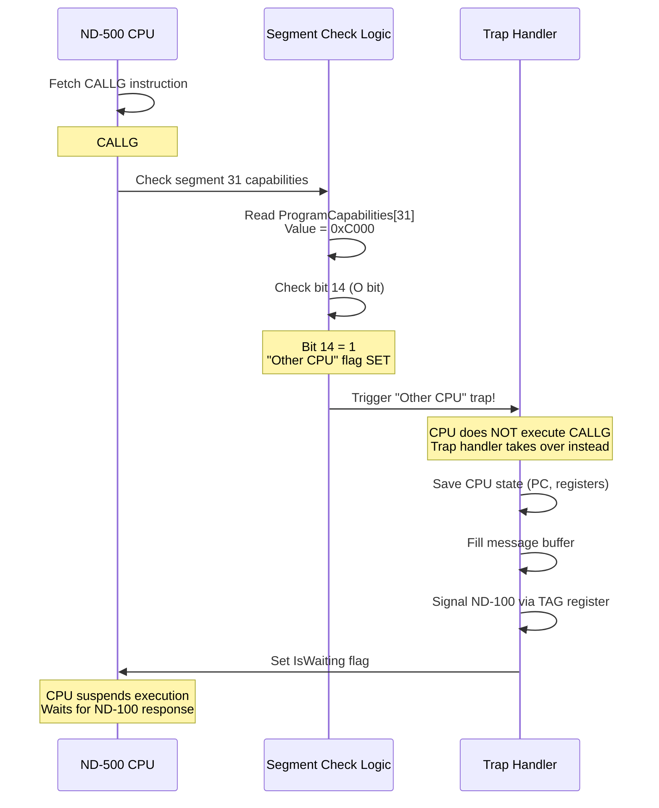
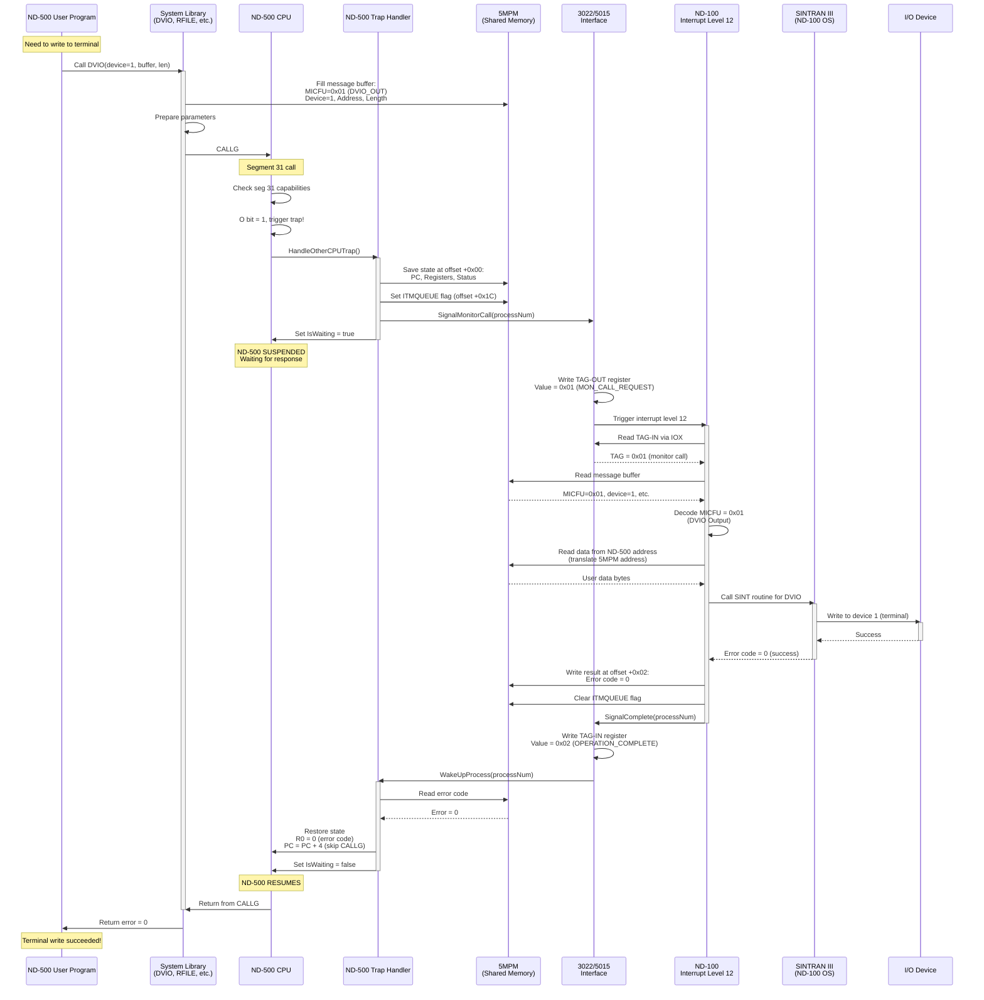
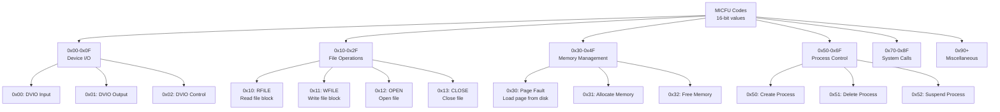
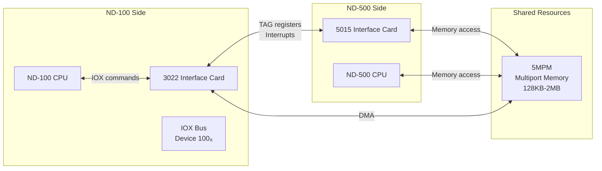

# ND-500 Monitor Call Architecture: Complete Technical Guide

**How ND-500 Programs Invoke ND-100 Monitor Calls via Segment 31**

---

## Table of Contents

1. [Overview: The "Other CPU" Mechanism](#overview-the-other-cpu-mechanism)
2. [Segment 31 and the "Other Machine" Bit](#segment-31-and-the-other-machine-bit)
3. [Complete Monitor Call Flow](#complete-monitor-call-flow)
4. [MICFU Codes: Beyond 8-Bit MON Numbers](#micfu-codes-beyond-8-bit-mon-numbers)
5. [Memory Locations and Disassembly Guide](#memory-locations-and-disassembly-guide)
6. [Message Buffer Structure](#message-buffer-structure)
7. [Hardware: 3022/5015 Interface](#hardware-30225015-interface)
8. [Detailed Examples](#detailed-examples)

---

## Overview: The "Other CPU" Mechanism

### The Problem

The ND-500 is a powerful 32-bit processor designed for computation, but it has **no I/O system** and **no interrupts**. Meanwhile, the ND-100 has a sophisticated I/O system and handles all peripherals (disks, terminals, network, etc.).

**Question:** How does an ND-500 program request I/O operations from the ND-100?

**Answer:** The **Segment 31 "Other CPU" trap mechanism**.

### The Solution Architecture

```mermaid
graph TB
    subgraph "ND-500 User Program"
        USER[User Code<br/>FORTRAN, Pascal, etc.]
    end

    subgraph "ND-500 System Libraries"
        DVIO[DVIO Library<br/>Device I/O Wrapper]
        RFILE[RFILE Library<br/>File Read Wrapper]
        WFILE[WFILE Library<br/>File Write Wrapper]
    end

    subgraph "ND-500 Trap Mechanism"
        SEG31[Segment 31 Trap<br/>"Other CPU" bit=1]
        TRAP[Trap Handler<br/>Saves CPU State]
    end

    subgraph "5MPM (Shared Memory)"
        BUFFER[Message Buffer<br/>Process Communication<br/>Parameters & Results]
    end

    subgraph "3022/5015 Interface"
        INTERFACE[Hardware Interface<br/>TAG Registers<br/>Interrupt Signaling]
    end

    subgraph "ND-100 Interrupt System"
        INT12[Interrupt Level 12<br/>Monitor Call Handler]
    end

    subgraph "ND-100 Operating System"
        SINTRAN[SINTRAN III<br/>File System, Devices]
        DRIVERS[I/O Drivers<br/>Disk, Terminal, Network]
    end

    USER --> DVIO
    USER --> RFILE
    DVIO --> SEG31
    RFILE --> SEG31

    SEG31 --> TRAP
    TRAP --> BUFFER
    BUFFER --> INTERFACE
    INTERFACE --> INT12
    INT12 --> SINTRAN
    SINTRAN --> DRIVERS
    DRIVERS --> DEVICES[Physical Devices]

    DRIVERS -.Result.-> BUFFER
    BUFFER -.Resume.-> TRAP
    TRAP -.Continue.-> USER
```

---

## Segment 31 and the "Other Machine" Bit

### Segment Descriptor Format

In the ND-500, each of the 32 segments (0-31) has **capabilities** defined in a 16-bit descriptor:

```
Bit 15: I (Indirect bit)
Bit 14: O (Other CPU bit)  ← THIS IS THE KEY!
Bit 13-0: Other protection/addressing bits
```

### What Makes Segment 31 Special

**Segment 31 is reserved for monitor calls to the ND-100.**

When SINTRAN III's ND-500 monitor initializes a process (during PLACE-DOMAIN), it sets:

```
ProgramCapabilities[31] = 0xC000  (binary: 1100 0000 0000 0000)
DataCapabilities[31]    = 0xC000
```

This means:
- **Bit 15 (I) = 1**: Indirect (addresses go through segment table)
- **Bit 14 (O) = 1**: **Other CPU** - TRAP instead of normal execution

### How the Trap is Triggered



### Code Detection Example

```csharp
// In ND-500 CPU execution loop
if (instruction.IsCALLG())
{
    uint targetAddress = instruction.GetTarget();
    byte segment = (byte)((targetAddress >> 24) & 0x1F);  // Top 5 bits

    if (segment == 0x1F)  // Segment 31?
    {
        ushort progCap = _cpu.ProgramCapabilities[31];

        // Check for "Other CPU" bit (bit 14)
        if ((progCap & 0x4000) != 0)
        {
            // TRIGGER TRAP - don't execute CALLG normally!
            _trapHandler.HandleOtherCPUTrap(_cpu, targetAddress);
            return;
        }
    }
}

// Execute CALLG normally for other segments...
```

**Key Point:** The CPU hardware (or emulator) detects the O=1 bit **before** attempting to execute the CALLG. It doesn't try to fetch code from segment 31 - instead, it immediately traps.

---

## Complete Monitor Call Flow

### Full Sequence Diagram



---

## MICFU Codes: Beyond 8-Bit MON Numbers

### The Problem with 8-Bit MON Calls

On the ND-100, monitor calls use the **MON** instruction with an 8-bit immediate operand:

```assembly
MON 45    ; Monitor call number 45 (decimal)
```

This limits ND-100 to **256 different monitor calls** (0-255).

But the ND-500 needs to invoke ND-100 monitor functions, **and** the ND-100 needs to handle ND-500-specific operations (page faults, process management, etc.).

### Solution: MICFU (Monitor Initiated Call Function)

Instead of using MON instruction numbers, the ND-500 uses **MICFU codes** stored in the message buffer.

**MICFU = 16-bit function code** (allows 65,536 different functions!)

### MICFU Code Categories



### Standard MICFU Codes

| MICFU | Function | ND-100 MON Equivalent | Description |
|-------|----------|-----------------------|-------------|
| **0x00** | DVIO_IN | MON 4 (INBT) | Device input |
| **0x01** | DVIO_OUT | MON 5 (OUTBT) | Device output |
| **0x02** | DVIO_CTRL | MON 6 (IOCTL) | Device control |
| **0x10** | RFILE | MON 14 (RFILE) | Read file block |
| **0x11** | WFILE | MON 15 (WFILE) | Write file block |
| **0x12** | OPEN | MON 16 (OPEN) | Open file |
| **0x13** | CLOSE | MON 17 (CLOSE) | Close file |
| **0x14** | DELETE-FILE | MON 20 | Delete file |
| **0x20** | LOAD | MON 19 (LOAD) | Load program |
| **0x21** | DUMP | MON 18 (DUMP) | Dump program |
| **0x30** | PAGE-FAULT | None | ND-500 page fault |
| **0x31** | ALLOCATE-SEGMENT | None | ND-500 specific |
| **0x32** | FREE-SEGMENT | None | ND-500 specific |
| **0x40** | ATTACH-SEGMENT | None | ND-500 specific |
| **0x41** | DETACH-SEGMENT | None | ND-500 specific |
| **0xFF** | UNDEFINED | - | Invalid/test |

### How MICFU is Used

**ND-500 library code:**

```assembly
; Write to terminal (DVIO output)
        LDWS    R0, #1              ; Device 1 (terminal)
        LDAQ    buffer_address      ; Buffer to write
        LDWS    R2, #80             ; 80 bytes

        ; Prepare message buffer in 5MPM
        LDWSA   W1, message_buffer  ; Address of message buffer
        LDWS    R3, #0x0001         ; MICFU = DVIO_OUT
        STWS    [W1+3], R3          ; Store MICFU at offset +3 words
        STWS    [W1+14], R0         ; Device number
        STWS    [W1+15], Q          ; Buffer address (A/Q)
        STWS    [W1+16], A
        STWS    [W1+17], R2         ; Byte count

        ; Trigger monitor call via segment 31
        CALLG   #0x1F000000         ; ← Traps to ND-100

        ; When returns, R0 = error code
        TSTWS   R0
        JMPZ    success
        ; Handle error...
```

**ND-100 interrupt handler:**

```csharp
public void HandleInterrupt(ND100InterruptData data)
{
    // Read MICFU from message buffer (offset +3 words)
    uint messageAddr = GetMessageBufferAddress(processNumber);
    ushort micfu = _mpm.ReadWord(messageAddr + 6);  // +3 words * 2 bytes

    switch (micfu)
    {
        case 0x00:
            HandleDVIO_IN();
            break;
        case 0x01:
            HandleDVIO_OUT();
            break;
        case 0x10:
            HandleRFILE();
            break;
        // ... etc
    }
}
```

**Key Insight:** The MICFU code is **not** part of the CALLG instruction. It's stored in shared memory (5MPM) by the ND-500 library code **before** triggering the trap.

---

## Memory Locations and Disassembly Guide

### Where to Find Monitor Call Code

#### On the ND-500 Side

**System Libraries in ND-500 Memory:**

The monitor call library routines are part of the ND-500 **XMSG** or **MONITOR** domain. Typical locations:

```
Segment:  Varies (loaded by PLACE-DOMAIN)
Offset:   Typically 0x00001000 - 0x00005000

Example DVIO location:
  Segment 5, Offset 0x1200
  Full address: 0x05001200
```

**How to find them:**

1. **Check XMSG/MONITOR domain file:**
   ```
   (DOMAINS)XMSG:DOMAIN
   (DOMAINS)MONITOR:DOMAIN
   ```

2. **Use ND-500 Monitor commands:**
   ```
   N500: LIST-DOMAINS

   DOMAIN    SEGMENT  SIZE   LOADED
   XMSG      5        1234   YES
   MONITOR   6        567    YES
   ```

3. **Look for CALLG instructions:**
   ```
   N500: DISASSEMBLE 05001200,20

   05001200: LDWS    R0, [B+14]    ; Get device number
   05001204: LDAQ    [B+15]        ; Get buffer address
   05001208: LDWS    R2, [B+17]    ; Get byte count
   0500120C: LDWSA   W1, 80000400  ; Message buffer in 5MPM
   05001210: LDWS    R3, #0001     ; MICFU = DVIO_OUT
   05001214: STWS    [W1+3], R3    ; Store MICFU
   05001218: CALLG   #1F000000     ; ← Call segment 31 (TRAP!)
   0500121C: RET                    ; Return to caller
   ```

#### On the ND-100 Side

**Interrupt Handler Location:**

The ND-100 interrupt level 12 handler is part of SINTRAN III kernel:

```
Memory address: Depends on SINTRAN version
Typical range:  0x0400 - 0x0800 (page table 0)

Symbol table entry:
  INT12-HANDLER   0x0512
```

**How to find it:**

1. **Check SINTRAN symbols:**
   ```
   @LIST-SYMBOLS (SYSTEM)SINTRAN-SYMBOLS:SYMB

   INT12-HANDLER    0000512B
   ND500-TRAP       0000534B
   MICFU-DISPATCH   0000556B
   ```

2. **Trace interrupt vector:**
   ```
   ; ND-100 interrupt vector table (low memory)
   Address 0x000C:  0x0512    ; Level 12 handler address
   ```

3. **Disassemble handler:**
   ```
   ND-100 disassembly at 0x0512:

   0512: SAVE  4,L         ; Save registers
   0513: LDA   T,IOX       ; Read IOX register (3022 interface)
   0514: IOXT  100,1       ; Device 100₈ (3022), offset 1 (TAG-IN)
   0515: EXAM  T           ; Check TAG value
   0516: SUB   T,=1        ; Compare to MON_CALL_REQUEST
   0517: SKIP  Z           ; If equal, process monitor call
   0518: JMP   OTHER       ; Else, other interrupt
   0519: ; Read message buffer from 5MPM...
   ```

### Message Buffer Structure in 5MPM

Each ND-500 process has a **message buffer** in the 5MPM (5-port memory):

```
Base address for process N:
  0x400 + (N * 0x100)

Example: Process 2
  Message buffer at: 0x80000600
```

**Buffer Layout (32-bit words):**

```
Offset | Field      | Size    | Description
-------|------------|---------|----------------------------------
+0x00  | PC_SAVED   | 4 bytes | Saved ND-500 PC
+0x04  | R0_SAVED   | 4 bytes | Saved ND-500 R0
+0x08  | R1_SAVED   | 4 bytes | Saved ND-500 R1
...    | ...        | ...     | Other saved registers
+0x18  | MICFU      | 2 bytes | Monitor function code
+0x1A  | RESULT     | 2 bytes | Error code from ND-100
+0x1C  | ITMQUEUE   | 2 bytes | Flag: 1=pending, 0=complete
+0x1E  | PARAM1     | 4 bytes | First parameter (varies)
+0x22  | PARAM2     | 4 bytes | Second parameter
+0x26  | PARAM3     | 4 bytes | Third parameter
...    | ...        | ...     | More parameters
```

**Example: DVIO_OUT message buffer:**

```
Offset | Field        | Value        | Meaning
-------|--------------|--------------|----------------------------
+0x18  | MICFU        | 0x0001       | DVIO_OUT
+0x1E  | DEVICE       | 0x0001       | Device 1 (terminal)
+0x22  | BUFFER_ADDR  | 0x80001000   | ND-500 buffer address
+0x26  | BYTE_COUNT   | 0x00000050   | 80 bytes (0x50)
+0x1C  | ITMQUEUE     | 0x0001       | Call pending
```

**After ND-100 completes:**

```
Offset | Field        | Value        | Meaning
-------|--------------|--------------|----------------------------
+0x1A  | RESULT       | 0x0000       | Success (error code 0)
+0x1C  | ITMQUEUE     | 0x0000       | Call complete
```

---

## Hardware: 3022/5015 Interface

### Physical Components



### TAG Registers (Inter-CPU Communication)

The 3022/5015 interface uses **TAG registers** for signaling between CPUs:

**TAG-OUT (ND-500 → ND-100):**
- Written by ND-500 trap handler
- Read by ND-100 via IOX

**TAG-IN (ND-100 → ND-500):**
- Written by ND-100 via IOX
- Read by ND-500 trap handler

**TAG Values:**

| Value | Name | Direction | Meaning |
|-------|------|-----------|---------|
| 0x00 | IDLE | - | No communication |
| 0x01 | MON_CALL_REQUEST | 500→100 | ND-500 needs monitor call |
| 0x02 | OPERATION_COMPLETE | 100→500 | ND-100 finished operation |
| 0x03 | PAGE_FAULT | 500→100 | ND-500 page fault |
| 0x04 | ERROR | 100→500 | ND-100 error occurred |

**Access via IOX (ND-100):**

```assembly
; ND-100 code to read TAG-IN
IOXT    100,1          ; Device 100₈, offset 1 = TAG-IN
LDA     T              ; Result in A register

; ND-100 code to write TAG-OUT
LDA     2              ; Value 2 = OPERATION_COMPLETE
IOXT    100,2          ; Device 100₈, offset 2 = TAG-OUT
```

### IOX Offsets for 3022 Interface

| Offset | Name | Direction | Purpose |
|--------|------|-----------|---------|
| 0 | STATUS | Read | Interface status bits |
| 1 | TAG-IN | Read | TAG from ND-500 |
| 2 | TAG-OUT | Write | TAG to ND-500 |
| 3 | CONTROL | Write | Control register |
| 4 | MAR-LOW | R/W | Memory Address Register (low) |
| 5 | MAR-HIGH | R/W | Memory Address Register (high) |
| 6 | DATA | R/W | Memory data transfer |

---

## Detailed Examples

### Example 1: DVIO Output (Write to Terminal)

**ND-500 User Program (FORTRAN):**

```fortran
      PROGRAM HELLO
      CHARACTER*13 MSG
      INTEGER DEVICE, IERR

      MSG = 'HELLO, WORLD!'
      DEVICE = 1

      CALL DVIO(DEVICE, MSG, 13, IERR)

      IF (IERR .NE. 0) THEN
          WRITE(*,*) 'ERROR:', IERR
      END IF
      END
```

**Compiled to ND-500 Assembly:**

```assembly
; Allocate stack space
ENTB    4               ; Allocate 16-word block

; Store message
LDWC    [B+3], 'HE'     ; 'H', 'E'
LDWC    [B+4], 'LL'     ; 'L', 'L'
LDWC    [B+5], 'O,'     ; 'O', ','
; ... etc ...

; Prepare parameters
LDWS    R0, #1          ; Device = 1 (terminal)
LDAA    [B+3]           ; Address of MSG
LDWS    R2, #13         ; Length = 13

; Call DVIO library
CALLG   DVIO            ; Call DVIO routine (segment 5)

; DVIO library code
DVIO:
    ; Get current process number
    LDWS    W1, PROC_NUM
    ; Calculate message buffer address
    SHLWS   W1, #8          ; * 256
    ADDWS   W1, #0x400      ; + base offset
    LDWSA   W2, 0x80000000  ; 5MPM base
    ADDWS   W2, W1          ; Message buffer address in W2

    ; Fill message buffer
    LDWS    R3, #0x0001     ; MICFU = DVIO_OUT
    STWS    [W2+3], R3      ; Store MICFU
    STWS    [W2+14], R0     ; Device number
    STAQ    [W2+15]         ; Buffer address (A/Q)
    STWS    [W2+17], R2     ; Byte count

    ; Set ITMQUEUE flag
    LDWS    R3, #1
    STWS    [W2+14], R3     ; ITMQUEUE = 1 (pending)

    ; CRITICAL: Call segment 31 to trigger trap
    CALLG   #0x1F000000     ; ← TRAPS HERE!

    ; When execution resumes, R0 = error code
    RET                      ; Return to user program
```

**What Happens:**

1. CPU detects CALLG to segment 31
2. Checks ProgramCapabilities[31] = 0xC000 (O bit set)
3. Triggers trap instead of executing CALLG
4. Trap handler takes over...

**Trap Handler (ND-500):**

```csharp
public void HandleOtherCPUTrap(ND500CPU cpu, uint targetAddress)
{
    uint processNum = cpu.CurrentProcess;
    uint messageAddr = 0x80000400 + (processNum * 0x100);

    // Save CPU state to message buffer
    _mpm.WriteDoubleWord(messageAddr + 0x00, cpu.PC);
    _mpm.WriteDoubleWord(messageAddr + 0x04, cpu.Registers[0]);
    // ... save other registers ...

    // MICFU already written by library code
    ushort micfu = _mpm.ReadWord(messageAddr + 0x18);
    Console.WriteLine($"[TRAP] MICFU = 0x{micfu:X4}");

    // Signal ND-100 via TAG register
    _interface.SignalND100MonitorCall(processNum);

    // Suspend ND-500 execution
    cpu.IsWaiting = true;
    Console.WriteLine($"[TRAP] Process {processNum} waiting for ND-100");
}
```

**3022/5015 Interface:**

```csharp
public void SignalND100MonitorCall(byte processNumber)
{
    // Write TAG-OUT register
    _tagOut = 0x01;  // MON_CALL_REQUEST

    Console.WriteLine($"[5015] Signaling ND-100 for process {processNumber}");

    // Trigger ND-100 interrupt level 12
    _nd100.QueueInterrupt(12, processNumber);
}
```

**ND-100 Interrupt Handler:**

```csharp
public void HandleInterrupt(ND100InterruptData data)
{
    byte processNum = data.ProcessNumber;
    uint messageAddr = 0x00040400 + (processNum * 0x100);  // ND-100 sees 5MPM here

    // Read TAG-IN via IOX
    ushort tag = _interface.ReadTAG_IN();
    if (tag != 0x01)  // MON_CALL_REQUEST
    {
        Console.WriteLine($"[INT12] Unexpected TAG: 0x{tag:X4}");
        return;
    }

    // Read MICFU from message buffer
    ushort micfu = _mpm.ReadWord(messageAddr + 0x18);

    Console.WriteLine($"[INT12] MICFU = 0x{micfu:X4}");

    // Dispatch to handler
    switch (micfu)
    {
        case 0x0001:  // DVIO_OUT
            HandleDVIO_OUT(messageAddr);
            break;
        // ... other cases ...
    }
}

private void HandleDVIO_OUT(uint messageAddr)
{
    // Read parameters from message buffer
    ushort device = _mpm.ReadWord(messageAddr + 0x1E);
    uint bufferAddr = _mpm.ReadDoubleWord(messageAddr + 0x22);
    ushort byteCount = _mpm.ReadWord(messageAddr + 0x26);

    Console.WriteLine($"[DVIO_OUT] Device={device}, Buffer=0x{bufferAddr:X8}, Bytes={byteCount}");

    // Read data from ND-500 buffer
    byte[] data = new byte[byteCount];
    for (int i = 0; i < byteCount; i++)
    {
        data[i] = _mpm.ReadByte(bufferAddr + (uint)i);
    }

    // Write to actual device (simulated terminal)
    _deviceManager.Write(device, data);

    // Write success result
    _mpm.WriteWord(messageAddr + 0x1A, 0);  // Error code = 0 (success)

    // Clear ITMQUEUE flag
    _mpm.WriteWord(messageAddr + 0x1C, 0);

    // Signal completion
    _interface.SignalOperationComplete();
}
```

**Interface Signals Completion:**

```csharp
public void SignalOperationComplete()
{
    // Write TAG-IN register
    _tagIn = 0x02;  // OPERATION_COMPLETE

    Console.WriteLine($"[3022] Signaling operation complete");

    // Wake up ND-500 process
    _trapHandler.ResumeAfterMonitorCall(_nd500.CurrentProcess);
}
```

**Trap Handler Resumes ND-500:**

```csharp
public void ResumeAfterMonitorCall(byte processNumber)
{
    uint messageAddr = 0x80000400 + (processNumber * 0x100);

    // Restore CPU state
    _nd500.PC = _mpm.ReadDoubleWord(messageAddr + 0x00);
    _nd500.Registers[0] = _mpm.ReadDoubleWord(messageAddr + 0x04);
    // ... restore other registers ...

    // Read error code from message buffer
    ushort errorCode = _mpm.ReadWord(messageAddr + 0x1A);
    _nd500.Registers[0] = errorCode;  // Return in R0

    // Advance PC past CALLG instruction (4 bytes)
    _nd500.PC += 4;

    // Resume execution
    _nd500.IsWaiting = false;

    Console.WriteLine($"[TRAP] Process {processNumber} resumed at PC=0x{_nd500.PC:X8}");
}
```

**ND-500 Resumes:**

```assembly
    CALLG   #0x1F000000     ; ← Returns here with R0 = error code
    RET                      ; Return to user program
```

**User Program Gets Result:**

```fortran
      CALL DVIO(DEVICE, MSG, 13, IERR)
      ! IERR = 0 (success)
```

**Output on terminal:**

```
HELLO, WORLD!
```

---

## Summary

### Key Takeaways

1. **Segment 31 is NOT executed** - it triggers a trap when the O bit is set
2. **The "Other CPU" bit** (bit 14 in capabilities) is what makes the trap happen
3. **MICFU codes** replace MON instruction numbers, allowing 16-bit function codes
4. **Message buffer in 5MPM** holds all parameters and results
5. **TAG registers** coordinate between ND-100 and ND-500
6. **ND-500 suspends** during monitor call, waiting for ND-100 to complete

### To Find MON Call Implementations

**On ND-500:**
- Check XMSG/MONITOR domain files
- Disassemble from domain load address
- Look for CALLG #0x1F000000 instructions

**On ND-100:**
- Check SINTRAN symbol table (INT12-HANDLER)
- Trace interrupt vector at address 0x000C
- Disassemble from interrupt handler address

**In 5MPM:**
- Message buffer at 0x400 + (process * 0x100)
- MICFU at offset +0x18 (word 3)
- Parameters at offsets +0x1E onwards

---

**Document Version:** 1.0
**Date:** 2025-11-18
**Purpose:** Technical documentation of ND-500 to ND-100 monitor call architecture

**Related Documents:**
- INTEGRATION-GUIDE-SEGMENT31.md (Implementation guide)
- ND500-ENTB-IMPLEMENTATION-GUIDE.md (ENTB instruction)
- SINTRAN-Deep-Dive-Guide.md (System architecture)
