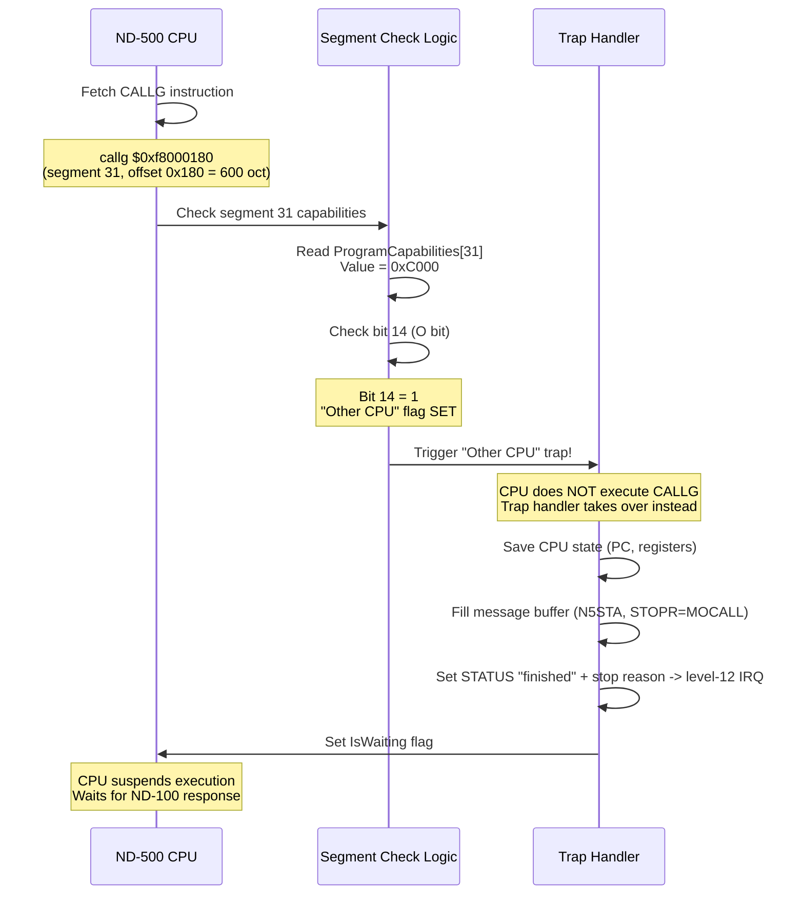
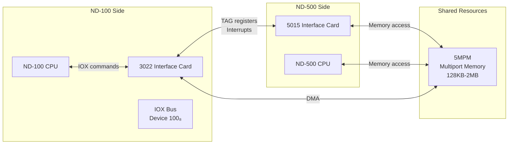

# ND-500 Monitor Call Architecture: Complete Technical Guide

> ## ⚠ CORRECTION 2026-07-20 — the TAG-value table in this file is FABRICATED
>
> **The table around lines 580-610 (`0x01 MON_CALL_REQUEST`, …) is not real**, and the IOX offset
> table beside it contradicts the verified codes. Debunked in
> `SINTRAN\ND500\ND500-BUS-INTERFACE-REFERENCE.md` §10.3: the TAG field is **4 bits**, and the
> value cited as a message type is the **DIEN strobe**. There is no high-level TAG protocol —
> monitor calls do **not** travel as TAG codes.
>
> **What actually happens** (vendor: `ND500UC\manuals\ND-05.012.01 ND-500 Micro Program Guide.md`
> §13, lines 1090-1400; `ND-30.013.02 Test Micro Program Descriptions` §3.12-3.14):
>
> - A monitor call is a **`callg` through a segment-31 capability** carrying `PC_IND|PC_OMC`. The
>   microcode's trap decoder routes it (trap code 6 → `CALL_MON`), builds the stop record **in the
>   process's own message in shared memory**, and answers it. Cross-confirmed from the NDIX kernel
>   side: `callg $0xf8000180,$4,…` — segment 31, offset `0x180` = **600 octal**.
> - The wire-level TAG lines are **register strobes only**. TAG-OUT: `0/1` MAR, `2/3` STATUS,
>   `4` read CONTROL, `5` reset activate, `6/7` DATA register (the RIOM/WIOM DMA into ND-100
>   memory). TAG-IN: clock/enable strobes for the control-store-load and debug path.
> - Verified ND-100-side IOX octal codes: RMAR `060`, LMAR `061`, RSTA `062`, LCON `065`,
>   MCLR `066`, TERM `067`, RTAG `070`, WTAG `071`, WDAT `073`, SLOC `074`, CLKD `075`,
>   UNLC `076`, RETG `077`.
> - Message-status lifecycle (vendor-anchored, matches the byte-verified model): `0` free,
>   `1` message-to-ND-500, `2` in-process, `3` answer, `4` error.
>
> Authoritative replacements: `SINTRAN\ND500\ND500-BUS-INTERFACE-REFERENCE.md`,
> `SINTRAN\ND500\ND500-MONITOR-CALL-MECHANISM.md`, and
> `E:\Dev\Ronny\ND5000UC\microcode\MAILBOX-MICROCODE-PSEUDOCODE.md` §3.8 for the decoded
> `CALL_MON` path.

**How ND-500 Programs Invoke ND-100 Monitor Calls via Segment 31**

> **Scope: classic ND-500 only.** Everything below describes the **classic ND-500**
> generation — an ND-500 CPU with a 5015 interface card, talking to an ND-100 through a
> 3022 card and 5MPM shared memory. The **ND-5000 (SAMSON)** uses an entirely different
> transport (octobus / ACCP, no 3022, no 5015). The message layout and the monitor call
> concept carry over; the signalling, the register set and the IOX codes in this document
> do **not**. Do not read this file as ND-5000 documentation.

---

## Table of Contents

1. [Overview: The "Other CPU" Mechanism](#overview-the-other-cpu-mechanism)
2. [Segment 31 and the "Other Machine" Bit](#segment-31-and-the-other-machine-bit)
3. [Complete Monitor Call Flow](#complete-monitor-call-flow)
4. [MICFU and MCNO: Who Says What, and In Which Direction](#micfu-and-mcno-who-says-what-and-in-which-direction)
5. [Memory Locations and Disassembly Guide](#memory-locations-and-disassembly-guide)
6. [Message Buffer Structure](#message-buffer-structure)
7. [Hardware: 3022/5015 Interface](#hardware-30225015-interface)
8. [Detailed Examples](#detailed-examples)

---

## Overview: The "Other CPU" Mechanism

### The Problem

The ND-500 is a powerful 32-bit processor designed for computation, but it has **no I/O system** and **no interrupts**. Meanwhile, the ND-100 has a sophisticated I/O system and handles all peripherals (disks, terminals, network, etc.).

**Question:** How does an ND-500 program request I/O operations from the ND-100?

**Answer:** The **Segment 31 "Other CPU" trap mechanism**.

### The Solution Architecture

```mermaid
graph TB
    subgraph "ND-500 User Program"
        USER[User Code<br/>FORTRAN, Pascal, etc.]
    end

    subgraph "ND-500 System Libraries"
        DVIO[DVIO Library<br/>Device I/O Wrapper]
        RFILE[RFILE Library<br/>File Read Wrapper]
        WFILE[WFILE Library<br/>File Write Wrapper]
    end

    subgraph "ND-500 Trap Mechanism"
        SEG31[Segment 31 Trap<br/>"Other CPU" bit=1]
        TRAP[Trap Handler<br/>Saves CPU State]
    end

    subgraph "5MPM (Shared Memory)"
        BUFFER[Message Buffer<br/>Process Communication<br/>Parameters & Results]
    end

    subgraph "3022/5015 Interface"
        INTERFACE[Hardware Interface<br/>STATUS / CONTROL / MAR / DATA<br/>activate + level-12 interrupt]
    end

    subgraph "ND-100 Interrupt System"
        INT12[Interrupt Level 12<br/>Monitor Call Handler]
    end

    subgraph "ND-100 Operating System"
        SINTRAN[SINTRAN III<br/>File System, Devices]
        DRIVERS[I/O Drivers<br/>Disk, Terminal, Network]
    end

    USER --> DVIO
    USER --> RFILE
    DVIO --> SEG31
    RFILE --> SEG31

    SEG31 --> TRAP
    TRAP --> BUFFER
    BUFFER --> INTERFACE
    INTERFACE --> INT12
    INT12 --> SINTRAN
    SINTRAN --> DRIVERS
    DRIVERS --> DEVICES[Physical Devices]

    DRIVERS -.Result.-> BUFFER
    BUFFER -.Resume.-> TRAP
    TRAP -.Continue.-> USER
```

---

## Segment 31 and the "Other Machine" Bit

### Segment Descriptor Format

In the ND-500, each of the 32 segments (0-31) has **capabilities** defined in a 16-bit descriptor:

```
Bit 15: I (Indirect bit)
Bit 14: O (Other CPU bit)  ← THIS IS THE KEY!
Bit 13-0: Other protection/addressing bits
```

### What Makes Segment 31 Special

**Segment 31 is reserved for monitor calls to the ND-100.**

When SINTRAN III's ND-500 monitor initializes a process (during PLACE-DOMAIN), it sets:

```
ProgramCapabilities[31] = 0xC000  (binary: 1100 0000 0000 0000)
DataCapabilities[31]    = 0xC000
```

This means:
- **Bit 15 (I) = 1**: Indirect (addresses go through segment table)
- **Bit 14 (O) = 1**: **Other CPU** - TRAP instead of normal execution

### How the Trap is Triggered


```mermaid
sequenceDiagram
    participant CPU as ND-500 CPU
    participant SEG as Segment Check Logic
    participant TRAP as Trap Handler

    CPU->>CPU: Fetch CALLG instruction
    Note over CPU: callg $0xf8000180<br/>(segment 31, offset 0x180 = 600 oct)

    CPU->>SEG: Check segment 31 capabilities
    SEG->>SEG: Read ProgramCapabilities[31]<br/>Value = 0xC000

    SEG->>SEG: Check bit 14 (O bit)
    Note over SEG: Bit 14 = 1<br/>"Other CPU" flag SET

    SEG->>TRAP: Trigger "Other CPU" trap!
    Note over TRAP: CPU does NOT execute CALLG<br/>Trap handler takes over instead

    TRAP->>TRAP: Save CPU state (PC, registers)
    TRAP->>TRAP: Fill message buffer (N5STA, STOPR=MOCALL)
    TRAP->>TRAP: Set STATUS "finished" + stop reason -> level-12 IRQ
    TRAP->>CPU: Set IsWaiting flag
    Note over CPU: CPU suspends execution<br/>Waits for ND-100 response
```

### Code Detection Example

```csharp
// In ND-500 CPU execution loop
if (instruction.IsCALLG())
{
    uint targetAddress = instruction.GetTarget();
    // Segment number is the top 5 bits of the 32-bit address: 0xf8000180 -> 31.
    byte segment = (byte)((targetAddress >> 27) & 0x1F);

    if (segment == 0x1F)  // Segment 31?
    {
        ushort progCap = _cpu.ProgramCapabilities[31];

        // Check for the "other machine" capability (PC_OMC)
        if ((progCap & 0x4000) != 0)
        {
            // Raise the instruction-fetch/protect trap. The trap decoder then routes
            // trap code 6 to CALL_MON - the CALLG itself is never performed.
            _trapHandler.RaiseInstructionFetchTrap(_cpu, targetAddress);
            return;
        }
    }
}

// Execute CALLG normally for other segments...
```

> **Note on the address encoding (corrected 2026-07-20).** The shift used to be `>> 24`,
> which pairs with the literal `#0x1F000000` that this document used elsewhere. That
> encoding does not match the only cross-confirmed real call we have — the NDIX kernel's
> `callg $0xf8000180,$4,…`, where segment 31 sits in bits 31-27. The shift has been
> corrected to `>> 27` and the `0x1F000000` literals replaced accordingly.

**Key Point:** The CPU detects the capability **before** attempting to execute the CALLG. It doesn't try to fetch code from segment 31 - instead, it immediately traps.

---

## Complete Monitor Call Flow

### Full Sequence Diagram

```mermaid
sequenceDiagram
    participant USER as ND-500 User Program
    participant LIB as System Library<br/>(DVIO, RFILE, etc.)
    participant CPU500 as ND-500 CPU
    participant TRAP as ND-500 Trap Handler
    participant MPM as 5MPM<br/>(Shared Memory)
    participant IF as 3022/5015<br/>Interface
    participant INT as ND-100<br/>Interrupt Level 12
    participant SINT as SINTRAN III<br/>(ND-100 OS)
    participant DEV as I/O Device

    Note over USER: Need to write to terminal

    USER->>LIB: Call DVIO(device=1, buffer, len)
    activate LIB

    LIB->>LIB: Marshal parameters into the<br/>CALLG argument list

    LIB->>CPU500: callg $0xf8000180, $4, args...
    Note over CPU500: Segment 31, offset 0x180<br/>= 600 octal

    CPU500->>CPU500: Check seg 31 capabilities
    CPU500->>CPU500: PC_IND|PC_OMC set -> trap!

    CPU500->>TRAP: Trap decoder: code 6 -> CALL_MON
    activate TRAP

    TRAP->>MPM: N500A (+7)  := saved P
    TRAP->>MPM: STOPR (+11) := MOCALL<br/>MCNO (+13) := low halfword of<br/>the CALLG target (600 oct)
    TRAP->>MPM: NUMPA (+12) := argc;<br/>copy args into ADDRESS slots (+40+2k)<br/>and VALUE slots (+100+2k)
    TRAP->>MPM: N5STA (+2) := 3 (ANSWER)
    TRAP->>CPU500: Microcode enters IDLE loop
    deactivate TRAP

    Note over CPU500: ND-500 in IDLE loop<br/>Only an activate or a terminate<br/>can bring it out

    IF->>IF: STATUS "finished" (bit 3)<br/>+ stop reason (bits 10-14)
    IF->>INT: Trigger interrupt level 12<br/>(ident 16 oct, gated by CONTROL bit 0)
    activate INT

    INT->>IF: Read STATUS via IOX (RSTA5)
    INT->>MPM: Walk message queue from MAILINK,<br/>check N5STA=3 / STOPR=MOCALL

    INT->>MPM: Read message buffer
    MPM-->>INT: MCNO, NUMPA, parameter slots

    INT->>INT: MCHANDLE: dispatch on MCNO<br/>(e.g. 600 oct)

    INT->>MPM: Read the caller's data<br/>via the parameter addresses
    MPM-->>INT: User data bytes

    INT->>SINT: Call SINT routine for DVIO
    activate SINT
    SINT->>DEV: Write to device 1 (terminal)
    activate DEV
    DEV-->>SINT: Success
    deactivate DEV
    SINT-->>INT: Error code = 0 (success)
    deactivate SINT

    INT->>MPM: Write FUNCV (function value / result)
    INT->>MPM: N5STA := 1 (MSGN500),<br/>MICFU := 24 oct (3MONCO)
    INT->>IF: XACT500: activate via LCON5<br/>(CONTROL bit 2)
    deactivate INT

    IF->>TRAP: Activate wakes the microcode<br/>out of the IDLE loop
    activate TRAP

    TRAP->>MPM: Read MICFU = 3MONCO<br/>-> "restart after monitor call"
    MPM-->>TRAP: FUNCV = 0

    TRAP->>CPU500: Resume the process at the<br/>instruction after the CALLG,<br/>FUNCV delivered as the result
    deactivate TRAP

    Note over CPU500: ND-500 RESUMES

    CPU500->>LIB: Return from CALLG
    deactivate LIB

    LIB->>USER: Return error = 0
    Note over USER: Terminal write succeeded!
```

---

## MICFU and MCNO: Who Says What, and In Which Direction

> **CORRECTION 2026-07-20.** This section used to claim that MICFU was a 16-bit
> "monitor call function" written by the ND-500 library before the trap, and it listed a
> table of values (`0x00 DVIO_IN`, `0x01 DVIO_OUT`, `0x10 RFILE`, `0x30 PAGE-FAULT`, …)
> together with a category tree and two code samples built on it. **All of that was
> invented.** MICFU is an ND-100 → ND-500 *command* code with a small set of verified
> octal values, and it is never what carries a monitor call. The monitor call number
> lives in **MCNO**, written by the microcode. Authoritative table:
> `SINTRAN\ND500\ND500-BUS-INTERFACE-REFERENCE.md` §6.4 (and §6.2 for the message layout).

### The two fields, and their directions

Both live in the same message in 5MPM, but they travel opposite ways:

| Field | Offset (oct) | Written by | Meaning |
|---|---|---|---|
| **MICFU** | 6 | **ND-100** | *Command* to the ND-500: "start this process", "restart after monitor call", "read your microprogram version", … |
| **MCNO** | 13 | **ND-500 microcode** | The monitor call number the macro-program asked for |
| **FUNCV** | 13 | **ND-100** | The function value handed back when the call is answered |

So a monitor call is *not* expressed as a MICFU. It is expressed as a `callg` into
segment 31, and the microcode's trap decoder (trap code 6 → `CALL_MON`) records the
low halfword of the CALLG target as MCNO. MICFU only appears afterwards, when the
ND-100 has finished the work and commands the ND-500 to carry on.

### Verified MICFU command codes

Values verified in the SINTRAN L07 + M06 symbol tables (reference §6.4). Octal:

| Value (oct) | Symbol | Meaning |
|---|---|---|
| 1 | 3RMICV | Read microprogram version (the watchdog message) |
| 5 | 3SWMESS | Message to the swapper (carries its own SWFUN field) |
| 23 | 3START | Start process |
| **24** | **3MONCO** | **Restart after monitor call** — the one that ends the flow above |
| 25 | 3TRACO | Trap continue |
| 26 | 3WMONCO | Wait monitor call |
| 27 | 3FITRNSF | File transfer |
| 44 | 3RPREG | Read P register (histogram message) |

There is no "0x00-0x0F device I/O / 0x10-0x2F file operations" range. Anything you may
have read elsewhere in that shape came from the fabricated model.

### Where the monitor call number actually comes from

The number is part of the call target, not of any pre-loaded message field. From the
NDIX kernel side a monitor call looks like:

```
callg   $0xf8000180, $4, ...      ; segment 31, offset 0x180 = 600 octal
```

`0xf8……` selects segment 31; the offset `0x180` is the monitor call number, and the
microcode copies it into MCNO. The `$4` is the argument count, which the microcode
records in NUMPA before copying the arguments into the message's parameter slots.

**Key Insight:** the ND-500 program does **not** hand-build a message before trapping.
It just makes a normal `callg`; the microcode builds the whole stop record for it.

### On 8-bit MON numbers

The old text framed MICFU as a workaround for the ND-100's 8-bit `MON` operand. That
framing does not survive: the ND-500's monitor call number is a segment-31 *offset*, so
it is naturally wider than 8 bits without needing any separate function-code scheme.

---

## Memory Locations and Disassembly Guide

### Where to Find Monitor Call Code

#### On the ND-500 Side

**System Libraries in ND-500 Memory:**

The monitor call library routines are part of the ND-500 **XMSG** or **MONITOR** domain. Typical locations:

```
Segment:  Varies (loaded by PLACE-DOMAIN)
Offset:   Typically 0x00001000 - 0x00005000

Example DVIO location:
  Segment 5, Offset 0x1200
  Full address: 0x05001200
```

**How to find them:**

1. **Check XMSG/MONITOR domain file:**
   ```
   (DOMAINS)XMSG:DOMAIN
   (DOMAINS)MONITOR:DOMAIN
   ```

2. **Use ND-500 Monitor commands:**
   ```
   N500: LIST-DOMAINS

   DOMAIN    SEGMENT  SIZE   LOADED
   XMSG      5        1234   YES
   MONITOR   6        567    YES
   ```

3. **Look for CALLG instructions targeting segment 31.**

   (The worked disassembly that used to sit here — a library routine loading a 5MPM
   message address and storing a MICFU before the call — was invented, and has been
   removed. No such code exists: the library does not touch the message.)

   What you are actually looking for is a `callg` whose target has the top five address
   bits equal to 31, with the monitor call number in the low halfword, e.g.
   `callg $0xf8000180, $4, …` (segment 31, offset `0x180` = 600 octal). Everything after
   that instruction happens in microcode, not in visible ND-500 code.

#### On the ND-100 Side

**Interrupt Handler Location:**

The ND-100 interrupt level 12 handler is part of SINTRAN III kernel:

The handler reached from the level-12 ident is **5STDRIV**, in the SINTRAN source
`MP-P2-N500.NPL` (lines 656-694). The addresses that used to be printed here
(`INT12-HANDLER 0x0512`, `ND500-TRAP`, `MICFU-DISPATCH`) were invented and have been
removed — those symbols do not exist in the SINTRAN symbol table.

**How to find it:**

1. **Look up the real symbols.** The names that do exist are `5STDRIV` (the level-12
   driver), `CLE5STATUS` (read + clear STATUS), `CHN5STATUS` (dispatch on N5STA),
   `DECOMESS` (dispatch on MICFU/STOPR), `MCHANDLE` (monitor call handler) and
   `XACT500` (hand the ND-500 its next work and activate it). Their addresses depend on
   the SINTRAN version you carved; resolve them from that image's symbol table rather
   than from any number quoted in a document.

2. **Follow the ident, not a vector table.** The ND-100 has no level-12 vector slot in
   low memory (the `Address 0x000C` entry printed here before was invented). On an
   interrupt the level-12 code executes `IDENT PL12`; the 3022 answers with its ident
   code — **16 octal** for thumbwheel setting 0 — and SINTRAN's ident dispatch table
   routes that code to `5STDRIV`.

3. **Real handler flow** (the former invented disassembly checking a "TAG value"
   has been removed — the driver never reads TAG registers):
   ```
   5STDRIV (NPL:MP-P2-N500.NPL:656-694), entered from the level-12 ident:

   1. CALL CLE5STATUS            % read RSTA5 (STATUS), clear latched power bits
   2. status /\ 720 >< 0 ?      % 5PAGF/5DMAER/5PFAIL/5POWOF error paths
   3. Scan execution queue from MAILINK, following LINK fields (via 5MBBANK)
   4. CHN5STATUS per message     % dispatch on N5STA
   5. DECOMESS on answers        % dispatch on STOPR (MOCALL -> MCHANDLE)
   6. CALL XACT500; WT12         % give ND-500 next work, wait for next IRQ
   ```

### Message Buffer Structure in 5MPM

Each ND-500 process has a **message** in shared memory. (The former layout here —
"base 0x400 + N*0x100", PC_SAVED/ITMQUEUE fields — was invented and has been
replaced by the verified layout.)

**Verified message layout** (ND-100 halfword offsets, octal; symbol-table +
carve-verified — see `SINTRAN\ND500\ND500-BUS-INTERFACE-REFERENCE.md` §6.2, and
vendor ND-05.012.01 §13.1 for the 6-word header):

```
Offset | Field  | Description
-------|--------|-------------------------------------------------
0      | LINK   | word: next message in chain (-1 = end)
2      | N5STA  | status: 0 free, 1 MSGN500, 2 WAITING, 3 ANSWER, 4 5ERANSWER
4      | X5CPU  | CPU number
6      | MICFU  | micro function code (see reference 6.4)
7      | N500A  | saved P register
11     | STOPR  | stop reason (MOCALL/5FMOCALL/TRAPCODE/...)
12     | NUMPA  | number of parameters
13     | MCNO / FUNCV | monitor call number / function value
16     | TRAPN  | trap number
17-30  | trap record
40+2k  | parameter ADDRESSES (16 slots)
100+2k | parameter VALUES, 32-bit (16 slots)
140    | ABUFA  | buffer pointer
```

Status lifecycle: 1 MSGN500 -> 2 WAITING (set by microcode at start of handling)
-> 3 ANSWER or 4 5ERANSWER (set by microcode when finished). Vendor statement:
ND-05.012.01 §13.1 ("Status of the block").

---

## Hardware: 3022/5015 Interface

### Physical Components


```mermaid
graph LR
    subgraph "ND-100 Side"
        ND100[ND-100 CPU]
        CARD3022[3022 Interface Card]
        IOX[IOX Bus<br/>Device 100₈]
    end

    subgraph "ND-500 Side"
        CARD5015[5015 Interface Card]
        ND500[ND-500 CPU]
    end

    subgraph "Shared Resources"
        MPM[5MPM<br/>Multiport Memory<br/>128KB-2MB]
    end

    ND100 <-->|IOX commands| CARD3022
    CARD3022 <-->|TAG registers<br/>Interrupts| CARD5015
    CARD5015 <-->|Memory access| MPM
    ND500 <-->|Memory access| MPM
    CARD3022 <-->|DMA| MPM
```

### TAG Registers (CORRECTED — register strobes, not inter-CPU messaging)

**The former "TAG Values" table (0x01 MON_CALL_REQUEST etc.) was fabricated and has
been removed.** Both TAG registers are on the 5015 (ND-30.013.02 §3.12/3.13):

- **TAG-IN (ND-100 → 5015):** 4-bit strobe codes that clock/enable individual 5015
  registers (DICLK1/2, DUCLK, WACLK, BRKCLK, TGCLK, CNTCLK, DIEN, DUEN, WAR, BRKR,
  CNTR, RESBRK, DUNL, EOUTEN). Used by the control-store loader and test programs;
  never by the runtime driver.
- **TAG-OUT (5015 → 3022, driven by ND-500 microcode):** 3-bit codes commanding the
  3022 — read/write MAR, read/write STATUS, read CONTROL, reset activate, and
  read/write DATA **and ND-100 memory** (the microcode's message-fetch/answer DMA
  path, also underlying the RIOM/WIOM instructions).

**Real inter-CPU signaling:** ND-100 → ND-500 = activate (CONTROL bit 2, LCON5);
ND-500 → ND-100 = STATUS "finished" (bit 3) + stop reason (bits 10-14) raising the
level-12 interrupt when CONTROL bit 0 is set.

### IOX Offsets for 3022 Interface (verified, OCTAL — see reference §3.2 for the
four-mode decode; the former table here was wrong)

| Offset (oct) | Mnemonic | Purpose (unlocked, not test mode) |
|---|---|---|
| 0 | RMAR5 | Read memory address register |
| 1 | LMAR5 | Load memory address register |
| 2 | RSTA5 | Read STATUS register |
| 5 | LCON5 | Load CONTROL register (bit 2 = activate) |
| 6 | MCLR5 | ND-500 master clear |
| 7 | TERM5 | Terminate |
| 10 | RTAG5 | Read TAG (readback) |
| 11 | LTAG5/WTAG | Write 5015 TAG-IN strobe |
| 13 | WDAT | Write DATAX |
| 14 | SLOC5 | Set locked |
| 15 | CLKD5 | Clock DATA (locked mode) |
| 16 | UNLC5 | Release locked |
| 17 | RETG5 | Return tag (bit 1 = stop bit) |

---

## Detailed Examples

### Example 1: DVIO Output (Write to Terminal)

**ND-500 User Program (FORTRAN):**

```fortran
      PROGRAM HELLO
      CHARACTER*13 MSG
      INTEGER DEVICE, IERR

      MSG = 'HELLO, WORLD!'
      DEVICE = 1

      CALL DVIO(DEVICE, MSG, 13, IERR)

      IF (IERR .NE. 0) THEN
          WRITE(*,*) 'ERROR:', IERR
      END IF
      END
```

**Compiled to ND-500 Assembly:**

```assembly
; Allocate stack space
ENTB    4               ; Allocate 16-word block

; Store message
LDWC    [B+3], 'HE'     ; 'H', 'E'
LDWC    [B+4], 'LL'     ; 'L', 'L'
LDWC    [B+5], 'O,'     ; 'O', ','
; ... etc ...

; Prepare parameters
LDWS    R0, #1          ; Device = 1 (terminal)
LDAA    [B+3]           ; Address of MSG
LDWS    R2, #13         ; Length = 13

; Call DVIO library
CALLG   DVIO            ; Call DVIO routine (ordinary intra-domain call)

; DVIO library code
DVIO:
    ; Nothing to marshal into shared memory. The library simply re-issues the
    ; request as a monitor call: a CALLG whose target is in segment 31, with the
    ; monitor call number as the offset and the arguments as the CALLG arg list.
    CALLG   $0xf8000180, $4, dev, buf, len, err   ; <- traps to CALL_MON

    ; On resume, the function value written by the ND-100 (FUNCV) is the result.
    RET                      ; Return to user program
```

> **CORRECTION 2026-07-20.** The body of `DVIO` above used to contain a dozen lines that
> computed a message-buffer address as `5MPM base + 0x400 + process*0x100`, stored a
> "MICFU = DVIO_OUT" and set an "ITMQUEUE" flag. None of that exists. There is no such
> base-plus-index formula (a process's message is found by walking the LINK chain from
> MAILINK), there is no ITMQUEUE field, and the library never writes the message at all.

**What Happens:**

1. CPU fetches a CALLG whose target is in segment 31
2. The segment-31 capability carries `PC_IND|PC_OMC`
3. That raises an instruction-fetch/protect trap instead of performing the call
4. The trap decoder routes trap code 6 to `CALL_MON`, which builds the stop record

**Corrected emulator pseudo-code** (the former version implemented the fabricated
TAG protocol with invented message offsets — replaced 2026-07-20; the per-gap list
against the real C# code is `SINTRAN\ND500\ND500-EMULATOR-DISCREPANCY-AUDIT.md`):

```csharp
// ND-500 microcode side: monitor-call stop
public void HandleOtherMachineCall(ND500CPU cpu, uint targetAddress)
{
    // Message address comes from the process's own message (queue LINK chain),
    // NOT from a computed "base + N*0x100" formula.
    var msg = CurrentProcessMessage();

    msg.N500A = cpu.P;                  // saved P (halfword offset 7)
    msg.STOPR = STOPR_MOCALL;           // stop reason (offset 0o11)
    msg.MCNO  = targetAddress & 0x07FFFFFF; // e.g. 0x180 = 600 octal
    // parameters into ADDRESS slots (0o40+2k) / VALUE slots (0o100+2k)

    msg.N5STA = N5STA_ANSWER;           // 3 = answer to ND-100
    Status |= STATUS_FINISHED;          // bit 3, plus stop reason in bits 10-14
    if ((Control & CONTROL_INTENABLE) != 0)
        _nd100.RaiseInterrupt(level: 12, ident: ThumbwheelIdent); // 16 octal
    EnterIdleLoop();                    // wait for activate/terminate
}

// ND-100 side: level-12 driver (5STDRIV shape)
public void HandleLevel12()
{
    var status = ReadIOX(RSTA5);        // the real "what happened" channel
    if ((status & (PAGF|DMAER|PFAIL|POWOF)) != 0) { HandleErrors(status); return; }

    for (var m = Mailink; m != -1; m = m.LINK)      // walk the message queue
        if (m.N5STA == N5STA_ANSWER && m.STOPR == STOPR_MOCALL)
            MCHandle(m);                             // dispatch on m.MCNO

    Xact500();                          // give ND-500 next work: set message
                                        // N5STA := MSGN500, MICFU := 3MONCO (24B),
                                        // then activate via LCON5 (CONTROL bit 2)
}
```

**ND-500 Resumes:**

```assembly
    CALLG   $0xf8000180, $4, ...   ; <- resumes after this, result = FUNCV
    RET                            ; Return to user program
```

**User Program Gets Result:**

```fortran
      CALL DVIO(DEVICE, MSG, 13, IERR)
      ! IERR = 0 (success)
```

**Output on terminal:**

```
HELLO, WORLD!
```

---

## Summary

### Key Takeaways

1. **Segment 31 is NOT executed** - the capability carries `PC_IND|PC_OMC`, so a CALLG into it traps
2. **The trap decoder** routes trap code 6 to `CALL_MON`; everything from there on is microcode
3. **MCNO carries the monitor call number** (the segment-31 offset). **MICFU is the opposite direction** — an ND-100 command to the ND-500, e.g. `3MONCO` = 24 octal, "restart after monitor call"
4. **The message in 5MPM** holds the stop record, the parameters and the result (FUNCV)
5. **STATUS "finished" + level-12 interrupt** (500→100) and **activate via CONTROL bit 2** (100→500) coordinate the CPUs — TAG registers are register strobes only
6. **The ND-500 sits in its IDLE loop** during the call: "nothing but an activate or a terminate from the ND-100 can cause the micro program to leave the IDLE loop"

### To Find MON Call Implementations

**On ND-500:**
- Check XMSG/MONITOR domain files
- Disassemble from domain load address
- Look for `callg` instructions whose target is in segment 31 (`0xf8……`)

**On ND-100:**
- Resolve `5STDRIV` / `DECOMESS` / `MCHANDLE` in the symbol table of the image you carved
- Follow the level-12 **ident** (16 octal at thumbwheel 0), not a low-memory vector
- Disassemble from `5STDRIV`

**In 5MPM:**
- Find a process's message by walking the LINK chain from MAILINK — there is no
  "base + process*0x100" formula
- Use the verified halfword offsets above: N5STA +2, MICFU +6, N500A +7, STOPR +11,
  NUMPA +12, MCNO/FUNCV +13, parameter addresses +40+2k, parameter values +100+2k (octal)

---

**Document Version:** 2.0 (body de-fabricated 2026-07-20 — TAG protocol, MICFU code table,
message-buffer address formula and the code samples built on them replaced with the
verified model; see the correction header at the top of this file)
**Date:** 2025-11-18, revised 2026-07-20
**Purpose:** Technical documentation of ND-500 to ND-100 monitor call architecture

**Related Documents:**
- INTEGRATION-GUIDE-SEGMENT31.md (Implementation guide)
- ND500-ENTB-IMPLEMENTATION-GUIDE.md (ENTB instruction)
- SINTRAN-Deep-Dive-Guide.md (System architecture)
