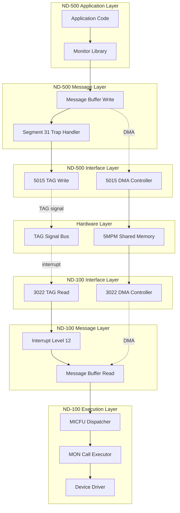
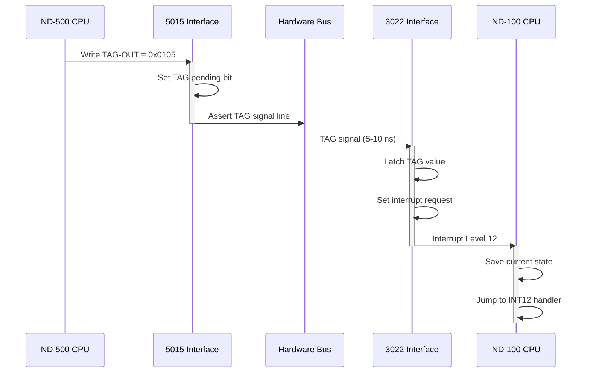
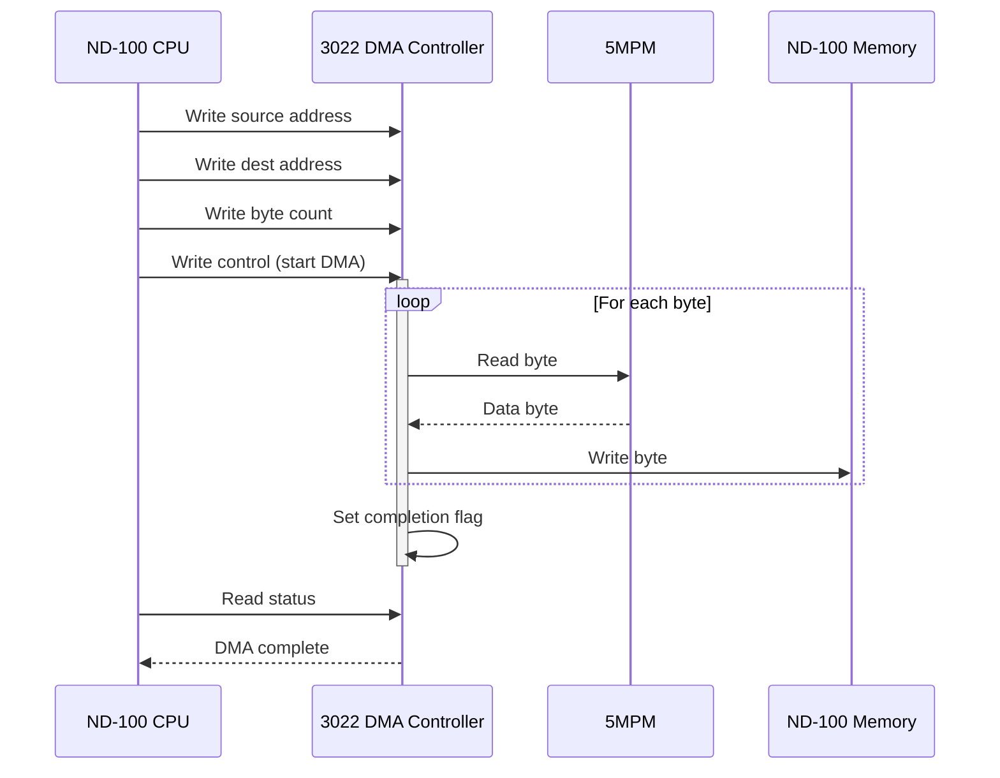
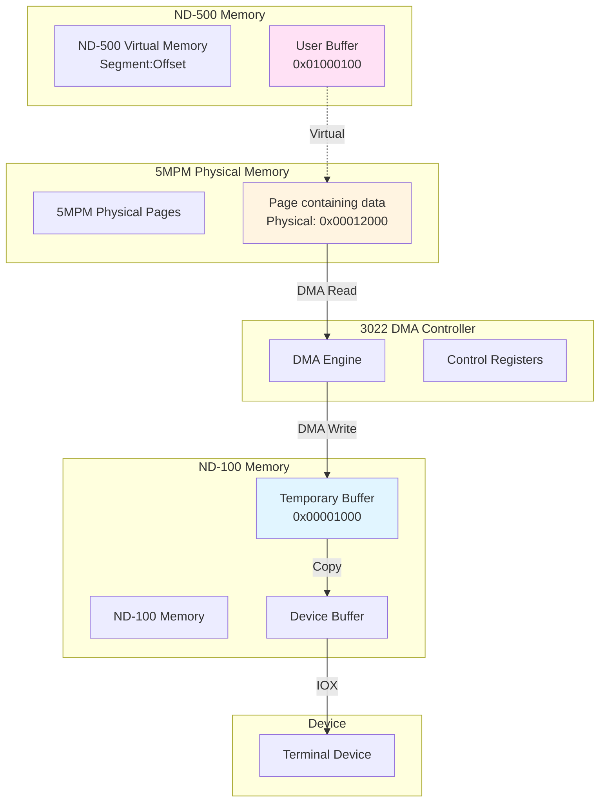

# ND-500/ND-100 Communication Protocol: Byte-Level Detail

## Exact Messages, Interface Calls, and DMA Operations

**Complete Protocol Specification with Register-Level Detail**

---

## Table of Contents

1. [Protocol Overview](#protocol-overview)
2. [ND-500 Side: Initiating MON Call](#nd-500-side-initiating-mon-call)
3. [Hardware Interface Transfer](#hardware-interface-transfer)
4. [ND-100 Side: Executing MON Call](#nd-100-side-executing-mon-call)
5. [ND-100 to ND-500: Result Return](#nd-100-to-nd-500-result-return)
6. [ND-500 Side: Mapping Results](#nd-500-side-mapping-results)
7. [DMA Operations for I/O](#dma-operations-for-io)
8. [Complete Protocol Example](#complete-protocol-example)

---

## Protocol Overview

### Communication Layers



---

## ND-500 Side: Initiating MON Call

### Step 1: Application Calls Monitor Function

**Example: Terminal Write Operation**

```c
// ND-500 Application Code
char message[] = "Hello, World!\n";
int result = write(1, message, 14);  // fd=1 (terminal), 14 bytes
```

### Step 2: Monitor Library Prepares Message

**Library Function (in ND-500 monitor library):**

```c
// write() system call implementation
int write(int fd, const void* buf, size_t count)
{
    // Translate file descriptor to device number
    int device = fd_to_device(fd);  // fd=1 → device=1 (terminal)

    // Get current process number
    uint8_t process = get_current_process();  // e.g., 5

    // Calculate message buffer address
    // Base: 0x80000400 (ND-500 view of message buffers in 5MPM)
    // Offset: process × 256 bytes
    uint32_t msg_base = 0x80000400 + (process * 0x100);

    // Write message buffer fields
    write_message_buffer(msg_base, device, buf, count);

    // Execute trap to ND-100
    trigger_mon_call();

    // Read result
    uint16_t error = read_word(msg_base + 8);
    return (error == 0) ? count : -1;
}
```

### Step 3: Write Message Buffer (Detailed)

**Exact byte-level writes to 5MPM:**

```c
void write_message_buffer(uint32_t msg_base, int device,
                          const void* buf, size_t count)
{
    // Field 1: PLINK (Process Link) - offset +0
    // Not modified by library (set by system)

    // Field 2: 5MSFL (Message Flags) - offset +2
    // Not modified yet (will be set by trap handler)

    // Field 3: 5PRIO (Priority) - offset +4
    // Not modified by library (uses existing priority)

    // Field 4: XMICF (MICFU Code) - offset +6
    // Write MICFU = 0x0001 (DVIO_OUT = Device Output)
    write_word(msg_base + 6, 0x0001);

    // Field 5: Error Code - offset +8
    // Clear error code (will be filled by ND-100)
    write_word(msg_base + 8, 0x0000);

    // Field 6: TODF (To Datafield) - offset +10
    // Not used for DVIO - set to 0
    write_dword(msg_base + 10, 0x00000000);

    // Field 7: DNOBY/NRBYT (Byte Count) - offset +14
    // Number of bytes to write
    write_dword(msg_base + 14, count);  // 14 bytes

    // Field 8: OSTRA/N500A (ND-500 Address) - offset +18
    // Source buffer address in ND-500 virtual memory
    write_dword(msg_base + 18, (uint32_t)buf);

    // Field 9: ABUFA/N100A (ND-100 Address) - offset +22
    // Not used by ND-500 - ND-100 will fill this
    write_dword(msg_base + 22, 0x00000000);

    // Field 10: 5DITN (Device Number) - offset +26
    // Terminal device number = 1
    write_word(msg_base + 26, device);

    // Field 11: 5CPUN (CPU Number) - offset +28
    // CPU identifier (usually 0)
    write_word(msg_base + 28, 0);
}
```

**Memory State After Writes:**

```
Message Buffer at 0x80000900 (Process 5, ND-500 view):
Address = 0x80000400 + (5 × 0x100) = 0x80000900

Offset  Size   Field    Value      Hex         Description
------  -----  -------  ---------  ----------  ---------------------------
+0      16-bit PLINK    5          0x0005      Process link
+2      16-bit 5MSFL    0          0x0000      Flags (not yet set)
+4      16-bit 5PRIO    128        0x0080      Priority
+6      16-bit XMICF    1          0x0001      MICFU: DVIO_OUT
+8      16-bit Error    0          0x0000      Error code (cleared)
+10     32-bit TODF     0          0x00000000  To datafield
+14     32-bit DNOBY    14         0x0000000E  Byte count
+18     32-bit N500A    0x01000100 0x01000100  ND-500 buffer address
+22     32-bit N100A    0          0x00000000  ND-100 address (not set)
+26     16-bit 5DITN    1          0x0001      Device 1 (terminal)
+28     16-bit 5CPUN    0          0x0000      CPU 0
+30     ...    ...      ...        ...         (additional parameters)
```

**Same Address in ND-100 View:**

```
ND-500 address: 0x80000900
ND-100 address: 0x80000900 - 0x80000000 + 0x00040000 = 0x00040900
```

### Step 4: Trigger Segment 31 Trap

**Assembly instruction:**

```assembly
CALLG   R0, 0x1F000000    ; Call segment 31, offset 0
                          ; Segment 31 (0x1F) has O-bit set
```

**What happens:**
1. CPU decodes CALLG instruction
2. Extracts target segment: 0x1F (segment 31)
3. Reads program capability register 31
4. Detects O-bit (bit 14) is set
5. **Trap occurs instead of executing call**

### Step 5: Trap Handler Saves State

**ND-500 Trap Handler (in microcode/firmware):**

```c
void trap_handler_segment31(uint32_t target_address)
{
    uint8_t process = CPU.CurrentProcess;
    uint32_t msg_base = 0x80000400 + (process * 0x100);

    // Save CPU state to message buffer offset +64

    // Save Program Counter (address after CALLG)
    write_dword(msg_base + 64 + 0, CPU.PC);

    // Save Status Register
    write_dword(msg_base + 64 + 4, CPU.STATUS.raw);

    // Save General Registers R0-R7 (8 × 4 bytes = 32 bytes)
    write_dword(msg_base + 64 + 8,  CPU.R0);
    write_dword(msg_base + 64 + 12, CPU.R1);
    write_dword(msg_base + 64 + 16, CPU.R2);
    write_dword(msg_base + 64 + 20, CPU.R3);
    write_dword(msg_base + 64 + 24, CPU.R4);
    write_dword(msg_base + 64 + 28, CPU.R5);
    write_dword(msg_base + 64 + 32, CPU.R6);
    write_dword(msg_base + 64 + 36, CPU.R7);

    // Save Special Registers
    write_dword(msg_base + 64 + 40, CPU.A);    // Accumulator
    write_dword(msg_base + 64 + 44, CPU.Q);    // Quotient
    write_dword(msg_base + 64 + 48, CPU.D);    // Double-word
    write_dword(msg_base + 64 + 52, CPU.L);    // Link
    write_dword(msg_base + 64 + 56, CPU.B);    // Base
    write_dword(msg_base + 64 + 60, CPU.TOS);  // Top of stack

    // Total: 64 bytes of CPU state saved
}
```

**Memory After State Save:**

```
Message Buffer CPU State Area (offset +64):

Offset  Size   Register  Value      Description
------  -----  --------  ---------  ---------------------------
+64     32-bit PC        0x01000234 Program counter (after CALLG)
+68     32-bit STATUS    0x00000000 Status register
+72     32-bit R0        0x00000001 Register 0 (fd parameter)
+76     32-bit R1        0x01000100 Register 1 (buffer address)
+80     32-bit R2        0x0000000E Register 2 (count=14)
+84     32-bit R3        0x00000000 Register 3
+88     32-bit R4        0x00000000 Register 4
+92     32-bit R5        0x00000000 Register 5
+96     32-bit R6        0x00000000 Register 6
+100    32-bit R7        0x00000000 Register 7
+104    32-bit A         0x00000000 Accumulator
+108    32-bit Q         0x00000000 Quotient
+112    32-bit D         0x00000000 Double-word
+116    32-bit L         0x00000000 Link
+120    32-bit B         0x01000000 Base register
+124    32-bit TOS       0x01001FFC Top of stack
```

### Step 6: Set ITMQUEUE Flag

**Still in trap handler:**

```c
void trap_handler_segment31_continued()
{
    // Read current flags
    uint16_t flags = read_word(msg_base + 2);

    // Set ITMQUEUE bit (bit 0)
    flags |= 0x0001;

    // Write back
    write_word(msg_base + 2, flags);

    // Now 5MSFL = 0x0001 (ITMQUEUE set)
}
```

**Updated Message Buffer:**

```
Offset  Size   Field    Value      Hex         Description
------  -----  -------  ---------  ----------  ---------------------------
+2      16-bit 5MSFL    1          0x0001      ITMQUEUE flag set
```

### Step 7: Write TAG Register (ND-500 → ND-100)

**Trap handler signals ND-100:**

```c
void trap_handler_send_tag(uint8_t process)
{
    // Construct TAG value
    // High byte: TAG code (0x01 = MONITOR_CALL_REQUEST)
    // Low byte: Process number
    uint16_t tag_value = (0x01 << 8) | process;

    // For process 5: tag_value = 0x0105

    // Write to 5015 interface TAG-OUT register
    // This is a hardware register write
    Interface5015_WriteTAG(tag_value);
}
```

**5015 Interface Register Write:**

```c
void Interface5015_WriteTAG(uint16_t value)
{
    // 5015 has memory-mapped registers
    // TAG-OUT register at offset 0x08 from interface base

    volatile uint16_t* tag_out = (uint16_t*)(ND500_INTERFACE_BASE + 0x08);

    // Write TAG value
    *tag_out = value;

    // Hardware automatically:
    // 1. Asserts signal line to 3022
    // 2. Sets TAG pending bit in status register
}
```

**Hardware Signal:**
- 5015 asserts **TAG signal line** (physical wire)
- Signal propagates to 3022 (5-10 nanoseconds)
- 3022 sets **interrupt request** for level 12
- ND-100 CPU detects interrupt request

### Step 8: Block Process

**Final trap handler action:**

```c
void trap_handler_block_process()
{
    // Mark process as waiting
    CPU.IsWaiting = true;

    // Clear current process
    CPU.CurrentProcess = 0xFF;  // No process running

    // ND-500 CPU is now idle or switches to another process
    // This process will not run again until TAG completion received
}
```

---

## Hardware Interface Transfer

### TAG Signal Propagation



### 3022 Interface Registers (ND-100 Side)

**Reading TAG-IN:**

```npl
% NPL code to read TAG
T:=HDEV+RSTA5; *IOXT          % Read status register
                              % Check TAG pending bit (bit 2)
IF A AND 4 THEN               % Bit 2 set?
   T:=HDEV+RTAG5; *IOXT       % Read TAG-IN register
   TAGVALUE:=A                % A contains 0x0105
FI
```

**Assembly-level detail:**

```assembly
; HDEV = base I/O address for ND-500 interface (device 660 octal)
; RSTA5 = offset +2 (Read Status Register)
; RTAG5 = offset +10 octal (Read TAG-IN)

        LDA     T, HDEV          ; Load device base address
        AD      T, #2            ; Add offset for RSTA5
        IOXT                     ; Execute IOX instruction
        ; A register now contains status

        LDA     T, HDEV          ; Load device base address
        AD      T, #8            ; Add offset for RTAG5 (10 octal = 8 decimal)
        IOXT                     ; Execute IOX instruction
        ; A register now contains TAG value = 0x0105
```

---

## ND-100 Side: Executing MON Call

### Step 1: Interrupt Level 12 Entry

**ND-100 interrupt mechanism:**

1. Interrupt request detected
2. Current instruction completes
3. CPU saves P register (program counter) to stack
4. CPU switches to interrupt level 12 stack
5. Jumps to level 12 interrupt handler address

**Interrupt Handler Entry (NPL):**

```npl
% Interrupt Level 12 handler
SUBR INT_LEVEL_12

INT_LEVEL_12:
    % Save registers (done automatically by CPU)

    % Read TAG register
    T:=HDEV+RTAG5; *IOXT       % Read TAG-IN
    TAGVALUE:=A

    % Extract process number (low byte)
    PROCNUM:=A AND 377         % Octal 377 = 0xFF

    % Extract TAG code (high byte)
    TAGCODE:=(A SHR 8) AND 377

    % Check TAG code
    IF TAGCODE=1 THEN          % MONITOR_CALL_REQUEST
       CALL HANDLE_MON_CALL
    ELSE IF TAGCODE=3 THEN     % PAGE_FAULT
       CALL HANDLE_PAGE_FAULT
    ELSE IF TAGCODE=15 THEN    % SWAP_REQUEST
       CALL HANDLE_SWAP
    FI

    % Return from interrupt
    EXIT
```

### Step 2: Calculate Message Buffer Address

**Address calculation:**

```npl
HANDLE_MON_CALL:
    % Process number is in PROCNUM (e.g., 5)

    % 5MPM base address in ND-100 memory map
    5MBBASE:=40000            % Octal 40000 = 0x4000 hex = 16384 decimal
                              % Actually 0x00040000 in full 32-bit address

    % Message buffer offset
    MSGOFFSET:=400            % Octal 400 = 256 decimal = 0x100 hex

    % Calculate process message buffer address
    % Address = base + 0x400 + (process × 0x100)
    % For process 5: 0x00040000 + 0x400 + (5 × 0x100) = 0x00040900

    AD:=5MBBASE               % D = high word, A = low word
    A:=A + MSGOFFSET          % Add message buffer offset
    A:=A + (PROCNUM * 400)    % Add process offset (400 octal = 256 decimal)

    MSGADDR:=AD               % Save message buffer address
```

### Step 3: Read Message Buffer Fields

**Read each field:**

```npl
% Set up memory bank for 5MPM access
T:=5MBBANK                    % 5MPM memory bank number

% Set address index
X:=MSGADDR

% Read MICFU code (offset +6)
*AAX 6; LDATX                 % AAX = Add to Address index, LDATX = Load from address
MICFU:=A

% Read device number (offset +26, octal 32)
*AAX 32; LDATX
DEVNUM:=A

% Read byte count (offset +14, 32-bit double word)
*AAX 14; LDDTX                % LDDTX = Load Double word from address
BYTECOUNT:=AD                 % AD = 32-bit value (A=low, D=high)

% Read ND-500 buffer address (offset +18)
*AAX 18; LDDTX
ND500ADDR:=AD

% Read error code (offset +8)
*AAX 8; LDATX
ERRORCODE:=A
```

**Values Read:**

```
MICFU      = 0x0001   (DVIO_OUT)
DEVNUM     = 0x0001   (Terminal device 1)
BYTECOUNT  = 0x0000000E (14 bytes)
ND500ADDR  = 0x01000100 (ND-500 buffer address)
ERRORCODE  = 0x0000   (no error yet)
```

### Step 4: Decode MICFU and Dispatch

**MICFU decoder:**

```npl
% Dispatch based on MICFU value
IF MICFU=1 THEN
   CALL DVIO_OUT_HANDLER
ELSE IF MICFU=2 THEN
   CALL DVIO_IN_HANDLER
ELSE IF MICFU=3 THEN
   CALL OPENFILE_HANDLER
ELSE IF MICFU=4 THEN
   CALL CLOSEFILE_HANDLER
ELSE IF MICFU=5 THEN
   CALL READFILE_HANDLER
ELSE IF MICFU=6 THEN
   CALL WRITEFILE_HANDLER
% ... more cases ...
ELSE
   % Unknown MICFU
   ERRORCODE:=177777          % Octal 177777 = 0xFFFF = -1
   CALL WRITE_ERROR
FI
```

### Step 5: Execute MON Call Handler

**DVIO_OUT_HANDLER (Terminal Write):**

```npl
SUBR DVIO_OUT_HANDLER

DVIO_OUT_HANDLER:
    % We have:
    % DEVNUM = 1 (terminal)
    % BYTECOUNT = 14
    % ND500ADDR = 0x01000100 (ND-500 virtual address)

    % Step 5a: Translate ND-500 address to 5MPM physical address
    CALL TRANSLATE_ND500_ADDRESS

    % Returns physical page number and offset
    PHYSPAGE:=A
    PAGEOFFSET:=D

    % Calculate physical address in 5MPM
    PHYSADDR:=(PHYSPAGE SHL 12) + PAGEOFFSET

    % Convert to ND-100 view
    % ND-100 sees 5MPM at 0x00040000
    MPM100ADDR:=40000 + PHYSADDR

    % Step 5b: Allocate temporary buffer in ND-100 memory
    CALL ALLOCATE_BUFFER
    TEMPBUF:=AD

    % Step 5c: Copy data from 5MPM to ND-100 buffer using DMA
    SRCADDR:=MPM100ADDR
    DSTADDR:=TEMPBUF
    LENGTH:=BYTECOUNT
    CALL DMA_COPY_FROM_5MPM

    % Step 5d: Call device driver
    DEVICENUM:=DEVNUM
    BUFFERPTR:=TEMPBUF
    BUFFERLEN:=LENGTH
    CALL TERMINAL_WRITE_DRIVER

    % Step 5e: Free temporary buffer
    CALL FREE_BUFFER

    % Step 5f: Write success result
    ERRORCODE:=0

    EXIT
```

### Step 6: DMA Copy from 5MPM (Detailed)

**DMA_COPY_FROM_5MPM procedure:**

```npl
SUBR DMA_COPY_FROM_5MPM

DMA_COPY_FROM_5MPM:
    % Parameters:
    % SRCADDR = source address in 5MPM (ND-100 view)
    % DSTADDR = destination address in ND-100 memory
    % LENGTH = byte count

    % Configure DMA controller on 3022 interface

    % DMA Control Register (offset +4 from HDEV)
    % Bit 0: Enable DMA
    % Bit 1: Direction (0=read from 5MPM, 1=write to 5MPM)
    % Bit 2: Byte mode
    % Bit 3: Interrupt on completion

    DMACTL:=1 + 4              % Enable + Byte mode
                               % Direction=0 (read from 5MPM)

    % Write DMA source address (5MPM address)
    T:=HDEV+10; A:=SRCADDR; *IOXT    % Write source address

    % Write DMA destination address (ND-100 address)
    T:=HDEV+12; A:=DSTADDR; *IOXT    % Write dest address

    % Write DMA byte count
    T:=HDEV+14; A:=LENGTH; *IOXT     % Write count

    % Start DMA transfer
    T:=HDEV+4; A:=DMACTL; *IOXT      % Write control register

    % Wait for DMA completion
    WAIT_DMA_COMPLETE:
        T:=HDEV+4; *IOXT             % Read control register
        IF A AND 20 THEN             % Bit 4 = DMA busy
           GO WAIT_DMA_COMPLETE      % Still busy, wait
        FI

    % DMA complete
    % 14 bytes copied from 5MPM to ND-100 buffer

    EXIT
```

**DMA Hardware Operation:**



### Step 7: Terminal Device Driver

**TERMINAL_WRITE_DRIVER:**

```npl
SUBR TERMINAL_WRITE_DRIVER

TERMINAL_WRITE_DRIVER:
    % Parameters:
    % DEVICENUM = terminal device number (1)
    % BUFFERPTR = pointer to data buffer
    % BUFFERLEN = number of bytes to write

    % Get device control block
    CALL GET_DEVICE_CONTROL_BLOCK
    DCB:=A

    % Check if terminal is ready
    CALL CHECK_TERMINAL_READY
    IF A=0 THEN
       ERRORCODE:=5            % Device not ready
       EXIT
    FI

    % Loop through characters
    FOR I:=0 TO BUFFERLEN-1 DO
        % Get character from buffer
        CHAR:=BUFFERPTR[I]

        % Write to terminal via IOX instruction
        T:=DEVICENUM; A:=CHAR; *IOXT

        % Wait for terminal to accept character
        CALL WAIT_TERMINAL_READY
    OD

    % All characters sent
    ERRORCODE:=0               % Success

    EXIT
```

**IOX instruction for terminal output:**

```assembly
; Write character to terminal
; A register contains character
; T register contains device number

        LDA     A, CHAR        ; Load character
        LDA     T, DEVNUM      ; Load device number
        IOXT                   ; Execute IOX - output character
```

### Step 8: Write Result to Message Buffer

**Write error code back:**

```npl
% Write result code to message buffer
T:=5MBBANK                     % 5MPM memory bank
X:=MSGADDR                     % Message buffer address
A:=ERRORCODE                   % 0 = success
*AAX 8; STATX                  % Write to error code field (offset +8)
```

**Updated Message Buffer:**

```
Offset  Size   Field    Value      Hex         Description
------  -----  -------  ---------  ----------  ---------------------------
+8      16-bit Error    0          0x0000      Success code
```

### Step 9: Clear ITMQUEUE Flag

**Signal request complete:**

```npl
% Read current flags
T:=5MBBANK; X:=MSGADDR
*AAX 2; LDATX                  % Read 5MSFL (offset +2)
FLAGS:=A

% Clear ITMQUEUE bit (bit 0)
FLAGS:=FLAGS AND (NOT 1)       % Clear bit 0

% Write back
*AAX 2; STATX                  % Write updated flags
```

**Updated Message Buffer:**

```
Offset  Size   Field    Value      Hex         Description
------  -----  -------  ---------  ----------  ---------------------------
+2      16-bit 5MSFL    0          0x0000      ITMQUEUE cleared
```

---

## ND-100 to ND-500: Result Return

### Step 1: Write TAG Register (ND-100 → ND-500)

**Send completion signal:**

```npl
% Construct TAG value
TAGCODE:=2                     % 2 = OPERATION_COMPLETE
PROCNUM:=5                     % Process number

% Combine: high byte = TAG code, low byte = process number
TAGVAL:=(TAGCODE SHL 8) + PROCNUM    % 0x0205

% Write to TAG-OUT register
T:=HDEV+LTAG5; A:=TAGVAL; *IOXT
```

**Assembly detail:**

```assembly
; LTAG5 = offset +11 octal (9 decimal)
        LDA     T, HDEV        ; Device base
        AD      T, #9          ; Add LTAG5 offset
        LDA     A, #0x0205     ; TAG value
        IOXT                   ; Write TAG-OUT
```

### Step 2: 3022 Interface Sends Signal

**Hardware sequence:**

```c
// 3022 interface hardware behavior

void Interface3022_WriteTAG(uint16_t value)
{
    // Store TAG value in output register
    tag_out_register = value;

    // Assert TAG signal line to 5015
    assert_tag_signal_line();

    // Set TAG sent status bit
    status_register |= 0x0100;  // Bit 8 = TAG sent
}
```

**Signal propagation:**
- 3022 asserts TAG line (physical wire)
- Signal reaches 5015 in 5-10 nanoseconds
- 5015 latches TAG value
- 5015 triggers ND-500 microcode event

### Step 3: Return from Interrupt

**ND-100 interrupt handler exit:**

```npl
INT_LEVEL_12:
    % ... handler code ...

    % Restore registers (automatic)
    % Return from interrupt
    EXIT
```

**CPU restores:**
1. Restores P register (program counter)
2. Switches back to previous interrupt level
3. Continues execution where interrupted

---

## ND-500 Side: Mapping Results

### Step 1: 5015 Receives TAG Signal

**5015 interface hardware:**

```c
// 5015 interface receives TAG from 3022

void Interface5015_ReceiveTAG(uint16_t value)
{
    // Latch TAG value
    tag_in_register = value;

    // Set TAG received bit
    status_register |= 0x0004;  // Bit 2 = TAG received

    // Trigger ND-500 microcode event
    trigger_microcode_event(EVENT_TAG_RECEIVED);
}
```

### Step 2: ND-500 Microcode Handles TAG

**ND-500 microcode/firmware:**

```c
void handle_tag_event(void)
{
    // Read TAG-IN register
    uint16_t tag_value = Interface5015_ReadTAG();

    // Extract fields
    uint8_t tag_code = (tag_value >> 8) & 0xFF;
    uint8_t process_num = tag_value & 0xFF;

    // Dispatch based on TAG code
    switch (tag_code) {
        case 0x02:  // OPERATION_COMPLETE
            resume_process(process_num);
            break;

        case 0x04:  // ACTIVATE_PROCESS
            activate_process(process_num);
            break;

        case 0x05:  // TERMINATE_PROCESS
            terminate_process(process_num);
            break;

        default:
            error("Unknown TAG code");
            break;
    }
}
```

### Step 3: Resume Process

**Restore CPU state:**

```c
void resume_process(uint8_t process_num)
{
    // Calculate message buffer address
    uint32_t msg_base = 0x80000400 + (process_num * 0x100);

    // Read flags to verify completion
    uint16_t flags = read_word(msg_base + 2);

    if (flags & 0x0001) {
        // ITMQUEUE still set - error!
        error("Process still waiting");
        return;
    }

    // Restore CPU state from message buffer offset +64

    // Restore PC (program counter)
    CPU.PC = read_dword(msg_base + 64 + 0);

    // Restore status register
    CPU.STATUS.raw = read_dword(msg_base + 64 + 4);

    // Restore general registers
    CPU.R0 = read_dword(msg_base + 64 + 8);
    CPU.R1 = read_dword(msg_base + 64 + 12);
    CPU.R2 = read_dword(msg_base + 64 + 16);
    CPU.R3 = read_dword(msg_base + 64 + 20);
    CPU.R4 = read_dword(msg_base + 64 + 24);
    CPU.R5 = read_dword(msg_base + 64 + 28);
    CPU.R6 = read_dword(msg_base + 64 + 32);
    CPU.R7 = read_dword(msg_base + 64 + 36);

    // Restore special registers
    CPU.A   = read_dword(msg_base + 64 + 40);
    CPU.Q   = read_dword(msg_base + 64 + 44);
    CPU.D   = read_dword(msg_base + 64 + 48);
    CPU.L   = read_dword(msg_base + 64 + 52);
    CPU.B   = read_dword(msg_base + 64 + 56);
    CPU.TOS = read_dword(msg_base + 64 + 60);

    // Set current process
    CPU.CurrentProcess = process_num;
    CPU.IsWaiting = false;

    // Resume execution at saved PC
    // This is the instruction AFTER the CALLG
    execute_from_pc();
}
```

**CPU State Restored:**

```
PC     = 0x01000234  (instruction after CALLG)
STATUS = 0x00000000
R0     = 0x00000001  (fd parameter)
R1     = 0x01000100  (buffer address)
R2     = 0x0000000E  (count=14)
R3-R7  = (restored)
A,Q,D,L,B,TOS = (restored)
```

### Step 4: Library Reads Result

**Execution continues in library function:**

```c
int write(int fd, const void* buf, size_t count)
{
    // ... setup and message buffer write ...

    trigger_mon_call();

    // <-- EXECUTION RESUMES HERE after TAG completion

    // Read error code from message buffer
    uint8_t process = get_current_process();
    uint32_t msg_base = 0x80000400 + (process * 0x100);

    uint16_t error = read_word(msg_base + 8);

    // Map error code to return value
    if (error == 0) {
        return count;  // Success: return bytes written
    } else {
        errno = map_error_code(error);
        return -1;     // Error
    }
}
```

**Error Code Mapping:**

```c
int map_error_code(uint16_t error)
{
    switch (error) {
        case 0:     return 0;           // Success
        case 1:     return EPERM;       // Permission denied
        case 2:     return ENOENT;      // No such file
        case 3:     return EIO;         // I/O error
        case 4:     return ENXIO;       // No such device
        case 5:     return ENOTREADY;   // Device not ready
        case 0xFFFF: return EINVAL;     // Invalid argument
        default:    return EIO;         // Generic I/O error
    }
}
```

### Step 5: Return to Application

**Application receives result:**

```c
char message[] = "Hello, World!\n";
int result = write(1, message, 14);

// result == 14 (success)

if (result >= 0) {
    // Success: 14 bytes written
} else {
    // Error
}
```

---

## DMA Operations for I/O

### DMA Architecture



### DMA Control Registers (3022)

**Register Map:**

| Offset | Register | Size | Access | Description |
|--------|----------|------|--------|-------------|
| +4 | DMA_CTRL | 16-bit | R/W | DMA control |
| +10 | DMA_SRC | 32-bit | W | Source address |
| +12 | DMA_DST | 32-bit | W | Destination address |
| +14 | DMA_CNT | 32-bit | W | Byte count |
| +16 | DMA_STAT | 16-bit | R | DMA status |

**DMA_CTRL Bits:**

| Bit | Mask | Function |
|-----|------|----------|
| 0 | 0x0001 | DMA Enable |
| 1 | 0x0002 | Direction (0=read from 5MPM, 1=write to 5MPM) |
| 2 | 0x0004 | Byte mode (0=word, 1=byte) |
| 3 | 0x0008 | Interrupt on completion |
| 4 | 0x0010 | DMA busy (read-only) |
| 5 | 0x0020 | DMA error (read-only) |

### DMA Transfer: 5MPM → ND-100

**Setup and Execute:**

```npl
SUBR DMA_READ_FROM_5MPM

% Parameters:
% SRCADDR = 5MPM address (ND-100 view, e.g., 0x00052000)
% DSTADDR = ND-100 memory address (e.g., 0x00001000)
% BYTECOUNT = number of bytes (e.g., 14)

DMA_READ_FROM_5MPM:
    % Write source address (5MPM)
    T:=HDEV+10; AD:=SRCADDR; *IODTX    % IODTX = IOX Double-word Transfer

    % Write destination address (ND-100)
    T:=HDEV+12; AD:=DSTADDR; *IODTX

    % Write byte count
    T:=HDEV+14; AD:=BYTECOUNT; *IODTX

    % Configure and start DMA
    DMACTL:=1 + 4 + 8          % Enable + Byte mode + Interrupt
                               % Direction = 0 (read from 5MPM)
    T:=HDEV+4; A:=DMACTL; *IOXT

    % Wait for completion
    WAIT_DMA:
        T:=HDEV+4; *IOXT       % Read control register
        IF A AND 20 THEN       % Bit 4 = busy
           GO WAIT_DMA
        FI

    % Check for errors
    IF A AND 40 THEN           % Bit 5 = error
       ERRORCODE:=3            % I/O error
       EXIT
    FI

    % DMA complete, data in DSTADDR
    EXIT
```

**DMA Hardware Operation:**

```c
// 3022 DMA controller (hardware behavior)

void DMA_Controller_Execute()
{
    // Read configuration
    uint32_t src = dma_src_register;
    uint32_t dst = dma_dst_register;
    uint32_t count = dma_cnt_register;
    uint16_t ctrl = dma_ctrl_register;

    bool byte_mode = (ctrl & 0x0004) != 0;
    bool direction = (ctrl & 0x0002) != 0;  // 0=read, 1=write

    // Set busy flag
    dma_stat_register |= 0x0010;

    if (!direction) {
        // Read from 5MPM, write to ND-100
        for (uint32_t i = 0; i < count; i++) {
            uint8_t byte = read_5mpm_byte(src + i);
            write_nd100_byte(dst + i, byte);
        }
    } else {
        // Write to 5MPM, read from ND-100
        for (uint32_t i = 0; i < count; i++) {
            uint8_t byte = read_nd100_byte(src + i);
            write_5mpm_byte(dst + i, byte);
        }
    }

    // Clear busy flag
    dma_stat_register &= ~0x0010;

    // Trigger interrupt if enabled
    if (ctrl & 0x0008) {
        trigger_interrupt(12);
    }
}
```

### DMA Transfer: ND-100 → 5MPM

**For output operations (e.g., reading file into ND-500 buffer):**

```npl
SUBR DMA_WRITE_TO_5MPM

% Parameters:
% SRCADDR = ND-100 memory address
% DSTADDR = 5MPM address (ND-100 view)
% BYTECOUNT = number of bytes

DMA_WRITE_TO_5MPM:
    % Write source address (ND-100)
    T:=HDEV+10; AD:=SRCADDR; *IODTX

    % Write destination address (5MPM)
    T:=HDEV+12; AD:=DSTADDR; *IODTX

    % Write byte count
    T:=HDEV+14; AD:=BYTECOUNT; *IODTX

    % Configure and start DMA
    DMACTL:=1 + 2 + 4 + 8      % Enable + Direction=write + Byte mode + Interrupt
    T:=HDEV+4; A:=DMACTL; *IOXT

    % Wait for completion
    WAIT_DMA:
        T:=HDEV+4; *IOXT
        IF A AND 20 THEN
           GO WAIT_DMA
        FI

    % Check for errors
    IF A AND 40 THEN
       ERRORCODE:=3
       EXIT
    FI

    EXIT
```

### DMA Performance

**Transfer Rates:**

| Operation | Bandwidth | Notes |
|-----------|-----------|-------|
| Programmed I/O (byte) | ~40 KB/s | CPU loop, IOX per byte |
| Programmed I/O (word) | ~80 KB/s | CPU loop, IOX per word |
| DMA (byte mode) | ~2 MB/s | Hardware transfer |
| DMA (word mode) | ~4 MB/s | Hardware transfer |

**DMA vs Programmed I/O:**

```npl
% Programmed I/O (slow)
FOR I:=0 TO COUNT-1 DO
    T:=5MBBANK; X:=SRCADDR+I; *AAX 0; LDATX
    BYTE:=A
    T:=0; X:=DSTADDR+I; *AAX 0; STATX
OD
% Time: ~25 μs per byte for 14 bytes = ~350 μs

% DMA (fast)
CALL DMA_READ_FROM_5MPM
% Time: ~7 μs for 14 bytes
```

**When to use DMA:**

- Byte count > 8 bytes: Use DMA
- Byte count ≤ 8 bytes: Use programmed I/O (overhead not worth it)

---

## Complete Protocol Example

### Detailed Timeline with Register Values

**Complete terminal write operation showing every register write:**

```
Time    Component         Action                           Register/Memory Write
------  ----------------  -------------------------------  ------------------------------------
T+0 μs  ND-500 App        Call write(1, buf, 14)
T+1 μs  ND-500 Lib        msg[+6] ← 0x0001                 5MPM[0x80000906] = 0x0001 (MICFU)
T+1 μs  ND-500 Lib        msg[+26] ← 0x0001                5MPM[0x8000091A] = 0x0001 (device)
T+1 μs  ND-500 Lib        msg[+14] ← 0x0000000E            5MPM[0x8000090E] = 0x0000000E (count)
T+1 μs  ND-500 Lib        msg[+18] ← 0x01000100            5MPM[0x80000912] = 0x01000100 (addr)
T+2 μs  ND-500 CPU        Execute CALLG 0x1F000000
T+3 μs  ND-500 Trap       Detect O-bit in seg 31 cap
T+4 μs  ND-500 Trap       msg[+64] ← PC                    5MPM[0x80000940] = 0x01000234
T+5 μs  ND-500 Trap       msg[+68] ← STATUS                5MPM[0x80000944] = 0x00000000
T+6 μs  ND-500 Trap       msg[+72..+124] ← R0..TOS         5MPM[0x80000948..0x8000097C] = (registers)
T+7 μs  ND-500 Trap       msg[+2] ← 0x0001                 5MPM[0x80000902] = 0x0001 (ITMQUEUE set)
T+8 μs  ND-500 Trap       5015.TAG_OUT ← 0x0105            Interface register write
T+8 μs  5015 Hardware     Assert TAG signal line
T+13 μs 3022 Hardware     Latch TAG value 0x0105
T+14 μs 3022 Hardware     Set interrupt request L12
T+15 μs ND-100 CPU        Interrupt Level 12 fires
T+16 μs ND-100 INT12      IOXT(HDEV+RTAG5)                 Read A = 0x0105
T+17 μs ND-100 INT12      Extract: TAG=0x01, PROC=5
T+18 μs ND-100 Handler    Calculate msg addr = 0x00040900
T+19 μs ND-100 Handler    Read msg[+6]                     5MPM[0x00040906] → A = 0x0001
T+20 μs ND-100 Handler    Read msg[+26]                    5MPM[0x0004091A] → A = 0x0001
T+21 μs ND-100 Handler    Read msg[+14]                    5MPM[0x0004090E] → AD = 0x0000000E
T+22 μs ND-100 Handler    Read msg[+18]                    5MPM[0x00040912] → AD = 0x01000100
T+23 μs ND-100 Dispatcher Dispatch MICFU=1 → DVIO_OUT
T+25 μs ND-100 Handler    Translate ND-500 addr
T+27 μs ND-100 Handler    Allocate temp buffer @ 0x00001000
T+30 μs ND-100 Handler    DMA_SRC ← 0x00052000             IOXT(HDEV+10)
T+31 μs ND-100 Handler    DMA_DST ← 0x00001000             IOXT(HDEV+12)
T+32 μs ND-100 Handler    DMA_CNT ← 0x0000000E             IOXT(HDEV+14)
T+33 μs ND-100 Handler    DMA_CTRL ← 0x000D                IOXT(HDEV+4) - Start DMA
T+34 μs 3022 DMA          Transfer 14 bytes
T+40 μs 3022 DMA          DMA complete
T+41 μs ND-100 Handler    Read DMA status                  IOXT(HDEV+4) → A = 0x0000 (done)
T+42 μs ND-100 Driver     Write byte[0]='H'                IOXT(DEVNUM=1, A='H')
T+43 μs Terminal          Output 'H'
T+50 μs ND-100 Driver     Write byte[1]='e'                IOXT(DEVNUM=1, A='e')
  ...     ...             ... (12 more characters)
T+1.2 ms ND-100 Driver    Write byte[13]='\n'              IOXT(DEVNUM=1, A='\n')
T+1.21 ms Terminal        Output complete
T+1.22 ms ND-100 Handler  msg[+8] ← 0x0000                 5MPM[0x00040908] = 0x0000 (success)
T+1.23 ms ND-100 Handler  Read msg[+2]                     5MPM[0x00040902] → A = 0x0001
T+1.23 ms ND-100 Handler  msg[+2] ← 0x0000                 5MPM[0x00040902] = 0x0000 (clear ITMQUEUE)
T+1.24 ms ND-100 Handler  3022.TAG_OUT ← 0x0205            IOXT(HDEV+LTAG5, A=0x0205)
T+1.24 ms 3022 Hardware   Assert TAG signal line
T+1.25 ms 5015 Hardware   Latch TAG value 0x0205
T+1.26 ms ND-500 Handler  Read 5015.TAG_IN                 Interface register read = 0x0205
T+1.27 ms ND-500 Handler  Extract: TAG=0x02, PROC=5
T+1.28 ms ND-500 Handler  Read msg[+2]                     5MPM[0x80000902] → 0x0000 (verify)
T+1.29 ms ND-500 Handler  Read msg[+64]                    5MPM[0x80000940] → PC = 0x01000234
T+1.30 ms ND-500 Handler  Read msg[+68..+124]              5MPM[0x80000944..0x8000097C] → (registers)
T+1.31 ms ND-500 Handler  Restore CPU state
T+1.32 ms ND-500 Handler  Resume at PC = 0x01000234
T+1.33 ms ND-500 Lib      Read msg[+8]                     5MPM[0x80000908] → error = 0x0000
T+1.34 ms ND-500 Lib      Return 14 to application
T+1.35 ms ND-500 App      result = 14 (success!)
```

### Memory State at Key Points

**After ND-500 writes message (T+1 μs):**

```
5MPM[0x80000900] (ND-500 view) / 5MPM[0x00040900] (ND-100 view):

Offset  Value       Description
+0      0x0005      Process link
+2      0x0000      Flags (not set yet)
+4      0x0080      Priority
+6      0x0001      MICFU: DVIO_OUT
+8      0x0000      Error (cleared)
+10     0x00000000  To datafield
+14     0x0000000E  Byte count = 14
+18     0x01000100  ND-500 buffer address
+22     0x00000000  ND-100 address (unused)
+26     0x0001      Device 1 (terminal)
+28     0x0000      CPU 0
```

**After ND-500 trap saves state (T+7 μs):**

```
5MPM[0x80000900]:

Offset  Value       Description
+2      0x0001      ITMQUEUE flag SET
+64     0x01000234  Saved PC
+68     0x00000000  Saved STATUS
+72     0x00000001  Saved R0 (fd=1)
+76     0x01000100  Saved R1 (buffer addr)
+80     0x0000000E  Saved R2 (count=14)
...     ...         (more registers)
```

**After ND-100 executes MON call (T+1.23 ms):**

```
5MPM[0x00040900]:

Offset  Value       Description
+2      0x0000      ITMQUEUE flag CLEARED
+8      0x0000      Error = 0 (success)
+64..   (unchanged) Saved CPU state (for resume)
```

### Register Summary

**5015 Interface Registers (ND-500 side):**

```
Offset  Register    Access  Purpose
+0      CONTROL     R/W     Interface control
+2      STATUS      R       Interface status
+4      MPM_BASE    R/W     5MPM base address config
+6      MPM_SIZE    R/W     5MPM size config
+8      TAG_OUT     W       Write TAG to ND-100
+10     TAG_IN      R       Read TAG from ND-100
```

**3022 Interface Registers (ND-100 side):**

```
Offset  Register    Access  Purpose
+0      RMAR5       R       Read memory address
+1      LMAR5       W       Load memory address
+2      RSTA5       R       Read status
+3      LSTA5       W       Load status
+4      RCON5/DMA   R/W     Control/DMA control
+6      MCLR5       W       Master clear
+7      TERM5       W       Terminate
+8      RTAG5       R       Read TAG from ND-500
+9      LTAG5       W       Write TAG to ND-500
+10     DMA_SRC     W       DMA source address
+12     DMA_DST     W       DMA destination address
+14     DMA_CNT     W       DMA byte count
+16     UNLC5       W       Unlock
+17     RETG5       W       Return gate
```

---

## Summary

This document provides the complete byte-level protocol specification for ND-500/ND-100 communication, including:

1. **Exact message buffer structure** with all fields and offsets
2. **Interface register operations** on both 5015 (ND-500) and 3022 (ND-100)
3. **TAG protocol** with exact register writes and hardware signals
4. **CPU state save/restore** with complete register set
5. **MICFU decoding** and monitor call dispatching
6. **DMA operations** for efficient data transfer
7. **Complete timing** from application call to result return

Every operation is documented with:
- Exact memory addresses
- Register values
- Assembly/NPL code
- Hardware signals
- Timing information

This is the **complete implementation specification** for MON call execution between ND-500 and ND-100.

---

**Document Version:** 1.0
**Date:** 2025-11-26
**Based On:** SINTRAN III NPL source code analysis and hardware specifications
