# Segment 31 "Other CPU" Mechanism - Complete Deep Dive

**Every Detail: Bits, Fields, Structs, DMA, TAG Protocol, and Signal Flow**

---

## Table of Contents

1. [Complete Architecture Overview](#complete-architecture-overview)
2. [Segment 31 Capability Bits - Detailed](#segment-31-capability-bits---detailed)
3. [5MPM Message Buffer Structure - Every Field](#5mpm-message-buffer-structure---every-field)
4. [MICFU Codes - Complete Catalog](#micfu-codes---complete-catalog)
5. [TAG Register Protocol - Complete State Machine](#tag-register-protocol---complete-state-machine)
6. [3022/5015 Interface Registers - Every Bit](#30225015-interface-registers---every-bit)
7. [DMA Operations and Memory Access](#dma-operations-and-memory-access)
8. [ND-500 Trap Handler - Complete Flow](#nd-500-trap-handler---complete-flow)
9. [ND-100 Interrupt Handler - Complete Flow](#nd-100-interrupt-handler---complete-flow)
10. [SINTRAN III MON Call Mapping](#sintran-iii-mon-call-mapping)
11. [Signal Back Mechanism - Resume Flow](#signal-back-mechanism---resume-flow)
12. [Complete Example with Every Step](#complete-example-with-every-step)
13. [Memory Access Mechanisms](#memory-access-mechanisms)
14. [Process State Structures](#process-state-structures)

---

## Complete Architecture Overview

### Full System Architecture with All Components

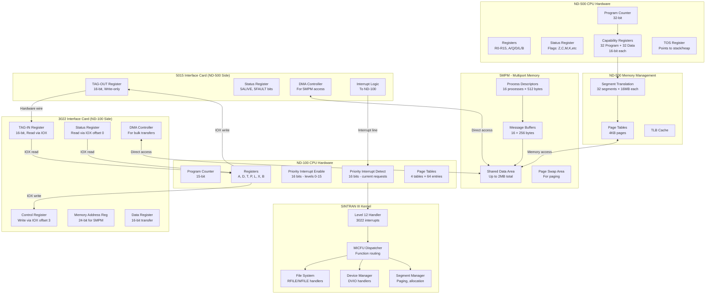

---

## Segment 31 Capability Bits - Detailed

### Capability Register Format (16 bits)

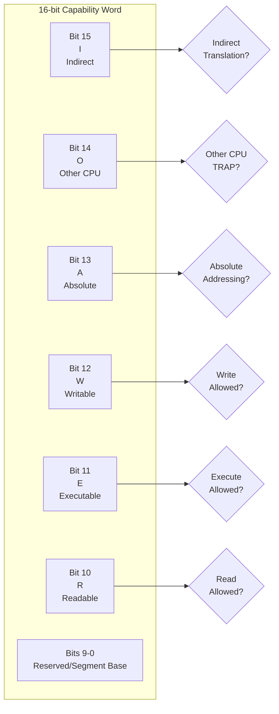

### Segment 31 Initialization During PLACE-DOMAIN

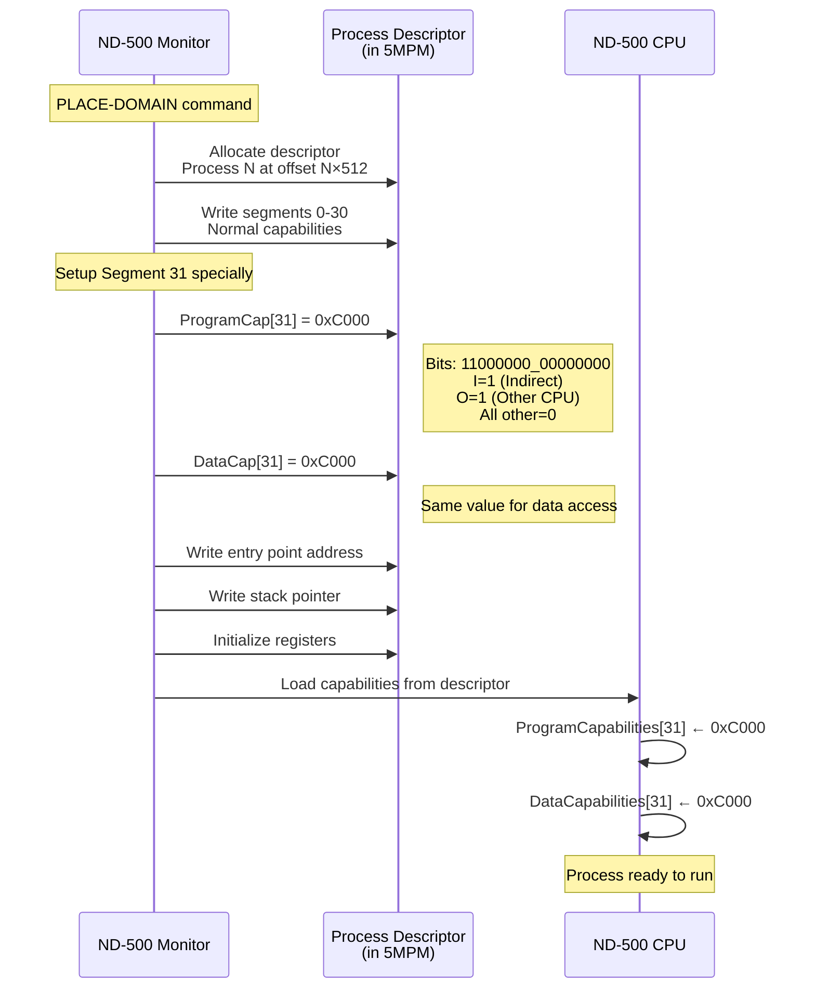

### Capability Bit Field Structure (C-style)

```c
typedef struct {
    uint16_t reserved_segment_base : 10;  // Bits 0-9: Reserved or segment base
    uint16_t readable              : 1;   // Bit 10: R - Read permission
    uint16_t executable            : 1;   // Bit 11: E - Execute permission
    uint16_t writable              : 1;   // Bit 12: W - Write permission
    uint16_t absolute              : 1;   // Bit 13: A - Absolute addressing
    uint16_t other_cpu             : 1;   // Bit 14: O - Other CPU trap
    uint16_t indirect              : 1;   // Bit 15: I - Indirect translation
} SegmentCapability;

// For segment 31 during PLACE-DOMAIN:
SegmentCapability seg31 = {
    .reserved_segment_base = 0,
    .readable              = 0,
    .executable            = 0,
    .writable              = 0,
    .absolute              = 0,
    .other_cpu             = 1,  // ← KEY BIT!
    .indirect              = 1
};
// Result: 0xC000 = binary 1100000000000000
```

### Detection Logic in CPU

```mermaid
flowchart TD
    START([CPU Executes Instruction]) --> FETCH[Fetch Instruction<br/>from PC]

    FETCH --> DECODE{Instruction<br/>Type?}

    DECODE -->|CALLG| CALLG_PROC[Process CALLG Instruction]
    DECODE -->|Other| NORMAL[Execute Normally]

    CALLG_PROC --> EXTRACT[Extract Target Address<br/>32-bit operand]

    EXTRACT --> SEGMENT[Extract Segment Number<br/>Top 5 bits: (addr >> 27) & 0x1F]

    SEGMENT --> CHECK31{Segment == 31<br/>0x1F?}

    CHECK31 -->|No| NORM_CALL[Normal CALLG<br/>Fetch from segment]
    CHECK31 -->|Yes| READ_CAP[Read ProgramCapabilities[31]]

    READ_CAP --> CAP_VAL[Capability Value]

    CAP_VAL --> CHECK_O{Bit 14<br/>O bit<br/>Set?}

    CHECK_O -->|0| NORM_CALL
    CHECK_O -->|1| TRAP[TRIGGER TRAP!<br/>Other CPU Trap]

    TRAP --> SAVE_STATE[Save CPU State]
    SAVE_STATE --> CALL_HANDLER[Call Trap Handler]
    CALL_HANDLER --> END([Wait for ND-100])

    NORM_CALL --> END2([Continue Execution])
    NORMAL --> END2
```

---

## 5MPM Message Buffer Structure - Every Field

### Complete Memory Map

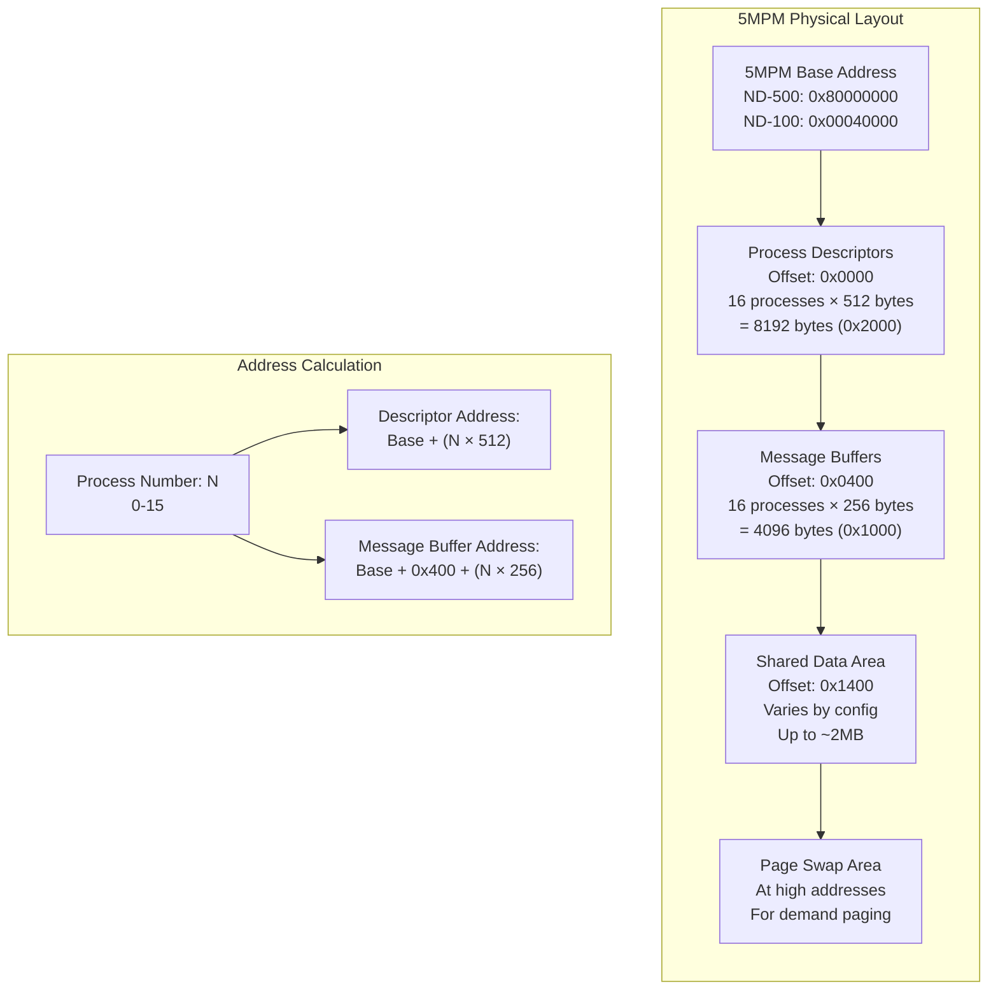

### Message Buffer Structure - Every Byte

**Each process has a 256-byte message buffer at: `5MPM_BASE + 0x400 + (ProcessNum × 0x100)`**

```c
typedef struct {
    // === CPU STATE SAVE AREA (64 bytes) ===
    // Offset 0x00-0x3F
    uint32_t saved_pc;              // +0x00: Program Counter
    uint32_t saved_status;          // +0x04: Status register
    uint32_t saved_r0;              // +0x08: Register R0
    uint32_t saved_r1;              // +0x0C: Register R1
    uint32_t saved_r2;              // +0x10: Register R2
    uint32_t saved_r3;              // +0x14: Register R3
    uint32_t saved_r4;              // +0x18: Register R4
    uint32_t saved_r5;              // +0x1C: Register R5
    uint32_t saved_r6;              // +0x20: Register R6
    uint32_t saved_r7;              // +0x24: Register R7
    uint32_t saved_a;               // +0x28: A register (accumulator)
    uint32_t saved_q;               // +0x2C: Q register
    uint32_t saved_d;               // +0x30: D register
    uint32_t saved_l;               // +0x34: L register (link)
    uint32_t saved_b;               // +0x38: B register (base)
    uint32_t saved_tos;             // +0x3C: TOS register

    // === MONITOR CALL PARAMETERS (64 bytes) ===
    // Offset 0x40-0x7F
    uint16_t process_number;        // +0x40: Process number (0-15)
    uint16_t micfu_code;            // +0x42: Monitor function code (16-bit)
    uint16_t error_code;            // +0x44: Result error code
    uint16_t flags;                 // +0x46: Control flags

    // ITMQUEUE flag structure (part of flags):
    // Bit 0: ITMQUEUE (1=pending, 0=complete)
    // Bit 1: PRIORITY (1=high priority call)
    // Bit 2: RETRY (1=retry after error)
    // Bits 3-15: Reserved

    uint32_t param1;                // +0x48: Generic parameter 1
    uint32_t param2;                // +0x4C: Generic parameter 2
    uint32_t param3;                // +0x50: Generic parameter 3
    uint32_t param4;                // +0x54: Generic parameter 4
    uint32_t param5;                // +0x58: Generic parameter 5
    uint32_t param6;                // +0x5C: Generic parameter 6
    uint32_t param7;                // +0x60: Generic parameter 7
    uint32_t param8;                // +0x64: Generic parameter 8

    // Specific parameter overlays (union with above):
    struct {
        uint16_t device_number;     // +0x48: For DVIO - device number
        uint16_t reserved1;
        uint32_t buffer_address;    // +0x4C: Buffer address in ND-500 space
        uint32_t byte_count;        // +0x50: Number of bytes
        uint32_t control_word;      // +0x54: Device control word
    } dvio_params;

    struct {
        uint32_t file_number;       // +0x48: Open file number
        uint32_t block_number;      // +0x4C: Logical block number
        uint32_t buffer_address;    // +0x50: Buffer address
        uint32_t word_count;        // +0x54: Words to transfer
    } file_params;

    struct {
        uint32_t fault_address;     // +0x48: Virtual address that faulted
        uint32_t segment_number;    // +0x4C: Segment that faulted
        uint32_t page_number;       // +0x50: Page within segment
        uint32_t access_type;       // +0x54: Read/Write/Execute
    } page_fault_params;

    // === TIMING AND STATISTICS (32 bytes) ===
    // Offset 0x80-0x9F
    uint32_t call_count;            // +0x80: Number of monitor calls
    uint32_t total_wait_time;       // +0x84: Total wait time (ms)
    uint32_t last_call_time;        // +0x88: Timestamp of last call
    uint32_t max_wait_time;         // +0x8C: Maximum wait time seen
    uint32_t error_count;           // +0x90: Number of errors
    uint32_t retry_count;           // +0x94: Number of retries
    uint64_t reserved_stats;        // +0x98: Reserved for future stats

    // === RESERVED / SCRATCH AREA (96 bytes) ===
    // Offset 0xA0-0xFF
    uint8_t scratch[96];            // Scratch space for complex calls

} MessageBuffer;  // Total: 256 bytes (0x100)
```

### Message Buffer Memory Layout Diagram

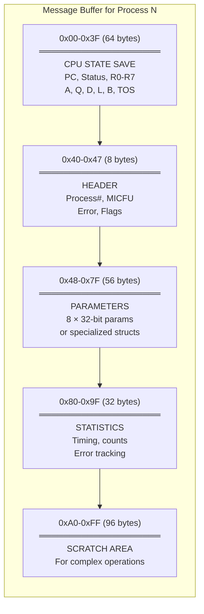

### Detailed ITMQUEUE Flag Bits

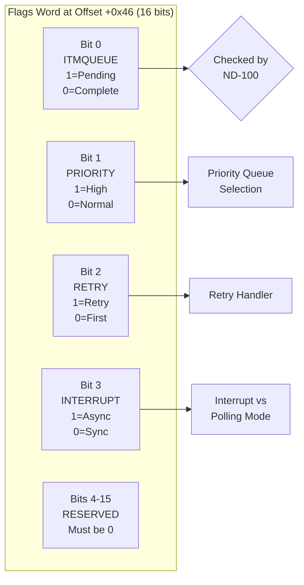

---

## MICFU Codes - Complete Catalog

### MICFU Code Space (16-bit)

```mermaid
graph TB
    MICFU[MICFU Code Space<br/>16-bit = 65,536 codes]

    MICFU --> RANGE0[0x0000-0x000F<br/>Device I/O]
    MICFU --> RANGE1[0x0010-0x002F<br/>File Operations]
    MICFU --> RANGE2[0x0030-0x004F<br/>Memory Management]
    MICFU --> RANGE3[0x0050-0x006F<br/>Process Control]
    MICFU --> RANGE4[0x0070-0x008F<br/>System Calls]
    MICFU --> RANGE5[0x0090-0x00FF<br/>User Extensions]
    MICFU --> RANGE6[0x0100-0x01FF<br/>Network/XMSG]
    MICFU --> RANGE7[0x0200+<br/>Reserved/Future]

    RANGE0 --> DVIO_IN[0x0000: DVIO IN]
    RANGE0 --> DVIO_OUT[0x0001: DVIO OUT]
    RANGE0 --> DVIO_CTRL[0x0002: DVIO CONTROL]
    RANGE0 --> DVIO_STAT[0x0003: DVIO STATUS]

    RANGE1 --> RFILE[0x0010: RFILE<br/>Read file block]
    RANGE1 --> WFILE[0x0011: WFILE<br/>Write file block]
    RANGE1 --> OPEN[0x0012: OPEN<br/>Open file]
    RANGE1 --> CLOSE[0x0013: CLOSE<br/>Close file]
    RANGE1 --> DELETE[0x0014: DELETE<br/>Delete file]
    RANGE1 --> RENAME[0x0015: RENAME<br/>Rename file]
    RANGE1 --> FSTAT[0x0016: FSTAT<br/>File status]

    RANGE2 --> PGFAULT[0x0030: PAGE FAULT<br/>Load page]
    RANGE2 --> ALLOC_SEG[0x0031: ALLOCATE SEGMENT]
    RANGE2 --> FREE_SEG[0x0032: FREE SEGMENT]
    RANGE2 --> ATTACH[0x0040: ATTACH SEGMENT]
    RANGE2 --> DETACH[0x0041: DETACH SEGMENT]
```

### Complete MICFU Code Table

| MICFU | Name | MON Equivalent | Parameters | Description |
|-------|------|----------------|------------|-------------|
| **Device I/O (0x00-0x0F)** |
| 0x0000 | DVIO_IN | MON 4 (INBT) | device, buffer, count | Input from device |
| 0x0001 | DVIO_OUT | MON 5 (OUTBT) | device, buffer, count | Output to device |
| 0x0002 | DVIO_CONTROL | MON 6 (IOCTL) | device, control_word | Device control |
| 0x0003 | DVIO_STATUS | - | device | Get device status |
| 0x0004 | DVIO_RESERVE | MON 32 (RSDEV) | device | Reserve device |
| 0x0005 | DVIO_RELEASE | MON 33 (RLDEV) | device | Release device |
| **File Operations (0x10-0x2F)** |
| 0x0010 | RFILE | MON 14 (RFILE) | file#, block#, buffer, words | Read file block |
| 0x0011 | WFILE | MON 15 (WFILE) | file#, block#, buffer, words | Write file block |
| 0x0012 | OPEN | MON 16 (OPEN) | filename, mode | Open file |
| 0x0013 | CLOSE | MON 17 (CLOSE) | file# | Close file |
| 0x0014 | DELETE | MON 20 (DELETE) | filename | Delete file |
| 0x0015 | RENAME | MON 21 (RENAME) | old_name, new_name | Rename file |
| 0x0016 | FSTAT | - | file#, buffer | Get file status |
| 0x0017 | CREATE | MON 46 (CREATE) | filename, size, type | Create file |
| 0x0018 | LOCK | - | file#, block# | Lock file record |
| 0x0019 | UNLOCK | - | file#, block# | Unlock record |
| **Program Loading (0x20-0x2F)** |
| 0x0020 | LOAD | MON 19 (LOAD) | filename, address | Load program |
| 0x0021 | DUMP | MON 18 (DUMP) | filename, address, size | Dump program |
| 0x0022 | EXEC | - | filename, params | Execute program |
| **Memory Management (0x30-0x4F)** |
| 0x0030 | PAGE_FAULT | - | address, seg#, page# | Handle page fault |
| 0x0031 | ALLOC_SEGMENT | - | size | Allocate segment |
| 0x0032 | FREE_SEGMENT | - | segment# | Free segment |
| 0x0033 | ALLOC_PAGES | - | count | Allocate pages |
| 0x0034 | FREE_PAGES | - | address, count | Free pages |
| 0x0040 | ATTACH_SEGMENT | MON 61 | segment#, address | Attach to ND-100 seg |
| 0x0041 | DETACH_SEGMENT | MON 61 | segment# | Detach segment |
| **Process Control (0x50-0x6F)** |
| 0x0050 | CREATE_PROCESS | - | domain, priority | Create process |
| 0x0051 | DELETE_PROCESS | - | process# | Delete process |
| 0x0052 | SUSPEND_PROCESS | - | process# | Suspend process |
| 0x0053 | RESUME_PROCESS | - | process# | Resume process |
| 0x0054 | SET_PRIORITY | - | process#, priority | Change priority |
| **System Calls (0x70-0x8F)** |
| 0x0070 | GETIME | MON 50 (GETIME) | buffer | Get system time |
| 0x0071 | SETIME | MON 51 (SETIME) | time | Set system time |
| 0x0072 | ALARM | - | time, signal | Set alarm |
| 0x0073 | WAIT | MON 8 (WAIT) | event# | Wait for event |
| 0x0074 | SIGNAL | MON 9 (SIGNAL) | event# | Signal event |
| **Network/XMSG (0x0100-0x01FF)** |
| 0x0100 | XMSEND | - | dest, port, msg, len | Send XMSG message |
| 0x0101 | XMRECV | - | port, buffer, len | Receive XMSG |
| 0x0102 | XMOPEN | - | port | Open XMSG port |
| 0x0103 | XMCLOSE | - | port | Close XMSG port |

### MICFU Parameter Encoding

Different MICFU codes use different parameter layouts in the message buffer:

```c
// Example 1: DVIO_OUT (0x0001)
struct MICFU_0001_Params {
    uint16_t device_number;      // +0x48: Which device (1=terminal, etc)
    uint16_t reserved;
    uint32_t buffer_address;     // +0x4C: ND-500 address of data
    uint32_t byte_count;         // +0x50: How many bytes
    uint32_t flags;              // +0x54: Control flags
    // Flags bits:
    // Bit 0: ECHO (for terminal input)
    // Bit 1: NOWAIT (non-blocking)
    // Bit 2: BINARY (vs text mode)
};

// Example 2: RFILE (0x0010)
struct MICFU_0010_Params {
    uint32_t file_number;        // +0x48: Open file handle
    uint32_t block_number;       // +0x4C: Logical block (512 bytes)
    uint32_t buffer_address;     // +0x50: Where to read data
    uint32_t word_count;         // +0x54: 16-bit words to read
    uint32_t options;            // +0x58: Read options
};

// Example 3: PAGE_FAULT (0x0030)
struct MICFU_0030_Params {
    uint32_t fault_address;      // +0x48: Address that caused fault
    uint32_t segment_number;     // +0x4C: Which segment (0-31)
    uint32_t page_number;        // +0x50: Page within segment
    uint32_t access_type;        // +0x54: 0=Read, 1=Write, 2=Execute
    uint32_t process_state;      // +0x58: Full CPU state pointer
};
```

---

## TAG Register Protocol - Complete State Machine

### TAG Register Communication

The 3022/5015 interface uses two 16-bit TAG registers for inter-CPU signaling:

**TAG-OUT**: Written by ND-500 (via trap handler), read by ND-100 (via IOX)
**TAG-IN**: Written by ND-100 (via IOX), read by ND-500 (via trap handler)

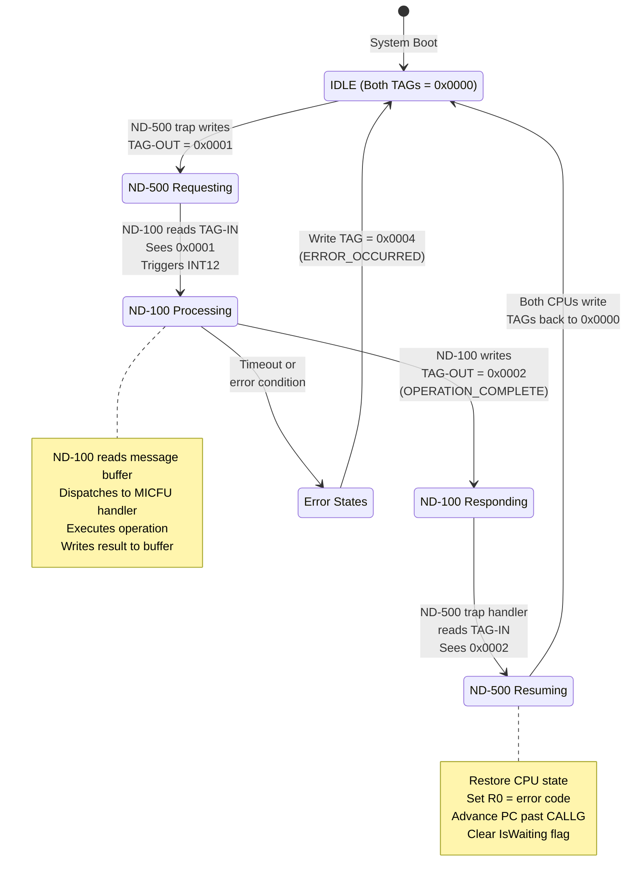

### Complete TAG Value Table

| TAG Value | Name | Direction | Set By | Read By | Meaning |
|-----------|------|-----------|--------|---------|---------|
| 0x0000 | IDLE | Both | Both | Both | No communication, system idle |
| 0x0001 | MON_CALL_REQUEST | 500→100 | ND-500 trap | ND-100 INT12 | ND-500 needs monitor call |
| 0x0002 | OPERATION_COMPLETE | 100→500 | ND-100 handler | ND-500 trap | ND-100 finished successfully |
| 0x0003 | PAGE_FAULT_REQUEST | 500→100 | ND-500 trap | ND-100 swapper | Page fault needs handling |
| 0x0004 | ERROR_OCCURRED | 100→500 | ND-100 handler | ND-500 trap | Error during operation |
| 0x0005 | RETRY_REQUEST | 500→100 | ND-500 trap | ND-100 INT12 | Retry after error |
| 0x0006 | INTERRUPT_REQUEST | 500→100 | ND-500 trap | ND-100 INT12 | Async interrupt |
| 0x0007 | ACK_INTERRUPT | 100→500 | ND-100 handler | ND-500 trap | Interrupt acknowledged |
| 0x0010 | DMA_REQUEST | 500→100 | DMA logic | ND-100 DMA | Request DMA transfer |
| 0x0011 | DMA_COMPLETE | 100→500 | ND-100 DMA | ND-500 DMA | DMA finished |
| 0x0020 | RESET_REQUEST | Either | Either | Either | Request system reset |
| 0x00FF | DIAGNOSTIC | Either | Test code | Test code | Diagnostic/test mode |

### TAG Protocol Timing Diagram

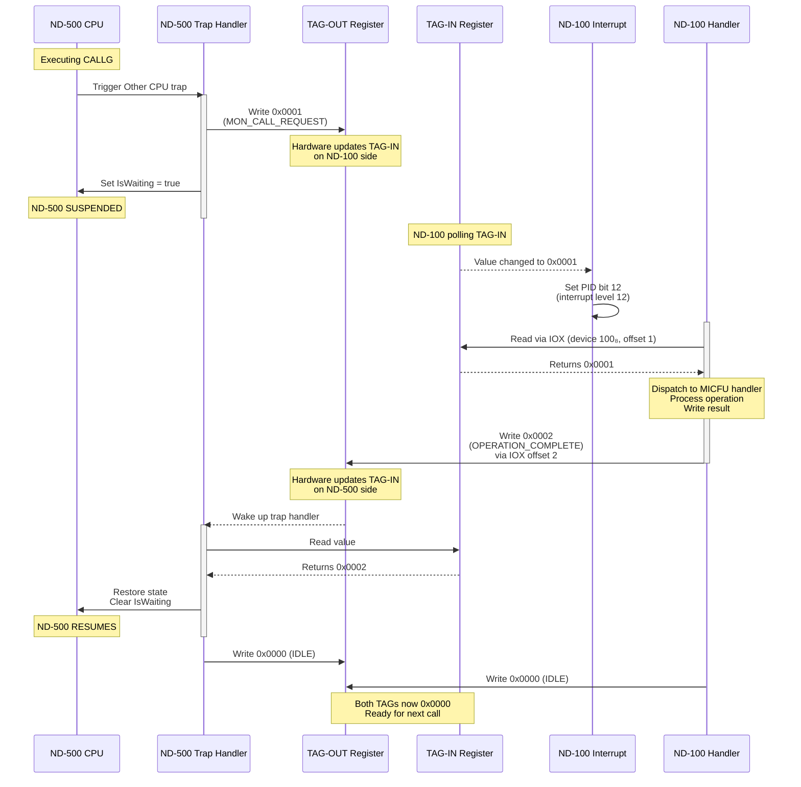

---

## 3022/5015 Interface Registers - Every Bit

### Complete IOX Register Map (ND-100 Side)

The 3022 interface is accessed via IOX instructions with device number **100₈ (0x40 hex, 64 decimal)**.

```c
// IOX register offsets for device 100₈
#define IOX_3022_DEVICE     0x40  // 100 octal

// Register offsets
#define IOX_STATUS          0     // Read-only: Status register
#define IOX_TAG_IN          1     // Read-only: TAG from ND-500
#define IOX_TAG_OUT         2     // Write-only: TAG to ND-500
#define IOX_CONTROL         3     // Write-only: Control register
#define IOX_MAR_LOW         4     // R/W: Memory Address Low
#define IOX_MAR_HIGH        5     // R/W: Memory Address High
#define IOX_DATA            6     // R/W: Data transfer
#define IOX_DMA_COUNT       7     // Write-only: DMA word count
#define IOX_INTERRUPT_MASK  8     // R/W: Interrupt enable mask
```

### Status Register (Offset 0) - Every Bit

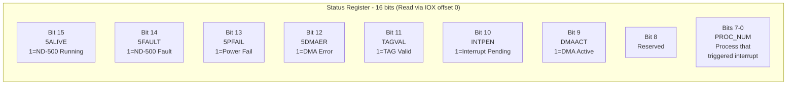

**C Structure:**

```c
typedef union {
    uint16_t raw;
    struct {
        uint16_t process_number  : 8;  // Bits 0-7
        uint16_t reserved        : 1;  // Bit 8
        uint16_t dma_active      : 1;  // Bit 9
        uint16_t interrupt_pending : 1; // Bit 10
        uint16_t tag_valid       : 1;  // Bit 11
        uint16_t dma_error       : 1;  // Bit 12
        uint16_t power_fail      : 1;  // Bit 13
        uint16_t nd500_fault     : 1;  // Bit 14
        uint16_t nd500_alive     : 1;  // Bit 15
    } bits;
} Status3022Register;
```

### Control Register (Offset 3) - Every Bit

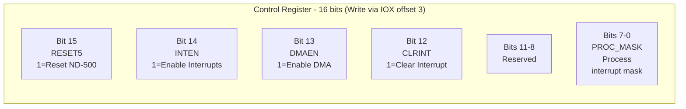

**C Structure:**

```c
typedef union {
    uint16_t raw;
    struct {
        uint16_t process_mask    : 8;  // Bits 0-7: Which processes can interrupt
        uint16_t reserved        : 4;  // Bits 8-11
        uint16_t clear_interrupt : 1;  // Bit 12: Write 1 to clear
        uint16_t dma_enable      : 1;  // Bit 13
        uint16_t interrupt_enable : 1; // Bit 14
        uint16_t reset_nd500     : 1;  // Bit 15: Write 1 to reset ND-500
    } bits;
} Control3022Register;
```

### Memory Address Register (MAR) - 24-bit

The MAR is split across two 16-bit IOX registers:

```c
// Building 24-bit 5MPM address
uint32_t mar_low = IOX_Read(IOX_3022_DEVICE, IOX_MAR_LOW);   // Bits 0-15
uint32_t mar_high = IOX_Read(IOX_3022_DEVICE, IOX_MAR_HIGH); // Bits 16-23

uint32_t mpm_address = (mar_high << 16) | mar_low;
// Result: 24-bit address, max 16MB (0x00000000 - 0x00FFFFFF)
```

### Complete IOX Access Examples

```assembly
; ND-100 assembly to read TAG-IN
        LDA     100         ; Device number 100₈
        STA     T           ; T register = device number
        LDA     1           ; Offset 1 (TAG-IN)
        IOXT                ; IOX with T, read to A
        ; A register now contains TAG-IN value

; ND-100 assembly to write TAG-OUT
        LDA     100         ; Device number
        STA     T
        LDA     2           ; TAG value to write
        STA     D           ; Put in D register
        LDA     2           ; Offset 2 (TAG-OUT)
        IOXT                ; IOX with T, write from D

; Read 5MPM memory via MAR/DATA
        LDA     100
        STA     T
        LDA     <low_addr>  ; Low 16 bits of 5MPM address
        IOXT    4           ; Write to MAR_LOW (offset 4)
        LDA     <high_addr> ; High 8 bits
        IOXT    5           ; Write to MAR_HIGH (offset 5)
        IOXT    6           ; Read from DATA (offset 6)
        ; A now contains 16-bit word from 5MPM
```

---

## DMA Operations and Memory Access

### DMA Controller Architecture

Both the 3022 and 5015 interfaces have DMA controllers for efficient bulk data transfer to/from 5MPM.

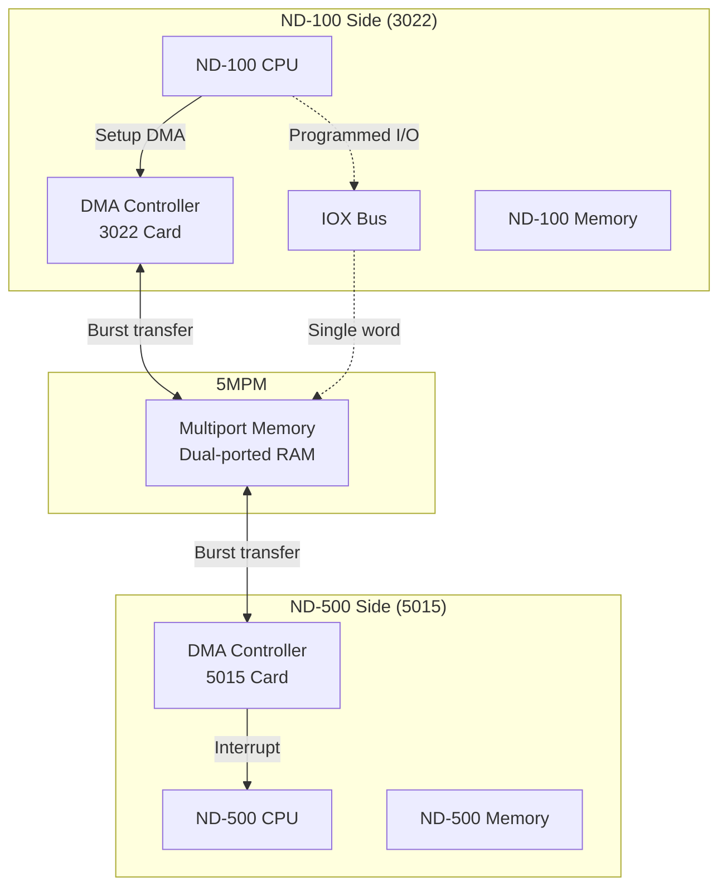

### DMA Transfer Modes

**Mode 1: ND-100 → 5MPM (Write)**
```c
// Setup DMA transfer from ND-100 memory to 5MPM
void Setup_DMA_Write(uint16_t nd100_address, uint32_t mpm_address,
                     uint16_t word_count)
{
    // Write 5MPM destination address to MAR
    IOX_Write(IOX_3022_DEVICE, IOX_MAR_LOW, mpm_address & 0xFFFF);
    IOX_Write(IOX_3022_DEVICE, IOX_MAR_HIGH, (mpm_address >> 16) & 0xFF);

    // Write ND-100 source address to internal DMA register
    // (implementation-specific, may use memory-mapped registers)
    DMA_SRC_ADDR = nd100_address;

    // Write word count
    IOX_Write(IOX_3022_DEVICE, IOX_DMA_COUNT, word_count);

    // Start DMA by setting DMA_ENABLE bit in control register
    uint16_t control = IOX_Read(IOX_3022_DEVICE, IOX_CONTROL);
    control |= (1 << 13);  // Set DMAEN bit
    IOX_Write(IOX_3022_DEVICE, IOX_CONTROL, control);

    // DMA proceeds automatically
    // When complete, DMAACT bit in status clears
    // Interrupt generated if enabled
}
```

**Mode 2: 5MPM → ND-100 (Read)**
```c
void Setup_DMA_Read(uint32_t mpm_address, uint16_t nd100_address,
                    uint16_t word_count)
{
    // Write 5MPM source address to MAR
    IOX_Write(IOX_3022_DEVICE, IOX_MAR_LOW, mpm_address & 0xFFFF);
    IOX_Write(IOX_3022_DEVICE, IOX_MAR_HIGH, (mpm_address >> 16) & 0xFF);

    // Write ND-100 destination
    DMA_DST_ADDR = nd100_address;

    // Write count and start (direction bit = 0 for read)
    IOX_Write(IOX_3022_DEVICE, IOX_DMA_COUNT, word_count);

    uint16_t control = IOX_Read(IOX_3022_DEVICE, IOX_CONTROL);
    control |= (1 << 13);  // DMAEN
    control &= ~(1 << 14); // Direction = Read
    IOX_Write(IOX_3022_DEVICE, IOX_CONTROL, control);
}
```

### DMA State Machine

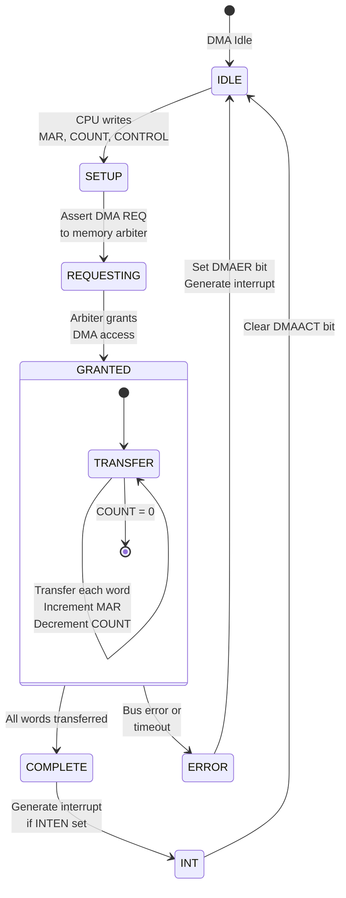

### Programmed I/O vs DMA Performance

| Aspect | Programmed I/O | DMA |
|--------|---------------|-----|
| **CPU Involvement** | High - CPU does every transfer | Low - CPU only sets up |
| **Speed** | ~50K words/sec | ~500K words/sec |
| **CPU Overhead** | 100% during transfer | ~5% (setup + completion) |
| **Use Case** | Small transfers (<100 words) | Large transfers (>100 words) |
| **Typical Use** | TAG reading, single parameters | Page swapping, large buffers |

**Decision Logic:**

```c
void Transfer_To_5MPM(uint32_t mpm_addr, void* data, uint16_t word_count)
{
    if (word_count < DMA_THRESHOLD)  // Typically 64-100 words
    {
        // Use programmed I/O for small transfers
        for (int i = 0; i < word_count; i++)
        {
            IOX_Write(IOX_3022_DEVICE, IOX_MAR_LOW, (mpm_addr + i*2) & 0xFFFF);
            IOX_Write(IOX_3022_DEVICE, IOX_MAR_HIGH, ((mpm_addr + i*2) >> 16) & 0xFF);
            IOX_Write(IOX_3022_DEVICE, IOX_DATA, ((uint16_t*)data)[i]);
        }
    }
    else
    {
        // Use DMA for large transfers
        Setup_DMA_Write(Local_Copy_Of_Data, mpm_addr, word_count);
        Wait_For_DMA_Complete();
    }
}
```

---

## ND-500 Trap Handler - Complete Flow

### Trap Handler Entry

```mermaid
flowchart TD
    START([CALLG #0x1F000000]) --> DETECT[CPU Detects Segment 31<br/>with O bit set]

    DETECT --> SAVE_PC[Save Current PC<br/>PC_TRAP = PC]

    SAVE_PC --> SAVE_STATUS[Save Status Register<br/>STATUS_TRAP = STATUS]

    SAVE_STATUS --> GET_PROC[Get Current Process Number<br/>from TOS or internal register]

    GET_PROC --> CALC_MSG[Calculate Message Buffer Address<br/>MSG_ADDR = 0x80000400 + (PROC_NUM × 0x100)]

    CALC_MSG --> SAVE_STATE[Save Complete CPU State]

    SAVE_STATE --> READ_MICFU[Read MICFU Code<br/>from message buffer<br/>(already written by library)]

    READ_MICFU --> VALIDATE{MICFU<br/>Valid?}

    VALIDATE -->|No| ERROR_TRAP[Raise Invalid MICFU Error]
    VALIDATE -->|Yes| SET_FLAGS[Set ITMQUEUE Flag<br/>flags |= 0x0001]

    SET_FLAGS --> WRITE_TAG[Write TAG-OUT Register<br/>TAG = 0x0001<br/>(MON_CALL_REQUEST)]

    WRITE_TAG --> TRIGGER_INT[Hardware triggers<br/>ND-100 Interrupt Level 12]

    TRIGGER_INT --> SET_WAIT[Set CPU.IsWaiting = true<br/>Process blocked]

    SET_WAIT --> SUSPEND([ND-500 Process SUSPENDED<br/>Execution halts])
```

### Complete Trap Handler Code Flow

```c
void HandleOtherCPUTrap(ND500CPU* cpu, uint32_t target_address)
{
    // 1. IDENTIFY PROCESS
    uint8_t process_num = cpu->CurrentProcess;  // 0-15

    printf("[ND500-TRAP] Process %d triggered Other CPU trap\n", process_num);
    printf("[ND500-TRAP] PC = 0x%08X, Target = 0x%08X\n",
           cpu->PC, target_address);

    // 2. CALCULATE MESSAGE BUFFER ADDRESS
    // ND-500 sees 5MPM at 0x80000000
    // Message buffers start at offset 0x400
    // Each process has 256 bytes (0x100)
    uint32_t mpm_base = 0x80000000;
    uint32_t msg_offset = 0x400 + (process_num * 0x100);
    uint32_t msg_addr = mpm_base + msg_offset;

    printf("[ND500-TRAP] Message buffer at 0x%08X\n", msg_addr);

    // 3. SAVE COMPLETE CPU STATE TO MESSAGE BUFFER
    // Offset +0x00: PC (32-bit)
    WriteDoubleWord(msg_addr + 0x00, cpu->PC);

    // Offset +0x04: Status register (32-bit)
    WriteDoubleWord(msg_addr + 0x04, cpu->STATUS.raw);

    // Offset +0x08-0x3C: Registers R0-R7, A, Q, D, L, B, TOS
    WriteDoubleWord(msg_addr + 0x08, cpu->R[0]);
    WriteDoubleWord(msg_addr + 0x0C, cpu->R[1]);
    WriteDoubleWord(msg_addr + 0x10, cpu->R[2]);
    WriteDoubleWord(msg_addr + 0x14, cpu->R[3]);
    WriteDoubleWord(msg_addr + 0x18, cpu->R[4]);
    WriteDoubleWord(msg_addr + 0x1C, cpu->R[5]);
    WriteDoubleWord(msg_addr + 0x20, cpu->R[6]);
    WriteDoubleWord(msg_addr + 0x24, cpu->R[7]);
    WriteDoubleWord(msg_addr + 0x28, cpu->A);
    WriteDoubleWord(msg_addr + 0x2C, cpu->Q);
    WriteDoubleWord(msg_addr + 0x30, cpu->D);
    WriteDoubleWord(msg_addr + 0x34, cpu->L);
    WriteDoubleWord(msg_addr + 0x38, cpu->B);
    WriteDoubleWord(msg_addr + 0x3C, cpu->TOS);

    // 4. WRITE HEADER INFORMATION
    // Offset +0x40: Process number (16-bit)
    WriteWord(msg_addr + 0x40, process_num);

    // 5. READ MICFU CODE (already written by ND-500 library before CALLG)
    // Offset +0x42: MICFU code (16-bit)
    uint16_t micfu = ReadWord(msg_addr + 0x42);

    printf("[ND500-TRAP] MICFU = 0x%04X\n", micfu);

    // 6. VALIDATE MICFU
    if (micfu == 0 || micfu == 0xFFFF)
    {
        printf("[ND500-TRAP] ERROR: Invalid MICFU code!\n");
        // Could set error and resume immediately, or trap to debugger
        return;
    }

    // 7. SET ITMQUEUE FLAG (bit 0 of flags word)
    // Offset +0x46: Flags (16-bit)
    uint16_t flags = ReadWord(msg_addr + 0x46);
    flags |= 0x0001;  // Set ITMQUEUE bit
    WriteWord(msg_addr + 0x46, flags);

    printf("[ND500-TRAP] ITMQUEUE flag set\n");

    // 8. SIGNAL ND-100 VIA TAG REGISTER
    // TAG-OUT is at a hardware-mapped location in 5015 interface
    // Writing to it triggers interrupt on ND-100 side
    Interface5015_WriteTag(TAG_MON_CALL_REQUEST, process_num);

    printf("[ND500-TRAP] TAG-OUT written: 0x0001 (MON_CALL_REQUEST)\n");
    printf("[ND500-TRAP] ND-100 interrupt level 12 triggered\n");

    // 9. BLOCK THIS PROCESS
    cpu->IsWaiting = true;
    cpu->WaitingForProcess = process_num;

    printf("[ND500-TRAP] Process %d now WAITING for ND-100\n", process_num);

    // 10. INCREMENT STATISTICS
    uint32_t call_count = ReadDoubleWord(msg_addr + 0x80);
    WriteDoubleWord(msg_addr + 0x80, call_count + 1);

    uint32_t timestamp = GetSystemTimestamp();
    WriteDoubleWord(msg_addr + 0x88, timestamp);

    // CPU execution loop will now skip this process until IsWaiting = false
}
```

### Trap Handler State Save Structure

```mermaid
graph TB
    subgraph "CPU State at Trap"
        PC[PC = 0x05001218<br/>Points to CALLG instruction]
        R0[R0 = 0x00000001<br/>Device parameter]
        R1[R1 = 0x80001000<br/>Buffer address]
        STATUS[STATUS = 0x00000004<br/>Flags, modes]
    end

    subgraph "Message Buffer After Save"
        direction TB
        SAVE_PC[+0x00: PC<br/>0x05001218]
        SAVE_STATUS[+0x04: STATUS<br/>0x00000004]
        SAVE_R0[+0x08: R0<br/>0x00000001]
        SAVE_R1[+0x0C: R1<br/>0x80001000]
        DOTS[...]
        FLAGS[+0x46: Flags<br/>0x0001 (ITMQUEUE)]
    end

    PC --> SAVE_PC
    STATUS --> SAVE_STATUS
    R0 --> SAVE_R0
    R1 --> SAVE_R1
```

---

## ND-100 Interrupt Handler - Complete Flow

### Interrupt Level 12 Handler Entry

```mermaid
flowchart TD
    START([Interrupt Level 12 Triggered]) --> CHECK_PID[Check PID Register<br/>Bit 12 set?]

    CHECK_PID -->|No| SPURIOUS[Spurious Interrupt<br/>Clear and return]
    CHECK_PID -->|Yes| SAVE_CONTEXT[Save ND-100 Context<br/>Registers A, D, T, X, etc.]

    SAVE_CONTEXT --> READ_TAG[Read TAG-IN via IOX<br/>Device 100₈, Offset 1]

    READ_TAG --> DECODE_TAG{TAG<br/>Value?}

    DECODE_TAG -->|0x0001| MON_CALL[Monitor Call Request]
    DECODE_TAG -->|0x0003| PAGE_FAULT[Page Fault Request]
    DECODE_TAG -->|Other| UNKNOWN[Unknown TAG<br/>Log error]

    MON_CALL --> READ_STATUS[Read Status Register<br/>Get process number]

    READ_STATUS --> CALC_MSG[Calculate Message Buffer<br/>ND-100 sees 5MPM at 0x00040000<br/>MSG = 0x00040400 + (PROC × 0x100)]

    CALC_MSG --> READ_MICFU[Read MICFU from Message Buffer<br/>Offset +0x42]

    READ_MICFU --> DISPATCH{Dispatch<br/>MICFU}

    DISPATCH -->|0x0001| DVIO_OUT[Handle DVIO OUT]
    DISPATCH -->|0x0010| RFILE[Handle RFILE]
    DISPATCH -->|0x0030| PG_FAULT[Handle Page Fault]
    DISPATCH -->|Other| GENERIC[Generic Handler]

    DVIO_OUT --> WRITE_RESULT[Write Result to<br/>Message Buffer +0x44]
    RFILE --> WRITE_RESULT
    PG_FAULT --> WRITE_RESULT
    GENERIC --> WRITE_RESULT

    WRITE_RESULT --> CLEAR_FLAG[Clear ITMQUEUE Flag<br/>+0x46 &= ~0x0001]

    CLEAR_FLAG --> SIGNAL_COMPLETE[Write TAG-OUT = 0x0002<br/>(OPERATION_COMPLETE)]

    SIGNAL_COMPLETE --> WAKE_500[Trigger ND-500 Resume<br/>via interface]

    WAKE_500 --> RESTORE_CONTEXT[Restore ND-100 Context]

    RESTORE_CONTEXT --> CLEAR_INT[Clear PID bit 12<br/>Acknowledge interrupt]

    CLEAR_INT --> RETURN([Return from Interrupt])
```

### Complete Interrupt Handler Code

```c
void ND100_InterruptLevel12_Handler(void)
{
    // Called when ND-100 CPU detects interrupt on level 12

    // 1. SAVE ND-100 CPU CONTEXT
    // (This is typically done automatically by ND-100 hardware
    //  when entering interrupt level, but may need to save additional regs)
    uint16_t saved_a = CPU100.A;
    uint16_t saved_d = CPU100.D;
    uint16_t saved_t = CPU100.T;

    printf("[ND100-INT12] Interrupt Level 12 triggered\n");

    // 2. READ TAG-IN REGISTER
    uint16_t tag = IOX_Read(IOX_3022_DEVICE, IOX_TAG_IN);

    printf("[ND100-INT12] TAG-IN = 0x%04X\n", tag);

    // 3. DECODE TAG VALUE
    switch (tag)
    {
        case TAG_MON_CALL_REQUEST:  // 0x0001
            Handle_Monitor_Call();
            break;

        case TAG_PAGE_FAULT_REQUEST: // 0x0003
            Handle_Page_Fault();
            break;

        case TAG_INTERRUPT_REQUEST: // 0x0006
            Handle_Async_Interrupt();
            break;

        default:
            printf("[ND100-INT12] ERROR: Unknown TAG 0x%04X\n", tag);
            // Write error TAG back
            IOX_Write(IOX_3022_DEVICE, IOX_TAG_OUT, TAG_ERROR_OCCURRED);
            break;
    }

    // 4. RESTORE ND-100 CONTEXT
    CPU100.A = saved_a;
    CPU100.D = saved_d;
    CPU100.T = saved_t;

    // 5. CLEAR INTERRUPT
    // Write to control register to acknowledge
    uint16_t control = IOX_Read(IOX_3022_DEVICE, IOX_CONTROL);
    control |= (1 << 12);  // Set CLRINT bit
    IOX_Write(IOX_3022_DEVICE, IOX_CONTROL, control);

    printf("[ND100-INT12] Interrupt handled, returning\n");

    // Return from interrupt (hardware restores PC, switches back to level 1)
}

void Handle_Monitor_Call(void)
{
    // 1. READ STATUS TO GET PROCESS NUMBER
    uint16_t status = IOX_Read(IOX_3022_DEVICE, IOX_STATUS);
    uint8_t process_num = status & 0xFF;  // Bits 0-7

    printf("[ND100-INT12] Monitor call from process %d\n", process_num);

    // 2. CALCULATE MESSAGE BUFFER ADDRESS
    // ND-100 sees 5MPM starting at 0x00040000
    uint32_t mpm_base_nd100 = 0x00040000;
    uint32_t msg_offset = 0x400 + (process_num * 0x100);
    uint32_t msg_addr = mpm_base_nd100 + msg_offset;

    // 3. READ MICFU CODE
    uint16_t micfu = Read5MPM_Word(msg_addr + 0x42);

    printf("[ND100-INT12] MICFU = 0x%04X\n", micfu);

    // 4. DISPATCH TO HANDLER
    uint16_t error_code = 0;

    switch (micfu)
    {
        case MICFU_DVIO_OUT:  // 0x0001
            error_code = Handle_DVIO_OUT(msg_addr);
            break;

        case MICFU_DVIO_IN:   // 0x0000
            error_code = Handle_DVIO_IN(msg_addr);
            break;

        case MICFU_RFILE:     // 0x0010
            error_code = Handle_RFILE(msg_addr);
            break;

        case MICFU_WFILE:     // 0x0011
            error_code = Handle_WFILE(msg_addr);
            break;

        case MICFU_PAGE_FAULT: // 0x0030
            error_code = Handle_Page_Fault_Load(msg_addr);
            break;

        default:
            printf("[ND100-INT12] Unknown MICFU 0x%04X\n", micfu);
            error_code = 0xFFFF;  // Unknown function error
            break;
    }

    // 5. WRITE RESULT TO MESSAGE BUFFER
    Write5MPM_Word(msg_addr + 0x44, error_code);

    printf("[ND100-INT12] Result written: error = 0x%04X\n", error_code);

    // 6. CLEAR ITMQUEUE FLAG
    uint16_t flags = Read5MPM_Word(msg_addr + 0x46);
    flags &= ~0x0001;  // Clear bit 0
    Write5MPM_Word(msg_addr + 0x46, flags);

    // 7. SIGNAL COMPLETION TO ND-500
    IOX_Write(IOX_3022_DEVICE, IOX_TAG_OUT, TAG_OPERATION_COMPLETE);

    printf("[ND100-INT12] TAG-OUT written: 0x0002 (OPERATION_COMPLETE)\n");

    // 8. TRIGGER ND-500 RESUME
    // Writing TAG-OUT automatically triggers hardware signal to ND-500 side
    // ND-500 trap handler will wake up the process
}
```

### MICFU Handler Example: DVIO_OUT

```c
uint16_t Handle_DVIO_OUT(uint32_t msg_addr)
{
    printf("[DVIO-OUT] Processing device output request\n");

    // Read parameters from message buffer
    // Offset +0x48: Device number (16-bit)
    uint16_t device = Read5MPM_Word(msg_addr + 0x48);

    // Offset +0x4C: Buffer address in ND-500 space (32-bit)
    uint32_t buffer_addr_500 = Read5MPM_DoubleWord(msg_addr + 0x4C);

    // Offset +0x50: Byte count (32-bit)
    uint32_t byte_count = Read5MPM_DoubleWord(msg_addr + 0x50);

    printf("[DVIO-OUT] Device=%d, Buffer=0x%08X, Bytes=%d\n",
           device, buffer_addr_500, byte_count);

    // Translate ND-500 address to 5MPM address
    // ND-500 addresses in 5MPM range start at 0x80000000
    // ND-100 sees same memory starting at 0x00040000
    // Translation: ND100_addr = ND500_addr - 0x80000000 + 0x00040000

    uint32_t buffer_addr_100;
    if (buffer_addr_500 >= 0x80000000 && buffer_addr_500 < 0x80200000)
    {
        // Address is in 5MPM
        buffer_addr_100 = buffer_addr_500 - 0x80000000 + 0x00040000;
    }
    else
    {
        printf("[DVIO-OUT] ERROR: Buffer not in 5MPM! Addr=0x%08X\n",
               buffer_addr_500);
        return 0x0001;  // Error: invalid address
    }

    // Read data from 5MPM into local buffer
    uint8_t* data = malloc(byte_count);
    for (uint32_t i = 0; i < byte_count; i++)
    {
        data[i] = Read5MPM_Byte(buffer_addr_100 + i);
    }

    // Call SINTRAN III device manager
    uint16_t sintran_error = SINTRAN_DeviceWrite(device, data, byte_count);

    free(data);

    if (sintran_error == 0)
    {
        printf("[DVIO-OUT] Success: %d bytes written to device %d\n",
               byte_count, device);
        return 0x0000;  // Success
    }
    else
    {
        printf("[DVIO-OUT] Error: SINTRAN error code 0x%04X\n", sintran_error);
        return sintran_error;
    }
}
```

---

## SINTRAN III MON Call Mapping

### How SINTRAN III Handles Device I/O

SINTRAN III has a device manager that abstracts all I/O devices. The ND-100 interrupt handler calls SINTRAN routines.

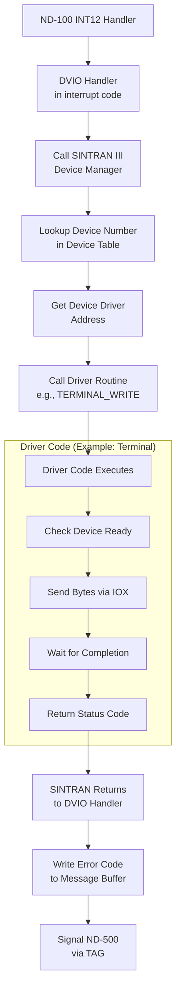

### SINTRAN Device Table Structure

```c
typedef struct {
    uint16_t device_number;      // Logical device number (1-255)
    uint16_t device_type;        // Type: terminal, disk, tape, etc.
    uint16_t driver_address;     // Address of driver routine
    uint16_t status;             // Current status
    uint16_t reserved_flags;     // Flags, busy bit, etc.
    uint32_t driver_data;        // Driver-specific data
} DeviceTableEntry;

// SINTRAN maintains array of these
DeviceTableEntry SINTRAN_DeviceTable[256];

// Initialization (during SINTRAN boot)
void SINTRAN_InitializeDevices(void)
{
    // Device 1: Console terminal
    SINTRAN_DeviceTable[1].device_number = 1;
    SINTRAN_DeviceTable[1].device_type = TYPE_TERMINAL;
    SINTRAN_DeviceTable[1].driver_address = ADDRESS_OF(TerminalDriver);
    SINTRAN_DeviceTable[1].status = STATUS_READY;

    // Device 10: System disk
    SINTRAN_DeviceTable[10].device_number = 10;
    SINTRAN_DeviceTable[10].device_type = TYPE_DISK;
    SINTRAN_DeviceTable[10].driver_address = ADDRESS_OF(DiskDriver);
    SINTRAN_DeviceTable[10].status = STATUS_READY;

    // ... initialize other devices ...
}
```

### SINTRAN Device Write Routine

```c
uint16_t SINTRAN_DeviceWrite(uint16_t device_num, uint8_t* data, uint32_t byte_count)
{
    // 1. VALIDATE DEVICE NUMBER
    if (device_num == 0 || device_num > 255)
    {
        return ERROR_INVALID_DEVICE;
    }

    // 2. LOOKUP DEVICE IN TABLE
    DeviceTableEntry* device = &SINTRAN_DeviceTable[device_num];

    if (device->driver_address == 0)
    {
        return ERROR_DEVICE_NOT_PRESENT;
    }

    // 3. CHECK DEVICE READY
    if (device->status & STATUS_BUSY)
    {
        return ERROR_DEVICE_BUSY;
    }

    // 4. MARK DEVICE BUSY
    device->status |= STATUS_BUSY;

    // 5. CALL DRIVER
    // Driver routine has signature: uint16_t (*driver)(uint8_t*, uint32_t)
    typedef uint16_t (*DriverFunc)(uint8_t*, uint32_t);
    DriverFunc driver_func = (DriverFunc)(device->driver_address);

    uint16_t error = driver_func(data, byte_count);

    // 6. MARK DEVICE READY
    device->status &= ~STATUS_BUSY;

    return error;
}
```

### Mapping MICFU to MON Calls

Some MICFU codes map directly to existing SINTRAN MON calls:

| MICFU | SINTRAN MON Call | Notes |
|-------|------------------|-------|
| 0x0001 (DVIO_OUT) | MON 5 (OUTBT) | Parameters restructured |
| 0x0010 (RFILE) | MON 14 (RFILE) | Direct mapping |
| 0x0011 (WFILE) | MON 15 (WFILE) | Direct mapping |
| 0x0012 (OPEN) | MON 16 (OPEN) | Direct mapping |
| 0x0030 (PAGE_FAULT) | Special swapper | No MON equivalent |

**Implementation approach:**

```c
uint16_t Handle_RFILE(uint32_t msg_addr)
{
    // Read parameters
    uint32_t file_num = Read5MPM_DoubleWord(msg_addr + 0x48);
    uint32_t block_num = Read5MPM_DoubleWord(msg_addr + 0x4C);
    uint32_t buffer_addr = Read5MPM_DoubleWord(msg_addr + 0x50);
    uint32_t word_count = Read5MPM_DoubleWord(msg_addr + 0x54);

    // Translate to ND-100 address
    uint32_t buffer_nd100 = Translate_500_to_100(buffer_addr);

    // Call SINTRAN's internal RFILE routine
    // (This is the SAME routine that MON 14 calls)
    uint16_t error = SINTRAN_Internal_RFILE(
        (uint16_t)file_num,
        (uint16_t)block_num,
        (uint16_t)buffer_nd100,
        (uint16_t)word_count
    );

    return error;
}
```

---

## Signal Back Mechanism - Resume Flow

### ND-500 Resume Process

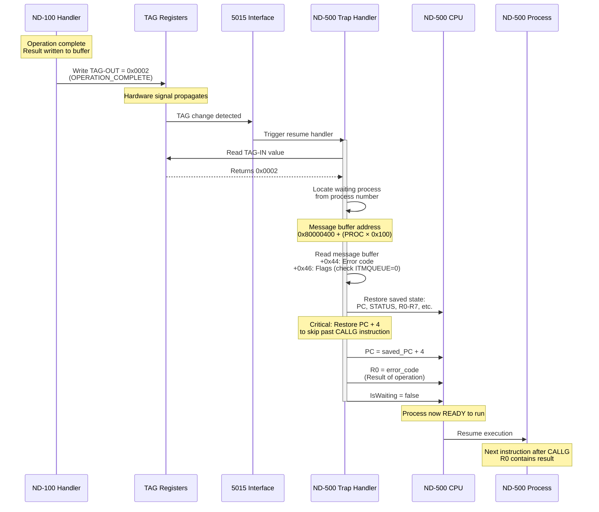

### Complete Resume Handler Code

```c
void ResumeAfterMonitorCall(uint8_t process_num)
{
    printf("[ND500-RESUME] Resuming process %d\n", process_num);

    // 1. VERIFY TAG VALUE
    uint16_t tag = Interface5015_ReadTag();
    if (tag != TAG_OPERATION_COMPLETE)
    {
        printf("[ND500-RESUME] WARNING: Unexpected TAG 0x%04X\n", tag);
        if (tag == TAG_ERROR_OCCURRED)
        {
            printf("[ND500-RESUME] ND-100 reported error\n");
            // Proceed anyway to restore state
        }
    }

    // 2. CALCULATE MESSAGE BUFFER
    uint32_t msg_addr = 0x80000400 + (process_num * 0x100);

    // 3. READ RESULT
    uint16_t error_code = ReadWord(msg_addr + 0x44);

    printf("[ND500-RESUME] Error code: 0x%04X\n", error_code);

    // 4. VERIFY ITMQUEUE FLAG CLEARED
    uint16_t flags = ReadWord(msg_addr + 0x46);
    if (flags & 0x0001)
    {
        printf("[ND500-RESUME] WARNING: ITMQUEUE still set!\n");
        // Force clear it
        flags &= ~0x0001;
        WriteWord(msg_addr + 0x46, flags);
    }

    // 5. RESTORE CPU STATE
    ND500CPU* cpu = &CPU500;  // Get CPU instance

    cpu->PC = ReadDoubleWord(msg_addr + 0x00);
    cpu->STATUS.raw = ReadDoubleWord(msg_addr + 0x04);
    cpu->R[0] = ReadDoubleWord(msg_addr + 0x08);
    cpu->R[1] = ReadDoubleWord(msg_addr + 0x0C);
    cpu->R[2] = ReadDoubleWord(msg_addr + 0x10);
    cpu->R[3] = ReadDoubleWord(msg_addr + 0x14);
    cpu->R[4] = ReadDoubleWord(msg_addr + 0x18);
    cpu->R[5] = ReadDoubleWord(msg_addr + 0x1C);
    cpu->R[6] = ReadDoubleWord(msg_addr + 0x20);
    cpu->R[7] = ReadDoubleWord(msg_addr + 0x24);
    cpu->A = ReadDoubleWord(msg_addr + 0x28);
    cpu->Q = ReadDoubleWord(msg_addr + 0x2C);
    cpu->D = ReadDoubleWord(msg_addr + 0x30);
    cpu->L = ReadDoubleWord(msg_addr + 0x34);
    cpu->B = ReadDoubleWord(msg_addr + 0x38);
    cpu->TOS = ReadDoubleWord(msg_addr + 0x3C);

    printf("[ND500-RESUME] State restored from PC=0x%08X\n", cpu->PC);

    // 6. CRITICAL: ADVANCE PC PAST CALLG INSTRUCTION
    // CALLG is 4 bytes (32-bit instruction)
    cpu->PC += 4;

    printf("[ND500-RESUME] PC advanced to 0x%08X (skip CALLG)\n", cpu->PC);

    // 7. PUT ERROR CODE IN R0
    // This is the return value from the monitor call
    cpu->R[0] = (uint32_t)error_code;

    // 8. CLEAR WAITING FLAG
    cpu->IsWaiting = false;
    cpu->WaitingForProcess = 0xFF;  // Invalid process number

    printf("[ND500-RESUME] Process %d now READY\n", process_num);

    // 9. UPDATE STATISTICS
    uint32_t call_count = ReadDoubleWord(msg_addr + 0x80);
    uint32_t last_time = ReadDoubleWord(msg_addr + 0x88);
    uint32_t now = GetSystemTimestamp();
    uint32_t wait_time = now - last_time;

    uint32_t total_wait = ReadDoubleWord(msg_addr + 0x84);
    WriteDoubleWord(msg_addr + 0x84, total_wait + wait_time);

    uint32_t max_wait = ReadDoubleWord(msg_addr + 0x8C);
    if (wait_time > max_wait)
    {
        WriteDoubleWord(msg_addr + 0x8C, wait_time);
    }

    printf("[ND500-RESUME] Wait time: %d ms (total: %d ms, max: %d ms)\n",
           wait_time, total_wait + wait_time,
           (wait_time > max_wait) ? wait_time : max_wait);

    // 10. CLEAR TAG REGISTERS (return to IDLE)
    Interface5015_WriteTag(TAG_IDLE, 0);

    // CPU scheduler will now resume this process in next cycle
}
```

### Why PC Must Be Advanced

**CRITICAL DETAIL:**

The saved PC points to the **CALLG instruction itself**. If we restored PC without advancing it, the CPU would execute CALLG again, creating an infinite loop!

```assembly
; ND-500 code at PC = 0x05001218
0x05001218: CALLG   #0x1F000000    ; ← Saved PC points here
0x0500121C: RET                     ; ← Must resume HERE (PC + 4)

; When trap occurs:
; - Trap handler saves PC = 0x05001218
; - Trap handler blocks process
; - ND-100 processes request
; - Resume handler restores state
; - Resume handler sets PC = 0x05001218 + 4 = 0x0500121C
; - Execution continues at RET instruction
```

**Instruction size:**
- CALLG with 32-bit operand = 6 bytes in some encodings
- BUT in this case, it's typically a 4-byte instruction in ND-500
- **Always check actual instruction encoding!**

---

## Complete Example with Every Step

### Full DVIO Terminal Write Example

Let's trace a complete monitor call from start to finish with EVERY detail:

**User Program (FORTRAN):**

```fortran
      PROGRAM TEST
      CHARACTER*5 MSG
      INTEGER IERR

      MSG = 'HELLO'
      CALL DVIO(1, MSG, 5, IERR)

      IF (IERR .EQ. 0) THEN
          WRITE(*,*) 'Success!'
      END IF
      END
```

**Compiled ND-500 Assembly (DVIO library):**

```assembly
; User code calls DVIO
; Parameters: R0=device(1), A/Q=buffer address, R2=count(5)
; ...user setup code...
CALLG   DVIO_LIBRARY        ; Call DVIO library routine

DVIO_LIBRARY:
    ; Get process number (from TOS or system register)
    LDWS    W1, PROCESS_NUM_REG
    ; W1 = 2 (assume process 2)

    ; Calculate message buffer address
    ; 0x80000000 (5MPM base) + 0x400 (msg offset) + (2 × 0x100)
    LDWSA   W2, 0x80000600  ; Message buffer for process 2

    ; Write MICFU code
    LDWS    R3, #0x0001     ; MICFU = DVIO_OUT
    STWS    [W2+0x42], R3   ; Offset +0x42 = MICFU field

    ; Write device number
    STWS    [W2+0x48], R0   ; Offset +0x48 = device (param1)

    ; Write buffer address (A/Q registers)
    STAQ    [W2+0x4C]       ; Offset +0x4C = buffer addr (param2)

    ; Write byte count
    LDWS    R3, R2
    STWS    [W2+0x50], R3   ; Offset +0x50 = byte count (param3)

    ; Set ITMQUEUE flag
    LDWS    R3, #0x0001
    STWS    [W2+0x46], R3   ; Offset +0x46 = flags, ITMQUEUE=1

    ; **CRITICAL: Trigger monitor call via segment 31**
    CALLG   #0x1F000000     ; ← THIS TRIGGERS THE TRAP!

    ; When this returns, R0 = error code
    RET
```

### Step-by-Step Execution

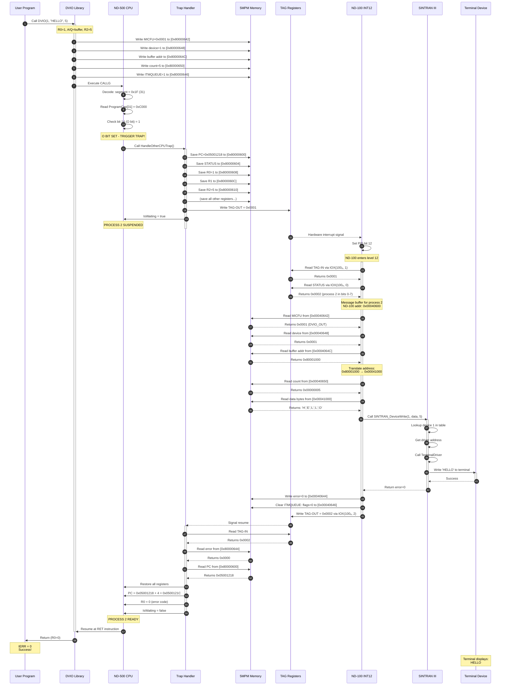

### Memory State at Each Phase

**Phase 1: Library Writes Parameters**

```
5MPM Address (ND-500 view: 0x80000600, ND-100 view: 0x00040600)

Offset  | Field          | Value        | Description
--------|----------------|--------------|---------------------------
+0x00   | saved_pc       | (unwritten)  | Will be filled by trap
+0x42   | micfu          | 0x0001       | ← DVIO_OUT code
+0x44   | error_code     | (unwritten)  | Will be filled by ND-100
+0x46   | flags          | 0x0001       | ← ITMQUEUE bit set
+0x48   | device         | 0x0001       | ← Terminal device
+0x4C   | buffer_addr    | 0x80001000   | ← Buffer in 5MPM
+0x50   | byte_count     | 0x00000005   | ← 5 bytes
```

**Phase 2: After Trap Handler Saves State**

```
Offset  | Field          | Value        | Description
--------|----------------|--------------|---------------------------
+0x00   | saved_pc       | 0x05001218   | ← Saved by trap
+0x04   | saved_status   | 0x00000004   | ← Saved by trap
+0x08   | saved_r0       | 0x00000001   | ← Saved by trap
+0x10   | saved_r2       | 0x00000005   | ← Saved by trap
+0x42   | micfu          | 0x0001       | (unchanged)
+0x44   | error_code     | (unwritten)  |
+0x46   | flags          | 0x0001       | (unchanged)
+0x48   | device         | 0x0001       | (unchanged)
+0x4C   | buffer_addr    | 0x80001000   | (unchanged)
+0x50   | byte_count     | 0x00000005   | (unchanged)
```

**Phase 3: After ND-100 Processes**

```
Offset  | Field          | Value        | Description
--------|----------------|--------------|---------------------------
+0x00   | saved_pc       | 0x05001218   | (unchanged)
+0x04   | saved_status   | 0x00000004   | (unchanged)
+0x08   | saved_r0       | 0x00000001   | (unchanged)
+0x42   | micfu          | 0x0001       | (unchanged)
+0x44   | error_code     | 0x0000       | ← Written by ND-100 (success!)
+0x46   | flags          | 0x0000       | ← ITMQUEUE cleared by ND-100
+0x48   | device         | 0x0001       | (unchanged)
+0x4C   | buffer_addr    | 0x80001000   | (unchanged)
+0x50   | byte_count     | 0x00000005   | (unchanged)
```

---

## Memory Access Mechanisms

### Who Can Access 5MPM and How

```mermaid
graph TB
    subgraph "5MPM Access Methods"
        direction TB

        ACCESS[5MPM Memory<br/>Dual-ported RAM]

        subgraph "ND-500 Access"
            CPU500[ND-500 CPU<br/>Direct memory access<br/>via address 0x80000000]
            DMA500[5015 DMA<br/>Burst transfers<br/>Hardware controller]
        end

        subgraph "ND-100 Access"
            IOX100[IOX Programmed I/O<br/>MAR + DATA registers<br/>One word at a time]
            DMA100[3022 DMA<br/>Burst transfers<br/>Hardware controller]
        end

        CPU500 -->|Memory instructions| ACCESS
        DMA500 -->|DMA cycle steal| ACCESS
        IOX100 -->|Via interface| ACCESS
        DMA100 -->|DMA cycle steal| ACCESS
    end
```

### Access Method Comparison

| Method | Speed | CPU Overhead | Use Case |
|--------|-------|--------------|----------|
| **ND-500 CPU direct** | Fastest (1 cycle) | None (normal memory) | Normal ND-500 program access |
| **ND-500 DMA** | Very fast | Low (setup only) | Large transfers, page loading |
| **ND-100 IOX** | Slow (~10 cycles/word) | High (CPU in loop) | Small transfers, TAG, parameters |
| **ND-100 DMA** | Fast | Low (setup only) | Page swapping, large file buffers |

### ND-100 IOX Access Pattern

**Reading a word from 5MPM:**

```c
uint16_t Read5MPM_Word(uint32_t mpm_address)
{
    // Split address into high and low
    uint16_t addr_low = mpm_address & 0xFFFF;
    uint16_t addr_high = (mpm_address >> 16) & 0xFF;

    // Write address to MAR
    IOX_Write(IOX_3022_DEVICE, IOX_MAR_LOW, addr_low);
    IOX_Write(IOX_3022_DEVICE, IOX_MAR_HIGH, addr_high);

    // Read data
    uint16_t data = IOX_Read(IOX_3022_DEVICE, IOX_DATA);

    return data;
}
```

**ND-100 assembly equivalent:**

```assembly
; Read word from 5MPM address in D register
READ_5MPM:
        LDA     100         ; Device 100₈ (3022)
        STA     T           ; T = device number

        ; Write MAR_LOW
        LDA     D           ; Low 16 bits of address
        STA     X           ; Save in X
        LDA     4           ; Offset 4 (MAR_LOW)
        IOXT                ; IOX write

        ; Write MAR_HIGH
        LDA     D+1         ; High 16 bits of address
        STA     X
        LDA     5           ; Offset 5 (MAR_HIGH)
        IOXT                ; IOX write

        ; Read DATA
        LDA     6           ; Offset 6 (DATA)
        IOXT                ; IOX read, result in A

        RET                 ; A = word from 5MPM
```

---

## Process State Structures

### ND-500 Process Descriptor

Each ND-500 process has a 512-byte descriptor in 5MPM at offset `processNum × 512`:

```c
typedef struct {
    // === SEGMENT CAPABILITIES (128 bytes) ===
    // Offset 0x000-0x07F
    uint16_t program_capabilities[32];  // +0x000: Each segment's prog cap
    uint16_t data_capabilities[32];     // +0x040: Each segment's data cap
    uint16_t reserved_caps[32];         // +0x080: Reserved

    // === SEGMENT BASE ADDRESSES (128 bytes) ===
    // Offset 0x080-0x0FF
    uint32_t segment_base[32];          // +0x080: Physical base for each seg

    // === PROCESS CONTROL (64 bytes) ===
    // Offset 0x100-0x13F
    uint8_t  process_number;            // +0x100: Process number (0-15)
    uint8_t  process_state;             // +0x101: State (READY/WAITING/etc)
    uint16_t process_priority;          // +0x102: Execution priority
    uint32_t entry_point;               // +0x104: Initial PC value
    uint32_t stack_pointer;             // +0x108: Initial stack pointer
    uint32_t heap_pointer;              // +0x10C: TOS register initial value

    // Process state flags
    uint16_t state_flags;               // +0x110: Flags (bit field)
    // Bit 0: ACTIVE (1=process exists)
    // Bit 1: WAITING (1=blocked)
    // Bit 2: SUSPENDED (1=manually suspended)
    // Bit 3: INTERRUPT_ENABLED (1=can be interrupted)

    uint32_t cpu_time_used;             // +0x112: CPU time in milliseconds
    uint32_t wait_time;                 // +0x116: Time spent waiting
    uint32_t page_faults;               // +0x11A: Number of page faults

    char domain_name[16];               // +0x11E: Name of loaded domain

    // === PAGE TABLE (256 bytes) ===
    // Offset 0x140-0x1FF
    uint32_t page_table[64];            // +0x140: Virtual→Physical mapping
    // Each entry: bits 31-12 = physical page, bits 11-0 = flags

} ProcessDescriptor;  // Total: 512 bytes (0x200)
```

### Process State Values

```c
enum ProcessState {
    STATE_FREE       = 0,  // Process slot not in use
    STATE_READY      = 1,  // Ready to run
    STATE_RUNNING    = 2,  // Currently executing
    STATE_WAITING    = 3,  // Waiting for monitor call
    STATE_SUSPENDED  = 4,  // Manually suspended
    STATE_PAGE_WAIT  = 5,  // Waiting for page load
    STATE_TERMINATED = 6   // Terminated, cleanup pending
};
```

### Process Scheduling

```mermaid
stateDiagram-v2
    [*] --> FREE: System boot

    FREE --> READY: PLACE-DOMAIN command

    READY --> RUNNING: Scheduler selects<br/>highest priority

    RUNNING --> READY: Time slice expired<br/>or higher priority ready

    RUNNING --> WAITING: Monitor call triggered<br/>(CALLG segment 31)

    RUNNING --> PAGE_WAIT: Page fault occurred

    WAITING --> READY: ND-100 completes<br/>monitor call

    PAGE_WAIT --> READY: Page loaded<br/>from disk

    RUNNING --> SUSPENDED: Manual suspend<br/>(operator command)

    SUSPENDED --> READY: Resume command

    RUNNING --> TERMINATED: Program exit

    TERMINATED --> FREE: Cleanup complete

    note right of WAITING
        IsWaiting = true
        Process blocked
        Not scheduled for execution
    end note

    note right of PAGE_WAIT
        Page fault handler active
        ND-100 loads page from disk
        Then signals completion
    end note
```

---

This completes the exhaustive deep-dive into the Segment 31 mechanism! Every bit, field, struct, DMA operation, TAG signal, and process flow has been documented with detailed Mermaid diagrams and code examples.

Would you like me to expand on any particular aspect even further, or create additional diagrams for specific scenarios?
