# SINTRAN III Deep Dive: Architecture, Scheduling, and Network Operations

**A Comprehensive Technical Guide for System Architects and Advanced Operators**

---

## Table of Contents

1. [SINTRAN III Architecture Overview](#sintran-iii-architecture-overview)
2. [Interrupt System and Hardware Levels](#interrupt-system-and-hardware-levels)
3. [Process Scheduling and Execution](#process-scheduling-and-execution)
4. [ND-500/ND-100 Dual Processor Architecture](#nd-500nd-100-dual-processor-architecture)
5. [Memory Management and Page Tables](#memory-management-and-page-tables)
6. [Complete System Setup and Configuration](#complete-system-setup-and-configuration)
7. [Process and Performance Monitoring](#process-and-performance-monitoring)
8. [COSMOS and XMSG Network Architecture](#cosmos-and-xmsg-network-architecture)
9. [HDLC Configuration and Setup](#hdlc-configuration-and-setup)
10. [Network Debugging and Troubleshooting](#network-debugging-and-troubleshooting)

---

## SINTRAN III Architecture Overview

### High-Level System Architecture

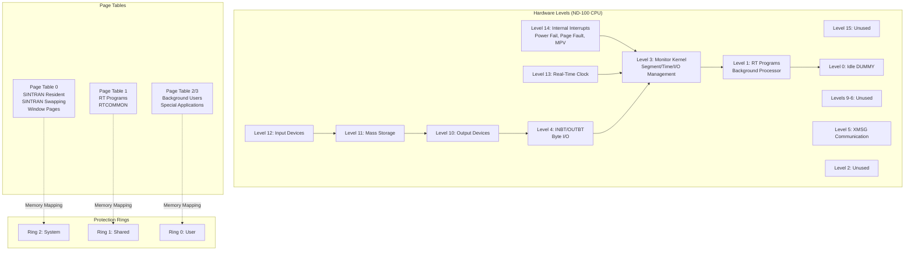

### System Components Interaction

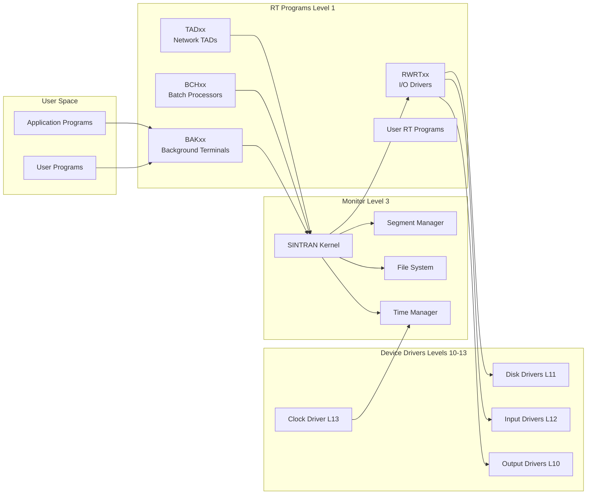

---

## Interrupt System and Hardware Levels

### ND-100 Interrupt Architecture

SINTRAN III's efficiency stems from using the ND-100's 16 hardware interrupt levels. Each level has its own complete register set, enabling context switches in only **0.9 microseconds**.

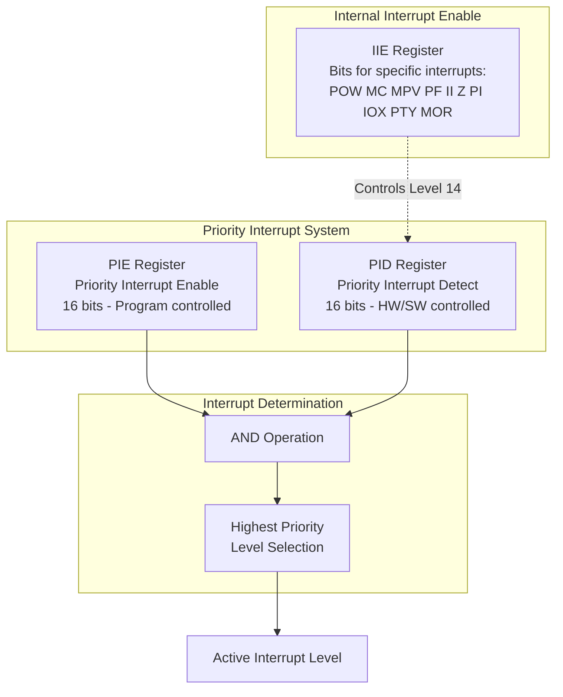

### Interrupt Level Allocation

| Level | Function | Priority | Usage |
|-------|----------|----------|-------|
| **15** | Unused | Highest | Reserved |
| **14** | Internal Interrupts | Very High | Monitor calls, Page faults, Memory violations, Power fail |
| **13** | Real-Time Clock | High | System timing, Time-slicing |
| **12** | Input Devices | High | Terminal input, Card readers |
| **11** | Mass Storage | High | Disk I/O operations |
| **10** | Output Devices | Medium-High | Printers, Terminal output |
| **9-6** | Unused | Medium | Available for expansion |
| **5** | XMSG | Medium | Network message passing |
| **4** | Byte I/O (INBT/OUTBT) | Medium-Low | Character-level terminal I/O |
| **3** | SINTRAN Monitor | Low-Medium | Kernel, Segment mgmt, File system |
| **2** | Unused | Low | Reserved |
| **1** | RT Programs | Very Low | Background processor, All RT programs |
| **0** | Idle | Lowest | DUMMY idle process |

### Internal Interrupt Types (Level 14)

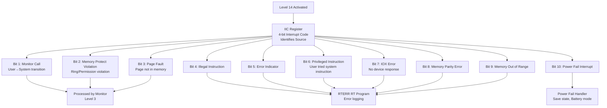

---

## Process Scheduling and Execution

### RT Program Scheduling

RT programs on Level 1 use a **priority-based execution queue**. Unlike time-sharing background programs, RT programs have priority levels and run until they voluntarily wait or are preempted by higher-priority RTs.

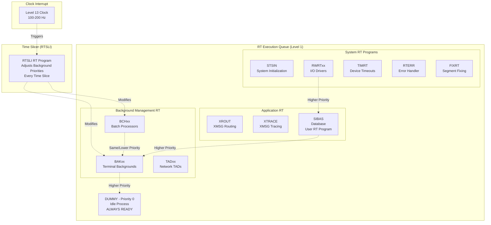

### Priority Levels in RT Programs

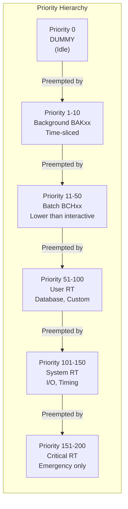

### Background Process Time-Slicing

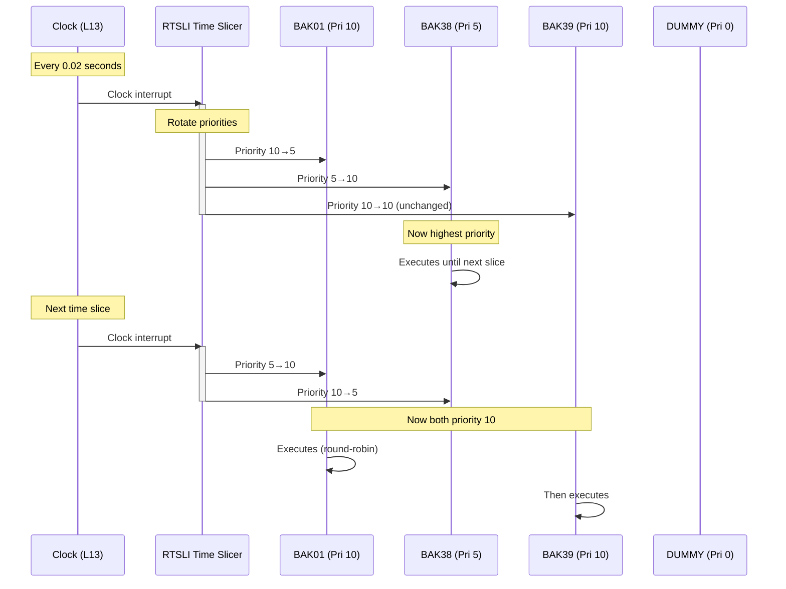

### State Transitions for RT Programs

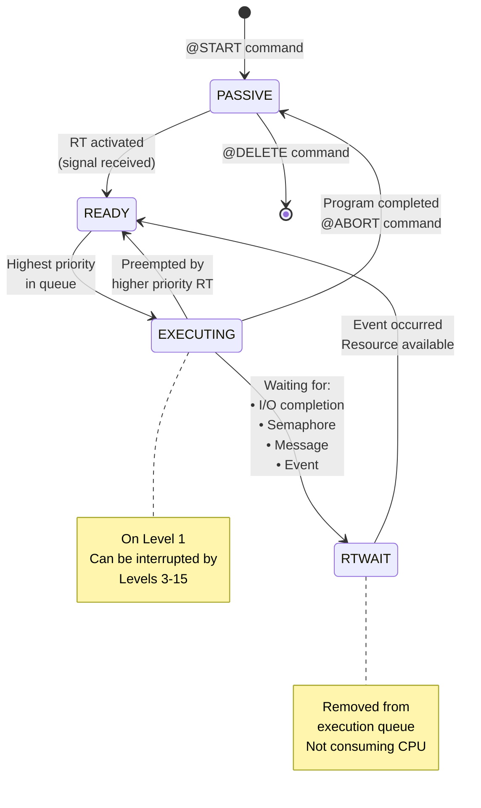

---

## ND-500/ND-100 Dual Processor Architecture

The ND-500 system uses a unique dual-processor architecture where the ND-100 acts as a "front-end" processor handling I/O and system management, while the ND-500 CPU performs computational tasks.

### Architecture Overview

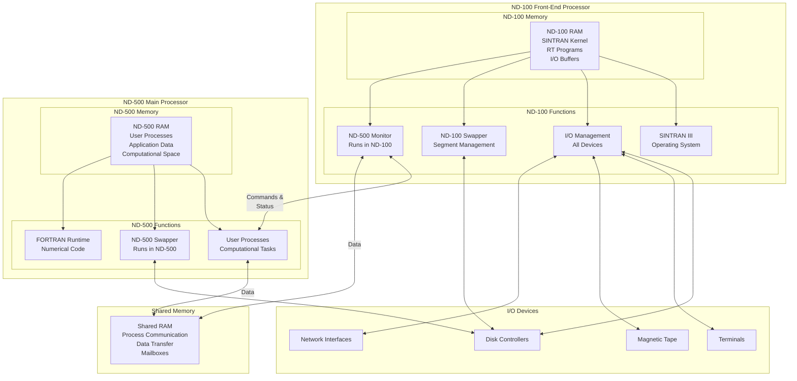

### Process Execution Flow

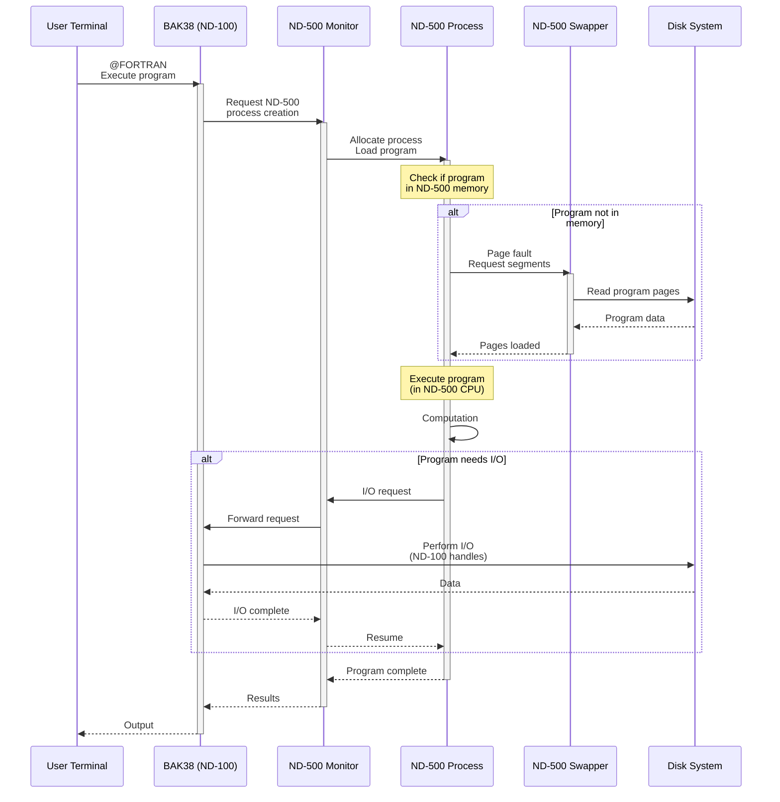

### Memory Allocation Between ND-100 and ND-500

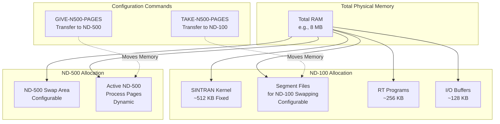

### Key Differences: ND-100 vs ND-500 Execution

| Aspect | ND-100 | ND-500 |
|--------|--------|--------|
| **CPU Type** | ND-100/CX 16-bit | ND-500 32-bit |
| **Word Size** | 16 bits | 32 bits |
| **Interrupts** | 16 hardware levels | None (polling) |
| **I/O System** | Direct device access | Via ND-100 monitor calls |
| **Swapping** | Segment-based (SINTRAN) | Page-based (ND-500 Monitor) |
| **Scheduling** | Priority + time-slice | Priority-based |
| **Primary Use** | OS, RT, I/O, Management | Computation, Applications |
| **Idle Overhead** | ~5-10% (interrupts) | Near 0% |

---

## Memory Management and Page Tables

### Page Table Organization

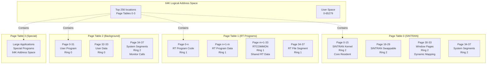

### Page Index Table Entry Format

```mermaid
graph LR
    subgraph "16-bit Page Table Entry"
        direction TB
        B15[Bit 15<br/>FPM<br/>Fetch Permitted]
        B14[Bit 14<br/>WPM<br/>Write Permitted]
        B13[Bit 13<br/>RPM<br/>Read Permitted]
        B12[Bit 12<br/>WIP<br/>Written In Page]
        B11[Bit 11<br/>AIP<br/>Accessed In Page]
        B10_0[Bits 10-0<br/>Physical Page<br/>Address<br/>(0-2047)]
    end

    B15 --> FETCH{Fetch?}
    B14 --> WRITE{Write?}
    B13 --> READ{Read?}

    FETCH -->|No| MPV1[MPV Interrupt]
    WRITE -->|No| MPV2[MPV Interrupt]
    READ -->|No| MPV3[MPV Interrupt]

    B12 --> DIRTY[Page Modified<br/>Must write to disk]
    B11 --> USED[Page Referenced<br/>For LRU algorithm]

    B10_0 --> PHYS[Physical<br/>Page 0-2047]
```

### Segment vs Page Management

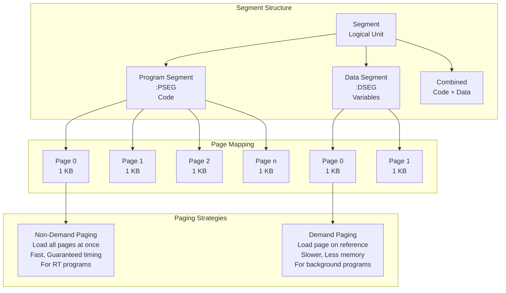

---

## Complete System Setup and Configuration

### Initial System Generation Workflow

```mermaid
flowchart TD
    START([New ND-500 System]) --> HARDWARE[Hardware Setup<br/>• Install cabinets<br/>• Connect peripherals<br/>• Set battery switches<br/>• Power on]

    HARDWARE --> BOOTFLOPPY[Boot from Floppy<br/>• Insert SINTRAN diskette<br/>• STOP + MCL buttons<br/>• LOAD button]

    BOOTFLOPPY --> FIRSTBOOT{First Boot?}

    FIRSTBOOT -->|Yes| NODIR[NO MAIN DIRECTORY<br/>message appears]
    FIRSTBOOT -->|No| WARMSTART[Warm Start<br/>Skip to configuration]

    NODIR --> CREATEDIR[CREATE-DIRECTORY<br/>• Name: PACK-ONE<br/>• Device: DISC-70MB-1<br/>• Unit: 0<br/>• Bit-file: default]

    CREATEDIR --> ENTERDIR[@ENTER-DIRECTORY<br/>PACK-ONE]

    ENTERDIR --> CREATESYS[@CREATE-USER SYSTEM]

    CREATESYS --> LOGOUT1[@LOGOUT<br/>Exit to re-login]

    LOGOUT1 --> LOGIN1[ENTER SYSTEM:<br/>PASSWORD: <blank>]

    LOGIN1 --> PASSWD[@CHANGE-PASSWORD<br/>Set SYSTEM password]

    PASSWD --> SPACE[@GIVE-USER-SPACE<br/>SYSTEM 15000<br/>~29MB for install]

    SPACE --> FILEACCESS[@SET-INITIAL-FILE-ACCESS<br/>R,RWA,RWAD<br/>@SET-DEFAULT-FILE-ACCESS]

    FILEACCESS --> USERS[Create Standard Users<br/>• RT<br/>• SCRATCH<br/>• UTILITY<br/>• PROGRAM-FILES<br/>• BPUN-FILES<br/>• FLOPPY-USER]

    USERS --> ND500USERS{ND-500<br/>System?}

    ND500USERS -->|Yes| ADD500[Create ND-500 Users<br/>• DOMAINS<br/>• N502-MICRO-TEST]
    ND500USERS -->|No| SYSFILES

    ADD500 --> SYSFILES[Create System Files<br/>• SINTRAN:DATA<br/>• SEGFILE:DATA<br/>• SWAP-FILE-x:SWAP<br/>• LOAD-MODE:BATC<br/>• MAILBOX:DATA]

    SYSFILES --> INSTALL[Install Software<br/>• Copy from floppies<br/>• Compilers<br/>• Utilities<br/>• Applications]

    INSTALL --> CONFIGURE[Configure SINTRAN<br/>• S3-CONFIGURATION<br/>• Terminals<br/>• Devices<br/>• Network (if applicable)]

    CONFIGURE --> LOADMODE[Edit LOAD-MODE<br/>• Auto-start programs<br/>• Set defaults<br/>• Configure hardware]

    LOADMODE --> COLDSTART[Cold Start<br/>STOP+MCL+LOAD]

    COLDSTART --> TEST[Test System<br/>• Login users<br/>• Run programs<br/>• Check devices]

    TEST --> VERIFY{All<br/>Working?}

    VERIFY -->|No| DEBUG[Debug Issues<br/>• Check logs<br/>• @TERMINAL-STATUS<br/>• @LIST-RT-PROGRAMS]
    DEBUG --> VERIFY

    VERIFY -->|Yes| COMPLETE([System Ready<br/>for Production])

    WARMSTART --> TEST
```

### Configuration File Structure

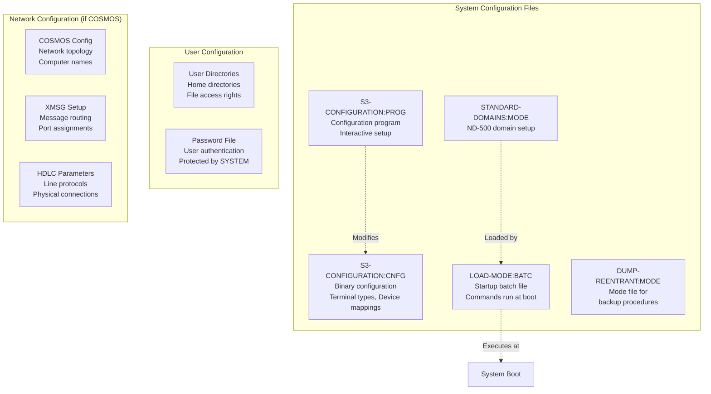

### LOAD-MODE File Example

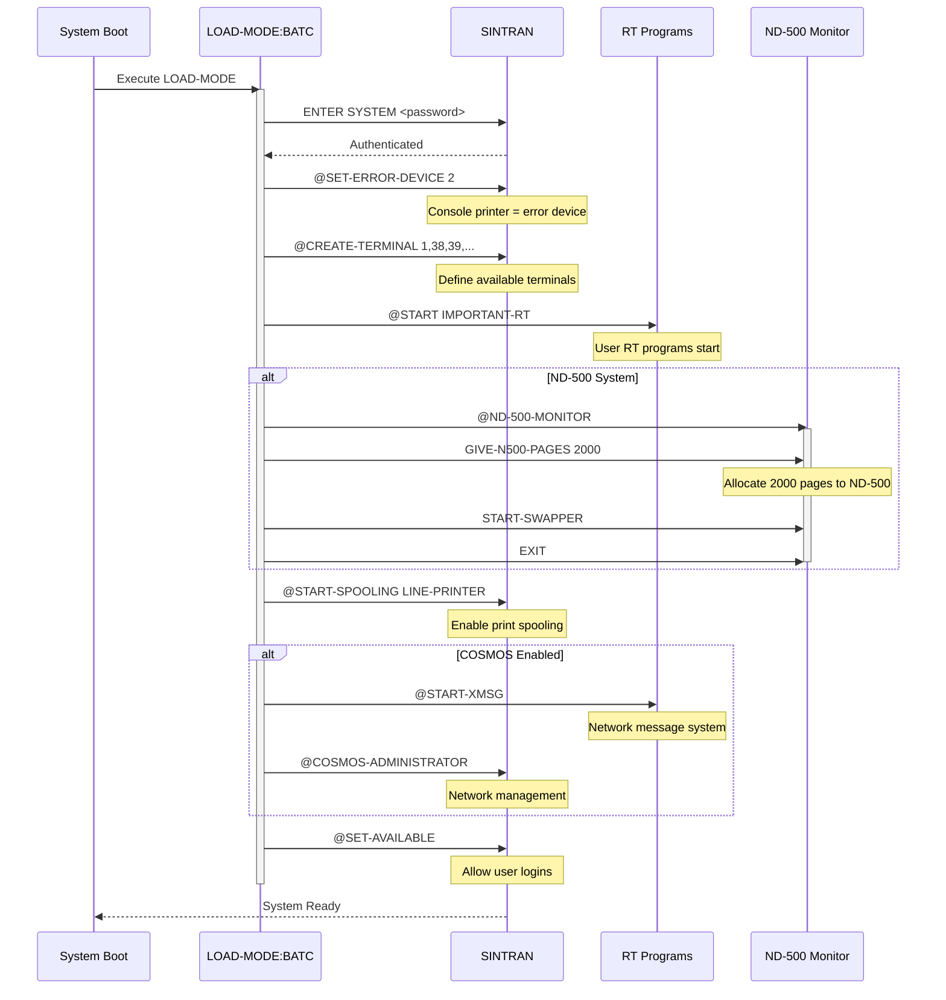

### Terminal Configuration Commands

```bash
# In S3-CONFIGURATION program
*S3-CONFIGURATION

# Define console terminal
FUNCTION: CREATE-TERMINAL
LOGICAL UNIT NO: 1
TERMINAL TYPE: 15         # Tandberg TDV 2200
DEVICE: 8                 # Device number
UNIT: 0                   # Unit number
INPUT SPEED: 9600
OUTPUT SPEED: 9600

# Define user terminals
FUNCTION: CREATE-TERMINAL
LOGICAL UNIT NO: 38
TERMINAL TYPE: 15
DEVICE: 8
UNIT: 1
INPUT SPEED: 9600
OUTPUT SPEED: 9600

# Repeat for terminals 39, 40, etc.

# Save configuration
FUNCTION: GENERATE-SYSTEM
OUTPUT FILE: (SYSTEM)S3-CONFIGURATION:CNFG

# Exit
FUNCTION: EXIT
```

---

## Process and Performance Monitoring

### Monitoring Tools Overview

```mermaid
graph TB
    subgraph "ND-100 Monitoring Tools"
        RTLOG[RT-PROGRAM-LOG<br/>• CPU usage by RT<br/>• I/O statistics<br/>• Swapping activity]

        PROGLOG[PROGRAM-LOG<br/>• Individual program profiling<br/>• Execution time<br/>• Resource usage]

        HIST[HISTOGRAM<br/>• CPU distribution<br/>• Memory usage<br/>• Address space analysis]

        SYSHIST[SYSTEM-HISTOGRAM<br/>• Hardware level activity<br/>• Interrupt overhead<br/>• System efficiency]

        TIMEUSED[TIME-USED<br/>• Per-program CPU time<br/>• Background programs<br/>• Does NOT include OS overhead]
    end

    subgraph "ND-500 Monitoring Tools"
        PROCLOG[PROCESS-LOG<br/>• ND-500 process activity<br/>• CPU distribution<br/>• Memory usage]

        MCLOG[MONITORCALL-LOG<br/>• ND-500 monitor calls<br/>• I/O requests<br/>• System call frequency]

        SWAPLOG[SWAPPING-LOG<br/>• ND-500 page swapping<br/>• Swap performance<br/>• Memory pressure]

        EXECQ[LIST-EXECUTION-QUEUE<br/>• Active ND-500 processes<br/>• Priorities<br/>• Status]
    end

    subgraph "Real-Time Monitoring"
        TERMSTAT[@TERMINAL-STATUS<br/>• Active users<br/>• CPU minutes<br/>• Current command]

        RTPROG[@LIST-RT-PROGRAMS<br/>• All RT programs<br/>• Status<br/>• RT descriptors]

        WHOIS[@WHO-IS-ON<br/>• Logged-in users<br/>• Login time<br/>• Terminal numbers]
    end
```

### RT-PROGRAM-LOG Output Analysis

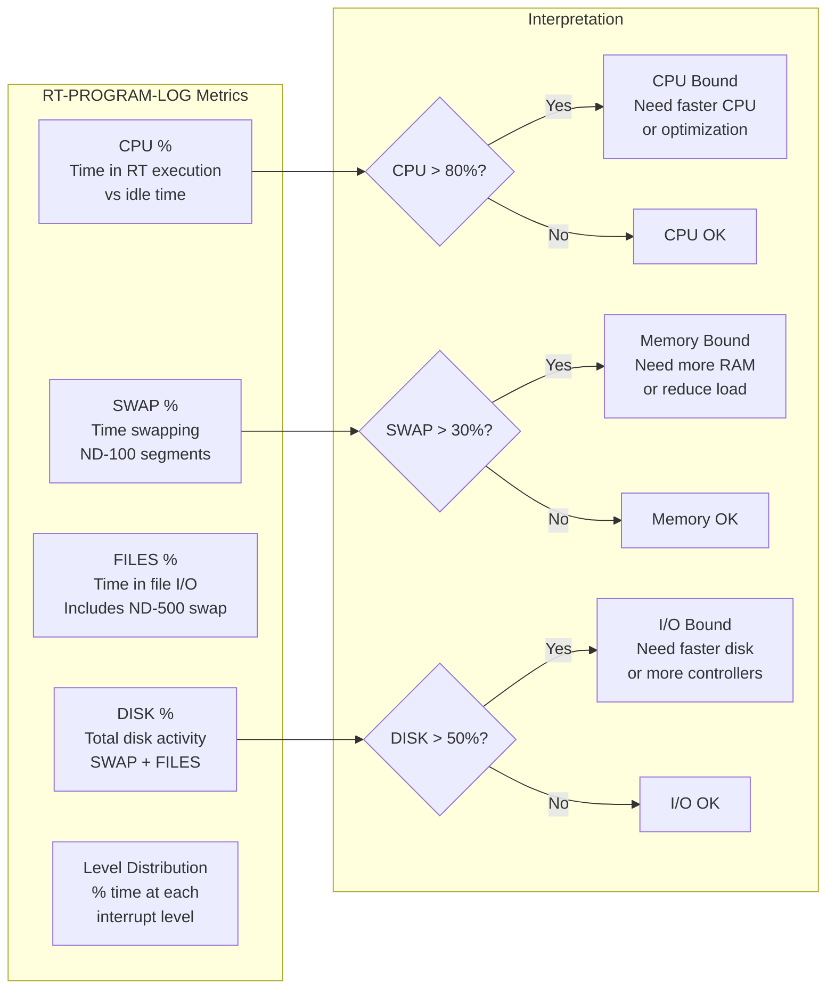

### Example Monitoring Session

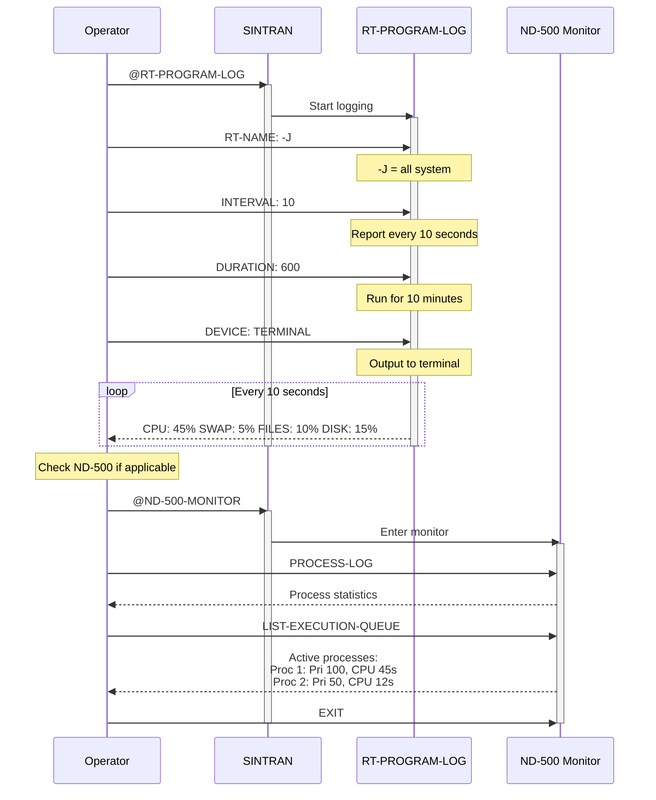

### System Performance Diagnosis Flowchart

```mermaid
flowchart TD
    START([Performance Issue]) --> RTLOG[Run RT-PROGRAM-LOG<br/>10-minute sample]

    RTLOG --> CHECKCPU{CPU > 80%?}

    CHECKCPU -->|Yes| ND500{ND-500<br/>System?}
    CHECKCPU -->|No| CHECKSWAP

    ND500 -->|Yes| WHICH[Check which CPU:<br/>RT-PROGRAM-LOG = ND-100<br/>PROCESS-LOG = ND-500]
    ND500 -->|No| CPU100[ND-100 CPU Bound<br/>Solutions:<br/>• Faster ND-100<br/>• Buffered terminals<br/>• Reduce RT programs]

    WHICH --> PROCLOG{ND-500<br/>High?}
    PROCLOG -->|Yes| CPU500[ND-500 CPU Bound<br/>Solutions:<br/>• Faster ND-500 CPU<br/>• AX vector option<br/>• Optimize programs]
    PROCLOG -->|No| CPU100

    CHECKSWAP{SWAP > 30%?} -->|Yes| MEM100[ND-100 Memory Bound<br/>Solutions:<br/>• Add RAM<br/>• GIVE-N500-PAGES<br/>• Reduce backgrounds]
    CHECKSWAP -->|No| CHECKFILES

    CHECKFILES{FILES > 40%?} -->|Yes| SWAPLOG[Run SWAPPING-LOG<br/>Check ND-500 swap]
    CHECKFILES -->|No| IDLE[System Healthy<br/>Adequate resources]

    SWAPLOG --> SWAP500{ND-500<br/>Swapping?}
    SWAP500 -->|Yes| MEM500[ND-500 Memory Bound<br/>Solutions:<br/>• Add RAM<br/>• TAKE-N500-PAGES<br/>• Fix critical pages<br/>• Reduce processes]
    SWAP500 -->|No| DISKIO[Disk I/O Bound<br/>Solutions:<br/>• Faster disks<br/>• Multiple controllers<br/>• Separate swap/data<br/>• More disk cache]

    CPU100 --> IMPLEMENT[Implement Solutions]
    CPU500 --> IMPLEMENT
    MEM100 --> IMPLEMENT
    MEM500 --> IMPLEMENT
    DISKIO --> IMPLEMENT

    IMPLEMENT --> RETEST[Re-test after<br/>changes]

    RETEST --> BETTER{Improved?}
    BETTER -->|Yes| DONE([Monitor Regularly])
    BETTER -->|No| START

    IDLE --> DONE
```

---

## COSMOS and XMSG Network Architecture

### COSMOS Network Layers

```mermaid
graph TB
    subgraph "Application Layer"
        APP1[File Transfer<br/>Remote File Access]
        APP2[Terminal Access<br/>Connect-To]
        APP3[Mail System<br/>Message Passing]
        APP4[Custom Applications]
    end

    subgraph "COSMOS Layer"
        COSMOS[COSMOS Services<br/>• TAD Management<br/>• Connection Control<br/>• Routing]

        CT[Connect-To Service<br/>Remote login<br/>Session management]

        FS[File Server<br/>FSART (Administrator)<br/>RTRFA (Access)]
    end

    subgraph "XMSG Layer (Message Passing)"
        XROUT[XROUT RT Program<br/>• Message routing<br/>• Computer naming<br/>• Port management]

        XTRACE[XTRACE RT Program<br/>• Message logging<br/>• Debugging<br/>• Traffic analysis]

        XMSG[XMSG API<br/>Send/Receive calls<br/>Port allocation]
    end

    subgraph "Transport Layer"
        HDLC[HDLC Protocol<br/>High-Level Data Link<br/>Frame transmission]

        DRIVER[Line Drivers<br/>RS-232, V.24<br/>Modem control]
    end

    subgraph "Physical Layer"
        SERIAL[Serial Lines<br/>Synchronous/Async<br/>Point-to-point]

        MODEM[Modems<br/>Long distance<br/>Dial-up/Leased]
    end

    APP1 --> COSMOS
    APP2 --> CT
    APP3 --> COSMOS
    APP4 --> COSMOS

    COSMOS --> XROUT
    CT --> XROUT
    FS --> XROUT

    XROUT --> XMSG
    XTRACE -.Monitors.-> XROUT

    XMSG --> HDLC
    HDLC --> DRIVER
    DRIVER --> SERIAL
    SERIAL --> MODEM
```

### XMSG Port and Message Architecture

```mermaid
graph LR
    subgraph "Computer A"
        direction TB
        A_APP[Application]
        A_PORT1[Local Port 1001]
        A_PORT2[Local Port 1002]
        A_XROUT[XROUT<br/>Routing Table]
        A_HDLC[HDLC Line 0]
    end

    subgraph "Network"
        LINE1[HDLC Line<br/>Computer A ↔ B]
        LINE2[HDLC Line<br/>Computer B ↔ C]
    end

    subgraph "Computer B (Hub)"
        direction TB
        B_HDLC1[HDLC Line 0]
        B_HDLC2[HDLC Line 1]
        B_XROUT[XROUT<br/>Routing Table<br/>Routes A ↔ C]
        B_PORT[Local Port 2001]
        B_APP[Local Application]
    end

    subgraph "Computer C"
        direction TB
        C_HDLC[HDLC Line 0]
        C_XROUT[XROUT<br/>Routing Table]
        C_PORT1[Local Port 3001]
        C_PORT2[Local Port 3002]
        C_APP[Application]
    end

    A_APP -.Uses.-> A_PORT1
    A_PORT1 --> A_XROUT
    A_XROUT --> A_HDLC
    A_HDLC --> LINE1

    LINE1 --> B_HDLC1
    B_HDLC1 --> B_XROUT
    B_XROUT --> B_HDLC2
    B_HDLC2 --> LINE2

    LINE2 --> C_HDLC
    C_HDLC --> C_XROUT
    C_XROUT --> C_PORT1
    C_PORT1 -.Delivers to.-> C_APP

    B_XROUT -.Also serves.-> B_PORT
    B_PORT -.Local.-> B_APP
```

### XMSG Message Flow

```mermaid
sequenceDiagram
    participant APP_A as Application A<br/>(Computer ALPHA)
    participant XMSG_A as XMSG on ALPHA
    participant XROUT_A as XROUT on ALPHA
    participant HDLC_A as HDLC Line
    participant HDLC_B as HDLC Line
    participant XROUT_B as XROUT on BETA
    participant XMSG_B as XMSG on BETA
    participant APP_B as Application B<br/>(Computer BETA)

    Note over APP_A: Want to send message<br/>to BETA:3001

    APP_A->>XMSG_A: XMSEND<br/>Dest: BETA:3001<br/>Source: LOCAL:1001<br/>Data: "Hello"

    XMSG_A->>XROUT_A: Route message<br/>Destination: BETA

    Note over XROUT_A: Check routing table<br/>BETA via HDLC Line 0

    XROUT_A->>HDLC_A: Transmit frame<br/>Header + Data

    HDLC_A->>HDLC_B: Physical transmission<br/>CRC check, ACK

    HDLC_B->>XROUT_B: Frame received<br/>Destination: LOCAL:3001

    XROUT_B->>XMSG_B: Deliver to port 3001

    XMSG_B->>APP_B: XMRECV<br/>Data available

    APP_B-->>XMSG_B: Read data: "Hello"

    Note over APP_B: Process message

    APP_B->>XMSG_B: XMSEND<br/>Reply to ALPHA:1001<br/>Data: "Acknowledged"

    Note over XMSG_B,HDLC_A: Reverse path

    HDLC_A->>XROUT_A: Reply received
    XROUT_A->>XMSG_A: Deliver to port 1001
    XMSG_A->>APP_A: XMRECV<br/>Reply available
```

---

## HDLC Configuration and Setup

### HDLC Physical Connection

```mermaid
graph TB
    subgraph "Computer ALPHA"
        CPU_A[ND-100 CPU]
        COMM_A[Communication Board<br/>ND-3231 or 3232]
        MODEM_A[Modem/DCE<br/>or Direct]
    end

    subgraph "Physical Medium"
        CABLE[RS-232 Cable<br/>or<br/>Leased Line]
    end

    subgraph "Computer BETA"
        MODEM_B[Modem/DCE<br/>or Direct]
        COMM_B[Communication Board<br/>ND-3231 or 3232]
        CPU_B[ND-100 CPU]
    end

    CPU_A <--> COMM_A
    COMM_A <-->|TXD, RXD<br/>RTS, CTS<br/>DTR, DSR| MODEM_A
    MODEM_A <-->|Electrical Signals| CABLE
    CABLE <--> MODEM_B
    MODEM_B <-->|TXD, RXD<br/>RTS, CTS<br/>DTR, DSR| COMM_B
    COMM_B <--> CPU_B
```

### HDLC Configuration Commands

**Setting up HDLC Line (in SINTRAN Service Program):**

```bash
# Enter SINTRAN Service Program
@SINTRAN-SERVICE-PROGRAM

# Create HDLC line device
FUNCTION: CREATE-DEVICE
DEVICE-NAME: HDLC
DEVICE-NUMBER: 40           # Device number for HDLC controller
UNIT-NUMBER: 0              # First HDLC line
TYPE: HDLC

# Configure HDLC parameters
FUNCTION: SET-HDLC-PARAMETERS
DEVICE: 40
UNIT: 0
SPEED: 9600                 # Baud rate: 1200, 2400, 4800, 9600, 19200
MODE: NRM                   # Normal Response Mode (or ABM for Async Balanced)
WINDOW-SIZE: 7              # Number of frames before ACK (1-7)
FRAME-SIZE: 256             # Maximum frame size in bytes
TIMEOUT: 5                  # Seconds before retransmission
RETRIES: 10                 # Number of retries before failure

# Set line protocol
FUNCTION: SET-LINE-PROTOCOL
DEVICE: 40
UNIT: 0
PROTOCOL: HDLC-LAP-B        # HDLC LAP-B variant

# Configure modem control
FUNCTION: SET-MODEM-CONTROL
DEVICE: 40
UNIT: 0
DTR: ON                     # Data Terminal Ready
RTS: ON                     # Request To Send
MODE: ORIGINATE             # or ANSWER for receiving end

# Save configuration
FUNCTION: GENERATE-SYSTEM

# Exit
FUNCTION: EXIT
```

### COSMOS Network Setup

**Initializing COSMOS Network:**

```bash
# Start XMSG (prerequisite for COSMOS)
@START-XMSG

# Configure computer name
@XMSG-SERVICE-PROGRAM
FUNCTION: SET-COMPUTER-NAME
COMPUTER-NAME: ALPHA        # This computer's network name
FUNCTION: EXIT

# Add routing table entries
@XMSG-SERVICE-PROGRAM
FUNCTION: ADD-ROUTE
DESTINATION-COMPUTER: BETA
LINE-NUMBER: 0              # HDLC line 0
FUNCTION: ADD-ROUTE
DESTINATION-COMPUTER: GAMMA
LINE-NUMBER: 0              # Via BETA (routing)
VIA-COMPUTER: BETA
FUNCTION: EXIT

# Start COSMOS Administrator
@COSMOS-ADMINISTRATOR

# Configure TAD (Terminal Access Device) pool
FUNCTION: CREATE-TAD-POOL
NUMBER-OF-TADS: 16          # Support up to 16 remote users
FIRST-TAD-NUMBER: 768       # Starting terminal number
FUNCTION: EXIT

# Enable file server (optional)
@FILE-SERVER-ADMINISTRATOR
FUNCTION: START-FILE-SERVER
FUNCTION: EXIT
```

### HDLC Operational States

```mermaid
stateDiagram-v2
    [*] --> DISCONNECTED: Power on/<br/>Line created

    DISCONNECTED --> SETUP: SETUP frame sent

    SETUP --> CONNECTED: UA (Ack) received

    CONNECTED --> INFORMATION: Ready to<br/>transfer data

    INFORMATION --> INFORMATION: I-frames exchanged<br/>RR (Receive Ready) ACKs

    INFORMATION --> BUSY: RNR (Receive Not Ready)<br/>Remote buffer full

    BUSY --> INFORMATION: RR received<br/>Remote ready again

    INFORMATION --> DISCONNECT: DISC frame sent<br/>Normal termination

    DISCONNECT --> DISCONNECTED: UA received

    INFORMATION --> ERROR: Timeout<br/>Bad CRC<br/>Invalid frame

    ERROR --> RETRY: Retransmit frame

    RETRY --> INFORMATION: Successful

    RETRY --> DISCONNECTED: Max retries<br/>exceeded

    note right of INFORMATION
        Normal operation
        I-frames with data
        Sequence numbers
        ACKs via RR frames
    end note

    note right of ERROR
        Error recovery:
        - Retransmit
        - REJ (Reject)
        - SABM (reset)
    end note
```

### HDLC Frame Structure

```mermaid
graph LR
    subgraph "HDLC Frame"
        FLAG1[Flag<br/>01111110<br/>1 byte]
        ADDR[Address<br/>Station ID<br/>1 byte]
        CTRL[Control<br/>Frame type<br/>Sequence nos<br/>1 byte]
        INFO[Information<br/>User data<br/>0-256 bytes]
        FCS[FCS<br/>CRC-16<br/>2 bytes]
        FLAG2[Flag<br/>01111110<br/>1 byte]
    end

    FLAG1 --> ADDR
    ADDR --> CTRL
    CTRL --> INFO
    INFO --> FCS
    FCS --> FLAG2
```

**Frame Types:**

```mermaid
graph TB
    FRAME[HDLC Frame Types]

    FRAME --> IFRAME[I-Frame<br/>Information<br/>Contains user data<br/>Sequence numbers]

    FRAME --> SFRAME[S-Frame<br/>Supervisory<br/>Flow control<br/>ACKs]

    FRAME --> UFRAME[U-Frame<br/>Unnumbered<br/>Link setup<br/>Disconnect]

    SFRAME --> RR[RR<br/>Receive Ready<br/>ACK + Ready]
    SFRAME --> RNR[RNR<br/>Receive Not Ready<br/>ACK + Busy]
    SFRAME --> REJ[REJ<br/>Reject<br/>Request retransmit]

    UFRAME --> SABM[SABM<br/>Set Async Balanced<br/>Initialize link]
    UFRAME --> DISC[DISC<br/>Disconnect<br/>Terminate link]
    UFRAME --> UA[UA<br/>Unnumbered ACK<br/>Acknowledge U-frame]
```

---

## Network Debugging and Troubleshooting

### XMSG Debugging Commands

**Enabling XMSG Tracing:**

```bash
# Method 1: Start XTRACE RT program
@START XTRACE

# XTRACE automatically logs all XMSG activity
# Output goes to file or terminal

# Method 2: Enable debug print in File Transfer
@FILE-TRANSFER
FT: DEBUGPRINT-ON

# Now all XMSG calls are displayed:
# XMSEND: TO=BETA:3001 FROM=ALPHA:1001 LEN=64
# XMRECV: FROM=BETA:3001 TO=ALPHA:1001 LEN=32

# Transfer a file to see traffic
FT: COPY-TO-REMOTE
...

# Disable debug
FT: DEBUGPRINT-OFF
FT: EXIT

# Method 3: XMSG Service Program logging
@XMSG-SERVICE-PROGRAM
FUNCTION: SET-DEBUG-LEVEL
LEVEL: 3                    # 0=off, 1=errors, 2=warnings, 3=all
LOG-FILE: (SYSTEM)XMSG-LOG:DATA
FUNCTION: EXIT
```

### XMSG Trace Output Analysis

```mermaid
sequenceDiagram
    participant TRACE as XTRACE RT
    participant APP as Application
    participant XMSG as XMSG Layer
    participant HDLC as HDLC Layer

    Note over TRACE: Intercepts all XMSG calls

    APP->>XMSG: XMSEND call
    XMSG-->>TRACE: Log: SEND<br/>Dest=BETA:3001<br/>Src=ALPHA:1001<br/>Len=128

    XMSG->>HDLC: Frame transmission
    HDLC-->>TRACE: Log: HDLC<br/>Line=0<br/>Frame=I,Seq=5<br/>Len=140

    Note over HDLC: Wait for ACK

    HDLC->>XMSG: ACK received
    XMSG-->>TRACE: Log: ACK<br/>Line=0<br/>Seq=5

    Note over TRACE: Timestamps all events

    HDLC->>XMSG: Data received
    XMSG-->>TRACE: Log: RECV<br/>From=BETA:3001<br/>To=ALPHA:1001<br/>Len=64

    XMSG->>APP: XMRECV delivers
    APP-->>TRACE: Log: DELIVERED<br/>Port=1001<br/>Status=OK
```

**Example XTRACE Output:**

```
TIME     EVENT     DETAILS
========================================
10:23:15 XMSEND    TO=BETA:3001 FROM=ALPHA:1001 LEN=128 DATA=...
10:23:15 HDLC-TX   LINE=0 FRAME=I SEQ=5 ACK=3 LEN=140
10:23:15 HDLC-ACK  LINE=0 SEQ=5 RTT=12ms
10:23:16 HDLC-RX   LINE=0 FRAME=I SEQ=4 ACK=5 LEN=76
10:23:16 XMRECV    FROM=BETA:3001 TO=ALPHA:1001 LEN=64
10:23:16 DELIVER   PORT=1001 STATUS=OK QUEUED=0
```

### HDLC Line Debugging

**Checking HDLC Line Status:**

```bash
# SINTRAN Service Program
@SINTRAN-SERVICE-PROGRAM

# Display line status
FUNCTION: LIST-HDLC-STATUS
DEVICE: 40

# Example output:
# UNIT  STATE      TX-FRAMES  RX-FRAMES  ERRORS  RETRANS  TIMEOUTS
# 0     CONNECTED  1523       1487       0       0        0
# 1     DISCONN    0          0          0       0        0

# Detailed statistics
FUNCTION: DISPLAY-LINE-STATISTICS
DEVICE: 40
UNIT: 0

# Output:
# CRC Errors: 0
# Frame Errors: 0
# Overruns: 0
# Underruns: 0
# Timeouts: 0
# Retransmissions: 0
# Current Window: 7
# Queue Depth: 0

# Reset error counters
FUNCTION: RESET-STATISTICS
DEVICE: 40
UNIT: 0
```

### HDLC Troubleshooting Flowchart

```mermaid
flowchart TD
    START([HDLC Link Problem]) --> CHECK[Check Physical]

    CHECK --> CABLE{Cables<br/>Connected?}
    CABLE -->|No| FIXCABLE[Connect cables<br/>Check pinout]
    CABLE -->|Yes| MODEM

    FIXCABLE --> MODEM

    MODEM{Modem<br/>Lights OK?}
    MODEM -->|No| CHECKMODEM[• Check power<br/>• Check DTR/DSR<br/>• Check carrier]
    MODEM -->|Yes| SINTSTATUS

    CHECKMODEM --> SINTSTATUS

    SINTSTATUS[Check SINTRAN<br/>@SINTRAN-SERVICE-PROGRAM<br/>LIST-HDLC-STATUS]

    SINTSTATUS --> STATE{Line<br/>State?}

    STATE -->|DISCONNECTED| NOLINK[No Link Established<br/>Check:<br/>• HDLC parameters match<br/>• Both ends configured<br/>• Speeds match<br/>• Protocol compatibility]

    STATE -->|CONNECTED| ERRORS{Errors<br/>Count?}

    ERRORS -->|High| ERRTYPE{Error<br/>Type?}

    ERRTYPE -->|CRC Errors| BADLINE[Line Quality Issue<br/>• Bad cable<br/>• Interference<br/>• Speed too high<br/>• Reduce speed]

    ERRTYPE -->|Timeouts| TIMING[Timing Issue<br/>• Increase timeout<br/>• Reduce window size<br/>• Check latency<br/>• Modem delay]

    ERRTYPE -->|Overruns| BUFFER[Buffer Problem<br/>• CPU overloaded<br/>• Reduce traffic<br/>• Check RT priority<br/>• More memory]

    ERRORS -->|Low| XMSG[Check XMSG Layer<br/>@XMSG-SERVICE-PROGRAM<br/>LIST-ROUTES]

    XMSG --> ROUTE{Routing<br/>Correct?}

    ROUTE -->|No| FIXROUTE[Add/Fix Routes<br/>ADD-ROUTE<br/>Check computer names]

    ROUTE -->|Yes| TRACE[Enable Tracing<br/>@START XTRACE<br/>or DEBUGPRINT-ON]

    TRACE --> MONITOR[Monitor Traffic<br/>Look for:<br/>• Messages sent?<br/>• ACKs received?<br/>• Where failing?]

    MONITOR --> APPISSUE{Application<br/>Problem?}

    APPISSUE -->|Yes| FIXAPP[Debug Application<br/>Check port numbers<br/>Check addresses]

    APPISSUE -->|No| COSMOSCHECK[Check COSMOS<br/>@TADADM<br/>@COSMOS-ADMIN]

    NOLINK --> RETRY[Reset Link<br/>DISCONNECT-LINE<br/>CONNECT-LINE]

    BADLINE --> RETRY
    TIMING --> RETRY
    BUFFER --> RETRY

    RETRY --> RETEST{Working?}
    RETEST -->|Yes| DONE([Problem Solved])
    RETEST -->|No| ESCALATE([Contact<br/>ND Support])

    FIXROUTE --> RETEST
    FIXAPP --> RETEST

    COSMOSCHECK --> TADOK{TADs<br/>Available?}
    TADOK -->|No| CREATETAD[CREATE-TAD-POOL]
    TADOK -->|Yes| DONE

    CREATETAD --> DONE
```

### Common HDLC Error Messages and Solutions

```mermaid
graph TB
    subgraph "Error Messages"
        E1[HDLC TIMEOUT<br/>LINE 0]
        E2[HDLC CRC ERROR<br/>LINE 0]
        E3[HDLC DISCONNECT<br/>LINE 0]
        E4[HDLC OVERRUN<br/>LINE 0]
        E5[XMSG NO ROUTE<br/>TO BETA]
        E6[XMSG PORT BUSY<br/>3001]
    end

    subgraph "Causes and Solutions"
        E1 --> T1[Timeout Causes:<br/>• Remote not responding<br/>• Line delay too high<br/>• Heavy traffic]
        T1 --> S1[Solutions:<br/>• Increase timeout value<br/>• Check remote system<br/>• Reduce window size]

        E2 --> T2[CRC Causes:<br/>• Noisy line<br/>• Bad cable<br/>• Interference<br/>• Speed mismatch]
        T2 --> S2[Solutions:<br/>• Check cable quality<br/>• Reduce speed<br/>• Shield cables<br/>• Check connectors]

        E3 --> T3[Disconnect Causes:<br/>• Remote shutdown<br/>• Modem carrier loss<br/>• Line failure]
        T3 --> S3[Solutions:<br/>• Check remote system<br/>• Verify modem connection<br/>• Test line continuity]

        E4 --> T4[Overrun Causes:<br/>• CPU too slow<br/>• Buffer overflow<br/>• High interrupt load]
        T4 --> S4[Solutions:<br/>• Reduce traffic<br/>• Increase buffer size<br/>• Optimize RT priorities]

        E5 --> T5[No Route Causes:<br/>• Routing table incomplete<br/>• Computer name wrong<br/>• XMSG not started]
        T5 --> S5[Solutions:<br/>• ADD-ROUTE command<br/>• Check computer names<br/>• @START-XMSG]

        E6 --> T6[Port Busy Causes:<br/>• Application crash<br/>• Port not released<br/>• Duplicate allocation]
        T6 --> S6[Solutions:<br/>• Restart application<br/>• Check RT programs<br/>• Use different port]
    end
```

### COSMOS Debugging Session Example

```mermaid
sequenceDiagram
    participant OPR as Operator
    participant SINT as SINTRAN
    participant XMSG as XMSG Service
    participant XTRACE as XTRACE
    participant HDLC as HDLC Line

    Note over OPR: User reports: "Can't connect to BETA"

    OPR->>SINT: @XMSG-SERVICE-PROGRAM
    activate SINT

    OPR->>SINT: LIST-ROUTES
    SINT-->>OPR: BETA: Line 0, Status OK

    OPR->>SINT: LIST-COMPUTER-NAMES
    SINT-->>OPR: LOCAL: ALPHA<br/>REMOTE: BETA, GAMMA

    OPR->>SINT: EXIT
    deactivate SINT

    OPR->>SINT: @SINTRAN-SERVICE-PROGRAM
    activate SINT

    OPR->>SINT: LIST-HDLC-STATUS 40
    SINT-->>OPR: Unit 0: CONNECTED<br/>TX: 523, RX: 487<br/>Errors: 15 CRC

    Note over OPR: CRC errors - line quality issue

    OPR->>SINT: DISPLAY-LINE-STATISTICS 40 0
    SINT-->>OPR: CRC Errors: 15<br/>Retransmissions: 8<br/>Timeouts: 2

    deactivate SINT

    Note over OPR: Start detailed tracing

    OPR->>XTRACE: @START XTRACE
    activate XTRACE

    OPR->>SINT: @CONNECT-TO BETA
    activate SINT

    SINT->>XMSG: XMSEND to BETA:CT-PORT
    XMSG-->>XTRACE: LOG: SEND BETA:101 LEN=32

    XMSG->>HDLC: Transmit frame
    HDLC-->>XTRACE: LOG: HDLC-TX Line=0 Seq=50

    Note over HDLC: Wait...timeout

    HDLC-->>XTRACE: LOG: TIMEOUT Seq=50<br/>Retransmitting

    HDLC->>HDLC: Retransmit frame
    HDLC-->>XTRACE: LOG: HDLC-TX Line=0 Seq=50 (retry)

    Note over HDLC: ACK received

    HDLC-->>XTRACE: LOG: HDLC-ACK Seq=50 RTT=250ms

    Note over OPR: High RTT - line delay

    deactivate SINT
    deactivate XTRACE

    Note over OPR: Solution: Increase timeout<br/>Reduce speed if errors continue
```

---

## Comprehensive Monitoring Commands Reference

### Quick Command Reference

| Command | Purpose | Example |
|---------|---------|---------|
| **System Status** | | |
| `@WHO-IS-ON` | List logged-in users | `@WHO-IS-ON` |
| `@TERMINAL-STATUS` | Detailed terminal info | `@TERMINAL-STATUS,,` |
| `@LIST-RT-PROGRAMS` | All RT programs | `@LIST-RT-PROGRAMS,,` |
| `@LIST-OPEN-FILES` | User's open files | `@LIST-OPEN-FILES` |
| `@LIST-RTOPEN-FILES` | RT-open files | `@LIST-RTOPEN-FILES,,` |
| **Performance** | | |
| `@RT-PROGRAM-LOG` | ND-100 performance | Interactive command |
| `@PROGRAM-LOG` | Individual program profile | Interactive command |
| `@HISTOGRAM` | CPU distribution | Interactive command |
| `@SYSTEM-HISTOGRAM` | Hardware levels | Interactive command |
| **ND-500 Specific** | | |
| `@ND-500-MONITOR` | Enter ND-500 monitor | `@ND-500-MONITOR` |
| `PROCESS-STATUS` | ND-500 processes | In ND-500 monitor |
| `PROCESS-LOG` | ND-500 performance | In ND-500 monitor |
| `LIST-EXECUTION-QUEUE` | Process queue | In ND-500 monitor |
| **Network** | | |
| `@TADADM` | COSMOS TAD status | `@TADADM` |
| `@XMSG-SERVICE-PROGRAM` | XMSG configuration | Interactive command |
| `@START XTRACE` | Enable XMSG tracing | `@START XTRACE` |
| **HDLC** | | |
| `@SINTRAN-SERVICE-PROGRAM` | Configure HDLC | Interactive command |
| `LIST-HDLC-STATUS` | Line status | In service program |
| `DISPLAY-LINE-STATISTICS` | Detailed stats | In service program |

---

## Best Practices Summary

### System Setup
1. **Always backup** before configuration changes
2. **Test commands manually** before adding to LOAD-MODE
3. **Document all changes** in comments
4. **Use descriptive names** for users, files, directories
5. **Set appropriate passwords** for SYSTEM and RT users

### Performance Monitoring
1. **Establish baselines** - know normal system behavior
2. **Monitor regularly** - don't wait for problems
3. **Check all layers** - hardware, OS, application
4. **Correlate metrics** - CPU + memory + I/O
5. **Keep logs** - historical data helps diagnosis

### Network Operations
1. **Verify physical** before software debugging
2. **Enable tracing** only when debugging (performance impact)
3. **Match parameters** on both ends of HDLC links
4. **Use routing tables** correctly
5. **Monitor error counters** regularly

### Troubleshooting
1. **Work bottom-up** - physical → link → network → application
2. **Check one thing** at a time
3. **Document findings** for future reference
4. **Use systematic approach** - flowcharts, checklists
5. **Know when to escalate** - don't waste time guessing

---

## Appendix: System Architecture Summary

### Complete SINTRAN III Stack

```mermaid
graph TB
    subgraph "User Applications"
        USERAPP[User Programs<br/>FORTRAN, COBOL<br/>Custom Applications]
    end

    subgraph "Application Services"
        COSMOS[COSMOS<br/>Network Services]
        SIBAS[SIBAS<br/>Database]
        NOTIS[NOTIS<br/>Office Suite]
    end

    subgraph "RT Program Layer (Level 1)"
        BAK[Background<br/>Terminals]
        XROUT[XMSG<br/>Messaging]
        RTCUSTOM[Custom RT<br/>Programs]
    end

    subgraph "SINTRAN Monitor (Level 3)"
        KERNEL[System Kernel]
        FILESYS[File System]
        SEGMENT[Segment Manager]
    end

    subgraph "Device Drivers (Levels 10-13)"
        DISKDRV[Disk Drivers]
        TERMDRV[Terminal I/O]
        NETDRV[Network Drivers]
    end

    subgraph "Hardware"
        CPU[ND-100/ND-500<br/>Processors]
        MEM[Memory<br/>Management]
        DEVICES[Peripherals<br/>Disk, Terminal, Network]
    end

    USERAPP --> COSMOS
    USERAPP --> SIBAS
    COSMOS --> XROUT
    SIBAS --> RTCUSTOM
    NOTIS --> BAK

    BAK --> KERNEL
    XROUT --> KERNEL
    RTCUSTOM --> KERNEL

    KERNEL --> FILESYS
    KERNEL --> SEGMENT
    KERNEL --> DISKDRV
    KERNEL --> TERMDRV
    KERNEL --> NETDRV

    DISKDRV --> CPU
    TERMDRV --> CPU
    NETDRV --> CPU

    CPU --> MEM
    CPU --> DEVICES

    SEGMENT --> MEM
    FILESYS --> DISKDRV
```

---

**Document Version:** 2.0
**Date:** 2025-11-18
**Purpose:** Deep technical guide for SINTRAN III system architects and advanced operators

**Related Documents:**
- SINTRAN-Operations-Guide.md (Basic operations)
- ND-30.003.007 EN SINTRAN III System Supervisor
- ND-60.062.01D EN SINTRAN III System Documentation
- ND-30.049.1 EN SINTRAN III Tuning Guide
