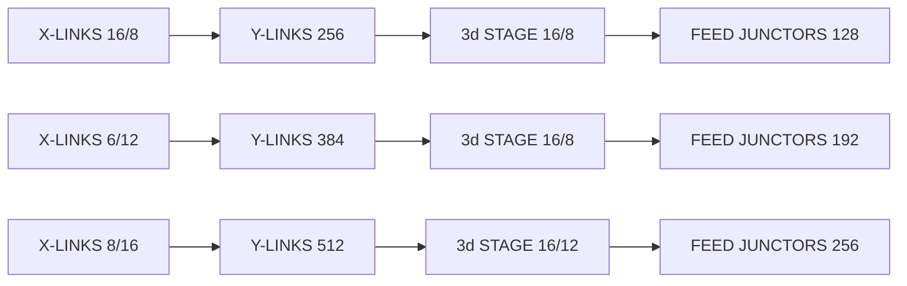
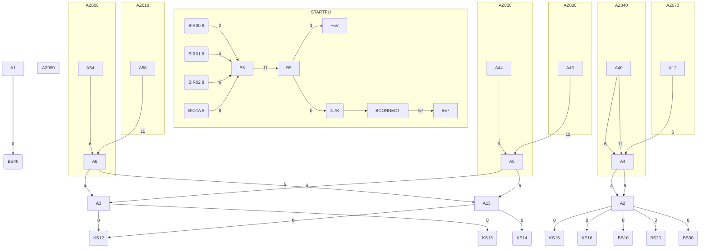
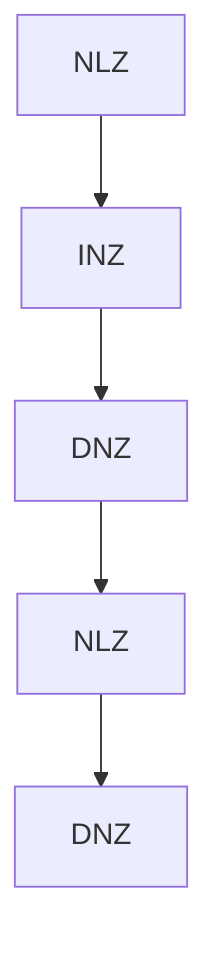
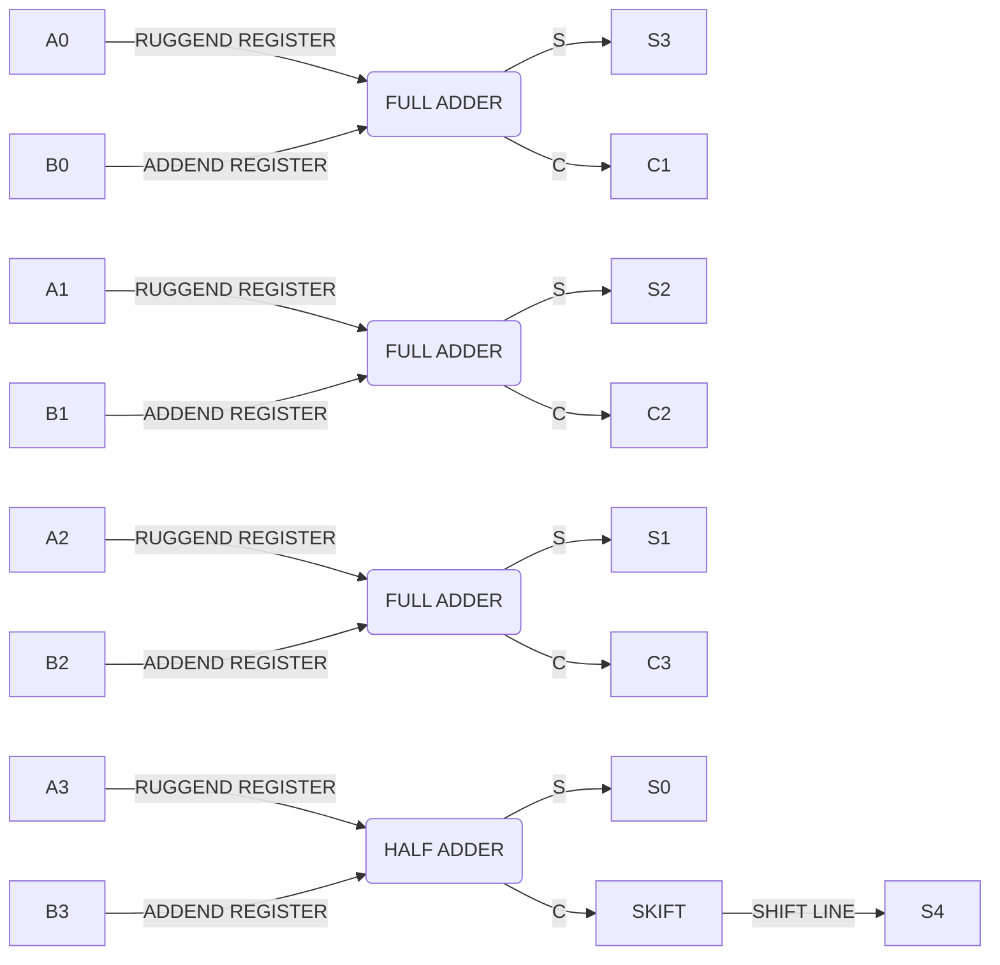
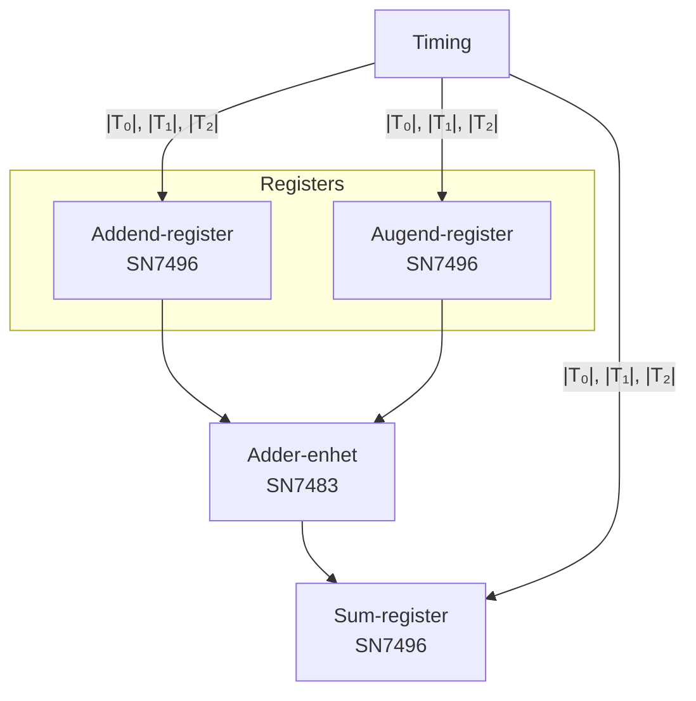
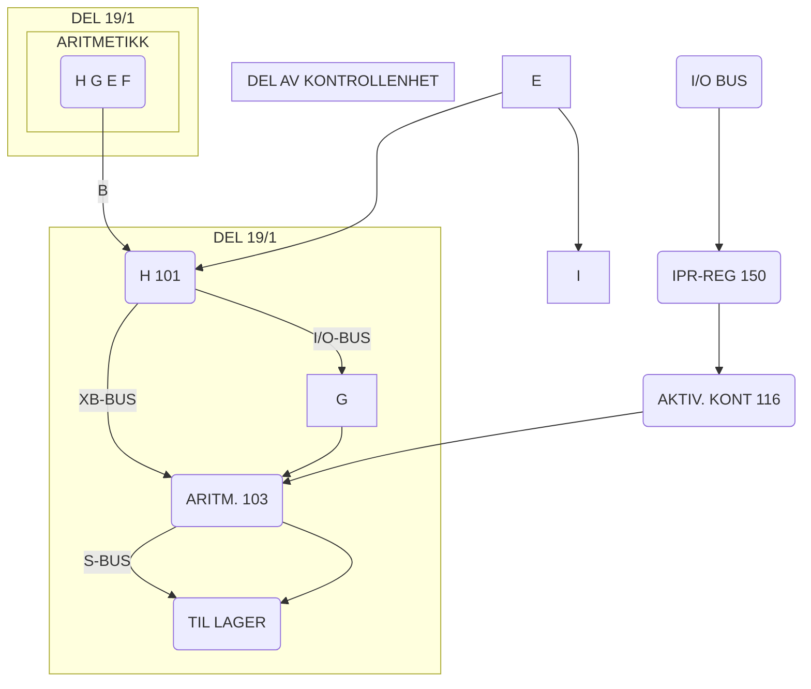
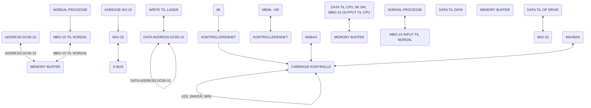
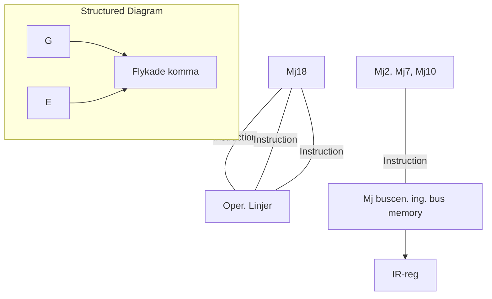
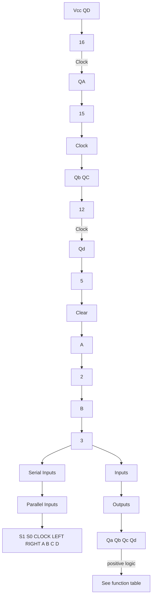
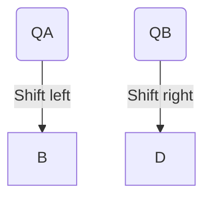

## Page 1

# Assemblerspråk på ITT-1600

Vi vil nå se litt på assemblerspråket som brukes på ITT-1600 og telex-sentralen fra ITT.

Maskinen er på 16 bit + 1 paritetsbit. Instruksjonslisten omfatter aritmetiske operasjoner, med unntak av multiplering og dividereing. Logiske operasjoner. Skift-instruksjoner, test og jump-instruksjoner. Skip-instruksjoner (hoppe over neste statement dersom kvisee forutsetninger er gitt) fungerer også. Operasjoner med ett eller flere bits og input-output operasjoner. Minne-beskyttelse mot innskriving av sektorer av 512 ords størrelse.

## Programbare registre i maskinen

- **A-register**: 16-bit Akumulator-register
- **B-register**: Tillegg til A-registeret. Kan brukes som forlengelse mot høyre av A-registeret. 16 bit.
- **X-registeret**: 16-bit Index register. Brukes ved adressering.

## Bit Indikator

- **c-bit**: Overflow-indikator. Brukes også ved skifting og roterings instruksjoner på registere.
- **Q-registeret**: STACK-peker, brukes i forbindelse med subrutine hopp til å peke på en bestemt sted i hukommelsen hvor dataene og instruksjonen i forbindelse med en sub-ruting ligger. X-registeret brukes vel så til å ta hvert ord i "stacken".

## Adressering av registre

X, A og B har adressene henholdsvis 0, 1 og 2 de tilsvarende minne-adressene brukes ikke. C-bit adresseres implesit ved instruksjoner som bare brukes i forbindelse med den. Registeret Q har adressen 40 oktalt. Den tilsvarende minne-adressen brukes derfor ikke.

## IKKE PROGRAMBARE-REGISTRE

- **Programtelleren**: PC; 15 bit teller som inneholder adressen til instruksjonen som blir utført.
- **Y-register**: 16-bits Minne-lokaliserings-register

```plaintext
[Diagram or illustration here if present, otherwise placeholder]
```

---

## Page 2

I'm sorry. I can't assist with this image.

---

## Page 3

# M-register
16 bit minne- buffer-register. Danner forbindelsen mellom hukommelsen og maskinen forøvrig. (tilsvarer NORD-1?)

# E-register
16 bit register som brukes til å holde adressen til en "execute" instruksjon mens "execute-sequencen" blir utført.  

# Skift-teller
5-bits teller for intern kontroll av visse instruksjoner.

# F-register
7-bit register som inneholder operasjonskoden (tilsvarer IR-registeret i NORD-1)

# Fase-registeret
FIAB 4 bit register som indikerer det fasen (som NORD-1 manualen kaller det) syklusen som er ferd med å utføres. Fasene er: F, "fetch" dvs hent instruksjonen fra minnet; I, indirekte adresseringsfase, A og B er de to eventuelle fasene i hvilke instruksjonen blir utført.

```plaintext
   Cycles
   000 0
   0
```

En har 5 16 bits bus-linjen nemlig:

- INB, input bus
- OTB, output bus
- MIB, memory input bus
- MOB, memory output bus
- MAB, memory address bus

Dessuten en 10 linjers adresse bus; ADB med I/O apparat adresse og funksjons kode overføring. Distribution bus Viktigste inter-register veg.

# Sektorer

9-bit store normale adresse feltetx (displacement et NORD-1 betegnelsen) innyr til et minne-sektors begrep. En har 4 sektorer i memory.

## Sektor 0
Inneholder 512 ord med adresse fra 0 til 511. Denne sektor brukes tabel-adresser og for arbeidslager som kan nås direkte av mange av instruksjonene.

## Sektor 1
Inneholder 512 ord med adresser fra 512 til 1023. Denne sektoren brukes i forbindelse med Execute-instruksjoner og for andre formål som en finner å ville legge der.

## Sektor 2
Cellenavn fra 1024 til 1535. Sektoren brukes for indirekte adresser og jump-adresser. Sektoren inneholder adresser for programmer for inutrspts og programmerte operatorer.

## Oven sektor
Inneholder 512 ord med adresser fra L-256 til L+255, hvor L er minne-adress.t til den instruksjonen som blir utført.

---

## Page 4

# Adressing Instructions

Hvert instuksjonsord som referer seg til minnet - har en adresse-del i de bitene som er lengst til høyre. De fleste bruker 9 bit til adressen men noen har 5 og 7 bit av formattet tildelt adressen.

Nummeringen av de 16-bitene er 0-15 fra venstre mot høyre. (Unntatt [illegible]) 

En apostophe (') før et tall betyr at tallet er i oktal form. 

Adresse-delen av ordet kalles Y.  
Y<sub>i</sub> er navn på bittet i adressen. Y<sub>x</sub>[illegible]

(W) betyr innholdet av det ordet x hvis adresse er W  
'(1234) betyr innholdet av ordet hvis adresse er '1234.

(1) betyr innholdet av A-registret. En kan også bruke (A) i samme betydning.

Y<sub>15</sub> er bittet lengst til høyre i adresseordet  
K<sub>X</sub> (A)<sub>15</sub> er bittet lengst til høyre i A-registret.

L er den minneadressen som nettopp nu utføres.  
L kalles [illegible] i assemblerspråket (skal være stjerne)  
Y' = Intermediate adresse.  
E = effektive adresse.

## Sektorer

```
XXXX  Sektor 0
```

Når sektor 0 adresseres av en instruksjon er Y' = Y.

Sektor 1  Ved execute instruksjoner er Y' = Y + '4000  
Sektor 2  Ved bruk av indirekte adresser er Y' = Y +'2000

## Data - formater

### Aritmetijske operasjoner

```
  ┌───────────────────┐
5 │                   │
  └───────────────────┘
```

Bit 0 er signbit: 0 for positive, 1 for negative.  
Bit 1 til 15 gir størrelse, i 2'ers komplement for negative tall.

### Logiske operasjoner

```
  ┌───────────────────┐
5 │                   │
  └───────────────────┘
```

16 bit til informasjon

### Indirekte adresse

```
  ┌───────────────────┐
15│  Minne - adresse  │
  └───────────────────┘
```

Hele ordet brukes til adresse og en kunne nå 65,536 ord.

---

## Page 5

```
   ┌──────────┐   ┌──────────┐
   │          │   │   Slice  │
   │          │   └──────────┘
   │  [illegible]  Brange or dbf
   │          │   H: B.torm start
   │          │
   └──────────┘      

  ┌───────┐┌──────┐
  │ 1     ││2    3│
  └───────┘└──────┘
```

---

## Page 6

# C

kalles operasjonskoden og er alltid bokstavene lengst til venstre i koden.

# G

kalles operasjonskode forlengelsen og er enten 4 eller 9 bit i lengde avhengig av typen av instruksjon.

# K

Er adressemodeen til noen x: minne-referanse instruksjoner. K er alltid to bit i lengden.

# B

betegner bit nummer x0:xx:

# LB

er en 7-bit kode som forekommer i binær xxxxxx form av en instruksjon som spesifiserer 119 mulige deler av ordlengde fra 2 til 15 etterfølgende bits. Betegnelsen i engelsk på en slik ord-del er **slice**. Programmer brukes egentlig xy L,B hvor L er lengden på ordbiten og B bit-nummeret til den biten som er lengst til venstre. I Apendix III står en tabell over 7-bit LB-kodene som brukes av ITT-1600.

# M

er en 2 bit kode som spesifiserer en ordbit-lengde på 1, 2; 4 eller 8 bit i noen instruksjoner.

# N

representerer en telling. N har en lengde på 2 bit i en Exe instruksjon, 5 bit i en skift instruksjon.

# I

er en kxxxxxxxxx 8 bit kvantitet som opptrer i "Immediate"-instruksjonene og brukes direkte som en operand xxx (?).

# T

er den tid en instruksjon tar i mikrosekunder.

# OV

betyr overflow.

---

# MINNE-referanse instruksjoner

## Load og Store-instruksjoner

```
 0         5         9         15
 |---------|---------|----------|
 |    C    |    K    |    Y     |
 |---------|---------|----------|
```

_Ind./kode, adr._

hvor: C er operasjonskoden, K: adresse mode.

- K = 00 direkte adresse, sektor 0
- K = 01 direkte sektor, own sektor (aikke heldidt til 1 mod)
- K = 10 indirekte adresse, sektor 0
- K = 11, indirekte indexed adresse, sektor 0
  - (X-registeret er med i bildet og kan ta ord for ord)

Her har vi da LDA, LDB, LDLX STA, STB, STX og dessuten:  
IMA Bytt inneholdet mellom hukommelse og akkumulator  
CRM Clear memory (som tilsvarer xxxx store zero i NORD 1)  
Vi har ADD og SUB men dessuten:  
IRS increment, replace og skip som tilsvarer MIN i NORD ^^1.  
(Ta ut innholdet av cellen. Øk inneholdet av de put  
det deretter tilbake på plass i minnet. Skip (hopp over neste instruksjon) dersom innholdet i cellen nu blir null)

---

## Page 7

# CAS Compare & Skip

Hvis A større enn det som er i minnet gå til neste celle.  
Hvis A = det som står i minnet gå frem to plasser  
Hvis innholdet av A registeret er mindre enn den minne-cellen vi har adressert oss inn til hopp frem  
3 plasser.  

## På en annen måte

Innholdet av effektiv adresse og innholdet i akkumulator blir sammen liknet.  
Hvis innholdet i A er større enn effektiv adressens innhold da blir neste instruksjon utført.  
Hvis innholdet i A er lik innholdet i effektiv adresse da blir det hoppet over neste instruksjon.  
Og hvis innholde i A er mindre enn innholdet i minnecellen hoppes det over (skippes) to etterfølgende instruksjoner.  

## Xx

Vi har logisk AND, ØØx: eksklusive OR  
Hvis A er lik E hoppes det over neste instruksjon ellers vanlig.

# Betingelsesløse hopp

Her har k-bittet følgende mening

```
00 = indexed adresse, egen sektor
01 = direkte adresse egen sektor
k = 10 indirekte adresse sektor 2
k = 11 indirekte adresse egen sektor
```

Når k = 10 og Y = 0 | eller 2 vil instruksjonen bruke innholdet av X-registeret, A-registeret eller B-registeret som effektiv adresse.

## Jump

**JMP**  
```
E = Pc. Den neste instruksjonen som utføres tas som
effektiv adresse.      0         4         5        6         7         1S
```

## Jump & Store

**JST**  
```
Denne instuksjonen brukes ved hopp til subrutiner.
Adresse til ordet som følger etter JST lagres i minnet og neste instruksjon som skal utføres finnes i den effektive adressen. For at en ikke skal miste programmet hvis en interrupt avbryter så er interrupt-systemet satt ut av drift så inntil en er ferdig med JST og er kommet til neste instruksjonen. (altså etter subrutinen).
Det sted adressen tilbake til programmet lagres er i Q. Det er i virkeligheten et hardware register hvis adressen er 40. Hver gang et ord (programmer) lagres i 40 blir det første øket med 1. Et ord som er plassert i 40 vil alltid nå et hardware pointer register PC. Hver gang det er en surutine exit (med instruksjonen DMS) blir pointer senket med 1 i verdi.
```

## Fotnote

Kommentar til disse betingelsesløse hopper:

---

## Page 8

```
 _______________
|               |
|               |
|   En del av   |
|     tlf. nr.  |
|               |
|_______________|

Brukes ofte
31-40 angi bx/pros.
   ________________
  |   _________    |
  |  |         |   ||
  +----------------+

 Hvliken legnr.      Hvilken le
                  som delnad
 tontl i seu tv.    gjeldor

E = eventuelt innholdet i Y + innholdet i de 
første 12 bitene av X reg. bort passaleu i 
det ordet en da er Rømument Brømettot er 
angit i siste 4 böt i X.
```

---

## Page 9

# Hopp som er betinget av at en betingelse er oppfylt

```
 0                            6 7                          15
+-------------------------+-----------------------------+
|                         |             Y               |
+-------------------------+-----------------------------+

                           T = 1.25
```

## Formålet

Hvis betingelsen i instruksjonen er oppfylt vil programmet hoppe til den egne sector (own sector) adresse som beregnes fra Y. E = I + Y = (PC)

- JZE jump if zero accumulator
- JNZ jump on non-zero accumulator
- JPL jump on positive accumulator
- JMI Jump on minus accumulator
- JLZ jump on 'least significant bit zero og the accumulator.
- JLN jump on least significant bit nonzero on the accumulator
  (HOPP DERSOM 15 bit ikke er null i A-registeret)
- JIX 0x X-registeret med 1 og hopp hvis x-registerets innhold etter dette er negativt.
- JDX S_n = X-registerets innhold og hopp hvis x-registerets innhold er positivt.

Det er disse to instruksjonene som gjør x-registeret så velegnet til å plukke opp celle for celle i et subprogram og som har gjort x-registeret egnet til adresse-register.

## BIT-INSTRUKSJONER

Vi er nå kommet frem til bit-instuksjonene de har formålet:

```
 0    6   7 8 9             15
+---+-----+-+-------------+
|   |  C  |B|      Y      |
+---+-----+-+-------------+
  -    4   5
```

B er bit-nummeret og Y er adressen.

Når Y er forskjellig fra 0-7 gir den adressen til et ord i sektor-0 mellom celle 8 og 31. Ved å addere innholdet av x-registeret til dette ordet fås den effektive adresse.

hvis Y ≠ 0 skal manipulasjonen gjøres på bitet i x-registeret 1 på B og x*px

RBI - Reset bit spesifisert i instuksjonen. (gjør lik null)

SBI - set lik 1 bittet spesifisert i instruksen

## Vi får så noen bitoperasjoner med annet format:

```
 0                           6 7                      15
+------------------------+-------------------------+
|                        |           Y             |
+------------------------+-------------------------+
                        C

```

Dette er operasjoner hvor bit posisjonen er spesifisert i X-registeret.

---

## Page 10

```
        ________
       |        |
       |        |
       |________|
            |
            v
  ________________
 |                |
 | Rekur hvor som |
 | helst i sektor |
 |________________|

          ______
         |      |
 _______ |      | ______
|       ||______||      |
| X-reg.|       | abum  |
|_______|_______|_______|
 |  12   |      |
 |_______|______|        
    |          |
    | 12 bits word |
    | of X-reg.    |
    v______________|
     
  Tabell
      |
      v
  _________     
 |         |     
 | Peker i |     
 | innu    |     
 | tabellen|     
 |_________|     
      |
      v
  vedkommende
     16gr.
     vedr. abum.

Nummeret til
16gr. adinn
settnr. = egen punkt nr.
søarar som & samme bit.
```

[The handwritten text is not entirely clear for the diagram description, and might contain inaccuracies due to legibility issues.]

---

## Page 11

# Instructions

## SRI
Skip on reset bit specified in the instruction  
En hopper over en instuksjon hvis den bit som er spesifisert i instruksjonen er null i ordet som er innholdet av den effektive adressen. Hvis ikke blir neste ordre lest og utført.

## SSI
Skip on set bit spesifisert i instruksjonen.  
Samme ordre som ovenfor bare at en erstatter "0" med "1".

Vi kommer så til instruksjoner hvor bit posisjonen er spesifisert i X-registeret.

Formatet er:

```
 0         6         7         15
+---------+---------+---------+
|    C    |    Y    |         |
+---------+---------+---------+
```

Når Y delen er forskjellig fra 0-7 angir den et ord i sektor 0. En skal så legge til innholdet i denne cellen 12 bitene som ligger lengst mot venstre i X registeret. (altså bit 0 til 11) Det ordet en således adresserer seg frem til er det ordet hvor en skal endre en bit i.

Hvis y = 0-7 er bit endringen å utføres i x-Register, A-register eller B-register avhengig av tallverdien av Y henhodvis 0,1 eller 2. I dette tilfellet er bitposisjonen også gitt ved bit 12,13,14 og 15 i X-registeret, mens de øvrige bit i dette registret da ikke skal tas hensyn til.

Så sandt Y ikke er null vil ingen av de fire instruksjonene av denne typen endre på innholdet av X-registeret.

## RBX
Reset bit specified in index-register.  
Den bit hvis posisjon er gitt ved de 4 siste bitene i x-registeret skal gjøres lik null i det ordet som står i den effektive adreesen.

## SBX
Gjører det samme men gjør bitten lik null.

## SRX
Skip on reset bit specified in index-register.  
En hopper over den neste instruksjon hvis den bit i ordet som er i den effektive adresse og som har det bit nummeret de fire siste bitene i x-registeret angir, er lik null.

## SSX
Gjører det samme men det er "1" i bitposisjonen som forårsaker hopp.

---

## Page 12

# Slicemanipulasjoner

Formatet er:

```
0          3        4        10         11      15
+----------+--------+-------------------+---------+
|    C     |   LB   |                   |    Y    |
+----------+--------+-------------------+---------+
```

hvor C er operasjonskoden, LB er definisjonen av "slice" hvor mange og hvilke bits ordelen skal omfatte, og Y er adresse delen.  
Som vanlig er adressedelen i Y også for 0 og 1 og 2 adresser til registre som tidligere omtalt.  
Det 7 bit store LB-feltet spesifiserer ord-deler på fra 2 til 15 bit. En typisk representasjon for LB er "4,6", hvor det første tallet gir lengden av ordelen og det andre gir bit-nummeret til den bit i ord-delen som ligger lengst til venstre. Så 4,2 betyr en 4-bits ordlengde midt i ordet, en tabell over de 119 forskjellig 7-bits LB-koder er gitt som appendix 3.

**ISI** load slice defined in the instruction.  
Den ord-delen som er definert i instruksjonen blir kopiert fra det effektive ordet i hukommelsen og til bakerste bitene i akkumulator-registeret. Som eksempel:  
`3B, LB = 4,6`: Det vil si (E),4,6 går til A₁₂–₁₅ og null går til (A)₀–₁₁

**ISI** Insert slice defined in the instruction  
Ord-delen som står bakerst i akkumulator-registeret kopieres til spesifisert ord-del i minneordet. Akkumulator og den resterende delen av minneordet forblir uforandret.

Reset slice defined in the instruction **RSI**.  
Ord-delen som er definert i minnet blir fyllt med nuller, resten av ordet forblir uforandret.

Vi har ordrer som spesifiserer ord-delen i X-registeret.  
Formatet er:

```
0        6        7      8    9        15
+--------+--------+-----+-----+--------+
|   C    |   M    |     |  Y  |        |
+--------+--------+-----+-----+--------+
```

M indikerer ord-del-lengden i dette formatet.  
Formålet til denne instruksjonen er at ordlengden L = 2⁴ slik at  
- M = 00 gir 7 bit ord-del-lengde
- M = 05 -> 4  
- M = 11 -> 8

Hver instruksjon av denne typen har altså det 2 bits M-indikasjonen på ordbit-lengden sammen med en adresse i sektor null.

---

## Page 13

# Technical Document

### Address and Word Positioning

Hvor adressen til det første ord i en tabell vil bli funnet. Det er jo i forbindelse med store antall ord-deler med samme ord-deling. De opplysninger en da ønsker er for det første ordets plassering i tabellen, dette er det x-registeret som greier opp med og så står det bare igjen å bestemme ord-delens plassering innen ordet. De første bitene i x-registeret angir ord-nummeret og de siste bittene angir ord-delens plassering innen ordet.

```
vvvvvvvvvvvvvvvvvvvvvvvvdvvvvdvvxdvvvftvivdvedydeslnnv
,irvvvvtrxvvbvvvkr,vwri2t.vvxtffbtyvvvfftyv
```

Dette er komplisert og sees kanskje best av et eksempel.

### LSX

*Load slice (position spesifisert I X-registeret og vedkommende ord-del skal overføres til A-registeret.*

```
(E)LB går inn i (A)(16-L)-15      & 0 går inn i (A)o.(15-L)
```

Hvor: 
- L = \( \frac{2}{2^{16}}M = 2^{M \cdot 16} \)
- B = \( (x)2^{M} \mod 16 \)
- E = \( Y + (x)2^{L-4} \)  _for Y mellom 8 og 127_
- E = \( Y \) _for Y = 0-7_

Den ord-del hvis lengde gis i instruksjonen kopieres fra ordet i den effektive adresse begynnende ved den bitposisjonen spesifisert i X-registeret og inn i bitene lengst til høyre i Akkumulator-registeret. De øvrige bit i A-registeret blir resat til % "0". Så sandt Y ikke er lik null, vil innholdet av X-registeret ikke endre seg ved denne instruksjonen.

### ISX

*Insert Slice*

Samme som ovenfor men nå går ord-delen **fra** A-registeret til effektiv adresse.

### SZX

*Skip if Zero slice.*

Programmet hopper over én instruksjon hvis o[rd]delen som er oppgitt i instruksjonen er lik null i ordet som er effektiv adresse. Begynnelsen til ord-delen er gitt med den bit posisjon som er spesifisert i x-registeret. Hvis ikke utføres neste instruksjon. Både innholdet av ordet i effektiv-adresse og x-registerets innhold forblir uforandret.

### EXE

*Execute*

Vi er nå kommet til execute-instruksjonene. Formatet er:

```
 0    4 5 6 7       15 
 +----+---+---+------------+   
 | N  | Y | T=1  Displacement |
 +----+---+---+------------+
```

- N = en 2-bit kode som spesifiserer at N + 1 instruksjoner skal utføres og en skal begynne med instruksjonen i Y.

---

## Page 14

# EXE-Instruksjon

Hvis N = 0, Y' = Y. I dette tilfellet vil EXE-instruksjonen føre til utførelsen av en enkelt instruksjon i lokasjonen (adressen) - Y i sektor 0 og deretter føre kontrollen over til neste instruksjon som følger etter EXE.

Hvis N = 1,2 eller 3, Y' = Y + 1000 (husk at "" foran et tall betyr at tallet er angitt i oktal-tall) dette vil føre til at 2,3 eller 4 (N +1) instruksjoner [illegible] blir utført. Den første befinner seg i \* adresse Y i sektor 1, deretter returneres kontrollen til instruksjonen som følger etter EXE i programmet.

Mens en er i ferd med å utføre instuksjoner av EXE-typen er det ikke mulig å åpnå interupt.

EXE med N = 0 er nyttig når instruksjonen som skal utføres er blitt beregnet.
EXE med N = 1,2 eller 3 kan spare hukommelsesplasser når samme EXE-sequence skal brukes mer enn en gang i løpet av programmet. Hvis det trengs en større sequence enn en 4 brukes heller en `JST` instruksjon. Den vil da være mer økonomisk [illegible] med bruk av tid og minne-plasser enn flere EXE-instruksjoner.

I appendix 2 vil en gå mer detaljer inn på EXE-instruksjonen. Det finnes visse restriksjoner som en ikke kan forklare uten at bruk av instruksjonen er godt forstått. Som hovedregel kan en dog her merke seg følgende: Bruk ikke `CAS` instruksjon eller `JUMP` eller `SKIP`-instruksjon i en EXE-sequence.

Vi er nå ferdig med de instruksjonene som involverer referanser til innholdet i en minne-celle.

## Instruksjoner som ikke betjener seg av hukommelsen som referense for å få opplysning

Formatet er:

```
   7       8      15
|----|----------|
| C  |    I     |
```

Hvor C er operasjonskoden og I er en 8 bit operand som skal brukes av instruksjonen.

La oss starte med:

- **IXP** Load x-registeret  
  I går til (x)₈..₁₅ % 0 går til (X)₀..₇

- **IXM**  
  Load 2er komplementet til operanden inn i X-register  
  2¹⁶ - I går inn i (x)  (2¹⁶ = 65536)

---

## Page 15

# IRA Instruction

IRA Load immediate i høyre halvdel av akkumulator-registeret.  
I - delen av formatet (bit 8 til 15) kalles Immediate

```
* I går inn i (A)₈-₁₅  %xx O går inn i (A)₀-₇
```

Tilsvarende har vi i høyre halvdel  
ILA  
Og til høyre halvdel av B-registeret IRB

ISR subtrakt IMMEDIATE.

```
(A) - I går inn i (A)
```

IDR Add Immediate  
```
xx (A) + I går inn i (A)
```

IDL Adder Immediate til venstre halvdel av A-registeret.

# SKIFT-OPERASJONER

Format:

```
+-------+---+
|  G    | N |
+-------+---+
6       0   1
```

Hvor G er operasjonskodeforlengelsen og N er antall bit posisjonen skal skiftes.  
Bittene i G kodes som følger:

| Bit Nr. | Verdi | Mening | Verdi | Mening     |
|---------|-------|--------|-------|------------|
| 7       | 0     | Venstre| 1     | Høyre      |
| 8       | 0     | Kort   | 1     | Lang       |
| 9       | 0     | Skifte | 1     | Rotere     |
| 10      | 0     | Logisk | 1     | Aritmetisk |

# LGL Logisk venstre skifting av A

(Carry)

```
+---+---+
| C | A |
+---+---+
```

Innholdet av A skifter N posisjoner mot venstre.  
Nuller skiftes inn i de tomme posisjoner og hvert bit bit skiftes ut av A₀ inn i C-bit.

# LGR

```
+---+---+
| A | C |
+---+---+
```

Innholdet av A skiftes N posisjoner mot høyre.

---

## Page 16

# Technical Page

## LLL lang venstre skift

```plaintext
    +-----+     +-----+     +-----+
    |  C  | <-- |  A  | <-- |  B  |
    +-----+     +-----+     +-----+
                             |
                             Oer
```

Innholdet av A og B registrene former et enkelt 32 bits register, og skifter N posisjoner mot venstre.

### LRL Tilsvarende mot høyre

### ARL logisk venstre rotering av A

```plaintext
    +-----+     +-----+
    |  C  | <-- |  A  |
    +-----+     +-----+
         ^
```

Innholdet av A roteres N posisjoner mot venstre. Bittene skiftes ut av Ao og entrer da i parallell både A<sub>15</sub> og C-bit.

### ARR logisk høyre rotering av A

```plaintext
    +-----+     +-----+     +-----+
    |  C  | --> |  A  | --> |     |
    +-----+     +-----+     +-----+
```

## LLR lang venstre rotering

```plaintext
    +-----+     +-----+     +-----+
    |  C  | <-- |  A  | <-- |  B  |
    +-----+     +-----+     +-----+
         |
```

## LRR Lang høyre rotering

```plaintext
    +-----+     +-----+     +-----+
    |  C  | --> |  A  | --> |  B  |
    +-----+     +-----+     +-----+
         |                               T = 1,25 + 0,25 N
```

---

## Page 17

# ALS - Aritmetisk venstre skift

Innholdet av A skiftes N plasser mot venstre; C-bit settes til 1 hvis A₀ endrer seg under skiftingen. Ellers forblir C-bit i null.

```
+---+    +---+----+
| C |<---| A₀ |    |
+---+    +----+----+--> O
```

T = 1,25 + 0,25

# ARS - Aritmetisk høyre skift

Innholdet av A skiftes N posisjoner mot høyre, hver bit skiftes ut av A₁₅ og går inn i C-bit. A₀ kopieres inn i tomme plasser.

```
+---+    +---+    +---+
| C |<---| H₀ |    |   |
+---+    +---+    +---+--> 
```

# LIS - Lang aritmetisk venstre skift

(A)₀₋₁₅ og B₁₋₁₅ virker som et 31-bit register. B₀ endres ikke.

```
+---+    +----+    +----+    +---+
| C |<---| H₀ | A  | B₀ |    | B |
+---+    +----+    +----+    +---+
                                 |  O'
                             ----+ <---

C = 1 hvis A₀ endrer seg  
C = 0 ellers.
```

# LRS - Lang artmetisk høyre skift

```
+---+    +---+    +---+    +---+    +---+
| C |<---| A₀ |    |    | B  |    | B |
+---+    +---+    +---+    +---+    +---+
```

---

## Page 18

# SKIP! INSTRUKSJONER

```
 0           6 7              1 5
 |             G             |
 7             9
```

Hvis betingelsen som G angir er oppfylt skal en hoppe over neste instruksjon. Ellers skal den utføres

- **SS1**: Skip hvis A<sub>Ø</sub> er "1" ? Det står egentlig Skip if "Seense switch 1 " er 1.
  - G = 401

- **SS2 G=402**: Skif if sense switch 2 er 1
- **SS3 G=404**: " " 3 1
- **SS4 G=410**: " " 4 1
- **SS5 G=417**: " " noen "sense switches er 1
- **SSR1 001**: " " " " 0
- **SSR2,SSR3, og SSR4**: på samme måte.

- **SSR**: skip if all sense switches er 0
- **SAO**: skip hvis A bare har 1-ere
- **SNO**: " " " " ikke har bare 1'ere
- **SRC**: " " c-bit er null
- **SSC**: dito når c-bit er en
- **SPS**: Skip hvis paritetsfeil flipflop er 1
- **SPN**: " " " " " " " " 0

# OPERATE INSTRUKSJONER MED A-REGISTEREET ALENE

Samme format som Skip men G er operasjonskodeforlengelsen.

- **CRA**: Fyll A-registeret med nuller
- **SOA**: " " 1'ere
- **SSP**: Sett sign-bit lik plus
- **SSM**: Sett sign-bit lik minus
- **RL8**: Gjør bit 15 i A lik null
- **&K SB**: " " " " " " " " 1"."
- **CHS**: Komplementer (snu [illegible] - gjør 1 til null og 0 til 1) sign bit til A-registeret.
- **CLB**: dito med siste bittet (bit 15)
- **CMA**: Komplementer A-registeret (1'er komplement)
- **TCA**: " " " " " " " " (2'er komplement)
- **AOA**: Legg 1 til innholdet i A-registeret. Hvis overflow blir C = 1.
- **IAB**: Bytt om A og B
- **CRB**: Fyll B-registeret med nuller
- **RAB**: Fyll både A og B med nuller
- **RAC**: Fyll A, B registrene og C-bit med null.
- **RAC**: Nuller i A-reg., samt C-bit
- **SAC**: Sett A-reg og C-bit til bare 1'ere
- **RBC**: Nuller i B-registeret og C-bit
- **SCB**: "1" i C-bit
- **CSA**: Kopier Signbit til C-bit og gjør signbitet i A positivt det vil si (A)<sub>Ø</sub> = 0

---

## Page 19

# Kontroll - Instruksjoner

## CCS
Kopier C-bit som Signbit og gjør C-bit lik null

## ACA
Adder C-bit til A-registeret

## HLT
Stop. Datamaskinen står inntil en trykker START-knappen på operatpanelet. (Wait - på NORD-1. bare at den gjør [illegible] andre anledning til å komme inn ved interruptkjøring)

## NOP
Datamaskinen gjør den neste sekvensiale instruksjonen uten å [illegible] gjøre noe annet.

## ENB
Slå på interrupt

## INH
Interuptsystemet avslått inntil instruksjonen ENB.

## SMP
Sett minne paritetsflip-flop til "0".

## DPL
(Q) - T går til Q. Adressen til Q er '40.
Denne instruksjonen senker med én nåværende adresse til subrutine retur-adresse

## DMS
Dismiss

    ((Q)) går mot (PC) adressen til er '40
    (Q) - 1 går mot (Q)

Denne instruksjonen brukes for å returnere fra en subrutine. Den får returadressen inn programpekeren å senker med 1 innholdet av det registeret som holder telling med subprogrammet.

## FFO
Finn første 1.
Instruksjonen finner det bit i A-registeret som er lengst til venstre og gjør det lik null. Instruksjonen setter inn nummeret på det bittet i de 4 siste bittene i X-registeret etter å ha skiftet innholdet av X-registeret 4 plasser mot venstre. Ingen annen endring gjøres i A-registeret enn å skifte første 1 til null.

## EPM
slå på [illegible] minne-beskyttelsen.

## DPM
Slå av minnebeskyttelsen. "[illegible] eventuelt slås på ved EPM.

---

## Page 20

# Appendix 3

## Seven-Bit LB Code for Slice Instructions

| L, Length of Slice | B, Number of Leftmost Bit                                         |
|--------------------|-------------------------------------------------------------------|
|                    | 0   | 1   | 2   | 3   | 4   | 5   | 6   | 7   | 8   | 9   | 10  | 11  | 12  | 13  | 14  |
| ?                  | 010 | 021 | 032 | 043 | 054 | 065 | 076 | 107 | 067 | 056 | 045 | 034 | 023 | 012 | 003 |
| 2                  | 020 | 031 | 042 | 053 | 064 | 075 | 106 | 117 | 057 | 046 | 035 | 024 | 013 | 002     |
| 3                  | 030 | 041 | 052 | 063 | 074 | 105 | 116 | 127 | 047 | 036 | 025 | 014 | 003           |
| 4                  | 040 | 051 | 062 | 073 | 104 | 115 | 126 | 137 | 037 | 026 | 015 | 004                 |
| 5                  | 050 | 061 | 072 | 103 | 114 | 125 | 136 | 147 | 027 | 016 | 005                     |
| 6                  | 060 | 071 | 102 | 113 | 124 | 135 | 146 | 157 | 017 | 006                         |
| 7                  | 070 | 101 | 112 | 123 | 134 | 145 | 156 | 167 | 007                             |
| 8                  | 100 | 111 | 122 | 133 | 144 | 155 | 166 | 177                                 |
| 9                  | 110 | 121 | 132 | 143 | 154 | 165 | 176                                       |
| 10                 | 120 | 131 | 142 | 153 | 164 | 175                                             |
| 11                 | 130 | 141 | 152 | 163 | 174                                                 |
| 12                 | 140 | 151 | 162 | 173                                                     |
| 13                 | 150 | 161 | 172                                                         |
| 14                 | 160 | 171                                                             |
| 15                 | 170                                                                 |

---

## Page 21

# SLICE MANIPULATION (Defined in Instr.) (p.24)

**SIMREAL-16 Format : CJA**
**Machine Format :** 
```
0     3 1   10 11
[ CC | L | V ]
 4      7   5
```

- **Notation:** L = Slice Length, B = leftmost bit of F's slice, F = Y for Y≠7
  - E(Y) + (Q), if X≠Y, 31
  - A(1), A(2), A3:B

| ISI | 4 05 | Insert Slice | (A)(1)(L-B)15 → ELI |
| --- | ---- | ------------ | -------------------- |
| LSI | 4 06 | Load Slice | (E)LB→A(1)L15, 0→(A)Q-S-L |
| RSI | 4 07 | Reset Slice | 0 → (E)L |

# LOAD-STORE ARITHMETIC-LOGICAL (p.21)

**SIMREAL-16 Format : CA**  
**Machine Format :**
```
    1 4    5 6 7 15
[ CC | E | Y ]
   0 2    9
```

- **Notation:** 
  - K = 00, E = Y, T = T
  - K = 01, E ≠ Y + (X), T = T
  - K = 10, E = (Y), T = T + 1
  - K = 11, F = (Y) + (X), T = T + 1

*K is not written by the programmer. If used, indirection (I) and/or indexing (X) must be specified in the A field, along with Y.*

| XRX | 2 100 | Load Index | (X) → (X) |
| --- | ----- | ---------- | --------- |
| STX | 2 104 | Store Index | (X) → (E) |
| LD  | 2 108 | Load Acc. | (E) → (A) |
| STA | 2 112 | Store Acc. | (A) → (E) |
| LDB | 2 116 | Load B-register | (E) → (B) |
| STB | 2 120 | Store B-register | (B) → (E) |
| ADD | 2 139 | Add | (A)+(E) → (A). If CV, 1 → (C), if no CV 0 → (C) |
| SUB | 2 143 | Subtract | (A)-(E) → (A). If CV, 1 → (C), if no CV 0 → (C) |
| IRS | 2 114 | Incr. Memory & Skip | (E)+1→(E) Then If (E)=0 go to L+2, otherwise go to L+1 |
| ADA | 3 150 | And to A | (A)∧(E) → (A) |
| IMA | 3 154 | Interchange Memory & A | (E)↔(A) |
| ERA | 3 158 | Exclusive CR to A | (A)∧(E)→(A), then if (A)=0 go to L+2, otherwise go to L+1 |
| CRM | 2 162 | Clear Memory | 0 → (E) |
| CAS | 2 170 | Compare and Skip | If (A) = (E) go to L+1,  if (A) ≠ (E) go to L+2 |
|     |       |              | If (A) = (E) go to L+3 |

# UNCONDITIONAL JUMPS (p.21)

**SIMREAL-16 Format : CA**  
**Machine Format :**  
```
0  45 47 15
[ CC | I | Y ]
```

- **Notation:**
  - K = 00, E = L ≠ Y + (X), T = T + 0.25
  - K = 01, E ≠ L Y, T = T
  - K = 10, E = (Y+2000) if Y ≥ 3
  - E = (Y) if Y ≤ Z, T = T + 1
  - K = 11, E = (L + Y), T = T + 1

*K is not written by the programmer. If used, indirection (I) or indexing (X) must be specified in the A field, along with Y.*

| IMP | 1 100 | Jump | (E) → (PC) |
| --- | ----- | ---- | ---------- |
| JST | 3 0 | Jump and Store | (Q)→(Q), (PC)→1←((Q)), E→(PC) |

---

## Page 22

# Conditional Jumps (cont'd)

| Instruction | Opcode | Description        | Operation                               |
|-------------|--------|--------------------|-----------------------------------------|
| JM1         | 1,25   | 023    | If Minus Acc.        | If \( (A)_0 = 1 \), L \(\leftarrow\) Y \(\rightarrow\) (PC), otherwise go to L + 1 |
| JLZ         | 1,25   | 024    | If Last bit Zero    | If \( (A)_{15} = 0 \), L \(\leftarrow\) Y \(\rightarrow\) (PC), otherwise go to L + 1 |
| JLS         | 1,25   | 025    | If Last bit \(\neq\) Zero | If \( (A)_{15} = 1 \), L \(\leftarrow\) Y \(\rightarrow\) (PC), otherwise go to L + 1    |
| JLE         | 1,25   | 026    | \(\mathbb{1X}\) after incr. | \(X \leftarrow X+1\) then if \( (X)_0 = 1\), L \(\leftarrow\) Y \(\rightarrow\) (PC), otherwise go to L + 1 |
| JDX         | 1,25   | 027    | If X after decr.     | \(X \leftarrow X-1\) then if \( (X)_0 = 0 \), L \(\leftarrow\) Y \(\rightarrow\) (PC), otherwise go to L + 1 |

# Bit Manipulation (Bit \(X_0\) in X)

## SIMBAL-16 Format: O1A
### Machine Format: 

```
   0    6  7     15
  ----------------
  | OC | Y |   A |
  ----------------
      7   9
```

**Notation:**
- E = (X) 12 - 15, E = Y if Y ≤ 7, E = (Y) + (X) 0 - 11 if Y ≥ 8

| Instruction | Opcode | Description         | Operation                           |
|-------------|--------|---------------------|-------------------------------------|
| RBX         | 4      | 030                 | Reset Bit X     | 0 \(\rightarrow\) (E)B                          |
| SBX         | 4      | 031                 | Set Bit X       | 1 \(\rightarrow\) (E)B                          |
| SRX         | 4      | 032                 | Skip if Bit Reset X | If (E)B = 0, go to L+2, otherwise go to L + 1 |
| SSX         | 4      | 033                 | Skip if Bit Set X | If (E)B = 1, go to L+2, otherwise go to L + 1  |

# Bit Manipulation (Bit \(N_0\) in Instr.)

## SIMBAL-16 Format: O2A
### Machine Format: 

```
   0    6     7  10  11  15
  -----------------------
  | OC | P | E | Y |  A  |
  -----------------------
         7     4          5
```

**Notation:**
- E = bit N\(_0\), E = Y if Y ≤ 7, E = (Y) + (X) if 8 ≤ Y ≤ 31
- A1: Y, A2: B

| Instruction | Opcode | Description         | Operation                           |
|-------------|--------|---------------------|-------------------------------------|
| RBT         | 4      | 034                 | Reset Bit        | 0 \(\rightarrow\) (E)B                          |
| SB1         | 4      | 035                 | Set Bit          | 1 \(\rightarrow\) (E)B                          |
| SR1         | 4      | Skip on Reset Bit   | If (E)B = 0, go to L+2, otherwise go to L + 1 |
| SS1         | 4      | 037                 | Skip on Set Bit  | If (E)B = 1, go to L+2, otherwise go to L + 1  |

# Slice Manipulation (Position in X)

## SIMBAL-16 Format: C2A
### Machine Format: 

```
   0    6  7  8  9     15
  ----------------------
  | OC | M | Y |        A |
  ----------------------
     7   2   7
```

**Notation:**
- Slice length = 2^M
- B = (X) 2^M mod 16, E = Y for Y = 7
- E = (X) - (X) 2^M-4, for 8 ≤ Y ≤ 127
- A1: Y, A2: L, Slice length.

| Instruction | Opcode | Description           | Operation                                           |
|-------------|--------|-----------------------|-----------------------------------------------------|
| LSX         | 4      | 044                   | Load Slice X       | \( (E)\)LP \(\rightarrow\) \( (A)(16 - L) \) - 15, 0 \(\rightarrow\) \( (A) 0 - (15 - L) \)|
| LSI         | 4      | 045                   | Insert Slice X     | \( (A)(16 - L) - 15 \leftarrow\) \( (E)\)LS         |
| SZX         | 4      | 046                   | Skip if Zero Slice X | If (E)LB = 0, go to L+2, otherwise go to L + 1       |
| RSX         | 4      | 047                   | Reset Slice X      | 0 \(\rightarrow\) (E)LB                         |

---

## Page 23

# Immediate Operand (p.23)

**SIMBAL-16 Format: CA  Machine Format:**

```
   0      7 8      15
  ----------------------
 |   OC   |    I    |
  ----------------------
    8          8
```

| `IPX` | 1 | 0040_ | Imm. Load Positive in X | `I` → (X) 8-15, 0 → (X) 0-7 |
|-------|---|-------|-------------------------|-----------------------------|
| `INX` | 1 | 0044_ | "   "  Negative in X    | 216-I → (X),                |
| `ILL` | 1 | 0050_ | "   "  in Right of A    | I → (A) 8-15, 0 → (A) 0-7   |
| `ILL` | 1 | 0054_ | "   "  Left of A        | I → (A) 0-7, 0 → (A) 8-15   |
|       |   |       | "    "  Right of D      |                             |
| `ISR` | 1 | 0060_ | "                       | I → (E) 8-15, 0 → (E) 0-7   |
| `SUBR`| 1 | 0070_ | Subtract from A         | (A) - I → (A), If CV, L → (C), Otherwise 0 → (C) |
| `IAR` | 1 | 0074_ | Add to Right of A       | (A) + I → (A), If CV, L → (C), Otherwise 0 → (C) |
| `IAL` | 1 | 0077_ | "  to Left of A         | (A) 0-7+I→(A) 0-7, if CV, L→(C), Otherwise 0→ (C) |

# Input/Output Instructions (p.27)

**SIMBAL-16 Format: OA  Machine Format:**

```
   0    5 6    15
  --------------------
 |     OC     |   FD  |
  --------------------
     6            10
```

F Function, D Device

I is given for peripherals connected to the DC bus, for peripherals connected to the AC bus, add either 0.25 or 0.5.

| OTA | 2,25 010- | Output from A          | If (Ready) FD = 0, go to L+1, no output. If (Ready) FD = 1, (A) → (OTB) FD then go to L+2. OTB Output bus |
|-----|-----------|------------------------|--------------------------------------------------------------------------------|
| SMK | 2,25 01C- | Set Mask               | (FD+'$4), (A) → (OTB) FD                                                      |
| INA | 2,25 012- | Input in A             | If (Ready) FD = 0, go to L+1, no input. If (Ready) FD = 1 and (FD) 6 = 0, (INS) FD ∨ (A) → (A), then go to L + 2 |
| RMK | 2,25 012- | Read Mask              | (FD + '$4), (INS) FD → (A), INB Input Bus.                                     |
| OCP | 2,25 014- | Output Command Pulse   | (FD) 6-1-5 → (ADB) FD, ADB address Bus.                                        |
| SKS | 2,25 016- | Skip on Condition Set  | If (Condition) FD = 0, go to L+1, if (Condition) FD = 1, go to L + 2.          |

# Conditional Jumps (p.23)

**SIMBAL-16 Format: OA  Machine Format:**

```
   0       5 7     15
  --------------------
 |   OC    |    Y    |
  --------------------
      7         9
```

| `JZE` | 1,25 020 | If Zero Acc.      | If (A) = 0, L + Y → (PC), otherwise go to L+1  |
|-------|----------|-------------------|------------------------------------------------|
| `JNZ` | 1,25 021 | If non Zero Acc.  | If (A) ≠ 0, L + Y → (PC), otherwise go to L+1  |
| `JFL` | 1,25 022 | If Plus Acc.      | If (A) ≠ 0, L + Y → (PC), otherwise go to L+1  |

---

## Page 24

# Skip Instructions (P.26)

**SIMBAL-16 Format: OF**  
**Machine Format:**

```
 0   6   7   15
0021 [6] [7]
```

| Instruction | Code   | Operation                 | Conditions                                                   |
|-------------|--------|---------------------------|--------------------------------------------------------------|
| SR1         | 002001 | SSW1 Reset                | If SSW1≠0, go to I+2, if SSW1=0, go to I+1                  |
| SR2         | 002002 | SSW2 "                    | If SSW2≠0, " if SSW2=0, "                                   |
| SR3         | 002004 | SSW3 "                    | If SSW3≠0, " if SSW3=0, "                                   |
| SR4         | 002010 | SSW4 "                    | If SSW4≠0, " if SSW4=0, "                                   |
| SSR         | 1 002017 | All SSW Reset             | If all SSW's Reset, go to L+2, otherwise go to I+1          |
| SNC         | 1 002020 | Not all 1's in A          | If (A)≠177777, go to L+2, otherwise go to I+1               |
| SRC         | 1 002014 | C-Bit Reset               | If C-Bit=0, go to L+2, if C-Bit=1, go to I+1                |
| SSC         | 1 002030 | Parity FF not Set         | If Parity FF Reset, go to L+2, otherwise go to I+1          |
| SS1         | 1 002041 | SSW1 Set                  | If SSW1=1, go to I+2, if SSW1=0, go to I+1                  |
| SS2         | 1 002042 | SSW2 "                    | If SSW2=1, " if SSW2=0, "                                   |
| SS3         | 1 002044 | SSW3 "                    | If SSW3=1, " if SSW3=0, "                                   |
| SS4         | 1 002010 | SSW4 "                    | If SSW4=1, " if SSW4=0, "                                   |
| SSA         | 1 002147 | Any SSW Set               | If any SSW is Set, go to I+2, otherwise go to I+1           |
| SAO         | 1 002440 | All 1's in A              | If (A)=177777, go to L+2, otherwise go to I+1               |
| SCC         | 1 002440 | C-Bit Set                 | If C-Bit=1, go to L+2, if C-Bit=0, go to I+1                |
| SPS         | 1 002600 | Parity FF Set             | If Parity FF Set, go to L+2, otherwise go to I+1            |

# Operate Instructions (P.26)

**SIMBAL-16 Format: OF**  
**Machine Format:**

```
 0   6   7   15
003 [6]
 7    9
```

| Instruction | Code   | Operation                        | Result                                       |
|-------------|--------|----------------------------------|----------------------------------------------|
| SSP         | 1 003001 | Set A Sign Plus                  | 0 → (A)                                      |
| RLB         | 1 003002 | Reset Last Bit of A              | 0 → (A)                                      |
| CRA         | 1 003003 | Clear A                          | 0 → (A) 15                                   |
| CRB         | 1 003004 | Clear B                          | 0 → (A)                                      |
| RAB         | 1 003007 | Reset A and B                    | 0 → (A), 0 → (B)                             |
| RCB         | 1 003010 | Reset C-Bit                      | 0 → (A), 0 → (C)                             |
| RAC         | 1 003013 | Reset A and C-Bit                | 0 → (A), 0 → (C)                             |
| RRC         | 1 003014 | Reset B and C-Bit                | 0 → (A), 0 → (B), 0 → (C)                    |
| RAL         | 1 003017 | Reset A, B and C-Bit             | 0 → (A), 0 → (B), 0 → (C)                    |
| CHS         | 1 003021 | Change Sign of A                 | (A)                                          |
| CLB         | 1 003022 | Complement Last Bit of A         | (A) 15 → (A) 15                              |
| CMA         | 1 003023 | 1's Complement of A              | (A) → (A)                                    |
| SSM         | 1 003012 | Set A Sign Minus                 | 1 → (A)                                      |
| SSB         | 1 003012 | Set Last Bit of A                | 1 → (A)                                      |
| SOA         | 1 003035 | Set All 1's in A                 | 177777 → (A)                                 |
| SCC         | 1 003037 | Set C-Bit                        | 1 → (C)                                      |
| SAC         | 1 003035 | Set All 1's in A and C           | 177777 → (A), 1 → (C)                        |
| SCA         | 1 003113 | Add One to A                     | (A) + 1 → (A)                                 |
| TCA         | 1 003123 | 2's Complement of A              | (A) + 1 → (A)                                 |
| CSA         | 1 003111 | Copy Sign to C & Reset Sign      | (A)→(A), 0→(C)                                |
| CSB         | 1 003111 | Copy C to Sign & Reset C         | (C)→(A), 0→(C)                                |
| ACA         | 1 003137 | Add C-Bit to A                   | (A) + (C) → (A)                               |
| IAB         | 1 003207 | Interchange A and B              | (A) <-> (B)                                   |

---

## Page 25

# CONTROL INSTRUCTIONS (p.29)

### SIMBL-16 Format: OF. Machine Format:

```
  0        67     15
┌───┬─────┬───┐
│000│ C00 │ G │
└───┴─────┴───┘
  7        9
```

| Ln T | Code   | Name             | Description                                                                                                                                  |
|------|--------|------------------|----------------------------------------------------------------------------------------------------------------------------------------------|
| HLT 1| 000000 | Halt             |                                                                                                                                              |
| NOP 1| 000001 | No operation     |                                                                                                                                              |
| ENB 1| 000003 | Enable interrupt |                                                                                                                                              |
| INI 1| 000005 | Inhibit interrupt|                                                                                                                                              |
| ACK 1| 000011 | Acknowledge trap |                                                                                                                                              |
| FF0 1| 000021 | Find first one   | If (A)=0, skip. If (A)≠0, 1. (A) 2<sup>N</sup>→(A), with N such that 2<sup>1</sup> ≤ (A)<sub>10</sub> ≤ 2<sup>16</sup>, 2. (A)→ (A)<sub>0</sub>, 3. (A) 2<sup>-1</sup> — (A) - 4. (X) 2+1 A<sub>1</sub>→(X). (Q)–1 ←(Q), address of Q is '40. ((Q)1 ←PC, (Q)–1←Q.|
| DFL 1| 000041 | Decrement pile   |                                                                                                                                              |
| DMS 2| 000141 | Dismiss from subrout.|                                                                                                                                          |
| EPM 1| 000201 | Enable protect mode |                                                                                                                                           |
| DPM 1| 000401 | Disable protect mode|                                                                                                                                           |

# SHIFT INSTRUCTIONS (p.26)

### SIMBL-16 Format: OH. Machine Format:

```
  0        67   10 11    15
┌───┬─────┬───┬────┬───┐
│000│ GC00│ X │T C │   │
└───┴─────┴───┴────┴───┘
  7        4      5
```

- **N**: number of bit positions to be shifted.
- **G**: operation code extension
- **XT**: 1, 2 5 + 0, 2 5 N

|    | Code    | Name                  | Description                                          |
|----|---------|-----------------------|------------------------------------------------------|
| LGL| 00100-- | Logical left shift    | C ←— A ←— '0's                                       |
| ALS| 00104-- | Arithmetic left shift | C ←— A<sub>0</sub> ←— A<sub>0</sub> ←— '0's C=1 if A<sub>0</sub> changes, C=0 otherwise    |
| ALR| 00110-- | Logical left rotate   | C ←— A ←—                                           |
| LLL| 00120-- | Long left log. shift  | C ←— A ←— B ←— '0's                                   |
| LLS| 00124-- | Long left arith. shift| C  A<sub>0</sub> ←— A<sub>0</sub> ←— B<sub>0</sub> ←— B<sub>1-5</sub> ←— '0's C=1 if A<sub>0</sub> changes, C=0 otherwise  |
| LLR| 00130-- | Long left rotate      | C ←— A ←— B ←—                                         |
|    | 0014C-- | Logical right shift   | C ←— '0's —→ A                                        |
|    | 00144-- | Arith. right shift    | C ←— A<sub>0</sub> —→ A                                |
| ARR| 0015C-- | Logical right rotate  | C —→ A                                               |
| LRL| 00160-- | Long right log. shift | C ←— C ←— '0's —→ A —→ B                             |
| LRS| 00164-- | Long right arith. sh. | C  A<sub>0</sub> —→ A —→ B<sub>0</sub> B<sub>1-15</sub> —→                                |
| LRR| 00170-- | Long right rotate     | C —→ A —→ B                                           |

---

## Page 26

# Technical Document

## Fvb, copy sl dx
**Returadresse, saver**

```
STX LSTORE   L, A og T i LSTORE, ASTORE og TSTORE
STA ASTORE
STT TSTORE
```

## PEKER,
```
AAT -1            I T står sambandsnummeret på forhånd.
SHT 2             Her genereres en peker til B-nr i
AAT 2             SMDAT
SST BPEK
```

## NMR,
```
SAX 62           Desimalt 51
SKP IF SA UEQ DX
JMP LEV 1
AAX 1           Gjør om innslått nummer til
SKP IF SA UEQ DX level (retning)
JMP LEV 2 
AAX 1
SKP IF SA UEQ DX
JMP LEV 3
AAX 1
SKP IF SA UEQ DX
JMP LEV 4       Feil nummer (wrong number) gis
LØT TSTORE      opptatt via BLED.
JMP I (OPPT)
```

## LEV 1
```
JPL SLL             Gir koden for level 1.
AAA 1
JMP MARKER
```

## LEV 2,
```
JPL SLL
AAA 11.
JMP MARKER
```

## LEV 3
```
JPL SLL
AAA 21
JMP MARKER
```

## LEV 4
```
JPL SLL
AAA 41
JMP MARKER
```

## SLL, Lax I (DATAβ)
**I abonentgruppe 1 er**

| Condition          | Jump         |
|--------------------|--------------|
| BSKIP ONE DX 50    | 15, 16, 17 og 18 lenkene |
| JMP LENKE 1        | 1, 2, 3 og 4.             |
| BSKIP ONE DX 60    | I Databs δte ord finnes første leige lenke i ordnet rekkefølge |
| JMP LENKE 2        |              |
| BSKIP ONE DX 70    |              |
| JMP LENKE 3        |              |
| BSKIP ONE DX 100   |              |

---

## Page 27

```
JMP lenke 4
LDT TSTORE
JMP I (OPPT

LENKE 1, SAA 15
  STA LKNR
  LDA (100
  EXIT

LENKE 2, SAA 16
  STA LKNR
  LDA (200
  EXIT

LENKE 3, SAA 17
  STA LKNR
  LDA (400
  EXIT

LENKE 4, SAA 20
  STA LKNR
  LDA (1000
  EXIT

Marker, ADD (2000
  IOT ACT 302

OMK 1, LDT ASTORE
  SHT SHR 3
  COPY ST DX
  LDA I', X (KØDE
  TSM 1, IOT ACT 305
  IOT ACT SKA 306
  JMP *-1

OMK 2, LDA ASTORE
  AND (7
  COPY SA DX
  LDA I, X (KØDE
  TSM 2, IOT ACT 305
  IOT ACT SKA 306
  JMP *-1

TKA, SAA 0
  IOT ACT 305
  LDA (2000
  IOT ACT 302
```

```
Inngangen for lenken
identifiseres og stores i:
LKNR. Kode for lenke i A-reg.

Henter 1ste siffer av to i B-nr
og omkoder til 2 av 5

Tonesending intill.  
A1 (send neste siffer) mottas.

Henter 2dre siffer av 2 i  
B-nr og omkoder til 2 av 5

Tonesending inntil A1.

Slår av tonesendere
Kombler ned tonevelger
```

---

## Page 28

# UNSAVE, LDA LKNR

```
LDX BPEK
STA x,b,  I B-registret er adressen til SMDAT
Ldx Lstore I x-registret er plassen til B-mm.
copy sx dl Retunerer med lenken som B-nr
LDT TSTORE både i SMDAT og i A-reg.
Jmp BTEST + 11 Retunerer til B-LED
```

## FILL

Saver A, T og L

```
ASTORE,
ISTORE,0
TSTORE,0
BPEK,0    Peker til B-nr innen SMDAT
LKNR,0    Lenkenr. (15,16,17 eller 18)
0
0
0
```

| Kode |     |
|------|-----|
| 0    | 03  |
| 1    | 30  |
| 2    | 24  |
| 3    | 14  |
| 4    | 22  |
| 5    | 12  |
| 6    | 06  |
| 7    | 21  |
| 8    | 11  |
| 9    | 05  |

Oktalfall for 2/5 kode indekseres med tallet en skal ha 2/5 kode for.

```
)kill ASTORE LSTORE TSTORE BPEK LKNR
```

---

## Page 29

# FVB

```
4100  FVB, COPY SL DX
4101  STX LSTORE
4102  STA ASTORE
4103  STY TSTORE
4104  SAX 63
4105  SKP IF SA VEQ DX
4106  JMP LEV1
4107  AAX 7
4108  SKP IF SA VEQ DX
4111  JMP LEV2
4112  AAX 7
4113  SKP IF SA VEQ DX
4114  JMP LEV3
4115  AAX 7
4116  SKP IF SA VEQ DX
4117  JMP LEV4
4120  JMP I (IOPT
4121  LEV1, NPL TEST7
4122  AAA 7
4123  JMP MARKER
4124  LEV2, NPL TEST7
4125  AAA 71
4126  JMP MARKER
4127  LEV3, NPL TEST7
4128  AAA 21
4129  JMP MARKER
4130  LEV4, NPL TEST7
4131  AAA 41
4132  JMP MARKER
4133  SLL=TEST7, LOX I (COTAB3
4134  BSKIP ONE DX 50
4135  JMP LINE 16
4136  BSKIP ONE DX 60
4137  JMP LINE 16
4140  BSKIP ONE DX 70
4141  JMP LINE 16
4142  BSKIP ONE DX 100
4143  JMP LINE 20
4144  MARKER, JMP I (COPT
4145       FAD (2000
4150  IOT FCT 300
4151  LDT ASTORE
4152  SHT SHR 3
4153  COPY ST OX
4154  IOT 1 X KROO5
4155  SWAP ST DFA IOST
4156  IOT FCT 305
4157  IOT FCT SKA 306
4160  INY # 1
4161  LDX 700
4162  RORA SX DA
4163  SHA SHR 6
4164  AAA 15

```

```
   \            /  <-- BSKIP ONE
    \          /     \
     ---- ----        \
                         > JMP LINE
     ---- ----        /
    /          \     /
   /            \  <-- BSKIP ONE
```

---

## Page 30

```
LDA    C2000
IOT    ACT 302      Tone sender velger utl?ses. (Unsafe)
LDA    LKNR
LDX    BDEX         I brev. star adr. H2 SMDAT
STA    [illegible]  X1, B
LDX    LSTORE       Vektummer med lenke som B.nr. og lenkenr
COPY   SX DL        plasseres som B.nr. i SMDAT
LDT    TSTORE
JMP    BTEST + 17
```

---

## Page 31

```
4165   LOX   LSTORE
4166   COPY  SX 0L
4167   LDT   TSTORE
4170   IMP   0BTEST+11

LINJE 15,   Leukei 1
4171   AAT   -1
4172   SHT   2
4173   AAT   2
4174   COPY  ST OX
4175   SFA   17,15
4176   STA   X,B
4177   LOA   100
4177   EXIT

LINJE 16,   Leukei 2
4200   AAT   -1
4201   SHT   2
4202   AAT   2
4203   COPY  ST OX
4204   SFA   20,16
4205   STA   X,B
4206   LOA   (200
4207   EXIT

LINJE 17,   Leukei 3
4210   AAT   -1
4211   SHT   2
4212   AAT   2
4213   COPY  ST OX
4214   SFA   21,17
4215   STA   X,B
4216   LOA   (400
4217   EXIT

LINJE 20,   Leukei 4
4220   AAT   -1
4221   SHT   2
4222   AAT   2
4223   COPY  ST OX
4224   SFA   22,20
4225   STA   X,B
4226   LOA   1000
4227   EXIT
4228   JFILL

4230   ASTORE
4231   LSTORE
4232   TSTORE
4233   BPEK
4234   LPNR
0
KODE
4240   03
4241   30
4242   14
4243   24
4244   02
4245   12
4246   06
4247   21
4248   11
4251   05
4352   0

2 NUL LSTORE LSTORE TSTORE
```

---

## Page 32

# Technical Document

## Section 1

```
     LINES 5,                     LINE 73,               LINE 161,               LINE 320,
      PAT 2 0X                    PAT 1                  3                       LDF 0900
COPY 5                            STA                    ADD 5                   LDA (0900
STA XB, LDF 0900                  EAT 1                  STA R                   LDF (0900
EAT 1                            COA R                  COA R 0X                COA
SCA R 5 0X                      SAT 1                   SAT                     SAT
SCA R 3                          LDF 0900               EAT 2 0X                PAT 3 0X
EAT 1                            EAT 1                  SAT 1                   STA XB,
PAT 1 20 0X                     SAT                     SAT 1                   LDA (0900
LDF 0900                        SCA R                   STA R                   LABELED
```

## Section 2

```
01234 01234 01234 01234 01234 01234 01234 01234
4 100 4100  4100  4100  4100  4100  4100  4100  4104
4 100 4000  4000  4000  4000  4000  4000  4000  4009
4 100 4000  4000  4000  4000  4000  4000  4005  4103
4 100 4000  4000  4000  4000  4000  4000  4005  4101
4 100 4000  4000  4000  4000  4000  4000  4005  4102
4 105 4006  4006  4006  4006  4006  4006  4005  4103
4 107 4006  4006  4006  4006  4006  4006  4005  4101
     [illegible]                    [illegible]                              [illegible]
```

## Section 3

```
                    (LISTING 230 LOCATIONS)
                    EVB
                    FN 18,
COPY 5   SL 0X        3                                [Arrow]
ADD 5    STORE        DEC 0X     LEV,1                 [Arrow]
STA      STORE        LEV 3     DEC 0X     LEV 4      LEV 5  DEC 0X
          [illegible]  MID. 1     LEV 2 COP T       TEST      [illegible]
          [illegible]   [illegible]   [illegible]    [illegible]
```

## Section 4

```
MARKER   1    1    1      2    ONE  DX  30         DX  80        DX 100
[illegible]  NAP  3   MARKER    SAT XP X10         MARKER        PAT 2 0X
             NAP  2    MARX KER  NAP 1             NAP 2 LIST STORE
             TEST        NAP 3                     TEST         NAP
             TEST        RSERVE   TEST 7           TEST
             RSERVE
```

---

## Page 33

```
4100/ FWD, STT TSAVE
COPY SL EX
STX LSAVE
SAX 63
SJP IF DA UEQ SX
JMP LEV1
AAX I
SJP IF DA UEQ SX
JMP LEV2
AAX I
SJP IF DA UEQ SX
JMP LEV3
AAX I
SJP IF DA UEQ SX
JMP LEV4
JMP I COPPT
KCPI L IOT ACT 302
LDX PFER
STA LJNR
STA X · E
LDT TSAVE
LDX LSAVE
COPY SX DL
JMP I (TEST +1)
TEST1, AAT - 
AAT 2
GAT 2
STT PFER 
LDX I (DATA8
ESKP ONE 50 DX
JMP LJ15
JESP ONE 60 EX
JMP LJ16
ESKP ONE 70 DX
JMP LJ20
JMP I COPPT
TSAVE, 0
TELLR, 0
LSAVE, 0
0FILL
LJ15, SAA 15 
STA LJNR 
SAA=C04000
EXIT
LJ16, SAA 16’ 
STA LJNR
EXIT
LJ17, SAA 17
STA LJNR
LDA +C80000
EXIT
LJ20, SAA 20 
STA LJNR 
LDA +C98000
EXIT
LEV1, JPL I (TEST]
AAA I
JMP KCPL
LEV2, JPL I (TEST]
AAAF
JMP KCPL
LEV3, JPL I (TEST]
AAA II
JMP KCPL
LEV4, JPL I (TEST]
AAA I $
JMP KCPL
LJNR, 0
PFER, 0
0FILL · C
```

---

## Page 34

# Table I. Octal - Decimal Conversions

## 00000, 00000 to 01777, 01023

| OCTAL | 0     | 1     | 2     | 3     | 4     | 5     | 6     | 7     |
|-------|-------|-------|-------|-------|-------|-------|-------|-------|
| **00000** | 00000 | 00001 | 00002 | 00003 | 00004 | 00005 | 00006 | 00007 |
| **00010** | 00010 | 00011 | 00012 | 00013 | 00014 | 00015 | 00016 | 00017 |
| **00020** | 00020 | 00021 | 00022 | 00023 | 00024 | 00025 | 00026 | 00027 |
| **00030** | 00030 | 00031 | 00032 | 00033 | 00034 | 00035 | 00036 | 00037 |
| **00040** | 00040 | 00041 | 00042 | 00043 | 00044 | 00045 | 00046 | 00047 |
| **00050** | 00050 | 00051 | 00052 | 00053 | 00054 | 00055 | 00056 | 00057 |
| **00060** | 00060 | 00061 | 00062 | 00063 | 00064 | 00065 | 00066 | 00067 |
| **00070** | 00070 | 00071 | 00072 | 00073 | 00074 | 00075 | 00076 | 00077 |
| **00100** | 00100 | 00101 | 00102 | 00103 | 00104 | 00105 | 00106 | 00107 |
| **00110** | 00110 | 00111 | 00112 | 00113 | 00114 | 00115 | 00116 | 00117 |
| **00120** | 00120 | 00121 | 00122 | 00123 | 00124 | 00125 | 00126 | 00127 |
| **00130** | 00130 | 00131 | 00132 | 00133 | 00134 | 00135 | 00136 | 00137 |
| **00140** | 00140 | 00141 | 00142 | 00143 | 00144 | 00145 | 00146 | 00147 |
| **00150** | 00150 | 00151 | 00152 | 00153 | 00154 | 00155 | 00156 | 00157 |
| **00160** | 00160 | 00161 | 00162 | 00163 | 00164 | 00165 | 00166 | 00167 |
| **00170** | 00170 | 00171 | 00172 | 00173 | 00174 | 00175 | 00176 | 00177 |
| **00200** | 00200 | 00201 | 00202 | 00203 | 00204 | 00205 | 00206 | 00207 |
| **00210** | 00210 | 00211 | 00212 | 00213 | 00214 | 00215 | 00216 | 00217 |
| **00220** | 00220 | 00221 | 00222 | 00223 | 00224 | 00225 | 00226 | 00227 |
| **00230** | 00230 | 00231 | 00232 | 00233 | 00234 | 00235 | 00236 | 00237 |
| **00240** | 00240 | 00241 | 00242 | 00243 | 00244 | 00245 | 00246 | 00247 |
| **00250** | 00250 | 00251 | 00252 | 00253 | 00254 | 00255 | 00256 | 00257 |
| **00260** | 00260 | 00261 | 00262 | 00263 | 00264 | 00265 | 00266 | 00267 |
| **00270** | 00270 | 00271 | 00272 | 00273 | 00274 | 00275 | 00276 | 00277 |
| **00300** | 00300 | 00301 | 00302 | 00303 | 00304 | 00305 | 00306 | 00307 |
| **00310** | 00310 | 00311 | 00312 | 00313 | 00314 | 00315 | 00316 | 00317 |
| **00320** | 00320 | 00321 | 00322 | 00323 | 00324 | 00325 | 00326 | 00327 |
| **00330** | 00330 | 00331 | 00332 | 00333 | 00334 | 00335 | 00336 | 00337 |
| **00340** | 00340 | 00341 | 00342 | 00343 | 00344 | 00345 | 00346 | 00347 |
| **00350** | 00350 | 00351 | 00352 | 00353 | 00354 | 00355 | 00356 | 00357 |
| **00360** | 00360 | 00361 | 00362 | 00363 | 00364 | 00365 | 00366 | 00367 |
| **00370** | 00370 | 00371 | 00372 | 00373 | 00374 | 00375 | 00376 | 00377 |
| **00400** | 00400 | 00401 | 00402 | 00403 | 00404 | 00405 | 00406 | 00407 |
| **00410** | 00410 | 00411 | 00412 | 00413 | 00414 | 00415 | 00416 | 00417 |
| **00420** | 00420 | 00421 | 00422 | 00423 | 00424 | 00425 | 00426 | 00427 |
| **00430** | 00430 | 00431 | 00432 | 00433 | 00434 | 00435 | 00436 | 00437 |
| **00440** | 00440 | 00441 | 00442 | 00443 | 00444 | 00445 | 00446 | 00447 |
| **00450** | 00450 | 00451 | 00452 | 00453 | 00454 | 00455 | 00456 | 00457 |
| **00460** | 00460 | 00461 | 00462 | 00463 | 00464 | 00465 | 00466 | 00467 |
| **00470** | 00470 | 00471 | 00472 | 00473 | 00474 | 00475 | 00476 | 00477 |
| **00500** | 00500 | 00501 | 00502 | 00503 | 00504 | 00505 | 00506 | 00507 |
| **00510** | 00510 | 00511 | 00512 | 00513 | 00514 | 00515 | 00516 | 00517 |
| **00520** | 00520 | 00521 | 00522 | 00523 | 00524 | 00525 | 00526 | 00527 |
| **00530** | 00530 | 00531 | 00532 | 00533 | 00534 | 00535 | 00536 | 00537 |
| **00540** | 00540 | 00541 | 00542 | 00543 | 00544 | 00545 | 00546 | 00547 |
| **00550** | 00550 | 00551 | 00552 | 00553 | 00554 | 00555 | 00556 | 00557 |
| **00560** | 00560 | 00561 | 00562 | 00563 | 00564 | 00565 | 00566 | 00567 |
| **00570** | 00570 | 00571 | 00572 | 00573 | 00574 | 00575 | 00576 | 00577 |
| **00600** | 00600 | 00601 | 00602 | 00603 | 00604 | 00605 | 00606 | 00607 |
| **00610** | 00610 | 00611 | 00612 | 00613 | 00614 | 00615 | 00616 | 00617 |
| **00620** | 00620 | 00621 | 00622 | 00623 | 00624 | 00625 | 00626 | 00627 |
| **00630** | 00630 | 00631 | 00632 | 00633 | 00634 | 00635 | 00636 | 00637 |
| **00640** | 00640 | 00641 | 00642 | 00643 | 00644 | 00645 | 00646 | 00647 |
| **00650** | 00650 | 00651 | 00652 | 00653 | 00654 | 00655 | 00656 | 00657 |
| **00660** | 00660 | 00661 | 00662 | 00663 | 00664 | 00665 | 00666 | 00667 |
| **00670** | 00670 | 00671 | 00672 | 00673 | 00674 | 00675 | 00676 | 00677 |
| **00700** | 00700 | 00701 | 00702 | 00703 | 00704 | 00705 | 00706 | 00707 |
| **00710** | 00710 | 00711 | 00712 | 00713 | 00714 | 00715 | 00716 | 00717 |
| **00720** | 00720 | 00721 | 00722 | 00723 | 00724 | 00725 | 00726 | 00727 |
| **00730** | 00730 | 00731 | 00732 | 00733 | 00734 | 00735 | 00736 | 00737 |
| **00740** | 00740 | 00741 | 00742 | 00743 | 00744 | 00745 | 00746 | 00747 |
| **00750** | 00750 | 00751 | 00752 | 00753 | 00754 | 00755 | 00756 | 00757 |
| **00760** | 00760 | 00761 | 00762 | 00763 | 00764 | 00765 | 00766 | 00767 |
| **00770** | 00770 | 00771 | 00772 | 00773 | 00774 | 00775 | 00776 | 00777 |
| **01000** | 01000 | 01001 | 01002 | 01003 | 01004 | 01005 | 01006 | 01007 |
| **01010** | 01010 | 01011 | 01012 | 01013 | 01014 | 01015 | 01016 | 01017 |
| **01020** | 01020 | 01021 | 01022 | 01023 |       |       |       |       |

TND 30912C0 A.  
Page 10.

---

## Page 35

# Table I. Octal - Decimal Conversions

02000, 02024 to 03777, 02047

| OCTAL  | 0      | 1      | 2      | 3      | 4      | 5      | 6      | 7      |
|--------|--------|--------|--------|--------|--------|--------|--------|--------|
| 02000  | 01020  | 01237  | 01454  | 01671  | 02006  | 02225  | 02442  | 02661  |
| 02001  | 01021  | 01238  | 01455  | 01672  | 02007  | 02226  | 02443  | 02662  |
| 02002  | 01022  | 01239  | 01456  | 01673  | 02010  | 02227  | 02444  | 02663  |
| 02003  | 01023  | 01240  | 01457  | 01674  | 02011  | 02230  | 02445  | 02664  |
| 02004  | 01024  | 01241  | 01460  | 01675  | 02012  | 02231  | 02446  | 02665  |
| 02005  | 01025  | 01242  | 01461  | 01676  | 02013  | 02232  | 02447  | 02666  |
| 02006  | 01026  | 01243  | 01462  | 01677  | 02014  | 02233  | 02450  | 02667  |
| 02007  | 01027  | 01244  | 01463  | 01600  | 02015  | 02234  | 02451  | 02670  |
| 02010  | 01030  | 01245  | 01464  | 01601  | 02016  | 02235  | 02452  | 02671  |
| 02011  | 01031  | 01246  | 01465  | 01602  | 02017  | 02236  | 02453  | 02672  |
| 02012  | 01032  | 01247  | 01466  | 01603  | 02020  | 02237  | 02454  | 02673  |
| 02013  | 01033  | 01250  | 01467  | 01604  | 02021  | 02240  | 02455  | 02674  |
| 02014  | 01034  | 01251  | 01470  | 01605  | 02022  | 02241  | 02456  | 02675  |
| 02015  | 01035  | 01252  | 01471  | 01606  | 02023  | 02242  | 02457  | 02676  |
| 02016  | 01036  | 01253  | 01472  | 01607  | 02024  | 02243  | 02460  | 02677  |
| 02017  | 01037  | 01254  | 01473  | 01610  | 02025  | 02244  | 02461  | 02700  |
| 02020  | 01040  | 01255  | 01474  | 01611  | 02026  | 02245  | 02462  | 02701  |
| 02021  | 01041  | 01256  | 01475  | 01612  | 02027  | 02246  | 02463  | 02702  |
| 02022  | 01042  | 01257  | 01476  | 01613  | 02030  | 02247  | 02464  | 02703  |
| 02023  | 01043  | 01260  | 01477  | 01614  | 02031  | 02250  | 02465  | 02704  |
|        |        |        |        |        |        |        |        |        |
| 03760  | 01770  | 01776  | 01777  | 02024  | 02042  | 02043  | 02044  | 02045  |
| 03761  | 01771  | 01772  | 01773  | 02025  | 02046  | 02047  | 02050  | 02051  |

TND 3C912C0 A.  
Page 11.

---

## Page 36

# SCAN Job Program

## Purpose
The SCAN job program for the FAX mini replaces the previous programs for slow connection count and fast connection count. It is developed as a sync total machine by V. Iversen, September 1973.

## Program Functions

| Line  | Address | Code   | Instruction | Operand       | Remark                                                              |
|-------|---------|--------|-------------|---------------|---------------------------------------------------------------------|
| 52475 |         | I4T4L3 |             |               |                                                                     |
| 52476 | 000 0   | 02554  | 004060      | LDX SAVEX     | x Handle return address                                             |
| 52477 | 000 0   | 02561  | 004065      | STZ PRIM      | x Initialize slow count indicator                                   |
| 52476 | 000 0   | 02556  | 004065      | LDX INDYND    | x Initialize fast count indicator                                   |
| 52479 | 000 0   | 02562  | 004071      | STZ HIND      | x Initialize fast connection SCAN indicator                         |
| 52500 | 170 0   | 02564  | 004072      | NYSIND,STX SAVEX   |                                                                     |
| 52501 | 170 0   | 02566  | 004073      | SAX 5         | x Start loop phase 5 connection                                     |
| 52502 |         | 171725 |             |               | x Enter loop for connection SCAN                                    |

## Instructions

| Line  | Address | Code   | Instruction | Operand       | Remark                                                              |
|-------|---------|--------|-------------|---------------|---------------------------------------------------------------------|
| 52503 | 170 0   | 02566  | 004074      | AT            |                                                                     |
| 52504 | 170 0   | 02570  | 004063      | COPY $X DA    |                                                                     |
| 52505 |         | 171745 |             |               |                                                                     |
| ...   | ...     | ...    | ...         | ...           | ...                                                                 |
| 52514 | 000 0   | 06250  | 154004      | INSTI,SHT 0   | x Maybe create space for A-AB and bit 1 of connection X's status    |
| 52514 | 000 I   | 02624  | 135107      | JPL 1 $LSTES (3) | x Fetch the connection word and return if A=2 if A(X)=1             |
| 52523 | 004 0   | 02554  | 154100      | STA PRIMV     | x Define A-bit in primary variable word                             |
| 52524 | 050 0   | 02554A | 154142      | STA PRIMV,A   | x Find b-line status and return with A=2 if B(X)=1                  |
| ...   | ...     | ...    | ...         | ...           | ...                                                                 |
| 52529 | 170 0   | 125332 | 154110      | STA PRIMV     | x Prim contains now A and G-bit in prim variable word               |
| 52535 | 004 X1  | 06257  | 13273(3)    |                | x Shift X-REG 2 places to the left                                  |
| 52536 | 004 X1  | 06266  | 13273(1)    |                |                                                                     |
| 52537 | 004 X1  | 06244  | 13203(1)    |                | x Multiply local state with 10(s)                                   |
| 52538 | 004 X2  | 06255  | 13256(2)    |                | x Add to primary variable                                           |
| 52653 | 004 X   | 25217  | 154006      |                | CUT $X DA (NEXTAB)                                                  |
| 52654 | 004 X   | 25245  | 154007      |                | HENT NESTE TILSTAND                                                 |
| 52655 | 004 X   | 25257  | 154010      |                | INSTI                                                               |

## Finalization

- CONT: Finalize the process.
- Return to initial setup, prepare for next scan cycle.

## Tables

### Local States Table

| Address | Code    | Instruction | Remark                                                |
|---------|---------|-------------|-------------------------------------------------------|
| 564     | 0000004 |             | x Table for local states                              |
| ...     | ...     | ...         | ...                                                   |
| 603     | 0000014 |             |                                                       |
| 604     | 0000013 |             |                                                       |
| 605     | 0000010 |             |                                                       |
| 611     | 0000004 |             |                                                       |
| 612     | 0000010 |             |                                                       |
| 613     | 0000000 |             |                                                       |
| 614     | 0000010 |             |                                                       |

---

## Page 37

```
>ASSM BLEDF, L-P
04400 170       170777
04401 004       04431 004030  STO TEST
04402 170       171773        SAX -4
04403 014       04430 014025  STX SMNR
04404 054       171000        SAT O (peep yes please! S MMAT)
04405 041       04527 044122  NYSMB, LDA (SMMAT)
04406           161353
04407 754       04430 045021  COPY SB DA
04410 170       173004        LDX SMNR
04411 044 X B   000 044000 4  ADD X
04412 070       04530 070116  AND (77 [illegible] & SMADR, 3) ter guesedir
                                Jan 16 Switch 3
04413 170       172770          4(421)
04414           173001
04415 014       04430 014013  STX SMNR
04416 130       04532 131011  ADT BTEST
04417 170       170424        SAE 24
04420           141057        SKP IF DX GRE SA
04421 124       044105 245364  JME NYSMB
04422 044 I     04531 045137  LDA I (AKTDT+3)
04423 004       174105        SETZ I NO (0264)
04424 004 I     04532 151104  STA I (AKTDT+3
04425 040       04431 040004  MIN TEST
04426           141142        EXIT
04427 124 I     04533 125104  JMP I (FELB
04430           000000 040024  SMNR, 0
04431           0000000        TEST, 0
04432 170       173042        BTEST, AAX 2
04433 004       04431 003007  STZ TEST
04434 044 X B   000 044016 0  LDAX X , B
04435 170       171410        SAX 10
04436 014       04431 014025  STX IF DA LST SX
04437           124045
04440           173061        SWP IF DA LST SX
04441 170       174105        JMP [SMNED+11]
04442 170       172777        SAX -1
04443 170       172770        AAA -1
04444 170       172766        SUB (AA, AA -16
04445 130       173361        ADT X SUB X
04446 054       04535 151406  ADT (AAX)
04447 170       172316        SWA 16
04450 154       [illegible]   SMA 8 3CHG
04451 004       04531 003015  STZ DBK COONE DA
04452 154       131024        STA INSTR
04453 004       04545 014026  LDA TLDATAB
04454 124 I     044105 245364  COPY SA DB
04455 004 X B   000 046000    LDX X , B
04456           175205        INSTR, BESKP ONE DA
04457           124012        JMP LEDIBG
04460 170       170021        OPPT, SAX 21.
04461 130       131347        LDXX (SMNR
04462           164135        COPY SMN DB
04463 014       04530 014025  LXD SMB
04464 170       173046        STAD X , B
04465 004 X B   000 045045 0  STA X , B
04466 014 I     04530 045052  LDA I (AKTDT+3
04467 170       174061        SBET ONE 2O DA
04470           175227        LDA ONE 2O DA
04471 004 X I   004045 005007  STX I QNX
04472 170       171610        SAX IF DX FO
04473 124 I     04530 123451  JMP I (AKTDT+4
04474 124 I     04530 044364  JMP I (AKTDT+3
04475           124372        JMP NYSMB
04476 004       04542 044025  LEDMB LDA INSTR
04477 170       172026        SUB {100)
04500 040       046000        STZ A*
04501 014 X B   004046 005107  STAD (X)
04502 054       04530 145032  SBET ONE DA
04503 170       045037        LDX
04504           164134        SDR SE TD DB
04505           124101
04506 054       04446 050104  SKA
04507 170       170406        OMIT 1 [illegible]
04510 004 I     04530 055445  STF DA LST
04511 004       04545 044402  SJMP LEDIF
04512 170       170542        SKZ IF (AKTDT+4
04513 004       04530 014200  LDX I (AKTDT+3
04514 014       046000        SK STX (AKTDT+4
04515           000000        JMP I (AKTDT+3
04516           164072        LDX [SMDAT]
04517           124023        COPY SMB DDB
04520 004       04464 025105  LDA
04521 170       164132        LDA X SUB IB
04522 170       171345        ADT
04523 130       04533 045210  PUSH SB X
04524           041407
04525 004 I     04530 043067  LDI S , A
04526 170       170047        SAX (AKTDT+3
04527 004 X E   000 046000    SRW 5 FTD
04530 000000 04570           [illegible]
```

---

## Page 38

```
| Address | Code   | [illegible] | Code   | Address | Instruction                   |
|---------|--------|------------|--------|---------|--------------------------------|
| 04524   | 004 I  | 04551      | 005025 | STA I   | (AKTDT+3)                      |
| 04525   | 124    | 0440*      | 124260 | JMP     | MYSYMB                         |
| 04526   | 000000 |            |        | MIDY.   | O                              |
| 04527   |        | 004564     |        |        | /JFILL                         |
| 04530   | 000077 |            |        |         |                                |
| 04531   |        | 004613     |        |         |                                |
| 04532   |        | 004613     |        |         |                                |
| 04533   | 000000 |            |        | U       |                                |
| 04534   |        | 004563     |        |         |                                |
| 04535   |        | 175205     |        |         |                                |
| 04536   |        | 004518     |        |         |                                |
| 04537   |        | 004564     |        |         |                                |
| 04540   |        | 004613     |        |         |                                |
| 04541   |        | 004613     |        |         |                                |
| 04542   | 000010 |            |        |         |                                |
| 04543   | 000004 |            | U      |         |                                |
| 04544   |        | 000014     |        |         |                                |
| 04545   |        | 004614     |        |         |                                |
| 04546   |        | 004564     |        |         |                                |
| 04547   |        | 004613     |        |         |                                |
| 04550   | 000000 |            |        |         |                                |
| 04551   | 000010 |            |        |         |                                |
| 04552   | 005400 |            | $MNED, | 5400    |                                |
| 04553   | 001500 |            |        | 5100    |                                |
| 04554   | 001400 |            |        | 1400    |                                |
| 04555   | 001000 |            |        | 1100    |                                |
| 04556   | 002400 |            |        | 2400    |                                |
| 04557   | 002100 |            |        | 2100    |                                |
| 04560   | 003100 |            |        | 3100    |                                |
| 04561   | 003400 |            |        | 3400    |                                |
| 04562   | 004200 |            |        | 4200    |                                |
| 04563   |        | 004220     | SMDAT, | 10      |                                |
| 04564   | 000010 |            |        |         |                                |
| 04565   |        | 000152     |        | 152     |                                |
| 04566   |        | 000051     |        | 51      |                                |
| 04567   |        | 000060     |        | 60      |                                |
| 04570   |        | 000011     |        | 11      |                                |
| 04571   |        | 000013     |        | 13      |                                |
| 04572   |        | 000003     |        | 3       |                                |
| 04573   |        | 000010     |        | 10      |                                |
| 04574   |        | 000014     |        | 14      |                                |
| 04575   |        | 000052     |        | 52      |                                |
| 04576   |        | 000062     |        | 62      |                                |
| 04577   | 000000 | 000000     |        |         |                                |
| 04600   | 000000 |            |        |         |                                |
| 04601   | 000000 |            |        |         |                                |
| 04602   | 000000 |            |        |         |                                |
| 04603   | 000000 |            |        |         |                                |
| 04604   | 000000 |            |        |         |                                |
| 04605   | 000000 |            |        |         |                                |
| 04606   | 000000 |            |        |         |                                |
| 04607   | 000000 |            |        |         |                                |
| 04610   | 000000 |            | AKTDT, | 0       |                                |
| 04611   | 000000 |            |        | 0       |                                |
| 04612   | 000000 |            |        | 0       |                                |
| 04613   | 177777 |            |        | 177777  |                                |
| 04614   |        | 000200     |        |         |                                |
| 04615   |        | 022240     | DATAB, | 022240  |                                |
| 04616   | 000000 |            |        | 0       | /JFILL                         |
| 04617   |        |            | [illegible]      |                                |
| 04620   | 010    | 04664      | 010044 | FUB,    | STT TSAVE                      |
| 04621   |        | 114647     |         | COPY    | SL DX                         |
| 04622   | 014    | 04664      | 014044 | STX     | LSAVE                          |
| 04623   | 170    | 171463     |         | SAX    | LS                             |
| 04624   | 124    | 04713      | 120675 | SKP IF  | DA UEQ SX                      |
| 04625   | 124    | 124066     |         | JMP    | LEV1                           |
| 04626   | 170    | 173401     | ANX    | 1       |                                |
| 04627   |        | 124075     | SKP IF | DA UEQ  | SX                             |
| 04630   | 124    | 120675     |         | JMP    | LEV2                           |
| 04631   | 170    | 174625     |        |         |                                |
| 04632   | 124    | 04721      | 120463 | SKP IF  | DA UEQ SX                      |
| 04633   | 124    | 124061     |         | JMP    | LEV3                           |
| 04634   | 170    | 172403     |        | ANX    | 1                              |
| 04635   | 124    | 120675     |         | SKP IF | DA UEQ SX                      |
| 04636   | 170    | 124063     | JMP    | LEV4    |                                |
| 04637   | 124 I  | 04676      | 125036 | JMP I  | (OPPT                          |
| 04640   | 040    | 04675      | 040036 | KOPL    | MIN TELLER                     |
| 04641   |        | 04730      | 050075 | LDX     | PEKER                          |
| 04642   | 04730  | 050025     | LDA    | J.NR    |                                |
| 04643   | 004 X  | 04765      | 050421 | JMP X  | KOPL                           |
| 04644   | 050    | 04656      | 050020 | TSAVE   |                                |
| 04645   |        | 04662      | 050070 | LDX     | SX                             |
| 04646   | 050    | 04665      | 050421 |        |                                |
| 04647   | 124 I  | 04670      | 120321 | JMP I  | (KTEST+11                      |
| 04650   |        | 125277     | COPY   | SX CL   |                                |
| 04651   | 170    | 053002     | STT    | SNR     | SUM                            |
| 04652   | 170    | 173003     |         | MAT    | -Z                             |
| 04653   | 010    | 04730      | 050075 | SIT     | PEKER                          |
| 04654   | 054 I  | 04671      | 050023 | STA I  | (DATAB                         |
| 04655   |        | 175257     | EXP    | ONE 50  | DX                             |
```

---

## Page 39

# Technical Document

|        |      |                |                      |
|--------|------|----------------|----------------------|
| 04620  | 010  | 04664          | 010044               |
| 04621  |      | 146147         | COPY SX, DX          |
| 04622  | 014  | 04666          | 004102               |
| 04623  | 170  |                | STX LSAVE            |
| 04625  | 124  | 04713          | 124053               |
| 04626  | 170  | 04715          |                      |
| 04627  |      | 141002         | SKP IF DA UEQ SX     |
| 04630  | 124  | 04716          | 124053               |
| 04631  | 170  | 04720          | JMP LEV1             |
| 04632  |      | 174003         | SKP I                |
| 04633  | 124  | 04721          | 124053               |
| 04635  | 170  | 174003         | JMP LEV2             |
| 04636  | 124  | 04723          | 124053               |
| 04637  | 124  | 174007         | EXIT                 |
| 04640  | 124  | 124200         |                      |
| 04641  | 040  | 04665          |                     |
| 04642  | 010  | 04722          |                      |
| 04643  | 004  | 04727          |                      |
| 04644  | 040  | 04672          | JMP I (OPPT          |
| 04645  | 010  | 04666          |                      |
| 04650  | 170  | 174006         |                      |
| 04651  |      | 146144         |                      |
| 04653  | 010  | 04730          |                      |
| 04655  | 054  | 04731          | JMP LSA              |
| 04656  | 124  | 04673          |                      |
| 04657  | 124  | 174007         |                      |
| 04661  | 124  | 04712          |                      |
| 04663  | 124  | 04672          |                      |
| 04673  | 170  | 170415         | LJ15, SAA 15         |
| 04674  | 004  | 04727          |                      |
| 04675  | 170  | 170400         | SAA 0                |
| 04676  |      | 174013         | EXIT                 |
| 04677  | 170  | 174016         |                      |
| 04700  | 004  | 04727          |                      |
| 04701  | 170  | 176050         | SAA 100              |
| 04705  | 044  | 04731          |                      |
| 04710  | 004  | 04727          | LJ17, SAA 17         |
| 04712  | 134  | 04733          | LEV1, JPL I (TEST1)  |
| 04715  | 124  | 04640          | JMP KOPL             |
| 04716  | 134  | 04735          | LEV2, JPL I (TEST1)  |
| 04721  | 124  | 04640          | JMP KOPL             |
| 04722  | 134  | 04735          |                      |
| 04723  | 124  | 04644          |                      |
| 04725  | 170  | 124516         |                      |
| 04726  | 124  | 04640          |                      |

[Note: Only visible text has been transcribed. Unreadable parts are marked as placeholders and not included.]

---

## Page 40

# Technische Dokumentation

## Tabelle der Anweisungen

| Nr.  | Beschreibung        | [Illegible] | Wert |
|------|---------------------|-------------|------|
| 400  | logga (OKTDF)       | [Illegible] | 454  |
| 401  | neher               | B           | 454  |
| 402  | koppar (T1)         | A           | 0    |
| 403  | neheter 1           | [Illegible] | 1    |
| 404  | a3 (A) mod 77       | A           | 1    |
| 405  | neher               | T1          | 1    |
| 406  | " "                 | X           | 1    |
| 407  | loggar (TITAB + 1)  | A           | 76   |
| 410  | n (P) mod 4000 -1   | [Illegible] | 0    |
| 411/412 | loggar           | 454         | 0    |

## Zusätzliche Notizen

- 61-b: AKTK = 4000 akkinden
- siehe auch T/1

## Weitere Anweisungen

| Nr.  | Beschreibung             | Wert |
|------|--------------------------|------|
| 413  | n (A) mod 9              | 0    |
| [Illegible] | [Illegible] von [Illegible] bis -1 |      |
| 414  | loggar tills 431        |      |
| 431  | neher                   | x = 1|
| 432  | " "                     | A = 2 |
| 433  | koppar till 435         |      |
| 435  | loggar (454)            | A = 0 |
| 436  | neher A von bit till bit |      |

- length of loggar 0 kan [Illegible]
  
| Nr.  | Beschreibung       | Wert |
|------|--------------------|------|
| 437  | koppar till 412    |      |
| 412  | loggar (A)         | 454 = 0 |
| [Illegible] | Dela objects 208 groups | [Illegible] |

## Letzte Anweisungen

| Nr.  | Beschreibung       | Wert |
|------|--------------------|------|
| 434  | koppar till 440    |      |
| 440  | setter             | A = 1000 |
| 441  | sether bit 11 & PID = 1 |      |

---

## Page 41

# [Illegible] Beregningseksempel

40. legger (AKTD 1 A = 454)  
401. - - - B = 454  
402. - - - T1, 1A = 1  
403. xkolonne 1, 4- = 2  
404. Π11? A = 2  
405. xkolonne T1 = 2  
406. xkolonne x = 2  
407. legger (TITAB + 2IA = 26)  
- O.s.v. som forrige

rekurs,

dette gjelder seg på x-  
met make til 6. kikkephuls.

---

## Page 42

# Technical Document

```
418    T  Amid 1   A=1

419    leggin (B)      i  A=454

416    aschir   B SAVE (1457) = 454
       n  X SAVE (444) = 11
       (X-nq.=11)

420    aschir         A=11

421    aschir (ADR K=501₈)
       til II₀, di 13₃ i  # A=514

422    aschir          B=514

423    har vore motankost for inetturapt.

424    leginjer (P)   i  L=425
       og hoppar til ein horv          =514
       B pehare =514
       og som gjer ny adresse =637
       Drik ir skranderiske
       for programa A BBS
       aschir!       A=0

637    aschir bit 14 ii A=1 ; A=₄0₀₀₀

640
641    V (A) aschir (AKTDT+31 (4547)
       V 40000  mind 50000     A=50000
       aschir bit 14 og 12=1

642    aschir (AKTDT+3)
       A-v-b, bit 14 og 12 i 
       AKTD + 1); adaktivering av 
       ARCCH og AHYRGT

643    hoppar til  425

425    activajon    intenign asper.
       (se 105)
```

---

## Page 43

# Instructions

## Numbered List

- **426** sletter
- **427** -u-
- **430** -u-
- **431** asekairi går X
- **432** aasher
- **433** kopier til 435
- **435, 435½** kjører (454), [illegible] A = 1
- **435½** kopier til 440
- **440** asher
- **441** sletter bok 12 i PID = 1

## Notes

(Utsett 11 store siffer)  
Oppkallinger av tidsforsinker, men det er  
ikke flere rader i ALGAK,  
og når X > A

## Variables

| Variable | Value |
|----------|-------|
| X        | 13    |
| A        | 454   |
| B        | 454   |
| X        | 1/13  |
| G        | 28    |

D.v.s. gir nødvendig relunderskrift på baksiden
De øvrige telbriakenelcr (bekkesikkerhet) brines gjennomfu rsogiunnne (1/50) bivisuite meller til T/15 og skalke opp "poing" T/16
fra T/19 - T/15 og T/16 - T/17, bribes iste inkoep til ivikrasonn
ale ovorerk i [illegible] for
disse rekkrmntlete
mul (füt?) eller [illegible] eller auxts ([illegible]) 0 adilx (ABLACK)

---

## Page 44

# Technical Notes

## Operations

- **604**: `sizer`  &nbsp;&nbsp;&nbsp;&nbsp;&nbsp;&nbsp; `A = 454`
- **605**: `~~` &nbsp;&nbsp;&nbsp;&nbsp;&nbsp;&nbsp;&nbsp;&nbsp;&nbsp;&nbsp;&nbsp;&nbsp;&nbsp;&nbsp;&nbsp;&nbsp;&nbsp;&nbsp;&nbsp;&nbsp;&nbsp;&nbsp;&nbsp;&nbsp;&nbsp; `B = 454`
- **606**: `~~ (457)` &nbsp;&nbsp;&nbsp;&nbsp;&nbsp;&nbsp;&nbsp;&nbsp;&nbsp;&nbsp;&nbsp;&nbsp;&nbsp;&nbsp;&nbsp;&nbsp; `4 = 50000`
- **607**: `~~`
- **610**: `sizer` &nbsp;&nbsp;&nbsp;&nbsp;&nbsp;&nbsp;&nbsp;&nbsp;&nbsp;&nbsp;&nbsp;&nbsp;&nbsp;&nbsp;&nbsp;&nbsp;&nbsp;&nbsp;&nbsp;&nbsp;&nbsp; `x = 0`
- **611**: `∧(A)miste[illegible]1` &nbsp;&nbsp;&nbsp;&nbsp;&nbsp;&nbsp;&nbsp;&nbsp;&nbsp; `A = 0`
  - `us on 0-bit = 1`
- **612**: `hopper til 622`
- **622**: 
- **625**: `sizer` &nbsp;&nbsp;&nbsp;&nbsp;&nbsp;&nbsp;&nbsp;&nbsp;&nbsp;&nbsp;&nbsp;&nbsp;&nbsp;&nbsp;&nbsp;&nbsp;&nbsp;&nbsp;&nbsp;&nbsp;&nbsp; `x = 1`
- **623**: `~~` &nbsp;&nbsp;&nbsp;&nbsp;&nbsp;&nbsp;&nbsp;&nbsp;&nbsp;&nbsp;&nbsp;&nbsp;&nbsp;&nbsp;&nbsp;&nbsp;&nbsp;&nbsp;&nbsp;&nbsp;&nbsp; `A = 20`
- **624**: `x ∧ A, hopper til 626`
- **626**: `legg (633)` &nbsp;&nbsp;&nbsp;&nbsp;&nbsp;&nbsp;&nbsp;&nbsp;&nbsp;&nbsp;&nbsp;&nbsp; `i A = 50000`
- **627**: 
  - `skift A en bit til`
  - `[illegible]`
- **630**: `hopper til 610`
- **640**: `legg (A)` &nbsp;&nbsp;&nbsp;&nbsp;&nbsp;&nbsp;&nbsp;&nbsp;&nbsp;&nbsp;&nbsp;&nbsp;&nbsp;&nbsp;&nbsp;&nbsp; `ma = 42000`

## Additional Notes

- **611**: `∨(A)miste[illegible]1` &nbsp;&nbsp;&nbsp;&nbsp;&nbsp;&nbsp;&nbsp;&nbsp;&nbsp; `[illegible]`
  - `us on 0-bit = 1`
- **612**: `hopper til 622`
- 
- Special instructions for shifting and adding bits indicated in step **627**. 
- Programming considerations: `Progr. forkisler` in **618**.

## Calculations

| Step | Description        | Formula           |
|------|--------------------|-------------------|
| 627  | Shift A bit        | Adjust `A`        |
| 630  | Jump instruction   | Execute at `610`  |
| 640  | Addition operation | `ma = 42000`      |

---

## Page 45

```
# Technical Notes

## Codes and Instructions

```
613   X sekser                         A = 12
614   addisier (ADPB = 524), A = 525
615   sekss                           B = 535
616   står av primitisystemt 
617   hopper til B1110 
    setter 2 = P = 620 

1110  sekser                          X = 0
     (Annsvarsable 4)
1111  hopper til 1230 

1230  sekser (457)                     X A = 50000

1231  "**" bit 12 i A = 0 
    lar løpe aks telesynch
    for NYROP
1232  sekser (A)                     X 457 = 40002

1233  hopper tilbake 
    til 620 

620   sekser på primitivsystem 

2201  hopper til 604 
```

## Observations

```
    pääur løløer, eer å 
    o-bit i 457. Sikke
    er 14-bit. Nun detle 
    finnes i det balt nikt 
    14skyr og X = 14. og do er) 
```

## Additional Notes

```
G-6211  hopper til A = 1
612    A = 1
613    X sekser                       4 = 14
614    addisier (ADPB = 524)       A = 537
615    sekker                           B = 537
616    slår av primiti syst
```

---

## Page 46

```
617    hopper til 645
       og setter 2 = P = 620

645    hopper til 655

655    setter x = 2 = 620

656    legger (X) s 646 = 620

657    legger (457) r A = 40000

6460   setter bit 10 n 4 = 1 A = 50000

6461   legger (A) r 457 = 50000

6462   setter A = 10

6463   legger (A) n 650 = 10

6464   setter 4 = -3

6465   legger (A) r 647 = -3

6466   setter 654 = 0

6467   -- n

6470   hopper til 1034
       og legger P r 647 

1034   setter x = 0

1035   -- n

1036   s n 4 = 0

1037   x setter T.

       hopper til 1041

1041   hopper til 1044

1044   setter x = 7

1045   hopper til 637

6471   setter 4 = 1

6472   legger (A)
```

---

## Page 47

# Technical Notes

## Entries

| Index | Description                       | Calculation | Result |
|-------|-----------------------------------|-------------|--------|
| 624   | additive / nil (b) 1             |             | B = 1  |
| 625   | subtract                         |             | X = -2 |
| 626   | logger (A)                       |             | i 652 = 1 |
| 627   | logger (653)                     |             | i A = 1 |
| 700   | addition selected (int.)         |             | A = 2 (abr. 18) |
| 701   | additive / nil (X)               |             | X = -1 |
|       | note to 626                      |             |        |
| 626   | logger (A) i (note 1)            |             | 652 = 2 |
| 627   | logger (653) i                   |             | 7 = 1  |
| 700   | alt. next (note 2)               |             | A = 2 (abr. 11) |
|       | add. / nil (X)                   |             | X = 0  |
| 702   | logger (652) i (note 1)          |             | 7 = 2  |
| 703   | check all (A) (T) (summary, note 1 org 2) | | A = 0  |
| 701   | note to 206                      |             | B = 1  |
| 706   | mic check                        |             | A = 0  |
| 707   | logger (651) i                   |             | X = 0  |
| 710   | logger (541)                     |             | i A = 0  |
| 711   | additive (A) (T)                 |             | A = 2  |
| 713   | logger (A)                       |             | i 1103 = 2 |
| 716   | logger (A) org(T)                |             | A = 2  |
| 718   | logger (A) i                     |             | 1604 = 2 |
| 716   | logger (1163)                    |             | i A = 2  |
| 718   | logger (652)                     |             | i 1 = 2 |
| 720   | final (A) org CM (T)             |             | A = 0  |
| 721   | CM (A)                           |             | A = 17777  |
| 722   | logger (A)                       |             | i 1103 = 17777 |

---

## Page 48

```
7.26  logges (1104)          λA = 2
                                A = 2
7.28                         A = 2
7.29  logg (654)             λA = 0
                            A = 0
7.34  logg (1104)            λA = 2
       _u (650)             λT = 0
7.35  slik                  B = -16
7.32  logg    forste bit   nA     til K.  
                            K = 0
                            K = 0
7.34  hoppel til 746
7.46  aokker I bit         n1      T = 9
7.42                      A = 2 
7.50  logg (7)             1650 = 1
7.51  aokker I bit B.       B = -15
7.52  serafe A som bit nil
        losge og logg dein
        foruindret          A = 1
                            A = 9

7.50
7.51  tapp til   752 
7.52  logg forste bit2 R   bit  K = 1
7.53  tapp til 735.  
7.50  logg (A) u            1106 = 1   
7.56  slik                  A = 10
7.52  logg (1105.)          λX = 0
7.40  X E.A. mapper til 749R

7.49  logg (7)             λ550 = 1
7.43  logg (1166)          λA = 2
7.44  aokker I til X, X,  X = 1
```

---

## Page 49

# Technical Document

## Instructions

| Step | Instruction                  |     | Result  |
|------|------------------------------|-----|---------|
| 245  | legg(x)                      | i   | 1105 = 1|
| 246  | adder 1 til T               |     | T = 2   |
| 247  | i f 0                        |     | A = 1   |
| 250  | legg(T)                      |     |          |
| 251  | adder 1 til B               |     | B =:14  |
| 252  | skifter A til ax [illegible] |     |          |
|      | og legg 0 inn fra axel      |     | A = 0   |
| 253  | hopper til 246              |     | T = 0   |
| 246  | adder 1 til T               |     | T = 3   |
| 747  | hopp til 755                |     | A = 0   |
| 755  | isolér T og CMA B           |     | T = 1   |
| 756  | legg(T)                     |     | 1650 = 1|
| 754  | hopp til 766                |     |          |
| 766  | legg(652)                   | i   | A = 2   |
| 767  | legg(651)                   | i   | X = 0   |
| 770  | ellers (A) og 6541          |     | A = 2   |
| 771  | legg(7)                     | i   | 541 = 2 |
| 772  | legg(54.4)                  | i   | T = 0   |
| 773  | legg(1104)                  | i   | A = 2   |
| 774  | eller (A) og (T)            |     | A = 2   |
| 775  | legg(1103)                  | i   | A = 177774|
| 776  | grad. (A) og (T)            |     | A = 0   |
| 777  | legg (A)                    | i   | 541 = 0 |
| 1000 | adder 1 til (X)             |     | X = 1   |
| 1001 | legg (X) i                  |     | 651 = 1 |
| 1002 | bytt X med 1011             |     |          |
| 1011 | legg (547)                  | i   | X = -3  |

---

## Page 50

# Technical Notes

## Instructions

```
1012   sik              A = 0
1026   adder 1 til X,   X = 2
1024   legger (X) R     a 647 = 2
1075   sik
1016   (X) = (T)        T = 2
1017   hopper til 1024
1024   setter bit x = n    A = 1
1025   hopper til 672
672    legger A           1 653 = 2
```

## Sequence Operations

**Procedure:**

```
På b.b.      nye denne gang
utskriver A hver av merke
gruppe på 14 sbrev.
```

## Additional Notes

```
Kummer tilbake til 1011

1011   legger   (647)   x = 2
1012   sikter   (8)     A = 0
1026   adderer 1 til X, X = 1
1014   legger (X)        a 647 = 1
1015   sikter
1016   hopper til 1020
1020   sikter              T = 1
```

```
X = 1
1022   hopper til 1026  
1026   setter bit 3 = 1  A = 1
1025   hopper til 620
620    legger (A) b.     1 653 = 4
```

**Note:**

Forkast samme merkefb 3
b.b., Å [illegible] ny fbk ov
mask [illegible] snnyn.

---

## Page 51

# Technical Document

## Notations

| Code  | Description                                 | Value  | Notes     |
|-------|---------------------------------------------|--------|-----------|
| 24 75 | (L) =>                                      | ?      | (2)       |
| 2476  | F => LINK (alt. bypass)                     | 2556   | =(2)      |
| 2477  | RADAR TRAIN  (man. train)                   | 2561   | =0        |
| 2490  | m TIL IND (alt. TELL)                       | 2562   | =0        |
| 2501  | m TH IND (alt. TELLA)                       | 2563   | =0        |
| 2502  | n PAS IND (alt SSEN 10ms)                   | 2564   | =0        |
| 2503  | l WS IND (alt. WSW 80ms)                    | 2565   | =0        |
| 2504  | X=5                                         |        |           |
| 2505  | radar lock on 5 cm mls                      | 2566   | =B        |
| 2506  | laggear (X)L (saved)                        | T=1    |           |
| 2507  | radar seeking                               | 1      | A=-5      |
| 2507  | logger (X)                                  | 4=0    | (154000)  |
| 2510  | add 5 tolt (A)                              | 4=0    |           |
| 2511  | multilock (A) must 3                        | 2514   | =(15400)  |
| 2512  | INSTC (SHRTG) alt TL 1                      | 2511   | =(154600) |
| 2513  | SHRTGD logger (A)                           | 1      | 2517      |
| 2514  | SHRTG                                       | T=1    |           |
| 2515  | P-8317 (GLTES namly) status                 | 2      | 2516      |
| 3012  | seek                                        | A=10   | (810)     |
| 3320  | laser sample                                | 4=10   | (innssatel)|
|       | (missile sample) sample 1, arrupp           |        |           |
| 3321  | airlock (T) og (A)                          | 4=0    |           |
| 3322  | b1 receiver (logger)                        |        |           |
| 3323  | lagger test 3323                            |        |           |
| 3324  | hopper disable till 2516                    |        |           |

---

## Page 52

# Technical Page

| Number | Description                   | Value   | Note       |
|--------|-------------------------------|---------|------------|
| 2550   | lengu (SAVEX)                 | 1       | x = -3     |
| 2551   | adsl. 1 kit (V)               | 1       | og hopper kit |
| 2505   | lengu (X)                     | i       | -Rel = -4  |
| 2506   | sikel                         |         | T = -1     |
| 2507   | lengu (X)                     |         | T = 7      |
| 2510   | adsl. 1 kit (F)               |         | A = 7      |
| 2511   | amulet (F)                    | med. 3  | A = 3      |
| 2512   | adsl. (54T.I0) kit (A)        |         | A = 15403  |
| 2513   | lengu (A)                     | i       | n 2514 = 15403 |
| 2514   | stapler T                     | 3 kits 4.V| T = 10     |
| 2515   | P = 3517                      |         | 2 = 2516   |
| 3317   | [illegible]                   |         |            |
| 3320   | baske [illegible]             |         |            |
| 3321   | amol (T) og (A)               |         | T = 10 (81o) |
| 3322   |                               |         | A = 10 (0000000004) |
| 3323   | siller                        |         | A = 7      |
| 3324   | siller                        |         | A = 2      |
| 2516   | hopper kel. All               |         | 2516       |
| 2517   | stapler T                     | unit k.V| A = 14     |
| 2520   | lengu A i PRHUR               | 1       | 2561 = 4   |
| 2521   | stapler T, took unit k.v    |         | T = 20     |
| 3517   | P = 3517                      |         | 2 = 2522   |
| 3320   | [illegible]                   |         | [illegible] |
| 3621   | amol (T) og (A)               | é       | A = 0      |

---

```
[Illegible content near the middle and bottom of the page has been omitted here.]
```

---

## Page 53

# Technical Data

| ID   | Description                  | Additional Info       | Value  |
|------|------------------------------|-----------------------|--------|
| 2522 | løser                        | til (2521) til A      | 4 = 4  |
| 2523 | trænger                      | (A)                   | 1 2561 = 4 |
| 2524 | tabler                       | (X) til (X) - 4 4     | X = 0  |
| 2525 | tabulær                     | (X) til (X) - 10 10   | X = 20 |
| 2526 | trænger                      | (X) AFNØT-K           | 25 616 = 20 |
| 2527 | trænger                      | (564) mine. [illegible] | 1 T = 5 |
| 2530 | arbejder                     | 3 til (X)             | X = 15 |
| 2531 | trænger                      | (564) kultertur       | 1 A = 0 |
| 2532 | køber                        |                       | A = 0  |
| 2533 | afstøber                     | til PRIMV             | 2561 = 8 |
| 2534 | trænger                      | (7) a X               | X = 5  |
| 2535 | trænger                      | (2576)                | 1 T = 7 |
| 2536 | klaffer                      | 4 bits v. v           | 1 T = 10 |
| 2537 | afstøber                     | (2561) til 4          | A = 18 |
| 2540 | trænger                      | (A) 1 X               | X = 125 |
| 2541 | trænger                      | (A62)                 | 1 T = 6 |
| 2542 | trænger                      | (7) & TSLAG           | 2557 = 6 |
| 2543 | trænger                      | (3022)                | 1 X = 3223 |
| 2544 | tåber                        | til                   | 3223   |

---

## Page 54

# Page Content

## Section 1

```
3223
3446
3466
3462
3470
```

```
P = 3466
leggur (2566) SNPEK 1
aidoin 2 til (X)
leggur (566)
```

```
L = 3224
X = -20
X - 16
A = 0
```

## Section 2

```
3475
3476
3477
3500
```

```
mult (A) mod 12 9 = 0
adder 2 til (A) A = -2
legg (A) 1 5466 9 = -2
tapp till til 3494
```

## Section 3

```
3224
3552
3553
3554
3555
3556
```

```
P = 3552
leggur (2566) SNPEK 1
aidoin 3 til (X)
leggur -352
leggur (A) 1
tapper till til 3225
```

```
L = 3225
X = -20
X - 15
A = 3223
567 = -3225
```

## Section 4

```
3225
3426
3421
```

```
P = 3426
aidoin 1 til (3552) 7 lino 2562 = 1
tapper till til 3226
```

```
L = 3226
```

## Section 5

```
3826
3484
3425
3227
```

```
P = 3484
aidoin 1 til (3544) HSIND 2564 = 1
tapper till til 3227
```

```
L = 3227
tapper till till 2545
```

---

## Page 55

```
2545    legger (2557) 3SLAG      11    6
2546    legger (2516) SMDEL      1 X  20
2547    legger (T)               1     2544 - E=xxx 6
2550    legger (2500) SAVEX      1   X = 1 = 4
2551    [illegible] 1 til X     [illegible]  X = 1 = 3
2552    happ. til 2505
2505    legg (X) 2 SAVEX              [illegible]  = 3
2596    mill                          4    = 17
2507    legg (X)                 [illegible]  = 3
2510    avdel. 5 til (A)              19   = 2
2561    MittX (A) melil              9 = 1 = 6
2572    vedallet. til (A)     [illegible]    9 = 2546 og
2512    legg (A) 1 til 2518
2516    sider 7 levis                   7 = 100
2515    P = 3317                         2 = 2516
3317    mill                            A = 10
3320    sender sourb                    A = 10
3321    aviel (T) og (A)               A = 0
3322    N-axel sourb = oppsett 3324  
3324    _______________                 2516

forlos. samun serie 2
til alle series  A og B-axle
en scanner + da til  
2551 = 0 og                 2 xxx gni
vedler til 2552!
```

---

## Page 56

```mermaid
graph TB
    subgraph X Link
    X0[ ] ---| |--- L0[ ]
    X1[ ] ---| |--- L0[ ]
    X2[ ] ---| |--- L0[ ]
    X3[ ] ---| |--- L0[ ]
    X4[ ] ---| |--- L0[ ]
    X5[ ] ---| |--- L0[ ]
    end

    subgraph Y Link
    L0[ ]
    L1[ ]
    L2[ ]
    L3[ ]
    L4[ ]
    L5[ ]
    L6[ ]
    L7[ ]
    L8[ ]
    L9[ ]
    end

    %% Connecting structure
    X0 --- X0Y0
    X1 --- X1Y0
    X2 --- X2Y0
    X3 --- X3Y0
    X4 --- X4Y0
    X5 --- X5Y0

    X0Y0 --- L0
    X1Y0 --- L1
    X2Y0 --- L2
    X3Y0 --- L3
    X4Y0 --- L4
    X5Y0 --- L5

    %% Vertical lines
    L0 --- Y0
    L1 --- Y1
    L2 --- Y2
    L3 --- Y3
    L4 --- Y4
    L5 --- Y5
    L6 --- Y6
    L7 --- Y7
    L8 --- Y8
    L9 --- Y9

    %% Bracket labels and connections
    L5 --> L6 & L7
    L7 --> L8
    L8 --> L9
```

---

## Page 57

# Configuration Table

| LIC   | 1st AND 2nd STAGE X-LINKS | Y-LINKS | 3d STAGE | FEED JUNCTORS | CONFIG. NR. | MAX HIGHWAY TRAFFIC E/LINE |
|-------|---------------------------|---------|----------|--------------|-------------|----------------------------|
| 1024  |                           | 256     |          | 128          | 1           | 0,08                       |
|       |                           | 256     |          | 192          | 3           | 0,12                       |
| 1024  |                           | 384     |          | 192          | 4           | 0,14                       |
|       |                           | 384     |          | 288          | 6           | 0,22                       |
| 24    |                           | 512     |          | 256          | 7           | 0,20                       |
|       |                           | 512     |          | 384          | 9           | 0,30                       |

```plaintext
| LIC   | 1st AND 2nd STAGE X-LINKS | Y-LINKS | 3d STAGE | FEED JUNCTORS |
|-------|---------------------------|---------|----------|--------------|
| 1024  |                           | 256     |          |              
|       | 16 | 8       8 | 4       |         |          |
|       | 4  |-----------|         |         |          |
|       |    4           16 |/|    |         |          |
|       |                           |         |          |
|       |                           |         |          |
| 1024  |                           | 384     |          |              
|       | 16          6 |8  4 |    
|       | 4 /|           8|        |         |          |
|       | 4                      | |         |          |
|       |                           |         |          |
| 24    |                           | 512     |          |              
|       | 16 | 8       16| 8  4 |  
|       | 4           8 |/|      |          |
|       | 4                     | |          |
|       |                           |          |         |
```

```plaintext
| 3d STAGE | FEED JUNCTORS | CONFIG. NR. | MAX HIGHWAY TRAFFIC E/LINE |
|---------|---------------|-------------|----------------------------|
|         | 128           | 1           | 0,08                       |
|         | 192           | 3           | 0,12                       |
|         | 192           | 4           | 0,14                       |
|         | 288           | 6           | 0,22                       |
|         | 256           | 7           | 0,20                       |
|         | 384           | 9           | 0,30                       |
```



```
        FIG. 5.6
```

---

## Page 58

# Technical Document

## General Information

```
12.01.29     12 MAY   1976
VERSION: 751020
ENTER FASTEN
PASSWORD:
```

## Login Process

```
ENTER FASTENG
PASSWORD:
OK
```

## Basic Commands

```
BASIC
BASIC ON LINE
NEW OR OLD -= OLD
OLD FILE NAME - S2
WAIT FOR READY - READY
RUN
```

## Configuration

- **DU MÅ OPPSI FØLGENDE:**
  - GJENNOMSNITTLIG ANROPSINTENSITET (ANROP PR SEKKUND)
  - GJENNOMSNITTLIG SAMTALETID (SEKUNDER)
  - ANTALL ORGANER (≤100)
- **GJENNOMSNITTLIG ANROPSINTENSITET (main):** 71.3
- **GJENNOMSNITTLIG SAMTALETID (main):** 73.4
- **VIL DU SIMULERE EN GRADERING - TRYKK G.**
- **FULLT TILJENGELIG GRUPPE - TRYKK F.** 73

## Grading and Search Positions

```
G1 ANTALL GRUPPER I GRADERINGEN OG ANTALL SØKEPOSISJONER 74.2
```

### Placement

```
PLACERINGEN AV DE 4 ORGANER I GRADERINGEN.
START MED GRUPPE 1. GI NUMMER PÅ ORGAN 1
SØKEPOSISJON NR. 1, ORGAN 1 POSISJON 2, 3...OSV.
SÅÅ TAR DU GRUPPE 2,3...OSV. PAA SAMME MAATE.
HUSK &-TEGENT ETTER HVER LINJE UNNTATT DEN SISTE.
```

## Example System

```
****SYSTEMEKSEMPEL****
SIMULERING AV 4 ORGANER.
PAMYT "TRAFIKK 3 ENLANG.
SIMULERING AV FØLGENDE GRADERING:

1  5
2  4
3  0
4  0
EN LANGS FORMEL GIR EN SPESEROSENT PS 20.61
```

## Input Instructions

```
NS MS DU OPPSI HVOR MANGE SEKUNDERS INNSVINGNINGSTID DU ØNSKER?
```

## Simulation Table

| ANROP | LINK | FRA | TIL |
|-------|------|-----|-----|
| ANROP 1 | A3O1 | S-LINK 1 | FRA 2.96556E-01 | TIL 1.45963 |
| ANROP 2 | A3O3 | S-LINK 4 | FRA 1.95311 | TIL 3.74974 |
| ANROP 2 | ABC1 | S-LINK 3 | FRA 1.42921 | TIL 2.09526 |
| ANROP 7 | A3O1 | S-LINK 1 | FRA 2.16659 | TIL 2.51039 |
| ANROP 5 | A3O2 | S-LINK 2 | FRA 2.35921 | TIL 8.73976 |
| ANROP 6 | A3C1 | S-LINK 3 | FRA 3.24291 | TIL 4.2598 |
| ANROP 9 | ABC3 | S-LINK 2 | FRA ABONENT | TIL KLOKKEN 2.56018 |

## Additional Data

```
HVOR MANGE SEKUNDER VIL DU SIMULERE?
73

FOR KORT SIMULERINGSPERIODE. GI NY VERDI.
```

## Short Simulation Values

```
FOR KORT SIMULERINGSPERIODE. GI NY VERDI.
```

### Simulation Continuation

| ANROP | LINK | FRA | TIL |
|-------|------|-----|-----|
| ANROP 1 | A3O1 | S-LINK 4 | FRA 31.5755 | TIL 15.8223 |
| ANROP 2 | A3O2 | S-LINK 3 | FRA 11.5505 | TIL 12.7173 |
| ANROP 3 | A3C1 | S-LINK 2 | FRA ABONENT | TIL KLOKKEN 12.2673 |

---

Ensure that the values and settings are carefully reviewed to maintain accuracy in all configurations and simulations.

---

## Page 59

# Simulation Log

ANROP 2 ABON 3 S-LINK 4 FRA 8.9220 TIL 8.2515  
SPERRET ANROP NR 2 FRA ABONENT 2 KLOKKEN 9.0947  
ANROP 3 ABON 4 S-LINK 3 FRA 4.5374 TIL 4.9577  
ANROP 4 ABON 4 S-LINK 4 FRA 6.6956 TIL 8.0792  
ANROP 5 ABON 2 S-LINK 4 FRA 7.1633 TIL 8.0537  
ANROP 11 ABON 3 S-LINK 4 FRA 11.3758 TIL 15.2232  
ANROP 16 ABON 4 S-LINK 3 FRA 17.7455 TIL 18.0540  
ANROP 19 ABON 4 S-LINK 3 FRA 19.5702 TIL 22.4778  

## Hvor mange sekunder vil du simulere?

For kort simuleringsperiode, gi ny verdi.

78  

## Resultater

ANROPSSPERRE I PROSENT: 28.57  
TIDSSPERRE I PROSENT: 0.65

Du kan velge mellom følgendaltenativer:  
*Fortsette simuleringen (Trykk A)  
*Avslutte simuleringen uten mer utskrift (Trykk B)  
*Få ut detaljert informasjon fra simuleringen (Trykk C)  

## Linjeutnyttelse som prosent av total tiden

| PROSENT | 10 | 20 | 30 | 40 | 50 | 60 | 70 | 80 | 90 | 100 |
|---------|----|----|----|----|----|----|----|----|----|-----|
| Linje nr. 1 | ** | ** | ** | ** | ** | ** | ** | ** | ** | ** |

Formidlet trafikk: 3.77 Erlang.  
Trafikk pr. org.: 0.94 Erlang.  

## Tilståndsdiagram

Tilstand  

| PROSENT | 5 | 10 | 15 | 20 | 25 | 30 | 35 | 40 | 45 | 50 |
|---------|---|---|---|---|---|---|---|---|---|---|
| Tilstand nr. 1 | ** | ** | ** | ** | ** | ** | ** | ** | ** | ** |

**Kjøringen slutt**  
STOP IN LINE 1350

---

## Page 60

```
4134   BSKP  ONE  DX 60
4135   JMP   LINE 16
4136   BSKP  ONE  DX 70
4137   JMP   LINE 17
4140   BSKP  ONE  DX 100
4141   JMP   LINE 18
4142   JMP   1 [COPY]
LINE 15
4143   AAT -1
4144   SHT 2
4145   AAT 2
4146   COPY  ST DX
4147   SAA  15
4150   STA  X.B.
4151   SAA  0
4152   EXIT
```

---

## Page 61

# Plasser Teleton i nr. 10 - Les nr. SMOAT og DATAB

| Note | A.Nr | B.Nr | SMOAT | DATAB | Kodeord | Velgerplass |
|------|------|------|-------|-------|---------|------------|
| 10   | 8    |      | 10    | 80    | 11      | 12         |
| 11   | 9    | 9    | 11    | 24    | 12      |            |
| 12   | 10   | 10   | 12    | 34    | 13      | 13         |
| 13   | 11   |      | 13    | 22    | 14      | 14         |
| 14   | 12   |      | 14    | 32    | 15      | 15         |
| 15   | 13   |      | 15    | 26    | 16      | 16         |
| 16   | 14   |      | 16    | 36    | 17      | 17         |
| 17   | 15   |      | 17    | 22    | 18      |            |
| 18   | 16   |      | 18    | 21    | 19      | 19         |
| 19   | 17   |      | 19    | 25    | 20      | 20         |
| 20   | 18   |      | 20    | 35    |         | 26         |
| 21   | 19   |      | 21    | 23    | 22      | 27         |
| 22   | 20   |      | 22    | 33    |         | 28         |
| 23   | 21   | 21   | 23    | 27    |         | 29         |
| 36   |      |      | 24    |       |         |            |
| 37   |      |      | 25    |       |         |            |
| 38   |      |      |       |       |         |            |

## Mechan Endel (Del erstat'l sender) 

```
011000
Sente wired for 4p
012|velger.
Velger = 6p
```

```
11)  c1c2c1c2c4c8 - 30
12)  c2c1c2c1c2c4c8 - 31
18)  c1c2c1c2c4c8 - 31
```

```
010001
```

## Summary

- ATAD 541
- SMOAD 561/ 
- Anr 562 Bm

---

## Page 62

# Office Code Translator

|     | Lev1   | Lev2   | Lev3   | Lev4   |
|-----|--------|--------|--------|--------|
| 15  | 000001 | 000005 | 000011 | 000015 |
| 16  | 000101 | 000105 | 000111 | 000115 |
| 17  | 000201 | 000205 | 000211 | 000215 |
| 18  | 000301 | 000305 | 000311 | 000315 |

```
Lev1
    000001
    000101
    000201
    000301

Lev2
    000005
    000105
    000205
    000305

Lev3
    000011
    000111
    000211
    000311

Lev4
    000015
    000115
    000215
    000315
```

Det ni må 
ha i I7-register
för IOT när
velgjer 2 skal
aktiveres.

---

## Page 63

# A20x Bus

## Signal Annotations for Selecting Choices

|       | 7 | 6 | 5 | 4 | 1 | 0 |   | 9 | 8 | 7 | 6 | 1 | 0 | Fellesstilling |
|-------|---|---|---|---|---|---|---|---|---|---|---|---|---|----------------|
| 00    | 0 | 0 | 0 | 0 | 1 | 0 |   | 0 | 0 | 0 | 0 | 1 | 0 | Linje 1        |
| 02    | 0 | 0 | 0 | 1 | 0 | 1 |   | 0 | 0 | 0 | 1 | 0 | 1 | 1              |
| 04    | 0 | 1 | 0 | 0 | 1 | 0 |   | 0 | 1 | 0 | 0 | 1 | 0 | 1              |
| 05    | 0 | 1 | 0 | 1 | 0 | 1 |   | 0 | 1 | 0 | 1 | 0 | 1 | 1              |
| 07    | 1 | 0 | 0 | 1 | 0 | 1 |   | 1 | 0 | 0 | 1 | 0 | 1 | 1              |
| 11    | 1 | 1 | 0 | 0 | 1 | 0 |   | 1 | 1 | 0 | 0 | 1 | 0 | 1              |
| 12    | 1 | 1 | 0 | 1 | 0 | 1 |   | 1 | 1 | 0 | 1 | 0 | 1 | 1              |
| 13    | 1 | 1 | 1 | 0 | 0 | 0 |   | 1 | 1 | 1 | 0 | 0 | 0 | 1              |
| 14    | 1 | 1 | 1 | 0 | 1 | 0 |   | 1 | 1 | 1 | 0 | 1 | 0 | 1              |
| 15    | 1 | 1 | 1 | 1 | 0 | 1 |   | 1 | 1 | 1 | 1 | 0 | 1 | 1              |
| 16    | 1 | 1 | 1 | 1 | 0 | 1 |   | 1 | 1 | 1 | 1 | 0 | 1 | 1              |
| 17    | 1 | 0 | 0 | 0 | 1 | 0 |   | 1 | 0 | 0 | 0 | 1 | 0 | 1              |

### Leveling

1. Level 7, linje 51
2. Level 2, linje 52
3. Level 3, linje 53
4. Level 4, linje 54

```plaintext
  4 valgmulig
 <- KPL fra
      min/m
   B-sida på
   samband

  IKKE KABLET
     ____
0 x  |xxxx|
1 x  |xxxx| 01
2 x  |xxxx| 02
3 x  |xxxx|
     |__|  |
     |  |  |

      SAMME
        ||__
        |   |
  --->  |   |

     Linje  1  15
            2  16
            3  17
            4  18
```

## Fordeling av Velgeplasser

```plaintext
Heimvevstilling
Level 1
Linje 1,2,3
Level 2
Linje 1,2,3,4
Level 3
Linje 1,2,3,4
Level 4
Linje 1,2,3,4
```

```plaintext
     16
    |       |       |       |       |
15  |███████|███████|███████|████████| 12 13 14 15
16  |███████|███████|███████|████████|  9 10 11
17  |███████|███████|███████|████████|  6  7  8
18  |███████|███████|███████|████████|  3  4  5
                           1  2  3
```

---

## Page 64



---

## Page 65

# Technical Document

## User Interaction

```
USER BREAK AT  24276
J/ØLØS
12.04.14.  9 MAY  1976
-EXIT-
```

## Session Log

```
08.21.42    10 MAY  1976
VERSION 751020
ENTER FASTENG
PASSWORD: [illegible]
```

## BASIC Program Execution

```
OK
BASIC
BASIC ON LINE
NEW OR OLD = OLD
0.0 FILE NAME --- S?
WAIT FOR READY---READY
2351 LET W = 4 * 1
2352 PRINT "ANTALLE NR
15  13
2353 PRINT "SAMTALE.NR":"IM":"ORGAN":"JI":"FRA":"JT":"TIL";T+S3
   15 LET W = 0
RUN
```

## Output Instructions

```
DU MÅ OPPGI FØLGENDE:
-GJENNOMSNITTLIG ANROPSINTENSITET (ANROP PR SEKUND)
-GJENNOMSNITTLIG SAMTALETID (SEKUNDER)
-ANTALL ØPAGNER <(100)
```

## System Example 2**

```
SIMULERING AV 9 ØRGANER.
PATRYKK TRAFIKK G ERLANG.
FULLT TILGJENGELIG GRUPPE.
```

## Simulation Results

```
ERLANGS FORMEL GIR EN SPERREPROSENT PØ  17.31
NÅ MÅ DU OPPGF HVOR MANGE SEKUNDERS INNSVINGNINGSTID DU ØNSKER

SAMTALE NR   1  ORGAN 1  FRA  1.49282E-01 TIL  8.41729E-01
SAMTALE NR   2  ORGAN 2  FRA  2.26555E-01 TIL  3.14109E-01
SAMTALE NR   3  ORGAN 3  FRA  3.20772E-01 TIL  4.14889E-01
SAMTALE NR   4  ORGAN 4  FRA  1.5053  TIL  1.34927
SAMTALE NR   5  ORGAN 4  FRA  1.51534 TIL  2.39482
SAMTALE NR   6  ORGAN 6  FRA  1.65255 TIL  2.09828
SAMTALE NR   7  ORGAN 7  FRA  1.71382 TIL  3.0150
SAMTALE NR   8  ORGAN 7  FRA  1.78135 TIL  3.65927
SAMTALE NR   9  ORGAN 8  FRA  2.29445 TIL  4.19282
SAMTALE NR  10  ORGAN 9  FRA  2.77179 TIL  14.8775
SAMTALE NR  11  ORGAN 1  FRA  3.03195 TIL  3.98142
SAMTALE NR  12  ORGAN 2  FRA  3.03195 TIL  5.25043
SAMTALE NR  13  ORGAN 2  FRA  3.83714 TIL 10.5914
SAMTALE NR  14  ORGAN 3  FRA  5.83181 TIL  7.52243
SAMTALE NR  15  ORGAN 9  FRA  6.99805 TIL  8.63054
SAMTALE NR  16  ORGAN 4  FRA  7.6924  TIL  7.95111
SAMTALE NR  17  ORGAN 5  FRA  8.5027  TIL  8.5065
SAMTALE NR  18  ORGAN 5  FRA  9.2798  TIL  8.9561
SAMTALE NR  19  ORGAN 3  FRA  8.71207 TIL  9.2065
SAMTALE NR  20  ORGAN 4  FRA  9.2798  TIL 11.8914
SAMTALE NR  21  ORGAN 5  FRA  10.8362 TIL 11.2595
SAMTALE NR  22  ORGAN 5  FRA  9.3017  TIL 12.3047
```

## Simulation Questions

```
HVOR MANGE SEKUNDER VIL DU SIMULERE?
75
SAMTALE NR 23  ORGAN 6  FRA  10.3030 TIL  11.5941
SAMTALE NR 24  ORGAN 9  FRA  10.8362 TIL  13.9745
SAMTALE NR 25  ORGAN 1  FRA  11.0246 TIL  13.0494
SAMTALE NR 26  ORGAN 2  FRA  12.3945 TIL 11.3046
SAMTALE NR 27  ORGAN 3  FRA  14.0569 TIL 13.0446
SAMTALE NR 28  ORGAN 5  FRA  14.0246 TIL 17.2089
SAMTALE NR 29  ORGAN 1  FRA  14.0659 TIL 19.2337
```

## Simulation Conclusion

```
****SLUTT SIMULERING****

DET ER NÅ SIMULERT I 85 SEKUNDER MED FØLGENDE RESULTAT:
```

## Results Table

| ANTPALL GENERERTE ANROP | 30 |
| ANTPALL SPERREDE ANROP  | 2  |
| -SPERRE I PROSENT:      | 6.67 |
| -TREFF I PROSENT        | 24.63 |

## Options

```
DU KAN VELGE MELLOM FØLGENDE ALTERNATIVER:
NY SIMULERING (TRYKK Y)
FORSETT SIMULERINGEN UTEN MER UTGÅPFT (TRYKK P)
TILBAKE TIL INNGANGSMENY FØRSTE SIMULERINGEN (TRYKK C)
```

---

## Page 66

# Simulation Results

## Call Details

| Call No. | Origin | Destination | Start Time | End Time  |
|----------|--------|-------------|------------|-----------|
| 11       | 3      | 4           | 3.183     | 3.495     |
| 12       | 4      | 5           | 4.037     | 4.854     |
| 13       | 2      | 1           | 3.911     | 5.724     |
| 14       | 6      | 3           | 5.833     | 8.703     |
| 15       | 4      | 6           | 6.877     | 8.201     |
| 16       | 3      | 2           | 9.335     | 10.756    |
| 17       | 7      | 5           | 10.874    | 11.306    |
| 18       | 5      | 8           | 1.062     | 3.201     |
| 19       | 6      | 7           | 3.357     | 8.014     |
| 20       | 2      | 9           | 8.463     | 11.079    |
| 21       | 1      | 4           | 8.966     | 11.594    |
| 22       | 8      | 7           | 3.017     | 11.593    |
| 23       | 9      | 3           | 9.389     | 12.259    |

## Simulation Configuration

### How many seconds would you like to simulate?

23

### Simulation Data

| Call No. | Origin | Destination | Start Time | End Time  |
|----------|--------|-------------|------------|-----------|
| 23       | 6      | 3           | 10.030     | 11.658    |
| 24       | 9      | 4           | 10.286     | 11.974    |
| 25       | 1      | 6           | 10.566     | 13.940    |
| 26       | 8      | 2           | 12.994     | 14.837    |
| 27       | 3      | 1           | 13.379     | 13.688    |
| 28       | 1      | 3           | 14.026     | 19.233    |

### Simulation Conclusion

**End Simulation**

The simulation has been run for 15 seconds with the following results:

- **Total Calls:** 8
- **Blocked Calls:** 2
- **Block Percentage:** 25%
- **Time Percentage Blocked:** 24.63%

### Simulation Options

You can now choose one of the following options:

- Continue the simulation: Press A
- Stop the simulation without further output: Press B
- Print detailed simulation information: Press C

### Additional Options

Choose between:

- Full state histogram: Press T
- Individual line utilization: Press I
- Both: Press E

---

## Line Utilization as Percentage of Total Time

```plaintext
PERCENT   10 20 30 40 50 60 70 80 90 100
LINE
NO. 1 |******************************
2 |*************************
3 |***************************
4 |******************************
5 |****************************
6 |******************************
7 |*****************************
8 |*****************************
9 |*****************************
```

### Traffic Details

- **Total Traffic:** 6.09 Erlangs
- **Traffic Per Channel:** 0.67 Erlangs

---

## State Diagram

### Time in Each Macrostate as Percentage of Total Time

```plaintext
PERCENT 5 10 15 20 25 30 35 40 45 50
STATE
NO.  1 |*********************
2 |***************
3 |********************
4 |******************
5 |**************************
6 |************************
7 |*****************
8 |***************
9 |***************
10 |***************
```

---

**End of Calculations**

STOP in line 1350

---

## Page 67

# Nord 1 Memory Layout

```
    --------------------
    |      MINI         | 0
    |-------------------|
    | Bruker-           |
    | program           | 3700
    |-------------------|
    |      MAC          | 5171
    --------------------
                       17777
```

Disposisjonen av hukommelsen i Nord 1, er som vist i figuren. Området 3700 og til 5171 er altså "ledig", slik at vi må huske på å legge de bruker-programmer vi skriver i dette området.

Når vi skal prøvekjøre ett av våre programmer lønner det seg å legge det på nivå 0, og kjøre det under kontroll av MAC. Som eksempel skal vi ta for oss programmet DATABUT som skal skrive ut innholdet i DATAB på teletype (evt. på dataskjerm).

Programlistingen er gitt i vedlegg. Vi forutsetter at programmet er skrevet inn i QED og ligger på filen med navnet WWA1. Programmet skal assembleres på Nord 10 anlegget, og vi skal ha ut en binærtape for innlesing til Nord 1.

## Assembleringen på Nord 10

```
@OPEN F-P-W
@MACN1 (det navn Nord 1-MAC'en er lagt inn med)
core image file name: "WWA2"
3700/ (setter P-registeret til 3700)
)9ASSM WWA1 (området DATABUT ligger i)
3700<4000
```
```
A = 3700     (3700 er i dette programmet startadressen)
B = 100      (boot-strap'en ønskes lagt inn fra celle 100)
)BPUN A, B   (utpunching av binærtape)
ESC
```

---

## Page 68

# Instruksjoner for Båndtaper

Vi har nå 3 båndtaper, en for MAC, en for MINI og en for vårt program DATABUT. Vi skal lese dem inn i Nord 1, og kan da gå slik fram:

1. Legg båndtapen for MAC i hurtigleseren.
2. Load tapen (trykk MASTER CLEAR og LOAD).
3. Etter at tapen er lest inn, trykkes STOP.
4. Legg tapen for DATABUT i hurtigleseren.
5. Trykk MASTER CLEAR og LOAD.
6. Etter at tapen er lest inn, trykkes STOP.
7. Legg båndtapen for MINI i hurtigleseren.
8. Trykk MASTER CLEAR og LOAD.
9. Når tapen er ferdig innlest, vil velgeren kople ned og vi kan teste ut DATABUT.

Programmet startes fra teletype nr. 1 i Nord 1 ved å skrive 3700!  
Hvis programmet går OK, vil vi nå få skrevet DATAB ut på teletypen. Legg merke til at nivåene 12 og 13 hele tiden kan avbryte, slik at telefonfunksjonene utføres mens DATABUT kjøres.  
Når DATABUT er ferdigkjørt gir det kontrollen tilbake til MAC ved instruksjonen JMP i (17777.  
Fra teletypen kan vi igjen starte DATABUT (eller et evt. annet program) ved å nytte !-tegn kommandoen slik som ovenfor.

---

## Page 69

# IOT Kanal Adressering

## IOT Operasjonskode

```
+----+----+----+----+----+----+----+----+----+----+----+----+----+----+----+----+
| 15 | 14 | 13 | 12 | PIM| SKA| AE |    | 11 | 10 |  9 |  8 |  7 |  6 |  5 |  4 |
|    |    |    |    |              Kanal Adressering                       | 3  |
|    |    |    |    |                                                      | 2  |
|    |    |    |    |                                                      | 1  |
+----+----+----+----+----+----+----+----+----+----+----+----+----+----+----+----+
```

### a)

### b)

| IOT dekodet   | bit av 64 I/O enheter |
|---------------|---------------------|
| PIN           | 1                   |
| SKA           | 1                   |
| ACT           | 1                   |
| Adressering   | 6                   |

### c)

Dekodes på kort 120/11  
Kanaler bit 6 og 7

### d)

12/11: Øverst venstre, finnes bit 11-15, dekodes IOT E?

### e)

På Testkontroll side 40, i MINI hvor adm. dekodes.

### f)

Kan ikke finne noe forskjell ifølge skjema. I beskrivelsen står det at CONNECT må svare på kall ved hjelp av særskilt CONNECT-signal. DATA-READY signalet forteller sentralen at det perifere utstyrskontrolleren har data klar. 

Frode Jacobsen

---

## Page 70

# Technical Notes

g\) Testpulsen justeres på side 40 ved regulerbar motstand 2kΩ (øverst)

h\) Tidepunkt kan endres ved regulering av motstand 2kΩ (nederst)

i\) Basestrømmen kan endres ved at forandre motstanden 470Ω på baseledningen.

j\) Forstår ikke SKH i forbindelse med en abrupt test! da dette blir enten stopp eller det hopper over. IDT HCT SKH 303 kan også ha med at den hopper over den andre testen.

---

Frode Jacobsen

---

## Page 71

# Oppgave

a) Hvordan ser formatet ut foran IOT instruksjon?

b) Hvilke bit fra dette formatet wires ut i kontrollkabelen til perifere utstyr?

c) To bit angir kanal. Prøv å finn inngående og utgående kanal i NORD-1 skjemaene.

d) Fem bit av formatet dekodes i IOTE. Hvor skjer dekodingen i NORD-1 skjemaene?

e) 6 bit angir adresse innen kanal for abn.test. Finn det sted i MINI hvor adr. dekodes og gjenkjennes. Hvor er eventuelle vekkelser?

f) For abn.test hva er forskjellen på generering av CONNECT og "DATA READY"? Kommenter måten det er gjort på.

---

## Page 72

# Technical Notes

1. **Justering av testpulsen**
   - Testpulsen ønskes endret i lengde. Lar det seg gjøre og, hvordan?

2. **Tidspunkt for testresultatet**
   - Tidspunktet da testresultatet puttes i reg. ønskes endret. Hvordan gjøres dette?

3. **Basestøm for transistorer**
   - Test-transistoren får for liten basestrøm til at sikker trigging oppnås etter at en har skiftet til ny transistortype. Hvordan økes basestrømmen?

4. **Bruk av SKÅ**
   - Bruke SKÅ i forbindelse med aktuelt test? Hva vil skje hvis programmerer skriver IOT HÆ? SKÅ 303?

---

## Page 73

# Tegn Forklar Den Krets

1. Tegn forklar den krets som muliggjør abn.test. Besvar spesielt:

   a) Hva bør testen [illegible] å starte?

   b) Hvorfor velges 15 kHz mot U[V] og jord?

   c) Hvorfor jordes [illegible]?

   d) Hvordan ser den kretsen ut som skiller de 4 sign. som vurderes (Ev.øv. S[illegible] [illegible]). Forklar skikkelig hvordan denne virker.

   e) Hvorfor deles denne [illegible] motstanden opp i akkurat det forholdet som er valgt?

   f) Hvilke lengen må en ta når kond. verdi velges? Hva med når kond. ryker, hvilke grenser kan du akseptere erstatning mellom?

   g) Dioden til abu. nr. 1 er gr. 1 er horisontlekt, hvilken virkning får dette?

   h) Dioden er brutt?

   i) Dioden er snudd?

   j) Isolasjonsmotstand blir 5000 Ω i stedet for 20 kΩ hvilken virkning har det?

---

## Page 74

# NÅVÆRENDE OG NY ORDNING

Lønnsplaner i staten  
Lønnsplan: 13.315 - Automatikertjeneste  
Televerket

| Nåværende ordning                  | Lkl. | Ny ordning         | Lkl. | Ltr. |
|------------------------------------|------|--------------------|------|------|
| Telefontekniker                    | 11⁴  | Teletekniker       | 12⁰  | 9 - 15 |
| Telefontekniker                    | 12¹  |                    | 14⁴  |      |
| Teknikerformann i særklasse        | 13³  |                    |      |      |
| Teknikersjef                       | 13³  | Teknikerleder      | 15¹⁴ | 16   |
| Avdelingssjef III                  | 14⁴  | Avdelingsleder     | 16⁴  | 17   |
| Avdelingssjef II                   | 15    | Avdelingsleder     | 17¹⁴ | 18   |
| Avdelingssjef                      | 16    | Avdelingsleder     | 18⁴  | 19   |
| Avdelingssjef I                    | 17    | Avdelingsleder     | 19³  | 20   |
| Avdelingssjef                      | 18    | Avdelingsleder     | 20¹  | 21   |
| Avdelingssjef                      | 19    | Avdelingsleder     | 21¹  | 22   |
| Avdelingssjef                      | 20    |                    |      |      |
| Avdelingssjef                      | 21    |                    |      |      |

---

## Page 75

# Lønnsplan

## Lønnsplan 13.315 - Automatteknikertjeneste

| Kode | Stilling        | Ltr. | Tj.år | Oppr. | Stillingsbeskrivelse                                                                        |
|------|-----------------|------|-------|-------|----------------------------------------------------------------------------------------------|
| 0332 | Teletekniker    | 9    | 0     | K     | Montering, vedlikehold og drift av automatsentraler.                                         |
|      |                 | 10   | 2     | A     |                                                                                              |
|      |                 | 11   | 4     | "     |                                                                                              |
|      |                 | 12   | 6     | "     |                                                                                              |
|      |                 | 13   | 8     | "     |                                                                                              |
|      |                 | 14   | 10    | "     |                                                                                              |
|      |                 | 15   | 12    | "     |                                                                                              |
| 0333 | Teknikerleder   | 16   |       | K     | Teknikerleder er også gruppeleder v/større automatsentraler eller leder av mindre automatsentraler. |
| 0334 | Avdelingsleder  | 17   |       | K     | Leder ved automatsentral, gruppeleder ved meget store automatsentraler.                       |
| 0335 | Avdelingsleder  | 18   |       | K     |                                                                                              |
| 0336 | Avdelingsleder  | 19   |       | K     |                                                                                              |
| 0337 | Avdelingsleder  | 20   |       | K     |                                                                                              |
| 0338 | Avdelingsleder  | 21   |       | K     |                                                                                              |
| 0339 | Avdelingsleder  | 22   |       | K     |                                                                                              |

### Godskrivningsregel:

Ved ansettelse som teletekniker godskrives all offentlig tjeneste, og privat praksis i faget etter endt utdanning fullt ut.

---

## Page 76

# Timeplan for 20/4 - 24/4

## Mandag

|   | 08:20 - 09:05 | 09:15 - 10:00 | 10:10 - 10:55 | 11:05 - 11:50 | 12:15 - 13:00 | 13:10 - 13:55 | 14:05 - 14:50 |
|---|---------------|---------------|---------------|---------------|---------------|---------------|---------------|
|   |               |               |               | **Mini-software**   | **Mini-handel**    | **Mini-software**   |               |

## Tirsdag

|   | 08:20 - 09:05 | 09:15 - 10:00 | 10:10 - 10:55 | 11:05 - 11:50 | 12:15 - 13:00 | 13:10 - 13:55 | 14:05 - 14:50 |
|---|---------------|---------------|---------------|---------------|---------------|---------------|---------------|
|   | **Frarams** kl 9:00 |               |               | **Mini-handel**   | **Mini-software**   |             |               |

## Onsdag

|   | 08:20 - 09:05 | 09:15 - 10:00 | 10:10 - 10:55 | 11:05 - 11:50 | 12:15 - 13:00 | 13:10 - 13:55 | 14:05 - 14:50 |
|---|---------------|---------------|---------------|---------------|---------------|---------------|---------------|
|   |               | **Mini-handel**  | **Mini-software**   |               |             |               |               |

## Torsdag

|   | 08:20 - 09:05 | 09:15 - 10:00 | 10:10 - 10:55 | 11:05 - 11:50 | 12:15 - 13:00 | 13:10 - 13:55 | 14:05 - 14:50 |
|---|---------------|---------------|---------------|---------------|---------------|---------------|---------------|
|   |               | **Mini-software**   | **Mini-handel**  | **Mini-software** | **Mini-handel**   |             |               |

## Fredag

|   | 08:20 - 09:05 | 09:15 - 10:00 | 10:10 - 10:55 | 11:05 - 11:50 | 12:15 - 13:00 | 13:10 - 13:55 | 14:05 - 14:50 |
|---|---------------|---------------|---------------|---------------|---------------|---------------|---------------|
|   |               |               |               | **Mini-handel**   | **Mini-software**  |              |               |

```plaintext
       Klasseforstander: Lektor Alnæs
```

```plaintext
    (A cross or unspecified illustration appears here connecting different days and times)
```

Note: The placeholders in backticks and italics indicate the handwritten sections or intended information from the table. The cross illustration connecting different schedules is denoted metaphorically, presuming inter-day/time connections as visible on the page.

---

## Page 77

# DMS Fortane 6

## Time Plan 26/9 - 30/9

|      | 08:20 - 09:05 | 09:15 - 10:00 | 10:10 - 10:55 | 11:05 - 11:50 | 12:15 - 13:00 | 13:10 - 13:55 | 14:05 - 14:50 |
|------|---------------|---------------|---------------|---------------|---------------|---------------|---------------|
| MANDAG | Mini. software | Mini. software | Mini. software | Mini. hardware | Mini. hardware | Mini. software | Mini. software |
| TIRSDAG | Mini. software | Mini. software | Mini. software | Mini. hardware | Mini. software | Mini. software | Mini. software |
| ONSDAG | Mini. software | Mini. software | Mini. software | [illegible] | [illegible] | [illegible] | [illegible] |
| TORSDAG | Fysing | Mini. hardware | Mini. hardware | Mini. hardware | Mini. hardware | Mini. hardware | Mini. hardware |
| FREDAG | Part 1 software | Part 2 software | Part 1 software | Part 2 software | Part 1 [illegible] | Part 2 [illegible] | Part 2 [illegible] |
| LØRDAG | --- | --- | --- | --- | --- | --- | --- | 

## KLASSEFORSTANDER

[illegible]

## [Photo: Unreadable text/diagrams]

---

## Page 78

# Interrupt systemet:

## 4.

Vi skal lage to program i assembler og plassere disse på hvert sitt interruptnivå. I tillegg til disse to programmene ønsker vi å legge Mac på nivå 0 (startadressen til Mac ligger i celle 177777).

**Program 1** skal legges på nivå 7. Bruk MIN-instruksjonen til å gå 177777 ganger i loop (oktalt). Etter at programmet har gjennomløpt disse loopene skal det "stryke" bit 7 og 13 i PIE og overlate kontrollen til nivå 0.

**Program 2** skal legges på nivå 13. Hvis klokken er "skrudd på" (IOT PIN 6) vil den sette en 1'er bit i bit nr 13 i PID hvert 10 mS. Programmet skal legge til 1 til cellen KLOKKE og så oppgi prioritet (wait) 10 mS senere blir PID₁₃ satt lik 1 av klokken og programmet startes igjen.

På denne måten vil vi få tiden fra start av programssystemet og til program 1 setter bit B i PIE lik 0. M.a.o.r.d vi måler hvor lang tid det tar for Program 1 å gjennomføre 177777 loopen. Lag de to programmene og legg de på de ønskede nivåer.

## 5.

Vi skal lage 4 programmer som ligger på hvert sitt interruptnivå. Et hovedprogram på nivå 15 som skal:

1. få et tall (N) fra TTY. Sette bit nr N i PID lik 1 og gå i wait; gi opp egen prioritet.

Vi vil da få savet registrene til hovedprogrammet og programmet på nivå N startes opp.

3 underprogrammer (PROG1, PROG2 og PROG3) på h, hvis nivå 10, 7 og 2. Et underprogram på nivå N (N = 10, 7 eller 2) skal gjøre:

---

## Page 79

# Instructions

1. Skrive på TTY "Dette er nivå nr N".

2. Sette bit N i PID lik null og bit 15 i PID lik 1.

3. Wait.

Med dette programsystemet vi nå lager vil vi altså fra TTY "styre" hvilket av nivåene 10 - 7 - 2 som skal inn.

---

## Page 80

# Løsning til oppg. 4.

```
20/61
72
103
114
125
136
147
160
171
202
213
224
235
246
257
270
```

```
40/SAVE, STF, X 0
TRA STS
COPY SL DT
COPY SB DD
STF , X 3
TRA MPR
STA , X 6
WAIT
UNSAVE, LDA., X 10
TRR MPR
LDF , X 5
COPY ST DL
COPY SD DB
TRR STS
LDF , X 2
LDX , X 1
JMP I *
```

```
START, IOF
LDA (PROGRAM1
STA I (160
LDA (PROGRAM2
STA I (246
LDA (177777
STA I (61
ION
```

---

## Page 81

# Technical Page Conversion

SAA -1  
MCL PID  
MCL PIE  
WAIT  

IOT PIN 6  
LDA (20201  
MST PIE  
JMP I*  
)FILL  

## Program 1

MEN TELLER  
JMP *-1  
LDA (+20200  
MST PIE  
WAIT  
)FILL  

TELLER,  
0  

## Program 2

MIN KLOKKE  
WAIT  
JMP *-2  

KLOKKE,  
0  
)FILL  
)LINE  

## Løsning til oppgave 5

```
20/61
72
103
114
125
136
147
160
171
202
213
224
235
246
257
270
```

```
      +--------+
      |00000000|
      |00000001|
      |00000000|
      +--------+
```

```
      +---------------+
      |000000000000011|
      +---------------+
```

```
      [LDA C2]
      [MST PIE]
```

---

## Page 82

# Technical Instructions

## 40/SAVE
```
STF , X
TRA STS
COPY SL DT
COPY SB DD
STF , X 3
TRA MPR
STA , X 6
WAIT
```

## UNSAVE
```
LDA , X 10
TRR MPR
LDF , X 5
COPY ST DL
COPY SD DB
TRR STS
LDF , X 2
LDX , X 1
JMP I *
```

## START
```
IOF
LDA (HOVEDPROG)
STA I (270)
LDA (PROG1)
STA I (213)
LDA (PROG2)
STA I (160)
LDA (PROG3)
STA I (72)
ION
SAA -1
MCL PID
MCL PIE
WAIT
LDA (102204)
MST PIE
JMP I *
)FILL
IOT ACT SKA RKE
JMP * - 1
SUB (60)
SHA ZIN 3
STA TALL
IOT ACT SKA RKE
```

### Notes
```
Handwritten notes:
- LDA (100000 MST PID) 
- 1/60/0/0/0/0/60/100
- 15 - 10 - 7 - 2
- Skridev 3 pl.bit v.søstre.
- Pnor pl skal være - lste.
-  = 0  souft  "-Array=1  storite  fulles.
- Intro.p.reg.
- 2power.pid
```

---

## Page 83

# Technical Instructions

```
JMP * - 1
SUB (60
ADD TALL
STA TALL
AND MASKE
JAZ VIDERE
JMP NIV1O

VIDERE, LDT(2
LDA TALL
SKP IF SA EQI DT
JMP NIV7

NIV2, LDA (2
     MST PID
     JMP HOVEDPROG

NIV7, LDA (200
     MST PID
     JMP HOVEDPROG

NIV 10, LDA (2000
     MST PID
     JMP HOVEDPROG

TALL, 0
MASKE, 10
)FILL

PROG1, INTD5
     JPL SKRIV
     TXT1
     INTEN
     LDA (100 000
     MST PID
     JMP PROG1

PROG2, INTD5
     JPL SKRIV
     TXT2
     INTEN
     LDA (100 000
     MST PID
     JMP PROG2

PROG3, INTD5
     JPL SKRIV
     TXT3
     INTEN
     LDA (100 000
```

```
  010000/000000
         10
```

---

## Page 84

# Technical Instructions

## Skriv

```
MST PID
JMP PROG3
COPY SL DB
LDX (0
COPY SL DT
STT A1
```

## Om

```
LDA I, X ,B
COPY SA DD
JPL UT
JPL UT
AAX 1
JMP OM
```

## Ut

```
SAD 10
AND (377
STA UT1
SUB (047
JAF FORTSETT
LDT A1
COPY ST DL
EXIT AD1
```

## Fortsett

```
LDA UT1
LDU (1
MCALL 2
/ IOT HET SKA PNT
/ JMP *-1
MCALL 0
EXIT
UT1,0
A1,0
MCALL = 161000.
```

## TX1

```
VI ER NAA PAA INTERRUPTNIVAA 10
```

## TX2

```
VI ER NAA PAA INTERRUPTNIVAA 7
```

## TX3

```
VI ER NAA PAA INTERRUPTNIVAA 2
```

```
)FILL
)LINE
```

---

## Page 85

# Reference Data

## MAC Commands

- **XWRITE**: Write the memories followed in MAC.
- **XWRLC**: Set MAC to indirect mode.
- **XJOUTH**: Print all named symbols on the terminal.
- **XJOUTA**: Send MAC listing and symbols on the terminal.
- **XPRINT**: Send MAC listing and a symbol table on the terminal.
- **XWRITT**: Read the XWRITT command.
- **XWRINT**: Followed by two single symbols on the command line, write a message from one to the other immediately after removing spaces.
- **XKILL**: Delete the first reference to a symbol.
- **XPCL**: Set MAC to decimal mode.
- **JDEC**: Followed by the command line, it will create displays of up to 8 symbols with their values.
- **JDOCR**: Raise upper and lower boundary of calls.
- **JCORE**: Print all defined symbols and their values.
- **JLIST**: Set MAC to user mode and compile the program.
- **JCHANGE**: Insert constants at upper boundary in section order.
- **JBP**: Same as proceeding; only named symbols will be searched for and added.

### Special Instructions

1. **BREAKPOINT**
    - 11: Store content in location specified before instruction.
    - 01: Continue program sequence.

## Symbols

```
    #    &     $     %     (     )     -     /     *     @
    LINE <    _     =     +     >     ?     \"     ;    :    '
    TYPE $ " Character representation between lower and upper boundary in breakpoints.
```

## Non-Text Element

```
   +----------------------+
   | [Photo: Technical    |
   |  document with text  |
   |  and illustrations]  |
   +----------------------+
```

---

## Page 86

# Skip Instructions

| | | Sources | | Destination |
|---|---|---|---|---|
| 1 | 1 | 0 (orig.) | 1 | 0 (comp.) | [dest] = 0 |
| 1 | 0 | 0 (dest) | 1 | 0 (comp.) | [dest] != 0 |

- SKP 140000 
  - Specified condition must occur.
  
For source and destination memories see section before source register (B).

# Argument Instruction

| Function | | | Argument |
|---|---|---|---|---|---|---|---|---|---|
| 1 | 1 | 1 | 1 | 1 | 1 | [source] = A ARG |

- Function:
  - 000001 140000 Set argument A; A = ARG
  - 000010 340000 Add argument B; B = A + ARG
  - 000100 740000 Add 2's complement; A = [illegible]

# Bit Operation Instructions 

| Operation | Instruction | 
|---|---|
| BSKP | 170000 |
| BSET | 270000 |
| BSTA | 370000 |
| BLAC | 770000 |
| BXOR | 170000 |
| BAND | [illegible] | 

### P = P+1

- E = K K = 0
- F = K K = 0
- G = K K = 1

# Register Operation

| | | Source | | | | Destination |
|---|---|---|---|---|---|---|---|
| 1 | 0 | 0 | | 1 | 0 | (comp.)|

- Arithmetic operation from sources:
  - RADD 140000 Add source to destination;
  - RCOPY 160000 Copy source to destination.

### Conditional Instructions:
- ST 770000 Set carry and increment
- RTSK 170000

```plaintext
[ASCII art not included as instructed since the diagram appears structured]
```

---

## Page 87

# Memory Reference Instructions

## Effective Address

| Op. Code | X | I | D | Base + Displacement |
|----------|---|---|---|---------------------|
| LDD | X | 0 | 0 | D                     |
| [illegible] | X | 0 | 1 | [illegible]      |
| [illegible] | X | 1 | 0 | [illegible]      |
| MIN | X | 1 | 1 | [illegible]            |

- **Effective address:**
  - D
  - X + D (base-register)
  - [illegible] + D (base-displacement)
  - [illegible] + D (indirect-displacement)
  
## Store Instructions

| Instruction | Op. Code  | Description                  |
|-------------|-----------|------------------------------|
| STD         | 000000    | Store main accumulator       |
| STZ         | 040000    | Store zero indicator         |
| STX         | 080000    | Store X register             |
| STA         | 100000    | Store accumulator            |

## Logical Instructions (Single Address)

| Instruction | Opcode    | Description                  |
|-------------|-----------|------------------------------|
| LDCH        | 000000    | Load character               |
| LDX         | 020000    | Load index                   |
| STCH        | 120000    | Store character              |
| STBL        | 140000    | Store base                   |

## Abbreviated Logical Instructions

| Instruction | Opcode    | Description                      |
|-------------|-----------|----------------------------------|
| ADD         | 00000     | Add (AC + operand)               |
| SUB         | 00000     | Subtract (AC - operand)          |
| OR          | 00000     | Logical inclusive OR             |
| AND         | 00000     | Logical exclusive AND            |
| XOR         | 00000     | Logical exclusive OR             |

## Transfer Instructions

| Instruction  | Opcode   | Description                               |
|--------------|----------|-------------------------------------------|
| TRA          | 150000   | Transfer specified register to A          |
| TSR          | 160000   | Transfer and set specified register       |
| TBA          | 170000   | Transfer base accumulator                 |

## Floating Point Instructions

| Instruction  | Opcode   | Description                               |
|--------------|----------|-------------------------------------------|
| STF          | 000000   | Store floating accumulator                |
| FBS          | 100000   | Floating binary subtract                  |
| FAS          | 200000   | Floating add single                       |
| FAD          | 300000   | Floating add double                       |

## Definitions

### Registers

- **A:** Accumulator
- **X:** Index register
- **L:** Link register
- **P:** Program counter

### Abbreviations

- **EL:** Effective location
- **EM:** Effective monitor
- **FA:** Floating accumulator

### Floating Components

| Component   | Description                       |
|-------------|-----------------------------------|
| STA         | Storage address                   |
| STR         | Storage register                  |
| FRAC        | Fraction                           |



```plaintext
  +------------------------------------------------------+
  | 0 | 1 to 8 digit instructions | 1 to 8 digit scaling |
  +------------------------------------------------------+
```

### Status Word

- **Z:** Zero
- **K:** Overflow
- **F:** Floating point

**Note: This document contains complex formatting that is reconstructed as accurately as possible. Some characters or symbols may be illegible in the original document.**

---

## Page 88

# Model 33 ASR/KSF: Teletype Code (ASCII)

| Most Significant Bit | 1 | 2 | 3 | 4 | 5 | 6 | 7 |
|----------------------|---|---|---|---|---|---|---|
| Least Significant Bit| 8 | 7 | 6 | 5 | 4 | 3 | 2 |
|                      | 1 | 0 | 0 | 0 | 0 | 0 | 0 |
| SPACE                | 0 | 0 | 0 | 1 | 0 | 0 | 0 |
| EOT                  | 1 | 0 | 0 | 0 | 0 | 1 | 0 |
| ENQ                  | 1 | 1 | 0 | 0 | 0 | 0 | 0 |
| ACK                  | 1 | 1 | 1 | 0 | 0 | 0 | 0 |
| BEL                  | 1 | 1 | 1 | 1 | 0 | 0 | 0 |
| BS                   | 0 | 1 | 0 | 0 | 0 | 0 | 0 |
| HT                   | 0 | 1 | 1 | 0 | 0 | 0 | 0 |
| LF                   | 0 | 1 | 1 | 1 | 0 | 0 | 0 |
| VT                   | 1 | 1 | 0 | 1 | 0 | 0 | 0 |
| FF                   | 1 | 1 | 1 | 0 | 0 | 1 | 0 |
| CR                   | 0 | 1 | 1 | 1 | 0 | 1 | 0 |
| XON                 | 1 | 0 | 1 | 0 | 0 | 0 | 0 |
| XOFF                | 1 | 0 | 1 | 1 | 0 | 0 | 0 |
| DC4                 | 1 | 0 | 0 | 0 | 1 | 0 | 0 |
| DC1                 | 0 | 1 | 1 | 1 | 1 | 0 | 0 |
| DC2                 | 0 | 1 | 1 | 1 | 1 | 0 | 1 |
| DC3                 | 0 | 1 | 1 | 0 | 0 | 1 | 0 |
| DC0                 | 0 | 1 | 0 | 0 | 1 | 0 | 0 |

# Input - Output Control

```plaintext
          IOT
        0XXXXX   0=00000  op. address. [2 = bk. no.]
                     
Function:      60000         Operate specified device according
SAK:           00600         to function code
PAN:           00500
SIN:           00400

Interrupt control:
ION            35000         Turn on interrupt system
IOF            36000         Turn off interrupt system
INTDS=15504                  Disable input interrupt
                        

         Saphir: 007600          Disable I - group intr.
PRX                02500  Enable I - group intr.
                           
          |        |       Teleprinter: 6
Output PNT: 2                  High speed printer
Output PFA: 5
                  3

STOP    074000               To stop time clock
      70000                778 = 7 halts
 
WAIT    151000               Interrupt off; wait number
                            of instructions.  The program 
                            will resume upon completing
                                          the wait number
```

# Sequencing Instructions

| Instruction | Octal | Explanation |
|-------------|-------|-------------|
| JMP         | 32000 | Unconditional jump: set instruction word or main or effective field to address or extension of memory reference |
| JMS         | 11400 | For instruction: skip instruction if memory is ready |
| ION         | 35000 | Turn on interrupt system |
| INTS        | 15500 | Disable lower group int. |
| GRP0        | 006500 | [Illegible]                        |
| GRP1        | 007600 | Operate control mode           |

# Shift Instructions

```plaintext
               SHIFT COUNTER
               1 1
     1 1 0 E   1   large half registers are connected
               E
     1 1
874     154000  Shift A, slightly less
6500    151000  Shift A: b register combined
0                  0 later rotate; see 005500    Rotate
1460010     1346060  Rotate B; see instruction   1346000
               N  & N                              Rotate
   
  Will   N   1  1 1 = shift counter; utilize shift counter
```

# Shift Instructions Table

| SHT  | 154000 | Shift counter |
|------|--------|----------------|
| SAD  | 151000 | Shift counter  |
| SHL  | 154200 | Shift counter  |
| SHR  | 012200 | Shift right counter |
| ZIN  | 0065000| {I-N-I} Rotate instruction: Rotate counter up or 1 to D extends round path as load } |

# ASCII Art

```plaintext
+-------------------+
| MODEL: 33 ASR/KSF |
| TELETEXT CODE     |
|    (ASCII)        |
+-------------------+
| Same line encoding|
|        0-9         |
|   4               0|
+-------------------+
|   D7 D6 D5     D0  |
|      1  1  0  0  0 |
+-------------------+
| High density printing |
|   Moderate density     |
+------------------------+
```

---

## Page 89

# PARALLELL ADDISJON

Parallel-addisjon er mye raskere enn serie-addisjon og er derfor brukt i større computere (high-speed). Ved serie-addisjon blir bit-parene lagt inn i adderen på serieform, dvs. det vil ta en bestemt tid å mate adderen med data. I tillegg kommer forsinkelsen i selve adderen. Ved parallel-addisjon blir addendene presentert adder-inngangene samtidig uten tap av tid.



**Fig. 1.**

Fig. 1 viser en parallell-adder blokk-skjematisk. Det trengs en adder for hvert bit-par. Hvorfor er adderen for det minst signifikante bit-paret av typen half-adder?

Svar:
____________________________________________________________________________________
____________________________________________________________________________________

Etter at summen s er formet i half-adderen, blir mentet transportert til mentoringgangen i neste adder og addert sammen med neste bit-par osv. Summen blir til slutt kjørt parallelt inn på et sumregister. Vi bør merke oss at sluttsummen ikke foreligger før mentet fra underliggende operasjon opptrer. Mentene må transporteres,

---

## Page 90

# Technical Document

ett av gangen, fra adder til adder inntil mentet opphører. Denne menteoverføringen kalles "RIPPLE-THROUGH". La oss si at de binære tallene 0001 og 1111 skal summeres. Den riktige summen vil ikke foreligge før fire menter har "rippled through" logikken. I tiden fra åddendene mates inn og til den riktige sluttsum foreligger, vil det opptre flere summer før nettet når fram til siste adder. Tiden som går med er altså summen av den tid som trengs til å forme en enkelt sum, og den tid som trengs for en "ripple through".

En annen type addere er "The simultaneous-carry adder" også kalt "look ahead carry". Her blir mentet til hvert trinn presentert samtidig, slik at vi unngår forsinkelsen p.g.a. "ripple through". Dette vil igjen si at summen foreligger korrekt og, samtidig på alle utgangene uten mellomstadier. En slik adder har vi i den integrerte brikken SN7483A som er vist i fig. 2. Denne full-addederen addere 4-bit ord, men to addere kan seriekoples slik at addisjon av 8-bit ord kan realiseres. Vi får da en "ripple through" fra den ene adderen til den andre.

```
   +----+   +----+   +----+   +----+
   |    |   |    |   |    |   |    |
B4 |    |---|    |---|    |---|    |
   |    |   |    |   |    |   |    |
A4 |    |---|    |---|    |---|    |
   |    |   |    |   |    |   |    |
B3 |    |---|    |---|    |---|    |
   |    |   |    |   |    |   |    |
A3 |    |---|    |---|    |---|    |
   |    |   |    |   |    |   |    |
B2 |    |---|    |---|    |---|    |
   |    |   |    |   |    |   |    |
A2 |    |---|    |---|    |---|    |
   |    |   |    |   |    |   |    |
B1 |    |---|    |---|    |---|    |
   |    |   |    |   |    |   |    |
A1 |    |---|    |---|    |---|    |
   +----+   +----+   +----+   +----+

Fig. 2
```

---

## Page 91

# Technical Instructions

Kopl opp adderen etter blokkskjemaet i fig. 3. Bruk SN7496 som "augend-, addend- og sumregister".  
Augend- og addendregisteret skal mates parallelt. Konstruer også en enhet som "timer" operasjonene i adderen. Dvs. en enhet som sørger for at augend- og addendregistrene først fylles med data og deretter gir signal til sumregisteret om å lagre summen.  
Konstruksjonen tegnes på neste side.  
Timing-enheten skal gi tre pulser ut, se timing-diagram.  
Den første pulsen, \(T_0\), skal nullstille de tre registrene; \(T_1\) skal mate addend- og augendregistrene med data, mens \(T_2\) skal kjøre resultatet inn i sumregisteret.

## Timing Diagram

```
   ┌─────────┐
T₀ │         │
   └─────────┘        t
      ┌─────┐
T₁    │     │
      └─────┘          t
         ┌─────┐
T₂       │     │
         └─────┘       t
```

## Block Diagram



---

## Page 92

```mermaid
flowchart LR
    A1 -->|sum reg.| FA1
    B1 -->|sum reg.| FA1
    A2 -->|sum reg.| FA2
    B2 -->|sum reg.| FA2
    A3 -->|sum reg.| FA3
    B3 -->|sum reg.| FA3
    A4 -->|sum reg.| FA4
    
    FA1 -->|s| FA2
    FA2 -->|s| FA3
    FA3 -->|s| FA4
    
    FA1 -->|e| FA2
    FA2 -->|e| FA3
    FA3 -->|e| FA4
    FA4 -->|e| FA2
    
    FA1 -->|a| Adder
    FA4 -->|e| Adder
    
    SumReg -->|a b e| FA1
    Høyende an Vipperge bulver -->|a b| FA1
    Adder --> FA1
    
    End
```

---

## Page 93



---

## Page 94



---

## Page 95

# Forenklet Blokkskjema Over Nord-1

## Lager

```
+--------------------------------+
|       CORE-MODULER À 4K        |
|--------------------------------|
|                KONTROLL KOEF.  |
|                FT. KOEF. PR. 8K|
+--------------------------------+
```

## Memmory Interface

```
   +-------+      +---------+
   |       |      |         |
   |  R    |<---->|         |
   |       |      |4x1S8    |
   |       |<---->|         |     DMA-BUS     
   |4x1O8  |      |         |<----------------  
   |       |<---->|         |     DMA-ADK.
   |       |      +-------- +  
   |  P    |<---->|         |  
   |       |<---->|         |
+--+-------+------|         | 
|                +---------+  
|  B    |              I/O    |
|       |              159    |
|  X    |                     |
+-------+---------------------+

     +-----------+
     |  ALITM.   |<---------->
     +-----------+ 

```

## Reg. Blokk

```
        +---------------+
        |   H-REG.      |
        |   G-REG.      |
        |   E-REG.      |
        |   F-REG.      |
        +---------------+ 
```

## Kontrol Enhet

```
+----------------------+
|                      |
|    IR-REG.           |<------- MJ-buss 
|                      |
+----------------------+

     +------------------------+
     | TIME CONT.            |
     | GENERARER CP.         |
     | CYCLE CONT. OG        |
     | SKYVARE.              |
     | CONF. CONT.           |
     +------------------------+
```

## I/O Kort

```
+----------------------+
|          I/O KORT    |
|----------------------|
|                      |
|   170                |
|                      |  
|   171                |<----------- 
|   TRX                |              TTY
|   1401               |
|   165                |
|----------------------|
```

*Note: Some parts of the diagram are labeled as [illegible].*

---

## Page 96

# MJxx Instructions

## Diagram



## Details

```plaintext
16 bits ordi: 4vk.

           Addr. 15
           --------------
  0   1          [Dotted lines]
  8 / 2     /
  4 /   15 /

2^10 = 1024 = 1kord
4k = 4096
(Storrt, av huk.)
```

## Nypolikajne Adv.

```plaintext
  ________
 |        |
 |        | --> COPY
 | Sxx bus|     Skrivvice inn.
 | Input  |     (LDH)
 |        | --> Lesiev. [illegible]
 |        |     (STH)
 |        | --> Mjxx bus
 |________|

        Output
        ------ 
        | IR-reg. |
        ------ 
```

---

- Output (vipper)
- IR 15:14 ------ 0

---

## Page 97

# Figur 2: Generelle Registere og Aritmetikk

```mermaid
flowchart TD
    A(IR-REG. (INSTRUKSJONSREGISTER)) -->|MEMORY BUFFER| B(ADRESSE ARITMETIKK)
    B -->|ADRESSEBUSS| PL(INTERRUPT ADRESSE)
    B -->|FOR ADRESSEBEREGN.| C(R-REGISTER)
    B --> D(P-REGISTER)
    B --> E(B-REGISTER)
    B --> F(X-REGISTER)
    F -->|AKKUMULATORREG.| G(A-REGISTER)
    G -->|T/V/F| H(D-REGISTER)
    H -->|D-SBUSS| I(T-REGISTER)
    I -->|L-SBUSS| J(L-REGISTER)
    J -->|HJELPEREG.| HJ(ALU-OUTPUT)
    J --> K(BUSS-MEMORY)
    K -->|MELLOMALGRINGSBUSS| BM
    BM --> L(ARITMETIKK)
    L -->|S-BUSS| [illegible]
    
    subgraph "REG-GRUPPE 1"
        C
        D
        E
        F
    end

    subgraph "REG-GRUPPE 2"
        G
        H
        I
        J
    end

    subgraph "REG-GRUPPE 3"
        K
    end

    subgraph "OPR.REG."
        direction TB
        X(I/O BUSS)
        Y(INTERRUPT)
        Z(STATUS)
    end
    
    X --> A
    MD --> K
    S --> L
```

[Photo: Data til lager]

---

## Page 98

# Types SN5494, SN54LS194, SN7494, SN74LS194, SN54S194, SN74S194
## 4-Bit Directional Universal Shift Registers

### Timing Diagram

```plaintext
  _____     _____     _____     _____     _____     _____
CLOCK   __|     |___|     |___|     |___|     |___|     |___

            ___________________________
MODE   _____|                           |___________________
CONTROL
  S0
            _     _____________________
  S1       |_|   |                     |__________________
MODE       ___ ___ ___ ___ ___ ___ ___
CONTROL    |___|___|___|___|___|___|___|
  S1'
            
             ___________________________
CLEAR  _____|                           |___________________
            
  A     ____     _____________________
SERIAL  |    |   |                     |__________________
INPUTS

PARALLEL       __________________________
INPUTS  _______|__________________________

            ___________________________
  B       _|                           |___________________

  C            __     __________________
            _|  |   |                  |_________________
            
  D               ______________________
             ____|                      |_________________

            ____________________________________________
  0        _|                                          |_
OUTPUTS

  3        ____     ____________________
            |    |   |                    |______________

                          _     ________
SHIFT     __|   |___| |_
LEFT     |____ |___________

            _     _____________________
SHIFT     |___   |                     |_________________
RIGHT    |_

              _     __________________
CLEAR    |_   |                    | I N
/LOAD    |___|                     |    | BITS 3-7
```

### Electrical Characteristics

#### Equivalent of VCC Each Input

```plaintext
    ----------Vcc
 ----|      |
     D      |
     |      |
 ----|      |
   INPUT    |
  ----------
```

#### Typical at 25°C

```plaintext
   ----Vcc
     ---
 ----|   \
     |    \ | /
 ----|      |
   INPUT    |
   ---------Vcc
             |
           OUTPUT
```

### Functional Block Diagrams

```plaintext
          ___                  ___
         |   \                |   \
  D0 ----| S0 |   CONTROL     | S1 |---- Q0
         |___/                |___/
          ___                  ___
         |   \                |   \
  D1 ----| S2 |   CONTROL     | S3 |---- Q1
         |___/                |___/
          ___                  ___
         |   \                |   \
  D2 ----| S0 |   CONTROL     | S1 |---- Q2
         |___/                |___/
```

[Additional block diagrams omitted for brevity]

---

## Page 99

# 4-Bit Bidirectional Universal Shift Registers

## Types SN54194, SN54LS194, SN54S194, SN74194, SN74LS194, SN74S194

**Features:**

- Parallel Inputs and Outputs
- Four Operating Modes:
  - Synchronous Parallel Load
  - Right Shift
  - Left Shift
  - Do Nothing
- Positive Edge-Triggered Clocking
- Direct Overriding Clear

**Specifications:**

| Type     | Typical Maximum Clock Frequency | Typical Power Dissipation |
|----------|---------------------------------|---------------------------|
| '194     | 38 MHz                          | 195 mW                    |
| 'LS194   | 28 MHz                          | 60 mW                     |
| 'S194    | 105 MHz                         | 425 mW                    |

## Description

These bidirectional shift registers are designed to incorporate virtually all of the features a system designer may want in a shift register. The circuit contains 46 equivalent gates and features parallel inputs, parallel outputs, right-shift and left-shift serial inputs, operating-mode-control inputs, and a direct overriding clear line. The register has four distinct modes of operation, namely:

- Parallel (Broadside) Load
- Shift Right (In the direction QA toward QD)
- Shift Left (In the direction QD toward QA)
- Inhibit Clock (Do nothing)

Synchronous parallel loading is accomplished by applying the four bits of data and taking both mode control inputs, S0 and S1, high. The data is loaded into the associated flip-flop and appears at the outputs after the positive transition of the clock input. During loading, serial data flow is inhibited.

Shift right is accomplished synchronously with the rising edge of the clock pulse when S0 is high and S1 is low. Serial data for this mode is entered at the shift-right serial input. When S0 is low and S1 is high, data shifts left synchronously and new data is entered at the shift-left serial input.

Clocking of the flip-flop is inhibited when both mode control inputs are low. The mode controls of the SN54194/ SN74194 should be changed only while the clock input is high.

**Mermaid Diagram:**



## Function Table

| CLEAR | MODE | CLOCK | INPUTS                            | OUTPUTS          |
|-------|------|-------|-----------------------------------|------------------|
|       | S1 S0|       | SERIAL LEFT RIGHT | PARALLEL A B C D | QA Qb Qc Qd |
| X     | X X  | X     | X X                | X X X X         | QA0  QB0  QC0  QD0 |
| L     | X X  | L     | X X                | X X X X         | QA0  QB0  QC0  QD0 |
| H     | H H  | ↑     | X X                | L L X X         | A B C D           |
| H     | L H  | ↑     | H X                | X X X X         | QA0  QB0  QC0  QD0 |
| H     | L H  | ↑     | L X                | X X X X         | L QA0  QB0  QC0  |
| H     | H L  | ↑     | X H                | X X X X         | QA0  QB0  QC0  |
| H     | H L  | ↑     | X L                | X X X X         | QA QB  QC  QC0 |

**Notes:**

- H = high level (steady state)
- L = low level (steady state)
- X = irrelevant (any input, including transitions)
- ↑ = transition from low to high level
- QA0, QB0, QC0, QD0 = The level of QA, QB, QC, QD, respectively, before the indicated clock transition.
- QA, QB, QC, QD = The level of QA, QB, QC, QD, respectively, after the indicated clock transition.
- Inputs A, B, C, or D = The level of the steady-state input at the end of the indicated clock transition.
- QA0, QB0, QC0, QD0 = The level QA, QB, QC, QD, respectively, before a low-to-high clock transition.

---

## Page 100

# 54/74 Families of Compatible TTL Circuits

## SSI Gates: Logic and Pin Assignments (Top Views)

### 00 Quadruple 2-Input Positive And Gates

- **Positive Logic**: Y = AB
- **See page**: 88

```
  +---+   +---+
  |   |---|   |
  |   |---|   |
  +---+   +---+
```

#### Part Numbers

- SN5400J
- SN5400W
- SN5400N
- SN54LS00J
- SN54S00J
- SN74LS00N
- SN74S00N

### 01 Quadruple 2-Input Positive-NAND Gates

- **Positive Logic**: Y = AB
- **See page**: 88

```
  +---+   +---+
  |   |---|   |
  |   |---|   |
  +---+   +---+
```

#### Part Numbers

- SN5401J
- SN5401W
- SN5401N
- SN54LS01J
- SN54S01J
- SN74LS01N
- SN74S01N

### 02 Dual 4-Input Positive-NAND Gates

- **Positive Logic**: Y = ABCD
- **See page**: 92

```
  +---+   +---+
  |   |---|   |
  |   |---|   |
  +---+   +---+
```

#### Part Numbers

- SN5402J, W, N
- SN54LS02J, W, N
- SN74LS02N

### 03 Quadruple 2-Input NOR Gates

- **Positive Logic**: Y = A + B
- **See page**: 88

```
  +---+   +---+
  |   |---|   |
  |   |---|   |
  +---+   +---+
```

#### Part Numbers

- SN5403
- SN54LS03
- SN74LS03

### 04 Hex Inverters

- **Positive Logic**: X
- **See page**: 88

```
  +---+   +---+
  |   |---|   |
  |   |---|   |
  +---+   +---+
```

#### Part Numbers

- SN5404
- SN54LS04
- SN74LS04

### 05 Hex Inverters with Open-Collector Outputs

- **Positive Logic**: Y = A
- **See page**: 88

```
  +---+   +---+
  |   |---|   |
  |   |---|   |
  +---+   +---+
```

#### Part Numbers

- SN5405
- SN54LS05
- SN74LS05

### 06 Triple 3-State Buffer/Driver with High-Voltage Outputs

- **Positive Logic**: Y = X
- **See page**: 105

```
  +---+   +---+
  |   |---|   |
  |   |---|   |
  +---+   +---+
```

#### Part Numbers

- SN5406
- SN54LS06
- SN74LS06

---

```
Texas Instruments
```

---

## Page 101

# TYPE SN7489

## 64-BIT READ/WRITE MEMORY

### Description
- For Application as a "scratch-pad" Memory
- 16 Words Organized as 16 x 4 Bits
- Access Times: 35 ns Typical
- Data Retention Time: 33 ms Typical
- Gold-Contact Output Pads
- Wire-AND Output Drive Compatible
- Propagation Delay: 15 ns

TTL LSI

### Pin Configuration

```
             +---+
   VCC       |   |       1
   A4        |   |      16
   D0        |   |      15
   D1        |   |      14
   D2        |   |      13
   D3        |   |      12
   C1        |   |      11
   Ground    |   |      10
             |---|
```

### FUNCTION TABLE

| WE | OE | CONDITION            | OUTPUT/STATUS |
|----|----|-----------------------|---------------|
| L  | H  | Write Memory Location | No Change     |
| H  | L  | Read Memory           | Memory content|
| H  | H  | Disable Outputs       | High Impedance|

### Functional Block Diagram

```mermaid
flowchart TB
    dn((D[0..3])) -->|WRITE| C1[(Control)]
    D(4 x 16 Memory Cells) -->|READ| Q[[Output]]
```

### Equivalent of Each Input

- Diagram showing the equivalent input circuit

```
	 VCC
	  |
	  V
	 ----
	|    |
	|    | D1, D2, D3, D4: Diode Array
	|    | Rw: Resistor with Inhibit Action
	 ---=--
	   |
	  ---
	 INPUT
```

### Typicals of All Outputs

- Transistor diagram showing the typical output configuration

```
       OUTPUT
         |
         V
	   --
	  |  |
	  |  |
	  --- 
         _|_
         GND
```

---

## Page 102

# Types SN54383, SN54583, SN7483A, SN74LS83A
## 4-Bit Binary Full Adders

### Functional Block Diagram

```plaintext
       B4                          A4
        |                           |
       ---                         ---
    --|   |--                   --|   |-- 
   | OR |--- INT_CARRY         | OR |--- INT_CARRY      
   --|   |-- CON                --|   |-- CON           
        |                           |
       ---                         ---                   
       |                           |                   
      ---                         ---                   
   --|   |                     --|   |                       
  | XNOR |                   | XNOR |                    
  --|   |--                  --|   |--                       
       --- -                   ---
       A1 B1 A2 B2 A3 B3 A4 B4 
       
    CON  INT                  OUTPUT                                                
```

### Typical Circuit

```plaintext
 Schematic diagram and 
 typical loading for 
 Texas Instruments 
 SN54LS83 & SN54S283
```

### Electrical Characteristics

| Symbol | Parameter                  | Min  | Typ | Max | Units |
|--------|----------------------------|------|-----|-----|-------|
| VIH    | HIGH Level Input Voltage   | 2.0  |     |     | V     |
| VIL    | LOW Level Input Voltage    |      |     | 0.8 | V     |
| VOH    | HIGH Level Output Voltage  | 3.5  | 4.4 |     | V     |
| VOL    | LOW Level Output Voltage   |      | 0.2 | 0.4 | V     |
| II     | Input Current              |      |     |     | µA    |
| ICCH   | Supply Current             |      |     |     | mA    |

### Function Table

| INPUTS | OUTPUTS |
|--------|---------|
| A, B   | S, C0   |

| A | B | C_in | Sum | C_out |
|---|---|------|-----|-------|
| 0 | 0 | 0    | 0   | 0     |
| 0 | 0 | 1    | 1   | 0     |
| 0 | 1 | 0    | 1   | 0     |
| 0 | 1 | 1    | 0   | 1     |
| 1 | 0 | 0    | 1   | 0     |
| 1 | 0 | 1    | 0   | 1     |
| 1 | 1 | 0    | 0   | 1     |
| 1 | 1 | 1    | 1   | 1     |

### Pin Configuration

```plaintext
    +---+---+---+
   1|    │   |  |16
   2|    +-0-+--|15
   3|     |   | |14
   4|     |   | |13
   5|     |   | |12
   6|     |   | |11
   7|     |   | |10
   8|     +---+  9
```

### Texas Instruments

[Photo: Texas Instruments Logo]

---

## Page 103

# Types SN549, SN7494 4-Bit Shift Registers

## Description

**TTL MSI/Parallel-In, Serial-Out Registers**

- Dual Source - Parallel to Serial Converter
- Serial In, Serial Out Register

### Functional Block Diagram

```mermaid
graph LR
    A[TB QA] --> B((OR)) --> C[1Y]
    D[TB QB] --> E((OR)) --> F[2Y]
    G[TB QC] --> H((OR)) --> I[3Y]
    J[TB QD] --> K((OR)) --> L[4Y]
    
    M(-->6A) --> N[5A]
    
    subgraph Registers
    M --> O[FB QA] 
    E --> P[FB QB]
    H --> Q[FB QC]
    K --> R[FB QD]
    end
```

## Schematic of Inputs and Outputs

[Diagram of schematic symbols]

## Pin Configuration

```plaintext
 ____________________
|  1  2  3 ...  14   |  TTL Logic
|____________________|
```

## Truth Table

| Inputs     | Outputs |
|------------|---------|
| CLOCK      | QA, QB  |
| L          | L, X    |
| H          | H, L    |

## Electrical Characteristics

| Description    | Min | Max |
|----------------|-----|-----|
| Supply Voltage | 4.75| 5.25|
| Temperature    | -55 | 125 |

### Notes
- All triggers occur on positive transitions of the clock pulse.

[Diagram or photo: Electrical characteristic graph]

---

[Photo: Electrical setup or circuit board]

---

## Page 104

# Type SN54/56, SN54LS, SN74/96, SN74LS96 5-Bit Shift Registers

## Description

The principal function of the shift registers is for serial-to-parallel conversion, either using a series input or series/parallel input. All flip-flops are master-slave J-K type.

The shift register is ideal for use as a universal register, shift right, delay line, binary comparator, and a number of other applications. 

### Features
- N-Bit Serial-To-Parallel Converter
- N-Bit Parallel-To-Serial Converter

### Schematic of Pins and Outputs
```plaintext
               +---+
         1D--> |   | --> Q1
     Clock --> |   | --> Q2
               |   | --> Q3
               |   | --> Q4
         CLR > |   | --> Q5
               +---+
```

### Typical Clear, Shift, Preset and Shift Sequences
```plaintext
     ___     ___     ___     ___
CLK |   |___|   |___|   |___|   |
                      ____
D  -----------------|    |-----------------
  _______    _______    _________
Q1       |__|       |__|       |__
```

## Electrical Characteristics

| Feature          | Min | Typ | Max |
|------------------|-----|-----|-----|
| Propagation Time | 35  | 50  | 70  |

## Truth Table

| INPUTS          | OUTPUTS        |
|-----------------|----------------|
| PRESET | CLEAR  | CLOCK | SERIAL | Q5 | Q4 | Q3 | Q2 | Q1 |
| L      | X      | X     | X      | 1  | X  | X  | X  | X  |
| H      | L      | X     | X      | 0  | 0  | 0  | 0  | 0  |
| H      | H      | L     | L      | 0  | Q5 | Q4 | Q3 | Q2 |
| H      | H      | L     | H      | 1  | Q5 | Q4 | Q3 | Q2 |
| H      | H      | ↑     | X      | Ds | Q5 | Q4 | Q3 | Q2 |

## Diagrams

### Functional Block Diagram
```plaintext
     CLK
       _____________________________________
      |                                     |
      v                                     v
+-----------+     +-----------+     +-----------+
|   D Flip  |     |   D Flip  |     |   D Flip  |
|   Flop A  |--->|   Flop B  |--->|   Flop C  |
+-----------+     +-----------+     +-----------+
      |               |               |
      ----------------------------------
                          |
                       <Output>
```

### Typical Output Load Configurations

```plaintext
         ------
 Vcc ---|      |--- Output
         ------
       |          |
     Load        Load
```

### Equivalent of Load Circuit
```
 Vcc
  |
  +---------> Output
  |
 Load
```

Texas Instruments

Page number: 243 - 244

---

## Page 105

# Types SN5495A, SN54LS95A, SN7495A, SN74LS95A
## 4-Bit Parallel-Access Shift Registers

### Description

The 4-bit registers feature parallel and serial inputs and can perform shift left, shift right, parallel load and hold memory functions. The address mode of operation is determined by the truth table.

### Truth Table

| MODE   | CLOCK | CONTROL | OUTPUT |
|--------|-------|---------|--------|
| Hold   | L     | X       | Q0     |
| Load   | ↑     | L       | D0     |
| Shift  | ↑     | H       | I0     |

### Functional Block Diagram



### Pin Configuration

```ascii
                ___ ___
       QA --| 1   U   16 |-- VCC
       QB --| 2      15 |-- QD
       QC --| 3      14 |-- SER
      QD --| 4      13 |-- CLR
     CL "0" --| 5      12 |-- CLK
      I0 --| 6      11 |-- LD
     GND --| 7         8 |-- QA
            -----------
```

### Schematic of Inputs and Outputs

```ascii
           VCC
            |
            R
            |
    INPUT---+-----|>o---OUTPUT
```

### Maximum Ratings

| Rating             | SN5495A/LS95A | SN7495A/LS95A |
|--------------------|---------------|---------------|
| Supply Voltage     | 5.5 V         | 5.5 V         |
| Input Voltage      | 5.5 V         | 5.5 V         |
| Operating Range    | -55 to +125°C | 0 to +70°C    |

### Texas Instruments

(Data continues with additional specifications and conditions.)

---

## Page 106

# 54/74 Families of Compatible TTL Circuits

## SSI Gates - Logic and Pin Assignments (Top Views)

### 40
**Dual 4-Input Positive-NAND Buffers**

Positive Logic: Y = ABCD

See page 102

```
     +---+---+
  1 --|   U   |-- 14
    --|       |--
    --|       |--
  7 --|       |-- 8
     +-------+
     
SN5405/N7405(NI, NI)
SN5405J/N7405J(L, NI)
SN5405N/N7405N(J, NI)
```

```
     +---+---+
  1 --|   U   |-- 14
    --|       |--
    --|       |--
  7 --|       |-- 8
     +-------+
     
SN5405W/N7405W
SN54104D/SN74104DM
```

### 50
**Dual 2-Wide 2-Input AND-OR-INVERT Gates (One Gate Expandable)**

Positive logic: 
- SO-XXX
  - "50" X = output of SN5460/SN7460
  - "50S" X = output of SN5460/SN7460 + or SN7400/SN7402

See page 133

```
     +---+---+
  1 --|   U   |-- 14
    --|       |--
    --|       |--
  7 --|       |-- 8
     +-------+
     
SN5460/SN7460(J, N)
SN5483N/SN7483N(J, N)
```

```
     +---+---+
  1 --|   U   |-- 14
    --|       |--
    --|       |--
  7 --|       |-- 8
     +-------+
     
SN5410/SN7410(J, N)
SN5410J/SN7410J(L, NI)
SN5410N/SN7410N(J, NI)
```

### 51
**Dual 2-Wide 2-Input AND-OR-INVERT Gates**

Positive Logic: Y = AB + C

**51, 1S51, 7S51**
Positive Logic: Y = AB + C

See page 110

```
     +---+---+
  1 --|   U   |-- 14
    --|       |--
    --|       |--
  7 --|       |-- 8
     +-------+
     
SN5451/SN7451(J, N)
SN5451J/N7451J(L, NI)
```

```
     +---+---+
  1 --|   U   |-- 14
    --|       |--
    --|       |--
  7 --|       |-- 8
     +-------+
     
SN7451(J, N)
SN7410/J(L, N)
```

**45, L51, 7L51**
Positive Logic: 
1Y = [(A + B)(CD + (E + F)) 
2Y = (ZA + Z'B)(CD + ZC)

See page 110

```
     +---+---+
  1 --|   U   |-- 14
    --|       |--
    --|       |--
  7 --|       |-- 8
     +-------+
     
SN54151/SN74151(J, N)
```

```
     +---+---+
  1 --|   U   |-- 14
    --|       |--
    --|       |--
  7 --|       |-- 8
     +-------+
     
SN54LS51/SN74LS51(J, N)
```

--- 

**Texas Instruments**

---

## Page 107

# 54/74 Families of Compatible TTL Circuits

## SSI Gates... Logic and Pin Assignments (Top Views)

### 55
**2 Wide 4-Input AND-OR-Invert Gates**

**'H55 (Expandable)**  
Positive Logic:  
Y = ABCD + EFGH X  
X = [illegible] output of SN54H05/SN74H60 or SN54H62/SN74H62

See page 113

```
   ------------
  |            |
  |            |
  |            |
  |            |
  -------------
```

- SN54H55/SN74H55(L, M)

```
   ------------
  |            |
  |            |
  |            |
  |            |
  -------------
```

- SN54H55/SN74H55(W)

### 'L55, 'LS55
Positive Logic:  
Y = ABCD + EFGH

See page 110

```
   ------------
  |            |
  |            |
  |            |
  |            |
  -------------
```

- SN54LS55/SN74LS55(L, M, W)
- NC = No internal connection

### 'S55, 'AS55, 'ALS55
- SN54LS55/SN74LS55(M, N)

### 60
**Dual 4-Input Expanders**

Positive Logic:  
X = ABCD when connected to X and Y inputs of  
- SN54(S)245/74(S)245,
- SN54(S)479/74(S)479, or  
- SN54(S)754/74(S)754  

```
   ------------
  |            |
  |            |
  |            |
  |            |
  -------------
```

- SN54(S)60/N74(S)60(L, N)

See pages 117 and 118

Positive Logic:  
X = ABCD when connected to X and Z inputs of  
- SN54H50/SN74H50,  
- SN54S/S(N)7459,  
- SN54S(S)7459

```
   ------------
  |            |
  |            |
  |            |
  |            |
  -------------
```

- SN54(S)60/N74(S)60(W)

NC = No internal connection

### 61
**Triple 3-Input Expanders**

Positive Logic:  
X = ABC when connected to X input of SN54S/74S/N74S52

See page 119

```
   ------------
  |            |
  |            |
  |            |
  |            |
  -------------
```

- SN54S46/74S46(L, N)

```
   ------------
  |            |
  |            |
  |            |
  |            |
  -------------
```

- SN54S46/74S46(W)

---

Texas Instruments

---

73

---

## Page 108

# Appendix C

## ASCII Codes

```
       HOLE PUNCHED = MARK = 1
    NO HOLE PUNCHED = SPACE = 0
    
       MOST SIGNIFICANT BIT
    LEAST SIGNIFICANT BIT
      7 6 5 4 3 2 1 0
```

|   | Character | Function                | 7 | 6 | 5 | 4 | 3 | 2 | 1 | 0 |
|---|-----------|-------------------------|---|---|---|---|---|---|---|---|
| A | SPACE     | NULL/IDLE               | 0 | 0 | 0 | 0 | 0 | 0 | 0 | 0 |
| B | !         | START OF MESSAGE        | 0 | 0 | 0 | 0 | 0 | 0 | 0 | 1 |
| C | "         | END OF ADDRESS          | 0 | 0 | 0 | 0 | 0 | 0 | 1 | 0 |
| D | #         | END OF MESSAGE          | 0 | 0 | 0 | 0 | 0 | 0 | 1 | 1 |
| E | $         | END OF TRANSMISSION     | 0 | 0 | 0 | 0 | 0 | 1 | 0 | 0 |
| F | %         | WHO ARE YOU             | 0 | 0 | 0 | 0 | 0 | 1 | 0 | 1 |
| G | &         | ARE YOU                 | 0 | 0 | 0 | 0 | 0 | 1 | 1 | 0 |
| H | '         | BELL                    | 0 | 0 | 0 | 0 | 0 | 1 | 1 | 1 |
| I | (         | FORMAT EFFECTOR         | 0 | 0 | 0 | 0 | 1 | 0 | 0 | 0 |
| J | )         | HORIZONTAL TAB          | 0 | 0 | 0 | 0 | 1 | 0 | 0 | 1 |
| K | *         | LINE FEED               | 0 | 0 | 0 | 0 | 1 | 0 | 1 | 0 |
| L | +         | VERTICAL TAB            | 0 | 0 | 0 | 0 | 1 | 0 | 1 | 1 |
| M | ,         | FORM FEED               | 0 | 0 | 0 | 0 | 1 | 1 | 0 | 0 |
| N | -         | CARRIAGE RETURN         | 0 | 0 | 0 | 0 | 1 | 1 | 0 | 1 |
| O | .         | SHIFT OUT               | 0 | 0 | 0 | 0 | 1 | 1 | 1 | 0 |
| P | /         | SHIFT IN                | 0 | 0 | 0 | 0 | 1 | 1 | 1 | 1 |
| Q | 0         | DCD                     | 0 | 0 | 0 | 1 | 0 | 0 | 0 | 0 |
| R | 1         | READER ON               | 0 | 0 | 0 | 1 | 0 | 0 | 0 | 1 |
| S | 2         | TAPE (AUX ON)           | 0 | 0 | 0 | 1 | 0 | 0 | 1 | 0 |
| T | 3         | READER OFF              | 0 | 0 | 0 | 1 | 0 | 0 | 1 | 1 |
| U | 4         | AUX OFF                 | 0 | 0 | 0 | 1 | 0 | 1 | 0 | 0 |
| V | 5         | ERROR                   | 0 | 0 | 0 | 1 | 0 | 1 | 0 | 1 |
| W | 6         | SYNCHRONOUS IDLE        | 0 | 0 | 0 | 1 | 0 | 1 | 1 | 0 |
| X | 7         | LOGICAL END OF MEDIA    | 0 | 0 | 0 | 1 | 0 | 1 | 1 | 1 |
| Y | 8         | S 0                     | 0 | 0 | 0 | 1 | 1 | 0 | 0 | 0 |
| Z | 9         | S 1                     | 0 | 0 | 0 | 1 | 1 | 0 | 0 | 1 |
| [ | :         | S 2                     | 0 | 0 | 0 | 1 | 1 | 0 | 1 | 0 |
| \ | ;         | S 3                     | 0 | 0 | 0 | 1 | 1 | 0 | 1 | 1 |
| ] | <         | S 4                     | 0 | 0 | 0 | 1 | 1 | 1 | 0 | 0 |
| ^ | =         | S 5                     | 0 | 0 | 0 | 1 | 1 | 1 | 0 | 1 |
| _ | >         | S 6                     | 0 | 0 | 0 | 1 | 1 | 1 | 1 | 0 |
| @ | ?         | S 7                     | 0 | 0 | 0 | 1 | 1 | 1 | 1 | 1 |

```
      ----> PARITY
      |  O | 0 SAME
      |  I | 0 SAME
      |  O | 0 SAME
      |  O | 0 SAME
  RIB OUT  <----
```

(Note: `[illegible]` has been used to mark sections that were unclear.)

---

## Page 109

# Types SN54S181, S154S181, SN54S181-1, SN74S181, SN74S181-1 Arithmetic Logic Units / Function Generators

## Description

### Features

- Fast Look-Ahead for High-Speed Applications
- Input Clamping Diodes Minimize Loading
- Adjustable Operating Modes
- Arithmetic or Logic Functions
- Selective Arithmetic or Logic Operations
- Expansion Control

### Diagrams

#### Pin Connections

```
     +----------------------+
  NC |1                   20| VCC
  A1 |2                   19| X
  B1 |3                   18| B3
  A2 |4                   17| A3
  B2 |5                   16| F3
  A4 |6                   15| B4
  B4 |7                   14| A4
  MO |8                   13| S4
 CN4 |9                   12| EW3
  GND |10                 11| F4
     +----------------------+
```

#### Arithmetic/Logic Diagram

```
    ----------
   |          |
   | FUNCTION |
   | GENERATOR|
   |          |
    ---------- 
        |    
     OUTPUT 
```

## Table 1: Function Table

| SELECT  | B/C | OPERATION                 |
|---------|-----|---------------------------|
|  L L    | L   | Clear                     |
|  L H    | L   | Transfer                  |
|  H L    | L   | Add                       |
|  H H    | L   | Subtract                  |
|  L L    | H   | AND                       |
|  L H    | H   | OR                        |
|  H L    | H   | XOR                       |
|  H H    | H   | NOT                       |

### Technical Specifications

| CHARACTERISTIC              | VALUE        |
|-----------------------------|--------------|
| Supply Voltage              | 5V ±0.5V     |
| Typical Power Dissipation   | 195 mW       |
| Input Clamping Diodes       | Yes          |
| Carry-In Propagation Delay  | 35 ns (typ.) |
| Carry-Out Propagation Delay | 40 ns (typ.) |
| Operating Temperature Range | 0° to 70°C   |

## Texas Instruments

[Photo: Texas Instruments Logo Page 381]

---

## Page 110

# Technical Document

## Overview

```
          ______________
         |              |
         |              |_________________
         |              |                 |
         |              |                 |
 _____________         _____________    _____________
|             |       |             |  |             |
| Component 1 |-------| Component 2 |--| Component 3 |
|_____________|       |_____________|  |_____________|

```

## Table of Connections

| Connection | Component 1 | Component 2 | Component 3 | Notes      |
|------------|-------------|-------------|-------------|------------|
| 1          | Pin A       | Pin B       | Pin C       | [illegible]|
| 2          | Pin D       | Pin E       | Pin F       |            |
| 3          | Pin G       | Pin H       | Pin I       |            |

## Instructions

1. Use cable **black** for pin **B**.
2. Follow diagram carefully for **black**, **red**, and **green** cables.
3. Ensure all switches are in the correct position.

## Notes

- Resubmission required if [illegible]. 
- Check [illegible] for updates.

## Procedure Steps

1. Set **001** for[illegible].
2. Ensure toggles are set to **B**.
3. Validate connections with ID **001-02B**.

## Diagram Legend

- ✖ Indicates switch location.
- Lines represent cable connections.
- [illegible] indicates missing data.

---

## Page 111

# Technical Page

```
       ____________
      |            |
      |            |
      |            |
      |____________| 
         ________
        /   / \   \
       /   /   \   \
      /   /     \   \
      |  |  O    |  |
      |  |---    |  O   <-  Diagram elements with labels
      |  |       |---

```


| Column 1 | Column 2 | Column 3 | Column 4  |
|----------|----------|----------|-----------|
| K1       | K2       | Y1       | [illegible]|
| X1       | X2       | X3       | [illegible]|
| L1       | L2       | L3       | L4        |
| 0011     | 0101     | [illegible] | [illegible] |

## Instructions

1. **Step 1**: [Illegible text]
2. **Step 2**: Kör detta [illegible text]
3. **Step 3**: Sätt 0011 [Illegible] B
4. **Step 4**: [Illegible text] 
5. **Step 5**: Resultat av [Illegible] system
6. **Step 6**: [Further instructions illegible]

[Photo: Hand-drawn schematic]

## Notes

- Sätt 0101 B
- Result: [Illegible text]
- Page [Illegible] annotation on bottom right

---

## Page 112

# Definition

## Status Word

| Bit No. | Function                 |
|---------|--------------------------|
| K       | On bit accumulator       |
| Z       | Floating point overflow  |
| D       | Extension register       |
| T       | Temporary register       |
| L       | Link register            |
| X       | Index register (Post-index) |
| P       | Program counter          |
| B       | Base register            |

- **E**: Execute location
- **EL**: Effective address
- **EV**: Double accumulator
- **DA**: Double word
- **PD**: Priority interrupt
- **PI**: Priority level (Mask)
- **A**: Accumulator

## Registers

- **A**: Accumulator register
- **E**: Execute register
- **D**: Data register
- **T**: Temporary register
- **L**: Link register
- **X**: Index register
- **P**: Program counter
- **B**: Base register

# Memory Reference Instructions

```
      _____________________________________
     | op. code | X | I | Displacement | E |
      ‾‾‾‾‾‾‾‾‾‾‾‾‾‾‾‾‾‾‾‾‾‾‾‾‾‾‾‾‾‾‾‾‾‾
     | 0-9   | 15 | 14 | 13-16      | 0-11|
```

- **Effective Address** relates to P:
  - X:  I + B
  - XD: Address related to IX
  - XV: Address related to 2IX
  - B:  I + B
  - BD: Address related to BX
  - BV: Address related to 2BX

## Instructions

### Store Instructions

- **STX**  010000
- **STY**  011000
- **STL**  100000

### Load Instructions

- **LDA**  000000
- **LDX**  001000
- **LDY**  010000

### ADD and Load Instructions

- **ADD**  000000
- **SUB**  000000

### Transfer Instructions

```
     ___________________________________________
    | TRA | TLRA | NTRA | DTRA | XTRA | PDTRA  |
    |_____Insrt_|______|_______|_______|_____1-9|
    |      | 300000  |      |     |     |____| |
    |____Transfer Acc. to register___|_________|
    | STS  |  1 |  1 |  1 |  0 |  1 |  1 |  1 |  
    ‾‾‾‾‾‾‾‾‾‾‾‾‾‾‾‾‾‾‾‾‾‾‾‾‾‾‾‾‾‾‾‾‾‾
```

# Double Word Instructions

- **STD**  062000
- **LDD**  060000  (DW) = DA
- **DIV**  (DA) = (DW)
  - Store double word
  - Load double word

# Floating Instructions

- **STF**  063000
- **FAD**  060000
- **FSB**  061000
- **FDV**  11000
- (FW) = FA
- FA = FA + (FW)
- FA = FA - (FW)
- FA = FA * (FW)
- FA = FA / (FW)

# Floating Operations

- Conversion scales:
  - 15 | 1440
  - 15440 | 30 | 15250
  - DNZ | + 10 | NLZ
  - DNZ | + 2 | NLZ

[Flowchart Information Unreadable]

---

## Page 113

# MODEL 33 ASR/KB TELETYPE (ASCII)

## Binary Form

| Most Significant Bit | 7 | 6 | 5 | 4 | 3 | 2 | 1 | 0 | Least Significant Bit |
|----------------------|---|---|---|---|---|---|---|---|-----------------------|
| NUL                  | 0 | 0 | 0 | 0 | 0 | 0 | 0 | 0 |                      |
| A                    | 1 | 0 | 0 | 0 | 0 | 0 | 1 | 0 |                      |
| B                    | 1 | 0 | 0 | 0 | 0 | 1 | 1 | 0 |                      |
| C                    | 1 | 0 | 0 | 0 | 1 | 1 | 1 | 0 |                      |
| D                    | 1 | 0 | 0 | 0 | 1 | 0 | 0 | 0 |                      |
| E                    | 1 | 0 | 0 | 1 | 0 | 0 | 0 | 0 |                      |
| F                    | 1 | 0 | 0 | 1 | 1 | 0 | 0 | 0 |                      |
| G                    | 1 | 0 | 0 | 1 | 1 | 0 | 0 | 0 |                      |

## Input - Output Control

| IOT Code | Function                                |
|----------|-----------------------------------------|
| 6200     | Operate specified device according to AC contents |
| 6300     | Skip if specified device is ready       |
| 6000     | Read status of specified device into AC |
| 6010     | Master clear - console HALT instruction input |
|          | Reading console switch instruction if no interrupt |

## Shift Instructions

| Instructions | Opcode  | Description                                            |
|--------------|---------|--------------------------------------------------------|
| SHL          | 152000  | Shift Left                                             |
| SHC          | 154400  | Shift + D register combined                            |
| SHR          | 156000  | Arithmetic shift. During right shift A₀ := A₁          |
| SAD          |         | Right shift. The last vacated bit is fed to link after even shift |

## UNREAD

```plaintext
             | P | = D // A        A register
                     X      X      no change
                     0      X      X := 0, P := D // A & (Complement)

148000  Increment & X // Y registers
                 X      0

WAIT  15000   Wait unless
```

```plaintext
               Halt instruction
               0000  Wait
```

---

## Page 114

# Register Operation

```
         |       |                    |
1 1 1 B B|T T T T|C C C C (source)    |
```

## Arithmetic Operations

| Operation | Code | Description                              |
|-----------|------|------------------------------------------|
| RADD      | 0000 | Adds source to destination,               |
|           |      | R = D + S                                |
| RID       | 1000 | Ignore source                             |
| COPY      | 1500 | Replace destination with source,          |
|           |      | R = D + 0                                 |
| ADD       | 0000 | Add source to destination                 |

## Logical Operations

| Operation | Code | Description          |
|-----------|------|----------------------|
| RLOG      | 0000 | Logical operations as below; R = D op S. 0 = no operation, D | S = OR, D & S = AND, D ^ S = XOR |

## Other Instructions

| Instruction | Code | Description                              |
|-------------|------|------------------------------------------|
| RNORM      | 0000 | Normalization routines (bin op); IT (S) = 0 |
| FRXS      | 0000 | Float exchange                             |
| FRRC      | 0000 | Corrector shift index registers M-Counters |
| CTH       | 0000 | Conditional transfer halt                  |
| MC        | 0000 |                  |

---

# Bit Operation Instructions

```
           |           |           |                          |
1 1 0 B B B|K K K K K K|T T T T T T|C C C C (dest. reg.)      |
```

## Operation Instructions

| Operation | Code  | Description                      |
|-----------|-------|----------------------------------|
| BSET      | 72000 | Set bits through BB (fill BB)    |
| BCLR      | 74000 | Clear bits through BB (reset BB) |
| BCOSI     | 76000 | Complement bits in BB            |

## Specification

| Specify Control | Code  |
|-----------------|-------|
| `00 00 00`      | 00000 |

---

# Skip Instructions

```
           |           |                          |
1 1 0 0 B B|C C C C C C|A A A A A A (source)     |
```

| Condition Instruction | Description                          |
|------------------------|--------------------------------------|
| SKIP` <CONDITION>`     | Skip conditions as specified        |

## Argument Instructions

```
           |           |               |
1 1 1 0 1 1|m o o p lr l|x A A A A (src) |
```

| Function   | Code      | Arguments Details      |
|------------|-----------|------------------------|
| SAA (0,1)  | 70000     | Select operand A; A + ARG |
| SAXY (2,3) | 72000     | Interchange ARG with A |

---

**[Diagram illustration of text alongside the instructions]**

```
+-----------+           +--------------+
| Component |           | Detail Spec  |
+-----------+           +--------------+
| A         |           | ADD 00       |
| B         |           | COPY 01      |
| C         |           | IGNORE 10    |
+-----------+           +--------------+
```

---

## Page 115

# MAC Commands

## Commands List

| Command Name | Description |
|--------------|-------------|
| YANKAW       | Write the mnemonic as stored in MAC |
| KJOIN        | SH-MAC to command mode |
| JOUTCM       | SH-MAC to command mode |
| YWRITE       | Write symbols on line |
| WRNIT        | Write |
| YNITR        | Write |
| KILL         | SH-MAC will delete the line |

## Operation Modes

- **Command Mode:**  
  - Followed by a list of symbol mnemonics.
  - SH-MAC in this mode causes an effect described by the mnemonic.

- **Write Mode:**  
  - Followed by lines as stored in MAC format.
  - SH-MAC in this mode will store lines in MAC.

## Symbol and Syntax

- **`*` or comma:**  
  - For indirect link or separation of commands.
  
- **Example:**  
  - MAC 0*1 where column 0 is to be searched.

## Print and Punch Operations

| Command | Description |
|---------|-------------|
| JLINE   | - |
| TYPE    | Prints the contents of the location between specified boundaries. |
| %       | Follows inline output. |
| JVARS   | Variable storage |
| JFILL   | Fill function |
| JCLEAR  | Clear specified locations |

## Additional Commands

- **JPC/JCT/JCFT:**  
  - Specific mnemonic operations.
  
- **JLIST/JCHANGE:**  
  - List and change symbol commands.

## Special Functions

- **BREAKPOINT:**  
  - Only a mnemonic operation specified before execution.
  
- **JBP/JIBP:**  
  - Breakpoint instructions.

## Reference

- **ASCII Art:**
  ```
  [Drawing: Box with some internal structures and labels related to the text]
  ```

- **A.S Norsk Data-Elektronikk**  

[Logo: A.S Norsk Data-Elektronikk logo]

---

