## Page 1

# Hardware Manual

## Nord 1

[Photo: Yellow cover with handwritten text "G. BENTSEN", white label with typed text "HARDWARE MANUAL NORD 1", and handwritten "Div."]

---

## Page 2

# Table of Contents

| Title                           | Card No. | Drwg. No. |
|---------------------------------|----------|-----------|
| Card Positions in CPU No. 29    |          | 2B11      |
| Card Positions in CPU No. 35    |          | 2B01      |
| One Bit of Data-Register        |          |           |
| Nord 90 Cards in Nord-1         |          |           |
| 90N04                           |          |           |
| Bus Memory                      | 101      | 2A01      |
| Register I                      | 102      | 2A02      |
| Arithmetic                      | 103      | 2A03      |
| Interrupt Registers             | 106      | 2A06      |
| Register II                     | 108      | 2A08      |
| Register Control                | 109      | 2A09      |
| Panel Buffer                    | 110      | 2A10      |
| Arithmetic Control              | 115      | 2A15      |
| I/O Control                     | 120/1T   | 2A20/1T   |
| Assembler                       | 122      | 2A22      |
| Cycle Counter                   | 123      | 2A23      |
| Counter Control                 | 124      | 2A24      |
| Shift Counter                   | 125      | 2A25      |
| Shift Control                   | 126      | 2A26      |
| Control Flip-Flops              | 127      | 2A27      |
| Protection Check                | 128      | 2A28      |
| Addressing Control              | 130      | 2A30      |
| Addressing Control              | 131      | 2A31      |
| Interrupt Control               | 132      | 2A32      |
| Bit Instruction                 | 133      | 2A33      |
| Floating Control                | 134      | 2A34      |
| Floating Control                | 135      | 2A35      |
| Floating Control                | 136      | 2A36      |
| Floating Control                | 137      | 2A37      |

---

## Page 3

# Technical Document

## Table of Contents

| Title                  | Card No. | Drwg. No. |
|------------------------|----------|-----------|
| LAMP REGISTER          | 140      | 2A40      |
| PROTECTION             | 141      | 2A41      |
| REGISTER TRANSFER      | 146      | 2A46      |
| REGISTER               | 150      | 2A50      |
| TIME COUNTER           | 151      | 2A51      |
| TELETYPE CONTROL       | 157      | 2A57      |
| MEMORY BUFFER          | 158/II   | 2A58/II   |
| MEMORY OR              | 159      | 2A59      |
| SIMPLEX CONTROL        | 160      | 2A60      |
| I/O OUTPUT AND CLOCK   | 163      | 2A63      |
| READER BUFFER          | 164      | 2A64      |
| I/O INPUT              | 165      | 2A65      |
| I/O OUTPUT             | 166      | 2A66      |
| CHANNEL INTERFACE      | 168      | 2A68      |
| CAMBRIDGE CONTROL      | 169      | 2A69      |
| DUPLEX BUFFER          | 170      | 2A70      |
| PUNCH BUFFER           | 179      | 2A79      |
| I/O OUTPUT             | 184      | 2A84      |
| LINE DRIVER/RECEIVER   | 185      | 2A85      |
| I/O DATA BOARD         | 186      | 2A86      |
| I/O INPUT              | 187      | 2A87      |
| INTERFACE BUFFER/CABLE | 189      | 2A89      |
| CABLE CARD             | 190      | 2A90      |
| I/O EXPANDER           | 191      | 2A91      |
| MEMORY BUFFER DRIVER   | 194      | 2A94      |

## Additional Information

-ooo0oo-

ND-01.004.01

---

## Page 4

# Card Positions in CPU No. 29

| Card No. | Pos. | Card No. | Pos. | Card No. | Pos. |
|----------|------|----------|------|----------|------|
| 90N40.1  | D07  | 110.1    | C32  | 141.1    | C03  |
| 90N40.2  | D06  | 113.1    | D27  | *145.1   | D28  |
| 101.1    | C25  | 115.1    | D10  | 146.1    | D16  |
| 101.2    | C21  | 120.1    | D19  | 150.1    | C09  |
| 101.3    | C17  | 122.1    | D18  | 151.1    | C01  |
| 101.4    | C13  | 123.1    | D02  | 158.1    | C29  |
| 102.1    | C23  | 124.1    | D03  | 158.2    | C28  |
| 102.2    | C19  | 125.1    | D01  | 158.3    | C27  |
| 102.3    | C15  | 126.1    | D11  | 158.4    | C26  |
| 102.4    | C11  | 127.1    | D04  | 159.1    | C30  |
| 103.1    | C24  | 128.1    | C02  | 160.1    | D09  |
| 103.2    | C20  | 130.1    | D09  | 160.2    | D31  |
| 103.3    | C16  | 131.1    | C05  | 160.3    | D29  |
| 103.4    | C12  | 132.1    | C04  | 163.1    | D20  |
| 106.1    | C06  | 133.1    | D17  | 164.1    | D25  |
| 106.2    | C05  | 134.1    | D12  | 165.1    | D23  |
| 108.1    | C22  | 135.1    | D13  | 165.2    | D24  |
| 108.2    | C18  | 136.1    | D14  | 166.1    | D21  |
| 108.3    | C14  | 137.1    | D15  | 166.2    | D22  |
| 108.4    | C10  | 140.1    | C08  | 170.1    | D30  |
| 109.1    | D08  | 140.2    | C07  | *179.1   | D28  |

*Note: In pos. D28 is either 145.1 or 179.1.*

ND-01.004.01

---

## Page 5

# Card Positions in CPU No. 35

| Card No.  | Pos. | Card No.  | Pos. | Card No.  | Pos. |
|-----------|------|-----------|------|-----------|------|
| 90N40.1   | D07  | 115.1     | D10  | 150.1     | C09  |
| 90N40.2   | D06  | 120.1     | D19  | 151.1     | C01  |
| 101.1     | C25  | 122.1     | D18  | 157.1     | D27  |
| 101.2     | C21  | 123.1     | D02  | 158/II.1  | C29  |
| 101.3     | C17  | 124.1     | D03  | 158/II.2  | C28  |
| 101.4     | C13  | 125.1     | D01  | 158/II.3  | C27  |
| 102.1     | C23  | 126.1     | D11  | 158/II.4  | C26  |
| 102.2     | C19  | 127.1     | D04  | 159.1     | C30  |
| 102.4     | C15  | 128.1     |      | 160.1     | D26  |
| 103.1     | C24  | 131.1     | D05  | 163.1     | D29  |
| 103.2     | C20  | 132.1     | C04  | 164.1     | D25  |
| 103.3     | C16  | 133.1     | D17  | 165.1     | D23  |
| 103.4     | C12  | 134.1     | D12  | 165.2     | D24  |
| 106.1     | C06  | 135.1     | D13  | 166.1     | D21  |
| 106.2     | C05  | 136.1     | D14  | 166.2     | D22  |
| 108.1     | C22  | 137.1     | D15  | 169.1     | C31  |
| 108.2     | C18  | 140.1     | C08  | 170.1     | D30  |
| 108.3     | C14  | 140.2     | C07  | 179.1     | D28  |
| 108.4     | C10  | 141.1     | C03  | 190.1     | D31  |
| 109.1     | D08  | 146.1     | D16  | 190.2     | D32  |
| 110.1     | C32  |           |      |           |      |

ND-01.004.01

---

## Page 6

```mermaid
graph TB
    subgraph N{0,1,0,0,4,0,1}
    end
    
    subgraph 101
    A1(AS3, AS2) --> AG1
    A2(AS4) --> AG1
    D1(DS1, DS2) --> DG1
    D2(DS4) --> DG1
    T1(TS2, TS4) --> TG1
    TG1 -.->|L| LG1
    LG1 --> B1((M)(I))
    B2((LS|SI)) -.-> MG1(M)(Z) Data from memory
    end
    
    subgraph 102
    A3(IB2)
    NE1
    NE2
    G1(6O1)
    G2(6O4)
    G3(6O1-)
    IG1 --> MG2(IB)(Z)
    BS3 --> BX1
    PS2(PS1) --> PX2
    PS4(PS2) --> PX2
    PX1 --> RX1((R))
    BX3 --> BX1
    BX1 --> MG1
    BX2 --> MG1
    end
    
    subgraph 103
    BG1(8E3) --> E1(E5)
    F1(ES4) --> FX1
    FX1 --> NX1((F))
    BS4 --> BX2
    BS1 --> BX2
    VX1 --> MG1
    end
    
    subgraph 104
    XS1(YS2, TS2) --> XB1
    XB1 -.->|X| BX3
    BX1(6A)
    RP1(.P)
    SP1(SP1)
    SP3
    XD1 --> XD2((7))
    end
    
    subgraph 108
    MG1 --> BX2
    RA3 --> XZ1
    RA4 --> XZ1
    XZ1 --> BX1
    PX1 --> XFX1
    end

    subgraph 105
    NE3
    NR1
    NO1
    TS2
    IF2
    IF3 --> AF1
    end
```
```plaintext
+-------------------------------------+
| ONE BIT OF DATA-REGISTER            |
|                                     |
| ID: 2B11                            |
| N/S: NORSE DATA-ELEKTRONIKK         |
| Date: [Date Illegible]              |
+-------------------------------------+
```

---

## Page 7

# Register Enabling

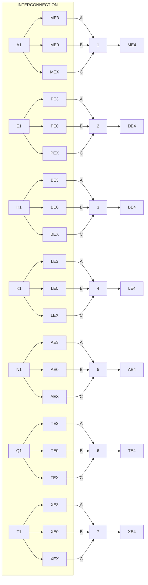

## Register Connections

| Connection Point | Description   |
|------------------|---------------|
| CB.              | 52            |
| NU1. (CX1)       | 51            |
| IO4.             | 56            |
| IC4.             | 54            |
| NU2. (CX4)       | 57            |
| NU0. (CX2) (IO4) | 55            |
|                  | (CX3) (IC1)   |

## Data Inverter

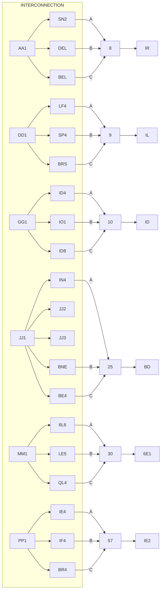

## Predetermined Connectors

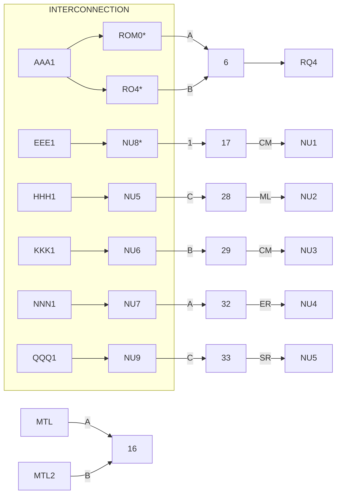

### Footer Information

```plaintext
NORD 90 CARDS
IN NORD-1

A/S NORD DATA-ELEKTRONIKK

Module: 90N40.1
Register Enabling

Module: 90N40.2
Register Enabling

9040.3
Data Inverter
```

---

## Page 8

# A/S Norsk Data-Elektronikk

## Title: 90N04

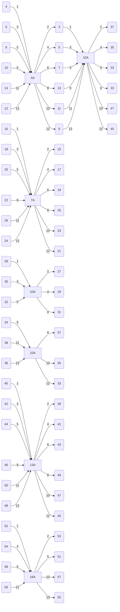

### Remarks: ND-01.004.01

| Drawn by | Approved by | Replacement for | Date | Replaced by | Date |
|----------|-------------|-----------------|------|-------------|------|
|          |             |                 |      |             |      |

---

## Page 9

```plaintext
 __ __       __ __       __ __       __ __       __ __       __ __       __ __ 
|    |--G5--|    |--G3--|    |--G1--|    |--GO--|    |--G3--|    |--G1--|    |
| G2 |      | G4 |      | G6 |      | G8 |      | G2 |      | G4 |      | G6 |
|    |  H3  |    |  H1  |    |  H1  |    |  H1  |    |  H3  |    |  H1  |    |
|____|      |____|      |____|      |____|      |____|      |____|      |____|
 G3,GX       H1,GX       G3,GX       H1,GX

 __ __       __ __       __ __       __ __       __ __       __ __       __ __ 
|    |--G1--|    |--G3--|    |--G5--|    |--G7--|    |--G1--|    |--G3--|    |
| G6 |      | G4 |      | G2 |      | G8 |      | G6 |      | G4 |      | G2 |
|    |  H5  |    |  H5  |    |  H5  |    |  H5  |    |  H5  |    |  H5  |    |
|____|      |____|      |____|      |____|      |____|      |____|      |____|
  GY          HW          GY          HW          GY          HW

       __________________   __________________   __________________
      |                  | |                  | |                  |
      | GSEL | G0   F     | | GSEL |     F G2  | | GSEL | G0 G2 G2 |
      |______[ VR ]_______| |______[ VR ]_______| |______[ VR ]_______|

 __       __
|  |     |  | 
|E5|     |F5|
|  |     |  |
|E3|     |F3|
|  |     |  |
|E1|     |F1|
|  |     |  |
|E0|     |F0|
|__|     |__|

   __     __     __
  |  |   |  |   |  |
  |E3|   |F3|   |H2|
  |  |   |  |   |  |
  |E2|   |F2|   |  |
  |__|   |__|   |__|

 ___________________
|                   |
|       DATE        |
|___________________|
|    BUS MEMORY     |
|___________________|
|  AS NORNE DATA    |
|___________________|
```

---

## Page 10

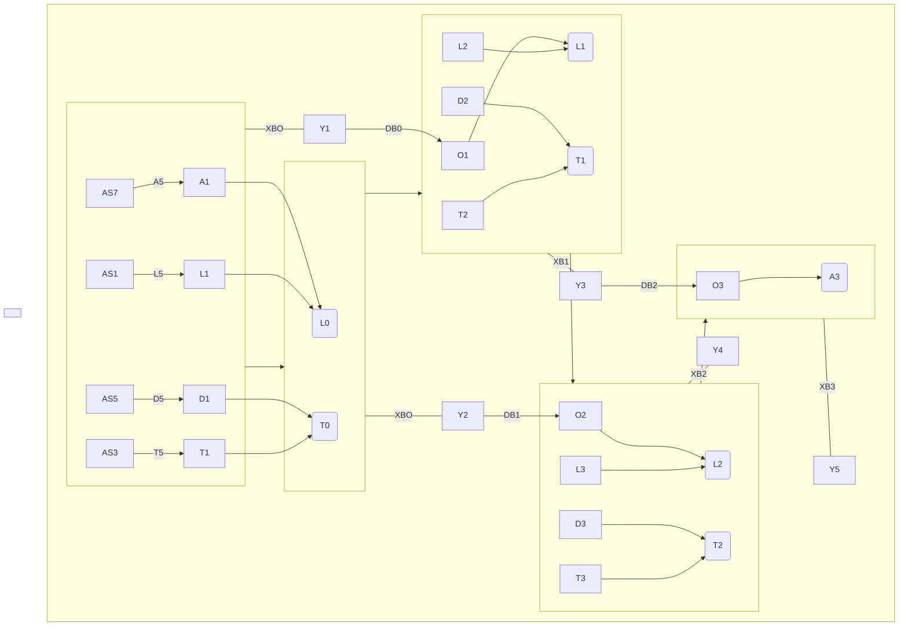
```plaintext
          AEI, DEI, TEI, LEI
             o------------o
           o------------o
          |             |
          |     XBO,    |  
          |     XB1,    |  
          |     XB2,    |
          o------------o

          o          o
          |          |
          o----------o
            DB1, DB3
```

```
───────────────
| SW 7400N    |
| A | 0 : 50  |
| B | 0 : 25  |
| C | 0 : 12  |
| D | 0 : 6   |
───────────────

23 pk                    94 kvm

REGISTER I
102
M8 MORE DATA-ELEKTRONIK
2A02
```

---

## Page 11

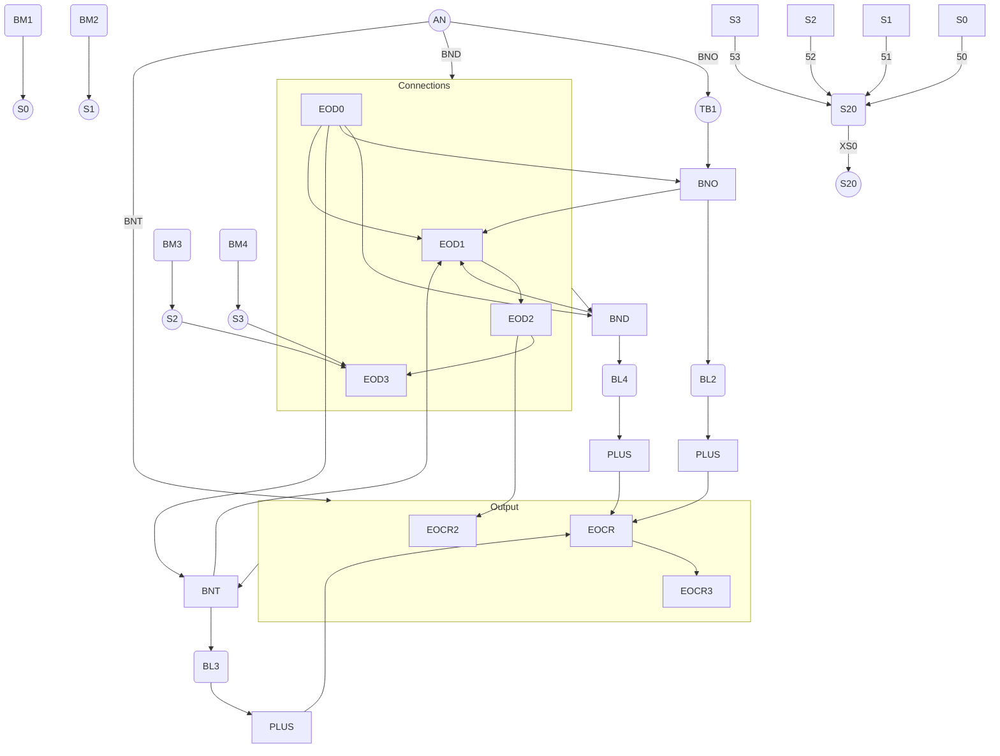

```plaintext
  ID, 5      TBO          TBO, 4        TBO, 5        TBO, 6
  AN ------> BNO ---> BNL4 ---> BML2 ---> BNL3 ---> BML3
              |          |           |          |
BML1          |          |           |          CR2
  |           |          |           | 
 [Plus] --- EOCR     [Plus] --- EOCR   CR1
  |                      |          |
CRL -----> |  Bay  |  --  |    Bay   | 
           |  BML  |  -   |    BML   |
           |  SMPL |--    |    SMPL  |

   1)      20)     30)     40)     50)

             ArBITHeMeTIC
```

---

## Page 12

```mermaid
flowchart LR
    subgraph TopSection
        direction LR
        DS9 --> |Circuit| PT7
        PT7 --> |2A| PE7
        DS8 --> |10B| PE6
        PT6 --> |10B| PE6
        PT5 --> |8B| PE5
        PT4 --> |6B| PE4
        PT3 --> |4B| PE3
        PT2 --> |2A| PE2
        PT1 --> |4A| PE1
        FT0 --> |Circuit| PE0
    end
    
    subgraph MiddleSection
        direction LR
        PE7 --> |Circuit| PG7
        PE6 --> |Circuit| PG6
        PE5 --> |Circuit| PG5
        PE4 --> |Circuit| PG4
        PE3 --> |Circuit| PG3
        PE2 --> |Circuit| PG2
        PE1 --> |Circuit| PG1
        PE0 --> |Circuit| PG0
    end
    
    subgraph BottomSection
        direction LR
        ES8 --> |Circuit| PR7
        DE10 --> |Circuit| PR6
        EE10 --> |Circuit| PR5
        PR6 --> |6C| PG5
        H5 --> |Circuit| PR4
        A2 --> |4C| PG2
        A4 --> |6C| PG4
        A5 --> |8C5| PG5
        A6 --> |10C6| PG3
        A7 --> |12C7| PG7
        A8 --> |14C8| PG0
        PR1 --> |Circuit| PG1
        PR2 --> |Circuit| PG2
        PR3 --> |Circuit| PG3
    end
    
    subgraph SideSection
        direction TB
        DS10 --> |Circuit| PL3 / PL3
        DS10 --> |Circuit| PL2 / PL2
        DS12 --> |Circuit| PL1 / PL1
        DS12 --> |Circuit| PL0 / PL0
    end
```

---

## Page 13

```mermaid
graph TB
    subgraph Top
        subgraph A
            KA0 --> A1
            KA1 --> A2
        end
        subgraph B
            B3 --> B2
            B2 --> B1
            B1 --> B0
        end
        subgraph P
            P3 --> P2
            P2 --> P1
            P1 --> P0
        end
        subgraph RC
            RC3 --> RC2
            RC2 --> RC1
            RC1 --> RC0
        end
    end
    subgraph Bottom
        PS1 --> PS2
        PS4 --> PS3
        RA3 --> RA2
        RA2 --> RA1
        RA1 --> RA0
    end
    Top --> Bottom
    subgraph Peripherals
        WE1 --> WE2
        WE2 --> WE3
        VE1 --> VE2
        VE2 --> VE3
        [illegible] --> CE([illegible])
    end
    subgraph IO
        5C0 --> 6C0 --> 7C0 --> 8C0 --> 9C0
        5C1 --> 6C1 --> 7C1 --> 8C1 --> 9C1
    end
    26pk52term --> IO
    5 <-->|5V| IO
    IO -->|XO| KA0
    IO -->|XA0| XB0
    IO -->|RA0 RA0| Bottom
```
```
- 5: SN 7400N
- 6: SN 7451N
- 7: SN 7453N
- 8: SN 7474N
- 9: SN 7405N

 -------------------
| REGISTERT        |
|       108        |
|                  |
| AS NODE DATA-ELEKTRONIK |
|      24.08       |
 -------------------
```

---

## Page 14

```mermaid
graph TB
    subgraph Left
        IR1 -->| | Gate1
        IR2 -->| | Gate2
        IR3 -->| | IRH1
        IR4 -->| | IRH2
        IR5 -->| | IRH3
        IR6 -->| | IRH4
        IR7 -->| | IRH5
        IR8 -->| | IRH6
        IR9 -->| | IRH7
        IR10 -->| | IRH8
        TMS -->| | Gate3
        C2 -->| | Gate4
    end

    subgraph Middle
        C0[(C0)] -- C0(g*p*t+bop*arg) --- Gate5
        CD(arg) -->| | Gate2
        C0(g*p*t+bop*arg) -->| | Gate1
        C2.61[(C2.61)] -->| | Gate6
        C2.62[(C2.62)] -->| | Gate7
        C2.60[(C2.60)] -->| | Gate8
        C2(61+62) -->| | Gate9
        C2(60+61) -->| | Gate10
        C2(60+62) -->| | Gate11
        SCA -->| | Gate11
    end

    subgraph Right
        IR2.37[(IR2.37)] -->| | Gate12
        IR3 -->| | Gate13
        IR4 -->| | Gate14
        IR5 -->| | Gate15
        IR6 -->| | Gate16
        IR7 -->| | Gate17
        TK4[(TK4)] --> B3
        CY2.34[(CY2.34)] --> B4
        CR2.30[(CR2.30)] --> B5
        IR72 --> B6
        IRM --> B7
        IRH2 --> B8
        IRK0 --> B9
        I04 --> B10
        IR7.39[(IR7.39)] --> B11
    end

    Gate5 --> Gate12
    Gate6 --> Gate13
    Gate7 --> Gate14
    Gate8 --> Gate15
    Gate9 --> Gate16
    Gate10 --> Gate17
    Gate11 -->| | B17

    B16 --- B12
    B18 --- B13
    B19 --- B14
    B20 --- B15
    B21 --- B16
    B22 --> | | L56
```

```
+--------------------------------------+
| REGISTER CONTROL                     |
| Code:   | Date:                      |
|         | Drawn: Nilsson             |
|         | Checked:                   |
| A/S NORSK DATA-ELEKTRONIKK           |
| Document No: 10.01.004.01            |
+--------------------------------------+
```

---

## Page 15

```plaintext
                                                    _
STOP        _____       ___        _______        ____       ___
       ---|_____|-----|___|------|_______|------|_____|------(_)--- SW4
        SW5  10         1           2              3           WPF1
          |                                                         
         _|_                                                        
                  4700pF                                            
                                                                    

CONTINUE   _____       ___        _______        ____       ___     
        --|_____|-----|___|------|_______|------|_____|------(_)--- SW3
        SW2  12         1           2              3           WPF2

SINGLE      _____       ___        _______        ____       ___     
INSTRUCTION|_____|-----|___|------|_______|------|_____|------(_)--- SW3
        SW3  7          1           2              3           WPF3 

SET         _____       ___        _______        ____       ___     
ADDRESS _ _|_____|-----|___|------|_______|------|_____|------(_)--- SW4
        SW4  9          1           2              3           WPF4 

DEPOSIT     _____       ___        _______        ____       ___     
         __|_____|-----|___|------|_______|------|_____|------(_)--- SW4
        SW4  8          1           2              3           WPF5 

LOAD        _____       ___        _______        ____       ___     
        _ _|_____|-----|___|------|_______|------|_____|------(_)--- SW6
        SW4  14         1           2              3           WPF6 

PROTECT     _____       ___        _______        ____       ___     
      .____|_____|-----|___|------|_______|------|_____|------(_)--- SW4
        SW2  5          1           2              3           WPF7 


        15 stk     SN 7400N 
                   _________
                  |         |
TRG     _____     | 400 Ω   |
INTERRUPT|_____|--| 560 Ω   |
        SW6      | 4700pF   |
        SW9      |_________|

        _ _ 
STEP     ____    _____     ___
        |_____|--|_____|---|___|---|_____|--- [illegible] -- [_]
        SW9         7        3      13        WPF8

AM6      _    _        |  ________   _
   _   _| |  |
     | || |=========================
     |_| | |________________      =   |
   N12 _____  = |   WPF9     |  = _ L
      ______ =    | _________|


LM6      _    _        ________
   _   _| |  |
     | || |=========================
     |_| | |________________     DE4 

         --------------
        |             |        
      --|             |---
        |             |     
        |.___________.|

        PANEL BUFFER 
              110   

    A/S NORDIC DATA-ELECTRONOMIX 
                   2A1C 
   ___ ___________________________
  |   |                         
  |   |                         
  |   |                         
  |___|'''_________'''''________'
```

---

## Page 16

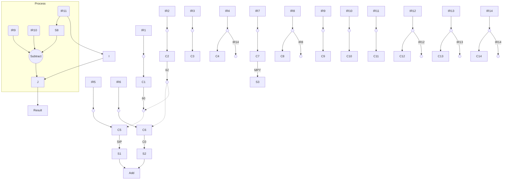

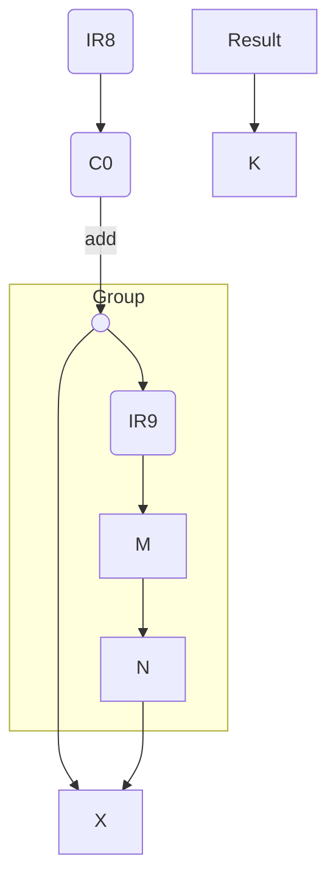

```plaintext
 ____________________________
|    Arithmetic Control     |
|      ----------------     |
| IRX -> [   ] --  IRY ->   |
| F1    [ A ] --  F2    B   |
| C0               C1  C2   |
| add      <-> sub   / div  |
| MULT         <-> M         |
|____________________________|
```

[Photo: Complex diagram with labeled connections and symbols in a technical layout]

---

## Page 17

# I/O Control

## Overview

This document provides the schematic diagram for the I/O Control.

```ascii
    +------+      +------+      +------+                        
    | D21  |----->| D31  |----->| D41  |                        
    +------+      +------+      +------+                        
                   |            |                              
                DC3,1        DC4,1                            
                   |            |                              
                +--+--+    +--+--+                        
                |     |    |     |                        
                |     |    |     |                        
                +--+--+    +--+--+                        
                   |            |                              
                DC2,1        DC5,1                            
                   |            |                              
                +--+--+    +--+--+                        
                |     |    |     |                        
                |     |    |     |                        
                +--+--+    +--+--+                        
                   |            |                              
                DC1,1        D26,0                            
                   |            |                              
                +------+    +------+                        
                | D31  |    | D32  |                        
                +------+    +------+                        
                   |            |                              
                DC3,0        DC4,0                            
                   |            |                              
                +--+--+    +--+--+                        
                |     |    |     |                        
                |     |    |     |                        
                +--+--+    +--+--+                        
                   |            |                              
                DC2,0        DC5,0                            
                   |            |                              
  +------+   +--+--+    +--+--+                        
  | D10  |<--|     |    |     |                        
  +------+   |     |    |     |                        
             +--+--+    +--+--+                        
  DC1,0        |            |                              
               |            |                              
```

## Components

| Component | Label |
|-----------|-------|
| Resistor  | 560 Ω |
| IC        | 7400  |

## Timing Diagram

```mermaid
sequenceDiagram
    per main:
    participant TIMING
    activate REPEAT_TIMING
    TIMING ->> REPEAT_TIMING: IOT OPERATE
    REPEAT_TIMING ->> TIMING: IOT COMPLETION
    TIMING ->> REPEAT_TIMING: CONNECT
    alt Repeated
        TIMING ->> REPEAT_TIMING: Times min 2, max 16 times
    end
    deactivate REPEAT_TIMING
```

## Notes

- Delay from CONNECT to DATA STROBE: min 0.8 μsec, max 1.0 μsec
- IOT COMPLETION: 0.4 μsec
- IOT OPERATE: min 1 μsec

## Diagram Key

- D21: [Diagram Connector]
- D31: [Diagram Connector]
- D41: [Diagram Connector]
- DCn,x: [Data Channel n, state x]
- 7400H: [IC Type]
- Resistors labeled 560 Ω

[Photo: I/O Control Schematic with labels and connections]

---

## Page 18

```mermaid
flowchart TD
    A1(CO) --> A2(SG5)
    A2 --> A3(SA)
    A3 --> A4(CB1)
    A1 --> A5(TP14,C52,R11)
    A5 --> A6(10V)-.-A7(SG5)
    A6 --> A8(KBO)
    A4 --> A9(SB)
    A9 --> A10(TP5)
    A10 --> A11(CB2) --> A12(SG5)
    A5 --> A14(RN51)
    A14 --> A15(NR8)
    A15 --> A16(CB3)
    A16 --> A17(SG5)
    A14 --> A18(CB4)
    A18 --> A19(NR5)
    A18 -.-> A20(CASE)
    
    B1(WP3) --> B2()
    B2 --> B3(A11)
    B3 --> B4(EM3)
    B4 --> B5(1)
    B5 --> B6(NR9)
    B6 --> B7(Thr.)
    B7 --> B8(NTLO.CB1)
    B8 --> B9(SG4)
    B9 --> B10(SL)
    B10 --> B11(CO)
    
    C1(WP2.EM4) --> C2(NTL)
    C2 --> C3(CB2)
    C3 --> C4(1)
    C4 --> C5(EM2)
    
    D1(WP1) --> D2(A11)
    D2 --> D3(EM1)
    D3 --> D4(SG1)
    D4 --> D5(CB5)
    
    E1(WP4) --> E2(EM6)
    E2 --> E3(MC)
    E3 --> E4(CSG)
    E4 --> E5(TX CB)
    E5 --> H1(NTLO.CC6)
```

```plaintext
 ------------------------------------------------
|           |                                    |
|   LOAD    |                                    |
|           |                                    |
 ------------------------------------------------
```
```
[Photo: A technical schematic diagram with labeled elements]
```

```plaintext
 -----------------------------------------
| 7400  10 | A/B : 1 - 23                 |
|    02    | B:   24                     | 
|    06    |                             | 
|   02    3 | MBDT                      | 
|   14    6 |                           |
|           |                           |
|  ASSEMBLER 122                        |
|  A/S NORSK DATA-ELEKTRONIKK           |
|  2A22                                 |
 -----------------------------------------
```

---

## Page 19

```mermaid
graph TB
  IR11 -->|1| IR48
  IR10 -->|2| IR8
  IR91 -->|3| IR15
  IR50 -->|4| IR15
  IR46 -->|5| IR14
  IR50 -->|6| C1
  IR11 -->|7| IR47
  IR12 -->|8| IR16
  IR46 -->|9| IR15
  IR50 -->|10| C2

  subgraph Cluster_1
    CL1(( ))
    CL1 -.->|12| CL4
    CL6 -- NC -->|13| NT2
    CL6 -->|14| CL2
  end

  CC1 -->|11| CC9
  CC7 -->|15| CC9
  CC8 -->|16| CC4
  CC2 -->|17| CC3
  CC3 -.->|18| CL5
  CC4 -.->|19| CL6
  CC5 -->|20| CC2

  CC7 -->|21| CC3
  CC9 -- NC5 -->|22| CC5
  NT3 -->|23| CC6

  subgraph Cluster_2
    CX1 -- CS1 --> CX2
    CS1 -->|29| CX9
    CS2 -->|30| CX7
    CB -->|27| CX8
    CB -->|28| CX5
  end

  CC1 -->|24| C5
  CC2 -->|25| C7
  CC3 -->|26| C7
  
  subgraph Cluster_3
    CC5
    CC6
    CC7
    CC8
    CC9
  end
```

```plaintext
 __________________________________
|   ____    _____     _____   ____  |
|  |    |  |     |   |     | |    | |
|  |____|  |_____|   |_____| |____| |
|__________________________________|

         Schematic Diagram
```

| Diagram Component | Label |
|-------------------|-------|
| CC1               | 18    |
| CC3               | CC6   |
| CC4               | 44    |
| CC7               | CC10  |
| CC5               | 150   |

```plaintext
 ________________________________________
|        Cycle Counter                  |
|        123                            |
|        Date: ________                 |
|        Signature: ________            |
|        AS HOME DATA SOLUTIONS         |
|_______________________________________|
```

---

## Page 20

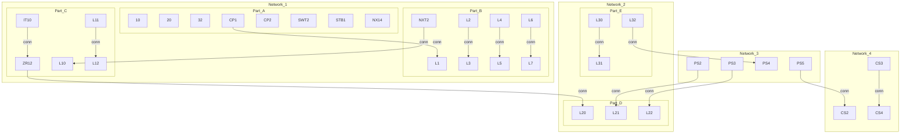

```
+-----------+
| FL2       |
| tc0, tc1  |
+-----------+
    |
    +--
+-----------+
| TCA       |
| tc0, tc1  |
+-----------+
```

---

## Page 21

```plaintext
+--------+     +--------+     +--------+     +--------+     +--------+
|        |     |        |     |        |     |        |     |        |
|  SA1   |     |  SC0   |     |  SC1   |     |  SC2   |     |  SC3   |
|  1-H   |---->|   0    |     |   0    |     |   0    |     |   0    |
|_______ |     |_______ |     |_______ |     |_______ |     |_______ |
    ^             ^             ^             ^             ^ 
    |             |             |             |             | 
CO3-S4 CO3-B8 (S3) CO4-A8 CO-B8 CO4-B8 CO2-108 CO4-B8 CO4-B8 CO8-BL4 
    12            15            22            31            38

───────────────────────────────────────────────────────────────────

|        |     |        |     |        |     |        |     |        |
|  SC5   |     |  SC6   |     |  SC7   |     |  SC8   |     |  SC9   |
|  1-L   |     |   1    |     |  1-F   |     |   1    |     |   1    |
|_______ |     |_______ |     |_______ |     |_______ |     |_______ |

SC9-8-0 SC-0-VB 3-GC4 4-GC4 SC5-3F8 SC6-A5 SCA-536 SCX (3-5) 
                                             33            39

───────────────────────────────────────────────────────────────────

+--------------+     +--------------+     +--------------+     +--------------+
|SH1 CO|    Yq1|---->|SH6 CO|    Vc1|---->|ZC5 CO|    Vb1|---->|ZC7  |    Yq1 |
+--------------+     +--------------+     +--------------+     +--------------+
                                              |                   |        
                                              |-------------------|
                                                  (3-5) ZC-7     


clv2 = SC SSl6 = t3(CO+CD) i+d * C3.0. mpy  *SS6: CX2 (C2(tmu+adv)+C3 (fad + fsb))
 count SC FL1 = C3,3 (fad, fsb) SC1 (G15 - CF).
                          
SH1 = CO-sht
```

---

## Page 22

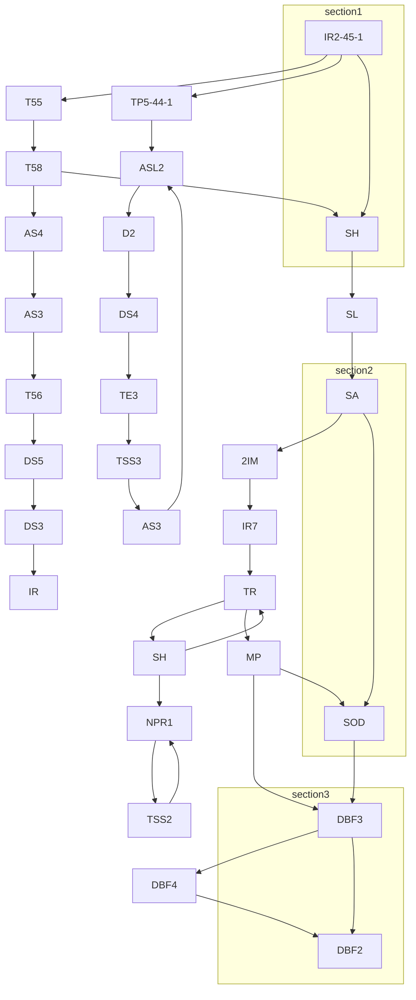

```ascii
+-------------------+
|                   |
|       FDIV        |
|                   |
|  D3             D5|
|                   |
+--------+----------+
         |        
         v     
```

| Shift Control | 126  |
|---------------|------|
| Page Ref | 94-43 |
| Date | [Illegible] |
| Doc No. | 2A26 |

A/S MORSK DATA-ELECTRONICS

---

## Page 23

```mermaid
flowchart TB
  subgraph Diagram
    A01[[TP14<2>, MP4]] --> D54[C<3>]    
    D54 --> B55[[BP4]]
    B55 --> C57[[TR2, BAS]]
    B55 -.-> C56[[BP4, TR2, BAS]]
    C57 --> C59[[C]]
    B55 -.-> D58[[CH<7>]]
    D58 --> C79[[BP2, TR2, BAS]]
    C79 --> B42[[BZ]]
    C79 -- av flow --> B49[(0 - 1 
    NP1, MP1)]
    B49 --> D59
    B49 --> A01
    D59 -.-> D59
    D59 --> C45[[BP1, TR2, BAS]]
    C45 -.-> C54[[BP1, TR2, BAS]]
    C54 --> B29[[C]]
    B61 --> C31[[A 10B]]
    C31 --> C35[[A 13B]]
    C34[[C 12B]] --> C35
    C32[[Q 10B]] --> C31
    C33[[Q 12B]] --> C35
    C35 --> C28[[GS4]]
  end

  subgraph Section2
    A44[[QS1]] --> B51[[C]]
    B51 --> B52[[FL2]]
    B52 --> C41
    B45 --> B42[[A]]
    B51 --> B46[([illegible])]
    B46 --> C53
    B53 --> B54
  end

  subgraph Section3
    A08 --> D61[[NR]]
    D50[[TC2, MC]] -.-> D49[[FDK, FZZ, DF, DI1]]
    C49 --> D49
    D18 --> D55[[SCQ, NR]]
    D55 --> C54
    D54 --> C40[[SCQ, OZ]]
    C50 --> C41[[FZ]]
  end

  subgraph Control_Flip_Flops
    D06[[MP1]] --> D19
    D19 --> D31[[MP2]]
    D31 --> C34
    C54 --> C27[[GS1]]
    D19 --> C30[[Q]]
    D06 --> D08[[NS]]
    D08 --> NS3
    D06 --> B06[[MP2]]
    D06 -.-> C40
  end
```

```plaintext
+------------------+------+------+
| Code             | Num  | Desc |
+------------------+------+------+
| 7400             | 5    | BCS  |
| 02               | 5    | A    |
| 50               | 5    | C    |
| 60               | 3    | B    |
| 72               | 3    | Z    |
| 74               | 3    | D    |
+------------------+------+------+

                                        +------------------+
                                        |  A/S  HONG  DATA |
                                        +------------------+
```

---

## Page 24

```plaintext
                      +-----------------+                                                            
                      |     IRF6        |                                                            
                      |                 |                                                            
                      +-----------------+                                                            
                                |                                                                   
                                |                                                                   
     +------------+     +---------------+     +-----------+                                          
     |    IRF5    |---->|     IRF7      |---->|   IRF9    |                                          
     +------------+     +---------------+     +-----------+                                          
          |                     |                   |                                                
          |                     |                   |                                                
     +------------+     +---------------+     +-----------+                                          
     |    IRF8    |---->|     IRF2      |---->|   IRF10   |                                          
     +------------+     +---------------+     +-----------+                                          
                                             

       +---------------+                 +-------------+                                             
       |    IRF5       |----+            |     IRF1    |                                             
       |               |    |            |             |                                             
       +---------------+    |            +-------------+                                             
               |            |                    |                                                   
               |            |                    |                                                   
     +---------------+    +-------------+    +-----------+                                           
     |     IRH1      |<---|     IRH3    |<---|    IRH5   |                                           
     +---------------+    +-------------+    +-----------+                                           
           |                   |                  |                                                  
           |                   |                  |                                                  
     +---------------+    +-------------+    +-----------+                                           
     |    IRH2       |<---|     IRH4    |<---|    IRH6   |                                           
     +---------------+    +-------------+    +-----------+                                           

                          +---------------+                   +-------------------+                 
                          |       C2      |<-----------------|       PM          |                 
        +---------+       |               |                   |                   |                 
        |   C0    |<------+               +------------------>|    CC0, IRH8      |                 
        |         |                +------|     CO2, IRH10    |                   |                 
        +---------+                |      +-------------------+                   |                 
                                   |                                              +                 
                       CO, IRH10   |                                 GND                        
                       0           |                                 [25:24]                        
                                +--|--------------------------------+                        
                                |                                                    

                               
    +-------------+   +-----------+   +----------+   +-----------+                     
    | CO, IRH8    |<--|     CO    |<--|   29     |<--|     J     |                     
    +-------------+   +-----------+   +----------+   +-----------+                     
                           |                                                          
                           |        +                       +                         
               +-----------|--------|-----------------------|--+                      
               |       27  |  t2    |          Switch        |   0                    
               +-----------|--------|-----------------------|--+                      
```

```plaintext
             +----------------------+
             |                      |
             |  CO, IRH8, CH3, t1   |
             |                      |
             +----------------------+
                            |
             +--------------|--------------+
             |      TP6, t3               |
             +--------------|--------------+
                            |
             +--------------|--------------+
             |  Trigger CH  |      CH     |
             +--------------|--------------+
                            |
                            v
                 +------------------+
                 |       29         |
                 +------------------+
```

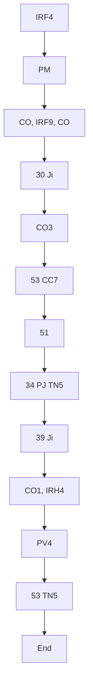

```plaintext
                        +-------------------+
                        | PM   |   J4, PTi  |
                        +------|------------+
                               |
                          +----|-----+
                          |  IRH2    |
            +-------------|----------+
            |             |
            |             v
            |    +-----------------+                 
            |    |   PT            |
            |    |                 |
            |    +-----------------+
            |  
            v 
   +-----------------+
   | IR15, IR4       |
   +-----------------+
```

```plaintext
Note: When no special protection register 
is included in CPL, the PA4 signal should 
be connected to the most significant R.PT. in use.

74-00   9
07      5
43     85
50     25
...
```

```plaintext
                              PROTECTION CHECK
                                128

  div nretelser         1.29.70             Sund
  A/S COMPANY NAME DATAELECTRONICS  2A28
```

---

## Page 25

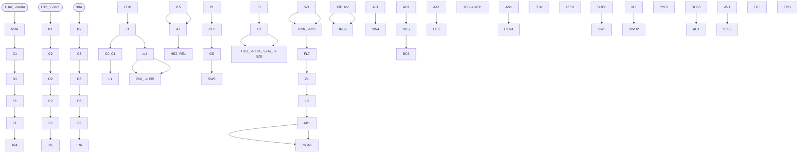
```
+-------+-------+-------+-------+-------+-------+-------+
| 740A1 | 6     | 9     |       |       |  SZA_ --> SZB_|
+-------+-------+-------+-------+-------+-------+-------+
| 42    | 40    | 20    | 2     | 7     | 0     | 1     |
+-------+-------+-------+-------+-------+-------+-------+
|       |       |       |  Square 1cm  |
+-------+-------+-------+-------+-------+-------+-------+
```
```
+--------------------------------------------------------+
|                    ADDRESSING CONTROL                  |
|                    130                                 |
| A/S NORSK DATA-ELEKTRONIKK                             |
| 2.430                                                   |
+--------------------------------------------------------+
```

---

## Page 26

```mermaid
graph TD
    A(IR17_1) --> B[11RA_4]
    A --> C[11RB_4] --> D(IR16_3)
    A --> E[11RC_4] --> F(IR14_4)
    A --> G[11RD_4] --> H(IR12_2)
    A --> I[11RE_4] --> J(IR10_16)

    subgraph Block1
        K[H] --> L[12RA_1]
        L --> M[12RB_1] --> N(Hi)
    end

    subgraph Block2
        O(IR56_39) --> P[CO_39]
        Q(C2) --> R[40_37] --> S(C)
    end

    subgraph Block3
        T(CX2) --> U[28] --> V(C1_37)
        W(C1) --> X[CO_61] --> Y(C0_21)
    end

    Z(N56n) --> AA(IR75_30) --> AB[30_8] --> AC(42) --> AD(MTu)
    AE(C2) --> AF(nale)

    AG(IR3_28) --> AH[11RB]
    AH --> AI(C2) --> AJ[BP2_10]

    subgraph Block4
        AK(T1) --> AL[P1]
        AL --> AM[TPR_14] --> AN(min)
    end

    subgraph Block5
        AO(IR15_14) --> AP[IO_164]
    end

    subgraph Block6
        AQ(IR54n) --> AR[IR4_43]
        AR --> AS(IR54_50)
        AS --> AT[DP2P_62]

        AU --> AV(IR56_14)
        AV --> AW(IR14_12)
        AW --> AX(org.min)
    end

    subgraph Block7
        AY(TMS) --> AZ[40.1_5]
        AZ --> BA(SM2_11) --> BB(TMS)
    end

    subgraph Block8
        BC(42_NeS)
    end

    BR(TPS1_42) --> BS(RBS1_42)
    BS --> BT(PS10_11)
    BT --> BU(RBS2_4) --> BV(PS10_38)
    BV --> BW(PS15)

    BY(TC2_64) --> BZ[38_11]
    BZ --> CA(PS12_20) --> CB(IR74_16)

    subgraph Block9
        CC(IR8_22) --> CD[IR55_29]
        CD --> CE(IR7)
    end
    
    CF(PS13)

    CG(THS) --> CH[45M_17] --> CI(A6H_12)
    CJ --> CK

    subgraph Block10
        CL(42_RFP)
        CM(IR74_64) --> CN[IR76_46]
        CN --> CO(IR74_64) --> CP[58_22]
    end

    CQ(ASL) --> CR[PS13_9]
    CR --> CS(IR13_60)
```

```
+-------------------+----------------------+
| Component         | Description          |
+-------------------+----------------------+
| IR17_1            | Input Relay 17, 1    |
| IR56_39           | Input Relay 56, 39   |
| CO_39             | Control Output 39    |
| CX2               | Control X 2          |
| 42                | Relay or reference   |
| 40.1_5            | Relay or reference   |
| CO_21             | Control Output 21    |
| IR75_30           | Input Relay 75, 30   |
| IR3_28            | Input Relay 3, 28    |
| PS10_11           | Power Supply Relay   |
| PS12_20           | Power Supply Control |
+-------------------+----------------------+
```

```
[Drawing provided: Addressing Control Schematic]
```

---

## Page 27

# Interrupt Control

```plaintext
                                      A4
    PK1•6 <--->  O---|----------------->
                                             |
    PK2•5 <--->  O---|-----------------|      1
                                             |
    PK3•6 <--->  O---|-----------------|      2
    PK4•2 <--->  O---|-----------------|      3
    PK7•7 <--->  O---|-----------------|      4
                                             |
    PK6•5 <--->  O---|-----------------|      5
                                             |
    PL0•0 <--->  O---|-----------------|      6
    GND               |          8-| RR2  
                      |            
    PDo ------------> |            |
                      |----------->|
    PK9•3 -->| O-|                   |
    PK10•4  |  O-|                   |
    PL1•5 -----> O-|        <-| DAT  |
    PL2•8 -----> O-| (PK-PL)        |
                              
```

```plaintext
--------------------------------------------------------------------
| TP0         |      CC1, CX1, CX3   |    \
--------------------------------------------------------------------
| TP1 -> tP1, TP2 -> tP2, TP3 -> tP3 |    \                       \
--------------------------------------------------------------------
                              
   |-------|       |--------|     |--------|\   |---------|\    |-----  
  (SQ4   O)   <=> (IS2   O)    (IMZ     O)\
      |_____\       |_____\          |_____\   
       |_____\       |_____|______|_____
                              
```

```plaintext
          --------------------
          | Interrupt Control |
          |       132         |
          | A.S. Morse Data   |
          --------------------
```

___Notes:___ 

- The structured diagrams have been recreated to the best of legibility.
- Unreadable elements are marked as [illegible].
- Some details with low visibility are not included.
- The ASCII art attempts to convey the spatial layout and connections in the diagrams as seen on the page.

---

## Page 28

```
     ┌────────────┐
     │ 1R3,       │
     │  2R3,      │
     │   4R3      │
     │    5R3     ├──┐
     └────────────┘  │
                     │    ┌────────────┐
                     └────┤ 30R4       │
                          │ 1H         ├─────────────────────────────┐
     ┌────────────┐    ┌──┤ 2K1        │                             │
     │ 6A4,        │    │  └────────────┘                             │
     │  1VA3       ├────┘                                            │
     └────────────┘                                                 │

[Diagram simplified for visibility purposes]

```

Note: The representation above captures the general layout and connections, focusing on clear representative ASCII alignment. Some details may be missing due to limitations in visual clarity from the scan.

---

## Page 29

# Floating Control Schematic

```plaintext
      +-------------------+
      |    ND 3C          |
      |                   |----------- C3 (fcd+fsb) CX3
      |                   |----------- C2 (fcd+fsb) CX2
      +-------+           |----------- C1 (fcd+fsb) CX1
              |           
         SH4  |           +-----------------------------+
    +---------+-----------|10      | [illegible]        |   18H.3
    |  BHH4.1 |           |        |                    |       +--------------+
    | -o o--  |   18H.4   |        |                    |------ | SZ4.1        |
    |    |    | -o o--    |        |                    |       +--------------+
    |    |    |    |      |        |                    |
    |    |    |    +------|        |                    |
    |    |    |           |        |         ND 3C      |
    |    |    +------+    |        |                    |
  55    56   57    | S14.4|   18H.1|                    |
 +          -[ ]---|-o o--|        |    55 term         |
 |                 |      +--------+                    |
 |                 |                                    |
 |                 |                                    |
 +-----------------+------------------------------------+

                      +----------------------------------+
                      | 55, 56, 57                       |
                      +----------------------------------+

                      +----------------------------------+
                      | ND 3C                            |
                      |                                  |
                      +----------------------------------+
```

```plaintext
 +---+     +---+     +---+     +---+
 |   |-----| 1 |-----| 2 |-----|   |
 |   |     +---+     +---+     |   |
 |   |                           CX3 |
 +---+                           |   |
 |   |---------------------------|   |
 |   |                           |   |
 +---+                           +---+
```

```markdown
## Connections

- `FP9b` connects to `CX3` via path `26`.
- `FP10b` connects to `CX2` via path `27`.
- `FP11b` connects to `CX1` via path `28`.
- `FP12b` connects to `CXO` via path `29`.
- `FP13b` connects to `IRH1` via path `30`.
- `WZ5` connects to `N7Z5` via path `52`.
- `F010b` connects to `F110b` via path `35`.
- `FC5`, `FQ10a`, `CY8a` connect via path `36`.

## Footnotes

- 7420, 7470, 74130, 7470, 7420: 10 pH
- FP1, FP5, ID16: `[illegible]`

```

```plaintext
+--------------------------------------------------+
|                    FLOATING CONTROL              |
|--------------------------------------------------|
| Date:               Drawn by:                    |
| Sheet No:      2A34                              |
| A B H          5                                  |
+--------------------------------------------------+
```

---

## Page 30

# Floating Control

```mermaid
flowchart TD
    subgraph SG[ ]
        NE1 --> t1
        IRM ---> H5F
        IRH --> C50
        FQ4 -.-> t4 --+-- t3
        NE2 --> (0)
        FC4 -.-> (3)
        OPF --> FA

        F3 --> ZCZ2 --> ZCZ1
        ZCZ0 --> (5)
        TH0 -9- ZCZ0
        FQ3 --> ZCZ2
        ZCZ1 ----> A1

        DO3 --- FQ(5) --> A9F
        NE2 --- H7
        FQ(3) -.-> SG4
        SG4 -.-> SG6
        GLC -.-> SG1
        TH0 -4-> SG8
        TH6 -2-> SG2

        FQ(5) --> t7
        TH4 -o-> (C60)
        NZ5 --> T2
        ML2 -3-> T5
        HFO --> (5)

        ZCZ6 -.-> (F1)
        ZCZ5 --> (A1)
        TP6 --o-> ZCZ4
        ZCZ3 --> (5)

        TP0 -c-> h3
        TH6 -a-> (FQL)
        (5-0) --> t1
        a27 --> BC3
        a26 --> F52
        f27 --> RC2

        ZCZ0 --> (5)
        OM --> ZCZ
        HS2---> C50
        C30-fmu -.-> ZCZ
        RA1 --> ZCZ

        40 --> 52
        50 --> (1)
        T6 --> T5
        T9 --> T1
        TH4 --> T6
        DO --> TH5
        T6 --> ZCZ4

        FP8 ---- FA
        F8 ----> FQ4
        F(5) --> (5)
        H5 --- [EObject]

        IRH --> IRH_1
        C10 ---> HOR90

        C30-fmu --> IRM
        IRF --> IRM_1
        ZCZ ---> IRF
        ZCZ --> TH0
        FQL --> TH6

        N29_1(\n) --> T4
        T9 ---> ZCZ

        F4C --> (ZF5)
        C10 ---> T9
        C10-fmu --> T9
        T9 ---> C10

        H5 -----> [Photo]

```

[Photo: Floating Control Technical Page]

| Item  | Code |
|-------|------|
| 7400  | 10   |
| 02    | 4    |
| 4     | 2    |
| 5     | 10   |
| 40    | 4    |
| 50    | 3    |
| 53    | 2    |
| 54    | 3    |
| 55    | 3    |
| 57    | 27.1 |

[Photo: Company Logo and Footer]

## Label Information

- Document: Floating Control 135
- Author: A-1 Norsk Data-Elektronikk
- Page: 2A35
- Date: [Illegible]

---

## Page 31

```mermaid
graph TD;
    subgraph Section1
        ITM1 ---> |1c1| TE1
        ITM2 ---> |1c2| IE2
        ITM3 ---> |1c3| IE3
        IRH1 --> n21
        IRH6 --> n22
        ID4 --> |tc3| n23
        FPM1 --> |+tc2| n24 --> DZ6
    end
    
    subgraph Section2
        FPM7 --> |te2| n25
        FP9 --> |4c1| n26
        FPM3 --> n27
        ID5 --> |tc4| n28
        FPM8 --> n29
    end
    
    subgraph Section3
        N25 --> |tc1| n30
        N25 --> |tc2| n31
        N25 --> |tc3| n32
        FP12 --> n33
        D25 --> |1c1| n34
        FP4 --> n35
    end
    
    subgraph Section4
        FPM11 --> |+nz6| n36
        D25 --> |2c2| n37 --> D26
    end
    
    subgraph Section5
        FPM4 --> |+1c1| n38
        FP10 --> |tc4| n39
        CY6 --> n40
    end
    
    subgraph Section6
        FPM3 --> |te3| n41
        FP12 --> |te4| n42
        FP5 --> n43
    end
    
    subgraph Section7
        X6 --> |tc3| n44
        BC3 --> n45
        FPM5 --> n46
        ID4 --> |tc6| n47
    end

    subgraph Legend
        note1 --> "7400 10"
        note2 --> "7402 9"
        note3 --> "7430 7"
        note4 --> "7460 2"
        note5 --> "7493 1"
        note6 --> "Total: 53"
    end
```

```
 __________________________
|          Floating Control |
|__________________________|
|     I136                 |
| A/S HOREX DATA ELECTRONIX |
|      Drawing: 2A36       |
|      Rev: 2A36           |
|__________________________|
```

---

## Page 32

```plaintext
   _______      _______            _______
  |       |    |       |          |       |
  | F3(4) |    | CZ(4) |--------->| A 56  |
  |       |    |_______|          |_______|
  |_______|                      1/

  _______    _______
 |       |  |       |
 | F3(4) |  | CZ 1  |
 |_______|  |_______|
         |     |
  _______|     |     
 |       |     |       
 | A 58  |     |       
 |_______|     |
         ------

  _______
 | LSBY  |
 |       |-----------------------------------------------   
 |_______|                                                |

 _______                                                 |
|       |                                                |
| TP6.  |                                                |
|_______|                                                |
                                                         |
 _______               12/                               |
|       |---                                               |
|  IDA  |---                                              |
|_______|---                                              |
              |                                           |
              |                                           |
              3/          _______                         |
------------------------>| FPM.  |                        |
                         |_______|                        |
                                                         _______
                                                        | LSBY  |
                                                        |_______|
                                                        
 _______  
|       |  
| N22.  |  
|_______|
|
|
|
|                                               
|
 _______                                                 
|       |                                                    
| DS31  |                                                        
|_______|                                                          

 ___________________________________________________________
|                                                           |
|                                                           | 
|   FLOATING CONTROL   137                 Sheet 2 of 5     |
|   A/S NORSK DATA-ELEKTRONIKK                               |
|   2.437                                                    |
|___________________________________________________________|
```

---

## Page 33

# Lamp Register

## Technical Schematic

```plaintext
                                                                         
    +-------------------+ +-------------------+ +-------------------+
    |    [04]           | |    [05]           | |    [06]           |
    |   ___             | |   ___             | |   ___             |
    |  | 3C0|           | |  | 3C0|           | |  | 7C0|           |
    |  |____|           | |  |____|           | |  |____|           |
    +-------------------+ +-------------------+ +-------------------+
    +-------------------+ +-------------------+ +-------------------+
    |    [13]           | |    [14]           | |    [15]           |
    |   ___             | |   ___             | |   ___             |
    |  | 5SA|           | |  | 5SA|           | |  | 5SA|           |
    |  |____|           | |  |____|           | |  |____|           |
    +-------------------+ +-------------------+ +-------------------+
               |                 |                  |
               o                 o                  o
                \                |                  |
                 \ +-------------+            +-----+
                  o                S1         o
                 +                 |         / \
                +------+           +---\   /----+
                |      |           |    o o     |
                |      |           |    |\/|    |
                +------|-----------|----|/\|----+
                       |           |    o o
                       |           |   /   \
    ___________________|___________|______________________
    |                  |           |                     |
  __|__________________|_____________________________    |   
 /WL07 /WL04   /WL03     /WL02     /WL01     /WL00 /   __|
(____|)      (____|)    (____|)    (____|)   (____|)   |__
```

## Table

| Element Label | Description              |
|---------------|--------------------------|
| 7400          | Integrated Circuit Type 1|
| 40            | Part Identifier 1        |
| 54            | Part Identifier 2        |
| 74            | Part Identifier 3        |

---

## Company Information

**A/S NORSK DATA-ELEKTRONIKK**  
Document Name: Lamp Register  
Document Type: *Technical Drawing*  
Drawing Number: 140  

---

## Note

This document is a technical drawing of a "Lamp Register," including its schematic and related part identifiers.

---

## Page 34

```mermaid
flowchart LR
    subgraph LEFT
        A1[PT1] -->|B5| B1[PC1] -->|A3| B2[PC2]
        A2[PT2] -->|B3| B3[PC3]
        
        A3[PT4] -->|B4| C1[PC4] -->|B3| C2[PC5]
        
        A4[PT5] -->|B4| D1[PC6] -->|B3| D2[PC7]
        
        A5[PT6] -->|B4| E1[PC8] -->|B3| E2[PC9]
        
        A6[PT7] -->|B4| F1[PC10]
    end
    
    subgraph RIGHT
        F3[PC6 3A] -->|A3| G1[PC8 8A]
        F4[PC5 3A] -->|A1| H1[PC6 5A]
        A7-->|A3| G2[PC7 3A]
        
        I1[PC8 7A] -->|A1| J1[PC9 9A]
        A8-->|A2| I2[PC8 9A]
        
        K1[PC11 15A] -->|A3| L1[PC12 15A]
        K2[PC12 15A] -->|A2| L2[PC13 15A]
    end
    
    subgraph LOWER_LEFT
        M1[PS1] -->|R5| N1[PT4]
        M2[PS2] -->|R5| P1[PT5]
    end
    
    subgraph LOWER_RIGHT
        Q1[PA4] -->|R4| R1
        Q2[PA5] -->|R3| R2
        S1 -->|R2| T1
        S2 -->|R1| T2
    end
```

```plaintext
  7400
+-----+
|     | A
|     +-----> P5
|     | B
+-----+

+-----+
|  P6 | A
|     +-----> P7
|     | B
+-----+

+-----+
|  R3 | A
|     +-----> T4
|     | B
+-----+

+-----+
|  R2 | A
|     +-----> T3
|     | B
+-----+
```

| Ref | Component |
|-----|-----------|
| 7400 | 4 |
| R2   | 22Ω |
| R3   | 47Ω |
| R4   | 56Ω |
| R5   | 22kΩ |

**Protection**

| No | Name  | Date       | Scale | DWG No |
|----|-------|------------|-------|--------|
| 01 | 5441  | Jan 22, '98| 1:1   | 2441   |

**A.V. ROESE DATA ELECTRONICS**

---

## Page 35

```mermaid
flowchart TD
    A01 --> |1| IDR1
    A02 --> |2| IDR2
    A03 --> |3| IDR3
    A04 --> |4| IDR4
    A05 --> |5| IDR5
    A06 --> |6| IDR6
    A07 --> |7| IDR7
    A08 --> |8| IDR8
    A09 --> |9| IDR9
    A10 --> |10| IDR10
    A11 --> |11| IDR11
    A12 --> |12| IDR12
    A13 --> |13| IDR13
    A14 --> |14| IDR14
    A --> |15| MPS
    MPS --> |MP| H54
    H54 --> |MC| R
    R --> |WT1| WT2
    R --> |WT2| WT3
    WT3 --> |WT3| WT4
    WT4 --> |WT5| WT6
    WT6 --> |WT7| WT8
    subgraph Block1
        IDR1 --> 178.1
        IDR2 --> 178.2
        IDR3 --> 178.3
        IDR4 --> 178.4
        IDR5 --> 178.5
        IDR6 --> 178.6
        IDR7 --> 178.7
        IDR8 --> 178.8
        IDR9 --> 178.9
        IDR10 --> 178.10
        IDR11 --> 178.11
        IDR12 --> 178.12
        IDR13 --> 178.13
        IDR14 --> 178.14
    end
    subgraph Block2
        7A --> IDT
        IDT --> 50
        IDT --> MPS
        IDT --> 0
    end
    Block2 --> |AB| A54
    Block2 --> |AB| A54
    Block2 --> |CD| A56
    Block2 --> |EF| A57
    A54 --> |FG| A57
    A56 --> |HI| A57
    A57 --> |JK| A57
    A57 --> |AB| A56 
    subgraph Block3
        154a --> 234a
        154b --> 234b
        153a --> 243a
        153b --> 243b
    end
    end
    Block1 --> Block3
    Block3 --> L
```

```plaintext
+-----+     +-----+     +-----+
| IDR | --> | 178 | --> |  L  |
+-----+     +-----+     +-----+

+-----+     +-----+
| MPS | --> | H54 |
+-----+     +-----+

      +-----+
WT --> | WT3 |
      +-----+

[Title Block]
--------------------------------
RESISTER TRANSFER PAGE
 436 DATE
--------------------------------
```

---

## Page 36

```plaintext
      ___                      ___                      ___                      ___
  +--| 4 |--------+       +---| 4 |--------+       +---| 4 |--------+       +---| 4 |
  |  1|___|4     0|       |   |___|4     0|       |   |___|4     0|       |   |___|4     0  +4V
  |   +--------+  |       |    +--------+  |       |    +--------+  |       |    +--------+
+--+--| 4 |     |  |    +--+--| 4 |     |  |    +--+--| 4 |     |  |    +--+--| 4 |     |
|  |  |___|4    17|    |  |  |___|4    19|    |  |  |___|4    16|    |  |  |___|4    1|
|   +--------+    |    |   +--------+    |    |   +--------+    |    |   +--------+    |
| IS2         IS2         IS2         IS2
| 42                  43                  44                  45
| +--------+  |       +--------+  |       +--------+  |       +--------+  |   
| 6|           |       |         |  |       |          |  |       |          |  |
| 25| IR5  4  |        | IR6   3  |        | IR6   3 |        | IR8  5  |     
|  |_|_____|_ |        |_|_____|_ |        |_|_____|_ |        |_|_____|_ |
|  IR7  5|   |         IR9   4|   |         IRS   4|   |         IR4 |   2|   
|          |  |                |  |                |  |                |  |
|          |  |                |  |                |  |                |  |
|          |  |                |  |                |  |                |  |
|          |  |                |  |                |  |                |  |
|          |  |                |  |                |  |                |  |
|          |  |                |  |                |  |                |  |
|          |  |                |  |                |  |                |  |
|__________|__|       ________|__|       ________|__|       ________|__|
```

```mermaid
graph TD;
    A1[50] -- 4V --> B1[ |]
    A2[IS2] --> B2 --> C1[IR12 3A]
    A3[IS2] --> B3 --> C2[IR13 3A]
    A4[IS2] --> B4 --> C3[IR10 5A]
    A5[IS2] --> B5 --> C4[IR1 3A]
    A6[IS2] --> B6 --> C5[IR2 3A]
    A7[IS2] --> B7 --> C6[IR3 9A]
    A8[IS2] --> B8 --> C7[IR5 7A]
    A9[IS2] --> B9 --> C8[IR6 7A]
    A10[IS2] --> B10 --> C9[IR7 5A]
    A11[IS2] --> B11 --> C10[IR8 5A]
    A12[IS2] --> B12 --> C11[IR9 15A]
    A13[IS2] --> B13 --> C12[IR11 114]
    A14[IS2] --> B14 --> C13[IR2 112]
    A15[IS2] --> B15 --> C14[IR3 113]
    A16[IS2] --> B16 --> C15[IR4 114]
    A17[IS2] --> B17 --> C16[IR5 115]
    A18[IS2] --> B18 --> C17[IR6 116]
    A19[IS2] --> B19 --> C18[IR7 117]
    A20[IS2] --> B20 --> C19[IR8 118]
```

```plaintext
IS2 will enter instruction I61402 or
I80122 into I84, depending on signal TR
@ IS1 to be used for "register-load"
together with [illegible]

7400 4
40 2
74 2

A/B NORRE DATA-ELEKTRONIKX
2 A50
```

---

## Page 37

```
TC0                                     TC6 ╭────54────╮
╭───────────────╮         ╭───────╮       │          │
│               │   4     │       │4   2  │          │
│       15C     ├────────▶│ NAND  ├──────┴──────────▶│
│               │         │       │                 L+TH0   
╰───────────────╯         ╰───────╯                  │
  TC4 ╭─────────╮                         TC3        │
  ╭──▶│         │5                     ┌─────────────╯  
4 │   │ 4 INPUT │                      └───┬───────╮
  │   │ OR 15B  │                          │  MC   │
  ╰───┤         │                          ╰────────┘                   
      ╰─────────╯ 

TC6                                     TC5 ╭────55────╮
╭───────────────╮         ╭───────╮       │          │
│               │   4     │       │4   2  │          │
│       11C     ├────────▶│ NAND  ├──────┴──────────▶│
│               │         │       │                 L+TH1   
╰───────────────╯         ╰───────╯                  │       
  TC3 ╭─────────╮                         TC2        │
  ╭──▶│         │5                     ┌─────────────╯  
5 │   │ 4 INPUT │                      └───┬───────╮
  │   │ OR 9C   │                          │  MC   │
  ╰───┤         │                          ╰────────┘
      ╰─────────╯ 

```mermaid
flowchart LR
    A(TC5) -->|4| B[8C]
    B --> C(TC1)
```

```
+-----+
|MUX  |
|0    |
|     |
| 0 1 |
| n n |
+-----+
```

[Drawing of circuit connections and logic gates, including labels like TC0, TC2...TC4, 54, 102, 103, OSClLL. Several 4-input and OR gates illustrating logical operations and connections]

[Bottom section includes a shaded box labeled TIME COUNTER, 154, with some illegible elements. More label details include authors and version, dated with signature.]

```
```

---

## Page 38

# Teletype Control

```mermaid
graph TD;
    subgraph Inputs
        A(1) -- JRF1 --> B;
        A -- JIRF2 --> B;
        A -- JIRF3 --> B;
        A -- JR8 --> B;
        A -- JIR9 --> B;
    end
    
    B[2] -- Pin --> C((3));
    C -- DIVL --> D((4));
    C -- DVLN --> E((5));
    C -- DVSEL --> F((6));
    
    subgraph Logic
        D -- 5(-) --> G(READ);
        E -- 6(-) --> H(WRITE);
        F -- 7(-) --> I(ENABLE);
    
        G --> J(8) -- IOTC --> K((9));
        K -- DIVN --> L((10));
    end
    
    L -- SKIP --> M((11));
    
    subgraph Operations
        L -- 12 --> N(DVN READ);
        L -- DMN --> P((13));
        P -- BUSY --> Q((14));
        Q(SET INT) --- R(WRITE IN);
        R --- READ -- S((16));
        S --- DV ACT -- T;
    end
    
    subgraph Interrupts
        T -- DIVN --> U((17));
        U -- SW1 --> V((18));
        V -- SK1 --> W((19));
    
        W -- 21 --> X(INTERUPT 1);
        W -- 22 --> Y(WRITE OUT);
        
        X -- 23 --> Z(24);
    end
    
    subgraph Outputs
        Z --- AA(25);
        Z --- AB(26);
        
        AA -- BFCL --> 27;
        AA -- SET --> 28;
    end
    
    subgraph Final
        AB -- SWI --> AC((29));
        AC -- DVSEL --> AD((30));
    
        AD -- 31 --> AX((32));
        AX -- DATA READY --> AY((33));
    end
```

- For ONE-WAY devices DUPLEX should be connected to ground.

| PIN  | JRF0   |
|------|--------|
| SKA  | JR8    |
| ACT  | JR9    |
| IOTC | IOTG1  |
| IOTC | IOTC1  |

| Table 2 (Testing) |
|------|-----|
| 96(00) | 7 |
| 01(01) | 6 |
| 02(10) | 3 |
| 11(11) | 2 | 

---

A/S NORSK DATA ELEKTRONIKK  
TELETYPE CONTROL 157  
Date: [Date not visible] Type: [Illegible]  
Page: [Illegible] Drawing No: 2457

---

## Page 39

```plaintext
                     +---+                          +---+
CPUCE  -----|     |--|   |-- HDD[0]            S0[ ]---|   |
R0[7 ]------|  A  |  |   |----- DC0[8]       DC0[9]--  |  B  |--- HD[1]
DC[0][4 ]---|     |  |   |                    S1[ ]--- |     | 
            +---+   +---+                          +---+
                                   
                     +---+                          +---+
DCE[   ]---|  A  |   |   |--- HD[2]         S2[ ]---|   |
R1[15]---- |     |-- |  B  |------ DC[3]   DC2[16]-- |     |
DC[1][14]   +---+    +---+                  S3[ ]--- +---+

                     +---+                          +---+
DCEA[    ]- |     |--|   |---- HK[1]       S4[    ]--|   |
R2[    ]---|  A  |  |   |-------- DCA[    ] DC[  ]-- | B |
DC[  ][13]--|     |  |   |                    DCA[ ]- |   |
            +---+   +---+                          +---+

                     +---+                          +---+
MBB[ ][46]------------| |--- | MJ[  ]         D5[ ]--| |
                      | |                            | |
MBB[ ][42]------------| |-- | MCE[  ]          HK[  ]--| |

MCIR[ ][36]------------| A |--> MBE[  ]       
MR[15][57]            

                         6 7400
                         1 7401
                         3 7402
                         4 7410
                         12 Resistors
                         55 Terminals
```

---

## Page 40

```mermaid
graph TD;
    MBA1 -->|10| NJ1
    MBA2 -->|20| NJ2
    MBA3 -->|30| NJ3
    MBA4 -->|40| NJ4
    MBA5 -->|50| NJ5
    MBA6 -->|60| NJ6
    MBA7 -->|70| NJ7
    MBA8 -->|80| NJ8
    MBA9 -->|90| NJ9
    MB10 -->|100| NJ10
    MB11 -->|110| NJ11
    MB12 -->|120| NJ12
    MB13 -->|130| NJ13
    MB14 -->|140| NJ14
    MB15 -->|150| NJ15
    MBA1 & MBA2 & MBA3 & MBA4 & MBA5 & MBA6 & MBA7 & MBA8 & MBA9 & MB10 & MB11 & MB12 & MB13 & MB14 & MB15 --> KNR1
    KNR1 --> WE1
    KNR1 --> WE2
```

```
  H1
   o
  H2
   o
  H3
   o
  H4
   o
  H5
   o
   |
48 RESISTORS
96 TERMINALS 
```

| Model | MEMORY QR |
|-------|-----------|
| 159   |           |

| Datastamp | Date      |
|-----------|-----------|
| A'69      | NORMA DATA-ELEKTRONIK      |

| Sheet Number | Page Number |
|--------------|-------------|
| 2A59         | [illegible] |

---

## Page 41

# Simplex Control

## Diagram

```mermaid
graph TB;
    subgraph Upper_Left
        JRI01 --> JRK01;
        JRJ01 --> CDV1;
        CDG1 --> B9;
        B8 --> SKA1 --> SN1;
        SKK1 --> DVH1 --> RES1 --> DV21 --> SET1 --> INTER;
        INT1 --> BUSY1;
        BUS1 --> START1;
    end

    subgraph Upper_Right
        DRY1 --> VEJ2 --> BUSY2;
        JRJ01 --> CDV2;
        DR1 --> DVH2 --> RES2 --> DV2 --> SET2;
        INT2 --> BUSY2;
        BUS2 --> START2;
    end

    subgraph Lower_Left
        JRI02 --> JRK02;
        JR01 --> TOTE --> PIN1;
        ACT1 --> DVH1;
        MC2 --> IOTC1;
        MTA2 --> TEST1;
    end

    subgraph Lower_Right
        PIN1 --> SKA1 --> SN1;
        IOTC2 --> ACT2 --> DRH1 --> SKR2;
        SKH1 --> SKR1 --> SKR2;
        SKR3 --> SKI1 --> ACT3;
    end
```

## Technical Details

### Inputs and Outputs

| Component | Description       |
|-----------|-------------------|
| JRI01     | Input Connector 1 |
| JRK01     | Input Connector 2 |
| JRJ01     | Input Connector 3 |
| CDV1      | Control Device 1  |
| DRY1      | Relay             |
| VEJ2      | Voltage Junction 2|
| BUSY1     | Busy Signal 1     |
| BUSY2     | Busy Signal 2     |

### Key Regions and Sections

| Section     | Description                  |
|-------------|------------------------------|
| Upper_Left  | First Diagram Section        |
| Upper_Right | Second Diagram Section       |
| Lower_Left  | Third Diagram Section        |
| Lower_Right | Fourth Diagram Section       |

### Diagram Components

1. **Relays and Voltage Junctions**

    - VEJ2: Voltage for the second device.
    - DRY1: Backup relay system.
  
2. **Control and Status**

    - BUSY1, BUSY2: Status signals indicating device availability or busy state.
  
3. **Connections and Logic Gates**

    - SKA1, SKH1, SKR1: Switch units used for routing signals.
  
### Labels and Legends

- VE(1): Voltage point 1
- VE(2): Voltage point 2
- +5V: Power supply for sections

## Note

Schematic details may contain specific numbers or codes referring to component models or specific operation states. Please cross-reference with technical manuals for exact details.

---

## Page 42

```plaintext
      +-----+
19B (5)| 3A  |----- JR6, 0
20B (6)| 4A  |----- JR5, 0
   ... | ... |      ...
       |     |      ...
I/O OUTPUT

                  +-----+
D115 (9)|             |      |             |     IN4, (to PDH)  (6)
D113 (4)|    JR1,     |      |------------- SD62,     JR5,   9B  |
  IN3,  |             |      |  SD61, SD63,           |       D64,  |
9A  (8A)| N  |--- SD60,     |------------  |--- JR3, |---   SD60,   |     
                |     |-------------        |              IN2, (to PD7) (10)
                |  (13A) |-------------------------        
  

                    +-----+
  4 - 4,1951  22Ω   | - 100μ  60 Ω   56kΩ |   +-----+
                    | ----                  |  
                    | SP1 54Ω HFBA,         |     9C ----50  Hz             |
                    +-----+                 |     9C -------
|-------|                |------|             

|-------|  ZE, 50KHz  222            | RS 1 1
|----                                                                  | 1KΩ 100
  RX          4.29   

|   JEx40L     JB1781
       
```

```mermaid
graph LR
  D115 -->|JR6, 3-0| SD63
  D113 -->|JR1, 4-N| SD62
  8 --> SD63 -- JR3 -- SD60
  10 --> IN2 -->|To PD7|
  ...
```

```plaintext
|  I/O OUTPUT AND CLOCK 163/II  |
|------------------------------|
|       Type Sheet    Title    |
|          122.74      2463/II |
|        Norsk Data-Elektronikk |
|------------------------------|
```

[Note: For better representation, all elements are not completely transcribed into ASCII art due to their complexity. Only a portion is done to show an example of how to handle such conversion.]

---

## Page 43

# Diagram: Reader Buffer

```mermaid
flowchart TB
  subgraph Circuits
    direction TB
    R1["CRD0, 3"] -- 2 --> IC2A
    R2["CRD1, 4"] -- 3 --> IC2A
    R3["CRD2, 5"] -- 6 --> IC2A
    R4["CRD3, 6"] -- 7 --> IC2A
    
    R5["CRD4, 16"] -- 2 --> IC6A
    R6["CRD5, 17"] -- 3 --> IC6A
    R7["CRD6, 18"] -- 6 --> IC6A
    R8["CRD7, 19"] -- 7 --> IC6A
    
    R9["CRD8, 29"] -- 2 --> IC12A
    R10["CRD9, 38"] -- 3 --> IC12A
    R11["CRD10, 49"] -- 6 --> IC12A
    R12["CRD11, 50"] -- 7 --> IC12A
    
    IC2A -- 14 --> RD0
    IC6A -- 14 --> RD1
    
    RD0 -- 1 --> TT0
    RD1 -- 5 --> TT1
    
    TT0 -- 10 --> RDO, 10
    TT1 -- 14 --> RD4, 14

    TT0 -- 10 --> LD0
    TT1 -- 14 --> LD4
    
    IC12A -- 14 --> RD2
    TT2 -- 22 --> RD5, 27
  end
```

```plaintext
+---------------------------------------+
|                                   RD3 |
|                                  LD3  |
+---------------------------------------+
                                VEMHZ    |
[unreadable] -- [illegible] --> [illegible]
                                    |
[unreadable] -- [illegible] --> [illegible]
                                    |
[unreadable] -- [illegible] --> [illegible]
                                    |    
[unreadable] -- [illegible] --> [illegible]
                                    | 
    R55 -- [illegible] --> VEZ, 53
                                    |    
        |------- 1000pF ----------------- [illegible] 
```

## Notes

- **Component IDs**: R1, R2, etc.
- **Connections**:
  - IC2A connects to RD0 and RD3.
  - IC6A connects to RD1 and RD5.
  - IC12A connects to RD2 and RD6. 

## Summary
- **Diagram Name**: Reader Buffer
- **Diagram ID**: 46/II
- **Other Details**:
  - Diagram Number: Z464/III
 
Please ensure components are connected correctly when translating into any physical design.

---

## Page 44

```
  ___          74          ___   
 |   |--------|A |--------|   |-- LD0
 |   |        |   |        \__ 
 |___|--------|B |        ___|
 |   |        |   |-------|   |-- D1Y0
 |___|--------|C |       /
 |   |        |   |-------
 |___|--------|D |        \__ 
 |___|        |___|       ___|-- D1Z0
  ___                      ___   
 |   |---------------------|   |-- 7
 |   |                     |   |-- D1Z2
    
...  [diagram continues for each module]
```

```
  ___          74          ___   
 |   |--------|A |--------|   |-- LD1
 |   |        |   |        \__ 
 |___|--------|B |        ___|
 |   |        |   |-------|   |-- D1Y1
 |___|--------|C |       /
 |   |        |   |-------
 |___|--------|D |        \__ 
 |___|        |___|       ___|-- D1Z1
  ___                      ___   
 |   |---------------------|   |-- 17
 |   |                     |   |-- D1Z3
    
...  [diagram continues for each module]
```

```
   7402N      4/4
   7400N      1/4
   7453N      2/3

 35 term
```

```
 /----------------------------------\
|                                  |
|             54            42     |
|              \              \    |
|              (IT3        JY3)    |
|                     (165.2)     |
|                                  |
|    _______          _______      |
|   |   ___ |   |    |___   |      |
|   |  /   \|---|    |   \  |------|
|     ___  |   |    |___/  |      |
\----------------------------------/

```

```
| Index | Description             |
|-------|-------------------------|
| LD0   | Input module for D1Z0   |
| LD1   | Input module for D1Z1   |
| ...   | ...                     |
```

---

## Page 45

```mermaid
flowchart LR
    A0((A4)) -->|26| A2
    A1(A42) -->|9A| A3
    A2(A41) -->|9| A4
    A3(A40) -->|9| A5
    A4(A41) --> 28
    A5(A105) -->|11| A6
    A6(A37) -->|9| A7
    A7(A36) -->|9| A8
    A8(A35) -->|9| A9
    A9(A34) --> A10
    A10(A33) --> 10B
    A11(A32) -->|11B| A12
    A12(A30) --> A13
    A14((A3)) -->|20| A15
    A15(A23) -->|7A| A16
    A16(A22) -->|7A| A17
    A17(A21) -->|7A| A18
    A18(A20) --> 7A

    A22((AB)) -->|52| A24
    A24(A118) -->|17A| A25
    A25(A116) -->|17| A26
    A26(A23) -->|17| A27
    A27(A50) --> A28
    28 -->|30| A3
    30 -->|32| A4
    30 -->|33| 33
    33((LP3))

    B0 -->|10A| B1
    B1 --> B2[LP02]
    
    C0((JR0)) -->|10| C1(1)
    C1 -->|JRO| C3(IZO)
    C10((JR2)) -->|8| C11(4)
    C11 -->|JRO| C13(IZ2)
    
    D0((JR3)) -->|8B| D2(IR2)
    D2 -->|JRO| D4(IR4)
    
    E0((HS)) -->|13| E4
    E4 -->|TSC| E5(NC)
    
    F0((HS)) -->|13H| F2
    F2 -->|TSC| F4(HS4)
    
    G0((A10)) -->|3| G2(A410)
    G2 -->|H00| G4(A470)
    G4 -->|H00| G6(A46)
    
    I0(JR0) -->|JR05| I1
    I1 -->|JR0| I4(JR5)
    
```

```plaintext
| I/O Output Channel 1 | I/O Output Channel 2 | I/O Output Channel 3 |
|----------------------|----------------------|----------------------|
| A42                  | A4Y2                 | A11B                 |
| A41                  | A3Y2                 | A20                  |
```

```
    ┌───────────────┐
    │   I/O OUTPUT  │
    │      166      │
    │   Name: Data  │
    │   Sheet: 2A66 │
    └───────────────┘
```

---

## Page 46

# Channel Interface 168

```mermaid
flowchart TD
    A1(3) -->|1| B1(4)
    A2(7) -->|1| B1(4)
    A3(8) -->|1| B2(10)
    B1(4) --> D1(A01, A02, A12)
    B2(10) --> D2(A11, A12, A13)
    
    A4(9) -->|1| B3(18)
    A5(10) -->|3| B3(18)
    B3(18) --> D3(IR0, IR4, IR10)
    
    A6(9) -->|1| B4(19)
    A7(10) -->|3| B4(19)
    B4(19) --> D4(IR1, IR5, IOTc)

    A8(12) -->|1| C2(13)
    A9(15) -->|4| C2(13)
    C2(13) --> D5(A21, A28, A14)
    
    A10(12) -->|1| B5(21)
    A11(13) -->|2| B5(21)
    B5(21) --> D6(IR4, IR9, IOT4)

    A12(44) -->|2| C3(45)
    A13(42) -->|3| C3(45)
    C3(45) --> D7(IR2, IR8, IOT6)
    
    A14(41) -->|2| B6(56)
    A15(42) -->|3| B6(56)
    B6(56) --> D8(IR3, IR9, NC)

    subgraph Inputs_From_Devices
        D1
        D2
        D3
        D4
        D5
        D6
        D7
        D8
    end
```

## Inputs from Devices

```plaintext
  24   30   36       49
C >< D >< E >< -> -> [][] ...
|   |   |   |             |
|   |   |   |             |
```

## Channel Table

| Channel | 1    | 2    | 3    |
|---------|------|------|------|
| AA(i)   | AY(i)| AZ(i)|      |
| II(i)   | IY(i)| IZ(i)|      |
| IO3     | IO4  | IO5  |      |
| IC3     | IC4  | IC5  |      |
| DIX(i)  | DIY(i)| DIZ(i)|    |
| DC3     | DC4  | DC5  |      |
| DK3     | DK4  | DK5  |      |
| DR3     | DR4  | DR5  |      |
| MCX     | MCY  | MCZ  |      |
| TSX     | TSY  | TSZ  |      |

---

## Page 47

```mermaid
graph TD;
    A[+34V] -->|SC1| B(NC);
    B -->|54| C(HC1);
    C -->|HC1| D(NC);
    D -->|350| E(590);

    F(WEH4) -->|SC| G(NC);
    G -->|54| H(HC);
    H -->|HC1| I(NC);
    I --> J[DC];
    J --> K(WRITE, 2);
    K --> L(NTCS, 3);
    L --> M(NTCS, 4);
    M -->|390| N(590);

    O(WRH2) --> P[DC];
    P -->|54| Q(WRC);
    Q --> R[NTS2];
    R --> S(NTC2);

    T(WR, 2) --> U(NC, 1);
    U --> V(WRITE, NTCS, 4);
    V --> W(NTC, 3);
    W -->|540| X(100);

    Y(WE) --> Z[DC, 2];
    Z --> AA(BUSY, 2);
    AA --> BB(1);
    BB --> CC(WRITE, OSC, NTCS, 3);
    CC --> DD(BUSY, D);
    DD --> EE(WRITE, 1);
    EE --> FF(STROBE, 2);

    GG(RQ2, RD1) --> HH[DC];
    HH --> II(5);
    II --> JJ[DC, 1];
    JJ --> KK;
    KK -->|540| LL(540);

    MM(READ, HC) --> NN(NTCR, 1);
    NN --> OO(NTCR);
    OO --> PP[DC];
    PP --> QQ(RQ1, 1);
    QQ -->|3C| RR;

    SS(HB) --> TT(HB);
    TT --> UU(3C);
    UU -->|3C| VV;
    VV -->|2| WW(6);

    XX -->|2.5MH| YY;

    ZZ -->|SC| AA1(NC, 53);
    AA1 -->|540| BB1;
    BB1 -->|540| CC1;

    DD1(TP4) --> EE1[540];
    EE1 --> FF1(NCIR);
    FF1 -->|S56404| GG1(CG);

    HH1[113] -->|2.5MHz| II1[DC];
    II1 -->|540| JJ1(NTCS, 4);
    JJ1 -->|540| KK1;
    KK1 --> LL1;
```

    ___________________
   |       7C         |
   |___________________|
   |   READ-OSC, 2    |
   |  NTCR3     NTC4  |
   |___________________|

```
   _____     _____
  |  3C |___|  3C |
  |_____|   |_____|
```

---

## Page 48

```mermaid
graph TD
    subgraph IC_Mods
        A1((IC)) --> B1((D80))
        A2((IC)) --> B2((D80))
        A2 -->|32| Z01((OC))
    end
    subgraph Shift_Registers
        U1((OC)) -->|R| B3((BUSY))
        U1 -->|4| B4((SClass))
    end
    subgraph Oscillator
        U3((OSC)) --> B5((IC))
        U3 --> B6((IC, Completion))
    end
    subgraph Lines
        LR1((Line02)) --> B7((Z1))
        LR2((Line01)) --> B8((Z1))
    end
    subgraph Clocking
        L1((Clock)) --> B9((Z1))
        L2((Completion)) --> B10((Z1))
    end
    subgraph Transfer
        T1((DB1)) --> B11((TT1))
        T1 --> B12((TT2))
        T1 --> B13((TT3))
        T1 --> B14((TT4))
    end
    subgraph Inputs_Outputs
        I1((ICE)) --> B15((IC))
        I2((ICB)) --> B16((IC))
        I3((ICA)) --> B17((IC))
    end
    subgraph PowerSupply
        PS1((+PM)) --> B18((DBK))
        PS2((-PM)) --> B19((DBK))
    end
```

```
[Photo: Title block with details]
```

---

## Page 49

# Punch Buffer Schematic

## Schematic Diagram

```plaintext
                      7A  
                     ----
                    |    |
 A0 --------------->| 1  |---------------------> 11
                    |    |
 A1 --------------->| 2  |---------------------> 20   CH1
                    |    |
 A2 --------------->| 3  |---------------------> 5
                    |    |
 A3 --------------->| 4  |---------------------> 26
                    |    |
 A4 --------------->| 5  |---------------------> 18
                    |    |
 A5 --------------->| 6  |---------------------> 27
                    |    |
 A6 --------------->| 7  |---------------------> 31
                    |    |
 A7 --------------->| 8  |---------------------> 29
                    |    |
 BF7(52) ---------->| 9  |---------------------> 51
                     ----  

                      11A  
                     ----
                    |    |
 A0 --------------->| 1  |---------------------> 47
                    |    |
 A1 --------------->| 2  |---------------------> 45   CH5
                    |    |
 A2 --------------->| 3  |---------------------> 35
                    |    |
 A3 --------------->| 4  |---------------------> 19   CH7
                    |    |
 A4 --------------->| 5  |---------------------> 23
                    |    |
 A5 --------------->| 6  |---------------------> 42
                    |    |
 A6 --------------->| 7  |---------------------> 48
                    |    |
 A7 --------------->| 8  |---------------------> 53
                     ----  

  7473             7473
 ----              ----
|    |            |    |
|    |<-----------|    |
 ----              ----

                      5B  
                     ----
                    |    |
              ------| 1  |---------------------> 12   Sprocket CH9
                    |    |
              ------| 2  |---------------------> 7
                    |    |
              ------| 3  |
                    |    |
 PR---------------->| 9  | 
                    |    |
 220uF ------------- 
```

## Spares for Input to X-Reg

```plaintext
              FROM 16A
   -------------------
          ____  ____  
CR8  ----|    ||____|--------->
        3          5          10
        |__________|__________|
                |
        6       | 7       9  

LD8
```

## Component List

| Item | Part Number |
|------|-------------|
| 1st  | 7473N       |
| 15d  | 7400N       |
| 2    | 7402N       |
| 3    | 7400N       |
| 4    | 7410N       |
| 2    | 7473N       |
| 7    | [illegible] |
| 7    | [illegible] |

## Identification

- **Drawing Number:** ND-0104.01
- **Date:** 29.6.71
- **Page:** 8.1
- **Title:** Punch Buffer
- **Drawing By:** [Illegible]
- **Company:** A/S Norsk DataElektronikk
- **Sheet Number:** 2A79

---

## Page 50

```plaintext
   ┌─────┐      ┌────────┐   
A0 │     │ 29   │        │   
├──┤ 2  ├─┬────►│        │   
│  └─────┘ │    │   50   │   
│          │    │  MA    │   
│          │    │        │   
│          │    └────────┘   
│          │                
│          │                
│          │                
│          │                
│          │                
│          │                
│          │                
│          │                
│  ┌─────┐ │    ┌────────┐   
A1 │     │ │32  │        │   
├──┤ 2  ├─┴────►│        │   
│  └─────┘      │   31   │   
│               │  MA    │   
│               │        │   
│               └────────┘   
│                           
│                           
│                           
│                           
│  ┌─────┐      ┌────────┐   
A2 │     │ 28   │        │   
├──┤ 2  ├─┬────►│        │   
│  └─────┘ │    │   27   │   
│          │    │  MA    │   
│          │    │        │   
│          │    └────────┘   
│          │                
│          │                
│          │                
│          │                
│          │                
│          │                
│  ┌─────┐ │    ┌────────┐   
A3 │     │ │34  │        │   
├──┤ 2  ├─┴────►│        │   
│  └─────┘      │   33   │   
│               │  MA    │   
│               │        │   
│               └────────┘   
│                           
│                           
│  ┌─────┐      ┌────────┐   
A4 │     │ 31   │        │   
├──┤ 3  ├─┬────►│        │   
│  └─────┘ │    │   50   │   
│          │    │  5A    │   
│          │    │        │   
│          │    └────────┘   
│          │                
│          │                
│          │                
│          │                
│          │                
│          │                
│  ┌─────┐ │    ┌────────┐   
A5 │     │ │40  │        │   
├──┤ 3  ├─┴────►│        │   
│  └─────┘      │   47   │   
│               │  5A    │   
│               │        │   
│               └────────┘   
│                           
│                           
│                           
│                           
│  ┌─────┐      ┌────────┐   
A6 │     │ 46   │        │   
├──┤ 2  ├─┬────►│        │   
│  └─────┘ │    │   46   │   
│          │    │  MA    │   
│          │    │        │   
│          │    └────────┘   
│          │                
│          │                
│          │                
│          │                
│  ┌─────┐ │                
A7 │     │ │                
├──┤ 2  ├─┤                
│  └─────┘ │                
                             
```

```plaintext
A8     ┌─────┐     ┌────────┐   
       │     │ 11  │  2A    │   
  ─────┤     ├────►│        │   
       │     │     │        │   
       └─────┘     └────────┘   

A9     ┌─────┐     ┌────────┐   
       │     │ 13  │  2A    │   
  ─────┤     ├────►│        │   
       │     │     │  5A    │   
       └─────┘     └────────┘   
                          
A10    ┌─────┐     ┌────────┐   
       │     │ 4   │  5A    │   
  ─────┤     ├────►│        │   
       │     │     │        │   
       └─────┘     └────────┘   

A11    ┌─────┐     ┌────────┐   
       │     │ 6   │  5A    │   
  ─────┤     ├────►│        │   
       │     │     │        │   
       └─────┘     └────────┘   

A12    ┌─────┐     ┌────────┐   
       │     │ 2   │  7A    │   
  ─────┤     ├────►│        │   
       │     │     │        │   
       └─────┘     └────────┘   

A13    ┌─────┐     ┌────────┐   
       │     │ 21  │  7A    │   
  ─────┤     ├────►│        │   
       │     │     │        │   
       └─────┘     └────────┘   

A14    ┌─────┐     ┌────────┐   
       │     │ 26  │  7A    │   
  ─────┤     ├────►│        │   
       │     │     │        │   
       └─────┘     └────────┘   

A15    ┌─────┐     ┌────────┐   
       │     │ 22  │  7A    │   
  ─────┤     ├────►│        │   
       │     │     │        │   
       └─────┘     └────────┘   
```

```plaintext
┌────────┐   ┌────────┐
│  54    │   │   2A   │
├───┬────┤   ├────┬───┤
│   │    │   │    │   │
│   │    └──►│  1A│   │
│18 │        └────┘   │
│   └────────┬────────┤
└────────────┘        │
         49           │
                      │
┌────────┐            │
│  56    │            │
├───┬────┤            │
│   │    │            │
│   │    └────────────┤
│   │                 │
│   └─────────────────┘
└─────────────┐          
  53          │        
          55  │      
               

   A4: 7403N
   5: 7404N
   3: 7437N
```

Title Block:

```plaintext
Drawing Number: ND.010701.01

Title: I/O OUTPUT
       184

Date Approved: 12.11.70
Initiated: 10.11.70
```

```plaintext
A/B RUDOLF ELECTROCHEMOWER

2A84
```

---

## Page 51

# Line Driver/Receiver Circuit Diagram

```plaintext
+----------------------+----------------------+----------------------+
|  ______   ______     |  ______   ______     |  ______   ______     |
| |      | |      |    | |      | |      |    | |      | |      |    |
| |  K   |-|  K   |    | |  K   |-|  K   |    | |  K   |-|  K   |    |
| |______| |______|    | |______| |______|    | |______| |______|    |
|    |_______|         |    |_______|         |    |_______|         |
|   1|       2|        |   4|       5|        |   7|       8|        |
+----------------------+----------------------+----------------------+
```

```plaintext
+----------------------+----------------------+
|   __     __          |   __     __          |
|  |  |   |  |         |  |  |   |  |         |
|  |A_|   |_A|         |  |A_|   |_A|         |
|    |     |           |    |     |           |
|   11     12          |   14     15          |
+----------------------+----------------------+
```

```plaintext
[Photo: Unclear block with labels and connections]
```

```plaintext
+----------------------+----------------------+----------------------+
|  ______   ______     |  ______   ______     |  ______   ______     |
| |      | |      |    | |      | |      |    | |      | |      |    |
| |  K   |-|  K   |    | |  K   |-|  K   |    | |  K   |-|  K   |    |
| |______| |______|    | |______| |______|    | |______| |______|    |
|    |_______|         |    |_______|         |    |_______|         |
|   16      17         |   19      20         |   23      24         |
+----------------------+----------------------+----------------------+
```

```plaintext
+----------------------+
|   __     __          |
|  |  |   |  |         |
|  |A_|   |_A|         |
|    |     |           |
|   27     28          |
+----------------------+
```

```plaintext
[Photo: Unclear block with labels and connections]
```

```plaintext
+----------------------+
|   ________           |
|  |        |          |
|  |   M1   |          |
|  |________|          |
|      |               |
|     31               |
+----------------------+
```

```plaintext
+----------------------+----------------------+
|   ______  ______     |   ______  ______     |
|  |      ||      |    |  |      ||      |    |
|  |  K   ||  K   |    |  |  K   ||  K   |    |
|  |______||______|    |  |______||______|    |
|     |______|         |     |______|         |
|    34      35        |    37      38        |
+----------------------+----------------------+
```

```plaintext
+----------------------+
|   __     __          |
|  |  |   |  |         |
|  |A_|   |_A|         |
|    |     |           |
|   41     42          |
+----------------------+
```

```plaintext
[Box: Technical details with label and signatures]
```

```plaintext
[Photo: Unclear block with labels and connections]
```

```plaintext
+----------------------+
|   ______  ______     |
|  |      ||      |    |
|  |  K   ||  K   |    |
|  |______||______|    |
|     |_______|        |
|    48      49        |
+----------------------+
```

```plaintext
+----------------------+
|   __     __          |
|  |  |   |  |         |
|  |_A|   |A_|         |
|    |     |           |
|   51     52          |
+----------------------+
```

---

**Technical Information:**

- Part Numbers:
  - Z p t: 7437N
  - 9: 75107 (75108)
  - 9: 75109 (75110)
  - 20 pt.

**Specifications:**

- Title: Line Driver/Receiver
- Type: 185
- Document Date: 2A85
- Manufacturer: A/S HJORK DATA-ELEKTROMEK

---

## Page 52

```mermaid
graph LR
    RD0 -->|1| TT0 -->|4| LD0
    RD1 -->|2| TT1 -->|7| LD1
    RD2 -->|2| TT2 -->|9| LD2
    RD3 -->|3| TT3 -->|13| LD3
    RD4 -->|3| TT4 -->|16| LD4
    RD5 -->|3| TT5 -->|20| LD5
    RD6 -->|4| TT6 -->|23| LD6
    RD7 -->|5| TT7 -->|28| LD7
    
    RD8 -->|2| TT8 -->|32| LD8
    RD9 -->|3| TT9 -->|35| LD9
    RD10 -->|4| TT10 -->|42| LD10
    RD11 -->|4| TT11 -->|46| LD11
    RD12 -->|4| TT12 -->|47| LD12
    RD13 -->|5| TT13 -->|52| LD13
    RD14 -->|5| TT14 -->|53| LD14
    RD15 -->|7| TT15 -->|58| LD15
    
    VE22 -->|37| DISA -->|39| DISA
```

```
   ______ _____ ______   ______ _____ _____
  |      |     |      | |      |     |     |
  |      |     |      |_|      |     |     |
  |   27 |     |               |     |  31 |
  |______|     |_______________|     |_____|
  |Sprocket|                   |VF22|
```

```
Text: 
1 pt. 7413
9 pt. 7400
53 term.

Title: I/O DATA BOARD
Project: 186
Date: 3.6.74
```

[Logo: A/S NORSK DATA-ELEKTRONIKK]

---

## Page 53

```mermaid
flowchart TD
    A1[LD0] -->|1040, 51| B1[H4A]
    B1 -->|A| C1[5 9 10]
    C1 -->|52| D1[DI0]
    
    A2[LD1] -->|1041, 54| B2[H4A]
    B2 -->|A| C2[5 9 10]
    C2 -->|58| D2[DI1]
    
    A3[LD2] -->|1042, 56| B3[H4A]
    B3 -->|A| C3[5 9 10]
    C3 -->|50| D3[DI2]

    A4[LD3] -->|1043, 53| B4[H4A]
    B4 -->|A| C4[5 9 10]
    C4 -->|57| D4[DI3]

    A5[LD4] -->|1044, 50| B5[H4A]
    B5 -->|A| C5[5 9 10]
    C5 -->|49| D5[DI4]
    
    A6[LD5] -->|1045, 39| B6[H4A]
    B6 -->|A| C6[5 9 10]
    C6 -->|40| D6[DI5]
    
    A7[LD6] -->|1046, 55| B7[H4A]
    B7 -->|A| C7[5 9 10]
    C7 -->|54| D7[DI6]

    A8[LD7] -->|1047, 32| B8[H4A]
    B8 -->|A| C8[5 9 10]
    C8 -->|35| D8[DI7]

    A9[LD8] -->|1048, 26| B9[H4A]
    B9 -->|A| C9[5 9 10]
    C9 -->|27| D9[DI8]

    A10[LD9] -->|1049, 25| B10[H4A]
    B10 -->|A| C10[5 9 10]
    C10 -->|31| D10[DI9]

    A11[LD10] -->|10410, 23| B11[H4A]
    B11 -->|A| C11[5 9 10]
    C11 -->|12| D11[DI10]

    A12[LD11] -->|10411, 14| B12[H4A]
    B12 -->|A| C12[5 9 10]
    C12 -->|18| D12[DI11]

    A13[LD12] -->|10412, 5| B13[H4A]
    B13 -->|A| C13[5 9 10]
    C13 -->|4| D13[DI12]

    A14[LD13] -->|10413, 15| B14[H4A]
    B14 -->|A| C14[5 9 10]
    C14 -->|10| D14[DI13]

    A15[LD14] -->|10414, 19| B15[H4A]
    B15 -->|A| C15[5 9 10]
    C15 -->|9| D15[DI14]

    A16[LD15] -->|10415, 7| B16[H4A]
    B16 -->|A| C16[5 9 10]
    C16 -->|11| D16[DI15]
    
    E1[D60] -->|39| F1[ ] -->|23| G1[A]
    E2[D61] -->|41| F2[ ] -->|28| G2[B]
```

```
+---------------------+
| I/O INPUT           |
| Date:               |
| Title:  I/O INPUT   |
| State:              |
| Page:  1 of 1       |
| Code:  187          |
| A/S NORSK DATA ELEKTRONIKS |
| 2A87                |
+---------------------+
```

```
+-----------+
| 1 pt. 7400|
| 2 pt. 7402|
| 3 pt. 7401|
| 5 pt. 7451|
| 13 pt.    |
+-----------+
```

```
+----+     +----+
| IT4| --> | 21 |
+----+     +----+
```

```
+--+     +--+
|20| --> | 3|
+--+     +--+   

+--+     +--+
|47| --> |45|
+--+     +--+
```

---

## Page 54

# Interface Buffer Cable

## Diagram

```plaintext
       +-----------+          +-----------+          +-----------+
II 0,  |  ---   x  |          AA 0,  | ---   x  |          DIX 0, | --- x | 
       | IC5  T48  |          AA 0,  | IC9  T40  |          RA 0, | IC21 | 
II 1,  |  ---   x  |          AA 1,  | ---   x  |          DIX 1, | --- x |
       | IC2  T48  |          AA 1,  | IC8  T39  |          RA 1, | IC22 |
II 2,  |  ---   x  |          AA 2,  | ---   x  |          DIX 2, | --- x |
       | **6C7**   |          AA 2,  | IC8  T46  |          RA 2, | CA23 |
II 3,  |  ---   x  |          AA 3,  | ---   x  |          DIX 3, | --- x | 
       | IC7  T11  |          AA 3,  | IC8  T43  |          RA 3, | IC24 |
II 4,  |  ---   x  |          AA 4,  | ---   x  |          DIX 4, | --- x |
       | **6C5**   |          AA 4,  | IC8  T48  |          RC 4, | 7C27 |
II 5,  |  ---   x  |          AA 5,  | ---   x  |          DIX 5, | --- x |
       | **6C6**   |          AA 5,  | IC8  T55  |          RD 5, | 8C28 |
II 6,  |  ---   x  |          AA 6,  | ---   x  |          DIX 6, | --- x |
II A,  | **3BT**   |          AA 6,  | IC8  T67  |          RA 6, | 7C29 |
II B,  |  ---   x  |          AA 7,  | ---   a  |          DIX 7, | --- x |
       | **6C1**   |          AA 7,  | IC8  T27  |          IC9,  | 7C29 |
II 10, |  ---   x  |          AA 0,  | ---   x  |          DIX 8, | --- x |
       | **6D1**   |          RA A1, | IC8  T51  |          DIX 9, | 7C28 |
II 11, |  ---   x  |          AA 10, | ---   x  |          DIX 10,| --- x |
II 9,  |  ---   x  |          AA 11, | IC8  T65  |          A A,  | 6C3E |
       | **4A1**   |          AA 1,  | ---   x  |          DIX 11,| --- x |
II HE, |  ---   x  |          AA 13, | IC8  T61  |          SA 1, | 6C28 |
II DF, |  ---   x  |          AA 14, | ---   x  |          DIX 12,| --- x |
DC 5,  | **5C9**   |          AA 1,  | IC8  T75  |          SA A, | 6C10 |
DC 3,  |  ---   x  |          AA 15, | ---   x  |          DIX 13,| --- x |
II 13, | **4A8**   |          AA 0,  | IC5  S15  |          TA 13,| 6C28 |
DC 9,  |  ---   x  |          AA 15, | IC8  T10  |          SA 14, | 6C30 |
       +-----------+          +-----------+          +-----------+
```

## Notes

- **8 pk. 7404N**
- **1 pk. 7404N**
- **55 term.**
- **2 pk. 14 pin sockets, 2 - 16**

## Additional Information

**Designation Number:** 01.00.01

**A/S Norsk Data-Elektronikk**

---

## Page 55

# Table of Connections

| DCA   | Connection |
|-------|------------|
| ICA   | 0          |
| 1C2   | 1          |
| 2C3   | 2          |
| 3C4   | 3          |
| 4C5   | 4          |
| 5C6   | 5          |
| 6C7   | 6          |
| 7C8   | 7          |
| 8C9   | 8          |
| 9C10  | 9          |
| 10C11 | 10         |
| 11C12 | 11         |
| 12C13 | 12         |
| 13C14 | 13         |
| 14C15 | 14         |
| 15C16 | 15         |

| ID    | Connection |
|-------|------------|
| MK 0  | 17         |
| MK 1  | 18         |
| AK 1  | 19         |
| AK 2  | 20         |
| AK 3  | 21         |
| *AK 4 | 22         |
| AK 5  | 23         |
| AK 6  | 24         |
| AK 7  | 25         |
| AK 8  | 26         |
| AK 9  | 27         |
| AK 10 | 28         |
| AK 11 | 29         |
| AK 12 | 30         |
| MK 12 | 31         |
| AK 13 | 32         |
| AK 14 | 33         |
| AK 15 | 34         |
| AK 16 | 35         |

| DCD   | Connection |
|-------|------------|
| 0     | 36         |
| DIX 1 | 37         |
| DIX 2 | 38         |
| DIX 3 | 39         |
| DIX 4 | 40         |
| DIX 5 | 41         |
| DIX 6 | 42         |
| DCD 7 | 43         |
| DIC 7 | 44         |
| DIX 8 | 45         |
| DIX 9 | 46         |
| DIX 10| 47         |
| DIX 11| 48         |

# Diagram

```plaintext
  DCA14        1C1
  D13 S       49----OC2
  DCA15       50----OC3
  DIO 5       51----OC4
  RD 2 S      52----ICH
  WR, 2       53----IC8
  DR 2 S      54----IC5
  DX 3        55----IC7
  FYZ.        56---- 3C/ICB
                 8  |
                   57----OC9
                   58----IC10
                   59----IC12

  DCD 0       32----1C1
  DIX 0       52---- 8C2
  DIX 4       53----8C3
  DIX 5       34----8C4
  DIX 6       55----8C5
  DIX 7       56----8C6
  DIX 8       58---- 8C8
  DIX 9       59----8C9
  DIX 10      60----8C10
  DIX 11      61----8C11
  DIX 12      62----8C12
  DIX 13      63----8C13
  DIX 14      64----8C14
```

**Details:**
- 2x14 pin sockets
- 2x16 pin sockets
- 54 term

**Cable Card 190**

A/S Morse Data-Electronik

---

## Page 56

```plaintext
                                 ________
                                |        |
                       ETV5 ----|  Z20Q1 |---- ETV1
                       EDTV5 ---|        |--- EDTV1
                         .      |________|      .
                         .                     .
                         .                     .
                       DIV5 ----|  Z20Q2 |---- DIV1
                       DEIV5 ---|        |--- DEIV1
                       <other connections in similar format>
```

```mermaid
graph LR;
    A[IL10A3] --> B((V1P))
    D1V3 ---> ETV1
    DE1V3 --> DEIV1
    
    subgraph Z20Q1
        direction TB
        ETV5 -->| | ETV1
        EDTV5 -->| | EDTV1
    end
    
    subgraph Z20Q2
        direction TB
        DIV5 -->| | DIV1
        DEIV5 -->| | DEIV1
    end
    
    ED1 --> LED1
    ED2 --> LED2
    ZL10A3 --> IL10A3
    
    subgraph ZL10A1
        direction TB
        DIV6 -->| | DIV2
        DEIV6 -->| | DEIV2
    end
    
    subgraph IL10A1
        direction TB
        ETV6 -->| | ETV2
        EDTV6 -->| | EDTV2
    end
```

```plaintext
  ____________________________
 |                            |
 |        [more diagrams]     |
 |____________________________|

Legend:
  - "ETV", "EDTV", "DIV", "DEIV" denote various connections or components.
  - Z20Q1, Z20Q2, etc., denote multiplexers or similar components.
 [More detailing about the connections visible on the page]
```

```plaintext
[lower section of schematic]
    __________  __________
   |          ||          |
   | Z25/AQ   ||  X6K32  |
   |_________||__________|

    "____" indicates a standard casing format, possibly a combinatory logic box.
```

[The various symbols and labels indicate electronic or logical components, some values, or processes used in the schematic. Connectors, capacitors, resistors, or possibly IC configurations are implied, considering visible connections and standard electronic formats.]

[Photo: Technical schematic with logical and electronic components outlined in the diagram.]

---

## Page 57

# Memory Buffer Driver

```mermaid
graph LR
    subgraph S0
        A1 -->|WEC1| B1[HD] -->|42| C1[NJ0,] -->|41| D1[HJ0,]
    end
    subgraph S1
        A2 -->|WEC1| B2[HD] -->|29| C2[NJ1,] -->|40| D2[HJ1,]
    end
    subgraph S8
        A3 -->|WEC1| B3[HD] -->|54| C3[NJ8,] -->|63| D3[HJ8,]
    end
    subgraph S9
        A4 -->|WEC1| B4[HD] -->|31| C4[NJ9,] -->|63| D4[HJ9,]
    end
    subgraph R0
        E1 -->|WEC1| F1[HD] -->|41| G1[R0]
    end
    subgraph R1
        E2 -->|WEC1| F2[HD] -->|55| G2[R1]
    end
    subgraph R8
        E3 -->|WEC1| F3[HD] -->|56| G3[R8]
    end
    subgraph R9
        E4 -->|WEC1| F4[HD] -->|58| G4[R9]
    end
    subgraph WRC
        H -->|5| J[WRC1]
    end
    subgraph MCIR
        I -->|28| K[MCIR2]
    end
```

## Notes

- **Project:** MEMORY BUFFER DRIVER 194
- **Designer:** [illegible]
- **Date:** [illegible]
- **File:** [illegible]
- **Verification:** 2A94

Please refer to the detailed diagram for a comprehensive view of the connections and operations.

---

