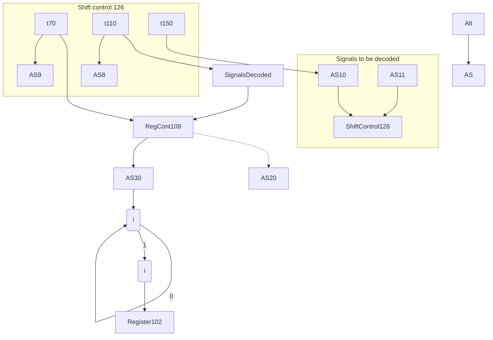
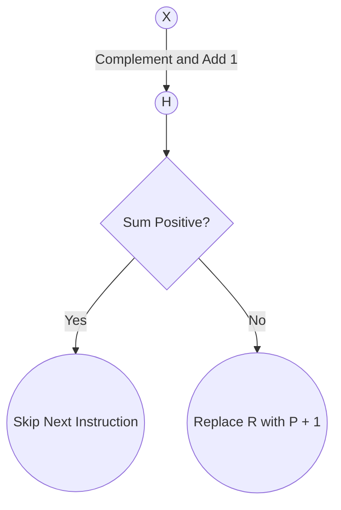
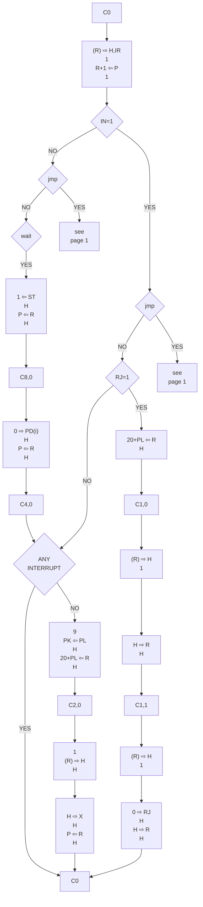
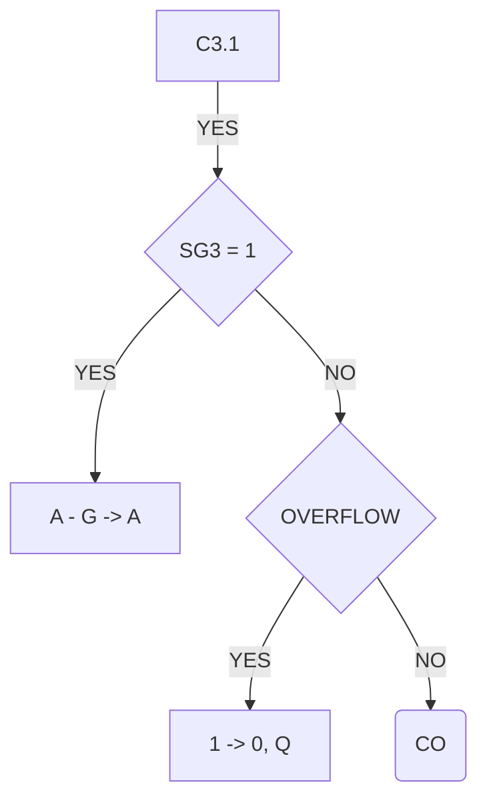

## Page 1

# Hardware Manual

## Volume II

### Flow Diagrams

---

## Page 2

```
HARDWARE MANUAL

VOLUME II

FLOW DIAGRAMS
```

---

## Page 3

# NORD-1 Computer Systems

## Hardware Manual
### Volume II
### Flow Diagrams

```
   _______     _______ 
  //      \\  //      \\
 //        \\//        \\
 ||         ||         ||
 ||         ||         ||
 ||         ||         ||
 ||         ||         ||
 ||         ||         ||
  \\_______// \\_______//
      ND          ND
```

A/S NORSK DATA-ELEKTRONIKK

---

## Page 4

# Table of Contents

1. Introduction
2. Flow Diagrams
3. Signal Definitions

---

## Page 5

# NORD - 1

## A/S NORSK DATA - ELEKTRONIKK

```mermaid
flowchart TB
    A(MEMORY & INTERFACE) -->|data| B(REGISTERS)
    A -->|cont| C(CONTROL)
    A((BUFFER 4x158\nCONTROL 169\nGATES 159))
    
    C(((TIME COUNT 151\nCYCLE COUNT 123\nCOUNTER CONTROL 124\nSHIFT COUNT 125\nSHIFT CONTROL 126\nADDRESS 130\nCONTROL 131\nREGISTER & ARITHMETIC 115\nCONTROL 2x9040\nFLIP-FLOPS 127\nINST. REG. 150\nBIT INST. 133\nASSEMBLER 122\nREGISTER TRANSFER 146\n134\nFLOATING 135\nCONTROL 136\n137)))
    C -->|cont| D(PROTECT SYSTEM)
    D -->|data| B
    D(((REGISTER 141\nCONTROL 128)))
    
    C -->|cont| E(INTERRUPT SYSTEM)
    E -->|data| B
    E((REGISTER 2x106\nCONTROL 132))
    
    C -->|cont| F(OPERATOR'S PANEL)
    F((LAMP REG. 2x140\nPANEL BUFFER 110))
    
    F -->|cont| G(I/O INTERFACE)
    G--> B
    G -->|cont| C
    
    G((I/O CONTROL 120\nOUT BUFFER 163-2x166\nIN BUFFER 164\n2x165\nTELETYPE 160-170\nTAPEREADER (\n160)))
    
    B((R,P,X,B 4x108\nA,D,T,L 4x102\nE,F,G,H 4x101\nMAIN ARITHMETIC 4x103))
```

## Document Information

| DRAWN BY | APPROVED BY | DATE      |
|----------|-------------|-----------|
| EML      |             | 31.10.69  |

---

## Page 6

# Introduction to NORD-1 Documentation

Summarizing the development of NORD-1 may give a coarse idea of the structure of the documentation.

The first step in the design process was to decide the number of programmer oriented registers and the instruction format and repertoire.

The next step was to draw flow diagrams of all instructions. Part of this work is also the design of CPU-arithmetic and timing control (Time Counter and Cycle Counter).

To translate the flow diagrams into logical equations is a straight forward mechanical work, and the equations may be regarded as a rewriting of the flow diagrams.

The last step, drawing of logic diagrams, is even more straightforward. The problem at this stage consists of distributing circuits on circuit boards and definition and labeling of sub-signals.

The basic operation of NORD-1 is illustrated in the figure below.

```
   ┌───┐
   │ + │────────── INFORMATION BUS
   └─┬─┘              (IB)
     │
     │
     │
     ▼
   ┌───┐
   │ H │
   └─┬─┘
     │
     │
     ▼
 ┌──────┐
 │ARITH-│
 │METIC │
 └──────┘
   │
   │
   ▼
  SUM (S)
   │
   ▼
BUS MEMORY (BM)

    ┌───┐
    │ A │
    └─┬─┘
      │
      │
   ┌──┴──┐
   │     │
   │     │
 ENABLING  
   │
   ▼
FROM CORE
 MEMORY
```

---

## Page 7

# Generation of A-Register Set Pulse

One register is enabled at a time and presented at the IB terminals, and as input to the arithmetic. Data from memory goes via the H-register and the BM input to the arithmetic. For inter-register operations, one of the operands (source) is first transferred to the H-register before IB is switched to the other operand. The output of the arithmetic is then routed back to all registers where it may be strobed into register flip-flops.

The purpose of the control logic therefore is to generate the appropriate sequence of register enabling signals and register strobe pulses and to control the arithmetic to give the desired function, all as a result of the instruction decoded.

The operation of the logic is synchronous, i.e., controlled by a common timing source (Time Counter and Cycle Counter). To avoid timing hazards, the timing signals, after being decoded from the time counter flip-flops, always passes three stages of logic circuits before reaching the register flip-flops.

Example: Generation of A-register set pulse.



The timing synchronization of all registers in CPU is similar to the example shown for the A-register.

As further introduction to the NORD-1 documentation, three instructions will be taken as examples and all important active signals connected to each block in the flow diagrams will be described in detail.

---

## Page 8

# Instructions

The example instructions are:

1. add 120
2. skp dx gre zro
3. shad rot 5

The reader is advised to find the mentioned signals in the logic diagrams, to familiarize himself with the documentation.

## Add 120

**Relevant flow diagrams:** Pages 1 and 12

The instruction add is a two-memory cycle instruction requiring two 16-bit words to be read from core memory, first the instruction itself (C0) and then the data word (C2).

The Time Counter control signals BACK and NEXT are both 0 in both cycles, and the Time Counter therefore produces the short sequence:

```
t0-1-2-3-8-9-10-11-0
```

t0 lasts until DATA READY is received from the memory control and is approximately 800 ns with a 1.5 μs memory. All other time intervals are 100 ns.

### (R) ➜ H,IR

When entering t0 in C0 the R-register contains the actual address and a Memory Request signal is generated by CPU (RQ1). (Note: Last instruction ended with a transfer of P to R). The address is enabled to the memory address input MR (158), and a Read/Restore is initiated (INIT, RRA 169). The content of the specified memory location is transferred to the MB-register (Memory Control Module) and a Data Ready signal is returned to CPU (RY1). RY1 restarts the Time Counter and t1 is entered.

The memory communication bus MJ is now equal to MB (enabled by CPUE) and is strobed into IR (IS1) and the H-register (HS1, ME1).

### R + 1 ➜ P

This addition is done via the address arithmetic. First P is set to all ones (PS3) and then the appropriate zeroes are transferred to P via the flip-flop clear terminal (PS4). RE1 enables the R-register as input to the arithmetic and CY2 generates the 1 to be added as a carry input to the least significant stage of the adder.

---

## Page 9

# Technical Page Content

## R + 120 ➔ R
Address arithmetic addition (RE1, HE2, SX1, RS1).

R is equal to the address of the current instruction.  
120 is the displacement of the instruction with sign extension, i.e., bits 8 through 15 equal to bit 7.  
120 is transferred via the H-register and SX1 controls the sign extension mechanism.

The flip-flop D-input is used since the input to R is a function of R itself.

## (R) ➔ H
Similar to (R) ➔ H, IR.

## A + H ➔ A
Input to the arithmetic is enabled by HE1 and AE1, which makes BM=H and IB=A.  
The output of the arithmetic is the sum of BM and IB if no other control signal is active. (PLUS=XRO|D0|BD0).  
The sum is strobed into A at t11 by AS2.

## P ➔ R
Transfer via address arithmetic (PE1, RS1).

## Diagrams

```mermaid
flowchart TD
    CO --> |(R) ➔ H, IR| A1
    A1 --> |R + 1 ➔ p| A2
    A2 --> |cjp| B1
    B1 -- NO --> CJP1
    CJP1 --> |I = 1| C1
    C1 -- NO --> I1
    I1 --> |B = 1| D1
    D1 -- NO --> B1
    B1 --> |X = 1| E1
    E1 -- NO --> X1
    X1 --> |R + Δ ➔ R| R1
    R1 -- NO --> |jmp + jpl| F1
    F1 -- NO --> C2
    C2 --> C2_0
```

```mermaid
flowchart TD
    C2_0 --> |(R) ➔ H| G1
    G1 --> |G0| H1
    H1 -- NO --> G01
    G01 --> |G3| I1
    I1 -- YES --> |A + H ➔ A| J1
    J1 --> |P ➔ R| K1
    K1 --> CO
```

---

## Page 10

# skp dx gre zro

**Relevant flow diagram:** Page 5

This instruction is a one cycle instruction (CO). The Time Counter control signal NEXT depends upon resulting skip condition and selects one of the following two time pulse sequences.

- **Skip not effective:** t0–1–2–3–8–9–10–11–0
- **Skip effective:** t0–1–2–3–8–9–10–11–12–13–14–15–0

| Instruction | Description                   |
|-------------|-------------------------------|
| (R) ➔ H, IR | same as example 1             |
| R + 1 ➔ P   | same as example 1             |
| S.R. ➔ H    | In the instruction above the source register code is 0, which means that no register is enabled and therefore IB=0. This zero is transferred to the H-register (IE1, HS1). |
| P ➔ R       | same as example 1             |

The branching conditions in the flow diagram depends upon the sum output. The active control signals engaged in producing the correct sum output are XE3, HE1, BC0, BC8 and CY1.

We want the sum to be equal to X – H, which with two's complement representation of negative numbers means that H should be complemented bit by bit (BC0, BC8) and a one added to the result (CY1). If the resulting sum is positive, i.e. S15=0, the next instruction should be skipped. This means that the content of R should be replaced by P + 1, and operation requiring additional time.

The Time Counter control signal NEXT (NX1) adds time pulses t12–13–14–15 to the "normal" sequence.

| Instruction   | Description                                         |
|---------------|-----------------------------------------------------|
| P + 1 ➔ R     | Address arithmetic addition (PE1, CY2, RS1). RS1 is unconditionally dependent upon t15 for CO:skp since t15 in this case exists only if P + 1 ➔ R is wanted. |



# shad rot 5

**Relevant flow diagram:** Page 7

Double shifts (AD connected, 32 bits) are done in two phases, 16 bits shifted at a time. SA1 is a phase control flip-flop being complemented at each shift pulse.

---

## Page 11

# Shift Operations

## SA1 Control

- **SA1 = 0**: Shift the D-register
- **SA1 = 1**: Shift the A-register

No shift direction specified means left shift.

## Shift Examples

- **(R) ➜ H, IR**  
  Same as example 1

- **R + 1 ➜ P**  
  Same as example 1

## Reset and Transfer

- **0 ➜ SA1, SC**  
  Reset Shift Counter (SC) and the phase control flip-flop (SA1).

- **5 ➜ SC**  
  5, the number of places to be shifted, is transferred from the H-register to the shift counter via the main arithmetic (required by floating point instructions). (HE1, BD, SS8).

## Decrement SC

- **SC - 1 ➜ SC**  
  If SA1 = 1 the shift counter is decremented.

## Phase Control

- **SA0 ➜ SA**  
  Complement the phase control flip-flop.

## Shift Operations

- **shift D**

  If SA1 = 0 shift the D-register one place to the left. (DE1, IL, ID, DS2, DX1).

  - IL enables left shift of IB.
  - ID makes the output of the arithmetic equal to the IB-input and DX1 selects A15 as input to D0. 
  - The discarded bit (D15) is transferred to the link flip-flop M.

- **shift A**

  If SA1 = 1 shift A-register one place to the left (AE1, IL, ID, AS3, DX1).

  - In this case DX1 selects M as input to A0.
  - The discarded bit (A15), which has already been transferred to D0, replaces the previous content of M.

If the content of the shift counter is not zero go back to SC - 1 ➜ SC. This is controlled by the Time Counter control signal BACK (BK1), which repeats pulses t8-9-10-11 the required number of times, ten in our case, five for each phase.

## Additional Example

- **P ➜ R**  
  Same as example 1

---

## Page 12

# Flow Diagrams

Below follows a list of symbols and abbreviations used in the FLOW DIAGRAMS together with a short explanation.

| Symbol | Explanation                                     |
|--------|-------------------------------------------------|
| AW     | Anything written                                |
| DP     | Deposit                                         |
| SA     | Set Address                                     |
| SI     | Single Instruction                              |
| ST     | Stop                                            |
| TR     | Tape-Reader                                     |

```plaintext
         _________
        |         |  
  SA    |  Flip-  |  
  SI    |  flops  |  
        |  on the |  
        |Assembler|  
        |  122    |  
        |_________|
```

| Symbol    | Explanation                                                   |
|-----------|---------------------------------------------------------------|
| SR        | Source-Register                                               |
| DR        | Destination-Register                                          |
| S         | DR - SR (Sum output)                                          |
| (R)       | The contents of the cell which address is contained in the R-register |
| REG (j)   | Bit in the register                                           |
| △         | Displacement of the instruction (lower half of H with sign extension) |

| Symbol          | Explanation                                                                      |
|-----------------|----------------------------------------------------------------------------------|
| A↔G             | The A- and the G-register is exchanged                                           |
| T14₀ → T14      | Bit 14 in the T-register is complemented                                         |
| 2X → X          | Left shift of the X-register                                                     |
| 1/2X → X        | Right shift of the X-register                                                    |
| T15 ⊕ H15 → SG1 | Exclusive or of bit 15 of the T- and the H-register. If T15 is the opposite of H15, 1 → SG1 |

| Symbol            | Explanation                                                                       |
|-------------------|-----------------------------------------------------------------------------------|
| T15 ⊕ H15₀ → SG1  | If T15 is equal to H15, 0 → SG1                                                   |
| A0·2¹5 + 1/2D → D | Right shift of the D-register with A-register bit 0 shifted into D-register bit 15 |  

```
--ooOoo--
```

---

## Page 13

# A/S NORSK DATA: ELEKTRONIKK

## Title
FLOW DIAGRAMS

## Diagram

```mermaid
flowchart TD
    Start(["C0"])
    A[/1 (R) = H, IR\n1 R + 1 -> P/]
    B{c jp}
    B1{I = 1}
    B2{B = 1}
    B3{X = 1}
    B4{X = 1}
    End(["jmp + jpl"])
    
    Start --> A 
    A --> B
    B -- NO --> B1
    B -- YES --> C([See page 2])
    
    B1 -- YES --> B2
    B1 -- NO --> B2
    
    B2 -- YES --> D1[/B + Δ -> R/]
    B2 -- NO --> B3
    
    D1 --> D2[/R + Δ -> R/]
    D2 --> C1
    C1["C1"]
    
    B3 -- NO --> D3[/R + Δ -> R/]
    B3 -- YES --> E1[/X + Δ -> R/]

    D3 --> E2["H\n(R) -> H"]
    E2 --> B4
    
    B4 -- YES --> F1[/H + X -> R/]
    B4 -- NO --> F2[/B + Δ -> R/]
    
    F1 --> F3["H -> R"]
    F3 --> End
    
    F2 --> End
```

## Remarks

- Δ = Lower half of H with sign extension.

## Document Info

- **Drawn by**: EML
- **Date**: 14.10.69
- **Remarks**: ADDRESSING SEQUENCE GO - 5

---

## Page 14

# Flow Diagrams

```mermaid
flowchart TD
    A(CO) --> B((R) ➔ H, IR<br>R + 1 ➔ P)
    B --> C{jpc + jnc}
    C -- NO --> D(P ➔ R<br>15)
    D --> E(CO)
    C -- YES --> F(X + 1 ➔ X<br>11)
    F --> G(R + A ➔ R<br>11)
    G --> H{jump effective}
    H -- NO --> D
    H -- YES --> E
```

**NOTE:** t12 - 15 is "inserted" only if jump not effective and does not exist with jump effective. Controlled by signal **NEXT** to time counter.

| Drawn by | EML  |
|----------|------|
| Date     | 14.10.69 |
| Approved by | C J P |

---

## Page 15

# Flow Diagrams

```mermaid
flowchart TD
    subgraph A/S NORSK DATA - ELEKTRONIKK
    direction TB
        CO -- (R) = HI,IR | R+1 -> P --> P -> R11
        R11 --> |YES| jpL --> P -> L11 --> |YES| I = 1 --> C1 -.-> CO
        R11 --> |NO| arg --> |YES| IR10 = 1 -.-> CO
        arg --> |NO| B X + Δ -> X A T11
        IR10 = 1 -.-> B X -> X A T11 -.-> CO
        B X + Δ -> X A T11 --> bskp
        bskp --> |NO| bset --> |NO| θ1 -> K11 -.-> bsta + bstc --> |NO| θ2 -> REG(i)11 -.-> CO
        bset --> |YES| θ1 -> K11
        bskp --> |YES| SKIP EFFECTIVE --> |NO| P+1 -> R15
    end
```

**Notes:**

- θ1 = New content of bit-accumulator dependent on instruction
- θ2 = New content of selected bit dependent on instruction

| DRAWN BY | REMARKS         | REPLACEMENT FOR | DATE |
|----------|-----------------|-----------------|------|
| EML      | JPL + ARG + BOP |                 |      |

| APPROVED BY | DATE      |
|-------------|-----------|
|             | 14.10.69  |

---

## Page 16

# Flow Diagrams

## Flowchart

```mermaid
flowchart TD
    A(((C0)))
    A --> B((R) = H,IR \n R+1-P) --> C[S.R. = H]
    C -->|YES| D{swap}
    D -->|NO| E{rad}
    F{cld} -->|YES| G[OR \n H AND O-D.R \n XOR]
    G -->|11| H((P -> R)) --> A
    D -->|YES| I{cld}
    I -->|YES| J[H -> D.R]
    J -->|11| H
    I -->|NO| K[H + D.R -> D.R]
    K -->|11| H
    E -->|NO| F
    F -->|NO| L{cld}
    L -->|YES| M[H -> D.R]
    M -->|11| H
    L -->|NO| N[OR \n H AND D.R-D.R \n XOR]
    N -->|11| H
    E -->|YES| I
    I -->|NO| O[O-S.R]
    O -->|NO| P[D.R-S.R]
    P -->|11| Q[H -> D.R]
    Q -->|11| H
```

### Notes

- If D.R.=P, P->R is replaced by S->R.
- If IR7=1, H is replaced by one's complement of H in the diagram above.

### Definitions

| Command | Code            |
|---------|-----------------|
| swap    | IR10, 9, 8, 0   |
| cld     | 100 (IR6)       |
| rad     | 2000 (IR10)     |
| cml     | 200 (IR7)       |

---

**Drawn By:** EML  
**Approved By:**  
**Date:** 15.10.69  

**Remarks:** R O P

---

## Page 17

# A/S Norsk Data-Elektronikk

## Flow Diagrams

```mermaid
flowchart TD
    A((CO))
    A --> B[(R) H.IR]
    B --> C[R+ P]
    C --> D[S.R H]
    D --> E[P R]
    E --> F{gre}
    F -->|NO| G{eql}
    F -->|YES| H{S ≥ 0}
    G -->|YES| I{S = 0}
    G -->|NO| J{ueq}
    H -->|YES| K[P+ R]
    H -->|NO| A
    I -->|YES| L((CO))
    I -->|NO| K[P+ R]
    J -->|NO| M{lst}
    J -->|YES| N{S = 0}
    M -->|NO| O[WHAT?]
    M -->|YES| P{S ≥ 0}
    N -->|NO| K[P+ R]
    N -->|YES| K[P+ R]
    P -->|YES| L((CO))
    P -->|NO| K[P+ R]
```

| Symbol | Description                      |
|--------|----------------------------------|
| S.R    | Source Register                  |
| D.R    | Destination Register             |
| S      | D.R - S.R                        |
|        | See also note page 2             |

| gre = IR₉₁₀₀ | eql = IR₉₀₁₀ | lst = IR₉₁₀₁ | ueq = IR₉₀₁₀ |

**Drawn By:** EML &nbsp;&nbsp;&nbsp; **Approved By:** SKP &nbsp;&nbsp;&nbsp; **Date:** 16.10.69

---

## Page 18

# A/S NORSK DATA-ELEKTRONIKK

## Title: FLOW DIAGRAMS

### Page 6

```mermaid
flowchart TD
    A(CO)
    A -->|1| B((R) H,IR))
    A -->|1| C(R + 1 P)
    A -->|3| D(16 SC)
    A -->|9| E(SC + 1 SC)
    E --> F{CONNECT}
    F -- NO --> G{SC = 0}
    G -- YES --> H(P R)
    G -- NO --> E
    F -- YES --> I( DATA READY )
    I -- NO --> J(DI A)
    J --> K(P R)
    I -- YES --> L(P R)
    L --> M{SKIP}
    K --> M
    M -- YES --> N(P + 1 R)
    N --> O((CO))
    M -- NO --> P(no operation)
    P --> O
```

### Notes
- DI = I/O Data in bus bits 0 - 15.

| DRAWN BY | REMARKS | APPROVED BY | DATE      | REPLACEMENT FOR | DATE | REPLACED BY | DATE |
|----------|---------|-------------|-----------|-----------------|------|-------------|------|
| EML      | I O T   |             | 15.10.69  |                 |      |             |      |

---

## Page 19

# Flow Diagrams

## A/S Norsk Data-Elektronikk

Drawing no.: Page 7

### Flowchart

```mermaid
flowchart TD
    A[CO] --> B{"(R) ⟵ H, IR\nR+I⟵ P\n0⟵SA1, SC\nN⟵SC"}
    B --> C{"sad"}
    C -- NO --> D["1 ⟵ SA1\n3"]
    C -- YES --> E
    D --> E
    E -- NO --> F{"SC = 0"}
    E -- YES --> P
    F -- YES --> Q
    F -- NO --> G{"SA1 = 1"}
    G -- NO --> Q
    G -- YES --> H{"SC > 0"}
    H -- NO --> I["SC + 1 ⟵ SC\n9"]
    H -- YES --> J["SC - 1 ⟵ SC\n9"]
    I --> E
    J --> E
    Q{"sad"} 
    Q -- NO --> R{"sha"}
    Q -- YES --> S["SA1o⟵SA1\nH"]
    R -- NO --> T
    R -- YES --> U["shift A\nH"]
    R -- NO --> T{"shd"}
    T -- NO --> V
    T -- YES --> W["shift D\nH"]
    V["shift T\nH"] --> X{"SC = 0"}
    W --> X
    S --> X
    X -- NO --> Q
    X -- YES --> Y["P ⟵ R\nH"]
    Y --> A
    P[/Note: ZCI prevents shift on t1 (126)/]

```

### Drawing Details

| Drawn By | Date     |
|----------|----------|
| EML      | 5.11.69  |

| Remarks |
|---------|
| S H T   |

| Replacement for | Date |
|-----------------|------|
| Replaced by     | Date |

---

## Page 20

# Flow Diagrams

```mermaid
flowchart TD
    A([CO]) --> B{(R) ➔ H.IR\nR+1 ➔ P}
    B -->|NO| C[tra]
    B -->|YES| D[REG ➔ A]
    C -->|NO| E{mcl}
    E -->|NO| F{mst}
    E -->|YES| G[REG AND A ➔ REG]
    F -->|NO| H{trr}
    F -->|YES| I[REG OR A ➔ REG]
    H -->|YES| J[A ➔ REG]
    H -->|NO| K[P ➔ R]
    D --> H
    G --> F
    F --> H
    I --> H
    J --> K
    K --> L([CO])
```

## Register Address

0 ⇐ Register Address ⇐ 63

| Instruction | Code   |
|-------------|--------|
| tra         | 150.000|
| trr         | 150.100|
| mcl         | 150.200|
| mst         | 150.300|

---

- **Drawn By:** EML
- **Date:** 15.10.69
- **Remarks:** Register Transfer

---

## Page 21

# Flow Diagrams

## Diagram



## Details

| DRAWN BY | APPROVED BY | DATE     |
|----------|-------------|----------|
| EML      |             | 15.10.69 |

### Remarks

WAIT + JMP + IN

---

## Page 22

# Flow Diagrams

## Flowchart

```mermaid
flowchart TD
    CO --> |1| B0[/(R) H, IR../ R+1 P/]
    B0 --> |7| B1[/\ /\ T../ T14o T14/]
    B1 --> |H| B2[/P R/]
    B2 --> C30((C3,0))
    C30 --> |3| B3[/A15 SG4../ A H/]
    B3 --> D1{A = 0}
    D1 -- NO --> |3| E1[/0 TG/]
    D1 -- YES --> |1| E2[/1 TG/]
    E1 --> D2{H15 1}
    E2 --> D2
    D2 -- NO --> |7| F1[/H A/]
    F1 --> |H| F2[/0 T15/]
    D2 -- YES --> |7| G1[/-H A/]
    G1 --> |H| G2[/1 T15/]
    G2 --> |15| H1[/0 D/]
    H1 --> C31((C3,1))
    C31 --> I1{TG 1}
    I1 -- NO --> |3| J1[/T 1 T/]
    J1 --> I2{A15 1}
    I1 -- YES --> |3| K1[/0 T/]
    K1 --> CO
    I2 -- YES --> CO
    I2 -- NO --> |H| L1[/2A A/]
    L1 --> CO
```

**FL4**  
(Repeat cycle)

---

**Drawn by:** EML  
**Approved by:** [illegible]  
**Date:** 15.10.69  

**Remarks:** NLZ  

---

---

## Page 23

# A/S NORSK DATA-ELEKTRONIKK

## FLOW DIAGRAMS

### Page 11

```mermaid
flowchart TD
    CO0(C0)
    CO0 --> A((R) ➞ H, T \n R + 1 ➞ P\n)
    A --> B(T + Δ ➞ T \n T15 ➞ SG4 \n T ➞ SC, T)
    B --> C(P ➞ R)
    C --> D{SG4 = 1}
    D -- NO --> E(A ➞ H \n H ➞ A)
    D -- YES --> F(A ➞ H \n -H ➞ A)
    F --> G{SC = 0}
    E --> G
    G -- YES --> H(O ➞ D, T)
    H --> I(C3,1)
    I --> CO1(C0)
    G -- NO --> J(SC + 1 ➞ SC \n ½ A ➞ A \n T15 ➞ A15)
    J --> D
```

| DRAWN BY | EML |
|----------|-----|
| APPROVED BY | [illegible] |
| DATE | 15.10.69 |
| Remarks | DNZ |
| Replacement for | [illegible] |
| Replaced by | [illegible] |
| Date | [illegible] |

---

## Page 24

# FLOW DIAGRAMS

## Diagram

```mermaid
flowchart TD
    A[(C2.0)]
    A --> |(R) = H| B{"H = 1"}
    B --> |NO| C{"G0"}
    B --> |YES| D["O\nA → (R)\nT\nX"]
    C --> |YES| E["+\nA -\nAND\nH → A"]
    C --> |NO| F{"G2"}
    F --> |YES| G{"H"}
    F --> |NO| G["See\nrelevant\npage"]
    G --> |YES| I{"min"}
    G --> |NO| K-->H
    I --> |YES| J[(C2.1)]
    J --> |H + 1 → (R)| L
    L --> |H1| M["P → R"]
    M --> |H + i - 0| N{"NO"}
    N --> |YES| O["P + 1 → R"]
    N --> |NO| P[(C0)]
    H --> |H1| M
    I --> |NO| Q["A\nH → T\nX"]
    E --> H
    H --> P
    O --> P
    N --> P
```

## Notes

- **GO**: stz + sta + stt + stx
- **G2**: min + lda + ldt + ldx
- **G3**: add + sub + and + ora

| DRAWN BY | EML         |
|----------|-------------|
| DATE     | 16.10.69    |

| Remarks       | Replacement for | Date |
|---------------|-----------------|------|
| GO + 2 + 3    |                 |      |
| Replaced by   |                 |      |

---

## Page 25

# Flow Diagrams

```mermaid
flowchart TD
    A((C2,0)) --> B{stf + ldf}
    B -- YES --> C((C2,0))
    B -- NO --> D((C2,1))
    C --> E{stf}
    E -- YES --> F[T → (R)]
    E -- NO --> G[H → T]
    F --> H((C2,1))
    G --> H
    D --> I((R) → H) & (R + 1) ← R
    H --> I
    I --> J((R) → H) & (R + 1) ← R
    J --> K{std + stf}
    K -- YES --> L[A → (R)]
    K -- NO --> M[H → A]
    L --> N((C2,2))
    M --> N
    N --> O((R) → H)
    O --> P{ldd + ldf}
    P -- NO --> Q[D → (R)]
    P -- YES --> R[H → D]
    Q --> S[P → R]
    R --> S
    S --> T(C0)
```

| **Drawn By** | **EML** |
|--------------|---------|

| **Approved By** |              | **Replacement for** | **Date**    |
|-----------------|--------------|---------------------|-------------|
|                 |              |                     |             |

| **Date**    | **16.10.69**     |
|-------------|------------------|

| **Remarks**  | **STD + STF + LDD + LDF** |
|--------------|---------------------------|

---

## Page 26

# Flow Diagrams

```mermaid
flowchart TD
    A[C2,0]
    A --> B((R) ➔ H))
    B --> C[A ➔ G]
    C --> D[H15 ➔ SG3]
    D --> E[O ➔ A, Q]
    E --> F[P ➔ R]
    F --> G[C3,0]
    G --> H[-16 ➔ SC]
    H --> I{"SG3 = 1"}
    I -- YES --> J[H15 = 0]
    J -- YES --> K[2A ➔ A]
    K --> L[2A ➔ G ➔ A]
    J -- NO --> M[H15 = 1]
    M -- YES --> N[2A ➔ G ➔ A]
    N --> L
    L --> O{"OVERFLOW"}
    O -- YES --> P[A15]
    P -- YES --> Q[1 ➔ 0, Q]
    Q --> R
    O -- NO --> R
    R --> S[2H ➔ H]
    S --> T[SC + 1 ➔ SC]
    T --> U{"SC = 0"}
    U -- YES --> V[C3,1]
    U -- NO --> U
```

| DRAWN BY | EML |
|----------|-----|
| APPROVED BY |   |
| DATE | 16.10.69 |
| Remarks | MPY |

---

## Page 27

# Flow Diagrams



| DRAWN BY | EML       |
|----------|-----------|
| DATE     | 16.10.69  |

| Remarks | Replacement for | Date | Approved by | Replaced by | Date |
|---------|----------------|------|-------------|-------------|------|
| MPY     |                |      |             |             |      |

---

## Page 28

# Flow Diagrams

```mermaid
flowchart TD
    A(C2,0)
    A --> B1[(R) --> H]
    B1 --> B2(R + 1 --> R)
    B2 --> C1(1 --> TG)
    C1 --> D{fad}

    subgraph YesBranch
        direction TB
        E1[["T15 ⊕ H15 -> SG1"]]
        E1 --> F[T - H -> SC]
        F --> G[Ø --> MO]
        G --> H[S14 -> ND]
    end

    subgraph NoBranch
        direction TB
        J1[["T15 ⊕ H15 -> SG1"]]
    end

    D -->|YES| YesBranch
    D -->|NO| NoBranch

    H --> I(C2,1)
    I --> J1[(R) --> G]
    J1 --> J2(R + 1 --> R)
    J2 --> K{ND = 1}

    K -->|YES| L[H -> T]
    L --> M(A ↔ G)

    K -->|NO| N(C2,2)
    N --> O[(R) --> H]

    classDef default fill:#f9f,stroke:#333,stroke-width:2px;
```

### Notes
- **MO**: Mantissa overlap
- **ND**: Negative difference
- Floating control 134

### continuation
\[ Ø = S14|13|12|11|10|9|8|7|6|5 \] + \[ S14|13|12|11|10|9|8|7|6|5 \] : \((T - H) < 32\)

---

**Drawn by**: EML  
**Date**: 17.10.69  
**Remarks**: FAD + FSB

---

## Page 29

# Flow Diagrams

Continued from page 16

```mermaid
graph TD;
    A[ND=1] -->|YES| B(fsb)
    A -->|NO| C(T15←T15)
    B -->|NO| C
    C --> D(D→H)
    D --> E(P→R)
    E -->|YES| F(MO=1)
    E -->|NO| G(C0)
    F --> H(C3.0)
    H -->|YES| I(SG1=1)
    H -->|YES| J(ZC2=1)
    J -->|YES| K(SC=0)
    K --> L(D→H)
    L --> M(CR15←CF1)
    M --> N(A-G←CF→A)
    N --> O(CR15←C)
    I -->|NO| P(D+H→D)
    P --> Q(CR15←CF1)
    Q --> R(A←G←CF1→A)
    R --> S(CR15←C)
    S --> T(C3.1)
    T -->|NO| U(D+C→D)
    U --> V(CR15←CF1)
    V --> W(A←CF1→A)
    W --> X(C3.1)
    H -->|NO| Y(H0=0)
    Y -->|NO| Z(0→TG)
    Y -->|YES| AA(60:2\*5*1/2H→H)
    AA --> AB(1/2G→G)
    AB --> AC(0→G15)
    AC --> AD(C3.0)
    AD -->|NO| AE(SC<0)
    AE -->|NO| AF(SC-1→SC)
    AE -->|YES| AG(SC+1→SC)
    AG --> AH(SC=0 1→ZC2)
    AH --> AI(SC≠0 0→ZC2)
    AI --> AD
```

Continue page 18

---

| Drawn By | Date     |
|----------|----------|
| EML      | 17.10.69 |

### Remarks
FAD + FSB

---

## Page 30

# Flow Diagrams

Continued from page 17

```mermaid
flowchart TD
    A[""] -->|NO| B{"TG=1"}
    B -->|YES| C[/"C3,2"/]
    C --> D[/"-32 → SC<br>D → H<br>A → G"/]
    D --> E[/"C3,3"/]
    
    E -->|NO| F{"G15=C"}
    E -->|YES| G{"SG1=1"}
    F -->|YES| H["SC+1 → SC<br>2G+H15 → G<br>2H → H<br>T-1 → T"]
    H --> I{"SC=0"}
    I -->|NO| L
    I -->|YES| M["O → T"]
    
    G -->|YES| J["FL2=1"]
    
    F -->|NO| N{"C=1"}
    N -->|NO| O
    N -->|YES| P["GO:215Y,H → H<br>½G → G<br>1 → G15<br>T+1 → T"]
    P --> Q
  
    O["T15 → T15"] --> R1["CO"]
  
    O -->|YES| P
  
    Q["NO OPERATION"] --> R2["CO"]
    
    M --> R1
    R1 -->|One's complement| R3{"H → D<br>G → A"}
    R2 --> R4{"H → D<br>G → A"}
    R3 --> T["CO"]
    R4 --> T["CO"]

    style A fill:none,stroke-width:0px;
    style L fill:none,stroke-width:0px;
    style O fill:none,stroke-width:0px;
    style Q fill:none,stroke-width:0px;
```

### Details

- **Drawn By:** EML
- **Approved By:** 
- **Remarks:** FAD + FSB
- **Date:** 17.10.69
- **Page:** 18

---

## Page 31

# A/S NORSK DATA-ELEKTRONIKK

## Title: FLOW DIAGRAMS

### Page 19

```mermaid
flowchart TD
    A1([C2,0])
    A2(( (R)→H | R+1→R | 1→TG ))
    A3([T15⊕H15→SG1])
    A4{fdv}
    B1("NO")
    B2("YES")
    C1([T+H→T])
    C2([T-H→T])
    D1([C2,1])
    E1((R→G | R+1→R))
    E2([SG1→T15])
    E3([T14o→T14])
    F1{A15=0}
    F2{fdv}
    G1("YES")
    G2("NO")
    H1{G15=0}
    H2{G15=0}
    I1([1→Z])
    J1([C2,2])
    K1([C2,2])
    L1("One operand = 0")
    M1((0→D | 0→A,T | P→R))
    N1([CO])
    
    subgraph Flowchart
    A1 --> A2
    A2 --> A3
    A3 --> A4
    A4 -->|NO| C1
    A4 -->|YES| C2
    C1 --> D1
    D1 --> E1
    C2 --> D1
    C2 -->|0→TG| D1
    E1 --> E2
    E2 --> E3
    E3 --> F1
    F1 -->|NO| F2
    F1 -->|YES| J1
    F2 -->|YES| H1
    F2 -->|NO| H2
    H1 -->|YES| I1
    H2 -->|NO| J1
    H2 -->|YES| K1
    I1 --> E1
    J1 --> L1
    K1 --> L1
    L1 --> M1
    M1 --> N1
    end
```

### Additional Information

- **Drawn by**: EML
- **Approved by**: 
- **Remarks**: FMU + FDV
- **Date**: 20.10.69

---

## Page 32

# Flow Diagrams

## Diagram

```mermaid
flowchart TD
    A -->|C2.2| B
    B --> C
    B --> D
    
    B["1  (R) ➔ H
    3  0 ➔ C
    3  -32 ➔ SC
    3  D ➔ F
    3  2 ➔ D"] 
    
    C["A ➔ E 7
       ? ➔ A 7
       O ➔ A 11
       P ➔ R 11
       D ➔ D 15"]
    
    C --> E[C3.0]
    E --> |DO=1| F{YES}
    E --> |NO| G[HO=1]
    
    G --> |NO| H["½ D ➔ D
                   A0 ➔ D15
                   ½ A ➔ A
                   C ➔ A15
                   O ➔ C"]
    
    G --> |YES| I["A0-2½*½D*F+D 3
                   CR15 ➔ CF1
                   ½ A+C-215
                   +E+CF1 ➔ A
                   CR15 ➔ C 11"]
    
    F --> |YES| J
    F --> |NO| K["0 ➔ TG 1"]
    
    J["SC+1 ➔ SC 9
       GO:2½*½H ➔ H 11
       ½ G ➔ G 11
       O ➔ G15 11"]
    
    J --> L{SC=0}
    
    L --> |YES| M
    L --> |NO| N
    M[SC=0]
    N[C3.1]
```

## Notes

- **Drawn by:** EML
- **Approved by:** [Blank]
- **Date:** 20.10.69
- **Remarks:** F.M.U

---

Please double-check any details or specific placements in the original document to ensure all transcriptions are accurate as some symbols or texts might be represented differently based on scan quality.

---

## Page 33

# A/S Norsk Data-Elektronikk

## Title
FLOW DIAGRAMS

## Page
21

```mermaid
flowchart TD
    A["C=1"] -->|NO| B["T-1 ↔ T"]
    A -->|YES| C["½ D → D\nA0 → D15\n½ A ↔ A\nC → A15"]
    B --> A
    C --> D["TG=1"]
    D -->|NO| E["1 → D0"]
    D -->|YES| F["D0 → D0"]
    E --> G["C0"]
    F --> G
```

| DRAWN BY | APPROVED BY | DATE       | Remarks | Replacement for | Replaced by |
|----------|-------------|------------|---------|-----------------|-------------|
| EML      |             | 21.10.69   | F M U   |                 |             |

---

