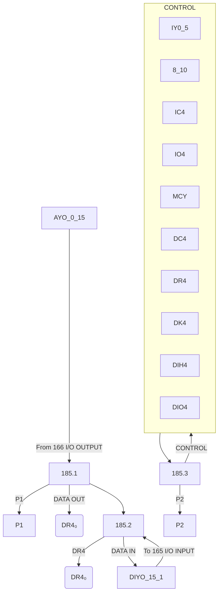
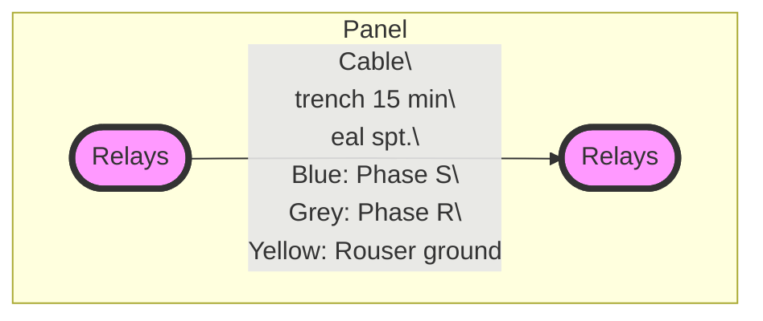
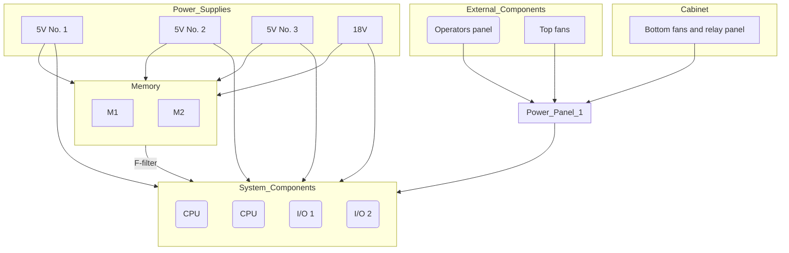
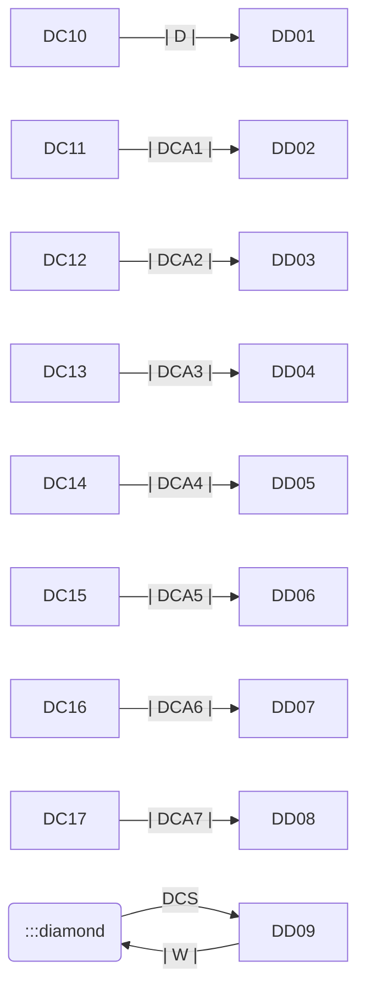

## Page 1

# NORD COMPUTER SYSTEMS

## NORD-1 CONNECTORS

- The I/O Channel System
- The Data Channel System
- Device Connections
- The NORD-1 Power System

Written by T. Fledsberg

---

```
 _______________________________________
|                                       |
|            NORD COMPUTER              |
|                SYSTEMS                |
|                                       |
|_______________________________________|

| NORD-1 CONNECTORS                    |
|_______________________________________|
|                                |     |
| The I/O Channel System         |     |
| The Data Channel System        |     |
| Device Connections             |     |
| The NORD-1 Power System        |     |
|                                |     |
| Written by T. Fledsberg        |     |
|________________________________|_____|

 _________________________________________________
|                                                 |
|          A/S NORSK DATA-ELEKTRONIKK             |
|                Økernveien 145, Oslo 5           |
|_________________________________________________|
```

---

## Page 2

# NORD-1 Connectors

The I/O Channel System  
The Data Channel System  
Device Connections  
The NORD-1 Power System  

Written by T. Fledsberg

---

## Page 3

# REVISION RECORD

| Revision | Notes                                      |
|----------|--------------------------------------------|
| 9/72     | New edition superceding all previous versions |

Publ. No.  ND-01. 005. 01  
September 1972  

```
  _    _
 / \__/ \
|        |
|        |
 \______/ 
```

A/S NORSK DATA-ELEKTRONIKK  
Erich Mogensens vei 38, Oslo 5 - Tlf. 21 73 71

---

## Page 4

# A/S NORSK DATA-ELEKTRONIKK

## CARD ASSEMBLY

**Drawing no.**: NORD-1.71

### Table C

|   | C     |
|---|-------|
| 1 | 151   |
| 2 | 128   |
| 3 | 141   |
| 4 | 132   |
| 5 | 106.2 |
| 6 | 106.1 |
| 7 | 140.2 |
| 8 | 140.1 |
| 9 | 150   |
| 10| 108.4 |
| 11| 102.4 |
| 12| 103.4 |
| 13| 101.4 |
| 14| 108.3 |
| 15| 102.3 |
| 16| 103.3 |
| 17| 101.3 |
| 18| 108.2 |
| 19| 102.2 |
| 20| 103.2 |
| 21| 101.2 |
| 22| 108.1 |
| 23| 102.1 |
| 24| 103.1 |
| 25| 101.1 |
| 26| 158/II.4* 6 7 14 15 |
| 27| 158/II.3* 4 5 12 13 |
| 28| 158/II.2* 2 3 10 11 |
| 29| 158/II.1* 0 1 8 9   |
| 30| 159   |
| 31| 169   |
| 32| 110   |

### Table D

|   | D       |
|---|---------|
| 1 | 125     |
| 2 | 123     |
| 3 | 124     |
| 4 | 127     |
| 5 | 131     |
| 6 | 90N40.2 |
| 7 | 90N40.1 |
| 8 | 109     |
| 9 | 130     |
| 10| 115     |
| 11| 126     |
| 12| 134     |
| 13| 135     |
| 14| 136     |
| 15| 137     |
| 16| 146     |
| 17| 133     |
| 18| 122     |
| 19| 120     |
| 20| 163     |
| 21| 166.1   |
| 22| 166.2   |
| 23| 165.1   |
| 24| 165.2   |
| 25| 164     |
| 26| 160.1 REA. PCH. |
| 27| 113 CARD REA.   |
| 28| 179     |
| 29| 160.3 TTY       |
| 30| 195     |
| 31| 190.1 I/O CH.   |
| 32| 504 DATA CH.    |

### Notes

*In CPU's with paging system the Paging Buffer 188 is used.*

#### CENTRAL PROCESSING UNIT

- **DRAWN BY**: 
- **APPROVED BY**:
- **DATE**: 

---

- **Replacement for Date**: 
- **Replaced by Date**: 

**ND-04.05.01**

---

## Page 5

# The I/O Channel System

The maximum numbers of I/O channels available on plugs are three. I/O channel number one is reserved A/S Norsk Data-Elektronikk and is connected to the processor via cable card. I/O channel number two and number three are available for the user.

Signal levels for I/O channel are in standard TTL or balanced lines (T.I. 75107 and 75109). Using standard TTL level, the I/O signals are connected to buffer cards in the processor via three cables (control, data in, data out). Using balanced lines, the I/O signals are connected to the buffer cards via two cables (control, data in, data out) and three 185 line driver/receiver cards.

## I/O Control Signals

| Balanced lines | Standard TTL lines |        | Description                                                    |
|----------------|--------------------|--------|----------------------------------------------------------------|
| LII 0-5        | II 0-5             | (CH 1) | Connected to IR (Instruction Register) as described. Polarity of each bit defines device number, Select 1 of 64 devices. |
| LIY 0-5        | IY 0-5             | (CH 2) |                                                                |
| LIZ 0-5        | IZ 0-5             | (CH 3) |                                                                |
| LII 8-10       | II 8-10            | (CH 1) | Connected to IR.                                               |
| LIY 8-10       | IY 8-10            | (CH 2) | ACT (bit 8) Activate the specified device.                     |
| LIZ 8-10       | IZ 8-10            | (CH 3) | SKA (bit 9) Skip if start acceptable.                          |
|                |                    |        | PIN (bit 10) Prepare interrupt. Turn on the interrupt system of the specified device. |
|                |                    |        | These three function bits can also have other meanings, depending on the user's definition. |
| LIO 3          | IO 3               | (CH 1) | (IOTE) Timing signal from CPU.                                 |
| LIO 4          | IO 4               | (CH 2) | Defines the period when the CPU is reading the state of a device control card. See diagram under DC (CONNECT). |
| LIO 5          | IO 5               | (CH 3) |                                                                |
| LIC 3          | IC 3               | (CH 1) | (IOTC) Timing signal from CPU, defined as IOT completion. Can be used by the device control card as a start command from CPU. See diagram under DC. |
| LIC 4          | IC 4               | (CH 2) |                                                                |
| LIC 5          | IC 5               | (CH 3) |                                                                |

ND-01. 005.01

---

## Page 6

# Technical Specifications

## Balanced Lines

| Category        | Details                  |
|-----------------|--------------------------|
| Standard TTL    |                          |
| Not in use      | TSX (CH 1)               |
|                 | TSY (CH 2)               |
|                 | TSZ (CH 3)               |

Static I/O test signal generated by the Cambridge Control 169 card.  
(Example of use: In this mode the Simplex Control 160 card operates independently of return signals from device, running at maximum speed synchronized with CPU.)

## LDC 3

| Channel | Details                                    |
|---------|--------------------------------------------|
| DC 3    | (CH 1)                                     |
|         | (CONNECT) DC4=104·IY5x·IY4x·IY3x·IY2x·IY1x·IY0x |

## Timing Diagram

```
  IY(IR)
  IO4(IOTE)
  IC4(IOTC)
  DC(CONNECT)   ──────────
                Max. 5μs
  DR(DATA READY)─────────  Min. 0.75μs <── 1μs
                          Max. 0.5μs <──
  DK(SKIP)     ──────────
  DATA STROBE  ──────────
                          Pulse width > 1μs
  DI0          ──────────
                          Pulse width > 1μs
  DI1          ──────────
```

## Notes

Data strobe is dependent on the DATA READY signal. The time delay from CONNECT is received by the CPU until data is strobed into A-register is minimum 450 ns and maximum 750 ns.

The duration of IOTE is determined by the CONNECT signal and is minimum 750 ns when CONNECT is returned immediately. Maximum length is 10 μs if no CONNECT is received.

---

ND-01. 005. 01

---

## Page 7

# Balanced vs. Standard TTL Lines

| Balanced Lines | Standard TTL Lines |     |
|----------------|--------------------|-----|
| LDK 3          | DK 3 (CH 1)        | (SKIP) The skip signal is sensed at the same time as DATA READY. (See diagram and text under CONNECT.) If SKIP is true, the next instruction in the program is bypassed. |
| LDK 4          | DK 4 (CH 2)        |     |
| LDK 5          | DK 5 (CH 3)        |     |
| LDR 3          | DR 3 (CH 1)        | (DATA READY) Read the "data in lines" into the A register. DATA READY is also used to switch the 185 line driver/receiver cards from send to receive mode. |
| LDR 4          | DR 4 (CH 2)        |     |
| LDR 5          | DR 5 (CH 3)        |     |
| LDII 3         | DII 3 (CH 1)       | Interrupt signal from one-way devices, or input interrupt from two-way devices. Interrupt level 1. |
| LDII 4         | DII 4 (CH 2)       |     |
| LDII 5         | DII 5 (CH 3)       |     |
| LDIO 3         | DIO 3 (CH 1)       | Output interrupt from two-way devices. Interrupt level 7. |
| LDIO 4         | DIO 4 (CH 2)       |     |
| LDIO 5         | DIO 5 (CH 3)       |     |
| LMCX           | MCX (CH 1)         | Master clear signal from operator panel in N-1. |
| LMCY           | MCY (CH 2)         |     |
| LMCZ           | MCZ (CH 3)         |     |

## 1.2 I/O Data Signals

| Balanced Lines | Standard TTL Lines |     |
|----------------|--------------------|-----|
| DIX            | (CH 1)             | Data lines into the A register. |
| DIY            | (CH 2)             |     |
| DIZ            | (CH 3)             |     |
| AX             | (CH 1)             | Data lines from the A register. |
| AY             | (CH 2)             |     |
| AZ             | (CH 3)             |     |
| LIOX           | (CH 1)             | Data lines will carry either input or output data depending on the Data Ready signal. |
| LIOY           | (CH 2)             |     |
| LIOZ           | (CH 3)             |     |

ND-01.005.01

---

## Page 8

# A/S Norsk Data-Elektronikk

## I/O Channel 2. NORD-1

### Drawing No. NORD-1.71

#### Burndy Plug No.

| Signal   | Polarity | Signal       | Ground | C.P.U. Position |
|----------|----------|--------------|--------|-----------------|
| IC 4     | 0        | B            | D      | D19.51          |
| IO 4     | 0        | F            | J      | D19.43          |
| IY 0     | 0        | K            | M      | D21.11          |
| IY 1     | 0        | L            | N      | D22.11          |
| IY 2     | 0        | P            | S      | D21.07          |
| IY 3     | 0        | R            | T      | D22.07          |
| IY 4     | 0        | U            | W      | D21.04          |
| IY 5     | 0        | V            | X      | D22.04          |
| IY 8     | 0        | Y            | AA     | D23.34          |
| IY 9     | 0        | Z            | BB     | D24.34          |
| IY 10    | 0        | CC           | EE     | D23.41          |
| DC 4     | 0        | DD           | FF     | D19.14          |
| DR 4     | 0        | HH           | KK     | D19.15          |
| DK 4     | 0        | JJ           | LL     | D19.17          |
| DII 4    | 0        | MM           | PP     | D20.15          |
| DIO 4    | 0        | NN           | RR     | D20.17          |
| TSY      | 0        | SS           | UU     | D23.50          |
| MCY      | 0        | A            | C      | D24.50          |

**Female-Plug on the Plug Panel**

| Drawn By | Remarks  | Replacement For | Date |
|----------|----------|-----------------|------|
|          | CONTROL  |                 |      |

**ND-01.005.01**

---

## Page 9

# A/S Norsk Data-Elektronikk

## I/O Channel 2. NORD-1

**Drawing No.:** NORD-1.71

### Burndy Plug No.:

| Signal | Polarity | Signal | Ground | Position |
|--------|----------|--------|--------|----------|
| AY 0   | 0        | B      | D      | D21.41   |
| AY 1   | 0        | E      | H      | D21.29   |
| AY 2   | 0        | F      | J      | D21.24   |
| AY 3   | 0        | K      | M      | D21.21   |
| AY 4   | 0        | L      | N      | D22.41   |
| AY 5   | 0        | P      | S      | D22.29   |
| AY 6   | 0        | R      | T      | D22.24   |
| AY 7   | 0        | U      | W      | D22.21   |
| AY 8   | 0        | V      | X      | D21.55   |
| AY 9   | 0        | Y      | AA     | D21.49   |
| AY 10  | 0        | Z      | BB     | D21.45   |
| AY 11  | 0        | CC     | EE     | D21.14   |
| AY 12  | 0        | DD     | FF     | D22.55   |
| AY 13  | 0        | HH     | KK     | D22.49   |
| AY 14  | 0        | JJ     | LL     | D22.45   |
| AY 15  | 0        | MM     | PP     | D22.14   |

**FEMALE-PLUG ON THE PLUG PANEL**

---

| Drawn By |           | Remarks   | Replacement for | Date |
|----------|-----------|-----------|-----------------|------|
| Approved By |        | DATA OUT  | Replaced by     | Date |

_ND-01.005.01_

---

## Page 10

# A/S NORSK DATA-ELEKTRONIKK  
## I/O CHANNEL 2. NORD-1  
**Drawing no.: NORD-1.71**

### BURNDY PLUG NO.  
| SIGNAL  | POLARITY | BURNDY PLUG | C.P.U.    |
|---------|----------|-------------|-----------|
|         |          | SIGNAL      | GROUND    | POSITION |
| DIY 0   | 1        | B           | D         | D23.12   |
| DIY 1   | 1        | E           | H         | D23.17   |
| DIY 2   | 1        | F           | J         | D23.20   |
| DIY 3   | 1        | K           | M         | D23.24   |
| DIY 4   | 1        | L           | N         | D23.28   |
| DIY 5   | 1        | P           | S         | D23.37   |
| DIY 6   | 1        | R           | T         | D23.46   |
| DIY 7   | 1        | U           | W         | D23.53   |
| DIY 8   | 1        | V           | X         | D24.12   |
| DIY 9   | 1        | Y           | AA        | D24.17   |
| DIY 10  | 1        | Z           | BB        | D24.20   |
| DIY 11  | 1        | CC          | EE        | D24.24   |
| DIY 12  | 1        | DD          | FF        | D24.28   |
| DIY 13  | 1        | HH          | KK        | D24.37   |
| DIY 14  | 1        | JJ          | LL        | D24.46   |
| DIY 15  | 1        | MM          | PP        | D24.53   |

**FEMALE-PLUG ON THE PLUG PANEL**

| DRAWN BY |           | Remarks   | Replacement for | Data        |
|----------|-----------|-----------|-----------------|-------------|
|          |           | DATA IN   | Replaced by     | Date        |

**ND-01.005.01**

---

## Page 11

# A/S Norsk Data-Elektronikk

## I/O Channel 3 NORD-1

### Drawing No.
NORD-1.71

### Burndy Plug No.

| Signal  | Polarity | Signal         | Ground | C.P.U. Position |
|---------|----------|----------------|--------|-----------------|
| IC 5    | IOTC     | 0              | B      | D               | D19.52          |
| IO 5    | IOTE     | 0              | F      | J               | D19.44          |
| IZ 0    | DEV.NO.  | 0              | K      | M               | D21.9           |
| IZ 1    | ''       | 0              | L      | N               | D22.9           |
| IZ 2    | ''       | 0              | P      | S               | D21.6           |
| IZ 3    | ''       | 0              | R      | T               | D22.6           |
| IZ 4    | ''       | 0              | U      | W               | D21.5           |
| IZ 5    | ''       | 0              | V      | X               | D22.5           |
| IZ 8    | ACT      | 0              | Y      | AA              | D23.31          |
| IZ 9    | SKA      | 0              | Z      | BB              | D24.31          |
| IZ 10   | PIN      | 0              | CC     | EE              | D23.42          |
| DC 5    | CONNECT  | 0              | DD     | FF              | D19.13          |
| DR 5    | DATA READY | 0            | HH     | KK              | D19.12          |
| DK 5    | SKIP     | 0              | JJ     | LL              | D19.16          |
| DII 5   | INTERRUPT 1 | 0           | MM     | PP              | D20.16          |
| DIO 5   | INTERRUPT 2 | 0           | NN     | RR              | D20.20          |
| TSZ     | TEST     | 0              | SS     | UU              | D23.58          |
| MCZ     | MASTER CLEAR | 0          | A      | C               | D24.58          |

### Notes
- **Female-Plug on the Plug Panel**

---

**Drawn by:** [Illegible]

**Approved by:** CONTROL

**Date:** ND-01.005.01

| Remarks             | Replacement for | Date      | Replaced by | Date     |
|---------------------|-----------------|-----------|-------------|----------|
|                     |                 |           |             |          |

---

## Page 12

# A/S Norsk Data-Elektronikk

## I/O Channel 3 Nord-1

### Burndy Plug No.

| Signal | Polarity | Signal | Ground | C.P.U. Position |
|--------|----------|--------|--------|----------------|
| AZ 0   | 0        | B      | D      | D21.44         |
| AZ 1   | 0        | E      | H      | D21.30         |
| AZ 2   | 0        | F      | J      | D21.36         |
| AZ 3   | 0        | K      | M      | D21.16         |
| AZ 4   | 0        | L      | N      | D22.44         |
| AZ 5   | 0        | P      | S      | D22.30         |
| AZ 6   | 0        | R      | T      | D22.36         |
| AZ 7   | 0        | U      | W      | D22.16         |
| AZ 8   | 0        | V      | X      | D21.58         |
| AZ 9   | 0        | Y      | AA     | D21.50         |
| AZ 10  | 0        | Z      | BB     | D21.46         |
| AZ 11  | 0        | CC     | EE     | D21.15         |
| AZ 12  | 0        | DD     | FF     | D22.58         |
| AZ 13  | 0        | HH     | KK     | D22.50         |
| AZ 14  | 0        | JJ     | LL     | D22.46         |
| AZ 15  | 0        | MM     | PP     | D22.15         |

**FEMALE-PLUG ON THE PLUG PANEL**

---

| DRAWN BY | Remarks   | Replacement for | Date          |
|----------|-----------|-----------------|---------------|
|          | DATA OUT  |                 |               |

| APPROVED BY |              | Replaced by | Date          |
|-------------|--------------|-------------|---------------|

ND-01.005.01

---

## Page 13

# I/O Channel 3 NORD-1

### Burndy Plug No.

| Signal  | Polarity | Signal | Ground | C.P.U. Position |
|---------|----------|--------|--------|-----------------|
| DIZ 0   | 1        | B      | D      | E23.8           |
| DIZ 1   | 1        | E      | H      | D23.11          |
| DIZ 2   | 1        | F      | J      | D23.26          |
| DIZ 3   | 1        | K      | M      | D23.27          |
| DIZ 4   | 1        | L      | N      | D23.33          |
| DIZ 5   | 1        | P      | S      | D23.39          |
| DIZ 6   | 1        | R      | T      | D23.47          |
| DIZ 7   | 1        | U      | W      | D23.55          |
| DIZ 8   | 1        | V      | X      | D24.8           |
| DIZ 9   | 1        | Y      | AA     | D24.11          |
| DIZ 10  | 1        | Z      | BB     | D24.26          |
| DIZ 11  | 1        | CC     | EE     | D24.27          |
| DIZ 12  | 1        | DD     | FF     | D24.33          |
| DIZ 13  | 1        | HH     | KK     | D24.39          |
| DIZ 14  | 1        | JJ     | LL     | D24.47          |
| DIZ 15  | 1        | MM     | PP     | D24.55          |

**Female-Plug on the Plug Panel**

---

**Remarks**: DATA IN

---

**Drawing No.**: NORD-1.71  
**Date**: ND-01.005.01

---

## Page 14

# I/O Channel 2 Control with Cable Drivers and Receivers

| No. | Signal | Pol. | CPU 185,3 | Plug | I/O Rack 185,5 |
|-----|--------|------|-----------|------|----------------|
| 1   | L1Y 0  | 1    | .17       | A    | .17            |
|     |        | 0    | .18       | C    | .18            |
| 2   | L1Y 1  | 1    | .20       | B    | .20            |
|     |        | 0    | .22       | D    | .22            |
| 3   | L1Y 2  | 1    | .24       | E    | .24            |
|     |        | 0    | .23       | H    | .23            |
| 4   | L1Y 3  | 1    | .25       | F    | .25            |
|     |        | 0    | .28       | J    | .28            |
| 5   | L1Y 4  | 1    | .30       | K    | .30            |
|     |        | 0    | .29       | M    | .29            |
|     |        | 1    | .31       | L    | .31            |
| 6   | L1Y 5  | 0    | .34       | N    | .34            |
| 7   | L1Y 8  | 1    | .35       | P    | .35            |
|     |        | 0    | .38       | S    | .38            |
| 8   | L1Y 9  | 1    | .37       | R    | .37            |
|     |        | 0    | .40       | T    | .40            |
| 9   | L1Y 10 | 1    | .42       | U    | .42            |
|     |        | 0    | .41       | W    | .41            |
| 10  | LMCY   | 1    | .43       | V    | .43            |
|     |        | 0    | .46       | X    | .46            |
| 11  | LIC 4  | 1    | .11       | Y    | .11            |
|     |        | 0    | .12       | AA   | .12            |
| 12  | LIO 4  | 1    | .14       | Z    | .14            |
|     |        | 0    | .15       | BB   | .15            |
| 13  | LDC    | 1    | .48       | CC   | .48            |
|     |        | 0    | .47       | EE   | .47            |
| 14  | LDR 4  | 1    | .49       | DD   | .49            |
|     |        | 0    | .52       | FF   | .52            |
| 15  | LDK 4  | 1    | .54       | HH   | .54            |
|     |        | 0    | .53       | KK   | .53            |
| 16  | LDII 4 | 1    | .55       | JJ   | .55            |
|     |        | 0    | .58       | LL   | .58            |
| 17  | LDIO 4 | 1    | .05       | MM   | .05            |
|     |        | 0    | .06       | PP   | .06            |
| 18  |        | 1    |           | NN   |                |
|     |        | 0    | To P2     | RR   | To P4          |
|     |        | 1    |           | SS   |                |
| 19  |        | 0    |           | UU   |                |
|     |        | 1    |           | TT   |                |
| 20  |        | 0    |           | VV   |                |
| 21  |        | 1    |           | XX   |                |
|     |        | 0    |           | WW   |                |

**Remarks**  
Connected to 185,3 and 185,6

---

**Drawn by:**  
**Approved by:**  
**Date:**  

ND-01, 005, 01

---

## Page 15

# A/S NORSK DATA ELEKTRONIKK

## I/O Channel 2 Data with Cable Drivers and Receivers

| No. | Signal | Pol. | In CPU 185.1 | Plug | I/O Rack 185.5 |
|-----|--------|------|--------------|------|----------------|
| 1   | LIOY 0 | 1    | .11          | A    | .12            |
|     |        | 0    | .12          | C    | .11            |
| 2   | LIOY 1 | 1    | .14          | B    | .15            |
|     |        | 0    | .15          | D    | .14            |
| 3   | LIOY 2 | 1    | .17          | E    | .18            |
|     |        | 0    | .18          | H    | .17            |
| 4   | LIOY 3 | 1    | .20          | F    | .22            |
|     |        | 0    | .22          | J    | .20            |
| 5   | LIOY 4 | 1    | .24          | K    | .23            |
|     |        | 0    | .23          | M    | .24            |
| 6   | LIOY 5 | 1    | .25          | L    | .28            |
|     |        | 0    | .28          | N    | .25            |
| 7   | LIOY 6 | 1    | .30          | P    | .29            |
|     |        | 0    | .29          | S    | .30            |
| 8   | LIOY 7 | 1    | .31          | R    | .34            |
|     |        | 0    | .34          | T    | .31            |
| 9   | LIOY 8 | 1    | .35          | U    | .38            |
|     |        | 0    | .38          | W    | .35            |
| 10  | LIOY 9 | 1    | .37          | V    | .40            |
|     |        | 0    | .40          | X    | .37            |
| 11  | LIOY 10| 1    | .42          | Y    | .41            |
|     |        | 0    | .41          | AA   | .42            |
| 12  | LIOY 11| 1    | .43          | Z    | .46            |
|     |        | 0    | .46          | BB   | .43            |
| 13  | LIOY 12| 1    | .48          | CC   | .47            |
|     |        | 0    | .47          | EE   | .48            |
| 14  | LIOY 13| 1    | .49          | DD   | .52            |
|     |        | 0    | .52          | FF   | .49            |
| 15  | LIOY 14| 1    | .54          | HH   | .53            |
|     |        | 0    | .53          | KK   | .54            |
| 16  | LIOY 15| 1    | .55          | JJ   | .58            |
|     |        | 0    | .58          | LL   | .55            |
| 17  |        | 1    | M1          |     |                |
|     |        | 0    | To P1       | PP  | To P3          |
| 18  |        | 1    | NN          |     |                |
|     |        | 0    | RR          |     |                |
| 19  |        | 1    | SS          |     |                |
|     |        | 0    | UU          |     |                |
| 20  |        | 1    | TT          |     |                |
|     |        | 0    | VV          |     |                |
| 21  |        | 1    | XX          |     |                |
|     |        | 0    | WW          |     |                |

### Remarks
- Connected to 185.1 and 185.5

### ND-01, 005.01

---

## Page 16

# I/O Channel 2 with Line Drivers and Receivers

## CPU



- **185.1**: without termin. resist.
- **185.2**: DATA IN
- **185.3**: CONTROL

## Connections

- From 165, 166 and 120
- To 120 and 163 (I/O CTR) (I/O OUTPUT)

---

ND-01.005.01

---

## Page 17

# I/O Channel 2 with Line Drivers and Receivers I/O Rack

```mermaid
graph TD
    P3 <-- DATA IN --- 185.5
    185.5 -- DR4 --> |From 168 I/O Channel Interface| DIY0-15
    185.5 --> DATA OUT --|To 168 I/O Channel Interface|--> AX0-15
    185.4 --> DATA OUT --> DR4 --> P3
    P4 <-- CONTROL --- 185.6
    185.6 --> IY0-5
    185.6 --> 8-10
    185.6 --> IC4
    185.6 --> IO4
    185.6 --> MCY
    185.6 --> DC4
    185.6 --> DR4
    185.6 --> DK4
    185.6 --> DII4
    185.6 --> DIO4
    |To 168 from 168 I/O Channel Interface|
```

---

## Page 18

# THE DATA CHANNEL SYSTEM

The external data channel interface is connected to the memory interface via cable drivers and receivers (185 or 504). The connection is done by means of two connectors, one for address/control and the other for data in/out.

## 2.1 Data Channel Control Signals

- **LWRK (WRITE):** Specifies read or write mode depending on polarity.
- **LRQK (REQUEST):** Request signal to the memory interface.
- **LRYK (READY):** Ready signal from the memory interface.
- **LDAK:** Address lines.

## 2.2 Data Channel Data

- **LDDK:** Depending on mode signal polarity (WRITE), the LDDK lines will carry either input or output data.

---

## Page 19

# A/S NORSK DATA-ELEKTRONIKK

## DATA CHANNEL K
### ADDRESS/CONTROL

| NO. | SIGNAL   | POL. | CPU      | PLUG | I/O RACK  |
|-----|----------|------|----------|------|-----------|
| 1   | LDAK 0   | 1    | 185.9.12 | A    | 185.7.12  |
|     |          | 0    | .11      | C    | .11       |
| 2   | LDAK 1   | 1    | .15      | B    | .15       |
|     |          | 0    | .14      | D    | .14       |
| 3   | LDAK 2   | 1    | .18      | E    | .18       |
|     |          | 0    | .17      | H    | .17       |
| 4   | LDAK 3   | 1    | .22      | F    | .22       |
|     |          | 0    | .20      | J    | .20       |
| 5   | LDAK 4   | 1    | .23      | K    | .23       |
|     |          | 0    | .24      | M    | .24       |
| 6   | LDAK 5   | 1    | .28      | L    | .28       |
|     |          | 0    | .25      | N    | .25       |
| 7   | LDAK 6   | 1    | .29      | P    | .29       |
|     |          | 0    | .30      | S    | .30       |
| 8   | LDAK 7   | 1    | .34      | R    | .34       |
|     |          | 0    | .31      | T    | .31       |
| 9   | LDAK 8   | 1    | .38      | U    | .38       |
|     |          | 0    | .35      | W    | .35       |
| 10  | LDAK 9   | 1    | .40      | V    | .40       |
|     |          | 0    | .37      | X    | .37       |
| 11  | LDAK 10  | 1    | .41      | Y    | .41       |
|     |          | 0    | .42      | AA   | .42       |
| 12  | LDAK 11  | 1    | .46      | Z    | .46       |
|     |          | 0    | .43      | BB   | .43       |
| 13  | LDAK 12  | 1    | .47      | CC   | .47       |
|     |          | 0    | .48      | EE   | .48       |
| 14  | LDAK 13  | 1    | .52      | DD   | .52       |
|     |          | 0    | .49      | FF   | .49       |
| 15  | LDAK 14  | 1    | .53      | HH   | .53       |
|     |          | 0    | .54      | KK   | .54       |
| 16  | LDAK 15  | 1    | .58      | JJ   | .58       |
|     |          | 0    | .55      | LL   | .55       |
| 17  | LRQK     | 1    | .05      | MM   | .05       |
|     |          | 0    | .06      | PP   | .06       |
| 18  | LWRK     | 1    | .10      | NN   | .10       |
|     |          | 0    | .09      | RR   | .09       |
| 19  | LRYK     | 1    | 185.7.06 | SS   | 185.10.05 |
|     |          | 0    | .05      | UU   | .06       |
| 20  |          |      | 0        | TT   |           |
|     |          |      | 0        | VV   |           |
| 21  |          | 1    | XX       |      |           |
|     |          | 0    | WW       |      |           |

```
DRAWN BY                  Remarks               Replacement for Date
                           185.9 in pos:        
APPROVED BY               185.12 in pos:        Replaced by        Date
DATE                      185.7 in pos:         
                          185.10 in pos:
``` 

```
ND-01.005.01
```

---

## Page 20

# A/S Norsk Data-Elektronikk

## Data Channel X
### Data In/Out

| No. | Signal  | Pol. | CPU   | Plug | I/O Rack |
|-----|---------|------|-------|------|----------|
| 1   | LDDK 0  | 1    | 185,7.12 | A  | 185,11.12 |
|     |         | 0    | .11   | C    | .11       |
| 2   | LDDK 1  | 1    | .15   | B    | .15       |
|     |         | 0    | .14   | D    | .14       |
| 3   | LDDK 2  | 1    | .18   | E    | .18       |
|     |         | 0    | .17   | H    | .17       |
|     |         |      | .22   | F    | .22       |
| 4   | LDDK 3  | 1    | .20   | J    | .20       |
|     |         | 0    | .23   | K    | .23       |
| 5   | LDDK 4  | 1    | .24   | M    | .24       |
|     |         | 0    | .28   | L    | .28       |
| 6   | LDDK 5  | 1    | .25   | N    | .25       |
| 7   | LDDK 6  | 1    | .29   | P    | .29       |
|     |         | 0    | .30   | S    | .30       |
| 8   | LDDK 7  | 1    | .34   | R    | .34       |
|     |         | 0    | .31   | T    | .31       |
| 9   | LDDK 8  | 1    | .38   | U    | .38       |
|     |         | 0    | .35   | V    | .35       |
| 10  | LDDK 9  | 1    | .40   | V    | .40       |
|     |         | 0    | .37   | X    | .37       |
| 11  | LDDK 10 | 1    | .41   | Y    | .41       |
|     |         | 0    | .42   | AA   | .42       |
| 12  | LDDK 11 | 1    | .46   | Z    | .46       |
|     |         | 0    | .43   | BB   | .43       |
| 13  | LDDK 12 | 1    | .47   | CC   | .47       |
|     |         | 0    | .48   | EE   | .48       |
| 14  | LDDK 13 | 1    | .52   | DD   | .52       |
|     |         | 0    | .49   | FF   | .49       |
| 15  | LDDK 14 | 1    | .53   | HH   | .53       |
|     |         | 0    | .54   | KK   | .54       |
| 16  | LDDK 15 | 1    | .58   | JJ   | .58       |
|     |         | 0    | .55   | LL   | .55       |
| 17  |         |      |       |      |           |
|     |         |      |       | MM   |           |
|     |         | 0    |       | PP   |           |
| 18  |         | 1    |       | NN   |           |
|     |         | 0    |       | RR   |           |
| 19  |         | 1    |       | SS   |           |
|     |         | 0    |       | UU   |           |
| 20  |         | 1    |       | TT   |           |
|     |         | 0    |       | VV   |           |
| 21  |         | 1    |       | XX   |           |
|     |         | 0    |       | WW   |           |

**Remarks:**
185,7 in pos:
185,11 in pos:

#### Document Information
- **Drawing No:** ND-01,005.01

**Drawn by:**  
**Approved by:**  
**Date:**

---

## Page 21

# Data Channel with Line Drivers and Receivers Connected to Multiplexer in I/O Rack

## Prioritization Levels
1. Prioritet O
2. N
3. M
4. L

```mermaid
flowchart TB
    A305["2-4"]
    A305 -->|RQJ0| RJ0
    A305 -->|RQJ1| RJ1
    A305 -->|RQO0| RO0
    A305 -->|RQO1| RO1
    A305 -->|WRL0| WL0
    A305 -->|WRL1| WL1
    A305 -->|WRX0| WX0
    A305 -->|WRX1| WX1

    RJ0
    
    
    B305["305"]
    B305 -->|MDEL0| BDEL0
    B305 -->|MDEN0| BDEM0
    B305 -->|RDSEL0| RSEL0
    B305 -->|RDEL0| RDEL0
    B305 -->|MAEN0| MA0
    B305 -->|MALEN0| ML0
    B305 -->|NAEN0| NA0
    B305 -->|NALEN0| NL0
    B305 -->|RQK| BR
    B305 -->|WRX| WR0
    B305 -->|MDEL1| BDEL1
    B305 -->|MDEN1| BDEM1
    
    
    C165["165 x 2"]
    C165 -->|DCDL| CDL
    C165 -->|MDEL0| DBD0
    C165 -->|MDEL1| DBD1
    C165 -->|DCEM0| DCE0
    C165 -->|DCEN0| DCE1
    C165 -->|DCEX0| DCX0
    C165 -->|MDEC0| DME0
    C165 -->|MDEC1| DME1
    C165 -->|MDEC0| MDEC0

    D165["165 x 2"]
    D165 -->|DCAL| CAL
    D165 -->|DCAX0| CAX0
    D165 -->|DCAX1| CAX1
    D165 -->|DCAX2| CAX2
    D165 -->|MCA0| MCA0
    D165 -->|DAQ0| DAQ0
    D165 -->|RQK| DRK
    D165 -->|WRY1| WYR1

    MK0154["185.10\nDATA OUT"]
    MK0154 -->|RYK0| R0

    DCDKO154["DCDKO-154"]
    DCDKO154 -->|P3| P3

    LDDKO154["LDDKO-154"]
    LDDKO154 -->|P4| P4

    DATAIN["185.11\nDATA IN"]
    DATAIN -->|DCDKO-154| D154

    ADDRCONT["185.12\nADDR CONT."]
    ADDRCONT -->|LDAKO-154| L154
```



- [Photo: Schematic diagram with labeled boxes and connections]

---

## Page 22

# DEVICE CONNECTIONS

## Digitronics Tape Reader

| Twisted pairs in cable | Digitronics plug P1 | Burndy plug | CPU    | Name         | Polarity |
|------------------------|---------------------|-------------|--------|--------------|----------|
| BROWN/BLUE             | D/4 GND             | A/C GND     | D25.10 | RD0 DATA BIT 0 | 1        |
| GREY/BLUE              | E/5                 | B/D         | D25.14 | RD1          | 1        |
| WHITE/BLUE             | F/6                 | E/H         | D25.24 | RD2          | 1        |
| GREEN/BLUE             | H/7                 | F/J         | D25.15 | RD3          | 1        |
| BROWN/BLACK            | J/8                 | K/M         | D25.28 | RD4          | 1        |
| GREY/BLACK             | K/9                 | L/N         | D25.27 | RD5          | 1        |
| GREEN/BLACK            | L/10                | P/S         | D25.35 | RD6          | 1        |
| WHITE/ORANGE           | M/11                | R/T         | D25.36 | RD7          | 1        |
| GREEN/ORANGE           | N/12                | U/V         | D26.11 | RD8 SPROCKET | 1        |
| BLUE/ORANGE            | 18/12               | V/X         | D26.13 | VD2 DRIVE    | 1        |
| BLACK/ORANGE           | 20/12               | Y/AA        | D26.14 | VD2 STOP     | 0        |
| BLUE/BLACK             | C/B                 | Z/BB        | D26.44 | TAPE IN      | 0        |

*HUSK: FESTE AV SKJERM TIL LESERPLUGG*

```
       TB1
  +----------+
  | (1) GND  |
  | (2)      |
  | (3) 220V |
  +----------+
  220V AC CONNECTIONS
```

ND-01, 005. 01

---

## Page 23

# Facit Punch 4070

| Twisted pairs in cable | Digitronics plug P1 | Burndy plug | CPU  | Name           |
|------------------------|---------------------|-------------|------|----------------|
| BROWN/BLUE             | 1/25                | A/C         | 11/20| Ch 1           |
| GREY/BLUE              | 2/25                | B/D         | 9/16 | Ch 2           |
| WHITE/BLUE             | 3/25                | E/H         | 43/41| Ch 3           |
| BROWN/BLACK            | 4/25                | K/M         | 27/29| Ch 4           |
| GREY/BLACK             | 5/25                | L/N         | 47/45| Ch 5           |
| GREEN/BLACK            | 6/25                | P/S         | 35/29| Ch 6           |
| WHITE/ORANGE           | 7/25                | R/T         | 17/19| Ch 7           |
| GREEN/ORANGE           | 8/25                | U/W         | 25/23| Ch 8           |
| GREEN/BLUE             | 9&11/25             | F/J         | 7/15 | Ch 9 SPROCKET  |
| BLUE/ORANGE            | 12/25               | V/X         | 3/23 | PR (COMPLETION)|
| SKJERM                 | 14&15               | Y           | /2   |                |

For 12 pairs cable  
Pin No. 10 to GND (25)  
Female plug on the plug panel  
FACIT PUNCH BUFFER position in CPU  

ND-01, 005, 01

---

## Page 24

## 3.3 NORD-1 Teletype Cabling

| Plug Terminal | Twisted Pairs in Cable | CPU  | Signal        |
|---------------|------------------------|------|---------------|
| A/B           | BROWN/BLACK            | .55/.54 | Line 12/Line 11 |
| C/D           | GREEN/BLACK            | .58/.53 | Line 02/Line 01 |
| E/F           | ORANGE/BLACK           | .52/.44 | Start₁/Start₀  |
| G/H           | BLUE/BLACK             |      |               |

```
  Terminal strip     Terminal strip                                    | 
 Data Dynamics      151411                                              |
                     Standard                                           |
                     Teletype                                           |
                                                                       |
 +---+              +---+   Cable   +---+                              |
 | 4 |              | 9 |           | D | From CPU                     |
 |---|              |---|           |---| (170-195)                    |
 | 3 | Receive      | 8 | Receive   | C |                              |
 |---|              |---|           |---|                              |
 | 2 |              | 7 |           | B | To CPU                       | 
 |---|              |---|           |---| (170-155)                    | 
 | 1 | Send         | 6 |           | A |                              |
 +---+              |---|           |---|                              |
                    | 5 |           | E |                              |
                    |---|           |---|                              |
                    | 4 | Send      | F | From 195                     |
                    |---|           +---+                              |
                    | 3 |                                              
                    |---|                                             
                    | 2 |                                             
                    |---|                                              
                    | 1 |                                              
                    +---+                                              
                                                                      
Terminals in Data Dynamic    To start rele   Terminals on              
and Standard Teletype                        plug panel                
```

ND-01. 005. 01

---

## Page 25

# DP-300 Card Reader Connection

| Twisted pairs in cable | Burndy plug | Card Reader plug | CPU  | Name            | Polarity |
|------------------------|-------------|------------------|------|-----------------|----------|
| GREY/BLUE              | B/D GND     | 23/24            | .3   | CRD 0 (ROW 9)   | 0        |
| GREEN/BLUE             | F/J         | 21/22            | .4   | CRD 1 (" 8)     | 0        |
| GREY/GREEN             | L/N         | 19/20            | .5   | CRD 2 (" 7)     | 0        |
| BROWN/BLACK            | R/T         | 17/18            | .6   | CRD 3 (" 6)     | 0        |
| WHITE/BLACK            | V/X         | 15/16            | .16  | CRD 4 (" 5)     | 0        |
| BROWN/ORANGE           | Z/BB        | 13/14            | .17  | CRD 5 (" 4)     | 0        |
| WHITE/ORANGE           | DD/FF       | 11/12            | .18  | CRD 6 (" 3)     | 0        |
| BLUE/ORANGE            | JJ/LL       | 9/10             | .19  | CRD 7 (" 2)     | 0        |
| BLUE/BLACK             | NN/RR       | 7/8              | .37  | CRD 8 (" 1)     | 0        |
| BROWN/GREY             | TT/VV       | 5/6              | .38  | CRD 9 (" 0)     | 0        |
| BROWN/BLUE             | A/C         | 3/4              | .39  | CRD 10 (" 10)   | 0        |
| WHITE/BLUE             | E/H         | 1/2              | .40  | CRD 11 (" 11)   | 0        |
| BROWN/GREEN            | K/M         | 40/41            | .56  | FEED            | 1        |
| WHITE/GREEN            | P/S         | 32/33            | .55  | RR (Reader Ready) | 1      |
| GREY/BLACK             | U/W         | 34/35            | .52  | CP (Card Present) | 0      |
| GREEN/BLACK            | Y/AA        | 30/31            | .58  | C. P. I. Index Pulse | 0  |

**DP READER BUFFER 301 in position:**

Female Burndy plug on the plug panel

ND-01, 005, 01

---

## Page 26

# CDC-9220 Card Reader Connection

| Twisted pairs in cable | Burndy plug | AMP plug on card reader | Signal name         | Polarity | CPU connection |
|------------------------|-------------|------------------------|---------------------|----------|----------------|
| GREY/BLUE              | B/D         | c/n                    | ROW 9 (CRD 0)       | 0        | .03            |
| GREEN/BLUE             | F/J         | e/k                    | " 8 ( " 1)          | 0        | .04            |
| GREY/GREEN             | L/N         | V/Z                    | " 7 ( " 2)          | 0        | .05            |
| BROWN/BLACK            | R/T         | X/b                    | " 6 ( " 3)          | 0        | .06            |
| WHITE/BLACK            | V/X         | U/Y                    | " 5 ( " 4)          | 0        | .16            |
| BROWN/ORANGE           | Z/BB        | W/a                    | " 4 ( " 5)          | 0        | .17            |
| WHITE/ORANGE           | DD/FF       | L/R                    | " 3 ( " 6)          | 0        | .18            |
| BLUE/ORANGE            | JJ/LL       | N/T                    | " 2 ( " 7)          | 0        | .19            |
| BLUE/BLACK             | NN/RR       | K/P                    | " 1 ( " 8)          | 0        | .37            |
| BROWN/GREY             | TT/VV       | f/m                    | " 0 ( " 9)          | 0        | .38            |
| BROWN/BLUE             | A/C         | d/j                    | " 11 ( " 10)        | 0        | .39            |
| WHITE/BLUE             | E/H         | r/v                    | " 12 ( " 11)        | 0        | .40            |
| BROWN/GREEN            | K/M         | C/H                    | FEED                | 0        | .56            |
| WHITE/GREEN            | P/S         | n/t                    | READER READY        | 1        | .55            |
| GREY/BLACK             | U/W         | M/S                    | END DATA            | 0        | .52            |
| GREEN/BLACK            | Y/AA        | B/F                    | READ STROBE         | 0        | .58            |
| GREY/ORANGE            | CC/EE       | D/J                    | CHECK ERROR         | 0        | .11            |
| GREEN/ORANGE           | HH/KK       | A/E                    | DATA READY          | 0        | Not connected  |
| BLACK/ORANGE           | MM/PP       |                        |                     |          |                |
| WHITE/GREY             | SS/UU       |                        |                     |          |                |
| WHITE/BROWN            | XX/VW       |                        |                     |          |                |

CDC Reader Buffer 304 in position:  
Female Burndy plug on the plug panel

ND-01.005.01

---

## Page 27

# 3.6 CDC-9342 Line Printer Connection

| Cable pair colour codes | Burndy plug on CPU end | PIN assignment on buffer card | AMP plug on line printer end | Signal name |
|-------------------------|------------------------|-------------------------------|-----------------------------|-------------|
| Signal                  | Return                 | Signal   | Return  | Signal | Return |
| BROWN                   | BLUE                   | A        | C       | .7     | .12   | E  | F  | LP 0       |
| GREY                    | BLUE                   | B        | D       | .6     | .12   | H  | J  | LP 1       |
| WHITE                   | BLUE                   | E        | H       | .9     | .13   | K  | L  | LP 2       |
| GREEN                   | BLUE                   | F        | J       | .10    | .13   | M  | N  | LP 3       |
| BROWN                   | GREEN                  | K        | M       | .19    | .21   | P  | R  | LP 4       |
| GREY                    | GREEN                  | L        | N       | .18    | .20   | S  | T  | LP 5       |
| WHITE                   | GREEN                  | P        | S       | .17    | .20   | a  | b  | Control    |
| BROWN                   | BLACK                  | R        | T       | .51    | .53   | C  | D  | CHREQ      |
| GREY                    | BLACK                  | U        | W       | .41    | .42   | A  | B  | Strobe     |
| WHITE                   | BLACK                  | V        | X       | .27    | .21   |    |    | NOT CONNECTED |
| GREEN                   | BLACK                  | Y        | AA      | .22    | .24   |    |    | Ready      |
| BROWN                   | ORANGE                 | Z        | BB      | .46    | .24   |    |    | MCP        |
| GREY                    | ORANGE                 | CC       | EE      |        |       |    |    |            |
| WHITE                   | ORANGE                 | DD       | FF      |        |       |    |    |            |
| BLUE                    | ORANGE                 | JJ       | LL      |        |       |    |    |            |
| BLACK                   | ORANGE                 | MM       | PP      |        |       |    |    |            |
| BLUE                    | BLACK                  | NN       | RR      |        |       |    |    |            |
| WHITE                   | GREY                   | SS       | UU      |        |       |    |    |            |
| BROWN                   | GREY                   | TT       | VV      |        |       |    |    |            |
| WHITE                   | BROWN                  | XX       | WW      |        |       |    |    |            |

CDC 9342 Line printer buffer 308 in position:
- Female Burndy plug on the plug panel.
- A twenty-one pair cable should be used.

ND-01. 005. 01

---

## Page 28

# Centronics Line Printer Connection

| Cable pair colour codes | Burndy plug on CPU end | PIN assignment on buffer card | AMP plug on line printer end | Signal name  |
|-------------------------|-------------------------|------------------------------|------------------------------|--------------|
|                         | Signal  | Return        | Signal | Return               | Signal | Return               |              |
| BROWN/BLUE              | A       | C             | .7     | .12                  | 2      | 20                   | LP 0         |
| GREY/BLUE               | B       | D             | .6     | .12                  | 3      | 21                   | LP 1         |
| WHITE/BLUE              | E       | H             | .9     | .13                  | 4      | 22                   | LP 2         |
| GREEN/BLUE              | F       | J             | .10    | .13                  | 5      | 23                   | LP 3         |
| BROWN/BLACK             | K       | M             | .19    | .21                  | 6      | 24                   | LP 4         |
| GREY/BLACK              | L       | N             | .18    | .20                  | 7      | 25                   | LP 5         |
| GREEN/BLACK             | P       | S             | .17    | .20                  | 8      | 26                   | LP 6         |
| WHITE/ORANGE            | R       | T             | .51    | .53                  | 10     | 28                   | Acknowledge  |
| GREEN/ORANGE            | U       | W             | .41    | .42                  | 1      | 19                   | Strobe       |
| BLUE/ORANGE             | V       | X             | .27    | .21                  | 9      | 27                   | LP 7         |
| BLACK/ORANGE            | Y       | AA            | .22    | .24                  | not connected | not connected |              |
| BLUE/BLACK              | Z       | BB            | .46    | .24                  | not connected | not connected |              |

Centronics Buffer 302 in position:  
Female Burndy plug on the plug panel.  

Twelve pair cable should be used.  

ND-01, 005, 01

---

## Page 29

# Data Products 2410 & 2470 Line Printer Connection

| Cable pair colour codes | Burndy plug on CPU end | PIN assignment on 7132/III buffer card | Line printer end | Signal name |
|-------------------------|------------------------|----------------------------------------|-----------------|-------------|
|                         | Signal  | Return       | Signal     | Return                          | Signal | Return |
| BROWN                   | BLUE    | A       | C          | .7         | .12     | B    | D    | LP 0         |
| GREY                    | BLUE    | B       | D          | .6         | .12     | F    | J    | LP 1         |
| WHITE                   | BLUE    | E       | H          | .9         | .13     | L    | N    | LP 2         |
| GREEN                   | BLUE    | F       | J          | .10        | .13     | R    | T    | LP 3         |
| BROWN                   | BLACK   | K       | M          | .19        | .21     | V    | X    | LP 4         |
| GREY                    | BLACK   | L       | N          | .18        | .20     | Z    | b    | LP 5         |
| GREEN                   | BLACK   | P       | S          | .17        | .20     | n    | k    | LP 6         |
| WHITE                   | ORANGE  | R       | T          | .51        | .53     | E    | C    | Demand       |
| GREEN                   | ORANGE  | U       | W          | .41        | .42     | j    | m    | Strobe       |
| BLUE                    | ORANGE  | V       | X          | .27        | .21     | p    | s    | Vertical format |
| BLACK                   | ORANGE  | Y       | AA         | .22        | .24     | not connected  | not connected |  |
| BLUE                    | BLACK   | Z       | BB         | .46        | .24     | not connected  | not connected |  |

Buffer card in position:  
Female Burndy plug on the plug panel.  
Twelve pair cable should be used.

ND-01.005.01

---

## Page 30

# THE NORD-1 POWER SYSTEM

In this chapter the following drawings are found:

- NORD-1 Lay out
- Power Panel 1
- Power Panel 2
- NORD-1 DC Power and Ground System
- NORD-1 Noise Filter for the memory

ND-01. 005. 01

---

## Page 31

# NORD-1 LAYOUT

## Dimensions

```
       +--------------------------------+     +--------------------------------+
       | POWER   POWER                  |     |                                  |
       | SUPPLY  SUPPLY                 |     |                                  |
       +------+-------------------------+     |                                  |
POWER  |                                    +--------------------------------+
PANEL  |                                    |                                  |
       |                                    |  MEMORY                          |
       |                                    |                                  |
CPU    +---+----------------------------------------------------------------------------------------------------+
UNIT        |                                  +--------------------------------+     +-------------------------+
            |                                  |                                  |                             |
            |                                  |  CPU        CPU        I/O       |  I/O                        |
            |                                  +--------------------------------+     +-------------------------+
            |                                    +---------------------------+                                 |
            |                                    |                           |                                 |
            +------------------------------------+                           +------------POWER  PANE L1-------+
       +-----------------------------------------------+                                             
       | FANBOX                     +---------------------------------+                                
       +----------------------------|                                  |  +------------------------------+                                
                                    |                       I/O        |  +------------------------------+                                
                                    +---------------------------------+                                    
```

## Legend

- **POWER SUPPLY**: Power supply module
- **MEMORY**: Memory module
- **CPU UNIT**: Central Processing Unit
- **I/O**: Input/Output module
- **POWER PANEL**: Power panel section
- **FANBOX**: Fan box for cooling

## Measurements

- **POWER SUPPLY**: 7"
- **CPU UNIT**: 5¾" (both CPUs)
- **MEMORY**: 13"
- **I/O**: 7" each

## Notes

- Drawing Number: ND-01. 005. 01
- Page: 4-2
- Manufacturer: AS HONEFOS DATA-ELEKTRONIKK

---

## Page 32

# Power Panel 1

```
     ______________
     | A/S NORSK DATA- |
     |    ELEKTRONIKK  |
     |_________________|

           Title               Drawing no.
        POWER PANEL 1
```

```
         __________________________
        |                _______   _______   |
        | Service       |  _  _ |  | _  _ |  |
        | connector     | | | | |  | | | | | |
        |____________________________|
```

```
    __________________________    ______________________
    |                       |    |                     |
    |                       |    | 230V to relay for   |
    |            1          |----| peripheral equipment|
    |      ——          ——   |    |                     |
    |   230V        2       |    |                     |
    |      ——          ——   |----|   __________________|
    |________ ______________|
       Fuse  SAKS2
        2 x 10A
```

```
    _________________________________
    |                               |
    |  ________________             |
    | | List 1 KS4       |          |
    | |    4 5 6 7       |          |
    | |__________________|          |
    |      To list 2.29/39/13/17   |
    |_______________________________|

          Mains filter
          Siemens
          B85321-A-B1
          System ground
          Mains filter
```

```
   _________________________________
  |   _________________________    |
  |  |                         |   |
  |  | [illegible]             |   |
  |  |                         |   |
  |  |_________________________|   |
  |________________________________|
```

- **Single wire 1,5q**
- **Blue**: Phase R
- **Grey**: Phase S
- **Yellow**: Power ground

```
DRAWN BY Emil
APPROVED BY O.R.
DATE 24.11.71
Remarks
__________________________
Replacement for    Date
Replaced by        Date

ND-01. 005. 01
```

---

## Page 33

# Power Panel 2

## Power Connections

| List 2         | Description               |
|----------------|---------------------------|
| 10/18          | To List 1                 |
| 19/19          | To memory                 |
| 21/31          | To Power Access Unit      |
| 22/33          | To CPU PSU 5V             |
| 23/35          | To CPU PSU 5V             |
| 27/39          | To Ferrite Core           |
| 29/39          | To electronic cards       |
| 29/38          | To List 1 5V              |
| 44/16          | To List 1 5V              |
| 44/44          | To Memory PSU -18V        |

## Schematic Diagram



## Additional Elements

- Power supply indicators and connectors.
- TTY PSU.
- K1, K2 terminals.
- Power selector switch.
- Electrical connection details for TTY PSU.

```plaintext
   ┌────────────┐
   │ TTY PSU    │
   │            │
   │  Power     │
   └────────────┘
```

### Notes

- Cable trench filled on bottom rear side.
- TTYs residual current circuit outlet.

---

## Page 34

# Document Title: ND-01.005.01

## Schematic Diagram



## Note

- For memory circuits, use the third grid for 18V and the fourth grid for 5V in the supplies from the power panel.
- Ensure that the backplane panels, front and rear instrument panels are properly grounded as specified.

[Photo: Company Logo]

---

## Page 35

# NORD-1 Noise Filter

## Diagram

```
         +-----------------+                             +----------------+
         |                 |                             |                |
    +----O    O    O    O  O-----------------------------O  O    O    O---O--- To logic
   18V                      4O                        +                  GND CPU
   PSU  O---O    O    O    O  O-------+            +------------------------+
         |         |         |        |            |         O    O---O---O
         +---------|---------+        |            |         |  
                   |                  |            |         |
         +-----------------+          |   +--------------------+    
         |                 |          |   |                |
    +----O    O    O    O  O----------|---O  O    O    O---O--- 0-16k
   5V                         0-16k   |                     and
   PSU  O---O    O    O    O  O-------+                     16-32k
         |         |         |                             
         +---------|---------+                          
                   |                                     
                   |
                   +---------------------------------     
                         16-32k
```

## Components

- **Capacitor (C):** 1μF/20/100 Philips Nuggets polycarbonat
- **Inductor (L):** Philips bead no. 4312 020 31520

## Document Information

| Drawn By | Date       | Approved By | Drawing No.         |
|----------|------------|-------------|---------------------|
| Eaul     | 25.11.71   | Q.R         | ND-01.005.01        |

---

## Page 36

# Appendix A

## A.1 21 Pairs Cable

| TWISTED PAIRS IN CABLE |     |
|------------------------|-----|
| A                      | C   |
| BROWN /BLUE            | 1   |
| B                      | DE  |
| GREY /BLUE             | 2   |
| E                      | HE  |
| WHITE /BLUE            | 3   |
| FF                     | /BLUE |
| GREEN /BLUE            | 4   |
| K                      | ME  |
| BROWN /GREEN           | 5   |
| L                      | /GREN |
| GREY /GREEN            | 6   |
| P                      | /SEEN |
| WHITE /GREEN           | 7   |
| R                      | TCEK |
| BROWN /BLACK           | 8   |
| U                      | /BWC  |
| GREY /BLACK            | 9   |
| WHV                    | /X   |
| WHITE /BLACK           | 10  |
| Y                      | AA   |
| GREEN /BLACK           | 11  |
| Z                      | BB   |
| BROWN /ORANGE          | 12  |
| CC                     | EE   |
| GREY /ORANGE           | 13  |
| DD                     | FF   |
| WHITE /ORANGE          | 14  |
| HH                     | KK   |
| GREEN /ORANGE          | 15  |
| JJ                     | LL   |
| BLUE /ORANGE           | 16  |
| MM                     | PP   |
| BLACK /ORANGE          | 17  |
| NN                     | RR   |
| BLUE /BLACK            | 18  |
| SS                     | UU   |
| WHITE /GREY            | 19  |
| TT                     | VV   |
| BROWN /GREY            | 20  |
| XX                     | WW   |
| WHITE /BROWN           | 21  |

---

## Page 37

# A-2

## A.2 12 Pars Cable

| Twisted Pairs in Cable |   |
|------------------------|---|
| A  C BROWN / BLUE      | 1 |
| B  D GREY / BLUE       | 2 |
| E  H WHITE / BLUE      | 3 |
| F  J GREEN / BLUE      | 4 |
| K  M BROWN / BLACK     | 5 |
| L  N GREY / BLACK      | 6 |
| P  S GREEN / BLACK     | 7 |
| R  T WHITE / ORANGE    | 8 |
| U  W GREEN / ORANGE    | 9 |
| V  X BLUE / ORANGE     | 10 |
| Y  AA BLACK / ORANGE   | 11 |
| Z  BB BLUE / BLACK     | 12 |

---

## Page 38

```plaintext
   ┌───┐        ┌───┐        ┌───┐        ┌───┐       ┌───┐
   │   │        │   │        │   │        │   │       │   │
   │   ├───┐    │   ├───┐    │   ├───┐    │   ├───┐   │   ├───┐ 
   └───┘   │    └───┘   │    └───┘   │    └───┘   │   └───┘   │ 
          ┌┴┐         ┌┴┐         ┌┴┐         ┌┴┐        ┌┴┐
          │ │         │ │         │ │         │ │        │ │
          └─┘         └─┘         └─┘         └─┘        └─┘

          ┌───┐        ┌───┐        ┌───┐        ┌───┐
          │   │        │   │        │   │        │   │
          │   ├───┐    │   ├───┐    │   ├───┐    │   ├───┐
          └───┘   │    └───┘   │    └───┘   │    └───┘   │
                ┌─┴─┐         ┌─┴─┐        ┌─┴─┐        ┌─┴─┐
                │   │         │   │        │   │        │   │
                └───┘         └───┘        └───┘        └───┘

                ┌───┐        ┌───┐        ┌───┐
                │   │        │   │        │   │
                │   ├───┐    │   ├───┐    │   ├───┐
                └───┘   │    └───┘   │    └───┘   │
                      ┌─┴─┐         ┌─┴─┐        ┌─┴─┐
                      │   │         │   │        │   │
                      └───┘         └───┘        └───┘
```

---

## Page 39

# Data Channel Driver Schematic



```plaintext
     ___
   /     \
  |       |
   \___/
     |
     v
   +---+
   | B |
   +---+
```

**Identification:**

- Document: ND-01. 005. 01
- Title: DATA CHANNEL DRIVER
- Reference Number: 1403/II
- Sheet: 503/II

[Each block represents an electronic component or logic element with identifications such as DC, DD, and DCA, which likely represent different components in the schematic, though the exact nature or specifications of these elements are not visible.]

---

## Page 40

```plaintext
          +---+             +---+             +---+
    A0,1  |   |     A1,1    |   |     A2,1    |   |
O2 ------>|   |O3 --------->|   |O4 --------->|   |
          |   |             |   |             |   |
    B0,1  |   |     B1,1    |   |     B2,1    |   |
I3 ------>|   |I4 --------->|   |I5 --------->|   |
          +---+             +---+             +---+
     |                    |
     |  +---+             |
     --->|   | X          |
        |   |------------>|
        |   |             |
        +---+             |
                           |
          +---+             +---+             +---+
    A3,1  |   |     A4,1    |   |     A5,1    |   |
O5 ------>|   |O6 --------->|   |O7 --------->|   |
          |   |             |   |             |   |
    B3,1  |   |     B4,1    |   |     B5,1    |   |
I6 ------>|   |I7 --------->|   |I8 --------->|   |
          +---+             +---+             +---+
     |
     |  +---+
     --->|   | Y
        |   |-------------->
        |   |
        +---+
```

```plaintext
[Block Diagram: Bus Receiver]
+--------------------------------------------------------------------------------------------------+
|                                      BUS RECEIVER                                               |
|                                                                                                |
|   ND-01, 005.01 | SWITCH (108) pin: 5, 6 and 8 to Y                                            |
+--------------------------------------------------------------------------------------------------+
|   +-----+     +-----+     +-----+     +-----+     +-----+     +-----+     +-----+     +-----+   |
|   |     |     |     |     |     |     |     |     |     |     |     |     |     |     |     |   |
|---|  A0 |-----|  A1 |-----|  A2 |-----|  A3 |-----|  A4 |-----|  A5 |-----|  A6 |-----|  A7 |---|
|   |     |     |     |     |     |     |     |     |     |     |     |     |     |     |     |   |
|---|  B0 |-----|  B1 |-----|  B2 |-----|  B3 |-----|  B4 |-----|  B5 |-----|  B6 |-----|  B7 |---|
|   |     |     |     |     |     |     |     |     |     |     |     |     |     |     |     |   |
+---+-----+-----+-----+-----+-----+-----+-----+-----+-----+-----+-----+-----+-----+-----+-----+---+
```

---

## Page 41

# A/S NORSK DATA-ELEKTRONIKK

Erich Mogensens vei 38, Oslo 5 - Tlf. 21 73 71

## COMMENT AND EVALUATION SHEET

ND-01.005.01  
September 1972

NORD-1 CONNECTORS

In order for this manual to develop to the point where it best suits your needs, we must have your comments, corrections, suggestions for additions, etc. Please write down your comments on this pre-addressed form and post it. Please be specific wherever possible.

---

**FROM**

```
________________________________________________

________________________________________________

________________________________________________
```

---

## Page 42

[Photo: A plain white page with some small, faint marks along the right edge and a broad orange band at the bottom.]

---

