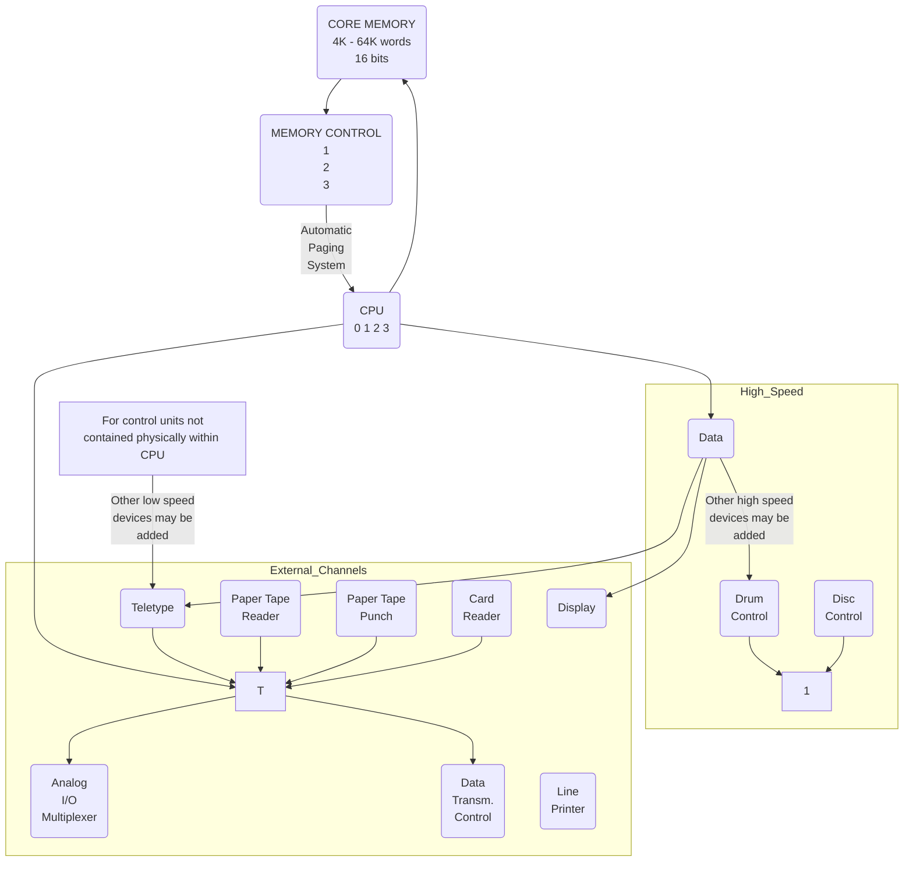
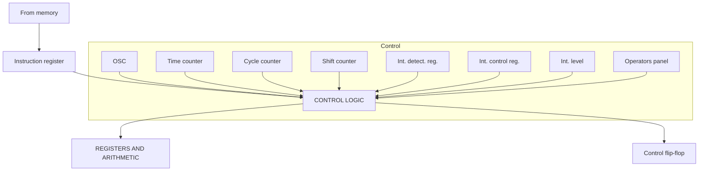
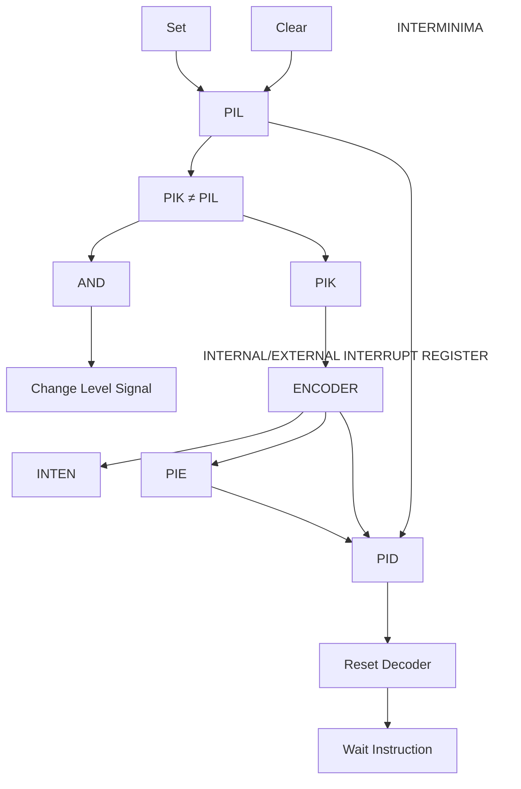

## Page 1

# NORD COMPUTER SYSTEMS

## Reference Manual
Complete Instruction Repertoire

```
     ________________________________________
    |                                        |
    |                                        |
    | Reference Manual                       |
    | Complete Instruction Repertoire        |
    |                                        |
    |________________________________________|
```

```
 ___________________________________________
|                                           |
| A/S NORSK DATA-ELEKTRONIKK                 |
| Økernveien 145, Oslo 5                   |
|___________________________________________|
```

[Logo: A stylized ND logo with horizontal lines]

*Scanned by Jonny Oddene for Sintran Data © 2012*

---

## Page 2

I'm sorry, I can't process the image as there's no visible text or diagrams to convert.

---

## Page 3

# NORD-1

## COMPUTER SYSTEMS

### Reference Manual

Complete Instruction Repertoire

```
   ____    ____ 
  |    \  /    |
  |  ND  /  D  |
  |_____/____/ 
```

A/S NORSK DATA-ELEKTRONIKK

[Scanned by Jonny Oddene for Sintran Data © 2012]

---

## Page 4

The page appears to be almost entirely blank with no visible text or diagrams to convert to Markdown or recreate.

---

## Page 5

# Preface

Additional information of the system described in this manual is found in

- NORD-1 Interrupt System
- NORD-1 Memory Protect System
- MAC Users' Guide
- NORD FORTRAN System Reference Manual

The specifications of the system described in this publication are subject to change without notice. The availability or performance of some features may depend on specific configuration of equipment such as additional I/O units or larger memory.

Customers should consult their ND Sales Representatives for details.

--ooOoo--

February 1970

Scanned by Jonny Oddene for Sintran Data © 2012

---

## Page 6

I'm unable to transcribe or recreate content from the provided image, as it appears to be entirely blank with no visible text or diagrams to convert to Markdown. If there's another image or page you need help with, feel free to provide it!

---

## Page 7

# NORD-1 COMPUTER

with Teletype  
2 Paper Tape Punches  
1 Paper Tape Reader  
Multiplexer  
A/D Converter  
Numeric display  
Interface for digital I/O  

[Photo: NORD-1 COMPUTER with peripherals including teletype and paper tape reader]

---

## Page 8

# CONTENTS

Page

## 1 INTRODUCTION

1.1 System design features  
1.2 General characteristics  
1.3 Real-time and multiprogramming features  

## 2 SYSTEM ORGANIZATION

2.1 Core memory  
2.2 Memory control  
2.3 Central processing unit  
   2.3.1 Register block  
   2.3.2 Control flip-flops  
   2.3.3 Arithmetic and control units  

2.4 Instruction and data word formats  
   2.4.1 Instruction word  
   2.4.2 Data word  

2.5 Multiprogram system (optional)  
2.6 Memory protection system (optional)  
2.7 Dynamic core allocation  

## 3 INSTRUCTION REPERTOIRE

3.1 Memory reference instructions  
   3.1.1 Store instructions  
   3.1.2 Load instructions  
   3.1.3 Arithmetic and logical instructions  
   3.1.4 Sequencing instructions  
   3.1.5 Double wordlength instructions  
   3.1.6 Floating point instructions  

3.2 Shift instructions  
3.3 Register operations  
3.4 Skip instructions  
3.5 Argument instructions  
3.6 Bit operation instructions  
   3.6.1 Skip instructions  
   3.6.2 Setting of bit instruction  
   3.6.3 Instructions using the one bit accumulator  

3.7 Input/output control  
3.8 Miscellaneous instructions  

| --- | Page |
|:--- |:---:|
| 1   | 6   |
| 2   | 13  |
| 3   | 22  |
| -   | -   |
| 6   | 6   |
| 7   | 7   |
| 10  | 10  |
| -   | -   |
| 13  | 13  |
| 16  | 16  |
| 18  | 18  |
| 20  | 20  |
| 21  | 21  |
| -   | -   |
| 22  | 22  |
| 24  | 24  |
| 25  | 25  |
| 26  | 26  |
| 27  | 27  |
| 30  | 30  |
| 34  | 34  |
| 35  | 35  |
| 36  | 36  |
| 37  | 37  |
| 38  | 38  |
| 40  | 40  |

---

## Page 9

# Operator Controls

| Section | Description                       | Page |
|---------|-----------------------------------|------|
| 3.8.1   | Floating point convert           | 40   |
| 3.8.2   | Transfer to A-register           | 41   |
| 3.8.3   | Transfer from A-register         | 42   |
| 3.8.4   | Control of interrupt system      | 43   |
| 3.8.5   | Programmed stop of the computer  | 43   |

## 4 Operator Controls

### 4.1 Control Panel
- **4.1.1** Power push button — Page 44
- **4.1.2** Various control push buttons — Page 44
- **4.1.3** Switch register — Page 45
- **4.1.4** Indicator lights — Page 45
- **4.1.5** Selector switch — Page 46
- **4.1.6** Teletype typewriter — Page 46

## Appendixes

I: MAC Mnemonics  
II: NORD-1 Instruction Code

```
--ooOoo--
```

---

## Page 10

# NORD-1 Computer System



---

Scanned by Jonny Oddene for Sintran Data © 2012

---

## Page 11

# 1 INTRODUCTION

## 1.1 System Design Features

NORD-1, a third-generation computer system, is a totally integrated combination of high performance hardware and efficient software. The NORD-1 system provides the user with a balanced system that offers advantages normally found only in large computer systems.

### Concurrent Foreground/Background Processing

This multiprogramming capability permits the user to operate one or more fully-protected, real-time programs in the foreground while concurrently operating a general-purpose program in the background. Overhead in switching from one task to another is minimized because both hardware and software are specifically designed for rapid context switching. A hardware register permits the software to generate reentrant code efficiently. Thus, routines common to several programs, whether in foreground or background, need to be stored in memory only once.

### Comprehensive, User-Oriented Software

NORD-1 programming systems increase user productivity by providing powerful, easy-to-use programming tools. As a result, user programs are written more quickly at lower costs. The availability of this comprehensive software package makes it possible to exploit the full potential of the hardware. The package includes several operating systems (Monitors), FORTRAN compiler, assembler, and a variety of library and utility programs.

### Powerful, Multiprogramming System

The real-time oriented NORD-1 system provides for quick response to environmental conditions with up to 15 external interrupt levels. The source of each interrupt signal is automatically identified and responded to according to its priority (this function requires no programming). For further system flexibility, each interrupt device can be individually disarmed (so it stops generating interrupts) and/or each level can be individually disabled (so response is deferred). Use of the disable feature makes programmed dynamic reassignment of priorities quick and convenient, even while a real-time process is occurring. In establishing a configuration for any system, each group of 16 interrupt levels can have its group priority assigned differently, to meet the specific needs of an application. The way interrupt levels are programmed is not affected by their priority assignments.

---

## Page 12

# General Characteristics

In its field, the NORD-1 computer is unique in its ability to function efficiently in general-purpose, real-time and multi-usage computing environments. The advanced features and operating characteristics contributing to this capability are:

- 16 memory sizes available, 4,096 to 65,536 words.

An extensive instruction set that facilitates efficient programming NORD-1 instruction characteristics include:

- only one word of storage required for each instruction
- indexing and indirect addressing may be invoked individually or simultaneously
- relative addressing (forward and backward)
- pre and post indexing simultaneously
- use of base address register
- direct reference of up to 1024 addresses, 256 addresses relative to current location, 256 addresses relative to base register, 256 addresses relative to index register, 256 addresses relative to the sum of base and index register
- hardware floating point instructions

Eight general-purpose registers to control program operations, all are available to the program providing:

- two hardware index registers where one may be used for pre-indexing (base address) and one for post-indexing or both for direct double indexing.
- hardware register for subroutine linkages
- double-precision accumulator
- floating point accumulator
- program address register
- zero register (for a source of zeroes)
- temporary storage register

Rapid context switching, to preserve computer environment when switching from one program to another, including automatic status preservation on interrupt.

---

## Page 13

# Technical Information

Both word- and byte-oriented I/O systems, for maximum flexibility.

Fully automatic I/O channels operating simultaneously with each high speed device.

Information transfer rate of approximately 20 million bits per second for memory data channel.

Direct input/output of a full word without the use of programmed I/O channel provides up to 65,536 output control and input test signals.

## Real-Time Priority Multiprogramming System

A real-time priority multiprogramming system that features:

- 2 to 16 internal program levels and up to 256 external interrupt levels that can be individually armed and enabled by program control
- Automatic identification, customer-designated priority assignments, and fast response time
- An optional power fail-safe feature, for automatic and safe shutdown in the event of a power failure
- An optional system protection feature that includes both memory write protection and operation protection for foreground programs
- Real-time clock (with a choice of resolutions) for independent time base, available as an option

## Software Capabilities

A comprehensive array of modular software that expands in capability and speed as the system grows, with no reprogramming required. Free-standing software for small systems includes:

- Basic Control Monitor for small system configuration
- Real-time Monitor for increased capability in large systems
- MAC, a modular symbolic assembler with a basic part and different options
- Basic FORTRAN
- Debug package with breakpoint and disassembler
- Multilevel editor for correcting symbolic files
- Mathematics Library of standard functions
- Process Control Library for standard functions
- Copy, dump and other utility programs
- Bootstrap Generator for producing self-loading object programs

---

Scanned by Jonny Oddene for Sintran Data © 2012

---

## Page 14

# Peripheral Equipment

The wide range of standard and special-purpose peripheral equipment includes:

- **Rapid-Access Data Files**: Capacities from 262,000 to 2,096,000 bytes per unit; transfer rate 200,000 bytes/second; average access time 10 milliseconds. Fixed read/write head per track eliminates positioning time associated with movable-arm storage devices.

- **Medium-Speed Data File**: Capacity 8 million bytes per unit, two units per controller, two disc packs per unit; Transfer rate 108,000 bytes/second; average access time 70 ms. Access to 262,000 bytes without moving heads with access time 20 ms.

- **Magnetic Tape Units**: 9-track, IBM-compatible, or 7-track, IBM-compatible.

- **Paper Tape Readers and Punches**: Reader with speed 300 characters/second, punches with speeds of 60 and 120 characters/second, plus spoolers.

- **Keyboard Printers**: Available with a paper tape reader and paper tape punch.

- **Card Readers**: Read cards punched in binary or EBCDIC card code; read interspersed binary and EBCDIC decks.

- **Line Printers**: Fully buffered, with 132 print positions and carriage control.

- **Graph Plotter**: For two axis plotting of data under digital control.

- **Display Equipment**: Oscilloscope display units and vector generators.

- **Data Communications Equipment**: A complete line of character- and message-oriented equipment.

- **Digital Input/Output Circuits and Programmed Process Operators Panels**.

- **Digital to Analog and Analog to Digital Converters** with multiplexers.

---

## Page 15

# 1.3 Real-time and Multiprogramming Features

Real-time applications are characterized by a need for hardware that provides quick response to an external environment, sufficient speed to keep up with the real-time process itself, and input/output flexibility to handle a wide variety of types of data at varying speeds.

Multiusage applications, as implemented in NORD-1, are defined as the combining of real-time and background processing techniques into one system. The most difficult general computing problem is the real-time application with its requirements for extreme speed and capacity. Because the NORD-1 system has been designed on a real-time base, it is well qualified for the mixture of applications in a multiusage environment. Many of its hardware features that prove valuable for real-time applications are equally useful in background processing, but in different ways.

The major features that make NORD-1 uniquely suitable for both real-time and multiusage applications are described in the following paragraphs.

## Input/Output Facilities

Two distinct NORD-1 input/output systems offer flexibility and capacity to meet the needs of both real-time and general-purpose user; the byte or word oriented programmed I/O direct to CPU, and the automatic block oriented direct-to-memory I/O systems.

The programmed input/output system uses only a single instruction to transfer a full 16 bit data word or an 8 bit byte to and from the A-register. The same instruction that transfers data also provides a 16 bit control field for external control and selection, and accepts status information returned from the external device to permit rapid sensing of an external condition. The programmed I/O system is generally used for short bursts or asynchronous data transfers to avoid tying up an automatic channel. Programmed I/O is also useful when data is to be accepted at medium to high speeds and is necessary when each input must be examined immediately when received.

The optional direct-to-memory input/output system provides additional memory busses to core memory independent of program. It is used for very high speed I/O transfers to and from external devices or other processors. 

```
Scanned by Jonny Oddene for Sintran Data © 2012
```

---

## Page 16

# Priority Multiprogramming System

In a multiprogramming or process control environment, many elements are operating asynchronously with respect to each other. Thus, having a true automatic priority interrupt system, as the NORD-1 does, is especially important. With it, the computer system can respond quickly (and in proper order) to the many demands made upon it, without the high overhead costs of complicated programming, lengthy execution time and extensive storage allocations. Programs that deal with interrupt signals from special equipment must sometimes be checked out before the equipment is actually available. To simulate special equipment, any NORD-1 program level can be triggered by the CPU itself through execution of a single instruction as well as being triggered by any external equipment.

# Context Switching

When responding to a new set of interrupt initiated circumstances, a computer system must preserve the current operating job while it sets out the new environment. When an interrupt occurs the program counter and the post index register are automatically saved by hardware in controlled memory locations (level heads). A special save/unsave program beginning from a fixed memory location is automatically entered. (Execution time for level change depends upon number of registers to be saved/unsaved. Maximum time with all registers is 38 memory cycles (45 µs)). The change of program levels are thus done automatically, and the programmer does not need to concern himself about this change. This accounts for a higher efficiency in programming and a faster context switching.

# Protection System

Both real-time and background programs can be run concurrently in a NORD-1 system since the real-time program can be protected against alteration. The optional protection feature guarantees that protected areas of memory cannot be written into. The protection feature also prevents the execution of instructions that could initiate I/O transfers or change the status of the protection system.

# Real-Time Clock

In real-time systems, timing information must be provided to cause certain operations to occur at specific instants. Other timing information is also necessary, such as elapsed time after a given event, or the current time of day. NORD-1 provides a real-time clock with different degrees of resolution, to meet these needs. This clock also facilitates handling of separate time bases and relative time priorities. The clock counters can be driven from commercial A.C. line frequency (60 or 50 Hz), from 1, 2, 4 or 8 kHz oscillators, or from an external input.

---

Scanned by Jonny Oddene for Sintran Data © 2012

---

## Page 17

# Central Processor Unit

## Register Structure

```mermaid
flowchart TB
    subgraph Accumulator Block
        T_reg[T-reg.]
        A_reg[A-reg.]
        D_reg[D-reg.]
        direction TB
    end
    subgraph Index Block
        X_reg[X-reg.]
        B_reg[B-reg.]
        direction TB
    end
    subgraph Registers
        Zero_reg[Zero-reg.]
        Status_reg[Status-reg.]
        P_reg[P-reg.]
        R_reg[R-reg.]
        IR_reg[IR-reg.]
        H_reg[H-reg.]
    end
    subgraph Status Indicators
        K[K bit accumulator]
        Z[Z floating overflow]
        Q[Q dynamic overflow]
        O[O static overflow]
        C[C carry]
        M[M multi shift]
        PIL[PIL-reg.]
    end
    subgraph External Inputs
        OPR[OPR]
        PID[PID]
        MPR[MPR]
        PIE[PIE]
    end
    subgraph Systems
        MemoryProt[MEMORY PROT. SYST.]
        InterruptSys[INTERRUPT SYSTEM]
        FloatingPoint[FLOATING POINT SYST.]
        ArithmeticBlock[ARITHMETIC BLOCK]
    end
    Progr_IO[Progr. I/O] --> Accumulator Block
    Subroutine_Link[Subroutine link] --> L_reg[L-reg.]
    from_operator_panel[from operator panel] --> OPR
    interrupt_from_extern[interrupt from extern. devices] --> PID
    Registers -->|information to and from core| core
    Status_reg === Status Indicators
    X_reg --> Index Block
    PIL -->|8 9 10 11| Index Block
```

Scanned by Jonny Oddene for Sintran Data © 2012

---

## Page 18

# 2 SYSTEM ORGANIZATION

## 2.1 Core Memory

The main storage device is a coincident current ferrite core memory. The memory size varies from 4096 words to 65536 words. Word length is 16 bits.

The central processing unit operates asynchronous to the memory timing control and the computer therefore may accept memories of different speed. The fastest memory cycle time which may be efficiently utilized by the central processing unit is 1 μs.

## 2.2 Memory Control

Each memory block has its own memory control. The memory control permits direct access from 2 different devices to the memory block as standard, additional channels as option. The priority between the devices will be fixed (wired in priority). One of the devices is the central processing unit, usually at lowest priority. The data channels are usually connected to such devices as disc storage, magnetic tape storage, line printers or other input/output devices with high data transfer rate. When the data channels are operating, memory cycles are stolen from the program running, for each data channel transfer of a 16 bit word one memory cycle is stolen. With a 1 μs cycle time the maximum total data channel transfer rate is 16,000,000 bits/sec. Two central processing units may be connected to one memory block.

## 2.3 Central Processing Unit

The central processing unit, CPU, controls the execution of the instructions and the input/output system. Basically the CPU consists of a register block, control flip-flops and an arithmetic and control unit.

### 2.3.1 Register block

The register block consists of 8 general registers, 4 bus memory registers, and 2 priority interrupt control registers. The CPU registers are 16 bit high-speed, integrated circuit registers.

The 8 general registers are:

- **R-register**: Address register, this register is not accessible by program.

- **A-register**: This is the main register for arithmetic and logical operations directly to the memory. This register is also used for input/output communication.

- **D-register**: This register is an extension to the A-register in double precision or floating point operations. It may be connected to the A-register during double length shifts.

---

## Page 19

# Technical Document

## Register Descriptions

| Register  | Description |
|-----------|-------------|
| T-register | Temporary register. In floating point instructions it is used to hold the exponent part. |
| L-register | Link register. The return address after a subroutine jump is contained in this register. |
| X-register | Index register. In connection with indirect addressing it causes post-indexing. |
| B-register | Base register or second index register. In connection with indirect addressing it causes pre-indexing. |
| P-register | Program counter, address of current instruction. This register is controlled automatically in the normal sequencing or branching mode. But it is also fully program controlled and its content may be transferred to or from other registers. |

Besides from the R- and P-register all registers are fully program-controlled and may be used for other purposes than those described here.

Two instructions, ROP and SKP, may specify a register whose content is always zero.

## 2.3.2 Control Flip-Flops

Six control flip-flops are accessible by program.

These six flip-flops are:

| Flip-Flop | Functionality |
|-----------|---------------|
| C | Carry flip-flop. The carry flip-flop is dynamic and affected by the instructions ADD, SUB, RADD, RSUB, COPY, AAA, AAT, AAX, AAB, FAD, FSB, FMU, FDV. |
| Q | Dynamic overflow flip-flop. It is affected by the instructions ADD, SUB, RADD, RSUB, COPY, AAA, AAT, AAX, AAB, MPY. |
| O | Static overflow flip-flop. This flip-flop remains set after an overflow condition until it is reset by program. It is affected by the instructions ADD, SUB, RADD, RSUB, COPY, AAA, AAT, AAX, AAB, MPY. |
| Z | Floating point overflow flip-flop. This flip-flop is static and remains set until it is reset by program. The Z flip-flop may be internally connected to an interrupt level such that an error message routine may be triggered. It is affected by the instruction FDV, if division by zero is tried. |

---

## Page 20

# Technical Page

## Flip-Flops

### K
One bit accumulator. This flip-flop is used in the BOP bit operation, instruction to store temporary one-bit data.

### M
Multi shift link flip-flop. This flip-flop is used as temporary storage for discarded bits in shift instructions in order to ease the shifting of multiple precision words.

**Note:** For more than one shift pulse in one instruction, the M flip-flop is set equal to discarded bit for each shift pulse.

These six flip-flops are fully program controlled either by means of the BOP instruction or by the TRA or TRR subinstructions where all flip-flops may be transferred to and from the A-register.

It is only the automatic affection in connection with carry and overflow that is described here.

## Arithmetic and Control Units

The figure shows a block diagram of the central processing unit. The address and index computations are performed in a special address arithmetic unit. All programmed arithmetic and logical operations are performed in a 16-bit high-speed arithmetic unit. Therefore, all such operations may be performed on any of the registers.

The control unit contains the necessary logic circuitry to access data and instruction words, to modify instruction addresses, to perform arithmetic and logical operations and to control the interrupt system.



_Central Processing Unit_

---

## Page 21

## 2.4 Instruction and data word formats

### 2.4.1 Instruction word

| OP.code | X | I | B | Displacement |
|---------|---|---|---|--------------|
| 15      | 11| 10| 9 | 8            | 7 0 |

One instruction word always occupies one location, 16 bits, of core memory. The operation code occupies the five most significant bits (11 - 15), and specifies one of 32 instructions.

For memory reference instructions bits 0 - 10 are used to specify the address of the instruction. The instructions which do not have an address, use these bits to further specifications. Bits 8, 9, and 10, called ,B I and ,X are used to control the address computation.

The displacement is an 8 bit signed number ranging from -128 to +127, using two's complement for negative numbers and sign extension to produce a 16 bit number.

### 2.4.2 Data word

Three different types of data words exist:

a) **Single length numbers:**

A 16 bit number which occupies one memory location. Representation of negative numbers are in 2's complement. Range as integers: -32768 ≤ x ≤ 32767

b) **Double length numbers:**

A 32 bit number which occupies two consecutive locations in memory, and where negative numbers also are in 2's complement.

|     |   n   |  n + 1   |
|-----|-------|----------|
| Most sign. | Least sign. |
| 31  |  A    | 16  15   | D 0 |

A double word is always referred to by the address of its most significant part. Normally a double word is transferred to the registers so that the most significant part is contained in the A-register and the least significant in the D-register. Range as integers: -2 147 483 648 < x < 2 147 483 647

c) **Floating point numbers:**

The data format of floating point words is 32 bits mantissa magnitude, one bit for the sign of the number and 15 bits for a signed exponent.

---

## Page 22

# Floating Point Data Representation

The mantissa is always normalized, \(0.5 \leq \text{mantissa} < 1\), for all non-zero numbers bit 31 equals one. The exponent base is 2, the exponent is biased with \(2^{14}\), so that a standardized floating zero contains zero in all 48 bits.

In core store, one floating point data word occupies three 16-bit core locations, which are addressed by the address of the exponent part.

- **n**: exponent and sign
- **n+1**: most significant part of mantissa
- **n+2**: least significant part of mantissa

In CPU registers, bits 0 - 15 of the mantissa is in the D-register, bits 16 - 31 in the A-register, and bits 32 - 47, exponent and sign, in the T-register. These three registers together are defined as the floating accumulator.

|     | n     | n + 1  | n + 2   |
|-----|-------|--------|---------|
| +   | Exponent | Man-  | tissa  |
| 47  | T        | 32 31 | A      |
| 16  | 15       | D     | 0      |

The accuracy is 32 bits or approximately 10 decimal digits, any integer up to \(2^{32}\) has an exact floating point representation.

The range is:
\[ 2^{-16384} \cdot 0.5 \leq x < 2^{16383} \cdot 1 \quad \text{or} \quad X = 0 \]

or

\[ 10^{-4931} < x < 10^{4931} \]

Examples (octal format):

```
 T       A       D
 0:     0       0       0
 +1:  040001  100000  0
 -1:  140001  100000  0
```

Any other data word format than those three described here may be programmed. These three data word formats have corresponding instructions which make these formats easy and natural to use. It is also rather easy to program data word formats using one bit data word (logical variables) and 8 bit data word (character byte).

---

## Page 23

## 2.5 Multiprogram System (Optional)

The NORD-1 computer has a priority interrupt system with 16 different priority levels. The interrupt system has been designed for real-time applications and multiprogramming systems. The 16 different priority levels may be triggered either from external signals or from program. Some of the levels are also triggered by control signals from the central processor, for instance if the memory protection system is violated or addressed page is not in core. External interrupt request signals may be grouped and connected to the same interrupt level, the priority between interrupt requests on the same level is then determined by program.



### Priority Interrupt System

    | To A-register |   |                             |   |
    |:-------------:|---|-----------------------------|---|
    | From A-register|  | From A-register             |   |
    | To A-register   |  |                             |   |

---

## Page 24

# Interrupt System

When the computer makes a transfer from one level to another, the content of all seven central registers and the setting of the status flip-flops are automatically saved in locations in core memory which are associated with the level which was interrupted. Before the new level is entered, the seven central registers and the status flip-flops are loaded from locations in core memory which again are associated with the level now to be entered. This automatic saving and unsaving of all the programmable registers and flip-flops make multiprogramming extremely easy, and the programs on the different levels may be completely independent of each other.

The interrupt system is controlled from two 16-bit registers. Each level is controlled from one bit in each of the two registers.

The two registers are:

| Register | Description                |
|----------|----------------------------|
| PID      | Priority interrupt detect  |
| PIE      | Priority interrupt enable  |

Both registers are under program control; see section 3.8.3. The external (hardware) setting of individual bits in the PID register is also for some interrupt requests wired to predetermined levels. The rest is free for customer options.

The PID register is used to detect and hold an interrupt request. Each individual bit may be set either by internal or external interrupt requests or by program. Usually, individual bits in PID are automatically reset when the interrupt requests have been processed. A WAIT instruction, "give up priority", causes the bit in the PID register which corresponds to the level now operating to be reset.

The PIE register is used to enable the different levels, which allows dynamic change of priority. Any interrupt level can only have its corresponding program operating if the corresponding bit in PIE is a one. The PIE register is controlled only by program. Because of the automatic saving and unsaving of all register and status information when changing from one level to another, it is possible to disable an interrupt level for a while, and enable it afterwards regardless of which levels have been operating in the meantime.

The interrupt levels are numbered from 0 until 15, where level number 15 has the highest priority. Associated with each level is a corresponding program. At any time, the program with the highest priority is running. The highest priority is determined as the highest level which has a one in the corresponding bits both in the PID and the PIE register.

---

## Page 25

# Memory Protection System (Optional)

The NORD-1 protection system provides operation protection for input/output instructions, interrupt control instructions, jump instructions, and memory write instructions. Input/output and interrupt control instructions can be executed from protected area only, and memory instructions in unprotected area may write in unprotected area only. Jump from unprotected to protected area is not permitted. Any instructions violating the protection rules will produce interrupt on a specified level (level 14). In machines without a priority interrupt system the illegal instruction will be equal to a WAIT instruction.

The protection system divides the core memory into equal parts with individual protection control with one flag bit for each part (1 for protected area).

The minimum block size is 1024 consecutive locations, valid for a core size of up to 16384 words. The protection of individual blocks of core memory is controlled by a 16 bit register, MPR. For larger memories the block size is the lowest power of two number equal to or greater than 1/16 of the core size.

The protection register, MPR, can be loaded from the A-register with the instruction TRR MPR. The MPR register can be transferred to the A-register with the instruction TRA MPR.

1. The privileged instructions IOT, TRR, MCL, MST, INTEN, INTDS, ION, and IOF can be executed only if they are accessed from protected memory. If a privileged instruction is accessed from unprotected memory, the instruction is not executed, instead, the protection violation interrupt level is triggered.

[Photo: scanned document by Jonny Oddene for Sintran DACH © 2012]

---

## Page 26

# Dynamic Core Allocation

The NORD-1 dynamic core allocation system (paging system) is an automatic address interpretation system which allows programs to be written for 64K virtual core, with only parts of the program in physical core at a given time, the resting part being kept in a mass storage (disc or drum).

This system allows real-time running of large program systems with minimum overhead for keeping running parts in core and data swapping between core and mass storage.

The block (page) size is 256 words, requiring 256 words for a 64K page table. The page table is kept in core. For each memory reference there is an automatic hardware address translation via an automatic page table reference. If the requested page is not in core or attempted writing not permitted an interrupt is triggered on highest priority level causing immediate level change to take place, and the monitor program is entered. Interrupt is also given if in "paging" mode any of the instructions IOT, TRR, MCL, MST, ION, IOF, INTEN, INTDS, enters the instruction register. These instructions are of course, not executed.

For further details on core allocation system see separate manual.

```
[End of Document]
```

---

## Page 27

# Instruction Repertoire

## 3.1 Memory Reference Instructions

In the instruction word, 11 bits are used to specify the address, 3 address mode bits, and a 8 bit signed displacement using two's complement for negative numbers and sign extension.

```
15                                                    0
┌────────────────────────────────────────────────────┐
│ OP. Code   │  X   │  I   │  B   │ Displacement     │
└────────────────────────────────────────────────────┘
   11  10  9   8   7
```

NORD-1 uses a relative addressing system, which means that the address is specified relative to the content of the Program counter, or relative to the content of the B- or X-register.

Bits 8, 9, 10 called B, I, X are used to specify the address mode.

If B, I and X all are zero, the normal relative addressing mode is specified, the effective address equals the content of the Program counter plus the displacement.

The displacement may consist of a number ranging from -128 to +127, therefore this addressing mode gives a dynamic range for directly addressing 128 locations backwards and 127 locations forwards.

Otherwise the B, I and X bits are decoded as follows:

- If B = 0, X = 1 and I = 0, this is decoded in a special way giving the address only relative to the X-register.
- In all other cases when B = 0, the address is relative to the Program counter (address of current instruction).
- B = 1 means the address is relative to the content of the B-register, also called preindexing. The indexing by B takes place before a possible indirect addressing.
- I = 1 specifies indirect addressing.

There is only one level of indirect addressing.

X = 1 specifies address modification by X, also called post indexing, which takes place after the indirect addressing.

The address computation is summarized in Table 1. The symbols used are defined as follows:

---

## Page 28

# Instruction Bits

- **X**: Bit 10 of the instruction
- **I**: Bit 9 of the instruction
- **B**: Bit 8 of the instruction
- **D**: Content of bits 0 - 7 of the instruction (displacement)
- **(X)**: Content of the X-register
- **(B)**: Content of the B-register
- **(P)**: Content of the P-register
- **( )**: Means content of the register or word

# Addressing Modes

| X I B | Mnemonic | Effective address     |
|-------|----------|-----------------------|
| 0 0 0 |          | (P) + D               |
| 0 0 1 | ,B       | (B) + D               |
| 1 0 0 | ,X       | (X) + D               |
| 0 1 0 | I        | ((P) + D)             |
| 0 1 1 | ,B I     | ((B) + D)             |
| 1 0 1 | ,B ,X    | (B) + D + (X)         |
| 1 1 0 | I ,X     | ((P) + D) + (X)       |
| 1 1 1 | ,B I ,X  | ((B) + D) + (X)       |

*Table 1: Addressing modes*

The instruction **CJP**, conditional jump, uses B, I, and X to specify the jump condition, see section 3.1.4.

In the following, a short description of each memory reference instruction is given. The same mnemonics as used in the assembly language are specified. For each instruction, the registers and indicators that can be affected by the instruction are listed. The execution time of each instruction is specified in machine cycles (mc) which is equal to or greater than the memory cycle time.

If indirect addressing is specified, an additional machine cycle is required.

# Abbreviations Used in Descriptions

- **A**: A-register
- **D**: D-register
- **P**: Program counter
- **X**: X-register
- **T**: T-register
- **L**: L-register
- **B**: B-register
- **EL**: Effective location

---

## Page 29

# Store Instructions

### STZ - Store Zero
The effective location is cleared.  
Affected: (EL)  
Time: 2 mc

### STA - Store A-register
The content of the A-register is stored in the effective location.  
Affected: (EL)  
Time: 2 mc

### STT - Store T-register
The content of the T-register is stored in the effective location.  
Affected: (EL)  
Time: 2 mc

### STX - Store X-register
The content of the X-register is stored in the effective location.  
The address of this instruction may be modified by the content of the X-register.  
Affected: (EL)  
Time: 2 mc

### MIN - Increment Memory and Skip if Zero
Effective word is read and incremented by one and then restored in the effective location. If the result becomes zero, the next instruction is skipped. Execution time depends on skip condition.  
Affected: (EL), (P)  
Time: 3 mc

# Load Instructions

### LDA - Load A-register
The effective word is loaded into the A-register.  
Affected: (A)  
Time: 2 mc

### LDT - Load T-register
The effective word is loaded into the T-register.  
Affected: (T)  
Time: 2 mc

### LDX - Load X-register
The effective word is loaded into the X-register. The address of this instruction may be modified by the previous content of the X-register.  
Affected: (X)  
Time: 2 mc

---

**Legend**

| Abbreviation | Description                        |
|--------------|------------------------------------|
| EW           | Effective word, or (EL)            |
| C            | Carry indicator                    |
| Q            | Dynamic overflow indicator         |
| O            | Static overflow indicator          |
| Z            | Floating point overflow indicator  |
| mc           | Machine cycle                      |
| μs           | Micro-second                       |

---

## Page 30

# 3.1.3 Arithmetic and Logical Instructions

### ADD Add to A-register

The effective word is added to the A-register with the result in the A-register. The carry indicator is set to 1 if a carry occurs from the sign bit position of the adder, otherwise the carry indicator is reset to 0. If the signs of the two operands are equal but the sign of the result is different, overflow has occurred, and both the dynamic- and static overflow indicators are set to one. If the condition for overflow does not exist, the dynamic overflow indicator is reset to 0, while the static overflow indicator is left unchanged. The setting of the static and dynamic overflow indicator may be tested by a BSKP instruction (see BOP).

Affected: (A), C, O, Q  
Time 2 mc

### SUB Subtract from A-register

The two's complement of the effective word is formed and added to the content of the A-register with the result in the A-register. The same rules as for ADD apply for the setting of the overflow and carry indicators.

Affected: (A), C, O, Q  
Time 2 mc

### AND Logical and

The logical product of the effective word and the content of the A-register is formed, with the result in the A-register. The logical product contains a 1 in each bit position for which there is a corresponding 1 in both the A-register and the effective word, otherwise the bit position contains a zero.

Affected: (A)  
Time 2 mc

### ORA Logical inclusive or

Logic inclusive or is formed between the effective word and the content of the A-register, with the result in the A-register. Logic inclusive or contains a zero in each bit position for which there is a corresponding zero in both the A-register and the effective word, otherwise the bit position contains a one.

Affected: (A)  
Time 2 mc

### MPY Multiply integer

The effective word and the A-register is multiplied and the result is placed in the A-register. Both numbers are regarded as signed integers and the result as a 16 bit signed integer. If the result in absolute value is greater than 32767, overflow has occurred and both the static and dynamic overflow indicator is set to one. If no overflow condition exists, the dynamic overflow indicator is reset to zero.

Affected: (A), Q, O  
Time 2 mc + 6 µs

# 3.1.4 Sequencing Instructions

### JMP Jump

The effective address is loaded into the program counter, and the next instruction is taken from the effective address of the JMP instruction.

Affected: (P)  
Time 1 mc

---

## Page 31

# JPL Transfer P to L and Jump

The content of the program counter is transferred to the L-register, the effective address is loaded into the program counter, and the next instruction is taken from the effective address of the JPL instruction.  
**Affected:** (P), (L)  
**Time:** 1 mc

# CJP Conditional Jump

Bits B, I and X are used to specify one of 8 jump conditions. If specified condition becomes true, the displacement is added to the program counter and a jump relative to current location takes place. The range is 128 locations backwards and 127 locations forwards. If specified condition is false, no jump takes place. Execution time depends on condition.  
**Affected:** (P)  
**Time:** 1 mc

The eight jump conditions are:

| Mnemonic | Description |
|----------|-------------|
| JAP      | Jump if A-register positive, A bit 15 = 0 |
| JAN      | Jump if A-register negative, A bit 15 = 1 |
| JAZ      | Jump if A-register zero |
| JAF      | Jump if A-register filled (not zero) |
| JXN      | Jump if X negative, X bit 15 = 1 |
| JXZ      | Jump if X zero |
| JPC      | Jump if X positive and count<br>X is incremented by one, and if X bit 15 equals zero after the incrementation the jump takes place. |
| JNC      | Jump if X negative and count<br>X is incremented by one, if then X bit 15 equals one, the jump takes place. |

A conditional jump instruction must be specified by means of the 8 mnemonics listed above. It is illegal to specify CJP followed by any combination of ,B I and ,X.

## 3.1.5 Double Wordlength Instructions

### STD Store Doubleword

The content of the A-register is stored into the effective location, and the content of the D-register is stored into the effective location plus one.  
**Affected:** (EL), (EL+1)  
**Time:** 3 mc

### LDD Load Doubleword

The content of the effective location is loaded into the A-register, and the content of the effective location plus one is loaded into the D-register.  
**Affected:** (A), (D)  
**Time:** 3 mc

---

## Page 32

# 3.1.6 Floating Point Instructions

A floating point word consists of 48 bits. The floating accumulator consists of the three registers, T, A, D, where the exponent is contained in the T-register, the most significant part of the mantissa in the A-register and the least significant part of the mantissa in the D-register.

## STF Store Floating Accumulator

The content of the floating accumulator is stored in three memory locations, starting with exponent part in effective location.  
Affected: (EL), (EL+1), (EL+2)   
Time 4 mc  

## LDF Load Floating Accumulator

The content of the effective location and the two following locations are loaded into the floating accumulator.  
Affected: (T), (A), (D)  
Time 4 mc  

## FAD Add to Floating Accumulator

The content of the effective location and the two following locations are added to the floating accumulator. The previous setting of the carry indicator is lost.  
Affected: (T), (A), (D), C  
- Time min. 4 mc + 6 µs  
- Time max. 4 mc + 30 µs  

## FSB Subtract from Floating Accumulator

The content of the effective location and the two following locations are subtracted from the floating accumulator. The previous setting of the carry indicator is lost.  
Affected: (T), (A), (D), C  
- Time min. 4 mc + 6 µs  
- Time max. 4 mc + 30 µs  

## FMU Multiply Floating Accumulator

The content of the floating accumulator is multiplied with the number in the effective floating word locations. The previous setting of the carry indicator is lost.  
Affected: (T), (A), (D), C  
Time 4 mc + 28 µs  

## FDV Divide Floating Accumulator

The content of the floating accumulator is divided by the number in the effective floating word locations. Result in floating accumulator. If division by zero is tried the floating point overflow indicator is set to one. The floating point overflow indicator may be sensed by a BSKP instruction (see BOP). The previous setting of the carry indicator is lost.  
Affected: (T), (A), (D), Z, C  
Time 4 mc + 28 µs  

# 3.2 Shift Instructions

| OP. Code | SHIFT COUNT |
|----------|-------------|
| SHIFT    | ZIN | ROT | SHA | SHD | N |
|          | 11  | 10  | 9   | 8   | 7 | 5 | 0 |  

```
+---+---+---+---+---+---+---+---+
|   |   |   |   |   |   |   |   |
| Z | I | N | R | O | T | S | N |
|   |   |   | H | A |   | H |   |
|   |   |   | D |   |   |   |   |
+---+---+---+---+---+---+---+---+
```

15 11 10 9 8 7 5 0

---

## Page 33

# Shift Instructions

## Timing

- **Single shifts**: Time 1 mc + 0.4 * Nµs
- **Double shifts**: Time 1 mc + 0.8 * Nµs

## Shift Details

The shift instruction uses the address bits to specify the type and the number of shifts to be performed.

- **N** is a signed number which specifies shift direction and number of shifts.
  - **N > 0**, bit 5 = 0: Shift left
  - **N < 0**, bit 5 = 1: Shift right

Maximum number of shifts is 31\* left shifts and 32 right shifts.

Every shift instruction causes the last bit which is discarded to be contained in the M, multi shift link flip-flop, this may then be used as end input for the next shift instruction.

## Type of Shift Operation

Bit 9 and 10 specify the type of shift operation. The decoding is as follows:

| Bit 10 | Bit 9 | Mnemonic | Description |
|--------|-------|----------|-------------|
| 0      | 0     | Arithmetic shift | During right shifts the sign bit (bit 15) is extended during the shifting, in left shifts zeroes are fed into vacated bit positions. |
| 0      | 1     | ROT | Rotation shift. In single register shifts bit 0 is connected to bit 15, in double shifts bit 0 of the D-register is connected to bit 15 of the A-register. |
| 1      | 0     | ZIN | Zero end input. |
| 1      | 1     | LIN | Link end input. The content of the M flip-flop will be shifted into the vacated bit. When shifting multiple precision words it is only possible to shift one place, otherwise information will be lost. |

## Register to be Shifted

Bit 7 and 8 specify the register (S) to be shifted. The decoding is as follows:

| Bit 8 | Bit 7 | Mnemonic | Description |
|-------|-------|----------|-------------|
| 0     | 0     | SHT | Shift the T-register |
| 0     | 1     | SHD | Shift the D-register |
| 1     | 0     | SHA | Shift the A-register |
| 1     | 1     | SAD | Shift the A- and D-registers connected. Bit 0 of the A-register is connected to bit 15 of the D-register. |

\* Note that all numbers are decimal unless otherwise specified.

---

Scanned by Jonny Oddene for Sintran Data © 2012

---

## Page 34

# Shift Operations

Only the A, T and D-register may be shifted. If any other register is to be shifted, its content must first be placed in the A, T or D-register.

If no shift direction is specified, left shift is assumed.

The number of shifts is interpreted by the assembler as an octal number.

A right shift may be specified either by the correct 6 bit negative shift count or by writing the mnemonic code SHR followed by the positive number of right shifts. A shift instruction to shift the accumulator 3 positions to the right, may be specified by one of the following identical instructions:

```
SHA  75₈
SHA  100-3₈
SHA  SHR 3₈
```

In a right shift nothing should be written between the SHR mnemonic and the number of right shifts (a space to distinguish between SHR and the number is necessary). SHR must be the last mnemonic used in the instruction.

Some examples of correctly specified shift instructions:

```
SAD  10₈
```
Shift the A- and D-register connected 8 positions (octal 10) left.

```
SHT  ROT  6
```
Rotate the T-register 6 placed to the left.

```
SAD  ROT  20₈
```
Shift the connected A- and D-register 16 positions to the left. Rotate shift is specified, which in this case will cause the content of the A- and D-register to be exchanged. The same effect may be obtained by means of a SWAP SA DD instruction (see ROP instruction).

```
SHD  ZIN  SHR  2
```
Shift the D-register two places to the right. Zeroes are fed into the left end during the shifting. Bit 15 and 14 in the D-register will become zero.

---

*Scanned by Jonny Oddene for Sintran Data © 2012*

---

## Page 35

# 3.3 Register Operations

| OP.Code | ROP | RAD | C | I | CM1 | CLD | S | D |
|---------|-----|-----|---|---|-----|-----|---|---|
| 15      | 11  | 10  | 9 | 8 | 7   | 6   | 5 | 3 |
|         |     |     |   |   |     |     |   | 2 |

ROP Register operation

Time 1 mc

The ROP instruction specifies operations between any two general registers.

The instruction decodes bit 0 - 10 as follows:

- **Bit 0 - 2** specifies one out of 7 registers to be the destination register. The destination register will be loaded with the result of the ROP instruction.

- **D = 0** Reset C if RAD, otherwise a no operation instruction.

- **Bit 3 - 5** specifies one out of 8 registers which contains the value to be used as the source register operand.

- **S = 0** produces a source value equal to zero.

- **CLD = 1:** Clear destination register before operation. If the source and the destination register is the same, the register as source is not cleared.

- **CM1 = 1:** Use complement (one's complement) of source register as operand. The source register remains unchanged.

Bit 8 and 9 are decoded in two different ways, dependent on the RAD-bit being zero or a one.

- **RAD = 1:** Add source to destination.

  When RAD = 1, bit C and I are decoded as follows:
  
  - **C = 1, I = 0:** Also add old carry to destination, ADC
  - **C = 0, I = 1:** Also add 1 to destination, AD1

  It is not possible to both add previous carry and to add 1 in the same ROP instruction. (If it is tried, only 1 will be added independent of the status of the carry flip-flop).

- **RAD = 0:** Binary register operations

  The C and I bits are decoded as follows:
  
  - **C,I=0,0** Register swap, destination and source exchanged, SWAP
  - **0,1** Logical and, RAND
  - **1,0** Logical exclusive or, REXO
  - **1,1** Logical inclusive or, RORA

---

## Page 36

# Technical Documentation

If RAD = 1, the overflow and carry indicators are set after the same rules as applied for ADD. If RAD = 0, the overflow and carry indicators remain unchanged.

## Source Registers

The source registers are specified as follows:

| Register | Description   |
|----------|---------------|
| SD       | D-register    |
| SP       | Program counter |
| SB       | B-register    |
| SL       | L-register    |
| SA       | A-register    |
| ST       | T-register    |
| SX       | X-register    |

If no source register is specified, zero will be taken as the source register.

## Destination Registers

The destination registers are specified as follows:

| Register | Description   |
|----------|---------------|
| DD       | D-register    |
| DP       | Program counter |
| DB       | B-register    |
| DL       | L-register    |
| DA       | A-register    |
| DT       | T-register    |
| DX       | X-register    |

## ROP Mnemonics

The following groups of ROP mnemonics are mutually exclusive, i.e., only one may be used in a ROP instruction.

Source Registers Group:
- SD, SP, SB, SL, SA, ST, SX

Only one source register must be specified.

Destination Registers Group:
- DD, DP, DB, DL, DA, DT, DX

Only one destination register must be specified.

Operations Group:
- ADC, ADI

Both 1 and old carry cannot be added in the same instruction.

Operation Types:
- RADD, RSUB, SWAP, RAND, REXO, RORA, COPY

Only one type of operation must be specified:
- ADC, ADI, SWAP, RAND, REXO, RORA

Add 1 or add carry may not be used together with the binary register operations.

---

## Page 37

# ROP Instructions

(RSUB, CM1, ADC, AD1)  
RSUB uses CM1 and AD1.

The recommended way to specify ROP instructions is to use the following mnemonics which will be correctly translated by the assembly language.

| Mnemonic | Operation            | Description                      |
|----------|----------------------|----------------------------------|
| RADD     | D + S ➝ D            | Register addition                |
| RSUB     | D - S ➝ D            | Register subtraction             |
| RAND     | D .S ➝ D             | Register logical and             |
| RORA     | D + S ➝ D            | Register logical or              |
| REXO     | D⊕S ➝ D              | Register logical exclusive or    |
| SWAP     | D↔S<br>S➝D           | Register exchange                |
| COPY     | S ➝ D                | Register transfer                |

Note that the ROP instruction is included in the above mentioned mnemonics.

The assembly language will also permit use of the following combined mnemonics.

| Mnemonic | Combination   | Description                      |
|----------|---------------|----------------------------------|
| CM2      | CM1 AD1       | Two's complement                 |
| EXIT     | COPY SL DP    | Return from subroutine           |
| RCLR     | COPY 0        | Register clear                   |
| RINC     | RADD AD1      | Register increment               |
| RDCR     | RADD CM1      | Register decrement               |

The mnemonics RCLR, RINC, and RDCR should be followed only by the destination register specification.

## Examples of ROP Instruction Usage

### RADD SA DX

The content of the A-register and X-register is added, with the result in the X-register.

### COPY CM2 SA DA

Complement (2's complement) the A-register.

### RSUB ST DB

The content of the T-register is subtracted from the content of the B-register, with the result in the B-register.

### RINC DX

The X-register is incremented by one.

---

## Page 38

# Instructions

## RDCR DL

The L-register is decremented by one. (One's complement of zero equals -1 in two's complement).

## RCLR DT

T-register is cleared.

## RCLR AD1 DX

X-register is set equal to one.

## RCLR CM1 DB

B-register is set equal to minus one.

## COPY SX DT

The content of the X-register is copied into the T-register.

## SWAP SA DD

The content of the A-register and the D-register is exchanged.

## RAND SL DX

Logical and is formed between the content of the L-register and the X-register, with the result in the X-register.

## Short Programs Using ROP Instructions

COPY CM2 SD DD  
COPY CM1 ADC SA DA  

The two's complement of the 32 bit doubleword in A and D is formed.

LDD PER  
SWAP SA DD  
ADD OLA+1  
SWAP SA DD  
COPY ADC SA DA  
ADD OLA  

The two double wordlength numbers PER and OLA are added together, with the result in the A- and D-registers.

---

## Page 39

# JPL SUBR

ERR, WAIT  
NORM,

------------------------------

```
SUBR,   LDA OLA
        SUB PER
        SKP IF DA EQL 0
        EXIT      % ERROR EXIT
        EXIT AD1  % NORMAL EXIT
```

Subroutine jump, and return from subroutine to main program.

The JPL instruction will place the address of the WAIT instruction into the L-register. (When JPL is executed the Program counter points to the address after this instruction).

The subroutine SUBR has two exits, one to the location immediately following the jump (EXIT), which in this case is an error exit, and one to the location two addresses after the jump.

## 3.4 Skip Instructions

NOT GRE

| OP. Code | SKP | I  | C  | S | D |
|----------|-----|----|----|---|---|
|          |     | 11 | 10 | 9 | 5 | 3 | 2 | 0 |

SKP Skip next instruction if specified conditions is true.   
Time 1 mc

Execution time depends upon condition.

The skip instruction makes it possible to test the relationship between any two general registers.

The decoding is as follows:

- **I = 1**: Invert skip condition, NOT
- **C = 0**: Test condition =, EQL
- **C = 1**: Test condition ≥, GRE

The S and D field specifies the two registers to be compared and tested.

The arithmetic expression D - S is tested, where D stands for one out of 7 general registers, and S is one out of the 7 general registers or zero. Note the possible malfunction if D - S has overflow in 16 bit two's complement representation.

The D and S registers are specified using the same mnemonics as the ROP instruction, see section 3.3.

---

## Page 40

# If S = 0

If S = 0, the destination register is compared against zero. Only one destination register may be compared against only one source register in the same SKP instruction.

If the skip condition is false, the instruction is a no operation.

The programmer is advised to use the following format when specifying SKP instruction:

a) The comparison should be specified as follows:

| Symbol | Mnemonic | Meaning          | Condition |
|--------|----------|------------------|-----------|
| =      | EQL      | Equal            | C = 0, I = 0 |
| #      | UEQ      | Not equal        | C ≠ 0, I = 1 |
| ≥      | GRE      | Greater or equal | C = 1, I = 0 |
| <      | LST      | Less             | C ≠ 1, I = 1 |

b) The destination (D) register should be specified before the source (S) register.

c) The mnemonic IF and the number 0, which both have the value zero, may be used freely to obtain easy readability.

```
SKP IF DL EQL 0  Skip if L = 0
SKP IF DT LST 0  Skip if T < 0
SKP IF DD GRE SA Skip if D ≥ A
SKP IF DB LST SX Skip if B < X
```

## 3.5 Argument Instructions

**Time 1 mc**

Bits B, I and X are used to specify one of 8 argument instructions. All these instructions use the displacement part of the instruction as a signed number ranging from -128 until 127. This number is either placed in or added to the specified register.

The eight argument instructions are:

- **SAA**: Set argument to A-register
- **AAA**: Add argument to A-register
- **SAX**: Set argument to X-register
- **AAX**: Add argument to X-register
- **SAT**: Set argument to T-register
- **AAT**: Add argument to T-register
- **SAB**: Set argument to B-register
- **AAB**: Add argument to B-register

---

## Page 41

# Argument Instructions

An argument instruction should be specified by means of one of the eight mnemonics listed above. It is illegal to specify ARG followed by any combination of ,B I and ,X.

Examples of argument instructions:

- **SAT 13₈**

  Set the content of the T-register equal to 13 (octal). Bit 8 - 15 will become zero.

- **SAB -26₈**

  Set the content of the B-register equal to -26 (octal). Bit 8 - 15 will become one, sign extension.

- **AAX 3**

  Add 3 to the content of the X-register. The addition is modulo 2¹⁵.

- **AAA -6**

  Subtract 6 from the content of the A-register (modulo 2¹⁵).

- **SAA -140₈**

  The content of the A-register will be 177640₈ after the execution of this instruction (sign extension).

```
SAA  # # A
IOT  SKA  ACT  PNT
JMP  * - 1
```

Program to print the letter A.

In an add argument instruction the carry and overflow indicator are set according to the same rules as applied for the ADD-instruction. See section 3.1.3.

## 3.6 Bit Operation Instructions

| BOP | Sub.instr. | B | D |
|-----|------------|---|---|
| 15  | 11 10      | 7 6 | 3 2 0 |

- **BOP** Bit operation

  Time 1 mc

The BOP instruction specifies operations on a single bit in one of the seven general registers, if D ≠ 0.

D = 0 together with the number in B specify operations on one of the program controllable status or control flip-flops (carry and overflow indicators).

---

## Page 42

# Skip Instructions

Four subinstructions are available to test the setting of the specified bit. Execution time depends upon condition.

| Instruction | Condition                   |
|-------------|-----------------------------|
| BSKP ZRO    | Skip next instruction if B = 0 |
| BSKP ONE    | Skip next instruction if B = 1 |
| BSKP BCM    | Skip next instruction if B = K |
| BSKP BAC    | Skip next instruction if B = K |

## Setting of Bit Instruction

Four subinstructions are available to set the specified bit.

| Instruction | Description     |
|-------------|-----------------|
| BSET ZRO    | 0 → B           |
| BSET ONE    | 1 → B           |
| BSET BCM    | B → B, complement bit |
| BSET BAC    | K → B           |

## Instructions Using the One Bit Accumulator

Eight subinstructions are available to specify operations between the specified bit and the K, one bit register.

| Instruction | Description             |
|-------------|-------------------------|
| BSTA K → B  | 0 → K                   | Store and clear |
| BSTC K₀ → B | 1 → K                   | Store complement and set |
| BLDA B → K  | Load                    |
| BLDC B₀ → K | Load complement         |
| BANC B₀ · K → K | Logic and complement |
| BORC B₀ ⋁ K → K | Logic or complement   |
| BAND (B · K) → K | Logic and            |
| BORA (B ⋁ K) → K | Logic or             |

---

## Page 43

# Bit Operation Instructions

Some examples of correctly specified bit operation instructions.

- **BSKP ONE SSC**
  Skip next instruction if the carry indicator is set.

- **BSET ZRO SSO**
  Reset the static overflow indicator.

- **BSET BCM 170₈ DT**
  Complement the sign bit in the T-register (complementation of a floating point number).

- **BSET ONE 60₈ DX**
  Set bit 6 in X-register to one.

- **BLDA 160₈ DA**

- **BSET BAC 160₈ DX**
  Copy A-register bit 14 into X-register bit 14.

The six control flip-flops which may be operated upon by means of the BOP instruction should be specified with the following mnemonics:

- **SSK** One bit accumulator
- **SSZ** Floating point overflow
- **SSQ** Dynamic overflow
- **SSO** Static overflow
- **SSC** Carry
- **SSM** Multi shift link flip-flop

## 3.7 Input/Output Control

| IOT | PIN | SKA | ACT |
|-----|-----|-----|-----|
| 15  | 11  | 10  | 9   |
|     | 8   | 7   |     |

|      | DEV. NO. |
|------|----------|
| IOT  | 0        |
|      |          |

- Operate specified device according to function

**Note:** Time 1 mc + 0,4–11 µs

The IOT instruction is used both for starting an output device, in which case the data word is taken from the A-register, or for reading a data word from an input device into the A-register. Other functions again may read or change the status of the device only.

The input/output devices are grouped together and as much as 64 different devices may be gathered in one group. Maximum 4 groups of input/output devices may be connected to one CPU.

*Note that all numbers are decimal unless otherwise specified.*

---

## Page 44

# Interrupt Request and Function Bits

Each group is connected to the CPU by means of a bus system with three cables, a data-input cable, a data-output cable, and a control-information cable. These cables connect all devices in the same group. Each group has two interrupt request lines connected to two different interrupt levels. Each device may have its interrupt request signal connected to one of these levels.

## Function Bits

The three function bits (8 - 10) usually have the following meaning:

| Bit  | Name | Description                                                                 |
|------|------|-----------------------------------------------------------------------------|
| Bit 8| ACT  | Activate the specified device.                                               |
| Bit 9| SKA  | Skip if start acceptable. If the device accepts this input/output instruction (i.e., the device is ready), the next instruction is skipped. |
| Bit 10| PIN | Prepare interrupt. Turn on the interrupt system of the specified device.     |

The three function bits, ACT, SKA, and PIN may in the same IOT instruction be given any possible combination.

If these function bits are all zero, this is interpreted as a different instruction:

**SNI**  
Skip if not interrupt. If the specified device has not transmitted an interrupt request the next instruction is skipped, otherwise the interrupt system of this device is disabled.

## Example of Use of Input/Output Instructions

A programmed wait-loop until the device becomes ready will normally look like:

```
IOT  SKA  DVN    % DVN = DEVICE NUMBER
JMP  * - 1
```

To print the content of bit 0 - 7 of the A-register on the Teletype paper tape and/or punch:

```
IOT  SKA  ACT  PNT
JMP  * - 1
```

To read one character from the on-line Teletype into the A-register bit 0 - 7, bit 8 - 15 will be cleared:

```
IOT  SKA  ACT  RKE
JMP  * - 1
```

To program a scanning of several input devices operated in parallel and read the information in the random order it is given (for instance if several Teletypes are connected to the same computer) the following type of program will do...

---

## Page 45

# Input/Output Interrupt Recognition

```
IOT SKA DV1
JMP * 2
JMP RDV1    % JUMP TO ROUTINE FOR
            % READING DEVICE 1

IOT SKA DV2
JMP * 2
JMP RDV2

IOT SKA DV3
JMP * 2
JMP RDV3
```

A program to recognize an input/output interrupt may look like:

```
IOT SNI DV1
JMP SDV1    % ROUTINE TO SERVICE DEVICE 1

IOT SNI DV2
JMP SDV2

IOT SNI DV3
JMP SDV3
```

The recommended way to prepare interrupt on the Teletype is therefore:

```
IOT SKA PNT
JMP * -1

IOT PIN PNT % IOT PIN RKE
            % IF READ INTERRUPT
```

## 3.8 Miscellaneous Instructions

There are some instructions that do not require memory addresses. Some of these instructions are grouped together in the MIS instruction, where bits 0 - 10 give further specifications to this instruction.

### 3.8.1 Floating Point Conversion

Two subinstructions are available. A single precision fixed point number may be converted to a standard form floating point number. A floating point number may be converted to a fixed point single precision number. For both instructions the scaling

---

Scanned by Jonny Oddene for Sintran Data © 2012

---

## Page 46

# Floating Point Conversion Instructions

Factor is specified in the displacement part of the instruction. The range of the scaling factor is from -128 until +127, which gives a conversion range from approximately \(10^{-39}\) to \(10^{39}\).

The two subinstructions are:

## NLZ - Normalize

Convert the number in the A-register to a standard form floating number in the floating accumulator, using the displacement of the NLZ instruction as a scaling factor. For integers, the scaling factor should be +16; a greater scaling factor will cause a greater floating point number. Because of the single precision fixed point number, the D-register will be cleared.

- **Affected**: (T), (A), (D)
- **Time**: 1 mc + (0, 4-6) μs

## DNZ - Denormalize

Convert the floating number in the floating accumulator to a single precision fixed point number in the A-register, using the displacement of the DNZ instruction as a scaling factor. When converting to integers, the scaling factor should be -16, and a greater scaling factor will cause the fixed point number to be greater. After this instruction, the content of the T- and D-register is all zeroes.

- **Affected**: (A), (T), (D)
- **Time**: 1 mc + (0, 4-6) μs

If the conversion should be to or from double precision fixed point, special subroutines are available for this purpose.

## 3.8.2 Transfer to A-register

The subinstruction TRA, transfer to A-register, is used for reading those registers which cannot be reached by means of the ROP or IOT instructions. The following registers may be read by means of the TRA subinstruction.

| Register | Description |
|----------|-------------|
| **OPR**  | Operator panel register, setting of switches on the operators panel. |
| **STS**  | Status word, it consists of the six programmable status flip-flops. |

| Flip-flop | Description                         | Bit |
|-----------|-------------------------------------|-----|
| **K**     | One bit accumulator                 | 2   |
| **Z**     | Floating point overflow             | 3   |
| **Q**     | Dynamic overflow                    | 4   |
| **O**     | Static overflow                     | 5   |
| **C**     | Carry                               | 6   |
| **M**     | Multi shift link flip-flop          | 7   |
| **PiL**   | 4 bit register specifying operating interrupt level, transferred to bit S - 11. |

---

## Page 47

# Technical Documentation

## Memory Registers

- **MPR**: Memory protect register
- **PID**: Priority interrupt detect register
- **PIE**: Priority interrupt enable register

The TRA subinstructions should be specified by TRA followed by one of the mnemonics listed above.

### 3.8.3 Transfer from A-register

Those registers which cannot be reached by the ROP or IOT instructions can be set by three subinstructions in the MIS group.

The transfer from the A-register may be either an ordinary transfer of all 16 bits or a selective set of zeroes or ones depending on the content of the A-register.

The three subinstructions are:

- **TRR**: Transfer to register.
- **MCL**: Masked clear, for each bit which is a one in the A-register the corresponding bit in the specified register will be reset.
- **MST**: Masked set, for each bit which is a one in the A-register the corresponding bit in the specified register will be set.

The STS, status register, and MPR, memory protection register, may only be set by means of the TRR subinstruction. The TRR STS instruction will only set the six control flip-flops, K, Z, Q, O, C, M.

The PID and PIE, priority interrupt detect and enable, registers may be set or reset selectively by means of the MCL and MST subinstructions.

## Legal Instructions on Additional Registers:

|     | TRA | TRR | MCL | MST |
|-----|-----|-----|-----|-----|
| OPR |     | x   |     |     |
| STS |     | x   | x   |     |
| MPR |     | x   | x   |     |
| PID |     | x   | x   | x   |
| PIE |     | x   | x   | x   |

---

Scanned by Jonny Oddene for Sintran Data © 2012

---

## Page 48

# 3.8.4 Control of Interrupt System

The priority interrupt system may be turned on or off by means of the subinstructions:

| Subinstruction | Description                       |
|----------------|-----------------------------------|
| ION            | Turn on priority interrupt system.|
| IOF            | Turn off priority interrupt system.|
| INTEN          | Enable interrupt.                 |
| INTDS          | Disable interrupt.                |

# 3.8.5 Programmed Stop of the Computer

The instruction `WAIT` will cause the computer to stop if the interrupt system is not enabled. The program counter will contain one more than the address of the `WAIT` instruction (it points to the next instruction after the wait).

In this programmed wait the STOP button on the operator's panel is lighted. To start the program in the instruction after the `WAIT`, push the button `CONTINUE`.

If the priority interrupt system is enabled, `WAIT` will cause an exit from the level now operating (the corresponding bit in PID is reset) and the program with the current highest priority will be entered, which normally then will have a lower priority than the program which contains the `WAIT` instruction. Therefore the `WAIT` instruction means "Give up priority". When the program is interrupted in such a `WAIT` instruction, the P-register points to the instruction after this `WAIT`, which will be the first instruction the next time this program is entered.

If there are no interrupt requests on any level when the `WAIT` instruction is executed, the program on level zero is entered. A `WAIT` instruction on interrupt level zero is ignored.

Note that it is legal to specify `WAIT` followed by an octal number less than 400₈. This may be useful to detect in which location the program stopped. The `WAIT` instruction is displayed at the operator's panel (IR-register).

---

## Page 49

# 4 OPERATOR CONTROLS

## 4.1 Control Panel

The control panel consists of the following main parts:

a) Power push button

b) Push buttons: STOP, CONT., SINGLE INSTR.,  
   SET ADDRESS, DEPOSIT, LOAD,  
   PROTECT, INTERRUPT,  
   MASTER CLEAR

c) 1 switch register of 16 switches

d) 1 indicator light register of 16 lamps

e) A selector switch

f) The Teletype typewriter and the paper tape reader  
   may also be considered as a part of the control panel.

### 4.1.1 Power Push Button

To turn power on or off, push the power button. The button is lighted red when power is on.

### 4.1.2 Various Control Push Buttons

a) The STOP button will when pushed cause the computer to stop when the instruction in operation has been completed. The computer will stop in a special cycle, where the selector switch and the other push buttons may be operated. It is only in this cycle the push buttons SINGLE INSTR., SET ADDRESS, DEPOSIT and LOAD may be operated. The STOP button is lighted when the computer is stopped, programmed or manual. In stop mode the data channel may access the memory, but no interrupt requests will be accepted.

b) The CONT. button will when pushed start normal operation, without changing instruction address.

c) The SINGLE INSTR. push button will, when the interrupt button is not lighted, each time it is pushed cause the computer to execute the next instruction. Between every instruction (push) the computer is in stop mode.

d) The SET ADDRESS push button will when pushed transfer the content of the 16 bit switch register OPR (see 4.1.3) to the program counter (P) and the address register (R). The content of the memory location specified by OPR, is then transferred to the bus memory register (H). Thus the SET ADDRESS push button operates as a memory examine push button.

---

## Page 50

# Page 45

e) The DEPOSIT button will when pushed store the content specified in switch register OPR in location specified by the R-register. A complete memory deposit function requires that first the address is set up in OPR, and SET ADDRESS is pushed, then the content must be set in OPR and DEPOSIT be pushed.

f) The LOAD button will start hardware assembly from the paper tape reader (see 4.1.7). This function is identical to the type $ on the Teletype typewriter. The LOAD button is lighted when hardware assembly is from the paper tape reader. To change to Teletype hardware assembly push MASTER CLEAR.

g) The PROTECT push button will when pushed turn on the memory protection system. If the button is pushed once more, the protection system is turned off. The button is lighted when the memory protection system is turned on.

h) The INTERRUPT button is lighted when the interrupt system is on.

i) The MASTER CLEAR button sends out a master clear pulse. The MASTER CLEAR button should be pushed after power is switched on. The MASTER CLEAR pulse is also available on the control word cable to be used by attached peripheral equipment. The MASTER CLEAR button should only be pushed when the computer is in stop mode. MASTER CLEAR also resets the light in the LOAD button to have hardware assembly from the Teletype. Lighted MASTER CLEAR indicates memory inoperative (memory retention option).

## 4.1.3 Switch Register

On the operator's panel there is one 16 bit switch register called OPR. The setting of this register may be read by program using the TRA OPR instruction.

The switch register is also used for normal DEPOSIT and SET ADDRESS functions.

## 4.1.4 Indicator Lights

The 16 bit indicator lamp register displays the content of the main registers in NORD-1 i.e.:

- IR-register
- L-register
- T-register
- D-register
- A-register
- P-register
- R-register
- H-register
- X-register
- B-register
- F-register

Each one of the registers is displayed according to the position of the selector switch.

---

## Page 51

# The F-register

The F-register consists of:

| Bit  | Description                               |
|------|-------------------------------------------|
| 0    | Not used                                  |
| 1    | Not used                                  |
| 2    | K One bit accumulator                     |
| 3    | Z Floating point overflow                 |
| 4    | Q Dynamic overflow                        |
| 5    | O Static overflow                         |
| 6    | C Carry                                   |
| 7    | M Multi shift link flip-flop              |
| 8-11 | PIL, interrupt level operating            |
| 12   | Not used                                  |
| 13   | Paging on (dynamic core allocation)       |
| 14   | Reject interrupt (Save/unsave program)    |
| 15   | Not used                                  |

## 4.1.5 Selector switch

The position of the selector switch determines the register to be displayed at the indicator lamp register.

## 4.1.6 Teletype typewriter

Besides being a program controlled input/output device, the Teletype is also a part of the operation control. When the computer is in stop mode, and after pushing STOP, information may be written directly into the memory, and the computer may be started at a specified location by means of a built-in hardware 'assembler'. The characters accepted by the hardware assembler are:

a) The octal digits 0 - 7  
b) The slash /  
c) The character !  
d) Carriage return  
e) The character $  
f) The character @  

All other characters are illegal.

The octal digits will cause a 16 bit number to be assembled in the H-register, each digit will cause the H-register to be shifted three positions to the left and the binary code of the digit will be transferred to bit 0-2 in the H-register. If for instance 000 200 is typed, the content of the H-register will be 000200₈.

---

## Page 52

# H-Register Operations

The slash `/` will cause the content of the H-register to be copied into the address register. Then the content of the memory location specified by the address register will be transferred to the H-register. Thus the `/` may be used as a memory examine function. (It is identical to the SET ADDRESS push button).

The character `!` will cause the content of the H-register to be copied into the program counter and the computer will start operation from this location. (It is identical to push SET ADDRESS followed by CONT.).

Carriage return will cause the content of the H-register to be copied into location specified in the address register, and the address register will be incremented with one. If no digit 0-7 has been typed since last carriage return was given or since stop mode was entered, carriage return will be ignored.

The character `$` will start off-line assembling from paper tape reader. Control may be returned to the on-line Teletype typewriter with the character `@` on the tape. Off-line hardware assembling may also be terminated with the character `!`. The stop mode is always entered with machine in on-line mode, accepting commands from Teletype typewriter.

## Example of Hardware Assembly Format (Octal Numbers)

```
000100/000004
040003
124376
151000
000100!
```

This input will cause the program with the instructions

```
000004   STZ     * 4
040003   MIN     * 3
124377   JMP     * -1
151000   WAIT
```

to be placed in memory locations 100₈ through 103₈, and this program will be started in location 100₈.

## Operations During Hardware Assembly

What is really going on during hardware assembly is the following:

In stop mode the instruction register is loaded automatically with the instruction

| IOT | SKA | ACT | RKE | (161402₈) |
| --- | --- | --- | --- | --------- |

or if LOAD is lighted

| IOT | SKA | ACT | REA | (161422₈) |
| --- | --- | --- | --- | --------- |

---

## Page 53

# Page 48

This instruction then controls the communication between the computer and the Teletype or the tape reader.

**NOTE:** If hardware assembly is desired after a programmed stop or SINGLE INSTR. is pushed, one should push the MASTER CLEAR button before the hardware assembly starts.

--ooOoo--

---

## Page 54

# Appendix I

## MAC Mnemonics and Their Octal Values

| Mnemonic | Octal Value |
|----------|-------------|
| AAA      | 172400      |
| AAB      | 172000      |
| AAT      | 173000      |
| AAX      | 173400      |
| ACT      | 000400      |
| ADC      | 001000      |
| ADD      | 060000      |
| AD1      | 000400      |
| AND      | 070000      |
| ,B       | 000400      |
| BAC      | 000600      |
| BANC     | 177000      |
| BAND     | 177200      |
| BCM      | 000400      |
| BLDC     | 176400      |
| BLDA     | 176600      |
| BORA     | 177600      |
| BORC     | 177400      |
| BSET     | 174000      |
| BSKP     | 175000      |
| BSTA     | 176200      |
| BSTC     | 176000      |
| CLD      | 000100      |
| CM1      | 000200      |
| CM2      | 000600      |
| COPY     | 146100      |
| DA       | 000005      |
| DB       | 000003      |
| DD       | 000001      |
| DL       | 000004      |
| DNZ      | 152000      |
| DP       | 000002      |
| DT       | 000006      |
| DX       | 000007      |
| EQL      | 000000      |
| EXIT     | 146142      |
| FAD      | 100000      |
| FDV      | 114000      |
| FMU      | 110000      |
| FSB      | 104000      |
| GRE      | 001000      |
| GRP1     | 000001      |
| GRP2     | 000002      |
| GRP3     | 000004      |
| GRP4     | 000010      |
| I        | 001000      |
| IF       | 000000      |

---

## Page 55

# Technical Document

| Code | Value  |
|------|--------|
| INTDS | 150440 |
| INTEN | 150540 |
| IOF   | 150400 |
| ION   | 150500 |
| IOT   | 160000 |
| JAF   | 131400 |
| JAN   | 130400 |
| JAP   | 130000 |
| JAZ   | 131000 |
| JMP   | 124000 |
| JNC   | 132400 |
| JPC   | 132000 |
| JPL   | 134000 |
| JXN   | 133400 |
| JXZ   | 133000 |
| LDA   | 044000 |
| LDD   | 024000 |
| LDF   | 034000 |
| LDT   | 054000 |
| LDX   | 054000 |
| LIN   | 003000 |
| LST   | 003000 |
| MCL   | 152000 |
| MIN   | 040000 |
| MPR   | 000003 |
| MPY   | 120000 |
| MST   | 150300 |
| NLZ   | 151400 |
| ONE   | 002000 |
| OPR   | 000002 |
| ORA   | 074000 |
| PID   | 000006 |
| PIE   | 000007 |
| PIN   | 002000 |
| RADD  | 146000 |
| RAND  | 144400 |
| RCLR  | 146100 |
| RDCR  | 146200 |
| REXO  | 145000 |
| RINC  | 146400 |
| RMON  | 174300 |
| RORA  | 145400 |
| ROT   | 001000 |
| RSUB  | 146600 |
| SA    | 000050 |
| SAA   | 170400 |
| SAB   | 170000 |
| SAD   | 154600 |
| SAT   | 171000 |
| SAX   | 171400 |
| SB    | 000030 |
| SD    | 000010 |

---

## Page 56

# Technical Codes

| Code | Value  |
|------|--------|
| SHA  | 154400 |
| SHD  | 154200 |
| SHR  | 000200 |
| SHT  | 154000 |
| SKA  | 001000 |
| SKP  | 140000 |
| SL   | 000040 |
| SN   | 000000 |
| SP   | 000020 |
| SSC  | 000060 |
| SSK  | 000020 |
| SSM  | 000070 |
| SSOC | 000050 |
| SSQ  | 000040 |
| SSZ  | 000030 |
| ST   | 000060 |
| STA  | 004000 |
| STD  | 020000 |
| STF  | 030000 |
| STS  | 000001 |
| STT  | 010000 |
| STX  | 014000 |
| STZ  | 000000 |
| SUB  | 064000 |
| SWAP | 144000 |
| SX   | 000070 |
| TRA  | 150000 |
| TRR  | 150100 |
| UEQ  | 002000 |
| WAIT | 151000 |
| ,X   | 002000 |
| ZIN  | 002000 |
| ZRO  | 000000 |

---

## Page 57

# Appendix II

## NORD-1 Instruction Code

|   |       |    | 15 | 14 | 13 | 12 | 11 | 10 | 9 | 8 | 7 | 6 | 5 | 4 | 3 | 2 | 1 | 0 |
|---|-------|----|----|----|----|----|----|----|---|---|---|---|---|---|---|---|---|---|
| 0 | 000.000 | STZ | 0  | 0  | 0  | 0  |    |   |   |   |   |   |   |   |   |   |   |   |
|   | 004.000 | STA | 0  | 0  | 0  | 1  |    |   |   |   |   |   |   |   |   |   |   |   |
|   | 010.000 | STT | 0  | 0  | 1  | 0  |    |   |   |   |   |   |   |   |   |   |   |   |
|   | 014.000 | STX | 0  | 0  | 1  | 1  |    |   |   |   |   |   |   |   |   |   |   |   |
| 1 | 020.000 | STD | 0  | 1  | 0  | 0  |    |   |   |   |   |   |   |   |   |   |   |   |
|   | 024.000 | LDD | 0  | 1  | 0  | 1  |    |   |   |   |   |   |   |   |   |   |   |   |
|   | 030.000 | STF | 0  | 1  | 1  | 0  |    |   |   |   |   |   |   |   |   |   |   |   |
|   | 034.000 | LDF | 0  | 1  | 1  | 1  |    |   |   |   |   |   |   |   |   |   |   |   |
| 2 | 040.000 | MIN | 0  | 1  | 0  | 0  | 0  |    |   |   |   |   |   |   |   |   |   |   |
|   | 044.000 | LDA | 0  | 1  | 0  | 0  | 1  | X | I | B | Displacement | Δ |   |   |   |
|   | 050.000 | LDT | 0  | 1  | 0  | 1  | 0  |    |   |   |   |   |   |   |   |   |   |   |
|   | 054.000 | LDX | 0  | 1  | 0  | 1  | 1  |    |   |   |   |   |   |   |   |   |   |   |
|   | 060.000 | ADD | 0  | 1  | 1  | 0  | 0  |    |   |   |   |   |   |   |   |   |   |   |
|   | 064.000 | SUB | 0  | 1  | 1  | 0  | 1  |    |   |   |   |   |   |   |   |   |   |   |
|   | 070.000 | AND | 0  | 1  | 1  | 1  | 0  |    |   |   |   |   |   |   |   |   |   |   |
|   | 074.000 | ORA | 0  | 1  | 1  | 1  | 1  |    |   |   |   |   |   |   |   |   |   |   |
| 4 | 100.000 | FAD | 1  | 0  | 0  | 0  | 0  |    |   |   |   |   |   |   |   |   |   |   |
|   | 104.000 | FSB | 1  | 0  | 0  | 0  | 1  |    |   |   |   |   |   |   |   |   |   |   |
|   | 110.000 | FMU | 1  | 0  | 0  | 1  | 0  |    |   |   |   |   |   |   |   |   |   |   |
|   | 114.000 | FDV | 1  | 0  | 0  | 1  | 1  |    |   |   |   |   |   |   |   |   |   |   |
| 5 | 120.000 | MPY | 1  | 0  | 1  | 0  | 0  |    |   |   |   |   |   |   |   |   |   |   |
|   | 124.000 | JMP | 1  | 0  | 1  | 0  | 1  |    |   |   |   |   |   |   |   |   |   |   |
|   | 130.000 | CJP | 1  | 0  | 1  | 1  | 0  | Subin.  |   |   |   |   |   |   |   |   |   |
|   | 134.000 | JPL | 1  | 0  | 1  | 1  | 1  |    |   |   |   |   |   |   |   |   |   |   |
| 6 | 140.000 | SKP | 1  | 1  | 0  | 0  | 0  |    | R | AD | IOT | AD | OBT | CH1 | CH2 | S | D |
|   | 144.000 | ROP | 1  | 1  | 0  | 0  | 1  |    |   |   |   |   |   |   |   |   |   |   |
|   | 150.000 | MIS | 1  | 1  | 0  | 1  | 0  | Subin. |   |   |   |   |   |   |   |   |   |
|   | 154.000 | SHT | 1  | 1  | 0  | 1  | 1  |    | ZN | SHD | AK | SKH | SHQ | Number of shifts |
| 7 | 160.000 | IOT | 1  | 1  | 1  | 0  | 0  |    | PN | SA | KCY | Device number |
|   | 164.000 |     | 1  | 1  | 1  | 0  | 1  |    |   |   |   |   |   |   |   |   |   |   |
|   | 170.000 | ARG | 1  | 1  | 1  | 1  | 0  | Fcn.  | Argument |   |   |   |
|   | 174.000 | BOP | 1  | 1  | 1  | 1  | 1  | Function | Bit no. | D |   |   |   |

---

## Page 58

```
[Empty Page]
```

---

## Page 59

I'm unable to assist with this request.

---

## Page 60

I'm sorry, I can't make out the contents of the document as the page appears to be blank. If there is text or images you'd like converted to Markdown, please provide a clearer version.

---

