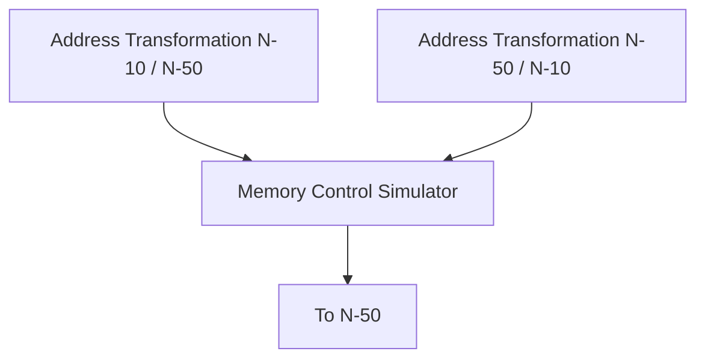
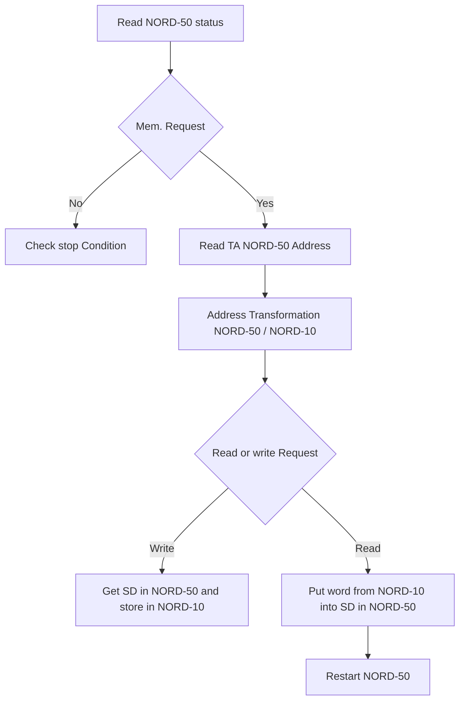

## Page 1

# NORD-10 · NORD-50 Communication System

## NORSK DATA A.S

```
  N
I I 
  D
```

[Photo: Cover design with circles]

---

## Page 2

# NORD-10 · NORD-50

## Communication System

---

## Page 3

# REVISION RECORD

| Revision | Notes            |
|----------|------------------|
| 8/75     | Original Printing|

Publ. No. ND-06. 005. 01  
August 1975

```
  __    ____  _   _
 |  \  |  __|| | | |
 |   \ | |   | |_| |
 | |\ \| |__ |  _  |
 |____\|____||_| |_|

A/S NORSK DATA-ELEKTRONIKK
Lørenveien 57, Oslo 5 - Tlf.: 21 73 71
```

---

## Page 4

# TABLE OF CONTENTS

```
   ++
   ++
```

| Chapters                                         | Page |
|--------------------------------------------------|------|
| 1 COMMUNICATION METHOD                           | 1-1  |
| 2 DESCRIPTION OF THE COMMUNICATION HARDWARE      | 2-1  |
| 2.1 A Survey of the Data Paths used in the Communication between the NORD-10 and the NORD-50 | 2-1  |
| 2.1.1 Registers which may be loaded by the NORD-10 | 2-1  |
| 2.1.2 Registers which may be read by the NORD-10 | 2-2  |
| 2.1.3 The NORD-50 Status Register                | 2-3  |
| 2.1.4 The NORD-50 Modus Register                 | 2-3  |
| 2.1.5 Commands to NORD-50                        | 2-4  |
| 2.2 Programming Specifications for the NORD-10/ NORD-50 Communication | 2-4  |
| 2.2.1 NORD-10 ➔ NORD-50 Communication            | 2-5  |
| 2.2.1.1 Data Transfer                            | 2-5  |
| 2.2.1.2 Controlling the NORD-50                  | 2-6  |
| 2.3 NORD-50 ➔ NORD-10 Communication              | 2-9  |
| 3 THE CONCEPT OF SIMULATED MEMORY                | 3-1  |
| 4 THE ADDRESS VIOLATION AND MEMORY PROTECTION SYSTEM | 4-1 |
| 4.1 The operation of the Address Violation System | 4-1  |
| 4.2 Some Examples on the Use of the Address Violation System | 4-2  |

## Appendix A

MNEMONIC DEFINITIONS A-1

```
--ooOoo--
```

```
ND-06. 005. 01
```

---

## Page 5

# Diagram 1

The Hardware Organization of the NORD-10/NORD-50 Communication

```mermaid
graph TB;
    BQ["BQ"]
    BP["BP"]
    SA["SA"]
    SD["SD"]
    MD["MD"]
    MA["MA"]
    MRQ["MRQ"]
    IOX["IOX<br>instr.<br>from N-10"]
    AERR["AERR"]
    PC["PC"]
    TD["TD"]
    TA["TA"]
    BD["BD"]
    SUBGRAPH_10["NORD-10<br>A-reg."]
    SUBGRAPH_50["NORD-50<br>A-reg."]
    N50["To N-50's<br>mem."]
    
    SUBGRAPH_10 --> |"16"| SA
    BQ --> |"16"| SUBGRAPH_10
    
    SA --> |"16"| BQ
    BP --> |"16"| SA
    BP --> |"16"| IOX
    IOX --> |"16"| SA
    
    N50 --> |"16"| IOX
    
    IOX --> |"Memory data"| MA
    IOX --> |"16"| MRQ
    
    MA --> |"16"| SD
    IOX --> |"MRQ"<br>"instr.<br>from N-10"| TD
    TD --> |"16"| AERR
    AERR --> |"16"| PC
    
    subgraph Commands["Commands<br>N-50 Control Logic"]
        MD --> M["M"]
    end
    
    MD --> SA
    MA --> MD
    MRQ --> IOX
    IOX --> BQ
    
    TA --> MD
    MD --> |"16"| BD
    PC --> |"16"| TA
    N50 --> BD
    
    subgraph Connections
        MA
        MD
        MRQ
        N50
    end
    
    AERR -.->|""| Connections
    subgraph ["<br>"]
    end
    
    AERR -.-> SUBGRAPH_50 --> |"16"| BD
```

## Definitions

| **Symbol** | **Definition**                                                             |
|------------|----------------------------------------------------------------------------|
| BP         | Breakpoint Register No. 1 (32 bits)                                        |
| BQ         | Breakpoint Register No. 2 (32 bits)                                        |
| SA         | Simulated Address (32 bits)                                                |
| SD         | Simulated Data (32 bits)                                                   |
| MD         | Memory Data Bus: NORD-50 CPU — Memory (32 bits)                            |
| MA         | Memory Address Bus: NORD-50 CPU — Memory (32 bits)                         |
| MRQ        | Memory Request (Signal to Memory appearing every time a reference to core memory is made) |
| PC         | NORD-50 Program Counter                                                    |
| STA        | Status Register                                                            |
| AERR       | Address Violation                                                          |
| TA         | Test Address Register                                                      |
| TD         | Test Data Register                                                         |
| M          | Modus Register                                                             |

ND-06. 005. 01

---

## Page 6

# COMMUNICATION METHOD

The communication between the NORD-10 and the NORD-50 is based on the use of the IOX instruction in the NORD-10. Accordingly, the hardware part of the communication unit is made in such a way that the NORD-10 when software is concerned, may regard the NORD-50 as an I/O device. In the communication procedure the NORD-10 has complete control, and the NORD-50 is regarded as a slave to the NORD-10. All the data transfers between the two computers are done in 16 bits parallel mode. This means that the NORD-10 must use two IOX instructions to transfer a NORD-50 word to or from the NORD-10.

---

## Page 7

# 2 DESCRIPTION OF THE COMMUNICATION HARDWARE

This section is meant to give the programmer the necessary information to enable him to understand the operation of the communication hardware. The section is divided into three parts:

## 2.1

Which briefly describes the overall flow of data to and from the NORD-50 and touches on some of the internal data paths in the NORD-50 which have relevance to the communications.

## 2.2

Which describes the communication procedure NORD-10/ NORD-50 in some detail and defines the IOX instructions and how they are to be used.

## 2.3

Which is like 2.2 except that it is concerned with the NORD-50/ NORD-10 communication.

### 2.1 A Survey of the Data Paths used in the Communication between the NORD-10 and the NORD-50

Diagram No. 1 shows in some detail the actual data paths in the NORD-10/ NORD-50 communication. As shown on the diagram there are four 32 bit registers in the NORD-50 which may be read and four registers which may be loaded by the NORD-10. These registers are used in the following manner:

#### 2.1.1 Registers which may be loaded by the NORD-10

a) **BP-register (Breakpoint Register)**

This register contains the lower limit in the address violation system which is to be described in some detail in Section 4.

b) **BQ-register (Breakpoint Register)**

Same as BP but contains the upper limit in the address violation system.

c) **SA-register (Simulated Address Register)**

This register has access to the Memory Address Bus which is used to transfer the addresses from the NORD-50 CPU to the core memory. By connecting the SA-register to this bus, the NORD-10 is given the capability of controlling the addressing of core by the NORD-50.

d) **SD-register (Simulated Data Register)**

This register is connected to the Memory Data Bus which is used by the NORD-50 CPU to transfer data to or from the core memory.

---

## Page 8

# NORD-50 Modus Register

By use of SA, SD, TA, TD and some control signals, it is possible to run NORD-50 programs without the use of the memory connected to the NORD-50. This mode of running the NORD-50 is called "Simulated memory", and the programming specifications for this mode are found in Section 3.

e) The NORD-50 Modus Register  
   (See Section 2.1.4.)

## 2.1.2 Registers which may be read by the NORD-10

a) **PC-register (Program Counter Register)**  
   This is the Program Counter of the NORD-50. When read by the NORD-10 this register always points to the next instruction which is to be executed by the NORD-50.

b) **SA-register (Simulated Address Register)**  
   This is the same register as in Section 2.1.1, point c). One should note that when reading this register from the NORD-10, most of the data paths in the communication unit are in use. The loading and reading of this register is therefore used to check the data paths during the debugging of the NORD-50.

c) **TA-register (Test Address Register)**  
   This register is connected to the Memory Address Bus (MAB) of the NORD-50. In fact, TA holds the last address referenced by the NORD-50 CPU. Note that SA is also connected to the Memory Address Bus, making possible data transfer from SA to TA. The strobing of MAB into TA is automatically done by the Memory Request signal which appears each time that the CPU references the memory.

d) **TD-register (Test Data Register)**  
   This register is connected to the Memory Data Bus (MDB) of the NORD-50. The TD-register therefore holds the last data word transferred to or from the NORD-50 memory. Note that the SD-register is also connected to the Memory Data Bus making possible data transfer from SD to TD. The strobing of MDB into TD is automatically done each time data to or from the memory is presented on the bus.

e) **The NORD-50 Status Register**  
   (See Section 2.1.3.)

---

## Page 9

## 2.1.3 The NORD-50 Status Register

On the NORD-50, some status information is available to the NORD-10 by reading the status register called STN50. This register consists of 9 bits which have the following meaning:

| Status Register Bit No. | Meaning              |
|-------------------------|----------------------|
| 0                       | Program STOP         |
| 1                       | Address violation    |
| 2                       | Instruction hang-up  |
| 3                       | Overflow             |
| 4                       | Underflow            |
| 5                       | Memory Request       |
| 6                       | Memory WRITE/READ    |
| 7                       | Parity error         |
| 8                       | Memory hang-up       |

Note: Overflow and underflow flags are set only due to arithmetic operations in the floating point and multiply-divide arithmetic. ADD, SUB, and Compare tests on registers will not affect the overflow flag.

The use and meaning of these bits are discussed in the sections where a reference to the bits involved is made.

Note: If status bit 8, Memory hang-up, is set a Master Clear must be given to the NORD-50 before it can be started again. (See 2.2.1.2)

## 2.1.4 The NORD-50 Modus Register

As shown by the diagram, there is another type of information which can be loaded into the NORD-50, namely the Modus Register.

The sections on programming specifications will give more detailed information on how and where to use the different bits in the Modus Register. In this section, the different possibilities are only briefly mentioned.

When loading the Modus Register in the NORD-50, it is the value of the A-register in the NORD-10 which determines the function. The bits in the A-register have the following meanings:

| Bit | Meaning                                             |
|-----|-----------------------------------------------------|
| 0   | Stop on overflow                                    |
| 1   | Stop on underflow                                   |
| 2   | Stop on parity error                                |
| 3   |                                                     |
| 4   | Stop if BP ≤ Any Reference < BQ                     |
| 5   | Stop if BP ≤ Program Counter < BQ                   |
| 6   | Stop if BP ≤ Data Reference < BQ                    |
| 7   | Stop if BP ≤ Data Store Address < BQ                |
| 8   | Invert limits on 4-7 (X≤BP or X≥BQ)                 |
| 9   | Master Clear                                        |
| 10  |                                                     |
| 11  |                                                     |

---

## Page 10

# Commands to NORD-50

The NORD-50 is always started from the NORD-10. The start and stop conditions are given by the content of the Modus Register. Additionally, the NORD-50 may be stopped from the NORD-10 at any time. Master Clear in NORD-10 will stop NORD-50.

## Bit | Meaning

| Bit | Meaning                           |
|-----|-----------------------------------|
| 12  | Read Memory Cell (EXAMINE)        |
| 13  | Write Memory Cell (DEPOSIT)       |
| 14  | Data to/from NORD-10              |
| 15  | Instructions from NORD-10         |

# Programming Specifications for the NORD-10/NORD-50 Communication

This section deals with the possible information which may be transported to or from the NORD-50 and defines the IOX instructions needed to do this. The section also explains the meaning and use of the status information supplied to the NORD-10 by reading the NORD-50 status register.

The mnemonics used to communicate with the registers have the following format:

```
IOX MNOP
```

where

a) M indicates the transfer direction, i.e.,
- W (write) for NORD-10 to NORD-50, and
- R (read) for NORD-50 to NORD-10.

b) N indicates which part of the 32 bits register which is to be transferred, i.e.,
- R (right) denotes bits 0-15, and
- L (left) denotes bits 16-31.

c) OP indicates the name of the register, i.e., BP, BQ, TA, TD, SA, SD or PC.

Example:

```
IOX WRBP
```

This instruction has:

- M = W which means this is a transfer from the NORD-10 to the NORD-50.
- N = R which means that the right part (bits 0-15) is to be transferred.
- OP = BP which means that the breakpoint register is to be operated upon.

ND-06.005.01

---

## Page 11

# Conclusion

IOX WRBP will cause the contents of the NORD-10 A-register to be loaded into the rightmost part (bit 0-15) of the BP-register in the NORD-50.

## 2.2.1 NORD-10 → NORD-50 Communication

In this communication direction, there are two different types of information that may be transmitted, namely data and commands.

### 2.2.1.1 Data Transfer

As mentioned in Section 2.1.1, there are four 32 bits registers which may be loaded by the NORD-10. These registers are:

1. BP = Breakpoint Register 1
2. BQ = Breakpoint Register 2
3. SA = Simulated Address Register
4. SD = Simulated Data Register

Additionally, the NORD-50 Modus Register may be loaded by the NORD-10. The meaning of the different bits in the Modus Register are listed in Section 2.1.4.

The following IOX instructions should be used when communicating with the NORD-50 from the NORD-10:

| IOX Instruction | % A-reg. | Bit Range    |
|-----------------|----------|--------------|
| WRBP            | BP       | (0, 15)      |
| WLBP            | BP       | (16, 31)     |
| WRBQ            | BQ       | (0, 15)      |
| WLBQ            | BQ       | (16, 31)     |
| WRSA            | SA       | (0, 15)      |
| WLSA            | SA       | (16, 31)     |
| WRSD            | SD       | (0, 15)      |
| WLSD            | SD       | (16, 31)     |
| MOD50           | Modus Register |        |

The octal values of the mnemonics are as follows:

| Mnemonic | Octal Value |
|----------|-------------|
| IOX      | 164000      |
| WRBP     | 61          |
| WLBP     | 63          |
| WRBQ     | 65          |
| WLBQ     | 67          |
| WRSA     | 71          |
| WLSA     | 73          |
| WRSD     | 75          |
| WLSD     | 77          |
| MOD50    | 31          |

---

## Page 12

## 2.2.1.2 Controlling the NORD-50

Since the NORD-50 is treated as an I/O device, it is controlled by a NORD-10 I/O control card called NORD-50 DATA 1071. Beside the IOX instructions mentioned under 2.2.1.1 and 2.3, it is possible to read a status register in the NORD-50 interface, and to write into a control register in the NORD-50 interface. The instructions are:

### Read Interface Status

```
IOX RIS50, RIS50 = 32
```

and the bits 0 and 3 are used.

- A 1 in bit 0 means: Give interrupt on level 12 when NORD-50 is stopped (Not running).
- A 1 in bit 3 means that NORD-50 is stopped.

Note: Bit 0 is cleared by a serviced IDENT.

### Write Interface Control

```
IOX WIC50, WIC50 = 33
```

Bits 0, 2 and 4 are used.

- A 1 in bit 0 means: Give interrupt on level 12 when NORD-50 is stopped.
- A 1 in bit 2 means: Start NORD-50. The running condition is given by the content of the Modus Register (2.1.4).
- A 1 in bit 4 means: Stop NORD-50. (Master Clear in NORD-10 will also stop NORD-50.)

Note that when a start command is given, the NORD-50 always takes the first instruction from the address specified by the contents of the SA-register.

The following pages give detailed information on what happens in the NORD-50 when the appropriate bits in the Modus register are set to one, and the NORD-50 is started.

To refresh the memory of the reader, the Modus bits are listed again below:

| Bit | Meaning                          |
|-----|----------------------------------|
| 0   | Stop on overflow                 |
| 1   | Stop on underflow                |
| 2   | Stop on parity error             |
| 3   | Stop if BP≤ Any Reference≤ BQ    |

---

## Page 13

## Bit Meaning Table

| Bit | Meaning |
|-----|---------|
| 5   | Stop if BP ≤ Program Counter ≤ BQ |
| 6   | Stop if BP ≤ Data Reference ≤ BQ |
| 7   | Stop if BP ≤ Data Store Address ≤ BQ |
| 8   | Invert limits on 4-7 (X < BP or X ≥ BQ) |
| 9   | Master Clear |
| 10  | [illegible] |
| 11  | [illegible] |
| 12  | Read Memory Cell (EXAMINE) |
| 13  | Write Memory Cell (DEPOSIT) |
| 14  | Data to/from the NORD-10 |
| 15  | Instructions from the NORD-10 |

As the reader will have noticed, this word is divided into two distinct groups of bits. Group one, consisting of bits 0-8 specifies the possible stop conditions, while the second group of bits (9-15) specifies direct action to be taken by the NORD-50.

On the following pages group one (bits 0-8) will be treated as a whole while in group two the bits will be treated one by one.

In addition, the use of the BP and BQ registers, which is affected by use of bits 4-8 of the command word, is described in a separate section called Address Violation System (Section 4).

### Group 1 - Modus word bits 0-8

As mentioned before, this group, consisting of bits 0-8, in the Modus word specifies the stop conditions for the NORD-50. When giving an IOX NORD-50 with one of the bits in this group set to a one, the following action is taken by the NORD-50. Note that when the NORD-50 stops, it always sends a completion pulse to the NORD-10, thus telling the NORD-10 that it has stopped.

1) The NORD-50 will start the execution of the program pointed to by the contents of the SA (Simulated Address) register.

2) This program is executed until either
   a) a stop instruction in the program is found,
   b) the condition specified in the command word is fulfilled,
   c) the NORD-50 is stopped by the NORD-10 using IOX WIC50 with A-register bit 4 equal one, or Master Clear in NORD-10, or
   d) an error condition occurs. This error can be hang-up (Status bit 2 is set), or memory hang-up (Status bit 8 is set). Instruction hang-up means more than 15 levels of indirect addressing or EXECUTE of EXECUTE. Memory hang-up means no answer to request within 3 µsec, and indicates request outside memory. The address is hold by the TA-register. After Memory hang-up, Master Clear must be given.

ND-06.005.01

---

## Page 14

# Group 2 - Modus Word Bits 9-15

## a) Bit 9=1 Master Clear

If a start command (to NORD-50) is given with this bit set to a one, a master clear pulse is generated in the NORD-50. Note that this action will put the NORD-50 into a well defined state. In this state most of the status flip-flops (external and internal) will be cleared, thus destroying most of the information on the state when the master clear pulse was given. It is suggested that this command is used only in the following situations:

i) The NORD-50 seems to hang in an undefined state and does not answer to the communication system.

ii) The user wants to bring the NORD-50 to the predefined "Master Clear" state in order to have complete control over the initial state. This might be the case when the user, for instance, wants to start testing the NORD-50.

iii) The NORD-50 has stopped due to a memory hang-up. (Status bit 8 is "1".)

## b) Bit 12=1 Read Memory Cell (EXAMINE)

A start command with bit 12=1 gives the user the contents of the memory location pointed to by the contents of the SA (Simulated Address register). The contents of the memory location may be read by the NORD-10 by reading the TD (Test Data) register.

## c) Bit 13=1 Write Memory Cell (DEPOSIT)

A start command with bit 13=1 allows the user to write information into the NORD-50’s memory. The address is taken from the SA (Simulated Address) register and the data is taken from the SD (Simulated Data) register.

---

## Page 15

# NORD-50 to NORD-10 Communication

As mentioned in Section 2.1.1, the following registers may be read by the NORD-10:

- **PC** : The NORD-50 Program Counter (32 bits)
- **SA** : Simulated Address Register (32 bits)
- **TA** : Test Address Register (32 bits)
- **TD** : Test Data Register (32 bits)
- **STN50** : The NORD-50 Status Register (16 bits)

The ICX's involved in transferring the contents of these registers to the NORD-10 are listed in the table below:

| ICX    | Function          | Description     |
|--------|-------------------|-----------------|
| IOX    | RRPC              | % PC (0-15) ➞ A |
| IOX    | RLPC              | % PC (16-31) ➞ A |
| ICX    | RRSA              | % SA (0-15) ➞ A |
| IOX    | RLSA              | % SA (16-31) ➞ A |
| IOX    | RRTA              | % TA (0-15) ➞ A |
| IOX    | RLTA              | % TA (16-31) ➞ A |
| IOX    | RRTD              | % TD (0-15) ➞ A |
| IOX    | RLTD              | % TD (16-31) ➞ A |
| IOX    | RSTN50            | % STN50 ➞ A     |

The mnemonics have the following octal values:

| Mnemonic | Octal Value |
|----------|-------------|
| IOX      | 164000      |
| RRPC     | 60          |
| RLPC     | 62          |
| RRSA     | 64          |
| RLSA     | 66          |
| RRTA     | 70          |
| RLTA     | 72          |
| RRTD     | 74          |
| RLTD     | 76          |
| RSTN50   | 30          |

See Appendix A.

---

Note that the normal way of transferring data to and from the memory of the NORD-50 is by using the Inter-Core Module.

- **Bit 14=0/1 Data to/from the NORD-10**
  - See Section 3: the concept of simulated memory.
  
- **Bit 15=1 Instructions from the NORD-10**
  - See Section 3: the concept of simulated memory.

---

## Page 16

# THE CONCEPT OF SIMULATED MEMORY

Before entering into the description on how to program the simulated memory feature on the NORD-50, some introductory remarks on memory communication in general may be of some advantage to the reader.

The memory control hardware of a digital computer is in most cases organized in the following manner:

```
 ___________________            _________________             ________
|                   |          |                 |           |        |
| Central Processing| Control  | Memory          |           |        |
| Unit              | Signals  | Control         |---------->| Memory |
|                   |<---------|                 |           |        |
|                   | Data     |                 |           |        |
|                   |<---------|                 |           |        |
|                   | Addresses|                 |           |        |
|___________________|<---------|_________________|           |________|
```

*Figure 2 - Data and Control Signals*

Referring to Figure 2, we will try to use words in explaining the communication procedure between the Memory Control and the CPU.

1) The first thing which happens is that the CPU puts a "one" on the Memory Request line. This signal indicates that the CPU now wants to access the memory. When this signal is presented to the Memory Control, the following information must be made available by the CPU:

   a) The signal READ/WRITE telling whether the cycle is a READ or a WRITE cycle.
   
   b) The address to be accessed.
   
   c) Data, if the requested cycle is a WRITE cycle.

Since, in principle, the CPU timing and the core memory timing are asynchronous, the data and the address are placed on the input of the Memory Data Bus and the Memory Address Bus. The CPU is now waiting for the Memory Control to decide when this information can be placed on the bus without interfering with other memory accesses going on.

2) When the Memory Control can accept the request from the CPU, the Enable Data/Address Signal is sent to the CPU telling it that the coming Memory Cycle will be reserved for the CPU. The CPU uses this signal to enable the data and addresses out on the appropriate buses leading to the memory.

ND-06. 005. 01

---

## Page 17

# Memory Control and Simulated Memory

## Read Cycle

3a) Assume that the requested cycle was a READ cycle. In this case, the next thing which happens is that the Data Ready signal is sent from the Memory Control to the CPU. This signal tells the CPU that the contents of the address presented on the Memory Address Bus during ENABLE DATA/ADDRESS is ready on the Memory Data Bus. The CPU then uses this signal to strobe the information on the Memory Data Bus into the appropriate register.

## Write Cycle

3b) Assume that the requested cycle was a WRITE cycle. In this case, the next interesting signal to appear is the RY signal telling the CPU that the WRITE cycle is completed so that the CPU can continue processing.

## Simulated Memory in NORD-50

Now we will return to the concept of simulated memory in the NORD-50. This feature is included in the NORD-50 in order to make possible the debugging of the NORD-50 CPU without connecting a memory to it. Simulated Memory means that a program in the NORD-10 (memory control simulator) acts as a memory control and takes action on the status signal presented to it by the NORD-50.

The NORD-50 is thus accessing memory in the NORD-10 through the memory control simulator and instructions and data are fed to/from the NORD-50 as if an ordinary memory were connected to it.

## Memory Control Simulator

Now let us turn to a brief description of a memory control simulator running on the NORD-10. This program consists of the parts shown in the figure below.



Figure 3 - Memory Control Simulator

ND-06. 005. 01

---

## Page 18

# Address Transformation

a) The Address Transformation N-10/N-50 takes the addresses of the program/data in the NORD-10 and transforms them to the appropriate NORD-50 addresses.

```
  o                  o  ---------
  |                     | NORD-50 |
  | NORD-10             | Simulated |
  | Memory          M2  | Memory    |
M1 |                     |          |
  |                     |          |
  ---------         ---------
```

*Figure 4 - Address Transformation*

This means that if (MI) = instruction No. I, which is the next instruction to be executed, the address M2 is output to the NORD-50 thus simulating that this instruction is located in the address M2 in the NORD-50.

b) The Address Transformation N-50/N-10.
This program is used each time the NORD-50 presents an address to the NORD-10. The program transforms the NORD-50 address to the correct NORD-10 address and the Memory Control simulator uses this information to find the NORD-10 address to be operated upon.

c) The Memory Control simulator.
This program responds to the information presented to it by the NORD-50 status word and gives orders to the NORD-50 via the Modus word and the start command. In the following we shall take a somewhat closer look at the logic of this program.

The flowchart in Figure 5 shows the outline of the logic in the Memory Control simulator.

---

ND-06. 005. 01

---

## Page 19



**Figure 5 - Flowchart for Memory Control Simulator**

ND-06. 005. 01

---

## Page 20

# THE ADDRESS VIOLATION AND MEMORY PROTECTION SYSTEM

The address violation system on the NORD-50 is designed to provide for both hardware and software needs. This section will therefore start with a description of the hardware and a description of the operation of the system. The section then proceeds to point out some of the ways of using the address violation system, both from a hardware and a software point of view.

## 4.1 The Operation of the Address Violation System

The heart of the address violation system is the set of two registers:

```
BP = Break Point Register No. 1 (20 bits), and  
BQ = Break Point Register No. 2 (20 bits).
```

These registers are continuously compared with the address on the Memory Address Bus on the NORD-50.

The result of this comparison is then used to decide whether or not a request can be sent to the memory. If the address points to the protected area, NORD-50 will be stopped with status bit 1 set, and with TA holding the address which caused the stop.

Together with the two registers BP and BQ, the address violation system uses bits 4-8 of the command word transferred to the NORD-50 functions. These bits have the following meanings:

| Bit | Meaning                                      |
|-----|----------------------------------------------|
| 4   | Stop if BP ≤ Any Reference <BQ                |
| 5   | Stop if BP ≤ Program Counter <BQ              |
| 6   | Stop if BP ≤ Data Reference <BQ               |
| 7   | Stop if BP ≤ Data Store Address <BQ           |
| 8   | Invert limit on 4-7 (X<BP or X≥BQ)            |

Let us for a moment try to visualize the use of the BP and BQ registers.

```
Address
 o
   __________________________
  |                          |
M |                          |<- BP (Lower Address Limit)
  |         S                |
N |__________________________|<- BQ (Upper Address Limit)
  |
F | -> o
```

ND-06.005.01

---

## Page 21

# Address Violation System

The shaded area on Figure 6 contains all addresses, S, which satisfy the inequality BP ≤ S ≤ BQ. The meaning of the bits 4-7 is dependent on the value of bit 8 in the following manner.

a) **Bit 8=0:**

   Referring to the figure, the stop condition is fulfilled if the specified type of reference is made _within_ the shaded area S.

b) **Bit 8=1:**

   Again referring to the figure, the stop condition is in this case fulfilled if the specified type of reference is made _outside_ the shaded area S.

As shown above, the address violation system gives the user the possibility of protecting certain areas in core memory against the four possible ways of accessing that area. The implications of this feature will be described by some examples below.

## 4.2 Some Examples on the Use of the Address Violation System

The address violation system on the NORD-50 is based on the experience we have had in the debugging of both software and hardware on other NORD computers.

A number of times the following problem has occurred:

1) Given a large software system

2) Sometimes, let us say once a day, the contents of some memory cells seem to be destroyed.

3) Questions:
   a) Is it a software or a hardware failure?
   b) How could we solve the problem?

When facing a problem like this, the only way to find out if software is changing the contents of the memory cells in question is to trap every reference to that cell and then check if this reference was a legal reference. To do this, the BP and BQ registers may easily be set up to trap each reference to the cells in question.

Another example of using the address violation system is to use it to protect certain programs, for instance protecting system programs from the user. The comparison between the BP, BQ registers and the Memory Address Bus is made by use of a separate arithmetic unit. This comparison takes approximately 100 ns, which is added to the cycle time when the protection system is used.

---

ND-06. 005. 01

---

## Page 22

# Appendix A

## Mnemonic Definitions

### NORD-10/NORD-50

| Mnemonic | Octal value | Function         |
|----------|-------------|------------------|
| IOX      | 164000      |                  |
| WRBP     | 61          | A ➜ BP (0,15)    |
| WLBP     | 63          | A ➜ BP (16,31)   |
| WRBQ     | 65          | A ➜ BQ (0,15)    |
| WLBQ     | 67          | A ➜ BQ (16,31)   |
| WRSA     | 71          | A ➜ SA (0,15)    |
| WLSA     | 73          | A ➜ SA (16,31)   |
| WRSD     | 75          | A ➜ SD (0,15)    |
| WLSD     | 77          | A ➜ SD (16,31)   |
| MOD50    | 31          | A ➜ MODUS (0,15) |

### NORD-50/NORD-10

| Mnemonic | Octal value | Function         |
|----------|-------------|------------------|
| RRPC     | 60          | PC (0,15) ➜ A    |
| RLPC     | 62          | PC (16,31) ➜ A   |
| RRSA     | 64          | SA (0,15) ➜ A    |
| RLSA     | 66          | SA (16,31) ➜ A   |
| RRTA     | 70          | TA (0,15) ➜ A    |
| RLTA     | 72          | TA (16,31) ➜ A   |
| RRTD     | 74          | TD (0,15) ➜ A    |
| RLTD     | 76          | TD (16,31) ➜ A   |
| RSTN50   | 30          | STN5 (0,15) ➜ A  |

## Commands to NORD-50

| Mnemonic | Octal value | Function                 |
|----------|-------------|--------------------------|
| WIC50    | 33          | A0=1: Enable interrupt   |
|          |             | A2=1: Start NORD-50      |
|          |             | A4=1: Stop NORD-50       |

## Interface Status

| Mnemonic | Octal value | Function                      |
|----------|-------------|-------------------------------|
| RIS50    | 32          | A0=1: Interrupt is enabled    |
|          |             | A3=1: NORD-50 is stopped      |

ND-06.005.01

---

## Page 23

# COMMENT AND EVALUATION SHEET

### ND-06. 005. 01  
NORD-10 / NORD-50  
COMMUNICATION SYSTEM

A/S NORSK DATA-ELEKTRONIKK  
Lørenveien 57, Oslo 5 - Tlf. 21 73 71

In order for this manual to develop to the point where it best suits your needs, we must have your comments, corrections, suggestions for additions, etc. Please write down your comments on this pre-addressed form and post it. Please be specific wherever possible.

#### FROM:
```
_____________________________________

_____________________________________

_____________________________________
```

---

## Page 24

# Norsk Data

— we make bits for the future

---

NORSK DATA A.S BOX 4 LINDEBERG GÅRD OSLO 10 NORWAY PHONE: 39 16 01 TELEX: 18661

---

