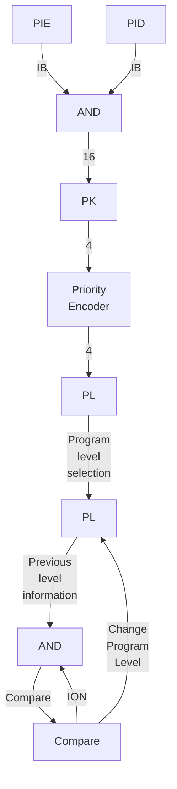
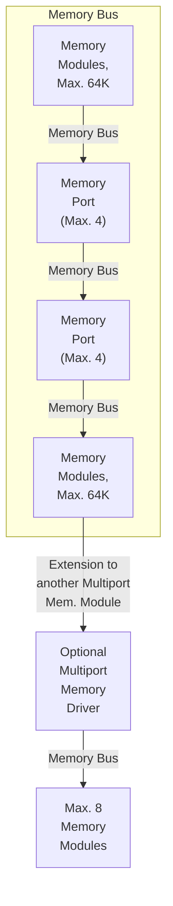
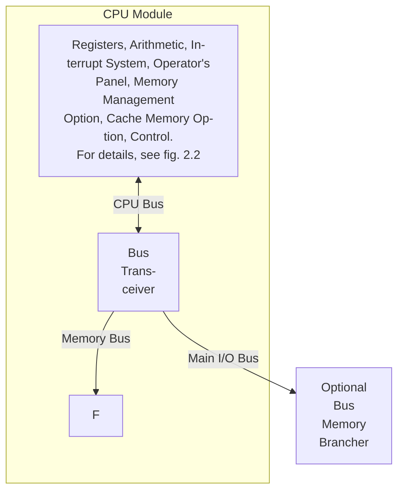
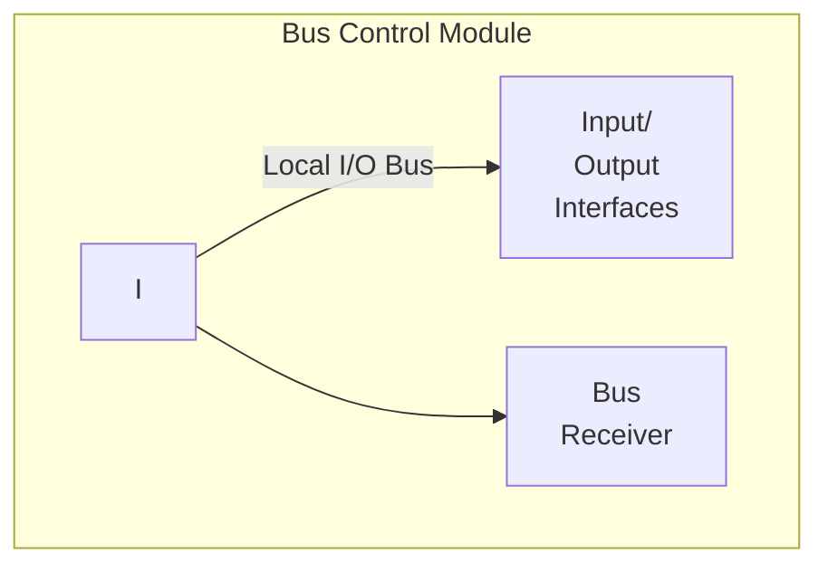
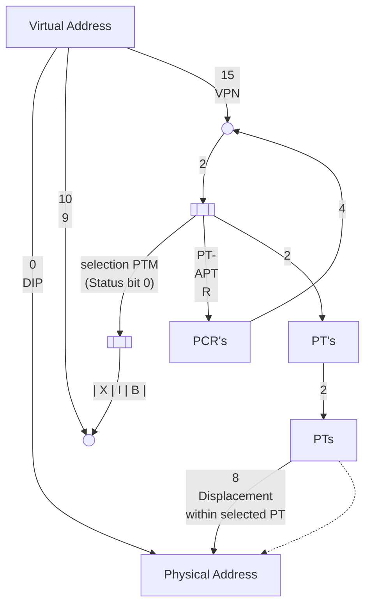
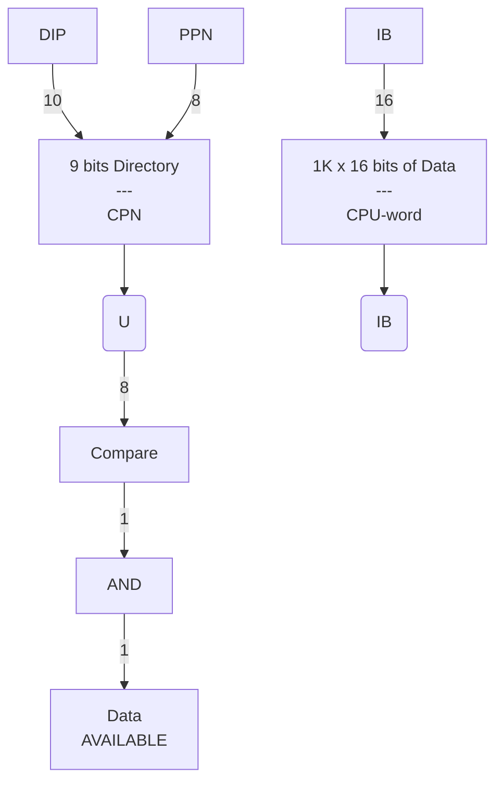

## Page 1

# NORD-10/S

## Reference Manual

**NIO.619**

---

## Page 2

## REVISION RECORD

| Revision | Notes                                                                                                                                   |
|----------|----------------------------------------------------------------------------------------------------------------------------------------|
| 04/77    | Original Printing                                                                                                                      |
| 06/77    | Revision A                                                                                                                             |
|          | The following pages have been revised: 2-7, 3-1, 3-2, 3-23, 3-31, 3-38, 3-45, 3-46, 3-56, 3-57, 3-60, 3-63, 3-65, 4-1, 4-2, 4-3, 5-1, 5-2, 5-3, 5-13, 6-2, 6-5, 6-6, 6-7, 6-8, 6-10, 7-3, 8-7, 8-10, 9-6, 9-7, A-2, B-1. |

NORD-10/S — Reference Manual  
Publication No. ND-06.008.01

NORSK DATA A.S.  
Lørenveien 57, Postboks 163 Økern, Oslo 5, Norway

```
   ND
```

---

## Page 3

# TABLE OF CONTENTS

Section: | Page:
--- | ---
1 INTRODUCTION | 1-1
1.1 General Characteristics | 1-1
1.2 Peripheral Equipment | 1-3
1.3 Software | 1-4

2 SYSTEM ARCHITECTURE | 2-1
2.1 Introduction | 2-1
2.2 Central Processor | 2-3
2.2.1 Register Block | 2-6
2.2.2 Indicators | 2-7
2.3 Memory Configurations | 2-8
2.4 Remote Operation | 2-11
2.5 Instruction and Data Formats | 2-14
2.5.1 Instruction Formats | 2-14
2.5.2 Data Formats | 2-14
2.5.2.1 Single Bit | 2-15
2.5.2.2 8-Bit Byte | 2-15
2.5.2.3 16-Bit Word | 2-15
2.5.2.4 32-Bit Double Word | 2-16
2.5.2.5 48-Bit Floating Point Word | 2-16
2.5.2.6 32-Bit Floating Point Word | 2-17
2.6 Interrupt System | 2-19
2.7 Memory Management System | 2-21

3 INSTRUCTION REPERTOIRE | 3-1
3.1 Memory Reference Instructions | 3-4
3.1.1 Addressing Structure | 3-4
3.1.2 Store Instructions | 3-13
3.1.3 Load Instructions | 3-15
3.1.4 Arithmetical and Logical Instructions | 3-16
3.1.5 Sequencing Instructions | 3-19
3.1.6 Byte Instructions | 3-21
3.1.7 Register Block Instructions | 3-22

ND-06.008.01

---

## Page 4

# Table of Contents

## Section

| Section                              | Page |
|--------------------------------------|------|
| 3.2  Operate Instructions            | 3-24 |
| 3.2.1 Floating Point Conversion Instructions | 3-24 |
| 3.2.1.1 Standard 48-Bit Floating Point Conversion | 3-24 |
| 3.2.1.2 Optional 32-Bit Floating Point Conversion | 3-26 |
| 3.2.2 Shift Instructions             | 3-26 |
| 3.2.3 Register Operations            | 3-29 |
| 3.2.3.1 ROP Register Operation Instructions | 3-31 |
| 3.2.3.2 EXtended Register Operation Instructions | 3-37 |
| 3.2.3.3 Inter Level Register Instructions | 3-39 |
| 3.2.4 Skip Instructions              | 3-41 |
| 3.2.5 Argument Instructions          | 3-44 |
| 3.2.6 Bit Operation Instructions     | 3-46 |
| 3.2.6.1 Bit Skip Instructions        | 3-47 |
| 3.2.6.2 Bit Setting Instructions     | 3-47 |
| 3.2.6.3 One Bit Accumulator Instructions | 3-48 |
| 3.2.7 Accumulator Transfer Instructions | 3-49 |
| 3.2.7.1 Transfer to A Register       | 3-51 |
| 3.2.7.2 Transfer from A Register     | 3-51 |
| 3.3 Input/Output Control Instructions | 3-53 |
| 3.3.1 Recommended Device Addresses   | 3-53 |
| 3.3.2 Format of Status and Control Word | 3-57 |
| 3.4 System Control Instructions      | 3-58 |
| 3.4.1 Interrupt Control Instructions | 3-58 |
| 3.4.2 Memory Management Control Instructions | 3-61 |
| 3.4.3 Monitor Call Instruction       | 3-62 |
| 3.4.4 Wait or Give Up Priority       | 3-63 |
| 3.5 Customer Specified Instructions  | 3-64 |

## 4 THE INPUT/OUTPUT SYSTEM

| Section                              | Page |
|--------------------------------------|------|
| 4.1 Input/Output Hardware            | 4-1  |
| 4.1.1 General Description            | 4-1  |
| 4.1.2 Input/Output Bus Architecture  | 4-3  |
| 4.1.3 Vectored Interrupt Identification | 4-3 |
| 4.2 Input/Output Programming         | 4-4  |
| 4.2.1 Programming Examples           | 4-4  |
| 4.2.2 Input/Output Interrupt Programming | 4-5 |
| 4.2.3 Design of an Input/Output Handler Routine | 4-5 |

---

ND-06.008.01

---

## Page 5

# The Interrupt System

| Section | Page |
| ------- | ---- |
| 5.1     | Control of Program Levels |
| 5.1.1   | Program Level Activation |

| Section | Page |
| ------- | ---- |
| 5.2     | Initialization of Interrupt System | 5-5 |
| 5.3     | Interrupt Program Organization     | 5-6 |
| 5.4     | Internal Hardware Status Interrupts | 5-7 |
| 5.4.1   | Monitor Call Interrupt              | 5-9 |
| 5.4.2   | Protect Violation Interrupt         | 5-9 |
| 5.4.3   | Page Fault Interrupt                | 5-10 |
| 5.4.4   | Illegal Instruction Interrupt       | 5-10 |
| 5.4.5   | Error Indicator Interrupt           | 5-10 |
| 5.4.6   | Privileged Instruction Interrupt    | 5-10 |
| 5.4.7   | IOX Error Interrupt                 | 5-11 |
| 5.4.8   | Memory Parity Error Interrupt       | 5-11 |
| 5.4.9   | Memory Out of Range Interrupt       | 5-11 |
| 5.4.10  | Power Fail Interrupt                | 5-11 |

| Section | Page |
| ------- | ---- |
| 5.5     | Memory Control and Status           | 5-12 |
| 5.5.1   | Error Detection                     | 5-12 |
| 5.5.2   | Error Correction Control            | 5-15 |
| 5.6     | Vectored Interrupts                 | 5-16 |

# Memory Management

| Section | Page |
| ------- | ---- |
| 6.1     | Memory Management Architecture            | 6-2  |
| 6.2     | Virtual to Physical Address Mapping       | 6-3  |
| 6.3     | Control of Memory Management System       | 6-5  |
| 6.3.1   | Control of Paging Control Registers       | 6-5  |
| 6.3.2   | Control of Page Index Tables              | 6-5  |
| 6.3.3   | Turning the Memory Management System On or Off | 6-7 |

| Section | Page |
| ------- | ---- |
| 6.4     | Memory Protection System                  | 6-8  |
| 6.5     | Ring Protection System                    | 6-10 |
| 6.5.1   | Privileged Instructions                   | 6-11 |
| 6.5.2   | Paging Status Register                    | 6-12 |
| 6.6     | Timing                                    | 6-14 |

# Operator's Panel

| Section | Page |
| ------- | ---- |
| 7.1     | Panel Elements                          | 7-1 |
| 7.2     | 18-Bit Switch Register                  | 7-2 |
| 7.3     | 18-Bit Light Emitting Diode Register    | 7-3 |
| 7.4     | 16 Selector Push-buttons and 16 Associated Light Emitting Diodes | 7-4 |
| 7.5     | Display Level Select                    | 7-6 |

ND-06.008.01

---

## Page 6

# Contents

## Section:

### 7.6 Control Buttons
- 7.6.1 Master Clear
- 7.6.2 Restart
- 7.6.3 Load
- 7.6.4 Decode Address
- 7.6.5 Set Address
- 7.6.6 Deposit
- 7.6.7 Enter Register
- 7.6.8 Single Instruction
- 7.6.9 Continue
- 7.6.10 Stop

### 7.7 Mode Indicators

## 8 OPERATOR'S COMMUNICATION

### 8.1 Functions
- 8.1.1 Start a Program
- 8.1.2 Memory Examine
- 8.1.3 Memory Deposit
- 8.1.4 Register Examine
- 8.1.5 Register Deposit
- 8.1.6 Internal Register Examine
- 8.1.7 Internal Register Deposit
- 8.1.8 Current Location Counter
- 8.1.9 Break Function
- 8.1.10 Bank Number

### 8.2 Bootstrap Loaders
- 8.2.1 Octal Format Load
- 8.2.2 Binary Format Load
- 8.2.3 Mass Storage Load
- 8.2.4 Automatic Load Descriptor
- 8.2.5 Examples

## 9 CACHE MEMORY

### 9.1 Cache Memory Architecture

### 9.2 Cache Memory Access
- 9.2.1 Definitions
- 9.2.2 Cache Addressing
- 9.2.3 Read Access
- 9.2.4 Write Access
- 9.2.5 Cache Inhibit Area

| Section | Page |
|---------|------|
| 7.6     | 7-7  |
| 7.6.1   | 7-7  |
| 7.6.2   | 7-7  |
| 7.6.3   | 7-7  |
| 7.6.4   | 7-8  |
| 7.6.5   | 7-8  |
| 7.6.6   | 7-8  |
| 7.6.7   | 7-8  |
| 7.6.8   | 7-9  |
| 7.6.9   | 7-9  |
| 7.6.10  | 7-9  |
| 7.7     | 7-10 |
| 8       | 8-1  |
| 8.1     | 8-3  |
| 8.1.1   | 8-3  |
| 8.1.2   | 8-3  |
| 8.1.3   | 8-4  |
| 8.1.4   | 8-4  |
| 8.1.5   | 8-5  |
| 8.1.6   | 8-5  |
| 8.1.7   | 8-6  |
| 8.1.8   | 8-7  |
| 8.1.9   | 8-7  |
| 8.1.10  | 8-7  |
| 8.2     | 8-8  |
| 8.2.1   | 8-8  |
| 8.2.2   | 8-8  |
| 8.2.3   | 8-10 |
| 8.2.4   | 8-10 |
| 8.2.5   | 8-12 |
| 9       | 9-1  |
| 9.1     | 9-2  |
| 9.2     | 9-4  |
| 9.2.1   | 9-4  |
| 9.2.2   | 9-4  |
| 9.2.3   | 9-4  |
| 9.2.4   | 9-4  |
| 9.2.5   | 9-5  |

_ND-06.008.01_

---

## Page 7

# Table of Contents

## Section

| Section                                 | Page |
|-----------------------------------------|------|
| 9.3 Control of the Cache Memory         | 9-6  |
| 9.3.1 Setting of Cache Inhibit Limits   | 9-6  |
| 9.3.2 Cache Initialization              | 9-6  |
| 9.3.3 Cache Status Register             | 9-7  |
| 9.4 Cache Timing                        | 9-8  |

## Appendix

| Appendix | Title                                          | Page |
|----------|------------------------------------------------|------|
| A        | NORD-10 Mnemonics and Their Octal Values       | A-1  |
| B        | NORD-10/S Instruction Code                     | B-1  |

## Figure

| Figure | Description                                                                 | Page |
|--------|-----------------------------------------------------------------------------|------|
| 2.1    | Medium Sized NORD-10/S Computer System                                      | 2-1  |
| 2.2    | NORD-10/S CPU Bus Structure                                                 | 2-4  |
| 2.3    | CPU Block Diagram                                                           | 2-5  |
| 2.4    | NORD-10/S Two-processor System                                              | 2-9  |
| 2.5    | NORD-10/S Four-processor System                                             | 2-10 |
| 2.6    | Remote LOAD from Master CPU                                                 | 2-11 |
| 2.7    | Example of Remote LOAD via Telephone Line and HCLC Protocol                 | 2-11 |
| 2.8    | Automated TEST System                                                       | 2-13 |
| 2.9    | NORD-10/S Bit Numbering Convention                                          | 2-14 |
| 2.10   | Program Level Control                                                       | 2-20 |
| 3.1    | Schematic Illustration of P-relative Addressing                             | 3-6  |
| 3.2    | Schematic Illustration of Indirect P-relative Addressing                    | 3-7  |
| 3.3    | Schematic Illustration of B-relative Addressing                             | 3-8  |
| 3.4    | Schematic Illustration of Indirect B-relative Addressing                    | 3-9  |
| 3.5    | Illustration of the Effect of the Stack Code                                | 3-10 |
| 3.6    | Schematic Illustration of X-relative Addressing                             | 3-11 |
| 3.7    | Schematic Illustration of B-relative Indexed Addressing                     | 3-11 |
| 3.8    | Schematic Illustration of Indirect P-relative Indexed Addressing            | 3-12 |
| 3.9    | Schematic Illustration of Indirect B-relative Indexed Addressing            | 3-13 |
| 4.1    | NORD-10/S Bus System                                                        | 4-2  |
| 6.1    | Virtual to Physical Address Mapping                                         | 6-4  |

ND-06.008.01

---

## Page 8

# Figures

| Figure | Page |
|--------|------|
| 8.1    | Binary Load Format | 8-9 |
| 9.1    | Cache Memory Organization | 9-2 |
| 9.2    | Cache Limits | 9-5 |

# Tables

| Table | Page |
|-------|------|
| 3.1   | Addressing Modes | 3-5 |
| 3.2   | The ROP Instruction | 3-34 |
| 3.3   | Survey of Registers Controlled by Accumulator Transfer Instructions | 3-50 |
| 3.4   | Accumulator Transfer Instructions | 3-52 |
| 3.5   | Standard Device Addresses for Norsk Data Produced Equipment | 3-54 |
| 3.6   | Standard IOX addresses and IDENT codes | 3-65 |
| 5.1   | Internal Hardware Status Interrupt | 5-7 |
| 5.2   | Correction Codes | 5-14 |
| 6.1   | Use of Alternate Page Table | 6-6 |
| 8.1   | ALD Setting | 8-12 |

ND-06.008.01

---

## Page 9

# 1 INTRODUCTION

## 1.1 GENERAL CHARACTERISTICS

The NORD-10/S computer system is a medium scale general purpose computer system which, because of the modular design, is actually a family of computer systems.

A basic instruction set is common to all NORD-10/S machines, and this set is highly optimized to produce effective code; hardware floating point arithmetic is standard as are the instructions to manipulate individual bits at high speed.

The register structure and addressing scheme facilitate the processing of structured data with high efficiency.

The NORD-10/S is micro-programmed, and all NORD-10/S instructions are executed by means of a micro-program located in a very fast (65 ns) read-only memory. Micro-programming gives the NORD-10/S computer flexibility and a very large growth potential. New instructions may be added to the NORD-10/S and instructions for special applications may be optimized for a particular use.

The NORD-10/S provides up to 1024 customer-specified instructions. These instructions are micro-programmed in a programmable read-only memory, which is added onto the standard read-only memory.

Micro-programming in NORD-10/S is also used to control the operator's panel and to perform operator communication between the operator and the console Teletype or display.

Bootstrap loaders, both for character oriented devices and mass storage devices are also controlled by a micro-program.

The NORD-10/S is designed to be equipped with a wide range of main memories. Memory size may vary from 1K to 256K 16-bit words, and both read-only memories and read/write memories may be used. The speed range is from a high-speed bipolar memory of 100 ns cycle time to core memories, which require 900 ns cycle time.

Standard memory type is MOS semiconductor memory with a cycle time of 400 ns. Parity checking with a parity bit for each byte is standard, while memory error correction with 21 bit memory modules is optional.

As an option, the NORD-10/S CPU may be equipped with 1K words of bipolar cache memory, which significantly increases the CPU performance. 

ND-06.008.01

---

## Page 10

# NORD-10/S Processor

The speed of the NORD-10/S standard processor is 260 ns per micro-instruction, and the NORD-10/S CPU will make efficient use of main memories with a cycle time of 300 ns.

The input/output and interrupt systems of NORD-10/S are designed for ease of use and very high speed. NORD-10/S has 16 program levels each with its own set of registers, making possible a complete context switching from one program level to another in only 1 μs. In addition, 2048 priority vectored interrupts are standard, as well as 10 priority internal hardware status interrupts.

As an option, the NORD-10/S may have a Memory Management System which includes a Paging System which performs program relocation, dynamic memory allocation and Ring Protection and Memory Protection Systems.

ND-06.008.01

---

## Page 11

# 1.2 PERIPHERAL EQUIPMENT

The range of standard peripherals includes paper tape reader and punch, punched card reader and punch, Teletypes, alphanumeric and graphic displays, semigraphic colour terminals, line printers, matrix plotters/printers, magnetic tape stations, fixed head drums, disk systems with capacities from 5 to 2000 million bytes, floppy disks, modem controllers including HDLC/SDLC controllers and CAMAC crate controllers.

--- 

*ND-06.008.01*

---

## Page 12

# 1.3 SOFTWARE

The standard operating system for NORD-10/S computers is SINTRAN III, which has capabilities for concurrent real-time, batch and time-sharing processes.

- The version of SINTRAN III for machines without mass storage devices is intended for real-time applications in process control and data communication.

- The mass storage version of SINTRAN III includes a general file system with permanent files, scratch files and peripheral device files.

- Subsystems: compilers, text editors, assembler, remote job entry emulators, etc.

For further information, please contact Norsk Data A.S.

---

ND-06.008.01

---

## Page 13

# System Architecture

## 2.1 Introduction

Figure 2.1 shows a typical medium sized NORD-10/S single processor system.

```mermaid
flowchart TD
    A[NORD-10/S CPU] -->|Local Memory Bus| B[Memory Modules\n(96K words)]
    A -->|Main Input/\nOutput Bus| C[Bus Receiver]
    C -->|Local Input/Output Bus| D[4 Video\nDisplay\nUnits]
    C --> E[Floppy\nDisk]
    C --> F[66 Mbyte\nDisk]
    C --> G[Real-\nTime\nClock]
    C --> H[HDLC\nModem]
    A -->|Operators\nPanel| I
    A -->|To additional\nBus Receivers| J
```

*Figure 2.1: Medium Sized NORD-10/S Computer System*

In this example, the size of the main memory is 96K 16-bit words, based on 32K MOS semiconductor memory. Details concerning memory flexibility and options are presented in Section 2.3.

ND-06.008.01

---

## Page 14

# Input/Output System

Parts of the Input/Output System are shown separated from the rest of the Bus Receiver which efficiently combines flexibility, simplicity and reliability. The Bus Receiver provides the necessary fan out and reduces complexity of device control units. Reliability is increased because errors, in most cases, have only limited consequences on the Local Input/Output Bus.

An important factor in designing the completely modular Input/Output System with all device interfaces made to a common standard, has been the frequent field installations of expanded systems typical to Norsk Data’s customers. Interface modules plug directly into prewired positions.

Substantial effort was made to prepare the NORD-10/S for multi-CPU applications and remotely operated installations. 

---
ND-06.008.01

---

## Page 15

## 2.2 CENTRAL PROCESSOR

The connection of main modules in the CPU is through the common data bus, IB, and common address bus, MR, as shown in Figure 2.2. For simplicity, control lines and inter-register buses are omitted in this figure.

When the optional Memory Management System is not included, the R-bus is connected directly to the MR-bus.

A more detailed diagram of the control section and register block is given in Figure 2.3.

The register block contains 8 general registers for each program level and two scratch registers for each level to be used by the micro-processor.

The arithmetic unit is normally operated in a 16-bit format. The full 32-bit format is used for floating point and double precision operations. The arithmetic unit contains the necessary buffer registers to do the complete inner loop in the floating point micro-programs using only 260 ns.

Some instructions in the NORD-10/S instruction set are general two-address inter-register instructions. Due to the generality of these instructions, 2048 inter-register instructions (see Section 3.2.3) are converted directly to the three-address format of the micro-instruction and fed directly into the micro-instruction register. The remaining bits, i.e., cycle control, etc. are read from the read-only memory.

---

ND-06.008.01

---

## Page 16

```mermaid
flowchart TB
    A(Multiport<br>Memory<br>Transceivers)
    B(Main Memory Bus)
    C(Local<br>Memory)
    D(Bus<br>Transceiver)
    E(Operators<br>Panel)
    F(Cache<br>Memory)
    G(Timing<br>+<br>Control)
    H(Interrupt<br>System)
    I(Memory<br>Management<br>System)
    J(Register<br>Block<br>+<br>Arithmetic)
    K(From/To Multiport)
    A --|To/From Multiport| K
    A -->|Main Memory Bus| B --> D
    B -- BA & BD --> C
    D <--> E
    D <--> F
    D <--> G
    D <--> H
    D <--> I
    D <--> J
    E --->|MD| D
    F --->|NA| D
    G -- MR --> D
    H -- IB --> D
    I -->|CPU Bus| J
```

---

## Page 17

# CPU Block Diagram

```mermaid
flowchart TB
    I[B R I V E R] -->|IB| A
    A[S E L] --> ALU[ALU Arithmetic]
    B[S E L] --> ALU
    subgraph Register block
    end
    ALU -->|Sum| Register block
    Register block ---> R
    
    R -->|Virtual address to paging| AddressArithmetic[Address Arithmetic]
    AddressArithmetic --> RREG[R E G.]
    RREG -->|Timing control| IEC[IR E C.]
    
    IR --> EntryPoint[Entry Point Generator]
    EntryPoint --> MPC
    MPC --> ROM[1K 32 bit ROM]
    ROM -->|Logic control| MIR
    MIR -->|Logic timing| LogicTiming[Logic control]

    LogicTiming --> AddressArithmetic
    AddressArithmetic -->|IB| RREG
```

**Figure 2.3: CPU Block Diagram**

ND-06.008.01

---

## Page 18

## 2.2.1 Register Block

There are 16 register sets in NORD-10/S, one for each of 16 program levels. Each of the register sets consists of 8 general programmable registers. There is a total of 128 general registers, referred to as the register block.

The 8 general registers are:

| Register       | Description                                                                                          |
|----------------|------------------------------------------------------------------------------------------------------|
| Status register| This register holds the indicators described in Section 2.2.2.                                       |
| A register     | This is the main register for arithmetic and logical operations directly with operands in memory. This register is also used for input/output communication. |
| D register     | This register is an extension of the A register in double precision or floating-point operations. It may be connected to the A register during double length shifts. |
| T register     | Temporary register. In floating point instructions, it is used to hold the exponent part.             |
| L register     | Link register. The return address after a subroutine jump is contained in this register.              |
| X register     | Index register. In connection with indirect addressing it causes post-indexing.                      |
| B register     | Base register or second index register. In connection with indirect addressing, it causes pre-indexing. |
| P register     | Program counter, address of current instruction. This register is controlled automatically in the normal sequencing or branching mode. But it is also fully program controlled and its contents may be transferred to or from other registers. |

Two instructions, ROP and SKP, may specify a register whose content is always zero.

---

## Page 19

## 2.2.2 Indicators

Eight indicators are accessible by program. These 8 indicators are:

| Indicator | Description |
|-----------|-------------|
| C         | Carry indicator. The carry indicator is dynamic. |
| Q         | Dynamic overflow indicator. |
| O         | Static overflow indicator. This indicator remains set after an overflow condition until it is reset by program. |
| Z         | Error indicator. This indicator is static and remains set until it is reset by program. The Z indicator may be internally connected to an interrupt level such that an error message routine may be triggered. |
| K         | One bit accumulator. This indicator is used by the BOP bit operations, instructions operating on one-bit data. |
| TG        | Rounding indicator for floating point operations. |
| M         | Multi-shift link indicator. This indicator is used as temporary storage for discarded bits in shift instructions in order to ease the shifting of multiple precision words. |
| PTM       | Page table modus. Enables use of the alternate page table. |

These 8 indicators are fully program controlled either by means of the BOP instructions or by the TRA or TRR instructions where all indicators may be transferred to and from the A register.

---

ND-06.008.01  
Revision A

---

## Page 20

# 2.3 MEMORY CONFIGURATIONS

The NORD-10/S CPU main frame has eight general slots for memory modules, and two slots reserved for optional multiport memory interface buffers.

The following standard memory modules are available at printing time for direct connection into each of the eight slots:

```
8K  by 18 bits, 300 ns access time
8K  by 21 bits, 300 ns access time
32K by 18 bits, 350 ns access time
32K by 21 bits, 350 ns access time
32K by 18 bits, 300 ns access time
32K by 21 bits, 300 ns access time
```

Memory modules with 18 bits word length provide one parity bit per byte, while 21 bit modules are used for memory error correction. Maximum memory size addressable from one CPU is 256K words.

The NORD-10/S multi-processor system is shown in Figure 2.4.

Common main memory is connected via the multiport memory interface unit, which is capable of handling requests from both CPU's in parallel if they do not address the same 64K module. The "local" 64K modules shown in the figure may, of course, be omitted; they are shown to demonstrate the flexibility of the system.

The connection of Input/Output devices and mass storage units in a multi-processor system is described in Chapter 4.

The total capacity of the dual memory interface is four independent channels as shown in Figure 2.5.

The memory access priority for the CPU's is normally allocated in a different order for each 64K unit.

By omitting three of the CPU’s in Figure 2.5, we obtain a one-processor system with a maximum memory configuration of 256K.

ND-06.008.01

---

## Page 21

# Figure 2.4: NORD-10/S Two-processor System

```mermaid
flowchart TD
    A1(Memory Bank<br>(64K))
    A2(Memory Bank<br>(64K))
    B1(Local Memory<br>(64K))
    B2(Local Memory<br>(64K))
    C(Multiport<br>Memory Ports)
    D1(Nord-10/S<br>CPU)
    D2(Nord-10/S<br>CPU)

    A1 --> C
    A2 --> C
    B1 --> D1
    B2 --> D2
    C --> D1
    C --> D2
```

ND-06.008.01

---

## Page 22

```mermaid
flowchart TD
    subgraph Top
    A1[Memory Bank \n (64K)]
    M1[Multiport \n Memory Ports]
    A2[Memory Bank \n (64K)]
    end
    
    A1 --> M1
    A2 --> M1
    
    subgraph Middle
    B1[Nord-10/S \n CPU]
    B2[Nord-10/S \n CPU]
    B3[Nord-10/S \n CPU]
    B4[Nord-10/S \n CPU]
    M2[Multiport \n Memory Ports]
    end
    
    M1 --> B1
    M1 --> B2
    M1 --> B3
    M1 --> B4
    B1 --> M2
    B2 --> M2
    B3 --> M2
    B4 --> M2
    
    subgraph Bottom
    C1[Memory Bank \n (64K)]
    C2[Memory Bank \n (64K)]
    end
    
    M2 --> C1
    M2 --> C2
```

**Figure 2.5: NORD-10/S Four-processor System**

ND-06.008.01

---

## Page 23

## 2.4 Remote Operation

Several facilities for the remote operation of the NORD-10/S are available. Remote operation here means one NORD-10/S being controlled by another NORD-10/S. In some cases, the two machines may be in the same room, or they are connected over telephone lines using low or high speed modem.

The simplest form of remote operation is shown in Figure 2.6.

```mermaid
flowchart LR
    A(Memory \n(16 K)) --> B(Nord-10/S \nCPU)
    B --> C(1 Bit \nBinary \nOutput)
    C --> D(Data \nLink)
    D --> E(Data \nLink)
    E --> F(Nord-10/S \nCPU)
    F --> G(Memory \n(16 K))

    subgraph MASTER
        A --> B
    end
    
    subgraph SLAVE
        F --> G
    end
```

**Figure 2.6:** Remote LOAD from Master CPU

In this case, the automatic LOAD function built into the micro-programmed control unit of all NORD-10/S CPU's is used to start reading data via the data link. The LOAD function is described in Section 8.2.

ND-06.008.01

---

## Page 24

# Example of Remote LOAD via Telephone Line and HDLC Protocol

```mermaid
flowchart TB
    A[MASTER] -->|Memory<br>(48 K)| B[Nord-10 S<br>CPU]
    B -->|I/O| C(HDLC<br>Contr.)
    C ---> D(Modem)
    D --- E(Telephone<br>Line)
    
    F[SLAVE] -->|Memory<br>(16 K)| G[Nord-10 S<br>CPU]
    H(Remote<br>Load<br>Module) --> G
    H --> E
    E --- I(Modem)
    I ---> J(HDLC<br>Contr.)
    J -->|I/O| G
```

Figure 2.7: Example of Remote LOAD via Telephone Line and HDLC Protocol

In the example shown in Figure 2.7, the SLAVE computer is equipped with a Remote Load Module, which decodes a special "Remote Load Trigger" frame sent by the MASTER Computer, thus, activating a load micro-program in the slave. A remote load operation may be initiated both by the MASTER computer and by an operator at the SLAVE computer site.

A closer control of the slave computer is obtained by using the test connector developed for automatic debugging of CPU and micro-processor. This system is shown in Figure 2.8.

In the automated TEST system, the operator's panel connections of the slave computer are replaced by a TEST connector, which is controlled by a special interface in the master computer. The master CPU thereby obtains direct control of buses and micro-processor in the slave computer. This may be used for automatic checkout, diagnostics, and microprogram debugging.

ND-06.008.01

---

## Page 25

# Automated TEST System

```mermaid
flowchart LR
    subgraph MASTER
        A[Memory (16K)]
        B[Nord-10/S CPU]
    end
    subgraph SLAVE
        C[Memory (16K)]
        D[Nord-10/S CPU]
    end
    E[Test driver]
    F[Test connector]
    
    B <--> A
    D <--> C
    E --> B
    E --> F --> D
```

**Figure 2.8:** Automated TEST System

ND-06.008.01

---

## Page 26

# 2.5 INSTRUCTION AND DATA FORMATS

The NORD-10/S has a 16-bit word format. The bits are conventionally numbered 0 to 15 with the most significant bit numbered 15 and the least significant bit numbered 0.

```
15                                                 0
┌─┬─┬─┬─┬─┬─┬─┬─┬─┬─┬─┬─┬─┬─┬─┬─┐
│ │ │ │ │ │ │ │ │ │ │ │ │ │ │ │ │
└─┴─┴─┴─┴─┴─┴─┴─┴─┴─┴─┴─┴─┴─┴─┴─┘
```
_16-bit NORD-10/S word_

**Figure 2.9: NORD-10/S Bit Numbering Convention**

The content of a NORD-10/S word is conventionally represented by a 6-digit octal number. Thus, the content of a word with all 16 bits set to zero is represented as 000000, while the contents of a word with all bits set to one is represented as 177777.

## 2.5.1 Instruction Formats

All NORD-10/S instructions are contained in one single 16-bit word.

The instruction set is divided into the following five subclasses:

- Memory Reference Instructions
- Operate Instructions
- Input/Output Control Instructions
- System Control Instructions
- Customer Specified Instructions

In Chapter 3, each instruction is given a short description. This includes a diagram showing the instruction format.

## 2.5.2 Data Formats

The standard NORD-10/S instruction set provides instructions for the following six different data formats:

1. Single bit
2. 8-bit byte
3. 16-bit word
4. 32-bit double word
5. 48-bit floating point word
6. 32-bit floating point word (optional, instead of 48-bit floating point)

ND-06.008.01

---

## Page 27

# 2.5.2.1 Single Bit

A single bit data word is typically used for a logical variable; the bit instructions (see Section 3.2.6) are used for manipulation of single bit variables. The bit instructions specify operations on any bit in any of the general registers, as well as the accumulator indicator K.

# 2.5.2.2 8-Bit Byte

Two instructions are available in the standard NORD-10/S instruction set for byte manipulations, i.e., load byte and store byte (see Section 3.1.6).

A byte consists of 8 bits, giving a range of 0 ≤ X ≤ 255.

The byte addressing (see Section 3.1.6) is such that when two bytes are packed into a word, the even byte address points to the left half of the word.

|   | 15 |   | 8 | 7 |   | 0 |
|---|----|---|---|---|---|---|
| Even address | | | Odd address | | |   |

Byte Format

# 2.5.2.3 16-Bit Word

The most common data word format is the 16-bit word contained in one memory location or one register.

Representation of negative numbers is in 2's complement. The skip instruction (see Section 3.2.4) also contains instructions to treat numbers as unsigned (magnitude) numbers.

Range

-32768 ≤ X ≤ 32767

or

0 ≤ X ≤ 65535

ND-06.008.01

---

## Page 28

# 2.5.2.4 32-Bit Double Word

Two instructions are available to handle double word formats, load double and store double (see Sections 3.1.2 and 3.1.3).

A double word is a 32-bit number which occupies two consecutive locations (n, n + 1) in memory, and where negative numbers are in 2's complement.

```
31                  A                  16 15                 D                 0
+--------------------------------------|--------------------------------------+
|                                    Most significant                        |
| n                                                                           |
+--------------------------------------|--------------------------------------+
|                                    Least significant                        |
| n + 1                                                                       |
+--------------------------------------|--------------------------------------+
```

**Double Word Format**

A double word is always referred to by the address of its most significant part. Normally, a double word is transferred to the registers so that the most significant part is contained in the A register and the least significant in the D register. Range as integers:

```
-2    147    483    648 <= X <= 2    147    483    647
```

# 2.5.2.5 48-Bit Floating Point Word

The standard NORD-10/S instruction set provides full floating point hardware arithmetic instructions, load floating, store floating, add, subtract, multiply, and divide floating, convert floating to integer, and convert integer to floating.

The data format of floating point words is of 32 bits mantissa magnitude, one bit for sign and 15 bits for a biased exponent.

The mantissa is always normalized, 0.5 ≤ mantissa < 1. The exponent base is 2, the exponent is biased with 2^14. A standardized floating zero contains zero in all 48 bits.

In main memory, one floating point data word occupies three 16-bit core locations, which are addressed by the address of the exponent part.

| Address | Description                      |
|---------|----------------------------------|
| n       | exponent and sign                |
| n + 1   | most significant part of mantissa|
| n + 2   | least significant part of mantissa|

ND-06.008.01

---

## Page 29

# Floating Accumulator

In CPU registers, bits 0-15 of the mantissa are in the D register, bits 16-31 in the A register and bits 32-47, exponent and sign, in the T register. These three registers together are defined as the floating accumulator.

| 47 | T | 32 | 31 | A | 16 | 15 | D | 0 |
|----|---|----|----|---|----|----|---|---|
| ±  | Exponent |   |  | Man- |  | tissa |  |   |

n            n + 1            n + 2

## Floating Word Format

The accuracy is 32 bits or approximately 10 decimal digits; any integer up to \(2^{32}\) has an exact floating point representation.

The range is

\[ 2^{-16384} \cdot 0.5 \leq X < 2^{16383} \cdot 1 \text{ or } X = 0 \]

or

\[ 10^{-4920} < X < 10^{4920} \]

### Examples (octal format):

| T    | A      | D    |
|------|--------|------|
| 0:   | 0      | 0    | 0    |
| +1:  | 040001 | 100000 | 0    |
| −1:  | 140001 | 100000 | 0    |

## 2.5.2.6 32-bit Floating Point Word

As an option, the NORD-10/S may be equipped with microprogram for 32-bit floating point format instead of the standard 48-bit format described in Section 2.5.2.5. The instructions affected are:

- FAD  Floating Point Add
- FSB  Floating Point Subtract
- FMU  Floating Point Multiply
- FDV  Floating Point Divide
- NLZ  Convert Integer to Floating Point
- DNZ  Convert Floating Point to Integer

The data format of 32-bit floating point words is of 23 bits mantissa magnitude, one bit for sign and 9 bits for a biased exponent. These 33 bits are packed in two 16-bit words by omitting the most significant bit of the mantissa, which is always a one in non-zero numbers.

ND-06.008.01

---

## Page 30

# Floating Point Representation

The mantissa is always normalized, \(0.5 \leq \text{mantissa} \leq 1\). The exponent base is 2, the exponent is biased with \(2^8\).

A standardized floating zero contains zero in all 32 bits.

In main memory, one 32-bit floating point data word occupies two 16-bit memory locations, which are addressed by the address of the exponent part.

|   |  |  |
|---|---|---|
| n | exponent, sign and mantissa bits 16-21 |
| n + 1 | mantissa bits 0-15 |

In CPU registers, bits 0-15 of the mantissa are in the D register, bits 16-21 and exponent and sign are in the A register. These two registers together are defined as the 32-bit floating accumulator. The T register is not affected by 32-bit Floating Point operations.

```
31        30        A        22 21        16 15        D        0
+------------------+--------------------+------------------+
|       Exponent   |                Mantissa               |
+------------------+--------------------+------------------+
  n               n + 1
```

## 32-bit Floating Point Word Format

The accuracy is 23 bits or approximately 7 decimal digits. Any integer up to \(2^{23}\) has an exact floating point representation.

The range is:

\[ 2^{-256} \cdot 0.5 \leq X < 2^{255} \cdot 1 \quad \text{or} \quad X = 0 \]

or

\[ 10^{-76} < X < 10^{76} \]

## Examples (octal format):

| A      | D |
|--------|---|
| 0:     | 0        | 0 |
| +1.0:  | 040100   | 0 |
| -1.0:  | 140100   | 0 |
| +3.0:  | 040240   | 0 |

ND-06.008.01

---

## Page 31

# 2.6 INTERRUPT SYSTEM

The NORD-10/S Interrupt System allows priority interrupt handling at extremely high speed. The interrupt system consists of 16 program levels in hardware, each program level with its own complete set of general registers and status indicators. The program levels are numbered from 0 to 15 with increasing priority; program level 15 has the highest priority, program level 0 has the lowest. The context switching from one program level to another is completely automatic and requires only 1 µs.

All program levels can be activated by program. In addition, program levels 10-13 and 15 can be activated by external devices and program level 14 by CPU internal hardware status interrupts.

As many as 2048 vectored interrupts may be connected.

By using these program levels, large programming systems may be greatly simplified. Independent tasks may be organized at different program levels with all priority decisions determined by hardware and with almost no overhead because of the rapid context switching.

The program level to run is controlled from the two 16-bit registers:

| Register | Description                  |
|----------|------------------------------|
| PIE      | Priority Interrupt Enable    |
| PID      | Priority Interrupt Detect    |

Each program level is controlled by the corresponding bits in these registers. The PIE register is program controlled and the PID register is controlled by both program and vectored interrupts.

At any time, the highest program level, which has its corresponding bits set in both PIE and PID is running. This level is called PL.

A change from a lower to a higher program level is caused by an interrupt request. A change from a higher program level to a lower takes place when the program on the higher program level gives up its priority.

---

## Page 32



ND-06.008.01

*Figure 2.10: Program Level Control*

---

## Page 33

# 2.7 Memory Management System

The Memory Management System is designed to extend the NORD-10/S's physical address space to provide a virtual memory and to provide a sophisticated memory and privileged instruction protection system.

The basic parts of the system are the:

- Paging System
- Memory Protection System
- Ring Protection System

The Paging System is an automatic address interpretation system which maps a 16-bit virtual address, as seen from the program, into an 18-bit physical address. This implies that the maximum memory size may be extended from 64K words to 256K words. The system also allows programs to be written for 64K virtual memory with only parts of the program residing in physical memory at a given time, the rest being kept on mass storage.

The Paging System divides the memory into memory blocks or pages of 1024 words or 1K words. The pointers to these pages are found in the page-index-tables. In NORD-10/S there are four page-index-tables each consisting of 64 words, which each yield a full 64K address space. The tables are kept in high-speed registers with 16 bits word length.

Two independent protection systems are also included in the Memory Management System: the Memory Protection System and the Ring Protection System.

The Memory Protection System is a protection system for each individual page of memory. Each individual page may be protected against:

- read accesses
- write accesses
- instructions fetch accesses

and any combination of these. Thus, there are eight modes of memory protection for each page.

The Ring Protection System is a combined privileged instruction and inter-page memory protection system. The system divides the pages into four classes called rings: ring 0, ring 1, ring 2 and ring 3. Ring 3 is called the highest ring and ring 0 the lowest ring. A program located on a particular page is said to run on the ring the page belongs to. Programs running on ring 2 and ring 3 may use the whole NORD-10/S's instruction repertoire while programs running on ring 0 and 1 may only operate on a restricted instruction set.

ND-06.008.01

---

## Page 34

# Inter-Page Protection Feature

The inter-page protection feature allows programs on a high ring to access pages on a lower ring while programs on a lower ring are not permitted to access pages on a higher ring. If a prohibited ring access or privileged instruction execution is attempted, the illegal operation will not proceed and an internal hardware status interrupt will occur to indicate an error.

This Ring Protection System will protect large programming systems against illegal operations by allowing independent tasks to be placed on different rings. The recommended way of organizing a system is as follows:

| Ring  | Description                      |
|-------|----------------------------------|
| Ring 0| User programs                    |
| Ring 1| Compilers, assembler             |
| Ring 2| Operating systems                |
| Ring 3| Kernel of operating systems      |

One should note that the two protection systems are independent of each other and that both the individual memory protection mode and the ring mode must be satisfied before an operation is performed. For example, if a program PROG tries to read from page P belonging to ring 2, then PROG must be running on ring 2 or 3 and page P's individual memory protection mode must allow P to be read.

ND-06.008.01

---

## Page 35

# Instruction Repertoire

In the NORD-10/S all instructions occupy a single word, 16 bits, yielding a very efficient user of memory and also producing code with unusual efficiency with regard to speed. Floating point arithmetic operations and floating/integer conversions are standard.

Note that in this chapter one is always referring to the register set on the current program level, for example, "the A register" means "the A register on current program level".

In this manual, the instruction set of NORD-10/S is divided into the following five subclasses:

- Memory Reference Instructions
- Operate Instructions
- Input/Output Control Instructions
- System Control Instructions
- Customer Specified Instructions

Each instruction is given a short description. This includes its mnemonic as used in the assembly language, octal code, a diagram showing its format, timing information and special comments. For each instruction, the systems and indicators that can be affected by the instruction are listed.

The definitions used in the descriptions are as follows:

## General Registers:

| Register | Description |
|----------|-------------|
| A        | A register  |
| D        | D register  |
| T        | T register  |
| L        | L register  |
| X        | X register  |
| B        | B register  |
| P        | Program counter |
| STS      | Status register containing PTM, TG, K, Z, Q, O, C, M |

```
ND-06.008.01
Revision A
```

---

## Page 36

# Status Word

**Bit**

| Bit   | Indicator                                  |
|-------|--------------------------------------------|
| 0     | PTM  | Page table mode                     |
| 1     | TG   | Rounding indicator for floating point operations |
| 2     | K    | One bit accumulator                 |
| 3     | Z    | Error indicator                     |
| 4     | Q    | Dynamic overflow indicator          |
| 5     | O    | Static overflow indicator           |
| 6     | C    | Carry indicator                     |
| 7     | M    | Multi-shift link indicator          |
| 8-11  | PL   | Program level indicator             |
| 14    | PONI | Memory Management On indicator      |
| 15    | IONI | Interrupt System On indicator       |

# Internal Registers

| Register | Description                            |
|----------|----------------------------------------|
| STS      | Status word (see above)                |
| OPR      | Operator's panel                       |
| LMP      | Lamp register                          |
| PGS      | Paging status register                 |
| PCR      | Paging control register                |
| PVL      | Previous level register                |
| IIC      | Internal interrupt code                |
| IIE      | Internal interrupt enable              |
| PID      | Priority interrupt detect              |
| PIE      | Priority interrupt enable              |
| ALD      | Automatic load descriptor              |
| PES      | Memory error register                  |
| IR       | Instruction register                   |
| PEA      | Memory error address                   |
| CILR     | Cache inhibit limits register          |
| ECCR     | Error correction control register      |
| CCLR     | Clear cache                            |

# Abbreviations

| Abbreviation  | Definition               |
|---------------|--------------------------|
| EL            | Effective location       |
| EW            | Effective word           |
| AD            | Double accumulator       |
| FA            | Floating accumulator     |
| DW            | Double word              |
| FW            | Floating word            |
| sr            | Source register          |
| dr            | Destination register     |
| ∧             | Logical AND              |
| ∨             | Logical inclusive OR     |
| V             | Logical exclusive OR     |
| ( )           | The contents of          |
| μs            | Microsecond              |
| ns            | Nanosecond               |

ND-06.008.01  
Revision A

---

## Page 37

# NORD-10 Instructions and Memory Utilization

The NORD-10 instructions are controlled from a micro-processor which takes its instructions from a high speed bipolar read-only memory (cycle time -- 65 ns).

The execution time of a NORD-10/S instruction is primarily given by the number of micro instructions and the speed of the main memory.

The NORD-10 may efficiently utilize memories of different type and speed. It will make full use of a bipolar TTL memory and may also run with, for example, a slow core memory.

With the cache memory option, one is able to obtain a speed nearly as fast as that of a bipolar TTL memory.

The instruction times given in Chapter 3 are as measured from a program running on a standard NORD-10/S with all references in cache memory.

If this is not the actual case, the following changes should be made:

- For indirect addressing add 0.45 μs.
- For each read reference to Local Memory add 0.45 μs.
- For each write reference to Local Memory add 0 μs.
- For each read reference to Multiport Memory via 0.5 m cable add 0.85 μs.
- For each write reference to Multiport Memory via 0.5 m cable add 0.35 μs.

ND-06.008.01

---

## Page 38

# 3.1 MEMORY REFERENCE INSTRUCTIONS

Memory reference instructions specify operations in words in memory. For all the memory reference instructions in NORD-10/S, the addressing mode is the same, with the exception of the conditional jump, the byte and the register block instructions. The addressing structure for these memory reference instructions is given under the specific instruction specification.

The NORD-10/S has the following groups of memory reference instructions:

- Store Instructions
- Load Instructions
- Arithmetic and Logical Instructions
- Sequencing Instructions
- Byte Instructions
- Register Block Instructions

## 3.1.1 Addressing Structure

In memory reference instruction words, 11 bits are used to specify the address of the desired word(s) in memory, 3 address mode bits and an 8-bit signed displacement using 2's complement for negative numbers and sign extension. (Note that excluded from this is the conditional jump, the byte and the register block instructions.)

```
   15             11 10 9  8 7         0
  -------------------------------------------
 | op. code       |X|I|B| displacement |
  -------------------------------------------
```

NORD-10/S uses a relative addressing system, which means that the address is specified relative to the contents of the program counter or relative to the contents of the B and/or X registers.

The three addressing mode bits called ",X", "I" and ",B" provide eight different addressing modes.

The addressing mode bits have the following meaning:

- The I bit specifies indirect addressing.
- The ,B bit specifies address relative to the contents of the B register, pre-indexing. The indexing by ,B takes place before a possible indirect addressing.

ND-06.008.01

---

## Page 39

# Addressing Modes

The `,X` bit specifies address relative to the contents of the X register post-indexing. The indexing by `,X` takes place after a possible indirect addressing.

If all the `,X`, I and `,B` bits are zero, the normal relative addressing mode is specified. The effective address is equal to the contents of the program counter plus the displacement, (P) + disp.

The displacement may consist of a number ranging from -128 to +127. Therefore, this addressing mode gives a dynamic range for directly addressing 128 locations backwards and 127 locations forwards.

Generally, a memory reference instruction will have the form:

```
<operation code> <addressing mode> <displacement>
```

Note that there is no addition in execution time for relative addressing, pre-indexing, post-indexing or both. Indirect addressing, however, adds one extra memory cycle to the listed execution time.

The address computation is summarized in Table 3.1. The symbols used are defined as follows:

- `,X` Bit 10 of the instruction
- I Bit 9 of the instruction
- `,B` Bit 8 of the instruction
- disp. Contents of bits 0-7 of the instruction (displacement)
- (X) Contents of the X register
- (B) Contents of the B register
- (P) Contents of the P register
- ( ) Means contents of the register or word

The effective address is the address of that memory location which is finally accessed after all address modifications (pre- and post-indexing) have taken place in the memory address computation.

| `,X` | I | `,B` | Mnemonic | Effective Address     |
|------|---|------|----------|-----------------------|
| 0    | 0 | 0    |          | (P) + disp.           |
| 0    | 1 | 0    | I        | ((P) + disp.)         |
| 0    | 0 | 1    | ,B       | (B) + disp.           |
| 0    | 1 | 1    | ,B I     | ((B) + disp.)         |
| 1    | 0 | 0    | ,X       | (X) + disp.           |
| 1    | 0 | 1    | ,B ,X    | (B) + disp. + (X)     |
| 1    | 1 | 0    | I ,X     | ((P) + disp.) + (X)   |
| 1    | 1 | 1    | ,B I ,X  | ((B) + disp.) + (X)   |

Table 3.1: *Addressing Modes*

ND-06.008.01

---

## Page 40

# P-relative Addressing, X=0 I=0 B=0

The *P-relative* addressing mode is specified by setting the X, I, and B bits all to zero. In this mode, the displacement bits (bits 0-7) specify a positive or negative 7-bit address relative to the current value of the program counter (P register).

## Example

Suppose memory location 403 contains the instruction 004002, which in this chapter we shall represent by `STA * 2`, and this instruction is executed. The X, I, and B bits are all set to zero indicating P-relative addressing and a positive displacement of 2 is given; the contents of the A register will therefore be stored in memory location 405. If, instead, location 403 contains the instruction `JMP * -2` and it is executed, the next instruction to be executed will be taken from location 401. While there is an obvious limitation to this mode of addressing (locations more than 128 words away from the instruction being executed cannot be accessed), this mode of addressing is still quite useful for doing local jumps and accessing nearby constants and variables.

```
                Memory
                  .
                  .
                  .
          Range with
          P-relative
          addressing      +----------- P register
                         |
                        -128
                         |
                         |  
                  127    +----------- Displacement
                         |
                         |
                         .  
                         |
                         +----------- Effective address

```

**Figure 3.1: Schematic Illustration of P-relative Addressing**

ND-06.008.01

---

## Page 41

# Indirect P-relative Addressing, X=0 I=1 B=0

Since one must be able to access memory locations more than 128₁₀ words away from the instruction being executed, the simplest method of doing this is to use the *indirect P-relative* addressing mode, specified by setting the I bit to one and the X, B bit to zero in memory address instructions. In this mode, an address relative to program counter is computed, exactly as for P-relative addressing, by adding the displacement to the value of the program counter, but rather than the addressed location actually being accessed, the contents of the addressed location are used as a 16-bit address of a memory location which is accessed instead.

## Example

Suppose location 405 contains the instruction LDA I * 2 (045002₈) and that this instruction is executed. Let us also suppose memory location 16003 contains the value 17 and that memory location 407 contains 016003. The net result of executing the instruction in location 405 is to load the value 17 into the A register. First, the displacement 2 of the LDA instruction is added to the value of the location counter 405, giving the result 407; then the contents of location 407, 16003 are used as an address and the contents of this address 17 are finally loaded into the A register.

```
Memory
.
.
.
    |-------> P register
    Displacement
    |
    |-------> Pointer to any location
    |                within 64K
    |
    |-------> Effective address to any
                 location within 64K
.
.
.
```

*Figure 3.2: Schematic Illustration of Indirect P-relative Addressing*

---

ND-06.008.01

---

## Page 42

# B-relative Addressing, X=0, I=0, B=1

The above two addressing modes are quite sufficient, in fact, theoretically, either one alone is sufficient. However, if the NORD-10/S provided only one or both of the two addressing modes already described, it would not be particularly convenient for program efficiency. For instance, suppose that two subprograms, each a couple of hundred words long, need to communicate. Within each subprogram memory accesses are commonly made using P-relative addressing or occasionally, indirect P-relative addressing. But between the subprograms indirect P-relative addressing would have to be used almost exclusively since, in general, locations in one subprogram, which instruction in the other subprogram must access, will not be less than 128 words apart. But this is very inefficient since both subprograms must contain indirect pointers to data and instructions local to the other subprogram.

To overcome this difficulty another addressing mode is available B-relative addressing, which permits both subprograms to directly address a common data area. B register relative addressing is specified by setting the X and I bits to zero and the B bit to one in memory address instructions. This addressing mode is quite closely related to P-relative addressing, but instead the displacement is added to the current value of the B register, the resultant sum is used to specify the memory location accessed.

```
Memory
  .
  .
  .
  +--------------------+
  |                    |
  +--------------------+
  |                    |
  +--------------------+
  |                    |
  +--------------------+
  |                    | <- B register
  +--------------------+
  |                    |
  +--------------------+
  |                    |
  +--------------------+ <- Displacement
  |                    |
  +--------------------+ <- Effective address
  |                    |
  +--------------------+
  .
  .
  .
```

*Figure 3.3: Schematic Illustration of B-relative Addressing*

ND-06.008.01

---

## Page 43

# Example

Let location 405 contain the instruction LDA − 4 ,B (044774₈) and the B register contains the value 10035. Execute the instruction in location 405. This causes the contents of location 10031 to be loaded into the A register. The minus 4 in the displacement field of the LDA instruction in location 405 is added to the contents of the B register, 10035, giving a sum of 10031, and the contents of location 10031 are loaded into the A register.

## Indirect B-relative Addressing _X=0 I=1 ,B=1

Naturally, there is also an indirect B-relative addressing mode which is specified by setting the ,B and I bits to one and the ,X bit to zero in memory reference instructions. This mode has the same relationship to B-relative addressing that indirect P-relative addressing has to P-relative addressing. This permits a subprogram to access data or locations in other subprograms indirectly via pointers in an area common to several subprograms. This address mode is used extensively for calling library routines.

### Example

Let location 10031 contain the instruction JPL 1 3 ,B (135403₈) and the B register contain 400, a pointer to an area common to several subprograms. Furthermore, let location 403 contain the value 2000. If the instruction in location 10031 is executed, the subroutine beginning at location 2000 will be called. The displacement, 3, in the JPL instruction is added to the contents of the B register, 400, giving a result of 403. The contents of location 403, 2000, are then used as a pointer to the subroutine.

```
Memory
   :
   :
   :
---------- 
   B register
---------- 
   Displacement
---------- 
→ Pointer to any location
   within 64K
----------
   :
   :
   :
   Effective address
```

*Figure 3.4: Schematic Illustration of Indirect B-relative Addressing*

ND-06.008.01

---

## Page 44

# X-relative (or indexed) Addressing

_X=1 I=0 B=0_

The other four addressing modes all involve the use of the X register. The simplest of these is _X-relative_ addressing which works like P- and B-relative addressing, but the displacement is added to the X register's contents during the address calculation instead of to the contents of the P or B register. This addressing mode is often used for randomly accessing the elements of a block of data.

## Example

Let a recursive subroutine, when being called, save the contents of the L, A, and B registers in a three-word block on a push down stack, and the X register point to the first free register in the stack. The following code might then be found at the beginning of the recursive subroutine:

```
SUB,    STA 1,X
        COPY SL DA
        STA 2,X
        COPY SB DA
        STA 0,X
        AAX 3
    ....
    ....
    ....
```

```
         Memory
          .
          .
          .
          ⎡---------------------------------⎤
Stack ⎣ X register upon entry                |
      ⎣ to the subroutine                   |
      ⎣-------------------------------------⎤
      ⎣ B register saved here                |
      ⎣-------------------------------------⎤
      ⎣ A register saved here                |
      ⎣-------------------------------------⎤
      ⎣ L register saved here                |
      ⎣-------------------------------------⎤
      ⎣ X register after execution           |
      ⎣ of AAX instruction                  |
          .
          .
          .
```

**Figure 3.5**: _Illustration of the Effect of the Stack Code._

For another example reread B-relative addressing, substituting "X register" for "B register".

_ND-06.008.01_

---

## Page 45

# 3.11

```plaintext
   Memory
     :
     |
     |
     +-------------> X register
     |
     +-------------> Displacement
     |
     +-------------> Effective address
     |
     :
```

**Figure 3.6: Schematic Illustration of X-relative Addressing**

## B-relative Indexed Addressing

### _X=1 I=0 B=1_

When the ,X and ,B bits are set to one and the I bit to zero in memory reference instructions, the mode is called B-relative indexed addressing. In this mode, the contents of the X and B registers and the displacement are all added together to form the effective address.

B-relative indexed addressing is often very useful, for instance, when accessing row by row elements of a two-dimensional array stored column by column.

```plaintext
   Memory
     :
     |
     |
     +-------------> B register
     |
     +-------------> Displacement
     |
     |
     +-------------> Content of X register
     |
     +-------------> Effective address
     |
     :
```

**Figure 3.7: Schematic Illustration of B-relative Indexed Addressing**

## Indirect P-relative Indexed Addressing

### _X=1 I=1 B=0_

The last two addressing modes are difficult to describe, but very useful. Indirect P-relative indexed addressing is selected by setting the ,X and I bits to one and the ,B bit to zero in the memory address instruction. This mode allows successive elements of an array arbitrarily placed in memory to be accessed in a convenient manner.

ND-06.008.01

---

## Page 46

# Address Calculation

The address calculation in the mode takes place as follows. The contents of the P register, say 4002, are added to the displacement, say -1, and produce a sum, 4001. The contents of the location 4001, say 10100, are added to the contents of the X register, say -100, to produce a new sum, 10000, the effective address. By incrementing the X register, successive locations may be accessed. For instance, using the above example, locations 10000 through 10100 can be successively accessed by stepping the contents of the X register from -100 to zero.

Readers are advised to go over this example carefully. Stepping through an array in this fashion is done very often.

```
Memory
  |   
  |   
  |---------- P register
  |
  |---------- Displacement
  |           Pointer to any location
  |           within 64K
  |
  |
  |---------- Content of X register
  |
  |---------- Effective address
  |
  |
```

*Figure 3.8: Schematic Illustration of Indirect P-relative Indexed Addressing*

## Indirect B-relative Indexed Addressing (X=1 I=1 B=1)

The final addressing mode, *indirect B-relative indexed addressing*, is identical to indirect P-relative indexed addressing except that the contents of the B register are used instead of the contents of the P register in the effective address computation. This mode can therefore be used to step through arrays pointed to from a data area common to several subprograms.

---

ND-06.008.01

---

## Page 47

# Schematic Illustration

```ascii
         Memory
          . . .
          +------------------ B register
          |
          |
          +------------------ Displacement
          |
          +------------------ Content of X register
          |
          +------------------ Effective address
          . . .
```

*Figure 3.9. Schematic Illustration of Indirect B-relative Indexed Addressing*

## 3.1.2 Store Instructions

**STZ**  
*Store zero*  
Code: 000 000  

Format: `STX <address mode> <disp.>`

The effective location is cleared.  
Affected: (EL)  
Time: 1.3 μs  

**STA**  
*Store A register*  
Code: 004 000  

Format: `STA <address mode> <disp.>`

The contents of the A register are stored in the effective location.  
Affected: (EL)  
Time: 1.3 μs  

**STT**  
*Store T register*  
Code: 010 000  

Format: `STT <address mode> <disp.>`

The contents of the T register are stored in the effective location.  
Affected: (EL)  
Time: 1.3 μs  

ND-06.008.01

---

## Page 48

## STX  
Store X register  
**Format:** STX `<address mode>` `<disp.>`  

The contents of the X register are stored in the effective location. The address of this instruction may be modified by the contents of the X register.  
**Affected:** (EL)  
**Code:** 014 000  
**Time:** 1.3 µs  

## STD  
Store double word  
**Format:** STD `<address mode>` `<disp.>`  

The contents of the A register are stored in the effective location, and the contents of the D register are stored in the effective location plus one.  
**Affected:** (EL), (EL + 1)  
**Code:** 020 000  
**Time:** 2.2 µs  

## STF  
Store floating accumulator  
**Format:** STF `<address mode>` `<disp.>`  

The contents of the floating accumulator are stored in three memory locations, starting with the exponent part in the effective location.  
**Affected:** (EL), (EL + 1), (EL + 2)  
**Code:** 030 000  
**Time:** 2.8 µs  

## MIN  
Increment memory and skip if zero  
**Format:** MIN `<address mode>` `<disp.>`  

Effective word is read and incremented by one and then restored in the effective location. If the result becomes zero, the next instruction is skipped.  
**Affected:** (EL), (P)  
**Code:** 040 000  
**True Time:** 2.9 µs  
**False Time:** 2.6 µs  

---

ND-06.008.01

---

## Page 49

# 3.1.3 Load Instructions

## LDA - Load A register

- **Code:** 044 000
- **Format:** `LDA <address mode> <displ.>`

The effective word is loaded into the A register.  
**Affected:** (A)  
**Time:** 1.0 μs

## LDT - Load T register

- **Code:** 050 000
- **Format:** `LDT <address mode> <disp.>`

The effective word is loaded into the T register.  
**Affected:** (T)  
**Time:** 1.0 μs

## LDX - Load X register

- **Code:** 054 000
- **Format:** `LDX <address mode> <disp.>`

The effective word is loaded into the X register. The address of this instruction may be modified by the previous contents of the X register.  
**Affected:** (X)  
**Time:** 1.0 μs

## LDD - Load double word

- **Code:** 024 000
- **Format:** `LDD <address mode> <disp.>`

The contents of the effective location are loaded into the A register, and the contents of the effective location plus one are loaded into the D register.  
**Affected:** (A), (D)  
**Time:** 1.6 μs

## LDF - Load floating accumulator

- **Code:** 034 000
- **Format:** `LDF <address mode> <disp.>`

The contents of the effective location and the two following locations are loaded into the floating accumulator, i.e., T, A and D registers.  
**Affected:** (T), (A), (D)  
**Time:** 2.0 μs

---

**ND-06.008.01**

---

## Page 50

# 3.1.4 Arithmetical and Logical Instructions

## ADD
Add to A register  
**Code:** 060 000  

**Format:** ADD `<address mode>` `<disp.>`  

The effective word is added to the A register with the result in the A register. The carry indicator is set to 1 if a carry occurs from the sign bit positions of the adder, otherwise the carry indicator is reset to 0. If the sign of the result is different, overflow has occurred, and both the dynamic and static overflow indicators are set to one.  
If the condition for overflow does not exist, the dynamic overflow indicator is reset to 0, while the static overflow indicator is left unchanged.  
**Affected:** (A), C, O, Q  
**Time:** 1.0 μs  

## SUB
Subtract from A register  
**Code:** 064 000  

**Format:** SUB `<address mode>` `<disp.>`  

The 2's complement of the effective word is formed and added to the contents of the A register with the result in the A register. The same rules as for ADD apply for the setting of the overflow and carry indicators.  
**Affected:** (A), C, O, Q  
**Time:** 1.0 μs  

## AND
Logical and  
**Code:** 070 000  

**Format:** AND `<address mode>` `<disp.>`  

The logical product of the effective word and the contents of the A register are formed, with the result in the A register. The logical product contains a one in each bit position for which there is a corresponding one in both the A register and the effective word, otherwise the bit position contains a zero.  
**Affected:** (A)  
**Time:** 1.0 μs  

---

ND-06.008.01

---

## Page 51

# ORA

Logical inclusive or

- **Format:** OR `<address mode>` `<disp.>`
- **Code:** 074 000

Logical inclusive or is formed between the effective word and the contents of the A register, with the result in the A register. Logical inclusive or contains a zero in each bit position for which there is a corresponding zero in both the A register and the effective word, otherwise the bit position contains a one.

- **Affected:** (A)
- **Time:** 1.0 μs

---

# MPY

Multiply integer

- **Format:** MPY `<address mode>` `<disp.>`
- **Code:** 120 000

The effective word and the A register are multiplied and the result is placed in the A register. Both numbers are regarded as signed integers and the result as a 16-bit signed integer. If the result in absolute value is greater than 32767, overflow has occurred and the static and dynamic overflow indicators are set to one.

- **Affected:** (A), O, Q
- **Time:** 8.7 μs

---

# FAD

Add to floating accumulator

- **Format:** FAD `<address mode>` `<disp.>`
- **Code:** 100 000

The contents of the effective location and the two following locations are added to the floating accumulator with the result in the floating accumulator. The previous setting of the carry and overflow indicators are lost.

- **Affected:** (T), (A), (D), C, O, Q, TG
- **Time:** 3.6 - 14.0 μs\*

For 32 bit floating point operation, add 5 μs.

---

\* Time dependent of operands mantissa overlap.

---

ND-06.008.01

---

## Page 52

# Operations Manual

## FSB

**Subtract from floating accumulator**

- **Format:** `FSB <address mode> <disp.>`
- **Code:** 104 000

The contents of the effective location and the two following locations are subtracted from the floating accumulator with the result in the floating accumulator. The previous setting of the carry and overflow indicators are lost.
- **Affected:** (T), (A), (D), C, O, Q, TG
- **For 32 bit floating point operation, add:** 5 μs.

| Time          |
|---------------|
| 3.9 - 16.5 μs* |

## FMU

**Multiply floating accumulator**

- **Format:** `FMU <address mode> <disp.>`
- **Code:** 110 000

The contents of the floating accumulator are multiplied with the number of the effective floating word locations with the result in the floating accumulator. The previous setting of the carry and overflow indicators are lost.
- **Affected:** (T), (A), (D), O, Q, TG
- **For 32 bit floating point operation, add:** 2 μs.

| Time     |
|----------|
| 13.5 μs  |

## FDV

**Divide floating accumulator**

- **Format:** `FDV <address mode> <disp.>`
- **Code:** 114 000

The contents of the floating accumulator are divided by the number in the effective floating word locations. Result in floating accumulator. If division by zero is attempted, the error indicator Z is set to one. The error indicator Z may be sensed by a BSKP instruction (see BOP). The previous setting of the carry and overflow indicators are lost.
- **Affected:** (T), (A), (D), Z, C, O, Q, TG
- **For 32 bit floating point operation, add:** 0 μs.

| Time          |
|---------------|
| 4.3 - 15.2 μs* |

---

\* Time dependent of operands mantissa overlap.

ND-06.008.01

---

## Page 53

# Sequencing Instructions

## JMP

**Jump**  
**Code:** 124 000

Format: `JMP <address mode> <disp.>`

The effective address is loaded into the program counter and the next instruction is taken from the effective address of the JMP instruction.  
Affected: (P)  
Time: 1.1 µs

## JPL

**Transfer P to L and jump**  
**Code:** 134 000

Format: `JPL <address mode> <disp.>`

The contents of the program counter are transferred to the L register, the effective address is loaded into the program counter and the next instruction is taken from the effective address of the JPL instruction. Note that the program counter points to the instruction after the jump (it has been incremented before transfer to the L register).  
Affected: (P), (L)  
Time: 1.1 µs

## CJP

**Conditional jump**

Instruction bits 8-10 are used to specify one of 8 jump conditions. If the specified condition becomes true, the displacement is added to the program counter and a jump relative to current location takes place. The range is 128 locations backwards and 127 locations forwards. If the specified condition is false, no jump takes place. Execution time depends on condition, but is the same for all instructions.

A conditional jump instruction must be specified by means of the eight mnemonics listed below. It is illegal to specify CJP followed by any combinations of ,B, I and ,X.

The eight jump conditions are:

## JAP

**Jump if A register is positive or zero, A bit 15 = 0.**  
**Code:** 130 000

Format: `JAP <disp.>`

ND-06.008.01

---

## Page 54

# Jump Instructions

## JAN
- **Description:** Jump if A register is negative, A bit = 1.
- **Format:** `JAN <disp.>`
- **Code:** 130 400

## JAZ
- **Description:** Jump if A register is zero.
- **Format:** `JAZ <disp.>`
- **Code:** 131 000

## JAF
- **Description:** Jump if A register is filled (not zero).
- **Format:** `JAF <disp.>`
- **Code:** 131 400

## JXN
- **Description:** Jump if X register is negative, i.e., X bit 15 = 1.
- **Format:** `JXN <disp.>`
- **Code:** 133 400

## JXZ
- **Description:** Jump if X register is zero.
- **Format:** `JXZ <disp.>`
- **Code:** 133 000

## JPC
- **Description:** Count and jump if register is positive or zero.
- **Format:** `JPC <disp.>`
- **Code:** 132 000
- **Note:** X is incremented by one, and if the X bit 15 equals zero after the incrementation, the jump takes place.

## JNC
- **Description:** Count and jump if X register is negative.
- **Format:** `JNC <disp.>`
- **Code:** 132 400
- **Note:** X is incremented by one; if then the X bit 15 equals one, the jump takes place. Affected: (P) and (X) for JPC and JNC.

## Timing
- **Time:**
  - Conditional false: 0.8 μs
  - Conditional true: 1.1 μs

---

ND-06.008.01

---

## Page 55

# 3.1.6 Byte Instructions

To facilitate the handling of character strings, the NORD-10/S provides two instructions for byte handling, load byte, LBYT, and store byte, SBYT.

Because of the requirement of full 64K addressing, the LBYT and SBYT use an addressing scheme different from the normal NORD-10/S addressing.

For byte addressing, two of the NORD-10/S registers, the T and X registers are used for addressing the byte.

The contents of the T register point to the beginning of the character string, and the contents of the X register point to a byte within this string. Thus, the address of the word which contains the byte equals

(T) + ½ (X).

If the X register is even (X₀ = 0,) the byte is in the left part of the word, if X₀ = 1, the byte is in the right part of the word.

A byte consists of eight bits.

```
T register
  |
  |  0  1
  |  2  3
  |
  |-------- X register 2
  |
  |  n   n+1
  |  n+2 n+3
```

The specifications for the two byte instructions are then as follows:

| Instruction | Description | Code |
|-------------|-------------|------|
| LBYT        | Load byte   | 142 200 |

**Format:** LBYT

- The 8-bit byte specified by the contents of the T and X registers is loaded into the A register bits 0 - 7, with the A register bits 8 - 15 cleared.
- Affected: (A)

| Time       |             |
|------------|-------------|
| Left byte  | 5.5 μs      |
| Right byte | 3.2 μs      |

ND-06.008.01

---

## Page 56

# SBYT Store Byte

**Code:** 142 600

Format: SBYT

The byte contained in the A register bits 0-7 is stored in one half of the effective location pointed by the T and X registers, the second half of this effective location being unchanged. The contents of the A register are unchanged.  
**Affected:** (EL)  

**Time:**  
Left byte: 8.1 μs  
Right byte: 5.9 μs  

## 3.1.7 Register Block Instructions

To facilitate the programming of registers on different program levels, two instructions, SRB and LRB, are available for storing and loading of a complete register block to and from memory.

A register block always consists of the following registers in this sequence:

- P Program counter
- X X register
- T T register
- A A register
- D D register
- L L register
- STS Status register, bits 1-7, bit 0 and bits 8-15 are zero.
- B B register

The addressing for these two instructions is as follows:

The contents of the X register specify the effective memory address from where the register block is read or written into.

The specifications for the two instructions are as follows:

| 15        | 7 6       | 3 2 | 0   |
|-----------|-----------|-----|-----|
| LRB       |           | 000 |     |
| SRB       | level     |     | 010 |

ND-06.008.01

---

## Page 57

# SRB

## Store Register Block

**Code:** 152 402

**Format:** SRB `<level_8 * 10_8>`

The instruction SRB `<level_8 * 10_8>` stores the contents of the register block on the program level specified in the level field of the instruction. The specified register block is stored in succeeding memory locations starting at the location specified by the contents of the X register.

If the current program level is specified, the stored P register points to the instruction following SRB.

**Affected:** (EL), +1 +2 +3 +4 +5 +6 +7  
P  ·  X  T  A  D  L  STS  B  

**Time:** 9.5 μs

**Example:**

Let the contents of the X register be 042562, then the instruction

```
SRB 140_8
```

stores the contents of the register block on program level 12 into the memory addresses 042562, 042563, ..., 042571.

# LRB

## Load Register Block

**Code:** 152 600

**Format:** LRB `<level_8 * 10_8>`

The instruction `<LRB level_8 * 10_8>` loads the contents of the register block on program level specified in the level field of the instruction. The specified register block is loaded by the contents of succeeding memory locations starting at the location specified by the contents of the X register. If the current program level is specified, the P register is not affected. The LRB instruction is privileged, see Section 6.5.1.

**Affected:** All the registers on specified program level are affected. Note: If the current level is specified, the P register is *not* affected.

**Time:** 7.1 μs

---

**Document Number:** ND-06.008.01  
**Revision:** A

---

## Page 58

## 3.2 OPERATE INSTRUCTIONS

### 3.2.1 Floating Point Conversion Instructions

```
15   | 8 7 | 0
-----|-----|-----
NLZ  |     | 
DNZ  | scaling
```

Two instructions are available. A single precision fixed point number may be converted to a floating point number. A floating point number may be converted to a fixed point single precision number. For both instructions, the scaling factor is specified in the displacement part of the instruction. The range of the scaling factor is from -128 to +127, which gives a conversion range from approximately 10^-39 to 10^39. The execution time depends on the scaling factor and the argument to convert.

The two subinstructions are described in Section 3.2.1.1 for the standard 48-bit floating point format, and in Section 3.2.1.2 for the alternative optional 32-bit floating point format.

#### 3.2.1.1 Standard 48-bit Floating Point Conversion

**NLZ** Normalize

- **Format:** NLZ `<scaling>`
- **Code:** 151 400

Converts the number in the A register to a standard form floating number in the floating accumulator, using the scaling of the NLZ instruction as a scaling factor. For integers, the scaling factor should be +16, a larger scaling factor will result in a higher floating point number. Because of the single precision fixed point number, the D register will be cleared.

- **Affected:** (T), (A), (D)
- **Time:** 2.1 - 6.6 μs\*

\* Time dependent upon number of shifts.

ND-06.008.01

---

## Page 59

# DNZ Denormalize

**Code:** 152 000

**Format:** DNZ `<scaling>`

Converts the floating number in the floating accumulator to a single precision fixed point number in the A register, using the scaling of the DNZ instruction as a scaling factor.** When converting to integers, the scaling factor should be -16, a greater scaling factor will cause the fixed point number to be greater. After this instruction the contents of the T and D registers will all be zeros.

If the conversion causes underflow, the T, A and D registers will all be set to zero.

If the conversion causes overflow***, the error indicator Z is set to one. Overflow occurs if the resulting integer in absolute value is greater than 32767.

The conversion will truncate and negative numbers are converted to positive numbers before conversion. The result will again be converted to a negative number.

**Some examples:**

| T—A—D before conversion (in decimal) | A after conversion |
|--------------------------------------|--------------------|
| 0.9 DNZ -20₈                         | 0                  |
| 3.141592 DNZ -20₈                    | .3                 |
| 3.141592 DNZ -17₈                    | 6                  |
| 3.141592 DNZ -16₈                    | 12                 |
| 3.7 DNZ -20₈                         | 3                  |
| 3.7 DNZ -17₈                         | 7                  |
| 3.7 DNZ -21₈                         | 1                  |
| -3.141592 DNZ -20₈                   | -3                 |
| -3.7 DNZ -20₈                        | -3                 |
| 32768.0 DNZ -20₈                     | Overflow           |
| -32768.0 DNZ -20₈                    | Overflow           |

Affected: (A), (T), (D), Z

**Time:** 2.6 - 7.6 μs*

---

\* Time dependent upon number of shifts.  
\*\* When converting an exact floating point zero, scaling factors more negative than -16 will give erroneous results.  
\*\*\* The overflow test is fail-proof for a scaling constant of -20₈ only.

**ND-06.008.01**

---

## Page 60

# 3.2.1.2 Optional 32-bit Floating Point Conversion

The normalize and denormalize operations for 32-bit floating point use the same instruction codes as for 48-bit floating point operations, but do not affect the T register. For the 32-bit DNZ operations, the scaling factor should always be \(-16\), other scaling factors will not cause a different result, but will affect the test for overflow.

```
Time for NLZ:
1.6 · 10^4*

Time for DNZ:
2.1 · 10^9*
```

# 3.2.2 Shift Instructions

| 15      | 11 10 | 9 8  | 7       | 5     | 0       |
|---------|-------|------|---------|-------|---------|
| shift   | type  | register | number |       |         |

Shift instructions operate on registers. A shift instruction consists of three parts: the register to be shifted (specified by the shift register fields), type of shift to be performed (specified by the type field) and the number of shifts to be performed (specified by the number field). A shift instruction will have the form:

```
<shift register><type><number>
```

Every shift instruction causes the last bit which is discarded to be contained in the M; the multi-shift indicator. This may then be used as an input for the next shift instruction.

Note that bit 6 in the instruction is ignored.

The time of a shift instruction is independent of the type of shift.

The following four specifications of the `<shift register>` are available:

**SHT** Shift the T register (reg. field 00)  Code: 154 000

Format: `SHT <type> <number>`

The T register is shifted as specified by the `<type>` and `<number>`.  
Affected: (T), M  
Time: \(1.6 + 0.26 \cdot N_{0}\)

* Time dependent upon number of shifts.  
ND-06.008.01

---

## Page 61

# SHD

Shift the D register (reg. field 01)  
**Code:** 154 200

**Format:** SHD `<type>` `<number>`

The D register is shifted as specified by the `<type>` and `<number>`.  
**Affected:** (D), M  
**Time:** 1.6 + 0.26 · N₀

# SHA

Shift the A register (reg. field 10)  
**Code:** 154 400

**Format:** SHA `<type>` `<number>`

The A register is shifted as specified by the `<type>` and `<number>`.  
**Affected:** (A), M  
**Time:** 1.6 + 0.26 · N₀

# SAD

Shift the A and D registers connected (reg. field 11)  
**Code:** 154 600

**Format:** SAD `<type>` `<number>`

Bit 0 of the A register is connected to bit 15 of the D register.  
**Affected:** (A), (D), M  
**Time:** 2.4 + 0.26 · N₀

# Type Field

For each shift instruction, the following four types of shift can be specified, one at a time:

| Mnemonic | Description                               | Type Field | Code      |
|----------|-------------------------------------------|------------|-----------|
| nil      | Arithmetical shift. During right shifts, the sign bit (bit 15) is extended during the shifting, in left shift zeros are fed into vacated bit positions. | 0 0        | 000 000   |
| ROT      | Rotational shift. In single register, shift bit 0 is connected to bit 15, in double shifts bit 0 of the D register is connected to bit 15 of the A register. | 0 1        | 001 000   |

ND-06.008.01

---

## Page 62

# Mnemonic Table

| Mnemonic | Type Field | Code       |
|----------|------------|------------|
| ZIN      | Zero end input | 1 0 | 002 000 |
| LIN      | Link end input | 1 1 | 003 000 |

The contents of the M indicator will be shifted into the vacated bit(s).

# Number Field

The `<number>` of the instruction in the number field is a signed number, 5 bits plus sign, which specifies the shift direction (positive or negative shift) and the number of shifts.

- \( N \geq 0 \), i.e., if bit 5 = 0 then shift left
- \( N < 0 \), i.e., if bit 5 = 1 then shift right

The maximum number of shifts is 31 left shifts and 32 right shifts.

Only the A, T and D registers may be shifted. If any other register is to be shifted, its contents must first be placed in the A, T or D register.

If no shift direction is specified, left shift is assumed.

The number of shifts is interpreted by the assembler as an octal number.

A right shift may be specified either by the correct 6 bit negative shift count or by writing the mnemonic code SHR followed by the positive number of right shifts. A shift instruction to shift the accumulator 3 positions to the right may be specified by one of the following identical instructions:

```
SHA  75₈
SHA  100₋3₈
SHA  SHR 3₈
```

In a right shift, nothing should be written between the SHR mnemonic and the number of shifts* (a space to distinguish between SHR and the number is necessary). SHR must be the last mnemonic used in the instruction.

Some examples of correctly specified shift instructions:

## Example 1:

Shift the A and D registers connected 8 positions (octal 10) left.

```
SAD  10₈
```

* This is an assembler peculiarity.

ND-06.008.01

---

## Page 63

# Example 2

Rotate the T register 6 places to the left.

```
SHT ROT 6
```

# Example 3

Shift the connected A and D registers 16 positions to the left. Rotate shift is specified which, in this case, will cause the contents of the A and D registers to be exchanged. The same effect may be obtained by means of a SWAP SA DD instruction.

```
SAD ROT 20
```

# Example 4

Shift the D register two places to the right. Feed zeros into the left end during the shifting. Bits 15 and 14 in the D register will become zero.

```
SHD ZIN SHR 2
```

## 3.2.3 Register Operations

The register operation instructions specify operations between any two general registers; a source register (sr) and a destination register (dr). Any instructions may consist of the parts:

```
<register operation> <sub-instruction> <sr> <dr>
```

There are ten basic register operations belonging to the two groups:

- ROP register operations (Section 3.2.3.1)
- EXTended register operation instructions (Section 3.2.3.2)

In addition, there are two instructions for accessing single registers outside current program level (see Section 3.2.3.3) and two instructions for accessing a whole register block outside current program level (see Section 3.1.7).

Only the ROP instructions have sub-instructions.

The ROP register instructions are:

| Instruction | Description | Code  |
|-------------|-------------|-------|
| RADD        | Register addition, dr <- dr + sr | 146 000 |
| RSUB        | Register subtraction, dr <- dr — sr | 146 600 |

ND-06.008.01

---

## Page 64

# Instructions

## Main Register Operations

| Operation  | Description                                    | Code      |
|------------|------------------------------------------------|-----------|
| RAND       | Register logical AND, dr ← dr ∧ sr             | 144 400   |
| RORA       | Register logical OR, dr ← dr ∨ sr              | 145 500   |
| REXO       | Register logical exclusive OR, dr ← dr ⊻ sr    | 145 000   |
| SWAP       | Register exchange, sr ← dr and dr ← sr         | 144 000   |
| COPY       | Register transfer, dr ← sr                     | 146 100   |

## EXTended Register Instructions

| Instruction | Description                                                  | Code      |
|-------------|--------------------------------------------------------------|-----------|
| RMPY        | Integer inter-register multiply, AD ← dr * sr               | 141 200   |
| RDIV        | Integer inter-register divide                                | 141 600   |
|             | AD / <sr> → A → Quotient                                     |           |
|             | D ← Remainder                                                |           |
| EXR         | Execute register, Instruction register ← sr                 | 140 600   |
| MIX3        | Multiply index by 3, X ← ((A) - 1) * 3                      | 143 200   |

## Source Registers

| Register | Description                   | Code  |
|----------|-------------------------------|-------|
| SD       | D register as source          | 10    |
| SP       | Program counter as source     | 20    |
| SB       | B register as source          | 30    |
| SL       | L register as source          | 40    |
| SA       | A register as source          | 50    |
| ST       | T register as source          | 60    |
| SX       | X register as source          | 70    |

If no source register is specified, zero will be taken as the source register.

## Destination Registers

| Register | Description                      | Code  |
|----------|----------------------------------|-------|
| DD       | D register as destination        | 1     |
| DP       | Program counter as destination   | 2     |
| DB       | B register as destination        | 3     |

ND-06.008.01

---

## Page 65

# ROP Register Operation Instructions

## Registers as Destination

| Register | Description      | Code |
|----------|------------------|------|
| DL       | L register       | 4    |
| DA       | A register       | 5    |
| DT       | T register       | 6    |
| DX       | X register       | 7    |

## 3.2.3.1 ROP Register Operation Instructions

```
 15                               11 10  9  8  7  6  5   3  2  0
┌───────────────────────────────────────────────────────────────┐
│                 ROP           |RAD|C|I|CM1|CLD| sr | dr |    │
└───────────────────────────────────────────────────────────────┘
```

The instruction decodes bits 0-10 as follows:

- Bits 0-2 specify one out of seven registers to be the destination register. The destination register will be loaded with the result of the ROP instruction.
  
  - `dr = 0`: Normally, a no operation instruction, except that the carry indicator will be reset if RAD = 1.

- Bits 3-5 specify the one out of eight registers which contain the value to be used as the source register operand.
  
  - `sr = 0`: Produces a source value equal to zero.

- `CLD = 1`: Clear destination register before operation. If the source and the destination register are the same, the register as source is not cleared.

- `CM1 = 1`: Use complement (one’s complement) of source register as operand. The source register remains unchanged.

- Bits 8 and 9 are decoded in two different ways, depending on whether the RAD bit is zero or one.

  - `RAD = 1`: Add source to destination.

When `RAD = 1`, bits C and I are decoded as follows:

- `C = 1`, `I = 0`: Also add old carry to destination, ADC.
- `C = 0`, `I = 1`: Also add 1 to destination, AD1.

---

ND-06.008.01  
Revision A

---

## Page 66

# Technical Instruction Page

It is not possible to both add previous carry and to add 1 in the same ROP instruction. (If this is attempted, 1 will be added regardless of the status of the carry indicator.)

## RAD = 0: Binary Register Operations

The C and I bits are decoded as follows:

| C,I | Operation                                   |
|-----|---------------------------------------------|
| 0,0 | Register swap, destination and source exchanged, SWAP |
| 0,1 | Logical and, RAND                           |
| 1,0 | Logical exclusive or, REXO                  |
| 1,1 | Logical inclusive or, RORA                  |

If RAD = 1, the overflow and carry indicators are set according to the same rules as apply for ADD; if RAD = 0, the overflow and carry indicators remain unchanged.

The following groups of ROP mnemonics are mutually exclusive, i.e., only one may be used in a ROP instruction.

- (SD, SP, SB, SL, SA, ST, SX)

Only one source register must be specified.

- (DD, DP, DB, DL, DA, DT, DX)

Only one destination register must be specified.

- (ADC, AD1)

Both 1 and old carry cannot be added in the same instruction.

- (RADD, RSUB, SWAP, RAND, REXO, RORA, COPY)

Only one type of operation must be specified.

- (ADC, AD1, SWAP, RAND, REXO, RORA)

Add 1 or add carry may not be used together with the binary register operations.

- (RSUB, CM1, ADC, AD1)

RSUB uses CM1 and AD1.

The recommended way to specify ROP instructions is to use the following mnemonics which will be correctly translated by the assembly language.

ND-06.008.01

---

## Page 67

# Register Operations

| Operation | Description |
|-----------|-------------|
| RADD, dr ← dr + sr | Register addition |
| RSUB, dr ← dr − sr | Register subtraction |
| RAND, dr ← dr ∧ sr | Register logical AND |
| RORA, dr ← dr ∨ sr | Register logical OR |
| REXO, dr ← dr ⊕ sr | Register logical exclusive OR |
| SWAP, dr ↔ sr | Register exchange |
| COPY, dr ← sr | Register transfer |

Note that the ROP instruction is included in the above mentioned mnemonics.

### Timing

- **RADD, RSUB, RAND, REXO, RORA**: 0.6 µs  
- **SWAP**: 1.4 µs

If the P register is used as destination (DP), an additional micro cycle (260 ns) will be required.

The assembly language will also permit use of the following combined mnemonics:

| Mnemonic | Combination | Description |
|----------|-------------|-------------|
| CM2      | CM1 AD1     | Two’s complement |
| EXIT     | COPY SL DP  | Return from subroutine |
| RCLR     | COPY 0      | Register clear |
| RINC     | RADD AD1    | Register increment |
| RDCR     | RADD CM1    | Register decrement |

The mnemonics RCLR, RINC, and RDCR should be followed only by the destination register specifications.

### Examples of ROP Instruction

#### Example 1

Add the contents of the A and X registers with the result in the X register:

```
RADD SA DX
```

#### Example 2

Complement (two’s complement) the A register:

```
COPY CM2 SA DA
```

ND-06.008.01

---

## Page 68

# Decoding of Instructions

| RAD CM1 CLD | Instructions       | Result of Instructions       |
|-------------|--------------------|------------------------------|
| 0 0 0 0 0   | SWAP `<sr>` `<dr>` | sr ↔ dr                      |
| 0 0 0 0 1   | SWAP CLD `<sr>` `<dr>` | dr ↔ sr, sr ← 0            |
| 0 0 1 0 0   | SWAP CM1 `<sr>` `<dr>` | dr ← sr, sr ← dr          |
| 0 0 1 0 1   | SWAP CM1 CLD `<sr>` `<dr>` | dr ← sr, sr ← 0       |
| 0 0 1 1 0   | RAND `<sr>` `<dr>` | dr ← dr ∧ sr                 |
| 0 0 1 1 1   | RAND CLD `<sr>` `<dr>` | dr ← 0                   |
| 0 1 0 1 0   | RAND CM1 `<sr>` `<dr>` | dr ← sr, sr ← dr         |
| 0 1 1 0 0   | REXO `<sr>` `<dr>` | dr ← dr ∨ sr                 |
| 0 1 1 0 1   | REXO CLD `<sr>` `<dr>` | dr ← sr                  |
| 0 1 1 1 0   | REXO CM1 `<sr>` `<dr>` | dr ← sr                  |
| 0 1 1 1 1   | REXO CM1 CLD `<sr>` `<dr>` | dr ← sr               |
| 1 0 0 0 0   | RORA `<sr>` `<dr>` | dr ← sr                      |
| 1 0 0 0 1   | RORA CLD `<sr>` `<dr>` | dr ← sr                   |
| 1 0 0 1 0   | RORA CM1 `<sr>` `<dr>` | dr ← sr, sr ← dr          |
| 1 0 0 1 1   | RORA CM1 CLD `<sr>` `<dr>` | dr ← sr               |
| 1 0 1 0 0   | RADD 1) `<sr>` `<dr>` | dr ← dr + sr + 1          |
| 1 0 1 0 1   | RADD AD1 CLD `<sr>` `<dr>` | dr ← dr + sr + 1   |
| 1 0 1 1 0   | RADD 2) AD1 CM1 `<sr>` `<dr>` | dr ← dr − sr      |
| 1 0 1 1 1   | RADD 1) AD1 CM1 CLD `<sr>` `<dr>` | dr ← sr   |
| 1 1 0 0 0   | RADD ADC `<sr>` `<dr>` | dr ← dr + sr + c          |
| 1 1 0 0 1   | RADD 1) ADC CLD `<sr>` `<dr>` | dr ← sr + c       |
| 1 1 0 1 0   | RADD 1) ADC CM1 `<sr>` `<dr>` | dr ← dr + sr + c  |
| 1 1 0 1 1   | RADD 1) ADC CM1 CLD `<sr>` `<dr>` | dr ← sr + c   |
| 1 1 1 0 0   | Not applicable     |                              |
| 1 1 1 0 1   |                    |                              |
| 1 1 1 1 0   |                    |                              |
| 1 1 1 1 1   |                    |                              |

## Table 3.2: The ROP Instruction

This table shows all possible combinations of the ROP instructions and their results.

- `dr`: destination register
- `sr`: source register
- `sr̅`: one’s complement of sr
- `c`: old carry

1) RADD CLD is equal to COPY  
2) RADD AD1 CM1 is equal to RSUB

ND-06.008.01

---

## Page 69

# Examples

## Example 3

Subtract the contents of the T register from the contents of the B register, with the result in the B register:

```
RSUB ST DB
```

## Example 4

Increment the X register by one:

```
RINC DX
```

## Example 5

Decrement the L register by one. (One’s complement of zero equals –1 in two’s complement.):

```
RDCR DL
```

## Example 6

Clear the T register:

```
RCLR DT
```

## Example 7

Set the X register equal to one:

```
RCLR AD1 DX
```

## Example 8

Set the B register equal to minus one:

```
RCLR CM1 DB
```

## Example 9

Copy the contents of the X register into the T register:

```
COPY SX DT
```

ND-06.008.01

---

## Page 70

# Examples

## Example 10

Exchange the contents of the A and D registers:

```
SWAP DA DD
```

## Example 11

Form logical AND between the contents of the L and X registers with the result in the X register:

```
RAND SL DX
```

## Example 12

Copy the contents of the A register into the X register and clear the A register (the CLD code causes a destination register of zero to be swapped):

```
SWAP CLD SA\DX
```

Some short programs using ROP instructions:

## Example 13

Form the two's complement of the 32 bit double word in A and D:

```
COPY CM2 SD DD
COPY CM1 ADC SA DA
```

## Example 14

Add together the two double word length numbers N1 and N2 with the result in the A and D registers:

```
LDD N1
SWAP SA DD
ADD N2+1
SWAP SA DD
RADD ADC DA
ADD N2
```

ND-06.008.01

---

## Page 71

# Example 15

Subroutine jump, and return from subroutine to main program:

```
            JPL     SUBR               % ERROR STOP
            ERR,
            NORM,
            _______________________________
SUBR,       LDA     OLA
            SUB     PER
            SKP     IF      DA       EQL 0
            EXIT
            EXIT    AD1               % ERROR EXIT
```

The JPL instruction will place the address of the WAIT instruction into the L register. (When JPL is executed, the program counter points to the address after this instruction.)

The subroutine SUBR has two exits, one to the location immediately following the jump (EXIT), which in this case is an error exit, and one to the location two addresses after the jump.

Note: If the P register is used as source (SP), the P register has already been incremented and points to the next instruction.

## 3.2.3.2 EXTended Register Operation Instructions

**RMPY** Integer inter-register multiply

**Code:** 141 200

**Format:** RMPY `<sr>` `<dr>`

The sr and dr fields are used to specify the two operands to be multiplied (represented as two's complement integers), the codes are the same as for ROP (see Section 3.2.3).

The result is a 32-bit signed integer which will be placed in the A and D registers with the 16 most significant bits in the A register and the 16 least significant bits in the D register.

| Affected | Time  |
|----------|-------|
| (A), (D) | 7.9 µs |

ND-06.008.01

---

## Page 72

# RDIV

**Integer inter-register divide**  
**Code:** 141 600

**Format:** RDIV `<sr>`

The 32-bit signed integer contained in the double accumulator AD is divided by the contents of the register in the sr field, with the quotient in the A register and the remainder in the D register, i.e., AD/sr → A ← quotient, D ← remainder.

The sign of the remainder is always equal to the dividend (AD). The destination field of the instruction is not used. If the division causes overflow, the error indicator Z is set to one.

The numbers are considered as fixed point integers with the fixed point after the right-most position.

```
  +-----+-----+
  |  A  |  D  |
  +-----+-----+
       sr
```

**Affected:** (A), (D), Z, C, O, Q  
**Time:** 11.8 µs

## Example:

| Before Division:           | After Division:   |
|----------------------------|-------------------|
| Double accumulator | Divisor | A     | D     | Z |
|--------------------|---------|-------|-------|---|
| 22                 | 4       | 5     | 2     | 0 |
| -22                | 4       | -5    | -2    | 0 |
| 378452             | -16     | -23653| -4    | 0 |
| 32767              | 1       | 32767 | 0     | 0 |
| 32768              | 1       |       |       | 1 |
| 65535              | 2       | 32762 | 1     | 0 |

# EXR

**Execute register**  
**Code:** 140 600

**Format:** EXR `<sr>`

The contents of the register specified in the `<sr>` field of the instruction are transferred to the instruction register, and the contents are then executed as an instruction.

---

ND-06.008.01  
Revision A

---

## Page 73

# Instruction Details

Note: If the instruction specified by the contents of `<sr>` is a memory reference instruction with relative addressing, the address will be relative to the EXR `<sr>` instruction. If the instruction specified by the contents of `<sr>` is a JPL instruction, the L register will point to the instruction after the EXR `<sr>`. Note also that it is illegal to have an EXR `<sr>`, where the contents of `<sr>` are a new EXR `<sr>`, if it is tried, the error indicator Z is set to one.  
Affected: (IR), affections of the specified instructions.  
Time: 2.0 μs  

## MIX 3: Multiply Index by 3

**Format:** MIX3

The X register is set equal to the contents of the A register minus one multiplied by three, i.e.,

(X) ← [(A) - 1] * 3

Affected: (X)  
Time: 1.0 μs  

# 3.2.3.3 Inter Level Register Instructions

In the NORD-10/S there are 16 complete sets of registers and status indicators, one set for each level.

The access to and from registers outside the current program level is by two instructions:

- **IRR**: Inter Register Read
- **IRW**: Inter Register Write

The format of this instruction is as follows:

```
┌───────┬─────┬───┬───┐
│  15   │  6  │ 3 │ 0 │
├───────┼─────┼───┼───┤
│ IRR   │level│dr │   │
│ IRW   │     │   │   │
└───────┴─────┴───┴───┘
```

---

ND-06.008.01

---

## Page 74

# Register Instructions

Bits 0-2 specify the register to be read, using the same codes and mnemonics as are used for specifying destination registers for the register operations. Refer to Section 3.2.3.

Bits 3-6 specify the program level number. It is possible to read the current program level as well as all outside program levels.

## IRR Inter Register Read
- **Code:** 153 600

### Format
```
IRR <level₈ * 10₈> <dr>
```

This instruction is used to read into the A register on current program level one of the general registers inside/outside current program level. If bits 0-2 are zero, the status register on specified program level will be read into the A register bits 1-7, with bits 8-15 and bit 0 cleared. The IRR instruction is privileged.

- **Time:** 1.4 μs

### Example

The instruction `IRR 160 DP` will copy the contents of the program counter on program level 14 into the A register on current program level.

## IRW Inter Register Write
- **Code:** 153 400

### Format
```
IRW <level₈ * 10₈> <dr>
```

This instruction is used to write the A register on current program level into one of the general registers. It is also possible to write into the registers on current level. Then, if the P register is specified, the IRW instruction will be a dummy instruction. If bits 0-2 are zero, the A register bits 1-7 are written into the status register on specified level. The IRW instruction is privileged.

- **Time:** 1.4 μs

### Example

The instruction `IRW 110` will copy the bits 0-7 of the A register on current program level into the status register on program level 9.

---

ND-06.008.01

---

## Page 75

# Skip Instructions

## 3.2.4 Skip Instructions

```
15                                 11 10   8 7   6 5       3 2  0
┌────────────────────────────┰───────┬─────────┬────────┐
│              SKP           ┃  cond.│   00    │   sr   │  dr  │
└────────────────────────────┸───────┴─────────┴────────┘
```

**SKP**: Skip next instruction if specified condition is true.  
**Code**: 140 000

**Format**: `SKP <dr> <cond.> <sr>`

The `cond.` field specifies one of eight conditions between the registers `dr` and `sr`. If the specified condition is true, the next instruction is skipped. If not, the next instruction is not skipped. The register `dr` (destination register) and `sr` (source register) are specified as for register operation registers. See Section 3.2.3.

Note that bits 6 and 7 are both zero. Otherwise, the instruction would belong to the EXtended instruction. See Section 3.2.3.2.

The SKP conditions test upon the result of the arithmetic expression `(dr) - (sr)` which set the four indicators:

| Indicator | Description  |
|-----------|--------------|
| s         | sign         |
| z         | result zero  |
| c         | carry        |
| o         | overflow     |

**Time**:
- No skip: 0.8 μs
- Skip: 1.1 μs

The eight SKP conditions are as follows: (next page)

ND-06.008.01

---

## Page 76

# Conditions Table

| Mnemonic | Condition field | Condition true if: | Description |
|----------|-----------------|--------------------|-------------|
| EQL      | 0 0 0           | z = 1              | Equal. The condition tests for equality between the source and destination registers (dr) = (sr) = 0. |
| GEQ      | 0 0 1           | s = 0              | Greater or equal to. (dr) - (sr) ≥ 0. The contents of the source and destination registers are treated as signed numbers. Overflow is not taken care of. |
| GRE      | 0 1 0           | sVo = 0            | Greater or equal to. (dr) - (sr) ≥ 0. The contents of the source and destination registers are treated as signed numbers. Overflow is taken care of. |
| MGRE     | 0 1 1           | c = 1              | Magnitude greater or equal to (dr) - (sr) ≥ 0. The contents of the source and destination registers are treated as unsigned magnitudes, where 000 000 is the lowest and 177 777 the highest number. Overflow is taken care of. |
| UEQ      | 1 0 0           | z = 0              | Unequal to. The condition tests for equality between the source and destination registers (dr) ≠ (sr) ≠ 0. |
| LSS      | 1 0 1           | s = 1              | Less than (dr) - (sr) < 0. The contents of the source and destination registers are treated as signed numbers. Overflow is not taken care of. |
| LST      | 1 1 0           | sVo = 1            | Less than (dr) - (sr) < 0. The contents of the destination and source registers are treated as signed numbers. Overflow is taken care of. |

ND-06.008.01

---

## Page 77

# Condition Table

| Mnemonic | Condition Field | Condition True If: | Description |
|----------|-----------------|--------------------|-------------|
| MLST     | 1 1 1           | c = 0              | Magnitude less than (dr) − (sr) < 0. The contents of the source and destination registers are treated as unsigned magnitudes, where 000 000 is the lowest number and 177 777 is the highest number. Overflow is taken care of. |

> Greater than  
< Less than or equal

The programmer is advised to use the same format as in these examples when specifying a skip instruction. (The mnemonic IF and the number 0, which both have the value zero, are used for easy readability.)

## Comparing a Register with Zero

```
SKP IF DL UEQ 0  Skip if L register ≠ 0
SKP IF DX GRE 0  Skip if X register ≥ 0
SKP IF DB LSS 0  Skip if B register < 0
SKP IF 0 LSS ST  Skip if T register > 0
SKP IF 0 GRE SD  Skip if D register < 0
```

## Comparing the Arithmetic Value of the Contents of Two Registers

```
SKP IF DD EQL SL  Skip if D register = L register
SKP IF DT UEQ SX  Skip if T register ≠ X register
SKP IF DB LSS SA  Skip if B register < A register or
                  Skip if A register > B register
SKP IF DX GRE SB  Skip if X register ≥ B register or
                  Skip if B register ≤ X register
```

## Comparing Two Magnitude Numbers

```
SKP IF DL MGRE ST  Skip if L register ≥ T register or
                   Skip if T register ≤ L register
SKP IF DB MLST SX  Skip if B register < X register or
                   Skip if X register > B register
```

The magnitude tests are especially useful when comparing the relationship between memory addresses which are represented as magnitude numbers in a computer with more than 32K memory.

ND-06.008.01

---

## Page 78

# 3.2.5 Argument Instructions

```
15                                         0
┌──────────────┬───────────┬───────────────┐
│              │ function  │               │
│     ARG      │           │    number     │
└──────────────┴───────────┴───────────────┘
```

Argument instructions operate on registers. The function field is used to specify one out of eight argument instructions. The number field is used to specify the argument, a signed number ranging from -128 to 127.

Bits 8 and 9 in the function field specify one out of four registers, B, A, T or X, and bit 10 one of the operations: set argument to or add argument to.

The eight argument instructions are:

- **SAA**  
  Set argument to A register  
  Format: `SAA <number>`  
  Code: 170 400

- **AAA**  
  Add argument to A register  
  Format: `AAA <number>`  
  Code: 172 400

- **SAX**  
  Set argument to X register  
  Format: `SAX <number>`  
  Code: 171 400

- **AAX**  
  Add argument to X register  
  Format: `AAX <number>`  
  Code: 173 400

- **SAT**  
  Set argument to T register  
  Format: `SAT <number>`  
  Code: 171 000

- **AAT**  
  Add argument to T register  
  Format: `AAT <number>`  
  Code: 173 000

- **SAB**  
  Set argument to B register  
  Format: `SAB <number>`  
  Code: 170 000

ND-06.008.01

---

## Page 79

# AAB Instruction

**AAB** Add argument to B register  
**Code:** 172 000  

**Format:** AAB `<number>`  
**Time:** 1.1 μs  

An argument instruction should be specified by means of one of the eight mnemonics listed above.

Examples of argument instructions:

## Example 1:

Set the contents of the T register equal to 13₈. Bits 8-15 will become zero:

```
SAT 13₈
```

## Example 2:

Set the contents of the B register equal to −26₈. Bits 8-15 will become one, sign extension:

```
SAB −26₈
```

## Example 3:

Add 3 to the contents of the X register. The addition is modulo 2¹⁵.

```
AAX 3
```

## Example 4:

Subtract 6 from the contents of the A register (modulo 2¹⁵).

```
AAA −6
```

## Example 5:

The contents of the A register will be 177 640₈ after the execution of this instruction (sign extension).

```
SAA −140₈
```

In an add argument instruction the carry and overflow indicators are set according to the same rules as apply for the ADD instruction. See Section 3.1.4.

---

ND-06.008.01  
Revision A

---

## Page 80

# 3.2.6 Bit Operation Instructions

```
  15      11 10      7 6     3 2  0
+-------+--------+------+----+
|  BOP  |  sub-  |  bn  | dr |
|       |instruction|     |    |
+-------+--------+------+----+
```

## BOP Bit Operation

The BOP instruction specifies operation on single bits in one of the seven general registers, or the status register.

The specific bit to be manipulated is specified by the `<dr>` and `<bn>` fields in the instruction. The `<dr>` field specifies the particular register and the `<bn>` field the particular bit in that register.

The register `dr` is specified by means of the same mnemonics as used for destination registers in the ROP and SKP instructions (see Section 3.2.3), _except_ if `dr = 0` the status register is specified.

The BOP instruction may use a one bit accumulator register, K, to hold temporary results.

Sixteen different sub-instructions are available in the BOP instruction.

In the following description "bit" means the bit specified by destination register `dr` and bit number `bn`. Note that `bn` is specified by octal numbers and the "bits" are numbered 0, 10, 20, 30, ..., 170.

The eight control indicators of the status register which may be operated upon by means of the BOP instruction should be specified with the following mnemonics: (Subscript 0 signifies the complement of the specified bit.)

| Mnemonic | Description                                    |
|----------|------------------------------------------------|
| SSPTM    | Page table mode (SSPTM = 0)                    |
| SSTG     | Rounding indicator for floating point operations|
| SSK      | One bit accumulator indicator                  |
| SSZ      | Error indicator                                |
| SSO      | Dynamic overflow indicator                     |
| SSO      | Static overflow indicator                      |
| SSC      | Carry indicator                                |
| SSM      | Multi-shift link indicator                     |

ND-06.008.01  
Revision A

---

## Page 81

# 3.2.6.1 Bit Skip Instructions

Four sub-instructions are available to test the setting of the specified bit.

| Instruction     | Operation                            | Time         |
|-----------------|--------------------------------------|--------------|
| BSKP ZRO `<bn> <dr>` | Skip next instruction if bit = 0     | 1.1/1.4 μs*  |
| BSKP ONE `<bn> <dr>` | Skip next instruction if bit = 1     | 1.1/1.4 μs*  |
| BSKP BCM `<bn> <dr>` | Skip next instruction if bit₀ = K    | 1.7/1.9 μs*  |
| BSKP BAC `<bn> <dr>` | Skip next instruction if bit = K     | 1.7/1.9 μs*  |

# 3.2.6.2 Bit Setting Instructions

Four sub-instructions are available to set the specified bit.

| Instruction     | Operation                     | Time   |
|-----------------|-------------------------------|--------|
| BSET ZRO `<bn> <dr>` | bit ← 0                      | 0.6 μs |
| BSET ONE `<bn> <dr>` | bit ← 1                      | 0.6 μs |
| BSET BCM `<bn> <dr>` | bit ← bit₀, complement bit   | 0.6 μs |
| BSET BAC `<bn> <dr>` | bit ← K                      | 1.4 μs |

\* False/True

ND-06.008.01

---

## Page 82

# 3.2.6.3 One Bit Accumulator Instructions

Eight sub-instructions are available to specify operations between the specified bit and the one bit accumulator, K.

| Instruction    | Operation            | Description                     | Time     |
|----------------|----------------------|---------------------------------|----------|
| BSTA `<bn>` `<dr>` | bit ← K, K ← 0       | Store and clear                | 1.6 µs   |
| BSTC `<bn>` `<dr>` | bit ← K₀, K ← 1      | Store complement and set       | 1.6 µs   |
| BLDA `<bn>` `<dr>` | K ← bit              | Load                           | 1.4 µs   |
| BLDC `<bn>` `<dr>` | K ← bit 0            | Load complement                | 1.4 µs   |
| BANC `<bn>` `<dr>` | K ← bit₀ ∧ K         | Logical AND complement         | 1.4 µs   |
| BORC `<bn>` `<dr>` | K ← bit₀ ∨ K         | Logical OR complement          | 1.4 µs   |
| BAND `<bn>` `<dr>` | K ← bit ∧ K          | Logical AND                    | 1.4 µs   |
| BORA `<bn>` `<dr>` | K ← bit ∨ K          | Logical OR                     | 1.4 µs   |

ND-06.008.01

---

## Page 83

# Bit Operation Instructions

Some examples of correctly specified bit operation instructions.

## Example 1:

Skip next instruction if the carry indicator is set.

```
BSKP ONE SSC
```

## Example 2:

Reset the static overflow indicator.

```
BSET ZRO SSO
```

## Example 3:

Complement the sign bit in the T register (complement a floating point number).

```
BSET BCM 170g DT
```

## Example 4:

Set bit 6 in the X register to one.

```
BSET ONE 60g DX
```

## Example 5:

Copy A register bit 14 into X register bit.

```
BLDA 160g DA   % K <- A bit 14
BSET BAC 150g DX % X bit 13 <-, K <- 0
```

# 3.2.7 Accumulator Transfer Instructions

The internal registers in NORD-10/S which cannot be reached by the register instructions are controlled by the following four instructions:

| Instruction | Description                                     |
|-------------|-------------------------------------------------|
| TRA         | Transfer to A register (Section 3.2.7.1)        |
| TRR         | Transfer from A register (Section 3.2.7.2)      |
| MCL         | Masked clear (Section 3.2.7.2)                  |
| MST         | Masked set (Section 3.2.7.2)                    |

ND-06.008.01

---

## Page 84

# Registers Controlled by Instructions

The registers which are read and/or controlled by these instructions are:

| Name | Code₈ | Description |
|------|-------|-------------|
| STS  | 1     | Status register. Bits 0-7 may be read or set, while bits 8-11 (PL), bit 14 (PONI) and bit 15 (IONI) may only be read. |
| OPR  | 2     | Operator's panel switch register (see Section 7.2). |
| LMP  | 2     | Operator' panel lamp register (see Section 7.3). |
| PGS  | 3     | Paging status register (see Section 6.5.2). |
| PCR  | 3     | Paging control register (see Section 6.3.1) |
| PVL  | 4     | Previous level. The contents of the register are: IRR <previous level * 10₈> DP (see Section 5.4). |
| IIC  | 5     | Internal interrupt code (see Section 5.4) |
| IIE  | 5     | Internal interrupt enable (see Section 5.4) |
| PID  | 6     | Priority interrupt detect (see Section 5.1) |
| PIE  | 7     | Priority interrupt enable (see Section 5.1) |
| CCLR | 10    | Clear cache (see Section 9.3.2) |
| CSR  | 10    | Cache status register (see Section 9.3.3) |
| ALD  | 12    | Automatic load descriptor (see Section 8.2.4) |
| CILR | 12    | Cache inhibit limits register (see Section 9.2.5) |
| PES  | 13    | Memory error status (see Section 5.4.11) |
| ECCR | 15    | Error correction control register (see Section 5.5.2) |
| PEA  | 15    | Memory error address (see Section 5.4.11) |

**Table 3.3: Survey of Registers Controlled by Accumulator Transfer Instructions**

Codes not shown should not be used. See also Table 3.4.

There are also two instructions for accessing single registers outside current program level (see Section 3.2.3.3).

ND-06.008.01

---

## Page 85

# 3.2.7.1 Transfer to A Register

**TRA** Transfer to A register  
**Code:** 150 000

**Format:** `TRA <register name>`

The register which may be transferred to the A register with the TRA instruction is shown in Table 3.4. The contents of the register specified by the `<register name>` are copied into the A register. The operator’s panel and the paging systems are optional, and without these options a TRA instruction, which tries to read a non-implemented register, will cause the A register to be cleared. The TRA instruction is privileged.

**Time:** 2.1 μs

---

# 3.2.7.2 Transfer from A Register

The transfer from the A register may be either an ordinary transfer of all 16 bits or a selective setting of zeros and ones.

The three sub-instructions are:

## TRR Transfer to register

**Code:** 150 100

**Format:** `TRR <register name>`

The contents of the A register are copied in the A register specified by `<register name>`. The registers which TRR may operate on are shown in Table 3.4. The TRR instruction is privileged.

**Time:** 2.4 μs

---

## MCL Masked clear

**Code:** 150 200

**Format:** `MCL <register name>`

For each bit which is a one in the A register the corresponding bit specified by `<register name>` will be set to zero. The register which MCL may operate on is shown in Table 3.4. The MCL instruction is privileged.

**Time:** 2.9 μs

---

**ND-06.008.01**

---

## Page 86

# MST

Masked set

**Format**: MST <register name>  
**Code**: 150 300

For each bit which is a one in the A register, the corresponding bit in the register specified by `<register name>` will be set to one. The registers which MST may operate on are shown in Table 3.4. The MST instruction is privileged.

**Time**: 2.9 µs

| Register Name | Code | TRA | TRR | MCL | MST |
|---------------|------|-----|-----|-----|-----|
| STS           | 1    | x   | x   | x   | x   |
| OPR           | 2    | x   |     |     |     |
| LMP           | 2    |     |     |     | x   |
| PGS           | 3    | x   |     |     |     |
| PCR           | 3    |     | x   |     |     |
| PVL           | 4    | x   |     |     |     |
| IIC           | 5    | x   |     |     |     |
| IIE           | 5    | x   |     |     |     |
| PID           | 6    | x   | x   | x   | x   |
| PIE           | 7    | x   | x   | x   | x   |
| CCLR          | 10   |     |     |     | x   |
| CSR           | 10   | x   |     |     |     |
| ALD           | 12   | x   |     |     |     |
| CILR          | 12   |     | x   |     |     |
| PES           | 13   | x   |     |     |     |
| ECCR          | 15   |     | x   |     |     |
| PEA           | 15   | x   |     |     |     |

**Table 3.4: Accumulator Transfer Instructions**

---

## Page 87

# 3.3 INPUT/OUTPUT CONTROL INSTRUCTIONS

### IOX
Input/Output execute  
Code: 164 000

Format: IOX <device register address>

Time: 1.7 μs

| 15        | 11 10 | 0                             |
|-----------|-------|-------------------------------|
| IOX       |       | device register address       |

All program controlled transfers between the CPU A register and the external devices are controlled by using the IOX instruction. The IOX instruction is loaded into the instruction register, IR, of the CPU. The CPU in its turn generates the Input/Output timing and enables the selection of the appropriate device, which is specified by its device register address, <device register address>, bits 0-10. These 11 bits define an upper limit of 2048 device register addresses to the number of registers that may be addressed. Some registers may require two device register addresses, one for reading and one for writing. Different devices will, however, require different numbers of devices register addresses. Thus, the maximum number of physical devices that may be connected will depend on the specific configuration of devices.

Simple devices will usually require at least three different instructions (addresses), write control register, read status register, and read or write data buffer register. More complex devices like magnetic tape units may need up to eight instructions. Instructions for the same device are assigned successive device register addresses.

The IOX instruction is privileged. See Section 6.5.1.

## 3.3.1 Recommended Device Addresses

Device addresses used for Norsk Data A.S. produced equipment on a standard Input/Output bus follow a preset assignment. The standard address formats for the different groups of devices are shown in Figure 3.5.

ND-06.008.01

---

## Page 88

# Standard Device Addresses

| Device Group                                | Standard Group Address | Address Bits      | 10  | 9  | 8  | 7  | 6 | 5 | 4 | 3 | 2 | 1 | 0 |
|---------------------------------------------|------------------------|-------------------|-----|----|----|----|---|---|---|---|---|---|---|
| Directly controlled registers               | e 000                  |                   | 0   | e  | 0  | 0  | 0 |   |   |   |   |   | register number  |
| Synchronous Modems                          | e 100                  |                   | 0   | e  | 0  | 0  | 1 |   |   |   |   |   | modem no.       |
| Asynchronous Modems                         | e 200                  |                   | 0   | e  | 0  | 1  | 0 |   |   |   |   |   | display no.     |
| Teletypes                                   | e 300                  |                   | 0   | e  | 0  | 1  | 1 |   |   |   |   |   | Teletype no.    |
| Paper tape devices, line printers, etc.     | e 400                  |                   | 0   | e  | 1  | 0  | 0 |   |   |   |   |   | device type     |
| Mass storage devices                        | e 500                  |                   | 0   | e  | 1  | 0  | 1 |   |   |   |   |   | mass storage no.|
| Plotters, other DMA devices                 | e 600                  |                   | 0   | e  | 1  | 1  | 0 |   |   |   |   |   | device type + reg. no. |
| Miscellaneous                               | e 700                  |                   | 0   | e  | 1  | 1  | 1 |   |   |   |   |   |                 |

Table 3.5: Standard Device Addresses for Norsk Data Produced Equipment

The e bit is used for extension of the groups, extension: e = 1.  
The e is normally equal to zero.

```
channel = { 0 input channel, i.e., input devices
            1 output channel, i.e., output devices }

control = { 0 data register
            1 status or control registers }
            
transfer = { 0 input transfer
             1 output transfer }
```

ND-06.008.01

---

## Page 89

# Device Address Examples

Bit 10 is used to distinguish between Norsk Data produced and customer produced equipment, bit 10 equals zero: Norsk Data produced equipment.

In the following, some examples are given of device addresses. For further programming specifications a NORD-10 Input/Output manual should be consulted.

## Example 1: Teletype Addresses

The codes below are relevant for the first Teletype, Teletype number 0. The codes for the first eight Teletypes are found by adding 10₈ * N for the codes given, where N is the specific Teletype number.

### Input Channel

| IOX | Function                |
|-----|-------------------------|
| 300 | Read Data Register      |
| 302 | Read Status Register    |
| 303 | Write Control Register  |

### Output Channel

| IOX | Function                |
|-----|-------------------------|
| 305 | Write Data Register     |
| 306 | Read Status Register    |
| 307 | Write Control Register  |

## Example 2: Paper Tape Reader Addresses

| IOX | Function                |
|-----|-------------------------|
| 400 | Read Data Register      |
| 402 | Read Status Register    |
| 403 | Write Control Register  |

## Example 3: Paper Tape Punch Addresses

| IOX | Function                |
|-----|-------------------------|
| 411 | Write Data Register     |
| 412 | Read Status Register    |
| 413 | Write Control Register  |

ND-06.008.01

---

## Page 90

# Example 4

## Line Printer Addresses

| IOX Code | Description              |
|----------|--------------------------|
| IOX 431  | Write Data Register      |
| IOX 432  | Read Status Register     |
| IOX 433  | Write Control Register   |

# Example 5

The standard device addresses for some of the mass storage devices are as follows:

| Code | Device                             |
|------|------------------------------------|
| 500  | Disk I with four units             |
| 510  | Disk II with four units            |
| 520  | Magnetic tape I with four units    |
| 530  | Magnetic tape II with four units   |
| 540  | Drum I                             |
| 550  | Drum II                            |
| 560  | Drum III                           |
| 570  | Drum IV                            |

And the standard register addresses within each device:

| Code | Register                         |
|------|----------------------------------|
| 0    | Core Address Register            |
| 3    | Sector Block Address Register    |
| 4    | Status Control Register          |
| 7    | Word Count Register              |

# Example 6

## Drum Addresses

The codes below are relevant for drum I.

| IOX Code | Description              |
|----------|--------------------------|
| IOX 540  | Read Core Address        |
| IOX 541  | Load Core Address        |
| IOX 542  | Read Sector Counter      |
| IOX 543  | Load Block Address       |
| IOX 544  | Read Status Register     |
| IOX 545  | Load Control Register    |
| IOX 547  | Load Word Count Register |

---

## Page 91

# 3.3.2 Format of Status and Control Word

The format of status and control word may be assigned by the designer of each device controller. The following standard is used by Norsk Data for its own device control cards (when applicable) and is recommended for customer use.

## Status Word

| Bit | Description                          |
|-----|--------------------------------------|
| 0   | Ready for transfer, interrupt enabled|
| 1   | Error interrupt enabled              |
| 2   | Device active                        |
| 3   | Device ready for transfer            |
| 4   | Inclusive OR of errors               |
| 5   | Error indicator                      |
| 6   | Error indicator                      |
| 7   | Error indicator                      |
| 8   | Error indicator                      |
| 9   | Error indicator                      |
| 10  | Error indicator                      |
| 11  | Operational mode of device           |
| 12  | Operational mode of device           |
| 13  | Operational mode of device           |
| 14  | Operational mode of device           |
| 15  | Operational mode of device           |

## Control Word

| Bit | Description                                |
|-----|--------------------------------------------|
| 0   | Enable interrupt on device ready for transfer |
| 1   | Enable interrupt on errors                  |
| 2   | Activate device                            |
| 3   | Test mode                                  |
| 4   | Device clear                               |
| 5   | Address bit 16                             |
| 6   | Address bit 17                             |
| 7   | Not assigned                               |
| 8   | Not assigned                               |
| 9   | Unit                                       |
| 10  | Unit                                       |
| 11  | Device operation                           |
| 12  | Device operation                           |
| 13  | Device operation                           |
| 14  | Device operation                           |
| 15  | Device operation                           |

---

ND-06.008.01  
Revision A

---

## Page 92

# 3.4 SYSTEM CONTROL INSTRUCTIONS

The following seven instructions are denoted as the system control instructions:

| Instruction | Description                     |
|-------------|---------------------------------|
| ION         | Interrupt system on             |
| IOF         | Interrupt system off            |
| IDENT       | Identify Input/Output interrupt |
| PON         | Memory management on            |
| POF         | Memory management off           |
| MON         | Monitor call                    |
| WAIT        | Wait or give up priority        |

Except from the MON instruction, all the system control instructions belong to the class of privileged instructions. See Section 6.5.1.

## 3.4.1 Interrupt Control Instructions

Note: A complete description of the NORD-10/S Interrupt System is found in Chapter 5.

The NORD-10/S computer has a priority interrupt system with 16 program levels. Each program level has its own set of registers and status indicators. The priority is increasing: program level 15 has the highest priority, program level 0 the lowest.

The arrangement of the 16 program levels are as follows:

```
15  Reserved extremely fast user interrupts
14  Internal hardware status interrupts
13-10  Vectored interrupts, maximum 2048 vectored interrupts
9-8   System programming
7-0   User programming levels
```

All 16 program levels can be activated by program control. In addition, program level 15, 13, 12, 11, and 10 may also be activated from external devices.

The program level to run is controlled from the two 16-bit registers:

| Register | Description                   |
|----------|-------------------------------|
| PIE      | Priority interrupt enable     |
| PID      | Priority interrupt detect     |

Each bit in the two registers is associated with the corresponding program level. The PIE register is controlled by program only.

ND-06.008.01

---

## Page 93

# Interrupt System Control

The PID register is controlled both by program and hardware interrupts. At any time, the highest program level which has its corresponding bits set in both PIE and PID is running, i.e., the contents of the PL register.

The PIE and PID are controlled by the TRA, TRR, MST, and MCL instructions. See Section 3.2.7.

When power is turned on, the power-up sequence will reset and PID and the register set on program level zero will be used. Two instructions are used to control the on-off function of the interrupts system.

## ION – Interrupt System On

- **Code**: 150 402
- **Format**: ION

The ION instruction turns on the interrupt system. At the time the ION is executed, the computer will resume operation at the program level with highest priority. If a condition for change of program levels exists, the ION instruction will be the last instruction executed at the old program level, and the old program level will point to the instruction after ION. The interrupt indicator on the operator's panel is lighted by the ION. The ION instruction is privileged. See Section 6.5.1.

- **Time**: 1.1 µs

## IOF – Interrupt System Off

- **Code**: 150 401
- **Format**: IOF

The IOF instruction turns off the interrupt system, i.e., the mechanisms for changing of program levels are disabled. The computer will continue operation at the program level at which the IOF instruction was executed, i.e., the PL register will remain unchanged. The interrupt indicator on the operator's panel is reset by the IOF instructions. The IOF instruction is privileged. See Section 6.5.1.

- **Time**: 1.1 µs

Initialization of the interrupt system is described in Section 5.2.

---

ND-06.008.01

---

## Page 94

# Interrupt Programming Registers

In addition, the following three registers are available to ease the interrupt programming:

| Register | Description                                      |
|----------|--------------------------------------------------|
| IIE      | Internal interrupt enable                        |
| IIC      | Internal interrupt code                          |
| PVL      | Previous level causing internal hardware status interrupt |

Their uses are found in Section 5.4. In NORD-10/S there are possibilities for 2048 vectored Input/Output interrupts where each physical Input/Output unit will have its own unique identification code and priority. The IDENT instruction is used to distinguish between vectored interrupts.

## IDENT

**Identify vectored interrupts**  
**Code:** 143 600

**Format:** IDENT <program level number>

When a vectored interrupt occurs, the IDENT instruction is used to identify and service the actual Input/Output device causing the interrupt. Actually, there are four IDENT instructions, one to identify and serve Input/Output interrupts on each of the four levels 10, 11, 12, and 13. The particular level to serve is specified by the program level number.

## The Four Instructions

| Instruction | Description                                        | Code  |
|-------------|----------------------------------------------------|-------|
| IDENT PL10  | Identify Input/Output interrupt on level 10        | 143 604 |
| IDENT PL11  | Identify Input/Output interrupt on level 11        | 143 611 |
| IDENT PL12  | Identify Input/Output interrupt on level 12        | 143 622 |
| IDENT PL13  | Identify Input/Output interrupt on level 13        | 143 643 |

The identification code of the Input/Output device is returned to bits 0-8 on the A register with bits 9-15 all zeros.

If the IDENT instruction is executed, but there is no device to serve, the A register is unchanged. An IOX error interrupt to level 14 will occur if enabled. Refer to Section 5.4.7.

---

**ND-06.008.01**  
**Revision A**

---

## Page 95

# Identification Codes

If several devices on the same program level have simultaneous interrupts, the priority is determined by which Input/Output Slot the device is plugged into, and the interrupt line to the corresponding PID bit will remain active until all devices have been serviced. When a device responds to an IDENT, it turns off its interrupt signal. The IDENT instruction is privileged. See Section 6.5.1.

Time: 1.9 µs

For NORD-10/S the identification codes are standardized for Input/Output devices delivered from Norsk Data.

Table 3.6 shows the IOX addresses and IDENT codes used in standard software.

## 3.4.2 Memory Management Control Instructions

A full description of memory management is given in Chapter 6. The paging system is controlled by the two privileged instructions:

PON and POF

### PON

**Memory management on**  
**Code:** 150 410

**Format:** PON

This instruction should only be used with the interrupt system on and with the necessary internal hardware status interrupts enabled. The page index tables and the PCR registers should be initialized before PON is executed. The PON instruction is privileged. See Section 6.5.1.

The instruction executed after the PON instruction will use the page index table specified by PCR.

Time: 1.1 µs

ND-06.008.01

---

## Page 96

# Memory Management Instructions

## POF

**Memory management off**

**Format:** POF

| Code | Time    |
|------|---------|
| 150 404 | 1.1 µs |

This instruction is a privileged instruction and may only be executed if the ring bits are 11 or 10. See Section 6.5.

The instruction will turn off the memory management system, and the next instruction will be taken from a physical address (in lower 64K), specified by the virtual address following the POF instruction.

The CPU will be in an unrestricted mode without any hardware protection features, i.e., all instructions are legal and all memory "available".

## Monitor Call Instruction

### MON

**Monitor Call**

**Format:** MON `<number>`

| Code   | Time    |
|--------|---------|
| 153 000 | 1.6 µs |

The instruction is used for monitor calls, and causes an internal interrupt to program level 14. The parameter `<number>` following MON must be specified between -200₈ and 177₈. This provides for 256 different monitor calls. This parameter, sign extended, is also loaded into the T register on program level 14.

---

ND-06.008.01

---

## Page 97

# 3.4.4 Wait or Give Up Priority

## WAIT

### Wait

Code: 151 000

Format: WAIT `<number>`

The WAIT instruction will cause the computer to stop if the interrupt system is not on. The program counter will point to the instruction after the WAIT.

In this programmed wait the STOP button on the operator's panel is lighted. To start the program in the instruction after the WAIT, push the CONTINUE button or type ! on the console TTY.

If the interrupt system is on, WAIT will cause an exit from the program level now operating (the corresponding bit in PID is reset), and the program level with the highest priority will be entered, which normally will then have a lower priority than the program level which executes the WAIT instruction. Therefore, the WAIT instruction means "Give up priority".

If there are no interrupt requests on any program level when the WAIT instruction is executed, program level zero is entered. _A WAIT instruction on program level zero is ignored._

Note that it is legal to specify WAIT followed by a number less than 400₈. This may be useful to detect in which location the program stopped. The WAIT instruction is displayed at the operator's panel, IR register. The WAIT instruction is privileged. See Section 6.5.1.

Time: 2.4 μs

---

ND-06.008.01  
Revision A

---

## Page 98

# 3.5 CUSTOMER SPECIFIED INSTRUCTIONS

The remaining free codes on the skip instruction may be used to augment the NORD-10/S instruction set. The codes to be used for customer specified instructions are as follows:

```
1401XX      1403XX      1405XX      1407XX
1411XX      1413XX      1415XX      1417XX
1421XX      1423XX      1425XX      1427XX
1431XX      1433XX      1435XX      1437XX
```

These 16 instructions have provisions for 16 new entry points in a Read-only-memory outside the address space in the 1K standard Read-only memory.

If these instructions are not implemented, they will cause an internal hardware status interrupt to level 14 (ROM out of range).

All the 16 customer specified instructions have the source (sr) and destination (dr) fields available for further specifications.

These fields may either be used to let the customer specified instruction operate on the general registers, or used to augment the number of customer specified instructions.

If the sr and dr fields are used to increase the number of customer specified instructions, up to 1024 instructions may be added.

Norsk Data A.S. should be contacted for further information on specifications and programming rules for the NORD-10/S micro-processor.

ND-06.008.01

---

## Page 99

# Device Standard and Extension Codes

| Device                     | Level  | STANDARD     |            | EXTENSION |            |
|----------------------------|--------|--------------|------------|-----------|------------|
|                            |        | IDENT        | IOX        | IDENT     | IOX        |
| Tape punch                 | 10     | 2,22         | 410-413, 414-417 | 32        | +1000     |
| Tape reader                | 12     | 2,22         | 400-403, 404-407 | 32        | +1000     |
| Line printer               | 10     | 3,23         | 430-433, 434-437 | 33        | +1000     |
| Card reader                | 12     | 3,23         | 420-423, 424-427 | 33        | +1000     |
| Sync. modem                | 10, 12 | 4,14         | 100-107, 110-117 | 20, 24    | 120-127, 130-137 |
| Digital registers          | 10, 12 | 17           | 770-777    | 27        | +1000     |
| Teletype                   | 10, 12 | 1, 5, 6, 7, 44-47 | 300-377    | 50-57     | +1000     |
| Async. modem               | 10, 12 | 60-67        | 200-277    | 70-77     | +1000     |
| Analog/digital converter   |        |              | 720-727    |           | +1000     |
| Digital/analog converter   |        |              | 730-737    |           | +1000     |
| Versatec plotter           | 11     | 4            | 600-607    | 14        | +1000     |
| Disk, 10 MB                | 11     | 1, 5         | 500-507, 510-517 |           | +1000     |
| Drum                       | 11     | 2, 6         | 540-547, 550-557 |           | +1000     |
| Mag. tape                  | 11     | 3, 7         | 520-527, 530-537 |           | +1000     |
| Disk, 33/66/250 MB         |        |              | 1540-1547  |           |           |
| Floppy Disk                | 11     |              | 1560-1567  |           |           |
| Real-time clock            | 13     | 1            | 10-13      | 2         | 14-17     |

_Table 3.6: Standard IOX addresses and IDENT codes_

---

ND-06.008.01  
Revision A

---

## Page 100

# THE INPUT/OUTPUT SYSTEM

## 4.1 INPUT/OUTPUT HARDWARE

### 4.1.1 General Description

In NORD-10/S all Input/Output device interface cards are made to a common standard. The Bus Control modules contain a prewired bus with a number of identical interface slots permitting any mixture of devices without changing the backwiring and plug panel. Device plugs are also to a common standard.

This system permits the use of printed backplane wiring for all wiring within one module. Cable connectors are plugged directly into the backplane.

A Local I/O Bus is controlled by a Bus Receiver, and all devices connected to this module may be programmed for transfer of characters or words one by one via the A register or for transfer directly to memory, direct memory access.

The direct memory access channel, DMA, has a transfer capacity of 1M word/second. There may be a single very high-speed device requiring this speed, or several different slower devices sharing the channel. In the latter case, there will be no channel time overhead in switching between devices. Thus, several devices using the channel simultaneously, will be given a total throughput equivalent to the maximum speed of the channel.

An optional controller which permits control of the devices from two different CPU’s, multi-machine environment, is also available.

All modules shown in Figure 4.1 are standard 19” modules. The maximum size memory is 256K. The CPU module contains the CPU and 8 standard memory slots.

The connection between the CPU module and the Bus Control module is through the Main Input/Output Bus. The local bus in the Bus Control module is logically the same general Input/Output bus only separated from the first by electronic switches. Each new Bus Control module requires a Bus Receiver that contains the necessary buffer and control and also 16 memory address registers to be used by the local Input/Output devices in that control module. Thus, in case of DMA transfer, the individual device need not supply the memory address, since this is integrated in the controller.

```
ND-06.008.01
Revision A
```

---

## Page 101

# Optional Multiport Memory Module



# CPU Module



# Bus Control Module



**Figure 4.1: NORD-10/S Bus System**

ND-06.008.01  
Revision A

---

## Page 102

# Input/Output Bus Architecture

The general layout of the Input/Output Bus system is shown in Figure 4.1. One of the important features in this structure is the electronic separation of the local I/O bus at each Bus Receiver.

Within each Bus Receiver there are provisions to protect the system from being influenced by malfunctioning devices. This is done by giving each Bus Receiver the possibility of disconnecting the local I/O bus controlled by the Bus Receiver.

For maximum DMA throughput, a Multiport Memory and Bus Memory Brancher should be used. See NORD-10 Input/Output manual (ND-06.004) for hardware details of signal levels, signal definition and timing.

# Vectored Interrupt Identification

The NORD-10/S has a multiprogram system with 16 program levels. Each program level has a complete set of registers. Of these 16 program levels, 5 are available to external devices. These are: 15, 13, 12, 11 and 10.

Several different interrupt sources may be connected to the program levels 10, 11, 12 and 13, while program level 15 is reserved for extremely fast user Input/Output.

To identify which device is interrupting, a "who are you" type of instruction is used. This returns a 9-bit identification from the interrupting device to the A register. The instruction has the format:

```
IDENT <program level number>
```

and is described in Section 3.4.1.

For program level 15, which is exclusively reserved for user Input/Output, there is no identification system, and identification is obtained by reading a status word.

---

ND-06.008.01  
Revision A

---

## Page 103

# 4.2 INPUT/OUTPUT PROGRAMMING

The recommended way to perform Input/Output in a software system is to use standard Input/Output subroutines. Input/Output subroutines and drivers for all standard devices are available from Norsk Data A.S.

Data transfer between the A register and an external device will be controlled by IOX instructions containing an 11-bit "Device Register Address" — DRA.

For direct memory access devices, such as disks, drums and magnetic tape, the IOX instruction is used to write or read control information to or from the controller of the specific device. Complex devices, such as those mentioned, may need several DRA's. A punch, reader, Teletype input or Teletype output will require at least three DRA instructions.

The three instructions are:

- IOX `<load device control register>`
- IOX `<read device status register>`
- IOX `<read device data buffer register>` or  
  `<write device data buffer register>`

Norsk Data's standard for use of the bits in device status and device control register is shown in Section 3.3.1.

The Input/Output system makes it possible for the programmer to control external devices in a tight and flexible manner.

Detailed information about DRA, status, control, etc., for different devices is found in the "Programming Specification" for each device type.

## 4.2.1 Programming Examples

The following example shows a simple subroutine which reads a byte from the tape reader:

```
INPUT,   SAA 4
IOX DEVC + RDR          % SET CONTROL (ACTIVATE DEVICE)
IOX DEVS + RDR          % READ DEVICE STATUS
BSKP ONE 30 DA          % DEVICE READY?
JMP * - 2               % NO
IOX RDEVB + RDR         % READ DEVICE BUFFER
EXIT
```

RDR  =  400           % 1. DRA FOR TAPE READER  
DEVC =  3  
DEVS =  2  
RDEVB = 0  

ND-06.008.01

---

## Page 104

# Programming Examples for Complex Devices

Programming examples for complex devices may be found in the appropriate programming manuals.

## 4.2.2 Input/Output Interrupt Programming

Input/Output via waiting loops as shown in the previous section is very ineffective due to the fact that most of the computer time will be spent in the Input/Output loops. This may be avoided by utilizing the interrupt system. An interrupt will occur every time the device is ready for transfer.

The necessary software will normally be:

- Input/Output subroutines which will put a byte into a device buffer. (Software buffers.)
- Interrupt identification sequences on the programming levels which the devices are connected to (using the IDENT instructions).
- Interrupt drivers for each device type. The identification sequence will branch to the driver of the interrupting device. The driver will fetch a byte from the device buffer and output it to the device (output device) or read a byte from the device and put it into the device buffer (input device). The user of such a system, however, will only "see" the Input/Output subroutines and does not have to bother with details.

## 4.2.3 Design of an Input/Output Handler Routine

This is an example of a simple Input/Output driver system:

```
% PROGRAM ON LEVEL 12
RET,        WAIT
INT12,      SAA 0
IDENT PL12  % GET INTERRUPT IDENTIFICATION
RADD SA DP  % ADD NUMBER TO
            % P REGISTER
JMP ERROR   % IDENT 0 MEANS I/O
            % SYSTEM ERROR
JMP DRIVER1 % GO TO 1. DRIVER
JMP DRIVER2

JMP DRIVERN
JMP RET
% DRIVER FOR AN INPUT DEVICE
```

ND-06.008.01

---

## Page 105

# 4-6

```
DRIVER1, IOX STATUS       % READ DEVICE STATUS
BSKP ZRO 40 DA
JMP ERRORD               % DEVICE ERROR
IOX RBUF                 % READ DEVICE BUFFER
_
_
_
PUT BYTE INTO BUFFER ETC.
ENABLE AND ACTIVATE DEVICE FOR NEXT TRANSFER

JMP RET
```

ND-06.008.01

---

## Page 106

# THE INTERRUPT SYSTEM

The NORD-10/S interrupt system is designed to simplify programming, and to allow multiprogramming at extremely high efficiency.

This is achieved by use of a complete set of registers and status indicators for each program level.

There are 16 program levels in NORD-10/S and, therefore, 16 sets of registers and status indicators. Each set consists of: A, D, T, L, X and B registers, program counter and each of the status indicators O, Q, Z, C, M, K, PTM and TG.

The context switching from one program level to another is completely automatic and requires only 1.0 µs; the saving and unsaving of all registers and indicators are included.

In addition to the 16 program levels, there are 10 internal hardware status interrupts connected to program level 14, and a maximum of 512 vectored interrupts connected to each of the program levels 13, 12, 11 and 10.

For both internal hardware status interrupts and vectored interrupts there is an automatic priority identification mechanism, thus, no polling of interrupts is necessary.

The arrangement of the 16 program levels are as follows:

```
15: Reserved extremely fast user interrupts
14: Internal hardware status interrupts, 10.
13-10: Vectored interrupts, up to 2048 vectored interrupts.
 9-8: System programming
 7-0: Programming levels
```

The priority is increasing, program level 15 has the highest priority, program level 0, the lowest.

The structure of a large programming system may be greatly simplified by the user of these program levels where independent tasks may be organized at different program levels with all priority decisions determined by hardware, and with almost no overhead because of the rapid context switching.

All 16 program levels can be activated by program control. In addition, program levels 15, 13, 12, 11 and 10 may also be activated from external devices.

```
ND-06.008.01 
Revision A
```

---

## Page 107

# 5.1 CONTROL OF PROGRAM LEVELS

The program level to run is controlled from the two 16-bit registers:

| Register | Description                 |
|----------|-----------------------------|
| PIE      | Priority Interrupt Enable   |
| PID      | Priority Interrupt Detect   |

Each bit in the two registers is associated with the corresponding program level. The PIE register is controlled by program only. The PID register is controlled both by program and hardware interrupts. At any time, the highest program level which has its corresponding bits set in both PIE and PID is running.

The actual hardware mechanisms for this are as follows:

The number of the current program level is called PL (0 ≤ PL ≤ 15), and this 4-bit PL register controls which register set (context block) to use.

The PL number is constantly compared to a 4-bit register PIK. PIK always contains the number of the highest program level which has its corresponding bits set in both PIE and PID. Whenever PIK is unlike PL, an automatic change of context block will take place through a short micro-program sequence. This sequence will do the following:

1. Read PL and store it in the PVL register, previous program level.

2. Read PIK and store it into PL.

3. Resume operation with a new register set determined by PL.

This complete sequence requires only 1.0 μs from the completion of the instruction currently working when the interrupt took place, and until the first instruction is started on the new level with its new set of registers and status.

The programming control of the interrupt system is as follows:

PID and PIE may be read to the A register with the instructions:

```
TRA PID and TRA PIE.
```

Three instructions are available for the setting of these registers:

1. TRR PID and TRR PIE

   The TRR instruction will copy the A register into the specified register.

2. MST PID and MST PIE

```
ND-06.008.01
Revision A
```

---

## Page 108

# MCL PID and MCL PIE

The MST, masked set, instruction will set the bits in the specified register to one where the corresponding bits in the A register are ones. (The A register is used as a mask for selection of which bit to set.)

## 3. MCL PID and MCL PIE

The MCL, masked clear, instruction will reset to zero the bits in the specified register where the corresponding bits in the A register are ones.

In addition to TRA, TRR, MCL and MST, the PID register is also controlled in the following ways:

External interrupts may set PID bits 15, 13, 12, 11, 10 and internal hardware status may set PID bit 14.

The resetting of PID bits is also controlled by the WAIT instruction, which will reset PID on current program level. (The WAIT instruction is also called "Give up Priority".)

For example, a program on program level 14, which issues a WAIT instruction, will cause PID bit 14 to be zero, which again will cause a new program level to be entered because PIK became different from PL (= 14).

The interrupt system is also controlled by the two instructions:

| Instruction | Description                 |
|-------------|-----------------------------|
| ION         | Turn on interrupt system    |
| IOF         | Turn off interrupt system   |

When power is turned on, the power-up sequence will reset PID, PIE and PL, and the register set on program level zero will be used.

The ION instruction will resume operation at the highest program level at the time ION is executed, if a condition for change of program levels exists, the ION instruction will be the last instruction executed at the old program level, and the P register at the old program level will point to the instruction after ION.

The IOF instruction will turn off the mechanisms for changing of program level, and PL will remain unchanged.

IOF and ION may also be used to disable the interrupt system for short periods, for example in order to prevent software timing hazards.

```
ND-06.008.01
Revision A
```

---

## Page 109

# 5.1.1 Program Level Activation

All program levels may be activated by program, by setting the appropriate bits in PIE and PID.

**Example:**

If program level 9 is already enabled, bit 9 in PIE is set, then the program level is activated from a lower program level by setting bit 9 in PID.

```
      SAA 0
      BSET ONE 110 DA    % SET BIT 9 TO ONE
      MST PID            % SET PID BIT 9
NEXT, .......................
```

The MST PID will be the last instruction executed, and the P register at the lower program level will point to the NEXT instruction.

Note that it is not possible to program-activate a program level which has already been activated (i.e., has its PID bit set to one), if it is attempted, the program level will only be entered once.

---

## Page 110

# 5.2 Initialization of Interrupt System

The initialization of the NORD-10/S interrupt system is simple. After power-up, PIE and PL will be zero and register block zero is used. The initialization sequence must include the following:

1. Enabling of the desired program levels by setting PIE. The IIE, internal interrupt enable register, must also be set according to which internal hardware status interrupts are enabled.

2. The program counter on all program levels used, must be initialized. The program counter must point to the entry point of that particular program level.

   The remaining initialization of registers may be performed either at program level itself at the time of the first entry, or together with the initialization of the program counter. Note that if error indicator Z has enabled internal hardware status interrupt, the Z indicator in the status word must be set to zero on all active program levels before the interrupt system is turned on.

3. A TRA IIC and TRA PEA should be executed to reset any internal interrupt and the memory error address register.

4. The PID register should be set to trigger desired initial level.

5. The last instruction in the initialization sequence is ION.

---

ND-06.008.01

---

## Page 111

# 5.3 INTERRUPT PROGRAM ORGANIZATION

A program at a program level will be organized as a loop, which is executed once each time the program level is activated.

```
ENTRX         % FIRST ENTRY POINT
    :
    :
WAIT          % GIVE UP PRIORITY
JMP ENTRX
```

Note that a WAIT instruction on program level zero will reset PID bit zero, but since there are no program levels with lower priority, the program on program level zero will be re-entered at the instruction following the WAIT.

ND-06.008.01

---

## Page 112

# 5.4 INTERNAL HARDWARE STATUS INTERRUPTS

All internal hardware status interrupts are connected to program level number 14.

Internal hardware status interrupts are individually enabled by an 11-bits register called IIE, internal interrupt enable. IIE is set by the TRR IIE instruction.

The internal hardware status interrupts are assigned to the IIE register in the following way:

```
  -------------------------------
 | 15 |   10   |  8   |  5 |2 |0|
 |----|--------|------|----|--|-|
 |    | POW | MOR |  PTY | IOX |  Z  |  N  |     PF    |MP|PV |MC|NA|
  -------------------------------
```

| Bit No. | IIC Code | Cause                                             |
|---------|----------|---------------------------------------------------|
| 0       | 0        | Not assigned                                      |
| MC      | 1        | Monitor call                                      |
| PV      | 2        | Protect Violation. Page number is found in the Paging Status Register. |
| PF      | 3        | Page fault. Page not in core.                     |
| II      | 4        | Illegal instruction. Not implemented instruction. |
| Z       | 5        | Error indicator. The Z indicator is set.          |
| PI      | 6        | Privileged instruction                            |
| IOX     | 7        | IOX error. No answer from external device         |
| PTY     | 8        | Memory parity error                               |
| MOR     | 9        | Memory out of range. Addressing non-existent memory |
| POW     | 10       | Power fail interrupt                              |
| 11-15   |          | Not assigned                                      |

Table 5.1: Internal Hardware Status Interrupt

ND-06.008.01

---

## Page 113

# Interrupt Processing Optimization

In order to optimize the processing of internal hardware status interrupts, the instruction

```
TRA IIC
```

will return to the A register, bits 0-3, the contents of IIC, with bits 4-15 zero. (Only power fail interrupt may cause more than one source for internal hardware interrupts, and if that is the case, power fail interrupt will have priority immediately.)

The instruction TRA IIC will automatically reset IIC.

Note that if the interrupt is caused by the error indicator Z, the Z indicator on that program level must be cleared by program control from program level 14. (Otherwise, another interrupt will occur.)

## Example

```
LDA (3777        % ENABLE ALL INTERRUPTS
TRR IIE
TRA IIC
TRA PEA          % RESET ERROR LOCK
ION              (Refer to Section 5.2.)
```

```
LEV14, TRA IIC
RADD SA DP       % COMPUTED GO TO
JMP ERROR        % 0 NOT ASSIGNED
JMP MQNCL        % 1 MONITOR CALL
JMP PRQTV        % 2 PROTECT VIOLATION
```

```
EXIT14, WAIT
JMP LEV14
```

When an internal interrupt occurs, the P register on the offending level has been incremented and points to the instruction after the one that caused the interrupt.*

---

*Note: If MOR, PF or PV occur during an instruction fetch cycle, the P register is NOT incremented. For PF and PV, this situation is indicated by bit 15 of the PGS register. See Section 6.5.2.

ND-06.008.01

---

## Page 114

# Technical Instructions

In some cases, it is necessary to know which program level caused the internal hardware status interrupt. This is done with the instruction:

```
TRA PVL
```

which reads the PVL register, previous program level (level causing internal interrupt) into bits 3-6 in the A register, with remaining bits in the A register being equal to the code for inter-register read the P register, i.e., the contents of the A register:

```
IRR <previous level>₈ * 10₈ > DP
```

This technique gives quick access to the P register of the program level causing the internal interrupt.

### Example:

```
TRA  PVL    % A:=IRR <level> DP
EXR  SA     % A:=P register on offending level
COPY SA DX
LDA  −1, X  % A:=Offending instruction
```

Note: PVL is only set when entering level 14 from a level with lower priority. Care should be taken so that programs on level 14 and level 15 do not cause internal interrupts.

## 5.4.1 Monitor Call Interrupt

A monitor call has been executed. The level may be found as previously explained. *The number of the call is automatically set to the T register on level 14.*

Note that this number is 8-bit with sign-extension, i.e., in the range 200₈ to 177₈. See Section 3.4.3.

## 5.4.2 Protect Violation Interrupt

A protect violation has occurred. Two types of violations are possible:

- **Memory protect violation**

  This means that an illegal reference type (Read, Write, Fetch or Indirect) has been attempted.

ND-06.008.01

---

## Page 115

# Interrupts

- **Ring violation**

  This means that a program has tried to access an area with higher Ring Status.

Details regarding this interrupt is found in the Paging Status register. See Section 6.5.2.

## 5.4.3 Page Fault Interrupt

The program has tried to reference a page that is presently not in core. Information regarding page number, etc. is found in the Paging Status register, Section 6.5.2.

## 5.4.4 Illegal Instruction Interrupt

Attempted execution of an instruction that is not implemented causes this interrupt.

## 5.4.5 Error Indicator Interrupt

The Z indicator in the STS register has been set. This may be caused by several conditions:

- FDV with 0.0
- EXR of an EXR instruction
- DNZ overflow
- RDIV overflow
- Programmed setting of Z (BSET, MST or TRR)

Note: Level 14 must always reset the Z indicator on the offending level, otherwise, a new interrupt will occur as the level is re-entered.

## 5.4.6 Privileged Instruction Interrupt

Attempted execution of a privileged instruction causes this interrupt. The privileged instructions are listed in Section 6.5.1.

ND-06.008.01

---

## Page 116

# Technical Documentation

## 5.4.7 IOX Error Interrupt

The addressed Input/Output device gives no connect signal. This may be due to a malfunctioning or missing device, or no device answers to an IDENT instruction.

## 5.4.8 Memory Parity Error Interrupt

A memory parity error has occurred. The least significant 16 bits of the failing address can be read from the PEA register (TRA PEA).

Further information may be read from the PES register.

## 5.4.9 Memory Out of Range Interrupt

This interrupt occurs when the program addresses non-existing memory. The least significant 16 bits of the referenced address can be read from the PEA register.

Further information may be read from the PES register.

## 5.4.10 Power Fail Interrupt

This interrupt is triggered by the (optional) Power Sense Unit. It is possible for this interrupt to occur simultaneously with some other internal interrupt. In this case, the Power Fail Interrupt has priority.

---

ND-06.008.01

---

## Page 117

# 5.5 MEMORY CONTROL AND STATUS

## 5.5.1 Error Detection

Two kinds of memory modules may be used:

- 18 bits; 16 data + 2 parity bits

  or

- 21 bits; 16 data + 5 error correction control bits

(The two kinds of modules may be mixed in local memory.)

Utilizing the error correction feature, all single errors will be corrected and normally not reported.

All multiple errors will be reported.

Error correction on single errors is automatically done and adds 80ns to the memory cycle.

Two internal registers will give additional information about memory errors (Parity error or Memory out of range).

The registers can be read by the

TRA PES and  
TRA PEA

instructions.

PEA (Parity Error Address) normally holds the lower 16 bits address of the latest memory reference, while PES (Parity Error Status) holds further information regarding the error.

As soon as a memory error occurs, the PES and PEA will be blocked, thus preventing overwriting.

The PES has the following format:

```
 15  | 14 | 13 | 12 | 11 | 10 |  9 |  8 |  7 |  6 |  5 |  4 |  3 |  2 |  1 |  0
-----|----|----|----|----|----|----|----|----|----|----|----|----|----|----|----
 N/A | C5 | LB | C4 | UB | C3 | C2 | C1 | E/C| OVR| BLC| N/A| N/A| DMA| Fire| MA1 |
```

ND-06.008.01

---

## Page 118

# Error Code Description

| Bits    | Description                                                                              |
|---------|------------------------------------------------------------------------------------------|
| 0-1     | Address bits 16 and 17 of the offending address.                                         |
| 2       | Error occurred during instruction fetch.                                                 |
| 3       | Error occurred during a DMA reference.                                                   |
| 4-5     | Not assigned.                                                                            |
| 6       | Blocked. Memory error has occurred.                                                      |
| 7       | Overrun.                                                                                 |
| 8       | Error Correction. Error has occurred on a 21-bit module. Bits 9-13 will hold a code giving additional error information. |
| 9-13    | If bit 8 is set, the code given by these bits will indicate what kind of error occurred. Refer to Table 5.2. <br><br> If bit 8 is cleared, bits 9-12 do not hold valid information, while bit 13 indicates parity error in upper byte.  |
| 14      | Parity error occurred in lower byte.                                                     |
| 15      | Not assigned.                                                                            |

Note: If a parity error has occurred on an 18-bits module, this bit will remain a zero. Bits 9-12 do not give any relevant information, while bits 13 and 14 indicate which byte the parity error occurred in.

The blocking of PES and PEA is released as PEA is read. This means that PES should always be read ahead of PEA.

---

ND-06.008.01  
Revision A

---

## Page 119

# Correction Codes Given by PES Bits 9-13

| (13) C4 | (12) C3 | (11) C2 | (10) C1 | (9) C0 | No Error | Single Data Error | Single Code Error | Multiple Errors |
|---------|---------|---------|---------|--------|----------|------------------|------------------|----------------|
| 0       | 0       | 0       | 0       | 0      | Good     |                  | EC0              | EC1            |
| 0       | 0       | 0       | 1       | 0      |          |                  |                  |                |
| 0       | 0       | 0       | 1       | 1      |          | E0               |                  |                |
| 0       | 0       | 1       | 0       | 0      |          |                  | EC2              |                |
| 0       | 0       | 1       | 0       | 1      |          | E1               |                  |                |
| 0       | 0       | 1       | 1       | 0      |          |                  |                  | ME0            |
| 0       | 0       | 1       | 1       | 1      |          | E2               |                  |                |
| 0       | 1       | 0       | 0       | 0      |          |                  | EC3              |                |
| 0       | 1       | 0       | 0       | 1      |          | E3               |                  | ME1            |
| 0       | 1       | 0       | 1       | 0      |          | E4               |                  |                |
| 0       | 1       | 0       | 1       | 1      |          |                  |                  |                |
| 0       | 1       | 1       | 0       | 0      |          | E5               |                  |                |
| 0       | 1       | 1       | 0       | 1      |          | E6               |                  |                |
| 0       | 1       | 1       | 1       | 0      |          | E7               |                  |                |
| 0       | 1       | 1       | 1       | 1      |          |                  |                  | ME2            |
| 1       | 0       | 0       | 0       | 0      |          |                  | EC4              |                |
| 1       | 0       | 0       | 0       | 1      |          | E8               |                  |                |
| 1       | 0       | 0       | 1       | 0      |          | E9               |                  |                |
| 1       | 0       | 0       | 1       | 1      |          | E10              |                  |                |
| 1       | 0       | 1       | 0       | 0      |          | E11              |                  |                |
| 1       | 0       | 1       | 0       | 1      |          |                  |                  | ME3            |
| 1       | 0       | 1       | 1       | 0      |          | E12              |                  |                |
| 1       | 0       | 1       | 1       | 1      |          |                  |                  | ME4            |
| 1       | 1       | 0       | 0       | 0      |          | E13              |                  |                |
| 1       | 1       | 0       | 0       | 1      |          | E14              |                  | ME5            |
| 1       | 1       | 0       | 1       | 0      |          |                  |                  |                |
| 1       | 1       | 0       | 1       | 1      |          | E15              |                  | ME6            |
| 1       | 1       | 1       | 0       | 0      |          |                  |                  | ME7            |
| 1       | 1       | 1       | 0       | 1      |          |                  |                  |                |
| 1       | 1       | 1       | 1       | 0      |          |                  |                  | ME8            |
| 1       | 1       | 1       | 1       | 1      |          |                  |                  | ME9            |

Table 5.2. ND-06.008.01

---

## Page 120

# Error Indicators

- **E0-E15**: Indicates which data bit was in error.
- **EC0-EC4**: Indicates which error correction bit was in error.
- **ME0-ME9**: Indicates multiple errors have occurred.

The blocking of PES and PEA is released as PEA is read. This means that PES should always be read ahead of PEA.

## 5.5.2 Error Correction Control

An error correction control register gives control information to the error correction logic. These control informations will be set by executing a

**TRR ECCR**.

The format is as follows:

```
    3       2       1       0
+-------+-------+-------+-------+
|   N   |   A   |  DIS  |  ANY  |
|    A  |  TEST |  TEST |   L   |
+-------+-------+-------+-------+
```

Note: Bits 0, 1, and 3 are used for test purposes only.

- **Bit 0**: will force data bit 0 to a one, thus giving parity error.

- **Bit 1**: will force data bit 15 to a one, thus giving parity error.

- **Bit 2**: Parity interrupt control bit.  
  If this bit is a zero, only multiple errors will generate a parity error interrupt.  
  If this bit is a one, all errors will generate a parity error interrupt.

  Note: This bit has effect on 21 bits memory modules only.

- **Bit 3**: Disable. When this bit is set, error correction and parity error interrupt are disabled.

ND-06.008.01

---

## Page 121

# VECTORED INTERRUPTS

In NORD-10 there may be up to 2048 vectored interrupts, typically each physical input/output unit will have its own unique interrupt response code and priority.

These vectored interrupts must be connected to the four program levels 13, 12, 11 and 10.

The standard way of connecting is as follows:

- Level 13: Real-time clock
- Level 12: Input devices
- Level 11: Mass storage devices
- Level 10: Output devices

The vectored interrupts are connected to the corresponding bits in the PID register.

When a vectored interrupt occurs, the IDENT instruction is used to find out which device gave interrupt on this program level, if several devices have simultaneous interrupt. The priority is determined by which Input/Output slot the device is plugged into. For further information, see Section 4.1.3, or the Input/Output manual.

The IDENT instruction provides a very fast response time, and no polling of devices is required.

## Programming Example

```
LEV13, WAIT     % GIVE UP
SAA     0
IDENT   PL13    % IDENTIFY DEVICE ON LEVEL 13
RADD    SA DP   % COMPUTED GO TO
JMP     ERR13   % CODE 0, ERROR
JMP     DRIV1   % CODE 1
JMP     DRIV2   % CODE 2
_ _
_ _
JMP     DRIVN   % CODE N
```

Note that only four instructions are required from time of the interrupt until the specific Input/Output driver is entered.

The IDENT instruction will turn off the interrupt signal of the device which gave interrupt. If several devices have their interrupt signals on, the interrupt line to the corresponding PID bit will remain active, and as soon as the WAIT instruction has reset one bit in PID, this bit will be set again, and the WAIT instruction will have no effect.

```
ND-06.008.01
```

---

## Page 122

# 6 MEMORY MANAGEMENT

The Memory Management System includes a Paging System, a Memory Protection System and a Ring Protection System.

The Memory Management System may be used for several purposes, such as:

- dynamic memory allocation or paging
- program relocation
- maximum physical address space size is 256K words
- Memory Protection of each individual page
- privileged instructions and ring-structured program protection

ND-06.008.01

---

## Page 123

# 6.1 MEMORY MANAGEMENT ARCHITECTURE

The Memory Management System consists of four page index tables, 16 paging control registers and control circuits.

Each page index table consists of 64 high-speed registers with a word length of 16 bits.

The page size is fixed to 1K words, thus each page index table will map the full 64K virtual address space of the NORD-10.

Each entry in a page index table has the following format:

```
  15  14  13  12  11  10  9  8  7  0
+---+---+---+---+---+---+---+---+---+
|MPM|RPM|FPM| W | U | R |I N| G |   |
|   |   |   | P | S | I | N | G |   |
+---+---+---+---+---+---+---+---+---+
                        physical page no.
```

- **Bits 13-15**: Memory protect bits.  
  See Section 6.4.

- **Bit 12**: Written in page.  
  This bit is automatically set by hardware.  
  See Section 6.3.2.

- **Bit 11**: Page used.  
  This bit is automatically set by hardware.  
  See Section 6.3.2.

- **Bits 9-10**: Ring bits.  
  These bits decide which ring this page belongs to.  
  See Section 6.5.

- **Bit 8**: Not used.

- **Bits 0-7**: Physical page number.  
  Eight bits give a maximum of 256 physical pages or 256K words.

Each program level has its own paging control register (PCR). The PCR’s make it possible to let different program levels utilize different page index tables and ring protection.  

ND-06.008.01  
Revision A

---

## Page 124

# 6.2 VIRTUAL TO PHYSICAL ADDRESS MAPPING

A virtual address is a 16-bit address as seen from the program. By means of the Memory Management System a virtual address (VA) may be mapped into a physical address (PA).

This may be illustrated with Figure 6.1.

```
DIP:  Displacement within page                 0 ≤ DIP ≤ 1023
VPN:  Virtual page number                      0 ≤ VPN ≤ 63
PT:   Page index table                         0 ≤ PT ≤ 3
APT:  Alternative page index table             0 ≤ APT ≤ 3
PL:   Program level                            0 ≤ PL ≤ 15
PPN:  Physical page number                     0 ≤ PPN ≤ 255
R:    Ring
PM:   Permit flags
PTM:  Page table mode (status bit 0)
PTS:  Page table select flag
```

PL determines which PCR to use (illustrated in Table 6.1). That PCR determines which page index table to select and VPN address an entry in the selected page index table. The contents of this entry (PPN) together with DIP determines the 18-bit physical address.

At the same time the protect bits of the page index table is compared with the reference type. A Memory Protect Violation interrupt may possibly result.

Also, the ring bits of the appropriate PCR are compared with the ring bits of the actual page index table entry. A Permit (protect) Violation interrupt may result. The ring bits in the page index table entry are moved to the PCR if no Permit Violation occurs. Thus, a program can go from a higher ring to a lower ring, never from a lower to a higher one.

---

## Page 125

## Figure 6.1: Virtual to Physical Address Mapping



**Details:**

- The main flow involves translating a virtual address to a physical address using different multiplexers and a memory lookup.
- `PT`s are stored in a memory buffer (`RAM`).
- A lookup and selection procedure via control logic (`PTM`) determines the mapping.
- `PCR's` are part of the control register involved in process selection.

---

## Page 126

# 6.3 CONTROL OF MEMORY MANAGEMENT SYSTEM

The Memory Management System is controlled as follows:

## 6.3.1 Control of Paging Control Registers

The PCR's are set with the instruction:

```
TRR PCR
```

This instruction operates together with the contents of the A register. The A register has the following format:

```
15____________________________________0
 |         |        |      |  |    |     |
 |  PT  |  APT  | level |0|ring|ring|
```

Note: Bit 2 should always be 0 when writing to PCR. Bit 2 equals 1 carries a special meaning relevant for micro-program and hardware test programs only.

- Bits 9-10: Page table number (0-3)
- Bits 7-8: Alternative page table number (0-3)
- Bits 3-6: Program level (PCR number) (0-15)
- Bit 2: Equals zero
- Bits 0-1: Ring number (0-3)

## 6.3.2 Control of Page Index Tables

All four page index tables are accessed as main memory residing in the topmost 256 locations in the 64K virtual address space, i.e.:

| Address Range  | Page Index Table |
|----------------|------------------|
| 177400₈ - 177477₈ | Page index table 0 |
| 177500₈ - 177577₈ | Page index table 1 |
| 177600₈ - 177677₈ | Page index table 2 |
| 177700₈ - 177777₈ | Page index table 3 |

When the program runs in ring 3 (or paging off), the virtual addresses from 177400₈ to 177777₈ are interpreted directly as page index table addresses and the automatic address mapping is inactive for these addresses. For programs in ring 0, 1 or 2 the mapping function is active for all virtual addresses and the page index table is not accessible.

ND-06.008.01  
Revision A

---

## Page 127

# Memory Management System

All entries in a page index table are under program control only, except for the two bits PGU and WIP, which are also controlled automatically by the Memory Management System.

### Bit 12: WIP — Written in page

If this bit is set, the page has been written into, and it needs to be written back to mass storage. If it is zero, the page has not been modified and need not be rewritten. This bit is automatically set to one the first time a write occurs and then remains set. It is cleared by program (whenever a new page is brought from mass storage).

### Bit 11: PGU — Page used

PGU = 1; the page has been used. The bit is automatically set whenever the page is accessed and then remains set. The bit is cleared by program. This bit may be used in operating systems to determine which page should be swapped.

The alternative page index table is used if the memory reference is not P relative, and status bit 0 (PTM) is 1. This feature has two uses:

- The Operating System may easily reference data through a users' page index table while still using its own page index table for instruction fetch and P relative data references.

- Special user programs may access 64K of instructions and 64K data.

For a detailed description of mapping in different addressing modes, refer to Table 6.1.

| Addressing mode | Address mapping with PTM = 1      |
|----------------|-----------------------------------|
| , X | I , B Mnemonic | Via PT            | Via APT                  |
| 0 0 0            | (P) + disp.          |                             |
| 0 1 0 | I          | (P) + disp.          | ((P) + disp.)               |
| 0 0 1 | , B        |                      | (B) + disp.                |
| 0 1 1 | , B I      |                      | (B) + disp.; ((B) + disp.) |
| 1 0 0 | , X        |                      | (X) + disp.                |
| 1 0 1 | , B , X    |                      | (B) + (X) + disp.          |
| 1 1 0 | I , X      | (P) + disp.          | ((P) + disp) + (X)         |
| 1 1 1 | , B I , X  |                      | (B) + disp.; ((B) + disp) + (X) |
| Instruction fetch | (P)                  |                             |

*Table 6.1: Use of Alternate Page Table*

ND-06.008.01  
Revision A

---

## Page 128

# Memory Management System

The main principle is that all P-relative memory references are mapped via PT and all other references are mapped via APT. This feature is used only by processes which require access to two segments with different virtual address spaces and gives one process access to 128K of virtual memory.

Note: With PTM = 0, ALL addresses are mapped via PT. This is the normal user mode.

## 6.3.3 Turning the Memory Management System On or Off

The Memory Management System is controlled by the two privileged instructions PON and POF.

| Instruction | Description                           | Code   | Time   |
|-------------|---------------------------------------|--------|--------|
| PON         | Turn on Memory Management System      | 150 410| 1.1 μs |
|             | (Paging on)                           |        |        |
| POF         | Turn off Memory Management System     | 150 404| 1.1 μs |

The instruction executed after the PON instruction will go through the address mapping mechanisms.

The instruction will turn off the Memory Management System and the next instruction will be taken from a physical address in the lower 64K, specified by the virtual address following the POF instruction.

The machine will then be in an unrestricted mode without any hardware protection feature, i.e., all instructions are legal and all memory "available".

ND-06.008.01  
Revision A

---

## Page 129

# 6.4 MEMORY PROTECTION SYSTEM

The Memory Management System is also used for memory protection. The system also works in 1K memory blocks (pages) and three bits in each index table entry are used for memory protection purposes.

A protection violation will cause an internal hardware status interrupt to level 14 and the instruction causing the violation is not executed.

The three bits used, 15-13 have the following meaning:

## Bit 15: WPM – Write Permitted

- **WPM = 0**: It is impossible to write into locations in this page regardless of the ring bits.

- **WPM = 1**: Locations in this page may be written into if the ring bits allow. See Section 6.5.

  If an attempt is made to write into a write protected page, an internal interrupt to program level 14 will occur, and no writing will take place.

## Bit 14: RPM – Read Permitted

- **RPM = 0**: Locations in this page may not be read (they may be executed).

- **RPM = 1**: Locations in this page may be read if the ring bits allow. See Section 6.5.

  If an attempt is made to read from a read protected page, an internal interrupt to program level 14 will occur.

## Bit 13: FPM – Fetch Permitted

- **FPM = 0**: Locations in this page may not be executed as instructions.

- **FPM = 1**: Locations in this page may be used as instructions.

  If an attempt is made to execute in fetch protected memory, an internal interrupt to program level 14 will occur and the execution is not started.

Indirect addresses may be taken both from pages which have FPM = 1 and from pages which have RPM = 1.

ND-06.008.01  
Revision A

---

## Page 130

# Page 6-9

All combinations of WPM, RPM and FPM are permitted. If WPM, RPM and FPM all are zero, this is interpreted as page not being in core, and an internal interrupt to program level 14 is generated. The remaining bits 0-12 may then be used, for example, to specify the mass storage address of this page.

ND-06.008.01

---

## Page 131

# 6.5 RING PROTECTION SYSTEM

The Memory Management System includes a Ring Protection System, where 64K virtual address space is divided into four different classes of programs, or rings.

Two bits in each page index table entry are used to specify which ring the page belongs to.

One of these ring bits, bit 10, also specifies a mode bit. If bit 10 is one, the program executing from this page is said to be in system mode, and it can execute all NORD-10 instructions. If this bit is zero, privileged instructions may not be executed from this page.

The ring bits have the following meaning:

| Bit |       |       |          |
|-----|-------|-------|----------|
|     | **10** | **9**  |          |
| 0   | 0     | Ring 0: |          |

Programs executing from this page may not execute privileged instructions. The program may only access locations with ring zero. This access is controlled by the RPM, WPM and FPM bits. Locations outside ring 0 are completely inaccessible.

|     | 0     | 1     | Ring 1:  |

Programs executing from this page may not execute privileged instructions. The program may access locations in ring 1 and ring 0. Access is controlled by the RPM, WPM and FPM bits.

|     | 1     | 0     | Ring 2:  |

All instructions are permitted when executed from this page. The program may access locations in ring 2, 1 and 0. This access is controlled by the RPM, WPM and FPM bits.

|     | 1     | 1     | Ring 3:  |

All instructions are permitted and the whole address space is accessible if not protected by the RPM, WPM and FPM bits. The page tables may be accessed.

```
ND-06.008.01
Revision A
```

---

## Page 132

# Illegal Ring Access and Privileged Instructions

An illegal ring access or illegal execution of a privileged instruction will cause an internal hardware status interrupt to program level 14, and the instruction which caused the interrupt will not be executed.

The recommended way of using the ring bits is as follows:

- **Ring 0**: User program
- **Ring 1**: Compiler, assembler
- **Ring 2**: Operating system (utilities, commands)
- **Ring 3**: Kernel of operating systems

By mapping all these programs into each other, the highest rings will have straightforward access (through the same page index table) to all lower rings, and the passing of information between rings is greatly facilitated.

Associated with the ring bits in a page index table entry are the two ring bits in each PCR.

The ring bits are initialized by means of the TRR PCR instruction. Refer to Section 6.3.1.

A program is said to run on the ring which is indicated by the ring bits in the page index table entry that was referenced on the last instruction fetch cycle. For each program level, there is a PCR that holds the valid ring bits at any given time.

It is only possible to go from a higher ring level to a lower. Attempts to go from a lower ring level to a higher, causes an internal hardware status interrupt and the instruction is not executed.

## 6.5.1 Privileged Instructions

The instructions available only to programs running in system mode (ring 2 or 3) are termed privileged instructions, which are:

| Instruction | Description                                |
|-------------|--------------------------------------------|
| IOF         | Turn off interrupt system                  |
| ION         | Turn on interrupt system                   |
| POF         | Turn off memory management                 |
| PON         | Turn on memory management                  |
| WAIT        | Give up priority, reset current PID bit    |
| IOT         | NORD-1 compatible Input/Output             |
| IDENT       | Identify interrupt                         |
| IOX         | Input/Output                               |

ND-06.008.01

---

## Page 133

# 6.5.2 Paging Status Register

The paging status register is used for further specifications when a page fault or a memory protect violation occurs.

The instruction TRA PGS is used to read this register.

Errors lock the PGS register, TRA PGS unlocks it again.

The bits in PGS have the following meaning:

| 15 | 14 | 7 | 5 | 0 |
|----|----|---|---|---|
| F  | PM |   | PT | VPN |

**PGS Format**

- **Bit 15**: Memory management interrupt occurred during an instruction fetch.
- **Bit 14**: 
  - 1 = Permit violation interrupt
  - 0 = Ring protect violation interrupt

  Permit violation has priority if both conditions occur.

- **Bits 6-7**: Page index table number
- **Bits 0-5**: Virtual page number

Note that bits 0-7 are the eight least significant bits of the physical page index table entry.

If bit 15 is a one, the page fault or protection violation occurred during the fetch of an instruction. In this case, the P register has not been incremented, and the instruction causing the violation (and the restart point) is found from the P register on the program level which caused the interrupt.

**ND-06.008.01**

---

## Page 134

# Page Fault and Protection Violation

If bit 15 is zero, the page fault or protection violation occurred during the data cycles of an instruction. In this case, the P register points to the instruction after the instruction causing the internal hardware status interrupt. When the cause of the internal hardware status interrupt has been removed, the restart point will be found by subtracting one from the P register.

It is possible that to execute a floating point instruction, four page faults may occur before the instruction can be computed. (Fetch fault, a new page fault, data cycle fault and a new data cycle fault because the data was placed on a page boundary.) Therefore, a minimum of four pages in main memory is necessary in order to execute a general program requiring 64K virtual memory space.

ND-06.008.01

---

## Page 135

# 6.6 TIMING

Page table access is performed in parallel with cache memory look-up, and consequently there is no timing overhead associated with the memory management system. However, if the cache memory option is not installed and the memory management system is turned off, execution times are reduced by 0.1 μs for each reference to local memory (i.e., LDA will use 1.8 μs instead of 1.9 μs).

ND-06.008.01

---

## Page 136

# 7 OPERATOR'S PANEL

## 7.1 PANEL ELEMENTS

The operator's panel for the NORD-10/S computer has the following elements:

1. An 18-bit switch register
2. An 18-bit light diode register
3. 16 selector push-buttons and 16 associated light emitting diodes.
4. 6 mode indicators
5. A two-digit display and two push-buttons
6. 10 control buttons
7. Power on/off button
8. Panel key-lock

ND-06.008.01

---

## Page 137

# 7.2 18-BIT SWITCH REGISTER

This register is used to present 18-bit data to the CPU. Normally, only 16 of these are used. The switches may be read from program with the TRA OPR instruction. In installations with big memory (more than 64K), 18 switches and lamps may be needed to represent the possible 18-bit addresses for the "examine memory" function. When the paging system is on, switches 16 and 17 select page table number.

---

## Page 138

# 7.3 18-BIT LIGHT EMITTING DIODE REGISTER

This is used to display 16-bit data or 18-bit addresses from the CPU. Register contents, addresses and contents of memory locations may be displayed in this register. The register 16-bits, can be set with the TRR LMP instruction (the user register — see below — must be selected).

ND-06.008.01  
Revision A

---

## Page 139

# 7.4 16 Selector Push-Buttons and 16 Associated Light Emitting Diodes

These push-buttons are used to select one of 16 possible registers to be displayed in the data display register. When one button is pushed (a register selected), this is indicated with light in the associated diode above the button.

The possible register selections are:

## Active Levels

When this button is pushed, the data display (described above) will show the active program levels. 16 diodes (0-15) are used, one for each of the 16 levels. In this mode the lamps are provided with after-glow so that it is possible to observe a single instruction on a program level.

## DMA ADR

If this button is pushed, the data display will show the active DMA (Direct Memory Access) address. (See also Section 7.6.4.)

## ADR

This register shows the actual memory address being referenced, excluding DMA references and instruction (program) addresses.

## P ADR

This is the memory address each time an instruction is read (fetch cycle). Effectively the data display will show the program address.

## U

This is the user register set by the `TRR LMP` instruction.

Note: If the U register is set from program by `TRR LMP` and the U is NOT selected, the setting of U will disturb the displaying of the selected register. The degree of disturbance will depend on the frequency of the U updating related to the panel interrupt frequency.

---

ND-06.008.01

---

## Page 140

# DATA

Displays data going to and from memory and on the I/O bus.

# EXM

This selection has two uses:

## CPU in STOP

The data display will show the contents of the memory location whose address is set in the switch register when the SET ADDRESS button was last pushed (see below). When the CPU stops, this address is preset to zero. (The selected address is always zero after pushing the SINGLE INSTR button.) Use of the '/' (see Section 8.1.2) in MOPC will also set the memory address displayed.

## CPU runs

The data display will show the contents of the memory location whose address is set in the switch register. The memory location is sampled after each panel interrupt (about every 2-3 ms). The panel interrupt is handled directly by microprogram.

# IR

This selection will display the CPU instruction register.

# STS, P, L, B, X, T, A, D

If one of these is selected, the data display will show the contents of that register. The register is sampled at each panel interrupt. There is a complete set of these registers on each of the 16 interrupt levels, so one has to select the appropriate level when one of these registers is examined. See Section 7.5.

---

## Page 141

# 7.5 DISPLAY LEVEL SELECT

This consists of two push-buttons, "+" and "-", and a two-digit display. By means of the two buttons, the level may be stepped up or down. The contents of the display show the selected level. If the display is stepped outside the limits 0-15, the 2 digit display will show the active program level and the selected registers (STS, P, L, B, X, T, A or D) is taken from the active level.

---

## Page 142

# 7.6 CONTROL BUTTONS

These 10 push-buttons are used to control the CPU and to modify registers and memory. The function of each of the buttons is given below.

## 7.6.1 Master Clear

Pushing this button will generate a hardware master clear signal. This signal sets the control logic in the CPU and the Input/Output system to a defined state and the micro-programmed operator's communication (MOPC) is started. If the CPU is running when "MASTER CLEAR" is pushed, the program cannot be restarted by pushing the CONTINUE button, because the contents of the P and A registers are lost. The PIE register is reset by the master clear function.

Light in the MASTER CLEAR button indicates an error input to the CPU from the operator’s communication program or one of the load programs. The light is reset when the MASTER CLEAR button is pushed.

## 7.6.2 Restart

This button generates a restart signal. When this signal is detected by the micro-program in stop mode, the CPU will start in address 20. The RESTART button has no effect when the CPU is running. If the CPU is running, the STOP button must be pushed before the RESTART. To be sure that the program has been started on level zero, the MASTER CLEAR button should also be pushed.

## 7.6.3 Load

The LOAD button starts automatic program load from a device. The device may be an Input/Output device or a mass storage device, depending on the setting of a switch register (ALD) on the Panel Control Card. The use of this register is explained in Section 8.2.4.

When a load program is active, the LOAD button lights.

---

ND-06.008.01

---

## Page 143

# 7.6.4 Decode Address

This button is used in connection with the displaying of addresses (DMA ADR, ADR or P ADR selected). When this button is pushed, the address is not displayed directly. The address space is divided into 4K segments and each bit in the display register represents one segment. Bit 0 is lighted if address 0 - 7777₈ are used, etc. Light in the buttons indicates the state of the address display register.

## 7.6.5 Set Address

When the machine is in stop mode and a memory examine is wanted, the address must be set up in the panel switch register and the SET ADDRESS button pushed. The address is now saved and is not changed before the SET ADDRESS button is pushed again with a new content in the switch register. This address is also changed when a memory examine is executed from the console device (character "/" used).

Note that this button is used in stop mode only. When the machine is running, the address in the switch register is used directly.

When the machine enters stop mode, the register used by the set address function is set to zero. This means that after a single instruction the examined address is zero.

## 7.6.6 Deposit

When an address is selected with the SET ADDRESS button, the contents of this cell may be changed with the DEPOSIT button. The new contents are set up in the switch register and the DEPOSIT button pushed. The display selection must be EXM.

## 7.6.7 Enter Register

This button is used to load a register. One of the registers STS, P, L, B, X, T, A or D is selected with the register selection switches. Level is selected with the level selector. The contents of the switch register are now stored in the selected register when the ENTER REGISTER button is pushed.

ND-06.008.01

---

## Page 144

# 7.6.8 Single Instruction

Pushing the SINGLE INSTRUCTION button causes a program to advance one instruction. The address is taken from the P register and the CPU goes back to stop mode after execution of one instruction. The instruction is executed on the level given by the PIE and PID registers.

# 7.6.9 Continue

When this button is pressed, the machine starts running from the address specified by the P register. The level is given by the contents of the PIE and PID registers. If the MASTER CLEAR is first pressed, PIE is cleared and the program is started on level 0.

If the light on the CONTINUE button is on, it indicates that the CPU is running.

# 7.6.10 Stop

Pushing this button stops the machine, i.e., the micro-program running in stop mode is started. The stop mode is indicated by light in the STOP button.

ND-06.008.01

---

## Page 145

# 7.7 MODE INDICATORS

## INTERRUPT

Indicates that the interrupt system is turned on, i.e., an ION instruction has been executed.

## PAGING

Indicates that the paging system is turned on, i.e., a PON instruction has been executed.

## RING

Four indicators show active program protect rings. These indicators are provided with after-glow so that it is possible to observe even the shortest execution run on each ring.

ND-06.008.01

---

## Page 146

# NORD-10S Control Panel

```
+-------------------------------------------------+
|         +---------------------+   +----------+  |
|         | INTERRUPT           |   | LEVEL    |  |
| 7-11    | ○ Interrupt        | ○ |       ○   |  |
|         | ○ Process Ring 3   | ○ | +       - |  |
|         | ○ Process Ring 2   |   +----------+  |
|         | ○ Process Ring 1   |   +   0  1   +  |
|         | ○ Process Ring 0   |   |          |  |
|         | ○ Paging           |   +----------+  |
|         +---------------------+                |
|  +---------------------------------------+     |
|  | DATA                                  |     |
|  |   ○ 0   ○ 1   ○ 2   ○ 3   ○ 4   ○ 5   |     |
|  |   ○ 6   ○ 7   ○ 8   ○ 9   ○ 10  ○ 11  |     |
|  |   ○ 12  ○ 13  ○ 14  ○ 15  ○ 16  ○ 17  |     |
|  +---------------------------------------+     |
|  +--------------+  +-----------------+        |
|  | REGISTER     |  | CONTROL         |        |
|  |   ○ ▲        |  |  | Start  Stop  |        |
|  |   ○ Data     |  |  | Cont.  Inst. |        |
|  |   ○ Adr.     |  |  | Single Reset |        |
|  |   ○ A        |  |  | St. Adr. Dep. |        |
|  |   ○ LB       |  |  | Load   Set   |        |
|  |   ○ X        |  |  | Master Reset |        |
|  |   ○ T        |  +-----------------+        |
|  |   ○ A        |                           |
|  +--------------+                           |
|         +------------------+  +---------+    |
|         |                  |  | POWER   |    |
|         |                  |  |   +↻     |    |
|         +------------------+  +---------+    |
|              ND-06.008.01                       |
+-------------------------------------------------+
```

```
| NORSK DATA A.S. 
```

---

## Page 147

# 8 OPERATOR'S COMMUNICATION

The NORD-10/S has a micro-program in the read only memory for communication between the operator and the machine. This program is called MOPC (Micro-programmed Operator's Communication).

MOPC is always running when the machine is in stop mode, or the state of the machine, when MOPC is running, is defined as the stop mode.

The NORD-10/S may either be controlled from the NORD-10/S operator's panel (see Chapter 7) or from a Teletype or visual display unit. The micro-program is designed in such a way that either the operator's panel or the Teletype (visual display unit) may control the NORD-10/S.

The NORD-10/S operator's communication includes bootstrap programs and automatic hardware load from both character-oriented devices and mass storage devices.

When communicating with the MOPC program, the following characters are legal input characters:

| Characters            | Use                                                      |
|-----------------------|----------------------------------------------------------|
| 0, 1, 2, 3, 4, 5, 6, 7 | Octal digits used to specify addresses and data          |
| @                     | Restart MOPC, clear PIE                                 |
| $                     | Octal load                                              |
| &                     | Binary load                                             |
| !                     | Start program in main memory                            |
| /                     | Specifies register or memory cell examine               |
| CR (carriage return)  | Terminator of line                                       |
| LF (line feed)        | Echoed, no other effect                                  |
| [space]               | Octal number before the space is ignored                 |
| B                     | Used to specify 64K bank number (page table number when paging is on) |
| I                     | Internal register examine                               |
| R                     | Specifies operation on one of the eight registers STS, D, P, B, L, A, T, X on a specified level |

ND-06.008.01

---

## Page 148

# Technical Documentation

## Characters

| Character | Use                                          |
|-----------|----------------------------------------------|
| *         | Current location counter for memory examine  |

All other characters are ignored and followed by `?`.

ND-06.008.01

---

## Page 149

# 8.1 FUNCTIONS

## 8.1.1 Start a Program

**Format:**

```
<octal number> !
```

The machine is started in the address given by the octal number. If the octal number is omitted, the P register is used as start address, i.e., this is a "continue function". The program level will be the same as when the computer was stopped (if Master Clear has not been pushed or @ typed).

## 8.1.2 Memory Examine

**Format:**

```
<octal number> /
```

The octal number before the character "/" specifies the memory address.

When the "/" is typed, the contents of the specified memory cell are printed out as an octal number.

If a CR (carriage return) is given, the contents of the next memory cell are printed out.

When the paging system is on, the Bank number (see Section 8.1.8) specifies which page table is used, and page faults and protected violations are ignored. In this case, `<octal number>` specifies a virtual address.

**Example:**

```
  717/003456            % EXAMINE ADDRESS 717
  
  717/003456 (CR)       % EXAMINE ADDRESS 717
  003450 (CR)           % EXAMINE ADDRESSES 720
  000013                % AND 721
```

ND-06.008.01

---

## Page 150

# 8.1.3 Memory Deposit

**Format:**

\<octal number\> (CR)

After a memory examine, the contents of the memory cell may be changed by typing an octal number terminated by CR.

**Example:**

```
717/003456 3475 (CR)   % THE CONTENTS OF
003450 1700 (CR)       % ADDRESS 717 IS CHANGED
000123 (CR)            % FROM 3456 TO 3475 AND 720
123456                 % IS CHANGED FROM 3450 TO
                       % 1700. 721 CONTAINS 123 AND
                       % REMAINS UNCHANGED
```

# 8.1.4 Register Examine

**Format:**

\<octal number\> R \<octal number\> /

The first octal number specifies the program level (0-17), if this number is omitted, program level zero is assumed.

The second octal number specifies which register on that level to examine, the following codes apply:

| Code | Register                   |
|------|----------------------------|
| 0    | Status register, bits 0-7  |
| 1    | D register                 |
| 2    | P register                 |
| 3    | B register                 |
| 4    | L register                 |
| 5    | A register                 |
| 6    | T register                 |
| 7    | X register                 |

After the "/" is typed, the contents of the register is printed out.

**Examples:**

```
R5/    A register level 0
7R2/   P register level 7
```

ND-06.008.01

---

## Page 151

# 8.1.5 Register Deposit

**Format:**

\<octal number\> (CR)

After a register examine, the contents of the register may be changed by typing an octal number terminated by CR.

**Examples:**

```
R5/ 123456 54321(CR)   % CONTENT OF A REGISTER
                       % ON LEVEL 0 IS CHANGED
                       % TO 054321
                       
7R2/ 000044 55(CR)     % CONTENT OF P REGISTER
                       % ON LEVEL 7 IS CHANGED
                       % TO 000055
```

# 8.1.6 Internal Register Examine

**Format:**

I \<octal number\> /

The octal number specifies which internal register is examined, the following codes apply:

| Code | Name | Description |
|------|------|-------------|
| 0    | PANS | Operator’s Panel Status, used by operator’s panel micro-program only. |
| 1    | STS  | Status register, program level is contained in bits 8–11, bit 14 = PONI and bit 15 = IONI |
| 2    | OPR  | Operator’s panel switch register |
| 3    | PGS  | Paging status register |
| 4    | PVL  | Previous program level (GETR PVL DP) |
| 5    | IIC  | Internal interrupt code |
| 6    | PID  | Priority interrupt detect |
| 7    | PIE  | Priority interrupt enable |
| 10   | CSR  | Cache status register, for maintenance only |
| 11   | ACTL | Active level, decoded |

ND-06.008.01

---

## Page 152

# Internal Register Overview

| Code | Description                                          |
|------|------------------------------------------------------|
| 12   | ALD Automatic load descriptor                        |
| 13   | PES Memory error status                              |
| 14   | MPC Micro-program counter (will show a constant)     |
| 15   | PEA Memory error address                             |
| 16   | IO I/O transfer. Do not use.                         |
| 17   | – Will show an arbitrary register. Do not use.       |

## 8.1.7 Internal Register Deposit

**Format:**

```
<octal number> (CR)
```

After an internal register examine the contents of the internal register with the same internal register code. It may be changed by typing an octal number terminated by CR. For deposit, the following internal register codes apply:

| Code | Description                                                                                    |
|------|------------------------------------------------------------------------------------------------|
| 0    | PANC Operator's panel control, used by operator's panel micro-program only.                   |
| 1    | STS Status register, only bits 0-7 will be changed.                                           |
| 2    | LMP Operator' panel lamp register (will be overwritten unless U register is selected)         |
| 3    | PCR Paging control register                                                                   |
| 4    | MISC "Miscellaneous" register (used by micro-program to control IONI, PONI, MCALL and MOPC)   |
| 5    | IIE Internal interrupt enable                                                                 |
| 6    | PID Priority interrupt detect                                                                 |
| 7    | PIE Priority interrupt enable                                                                 |
| 10   | CCLR Cache Clear                                                                              |
| 11   | – Not used                                                                                    |

ND-06.008.01

---

## Page 153

# Registers

| Number | Code | Description                                   |
|--------|------|-----------------------------------------------|
| 12     | CILR | Cache inhibit limits register                 |
| 13     | CAR  | Instruction register, used by micro-program subroutine only. |
| 14     | IR   | Instruction register, used by the EXR instruction only. |
| 15     | ECCR | Error correction control register             |
| 16     | IO   | I/O transfer. Do not use.                     |
| 17     | —    | Will change an arbitrary register. Do not use.|

## Examples

```
I7/ 030013 0(CR)     % EXAMINE PIE AND CHANGE
                     % TO 000000

I12/ 021540 20044    % EXAMINE ALD AND CHANGE
                     % CILR TO 020044
```

## 8.1.8 Current Location Counter

When `*` is typed, an octal number is printed indicating the current address on which a memory examine or memory deposit will take place. The current location counter is set by the memory examine command `/`, and it is also incremented for each time carriage return is typed.

## 8.1.9 Break Function

When `@` is typed, the MOPC is restarted. This function is also used to terminate an octal load. PIE is set to zero.

## 8.1.10 Bank Number

**Format:**

```
<octal number> B
```

This command is used when the computer has more than 64K memory. The memory is divided into 64K banks (0-3).

This command has to be used to specify the bank number when a memory examine/deposit has to be done.

ND-06.008.01  
Revision A

---

## Page 154

# 8.2 BOOTSTRAP LOADERS

The NORD-10 has bootstrap loaders for both mass storage and character oriented devices. Three different load formats are standard:

- Octal format load
- Binary format load 
- Mass storage load

## 8.2.1 Octal Format Load

Octal load is (normally) started by typing:

```
<physical device address> $
```

The operator's communication will start taking its input from the device with the specified device address. The actual device must conform with the programming specification of either Teletype or tape reader. The device address is the lowest address associated with the device.

During octal load there is no echoing of characters. All legal operators' commands are accepted. Illegal commands terminate the loading and "?" is typed on the console. (In installations without console an attention lamp is turned on.) Normally, @ or ! is used to terminate an octal load.

If no device address precedes the $ command, then $ is nearly equivalent to pushing the LOAD button on the operator's panel. See also Section 8.2.4.

## 8.2.2 Binary Format Load

Binary load is (normally) started by typing:

```
<physical device address> &
```

Loading will take place from the specified device. This device must conform with the programming specifications of either Teletype or tape reader. The device address is the lowest address associated with the device.

---

## Page 155

# Binary Load Format

The binary information must obey the following format:

```
  _____________________________  
 /     |     |!|     |     |     \  
| A  B | C  | | E  | F  | G  | H  | I |
 \____|_____ \_____ \_____/_____/
```

**Figure 8.1: Binary Load Format**

| Section | Description |
|---------|-------------|
| A       | Any types not including ! (ASCII 41₈) |
| B       | (Optional) octal number (any number of digits) terminated with a non-octal character* : |
| C       | (Optional) octal number terminated with the character ! (see below) |
| !       | Signals start of binary information (ASCII 41₈) |
| E       | Block start address. Presented as two bytes (16 bits), most significant byte first. |
| F       | Word count. Presented as two bytes (16 bits), most significant byte first. (E, F and H is not included in F.) |
| G       | Binary information. Each word (16 bits) presented as two bytes, most significant byte first. |
| H       | Checksum. Presented as two bytes (16 bits), most significant byte first. The checksum is the 16-bit arithmetic sum of all words in G. |
| I       | Action code. If I is a blank (zero), then the program is started in the address previously found in the octal number B (see above). If B is not specified, B = 0 is assumed. If I is not a blank, then control is returned to the operator’s communication, which decodes I. (The number B will be found in the P register on level 0.) |

If no device address precedes the & command, then the & is nearly equivalent to pushing the LOAD button on the operator’s panel (see Section 8.2.4).

If a checksum error is detected, "?" is typed (in installations without console an attention lamp is turned on) on the console and control is returned to the operator’s communication.

Note that the binary loader does not require any of the main memory.

The binary load will change the registers on level 0.

The binary load format is compatible with the format dumped by the )BPUN command in the MAC assembler.

---

* Line feed (ASCII 12₈) is ignored within octal numbers.

ND-06.008.01

---

## Page 156

# 8.2.3 Mass Storage Load

When loading from mass storage, 1K words will be read from mass storage address 0 into main memory starting in address 0. After a successful load, the CPU is started in main memory address 0.

If an error occurs, the loading is terminated and '?' is typed on the console and control is returned to the operator's communication. (Note: in installations without console, an attention lamp is turned on.)

The actual mass storage must conform with either drum or disc programming specification.

Mass storage load must be started by typing `$` or `&`, or pushing the LOAD button on the operator’s panel. However, this requires a special setting of the ALD. Refer to Section 8.2.4 for details.

# 8.2.4 Automatic Load Descriptor

The NORD-10 has a 16-bit switch register called Automatic Load Descriptor (ALD) (located on the Panel Driver Card). This register specifies the load procedure to use when the LOAD button is pushed or when a single `$` or `&` is typed.

The ALD format is as follows:

```
15  14  13  12  11                             0
| E | R | M | O |-------------------------------|
                   Address
```

**Automatic Load Descriptor (ALD) Format**

- **E Extensions**

  If this bit (bit 15) is 1, then the load function is extended. Effectively, the micro-program jumps to the micro address found in ALD, bits 0-11.

  (The E bit is used when starting micro-programmed diagnostic programs. The start address is put in ALD bits 0-11.)

---

ND-06.008.01  
Revision A

---

## Page 157

# R Restart*

If this bit (bit 14) is 1, the load function degenerates to a jump to main memory address:

Address = 4 * (ALD bits 0-13)

This bit is used when the bootstrap program is held in read only main memory. (Note: E = 0.)

# M Mass Storage Load

If this bit (bit 13) is 1, mass storage load is taken from the device whose (lowest) address is found in ALD bits 0-10 (unit 0). (Note: E = R = 0.)

# O Octal Format Load

If this bit (bit 12) is set, octal format load will take place from the device whose (lowest) address is found in ALD bits 0-10.

If bit 12 is not set, binary format load will take place from the device whose (lowest) address is found in ALD bits 0-10.

Note: $ will override this bit, a single $ will start an octal format load from the device whose (lowest) address is found in ALD bits 0-10. (Note: E = R = M = 0.)

---

*Not to be confused with the RESTART button on the operator's panel.*

ND-06.008.01

---

## Page 158

# 8.2.5 Examples

Following is a table showing possible use of the ALD setting.

| Command | & | Pushing LOAD |    |    |    |    |    |    |
|---------|---|--------------|----|----|----|----|----|----|
|         | Binary load from 300 | Binary load from 400 | Mass storage load from 540 | Start in address 177700 | Jump to μ address 3000 |
| $       | Octal load from 300  | Octal load from 400  | Mass storage load from <n> | Start in address from <n> | Jump to μ address 3000 |
| \<n\> & | Binary load          | Binary load          | Binary load                | Binary load from <n>     | Binary load from <n>    |
| \<n\> $ | Octal load           | Octal load           | Octal load                 | Octal load from <n>      | Octal load from <n>     |
| ALD     | 000300              | 010400               | 020540                     | 017760                   | 110300                 |

*Table 8.1*

---

## Page 159

# 9 CACHE MEMORY

The Cache Buffer Memory is an option which significantly reduces the average memory access and cycle times. This effect is particularly noticeable when the Multiport Memory System is used, since this system has the longest access time (see Chapter 3). This increase in average memory speed is achieved by keeping copies of the most recently referenced memory words in a 1K word bipolar memory called a Cache Memory.

---

## Page 160

# 9.1 CACHE MEMORY ARCHITECTURE

The Cache Memory is organized as a 1K by 25 bits look-up table, as illustrated in Figure 9.1. A word in Cache is identified with the main memory word of which it is a copy by means of its main memory physical address.



U: Used (Data valid)  
DIP: Displacement within page (R 0-9)  
PPN: Physical page number (MR 10-17)  
CPN: Cache page number  

*Figure 9.1: Cache Memory Organization (not shown are the two limit registers which hold the Cache inhibit limits.)*

ND-06.008.01

---

## Page 161

# Cache Memory

The Cache Memory is homogenous, i.e., the Cache Memory does not discriminate between data words, instructions or indirect addresses stored in main memory.

Each word in the Cache Memory has the following format:

| CPN, 8 BITS | U | DATA WORD, 16 BITS |
|-------------|---|--------------------|

**DATA WORD:**  
This is a copy of a word in main memory.

**U:**  
Use bit. Indicates that the Cache word in this location is valid.

**CPN:**  
Cache Page Number. This is the physical page number of the main memory word of which the cache data word is a copy.

The connections between the Cache Memory and the CPU bus structure is shown in Figure 2.2.

---

## Page 162

# 9.2 CACHE MEMORY ACCESS

## 9.2.1 Definitions

| Term | Definition | Range |
|------|------------|-------|
| DIP  | Displacement within page | 0 ≤ DIP ≤ 1023 |
| PPN  | Physical page number | 0 ≤ PPN ≤ 255 |
| CPN  | Cache page number | 0 ≤ CPN ≤ 255 |

## 9.2.2 Cache Addressing

The Cache is addressed by DIP, which means that all memory locations with the same DIP will share one location in Cache. This location will be occupied by the word with this DIP that was accessed most recently by the CPU.

## 9.2.3 Read Access

When the CPU presents a request for a word from memory, the DIP is used to access the word in Cache Memory that may possibly be the requested one. This is the case if CPN = PPN and U = 1, and in this case the data is presented to the CPU registers from the Cache Memory.

If CPN ≠ PPN or U = 0, this particular word is *not* present in the Cache, and the request is forwarded to the main memory control. When the main memory presents the data to the CPU registers, a copy is written into the Cache Memory, at the same time setting CPN: = PPN and U: = 1 to identify this word for possible later use. The previously held word in this location is simply overwritten.

## 9.2.4 Write Access

Requests from the CPU to write into memory are always forwarded to the main memory control. In parallel with the main memory access, a copy is written into the Cache Memory along with its corresponding PPN and setting U: = 1. In this manner, the main memory will always contain only relevant and correct information. This is of special importance in case of power failure, and when several processors have access to a shared memory.

ND-06.008.01

---

## Page 163

# 9.2.5 Cache Inhibit Area

The Cache Memory system contains two 8-bit registers which define a contiguous area in memory which will not be copied into Cache when accessed. The inhibited area includes all pages with:

```
Lower limit ≤ PPN ≤ Upper limit
```

The inhibit feature is intended for use on memory areas that are operated upon by high-frequency DMA transfers and/or parallel processors, to ensure that the CPU does not operate on stale data that might reside in Cache.

Note that data is not removed from Cache when the Cache inhibit area is expanded, therefore, expansion of the Cache inhibit area should always be accompanied by Cache initialization (see Section 9.3.2).

"Master Clear" will cause all of main memory to be inhibited.

```
                     Main Memory

  L        ┌─────────────┬─────────────┐        ┐            
  O        └─────────────┴─────────────┘        ┘             
  W         ▲                           ▲ 
  E         │                           │ 
  R         └───────────────────────────┘
                                                

 Limits     set          by           LIMIT PPN

 the        ┌─────────────┬─────────────┐         
 operating  └─────────────┴─────────────┘         
 system     ▲                           ▲ 
            │                           │ 
            └───────────────────────────┘

                   This area will             
                   not be mapped              
                   through CACHE          

```

*Figure 9.2: Cache Limits*

ND-06.008.01

---

## Page 164

# 9.3 CONTROL OF THE CACHE MEMORY

The operating system must perform two actions to control the Cache Memory:

- Setting of the Cache inhibit limit registers.
- Initialization of the Cache Memory after a DMA transfer outside the Cache Inhibit area.

Note that the Cache control instructions have no effect on machines without the Cache Memory installed.

## 9.3.1 Setting of Cache Inhibit Limits

The Cache Inhibit Limits may be set by performing the instruction

```
TRR 12₈
```

with the following contents in the A register:

| 15              | 8  7           | 0                     |
|-----------------|----------------|-----------------------|
| Upper limit (page no.) | Lower limit (page no.) |    

Note: An expansion of the cache inhibit area should always be followed by the "Clear Cache" instruction (see Section 9.3.2).

## 9.3.2 Cache Initialization

Cache initialization is obtained by performing the "Clear Cache" instruction.

```
TRR 10₈
```

which will clear all U-bits in the Cache Memory. After the "Clear Cache" instruction, the Cache Memory will be disabled for 35 µs while the U-bits are being cleared.

ND-06.008.01  
Revision A

---

## Page 165

# Cache Status Register

This register is only used by diagnostic programs. It may be transferred to the A register by performing the

```
TRA 10₈
```

instruction, and it has the following format:

```
15                                         2  1  0
+------------------------------------------+--+--+
|          Not used (all zeros)            |  |  |
+------------------------------------------+--+--+
                                                 |
                                                 V
                                              CACHON
                                                CUP
```

- **Bit 0:**
  - CUP (Cache up-date) is a "1" if the last memory reference (i.e., the instruction read-out for the TRA 10₈) caused writing into cache.

- **Bit 1:**
  - CACHON (Cache on); is a "1" on all machines with the Cache Memory installed, except during the 35µs period following a "TRR 10₈" instruction or "Master Clear", while the U-bits are being set to zero.

ND-06.008.01  
Revision A

---

## Page 166

# 9.4 CACHE TIMING

The Cache Memory access runs in parallel with the Memory Management Page Table look-up, on the same time-base, so that the tests on CPN and U are completed at the same time as the physical memory address is ready. If the data word is available in cache, it will at this time be present at the CPU register inputs, giving a cache access time of 0.2μs. This is the same as the Memory Management delay, so that the Cache Memory system will not incur any extra delay on memory accesses that must be forwarded to main memory. However, the 0.2μs delay will now occur on references to main memory also when the Memory Management System is turned off.

ND-06.008.01

---

## Page 167

# APPENDIXES

---

## Page 168

# Appendix A

## NORD-10 Mnemonics and Their Octal Values

| Mnemonic | Octal Value | Mnemonic | Octal Value | Mnemonic | Octal Value |
|----------|-------------|----------|-------------|----------|-------------|
| AAA      | 172400      | FAD      | 100000      | MPY      | 120000      |
| AAB      | 172000      | FDV      | 114000      | MST      | 150300      |
| AAT      | 173000      | FMU      | 110000      | NLZ      | 151400      |
| AAX      | 173400      | FSB      | 104000      | ONE      | 000200      |
| ACT      | 000400      | GRE      | 001000      | OPR      | 000002      |
| ADC      | 001000      | I        | 001000      | ORA      | 074000      |
| ADD      | 060000      | IDENT    | 143600      | PCR      | 000003      |
| AD1      | 000400      | IF       | 000000      | PEA      | 000015      |
| ALD      | 000012      | IIC      | 000005      | PES      | 000013      |
| AND      | 070000      | IIE      | 000005      | PGS      | 000003      |
| ,B       | 000400      | IOF      | 150401      | PID      | 000006      |
| BAC      | 000600      | ION      | 150402      | PIE      | 000007      |
| BANC     | 177000      | IOT      | 160000      | PIN      | 002000      |
| BAND     | 177200      | IOX      | 164000      | PL10     | 000004      |
| BCM      | 000400      | IRR      | 153600      | PL11     | 000011      |
| BLDA     | 176600      | IRW      | 153400      | PL12     | 000022      |
| BLDC     | 176400      | JAF      | 131400      | PL13     | 000043      |
| BORA     | 177600      | JAN      | 130400      | POF      | 150404      |
| BORC     | 177400      | JAP      | 130000      | PON      | 150410      |
| BSET     | 174000      | JAZ      | 131000      | PVL      | 000004      |
| BSKP     | 175000      | JMP      | 124000      | RADD     | 146000      |
| BSTA     | 176200      | JNC      | 132400      | RAND     | 144400      |
| BSTC     | 176000      | JPC      | 132000      | RCLR     | 146100      |
| CCLR     | 000010      | JPL      | 134000      | RDCR     | 146200      |
| CILR     | 000012      | JXN      | 133400      | RDIV     | 141600      |
| CLD      | 000100      | JXZ      | 133000      | REXO     | 145000      |
| CM1      | 000200      | LBYT     | 142200      | RINC     | 146400      |
| CM2      | 000600      | LDA      | 044000      | RMPY     | 141200      |
| COPY     | 146100      | LDD      | 024000      | RORA     | 145400      |
| CSR      | 000010      | LDF      | 034000      | ROT      | 001000      |
| DA       | 000005      | LDT      | 050000      | RSUB     | 146600      |
| DB       | 000003      | LDX      | 054000      | SA       | 000050      |
| DD       | 000001      | LIN      | 003000      | SAA      | 170040      |
| DL       | 000004      | LMP      | 000002      | SAB      | 170000      |
| DNZ      | 152000      | LRB      | 152600      | SAD      | 154600      |
| DP       | 000002      | LST      | 003000      | SAT      | 171000      |
| DT       | 000006      | MCL      | 150220      | SAX      | 171040      |
| DX       | 000007      | MGRE     | 001400      | SB       | 000030      |
| ECCR     | 000015      | MIN      | 040000      | SBYT     | 142600      |
| EQL      | 000000      | MIX3     | 143200      | SD       | 000010      |
| EXIT     | 146142      | MLST     | 003400      | SHA      | 154400      |
| EXR      | 140600      | MON      | 153000      | SHD      | 154200      |

ND-06.008.01

---

## Page 169

# Technical Codes Reference

| Code | Value   | Code | Value   | Code | Value   |
|------|---------|------|---------|------|---------|
| SHR  | 000200  | SSQ  | 000040  | SUB  | 064000  |
| SHT  | 154000  | SSTG | 000010  | SWAP | 144000  |
| SKA  | 001000  | SSZ  | 000030  | SX   | 000070  |
| SKP  | 140000  | ST   | 000060  | TRA  | 150000  |
| SL   | 000040  | STA  | 004000  | TRR  | 150100  |
| SP   | 000020  | STD  | 020000  | UEQ  | 002000  |
| SRB  | 152402  | STF  | 030000  | WAIT | 151000  |
| SSC  | 000060  | STS  | 000001  | ,X   | 002000  |
| SSK  | 000020  | STT  | 010000  | ZIN  | 002000  |
| SSM  | 000070  | STX  | 014000  | ZRO  | 000000  |
| SSO  | 000050  | STZ  | 000000  |      |         |

---

ND-06.008.01  
Revision A

---

## Page 170

# Appendix B

## NORD-10/S Instruction Code

|       |         | 15 | 14 | 13 | 12 | 11 | 10 | 9 | 8 | 7 | 6 | 5 | 4 | 3 | 2 | 1 | 0 |
|-------|---------|----|----|----|----|----|----|---|---|---|---|---|---|---|---|---|---|
|       | 000.000 | STZ | 0  | 0  | 0  | 0  | 0  |                              |   |
| 0     | 004.000 | STA | 0  | 0  | 0  | 0  | 1  |                              |   |
|       | 010.000 | STT | 0  | 0  | 0  | 1  | 0  |                              |   |
|       | 014.000 | STX | 0  | 0  | 0  | 1  | 1  |                              |   |
| 1     | 020.000 | STD | 0  | 0  | 1  | 0  | 0  |                              |   |
|       | 024.000 | LDD | 0  | 0  | 1  | 0  | 1  |                              |   |
|       | 030.000 | STF | 0  | 0  | 1  | 1  | 0  |                              |   |
|       | 034.000 | LDF | 0  | 0  | 1  | 1  | 1  |                              |   |
| 2     | 040.000 | MIN | 0  | 1  | 0  | 0  | 0  |                              |   |
|       | 044.000 | LDA | 0  | 1  | 0  | 0  | 1  | XIB                        | Δ |
|       | 050.000 | LDT | 0  | 1  | 0  | 1  | 0  |                              |   |
|       | 054.000 | LDX | 0  | 1  | 0  | 1  | 1  |                              |   |
| 3     | 060.000 | ADD | 0  | 1  | 1  | 0  | 0  |                              |   |
|       | 064.000 | SUB | 0  | 1  | 1  | 0  | 1  |                              |   |
|       | 070.000 | AND | 0  | 1  | 1  | 1  | 0  |                              |   |
|       | 074.000 | ORA | 0  | 1  | 1  | 1  | 1  |                              |   |
| 4     | 100.000 | FAD | 1  | 0  | 0  | 0  | 0  |                              |   |
|       | 104.000 | FSB | 1  | 0  | 0  | 0  | 1  |                              |   |
|       | 110.000 | FMU | 1  | 0  | 0  | 1  | 0  |                              |   |
|       | 114.000 | FDV | 1  | 0  | 0  | 1  | 1  |                              |   |
| 5     | 120.000 | MPY | 1  | 0  | 1  | 0  | 0  |                              |   |
|       | 124.000 | JMP | 1  | 0  | 1  | 0  | 1  |                              |   |
|       | 130.000 | CJP | 1  | 0  | 1  | 1  | 0  | SUBIN.                    |   |
|       | 134.000 | JPL | 1  | 0  | 1  | 1  | 1  |                              |   |
| 6     | 140.000 | SKP + EXT | 1  | 1  | 0  | 0  | 0  | SUBIN. | EXT       | S | D |
|       | 144.000 | ROP | 1  | 1  | 0  | 0  | 1  | RAD \| ADC \| ADI \| CMI \| CLD  |   |
|       | 150.000 | MIS | 1  | 1  | 0  | 1  | 0  | SUBIN.                    |   |
|       | 154.000 | SHT | 1  | 1  | 0  | 1  | 1  | ZIN \| ROT \| SHA \| SHD \| NUMBER OF SHIFTS |
| 7     | 160.000 | N.A. | 1  | 1  | 1  | 0  | 0  |                              |   |
|       | 164.000 | IOX | 1  | 1  | 1  | 0  | 1  | DEVICE ADDRESS           |   |
|       | 170.000 | ARG | 1  | 1  | 1  | 1  | 0  | FUNCTION \| ARGUMENT    |   |
|       | 174.000 | BOP | 1  | 1  | 1  | 1  | 1  | FUNCTION \| BIT NO. \| D|

\[Illegible parts below\] 

| 100.000 | 40.000 | 20.000 | 10.000 | 4.000 | 2.000 | 1.000 | 400 | 200 | 40 | 20 | 10 | 4 | 2 | 1 |

ND-06.008.01  
Revision A

---

## Page 171

# COMMENT AND EVALUATION SHEET

NORD-10/S — Reference Manual  
April 1977

ND-06.008.01

In order for this manual to develop to the point where it best suits your needs, we must have your comments, corrections, suggestions for additions, etc. Please write down your comments on this pre-addressed form and post it. Please be specific wherever possible.

## FROM:

```
________________________________________________

________________________________________________

________________________________________________
```

---

