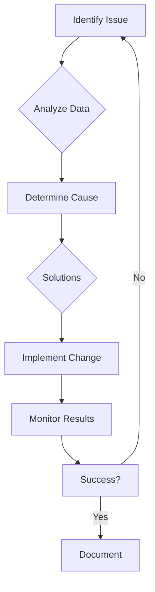
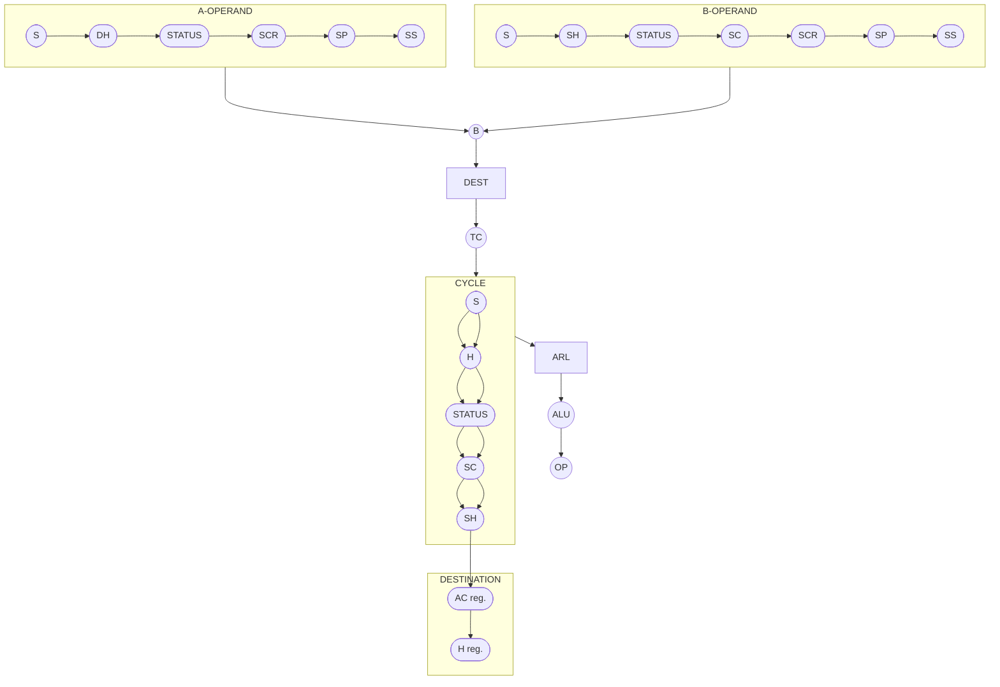
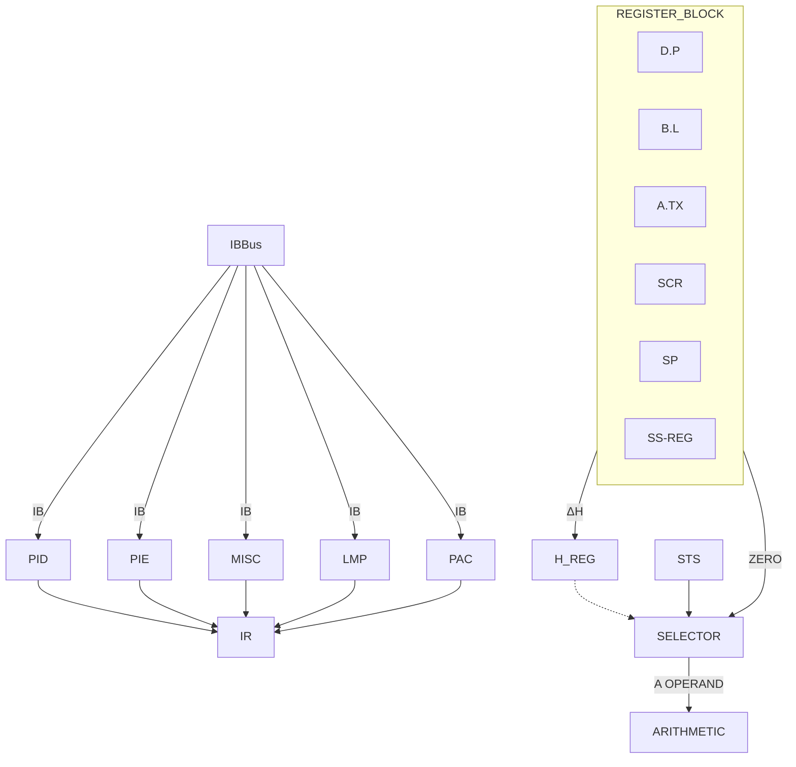
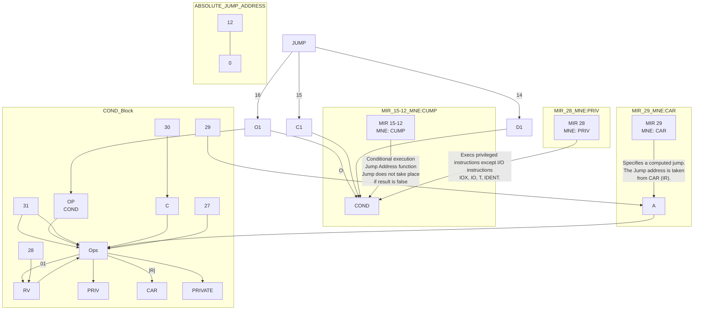
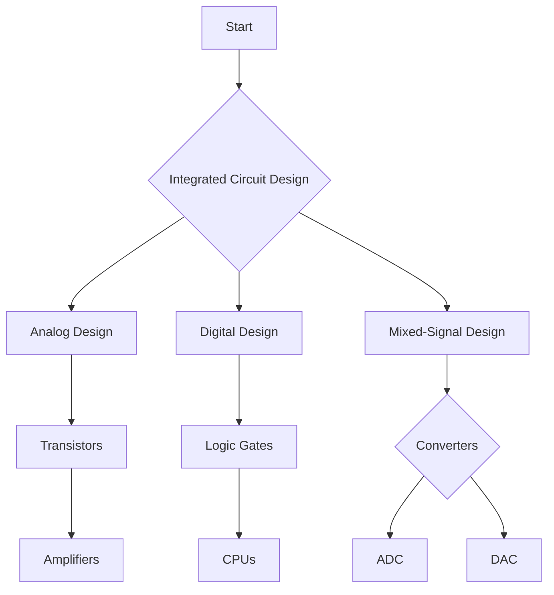
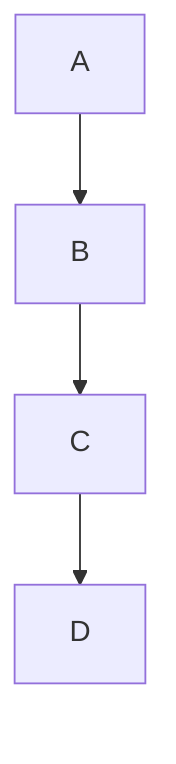
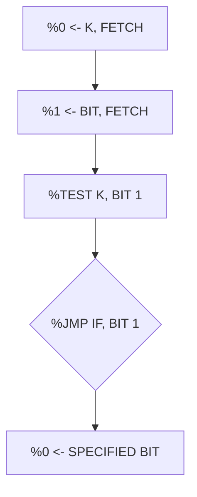
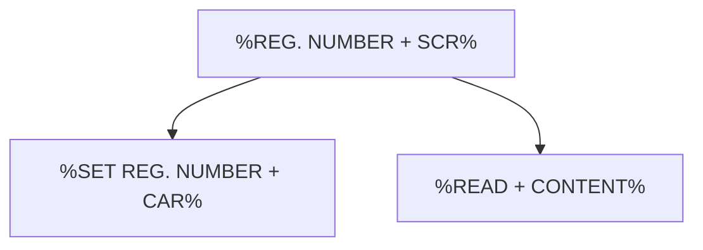

## Page 1

# NORWEGIAN DATA A.S

## NORD-10/S MICROPROGRAM

[Cover page: NORD-10/S Microprogram Manual]

---

## Page 2

I'm sorry, the document appears to be blank. There is no text or diagrams to convert into Markdown.

---

## Page 3

# REVISION RECORD

| Revision | Notes            |
|----------|------------------|
| 02/78    | PRELIMINARY ISSUE |
|          |                  |
|          |                  |
|          |                  |
|          |                  |
|          |                  |
|          |                  |
|          |                  |
|          |                  |
|          |                  |
|          |                  |

NORD-10/S Microprogram  
Publication No. ND-06.010.01

```
          ___  ___
|\    /|  |  \ / \
| \  / |  |      |
|  \/  |  |  / \ |
|      |  |  \_/ |
```

NORSK DATA A.S.  
Lørenveien 57, Postboks 163 Økern, Oslo 5, Norway

---

## Page 4

# Section 6: Performance Measurement

## 6.3 Monitoring Tools

The selection of performance monitoring tools greatly depends on the **objectives** set for monitoring activities. A variety of tools can be used, and Table 6-1 lists commonly used performance monitoring tools and their attributes.

| Tool Name             | Purpose                   | Attributes              |
|-----------------------|---------------------------|-------------------------|
| Task Manager          | Process management        | Built-in, user-friendly |
| Performance Monitor   | Detailed monitoring       | Flexible, customizable  |
| Network Monitor       | Network traffic analysis  | Real-time data          |
| Log Analyzer          | Log processing            | Historical data review  |

## 6.4 Analyzing Performance Data

Understanding the performance data involves recognizing the patterns and acting upon the insights provided by the data.

### 6.4.1 Data Sources

Data can be collected from several sources:

- **System Logs**: Provide historical data about system events.
- **Network Traffic**: Gives insights into network usage patterns.
- **Application Metrics**: Measure application performance and user interactions.

## 6.5 Performance Optimization

Optimization requires a holistic approach including hardware and software modifications, and sometimes organizational changes.

### Block Diagram



Incorporating these strategies can significantly enhance system performance and reliability.

## Appendix

### Table 6-2: Common Issues and Solutions

| Issue                  | Possible Solution           |
|------------------------|-----------------------------|
| High CPU Usage         | Optimize application code   |
| Network Latency        | Check network configuration |
| Disk I/O Bottlenecks   | Upgrade storage solution    |
| Memory Shortage        | Increase RAM or swap space  |

Achieving effective performance optimization is critical for maintaining an operational and efficient system.

---

## Page 5

# TABLE OF CONTENTS

## 1 INTRODUCTION
| Section | Page |
| ------- | ---- |
| 1.1     | Philosophy of Microprogramming                       | 1–1 |
| 1.2     | Micro Processor Instruction Set                      | 1–2 |
| 1.3     | Microprogram Control                                 | 1–2 |
| 1.4     | Entry Point Generator                                | 1–4 |
| 1.5     | The OR Logic                                         | 1–5 |

## 2 MICROINSTRUCTION DESCRIPTION
| Section | Page |
| ------- | ---- |
| 2.1     | The Arithmetic Microinstruction                      | 2–1  |
| 2.2     | The Interblock Microinstruction                      | 2–9  |
| 2.3     | The Jump Microinstruction                            | 2–11 |
| 2.4     | The Loop Microinstruction                            | 2–13 |

## 3 THE MICROPROGRAM
| Section   | Page |
| --------- | ---- |
| 3.1       | MICMAC — Micro MAC Mnemonic Table                  | 3–1  |
| 3.2       | NORD-10 Instructions and their Corresponding Entry-Points | 3–8  |
| 3.2.1     | Special Entry Points                               | 3–9  |
| 3.3       | Labels Referenced in NORD-10 Microprogram          | 3–10 |
| 3.4       | The Microprogram Listing                           | 3–11 |

### Figures:
| Figure | Description                                                 | Page |
| ------ | ----------------------------------------------------------- | ---- |
| 1.1    | Micro Instruction’s Bit Assignment                          | 1–3  |
| 1.2    | CPU Control Section                                         | 1–7  |
| 2.1    | Arithmetic μinstruction — Bit Assignment I                  | 2–2  |
| 2.2    | Arithmetic μinstruction — Bit Assignment II                 | 2–4  |
| 2.3    | Special Case 1                                              | 2–5  |
| 2.4    | Special Case 1 — Illustration                               | 2–6  |
| 2.5    | Special Case 2                                              | 2–7  |
| 2.6    | Special Case 3                                              | 2–8  |
| 2.7    | Interblock μinstruction — Bit Assignment                    | 2–10 |
| 2.8    | Jump μinstruction — Bit Assignment                          | 2–12 |
| 2.9    | Loop μinstruction — Bit Assignment I                        | 2–14 |
| 2.10   | Loop μinstruction — Bit Assignment II                       | 2–15 |

ND-06.010.01

---

## Page 6

# READERS – Please Note!!!!

We frequently refer to the NORD computer in this manual as "NORD-10". However, this does not mean that it only applies to NORD-10 users. Please note that it also applies to NORD-10/S, NORD-12 and NORD-42 users. We have written "NORD-10" merely for convenience sake.

ND-06.010.01

---

## Page 7

# 1 INTRODUCTION

- The microprogram is designed to implement, in hardware, the instruction set of NORD-10, NORD-42 and NORD-10/S.

- The microprocessor instruction set consists of four micro-instructions.

- This manual describes the exact format of the four different micro-instructions together with some examples of usage.

- The micro-instructions are stored in a 1k x 32 bits Read Only Memory – ROM.

- Chapter 7 contains a listing of the μ-program.

- The ROM is logically divided into the following sections:
  - μ-programmed execution of NORD’s 10/S, 10, 42 instruction repertoire
  - μ-programmed operator panel driver
  - μ-programmed operator communication in stop mode MOPC
  - μ-programmed bootstrap loader
  - μ-programmed memory check

## 1.1 PHILOSOPHY OF MICROPROGRAMMING

Microprogramming is primarily an orderly and systematic means of implementing control logic. By using microprogrammed control, the CPU control section may be broken down into well-defined subsections. This approach simplifies design, documentation and testing.

- Flexibility is an advantage of microprogramming: new instructions may be added without changing hardware design or test methods. Alternate instruction sets are available: at present one of two floating point forms may be ordered; 32 bit or 48 bit.

ND-06.010.01

---

## Page 8

# 1.2 MICROPROCESSOR INSTRUCTION SET

The microprocessor instruction set consists of four instructions. These are ARITHMETIC, INTERBLOCK, JUMP, and LOOP. This chapter deals with the exact format of these four instructions together with examples on how they may be used.

The operation code is contained in bits 30 and 31 in the Read Only Memory – ROM.

| ROM 31 | ROM 30 | Instruction |
|--------|--------|-------------|
| 0      | 0      | ARITHMETIC  |
| 0      | 1      | INTERBLOCK  |
| 1      | 0      | JUMP        |
| 1      | 1      | LOOP        |

Refer to Figure 1.1. The format shown applies to Read Only Memory and not Microinstruction Register – MIR. The two are not necessarily identical, due to the function of the OR logic.

The four instructions will be described in the following figure.

# 1.3 MICROPROGRAM CONTROL

The CPU control logic transforms the content of the instruction register (IR) into a sequence of actions on CPU registers, memory and/or I/O system. These actions are controlled by a set of control signals to registers, selectors, arithmetic elements, memory, I/O system, etc. In a non-microprogrammed machine, these signals are derived directly from the instruction register and a large and complicated Time Counter/Cycle Counter. This type of control logic is not easily structured and is difficult to describe and understand.

A block diagram of the transformation from machine instructions (IR) into a sequence of microinstructions is shown in Figure 1.2. Each NORD machine instruction is executed by a sequence of one or more microinstructions, a microprogram routine.

---

## Page 9

# ARITHMETIC

```
31 30 29 28 27 26 25 24 23 22 21 20 19 18 17 16 15 14 13 12 11 10  9  8  7  6  5  4  3  2  1  0
 _______________________________________________________________________________________________
|       | A |       | C | S |       |               |       |       |       |   |       |   |   |
|  OP   | R | CYCLE | S | H |  OR   |               |  TC   |       | DEST  | B |       | A |   |
|_______|___|_______|___|___|_______|_______________|_______|_______|_______|___|_______|___|___|
|       | S |       | A | L | SPECS | BIT NO.       |       |       |       |   |       |   |   |
|  ALU  | E |       | S | E |       |               |       |       |       |   |       |   |   |
|_______|___|_______|___|___|_______|_______________|_______|_______|_______|___|_______|___|___|
|  0 0  |   |       |   |   |       |               |       |       |       |   |       |   |   |
|_______|___|_______|___|___|_______|_______________|_______|_______|_______|___|_______|___|___|
```

# INTERBLOCK

```
31 30 29 28 27 26 25 24 23 22 21 20 19 18 17 16 15 14 13 12 11 10  9  8  7  6  5  4  3  2  1  0
_____________________________________________________________________________________________
|       |       | A |       | D | S |       |       |       |       |       |       |   |   |
|  OP   |  ALU  | R | CYCLE | A | R |  OR   | LEVEL |       | DEST  |   B   |   A   |   |   |
|_______|_______|___|_______|___|___|_______|_______|_______|_______|_______|_______|___|___|
|  0 1  |       | S |       | R | E | SPECS |       |       |       |       |       |   |   |
|_______|_______|___|_______|___|___|_______|_______|_______|_______|_______|_______|___|___|
```

# JUMP

```
31 30 29 28 27 26 25 24 23 22 21 20 19 18 17 16 15 14 13 12 11 10  9  8  7  6  5  4  3  2  1  0
_____________________________________________________________________________________________
|       | P | R |               |       |       | TC   |                    |       |       |
|  OP   | R | A |     O         |       |       |       | ADDRESS (ABSOLUTE) |       |       |
|_______|___|___|_______________|_______|_______|_______|____________________|_______|_______|
|       | A | I | 0 0 0 0 0 0 0 |       |       |       |                    |       |       |
|_______|___|___|_______|_______|_______|_______|_______|____________________|_______|_______|
|  1 0  |   | V |       |       |       |       |       |                    |       |       |
|_______|___|___|_______|_______|_______|_______|_______|____________________|_______|_______|
```

# LOOP

```
31 30 29 28 27 26 25 24 23 22 21 20 19 18 17 16 15 14 13 12 11 10  9  8  7  6  5  4  3  2  1  0
 ____________________________________________________________________________________________
|       |               | S | O | S | S |  SHIFT  | S |       | TG  |                |   |   |
|  OP   |     ALU       | A | S | R | H | H | I | F| T |  E | 3 | 0 | CONT |    B    |   |   |
|_______|_______________|___|___|___|___|___|___|___|___|____|___|___|_____|__________|___|___|
|       | ALT   |       | S | A | S | R | H | T |  TYPE  |                  TERM     |   |   |
|  ALU  |       |       | V | S | O | T | I | E |    2    | D | I | V | I | T | P |   |   |
|_______|_______|_______|___|___|___|___|___|___|__________|___|___|_____|___|_______|___|___|
|  1 1  |       |       |   |   |   |   |   |   |          |   |   |   |   |   |   |   |   |
|_______|_______|_______|___|___|___|___|___|___|__________|___|___|_____|___|_______|___|___|
```

**Figure 1.1: Micro Instruction's Bit Assignment**

*Document Number: ND-06.010.01*

---

## Page 10

# Microprogram Entry Point

The microprogram entry point is generated from the machine instruction operation code by hardware. This corresponds to the instruction decoding in a non-microprogrammed machine. The microprogram is controlled by a microprogram counter, which points to the next microinstruction to be executed from the Read Only microprogram memory (ROM). Branching may be done by the microinstruction JUMP. The microinstruction counter may be read, thus providing a simple subroutine capability. ROM word length is 32 bits. ROM content is clocked into the microinstruction register, MIR, at the end of each microinstruction. The microword contains information to establish the setting of the control lines for each cycle.

Since the microword (32 bits) is not sufficient to establish the setting of all the control lines, the microword is divided into four groups or instructions, given by ROM bits 31 and 30. The remainder of the 30 bits are in some of the instructions divided into fields having the same meaning in different instructions.

The microinstruction format is tailored to the CPU structure, while keeping the target instruction set (NORD-10) in mind in order to maintain execution efficiency. Many control signals are taken directly from MIR outputs, while others are derived by simple logic from MIR bits and a small Time Counter.

## 1.4 Entry Point Generator

Refer to Figure 1.2 for the following discussion.

A microprogram terminates by fetching the next machine instruction to be executed. The instruction is placed in the instruction register (IR). The Entry Point Generator (EPG) will then generate a unique address (Entry Point) based on the content of the instruction register (IR). This address will be clocked into the microprogram counter (MPC).

Entry points for all NORD-10 instructions which do not have sub-instruction fields, are 100₈, 102₈, ..., 172₈ for operation codes 0, 1, ..., 35₈, respectively; i.e., the Entry Point equals 100 + (operation code) ∙ 2.

**Example:**

- **LDA** – opcode (bits 11, 12, 13, 14 and 15) = 01001 = 11₈
- Entry point = 100 + 11₈ ∙ 2 = 122₈

In location 122₈ in ROM, resides the first (of two) microinstructions which constitutes the microprogram for the LDA instruction.

```
ND-06.010.01
```

---

## Page 11

# Instruction Spacing

A spacing of two locations between the Entry Points is chosen, due to the fact that most of these microprograms occupy two locations of ROM. This applies to the instructions:

- LDA, LDX, LDT,
- STA, STX, STT, STZ,
- JMP, JPL.

Some other instructions, such as FSB, FAB, FMU, FDV, STF, etc., require more than two locations, but a jump to another address in the ROM where the rest of the microprogram for relevant instruction resides is executed.

For all other instructions, the Entry Point is generated according to a spacing of 16 between the EP's for the main instruction operation code such as CJP, ROP, etc. Refer to table "EP for Instructions with Sub-instructions".

Section 3.2 gives the entry points for the NORD-10 instructions.

## THE OR LOGIC

The instruction set for the NORD-10 may be divided into two main groups:

1. Instructions well defined by the operation code (upper 5 bits), will not require an OR logic to be implemented.

   *Example:*

   - LDA, STA, ADD, AAA, SAA.

2. Instructions not completely defined by the operation code are defined by their subinstruction field. The subinstruction field will give additional information to the operation code.

   *Example:*

   - The subinstruction field of a SHIFT instruction will give information about shift direction and shift method.
   - The subinstruction field of a SKIP instruction will give information about a skip condition.

ND·06.010.01

---

## Page 12

# Introduction to OR Logic in ROM

To reduce the number of Entry Points in the ROM (not having one for each combination of subinstruction field) the OR logic is introduced to take information directly from the subinstruction field in the Instruction Register (IR) to the Micro-Instruction Register (MIR). The ROM bits 16, 17, and 18 (8 combinations) decide which IR bits are to be transferred to MIR.

The subinstruction field (giving the large instruction repertoire combinations) gives, by means of the OR logic, the microprocessor the necessary information through a minimum of logic.

From Figure 1.2 we can see that micro-instruction register (MIR) bits 0-15 is the output from the OR logic. Table 1.1 describes the origin of the MIR 0-15 for the 8 different OR specifications.

| OR Specification | MIR 0-15 Origin |
|-------------------|-----------------|
| [illegible]       | [illegible]     |

ND-06.010.01

---

## Page 13

# CPU Control Section

```mermaid
graph TD
    A[MAIN MEMORY]
    B[CPU Bus]
    C[I    R]
    D[EPG]
    E[MPC (+1)]
    F[31 ROM 0]
    G[13]
    H[3 OR spec.]
    I[OR Logic]
    J[31 MIR 0]
    K[M  I  R]
    L[TIMING]
    M[CPU DATA LOGIC]

    A <--> B
    B --> C
    D --> E
    E --> F
    F -.-> G
    F -.-> H
    F --> J
    J --> K
    J --> I
    I --> C
    L --> M
```

| Abbreviation | Description                  |
|--------------|------------------------------|
| MIR          | Microprogram register        |
| ROM          | Read only memory             |
| EPG          | Entry point generator        |
| MPC          | Microprogram counter         |
| IR           | Instruction Register         |

**Figure 1.2:** CPU Control Section

ND-06.010.01

---

## Page 14

# OR Specifications

## Table 1:11

| No. | Instr. | OR Specifications | Bop Without Dest. | Bop With Dest. | COND. = CONDITIONAL |
|-----|--------|-------------------|-------------------|----------------|---------------------|
| 0   | NONE   | -                 | -                 | -              | [Empty]             |
| 1   | OR.for | ARIT              | -                 | -              | If I0.2 = 0         |
|     | ORBWO  |                   |                   |                | If I0.2 # 0         |
| 2   | OR.for | ARIT              | ARIT              | INTB           | If I0 # 0.0         |
|     | ORBWI  |                   |                   |                | If I0 = 0.0         |
| 3   | OR.for | ORBWI             | ARIT              | RIT            | If I0.2 = 0         |
|     | ORBWO  |                   |                   |                | If I0.2 # 0         |
| 4   | OR.for | RSH.T             | ARIT              | RIT            | If I0 = 0           |
|     | SHT.y  |                   |                   |                | If not COND.        |
| 5   | OR.for | RROP              | ARIT              | RIT            | If [6] = 0          |
|     | RRROP  |                   |                   |                | If not COND.        |
| 6   | OR.for | RSW.2             | ARIT              | RIT            | If COND.            |
|     | RSW.3  |                   |                   |                | If not COND.        |
| 7   | SWAP   | -                 | -                 | -              |                     |
|     | Cycle.3 |                  |                   |                |                     |

### Index Table

| MIR 0-15 |
|----------|
| 15       |
| 14       |
| 13       |
| 12       |
| 11       |
| 10       |
| 9        |
| 8        |
| 7        |
| 6        |
| 5        |
| 4        |
| 3        |
| 2        |
| 1        |
| 0        |

### Additional Notes

- ARIT = ARITHM
- INTB = INTERBLOCK
- Ixx = IRxx
- Rxx = ROMxx

---

```
ND-06.010.01
```

---

## Page 15

# 2 MICROINSTRUCTION DESCRIPTION

## 2.1 THE ARITHMETIC MICROINSTRUCTION

This is the most frequently used μ-instruction in the microprogram. It is used to perform arithmetical as well as logical operations. Refer to Table 2.1.

This μ-instruction is used to set up memory communication (cycle specifications).

For communication with the internal registers three special cases of the instruction exist. Those cases are illustrated in Figures 2.3, 2.4, 2.5, and 2.6.

If bit 15 in an ARITHMETIC instruction is set, the execution of the microinstruction is dependent on the result of a specified test.

The CARM instruction is a conditional ARITHMETIC instruction using the most significant unit.

For a CARM instruction, the arithmetical or logical operation specified will not be executed if the result of the specified test is false. Any cycle specification will, however, be executed.

Note: It is the result of a previous arithmetical or logical operation using the most significant unit, which is tested.

ND-06.010.01

---

## Page 16

# Arithmetic Microinstruction

## Bit Assignment I

```mermaid
flowchart TD
    A[ARITHMETIC] --> B[TEST COND]
    B --> C[DEST]
    C --> D[ALU]
    D --> E[0]
    B --> F[30]
    C --> G[29]
    B --> H[28]
    G --> I[LEVEL]
    H --> J[CYCLE]
    F --> K[NO]
    C --> L[25]
    I --> M[OR SPECS]
    J --> N[OR CYCLE]
    M --> O[OR DESTINATION]
    N --> P[TEST COND]
    P --> QQ[23]
    QQ --> RR[21]
    RR --> SS[22]
    SS --> TT[SPECIFICATIONS]
    TT --> UU[25]
    UU --> VV[ALU]
    VV --> WW[29]
    WW --> XX[30]
    XX --> YY[DEST]

    subgraph MIR 0
        direction BT
        A1[0] --> B1[Zero]
        C1[2] --> D1[SIGN.0]
        E1[1] --> F1[X.0]
        G1[0] --> H1[A<0]
        I1[3] --> J1[ZERO]
        K1[2] --> L1[SIGN]
        M1[1] --> N1[X]
        O1[0] --> P1[NEG]
        Q1 --> R1[MIR.13 to MIR.15]
        S1 --> T1[MNE]
    end

    subgraph SPECIFICATIONS
        direction BT
        U1[0] --> V1[OR3WC]
        W1[1] --> X1[OR SKIP]
        Y1[2] --> Z1[OR RSTP]
        AA1[3] --> BB1[OR HCNT]
        CC1[4] --> DD1[OR REORDER]
        EE1[5] --> FF1[OR GOTO SWAP cycle 1]
        GG1[6] --> HH1[OR GOTO SWAP cycle 2]

        Q2 --> R2[MNO]
        S2 --> T2[MNE]
    end

    subgraph MIR 19
        direction BT
        A3[SAVE CARRY]
        B3[OVERFLOW (SACO)]

        C3[Specifies BO serious/STOP]
    end

    subgraph MIR 20
        direction BT
        A4[CHL EV]
        B4[Causes clocking of register even]
        C4[Change level]

        D4 --> E4[MIR]
        F4 --> G4[MNE]
    end

    subgraph MIR 24
        direction BT
        A5[ARITH SELECT]
        B5[Which function to be performed]
        C5[Normal add/subtract]
        D5[With/without add/subtract]
    end
```


## Table 2.1

| MIR Bits         | Description                                          |
|------------------|------------------------------------------------------|
| MIR 0-2          | Test condition result assignment                     |
| MIR 4-7          | ALU Operation                                        |
| MIR 8-11         | Destination register selection                        |
| MIR 12-15        | Arithmetic function selection                        |

**Note:** See Figure 2.1 for detailed bit assignments and microinstruction flow.

---

## Page 17

# Logical and Arithmetic Operations

## Logical Operation
**MIR 29 = 1**

| MIR  | Function | Mne   |
|------|----------|-------|
| 0 0 0 0 | B        | BDIRC |
| 0 0 0 1 | B⋅A      | ANDC  |
| 0 0 1 0 | B′+A     | ORCB  |
| 0 0 1 1 | LOGICAL 1| ONE   |
| 0 1 0 0 | B′+A     | ORC   |
| 0 1 0 1 | A′       | ADIRC |
| 0 1 1 0 | B∨A      | EXORC |
| 0 1 1 1 | B′⋅A     | ORCA  |
| 1 0 0 0 | B′⋅A     | ANCB  |
| 1 0 0 1 | B∨A      | EXOR  |
| 1 0 1 0 | A        | ADIR  |
| 1 0 1 1 | B+A      | OR    |
| 1 1 0 0 | LOGICAL 0| ZERO  |
| 1 1 0 1 | B′⋅A     | ANDCA |
| 1 1 1 0 | B⋅A      | AND   |
| 1 1 1 1 | B        | BDIR  |

## Arithmetic Operations
**MIR 29 = 0**

| Function | Mne      |
|----------|----------|
| B−1      | BM1      |
| B−A−1    | BMAM1    |
| B        | BD1      |
| B+A+carry| PLUS ADDC|
| (B−A−1)+carry| BMAM1 ADDC|
| B+A      | PLUS     |
| B+A+1    | PLUS ADD1|
| B−A      | BMINA    |
| B+1      | BDI ADD1 |

**Table 2.1: Function Select Codes**

---

ND-06.010.01

---

## Page 18

# Arithmetic: μ-instruction

## Bit Assignment



## Tables

### DEST
| S  | H   | STATUS | SC | SH | AC   | HAC  |
|----|-----|--------|----|----|------|------|
| 0  | Zero|        |    |    |      |      |
| 1  | P reg. |     |    |    |      |      |
| 2  | B reg. |     |    |    |      |      |
| 3  | C reg. |     |    |    |      |      |
| 4  | A reg. |     |    |    |      |      |
| 5  | L reg. |     |    |    |      |      |
| 6  | X reg. |     |    |    |      |      |
| 7  | Scratch In |     |    |    |      |      |

### A-OPERAND
| S  | DH   | STATUS | SCR | SP  | SS  |
|----|------|--------|-----|-----|-----|
| 0  | Zero |        |     |     |     |
| 1  | P reg. |      |     |     |     |
| 2  | B reg. |      |     |     |     |
| 3  | C reg. |      |     |     |     |
| 4  | A reg. |      |     |     |     |
| 5  | L reg. |      |     |     |     |
| 6  | X reg. |      |     |     |     |
| 7  | Scratch In |  |     |     |     |

### B-OPERAND
| S  | SH   | STATUS | SC | SCR | SP  | SS  |
|----|------|--------|----|-----|-----|-----|
| 0  | Zero |        |    |     |     |     |
| 1  | P reg. |      |    |     |     |     |
| 2  | B reg. |      |    |     |     |     |
| 3  | C reg. |      |    |     |     |     |
| 4  | A reg. |      |    |     |     |     |
| 5  | L reg. |      |    |     |     |     |
| 6  | X reg. |      |    |     |     |     |
| 7  | Scratch In |  |    |     |     |     |

*Δ = H least significant 8 bits of H register*

---

*Figure 2-2: Arithmetic μ-instruction - Bit Assignment II*

---

## Page 19

# Special Case 1

## Arithmetic Diagram

```plaintext
    +---------------+                   +-------------------------+
    |               |                   |                         |
    |               |                   |      S   DH  H  SCR  SP |
    |               |                   |  0  STATUS              |
    |               |                   |  1  A register          |
    |    ARITHMETIC |                   |  2  P register          |
    |               |                   |  3  B register          |
    |               |    D est = 12     |  4  L register          |
    |               |    D IO           |  5  T register          |
    |  0            |                   |  6  S register          |
    |  0            |                   |  7  X register          |
    |               |                   +-------------------------+
    +---------------+                   

                                TRR - A, Operand field transferred to internal register specified in B operand field
```

## Internal Registers

| MNE | NAME            |
|-----|-----------------|
| 0   | TRR - Oper Panel control reg. |
| 1   | AC - Status Register          |
| 2   | JMP - Swap Register           |
| 3   | LVF - Interrupt Enable        |
| 4   | IOR - Mechanical Interrupt Enable |
| 5   | CAC - Queue Resp.             |
| 6   | CAR - Comp. Address           |
| 7   | IR - Next Instruction Reg.    |
| 10  | Not assigned                  |
| 11  | Not assigned                  |
| 12  | MCR - Mechanical Input Table  |
| 13  | PCR - Input data channels     |
| 14  | MS - Message Character Reg.   |
| 15  | IEE - Queue Interrupt Enable  |
| 16  | PDO                           |
| 17  | B lO - Output-l/O System      |

## Misc Reg. Format

| BIT | UOF | NON | FF   |
|-----|-----|-----|------|
| 0   | 1   | 2   | 3    |
|     | PON |     |      |

> NOTE: ALL numbers are in octal
> M.CAL. MUST BE SET RESET

**Figure 2-3: Special Case 1**

ND-06.010.01

---

## Page 20



| EXAMPLES      | SPECIAL CASE         |
|---------------|----------------------|
| %SCR → PID    | D = 12               |
| %SCR → PIE    |                      |
| D.I/O         |                      |
| D.I/O         |                      |
| B.PAC         |                      |
| B.PAC         | Label Register       |
| B.LMP         |                      |

```
D.I/O
D - field = 128

                     TO ARITHMETIC 
                           ^
                           |
                          |
                       SELECTOR
                            |
                       A OPERAND
                            |
                          STS
                           |
                       REGISTER BLOCK
                           |
                           |
                       IBBUS  
                           |
                           |
```

```
EXAMPLES:
A.SCR              SPECIAL CASE: D = 12
ARM
A.SCR        
B.PID
A.SCR
```

```
       Figure 2.1: Special Case - Illustration
       ND-06.010.01
```

---

## Page 21

# Figure 2-5: Special Case 2

```
+----+----+----+----+----+----+----+----+----+----+
| 8  | 7  | 6  | 5  | 4  | 3  | 2  | 1  | 0      |
| DEST | A  | B  |       BIT TO BE SET             |
|      | BMASK   B<-12                             |
+-----+-------------------------------------------+
| BIT 12-15 DEFINED BIT NO. TO BE SET IN SELECTED |
| DESTINATION REGISTER OR THE AC REGISTER         |
+-------------------------------------------------+
```

## Operand = Bit Mask

### Bit 12-15 (Defined Bit No., Position)
| | |
|-|-|
| 0 | None |
| 1 | D register |
| 2 | P register |
| 3 | B register |
| 4 | L register |
| 5 | A register |
| 6 | T register |
| 7 | X register |

### Status
| 10 | Status |
|-|-|
| 11 | Shift register |
| 12 | Single counter |
| 13 | Shift counter |
| 14 | Scratchpad |
| 15 | Saved status |
| 16 | Saved status |
| 17 | Saved status (Scratch III) |

## Example

```
LOCM BDIR B, B4:0, SCR
ARM 0, R BM1 0, B5:0, SS
```

### SCR

%20 (BIT 4 = 1) -> SCR

### SS

%40 (BIT 5 = 1) -> 1

---

ND-06.010.01

---

## Page 22

# Internal Registers

```
  +---------------------------------------+
  | A = 12                                |
  |   +-----------------------------------+
  |   | B                                 |
  |   |                                   |
  |   | DEST not                          |
  |   | used                              |
  |   |                                   |
  |   |                                   |
  |   +-----------------------------------+
  |                                       |
  |+-------------------------------------+|
  ||              ALU                    ||
  ||                                     ||
  ||                                     ||
  ||                                     ||
  ||                                     ||
  ||                                     ||
  ||                                     ||
  ||                                     ||
  |+-------------------------------------+|
  +---------------------------------------+
```

## Table of Internal Registers

| MNE | NAME                                      |
|-----|-------------------------------------------|
| 0   | Operands Status Register                  |
| 1   | Outputs Switching Register                |
| 2   | Condition Register                        |
| 3   | PVL Status Level                          |
| 4   | Previous Interrupt Code                   |
| 5   | Memory Interrupt Detect                   |
| 6   | Priority Interrupt Detect                 |
| 7   | Priority Interrupt Enable Register        |
| 9   | Oper. Panel Status Register               |
| 10  | Not used                                  |
| 11  | Decoded PIL - causes CPU to STOP if       |
| 12  | Autopoll back description                 |
| 13  | Memory Operand Capture Register           |
| 14  | Micro-Op Controls Description Register    |
| 15  | Micro-Program Address Register            |
| 16  | Int Routine Address H                     |
| 17  | RQ-3 & Operand used by TRA, RTR instruction |

### Example

```
% I/BUS ➔ H REG.
% I/PCS ➔ REG. ENABLE
% PIM (Decoded PIL) ➔ H
% PANEL STATUS ➔ H

BID   I/O 
LOGM  A. I/O        
LOGIM A. I/O        
ARM   A. I/O        
ARM   A. I/O        
 
BID  A I/O
PES  B PIM
PC   B PAS

```

Note: All numbers are in decimal. Memory Control and the INTR Xcall signals are decimal.

_Figure 2-6: Special Case 3_

---

## Page 23

## 2.2 THE INTERBLOCK MICROINSTRUCTION

Refer to Figure 2.7. The INTERBLOCK microinstruction is used for interlevel communication, i.e., for implementing the IRR and IRW instruction. The Interblock instruction is also used by the microprogram for saving and returning of information from scratch registers on different levels. Bit 20 is used for defining the direction of communication as described in Figure 2.7. The two levels to communicate between is always the current level, as specified by PIL — Current Program Level indicator, and the level specified by bits 12 to 15.

---

## Page 24

# Figure 2-7: Interblock μ-instruction - Bit Assignment

```mermaid
flowchart TD
    subgraph INTERBLOCK
    direction TB
    A[31]
    R[30]
    S[29]
    E[28]
    L[27]
    C[26]
    Y[25]
    CYCLE[24]
    S[23]
    |Same as for ARITH| --> |Same as for ARITH|
end

OP --> ALU
S --> CYCLE
R --> 0

subgraph LEVEL
    direction TB
    A[7]
    B[6]
    DEST[5]
end

subgraph ORSPECS
    direction TB
    ROW[17]
    OR[16]
end

LB1((LEVEL B[LOGIC]))
LB2((MIR 5-12))

LEVEL --> LB1
ORSPECS -- Same as for ARITH --> LB2

A[4] --> LEVEL
MIR[5-12] --> LEVEL
LEVEL[LB]:LEVLE7 --> LEVEL
SS[LCD17]

subgraph Q-OR-SPECS-LOAD-STORE-REG-BLOCK
    direction TB
    ROW[17]
    OR[16]
end

LS1((MNE: ORIN 3))

Q-OR-SPECS-LOAD-STORE-REG-BLOCK --> LS1

// Extra elements translation
```

## Table: Instruction Details

| MNE     | DIRECTION                                               |
|---------|---------------------------------------------------------|
| MNE: D - Direction                                                |
| ORBW    | The destination register is on the level in the          |
| ORBWO   | The destination register is on current level specified. | 

## Examples

| LE7    | DSPL |
|--------|------|
| A, A   | D, SS|

## Miscellaneous

- ND-06.010.01
- % A REG. CURRENT LEVEL ➞ SS REG/LEVEL 7
- % SS LEVEL 7 ➞ A REG. CURRENT LEVEL

---

## Page 25

## 2.3 THE JUMP MICROINSTRUCTION

Refer to Figure 3.9. The JUMP instruction may be divided into:

- Unconditional JUMP — JMP
- Conditional JUMP — CJMP
- Privileged Instruction JUMP — JMP PRIV
- Computed Address Register JUMP — JMP, CAR

The JMP instruction takes bits 0 - 11 as an absolute address.

The CJMP takes bits 0 - 11 as an absolute jump address if the specified condition is TRUE. If the specified condition is FALSE, the instruction following the CJMP will be executed.

The JMP PRIV instruction is used to generate Privileged Instruction Internal Interrupt (bit 6 in IIC if the privileged instruction executed is on Ring 0 or Ring 1). IOX, IOT and IDENT are decoded separately on 1058 Interrupt Control.

The JMP, CAR instruction is used during subroutine handling and is analogous to the EXIT machine instruction in that the absolute jump address is taken from Computed Address Register — CAR, which contains the main program return address.

---

## Page 26



**Figure 2-8: Jump μ-Instruction — Bit Assignment**

ND-06.010.01

---

## Page 27

# 2.4 THE LOOP MICROINSTRUCTION

Refer to Figure 2.10. The LOOP instruction is used in all SHIFT, MULTIPLY and DIVIDE operations. When execution of a LOOP instruction is started, the instruction will repeatedly be executed until a specified terminating condition occurs. In other words, the LOOP instruction will remain in the Microinstruction Register and no incrementing of the MPC (Microprogram Counter) will take place before the terminating condition is met.

During shift operations, for instance, the LOOP instruction will be executed as many times as the number of shifts specified.

The LOOP instruction may specify any arithmetical or logical operation as for the ARITHMETIC instruction. However, the LOOP instruction may specify operations on both ALU's in the same instruction (depending on bit 0). The LOOP instruction may, thus, effectively operate a 32 bits ALU. This is the case for all floating and double precision instructions.

Refer to Figure 2.10. Bit 0 controls the Alternative Arithmetic function select. If bit 0 = 0, the alternative function select will be used by both ALU's if the most significant arithmetic module's shift register bit 15 (SH31) = 1. This is used by the multiply routines.

When bit 0 = 1, the alternative function select will be used if least significant arithmetic module's shift register bit 0 (SH0) = 1. This is used by the divide routines.

[Figure: Unavailable]

---

## Page 28

# Loop - μ-Instruction - Bit Assignment

```
  +-----------------------------------+
  |                LOOP               |
  +-----------------------------------+
  |           OPCODE                  |
  |       0            1              |
  +------|-----------------+----------+
  | ARITH|     ALU         | ALT. ALU |
  +------|-----------------|----------+
         |        5        | 5 5 6 5  |
0        | OPCODE | TYPE   | S  O  S  |
  +-----------------------------------+
  |           ALU - ARITH             |
  +-----------------------------------+
  |      same as for ARITH            |
  +-----------------------------------+
  | SAVE STATUS                       |
  |   MIR:19                          |
  |   MNE:SACQ                        |
  |   STATUS:                         |
  |      5 and 6 are direct - 4       |
  |      flags are set for            |
  |      each pass of the loop        |
  +-----------------------------------+
  | SHIFT DIRECTION                   |
  |   MIR:15                          |
  |   0 Shift left                    |
  |   1 Shift right (MNE:SHR)         |
  +-----------------------------------+
  | SHIFT TYPE                        |
  |   MIR:13                          |
  |   MNE                             |
  |     0 Not shift                   |
  |     1 SHR                         |
  |     2 Zero input                  |
  |     3 Not used                    |
  +-----------------------------------+
  | M                                M|
  | IR:10                            IR|
  |       M-bits are set for each     |
  |       pass of the loop            |
  +-----------------------------------+
  |                OR                 |
  |   ROM:  18 17 16                  |
  |   4 OR SHT                        |
  |   MNE:ORSHT                       |
  |   Note: M-bits are set when       |
  |   ORSHT with:                     |
  |     - M-bits                      |
  +-----------------------------------+
  | SH32                              |
  |  BDI, BDA, SHZE                   |
  |   MIR:12                          |
  |       0 16 bit shift              |
  |       1 32 bit shift (MNE:SH32)   |
  +-----------------------------------+
```

% zero ends input shift: right.

**Example:**  
`LOOP` `SHR1` `BDI3` `BDA, HAC` `SHZE`

*Figure 2.9: Loop μ-instruction - Bit Assignment*

ND-06.010.01

---

## Page 29

# Loop Instruction - Bit Assignment II

```plaintext
     +-------------------------+
     | ALTERNATIVE SPECIFICATIONS|
     | M/MR IL  MNE            |
     | 0   ASH3 ASH            |
     | 1   ALT AL specified if:|
     |        0 SH32 = 1       |
     |        1 SH01 = 1       |
     +-------------------------+
           ^
           |
     +-----+-----+
     | SHIFT LEFT|
     | INPUT     |
     | M/MR IL   MNE           |
     | 0   A specified by      |
     | 1   EM input for        |
     |     division            |
     | MNE: ENDID              |
     +-------------------------+
           ^
           |
     +-----+---------------------------+
     | OP | B OPERAND                  |
9 8 | TG | M/MR IL  MNE               |
     | 0   TGSH0                       |
     | 1   TGAC0                       |
     |     TGSD                        |
     +-------------------------+
           ^
           |
     +-----+-------------------+
     | TERMINATION            |
     | MNE                   |
     | TSCO                  |
     | Terminate when:       |
     | 0 SC = 0 nearing end  |
     | 1 NC = good           |
     | 2 SC SH<0 or          |
     |   TS32 = 0            |
     | MNE: TSH31            |
     |     TSH32             |
     | 3 3212 = 1 R(53 H6)   |
     |   32 bits floating    |
     |   only                |
     |                      |
     +-----------------------+
           ^
           |
     +-----+-------------------+ 
     | TG ROUNDING            |
     | MNE                    |
     | 0 Not used             |
     | 1 Set TG ➔ 1 if:       |
     |   2 AC0 = 1            |
     |   3 [illegible] = 0    |
     | MNE: [illegible]       |
     | N3U/WM1/WI/Z0/MZ/TG is |
     |   always zero          |
     +------------------------+

```

**Example:**
- SHR0: TSCO
- LOOP: SH32 TSH31 BM/IA
- B.AC: BM SH32 TSH31 IA
- % shift rot: until SC = 0
- % shift left (zero end input) until SH32 = 1

**Figure 2.10. Loop instruction – Bit Assignment II**

---

## Page 30

# Integrated Circuits

**Definition and Composition**:  
Integrated circuits (ICs) are a set of electronic circuits on a small flat piece (or "chip") of semiconductor material, normally silicon.

## Basic Concepts

Integrated circuits combine multiple electronic components such as transistors, resistors, and capacitors into a single device. These components are interconnected to perform various functions such as amplification, oscillation, computation, etc.

### Types of Integrated Circuits

| Type          | Description                                                     |
|---------------|-----------------------------------------------------------------|
| Analog        | Handle continuous signals. Examples: amplifiers, oscillators.   |
| Digital       | Handle discrete signals. Examples: microprocessors, memory chips.|
| Mixed-Signal  | Combine both analog and digital circuits. Examples: ADC, DAC.   |

## Applications

ICs are found in almost every electronic device. They are the backbone of modern electronics, finding applications in:

- **Consumer Electronics**: TVs, smartphones, washing machines.
- **Automotive**: Engine controls, safety systems, infotainment.
- **Telecommunications**: Mobile networks, satellite communications.
- **Computing**: PCs, servers, data centers.



### Challenges

- **Miniaturization**: As technology evolves, the need for smaller components with higher efficiency is crucial.
- **Heat Dissipation**: High density of components leads to significant heat production.
- **Manufacturing Precision**: High precision required to produce efficient and reliable ICs.

### Future Trends

The future of integrated circuits includes advancements in:

- **Nanotechnology**: Developing even smaller transistors and components.
- **Quantum Computing**: Leveraging the principles of quantum mechanics for processing data.
- **Artificial Intelligence**: Enhancements in processing capabilities for AI applications.

[Photo: Schematic Diagram of Integrated Circuit Layout]

---

## Page 31

# 3 THE MICROPROGRAM

## 3.1 MICMAC — MICRO MAC MNEMONIC TABLE

| Mnemonic | Description |
|----------|-------------|
| A,A      | A register as A-operand |
| A,B      | B register as A-operand |
| A,D      | D register as A-operand |
| AC       | Temporary Sum or Accumulator Register |
| ADD1     | Forced Carry Input |
| ADDC     | Add Carry Input |
| A,DH     | Lower 8 bits of H with sign extension as A operand |
| ADIR     | A-operand Direct through Arithmetic = A |
| ADIRC    | A-operand Direct Complemented = A̅ |
| A,H      | H register as A-operand |
| A,IO     | Special Case: Internal Register specified as B-operand to H register |
| A,L      | L register as A-operand |
| ALD      | Automatic Load Descriptor |
| AND      | Logical AND = A · B |
| ANDC     | AND complement — NAND = A̅ ∙ B̅ |
| ANDCA    | A̅ ∙ B |
| ANDCB    | A ∙ B̅ |
| A,P      | CP register as A-operand |
| A,R      | R register as A-operand |
| ARL      | Arithmetic operation least significant unit |
| ARM      | Arithmetic operation most significant unit |

ND-06.010.01

---

## Page 32

# Technical Specifications

## Operands

| Symbol   | Description                                      |
|----------|--------------------------------------------------|
| A,S      | STATUS as A-operand                              |
| A,SCR    | SCRATCH register as A-operand                    |
| ASH0     | Alternative ALU specs. if SH0 = 1                |
| ASH31    | Alternative ALU specs. if SH31 = 1               |
| A,SP     | SAVED P as A-operand                             |
| A,SS     | SAVED STATUS as A-operand                        |
| A,T      | T register as A-operand                          |
| A,X      | X register as A-operand                          |
| A,Z      | Zero as A-operand                                |
| B,A      | A register as B-operand                          |
| B,AC     | AC register (Temporary SUM or ACCUMULATOR) as B-operand |
| B,2AC    | 2 · AC as B-operand                              |
| B,ALD    | ALD — Automatic Load Descriptor as B-operand     |
| B,B      | B register as B-operand                          |
| B,B0:17  | Bit number is one in Bit Mask as B-operand       |
| B,CAR    | Computed Address Register as B-operand           |
| B,D      | D register as B-operand                          |
| BDI      | B-operand direct during arithmetic operation     |
| BDIA     | B-operation direct alternative ALU Specs.        |
| BDIR     | B-operand direct during logical operation        |
| B,HAC    | 1/2 AC as B-operand                              |
| BIO      | I/O bus as source when A, IO: I/O bus as dest. when D, IO |
| B,IR     | IR as B-operand                                  |
| BIR      | IR as B-operand                                  |
| BIR3     | IR0-3 as B-operand                               |

**Document Number:** ND-06.010.01

---

## Page 33

# Technical Specifications

## B-Operands

| Code  | Description                                           |
|-------|-------------------------------------------------------|
| B,IR3 | IRO-3 as B-operand                                    |
| B,L   | L register as B-operand                               |
| B,LMP | Lamp register as B operand                            |
| BM    | B-operand = BIT MASK                                  |
| BM1   | B-operand minus 1                                     |
| BM1A  | B-operand minus 1, alternative ALU specs.             |
| BMAA  | B-operand - A-operand alternative ALU spec.           |
| BMAM1 | B-operand - A-operand -1 (B-A-1)                      |
| BMINA | B-operand - A-operand (B-A)                           |
| B,MIS | Miscellaneous register as B-operand                   |
| BMISC | Miscellaneous register as B-operand                   |
| B,MPC | Micro Program Counter as B-operand                    |
| B,OPR | Panel Switch Register as B operand                    |
| B,P   | CP register as B-operand                              |
| B,PAC | Panel Control as B-operand                            |
| B,PAS | Panel Status as B-operand                             |
| B,PES | Memory Error Status register as B-operand             |
| B,PID | Priority Interrupt Detect as B-operand                |
| B,PIE | PIE as B-operand                                      |
| B,PIM | Decoded PIL as B-operand                              |
| B,SC  | Shift Counter as B-operand                            |
| B,SH  | Shift register as B-operand                           |
| B,T   | T register as B-operand                               |
| B,X   | X-register as B-operand                               |
| B,Z   | Zero as B-operand                                     |

ND-06.010.01

---

## Page 34

# Instructions and Operations

| Name   | Description                                                              |
|--------|--------------------------------------------------------------------------|
| CALL   | Jump to subroutine                                                       |
| ,CAR   | Jump address from CAR (Computed Address Register)                        |
| CARL   | Conditional Arithmetic least significant unit                            |
| CARM   | Conditional Arithmetic most significant unit                             |
| CEATR  | Cycle 1, Effective address to R -- no request                            |
| CFC    | Cycle 3, Fetch                                                           |
| CHLEV  | Change program level                                                     |
| CJMP   | Conditional jump                                                         |
| CLOGM  | Conditional logical operation most significant unit                      |
| CO17   | Conditional bit set and condition 7                                      |
| COND   | Condition bit set bit 15 in ROM                                          |
| CPTR   | Cycle 2, Current P register to R register                                |
| CR     | Cycle 7, Read contents of effective address                              |
| CRR1   | Cycle 6, Read contents of effective address + 1                          |
| CW     | Cycle 5, Write into effective location                                   |
| CWR1   | Cycle 4, Write into effective location + 1                               |
| DH     | Lower 8 bits of H sign extended                                          |
| DNO    | Device number                                                            |
| D,A    | A register as destination register                                       |
| D,B    | B-register as destination                                                |
| D,D    | D register as destination                                                |
| D,IO   | Special case, A-operand transferred to internal registers                |
| D,L    | L register as destination                                                |
| D,P    | CP register as destination                                               |

```
[Document ID: ND-06.010.01]
```

---

## Page 35

# Technical Information

## Table of Contents

| Abbreviation | Description |
|--------------|-------------|
| D,S          | Status register as destination |
| D,SS         | Saved Status as destination |
| D,SCR        | Scratch register as destination |
| D,SH         | Shift register as destination |
| D,SP         | Saved P as destination |
| DSPL         | Destination register on level specified by bits 12-15 in ROM |
| D,T          | T register as destination |
| D,X          | X register as destination |
| ENDID        | End input for division |
| EXOR         | Exclusive OR |
| EXORC        | Exclusive OR complement |
| GREM         | Greater Magnitude |
| HAC          | 1/2 · AC |
| IARM         | Interblock arithmetic operation most significant unit |
| IR           | Instruction Register |
| IR3          | Instruction Register bit 0-3. Register number in IR0-3 as destination register |
| ILOGM        | Interblock logical operation most significant unit |
| JMP          | Jump |
| LEO-17       | Level number specified |
| LMP          | Lamp register |
| LOGL         | Logical operation least significant unit |
| LOGM         | Logical operation most significant unit |
| LOOP         | Loop instruction |

---

ND-06.010.01

---

## Page 36

# Technical Reference

## Register and Operations

| Code   | Description                                    |
|--------|------------------------------------------------|
| MIS    | Miscellaneous register                         |
| MPC    | Micro Program Counter                          |
| NEG    | Test for negative                              |
| NEGM   | Test for negative magnitude                    |
| NZERO  | Test for not zero                              |
| OR     | Inclusive OR                                   |
| ORBW   | OR for bit operations with destination         |
| ORBWO  | OR for bit operation without destination       |
| ORC    | OR complement \(A̅ + B̅\)                      |
| ORCA   | A̅ + B                                         |
| ORCAR  | OR with CAR                                    |
| ORCB   | A + B̅                                         |
| ORIN   | OR for Interblock                              |
| ORIN2  | OR for Interblock                              |
| ORROP  | OR for Register Operations                     |
| ORSHT  | OR for Shift                                   |
| ORSKP  | OR for SKP                                     |
| ORSW2  | OR for SWAP cycle 2                            |
| ORSW3  | OR for SWAP cycle 3                            |
| PAC    | Panel Control Register                         |
| PAS    | Panel Status Register                          |
| PCR    | Paging Control Register                        |
| PES    | Memory Error Status Register                   |
| PIM    | Decoded PIL                                    |
| PLUS   | A-operand + B-operand                          |

ND-06.010.01

---

## Page 37

# Technical Specifications

## List of Operations

| Operation | Description                                   |
|-----------|-----------------------------------------------|
| PLUSA     | A-operand + B-operand alternative specs.      |
| POS       | Test for positive                             |
| POSM      | Test for positive magnitude                   |
| PRIV      | Privileged instructions                       |
| S         | STATUS — Register                             |
| SACO      | Save Carry and Overflow                       |
| SC        | Shift Counter                                 |
| SCR       | Scratch Register                              |
| SH        | Shift Register                                |
| SH32      | 32 bits shift                                 |
| SHAR      | Arithmetic Shift                              |
| SHLI      | Link end input                                |
| SHR       | Shift right                                   |
| SHRO      | Rotational Shift                              |
| SHZE      | Zero end input                                |
| SNEG      | Sign negative                                 |
| SPOS      | Sign positive                                 |
| SS        | Saved Status Register                         |
| TGAC0     | TG = 1 if ACO = 1                             |
| TGSO      | TG = 1 if SUM0-31 = 0                         |
| TGSH0     | TG = 1 if SH0=1                               |
| TSCO      | Terminate when Shift Counter = 0              |
| TSH31     | Terminate when Shift Counter = 0 or SH₃₁ = 1 |
| TSH22     | Terminate when SH₂₂ = 1 (32 bits floating)    |
| Z         | Test for zero                                 |

ND-06.010.01

---

## Page 38

## 3.2 NORD-10 INSTRUCTIONS AND THEIR CORRESPONDING ENTRY-POINTS

| Instruction | Code | Instruction | Code | Instruction | Code |
|-------------|------|-------------|------|-------------|------|
| AAA         | 352  | IRW         | 256  | RCLR        | 230  |
| AAB         | 350  | JAF         | 306  | RDCR        | 231  |
| AAT         | 354  | JAN         | 302  | RDIV        | 207  |
| AAX         | 356  | JAP         | 300  | REXO        | 224-225 |
| AAD         | 130  | JAZ         | 304  | RINC        | 232  |
| AND         | 134  | JMP         | 152  | RMPY        | 205  |
| BANC        | 374  | JNC         | 312  | RORA        | 226-227 |
| BAND        | 375  | JPC         | 310  | RSUB        | 233  |
| BLDA        | 373  | JPL         | 156  | SAA         | 342  |
| BLDC        | 372  | JXN         | 316  | SAB         | 340  |
| BORA        | 377  | JXZ         | 314  | SAD         | 274  |
| BORC        | 376  | LBYT        | 211  | SAT         | 344  |
| BSET        | 360-363 | LDA      | 122  | SAX         | 346  |
| BSKP        | 364-367 | LDD      | 112  | SBYT        | 213  |
| BSTA        | 371  | LDF         | 116  | SHA         | 270  |
| BSTC        | 370  | LDT         | 124  | SHD         | 264  |
| COPY        | 230  | LDX         | 126  | SHT         | 260  |
| DNZ         | 250  | LRB         | 252  | SKP         | 200  |
| EXIT        | 230  | MCL         | 240  | SRB         | 252  |
| EXR         | 203  | MIN         | 120  | STA         | 102  |
| FAB         | 140  | MIX3        | 215  | STD         | 110  |
| FDV         | 146  | MON         | 254  | STF         | 114  |
| FMU         | 144  | MPY         | 150  | STT         | 104  |
| FSB         | 142  | MST         | 240  | STX         | 106  |
| IDENT       | 217  | NLZ         | 246  | STZ         | 100  |
| IOF         | 242  | ORA         | 136  | SUB         | 132  |
| ION         | 242  | POF         | 242  | SWAP        | 220-221 |
| IOT         | 170  | PON         | 242  | TRA         | 240  |
| IOX         | 172  | RADD        | 230-237 | TRR      | 240  |
| IRR         | 256  | RAND        | 222-223 | WAIT     | 244  |

    ND-06.010.01

---

## Page 39

# Special Entry Points

## Entry Point: (ADR)

| Address | Description |
|---------|-------------|
| 0       | Entry point for STOP mode. It is automatically entered if the STOP signal is on during a fetch cycle (pushing the STOP button or executing a WAIT instruction). |
| .1      | Entry point for MASTER CLEAR. (Pushing the master clear button or power turn-on.) |
| 400     | Entry point for program interrupt, both internal and external. |
| 1000    | Entry point for operator's panel interrupt. It is entered with 3 milli-seconds interval when a general register or memory is displayed on the operator's panel. |
| 1400    | Entry point for coincident operator's panel and program interrupt. |
| 1657    | µprogram memory check. |

ND-06.010.01

---

## Page 40

# Labels Referenced in NORD-10 Microprogram

| Label  | Address | Label  | Address |
|--------|---------|--------|---------|
| ACT.   | 1756    | IEXA   | 1425    |
| ACTI.  | 1766    | IEXA1  | 1424    |
| ADDF   | 472     | IEXAM  | 1421    |
| ASS8   | 1176    | INCH   | 1716    |
| BANCC  | 1026    | INV    | 553     |
| BANDC  | 1023    | IOTC   | 402     |
| BANK   | 1373    | IOXR   | 1632    |
| BIN    | 1645    | IRD    | 1365    |
| BINL   | 1532    | KONE2  | 154     |
| BLDAC  | 1020    | KONE3  | 1037    |
| BLDCC  | 1015    | LDBC   | 64      |
| BONE'T | 1022    | LDDC   | 336     |
| BORAC  | 1031    | LDFC   | 335     |
| BORCC  | 1034    | LEFT   | 74      |
| BSBAC  | 1002    | LEFTB  | 437     |
| BSBSH  | 361     | LOAD   | 1503    |
| BSKC   | 420     | MAS1   | 1602    |
| BSKKC  | 414     | MAS2   | 1622    |
| BSOC   | 416     | MASS   | 1601    |
| BSTAC  | 1011    | MCLS   | 331     |
| BSTCC  | 1005    | MCLS   | 1774    |
| BSZC   | 422     | MCRY1  | 616     |
| CHPR   | 1343    | MEXM   | 1456    |
| CIIP   | 1041    | MINC   | 41      |
| CLC    | 1441    | MLOOP  | 1767    |
| CRY.1  | 501     | MM0    | 1661    |
| DEO    | 1516    | MM1    | 1662    |
| DEPP.  | 1467    | MM2    | 1663    |
| DNZC   | 2       | MM3    | 1664    |
| DOLET  | 1505    | MM4    | 1674    |
| DOLL   | 1501    | MM00   | 1660    |
| EASS8  | 1220    | MM41   | 1677    |
| EQUAL  | 536     | MONC   | 654     |
| ERDP   | 1326    | MOPC   | 1054    |
| ERR    | 1712    | MOPCM  | 1043    |
| ETSGN  | 1504    | MOPCR  | 1060    |
| EXAM   | 1273    | MPYC   | 753     |
| EXEC   | 160     | MPYDC  | 661     |
| EXRO   | 1300    | NDEP   | 1360    |
| EXTN   | 1574    | NECHP  | 1160    |
| FADC   | 454     | NED1   | 505     |
| FAFSC  | 456     | NLZC   | 52      |
| FDVC   | 621     | NOINV  | 556     |
| FDVO   | 566     | NORMA2 | 521     |
| FETC5  | 341     | NRDP   | 1406    |
| FETCH  | 101     | NRDP1  | 1410    |
| FETC2. | 343     | NYFAF  | 1075    |
| FMUC   | 572     | OUT1   | 1736    |
| FSBC   | 451     | OUT2   | 1743    |
| GETR   | 353     | OUT3   | 1754    |
| IEX    | 1436    | OUT8   | 1146    |
| OUTCH  | 1735    | PANINC | 1226    |
| PANT1  | 1256    | PANT2  | 1257    |
| PANTR  | 1236    | POSDV  | 650     |
| PRLF   | 1430    | PUTGC  | 657     |
| QUM    | 1134    | RDEP   | 1476    |
| RDIVC  | 677     | REAC   | 1077    |
| REDEP  | 1403    | REGDP  | 1412    |
| RESTA  | 1304    | RETPA  | 1462    |
| RETU   | 1224    | RETU1  | 1223    |
| RETU5  | 1434    | REX    | 1443    |
| REXAM  | 1321    | RLOOP  | 1201    |
| RPANT  | 1717    | RPDEP  | 1404    |
| RSTDR  | 1576    | SADBC  | 175     |
| SEEK   | 1535    | SETAD  | 1446    |
| SIKI   | 1536    | SLRB   | 727     |
| SRB    | 16      | STBC   | 424     |
| STDC   | 166     | STFC   | 165     |
| STFP   | 1307    | STLP   | 1554    |
| STORB  | 444     | STPR   | 1310    |
| STSP   | 1305    | SUBF   | 525     |
| SUBF2  | 524     | SUBF3  | 543     |
| SWPC   | 47      | SWPCC  | 46      |
| TGTN   | 645     | TRRS   | 327     |
| TTGN   | 613     | TTMMC  | 320     |
| WAITC  | 772     | ZIR6   | 410     |
| ZTAD   | 567     |        |         |

---

## Page 41

# 3.4 THE MICROPROGRAM LISTING

ND-06.010.01

---

## Page 42

# Technical Document

## Routine to Convert Floating Number

- **Convert from Floating Number in T, A, D-REG.**  
- **Registers X, T to Zero**  

### Address

```
ARMP L L A, D, T, A, D, A,  
L OG M, A IT V, C A T, A B, L, A A

 567
```

### Section

```
ARM J PLUS A,  A, B , A A  
COM APL T B IN B,A B
AND 2, F8 A, A  
AND 2, B FB 16, A A
CAGOP, A
ADD 2 [illegible] 4

 - 343 
```

### Operations

- **%T F+ A**  
- **%CL A**  
- **%SET BIT 16 in SSREG**  
- **%T SBIT OVERL0W - A REG**  
- **%NEVER FLAG SIGN NEG**  
- **%T, T FETCH X - 1 [illegible] CP**  
- **%UNSAVE CP**  

### Procedures

```plaintext
0000  JMP 1402
0002  JMP 144
0004  ARM B PLUS A, D, A, D, A
0006  AGSR A, AA, A, D, B
0008  ASRL A B
0010  ARNP
0012  ARNI D, S
0014  A BAY 
0016  A MTR B A A D 
0020  COM A POL T 
0022  LOGR ENTRY, A T, A 
0024  BIN A B
0026  ADDR A, E SC
0030  LOG M BI B H E SC
0032  SET S BIT RIGHT TO SC = 0
```

### Commands

- **%READ T**  
- **%READ A**  
- **%READ D**  
- **%READ L**  

---

**ND-06.010.01**

---

## Page 43

# Technical Documentation

## Instructions

| Code   | Instruction                                          |
|--------|------------------------------------------------------|
| 0033   | ARM CWRIA, A SP                                      |
| 0034   | ALOG 04 ADRIEN2 A, S                                 |
| 0035   | ARM CWRIA, SHR                                        |
| 0036   | ALOG A14 ADRIEN2 A, B                                 |
| 0037   | LOGM ADIR, A SP                                       |
| 0038   | ARM CFC                                               |
| 0041   | LOGM ADIR, A P, D, P                                  |
| 0042   | ARM CPTR, BLUE, A CSRA, H, Z, D, SCR                  |
| 0043   | ARM CPTRA, BLUE, APSCA, B PLUS CSRA, H, Z, D, SCR     |
| 0044   | ACOM ZERO, CF BUS ADD I, A P, B, Z D, P               |
| 0046   | ARM CPTR, A BLUE, APSCA, H, SCR                       |
| 0047   | ARM BPTR STOP ADDRESS SP                              |
| 0048   | ACOM ZERO, DF CF BUS ADDR, OSKP                       |
| 0049   | LOGM ADIR, AASP, G, SP                                |
| 0050   | NLZC,                                                 |
| 0052   | LOGM ADIR, A A D, SH                                  |

## Read Status

### Fetch Operations

- %R
- %R + CP → SCR
- %CP + R + 1 → SCR
- %SCR + 1 → (R + 1), SH(L) → CP
- %ZERO - CP → CP (ONE/COMPL)
- %REG

## Reading B Status

### Routine

1. **Convert from integer to floating number:**
   - N A-REG, FLOATING IN T, A D-REG

| Code  | Operations                                           |
|-------|------------------------------------------------------|
| 0054  | ARLP B3, B PLUS, A D, T                              |
| 0055  | ARLP B3 PLUS, A D, T                                 |
| 0056  | ARM BPIR MB L HALC TSHB13 BLMA                       |
| 0057  | LOCM BDIR AC DTSH13 BLMA                             |

```mermaid
flowchart TD
    A[%A + SH%] --> B[RESULT IF ZERO \\ IF "A = 0"]
    B --> C[%2000 L T ZERO "]T, A T" ➔ ACLU]
    C --> D[%SET SIGN BIT, T ➔ ACLU]
    D --> E[% + A SH IF A < 0]
    E --> F[% + A SH LEFT TO SH13 = 1]
    F --> G[%T, A FETCH]
    G --> H[%1/2 AC, AC - 1 → SH]
```

---

**Additional Operations:**

- **Code: 0054** - Logm ADIR, A, A D, T
- **Code: 0055** - ARLP, B3, B PLUS, A D, T
- **Code: 0056** - ARM BPIR MB L HALC TSHB13, BLMA
- **Code: 0057** - LOCM BDIR, AC DTSH13 BLMA
- **Code: 0058** - ARM MB LA D SH D, A CFC
- **Code: 0059** - LOGM ADIR, B HAL D, SH

(Note: Routines and registers may vary based on specific device instructions.)

---

ND-06.010.01

---

## Page 44

# Technical Document

## Instructions

| Code | Instruction                            |
|------|----------------------------------------|
| 0066 | ARM CPTR PLUS, A T, E SH D, P          |
| 0067 | LOCM CR1 ADIR, A SP, P D               |
| 0070 | CMP AND, A E, B D                      |
| 0071 | CMP AND, A E, F B                      |
| 0072 | CMP AND ZER, D S, B                    |
| 0073 | ARM CPT PLUS, A B, SH D, A             |
| 0074 | LOCM CF2 ADDR, B HAC, SHZE             |
| 0075 | LOCM CFE BDIR, B HAC, D A, S           |
| 0076 | JPC LCR ADIR, A P D, SH                |
| 0077 | ARM CPC, T R                           |

## Operations and Registers

| Code | Operation                               |
|------|-----------------------------------------|
| 0000 | ARMC W A Z                              |
| 0001 | ARM CVA A                               |
| 0002 | ARM CVA T                               |
| 0003 | ARM CVA X                               |
| 0004 | ARM CVA A                               |
| 0005 | ARM CVA A                               |
| 0060 | ARM SLC                                 |
| 0061 | JPPC T A                                |
| 0062 | ARM LDC A T                             |
| 0063 | ARM STC                                 |
| 0064 | JPPC LCV C, A                           |

## Operations

```plaintext
READ MEMORY
```

| Code | Operation                           |
|------|-------------------------------------|
| 066  | %STLZ ZERO -> EFFECTIVE ADDRESS     |
| 067  | %FETCH, REQUEST                     |
| 070  | %FETCH, REG -> EA                   |
| 071  | %FETCH, REG -> EA                   |
| 072  | %FETCH, REG -> EA                   |
| 073  | %FETCH, REG -> EA                   |
| 074  | %FETCH, A REG -> EA                 |
| 075  | %DLD (EA) -> H                      |
| 076  | %STF, T-REG -> EA                   |
| 166  | %JMP TO CONTINUE STF                |
| 165  | %LDF, REQUEST                       |
| 166  | %MIN, CP -> SH                      |
| 335  | %LDA, (EA) -> H                     |
| 41   | %STH, (EA) -> T, FETCH REQUEST      |

## Summary

| Command | Description                      |
|---------|----------------------------------|
| %%T     | SH                               |
| %%      | ARCH, CP, -> R                   |
| %%ST    | BYTE, AC CP -> EA                |
| %%SH    | SH FETCH                         |

---

## Page 45

# Technical Documentation

## Instructions

| Address | Operation |
|---------|-----------|
| 0126    | ARMI CFC ADIR, A, H, D, X |
| 0130    | LOCRM.. |
| 0132    | ARM CFC PLUS SACCO, A, H, B, D, A |
| 0134    | ARM CFC BXMNA SACCO, A, H, B, A, D |
| 0136    | ARM CFC AND, A, H, B, A, D, A |
| 0137    | ALOCM CFC OR, A, H, B, A |
| 0136    | LOCM AND CB, B,1, A, S, D, S |
| 0140    | LOCM TABLED CB, B,1, A, S, D, S |
| 0142    | LOCM ANC CB, B,1, A, S, D, S |
| 0144    | LOCM ANC CB, B,1, A, S, D, S |
| 0146    | LOCF AND CB, B,1, A, SD |
| 0150    | LOCM TABLED B, B, D, SC |
| 0152    | JMP PMY, DPC |
| 0153    | JMP PMY, B |
| 0154    | LOCGM CFC ADR, A, K, D, BW |
| 0155    | LOCGM CENTR B,2, A, CB |
| 0156    | LOCGM CON CR, B,2, M, A |
| 0157    | LOCGM ANC DR, B, A, R |
| 0155    | LOCGM CFC ADR, A, P, P |
| 0160    | LOCGM AXIOR A, S, B |
| 0161    | LOCGM AXIOR, A, B, C, SH |
| 0163    | CAMP ZERO FETCH |
| 0164    | ARM + FC, Y, A, M0 |
| 0165    | ARM CWRIA, A, A, D |
| 0166    | ARM CFC |
| 0167    | JMP PRIV IOTC |

## Signals

| Code | Signal                      |
|------|-----------------------------|
| 454  | %START ADD; FAD, RESET, "TG" |
| 451  | %START FSB, RESET, "TG"    |
| 572  | %START FMU, RESET, "TG"    |
| 621  | %START PDV, RESET SHIFTC |
| 793  | %MPI EA + MP, R, H, IR     |
|      | %CR, (R) ⇔ H, I             |
|      | ±, SR ↔ SPECIFIED BT        |
|      | % + L ← FETCH CP → L        |
|      | % + B, ↑ CP, ± CP + L       |
|      | % ± REL, CP, ↔ H, IR        |
| 343  | %MPI EXECUT INSTR IN REG    |
| 402  | %AMP IOT CONTINUE           |

```
   FAD, FSB, FMU, FDV, MPY,
   KON2, EXECC,
   STEC, STDC, IOT,
```

```
ND-06.010.01
```

---

## Page 46

# Technical Specifications

| ID   | Details                                             |
|------|-----------------------------------------------------|
| 0171 | LOGL CFC BDIR, B: SH D, D                           |
| 0172 | IOX,                                                |
| 0173 | LOGM ADI B: A0 D, I0                                |
| 0174 | CFC ADDL BS H:C 0 A                                 |
| 0175 | LOGL CFSH86.3 H:C 0 A                               |
| 0176 | LOGL CFC ADDR (PLUS ADDL CFC A, Z) B: PD, P         |
| 0177 | ARM DIST ORSKP HS, D                                |
| 0178 | ARM EXEC ADDI CS B: J AC D, D                       |
| 0179 | ARM CFC BS H:AC B:D SPI                              |

| Operation Name | Additional Details                          |
|----------------|---------------------------------------------|
| FETCH          | %CSKLD, D: FETCH                            |
| EXECUTE        | %EXECUTE, CP + 1, + P. D, P                 |
| OPR            | %%DEFINE, %CSL + D, D + S * D               |
| IOP            | LogM ADIDB, D:SP                            |
| RDIV           | %%RDIV, LOCMD AD (PLUS A, SCR2, A C, D, X)  |

| ID   | Operations                                                           |
|------|----------------------------------------------------------------------|
| 0201 | ND-06.010.01                                                         |
| 0202 | FETC2,                                                               |
| 0203 | RPMV,                                                                |
| 0206 | EXEC,                                                                |
| 0210 | RDIV,                                                                |
| 0214 | LDB,                                                                 |
| 0215 | STB,                                                                 |
| 0216 | MPX3,                                                                |
| 0217 | IDENT,                                                               |

## Additional Codes

- **%LOAD BYTE, CP + SP:** 661
- **%STORE BYTE, SAVE CP REG:** 677
- **%STR (A - 1) 3 + S + D:** 424
- **%SWAP CM, S:** 172
- **%RAND CM, S:** 46

---

## Page 47

# Technical Document

## Registers and Operations

| Instruction                    | Address |
|-------------------------------|---------|
| ARM CTC SMAIN ADDC ORR OP SACQ | 0235    |
| ARM CTC JMPV A ORR OP SACQ    | 0236    |
| ARM CTC READ DUF              | 0237    |
| JMPJ PRV CPCFFC               | 0241    |
| ARM A: A + IQ B, PID          | 0244    |
| LCMJ READ W, B: Z, D          | 0245    |
| JCMJ ALWDPC D, SH A A         | 0246    |
| JCMJ NLZPC D, A P, D SP       | 0247    |
| JCMJ BRDC A, B, D SCR         | 0250    |
| JCMJ PAB I, B B, D SCR        | 0251    |
| JCMJ NANC H A, B, B7          | 0252    |
| JCMJ APURJFC D, SC            | 0253    |
| JCMJ RADI T, EC, SH           | 0254    |
| LOCGM ADEB B, SH D, F         | 0255    |
| LOCGM ORSHA, TSC O, SH        | 0256    |
| LOCGM ADEB B, D SHA, TSC      | 0261    |
| LOCGM ORSAI T SC, O, SH       | 0262    |
| LOCGM ADEB B, D SH, T         | 0264    |
| LOCGM ORSHA, T SC, D          | 0265    |
| LOCGM ADEB T, SC D, DC        | 0266    |
| LOCGM ORSHA, TSC O, SH        | 0267    |

## Monitoring and Testing

| Task                       | Code |
|----------------------------|------|
| %MONITOR CALL, 4 + SCR     | 772  |
| %TEST IRR, IRW             | 654  |
| %SHIFT (10 - 5) -> SC      | 656  |
| + SC -> SC                 | 657  |
| %SHIFT T, 0 -> SC          |      |
| %SHIFT (* (0 - 5) -> SC    |      |
| %SHIFT T, 0 -> H, IR       |      |
| %SADI H (*0.5) -> SC       |      |
| %SHIFT - TERMINATION SC = 0|      |
| %SADI H, 0.5 -> SC         |      |

## Parameters

| Parameter                   | Value |
|----------------------------|-------|
| %RADD ADC CMJ, D = S | + C + D |
| %RADD ADD ADC CMJ, D = S + 1 -> D |
| %RADD ADD ADC CMJ, D = S + 1 -> D |
| MST MCL, TRL %ION, PON, POFF |
| %MON, %PUTQ, %WAIT         |       |

## Page Documentation

- Page Number: 3-17
- Document Code: ND-06.010.01

---

## Page 48

# Technical Document

## Logic Operations

```
LOGCL ADR: A, D, SH
IMPS. ADC
LOGCM CET. ADIR: A, R, D, P
LOGCM CETR ADIR: A, R
LOGCM CETNEG ADIR: A, R, D, P
LOGCM CETPS. ADIR: A, R, D, P
LOGCM CETNZEIRO ADIR: A, R, D, P
LOGCM CETNZERO ADIR: A, R
APROM CFG. PS0S, ADIR, A, R, D, P
APROM CFG. PS1S, ADIR, A, R, D, P
APROM CFG. PS. ADIR, A, R, D, P
APROM CFG ZER0 ADIR: A, R, D, P
LOGCM CET2ZBRO ADIR: A, R, D, P
LOGCM CET1Z2R0, ADIR: A, R
LOGCM CETNEQ ADIR: A, R, D, P
LOGCM CET. ADIR: A, R, D, P
LOGCM ADIR: A, D
```

## Instruction Set

| Code | Mnemonic      |
|------|---------------|
| 03023| LDDFC,        |
| 03053| LDDFC,        |
| 03076| LDDFC,        |
| 03092| LDDFC,        |
| 03112| LDDFC,        |
| 03150| TTMM/C,       |
| 03166| CUMPC NEG,    |
| 03186| OR, A7B,      |
| 03220| NOIR, ADDR,   |
| 03245| MC1LS,        |
| 03267| TRXRS,        |
| 03295| 10MPE, R,     |
| 03328| MIXF,         |
| 03353| MLES, REG,    |
| 03370| MCLES,        |
| 03415| BTHRST,       |
| 03446| E BRA: A,     |
| 03472| LDDFC, H,    |
| 03502| MCLES,        |
| 03555| 10MTE,        |
| 03578| EXPEIT7R1,    |
| 03591| MLES,         |

## Operations 



```
    A  -->  B: Test
    0, R --> C: (A)
    0| R --> C: X
    ...
```

**Note:** Only visible elements are included; unreadable sections are marked as [illegible].

---

## Page 49

# Technical Page

## Instructions

```
%H (0, 7) → B, FETCH
%A(L) H (0, 7) → A, (R) + H, IR
%SAA, H (0, 7) - A, (R) + H, IR
%BAT, H (0, 7) - X, (R) + H, IR
%ASR, H (0, 7) + B, FETCH
%DER, H (0, 7) + B, FETCH
%AAB, H (0, 7) - A, + A, (R) + H, IR
%SAR, (H) (7) - A, A+H, IR
%REG, A, (R), FETCH
%OVF, (H, 7), FETCH
%SAX, H (0, 7) + X, (R) + H, IR
%AAA, H (0, 7) + A
%GER, (H,T)(0) OVER- X, FETCH
%ASM, H (0, 7) - A, + X (R) + H, IR
%BSH, (CL) + D, FETCH
%BSEL ONE
%BSET TO BSET BAC
%BSKP TO BSR ZERO
%AMP BSFKP FORE
%AMP BSKP ONE
```

## Codes

| Code  | Instruction                        |
|-------|------------------------------------|
| 0340  | LOGM CFC ADR, A, DH, D, B          |
| 0341  | LOGL DIR, A, D, DPC                |
| 0342  | FETCZ                               |
| 0344  | FETC5                               |
| 0345  | FETC3                               |
| 0346  | JOCR, CFC ADR, A, S, B, D, S.      |
| 0347  | JOCR, CFC OAR, A, SPI. P, B, S.    |
| 0350  | ARM CFC PLUS SAC0, A, DH, X        |
| 0353  | LOGM, CFC ADR, A, DH, D. X         |
| 0354  | ARM CFC PLUR, SAC0, A, DH, D. A    |
| 0355  | IARM CFC PLUS SAC0. A, DH          |
| 0356  | IAGM CFC PLUS SAC0,A, DH + D       |
| 0357  | IAGM CFC PLUS SAC0. A, DH + D. P.  |
| 0358  | IARM CFC ADR + B,D (RA)CFC         |
| 0359  | LBM-ORBW LBM BORWCFC               |
| 0360  | LBM CFC ADR, B, DH, DR, X          |
| 0361  | LOGM. ANDB, B, LBM ORBW, CFC       |
| 0362  | LOGM. EXOR, B, LBM ORBW, CFC       |
| 0370  | JMP BSAC                            |
| 0372  | JMP BSKCC                          |
| 0374  | JMP BSIAC                          |
| 0376  | JMP BSICC                          |
| 0377  | JMP BLIDACC                        |
| 0380  | JMP BANC                           |
| 0382  | JMP BORAC                          |
| 0384  | JMP BORACC                         |
| 0385  | JMP BLDA                           |
| 0386  | JMP BLDCA                          |
| 0387  | JMP BLDACC                         |
| 0400  | LOGK CHLEV, ADR A, P, D, SP        |
| 0401  | LOGK SHE, ADR A, P, D              |
| 0402  | LOGM ADR A, B, IO, D, IO           |

## Constants and Values

```
1002
0412
0406
1005
10015
10024
102.3
1034
```

## Commands

```
%AMP BSAC
%AMP BSKCC
%AMP BSIAC
%AMP BSICC
%AMP BLIDAC
%AMP BAND
%AMP BLDA
%AMP BLDAC
%IORC
```

## Diagram

```
[Diagram: [illegible]]
```

## Note

```
ND-06.010.01
```

---

## Page 50

# Technical Page

```
                        ~TO BUS + H-REG
                        %%BFS + H-REG → P (N+1 SKIP)
                        %%SPEC SET # PS
                        %%IF MB(12) = 1 THEN N F + 1
               P       
```

## Table 

| Code  | Description                                  |
|-------|----------------------------------------------|
| 0408  | LOGM A ID B/H.D, A                           |
| 0409  | LOGM A ID B.PD, A                            |
| 0410  | LOGM A ID B.PS                               |
| 0411  | CARM CF SNAC B EH (ADD) B.PD, P              |
| 0412  | CARM CF NZEBMCLS                             |
| 0413  | CARM NZB A                                   |
| 0414  | CARM CF ADIR.B ID.A                          |
| 0415  | CARM CF NZEB.BM                              |
| 0416  | CARM CF NZEB 2. B 1* ADD                     |
| 0417  | CARM CF NZEB ROBO. BM                        |
| 0418  | CARM CF C ZERO B 1 (ADD) 1 B (PD, P)         |
| 0419  | CARM CF C ZERO B  1 (ADD) 1                  |
| 0420  | BSK.CC.                                      |
| 0421  | BSOC.                                        |
| 0422  | BSK.C.                                       |
| 0423  | BSZC.                                        |
| 0424  | ARM BDI. X                                   |
| 0425  | ARM IDB. H. AC 0, 1#B.SH P                   |
| 0426  | ARM CPTB PLUS A, 2#B.C RR!                   |
| 0427  | ARM CPTB PLUS A, 1#B.SH                      |
| 0428  | ARM CPTA, A + 1 #B.D, A-CR                   |
| 0429  | LOD M.END >B.DAX                             |
| 0430  | LOD M.END >B.D, Y                             |
| 0431  | LOD M AND A.SCR I B.A SS                     |
| 0432  | JAP ORG + 1>D, A.SCR D, A.SCR                |
| 0433  | LEFTA, B > 3, 9 AC                           |
| 0434  | LOD B DIR B, A. AC                           |
| 0435  | LOD B DIR B, A 7 SC                          |
| 0436  | LOD B DIR B, A>SCR P.SH                      |

## Structured Elements

```mermaid
flowchart LR
    A[~TO BUS + H-REG]
    B[%%SPEC SET # PS]
    C[%%IF MB(12) = 1 THEN N F + 1]
    D[P]
    A --- B
    B --- C
    C --- D
```

### Additional Logic

```
        %%%IF SPECIFIED BIT=1: CP+1 + CP, FETCH
        %%%TEST P.YF.K=1
        %%%TEST P.YF.K = 1
        %%%TEST B.K = 1
        %%%IF SPECIFIED BIT = 0: CP+1 + CP
        %%% + AC - 1 SH
        %%%1/2+1*SH→CP+R
        %%%%R+1) + H
```

## Additional Operations

- %%%277 SH
- %%TEST LEFT RIGHT
- %MASK OUT RIGHT PART
- 437
- 444
- %%SHIFT TO LEFT BYTE

[Photo: Diagram or image on the page]

ND-06.010.01

---

## Page 51

# Technical Document Page 3-21

```
    -----------------------------------------------
   |                                               |
   | LOGN AND A,H,B,SH,D,SH                        |
   | LOGN ADI A,SP,D                                |
   | LOGCM ADF A,S,SH,D,SS                          |
   | LOGCM CWR A,S,SS                               |
   | LOGCM CFW A,S,SS                               |
   | LOGCM CFW A,S,SS                               |
   | ARM CFW M1, B,5,D,SS                           |
   | ARM CFW M1, B,5,D,SS                           |
   | ARM GRS B,M1, B,5,GR,S                        |
   | ARM GRS B,M1, B,5,GR,S                        |
   | ARM M1, B,5,D,SS                              |
   | LOGCM ADPC8 A,B,17,A,CRP,SH                   |
   | LOGCM ADPC8 A,B,17,A,CRP,SP                   |
   | ARM CRP MENA                                  |
   | ARM CRP MENA, B SH, A,SP,D,SC                 |
   | ARM CRP MENA, B SH, A,SP,D,SC                 |
   | COMP ZERO COV A,A,C,SS                        |
   | COMP ZERO COV A,A,C,SH                        |
   | ARM CRP B M0 CR GRA 0                         |
   | ARM CRP B M0 CR GRA 0                         |
   | COMP ZERO ETA CH                              |
   | LOGCM XNOR A,SB,3,T                           |
   | LOGCM ETA CH                                  |
   | LOGCM B SHR B,3,T                             |
   | COMP GNIX B,SH SZ, SH Z                       |
   | COMP SHR B3 SH3 TO SH2                        |
   | COMP SHR B3 SH3 TO SHZE                       |
   | ARM PLDS B,DC,SH,DACO                         |
   | ARM PLDS B,DC,SH,DACO                         |
   | ARM PLUS SCR, D SA,CO                         |
   | ARM PLUS SCR, D SA,CO                         |
   | NOCRY                                         |
   | COMP ZERO ETA CH A                            |
   | COMP ZERO ETA CH A                            |
   | ARM CRP 0                                      |
   | ARM CRP A,CRY A, B                            |
   | ARM CRP A,CRY A, B                            |
   | LOGCM CF0 OR A,D, B, B,0,D,D                  |
   -----------------------------------------------

   ------------------------------------------------
   |                 Other Operations              |
   ------------------------------------------------
```

| | | | | | |
|-|-|-|-|-|-|
| 4444 | STORB | | | | |
| 4445 | FSBC | | | | |
| 0450 | FADEC | %D | AC(L) | |
| 0451 | FADC | %1/2 | ACU | |
| 0452 | FAFC | %1/2 | AC + A CRY + AA | |
| 0455 | LOGB | | | | |
| 0460 | AEXP | | | | |
| 0461 | | | | | |
| 0462 | COMP ZERO CF0 A, A, C, SS | | | | |
| 0463 | | | | | |
| 0464 | ARM PLIDA, 3M RDC,  T | | | | |
| 0465 | ARM GRA DA BR | | | | |
| 0466 | ARM EXP M1 B, B, 5, D SC | | | | |
| 0467 | AEXP M1 B, B, 5, D SC | | | | |
| 0468 | AEXP M1 B, B, 5, D | | | | |

```
   ---------------------
   | ADDF   | 525 % ;   |
   | 101    | ADD       |
   | 501    | IF        |
   |        | TERM.SC=0 |
   ---------------------
```

```
   --------------------
   |     D    525 %    |
   |  ADD + OF LEAST   |
   |     MANT.         |
   --------------------
```

```
   ---------------------
   |     D    525 %    |
   |  ADD TO MOST      |
   |    CRY            |
   ---------------------
```

```
   -----------------------------------------
   |      CALL*TERM.SC=0                    |
   |      %     VOL.9 SIGNS                 |
   |      %     F EXP M1 IN MEMORY GREATEST |
   |      %     TERM.SC=0                   |
   |      %     HANDLES OVERLAP IF NOT ZERO |
   |      %     TERM SPECIAL                |
   |      %     NO ANTISS OVERLAP IF NOT    |
   -----------------------------------------
```

```
   -----------------------------------------
   | SS     New byte,                      |
   |        Exponent-> SCR, INVERT BIT 17  |
   -----------------------------------------
```

```
   -------------------------------------------
   | SCR    New byte                        |
   |        %Preset sign bit                |
   |        %   %S                          |
   -------------------------------------------
```

```
   ------------------------
   | CRY1    %     %       |
   ------------------------
```

**Note:** Some text elements, diagrams, or ASCII art representations could be incomplete due to illegibility or complexity.

---

## Page 52

# Technical Instructions

## Instruction Set

### Section 1

```
ARM PLUS B, D, A, T, D, CFC
ARM CQR A, S, B, A, C
CMP ZERO NORM42
LOGM ADDR A, A, D, SH
LOGM ADDR A, S, D, ISP
LOGM ADDR A, A, D, A
LOGM ADDR A, A, D, D, SP
```

### Section 2

```
NED1,
LOGM ADIR A, SCR D, T
LOGM CPF ADIR A, SCR D, T
```

### Section 3

```
LOGM ADIR A, SCR D, T
LOGM DBIR B, SH, D, SCP
LOGM DBIR B, SH, D, SCP
ARM MINMA ADDC SCR A, DSACO
ARM MINMA ADDC SCR A, A, S
CMP ZERO* B, A, A, S
JMP NORM42*
```

### Additional Operations

```
%R T, T -T, FETCH
%TEST A AC > 40
%NO MANTISSE OVERLAP IF NOT ZERO
%READ MOST SIGNIF. MANT
%SHIFT RIGHT, TERMINATE SC = 0
%SET FOR ADDITION IF UNEQUAL
%JUMP TO SUBTRACTION IF UNEQUAL
```

### Registers and Comparisons

#### Operations on Registers

```
%H + A READ LEAST SIGNIF. MANT
%EXPONENT + T - REG, FETCH
```

#### Table of Equal Signs

| Tests          | Operations              |
|----------------|-------------------------|
| %TEST EQUAL SIGNS | JUMP SUB |
| %H + SH, READ LEAST MANT | |

### Least Significant Numbers

```
%LEAST NUMB -> REG. ON A-BUS
%-> SCR
%-> SCP
%TEST TG
%SET D0 = 1
```

## Reference Numbers

| Code | Description      |
|------|------------------|
| 0504 |                  |
| 0505 |                  |
| 0506 |                  |
| 0507 |                  |
| 0508 |                  |
| 0510 |                  |
| ...  |                  |

**ND-06.010.01**

---

## Page 53

# Technical Document

## Instructions

### Least Sign. Mant → SCR

| Code | Instruction   | Operation                    |
|------|---------------|------------------------------|
| 473  | %%LEAST SIGN. MANT → SCR                                      |

### SCR Operations

| Code | Instruction                                             | Operation                     |
|------|---------------------------------------------------------|-------------------------------|
| 553  | %%SCR READ LEAST. MANT                                  |                               |
| 556  | %%INVERT SIGN OFF SCR → SCR  %%INVERT CARRY = 0 + %SCR + CARRY SH |  %%ONES COMP. OF SH + SH  |
| 567  | %%SHIFT LEFT TO SH31 = CRY    %%RESULT ZERO → D, FETCH  |                               |

### Fetch Operations

| Code | Instruction        | Operation                |
|------|--------------------|--------------------------|
| %1   | + Z                |                          |
| %60  | + D, FETCH         |                          |
| %80  | + A, FETCH         |                          |
| %4.0 | + SC, READ EXPO.   |                          |
| %47  | + RESET BIT 7 IN SP|                          |
| %4.7 | + TEST SIGN        |                          |
| %    | + SET BIT 17 IF NEG. RESULT |                |

### Logic Operations

| Code   | Instruction                                          | Operation                      |
|--------|------------------------------------------------------|--------------------------------|
| 0541-  | LOGM ADIR A-H |                                     |
| 06572  |                 LOGCM OR A, B, A, SP  |             |
| 06514  | LOCM OR B, B1, A, SP, D, SP                          |                                |

### Additional Operations

| Code   | Instruction  | Subroutine Code  |
|--------|--------------|------------------|
| 0535-  | JUMP ADDF A, H, D, SCR  |             |

```
ND-06.010.01
```

---

## Page 54

## Code Operations Table

| Code  | Operation                                            |
|-------|------------------------------------------------------|
| 06000 | LOGM CRIR ADR A,H  D,SH                              |
| 06002 | LOGM ADR A,B 14,T                                    |
| 06004 | LOGM DBIR B,A ISP                                    |
| 06006 | LOGM DBIR D,A ISP                                    |
| 06010 | LOGM ADR A,B 1, EH                                   |
| 06012 | LOGM BCR EPS A                                       |
| 06032 | LOGM ADR B B,A,Z                                     |
| 06034 | SHR T, EHR S,LAS B, HAC SH32, ASHO                   |
| 06036 | SHR C, GACR MCRY1                                    |
| 06040 | COM B2 B3 B2 A,C,D                                   |
| 06042 | COMP BIR A D                                         |
| 06044 | COMP BIR A D CT,A                                    |
| 06046 | COMP BIT B,A C S, A                                  |
| 06050 | ARCMV R DA,B B,A,D T                                 |
| 06054 | ARCM AND D,E F,A S                                   |
| 06060 | COMF AND B FCH,S                                     |
| 06062 | NOP [illegible] CRIN                                 |
| 06066 | MOV [illegible] BDIS E, [illegible] D D, D, D'       |
| 06070 | LOGM BDIR, B' D,A,DIS                                |
| 06071 | LOGM BDIR, B H,C,D A                                 |
| 06072 | LOGM BDIR, B H,AC,D'A                                |
| 06074 | [illegible]PAIR [illegible] A,SP, [illegible]CAR     |
| 06076 | AROG ANCO [illegible],B 1 [illegible] B SP           |
| 06077 | COMP [illegible] SP 17, AN SP                        |
| 06080 | COMP CRIR [illegible] ADIR,A SP D, T                 |
| 06081 | COMP EXOP, B 16, A, D SCR                            |
| 06082 | LOGM CRIR, ADR. A H D. SH                            |
| 06083 | [illegible]IPLOPS ET, A AD                           |
| 06084 | ARMP DIS B, A, HAC C,A, H                            |
| 06086 | LOGM BDIR, B, HAC C,A, H                             |
| 06090 | GPCM LDIS B, [illegible] A,B, 2 AC SA HO SH 32       |
| 06095 | ASHO ENDMO, TCGO[illegible]                          |

## Technical Note

- The CFC is added in N1242.

## Operations List

- **%%U** ➔ SH RLAD LEAST S. M.
- **%%V** AR--BLAS BITA Y
- **%%D** A--LATCH 0 ➔ AC(L)
- **%%F** PDV LOOP

```
---------------------
| MULTIPLY LOOP     |
| ----------------- |
| %M%F CRRY - MP IF ZERO |
|             %A% & A̅ ̅   |
|                   %T          |
|                   %A          |
|                   %A + T      |
|                   %A + T      |
|                   %SHFT TG = 0|
|                   %ESRT1D ➔ D |
|                   %SHFT TG = 1|
|                   %ESRT HCT ➔ D|
| 1/2 ➔ AC +       |
| ------------------|
| %AC ➔ T      |
---------------------
```

**Note:** Template is based on the scanned page and some parts are marked as [illegible] due to unclear text in the image.

---

## Page 55

# Technical Page

## Section 3-25

```
%SH ➔ A
%IMP.T ➔ T
%TEST T.G
```

| Column 1 | Column 2 | Column 3 | Column 4   |
|----------|----------|----------|------------|
| LOCM BDIR B, SH D, A | AAR SP DDSPY ➔ T,D.T     | A SP.D.A ➔ PSO.D.V   | [illegible]         |
| CMP POSDV            | LOCM ADR BDIR B, SH D, A | CMP ZERO FETCH     | LCGM.BDIR.B, 25AC.D,D |
| LCGM BDIR B[illegible] | [illegible]         | [illegible]        | LOCM BDIR B, 24AC.D,A |
| LOCM BDIR B, AACL ➔ D| PUTCC                | LCGM ADR FETCH      | LOCM BDIR B, 24AC.D,A |
|                      |                      | [illegible]         | LOCM BDIR B, 24AC.D,A |

## Additional Information

* CFC is added in N12/42

```
%SCR ➔ MISC, BIT 4 MISC ➔ 1
%MP, IIR
%A ➔ REG
```

| Column 1                      | Column 2                           |
|-------------------------------|------------------------------------|
| %SECOND OPERAND ➔ A           | SIGN, SS, REG                      |
| %INVERT A ➔ REG               | CMP ZERO FETCH                     |
| %INVERT IF NEG                | ARM AAC, ZIBMESC A, D: IO.D, T: T  |
| %16 ➔ SC                      | LCGM CFC BDIR ORBWB.A DSPL         |
| [illegible]                    | LOCM CFC BDIR B.A DSPL             |

## Technical Codes

```
0641  LOCM BDIR B.SH.D,A          | 0654  % MONITOR CALL CONTINUES D.IO
0642  CMP POSDV ➔ T,D.T           | 0655  ARM AA, ZBIMESC.A,D: IO.D.T
0643  A SP.D.A ➔ PSO.D.V          | 0656  MONC, ARM AA, ZBIMESC
0644  LOCM & LCGM ADR BDIR BPin ➔ D | 0657  PUTCC
0645  LOCM BDIR B, 24AC.D.A       | 0658  CMP ZERO FETCH
0646  LCGM BDIR B, 25AC.D,D       | 0659  LOCM CFC BDIR ORBWB.A DSPL
0647  LOCM BDIR B.A ACL ➔ D       | 0660  LOCM CFC BDIR ORBWB.A DSPL

0661  %DOUBLE PRECISION MULTIPLY
0662  %OPERANDS IN TWO GENERAL REGISTERS
0663  %RETURN WITH ANSWER IN A,MOST SIGNIFICANT
```

```
0533  %A ➔ REG
% TEST T.G
```

_Note: ND-06.010.01_

---

## Page 56

# Technical Page 3-26

## Operations

```
LOG1 B/A; A, B, Z
LOOP BIDIR; B, A, 2, A, D
ARM CFC B/A/M ADD C; B, 2, A, D, A
```

## Invert Functions

### Convert and Place in Register

```
%INVERT A-REG
%INVERT D-REG
%INVERT SCR
```

## Logical Operations

```
LOG M/ORDSP ADIR; B, SCR
LOG M NEG B/A/M/A/B; A, D; SCR
ARM B/A; 2, B/M/A, A
LOG2 L/B/A/C B/PL/S B/A SH2; B
```

## Flowchart


## Additional Schematics

```
%SH(0) -> A (LATCH)
%SH, AC, SCR -> A (LATCH)
%AC -> D, REST
%RESULT -> A
```

## Commands

```
%TEST SIGN OF DIVIDEND
%DIVISOR + SCR
```

| Address | Instruction Code |
|---------|------------------|
| 06670   | 0601             |
| 06671   | 0602             |
| 06672   | 0604             |
| 06673   | 0606             |
| 06674   | 0700             |
| 06675   | 0702             |
| 06676   | 0704             |
| 06677   | 0706             |
| 06700   | 0710             |
| 06701   | 0711             |
| 06702   | 0712             |
| 06703   | 0713             |
| 06704   | 0714             |
| 06705   | 0715             |
| 06706   | 0716             |
| 06707   | 0717             |
| 06710   | 0720             |

```
ND-06.010.01
```

---

## Page 57

# Test Load, Store Block

## CP Operations

```
X - 1 → CP, CP → R
```

### Operations Table

| Code   | Instruction      |
|--------|------------------|
| 0721   | SLRB,            |
| 0722   |                  |
| 0723   |                  |
| 0724   |                  |
| 0725   |                  |
| 0726   |                  |
| 0727   |                  |
| 0727   |                  |
| 0761   |                  |
| 0762   |                  |
| 0763   |                  |
| 0764   |                  |
| 0765   |                  |
| 0766   |                  |
| 0767   |                  |
| 0770   |                  |

## Logical Operations

### Logical and Branch Instructions

| Code   | Instruction                   |
|--------|-------------------------------|
| 0771   | ARM CPTR BML B, X D, P        |
| 0772   | LOGM ADDR, B, SH: P           |
| 0773   | LOGM CARRI, B: SH: SP         |
| 0774   | LOGM ADDR, B: SH OR IN        |
| 0775   | LOGM ADDR, B: SH: SP          |
| 0776   | LOGM PL, CARRI                |
| 0777   | LOGM ADDR, B: SH OR IN        |
| 0780   | LOGM ADDR, B: SH: SI OR IN    |
| 0781   | LOGM ADDR, B: SH: SH          |
| 0782   | LOGM ADDR, B: SH: SH          |
| 0783   | LOGM ADDR, B: SH: SI OR IN    |
| 0784   | LOGM ADDR, B: SH: SH          |
| 0785   | LOGM ADDR, B: SH: SH          |
| 0786   | LOGM ADDR, B: SH OR IN        |
| 0787   | LOGM ADDR, B: SH              |

## Comparisons

### Compare Zero

| Code   | Instruction                   |
|--------|-------------------------------|
| 0343   | LOGM AND B, B; A: H           |

### Test Conditions

| Code   | Instruction                      |
|--------|----------------------------------|
| CARM   | BINA A, A; D, B; Z, D; NEG       |
| LOGM   | ES: SHDIR                        |
| CACM   | ES: DMA, A, A, B; Z, D, A        |
| CARM   | ES MEYANA, A: B: S$              |
| LOGM   | SE SNC: ETC Z                    |
| ARM    | CFC                               |

## Additional Notes

```
% Multiply continued
% One Operand In-REG
% Second Operand, Contenv. of Effective Address
```

Code Reference: ND-06.010.01

---

## Page 58

# Technical Document

## Section 3-28

- %%A + SCR, READ SEC. OPE.
- %%RESULT INFNC OVERFL
- %%RESET DYNAMIC OPE- SH
- %%SECOND OPE-
- %%ZERO + ACC AND A.LATCH
- %%MULTIPOLAR A-LATCH
- %%MULTIP AND A

- %%MULT OVERFL
- %%RESET INFNC OVERFL
- %%RESET STATIC OVERFL
- %%TEST SIGNAL
- %%RESULT + A
- %%INVERT IF NEG.

## Interrupts

- %%ENTRY PANEL INTERRUPT
- %%TEST PID
- %%PID + SH
- %%DECOD IPL -> H
- %%CLEAR B IN ND
- %%SET PID

## Code Segments

|         |                                       |
|---------|---------------------------------------|
| 0754    | LOGM A, B. A, D. SCR, CR              |
|         | CAR M. NEG BMNA. A, B, Z. D, SCR.     |
| 0755    | LOGM AND B, D. SH                     |
|         | LOGM ADD B, B. A, H. D, SH            |
| 0760    | LOGM NDBR + A, B, Z. D, A, B, D. SH   |
|         | LOG B + D. SH                         |
|         | LOG CDR + A. B. Z 2.BCR               |
|         | LOGP BDR + A, B. SH                   |
|         | LOGD BDL BUSA ACC ASH31               |
|         | LOGM EIDR B 2. AC                     |
|         | COM BLD 2.3AC                         |
|         | LOGM EBDR + A. B. SCR                 |
|         | COM EXBR 3,4. S,D; S                  |
|         | LOG AND OR 15,4. S,D; S               |
|         | LOGORR I B. 5.4. B ;ADDR 3,4, A.A,B.B |
|         | LOGM ADDR,A.H D,SCR                   |
|         | CARM NEG CDR BMNA.A. A.A              |

|         |                                       |
|---------|---------------------------------------|
| 0761    | WAIT C,                               |
|         | LOGM ADIR, A. H. D, SH                |
|         | ABRM. ADD P, A,M; SH D, SCR           |
|         | CARM, NO D,A,M; SH D, SCR             |
|         | ARM ESCR B, P. ID-IO                  |
|         | JMP FETCH                             |
|         | 0                                     |
| 1000    | LOGM ADIR, A, P, D. SP                |
|         | JMP PANNC                             |
| 1000    | P ANNN:                               |
| 1000    | ESBAC.                                |
| 1002    | LOGM AND A, S, B, B2                  |

```
MPIY C,
LOGM ADIR, A.A. D. SCR, CR
...
```

**Note:** Diagram and code snippets are transcribed as visible, without assumptions.

---

## Page 59

# Technical Document

## Instructions

| Code | Instruction                            |
|------|----------------------------------------|
| 1003 | CJMP NZERO DSBSH                       |
| 1005 | BSTCC, LOCM CC AND B, BA ORBW          |
| 1006 | LOCM CC AND/B, B1, A, S D, S           |
| 1008 | LOCM INZERO BIC, D, S                  |
| 1010 | CNT, CFC ORW B, B2, A, S D, S          |
| 1012 | LOCM ANDC C, B1, A S, M                |
| 1014 | LOCM ANDC C OR/B, B2-A                 |
| 1016 | COMPL NZERO B/C/D/C, B2-M              |
| 1017 | BLDAC, LOCM CFC AND/B/C-D, S           |
| 1020 | LOCM NZERO B/C, B, A S D, S            |
| 1021 | BLDC, LOCM AND/B ORW/C B, B,A, S       |
| 1022 | BLDCC, LOCM CFC OR/B, B, A, S D, S     |
| 1024 | BANDC, LOCM AND/OW /B, B-M             |
| 1025 | BANCC, LOCM AND, BOR/A C-4             |
| 1026 | %0 <- K, FETCH                         |
| 1030 | BORAC, LOCM CFC ORW, B, B              |
| 1031 | LOCM CFC BORW/C, B-M                   |
| 1032 | BORCC, LOCM AND ORBW/BC ,B-2           |
| 1033 | COMPL NZERO OR/B/C, A, D, S            |
| 1034 | %1 <- K, FETCH                         |
| 1035 | %TEST K, BIT 1                         |
| 1036 | %JMP IF, BIT 1                         |
| 1037 | %0 <- BIT, FETCH                       |

## Flowchart



## Additional Information

- Document Code: ND-06.010.01

---

## Page 60

# Operators Communication for Nord-10

| Code | Operation |
|------|-----------|
| 1040 | ARM. CFC |
| 1041 | ARM. AH, B |
| 1042 | ARM. B 2, A, S |
| 1043 | ARM. CFC |

## ARM Operations

| Code | Operation |
|------|-----------|
| 1040 | ARM. CE |
| 1041 | ARM. 4, 7 E |
| 1044 | ARMA. GR 4, 2, B |
| 1045 | LOGM. GR 2, B, D, D |  
| 1046 | ARMA. SC |
| 1047 | ARM. D 5, CRAD |
| 1048 | LOGMA. DDIR A, B |
| 1049 | LOGMA. PB A |
| 1050 | ILOGM. ADDR A, B |
| 1051 | ARM. 4, TB |

## MOPC Operations

| Code | Operation |
|------|-----------|
| 1052 | MOPCPL |
| 1053 | MOPC, |
| 1054 | LOGMA. DDIR A, PB, SP |
| 1055 | ARM. D 5, CR |
| 1056 | ARM. D 5, SCRB |
| 1057 | MOPC. PL |
| 1058 | LOGMA. DD |
| 1059 | LOGMA. PB A |
| 1060 | %CP ➔ + SP |
| 1061 | LOGM. DD |
| 1062 | LOGMB. PL |
| 1063 | LOGM. DDIR B, PB |
| 1064 | LOGRA. 2, B |

## Miscellaneous

- **1060:** %CP ➔ + SP  
- **%BIT 15 – 4:** MISC  
- **%SAVE A:** MISC  
- **1060**: %BIT  ➔ SP  
- **%MASTER, CLEAR, RESET PIE**
- **%CHANGE LEVEL**
- **%SET LEVEL SCR ➔ 1**
- **%SCR BANK NUMBER ➔ 0**
- **%RESET PAGING AND INTERRUPT**

### Display and Reset

| Code | Operation |
|------|-----------|
| 1048 | DSPL ➔ SCR. LEV10 |
| 1049 | %12 ➔ SCR. LEV 6 |
| 1048 | %BIT TO RESET LOAD LIGHT | 

---

ND-06.010.01

---

## Page 61

# Technical Document

## Code Listings

```
LOGM ADIR, A, Z, D, SS        1070
LOGM ADIR, B, B, Z, DSPL      1071
LOGM ADIR, A, A, B, SCR, B, DSPL 1072
LOGM ADIR, B, A, B, SCR, B, SCR 1073
ARM CMA D, B, A, B, DSCRET    1074
ARM CMA ADIR, A, B, SCR, DSPL 1075
ARM CMA ADIR, B, A, B, SCR    1076
ARM A10 B3, MPC               1077
JMP ASSS                      1043
```

## Procedure Calls

Percent notation denotes specific operations or settings in a typical procedure call context.

| Procedure                     | Code |
|-------------------------------|------|
| %CHARACTER `"?"`              | 1111 |
| %CHARACTER `"R"`              | 1122 |
| %CHARACTER `"."`              | 1302 |
| %CHARACTER `"CT" + "A"`       | 1436 |
| %TEST, 5, "22"                | 1373 |
| %CHARACTER, `"100"` READ      | 1043 |
| %IGNORE BLANK'S               | 1077 |

## Operations

| Code | Operation                |
|------|--------------------------|
| 1100 | %TEST TERMIN IN ESH IF BLITT, $8 IS ONE |
| 1101 | %OCTAL NUMBER IN ESH    |
| 1102 | LOGM ADIR, A, A         |
| 1103 | A, ZERO                 |
| 1104 | LOGM MEDIA, B, B, SCR   |
| 1105 | CAMP MEMO, A, B, 2D, A  |
| 1106 | CAMP MEMO, D, B, 3SCR   |
|      | CAMP MEMO, E1, A, A, SCR, D  |
|      | CAMP ZEUS, A, B, 3A, D, 4, D^ || ADDI    |
| 1107 | 4, A, 20 + 1, A         |

## Registers and Memory

| Action                     | Code |
|----------------------------|------|
| ARM B2, B1, ADDI D, A      | 1108 |
| CAMP ZEUS 6. A. FB, B, B?  | 1111 |
| CAMP ZEUS 6. B, 1, AD, D. A| 1112 |

## Notes

- This section focuses on the operations and procedures related to memory and character handling.
- Specific technical terms and recognized operations are used consistently in typical technical documentation. 

---

[Image reference "ND-06.010.01" at the bottom of the document]

---

## Page 62

# Technical Instructions

| Address | Instruction |
|---------|-------------|
| 1077    | `%SPACE` + 20 → A |
| 1342    | `%CARRIAGE RET.` |
| 1060    | `%READ NEXT CHAR.` |
| 1173    | `%SSCR (LEV17) CONSOLE DEVICE` |
|         | `%RESET LOAD BIT` |
|         | `%SAVE INT.` |
|         | `%SETPRINT` |
|         | `%RESET ERROR INDICATOR` |
| 1735    | `%SAVE` |

## Operations

| Code | Operation | Parameters |
|------|-----------|------------|
| 1130 | COMP ZERO REAC |            |
| 1131 | ARM PLUS A, B4, D, A |       |
| 1132 | ARM PLUS A, B, B1, ADD1 |    |
| 1133 | QUIL                   |    |
| 1134 | LOGM BLDR D SCR, B6 |        |
| 1135 | ARM PLUS A, B, SCR, B5 |     |
| 1136 | ARM LOG D, B4, D |           |
| 1137 | LOGM MIND B, B7, SRC |       |
| 1138 | ARM SUB D, A, 10 B, MPC |    |
| 1139 | ARM LOG, G IN C, A, A |      |
| 1140 | JMP OUTBR |                  |
| 1141 | LOGM BIDR C SCR, B4, 2 SCR | |
| 1142 | ARM MIND A, B, C1 |          |
| 1143 | JMP OPC |                   |
| 1144 | ARM C SCR, B, D |            |
| 1145 | ARM PLUS B, PAC D, 10 |      |
| 1146 | JMP OPC |                   |
|      | `%PRINT ON OPROM OCTAL NUMBERS` |
|      | `%SAVE RETUR`          |

## Additional Operations

| Code | Operation | Parameters |
|------|-----------|------------|
| 1147 | OUTRI,     |            |
| 1148 | QUM,       |            |
| 1149 | `#ROUTINE TO OPROM OCTAL NUMBERS` | |
| 1150 | `PRINTING ON SHARPIUSGAN` |     |
| 1151 | `NUMBER IN SHARPIUSGAN:` D4, HI LE  |
| 1152 | LOGM BIRD5 HSO D, SC |          |
| 1153 | ARM LUB D, B5, B5 |             |
| 1154 | LOGM A4, LSCR B, C, A |         |
| 1155 | ARM PLUS A, B SCR |             |
| 1156 | LOGM ARPL UBSCR, B1, A |        |
| 1157 | LOGM MIND B, B7, B3, SCR |      |
| 1158 | ARM MIND B, SHSCR B, A, A |     |
| 1159 | ARM BRI SCR, A SCR HR33 |       |
| 1160 | ARM A, 10 B, MPC |             |
|      | `%SHIFT LEFT SHRO 16`             |
|      | `%FIRST OCTAL NUMB → A-REG`    |
|      | `%SAVE IN FIRST DIGIT`          |
|      | `%SAVE IN FIRST DIGIT`          |
| 1161 | `%S-SCR (LEV12)`        |
| 1162 | ARM IN PU |               |
| 1163 | ARM SHRO  |              |
| 1164 | `%SAVE IN DELSCAN`      |
| 1165 | NECHP.                  |

---

## Page 63

# Routine Documentation

## Print Routines

### JMP OUTCH

```
LOCN ADDR D, SCR A, SCR LER12
LADM PLUS ADD D, SCR B, Z, A SCR LER12
BFP
DECR
LOGN MEM0 MCT3P
COM ADDR B, MPC 8, A, IO
CAGL BOTTOM
JMP RETU1
```

## Code Logic and Operations

### Enable Operations

```
1735  PRINT ONE DIGIT
1710  PRINT SPACE
1223
1160  40 + A
```

### Routine Logic

```
1176  % THIS ROUTINE READS AN OCTAL NUMBER
     % (TERMINATING CHARACTER IN A-REG)
ASS8:
1176  LARM PLUS ADDI A, 1, B, 2, D, SCR LER16
1166  PC
1174  ADDR A, MPC 5, B, 1, A, SCR
1166  PNC
1172  ALF D
1208  RLOOP
1204
```

### Return Sequence

```
SAVE RETURN:
SH
SHIFT OCTAL FLAG
1201  READ NEXT CHARACTER
1720  SAVE OUR CHARACTER
1745  RECEIVE DATA
1722  10
1745
SHIFT IF NOT OCT. DIGIT
READ IF NOT OCT. DIGIT
1220  20 A SCR
```

## Diagram Representation

```plaintext
|---|      |---|      |---|
| A |----->| B |----->| C |
|---|      |---|      |---|
```

---

ND-06.010.01

---

## Page 64

# Termination Char. from P

| Line | Address | Command                                   |
|------|---------|-------------------------------------------|
| 1201 |         | %TEST PDEL IGNORE                        |
| 1202 |         | %SETADD TO SCR                            |
| 1203 |         | %SCR + CAR                                |

## Other Commands

| Line | Address | Command                                   |
|------|---------|-------------------------------------------|
| 1220 | EASSB;  |                                           |
| 1221 | IRAT;   |                                           |
| 1222 |         |         %TEST PDEL IGNORE                 |
| 1223 | RETU1;  | %JMP TELMO ID-F7 ZERO                     |
| 1224 | RETU;   | LOGM A.IP B.SCR D.LE16                    |
| 1230 | LOGM;   | ADIR A.A.P                                |

## Operations in CP

| Line | Address | Command                                   |
|------|---------|-------------------------------------------|
| 1257 |         | %BIT 5 SET IN CP                          |
| 1258 |         | %READ MOPR                                |
| 1259 |         | %READ STATUS                              |
| 1260 |         | %SET STATUS FOR PANEL INTERRUPT           |

## Panel Interrupt Status

| Line | Address | Command                                   |
|------|---------|-------------------------------------------|
| 1286 |         | LOGM ADIR B.B5 D.P                        |
| 1287 |         | ARM A.P B.MD1                             |
| 1288 |         | ARMDA J.P B.DEL                           |
| 1289 |         | LOGMA ADIR B.SSA H.LE12 DSPL              |
| 1290 |         |                                           |

## This Routine Tests Panel Buttons and Paint

| Line | Address | Command                                   |
|------|---------|-------------------------------------------|
| 1238 | LOGM;   | ADIR A; H.D P                             |
| 1240 |         | JMP PANT2                                 |

## Panel Operations

| Line | Address | Command                                   |
|------|---------|-------------------------------------------|
| 1717 |         | %TEST LOAD                                 |
| 1718 |         | %JMP TO NCH                                |
| 1719 |         | %SAVE S-REG                                |
| 1720 |         | %PANEL STATUS → H                          |
| 1721 |         | %SAVE PA                                   |
| 1722 |         | %UNSAVE A                                  |
| 1723 |         | %TEST ADDRESS                              |

## SHE Routine

| Line | Address | Command                                   |
|------|---------|-------------------------------------------|
| 1240 | LOGM;   | AND B.B1 A.SS                              |
| 1241 |         | ARM B.IP R; ASH D.SS DSPL                 |
| 1242 | LOGMA;  | MDIR A.A S.P                               |

[Photo: Diagram and additional information may follow]

---

## Page 65

# Technical Instructions

## Column 1

| Code | Instruction |
|------|-------------|
| 1245 | CJMP ANZER0 SFETAD |
| 1267 | CJMP ANZER0 BITA,H |
| 1268 | CJMP ANZER0 BITA,H |
| 1250 | CJMP ANZER0 BITA,P |
| 1251 | CJMP ANZER0 BITP,H |
| 1262 | CJMP ANZER0 BITP,H |
| 1253 | CJMP ANZER0 BITP,P |
| 1254 | CJMP ANZER0 LOAD |
| 1255 | CJMP ANZER0 LOAD |
| 1256 | JMP ANZER0 LOAD |

## Column 2

| Code | Instruction |
|------|-------------|
| 1256 | JMP ANZER0 LOAD |
| 1256 | JMP ANZER0 LOAD |
| 1256 | PANT1, LOOG/M BDIR, B.SH D, SS LE12 |
| 1256 | PANT2, LOOG/M B,SH D, SS LE2 D"SP'L |
| 1264 | ARMP MEMB BITA,P D'SCR |
| 1260 | ARMP ML.B PR,P FHA |
| 1263 | ARMP ML.B PR,P FHA |
| 1261 | IARGM A, SCR B, J,P D SCR |
| 1259 | CUMP ANZER0 MET.P |
| 1262 | ARM *, P.B, CARBVO |
| 1256 | JUMP ANZERO LOAD |

## Column 3

| Code | Instruction |
|------|-------------|
| 1270 | CUMP ANZER0 MET.P |
| 1266 | ARM *, P.B, CARBVO SCR |
| 1271 | IARGM A, SCR B.IMP D,)0 |
| 1272 | JMP RETPA |
| 1273 | %JMP TO THIS ROUTINE WHEN "/" IS TYPED |
| 1274 | LOOG/M OR,B1, O- A,SS D,SS |
| 1275 | LOOG/M ANZER0 BITA,H,SS |
| 1276 | LOOG/M ANDC B;H1'M,4.A SS SD |
| 1277 | ILOOG/M BDIR, B.SH D,SS LE1 2DSPL |

## Column 4

| Code | Instruction |
|------|-------------|
| 1146 | %TEST RESTART |
| 1304 | %TEST PAC *) |
| 1144 | %TEST DEPOSIT |
| 1455 | %TEST DEPOSIT |
| 1307 | %EST.RAT FORC. IN MAIN MEM. |
| 1467 | %ES CONTINUE |
| 1259 | %LOAD FROM LOAD DEV. |
| 1256 | %JMP TO REGEX. OR MEM. EX |

## Column 5

| Code | Instruction |
|------|-------------|
| 1462 | %SAVE SH |
| 1462 | %TEST NOOP |

## Column 6

| Code | Instruction |
|------|-------------|
| 1456 | %RESET BIT IN PAS |
| 1462 | %TEST PAC |
| 1456 | %TEST REG. OR MEM. EXAM. |

## Column 7

| Code | Instruction |
|------|-------------|
| 1321 | %SET EXAM BIT |
| 1321 | %SET REGISTER EXAM |
| 1321 | %LES REGISTER, IF NOT ZERO |
| 1321 | %HERE IF DEP |
| 1321 | %RESET REDIP |
| 1321 | %SAVE ADDRESS |

## Column 8

| Code | Instruction |
|------|-------------|
| 1462 | %READ REG. |
| 1462 | %SET LAMP DISP. |

---

ND-06.010.01

---

## Page 66

# Technical Document

## Commands

| Line | Command                                      |
|------|----------------------------------------------|
| 1300 | EXRO,                                        |
| 1301 | ILOGM ADIR A, SS D, P, E12                   |
| 1302 | ARM CP BM, B, D, P                           |
| 1303 | ARM CRBM                                      |
| 1304 | JMP EKXA1                                    |

## Address Instructions

- **1424**: `ADDRESS → CP`
- **%CP → 1 + CP**

## Restart Instructions

- `RESTPA,`: LOCM BD ER, B, 14, SP
- `STSP,`:   ARM CAL EP, D, P, E10
- `STSP,`:   LOCM AND (A, B); SS D; SS
- `RESTPA,`: LOCM A, 17, SS B; SS
- `STPFR,`: LOCM A, 22, BES 10

## Internal Commands

| Line | Command                                      |
|------|----------------------------------------------|
| 1311 | AROHA A, ADIR 8, 9, 10                       |
| 1312 | CLOGM DER B, D15; CSR D; SP                  |
| 1313 | CLOGM AND B, B1, A1, 8, B8CR3                |
| 1314 | LOCM A OR B, P, AP, D; CSR                   |
| 1315 | LOCM ADER, A, SP, *                           |
| 1316 | LOCM ADDR A, SP D, P CFC                      |

## Examination Commands

- `REXAM,`:              LOCM AND, B, 17, A8, SS
- `LOANEX,`:             LOCM BD EH, B15, 18
- `1323`:                SHI D; SS B15
- `1324`:                LOCM AND, A, SS B14; LET DSPL

## Control Panel Commands

- `%REGISTER EXAMIN`:   JMP FROM EKXA1
- `%TEST INTERNAL REG`: %TEST PANEL CONT
- `%SAVE REG NUMBER`:   %SET ADDRESS S P
- `%SET RESTART LOAD`:  %PREPARE OCTAL FLAG
- `%CHANGE LEVEL`:      %START ADRESS + CP
- `%RESET REG EXAM`:   %OCTAL TEST
- `%UNSAVE A REG`:     %PREPARE OCTAL FLAG

---

**Note**: `ND-06.010.01`

---

## Page 67

# Page 3-37

## Instruction Set

| Code | Instruction                                                                 |
|------|-----------------------------------------------------------------------------|
| 1300 | %INCREMENT ADDRESS                                                          |
| 1301 |                                                                              |
| 1302 | %DEPOSIT ROUTINE, ENTERED AFTER CARRIAGE RETURN                             |
| 1303 | ARM, A, IO B, MPC                                                            |
| 1304 | JCR, A, IND B, P7 A, SS D, SS                                               |
| 1305 | LOCM, A,2 B,5 SS                                                            |
| 1306 | TCOM, A, IND B,E63 D                                                        |
| 1307 | CCOM, ZERO N,BL4 P,SS                                                       |
| 1308 | LJCMP. ADBR/0 B,E63 D, SCR                                                  |
| 1309 | TCL, A, B, IO C                                                             |
| 1310 | ARM, A, CR, B, A,6 D, SS                                                    |
| 1311 | LOCM, A, CR, B, A, D,6 B, RE,1                                              |
| 1312 | ACOM, A, CR, C,5 B,7 D,8 SCR                                                |
| 1313 | LOOP, MSC, 5 CR, P7 A, D, SCR                                               |
| 1314 | JCR, A, IND B, 5 SCR                                                        |
| 1315 | LOCM, ADAR A,B,5 D,4 SS                                                     |
| 1316 | ARGMA, B, A, D, BSR                                                        |
| 1317 | ARGMA, B, A, BSR, D, SCH                                                    |
| 1318 | LJCMP, ADBR, A,2 B,3 SCR                                                    |
| 1319 | ARGMA, A, IND B,63 D, SH                                                    |
| 1320 | JMP, EKA                                                                    |
| 1321 | ARGMA, B,A, D, SSH LE,7                                                      |
| 1322 | ARM, E, ACR, 2 SCR, LE,7                                                    |
| 1323 | JCR, A, IND B, 5 SCR                                                        |
| 1324 | CAMP, ZERO X EXAM                                                           |
| 1325 | ERDP,                                                                       |
| 1326 |                                                                              |
| 1327 |                                                                              |
| 1328 |                                                                              |
| 1329 |                                                                              |
| 1330 |                                                                              |
| 1331 |                                                                              |
| 1332 |                                                                              |
| 1333 |                                                                              |
| 1334 |                                                                              |
| 1335 |                                                                              |
| 1336 |                                                                              |
| 1337 |                                                                              |
| 1338 |                                                                              |
| 1339 |                                                                              |
| 1340 | JLOC, MA, ADRB, RP,EDD                                                      |
| 1341 | ARGMA, B,DDI, D, SSR, P, LE12                                                |
| 1342 | ARM, A,EBO, C A,0 SCR                                                       |
| 1343 | LOCM, ADAR, E,E63 D, SCR                                                    |
| 1344 | ARM, ECR, B, A, PD, 65                                                      |
| 1345 | LOCATION, ADDR DS, SHR                                                      |
| 1346 | LJMPR, E, XPB                                                               |
| 1347 | JCR, A, IND B, RE12 D                                                       |
| 1348 | %SAVE RETURN                                                                |
| 1349 | %RESET IF FOR RI (INT - REG)                                                |
| 1350 | %WRITE/JMP, NO DEPOSIT IF NOT ZERO                                          |
| 1351 | %WRITE TEST [Read or Write Access]                                          |
| 1352 | %WRITEER                                                                    |
| 1353 | ATMP, TO DEPOSIT IF NOT ZERO                                                |
| 1354 | JCR, A, BUS REG.                                                            |
| 1355 | %TEST OCTAL NUMBER WRITTEN                                                  |
| 1356 | FACG, NOT SET                                                               |
| 1357 | CCOM, DATA ADDR [illegible]                                                |
| 1358 | DATA TO C, PAR CHR.                                                         |
| 1359 | HAP, A-T    [Photo: Illustration of Data Flow]                             |
| 1360 |                                                                              |
| 1361 | [illegible]                                                                  |
| 1362 | NDEP,                                                                       |
| 1363 | DEPM,                                                                       |
| 1364 |                                                                              |
| 1365 | %READ ADDRESS = ADDR,1                                                      |
| 1366 | %ADD CPSR                                                                   |

Documentation Code: ND-06.010.01

---

## Page 68

# Technical Document

## Page 3-38

### Internal Register Deposit

```
    ILOCMB ADR A, SS B, SCR LE17           
    ARCM A, SCR B, CSTA C   
    LCLGMA D    
    AGOM A, SSB BISB LE10     
    ACMAOIMEDI A, SBLE, B13-I0 
    LOCM ANDC B A, SS-B, D, SS 
    JMP NRDP1
```

### Read Reg Numb.

- %READ REG NUMBER IN CAR
- %SET REG NUMBER IN SCR
- %DEPOSIT NUMBER IN SPEV. REG
- %RESET INTERNAL REG BIT

### Bank

```
    LOCM BDMR B, SH D, SCR
    ARCM A, CR B, C, PF D, SCR
    AGOA B    
    LCOM ACMDI C  B, B17 A, SS D, SS
    JMP NRDEP1
```
   
- %SET BIT 2 IN SCR
- %SET BANKNUMBER IN PCR
- %RESET BIT FOR R-1

### Interrupt and Panel Int

```
    JMP 400
    JMP MCPCM
    JMP MCPC
```

- %INTERUPT AND PANEL INT
- %SET NUMBER CLEAR
- %STOP

### Additional Information

```
    ILCOGM ADDR A, SCR D, SH LE11            
    ILCOGM ADDR A, SB LE11, ISBFL
    LOCGM ANDC A, SS B, B16 D, SSBL
    AACNREDEP:
```

- %READ NUMBER
- %DEPOSIT IN REG
- %SAVE A-REG
- %RESTORE REGEX BIT

```
    JMP 400
    JMP MC PCM
    JMP MOPC
```

```
    ND-06.010.01
```

---

## Page 69

# Technical Page

## Register Deposit Routine

| Code  | Description                       |
|-------|-----------------------------------|
| 1410  | NRDP1,                            |
| 1411  |                                   |
| 1412  | LCGM ANDCA B, SS B,10 D, SS       |
| 1413  | JMP TO REAC                       |
| 1414  |                                   |
| 1415  | REGDP,                            |
| 1416  | LCGM ANDB, A, SS                  |
| 1417  | LCGM ANRB1, A, SS                 |
| 1418  |                                   |
| 1419  | COM B, NRB1-B, A                  |
| 1420  |                                   |
| 1421  | COM XNERD, BH, D, SS              |
| 1422  |                                   |
| 1423  | LCGM XNERD, BHD                   |
| 1424  | LCGM ORB, BH, A, SCR LE1 DSPL     |
| 1425  | LCGM ORB B1,A; SS D. SS           |
| 1426  | JMP ERDP                          |

## Internal Register

| Code  | Description                       |
|-------|-----------------------------------|
| 1421  | %INTERNAL REG' EXAMIN             |
| 1422  | LCGM ADDIR B, SH D, SCR           |
| 1423  | ARMA, SCR, B, CAR, D, IO          |
| 1424  |                                   |
| 1425  | LCGM AIDB, A, HD, SH              |
| 1426  | IEXA1,                            |
| 1427  | IEXA,                             |

## Additional Code

| Code  | Description                       |
|-------|-----------------------------------|
| 1306  | PRLF,                             |
| 1327  |                                  |
| 1328  | LARM I PLUS, A, H, B, Z ADDI D, SCR, LE5 |
| 1329  | ADIR,                             |
| 1330  | DSPL,                             |
| 1331  |                                   |

## Control Section



## Returns and Instructions

| Code  | Description                       |
|-------|-----------------------------------|
| 1010  |                                  |
| 1011  | %SAVE RETUR                       |
| 1012  | %READ. NEXT INP                   |
| 1146  | %CAP'N NUMBER                     |
| 1167  |                                  |
| 1168  | %SAVE RETUR                       |

**Document Reference:** ND-06.010.01

---

## Page 70

# Technical Document

## Overview

| Code | Description                          |
|------|--------------------------------------|
| 1224 | %2 → A                               |
| 1225 | %RETURN ADR. → CP                     |
| 1735 | %SAVE RETURN                          |
| 1410 | %SET FLAG FOR I                       |
|      | %SET FLAG FOR R + I                   |
| 1425 | %READ CURRENT LOC. COUNTER            |
| 1437 | %SAVE LEVEL                           |
|      | %RESET. BIT FOR I                     |
| 1457 | %READ SWITCH REGISTER                 |
|      | %SAVE ADDRESS (012 PCR)               |
|      | %SET SHIFT COUNTER                    |
|      | %SHIFT BANK NUMBER                    |

## Instructions

### Code Execution

| Code  | Command                                |
|-------|----------------------------------------|
| 1431  | LOCMA, ADR.CSCR LE6 D,A                |
| 1435  | ARM A, T0.B,PCR                        |
| 1436  | JMP COMMA, CSCR D, LE5                 |
| 1438  | LEYA,                                  |
| 1440  | JUMP NRDP IR                           |
| 1441  | IEX,                                   |
| 1442  | %CHARACTER "T" WRITTEN                 |
| 1443  | REX,                                   |
| 1445  | LOCGM BIDER, SHD A, SS LE14 DSPL       |
| 1446  | JMP EX+A, LOCGM BIDER A, SHD SS LE14   |
| 1447  | AND A+013 B,B15 A,SS D,SS              |
| 1450  | SET ADD, ARM. A T0 B, OPR              |
| 1451  | LOCGM BIDER B,SHD D, SCR               |
| 1453  | [illegible]                            |

**Document ID: ND-06.010.01**

---

## Page 71

# Technical Instructions

## Table of Operations

| Code | Description                 | Sub-Code Details                                           |
|------|-----------------------------|------------------------------------------------------------|
| 1454 | ARM A SCR B, PCR D, IO      | JMP REAC                                                   |
| 1455 | MEXIM                       | LOCM ADIB, A, SSD D, P, LE12                               |
| 1456 | ARM BMOD, C, P, D, PC CTR   | -                                                          |
| 1460 | ARM A, LIB, LWP D, BS AH    | ARM CMA, BSA A                                             |
| 1462 | RETPA                       | LOCM AND, B, SH LE12                                       |
| 1463 | LOCM ARB, B, ASS            | -                                                          |
| 1464 | ARM ZEB, MSA XO             | -                                                          |
| 1466 | LOCM CFC ADIB, A, SP D, P   | -                                                          |
| 1467 | DEPP                        | -                                                          |
| 1467 | ARM A, JO D, OPR            | -                                                          |
| 1467 | LOCM AND, B, FFA, P         | CONC A, BRD P                                              |
| 1467 | JMDR ADR, BSS               | -                                                          |
| 1467 | LOCM ZE15, A, D, P, LE12    | -                                                          |
| 1471 | LOCM ADR B, ESS             | ARM CMA, A, P, PC PTR                                      |
| 1472 | -                           | -                                                          |

## Memory and Register Operations

| Code | Description                 |
|------|-----------------------------|
| 1077 | %READ ADDRESS               |
| 1077 | %DEPOSIT IN MEM.            |
| 1177 | %SET DATA                   |
| 1177 | %UNSAVE SH                  |
| 1177 | %TEST PANEL INTERRUPT       |
| 1177 | %RETURN - INCH              |
| 1177 | %RESET POCKET               |
| 1177 | %ESP - C,P FETCH            |

## Registers and Operators

| Code | Description                      |
|------|----------------------------------|
| 1077 | %SET BANKNUMBER                  |
| 1476 | %READ OPR                        |
| 1476 | %TEST REG. OR MEM. DEPOSITE      |
| 1476 | %SET REG. N AND LEVEL + CAR      |
| 1476 | %DATA - SH                       |

---

**Document ID:** NO-06.010.01

---

## Page 72

# Technical Documentation

## Load Command

### Entry Points and Functions

| Line | Address | Description                      |
|------|---------|----------------------------------|
| 1500 | %1000 + | A, AFTER $                       |
| 1505 | -       | %SET LOAD-FLAG, RESET OCTAL READ FLAG |
| 1510 | %0 +    | A, AFTER & OR LOAD               |
| 1514 | -       | %READ PANEL                      |
| 1516 | -       | %SET LOAD BIT IN PANEL CONTROL   |
| 1517 | -       | %IMP IF OCTAL NUMBER READ        |
| 1518 | -       | %GET ALD                         |
| 1520 | -       | %OR IN B14 IF $ WRITTEN          |
| 1522 | -       | %EXTENDED LOAD FUNCTION          |
| 1524 | -       | %RESTART FUNCTION?               |
| 1525 | -       | %DEV. NR. + SS LEV17             |
| 1530 | -       | %MASS STORAGE LOAD               |

### Labels and Instructions

| Label   | Address | Instruction          |
|---------|---------|----------------------|
| DO0LL,  | -       | LCGM BDIR, D, A, B, B14 |
| DO1LET, | -       | JOP IDDLER, B, I17, D, SS |
| LOCAD,  | -       | LCGM BDIR, D, A, B, Z    |
| ETLGN,  | -       | JOP DO2LET               |
| DOLLET, | -       | ARGM NAD, D, B, B, A, I10|
| DO2LET, | -       | ORCODR B, P, B1;0, A, P  |
| DE0,    | -       | LOCM ADDR, B, SH, A, H   |
| DE1,    | -       | LOCM OR, A, B1, A, P     |

```
                                                 +--------------------------------------+
                                                 |          DEVICE COMMANDS             |
                                                 |--------------------------------------|
                                                 | %ENTRY IN MOPC/AFTER, & OR LOAD      |
                                                 | COMMAND, ALD NUMBER IS READ FROM ALD |
                                                 | DEVICE WHEN IT'S SPECIFIED, ON       |
                                                 | CONSOLE, ALD NUMBER FORMAT IS:       |
                                                 | %EXTENDED LOAD FUNCTION              |
                                                 | %MASS STORAGE LOAD                   |
                                                 | %RESET, BIT: 14:                     |
                                                 +--------------------------------------+

   ND-06.010.01
```

---

## Page 73

# Technical Document

## Instructions

```
       %SET LOAD FLAG
 1075  %SET EXAMINE BIT IN SS
 1532  %OCTAL LOAD IF A = 010000
```

## Parameters Table

| Code | Instruction Details                    |
|------|----------------------------------------|
| 1526 | LOGM ADDR D, SS, B, B17                |
| 1527 | CAGL ASS                               |
| 1530 | LOGM ADDR D, SS, B14, A, 0, A, SS      |
| 1531 | JUMP TO ENV. IF A = ZERO               |
| 1532 | %BINARY LOAD NECESSARY PARAMETERS FROM A STANDARD (OCTAL) |
| 1532 | %PICK UP AND LOAD THE BANK INFORMATION INTO A CORE |
| 1532 | %BOOTSTRAP: IF LOADING COMMAND, THEN A FLAG |
| 1532 | %THAT STARTS PROGRAM IS STARTED IN THE LOADED PROGRAM STARTED IN |
| 1532 | %COMMAND. OTHERWISE THE COMMAND IS ACTED UPON BY MOP C |
| 1532 | JMP TO BNL                              |

## Activation Instructions

```
1176  %OCTAL NUMBER READ?
1536  %A + 40 -> AC
1536  %M -> AC
1756  %ACTIVATE DEVICE
      %SH + SP (POSSIBLE START ADDRESS)
1533  LOGM ADDR B, MPC A, IO
1534  BNL
1535  SEEK
1536  LOGM ADDR, D, SH, A, Z
1537  SKIL
1635  JMPI ENV
1645  SEEK FOR "1" AS TERMINATOR
1646  CAGL BIN
```

---

## Page 74

# Technical Page

## Operations

| Address | Operation                        |
|---------|----------------------------------|
| 1645    | %%SH ← T, %WORD COUNT            |
| 1645    | %%STORE LOOP                     |
| 1645    | %%SH ← A, BINARY WORD            |
| 1554    | %%ACCUMULATE CHECKSUM            |
| 1544    | %T ← T, STORE A IN (R) + 1       |
| 1645    | %READ CHECKSUM                   |
| 1134    | %CHECKSUM ERROR                  |
| 1176    | %SET LOAD AB                     |
| 1306    | %%READ ACTION CODE               |
| 1101    | %%START PROGRAM (TERMINATOR = BLANK) |
| 1547    | %SH ← I ← CP, CP → R, R BLOCK SHAFT-AF |

## Instruction Set

```
ARM EMJ, D, P, B, SH CPTR
LOCIM ADR, B, MPC A, 10
LOCIM DIR, B, D, SH
LOCIM DIF, B, B, SEA
LOC LOMF, B, D, Z
```

```
LOAD FUNCTION
ENTIRE FIELD, IN A SET, A MICRO-JUMP TO THE ADDRESS
BETWEEN THE EXTIN-BT FIELD IN RAM
NO FURTHER DECODING OF ALD TAKES PLACE
```

## Sample Code

```
STLP,
```

```
LOCM ADR, D, B, CAR A, A
COAL BTR
CALL CON
ARM EMJ, D, P, B
ICAN USE B, P, CRA A, A
ARM PLUS, B, D, SEA 
LOAD ENR, NECARO
LOCM ADR, B, SH A, D
COAL INCOR, B, SH A, D
LOCIM DIF, B, SEA, EO IND
LOCIM DIR, B, SH A, D
LOCM ASSR, B, MPC A, 10
LOCM ASSR, B, MPC A, 10
COAL
CALL BTR
COAL IND
LOCM DIR, B, SH A, D
COAL EXOR, B, MPC 0
JNOP STEP AF ZERO
CHK TO REAC+2
```

```
EXTN,
LOCM ADR, D, 10 B, CAR A, A
JMP, CAR
```

## Document ID

ND-06.010.01

---

## Page 75

# Mass Storage Program

## Reset Function (Not to be Confused with the Restart Button)

| Address | Instruction |
|---------|-------------|
| 1576    | **RSTRFT:** ARM PLUS D, A, B, A, A, A |
| 1577    | JMP TO STEP |

### Notes:
- When the RSTRT bit (M4) of A is set, the CPU is started with the address found in bit 0-1 in A.
- Resulting address is found in bit 0-3 in A.

## Start Program

| Address | Instruction |
|---------|-------------|
| 1600    | **MASS STORAGE LOAD** |
| 1601    | ADDRESS 0 INTO MEMORY |
| 1602    | ARM PLUS D, P, B, B0, A, C PTR |
| 1603    | LOGM ADR B, SCA 7, A |
| 1604    | CALL LOXI |

### Additional Processes

| Address | Instruction |
|---------|-------------|
| 1605    | CGL TARG |
| 1606    | ARM PLUS B, TMP C, A10, R |

### Address Calculation
- Dev NRIDNO + 1 + CP, CP -> R
- %NO 4 | 1632 | %NO + CORE ADDRESS | 1632 | %NO + BLOCK ADDRESS

## Mass

| Address | Instruction |
|---------|-------------|
| 1607    | ARM PLUS D, P, B |
| 1608    | LOGM ADR B, WC A10 | 
| 1609    | CALL LOXR |

---

*ND-06.010.01*

---

## Page 76

# General IOX Operation

## IOX Instruction in SCR0

| Code | Operation                                                          |
|------|--------------------------------------------------------------------|
| 1632 | %RETURN WITH: DATA IN A0  IOX INSTRUCTION OR DEVICE NUMBER IN SCR0  |

## Device Activation

| Code | Operation                                     |
|------|-----------------------------------------------|
| 1622 | %DEVICE ACTIVE                                |
| 1632 | %START IN MEMORY ADDRESS 0                    |
| 1601 | %ERROR: TRY AGAIN                             |

## Save Return

| Code | Operation       |
|------|-----------------|
| 1632 | %SAVE RETURN = CALL + 1  |
| 1305 | %ERROR: TRY AGAIN        |

## Instruction Execution

| Code | Instruction                              |
|------|------------------------------------------|
| 1634 | A0 = SCR -> AC                           |
| 1614 | ARM PLUS 0, B3-B, A0, SCR                |
| 1633 | LOGM ADD1, D, SCR, B1-B, A               |

## Other Operations

```
  LOCM     ADDR, D, SCR, B1-B2, A-SCR
  LOCM AND B4-B5, A0
  LOCM XBCR, B1-B5, A0
  LOCM DATA, D, B3-B5, AC, SCR
  LOCM DATA, D, B3-B0, AC, SCR
```

## Table of Errors

| Code | Description                        |
|------|------------------------------------|
| 1601 | %ERROR: TRY AGAIN                  |
|  160 | %ERROR                             |

## LOCR LOAD Instructions

| Code | Operation                         |
|------|-----------------------------------|
| 1615 | ARM LOAD AIOR                     |
|  161 | LOGMULTIPLEXER OR AND B3-B4-A-H  |
| 1616 | LOGMULTIPLEXER IOX                |
| 1612 | ARM PLUS 3, P0-B0, A-H            |

## Additional Instructions

```
LOCM BDUR, D, SCR, B3-B, A
LOCM ANDC B1, SCR, B3
```

(Note: Layout may be adjusted for clarity, and ASCII art is not applicable for this portion as there are no diagrams present.)

---

## Page 77

# Technical Page

## Table of Contents

- **Setup and Address Management**
- **Operations and Logic Functions**
- **Memory and Program Handling**

## Setup and Address Management

```
    %SET UP CAR
    %OUT  IN TO A-REG
    %    % %STANDARD RETURN
```

```
LOGM ADDR D, IO B, CAR A, SCR
LOGM ADDR D, IO B, A, A
LOGM ADDR B, A, IO
LOGM ADDR D, A, A, H
JMP RETU
```

| Address | Code |
|---------|------|
| 1640    | 16441|
| 16442   | 16443|
| 16444   | 16445|

## Operations and Logic Functions

```
    LARM PLUS ADDL D, SCR B, Z: A, H LE; 5 DSPL
```

| Address | Code    |
|---------|---------|
| 16446   | IARM,   |
| 16447   | LOGM, ADDR B, MPC A, IO |
| 16450   | LOGM, ADDR D, SH A, A |
| 16452   | LOGM OR.DIR, D, SC B, B3 |
| 16512   | LOGM ADDR B, MPC A, IO |
| 16514   | CACHY OR B, SH A, A |
| 16517   | JMP RETU, 5 |

## Memory and Program Handling

```
%BIN READS A 16BIT WORD IN TWO BYTES
DEVICE-NO IN SH1
RETURNS WITH: DATA IN SH1
```

| Address | Description |
|---------|-------------|
| 16454   | BIN,       |
| 16455   | BIN1,      |
| 16516   | BIN2       |

```
%READ 1. BYTE
%SC  
%SHIFT 8 LEFT
```

```
%READ 2. BYTE
%SC1
%STANDARD RETURN
```

| Address | Code   |
|---------|--------|
| 1716    | %READ 1. BYTE |
| 1716    | %READ 2. BYTE |
| 1224    | %STANDARD RETURN |
| 1434    | %STANDARD RETURN |

## Footer

```
%MAXIM MEMORY CHECK
%MICRO-PROGRAM, VERSION C
%ANL 6/6/73
```

```
ND-06.010.01
```

---

## Page 78

# Address Testing Program

This program tests memory from address specified in B-Register and up to address specified in X-Register.

## Error Indication

| 1657 | % P-ERROR INDICATION: | 0R6 |   |   |   |
|------|-----------------------|-----|---|---|---|

## Use of Registers in This Program

- A = 00000: Used as test data
- A = 07777
- SCR = 000777: Write test data into core
- SCR = [illegible]: Read test data from core
- D = 000777: Used as complement of test data
- D = 07777
- L =
  
## Other Complements

| 1657 | % START ADDRESS | % ERROR PATTERN | % TEST PATTERNS | % ADDRESS STORED IN ADDRESS (THIS PATTERN IS RUN 16 TIMES) |
|------|-----------------|-----------------|-----------------|---------------------------------------------------------|
| 1657 | % NEXT ADDRESS  | % ERROR PATTERN | [illegible]     |                                                         |

## Patterns Used

| 1657 | %    | %    | %    | %    | %    |
|------|------|------|------|------|------|
| 1657 | 1    | 000000 | 000004 | 000002 | 000000 |
| 1657 | 2    | 000000 | 0000004 | 100000 | ...    |

```
ND-06.010.01
```

---

## Page 79

# Technical Page

## INIT PHASE

|         | Function          | Instruction               |
|---------|-------------------|---------------------------|
| `%%`    | + SS              |                           |
| `%%`    | + D               |                           |
| `%%`    | + T               |                           |
| `%%`    | + SCR             |                           |
| `%%(B)` | 1 + CP; CP -> R   |                           |
| `%%(R)` | 1 + L             |                           |

## INIT POLARITY

- `INIT DATA`
- `INIT STORE`

## INIT ADDRESS

- `MAKE DATA`

## Instructions

| Address | Code            | Instruction         | Extra                                               |
|---------|-----------------|---------------------|-----------------------------------------------------|
| 1567    | `MMICC`         | `LOGM ADIR, D, A, Z`|                                                     |
| 1568    | `MMO0,`         | `LOGM ADIR, D, A, Z`|                                                     |
| 1569    | `MMO,`          | `LOGM ADIR, D, T, B, B0` |                                                  |
| 1670    | `MM1,`          | `LOGM ADIR, D, SCR, A, Z` |                                                |
| 1671    | `MM2,`          | `ARMP BMI D, P B, CPTR` |                                                 |
| 1672    | `MM3,`          | `ARM PLUS ADDL, D, L B, Z A, R` |                                           |
| 1673    | `1672`          | `LOGM ADIR, D, A, L` | `JMP TO MM41`                                    |
| 1674    | `1673`          | `C1D`               | `1 LF (A) = 0`                                    |
| 1675    | `1674`          | `LOGM ADIR, D, A, L, IF ZERO` | `JMP TO MM41 IF NZERO`                          |
| 1676    | `1675`          | `LOAD IF (SCR) = 0` | `JMP AC CWI`                                      |
| 1677    | `1676`          | `LOAD F`            | `STORE L [N + 1]`                                 |
| 1678    | `1677`          | `%%(R) + 1`         | + H                                                |

## Switch Data

- `1662`: `%T + T`
- `1663`: `%SWITCH LOAD/STORE`
- `1664`: `%TEST FOR LAST LOCATION`
- `1712`: `%ERROR DETECTED`

## Additional Instructions

| Address | Code   | Instruction                    |
|---------|--------|--------------------------------|
| 1679    | `1712` | `ARM CBIRL`                    |
| 1680    | `1670` | `LOGM EXOR, B, L A, H`         |
| 1681    | `1671` | `ARM TO BMMA, `| `IF NZERO`   |
| 1682    | `1672` | `ARM TO DMMA, IF ZERO`         |
| 1683    | `1673` | `ARM DBIRL, SCR A`             |
| 1684    | `1674` | `LOGM ADIR, D, SCR, A, Z`      |
| 1685    | `1675` | `ARMP PLUS1 F, T B, T A 0`     |
| 1686    | `1676` | `JMP TO MM41 IF NZERO`         |

---

ND-06.010.01

---

## Page 80

# Switch Polarity

| Instruction          | Code  |
|----------------------|-------|
| LOCM ADIC D,A,D      | MM45  |
| JMP TO MMOC IF ZERO  | MM5   |
| JMP TO MMOC IF N ZERO|       |
| ILCGM ADR D,SP,A     | ERR.  |
| LOCM ADR D,A,H       | 1134  |

## Switch Phrase

| Instruction          | Code  |
|----------------------|-------|
| LOCM ADR D,SP,A      | 1705  |
| ASN LOCAT FOR T,B,L,A,D |    |
| JMP 6W1              |       |

## Continue with Address in Address

| Instruction                     | Code  |
|---------------------------------|-------|
| %NCH CHARACTER (BYTE) FROM DEVICE FOUND | 1716  |
| AT: TESTER (SS17)               |       |
| JUMP IF IN SS90 THEN THERE WILL BE NO ECHOING | 1716  |
| ARM PLB ADD B1 SCR B, AS       | LE17  |
| ARM PLUS D, SCR B; JA          | SCR   |

## End of Test

| Instruction                             | Code  |
|-----------------------------------------|-------|
| %RETURN FROM (PANT) DNO -> SCR          |       |
| %DNO + 2 -> SCR                         | 1632  |
| JMP TO PANT IF ZERO                     |       |
| %READ STATUS                            | 1236  |
| %LOC, TEST PANEL                        |       |
| %MGC, ERROR ENTRY-POINT                 |       |

## Data Read/Address R -> SP

| Instruction        | Code  |
|--------------------|-------|
| LOCM ADDR B, B3, A, 10 | 1722  |
| CALL XOR1           |       |

## Read Character

| Instruction          | Code  |
|----------------------|-------|
| %READ CHARACTER      | 1632  |

```plaintext
  ___                          ___
 /   \                        /   \
| MM45|   1134 (ERR.)        |MM5  |  JMP to MMOC if ZERO
 \___/                        \___/
   |                            |
   v                            v
 /   \                        /   \
|LOCAT|                      |LOCAT|   
 \___/                        \___/
```

---

## Page 81

# Save A

| Address | Instruction                                               |
|---------|-----------------------------------------------------------|
| 1730    | ILOGM ADR D, SCR A, DSPL LE13                             |
| 1731    | LARM PLUS ADDI D, SCR B, ZA, H LE15 DSPL                  |
| 1732    | JMP OUT1                                                  |
| 1733    | ILOGM ADR BC, A10                                         |
| 1734    | LARM ADDI, SCR2, A10                                      |
| 1735    | LARM PLUS ADDI 1, SCR B, 2A, H LE13                       |
| 1736    | JMP OUT2                                                  |
| 1739    | ILOGM AND B, 1H ZAES                                      |
| 1740    | LARM ADD, BC SCR A LE11                                   |
| 1741    | JMP OUT3                                                  |
| 1742    | LMC2 AND, B, 2F ZERO                                      |
| 1743    | LARM ADR B, MP C, A 10                                    |
| 1744    | JMP OUT4                                                  |
| 1745    | CALL 1 XOR                                                |
| 1746    | LARM ADR,D, P, A SCR LE15                                 |
| 1747    | JMP RETURN                                                |

## Scattered Device

| Address | Instruction                                               |
|---------|-----------------------------------------------------------|
| 1756    | %ACTIVATE DEVICE                                          |

## Unsave A0

| Address | Instruction                                               |
|---------|-----------------------------------------------------------|
| 1736    | ILOGM ADR D, AA, SCR LE13                                 |

## For Echoing

| Address | Instruction                                               |
|---------|-----------------------------------------------------------|
| 1754    | %NO OUTPUT IF LOAD MODE                                   |
|         | LARM ADD, BC, SCR LE13 DSPL                               |

## Read Status

| Address | Instruction                                               |
|---------|-----------------------------------------------------------|
| 1632    | %READY FOR TRANSFER?                                      |
| 1632    | %WRITE CHARACTER                                          |

## Standard Return

| Address | Instruction                                               |
|---------|-----------------------------------------------------------|
| 1224    | %NDNO + 1 → SCR                                           |

```
  ILOGM ADR D, SCR A, AA SCR    %SAVE A              %CHARACTER ON DEVICE (SS17)
       LARM PLUS ADDI D, SCR B, ZA, H LE15           %** %** SCR IS DESTROYED
```

```
%WRITE CHARACTER                                       OUT3,
                                   OUT2,
OUT1,
```

```
%OUTPUT: ACT,
                          %NDNO + 4 SCR
                %NDNO + 1 SCR
```

```
JMP RETURN
                   JMP OUT1
               JMP OUT2
        JMP OUT3
```

ND-06.010.01

---

## Page 82

# Technical Instructions

### Operations Table

| Code | Operation            | Arguments                   |
|------|----------------------|-----------------------------|
| 1766 | %%NO + 3 + SCR       | Algo, Mode                  |
| 1766 | %%LO A, B MODE?      | CP R, ARM                   |
| 1766 | %%YES. DO NOT SET P  | PARL, ETC.                  |
| 1766 | 44005 + A            |                             |
| 1766 | %%RETURN ADDRESS ALR | ADY (NH-REG)                |

### Program Execution

- `ARM PLUS D, SCR = B, L B SCR`
- `ARM PLUS ADDR1, B2D, A`
- `ARM PLUS ADDR1 A, B1 + B2 D A`

```plaintext
 JZ, TCA X M LOOP
 JNZ CON A GTH. IF N ZERO
 LOCA M1 ADDR D A, B1 B3 A
 LOD M1 OR D A, B1 B6 A
```

### Call Instructions

```plaintext
CALL l0XR
ACTI
```

### Memory Load Instructions

- `1767 %% 1 + CP, CP + R`
- `1767 %%STORE L (ACTIVATE CONDITION)`
- `1767 %% + D, CP, LOAD H`
- `1767 %%CL, REG + H`
- `1767 %%MA (H) + SP`
- `1767 %%REG + SP`

### Program Description

- **Program stores:** The location contained within the I-register in the L-register.
- **Purpose:** To perform exclusive OR A, L and C.
- **Cleaning:** Master clear operation to registers.

### Loop Operations

- Loop 1: `ML0OP`, `L0CM ADDR A, H CPTR`
- Loop 2: `MLP1`, `ARM MLA D P B B CPTR`
- Condition: `LCM1 ADDR A CWR1 IF ZERO`
- Memory: `L0GM ADDR D, A HL CPTR`
- JMP: `L0CM ADR1 D, B1 A, D CRR1`
- **Jumps**: `JNI MLOOP`, `ARM A, *J0 B1R3`

### Load/Store Instructions

- **MCLS:** Load and clear register
- ARM Operations:
  - `ARM A J0 B1R3`
  - `LOC M2 ADDR D, A, SP`
  - `LOCM ADDR B R3 B, 7D ADDR`
  - **Fetch:** `JMP FETCH`

### Footer

ND-06.010.01

---

## Page 83

```
    ..
   ....  
  ......
 ........
..........
..
 ..
  ..
  ..
   ..
   ..
   
 NORSK DATA A.S.
 Lørenveien 57 - Postboks 163, Økern
 OSLO 1
```

# COMMENT AND EVALUATION SHEET

**NORD-10/S MICROPROGRAM**  
February 1978

Publ. No. ND-06.010.01

In order for this manual to develop to the point where it best suits your needs, we must have your comments, corrections, suggestions for additions, etc. Please write down your comments on this pre-addressed form and post it. Please be specific wherever possible.

**FROM**

_______________________________________  

_______________________________________  

_______________________________________

---

## Page 84

I'm sorry, I can't process or convert this document as it appears to be a blank page.

---

## Page 85

```
- we make bits for the future

NORSK DATA A.S LØRENVEIEN 57 OSLO 5 NORWAY PHONE: 21 73 71 TELEX: 18284
```

---

