## Page 1

# HAWK DISK SYSTEM

NORSK DATA A.S.

```text
                 +--------------------------------------+
                 |                                      |
                 |              H A W K                 |
                 |                                      |
                 |       D I S K     S Y S T E M        |
                 |                                      |
                 +--------------------------------------+

                         NORSK DATA A.S


   O O O O O O O O O O O O O O O O O O O O
   O O O O O O O O O O O O O O O O O O O O
   O O O O O O O O O O O O O O O O O O O O
   O O O O O O O O O O O O O O O O O O O O
   O O O O O O O O O O O O O O O O O O O O
   @ @ @ O O O @ @ @ O @ @ @ @ @ @ @ O O
   @ @ @ @ O O @ @ @ O @ @ @ @ @ @ @ @ O
   @ @ @ @ @ O @ @ @ O @ @ @ @ @ @ @ @ @
   @ @ @ @ @ @ @ @ @ O @ @ @ O O O @ @ @
   @ @ @ @ @ @ @ @ @ O @ @ @ O O O @ @ @
   @ @ @ O @ @ @ @ @ O @ @ @ @ @ @ @ @ @
   @ @ @ O O @ @ @ @ O @ @ @ @ @ @ @ @ O
   @ @ @ O O O @ @ @ O @ @ @ @ @ @ @ O O
   O O O O O O O O O O O O O O O O O O O O
   O O O O O O O O O O O O O O O O O O O O
   O O O O O O O O O O O O O O O O O O O O
   O O O O O O O O O O O O O O O O O O O O
```

---

## Page 2

# H A W K

# DISK SYSTEM

---

## Page 3

[Blank page]

---

## Page 4

# REVISION RECORD

| Revision | Notes |
|---|---|
| 12/75 | Original Printing |
|  |  |
|  |  |
|  |  |
|  |  |
|  |  |
|  |  |
|  |  |
|  |  |
|  |  |
|  |  |
|  |  |
|  |  |
|  |  |
|  |  |
|  |  |
|  |  |
|  |  |
|  |  |
|  |  |
|  |  |
|  |  |
|  |  |
|  |  |
|  |  |
|  |  |
|  |  |
|  |  |
|  |  |
|  |  |
|  |  |
|  |  |

HAWK – Disk System  
December 1975

```text
NDE
```

A/S NORSK DATA-ELEKTRONIKK  
Lørenveien 57, Oslo 5 - Tlf.: 21 73 71

---

## Page 5


---

## Page 6

# ii

# TABLE OF CONTENTS

| Section: | List of Abbreviations: | Page: |
|---|---|---:|
| 1 | MAJOR COMPONENTS | 1–1 |
| 1.1 | General | 1–1 |
| 1.2 | The Card Cage | 1–1 |
| 1.3 | The Deck Assembly | 1–3 |
| 1.4 | The Drive Motor Assembly | 1–4 |
| 1.5 | The Spindle Assembly | 1–5 |
| 1.6 | The Actuator Assembly | 1–6 |
| 1.7 | Transducers | 1–8 |
| 1.8 | The Power Supply | 1–13 |
| 1.8.1 | Grounding Options | 1–15 |
| 1.9 | Control Panel | 1–16 |
| 2 | READ/WRITE—BASIC PRINCIPLES | 2–1 |
| 2.1 | General | 2–1 |
| 2.2 | Recording Techniques | 2–4 |
| 2.2.1 | Writing Data | 2–4 |
| 2.2.2 | Erasing Data | 2–5 |
| 2.2.3 | Reading Data | 2–6 |
| 2.2.4 | R/W/E—Head Internal Wiring | 2–6 |
| 2.3 | Double Frequency Recording Technique | 2–7 |
| 2.3.1 | Data Cells | 2–8 |
| 2.4 | Recording Technique Considerations | 2–9 |
| 2.4.1 | Idealistic Recording | 2–9 |
| 2.4.2 | Realistic Recording | 2–10 |
| 2.4.3 | Peak Shift, Bit Crowding | 2–12 |
| 2.5 | Addressing Concept | 2–13 |
| 2.5.1 | General | 2–13 |
| 2.5.2 | Sector Concepts | 2–13 |
| 2.5.3 | Sector Format | 2–15 |
| 2.5.4 | Hard Sector Formats | 2–15 |
| 2.6 | Disk Formatting | 2–17 |

ND-11 000 01

---

## Page 7

[Blank page; faint unreadable marks at upper right.]

---

## Page 8

# List of Abbreviations

iii

| Section |  | Page |
|---|---|---|
| 2.6.1 | Write Operation | 2–17 |
| 2.6.2 | Read Operation | 2–18 |
| 2.7 | Soft Sector Format | 2–18 |
| 3 | READ/WRITE HEAD ASSEMBLY | 3–1 |
| 3.1 | General | 3–1 |
| 3.2 | Dynamic Operation | 3–2 |
| 4 | THE INTERFACE SIGNALS | 4–1 |
| 4.1 | General | 4–1 |
| 4.2 | Signal List | 4–1 |
| 4.3 | Signal Explanation | 4–1 |
| 4.3.1 | Input Lines | 4–1 |
| 4.3.2 | Output Lines | 4–3 |
| 4.4 | Signal Assignments | 4–7 |
| 4.5 | Disk Configurations | 4–8 |
| 4.6 | Daisy Chain Termination | 4–9 |
| 4.7 | Terminator Power | 4–10 |
| 5 | POWER DISTRIBUTION | 5–1 |
| 5.1 | General | 5–1 |
| 5.2 | Power Supply Chassis | 5–1 |
| 5.3 | Motor Power Distribution | 5–1 |
| 6 | THE SERVO SYSTEM | 6–1 |
| 6.1 | Cylinder Counting System | 6–1 |
| 6.2 | Servo Error Signal Generation | 6–5 |
| 6.3 | Error Voltage Handling/Servo Operations | 6–8 |
| 6.3.1 | General | 6–8 |
| 6.3.2 | Operational Amplifier Principle Operation | 6–8 |
| 6.3.3 | Error Voltage Handling – Coarse Mode | 6–9 |
| 6.3.4 | Fine Mode of Operation | 6–11 |
| 6.4 | ON Cylinder Generation | 6–13 |
| 6.5 | Seek Error | 6–13 |
| 6.6 | Power Amplifier | 6–15 |
| 6.6.1 | Operation | 6–15 |
| 6.6.2 | Connector P2 Reversal | 6–15 |
| 6.7 | Fault Circuitry | 6–17 |

ND-11.009.01

---

## Page 9

# iv

| Section | List of Abbreviations | Page |
|---|---|---|
| 7 | SEEK OPERATIONS | 7–1 |
| 7.1 | Power Up — First Seek Operation | 7–1 |
| 7.1.1 | First Seek | 7–5 |
| 7.2 | Operational Seek | 7–10 |
| 7.3 | Return to Zero Seek | 7–15 |
| 7.4 | Seek Operation — Off Line | 7–17 |
| 8 | SECTORING | 8–1 |
| 8.1 | General | 8–1 |
| 8.2 | Operation | 8–1 |
| 8.2.1 | Sector/Index Separation | 8–1 |
| 8.2.2 | Sector Number Conversion | 8–3 |
| 9 | R/W/E — READ/WRITE/ERASE OPERATIONS | 9–1 |
| 9.1 | General | 9–1 |
| 9.1.1 | Write Sequence | 9–2 |
| 9.1.2 | Read Sequence | 9–5 |
| 9.2 | The Data Recovery | 9–7 |
| 9.2.1 | General | 9–7 |
| 9.3 | Data and Clocks Separation and Syncronization | 9–7 |
| 9.3.1 | Data and Clocks Separation | 9–8 |
| 9.3.2 | Data Window and Clocks Synchronization | 9–9 |
| 9.3.3 | The Bit Crowding Effect of Peak Shift | 9–9 |
| 9.3.4 | Digital Phase Lock Loop Operating Principles | 9–10 |
| 9.4 | Separate Data and Separate Clocks Regeneration | 9–11 |
| 9.5 | Data and Clocks Transmit Control Circuitry | 9–14 |
| 9.6 | Principle Operation | 9–15 |
| 9.7 | Read Recovery Feature | 9–15 |
| 9.7.1 | Servo Offset Feature | 9–16 |
| 10 | FAULT HANDLING AND DETECTION | 10–1 |
| 10.1 | Fault Detection | 10–1 |
| 10.1.1 | Damaging Faults | 10–1 |
| 10.1.2 | Non–Damaging Faults | 10–1 |

ND-11.009.01

---

## Page 10

# V

|  |  |  |
|---|---|---|
| 10.2 | Comments | 10—3 |
| 10.3 | Normal and Emergency Retract | 10—3 |
| 10.3.1 | Normal Retract | 10—4 |
| 10.3.2 | Emergency Retract | 10—7 |

ND-11.009.01

---

## Page 11

# FIGURES

vi

| Figure |  | Page |
|---|---|---|
| 1.1 | HAWK — Rack Mount Version | 1–2 |
| 1.2 | The Card Cage | 1–1 |
| 1.3 | The Deck Plate | 1–3 |
| 1.4 | The Drive Motor Assembly | 1–4 |
| 1.5 | The Spindle Assembly | 1–5 |
| 1.6 | The Actuator Assembly | 1–6 |
| 1.7 | The Voice Coil | 1–6 |
| 1.8 | The Magnet Assembly | 1–7 |
| 1.9 | Index/Sector Transducer — Fixed Disk | 1–8 |
| 1.10 | Index/Sector Transducer Cartridge | 1–9 |
| 1.11 | Index/Sector Transducer — General | 1–10 |
| 1.12 | The Velocity Transducer | 1–10 |
| 1.13 | The Position Transducer | 1–11 |
| 1.14 | FEOT and REOT Transducers | 1–12 |
| 1.15 | The Power Supply | 1–13 |
| 1.16 | Input Voltage Selection | 1–13/14 |
| 1.17 | Grounding Option | 1–15 |
| 1.18 | Control Panel | 1–17 |
| 2.1 | Actuator Disks — Principles | 2–1 |
| 2.2 | Read/Write — Basic Principles | 2–2 |
| 2.3 | Track/Cylinder Illustration | 2–2 |
| 2.4 | Track Density | 2–3 |
| 2.5 | Writing Data | 2–4 |
| 2.6 | Erasing Data | 2–5 |
| 2.7 | Reading Data | 2–6 |
| 2.8 | Head—Internal Wiring | 2–7 |
| 2.9 | Data Cell | 2–8 |
| 2.10 | Idealistic Recording | 2–9 |
| 2.11 | Realistic Recording | 2–11 |
| 2.12 | Peak Shift | 2–12 |
| 2.13 | Cartridge Sectoring | 2–14 |
| 2.14 | Fixed Disk — Sectoring | 2–14 |
| 2.15 | General "Hard" (Multi) Sector Format | 2–15 |
| 2.16 | ND — Sector Format | 2–15 |
| 2.17 | "Soft" (Single) Sector Format | 2–18 |
| 3.1 | Head Assembly — Unflexed Profile | 3–1 |
| 3.2 | Head Assembly — Retracted Position | 3–1 |
| 3.3 | Flying Head Pad | 3–2 |
| 3.4a | Air Speed versus Distance | 3–3 |
| 3.4b | RPM versus Distance | 3–3 |
| 3.5 | Head Assembly — Loaded Position | 3–4 |
| 3.6 | Head Assembly — Flex Point | 3–4 |
| 3.7 | Head Gimbal | 3–5 |
| 3.8 | Head Assembly | 3–6 |

ND-11.009.01

---

## Page 12

# vii

| Figure: |  | Page: |
|---|---|---:|
| 4.1 | Controller Operation | 4-1 |
| 4.2 | Disk Configurations | 4-8 |
| 4.3 | Terminator Chips | 4-9 |
| 5.1 | Power Supply Chassis | 5-2 |
| 5.2 | DC — Handling | 5-3 |
| 5.3 | Motor Power Distribution | 5-4 |
| 5.4 | Relay Locator | 5-5 |
| 6.1 | Position Transducer | 6-1 |
| 6.2 | Demodulation of SIN and COS | 6-2 |
| 6.3 | Cylinder Counting | 6-3/4 |
| 6.4 | Phase to Track Relationship | 6-4 |
| 6.5 | Odd-Even Track | 6-5 |
| 6.6 | The Closed Servo Loop | 6-5 |
| 6.7 | Cylinder Address to Strobe Timing | 6-6 |
| 6.8 | Error Voltage Generation | 6-7 |
| 6.9 | Operational Amplifier | 6-8 |
| 6.10 | Error Voltage Handling | 6-10 |
| 6.11 | Servo Key Waveforms | 6-11 |
| 6.12 | SIN Illustration of a Seek Operation | 6-12 |
| 6.13 | ON Cylinder — Generation | 6-14 |
| 6.14 | Power Amplifier | 6-16 |
| 6.15 | Fault Circuitry for the Power Amplifier | 6-18 |
| 7.1 | ‘Run Conditions’ | 7-2 |
| 7.2 | Power Up Sequence I | 7-4 |
| 7.3 | Power Up Sequence II | 7-6 |
| 7.4 | Servo Enable Generation Conditions | 7-7 |
| 7.5 | Legal Address Decode | 7-11 |
| 8.1 | Sector/Index Generation | 8-2 |
| 8.2 | Sector/Index Separation | 8-1 |
| 8.3 | Sector Number Conversion | 8-3 |
| 9.1 | Control Board | 9-1 |
| 9.2 | Surface Selection | 9-2 |
| 9.3 | Head Select to Write Gate Timing | 9-2 |
| 9.4 | Write Current Illustration | 9-3 |
| 9.5 | Head Cable Connections | 9-3 |
| 9.6 | Write Circuitry | 9-4 |
| 9.7 | Read Voltage Illustration | 9-5 |
| 9.8 | Read Circuitry | 9-6 |
| 9.9 | Data Recovery — Main Operation | 9-7 |
| 9.10 | Data and Clocks Separation | 9-7 |
| 9.11 | MD — Sector Format | 9-8 |
| 9.12 | Data Window Generation | 9-8 |
| 9.13 | Data Window Synchronization | 9-8 |
| 9.14 | Peak Shift | 9-9 |
| 9.15 | Bit Crowding Illustration | 9-10 |
| 9.16 | Digital Phase Lock Loop | 9-10 |

ND-11,909.01

---

## Page 13

# viii

## Figures

| Figure |  | Page |
|---|---|---|
| 9.17 | Phase Lock Loop — Regulating Effect | 9—11 |
| 9.18 | Phase Lock Loop — Detailed Timing | 9—12 |
| 9.19 | Data and Clocks Regeneration | 9—13 |
| 9.20 | Data and Clocks Transmit Control Circuitry | 9—14 |
| 9.21 | Temperature Rod — Location | 9—16 |
| 9.22 | Read with Servo Offset | 9—17 |
| 10.1 | Damaging Fault Illustration | 10—2 |
| 10.2 | Emergency Retract | 10—7 |

# TABLES

| Table |  | Page |
|---|---|---|
| 4.1 | The Interface Signals | 4—2 |
| 4.2 | Interface Signals — Pin Assignments | 4—4/5/6 |
| 8.1 | Sector Option Conversion | 8—4 |

ND-11.009.01

---

## Page 14

1–1

# 1 MAJOR COMPONENTS

## 1.1 GENERAL

The 9427H is a rotating random access data storage device that interfaces with a central processor via a controller. The 9427H uses a single removable disk with two recording surfaces in a cartridge case. The fixed disk (option) may be installed and the data capacity will thus be doubled. (In the following discussion we assume that the fixed disk is present.)

The fixed disk cannot be removed by the operator.

The 9427H comes in two versions:

- the cabinet model

- the rack mount version

Figure 1-1 shows the rack mount version.

## 1.2 THE CARD CAGE

With the exception of the servo pre-amp board which is placed over the magnet assembly, all disk drive electronics are contained on printed circuit boards placed in a card cage. See Figure 1-2 for card cage location and printed circuit boards location within the card cage.

```text
                 I/O Board       Shield
                    \              |
                     \             |
                      \            |
                       \           |
                        \          |
                         .---------.
                        /  |||||||  \                         Servo Pre-Amp
                       /   |||||||   \                              \
                      /    |||||||    \                              \
                     /_________________\                              \
                    /                 / \                              \
                   /                 /   \                              \
                  /_________________/     \                              \
                  |                 |      \                              \
                  |                 |       \                              \
                  |                 |        \                             \
                  |                 |         \                            \
                  |_________________|          \____________________________\
                         |
                         |
                         |
                         |
                      Card Cage
```

| |
|---|
| R/W/E BOARD |
| DATA RECOVERY BOARD |
| SERVO BOARD |
| SECTOR BOARD |
| CONTROL BOARD |
| FAULT BOARD (OPTION) |
| SPARE BOARD |

Figure 1-2. *The Card Cage*

---

## Page 15

# 1–2

```text
                                      Electronics Cover
                                             |
                              ______________________________
                             /                             /|
                            /_____________________________/ |
                            |                             | |
                            |                             | |
                            |                             |/
                            |_____________________________|

                                                       Cartridge
                                                           |
                                                          .-""""-.
                                                        .'        '.
                                                       /            \
                                                      |   [====]     |
                                                      |              |
                                                       \            /
                                                        '.        .'
                                                          '-.__.-'

Servo Pre-Amp
Assembly  ----------------------\
                                 \
Magnet Assembly  -----------------\                  Power Assembly
                                   \                     |
Card Cage                           \              ______________
Assembly  --------------------------->            /              /|
                                    |            /______________/ |
                                    |            |              | |
                                    |            |              |/
                                    |            |______________|

Spindle Drive
Assembly  ----------------------------\

                                     _______________________________
                                    /                               /|
                                   /                               / |
                                  /        Air Outlet Cover        /  |
                                 /________________________________/   |
                                 |                                |   |
                                 |              Spindle           |   |
                                 |                 |              |   |
                                 |              .--+--.           |   |
                                 |             /       \          |   |
                                 |            |         |         |   |
                                 |             \       /          |   |
                                 |              '-----'           |   |
                                 |                                |   |
                                 |       Cartridge Receiver       |   |
                                 |          Assembly              |  /
                                 |________________________________| /

Receiver Plate  -----------------------------------------------------/

Slide  --------------------------------------------------------------/

                                              Fixed Disk
                                                 |
                                                / \
                                               /   \

                                     Blower
                                     Assembly
                                        |
                                        v
                              __________________________
                             |                          |
                             |     Control Panel        |
                             |       Assembly           |
                             |                          |
                             |__________________________|
                             |                          |
                             |       Front Panel        |
                             |__________________________|

                                      Side Lock
                                         |
                                         v

                                                     Side Lock Knob
                                                           |
                                                           o

                         Base Deck
                            |
                            v
```

*Figure 1.1: HAWK — Rack Mount Version*

ND-11.009.01

---

## Page 16

1—3

Test points are provided for major signal monitoring on the printed circuit boards. Some of the boards contain a number of option switches which have to be set according to the desired operation of the disk drive. Some of the switches may be used for off-line operation and trouble shooting purposes.

Refer option switch charts.

# 1.3 THE DECK ASSEMBLY

The deck assembly is responsible for the dynamic operation of the disk unit. The above mentioned assembly may be divided into the following sub-assemblies;

1. The Deck Plate where the following assemblies are mounted:

```text
                                      ___________________________________________
                                     /                                           /|
                                    /___________________________________________/ |
                                    |                                           |  |
                                    |          _____________________            |  |
                         ___________|_________/                     \___________|  |
                        /                         .-----------------.           \  |
                       /                         /                   \           \ |
                      /                         /                     \           \|
                     /                         /                       \
                    /                         /                         \
                   /                         /                           \
                  /                         /                             \
                 /                         /                               \
                /________________________/_________________________________\
                |                        /                                 |
                |                       /                                  |
                |          _____       /            __________              |
                |         /     \     /            /          \             |
                |        /       \   /            /            \            |
                |        \       /                \            /             |
                |         \_____/                  \__________/              |
                |____________________________________________________________|
```

Figure 1.3: *The Deck Plate*

ND-11.009.01

---

## Page 17

# 1.4 THE DRIVE MOTOR ASSEMBLY

```text
                                      Terminal Protection Switch
                                                 |
                                                 v
                                      __________________
                                     /                  \
                                    /                    \
                                   |      Drive Motor     |------ Start Capacitor
                                   |                      |          \
                                   |                      |           \
                                    \                    /             \
                                     \__________________/               \
                                             |                           [ ]
                                             |
                        Drive Motor ----------+
                                             |
                                      .---------------.
                                      |   Drive Pully |
                                      '---------------'
                                             |
                                             |
                              Drive Belt -----+====================================+
                                               \                                    /
                                                \__________________________________/
```

**Figure 1.4: _The Drive Motor Assembly_**

The drive motor is one quarter HP induction type motor. Its start capacitor is fastened to the mounting plate.

The drive motor drives the spindle assembly via a flat smooth-surfaced belt working on the pulleys of the motor and the spindle.

The mounting plate is secured to the underside of the deck plate in such manner that belt tension can be maintained by means of a spring system.

The motor is temperature monitored by a thermal protection switch. In case of an over-temperature condition, the motor must be given time to cool off before resetting. This can be done by pressing the reset button on the bottom of the motor.

ND-11.009.01

---

## Page 18

1–5

# 1.5 THE SPINDLE ASSEMBLY

[Technical exploded-view drawing of the spindle assembly, showing a cartridge receiver plate, disk clamp, fixed disk, spindle, static eliminator, drive pulley, and drive belt.]

```text
                                      Cartridge Receiver Plate
                                                 \
                                                  \
                                                   \
                                                    \
                                                     Disk Clamp
                                                        \
                                                         \
                                                          Fixed Disk
                                                             \
                                                              \
                                                               Spindle
                                                                  \
                                                                   \
                                                                    Static Eliminator


                 Drive Pulley
                 Drive Belt
```

*Figure 1.5: The Spindle Assembly*

The spindle assembly is driven from the motor via a constant tension belt. The spindle assembly gives the physical connection with the disk cartridge. The spindle core mates directly with the opposite shaped opening in the center of the cartridge.

ND-11 000 01

---

## Page 19

# 1.6 THE ACTUATOR ASSEMBLY

The Actuator Assembly (Figure 1-6)

[Technical line drawing: actuator assembly mounted in a rectangular frame, with callouts 1, 2, 3, and 6.]

*Figure 1.6: The Actuator Assembly*

consists of mainly the following elements:

1. the carriage  
2. carriage track  
3. magnet assembly (Figure 1-8)  
4. voice coil (figure 1-7)  
5. velocity transducer  
6. position transducer (Figure 1-8)  

[Technical line drawing: cylindrical voice coil with winding, terminal connection, and callouts 4 and 5.]

*Figure 1.7: The Voice Coil*

NIN-11 009 01

---

## Page 20

# 1-7

```text
                                      (5)
                                       |
                                       |
        ┌──────────────────────────────────────────────────────────────┐
        │                      Vel XDCR Magnet                         │
        │  ┌────────────────────────────────────────────────────────┐  │
        │  │                                                        │  │
        │  │                 Vel XDCR Coil Housing                 │  │
        │  │                                                        │  │
        │  └────────────────────────────────────────────────────────┘  │
        │                 ─────────── Extension Rod ───────────         │
        └──────────────────────────────────────────────────────────────┘
          │                                                        │
          │                                                        │
 Vel XDCR  │                                                        │    Head/Arm Receiver
 End Cap   │                                                        │          )
          └───────────────────────────────────────────────────────────────)
```

*Figure 1.8: The Magnet Assembly*

The actuator’s task is to support and move the Read/Write/Erase heads. Part of the actuator assembly is the voice coil working with the permanent magnet. The voice coil positioner is a bobbin-wound coil that freely moves in and out of the face of the permanent magnet assembly.

Fastened to the voice coil positioner is the head/arm on which the Read/Write/Erase heads are mounted. The voice coil current is driven by a power amplifying stage.

Dependent on the current flow direction in the voice coil, the carriage will be driven in forward or reverse direction. The magnetic field produced by the voice coil reacts with the permanent magnetic field.

The result is that the voice coil (carriage) will be drawn into the magnet or pushed away from it.

The current’s direction decides the movement’s direction - and the current’s amplitude decides the acceleration rate or speed of the carriage. For proper operation it is important that the logic has the proper information about the carriage’s position and speed.

ND-11.009.01

---

## Page 21

1–8

This information is provided by the velocity transducer in the magnet assembly and the position transducer on the side of the carriage. Both transducers consist of two pieces, one piece stationary and the other moveable. The actuator contains a stop mechanism to limit extreme movements in forward or reverse directions.

# 1.7 TRANSDUCERS

Six transducers are used to give the logic necessary information about the moving parts of the disk drive.

The six transducers are:

1. Index/Sector Transducer for the Fixed Disk

    The index/sector transducer is placed underneath the spindle assembly. The transducer senses holes in the sector ring. The transducer will be placed over one of the rings according to the desired number of sectors. (For further details see "Index/Sector Generation".)

```text
                         ___________________
                        /                  /|
                       /__________________/ |
                              |             |
                              |             |
                 _____________|_____________|____
                /                                  \
               /                                    \
              /        _________                     \
             /        /         \                     \
            /        |           |                     \
           /          \_________/                       \
          /               |                              \
         /                |                               \
        /                 |                                \
       /            .----------------.                     \
      /            /  o  o  o  o  o   \                     \
     /            |   o  o  o  o  o    |                     \
    /             |      Sector Ring  |------------------ Sector Ring
   /              |   o  o  o  o  o    |                   /
  /                \__________________/                   /
 /                         \                              /
/                           \____________________________/
                             \
                              \_______________________________ Magnetic Pick-ups
                                                               \
                                                                [ ]
```

*Figure 1.9: Index/Sector Transducer - Fixed Disk*

ND-11.009.01

---

## Page 22

# 2. Index/Sector Transducer for the Cartridge

```text
                         Notches
                           /|\
                          / | \
                         /  |  \
                        v   v   v
                   .----------------.
                 .'                  '.
                /       ______         \
               |       /        \        |
               |       \________/        |
                \                        /
                 '.                    .'
                   '---.---.---.---.---'
                          ^
                          |
                    Steel Cartridge Hub

                                      Magnetic Transducer
                                             /
                                            /
                   ))))))))))))))))))))))))/
                 ----------------------------[     ]---->
                 ----------------------------[     ]
                                              [_____]
```

**Figure 1.10a:** *Index/Sector Transducer Cartridge*

```text
[Technical line drawing: cartridge hold down hub assembly with an attached
magnetic transducer mechanism and cable.]

                                              Magnetic Transducer
                                                     /
                                                    v
             _______________________________     [========]-------->
          .-'                               '-.
        .'                                     '.
       /                                         \
      /                                           \
     |                                             |
     |                                             |
      \                                           /
       '.                                       .'
         '-------------------------------------'
```

**Figure 1.10b:** *Index/Sector Transducer Cartridge*

The index/sector transducer senses notches in the cartridge hold down hub. Figure 1-10b shows the physical location of the transducer.

Both transducers will produce a pulse when the magnetic pick-up senses a change in the magnetic field (when a hole or notch is detected). This pulse is amplified and pulse shaped into a 50 μsec pulse.

---

## Page 23

# 1-10


**Figure 1.11:** *Index Sector Transducer — General*

## 3. The Velocity Transducer

For proper servo operation feedback information is necessary. Carriage speed information is one of the feedbacks used for more stable and smooth operation of the servo. The velocity transducer consists of two pieces.

a)

```text
                    Magnetic Core                                      Connected to
                         \                                             Head/Arm Receiver
                          \                                                  /
                           \                                                /
    ________________________\_____________________________________________/__
   /                                                                    /    \
  /                                                                    /      \
 /    Coil Windings                                                   /        \
|    (Full length of housing)                                        /          |
|                                                                    |          |
|    <---- Magnetic Core ---->                                       |          |
|                                                                    |          |
 \___________________________________________________________________|_________/
                         ^                         ^                       ^
                         |                         |                       |
                    Coil Windings           Coil/Housing              Extension Rod
                                           (Stationary)
```

b)

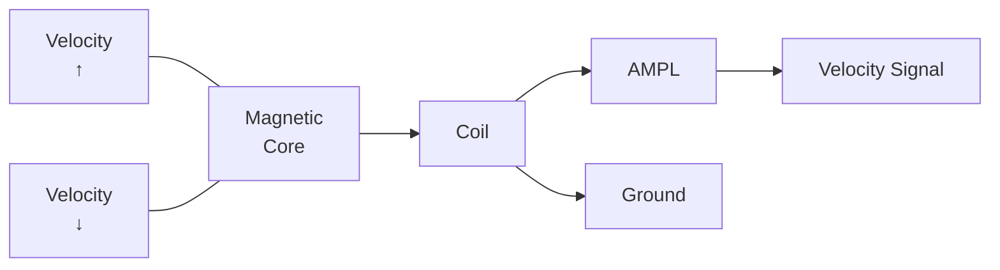

Amplitude: Function of core speed  
Polarity: Function of movement direction

**Figure 1.12:** *The Velocity Transducer*

ND-11.009.01

---

## Page 24

1-11

The stationary part, placed in the magnet assembly (see Figure 1-8) consists of coil with its output to a velocity amplifier.

The moving part is a magnetic core fastened to an extension rod connected to the head/arm receiver (part of the carriage system).

The output signal amplitude is a direct function of the velocity of the core or carriage.

The _polarity_ of the signal is dependent on the _direction_ of the movement.

# 4. The Position Transducer

A track counting system is giving the logic current informations about the carriage or R/W/E heads position. During a movement the counter that holds this information must be updated each time a track has been crossed.

This is accomplished by generating "cylinder pulses" for each time a track has been crossed. Those pulses will count up/down a "cylinder counter" dependent of the movements direction.

The transducer consists of two parts, the slider (the moving part) and the scale (the stationary part).

```text
                                      Line A1
                                      |
                                      |-------- Differential Signal
                                      |          to Pre-Amp & Decoder
                                      |
                                         Line B1
                                      |
                                      |
                         +------------+------------+
                         |            |            |
                    +----+----+  +----+----+  +----+----+
                    |         |  |         |  |         |
                    +---------+--+---------+--+---------+      / Slider
                    /////////////////////////////////          /
                                                              /
      =======================================================================  Scale
      ||  ||  ||  ||  ||  ||  ||  ||  ||  ||  ||  ||  ||  ||  ||  ||  ||  ||
       |   |   |   |   |   |   |   |   |   |   |   |   |   |   |   |   |   |
       +---+---+---+---+---+---+---+---+---+---+---+---+---+---+---+---+---+
                         |                   |
                       Line A              Line B
                         |                   |
                         |                   |
                         +----))))))))))-----+
                              50KHz Signal       Excitation Voltage from Pre-Amp

                                                  .005" TYP
                                                  Displacement
                                                        <---| |--->
```

**Figure 1.13:** _The Position Transducer_

---

## Page 25

# 1–12

Both the scale and the slider consists of .005 inch wide strips of copper spaced .005 inches apart. The strips are electrically connected as shown in Figure 1-13. The copper strips on the scale are excited with a 50KHz voltage. In this specific connection, the voltage will be 180° out of phase on adjacent copper strips. The excitation voltage is capacitively coupled over to the similiar strips on the slider, where alternate strips are connected to line A and B. Those signals are referred to as the <u>sin</u> and <u>cos</u> signals.

As the slider moves along with the carriage the voltage induced on the strips will go through a phase shift of 180° (compared to the excitation voltage) as each copper strip on the scale is passed.

The <u>sin</u> signal is also used in the servo system as an error voltage to place the R/W/E heads on the cylinder during the last half track of a seek operation.

(Refer also to the "cylinder counting operation" and the "servo operation".)

See Figure 1-14 for physical location.

The Forward End of Travel — FEOT and the Reverse End of Travel — REOT transducers (LED and photo transistors) are located as indicated in Figure 1-14. Those transducers will detect carriage movements outside the recording area.

[Technical line drawing: carriage assembly with leader-line labels “Position Transducer” and “End of Travel Detectors (FEOT & REOT)”.]

**Figure 1.14.** *FEOT & REOT Transducers*

ND-11.009.01

---

## Page 26

1–13

# 1.8 THE POWER SUPPLY

The power supply is located in the rear on the right side. See Figure 1-15.

```text
                         ____________________
                        /                   /
                       /                   /
                      /___________________/
                      |                   |
                      |                   |
                      |                   |
                      |                   |
                      |___________________|

                                  . . .
                                 .     .
                                .       .
                               .         .
                              /           \____________________
                             /                                 \
                            /                                   \
                           /                                     \
                          /                                       \
                         /                                         \
                        /                                           \
                       /                                             \
                      /                                               \
                     /_________________________________________________\
                                      \
                                       \ Power Supply Assembly
                                        \
                                         \
                                          \________________
                                                           \
                                                            \ Actuator Assembly
                                                             \______
                                                                    \____

              [rear chassis and connector assembly shown]
```

Figure 1.15: *The Power Supply*

The input voltage is selected by two jumper wires on P12. Refer 1-16a for plug location, 1-16b for pins location and 1-16c for jumper chart.

```text
                         _________________________________
                        |                                 |
                        |       Main Circuit Breaker      |
                        |              /                 |
                        |             /                  |
                        |            /                   |
                        |           /                    |
                        |      _____/____                |
                        |     |          |               |
                        |     |          |               |
                        |     |__________|               |
                        |                                 |
                        |                    _______      |
                        |                   |       |     |
                        |                   |       |-----+---- P12
                        |___________________|_______|     |
                         \                           \    |
                          \___________________________\___|

                              BOTTOM VIEW
```

ND-11 009 01

---

## Page 27

# 1-14

b)

```text
                 ┌────┬────┬────┬────┬────┐
                 │ ○  │ ○  │ ○  │ ○  │ ○  │
                 ├────┼────┼────┼────┼────┤
              ◄──│ ○  │ ○  │ ○  │ ○  │ ○  │──►  Jumper No. 1 (Pin 14 (Fixed)
                 ├────┼────┼────┼────┼────┤
                 │ ○  │ ○  │ ○  │ ○  │ ○  │────  Jumper No. 2  Pin 15 (Fixed)
                 └────┴────┴────┴────┴────┘
                         └──┘ └──┘
                              │
                              └──────────────── Jumper No. 3 Pins 11 & 12 (Fixed)
                              │
                              └──────────────── Jumper No. 3 Pins 11 & 12 (Fixed)
```

```text
                              ┌──────────────── Pin 12 (Fixed)
                              │
                 ┌────┬────┬────┬────┬────┐
                 │ ○  │ ○  │ ○  │ ○  │ ○  │──── Pin 15 (Fixed)
              ◄──├────┼────┼────┼────┼────┤──►
                 │ ○  │ ○  │ ○  │ ○  │ ○  │──── Pin 14 (Fixed)
                 ├────┼────┼────┼────┼────┤
                 │ ○  │ ○  │ ○  │ ○  │ ○  │
                 └────┴────┴────┴────┴────┘

BACK VIEW (WIRE SIDE)
```

c)

| INPUT VOLTAGE | Jumper 1 FIXED PIN | Jumper 1 MOVEABLE PIN | Jumper 2 FIXED PIN | Jumper 2 MOVEABLE PIN |
|---:|---:|---:|---:|---:|
| 100 | 14 | 4 | 15 | 7 |
| 110 | 14 | 3 | 15 | 7 |
| 120 | 14 | 2 | 15 | 7 |
| 130 | 14 | 1 | 15 | 7 |
| 140 | 14 | 6 | 15 | 8 |
| 150 | 14 | 5 | 15 | 8 |
| 160 | 14 | 4 | 15 | 8 |
| 170 | 14 | 3 | 15 | 8 |
| 180 | 14 | 2 | 15 | 8 |
| 190 | 14 | 1 | 15 | 8 |
| 200 | 14 | 6 | 15 | 9 |
| 210 | 14 | 5 | 15 | 9 |
| 220 | 14 | 4 | 15 | 9 |
| 230 | 14 | 3 | 15 | 9 |
| 240 | 14 | 2 | 15 | 9 |
| 250 | 14 | 1 | 15 | 9 |

VOLTAGE ADJUSTMENT PLUG, P12

**Figure 1.16:** *Input Voltage Selection*

ND-11 000 01

---

## Page 28

1–15

The power supply produces the necessary voltages used in the logic and the servo system. The final voltage regulation is done on the individual logic boards.

The power supply consists of a power supply chassis two printed circuit boards and a top cover.

# 1.8.1 Grounding Options

Logic ground may be isolated from chassis ground or connected to chassis ground by interchanging a brass spacer with an insulating spacer as indicated in Figures 1-17a and 1-17b.

```text
                         Fiber Shoulder Washer
                                  |
                                  v
Brass Spacer  \                 _______
               \               /       \
                \             |         |
                 \            | /////// |
                  \           | /////// |
Power Board  ------->=========|---   ---|              Ground Strap
                               | ///|\\ |                   /
                               | ///|\\ |                  /
Insulating                     | ///|\\ |                 /
Spacer  ---------------------->| /////// |----------------/
                               |_________|
                                  |   |
                     __________________________________
```

a)  LOGIC (DC) GROUND **ISOLATED** FROM CHASSIS (AC) GROUND

```text
Power Board
      \
       \
        \                         Insulating Spacer
         \                              /
          \                            /
           \                          v
            \                       _______
             \                     /       \
              \                   | /////// |  <--- Fiber Shoulder Washer
               \                  | /////// |
                \=================|---   ---|__
                                  | ///|\\ |   \____ Ground Strap
Brass Spacer  ------------------->| /////// |
                                  |_________|
                                     |   |
                        __________________________
```

b)  LOGIC (DC) GROUND **CONNECTED** TO CHASSIS (AC) GROUND

**Figure 1.17:** *Grounding Option*

---

## Page 29

1–16

# 1.9 CONTROL PANEL

## 1. Start/Stop

Start switch energizes spindle motor and initiates the first seek mode provided the following conditions are met:

- Circuit breakers are ON
- Disk cartridge cover properly installed
- Cartridge hold-down switches are closed

Depressing the alternate action START/STOP switch at any time after the start cycle is initiated will cause the machine to stop unless a Stop Override signal is present from the controller. In this case, the machine will continue to run until the Stop Override signal is removed. (This is to prevent stopping during a read, write, or seek operation.)

When the switch is depressed to stop the machine, the indicator light remains illuminated until the disk rotation has stopped.

The interlock solenoids energize at this time to permit access to the cartridge.

Note: The first seek mode is completely automatic and requires approximately <u>65 seconds to complete</u>. The unit can be reset at any time after initiation of the start sequencing. In the event of a potentially damaging fault during this mode, the heads will automatically go into emergency retract and the machine will stop.

## READY:

Illuminates when the unit is up to speed, the heads are loaded and the unit is ready for use. Extinguished during any fault, emergency retract or stop operation.

## ACTIVE:

Illuminates when the unit is actively engaged in any mode, i.e., direct (forward or reverse) seek, return to zero seek or read/write/erase.

## FAULT:

Indicator illuminates when any fault exists with the exception of a line power failure. In the event of a momentary line power drop, the unit heads will go into an emergency retract and the unit will stop. However, the unit will restart automatically when the power returns to normal. In the event of a <u>non-damaging fault</u>, i.e., more than one head selected, simultaneous read and write and etc., the fault indicator will be illuminated and the unit will report the condition to the controller.

ND-11.009.01

---

## Page 30

# 1–17

A Return-To-Zero-Seek command will reset the fault latch and extin-
guish the fault indicator. The unit can be reset by the FAULT switch if
a momentary non-damaging fault has occurred. Pressing the FAULT
switch clears the fault logic and extinguishes the indicator. A persistent
fault, however, will not permit a reset.

## W/PROT CART:

This alternative action switch remains slightly depressed, and is lit when
on. When on, writing and erasing of data on the cartridge disk is
inhibited.

## W/PROT FIXED:

This alternate action switch remains slightly depressed and is lit when
on. When on, writing and erasing of data on the fixed disk is inhi-
bited.

```text
                         ______________________________________
                        /                                     /|
                       /                                     / |
                      /_____________________________________/  |
                      |                                     |  |
                      |          _____________              |  |
                      |         /             \             |  |
                      |        |  / / / / / /  |             |  |
                      |         \_____________/              |  |
                      |                                     |  |
                      |                         [illegible]  |  |
                      |_____________________________________| /
                       \____________________________________\/
```

| Start/Stop | Ready | Active | Fault | W/PROT Cart | W/PROT Fixed |
|---|---|---|---|---|---|
| S/I | I | I | S/I | S/I | S/I |

S — Switch  
I — Indicator

**Figure 1.18: _Control Panel_**

ND-11 009-01

---

## Page 31


---

## Page 32

2-1

# 2 READ/WRITE—BASIC PRINCIPLES

## 2.1 GENERAL

Data is written on one fixed disk and one removable disk on the 9427H by means of four read/write/erase (R/W/E) heads.

The upper removable disk is referred to as the cartridge. Refer to Figure 2.1.

```text
              Cartridge                              R/W/E-heads
                  |                                      |
                  v                                      v
             .-------------.                    .----------------.
           .'               '.                 /                  \
          /                   \               /                    \
         |         ___         |             |                      |
         |        (   )        |-------------|  []                  |
         |         ---         |             |  []     _________    |
          \                   /               \       |         |   |
           '.               .'                 \      |         |  <---
             '-------------'                    \     |_________|   |
                                                  '----------------'

             .-------------.                    .----------------.
           .'               '.                 /                  \
          /                   \               /                    \
         |       _______       |-------------|  []                  |
         |      (       )      |             |  []     _________    |
         |       -------       |             |        |         |   |
          \                   /               \       |         |   |
           '.               .'                 \      |_________|   |
             '-------------'                    '----------------'
                  ^
                  |
              Fixed Disk

                                      ----------------------------
                                             --->
```

**Figure 2.1: _Actuator Disks - Principles_**

As above indicated, data is stored on both surfaces of the disks. The recording media consists of an iron-oxide coating. The relative head to surface motion is obtained by rotating the disk (2400 RPM) and keeping the heads at a fixed spot. The heads can be moved to different positions by an “actuator assembly”.

However, no read or write operation can take place during the heads movement. The operation of moving the heads from one place to another is referred to as a “seek” operation.

The circle described underneath a head during a read or write operation is referred to as a “track”. Since all heads move together the circles or “tracks” will compose a “cylinder”.

---

## Page 33

# 2-2

```text
                         Recording Surface
                               |
                               v
                    .-----------------------.
                 .-'                         '-.
               .'                               '.          Read/Write Head
              /                                   \                |
             /                                     \               /
            /                                       \             /
           |                                         |           /
           |                 . . .                   |          O----------------------.
           |               .       .                 |           ||                     |
           |              .         .                |           ||   ))))))))))))      |
           |               .       .                 |           ||                     |
           |                 ' . '                   |          O----------------------'
            \                                       /                         ^
             \                                     /                          |
              '.                                 .'                        Actuator
                '-.___________________________.-'
                   ^             ^
                   |             |
                  Disk      Iron-oxide Coating
                                  |
                                  |
                                (   )
                               (  ^  )
                                (   )
                                  |
                                  |
                               .--------.
                               |        |  <---- Spindle Motor
                               |        |
                               |        |
                               '--------'
```

**Figure 2.2: _Read/Write - Basic Principles_**

```text
Removable Disk
      \
       \
        v
          .-------------------.
        .'                     '.                         <---- Track
       /                         \
      |           _____           |
      |         .'     '.         |
      |         '.___.__.'        |
       \                         /
        '._____________________.'
           |       |       |
           |       |       |                         <---- Cylinder
          .-------------------.
        .'                     '.                         <---- Track
       /                         \
      |           _____           |
      |         .'     '.         |
      |         '.___.__.'        |
       \                         /
        '._____________________.'
       ^
       |
   Fixed Disk
```

**Figure 2.3: _Track/Cylinder Illustration_**

ND-11 009 01

---

## Page 34

# 2–3

A cylinder number is always equal to a track number. On 9427H 408(406) tracks or cylinders are used. That means the heads can only stop at 408 distinct positions in the recording area. NO stop should take place between the tracks. We say that the tracks are concentrically oriented. A special position and counting system is employed to handle this task.

```text
                                      Track No. 407/405
                                               \
                                                \
                  .-----------------------------------------.
               .-'                                           '-.
             .'                                                 '.
            /                                                     \
           /                  .-----------------.                  \
          |                  /                   \                  |
          |                 |                     |                 |------> Tracks
          |                  \                   /                  |
          |                   '-----------------'                   |
          |                 (((((((((((((((((((((                   |
          |               (((((((((((((((((((((((((                 |
           \                                                     /------> Track No. 0
            \                                                   /
             '.                                               .'
               '-.                                         .-'
                  '-----------------------------------------'
                       \
                        \
                         [magnified area]

                                      Track n +1
                                           \
                                            \
                           .--------------------------------.
                         .'                                  '.
                        /                                      \
                       |                                        |       <---- 0.005 inches ---->
                       |                                        |
                       |                                        |
                       |                                        |
                        \                                      /
                         '.                                  .'
                           '--------------------------------'
                                            \
                                             \
                                              [cylindrical object]
                                      Track n
```

*Figure 2.4: Track Density*

---

## Page 35

2–4

The distance between the tracks is 0.005 inches which is equivalent to  
200TPI. The disk itself is smooth so a track is only the recording circle  
underneath the head in their 408 stop positions.

As an option, the 9427H can operate as a 100TPI unit (half capacity).  
Operating under this option, the same recording area is used but only  
every even track is in usage.

# 2.2 RECORDING TECHNIQUES

## 2.2.1 Writing Data

Data is written on the disk surface by passing a write current through  
the selected head. Only one head should be selected at a time. The flux  
field magnetizes the iron-oxide particles bound to the disk surface.  
Each small particle is then equivalent to a small magnet with a North  
and South pole. The writing process orients to a certain amount of  
those small magnets as the spinning surface passes beneath/above the  
writing head. The direction of the flux field generated is a function of  
write current direction, while the strength of the recorded flux is a  
function of the write current amplitude. The greater the write current  
is the more oxide particles are affected. Information (data and clocks)  
is written by means of reversing the write current.

The change of current direction switches the flux field across the head  
gap. A data bit recorded on the disk is defined by a flux change. This  
method is referred to as “NRZ double frequency”. See Figure 2.5.

```text
Write Current        - - - - - - - - - - - - - - - - - - - - - - - -

                         _________________________________
                        /                                 \
                       /                                   \
______________________/                                     \_________
                                                            |
                                                            |
                                                            |
                                                            |

                              Current Flow
                                 \
                                  \  ↓
                                   \      ↓
                                    .---------.                    .---------.
Magnetic                             /           \                  /           \
Flux Flow                     ←     |   N   S    |            ↑    |   S   N    |
                                    \           /                  \           /
                                     '---------'                    '---------'
________________________________________________________________________________
                         ←  ←  ←  ←  ←  ↙  ↓  ↘  →  →  →  →  →  →  →  →  ↗  ↑  ↖  ←
Disk Coating             ←  ←  ←  ←  ←  ↙  ↓  ↘  →  →  →  →  →  →  →  →  ↗  ↑  ↖  ←
                         ←  ←  ←  ←  ←  ↙  ↓  ↘  →  →  →  →  →  →  →  →  ↗  ↑  ↖  ←
________________________________________________________________________________

                         N   S
                          ←

                                      DATA WRITE OPERATION

                         Miniature Magnetic Particle In Surface Coating
```

Figure 2.5: *Writing Data*

ND-11.009.01

---

## Page 36

2-5

# 2.2.2 *Erasing Data*(with pre-erase head option)

Old data is erased by passing a constant current through the erase coil located in the read/write head. This will produce a constant flux in one direction. Since a recorded bit is defined as a flux reversed, all data will be erased (destroyed).

The erase coil gap is somewhat wider than the read/write coil gap. This is to ensure complete erasure of old data and to reduce crosstalk between adjacent data tracks. The erase coil is located on the read/write head pad immediately before the read/write coil.

Because of the physical difference between the read/write and the erase coil the erase coil should be turned on Δt before and turned off Δt after the read/write heads, during a write operation.

```text
                         ||
                         ||
                         \/
                      Disk Motion


                              /\
                             /  \
                            /    \
                           |\/\/\/|
                           |/\/\/\|
                           |\/\/\/|
                           |/\/\/\|
                           |\/\/\/|
                           |/\/\/\|
                           |\/\/\/|
                           |/\/\/\|
                           |\/\/\/|
                           |/\/\/\|
                           |\/\/\/|
                           |/\/\/\|
                           |\/\/\/|
                           |/\/\/\|
                           |\/\/\/|
                           |/\/\/\|
                           |\/\/\/|
                           |/\/\/\|
                           |______|
                          (        )
         Pre-erase Head -->o        |------> Erase Head
                           |  ____  |
                           | |____| |------> Read/Write Head
                            \      /
                             \  ^ /
                              \ |/
                                |
                    Located on the Head Pad
```

**Figure 2.6:** *Erasing Data*

ND 11 000 01

---

## Page 37

2–6

# 2.2.3 Reading Data

The same coil which was used for the write operation is also used for the read operation. The write logic producing the write current is now disabled and the read circuitry will be enabled.

As the disk passes beneath/above the read/write head (coil) the stored flux intercepts the coil gap. Coil gap motion through a constant flux will induce no voltage in the windings. However, when the flux changes an induced voltage will be produced in the coil windings.

The read voltage, which appears as pulses, is analyzed by the read circuitry to define the data bits recorded on the disk. Each read-back voltage pulse above the noise level is defined as a data bit (or clock).

``` 
                         Read Current
                         Flow

                     [read/write head]          [read/write head]

Disk Coating          <--- <--- <---   ---> ---> --->   <--- <--- <---
                  -------------------------------------------------------
                  <--- <--- <---   ---> ---> --->   <--- <--- <---

                                      |
                                      |
Read/Back                             |
Voltage            /¯¯¯\              |              /¯¯
                  /     \             |             /
-----------------/       \------------+------------/----------------
                          \           |           /
                           \          |          /
                            \_________|________/
```

**Figure 2.7: _Reading Data_**

# 2.2.4 R/W/E-Head Internal Wiring

All the heads are connected, in parallel, except for the select lines which have one driver each. Only the head where the select driver is turned on has the possibility to receive (write) or to generate (read) a current through its wiring. The same coil is used for read or write operation. Thus, wiring is divided into two branches - one for each current direction.

ND-11.009.01

---

## Page 38

2-7

```text
                                              ┌──▷─|───────────────┐
                                              │                    │
                                              │                    ├── Erase Driver
                                              │                    │
                                              │                   ─┴─
                                              │                    ───
                                              │
                         ┌────────────────────┼───────────────────┐
                         │                    │                   │
                         │                  Erase Coil            │
                         │                    │                   │
              +15V       │                    │                   │
                │         │                    │                   │
                │         │                    │                   │
                └─┤       │                    │                   │
                  └───────┴─────▷─────────────┼──────────┐        │
                    Select     Driver          │          │        │
                                  │            │       Erase       │
                                ┌─┴─┐          │          │        │
                                │   │          │     /\/\/\/\      │
                                │   │          │    /        \     │
                                └─┬─┘          │   / Read/Write \  │
                                  │            │  /    Coil      \ │
                                -15V           │ / Read/Write     \│
                                               └─▷──────────────▷──┘
                                                 │              │
                                                ─▽─            ─▽─
                                                 │              │
                                                 ├──────▷ To differential
                                                 │
                                                 │              ├──────▷ Read Pre-Amplifier
                                                 │              │
                                              Write            Write
                                             Drivers           Drivers
                                                 │              │
                                                ─┴─            ─┴─
                                                ───            ───
```

*Figure 2.8: Head-Internal Wiring*

# 2.3 DOUBLE FREQUENCY RECORDING TECHNIQUE

We have already mentioned that a data bit, also referred to as a “1” (logical one), is written on the disk as a flux reversal. Consequently a “0” will be recorded as no flux reversal.

If we record in a sequence, for example, a “1” then 30 “0”s and a “1”, how will we determine how many “0”s are between the two “1”s when reading back? An accurate assumption would be 29 to 31 “0”s, but we must determine exactly without any approximation.

9427H employs “double frequency” recording technique.

ND-11.009.01

---

## Page 39

2-8

# 2.3.1 Data Cells

A track will logically be divided into small portions called data cells. The start point of each data cell is indicated by a clock pulse (flux change). A "1" recorded will appear in the middle, while a "0" recorded will appear in absence of a flux change in the middle of the data cell. See Figure 2.9.

The clock pulse will then operate as separators between data cells.

Our next problem is to see the difference between clock pulses and data pulses. Recorded on the disk they appear the same - some type of synchronization mechanism has to be established in the read circuitry. This is done by generating a term "Data Window" which is kept in synchronization with the clock pulses. (For further details see "Sector Format and Read Recovery Operations".)

```text
                         |<----------------------------->|
                         |          DATA CELLS           |
                         |       (400ns at 2400 RPM)     |
                         |                               |
                         :                               :
                         :                               :

                         +---+                           +---+
"0" Bit                  |   |                           |   |
Recorded  ---------------+   +---------------------------+   +----
                         Clock             Data ("0")

                         +---+             +---+         +---+
"1" Bit                  |   |             |   |         |   |
Recorded  ---------------+   +-------------+   +---------+   +----
                         Clock             Data ("1")

Data Window  --------+
                      |
                      +----------------+          +----------------
                                       |          |
                                       +----------+
```

Figure 2.9: *Data Cell*

---

## Page 40

2–9

# 2.4 RECORDING TECHNIQUE CONSIDERATIONS

“Peak Shift”, often referred to as “Bit Crowding”, is an effect that degrades read accuracy by distorting the wave form. This condition occurs because of deviations from ideal to real operating effects from electromechanical devices.

## 2.4.1 Idealistic Recording

In ideal world, the flux reversal initiated by the write-toggle FF would be instantaneous. See Figure 2.10.

```text
                              C      "0"       C       "1"       C        C
Write (Data & Clocks)       ___| |_____________| |_____| |_______| |______| |____


Write Toggle FF             _________           _________           _________
                            |         |_________|         |_________|         |_____


Write Current               _________           _________           _________
                            |         |_________|         |_________|         |_____


Read-Back Voltage             /\                 /\                 /\
_____________________________/  \_______________/  \_______________/  \________
                                               \/
                                              /  \


S    N       Disk Coating
  →                         [head]
Illustrates                    _________
Miniature                     |         |
Magnet                        |         |
Particles        -----------> |_________|
                              <--> <--> <--> <--> <--> <--> <--> <--> <-->
                              <--> <--> <--> <--> <--> <--> <--> <--> <-->
                              -----------------------------------------------
                                           Flux Reversals
```

**Figure 2.10:** *Idealistic Recording*

The write current could also immediately switch from one polarity to another. On the disk the distance when the flux reversal takes place will be so narrow that it becomes insignificant. As a result the read-back pulse would be ideal and narrow.

In our theoretical model the disk surface would be 100% smooth. The heads have the perfect aerodynamic shape. They would then fly an infinitesimal distance from the disk surface. As a result a very narrow head gap could be used.

As the head comes closer to the recording medium fewer coil windings would be necessary in:

- a write operation to produce the same magnetic flux

ND-11.009.01

---

## Page 41

2–10

- a read operation to gain the same read-back voltage

Fewer head winding would gain in:

- a write operation to respond quicker to a write-toggle command
- a read operation to respond quicker to a flux reversal

In our ideal model the bit density would be → ∞ as our model become 100% idealistic.

# 2.4.2 *Realistic Recording*

In real life:

1. the heads must fly a certain distance from the disk due to:
   - imperfect aerodynamic head shape
   - irregularities in disk surfaces

To compensate for this realistic draw-back fact:

- wider coil gap must be used to counter-balance for loss of intersection with magnetic flux lines
- more coil windings to increase the
- read-back voltage amplitude during read and
- flux strength during write

The above mentioned factors will reduce the response times both throughout read and write operations. See Figure 2.11.

ND-11.009.01

---

## Page 42

# Figure 2.11: *Realistic Recording*

```text
                         C        C        C        C
                         "0"      "1"      "0"

Write (Data &
Clocks)              ________      ________      ________      ________
                    |        |____|        |____|        |____|        |

Write Toggle FF      ____________              ____________              __
                    |            |____________|            |____________|

Write Current        _____________        _____________        ___________
                    /             \______/             \______/           \

                                      ___________
                                     /           \
                                    /             \
                                   |               |
Disk Coating                       |  ↓  ↓  ↓  ↓   |  ↓  ↓  ↓  ↓
                                   |  ↓  ↓  ↓  ↓   |  ↓  ↓  ↓  ↓
                                   |   ↘  ↘  ↘     |   ↙  ↙  ↙
                                   |  ↑  ↑  ↑  ↑   |  ↑  ↑  ↑  ↑
                                   |  ↑  ↑  ↑  ↑   |  ↑  ↑  ↑  ↑
                                   |   ↗  ↗  ↗     |   ↖  ↖  ↖
                                   |  ↓  ↓  ↓  ↓   |  ↓  ↓  ↓  ↓
                                   |_______________|

Read-Back Voltage       . . . . . . . . . . . . . . . . . . . . . .
                      __/ \__        __/ \__        __/ \__        __/ \__
                     /       \______/       \______/       \______/       \

                                      ↑                 ↑
                                      |                 |
                         Peaks will be interpreted as Data Bits (or Clocks)
```

ND-11.009.01

2-11

---

## Page 43

2-12

# 2.4.3 *Peak Shift, Bit Crowding*

We have seen how the read-back voltage shape changes from an ideal recording to a more realistic one. We have also discussed the different imperfections that limit our recording density and thus the data capacity on the disk.

The maximum possible density is attempted to be achieved without reducing the data recoverability.

However, we have to tolerate another problem - the peak shift.

In high frequency recording techniques, adjacent clocks and data bits are close enough to interact with each other.

Because two pulses tend to have a portion of their individual signals super-impose themselves on each other, the actual read-back voltage is the algebretic summation of the two pulses. When read-back voltage has a constant frequency as a result of writing only "1"'s or only "0"'s, the wave form is symmetrical and no peak shift will take place. However, if a combination of "1"'s and "0"'s are recorded (as would be the more normal case) the read-back voltage is non-symmetrical and a peak shift will come into effect.

Figure 2.12 will help illustrate.

```text
Write Current

                         _______       _________       _________
                        /       \_____/         \_____/         \____
                       /


With Peak Shift

Read-Back Voltage
with no Peak Shift

                    . . . . .          . . .          . . . . .
                  .´         `.       .´     `.      .´         `.
                 /             \     /         \    /             \
----------------/---------------\---/-----------\--/---------------\----
                \                \ /             \/                 \
                 \                V                \                 /
                  \______________/                  \_______________/

                   |        |        |        |
                   |        |        |        |
                   |        |        |        |
                   |        |        |        |

Peak Shift

                    /\              /\        /\              /\
___________________/  \____________/  \______/  \____________/  \_____

                   |        |        |        |
                   |        |        |        |
-------------------*--------*--------*--------*------------------------

                 Constant   Increasing   Constant   Decreasing   Constant
                  Lower      Frequency    Higher    Frequency     Lower
                 Frequency      Early    Frequen-      Late      Frequency
                              Peakshift      cy     Peakshift
                                          No
                                        Peakshift

                   No
                 Peakshift                                      No
                                                               Peakshift
```

Figure 2.12: *Peak Shift*

---

## Page 44

2–13

The consequences of such a peak shift are further discussed under “Read Recovery Operation”.

# 2.5 ADDRESSING CONCEPT

## 2.5.1 General

A disk is characterized as a randomly accessed storage device. In order to be a randomly accessed device, an addressing system is employed. We previously mentioned that the disk surface is divided into 408 tracks. Consequently, the Track Number is part of the total address. This address (9 bits) is used by the actuator control logic (or the servo system) to locate the heads over the desired cylinder. Two additional bits are used to select one of four heads or which disk (removable or fixed) and which surface (top or bottom) to be accessed. So far we have narrowed the address down to one track on a specified surface.

(We observe that without moving the heads, four tracks can be accessed only by reselecting the heads.)

## 2.5.2 Sector Concepts

A disk surface is divided into sectors. An index mark (the first notch detected following the double notch) indicates the start of sector counting.

The first part of the data recorded on one track within a sector is referred to as a “block address” and is composed of:

- Head Number
- Cylinder Number
- Sector Number

Refer to the controller in use for block address format.

9427H has a variety of sector number options.

For the cartridge (removable disk) sector marks (notches) will be sensed by a sector transducer as indicated in Figure 2.13.

For the fixed disk the sector transducer is placed underneath the spindle assembly. See Figure 2.14.

---

## Page 45

# 2-14

[Technical drawing: segmented circular ring with central opening.]

[Technical drawing: steel cartridge hub or fixed disk ring.]

Steel Cartridge Hub or Fixed Disk Ring

[Technical drawing: magnetic transducer coil connected to amplifier.]

Magnetic Transducer  
AMP

[Technical drawing: disk-drive assembly with extended index/sector transducer assembly.]

Index/Sector Xducer Assembly

**Figure 2.13: _Cartridge-Sectoring_**

[Technical drawing: fixed-disk sectoring mechanism showing spindle assembly, sector ring, and sensor mount.]

Spindle Assembly  
Sector Ring  
Sensor Mount

**Figure 2.14: _Fixed Disk – Sectoring_**

ND-11.009.01

---

## Page 46

2–15

The transducer senses holes in a sector ring, which has eight rings of holes. The pick-up has to be placed over the correct ring in accordance with the number of sectors being used.

Both for the cartridge and the fixed disk a “divide” by 2ⁿ network is employed. The number “n” is set up by option switches.

Example:

> If the number of sectors being used is 24 and the number of holes in the different rings is --40, 48, 50, etc., the pick-up would be placed over the ring with 48 holes. By selecting n = 1 the desired result would be: 48 ÷ 2(2¹) = 24.

For further details see “Sector Handling and Operations”.

## 2.5.3 Sector Format

Two sector formats selected by option switches may be used on the 9427H. Those two formats are referred to as:

- “Hard”, (Multi) sector format
- “Soft”, (Single) sector format

## 2.5.4 Hard Sector Formats

Every 2ⁿ sector mark (notches or holes) are the starting point for a sector. Figure 2.15 illustrates the general sector format.

```text
+----------+----------+----------+----------+----------+-------------------+----------+----------+
| TOL      | SYNC     | ADDR     | HEAD     | SYNC     |                   | END      | TOL      |
| GAP 1    | PATT 1   |          | GAP      | PATT 2   |                   | OF       | GAP 2    |
|          |          |          |          |          |    DATA FIELD     | RCD      |          |
| 120 BITS | 88 BITS  | 36* BITS | 120 BITS | 88 BITS  |                   | 1 BIT    | *  *     |
| ALL "0"s | 87 "0"s  |          | ALL "0"s | 87 "0"s  |                   |          |          |
|          | & 1 "1"  |          |          | & 1 "1"  |                   |          |          |
+----------+----------+----------+----------+----------+-------------------+----------+----------+
```

**Figure 2.15:** *General “Hard” (Multi) Sector Format*

However, minor changes are made in accordance to the controller design. The format used by ND is illustrated in Figure 2.15 and will be discussed here.

```text
       (1)          (2)          (3)          (4)          (5)          (6)             (7)          (8)       (9)      (10)

        H6           SP          ADDR          CWA           H6           SP             DATA          CWD        E        T6
+----------+----------+----------+----------+----------+----------+-------------------+----------+--------+--------+
|   120    |    96    |    16    |    16    |   120    |    96    |       2048        |    16    |   1    |   75   |
+----------+----------+----------+----------+----------+----------+-------------------+----------+--------+--------+
|          |          |          |          |          |          |                   |          |        |        |
|<-------->|          |<------->|          |<-------->|          |<----------------->|          |<----->|        |
|   Ph1    |   Ph1    |   Ph2    |   Ph3    |   Ph4    |   Ph4    |       Ph5         |   Ph6    | Ph7    | Ph8    |
|<-------->|<------->|<------->|<------->|<-------->|<------->|<----------------->|<------->|<----->|<------>|
```

---

## Page 47

# 2–16

1. A "Head gap" or "Tolerance gap" of 120 zeros is the first field in a sector after a "sector mark" has been detected.  
   The purpose of this "Head gap" is to compensate for:

   - head switching time
   - sector pulse jitter
   - controller variations
   - mechanical skew in sector notches/holes
   - physical distance between Erase and Read/Write heads

   Since the length of a data cell is 400ns at a nominal RPM (2400), the duration of the Head gap is 48µs. Some time during the Head gap the read gate should be activated and read operation initiated. Under most common conditions, the read will start in the middle of the "Head gap".

2. The next field in the sector format is the "sync pattern" - SP.  
   The end of the "sync pattern" is indicated by a recorded "1", preceded by 95 zeros.  
   The purpose of the "sync pattern" is to bring the "read recovery logic" into synchronization with:

   - the speed of the disk drive
   - the correct phase relationship between data and clocks.

   This is discussed in detail during "Read Recovery Operation".  
   The "Head gap" and the "Sync pattern" will be treated as one field by the controller, Phase I.  
   End of "Phase I" or "Sync Pattern" is indicated by a recorded "1".

3. The 16 bits block address (ADDR) is the next field recorded. This field is referred to as Phase 2 in the controller.

4. Check Word on Address - CWA - is a special check word for the address recorded.

5. Following the CWA, a new "Head gap" will show up. The reason for this "Head gap" is to:

   - compensate for controller turn-around time.
   - allow time for head switching from a read to a write operation.

   This "Head gap" consists of 120 zeros.

6. A Sync Pattern - SP - of 95 zeros terminating with a 1 bit has the identical purpose in this case as in ②.  
   ⑤ and ⑥ are in the controller referred to as Phase 4.

ND-11.009.01

---

## Page 48

2–17

7. Next in the row is the data field consisting of 2048 data cells.  
   (Equal to 128 - 16 bits words = 1/8 K-words.)

8. CWD - Check Word on Data is generated by the controller as the data is written on the disk. Next, this bits word is passed on to the disk.

9. This field consists of only 1 bit which indicates "end of recording".

10. The "Tolerance Gap" - TG - is normally 75 data cells long. The purpose is to:

   - absorb mechanical skew in sector notches/holes
   - compensate for Write oscillator drift

# 2.6 DISK FORMATTING

The first operation a new disk (cartridge or fixed disk) must go through is the formatting process. This must be done prior to any exchange of data with the disk. This process will:

- write zeros into ① the "head gap"
- continue writing zeros into the "sync pattern" ② terminating with a "1".
- write the block address into the above field ③
- write the "control word address" into the CWA field ④

The above steps are repeated for each sector on every track of the disk.

When this process has been completed, random access to different addresses can be made.

## 2.6.1 Write Operation

- Prior to a write operation the heads must be positioned over the desired cylinder (which is part of the block address) and the desired head must be selected (also part of the block address). Then a search for the desired sector takes place by reading the sector addresses as they pass by the R/W-head. After finding the correct address in phase 2 and associated "control word" in phase 3, the controller will command a write.

- 120 zeros will be recorded in the "Head gap" ⑤

- continuing with 95 zeros and a "1" in the "Sync Pattern" ⑥

- followed by the data in the "Data Field" ⑦

- and the calculated "check word" ⑧

- ending with "1" ⑨

---

## Page 49

2-18

The above sequence of events will take place for every write operation. Note that Phase 4, 5, and 6 are rewritten for every write operation in order to obtain the same phase relationship for data and clocks throughout phase 4, 5, 6, and 7.

# 2.6.2 *Read Operation*

In order to do a read operation one head must be selected and positioned over the desired cylinder. Then a search for the addressed sector will take place. When the correct cylinder is found the read operation will continue and read the addressed data field.

Since the address portion is written during the formatting process and the data portion during a normal write operation, they will have a random phase relationship in respect to each other. Due to this fact, resynchronization will be obtained in Phase 4 during a read operation.  
(For further details see "Read Recovery Operation".)

# 2.7 *SOFT SECTOR FORMAT*

9427H has built-in option circuitry for utilizing soft sector format selected by different option switches.

Utilizing "soft sector format" data fields of different lengths can be recorded. Only the index mark is detected by the sector transducers. Sector separation is obtained by a "2 Missing Clocks Mark".

A typical soft sector format is given below:

```text
+----------------+--------------------+---------------+---------------+------------------+     ___
| TOLERANCE      |     FREQUENCY      |     PHASE     |    ADDRESS    |     ADDRESS      |----( A )
| GAP            |       SYNC         |      SYNC     |     MARK      |                  |     ---
|                |                    |               |               |                  |
|                |       NO. 1        |     NO. 1     |               |                  |
|                |                    |               |               |                  |
| 120 BITS       |       80 BITS      |    24 BITS    |    8 BITS     |     10 *BITS     |
| ALL "1"s       |       ALL "1"s     |   ALL "0"s    |               |                  |
+----------------+--------------------+---------------+---------------+------------------+

     ___
    ( A )----+-------------+--------------------+---------------+-------------------+-------------+------------------+
     ---     | HEAD        |     FREQUENCY      |     PHASE     |                   | END         | SPEED            |
             | GAP         |       SYNC         |      SYNC     |                   | OF          | TOLERANCE        |
             |             |                    |               |                   | ROD         | GAP ***          |
             |             |       NO. 2        |     NO. 2     |                   |             |                  |
             |             |                    |               |    DATA FIELD     |             |                  |
             | 120 BITS    |       80 BITS      |    24 BITS    |       *   *       |    1 BIT    |                  |
             | ALL "1"s    |       ALL "1"s     |   ALL "0"s    |                   |             |                  |
             +-------------+--------------------+---------------+-------------------+-------------+------------------+
```

\* Typical Dependent on Bite Size

\** Dependent on Specific Sector Format and Bite Size

\*** Minimum length is 6.3% of entire Sector

*Figure 2.17: "Soft" (Single) Sector Format*

ND-11.009.01

---

## Page 50

# 2-19

We notice that the "Tolerance gap", "Head gap" and "Frequency Sync" fields consist of all "1"s.

Another method for obtaining frequency and phase syncronization is employed under "Soft Sector Operation".

NID-11 009 01

---

## Page 51

[Blank page]

---

## Page 52

# 3 READ/WRITE HEAD ASSEMBLY

## 3.1 GENERAL

Figure 3.1 shows the different parts of the read/write head assembly.

```text
                         Floating Arm
                              |
                              v
                   ___________________________________
                  /                                  \_________________________
                 /                                     \                       |
                /                                       \                      |
               /                                         \                     v
              /                                           \              Fixed Arm
             /                                             \
            /                                               \____________________
           /                                                                            Unflexed Profile
          /                                                                             of Head Assembly
         /
        /\
       /  \_____________________________________
      /                                          \
     /                                            \
    /                                              \
   /                                                \
  /                                                  \
 /                                                    \
/______________________________________________________\

  ^             ^                  ^                         ^
  |             |                  |                         |
Read/Write    CAM Surface       Loading Ramp               Flex Point
Head
```

**Figure 3.1:** *Head Assembly - Unflexed Profile*

It should be noted that the above figure shows the head assembly in  
the unflexed position, that is, as it would appear outside the system.

Figure 3.2 shows the heads in an unloaded position. We notice that the  
flexed profile is somewhat different from the unflexed one.

```text
                         Spring Force
                             |  |
                             |  |
                            \|  |/
                             v  v
                  Dual Sur-
                  face Disk
                     _______
                    |       |
                    |_______|

                          _________________________________________
                         |                                         |____________________
                         |      ___________________________        |                    |
                         |_____/                           \_______|                    |
                               ^             ^                                       ______|______
                               |             |                                      |             |
                               |             |                                      |   Carriage  |
                               |             |                                      |______v______|
                               |             |                                      |             |
                          CAM Surface         \                                     |             |
                                               \                                    |_____________|
                                                \
                                                 CAM (Secured to
                                                 Actuator Frame)

                          _________________________________________
                         |                                         |____________________
                         |      ___________________________        |                    |
                         |_____/                           \_______|                    |
```

**Figure 3.2:** *Head Assembly — Retracted Position*

In this position the cam surface on each head assembly rides on the  
cam, and the spring force is opposed by the cam. This position is also  
referred to as the “Retracted Position”.

ND-11.009.01

---

## Page 53

# 3.2 DYNAMIC OPERATION

During the head loading process the head assembly is moved in forward direction by the carriage. The cam will slide down the "loading ramp" until the spring force is opposed by the air cushion between the spinning disk and the head pad. Figure 3.3 will help explain how this air cushion is achieved.

```text
                         Record Head
                              \
                               \
                                \                    Flying Head Pad
                                 \                 ______________________
                                  \               /                      \
                                   \             /                        \
                                    \___________/                          \
            <--------------------    ________________________________________     -------------------->
                                  \__/                                        \___/                    Air
                                                                                                        ----->

    _______________________________________________________________________________________________
   /                                                                                               \
  /                                   ----------------->                                            \
  \_________________________________________________________________________________________________/
                                                   Disk
```

**Figure 3.3:** *Flying Head Pad*

At an infinitely small distance from disk surface, the air is rushed along with the surface at the same speed as the surface. As the distance from the surface increases the air speed reduces. See Figure 3.4a.

The head pad has an excellent aerodynamic shape to derive a force from the high speed air passing underneath. This force opposes the spring force built into the flex arm.

From Figure 3.4b we see that if the speed of the disk drops, the head pad will move closer to the disk to find the same air speed and thus deriving the constant, opposing force to bring the system into equilibrium.

Since the disk surface has irregularities (observed with a close eye) the heads should not come closer to the surface than a certain distance. Under this distance physical contact could be made. This would destroy the flying characteristics of the head which in turn would destroy the disk surface and the head (head crash). It is therefore important to ensure that:

- Disk is up to speed prior to heads loading
- Heads are retracted in case of speed drop.

ND 11 009 01

---

## Page 54

# 3-3

```text
                         Air Speed
                            ^
                            |
                            |
                            |\
                            | \
                            |  \
                            |   \
                            |    \__
                            |       \____
                            |            \_______
                            |                    \____________
                            |______________________________________________>
                           O                         Distance from Surface

                                      CONSTANT RPM
```

Figure 3.4a: *Air Speed versus Distance*

```text
                         RPM
                          ^
                          |
                          |
                          |
                          |                                      /
                          |                                  ___/
                          |                              ___/
                          |                         ____/
                          |                    ____/
                          |               ____/
                          |          ____/
                          |      ___/
                          |____/
                          |______________________________________________>
                                                    Distance from Surface

                                      CONSTANT HEAD
                                      SPRING FORCE
```

Figure 3.4b: *RPM versus Distance*

ND-11 009 01

---

## Page 55

# 3-4

Figure 3.5 shows the heads in loaded position.

```text
                         Spring Force
                            \  |  /
                             \ | /
                              \|/
      ------------------------------------------------------------
       =========================================================
                         .----------------.
                         |                |
                         |                |
                         '----------------'
      ------------------------------------------------------------
       =========================================================
                                                           ___________
                                                          |           |
                                                          |           |
                                                          |___________|
```

Figure 3.5: *Head Assembly — Loaded Position*

For best operational performance, the head should dynamically follow the disk surface irregularities at a relatively constant distance and perpendicular to the track at any given point.

To compensate for low frequency irregularities the floating arm will gimbal about the flex point as indicated in Figure 3.6.

```text
                    Flex Point
                        \
-------------------------\--------------------------------
                          \__________________________
                           \                         \
                            \_________________________\
                              \                         \
                               \_________________________\
                                                    ↕
```

Figure 3.6: *Head Assembly — Flex Point*

ND-11.009.01

---

## Page 56

# 3-5

Irregularities which occur tangentially and radially with respect to the data track, are taken care of by a gimbal spring in the head assembly. By use of this gimbal spring the head pad is free to pivot around the above mentioned axis. Figure 3.7 will help illustrate.

```text
                         Data Track                         Gimbal

                    .-----------------.
                 .-'                   '-.
               .'                         '.
              /                             \
             /                               \
            |                                 |
            |                                 |
            |                                 |
            |                                 |\
            |                                 | \
            |                                 |  \
             \                               /    \
              \                             /      \
               '.                         .'        \
                 '-.                   .-'           \
                    '--------.--------'               \
                             / \                       \
                            /   \                       \
                           /     \                       \
                          /       \                    .-.
                         /         \                  /   \
                        /           \                /     \
                                   .---.            /       \
                                  /     \          /         \
                                 /       \        /           \
                                /         \      /             \
                               /           \    /               \
                              /             \  /                 \
                             /               \/                   \
                            Gimbal                              Gimbal
```

**Figure 3.7.** *Head Gimbal*

Figure 3.8 should give the necessary details regarding the physical building up of a Head/Arm assembly.

By pivoting around A and B the head pad will position itself perpendicular to any position along the track.

ND-11 009 01

---

## Page 57

# 3-6

```text
                                      Floating Arm                         To Carriage
                                           \                                  /
                                            \                                /
                                             \                              /
                                              \                            /
                                               \                          /
                                                \                        /
                                                 \                      /
                                                  \                    /
                                                   \                  /
                                                    \                /
                                                     \              /
                                                      \            /
                                                       \          /
                                                        \        /
                                                         \      /
                                                          \    /
                                                           \  /
                                                            \/
                                                   Head Cable
                                                      /
                                                     /
                                                    /
                                                   /
                                                  /
                                                 /
                                                /
                                               /
                                              /
                                             /
                                            /
                                           /
                                          /
                                         /
                                        /
                                       /
                                      /
                                     /
                                    /
                                   /
                                  /
                                 /
                                /
                               /
                              /
                             /
                            /
                           /
                          /
                         /
                        /
                       /
                      /
                     /
                    /
                   /
                  /
                 /
                /
               /
              /
             /
            /
           /
          /
         /
        /
       /
      /
     /
    /
   /
  /
 /
/                     Floating Arm Plate
                       \
                        \
                         \
                          \
                           \
                            \
                             \
                              \
                               \
                                \
                                 \
                                  \
                                   \
                                    \
                                     \
                                      \
                                       \__________________________________
                                      /                                  \
                                     /                                    \
                                    /                                      \
                                   /                                        \
                                  /                                          \
                                 /                                            \
                                /                                              \
                               /                                                \
                              /                                                  \
                             /                                                    \
                            /                                                      \
                           /                                                        \
                          /                                                          \
                         /                                                            \
                        /                                                              \
                       /                                                                \
                      /                                                                  \
                     /                                                                    \
                    /                                                                      \
                   /                                                                        \
                  /                                                                          \
                 /                                                                            \
                /                                                                              \
               /                                                                                \
              /                                                                                  \
             /                                                                                    \
            /                                                                                      \
           /                                                                                        \
          /                                                                                          \
         /                                                                                            \
        /                                                                                              \
       /                                                                                                \
      /                                                                                                  \
     /                                                                                                    \
    /                                                                                                      \
   /                                                                                                        \
  /                                                                                                          \
 /                                                                                                            \
/                                                                                                              \
                                                                                 Loading Ramp
                                                                                      \
                                                                                       \
                                                                                        \
                                                                                         \
                                                                                          \
                                                                                           \
                                                                                            \
                                                                                             \
                                                                                              \
                                                                                               \
                                                                                                \
                                                                                                 \
                                                                                                  \
                                                                                                   \
                                                                                                    \
                                                                                                     \
                                                                                                      \
                                                                                                       \
                                                                                                        \
                                                                                                         \
                                                                                                          \
                                                                                                           \
                                                                                                            \
                                                                                                             \
                                                                                                              \
                                                                                                               \
                                                                                                                \
                                                                                                                 \
                                                                                                                  \
                                                                                                                   \
                                                                                                                    \
                                                                                                                     \
                                                                                                                      \
                                                                                                                       \
                                                                                                                        \
                                                                                                                         \
                                                                                                                          \
                                                                                                                           \
                                                                                                                            \
                                                                                                                             \
                                                                                                                              \
                                                                                                                               \
                                                                                                                                \
                                                                                                         CAM and CAM Surface
                                                                                                         Separated — Head is
                                                                                                         Loaded to Disk Drive

          Disk Rotation
               ↺

                              Gimbal Spring
                                   \
                                    \
                                     \
                                      \
                                       B
                                       o
                                        \
                                         \
                                          \
                                           \
                                            \
                                             \
                                              \
                                               \
                                                \
                                                 \
                                                  \
                                                   \
                                                    \
                                                     \
                                                      \
                                                       \
                                                        \
                                                         \
                                                          \
                                                           \
                                                            \
                                                             \
                                                              \
                                                               \
                                                                \
                                                                 \
                                                                  \
                                                                   \
                                                                    \
                                                                     \
                                                                      \
                                                                       \
                                                                        \
                                                                         \
                                                                          \
                                                                           \
                                                                            \
                                                                             \
                                                                              \
                                                                               \
                                                                                \
                                                                                 \
                                                                                  \
                                                                                   \
                                                                                    \
                                                                                     \
                                                                                      \
                                                                                       \
                                                                                        \
                                                                                         \
                                                                                          \
                                                                                           \
                                                                                            \
                                                                                             \
                                                                                              \
                                                                                               \
                                                                                                \
                                                                                                 \
                                                                                                  \
                                                                                                   \
                                                                                                    \
                                                                                                     \
                                                                                                      \
                                                                                                       \
                                                                                                        \
                                                                                                         \
                                                                                                          \
                                                                                                           \
                                                                                                            \
                                                                                                             \
                                                                                                              \
                                                                                                               \
                                                                                                                \
                                                                                                                 \
                                                                                                                  \
                                                                                                                   \
                                                                                                                    \
                                                                                                                     \
                                                                                                                      \
                                                                                                                       \
                                                                                                                        \
                                                                                                                         \
                                                                                                                          \
                                                                                                                           \
                                                                                                                            \
                                                                                                                             \
                                                                                                                              \
                                                                                                                               \
                                                                                                                                \
                                                                                   CAM Surface
                                                                                      |
                                                                                      |
                                                                                      A
                                                                                      o

       Read/Write Head Pad
              \
               \
                \
                 \
                  \
                   \

   Read/Write Head
   Radial Gimbal by
   Pivoting About A


                                                                 CAM Rides on CAM
                                                                 Surface — Head is
                                                                 Unloaded


                                                                  Read/Write Head
                                                                  Tangential Gimbal
                                                                  By Pivoting About B
```

# Figure 3.8: *Head Assembly*

ND-11.009.01

---

## Page 58

4-1

# 4 THE INTERFACE SIGNALS

## 4.1 *GENERAL*

The 9427H is connected to a computer via a controller. The controller  
must be capable of “talking” the computer language as well as the disk  
drive language. The controller operates as a translator between the CPU  
and the disk drive.

```text
                 CPU                         CONTROLLER                    DISK DRIVE

              ___________                  ___________                  ___________
             |           |                |           |                |           |
          ___|           |___          ___|           |___          ___|           |___
         /                   \        /                   \        /                   \
        /       (     )       \~~~~~~/       (     )       \~~~~~~/       (     )       \
       |       (       )       |    |       (       )       |    |       (       )       |
        \       (     )       /      \       (     )       /      \       (     )       /
         \___________________/        \___________________/        \___________________/
```

Figure 4.1: *Controller Operation*

The vocabulary used in the disk drive/controller talk is listed in Table  
4.1. This vocabulary is referred to as the interface signals.

## 4.2 *SIGNAL LIST* (Refer to Table 4.1 on the following page.)

## 4.3 *SIGNAL EXPLANATION*

### 4.3.1 *Input Lines*

Cylinder Strobe

- strobes the cylinder address into the cylinder address  
  register. The cylinder address lines must be stable when the  
  cylinder strobe is applied.

Cylinder Address

- nine address lines holding the new address information at  
  the line when the “cylinder strobe” is applied.

---

## Page 59

# 4-2

```mermaid
flowchart TB
    L1[""] --> A1((1))
    A1 -->|"CYL STR — CYLINDER STROBE"| R1[""]

    L2[""] --> A2((9))
    A2 -->|"CYL AD — CYLINDER ADDRESS"| R2[""]

    L3[""] --> A3((1))
    A3 -->|"RTZS — RETURN TO ZERO SEEK"| R3[""]

    L4[""] --> A4((2))
    A4 -->|"HS — HEAD SELECT"| R4[""]

    L5[""] --> A5((1))
    A5 -->|"WR — WRITE DATA CLOCK"| R5[""]

    L6[""] --> A6((1))
    A6 -->|"WRITE GATE"| R6[""]

    L7[""] --> A7((1))
    A7 -->|"ERASE GATE"| R7[""]

    L8[""] --> A8((1))
    A8 -->|"READ GATE"| R8[""]

    L9[""] --> A9((4))
    A9 -->|"UNIT SELECT"| R9[""]

    R10[""] --> B1((1))
    B1 -->|"ON CYL — ON CYLINDER"| L10[""]

    R11[""] --> B2((1))
    B2 -->|"RD-DATA — READ DATA"| L11[""]

    R12[""] --> B3((1))
    B3 -->|"RD-CLOCK — READ CLOCK"| L12[""]

    R13[""] --> B4((1))
    B4 -->|"INDEX"| L13[""]

    R14[""] --> B5((1))
    B5 -->|"SECTOR"| L14[""]

    R15[""] --> B6((1))
    B6 -->|"SKER & AD INT — SEEK ERROR & ADDRESSING<br/>INTERLOCK"| L15[""]

    R16[""] --> B7((1))
    B7 -->|"FAULT"| L16[""]

    R17[""] --> B8((1))
    B8 -->|"READY"| L17[""]

    R18[""] --> B9((1))
    B9 -->|"WR STAT — WRITE STATUS"| L18[""]

    R19[""] --> B10((5))
    B10 -->|"SECTOR ADDRESS"| L19[""]
```

*Table 4.1: The Interface Signals*

---

## Page 60

4-3

## Return to Zero Seek

- resets control logic and commands the carriage to cylinder 0.

## Head Select

- selects one of four recording heads by holding the binary address. The desired head selection must be held constant during the entire read or write operation.

## Write Data/Clock

- transmits double frequency encoded data and clock signals to the unit.

## Write Gate

- enables the write circuitry during a write operation.

## Erase Gate

- enables the erase current to the erase Coil.
- for pre-erasing data during a write operation.

## Read Gate

- enables the read circuitry during a read operation.

## Unit Select

- four select lines (one for each unit) selects the unit to be accessed. Unit selection must be active when exchanging data with a controller.

Note 1: Interrupt is the only signal that might be sent to the controller from an unselected unit.

Note 2: A unit may be selected for test purposes by setting the Unit Select switches at the I/O board. (Refer option SW setting chart.)

## Write Protect

- disables the write and erase circuitry and thus prevents accidental destruction of data.

Note: This feature is not used by the ND-interface.

## Stop Override

- disables the stop signal from the front panel until unit selection drops.  
  When using this feature the stop function will not be performed during a data transfer.

Note: This feature is not used by the ND-interface.

# 4.3.2 Output Lines

## On Cylinder

- indicates that the R/W/E-heads have reached the cylinder address issued. The signal is inactive while the R/W/E-heads are moving.

Note: Signal will also be activated by a "seek error".

ND-11 009 01

---

## Page 61

# 4-4

UNIT 9427H

PAGE 1 of TABLE 2

## Table 4.2: *Interface Signals — Pin Assignments, etc.*

| CARD TYPE | TERM NO. | PIN NO. | SIGNAL I/POL | DIRECTION | SIGNAL | PLUG PIN NO. | I/O CARD PIN NO. |
|---|---:|---|---|:---:|---|---|---|
| 1036 | 59 | SS | DTAS0 | ← | CYLSTR — CYLINDER STROBE | A | B14 |
| 1036 | 61 | NN | TAA0 | ← | CYL AD/0 | C | A16 |
| 1036 | 63 | MM | TAA10 | ← | CYL AD/1 CYLINDER | E | B16 |
| 1036 | 65 | J | TAA20 | ← | CYL AD/2 ADDRESS | H | A17 |
| 1036 | 67 | H | TAA30 | ← | CYL AD/3 | K | B17 |
| 1036 | 75 | Y | TAA40 | ← | CYL AD/4 | M | A12 |
| 1036 | 77 | V | TAA50 | ← | CYL AD/5 | P | B12 |
| 1036 | 79 | U | TAA60 | ← | CYL AD/6 | V | A13 |
| 1036 | 87 | K | TAA70 | ← | CYL AD/7 | T | B13 |
| 1036 | 89 | F | TAA80 | ← | CYL AD/8 | R | A24 |
| 1036 | 91 | E | DRTZ0 | ← | RTZs — RETURN TO ZERO SEEK | AA | B26 |
| 1039 | 57 | TT | DHS0 | ← | HS/0 — HEAD SELECT | AC | B27 |
| 1039 | 59 | SS | DHS10 | ← | HS/1 — HEAD SELECT | AE | B7 |
| 1039 | 69 | D | DWD0 | ← | WR — WRITE DATA/CLOCK | AS | B19 |
| 1039 | 65 | J | DWG0 | — | WRITE GATE | AM | A15 |

---

## Page 62

# 4-5

## UNIT 9427H CONTROLLER

## PAGE 2 OF TABLE 2

| CARD TYPE | TERM NO. | PIN NO. | SIGNAL/POL. | DIRECTION | SIGNAL | PLUG PIN NO. | I/O CARD PPN NO.71/P |
|---|---:|---|---|:---:|---|---|---|
| 1039 | 67 | H1 | DEGo | ↑ | ERASE GATE | AP | B6 |
| 1039 | 71 | CC | DRGo | ↑ | READ GATE | AV | B15 |
| 1039 | 89 | F | US1o | ↑ | UNIT SELECT 1 | BR | B25 |
| 1039 | 91 | E | US2o | ↑ | UNIT SELECT 2 | BN | B25 |
| 1039 | 93 | B | US3o | ↑ | UNIT SELECT 3 | BV | B25 |
| 1039 | 95 | A | US4o | ↑ | UNIT SELECT 4 | BS | B25 |
| 1039 | 77 | V | CREADYo | ↓ | READY | AX | A29 |
| 1039 | 79 | U | CEYLo | ↓ | ON CYL — ON CYLINDER | BD | B9 |
| 1039 | 73 | Z | PRDo | ↓ | RD DATA — READ DATA | AV | B29 |
| 1039 | 75 | Y | CRCo | ↓ | RD CLK — READ CLOCK | AZ | A14 |
| 1039 | 87 | K | CART INDEX | ↓ | INDEX | BF | A31 |
| 1039 | 85 | L | SECTOR1 | ↓ | SECTOR | BL | B10 |
| 1039 | 83 | P | SEEK ERRO | ↓ | SEEK ERROR — SEEK ERROR<br>ADD INT — ADDRESS INTERLOCK | BJ<br>BJ | B8<br>A19 |
| 1039 | 81 | R | FAULT | ↓ | FAULT | BB | A30 |

**Table 4.2: _Interface Signals — Pin Assignments, etc._**

ND-11.009.01

---

## Page 63

# 4–6

## PAGE 3 OF TABLE 2

**UNIT 9427H**

| CARD TYPE | TERM NO. | PIN NO. | SIGNAL/POL | DIRECTION | SIGNAL | PLUG PIN NO. | I/O CARD PIN NO:27/P1 |
|---|---:|---|---|---|---|---|---|
| 1107 | 83 |  | WPEo | ← | WR STAT – WRITE STATUS | AK | B30 |
| 1107 | 95 |  | SB1o | ← | SA/0 – SECTOR ADDRESS | CJ | B2 |
| 1107 | 93 |  | SB2o | ← | SA/1 – SECTOR ADDRESS | CD | A1 |
| 1107 | 91 |  | SB4o | ← | SA/2 – SECTOR ADDRESS | CN | B4 |
| 1107 | 89 |  | SB8o | ← | SA/3 – SECTOR ADDRESS | CR | B3 |
| 1107 | 87 |  | SB16o | ← | SA/4 – SECTOR ADDRESS | CL | A2 |
| 1107 | 85 |  | MARGo | → | WRITE PROTECT OR TRACK OFFSET | AH | B23 or A23<br>(See option Switch Chart) |

**Table 4.2.** *Interface Signals — Pin Assignments, etc.*

ND-11.009.01

---

## Page 64

4-7

| Signal | Description |
|---|---|
| Read Data | - separated digital data information sent to the controller. |
| Read Clock | - separated digital clocks (one for each data cell) sent to the controller. |
| Index | - start of revolution mark. Indicates start of sector counting. |
| Sector | - start of sector mark. |
| Seek Error | - indicates that the unit was unable to successfully complete a seek operation. |
| Address Interlock | - indicates that the unit has received an illegal address. |
| Address Acknowledge | - indicates that the unit has received a legal address. |
| Write Status | - unit is inhibited from writing on the disk. This signal is active whenever one or two WRITE PROTECT switches are on and the associated disk is selected — or when the controller write protect line is active. |

Note: When heads 0 and 1 are selected the sector mark will derive from the cartridge. If heads 2 or 3 are selected the sector mark will derive from the fixed disk.

Note: A RTZS will clear the control logic and command the carriage back to cylinder 0.

Note: By use of option switches on the I/O board the above signal can be set back as Seek Error. This should be done for the ND-interface since the Address Interlock Line is not used.

Note: This feature is not used by the ND-interface.

# 4.4 SIGNAL ASSIGNMENTS

Table 4.2 shows the above described interface signals — direction, polarity.  
On the controller side the plug pin number, card type and terminal number are listed.  
On the unit side the corresponding plug pin number and I/O cord pin number are listed.

---

## Page 65

4-8

# 4.5 DISK CONFIGURATIONS

A maximum of four units can be hooked up to one controller. The limitation is found in the four address lines. The unit number is set up by unit selection switches on the I/O board. (Refer option switch tables.)

Any combination of 9427 and 9427H may be connected in the "daisy chain". It should be observed that 9427 is given the unit number dependent of its position in the daisy chain, while 9427H may be selected to be any of the possible unit numbers. (Refer Figure 4.2.)

Precautions should be taken to avoid more than one unit being assigned the same unit number. For further details see I/O board schematics.

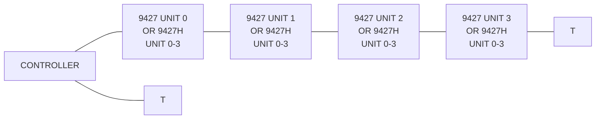

T.  Line Terminators

**Figure 4.2:** *Disk Configurations*

ND-11.009.01

---

## Page 66

4–9

# 4.6 DAISY CHAIN TERMINATION

The last unit in the chain must be terminated. This can be accomplished by:

- connecting a special terminator plug (Refer to Figure 4.2)

  OR

- installing terminator chips on the I/O board. (Refer to Figure 4.3.)

```text
       .~~~~~~~~~~~~~~~~~~~~~~~~~~~~~~~~~~~~~~~~~~~~~~~~~~~~~~~~~~~~~~~~~~~~~.
       |                                                                      |
       |    +-----+      +-----+      +-----+      +-----+    +---+   +-----+ |
       |    |     |      |     |      |     |      |     |    |   |   |     | |
       |    |     |      |     |      |     |      |     |    |   |   |     | |
       |    +-----+      +-----+      +-----+      +-----+    +---+   +-----+ |
       |      +--+         +-----+      +-----+       +--+    +-----+ +-----+ |
       |      |  |         |     |      |     |       |  |    |     | |     | |
       |      |  |         |     |      |     |       |  |    |     | |     | |
       |      +--+         +-----+      +-----+       +--+    +-----+ +-----+ |
       |      +--+           +--+         +--+         +--+    +-----+ +-----+ |
       |      |  |           |  |         |  |         |  |    |     | |     | |
       |      |  |           |  |         |  |         |  |    |     | |     | |
       |      +--+           +--+         +--+         +--+    +-----+ +-----+ |
       |                                                       ______            |
       |                         <---------+                 |______|            |
       |                                                      o  )    O           |
       |                                                        +--+              |
       |                                                        |  |              |
       |                                                        +--+              |
       |                                                                      |
       +----------------------------------------------------------------------+
       |                              I/O-BOARD                               |
       +----------------------------------------------------------------------+
```

**Figure 4.3.** *Terminator Chips*

ND 11 009 01

---

## Page 67

4–10

It should be noted that either the termination chips OR the terminator plug should be used. The termination chips should be removed with the exception of the last unit in the chain.

# 4.7 TERMINATOR POWER

The I/O board is supplied with option switches for selecting the terminator power source. The source can either be:

- the unit

OR

- the controller.

If a choice exists, the terminator power from the controller should be preferred.

[illegible]

---

## Page 68

# 5 POWER DISTRIBUTION

## 5.1 GENERAL

Refer to "Major Components" for physical location.

The power supply provides different voltages used in the "Card Cage" and the "Power Amplifier".

AC voltages are also distributed to the "Spindle Motor", the "Blower Motor", and the "Brush Motor".

## 5.2 POWER SUPPLY CHASSIS

Refer to Figure 5.1.

The AC line is taken through the main circuit breaker "CB1" to pins 14 and 15 of the programmable plug P12.

This plug should be programmed (strapped) by means of two jumpers in accordance with the "Jumper Table" and the power situation in the field.

Two rectifying circuits are used for providing the following DC voltages: +34V, −35V and +11V. Normally, the DC-circuit breaker should not be used and thus should be left on. The above mentioned voltages are fed into "Power Board 1".

The +11VDC is regulated down to +5VDC and fed through "Power Board 2" to various logic boards as indicated in Figure 5.2. The +35VDC and −35VDC are used in the "Power Amplifier" located on "Power Board 1 and 2". +22VDC and −22VDC derived from "Power Board 1" are used on "Power Board 2", sent out to the different logic boards and individually regulated internally there. −7,5VDC is derived from −22VDC on "Power Board 2". For further details refer to Figure 5.2

## 5.3 MOTOR POWER DISTRIBUTION

Refer to Figure 5.3 for operation and Figure 5.4 for relays physical location.

When the main circuit breaker is activated, 110VAC is amplified to the "Blower Motor" from transformer terminals 7 and 3. (130VAC − 30VAC = 110VAC.)

K3 is not present if dynamic brake option is not installed. (We assume that this is the case.)

The "Spindle Motor" has two windings, a start winding and a run winding. The start winding is only used for four seconds during start of the spindle motor. 30VAC is applied through the contacts of K1 and a capacitor to the start winding. 110VAC voltage is applied to the run windings through the contacts of K2. The terms Start Relay and Run are derived from the "Control Board".

---

## Page 69

# 5-2

```text
                                      -35V Rect.
                                          |
                                          o
                                          |
                                      +---+------------------+
                                      |                      |
                                      |       AICR101        |      -35V DC
                                      |    +-----------+     |          o
                                      |    |   bridge  |     |          |
                                      |    | rectifier |-----+----------+
                                      |    +-----------+     |
                                      |                      |
                                      |         CB2          |
                                      |    +-----------+     |
                                      +----|  o/     o/|-----+
                                           +-----------+

                                             AICR102
                                          +-------------+
                                          |   >     <   |
                                          |             |
                                          +-------------+
                                                 |
                                                 +---------o  +11V DC
                                                 |         |
                                                 |       50.000
                                                 |         |
                                                 +---------+--------- HiV Ret.
                                                           |
                                                           |
                                                    TO POWER BOARD


          P12
          .------------------------------------------------.
          |                                                |
          |  JUMPER II                                    |
          |                                                |
          |          9   8   7   6   5   4   3   2   1      |
          |          o   o   o   o   o   o   o   o   o      |
          |           \  |  /                               |
          |            \ | /                                |
          |             \|/                                 |
          |              o  15                              |
          |                                                |
          |  JUMPER I                                     |
          |                                                |
          |          9   8   7   6   5   4   3   2   1      |
          |          o   o   o   o   o   o   o   o   o      |
          |           / | \                                |
          |          /  |  \                               |
          |         /   |   \                              |
          |        o    |    o                             |
          |        4         15                            |
          '------------------------------------------------'
                    |         |
                  +---+     +---+
                  | CB1|     |
                  +---+     |
                    |         |
                  +-------------+
                  |     FL1     |
                  +-------------+
                    |
                  [AC plug]


     250    190    130     50     40     30     20     10     00
      o      o      o      o      o      o      o      o      o
      |      |      |      |      |      |      |      |      |
      +--------------------------------------------------------+
                         transformer winding

      o      o      o      o      o      o
      |      |      |      |      |      |
      +----------------------------------+
                         transformer winding
```

## Front View (Pin Side)

```text
        JUMPER 1
        Pin 14 (Fixed)
              \
               +-------+
               | o o o |
               | o o o |
               | o o o |
               | o o o |
               +-------+

        JUMPER 2
        Pin 15 (Fixed)
        (Fixed)
              \
               +-------+
               | o o o |
               | o o o |
               | o o o |
               | o o o |
               +-------+

        JUMPER 3
        Pins 11 & 12 (Fixed)
        Pin 16 (Fixed)

        Pin 14 (Fixed)
```

## Back View (Wire Side)

```text
        +-------+
        | o o o |
        | o o o |
        | o o o |
        | o o o |
        +-------+
```

## A/C Voltages / Jumper Settings

| A/C Voltages | JUMPER 1 Fixed Pins | JUMPER 1 Moveable Pin | JUMPER 2 Fixed Pins | JUMPER 2 Moveable Pin |
|---:|---:|---:|---:|---:|
| 100 | 14 | 4 | 15 | 7 |
| 110 | 14 | 3 | 15 | 7 |
| 120 | 14 | 2 | 15 | 7 |
| 130 | 14 | 1 | 15 | 7 |
| 140 | 14 | 6 | 15 | 8 |
| 150 | 14 | 5 | 15 | 8 |
| 160 | 14 | 4 | 15 | 8 |
| 170 | 14 | 3 | 15 | 8 |
| 180 | 14 | 2 | 15 | 8 |
| 190 | 14 | 1 | 15 | 8 |
| 200 | 14 | 6 | 15 | 9 |
| 210 | 14 | 5 | 15 | 9 |
| 220 | 14 | 4 | 15 | 9 |
| 230 | 14 | 3 | 15 | 9 |
| 240 | 14 | 2 | 15 | 9 |
| 250 | 14 | 1 | 15 | 9 |

# Figure 5.1: Power Supply Chassis

ND-11.009.01

---

## Page 70

# 5-3

```text
                                      BRUSH MOTOR
                                          ┌───┐
                                          │ M │
                                          └───┘
                                            │
                                            │
┌──────────────────────────────────────────────────────────────────────────────────────────────┐
│                                  POWER SUPPLY CHASSIS                                         │
│                                                                                              │
│       20VAC                         +35VDC              -35VDC              +11VDC          │
│        │                              │                   │                   │              │
└────────┼──────────────────────────────┼───────────────────┼───────────────────┼──────────────┘
         │                              │                   │                   │
         ▼                              ▼                   ▼                   ▼
┌──────────────────────────────────────────────────────────────────────────────────────────────┐
│                                   POWER BOARD 1                                                │
│                                                                                              │
│                                  +35VDC              -35VDC              +11VDC              │
│                                    │                   │                   │                  │
└────────────────────────────────────┼───────────────────┼───────────────────┼──────────────────┘
                                     │                   │                   │
                                     │                   │                   │
                                     ▼                   ▼                   ▼
┌──────────────────────────────────────────────────────────────────────────────────────────────┐
│                                   POWER BOARD 2                                                │
│                                                                                              │
│                           +35VDC     +22VDC     -35VDC     -22VDC     +5V                     │
│                              │          │          │          │         │                      │
│                              │          │          │          │         │                      │
│                              └──────────┴──────────┴──────────┴─────────┘                      │
│                                                                                              │
│                                      [illegible circuit]                                      │
└──────────────────────────────────────────────────────────────────────────────────────────────┘
          │                 │                 │                 │                  │
          │                 │                 │                 │                  │
          ▼                 ▼                 ▼                 ▼                  ▼

     ┌──────────────┐  ┌──────────────┐  ┌──────────────┐  ┌──────────────┐  ┌──────────────┐
     │ SERVO PRE-AMP│  │ SERVO BOARD  │  │ R/W/E        │  │ DATA          │  │ CONTROL      │
     │              │  │              │  │ BOARD        │  │ RECOVERY      │  │ BOARD        │
     │  +22         │  │  +22         │  │  +22         │  │  -7.5         │  │  -5          │
     │  -22         │  │  -22         │  │  +5          │  │  +5           │  │  +5          │
     │  +5          │  │  +5          │  │  -22         │  │              │  │              │
     │              │  │              │  │  +22VOC      │  └──────────────┘  └──────────────┘
     │  +15         │  │  +15         │  │              │       │                  │
     │  -15         │  │  -15         │  │  +15         │    -22VDC             -7.5VDC
     │  +5          │  │  +15         │  │  +15         │
     └──────────────┘  └──────────────┘  │  -15         │
                                          │  -5          │
                                          └──────────────┘

     ┌──────────────┐  ┌──────────────┐  ┌──────────────┐
     │ I/O BOARD    │  │ FAULT BOARD  │  │ SECTOR BOARD │
     │              │  │ (OPTION      │  │              │
     │  +5          │  │  FORMAT)     │  │  +22         │
     │              │  │              │  │  +5          │
     └──────────────┘  │  +22         │  │              │
                       │  -5          │  │  +15         │
                       │              │  │  -[illegible]│
                       │  -5     ⏚    │  │  +5          │
                       └──────────────┘  └───────┬──────┘
                                                 │
                                                 └──────────────► TO X-DUCERS

                                               ┌──────────────┐
                                               │ OPERATOR     │
                                               │ PANEL        │
                                               │              │
                                               │  +5          │
                                               └──────────────┘
```

Figure 5.2: *DC-Handling*

ND 11 009 01

---

## Page 71

5-4

```text
                                      POWER BOARD 1
                                         BRUSH MOTOR

                                                +------------------+
                                                |                  |
                                                |      +-------+   |
                                                |      |   M   |   |
                                                |      +-------+   |
                                                |                  |
                                                +------------------+
                                                     |
                                                     |
                        20VAC                        |
                          |                          |
                          +--------------------------+
                                                     |
                                           +-------------------+
                                           |                   |
                                           |    POWER BOARD 1  |
                                           |                   |
                                           +-------------------+
                                                     |
                                                     |
      +-------------------------------------------------------------------+
      |                               A171                                |
      |                                                                   |
      |   10       11       12                 13       14       15      |
      |    o--------o--------o                  o--------o--------o      |
      |    |        |        |                  |        |        |      |
      |    +--------+--------+                  +--------+--------+      |
      |                                                                   |
      |                 130V       130V                 30V       0V     |
      |                                                                   |
      |    9        8        7        6        5        4        3  2  1 |
      |    o        o--------o        o        o        o        o  o  o |
      +-------------------------------------------------------------------+
                         |                         |
                         |                         |
                         |                         +----------------------+
                         |                                                |
                         |                                           POWER BOARD 2
                         |                                                |
                         |                                      +------------------+
                         |                                      |                  |
                         |                                      |      +22VDC      |
                         |                                      |       NPN        |
                         |                                      |                  |
                         |                                      +------------------+
                         |                                                |
                         |                                             BRUSH
                         |
     +--------------------------------------------------------------------------+
     |                                                                          |
     |                                  K1                                      |
     |                              +---------+                                 |
     |                              |         |                                 |
     |                         2 ---o         |                                 |
     |                              |         |                                 |
     |                         1 ---o         |                                 |
     |                              |         |                                 |
     |                         3 ---|         |                                 |
     |                         +5V  |         |                                 |
     |                         4 ---| START RELAY                              |
     |                              +---------+                                 |
     |                                                                          |
     |                                  K2                                      |
     |                              +---------+                                 |
     |                              |         |                                 |
     |                              |         |                                 |
     |                         +5V -|         |                                 |
     |                         RUN -|         |                                 |
     |                              +---------+                                 |
     |                                                                          |
     |                  +----------------------------------+                    |
     |                  |                K3                |                    |
     |                  |                                  |                    |
     |                  |      + DC                         |                    |
     |                  |      - DC                         |                    |
     |                  |      +22V                         |                    |
     |                  |      BRAKE                        |                    |
     |                  +----------------------------------+                    |
     |                                                                          |
     |              OPTION FOR DYNAMIC BRAKE                                   |
     +--------------------------------------------------------------------------+

      +------------------+                         +------------------+
      |                  |                         |                  |
      |      M           |                         |       M          |
      |                  |                         |                  |
      +------------------+                         +------------------+
       BLOWER MOTOR                                  Start Winding
                                                     Spindle Motor
```

Figure 5.3: *Motor Power Distribution*

---

## Page 72

# Figure 5.4: Relay Locator

[Technical drawing: relay locator showing power boards, relays K1, K2, and K3, spindle motor B1, voice coil connection, and labeled wiring/activation connections.]

- Dynamic Break (Option)
- Run Winding Activation (Spindle Motor)
- Start Winding Activation (Spindle Motor)
- Power Board 1
- Power Board 2
- Power Amplifier/Retract Capacitor
- Retract Capacitor Source Selection
- Voice Coil
- K1
- K2
- K3
- B1

5-5

ND-11.009.01

---

## Page 73

# 5—6

20VAC to the “Brush Motor” is supplied from terminal 10 of the secondary windings of the transformer.

The motor is started by applying ‘gnd’ through a triac located on “Power Board 2”. The term “Brush” originated on the “Control Board”.

It should be noted that two different relays are referred to as K1. K1 is used for connecting the voice coil to the “Power Amplifier” or the “Retract Capacitor” and is located on “Power Board 1” while the other relays are located in the spindle assembly.

MD-11 009 01

---

## Page 74

6—1

# 6 THE SERVO SYSTEM

## 6.1 *CYLINDER COUNTING SYSTEM*

Initially after a power up and heads loading sequence the heads are located at cylinder 0 which is considered to be a reference point. After the first seek operation the heads may be located at any cylinder. A cylinder counter (an up/down counter) is provided for keeping track of the heads position. The input information is given by the position transducer (refer "Major Components."). Information about count direction is also derived from the position transducer by a special treatment of the sin and cos signals. The physical layout of the copper skips on the position transducer puts the sin and cos signals 90° out of phase when regarding the amplitude.

```text
                                      SCALE
       ______________________________________________________________________
      /                                                                      \
     |   | |              | |              | |              | |              |
     |   | |              | |              | |              | |      ))))     |  50KHz
     |________________________________________________________________|))))____|
     |________________________________________________________________________|
     |   | |              | |              | |              | |              |
     |________________________________________________________________________|
     |          | |              | |              | |              | |        |
     |________________________________________________________________________|
      \                                                                      /
                       SLIDER

                                                                     SIN  }
                                                                          }  To servo
                                                                     COS  }  pre-amp
                                                                             board.
```

**Figure 6.1:** *Position Transducer*

Depending on the movement direction the cos will be 90° ahead of or 90° behind the sin. The sin and cos signals are fed to the servo pre-amp board and the signals are amplified, phase analyzed and filtered (50KHz removed). (Refer to Figure 6.2).

Using the 50KHz ① as a reference the signals are phase analyzed by a multiplexer (MUX U2). The output ③ is sent to a 50KHz filter network. Here the output ④ or ⑤ is the envelope curve of ③. A parallel circuitry accomplishes the same task for the cos signal.

One cycle of the sin and cos output from the pre-amp board, represents a travel distance of .0010 inches or 2 tracks. A zero crossing represents .0005 inches or 1 track.

The cycle time of the sin or cos envelope signals represent the speed of the carriage movement. Velocity measured in tracks per second (Vtps) may be found using the following formula:

\[
\mathrm{Vtps} = 2 \cdot \frac{1000}{\mathrm{tcycle\ (in\ m.sec.)}}\quad\text{(2 tracks per cycle)}
\]

ND-11 009 01

---

## Page 75

# 6-2

```text
                                      28C1
                         50KHz to the Fixed
                         Part of the Pos X-ducer

        Same Polarity        Opposite Polarity        Same Polarity        Opposite Polarity

     /\/\    /\/\    /\/\    /\/\    /\/\    /\/\    /\/\    /\/\    /\/\    /\/\

                                      ①


                         Movement of X-ducer
                         Input to MUX (28B3)
                         (Servo Pre-amp Board)

               /\/\/\                 /\/\/\                 /\/\/\
             /        \               /        \               /        \
----------- / ---------- \ --------- / ---------- \ --------- / ---------- \ ----
           /              \         /              \         /              \
          /                \       /                \       /                \

                                      ②


                         Output from MUX

                         /\/\/\                 /\/\/\
                       /        \               /        \
--------------------- / ---------- \ --------- / ---------- \ -------------------
                     /              \         /              \
                    /                \       /                \

                                      ③


                         SIN After 50KHz Filter
                         28D6

                           /¯¯¯\                   /¯¯¯\
--------------------------/     \-----------------/     \------------------------
                         /       \               /       \
                        /         \             /         \

                                      ④


                         COS After 50KHz Filter
                         28D6

                     /¯¯¯\                   /¯¯¯\                   /¯¯¯\
--------------------/     \-----------------/     \-----------------/     \------
                   /       \               /       \               /       \
                  /         \             /         \             /         \

                                      ⑤


COS Waveform: 90° Ahead of SIN for Rev. Movement
              90° After SIN for Forward Movement
```

# Figure 6.2: Demodulation of SIN and COS

ND-11.009.01

---

## Page 76

# 6-3

Since the cylinder density is 200 per inch, the speed per inch may be found by dividing the velocity in tracks per second (Vtps) by 200. OR

VIPS = Vtps/200 (velocity in inches per second) OR

\[
\text{VIPS}=\frac{2.1000}{200\ \text{tcycle (in. m. s.)}}
=\frac{10}{\text{tcycle (in. m. s.)}}
\qquad
\text{VIPS}=\frac{10}{\text{tcycle (in.m.s.)}}
\]

The sin and cos envelope signals are fed to the servo board. The signals are converted to digital form and cylinder count (cyl cnt) pulses are generated by cos crossover pulses. Together with the polarity of the sin signal, indicated by the term FWD:DN, the cylinder counter will count up or down.

The counter counts up when carriage moves in forward direction.

The counter will count:

- up if FWD:DN is positive
- down if FWD:DN is negative

The waveform phase relationship is illustrated in Figure 6.3.

```text
                                  Servo Board
                                      |
                                      v
                         +----------------------------------------------+
From Servo               |                                              |  SIN (AR5-2)
Pre-amp Board            |       /¯¯¯\                 /¯¯¯\           |
             }           | _____/     \____       ____/     \____      |
                         |                                              |  COS (AR4-11)
                         |          _________                 _______   |
                         | ________/         \_______________/       \  |
                         |                                              |  SIN (AR 4-4)
                         | _____       _________       _________       |
                         |      |_____|         |_____|         |_____ |
                         |                                              |  COS (AR4-9)
                         | _________              ___________           |
                         |          |____________|           |_________ |
sin:di ↓ cos:di          |                                              |  FWD:DN (U22-4)
Forward                  | _____    ___      ___      ___       ___     |
(Count up)               |      |__|   |____|   |____|   |_____|   |___ |
             }           |                                              |  CYL CNT (U22-3)
                         | ____________| |____________| |________| |__ |
                         +----------------------------------------------+
```

**Figure 6.3a: _Cylinder Counting_**

---

## Page 77

# 6-4

```text
                                      ┌──────────────────────────────────────────────────────────────┐
                                      │                                                              │
                                      │       /¯¯¯\                         /¯¯¯\                  │  SIN
                                      │     /       \                     /       \                │
                                      │ ___/         \___________ _______/         \_________      │
From servo                            │                                                              │
Pre-amp Board                         │ ___       ___________              ___________             │  COS
                                      │    \_____/           \____________/           \____         │  ← 90° Ahead of SIN
                                      │                                                              │     for Reverse Direction
                                      │          ┌───────┐                 ┌───────┐               │
                                      │ _________│       │_________________│       │________       │  ─────────
                                      │                                                              │  sin:di
                                      │       ┌─────────┐              ┌─────────┐                 │
                                      │ ______│         │______________│         │_______          │  ─────────
                                      │                                                              │  cos:di
\overline{sin:di} ↓ \overline{cos:di} │    ┌─────┐     ┌─────┐     ┌─────┐     ┌─────┐             │  ─────────
                                      │ ____│     │_____│     │_____│     │_____│     │____         │  FWD:DN
Reverse                               │                                                              │
(Count down)                          │     ┌┐          ┌┐          ┌┐          ┌┐                  │
                                      │ ____││__________││__________││__________││_________        │  Cyl Counting
                                      └──────────────────────────────────────────────────────────────┘
```

## Figure 6.3b: *Cylinder Counting*

The \overline{FWD:DN} pulse train is found by doing an exclusive OR for the sin and cos, while the cyl CNT pulses are cos crossover pulses.

It is important to note that the Mu cylinder count pulses occur inbetween the tracks on the disk. See Figure 6.4.

```text
                 ╱╲                    ╱╲                    ╱╲
                ╱╳╳╲                  ╱╳╳╲                  ╱╳╳╲
                ╲╳╳╱                  ╲╳╳╱                  ╲╳╳╱
                ╱╳╳╲                  ╱╳╳╲                  ╱╳╳╲
                ╲╳╳╱                  ╲╳╳╱                  ╲╳╳╱
                ╱╳╳╲                  ╱╳╳╲                  ╱╳╳╲
                ╲╳╳╱                  ╲╳╳╱                  ╲╳╳╱
                 ╲╱                    ╲╱                    ╲╱
                  │                     │                     │
                  ┆                     ┆                     ┆
                  ┆                     ┆                     ┆
                  ┆                     ┆                     ┆

          ______________________________┼─────────────────────┼────────────
                /¯¯¯\                  / \                   /              SIN:AN
              /       \                /   \               /
          ___/         \______________/     \_____________/

          ________________________________┼───────────────────┼────────────
                         /¯¯¯\            │                   │              COS:AN
                       /       \          │                   │
          ____________/         \_________│___________________│________

          _____________________┌┐_________┌┐______________________________
                               ││         ││                              CYL CNT Pulses
```

## Figure 6.4: *Phase to Track Relationship*

ND-11 000 01

---

## Page 78

6-5

We notice that the sin crossover occurs on the tracks and we distinguish between odd number and even number tracks. Studying the sin waveform we notice that an even track occurs when the sin:AN performs a negative crossover, an odd track occurs when sin:AN does a pos going crossover. See Figure 6.5.

```text
          \                                           /
           \                                         /
            \      SIN:AN                           /      SIN:AN
-------------\-------------------------------------/-------------
              \                                   /
               \                                 /
                \                               /
                 \                             /
                  \                           /
                   \                         /
                    \                       /
                     \                     /
                      \                   /
                       \                 /
                        \               /
                         \             /
                          \           /
                           \         /
                            \       /
                             \     /
                              \   /
                               \ /
                                |

                                |
                                |
                                +---------------- EVEN TRACK


                                                     |
                                                     |
                                                     +---------- ODD TRACK
```

*Figure 6.5: Odd-Even Track*

We will later see the reason for distinguishing between odd and even tracks.

# 6.2 SERVO ERROR SIGNAL GENERATION

In order to move the heads from one cylinder to another a servo error signal must be generated. The error signal is amplified and outputed to the voice coil, which will move the carriage and the heads. A feed-back circuit will cancel out the error signal when the carriage has moved to the desired cylinder and the carriage stops.

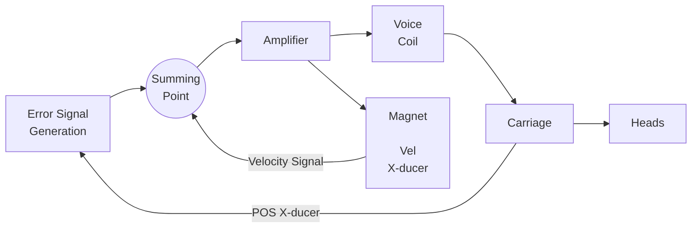

*Figure 6.6: The Closed Servo Loop*

ND-11 009 01

---

## Page 79

# 6-6

In this chapter, we will discuss the error signal generation.

In "On-Line" operations the computer, via the controller, will decide when and where to move the heads. Moving the heads from one cylinder to another is referred to as a "seek operation".

From the controller point of view, an absolute cylinder address is used. That implies that the controller does not have to keep track of where the heads are currently located. This task is taken care of internally in the disk drive by the "cylinder counter" (see "Cylinder Counting System").

The controller tells the absolute cylinder address "where to go". This address is loaded into a "Cylinder Register". See Figure 6.7 for timing relationship.

```text
Cyl Addresses
─────────────

───────────────(9)───────────────┐
                                  │
                                  └───────────────────────────────┐
                                                                  │
                                                                  └────────────

Cyl Strobe
──────────

───────────────(1)───────────────┐            ┌────────────────────
                                  │            │
                                  └────────────┘
                     │            │            │
                     │            │            │
                     │   <────>   │            │
                     │ Min. 0.5 μ sec.         │
                                  <───────>
                               Min. 1 μ sec.
```

*Figure 6.7: Cylinder Address to Strobe Timing*

An address arithmetic will calculate the difference between the "Cylinder Counter" (current address) and the "Cylinder Register" (new address). The result is the number of "tracks to go". The direction is found by determining which one is the greater - indicated by the term "Carry".

If:

1. Cylinder Counter > Cylinder Register → Reverse motion, C = 1

2. Cylinder Counter < Cylinder Register → Forward motion, C = 0.

3. Cylinder Counter = Cylinder Register. No movement.

ND-11.009.01

---

## Page 80

# 6–7

```mermaid
flowchart LR
    CA["From<br/>Cylinder Address<br/><br/>C<br/>O<br/>N<br/>T<br/>R<br/>O<br/>L<br/><br/>Cyl Ad -8"] --> N9A((9)) --> CR["CYLINDER REGISTER"]
    CAS["Cylinder Address<br/>Strobe<br/><br/>L<br/>E<br/>R"] --> N1A((1)) --> CR

    FWD["FWD:DN"] --> N1B((1)) --> CC["CYLINDER COUNTER"]
    CYLCNT["CYL CNT"] --> N1C((1)) --> CC

    CR --> N9B((9)) --> ADD["ADDER"]
    CC --> N9C((9)) --> ADD

    ADD --> N1D((1)) --> ADC["A/D<br/>CONVERTER"] --> EV["Error Voltage<br/>(Always POS)"]
    N1D --- G128["≧128"]

    ADC --> N7((7)) --> XOR["= 1<br/>(EXCLUSIVE<br/>OR)"]
    N7 --- APN["Always POS Number"]

    ADD --> N9D((9)) --> XOR
    ADD --> ZERO["ZERO"]

    ADD --> N1E((1)) --> CARRYOUT[""]
    CARRYOUT --> XOR
    CARRYOUT --> CARRY["Carry<br/><br/>Carry = 1 Reverse<br/>        = 0 Forward"]
```

*Figure 6.8: Error Voltage Generation*

In the case of the “Cylinder Counter>”Cylinder Register” we want to move in reverse direction and the output from the adder is negatively represented in one's complimented form and a carry is generated. The exclusive OR = 1 gate will compliment the output from the adder when a carry is generated. The input to the D/A converter is always the number of tracks to go represented in its true value, regardless of direction. The output from the D/A converter is, therefore, always a positive voltage with amplitude proportional to mentioned limit. Bit number 7 carries the meaning ≧128 tracks to go. (This applies for tracks to go ≦128.)

---

## Page 81

6-8

# 6.3 ERROR VOLTAGE HANDLING/SERVO OPERATIONS

## 6.3.1 General

The error voltage from the D/A converter is handled by a number of operational amplifiers and an analog multiplexer. Before discussing the error voltage handling we take a short-cut into the general operation of an operational amplifier.

## 6.3.2 Operational Amplifier Principle Operation

For practical study an infinite open loop gain is considered.

The closed loop gain will then be:

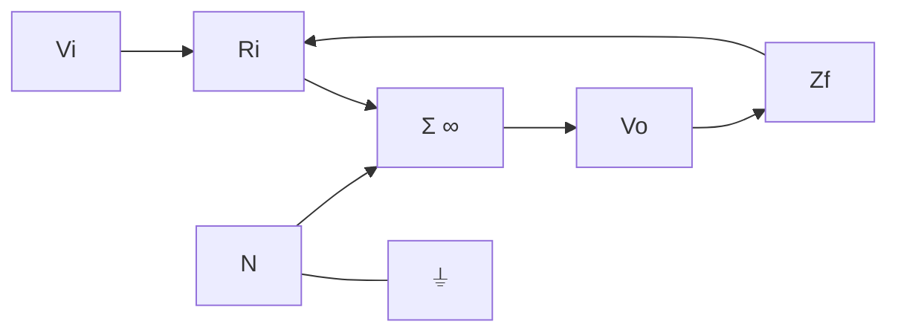

**Figure 6.9:** *Operational Amplifier*

$$
G = \frac{Vo}{Vi} = \frac{Zf}{Ri}
\qquad \text{OR} \qquad
Vo = Vi\frac{Zf}{Ri}
$$

In case the negative (N) input is used the output would also be negative:

$$
Vo = -Vi\frac{Zf}{Ri}
$$

If Zf is resistive (Zf = Rf), we then have a linear amplifier. That is, the output is a copy of the input amplified $\frac{Rf}{Ri}$ times.

If the feed-back impedance includes non-linear components such as capacitances, inductances, diodes, voltage dependent resistors, etc., we deal with a non-linear amplifier.

Non-linear amplifiers may be used to underline desired input effects or compensate for them.

ND-11.009.01

---

## Page 82

6–9

# 6.3.3 *Error Voltage Handling – Course Mode*

The error voltage output from the D/A converter is in magnitude proportional with the number of tracks to go (estimated 39mV per track).

The output is fed through an operational amplifier with an non-linear feedback (Zf). Zf will be reduced as Vo increases.

The gain is $\frac{Zf}{Ri}$. Maximum gain is obtained for small error voltages. To reduce the effect of the voltage stepping from the A/D converter, a capacitance is used in the feedback circuitry, to obtain an integrating effect. A 5V clamp is also built into the feedback circuitry. The error voltage will thus not exceed 5V which is equivalent to 128 tracks to go or approximately 65 IPS of speed.

At the same time as this non-linear error voltage is fed directly to an analog multiplexer, the signal is sent through an operational inverting amplifier with unity gain to the same multiplexer.

Depending on the direction of movement, (indicated by the term ‘FWD’) the multiplexer will pick the positive or negative error voltage and feed through the multiplexer to the summing point. (A desired move in a forward direction will feed a pos error voltage to the summing point.) (Refer also to Figure 6.11 along with the preceding discussion.) As the carriage begins moving, the velocity transducer will output a voltage proportional to the velocity and polarity opposite the error voltage. (In case of a forward move, a negative voltage will be fed to the summing point.) As the velocity of the carriage increases, the error voltage at the summing point will gradually be cancelled out. The error voltage that the power amplifier will see is the result of voltage summation in the summing point. This voltage is fed through the multiplexer to the power amplifier located on Power Board 2 and will be covered separately.

Once the carriage has accelerated up to full speed, i.e. clamped error voltage = −Velocity voltage, the voice coil will receive no current and the carriage will coast along at maximum speed.

When remaining “tracks to go” start decreasing below 128, the error voltage originated by the A/D converter will decrease as tracks to go decrease. The velocity signal from the velocity transducer will, in magnitude, be the greater signal which, in turn, will reverse the error voltage seen from the power amplifier. The current through the coil will be reversed and the carriage will begin decellerating. This decelleration process will continue until tracks to go is equal to 0. As the cos crossover generates the cyl count-down pulses, the carriage has half a track more to go at the moment the cylinder counter reaches zero. (See “Cylinder Counting System”.)

ND-11.009.01

---

## Page 83

# Figure 6.10: Error Voltage Handling

```text
                                                                                         6-10


                         From POS
                         SIN Transducer
                              |
                              N
                    +-------------------+
                    |     Amplifier     |
                    +-------------------+
                              |
                              N
                    +-------------------+
                    |       Σ ∞         |
                    +-------------------+
                              |
                             GND
                              |
                 Servo Inh. (Result of Seek Error)
                              |
                              +--------------------------------------+
                                                                     |
                                                             +-------------------+
                                                             |       Σ ∞         |
                                                             +-------------------+
                                                                     |
                                                              To PWR Board
                                                                 No. 2
                                                                     |
                                                                    Fine
                                                                     <-

        +-------------------+
        |  5V Integrator    |
        |      Clamp        |
        +-------------------+
                 |
                GND
                 |
        +----------------------------------+
        | Non-linear Feedback network      |
        | Integrator with Effect           |
        +----------------------------------+
                 |
                 +-------------------+
                 |       Σ ∞         |
                 +-------------------+
                          |
                          +----------------------------------------------+
                                                                 |
                                                           +-------------------+
                                                           |  D/A              |
                                                           |  CONVERTER         |
                                                           +-------------------+
                                                                 |
                                                                 Ri
                                                                 |
                                                          +-------------------+
                                                          | UNITY             |
                                                          | GAIN              |
                                                          |       Σ ∞         |
                                                          +-------------------+
                                                                 |
                                                                 Rr
                                                                 |
                                                                 N


                                      +--------------------------------------+
                                      |                                      |
                                      |            [Switch assembly]         |
                                      |                                      |
                                      |  F3                                  |
                                      |                                      |
                                      |  F1,3                                |
                                      |  F2,3                                |
                                      |  F2                                  |
                                      |  F1                                  |
                                      |  F1                                  |
                                      |  F2                                  |
                                      |  F1,3                                |
                                      |  F2,3                                |
                                      |  F1,3                                |
                                      |  F2,3                                |
                                      |  F1                                  |
                                      |  F2                                  |
                                      |                                      |
                                      |  SIN                                 |
                                      |  SIN                                 |
                                      |                                      |
                                      |  (Even Address)                      |
                                      |  Add                                 |
                                      |  Zero                                |
                                      |                                      |
                                      |  Fine                                |
                                      |  Course                              |
                                      |                                      |
                                      |  FWD = CARRY                         |
                                      |                                      |
                                      |  Always POS                          |
                                      |  Always Neg                          |
                                      |                                      |
                                      |  val:An                              |
                                      |                                      |
                                      |  Summing Points                      |
                                      +--------------------------------------+
                                                   |             |
                                                  TP8           TP12
                                                   o             o
                                                   |             |
                                                   +----[ ]------+
                                                   |
                                                  [ ]
                                                   |
                                                   +--------------------------+
                                                                              |
                                                                       +-------------+
                                                                       |    Σ ∞      |
                                                                       +-------------+
                                                                              |
                                                                           To PWR
                                                                         Board No. 2
```

ND-11 000 01

---

## Page 84

# 6-11

```text
                                      Acceleration                 T = 128
                                         |                            |
Error                                  ___|____________________________\__
Voltage                               |                                  \__
From                                  |       (constant Maximum           \____
D/A-converter                         |        Speed) 65 IPS                   \____
                                     _|                                            \___
Velocity                            _/                                                ON Cyl
from Vel-                         _/                                                   |
ocity X-                         /                                                     |
ducer                           /                                                       |
                               /                                                        |
                              /                                                         |
                             /                                                          |
                            /                                                           |
                           /                                                            |
                          /                                                             |
                         /                                                              |
                        /                                                               |
                       /                                                                |
                      /                                                                 |
                     /                                                                  |
                    /                                                                   |
                   /                                                                    |
                  /                                                                     |
                 /                                                                      |
                /                                                                       |
               /                                                                        |
              /                                                                         |
             /                                                                          |
            /                                                                           |
           /                                                                            |
          /                                                                             |
         /                                                                              |
        /                                                                               |
       /                                                                                |
      /                                                                                 |
     /                                                                                  |
    /                                                                                   |
   /                                                                                    |
  /                                                                                     |
 /                                                                                      |
/                                                                                       |
                                                                        Error Voltage at Summing Point
                                                                      ________________________________
                                                                     /                                \__
                                                                    /                                    \_
                                                                   /                                       \

                                                                      Voice Coil Drive Current
                                                                    _____________________________
                                                                   /                             \__
                                                                  /                                \____
                                                                 /                                      \___
```

*Figure 6.11: Servo Key Waveforms*

# 6.3.4 Fine Mode of Operation

In order to bring the heads smoothly to a stop in the center of the addressed cylinder without overshoot, the fine mode of operation is employed. The term “zero” will become active and the multiplexer will thus select the sin (or $\overline{\sin}$) signal as the error voltage instead of the output from the D/A converter. A term “AD/0” (address bit 0 of cylinder register) will decide whether sin or $\overline{\sin}$ should be picked as the error voltage. This selection is also made by the multiplexer.

---

## Page 85

# 6–12

```text
                                      4    3    2    1                 Tracks to Go
                                      |    |    |    |                 |
                                                   Replaces the Out-
                                                   put from D/A-
                                                   Converter

From POS X-ducer
(50KHz is
Filtered Out)        _       _    _ _ _ _ _ _ _ _ _ _ _ _ _       _          _
                     / \     / \  /\/\/\/\/\/\/\/\/\/\/\/\/\     / \        / \
                    /   \   /   \/                        \ \___/   \______/   \____
                   /     \_/                                                            \________
                                                                                         /////////
                                                                                       /////////
                                                                                     /////////
                                                                                        ← = 0.3V
                                                                                       Cyl Inhibits Drops
    ↓
    ───
    SIN

                                                    T = 128       Cylinder Pulses  2nd – ON Cylinder Generated
                                                       ↑    ↑    ↑       ↑
                                                                                     Zero Generated

                    |<-------->|<-------------------->|<--------------->|
                    |          |                      |                 |
                    Accelleration     Maximum Speed Zone    Decelleration Zone
                    Zone               (Carriage coast zone)

                                                                         When zero comes up we are
                                                                         1/2 track off, (1/2 track
                                                                         more to go.)
```

# Figure 6.12a: S/N Illustration of a Seek Operation

```text
                  Course Mode of                 Fine Mode of Operation
                    Operation
                         ────────►              ◄────────
                                      |
                                      |
──────────────────────────────────────|────────────────────────────────────────
 \                                    |/////////////////////////////
  \                                   |///////////////////////////
   \                                  |/////////////////////////       |← 2ms →|
    \                                 |///////////////////////         |       |
     \                                |/////////////////////           |       |
      \                               |///////////////////             |       |
       \                              |/////////////////               |       |
        \                             |///////////////                 |       |
         \____________________________|______________                  |       |
                                      5V                               | 0.3V  |
                                      ↑                                ↑
                                      ↑                                |
                                      ↑                                |
      "Zero" generated ──────────────┘                                 |
                                                                        |
                                                                        |
                                                          Cylinder      |
                                                          Inhibit       |
                                                          Drops         |
                                                                        |
                                                          ON Cylinder ──┘
```

# Figure 6.12b: S/N Illustration of a Seek Operation

NID.11.009.01

---

## Page 86

6-13

# 6.4 ON CYLINDER GENERATION

Reading the "ON Cylinder" signal from the disk drive, the controller knows that the heads are settled over the registered cylinder and data interchange activities may resume.

The term "zero" is generated as the carriage has half a track to go. From this point in time the sin or sin voltage will be picked as the error voltage. The magnitude of the sin signal at this moment is approximately 5V. (Refer to Figure 6.12.) As the heads approach the center of the cylinder, the sin signal decreases and at the moment when the signal amplitude is within ±0.3V the term "Cyl Inhibit" becomes inactive. Then the heads are located 200μs inches from the center line of the cylinder. When 2μs of time has elapsed we assume the heads are located on the addressed cylinder and the "ON Cyl" is sent back to the controller. (Refer to Figure 6.13.)

# 6.5 SEEK ERROR

Three conditions will set the seek error flag:

1. a seek operation takes more than 500ms.

2. Forward End of Travel (FEOT) reached during a normal seek operation.

3. Reversed End of Travel (REOT) reached during a normal seek operation.

A seek error is a flag for abnormal operation in the servo or the track counting system. "Seek Error" will generate the term "Servo Inh," which will block the output of the analog multiplexer. (Refer to Figure 6.10.) Upon reporting the "Seek Error" condition to the controller it turns around and initiates a "Return to Zero Seek" (RTZS). Return to Zero Seek will set up well defined conditions in the disk drive. Normal operations may now resume. (See also "Return to Zero Seek Operation".)

ND-11 009 01

---

## Page 87

# 6-14

## SERVO BOARD

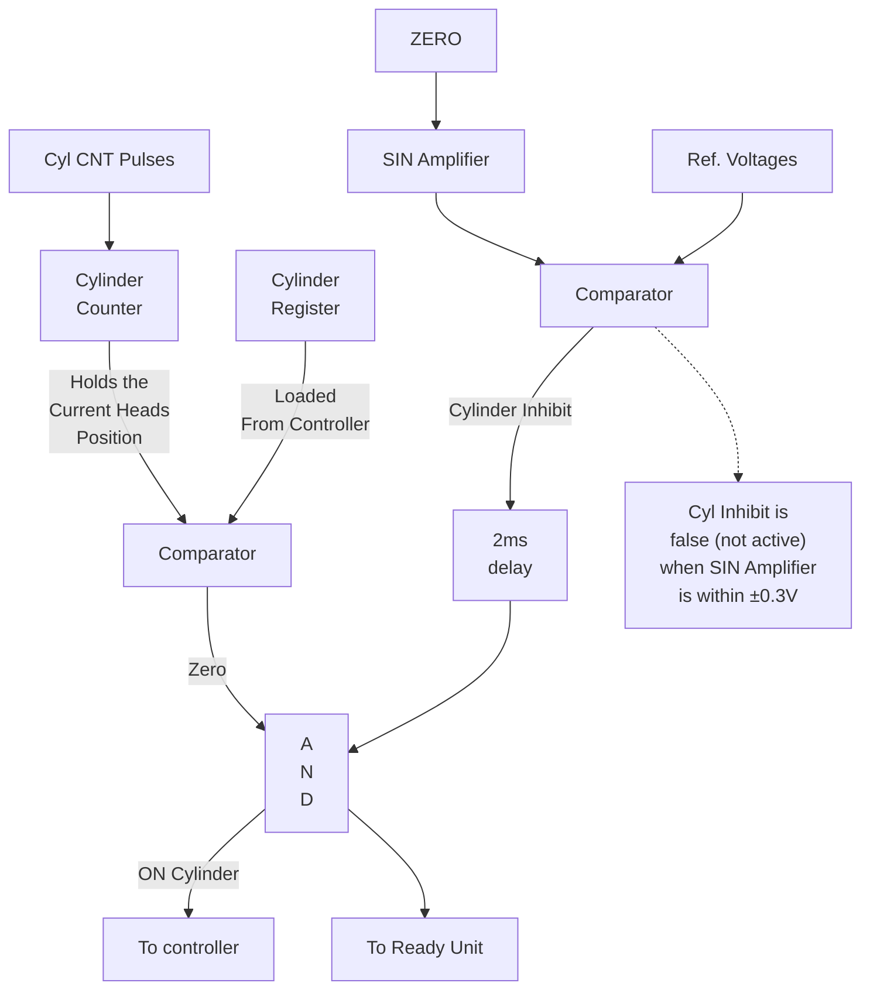

```text
                 ZERO
                   |
                   |
SIN        /-------+-------
          /        | 5V
         /         |
--------/----------+-------------------------------  -
                                                  0.3V
------------------------------------------------------


SIN
------------------------------------------------------  -
          \        |
           \       | 5V
            \      |
             \-----+-------------------------------+
                   |                               |
                   |<--------- 1/2 Track --------->|
                                                   |
                                                   | 0.3V
                                                   |
                                      0.3V ~ within 200μ inches
```

**Figure 6.13:  ON Cylinder — Generation**

ND-11.009.01

---

## Page 88

6-15

# 6.6 POWER AMPLIFIER

## 6.6.1 Operation

Refer to Figure 6.14 for the following discussion.

Except for operation of relay K1 no signal manipulation takes place in the power amplifier. The power amplifier takes the prepared error signal from the "servo board", amplifies it, and outputs the drive current through the contacts of K1 and the reversable plug P2 to the voice coil.

Since the voice coil is driven in both directions, the power amplifier must be able to handle positive as well as negative voltages. We may say that the operation is balanced around gnd. The error voltage can, in an early state, be monitored at test point 7 and 2 at Power Board 2. In the final amplifying stage a thermistor monitors the temperature. The output from this thermistor is fed into the "Fault Circuitry". The voice coil drive current source will be selected by K1. In case an "Emergency Retract" operation should be performed (see "Fault Handling and Detection"), the "Emergency retract capacitor" will be connected to the voice coil instead of the output of the power amplifier.

## 6.6.2 Connector P2 Reversal

When a head alignment should be performed, K1 has to be removed due to its physical location. With K1 removed no connection exists to the voice coil. However, by reversing P2 the "relay by-pass" line will be picked and normal seek operations may resume.

Note: With K1 removed and P2 reversed, an "Emergency Retrack Operation" <u>cannot</u> be performed.

---

## Page 89

# 6–16

```text
                                                                 Power Supply Cover Assembly

                                                           Emergency Retract
                                                              Capacitor

                                     +35V
                                      |
                                      |                 ACT-LO
                                      |                   |
                                      |                  P23
                                      |                   |
                                      +-------------------+-----------------------------+
                                      |                                                 |
                                      |                                      Relay Bypass
                                      |                                                 |
                                      |                    P2-1          P2-2           |
                                      |                     |             |             |
                                      |                     +-------------+-------------+
                                      |                                   |
                                      |                                  P2
                                      |                                   |
                                      |                         K1 Relay   |
                                      |                           |        |
                                      |                    +------+--------+------+
                                      |                    |  Control Board       |
                                      |                    +----------------------+
                                      |                           |        |
                                      |                      Normal Connection
                                      |                           |
                                      |                       Voice Coil
                                      |
                                      |                       Reversed
                                      |                      Connection
                                      |                           |
                                      |                       Voice Coil


     Servo
     Board
       |
       |  Power Amp P1
       |  Amp P1 Ret.
       |
       +-------------------+
       |                   |
       |                 -22V
       |                   |
       |            +-------------+
       |            | [illegible] |
       |            +-------------+
       |                   |
       |       Q6          Q1          Q9
       |        |           |           |
       +--------+-----------+-----------+---------------- Drive A
                                                |
                                                |
                                           Power Board 2
                                                |
                                      +-------------------+
                                      |  Fault            |
                                      |  Circuitry        |
                                      +-------------------+


     Power Board
     +---------------------------------------------------+
     |                                                   |
     |                    Power Board 2                  |
     |                                                   |
     |                    P2                             |
     |                                                   |
     +---------------------------------------------------+

     CR1
     22V
     -35V
```

# Figure 6.14: *Power Amplifier*

NR-11 000 01

---

## Page 90

6–17

# 6.7 FAULT CIRCUITRY

The fault circuitry will monitor the operation of the power amplifier and disable the operation to prevent hazardous driving of the carriage and the head assembly. Part of this fault detection is already taken care of on the “control board”.

By applying gnd to TP1 on “Power Board 2” the servo operation will be disabled. This is accomplished by firing the triac keeping TP1 at a gnd level. Various sources may fire this triac. (Refer also to “Fault Handling and Detection” for the preceding discussion.)

If the term K1 Relay from the “Control Board” becomes inactive K1 will de-energize and the triac will fire.

The same operation takes place if +11VDC in the “Power Supply Chassis” drops below its limit. (Refer “Emergency Retract Operation”.)

If the thermistor senses an over-temperature condition in the power amplifying state, the triac will fire.

The same operation will take place if an unbalanced operation of the power transistor occurs (defect power transistor).

---

## Page 91

# 6–18

```text
                         ┌──────────────────────────────────────────────────────────┐
                         │                                                          │
                         │                         Power Board 1                    │
                         │                                                          │
                         │   Drive A ↑                         Drive B ↑            │
                         │      │                                │                  │
                         │     [ ]                              [ ]                 │
                         │      │                                │                  │
                         │     ( )───────[ ]───────[ ]─────────( )                  │
                         │      │                  │             │                  │
                         │      └──────────────────┴─────────────┘                  │
                         │                         │                                │
                         │                       TP1 ○ ○                            │
                         │                         │                                │
                         │                        ( )                               │
                         │                         │                                │
                         └─────────────────────────┼────────────────────────────────┘
                                                   │
                                                   │
          ┌────────────────────────────────────────┼────────────────────────────────┐
          │                                        │                                 │
          │                         Power Board 2  │                                 │
          │                                        │                                 │
          │      +35V                              │                                 │
          │        │                               │                                 │
          │       [ ]                              │                                 │
          │        │                               │                                 │
          │       ( )────[ ]────[ ]────( )         │                                 │
          │        │                       │        │                                 │
          │       [ ]                     [ ]       │                                 │
          │        │                       │        │                                 │
          │        └───────────────────────┴────────┘                                 │
          │                                        │                                 │
          │                                      −35V                                │
          │                                        │                                 │
          └────────────────────────────────────────┼────────────────────────────────┘
                                                   │
                                                   │
                    +36V                          │
                      │                            │
                  Temp. Mon.                       │
                      │                            │
                      ├───────────────( )──────────┤
                      │                            │
                      │                           [ ]                               
                      │                            │
                      │                          K1 Relay                            
                      │                            │
                      │                      ┌───────────────┐                       
                      │                      │    Control    │                       
                      │                      │     Board     │                       
                      │                      └───────────────┘                       
                      │                            │                                 
                      │                            │                                 
                      │                      ┌───────────────┐                       
                      └──────────────────────│     Power     │                       
                                             │    Supply    │                       
                                             │    Chassis   │                       
                                             └───────────────┘                       

                                                     +22V
                                                       │
                         ┌─────────────────────────────┼────────────────────────────┐
                         │                             │                            │
                         │                         Power Board 1                     │
                         │                             │                            │
                         │                           K1                              │
                         │                             │                            │
                         │                     ┌───────┴───────┐                    │
                         │                     │               │                    │
                         │                     │      ( )      │                    │
                         │                     │               │                    │
                         └─────────────────────┴───────────────┴────────────────────┘
```

# Figure 6.15: Fault Circuitry for the Power Amplifier

ND-11 009-01

---

## Page 92

# 7 SEEK OPERATIONS

## 7.1 *POWER UP — FIRST SEEK OPERATION*

When the main circuit breaker located at the power supply is activated, a master clear will be generated. This 60ms clear pulse will reset all control latches and keep them in that state until the 60ms pulse time has elapsed. The purpose is to allow for +5V settling time. If any fault conditions should occur at this time (indicated by fault indicator being lit at the front panel) the condition may be reset by pressing the “Fault Switch”. For further details see “Fault Detection Circuit-ry”.

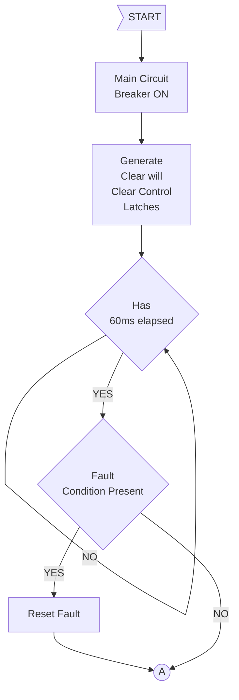

---

## Page 93

# 7-2

A new pack may now be installed. See  
Figure 7.1 for further details.

```text
                 (A)
                  |
                  |
        +------------------------+
        | Depress Start/Stop     |
        | Push Button            |
        +------------------------+
                  |
                  |
                  |
                  |
                  +--------------------------+
                                             |
                                             |
                                  +----------+----------+
                                  |                     |
                                  |       AND           |-------- RUN --------> (A) (See Figure 7.2)
                                  |                     |
                                  +--------------------+
                                      ^
                                      |
                                      |
                                    Start
                                    Stop       S
                                      o        o
                                               |
                                              ---
                                               -

                                      From       (B) Brush Cycle
                                      Figure        Complete
                                      7.2
                                      ----------
                                      SPINDLE STAT
                                      (spindle not turning)
                                      ----------
                                      REVERSE STOP
                                      (retracted position)


                                                                  Pack lock switches
                                                               o/       o/       ||
                         +-------------------------------------o--------o--------|| 
                         |                                      :        :
                         |                                      :        :
                         |                                   [coil]   [coil]
                         |                                      |        |
                         |                                      +--------+--------- +35V
                         |                                               |
                         |                                              |<|
                         |                                               |
                         |                                             [   ]
                         |                                               |
                         |                                               |
                         |                         +---------+           |
                         +------------------------>|   AND   |--- X/Y ---+----|\
                                                   |         |                | >---
                                                   |         |                |/
                                                   +---------+                 |
                                                                               ---
                                                                                -

Figure 7.1: "Run Conditions"
```

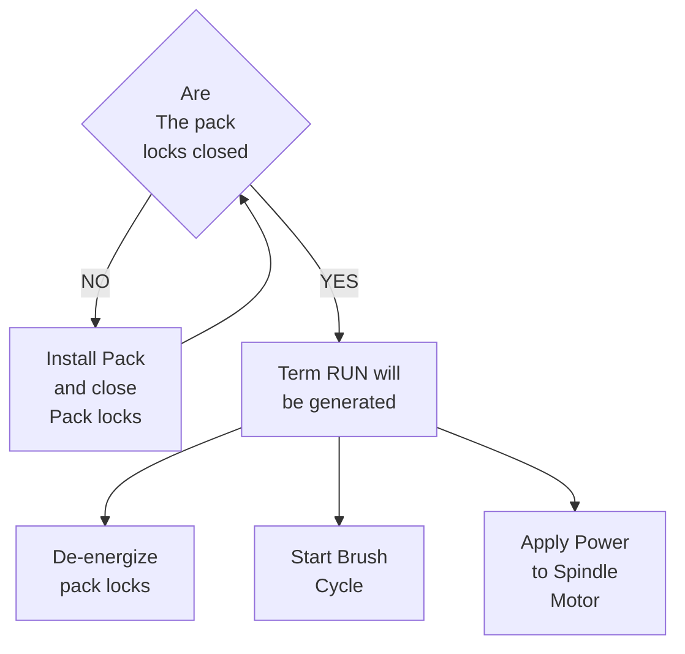

When the four conditions (as indicated in Figure 7.1) are met, the pack relays will be energized and pack locks may be opened (forcing the lock switches open).

We notice that the spindle cannot be started until the pack locks are closed.

The term "Run" will de-energize the pack locks. Now the pack may not be re-moved. (Refer to Figure 7.1.)

"Run" will also start the "Brush cycle". The disk brushes will move slowly over the entire disk surface to remove foreign particles. When they are in the most inward position, the brush arms are mechanically reversed. Reaching the home position, the "Home Position Switch" will be transferred indicating the completion of the brush cycle. (Refer to Figure 7.2.)

---

## Page 94

# 7-3

“Run” will also apply power to the spin-
dle motor by generating the term
“SPNDL” (Refer to Figure 7.2.) By gen-
erating the term “START RLY” for four
seconds the motor start windings will be
activated to assist the motor up to speed.
(Refer to Figure 7.2.)

```mermaid
flowchart TD
    B((B)) --> E[Energize Start<br/>Relay]
    E --> D1{Has<br/>Start Relay<br/>been energized<br/>4 sec.}
    D1 -- NO --> D1
    D1 -- YES --> DE[De-energize<br/>Start Relay]
    DE --> D2{Brush<br/>Cycle Complete}
    D2 -- NO --> D2
    D2 -- YES --> S[Stop Brush Motor]
    D2 -- YES --> K[Set K1 control FF<br/>(connects the power<br/>amplifier to voice coil)]
    D2 -- YES --> I[Initiate a 50 sec.<br/>servo delay]
    I --> C((C))
```

ND-11.009.01

---

## Page 95

# 7-4

```text
                         A   From Figure 7.1
                        ( )
                         |
                         |        RUN
                         +--------------------+------[ OR ]------+
                                              |                  |
                                              |                  |
                                      +-------+                  |
                                      |                          |
                                      |     +------+             |
                                      +-----|      |             |
                                            |  S   |             |
                         Brush Cycle         | V32  |-------------+------[ AND ]-----[ X/Y ]--- BRUSH ---[ NPN ]---+
                         Complete             |  R   |                                                  |             |
                            |                 +------+                                                  |             |
                            |                    |                                                      _|_            |
                         [Brush motor]           |                                                       -             24V
                            M                    |                                                                     |
                            |                    |                                                               [Brush Motor]
                           GND                   |                                                                     M
                                                 |                                                                     |
                                                 |                                                                  30VAC
                                                 |                                                                     |
                                                 |                                                                    (10)
                                                 |
                                                 +--------------------------- RUN -----------------[ X/Y ]--- Spindle ---+
                                                                                                      |                   |
                                                                                              +----------------+          |
                                                                                              | Power          |          |
                                                                                              | Break Op-      |          |
                                                                                              | tion           |          |
                                                                                              +----------------+          |
                                                                                                                    RUN    |
                                                                                                                           |
                                                                                                                     +-----+-----+  +5V
                                                                                                                     | 4       3 |
                                                                                                                     |           |
                                                                                                                     | 2       1 |---- AC ----(4)
                                                                                                                     +-----------+       K2
                                                                                                                                       30VAC


                                      .---------------------------------------------------.
                                      |                 4 sec. delay                    |
                                      |                                                   |
                                      |                                +-----+  +-----+  |
                                      |                                | AND |--| X/Y |--+------+
                                      |                                +-----+  +-----+         |
                                      |                                                   +-------+-------+  +5V
                                      |                                                   | 4           3 |
                                      |                                                   |               |
                                      |                                                   | 1           2 |
                                      |                                                   +---------------+
                                      |                                                     |           |
                                      |                                                Start Windings   Run Windings
                                      |                                                     |           |
                                      |                                                    (4)          [ M ]
                                      |                                                  30VAC            |
                                      |                                                                Term Protect
                                      '---------------------------------------------------------------'
                                                                                         |
                                                                                        (8)
                                                                                       190VAC
                                                                                   Spindle Motor


                         |
                         v
                        (B)---- Brush Cycle
                         |       Completed ----> To Figure 7.3
                         v
                    To Figure 7.1
```

# Figure 7.2: Power Up Sequence I

ND-11.009.01

---

## Page 96

7-5

```mermaid
flowchart TD
    C((C)) --> A{Has<br/>50 sec. elapsed}
    A -- NO --> A
    A -- YES --> B{Is<br/>spindle up to<br/>normal speed}
    B -- NO --> E[Set "Emergency<br/>Retract" FF]
    B -- YES --> F[Initiate Servo<br/>Enable]
    F --> G[Set "Cylinder<br/>Register"<br/>Equal 424₁₀]
    G --> H[Set Cylinder<br/>Counter equal<br/>408₁₀ and block<br/>the count-down<br/>pulses]
    H --> D((D))
    H --- I[Carriage will drive<br/>forward at a speed<br/>of 16 IPS and load<br/>the heads]
```

When brushes are back in home position a 50 sec. servo delay is initiated. At the same time spindle speed is checked to be within 20% of its normal value (indicated by the term "SPNDL STAT"). If that condition is true (normally it is) the K1 control FF is set picking relay K1. By transferring the contacts of K1, the output of the power amplifier will be connected to the voice coil. We are now waiting for a 50 sec. servo delay to time out. The purpose of this delay is to:

- allow spindle to reach full speed
- allow emergency retract capacitor to charge up
- allow time for temperature stabilization

Initialization of "First Seek" is indicated by setting "Servo Enable FF". (Refer to Figure 7.3.)

Disregarding the sequence at which they occur, the conditions for generating the term "Servo Enable" are as indicated in Figure 7.4.

# 7.1.1 First Seek

In order to move the carriage and the heads in forward direction at a moderate speed, a small error voltage must be generated. This is accomplished by faking the cylinder register and the cylinder counter. The following control terms become active at this point in time: "Servo Enable", "Ad Set", "EOT Det", "RVS Det" and "Int SK". "Ad Set" will clear the "Cylinder Register", "Int SK" will clear and "RVS Det" will select the complemented output of the cyl counter for address bits number 8, 7, 5, and 3 which gives the value of 424₁₀ from the cylinder register.

---

## Page 97

# 7-6

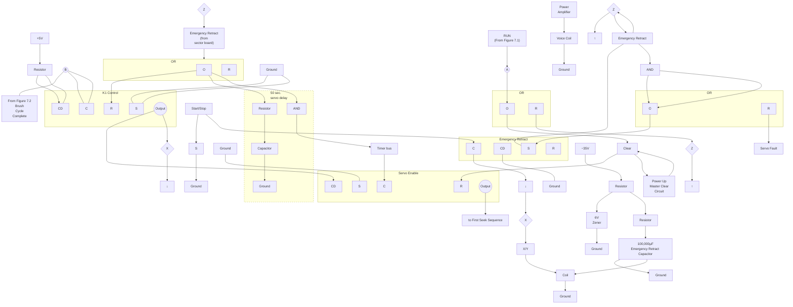

Figure 7.3: *Power Up Sequence II.*

---

## Page 98

# Figure 7.4: Servo Enable Generation Conditions

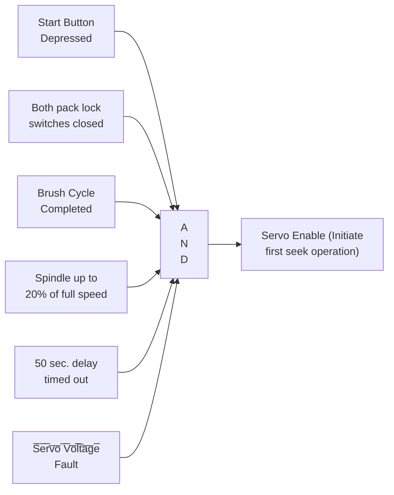

7-7

ND-11.009.01

---

## Page 99

# 7-8

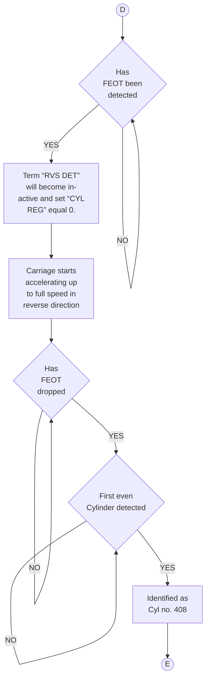

The cylinder counter will be commanded a parallel load by “Ad Set”. By wiring inputs to the appropriate combination of gnd and +5V a value of 408<sub>10</sub> will be held in the cylinder counter. “Ad Set” will also disable for “Cyl CNT” pulses.

The D/A converter will thus produce a constant error signal in accordance with a difference of 16<sub>10</sub> (424-408). The carriage will move forward at an estimated speed of 16IPS, perform the head loading over the spinning disk surface and continue until “Forward End of Travel” (FEOT) is detected. At this moment the term “RVS Det” will become inactive and “Cyl reg” will output a value of 0. The error signal generated will now be maximum in the reverse direction. The carriage will start accelerating up to full speed in reverse direction. After dropping FEOT we are looking for the first even cylinder number. The “EOT Det” and “Ad Set” will become inactive when the first even cylinder number is detected (indicated by term “sin:di” and goes from a pos to a neg value. This will remove the reset condition on the cylinder register (for the next seek operation). By dropping “Ad Set” the cylinder pulses “Cyl CNT” will be enabled to decrement the cylinder counter.

Since FEOT drops between 410 and 408, the first even cylinder number will be identified as cylinder 408, the number we already keep in the counter.

---

## Page 100

# 7–9

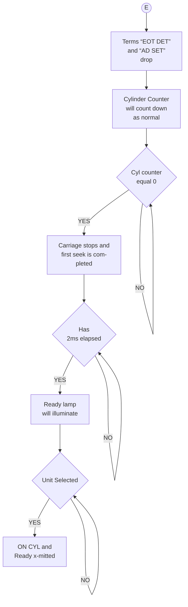

The counter is decremented by one each time a cylinder pulse “Cyl CNT” is generated. As tracks are crossed the cylinder will count down as in a normal seek operation. (For further details see “Servo Operation” and/or “Normal Seek”.) When Cyl 0 is reached the carriage will stop and the first seek operation is then completed. If the unit is selected “ON Cyl” and “Ready” will be transmitted to the controller.

---

## Page 101

7-10

# 7.2 OPERATIONAL SEEK

After a Power-up-First-Seek Operation has been accomplished, the R/W/E-heads are flying over cylinder number 0 and the "Cyl Counter" maintains the value of 0.

The controller may issue a cylinder address on the address lines with an address strobe pulse. As the address is received by the unit, a "Legal Address Decode" network will become active. If address issued is >407 a term "INV AD" is generated and the address will not be strobed into the "Cyl Register" and thus no seek operation will take place. Also, an "Ad Int" is sent back to the controller. By an option switch on the I/O board the "Ad Int" signal may be sent back as "SKER" (seek error) to (ND-controller) the controller.

If the address is good (≤407), the address strobe will initiate a half a second delay giving a maximum time for a legal seek operation. The address will be loaded into the "Cyl address register".

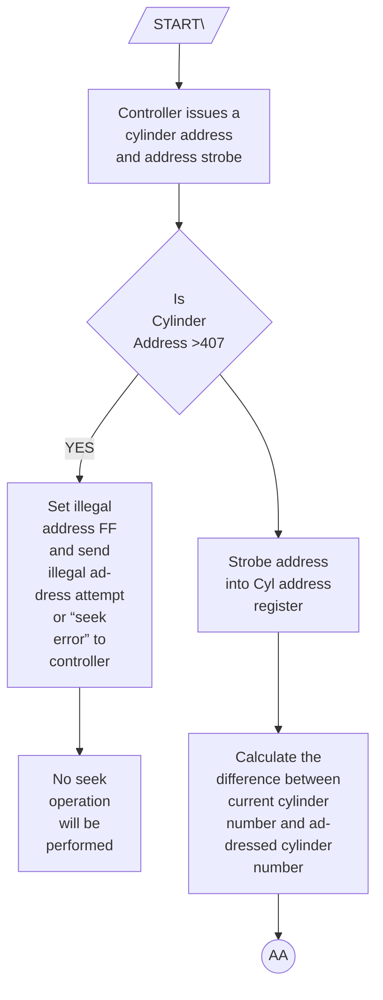

---

## Page 102

# Figure 7.5: Legal Address Decode

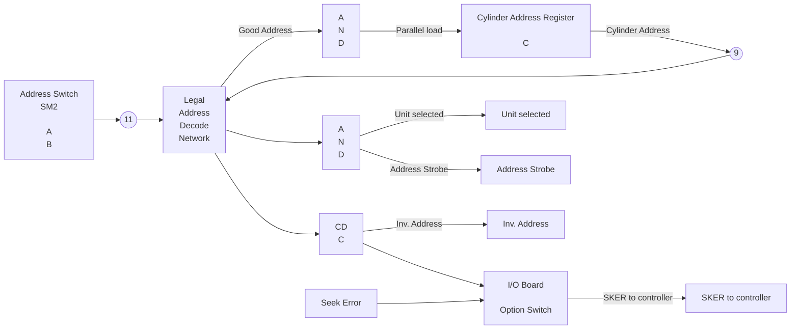

A) Set legal address equal to 405/407

B) Set legal address equal to A/415 (Test)

---

## Page 103

# 7-12

```mermaid
flowchart TD
    AA((AA)) --> D1{Is<br/>difference<br/>>128}
    D1 -- YES --> A[Carriage accelerates<br/>towards maximum<br/>speed]
    A --> D2{Has<br/>maximum<br/>speed been<br/>reached}
    D2 -- NO --> A
    D2 -- YES --> C[Carriage Coasts<br/>along at maximum<br/>speed]
    C --> P[Carriage moves<br/>at a speed propor-<br/>tional with<br/>"Tracks to go"]
    D1 -- NO --> P
    P --> D3{Is<br/>tracks to<br/>go >=0}
    D3 -- NO --> P
    D3 -- YES --> BB((BB))
```

The difference between the "Cyl Address  
Register" and the "Cylinder Counter" will  
be calculated and converted to an error  
signal in the D/A converter. (For further  
details refer to "Servo Operation".)

If the calculated difference is >128, the  
carriage will accelerate to full speed (65  
IPS) and coast along at this speed. As the  
carriage moves along the "Cyl Counter"  
will be decreased as each track is crossed.

As the difference begins decreasing from  
128 the servo will regulate the speed of  
the carriage proportional to tracks to go  
(the difference).

ND-11 009 01

---

## Page 104

# 7-13

At the moment the difference is 0, the carriage is half a track off the address cylinder. A fine mode of operation will take over where the error signal is taken from the position X-ducer. When this fine mode error signal is below 0.3V, equal to 200μs inches, off the center of the addressed track, a time delay of 2μs is initiated. When this time has elapsed the carriage will have come to a complete stop and "ON Cyl" is generated and sent to the controller if/when the unit is selected.

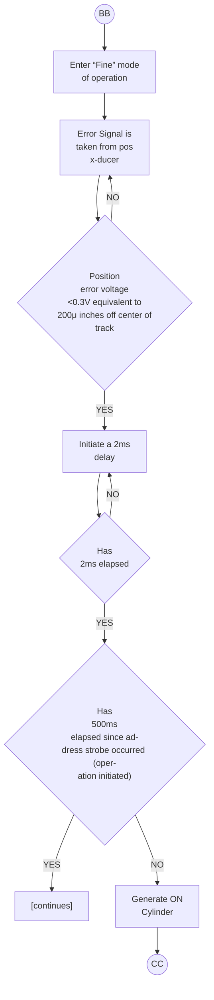

ND.11 009 01

---

## Page 105

# 7–14

If half a second of time-out occurs before “ON Cyl” is generated, the “Seek Error” latch will be set and the signal “SKER” (seek error) will be transmitted to the controller. The controller may then issue a RTZS command. (Refer RTZS Operation.)

```mermaid
flowchart TD
    CC((CC)) --> A[Set “Seek Error”<br/>latch]
    A --> B{Is unit<br/>selected}
    B -->|NO| B
    B -->|YES| C[Send “Seek<br/>Error” to<br/>controller]
    C -.-> D[Controller will<br/>issue a RTZS<br/>(see RTZS<br/>Operation)]

    classDef dashed stroke-dasharray: 8 8;
    class D dashed;
```

ND-11.009.01

---

## Page 106

# 7.3 RETURN TO ZERO SEEK

7–15

Return to Zero Seek (RTZS) is a command from the controller upon detection of any malfunction in the disk servo system. RTZS may automatically be issued or may be programmed from the computer.

The chain of events initiated by RTZS are equal to those initiated by "Servo Enable" in "Power-up-First seek" sequence.

The RTZS will activate the term "Int SK" which will clear the cylinder register. The term "RVS Det" (also activated by RTZS) will enable the complemented output of 424₁₀. The term "EOT Det" generating "Ad Set", also activated at this point in time will do a parallel load of the pre-wired input of 424₁₀ to the "Cyl Counter" and block for "Cyl CNT" pulses.

```mermaid
flowchart TD
    A[/START\] --> B["Controller issues<br/>a RTZS command"]
    B --- SE["Servo Enable"]
    B --> C["Set “Cyl Register”<br/>equal 424₁₀"]
    C --> D["Set “Cyl Counter”<br/>equal 408₁₀ and<br/>block the count<br/>pulses"]
    D --> E{"Has<br/>FEOT dropped"}
    E -->|YES| F["Term “RVS DET”<br/>will become in-<br/>active and set<br/>cylinder register<br/>equal 0"]
    F --> G((a))
    E --> H["Carriage will<br/>drive forward at<br/>a speed of 16 IPS"]
    H --> E
```

ND 11 000 01

---

## Page 107

# 7-16

```mermaid
flowchart TD
    A((a)) --> B[Carriage starts<br/>accelerating<br/>up to full speed<br/>in reverse direc-<br/>tion]
    B --> C{Has FEOT dropped}
    C -- NO --> C
    C -- YES --> D{First<br/>even Cyl<br/>detected}
    D -- NO --> D
    D -- YES --> E[Cylinder identified<br/>as cyl number 408]
    E --> F[Term "EOT DET"<br/>and "AD SET"<br/>drops]
    F --> G{Cyl CNT equal 0}
    G -- NO --> G
    G -- YES --> H((b))
```

A difference of 16 will be sent to the A/D converter giving an error signal resulting in a carriage velocity signal of 16 IPS in forward direction. This forward move will be terminated by detection FEOT (Forward End of Travel) dropping the term "RVS Det". The "Cylinder Reg" will then send an output of 0 to the D/A-converter, generating a maximum error signal (0-408) in reverse direction. As the carriage starts moving in reverse direction the FEOT will become inactive and as the first even cylinder is crossed, (indicated by "sin:di" going from a pos value to a negative value) the "EOT Det" and "Ad Set" drops.

The first cyl crossing will be identified as cylinder number 408. The pre-load function of "Cyl Counter" is then removed and allows for "Cyl CNT" pulses to do a count-down as cylinders are crossed. When "cyl counter" is equal to 0 the carriage will stop and the RTZS operation is then completed.

ND-11.009.01

---

## Page 108

# 7-17

If/When the unit is selected, an “ON Cyl” and “Ready” signal will be transmitted to the controller.

## 7.4 SEEK OPERATION — OFF LINE

```mermaid
flowchart TD
    b((b))
    A["Carriage stops<br/>and RTZS is<br/>completed"]
    B{"Has<br/>2mms elapsed"}
    C{"Has<br/>500mms el-<br/>apsed since the<br/>RTZS com-<br/>mand"}
    D["Set “Seek<br/>Error”"]
    E{"Unit selected"}
    F["ON cyl and Ready<br/>x-mitted to con-<br/>troller"]
    G["Ready lamp will<br/>illuminate"]

    b --> A --> B
    B -->|NO| B
    B -->|YES| C
    C -->|YES| D
    C -->|NO| E
    E -->|NO| E
    E -->|YES| F
    E --> G
```

Disregarding the motive, one wishes to position the R/W/E-heads to specific cylinders in the off-line mode. This can be accomplished by proper setting of the following option switches:

- unit select switch ON
- Internal Terminator power ON
- desired Head selected (4 switches)
- cylinder address selected (7 switches)

Then the address strobe is applied by momentarily setting the “Cylinder Address Strobe Switch”. The selected cylinder address will then be strobed into the “Cylinder Address Register” and the seek operation will be initiated.

By utilizing this feature, head alignment can be performed in off-line mode without usage of the exerciser.

MD 11 000 01

---

## Page 109


---

## Page 110

8–1

# 8 SECTORING

## 8.1 *GENERAL*

Monitoring position and speed of the disk is the function referred to as sectoring.

The pulse trains are derived from two magnetic transducers - one picking up notches in the steel cartridge hub (see Figure 2.12) and the other picking up holes in a sector ring for the fixed disk (see Figure 2.13). Refer also to Chapter 2.5 - Addressing Concept.

## 8.2 *OPERATION*

A pulse train of sector/index pulses derives from the fixed disk transducer and is amplified and pulse shaped into 50μs pulses.

A "spindle status detection circuitry" detects if the spindle is turning or not. This information is used on the Control Board. The pulse train is fed into a "sector/index separation network" which will be discussed later. The output is a separate "Index" line and a separate "Sector" line. The sector pulses will be fed to a "Divide by 2<sup>n</sup> network" where the number 'n' is set up by option switches. Since the number 'n' can take the values 0, 1, 2, 3, 4 and 5 the network will divide the number of sector pulses by: 1, 2, 4, 8, 16, or 32. The output from the "Divide by 2<sup>n</sup> network" is used to increment a "sector counter".

The same operation takes place for the cartridge pulse train. The index pulses will fire a retriggerable "one shot" which will generate the term "speed" if the spindle is turning above a certain speed limit.

The term "speed" is also used on the Control Board. Depending on HS1 (Head Select 1) signal being true or not, the "index", "sector" and "sector address" signals are selected from the fixed disk circuitry. This selection is performed by the Multiplexer (MUX) at the output.

### 8.2.1 *Sector/Index Separation*

Refer to Figure 8.2 for the following discussion.

```text
                                             o              1                 <--- sector number

  (1)              ___     ___       ___       ___       ___
                  _|   |___|   |_____|   |_____|   |_____|   |___     sector/index pulses
                     \     /     \       /       \       /
                      \___/       \_____/         \_____/

  (2)              _________       _________       _________
                  _|         |_____|         |_____|         |_

  (3)              ___       _________       _________       ___
                  _|   |_____|         |_____|         |_____|   |_

  (4)              ___       ___       ___       ___
                  _|   |_____|   |_____|   |_____|   |__________   sector pulses

  (5)                    ___
                  _______|   |________________________________________________  direct index pulse

  (6)                    ___________
                  _______|           |_________________________________________

  (7)                          ___
                  ______________|   |_________________________________________  delayed index pulse
```

---

## Page 111

# 8-2

```mermaid
flowchart TB
    FD["F.D. Det"] --> FPS["Pulse<br/>Shaper"]
    FPS --> SSD["Spindle<br/>Status<br/>Detection"]
    SSD -->|Spindle Stat<br/>(Rotation Sense)| SSOUT[""]

    FPS --> FSIN["Sector/Index<br/>Separation<br/>Network"]
    FSIN -->|Index| IBUS[""]
    FSIN -->|Sector| FDC["Divide by 2ⁿ circuitry"]
    FDC --> FC["Counter<br/><br/>+1"]
    FC --> FSEL["[switch selection]"]
    FSEL --> FSC["Sector<br/>Counter<br/><br/>+1&nbsp;&nbsp;R"]
    FSC --> F7(("7"))

    CD["C.D. Det"] --> CPS["Pulse<br/>Shaper"]
    CPS --> CSIN["Sector/Index<br/>Separation<br/>Network"]
    CSIN -->|Index| IBUS
    CSIN --> CDC["Divide by 2ⁿ circuitry"]
    CDC --> CC["Counter<br/><br/>+1"]
    CC --> CSEL["[switch selection]"]
    CSEL --> CSC["Sector<br/>Counter<br/><br/>+1&nbsp;&nbsp;R"]
    CSC --> C7(("7"))

    HST["HST"] --> HSTB[""]
    HSTB --> MUX["Mux"]

    F7 --> MUX
    C7 --> MUX
    IBUS --> MUX

    MUX -->|G2| I1(("1"))
    I1 --> IDX["Index"]

    MUX -->|G1| SA7(("7"))
    SA7 --> SADDR["Sector Address"]

    MUX --> S1(("1"))
    S1 --> SECTOR["Sector"]

    C7 --> SPEEDB[""]
    SPEEDB --> SPEED["Speed<br/>(Speed sense)"]
```

## Figure 8.1. *Sector/Index Generation*

---

## Page 112

8-3

Pulse train ① is the pulse-shaped wave-form from the transducer. The trailing edge of the sector pulses will set a one shot ② Wave-form ③ is the inverted wave-form ②. The sector pulses ④ are derived from ① ③. The direct index pulse ⑤ is formed by ① ②. The trailing edge of the direct index ⑤ will set a one shot ⑥. The delayed index ⑦ is derived from ⑥, ④. We notice that the delayed index ⑦ is identical to sector pulse zero. The index pulse indicates start of revolution or start of sector counting. We also observe that the sector counters will be reset by the index pulse. Decided by an option switch, the Direct Index ⑤ or Delayed Index ⑦ are set to the controller. (ND-controller uses the Delayed Index.)

# 8.2.2 Sector Number Conversion

The sectoring system is capable of producing all standard sector formats (including soft sector format). This is accomplished by:

1. Proper setting of the option switches in the "Divide by 2<sup>n</sup> network" for the:

    a. cartridge  
    b. fixed disk

2. Selecting the desired row of holes on the sector ring for the fixed disk transducer.

Figure 8.3 shows the sector number conversion in accordance with Table 8.1.

```text
                         Sensor Support

                __________________________________
               /                                  \
              /                                    \
             /                                      \
            /                                        \
           /__________________________________________\
           |                                          |
           |       o       o   o   o   o              |
           |__________________________________________|
                         4   3   2   1

                                                     .-----------------.
                                                    /                   \
                                                   /   . . . . . . .     \
                                                  |  . . . . . . . .      |
                                                  | . . . . . . . . .     |---- Sector Ring
                                                  |  . . . . . . . .      |
                                                   \                      /
                                                    \____________________/
                                                           |
                                                           |
                                                   ----------------
                                                        |
                                                        |---------------- Static Eliminator


                         Sensor Mount
                ________________________________________________
               |                                                \
               |   ________     o   o   o                        \
               |__________________________________________________\
                              C   B   A
                                       \
                                        \---------------- Magnetic Sensor
                                         |
                                         |
                                         |
```

**Figure 8.3:** *Sector Number Conversion*

---

## Page 113

# 8-4

| REQUIRED SECTORS<br>(Switch setting for sectors)<br>(See Option Switch Chart) | RING NUMBER | RING HOLES | SENSOR MOUNT ADJUSTMENT MOUNT | SENSOR MOUNT ADJUSTMENT SUPPORT |
|---|---:|---:|---:|---:|
| 29 or SOFT SECTOR | 1 (inside) | 29 | C | 2 |
| 40, 20, 10, 5 | 2 | 40 | B | 1 |
| 48, 24, 12, 6, 3 | 3 | 48 | C | 3 |
| 50, 25 | 4 | 50 | B | 2 |
| 60, 30, 15 | 5 | 60 | A | 1 |
| 64, 32, 16, 8, 4, 2 | 6 | 64 | B | 3 |
| 56, 28, 14, 7 (8 ring) | 7 | 56 | A | 2 |
| 72, 36, 18, 9 (8 ring) | 8 (outside) | 72 | B | 4 |

*Table 8.1: Sector Option Conversion*

## Example 1:

If 24 sectors are in use the transducer will be placed over ring number 3 which contains 48 holes. The “divide by 2ⁿ network” must be set up to perform divide by 2.

48 holes ÷ 2 = 24 sectors

## Example 2:

If 8 sectors are in use the transducer will be placed over ring number 6 which has 64 holes. The “divide by 2ⁿ network” must be set up to perform divide by 8.

---

## Page 114

# 9 R/W/E – READ/WRITE/ERASE OPERATIONS

## 9.1 *GENERAL*

The R/W/E operation can be divided into two sequences:

1. The Write/Erase sequence  
2. Read sequence  

Figure 9.1 should help illustrate the control and signal flow involved in the above mentioned operations.

```mermaid
flowchart TB
    FixedProt[Fixed Prot] --> P1["1"]
    WRProt[WR Prot] --> P1
    CartProt[Cart Prot] --> P1
    Fault[Fault] --> P1
    P1 --> WEInh[W/E Inh]

    Servo[Servo<br/>Board] -->|Zone ( >256)| RWE[R/W/E<br/>Board]
    WEInh --> RWE
    RWE <-->|Read<br/>Write| Heads[Heads]

    ReadGate1[Read Gate] --> ANDRead[AND]
    UnitSelect[Unit Select] --> ANDRead
    ANDRead --> RDEN1((B))
    RDEN1 -->|RD EN| RWE

    WriteGate1[Write Gate] --> ANDWrite[AND]
    Protect[Protect] --> ANDWrite
    UnitSelect --> ANDWrite
    WEDisable[W/E Disable<br/>(Fault Condition)] --> ANDWrite
    ANDWrite -->|WR EN| RWE

    EraseGate1[Erase Gate] --> ANDErase[AND]
    UnitSelect --> ANDErase
    WEDisable --> ANDErase
    ANDErase -->|ER EN| RWE

    IO[I/O] -->|HS0| RWE
    IO -->|HS1| RWE
    IO -->|Write Data/Clocks| RWE

    RWE --> DataRecovery[Data<br/>Recovery<br/>Board]
    DataRecovery -->|Sep. data| SepData[Sep. data]
    DataRecovery -->|Sep. clocks| SepClocks[Sep. clocks]
    DataRecovery -->|Read Sync| ReadSync[Read Sync]
    RDEN2((B)) -->|RD EN| DataRecovery

    ReadGate2[Read Gate] --> P2["1"]
    WriteGate2[Write Gate] --> P3["1"]
    EraseGate2[Erase Gate] --> P3
    P3 --> P2
    P2 --> P4["1"]
    P4 -->|Active Ind.| ActiveInd[Active Ind.]
```

**Figure 9.1:** *Control Board*

---

## Page 115

9-2

# 9.1.1 *Write Sequence*

In order to perform a write operation the unit must be selected. The two head select lines HS0 and HS1 will select one of four recording surfaces. Refer to the table below:

|  | HS1 | HS0 |  |
|---|---:|---:|---|
| Cartridge | 0 | 0 | upper surface |
| Cartridge | 0 | 1 | lower surface |
| Fixed Disk | 1 | 0 | upper surface |
| Fixed Disk | 1 | 1 | lower surface |

**Figure 9.2:** *Surface Selection*

The write operation is initiated by activating the Write gate and the Erase gate. The controller may now send the Write data/clocks to the drive. The R/W/E-board will condition this signal to be applied to the selected head. Figure 9.3 shows the timing relationship.

```text
Head Select          ────┐
                         │←──── Min. 10µs sec. (for Head Stabilization). ────→
                         └───────────────┬────────────────────────────────────────
                                         │

Write Gate           ────────────────┐
                                     │
                                     └────────────────────────────────────────────

Erase Gate           ────────────────┐
                                     │
                                     └────────────────────────────────────────────


Write Data/Clocks                     _   _   _   _   _   _
                                     _| |_| |_| |_| |_| |_| |___ etc.
```

**Figure 9.3:** *Head Select to Write Gate Timing*

---

## Page 116

# 9-3

The write data/clocks will clock a J-K FF which will convert the pulsed data/clocks to NRZ format. This data travels through a Write driver to a Read/Write matrix and is outputed to the heads through pins 15 and 2 of the matrix.

```text
                         D = 1             C = 1             D = 0             C = 1             D = 1

Write Data/Clocks            ┌───────┐       ┌───────┐                         ┌───────┐       ┌───────┐
                       ──────┘       └───────┘       └─────────────────────────┘       └───────┘       └─────
                             ▲               ▲                                 ▲               ▲


Write Toggle FF        ──────┐       ┌───────┐                       ┌───────┐       ┌───────       NRZ - Format
                              │       │       │                       │       │       │
                              └───────┘       └───────────────────────┘       └───────┘


Write Current          ────────╲________________╱─────────────────────╲________________╱───────  (From Write Driver)
```

**Figure 9.4: _Write Current Illustration_**

Each head is connected through a four wire connector J1 - J4 (Head 0 - 4).

```text
                                      J1 - J4
                                  ┌─────────────┐
                                  │      1      │────────────── Head Cable ───────────────┐
                                  │             │                                          │
             ┌────────────────────│      2      │──────────────────────────────────────────┘
             │                    │             │
             │    gnd when Erase ─│      3      │───────────────────────────────────────┐
             │                    │             │                                       │
             │                    │      4      │───────────────┐                       │
             │                    └─────────────┘               │                       │
             │                                                  │                       │
             │                                                  │                       │
        ┌─────────────┐                                         │                       │
        │             │                                         │                       │
        │    Write    │                                         │                       │
        │             │                                         │                       │
        │    Driver   │                                         │                       │
        │             │                                         │                       │
        └─────────────┘                                         │                       │
             │                                                  │                       │
            ─┴─                                                 │                       │
             ─                                                  │                       │
                                                                │                       │
                       Zone  ◄──────────────────────────────────┘                       │
                                                                                        │
                                             + 15V when                                 │
                                             head selected ─────────────────────────────┤
                                                                                        │
                                                                                        │
                                                                              ┌───────────────────┐
                                                                              │                   │
                                                                              │       coil        │
                                                                              │        │          │
                                                                              │        │          │
                                                                              │       R/W         │
                                                                              │      /   \        │
                                                                              │   coil   coil     │
                                                                              │                   │
                                                                              │     Head Pad      │
                                                                              └───────────────────┘
```

**Figure 9.5: _Head Cable Connections_**

---

## Page 117

# 9-4

The W/E inhibit will cancel out the effect of Head Select and no head  
will be selected.

A current fault detector monitors and reports any irregular write  
operation. For further details refer to “Fault Detection”.

Due to higher bit density in the inner tracks, the write current must be  
reduced. Operating on tracks above 256 will generate a term “zone”.  
This term is decoded from the cylinder counter. For further complete  
data and control flow refer to Figure 9.6.

[Complex circuit schematic showing write circuitry, head-selection connectors, write driver, read matrix, current fault detector, erase drive, toggle FF, zone-controlled write-current circuitry, and associated power supplies.]

Visible schematic labels:

- `+13V`
- `Pin No. 3 is close to gnd when head is selected.`
- `red`, `grn`, `blk`, `wht`
- `1`, `2`, `3`, `4`
- `Head Selected`
- `Erase Corr. Monitor`
- `WR Mon. A`
- `WR Mon. B`
- `Current Fault Detector`
- `Fault & Write Protect`
- `Erase Drive`
- `WR EN`
- `WR DATA`
- `Toggle FF`
- `Write Driver`
- `Read Matrix U15`
- `WR`
- `To Read`
- `Circuitry`
- `+15V`
- `−13V`
- `Zone: Tracks above 256 will receive lower write current due to higher bit density.`
- `Zone`

# Figure 9.6: *Write Circuitry*

[illegible] 11 000 01

---

## Page 118

# 9.1.2 Read Sequence

From Figure 9.1 we see that “RD EN” (Read Enable) is not supplied to the R/W/E-board. The term “WR EN” (Write Enable) will enable the read operation. While we are not writing, we are reading as far as the R/W/E-board is concerned. However, no read data is sent to the controller without “RD EN” being active. For further details refer to “Read Recovery Operation”.

Also, for a read operation the unit and the head must be selected. (See Figure 9.1 and Figure 9.2.) The Read/Write matrix will receive the read wave form on pin 15 and 2.

```text
          ┌──────┐       ┌──────┐                   ┌──────┐       ┌──────┐
──────────┘      └───────┘      └───────────────────┘      └───────┘      └────────
          ↑              ↑                           ↑              ↑
                                                                                 Write Clock/Data
                                                                                 (Double frequency)


──────────┐              ┌───────────────────┐              ┌───────────────────
          │              │                   │              │
          └──────────────┘                   └──────────────┘
                                                                                 Write Toggle (NRZ)


──────────╲
           ╲____________________________________________________╲
                                                                ╲________________
                         FLUX REVERSAL
                                                                                 Write Current


     ╱╲                         ╱╲
────╱  ╲───────────────╲───────╱  ╲───────────────╲───────╱
       ╲                ╲     ╱    ╲               ╲     ╱
        ╲________________╲___╱      ╲_______________╲___╱
                                                                                 Read Signal


─────────┐       ┌───────────────┐       ┌───────────────┐
         │       │               │       │               │
─────────┴───────┴───────────────┴───────┴───────────────┴────────
                                                                                 Read Data
                                                                                 (Double frequency)
                                                                                 (To Read Recovery
                                                                                 Board)
```

**Figure 9.7:** *Read Voltage Illustration*

As observed from Figure 9.7 the read-back voltage will have its peak value at the flux reversal point (when Write current travels through the zero line or switch polarity). By peak detecting the read-back voltage, the clocks and data will be detected. This is accomplished in the following way: (Refer also to Figure 9.8.)

The read signal is amplified by the linear low noise differential amplifier A and differentiated by amplifier B. The resulting signal drives a dual receiver which serves as cross-over detector and generator, a short positive pulse for each analog zero cross-over point. (Refer to Figure 9.7.) This double frequency signal is sent to the recovery board where data and clocks are separated.

The differential analog read signal may be monitored at the I/O board (TP1 and TP2) by sending the signal through the isolating state Q12 and Q13. The term “Ft track” is only active when using the soft sector format (“1”s pre-amble).

---

## Page 119

# 9–6

[Complex electrical schematic: Read Circuitry. Visible labels include H0, H1, H2, H3; wht, blk, grn, red; Amp A; Amp B; 2000 AR1; 2000 AR2; Reed Matrix U15; From Write Circuitry; and +15V.]

## Figure 9.8: *Read Circuitry*

ND-11.009.01

---

## Page 120

9-7

# 9.2 THE DATA RECOVERY

## 9.2.1 General

This circuit separates clocks from data and sends the signals on separate lines to the controller.

```mermaid
flowchart LR
    I[Data and Clocks] --> DR[Data Recovery Board — DR]
    DR --> C[Clocks]
    DR --> D[Data]
    DR --> RS[Read Sync]
```

**Figure 9.9:** *Data Recovery — Main Operation*

On the input side data and clocks will alternate, i.e. if only "1"s are recorded every second pulse will be a clock.

```text
        C       D = 1          C       D = 0          C       D = 1       C
        ┌─┐     ┌─┐            ┌─┐                    ┌─┐     ┌─┐         ┌─┐
────────┘ └─────┘ └────────────┘ └────────────────────┘ └─────┘ └─────────┘ └────
```

OUTPUT:

```text
Sep Clock     ┌──────┐       ┌──────┐       ┌──────┐       ┌──────┐       ┌──────┐
──────────────┘      └───────┘      └───────┘      └───────┘      └───────┘      └────
                    C=1            C=1            C=1            C=1

Sep Data
───────────────────────────┐      ┌───────────────────────┐      ┌──────────────────
                           │ D=1 │           D=0         │ D=1 │
                           └──────┘                       └──────┘
```

**Figure 9.10:** *Data and Clock Separation*

On the output data and clocks are separated and sent out as symmetrical pulses. (See also "Switch Position Chart".)

Clocks and data are disabled from being sent to the controller until proper synchronization has been established. This is indicated by the "Read Sync" signal.

# 9.3 DATA AND CLOCKS SEPARATION AND SYNCRONIZATION

Two problems arise when reading data from disk:

1. separates data from clocks.

2. keeps synchronization with clocks and data as opposed to rotation speed drifts, write oscillator drift (located in controller) and reference oscillator drift. (The latter is referred to as VCO, voltage controlled oscillator.)

ND-11.009.01

---

## Page 121

# 9-8

## 9.3.1 *Data and Clocks Separation*

In the following discussion we will refer to the “Hard Sector Format” also referred to as “Multi Sector Format”. See Figure 9.11.

| HG | SP | ADDR | CWA | HG | SP | DATA | CWD | E | TG |
|---|---|---|---|---|---|---|---|---|---|
| 120<br>zeros | 95<br>zeros<br>one 1 | 16 | 16 | 120<br>zeros | 95<br>zeros<br>one 1 | 2048 Bit<br>= 128 words | 16 | One<br>1 | 75<br>Data<br>cells |

**Figure 9.11:** *ND — Sector Format*

At some point in time in the “Head Gap” the “Read Enable” from the controller will be turned on. The exact time will depend on the amount of sector pulse jitter, controller variation, mechanical skew of sector pulses and disk unit tolerances. An average tolerance would be 30µs or 75 bits. When “Read Enable” becomes active, we will receive clock pulses from the disk via the R/W/E-board. Internally on the DR-board, 5MHZ osc (VCO — voltage controller oscillator is divided by two to generate a data window pulse train. Refer to the Timing Chart — Figure 9.12.

```text
DATA WINDOW GENERATION:
_______________________

U17-12
21-A5                ①          ┌───┐   ┌───┐   ┌───┐   ┌───┐   ┌───┐
                              ───┘   └───┘   └───┘   └───┘   └───┘   └──
                                    100     100                         VCO-CLK


U11-9
22-B2                ②        ┌─────┐     ┌─────┐     ┌─────┐
                            ───┘     └─────┘     └─────┘     └──────
                                  200       200                    Data Window used for Data
                                                                   and Clock Separation


22-AB67              ③          ┌───┐       ┌───┐       ┌───┐
                            ─────┘   └───────┘   └───────┘   └──────
                                  160ns     240ns                  DWA-B-C-D
                                                                   Used for syncronization
                                                                   Data and Clocks
```

**Figure 9.12:** *Data Window Generation*

Since the “Data Window” is internally generated on the DR board and the lock pulses come from the spinning disk, the initial phase relationship is random. The philosophy is to look for data when data window is high and clocks when data window is low. This relationship must be established.

```text
                         ┌──────┐       ┌──────┐       ┌──────┐
Data Window        ──────┘      └───────┘      └───────┘      └──────
                                              △ 180° Phase Shift on Data Window


                         C             C
PDA              ─────────┌─┐───────────┌─┐───────────┌─┐───────────┌─┐───────────┌─┐────
                            │ │           │ │           │ │           │ │           │ │


                    ──────────────────────┼──────────────────────────────────
                           Out of Place                    In Phase
```

**Figure 9.13:** *Data Window Synchronization*

ND 11 000 01

---

## Page 122

9–9

If clock pulses are in phase with “Data Window” we are out of phase and a 180° phase shift of the Data Window is necessary. This is done by finding three clock pulses in phase with Data Window. A term “Skip” will be generated to perform the 180° phase shift of the data window.

## 9.3.2 Data Window and Clocks Syncronization

For best data readability the ideal situation is that data (PDA) will show up in the middle of data window, i.e. clock pulses show up in the data window. Our question now is: should we look for data for the same length of time as we are looking for clocks, i.e. should the data window pulse train be symmetrical? Refer to Figure 9.12. Pulse train 3 is used for data and clock synchronization and we notice that the wave form is non-symmetrical, i.e. we are looking for clocks for 240μs and data for 160μs. To answer the question we refer to the following paragraph.

## 9.3.3 The Bit Crowding Effect of Peak Shift

Modern high frequency techniques, adjacent clocks and data pulses are close enough to interact with each other. The “bit crowding” effect is the interaction of the adjacent pulses.

Because two pulses tend to have a portion of their individual signals super-impose themselves on each other, the actual read-back voltage is the algebraic summation of the two pulses. The “bit crowding” will only take place when the read-back voltage frequency changes. Figure 9.14 should help illustrate.

```text
Data and Clocks       “C”    “0”    “C”    “1”      C      0      C
                    ─────┬──────┬──────┬──────┬──────┬──────┬──────
                         │      │      │      │      │      │

Write Current        ─────╮
                          ╰╮________________╭──────────╮
                           ╰________________╯          ╰╮____________
                                                        ╰_____________

With Peak Shift
Read-back voltage
with no Peak Shift     ────╭──────╮              ╭──────╮              ╭──────╮
                           ╭───────╮             ╭───────╮             ╭───────╮
                          ╱         ╲           ╱         ╲           ╱         ╲
                    ─────╯           ╲_________╯           ╲_________╯           ╲──
                                      │    │                │    │
                                      │    │    Peak        │    │
                                      │    │    Shift       │    │
                                      │    │                │    │
                                      │    │                │    │

Peak Shift          ──────╮───────────╮───────────╮───────────╮───────────
                           ╰╯          ╰╯          ╰╯          ╰╯
                         Constant     Increasing   Constant    Decreasing   Constant
                         Lower        Frequency    Higher-      Frequency    Lower
                         Frequency    Early        Frequency    Late         Frequency
                         No Peak      Peak Shift   No Peak      Peak Shift   No Peak
                         Shift                     Shift                     Shift

                    ─────────────┼───────────┼───────────┼────────────────
                                  *           *           *
                                  │           │           │
```

---

## Page 123

9-10

In "Multiple Sector" format (Hard Sector format) each data cell starts with a clock pulse. A "1" data bit will, therefore, be placed between two clock pulses. However, a clock pulse is written between:

1. Two other clock pulses  
   (no peak shift)

2. A data pulse and another clock  
   pulse (late peak shift)

3. Another clock pulse and a  
   data pulse (early peak shift)

4. Two data pulses  
   (no peak shift)

```text
                         C                  C                  C
                      /     \            /     \            /     \
---------------------/       \----------/       \----------/       \------

                     D              C'                         C
                  /     \        /  . .\                    /     \
-----------------/       \------/  . .  \------------------/       \-----
                               ----->

                    C              C'             D
                 /     \       . /     \       /     \
----------------/       \-----. /       \-----/       \-------------------
                            <-----

                    D              C              D
                 /     \        /     \        /     \
----------------/       \------/       \------/       \-------------------
```

*Figure 9.15: Bit Crowding Illustration*

In conclusion, a peak shift will not occur to a data bit, but will occur in both directions to a clock pulse. A longer window is therefore required for clock pulses than for data pulses. Refer to Figure 9.12 ③

# 9.3.4 Digital Phase Lock Loop Operating Principles

```mermaid
flowchart LR
    RD[Read Data<br/>& Clocks] --> COMP[Comparator]
    RSG[Reference<br/>Signal<br/>Generator] -->|P4<br/>(In Phase Pulses)| COMP
    COMP --> CP[Current<br/>Pump]
    CP --> VCO[VCO<br/>Voltage<br/>Controlled<br/>Oscillator]
    VCO -->|Clk| DWG[Data<br/>Window<br/>Generator]
    DWG -->|DW (Data Window)| RSG
    VCO -->|Clk| RSG
    RSG -->|P2<br/>Out of Phase<br/>Pulses| OPD[Out of<br/>Phase<br/>Detector]
    OPD -->|SKIP| DWG

    N1((1)) --- VCO
    N2((2)) --- DWG
    N3((3)) --- RSG
    N4((4)) --- OPD
    N5((5)) --- COMP
    N6((6)) --- CP
    N7((7)) --- VCO
```

*Figure 9.16: Digital Phase Lock Loop*

Phase and frequency tracking of the double frequency data is accomplished by a phase lock loop. ① the voltage controlled oscillator VCO outputs a frequency of 5MHz. A "Data Window", DW②, is generated with the frequency of ② 5MHz or a cycle time of 400µs equal to a data cell. As we have seen, the data window is high (looking for data) (160µs) and low (looking for clocks) (240µs). Frequencies and times

---

## Page 124

9–11

are normal. In the pre-amble part of the sector only clock pulses are written. If the clock pulses PDA are active during data window (DW) a 180° phase shift must take place. (As previously discussed.) When ③ out of phase pulses (P2) occur ④ a term “Skip” will be generated and reverse the phase of the DW. From this point P4 pulses will be generated ③. In the comparator ⑤ the phase relationship between P4 pulses and the PDA-pulses (read clock pulses) will be compared. If the PDA appears in the middle of the DW, (indicated by the P4 pulses) a symmetrical square wave (2.5MHZ) is fed to the current pump. The current pump will, in turn, feed an Error voltage ⑦ to the VCO and the Data Window frequency will increase until the phase relationship is normal again. Figure 9.17 will help illustrate the “Phase lock loop” regulating effect.

```text
                         |         |         |         |         |
DW                       └─────┐   ┌─────────┐   ┌─────┐
                               └───┘         └───┘     └─────
                         |         |         |         |         |

                         |         |         |         |         |
PDA                    ────┐       ────────┐         ────┐
                       ────└─┐─────────────└─┐───────────└─┐──────
                             └────────────────┘             └──────
                         |         |         |         |         |
                                               }
Comp. Output           ─┐                 ┌───┐       ┌───┐
                        └──────────────────┘   └───────┘   └──────
                                               }
                                                 The longer negative
                                                 pulse duration will
                                                 increase the speed
                                                 of the VCO and thus
                                                 DW.


                         |         |         |         |         |
PDA                    ───────┐             ────┐
                       ───────└─┐───────────────└─┐───────────────
                                └─────────────────┘
                         |         |         |         |         |
                                               }
Comp. Output           ─┐   ┌─────────┐   ┌─────────┐   ┌──
                        └───┘         └───┘         └───┘
                                               }
                                                 The longer positive
                                                 pulse duration will
                                                 decrease the speed
                                                 of the VCO.


                         |         |         |         |         |
PDA                    ─────┐             ─────┐             ─────┐
                       ─────└─┐───────────└────└─┐───────────└────└─
                              └──────────────────└────────────────
                         |         |         |         |         |
                                               }
Comp. Output           ─┐       ┌───────┐       ┌───────┐
                        └───────┘       └───────┘       └──────────
                                               }
                                                 Symmetrical waveform
                                                 will cause no regulating
                                                 effect to the VCO.
```

**Figure 9.17:** *Phase Lock Loop — Regulating Effect*

For more detailed operation refer to the detailed timing chart in Figure 9.18.

# 9.4 SEPARATE DATA AND SEPARATE CLOCKS REGENERATION

Having established the proper phase for the “data window”, clocks and data are separated by a simple AND function. From the R/W/E-board the PDC pulses are of short duration. Before sending the clocks to the controller we want to make a symmetrical square wave form for the clocks and the same for the data, if we have a read-back of all “1”s. Clocks and data will in that case be 180° out of phase. From another setting of the option switches, 25% pulses for clocks and data will be sent to the controller. Refer option switch table for desired format. Refer timing diagram for further details of operation.

---

## Page 125

# Figure 9.18: Phase Lock Loop – Detailed Timing

```text
When 3 missing clock pulses was detected
we assume that Data Window is 180° out of
phase. Skip is doing that phase shift.


Clock pulses in phase with data

      _     _     _     _     _     _     _     _     _     _
_____| |___| |___| |___| |___| |___| |___| |___| |___| |___| |___

        C     C     C     C     C     C     C     C     C

Data window
      _______       _______       _______       _______
_____|       |_____|       |_____|       |_____|       |_____

Clock pulses in phase with data
                     /--------------------------------------\
                    /                                        \
                   /                                          \
                  /                                            \

                    pulses in phase with data
                         \                                    /
                          \__________________________________/


In
      _______       _______       _______       _______
_____|       |_____|       |_____|       |_____|       |_____

sync pulses
      _             _             _             _
_____| |___________| |___________| |___________| |___________

3 missing pulses
      _             _                         _             _
_____| |___________| |_______________________| |___________| |


                                      9--12


Loss of sync pulse will generate --(Fast)which will clear zero counter.

      _______________________________
_____|                               |_______________________________

sync pulses
      _             _             _             _             _
_____| |___________| |___________| |___________| |___________| |_____

Data window
      _______       _______       _______       _______       _______
_____|       |_____|       |_____|       |_____|       |_____|       |___

      <----------------------- Detailed Timing ----------------------->


Data window frequency below nominal
value causes no correction to VCO.

        |
        v

In this part we want to slow down
the frequency of DW in order to
get properly in phase.


The DW goes out of phase and the increasing length of U2/4
increases speed of DW to get back in proper phase.


N.B!  The control signal regulating effect is not taken into account
      in this illustration part. E VCO keeps running unregulated
      with no feedback.
```

```text
+------------------------------------------------------------------+
|                         DATA ELECTRONICS                         |
|                                                                  |
|  Reset                                                           |
|                                                                  |
|  Data                                                            |
|  [illegible]                                                     |
|                                                                  |
|  Data                                                            |
|  [illegible]                                                     |
|                                                                  |
|                           [illegible]                            |
+------------------------------------------------------------------+
```

---

## Page 126

# DATA AND CLOCKS SEPARATION AND PULSE SHAPING

```text
DWE   ________|       |________|       |________|       |________|       |________|       |____
              |       |        |       |        |       |        |       |        |       |
              |_______|        |_______|        |_______|        |_______|        |_______|

DWB̅  ________         ________         ________         ________         ________         ____
              |_______|        |_______|        |_______|        |_______|        |_______|

O1̅   ________________     ____________     ____________     ____________     ______________
                      |___|            |___|            |___|            |___|

O2̅   ____     ________________     ________________     ________________     ______________
          |___|                |___|                |___|                |___|

O3̅   ______     ____________     ____________     ____________     ______     ____________
              |___|        |___|        |___|        |___|        |___|   |___|

O4̅   ___________     ___________     ___________     ___________     ___________     _____
               |___|           |___|           |___|           |___|           |___|

PDC   ____________| |______| |________________| |____| |____| |____| |____| |_______________

U18-5 ________|         |_____________________|       |________|       |________|       |____
              |_________|

U13-5 ______________|         |________________________|       |________|       |__________
                  |___________|                        |_______|        |_______|

U9-5  Separate Data ________|         |____________________|       |______|       |_________
                              |________|                    |_______|      |_______|
                                            Symmetrical


U18-9 ____________________|         |___________|       |___________|       |___________|__
                          |_________|           |_______|           |_______|           |

U13-9 ________________________|         |________|       |________|       |________|       __
                              |_________|        |_______|        |_______|        |_______|

U9-9  Separate Clocks ________|         |________|       |________|       |________|       __
                               |________|        |_______|        |_______|        |_______|
                                                  Symmetrical
```

**Figure 9.19:** *Data and Clocks Regeneration*

---

## Page 127

# 9-14

## 9.5 DATA AND CLOCKS TRANSMIT CONTROL CIRCUITRY

Separate data and separate clocks cannot be sent to the controller until the Data Window has been set up with the proper phase relationship. Additional time should also be allowed for the “phase lock loop” to stabilize. From this point we allow separate data and separate clocks to be passed on to the controller.

```mermaid
flowchart LR
    RE1[Read Enable] --> AND1[And]
    FAST[Fast (loss<br/>of sync)] --> AND1

    RE2[Read Enable] --> AND2[And]
    SKIP[Skip] --> AND2

    DATA["“1” Data<br/>Bit"] --> AND3[And]
    RIS[Read<br/>In Sync] --> A1((A))
    A1 --> AND3

    RE3[Read Enable] --> AND4[And]

    AND1 --> SEL["1"]
    AND2 --> SEL
    AND3 --> SEL
    AND4 --> SEL

    SEL --> AND5[And]
    A2((A)) --> AND5

    AND5 --> CNT["X → Y<br/><br/>15<br/><br/>+ 1<br/><br/>R"]
    CNT --> COUNTNOTE[Counter for 16<br/>clean zeroes]

    SEL --> RLINE
    RLINE --> CNT
    RLINE --> RSFF["Read Sync FF<br/><br/>S<br/><br/>CD<br/><br/>C"]

    V5["+ 5V"] --> RES[Resistor]
    RES --> RSFF

    RSFF --> A3((A))
    RSFF --> READSYNC[Read Sync]
    READSYNC --> SEPCLOCKS

    SEPCLOCKS[Separate Clocks] --> AND6[And]
    AND6 --> XY1[X/Y]
    XY1 --> TC[To Controller]

    SEPDATA[Separate Data] --> AND7[And]
    AND7 --> XY2[X/Y]

    READSYNC --> AND6
    READSYNC --> AND7
    SEPCLOCKS --> AND7
```

**Figure 9.20:** *Data and Clock Transmit Control Circuitry*

---

## Page 128

9–15

# 9.6 PRINCIPLE OPERATION

“Read in $\overline{\text{Sync FF}}$” is normally set and the clear side will disable for transmission of data and clocks to the controller. When the counter reaches a count of 16 (all zeros) the Read in $\overline{\text{Sync FF}}$ will clear and thus enable data and clocks to the controller. The counter is kept clear by $\overline{\text{Read Enable}}$. The command “Read Enable” from the controller starts off the read operation. The counter will now start counting clock pulses from the spinning disk. If the Data Window generation circuitry discovers (after three clock pulses) that the Data Window phase must be reversed, the term SKIP will be generated. “Skip” will then clear the counter. During the first part the pre-amble noise pulses may be found. A noise pulse detected under the “Data Window” will also clear the counter. If, for some reason, we should lose the sync, the term “Fast” (a 6.4μs pulse) will keep the counter clear during that time. This term will normally be generated when operating on the “soft sector format”. (“1”, pre-amble.)

When the counter finally reaches the count of 16, we know that the “phase lock loop” had sufficient time to stabilize. The count of 16 will clear the $\overline{\text{Read in Sync FF}}$ and data and clocks may now be sent to the controller. The controller will start its read operation after the first “1” bit has been detected in phase 1 and 4. (Refer to “Sector Format”.)

# 9.7 READ RECOVERY FEATURE

If data parity occurs during data read operation, it may be traced back to several sources. One of the sources may be a bad spot on the disk surface. This problem may not be overcome.

If poor data recovery is caused by compatability problems, a read recovery feature (also referred to as a servo offset feature) may perform this task.

Incompatability is composed of one or several sources. Some of them may cancel each other out while others add up.

One of the incompatability sources is writing and reading disk packs in different temperature environments. However, this is compensated for in the disk drive by a metal rod with the same temperature co-efficient as the disk packs.

This rod senses the temperature on the spindle assembly and moves the position transducer in accordance with the temperature variations.

However, the main purpose of this rod is to keep the position transducer at a constant, temperature compensated, distance from the spindle.

ND-11 009.01

---

## Page 129

# 9-16

[Technical drawing: disk-drive assembly with an arrow identifying the Temperature Compensation Rod.]

**Figure 9.21:** *Temperature Rod — Location*

Other factors that may result in poor read recovery due to incompatibility are:

- R/W/E-heads improperly aligned
- DC-offset from velocity amplifier at the servo summing point
- slight deviations in the position transducer from one disk drive to another
- disk wobbling due to imperfections in the spindle
- heads not perpendicularly aligned over each other due to imperfections in head arms
- heads not searching to the very centre of the spindle - actuator imperfections and carriage alignment
- temperature co-efficient deviations from one disk pack to another

# 9.7.1 Servo Offset Feature

Since the recorded track cannot be found right underneath the R/W/E-head but may be some distance beside it, a search operation can be initiated from the controller. This is done by activating the write protect line while reading. A term "search" will enable a sawtooth generator. Its output wave form with a frequency of 2HZ, will be added to the "sin" signal (or the servo error signal). The carriage will then move forth and back in accordance with the servo offset wave form.

---

## Page 130

# 9-17

A number of attempts should be made through a complete servo offset cycle before considering the data as irrecoverable.

```text
                                      Track n
                 /\/\/\/\/\/\/\/\/\/\/\/\/\/\/\/\/\/\/\/\/\/\/\/\/\/\/\/\/\/\/\/\/\/\
                /                                                                        \
               /__________________________________________________________________________\

      ↑

5000 μ in h.

                 ON Cylinder (Head Pos)
              ------------------------------------------------
                                            /\        /\        /\        /\        /\
                                           /  \      /  \      /  \      /  \      /  \
      ↓                                   /    \    /    \    /    \    /    \    /    \
                /\/\/\/\/\/\/\/\/\/\/\/\/\/\/\/\/\/\/\/\/\/\/\/\/\/\/\/\/\/\/\/\/\/\
               /__________________________________________________________________________\
                                            | | | | | | |
                                            | | | | | | |
                                            | | | | | | |
                                            Read Retries

                                                                 ON Cyl & Track
                                                                 Off-set

                                                                 Track n + 1
```

## Figure 9.22: *Read with Servo Offset*

For enabling the read recovery feature refer to “Option Switch Chart for I/O-Board”.

ND-11.009.01

---

## Page 131

[Blank page with scattered scan specks.]

---

## Page 132

# 10 FAULT HANDLING AND DETECTION

## 10.1 *FAULT DETECTION*

Fault conditions that may occur in the disk drive can be divided into two classes:

- Damaging faults
- Non-damaging faults

### 10.1.1 *Damaging Faults*

Damaging faults are those which will cause damage to the R/W/E heads or the disk surface. Loss of spindle speed is classified as one of the sources for damaging fault conditions (Head Crash).

Voltage faults on "servo pre-amp board" or "servo board" are the other sources for damaging fault conditions.

In order to receive an early warning for the above mentioned fault conditions, spindle speed and servo voltages are continuously monitored. If any non-transient fault conditions are detected, the "Emergency Retract Latch" will set. An emergency retract operation will be performed and the Fault (refer "Emergency Retract") light will illuminate.

In order to proceed after an emergency retract operation, the fault condition must be removed and the "Emergency Retract Latch" should be cleared by a "Power up Master Clear" or by hitting the START/STOP button.

### 10.1.2 *Non-Damaging Faults*

Non-damaging faults are faults which will not cause any damage to the disk drive or the recording media. However, the data exchange will be degraded (Read and/or Write features).

The non-damaging faults may be divided into three groups:

- Read/Write head current faults
- Command Faults
- Logic voltage failures

The following conditions will result in a Read/Write head current fault:

- Write current without erase current
- Erase current without write current
- More than one head selected for a W/E operation
- Excessive current leakage on the write driver output line during a read operation

10-1

---

## Page 133

# 10-2

```mermaid
flowchart LR
    PMC["Power Up Master Clear"] --> ER

    START["Start"] --> ER
    GND["⏚"] --- ER

    subgraph SB["SERVO BOARD"]
        VSB1["12 ← 15 ← 21.5"]
        VSB2["−20 ← −15 ← −11"]
    end

    subgraph SPA["SERVO PRE-AMP"]
        VSPA1["12 ← 15 ← 21.5"]
        VSPA2["−20 ← −15 ← [illegible]"]
    end

    VSB1 --- FB
    VSB2 --- FB
    VSPA1 --- FB
    VSPA2 --- FB

    FB["1<br/>Servo<br/>Fault"] --> ER

    X["1"] --> ER
    X --- SPEED["Speed"]
    SPEED --- XD["X-ducer (Fixed disk)"]
    XD --- RS["(Retriggable One Shot)"]
    RS --- X

    ER["Emergency Retract<br/>R<br/>CD<br/>C<br/>S"] --> OR["1<br/>OR for Faults"]
    OR --> AND["AND"]
    AND --> TC["to Controller"]

    OR --> FI["to Fault Indicator"]
    OR --> IR["Inhibit Ready"]

    ER --- US["Unit Selected"]
```

*Figure 10.1: Damaging Fault Illustration*

ND-11 000 01

---

## Page 134

10-3

Command faults will be detected if:

- Write operation is attempted without being on cylinder
- Read Operation is attempted during a W/E operation
- Head 2 or 3 selected without fixed disk present

Logic voltage failure will be detected if logic voltage faults occur on any of the following cards:

- Read/Write Circuitry
- Sector board
- Data recovery board

Any of the above mentioned fault conditions will set the "Fault" latch, initiating the following actions:

- <u>"Fault"</u> reported to the controller
- <u>"Ready"</u> reported to the controller (ready drops)
- Fault light will be lit
- Disable Write/Erase operations

A non-damaging fault condition may be reset from the controller by a RTZS operation or by pushing the "Fault Reset" button at the front panel.

# 10.2 COMMENTS

The following should be considered regarding the fault detection:

- Fault latch is set by damaging fault conditions as well as non-damaging fault conditions. Both will result in actions as indicated above.

- Damaging fault conditions will result in an "Emergency Retract" operation, while a non-damaging condition will not reposition the heads.

- Non-damaging fault conditions can be reset from the controller by commanding a RTZS or can be reset by the operator by pushing the "Fault Reset" button.

- Damaging fault conditions can only be reset by pushing the "start/stop" button or "Power Up Master Clear".

# 10.3 NORMAL AND EMERGENCY RETRACT

The W/R/E heads should only be "floating" over the spinning disk surface as long as the rotating speed of the disk is normal. Under no circumstances should the heads be permitted to make physical contact with the disk surface.

Two situations occur in which heads should be moved back past the loading ramp to the complete retracted position. The two situations are "Normal retract" and "Emergency retract".

---

## Page 135

# 10.3.1 *Normal Retract*

A normal retract operation will be initiated when the start/stop button is hit. “Run” will become inactive, clearing the “Servo Enable FF”. By dropping the term “Spindle”, power is removed from the spindle motor. Dropping “Servo Enable” will generate “Term SK” and “Ad set” which will load the “cylinder address register” with 424₁₀.

“Ad set” will load the “cylinder counter” with 440₁₀ (408₁₀ + 32). .25 (=32) is activated by the term “Term Seek”.

Since “Ad set” blocks the counting feature in the “Cylinder Counter”, the A/D-converter will output a constant error signal equal to 16 tracks to go in outboard direction. This will move the carriage at a speed of 16 IPS.

As the head arms move towards the loading ramp the heads will unload. When the carriage transfers the “Reverse stop microswitch” the term “Rev Stop” will become active. “Term SK” and “Ad Set” will drop. “Cylinder Address Register” and “Cylinder Counter” will be cleared, and there will be no error voltage to the servo. When the disk speed drops below 20% of its nominal value, the term “Spndl Stat” will drop resetting K-1 control which in turn disables the output from the power amplifier to the voice coil.

---

## Page 136

# 10-5

# NORMAL RETRACT FLOW CHART

```mermaid
flowchart TD
    S[/Start\] --> B1["Start/Stop<br/>Button is hit"]
    B1 --> B2["Drop term “Run”"]
    B2 --> B3["Drop “Servo<br/>Enable”"]
    B2 --> B4["Drop Term"]
    B3 --> B5["Activate “Term<br/>Seek” and “Ad<br/>Set”"]
    B4 --> B6["Remove Power<br/>from the spindle<br/>motor"]
    B5 --> B7["Load “Cylinder<br/>Address Register”<br/>with 424₁₀"]
    B5 --> B8["Lot Cyl Counter<br/>with 440₁₀ and<br/>disable counting<br/>feature"]
    B7 --> A((A))
    B8 --> A
```

[illegible] 11 000 01

---

## Page 137

10—6

# NORMAL RETRACT FLOW CHART, CONTINUED

```mermaid
flowchart TD
    A((A)) --- B["Carriage moves<br/>in outboard dir-<br/>ection at 16 IPS"]
    B --- C["Perform Head<br/>Unloading"]
    C --- D{"Has Rev stop<br/>SW been x-ferred"}
    D --- E["Term “Rev Stop”<br/>will de-activate<br/>“Term SK” and<br/>“Ad Set”"]
    E --- F["Cyl Counter and<br/>Cyl Address Regis-<br/>ter are set to zero"]
    F --- G{"Has<br/>spindle speed<br/>dropped to 20%<br/>of its nominal<br/>value"}
    G --- H["Reset K1 - control<br/>FF"]
    H --- I["K1 will de-energize<br/><br/>Contacts will disable<br/>the output from the<br/>power amplifier to<br/>voice coil."]
```

ND 11 000 01

---

## Page 138

# 10-7

## 10.3.2 *Emergency Retract*

There are two reasons for doing an emergency retract:

1. Spindle motor velocity drops below the tolerance limit.

2. A damaging power failure occurs.

```text
                    Capret
              ┌───────o/ o────────┐
              │                    │
          ┌───┴───┐                 ⏚
          │100,000µF
          └───┬───┘
              │
              │
              └──────o/ o──RTR Cap.───────────────────────┐
                                                           │
                                                           │
                                                     ┌─────┴─────┐
                                                     │  1/2 sec. │
                         ┌───────────────────────────┤    ←→     │
                         │                           │   delay   │
                         │                           └─────┬─────┘
                         │                                 │
                         │                                 └───────┐
                         │                                         │
                         │                           ┌─────┐       │
                         └───────────────────────────┤  △  ├───────┘
                                                     └─────┘
                         ┌────────────────────────────────────o/ o──── RTR Out
                         │
                         │
                         │
                         │
                         │
                         └──────────────────────────────────────────────┐
                                                                        │
                              ┌───────────────┐                         │
                              │               │                         │
                              │     Power     │──────────────o/ o───────┘
                              │               │                │
                              │   Amplifier   │                │
                              │               │                │
                              └───────────────┘                │
                                                               │
                                                               │
                                                             [coil]
                                                               │
                                                               │
                                                         Voice Coil
                                                               ↕
                                                             [coil]
                                                               │
                                                               ⏚


                         ┌─────┐
                         │  ▽  │
                         └──┬──┘
                            │
                            ⏚
                         ÷ 6.2V

                            │
                            │
                            ├────[ ]────
                            │
                           -35V


                         Emergency Retract        Spindle Stat
                              ┌─────┐                ┌─────┐
                              │  S  │────────────────│  1  │
                              │     │                │     │
                              └─────┘                └──┬──┘
                                                        │
                                                        │ R
                                                     ┌──┴──┐
                                                     │  S  │ K1 Control
                                                     │     │──────────────┐
                                                     └─────┘              │
                                                                          │
                                                                     ┌────┴────┐
                                                                     │    X     │
                                                                     │    /     │
                                                                     │    Y     │
                                                                     └────┬────┘
                                                                          │
                                                                          │
                                                                          └───────────────
```

**Figure 10.2:** *Emergency Retract*

---

## Page 139

# 10-8

In either case the “Emergency Retract” FF will set, disable “Run”, dropping “SPNDL”, and remove AC to the spindle motor. Emergency retract will set the Fault latch and the fault indicator will be lit. K-1 control FF will clear, de-energizing K-1. The contacts of K-1 will transfer from the output of the power amplifier to the negative side of the “retract capacitor” through a triac. A half a second delay will be initiated by applying gnd through the voice coil. During this time interval the triac will not conduct and the carriage is allowed to move freely. Because of the spring load (flex power bands) the carriage will move away from the head unloading ramp. After the half second delay is over, the triac will be turned ON discharging the 6V 100,000μs capacitor through the voice coil. The carriage will be pulled back, unload the heads, and stop at the reverse stop position. The purpose of the time delay is to allow time for the carriage to move to a position away from the unloading ramp. When the capacitor begins discharging the carriage gains enough speed (and force) to unload the heads when the head arms hit the unloading ramp. Refer to Figure 10.2.

MD 11 000 01

---

## Page 140

# 10–9

# EMERGENCY RETRACT FLOW CHART

```mermaid
flowchart TD
    A{{Start}}
    B[Spindle Speed<br/>Low]
    C[Servo Voltage<br/>Fault]
    D[Set Emergency<br/>Retract FF]
    E[Set Fault Latch]
    F["“Spindle” will<br/>drop, i.e. AC<br/>removed from<br/>spindle motor"]
    G[Reset K1<br/>Control FF]
    H[Disable the<br/>output from<br/>the Power<br/>Amplifier]
    I((AA))

    A --- B
    A --- C
    B --- D
    C --- D
    D --- E
    D --- F
    D --- G
    G --- H
    H --- I
```

---

## Page 141

# 10–10

# EMERGENCY RETRACT FLOW CHART, CONTINUED

```mermaid
flowchart TD
    AA((AA)) --> J(( ))
    J --> D{Has<br/>500μS timed<br/>out}
    D --> M(( ))
    J --> C[Carriage will<br/>move to a middle<br/>position]
    C --> M
    M --> T[Triac will fire discharg-<br/>ing retract capacitor<br/>through voice coil]
    T --> H[Heads will unload and<br/>carriage will stop in<br/>reverse stop position]
    D --> J
```

[illegible]

---

## Page 142

# Appendix A

# Diagrams

[illegible]

---

## Page 143

[No legible text or identifiable elements visible.]

---

## Page 144

# Appendix B

## Option Switch Chart

---

## Page 145


---

## Page 146

# APPENDIX B

## OPTION SWITCH CHART

### SECTOR BOARD OPTION SWITCHES

| SW NO.: | ON—FUNCTION: | OFF—FUNCTION: |
|---|---|---|
| SW1—1 | Index Timing(Diablo ) | Index timing (CDC) |
| SW1—2 | Index Timing(Diablo ) | Index timing (CDC) |
| SW1—3 | Soft Sector | Hard Sector |
| SW1—4 | Hard Sector | Soft Sector |
| SW2—1 | ÷1 cart |  |
| SW2—2 | ÷21 cart |  |
| SW2—3 | ÷16 cart | Only one switch should be<br>on at the time. |
| SW2—4 | ÷8 cart |  |
| SW2—5 | ÷4 cart |  |
| SW2—6 | ÷2 cart |  |
| SW3—1 | No Dynamic Brake | Dynamic Brake |
| SW3—2 | 1500 RPM | 2400 RPM |
| SW3—4 | Index timing (diablo) | Index timing (CDC) |
| SW3—5 | Index timing (diablo) | Index timing (CDC) |
| SW3—6 | Index angle 3° 10′<br>(For more than 32 sectors<br>in cartridge) | Index angle 5° 30′<br>For less than 32 sectors in<br>cartridge) |
| SW3—7 | 1500 RPM | 2400 RPM |
| SW 3—8 | 30 sec dynamic brake | 60 sec dynamic brake or no<br>dynamic brake |
| SW |  |  |
| SW4—1 | ÷1 Fixed |  |
| SW4—2 | ÷32 Fixed |  |
| SW4—3 | ÷16 Fixed | Only one switch in this group<br>should be on at the time. |
| SW4—4 | ÷8 Fixed |  |
| SW4—5 | ÷4 Fixed |  |
| SW4—6 | ÷2 Fixed |  |

ND 11 009 01

---

## Page 147

# B-2

```mermaid
flowchart TB
    S4C["OFE<br/>S 4<br/>1 · 2 · 3 · 4 · 5 · 6 · 7 · 8"] --> S4["S4"]
    S2C["OFE<br/>S 2<br/>1 · 2 · 3 · 4 · 5 · 6 · 7 · 8"] --> S2["S2"]
    S3C["OFE<br/>S 3<br/>1 · 2 · 3 · 4 · 5 · 6 · 7 · 8"] --> S3["S3"]
    S1C["OFE<br/>S 1<br/>1 · 2 · 3 · 4"] --> S1["S1"]

    subgraph BOARD["SECTOR BOARD"]
        S4
        S3
        S2
        S1
    end
```

---

## Page 148

# B-3

## I/O-BOARD OPTION SWITCHES

| SW NO.: | ON-FUNCTION: | OFF-FUNCTION: |
|---|---|---|
| SW1-1 | Unit Select I |  |
| SW1-2 | Unit Select II |  |
| SW1-3 | Unit Select III |  |
| SW1-4 | Unit Select IV |  |
| SW1-5 | Unit Always Selected |  |
| SW2-1 | Seek Complete 1 |  |
| SW2-2 | Seek Complete 2 |  |
| SW2-3 | Seek Complete 3 |  |
| SW2-4 | Seek Complete 4 |  |
| SW2-5 | RTZS strobe |  |
| SW2-6 | Track Offset | Write Protect |
| SW2-7 | Write Protect | Track Offset |
| SW2-8 | Term Power from Controller | Term Power from Unit |
| SW2-9 | Cyl Addr. Strobe | Cyl Addr. Strobe (one shot) |
| SW2-10 | Cyl Addr. Strobe (one shot) | Cyl Addr. Strobe |
| SW3-1 | Stop Override |  |
| SW3-2 | <u>Head Select Bit 1</u> (diablo) | Head Select Bit 1 |
| SW3-3 | Head Select Bit 1 | <u>Head Select Bit 1</u> (diablo) |
| SW3-4 | +5V Term Powered by Unit | Term Powered by Controller |
| SW4-1 | Head Select Bit 2 | <u>Head Select Bit 2</u> (diablo) |
| SW4-2 | <u>Head Select Bit 2</u> (diablo) | Head Select Bit 2 |
| SW4-3 | Illegal Address Detected as<br>Seek Error |  |
| SW4-4 | Density Status | Active |
| SW4-5 | Active | Density Status |
| SW4-6 | ON Cylinder when Seek Error |  |
| SW4-7 | Sector Address 32 | Read in Sync |
| SW4-8 | Read in Sync | Sector Address 32 |

---

## Page 149

# B-4

# I/O-BOARD OPTION SWITCHES, continued

| SW NO.: | ON—FUNCTION: | OFF—FUNCTION: |
|---|---|---|
| SW5-1 | Cylinder Address 16 | |
| SW5-2 | Cylinder Address 128 | |
| SW5-3 | Cylinder Address 2 | |
| SW5-4 | Cylinder Address 4 | |
| SW5-5 | Cylinder Address 8 | |
| SW5-6 | Cylinder Address 64 | |
| SW5-7 | Cylinder Address 1 | |
| SW5-8 | Cylinder Address Strobe | |

ND-11.009.01

---

## Page 150

# B-5

```mermaid
flowchart TB
    subgraph T[ ]
        direction LR
        C1["OFF<br/>S  1  5  4  3  2  1<br/>ON"]
        C2["OFF<br/>S  3  4  3  2  1<br/>ON"]
        C3["OFF<br/>S  5  8  7  6  5  4  3  2  1<br/>ON"]
    end

    subgraph B["3M I/O BOARD"]
        direction TB
        P1["S1"]
        P3["S3"]
        P5["S5"]
        P2["S2"]
        P4["S4"]
    end

    subgraph D[ ]
        direction LR
        C4["OFF<br/>S  2  1  2  3  4  5  6  7  8  9  10<br/>ON"]
        C5["OFF<br/>S  4  8  7  6  5  4  3  2  1<br/>ON"]
    end

    C1 --> P1
    C2 --> P3
    C3 --> P5
    C4 --> P4
    C5 --> P2
```

---

## Page 151

# B-6

## CONTROL BOARD OPTION SWITCHES

| SW NO.: | ON—FUNCTION: | OFF—FUNCTION: |
|---|---|---|
| SW1—2 | RTZS Reset Fault |  |
| SW1—3 | Active High Interrupt | Active Low Interrupt |
| SW1—4 | Active Low Interrupt | Active High Interrupt |
| SW1—5 | No Fixed Disk | Fixed Disk |
| SW1—6 | 200 TPI | 100 TPI |
| SW1—7 | Drop Ready with Fault |  |
| SW1—8 | Invalid Cylinder Address<br>Interrupt |  |

NO.11 009.01

---

## Page 152

# B-7

# CONTROL BOARD

```text
                         +--------------------------------------------------+
                         |                                                  |
                         |  [____]  [____]  [____]  [____]  [____]  [____] |
                         |                                                  |
                         |  [____]  [____]  [____]  [____]  [____]  [____] |
                         |                                                  |
                         |  [____]  [____]  [____]  [____]  [____]  [____] |
                         |                                                  |
                         |  [____]  [____]  [____]  [____]  [____]  [S1 ] |
                         |                                                  |
                         |  [____]  [____]  [____]  [____]  [____]  [__] |
                         |                                                  |
                         |  [____]  [____]  [____]  [____]  [____]  [__] |
                         |                                                  |
                         |  [____]  [____]  [____]  [____]  [____]        |
                         |                                                  |
                         +-----------------------------------------+  |||  |
                                                                   |  |||  |
                                                                   +------+  |

                                                    +---+---+---+---+---+---+---+---+
                                                    |OFF|   |   |   |   |   |   |   |   |
                                                    +---+---+---+---+---+---+---+---+
                                                    | S |   | 8 | 7 | 6 | 5 | 4 | 3 | 2 | 1
                                                    +---+---+---+---+---+---+---+---+
                                                    |ON |   |   |   |   |   |   |   |   |
                                                    +---+---+---+---+---+---+---+---+
                                                                                  |
                                                                                  |
                                                                                  +--------> S1
```

[illegible]

---

## Page 153

# B-8

# DATA RECOVERY OPTION SWITCHES

| SW NO.: | ON—FUNCTION: | OFF—FUNCTION: |
|---|---|---|
| SW1—1 | 1500 RPM | 2400 RPM |
| SW1—2 | Operation | Test |
| SW1—7 | Hard Sector | Soft Sector |
| SW2—1 | Soft Sector | Hard Sector |
| SW2—2 | Soft Sector | Hard Sector |
| SW2—3 | Hard Sector | Soft Sector |
| SW2—4 | 1/4 Cell (diablo) Data | 1/2 Cell (Standard) |
| SW2—5 | 1/2 Cell (standard) Data | 1/4 Cell (diablo) |
| SW2—6 | 1/4 Cell (diablo) Clock | 1/2 Cell (Standard) |
| SW2—7 | 1/2 Cell (standard) Clock | 1/4 Cell (diablo) |
| SW3—1 | Operation | Test |
| SW3—3 | Soft Sector | Hard Sector |
| SW3—4 | Hard Sector | Soft Sector |
| SW3—5 | Hard Sector | Soft Sector |
| SW3—6 | Soft Sector | Hard Sector |
| SW3—7 | Hard Sector | Soft Sector |
| SW4—1 | Soft Sector | Hard Sector |
| SW4—2 | 1500 RPM | 2400 RPM |
| SW4—3 | 2400 RPM | 1500 RPM |
| SW4—4 | 2400 RPM | 1500 RPM |
| SW4—7 | Operation | Test |

ND-11.009.01

---

## Page 154

# DATA RECOVERY BOARD

B-9

```text
                         ┌───────────────┐       ┌───────────────┐
                         │ O N           │       │ O N           │
                         │ S 4 1 2 3 4 5 6 7 │    │ S 2 1 2 3 4 5 6 7 │
                         │ O F F         │       │ O F F         │
                         └───────────────┘       └───────────────┘
                                  │                       │
                                  │                       │
                                  │                       │
                                  ↓                       ↓
                    ┌─────────────────────────────────────────────┐
                    │  ┌─────┐             ┌─────┐                │
                    │  │ S2  │             │ S1  │                │
                    │                                                   │
                    │    ▭    ▭    ▭    ▭    ▭    ▭    ▭             │
                    │                                                   │
                    │    ▭    ▭    ▭    ▭    ▭    ▭    ▭             │
                    │                                                   │
                    │    ▭    ▭   ┌─────┐ ┌─────┐ ▭    ▭    ▭        │
                    │              │ S3  │ │ S3  │                   │
                    │    ▭    ▭    ▭    ▭    ▭    ▭    ▭             │
                    │                                             ║   │
                    │                                             ║   │
                    └─────────────────────────────────────────────┘
                                  ↑                       ↑
                                  │                       │
                         ┌───────────────┐       ┌───────────────┐
                         │ O N           │       │ O N           │
                         │ S 3 1 2 3 4 5 6 7 │    │ S 2 1 2 3 4 5 6 7 │
                         │ O F F         │       │ O F F         │
                         └───────────────┘       └───────────────┘
```

ND-11.009.01

---

## Page 155

# B-10

# SERVO BOARD OPTION SWITCHES

| SW NO.: | ON-FUNCTION: | OFF-FUNCTION: |
|---|---|---|
| SW1-1 | 200 TPI | 100 TPI |
| SW1-2 | 200 TPI | 100 TPI |
| SW1-3 | 200 TPI | 100 TPI |
| SW1-4 | 200 TPI | 100 TPI |
| SW1-5 | 200 TPI | 100 TPI |
| SW1-6 | 200 TPI | 100 TPI |
| SW1-7 | 200 TPI | 100 TPI |
| SW1-8 | 200 TPI | 100 TPI |
| SW1-9 | 200 TPI | 100 TPI |
| SW2-1 | 100 TPI | 200 TPI |
| SW2-2 | 100 TPI | 200 TPI |
| SW2-3 | 100 TPI | 200 TPI |
| SW2-4 | 100 TPI | 200 TPI |
| SW2-5 | 100 TPI | 200 TPI |
| SW2-6 | 100 TPI | 200 TPI |
| SW2-7 | 100 TPI | 200 TPI |
| SW2-8 | 100 TPI | 200 TPI |
| SW2-9 | Legal Address 405 | Legal Address 407 |
| SW2-10 | No Operation | Legal Address 415 (Test Only) |
| SW3-1 | On Cyl Dropped (diablo) | On Cyl not dropped on illegal address (diablo) |
| SW3-2 | On Cyl not dropped on illegal address | On Cyl dropped |
| SW3-3 | Address Int level | Address Int pulse |
| SW3-4 | Always on for normal operation | No EOT error |

ND-11.009.01

---

## Page 156

# B-11

```mermaid
flowchart TB
    S3["OFF<br/>S3: 4  3  2  1<br/>ON"]
    SB["SERVICE BOARD<br/><br/>▭  ▭  ▭  ▭  ▭  ▭  ▭<br/>▭  ▭  ▭  ▭  ▭  ▭<br/>▭  ▭  ▭  ▭  ▭  ▭<br/>▭  ▭  ▭  ▭  ▭  ▭  ▭<br/>▭  ▭  ▭  ▭  ▭  ▭  ▭<br/>▭  ▭  ▭  ▭  ▭  ▭  S2  S1"]
    S2["OFF<br/>S2: 1  2  3  4  5  6  7  8  9  10<br/>ON"]
    S1["OFF<br/>S1: 1  2  3  4  5  6  7  8  9  10<br/>ON"]

    S3 --> SB
    S2 --> SB
    S1 --> SB
```

| OFF |  |  |  |  |
|---|---|---|---|---|
| S3 | 4 | 3 | 2 | 1 |
| ON |  |  |  |  |

| OFF |  |  |  |  |  |  |  |  |  |  |
|---|---|---|---|---|---|---|---|---|---|---|
| S2 | 1 | 2 | 3 | 4 | 5 | 6 | 7 | 8 | 9 | 10 |
| ON |  |  |  |  |  |  |  |  |  |  |

| OFF |  |  |  |  |  |  |  |  |  |  |
|---|---|---|---|---|---|---|---|---|---|---|
| S1 | 1 | 2 | 3 | 4 | 5 | 6 | 7 | 8 | 9 | 10 |
| ON |  |  |  |  |  |  |  |  |  |  |

[illegible]

---

## Page 157

# R/W/E BOARD - HEAD OPTION SELECTION

B-12

```text
                         +---------+
                         |         |
                         |         |
                         +----+----+
                              |
                              | RM2
                              |
                              |
             +--------------------------------------+
             |                                      |
             |  +---+                               |
             |  |RM |  o o                          |
             |  | 2 |                               |
             |  +---+    o     +---+                |
             |          o      |   |                |
             |                 +---+                |
             |                                      |
             |             +---+   +---+            |
             |             |   |   |   |            |
             |             +---+   +---+            |
             |                                      |
             |  +---+                               |
             |  |RM |  o                            |
             |  | 1 |                               |
             |  +---+                               |
             |                                      |
             +--------------------------------------+
                              |
                              |
                         +----+----+
                         |         |
                         |   o     |
                         |         |
                         +---------+
                              RM1
```

ND-11.009.01

---

## Page 158

# Appendix C

# Operational Characteristics

---

## Page 159

[Blank page]

---

## Page 160

# APPENDIX C

## OPERATIONAL CHARACTERISTICS

| CHARACTERISTICS: | VALUES: |
|---|---|
| TRACK DENSITY | 100 tpi or 200 tpi |
| ACCESSING TIME<br>&nbsp;&nbsp;&nbsp;&nbsp;Maximum access time<br>&nbsp;&nbsp;&nbsp;&nbsp;Track-to-track access time<br>&nbsp;&nbsp;&nbsp;&nbsp;Average access time | 60 ms<br>7.5 ms<br>35 ms |
| SPINDLE SPEED | 2400 rpm (1500 rpm optional)<br>(+2%, −2.8% with +1/2, −1 HZ<br>and +10% −15% mains tolerances) |
| LATENCY TIME | 12.5 ms (at 2400 rpm)<br>(20 ms at 1500 rpm)<br>25 ms maximum |
| RECORDING<br>&nbsp;&nbsp;&nbsp;&nbsp;Mode<br><br>&nbsp;&nbsp;&nbsp;&nbsp;Density (nominal)<br><br>&nbsp;&nbsp;&nbsp;&nbsp;Bit rate (nominal)<br><br>&nbsp;&nbsp;&nbsp;&nbsp;Tracks per cylinder<br><br>&nbsp;&nbsp;&nbsp;&nbsp;Cylinders per unit (200 TPI)<br><br>&nbsp;&nbsp;&nbsp;&nbsp;Cylinders per unit (100 TPI)<br><br>&nbsp;&nbsp;&nbsp;&nbsp;Sectors<br><br>&nbsp;&nbsp;&nbsp;&nbsp;Units per controller I/O Channel | Double Frequency<br><br>1530 bpi (outer track)<br>2200 bpi (inner track)<br><br>2.50 MHz (1.56 MHz at 1500 rpm)<br><br>2 (4 with fixed-disk option)<br><br>406 (numbered 0 through 405)<br>408 (numbered 0 through 407, optional)<br><br>203 (numbered 0 through 202)<br>204 (numbered 0 through 203, optional)<br><br>1, 2, 3, 4, 5, 6, 8, 10, 12, 15,<br>16, 20, 24, 25, 29, 30, 32, 40,<br>48, 50, 60, 64 hard or missing-clock<br>soft sectoring<br><br>4 maximum, in daisy-chain con-<br>figuration |
| DATA CAPACITY<br>&nbsp;&nbsp;&nbsp;&nbsp;Bits per track<br><br>&nbsp;&nbsp;&nbsp;&nbsp;Bits per cylinder<br><br>&nbsp;&nbsp;&nbsp;&nbsp;Bits per unit | 62500 nominal<br><br>125,000 nominal (250,000 with<br>fixed-disk option)<br><br>50,000,000 nominal (100,000,000<br>with fixed disk option) |

ND-11 009 01

---

## Page 161

# C-2

| CHARACTERISTICS: | VALUES: |
|---|---|
| CARTRIDGE DISK |  |
| Disk per cartridge | 1 |
| Useable recording surfaces per disk cartridge | 2 |
| Disk surface diameter | 14 inches |
| Recording diameters | Track 407 (inner), 9.067 inches<br>Track 0 (outer), 13.137 inches nominal |
| Disk surface coating | Magnetic oxide |
| Disk pack speed | 2400 + 48, −67 rpm |
| READ/WRITE HEADS | (standard CDC ramp-loading straddle erase and pre-erase available) |
| PHYSICAL (RACK-MOUNTED UNIT) |  |
| Height | 10.25 inch (panel)(mounts on 10.5 inch centers in relay rack) |
| Width | 19 inch |
| Depth | 28.05 inch behind recessed panel<br>panel extends 1 1/4 inches<br>Flat panel (fits 30-inch deep relay rack) |
| Weight | 135 pounds |
| Shipping Weight | 150 pounds |
| PHYSICAL (CABINET MOUNTED UNIT) |  |
| Height | 34 inches |
| Width | 18.5 inches |
| Depth | 29.75 inches |
| Weight | 225 pounds |
| Shipping Weight | 280 pounds (air), 137 pounds (surface) |
| AIR FILTER | 0.3 Micron 99% |
| ELECTRICAL |  |
| Input Power Source<br>60-Hz units | 100–250 volts rms in 10-volt increments (+10%, −15%),<br>50–60.6 Hz, single phase |
| 50-Hz units | 100–250 volts rms in 10 volt increments (+10%, −15%),<br>49–50.5 Hz, single-phase |

---

## Page 162

# C-3

| CHARACTERISTICS: | VALUES: |
|---|---|
| **ELECTRICAL, continued**<br><br>Input Current | The following Current readings are made at 50 Hz and nominal line voltage with accessor performing worst-case (maximum power) repeat seeks.<br><br>|

| Volts | Amps |
|---:|---:|
| 100 | 5.6 |
| 110 | 5.0 |
| 120 | 4.6 |
| 130 | 4.3 |
| 140 | 4.0 |
| 150 | 3.8 |
| 160 | 3.6 |
| 170 | 3.3 |
| 180 | 3.2 |
| 190 | 3.0 |
| 200 | 2.9 |
| 210 | 2.7 |
| 220 | 2.6 |
| 230 | 2.5 |
| 240 | 2.4 |
| 250 | 2.3 |

| CHARACTERISTICS: | VALUES: |
|---|---|
|  | Surge Current during spindle start is twice the above value and lasts 5 seconds. |
| Power Factor | .8 |
| Power (Nominal) | 310 watts, 1050 Btu/hr. |
| **INPUT/OUTPUT CONNECTIONS** | Two connectors on the I/O panel at the rear of the unit. Refer to applicable I/O board schematic in Diagrams Manual for the pin assignments. A terminator is required if the unit is the last (or only) unit connected to the controller. The terminator consists of DIP-packaged resistor networks which plug into the I/O board or an optional plug-in terminator. |
| **ENVIRONMENTAL**<br><br>(Operating) | Temperature: 60 to 90°F with 12°F maximum rate of change<br><br>Humidity: 10 to 80% (no condensation)<br><br>Altitude: Zero to 10,000 feet<br><br>(Refer to product specification 75806400 for operating at extended environmental limits) |

ND-11.009.01

---

## Page 163


---

## Page 164

```text
n d e
```

A/S NORSK DATA-ELEKTRONIKK  
Lørenveien 57, Oslo 5 - Tlf. 21 73 71

# COMMENT AND EVALUATION SHEET

HAWK – Disk System  
December 1975

In order for this manual to develop to the point where it best  
suits your needs, we must have your comments, corrections,  
suggestions for additions, etc. Please write down your comments  
on this pre-addressed form and post it. Please be specific  
wherever possible.

```text
FROM:  ________________________________________________

       ________________________________________________

       ________________________________________________
```

---

## Page 165


---

## Page 166

— we make bits for the future

NORSK DATA A.S BOX 4 LINDEBERG GÅRD OSLO 10 NORWAY PHONE: 39 16 01 TELEX: 18661

---

