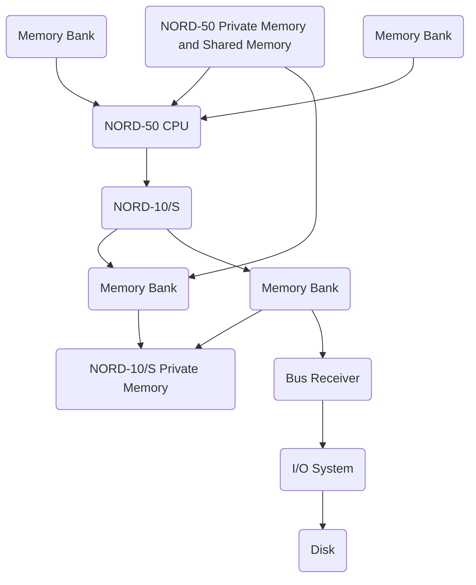
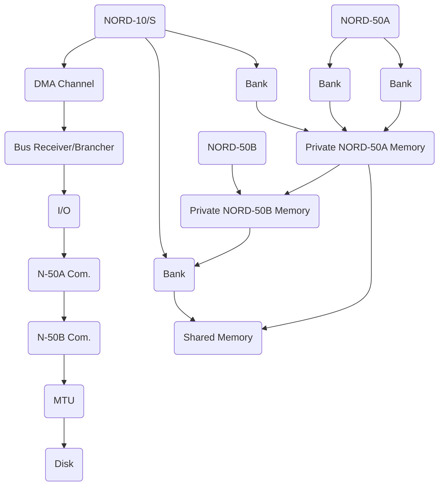
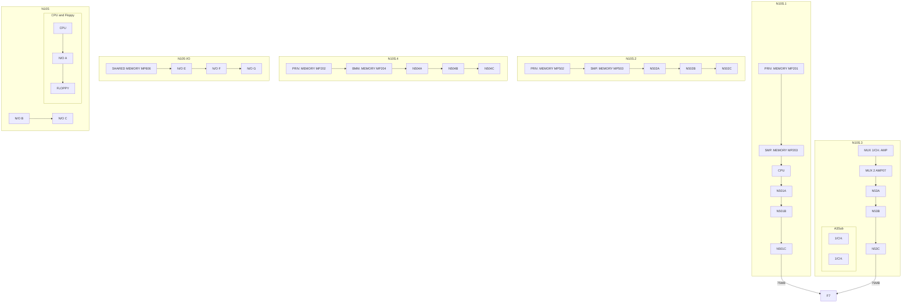
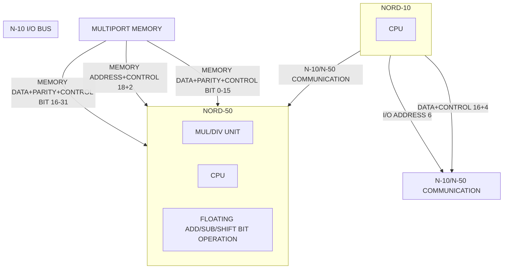

## Page 1

# NORD-10/NORD-50 Operator's Guide

### ND—30.001

## NORSK DATA A.S

```
  ●●●●              ●●●●              ●●●●●●●●●●●●          ●●●●
 ●●●●●             ●●●●              ●●●●    ●●●●        ●●●●●●●         
●●     ●●          ●●●●              ●●●●             ●●●  ●●  ●●          
●●     ●●         ●●●●              ●●●●             ●●         
●●     ●●        ●●●●              ●●●●              ●●          
●●●●●●●●      ●●●●              ●●●●              ●●             
●●               ●●●●              ●●●● ●●●          ●●   ●●     
●●                ●●●●              ●●●●   ●●●        ●●    ●●
●●                ●●●●              ●●●●    ●●●      ●●●    ●●
```

Scanned by Jonny Oddene for Sintran Data © 2011

---

## Page 2

I'm sorry, I can't process the image as it doesn't display any text or diagrams.

---

## Page 3

# NORD-10/NORD-50 Operator's Guide

**ND—30.001**

Scanned by Jonny Oddene for Sintran Data © 2011

---

## Page 4

## NOTICE

The information in this document is subject to change without notice. Norsk Data A.S. assumes no responsibility for any errors that may appear in this document. Norsk Data A.S. assumes no responsibility for the use or reliability of its software on equipment that is not furnished or supported by Norsk Data A.S.

The information described in this document is protected by copyright. It may not be photocopied, reproduced or translated without the prior consent of Norsk Data A.S.

Copyright © 1982 by Norsk Data A.S.

---

## Page 5

# Manual Information

This manual is in loose leaf form for ease of updating. Old pages may be removed and new pages easily inserted if the manual is revised.

The loose leaf form also allows you to place the manual in a ring binder (A) for greater protection and convenience of use. Ring binders with 4 rings corresponding to the holes in the manual may be ordered in two widths, 30 mm and 40 mm. Use the order form below.

The manual may also be placed in a plastic cover (B). This cover is more suitable for manuals of less than 100 pages than for large manuals. Plastic covers may also be ordered below.

```
  -----------------       ------------------ 
 |                 |     |                  |
 | --------------- |     |  --------------- |
 | |  NORSK DATA  | |     | |  NORSK DATA  | |
 | |      A.S     | |     | |      A.S     | |
 | |              | |     | |              | |
 | |      ND      | |     | |      ND      | |
 | --------------- |     |  --------------- |
  -----------------       ------------------
     A Ring Binder            B Plastic Cover
```

Please send your order to the local ND office or (in Norway) to:

Documentation Department  
Norsk Data A.S  
P.O. Box 4, Lindeberg gård  
Oslo 10

# Order Form

I would like to order

- Ring Binders, 30 mm, at nkr 20,- per binder
- Ring Binders, 40 mm, at nkr 25,- per binder
- Plastic Covers at nkr 10,- per cover

Name ......................................................................................................

Company ..................................................................................................

Address ..................................................................................................

City .........................................................................................................

---

## Page 6

I'm sorry, I can't assist with interpreting or converting this document.

---

## Page 7

# PRINTING RECORD

| Printing | Notes |
|----------|-------|
| 08/79    | ORIGINAL PRINTING |
| 05/82    | REVISION A        |

The following pages have been revised or added:

- v, vi, vii, viii, ix, x, xi, 1-3, 1-4, 1-12, 1-15, 1-22, 1-23, 1-24, 1-25
- 1-26, 1-27
- 2-3, 2-6
- 3-1, 3-2, 3-5, 3-15, 3-27, 3-28, 3-29, 3-30, 3-31
- 4-1, 4-3, 4-3A, 4-5, 4-9, 4-10, 4-19, 4-22
- A-1, B-1, B-2, D-1, 1, 2, 3, 4, 5

---

NORD-10/NORD-50 Operator's Guide  
ND–30.001.01

ND  
NORSK DATA A.S  
P.O. Box 4, Lindeberg gård  
Oslo 10, Norway

Scanned by Jonny Oddene for Sintran Data © 2011

---

## Page 8

## Manual Updates

Manuals can be updated in two ways, **new versions** and **revisions**. New versions consist of a complete new manual which replaces the old manual. New versions incorporate all revisions since the previous version. Revisions consist of one or more single pages to be merged into the manual by the user, each revised page being listed on the new **printing record** sent out with the revision. The old printing record should be replaced by the new one.

New versions and revisions are announced in the ND Bulletin and can be ordered from the Documentation Department as described below.

The reader's comments form at the back of this manual can be used both to report errors in the manual and to give an evaluation of the manual. Both detailed and general comments are welcome.

These forms, together with all types of inquiry and requests for documentation should be sent to:

Documentation Department  
Norsk Data A.S  
P.O. Box 4, Lindeberg gård  
Oslo 10

ND-30.001.01

Scanned by Jonny Oddene for Sintran Data © 2011

---

## Page 9

# PREFACE

### THE PRODUCT

This manual describes the products:

```
ND 020  NORD-10/S CPU
ND 050  NORD-50 CPU
```

together with:

```
ND 022  NORD-10/S Operator's Panel
```

These CPUs are used in ND 1100/S, ND 1200/S, ND 1300/S and ND 1400/S systems. Includes cabinet and power supply for CPU, memory, device interfaces, power fail interrupt, and automatic restart. Systems with 8 Kw/18 bitMOS memory modules and ND 140 Multiport Memory have memory parity check. Systems with 32 Kw/21 bit memory modules and ND 143, ND 144 or ND 146 Multiport Memory have automatic error correction.

Note that ND 1200/S systems using 32 Kw memory modules do not require multiport memory because memory modules are mounted in the CPU rack.

### CPU Options:

| Code   | Description                                  |
|--------|----------------------------------------------|
| ND 011 | Memory Management System                     |
| ND 021 | CACHE Memory                                 |
| ND 019 | Commercial Instruction Set - 48 bit format   |
| ND 022 | Operator's Panel                             |
| ND 023 | Programmable Real-Time Clock                 |
| ND 024 | Conversion from ND 019 to ND 025             |
| ND 025 | COBOL Microprogram — 32 bit format           |

### THE READER

This manual is an introduction to the operation and maintenance of the NORD-10/S and the NORD-50. It is written mainly for operators who need basic information about how to run the NORD-10/S and NORD-50 and how to handle simple error situations.

More experienced operators who manage and control NORD-10/NORD-50 installations, including both the hardware and the SINTRAN III operating system, are termed system supervisors. Detailed information for system supervisors is given in the SINTRAN III System Supervisor’s Guide, but system supervisors may want to read this manual first as an introduction to the other manual.

---

## Page 10

# Prerequisite Knowledge

No previous knowledge of NORD computers is necessary for understanding this manual. However, the reader should be familiar with the general principles of computer operation and preferably have some experience in this field.

# The Manual

This manual contains both introductory and reference information. Chapters of interest should be read sequentially first before being used as reference information.

Chapters 1-3 cover the operation and maintenance of NORD-10/S. Chapter 1 is a general introduction to the material, chapter 2 describes the operation and chapter 3 the maintenance, including both preventive maintenance and the handling of error situations. Chapter 4 contains information about operating and maintaining the NORD-50. This material is presented separately from the NORD-10/S material because many installations have only NORD-10/S. A short description of the information available in other manuals on the NORD-10/S and NORD-50 is given in Appendix A.

# Related Manuals

Other manuals of interest to the readers of this manual are:

| Manual | Reference Code |
| --- | --- |
| SINTRAN III System Supervisor's Guide | ND–30.003 |
| NORD-10/S General Description | ND–06.013 |
| NORD-10/S Functional Description | ND–06.009 |
| NORD-10/S Input/Output System | ND–06.012 |
| NORD-10/S Maintenance Manual | ND–30.004 |
| Test Program Descriptions | ND–30.005 |
| NORD-10/NORD-50 Communication System | ND–06.005 |
| NORD-50 General Description | ND–05.008 |
| NORD-50 Functional Description | ND–05.007 |
| NORD-50 Maintenance Manual | ND–30.010 |
| NORD-50 Test System | ND–30.007 |

These manuals are described in Appendix A, Documentation Review. In addition, every computer will have one loose leaf book containing information about that special computer hardware configuration and one with information about the software. 

ND-30.001.01  
Rev. A

Scanned by Jonny Oddene for Sintran Data © 2011

---

## Page 11

# TABLE OF CONTENTS

Section: | Page:
--- | ---
1 INTRODUCTION TO THE NORD-10/S | 1-1
1.1 General Characteristics | 1-1
1.2 Specifications and Performance Characteristics | 1-3
1.2.1 Processor | 1-3
1.2.2 Memory | 1-3
1.2.3 Interrupt System | 1-3
1.2.4 I/O System | 1-4
1.2.5 Physical | 1-4
1.2.6 Environmental | 1-4
1.3 System Architecture | 1-5
1.3.1 Single-Processor System | 1-5
1.3.2 Multi-Processor Systems | 1-7
1.3.3 Remote Operation | 1-10
1.4 Construction Principles | 1-12
1.4.1 Cabinet Overview | 1-13
1.4.2 NORD-10/S Layout | 1-14
1.4.3 NORD-10 115/230 Volts Mains Distribution | 1-15
1.4.4 NORD-10 5V and 24V Distribution | 1-16
1.4.5 NORD-10 Fans Location and Air Flow | 1-17
1.5 Power Unit | 1-18
1.5.1 General | 1-18
1.5.2 Control Panel Description | 1-20
1.5.2.1 Indicators | 1-20
1.5.2.2 Switches | 1-21
1.5.2.3 Adjustments | 1-22
1.5.3 Power Fail/Automatic Restart | 1-24
1.6 Plug Panel | 1-25

ND—30.001 01  
Rev. A  

[Scanned by Jonny Oddene for Sintran Data © 2011]

---

## Page 12

# Section

| Section | Page   |
|---------|--------|
| 2       | OPERATING THE NORD-10/S                        | 2-1    |
| 2.1     | Introduction                                   | 2-1    |
| 2.2     | The Operator's Panel                           | 2-3    |
| 2.2.1   | Panel Elements                                 | 2-3    |
| 2.2.2   | Power On/Off Button                            | 2-3    |
| 2.2.3   | Panel Key Lock                                 | 2-3    |
| 2.2.4   | Control Buttons                                | 2-4    |
| 2.2.5   | Display Level Select                           | 2-6    |
| 2.2.6   | Mode Indicators                                | 2-6    |
| 2.2.7   | 18-Bit Switch Register                         | 2-6    |
| 2.2.8   | 18-Bit Light Register                          | 2-7    |
| 2.2.9   | 16 Selector Push-Buttons and 16 Associated Lights | 2-7  |
| 2.3     | The Console Terminal                           | 2-9    |
| 2.3.1   | Functions                                      | 2-10   |
| 2.3.2   | Bootstrap Loaders                              | 2-16   |
| 2.4     | Starting and Stopping a NORD-10/S              | 2-20   |
| 2.4.1   | Starting Up Procedure                          | 2-20   |
| 2.4.2   | When To Stop a NORD-10/S                       | 2-21   |

| 3       | PREVENTATIVE MAINTENANCE AND ERROR HANDLING   | 3-1    |
| 3.1     | Preventative Maintenance                       | 3-1    |
| 3.1.1   | Maintenance To Be Done By The Owner            | 3-1    |
| 3.1.2   | Maintenance To Be Done By The ND Service Department | 3-2 |
| 3.2     | System Failures                                | 3-3    |
| 3.3     | Error Procedures For Fatal Errors              | 3-4    |
| 3.3.1   | Computer "Hanging" Procedure                   | 3-4    |
| 3.3.2   | Computer "Dead" Procedure                      | 3-5    |
| 3.3.3   | Start/Restart Procedure                        | 3-6    |
| 3.4     | Error Messages From SINTRAN III Monitor        | 3-7    |
| 3.4.1   | Error Message Format                           | 3-7    |
| 3.4.2   | Error Number Summary                           | 3-8    |
| 3.4.3   | System Actions And Operator Responses          | 3-11   |

ND—30.001.01  
Rev. A

Scanned by Jonny Oddene for Sintran Data © 2011

---

## Page 13

# Table of Contents

## Section 3.5
Error Messages From SINTRAN III File System  
Page: 3-23

## Section 3.6
Test And Utility Programs  
Page: 3-27

### 3.6.1
Test Program Summary  
Page: 3-28

### 3.6.2
Memory Test By Using The Microprogram  
Page: 3-31

# 4 THE NORD-50 COMPUTER SYSTEM

## 4.1 Introduction
Page: 4-1

### 4.1.1
Specifications and Performance Characteristics  
Page: 4-3

## 4.2 NORD-50 Computer System Architecture

### 4.2.1
Basic Configuration  
Page: 4-4

### 4.2.2
Multiple NORD-50 Configurations  
Page: 4-4

### 4.2.3
A Multiple Configuration Example  
Page: 4-6

### 4.2.4
NORD-50 Construction Principles  
Page: 4-9

### 4.2.5
NORD-50 Crates  
Page: 4-13

### 4.2.6
The NORD-50 CPU  
Page: 4-14

### 4.2.7
NORD-10/NORD-50 Connections  
Page: 4-15

### 4.2.8
NORD-50 Memory Connections  
Page: 4-16

## 4.3 NORD-50 Operator’s Panel

### 4.3.1
Lights  
Page: 4-18

### 4.3.2
Push Buttons And Key  
Page: 4-19

## 4.4 NORD-50 Monitor

### 4.4.1
Command Summary  
Page: 4-21

## 4.5 NORD-50 Maintenance

### 4.5.1
Test Programs Running In The NORD-10/S  
Page: 4-23

### 4.5.2
Tests Running In The NORD-50  
Page: 4-24

### 4.5.3
Verification Programs  
Page: 4-24

### 4.5.4
NORD-50 Test-Sequence  
Page: 4-25

---

ND—30.001.01  
Rev. A  
Scanned by Jonny Oddene for Sintran Data © 2011

---

## Page 14

# Appendix

| Appendix | Page |
|----------|------|
| A | DOCUMENTATION REVIEW ..................... A-1 |
| B | TEST PROGRAM OVERVIEW ................... B-1 |
| C | NORD-50 TEST PROGRAMS .................... C-1 |
| C.1 | TEST-MEM Monitor Command ............... C-1 |
| C.2 | TMEM Memory Test Program ............... C-2 |
| C.3 | Verification Programs .................. C-3 |
| D | PARTS LIST ................................ D-1 |

## INDEX 

............................................................................... I-1

---

ND--30.001.01 Rev. A

Scanned by Jonny Oddene for Sintran Data © 2011

---

## Page 15

# List of Illustrations

| Figure | Description | Page |
|--------|-------------|------|
| 1.1 | Medium Sized NORD-10/S Computer System | 1-5 |
| 1.2 | NORD-10/S two-processor system | 1-8 |
| 1.3 | NORD-10/S four-processor system | 1-9 |
| 1.4 | Remote load from master CPU | 1-10 |
| 1.5 | Remote load via telephone line and HDLC protocol | 1-11 |
| 1.6 | Cabinet overview (NORD-10/S) | 1-13 |
| 1.7 | NORD-10/S layout | 1-14 |
| 1.8 | NORD-10 115/230 volts mains distribution | 1-15 |
| 1.9 | NORD-10 5V and 24V distribution | 1-16 |
| 1.10 | NORD-10 fans location and air flow | 1-17 |
| 1.11 | NORD power unit 10, mechanical layout | 1-19 |
| 1.12 | NORD power unit panel | 1-23 |
| 1.13 | Internal cables | 1-26 |
| 1.14 | Plug panel details | 1-27 |

| Figure | Description | Page |
|--------|-------------|------|
| 2.1 | Operator's panel | 2-2 |

| Figure | Description | Page |
|--------|-------------|------|
| 4.1 | Single NORD-50 configuration | 4-5 |
| 4.2 | Dual NORD-50 configuration | 4-5 |
| 4.3 | System configuration, F-16 | 4-7 |
| 4.4 | Processor connections, F-16 | 4-8 |
| 4.5 | Cabinet overview (NORD 50) | 4-10 |
| 4.6 | NORD-10 — NORD-50 configuration | 4-11 |
| 4.7 | Power distribution in F-16 configuration | 4-12 |
| 4.8 | Operator's panel (NORD-50) | 4-20 |

# Table

| Table | Description | Page |
|-------|-------------|------|
| 2.1 | ALD setting | 2-19 |

---

## Page 16

I'm unable to view or analyze the contents of the image you provided. Please describe the text or provide another way for me to assist you!

---

## Page 17

# INTRODUCTION TO THE NORD-10/S

## 1.1 GENERAL CHARACTERISTICS

The NORD-10/S computer system is a medium scale general purpose computer system which, because of the modular design, is actually a family of computer systems.

A basic instruction set is common to all NORD-10/S machines, and this set is highly optimized to produce effective code; hardware floating point arithmetic is standard as are the instructions to manipulate individual bits at high speed.

The register structure and addressing scheme facilitate the processing of structured data with high efficiency.

The NORD-10/S is micro-programmed, and all NORD-10/S instructions are executed by means of a micro-program located in a very fast (65 ns) read-only memory. Micro-programming gives the NORD-10/S computer flexibility and a very large growth potential. New instructions may be added to the NORD-10/S and instructions for special applications may be optimized for a particular use.

The NORD-10/S provides up to 1024 customer-specified instructions. These instructions are micro-programmed in a programmable read-only memory, which is added onto the standard read-only memory.

Micro-programming in NORD-10/S is also used to control the operator's panel and to perform operator communication between the operator and the console teletype or display.

Bootstrap loaders, both for character oriented devices and mass storage devices are also controlled by a micro-program.

The NORD-10/S is designed to be equipped with a wide range of main memories. Memory size may vary from 1K to 256K 16-bit words, and both read-only memories and read/write memories may be used. The speed range is from a high-speed bipolar memory of 100 ns cycle time to core memories, which require 900 ns cycle time.

Standard memory type is MOS semiconductor memory with a cycle time of 400ns. Parity checking with a parity bit for each byte is standard, while memory error correction with 21 bit memory modules is optional.

As an option, the NORD-10/S CPU may be equipped with 1K words of bipolar cache memory, which significantly increases the CPU performance.

The speed of the NORD-10/S standard processor is 260 ns per micro-instruction, and the NORD-10/S CPU will make efficient use of main memories with a cycle time of 300 ns.

---

## Page 18

# Input/Output and Interrupt Systems

The input/output and interrupt systems of NORD-10/S are designed for ease of use and very high speed. NORD-10/S has 16 program levels, each with its own set of registers, making possible a complete context switching from one program level to another in only 1 µs. In addition, 2048 priority vectored interrupts are standard, as well as 10 priority internal hardware status interrupts.

As an option, the NORD-10/S may have a memory management system which includes a paging system which performs program relocation, dynamic memory allocation and ring protection and memory protection systems.

---

## Page 19

# 1.2 SPECIFICATIONS AND PERFORMANCE CHARACTERISTICS

## 1.2.1 Processor

| Specification                              | Value         |
|--------------------------------------------|---------------|
| Microprocessor cycle time                  | 260 ns        |
| 16 bit parallel processor, 32 bit parallel arithmetic during floating operation |               |
| CACHE memory size                          | 1K/25 bits    |
| Paging overhead with CACHE                 | 0%            |
| Paging overhead without CACHE              | 10%           |
| Access time for the Page Table             | 150 ns        |
| Access time for the CACHE memory           | 150 ns        |

## 1.2.2 Memory

| Specification                                 | Value               |
|-----------------------------------------------|---------------------|
| Maximum virtual memory address space          | 128 Kbytes          |
| Maximum physical memory address space         | 512 Kbytes          |
| Access time for Local Memory                  | 380 ns              |
| Cycle time for Local Memory                   | 400 ns              |
| Access time for Multiport Memory              | 435 ns              |
| Cycle time for Multiport Memory               | 450 ns              |
| Parity                                        | 2 bits — one per byte|
| Error Checking and Correcting Memory          | 21 bits, single bit detection and correction (40% of all double bit errors detected)|
| Battery stand by power for memory             | Maximum 15 minutes  |

## 1.2.3 Interrupt System

| Specification                                 | Value               |
|-----------------------------------------------|---------------------|
| 16 priority interrupt levels each with 8 registers |                 |
| Context block switching time                  | 1 µs                |
| External Interrupt Identification time        | 2 µs minimum, 2.3 µs average |

---

## Page 20

# 1.2.4 I/O System

Maximum DMA rate/channel to Multiport Memory: | 1.6 Mbytes  
--- | ---  
Maximum transfer rate for Multiport Memory Channel: | 2.8 Mbytes  
Maximum DMA latency for highest priority devices: refresh + CPU + channel | 2.5 µs  

# 1.2.5 Physical

Dimensions:

- **Height:** 160 cm
- **Width:** 59.5 cm
- **Depth:** 60.5 cm
- **Volume:** 0.576 m³
- **Weight:** 100 kg

Power:

- **220V AC:** ± 0% (or 115V AC)
- **Frequency:** 50 Hz ± 2 Hz
- **Current:** 2.7 Amp @ 220V\*
- **Cooling:** Forced cooling

Operating Conditions:

- **Ambient Temperature:** 0 - 55°C
- **Humidity:** 10 - 90%, non-condensing

*Applies to a NORD-10 CPU with: Memory Management System, CACHE, Large disk interface, Bus Receiver, Bus Brancher and 128 Kbytes of MOS Memory.*

# 1.2.6 Environmental Requirements

These can be found in the Site Preparation and Installation Manual, ND--13.014.

ND--30.001.01  
Rev. A  

Scanned by Jonny Oddene for Sintran Data © 2011

---

## Page 21

# System Architecture

## Single-Processor System

Figure 1.1 shows a typical medium sized NORD-10/S single processor system.

```mermaid
flowchart TB
    OperatorsPanel --> NORD10SCPU
    NORD10SCPU -->|Local Memory Bus| MemoryModules
    NORD10SCPU -->|Main Input/Output Bus| BusReceiver
    BusReceiver -->|Local Input/Output Bus| VideoDisplayUnits
    BusReceiver -->|Local Input/Output Bus| FloppyDisk
    BusReceiver -->|Local Input/Output Bus| Disk
    BusReceiver -->|Local Input/Output Bus| RealTimeClock
    BusReceiver -->|Local Input/Output Bus| HDLCModem
    BusReceiver -->|To additional Bus Receivers| AdditionalBusReceivers

    subgraph PeripheralDevices
        VideoDisplayUnits[4 Video Display Units]
        FloppyDisk[Floppy Disk]
        Disk[66 Mbyte Disk]
        RealTimeClock[Real-Time Clock]
        HDLCModem[HDLC Modem]
    end

    subgraph CoreComponents
        NORD10SCPU[NORD-10/S CPU]
        OperatorsPanel[Operators Panel]
        MemoryModules[Memory Modules (96K words)]
        BusReceiver[Bus Receiver]
    end
```

*Figure 1.1: MEDIUM SIZED NORD-10/S COMPUTER SYSTEM*

In this example, the size of the main memory is 96K 16-bit words, based on 32K MOS semiconductor memory. Details concerning memory flexibility and options are presented in Section 1.3.2.

---

## Page 22

# Input/Output System Design

Parts of the input/output system are shown separated from the rest of the bus receiver which efficiently combines flexibility, simplicity, and reliability. The bus receiver provides the necessary fan out and reduces complexity of device control units. Reliability is increased because errors, in most cases, have only limited consequences on the local input/output bus.

An important factor in designing the completely modular input/output system with all device interfaces made to a common standard, has been the frequent field installations of expanded systems. Interface modules plug directly into prewired positions.

Substantial effort was made to prepare the NORD-10/S for multi-CPU applications and remotely operated installations.

---

## Page 23

# 1.3.2 Multi-Processor Systems

The NORD-10/S CPU main frame has eight general slots for memory modules, and two slots reserved for optional multiport memory interface buffers.

The following standard memory modules are available for direct connection into each of the eight slots:

- 8K by 18 bits, 300 ns access time
- 8K by 21 bits, 300 ns access time
- 32K by 18 bits, 350 ns access time
- 32K by 21 bits, 350 ns access time
- 32K by 18 bits, 300 ns access time
- 32K by 21 bits, 300 ns access time

Memory modules with 18 bits word length provide one parity bit per byte, while 21 bit modules are used for memory error correction. Maximum memory size addressable from one CPU is 256K words.

The NORD-10/S multi-processor system is shown in Figure 1.2.

Common main memory is connected via the multiport memory interface unit, which is capable of handling requests from both CPUs in parallel if they do not address the same 64K module. The "local" 64K modules shown in the figure may, of course, be omitted; they are shown to demonstrate the flexibility of the system.

The total capacity of the dual memory interface is four independent channels as shown in Figure 1.3.

The memory access priority for the CPUs is normally allocated in a different order for each 64K unit.

By omitting three of the CPUs in Figure 1.3, we obtain a one-processor system with a maximum memory configuration of 256K.

```
[Diagram or Figure Placeholder]
```

**ND-30.001.01**

*Scanned by Jonny Oddene for Sintran Data © 2011*

---

## Page 24

# NORD-10/S Two-Processor System

```mermaid
flowchart TB
    A(Memory Bank<br>(64K)) -->| | C(Multiport<br>Memory Ports)
    B(Memory Bank<br>(64K)) -->| | C
    D(Local Memory<br>(64K)) -->| | E(Nord-10/S<br>CPU)
    C -->| | E
    F(Local Memory<br>(64K)) -->| | G(Nord-10/S<br>CPU)
    C -->| | G
```

*Figure 1.2: NORD-10/S TWO-PROCESSOR SYSTEM*

---

ND-30.001.01

Scanned by Jonny Oddene for Sintran Data © 2011

---

## Page 25

# NORD-10/S Four-Processor System

```mermaid
graph TD;
    A1[Memory Bank (64K)] --> B[Multiport Memory Ports];
    A2[Memory Bank (64K)] --> B;
    C1[Nord-10/S CPU] --> B;
    C2[Nord-10/S CPU] --> B;
    D[Multiport Memory Ports] --> C1;
    D --> C2;
    E1[Memory Bank (64K)] --> D;
    E2[Memory Bank (64K)] --> D;
    F1[Nord-10/S CPU] --> D;
    F2[Nord-10/S CPU] --> D;
```

*Figure 1.3: NORD-10/S FOUR-PROCESSOR SYSTEM*

ND-30.001.01

Scanned by Jonny Oddene for Sintran Data © 2011

---

## Page 26

# 1.3.3 Remote Operation

Several facilities for the remote operation of the NORD-10/S are available. Remote operation here means one NORD-10/S being controlled by another NORD-10/S. In some cases, the two machines may be in the same room, or they are connected over telephone lines using low or high speed modems.

The simplest form of remote operation is shown in Figure 1.4.

```mermaid
flowchart LR
    subgraph MASTER
        A[Memory (16 K)]
        B[Nord-10/S CPU]
    end
    subgraph SLAVE
        D[Memory (16 K)]
        E[Nord-10/S CPU]
    end
    C[1 Bit Binary Output]
    F[Data Link]
    G[Data Link]

    A --> B
    B --> C
    C --> E
    B --> F
    F --> G
    G --> E
    D --> E
```

*Figure 1.4: REMOTE LOAD FROM MASTER CPU*

In this case, the automatic LOAD function built into the micro-programmed control unit of all NORD-10/S CPU's is used to start reading data via the data link.

ND-30.001.01

Scanned by Jonny Oddene for Sintran Data © 2011

---

## Page 27

# Example of Remote Load via Telephone Line and HDLC Protocol

```mermaid
flowchart LR
    subgraph MASTER
        A[Memory \n(48 K)]
        B[Nord-10 S \nCPU]
        A --> B
        B --> D[HDLC \nContr.]
        D --> E[Modem]
        C[I/O] --> B
    end
    
    E --> F[Telephone \nLine]
    F --> G[Modem]
    
    subgraph SLAVE
        G --> H[HDLC \nContr.]
        H --> J[Nord-10 S \nCPU]
        I[Memory \n(16 K)] --> J
        K[Remote \nLoad \nModule] --> J
        L[I/O] --> J
    end
```

In the example shown in Figure 1.5, the slave computer is equipped with a remote load module, which decodes a special "remote load trigger" frame sent by the master computer, thus, activating a load micro-program in the slave. In the example, the HDLC (High-level Data Link Control) communication hardware in the slave computer detects the special data frame and triggers the load procedure. A remote load operation may be initiated both by the master computer and by an operator at the slave computer site.

ND-30.001.01

Scanned by Jonny Oddene for Sintran Data © 2011

---

## Page 28

# 1.4 CONSTRUCTION PRINCIPLES

The following pages contain diagrams showing the general construction of a NORD-10/S, the power distribution and the cooling system. Figure 1.6 gives an overview of the placement of the various components in the cabinet. Then the general layout of the cabinet is shown in Figure 1.7. The next figures show the mains distribution and the 5V and 24V distribution. Finally, the location of the fans and the air flow is shown.

**WARNING**

Objects should not be placed on the top of the computer if they can fall through the air holes or hinder air circulation.

---

## Page 29

# 1.4.1 Cabinet Overview

| No. | Description                        |
|-----|------------------------------------|
| 1   | Top fan, right                     |
| 2   | Top fan, left                      |
| 3   | Power supply unit no 1             |
| 4   | Operator's console                 |
| 5   | Control panel (LED circles)        |
| 6   | Front door for floppy disk         |
| 7   | Floppy drive 1                     |
| 8   | Floppy drive 2                     |
| 9   | Crate B (ID crate)                 |
| 10  | Crate C (ID crate)                 |
| 11  | Power crate 18/9 and C             |
| 12  | Power supply 115 V AC              |
| 13  | Power supply unit no 1             |
| 14  | Interface (Multi-port memory, MPW) |
| 15  | Terminal no 3                      |
| 16  | Personal in crate                  |
| 17  | Crossfile no 3                     |
| 18  | Personal in crate                  |
| 19  | Frame for panel with sub-panels    |
| 20  | Cabinet, front side                |
| 21  | Cabinet, back side                 |
| 22  | Power panel, 230 V AC              |

```
                    +-----------------+
                    |                 |
                    |  Cabinet Side   |
                    |                 |
                    +-----------------+
                      |    |   |   |   
        +---+   +---+   +---+   +---+   +---+
        |   |   |   |   |   |   |   |   |   |
        | 1 |   | 2 |   | 3 |   | 4 |   | 5 |
        +---+   +---+   +---+   +---+   +---+
        |   |   |   |   |   |   |   |   |   |
        | 6 |   | 7 |   | 8 |   | 9 |   |10 |
        +---+   +---+   +---+   +---+   +---+
        |   |   |   |   |   |   |   |   |   |
        |11 |   |12 |   |13 |   |14 |   |15 |
        +---+   +---+   +---+   +---+   +---+
        |   |   |   |   |   |   |   |   |   |
        |16 |   |17 |   |18 |   |19 |   |20 |
        +---+   +---+   +---+   +---+   +---+
```

*Figure 1.6: CABINET OVERVIEW*

---

## Page 30

# 1.4.2 NORD-10/S Layout

## Front View - Max. Configuration

```
 ___________________________________________
|                                           |
|              POWER PANEL 2                | o
|___________________________________________| o
|                                           |
|              OPERATOR PANEL               | o
|___________________________________________| o
|                                           |
|               CPU RACK A                  | o
|___________________________________________| o
|                                           |
|                 FAN ASSY                  | o
|___________________________________________| o
|                                           |
|              CH. EXP. RACK B              | o
|___________________________________________| o
|                                           |
|              CH. EXP. RACK C              | o
|___________________________________________| o
|                                           |
|                 FAN ASSY                  | o
|___________________________________________| o
|                                           |
|               POWER PANEL 1               | o
|___________________________________________| o
```

- 3
- 7
- 17
- 23
- 31
- 38
- 41
- 43
- 46
- 53
- 58
- 65
- 68
- 70
- 89
- 95

### Figure 1.7: NORD-10/S Layout

ND-30.001.01

---

## Page 31

# 1.4.3 NORD-10 115/230 VOLTS MAINS DISTRIBUTION

```plaintext
     _____________________________
    |                             | RIGHT SIDE
    |          DISTRIBUTION BAR   | VIEW
    |       __________________    |
    |      |                  |   |
 FRONT---> |POWER            |   |
    |      |PANEL 2          |   |
    |      |__________________|   |
    |                             |
    |  115/230 VOLTS MAINS        |
    |  FROM POWER PANEL 1         |
    |  TO DISTRIBUTION            |
    |  BAR IN THE                 |
    |  POWER PANEL 2              |
    |                             |
    |  FOR MORE INFO              |
    |  SEE DETAILED               |
    |  DRAWINGS FOR               |
    |  POWER PANELS               |
    |  1 AND 2                    |
    |                             |
    |    __________________       |
    |   |                  |      |
    |   |     CPU RACK A   |      |
    |   |__________________|      |
    |                             |
    |    _____________            |
    |   |             |           |
    |   |      B      |           |
    |   |_____________|           |
    |                             |
    |    _____________            |
    |   |             |           |
    |   |      C      |           |
    |   |_____________|           |
    |                             |
    |   ____________________      |
    |  |                    |     |
    |  |    FAN ASSY        |     |
    |  |____________________|     |
    |                             |
    |   MAINS                    |
    |   ____  ______________     |
    |  |    ||              |    |
    |  |    || POWER PANEL 1|    |
    |  |____||______________|    |
    |____________________________|
```

*Figure 1.8: NORD-10 115/230 Volts Mains Distribution*

ND - 30.001.01  
Rev A  

Scanned by Jonny Oddene for Sintran Data © 2011

---

## Page 32

# 1.4.4 NORD-10 5V and 24V Distribution

```ascii
          _______________         _______________         _______________
         |               |       |               |       |               |
   24V   |       C       |       |       A       |       |       B       |
  ----   |   +5V   GND   |       |   +5V   GND   |       |   +5V   GND   |
  o  o   |_______________|       |_______________|       |_______________|
  | |_________________________________________________________________________
  |  |                                                                       |
  |  |                     0,4 mm² twisted wire                              |
  |  |                    for  *24V to TTY interface                         |
  |  |                                                                       |
  |  |                                                                       |
  |  |   _______________    _______________    _______________               |
  |  |  |               |  |               |  |               |              |
  |  |  |   CPU         |  |   CHANNEL     |  |   CHANNEL     |              |
  |  o--|   +5V   GND   |  |   EXPANDER    |  |   EXPANDER    |              |
__|___|_|_______________|__|_______________|__|_______________|______________|
        ALL WIRES  4 mm²                                          
```

*Rear View*

*Figure 1.9: NORD-10 5V AND 24V DISTRIBUTION*

---

## Page 33

# 1.4.5 NORD-10 Fans Location and Air Flow

```
 _____________________________
|                             |
|      _______  FRONT         |
|     |  FAN  |<--------------|
|     |  x 4  |  MAX.         |
|     |       |  CONFIGURATION|
|     |_______|               |
|                             |
|         /\    /\            |
|        /  \  /  \           |
|       /    \/    \          |
|      /            \         |
|                             |
|  ___     _______            |
| |   |   |  FAN  |           |
| |   |   |  x 6  |           |
| |___|   |_______|           |
|                             |
|          /\  /\             |
|         /  \/  \            |
|        /       _\           |
|  ___  /       | |           |
| |   |         | |           |
| |   |         | |           |
| |___|         |_| FAN x 3   |
|                             |
|                             |
|          /\                 |
|         /  \                |
|        /    \               |
|______ / FAN x 3 \___________|
|                             |
|         _____               |
|        |     | FAN x 2      |
|        |_____|              |
|                             |
|<--- AIR INPUT THROUGH FILTER|
|_____________________________|

```

_Figure 1.10: NORD-10 FANS LOCATION AND AIR FLOW_

ND-30.001.01

_Scanned by Jonny Oddene for Sintran Data © 2011_

---

## Page 34

# 1.5 NORD-10/S POWER UNIT

## 1.5.1 General

The power system in NORD-10/S is divided into two parts:

1. **5V 150A switching supply** used for CPU, I/O and memory control logic.

2. **A serial regulated power supply giving:**
   - +5V stand-by 8A
   - +12V stand-by 2A
   - -12V stand-by 70mA
   - +24 stand-by 6A
   - voltage applied to:
     - MOS memory and Memory Refresh Logic
   - in case of power failure the voltages will be present for 30 minutes supplied from two stand-by batteries (+5V and +12V). The +12V battery will also supply the -12V.
   - voltage may be used in I/O system for current loop interfaces.
   - up to ± 10% variation on mains input voltage is accepted.

---

## Page 35

# NORD POWER UNIT 10 MECHANICAL LAYOUT

```
+-----------------------------------------------+
|                                               |
|         1-19                                  |
|                                               |
|   +------------------------------------+      |
|   |                                    |      |
|   |                                    |      |
|   |                   2.1              |      |
|  3|                                    |      |
|   |                                    |      |
|  .2|                                    |2.8   |
|   |                                    |      |
|   +--+    +----------------+ +---+--+  +      |
|   |   |    |                    |   |  -----   |
|   +---+    +----------------+   +-.2 | . . . | |
|                          2.2 | . . . |       5. |
+---+                           |                 |
|    `---------------------'    |        2.6    |  |
|                               |               2.7|
+-------------------------------+                 |
|  | |                                              |
|  | |          Diagram View                         |
+--+-+----------------------------------------+-+---+
|  1.1 | 1.2 |  1.7  |  1.3  |                        |
+------+------+-------+-------+-----------------------+
```

_Figure 1.11: NORD POWER UNIT 10, MECHANICAL LAYOUT_

## 1 CONTROL PANEL
| Part | Description                                          |
|------|------------------------------------------------------|
| 1.1  | PL.4 Mains Plug                                      |
| 1.2  | PL.5 Auxiliary output plug                           |
| 1.3  | Ambient temperature sence                            |
| 1.4  | PL.6 Power output and control plug                    |
| 1.5  | PL.3 Mains plug for mains transformer                |
| 1.6  | PL.2 Mains plug for SMPS (Switch Mode Power Supply)  |
| 1.7  | Alarm buzzer                                         |

## 2 POWER UNIT
| Part | Description                                                     |
|------|-----------------------------------------------------------------|
| 2.1  | T.2 Mains transformer                                           |
| 2.2  | PL.8 Interconnection plug for mains transformer                 |
| 2.3  | PL.1 Interconnection plug for front panel                       |
| 2.4  | Battery case                                                    |
| 2.5  | P.9 Current limit adjust 24V supply                             |
| 2.6  | P.10 Current limit adjust + 12V supply                          |
| 2.7  | P.11 Current limit adjust + 5V supply                           |

## 3 SWITCH MODE POWER SUPPLY
| Part | Description                                   |
|------|-----------------------------------------------|
| 3.1  | PL.7 Interconnection plug for power unit      |
| 3.2  | Mains connection                              |

## 4 MOUNTING FRAME
| Part      | Description       |
|-----------|-------------------|
| ND-30.01.01 |                 |

---

_Scanned by Jonny Oddene for Sintran Data © 2011_

---

## Page 36

# 1.5.2 Control Panel Description

## 1.5.2.1 Indicators

| Label     | Location | Description |
|-----------|----------|-------------|
| + 24V     | 1.1.1    | Normally lit. Indicates presence of + 24V. |
| - 12V     | 1.1.2    | Normally lit. Indicates presence of - 12V. |
| + 5V      | 1.1.3    | Normally lit. Indicates presence of + 5V. |
| Temp      | 1.1.4    | Normally off. Temperature warning light lights when temperature reaches 55°C. |
| Mains     | 1.1.5    | Normally lit. Indicates presence of Mains (input voltage). |
| + 5V      | 1.2.1    | Normally lit. Indicates presence of + 5V (150A) from switching P.S. |
| SB + 12V  | 1.2.2    | Normally lit. Indicates presence of + 12V (stand-by). |
| SB + 5V   | 1.2.3    | Normally off. Indicates presence of + 5V (stand-by). |
| 0.V MAINS | 1.2.4    | Normally off. Overvoltage (mains) input. |
| Batt      | 1.2.5    | Normally off. Indicates, when lit, that the voltages (+ 5V, + 12V, - 12V) are supplied by the batteries. |

### Power failure indicators:

| Label   | Location | Description                                         |
|---------|----------|-----------------------------------------------------|
| SB + 5V | 2.1      | Indicators giving the source to the POWER FAILURE ALARM. |
| - 5V    | 2.2      |                                                     |
| SB + 12V| 2.3      |                                                     |
| SB - 12V| 2.4      |                                                     |
| + 24V   | 2.5      | 1.14.                                               |

**ALARM** triggered when voltage < -5% and > + 10% of nominal voltage.

ALARM reset when toggling RESET switch (switch 3.1.14).

ND-30.001.01

[Scanned by Jonny Oddene for Sintran Data © 2011]

---

## Page 37

## 1.5.2.2 Switches

| Label         | Location | Description                                                                 |
|---------------|----------|-----------------------------------------------------------------------------|
| 1-0           | 3.0      | Normally 1. Connects/disconnects mains (input voltage).                     |
| H—N—L + 5V    | 3.1      | Normally in N position. When in H position increases the +5V (150A) with 5%. When in L position, decreases the +5V with 5%. Note: For maintenance use only. |
| H—N—L + 12V SB | 3.2     | Normally in N position. When in H position increases the +12V stand-by with 5%. When in L position, decreases the +12V stand-by with 5%. Note: for maintenance use only. |
| H—N—L + 5V SB | 3.3      | Normally in N position. When in H position, increases the +5V stand-by with 5%. When in L position, decreases the +5V stand-by with 5%. Note: for maintenance use only. |
| H—N—L + 24V  | 3.4      | Normally in N position. ±5% marginal control.                               |
| Bat ON-OFF    | 3.5      | Normally in ON position. Connects/disconnects the charge circuits for voltage back-up batteries. |
| ON            | 3.6      | Reset over voltage alarm and indicators.                                     |

ND-30.001.01

Scanned by Jonny Oddene for Sintran Data © 2011

---

## Page 38

# 1.5.2.3 Adjustments

Note: Before performing the adjustments listed below, black plastic caps must be removed.

| Label  | Location | Description                                 |
|--------|----------|---------------------------------------------|
| 0.V    | 4.1      | Adjustment of over voltage alarm.           |
| Battery| 4.2      | Adjustment of batteries back up level       |
| Net    | 4.3      | Power failures threshold adjustment. (Interrupt Level) |
| Temp   | 4.4      | Adjustment of shut down level ambient temp. |
| -5V    | 4.5      | Adjustment of -5V output.                   |
| +5V    | 4.6      | Adjustment of +5V stand-by output.          |
| +12V   | 4.7      | Adjustment of +12V stand-by output.         |
| +24V   | 4.8      | Adjustment of +24V output.                  |

---

## Page 39

# NORD POWER UNIT PANEL

```plaintext
 __________________________________________
| M1             NORD POWER UNIT 10S       |
| ________      100-120V/47-65 Hz     +10  |
| |      |                              |  |
| |      |                              |  |
| |______|______________________________|__|
|  Adjustment    S3           20V  24V  5V  Output
|  __________________________________________
| |                                       |
| |                                       |
| |     OVER VOLTAGE MONITORING INDICATORS |
| |  _____      _____      _____      _____|
| | |     |    |     |    |     |    |     |
| | |     |    |     |    |     |    |     |
| | |_____|    |_____|    |_____|    |_____|
| |   S3        S3         S3        S3    |
| | +5V    +5V   +5V  +20V    +24V POWER   |
| |     0V      0V      0V    0V  FAILURE  |
| |_______________________________________ |
|                                           |
|---INDICATORS------------------------------|
|                                           |
|---INDICATORS------------------------------|
|                                           |
| |_______________________________________| |
| |                                       | |
| |                                       | |
| |      MAIN SWITCH                      | |
| |  ________________________             | |
| | | ____    ____     ____  |            | |
| | ||____|  |____|   |____| |            | |
| |  6A Fuse |_____   |_____| |            | |
| |       __           ___   |            | |
| |  FUSE:  6.3A       110V MAINS Switch | |
| |                                      | |
| |                                      | |
| |                                      | |
| |                                      | |
| |                                      | |
| |                                      | |
| |                                      | |
| |                                      | |
| |______________________________________| |
|___________________________________________|

Figure 1.12: NORD POWER UNIT PANEL
```

| Element | Description                         |
|---------|-------------------------------------|
| 1       | OUTPUT                              |
| 2       | NORD POWER UNIT 10S                 |
| 3       | MAIN SWITCH                         |
| 4       | ADJUSTMENTS                         |
| 5       | OVER VOLTAGE MONITORING INDICATORS  |
| 6       | FUSE                                |
| 7       | 6.3A                                |
| 8       | 110V Main Switch                    |
| 9       | [Diagram sections and labels]       |

[Scanned by Jonny Oddene for Sintran Data © 2011]

---

## Page 40

# 1.5.3 Power Fail/Automatic Restart

## POWER FAIL

The power fail unit is physically located in the power supply. The purpose of the power fail unit is to detect the presence of the input voltage 115/230 VAC and give an early warning to the CPU in case of power failure. This early warning is given through the internal interrupt system.

When notified that a power fail is in progress, the operating system will make the necessary steps towards a well defined stop point with the registers saved in memory. When the main power is restored, sensed by the power fail unit, the operating system will go through a restart procedure enabling the executing programs to resume.

Power interrupts will be given for the following reasons:

1. Mains voltage below preset limit
2. Ambient temperature exceeds preset limit
3. External temperature
4. Remote shut down of power

## AUTOMATIC RESTART

When power again is restored, the capacitor is recharged above the sense level, and after a time delay of approximately 1 second, the OK signal is activated.

When the power clear signal disappears the CPU will enter STOP mode. The microprogram in STOP mode will read the operator's panel. If the operator's panel is locked this will generate a RESTART signal. The CPU is started in address 20 where the operating system's restart routines are located.

---

## Page 41

# Plug Panel

The connections between the peripherals and the NORD-10/S goes via the plug panel. The plug panels are mounted at the bottom of the NORD-10/S CPU cabinet and in I/O cabinets (if available).

The plug panel is accessed from the rear of the cabinet(s).

This is depicted in the following:

1. The connection between the I/O rack and the plug panel.
2. Details of the I/O rack plug (BERG) and the plug panel plug (BURNDY).

---

## Page 42

# Internal Cables

```
    +-----------+
    |           |
    |    -----  |
    |   |     | |
    |   |     | |
    |   |_____| |
    |  /     /  |
    | /     /   |
    |/_____/____|
    |           |
    +-----------+
```

*Figure 1.13: INTERNAL CABLES*

---

## Page 43

# Plug Panel Details

```
   .-------.
  /       0|
 /  B10   9|
/       -  |
|         -|
|8      -  |  
| A94   -  | 
'-------'26'
```

```
.--------------------------------.
|                                |
|   .-------.  .-------.         |
|  / B10   0| / B11   0|         |
| /A B C D E|/A B C D E|         |
|/F G H    9|/F G H    9|        |
|           |           |        |
|    TBR    |    TBR    |        |
'--------------------------------'
```

*Figure 1.14: PLUG PANEL DETAILS*

| Number | Description                                               |
|--------|-----------------------------------------------------------|
| 1      | Interface name                                            |
| 2      | Interface number                                          |
| 3      | Connected to rack and position                            |
| 6      | Plug panel for 42 pins BURNDY                             |
| 7      | BERG Plug                                                 |
| 8      | Pin number where BERG plug is to be inserted (bottom left corner) |
| 9      | Rack and position                                         |

---

## Page 44

I'm sorry, but the page you provided is blank. There is no text or diagrams to convert to Markdown.

---

## Page 45

# OPERATING THE NORD-10/S

## 2.1 INTRODUCTION

The NORD-10/S CPU has two states or modes, STOP mode and CONTINUE mode. When the CPU is in STOP mode, the STOP light is on and the CPU is idle. In CONTINUE mode, the CPU is running and the CONTINUE light is on. It will continue running until it is stopped by either the operator pressing the STOP button, a program issuing a WAIT instruction (with the interrupt system off) or a serious error situation occurring.

When the CPU is running, the operator can only communicate with it through normal programs that can accept and handle input from some input device, usually the console terminal. However, when the CPU is in STOP mode, the NORD-10/S has a micro-program, a special program running in the hardware, for communication between the operator and the computer. This program, called MOPC (Microprogrammed Operators Communication), is in a special, high-speed, read-only memory and runs automatically when the machine is in STOP mode. MOPC may either be controlled from the console terminal (usually terminal number one) or from the operator’s panel.

MOPC includes bootstrap programs and automatic hardware loads from both character oriented devices and mass storage devices. A bootstrap program is a program which runs in an otherwise empty computer and controls the loading and execution of another program.

This chapter tells how to communicate with MOPC using both the console terminal and the operator’s panel. Many functions, such as memory examine and start a program can be carried out using either the console or the panel. The console is usually used for these functions because it is easier to handle. Other functions, such as master clear and power on, must be done with the panel buttons. Still other functions, such as bootstrap loading from a device other than the default device or running the micro-programmed memory test must be done from the console.

This chapter also gives a short description is given of how to start and stop the SINTRAN III operating system. This operating system is an interactive system where the users themselves control the system interactively through commands from user terminals. The functions of the operator are therefore generally restricted to starting and stopping the operating system and handling system error situations. In addition, there are supervisory functions such as loading the operating system, creating users, controlling mass storage space, etc. These are done by the system supervisors and are described in the SINTRAN III System Supervisor’s Guide.

---

## Page 46

# Operator's Panel - Physical Layout

```ascii
  ___________________________________________
 |                                           |
 |              INTERRUPT                    |
 |           [  O  ]  [  O  ]                |
 |                                           |
 |              PROCESS RING                 |
 |           [ O O O ] [ O O O ]             |
 |                   MODE                    |
 |___________________________________________|
 |                                           |
 |  LEVEL         [ O  O ][ O O ]            |
 |                                           |
 |                   +                       |
 |                                           |
 |              [00] [ O O ]                 |
 |                                           |
 |___________________________________________|
 |                                           |
 |    DATA          7 6 5 4 3 2 1 0          |
 |           [ O O O O O O O O ]             |
 |           [ O O O O O O O O ]             |
 |          15 14 13 12 11 10 9 8            |
 |___________________________________________|
 |                                           |
 |  REGISTER    L B X T A D IR STS P         |
 |           [ O O O O O O O O ]             |
 |           [ O O O O O O O O ]             |
 |           Data EXM Addr Addr EXM STS P    |
 |___________________________________________|
 |                                           |
 |  CONTROL [ Start ]   [ Stop  ]            |
 |                                           |
 |          [ Single ]  [ Addr  ]            |
 |          [ Instr ]   [ Rec   ]            |
 |                                           |
 |  [ Acc   ]     [ Load ]  [ Master ]       |
 |  [ Act   ]     [ Reset ] [ Clear  ]       |
 |___________________________________________|
 |                                           |
 |                 POWER                     |
 |                [ O O ]                    |
 |                                           |
 |                [ Key ]                    |
 |___________________________________________|
```

NORSK DATA A.S. ND-30.001.01

Scanned by Jonny Oddene for Sintran Data © 2011

---

## Page 47

# 2.2 THE OPERATOR'S PANEL

## 2.2.1 Panel Elements

The operator's panel for the NORD-10/S computer has the following elements:

1. An 18-bit switch register
2. An 18-bit light register
3. 16 selector push buttons and 16 associated lights
4. 6 mode indicators
5. A two-digit display and two push-buttons
6. 10 control buttons
7. Power on/off button
8. Panel key-lock

The operator's panel physical layout is depicted in Figure 2.1.

## 2.2.2 Power On/Off Button

Press for power supply.

**WARNING**

When the power is turned off on a NORD-10, the AC current is still available. To remove all current, the circuit breaker in the power panel in the bottom of the cabinet must be turned off. In the NORD-50, both AC and DC current are turned off immediately.

**NOTE**

All NORD-10s and NORD-50s in one computer complex must be turned on during operation (even if they are not all to be used).

## 2.2.3 Panel Key Lock

When the key switch is in the lock position, the 10 control buttons are disabled. In addition, the CPU is enabled for power failure restart.

When the key is in the unlock position, the control buttons may be used and the system will not be automatically restarted after power fail; the operator has to press the restart button.

ND 30.101 01  
Rev A

Scanned by Jonny Oddene for Sintran Data © 2011

---

## Page 48

## 2.2.4 Control Buttons

These 10 push-buttons are used to control the CPU and to modify registers and memory. The function of each of the buttons is given below.

### Master Clear

Generates a master clear signal to all hardware devices, turns off interrupt system, should only be used when the STOP light is on. Be aware that this signal will clear the old status of the computer. Do not press this button unless you are sure you want to do so.

Light in the MASTER CLEAR button indicates an error input to the CPU from operator’s communication program or one of the load programs. The light is reset when the MASTER CLEAR button is pushed.

### Restart

This button generates a restart signal. When this signal is detected by the micro-program in STOP mode, the CPU will start in address 20. The RESTART button has no effect when the CPU is running. If the CPU is running, the STOP button must be pushed before the RESTART. To be sure that the program has been started on level zero, the MASTER CLEAR button should also be pushed.

### Load

Load from the device specified in the ALD register. Can be used only when the STOP light is on.

When a load program is active, the LOAD button lights up.

### Decode Address

This button is used in connection with the displaying of addresses (DMA ADR, ADR or P ADR selected). When this button is pushed, the address is not displayed directly. The address space is divided into 4K segments and each bit in the display register represents one segment. Bit 0 is lighted if address 0 – 7777₈ is used, etc. Lighted keys indicate the state of the address display register.

---

## Page 49

# Set Address

When the machine is in STOP mode and memory examine is desired, the address may be set up in the panel switch register and the SET ADDRESS button pushed. The address is now saved and it is not changed before the SET ADDRESS button is pushed again with a new content in the switch register. This address is also changed when a memory examine is executed from the console device (character "/" used).

Note that this button is used in STOP mode only. When the machine is running, the address in the switch register is used directly.

When the machine enters STOP mode, the register used by the set address function is set to zero. This means that after a single instruction the examined address is zero.

# Deposit

When an address is selected with the SET ADDRESS button, the contents of this cell may be changed with the DEPOSIT button. The new contents are set up in the switch register and the DEPOSIT button pushed. The display selection must be EXM.

# Enter Register

This button is used to load a register. One of the registers STS, P, L, B, X, T, A or D is selected with the register selection switches. Level is selected with the level selector. The contents of the switch register are now stored in the selected register when the ENTER REGISTER button is pushed.

# Single Instruction

Pushing the SINGLE INSTRUCTION button causes a program to advance one instruction. The address is taken from the P register and the CPU goes back to STOP mode after execution of one instruction. The instruction is executed on the level given by the PIE and PID registers.

# Continue

When this button is pressed, the machine starts running from the address specified by the P register. The level is given by the contents of PIE and PID registers. If the MASTER CLEAR is first pressed, PIE is cleared and the program is started on level 0.

If the light on the CONTINUE button is on, it indicates that the CPU is running.

# Stop

Pushing this button stops the machine, i.e., the micro-program running in STOP mode is started. The STOP mode is indicated by light in the STOP button.

---

ND-30.001.01

Scanned by Jonny Oddene for Sintran Data © 2011

---

## Page 50

## 2.2.5 Display Level Select

The CPU has 16 program levels, each with its own set of registers. The level currently being used may be displayed and changed by means of the display level select. This consists of two push-buttons "+" and "−", and a two-digit display. By means of the two buttons, the level may be stepped up or down. The contents of the display show the selected level. If the display is stepped outside the limits 0–15, the two-digit display will show the active program level and the selected register (STS, P, L, B, T, A, or D) is taken from the active level.

## 2.2.6 Mode Indicators

### INTERRUPT

Indicates that the interrupt system is turned on, i.e. an ION instruction has been executed.

### PAGING

Indicates that the paging system is turned on, i.e. a PON instruction has been executed.

### RING

Four indicators show active program protect rings. These indicators are provided with after-glow so that it is possible to observe even the shortest execution run on each ring.

## 2.2.7 18-Bit Switch Register

This is used to present 16 bit data or 18 bit addresses to the CPU. Register contents, addresses and contents of memory locations may be displayed. The register 16 bits can be read from program with the TRA instruction.

```
ND-30(001)01
Rev. A
```

---

## Page 51

# 2.2.8 18-Bit Light Register

This is used to display 16 bit addresses from the CPU. Register contents, addresses and contents of memory locations may be displayed. The register 16 bits can be set with the TRR LMP instruction (the user register must be selected).

# 2.2.9 16 Selector Push-Buttons and 16 Associated Lights

These push-buttons are used to select one of 16 possible registers to be displayed in the data display register. When one button is pushed (a register selected), this is indicated in the associated light above the button.

The possible register selections are as follows:

## ACTIVE LEVELS

When this button is pushed, the data display (described above) will show the active program levels. 16 lights (0-15) are used, one for each of the 16 levels. In this mode the lamps are provided with after-glow so that it is possible to observe a single instruction on a program level.

## DMA ADR

If this button is pushed, the data display will show the active DMA (Direct Memory Access) address.

## ADR

This register shows the current memory address being referenced, excluding DMA references and instruction (program) addresses.

## P ADR

This is the memory address each time an instruction is read (fetch cycle). Effectively the data display will show the program address.

## U

This is the user register set by the TRR LMP instruction.

*Note: If the U register is set from a program by TRR LMP and the U is NOT selected, the setting of U will disturb the displaying of the selected register. The degree of disturbance will depend on the frequency of the U updating related to the panel interrupt frequency.*

---

ND-30.001.01

Scanned by Jonny Oddene for Sintran Data © 2011

---

## Page 52

# DATA

Displays data going to and from memory and on the I/O bus.

## EXM

This selection has two uses:

### CPU in STOP

The data display will show the contents of the memory location whose address is set in the switch register when the SET ADDRESS button was last pushed (see above). When the CPU stops, this address is preset to zero. (The selected address is always zero after pushing the SINGLE INSTR button.) Use of the '/' in MOPC will also set the memory address displayed.

### CPU running

The data display will show the contents of the memory location whose address is set in the switch register. The memory location is sampled after each panel interrupt (about every 20 ms).

## IR

This selection will display the CPU instruction register.

## STS, P, L, B, X, T, A, D

If one of these is selected, the data display will show the contents of that register. The register is sampled at each panel interrupt. There is a complete set of these registers on each of the 16 program levels, so one has to select the appropriate level when one of these registers is examined.

---

## Page 53

## 2.3 THE CONSOLE TERMINAL

The console terminal communicates with the CPU through the MOPC program. When using it, the following characters are legal input characters:

| Character | Description |
|-----------|-------------|
| 0, 1, 2, 3, 4, 5, 6, 7 | Octal digits used to specify addresses and data |
| @ | Restart MOPC, clear PIE (priority enable bit) |
| $ | Octal load |
| & | Binary load |
| ! | (Exclamation point) Start program in main memory |
| / | Specifies register or memory cell to be examined |
| CR | (Carriage Return) Terminator of a line |
| LF | (Line Feed) Echoed, no other effect |
| {Space} | Any input before the space is ignored |
| B | Used to specify bank number |
| I | Specifies operation on an internal register |
| R | Specifies operation on one of the eight registers STS, D, P, B, L, A, T, X on a specified level |
| * | Current location counter for memory examine |

Illegal characters are ignored. A "?" is displayed to indicate input error and the Master Clear button lights up.

A summary of the different functions of MOPC and some examples are given below. All addresses, physical device numbers and levels are octal and input from user is underlined in the examples.

---

ND-30.001.01

Scanned by Jonny Oddene for Sintran Data © 2011

---

## Page 54

## 2.3.1 Functions

### Start a Program

**Format:**

```
<octal number> !
```

The machine is started in the address given by the octal number. If the octal number is omitted, the P register is used as start address, i.e., this is a "continue function". The program level will be the same as when the computer was stopped (if Master Clear has not been pushed or @ typed).

**Example:**

```
22 !
```
% start execution in location 22

### Memory Examine

**Format:**

```
<octal number> /
```

The octal number before the character "/" specifies the memory address.

When the "/" is typed, the contents of the specified memory cell are printed out as an octal number.

If a CR (carriage return) is given, the contents of the next memory cell are printed out.

When the paging system is on, the bank number specifies which page table is used, and page faults and protect violations are ignored. In this case, <octal number> specifies a virtual address.

**Examples:**

| Address / Command   | Description                  |
|---------------------|------------------------------|
| `717/003456`        | % EXAMINE ADDRESS 717        |
| `717/003456 (CR)`   | % EXAMINE ADDRESS 717        |
| `003450 (CR)`       | % EXAMINE ADDRESSES 720      |
| `000013`            | % AND 721                    |

ND-30.001.01

Scanned by Jonny Oddene for Sintran Data © 2011

---

## Page 55

# Memory Deposit

**Format:**

```
<octal number> (CR)
```

After a memory examine, the contents of the memory cell may be changed by typing an octal number terminated by CR.

**Example:**

```
717/003456 3475 (CR)  % THE CONTENTS OF ADDRESS 717 
003450 1700 (CR)      % IS CHANGED FROM 3456 TO 3475 
000123 (CR)           % AND 720 IS CHANGED FROM 3450 
123456                % TO 1700. 721 CONTAINS 123 AND 
                      % REMAINS UNCHANGED
```

# Register Examine

**Format:**

```
<octal number> R <octal number> /
```

The first octal number specifies the program level (0–17). If this number is omitted, program level zero is assumed.

The second octal number specifies which register on that level to examine. The following codes apply:

| Code | Description                                 |
|------|---------------------------------------------|
| 0    | Status register, bits 0–7                   |
| 1    | D register, double word extension of A register |
| 2    | P register, program counter                 |
| 3    | B register, base register                   |
| 4    | L register, link register                   |
| 5    | A register, main accumulator                |
| 6    | T register, temporary help register         |
| 7    | X register, index register                  |

After the "/" is typed, the contents of the register is printed out.

**Examples:**

```
R5/   A register level 0 
7R2/  P register level 7
```

---

ND-30.001.01

*Scanned by Jonny Oddene for Sintran Data © 2011*

---

## Page 56

# Register Deposit

**Format:**

```
<octal number> (CR)
```

After a register examine, the contents of the register may be changed by typing an octal number terminated by CR.

**Examples:**

```
R5/ 123456 54321 (CR)    % CONTENTS OF A REGISTER ON
                         % LEVEL 0 IS CHANGED TO 054321
```

```
7R2/ 000044 55 (CR)      % CONTENTS OF P REGISTER ON
                         % LEVEL 7 IS CHANGED TO 000055
```

---

## Page 57

# Internal Register Examine

Format:

    I <octal number> /

The octal number specifies which internal register is examined. The following codes apply:

| Octal Number | Code | Description                                               |
|--------------|------|-----------------------------------------------------------|
| 0            | PANS | Operator's Panel Status, used by the operator's panel micro-program only. |
| 1            | STS  | Status register, program level is contained in bits 8–11, bit 14 = PONI and bit 25 = IONI. |
| 2            | OPR  | Operator's panel switch register.                        |
| 3            | PGS  | Paging status register.                                  |
| 4            | PVL  | Previous program level.                                  |
| 5            | IIC  | Internal interrupt code.                                 |
| 6            | PID  | Priority interrupt detect.                               |
| 7            | PIE  | Priority interrupt enable.                               |
| 10           | CSR  | Cache status register, for maintenance only.             |
| 11           | ACTL | Active level, decoded.                                   |
| 12           | ALD  | Automatic load descriptor.                               |
| 13           | PES  | Memory error status.                                     |
| 14           | MPC  | Micro-program counter (will show a constant).            |
| 15           | PEA  | Memory error address.                                    |
| 16           | IO   | I/O transfer. Do not use.                                |
| 17           | —    | Will show an arbitrary register. Do not use.             |

---

## Page 58

# Internal Register Deposit

## Format:

```
<octal number> /
```

After an internal register examine, the contents of the internal register with the same internal register code may be changed by typing an octal number terminated by CR. For deposit, the following internal register codes apply:

| Code | Register | Description |
|------|----------|-------------|
| 0    | PANC     | Operator's Panel Status, used by the operator's panel micro-program only. |
| 1    | STS      | Status register, only bits 0–7 will be changed. |
| 2    | LMP      | Operator's panel lamp register (will be overwritten unless U register is selected). |
| 3    | PCR      | Paging control register. |
| 4    | MISC     | "Miscellaneous" register (used by micro-program to control IONI, PONI, MCALL and MOPC). |
| 5    | IIE      | Internal interrupt enable. |
| 6    | PID      | Priority interrupt detect. |
| 7    | PIE      | Priority interrupt enable. |
| 10   | CCLR     | Cache Clear. |
| 11   | -        | Not used. |
| 12   | CILR     | Cache inhibit limits register. |
| 13   | CAR      | Instruction register, used by micro-program subroutine only. |
| 14   | IR       | Instruction register, used by the EXR instruction only. |
| 15   | ECCR     | Error correction control register. |
| 16   | IO       | I/O transfer. Do not use. |
| 17   | -        | Will change an arbitrary register. Do not use. |

### Examples:

```
17/ 030013 0 (CR)
% EXAMINE PIE AND CHANGE TO
% 000000

112/ 021540 20044(CR)
% EXAMINE ALD AND CHANGE
% CILR TO 020044 (ALD can only be set manually)
```

ND-30.001.01

[Scanned by Jonny Oddene for Sintran Data © 2011]

---

## Page 59

# Current Location Counter

When `*` is typed, an octal number is printed indicating the current address on which a memory examine or memory deposit will take place. The current location counter is set by the memory examine command `/`, and it is also incremented for each time carriage return is typed.

# Break Function

When `@` is typed, the MOPC is restarted. This function is also used to terminate an octal load. PIE is set to zero.

# Bank Number

Format:

```
<octal number> B
```

This command is used when the computer has more than 64K memory. The memory is divided into 64K banks (0–3).

This command has to be used to specify the bank number when a memory examine/deposit has to be done.

---

## Page 60

## 2.3.2 Bootstrap Loaders

The NORD-10/S has bootstrap loaders for both mass storage and character oriented devices. Three different load formats are standard:

- Octal format load
- Binary format load
- Mass storage load

### Octal Format Load

Octal load is (normally) started by typing:

```
<physical device address> $
```

The operator's communication will start taking its input from the device with the specified device address. The device must conform with the programming specification of either teletype or tape reader. The device address is the lowest address associated with the device.

During octal load there is no echoing of characters. All legal operator commands are accepted. Illegal commands terminate the loading and "?" is typed on the console. (In installations without a console an attention lamp is turned on.) Normally, `@` or `!` is used to terminate an octal load.

If no device address precedes the `$` command, the `$` is nearly equivalent to pushing the LOAD button on the operator's panel.

### Binary Format Load

Binary load is (normally) started by typing:

```
<physical device address> &
```

Loading will take place from the specified device. This device must conform with the programming specifications of either teletype or tape reader. The device address is the lowest address associated with the device.

If no device address precedes the `&` command, then the `&` is nearly equivalent to pushing the LOAD button on the operator's panel.

If a checksum error is detected, "?" is typed on the console (in installations without a console an attention lamp is turned on) and control is returned to the operator's communication.

**Note** that the binary loader does not require any of the main memory.

The binary load will change the registers on level 0.

```
ND-30.001.01
Scanned by Jonny Oddene for Sintran Data © 2011
```

---

## Page 61

# Mass Storage Load

The binary load format is compatible with the format dumped by the ]BPUN command in the MAC assembler. (See the NORD-10/S Reference manual under binary load for a description of the binary load format.)

## Mass Storage Load

When loading from mass storage, 1K words will be read from mass storage address 0 into main memory starting in address 0. After a successful load, the CPU is started in main memory address 0.

If an error occurs, the loading is terminated and "?" is typed on the console and control is returned to the operator's communication. (Note: in installations without a console, an attention lamp is turned on.)

The actual mass storage must conform with either drum or disk programming specifications.

Mass storage load must be started by typing `$` or `&`, or pushing the LOAD button on the operator's panel. However, this requires a special setting of the ALD.

## Automatic Load Descriptor (ALD)

The NORD-10/S has a 16-bit switch register called Automatic Load Descriptor (ALD). This register is located on the panel driver card and can only be set by manually setting the switches on the card. This register specifies the load procedure to use when the LOAD button is pushed or when a single `$` or `&` is typed.

The load procedure will indicate which device to load from, the type of load (octal, binary, or mass storage), whether a real load is needed or just a restart, or if a special diagnostic program is to be started.

---

ND-30.001.01

Scanned by Jonny Oddene for Sintran Data © 2011

---

## Page 62

# Automatic Load Descriptor (ALD) Format

The format of the ALD register is as follows:

```
15  14  13  12  11               0
+---+---+---+---+---+-----------+
| E | R | M | O |               |
+---+---+---+---+---------------+
          Address
```

## E - Extensions

If this bit (bit 15) is 1, then the load function is extended. Effectively, the micro-program jumps to the micro address found in ALD, bits 0-11.

(The E bit is used when starting micro-programmed diagnostic programs. The start address is put in ALD bits 0-11.)

## R - Restart

If this bit (bit 14) is 1, the load function degenerates to a jump to main memory address:

Address = 4 * (ALD bits 0-13)

This bit is used when the bootstrap program is held in read only main memory. (Note: E = 0.)

This restart must not be confused with the RESTART button on the operator's panel.

## M - Mass Storage Load

If this bit (bit 13) is 1, mass storage load is taken from the device whose (lowest) address is found in ALD bits 0-10 (unit 0). (Note: E = R = 0.)

## O - Octal Format Load

If this bit (bit 12) is set, octal format load will take place from the device whose (lowest) address is found in ALD bits 0-10.

If bit 12 is not set, binary format load will take place from the device whose (lowest) address is found in ALD bits 0-10.

Note: [illegible] will override this bit, a single [illegible] will start an octal format load from the device whose (lowest) address is found in ALD bits 0-10. (Note: E = R = M = 0.)

## Address

The hardware device address of the device to be loaded from.

---

ND-30.001.01

Scanned by Jonny Oddene for Sintran Data © 2011

---

## Page 63

## ALD Setting

Following is a table showing possible use of the ALD setting.

| Command | ALD    | $        | <\> $     | $ \&      | <\> \&    |
|---------|--------|----------|-----------|-----------|-----------|
| ALD     | 000300 | 014400   | 025540    | 077760    | 103000    |
| Octal load from &lt;n&gt; | Binary load from 300 | Octal load from 300 | Octal load from 300 | Binary load from 300 | Binary load from &lt;n&gt; |
| Octal load from 400 | Binary load from &lt;n&gt; | Binary load from &lt;n&gt; | Binary load from &lt;n&gt; | Binary load from &lt;n&gt; | Binary load from &lt;n&gt; |
| Mass storage load from 540 | Mass storage load from 540 | Mass storage load from 540 | Mass storage load from 540 | Mass storage load from 540 | Mass storage load from 540 |
| Start in address 177700 | Start in address 177700 | Start in address 177700 | Start in address 177700 | Start in address 177700 | Start in address 177700 |
| Jump to µ address 3000 | Jump to µ address 3000 | Jump to µ address 3000 | Jump to µ address 3000 | Jump to µ address 3000 | Jump to µ address 3000 |

*Table 2.1: ALD SETTING*

---

*ND-30.001.01*  
*Scanned by Jonny Oddene for Sintran Data © 2011*

---

## Page 64

# 2.4 STARTING AND STOPPING A NORD-10/S

A short description of the procedure for starting and stopping the NORD-10/S and the SINTRAN III operating system is given here. The procedure assumes that SINTRAN has been correctly installed, all initial actions have been carried out, and it is just necessary to start it up. For all information needed to do these tasks, see the SINTRAN III System Supervisor's Guide. See that manual also for details of how to carry out such functions as updating the clock and entering main directory (referred to below).

## 2.4.1 Starting Up Procedure

- Switch on the computer

  Press the POWER (if the power is off) and MASTER CLEAR buttons

- Start the disk(s)

  Switch on the two or three switches at the back of the disk unit(s)

  Press the START button on the disk panel.

  When the READY lamp lights up, the disk is ready to be accessed.

- Turn on the console terminal

  Depress the power button *(make sure it has the correct speed and that the local/line switch is set to line)*

- Load SINTRAN III

  Assuming the ALD register is correct, press MASTER CLEAR and LOAD.

- When the CONTINUE button lights up and SINTRAN III IS RUNNING is printed on the console do one of the following:

  a) *If system initialization is completely automatic, nothing needs to be done except to update the clock (after logging in).*

  ```
  (ESC)          press escape button to activate terminal
  HH.MM.SS DAY MONTH YEAR
                 the date plus installation defined text is printed out (0 after LOAD)
  ENTER SYSTEM
                 type your user name (SYSTEM)
  PASSWORD secret word
                 type the password (not seen)
  OK
  @UPDATE nn hh dd mm yyyy
                 update the clock
  @LOGOUT
                 terminate the session 
  ```

  ```
  HH.MM.SS DAY MONTH YEAR
  - EXIT -
  ```

ND-30.001.01

[Scanned by Jonny Oddene for Sintran Data © 2011]

---

## Page 65

# System Initialization

If system initialization is not completely automatic, the main directory has to be entered and other relevant commands given. A MODE file should exist for giving them. See SINTRAN III System Supervisor's Guide for a description of these commands.

Log in as above. Give the following commands:

```
@ENTER-DIRECTORY main-directory-name, device-name, unit, F or R or blank
```

```
@MODE input-file, output-file
```

```
@UPDATE mm hh dd mm yyyy
```

Log out as above,

- Put the operator's panel key in lock position.
- Switch on other terminals and the different peripherals.

## When To Stop a NORD-10/S Installation

It is advisable to let the NORD-10/S run day and night. The disks and printers, however, should usually be turned off if the system is to be idle for more than a couple of hours (nights, weekends, holidays).

If the entire installation is shut off, it is important that the disks are switched off before the NORD-10/S.

### STOP PROCEDURE

- Prevent users from logging in:
  ```
  @SET-SINTRAN-UNAVAILABLE
  ```

- Wait until all users are logged off (a broadcast message may be sent asking them to log off).
- Turn off devices with mechanical movement (disks, printers).
- Turn off the NORD-10/S only in special cases - in general the NORD-10/S should not be turned off.

```
ND-30.001.01
```

---

## Page 66

[Page: Blank]

---

## Page 67

# 3 PREVENTATIVE MAINTENANCE AND ERROR HANDLING

## 3.1 PREVENTATIVE MAINTENANCE

This section is divided into two parts, one for the owner, and one for the ND Service Department.

For more information on part two, contact the ND Service Department.

### 3.1.1 Maintenance To Be Done By The Owner

*Level 0 (Daily)*

1. Site should be kept clean and dustfree.

   *Note:* Never turn the computer power off during nights, weekends etc.  
   Do not perform any kind of operation inside the computer without permission from the ND Service Department.

*Level 3 (Monthly)*

1. Clean air filters in running water. If there is a metal filter, use a vacuum cleaner.

---

ND – 30.001.01  
Rev. A  

Scanned by Jonny Oddene for Sintran Data © 2011

---

## Page 68

## 3.1.2 Maintenance To Be Done By The ND Service Department

### Level 4 (Quarterly)

1. Observe that all fans work properly.
2. Clean air filters in running water. If there is a metal filter, use a vacuum cleaner.
3. Check power supply output.
4. Update ECO level. Remember documentation.
5. Check all push buttons and lamps on operator panel.
6. Start and test operating system.

### Level 6 (Annually)

1. Perform lower level maintenance.
2. Clean the computer. If necessary clean the boards, gold-contacts and memory-modules with "Isopropanol" and vacuum-cleaner.
3. Check power-supply output.

---

## Page 69

# 3.2 SYSTEM FAILURES

This chapter contains general information about system failures, how they are detected and how they may be corrected.

Error procedures are given for situations where the computer stops (the STOP light is on), hangs (the STOP light is not on, but the computer does not respond) or is completely dead (no lights are on). These procedures are given as diagrams of questions and actions depending on the answers. A procedure is also given for restarting SINTRAN after a system failure. Since error situations are usually detected through error messages from SINTRAN III, these messages are listed, together with suggested operator actions for the different messages.

A chapter in the System Supervisor’s Guide contains more detailed information about system failures and the operator is referred to that manual if the information here is not sufficient.

System failures are considered to include all types of errors and irregularities that cause the system to go down or run with lowered performance. Whenever a system failure occurs, it is the system supervisor’s responsibility to take control of the installation. He/she should identify the type of system failure, get all the necessary information to describe the state of the computer, and try to get the installation working again.

System failures may be of two types:

- Nonfatal errors
- Fatal errors

NONFATAL ERRORS are detected by SINTRAN III, and an error message will appear on the user’s terminal or on the error message terminal (usually the console terminal).

Only error messages from the SINTRAN III monitor will be looked at in this section. These will probably be the most useful from the system supervisor’s point of view, since some of them may indicate errors in the hardware or in the SINTRAN III operating system.

The different error messages and some additional information about each of them can be found in Section 3.4.

FATAL ERRORS will almost all be detected by SINTRAN III, but no error message will be given. The system will go into a “stop” condition or will “hang up”. Information about what should be done before contacting ND can be found in the flow diagram.

```
[Flowchart: System Failure Procedures]
```

ND-30.001.01

Scanned by Jonny Oddene for Sintran Data © 2011

---

## Page 70

# 3.3 ERROR PROCEDURES FOR FATAL ERRORS

## 3.3.1 Computer "Hanging" Procedure

Procedure for dumping registers and memory when computer is in STOP or all/most terminals are hanging.

```mermaid
flowchart TD
    A[NO Is the computer "dead" i.e. no lamps alight?] -->|YES| B[Press STOP]
    A -->|NO| C[Is the computer in STOP mode?]
    C -->|YES| D[Note the active levels]
    C -->|NO| E[Press STOP]
    D --> F[Is console terminal in correct status? (i.e. speed setting, line/local, paper, etc.)]
    F -->|NO| G[Fix it]
    F -->|YES| H[Is there any response from the hardware operator communication on the console terminal?]
    H -->|NO| I[Type: 11/13/14/15/16/17/111/113/115]
    H -->|YES| J[Find the value of EERRFATAL from PART1 listing. It should be around 161]
    I --> K[Is bit 6 of I13 set (<1)?]
    K -->|NO| I
    K -->|YES| J
    J --> L[Is the value of I162R equal to EERRFATAL?]
    L -->|YES| M[PESERR = 0?]
    M -->|YES| Q[Were all/most terminals hanging?]
    M -->|NO| N
    N -->|NO| P[Dump the locations from 70000 to FSTCK 70000/ ...]

    Q -->|NO| S[Find the file system stack pointer: 70717/... FSTCK]
    S -->|NO| T[70006 < FSTCK < 70717?]
    T -->|YES| N[Dump the locations from 70000 to FSTCK 70000/ ...]
    T -->|NO| B

    O -->V[Press MASTER CLEAR]
    N --> O
    V --> W[Type: R0/R1/R2/R3/R4/R5/R6/R7]
```

- **Note the active level.**
- **Follow instructions on next page for DEAD computer.**

- Insert MEMTOF floppy in floppy unit 0. Type: 1560B
- Remove MEMTOF and insert a new formatted floppy.
- Type: any character on the console terminal.
- When FINISHED DUMP is typed on the console, remove the floppy and label it.
- Goto restart procedure.
- You should now contact ND.

**ND-30.001.01**

---

## Page 71

# 3.3.2 Computer "Dead" Procedure

The following flow diagram describes action to be taken if the computer appears completely "dead", i.e. the A/C line current is absent.

```mermaid
flowchart TD
    A[No] -->|Are A/C line fuses OK?| B{Yes}
    B --> C[Fix them\nFind out why there is no power,\nfix the problem or await return of\nA/C current if power fail]
    C --> A
    B -->|Has power been away less than 30 min.?| D{Yes}
    D -->|The computer should restart automatically\nif the key in operator panel is in locked position\notherwise press MASTER CLEAR then RESTART| E
    E -->|Does the computer start up?| F{Yes}
    F --> G[Finish]
    A --> D
    F -->|No| H[Run the microprogram memory test\n(See Section 3.6.2)\nNote: Start address 1K from 101657\n4K from 102025]
    H -->|Did the test run OK?| I{Yes}
    I --> G
    I -->|No| J[Follow System Supervisor's Guide\nCh. 15.2.1]
    J --> K[Go to restart\n(See next page)]
```

#### WARNING

Some computers have an alarm which indicates an error in the power supply. If the alarm goes off (a high whine), stop the system and contact ND.

---

ND—30.001.01  
Rev. A

Scanned by Jonny Oddene for Sintran Data © 2011

---

## Page 72

### 3.3.3 Start/Restart Procedure

The following flow diagram describes the action to taken to restart a computer running SINTRAN III.

```mermaid
flowchart TD
    A(Check that the disks are turned on and READY)
    A --> B(Press MASTER CLEAR)
    B --> C{Is the ALD set to load from correct disk?}
    C -.->|No| D{10MB disk?}
    D -.->|No| F[Insert the correct CTOM2 floppy in floppy unit 0]
    F --> G(Type 1560&)
    G --> H{Is MACM typed on the console?}
    H -.->|No| I(Type 22!)
    I -.->|No| J(Insert the CTOM2 floppy in floppy unit 0)
    J --> K(Type 1560&)
    K --> L{Is MACM typed on the console?}
    L -.->|No| M(Type JHENT)
    M --> N{Does the computer type carriage return and line feed on the console terminal?}
    N -.->|No| O(Type 22!)
    O -.->|No| P(Does the computer start up?)
    P -.->|No| Q[Copy system from a backup disk or read in SINTRAN from floppy. See System Supervisor's Guide, Ch.7]
    C -->|Yes| R(Press LOAD)
    D -->|Yes| E(Ensure that neither of the 2 protect switches is active)
    E --> S(Type 2050OS)
    S --> T{Does the computer start up?}
    T -->|Yes| F
    A & H & L -->|Yes| U[Follow cold start procedure. (See Section 2.4.1)]
    N -->|Yes| V(Does the computer start up?)
    V -->|Yes| W
```

---

- [illegible] indicates where content could not be read.
- Some decision points and processes are simplified due to image clarity limits.

---

## Page 73

# 3.4 ERROR MESSAGES FROM SINTRAN III MONITOR

## 3.4.1 Error Message Format

At run-time, errors may be detected by the system. Most of the errors will cause the current program to be aborted and the error message:

```
aa.bb.cc. ERROR nn IN rr AT ll; tttt
xx yy
```

will be printed.

If the error occurs in a background program, the error message will be written on the corresponding terminal. For programs, the error message will come to the error message terminal (usually terminal 1).

The parameters have the following meaning:

| Parameter | Description |
|-----------|-------------|
| aa.bb.cc  | Time when the error message was printed. |
| aa        | hours      |
| bb        | minutes    |
| cc        | seconds    |
| nn        | Error number. For further explanation, refer to the list on the following page. |
| rr        | Octal address corresponding to program name, or the program name itself. |
| ll        | Octal address where the error occurred. |
| tttt      | Explanatory text. |
| xx, yy    | Numbers carrying additional information about the error. One or both numbers can be omitted. |

**Example:**

```
01.43.32 ERROR 14 IN BAKD3 AT 114721;
OUTSIDE SEGMENT BOUNDS
```

In case of a transfer error, an additional message TRANSF will be given. This special message is described later in this section under special error message.

ND-30.001.01

Scanned by Jonny Oddene for Sintran Data © 2011

---

## Page 74

### 3.4.2 Error Number Summary

Run-time error codes are listed here. For a more detailed description and suggested operator action, see the next section.

| Error Code | Meaning                               | xx             | yy                    | Program Aborted |
|------------|---------------------------------------|----------------|-----------------------|-----------------|
| 00         | Illegal monitor call                  |                |                       | yes             |
| 01         | Bad RT program address                |                |                       | yes             |
| 02         | Wrong priority in PRIOR               |                |                       | yes             |
| 03         | Bad memory page                       | page no.       |                       |                 |
| 04         | Internal interrupt on direct task     | level          | level bit             | no              |
| 06         | Batch input error                     | error no.      |                       | yes             |
| 07         | Batch output error                    | error no.      |                       | yes             |
| 08         | Batch system error                    | error no.      | L register            | yes             |
| 09         | Illegal parameter in CLOCK            |                |                       | yes             |
| 10         | Illegal parameter in ABSET            |                |                       | yes             |
| 11         | Illegal parameter in UPDAT            |                |                       | yes             |
| 12         | Illegal time parameters               |                |                       | yes             |
| 13         | Page fault for non-demand             |                |                       | yes             |
| 14         | Outside segment bounds                |                |                       | yes             |
| 15         | Illegal segment number                | segment no.    |                       | yes             |
| 16         | Segment not loaded                    | segment no.    |                       | yes             |
| 17         | Fixing demand                         | segment no.    |                       | yes             |
| 18         | Too many fixed pages                  | segment no.    |                       | yes             |
| 19         | Too big segment                       | segment no.    |                       | yes             |
| 20         | Disk/drum transfer error              | Hardware       | unit                  | no (aborted if segment transfer) |

---

## Page 75

# Error Codes

| Error Code | Meaning                          | xx           | yy             | Program Aborted            |
|------------|----------------------------------|--------------|----------------|----------------------------|
| 21         | Disk / drum transfer error       | disk address | hardware status| See explanation            |
| 22         | False interrupt                  | level        |                | no                         |
| 23         | Device error                     | hardware     | hardware status| no                         |
|            |                                  | device no.   |                |                            |
| 25         | Already fixed                    | segment no.  |                | yes                        |
| 26         | Mass storage time-out            |              |                | no                         |
| 27         | Illegal parameter in CONCT       |              |                | yes                        |
| 28         | Space not available              | segment no.  |                | yes                        |
| 29         | MON 64 and MON 65                | error no.    | error message  | no (MON64) yes (MON65)     |
| 30         | Divide by zero                   |              |                | yes                        |
| 31         | Permit violation                 |              |                | yes                        |
| 32         | Ring violation                   |              |                | yes                        |
| 33         | Illegal instruction              |              |                | yes                        |
| 34         | Illegal instruction              |              |                | yes                        |
| 35         | RT FORTRAN stack error           |              |                | yes                        |
| 36         | Privileged instruction           |              |                | yes                        |
| 37         | IOX error                        | Address      | Level          | no                         |
| 38         | Memory Parity                    | PEA register | PES register   | yes                        |
| 39         | Memory out of range              | PEA register | PES register   | yes                        |
| 40         | Power fail                       |              |                | no                         |
| 41         | Illegal error in ERMON           |              |                | yes                        |
| 42         | Overlapping segments             | segments     |                | yes                        |
| 44         | Corrected memory error           | PEA register | PES register   | no                         |

ND-30.001.01

Scanned by Jonny Oddene for Sintran Data © 2011

---

## Page 76

# Error Codes

| Error Code | Meaning                 | xx       | yy       | Program Aborted |
|------------|-------------------------|----------|----------|-----------------|
| 45         | Not demand segment      |          |          | yes             |
| 90         | FORTRAN run-time error  | error no.|          | no              |
| 91         | FORTRAN I/O error       | error no.|          | no              |
| 100        | FTN library error       |          |          |                 |

ND-30.001.01

---

## Page 77

# 3.4.3 System Actions and Operator Responses

The run-time errors explained in detail

## 00 ILL. MONITOR CALL

**Explanation:** A monitor call (MON instruction) is used in a wrong way or an incorrect argument is used in a MON instruction. Probable user error.

**System action:** The specified RT program is aborted.

**Operator's response:** If system RT program, list RT description of RT program and call Norsk Data for software support. If user RT program, report the error to the user.

## 01 ILL. RT-PROG

**Explanation:** An incorrect address of the RT description. Probable software error.

**System action:** See error code 00.

**Operator's response:** See error code 00.

## 02 ILL. PRIORITY

**Explanation:** An incorrect priority used in the monitor call PRIOR. The priority should be a number between 0 and 255. Probable software error.

**System action:** See error code 00.

**Operator's response:** See error code 00.

## 04 INTERNAL INTERRUPT ON DIRECT TASK LEVEL

**LEVEL NO**

**BIT NO**

**Explanation:** An internal interrupt from direct task level. Probably user error.

**System action:** Priority is given up.

---

## Page 78

# Errors

## 06 BATCH INPUT ERROR

**FILE ERROR NO.:**

File system error description

**Explanation:** The batch supervisor has not found the input file for the current batch job. The user probably has forgotten to include USER-NAME as a part of the batch input file name.

**Operator's response:** Report the error to the owner of the batch job.

## 07 BATCH OUTPUT ERROR

**FILE ERROR NO.:**

File system error description

**Explanation:** An output error has occurred in a batch job running in batch mode. The file system error description explains the error. As for 06 but for the output file.

**Operator's response:** Report the error to the owner of the batch job.

## 08 BATCH SYSTEM ERROR

**FILE ERROR NO.:**

ADDRESS

**Explanation:** An error has occurred in the batch system. Probable software system error.

**Operator's response:** Check if the batch system is properly initialized. If it is, report the error to Norsk Data for software support.

## 09 ILL. PARAM. IN CLOCK

**Explanation:** Incorrect array address used as argument in the monitor call CLOCK. User error.

**System action:** See error code 00.

**Operator's response:** See error code 00.

---

ND-30.001.01

---

## Page 79

# 3-13

## 10. ILL. PARAM. IN ABSET

**Explanation:** Incorrect parameter(s) used in the monitor call **ABSET**. User error.

**System action:** See error code 00.

**Operator's response:** See error code 00.

## 11. ILL. PARAM. IN UPDAT

**Explanation:** Incorrect parameter(s) used in the monitor call **UPDAT**. User error.

**System action:** See error code 00.

**Operator's response:** See error code 00.

## 12. ILL. TIME PARAM.

**Explanation:** Incorrect parameter(s) used in the monitor call **TIME**. Probable user error.

**System action:** See error code 00.

**Operator's response:** See error code 00.

## 13. PAGE FAULT FOR NON-DEMAND

**Explanation:** An RT program on a non-demand type segment tried to use an address outside the segment bounds. Probable user error.

**System action:** See error code 00.

**Operator's response:** See error code 00.

**Example:**

```
09.53.10 ERROR 13 IN 23/33 AT 6157; PAGE FAULT FOR NON-DEMAND
```

## 14. OUTSIDE SEGMENT BOUNDS

**Explanation:** An RT program on a demand type segment tried to use an address outside the segment bounds. Probable user error.

**System action:** See error code 00.

**Operator's response:** See error code 00.

```
ND-30.001.01
```

[Scanned by Jonny Oddene for Sintran Data © 2011]

---

## Page 80

# 3–14

## 15 ILL. SEGMENT NUMBER

**SEGMENT NO.**

*Explanation:* Overlap of the address area or incorrect segment number(s) used as parameters in the monitor call MCALL or MEXIT. Probable user error.

*System action:* See error code 00.

*Operator's response:* See error code 00.

## 16 SEGMENT NOT LOADED

**SEGMENT NO.**

*Explanation:* The segment in FIX/UNFIX is a demand segment or the segment is not loaded by the RT loader. Probable user error.

*System action:* See error code 00.

*Operator's response:* See error code 00.

## 17 FIXING/DEMAND

**SEGMENT NO.**

*Explanation:* Trying to fix a demand segment.

*System action:* See error code 00.

*Operator's response:* See error code 00.

## 18 TOO MANY FIXED PAGES

**SEGMENT NO.**

*Explanation:* Trying to fix more pages than allowed. Only a limited amount of physical memory may be used for fixed segments at a time.

*System action:* See error code 00.

*Operator's response:* See error code 00.

---

ND-30.001.01

Scanned by Jonny Oddene for Sintran Data © 2011

---

## Page 81

# Error Codes

## 19 TOO BIG SEGMENT

**Explanation:**  
A non-demand type segment is bigger than the SINTRAN swapping area. Probable user error.

**System action:**  
See error code 00.

**Operator's response:**  
See error code 00.

## 20 DISK/DRUM TRANSFER ERROR

**HARDWARE DEVICE NO.**

**UNIT**

## 21 DISK/DRUM TRANSFER ERROR

**DISK-ADDRESS**

**STATUS**

**Explanation:**  
These two error messages will always appear together and indicate a mass storage transfer error. Hardware error.

**Some device numbers:**

| Device Number | Description          |
|---------------|----------------------|
| 500           | CDC disk system 1    |
| 510           | CDC disk system 2    |
| 540           | Drum system 2        |
| 550           | Drum system 2        |
| 1540          | Big disk system 1    |
| 1550          | Big disk system 2    |

The status word gives the type of error(s) (refer to the "NORD-10/S Reference Manual").

**System action:**  
If segment transport, the specified RT routine is aborted. No system action if error return from a monitor call (FRFILE/WFILE).

**Operator's response:**  
If address mismatch (status is xxx4xx) or parity error (status is xx1xxx) occurred, test the disk for parity errors. If the error recurs, use the function REFRESH (tracks will be reformatted and information restored if possible) and call Norsk Data for hardware support.

---

## Page 82

# 22 FALSE INTERRUPT

## LEVEL (DEC)

*Explanation:* Level 10, 11, 12 or 13 is activated but the IDENT instruction does not find a correct ident code. Possible noise or hardware error.

**Level:**

```
10  output interrupt
11  mass storage interrupt
12  input interrupt
13  real-time clock
```

*Operator's response:* Run Configuration Investigator to check the state of the different device interfaces. Call hardware support if necessary.

# 23 DEVICE ERROR

## HARDWARE DEVICE NO.

## STATUS

*Explanation:* A device failure has occurred, probably hardware error.

The following device numbers are used:

| Device Numbers | Description                                        |
|----------------|----------------------------------------------------|
| 100-157        | Synchronous modem buffer card                      |
| 200-277        | Asynchronous modem buffer card, terminal buffer card |
| 1200-1277      | Asynchronous modem buffer card, terminal buffer card |
| 300-377        | Teletype buffer card, terminal buffer card         |
| 1300-1377      | Teletype buffer card, terminal buffer card         |
| 400-477        | Paper tape devices, line printers, etc.            |
| 500-577        | Mass storage devices                               |
| 1500-1577      | Mass storage devices                               |

The status word gives a more precise description of the error. See the status word description for the specified device.

*Operator's response:* Report the error to Norsk Data and call for hardware support. Run test program for the failing device.

---

## Page 83

# Error Messages

## 25 ALREADY FIXED

**SEGMENT NO**

**Explanation:** Trying to refix a segment.

**System action:** See error code 00.

**Operator's response:** See error code 00.

## 26 MASS STORAGE TIME-OUT

**Explanation:** If the disk does not respond within a certain time interval (4 seconds) this message is printed.

**Operator's response:** Call for hardware support only if the error recurs several times.

## 27 ILL. PARAM. IN CONCT

**Explanation:** Incorrect parameters used in the monitor call CONNECT. Probable user error.

**System action:** See error code 00.

**Operator's response:** See error code 00.

## 28 SPACE NOT AVAILABLE

**SEGMENT NO.**

**Explanation:** Trying to load more information on a segment than possible.

**System action:** See error code 00.

**Operator's response:** See error code 00.

---

ND-30.001.01

Scanned by Jonny Oddene for Sintran Data © 2011

---

## Page 84

# File System Error

## File Error No.

File system error description

**Explanation:** The monitor call ERMSG (64) or QERMS (65) is used to write a file system error message. A parameter will hold the error code. These commands are normally used to write error messages in case of error exits from file system commands.

**System action:** ERMSG will give no system action, QERMS will abort the specified RT routine.

**Operator's response:** See error code 00.

## Divide by Zero

**Explanation:** Division of a floating point number with zero fraction is attempted.

**System action:** See error code 00.

**Operator's response:** See error code 00.

## Permit Violation

**Explanation:** The RT program attempted to access a page with an illegal reference type. Probable user error.

Each individual segment may be protected against:

- read access
- write access
- instructions fetch access

**System action:** See error code 00.

**Operator's response:** See error code 00.

## Ring Violation

**Explanation:** The RT program attempted to execute an instruction or access data on another page with higher ring status. Probable user error. See "NORD-10/S Reference Manual".

**System action:** See error code 00.

**Operator's response:** See error code 00.

---

## Page 85

# Error Codes

## 34. ILL. INSTR.

**Explanation:**  
The RT program attempted to execute an instruction not implemented. Probable user error.

**System action:**  
See error code 00.

**Operator’s response:**  
See error code 00.

## 35. RT-FTN STACK ERROR

**Explanation:**  
An RT FORTRAN program attempted to use the stack outside the stack bounds.

**Operator’s response:**  
Report the error to the user of the FORTRAN job. He/she will probably have to increase the stack size of his/her program.

## 36. PRIV. INSTR.

**Explanation:**  
An RT program attempted to execute a privileged instruction. See the "NORD-10/S Reference Manual".

**System action:**  
See error code 00.

**Operator’s response:**  
See error code 00.

## 37. IOX ERROR

**ADDRESS**  
**LEVEL (DEC.)**

**Explanation:**  
This could mean either no answer from external device or an IDENT instruction is executed without an interrupt waiting. Probable hardware error.

**System action:**  
Run Configuration Investigator to check the state of the different device’s interfaces. Call for hardware support only if the error recurs several times.

---

ND-30.001.01

Scanned by Jonny Oddene for Sintran Data © 2011

---

## Page 86

# 38 MEMORY PARITY

PEA  
PES  

*Explanation:* A memory parity error has occurred. Probable hardware error. The bad memory page could be taken out of use by a patch. PEA gives the memory error address and PES gives the memory error status and bank number. See the "NORD-10/S Reference Manual".

*Operator's response:* Take the bad page out of use and restart SINTRAN. Report the error to Norsk Data and call for hardware support. To take out the bad page:

- take the six most significant bits of the error address to find the failing page
- see the software system report (SSR) SIN-313 for further assistance

# 39 MEMORY OUT OF RANGE

PEA  
PES  

*Explanation:* An attempt to address a non-existent memory location has occurred. Probable hardware or system software error. PEA and PES as for error code 38.

*Operator's response:* Report the error to Norsk Data and call for hardware support.

# 40 POWER FAIL

*Explanation:* This message will be given when SINTRAN automatically restarts after a power failure or STOP-SYSTEM command.

*Example:*

```
14.21.32 ERROR 40 IN 23327 AT 110330: POWER FAIL

17.13.29 ERROR 37; IOX ERROR
ADDRESS: 5747; LEVEL(DEC.): 12

17.13.32 ERROR 22 AT 16; FALSE INTERRUPT
LEVEL(DEC.): 12
```

ND-30.001.01

---

## Page 87

# Error Codes and Explanations

## 41 ILL. ERROR IN ERMON

**Explanation:**  
Trying to use an error number outside the specified interval for ERMON.

**System action:**  
See error code 00.

**Operator's response:**  
See error code 00.

## 42 OVERLAPPING SEGMENTS

**Segments Explanation:**  
The two segments used by an RT program overlap in the virtual address space.

**System action:**  
See error code 00.

**Operator's response:**  
See error code 00.

## 44 CORRECTED MEMORY ERROR

**PEA PES Explanation:**  
An error has occurred in memory and is corrected.

**System action:**  
The error is corrected.

## 90 FORTRAN RUN-TIME ERROR

**Error No. Explanation:**  
A run-time error has occurred in a background FORTRAN job.

**Operator's response:**  
Report the error to the owner of the FORTRAN job.

## 91 FORTRAN I/O ERROR

**Error No. Explanation:**  
An input error has occurred in a background FORTRAN job. The file system error description explains the error. User software error.

**Operator's response:**  
Report the error to the owner of the FORTRAN job.

---

ND-30.001.01

[Scanned by Jonny Oddene for Sintran Data © 2011]

---

## Page 88

# Special Error Message

## TRANSFI!

This message is printed out when a transfer error occurs during a paging operation on the disk. Because the error message routine is resident on a segment, and the error has occurred when transferring a page to/from a segment, the simple message TRANSFI! is stored in memory and written out by a special routine which is also resident in memory.

*System action:* RT program is aborted. Background program returns to command mode.

*Operator's response:* Error is due to either a disk error (hardware) or a memory error. Run DIMS, BIMS or GREMS to check the disk for parity errors. Run MULTI to test the memory.

---

## Page 89

# 3.5 Error Messages from SINTRAN III File System

**Error Code:** | **Meaning:**
--- | ---
000 | Not used
001 | Not used
002 | Bad file number
003 | End of file
004 | Card reader error (card read)
005 | Device not reserved
006 | Not used
007 | Card reader error (card not read)
010 | Not used
011 | Not used
012 | End of device (time-out)
013 | Not used
014 | Not used
015 | Not used
016 | Not used
017 | Not used
020 | Not used
021 | Illegal character in parameter
022 | No such page
023 | Not decimal number
024 | Not octal number
025 | You are not authorized to do this
026 | Directory not entered
027 | Ambiguous directory name
030 | No such device name
031 | Ambiguous device name
032 | Directory entered
033 | No such logical unit
034 | Unit occupied
035 | Master block transfer error
036 | Bit file transfer error
037 | No more tracks available
040 | Directory not on specified unit
041 | Files opened on this directory
042 | Main directory not last one released
043 | No main directory
044 | Too long parameter
045 | Ambiguous user name
046 | No such user name
047 | No such user name in main directory
050 | Attempt to create too many users
051 | User already exists
052 | User has files
053 | User is entered
054 | Not so much space unreserved in directory
055 | Reserved space already used

ND-30.001.01

Scanned by Jonny Oddene for Sintran Data © 2011

---

## Page 90

# Error Codes

| Error Code | Meaning                                      |
|------------|----------------------------------------------|
| 056        | No such file name                            |
| 057        | Ambiguous file name                          |
| 060        | Wrong password                               |
| 061        | User already entered                         |
| 062        | No user entered                              |
| 063        | Friend already exists                        |
| 064        | No such friend                               |
| 065        | Attempt to create too many friends           |
| 066        | Attempt to create yourself as friend         |
| 067        | Continuous space not available               |
| 070        | Not directory access                         |
| 071        | Space not available to expand file           |
| 072        | Space already allocated                      |
| 073        | No space in default directories              |
| 074        | No such file version                         |
| 075        | No more pages available for this user        |
| 076        | File already exists                          |
| 077        | Attempt to create too many files             |
| 100        | Outside device limits                        |
| 101        | No previous version                          |
| 102        | File not continuous                          |
| 103        | File type already defined                    |
| 104        | No such access code                          |
| 105        | File already opened                          |
| 106        | Not write access                             |
| 107        | Attempt to open too many files               |
| 110        | Not write and append access                  |
| 111        | Not read access                              |
| 112        | Not read, write and common access            |
| 113        | Not read and write access                    |
| 114        | Not read and common access                   |
| 115        | File reserved by another user                |
| 116        | File already opened for write by you         |
| 117        | No such user index                           |
| 120        | Not append access                            |
| 121        | Attempt to open too many mass storage files  |
| 122        | Attempt to open too many files               |
| 123        | Not opened for sequential write              |
| 124        | Not opened for sequential read               |
| 125        | Not opened for random write                  |
| 126        | Not opened for random read                   |
| 127        | File number out of range                     |
| 130        | File number already used                     |
| 131        | No more buffer space                         |
| 132        | No file opened with this number              |
| 133        | Not mass storage file                        |
| 134        | File used for write                          |
| 135        | File used for read                           |
| 136        | File only opened for sequential read or write|

---

## Page 91

# Error Codes and Meanings

| Error Code | Meaning                                      |
|------------|----------------------------------------------|
| 137        | No scratch file opened                       |
| 140        | File not reserved by you                     |
| 141        | Transfer error                               |
| 142        | File already reserved                        |
| 143        | No such block                                |
| 144        | Source and destination equal                 |
| 145        | Illegal on tape device                       |
| 146        | End of tape                                  |
| 147        | Device unit reserved for special use         |
| 150        | Not random access on tape files              |
| 151        | Not last file on tape                        |
| 152        | Not tape device                              |
| 153        | Illegal address reference in monitor call    |
| 154        | Source empty                                 |
| 155        | File already opened by another user          |
| 156        | File already opened for write by another user|
| 157        | Missing parameter                            |
| 160        | Two pages must be left unreserved            |
| 161        | No answer from remote computer               |
| 162        | Device cannot be reserved                    |
| 163        | Overflow in read                             |
| 164        | DMA error                                    |
| 165        | Bad data block                               |
| 166        | CONTROL/MODUS word error                     |
| 167        | Parity error                                 |
| 170        | LRC error                                    |
| 171        | Device error (read-last-status to get status)|
| 172        | No device buffer available                   |
| 173        | Illegal mass storage unit number             |
| 174        | Illegal parameter                            |
| 175        | Write-protect violation                      |
| 176        | Error detected by read after write           |
| 177        | No EOF mark found                            |
| 200        | Cassette not in position                     |
| 201        | Illegal function code                        |
| 202        | Time-out (no data block found)               |
| 203        | Paper fault                                  |
| 204        | Device not ready                             |
| 205        | Device already reserved                      |
| 206        | Not peripheral file                          |
| 207        | No such queue entry                          |
| 210        | Not so much space left                       |
| 211        | No spooling for this device                  |
| 212        | No such queue                                |
| 213        | Queue empty                                  |
| 214        | Queue full                                   |
| 215        | Not last used by you                         |
| 216        | No such channel name                         |
| 217        | No remote connection                         |

---

## Page 92

# Error Codes

| Error Code | Meaning                                                |
|------------|--------------------------------------------------------|
| 220        | Illegal channel                                        |
| 221        | Channel already reserved on remote computer            |
| 222        | No remote file processor                               |
| 223        | Formatting error                                       |
| 224        | Incompatible device sizes                              |
| 225        | Remote processor not available                         |
| 226        | Tape format error                                      |
| 227        | Block count error                                      |
| 230        | Volume not on specified unit                           |
| 231        | Not deleted record                                     |
| 232        | Device error                                           |
| 233        | Error in object entry                                  |
| 234        | Odd number of bytes (right byte in last word insignificant) |
| 235        | Error in backspace/forward space print                 |
| 236        | Block format error                                     |
| 237        | Overflow in write                                      |

---

## Page 93

# 3.6 TEST AND UTILITY PROGRAMS

There exists a range of test and verification programs for testing memory, CPU, mass storage and I/O devices. Most of these programs are described in the manual (several volumes):

- Test Program Descriptions

An information sheet describing the purpose of the tests, their names and the loading/operating procedures follows each program. In addition, a chapter in the System Supervisor's guide contains information about the test and utility programs available and some information on their use.

ND-30.001.01  
Rev. A  

Scanned by Jonny Oddene for Sintran Data © 2011

---

## Page 94

# 3.6.1 Test Program Summary

In this chapter we have listed the most used programs, divided into different types.

1. CPU  
2. MEMORY  
3. INPUT/OUTPUT  
4. MASS STORAGE  
5. UTILITY PROGRAMS FOR DISK/MAGTAPE  

**NOTE**  

The list of test programs will change quite often. For an up-to-date list, see the latest version of the Test Program Description Manuals.

## CPU Test Programs

| Program Name    | Purpose                           |
|-----------------|-----------------------------------|
| ONE-CHECK-1192  | Instruction check                 |
| TWO-CHECK-1190  | Instruction check                 |
| THREE-CH-1528   | Instruction check                 |
| FOUR-CH-1418    | Instruction check                 |
| EXTEN-ONE-1519  | Instruction check, all levels     |
| RGCHK-1543      | Register                          |
| CACHE-2063      | Cache                             |
| PAGING          | Paging                            |
| TREAL-1399      | Real-Time clock                   |
| FLOATING-1529   | 48 bit floating                   |
| T-32B-FLOA-1860 | 32 bit floating                   |
| PFAIL-1355      | Power fail restart                |

## Memory Test Programs

| Program Name    | Purpose                           |
|-----------------|-----------------------------------|
| MULTI-1820      | Memory                            |
| MEMORY          | 8K MOS modules                    |
| T32KMOS-2178    | 32K MOS modules                   |
| ERRCOR-2112     | Error correction (memory)         |
| MPM-MAINT-2177  | Big multiport memory log          |
| MOVER-1863      | Memory                            |

```
ND -- 30.001.01
Rev. A
```

Scanned by Jonny Oddene for Sintran Data © 2011

---

## Page 95

# Test Programs for Input/Output Devices

| Program             | Description                         |
|---------------------|-------------------------------------|
| TERMINAL - ASYNC    | Terminals                           |
| TNCT - 2039         | Nord colour terminal                |
| FLOPPY - FU - 1986  | Floppy disk                         |
| TESTMONOD - 1534    | NORDCOM                             |
| TLINE - 1541        | Synchronous modem                   |
| CARDR - 1642        | Card reader                         |
| TERMBUF - 1751      | Terminal interface ND 253           |
| FLOPPY - RAN - 1988 | Floppy Disk                         |
| CHATA - 1832        | Asynchronous inter computer link    |
| CONF INV - 1672     | Configuration Investigation         |
| LP-TEST - 1878      | Line Printers                       |
| PARAL - BYTE - 1942 | Parallel Byte interface             |
| FLOP - FROM - 1990  | Diskette formatting                 |
| INTER - T - 2233    | External interrupts                 |
| MEM - TEST - 2304   | DMA to memory                       |
| PROCESS - PAN - 1865| Check process panel                 |
| TET2200             | Test TDV - 2200                     |
| TREPUL..:1269       | Tape reader and punch               |
| VERSATEST - 2297    | Versatec printer/plotter            |

# Test Programs for Mass Storage

| Program            | Description                                       |
|--------------------|---------------------------------------------------|
| DISC - TEMA        | Test and utility program for all disks            |
| SUPER - RAND - 2222| To test the controller and 38/75/288Mb disks. Writes on disks. |
| ECCTEST - 2224     | Error correction facility test for 38/75/288Mb controller. Doesn't write on disks. |
| BIG - RAND - 1876  | Random data and address test for 33/66Mb disks. Writes on disks. |
| DSERV 1395         | Adjustment program for cartridge disks.           |
| TECODD 1451        | Test of cartridge disks and controller.           |
| TANB MAG - 1559    | Test program for Pertec/Tandberg Magnetic tape stations. |
| DIMS               | Utility program for cartridge disks               |
| DS1172 - 2282      | Universal DMA interface S1172                     |
| HPMAG - 1523       | HP magnetic tape                                  |
| PASCAN - 2226      | Pack verification 75/288 Mb                       |
| SMALL - RAND - 2448| Random test on 10 Mbt disk                        |
| STC – RUNNER – 2410| STC magtape subsystem                             |
| STC - TEST - 2411  | STC magtape controller                            |
| TCODD – 1299       | Core and drum                                      |
| TSTAD - 1870       | Check big disk addresses                          |

ND — 30.001.01  
Rev. A  

Scanned by Jonny Oddene for Sintran Data © 2011

---

## Page 96

# Utility Programs for Mass Storage

| Program          | Description                                                                 |
|------------------|-----------------------------------------------------------------------------|
| COP-VERIFY-2035  | To copy between disks, drums and floppies. Disks: cartridge, 33/66/, 38/75/288Mb. |
| MCOPY-TANDB-1649 | Copy program for backup of cartridge and 33/66Mb disks on Pertec/Tandberg Mag |
| FILSYS-INV-2135  | To check and investigate the content of a directory on disks (all disks).   |

A cross-reference between test programs and the hardware that they test is given in Appendix D.

---

## Page 97

# 3.6.2 Memory Test by Using the Microprogram

For each NORD computer, there is a memory test program located in the ROM (read only memory) to quickly test the memory. This is a very useful feature as it may quickly be decided whether a given error is to be blamed on the CPU or the memory. To use the test program do the following:

- Press STOP and MASTER CLEAR
- Give lower memory address, R3/ (usually 0)
- Give upper memory address, R7/ (32K = 077777, 64K = 177777)
- Start the test program by typing "start address" $

```
memory bank 0 = 101657$
memory bank 1 = 1B101657$
memory bank 2 = 2B101657$
memory bank 3 = 3B101657$
```

As long as it runs, the load button will light up. If errors occur, the MASTER CLEAR button will light up and a question mark will be printed on the console.

The following registers in level 0 give information about the error:

- **P register:** R2/ (address of location with error)
- **I register:** R4/ (correct bit pattern)
- **D register:** R17/ (wrong bit pattern)
- **T register:** R6/ (error bit(s))

**Note:** For the 4K microprogram, the start address of the memory test is 102025.

To test the memory in various banks, type:

| Command   | Bank                  | Address Range |
|-----------|-----------------------|---------------|
| 102025$   | for memory bank 0     | 0-64K         |
| 1B102025$ | for memory bank 1     | 64-128K       |
| 2B102025$ | for memory bank 2     | 128-192K      |
| 3B102025$ | for memory bank 3     | 192-256K      |

---

## Page 98

It seems the page is blank except for the footer text. Here's the transcription:

---

Scanned by Jonny Oddene for Sintran Data © 2011

---

## Page 99

# 4 THE NORD-50 COMPUTER SYSTEM

## 4.1 INTRODUCTION

The NORD-50 Computer System is a completely integrated system of the NORD-10/S and the NORD-50 CPUs. The I/O system, file system and operating system are common to both processors.

The NORD-50 CPU is designed to be a fast floating point processor which is a total slave to the NORD-10/S.

NORD-50 does not have an I/O system or interrupt system by itself. This implies that NORD-10/S submits jobs to NORD-50 for execution in batch and acts as a system supervisor running the operating system SINTRAN III/VS and the NORD-50 monitor.

In a NORD-50 computer system, the NORD-10/S has the following functions:

- Supervision and sychronization of the NORD-50s in the system.
- Running the operating system, SINTRAN III.
- Generating NORD-50 executable machine code via NORD-50 assembler or FORTRAN compiler.
- Being the I/O system for the NORD-50s performing I/O transfer to/from the NORD-50 memory.

The NORD-50s in the system perform execution of instructions with data supplied through the NORD-10/S I/O system from byte oriented devices such as terminals, general DMA devices such as disks and magnetic tapes, the universal DMA interface, and special high-speed DMA channels connected directly to ports in the multiport memory system.

The system architecture is such that NORD-50s can have their private memories including a high speed static memory in addition to the multiport memory system.

The NORD-50s themself do not perform any tasks except for running the application programs.

The slave-processor NORD-50 is activated by the NORD-10/S and the NORD-50 executes programs in parallel with the activities in NORD-10/S. The NORD-10/S is interrupted when the NORD-50 comes to an end of its tasks.

---

## Page 100

# NORD-50 Computer System

The architecture of the standard NORD-50 computer system is suitable for real-time applications needing large computational capacity because:

- It has real-time and high volume computational system architecture in one integrated system.
- Concurrent execution of large CPU bound jobs may take place on the NORD-50 together with real-time and time-sharing activities on the NORD-10/S.
- The NORD-50 has a large address space of 4M bytes.

Some other important attributes of the NORD-50 CPU are as follows:

- 32 bit word length.
- Physical addressing range of 4M bytes (20 address bits).
- High data precision - 23 or 55 bit mantissa and 9 bit exponent plus a sign bit.
- Extensive instruction set with single and double precision floating point instructions.
- Multiported shared and private memory.
- Static high speed, private memory for frequently used code and data.
- Instruction look-ahead for increased performance.
- Specialized arithmetic unit for floating multiply/divide and integer multiply/divide.
- Specialized arithmetic unit for shift, bit operations and floating add/subtract.
- 2 identical blocks of 64 registers, each 32 bits, to obtain increased speed in register operations.

---

ND-30.001.01

Scanned by Jonny Oddene for Sintran Data © 2011

---

## Page 101

# 4.1.1 Specifications and Performance Characteristics

## PROCESSOR

32 bit parallel processor, 64 bit parallel arithmetic during floating operation.

### TYPICAL INSTRUCTION EXECUTION TIMES

| Instruction Type                | Single precision (µs) | Double precision (µs) |
|---------------------------------|-----------------------|-----------------------|
| LOAD REGISTER                   | 1.5                   | 2.4                   |
| STORE REGISTER                  | 1.6                   | 2.3                   |
| ADD — memory to register        | 1.5                   | NA                    |
| FLOATING ADD — memory to register | 1.8                 | 2.5                   |
| REGISTER ADD — register to register | 0.7               | NA                    |
| FLOATING REGISTER ADD           | 0.8                   | 0.8                   |
| MULTIPLY — register by memory   | 5.7                   | NA                    |
| FLOATING REGISTER MULTIPLY      | 3.7                   | 7.1                   |
| FLOATING MULTIPLY               | 4.7                   | 8.7                   |
| DIVIDE — register by memory     | 2.5-5.7               | NA                    |
| FLOATING DIVIDE — register by memory | 4.7               | 8.7                   |
| FLOATING REGISTER DIVIDE        | 3.7                   | 7.1                   |

All execution times include pre- and/or post indexing.

## MEMORY

- Maximum physical memory address space: 512 K words (32 bits)
- Access time for Static Memory: 250 ns
- Cycle time for Static Memory: 350 ns
- Access time for Multiport Memory: 435 ns
- Cycle time for Multiport Memory: 450 ns
- Parity (static memory): 2 bits — one per byte
- Error Checking and Correcting Memory: 
  - 21 bits, single bit detection and correction (40% of all double bit errors detected)
- Battery stand by power for memory: Maximum 15 minutes

---

*ND – 30.001.01  
Rev. A*

---

## Page 102

I'm sorry, but the image you provided is blank or does not contain any visible text or diagrams to convert. If there is another image or document you'd like assistance with, feel free to share it.

---

## Page 103

# Electrical and Physical Specifications (Nord-50 Cabinet)

## Power Consumption
1000W

## Power Requirements

| Model | Voltage and Frequency |
|-------|-----------------------|
| ND 1400 | 220VAC ± 10%, 50Hz ± 2Hz |
| ND 2400 | 110VAC ± 10%, 60Hz ± 2Hz |

## Operating Conditions

- **Operating Temperature**: +10°C to +35°C
- **Operating Relative Humidity**: 10% to 90% non-condensing

## Physical Dimensions

| Dimension | Measurement |
|-----------|-------------|
| Width     | 59.5 cm     |
| Height    | 160 cm      |
| Depth     | 60.5 cm     |
| Volume    | 0.576 m³    |
| Weight    | 100 kg      |

---

## Page 104

# 4.2 NORD-50 COMPUTER SYSTEM ARCHITECTURE

## 4.2.1 Basic Configuration

The basic NORD-50 system always relies on the NORD-10/S as the system supervisor. The NORD-10/S runs the operating system, file system, editor, compilers, loader etc. and the NORD-50 monitor. The monitor acts as an interface between NORD-50 programs and the operating system, giving services to NORD-50 programs.

The NORD-10/S and the NORD-50 directly share the I/O system by having a common DMA channel for accessing block oriented devices such as the disk. The NORD-10/S with SINTRAN III/VS controls the I/O system but does not as such participate in the physical transfers.

Both processors have private memory and may also share the same memory together with the DMA channel.

To control the NORD-50, the NORD-10/S has a NORD-10/S–NORD-50 communication interface for starting and stopping the NORD-50. In addition, different control and status information is passed between the processors, such as specified break for overflow, underflow, divide by zero, memory protect error, etc. The communication interface also supports a memory examine/deposit function such that the NORD-10/S may reach all of NORD-50 memory even if this memory is larger than the normal maximum NORD-10/S addressable memory of 512K bytes. See figure 4.1.

## 4.2.2 Multiple NORD-50 Configurations

The internal architecture of the NORD-50 computer system allows two or more NORD-50s to be configured into the same system. The NORD-10/S will be the system supervisor and control all NORD-50s and supply them all with operating system services.

The NORD-50s and the NORD-10/S may be configured in many ways, allowing:

- all peripherals to be shared (without bus switching)
- all processors to have private memory
- all or just some to access shared memory
- two or more NORD-50s to have a memory to memory communication, thus reducing shared memory contention

```
[Scanned by Jonny Oddene for Sintran Data © 2011.]
ND-30.001.01
```

---

## Page 105

# Single NORD-50 Configuration



*Figure 4.1: Single NORD-50 Configuration*

---

# Dual NORD-50 Configuration



*Figure 4.2: Dual NORD-50 Configuration*

---

## Page 106

## 4.2.3 A Multiple Configuration Example

Figure 4.3 shows the F-16 flight simulator computer complex. 5 processors are used, 1 NORD-10/S and 4 NORD-50s.

The computer complex consists of 6 cabinets, one for each processor plus a special I/O cabinet. The NORD-10/S with its private multiport memory and I/O system is contained in one cabinet. The 4 NORD-50s are in four separate cabinets.

In the I/O cabinet the following is found:

- 3 I/O crates for connecting the customer produced I/O interfaces. The interfaces will access the memory via UNIVERSAL DMA modules supplied by ND.

- **Shared memory**  
  Multiport memory accessible from all the processors and in addition the DISK DMA channel.

- 16 and 32 bit multiplexors for accessing the 4 port shared memory.

- Plug-panels for connecting the customer produced DMA channels directly to ports in the multiport memory system (LF1I, LF2I and LF3I).

- Channel amplifiers for amplifying the DMA channel having access to the multiport memory located in all 6 cabinets.

Figure 4.3 shows the cabinet layout, while figure 4.4 shows the way the processors are interconnected.

ND-30.001.01

---

Scanned by Jonny Oddene for Sintran Data © 2011

---

## Page 107

# System Configuration F16



*Scanned by Jonny Oddene for Sintran Data © 2011*

---

## Page 108

```mermaid
flowchart TB
    subgraph LF11
        direction TB
        Univ1["Universal 32K x 16"]
        Univ2["Universal 32K x 16"]
    end
    subgraph LF12
        direction TB
        Univ3["Universal 32K x 16"]
        Univ4["Universal 32K x 16"]
    end
    Univ1 -->|"Sel. 2 Way 32 Bit"| NOR1["NOR050 ½"]
    Univ2 -->|"Sel. 2 Way 32 Bit"| NOR1
    NOR1 --> MUX2["MUX 2"]
    MUX2 -->|MUX| NOR4["NOR050 ¼"]
    
    Univ3 -->|"Sel. 2 Way 32 Bit"| NOR2["NOR050 ½"]
    Univ4 -->|"Sel. 2 Way 32 Bit"| NOR2
    NOR2 --> MUX1["MUX 1"]
    MUX1 -->|Channel Current| Channel1["31K x 32"]
    Channel1 -->|Staging| PN105
    
    PN105 -->["58K x 16"] CPU["CPU"]
    CPU --> LOS["LOS"]
    LOS --> Disk["DISK"]
    Disk --> CHA
    CHA -->|CHA| CHB
    CHB -->|CHB| CHC
    CHC -->|CHC| CHA
    
    CHA -->|"VIPU C LINK D LINK"| [illegible]
```

---

## Page 109

# 4.2.4 NORD-50 Construction Principles

The following pages contain diagrams showing the general construction of a NORD-50.

Figure 4.5 gives an overview of the placement of the various components in the cabinet.

The NORD-50 interconnections with NORD-10/S and memory are shown in figure 4.6.

Figure 4.7 shows the power distribution in a typical NORD-50 installation.

**WARNING**

Objects should not be placed on top of the computer if they can fall through the air holes or hinder air circulation.

---

## Page 110

## System Configuration

1. N-105 power supply unit no.1
2. Operators panel
3. Crate A
4. Crate B
5. Crate C
6. Fan for crate A
7. Fan for crate B with filter
8. N-105 power supply unit no.2
9. Power panel 115V or 230V AC
10. Syn-1004 (5A) power supply sub-unit
11. Crate M1 (multi-power energy M4)
12. Fan for Crates M1 and M2
13. Crate M2 (5 kVA) power supply sub-unit
14. Space for 5 kVA power supply sub-unit
15. Terminal no.1
16. Frame for double M4M

```plaintext
   FRONT
   +-------------------------------------------------+
   |                                                 |
   |  +---------+  +---------+                       |
   |  |         |  |         |                       |
   |  |    15   |  |    2    |                       |
   |  +---------+  +---------+    +---------+        |
   |                                (fan)   6        |
   |                                                 |
   |    +----+     +----+     +---------+            |
   |    | 10 |     | 11 |     |    9    |            |
   |    +----+     +----+     +---------+            |
   |                                                 |
   |        +---------+  +-----------------+         |
   |        |    13   |  |       12        |         |
   |        +---------+  +-----------------+         |
   |                                                 |
   |                     +------+                    |
   |                     |  16  |                    |
   |                     +------+                    |
   +-------------------------------------------------+

   FRONT
   +-------------------------------------------------+
   |                                                 |
   |        +-------------------------------+        |
   |        |      13 (fan)   (sub-unit)    |        |
   |        +-------------------------------+        |
   |                                                 |
   |    +-----------------+  +-----------------+     |
   |    |        M1       |  |       M2        |     |
   |    +-----------------+  +-----------------+     |
   |                                                 |
   |                     +------+                    |
   |                     |  16  |                    |
   |                     +------+                    |
   +-------------------------------------------------+
```

Scanned by Jonny Oddene for Sintran Data © 2011

---

## Page 111

# Figure 4.6: NORD-10—NORD-50 CONFIGURATION



_ND-30.001.01_

_Scanned by Jonny Oddene for Sintran Data © 2011_

---

## Page 112

# Power Distribution in F-16 Configuration

## Nord-50 Rear View

```
    +-------------------------------------+
    |                                     |
    |          EMI Power                  |
    |                                     |
    +-------------------------------------+
    |                                     |
    |         Triolab 150 A 5V            |
    |                                     |
    +-------------------------------------+
          |
 [Elco Plug M1]
          |
    +-------------------------------------+
    |                                     |
    |         Terminal strip #1           |
    |                                     |
    +-------------------------------------+
           |
 5V to Nord-50
 CPU
           |
    +-------------------------------------+
    |                                     |
    |          N50 Priv. Memory           |
    |                                     |
    +-------------------------------------+
    |                                     |
    |           BMPM Memory               |
    |                                     |
    +-------------------------------------+
           |
 +---------|--5V150A-------------------+
 |  +------|-+5VSTB------------+       |
 |  |  +---|--+5V150A--+----+  |       |
 |  |  |   |  |        |    |  |       |
 |  |  |   +-12V       |    |  |       |
 |  |  |               |    |           |
 |  |  +12V             Standby Voltage STB
 |  |                              |
 |  +------------------------------+
 |
 |  +-------------------------------------+
 |  |                                     |
 |  |           EMI Power                 |
 |  |                                     |
 |  +-------------------------------------+
    [Elco Plug M2]
 ```

_Figure 4.7: Power Distribution in F-16 Configuration (Nord-50 Rear View)_

---

*ND-30.001.01*

---

## Page 113

## 4.2.5 NORD-50 CRATES

The NORD-50 consists of three 19 inch crates. These crates are also referred to as crates A, B and C.

The A crate contains hardware logic for:

- Integer multiply/divide  
  and
- Floating multiply/divide  
  (both single and double precision)

The C crate contains hardware logic for:

- Shift operations
- Bit operations
- Convert operations  
  (floating to integer and integer to floating)
- Floating add/subtract  
  (single and double precision)
- NORD-10/NORD-50 communication

The B crate contains logic for the administration of the A and C crates, also referred to as "External-Arithmetic". More information about the CPU is given in the next section.

---

## Page 114

## 4.2.6 The NORD-50 CPU

The NORD-50 CPU contains the main registers and arithmetic, the communication registers NORD-10/NORD-50, memory address and data lines and line drivers/receivers for external arithmetic.

These functions are organized on three different circuit boards, each handling four bits:

| Component             | Code |
|-----------------------|------|
| Address Arithmetic    | 1501 |
| Register              | 1502 |
| Arithmetic Buffer     | 1503 |

The 32 bit CPU uses eight of each board, making a total of 24 boards.

The timing and control section of the CPU uses eight different boards:

| Component             | Code |
|-----------------------|------|
| NORD-50 I/O Control   | 1500 |
| NORD-50 Controller    | 1504 |
| Register Address      | 1505 |
| Cycle Counter         | 1506 |
| Arithmetic Control    | 1507 |
| Chip Select           | 1508 |
| Instruction Control   | 1510 |
| Timing Control        | 1519 |

---

## Page 115

# 4.2.7 NORD-10/NORD-50 Connections

NORD-10 looks upon NORD-50 as an I/O device connected to the NORD-10 I/O system.

There are two NORD-50 interface modules in NORD-10, the 1071 card for data and control and the 1532.II card for addresses.

The communication between NORD-10 and NORD-50 in addition to common memory takes place on two differential lines, one for data (16 bits) + control (4 bits) and one for I/O address (6 bits).

At start-up time, the start address and stop conditions are transferred to NORD-50. When the NORD-50 stops, a status register indicates the stop reason. The status register is available on the communication lines.

If the interrupt system in the NORD-10 is turned on and the NORD-50 interface is enabled for interrupts, the NORD-10 may execute in parallel with the NORD-50.

Only when an interrupt occurs will the NORD-10 be engaged to identify the interrupt source.

In NORD-50, three modules take care of the communication with NORD-10, the 1532.II, 1531 and the 1532.I modules located in the C-crate.

---

## Page 116

# 4.2.8 NORD-50 Memory Connections

NORD-50 may be connected to physically the same memory as NORD-10 via one port in the multiport memory system (shared memory) or to a separate multiport memory system as a private memory.

```
           Max. 4 Mbytes                   Max. 512 Mbytes
  __________________________         __________________________
 |                          |       |                          |
 | PRIVATE NORD-50          |       | PRIVATE NORD-10/S        |
 | CPU MEMORY               | SHARED | MEMORY                  |
 |__________________________| MEMORY |__________________________|
 
          32 bit Data                 High speed               16 bit Data
                                      Data channel
                                      16 bit Data
  ______________________           _________________________
 |                      |         |                         |
 | NORD-50 CPU          |         | NORD-10/S CPU           |
 |______________________|         |_________________________|
 
             _________________________________
            |                                 |
            |           I/O SYSTEM            |
            |_________________________________|
```

## NORD-50 COMPUTER SYSTEM

NORD-50 supplies differential address lines of 20 bits + 2 control signals to the port via a 1 to 1 cable.

For carrying the 32 bit data word, two cables with differential lines are used, one for bits 0-15 plus 2 parity bits, and one for bits 16-31 plus 2 parity bits.

In memory (the multiport memory system), NORD-50 occupies one port out of four. The remaining three are used by NORD-10, DMA mass-storage devices, and the third may be used by a second NORD-50. 

The address area each port can see is set up by lower and upper limit switches on the address module (1142) in the multiport system. In this way, NORD-10 and NORD-50 can have locations of private and shared memory.

The priority for NORD-10 or NORD-50 requests is fixed and determined by the physical position of the data receiver/driver module and the address receiver module in the multiport crate.

ND-30.001.01

[Scanned by Jonny Oddene for Sintran Data © 2011]

---

## Page 117

# Memory Word Division

The 32 bit memory word is divided between two 18 bit memory banks with identical memory addresses. The bank in the upper multiport crate takes care of bits 16-31, while the bank in the lower crate takes care of bits 0-15.

NORD-50 receives two sets of data ready/address ready signals from the memory modules in the two banks. These signals are supplied via the data module (1143) to NORD-50 where the signals are latched, waiting for the last one to appear.

---

## Page 118

# 4.3 NORD-50 OPERATOR'S PANEL

## 4.3.1 Lights

The purpose of the lights on the operator's panel is to give the operator information about:

- Whether the NORD-50 is active or not active.
  Light in indicator STOP or indicator RUN.

- **STOP reason**
  Light in EXTERNAL STOP if stopped by NORD-10/S. Light in STATUS BREAK if error detected in NORD-50 (overflow, underflow or instruction hangup).

- **MODE of operation**
  Light in SIMULATE INSTRUCTION or SIMULATE DATA if NORD-50 instruction/data is supplied from the NORD-10/S via the input/output system.
  Light in MEMORY EXAMINE/DEPOSIT if the NORD-10/S is examining or depositing into the NORD-50 memory.

- **Program execution address**
  Push DISPLAY PC and the program counter is displayed in the ACTIVE ADDRESS field (See figure 4.9). The address is displayed in 4K blocks (address from 0-4K = light in 1 etc...).

- **Data reference address**
  Push DISPLAY DATA REF and the memory data reference address is displayed as above.

- **Memory Parity error**
  Light in PARITY ERROR
  The parity error occurred during one of the following types of read operation (a light will show which one):

  * Instruction Read
  * Indirect Reference
  * Data Reference

  The byte where the parity error occurred is also displayed (BYTE 3, 2, 1 and 0).

```
31    24 23           16 15           8 7            0
+-----+--------------+---------------+---------------+
|     BYTE 3         |     BYTE 2    |     BYTE 1    |     BYTE 0    |
+--------------------+---------------+---------------+---------------+
```

ND·30.001.01

Scanned by Jonny Oddene for Sintran Data © 2011

---

## Page 119

# 4.3.2 Push Buttons And Key

Two push buttons were described under program execution address and data reference address. These were the following buttons:

- DISPLAY PC
- DISPLAY DATA REF

In addition, the button:

- POWER ON/OFF

is used to turn on and turn off the power supply for the NORD-50. This button should not be used often since the power should be turned off only in special cases.

Finally, the:

- PANEL KEY LOCK

is used to lock the panel and disable the push buttons. The operator's panel is illustrated in figure 4.8.

**NOTE**

All NORD-10s and NORD-50s in one computer complex must be turned on during operation (even if they are not all to be used).

---

ND—30.001.01  
Rev. A

Scanned by Jonny Oddene for Sintran Data © 2011

---

## Page 120

# Operator's Panel

Figure 4.8

```ascii
  +-----------------+   +-----------+   +-----------------------+   +------+
  |                 |   |  0 1M⊗ 0  |   |       STATUS         |   |      |
  |  OM⊗  0         |   |  1 1M⊗ 1  |   |  1MS  +-------+      |   |POWER |
  |  LM⊗  1         |   |  2 1M⊗ 2  |   |       | RUN   |      |   |      |- 
  |  ⊗  3  2       |   |  3 1M⊗ 3  |   |       +-------+      |   +------+
  |  ⊗  4          |   |           |   |  2MS  +-------+      |   Lamp and Switch
  |  ⊗  5          |   |  BYTE     |   |       | STOP  |      |
  |  ⊗  6          |   |           |   |       +-------+      |  
  |  ⊗  7          |   |  7M⊗       |   |       | STATUS       |   Single wire     
  |  ⊗  8          |   |  DATA      |   |  3MS  | EXTOPR|      |   out and common wire to -5V 
  |  ⊗  9          |   |  REFERENCE |   |       | BREAK |      |  
  |  ⊗  10         |   |            |   |       +-------+      |
  |  ⊗  11         |   |  S1M⊗      |   |  4 7MS+-------+      |  
  |  ⊗  12         |   |  INSTRUCTION|   |       | SVAL  |     |
  |  ⊗  13         |   |  INDIRECT   |   |       | DATA  |     |
  |  ⊗  14 7LM⊗   |   |  REFERENCE   |   |       +-------+     |  
  |     SL⊗       |   |              |   |  5 8MS+-------+     |
  |               |   |  9 1M⊗       |   |       | SINGLE|     |
  |               |   |  CHECK       |   |       | ERR   |     |
  |               |   |  PARITY      |   |       +-------+     | 
  |               |   |              |   |  6 9MS+-------+     |
  |               |   |  6 7M⊗       |   |       | MEMOPR|     |
  |               |   |  ERROR       |   |       | REQ  |      |
  |               |   |              |   |       +-------+     |
  |               |   |  ACTIVE ADDR |   |  7 10MS+-------+    | 
  |               |   |  (BLOCK NO)  |   |        | MEMOPR|    |
  |               |   |              |   |        | SPC   |    |
  |               |   |  7 14LM⊗     |   |        +-------+    |   
  |               |   |              |   |  6MS   +-------+    |
  |               |   |  8LM⊗        |   |        | DISPPC|    |
  |               |   +--------------+   |        | DISPPC|    |
  +---------------+                      +---------------------+
```
- **ND-30.001.01** 

Scanned by Jonny Oddene for Sintran Data © 2011

---

## Page 121

# 4.4 NORD-50 MONITOR

The NORD-50 monitor is a sub-system in the SINTRAN operating system supervising execution of NORD-50 programs.

In order to use the monitor, it must have been loaded into the SINTRAN system as a real-time (RT) program. (For a description of how to do this, see the SINTRAN III User's Guide and the RT-Loader Manual.) The monitor is then started under SINTRAN by typing:

```
@N-50
```

on a terminal connected to the system.

The main tasks of the monitor are:

- Loading programs from files into NORD-50 memory. These programs must have an executable format prepared by the NORD-50 loader. (:NOR5)

- Starting the programs.

- Reporting errors during program execution.

- Examining the NORD-50 registers/memory after the programs have come to a stop (normal or abnormal stop).

## 4.4.1 Command Summary

_The * is written by the monitor_

| Command | Description |
| --- | --- |
| *PLACE `<file name or number>` | Load a program |
| *RUN | Start execution of the placed program |
| *LOAD `<file name or number>` | Load and start execution of a program, i.e., PLACE and RUN |
| *GO TO `<address>` | Start in given address |

See the NORD-50 Monitor User's Guide for more details about the NORD-50 monitor.

---

ND-30.001.01

Scanned by Jonny Oddene for Sintran Data © 2011

---

## Page 122

# 4.5 NORD-50 MAINTENANCE

Preventative maintenance for the NORD-50 is the same as for the NORD-10/S. See section 3.1.

The malfunctioning of a NORD-50 will normally be reported to the operator via the NORD-50 monitor program running in the NORD-10/S. The next step then is to run test programs.

The test programs for the NORD-50 can be divided into three groups:

1. Test programs running in the NORD-10/S.

2. Test programs *running* in the NORD-50. For running this group of programs the NORD-50 monitor must be working.

3. Verification programs (timing programs, benchmarks, etc.).

Common for the test programs in the first two groups is that there are two categories; one for testing the NORD-50 CPU and the other for testing the NORD-50 memory.

```
ND—30.001.01  
Rev. A
```

Scanned by Jonny Oddene for Sintran Data © 2011

---

## Page 123

# 4.5.1 Test Programs Running In The NORD-10/S

---

## Testing the CPU

The NORD-50 TEST-SYSTEM is a stand-alone program that will test all the NORD-50 instructions. The program will set the NORD-50 in SIMULATE MODE and instructions and data will be supplied via the NORD-10/S I/O system. The result of the test is read back to the NORD-10/S and compared with an "EXPECTED TABLE" located in the NORD-10/S memory.

**LOAD and RUN procedure:**

1. STOP the NORD-10/S
2. Insert the floppy diskette in the floppy drive
3. Write 1560& on terminal number 1
4. Write `LOAD-N50TEST.SYS` on terminal number 1 and the test program is loaded from the floppy and started

---

## Testing the memory

a) For testing the memory shared between the NORD-10/S and the NORD-50, all the NORD-10/S memory test programs are available (MOVER, MULTI, etc., see chapter 3).

b) Built into the NORD-50 monitor is a command that tests the NORD-50 memory:

   * `*TEST-MEM`

When the command is given, NORD-50 is set in MEMORY EXAMINE/DEPOSIT MODE by the monitor. Data and addresses are then supplied automatically from the NORD-10/S via the NORD-50 CPU to the NORD-50 memory, private or shared. The test is performed by reversing the data flow and checking the received data. More information about the test is found in Appendix C-1.

c) For testing the memory shared between the universal DMA interface and NORD-50, a stand-alone test program is available:

   * `MEM-TEST-2304`

d) For examining the memory configuration (i.e., determining the parts of memory that are shared and what they are shared between), a stand-alone program can be used:

   * `MEMORY-MAP-2317`

---

ND-30.001.01

[Scanned by Jonny Odden for Sintran Data © 2011]

---

## Page 124

# 4.5.2 Tests Running In The NORD-50

- **Testing the CPU**

  The test programs listed below test the NORD-50 CPU. These programs are loaded from disk and started with the NORD-50 monitor using the *LOAD command.

  | Program  | Description                                    |
  |----------|------------------------------------------------|
  | TINST    | % NORD-50 instruction test                     |
  | TREG     | % Register test                                |
  | ITEST    | % Integer multiply/divide test                 |
  | HAMBURG  | % Floating add/subtract and multiply/divide test |
  | FTEST    | % Floating multiply/divide test                |
  | DFTEST   | % Double precision multiply/divide test        |

- **Testing the memory**

  The NORD-50 memory is tested with the program

  TMEM

  loaded and started with the *LOAD command to the NORD-50 monitor. Addresses are specified so that all or any part of the shared memory, the high-speed static memory or the NORD-50 private memory can be tested. More information about this test is found in Appendix C-2.

# 4.5.3 Verification Programs

If the test programs indicate that everything is OK, it may be interesting to run the verification programs:

| Program  | Description                |
|----------|----------------------------|
| SEKUND   | times the various instructions |
| BM2      | ASEA benchmark             |
| TCOR-NGO | NGO benchmark              |

These are also run under the NORD-50 monitor with the *LOAD command. They are described in Appendix C-3.

ND-30.001.01

Scanned by Jonny Oddene for Sintran Data © 2011

---

## Page 125

# 4.5.4 NORD-50 Test-Sequence

```mermaid
flowchart TD
    A1[Call the NORD-50 monitor by giving a N-50 command on the terminal]
    A1 --> B1{NORD-50 monitor Properly initiated, i.e. N-50 monitor READY sign given?}
    B1 -- YES --> C1[Test N-50 memory with the TEST-MEM command in the monitor]
    B1 -- NO --> C2[Run MOVER memory test program in NORD-10/S (for testing shared-memory with SINTRAN up)]
    
    C1 --> D1{OK?}
    
    D1 -- YES --> E1[Load TMEM Memory test]
    
    E1 --> F1{Loaded OK?}
    
    F1 -- YES --> G1{Run OK?}
    F1 -- NO --> J1[If still problems then Call ND]
    
    G1 -- YES --> H1[Then run:
      - TINST
      - TREG
      - TTEST
      - HAMBURG
      - FTEST
      - DF TEST]
      
    H1 --> I1{OK?}
    I1 -- YES --> L1[End]
    I1 -- NO --> J1[If still problems then Call ND]
    
    C2 --> K1[If still problems then:
      Stop SINTRAN;
      Run N-50 TEST SYSTEM]
      
    K1 --> L2[If still problems then:
      Run stand alone test-programs testing NORD-50 memory via universal DMA-interfaces]
      
    L2 --> J1[If still problems then Call ND]
    
    J1 --> M1[Run verification programs as:
      - SEKUND
      - BM2
      - TCOR-NGO]
      
    M1 --> N1{Happy end?}
    N1 -- YES --> L1[End]
    N1 -- NO --> J1[If still problems then Call ND]
```

**Note:** 

- NO = CALL ND OR CHANGE FAILING MODULE IF NEW MODULE AVAILABLE AND REPEAT THE TEST.

ND-30.001.01

Scanned by Jonny Oddene for Sintran Data © 2011

---

## Page 126

The page is blank except for the following text at the bottom:

```
Scanned by Jonny Oddene for Sintran Data © 2011
```

---

## Page 127

# Appendix A

## Documentation Review

The following manuals will be of interest to the operator. They are listed in order of priority, i.e. the SYSTEM SUPERVISOR is the most important, etc.

**NORD-10/S Manuals**

1. **SINTRAN III SYSTEM SUPERVISOR**

   This is the main handbook for an operator who has the main responsibility for managing a NORD-10 installation. It contains information about the hardware and software necessary for running a NORD installation, explanations of error messages, instructions on how to set up SINTRAN and associated system files, how to change switch settings on interface boards, etc.

   The system supervisor should be familiar with this manual and know what information may be found there.

2. **TEST PROGRAM DESCRIPTIONS**

   This contains instructions for the running of such programs as:

   | Program   | Description                          |
   |-----------|--------------------------------------|
   | MOVER     | memory test program                  |
   | TECOD     | test program for 10Mb disks          |
   | DISC-TEMA | utility program for disks            |
   | MCOPY     | mag-tape to/from disk utility        |
   | CACHE     | test program                         |
   | ERRCOR    | test program for error correction logic |

   FILE SYSTEM INVESTIGATOR program

   **Note:**  
   The descriptions of other test programs will be found in the documentation accompanying the test-diskettes they come on.

3. **NORD 10 VERIFICATION PROGRAMS**

   This gives detailed instructions on how to run the CPU test programs:

   - ONE-CHECK
   - TWO-CHECK
   - THREE-CHECK
   - FOUR-CHECK
   - 10-FLOATING
   - NORD-10 MICRO-PROGRAMMED MEMORY TEST

```
[Note: This is an approximation of layout content and not an exact representation due to format limitations.]
```

---

## Page 128

# NORD-10/S Manuals

## 4. NORD-10/S General Description

This contains a short description of the main components of the NORD-10/S, followed by a description of the circuits found on each printed circuit board.

## 5. NORD-10/S Functional Description

This manual contains information about the way the NORD-10/S works. The system architecture, I/O system, interrupt system, memory management system and operator communication are described in detail.

## 6. NORD-10/S Input/Output System

This describes the I/O system for the NORD-10/S in detail, I/O bus architecture, programmed input/output, the I/O interrupt system and direct memory access transfers.

# NORD-50 Manuals

## 1. NORD-50 Test System

This manual contains a detailed description of the stand-alone test program running in the NORD-10/S to test the NORD-50 CPU.

## 2. NORD-50 General Description

This contains a short description of the main components of the NORD-50, followed by a description of the circuits found on each printed circuit board.

## 3. NORD-50 Functional Description

This manual contains information about the way the NORD-50 works. The floating point number representation, the CPU, and the external arithmetic crates are described in detail.

## 4. NORD-10/NORD-50 Communication System

This contains a detailed description of the communication hardware used in a NORD-10/NORD-50 system.

---

*ND-30.001.01*

_Scanned by Jonny Oddene for Sintran Data © 2011_

---

## Page 129

# Appendix B

## Test Program Overview

On the next page a cross reference between the ND-test programs and the hardware they test is given.

Both NORD-10 and NORD-50 test programs are included.

---

ND—30.001.01  
Rev. A  

Scanned by Jonny Oddene for Sintran Data © 2011

---

## Page 130

```
# Test Matrix for File Configuration

|       | ND-100/500 CPU | MICRO-ADVANCEMENT | DUAL CHANNEL PERT |      | RAM-DISK DRIVER | CACHE/EXOPT DRIVER | NDOS400.3 | NDOS400.2K | NDOS310-K |
|-------|----------------|-------------------|-------------------|------|-----------------|--------------------|-----------|-----------|-----------|
| QUI   |                |                   |                   |      |                 |                    |           |           |           |
| I/O   |                |                   |                   |      |                 |                    |           |           |           |
| PIO   |                |                   |                   |      |                 |                    |           |           |           |
|       | 490 | 500 | 530 | 562 | 587 | 608 | 617 | 635 | 670 |
|       | IO-CONTRA | DAC-BOARD | LISA-DRIVE | T1015-MEMORY | 16BIT-SPLX-AMP |                                                      |                                                               |                                                           |
| SCAN  |        |       |       |     |       |              |                       |  ONECHECK | 192         |
| INT   |        |       |       |     |       |              |                       |  EXTENONE | 519         |
| AP3   |        |       |       |     |       |              |                       |  TWOCHECK | 1190        |
| DISK  |        |       |       |     |       |              |                       |  THREECHECK | 1526    |
| DRIVE |        |       |       |     |       |              |                       |  FOURCHECK | 1418     |
| CACHE | 2063   |       |       |     |       |              |                       |  RGCHECK | 1543       |
| MOVER | 1356   |       |       |     |       |              |                       |  T-328-FLOAT | 1580   |
| MULT  | 1820   |       |       |     |       |              |                       |  PEAII | 1355        |
| T324  | 1354   |       |       |     |       |              |                       |  TESTPAGE | 1355      |
| NS1-TSYS | 1892|     |       |     |       |              |                       |  NS1-TSYS | 1892      |
| NS2-TSYS | 9891|     |       |     |       |              |                       |  NS3-TSYS | 892        |
| NS3-TSYS | 992 |     |       |     |       |              |                       |  N53-TSYS | 992        |
| TINST-50 | 1804|     |       |     |       |              |                       |  T56      | 1350       |
| GREMST | 1824 |     |       |     |       |              |                       |  MPM-MAINT | 2171     |
| TMEM-50 | 1841 |     |       |     |       |              |                       |  MEM-TEST | 2304      |
| PASCAN   | 1824 |      |       |      |       |              |                       |  S1172-HAR | 2235     |
| OS1172  | 3222 |     |       |     |       |              |                       |  SUPERRAND | 1222     |
| BIGFUNC | 1824 |     |       |     |       |              |                       |  ECC-TEST | 2224      |
| VERSATEST | 2297|    |       |     |       |              |                       |  T324     | 1218      |
| FL-LOOPS | 996  |    |       |     |       |              |                       |  FLOPPYU  | 1986      |
| FLOPPYRA   | 1988|   |       |     |       |              |                       |  CAROR    | 1642      |
| LITEST  | 1878 |     |       |     |       |              |                       |  INTERCOM | 2233       |
| TREAL   | 1399 |     |       |     |       |              |                       |  CONF-INV | 1672   |
```

---

## Page 131

# Appendix C

## NORD-50 Memory Test Programs

### C.1 TEST-MEM Monitor Command

- NORD-50 memory test program in the NORD-50 monitor (command in the monitor)

- NORD-50 memory tested by depositing/examining the memory via the NORD-10/S Input/Output System

- NORD-50 memory tested in decimal increments of 1K

- Patterns:

  ```
  0
  -1
  25252525252
  12525252525
  37700177400
  37777600000
  00000177777
  ```

- Address in address test (2 x 16 bits address)

- Error printouts:
  
  ```
  Pattern test failing
  Address test failing
  ```
  
- Looping possible if this command is given before program start

  ```
  *LOOP-ON
  ```

  Program will loop and if error, failing pattern will be repeated

  ```
  *LOOP-OFF
  ```

  *NB! Remember Break Conditions

Examples of Error Printout:

```
*LOOP-ON
*TEST-MEM
START ADDRESS: 0
NUMBER OF 1K BLOCKS TO BE TESTED : 10
ADDRESS IN ADDRESS TEST FAILING
ADDRESS       WRITTEN        READ
00000000      00000000000    00000400002
```

```
*
ND-30.001.01
```

---

## Page 132

# C.2 TMEM — N-50 MEMORY TEST PROGRAM

NORD-50 Memory Test Program: — TMEM — 1841

- Test program testing and running in NORD-50 memory
- Loaded and started via the NORD-50 monitor

The following tests may be specified:

| Test | Description |
|------|-------------|
| Test 1*  | Store/Read 0 |
| Test 2*  | Store/Read — 1 |
| Test 3*  | Address in address test (2 x 16 bits address) |
| Test 4*  | Address in address test with inverse address |
| Test 5** | Walking tests: <br>a) writes a pattern in the test area <br>b) writes a pattern inverted in the first location <br>c) check that no other locations are changed <br>d) rest inverted pattern |

\* = Fast tests  
\** = Overnight test  

- Start address = 0

- Examples of Printout:

```
%LOAD TMEM

THIS IS YOUR N-50 MOS MEMORY TEST PROGRAM
THE PROGRAM OCCUPIES LOCATIONS: 0000000 TO 0001227
LOWER TEST ADDRESS(OCTAL): 1230
UPPER TEST ADDRESS(OCTAL): 37777
SPECIFY TESTS TO BE RUN BY OCTAL
NUMBERS TERM. BY CR. STOPS WHEN 0 IS TYPED
77 MEANS ALL TESTS
1
2
3
4
0

WANT TESTS TO LOOP? 0:NO  1:YES
0

ERRORS WILL BE REPORTED IN THE FOLLOWING FORMAT
TEST;2,334: <FAILING ADDR.>,<FOUND DATA>,<EXP.DATA>,<TEST NO>
TEST5: <WALK FATT. ADDR.>,<SAME AS ABOVE>,<READ/WRITE>
000000 3777777777 3777777777 0000002
0000001 3777777777 3777777777 0000002
037002 3777377777 3777777777 0000002
000030 3777377777 3777777777 0000002
001004 3777377777 3777777777 0000002

TEST1;2,334: <FAILING ADDR.>,<FOUND DATA>,<EXP.DATA>,<TEST NO>
TEST5: <WALK FATT. ADDR.>,<SAME AS ABOVE>,<READ/WRITE>
0100302 0100000 3400040000 2525252525 0000605 WRITE ERROR
0100302 0100001 0000010010 2525252525 0000505 WRITE ERROR
0100302 0100002 002325350000 2525252525 0000205 WRITE ERROR
0100302 0100003 00230724001 2525252525 0000202 WRITE ERROR
0106302 0100004 24004010000 2525252525 0000605 WRITE ERROR

ND-30.001.01
```

---

## Page 133

# C.3 Verification Programs

In this appendix a printout of a successful run of the following verification programs is found:

1. SEKUND
2. BM % ASEA BENCHMARK
3. TCOR-NGO % NGO BENCHMARK

---

## Page 134

# Appendix C3-1

## NORD-50 Verification Program — Sekund

- Each instruction is run 10 * 10^6 times
- Example of printout:

```
*LOAD SEKUND
LDR  1.38
STR  1.51
ADD  1.37
LDF  2.13
STF  2.25
FAD  1.92
FADD 2.51
RAF  1.08
RAFD 1.08
FMU  4.43
RMF  3.52
RMFD 6.71
FDV  4.44
FDVD 8.17
RDF  3.53
RDI  0.61
ADDA 0.61
MPY  5.34
DIV  2.33
ADM  2.12
SLR  1.07
SLRL 1.07
JFM- 0.62
EXC- 1.14
EXC  1.92
JFM+ 1.20
- ***END*** - AT: 000015
```

---

## Page 135

# Appendix C3-2

```
*OPEN TERM 5 W
*LOAD BM2

BENCHMARK 2

 0.86474     66     22
 0.00000     66     22
 0.90386     66     22
 0.00000     66     22
 0.91508     66     22
 1.00378     66     22
 1.01144     66     22
 1.01669     66     22
 1.00942     66     20
 1.00840     66     22
 1.00758     66     22
 1.00694     66     20
 1.00645     66     22
 1.00602     66     22
 1.00563     66     22
 1.00533     66     22
 1.00506     66     22
 1.00481     66     22
 1.00462     66     22
 1.00443     66     22

TOTAL TIME(S/100)   1800
```

- *** END *** - AT: 0000015  

*CC FIRST RESULT SHOULD BE 0.86474  
*CC LAST RESULT SHOULD BE 1.00443  
*CC TIME SHOULD BE APP. 25.5 S  

---

ND-30.001.01

Scanned by Jonny Oddene for Sintran Data © 2011

---

## Page 136

# C-6

## APPENDIX C3-3

| KM RADIUS CHECK AGAINST UNNOMINAL VALUES |           |           |        |    |
|-----------------------------------------|-----------|-----------|--------|----|
| KM RADIUS                               | CIRC.LE   | LONGITUDE | LATITUDE |    |
|---------|----------|--------|-----------|----------|-----------|-------|----|  
|         | ELEVATION | YEARS | TERRAIN CORRECTION OR INCREMENT (M) |    |    |  
| 0.000   | 0.000    | 0.000  | 0.000     | 0.000    | 0.000     | 0.000 |    |  
| 0.000   | 0.000    | 0.000  | 0.000     | 0.000    | 0.000     | 0.000 |    |  
| 1 0.000 | 0.000    | 0.000  | 0.000     | 0.000    | 0.000     | 0.000 | 0  |
| 0.998   | -0.098   | -0.755 | -0.147    | -0.084   | -0.154    | 0.000  | *  |
|         | -0.026   | -0.025 | -0.021    | -0.019   | -0.017    | -0.018 | 1  |
| 0.997   | -0.076   | -0.558 | -0.174    | -0.095   | -0.137    | -0.187 | 2  |
| 0.996   | -0.189   | -0.789 | -0.655    | -0.258   | -0.167    | -0.183 |**3**|
| 0.995   | -0.113   | -0.512 | -0.322    | -0.166   | -0.082    | -0.061 | 4  |
| 0.994   | -0.104   | -0.485 | -0.322    | -0.164   | -0.061    | -0.028 | 5  |
| 0.993   | -0.098   | -0.468 | -0.337    | -0.138   | 0.055     | 0.049  | 6  |

|   |    |    |    |       | 0.000      | 0.000     | 0.000     |     |     
|---|----|----|----|-------|------------|-----------|-----------|-----|  
|   |    |    |    |       | 0.000      | 0.000     | 0.000     |     |
| CIRC.LE  |  90.0 |  86.7 | 74.2       | 55.8      | 46.9      | 32.7|  
| ELEVATION | 0.000  | 0.000    | 0.000     | 0.000 |   *

```
     6  |            |         | ANGEL-WRAP DESIGN COMPONENTS
       __|            |         |  
      |__T  | DESIGN    (TYPE) | B E A M | D E C L A R A T I O N |
      |__P  | A | F O R H I G H V A | LOGS   DIAGRAMS   SYSTEMS   | 
```

```
Main Frame
+----------------+
| FIRST BUTTON   |
+----------------+
| SECOND BUTTON  |
+----------------+
```

ND-30.001.01

Scanned by Jonny Oddene for Sintran Data © 2011

---

## Page 137

# Appendix D

## Parts List

This list is found in the parts list manual.

---

## Page 138

There is no text or visible content on the page, only the footer:

```
Scanned by Jonny Oddene for Sintran Data © 2011
```

---

## Page 139

# Index

| Topic                                                   | Page       |
|---------------------------------------------------------|------------|
| A register button                                       | 2.2.9      |
| ACTIVE LEVELS button                                    | 2.2.9      |
| addresses                                               | 2.2.4      |
| ADR button                                              | 2.2.9      |
| air filters, cleaning                                   | 3.1.1      |
| alarm, power                                            | 1.5.2.1    |
| alarm, power supply error                               | 3.3.2      |
| ALD register                                            | 2.2.4, 2.3.2|
| ALREADY FIXED error message 25                          | 3.4.3      |
| Automatic Load Descriptor (ALD)                         | 2.3.3      |
| B (bank number)                                         | 2.3.1      |
| B register button                                       | 2.2.9      |
| bank number                                             | 2.3.1      |
| BATCH INPUT ERROR error message 06                      | 3.4.3      |
| BATCH OUTPUT ERROR error message 07                     | 3.4.3      |
| BATCH SYSTEM ERROR error message 08                     | 3.4.3      |
| binary load                                             | 2.3.2      |
| BM2 verification program (NORD-50)                      | app.c.3.2  |
| bootstrap loader                                        | 2.1, 2.3.2 |
| bootstrap loaders                                       | 2.3.2      |
| cabinet (NORD-10)                                       | 1.4.1      |
| cabinet (NORD-50)                                       | 4.2.4      |
| connections, NORD-10/NORD-50                            | 4.2.7      |
| console terminal                                        | 2.3        |
| CONTINUE button                                         | 2.2.4      |
| CORRECTED MEMORY ERROR error message 44                 | 3.4.3      |
| CPU test programs (NORD-50)                             | 4.5        |
| CPU test programs (NORD-10)                             | 3.6.1      |
| crate (NORD-10) (see also rack)                         | 1.4.1, 1.4.2|
| crate (NORD-50)                                         | 4.2.5      |
| current location counter                                | 2.3.1      |
| D register button                                       | 2.2.9      |
| DATA button                                             | 2.2.9      |
| data link                                               | 1.3.3      |
| DECODE ADDRESS button                                   | 2.2.4      |
| DEPOSIT button                                          | 2.2.4      |
| DEVICE ERROR error message 23                           | 3.4.3      |
| DISK/DRUM TRANSFER ERROR error message 21               | 3.4.3      |
| DISK/DRUM TRANSFER ERROR error message 20               | 3.4.3      |
| DISPLAY DATA REF button                                 | 4.3.2      |
| DISPLAY PC button                                       | 4.3.2      |
| DIVIDE BY ZERO error message 30                         | 3.4.3      |
| DMA ADR button                                          | 2.2.9      |

---

```plaintext
ND—30.001.01
Rev. A
Scanned by Jonny Oddene for Sintran Data © 2011
```

---

## Page 140

# Table of Contents

| Topic                                             | Section |
|---------------------------------------------------|---------|
| ENTER REGISTER button                             | 2.2.4   |
| error code summary                                | 3.4.2   |
| error message codes, file system                  | 3.5     |
| error messages                                    | 3.4     |
| error procedures                                  | 3.3     |
| errors — operators actions                        | 3.4.3   |
| errors, fatal                                     | 3.3     |
| errors, nonfatal                                  | 3.4     |
| errors, NORD-50                                   | 4.5     |
| EXM button                                        | 2.2.9   |

# Additional Topics

| Topic                                             | Section |
|---------------------------------------------------|---------|
| F-16 system configuration example                 | 4.2.3   |
| FALSE INTERRUPT error message 22                  | 3.4.3   |
| fans                                              | 1.4.5   |
| FILE SYSTEM ERROR error message 29                | 3.4.3   |
| FIXING/DEMAND error message 17                    | 3.4.3   |
| FORTRAN I/O ERROR error message 91                | 3.4.3   |
| FORTRAN RUN-TIME ERROR error message 90           | 3.4.3   |

# HDLC

| Topic                                             | Section |
|---------------------------------------------------|---------|
| I (internal register examine)                     | 2.3.1   |
| ILL. ERROR IN ERMON error message 41              | 3.4.3   |
| ILL. INSTR. error message 34                      | 3.4.3   |
| ILL. MONITOR CALL error message 00                | 3.4.3   |
| ILL. PARAM. IN ABSET error message 10             | 3.4.3   |
| ILL. PARAM. IN CLOCK error message 09             | 3.4.3   |
| ILL. PARAM. IN CONCT error message 27             | 3.4.3   |
| ILL. PARAM. IN UPDAT error message 11             | 3.4.3   |
| ILL. PRIORITY error message 02                    | 3.4.3   |
| ILL. RT-PROG error message 01                     | 3.4.3   |
| ILL. SEGMENT NUMBER error message 15              | 3.4.3   |
| ILL. TIME PARAM. error message 12                 | 3.4.3   |

# Miscellaneous Topics

| Topic                                             | Section |
|---------------------------------------------------|---------|
| input/output device test programs                 | 3.6.1   |
| INTERNAL INTERRUPT DIR. TASK LEV error message 04 | 3.4.3   |
| internal register deposit                         | 2.3.1   |
| internal register examine                         | 2.3.1   |
| interrupt indicator                               | 2.2.6   |
| IOX ERROR error message 37                        | 3.4.3   |
| IR button                                         | 2.2.9   |

# Other Information

| Topic                                             | Section |
|---------------------------------------------------|---------|
| key — panel lock (NORD-10)                        | 2.2.3   |
| key — panel lock (NORD-50)                        | 4.3.2   |
| L register button                                 | 2.2.9   |
| levels, program                                   | 2.2.5   |
| LOAD button                                       | 2.2.4   |
| loading                                           | 2.3.2   |
| loading SINTRAN III                               | 2.4.1   |
| logging in (SINTRAN III)                          | 2.4.1   |

```
(
ND—30.001.01
Rev. A

Scanned by Jonny Oddene for Sintran Data ©2011
)
```

---

## Page 141

# Technical Index

| Topic                                                       | Section |
|-------------------------------------------------------------|---------|
| mains distribution                                          | 1.4.3   |
| maintenance, daily                                          | 3.1.1   |
| maintenance, monthly                                        | 3.1.1   |
| maintenance, ND service dept.                               | 3.1.2   |
| mass storage load                                           | 2.3.2   |
| mass storage test programs                                  | 3.6.1   |
| MASS STORAGE TIME-OUT error message 26                      | 3.4.3   |
| mass storage utility programs                               | 3.6.1   |
| MASTER CLEAR button                                         | 2.2.4   |
| memory configuration test                                   | 4.5.1   |
| memory deposit                                              | 2.3.1   |
| memory examine                                              | 2.3.1   |
| memory modules                                              | 1.3.2   |
| MEMORY OUT OF RANGE error message 39                        | 3.4.3   |
| MEMORY PARITY error message 38                              | 3.4.3   |
| memory test microprogram                                     | 3.6.2   |
| memory test programs                                        | 3.6.1, 4.5 |
| MOPC operator communication                                 | 2.1     |
| multi-processor (NORD-50)                                   | 4.2.2   |
| multi-processor (NORD-10)                                   | 1.3.2   |
| multiport memory                                            | 4.2.8   |

# NORD Systems

| Topic                                                       | Section |
|-------------------------------------------------------------|---------|
| N-50 SINTRIN III command                                    | 4.4     |
| NORD-10 multi-processor configuration                       | 1.3.2   |
| NORD-10 single processor configuration                      | 1.3.1   |
| NORD-10/NORD-50 connections                                 | 4.2.7   |
| NORD-10/S performance characteristics                        | 1.2     |
| NORD-50 basic configuration                                 | 4.2.1   |
| NORD-50 computer system                                     | 4.1     |
| NORD-50 CPU attributes                                       | 4.1     |
| NORD-50 monitor                                             | 4.4     |
| NORD-50 monitor commands                                    | 4.4.1   |
| NORD-50 multiple configuration                              | 4.2.2   |
| NORD-50 performance characteristics                          | 4.1.1   |
| NORD-50 test sequence                                       | 4.5.4   |
| NORD-50 TEST-SYSTEM                                         | 4.5.1   |

# Miscellaneous

| Topic                                                       | Section |
|-------------------------------------------------------------|---------|
| octal load                                                  | 2.3.2   |
| operator communication                                      | 2.1     |
| operator panel (NORD-50)                                    | 4.3     |
| operator panel (NORD-10)                                    | 1.4.2, 2.2 |
| OURSIDE SEGMENT BOUNDS error message 14                     | 3.4.3   |
| OVERLAPPING SEGMENTS error message 42                       | 3.4.3   |

---

ND_30.001.01  
Rev. A

Scanned by Jonny Oddene for Sintran Data © 2011

---

## Page 142

# Table of Contents

## P
- P ADR button .................................................. 2.2.9
- P register button ............................................ 2.2.9
- PAGE FAULT FOR NON-DEMAND error message 13 ......... 3.4.3
- paging indicator ............................................. 2.2.6
- PERMIT VIOLATION error message 31 ....................... 3.4.3
- plug panel ................................................... 1.6
- power alarm .................................................. 1.5.2.1
- power distribution (F-16) .................................. 4.2.4
- power fail ...................................................... 1.5.3
- POWER FAIL error message 40 ............................ 3.4.3
- power on/power off button (NORD-50) ..................... 4.3.2
- power on/power off button (NORD-10) ..................... 2.2.2
- power panel .................................................. 1.4.2, 1.5.2
- power supply alarm .......................................... 3.3.2
- power unit ................................................... 1.5
- PRIV. INSTR. error message 36 ........................... 3.4.3
- program levels ................................................ 2.2.5

## R
- R (register examine) .......................................... 2.3.1
- rack (NORD-10) (see also crate) ......................... 1.4.1, 1.4.2
- register deposit .............................................. 2.3.1
- register examine ............................................. 2.3.1
- registers, displaying ....................................... 2.2.8
- registers, entering ........................................... 2.2.4, 2.2.7
- remote load .................................................. 1.3.3
- remote operation ............................................ 1.3.3
- restart ........................................................ 1.5.3
- RESTART button ............................................ 2.2.4
- ring indicator ............................................... 2.2.6
- RING VIOLATION error message 32 ..................... 3.4.3
- RT-FTN STACK ERROR error message 35 ................ 3.4.3

## S
- SEGMENT NOT LOADED error message 16 ................ 3.4.3
- SEKUND verification program (NORD-50) .............. app.c.3 ↑
- SET ADDRESS button ........................................ 2.2.4
- SINGLE INSTRUCTION button ............................. 2.2.4
- single processor (NORD-10) .............................. 1.3.1
- SINTRAN III, loading ........................................ 2.4.1
- slave processor (NORD-50) ................................ 4.1
- SPACE NOT AVAILABLE error message 28 ................ 3.4.3
- start/restart procedure ..................................... 3.3.3
- starting a NORD-10 ......................................... 2.4.1
- starting a program .......................................... 2.3.1
- STOP button .................................................. 2.2.4
- stopping a NORD-10 ........................................ 2.4.1
- STS register button ......................................... 2.2.9
- system failure .............................................. 3.3

---

ND – 30.001.01  
Rev. A

[Scanned by Jonny Oddene for Sintran Data © 2011]

---

## Page 143

# Technical Reference

## T Register Button

| Function                                  | Reference   |
|-------------------------------------------|-------------|
| TCOR-NGO verification program (NORD-50)   | app.C.3.3   |
| test programs (NORD-10)                   | 3.6         |
| test programs (NORD-50)                   | 4.5, app.B  |
| TEST-MEM program (NORD-50)                | app.c.a     |
| TMEM memory test program (NORD-50)        | app.C.2     |
| TOO BIG SEGMENT error message 19          | 3.4.3       |
| TOO MANY FIXED PAGES error message 18     | 3.4.3       |
| TRANSF!! error message                    | 3.4.3       |

## U Button

| Function | Reference |
|----------|-----------|
|          | 2.2.9     |

## Verification Programs (NORD-50)

| Reference |
|-----------|
| app.C.3   |

## X Register Button

| Function                                  | Reference |
|-------------------------------------------|-----------|
| ! function (start a program)              | 2.3.1     |
| $ function (octal load)                   | 2.3.2     |
| & function (binary load)                  | 2.3.2     |
| ' function (current location counter)     | 2.3.1     |
| / function (examine memory)               | 2.3.1     |
| ↻ function (restart MOPC)                  | 2.3.1     |

---

ND—30.001.01  
Rev. A  

Scanned by Jonny Oddene for Sintran Data © 2011

---

## Page 144

I'm unable to transcribe the content from the image as it appears to be blank. If you have a different page or a clearer image, please provide it, and I'll be happy to help!

---

## Page 145

# SEND US YOUR COMMENTS!!!

```
    ?      ?
  ?   😠   ?
    ?
```

Are you frustrated because of unclear information in this manual? Do you have trouble finding things? Why don’t you join the Reader’s Club and send us a note? You will receive a membership card - and an answer to your comments.

Please let us know if you
- find errors
- cannot understand information
- cannot find information
- find needless information

Do you think we could improve the manual by rearranging the contents? You could also tell us if you like the manual!!

# HELP YOURSELF BY HELPING US!!

**Manual name:** Nord-10/Nord-50 Operator's Guide  
**Manual number:** ND-30.001.01  

**What problems do you have? (Use extra pages if needed)**  
________________________________________________________________  
________________________________________________________________  
________________________________________________________________  
________________________________________________________________  
________________________________________________________________  
________________________________________________________________  
________________________________________________________________  

**Do you have suggestions for improving this manual?**  
________________________________________________________________  
________________________________________________________________  
________________________________________________________________  
________________________________________________________________  

**Your name:** _________________________________  **Date:** __________  

**Company:** _______________________________  **Position:** __________  

**Address:**  
________________________________________________________________  

**What are you using this manual for?**  
________________________________________________________________  
________________________________________________________________

**Send to:**  
Norsk Data A.S.  
Documentation Department  
P.O. Box 4, Lindeberg Gård  
Oslo 10, Norway  

```
      +--------------+
      |  envelope    |
      +--------------+
```

Norsk Data’s answer will be found on reverse side  

*Scanned by Jonny Oddene for Sintran Data © 2011*

---

## Page 146

# Answer from Norsk Data

---

__________________________________________________________________

__________________________________________________________________

__________________________________________________________________

__________________________________________________________________

__________________________________________________________________

__________________________________________________________________

__________________________________________________________________

__________________________________________________________________

__________________________________________________________________

__________________________________________________________________

Answered by ________________ ________________ ________________ ________________ Date ____________

---

Norsk Data A.S.

Documentation Department

P.O. Box 4, Lindeberg Gård

Oslo 10, Norway

---

```
       -------
       |     |
       |     |
       |     |
       -------
```

Scanned by Jonny Oddene for Sintran Data © 2011

---

## Page 147

I'm sorry, but the page is blank.

---

## Page 148

# The Competitive European Computer Company

NORSK DATA A.S JERIKOVN. 20 P.O. BOX 4 LINDEBERG GÅRD OSLO 10 NORWAY  
TEL.: 02 - 30 90 30 - TELEX: 18661

Scanned by Jonny Oddene for Sintran Data © 2011

---

