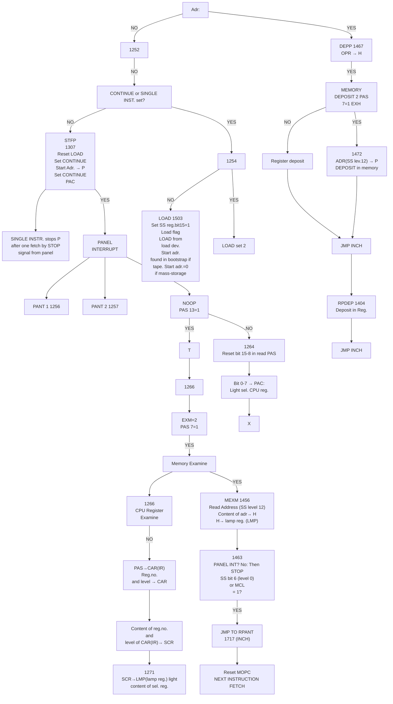
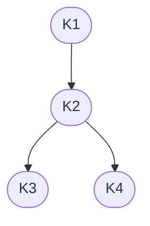
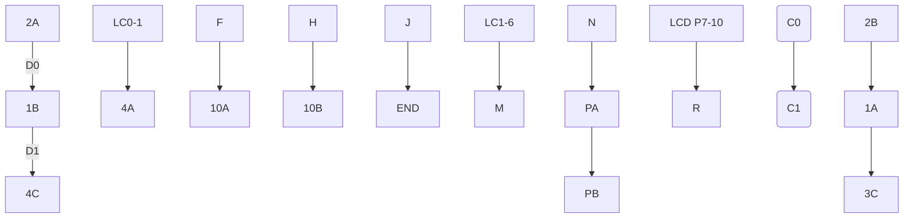
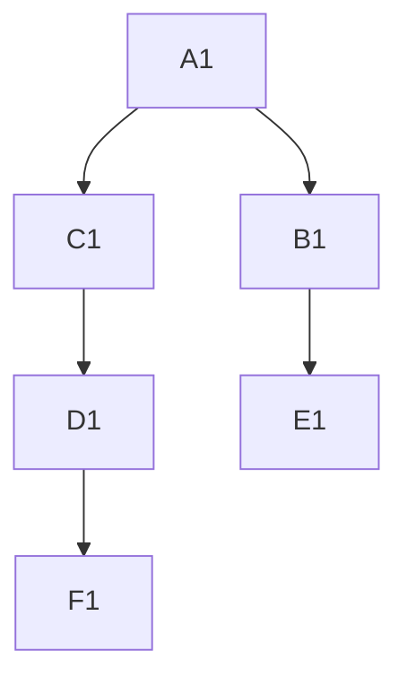
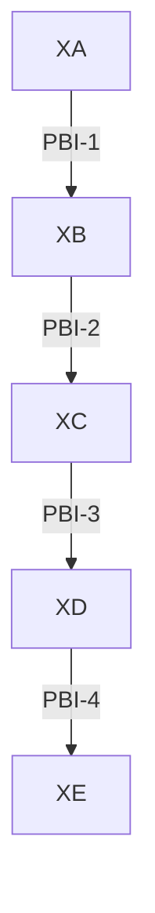

## Page 1

# NORD-10

## Operator's Panel Hardware Description

### A/S NORSK DATA-ELEKTRONIKK

[Cover Design with Graphic Element]

---

## Page 2

# NORD-10

- Operator's Panel
- Hardware Description

---

## Page 3

# NORD-10 OPERATOR'S PANEL

```plaintext
 ------------------------------------------------------------
|                                                          |
|   +---------------+               +-----------------+    |
|   |+-------------+|               |+-------------+ +|    |
|   ||PROJECT|IDLE ||               ||LEVEL 2 | LEVEL|HEAD  |
|   ||BREAK  |     ||               ||        | UP/DOWN ->  |
|   ||       |     ||               |+-------------+ +|    |
|   ||SYSTEM | IDLE||               ||INTR | LEVEL 1||    |
|   ||PAUSE  |     ||---------------||     | ENABLE ||    |
|   |+-------+----+|               |+-----+--------+|    |
|   |USER |TEST   |                |                |    |
|   +-------------+                +-----------------+    |
|                                                          |
|   +-----------------------+   +-----------------------+  |
|   ||USER| TEST            |   |+---------------------+|  |
|   ||    |                 |   || POWER ON     STOP   ||  |
|   ||    +-----------------+   |+---------------------+|  |
|   |+--------------------------+                         |
|                                                          |
|   +----------------+     +----------------+              |
|   ||REGISTER|DATA ||     |+--+--+--+--+--+|              |
|   ||         |    ||     ||  |  |  |  |  ||              |
|   ||         |    ||     ||1 |1 |0 |0 |1 ||              |
|   ||   3     | 9  ||     ||  |  |  |  |  ||              |
|   |+---------+    ||     |+--+--+--+--+--+|              |
|   |               ||     |                 |              |
|   |CHANNEL   PCOM||     |                 |              |
|   |               ||     |                 |              |
|   |+-----------+ ||     ||  REGISTER LOCK ||            |
|   || RM15      ||+     |+-----------------+|            |
|   +----------------+                                      |
|                                                          |
 ------------------------------------------------------------
```

# ND-06.001.01

---

## Page 4

# Panel Card Assembly Layout

```plaintext
     _________
    /         /|
   /  PANEL  / |
  /________ /  |
 | PANEL   |   |
 | FRONT   |   |
 |_________|__/
 | PANEL DATA 1  |
 |  1031       /|
 |___________/ |
 | PANEL      / |
 | CONTROL 1 /  |
 |  1029   /   /
 |_______/___/
 | PANEL DATA 2  |
 |  1032       /|
 |___________/ |
 | PANEL      / |
 | CONTROL 2 /  |
 |  1054   /   /
 |_______/___/
```

---

## Page 5

# OPERATORS PANEL

## GENERAL

This document contains a short description of the functions of the four control cards in Operators Panel. PANEL CONTROL 1 1029 and 2 1054 and PANEL DATA 1 1031 and 2 1032, and the PANEL DRIVER 1033 located in the CPU card rack. POS A17.

A block diagram of these modules are shown in Figure 1.

## MAIN DESCRIPTION

The connection (Data Transfer) between the Operators Panel and the CPU is via the 16 bit PANEL BUS(PB). This bus uses 16 time slices for one complete cycle of data transfers. The information on the bus for each time slice is shown in Table 1. The timing control of the bus is located at the PANEL CONTROL 1 (PC1) card, and consists of a 4 Mhz oscillator and a four-bit counter. The oscillator pulses (OSC) and a counter clear signal (CC) is transferred to the PANEL DRIVER (PDR), which has its own four-bit counter running synchronously with the counter on PC1. (Synchronized by CC.)

The PANEL DRIVER module 1033 has two additional "registers" which has no connection to the functioning of the panel. That is DECODED PIL (A0-15) and the Automatic Load Descriptor (ALD, C0-15). These are read by the microprogram with TRA9 or TRA10 respectively.

The OPERATORS PANEL is controlled both by the operator and the CPU microprogram. Control information is exchanged by using the TRA0 instruction to read panel status information and the TRR instruction to execute panel control functions.

When the CPU is in STOP-mode the panel status is read repeatedly (Frequency determined by micro program loop). In RUN-mode the microprogram servicing the panel is entered only every time the CPU receives a panel interrupt signal transferred via PB-bus as bit 12 on timing cycle 3, 7, 11, and 15, every 2,5 ms.

The main program is not interrupted if one of the following buttons is pushed: ACTIVE LEVELS, DMA ADR, PADR, U, DATA, !R. This is called a NOOP condition: No operation wanted by microprocessor.

Note that pushing ENTER REGISTER when a CPU-register is not selected is also a no-operation.

---

## Page 6

# NORD-10 Operators Panel

## Panel Driver 1033

### Transferred on T: PB Bus

| MR     |   |   |
|--------|---|---|
| P-ADR  | 0 | 0 |
| ADR    | 1 | 0 |
| DMA ADR| 2 | 0 |
| Not used | - | - |

| IB      |   |   |
|---------|---|---|
| IR-REG  | 4 | 0 |
| DATA    | 5 | 0 |
| CPU REG, EXM, U | 6 | 0 |
| PANEL CONTROL | 7 | 1,9 |

## Panel Cards

```mermaid
flowchart LR
    A[P-ADR] -->|0| B[L (0-7) LAMP REG 1031]
    C[ADR] -->|1| B
    D[DMA ADR] -->|2| B
    E[IR-REG] -->|4| F[Panel Control 1054]
    G[DATA] -->|5| F
    H[CPU REG, EXM, U] -->|6| F
    I[PANEL CONTROL] -->|7,9| F
    F -->|RW 0-7| J[PANEL STATUS 1031]
    F -->|DW 8, DW 10-15| K[REGISTER 1054]
    L[LEVEL SELECT PIL] --> M
    N[NOOP-REG] --> M
    O[DATA 16, 17] --> M
    P[EXAMIN] --> M
    M[SELECTED CPU-REG] -->|RW 9| J
    PON -->|W L 20, 21| DECODE_1029
```

## Panel

```mermaid
flowchart TB
    subgraph Panel Control
        direction LR
        A1[Light Selected CPU-REG]
        A2[Panel Status 1031]
        A3[Panel Data Switches]
        A4[Register 1054]
        A5[Single Instr, Stop, Panel Int]
    end

    subgraph DECODER
        direction TB
        B1([Decode 1029])
        B2([LWA-G, MW A-G])
    end

    subgraph External Connections
        direction TB
        C1([MR16/17])
        C2([PIL])
        C3([PON, ION])
        C4([Paging PCR1 1040])
    end

    Panel Control --> DECODER
    DECODER --> External Connections
    External Connections --> Panel Control
```

## Figure Description

- **Figure 1:** NORD-10 Operators Panel
- Includes connections and control flows between various components.

---

## Page 7

# Panel Bus Transfer Timing

| Panel Driver                             | Panel Cards                                    |
|------------------------------------------|------------------------------------------------|
| 0  Selected register                     | → L (General buffer)                           |
| 1  Panel control                         | → Control flip-flops                           |
| 2  As 0                                  |                                                |
| 3  PIL, PON, ION, MR16/17 Reg. adr. and CPU-control | → Bufferregister  ← Register selection and SINGL., INSTR. STOP and PANEL INTERRUPT. |
| 4  As 0                                  |                                                |
| 5  Panel data reg.                       | ← Panel data switches                          |
| 6  As 0                                  |                                                |
| 7  As 3                                  |                                                |
| 8  As 0                                  |                                                |
| 9  Panel control                         | → Control flip-flops                           |
| 10 As 0                                  |                                                |
| 11 As 3                                  |                                                |
| 12 As 0                                  |                                                |
| 13 Panel status reg.                     | ← Panel status reg.                            |
| 14 As 0                                  |                                                |
| 15 As 3                                  |                                                |

*Table 1 – Panel Bus Transfer Timing*

---

## Page 8

# Debugging Hint

When the CPU-register selector-switches STS, D, P, B, L, A, T, X are functioning properly the microprogram is responding correctly, reading panel status and setting panel control. To check transfer of status-register from panel to Panel Data Register via PB-bus use CC (the best oscilloscope triggering signal for all check of PB, 1029 term 91 - Panel Data Reg 1) and look at time slice T13. Refer to Figure 2. For further check of transfer to CPU H-register via IB use TRA0 for triggering. For check of panel control work transfer via IB TRA0 may also be used for triggering, but look at the first TRR0 following TRA0. Note that the echo of the level code is not used by the panel. Instead the level code is sampled into a 4-bit buffer register from PB when panel status is enabled to PB in time slice T13. See Panel Data 1 (1031/8B).

---

## Page 9

# PAS – Panel Status Register

```
 ┌─────┐
 │  15 │
 │─────│
 │  14 │
 │─────│
 │  13 │
 │─────│
1054
 │  12 │
 │─────│
 │  11 │
 │─────│
 │  10 │
 │─────│
 │  9  │
 │─────│
 │  8  │
 │─────│
 │  7  │
 │─────│
 │  6  │
 └─────┘
 ┌─────┐
 │  5  │
 │─────│
1031
 │  4  │
 │─────│
 │  3  │
 │─────│
 │  2  │
 │─────│
 │  1  │
 └─────┘
```

| Bit | Function   | Description                                                                 |
|-----|------------|-----------------------------------------------------------------------------|
| 15  | W17        | Switch register bit 17.                                                     |
| 14  | W16        | Switch register bit 16.                                                     |
| 13  | NOOP       | No operation. The content of Lamp Register (LMP) is not changed by microprogram. |
| 12  | SET ADR    | Set by pushing "SET ADDRESS" button, reset after first TRA PAS or "ENTER REGISTER" buttons. |
| 11  | DEP        | Set by "DEPOSIT", reset after first TRA PAS.                                |
| 10  | REST       | Set by "RESTART" buttons, reset after first TRA PAS.                        |
| 9   | SI+CONT    | Set by "SINGLE INSTRUCTIONS" or "CONTINUE", reset after first TRA PAS.      |
| 8   | LOAD       | Set by "LOAD" button, AUTO LOAD or REMOTE LOAD function, reset after first TRA PAS. |
| 7   | EXAM       | Set by pushing "EXAM" select button.                                        |

| Bit | Function | Description                                          |
|-----|----------|------------------------------------------------------|
| 5-6 | LEVEL    | Code of selected level for register display.         |
| 1-4 | REG      | Code of selected register for register display (STS, D, P, B, L, A, T, X). |

After reading panel status, the microprogram returns the panel control word using the TRR0 instruction (Transferred via PB on T1/T9).

---

## Page 10

# PAC – Operators Panel Control Register

```
  +---------------------------------------------------------------+
  |  13 | 12 | 11 | 10 | 9 | 8 | 7 | 6 | 5 | 4 | 3 | 2 | 1 | 1 | 0 |
  +---------------------------------------------------------------+
       |                       |                       
       |                       |                       
       |                       |                       
       +---- Set LOAD ind.     +---- Echo of selected  
       |                       |      reg. code        
       |                       +---- Set CONTINUE (RUN mode)
       +---- Set error ind. MCL.
       +---- Reset LOAD ind. 
```

## Signals to Panel via PB Bus

Enabled on the PB bus with PLE signal in T3, T7, T11 and T15.

```
  +----------------------------------+
  |  8 | 7 | 6 | 5 | 4 | 3 | 2 | 1 | 0 |
  +----------------------------------+
      |   |   |   |                  |
      |   |   |   +------------------+---- Current interrupt level (PIL 0-3)
      |   |   |   +---- PON: Paging on
      |   |   +---- ION: Interrupt on
      +---+---- Address bits 16 and 17
      +---- TRA 0: clear status after reading
```

## Control Signals from Panel via PB Bus to Panel-Driver

Enabled on the PB bus with CE signal in T3, T7, T11 and T15.

```
  +---------------------------+
  |  15 | 14 | 13 | 12 | 11 | 10 |
  +---------------------------+
        |    |     |     |     +---- SINGLE INSTRUCTION
        |    |     |     +---- STOP
        |    |     +---- PANEL INTERRUPT
        +---- REGISTER ADDRESS
```

---

## Page 11

# Registers Table

| Register | Operation Register Switch | Code        | CPU Reg. | Reg. Addr. (RA 15A 1033) (Internal Trans. Code) | Panel Interrupt  |
|----------|--------------------------|-------------|---------|--------------------------------------------------|------------------|
| D        | 0                        | 1 ↑         | X       | 6                                                | X                |
| A        | 1                        | 5 Register  | X       | 6                                                | X                |
| T        | 2                        | 6 Code      | X       | 6                                                | X                |
| X        | 3                        | 7 1031      | X       | 6                                                | X                |
| B        | 4                        | 3 Output    | X       | 6                                                | X                |
| L        | 5                        | 4 12A       | X       | 6                                                | X                |
| P        | 6                        | 2           | X       | 6                                                | X                |
| STS      | 7                        | 0 ↓         | X       | 6                                                | X                |
| IR       | 8                        | 4 ↑         |         | 4                                                | NO               |
| EXM      | 9                        | 7 Register  |         | 6                                                | X                |
| DATA     | 10                       | 5 Code      |         | 5                                                | NO               |
| U        | 11                       | 6 RC        |         | 6                                                | NO               |
| P.ADR    | 12                       | 0 1032      |         | 0                                                | NO               |
| ADR      | 13                       | 1 Output    |         | 1                                                | NO               |
| DMA ADR  | 14                       | 2 14B       |         | 2                                                | NO               |
| ACTIVE LEVEL | 15                   | 3 ↓         |         | No significance                                  |                  |

**NO = NOOP**

---

## Page 12

# Register Information

| Reg. Address | Reg.        | Set By         |
|--------------|-------------|----------------|
| 0            | P. ADR      | MDRY. FETCH    |
| 1            | ADR         | MDRY. FETCH₀   |
|              |             | DMAGRANT₀      |
| 2            | DMA.ADR.    | MDRY. DMAGRANT |
| 4            | IR          | MDRY. FETCH    |
| 5            | DATA        | MDRY. FETCH₀   |
|              |             | DMAGRANT₀      |
| 6            | LMP         | TRR2           |
| 7            | PAC         | TRR0           |

LMP code = 6 = U, EXM, STS, P, L, B, X, T, A, D.

---

## Page 13

## Figure 2: Panel Time Pulses Generation

```mermaid
flowchart TB
    A[Osc <br> (4 MHz)] --> B[Counter]
    B --> C[Decoder]
    C --> D[Controls <br> Enabling <br> Signals]
    C -->|Counter = 0| B
    E[Counter] --> F[Decoder]
    F --> D

    subgraph Load Configuration
        H[Load Data <br> Input = 1] --> E
        G[Osc] --> E
        I -->|Switches to <br> Load Mode| E
    end

    subgraph Clear Count
        I[(CC) Clear Count]
    end

    direction TB
    A --> E
```

---

## Page 14

# Panel Timing

```plaintext
     1  2  3  4  5  6  7  8  9  10 11 12 13 14 15
    
    ┌─┐ ┌─┐ ┌─┐ ┌─┐ ┌─┐ ┌─┐ ┌─┐ ┌─┐ ┌─┐ ┌─┐ ┌─┐ ┌─┐ ┌─┐ ┌─┐ ┌─┐
Cco ┘ │ ┘ │ ┘ │ ┘ │ ┘ │ ┘ │ ┘ │ ┘ │ ┘ │ ┘ │ ┘ │ ┘ │ ┘ │ ┘ │ ┘ │ Clear Count
      ┌─┐     ┌─┐
Osc ───┘ └─────┘ └────────────────────────────────────────────────────────────
              ┌─┐
T1/9  ────────┘ └─────────────────────────────────────────────────────────────
      ┌─┐
PAC 1033 ...
      └───────────────────────────────────────────────────────────────────────
              ┌─┐
TP11/H       ─└─┘─────────────────────────────────────────────────────────────
PAC 1029
  ...
                           Panel data sw.  
              ┌──────────┐
Panel status Reg.       │ └───────────────────────────────────────────────────
              └──────────┘
       ...
PC31 ────────┘ └──────────────────────────────────────────────────────────────
              ┌──────────┐
       ...
PLF  (PB0-8 to panel)
Cco  (PB10-15 from panel)
                         ┌──────────┐
Osc=PL5 ─────────────────┘          │
              ┌──────────┐          └─────────────────────────────────────────
PLe=PL5   (LSU Reg strobe)
                                    └─────────────────────────────────────────
GR9 when one of  
1033 active level                           
                             R/W123        
GRD  R/W123                        
              ┌────────────────┐
                  ...

```

---

## Page 15

# SIGNAL DEFINITION LIST

---

## Page 16

# Signal Definition List

| Signal | Code  | Description |
|--------|-------|-------------|
| ADREN  | 1032  | Enables light in bits 16 and 17 of lamp register in case of display of address and no address decoding. |
| CARRY  | 1031  | UP (COUNTER = 15) DOWN (COUNTER = 0), which stops level select counter and enables current level defined by PIL. |
| CC     | 1029  | Clear Counter. Transferred to Panel Driver 1033 and used to synchronize counters in panel and Panel Driver. <br> CC = TC0<sub>0</sub>1o2o3o<sub>0</sub> |
| CE     | 1029  | Control Enable, i.e. enable control signals to PB in T3, T7, T11 and T15 for transfer to Panel Driver (for bits 9 to 15 only). |
| CPUR   | 1054  | CPU-register selected by panel switches, i.e. one of the registers D, A, T, X, B, L, P, STS. |
| CSB    | 1032  | Strobe pulse to monostable "stretching" circuits. Occurs on TP1, TP5, TP9, and TP13 if ACTIVE LEVELS are selected. In the case of DECODE ADDRESS for the pulse above and TP3, TP7, TP11, and TP15. |
| DDx    | 1031  | Digital Display signals in two digit binary coded decimal code. For source see PLE. |
| DECODE | 1054  | On/Off flip-flop complemented by Decode Address switch. DECODE signal is on when button is lighted. |
| DOW    | P.S.  | Signals from -button in LEVEL field. |
| DWxx   | 1031/32 | Lamp signals to selected register indicator lamp (T, A, D, etc.). |

---

## Page 17

# Signal Definition List, continued

| Signal | Code | Description |
|--------|------|-------------|
| EXAM   | 1054 | Panel status bit 7. EXAM = CPU₀'EXM₁. |
| EXM    | 1032 | Control flip-flop which is set to one by pushing EXM select switch and reset by pushing IR or any select switch to the left of EXM. |
| IDLE   | 1032 | Decoding of PIL = 0, which drives IDLE indicator light. |
| ION    | 1031 | Interrupt system on, same as corresponding CPU signal, transferred via PB5. |
| LCx    | 1032 | Level Code (≡?IL) or memory address block number defined by memory address bits 12 to 15. Used as input to active level decoding or decoded address. |
| LE     | 1032 | If LE is true, the content of the L (LMP) register (set by TRR2) controls the lamps in the DATA field of the panel. If LE is not true, the lamps are controlled by the LC-decoder. |
| LS     | 1029 | Strobe pulse to L register which transfers the content of LMP from Panel Driver 1033 via PB. |
| LWA    | 1029 | Control signal which lights the A-segment of the least significant display digit. |
| MCL    | 1054 | Master Clear signal generated as a low level pushing MASTER CLEAR button. |
| MWA    | 1029 | Control signal which lights the A-segment of the most significant display digit. |
| NOOP   | 1054 | No Operation wanted by micro-processor in STOP mode. Transferred to CPU as panel interrupts when CPU is running. NOOP is true when any of the registers ACTIVE LEVELS, DMA, ADR, ADR, PDR, U, DATA, or IR is selected. |

---

## Page 18

# Signal Definition List, Continued

| Signal | Code       | Description                                                                                   |
|--------|------------|-----------------------------------------------------------------------------------------------|
| OSC    | 1029       | Panel clock pulses, also transferred to Panel Driver (1033). Frequency: 4MHz (250ns).          |
| PBxx   | All        | Wired OR data bus between panel cards and Panel Driver (1033). Two-way multiplexed communication.|
| PCRx   | Paging Reg. 1040 | Ring bits in CPU paging control.                                                          |
| PLE    | 1029       | Enables PL (=PIL) as level code to the micro-processor as bits 3 to 6 in the panel status word. PLE becomes true if level counter is 15 and the + button is pushed or if level counter is 0 and the — button is pushed. |
| PLS    | 1029       | Strobes PB bus into PL flip-flops and PON/ION flip-flops.                                      |
| PON    | 1031       | PAGING ON mode in CPU, same as corresponding signal in CPU, transferred via PB4.               |
| RO/7   | 1031       | True when any of the register select buttons 0-7 are pushed (D, A, T, X, B, L, P, STS).        |
| R8/15  | 1032       | True when any of the register select buttons are pushed (IR, EXM, DATA, U, PADR, ADR, DMA-ADR, ACTIVE LEVELS). |
| PLx    | 1031       | Equal to PIL in CPU. Transferred from CPU via 1033 and PB.                                     |
| RWxx   | P.S.       | Signals from register select switches.                                                         |
| STEP   | 1029       | Single pulse generated by pushing + or — button in the level field of the panel.               |

---

## Page 19

# Signal Definition List, continued

| Signal | Code   | Description                                                |
|--------|--------|------------------------------------------------------------|
| SST0P  | 1033   | Stop signal from CPU (WAIT instruction when interrupt is off or FETCH and SINGLE INSTRUCTION). |
| SWxx   | P.S.   | Signals from panel control switches (push buttons).        |
| TCx    | 1029   | Time Counter flip-flops 4-bit binary counter.              |
| TEST   |        | Not used. Connected to GND.                                |
| TPx    | 1029   | Corresponding T-signals gated with OSC.                    |
| Tx     | 1029   | Decoded Time Counter states.                               |
| UP     | 1029   | Control flip-flop set to one by pushing + button in level field. Set to zero by pushing −, UP₀ = DOWN₁. |
| UPW    | P.S.   | Signal from + button in level field.                       |
| Wxx    | P.S.   | Signals from panel data switches.                          |
| WLxx   | 1031/32| Signals to panel data indicator lights. See also LE.       |

---

## Page 20

# THE MICROPROGRAM AND THE PANEL

---

## Page 21

# THE MICROPROGRAM AND THE PANEL

## Address Table

| Addr   | Description |
|--------|-------------|
| 0      | STOP is pushed, Jump to 1402 |
| 1402   | Jump to MOPC 1054 |
| MOPC 1054 | Reset LOAD if set (PAC) (Bit 15 in SCR reg) |
| 1071   | Clear EXAMIN ADDRESS By pushing SET ADR or on TTY the adr is in SS Level 12 |
| ASS8 1176 | JMP INCH 1716 |
| INCH 1716 | Input character? |
| PANTT 1236 | Test panel buttons |
| 1241  | Panel status |
| SETAD 1446 | READ OPR=H Save ADR (H) in SS reg level 12 |
| REAC 1077 1245 | JMP INCH |
| RESTA 1304 | 20 -> P Reset PIE Reset LOAD (SCR bit 15) Set CONTINUE (PAC 9) START |

```mermaid
flowchart TD
    A0(STOP is pushed Jump to 1402) -->|Jump to| B1402(Jump to MOPC 1054)
    B1402 -->|Jump to| C1054(Reset LOAD if set (PAC)\n(Bit 15 in SCR reg))
    C1054 --> D1071(Clear EXAMIN ADDRESS\nBy pushing SET ADR or on TTY\nthe adr is in SS Level 12)
    D1071 --> E1176(JMP INCH 1716)

    E1176 --> F1716{Input\nfrom I/O\ndev?}
    F1716 -->|YES| G(ACTIVATE)
    F1716 -->|NO| H(JMP PANTT)

    H --> I1236{LOADM modus\nSCR bit^15=1?}
    I1236 -->|YES| J(SET ADR set\nPAS^12=1?)
    I1236 -->|NO| K1241(Read PAS, Save PAS(P))

    J -->|YES| L1446(READ OPR=H\nSave ADR (H) in SS reg level 12)
    J -->|NO| K1241
    L1446 --> M(RESTART set PAS^10=1?)
    M -->|NO| N(20 -> P\nReset PIE\nReset LOAD (SCR bit 15)\nSet CONTINUE (PAC 9)\nSTART)
    M -->|YES| E1176
```

---

## Page 22



---

## Page 23

# Panel Interrupt

The Entry Point Generator is by hardware set to address 1000. If a panel interrupt occurs:

The CPU is not in STOP mode; in CONTINUE and one of the following buttons have been pushed:

EXM or one of the CPU reg.: STS, P, L, B, X, T, A or D.

The Panel Interrupt signal is transferred to CPU every 2.5 ms (OSC 1054) on one of the following panel timing pulses:

T3, 5, 7, 11, or 15 [PB12 -> COINC (1033), COINC -> OPINT (1058) OPINT -> CARD MICROADDRESSING 1075]

1000/JMP TO PANINC 1226

## PANINC 1266/

```mermaid
flowchart TD
    A[Set MOPC (Flip-flop preventing internal interrupts and force the CPU to use reg. set on level 0.)] --> B[Read PANEL STATUS REG (PAS) -> P\nThe interrupt signal is reset by TRA TRO (TRAPAS 1054)]
    B --> C[Set bit 6 (Panel interrupt flag) (SS level 0)]
    C --> D[JMP TO PANT2\n1257]
```

---

## Page 24

# Drawings

[Page containing header: DRAWINGS]

---

## Page 25

```plaintext
 __   __   __                     ____ ____
|  | |  | |  |                     |    |
|__| |__| |__|                     |    |
|  | |  | |  |                     |    |
|__| |__| |__|                     |____|____


+----+    +----+    +----+
| K1 |    | K2 |    | K3 |
|    |    |    |    |    |
| 01 |----| 02 |----| 03 |
+----+    +----+    +----+
             |
             |
+----+       |
| K4 |-------+
|    |  
| 04 |    
+----+
   
 ----------------------------------

|  1   2    3    4    5   6    7   8 
| --- ---  ---  ---  --- ---  --- ---
| T1  T2   T3   T4   T5  T6   T7  T8

[Table: Connector Details]

|------------------------|
| A     B     C      D   |
|----- ----- ----- ------|
| 0V  5V    NC     GND  |
|----- ----- ----- ------|
```



[Diagram showing electrical connections with labels and routing paths.]

---

## Page 26

# Technical Schematic

```plaintext
       +----+      +----+      +----+
       |2A  |      |1B  |      |4C  |
       |    |      |    |      |    |
       +----+      +----+      +----+
       | D0 |------| D1 |------| D2 |
       +----+      +----+      +----+
```

```plaintext
    +-----------+
    | LC0-1     |
    | LC2-3     |
    | LC4-5     |
    +-----------+
    |4A         |
    +-----------+
```

```plaintext
    +---------------+
    | PB0, PB1, PB2 |
    |               |
    | 10A           |
    +---------------+
```

```plaintext
    +-----------+
    | PL-F, PL-G |
    | 10B        |
    +-----------+
```

```plaintext
    +--------+
    | END    |
    +--------+
```

```plaintext
                                    +--------+
                                    | LC1-6  |
                                    | LC7-8  |
                                    | LC9-10 |
                                    +--------+
                                    | 1A     |
                                    +--------+
```

```plaintext
                    +---+       +---+
                    |PA |-------|PB |
                    +---+       +---+
```

```plaintext
                    +-------------+
                    | LCD P7-10   |
                    |             |
                    +-------------+
```

```plaintext
    +---+                      +---+
    |C0 |----------------------|C1 |
    +---+                      +---+
```

```plaintext
/---\    /---\    /---\
|   |    |   |    |   |
|2B |----|1A |----|3C |
|   |    |   |    |   |
\---/    \---/    \---/
```



```plaintext
+----+   +----+   +----+
|2A  |   |1B  |   |4C  |
|    |   |    |   |    |
+----+   +----+   +----+
```

[Photo: Unreadable Title Section with Symbols and Labels]

---

## Page 27

```plaintext
 |--\  +5V              +5V           +5V
 |   o----o---o----o---o----o---o---o
 |--/  1C   2C   3C   4C   5C  6C  7C
         |    |    |    |    |   |   |
         |    |    |    |    |   |   |
         C3   C4   C5   C6   C7  C8  C9

  |       10 \   16C  *f* /  11       |
  3C                                  CB5
  |                                    |
  |                                   \|
  |                                    | A1
  |                                    |
 -|----                                 |
C6A  *f*------->XOD*    D1L1-       D1L4-1
  |                \SE\ D1L2-        \
  |                 \                   AD/FR2
  |       D1L3-      AD/HL2-            |
                [illegible]                             o-- PP3
  |       AD/HL3-
                          AD/
                          HL/

        20       o------+       o------   -6          20 06 o----O+
 VR R. R/L  A1    X0D---- -       -        -         XD - r ----- +
  |   |               |       [44A,      BA       B5   [41A        P W
 V~   |                                                |    \

          \--V~                                    HT---XA PR.43
 TS1              |   /W-   /W-   /W-   [illegible] AD/APO
     /H-1~-W    TS2  ADPK2   BMB11  10C
 
```

```plaintext
  .--------------------------------------------------------------.
  | F. NAME      DD1234                       DATE | BY HORE MI. |
  | DESC.        PANEL_DATA2                   TTA1 TTA2 TT433   |
  |     +-+      1021A                         LOC  NZ XY        |
  | RCD |E|                                    +-->  A5T RE      |
  '-----| |------------------------------------|   ZF  /111      |
        | |                                    '-----------------'
```



[Photo: Panel board with multiple components and labels]

---

## Page 28

# Panel Driver Circuit Diagram

```mermaid
flowchart LR
    id1[7C]
    id2[7D]
    id3[1C]
    
    A -->|MKR.2| id1 -->|B.8.2| B
    A -->|MKR.1| id2 -->|B.8.1| B
    B -->|HR.1| id3 -->|D.0.|| D
    
    E[1B] -->|XB20.4| id1
    F[1A] -->|C.0| id2
    G[1D] -->|C.0.4| id3
    
    subgraph D
        HR1 -->|D0| id1
        HR2 -->|D1| id2
        HR3 -->|D2| id3
        HR4 -->|D3| id1
    end
    
    id4[3D]
    id5[7D]
    id6[5D]
    C -->|MKR5| id4
    C -->|MKR6| id5
    C -->|MKR7| id6
    
    id4 --- |HR41| id5 --- |HR42| id6
    
    subgraph E
        HR5 -->|D4| id4
        HR6 -->|D5| id5
    end
    
    7C -->|PB.4.3| F
    7D -->|PB.4.4| G
```

```plaintext
   |-----------------|        |-----------------|
   |     5B          |        |     5C          |
   |-----------------|        |-----------------|
   | 1  | A      B   |        |  1  | A      B  |
   | 2  |        C   |        |  2  |        C  |
   |    |            |        |     |           |
   |-----------------|        |-----------------|
```

```plaintext
  [Photo: Panel Driver Schematic Overview]
```

```plaintext
   |----------------------------------------|
   |             Panel Driver               |
   |----------------------------------------|
   |  REF. NO.       |  DOC. NO.             |
   |-----------------|-----------------------|
   |  AO-B1-A2-001   |  Q2-378-09            |
   |----------------------------------------|
   |  DRAWN          |  CHECKED              |
   |-----------------|-----------------------|
   | JN              | XJ                    |
   |----------------------------------------|
```



---

## Page 29

```mermaid
flowchart LR
    A[1A] --> B(2A)
    B --> C[3A]
    B --> D[4A]
    C --> E[2]
    D --> F[3]
    E --> G[SW12]
    F --> H[SW13]
    G --> I(DECODER)
    H --> J(DECODER)
    I --> K[5A]
    J --> L[6A]
    K --> M(4B)
    L --> N(4B)
    M --> O[/DECODER5\]
    N --> P[/DECODER4\]
    O --> Q(7B)
    P --> R(7B)
    Q --> S[8A]
    R --> T[9A]
    S --> U[/SWT5\]
    T --> V[/SWT6\]
    U --> W[10B]
    V --> X[10B]
    W --> Y(SYNC)
    X --> Z(SYNC)
    Y --> AA[/LOAD-MC\]
    Z --> AB[/LOAD-MC\]
    AA --> AC(RUN-NO)
    AB --> AD(RUN-NO)
    AC --> AE[/DECODE4\]
    AD --> AF[/DECODE3\]
    AE --> AG(RST)
    AF --> AH(RST)
    AG --> AI[3B]
    AH --> AJ[3B]
    AI --> AK[SW16]
    AJ --> AL[SW15]
    AK --> AM(SW14)
    AL --> AN(SW13)
    AM --> AO(SYNC)
    AN --> AP(SYNC)
    AO --> AQ[/DECODE4\]
    AP --> AR[/DECODE5\]
    AQ --> AS(SYNC)
    AR --> AT(SYNC)
    AS --> AU(RUN)
    AT --> AV(RUN)
    AU --> AW(STOP)
    AV --> AX(STOP)
    AW --> AY(SW17)
    AX --> AZ(SW18)
    AY --> BA(FW)
    AZ --> BB(FW)
    BA --> BC(TEST)
    BB --> BD(TEST)
    BC --> BE(LED)
    BD --> BF(LED)
    BE --> BG[/DECODE3\]
    BF --> BH[/DECODE2\]
    BG --> BI(HOLD)
    BH --> BJ(HOLD)
```



```
    +-------------+
    | PANEL       |
    | CONTROL 2   |
    | FSN 832-1109|
    +-------------+
```

---

## Page 30

# A/S Norsk Data-Elektronikk

\- we want bits of the future

---

**Address:** Lørenveien 57, Oslo 5, Norway  
**Phone:** 2173 71  
**Telex:** 18284

---

