## Page 1

# Technical Page

| #   | Code       | Description                          | Section                |
|-----|------------|--------------------------------------|------------------------|
| 1   | 1001       | MAIN ARITHMETIC                      | II                     |
| 2   | 1002       | REGISTERS                            |                        |
| 3   | 1003       | STATUS                               | II                     |
| 4   | 1004       | MEMORY DATA                          |                        |
| 5   | 1005       | MEMORY ADDRESS                       | IV                     |
| 6   | 1006       | OR LOGIC                             | III, IV                |
| 7   | 1007       | DECODING                             | V                      |
| 8   | 1008       | INTERRUPT REGISTERS                  | I, II                  |
| 9   | 1009       | MICROADDRESSING                      |                        |
| 10  | 1010       | I/O ADDRESS                          | IV                     |
| 11  | 1011       | I/O DATA                             | II                     |
| 12  | 1012       | RACK DRIVER                          | II                     |
| 13  | 1013       | DEVICE REGISTERS                     | IV                     |
| 14  | 1014       | DMA REGISTERS                        | IV                     |
| 15  | 1015-17    | DRUM SEQUENCER-CONTROL-TIMING        | IV, E, III, III        |
| 16  | 1018       | TAPE READER INTERFACE                | VII                    |
| 17  | 1019,1021  | RACK CONTROL 1-Z                     | IV, IV                 |
| 18  | 1020       | TELETYPE BUFFER                      | IV                     |
| 19  | 1022       | BUS CONTROL                          | VI, G                  |
| 20  | 1023       | 1 K PROM                             | II                     |
| 21  | 1024       | RTCL N-10                            | IV, G                  |
| 22  | 1025       | TIME COUNTER                         | V                      |
| 23  | 1026       | PUNCH INTERFACE                      | IV                     |
| 24  | 1027       | I/O CONTROL                          |                        |
| 25  | 1028       | INTERRUPT CONTROL                    | VII                    |
| 26  | 1029-30    | PANEL CONTROL 1-Z                    | VI, E                  |
| 27  | 1031-32    | PANEL DATA 1-Z                       | IV, IV                 |
| 28  | 1033       | PANEL DRIVER                         | I, IV                  |
| 29  | 1034       | PAGING SURROGAT                      | III                    |
| 30  | 1035       | MEMORY CONTROL                       | II                     |
| 31  | 1036-39    | DISC TXR, CONTROL, SEQUENCER, TIMING | IV, V, VIII, IV, IV    |

---

## Page 2

# Technical Page

| #   | Code   | Description                                         | Section        |
|-----|--------|-----------------------------------------------------|----------------|
| 1   | 1040   | PAGING                                              | IV.XI.F        |
| 2   | 1041-42| 16-BIT DIGITAL INPUT-OUTPUT                         | III.III        |
| 3   | 1043   | CARD READER BUFFER DOCUMENTATION                    | IV.F           |
| 4   | 1044   |                                                     |                |
| 5   | 1045   | CDC 3000 CHANNEL XMIT AND REC.                      | I.II           |
| 6   | 1046   | ASYNC. MODEM BUFFER                                 | III.V.F        |
| 7   | 1047   | CDC LINE PRINTER INTERFACE                          | III            |
| 8   | 1048-49| MAGTAPE CONTROL A-B                                 | IV.II          |
| 9   | 1050   | SYNCHRONOUS MODEM BUFFER                            |                |
| 10  | 1051-53| READ-WRITE-DRIVE CONTROL MODULE                     |                |
| 11  | 1054   | PANEL CONTROL 2                                     | VI             |
| 12  | 1055   | MEMORY CONTROL                                      | VI             |
| 13  | 1056-57| PROCESS INPUT-OUTPUT                                | II.C.III       |
| 14  | 1058   | INTERRUPT CONTROL                                    | III            |
| 15  | 1059   |                                                     |                |
| 16  | 1060   | 4K RAM                                              | IV             |
| 17  | 1061   | HP PARITY                                           | II.III         |
| 18  | 1062   | STATUS                                              |                |
| 19  | 1063-64| HP TIMING A-B                                       | V.III.IIII.IV  |
| 20  | 1065   |                                                     |                |
| 21  | 1066   | 4K MOS RAM MODULE "MOSTEK"                          |                |
| 22  | 1067   | 4K PROM MEMORY                                      | II             |
| 23  | 1068   | ACM I/O                                             |                |
| 24  | 1069   |                                                     |                |
| 25  | 1070   | DATA AND ADDRESS BUS SELECTOR                       | I.B            |
| 26  | 1071   | WORD 50 DATA                                        | E.F            |
| 27  | 1072   | HP CONTROL B                                        | IV.V           |
| 28  | 1073   | CONTROL-DRIVER                                      | I.III.D.E      |
| 29  | 1074   | CONTROL RECEIVER                                    | III.D.E        |
| 30  | 1075   | MICROADDRESSING                                     |                |
| 31  | 1076-80| SMD TIMING-CONTROL-RX-TX-UNIT CONTROL               |                |

---

## Page 3

# Technical Page

| Line | Description                             |
|------|-----------------------------------------|
| 1    | 1081, 83, 89, 90 MPM Data - ADR Line Driver - Refresh - Control |
| 2    | 1082                                    |
| 3    | 1084                                    |
| 4    | 1085                                    |
| 5    | 1086                                    |
| 6    | 1084                                    |
| 7    |                                         |
| 8    | 1088                                    |
| 9    | 1091                                    |
| 10   | 1092 Buffered DMA Register              |
| 11   | 1093 Branch Transceiver                 |
| 12   | 1094 8 K RAM                            |
| 13   | 1095 Terminal Buffer                    |
| 14   | 1096 DMA Address                        |
| 15   | 1097 Process Console Control            |
| 16   | 1098 Device Switch                      |
| 17   | 1099                                    |
| 18   | 1101 Branch Control                     |
| 19   | 1102 Versatec Control Matrix Printer/Plotter |
| 20   | 1103 Diff Transceiver                   |
| 21   | 1104-05 Calcomp Plotter/500-900         |
| 22   | 1106                                    |
| 23   | 1107 Disc Sequence                      |
| 24   | 1108 Remote Byte                        |
| 25   | 1109 Parallel Byte Output               |
| 26   | 1110                                    |
| 27   | 1111 Floppy Disc Control                |
| 28   | 1112 Buffered Calcomp Plotter 100/1000  |
| 29   | 1113 Watchdog                           |
| 30   | 1114 Panel Transceiver                  |
| 31   | 1115 Lamp Register                      |
| 32   | 1116                                    |

---

## Page 4

```plaintext
   +-----------------+       +------------------+       +-------------------+  
   |   SUMS1, BR2    |       |      B0, B15     |       |    SUMW0, BS0     |  
   |   SUMS2, BR3    |       |   SUMS2, BR3     |       |    SUMW1, BS1     |  
   |   SUMS3, BR4    |       |   SUMS3, BR4     |       |    SUMW2, BS2     |  
   |   SUMS4, BR5    |       |   SUMS4, BR5     |       |    SUMW3, BS3     |  
   +---+-------+-----+       +---+--------+-----+       +---+------+--------+  
       |       |                 |        |                |      |             
    SH4,  SH8, SH0              SH1,    SH3              SH5   SH9            
       |       |                 |        |                |      |             
       V       V                 V        V                V      V             
   +---+-------+--+          +--+--------+---+          +--+-----+----+        
   | 17/10, A1, A11|         |  AA12, A4, A14|         |    B4,    A6, A8 |        
   | A12,  A2, A22 |         |  BA16, A19, A26|        |    8/5,    B3, B8 | 
   | A23,  A3, A32 |         |  AB17, A24, A36|        |    9/6,    B7    | 
   | A34,  A4, A43 |         |  CB15, A29, A46|        |     BA18        | 
   +-------------- +          +----------------+         +-------------+        
```

```plaintext
          +-------------+
  --SUMS1-| 9491        |
  --SUMS2-| 9492        |
  --SUMS3-| 9493        |
          |             |
          |             |
          |             |
          |             |
  --SUMS4-| 9494        |
  --SUMS5-| 9495        |
  --SUMS6-| 9496        |
          +-------------+
```

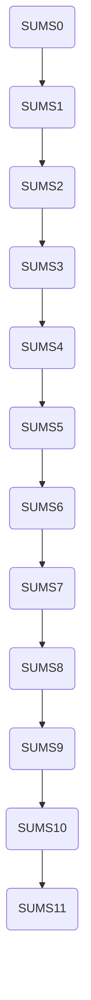

```plaintext
+---------+     +-----------+     +---------+ 
| SH6     | --> | AAA       | --> | SH3     | 
| SH5     | --> | BBB       | --> | SH2     | 
| SH4     | --> | CCC       | --> | SH1     | 
+---------+     +-----------+     +---------+ 
```

```plaintext
 +-----+   +--------+                  
 | SHA |-->+ SHC    |                  
 +-----+   +--------+                  
```

```plaintext
+-------------+   +-----------+   +-------------+
|    BHQ      |---|    PHZ    |---|    DFZ      |
+-------------+   +-----------+   +-------------+
```

---

## Page 5

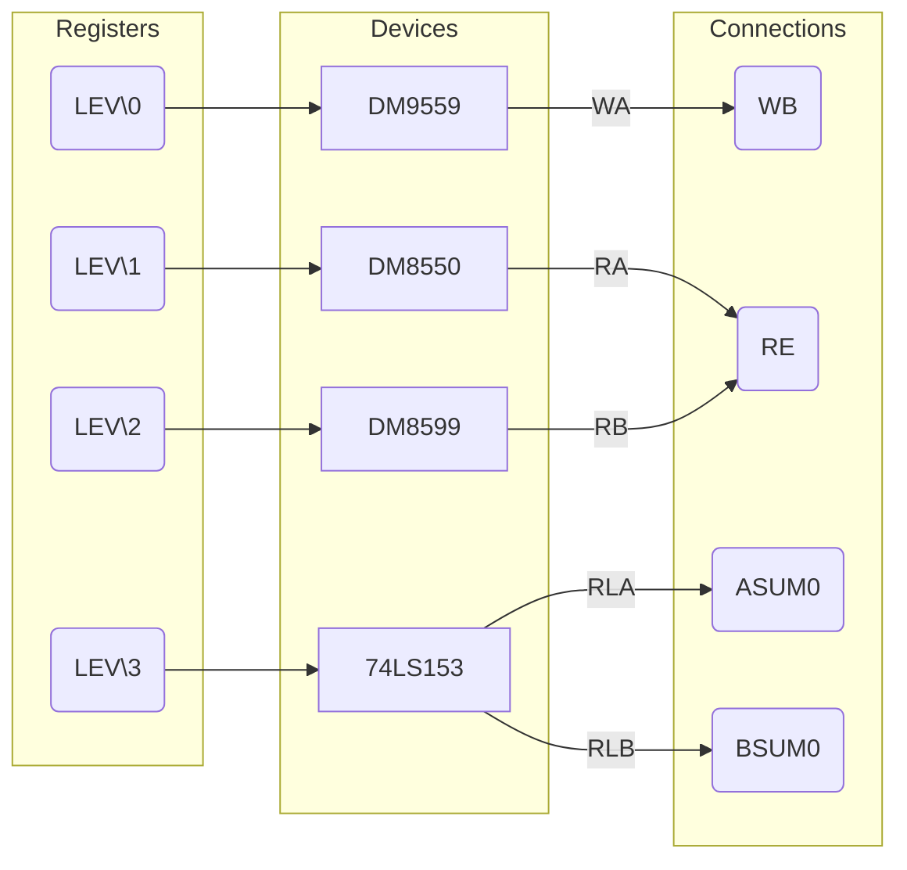

```plaintext
---------------------------------------
|          Devices                  |
|-----------------------------------|
| SUMO0/1  |  U ORQO, SUMO0        |
| SUM\0/3  |  U ORB1, SUM1          |
| SUM\0/2  |  U ORB2, SUM2          |
| SUM\0/3  |  U ORB3, SUM3          |
| LEV\0/3  |  SUM0/3                |
---------------------------------------

---------------------------------------
|          Connections             |
|-----------------------------------|
| GND  | WA                       |
| GND  | WR                       |
| GND  | WT                       |
| GND  | WSQ                     |
| GND  | WSB                     |
---------------------------------------

---------------------------------------
|          Microprocessor          |
|-----------------------------------|
| ADDR    |  SUMO0                 |
| ADR B   |  SUM1                  |
| 2  MA   |  SUM2                  |
|        |  SUM3                  |
---------------------------------------

```

---

## Page 6

```plaintext
+-------+    +----------+   +-----------+             +-----+
| SHCKL |--->| BSUM(3)  |-->|          |             |     |
|       |<---| BSUM(6)  |<--| 9A       |<-- [illegible]----|       5V       +-----------+
| WSHCL |--->| BSUM(0)  |-->|          |    +---+    | 5L  |             +->| ARM(3)    |
|       |<-->| BSUM(12)  | |     SHC(2)|<--|   |     |     |   +----+    |  |          |
| SHCKR |--+>| BSUM(4)  |-->| SHC(3)   |    +---+    |     |<+-|    |    |  |          |
|       |<-||-| BSUM(8)  |-->| SHC(0)   |             |     |  |      |   +--|    4B    |
|       | | | +---+-----+   |          |             +-+----+  +----+     +>|           |
|       | | |     9A        +----------+                4A        S2       | |     4A   |
|       | | |    74LS91                                     [illegible]    | +----------+
|       |_| | +--------------------+     +------------+        +        +--+     
+------------|  BSUM(15)          |<--  | BSH(0)     |
	     | ACR(15)            |--[D]  | ACR(0)     |
	     | BSUM(19)           |    |   | BSUM(15)   |
             | BSUM(23)           |    |   +------------+    +---------+
 +---+       | BSH(0)             |    |        S1    |    | WST(5)   |
 |   |       +--------------------+    +-------------+    |          |
 | 0 |---> PORT <------------------------------------->  |          |
 |   |---> LINDR   <------------------------------------>|          |
 +---+                                                 +--50   BAKL{
                                    |       |
 ASH(0)|                             +    +---+   +---+
+------+ |                               |     |  | 0 |
+---+  zero   HM RECL      ||     S3(0)--| 39  |   --+
+----| 21   +--+  zero     ||  +--------|      -----+
|    |      |  | BSUM(11)  +--|  ASH(1)  |   16B |
|  |       -|                | |      (3) BAKUNG |
|  |       GND<------>|      | +-(13)  |--------|
|  |            |     |----->(3)V (0)      |
|  |            |     |--<--(0)B SUM(12)---+  
+---+           +-----+       +------------+
0A0                         2 PLS

[ASCII diagram for further elements if readable]
```

```mermaid
graph TD;

A[BSUM(15)] -->|ASHQ| BCSR(BSUM(16))
MIR13 --> 5D
B(BSUM(2)) -- DST1 --> WST(5)
CRSEL[CRSEL] --> C(ACR15)
GND --> MIR(15) --> ARM(3)
B(9B) --> D(5A)

```

---

## Page 7

# Memory Data 1004

```plaintext
     ________________________________________________
    |                                               |
    |  IBO,  7 >--------------------------------> 24|   
    |                                               |
    |  IB1, 11 >--------------------------------> 23|
    |                                               |
    |  IB2, 12 >--------------------------------> 22|
    |                                               |
    |  IB3, 13 >--------------------------------> 21|
    |                                               |
    |  IB4, 14 >--------------------------------> 20|
    |                                               |
    |  IB5, 10 >--------------------------------> 19|
    |                                               |
    |  IB6,  6 >--------------------------------> 18|
    |                                               |
    |  IB7,  9 >--------------------------------> 17|
    |                                               |
    |  IB8,  5 >--------------------------------> 16|
    |                                               |
    |  IB9,  8 >--------------------------------> 15|
    |                                               |
    | IB10,  3 >--------------------------------> 14|
    |____________|     _____________________     ____|
                   /|                     |\
                  / |                     | \
                 /  |                     |  \
                /   |                     |   \
               /    |_____________________|    \
              /      |1                  24|     \
             /       |                     |      \
            /        |       15A           |       \
           /_________|_____________________|_________\
          /          |15                 1|           \
         /           |                     |            \
        /            |                     |             \
       /             |_____________________|              \
      /__________________ DM 8831 ___________________________\

```

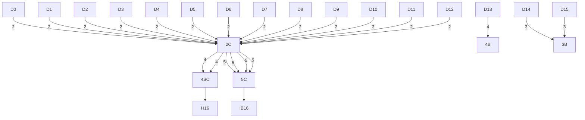

```plaintext
    ________________________________________________
    |                                               |
    |  MBO, 76 >--------------------------------> 4|   
    |                                               |
    |  MB1, 77 >--------------------------------> 5|
    |                                               |
    |  MB2, 78 >--------------------------------> 6|
    |                                               |
    |  MB3, 79 >--------------------------------> 7|
    |                                               |
    |__________________ DM 8831 ____________________|

``` 

Components:
- 3pc 7404
- 5 * 7437
- 5 * 74138
- 5 * 74586
- 2 * DM 8831
- 1 * H:983-470
- 2 * H:983-390
- 22pF

Term no: 1004
Nr: 29.6.73
Rev 0

A/S Norsk Data Elektronikk

2AO4

---

## Page 8

```mermaid
flowchart TB
    subgraph MAIN
        subgraph LEFT
            MRQ0 --> |57| MA0
            MRQ1 --> |59| MA1
            MRQ2 --> |61| MA2
            MRQ3 --> |63| MA3
            MRQ4 --> |65| MA4
            MRQ5 --> |67| MA5
            MRQ6 --> |69| MA6
            MRQ7 --> |71| MA7
            MRQ8 --> |73| MA8
            MRQ9 --> |75| MA9
            MRQ10 --> |77| MA10
            MRQ11 --> |79| MA11
            MRQ12 --> |81| MA12
            MRQ13 --> |83| MA13
            MRQ14 --> |85| MA14
            MRQ15 --> |87| MA15
        end

        subgraph MIDDLE
            MR0 --> 8D
            8D --> |PST0| 6D
            MR1 --> |PST1| 6D
            6D --> |TRE3| 2D
            2D --> |78B0| 7B0
            MR2 --> |PST2| 8C
            8C --> 6C
            6C --> |TRE2| 2C
            2C --> |78B2| 6B2
            MR3 --> |PST3| 8B
            8B --> 6B
            6B --> |TRE1| 2B
            2B --> |78B3| 6B3
        end

        subgraph RIGHT
            MRO, MR1, MR11 --> |L1| LSI(C)
            LSI(C) --> SIGN --> SIG(C)
            SOC --> BHE21 --> TRA --> TRE
            MCL --> MRO |47| TRA

            MOR --> PYE |46 BIT| PEAS
            PYE1 --> |L1| LSI(C)
            ELC
            PYEL --> 4E
            330 pF
            100K --> C2
            10K --> R5
        end

        subgraph BOTTOM
            memaddr
            MCL 
            TIMEOUT1
            RESET, TIMEOUT --> |330 pF| MOR
            UAT --> MODE
            UA(M) --> UA(F)
            BHE21
            
        end
    end
```

```ascii
+----------------+------------+-------------+
| Element        | Description| Connections |
+----------------+------------+-------------+
| R18            | Resistor   |             |
| SIC            | Unknown    |             |
| SOC            | SOC        |             |
| RESET          | Reset Line |             |
| TIMEOUT        | Timeout    |             |
| PYE            | PYE        |             |
| MCL            | MCL        |             |
+----------------+------------+-------------+
```

```ascii
+---------------------------------------------+
| Memory Address Diagram                     |
| AV3 NORSK DATA-ELEKTRONIKK                  |
| Drawing No.: 2A05                           |
|                                             |
| Updated: 10.4.75 by TAJ                      |
| Additional Changes: 16.10.74, 19.12.75      |
+---------------------------------------------+
```

---

## Page 9

```plaintext
  214        214               
───┬─────────┬─────────────────
   │         │                 
  11C       12A                
   ┌───────┐ ┌───────────────┐ 
14 │       └─┤               │ 
   │ 74153  ├─┤ 74153        ├─┐
   │       ┌─┤               ├─┘
13C│       └─┤               │ 
   │         └───────────────┘ 
   └───────┘        │           
                    │
                    ▼

        14             14
  ┌───────────────┐     ┌───────────────┐
  │               ├────►│               │
  │               │     │               │
  └───────────────┘     └───────────────┘

────────────────────────────────────────────
```
```plaintext
5V
 ┌─────┐
 │1k   ├───
 │     │  
 └─────┘  
```

```plaintext
90                             1 pk 74504
 1                             2 - 74510
 2                             3 - 74511
 3                             4 - 74576
 4                             5 - 74551
 5                             6 - 74153
22.1.75                        TAA / Cos
                               1 -
                               2 - NTTT
22.1.75                        TAA D. Lev
                               TL
18.10.73                       BSS
```

```plaintext
                   5I + 56                Hnwel
11C             3D 07                      3D LEV.2
75 8   MDRD 5 ī4, GNBs 1LDS                                                                 
                8DSVCI 697W2HRTF HD  MRF                                 OLDSNLOMULTATRNS 
```

```plaintext
───────────────────────────────────────────────────────────────
   27IC        17 IK M MAMIE                             
   LI    MOCOMR ERKKI                          70         
G  RNK IRMCE KIWI
UC TYPERUOOORD       ∙ ROMB 10= BINS WIN 32V- BE MINC
MAPABBJAS                                              
51910 CHELLO◄                                             
7B +5  TI 184 nv                   figlesia Eg i avot
Ada The CIBATH CHX & Idea 7 +5 Messchia
&φJPTICHHID 1                          Tesmit 80 MORR
▸ ṃ Coreena    •• Prim/Lꜷ Chashools
712515n Boers∪ Wasco maiderpave
```

```plaintext

ROM30,7 + 7    R14: 
              ɪ this          
                    ULHS 7, OMA RW MT
                   ─────────────
                 ROM40 │  MIR4,
                 MIR+3 │PITK 116MLO COUNTRY",          
───────────────┘       │                           

RT YES-O         IROM5                                          

```

---

## Page 10

# Technical Diagram of Decoding 1007/X

```plaintext
          ┌───────────┐
          │           │
  MCL     │  MCL_46   │
  ┌──────>│           │
  │       └───────────┘
  │
  │       ┌───────────┐
  │       │           │
  └──────>│  MIR19_58 │
          │           │
          └───────────┘

                      ┌─────────────────────┐
                      │                     │
             12C      │                     │
          ┌──────────>│     ALT_52          │
                      │                     │
                      └│────────────────────┤
                       │      MIR25,        │
                       │  MIR24, MIR20,     │
                       │  MIR23, MIR29,     │
                       │  MIR22, MIR21,     │
                       └────────────────────┘
```

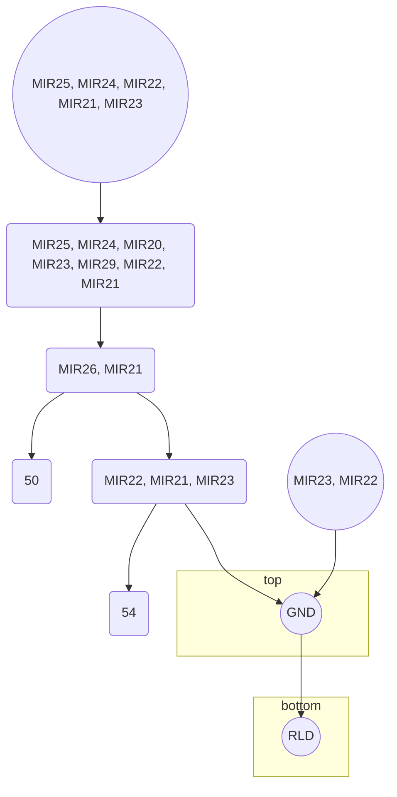

```plaintext
┌───────────────────────────────┐
│                               │
│             50                │
│                               │
│     ARM_41, STS_45            │
│ ───────────────────────────── │
│                               │
│     ACTLOOP_42, STSDST_76     │
│ ───────────────────────────── │
│                               │
│     AT3_45, ACTLOOP_42        │
│ ───────────────────────────── │
│                               │
│     WREN_83                   │
│ ───────────────────────────── │
└───────────────────────────────┘
```

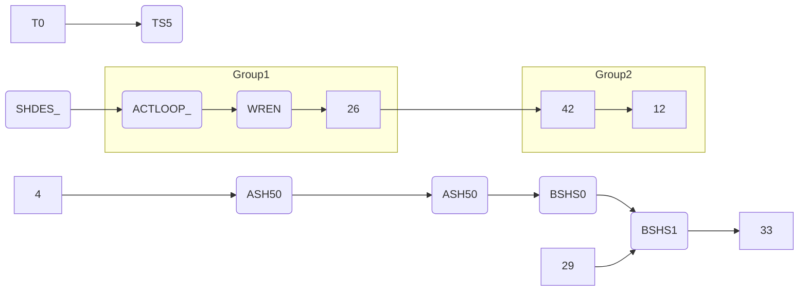

## Pin Configurations

| Pin  | Description |
|------|-------------|
| 81   | Termination |
| 64   | WST5        |
| 65   | WST6        |
| 66   | WST7        |

# Parts List

- 1 pkt. 7425
- 3 pkt. 7404
- 1 pkt. 7400
- 2 pkt. 74123
- 7 pkt. 7414
- 2 pkt. 7474
- 1 pkt. 74163
- 2 pkt. 7417

[Note: See scanned diagram for specific connections and values.]

# Review Information

| Title       | Date       |
|-------------|------------|
| Decoding 1007/X | 20.11.73 |

---

## Page 11

```plaintext
                   +-----------------------+                           
                   |                       |                           
                   |                       |                           
                   |         1             |                           
                   |                       |                           
                   |                       |                           
                   |      180   o--P0D0    |                           
        PT10       |                       |             |-----------| 
   o----(23)-------|      1B6   a--P0D6    |             |   4        | 
                   |                       |             |-----------| 
        F11        |      1B5   a--P0D7    |        o----o--P0P2      | 
   o----(32)-------|-----------------------|             |            | 
                   |       o--P0D5         |             |-----------| 
                   +-------+   |  15D   ___|             |    1       | 
                   |    |----+---P0D3  ( 1 |             |-----------| 
                   |    |    |---P0Q   | 0 |        o----o--P0P1     | 
                   |    |----o--P0D1   |   |             |           | 
 PT112        F12  |    |_____P0P3_P0  |   |      o---o--o----------| 
    o-----(22)-----(12)          505   |   |         |   |   
              |                       |   |
``` 
```plaintext
           ______  ______
     F9   |      || 7B   |
   o---->(| 7A   ||______|)
          |______        |
             |  |        |
             o--| 7B   __|__                                o---o
                  |  |      |                                o-o
```

```
+---------+   +---------+   +---------+
|         |   |         |   |         |
|   7A    |   |   7B    |   |   7C    |
|         |   |         |   |         |
|       o |-->|       o |-->|       o |
|       | |   |       | |   |       | |
|       o |   |       o |   |       o |
+---------+   +---------+   +---------+
```

```plaintext
          +--------+
    HCL   |   9A   |
  o------->--------|
          |        |
          +--------+
```

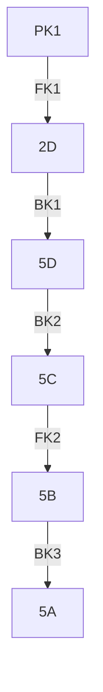

```plaintext
                      +--------+
   PK2   o-----------|        |
           |         |   1B   |
           o---------|        |
                     +--------+
``` 

```plaintext
          |-----|   +--------+   +--------+
          |  4  |   |   7B   |   |   7A   |
          |-----|   |        |   |        |
          |     |-->|     o  |-->|     o  |
          |     |   |    |   |   |    |   |
          |     |   |    o   |   |    o   |
          +-----+   +--------+   +--------+
```

---

## Page 12

```plaintext
```
   _____               _____            _____            _____
  |     |             |     |          |     |          |     |
  | 8B0 |-------------| 7A  |----------| 6A  |----------| 5A  |---
  |_____|             |_____|          |_____|          |_____|   
      |                  |                |                |      
 _____|____          ____|____          __|____          __|___   
|     |    |        |     |    |       |     | |       |      |   
| 12A |    |        | 11B |    |       | 12B | |       | 13A  |   
|_____|    |        |_____|    |       |_____| |       |______|   
          |             |          ____|_____|   ____     |     
  ________|______     __|____     |____  _____| |    |    |     
 |               |   |     |           |_____|  | 9B |   |      
 |   13B ->IR3   |   |10B->|           |         |____|   |      
 |_______________|   |_____|           |                  |       
                        |

|       |      |       |     |      |       |     |      |       |     
| 14B-> |  IR4 |   15A | IR5 |  IR6 |  16A  | IR7 |  17B |  IR8  |   
|_______|______|_______|_____|______|_______|_____|______|_______|   
              |             |      |                     |         
    __________|_________    |      |___________________  |         
   |                     |  |       |                     |        
   |         27->IR2     |  |       |         2A->IR1     |        
   |_____________________|  |       |_____________________|        

    ____|____     
   |         |    
   | 18B ->  |    
   |___(IR9)_|    
```
```mermaid
flowchart TB
    A([74LS75]) -->|IB0| B([IC]) -->|ICAR0| C([IC2])
    C -->|IR0| D([IR01])
    B -->|ICAR1| E([IC2]) -->|IR1| F([IR11])
    B -->|ICAR2| G([IC2]) -->|IR2| H([IR12])
    B -->|ICAR3| I([IC2]) -->|IR3| J([IR13])

    subgraph CLK1["CLK1"]
        D
        F
        H
        J
    end

    D -->|IR01| CLK1
    F -->|IR11| CLK1
    H -->|IR12| CLK1
    J -->|IR13| CLK1

    K([CLK2]) -->|IB4| L([IC2]) -->|ICAR4| M([IC2]) -->|IR4| N([IR14])
    CLK1 -->|IR| 2[P]
    L -->|ICAR5| O([IC2]) -->|IR5| P([IR15])
    
    Q([IR67]) -->|Spec| R([IR68]) -->|GND| S([IR69])
    R -->|Spec| T([IR70]) -->|GND| U([IR71])
    
    V([IRa0]) -->|IR71| W([IR72])
    U -->|IR71| X([3[%]])
    T -->|IR51| S[7]
    V -->|Spec| Y([OPC0]) -->|GND| Z([OPC1])
   
    subgraph COMP1["COMP Circuit"]
        A
        E
        G
        I
    end
```

---

## Page 13

# I/O Address Diagram

```plaintext
  ___________                                   ___________    _______
 |           |                                 |           |  |       |
 |   6ND     |_________________________________|   6ND     |--|       |
 |   IR0     |                                 |   IR8     |  |       |
 |   12A     |                                 |   12C     |  |___    |
 |___________|                                 |___________|      |   |
                                                             12C |   |
                                                    12B  ___|   |   |
                                                  __|___|___|___|___|
                                                 |    __6___80___|   |
 ___                                       ______|____|___5_____|   |
|   |                                     |       |IR8 |       |    |
|___|                                     |       |    |       |____|
                                           10C  __|   |________|
                                          |    |      |
  |----------------                       |____|______|
  |  |     |     |                       IR0 |  IR8|7C              ___________
 IR0 |     |  8B |                        8B_|     |                | 6ND     |
IR08 |ATIONS|  8B|___________________________|     |                |_________|
ILA1_|||     |7A                                   ________         ___________
ILA1_)|___   |R1 NOTE:                               10B  |        |         |
ILA2_|___|  IR8____________                            |EAX|
   0   |E   EAB_   _____ 7_                          |          |    EAX_      _
       |N         |      b94                         |    ____ |EXA|_      _7
   EN_A4  --5|8_O-|ENXA_|XA1                         |EAB_-|   |____|          8
  ENA_B_|EX   |IR5  |EXA_                             |   7|__________        7B
      |EX_ENAB_||MX_EXXA_                            __________________        _
     __|______B_|____RG____________________ENAB1_|  ____________________
    |___________________________________ENAB2__|_|2A!!!!BB________!         |

 _ _ _ _ _ _ _ _ _ _ _ _ _ _ _ _ _ _ _ _ _ _ _
      !)|E|!      !\/_ /XXXX!               !!
 _____________________________________________(_|    |GN |_|          |
            !    APR/14A-15-12  PDT-ADR/_    \_ |  |                       |
           |_   |________________________________| |                       |ET
                                              |16BEXT|      I/O ADDRESS     |
                                              \     /       **101 0/ XII**  |
                                               \  A/U               ________|
                                                | |

  ____          __________     __                                          
 |  L_\ |       |        2    | C! |                                       
 |_3___|       _|_____()_____|                                         V
```

```plaintext
   ___________      ___________
  |           |    |           |  
  | X____3____|----|   XEAB2   |  
  |           |    |___________|  
  |___________|  
```

**Mermaid Diagram**

```mermaid
flowchart LR
    12A & 12B --> MR0 -->|IR8| 6A
    10A & 10B -->|IR8| 6B -->|ENAB1| 
    14A & 14B -->|IRG| 16C
    6C & 6D -->|ENAB2| 

    20(1k Resistor) -->|CIRK1| CIRK1_sv
```

[Photo: Paper with multiple logic diagrams and label descriptions for a technical circuit schematic, related to I/O addressing and circuit processing.]

---

## Page 14

```plaintext
+5V                GND                      GND                
 |                  |                        |                 
 |                  |                        |                 
 |                 12A                      14A                
 |                +---+                    +---+               
 |                |   |                    |   |               
---               |   | 50     ==ED0L1     |   | 54     ==RBD00
|1K|              |   O--------------------|   O---------------
---               |   | 56     ==ED0L0     |   |               
 |                |   O--------------------|   O----|          
 |                |   | 60     ==ED1L      |   |    +-------   
 |                |   O--------------------|   O------|        
 |    IBXQ0 ----->| 1 O                    |   |        ===    
 |    IBXQ0 ----->| 5 O                    |   |                
 |    IBXQ5 ----->| 6 O                    | 4A |               
 |    DM 8831     |   |                    |   |               
     74LS          |   |                    |   |      EINPUT1
                   +---+                    +---+       +     
                                                      ---     
                                                     | 4       
                                                      ---      
                                                                
GND                GND                      GND                
 |                 |                        |                   
 |                18B                      8D                   
 |               +---+                    +---+                 
 |               |   |                    |   |                 
==IB1b3----------|   O          EINPUT4   |   O----------->    
 |               |   |          17        |   |               
 |               | 3 O          LINPUT4   |   |               
 |              +|   |         +          |   |               
 |              ||   | 6       |          |   |               
 |    IBX13 ----|| 8 O--       |          +---+               
 |              |+---+         |                              
 |               LINPUT4       |                              
 |                             |                              
 |                GND          |                              
 |                |            |                              
 |               8A            |                              
 |              +---+          |                              
 |              |   |          |                   
==IB1X0---------|   O----------+                   
 |              |   |                                     
 |              | 3 O                                       
 |             +|   |                                       
 |             ||   |                                       
 |    IBX1X5 --|| 3 O                                       
 |             |+---+                                       
 |              LINPUT5                                     
                                                              
GND                GND                      GND              
 |                 |                        |                 
 |                 8B                      8C                
 |                +---+                    +---+             
 |                |   |                    |   |             
==IB1b2  ---------|   O--------------------|   O---R---      
 |                |   |                +---|   O------+      
 |                |   |                | 8B |   |   |        
 |    IB1b0  ---->|   O                |   |   |   |        
 |                |   |                |---|   |   |        
 |       +5V ---->|   O                |---|   |   |        
 |       1K  ---->|   O---->           ---'   |   |        
 |                DM         + -------|   |   |    ===        
 |                  8831        ===GND |   +--+              
                    74LS                |                   
                                          
----------------------------------------------------------------
```

---

## Page 15

# Rack Driver 1012/II

## Diagram

```plaintext
   +-------------------------------------------------------------------+
   |                                    +----+                        |
   |   | | | |   +--[ 15 ]----+         |    |                        |
   | +-+-+-+-+   |            |         | 74 |            +---------+ |
   | |  | |  |   |            |         |HC  |   +-----+  |  EAE    | |
   | |6C     |   |   THRES   +|         |174 |  10|     | |   +---+ | |
   | | 10    |   |      OLD--+|         |    |  --|     | |X | -E | | |
   | +---+---|   |            |         |    |   -|     | | | | -R| | |
   |     |   |   |    UPTH    |         +----+    |     | | | | + | | |
   |     +---|   |     OLD--+ |                  | 74   | | | +---+ | |
   |         |   |            |                  |LS125A| | |       | |
   |         |   +------------+                  +-----+  | |       | |
   |         |       12                           11     | |       +----+
   |  [R]  [A]  [AUX PTOS]                      +--------| |       |    |
   +--------+-----------------------------------|        +-|  EDE  |----+
           |        |    40      50          60 |         ++-------+
           |    +----------------------------+  |
           |    |       R1    R3    R5    R7 |  |
           |  | |                           |  |
           |  | |  10kΩ  10kΩ  10kΩ  10kΩ   |  |
           |--+--+-----------------------+--+ |
              | +---------------------------+ |
              +------------------------------------+
                                   |   |    |    | +-----+
                                   |-- +1   2    | +----+ 207
                                         |    |    +----+
                                       33Ω

```

## Resistors

- One 10k resistor package

### Package: 

| Resistor Code | Resistor Value |
|---------------|----------------|
| 13k           | 74HC4010       |
| 45k           | 7475           |
| 88k           | 74157          |

## Components

- EDEL: 10
- MIN: 6
- EIN: 15

### Connections 

| Connection | Input | Output |
|------------|-------|--------|
| EIN        | 15    | 16D-2  |
| EDEL       | 11    | 16D-3  |

## Notes

- **LDO**: 74LS153, 74LS74
- **Power**: +5V, -5V

### Testing Completed:

- Date: 3/7/2023
- Approval: Version X

[Photo: Rack Driver Technical Schematic]

---

## Page 16

```plaintext
                                      +5V
                                       |
                                      1K
                                       |
                                     .---.
                                     |   |
                                     |   |
                              MCM 558 |---|
                                     |   |
                                     '---'
                                       |
            A_                         |
         ---o                          |
         |N.C                         / \_
         |                            / \_ A
         |                             |N.C
      S1 |                            
 O-----|<-----                        / \_   8A
      PE|                            / \_
         |                             |   
         |---|                       /
         |R6             |---|      /
         |   |    A12    |   |     /          DRO_  1A
       PE|  A13  A13  A15 |   |   /             
         |---|            |---|  [57]     
              |              | 
              | ---         /             
              |A12 A13 A14 A15 LCW    LOAD   
                  PE [A]  DA0 TEST  COUNT1  
                                         ]
                                 
                  --------          --------                
                 |    KA  |--------|          |               
MDB(9) |---|     |        |        |    XC    |               
MDB(1) | 1 |     |        |38      |          |--------|   DA11
MDB(2) | 2 |     |    A   |  DA0,1 |     A    |        |
MDB(3) | 3 |-----|        |  DA0,2 |          |        |
MDB(4) | 4 |     |    7   |  DA0,3 |    9 5  |--------|  DA4,5
MDB(5) | 5 |     |  42    |--------|    03C
       |   |-----|     74 |--------|    3    |
       |       9040 ZXZT  |        |ZD72     |
       `------------------`-------------- --  

```

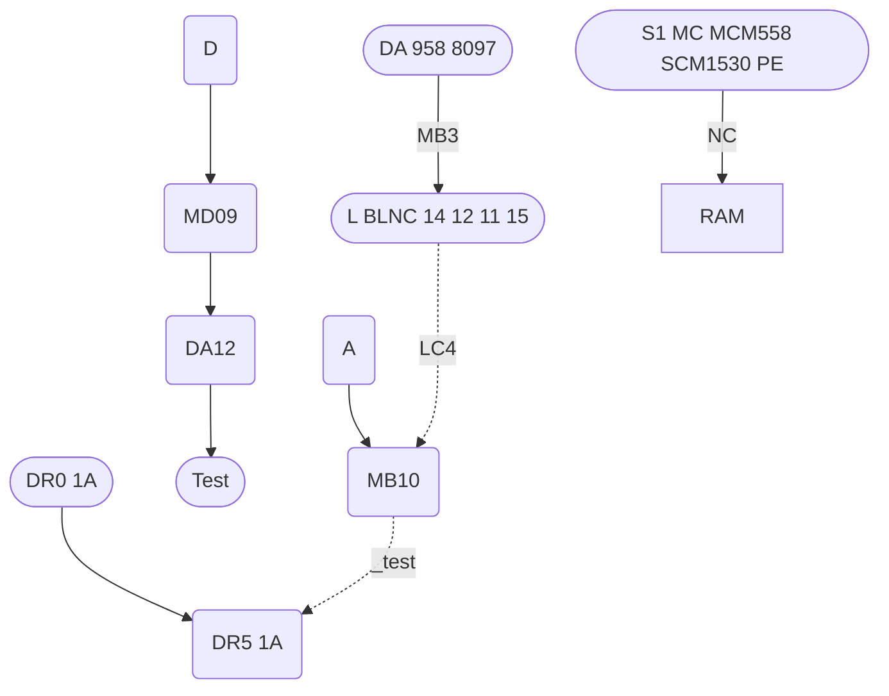

---

## Page 17

```plaintext
     ___                                                     ___
    | 66| WRITE CORE,                                      _|67 |DEALQ                       
    | 77| CFG                                             | 64| WC Z0 
    | 78| DR 0                                            |   |  _| 
    | 79| DR 1                  MO M1 M2 M3                |
    | 80| DR 2                                             |
    | 83| BERROR 0                                        | 46| P
    | 84| BCOMPL 0                                        | 65| PL _
    | 90| BIBBUS V0                                       |   |  _| OS LI 
    | 92| BSTATr 6                                        |

         DATA READY 62                                      IRQ 72
       ___________|                                         |
      | DR                                          __      l 
      |_________________________ STR,               | 0      |
      MDB2 63 |    ___                              | 
      M0B3 65 |   |15B|                             |         MC 8 56 
      M0B4 1  |   |   |                       _____ |    _____|    
      M0B5 67 | __|___|______                 |5A   |             _     DEVICE       66
      M0B6 68 ||74LS74 |       _______|_______|     |            / \   | REQUESTS |
      M0B7 73 | SR0 11 |      |14  3A       |      |   PL 6 
      M0B8 74 | SR1 12 |      |11  Z 74S 57 |5A    |   5B
      M0B9 75 | SR2 13 | SEL  |12/          |5B    | __    SHTE, _   
       [ ]    | SR3 14 | 1    |             |      ||7 LS95  
              |XX0     |SEL 1 |             | SR4  |   |3B  
              |     15 |22________          |     |   SO 0
              |        |                    |     |   SO 0
               SR5 16|                      SRS 15
               SR6 15|                      RD R4  74LS7
               SR7 17|                      SR3   15   
                     |                      SEL 2 
                ___  |                             
  _______  60| STR,|                      ________ SEL2
  |MDB8 b   58 |       ___________       ____________
  |M0B8 8   59 |   XX0|             |5C SO t       
  |     75|15C|_____|____________ |3Od     
  |MDB9 71 |XX1|          IN DC    |         |
  |MDB2 79 |   |                   |      |
  |MDB2 80  |                       |      5   
  |MDB8 81  ______    DR 6_________
  SR D, 11
       74LS74 |R IN UIT   14D-D C|O|0 
    STR 63    | SC 01___ 1DC     |  
               S0 1|         
               S0 2|
                     |                       |74LS157
                     +_______________________ MB0/   
     EN 16
  |CSTR   |  _______  
  MULT     |
  CN 0     |   5E  
   | oe NV    
EN L  1______ MOC 16B 
|        15A 
|        15B 
|                _______
|    __ _ SEL   ||Z8OZA  |
SEL 2   21       |      |  
   1DC   IUM o  |________|
      
ENGINEER: A/S N0RSK DATA-ELEKTRONIKK

```

---

## Page 18

```plaintext
             +---------------------------------------------------+
             |  6 So                                             |
             |     +---------------------------------------------+  
             |     |                  |                          |
             |     |             +----+-----+                    |
             |     |             |          |                    |
             |   +----+  +-------+ 12B      |                    |
             |   | B0 |  | INTERNAL COUNTER |                    |
             |   +--+-+  |       | S9     | |                    |
             |      |    +-------+        | |                    |
             |      |                     | |                    |
             |      |                     | +--------------------+
             +------+                     |
                                          

            +------------------+
   +------->|   8    E0        |<--------------+
   |        |        E1    10B |<-------+      |
   | +----+ |        E2        |        |      |
   | | E0 | |        E3        |        |      |
   | +----+ +------------------+        |      |
   |        |       74S32               |      |
   |        +---------------------------+      |
   |                                           |  
   +-----+                                     
   |     |   
   |     +------------------> BC0 
   |
   +---------------+
   |    CLEAR      |
   |  +---------+  |
   |  |  4C     |  |
   |  |  7474   |<--------------+
   |  +---------+  |
   |   WRITE EN   |
   +------+-------+
          |

   [illegible]     +--------+     +--------+
          +------>| BC1    |---->| BC2    |------+
   +------+       +--------+     +--------+      |
   |      |          WRITE        READ           |
   |      |                                      |
   |      +--------------------------------------+
   |
+--------+
| 5 BC1  |
+--------+
| BUSY   |
+--------+

[More circuit elements with interconnections] 

+----------------+
| DRUM SEQUENCER |
|    1015/TX     |
+----------------+

A/S NORSK DATA ELEKTRONIKK
```

---

## Page 19

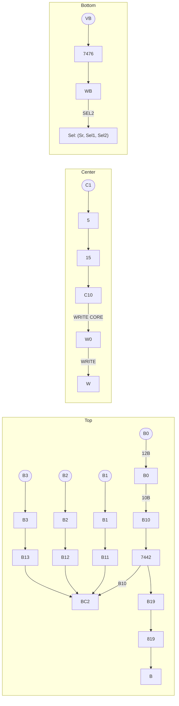

```plaintext
         +------+     +------+     +---+
  B0 ----| 12B  |-----| 10B  |-----|B10|
         +------+     +------+     +---+
                          |
                          v
                        +----+
                        |7442|
                        +----+
                          |
                          v
                         B19

M2 --->
             WRITE CORE
             READ
             ----------
 
 -> B13 ------------------>
 
---(WRITE)-->
 
 ```
```plaintext
         C1
 WC0  46 CW0
  ,---+-------------------->
  |   |
  |   V
  |   +--------------------+
  |   |  12A               |
  |   |  WORD              |
  |   |  COUNT            |
  |   |    0               |
  |   +--------------------+
  |   |
  |   +----+
  |   |    |
H  |    WC1
  |   |    |
V B  |    HC
    |    |
   WC5---
     |
     +-----------------+
     |   WB            |
     |   COUNT         |
     |   0             |
     +-----------------+

---(W65)---+   
    
           (WE, TSE)   
```
```plaintext
+--------+    +--------+
|  S0    |    |  S3    |
| SECTOR |    |  COUNT |
| COUNT  |    |        |
|   0    |    |  72    |
+--------+    +--------+
```
```plaintext
     +------+       +------+
     | B0   |       |  WC  |
     +------+       +------+
```
```plaintext
   +----+      +----+
   |  8 |      | 13 |
   +----+      +----+
   |    |      |    |
   +----+      +----+
```
```plaintext
[Table: System Specifications]
| A | B | C | D |
|---|---|---|---|
| 2 | 4 | 6 | 8 |
| 1 | 3 | 5 | 7 |
```
```plaintext
[Photo: Drum Sequencer]
```

---

## Page 20

```plaintext
      +------+                                                                                  +-------+
      | DAH0 |--------------------------------------------------------------------------------->| 9A    |
      +------+    +-----+   +-----+  +-------------+   +---------+       +-------+        +----->|       |
      | DAH1 |--->| S0  |-->| S1  |->|             |-->| 9A      |       |       |        |      |       |
      +------+    +-----+   +-----+  | 6           |   |         |       | START |----+   |      |       |
      | DAH2 |--->| S2  |-->| S3  |->|             |   | S0,     |       +-------+    |   |      |       |
      +------+    +-----+   +-----+  | 7A          |   |         |----->| 5B        |   |      | 7455  |
      | DAH3 |--->| S1  |-->| S0  |->|             |   |         |       +---------+    |   |      |       |
      +------+    +-----+   +-----+  | 3           |   | 9C      |----->| 5B        |   |   |      |       |
      | DAH4 |--->| S1  |-->| S2  |->| CLOCK FAIL, |   |         |       +---------+    |   |------>|       |
      +------+    +-----+   +-----+  |             |   |         |----->|           |   +------->---+       |
      | DAH5 |--->| S3  |-->| S0  |->|             |   |         |       +----------+   |      +---+       |
      +------+    +-----+   +-----+  |             |   |         |----->| 5B        |   |          |       |
      | DAH6 |--->| S1  |-->| S2  |->|             |   |         |       +---------+    |   +--->-| EQUAL, |
      +------+    +-----+   +-----+  | 4           |---|         |------>| RESET     |   +------->----|       |
      | DAH7 |--->| S3  |-->| S0  |->|             |   |         |       +------+     |   +------->-+   |       |
      +------+,   +-----+   +-----+  |             |   | 22      |----------------->+-------->| START  |
      | START |-----------------------|             |---| SYSTFAIL|         +---+   |            +---+  |       |
      +-------+                       |             |   |         |         | 3A|---|                 |       |
                                      |             |   |         |         |   |                    +-------+
                                      +-------------+   +---------+         +---+
```

```plaintext
+------+      +------+
| DA10 |----->| 48   |
+------+ +----|      |
| DA9  |-|----| 47   |
+------+       |      |
| DA8  |-|----| 46   |
+------+ +----|      |
| PROT0|       +-------+
+------+         |      |
| PROT1|------| 16     |
+------+      +-------+
| PROT2|------| 11    |
+------+      +-7-----+
| PROT3|-------|     SWITCH
+------+       |
| PROT4|-------------->
+------+      |       |
| PROT5|+-----|       |
+------+|      +-------+
| PROT6|+------+SETTINGS|
+------+        |      |
| PROT7|--------+-------|
+-----+         |       |
| H    | +-------| H+   |
+-----+ |-------+------+ 
| M    | |---------+   |      +--+
+------+|        + |\  |---\---|D7|
|      |---|---+    +| |     \-|   |
+------+    +--|--+ |   |      +--+
+---------+  |8 |DNV |  
+---------+-9  +-----+
                               CLOCK FAIL

                              +-----+
    +-----+                   | 5   |
----|     |-------------------| 31  |------
    +-----+                   +-----+
```

---

## Page 21

```plaintext
                                                  +-----+     
                                                  | CLEAR|     
             +------------------------------------| CC, 42     
             |                                    +-----+     
             |                                        |       
             |   +-------+   +------------+           |       
             +-->| DWO    |-->|               |        |       
                 |  34    |   |3     1     8 |        |       
                 +-------+   |                |        |       
                 |  2      |  |7        6    4|        |       
                 |  7476   |  +------------+  |        |       
                 |         |                  |        |       
                 +---------+------------------+-+      |       
                                          |   v |      |       
                 +-------------------------> CC/ ,  |         
                 |                         +----+-+     |       
                .-.                        |  CCO   |    |      
                | |                        +----+-+     |       
                | |                             |      |       
                + +1k                           |      |       
                ' '  Vcc                        +------+       
                 |                                       |       
     +----+-+.   |                                   |      |       
     | DAC5 |  VA                      +---+-+                             
     |      |                           | SL5   |                           
     +------+                           +-+---+                            
    .-.                                   |                                
    | |                                   |                                
    | |   VB          +-------------------+------+                         
    '-'             |          '                        
     |.RC, 1            +------. .+                        
     |-20             |/ NC        |                        
     '--------+  39   +---------------------------.                  
      SB3., 6+-------+                             
    (BIT TRANSFER)                                 
                                                 
                               +----+                            
DECODED  | CLEAR |     |/  |                  S1 NOT UNLOCKED
```


```plaintext
       +----------------+                 
     B0.|   PRE 32 |  | CCT0,               
      | |      74IF16  |          |         |        
      | |                |          |   1114    CCA,       
      | |          +--+ +          |          |  |         
      | |          | DW,|          |          |  | |        
      +-|---  +---|    |  +--|-------|-------/        
         |    +---|  35 |--- | Dns    |  |       CCT2,      
         |    | DWP | 9  |          |               
         |    |          |   /---|---\              
         +-|   |  CCT4,   |ME31T |  300  |         
          |-   |     | CC3|      /| /1  CCD\     
          | \__| _   C2  / | CLEAR | |          
          |    |/ |       |      | |   
          |    |\ \+---+-\          
      / |      +----|27 1|                       
       |      EPl  +----+-+
          |   |     CLEAR_|  
                           | 
      |+----------. QC |           
      |           | |             
      |- S       |QA| IMPEDANCE:     
        --O--      | RES            
            
                        
                +------------------------+
                |     NRm*              |    
                |                        |      
                |  3kO             |     |----
                |                         +---   
                |  INR1                 +---+                    
                |                        |                
CRC-| CSA4   |    +----------------------+--+  wH
    |        |                  |+-----------+  IC     
    +----+  /                    |         /   
                               CRCQ3                    |    
                               |                      
     WSKS    PiI              |                           
                                
```


```plaintext
             +------------------------------+                       
             | WRA /                           | ARRm        
             |                                 |        
             |  TM                             |        
             |                                 |      
             +-|--+                            |       
                 |                             
         /|   \                                                         

    -|  ACCM5|
        --+                         

              |----------------  WBA-----------+                        
                                       |----  
                                               |                    
                                                                  
                       ------- NR--`               
```


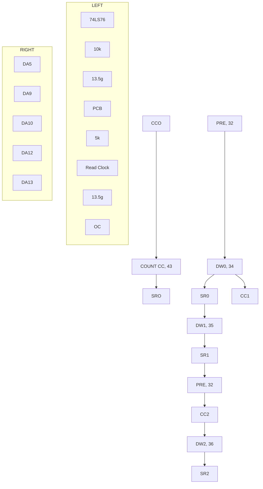

---

## Page 22

# Tape Reader Interface 1018/11

```plaintext
             +---------+      +----------+        +---------+      +----------+
             |         |      |          |        |         |      |          |
BA0------32--|         |      |          |        |         | 12/2 |          |
BA1------33--|         |      |          |        |         |      |          |
       (GND)-| (GND)   |---2--|          |--4---->|         |      |          |
            8| 1Z155   |  DR  |          |   DR0  |  BC     |      |  1Y155   |
BA2------34--|         |      | DECGL/4  |        |         |      |          |
            8|         |  2B--| SR0      |--------|         |  CLK |          |
BA3------35--|         |      |          |        |         |      |          |
       (GND)-|         |  CW1-|          |  2D--->|         |      |          |
            8|         |      +----------+        |         |      +----------+
BA4------36--|         |                         8|         |
       (GND)-|         |                         8|         |
            8|         |      +----------+     8 |         |      +------+
BA5------38--|         |      |          |      8|         |      |      |
       (GND)-|         |--2---|          |  6A-->|   ...   |      |      |
            8|         |  CW2-|          |      8|         |      |      |
BA6------40--|         |      |          |      8|         |      +------+
BA7------41--|         |  BIKE-1---------|          |    6G--|       |
BA8------42--|         |                15|         |    6H--|       |
BA9------44--|         |                15|         |    6I--|       |
       (SHD)-| (SHD)   |                15|         |    6J--|       |
BC-----------|         |                15|         |    6K--|       |
             +---------+                  +---------+      +--------+

             +---+     +---+   +-----------+    +-----------+     +-------+
             |   |     |   |   |           |    |           |     |       |
             | 1 |     | 2 |   |           |    |           |  2C |       |
             +---+     +---+   |     1     |    | FLIP/     |     |       |
             |   |     |   |   |    <<=    |    |       |   |  1Z |       |
             +---+     +---+   |           |    |           |     |       |
    CL-------|   |     |   |   |_7__>_+   O|---->           |     |       |
     3-------| C |     | C |      |        |    | SR0/      |     |       |
     |---RET-| L |     | L |      +------+ |    |           |     |       |
             |   |     |   |  C           |    |           |     |       |
             +---+     +---+     o_o      V>---|    RFT    |--1O-|       |
                                   ---FLIP--   |           |--1OP--| IP7 |
                                    o----o     |           |     |       |
                                    +------+   |      X    |     +-------+
                                              O|           |
                                              | <---+---   |
                                              +-----------+

        +------+  +--------+      +--------+     +--------+
        |      |  |        |      |        |     |        |
        |      |  | RXEN   |      | TXEN   |     |  DIAG  |
        | 1Z04 |  |        |  RX  |        | TX  |        |
        |      |  +--------+      |        |     |        |
        |      |  |        |      |        |     |        |
        |      |  |        |      |        |     |        |
        +------+  +--------+      +--------+     +--------+
```
     
| Signal | Connection |
|--------|------------|
| BA0    | 32         |
| BA1    | 33         |
| BA2    | 34         |
| BA3    | 35         |
| BA4    | 36         |
| BA5    | 38         |
| BA6    | 40         |
| BA7    | 41         |
| BA8    | 42         |
| BA9    | 44         |
| BC     | ---        |

| Block        | Connection |
|--------------|------------|
| IC1          | 1Z         |
| IC2          | 2C         |
| Control Line | CL         |
| 1K           | H          |

[Diagram continues with multiple interconnected IC blocks and signals.]

---

## Page 23

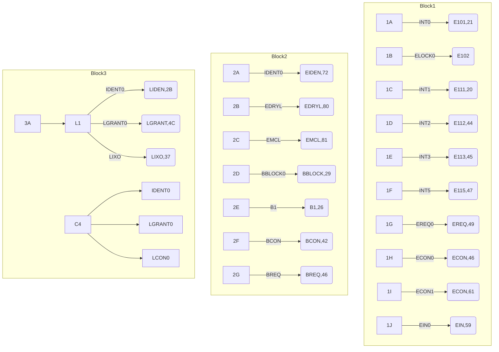

```plaintext
+-------------------------------------------+
|               RACK CONTROL 1              |
|                 1019/1X                   |
|                                           |
|             A/S NORSK DATA-ELEKTRONIKK    |
|                                           |
| Aiuført - endr | F | I | X |              |
| Patent III Gingen Released) 8.1.75        |
| Condetected lem ECO.10.10.52 51.2.75      |
| Instmstanden 0 220A interns. 14.75 73     |
| Approved 6.5.73                           |
+-------------------------------------------+
```

---

## Page 24

# Kort AB5 och A26

## Kort AB5

```plaintext
Kort AB5

B26         E1
+-----+   
| o o | 
| o o | 
+-----+   
5 4 3 2 1

switch 11A
+-----+
| o o | 
| o o | 
+-----+   
7 6 5 4 3 2 1
```

## Kort A26

```plaintext
Kort A26 (node A26)

switch 1E
  _____      
 / o o o \   
| 5 6 7 1 |         
 \ 4 3 2 /   

SW. 11 A
+-----+
| o o | 
| o o | 
+-----+
7 6 5 4 3 2 1
```

## Övrigt

### Kort AB5-A26

```plaintext
Kort mellan B15-m A26
```

---

# OBS!

77-07-26

---

Om kort 1020 /IV (Interface för Terminaler) demonteras, t ex p g a fel på kortet, kan ett DUMMY-KORT monteras.

Om stiften 6-7 och 8-9 kortslutes.

---

## Page 25

```plaintext
                                       +5V
                                        |
                                       1kΩ
                                        |
 ----------------------+----------------+------+   
 |     BMFx0          |    L6GRANT0          1B  |     BMFx0
 |                    |   +---+            +---+ | 
 |-+  26               |   |   +----------->   | +------+ 49   BAE0
 |  |                  |   +---+          |    +         |      
 |  +---+              |                  |              +            
 |-<   |               +----|-------------+---+      5B   +---+  L8GRANT0
 |  +---+    28       |     3B             +-----+----    |   +----+
33|                   |     |              |   10k |    +-+ |        23 ME0
60|       BBLOCK0     |     |    SD0       |        |    |  |        
90|        +-+         |   +-+     +----+ ------|-> SD1 |  |        
  |-+      |           +->+   |    |  12D  +-------->------+
  |     BMFx0          +-+   >|  |  |    +-+    +-->| 
 |                   12A  |    |  12D 
52|
 | MCL0                +-> LED0                 
 |                     |                         
  -                    |                         22   BAF0
                       +------------------------+

   DRY0         ME1+   5C   NE 
   +-----------------> +----+   
   |                  |    | 54
   |  9               +----+---------
   |  A3       12D  ->SMFx 
   |  A2        |   |    
   |  A1       +--------------+
   |        5A MF0 74574    |   
        PSEL --|            |
   |                      |        
  +                                                    
  |  DR2                A3                                      
  |       PSEL    IN0         A7                                    
  | 
  |     +----| IN0                        
  |      5D   +---+                     
  |    
  +--------- L0  LOS           
          PSEL     
       A3  15B  A4   1B   A5 
        |        5A           |+ 
   +----+       +----+     |+                  
                         A0   LA

 [Additional unreadable elements with circuit lines]
```

---

## Page 26

# Teletype Buffer 1020/II

## Manufacturer
A/B Norsk Data Elektronikk

## Reference Information
- Drawing Number: 2A20
- Date: 10.07.75
- Total Sheet: 1

## Components Used

| Component Type | Components        |
|----------------|-------------------|
| IC             | 74107, 7492, 7451 |
| Diode          | 1A                |
| Transistor     | [illegible]       |
| Resistor       | 47kΩ, 120Ω        |
| Capacitor      | [illegible]       |
| Others         | Relay, Fuse       |

## Detailed Schematic

```plaintext
             +5V                               +5V
              |                                 |
      H1(\) --|--/\/\/\/--+             +--/\/\/\/--|-- H2(\)
                    47KΩ  |             |  47kΩ     |
              |           \|/           \|/
              o           ---           ---
            - |           |             | + -
        19A  14 ---------+             +---------- 14  9A
             |\                           /|
             | \  CL1              CL   / |
             |  \                      |  |
             |   \ TTL           TTL /   |
 GND --|     |    --               --    |     |-- GND
       +-----|--//               //------|-----+
               \                 /
                \               /
                 
```

## Functionality Explained

- **CL1**: Connection logic used for data input verification.
- **CL**: Key component in controlling data output processes.

## Table of Connections

| Pin | Function  |
|-----|-----------|
| 1   | BD0       |
| 2   | BD1       |
| 3   | BD2       |
| 4   | BD3       |
|...  | [illegible] |

## Logic Chart

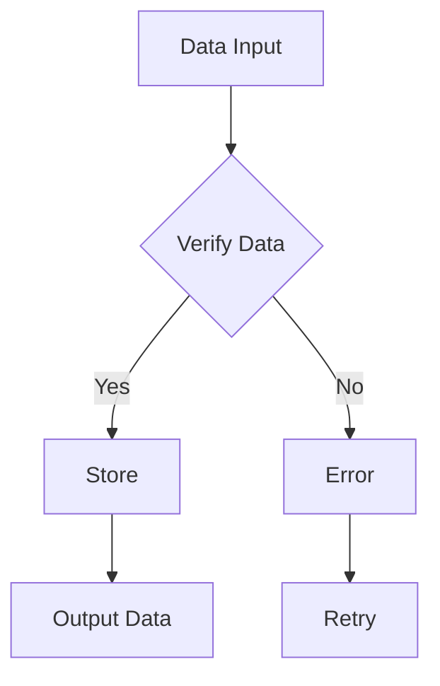

## Notes
- The circuit is designed for managing and buffering teletype signals.
- Proper grounding (`GND`) is crucial for circuit stability. 

## Component List

| ID  | Component | Value        |
|-----|-----------|--------------|
| 1   | IC        | 74107        |
| 2   | Resistor  | 47kΩ         |
| 3   | Diode     | 1A           |
| 4   | Transistor| [illegible]  |
| 5   | Fuse      | 1A, 120Ω     |

[Photo: Contains technical circuit schematic with various components labeled including resistors, diodes, and ICs.]

---

## Page 27

```mermaid
flowchart TD
    subgraph A [ ]
        BA0 -->|32| O0(( ))
        BA1 -->|33| O1(( ))
        BA2 -->|34| O2(( ))
        BA3 -->|36| R1( )
        BA4 -->|37| R1
        BA5 -->|39| R1
        BA6 -->|40| R1
        BA7 -->|47| R1
        G -.- GND
        D1(0.1μF) --> G
    end

    O0 --> A1[74LS1860]
    O1 --> A1
    O2 --> A1
    A1 -->|76| DRQ0
    A1 -->|78| DRQ1
    A1 -->|80| DRQ2

    subgraph B [ ]
        |DRQ0| --> 17(D) -->|A| CAR
        |DRQ1| --> 18B -->|B| CAR
        |DRQ2| --> 19D(DEG) -->|C| CAR
        RST -->|A| RST
        |B| CAR --> 19D(DEG)
        74(244A)
    end

    B -->|18B| CNJ
    CNJ --> DEQL
    
    DEQL -.->|4| DEQL
    DEQL -.->|5| DEQL
    
    CNJ --> MD84((MOB4))
    MD84 -->21D(CLEAR)
    MD85((MOB5)) --> 55G(MCH)
    CNJ -.-> LEWJ

    13D(MD85B) -.-> CW
    CW -.-> CW1
    13D(MD85B) -->|D| DIEN

    2C --> TCTL
    TINT --|A| BDD1
    TINT --|B| BDD2
    DIEN --> MDBD
    MDB1 -->|A| DREQ
    MDB2 -->|B| DREQ
    MDB3 -->|C| DREQ
    MDB4 --> MDBB

    2D -->|I2| LEVL
    78|10KΩ| -.-> RSR    

    subgraph C [ ]
        CA0 -->|17| A44
        CA1 -->|18| A44
        CA2 -->|19| A44
        A44 -->|D| MDBB
        B44(( )) -.- A44
    end

    C -->|19| DCON
    DCON --> REQ
    REQ -->|1K| X1(2)

    subgraph D [ ]
        BD0 -->|1| BA0F
        BD1 -->|2| BA1F
        BD2 -->|3| BA2F
        BD3 -->|4| BA3F
        BD4 -->|5| BA4F
        BD5 -->|6| BA5F
        BD6 -->|7| BA6F
        BD7 -->|8| BA7F
        BD8 -->|9| MBD1
        BD9 -->|10| MBD2
    end

    D -->|4C| BCOMP
    BCOMP --> CLEAR

    E -->|10KΩ| DEQL1
    E -->|500Ω| 5B(DINP)

    DINP -->|8C| DQP
    DQP -.-> BUSY
    BUSY -- DBN

    subgraph F [ ]
        47D(HLAY)
        -->|MOB2| MOB2C
        -->|13| 7D(BDD4)
        4B ((104µF)) --> K1
        1A-->|TINT| TINT
        1A-->|G| GND
    end
    
    F -->|7A| OUTA

    4B(MD81).1 -.-> 93. 
    3C((CINT)) --> DC
    C -->|TTL| TQ
    F -->|A| INP
    F -->|B| INP
    VN -->|TTL| VIN
```

```
    +----------+---------+
    | Element  | Value   |
    +----------+---------+
    | A1       | 74LS1860|
    | CAR      |         |
    | CNJ      |         |
    | DIEN     |         |
    | MDBB     |         |
    | REQ      |         |
    | DEQL     |         |
    | DEQL1    |         |
    | DCON     |         |
    | BAE      |         |
    +----------+---------+
```

[Photo: Schematic of Bus Control System]

---

## Page 28

```plaintext
                                +------------------+
             BA0 |32>-----------|                  |-----------<78| DRQ0
             BA1 |33>-----------|   74 __________  |-----------<77| DRQ1
             BA2 |34>-----------|     HC |        |-----------<79| DRQ2
             BA3 |36>-----------|        |        |               |
                 |35>-----------|     163 |  138 |               |
             BA4 |37>----------->|        |      |               |
             BA5 |38>----------->|        |      |---->RESTART   |
             BA6 |44>----------->|_______ |      |~---->CN_      |
                 |              |    CA |       |               |
             BA7 |46>-----------|_____| |_____   |_CW|___________|
                                  
                                  
                                  
                  +-----+                            
        CAR_       |>   |                           +------------------+
        CAR_       |    |______________________________________________|
                  +-----+ |                          |   
                     |   |                          |
        B24C      D0(11) | (10)->|------------------| (18)| DEQ1
        DCONN_  IOXIE    |_______|------------------|______|
                     |
                  +---+
                  |%5k
                  +---+
                     |
                    GND
```
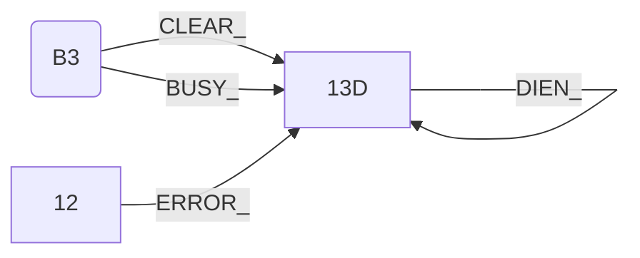
```plaintext
                                  +---------------------------+
        DEQ1  |               B3  |_____|  MDB80(84) ------|MDB85  
              | .                                   B6_____| |  
          DEP |BI B5  EN B2C                         MDB81   |
              |_ |        ________                          MDB86
     INDENT_7  |D|TINT   |_Connector____________   _______MDB87
              |T|        |_______________|  BBD82_BDB88 | MDB88
              |I         |__________________________MDB8
                              

                        +-------------------+
                        |  ^5V     1D        |
        2D______   _____|_________________   |
             B4______MDB7 __   |MDB7     MDB       A     
                                    ______|  _____|     _______   |
              ________________________|  MDB14A________MDB14     B    
____ |RD |  ____|  ______  DW___________|  MDB7  ______|    ___  MDB15    |
                                    IN            |  MOD_Q     OD
```
```plaintext
Note: This is only a partial transcription of the schematic diagram provided due to complexity. Actual connections and elements are interconnected per original diagram, which may require more specific viewing or simulation software to fully interpret.
```

---

## Page 29

```plaintext
       |                                  |
       |----------------------------------|
       | CSEL0                            |
       |    --------------------          |
       |                                  |
       | | 2B  |    4B  |    6B  |    5B  |
       | |     |    4C  |    6C  |    8C  |
       | |     |        |        |        |
       | |     |        |        |        |
       | |     |        |        |    DM6305|
       | -----------------------------------|
       |                                  |
       |----------------------------------| 
       | CSEL0                            |
       |    --------------------          |
       |                                  |
       | |10B |   12B |   14B |   16B     |
       | |    |   12C |   14C |   16C     |
       | |    |       |       |     DM6305|
       | |    |       |       |           |
       |                                     
```

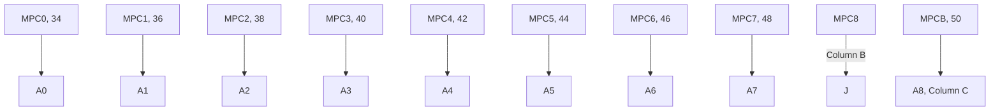

```plaintext
| Component | Pin | Pin |
| --------- | --- | --- |
| ROM0      | 4A  | 7   |
| ROM1      | 4A  | 9   |
| ROM2      | 4A  | 11  |
| ROM3      | 4A  | 13  |
| ROM4      | 4A  | 15  |
| ROM5      | 4A  | 31  |
| ROM6      | 4A  | 33  |
| ROM7      | 4A  | 35  |
| ROM8      | 6A  | 37  |
| ROM9      | 6A  | 39  |
| ROM10     | 6A  | 41  |
| ROM11     | 6A  | 43  |
| ROM12     | 10A | 45  |
| ROM13     | 10A | 47  |
| ROM14     | 10A | 49  |
| ROM15     | 10A | 51  |
| ROM16     | 10A | 53  |
| ROM17     | 10A | 55  |
| ROM18     | 10A | 57  |
| ROM19     | 10A | 59  |
| ROM20     | 12A | 58  |
| ROM21     | 12A | 60  |
| ROM22     | 12A | 62  |
| ROM23     | 12A | 64  |
| ROM24     | 14A | 63  |
| ROM25     | 14A | 65  |
| ROM26     | 14A | 67  |
| ROM27     | 14A | 69  |
| ROM28     | 16A | 68  |
| ROM29     | 16A | 70  |
| ROM30     | 16A | 72  |
| ROM31     | 16A | 74  |
```

```plaintext
     _________
    |         |
    | 74S74   |
    |_________|
      |    |
      |    +----------+------+-------+
24V  |    |           |      |       |  
     +----+-----------+----+  |       |
          |           |    |  |       |
         ===         ===  ===  ===     +---> X
         GND         GND  GND  GND     |
                                       
  CSEL0, CSEL1+
  DM6305  22pfx
  A8      | 
          |
         ===
         
  1pf: 7400
  6: 7402
  7: 7404
  2: 7473
  1: 7442
  6: DM6305
     
  2A23/II
```

---

## Page 30

```plaintext
           ______________
 __________|   _______   |_________
|          |  | 110A  |  |         |
|     _____|__|_______|__|____     |
|____|    ________   ________ |____|
     |___| 1 z 2 | |   745   |
     |   |_______| |_________|
     |     _____    _______  |
     |____|     |  |       | |
          | 2 x 2 |_______| |
          |_______|_________|

```

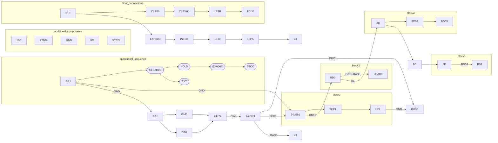

---

## Page 31

```plaintext
                         +-------------------+
                         |      A0A          |
                         |                   |             
         A0B##           |       A0B         |             
 [illegible]   OOOO      |                   |             
   |         ##O  OOO    |                   |            
   K                P    |                   |             
   |                     +-------------------+
 __|_________________________  +-------------------+
| ||3||6|       H         |  ||                 |
| OOOO          18A       |  ||       280C      |  A0B##
|  |                O|    |  |                 |    OOO
|__|__________A___________|  +-----------------+OOO
                           
  OOO                                        ##################################################
  | ||        __             X     A0B                       A0        OOO             A0A       
*******************************************           ****************************************
| +------+    | +------+    |O         R |           A  |     |  +------+      +------+
| |  XX  |    |  XX      |   **        [ |]      ==     |             | XX   |     |  XX  |
| | +  | |    |  X        |   X UNUSABLEMARKER |1       |OOOOOOO     | |+  | |     | X    |
| +------+    | +       |   **        M |]                |     |  +| +  | |     | + | UNC|
|            | +------+    ||         A   X               |       | +      |     |     | X |
|            +      XX  |    +------+     OOOOOOOOOOOOOOOOO   |     |  |       | |+       + |
|                     |                      [illegible]           |   |       | |       | |   
|_________________ |                     
```

```mermaid
flowchart TD
    A[SFR, GND] -->|LOAD\u208A| B0
    B0 -->|BD\u2080| C1
    A -->|GND| B2
    B2 -->|BD\u2081| C3

    A1[GND] -- SFR, GND -->|LOAD\u208A| C4[2B]
    C4 -->|BD\u2085| C5[6B]
    C4 -->|BD\u2086| C6[6B]
    C4 -->|BD\u2087| C7[6B]
    
    C8[GND] -- SFR, GND -->|LOAD\u208A| C9[LC]
    C9 -->|BD\u2088| D0[2C]
    C9 -->|BD\u2089| D1[2C]
    C9 -->|BD\u208A| D2[2C]
    
    D3[ULA] -- GND -->|LOAD| D4[LD]
    D4 -->|BD\u2090| D5[2D]
    D4 -->|BD\u2091| D6[2D]
    D4 -->|BD\u2092| D7[2D]
    
    D8 -->|BD\u2093| E0
    D8 -->|BD\u2094| E1
```

---

## Page 32

```plaintext
          +5V
           |
          15K
           |
          27K          2N3906
           |          /
           +--------|  
           |        \
           |      27K
           |        |
          22µF    +---+
           |      |A  |
          IN4151  |  Q       +---+
           |      +---+      |   |
          ---     MCLO       | K |
          ---     47         +---+
           |                 MCL0

<Flowchart continues with various labeled circuits and connections. Key components include resistors, capacitors, transistors, ICs, and connections to different points such as MCLO, TCLR, etc. Connections lead to different components identified using more resistors, capacitors, and IC blocks. Each connection path involves detailed wiring with components such as diodes, oscillators, and ferrite cores.>

[Several ICs are interconnected with pins labeled such as T1, T2, T3, corresponding to various parts of electrical logic diagrams, showing signals pathways, switches, indicators and additional elements within circuits]

<Some areas also contain flowchart-like elements demonstrating data or signal flow, some notable components bear labels such as BERQ7, TCLR, MIR, ACTLOOP etc.>

<Flowchart includes repeated signals showing control units with combinations of T1, T2, and resistive paths>

[Labels such as Privinit, ROM31, TRAN7, INPUT, are part of the signal processing path.]
            
[Photo: Complex network diagram with electronic components, flows, and terminal connections]

+-----------------------------------------+
|                     Table               |
+--------------------+---------+---------+
| Component          | Quantity | Value  |
+--------------------+---------+---------+
| 7425               | 1 pk    |        |
| 7400               | 3 pk    |        |
| 7402               | 1 pk    |        |
| 7474               | 1 pk    |        |
| 7410               | 2 pk    |        |
| 74153              | 1 pk    |        |
| 74151              | 2 pk    |        |
| 7404               | 2 pk    |        |
| 7413               | 1 pk    |        |
| 7470               | 2 pk    |        |
| 7485               | 1 pk    |        |
| 74122              | 1 pk    |        |
| 74123              | 2 pk    |        |
+--------------------+---------+---------+

Ajourf ørt
Div. rettelser:  4.77.3/B80
Div. rettelser:  11.6.78
```

```mermaid
flowchart TD
    A("T1 Input") --> B("TC0, TC1")
    B --> C("TC2, TC3")
    C --> D("5C")
    D --> E("Oscillators and Additional Regulation Circuits")
    F("T3") --> G("TC2, TC4, WT3")
    G --> H("TCLR")
    H --> I("Diverse Connections")
```

---

## Page 33

# Punch Interface Schematic

```plaintext
      .--------------.
      |    BD4       |
      |    1kΩ       |                           
      |              |
      | .--------.  |
      | |  74157 | <-- DATA INPUTS
      | |        |  |
      | |     16 | <-- CLK
      | |     18 | <-- STBTS
      | '--------'  |
      |     |_______|
      |              |
      |           BD3|
      |           1kΩ|
      '--------------'

.----------------------------------.
| BD3, 2     BD4, 1                |
|                                 |
| .--------.                      |
| | 74174  |                      |
| |        |                      |
| |     8  |---> BUSYCL           |
| |     9  |---> BUSYINT          |
| |    10  |---> STVSTB           |
| |    11  |---> DEGL             |
| |    12  |---> SRTB             |
| |    13  |---> BINTV            |
| |    14  |---> DEB              |
| |    15  |---> SMN              |
| '--------'                      |
|                                 |
'----------------------------------'

       .------.  .------.  
       |  BD2 |  |  BD1 |
       | 74157|  | 74157|
       |      |  |      |
       '------'  '------'

.-----------------------.
|       ID ENTITY       |
|                       |
| 1. IDENT4             |
| 2. IDENT5             |
| 3. IDENT6             |
| 4. IDENT7             |
| 5. IDENT8             |
'-----------------------'
```

```mermaid
flowchart TB
    A[Input] --> B[BD3,2 BD4,1]
    B --> C[74174]
    C -->|BUSYCL| D[Output 1]
    C -->|BUSYINT| E[Output 2]
    C -->|STVSTB| F[Output 3]
    C -->|DEGL| G[Output 4]
    C -->|SRTB| H[Output 5]
    C -->|BINTV| I[Output 6]
    C -->|DEB| J[Output 7]
    C -->|SMN| K[Output 8]
    
    subgraph Labels
        L1[BUSYCL]
        L2[BUSYINT]
        L3[STVSTB]
        L4[DEGL]
        L5[SRTB]
        L6[BINTV]
        L7[DEB]
        L8[SMN]
    end
```

[Photo: Punch Interface Schematic Details with component references and wiring.]

```
--------------
|  SPROCKET  |
|   12       |
|   13       |
|   14       |
--------------
```

---

## Page 34

# Technical Page: Schematic Diagram

## Diagram Elements

```plaintext
+-------+  +-------+  +-------+
| INPL  |  | ECONL |  | IREN  |
|  5B   |  |  60   |  |  62   |
+-------+  +-------+  +-------+
   |         |          |
+--+---------+----------+--+
|         CONNECT         |
+-------------------------+
   |          |           |
  ++         ++          ++
  ||         ||          ||
  |+--+  +---+---+   +---+---+
  |   |  |  EIOX  |   |  EIOX  |
  |   |  |   9/5  |   |   8/5  |
  |   |  +---+---+   +---+---+
  |   |      |           |
  |   |     ++          ++
  |   |     ||          ||
  |   +-----+|          |+-----+
  +-------->| BSKIP |<-------|
            ++ 6A  ++
            ||     ||
            ++     ++
```

## Tables

| Reference | Description                  | Details       |
|-----------|------------------------------|---------------|
| PS:       |            |                   |
| 51        | dev.no.0-3777A (Standard)    |               |
| 52        | Ext. al dev.no.2000; 3777A (Option) |       |
| 53        | External IDENT, 400a ; 7777A (Option) |       |

## Additional Information

- **Input Lines**: To 6ND via 220Ω
- **Voltage**: VV to ±5V, 220Ω
- **Components**: IC 74161, IC 74166, IC 7474, etc.
- **Amendments**: Ajour. 19.40a/12.74 a7/TAL

## Placeholder for Complex Elements

```
[Photo: Input Control System]
```

```
[Mermaid Diagram: Flow of Connections]
```

---

## Page 35

```ascii
    ┌───────────────────┐┌─────┐                          ┌─────┐
    │MCL,               ││IB1, │                          │6ND  │
    │        47         ││ 46  │                          │     │
    └────┬──────────────┘└─────────────────┐              └────┬┘
         │                  ┌──────────────┴───────────────┐┌───┴───┐
    ┌────▼───────────┐ ┌────▼───────────┐ ┌──────────────┐ │        │
    │IB1,  86        │ │IB2,  86        │ │IB3,  82      │ │ IB4,   │
    │  Q           8  │ │  Q           1 │ │  Q          │ │        │
    │  x            5 │ │  x            9│ │  x          │ │        │
    │  2             │ │  0             │ │            4 │ │        │
    └┐               └┘┐               ┌─┘                ┌┘        │
     │  81             │  81            │ 206             │         │
     │                ┌┴─────┐         ───┐              ┌┘         │
     │                │IEKL, │           │              ┌┘──────────┤
     │                │9     │        ┌──┴─────────────┘            │
     └─────────────78││              │                               │
                      └──────────73───┐                              │
                                      │                              │
                                  ┌───▼──────┐            ┌──────────▼──┐
                                  │9D	 │            │IEH,          │
                                  │    ───┐ ┘          │           │
                                  │     │  │           └───┐        │
                               ┌──┘    └┐ │               │          │
                               │        │ │               │          │
                            ┌─┴─────────┘ │               │          │
      ┌──────────┐          │ 10  │       │            ┌──└─────────┘
      │IB1,      │          │    13 │       │          │
      │    47    |          │       │       │          │
      ├──────────┤     ┌───┘        │       │          │
      │IB2,      │     │            │       │          │
      │    46    │     │            │       │          │
      └──────────┘     │            │       │          │
                       │            │       │          │
                       │            └───────┘          │
                       │                               │
                       │                               │
       ┌───────────────┘                               │
       │                                               │
       │                                               │
       │                                               │
       │                                               │
       │       ┌───────────────────────────────────────┘
       │       │
       │       │
       │       │
       │       │
       │       │
       │       │
       │       │
       │       │
       │       │
       │       │
       │       │
       │       │
       │       │
       │       │
  9BA ┌┴──────▼─────┐
      │5D           │
      │   ──────┐│
      │              │
      └─────┐    ││
                 └────

...

                 ┌─────────────────────────────────────┐
                 │            TRAiTC,                  │
                 │                5D    ──────┐│      │
                 └─────┐       │              │      │
                        │       ││            │      │
                        │       ││            │      │
                        │       │└────────────┘      │
                        │                            │
                        │                            │
                        │                            │
                        │                            │
                        │                            │
                        │                            │
                       │       ┌───────────┐         │
                       │       │    OK,    │         │
                       │       │     75    │         │
                       │       │           │         │
                       │       └───────────┘         │
                       │                            │

...
```

---

## Page 36

# Panel Control 1

## Schematic Diagram

```plaintext
                ____                       ____
  UPW, |---|   | 9C|                     |23 UPB|
      _|___|___|   |                      |   |                           
 ____| 8  |   L3|                         |  |                            
U1,__|____|___|16C|_____                  | 9 |                           
|    |___|   |__|13|    ____   ____     __|__|__  
|    | 9D   |  9D|   | 13C | | 4C |   | 14|
|____|______|____|  6|_____| |____|___|____|_____
```

```plaintext
 ____   ____        ____              ____   ____
|10 | |6C |      |94C |     ____    |10B | |6A |
|  | |   |      |   |   |____   |_____| | |
|  | |   |      |   |      |88 | |       | 8|
|__|_|___|      |___|       ____|_|___  |_|
```

```plaintext
 ___   ___   ___      ___
| D0|_|D1 | |D2 |____|D3 |
|___| |___| |___|    |___|

            (truncated/multiple connections omitted)
```

## Annotations

1. 1 kΩ
2. 2.7 kΩ
3. 3.3 kΩ
4. 1.5 MΩ
5. 10 kΩ


## Connectors and Pins

```plaintext
| A0 | 1  | 6ND | 21 |
| B0 | 2  |     |    |
| A1 | 8  | 1   | 4  |
| B1 | 16 |     |    |
```

## Component List

- **Resistors:** 1 kΩ, 2.7 kΩ, 3.3 kΩ, 1.5 MΩ, 10 kΩ
- **ICs:** 74164, 7474
- **Capacitors:** 15 μF

## Flowchart

```mermaid
flowchart TD
    A1(UPM) -->|Carrying| A2[10B]
    A2 --> A3[Stepper]
    A3 --> A4[PLEN]
    A4 --> A5[Output]
```

[Note: Some content intentionally obscured due to readability issues in the source material.]

---

## Page 37

```plain
         .--------.                      .--------.
         |  2.2K  |                      |  2.2K  |
         '---+----'                      '---+----'
             |                              |
            ---                            ---
           |SW1|                          |SW6|
          gnd-'                           gnd-'
           /|                              /|
        .--+-+--.                      .--+-+--.
        |  SH4  |                      |  SW6  |
        |-------|                      |-------|
        | 10A   |  SINST,              | 12C   |
        '---+---'  CONT0               '---+---'
            | \                           | \
            |  ------[15]           *     |  ------
            | ---                      2K |  ------
        .--+-+--.                         |
        | 54  |                      .----+---.
        | SW1 |                      | SW6 | 
        | TC1 |                      |     |
        '---+--'                      '----+--'
             |                             |
            ---                           ---
           |SW4|                         |SW5|
          gnd-'                          gnd-'

. . .

        +-------.    SSTART                 SWR.
        |   2B  |    2.2K 2B                2A 2C
        '---  ---'                          --- //
           \|/                            SW2
           NEC  SINK                       -+- 
+-------+                                 /  
| 7400  |                                |SK2  
| 7400  |                                |   :
+-------+                                 /   
          0.47                             gnd
```


```mermaid
flowchart TD
  A(SH4) -->|SINST, CONT0| B(10A)
  C(SW2) -->|CONT5, START| D(HB)
  A -->|LOAD| E(2C)
  E -->|DEPOSIT| F(1A)
  G(12A) -->|RESTART| H(12B)
  H -->|MCL| I(14A)
  I -->|STOPS| J(15A)
  K -->|RUN| L(LS)
  M(PB9) -->|RUN, SING| N(3B)
  N -->|RUN, PINT| O(1C)
  O -->|LOAD IND| P(4C)
  Q -->|DECODE| R(4B)
  R -->|TRAPS| S(2B)
  T -->|NOD| U(3A)
  U -->|CONT2| V(2A)
  W -->|DECR| X(6B)
  Y -->|MCL| Z(MLC)

  M -->|START| AA(1C)
  AA -->|SSTOP| BB(10A)
  CC -->|TP1| DD(8A)
  EE -->|TP2| FF(PCONS)
  GG -->|NCON| HH(NODE)
  II -->|CONT3| JJ(770C)
```

```plain
      +-------+ 
      | TP1   |       .------.
      |  PB9  |       |  S7  |
      +----+--+       +----  +
           |              |
           +-----[15]     |
                       $   +--|
           .-------------+--+   ------
           |  Timing     |BB0  +-| ::
        gnd-+-------+----+--+   ------
                        |     |  14
```

---

## Page 38

```plaintext
 ________________________________________________________
|          |           |      |      |      |     |      |
|  W0: 5   | D0: 8     | 63   |      | C0:  | C4: |      |
|  W1: 6   | D1: 8     | 64   |      | 2A   | 2A  |      |
|  W2: 7   | D2: 8     | 65   |      |      |     |      |
|  W3: 8   | D3: 8     | 66   |  W2L | D2:  |     | D3:  |
|__________|___________|______|______|______|_____|______|
|          |           |  WLO |      |      | D5: |      |
|  T9 (5)  | PBO: 8    | __   |      |      | 6C  |      |
|          | WLI: 81   |      |      |      |     |      |
|          | WL2: 82   | 66   | WLI: | 16F  |     | WLO: |
|          | WL3: 83   |      |      |      |     | 14F  |
|__________|___________|______|______|______|_____|______|

             __        __
            | A1      | A9
            | 4A      | 4C
            |___________|
          /                    \
       __/                      \__
      | W4: 58  |   W5: 59     |    63
      |___  ___ |  ____      __| WOL
      | 0K     ||6B ||A4 |      |
      |        ||   ||    |  T9 (5)
      | W7: T4 ||   ||    |      |
      |_  _    ||___||____|______|     
       |      ||     ||     |  
       | W6: 8||D3:    12:  | 
       |______ ||____ ||____|_|
              \|
            
           _  4700PF          
          /      /\
         /      /__\         
        /WW  ___    ___  EXM.
       /    | P8  ||PB7
      /    /_   _||_      _
     /______||_ ||  \_P8 /_|
             | |      ||_//|    
             | |        ||      
             |_|
             |_|

___________________________
|                          |
|   |_    ____             |
|   |_ 7\______/         _ |
|   | _|   T4             T|
|   |_     EXM                        |
|                                    |
|_ _ _ _ _ _ _ _ _ _ _ _ _ _ _ _ _ _|
``` 

The schematic diagram has been converted into an ASCII art representation, preserving the visible components and connections as closely as possible.

---

## Page 39

```plaintext
  +5V       +5V       +5V      +5V
   |         |         |        |
 2.2K       2.2K      2.2K     2.2K       
  ___       ___       ___      ___
 |   |     |   |     |   |    |   |  
 |PBB|     |M9 |     |   |    |   |  
 |___|     |___|     |___|    |___| 
   |         |         |        |
   8         9         10       11
   |         |         |        |
  _|_       _|_       _|_      _|_
 (81)      (83)      (84)     (85)
   |         |         |        |
 5A        5A        5A       5A
   |         |         |        |
  ___       ___       ___      ___
 |   |     |   |     |   |    |   |
 |P80|     |P80|     |P80|    |P8 |
 |___|     |___|     |___|    |___|
  16A       16B       16B      16B
 14/157    14/157    14/157   14/157
 __|__     __|__     __|__    __|__
|     |   |     |   |     |  |     |  
|     |---|     |---|     |--|     |
|_____|   |_____|   |_____|  |_____|
   |         |         |        |
   L9        L9        L9       L9
   |         |         |        |
  _|_       _|_       _|_      _|_
 (B6)      (B8)      (B9)     (B10)

[Block diagram continues...]

```

```mermaid
flowchart TB
    subgraph Circuit1
        A1["PBB"] --- A2["81"]
        A2 --> A3["5A"]
        A3 --> A4["P80"]
        A4 --> A5["14/157"]
        A5 --> A6["L9"]
    end

    subgraph Circuit2
        B1["M9"] --- B2["83"]
        B2 --> B3["5A"]
        B3 --> B4["P80"]
        B4 --> B5["14/157"]
        B5 --> B6["L9"]
    end

    ...

    %% Continue with other components as shown in the schematic
```

```plaintext
8 eld. 14/157
8 eld. 74157
8 eld. 74157

Ajourf. og forandret tit. IX  7.3.75 TAA/E
Patent tit. Ingen rettelser 9.1.75 TAA 
Ajour (Ingen rettelser) pr/ 6.10.73 HIN
Navn: [illegible]
DOKUMENT: PANEL DATA 2
1032/IV
15.11.74/PB/ENH
```

---

## Page 40

# Panel Driver 1033

## Schematic Diagram

```plaintext
      +-----+       +-----+       +-----+       +-----+
 WA --|     |--[31]--|     |--[31]--|     |--[31]--|     |--[31]-- WA
6VA --| 5D  |       | 7D  |       | 13D |       | 15D |      
6VB --|     |       |     |       |     |       |     |
      +-----+       +-----+       +-----+       +-----+
      |3[MR0]      |3[MR4]      |3[MR8]      |3[MR12]
      |   |[22]    |   |[23]    |   |[24]    |   |[25]
      |   |[23]    |   |[24]    |   |[25]    |   |[26]
      |   +--------+   |--------+   |--------+   |--------
      |3[MR3]      |3[MR7]      |3[MR11]     |3[MR15]
      +-----+-----+-----+3-----+-----+-----+-----+3-----+
      |               |         |                   |
      |3[MR2]         |3[MR6]   |3[MR10]            |3[MR14]
      |               |         |                   |
 +------------+  +---------+  +---------+  +--------+ 
 | 57 | PBA0  |--| 65 | PB4 |--| 73 | PB8|--| 81 | PB12
 +----+-------+  +----+-----+  +----+-----+  +----+----
 | 59 | PBA1  |--| 67 | PB5 |--| 75 | PB9|--| 83 | PB13
 +----+-------+  +----+-----+  +----+-----+  +----+----
 | 61 | PBA2  |--| 69 | PB6 |--| 77 | PB10|--| 85 | PB14
 +----+-------+  +----+-----+  +----+-----+  +----+----
```

```mermaid
flowchart TD
    A(MR0) --> B(5D)
    B --> C(MR4)
    C -->|31| D(7D)
    D -->|31| E(MR8)
    E -->|31| F(13D)
    F -->|31| G(MR12)
    G -->|31| H(15D)

    subgraph Block1
        I(5D) --> J[7D]
        J --> K[13D]
        K --> L[15D]
    end
```

[Note: Additional wiring and schematic details have not been included due to the need for text-only summary and readability constraints.]

## Components

| Reference | Component |
|-----------|-----------|
| 5A        | 7474 IC   |
| 3B        | 7474 IC   |
| 1C        | 7442 IC   |
| 1E        | Switch    |
| 1F        | Switch    |

## Connections

```plaintext
+----+               +---+       +----+               +---+
|PIL0|---------------|O 1|-------|PIL4|---------------|U 2|
+----+               +---+       +----+               +---+
```

---

## Page 41

```plaintext
+------------------------------------------------------------------------------+
|                                    CIRCUIT                                   |
|                                                                              |
|  +--------+   +-------+   +-------+   +-------+   +------+   +------+        |
|  | 5D     |   | 7D    |   | 13D   |   | 15D   |   | TR9  |   | TR10 |        |
|  |        |   |       |   |       |   |       |   |      |   |      |        |
|  | [illeg]|   | [illeg]|   | [illeg]|   | [illeg]|   |      |   |      |        |
|  +--------+   +-------+   +-------+   +-------+   +------+   +------+        |
|         |_______                           _______|_________                 |
|                |                         |                                   |
|         +------+-------------------------+----------------------------------+
|         |                     BLOCK DIAGRAM                                  |
|   +-------+       +-------+       +-------+     +------+    +-------+        |
|   | 5B    |       | 3B    |       | 13B   |     | 5A   |    | 1C    |        |
|   +-------+       +-------+       +-------+     +------+    +-------+        |
|        |___________|___________           |__________|_____                |
|                   |                      |                                |
|             +-------+          +--------+                                 |
|             | 5C    |          | 5E     |                                 |
|             +-------+          +--------+                                 |
|                 |________________|                                        |
|                 |                                                     |
|             +-------+       +-------+                                   |
|             | 5A    |       | 13C   |                                   |
|             +-------+       +-------+                                   |
|                   |_______________|                                     |
+------------------------------------------------------------------------------+

```

```mermaid
flowchart TD
    A(IB0.1) --> B(5B)
    A --> C(5C)
    A2(6N6) --> D(19A)
    B --> F(7D)
    C --> G(7C)
    F --> H(5C)
    G --> E(13D)
    E --> I(15D)
    J --> K

    subgraph COUNTER
        J(A0) --> A1(A1) --> A2(A2)
        A3 --> A4(A3) 
    end

    subgraph REGISTER
        K(B0) --> B1(B1) --> B2(B2) 
        B3 --> B4(B3)
    end
```

```plaintext
   +---------------+
   |   Panel Driver  |
   |   1033/IV       |
   +---------------+
   |OBTAINED: TRULEO  |
   |NR: 12.72e EN |   |
   +---------------+
```

This is a recreation of parts of the image provided as ASCII diagrams and a Mermaid flowchart. Some areas were [illegible].

---

## Page 42

# Dip Switch Settings

| Dip Switch  | 1 | 2 | 3 | 4 |
|-------------|---|---|---|---|
| 1E          | 0 | 0 | 0 | 0 |
| 3E          | 0 | 0 | 1 | 0 |
| 17E         | 1 | 0 | 0 | 0 |
| 19E         | 0 | 1 | 0 | 0 |

0 = OFF  
1 = ON

ALD 0020500

---

## Page 43

# Paging Surrogat 1034/III

## A/S Norsk Data-Elektronikk

### Diagram

```mermaid
graph TD;
    subgraph 5A
        A1[RQ\n 51] -->|2| MRO[20 MR0]
        A2[R1\n 48] -->|4| MR1[21 MR1]
        A3[R2\n 59] -->|6| MR2[22 MR2]
        A4[R3\n 56] -->|10| MR3[23 MR3]
        A5[R4\n 43] -->|12| MR4[24 MR4]
        A6[R5\n 42] -->|14| MR5[25 MR5]
    end

    subgraph "6B"
        B1[R6\n 53] -->|2| MR6[26 MR6]
        B2[R7\n 50] -->|4| MR7[27 MR7]
        B3[R8\n 45] -->|6| MR8[28 MR8]
        B4[R9\n 44] -->|10| MR9[29 MR9]
        B5[R10\n 55] -->|12| MR10[30 MR10]
        B6[R11\n 52] -->|14| MR11[31 MR11]
    end

    subgraph "8A"
        C1[R12\n 49] -->|2| MR12[32 MR12]
        C2[R13\n 46] -->|4| MR13[33 MR13]
        C3[R14\n 57] -->|6| MR14[34 MR14]
        C4[R15\n 54] -->|10| MR15[35 MR15]
        C5[R16\n 56] -->|12| MR16[36 MR16]
        C6[GND] -->|14| MR17[37 MR17]
    end

    RGRANT -->|3| RGRANT0[39 RGRANT0]
    IGRANT1 -->|15| GRANT1[IGRANT0\n 69]

    subgraph Connectors
        connect1[5A] -->|3| 8097[8097]
        connect2[6B] -->|3| B2
        connect3[8A] -->|3| C2
    end

    subgraph Power
        P[+5V]
        P --> PF0[66 PF0]
        P --> OK1[74 OK1]
        P --> SHW[88 SHADOW0]
        P -->|5| PCR1[90 PCR10]
        P -->|5| PCR0[92 PCR0]
        P -->|5| 1k --> LB1[14B]
        P --> PF0[79 PFAIL0]
        P --> MCL0[47 MCL0]
    end

    subgraph Additional
        220a --> D[1N4148\nK];
        D --> E[270pF];
    end
```

### Additional Information

- **Drawn by:** BBO
- **Approved by:** B.S.
- **Date:** 13.11.74
- **Remarks:** Rettet fra II til III (ingen forandring) 16.12.74 / TAA / Ewu
- **Rettet:** 18.11.74, B.S / BBO

---

## Page 44

```plaintext
     +------+    +------+      +-----+     +---+
     | MIR31|    | MIR22|      | MIR0|     |67 |
     |MIR23,|    |MIR21,|      |MIR21|     |T24|
     |MIR32,|    |SIR9, |      |I,HO |     |DRY|
     +--+---+    +--+---+      +--+--+     +---+
        |12C       |12C           |12C       |9B
      +-+--+-+  +-+---+---+     +---+---+  +-+--+
      |MIR34 |  |IDBST    |     |SIR10  |  |SIR9|
      +------+  +---------+     +-------+  +----+
      |       |            |    |       |       |
```

```mermaid
flowchart TD
    A14152 -->|12A 9| B(TRO1)
    A14152 -->|12A 6| C(TRO4)
    A14154 -->|16  20| M(TRO5)
    A14154 -->|16  21| N(TRO6)
    IDBST -->|IDBEST| E(TRO8)
    6D -->|EGMTR| F(TRO9)
    ISOJURC --> A(IDBST)
    G --> H(RDWR)
    J --> K(TC0)
``` 

```plaintext
   74174       74123         7432        7454      7493
   +---+       +---+         +---+       +---+     +---+
   |47 |       |49 |         |55 |       |57 |     |59 |
   +---+       +---+         +---+       +---+     +---+
```

```plaintext
                   +-------+
                   | 12A1  |
                   +-------+
                       |
                   +---+---+
                   | 41    |
                  ++------+--+
                  |     ?     |
                  +----------+
```

```
Part List
-------------
1: 7400
2: 7450
3: 7410
4: 7417
5: 7492
6: 7470
7: 7474
8: 7420
9: 74161
10: 74153
11: 7457
12: 7478
13: 74155
14: 7451
```

```plaintext
       +-------+       +-------+
       |EREG43 |       |EREG46 |
       +-------+  VDD  +-------+
          |        |      |
          |        +------+
          +-----------------+
```

```plaintext
[Photo: Schematic diagram of memory control circuitry]
```

---

## Page 45

# Schematic Diagram

```plaintext
   NOTE: 
   On all 75450N pin 6 and 9 should be
   connected to pin 7 (GND)
   
   +------------------+
   |                  |
   | CRYSTAL     C1   |       C3
   | OSC X-MHZ   +--+ +--+      +--+
   | Z1        | |  |   |  |    |  |
   |          [ ]|  +-[ ]|  +--+|  |
   |          | +-|     +----+ |  |
   +----------+-+ |     |    | |  |
               | |     |    +---+
               | +-----+     |CR7
           V1  |
               |           V3  Vb
          XTAL 2C          A3
         
   +-----------+     +---------+
   | WRITE GATE|     |WRITE    |
   +-----+-----+     +---------+
   |     |                 Write
   |     
   ...

   +-----------+     +---------+
   | DATA      |     |WRITE    |
   +-----------+     +---------+
   | V2                Vb  Vb
   ...
```

```mermaid
graph TD;
    DA5 -->|32| TDO[OHSO] -->|56| OHSO0;
    DA1 -->|36| TDO -->|57| OHSO1;
    DA3 -->|35| TDO -->|57| OHSO2;
    ...
    WRITE_GATE0 -->|45| WRITE_GATE1;
    ERASE_GATE0 -->|47| ERASE_GATE1;
    READ_GATE0 -->|71| ORG6;
    DATA_WRITE0 -->|70| DWD0;
    ...
```

```plaintext
   +------+------------------+
   | MB9  | 6D               |
   | MB10 |                  |
   +------+------------------+
   | 84   | SECTOR CLOCK     |
   +------+------------------+
   ...
```

# Components List

| Qty | Description      |
|-----|------------------|
| 1   | stk X-TAL OSC    |
| 4   | stk 770A         |
| 4   | stk 780A         |
| 1   | pak 770AF        |
| 2   | 25k 750A         |
| 2   | 25k 2N2221       |
| 1   | 75k 350          |
| 1   | 10k 750kA        |
| 1   | 1 kond 22pF      |
| 1   | 1 kond 2.2μF     |
...

```plaintext
   +---------+
   | FAULT   |
   +---------+
   | 84      |
   +---------+

   ... 
   [Photo: Complex components and wiring diagram]
```

# Additional Notes

- Ajout: 7/3.75 T4A
- Disc Transceiver: 1036/1V
- Diagram ID: 2A36
- [Illegible] Scandinavian text references
...

---

## Page 46

```mermaid
graph TD;
    A(SB5) -->|9A| B(ERROR@);
    C(M0) -->|3A| D(WRITE@);
    E(READ@) --> F(NCZ);
    F --> G(NCZ@);
    G -->|9A| H(COMPL@);
    I(HS@) -->|WRITE\ EN.\nWRITE\ EN END.\nWRITE\ EN(W12 EN.)\nPH14 PH)\n3C\nPH7\n7D| J(NCZ@);
    J --> K(MO) -->|3A| L(WRITE CORE@);
    L -->|9C| M(HD);
    N(WF@) --> O(MOP IN@);
    P(ON\ CYLINDER@) --> Q(RESET\ FE@) --> R(TC\ Testpoint@);
    S(READ GATE@) --> T(READEN);
    T -->|17B| U(ONES CATCH@);
    V(NEN@) --> W(1TB);
    X(TIME OUT@) --> Y(3A) -->|MS@| Z(SECTOR@);
    AA -->|SECT.\n(PH1@)| AB -->|PH3@| AC;
    AD(1F 39@F) --> AE(33F);
    AF(CLEAR@) -->|3A| AG(3D);
    AH(3PH14@) --> AI(1D);
    AJ(5A) --> AK(5B) --> AL(NCZ@);
    AM(ERA \nSE GATE@) -->|7D| AN(PL@);
    AO(READ GATE@) -->|PH7@| AP(TEST @) --> AQ(TEST @);
    AR(READY@) --> AS(PL);
    AT(7D) -->|5D| AU(7D);
    AV -->|PH1 @| AW --> AX(SB 6@);
    AX -->|7A| AY(DRO@);
    AZ(SBT@) -->|8A @| BA(2).
    BB(CLEAR@) -->|3A| BC(3D);
    BD(7D) -->|11F 12F@| BE;
    BF(NCZ@) -->|9C@| BG(READ GATE@);
    BH(START@) -->|9C@| BI(PH7);
    BJ(1D) -->|9C@| BK(10 PL@);
    BL(MS@) -->|12| BM(7D);
    BN(SL@) -->|22K@| BO;
    BP -->|7A| BQ;
    BR(DR@) -->|9C@| BS;
    BT(PL@) -->|21PH@| BU;
    BV(SEAR@) -->|7A| BW;
    BX -->|17(123@)| BY;
    BZ(5T) -->|PHM@| CA(SE@);
    CB(2B@.5) --> CC(H);
    CD(2A@) --> CE(5D@);
    CF --> CG(5E@);
    CH --> CI(SECT@);
    CJ --> CK(TIME OUT@);
    CL(SECTOR@) --> CM(SHIT@);
    CN(11D) -->|EQUALD@| CO;
    CP(B0) -->|9A@| CQ;
    CR(NCZ@) -->|9A\ PH6| CS;
    CT -->|22K@| CU;
    CV --> CW --> CX(DEER@);
    CY(33KT@) -->|7A@| CZ;
    DA --> DB(FORMAT OK@);
    DC(WF@) -->|MF| DD -->|PH0@| DE;
    DF -->|ON\ CYI@| DG(PH3@);
    DH --> DI(3B@);
    DJ(DRO) -->|6I8| DK(15B);
    DL(48) -->|SEARCH@| DM;
    DN --> DO;
    DP --> DQ;
    DR(SECT.@) -->|1B| DS;
    DT --> DU;
    DV --> DW(PH7@);
    DX --> DY(NCZ@);
    DZ(DRO@) --> EA;
    EB(LIM@) --> EC;
    ED --> EE;
    EF --> EG;
    EH(7) --> EI;
    EJ -->|30@F| EK;
    EL(CLE@AR@) --> EN;
    EO(EQUALD@) --> EP;
    EQ --> ER(SHT@);
    ES -->|3@| ET(HD);
    EU --> EV;
    EW(SECT @) --> EY;
    EZ(3D@) --> FA(ACT);
    FB --> FG;
    FH(3100 AF@) --> FJ;
    FK -->|F2@| HA;
    HB --> HC;
    ```

---

## Page 47

```mermaid
graph TB
    M9 -- 5V --> H4
    H4 -->|22A| 3A
    3A --> WRITE
    READ --> WC2 --> M9
    3A -->|SECT2| 9A
    9A --> COMPL., 22
    MS -->|6A| SL4
    NC2 -.->|WRITE| 9A
    B1 -->|PHI6| 7E
    7E --> 19
    H0 --> 3A
    3A --> WRITE CORE
    SECT1
    96 --> TEST
    WRITE --> COMPH1D, 30
    WRITE EN. --> SL2
    7A -.->|EC 30 N| 9B
    WEN. -->|3E| 7A
    19 -->|DC5| 7D
    PHI3 --> 51
    PH5 -->|28B| 92
    PHI6 --> TEST.
    9C --> SL3
    10 --> DS
    3G --> SDI
    87 --> SL4
    B0 -.-> TEST.
    5A -->|9K| 10 PL
    PL --> 20

    CL1 -.-> 3A
    19 -->|COMPL IND.| 76
    ERASE GATE -->|12| 45

    M3 -->|CLOCK| 47

    B1, 37, PHI5, 85 -->|WB7| TEST.
    63 -->|C5| PH14

    PHI6 -->|0.1UF| VB

    G0 -->|150 VF| B1
    C1 -.-> 14A

    SEARCH --> PHI6 --> 17C
    DR2 -->|100pF 86K| 7B

    |0.1uF| 18P --> UNS
    PHI5 -->|PHI62| 45
    TY EN. --> UNWLE

    SEARCH --> 15A
    60 -->|PHI5| SL2
    PHI3 --> 11D
    8A -->|100K| MG7

    SECT2 -->|33pF| 5C
```  

```plaintext
     +-----+      +-----+      +-----+
     | 9B  | ---> |     | ---> | 22  |
     +-----+      +-----+      +-----+
     PHI5        PHI3
     |           |
    +--+      +--+   +--+
    |18|----->|CL2|--|76|
    +--+      +--+   +--+

     +---+     +---+      +---+   +---+
     |51 | --> |85 | -->  |57 | - |45 |
     +---+     +---+      +---+   +---+
     M3         M6          A8      7B

       +----------+
       | 10P 100k |
       +----------+

     +---+    +---+  +---+
     |4A | -->|19 |  |7A |
     +---+    +---+  +---+

+----+      +---+
| 95 | ---->|59 |
+----+      +---+
```

**Table**

| Ref  | Description              |
|------|--------------------------|
| 74/74| Format                   |
| 44/43| Write Gate               |
| 28/27| COMPH1D                  |
| PHI3 | [illegible]              |
| IC   | 150 pF VB                |
| PGA  | [illegible]              |
| SBI  | Timer                    |
| 90   | [illegible]              |
| PHI5 | Test Gate                |
| WC2. | ECO No. 2A37             |

[Photo: schematic diagram with multiple connections and components]

---

## Page 48

```mermaid
graph TD;
    A1(1,2ms ~600Hz 380Ω) --> B1(2.2μF);
    B1 --> C1(TEST);
    C1 --> D1(SECTOR CLOCK);
    A2 -->|Test| D1;
    D1 --> E1(10D);
    E1 --> F1(32);
    F1 --> G1(SC0);
    G1 --> H1|V8|0x;
    H1 --> J1|V8|16D;

    K1("100pf 22KΩ") --> L1|V8|0x;
    L1 --> J1;
    J1 --> M1|32|SC4;
    L1 --> N1(16D);
    N1 --> O1|V8|16D;
    O1 --> P1(9);
    P1 --> Q1(SC4);

    R1(EXT. SECT.);
    R1 --> S1|SC|0x;
    G1 -->|V8| S1;

    T1(100pF 47KΩ);
    T1 --> U1(PH2_1);
    U1 --> V1(PH2_2);
    V1 --> W1|8A|;
    W1 --> X1(DA0);
    X1 --> Y1(DA2);
    Y1 --> Z1(DA4);
    Z1 --> A2A(DA6);
    A2A --> B2A(DA8);
    B2A --> C2A;
    C2A --> D2A|PH1_1|;
    D2A --> E2A|8A|;

    F2A(74165) --> X2A(CL);
    X2A --> Z2A(ON CYLINDER PH2_1);
    Z2A --> K2|REQ|;
    L2|EQUAL BIT| --> M2|EGU|;

    N2(EQUAL BIT) --> O2|E15_1|;
    O2 --> P2|EQ|;
    Q2|PH3_1| --> R2|SC|5|;

    S2|CL|6;
    R2 --> T2(CL);
    T2 --> U2|12A|;
    A3 --> B3;
    B3 --> C3(EX);
    C3 --> D3(T);
    D3 --> E3(E17);
    F3|SEL...| --> G3|SEL1|;
    G3 --> H3|5|;
    H3 --> I3(PH1);
    I3 --> J3|19D|;
    L3|B15_29| --> M3|EXT SECT|;
    M3 --> N3(ON CYLINDER);
    N3 --> O3(D ON CYLINDER) --> P3(SB14);
    P3 --> Q3(CL);
    Q3 --> R3(SECT. CLOCK);

    S3|VB| --> T3|28|PH1;
    T3 --> U3|PH2|;
    U3 --> V3|SC3|8;
    W3 --> X3;
    X3 --> Y3(VB);

    Z3|5A| --> A4(RESET);
    A4 --> B4(SS);
    C4 -->|10D|-> D4;
    D4 -->|19B|-> E4;
    D4 -->|10C|-> F4|E15|;

    G4 -->|SC|0->H4|OP IND|16;
    H4 -->|SC|1-> I4|ERROR IND|;
    I4 -->|SC|2-> J4|COM IND|26;
    J4 -->|SC|3-> K4|FORMAT ON|;
```

```plaintext
+-----------------------------------+
| [Photo: Technical Circuit Diagram] |
+-----------------------------------+
```

---

## Page 49

# Disc Timing Schematic

```plaintext
                  ______                ______
    BC0  ,------>|      |    BC0a ,--->|      |
        2|       |      |       3|     |      |
    BC1  |       |  74LS |    BC1a|    |  74LS |
        4|  A1  |      |       6| B1  |      |
    BC2  |       |  153  |    BC2a|    |   153 |
        10|       |______|       11|    |______|
    BC3 __|                            |
                _______                |
    BC0b,----->|      |    BC0b  ,----'
    BC1b|      |      |    BC1b  |
    BC2b|  A2  |  74LS |    BC2b |
    BC3b|      |  253  |    BC3b |
        |      |______|          |
        \____________________    |

                  _______
    NOTE LSB  ,->|      |
    ADDR17 |  |     74LS |
    ADDR16 |  |     151  |  O-> CL
    CL     |  |__________|
           |
           ------------

    NOTE MSB  ,---> PH14
    PS14  |  |
    PS13--|  |
    PS12--|  | 
    PS11--|  |
          ------- CL
```

```mermaid
flowchart TD
    A1[BC0] --> B1
    A2[BC1] --> B1
    B1[4C1]

    subgraph 4C1
        B2[74LS153] --> B3{BC0a}
        B3 --> C1[74LS153]
    end

    C1 --> D1{PH4}
    D1 --> E1[Write Data]
    D1 --> F1[Read Data]
```

```plaintext
    2 pk 7400
    3 pk 74S00
    1 pk 7404
    6 pk 7410
    2 pk 7420
    2 pk 74121
    4 pk 74151
    1 pk 74153
    2 pk 74163
    2 pk 74173
    2 pk 74193
    1 pk 9609S

                  _______
    READ DATA  ->|       |
    WRITE DATA ->|  CLEC |
                 |_______|
```

## Components List

| Component | Quantity |
|-----------|----------|
| 7400      | 2 pk     |
| 74S00     | 3 pk     |
| 7404      | 1 pk     |
| 7410      | 6 pk     |
| 7420      | 2 pk     |
| 74121     | 2 pk     |
| 74151     | 4 pk     |
| 74153     | 1 pk     |
| 74163     | 2 pk     |
| 74173     | 2 pk     |
| 74193     | 2 pk     |
| 9609S     | 1 pk     |

### Note
This is a basic recreation of the visible elements from the schematic provided.

---

## Page 50

```plaintext
 ___________________________
|                           |
|        SHADOW_            |
|         ______            |
|        |      |  oPPR4    |
|  ____o |      |  oPPR5    |
| |13  o |      |  oPPR6    |
| |14  o |______|  oPR0     |
| |15  o          oPR1      |
| |1   o 74155   oPR2 (59)  |►------------------- IGIRANT1
| |2   o (TS0)   oPR3       |                    ___↑__
| |4   o                  __↓_______            |      |
|____o |11                |         |           |      |
|__o10 |__________________| T4A (11)|           |______|
________/                  |_________|             │
                                      RSHAD_      │
                                        |          ____
                                        |         |    |
                                        └--------s|/R5 |
                                                  |____|

[Flow of connections with labels, including various ICs and pin connections]
```

```
```mermaid
flowchart TB
    A[IB0, IB1] --> B[And Gate 1]
    B --> C[15B RING]
    C --> D[PCR0]
    D --> E[15C]
    E --> F[PCR*]
    
    D -->|PTG| G(PSTR)
    F -->|PHOPC| H{Decision}
    H -->|PSTR| I{SHIP}
    I --> J[6 SHIPS]
    J --> K[PSTL]

    L[BG] --> M[PHYS]
    M --> N[IGIRANT]
    N --> O[7A]

    O -->|PCI| P{PCI Checker}
    P -->|0| Q[PCR-0]
    P -->|1| R[PHOPC]
    
    L --> S[12A SHADOW]
```

---

## Page 51

```plaintext
   ┌───────┐                                 ┌────────┐
   │ SHADOW │                                 │ POWER  │
   │    4   │───────────────────────┐         │  FAIL  │
   └───────┘                       │         └────────┘
    ┌────┐                         │          __│__
    │ R4  │                        │         │  79  │
    └────┘                        ┌─────────│       │
   ┌───────┐                      │ R5      │       │
   │ 9B    │                      └─────────│       │
   │  (11) │                                 │  78  │
   └───────┘                                 │ 230  │
   ┌─────────┐                               └──────┘
   │ T50    │
   ├─────────┤
   │ Q1      │
   ├─────────┤
   │ V2      │
   │ L1      │
   └─────────┘
   ┌─────────┐                             ┌─────────┐
   │ 3A      │                             │ 1C      │
   │(E)      │                             │        │
   └─────────┘                             └─────────┘

   ┌─────────┐
   │ SHADOW  │
   ├─────────┤
   │    8    │
   └─────────┘

   ┌──────┐
   │ IBH1 │
   └──────┘

   ┌──────┐
   │ IB2  │
   └──────┘

   ┌──────┐
   │ IB7  │
   │   ┐  │
   └───┘  └──┐
            ┌──┘
            │           ┌──────┐
            │           │ IB4  │
            │           └──────┘
            │           ┌──────┐   ┌──────────┐
            └───────────│ IB3  │───│ DURATION │
                        └──────┘   └──────────┘
```

Note: This is an excerpt focusing on visible elements; due to visual constraints, not all details are transcribed.

---

## Page 52

# 16-Bit Digital Input Circuit Diagram

```plaintext
    ┌──────────────────┬───────────────┬──────────────┬───────────────┬────────┐
    │                  │               │              │               │        │
    │                 BA2             CLEA           CCLINT          15D      │
    │                  ├              ┌┘ ┌─────────┐ ┌┘ ┌─────────┐   ┌──────┐ │
    │                  └───┐          │  │  BO    │ │  │ LINT    │   │ CLI  │ │
    │                      │          4C │────    ├─┘  │───────  ├───┤      ├─┤
    │                    ┌─┴─┬─────────┘  └──     │     └──     │     └──┬───┘ │
    │                    │2  │ WC6   [illegible]  [illegible]   INEIN    │      │
    │                    └───┤                           4C     │        │      │
    │          D0 D1        │ GND                       OIEN    TINT     │      │
    │            └┘         └─────────────────────────────┴────┬┘        │      │
    │                      ┌─────────┐                          │        │      │
    │                      │ 6C      │                        ┌─┴─┐      │      │
    │                      │         │                        │  RD│      │      │
    │                      │  WC5    │                        └───┘      │      │
    │                      └□□□□□□□□□┘                        ERROR                                  [illegible]
    ├─────────────────────────────────────────────────────────────────────┤
    │                           [Diagram Details Omitted]                  │
    ├─────────────────────────────────────────────────────────────────────┤
    │                                                                   ┌──┤
    │             ┌─────────────────┐                                   │  │
    │             │      Misc      □□                                  DA┌──┘
    │             └─────────────────┘                                   │┌─┴─┐
    │             1x07         8x --                                    ││DA3│
    │             ┌───────┐    ┌──────┐        [illegible]             .│└───┘
    │             │       │    │       │                                │10A
    │             │  INV  │    │  JY   │                                └──┬──┐
    │             └───────┘    └──────┘                 ┌─────      ┌───┐IN │  CLS
    ├─────────────────────────────────────────────────────────────────────┘
    ├─────────────────────────────────────────────────────────────────────┘
    │    [Additional Diagram Details Omitted]                             │
    │          [Photo: Schematic Logic Circuit Diagrams]                 │
    ├─────────────────────────────────────────────────────────────────────┘
    │    Part List:                                                      │
    │    1 2pk 7400 16 Byte                                              │
    │    2 2pk 7402 2 13 K Ω                                             │
    │    1 2pk 7410 2 100 pF                                             │
    │    1 2pk 7421 2 470 pF                                             │
    │    1 2pk 7442 [illegible]                                           │
    ├─────────────────────────────────────────────────────────────────────┘
    │    1 2pk 7475                                                      │
    │    1 2pk 7408                                                      │
    │    1 2pk 4312                                                      │
    │    1 2pk 7490                                                      │
    │    1 2pk 6975                                                      │
    │    1 2pk 8120                                                      │
    │    1 2pk 8103                                                      │
    │    1 2pk 8633                                                      │
    ├─────────────────────────────────────────────────────────────────────┘
    │                Manufacture: A/S Norsk Data Elektron                      │
    │                       16 Bit Digital Input 1041/III                     │
    │                       2A41 Overall Diagram                              │
    └────────────────────────────────────────────────────────────────────────┘
```

```mermaid
flowchart LR
    A[BA2] -- CLEA --> B[CLINT]
    B -.-> C[Error0]
    C ----> D[(16D Byte)]
    D --> E[Grant]
```

```plaintext
┌──────────────────────┐
│ Additional circuit   │
│ connections across   │
│ chips and data lines │
└──────────────────────┘
```

---

## Page 53

```plaintext
                                __________________________________________
                                2 stk 100pF    16 stk bry.cre    1 pk 74157
              BA0. 32           L = 470pF      2 x 10 kΏ        1 pk 7475
              ┌──┤                
       WC₀    │  │              7474: 9        1: 7401            8707
       WC₁    │  │              7408: 3        2: 8007            8160
       WB₀    │  │        ┌────┐7400: 9        3: 8276            8745
             ┌┴──┤  6D    │    │7423: 5        4: 8730            7432
             │  ─┤ 7455   │    │74175:7        5: 4049            8891
             │    └───────┘    │7475: 6        8: 8813            7617
             │                 │7457: 4                           7491
             │                 |         Total: 239 pÃ

            1 k           

              ┌──┐               ◄=========◄================
       BA2. 34 │  │                                           } 96A 
       ├──┐┌──┘◄16             ______                         
       BA3 36 │ B              |      │                       ◄◄ B   
       └──┐│  │ ┌──┌┐           \                           /   D 
   BA4 37 └──┤  ├--------------                

       885        │                          ______          
                  │                         │    ◄             (Cleared)
                                                       
                 8B

                            ______

  ____________         __________         ______         _________
 |  𝑖𝑛𝑝𝑢𝑡  |       |        |       |        |       |      \   \
 |  D00       |       +--------+       |       +-+     |      /   |
 |             |       | MD8.8 |       +-------+ |     +------    +                    ←          → (
 |    BA8      |       |- 16D--+       |     |  MD +        X 
 |             |       │        │       +- - - - -+     ─(D
 D              +      +-------+ 16D   |  4 |-             
' = '~'                                                                         |
                                              |       B     |

  'Q'     4G 'Q'


                                                                                
```

```mermaid
graph TD;
  A(BA2) -->|D2| B(8B);
  B -->|D3| C(BA3);
  C -->|16| D(Channel) --> E(GND);
  F(74157) --> G(DIEN) -->|450pF| H(GRA0637);
  I -->|D1| J(EN| -- E;
  J -->|512| K(RFT);
  A -->|STrob| B -->|Clear| C;
```

```plaintext
                                 ___________                     
            BA4. 37   ۩▒▒▒▒▒▒▒▒▒                        6A
           ______________│________________                      
           | CLEA______   M8810150       )            72


               
```

---

## Page 54

``` 
                 +-------+
90 o-------------|       |
                 |       |
91 o-------------|       |              +-------+  +-------+
                 |       |              |       |  |       |
92 o-------------|       |              |       |  |       |
                 |   9C  |   TC o-------| 28    |  | 28    |<------.
93 o-------------|       | /CS o--------|       |  |       |       |
                 |       | .SR o--------|       |  |       |       |
94 o-------------|       |   IR o------>|\      |  |       |     -->|-------.
                 |       |  .DR o-------| \     |  |       |    |   |       |
95 o-------------|       |    ER o------| 74155 |  |       |    |   | INT   |
                 +-------+   .MR o------|       |  |       |    |   +->|\   |
96 o------------------.      .BD o------|       |  |       |    |     | \  |
                 GND  |      .BDI[->|---| CCINFT|  |       |    |     | SR |
   /STANDBY  o--------'                 +-------+  | CLINER|    |     +----+
   BAO_0    o-------------------------->+-------+  |       |    |        |
   BA1      o                     /SB   | 28    |  |       |    |     /CON
   32 ANY   +-------------+       +-----|       |  |       |    |     +----+
   33 BA2 o->|     /|     | |           |       |  |       |    |
            ( [Ille-   )  | |           |       |  |       |    |
               gible)  |  |'.          /| CLIPR  |/        |  . |  TO INPUT
     o----------->-. ___.--+.          |        /         ( |[illegible)]
   BD2 o---------------.    |G3N    CLK|
     o------------------'    \_________\ () INT
   BDO-0  o--------->--------------------+ INTERFE_     INTER  ADR  4C
                     D17A          .CLS     2     ERR
                                   |     []      |
                                  EC      INT SRDJ
                                    __  _________
                                    \ \/    __    ___  ___    ___
                                     \_/_ _____\ / C  \/ C  /\__/
                                       / /      \
                                      / /     ___
                                     / /    *(\\_)_>_
                                    /_/     /| |__ __|
                                             |'PP_ PP|
                                              |    |_|
   [Standard        | Mode  | Serial enum |Serial
    Popup Clipping  | DLoad |    4
    List Input
    Port descriptions
    Dialog
    QSF
    12 OC ]

 [Table indicating byte
    Order end 
  D_Origin   ]

   []
  ```

Note that the image and some elements were not fully legible and certain diagrams have been approximated. The Markdown formatting may not perfectly align due to the limitations of ASCII diagrams.

---

## Page 55

```mermaid
flowchart LR
    subgraph top_left
        A30((30)) -.-> BA0
        A94((94)) -.-> BA1
        A32((32)) -.-> BA2
        A56((56)) -.-> BA3
        A5((5)) -.-> BA4
        A59((59)) -.-> BA5
        A70((70)) -.-> BIOXE
        A76((76)) --> BA7
        A54((54)) --> BA8
        A74((74)) --> BA9
        A72((72)) -.-> BDI
    end

    BA0 --> B63
    BA1 --> B13
    BA2 -.->|9| BA6
    BA3 -->|16| BA4
    BA4 -.->|14| BA5
    BA5 -->|10| BIOXE
    BioXE -->|7| BA7
    BA7 -->|18| BA8
    BA8 -->|6| BA9

    BA7 -->|5| DEC1 -->|DEGHL| BA9

    6 -->|MCL| B5 --> IF1
    4 --> XBSY

    B47 --> ER -->|INTFET| FA0 --> B44--> DE2 -->|INERR| BHD
    IO -->|SKIP| BI -->|PHT| B12
    B20 -->|KNL| BAHT
    BAHT --> ACK
    B65 -.->|DZD| DRX
    DRX -->|IE| BA2 --> HC
    HC -->|DML| BA2X --> ACC
    B2 -->|MCL| NO -->|AS| DE0 -->|F | R -- B--> RI
    B1 -->|PIO| DTH
```

```mermaid
flowchart LR
    A33((33)) -->|5| BA2
    A31((31)) -->|4| BA3
    A51((51)) -.-> CADL -->|5| BA4
    
    BDO -- BO |->|7| DT
    CIEN(R) -->|2B| CWI
    SR -->|1| INFFR 
    BW1 -->|2C| TACN -->|D8| STN -->|F1| FCM

    RFT -->|6| BAINT -->|5| DEINT -->|3| RCONS
```

```mermaid
flowchart LR
    DRX -->|7| FA0
    IE -->|12| FA1
    HL --> IE
    U -- T (-- A --> PE -->|K | DIANT) 
    C9 --> DHH -->|A| TRHO -->|CMD| A17 -->|2| BOI

    subgraph bottom_left
        E4 -->|K| B3
        EDT -->|MCL| MNNT -->|T| DXR -->|ANTR| MCL
        KD --|3| DL -->|5| DLX --|1|> BA2X
        BCP --> RO
        SUB -->|S | C1N -->|6| MCL1 --> FM
        DNOA -->|9| DTR
    end
    
    PL -->|7| BA0
    IK -->|F1| R -->|SKR| FCT -->|C| DSM
    C6 -->|FR| ZM
```

```mermaid
flowchart TD
    B5 -->|D9| COARR
    DER -->|8| DFR
    F1N -> EM

    D3 --> STR -->|J | TR -->|C | FREN
    ERN -->|9| FI
    RF -->|PC| POT -->|5| BFAX
    
    SUB -->|AIN| B1 -->|TAKN| B3 -->|7| XF -->|9| FC
    FCP -->|NRK| AA -->|S | BC --|5|> DX
    
    TF -->|DAD| XLF
    
    GF --|1|> LO
    FG -->|2 | CLF --|F| BAA
    LO -->|6| RXR
    BZ -->|9| BZP -->|8| DAC
```

```mermaid
flowchart TD
    PO -->|5| AC
    PHC -.->|K| B2
    AWRB -->|DIL| R5 -->|3| DDFN

    B41 -->|8| B20
    PBN -->|DNR| BPL -->|9| PU
    LEN -->|5| BTR
    
    R2 -->|TE| FAS
    IN9 -->|A | NN -->|D | FKT

    subgraph pacifiers
        A4 -->|L| MDR -->|DL| IOX
        XD --|9|> EF --> U
        EXD -->|S | MKL -->|2| SHE
    end

    PC -->|MC| RF
    EC -->|9| SRD -->|4| TRK
    
    COX --|4|> CRR
```

```mermaid
flowchart TD
    PH -->|3| P
    RCX -->|5| FN
    FREX ->|6| HO
    DKN --> JK
    SG -->|2| JA
    HV -->|8| ANE -->|HI | SZN
    CAC --|J |->|2| FI -->|9| AN
    ZAN -->|3| AHN
    B9 -->|G| DJN
    FEM -->|6| DAC
```

```mermaid
flowchart TD
    DU52 -->|4| DRF
    ST2 -->|3| TOX -->|R | SDL
    HJT --|8|> GDE
    XFJ -.-|KRE| KTR
    AFS  -->|7 | REV -->|IW | LAD
    
    AL -->|3| DK
    
    FS -->|K| HIN
    
    DAS -->|6| DAZ
    RAZ -->|F9| ERF
    SMI -.-|8|> RF
    VRB -->|HCN| JN -.-|7|> DFRF
    HRJ -->|G6| Y 

    VRR -->|R| BHK
    CLI -->|CW| BL

    CS -->|8| STD -->|C | BHK
```

```mermaid
flowchart TD
    A12 -->|A| DRH
    BZ -->|5| AH
    SHL -->|8| DRF -->|F | IZO
    GT -->|3| SHK
    RT -->|9 |> RET

    FY -->|DF| RHF
    
    KLO -->|D| KLR
    RW -->|9| ATE
    GDA -->|7| DOR
    AA -->|F6| ZH

    DZT -->|C| AR
    XRK -.-|DF| SZH
    
    CH -->|K| GNW
    
    RR  -->|J7| RHK

    BAF -->|5| STK
    CO -->|5| TIFF |-- D -->|TRL| TE
```

```mermaid
flowchart TD
    NRT -->|A| ACM
    ASD -->|K| TKC -->|9| FRL
    AW -->|TA| TP
    
    AN -->|A| TPR -->|R | LON
    BN -->|T | WT -->|4| FX
    BPM -->|B|TDR
    
    HRL -->|PRB| TT -->|3| BPA
    CTR -->|F| DAT
    
    ACB -.-|9D| ALF
    
    HSR -->|F| BLU -->|FPR| MH
    
    RPL -->|VPA| NH
    
    BRA -->|A| CP

    AXT -->|A| MB
    AN -->|AK| NN -->|4| JP
```

```mermaid
flowchart TD
    MSD -->|PR| ERO
    BFF -->|FR| LNH
    AFR -->|S | LAL -->|FRED| TIN
    
    IXR -->|FR| MB
    
    MPN -->|T | DUX -->|6| LAND
    
    ZD -->|8| AWD
    NA -->|R | KTP -->|PBS| CAD

    DFA -->|D | HFR
    
    DSC -->|S | ARE -->|9D| PTF
    
    AZ -->|FT| SFH

    subgraph px
        A2 -->|9| WTN
        MAL -.-|4| LHK
        KOF -->|9| TIM
    end

    LA -->|8| GING
    
    RW -->|7| ZHF
    
    JWG -->|F| FRT
    

    DIF -->|F | RIF
```

```mermaid
flowchart TB
    CKE -->|W| DBF -->|7| OR
    GD -->|DK| RUN
    CFE -->|P | IDF

    DR -->|A| NR

    BFF -->|A| FAK
    DXT -->|F | MPA
    
    RW -->|C| ILE
    AK -->|8| PUI -->|AH | ZHI

    DRL -->|PR| TNR
    XY -->|9| ACCR -->|XA| DNZ
    
    DSC -->|S | BRA
    
    JG -.-|DS| LU
    
    PTF -->|NR| FEN

    AK -->|9| HRD
    
    BUI -->|H3| ETN

    PH -->|8| RNS
    REV -->|SE| RUN
```

```mermaid
flowchart TD
    YZ -->|K9| UTR -->|AK| MBZ -->|57| EKO
    AS -->|AP| YKM
    MD -->|F | HPI
    PFE -->|A6| DBX
    ADN -->|S | MFP
    DM -->|3| AOK

    KS -->|D| PR
    
    NPL -.-|7|> FLR
    
    OFR -->|A| RZF
    BKH -->|8| GFE
    
    ANL -->|F| COA -->|ND| PRL
    
    TD -->|7I| TRK

    DRW -->|M| NCE -> DRM
    IR -->|8| DRK -->|APL| TIR
    JN -->|F7| ANK -->|5| LT
    MR -->|F | JHB
```
```

```plaintext
+------+--------+
| DV   | STD    |
+------+--------+
| 1    | L      |
| 2    | H      |
| 3    | H      |
| K    | A      |
| A    | C      |
| RFC  | D      |
+------+--------+

+------+--------+
| DEX  | AK     |
+------+--------+
| 420  | JNC    |
+------+--------+

```

---

## Page 56

```plaintext
                                       22a
                                      _|_
                                      _H_
                                       |
                                       4

31 --->  +-----+    -5V    +---------+      +---> 56
         | 1C  |---------->|   1A    |----->|
34 --->  +-----+           |         |      +---> 57
                            |_________|
35 --->  +-----+    -5V    +---------+      +---> 60
         | 2C  |---------->|   2A    |----->|
36 --->  +-----+           |         |      +---> 61
                            |_________|
39 --->  +-----+    -5V    +---------+      +---> 64
         | 3C  |---------->|   3A    |----->|
40 --->  +-----+           |         |      +---> 65
                            |_________|
41 --->  +-----+    -5V    +---------+      +---> 68
         | 4C  |---------->|   4A    |----->|
44 --->  +-----+           |         |      +---> 69
                            |_________|
45 --->  +-----+    -5V    +---------+      +---> 72
         | 5C  |---------->|   5A    |----->|
46 --->  +-----+           |         |      +---> 73
                            |_________|
49 --->  +-----+    -5V    +---------+      +---> 76
         | 6C  |---------->|   6A    |----->|
50 --->  +-----+           |         |      +---> 77
                            |_________|
51 --->  +-----+    -5V    +---------+      +---> 80
         | 7C  |---------->|   7A    |----->|
54 --->  +-----+           |         |      +---> 81
                            |_________|
58 ----------------------->|   1A    |-----------------> 62
                            |_________|
59 ----------------------->|   2A    |-----------------> 66
                            |_________|
63 ----------------------->|   3A    |-----------------> 70
                            |_________|
67 ----------------------->|   4A    |-----------------> 74
                            |_________|
71 ----------------------->|   5A    |-----------------> 78
                            |_________|
75 ----------------------->|   6A    |-----------------> 82
                            |_________|
79 ----------------------->|   7A    |-----------------> 86
                            |_________|
83 ----------------------->|   8A    |-----------------> 90
                            |_________|
87 ----------------------->|   9A    |-----------------> 94
                            |_________|

         +---------+               +---------+
26+----->| DC/DC   |   *-5V   *----| DC/DC   |      *-5V for 5 X-mitters
  |      | CONVER- | <-----------> | CONVER- |      + 2 receivers
  |      | TER VP5 |   _5          | TER VP6 |
  +----->|_________|---------------|_________|
28+----->|_________|---------------|_________|

Notes:
5 pk 7108
5 pk 7507
10 pk MC75131A
20 pk

Belief pk pos og. term x    | Relabel     15172     JB/BGO
Relabel                     |             51173     JB/BERG

CDC 3000 CHANNEL X-MITTERS AND RECEIVERS FOR NCAO

A/S NORSK DATA-ELEKTRONIKK                           2A451

```

---

## Page 57

```mermaid
flowchart TD
    31 -->|[illegible]| A16B --> |56| 
    32 -->|[illegible]| A12A --> |60| 
    35 -->|[illegible]| A12C --> |64| 
    36 -->|[illegible]| A12B --> |68| 
    39 -->|[illegible]| A15C --> |72| 
    40 -->|[illegible]| A15C --> |72| 
    41 -->|[illegible]| A16A --> |76| 
    44 -->|[illegible]| A12D --> |80| 
    45 -->|[illegible]| A15D --> |84| 
    46 -->|[illegible]| A12D --> |80| 
    47 -->|[illegible]| A15D --> |84| 
    48 -->|[illegible]| A12F --> |92|
    49 -->|[illegible]| A12F --> |92| 
    53 -->|[illegible]| A16E --> |96| 
    54 -->|[illegible]| A[illegible] --> |[illegible]| 
    56 -->|[illegible]| A[illegible] --> |[illegible]| 
    58-.-> |5A| E[H]-.-> |[12]| 
    59-.-> |5A| E[H]-.-> |[13]| 
    62-.-> |5A| E[H]-.-> |[33]| 
    63-.-> |5A| E[H]-.-> |[37]| 
    66-.-> |5A| E[H]-.-> |[38]| 
    67-.-> |5A| E[H]-.-> |[42]| 
    70-.-> |5A| E[H]-.-> |[43]| 
    71-.-> |5A| E[H]-.-> |[47]| 
    74-.-> |5B| E[H]-.-> |[48]| 
    75-.-> |5B| E[H]-.-> |[52]| 
    78-.-> |5B| E[H]-.-> |[55]| 
    80 -->|+5V| [illegible] 
    82 -->|+5V| [illegible]

    subgraph VG5 
        DC[/DC/DC\\] 
    end

    22a --> L 
    L --> |+5V| 26 
    L --> |+5V| 28
```

```plaintext
+5V for 5 X-mitters
* 3 receivers:
  (15A,16B,15C,16C,5C,5B,5A)
  
+5V for 5 X-mitters
* 2 receivers:
  (12A,12B,12C,12D,5D,5E)
```

---

## Page 58

```mermaid
flowchart TB
    subgraph TMS6041
        direction TB
        A1[ICM 9E 74745] -->|PCDSDL| A2[ICDSLT 7420] --> CLDO
        CLDO -->|CONNS, H2| A3[[PCDSL]]
        A4[9(J)] -->|IEERIE| A3
        A4 -->|CALL, 15E| A5((PROCLR))
        CLDO --> A5
        A6[[CONNS, H2]] -->|CONCARE| A7((OSR))
        A8[SR 74745] -->|IEVENT| A9(IDENT4)
        A8 -->|OSRE| A7
        A10((RESET)) --> A8
        A11[ICM 9E 74242] -->|IRETTE| A10
        A12[H1 1A] -->|OSR_| A10
        A13[OSC] -->|OSC| A9
    end

    subgraph CALLING_LINE
        direction TB
        B1[OSC] -->|OSC_| B2((CONNECT))
        B1 -->|213J| B3[[CDATS, IC15A]]
        B3 --> B4[CDSTL 74163]
        B4 -->|CCOR, 228F| B5[PROCLR, CLDO]
        B3 ---> B5
        B5 -->|TIMEOUT| B6[HALF]
        B6 -->|TDA 111A| B7[DB9 4016]
        B6 -->|ACTIVE_| B8[ACTIVATE 74145]
        B6 -->|TIMEOUT_| B9[OSCD]
        B9 --> B10(3903)
        B8 --> B10
        B10 -->|SIGNALE 74167| B11[DATA SET 74153]
    end
```

```plaintext
| Pin   | Description   |
|-------|---------------|
| 1     | ICM           |
| 2     | TINT          |
| 3     | OUTER         |
| 4     | INGENT        |
| 5     | IEERIE        |
| 6     | IDENT1        |
| 7     | IDENT2        |
| 8     | IACTIV        |
| 9     | IDAT1         |
| 10    | IDAT2         |
| 11    | IDAT3         |
| 12    | IDAT4         |
| 13    | IDAT5         |
| 14    | IDAT6         |
| 15    | IDAT7         |
| 16    | IDAT8         |
| 17    | IDAT9         |
| 18    | IDAT10        |
| 19    | IDAT11        |
| 20    | IDAT12        |

```

```plaintext
  __________________
 |                  |
 |   SYNCHRONOUS    |
 |      MODEM       |
 |    BUFFER        |
 |__________________|

```

```plaintext
  ___________________________________________
 |                                           |
 |   A/S NORSK DATAELEKTRONIKK               |
 |   BUFFER - 104F/N                         |
 |                                           |
 |   2446                                    |
 |___________________________________________|

```

[Note: This ASCII diagram representation shows structured placements based on connecting points and has omitted some complex interconnections for clarity.]

---

## Page 59

```mermaid
flowchart TD
    A1[ICM5] --> B1[IN1] --> C1[CD]
    A2[ICM3] --> B2[NDD] --> C2[CL]
    A3[DS1] --> B3 --> C3[6ND]
    A4[PE1, FE1] --> B4[PF1, FF1] 
    A5[INT] --> B5[RDA]
    A6[TINT, TIND1] --> B6[DATA12]
    A7[CL5] --> B7[ICM7]
```

```mermaid
flowchart TD
    A1[TINT1] --> B1[6ND]
    A2[top|bottom|middle] --> B2[COS] --> C2[CLINT]
    A3[ICN8, IDR1] --> B3[OSC1]
    D1[BD3, BD1, BD01] --> E1[BA0, BA1]
    D2[9NHB] --> E2[CARRD]
    D3[+12V] --> E3[-12V]
    D4[QCLR5] --> E4[OC1D, DEVI1]
    D5[6ND] --> E5[DEVDI5, OSC5D]
    D6[PFE1] --> E6[OSC5C]
```

```plaintext
          +12V         +5V
           |             |
          ---           ---
          | |           | |
         -----         -----
          IC            IC
         7474          7473
          |             |
         1 GND        1 GND

```

```plaintext
| SDR       |   #
|-----------|-----|
| (GRAPH)   |   4 |
| CIRCUIT   |  10 |
| BOARD     |  22 |
| 2 PART (C)| N/A |
|-----------|-----|


NOTE: TYP 25% (+0OFF)
[FLASH]           [illegible]

DATE SET
ON-SET
RDA-DATA

+   IN
|   TDA   D-TD

```

```plaintext
----------------------------
ASYNCHRONOUS MODEM BUFFER
----------------------------
0 1 1
AS
N3
```

```plaintext
PART LIST
----------------------------
RDA 8190
PROCLR 8213
<other-numbers> [illegible]
```

---

## Page 60

# Asynchronous Modem Buffer

```plaintext
+----------------+       +----------------+       +----------------+
|      5V        |       |      13B       |       |      33B       |
|   +---+---+    |       |   +---------+  |       |   +---------+  |
|   |       |    |       |   |         |  |       |   |         |  |
|   |   74|S62   |       |   |   74|LS246 |       |   |   74|LS132 | 
|   +---+---+    |       |   +---------+  |       |   +---------+  |
| TIN3   BA9     |       | BAI          8 |       | BAH          6 | 
+----------------+       +----------------+       +----------------+
```

```mermaid
graph TD;
    A[TINT] --> B[TIN3];
    C[IDENT0] --> D[B20];
    E[CLK] --> F[IC4];
    G[BD5] --> H[BD3];
    I[5D-5C] --> J[ICM];
    K[OUTDELAY] --> L[H2];
    M[ACTIVE] --> N[OUTPUTT];
    O[INLEINT] --> P[TBMTI];
    Q[CLE] --> R[BA0];
    S[DATE] --> T[14527];
```

```plaintext
+----------------+       +----------------+       +----------------+
|      ---       |       |      ---       |       |      ---       |
|   +---------+  |       |   +---------+  |       |   +---------+  |
|   |         |  |       |   |         |  |       |   |         |  |
| INA| 74|S154 | IAE     | ICC| 74|S157 | IC2     | ICA| 74|S74  | 
|   +---------+  |       |   +---------+  |       |   +---------+  |
| TPE  ICCE     8 | OSRC                    6 | DATE                  | 
+----------------+       +----------------+       +----------------+
```

```plaintext
| Pin | Function      |
|-----|---------------|
| 1   | GND           |
| 2   | CLK           |
| 3   | CLK INHIBIT   |
| 4   | ENABLE        |
| 5   | RESET         |
| 6   | SET           |
| 7   | D0            |
| 8   | D1            |
| 9   | D2            |
| 10  | D3            |
```

---

[Photo: Schematic diagram with various integrated circuits and connections, labels partially illegible]

---

## Page 61

```plaintext
                               .------------.  H           .------------.     .------------.
              1 k           H  |            | WC       H    |            |  H  |            |
 BA0        .--^--.   BA1___|__|         1A |-----------.   |   1C       |-----|         1BD|
 o-----o32  | 1k   |      35  |   74LS75   |    39      |   |  STROB     | WG  |    INT,ERR |
              .----'         |   .--v--.   |  .--.      |   |------------|-----|------------|
 DEQL.        | W  .        2|---| RD |    |  |IC|     2RFT |            |    12           4
 o-----o27    |  OC  .-----. |3  '--^--'   |0 '--'.--->|---|       STROB,-|-   |ERROR,-1C2D,|
 GND          |-----|       |              |       |   H    |        WG /|     |-----  6--GND
 H . ------.  |-C---|       |              |       |   |    |       .----+
   |       |  |__________   |--.0----|---  |           |    '--> S E-NAKNL | /  |   .-.-' .
<  |       |  |         |   | /        |   |           |           .-------'    |   | .---.| 2x GND
<  |       |  |         |   |           |  |           |                          '---.| .--|   33
<  |       |  |         |   | .------.  |  .--.       |----- 2d 1/2 . 1c   3.- 1c2C.WCSISHM
<  |   3.->|  |         |  19B| .---.L  |  |  |-------.   H  |     STROB./   -    --------  |          40
<  | |. [], |  |         | 6| |          |  |                     2RFT                                           T5
<  | | .---.|  |         | 6|   74Ram      \_   \-----          H |  GND    |--OUT
   |     3  |                             |                            ------->-     - --
<  |--------------p--+                    |         |                           >     -   E            2
<  |       |       \ |                    |         |                      _____/<    0

  |   H    GND       | H  H  H    H      |     GND  |                    ___ < <       interf.
                     
                     |                                                0   1  26   27H.     -----
L H H --------- . ___ +                  |                                    / 0-          - -
  |     III.          |                     OK     IDR         G=15  4 |\    L/C>-    <--  ~ ~--
  |        A| - -/ OCT OE                 ENE|   |_I                                              |
                          I______ |  --| NC ^ | |_I'    ._____ID                        ._._.TT___| (3,4,23
                     ELA-|   OC I |   |_YP I--I/|NI|      NO<--o---------o-----o--------------------------------
                           F   OC +| WD |   G  X  L                                    | com8E:1,2 ,10
                                                                      .                |  END.

```
```mermaid
flowchart TD
    DEQL --> O
    L --> |4 FF,-INC
    GND --> GND
```
```plaintext
                                                                    
| --- |                   |                                                                                                | | |
```
```plaintext
                 .  . .:  , __.,.,.,.,[ + + ]...................,*,,'//////'//'//,/' ,**,  ..s,||||||||||||||||||||,<,,,,,,,,,,,,,,,,,,,,,,,,,,,,,,],]]]]]]
```
```plaintext

                                .-.   H
<  |       |  |__________   |--  OA39........  |                      47<--\ 7  7
<  |       |  |               |--INT7-'          .1,
<  |   3.->|  
<  |   3.->|     <0>                        RCJ| |--.             !!CHINROO  |  < < O
<               / 
<  BR GND	|   --0-RLTMI              5[:     IET '                                  ZS SIASM
<  <   |       |     |    23.>    
```

```mermaid
stateDiagram
    direction LR
    [*] --> STRP
    STRP -->|RFT, JCN| PUP8
    STRP -->|BA0, WC, BA5| DEQL
```
```plaintext
E L  E R   eR R |     |  [eEe]]R_R!_   2@_,7в]    5
\ 012UIX09W  / \\E//A//Z/iXnc/U/s/|uz|c/PX\p\=uc9nn3R3RRRR\5 НА                          -

```

---

## Page 62

```plaintext
+-----+   +-----+
| DA2 |   | DA3 |
+-----+   +-----+
   |         |
   |         |
   V         V
 +------------+
 |    ENCOM   |
 | F5ISO3    7|---> 72
 | F5ISO3    8|---> 73
 | F1ISO3    9|---> 74
 | F5ISO     A|---> 75
 | FRMWC    77|---> 78
 | FRNWC    78|---> 80
 +------------+

+-----+          +----------------+
| DA4 |-->|FRMWC |  +--------+   |
|     |   |      |  | FCCKRP |-->|--> 31
|     |   |      |  +--------+   |
+-----+   +----------------------+

ENCOM
+-----+   +-----+
| DA1 |   | DA2 |
+-----+   +-----+
   |         |
   |         +--> FB
   +---------+

+-----+              +--------+
| WCZ |------------->| 74175  |
|     |              +--------+
+-----+

(Flowcharts omitted for clarity)
```

(Note: This is a simplified representation. Some elements may not be fully translatable to text due to complexity.)

---

## Page 63

```mermaid
graph TD;
    A[78 FRDP17] -->|22A| B[SD0]
    C[79 HBA] -->|6A| D[SRQ]
    E[80 FRDP18] -->|2A| F[MD5]
    G[81 HCA5] --> H_SRQ
    I[82 FRDP23] -->|4B| H(SD1)
    J[83 HCA2] --> K_SRQ
    L[84 FRDP28] -->|2B| M(SR2)
    N[85 HCA1] --> O_SRQ
    P[86 FRDP47] -->|5A| Q(SR4)
    R[87 HTL12] -->|2A| S(SD5)
    T[88 FRDP55] -->|4A| U(SR6)
    V[89 HTL11] --> W_SRQ
    X[90 FRDP37] -->|5C| Y(SR5)
    Z[91 HEA9] -->|3A| AA_SRQ
    AB[92 FRDP7] -->|3B| AC(SR7)
    AD[HEA9] --> AE_TEST1
    
    AF[H] -->|15| AG(SD0)
    AF -->|2| AL_SRQ
    AM -->|5| AN_ENSH1
    AO -->|4B| AP(SD2)
    AP -->|1| AQ_SD3
    AR -->|4A| AS_74L191
    
    AT -->|15| AU(GND)
    AV -->|15| AW_ENSHN
    AX -->|11| AY(SR4)
    AZ -->|4B| BA_SRQ
    BB -->|2| BC(SD5)
    BD_ENSHN_X1 -->|4C| BE(SR2)
    
    BF[5] -->|16| BG
    BG -->|24| BH(SD5)
    BH -->|M| BI
    BJ -->|25| BK(SD2)
    BL -->|S| BM
    BN -->|27| BO(SD3)
    BP -->|28| BQ
    
    BR -->|H| BS(14B)
    BT -->|13| BU
    BV -->|X1| BW
    BX[MD8] -->|D5| BY
    BZ -->|33| CA(MD9)
    
    CB -->|15| CC_74L555
    CD -->|11| CE
    CF[S5] -->|41| CG
    CH -->|42| CI
    CJ -->|12| CK
    CL -->|13| CM_T_11
    CN -->|H| CO
    
    CP -->|74| CQ_74L74
    CR -->|5C| CS(SD3)
    CT -->|89| CU(SR3)
    CV -->|NG| CW
    CX -->|4A| CY
    CZ -->|2| DA[OLDER]
    DB_FRDP -->|4| DC
    
    DE -->|9A| DF
    DG -->|NH_L| DH_M
    DI -->|5A| DJ_AUX9
    DK -->|M| DL(S1_2)
    
    DM -->|24| DN
    DO -->|7| DP
    DQ -->|11| DR
    DS_ELSE -->|3| DT
    DU -->|9| DV_VAL
    
    DW -->|1| DX
    DY -->|2| DZ
    EA -->|3| EB
    
    EC -->|5| ED
    EE -->|6| EF
    EG -->|2| EH
    
    EI -->|B| EJ(S2)
    EK -->|89| EL_SS3
    
    EM -->|4| EN_12
    EO_VAL_E -->|3| EP_74L191
    EQ_FLOW -->|5| ER(S2)
```
```plaintext
 52     17        ---------       74     74L191      #     MCY
  
 3A LFCA5
 733 ON UTJC5
 63  njjh
  
 1pk. 560Ohm  744
 41 pF. 2k. 7412
 4  33k  7459
 2  330pF  7471
 2  2200pF  7475
 7  10k  7475

  OPP...[illegible]
 23..  7.PAT [illegible]

  1 MKgK [illegible]
  2 DAC.
  MAIT [illegible] LCR
  
```

---

## Page 64

# Synchronous Modem Buffer 1050

## Table of Signals and Components

| Ref | Component |
|-----|-----------|
| 32  | BA0      |
| 33  | BA1      |
| 34  | BA2      |
| 35  | BA3      |
| 36  | BA4      |
| 37  | LEV0     |
| 38  | LEV1     |
| 27  | LEV10    |

## Schematic Diagram Overview

```plaintext
 ______________________________
|  15E - Switch Connections   |
|  1E  - Manual Inputs        |
|  16E - Clock Division       |
|_____________________________|

    ┌───┐
    │MUX│
    └───┘

| SWN3  | IDENTA3 | BA4 | CLEO |
| SWN2  | IDENTA2 | BA3 | CLDT |
| SWN1  | IDENTA1 | BA2 | LINT |
| SWN0  | IDENTA0 | BA0 | RINT |

_________________
|  OSC Interface |
|________________|

  ___    ___    ___ 
 /   \__/   \__/   \
|BA4 | BA3 | BA2 | BA1|
 \___/ \___/ \___/ \__/

```

## Diagrams

```mermaid
graph TD;
    A1(SWN3) --> B1(BA4)
    A2(SWN2) --> B2(BA3)
    A3(SWN1) --> B3(BA2)
    A4(SWN0) --> B4(BA0)
    
    B1 --> C1(IDRN)
    B2 --> C2(IDC)
    B3 --> C3(CLEO)
    B4 --> C4(CLDT)
    
    subgraph Clock Division
    direction TB;
        CD1(RFST) --> CD2(CDOUT)
        CD3(ODMX) --> CD4(CDDN)
    end
    
    subgraph Manual Inputs
    direction LR;
        MI1[IDEC0] --> MI2[IDATA0]
        MI3[IDEC1] --> MI4[IDATA1]
        MI5[IDEC2] --> MI6[IDATA2]
    end
```

## Port Connections

```plaintext
 _____________________________
| Port Components Assignments |
|_____________________________|

| TRQTS | DETECT |  21E |
| TRQTI | FILTER |  22E |
| TRQSS | SIGNAL |  23E |

┌───────┐
│ 1B    │
└───────┘

| BA3  | BA1  | BA0  |
| CLKX | CLK2 | BASE |
```

### Connectors

```mermaid
graph TD;
    D1(TDATA0) --> E1(RS232)
    D2(TDATA1) --> E2(RS485)
    D3(TDATA2) --> E3(Ethernet)
    
    subgraph Signal Flow
    direction TB;
        SF1[Input Signal] --> SF2[Amplify]
        SF2 --> SF3[Filter]
        SF3 --> SF4[Output Signal]
    end
```

## Temp Control

```plaintext
 ___________________________
| Temperature Control Block |
|___________________________|

| Sensor1 |    PID    |   Output   |
| Sensor2 | Comparator| Controller |
| Sensor3 |   ADC     |   HVAC     |
```

## Notes

- Symbols and placeholders are as per the standard configurations.
- Ensure signal integrity through all manual and automatic control points.
- Connect all components following the alignment and signal flow.

---

## Page 65

# READ CONTROL MODULE

## Components

- **5C** - IC 74119
  - Inputs: SU0, SU1, ... , SU3
  - Outputs: NDB0B, NDB1B

- **6B** - IC 74119
  - Inputs: SU4, SU5, ... , SU6
  - Outputs: NDB8B, NDB9B

- **15A** - Multiplexer
  - Inputs: ND8, ND7, ... , NDB0B, NDB1B
  - Outputs: Sens Status

- **16B** - Multiplexer
  - Inputs: ND15, ND14, ... , NDB8B, NDB9B
  - Outputs: Sens Status

- **17D** - Logic Circuit
  - Inputs: C1, R2, R3
  - Outputs: READ-BIT CLOCK Read-BIT [illegible]

- **15D** - Logic Circuit
  - Outputs: [illegible]

## Diagram

### Block Diagram

```plaintext
   +---------------+       +-----------+       +-----------+
   |       5C      |       |   15A     |       |    3D     |
   |  IC 74119     |-----> | Multiplexer|----->|   IC 7494 |
   | SU Inputs     |       | ND Inputs |       |  Outputs  |
   +---------------+       +-----------+       +-----------+
```

### Flow Diagram

```mermaid
flowchart TD
    A[Set Data] --> B{Check Flags}
    B -->|Yes| C[Read Data]
    B -->|No| D[End]
    C --> E{Valid?}
    E -->|Yes| F[Process]
    E -->|No| D
    F --> D
```

## Schematic Labels

- **A1-a**: READ-DATA
- **A2-b**: READ-DATA (TEST)
- **B3-c**: STATE H
- **B4-d**: SYNCWORD MATCH

## Notes

- **VB1/VB2**
  - Voltage source
- **R1/R3/C1**
  - Resistors and Capacitors for input control
- **State H**: Syncword Match
- **System Clear**: Used to clear the module

[Photo: Read Control module 1051 diagram labeled by Norsk Data-Elektronikk.]

---

## Page 66

```plaintext
                           +--------------+
                           | MOB0         |
                           | 0 00         |
                           +--------------+
                                    |
         +--------------------------+-------------------------------+
  VB1  __|__                                                       __|__  MOB3
       |6A |                                                       |9 |  0 03
       |74L|                                                       |   |
       +---+                                                       +---+
VB1    |27. |                                                       |  
       +---+                                                       +---+
       |2A |                                                       |1A |
       |74L| Load Data(0)   Load Data(0)   Write Word(0)           |74L|
       +---+ (0L)          (0H)           ---------                +---+
MODE6LI|6. |														|1. |
       +---+ +-------+                                   +--+---+   +---+  
       |ZT | |Flag0LI|                                   |9B|   |   |FLAG1(H)|
       +---+ |2      |                                   +--+---+   +---+ 
Set    |2A | |FLAG0  |                                  Flag1LI|   | 1   |
Flag0 |  . | |       |                                   |2     |   +---+
(H)    |   | |-------|  Write Bit Clock                  +-------+ 
       |   | |FLI    |   |                          +-------+
	   +---+   |T1      |   |                          |     |
       |2A |   +-------+----------------------------|    1|
       |   |                                   	|9B|
	   +---+  
	   |9A |                      Write Clear(Y)
       |   |                      Write Word2(H)
	   +---+
	   |6C |
       |   |
	   |27L|
	   +---+
	   |3A |
	   |74L|
	   +---+
```

```mermaid
flowchart LR
    A((MOB0)) -->|LOAD DATA(0)| B[SET FLAG0 (H)]
    B -->|MODE1(I)| C((FLAG0(H)))
    subgraph Block1
        A -- 0 00 --> C
    end
    A -->|WRITE BIT CLOCK| D(WRITE)
    B -- 1 --> D
    subgraph Block2
        E(MODE1(I)) --> D
    end
    F((MOB1)) --- C
    C -->|FLAG0LI| F
    F -->|WRITE BIT CLOCK| G((ENABLE))
    G -->|WRITE-CLEAR(L)| H[WRITE-DATA(H)]
    H -->|MODE1(I)| I(STATE1)
    F((MOB2)) --- J((WRITE))
    J -->|MODE1| I
    F1[LOAD MODEL1] -->|ENABLED FLAG0| G
```

---

## Page 67

```mermaid
flowchart LR
    A(System Clear) --> B[V<sub>B2</sub>]

    subgraph WRITE_PART
        direction TB
        C(6F) --> H(V<sub>B2</sub>\n10B)
        D(6B) --> |BCA|E(7474|6B)
        E -.-|Bit Clock| I(32)
        F(V<sub>B2</sub>\n6C) -.-> A
        G(V<sub>B2</sub>\n6C) -.-> H
    end

    J[V<sub>B2</sub>\n6B]
    
    subgraph BIT_CLOCK_PATH
        direction TB
        O --> P
        S --> L((Write Bit)) --> Q
        M --> R((Mode 5)) --> T
        N --> |BCA| O(7474)
    end

    subgraph WRITE_PATH
        direction TB
        v((Write)) -.-> K((Mode 6))
        W --> X((Mode 4))
        U((Write Action)) --> V((Write Protect Violation))
        L --> A((System Clear))
    end

    subgraph DRIVE_FAIL_PATH
        direction TB
        BE --> DC
        BF --> DE
        X((Drive Fail)) -.-> C((Pin))
        BF(DRIVE_FAIL)
    end

    subgraph READ_PATH
        direction TB
        W --> Y
        AD --> {Read Fail Detected}
        Z --> V
        AA(. . .)
        BB --> AC
    end

    subgraph CONTROL_MODE
        direction TB
        AB --> S (Read Bit Available)
        AA[Read Bit Available]
        AG --> AJ
        AI --> AH
        AC --> S
        AD[Reverse Mode]
    end

    B(V<sub>B82</sub>\n1) --> II(6B)

    subgraph CONTROL_MODE_MODES
        direction LR
        FR --> FB
        G1 --> FB
        H1[V<sub>B2</sub>|12C]
        I1 --> FR(v<sub>B3</sub>)
        J --> F1R --> A2
    end

    subgraph COMPONENT_CONNECTIONS
        direction LR
        I2(A)
        M1(B)
        (OP) --> (BQ) --> (FQ) --> |HL1|B1
    end
    
    C -.-|SYSTEM CLEAR|X
    X -.->[Mode 4]  
    R -.->L
    I --> 6B
```

```plaintext
    +----------------------------------+
    |  +5V                            |
    |                                  |
    |    VB1 ------------------------- |
    |    VB2 ------------------------- | 
    |    VB3 ------------------------- | 
    |    VB4 ------------------------- | 
    +----------------------------------+
    
    |         6 pk 7400                |
    |     1   7401                     |
    |     2   7408                     |
    |     1   7414                     |
    |     1   74175                    |
    |     2   7474                     |
    |                       21 pk      |
    +----------------------------------+

```

[Note: Actual connections and specific roles could be more accurately depicted with clearer visibility and additional context from the adjacent diagrams or labels, if available on the page.]

---

## Page 68

```
                           ______________
         22K           ___| 10A          | 
 TCI     ----(R)------|___|        SW6B  |- (Y)---|12C      ______
            ----(S)---| SW6               |       |12J20    |12F   |
                      |___________________|       |_________|______|

              ____________
 A-           | 10A        |
 TCI          |            | 
              |____________|   
                   
| H1 |         | SW1   |    | SW2   |         | CE   |         __
|____|         |______:|    |______:|         |______:|       /  |
                                                    | DE    |13B |
                                                    |       |  2 |
                                                    |_______|    |

          ____________________________
          |                          |
 SWR      |           SW11           |
 _________|__________LOAD___________  |
                                     | H1
                                     |__________DEPOSIT___________

| H1 |            | SW6   |     | SW2   |                | CE   |
|____|            |______:|     |______:|                |______:|

                          ______________________________
                          |                            |
 SW7                      |            SW11             |
 __________               |   LOAD          SWR        |
|                            ______________________________|

                        __________________________
                        |                        |
 PFINT          65-     |      ______            |
  ILU           SW10 -  |    |      |            |
                        |____|      |____________| 

                  | 22K    |       |          |   _____
  EXAM            |        |       |          |  |     |
__________WARE {46|        |       |          |  |     |
                       ____________|_________ |  |     |
                      |41     4B  |                ___/ 

```

---

## Page 69

# Memory Control Diagram

## Components

```plaintext
  +------------------------------+    +--------------------------+
  |  M1R23                      |    |  M1R22                   |
  |      +---+                  |    |      +---+               |
  |  M1H1 +12 +----------------+|----|-----> +9 +--> IND0       |
  |      |   |                ||    |      |   |    SIR2|       |
  |  M1H1<---|                ||    |  DDBL <---|              10|
  |  M1R22 |   |    7442      ||    |  M1R23 |   |     7441    ||
  +----------+                ||    +----------+               ||
      ^ GND |                35|               |               40|
 357 |    +---------+------>30|               |--------[illegible]+
     |      M1R23    <----|   |               |               30|
 364 |      +-------+     |   25+---------+   |               TH|
     |                    |     |         |   |              1D |
 471 | M1R31              |     | M1R11   |   +------------<    |
 +----+---------------+   27+---+       30+---+         DIRY    |
 |             DBL         |              |        M1R19        |
 |                         |  GRANT       |                     |
 |  M1R23                  |     7442     +---------------------+
 |      +------------------+     1B   |
 +----->                              |
 |                                     |
 |                                     |
 +-------------------------------------+
```

## Legend

| Component | Description               |
|-----------|---------------------------|
| M1R23     | Micro instruction register|
| M1R22     | Micro instruction register|
| DDBL      | Double buffer latch       |
| GRANT     | Grant Control             |
| 7442      | IC (Integrated Circuit)   |
| 7441      | IC (Integrated Circuit)   |
| GND       | Ground                    |

---

---

## Page 70

# Process-Input

## Components

| Quantity | Component      |
|----------|----------------|
| 1 st.    | 470 pF         |
| 3 st.    | 1000 pF        |
| 1 st.    | 0.47 μF        |
| 2 st.    | 3.3 kΩ         |
| 1 st.    | Diode          |
| 12 st.   | 1.2 kΩ         |
| 12 st.   | 1 kΩ           |
| 12 st.   | 3.3V Varistor  |

## Diagram

```plaintext
                      +--------------------+
                      |                    |
          +-----------+     HEN PAL        +-----------+
          |           |                    |           |
          |           +--------------------+           |
          |                                             |
          v                                             v
        .-----.            1.2 K     .-----.          .-----.
  GND--| 32A  |--CV4       3.3 V ---|     |---+--- L-| 1IB  |
      =|     |=--- S0*B             =|     |   |     |     |----U0HNA--
  O--|-|     |-DR1*B    33 K--+-----|     |---+      |     |
  O--|-|     |                 |     |     |          |     |
  O--|-|_____1|--+---------+----)---|1D   |          | BUBD2|
  GND       |         1K     |                  H --|     |
  O--|32 B (| 0 -|--|----|--+       .-----.          |     |
|   |        |    |       |                       .|  |     |
|    -----4A |         |       0 -|-| DM |-|      |  |  |
        O--CV4 6--B    |        | | +5 V |-|--------+  |  | DI012 |
  -|    O--CV4 5A 7--B-|--5V--+ | |1K |-|+         |  |  |       |
  |    =O--CV4 5B 3A .| .|-------------|          |   -.O-| IDR  |
  |    -----------------   -------------------|---|IDR  |-|  | 
                    24155        .O-|    B0O-| BD9 |   |
                                        |---------- |
 GND----------------BS--------BD9--------------
                                 1A
                                        4700p |
                                        ------
                                     .--->DECLK---.
                                  GND    -----   240
                                DN 160                  7
                             DN 1620

```

```mermaid
flowchart TB
    A((H-INF)) -->|3V| B([1.2 kΩ])
    B --> C{DR1A}
    B --> D{DR1B}
    C --> E[D8]
    D --> F[D11]
    E --> G{BD0}
    F --> H{BD9}
    G --> I([BUB0])
    H --> J([BUBD0])
    J --> K((BAIN))
    K --> L((9))
```

## Notes

- Adjustments: 3.26.76
- Place: 3 / 7 / 71
- Signed: TAA 
- Name: PROCESS-INPUT 1056/T1.C

---

## Page 71

# Technical Page

## Diagram

```plaintext
     +5V             BA9,32 ────┐
                              BA1,33 ───█─────┐
                              BA2,34 ───█ 3   │
                              BA3,35 ───█ 9B  │
                     BA4,36 ───█       │
                 BA5,37 ───█       │
                                           +5V
                               R         BA6,40 ───█───────┐
                                 BA7,41 ───█ 1k    │
                                 BA8,42 ───█      │
                                           BA9,44 ───█─────┐
                                       B10XE,11 ───K│
                                               │|
                                              M           │
               +5V                            │
                                  ─────││─────┘
                            BD00,1 ───┐             
                            BD01,2 ───█─────┐
                            BD02,3 ───█ 3A  │
                            BD03,4 ───█    │
                 BD04,16──────█      │
                 BD05,15     │      │
                 BD06,18    ─█      │
                 BD07,19  ─█ 5B    │
                    BD08,20 ─█     │
               BD09,21     ─█      │
              BD10,22     ─█      │
                BD11,23    ─█     │
        BD12,26          ─█      │
         BD13,27        ─█ 7A    │
        BD14,28       ─█         │
        BD15,29        ─█        │
                                     14

                   +5V            ─+

                  ─────         ─█
                ┌─────│        └───●
                   BDQE                RA

                 ─────●

                  BDEQL
  ```

## Components List

| Quantity | Component    |
|----------|--------------|
| 3        | pk7406 (7416)|
| 1        | 74123        |
| 3        | 74174        |
| 1        | DM8908       |
| 2        | DM9160       |
| 1        | 1k x 15      |
| 1        | -brytere (8stk) |
| 12 pk    |              |
| 17 stk   | HCA2-55      |
| 17       | 100Ω, RA     |
| 17       | 820Ω, Rb     |
| 17       | 680 kΩ, Rb   |
| 1        | 1N4148       |

## Notes

- Process Output: **1057/III**
- Revision: **2A57**
- A/S NORSK DATA ELEKTRONIKK

---

This page contains various technical elements represented as a schematic diagram and a components list.

---

## Page 72

```ascii
    +----------------------------------------------------------------------------------------------------+
    | MCL |-----> 47                                                                                    B |
    |                                                                                                   | |
    |+----------------+      +-------+      +----------------+      +----------------------------------+| |
    ||  IB1, |---| 1  |<-----| 8 IE1 |<-----|    IB1, |---| 1  |<----|     IB1, |---| 1  |<----| 47   B |->|
    |+----------------+  7474| |     |  7474|  +----------------+    +----------------+                |  |
    |                                                                                                   | |
    |                                                                                                   | |
    |                                                                                                   | |
    ||  IB5, |---| 8  |<------|     IB5 |---|                                                            | |
    |                                                                                                   | |
    |+----------------+    7474                                                                         | |
    |                                                                                                   | |
    ||[Illegible] |----| 47                                                                              B |
    ||-----------|     | 3 +----------------------------------+                                           |
    |            |     | 5n |                               37 |                                          |
    |     This part   +--------------------------------------+                                        | B |
    |---is only used on                                                                               | |
    |---machines with                                                                                | |
    |---paging system.                                                                               | |
    |                                                                                                | |
    +-+----------------                                                                            +-++--+
                                                                                                    |  |
                                                                                                    |  |
                    Table of Contents                                                               |  |
                                                                                                   +--+
+-------------------------+      +----------------------------+      +---------------------------+| |
||        Fetch |--| 67   |<----| 8 W CPR, |---| 82 IE, |-----|      |    67   |---| 81, W CPR, |  |
+-------------------------+      +----------------------------+      +---------------------------+  |
                                                                                                   |  |
+------+      +------------+      +----------------------------+      +--------------------------+|  |
|| 24  |<----|         97  |<----| 71                       81 |<----| Sony,       81         61,||  |
+------+      +------------+      +-----------------------------+      +---------------------------+
                                                                                                  
         [Photo: Black and white schematic diagram with numerous connections and components.]
```

```mermaid
graph TD;
    A[MCL] -->|47| B(IB1);
    B -->|1| E1[8 IE1];
    B -->|2| E2[9 IE2];
    B -->|3| E3[12 IE3];
    B -->|4| E4[15 IE4];
    B -->|5| E5[18 IE5];
    E1 -->|2| F1[7474];
    E1 -->|3| F2[93];
    E2 -->|3| F3[92];
    E3 -->|1| F4[ICG1];
    E4 -->|6| F5[20];
    E5 -->|5| F6[ICO2];
    B --- G(Fetch);
    G -->O[7A];
    O -->|4| F7;
    F7 -- C(C);
    G -->|5| H[47];
    O -->|3| J(8 ICG3);
    H -->|6| K[16];
    O -->|7| L(12 IB6);
    K -->|1| M;
    L -->|4| N;

    subgraph group
        M -->|3| J;
        N -->|8| E7;
        M -->|3| S1[ICG];
        N -->|5| S2[II0];
    end

    O --> Q1[21];
    O --> Q2[ICG7];
```

---

## Page 73

```plaintext
                                    +------------+
                                    |   BAT7, 57 |
                                    +------------+
                                         |
                                       EQL0
                                         |
                                    +------------+
                                    |   BAT6, 56 |
                                    +------------+
                                         |
                                       EQL1
                                         |
                                    +------------+
                                    |   BAT5, 55 |
                                    +------------+
                                         |
                                       EQL2
                                         |
                                    +------------+
                                    |   BAT4, 54 |
                                    +------------+
                                         |
                                       EQL3
                                         |
                                    +------------+
                                    |   BAT3, 53 |
                                    +------------+
                                         |
                                       EQL4
                                         |
                                    +------------+
                                    |   BAT2, 52 |
                                    +------------+
                                         |
                                       EQL5
                                         |
                                    +------------+
                                    |   BAT1, 51 |
                                    +------------+
                                   /     \
                                 /         \
                               /             \
                  +-------------+       +------------+
                  |  11A   *    |       |  DRY, 15  |
                  |  24LS86     |----+--|  220pF    |
                  +-------------+    |   +------------+
                                     |
                                     |
                                  +--------+
                                  | EQLO   |
                                  | OPEN   |
                                  +--------+
                                     |
                                   390
                                     |
                          BUSREQ----+----+------------------BUSREQ
                               +--------------+   +--------------+
                               |   BSMRQ, 53  |   |   3^2        |
                               +--------------+   +--------------+
                                     |
                  +------------------+------------------+
                  | SOL        +-------------+       OR0| 
                  |            |             |         |
                  |            v             v         |
  +--------+   +--------+  +-----------+  +--------+ +--------+
  | READ   |   | OFFDLV |  |  CLBUS    |  | RFRQ   | | RFRQ   |
  |  ~WR   |---|        |  |  74LS151  |  |  4     | |  8     |
  +--------+   +--------+  +-----------+  +--------+ +--------+
                  |             |             |         |
                  |      +------+-----------------+     |
                  |      |           |            |     |
                  |      |           v            |     |
                  +------+       +--------+       +-----+
          +--------+   +--------+|   74LS374| +--------+
          |         |   |       ||          | |  BUS0  |
          |  WAIT   |   |  EN   |+---+------+ +----U---+
          +--U------+   +-------+  13|          12
                                   BUS------------U RQ0
                                              REQ
                                                |
             ENADR ------------------------------+
                    |        +-----------+       |
                    +----+---| SEL. BUS 9|       +[illegible] 
                         |   |           |     |
                         |   +-----------+     |
            +------------+         11          |
            |                                  |
            +----------------------------------+
```

---

## Page 74

# HP PARITY 1061/II, 1061/III

```ascii
   +-----------------------------+
   | 1D                          |
   |  |                          |
   |  -------------------------  |
   | |                         | |
   | |                         | |
   | |        O EVEN           | |
   | |        | |     34       | |
   | |        | O       EVEN   | |
   | |                         | |
   | +-------------------------+ |
   +-----------------------------+
```

```mermaid
flowchart TD
    A[5 SHTE0] --> B[DW7]
    C[15K] --> D[7] 
    E --> F[79 WDT0]
    G[WQ0] --> H[1D] --> I[RCF8]
    J[CRC0] --> K[DW5] 
    L --> M[CRC1]
    N --> O[DW3]
    P --> Q[CRC2]
    R --> S[DW1]
    T --> U[CRC3]
    V --> W[DW0]
```

```ascii
   +-----------------------------+
   |   (PARITY ERROR)            |
   |                             |
   |   (CRC4)                    |
   |                             |
   |                             |
   |                             |
   |                             |
   |                             |
   |                             |
   |                             |
   +-----------------------------+
```

```ascii
   +-----------------------------+
   |                            |
   | TAPE WRITE CLOCK           |
   |                            |
   +-----------------------------+
```

```mermaid
flowchart LR
    1((WQ0)) --> 2[WPS0]
    3((TAPE WRITE CLOCK)) --> 4
    5 --> 6((TEST))
    7 --> 8((MO15))
    9((CRC1)) --> 10
    11 --> 12((CRC2))
    13 --> 14((CRC5))
    15 --> 16((LRC0))
    17 --> 18
```

```ascii
            +-------+
            |  T1   |
            +-------+
            |       |
            |       |
            |       |
            +-------+
```

```mermaid
flowchart TD
    A[DRT0] -- TO SR7 --> B
    C[DRT7] --> D[DRT1]
    E[DRT6] --> F[SR6]
    G[DRT5] --> H[DRT2]
    I[DRT4] --> J[SR5]
    K[DRT3] --> L[DRT2]
    M[DRT2] --> N[SR4]
    O[DRT1] --> P[DRT0]
    Q --> R[SR3]
```

```ascii
+---------------------------------------+
| HP PARITY                             |
| Model: 1061/II, 1061/III              |
| Date: 4.6.76                          |
| Pat. No.: 136                         |
| Design: SM/BW                         |
|                                       |
| Changes:                              |
| 1. | Pk. 72.00                        |
| 2. | Pk. 72.10                        |
| 3. | Pk. 72.00                        |
+---------------------------------------+
```

```mermaid
flowchart LR
    A[CRC0] --> B[CRC1]
    C[CRC2] --> D[CRC3]
    E[5 SHTE0] --> F[CRC4]
    G[TME] --> H[CRC5]
    I[LRC0] --> J[LRC1]
    K[LRC2] --> L[LRC3]
    M[LRC4] --> N[LRC5]
    O[LRC6] --> P[LRC7]
```

# Table of Components

| Component | Description          |
|-----------|----------------------|
| 7T7A      | [Illegible]          |
| DRT0      | [Illegible]          |
| M         | 5K Ω                |
| WQ0       | [Illegible]          |
| TME       | [Illegible]          |
| CRC0      | [Illegible]          |
| CRC1      | [Illegible]          |
| CRC2      | [Illegible]          |
| CRC3      | [Illegible]          |
| CRC4      | [Illegible]          |
| CRC5      | [Illegible]          |
| LRC0      | [Illegible]          |
| LRC1      | [Illegible]          |
| LRC2      | [Illegible]          |
| LRC3      | [Illegible]          |
| LRC4      | [Illegible]          |
| LRC5      | [Illegible]          |
| LRC6      | [Illegible]          |
| LRC7      | [Illegible]          |

```ascii
+--------+
| Footer |
|--------|
|   3 RCT |
|   3A    |
|   7200  |
|  6.27   |
+--------+
```

**Note**: Due to the technical nature and resolution of the scan, some labels are marked as [Illegible].

---

## Page 75

```plaintext
 ___________________                                      ___________________ 
|     7A            |                                    |     7B            |
|                  3|<----------------------------------|3                   |
|                  2|<----------------------------------|2                   |
|                  1|<----|BSUM3                       1|--------------------|
|                  |      |                             |                   |
|      74191        |      |                             |                   |
|                  |      |                             |                   |
|                  0|---->|                      ------>0|                   |
|___________________|      |                      |    __|___________________|
                           |                      |    
                     _____|____                  |    
                    |          |                 |    
                    |  WSHC0   |<----------------|    
                    |__________|                 |    
                           |                     |    
                           |    ___________________    
                           |   |                   |
                           ------->SHC00           |
                               |                   |
                               |                   |
                               --------------------|
```

```mermaid
flowchart TD
    A(S0) -->|ARM| B(['])
    B -->|OFLO| C(TG)
    C --> D(4D) 
    D -->|BSUM15| E([BSUM])
    E -->|TG| F(4B)
    F --> G[7Z151]
    G -->|BSHE| E
```

```plaintext
 ___________________           ___________________       ___________________ 
|     16B           |         |     16A           |     |     16C           |
|                  |         |                  |     |                  |
|                  |         |                  |     |                  |
|                  13|------>|                  | ---->|13                |
|                  12|<--------|12                ->13|<-----               |
|                  11|          |11               <-12|                    |
|                  10|          |10               <-11|                    |
|                  9|<---------|9                 10|---------             |
|___________________|<---------|___________________|<------GND             |
```

---

## Page 76

```mermaid
flowchart TD
    subgraph Left
        A1[800 BPI Oscillator]
        A2[556 BPI Oscillator]
        A3[100 nF]
        A4[1A]
        A5[Write Core]
        A6[EOB]
        A7[MO]
        A8[RC]
        A1 -->|0-500 n | A3
        A2 -->|0-500 n | A3
        A3 --> A4
        A3 --> A8
        A4 -->|1 k | A8
        A8 -->|RC TME| B3[6ND]
    end

    subgraph Right
        B1[CLKk]
        B2[DCLKk]
        B3[DCLKR]
        B4[ENCR(2)]
        B5[ENCR(1)]
        B6[EGAPR]
        B7[ENABLE WRITEk]
        B8[WRITE CORE]
        B9[ENABLE WRITE(EOR)]
        B10[3.3K]
        B11[560K]
        B12[10uF]
    end

    subgraph Center
        C1[7C]
        C2[5D]
        C3[7D]
        C4[7A]
        C5[7B]
        C6[74LS161]
        C7[7C GND]
        C8[8]
        C9[19]
    end
    
    A8 --> B2
    B1 -- /8 --> C2
    C2 -->|330 pF| B2
    C2 --> B2
    B3 -->|560K| C4
    B6 --> B8
    B5 --> B8
    B9 -->|RC TME| C8
    B1 --> B3
    B3 --> C3
```

```plaintext
    HP TIMING A 1063/T

    OPPDATERTM.GEOKR-10-236
    Til godk.
    TAA / Srudd
    Ajoufjrt
    27.02.74 TAA / Rdd
    Reprod
    19.9.74
    Afprrvt
    Robert pokknoss

    2 pk7400
    2 pk7490
    1 pk7494
    1 pk7495
    1 pk7474
    1 pk7475
    1 pk7476
    1 pk7492
    1 pk7472

    A/S Nordisk DATA-ELEKTRONIK
    2463
```

---

## Page 77

```plaintext
                   ______                   _______                   ______
                  |      |                 |       |                 |      |
READ CLOCK        |      |                 |       |                 |      |
----->(20)------->| 60   |----->(10)----->| RCT  |----->(7)----->| 36  |
                  |______|  |              |_______|  |             |______|
                             |                        |                      |
                             |                        |                      |
                             |                        |                      |
                             `----------------->(19)---                       |
                                                              ______           |
                                                             |      |          |
TAPE WRITE                                                    |       |         |
CLOCK ---->(21)----[8]---[9]---[22]<-------------------------|   1   |         |
                                                              |______|         |
 CFONK                                                           |             |
------------------------------------------------------->|                         |
                                                         |                         |
 VCC                                                       |[illegible]           |
---------------------------------------->[22]---(SF0)       |
                                                             |                         |
 VDC                                                         |                         |
---------------------------------------->[15]---(14)       |
                                                             |                         |
 ENER                                                          |                         |
------------------------------------------------------->|                         |
                       __________                         |                         |
                       |        |                          |                         |
                      |   4     |                         |                         |
WC ------------------------------------------------------->                          |
                                                             |                         |
                                                             |                         |
 WF                                                         |                         |
---------------------------------------->[32]---(48)       |
                                                             |                         |
 INHIBIT                                                |                         |
------------------------------------------------------------|
```

```mermaid
flowchart LR
    12 -->|Write Skip| 16
    22 -->|READ CLOCK| 14
    30 -->|TH PRESET| 31
    31 -->|CRUC| 28
    ENF -->|8| VC
    6C -->|Clear ER| CF
    M0
    M5
    MS
    MS1
    MS2
    ENH -->|RCF| 9B
    ODD --> |O|
    1.4 -->|TH| 22
    15 -->|J|
    28A -->|A|
    34.5
    24.5
    |BA| 18A -->|7|
    SW -->|.4TR|
```

```mermaid
flowchart RH
    8B -->|RCT| SWM
    ERA -->|Clear ER| EC
    CF0 -->|P1| INHIBIT
    SKIP
    ER
    7402
    UL
    WC -->|RTC| CRC 13
    N0
    14B
    CFN
```

```plaintext
                                    |----------------|
                                    | RCF - Reset     |
                                    | Command         |
                                    |----------------|
```

```python
| Component | Description   |
|-----------|---------------|
| U1        | 7474          |
| D        | 23.3k         |
```

```plaintext
                +------------+
                | TO 106B    |
                +------------+
 DR7      : 7
 DR6      : 6
```

```plaintext
    OPPDATERT T.O.M. ECO NR: 10-194  | KEY 5 pt 7400
    Jourf    | 27.9.74  |    TR 741  | 
    A/S Norsk Data Elektronikk       | 
    ____________________________________
    HP TIMING B.                   4- /P
```

```plaintext
                                               ____
                                              |    |
                                              |____|
                        ______
                       |      |
                       |______|
```

---

## Page 78

```plaintext
   ___     ___    ___
  |   |   |   |  |   |
  | 1 |---| 7 |--| 3 |
  |___|   |___|  |___|
              /
        _____/
       /        39
  ____/______
 |           |
 | ODD RC    |
 |___________|

(etc. elements continue for the entire block diagram following the layout)

[Mermaid representation for flowcharts]
```mermaid
graph TD;
    A[Read Clock] -->|1.5k| B[Delay];
    B -- 13 --> C[ODD RC];
    C -- 39 --> D[RCT];
    D --> E[INHIBIT];
    F[Rectifier] -->|~150μs| G[Enable Write];
    G -->|EOR| H[Write EOF];
    I[MS] -->|4 νs| H;
    H --> J[Write SKP];
    J --> K[Write EOR];
    
    subgraph S1[Flowchart A]    
    L[2A ER] -->|15k| M[3 TTR];
    M --> N[Write EOF];
    N --> O[CRC Clock];
    N --> P[CRC0];
    P --> Q[THP];
    Q --> R[EN];
    R -- WB --> S[Write Reset];
    S --> T[Skip/CRC];
    T --> U[Write EOF];
    end

    subgraph S2[Flowchart B]
    V[4B] -- WC --> W[CRC1];
    W --> X[Clear ER];
    X --> Y[RCT];
    Z[10C] -->|Reset Command| AA[ODD EC];
    AA -->|EOF| AB[STP];
    AB -->|EOB| AC[TM];
    AC -->|THP Preset| AD[Clear ER];
    end
```

```plaintext
 _____________________     _________
|                     |   |         |
|        Box          '-->|  Data   |
|_____________________|   |_________|

(etc. components- continue the same)

(Note: Provide comprehensive recreations for these diagrams, maintaining all labels and connections visible)
```

---

## Page 79

# 4K MOS RAM Module "MOSTEK" 1066

```
  +-------------------------------------+
  |                 VBB = -6            |
  |                                     |
  | A0 ----> 11    8<---- A5            |
  | A1 ----> 2     7<---- A6            |
  | A2 ----> 3     10<---- A4           |
  | A3 ----> 5     9<---- A7            |
  | (MC 4096 P) 6<-----------------     |
  |                                     |
  | +---------------------------------+ |
  | |  5D  |-- D10                     | |
  | +---------------------------------+ |
  | |  3C  |-- D11                     | |
  | +---------------------------------+ |
  | |  3D  |-- D12                     | |
  | +---------------------------------+ |
  |                                     |
  |        WRITE,  GND, ERASE,  CAS.    |
  |                                     |
  | +---------------------------------+ |
  | |  1D  |-- D14                     | |
  | +---------------------------------+ |
  | |  1C  |-- D15                     | |
  | +---------------------------------+ |
  | |  7C  |-- D16                     | |
  | +---------------------------------+ |
  | |  7D  |-- D17                     | |
  | +---------------------------------+ |
  |                                     |
  |          WRITE, GND, ERASE, CAS.    |
  |                                     |
  | +---------------------------------+ |
  | |  9D  |-- D18                     | |
  | +---------------------------------+ |
  | |  11C |-- D19                     | |
  | +---------------------------------+ |
  | |  11D |-- D110                    | |
  | +---------------------------------+ |
  | |  9C  |-- D111                    | |
  | +---------------------------------+ |
  |                                     |
  |           WRITE, GND, ERASE, CAS.   |
  |                                     |
  | +---------------------------------+ |
  | |  15C |-- D112                    | |
  | +---------------------------------+ |
  | |  13D |-- D113                    | |
  | +---------------------------------+ |
  | |  13C |-- D114                    | |
  | +---------------------------------+ |
  | |  17C |-- D115                    | |
  | +---------------------------------+ |
  | |  15D |-- D116                    | |
  | +---------------------------------+ |
  | |  17D |-- D117                    | |
  | +---------------------------------+ |
  |                                     |
  |           WRITE, GND, ERASE, CAS.   |
  |                                     |
  +-------------------------------------+
```

# Diagrams

## Main Schematic

```
   +----+ +----+ +----+ +----+
  A| 5D || 3C || 3D ||
   +----+ +----+ +----+ +----+
  A| 1D || 1C || 7C || 7D ||
   +----+ +----+ +----+ +----+
  A| 9D || 11C|| 11D|| 9C ||
   +----+ +----+ +----+ +----+
  A| 15C|| 13D|| 13C|| 17C||
   +----+ +----+ +----+ +----+
  A| 15D|| 17D||
   +----+ +----+
```

## Circuit Connections

```mermaid
flowchart TD
    A1 --> 5D
    A2 --> 3C
    A3 --> 3D
    A4 --> 1D
    ...
    15C --> D112
    13D --> D113
    ...
```

# Tables

| Connector | Pin | Function |
|-----------|-----|----------|
| BA17      | 57  |          |
| BA6       | 66  |          |
| BA5       | 63  |          |
| BA3       | 61  |          |
| BA12      | 59  |          |
| S12.5     |     |          |

# Other Elements

- [Photo: Diverse electronic components including resistors, transistors (2N3904), and other modules are displayed]

# Notes

- Data: 4/15 NORSK DATA ELEKTRONIKK
- Page Number: 2A66
- Components: Capacitors, Resistors in various arrangements
- Various BUS and ADDRESS lines πρόγραμμα

---

## Page 80

# 4K PROM MEMORY 1067/II

```mermaid
flowchart LR
    1A -->|IB12.| 1E
    1B -->|IB6.| 1C
    1C -->|IB15.| 1D
    1D -->|IB11.| 1E
    3 -->|IB4.| 1B
    7 -->|IB0.| 1B
    8 -->|IB13.| 1C
    4 -->|IB12.| 1A
    5 -->|IB9.| 1C
    9 -->|IB9.| 1D
    2 -->|IB7.| 1C
    15 -->|IB2.| 1B
    10 -->|IB5.| 1E
    14 -->|IB6.| 1B
    6 -->|IB3.| 1A
    11 -->|IB1.| 1E
    19 -->|IB3.| 1E
    IB5 --|MR0,21|--> MR,6ND
    IB8 --|MR1,22|--> MR,6ND
    IB3 --|MR3,23|--> MR,6ND
    IB0 --|MR2,24|--> MR,6ND
    IB2 --|MR4,25|--> MR,6ND
    IB9 --|MR5,27|--> MR,6ND
    IB1 --|MR6,28|--> MR,6ND
    IB7 --|MR7,29|--> MR,6ND
    B3[5A12] -- 8BAA

    1 -->|S0,8| B5
    2 -->|S1,9| 7A
    3 -->|S2,6| 9A
    4 -->|S3,5| 11B
    5 -->|S4,12| 13B
    6 -->|S5,13| 15B
    7 -->|S6,4| 17B
    8 -->|S7,5| 19B
    9 -->|S8,7| 5C
    10 -->|S9,9| 7C
    11 -->|S10,11| 9C
    12 -->|S11,12| 11C
    13 -->|S12,15| 13C
    14 -->|S13,10| 15C
    15 -->|S14,11| 17C
    16 -->|S15,15| 19C
```

```plain
+S+   +S+
 ¦    ¦ ¦ ¦
 ¦ -- ¦
+[illegible]+
```

```plain
+5V
3A5
3A6 3A7 3A8 3A9
3A3 3A4 3A10 3A11
+4PS HR11 3A12
3A13
+5V 
```

```plain
+5V
--5V-- 
3A6 3A7
``` 

```
| Part No. | Type |
|----------|------|
| 7437     | 1    |
| 7458     | 8    |
| 7424     | 7    |
| 74621    | 9    |
| 8018     | B    |
| 8035     | C    |

Note: 5-32 sokler, 5-38 sokler
```

```
47 fpk
```

---

## Page 81

```plaintext
     _______________                                             _______________   
    |               |           H                                |               |  
 33 | BA1 `---------|-----------|---------BAINT                   |      CDD0 `--|--o 90
    |               |         1 |                              15 |             |       
  2 | DEDEQL `------|1     16 15|---------------------------------|1            |----o 92
    |         74155 |           |                                  |       7474  |       
  5 | CS `----------|2        14|---------------------------------|2            |----o 94
    |               |           |                                  |             |       
  6 | D0 `----------|3        13|---------------------------------|3            |----o 96
    |     1         |           |                                  |             |       
    |   1k    CL    |        12 |---------------------------------|4            |----o 98
    |    |     `----|4        11|           DR          H          |             |       
    |    o----------|5   (3)  10|--------- 74LS74 ---10 10--------|-------------|----o 100
    |               |        9  |                                  |             |  
    |               |        8  |                                  |             |  
    |_______________|        7  |                                  |             |       
                                  _______________                   |       CDD1 `--o 102
       _______________           |               |                  |             |  
      |               |          |               |                  |             |  
 34 | BA2 `----------|           |      190      |                  |       7474  |  
 35 | BA3 `----------|-----------|    74LS04     |                  |             |  
 36 | BA4 `----------|           |               |                  |             |  
 37 | BA5 `----------|    9  BB01`--------------  |-----------------|             | 
 38 | BA6 `----------|3       8  :               |                  |     WDT     |  
 39 | BA7 `----------|5       7  :               |                  |_____________|  
 40 |                |___________|                                  
    |                |        13                                        _______________
    |  ______________|          |                                      |               |   
    |/       9D      |          |  _______________       DR           |               |  
   /|  SN     `----->|          | |               |     5B            |      CDD2 `--|--o 104
  | |  74160         |          | |    74LS04     |------------------ |             |       
  | |_____________   |    BB02 `|_|_______________|                  5|       7474  |  
    |                                                                 |             |  
    |                                                   ______________|       CDD3 `--o 106
    |       _____________________                      |                   |             |
    |      |                     |            DR       |                   |             |
    |   42 | BTQE `---O          |         _________________               |_____________|
    |      |  1       .          |        |                 |                 
    |   43 | BTOE `---===>-------|---O----|                 |     
    |      |          ___________|  BB03  |                 |    
    |      `---------------------5LS74----|                 |     
    |  ____   IDBUS                   |   |_            ____|                   
    |  |   |--------------------------|  | |----|                     
    |  |   |   118    _________________|  _|        IDBUS             
    |  |___|   120                       |              ____                 
    |                                   |______________|    |         

More elements right and down the sheet have similar representations, following the structure
of chips, logic lines, and connection paths. Often recurring chips like 7474, 74LS04, or
devices have repeated connection lines, labeled outputs/inputs, and additional symbols
such as circles to denote logical gates or numeric notations for easier follow-through.

For accurate rendering, electronic schematics often require software that supports logical
symbols and connections like CAD tools. ASCII art is an approximation, often insufficient
for detailed interpretation, but a useful tool when working within text constraints.
```

---

## Page 82

# Data and Address Bus Selector, 1070

## Block Diagram

```mermaid
graph TB
    BD0 -->|A0| EA0
    BD1 -->|A1| EA0
    BD2 -->|A2| EA0
    BD3 -->|A3| EA0
    BD4 -->|A4| EA0
    BD5 -->|A5| EA0
    BD6 -->|A6| EA0
    BD7 -->|A7| EA0
    BD8 -->|A8| EA0
    BD9 -->|A9| EA0
    BD10 -->|A10| EA0
    BD11 -->|A11| EA0
    BD12 -->|A12| EA0
    BD13 -->|A13| EA0
    BD14 -->|A14| EA0
    BD15 -->|A15| EA0
    
    BA0 -->|A0| EB0
    BA1 -->|A1| EB0
    BA2 -->|A2| EB0
    BA3 -->|A3| EB0
    BA4 -->|A4| EB0
    BA5 -->|A5| EB0
    BA6 -->|A6| EB0
    BA7 -->|A7| EB0
    BA8 -->|A8| EB0
    BA9 -->|A9| EB0
    BA10 -->|A10| EB0
    BA11 -->|A11| EB0
    BA12 -->|A12| EB0
    BA13 -->|A13| EB0
    BA14 -->|A14| EB0
    BA15 -->|A15| EB0
```

## Components

| Component | Description                        |
|-----------|------------------------------------|
| EA0       | Address bus multiplexer 1          |
| EB0       | Address bus multiplexer 2          |
| ENB       | Enable signal for multiplexer B    |
| EIN       | Enable signal for multiplexer IN   |
| FAD10     | Address increment signal 10        |
| M0L1      | Memory location signal 1, low part |

## Schematic Details

```plaintext
     +5V                 +5V
       |                   |
       |                   |
      EA0                EB0
  -----------       -----------
 | A0 -> A15 |     | A0 -> A15 |
 |   EA0xEAIx           EB0xEBIx
  -----------       -----------
       |                   |
   [BD0...BD15]        [BA0...BA15]
```

## Connections

```plaintext
 EOUT, FAD10, FD8 -> [To 7 and 9 on 8831]

 +SV        -> /k\ (Connected to multiple parts)

 EOUT -> [A0..A15]
 
 EINx -> / _\INx
``` 

[Photo: Upper right logic gates and memory signals]

## Notes

- The schematics include several logic gates and switches for handling memory locations and data/address bus selectors.
- Component labels like "EAIx," "EBIx," and "INX" are significant for their interconnections.
- The use of power (+5V) lines is consistent across schematics.

---

## Page 83

# Data and Address Bus Selector, 1070 B

## Diagram Representation

```plaintext
   +----------+     +------+     +---------+
   |   EAIX   |     |  EBO |     |  EBIX   |
   |----------|     |------|     |---------|
   | B00      |     | A2   |     | B0A0    |
   | B02    13|     | A3 15|     | B0A2 42 |
   | B04    13|     | A4  15|     | B0A4 42 |
   | B06    13|     | A6  15|     | B0A6 42 |
   | B08    19|     | A8  15|     | B0A8 42 |
   | B10    19|     | A10 15|     | B0A10 42|
   | B12    19|     |      |      |         |
   | B14    19|     |      |      |         |
   | B16    19|     |      |      |         |
   | B18    19|     |      |      |         |
   | B20    20|     |      |      |         |
   | B22    20|     |      |      |         |
   | B24    20|     |      |      |         |
   +----------+     +------+     +---------+
```

## Description and Components

| Component | Description    |
|-----------|----------------|
| EA0       | X Connection   |
| EB0       | Y Connection   |
| EBIX      | X-Y Interface  |
| MBL1      | Module Link 1  |
| Z0N       | Zone Normal    |

## Connections

```plaintext
   A17 ---------\      /---- A17 
   A16 ---------\      /---- A16 
   A15 ---------\      /---- A15 
   A14 ---------\      /---- A14 
   A13 ---------\      /---- A13 
   A12 ---------\      /---- A12 
   A11 ---------\      /---- A11 
   A10 ---------\      /---- A10 
   A9  ---------\      /---- A9  
   A8  ---------\      /---- A8  
```

## Notes

- Includes various logic gates and amplifiers.
- Indicates power inputs and signal outputs clearly labeled.
- Schematics include 1k resistors and specific IC references.
- Revision date: 3.6.77
- Document by A/S Norsk Data Elektronikk

---

## Page 84

# Technical Diagram

```plaintext
      +------+        +------+             +------+        +-----+
BO0+->| &831 |-------o|      |             |      o--+---->| 3C  |
      +------+        |  55  |             |  61  o--|     +-----+
BO1+->| &832 |-----+--|◁    ◁|---------+   |      o--|         |
      +------+     |  +------+         |   +------+  |         |
                  --                  --         |   |         |
                 |                    |          |   |         |
      +------+   |  +------+          |   +------+   |   +------+   
BO2+->| &833 |---+--|      |          +--|      o----|---| STR  |   
      +------+      |  57  o-------------|  62  |    |   +------+  
BO3+->| &834 |------+--|◁    ◁|---------+--|      |   |         |
      +------+    |   +------+            +------+   |         |
                  |   +------+                       |         |
      +------+    |   |      |             +------+  |         |
BO4+->| &835 |---o----|  69  |         +----|  92  o-|     +---o--+
      +------+        |◁    ◁|---------|----|      o-|     | CL   |
BO5+->| &836 |--------+------+         |    +------+ |     +------+
      +------+                        --           |    
                                                
...
```

```mermaid
flowchart TB
    CW-->| 13 | x16-->STOP8
    B04-->| 12 | REG5-->| 12 | STR6
    RUN4==>9A
    LDEVC6-->| 11 | COMPLD8
    PDEV5-->| 15 | LDEV5
    
    subgraph Control
        CW11-->STOP6
        CL-->| 11 | STR6
        LDEV3-->| 12 | 
        TINP17
    end
    
    subgraph Communication
        BAQ19-->TINP16
        TINT28-->OUTD17
    end
    
    subgraph Interface
        TINP11-->INPUT6
    end
```

[Additional symbols and logic elements across the page have not been reproduced for brevity. Placeholder text is used for illegible parts.]

# Information

- **Drawing No.:** EC-10-489
- **Date:** 29.4.71
- **Organization:** A/S Norsk Data Elektronikk
- **Sheet No.:** 2A71

## Notes

- 1 pk REG 5: 11.9.73
- 1 pk 831: 1.11.71
- 1 pk 832: 30.9.73
- 30 pk 752: 22.7.74

---

## Page 85

```mermaid
flowchart TD
    A(WRITE SKIP NO.) -->|12| B
    WRITE -->|EOF| C
    WRITE -->|ONE RECORD NO.| D
    ADVANCE -->|TO EOF NO.| E
    READ -->|ONE RECORD NO.| F
    
    B -->|10| G
    C -.-> G
    D -.-> H(CR, CFS)
    F -.-> I(SLR)
    I -->J(NR, NO)
    J -->|4| K(RBUSY, Reset CR)
    
    G -->|12| L
    H -->|2| M
    M -->|0| N(S)
    M -->|2| O(HL)
    M -->|9| P
    P -->|8| Q
    
    L -->|14| R
    Q -->|7| S
    
    K -->|2| T
    T -->|2| U
    U -->|3| V
    V -->|1| W
    W -->|4| X
    X -->|4| Y
    Y -->|47| Z
    
    Z -->|50| AA
    AA -->|21| BB(NR)
    
    J -->|7| CC
    CC -->|13| DD
    DD -->|11| EE
    
    R -->|58| FF(WSWT)
    S -->|14| GG
    GG -->|58| HH
    
    A -->|5| II
    FF -->|62| JJ
    
    EE -.-> LL(RBUSY)
    AA -->MM(WRITE EOR)
    
    GG -->|2C| NN(STR)
    P -->|3| OO
    GG -->|13| LL
    
    subgraph READ_WRITE
        direction LR
        AA -->|37| OO
        OO -->|12| JJ(SR)
    end
    
    R -->|14| PP
    EE -->|4| RR(SLR, CFS, SLR)
    RR -->|3| SS(STR)
    EE -->|3| RR
    OO -->|10| TT
    RR -->|3| TT
    
    TT -->|12| UU(RBUSY)
    UU -->|4| VV
    VV -->|4| WW(NR, NO)
    
    KK -->|3| ZZ
    GG -->|1| XX
    GG -->|13| WW
    
    RR -->|10| YY
    YY -->|41| ZZ(WC)
    Y -->|9| ZZ
    
    OO -->|43| AB(NUM)
    AA -->|21| AC
    
    AA -->|50| AD
    AD -->|32| AE
    
    subgraph DCL
        CL -->AE
        AE -->|7| AF
        AF -->|10| AG(STR)
    end
    
    XX -->|2| AH(BS)
    
    BB -->|5| AI(TEST)
    BB -->|20| AJ
    AJ -->|2| AK
    AK -->|4| AL(SET)
    
    KI -->|8| BB
    
    subgraph TEST
        AK -->|86| AN
        AL -->|12| AO(CLEAR)
        BB -->|8| AP(READY)
    end
    
    KI -->|6| AQ(15C)
    
    G -->|14| AR
    
    BI -->|6| AJ
    AJ -->|3| BB
    
    QS -->-.- AO
    
    subgraph BB
        AG -->|13| AT
        AT -->|11| AU
        AU -->|18C| AV
        AV -->|6| AW
    end
    
    G -->|14| AX
    
    DI -->|8| AY
    AY -->|32| AZ
    AZ -->|16| BA
    BA -->|31| BB
    
    subgraph BB2
        AX -->|12| BD
        BI -->|2| BE
    end
    
    KK -->|12| VF
    VF -->|4| VG
    
    BG -->|13| BH
    VF -->|4| BI(NR)
    
    XF -->|2| XX
    VED -->|15| HF
    VDF -->|12| HD
    
    FJ -->|12| FQ
    
    subgraph DF
        DF -->|7| FQ
        FU -->|0| G
    end
    
    NN -->|9| O
    NN -->|3| W
    
    subgraph HP_UNIT
        PROCESS -->|71| HS
        ITEM -->|70| HS
        ITEM -->|72| HS
        PROCESS -->|73| HS
        ITEM -->|74| HS
        PROCESS -->|75| HS
        ITEM -->|76| HS
    end
    
    subgraph ERROR
        XN -->|58| UA
        DY -->|36| UL
        UL -->|38| UR
    end
    
    GG -->|5| IG
    
    DI -->|61| PHF
    
    subgraph FSM
        FSM -->|24| VE
        FSM -->|21| XF
    end
    
    FT -->|8| GF(J)
    
    GT -->|41| QD
    
    subgraph RBF
        CE -->|7| CV
        CV -->|9| DJ
        DJ -->|3| D
        DJ -->|2| C
    end
    
    GF(W) -->|14| FG
    GF -->|11| VV
    
    RL -->|24| SR
    
    VTT -->|25| FIN
    VTT -->|11| RB
    
    subgraph TATIVE
        GTO -->|41| FOW
        FOW -->|7| FK
    end
```

```
       +--------+
      -| FILE   |
     / | PROT   |
    L  +--------+
      \| SL98   |
       | SL93   |
       +--------+
```

---

## Page 86

```mermaid
flowchart TD
    A1(IN\_5) -->|5| B1(LSEL)
    A2(IN\_4) -->|3| B1
    A3(MCON\_5) -->|1| B2(LSEL\_2)
    A4(NREQL\_6) -->|7| B3(HSEL)
    A5(NMRQ\_L) -->|8| B3
    A6(MINT\_15) -->|4| B4(LSEL\_2)
    A7(MINT\_13) -->|6| B5(HSEL)
    A8(MINT\_12) -->|7| B6(HSEL)
    A9(MINT\_11) -->|8| B7(HSEL)
    A10(MINT\_10) -->|9| B8(HSEL)
    C1(EX0UQ\_6) -->|17| D2(HE\_10\_6)
    C2(HBA\_9) -->|30| D3
    C3(HBAIO\_12) -->|44| D4
    D2 -->|13| E1(D10X\_6)
    D3 -->|32| E2(LSAO\_6)
    D4 -->|45| E3(LSB\_10\_7)
    E1 -->|7| G1(BIDENT\_6)
    G1-->H1
    style G1 fill:#f9f9f9,stroke:#333,stroke-width:2px;
    style D2 fill:#f9f9f9,stroke:#333,stroke-width:2px;
    style E1 fill:#f9f9f9,stroke:#333,stroke-width:2px;

    subgraph U[ ]
        direction TB
        H1(BOUT\_10\_T\_6) -->J1(BINT\_L)
    end

    subgraph O
        I1 --> K1
        I2(HSEL) --> M1(NORLSEL)
    end

    subgraph R[ ]
        direction TB
        J1 --> N1(LSEL\_7)
    end

    M1 --> K1(NORLSEL\_2)
    K1 --> J1
```

```
   ___
  |   |
  |   |
  |   |
  |___|

   | \  | /  | \
   |  \ |/   |  \
   |   \|    |   \
 _|________ _|_[illegible]_

[Diagram continues with logical components similar to above.]

[Text:]
CE = 0: 10X for 1R10 = X add IDENT8.
CE = 1: Transparent. [10X for 1R10 = X, no add of ident.]
Exception:
If CE = ±1, CN = 1 and CROSS = 1, then an input "extended" 
I/O bus is transformed to a "normal" I/O bus.

NOTE:
Terminals 56, 57, 84-95 should not be connected to cable.
```

---

## Page 87

```mermaid
graph TD;
    IN1-->SEL1;
    U1-->C3(61INPUT6);
    N3BLC-->J1;
    AHBL3-->Y1;
    HSEL-->LSEL;
    MBL0-->SEL3;
    MCON1-->AHSEL;
    LS3-->F2(FAD100);
    HREQ-->BGRANT6;
    YGRANT1-->MREQ;
    NOR3SEL1---HORY;
    CROSS1-->MCON;
    BGRREQ-->BREQ;
    BIT13-->SEL1;
    MINT12_59-->SEL2;
    MINT13_67-->KSEL1;
    BIN15_49-->INT16;
    LSEL1_3-->LINT;
    HSLE1_10---[Illegible];
    HINT3-->INTH;
    GORY-->ORY;
    MINT0_73-->INTR;
    MINT14-->BIN17;
    ADOI0-->LADO;
    AHSLEL-->GL0;
    GRANT1-->YGRANT;
    MG0-->OE;
    (CE=0)-->[Illegible];
    (O/S)-->S0;
    (SPECIAL)-->CE;
    XIOX---XIGENT;
```

```
| Component   | Description             |
|-------------|-------------------------|
| 1 pk 7410   | IC Part Number          |
| 3 pk 7420   | IC Part Number          |
| 4 pk 7474   | IC Part Number          |
| 1 pk 7493   | IC Part Number          |
| 2 pk 74157  | IC Part Number          |
| 1 pk 7157   | IC Part Number          |
| 1 stk 1250pF| Capacitor               |
| 2 stk 150pF | Capacitor               |
| 4 stk 220Ω  | Resistor                |
| 7 stk 10K   | Resistor                |
| 1 stk 10K   | Resistor                |
| 31 pk 53/term| Terminal Package       |
```

---

**Additional Instructions**
- CE = 0 XOX for IR10 = 1 add IDENT6.
- Exception: If CE !=1:CN1=1 and CROSS1 =1, the input "extended" is transformed to the normal JB-BUS.
- NOTE: Terminals 55, 57, 84-95 should not be connected to cable.

---

**Note:**
Control + Driver 1073.III (Illegible note regarding patent and ECO).
```

---

## Page 88

```mermaid
flowchart LR
    INL(51) -.-> A[ALSEL]
    A -.-> |.3| B[INPU10]
    A -.-> |.7| C[IN4, 3]
    A -.-> D[IN4, 3]
    A --> E[CON3]
    F(MCON) --> G[CON3]
    G --> H[HCON3]
    I(MREL) --> J[HRE0]
    J --> K[ALSEL]
    K -.-> |.7| L[HRE0]
    
    M(MINT15) --> N[HINT15]
    N --> O[ALSEL13]
    O -.-> P[HINT15]
    
    Q(MINT13) --> R[HINT13]
    R --> S[ALSEL5]
    S -.-> T[BINT13]
    
    U(MINT12) --> V[HINT12]
    V --> W[ALSEL12]
    W -.-> X[BINT12]
    
    Y(MINT11) --> Z[HINT11]
    Z --> AA[ALSEL11]
    AA -.-> AB[BINT11]
    
    AC(MINT10) --> AD[HINT10]
    AD --> AE[ALSEL10]
    AE -.-> AF[BINT10]
    
    AG(SW) --> AH[MINT14]
    AH --> AI[HINT14]
    AI --> AJ[ALSEL14]
    AJ -.-> AK[BINT14]
    
    AL(MINT9) --> AM[HINT9]
    AM --> AN[ALSEL9]
    AN -.-> AO[BINT9]
    
    AP(MINT8) --> AQ[HINT8]
    AQ --> AR[ALSEL8]
    AR -.-> AS[BINT8]
    
    AT(MINT7) --> AU[HINT7]
    AU --> AV[ALSEL7]
    AV -.-> AW[BINT7]
    
    AX(FBLOO) --> AY[5X]
    AY --> AZ[195]
    AZ --> BA
 
    BB --> BC[OIAH]
    BC --> BD[LSEL1]

    BE[IDC1] --> BF

    BG[5] -.-> B[2B]
    B -.-> |INT| BH
    BH --> BI
    BI -.-> |TEN| BJ
    BJ --> BK
    
    BL -.-> BM
    BM -.-> |REQ| BN
    
    BO -.-> |REQ| BP
    BP -.-> |BUS| BQ
    BQ --> BR
    BR --> BS
    BR --> BT

    BU[2C] --> BV
    BV --> BW
    BW --> BX
```

```plaintext
+------+-------+-------+
| Term | Cval  | Spec  |
+------+-------+-------+
| 51   | 9602  | 3335  |
| 92   | 2962  | 4655  |
| 100  | 17576 | 23476 |
+------+-------+-------+

Note: 
Terminals 56, 57, 84, 95 should not be connected to the case.
```

```plaintext
          +------+
          | LINT |
          +------+
     +----| BINT |
     |    +----+ |
     +---------+ |
+---| BINTY    | |
+---|----------+ |  +--------+    +--------+
| H |          |----| BINT   |----| 2B     |
|   |          |    +---+    |    +--------+
+--------------------------------+        
| CROS |              HINT    | 2C
| CROS |                     |
+------+---------------------+
```

---

## Page 89

```mermaid
flowchart TB
    subgraph MAIN
        subgraph r1 [ ]
            A33(DATA IN0) -->|R1K| A13 -->|R1B| A32 -->|R1G| A15 --> G1(BLO)
            A15 --> A13((R1))
            A13 --> G1
            A33 --> +5V
        end
        G1(BLO) --> B5(BLQ)

        subgraph r2 [ ]
            A42(BREQ1) -->|R2K| A14 -->|R2B| A41 -->|R2G| A22 --> G2(BLQ)
            A22 --> A14((R2))
            A14 --> G2
            A42 --> +5V
        end
        G2(BLQ) --> B18(BLQ1)

        subgraph r3 [ ]
            A52(BINTR13_4) -->|R3K| A23 -->|R3B| A51 -->|R3G| A34 --> G3(BLQ)
            A34 --> A23((R3))
            A23 --> G3
            A52 --> +5V
        end
        G3(BLQ) --> B30(BLQ4)

        subgraph r4 [ ]
            A72(BINT10_2) -->|R4K| A24 -->|R4B| A71 -->|R4G| A44 --> G4(BLQ)
            A44 --> A24((R4))
            A24 --> G4
            A72 --> +5V
        end
        G4(BLQ) --> B36(BLQ10)

        subgraph r5 [ ]
            A82(REO) -->|R5K| A25 -->|R5B| A81 -->|R5G| A54 --> G5(BLQ)
            A54 --> A25((R5))
            A25 --> G5
            A82 --> +5V
        end
        G5(BLQ) --> B45(BLQO)

        subgraph r6 [ ]
            A92(IDEN TLM) -->|R6K| A26 -->|R6B| A91 -->|R6G| A64 --> G6(BLO)
            A64 --> A26((R6))
            A26 --> G6
            A92 --> +5V
        end
        G6(BLO) --> B55(BLOM)

        subgraph r7 [ ]
            A103(IDENTL) -->|R7K| A35 -->|R7B| A101 -->|R7G| A8 --> G7(BLO)
            A8 --> A35((R7))
            A35 --> G7
            A103 --> +5V
        end
        G7(BLO) --> B74(BLM)

        subgraph r8 [ ]
            A113(IDENTT) -->|R8K| A34 -->|R8B| A111 -->|R8G| A28 --> G8(BLO)
            A28 --> A34((R8))
            A34 --> G8
            A113 --> +5V
        end
        G8(BLO) --> B83(BLOM)
    end

    subgraph BLOCK
        direction TB
        B8A((8A)) --> B19(IDXEK0)
        B19 --> B51(IDXEK1) --> B55E(MCL0)
        B55E --> B11(DXEK0)

        B3A((3A)) -->|4A| B20(LA0) 
        B3 -->|4A| B21(LA1)
        B3 -->|4A| B25(LA10)

        B8(8C) --> B102(BD0)
        B8(8C) --> BBD3(BD3)
        B8(8C) --> BBD7(BD7)
    end

    subgraph CONTROL
        direction LR
        B5(A3OUTIDENT) --> B5L(IDENT0)
        B5R --> B5L
    end

    A244CONTROL(RECEIVER)
    A1075(1074/D,E) --> A2(274)
```

```mermaid
%%
  subgraph NOT IN BUS SWITCH
      B13((BD0)) --- B12((BD1)) --- B12((BD2))
      B13 --- B3((BD3)) --- B4((BD4))
      B4 --- B5((BD5)) --- B6((BD6))
      B6 --- B11((BD7))
  end
```

```mermaid
flowchart LR
    ID0(EIDENTL0) --> GND2
    ID64(EIDENTL1) -->|G| ID0
    EGRANT0 --> GND3
    EGRANT1 --> GRANTL0
    GRANTL0 --> EGRANT0
```

```plaintext
[Document: Technical Block Diagram Section]
--------------------------------------------------------------------
                         Bill of Materials

    Component      Qty    Description
    -----------    ----   ---------------------
    74151             2    [Package]
    7402              1    [Package]
    732               1    [Package]
    7411B             4    [Package]
    74132N            1    [Package]
    74158             6    [Package]
    339               1    [Package]
    6090A             1    [Package]
    [illegible]       1    [Item]
--------------------------------------------------------------------
     Control Receiver  1074/D, E
     Parts by Area/Function [illegible]
     Dept A            9/815            A/C No...
     A/S Norsk Data-Elektronikk   Document No. 2474
```

---

## Page 90

```plaintext
+-------+       +-------+       +-------+       +-------+       +-------+
|       |       |       |       |       |       |       |       |       |
|  2D   |       |  2C   |       |  5C   |       |  5A   |       |  5P   |
|       |       |       |       |       |       |       |       |       |
+--+----+       +--+----+       +--+----+       +--+----+       +--+----+
   |               |               |               |             |   
   |  I8_0         |  I8_4         |  I8_8         |  I8_12      |  SM
   |  I8_1         |  I8_5         |  I8_9         |  I8_13      |    RI_15
   |  I8_2         |  I8_6         |  I8_10        |  I8_14      |    RI_0
   |  I8_3         |  I8_7         |  I8_11        |  I8_15      |       
+--+----+       +--+----+       +--+----+       +--+----+       +--+----+
|        |      |        |      |        |      |        |      |        |
| 12/15  |      | 12/15  |      | 12/15  |      | 12/15  |      | 8/GEN  |
|  C_    |      |  C_    |      | C_     |<---->| C_     |<--->| DBL(4)| 
|  CLK1  |      |  CLK2  |      | CLK1   |      | CLK1   |      |        |
|        |      |        |      |        |      |        |      |        |
+--------+      +--------+      +--------+      +--------+      +--------+  
 
   ...                ...               ...             ...

            MICROADDRESSING
                1075, 1075/III

       A/S NORSK DATA-ELEKTRONIKK

         1 pk  74.00
         2 pk  75.00
         3 pk  74.25
         4 pk  75.51
         5 pk  75.46
         6 pk  75.64

+-----------------------+
|  Petter  1075/I...    |
|  Layout    9.12.75    |
|  Retusj                 |
|  13.05.76              |
|  MICROADDRESSING    |
|  A/S NORSK DATA-ELEK...|
|          2475          |
+-----------------------+

```

```mermaid
flowchart TD
    A[2D] -->|I8_0| B[2C]
    A -->|I8_1| B
    A -->|I8_2| B
    A -->|I8_3| B
    B -->|I8_4| C[5C]
    B -->|I8_5| C
    B -->|I8_6| C
    B -->|I8_7| C
    C -->|I8_8| D[5A]
    C -->|I8_9| D
    C -->|I8_10| D
    C -->|I8_11| D
    D -->|I8_12| E[5P]
    D -->|I8_13| E
    D -->|I8_14| E
    D -->|I8_15| E
    E -->|SM| F[8/GEN]
    E -->|RI_15| F
    E -->|RI_0| F
    F -->|DBL(4)| A
```

---

## Page 91

# Schematic Diagram

```plaintext
    ____________________________________________
   |                                            |
   |   H __________________________________     |
   |   |                                      | |
   |   |   15A ___________________________    | |
   |   |   |    BC0o                      |   | |
   |   |   | _  BC0i                      ___ | |
   |   |   |/_\ BC1a                   BEC1   | |
   |   |                      18A   _  |  |   | |
   |   |                      _|_   |  |  |   | |
CL1 --|---------------------|  |   |  |  |   | |
     _|_                    | _|_  |  |  |   | |
   _|   |_                  | |    7432|  |   | |
  |_|___|_|                 |_|    |   |_ |   | |
   |       74LS163          |      |     ||   | |
   |                       _|_     |     ||   | |
   |                      |  |     |     ||   | |
CL BCa                    |_ |     |     ||   | |
                        BC1Y1      |     || |_ | |
                        BC2Y1      |     || | | | |
                       ----------- |_| |_| | | | |
                                   |  |____| | | |
     _______   ______              |________| | | |
    |74163 | |74163 |             |7432       | | |
  __|______|_|______|___   _______|______    | | |
 | BCY2a   BCB3a   BC3I   BC2a  BEC4a   15A | | |
 |_______________________________________|_| | |
 | |  CL BCb                  BCZ3           | |
 |_                             _   9A      123|
   |        BC7                 | |  RS   __  32|
31.|        BC6                r|_|r      __|__| |
   |___________________________| |12____|     | |
                                |              |
```

## Notes
- Pins and their connections are represented with lines and labels.
- Components like ICs are represented by their numbers (e.g., 74LS163).
- Connections between components are lines, with intersections explicitly shown if connecting.
- Unreadable or ambiguous portions are marked as `[illegible]`.

---

## Page 92

# SMD Control 107/1V

## Diagram

```plaintext
+----+    +------+     +------+     +-----+    +-----+    +----+      
| 10u|----| 8A   |-----| QLabel|-----| B1  |---| QL1 |---| -c |      
+----+    +------+     +------+     +-----+    +-----+    +----+      
```

```plaintext
                            +--------+                          
                            |        |                          
                            | SYNC   |                          
+---+     +---+     +---+   |        |    +---+     +---+     
|   |<----|   |---->|   |-->|   +----|--->|   |<----|   |--- 
+---+     +---+     +---+   +--------+    +---+     +---+   
```

## Component List

| Label | Part No. | Value        |
|-------|----------|--------------|
| A1    | IC 7402  | -            |
| A2    | IC 74151 | -            |
| A3    | IC 7432  | -            |
| A4    | IC 7400  | -            |
| B1    | Resistor | 10k Ohm      |
| B2    | Capacitor| 100uF        |

## Notes

- Some text was unreadable, marked as [illegible].
- The diagram above represents structured block diagrams.
- For detailed connections, refer to actual schematic diagrams.

### Additional Information

- A/S Norsk Data-Elektronikk
- Document No: 2477

---

## Page 93

## SMD Receiver Schematic

```plaintext
+---+---+   +---+---+   +---+---+   +---+---+
|ST/5|ST/5|   |ST/9|ST/8|   |ST/13|ST/13|   
+---+---+   +---+---+   +---+---+   +---+---+
|ST/1|ST/2|   |RESET|   |US0|US1|   |SELECT|
+---+---+   +---+---+   +---+---+   +---+---+
     |          |         |      |       |
    NC         LCK0      USB0   USL3   USB3
                |              /|
                +-------------+ |
                  (SEE M. note)
```

```mermaid
flowchart TD
    A(ST0) --> |1| B(HDS0)
    A --> |2| C(HDS1)
    A --> |3| D(HDS2)
    A --> |4| E(HDS3)
    A --> |5| F(HDS4)
    ST1 --> |8| H(SDS5)
    ST1 --> |9| I(HDS6)
    ST1 --> |10| J(HDS7)
    ST2 --> |6| K(HDS8)
    ST2 --> |11| L(HDS9)
    ST3 --> |7| M(LKDS)
    RESET --> |15| N(TEST)
    PATCH1 --> |16| O(MOHS)
    US0 --> |17| P(HS1)
    US0 --> |18| Q(HS2)
    USL3 --> |12| R(MS1)
    UL --> |13| S(USB1)
    SELECT --> |14| T(SELC)
    FRE -->
                U(USL2)
    USB --> |19| V(MDLT)
    US2 --> |20| W(UV2)
    US --> |21| X(UCE)
    SMR --> |22| Y(MAR2)
    USO --> |23| Z(UVE)
    LH --> |24| AA(US2)
    EC3 --> |25| AB(ECQ)
    UEO2 --> |26| AC(UE)
```
```plaintext
(KRA)-->--(CGA)
       |
      (+)
       |
      GND
     300 Ω
```

### Table of Signals

| Symbol | Description          |
|--------|----------------------|
| SD     | [illegible]          |
| H      | [illegible]          |
| USO    | [illegible]          |
| UEO    | [illegible]          |
| TEST   | [illegible]          |


### Notes

- Ensure all connections are secure.
- Double check signal integrity before testing.
- Some components have specific orientation requirements. 

[Note: Only the partial components and pathways visible have been recreated. Some text and figures are illegible and marked as such.]

---

## Page 94

# SMD Receiver 1078 J

## Components and Connections

```plaintext
┌──────────────┐
│ST0, 6        │
│ST1, 7        │
│ST2, 8        │
│ST3, 9        │
│ST4, 10       │
│ST5, 11       │
│RSET,         │
├──────────────┤
│ST6, 13       │
│ST7, 20       │
│US0, 10       │
│US1, 12       │
│US2, 14       │
│SEEKER, 26    │
└──────────────┘
```
- MDB0 to MDB11 connections are established from their respective pins.
- Inputs and outputs are connected to various units (e.g., 5A, 5B, 5D).

## Diagrams

```plaintext
     +--------+          +--------+
     | 5A     |----+     | 5B     |----+
     |        |    |     |        |    |
     +--------+    |     +--------+    |
                   |                   |
                   v                   v
        +------------------+     +------------------+
        | 5D               |     | 5D               |
        |                  |     |                  |
        +------------------+     +------------------+
```

## Tables

| Component | Description |
|-----------|-------------|
| 5A        | Logic Unit  |
| 5B        | Gate Array  |
| 5D        | Decoder     |

## Additional Circuit Details

- EQUALD, PHI, and other components are interconnected with logic gates and capacitors.
- The READY, TEST, SEEKER signals initiate different sequences in the units.
- Discrete resistors and capacitors are used for signal conditioning.

```plaintext
     +-----------+
     | Logic     |
     | Elements  |
     +-----------+
   ---| Signal   |
  |   | Pathway  |---
  +---|          |   +
      +----------|---
```

## Notes

Placeholder assignments like US0, US1, etc., denote specific input/output functionalities essential for interconnected circuit functions.

[Diagram encompasses the logic structure and flow of signal paths in interconnected units.]

---

## Page 95

# SMD Transmitter

## Circuit Diagram

```mermaid
flowchart TD
    subgraph Inputs
        DAA(DA0-DA15) --> EC2
        DA -->|EQ|-> EC2
        PH1 & CL -->|EQ|-> EC2
    end

    subgraph Cylinder
        DA7 --> B0
        ... --> ...
        [illegible] --> B6
    end

    EC2 -->|BA|--> 11B
    11B -->|Output|--> MC
    MC ---> MSD & MS

    MB --> BA
    M7 --> MSR
    MS --> STRCL
    STRCL --> EC3
    EC3 --> RGS
    RGS --> READ

    ...  <!-- Continue recreating diagram according to the visible elements -->
```

## Components

| Component | Label      |
|-----------|------------|
| MSD       | 25         |
| STRC      | 11         |
| CL        | 9          |
| PH1       | 12         |
| EC2       | EQ20639    |
| 4B        | 74LS164    |
| 4D        | 74LS14     |
| Tag 1     | TAG1.3     |
| Tag 2     | TAG2.3     |
| DB8       | 8D         |
| RTZ       | 34         |
| Cycle     | ON CYLINDER|

## Annotations

- ECO no: 10-357
- Note: Check connections and labels for fabrication.
- Date: 24.11.70

## Legend

- `o` indicates open connection.
- `|` indicates connection line.

[Photo: Technical schematic with various components and connections labeled.]

---

## Page 96

# SMD Unit Control

```plaintext
     +-----+                           +-----+                   1,5k
 82 A |     | 82 A               82 A  |     | 82 A               +--H---+       
o-----> USL |o-----> USL    o---------> RDD |o------------H------> 4     |       
1    |_90 _| 2    _| 91      |_8A _|   |_8E _|          22      |ST0
     +-----+                   +-----+                              
                                                                      
     +-----+                     +-----+                             
 82 A |     | 82 A               |     |                              
o-----> RCL |o------------H  ->  | SECT|o-------------->               
1    |_86 _|              15    |_80 _|       22      |   |            
     +-----+                   +-----+               |                     
                                                   12      |   |        
               +-----+ 150k +-----+                                      
             o--------> SERC|o------------H                             
             79       20     15    +--H-+   +--H-A 
                                    TOA  V  15              
                                    ST5                            15                    
                                                                      
```

```mermaid
flowchart TD
    A[12C] -->|SERCL| B((DSERCL))
    B -->|H| C((WRCL))
    C -->|H| D((WRCH))
    D --> |H| E((WDL))
    E --> |H| F((WDLC))
    F --> |H| G[ST1]
    G --> |H| H[ST2]
    H --> |H| I[ST3]
    I --> |H| J[ST4]
    J --> |H| K[ST5]
    K --> |H| L[ST6]
    L --> |H| M[ST7]
```

```plaintext
+-----+                  2 pik PF
|     |                  1     7400
|     |                 2     7402
|     |                 3     7404
|     |                 5     7410
|     |                 7     7474
+-----+                 8     74121
                       9     [illegible]
                       10    [illegible]
                       11    DC-10-ST
```

```plaintext
A/S NORSK DATA-ELECTRONIKK
```

# Document

- **Title:** SMD Unit Control 1080/X.F
- **Part Number:** 2.480
- **Notes**: Includes technical schematics of control functions.

---

## Page 97

# MPM Data Line Driver 1081/111

## Components

| Component | Reference |
|-----------|-----------|
| 1pk 75492 | 2           |
| T: 7474   | 1           |
| F: 7473   | 2           |
| H: 74123  | 2           |
| 7: 5564   | 2           |
| 9: 600    | 2           |
| 12: 8331  | 6           |

## Diagram

```plaintext
      +---+     +---+     +---+     +---+
      |D0 |     |D9 |     |D1 |     |D10|
      |   |     |   |     |   |     |   |
   ---->---+   ---->---+ ---->---+ ---->---+
  | BD0L |  | BD0L |  | BD1L |  | BD1L |
  |      |  |      |  |      |  |      |
   ---+---    ---+---   ---+---    ---+---  
      |         |         |         |
      |         |         |         |
    D7 |       D17|      D6 |      D16|
      |         |         |         |
      v         v         v         v
```

## Connections

```mermaid
flowchart TD
    XBIN1 -->|D0...D5| XBOUT1
    XBD0 ----> XBD0f
    XBD1 ----> XBD1f
    XBD2 ----> XBD2f
    XBD3 ----> XBD3f
    XBD4 ----> XBD4f
    XBD5 ----> XBD5f
```

## ALBX Connections

```plaintext
ALRX: 
 ----|>O XB0f ---|>O XB1f ----
 ----|>O XB2f ---|>O XB3f ----
```

## Interface Connections

```plaintext
  +---+---+---+
  |  XBIN  |
  | XBD0f  |
  | XBD1f  |
  | ...    |
  | XBD7f  |
  +--------+
```

## Notes
- Clock connections: MDR, DRL, etc.
- Functionality included: LIN, LOUT, etc.
- Date: 26.10.76
- Further Details: Refer to the specific schematic sections for demultiplexer and flip-flop operations.

---

## Page 98

# Diagram

```plaintext
                                                ______________
 XEN0 o--------------------------------------o-|  73 | YBA0 -
    A0                                          |______________|
             ______________   ______________
 XEN1 o----|  15 | XBA1  - |-|  14 | YBA1  -
    A1    |______________| |______________|

             ______________   ______________               ______________
 XEN2 o----|  23 | XBA2  - |-|  22 | YBA2  - |------------|  12 | YBA4  - o
    A2    |______________| |______________| |___________   |______________|
             ______________   ______________  ______________
 XEN3 o----|  31 | XBA3  - |-|  30 | YBA3  - |-| XBA4 27 -
    A3    |______________| |______________|  |______________|
             ______________   ______________  ______________
...
```

```mermaid
flowchart TD
    A1([XEN]) --> AA1{{15}}
    AA1 --> A2(XBAA)
    A2 --> A3(YBAA)

    B1([A0]) --> BB1{{14}}
    BB1 --> B2(XBA1)
    B2 --> B3(YBA1)
    
    C1([A1]) --> CC1{{23}}
    CC1 --> C2(XBA2)
    C2 --> C3(YBA2)

    D1([A2]) --> DD1{{31}}
    DD1 --> D2(XBA3)
    D2 --> D3(YBA3)
```

# Notes

- All visible text elements were transcribed.
- The diagram above is a partial replica of a more extensive diagram that contains multiple elements similar to those shown.
- Photograph or unreadable components were not included or marked accordingly.

---

## Page 99

# Address Line Driver 1083.D.E

## Connectors

```  
                          XEN (1)
                   +---------0
            A0, -  |         |    YEN (17)
          11      3|      A0 |        +---0
    -----------------------+ |     YBA0 | 
   (5)   A1,               | | --8------+-
(13)    XBBA1, ------(8)---+ |     YBA1 | 
---------------------------| | --15-----+-
                   A2, -   | |     YBA2 | 
          9      5|      A2| | --14-----+-
(37)   XA1, ------+       | |     YBA3 | 
-------------------------+ | --11-------+-
                   A3, -  | |     YBA4 | 
          7      6|      A3| | --10-----+-
 (49)   XA3, -----+       | |     YBA5 | 
-------------------------+ | --13-------+-
                   A4, -  | |     YBA6 | 
          5      8|      A4| |  --9-----+-
 (57)    XA4, ----+       | |     YBA7 | 
-------------------------+ | --12-------+-
                   A5, -  | |     YBA8 | 
          3     10|      A5| |  --7-----+-
 (57)    XA5, ----+       | |     YBA9 | 
---------------------     | | --10-------+-
                   A6, - -  | --6--(7)----+
          1    -12|      A6 |     YBA10 | 
 (73)   XA6, -----+       | |   --8------+
-------------------------+ | --6---------+
            A7,           | |     YBA11 | 
  (69)   /        ------12 | | 
 (63)   XA7, --11--/       | |     YBA12 | 
---------------------------| | --11------+
                   A8, -   | |     YBA13 | 
          9      15|      A8| |  --5-----+
 (78)   XA8, -----+       | | --13-------+
-------------------------+ |     YBA14 | 
                   A9, -  | |  --8------+
        17     13|      A9| | --15------+
 (85)   XA9, ----+       | |     YBA15 | 
-------------------------+ |     YBA16 | 
           A10,  - 8-----+ |
         3     2|      A10| 
-------------------------+ 
           REQO  - ----198| 
        112            10 +  XEN 220p  
--------------------------
XEN -9--20-------X19- - -
            ALBAX(19)
 
XEN, ALBDX(53), ALBAYY(109)   REQX,
         AD   R1           2
          +6+2+4          71
        | R2  R3  R4
 (26)ALEXXXX            20

(33)   YREQ,
WRITE  (6)   ALREADX (26)
R1,  --1

     9

READ   (54) YLREAD,
        _______

REQY,
WN
 Y
          XA36
YX45----21-35
       ALXORX, --- 35
     --18-

8D --REQY,B


```

## Diagram

```mermaid
flowchart TD
    A[XEN]
    B[YEN]
    A -->|A0, A1, ... A15| B
    A -->|XBA0, XBA1, ... XBA15| B
    B -->|YBA0, YBA1, ... YBA15| A
    B -->|YBA16| A
    
    C[4D]
    D[220pF]
    F[REEQX]
    E[2A]
```

## Note

- NOTE
  - Normal: 0 < upper limit ≤ lower limit < 64K
  - Inhibit: 0 < upper limit ≤ lower limit
  - Patent 1083.76 junct release(L)2.2 75 T141/E
  - OPPADSET TO N CEC 40.10 39D.DB. 15.8.77
  - Resenkøb pos for GEC10/12 CS-h.vent (copy)
  
## Table

| Part           | Value  |
|----------------|--------|
| (1) pk 74500   | 1      |
| (2) 7474       | 1      |
| (3) 74512      | 2      |
| (4) 7472       | 1      |
| (5) 740002     | 9      |
| (6) 74565      | 8      |
| (7) BESI LK    | 1      |
| (8) SWITCH     | 1      |
| (9) 36 pk      | Total  |

## Metadata

- Oppat nr : 1083.76 alt E, TS(Ger. Koppel)
- TS (baukklient): Eiringt Rosh A/S Norsk Data elektronikk
- 2A83

---

## Page 100

# Technical Diagram

## Schematic

```plaintext
          +5V                                        
           │                                         
          ┌┴┐                                        
          │13├────────────────────────────────────┐  
     GND  └─┘                                       
          ┌┐                                         
          │XEN────────┬────────────────────────┐      
          │                                                 
+5V────┐ │                                                 
│ ┌────┼┐│                                                 
│ │    │1││                                               
│ │    └──┘│                                          
│ │         │                                         
│ │         ▼                                         
│ │         ┌─────┐                     ┌─────┐      
│ │         │24 47│                     │74LS74│     
│ │         │93\44│                     │\FF/MC│     
│ │         └─────┘                     └─────┘      
│ │         ┌─────┐                     ┌─────┐      
│ │         │24 47│                     │74LS74│     
│ │         │93\44│                     │\FF/MC│     
│ │         └─────┘                     └─────┘      
│ │                                               
│ │                                                    
│ │                                                    
│ │                                                    
│ └────────────────────────────────────────────────  
+5V────┐                                                     
│      │                                                     
│      └───┐                                              
│      ┌───▼------------------------------------------┐
│      │94 73                                       │
│      │(93\44)                                     │
│      └────────────────────────────────────────────┘
│      │                                                    
│      │                                                    
│      │                                                   
│      │                                                   
│      └──┬─────────────────────────────┬───────────────────
         ┌┘                             └─┐                 
         │                                │                 
         │                                │                 
         │                                │                 
         └─┬──────────────────────────────┘                
```

## Legend

| Pin | Signal |
|-----|--------|
| 1   | GND    |
| 13  | XEN    |
| 50  | 0V     |
| 51  | +5V    |

## Additional Components

| Label   | Component           |
|---------|---------------------|
| RCL, 1  | 24 75/68, (33,4) F  |
| REQ2, 5 | 5C 475.50/7E4A/8DD0 |

[Photo: Other components]

[Mermaid Diagram Placeholder]

---

## Page 101

# MPM Control 1090/V

```ascii
        +5V
         |
        ---
        | |  REG0 , 2
        | |
        ---
         |       6B                           6ND                       1B                                      ALBA , B
   +---+ |  +----------+              +----------+              +-----------+                                     +---+
   |    +-->|  74LS75  |  H    H     |  74S193  |    15-H     |  74LS157   |                                     | 10A|
   |   22   |          |----->|----.->|  74LS244 |--> |------->|           |                                     +---+
   +---+--->|          |      |     |             |   |        +----+------+                                          |
       |    |   CLRE2  |      |C   +->TQ1553NL    |   |             |                                                 +-> ALBDA1
       |    +----------+      |C+-->|     |+-----.   |             | +------------------+                  ALBDC <---|
     5V|          7-10 |      |A|   |     +     vol |             | |                  |
   +--->2          3-10 |      | |   |           |                | |                  |      ALBBB <--->+---> T4
   |                   |      | |   |           |                | |                  |             (        | 757) \
   |  +--------------+ |      | |   |           |                +--> AR1+00 0 ) B        \ |
   |  |              | |      + |   |       4--+                   +-------------------+   |
 REG4 | ( 1         ( | |       |   |  tpj),,,,|   .                .         TIMEOUT       |
      | (             |         |      |        |                     )    REF:AR2             )
      | (    ICCard/ |         |      +--------+                      +----------------------+( )
      | (        IC1 |--8  n---2                                  7 ---- ....                        > 151)
 5V|--->3                                              T  REG        \
      | |->  -       L        L     L       L      L                <----
      | 9     \        S-----S----(  ) TT                              | 
    48|          2    U                  |  |                    ------|                     
   +-------------------------------------------------------------------|--------------------------+                      -N(i)             /
        N                      C)                                     --|--------------------------------------------------/-----G  HOUS1
```

```mermaid
flowchart TD
    A1(REQ0<sub>2</sub>) --> B1(6B)
    A2(REQ3) --> B1
    A3(RESETREQ) --> B2(1B)
    B1 -- CLAD<sub>8</sub> --> B2
    subgraph REGX
        B3(3C) 
        B4(3C) 
        B5(3C)
    end
    B1 --> B3
    B1 --> B4
    B1 --> B5
    B3 --> S1([ALBAR<sub>0</sub>])
    B3 --> S2([ALBA<sub>1</sub>])
    B4 --> S3([ALBAS<sub>2</sub>])
    B4 --> S4([ALBA<sub>3</sub>])
    B5 --> S5([ALBA<sub>4</sub>])
    B5 --> S6([ALBA<sub>5</sub>])
    
    B2 --> AR1([ALBAR<sub>0</sub>])
    B2 --> AR2([ALBASE<sub>1</sub>])
    B2 --> AR3([ALBA<sub>2</sub>])
    AR3 --> S1

    T1(RESREQ<sub>0</sub>) --> C1(7A)
    T2(RESREQ<sub>1</sub>) --> C1
    T3(RESREQ<sub>2</sub>) --> C1
    T4(RESREQ<sub>3</sub>) --> C1

    subgraph TIMEOUT
        C1 --> TI1(TIMEOUT, RESETREQ)
    end
    
    subgraph WRITE
        W1(WRITE) --> C2(17B)
    end
    
    DR(DR) --> C2
```

```ascii
                   -5V
                   |
                    \
         [ALBA0]   18
        |       .-+   
        .-----.. | |   
        |       || | 
        .---.   ++-+
         |      | |
         +----------+
```

---

**Parts List**

| Item | Description |
|------|-------------|
| R1   | 10kΩ        |
| R2   | 220kΩ       |
| R3   | 5.6kΩ       |
| R4   | 100Ω        |
| R5   | 2.2kΩ       |

**Notes:**

- Values indicated are in ohms unless otherwise specified.
- Use specified parts to ensure circuit functionality.

---

## Page 102

```
  .----.   .----.  .----.      .---.                  .------.                  .------.
 /      \ /      \/      \ .---'   `---.          .-(        )-.            .-(        )-.
|  5V    |  3C    3C    3C  |@ 6ND @ |-H|   I     |          |     14 ALBAR0 15 ALBAR1 16 ALBAR2
|        |      /\    /\     |C@1B  |        I    |  VAR     |                |
|        |    6|  | 6|  | 6  |    A@       A|    .|    13    |                |
| REQR   |    5|  | 5|  | 5   \   |Y        |   |          ||               |
| .----. |    |  | | STB|          L         |  |_|     |_|                |
| |1  D1|    |  |  |RD  |                   |            |                 |
| '-->'       '--'  '--'                     '._________.'                   '
     |         |      |
  N.C|       N.C     RESLOCK
-----'       -----      pulse

```

```mermaid
flowchart TB
    Subgraph1(REQR) --- A1[A1BDA] & A2[A1BDB] & A3[A1BDDD]
    A1 -->|5V| 5V
    A2 -->|5V| 5V
    A3 -->|5V| 5V
    B0 -->|GND| Timeout
    ALBAR0 --> REQ1
    ALBAR1 -->|5V| BDR
    ALBAR2 --> 3.3k
    RESLOCK -->|N.C| REQ2

    A1BDA -->ReqALL
    A1BDB -->ReqALL
    A1BDDD -->|DATALOCK| BREQ
    DATALOCK -- ReqR3 --AddrB0--Req3 (ReqBm)
    
    OUT7(?29/44) -->|OSC| TB3

    W {Write} -->! BS WriteGate

    TGL -- |Timeout Disch| -- 5V
    16A --> ResLock --> HDM, RHL
    3BN --> CMT89 --> |DNR, HDR, HRH| IdleInt(IdleCpu)

    CNOD(INO) -->  ResetRtn(Reset)
    
    6A -- Dateload --> |CLBNC| ReqR3 
```

```
               ___________        ______
              |           |      |      |
              |  REQC     |----->| 3RBG |
              |  TP, 3C   |      | RD   |
              |___________|      |______|
               ______| |________    |
                      |  |   _______|
                      |  |  |     
                      |  |  |   DATALOCK,
                      |  |  |  _____
                      |  |  | /     \
                      |  |  /|       |
                      |  | / |       |---------------.
                      |_|/   |_______|      WR, W
                             |_______|      WRITE WD

```
```mermaid
flowchart TB
    A-->B
    B-->C
    C-->D
    D-->E
    E-->F
```

```plaintext
PARTLIST:
1 stk: 1820
2 stk: 322k
3 stk: 1k 1%
4 stk: 560k
5 stk: 7k <15mm
6 stk: 5.6k
7 stk: 18k
8 stk: 7714
9 stk: 9002
1 stk: 1000p
1 stk: 2200f
1 stk: 2N3904
```

---

## Page 103

```plaintext
               +----------------+            +--------------------+        +---------------------+
+------+  | RL    |    +------+   +----->+ 2A                              |                          |
|      |--|       |    |      |   |      +------+      4B         | PL    +----->+ 12A                        |
| 12D |  |       |    |  14  |   |      |      |      |              |           |                          |
|      |--|       |    |      |---|      |  SHTE  |----|  2.9/5V  |                          |
+------+  |       |    +------+   |      |      |----|               |             +----->+  12B                       |
               |------|    +------+  |      | MUL    |    |              |           +------+                       |
               |      +------+  +----->|      |     +------+  +----->+  14B                       |
+------+  |       |       |    |   |      |  4.9/6V |        |   |              |                       |
|      |--|       |       |    |   |      +------+  |         +------------>+  TTY                        |
| 12E |  |       |       |    |   |      +------+  |                                +-------------------+
|      |--|       |       |    |   |      |   AC    |    |       +------+  |                                |
+------+  |------|       |       |   |      +------+----|  18A  |  +------------------          |
                |      +------|    |------|            +----->+  CLK  |               |
                |                  +--------|                +---|  18B  |              |               |
----------->|      +--------+    +-----|  WCS    |    |  G2  |  |              |
----------->|      |                +---|            |    +-----|             +-----------------      |
                +--------+              +-----------------                                  |
                                                                                                     +
+------+        +-----+                                                           +--------------+
|      |--------|           +------------------------------------------+--->+ 8A                |
| 12F |        |           |                                              |--->+ 8B                |
|      |--------|           +------------------------------------------+  +--------------+
+-----+--------+--------------+                                          +--------------+
|      |                                  +---------------------------+---->+  16A                |
| 12G |                                  |   BUFFERED DMA REGISTER   |----->|                         |
|      |---------------------------------|                             |----->|                         |
+-----+                                 +---------------------------+       +--------------------+
```

---

## Page 104

# Technical Page OCR

## Actual Signal Names

| Usage         | Signal                                                             |
|---------------|--------------------------------------------------------------------|
| Branch Data   | DL0, DL2, EBD, E5D, EM, GP, BHCL, SD, BR, BDRY                    |
| Branch Address| N.C., EBA, N.C., EMA, N.C., GND                                    |
| DMA Data      | M.C., N.C., EDD, EM, GND, BHCL, GND, BR, BDRY                     |

## Diagram

```mermaid
graph TD;
    A(BD0, BA0, BA1, BA2, BA3);
    B[1C];
    C(D0-D7);
    D(R0-R7);
    A --> B;
    B --> C;
    C --> D;
```

### Side Components

- **R8, R9, ... R15:** Connect various BD and BA signals.
- **EBD, EBA:** Connect to different sets of signals.

## Note

When used for DMA data, preferably remove R1 and insert straps S.

### Components List

| Part Number | Function          |
|-------------|-------------------|
| 7400        |                   |
| 7485        |                   |
| 74155       |                   |
| 74153       |                   |
| 74157       |                   |
| 74175       |                   |
| 99327       |                   |
| 8200A       |                   |
| E15         |                   |
| EK5, 1K     |                   |
| 3R3         |                   |
| 85 term.    |                   |

## Transceiver Details

- **Branch Transceiver 1093.C**
- **Manufacturer:** A/S NORSK DATA-ELEKTRONIKK

### Notes

- **OPAALTOM: EQUID NR. 10-21-BA(C)**
- **Department:** BRANCH TRANSCEIVER

---

## Page 105

```
NOTE: WHEN USED FOR DMA DATA, PREFERABLY REMOVE R1, AND INSERT STRAPS S.

            +---------------+        +----------+
SD          |    11         |        |          |
 +-----------|--------------|        |          |
 |           |    1C        |        |   7C     |
 |           +--------------|        |----------|
 |           | BD0_0 U  D0  |        | BD12_0 U |
 |           | BA0_1 U  D1  |        | BA4_1 U  |
 |           | BA2_2 U  D2  |        | BD13_0 U |
 |           | BD3_3 U  D3  |        | BA5_1_ U |
 |           | BA1_4 U  D4  |        | BA3_2 U  |
 |  +--------| BD15 | CFG 1 |--------| BA15 | CFG|
 |  |        +------+-------+        +------+---+|
 |  |--------|--------------|        |----------+|
 |           +--------------\        |           |
 |                                      \        |
 |                                       \       +-----+
 +----------------------------------------|---+  | BD0 |
                        12   34          |   |  | B0  |
                     12 |  12 |       12 |   |  | ... |
                  S1..S4 |      +-| S5   |   +---+----+
                         |      +-        +---------+ 
                         +-------------------------+ 
```

```mermaid
flowchart LR

subgraph actual--signal_names
  usage -->|BRANCH DATA| signal1
  usage2 -->|BRANCH ADDRESS| signal2
  usage3 -->|DMA DATA| signal3
end

subgraph connections[""]
  node1[BD0_0 | BA0_1 | ...] --> node2[BD8_0 | BA1_1 | ...]
  node2 --> node3[BD12_0 | BA4_1 | ...]
  node3 --> node4[SD0 | SD1 | ...]
end

signal1("DL0, DL2, BDL, EMA, EM, EBD, GP, BMCL")
signal2("DL0, DL2, BDL, EMA, EM, SD, DR, EBD")
signal3("N.C, H.C, EBD, EMA, SD, DR, BR, N.C")
```

```
|                                |          |
|--------------------------------|----------|
| **Actual Signal Names**        |          |
| Usage                          | Signal   |
| Branch Data                    | DL0, DL2, BDL, EMA, EM, EBD ...|
| Branch Address                 | DL0, DL2, BDL, EMA, EM, SD, DR, ...|
| DHA Data                       | N.C, H.C, EBD, EMA, SD, DR, ...|
```

```
+---------------------+       +----------------+
|                     |       +- Signal Paths -+
|  Logic Gate Diagram |       |                |
|                     +----+  |                |
| +------+            |    |  +----------------+
| |      |---Signal---|    |  | Distances      |
| +------+            |    +  +----------------+
|                     |    |  | 5ns < t < 20ns |
|+----------------------+    +------------------+
|   Signal Direction    |    |                  |
|   Node Pathways       |    +-----------------+
+-----------------------+
```

---

## Page 106

# Technical Diagram of 36 x TMS 4050-21T or 21C

## Schematic Diagram

```plaintext
      +---------+  +---------+  +---------+  +---------+  +---------+  +---------+  +---------+  +---------+
A     |         |  |         |  |         |  |         |  |         |  |         |  |         |  |         |
------|    4E   |--|    3E   |--|    3D   |--|    1C   |--|    1E   |--|    1D   |--|    7C   |--|    7D   |---
WD03  |         |  |         |  |         |  |         |  |         |  |         |  |         |  |         |
CO3 O |         |  |         |  |         |  |         |  |         |  |         |  |         |  |         |
      +---------+  +---------+  +---------+  +---------+  +---------+  +---------+  +---------+  +---------+

      +---------+  +---------+  +---------+  +---------+  +---------+  +---------+  +---------+  +---------+
A     |         |  |         |  |         |  |         |  |         |  |         |  |         |  |         |
------|    5E   |--|    2E   |--|    2D   |--|    0C   |--|    0E   |--|    0D   |--|    8C   |--|    8D   |---
WD04  |         |  |         |  |         |  |         |  |         |  |         |  |         |  |         |
CO4 O |         |  |         |  |         |  |         |  |         |  |         |  |         |  |         |
      +---------+  +---------+  +---------+  +---------+  +---------+  +---------+  +---------+  +---------+

      +---------+   +---------+   +---------+  +---------+  +---------+  +---------+  +---------+  +---------+
A     |         |   |         |   |         |  |         |  |         |  |         |  |         |  |         |
------|    5C   |---|    9C   |---|    12E  |--|    12C  |--|    12D  |--|    10E  |--|    10C  |--|    10D  |---
WD09  |         |   |         |   |         |  |         |  |         |  |         |  |         |  |         |
CO9 O |         |   |         |   |         |  |         |  |         |  |         |  |         |  |         |
      +---------+   +---------+   +---------+  +---------+  +---------+  +---------+  +---------+  +---------+
```

## Key Connections

| Pin | Connection  |
|-----|-------------|
|  1  | VCC         |
|  2  | GND         |
|  3  | [illegible] |
|  4  | [illegible] |
|  5  | [illegible] |
|  6  | [illegible] |
|  7  | [illegible] |

## Main Components

```plaintext
        +----------------------+           +---------------------+
        |   ADDR DECODER      |           |   DATA BUS          |
        |                      |           |                     |
        |   --------          |           |                     |
        |  |  ----  |         |           |   ---------------   |
        |  | |    | |         |           |  |             |    |
        |  | |----| |         |           |> | DATA 4 TO 7 |    |--->
        |  |--------|         |           |  |             |    |
        |---------------------|           |  ---------------    |
                                           +---------------------+
```

### Flowchart

```mermaid
flowchart TD
    A[BA17] --> B1(370 Ohm, RA, 150PF)
    A --> B2(320)
    B1 --> C[DDCELY]
    B2 --> D[DDENY]
    C -->|12V| E
    D -->|12V| F
    E --> G{BUSY/MRQ}
    F --> H{WRITE}

    G -->|SCE| I[TTY]
    H -->|SCE| I
```

## Notes

- **Legend:**
  - `WD` - Write Data
  - `CO` - Control Output
  - `SC` - Set Control
  - `DEN` - Data Enable
- Power Supply: `-12V`
- **Decoupling Capacitors**:
  - 82pF
  - 2x 2.2uF

---

## Page 107

### Technical Diagram

```plaintext
        A7                                          
        │                                           
        └───36 TMS 4050-2111 or 2107BJ──────────────

        CEQ₁                                         
         +───────┐                    ┌────────────┐
         │   A5  │                    │   A1       │
         │   ┌───┴─┐        ....      └───┐        │
         '"+3F 3E  │        ....      │   │        │
           3D 1C  1E        ....      │   10    5E │
        ┌──┤    1D │                  │            │
        │  │    10 │                  │            │
        │  │    7C │                  │            │
        │  │    7D │                  │            │
        │  └───────┘                  └────────────┘
             
        ...

        CEQ₂                                         
         +───────┐                     ┌────────────┐
         │        │                    │            │
         │        │                    │   9C  9D   │
        ┌┤    5D │                    ┌┤  ....     │
        ││    9C │                    ││   ....    │
        ││    10 │                    ││  ....     │
        ││    7C │                    ││           │
        ││    7D │                    ││           │
        │└─────┘                      └└───────────┘

        ...

        GND (1) (2) (3) (4) (5)

        ...

        A7                                          
        │                                           
        └───CEQ₃ ─────────────────────────────
   
        ...

        GND     0  
        5V      Yes
        Green   ON

        ...

        BREQ
         5
         ┌───────┐
         │       │
         │       │
         │ 7A    │
      ○  │       │
      ╲  └───────┘
      │          |= BA17 △
       └Suppresor→153Ω
       511
     
       ...
       Signal Paths

       ...
```

```mermaid
flowchart LR
    A[SA] --> B[BA]
    B -- DEC -- C[Device]
    C -->|Signal| D[Action]
    subgraph Cluster1
    D[Action]
    end
    E[Session] --> F
    G[END]
```

---

## Page 108

```mermaid
flowchart TD
    A1[5V] --> |1| A2(9C)
    A3(PTNO) --> |2| A2
    A4(PTN1) --> |3| A2
    A5(PTN2) --> |4| A2
    A6(BAS1) --> |5| A2
    A7(BAS2) --> |6| A2
    A8(BAS4) --> |7| A2
    A9(BAS8) --> |8| A2
    A10(IDENT0) --> |9| A2
    A11(IDENT1) --> |10| A2
    A12(IDENT2) --> |11| A2
    A13(IDENT3) --> |12| A2
    A14(IDENT4) --> |13| A2
    A15(IDENT5) --> |14| A2
    A16(IDENT6) --> |15| A2
    A17(IDENT7) --> |16| A2
    A18(IOEXT) --> |10| A19(11,12)
    A20(CL1) --> |23| A2
    A21(-->) --> |22| A22(8L)
    A23(BD2 [..])
    A24(KLOCK) --> |1| A23
    A25(NLOCK) --> |2| A23
    A26(RATA) --> |3| A23
    A27(RLOCK) --> |4| A23
    A28(-->) --> |5| A29(IDR [..])
    A30(BD1 [..])
    A31(IDA) --> |4| A30
    A32(BD3 [..])
    A33(A7) --> |4| A32
    A34(BD4 [..])
    A35(-->) --> |5| A34
    A36(BCH [..])
    A37(BD1 [..])
    A38(-->) --> |4| A37
    A39(ED2 [..]) --> |15D| A36
    A40(-->) --> |4| A37
    A41(-->) --> |6| A40
    A42(CK)
    A43(TDATA) --> |1| A42
    A44(TBMT)
    A45(BSC) --> |1| A44
    
    B1(9A)
    B2(9B)
    B3(9F)
    B4(9E)
    B5(9C)
    B6(85)
    
    B1 --> B2
    B2 --> B3
    B3 --> B4
    B4 --> B5
    B5 --> B6
    
    C1(INTENT)
    C2(OUTE)
    C3(OUTGRA)
    C4(INPUT)
    
    C1 --> C2
    C2 --> C3
    C3 --> C4
```

---

## Page 109

```plaintext
+---------------------------------------------------------------------+
|                       +----------------------+                      |
|      +--------+       |                      |       +--------+     |
|      |        |       |                      |       |        |     |
|      |  6ND   |       |                      |       |  220pf |     |
|      |        +-------+                      +-------+        |     |
|      |        |       |                      |       |        |     |
|      +--------+       |                      |       +--------+     |
|    6    15           4                    3E                      3F|
+---------------------------------------------------------------------+
|     BD0----------------BD0 ----------------||----------------+       |
|     BD1----------------BD1                 ||                |       |
|     BD2----------------BD2     +-----------||-----------+    |       |
|     BD3----------------BD3     |   3A                 |    |       |
+----------------------------------+-----------------------------------+
|     IDENT0                  IDENT0                    IDENT3        |
|     IDENT1                  IDENT1                    IDENT2        |
|     IDENT2                  IDENT2                    IDENT1        |
|     IDENT3                  IDENT3                    IDENT0        |
+---------------------------------------------------------------------+
|     TINT0                  TINT0                     INT0           |
|     TINT1                  TINT1                     INT1           |
|     TINT2                  TINT2                     INT2           |
|     TINT3                  TINT3                     INT3           |
+---------------------------------------------------------------------+
|                             BAQ,BAQ                              |
| .----------------------------+---------------------+.             |
| |       BD4                                         | BD4         |
| +--------------------------------------------------+ .-----------+
| |       RICLCK                                      | BD5     RICLCK|
| +--------------------------------------------------+ .-----------+
|      CL---------CL       CLIN,CLIN                    CLDIN,CLDIN|
|      30         25       35                           25          |
+---------------------------------------------------------------------+
|                       +----------------------+                      |
|      +--------+       |                      |       +--------+     |
|      |        |       |                      |       |        |     |
|      |  DEQL  |       |                      |       |  10K   |     |
|      |        +-------+                      +-------+        |     |
|      |        |       |                      |       |        |     |
|      +--------+       |                      |       +--------+     |
|                       |   ICS                |                      |
|                       |                      |                      |
|                       |   CLINT              |                      |
|                       |                      |                      |
|                       |   BDQ, BDQ           |                      |
+---------------------------------------------------------------------+
|                       |                      |                      |
|      BD3--------------+----------------0N-5V  +---------------------+
|      BD2--------------+-----+   +------------BD3-------------------+
|      BD1--------------+-----+   +------------BD2--------------------+
|      BD0--------------+-----+   +------------BD1--------------------+
|                           +---+              BD0--------------------+
|                           |   |                                    |
+---------------------------+   +-----------------------------------+
```

---

## Page 110

# DMA Address

```mermaid
flowchart LR
    A1 -->|GRANT| B1 --> C1 -->|LDA| D1
    A2 -->|BA11| B2 --> C2 -->|LDB| D2
    A3 -->|BA12| B3 --> C3 -->|BA13| D3
    A4 -->|BA14| B4 --> C4 -->|BA15| D4
    
    subgraph E1 [ ]
        direction TB
        1 -->|15C| 2
        3 -->|MPX ADR| 4
    end
    
    F1 -->|BA0| G1 -->|MA0| 64
    F2 -->|BA3| G2 -->|MA4| 68
    F3 -->|BA6| G3 -->|MA8| 72
    F4 -->|BA9| G4 -->|MA12| 76
    
    subgraph H1 [ ]
        direction LR
        H2 -->|14C| H3
        H4 -->|15C| H5
    end

    P1 -->|BA16| Q1 -->|MA16| 80
    P2 -->|BA17| Q2 -->|MA17| 81
    P3 -->|MPWR| Q3 -->|MR0| 56
    P4 -->|BA8| Q4 -->|MA4| 70
```

```plaintext
    ___ 
  | 1D |-- LDA0  --    
  |___|                   74LS74
   |      
  | 3D |-- LDA1  --   
  |___|    
   |      
  | 5D |-- LDA2  -- 
  |___|    
   |      
  | 7D |-- LDA3  --    
  |___|    

   ___ 
  | 9B |-- MA12  --
  |___|                   74LS74
   |      
  | 9C |-- MA13  --   
  |___|    
   |      
  | 9A |-- MA14  -- 
  |___|    
   |      
  | 8A |-- MA15  --    
  |___|    
```

```plaintext
Components:
  1 pk 74LS74
  2 pk 74LS157
  3 pk 8259
  8 pk 8097
  10 pk 4531
  16 DIL
  24 DIL
81 term.
```

| Component | Count | Reference |
|-----------|-------|-----------|
| 74LS74    | 1     | D1        |
| 74LS157   | 2     | E1        |
| 8259      | 3     | F1        |
| 8097      | 8     | G1        |
| 4531      | 10    | H1        |
| DIL       | 16    | I1        |
| 24 DIL    | 24    | J1        |  

**Note:**
- Unreadable parts are marked as `[illegible]`.
- Placeholders like `[Photo: <description>]` are used for elements that cannot be faithfully reproduced.

---

## Page 111

```mermaid
flowchart TB
    subgraph 1D
        A1[LA0] --> B1[1]
        A2[LD0] --> B2[2]
        A3[LD1] --> B3[6]
        A4[LD2] --> B4[9]
        A5[LD3] --> B5[14]
        B1 -- TS[15] --> B5
    end
    subgraph 3D
        C1[LA4] --> D1[1]
        C2[LD4] --> D2[2]
        C3[LD5] --> D3[6]
        C4[LD6] --> D4[9]
        C5[LD7] --> D5[14]
        D1 -- TS[15] --> D5
    end
    subgraph 5D
        E1[LA8] --> F1[1]
        E2[LD8] --> F2[2]
        E3[LD9] --> F3[6]
        E4[LD10] --> F4[9]
        E5[LD11] --> F5[14]
        F1 -- TS[15] --> F5
    end
    subgraph 7D
        G1[LA12] --> H1[1]
        G2[LD12] --> H2[2]
        G3[LD13] --> H3[6]
        G4[LD14] --> H4[9]
        G5[LD15] --> H5[14]
        H1 -- TS[15] --> H5
    end
    
    GRANT1[GRANT] --> A1
    GRANT2[GRANT] --> C1
    GRANT3[GRANT] --> E1
    GRANT4[GRANT] --> G1

    subgraph 3C
        I1[LA4] --> J1[1]
        I2[LD4] --> J2[2]
        I3[LD5] --> J3[6]
        I4[LD6] --> J4[9]
        I5[LD7] --> J5[14]
        J1 -- TS[15] --> J5
    end
    subgraph 5C
        K1[LA8] --> L1[1]
        K2[LD8] --> L2[2]
        K3[LD9] --> L3[6]
        K4[LD10] --> L4[9]
        K5[LD11] --> L5[14]
        L1 -- TS[15] --> L5
    end
    subgraph 7C
        M1[LA12] --> N1[1]
        M2[LD12] --> N2[2]
        M3[LD13] --> N3[6]
        M4[LD14] --> N4[9]
        M5[LD15] --> N5[14]
        N1 -- TS[15] --> N5
    end
    
    subgraph 3A
        O1[LA0] --> P1[1]
        O2[LD0] --> P2[2]
        O3[LD1] --> P3[6]
        O4[LD2] --> P4[9]
        O5[LD3] --> P5[14]
        P1 -- TS[15] --> P5
    end
    subgraph 5A
        Q1[LA4] --> R1[1]
        Q2[LD4] --> R2[2]
        Q3[LD5] --> R3[6]
        Q4[LD6] --> R4[9]
        Q5[LD7] --> R5[14]
        R1 -- TS[15] --> R5
    end
    subgraph 7A
        S1[LA8] --> T1[1]
        S2[LD8] --> T2[2]
        S3[LD9] --> T3[6]
        S4[LD10] --> T4[9]
        S5[LD11] --> T5[14]
        T1 -- TS[15] --> T5
    end
    
    GRANT5[GRANT] --> I1
    GRANT6[GRANT] --> K1
    GRANT7[GRANT] --> M1
    
    subgraph 9B
        U1[LA0] --> V1[1]
        U2[LD0] --> V2[2]
        U3[LD1] --> V3[6]
        U4[LD2] --> V4[9]
        U5[LD3] --> V5[14]
        V1 -- TS[15] --> V5
    end
    subgraph 9C
        W1[LA4] --> X1[1]
        W2[LD4] --> X2[2]
        W3[LD5] --> X3[6]
        W4[LD6] --> X4[9]
        W5[LD7] --> X5[14]
        X1 -- TS[15] --> X5
    end
    subgraph 9A
        Y1[LA8] --> Z1[1]
        Y2[LD8] --> Z2[2]
        Y3[LD9] --> Z3[6]
        Y4[LD10] --> Z4[9]
        Y5[LD11] --> Z5[14]
        Z1 -- TS[15] --> Z5
    end
    
    GRANT8[GRANT] --> U1
    GRANT9[GRANT] --> W1
```

```mermaid
graph TB
    ELD1["ELD1"] -->|LD0| A["9B"]
    ELD1 -->|LD1| B["9C"]
    ELD1 -->|LD2| C["9A"]
    A --> |BA0| D[MA0]
    B --> |BA1| E[MA1]
    C --> |BA2| F[MA2]
```

```plaintext
[Photo: Left side of the schematic with various logical gates and connection lines indicating flow of information, input/output pins, and interconnections. Includes labels like GRANT, BA, LA, LD, etc.]
```

```plaintext
1pk 7414
4   7473
6   74157
10  7450
10  6599
34  8631
81term.
```

```plaintext
(Note: Values and connections may include:
- LA0, LA1, ..., LA15
- LD0, LD1, ..., LD15
- MA0, MA1, ..., MA15
- ELD0, ELD1, ...
- SMPX, BNE, ANE, BWE, ...)
```

---

## Page 112

```plaintext
  1                3D          3D
 B0, 5    +12    ┌────────┐   ┌────────┐
 B0, 4    D0     │        │   │        │
 B0, 3    D1     │        │   │        │
 B0, 2    D2     │        │─1 │        │
 B0, 1    D3     │        │─2 │        │
 B0, 0    D4     │        │─3 │        │
 B0, 7    D5     │  7C    │─4 │  7C    │
 B0, 6    D6     │(74161) │   │(74161) │
 B0, 5    D7     │        │   │        │
 B0, 4    TEST,  └────────┘   └────────┘
 B0, 3
 B0, 2    A0       27k         27k
 B0, 1                              10k
      
                      3A          1C
                    ┌────────┐   ┌────────┐
                    │        │   │        │
                    │        │─1 │        │
                    │        │─2 │        │
                    │        │─3 │        │
                    │  5C    │   │  5D    │
                    │(74161) │─4 │(74161) │
                    │        │   │        │
                    │        │   │        │
                    └────────┘   └────────┘
```

```mermaid
flowchart TD
    subgraph IC_U1
        direction TB
        A(D0) -->|18| IC(74121)
        B(D1) -->|17| IC
        C(D2) -->|16| IC
        D(D3) -->|15| IC
        E(D4) -->|14| IC
        F(D5) -->|13| IC
        G(D6) -->|12| IC
        H(D7) -->|11| IC
        I(DA) <--> |3| IC 
    end

    IC -->|RDA| J[7A]
    J --> |15| K[7C]
    K --> |5| L[6R]
    J --> |10| M(IO)
```

```plaintext
3D          3D
┌────────┐   ┌────────┐
│        │─1 │        │
│        │─2 │        │
│        │─3 │        │
│  7C    │   │  7C    │
│(74161) │   │(74161) │
└────────┘   └────────┘

10────────────────┐
                  │
                 _│_
3A              |   |
              7C|   |   
                |___|
                  │
                  1
```

---

## Page 113

```plaintext
   _______     _______     _______   
  |1      |   |1      |   |1      |  
--|       |---|       |---|       |--
  | 2  HC |   | 2  HC |   | 2  HC |  
  |     07|---|     07|---|     07|  
  |_______|   |_______|   |_______|  

+   +    +    +   +    +   +   +
|   |    |    |   |    |   |   |
|  10k  10k   |  10k  10k |  10k
|   |    |    |   |    |  |   |
|   O    O    |  O    O  |   O    1k
|   |    |    |   |    |  |   |
  __________     __________
 |          |   |_        |_ 
 |  Device  |   | |Device | |
 |  Switch  |   | |Switch_|  
 |__________|     |________|
 
MC 4007 DECODING
 _______________
| B |    A      |
|I  |I-O  1-0   |
|____L_W___M___| 

Sheet Title: DEVICE SWITCH
Sheet No: 1098
Date: 16.4.79

A/S NORSK DATA-ELEKTRONIKK
Drawing No: 2A98

```

---

## Page 114

# Branch Control 1101.C

## Diagram

```plaintext
        +-------+
INPUT,  |       |----> MIOXE >-----+
DMACYCLE|       |                  |
        | MUL   |                  |
CON_    | AULSE |                  |
DMACYCLE|       |                  |
        +-------+                  |
                                   |
          +-----------+            |
MCONNECT, |           |   MINR     |   +-----+
MCONNECT  |  S87G     |----->23----+   |     |
          |           |                | I0X |
          +-----------+                +-----+
          +-------+                    +-----+
         |BBSLOCK|                    | I0XE |
         +-------+                    +-----+
         +-------+                    +-----+
          | MNINT2,               +--| DRY  |
MCON-,     SON~E.              +->|  +--[-]-+
INTD.       +------->-.    .---'  |  +__
REOGOCE+->A |DMPSKELE+|---+        |     |
------.     |MNINT4   |            +-----+
 .--------->' NTD2    +                      |
                  \   \                      |
T FIL,              \  --------->ODRY        |
 OXL,               +------------->MCL     +-------+
 MIOR,        MUL,           |            |TIOXE,  | 
   +------+,   +--<---------LRANT         |  NDEGY |
   |MDRY60 |-L +       +                     |-<----I__
MPRE0ORM|--|->------BRANT         | |         |     |
MCLINT|--|->----->MNSIN3       |                 |
    +->-.+             |            .--------.   |
    |                 -+     +           -----   ---
 85|                     |   |
 BBLOCK|<--------------------+
WRAANT| |
BLIND->
  -------------EM   \
  |+-----------+-+   +----MNGRANT
  ||        MN--+ |        
 ||   ----------+
 LM---------<---
```

## Switches

| Description       | Position           |
|-------------------|--------------------|
| ENP, closed       | Enable multiple    |
| open              | Enable double      |
| C closed          | CBS grant local    |
| B, open           | Clear / enable     |

```
MLOCK, E11
XMARK, E9
OBSERVE, DCON
MANUAL, LOCK CON

switch positions
  [Clock]
```

## Miscellany

- Ref no. 52
- Date: 09/15/75
- Drawing no: 3401, Rev: A

---

**A/S NORSK DATA-ELEKTRONIKK**

---

## Page 115

# Branch Control 1101 E

```plaintext
      .-------.      .-------.       .-------.        .-------.
     | 58    |      | 76    |       | 74A  |        | 65    |
     | MINPUT |------| MIOXE |-------| INDENT1|------| BSA   |
     | INPUT  |      | MIOXE |       | MIOXE |        |      |
      '-------'      '-------'       '-------'        '-------'
          |                              |                 |
          |                              |                 |
          |                       .->----'          .---->| 
          |                       |              .--------. 
          |                       |            .>--------.|
          |                       |            |         ||
          |                       |            |  BRDCTL ||
          |                       |            '--------.' 
          .-----------------------.                 '--------.   
                                        .-------------------.|
                                       |                    ||
                                       |                    ||
                                       '--------------------.''

DMACCYCLE, CON, HCONNECT

------- CONTINUE DIAGRAM ---------
       .--------------.      .---------------.
      | 38          |      | 83           |
      | NINT5       |      | MDRY         |
      | MOUTGRANT   |      | MDRY         |
       '-------------'       '-------------'
               |                |
               |                |
        .------'---------------.|------------.
        |                     |           | 2C
        |                 .---|-----..---.|----------------.
        |                 |   6    5 |   |     ..........  |
        |                 '---------.'--.|---.          |  |
                        (Barrel Shftr)  | 7D            | 7D
  .....| Arial Font                  --> ..--<>         | 7D
 | Dummy Box|                        | 2508            | 7D
 '.........|                         |                 | 7F
          |                          |.---------------.| 
          |                          '----------------.'
         Head Detaches Here           Wirewrap Adaptor


DBGRANT, LGRANT, BGRANT, etc.

    .---------.                .-----.
   | BCONN2 |                  | ELM |
   '---------'                '------'
 
```

```plaintext
   ------->  Logical Connections -------->
   [Logical signals repr. & paths]
--------------------------------------------------

       .----.Filling .---.    .---.
    .---.Mapped Addr.----.MetaLens
SUMO-|-NV    |   .----.|     '-I---.
   | OSE    .----.|Val LYO|      
   '-.      `----------|-'    '-G---
          
```

> **Notes:**
> 
> BOARD: A/N NORSK DATA-ELEKTRONIKK
>
> SWITCHES: EMPX 
> 1.PCB RESISTOR LIST

- 1 × 7404
- 2 × 7408
- 3 × 7447
- 4 × 7450
- 2 × 4462

- A/N 4010

---

---

## Page 116

```ascii
                ______
               |      |                     ______
      INPUT----| 56   |                    |      |
    DMACYCLE---|      |---------+----------| IOXE |---BREQ 
               |______|         |          |______|
                                |             |
               ______           |          __|___     220pF
              |      |       ______       |      |    C8  
       +5V----| MCONEC|-----| IMCL |------+ EIOXE|----.
    DMACYCLE--|      |      |______|      |______|    .
              |______|                   BBLDC      _|_.
   BIN1T5----.     |       ______                    --- 
  1000pF  _|_    --|----> | NCL  |           BBLDC    . 
          ---      |      |______|             |     ._|
   [Rest of diagram here]
```

```mermaid
flowchart TD
    A(INPUT) --> B[MCONEC]
    B --> C[IMCL]
    C --> D(EIOXE)
    D -->|Connects| E(BREQ)
    SUBGRAPH MMX
    F(DMACYCLE) --> A
    F --> B
    end
    B --> G(NCL)

    subgraph IO
    direction TB
    H(BBLDC)
    I[BBLOCK]
    end

    D -.-> H
    H --> G
```
[Note: Diagram truncated due to complexity and space constraints. Ensure all components on page are transcribed similarly.]

---

## Page 117

# Versatec Control Matrix Printer/Plotter

```mermaid
graph TB
    A[PBUSY, FB\Y, START\N] -->|1| B(5C)
    B -->|5| C[IR\Q]
    D[START, IR\Q] -->|12| B
    B -->|6| F
    E[10k, 100n] -.-> F
    F -->|4| G[17C]
    G -->|10| H
    I -->|3| G
    G -->|6| J[BY\R]

    K[START, FBY\R, PICKL\N] -->|10| L[17C]
    L -->|6| M[BY\R]
    L -->|2| N[FBY\R]
    N -.-> L
    L -->|9| O[9]
    L -->|3| P[4B]
    Q -.-> P
    P -->|3| R[INIT\A]
    P -->|10| R
    P -->|7| S

    T[START, PBUSY, BY\R] -->|11| U[5C]
    U -->|6A| V[34]
    W[10k, 100n] -.-> U

    X -->|6A| Y
    Y -->|9| O[TEST\N]

    A1[10p, 39k] -.-> Z[2C]
    A1[33p, 22k] -.-> Z
    Z -->|5| B2[2D1L2]
    B2 -->|9| Z
    Z -->|2| C2[30]
    B2 -->|10| D2[PICKL\N]

    F -->|8A| I[LC\W]
    I -->|10| LCM

    J -->|6A| K2[32]
    K2 -->|9| FBY\N

    S[START, 8A, 11C] -->|8A| M2
    M2 -->|3| N2[37]
    O -.-> N2
    N2 -->|7| START\N

    P[10k] -.-> Q2[4B]
    P -->|8A| Q2[FI\H]

    R2[MCH\N] -->|8A| S2[36]
    S2 -->|8| T2[CLEAR\N]

    U2 -->|8A| V2[57]
    V2 -->|11C| ONLIN\N

    W2 -->|9| X2[READY\N]
    READY\N -->|8A| 39

    Y2 -->|8A| Z2[59]
    Z2 -->|11C| NO\PAR

    5B -->|3| 35[ERROR\N]

    ```

```plaintext
        -----------
        |  DW 0   |--| 95 IN0\1 |
        |  DW 1   |--| 93 IN0\2 |
        |  DW 2   |--| 91 IN0\3 |
        |  DW 3   |--| 89 IN0\4 |
        |  DW 4   |--| 87 IN0\5 |
        |  DW 5   |--| 85 IN0\6 |
        |  DW 6   |--| 83 IN0\7 |
        |  DW 7   |--| 81 IN0\8 |
        | DATA\E  |--| 43        |
        -----------
                              -------
                              | INIT\  |
                              |  PBU\SY|
                              -------

```

| # | Part | Description            |
|---|------|------------------------|
| 1 | 7414 | Schmitt Trigger        |
| 5 | 7400 | NAND Gate              |
| 2 | 7402 | NOR Gate               |
| 2 | 7404 | Inverter               |
| 5 | 7410 | NAND Gate              |
| 1 | 74377| Octal Latch            |
| 6 | 7474 | Dual Flip-Flop         |
| 2 | 74123| Monostable Multivibrator|

--- 

```plaintext
Series                    Drawing No.
1102 VERSATEC CONTROL     4A02
MATRIX PRINTER/PLOTTER
A/S NORSK DATA-ELEKTRONIKK
```

---

## Page 118

# Circuit Diagram Overview

```
|----|      |----|      |----|      |----|   
| C1*| ---- | C5*| ---- | C9*| ---- | C13*|   
|----|      |----|      |----|      |----|   
|    |      |    |      |    |      |    |   
| A   |     | A   |     | A   |     | A   |   
|____|     |____|     |____|     |____|   
|    |      |    |      |    |      |    |   
| B   |     | B   |     | B   |     | B   |   
|____|     |____|     |____|     |____|   
```

## Circuit Components

### Component Table

| Label | Component |
|-------|-----------|
| C1*   | Capacitor |
| C2*   | Capacitor |
| C5*   | Capacitor |
| C9*   | Capacitor |
| C13*  | Capacitor |
| ...   | ...       |

### External Control Signals

```
-- External Control Signals --
| FRT |      | RZ4 |      | RZ3 |  
|____|       |____|       |____|  

| K   |--<   | B   |--<   | A   |  
|____|       |____|       |____|  
```

### Settings

**Transmit-Switch (T1):**

| Setting | Description       |
|---------|-------------------|
| 1       | Transmit (Normal) |
| 0       | Disable           |
| 1       | Receive           |
| 0       | Receive           |

**Note:**

- **C1-C20** are normally not mounted.
- Should be closed in the receive end only.

### Notations

- * indicates optional components.
- All values are given in appropriate units.

## Diagram Notes

1. All specific connections are to be double-checked as per design requirements.
2. Ensure all grounds are properly connected to avoid circuit malfunctions.
3. Diodes and resistors should be checked for correct orientation.

For any questions or further instructions on the setup, please refer to the official manual or contact technical support.

[Diagram: Basic layout of components and connections. Labels for resistors are illustrative and should be matched with actual specifications.]

---

## Page 119

# Technical Diagram

```mermaid
graph TB
  subgraph Block1
    BA0((BA0)) --> |B7| 7A
    BA1((BA1)) --> |B6| 7A
    BA2((BA2)) --> |B5| 7A
    BA3((BA3)) --> |B4| 7A
    BA4((BA4)) --> |B3| 7A
    BA5((BA5)) --> |B2| 7A
    BA6((BA6)) --> |B1| 7A
    BA7((BA7)) --> |B0| 7A
    7A --> |DK| 7B
    7B --> ODEQL
  end

  subgraph Block2
    BB0((BB0)) --> |B7| 12B
    BB1((BB1)) --> |B6| 12B
    BB2((BB2)) --> |B5| 12B
    BB3((BB3)) --> |B4| 12B
    BB04((BB4)) --> |B3| 12B
    BB05((BB5)) --> |B2| 12B
    BB06((BB6)) --> |B1| 12B
    BB07((BB7)) --> |B0| 12B
    12B --> |C1| OC1
  end

  subgraph Connections
    8B --> |INK0| TINT --> |TINT0| IDR0 --> |CPF| 13C --> |OUTEN0| 6
    C --> |RF1| 10 --> |TINT| 1C
    INTEN --> |INTEN0| 27
    RF1 --> |47 OFF| C2
  end
```

```
          A
       [illegible]
    ___|___________        
  |          KD     |       
  |      _______    |        
  |     |_______|   |         
```

```plaintext
|---| |-----------------| |----------------|
|   | |       BAIN7     | |      BAIN0     |
|---| |-----------------| |----------------|
| | | |                 | |                |
| | | |                 | |                |
|---| |-----------------| |----------------|
```

```plaintext
RESISTOR PACKAGES

 BA0 | AB00C
 BA1 | AB01C
 D0  | AB02C
 DN3 | AB03C
 [illegible]
```

```plaintext
| Type | Description | Quantity |
|------|-------------|----------|
| 2740 | Resistor    | 4 pk     |
| 2741 | Resistor    | 4 pk     |
| 2762 | Capacitor   | 2 pk     |
| 2764 | Capacitor   | 10 pk    |
| 2750 | Diode       | 5 stk    |
```

```
+12V
   |
  TR2
  / \
 A   C
```

---

## Page 120

# Technical Diagram

```plaintext
          ___                          ___________________
BB8AG >--|___|----+                   |                  |
BA13  >--|___|    |        _______    |                  |
               |  |   10D |      |    | 15     74LS275  |
                +----|    |    10>|---|                  |
                      \---|______/    |                  |
                                   +--| TINT3   BA8AG    |
            74LS55                  |  | GND             |
            _______________         |  | TINT1   DEOL    |
   BAINT1 > |      ___     | ----+  |  | INPUT1   CLK    |
   74LS00 >-|3A  INIOR1   20|    |  |  | 1C    1000pF    |
   TINTIN >-| PIN2       9/>--------|   |                  |
   TINTIN >-|___SLSS2_____/         |   | TINT1           |
         |______________________|   |   | TINT1           |
                                    |   | OUTDEN5         |
                                    |____________________|

[Diagram Continues]

          _____
    |1K|--H-|_______

                      ________________
        CW6        |                  | BB00  BA02
 B8C42 >     CW6   |                  | BB01  DEOL
   ------------    |          9C      | BB02  DEOL
    |           |  |                  |        ___________
 __ |           |  |  47pF            |_     |           |
|  |           |  |                  ____   |___________|
|  |           |  |                  |      |
|  |          __|______________     _|  CL |
|  +---| 9C  |                 |   |        |
|     DEOL## |                 |   |--------|

[Diagram Continues]

                 ___________________
      OIDEOL0 > |           11C     | OFC  B00
                |      1000pF       |--+```-----------```
                |_OIL________________ |  17B1     10R
                |                    ||  23B00   10C
BP80__-         |                    ||-----------
     AA12-      |___________H        |
               NEIEN           NFIL

 MOTSTANDS-   
      PAKKE    

|   .1  |       _______ BS00________
|   .2  |      |                   |
|   .3  |      |                   |
|   .4  |      |                   |
```

---

## Page 121

# Disc Sequence

## Technical Diagram

```plaintext
    +---------------------------------------------------------------------+
    | 1.2ms    100pF     100pF  47k ohm                                   |
    |   |        |         |      |                                       |
    |   +---+----+   +-----+--+   V                                       |
    |   |320 |        |160 |    |                                         |
    |   | 2N2 |        |  BC     |                                         |
    |   |      |        | clx    |                                 3C    32C
    |   +------+----|                                                          ->
    |   1: DI     2 3         |                                                |
    |   +-J----|  |----+                                 /---------------+     |
    |   |   6  |  |    8 |          |       |   |-------------------------+    |
    | 1>  |  +-------+  |                                               | 3C ->
    |   |   |                                             |             |      |
    |   3     3                                             /       |         |
    |   |  +-----------------------+-----+-----+--------------------------+
    |   |                                             /                       |
    | 2> |                    +---------+-----/                             |
    | |   |         |          |<----------------------------------------------------+
    |    |    +     |        |                |--------------------------------+
    |   63     34                                                           |
    | 41     |                      /             |  |      +                       |
    |    |       +------------------------------------+                    /   19A |
    |   1>. |                                                                 |
    |       |  15                                      3  22 B     /        /
    |  | |        +----------------------------------/                      /
    |  38        | a1                    21                |            /
    |      | |  45 <-------------------------------+                                   |
    | 4   12B |                         12-48                  |                      |
    |   |  
    |  |                                             |
    |                               |  30     +      +--9/>-USB5.  41|
    |                                                | 46 <----+----+  
    +---------------------------------------------------------------------+
```

## Component References

| Component | Reference |
|-----------|-----------|
| 4pk       | 7404      |
| 3pk       | 7474      |
| 1pk       | 7416      |
| 1pk       | 7410      |
| 2pk       | 7438      |
| 1pk       | 7450      |
| 1pk       | 7475      |
| 1pk       | 7495      |
| 1pk       | 74107     |
| 2pk       | 74151     |
| 1pk       | 74251     |
| 2pk       | 7473      |
| 1pk       | 74S54     |
| 1pk       | 74S695    |

## Notes

- "Disc Sequence" and other text labels directly associated with the diagram elements are preserved verbatim.
- Specific connections, flags, and electrical components such as resistors are included in the diagram.
- The table above references the technical components and their associated reference numbers.
- Some blocks and connections are simplified or summarized due to legibility constraints.

### Additional Elements
- Symbols such as READ GATE, ONES CATCH, and EXT SECT are used without additional assumptions or expansions.
- Placeholder blocks for unreadable or detailed specific technical elements maintain the labeling as visible.

[Photo: Norak Data Elektronikk - A/S Norsk Data-Elektronikk, 4407]

---

## Page 122

# Clock Generator
```
   ___                   ___                 ___
  | 6D|<---+  0.65μs   | 6A|<---   2.203μs  | 4D |
  |___|     +--|>|--->|___|     +---|>[|---> |___|
    |        72.33k       |      29.915k        |
    |                    |                      |
 ___|___              ___|___               ____|___
|   6C  |>--0.65μs-->|   6B   |>--2.203μs-->|   4B   |>--0.156ms
|_______|            |_______|              |_______|
                              |>0.52μs               |>3.2ms
                            >>|______________>>      |>0.65ms
                                                    |>5.2ms
                                                    |>0.13ms
```

# Control
```
    +------+   
    | 7474 |     
    +--+---+
       |  
      RES0
       |  
    ___________
   |  1   2   3 |       
   | 6A   [illegible]|
   |  ___________     |
   | |  7474       |   |
   | |__________|   H0 |
   |     H1      ∧  |  +-------+
   |_____________|  |  | 5950  |  
                    |  |  11   |
                   13|   ∧     |  
_______________     | 10  |    |  
| PSQC        |    59    O      +-------
|   55        |--------------->| SWITCH|
---------------                ---------
```

# Transmit Control
```
       ____        
      | TRG  |
      |______|
     TR1-6  TBEG0  UPOST  |      8C  |
        |     |     |     |          | 
_______|_____|_____|__________________|    
| 8B                  2727           |                
|                                  [illegible]         |
|_______________________________| 

```

# Transmit Lines
```
                         +-------+      QH,6
                         | 7F   |<----|   
                         |______|     H0
                  +--->| TRANSM
                  |    | +-------+   
                  S    +-| 40   |<----|H
                        | 8C    |     |
                        +-------+     +-----
                  +--->|  H0    |    31 
                  |    |        |    CASSET
                  S    +--o--o--+
                        / |  T
                       /  / 1K
                      /  /
                     /  /
                    /  /
                   /  /
                  /__/ 
                 37  35  15
```

# Receive Timing
```mermaid
sequenceDiagram
    participant STATUS
    note right of STATUS: UART WILL ACCEPT DATA
    NOTE right of RECEIVED STATE: BYTES
    ....
```

# Transmit Timing
````
sequenceDiagram
    participant INIT T0
    participant ERRSTS TRS
    ...
```

# Status Update and Compare
```
   ...  ....                ...  . 
    .    .                   .    .
``` 

[Photo: Receive Line Elements]

# Receive Data & Status
```
____                         _____                 
  | 4F |                       | 5F  |              
  |____|                       |_____|              
   |                             |                  
   |       ....                  |                  
   O         ...                O
 GND      ....15V                 
         12V         
```

# Cycle Control
```
          +------+
(TO)----->| 4F   |
          |______|
          | [illegible]  
          +------+
``` 

# Enclosure Note
```
                 ENCLOSURE NOTE         
+---------------------------------------+
|  432 kHz DATA ELECTRONICS             |
+---------------------------------------+
| SERIAL #:       P123456               |
| MODEL #:        4403                  |
+---------------------------------------+
```

---

## Page 123

# Power Supply Overview

## SW-1.5A Power Supply

```plaintext
+----------+      +----------+       +------------+ 
|          |      | 1000uF/  |       |   LM340T   | 
| IN4001   +------+   40V    +-------+     5.0    |
|          |      |          |       +------------+
+----------+      +----------+               |   
       |                                       +--> 5V
     18VAC                                   10A +
       |                          +-----------------+ GR
   +-------+                      |      W1523      |
   | 470uF |                      |     60V         |
   +-------+                      +-----------------+  
```

## IKV-0.1A Power Supply

```plaintext
+---------+    +-----------+      +----------+
|         |    | 220uF/16V |      |          |
|         |    |           |      |          |
| TRAFO   +----+ 470uF/15V +------+  LM323K  |
| 8N52    |    |           |      |          |
|         |    +-----------+      +----------+
|         |         
+---------+  

```

# Grounding System

## Grounding System for Computer/Analyzer

```plaintext
       +--------------------------------+
       |     GROUNDING SYSTEM           |
       |       +-----+     +-----+      |
       |       |     |     |     |      |
       |       | CLD |     | VP  |      |
       |       +-----+     +-----+      |
       +--------------------------------+
```

# Device Control

## Device Control Connections (Partially Unused Signals)

```plaintext
+--------+   +---------+         
|        |   |    MCA  |         
|  DATA1 +---+    2-30 +----+   
|        |   |         |    |   
+--------+   +---------+    v
      .                   +----
      .                   |     |
      .                   |     |
+--------+   +----------+ |     |
|  DATA7 +---+ MCA 2-30 +-|     |
|        |   |          | |     |
+--------+   +----------+ +-----+

```

# Device Status and Control

```mermaid
flowchart LR
    A[SP0J] -->|2.2K +5V| B[SP1K]
    B --> D[Device Control]
    D -->|Unused Signals| E[Device Data]
    A --> C[EXREF]
    C -->|Grounding Connection| E
    E --> F[Data 1 to 7]
```

# Device Data

| Signal    | Connection |
|-----------|------------|
| SP0K      | Point      |
| SP1K      | 2.2K +5V   |
| CLEAR     | -          |
| SPROCKET  | RETURN     |
| DATA1     | -          |
| DATA2     | -          |
| DATA3     | -          |
| DATA4     | -          |
| DATA5     | -          |
| DATA6     | -          |
| DATA7     | -          |

---

## Page 124

# Clock Generator

```
          +-----------+    +-----------+    +-----------+    +-----------+
          |   4C393   |    |   4B393   |    |   4B393   |    |   4A301   |
          +-----+-----+    +-----+-----+    +-----+-----+    +-----+-----+
                |               |               |                |
            +---+---+       +---+---+       +---+---+        +---+---+
            | T3/9  |       |  L9  |       |  L3  |        |  L4  |
            +-------+       +-------+       +-------+        +-------+
            0.65µs         0.32µs          0.16µs           0.13ms
```

# Transceiver Circuit

## Control

```
       +---------------+              +----------------+
       |    74LS74     |              |     74LS157    |
       |               |              |                |
       +------+-+------+              +---+-----+------+
              | |                             |
              | +-----------------------------+
              |
+-----+  OE +------+
| 6A  |     | 1Y   |                      CLOCK GENERATOR
|     +-----+------+
| ULN |             |
| 2064|             |
+-----+             |
                    |
           +--------+
           |         |
        +--+--+    +-+--+
        | 6B  |    |H   |
        +-----+    +----+
            TRC
```

## Transmit Control

```
+--------------+
|  TRANSM      |
|              |
|              |
+----+----+----+
     |    +--------+
     |        RSC
     |          CLOCK
    TR0
```

## Receive Control

```
+--------------+
|  RECEIVED    |
|              |
|              |
+--------------+
     |    |    |
     |    |    |
     |    +--------+
     |        TRC
    RRC
```

# Reset & Interrupts

```
+-----------+     +-----------+
| RESTART   |     | INTERRUPT |
|  SWITCH   |     |    OR     |
+---+-------+     +---+-------+
    |                 |
    +-----------------+
               RESET
```

# Timing Diagrams

## Receive Timing

```
+--------+    +--------+    +--------+
| BYTE 1 |    | BYTE 2 |    | BYTE 3 |
+--------+    +--------+    +--------+
    THD          THD          THD
```

## Transmit Timing

```
+--------+    +--------+    +--------+
| BYTE 1 |    | BYTE 2 |    | BYTE 3 |
+--------+    +--------+    +--------+
    THD          THD          THD
```

# Logic Blocks and Components

## 74 Series Logic

```
+------+
| 74LS |
| 374  |
+------+
```

## 40 Series Logic

```
+------+
| 4011 |
+------+
```

# Status Update and Compare

```
+------------+
| STATUS     |
| UPDATE AND |
| COMPARE    |
+------------+
```

```
+--------+
| BYTECL |
| PERIOD |
| 16BI   |
+--------+
```

# UART Timing

```
+-------------------------------------------------------------------+
|   BYTECL                1 BYTE        2 BYTE        3 BYTE       |
|  UART WILL ACCEPT DATA  1 BYTE        2 BYTE        3 BYTE       |
+-------------------------------------------------------------------+
```

# Schematic Components

```
 +5V----+-----+--+
       [illegible]
       [illegible]
```

```
12 VOLTS
```

```
-12 VOLTS ------------------------ 
```

## Receive Lines

```
+------+        +------+        +------+
|  RECE |        |  DATA |        |  ERR|
+------+        +------+        +------+
```

## Transmit Lines

```
 +10V---+------+---+
```

[Photo: Schematic of a technical page]

---

## Page 125

# Power Supply Schematics

## 220V Mains to 5V/18VAC Power Supply

```
  220V
  MAINS
  ┌─────────────┐
  │ 852-102-C20 │
  │   FILTER    │
  └─────────────┘
    ┌───────────┐            18VAC
    │ POWER     │  ┌─────┐   9VAC
    │ SWITCH    ├──┤TRAFO├───────┐
    └───────────┘  │ BH52│       │
                   └─────┘    ┌──┴───┐
                              │ LM 317│      IN-OUT
           ┌─────────┐        └───────┘    ┌──────┐
  91VAC    │ B40C    ├───────────────┬─────┤GND   │
  ────────►│3200-2200├───────────────┘     └──────┘
           └─────────┘   POWER REGULATOR
```

### 5V - 1.5A Power Supply

```
┌─────┐
│IN4001│  
└─────┘
   │     
   │   ┌───────┐
   └──►│10A    │
       │ LM340T│-5.0
       └───────┘
```

### 12V - 0.1A Power Supply

```
 ┌──────────────────────────────────┐
 │             FORWARD              │  
 │ ┌─────────────────────────────┐  │
 │ │                           ┌────┘
 │ │                           │
 │ └───────────────────────────┘
 └──────────────────────────────────┘
```

## Grounding System for Computer Adapter

```
┌───────┐
│1095   ├──────┬───────────────────────────┐
└───────┘      │                           │
     ┌─────────┴┐       [illegible]        │
     │   LOG    │   ┌────────────────────┐ │
     └─────────┘   │ Photosetter         │ │
                   │[illegible]          │ │
                   │                     │ │
                   └─────────────────────┘ │
                                           │
                                           └
```

## Device Control

```
┌────────────────────────────────────┐
│                                  O │
│                              SPROCK│
│                             SPROCKET│
│                              RETURN │
└─────────────────────────────────────┘
```

## Device Data

```
┌───────────────┐
│DATA1          │
├───────────────┤
│DATA2          │
├───────────────┤
│DATA3          │
└───────────────┘
```

## Device Status and Control

```
DEVICE STATUS AND CONTROL
┌─────────────────────────────┐
│                            │
│                            │
│                            │
└─────────────────────────────┘
```

## Notes

```
Signal named XXXX continues 
on drawing part A
```

---

## Page 126

# Address Decoding

```
     +7C
     |
     | ING/ANT (9) OUTGR/ANT (2)
     |
     +SK                +CM
     |                  |
     |                  +CM
     |                  |
     | BA0 (32) ------ ─A0
     |
BA9, (39) ────o GND INTO, 19A 
     |         ────o RO/IDENT.
     |
     |              +DR2
     |              |
     |              | D0 o────╮
     |              |           |
BA8, (8V) ────o    50-80ns     1E  |
     |          o────>DRACT. +D0
     |
     | BA7 (1) .. (7)
     |
     +MATCH
```

# Data Register

```
       +FE
       |
       | D0 o────── BD0, (10)
       | 4A D1 o────── BD1, (12)
       |     D2 o────── BD2, (13)
       |     D3 o────── BD3, (14)
       |     D4 o────── BD4, (15)
       |     D5 o────── BD5, (17)
       |
     CLEAR2
```

# Control-Status Register

```
       1E
    +---|-----
    | CLEAR,            SR2
    |
    | D0 o────── BD0, (24)
    | D1 o────── BD1, (26)
    | D2 o────── BD2, (28)
    | D3 o────── BD3, (29)
    | D4 o────── BD4, (18)
    |
   STROBE
```

# Initialize

```
      5D
   +----|-----
   |    |    +SR 
   |    |    | CLEAR A1/5B    
   |    |    +DRACT R0/U1A
   |    |
50-70µs| TEST
      | ACT
      | CW
```

# Device Connection

| Part        | Value | Others |
|-------------|-------|--------|
| 12 P.U | | |
| 291.76 | TAI | 800  |
| Kapsel | |  15-0258|
| Model | | 4409 |
| | | |

---

## Page 127

```mermaid
graph TB
    A1(BA0)
    A2(BA0)
    A3(BA0)
    A4 --> |VCC| B1
    A5(BF1)
    A6(DLCON, INCON, 1E)
    A7(2A)
    A8(2D\6)
    A9(INGRANT, OUTGRANT)
    A10(BA2)
    A11(BA1)
    A12(BA3)
    A6 --> |INPUT| B2
    A11 --> |INPUT, DL2| B2
    A10 --> |INPUT, RDAT| B2
    A12 --> |INPUT, 15| B2
    A13(7A, MATCH)
    B1 --> B2[1D]
    B2 --> C1(1C)
    B1 --> C1(1C)
    C1 --> D1(RSPE)
    C1 --> D2(WDAT)
    D1 --> E1(8B)
    D2 --> E1
    E1 --> F1(6A, 14157)
    F1 --> G1(8B, DIN)
    F1 --> G2(2C)
    G1 --> |RDAT, WSCT| H1(6E, 93)
    G2 --> |TINT| H1
    G1 --> H2(8A, DVLD)
    H1 --> H3(8E, INT)
    H2 --> H3
    H2 --> I1(1C)
    I1 --> J1(RDGRANT, INT, OUT)
```

```plaintext
| ELEMENT | DESIGNATION | DESCRIPTION                |
|---------|-------------|----------------------------|
| 2A      | BA0-B      | Connection to BA0-B address |
| 2B      | 14422     | Integrated circuit part     |
| 6B      | DINT 16B  | Data input terminal         |
| 10C     | IOXE, RSTH | Input/output control/external|
| 18F     | DOUT, WDS  | Data output/write strobe   |

```

```plaintext
| PIN    | SIGNAL NAME | FUNCTION / DESCRIPTION           |
|--------|-------------|-----------------------------------|
| BA0    |             | Bus Address 0                    |
| BA1    |             | Bus Address 1                    |
| BA2    |             | Bus Address 2                    |
| BA3    |             | Bus Address 3                    |
| BA4    |             | Bus Address 4                    |
       
```
[Flowchart: Logic diagram of floppy disk control circuit]

```plaintext
[BOUNDARY/TERMINAL BLOCKS]
+------------------+
|   TERMINAL A     |
+------------------+

+------------------+
|   TERMINAL B     |
+------------------+

```

---

## Page 128

```plaintext
+-----------------------------------+
| FLP0                             |
| +-----------------+     +-----+  |
| |                 |     | IC1 |  |
| |                 |     +-----+  |
| | 3R2100BC FLD913 |               |
| |                 |               |
| |                 |               |
| +-----------------+               |
| +-----------------+               |
| |                 |               |
| | 3R34230CA       |               |
| +-----------------+               |
|                                   |
|                                   |
|                                   |
|               +-------------------+
|               |
|               |
|               +-------------------+
|                                   |
+-----------------------------------+
```

```mermaid
flowchart TD
    A(DL0CN) --> B(BAQ)
    B -->|8| C(BAQ)
    C --> D(3A)
    
    D --> E(INCOM)
    E -->|8| F(DEV.NO.)

    subgraph main
        G(WSC.T) -->|Timeout| H(TIMEOUT)
        H --> J(DEV.NO.)

        K(DINT) --> L(DLYIN2)
        L --> M(DCLON)
        
        D --> N(BUSY)

    end
    
    F --> subgraph detail
        O --> P
        P -->|4| Q
    end
    
    O --> R(DEV.NO.)
    R --> S
    
    subgraph additional
        T(DINT) -->|2A| U(INT.PT)
        U -->|8D| V(ID.LINK)
        V -->|8A| W(TDR)
        W --> D
    end
    
    V --> X(DCLON)
    X -->|400ns| Y(WC.LK)
    Y -->|Step 0| Z(STEP.0)
    Z --> [illegible] -->|
    [illegible] --> [illegible]
    
    subgraph controls
        AA(Req.) -->|8D| BB
        BB --> Z
    end
    
    [illegible] ---> AA
```

```plaintext
+----------------------------------+
| Table of Connections             |
+---------+-----------------------+
| Label   | Connected Component   |
+---------+-----------------------+
| FLP0    | IC1                   |
| DL0CN   | BAQ                   |
| BAQ     | INCOM                 |
| DEV.NO. | DINT                  |
+---------+-----------------------+
```

[Photo: Floppy Disk Control Diagram Schematic]

```plaintext
+-------------------------+
| FLOPPY DISC CONTROL     |
| Version No.: 1111.D.E   |
| Date: 9.10.76           |
| A/S NORSE DATA-ELEKTRONIK|
+-------------------------+
```

---

## Page 129

# Technical Diagram

## Components

### Switches and Connectors

```plaintext
     ___
  9 |GRNR|-
     ---
```

```plaintext
     ___
 15 |BINP|-
     ---
```

### Resistors

```plaintext
        ______
       |1K    |
  28   |______|
 ```

### Integrated Circuits

```plaintext
         ___
   4A   |    |
 INPUT--|  IC|--OUTPUT
       |_____|  
```

### Multiplexer

```plaintext
         ___
  10    |MUX |
 INPUT--|    |--OUTPUT
       |_____|
```

## Diagrams

### Flowchart Example

```mermaid
flowchart TD
    A[Start] --> B{Condition}
    B -->|Yes| C[Action 1]
    B -->|No| D[Action 2]
    C --> E[End]
    D --> E
```

### Logic Diagram

```plaintext
        +-------+        +-------+
        |  AND  | -----> |  OR   |
        +-------+        +-------+
```

## Interface & Controls

```plaintext
 ____________________
| 500 SEIRE INTERFACE|
|____________________|
```

## Notes

- Carriage RIGHT and LEFT are controlled by switches TR1 and TR2.
- Speed adjust with the potentiometer.
- Plotter buffer system described in interface diagram.
- Adjustments recorded from dates noted.

---

This document includes ASCII representations where applicable for technical accuracy.

---

## Page 130

# Buffered Calcomp Plotter Interface

```mermaid
flowchart TD
    9B(9B) -->|BAA0| 1D
    9C(9C) -->|BAA1| 2D
    9D(9D) -->|BAA2| 3D
    11D(11D) -->|BAA3| 4D
    13D(13D) -->|BAA4| 14D
    5D(5D) -.-> |Input| 4A
    4A -->|J2| 1A -->|RF7| 5C
    3B(3B) -->|Input 5| 1B
    1B -->|Output 6| 2B
    32 -->|BAQ0| 10B
    16 -->|BDQ4| 11B
    10B -->|INTEN| INTENh
    57 -->|IDRO| 15B
    55 -->|BMC2| 15, 16D
    1D -->|C1| 8D
    4D -->|C3| C5
    2A -->|DECEl| DECElh
    4.5D -->|VPI2| 15
    13D --> PS
    20 -->|CON5| CON, 23
    34 -->|INTEN| 8A
    23 -->|CLO| CLK

    subgraph StructuredConnections
        KCS --> XPRh
        RF7 -->|RFt| 4C
        RFT5 -->|H| 1C
        RF7 -->|CL0| RFXP
        XCF -->|SO| 15.15D
        8D -->|BDQ0| BBQC2
        33.15 --> BB014 --> 1000PF --> S3.15
        1A -->|C1| C3.15 -->|H| 2.5K --> 4C
        J2 -->|XPRd| OPR
        
        subgraph InputsOutputs
            470PF --> RF7
            2K2 --> RFt
        end
    end
```

```plaintext
    +--------------------+
    |       R             |
    +--------------------+
    |   3B - 1B - 2B      |
    |    |      |         |
    |   Input   Output    |
    +--------------------+
    |     MOTSTANDSPAKKE  |
    +-------+------------+
    | DN2   | IDQ0       |
    +-------+------------+
    | DN5   | IDQ3       |
    +-------+------------+
```

[Photo: Diagram and component list on the right]

| No | Note                    |
|----|-------------------------|
| 1  | PL5 PIN 4-12V          |
| 2  | TINT GND               |
| 3  | 270PF RX -15V          |
| 4  | ZXK 1-5V               |
| 5  | OP 927                 |
| 6  | INTEN CH RF7           |
| 7  | BAA0 -13D              |
| 8  | XOCP2                  |
| 9  | PL6                    |

## Technical Specifications

- **Voltage**: +5V, +12V, -12V
- **Capacitors**: 1000PF, 33K
- **Resistors**: 4.7K, 2K2

## Additional Connections

- **CLO**: CLK
- **XPRh**: KCS
- **INTENh**: INTEN

## Interface Labels

- **500 Series Interface**: Connection points 12B, 55
- **900 Series Interface**: Connection points 89, 90, 91

[End of scanned page content]

---

## Page 131

# Device Select

```plaintext
      BA8 Q1
      32  9
      BA3 Q2
      34  6
      BA2 Q3
      35  5
      BA4 Q4
      37  3
1 kΩ ▲ 38
      BA5 Q5
      39  1
6.8 kΩ▼
      BA6 Q6
      40 15
      BA7 Q7
      41 14
      BA9 Q8
      49 13
     BIOXE Q9
      11 11
            8A  9
4.7 kΩ ▲ 7
6.8 kΩ ▼ 5
▼ DEQL0
▶ 23 BCONE
74LS160
```

## Watch Time Generate

```plaintext
+5V ▷─────────────────────────────┐
                                 2N3904 
OSC PERIOD: 
Min. 60 ms    Adjust: │ / 
Nom. 80 ms  -------------- 
Max. 100 ms  Frequency    \
 OSC0
330Ω
22µF C
VOV  OSC0
1kΩ  3

T1  T2
Tk  Tk   4.7kΩ

55◁ DREL     74162 

BMCL0
```

## Logic Probe

```plaintext
-VO   ▼3.3
-RR
+V24 -CC 
MCA2-55                          ALARM 5V  1►
68Ω           BA3       19  220 
470Ω      61   BARK
6.8kΩ ▶   8.2 ●  ALRM_  51  104 
T1+ T2→
+5V  ▷─────┤          704 
18A     20  45
        79   51
GND ▷   20

13  GT    ◁    ALARMM  
5.1V  ▼C            
1
```

## Device Connection

- The oscillator increments the counter trying to reach the selected watch time.
- IOX 1034 or master clear clears the counter.
- If watch time is reached and lasts more than 20 ms, and alarm lasts for 0.4 sec or more, IOX 1034 occurs once. When alarm is on, the alarm signal disappears for min. 0.4 sec. Max. 1 min depends on selected watch time.

## Watch Times in ms

|        | Min.  | Nom.  | Max.  |
|--------|-------|-------|-------|
| T1     | 60    | 120   | 200   |
| T2     | 120   | 240   | 400   |
| T3     | 420   | 600   | 800   |
| T4     | 960   | 1600  | 2400  |
| T5     | 1860  | 2520  | 3200  |
| T6     | 3780  | 5080  | 6400  |
| T7     | 7620  | 10200 | 12800 |

## Specifications

- **MAX. Voltage:** Terminals 58 - 61; -1V, +5V
- **MAX. Current:** Terminal 61; -50 mA
- **MIN. Load Resist:** Terminals 61 - 59; 700 Ω
- **MAX. Load Resist:** Terminals 61 - 60; 300 Ω

## Plug List

| I.O. | Signal | Pol. | Plug Energ | Plug De-Energ |
|------|--------|------|------------|---------------|
| 60   | ALRM   | 1    | 61         | RR            |
| 18   | ALRMK  | 2    | 59         | GG            |
| 19   | ALRM0  | 3    | 58         | WW            |
| 22   | ALRM1  | 4    | 57         | TT            |
| 13   | GT     | 5    | 56         | VV            |

## Fixed Straps

1. * PK. 7437
1. * 7438
1. * 74132
1. * 74162
1. * 74393
2. * 8160
1. * MCA 2-55
1. * V2 12/12
1. * 1k RESISTOR
10 PK.

---

## Page 132

```plaintext
           +5V                                       MINH-    59
            |                                             |             
            |                                       MINH.    57
            |                                               |   TIMINGND (TM15,)
            |(!) STEP                                    IMINH.  PRINT.     63
           +--->                                      20  IMINH.          +-----------
           |   XC2     16c                               +----+(TM9,9)    |           |
           |  +---+   +---+              PLE                       |       |         21|
           +--|74120| |74120|+-------------+                       |       |      IPFINT.
           |  +---+   +---+  | CEN.        |                       |       |           |
           +--oR          o--| UR   A    12A                    +-------+ (TRA0)     +----
  WUP. (6 )|                     PL0    |  11,5  +--------->    |      6 |           |   |   
    WDOWN. (2)|                     PL1   +---+  |  LEV0|-----    +----+ | +----+    |   |
            |                        PL2          |  LEV1|    LEV.  10  |   +--+  13B|   |       
           +--oNCARRYCEN.   |               (TH3).    |            |PLR.1   |  5 |-+   
              PLE.(TH3).    |                   +----|P1)      ++++++|----+ +------+ 
                    CARRY.  | D00                |[154]    +--++-+  |   | |(TM5, )
                            |                 PL3|         | 11V+  |   | |           |
            |               |                 PL0|         | LEV2| +--+|   +------- +
            |            UR|-|+---+-     PLEP    LEV3|+--+ +---+---       |       +---
  WUP. (65) |              | ||    |   +---+    +---+ +--------+---+ +    +---
            |           |  +--+   |   |    +----+    |PLR|+---+  +-|----+ |      +++
           2k2          |PLUSS.| |    +-+-+-------+--|--|           PLR| + 2E --+ |
                          |----+    PCRO.         |        PLEVE0--+-+-+--|    +2-mm|
          +5V             |                      A|   +---+              | 
              +5V      PLR|+---                     |  |             |  |           
           +-----------+ |   4C                      +----+---------+  |POSIT+------+
   MCL. (45)       MCL. |+    |                     |                | |          |    
            +------->|-=| 3D   |                   PLR|               | | +--------+
           |            | |         |              +---+ | 
            |           +---------+ +--------------------+ 
                        LD.       | 
                  R GLOS.          |
                     |             |   TRA0.                          TRA0.
                     +---+---+     | PLUSS.|                    PLR|  |  |
                                   I ONE   | SLOC.         +---+--+      
                                   IN +0V  |                  4D+        
                                   +---------+                +----+

```

---

## Page 133

```mermaid
flowchart TB
    A1(5V) -- UR --> B1
    WUP -- |10nF| ---> B2(12D)
    WDWN ---|5V|---> C1(24)
    A1 -- |12C| --> D1(UR)
    C2 ---> D2(PLE)
    C2 --> E2(PL0)
    E4(PL1) --- 4A --> F1
    E5(PL2) --> G1
    F1[> 80] --> G2(74191) 
    G2 -->|10|--> CARRY
    G2 ---|UR|--> B2
    D2 -- |PL0, PL1, PL2, WE|--> G2
    G1 --> H1(TV1)
    G1 --> H2(TV2)
    H1 --> I1(74158)
    H2 --> I2
    
    J1(5V) -- WUP --> I3
    J1 -- WDWN --> I4
    J1 -- MCL --> I5(MCL)
    I5 --> L1(74123)
    L1 -- |10, 11, 12| --> I6
    I6 --> K1(9)
    J2(12) -- WL --> K2(PEC0)
    I9(CARRY) --> L2(PECN)
        
    % Digital Logic Component
    subgraph "Digital Logic Component"
        M1 -.- MCL
        M1 --> UR
        M1 --> UR
    end
        
    % Connection to Misc Logic
    subgraph "Misc Logic"
        N1 -.-> M1
    end

    % Unreadable block
    subgraph "Microprocessor"
        // Parts of this diagram are unreadable
        O1[illegible] --> P1[illegible]
    end
    
    %Below part of Main Schematic
    Q1(PN0) -.- R1(RSO)
    Q1 ---> R1
    R1 ---|D0|--> T1(8E)
    T1 --> DX1
    T2 --> C3(C3)
    
    % Collection of other Nodes
    subgraph "Other Connections"
        PON --> Q2 --> A1
        PON --> A2
    end
```

```plaintext
+-----------------------------------+
| Panel Transceiver 1114 D          |
| OPDAT: T.O.H. ECO 10-452.D. 12.10.77 |
| A/S NORSK DATA ELEKTRONIKK         |
+-----------------------------------+
```

```plaintext
| |        |              |       |          |     |
|-|--------|--------------|-------|----------|-----|
| 2E  | 1  | 15µF        | [illegible]   | 123 |
| 6E  | 1  | 15µF        | [illegible]   | 123 |
| 4X  | 31 | RING6, 4    | [illegible]   |    |
| ZC  | 32 | LOSC        | [illegible]   |    |
|    |    | [illegible] | [illegible] |    |
```

---

## Page 134

```plaintext
                                                              ___
                                         ___                -|C15|-
                        ___            -|B14|-            ___|   |-
                      -|B8 |-           |B14|      ___   |        -
                      -|B9 |-   ___    -|R2 |-   -|B11|- |       |-
                      -|B10|- |B6 |-  |B15 |-|B3|-|R4 |-|        |-    
                      -|B11|- |   |-----------|   |-----------| 4--
                     |     |   |   |         |   |         |   8__
                     |     |---------------------------------------------------------------
                     |     |                                           ___________________
                     |     |---        __________________________________|               |120
              ___   -|B5|       |       |        ______________           |               |--
     ___    -|B4|   -|   |-------|-------|____  | 3             |         |   __   __   __|--------------
---|R6-|----|   |   |                  |  5 |  |                  |    ___| 3 | /| /| /|-----------------
     |   |---|R7|- |                  |-  | 12 | 12 | 12 | 2 |---|   |   |    2/ 2/ 2/  |
     |   |---|R8|-                    |  |    |    |    |
     |   |---|R9|-                 ---|  |----|----|----|
     |    ===================       |   |===|    |    |   
     |==================================|B7|-|   |---|    ___
           ---
          -|
          _|
```

---

## Page 135

```mermaid
flowchart TB
    BA0 -->|ADR| U2A
    BA1 -->|ADR| U2B
    BA2 -->|ADR| U2C
    BA3 -->|ADR| U4A
    BA4 -->|ADR| U6A
    BA5 -->|ADR| U8A
    BA6 -->|ADR| U10A
    U2A --> U2A_OUT
    U2B --> U2A_OUT
    U6A --> U6A_OUT
    U10A --> U10A_OUT
    U8A --> U8A_OUT
    BA12 --> U10B
    BA13 --> U10B
    U10B --> U12B
    U12B -->|LOSC| U20B
    U12C --> U12B
    
    LE -->|L_E| U16A
    LE -->|L_E| U14A
    LE -->|L_E| U15B
    D0 --> U16A
    D1 --> U14A
    D2 --> U15B
    
    C7 -->|KD| U8D
    C8 -->|KD| U8D
    C9 -->|KD| U8D
    
    ITW1 -->|PLQ| U52
    ITW2 -->|PLQ| U55
    ITW3 -->|PLQ| U56
    
    LOSC3 -->|LOSC| U6B
    LOSC2 --> U6B
    
    FETCH -->|WA| TR1
    DMA -->|WRB| U37
    
    RC3 --> GRD
    RC2 --> SPL
    
    BREFRESH -->|BREQ0| U31
    OSC -->|LOSC0| U6
    
    U52 --> SPL
    U55 --> SPL
    U56 --> SPL
    
    SPL --> U8D
```

```
      _____
     |     |
 D0 --| 6D  |-- D3
 D1 --| 8D  |-- D4
 D2 --|10D  |-- D5
       -----

      _____
     |     |
 C0 --|10C  |-- C11
 C1 --|12C  |-- C12
 C2 --|14C  |-- C13
 C3 --|16C  |-- C14
       -----

```

---

## Page 136

# Table of Contents

| #     | Address | Description                                |
|-------|---------|--------------------------------------------|
| 1     | 1117    |                                            |
| 2     | 1118    | FLOPPY DISC DATA                           |
| 3     | 1119    | TRANSCEIVER ADDRESS                        |
| 4     | 1120    | TIME CONTROL                               |
| 5     | 1121    | PANEL CONTROL                              |
| 6     | 1122    | 4/AS. CURRENT LOOP                         |
| 7     | 1123-24 | PERTEC CONTROL A-B                         |
| 8     | 1125    | TRANSCEIVER DATA                           |
| 9     | 1126    | CACHE                                      |
| 10    | 1127    | TRANSCEIVER CONTROL                        |
| 11    | 1128    |                                            |
| 12    | 1129    | DMA REGISTERS                              |
| 13    | 1130    | CDC LINEPRINTER INTERFACE                  |
| 14    | 1131    |                                            |
| 15    | 1132    | 32 K RAM                                   |
| 16    | 1133-34 | ECC POLYADR-CONTROL                        |
| 17    | 1135    | SMD TIMING                                 |
| 18    | 1136    | MPM REFRESH                                |
| 19    | 1137-39 | PS-DATA OUT-IN-CONTROL                     |
| 20    | 1140    | TALLY MATRIX PRINTER                       |
| 21    | 1141    | HDLC DATA                                  |
| 22    | 1142-46 | BIG MPM ADDR-DATA-CTPL-X-Y-LOG-%/INTERFACE |
| 23    | 1147    | Z ASYNC V.24                               |
| 24    | 1148    | 2 K PROM                                   |
| 25    | 1149    |                                            |
| 26    | 1150    |                                            |
| 27    | 1151    | HDLC DMA CONTROL                           |
| 28    | 1152    |                                            |
| 29    | 1153    | DMA ADDRESS EXTENDER                       |
| 30    | 1154    | SMD TRANSMITTER                            |
| 31    | 1155    | BUS CONTROL                                |

---

## Page 137

# Technical Document

| Number | Description                           |
|--------|---------------------------------------|
| 1156   | SMD UNIT CONTROL                      |
| 1157   | BIG MPM Y-LOG                         |
| 1158   | DRM-INTERFACE                         |
| 1159   | 16 K RAM                              |
| 1160   | 8 K STATIC RAM                        |
| 1161   | CHANNEL ADDR. DRIVER                  |
| 1162   | CHANNEL DATA DRIVER                   |
| 1163-65| MEMORY ADDRESS-DATA-MULTIPLEXER REC.  |
| 1166   | PROGRAMMABLE CLOCK                    |
| 1167   | 4 K PROM                              |
| 1168   | DIFFERENTIAL DMA ADAPTOR              |
| 1169   | DUAL TELEX CONTROL                    |
| 1170   | EXTERNAL DATA                         |
| 1171   | DMA CHANNEL DATA                      |
| 1172   | UNIVERSAL DMA INTERFACE               |
| 1173   | TELEX TRANSMITTER                     |
| 1181   | HDLC DATA                             |
| 1183   | MEMORY ADDRESS RECEIVER               |
| 1184   | MEMORY DATA                           |
| 1185   | BUS CONTROL                           |

| Number   | Description                            |
|----------|----------------------------------------|
| 1210     | CLOCK AND PARITY                       |
| 1211-1213| MPM DATA-ADDRESS LINE DRIVER           |
| 1301-06,1314| NORCOM                               |
| 1907     | OPERATOR'S PANEL                       |

---

## Page 138

# Schematic Diagram

```plaintext
  ____        ____        ____        ____        ____
 |    |      |    |      |    |      |    |      |    |
 | 4A |      | 6A |      | 8A |      |10A |      |1FA |
 |____|      |____|      |____|      |____|      |____|
   ||          ||          ||          ||          ||
---||---     ---||---     ---||---     ---||---     ---
BUS0,0      BUS4,5      BUS8,8      BUS12,        BUS16,
A1,2        BD5,6       BD9,10      BD13,14       FD0,1

[Portion truncated due to size constraints]

  ____        ____        ____        ____        ____ 
 |    |      |    |      |    |      |    |      |    |
 |10B |      |12A |      |15A |      |17A |      |19B |
 |____|      |____|      |____|      |____|      |____|
   ||          ||          ||          ||          ||
---||---     ---||---     ---||---     ---||---     ---
BUS0,0      BUS4,5      BUS8,8      BUS12,        BUS16,
BD0,1       BB5,6       BD9,10      BD13,14       FD0,1
```

```mermaid
flowchart TD
    A1((A1)) -->|LINE| B1((B1))
    B1 --> C1((C1))
    B1 --> D1((D1))
    C1 --> C2((C2))
    D1 --> D2((D2))
```

## Components

| Part Number | Total |
|-------------|-------|
| 7400        | 7     |
| 7402        | 1     |
| 7404        | 8     |
| 7408        | 6     |
| 7410        | 2     |
| 74155       | 2     |
| 74151       | 1     |
| 74161       | 6     |
| 74173       | 1     |
| 74193       | 1     |
| 74138       | 1     |
| 2102-1      | 16    |

## Legend

- `BD`: Bidirectional Data
- `BUS`: Bus Connectors
- `EN`: Enable
- `RSTAT`: Read Status
- `MATCH`: Matching Logic

## Additional Elements

- A selection of connectors and paths interlinking various components.
- Labels indicate bus connections and component pins throughout.

## Notes:

- This diagram is a structured representation of a digital circuit with various logic and memory components.

[Floppy Disc Data is depicted with numerous input and output terminals and connections, but the intricate details are omitted from the text.]

---

## Page 139

# Diagram Components

```plaintext
     +---------+                   +---------+
     | STEP 0  |                   | PULSE   |
     |         |                   |         |
     +---+\    |                   |    |/---+
         | +---|-------------------|---+/

   +----|----+   +----|----+
   |         |   |         |
   |   4A    |   |   5E    |
   |         |   |         |
   +----|----+   +----|----+
        |            |
     +--|----+   +---|----+
     |       |   |        |
     |   6A  |   |   4D   |
     |       |   |        |
     +-------+   +--------+
```

# Component Table

| ID  | Type    | Description   |
|-----|---------|---------------|
| 4A  | IC      | Bus Interface |
| 5E  | IC      | Logic Element |
| 6A  | IC      | Data Latch    |
| 4D  | IC      | Decoder       |

# Bus Connections

```plaintext
BUS 0 -> 4A
      -> 5E
BUS 1 -> 4A
      -> 6A
BUS 2 -> 6A
      -> 4D
```

# Signals

- **EN9**: Control signal connecting 5E and 4D
- **RESET**: Reset line connected to 4D
- **WRAM**: Write enable to 5E

# Notes

- Ensure RESET is active-low.
- Optional Input can be plugged into STEP 0.
- Testing via TEST 7 module.

---

## Page 140

# Transceiver Address

## Schematics

```plaintext
          +-------------------------------+
          |                               |
MRG1      |      BA0,    IR0              |
---(1)----+--4)------------------+-----8--|---< IR1
|                              |         |
MR2      |      BA1,    IR2    |         |
---(2)----+--5)--------8)--+   |         |
|                       |   |         |
MR3      |      BA2,    IR3    |         |
---(3)----+--6)--------9)--+             |
|                              |         |
...,                           ...,       ...
|                              |         |
HRE10   |      BA10,   IR10   |         |
---(99)---+--32)--------(39) +         |
|                               |        |
HRE11   |      BA11,   IRR    |         |
---(200)-- ------(40)        |         |
|                               |        |
                              A     B
       +11                   5   27
       |                     |    |
      12<RFF                12<ERR
        |                     |
        o5 BA12             o0 IR8
        |                     |
        o6 BA13             o1 IR9
        |                     |
        o7 BA14             o2 IR10
        |                     |
        o8 BA15             o3 IR11
        |                     |
        o9 BA16             o4 IREN
        o12                 o5
                             |   +---+
        PWR       +---+      |---> 3 |
        +-(58,59) | 52| ---->|---o 5 |
        \+/|      |TRAP|     |  :
          |       +---+      | o 9
          V                  | o 12
      BA17,  (IL 47)         | o   :--------+------(51)
        ---+  IR1-->---------+---(27)              |
           |                       |               +-- BA16, <Irr>
           |                       |               +-- BA17, <Irene>
           v                       +--------(44)------+  >
      BA18,  (IL 49)                    +---+
        ---+  IR2-->---------+----(32) | 52|
                             |    :   |TRAP|
                             | o 7    +---+
                             | o10
                             |
          +---+              |
          | 52|              |
          |TRAP|-------------+
          +---+
```

## Details 

| Element                    | Value/Comment       |
|----------------------------|---------------------|
| Integrated Circuits        | 74132, 74173, etc.  |
| Power Supply               | +5V, Standby        |
| Connections                | BA0 to BA17, etc.   |

## Notes

1. Pin 7 and/or 9 on 8831 to H.
2. Multiple connections and channels between various elements: BA0, BA1, BA2...
3. Power and standby controls included for proper functioning.

[Table panel with technical specifications and notes]

---

## Page 141

```plaintext
        ____________________________________
       |                                    |
    MR(21)          |BA0, 8|            5B  |
       |       -----------------  5  ->-   |
    HR, (23)       |BA1, 14|         |--   |
       |       -----------------  5  ->-   |
    HR2 (25)       |BA2, 15|      PE1  |   |
       |       -----------------  5  ->-   |
    HR3 (27)       |BA3, 16|        [illegible]-  |
       |       -----------------           |   |
    HR4 (29)       |BA4, 25|            10B5,    |
       |       -----------------           |   |
    HR5 (31)       |BA5, 26|          PEAS,    |
       |                                    |
       |_____________________________   |
   (22)     2|TRAPEA|1     3C        9B6,(43)
       |______|     |_______   _________|    |
                _______________||____________|
             [illegible]   [illegible]   [illegible]

                               |BA6, 33|           
           -----------------  5  ->-         
                               |BA7, 34|          
           -----------------  5  ->-         
                               |BA8, 18|          
           -----------------  5  ->-        
                               |BA9, 19|          
           -----------------  5  ->-         
                               |BA10, 35|         
           -----------------  5  ->-       
                               |BA11, 36|         
           -----------------  5  ->-     
                               |BA12, 9|          
           -----------------  5  ->-       
                               |BA13, 39|          
           -----------------  5  ->-     
                               |BA14, 40|         
           -----------------  5  ->-      
                               |BA15, 49|        
           -----------------  5  ->-      
                               |BA16, 50|         
           -----------------  5  ->-     
                               |BA17, 51|       
           -----------------  5  ->-     
                               |B18, 51|         
           -----------------  5  ->-  

  ____
 |    |
 |S2  |
 |____|
    Zopf

  +5V
   ST.BY
   __________
   |        |
   |    58  |
   |       /|
   |______|/| 

 ____ ____                 ____ ____
|____]____|      [Photo: Text unreadable] |____]____|

```

---

## Page 142

```plaintext
  ┌──────────┐   ┌───────┐
  │ OSC; t=66│   │LTC0   │
  │ μsec;    │   │       │
  │ cycle:   ├───►2      ▼
  │ 255-265 m│   └───────┘
  └──────────┘

  ┌────────────┐ ┌───────────┐  
  │ ACTLOOP,5  │ │   IND.    |  
  │    S11     | │           │  
  ├────────────┴─►2          │  
  |  DBL=1     | │        S2 │ 
  └──────────┐ │ │           │ 
             └─┘ └───────────┘

  ┌──────────┐    ┌───────┐    ┌───────┐
  │ MIRDY,2  ├────►IDRY   │    │ MDRY  │
  │    S13   │    └─┬─────┘    └───┬─▲─┘ 
  └──────────┘ ┌────┘   ┌────┐   ┌─┘ │
               │ IDR   ┌┘    └┐  │   │   
               │ ROMDRY┃      ┃  │   │  
               │ S19   ┃      ┃  │   │
               └───────┘      └──┘   │ 
                  MIRDRY        MDRYRY
                                   S21

  ┌───────────┬────────────────┬────────────┐
  │TRUE, 2    │                │ CPCLK, 2   │
  │           │                │ LMCL,  S    │
  │           │                │             │
  └───────────┘                └─────────────┘


  ┌──────────────┐
  │ NOMIR, 3     │
  │         S9   │
  ├──────────────┘
  │
 ┌┘
▼

  ┌──────────┐    ┌─────────┐    ┌──────────────┐
  │ REU, 4   │    │ S.RDY   │    │ CPRKP, 3     │
  │   ACTU   │    │         │    │              │
  └────┬─────┘    ├▼  IDESK0│    ├──────▲───────┘
       │          │         │    │
       └──────────┘         └────┘
```

[Please note: Only some elements were transcribed into ASCII due to complexity and visibility of parts. The document contains more interconnected signal paths, logical gates, and identifiers than shown here.]

---

## Page 143

# Panel Control Diagram

```ascii
         +5V
          |
          R7
      +---|---+
      |  2.2k |
      |   6A  |
      +---|---+
         C7  10uF
         --+--
           |
           |     +------+  +------+    +---------+
           |     |      |  |      |    |         |
         --|--   |      |  |      |    |         |
           |     |      |  |      |    |         |
    67 --------------->( )   +--> ( )   O----> ( )
           |     |      |  |      |    |         |
           |     |      |  |      |    |         |
         --|--   |      |  |      |    |         |
         R8     SWLCON  SWLSTOP  PIL0    7442
5V                   +5V
   --|-----       ---\---
     |                |
    R6                |
  56K                 |      
---|---               |
                      |                +---------+
                      |                |         |
                      +--------------> ( )       |
                                       |         |
                                       |         |
                                       +---------+
```

## Connectivity Details

| Connection | Label        | Pin  | To      | Function       |
|------------|--------------|------|--------|----------------|
| 67         | SWSTOP (PB4) | 4A   | Via TP | Stop Switch    |
| 46         | PIL0         | 1    |        | LED Indicator  |
| 50         | PIL1         | 2    |        | LED Indicator  |
| 52         | PIL2         | 3    |        | LED Indicator  |
| 54         | PIL3         | 4    |        | LED Indicator  |
| 57         | PONENT       | TB   | Panel  | Notch          |

## Key Elements

- **Load Indicator**: This section handles LED indicators based on switch operations.
- **Rest Functionality**: Depicts the reset operations via specified connections.
- **Indicator Logic**: Uses LEDs to represent logic states.

## Diagram Legend

```mermaid
graph TD
    SWL[SWLSTOP] --> PIL[PIL0]
    PIL --> 7442
    R6 --> SWLCON
    SWLCON --> 7442
```

## Panel Control Details

| Panel Element | Code  | Component Description |
|:-------------:|:-----:|:---------------------:|
| 20            | MR0   | Memory Register 0     |
| 21            | MR1   | Memory Register 1     |
| 30            | TW2   | Transfer Wire 2       |

## Panel Control Information

```
------------------------------------------
Panel Control 112.1 C, D
A/S Norsk Data-Elektronikk
4A21
Date        : 29.9.76
Drawn by    : HJ.S.Br
Material No : 551802
------------------------------------------
```

(Note: Some parts might be [illegible] due to image quality issues.)

---

## Page 144

```plaintext
     ┌──────────┐
     │  Master  │
────▶│ Reset    │
     │ From     │
     │ Control  │
     │ Logic    │
     └──────────┘
          │
          │
        ┌─▼─┐
  ┌────▶│MCG│
  │     └──┬┘
  │        │
  │     ┌──▼─┐
  │     │MCL │
  │     └──┬─┘
  │        │     ┌──────────────────╮
  │        │     │Trans Reg Clock   │
  │        │     │Trans Buff Reg Lo │
  │        │     │Control Reg Load  │
  │        │     └──────────────────╯
  │     [illegible] 
  │      UART 
  │     ┌─────╯
  │     ┌───────╮
  │     │        │
  │     │  UART  │
  │     │  LN-5602  │
  │     │        │
  │     └───────╯
  │
  │
  ┌─┐
  │L└──┐
     ╭───────┬───────┐
     │       │       │
     │ O1    │       │
     │       │ INEN  │
     │       │       │
     │       │       │
     │  INP   └───────┬───────────────►
     │     ┌──────────┘
     └────►│   LB
           │
           │
        ┌──▼─┐
─┬──────▶│LC ├─────────────┬────────────────────────────────────────┬───────▶ 
 │     ┌─┴───┘             │  ┌─────────────┐                         │
 │     │                   │  │NEC         -│                         │
 │     │                   │  │       -24V  │                         │
 │     │                   │  └─────────────┘                         │
 │     │                   │  ┌────────────┐                          │
 ├───▶──┤   ───┐     ┌──────▶ │UART        │                          │
 │    ┌──- ─▼─┐  ┌▶  │        │LN-6023     │                          │
 │    └-► │MCL │ ────┘    ┌───┘          - │                          │
 │       └───┘        ────────┘ ((_________)) ┌──────–  ─────  ──────▼─┐
 │                                    ┌ │                             │ │
 ├────[illegible]                       └─┘     ▔▔▔▔▔▔                 
 │                                               
 │ MCL                                             
 └──┤            
   ┌─┴───────┬─────────────┐   
   │    7B  UART         │    
   │                LN-6023  │
   │                          │
   └─────────────────────────┘                   
 [illegible]
 ```


```mermaid
flowchart TB
    A(MCG) --> B(MCL)
    B --> |Trans Reg Clock| C[UART - HZ LN-5602]
    C --> |Buffer| F(/EOF/)
    F --> |No Connection| G
    G(EOC2)
```

---
**Character Length Select Table**

| Bits | | | | |
|------|:-:|:-:|:-:|:-:|
| 5    | 1 | 0 | 0 | 0 |
| 6    | 0 | 1 | 0 | 0 |
| 7    | 0 | 0 | 1 | 0 |
```plaintext
                        NOTES
Parity Inhibit: BD10 - Inhibits parity generation, parity checking and forces PE
Input low
Stop Bit Inhibit: BD15 selects 1.5 stop bits for 5bits character and 2 stop bits else
```

```
┌─────────┐
│  OCL2  │
│ 
│  ICW2  │
│       │ 
└─────────┘
```
- TBMT indicates transmitter buffer reg empty to control logic.

---

## Page 145

# A.S. Current Loop 1122.D

## Scanning

```ascii
   +5V
    |
    |   B04              1B
    |   |              74274
    +---|               9A
   MCL  
     |                      
     +---ICMCL----+        
                 4 EN  

   B40            1D       1IDRO
      |          74245      |              
      +--5A     +5   H      +-----
     B41        +--4A               
      |          |                   
      +----+     +--3A     4IDRO     
     B42   |     |                  +5V
      |    +-----+--1A     IDR4      | 
      +--2A                       EXTERNAL
     B43   +-------6               CIRCUIT
      |    | 1INEN         BA0:    |
      +---7A      1-------34      32
     BA0         BA1---END        1A
      |          |                            
      +----->----+----+ BA1:   
           |     +----34      33               
          47A       END      |
        74157       DR         
           |                          
 BBA0------+------+--------+--------+  MADE           |

 SCANNER-------OLD   1
              |       |
             INDSCAN   | 
             |      BA5     
             8  BA3    |  
 BA6    [illegible]   1E        
      |     |     |   
 +5V--|-----+-----+                    PIND   *-   
      |     |                           

```

## Timing

```ascii
     TIMING

        +5V 
         |----------------OCLK3         
         |--------------ICLK1             
          ----------------|  
      CLK3 ---------------|            
      ICLK0           GND |-----60     
                                                 ICLOCK  
                                                            
                     OICLK1 

                   CV1:--------------------------------------------

          |----------------ICLINCICLK0   
          \------------+         
                        1
                      ICLOCK

A.S. NORSK DATA-ELEKTRONIKX
```

## Addressing, Interrupt & Control

```mermaid
flowchart TD
    A[IDACT] -->|INT| B[ADDRESS]
    B -.-> C[EXT]
    D[4S] -- E[INTR] --> F[9F]

    subgraph CONTROL
        G -->|INGRANT| H[2D]
        H --> I[EXIT]
        I -.-> J[OUTGRANT]
    end
```

## External Power

```ascii
      |--------57
      |  GND1(12V)
      |--------57 
                               |--------62

      |------60      
      |   GND 
                    
 EXTERNAL     ----63
                 
  PINS
```

## Data

```ascii
   +5V        BD0
      |      INPUT
      +--40
   BDD0---|||||+    |        BDD3                               
          +----|||||+----+                     
             BOARD  

BD2          10OBD0 ----+                                   
      |     ICHLR                                            

   BDD1
                     *-|----- |                       
 +5V                                                            

1OBD1           H
```

---

## Page 146

```
       __________
      |    ENCOM     |
      |            2  |
      |            3  |
      | _______   |
           |       |
           v       v
 ________|_______
|     CW1        CW2     |
| _______________     |
| | 3  | 4  | 5  | 6   |
| ___________________|

... (repeated pattern with different labels)

       --------
      | GND  |
      -------------
      |Ov1     |
      -------------
         |    |
         v    v
 _____________
|     CW3        CW4    |
| _______________    |
| | 3  | 4  | 5  | 6   |
| ___________________|

... (more components and connectors)

```

```
mermaid
flowchart TD
    ENCOM1 -->|CW1| A
    ENCOM1 -->|CW2| B
    ENCOM2 -->|CW3| C
    ENCOM2 -->|CW4| D
```

```
       -------------------------
      |                    ENCOM                |
      |                          2                  |
      |                          3                  |
      |_______________|

... (additional structures)

   _______________
  |    DIV1            |
  |_______________|
      |          |
      v         v
   ____________
  | W1 | W2    |
  |_________|

... (continued layout)
```

[Note: The content shown is an excerpt and follows the style requested. Original image content and structure directly translated into text and diagram formats.]

---

## Page 147

```plaintext
                      ______                                          ______                                  ______
                   37|DA0 |                                    69|        |60                          62|        |69
  _________      39|DA1 |                                    70|        |61                          70|        |
 |         |     41|DA2 |                                    71|        |62                          71|        |
 |  A2     |     43|DA3 |                                    72|        |                            72|        |
 |_________|     45|DA4 |                                    73|        |                            73|        |
                 47|DA5 |                                    74|        |                            74|        |
 ENCOM (A) ^     49|    |                                    81|        |25                          86|        |82
                    |_48_|                                    |_82_|                                    |_84_|
 __________
|          |
|  SFMC    |
|__________|
   FKHKJ1
                                           ENCOM (B)                   ENCOM (C)
                                                 |                            |
                                                 |                            |
                                                 |                            |
                                         ______                     ______
                                      69|        |60               62|        |69
ENCOM|  DA0                 DA1   9A65|        |                13|        |12
ENCOM|  DA2                 DA3   13C/15A 74|        |                                90|        |73
__________________          DA4   Z7/4  ZP2A/DMA 9A              88|         |63      Z5/6  Z6 |69
                         17B                  1D   11A               98| 63           |63   |61
                  OFL=>  |       |        ______     ______      62|        |         |        |
RFVFW6 4D (9B)      ______     63|         |        |      |        |       89| 7F                    OFB7   |     |      |        |       81| PCB8      LE9               62
                  ______          ______    ______  ______    ______ ______
                  |                  |     |          |     |          |     |        | |          |       ______
                  :                  :     :          :     :          :     :        : |          :           :
                  |        ______    |     |          |     |          |     |     |  |________1___|
                  |     22L/ |        |    |          |     |          |     |     |     |  |
                  |        |          |    |          |15A/ | 1 ______  |     |    |    |     75W/ |         ______  ______  |          ______ _______ ______ ______              ______
                  |        |          |    |          |  |  |     |         |   |   |    | |   9A  |   ______   |  1| 1| |   |       | |       |
                  |  1B    |          |    |          |  |  |     |         |   |   |    | |   W2  |               N      N |                                                        ______          |
                  |________|          |    |__________|__|__|                                              |                                                 |                  |   T3
 --                                              MCLZ |                 |               MCL5        | .   |                                            |                       |                 [Photo: Schematic drawing with various connections and components]
                      A2                                            ______              SWJ      |
                      ______                  ______                ______             ______
                  ______  ______             1B   |                ______               9     1B                        ______     ______
                  22L/ |22L/ |                        ______   ______                                             17B     13C   |3A
                  |__75_| |  11B__________:        T3   |        |       |        ______       | ______         ______    ______ ______       ______   ______
                                   __________________   |        |       |_______/    |______                ______    ______   ______    _______ ______ |            1B
                    _____   ______                                        U_1    ______     3C | _______   |  |    M1    |                     ______       |
           __3C  ______      _______          R 74/         Z7/4 ZSB1                _______       3 FNOX2 |______     _______         ________ |  __________|   ______

```

---

## Page 148

```plaintext
 ┌────┐                         ┌────┐                         ┌────┐
 │ 6A │                         │ 4A │                         │ 5B3│
 ├────┤                         ├────┤                         ├────┤
 │SD0 │                         │SD1 │                         │SBA1│
 │SD2 │                         │SD0 │                         │SBA3│
 │    │                         │    │                         │    │
 │SRQ │                         │    │            ┌───────┐   │    │
 │SRQ │─────────────────────────│    │─────────┬─>│CNTRL │───│SBA5│
 └────┘                         │    │         │  └───────┘   └────┘
                                └────┘         │                    
                                     ┌─────┐   │                    
                                     │TDC  │───┘                    
                                     └─────┘                        
```

```plaintext
        ┌─>┐    ┌─>┐    ┌─>┐    ┌─>┐    
        │R1│    │R2│    │R3│    │R4│    
        └─┬┘    └─┬┘    └─┬┘    └─┬┘    
          |        |        |        |    
       ┌──┴──┐ ┌──┴──┐ ┌──┴──┐ ┌──┴──┐ 
       │ 3R1 │ │ 3R2 │ │ 3R3 │ │ 3R4 │ 
       └─────┘ └─────┘ └─────┘ └─────┘ 
```


```plaintext
Mermaid Diagram for Flowchart:

graph TD;
    A(START) -->B{Decision};
    B -->|Yes| C[Action 1];
    B -->|No| D[Action 2];
    C --> E[End];
    D --> E;
```

```
[End of Diagram]
```

---

## Page 149

```plaintext
     |            |      |        |          |      |       |
     |            |      |        |          |------|       |
     |            |      |        |                     |---|
     | 73         |      | 89     |                      6  /
    |-O----O-     |     -O--     |-O--    35            |-O-|
  o-|   70   o-(>)-o-   68  |    |   92  ----|====    o-|88 |
  x-|   86   x-|1D|>|  68  |   32 |      |  ----     o-|   |
    |-O-(>-O- |o--|-    |   |   |-O-     |        |  o-|   |
    |   |   | |  | |    |(>)-O-- |      (>-|==   |  x-|   |
    |(>)-O--o-|--o-| |  | | | o--|(>)/    |      |    |-O-|
    |        (>-1D)| |-o-|>|---o-|--   -O-o- -O-o-     |  /
    |           1K |   7  || |  |        x-|   x-|    |-O-|
1C |-O----|-|----==|-   | |-o- -|---       |-o-  |     -O
 |      o-|T|   | ||    : | |   |    ____   |  0-O-------|X
 |      x-|=|---|-||   =< |o--|-o  ----/--|-|   x-|     o `
 |-O-----o-| |   1D-|--|==\|-|<--  ----/--|o-|o-|/  o---|-| 
  --   ----|-|--|o --  |---^-o--  /-/    --=o|-|=---   |o-|  
```

```plaintext
| No. | Description       | Value      |
|-----|-------------------|------------|
| 1   | Capacitor         | 560 pF     |
| 2   | Resistor          | 10 KΩ      |
| 3   | Resistor          | 33 KΩ      |
| 4   | Capacitor         | 2200 pF    |
| 5   | Capacitor         | 4700 pF    |
| 6   | Transistor        | BC 109     |
| 7   | Diode             | 1N4148     |
| 8   | IC                | 7414       |
| 9   | IC                | 7475       |
| 10  | IC                | 7603       |
```

```mermaid
flowchart LR
  A[RF01] -->|Test| B((T100))
  B --> C{Condition}
  C -->|Yes| D[Action 1]
  C -->|No| E[Action 2]
  F[Decision] -->|Go| G[Proceed]
  G --> H[Complete]
  G --> I[Terminate]
```

---

## Page 150

```plaintext
      +----+                           +----+    +----+
77    |R9 Q-|--------------------+      |R9  |    |R9  |
78    |R8 Q-|                  +-|-     |82 Q|    |83 Q|
79    |R7 Q-|                  | |      |81 Q|    |84 Q|
80    |R6 Q-|                  | |      +----+    +----+
81    |R5 Q-|                  | |
82    |R4 Q-|                  | |      +----+    +----+
83    |R3 Q-|                  |  ------| R7 Q|--+|R7 Q|
84    |R2 Q-|                  |  +---->|/     |  |/   |
85    |R1 Q-|                  |  |     |     -|--|    |
      +----+                  |  |     +-----+  |    |
65K   --- 3                    --+      +----+   +----+

      |                        100ns        3K  1                     X0 X1 X2
      +----------+1 < 1.5usec.-o--+     3X   |   X4 X5  100   
                 |   H         |  +--+    H--+-----|+----+ 5    H 
                 |   | 26.775  |  |  |       |        |             H
                 |   +--------++--o--+       +--+      |
+--------------o++     ENSIML++--o--X Y2 X1 X0 X3 X4
                | ENCORE     ++--------------+  H--+----+      
                | OUT        ||              |     |  -+        TAG
      |----------------------+ +-------+     |     |-----|
      |                                |---->+----++
+-----|------------{               }   //         ENSIML
|     H            {               }  -          --H  

      H         H           ROT   | CARRY | Z DELAY 1  W  330 
1111  H         |  SIMWCL0  |     |     II|     |        
                |           +             +     |     
             2 + |                    C           +1 
                |                                    |1 
                ||                                   |
                ---0----0------+                ++---
                +6     18LC   +-|
 +--------+     | READA        |        WRITEA
 |  33    |
 | MCF    |
 | BUFF   +-+
 | ENC
 | UNI
 | Y     +----+   +----

 12C  33KA  33CX  33CX  33K C  33KA
 2C   i    200ns 33KAi  0s
+---+ +---+     +---+ +---+

                   Y Y   ENSIM0  SB12
                   | +-> |>--------->
+------------------+-+--|   SMCL0
|                    ----
| 
+--------------------|>R5
56 A
```

---

## Page 151

# Main I/O Bus Interface

```plaintext
 ┌───────┐ ┌───────┐ ┌───────┐ ┌───────┐
 │       │ │       │ │       │ │       │
 │   Q0  │ │   Q1  │ │   Q2  │ │   Q3  │
 │ ┌─┐   │ │ ┌─┐   │ │ ┌─┐   │ │ ┌─┐   │
 │ │   63│ │ │   80│ │ │   81│ │ │   82│
 │┌┘   CH│ │┌┘   AH│ │┌┘   BH│ │┌┘   CH│
 ││      │ ││      │ ││      │ ││      │
 │└──────┘ │└──────┘ │└──────┘ │└──────┘
 └───────┘ └───────┘ └───────┘ └───────┘
  D0=0      D1=1      D2=2      D3=3    
```

# Bus Buffers

```plaintext
  ┌──────────┐
  │   10A    │
  ├──────────┤
  │ RIB      │
  │ EIB      │
  │ EBD      │
  └──────────┘
```

# Output Data Registers

| D0 | D1 | D2 | D3  |
|----|----|----|-----|
| 10E| 13E| 13F| 19E |

# Components

| Part   | Quantity |
|--------|----------|
| 7450   | 1 pk     |
| 74153  | 5 pk     |
| 74157  | 3 pk     |
| 74S258 | 1 pk     |
| Total  | 62 pk    |

# Transceiver Data

| Model   | Date   | Page No |
|---------|--------|---------|
| 1125.D,E| 23.7.77| 4A25    |

---

## Page 152

```plaintext
+--------------------------------------------------------------------------------------------------+
|                          |   |   |   |   |                                                  |
|-------------|   |   |   |   |   |   |                                                  |
|    A0       | WC1| Q7| Q6| Q5| Q4| Q3| Q2| Q1| Q0                CACHE MEMORY                |
|    A1       |   |-------|   |-------|   |-------|                                        |
|    A2       | 19C| 17C| 15C| 13C| 19B| 17B| 15B| 13B|---------|    3C    |    1C    |---------|
|    A3       |   |   |   |   |-------|   |-------|   |        |---------|---------|     |
|    A4       | E| EC     E| EC      E| EC     E| EC |        |  6C   |  4C   |  2C|    |
|    A5       | c| c| c| c| c| c| c| c|        |       |     |---------|---------|    |    |
|             | 15C| 13C| 11B| 10B| 9C| 7B   | 5C| 3B|          |----------------------------------|
|    Cache    |   | A2   |  A3  |  A4 | A5 | A6  |  A7|  1E   |  4E   |  6E |
|             |------------------------------------|          |----------------------------------|
|    A6       | WC2| Q7_Q9C  | Q   | Q0                CACHE MEMORY
+--------------------------------------------------------------------------------------------------+
```

```mermaid
flowchart TB
    A0[A0]
    A1[A1]
    A2[A2]
    A3[A3]
    A4[A4]
    A5[A5]
    A6[A6]
    B0(((1B))) -->|Q0| C0
    C0(((3B))) -->|Q1| D0
    D0(((Q2))) -->|Q2| E0
    E0(((9C))) -->|Q3| F0
    F0(((7B))) -->|Q4| G0
    G0(((5C))) -->|Q5| H0
    H0(((7B))) -->|Q6| I0
    I0(((5C))) -->|Q7| J0
    
    subgraph Memory
        C1
        D1
        E1
        F1
        G1
        H1
    end
   
    J0 -.-> C2
    C2 (((7B)))
```

```plaintext
Usage:
1 pk 74L04
2 pk 7450A
2 pk 7451B
1 pk 7458
1 pk 7475
2 pk 74260
etc.

CCL A6
Osc | TRR10
Osc | OSC
```

```plaintext
Address Buffers
----------------
Signal | Buffer | Output
A0     | 18H     | B0
A1     | 13C     | B1
A2     | 9C      | B2
A3     | 7B      | ...
```

---

## Page 153

```plaintext
           +-------------------------------------------+
           |                 MINPUT                    |
           |                     |                     |
           |                   → (9) ----------------- |
           |                     | |                  |
           |    __________________| |                  |
           |   /                    |                  |
           |  /     GN             /↓                  |
           | o-----o-o---------->(6)                 |
           |  |     |   (6)-------(7)               |
           |  +---→ | (5)-------○(8) -----------------+    
           | IC1A  O|___________(17)                  |
           |        |              |                   |
           |       o|             7A                  |
           |  __    |          ___|__________________ |
           | /  \---|-------O |MCU1                   |
           | |  /---|-------< |     |                 |
           | |/ ---|--------< |  CIK1A                |
           |        |          |___________________   |
           |_________________________________________|
           |                                          |
           | The rest of the block diagram with the   |
           | remaining connections and labels as      |
           | visible in the scanned document.         |
           +-------------------------------------------+
```

---

## Page 154

```mermaid
flowchart TB
    subgraph TopLeft
        subgraph MIN [MIN]
            MINp7 --- PI0
            MINp6 --- GND1
            pin9((88)) --- SPARE
            MINp5 -- MCONNEC1 --> MCONNEC2
            MININT9 --- FI
        end
        subgraph MCONNEC ["MCONNEC"]
            MCONNEC1((1A))
            MCONNEC2((1A))
        end
        subgraph MREQ ["MREQ"]
            MINr8 --- WR
            MINr9 --- RD
            finger(7) --- pin21((95))
        end
    end
    SUB01 --> pin("1a", "MCONNEC")
    subgraph MCONNEC1 ["MCONNEC1"]
        MCONNEC12 --- MINT15
    end
    subgraph SUB01 ["SUB01"]
        pin("6C") -- CLK --> PIN12
        pin5 --- pin7((88))
    end
```

```mermaid
flowchart TB
    subgraph MAIN ["MAIN BLOCK"]
        MCL --+ data --> TRIO
        EDR --> TRIO1
        IRQ --> TRIO2
        MCL((1B))
    end
    subgraph DCON ["DCON CONTROL"]
        IOX --> INTERNAL
        IDENTITY -.- CYCLE
    end
    subgraph BUS ["BUS CONNECTION"]
        PIN2 -.- INT1{"IDENT"}
        PIN5 --> THREAD
        GRANT --> IO
    end
    subgraph ALB ["ALB BLOCK"]
        DATA -.- IO
        BAL{"BALANCE"} -- Z -> CONVERT
    end
```

```plaintext
DECISION TREE (Partial)
|     INPUT     |    OUTPUT    |
|---------------|--------------|
|     1A        |     4B       |
|     MCL       |     DCON     |
|     IOX       |     GRANT    |
```

---

## Page 155

```plaintext
+------+         +------+        +------+       +-------+
|      |---------|      |        |      |-------|       |
|  M1  |         |  5   |--------|  7F  |       |  GRNT |
|      |------+  |      |        |      |    +--|       |
+------+  |     |      |        +------+    |  +-------+
         |     +--+   +--+                 |
+------+ |     |  |   |  |                ++
|      | |     ++ |   | ||               | ||
|  M2  | |     | ||   ++ |              ++ ||
+------+ |     ++ |   +--+             |  ||
         -----|  |                    |  ||
+------+      |  |                    |  ||
|      |    +--+|                    ++ ||
|  M3  |    |  ||                     | ||
+------+    ++  |                     ++
            |   |                    ++
       +----|   |                     |
    +---+   |   |                     |
    | M4|   |   |                     |
    +---+   |   |                     |
         +------+--------+          +-------+
         |              |          |       |
         | I/O CONTROL  |          | RESET |
         |              |          |       |
         +--------------+          +-------+

```

```mermaid
flowchart TD
    A([M1]) --> B([5])
    B --> C([7F])
    C --> D([GRNT])
    E([M2]) --> B
    F([M3]) --> C
    G([M4]) --> F
    subgraph IO_Control
        direction TB
        H([IO Control])
    end
    I([Reset]) 
```

```plaintext
+-------+-------+-------+
|  TRRI |  WTRQ |  WREQ |
+-------+-------+-------+
|  1    |  0    |  0    |
|  0    |  1    |  0    |
|  0    |  0    |  1    |
+-------+-------+-------+
```

```plaintext
+-------+
|       |
| DATA  |
| READY |
| TIMING|
|       |
+-------+

         +----------+   
         | BUSY      |  
         |          +--+ 
   +-----| ORG      |  |
   |     +----------+  |
   |                   |
   +-------------------+

```

```plaintext
              +-----------+
              |ALBAE ALBAR|
              |     ALB    |
              +-----------+
```

```plaintext
[Photo: Schematic diagram with various electronic components and wiring]
```

```plaintext
DATA ENABLING
+-------------------+   
|                   |
| Augr.1 t.endt. C  |
| 3.3.72            |
|                   |
| Augr.1 t. pd. B   |
| 2.7.72            |
|                   |
| Augr. tec. t. pd. |
| 19.4.72           |
|                   |
+-------------------+
```

---

## Page 156

```plaintext
     +--------------------------------------------+
     |             OVERUN DETECTOR                |
     |                                            |
     |  OSTR3      ISR3                           |
     |     +--+    +---+                          |
     |     |13D|---|15D|                          |
     |     +--+    +---+                          |
     |      ___     ___                           |
     |     |74LS|  |74LS|                         |
     |     |    |  |    |                         |
     |     +----+  +----+                         |
     |                                            |
     |      1u                                31  |
     |      H                                  SB1|
     |                                            |
     +--------------------------------------------+

      +------------------------------------+
      |                                    |
      |  STR             OVERRUN_DETECTOR  |
      |   |     +--+                       |
      |   |-----|5C|                       |
      |   |     +--+                       |
      |         |6b|                       |
      |         +--+                       |
      |                                    |
      +------------------------------------+

           .
           .
           .
           
     +------------------------------------+
     |           Block Diagram            |
     |  +---+   +---+   +---+   +---+     |
     |  | 9C|---| 7C|---| 7B|---| 7A|     |
     |  +---+   +---+   +---+   +---+     |
     |   MO      M1      M2      M3       |
     +------------------------------------+

   . . .  (diagram continues)
```

```plaintext
   +--------------------------------+
   |  Tables and Lists              |
   +--------------------------------+

1 pk 7404
1 pk 7414
1 pk 7420
3 pk 7474
1 pk 74LS74
1 pk 74LS93
4 pk 74153
1 pk 74139
1 pk 74123
1 pk 74157
2 pk 74151
3 pk 74157
3 pk 74174
6 pk 74191
1 pk DM8093
2 pk DM8097
3 pk OP8073

2 stk 27R - 1/8w
2 stk 33k
7 stk 100pF
1 stk LED
```

---

## Page 157

# CCC Lineprinter Interface

## Schematic Diagram

```plaintext
                             H1                                                             H1
┌────────────────────┐       ┌──────────────┐        ┌──────────────────────────────┐        ┌────┐
│                    │       │              │        │                              │        │    │
│                    │       │    INTRF     │        │     INTERF       ◄── SC TEST │        │    │
│    ┌────┐          │       │   ┌──┐       │        │    ┌────────────┴────────┐   │        │    │
│    │BA0 │          │       │   │LO│       │        │    │                       │   │        │    │
│    ├────┤          │       │   ├──┤       │        │    ├───────────────────────┤   │        │    │
│    │BA1 │          │       │   │INT│─────►│        │    │          INTRF       ┌──►│    ┌─┐ ────┤
│    ├────┤          │       │   ├──┤       │        │    ├────────────┐          │   │        │    │
│    │BA2 │          │       │   │ R │       ──────►│        │         │          │   │        │    │
│    ├────┤          │       │   └──┘       │        │    │                       │   │        │    │
│    │BA3 │          │       └──────────────┘        │    └────────────┴──────┐   │        │    │
│    ├────┤          │                                    │            A3     ├──►│        │    │
│    │BA4 │─────────►│                                    └───────────────────►│    │        │    │
│    ├────┤          │                                                         │    │        │    │
│    │BA5 │─────────►┘                                                         │    │        │    │
│    ├────┤                                                                TEST│
│    │BA6 │─────────►                  [illegible]                               │
│    ├────┤                                                                  TERB│
│    │BA7 │─────────►                                                 GMP      C0│
└────────────────────┘


DEQL  DEQLB                                   
   │      │                                                   
   └─Cxi  │
   ┌───┐          ┌─────┐                     ┌─────┐   ┌─────┐               ┌─────┐
   │10I      01│  │174   │                    │100   │  │01F│                 │190   │
   │      ├──●─├─►├──●─┡──────────────┐         │      │      │               │      │
   │-A │   │      │  │                               │      •──RDY  TERD_7  [ ] TEST │
   └──┐│    │      │[ ]                               │      │ RDY [ ] TEST [ ]    │
┌────┘│                           [TEST]           [SPE] [illegible] [SPE]  [ ] MCL_6
          │                                                          │CLO
          │                                             T                              MCL

                                                                  └───┘

H1
```

## Components Table

| RefDes | Component |
|--------|-----------|
| R1     | 7k00      |
| R2     | 70.0      |
| R3     | 75.0      |
| R4     | 7k70      |
| R5     | 2k00      |

## Notes

- The drawing includes a flow of signal connections from various points labeled in a manner similar to "AR, DR, SPE."
- There are multiple interconnected segments that form a larger schematic system.

## Miscellaneous Elements

```plaintext
[Photo: Aspect of a PCB board schematic]
```

**Drawing Details**
- A/S NORSK DATA ELEKTRONIKK
- Date: 4.3.30

---

## Page 158

# Technical Schematic

```plaintext
+5V                                                                      
 |                                                                      
1KΩ                                                                      
 |                                                                      
BA1 >-----------------------------------------+                         
BA2 >-------------------------------------+   |                         
BA3 >----------------------------------+  |   |                         
BA4 >-------------------------------+   |  |   |                         
BA5 >----------------------------+  |   |  |   |                         
BA6 >-------------------------+  |  |   |  |   |                         
BA7 >----------------------+  |  |  |   |  |   |                         
BA8 >-------------------+  |  |  |  |   |  |   |                         
    GND                  |  |  |  |  |   |  |   |                         
    H1    +--------------+  |  |  |  |   |  |   |                         
   ZL555  |                 |  |  |  |   |  |   |                         
          |                 |  |  |  |   |  |   |                         
          |                 |  |  |  |   |  |   |                         
          |                 |  |  |  |   |  |   |                         
          +---> DEQ LQ4 ----+  |  |  |   |  |   |                         
          |                    |  |  |   |  |   |                        
  GND ----+                    |  |  |   |  |   |                         
                             +-+  |  |   |  |   |                         
                             |    |  |   |  |   |                         
+5V         1KΩ   B3     H2  |    |  |   |  |   |                         
 |           |     |      |   |    |  |   |  |   |                         
BA1 ---------+-----|      +---+----+  |   |  |   |                         
BA2  ----------------------+         |   |  |   |                         
BA3  --------------------+           |   |  |   |                         
BA4  ----------------+------------------+  |   |                         
BA5  --------------+    |                  |   |                          
BA6  ------------+    +-+                  |   |                          
BA7  ----------+    |                      |   |                          
BA8  --------+   +-+                       |   |                          
           |   |                          |   |                              
           +------------------------------|   |                              
                                          |   |                             
  RFT  1FE  H1                           6   1H                             
+100pF +10uF         IDR >---------------+---+                              
                                      
```

```mermaid
graph TD;
    A[OPDAT-T.O.M. ECO 10-S-4 5.6.0] --> B1[27.10.78];
    A --> B2[Ajourt pd. pk. pos];
    A --> B3[Ajourt];
    A --> B4[Geo];
    A --> B5[CCC LINEPRINTER INTERFACE 1330-E];
    B1 --> C1[T-O.D 29.30];
    B2 --> C2[30.3.77];
    B3 --> C3[24.2.77];
    C3 --> D1[RV. 22.27];
    D1 --> E1[Norsk Data-Elektronikke];
```

```plaintext
      74LS 51                          BUSY ---- EN |                     
  ENACK >-----------------------------+  +-- ACK |                     
                                    ---- INTERRUPT |                     
                                   +-- ERROR INT |                     
```

---

## Page 159

```
             _______________          _______________                     _______________ 
BA9- |-----|o A0           |--------|o A1           |-------- etc. -----|o A2           |
     |     | o A10         |        | o A11         |                    | o A12         |
BA8- |-----|o A3 16B       |--------|o A4 16D       |-------- etc. -----|o A5           |
     |     | o A13 4099    |        | o A14 4099    |     _______________| o A15         |
BA7- |-----|o A6           |________|o A7           |    |o A8            | o A DEG      |
     |     | o A      BA*- |        | o A          BA|-  | o A           |-o ABG         |
BA6- |-----|o A1           |        | o A3          |    | o 4           | o AEND        |
     |     |_______________|        |_______________|    |_______________| o AREAD       |
     etc.                                                
                                 REGISTERS & COUNTERS
BAA  |--------------------------------                   |               
BA11 |-| oo |<-O->|    |REG                                            |   
     |_| DS |  10 |                                             BA-<   -  
        _______________________                                       |   
       |E| T| DH| DL |                REGISTERS                  ___  |   
       |E| CT| O | O |                                             BA  |

        STATE MEMORY CYCLE                                         

        ADDRESS MULTIPLEXERS                                     
        _________________________                                 
       |+1|  - |  -  |      . . .                             A0 |   
       \_\  |_ |_   |________   A1                     PRECH  RF-|   
    
                        SEAT           
                      MEM. CYCLE                                 

 ______________________      _______      CYCLE STATUS  
|C0  |R|                     |  _|  |        __|_        
 \   |T|______   BREP   ____-| |-|A |_______            
                      ̃  CSK         STATE     PLAIN  ____________

```

---

## Page 160

# ECC POLYNOMIALS 1133.C

## Diagram

```plaintext
+-------------------+           +-------------------+           +-------------------+
|      X2,A         |           |      X2,B         |           |      X3,A         |
|   +----+  +------>|   +----+  +------>|   +----+  +------>|   +----+  +------>|
|   |    |  | E4,   |   |    |  | E12,  |   |    |  | E20,  |
|   |    |--| E0,   |   |    |--| E8,   |   |    |--| E16,  |
|   | 1F |  | E0,   |   | 1F |  | E12,  |   | 2F |  | E20,  |               REC
|   |    |  | E5,   |   |    |  | E13,  |   |    |  | E21,  |
|   |    |  | E6,   |   |    |  | E14,  |   |    |  | E22,  |
|   +----+  | E7,   |   +----+  | E15,  |   +----+  | E23,  |
|           | E8,   |           | E9,   |           | E17,  |
|           +-------+           +-------+           +-------+

| X1,A |                                      | X1,B |
+------+------------------------------------+ +------+
| CLK4 |                                      | CLK8 |
+------+------------------------------------+ +------+
```

```plaintext
+-------------------+           +-------------------+           +-------------------+
|  E32,  |                     |  E36,  |                     |  E40,  |
|  E33,  |                     |  E37,  |                     |  E41,  |
|  E34,  |                     |  E38,  |                     |  E42,  |
|  E35,  |                     |  E39,  |                     |  E43,  |
|  E4,   |                     |  E8,   |                     |  E12,  |
|  RSTB, |                     |  RSTB, |                     |  RSTB, |
+--------+                     +--------+                     +--------+
```

```plaintext
         +--------------------------+         +--------------+
         |         E16 / E17        |         |    E10, E11  |
         |        RST A/B           |         +--------------+
         +--------------------------+

  H                                                                                   H
 +--------------+                                               +------------------+
 |    RSTA,     |                                               |                  |
 |    RSTB,     |---------------------------------------------->|                  |
 |    RSTC,     |                                               |                  |
 |    RSTD,     |<---------------------------------------------|                  |
 |    RSTE,     |                                               |                  |
 |    RSTF,     |<---------------------------------------------|                  |
 +--------------+                                               +------------------+
```

## Tables

| E0            | E1              | E2              | CLK      |
|---------------|-----------------|-----------------|----------|
| E0, E1, E2    | E3, E4, E5, E6  | E7, E8, E9, E10 | CLK2     |

| REC           | CC1             | CC2  | CC3  | CC4  | TST |
|---------------|-----------------|------|------|------|-----|
| NUMB          | NUMB2           |      |      |      | 2F  |

| System        | Control         | E1-E3           |
|---------------|-----------------|-----------------|
| Automatic     | Manual          | E10, E11, E12   |

```plaintext
    +-----------+
    |           |
    |  [illegible]  |
    |           |
    +-----------+
```

| PART NUMBERS        | CKT            | TOTAL                                                                     |
|---------------------|----------------|--------------------------------------------------------------------------|
| 74154               | 74155          | 74156                                                                     |
| 7450                | 7452           | 7453                                                                      |
| 75157               | 7573K          | 7575                                                                       |

[Note: Elements that are illegible or photographs are indicated with placeholders.]

---

## Page 161

```plaintext
     __________       _________
    |  MDB15 |------>|  MOB14  |
    |________|       |_________|
    |  MDB14 |------>|  MOB15  |
    |________|       |_________|
    |  MDB13 |------>|  MOB16  |
    |________|       |_________|
    |  MDB12 |------>|  MOB13  |
    |________|       |_________|
    |  MDB11 |------>|  MOB12  |
    |________|       |_________|
    |  MDB10 |------>|  MOB11  |
    |________|       |_________|
    |   ...  |         ...
    |________|       |_________|
     H1

     _______________
    |   MDB01 |      |
    |_________|      |
    |   MDB02 |      |
    |_________|      |
    |   MDB03 |      |
    |_________|      |_______
    |   MDB04 |______|       |
    |_________|      | DATA  |
    |   MDB05 |      | BLOCK |
    |_________|      |_______|
    |   MDB06 |      |
    |_________|      |
    |   MDB07 |      |
    |_________|      |
    |   MDB08 |      |
    |_________|      |

     _______________
    |   DBLCK2  |    |
    |___________|____|
    
     _______________
    |    DRQ 74 |   |
    |___________|___|
    
     _______________
    |    DRQ 39 |   |
    |___________|___|

     _______________
    |    MOB01  |   |
    |___________|   |

     _______________
    |    MOB02  |   |
    |___________|   |

     _______________
    |    MOB03  |   |
    |___________|   |

     _______________
    |    MOB04  |   |
    |___________|___|

     _______________
    |    MOB05  |   |
    |___________|   |

     _______________
    |    MOB06  |   |
    |___________|   |

     _______________
    |    MOB07  |   |
    |___________|   |

     _______________
    |    MOB08  |   |
    |___________|___|

     __________    
    | REC         |
    | LON6   ---- |
    | EXa2   ---- |
    |__________17_|
           |
         (19)

    _______________
   |     8B        |
   |______________ |
           |__DA0  |
            __DA1  |
           |__DA2  |
           |__DA3  |
           |__DA4  |

    _______________
   |     9A        |
   |______________ |
           |__DA5  |
            __DA6  |
           |__DA7  |
           |__DA8  |
           |__DA9  |

    _____________
   |     3A      |
   |____________ |
       |__MDB5   |
        __MDB6   |
       |__MDB7   |
       |__MDB8   |

     __________   
    |    10uF     |
    |_____________|
           |
          -|-
           |

     ____________
    |   1134 D.E  |
    | ECC Control |
    |_____________|
      NORSK DATA
```

---

## Page 162

```plaintext
+----------------------------------+
| MCLM 9                        REC|
|                                  |
|  _|                              |
| | |__                            |
| |____|                           |
| MDB1                                  
|                                  |
| 16A,1 -> M0B4,,                   |
|                                  |
| HDB,5                     MDB3!,4|
| 14A 10_>                        9|
|                                  |
| | |__                            |
| |____|                           |
| MDB5                      MDB2!,4|
|                                  |
|  81                             5|
|                                  |
|   _|                [illegible]  |
|  |_|__                           |
|  |____| [illegible]              |
| MDB3                     MDB2!,4 |
|                                  |
| 17A,6 -> HI3130                  |
|                                  |
| HD                    M0B512     |
| B8,7 __                         2|
|      |_                            |
|                                  |
| [_|___]                         [ |
|    |_||_____                    [ |
| BB,                             [ |
+----------------------------------+
```


```mermaid
flowchart TD
    A1[HDB1] --> B1
    B1 --> C1[M0B814]
    D1[M0B812]
    E1[HDB7] --> F1
    F1 --> D1
```

```plaintext
+----------------------------------+
| MCBL                 REC        |
|    L                          19A|
|  _|                           _  |
| | |__                        | |_|
| |____|  [illegible]          |___|
| MDB1                     OBD1!,4|
+----------------------------------+
```

```plaintext
+----------------------------------+
| ECC_                           |M|
|                                 |
| _[______                        |
| |____                           |
| DA0__  [illegible]             [|
|     |__                         |
| |AO,|    [illegible]            |
| |__[|_______                    |
|                     CLE1__,0(|
+----------------------------------+
```

```plaintext
+----------------------------------+
| ECC2                  CLE        |
|                                 C|
| M   |                       CLE1 |
| DBI                                     |
|                                 |
| Q+-----------------------------+|
|  | Pk 74500                     |
+----------------------------------+                                    
```

---

## Page 163

```mermaid
graph TD;
    A1["N\nH"] --> B1[4D];
    B1 -->|BC0| C1[1];
    A1 --> B2["4C\nBC1"];
    B2 -->|BC1| C2(6);
    B2 -->|BC2| C3(3);
    B2 -->|BC3| C4(2);
    A1 --> B3["1D\nBC5"];
    B2 -->|BC4| C5(4);
    B2 -->|BC5| C6(5);
    A1 --> B4["1E\nBC7"];
    B2 -->|BC6| C7(8);
    B4 -->|BC9| C8(9);
    A1 --> B5["4E\nBC10"];
    B5 -->|BC13| C9(10);
    B5 -->|DDS| C10(11);
    B5 -->|EOS| C11(12);
    B5 -->|RDO| C12(13);
    A1 --> B6["2F\nN"];
    B6 -->|BCH| C13(18);
    B6 -->|BC14| C14(19);
    B6 -->|BC15| C15(20);
    B6 -->|BC16| C16(21);
    B1 -->|BC1| C21["6B\nBC6"];
    B1 -->|BC3| C19[3B];
    B1 -->|BC4| C20(44);
    A1 --> B7["4A\nBC12"];
    B7 -->|BC8| C17(22);
    B7 -->|BC9| C18(23);

    subgraph U0 [ ];
        A1;
        B1 -->|BC0| C1;
        B2 -->|BC2| C4;
        B2 -->|BC4| C5;
        B3 -->|BC5| C7;
        B5 -->|RDO| C11;
        B5 -->|EOS| C12;
        B6 -->|BCH| C13;
        B6 -->|BC15| C15;
        B7 -->|BC9| C18;
        B8 -->|BC10| C16;
    end;
   
    subgraph L1 [ ];
        R3["PH1"];
        R3 -->| "11" | C4;
        R3 -->| "12" | C5;
        R3 -->| "13" | C6;
        R3 -->| "14" | C7;
    end;

    subgraph R61 [ ];
        R5["PH6"];
    end;
    
    B61 -->| OR | C0["RB8910"];
    A9 -->| F3 | B71["19D"];
    A17 --> B76["ELO\nRG6"];
    B76 -->| "90" | C54;
```

    (The diagram might not represent the complete logic accurately due to the structure of the image. Key elements identified are modeled as labels and connectors.)

---

## Page 164

# Schematic Diagram

```plaintext
          +-----+
          |     |
H ------->| 4D  |--------- BC1
          |     |
          +-----+
            | |______________________________
            |________________________________BC0

                        +-----+
                        |     |
                    --->| 1D  |--- BC6
                        |     |
                        +-----+

. . . (continued portion of the diagram)

            +-----+
            |     |
       ---> | 4C  |---
. . .       |     |
            +-----+
```

```mermaid
flowchart TB
  subgraph A [ ]
    4D-->|BC0|17-->1C
    1D-->|BC6|23-->4E
  end

  subgraph B [ ]
    4E-->1-->BC1
  end

  A --> B
```

# Components Table

| Component | Description |
|-----------|-------------|
| 1C        | Logic Unit  |
| 4C        | Processor   |
| 4D        | Memory Unit |
| 4E        | Control Unit|

# Notes

- For specific signals like `H`, `CL`, etc., please refer to connection lines.

[Photo: Document Footer with additional notes and sign-off section]

---

## Page 165

# MPM REFRESH

## Schematics

```plaintext
                 _____                                     _____                     
  XEN           |     |    YEN                            |     |                    
   A0           |     |     A0                            |     |                    
--------------O|13   |     A1--------------------------O|12   |                    
  A1           |     |     A2                            |     |                    
--------------O|15   |     A3                            |     |                    
  A2    9A     |     |     A4                            |     |                    
--------------O|17   |     A5  7A-----------------------O|16   |                    
  A3  .------. |_____|     A6--|            .------.     |_____|                    
-------------O|23      .-- 7B  `----------O|22                     
  A4----------O|21   A5                       A4 ----------------O|24                
  A5----------O|25   `------------------------A5----------------O|22                    
               |_____|                                6            
                 611 1                                          611 
```

## Symbols

```
.------.
|  A  |
`------`
```

## Circuit Description

- **IC1:** 4.7kΩ, 470pF ([Connection to YREQ0])
- **IC2:** 4.7kΩ, 470pF ([Connection to XREQ0])

## Labels

```
1. [illegible]
2. GND
3. [+5V]
4. ENABLE
```

## Logic Gates

```plaintext
  .---.                                          .---.                     
  | 5C |                                        | 5C |                    
  | A0 |-------.                                .------O               
  | A1 |---    |                                |    ---O               
  | A2 |---    |                                |    ---O               
  | A3 |---    |                                |    ---O               
  .---.    .---.                                    .---.                    
           |     |    HEN                              /                          
           `-----'                              
```

## Components

| Quantity | Code  |
|----------|-------|
| 2        | 74LS11|
| 2        | 74LS20|
| 1        | 75LS20|
| 1        | 74LS04|
| 1        | 74LS93|
| 2        | 74S74 |
| 2        | 211 |
| 8        | 8097 |
| 1        | 6602A|
| 1        | 8831 |

_Restart: MPM REFRESH 1136.B_

**Date:** 30.07.77  
**Besk:** PHS  
**Lastreider: A/B NORSK DATA-ELEKTRONIKK**

---

## Page 166

# MPM REFRESH 1136 C

## Circuit Schematic

```plaintext
XEN  ─┐    XEN  ─┐         YEN  ─┐    YEN  ─┐
      │         │               │         │
A₀ ──>│1     A₀ ──>│1        A₀ ──>│1     A₀ ──>│1
A₁ ──>│2     A₁ ──>│2        A₁ ──>│2     A₁ ──>│2
A₂ ──>│3     A₂ ──>│3        A₂ ──>│3     A₂ ──>│3
A₃ ──>│4     A₃ ──>│4        A₃ ──>│4     A₃ ──>│4
A₄ ──>│5     A₄ ──>│5        A₄ ──>│5     A₄ ──>│5
A₅ ──>│6     A₅ ──>│6        A₅ ──>│6     A₅ ──>│6
      │         │               │         │
XEN0─<│7    XEN0─<│7        YEN0─<│7    YEN0─<│7
ALBARB  ───┘     ALBARB  ───┘   ALBARB  ───┘     ALBARB  ───┘
```

## Component Table

| Ref             | Description  |
|-----------------|--------------|
| ALBARBX₀        | ALBARBX₀     |
| ALREQX 1        | ALREQX 1     |
| REXQ 3          | REXQ 3       |
| REYQ 3          | REYQ 3       |
| REF CLOCK       | REF CLOCK    |

## Diagram

```mermaid
flowchart TD
    A[5V] --> B[1K]
    B --> C[Switch]
    C -->|1 (H)| D[XCL]
    
    subgraph "74LS193"
        F
        G
    end
    F([5C<BR>A₀ A₁ A₂ A₃])
    G([7C<BR>A₀ A₁ A₂ A₃])

    XEN0 --> F
    YEN0 --> G
```

### Notes

- Components such as resistors and capacitors are labeled with values directly in the schematic.
- All necessary labels are preserved as per the provided diagram.
- Non-textual components are illustrated using basic ASCII and Mermaid diagrams.

---

## Page 167

# Diagram

```plaintext
                   +-------------+                       +--------------+
DIOBUSCON1 >---57--| 3A   74173  |--15-- CPUD15 ------>--|    6A        |--52--> CPUDATA15
MDB15     >---5 ---|             |--13-- CPUD14 ------>--|              |--53--> CPUDATA15
MDB14     >---3 ---|             |--12-- CPUD13 ------>--|              |     
MDB13     >---1 ---|             |--11-- CPUD12 ------>--|              |  
DIOLD     <---9 ---|        DIOLD|<--4                  |              |    
                   +-------------+                       |              |    
                           |                             |              |
                           |                             |              |
                   +--------------+                      +--------------+
DIOBUSCON2 >---29--| 3B   74173   |--15-- CPUD11 ------>--|    6B        |
MDB11     >---2 ---|              |--13-- CPUD10 ------>--|              |
MDB10     >---6 ---|              |--12-- CPUD9 ------->--|              |
MDB9      >---7 ---|              |--11-- CPUD8 ------->--|              |
DIOLE     <---19 --|        DIOLE |<--4                  |              |
                   +--------------+                      |              |
                           |                             |              |
                           |                             |              |
                   +--------------+                      +----------------+
DIOBUSCON3 >---23--| 3C   74173   |--15-- CPUD7 ------->--|    6C        |
MDB7      >---25 --|              |--13-- CPUD6 ------->--|              |
MDB6      >---17 --|              |--12-- CPUD5 ------->--|              |
MDB5      >---6  --|              |--11-- CPUD4 ------->--|              |
DIOFLD    <---9  --|        DIOFLD|<--4                   |              |
                   +--------------+                      |              |
                           |                             |              |
                           |                             |              |
                   +--------------+                      +----------------+
DIOBUSCON4 >---13--| 3D   74173   |--15-- CPUD3 ------->--|    6D        |
MDB3      >---14 --|              |--13-- CPUD2 ------->--|              |
MDB2      >---11 --|              |--12-- CPUD1 ------->--|              |
MDB1      >---7  --|              |--11-- CPUD0 ------->--|              |
DIOLED    <---19 --|        DIOLED|<--4                   |              |
                   +--------------+                      |              |

```

```plaintext
                +-------------+
DMALD <====39===|             |
                |             |
                |    44 IMSY  |
                |             |
                |             |
DMABUSCON <===38|             |
                +-------------+
```

# Table

|         |        |            |
|---------|--------|------------|
| 1 pk    | 7400   |            |
| 8       | 74123  |            |
| 8       | 74173  |            |
| 11      | 75115  |            |
| 8       | 75175  |            |
| 22 kΩ   |        |            |

# Notes

- [Photo: specific sections of diagram]

---

## Page 168

# PS/2 Data Input

## Block Diagram

```mermaid
graph TD;
    A1(DIOWE) -->|6A| B1(PSDI5);
    B1 -->|27| C1(MDB15);
    A2(DMAWE) -->|3A| B2(PSDI14);
    B2 -->|35| C2(MDB14);

    A3(DIOWE) -->|6B| B3(PSDI1);
    B3 -->|29| C3(MDB11);
    A4(DMAWE) -->|3B| B4(PSDI10);
    B4 -->|13| C4(MDB10);

    A5(DIOWE) -->|6C| B5(PSDI7);
    B5 -->|21| C5(MDB7);
    A6(DMAWE) -->|3C| B6(PSDI6);
    B6 -->|13| C6(MDB6);

    A7(DIOWE) -->|6D| B7(PSDI3);
    B7 -->|13| C7(MDB3);
    A8(DMAWE) -->|3D| B8(PSDI2);
    B8 -->|13| C8(MDB2);
```

## Connections

```plaintext
PSDA1    | H2   | PSDI5
         | 6A   | 27
PSDATA15 |      | PSDI0

PSDA1    | H2   | PSDI1
         | 6B   | 29
PSDATA14 |      | PSDI9

PSDA1    | H2   | PSDI7
         | 6C   | 21
PSDATA13 |      | PSDI6

PSDA1    | H2   | PSDI3
         | 6D   | 13
PSDATA12 |      | PSDI2
```

## Control Signals

```plaintext
CLKINTDF | H4 | CLKINT
         | 54 | 39

DEVINTDF | H4 | DEVINT
         | 47 | 45

SYSINTDF | H4 | SYSINT
         | 60 | 44

DMAEI    |    | DMAE0
         | 32 | 38

DMAPASS  |    | DMAPASSDF
         | 42 | 50

RESET    |    | RESETDF
         | 40 | 58
```

## Notes

- Part Numbers:
  - 1: 7400
  - 2: 74132
  - 3: 74173
  - 4: Number Not Found
  - 5: 75174
  - 6: 75115
- [Photo: Diagram with transistors and various electronic labels]

---

*Updated on 3.10.77*  
*Approved on 8.7.77*  

Company: *A/S Norsk Data Elektronikk*  
Document Number: *438*

---

## Page 169

```plaintext
              +---------------+
              |    DIODRO     |
              +---------------+
                 |    |    |
             76 _|    |    | 1k
                 |    |    +--+
            15A _|____|____|  |
                 |    |    |  |
+24              |    |    |  |
 |       +-------+    |    |  +-------------+
 |       | 15A ____   |    |                |
 |       |     |    | |    | 6          [ ] |
 |       +-----|    | |___3| 7DICDRL   [ ]  |
 |             +----|    |                | |
 |                  |    +--------+       | |
 |                  |              |      | |
 |                  |    +--------|-+     | |
 |                  |    |       [ ]     [ ]|
 |                  |    +-----7+  |       | |
 |                  |          [ ]-|      [ ]|
 |                  |          |  +--------+-+
 |                  |          |            | 
 |                  |          |            |
 |                  |          |   +------+ |
 |                  |          |   | 830   | |
 |                  |          |   +------+ |
 |                  |          |            |
 |                  |          |            |
 |                  |          |            |
 |                  |          |            |
 |                  |          |  3         |
+------------------>+    +-----+X2          |
                    |         +             |
                    |                       |
                    +-----------------------+

+5V
 |
22k
 |
82pF
----
 GND
```

```mermaid
flowchart TD
    A[DIODRO] --> B[15 A]
    A --> C[LDDIOCNTRL]
    D[DMADRO] --> E[74LS14]
    F[PSACTVRO] --> G[PSRDYST]
    H[DMARQ] -- LDDIORTA --> I[DIONRD]
    J[DMAHLDA] --> K[DIODNC]
    L[DIODALATM]
    
    P[PSAHLDA] -->|TEST| N[PSACTV]
    P -->|DPSULSE| O[PSICTV]
    Q -->[74LS07] --> R[DMASUBL]
    Q -->[74LS158] --> S[DMACNCTL]
    T -->[45] --> U[DMARDY]
    V ---> X[DMABSYCLR]
    
    Y[PSINT, PSRDYCLR] --> Z[PSINTACT]
    AA --> BB[DMACHER]
    CC[PSSYNC] --> DD[DIDIOCL]
    CC --> EE[DMADOO]
    
    Z --> E
    Z ----> P
```

---

## Page 170

```mermaid
graph TD;
    A(DIR) -->|76| B(DIODR, 78)
    B --> D
    A -->|71| C(DIODR, 78)
    C --> D

    subgraph BLOCK [ ]
        D -->|X| E[PSINTACTV, RDINT]
        D -->|9| H(DIOINDB, 86)
        H -->|11| G(DIODMB4, 82)
        G --> I(PSCLKACTV, RDINT)
    end

    E --> F(DIODMB5, 74)
    F --> J(PSCLK, RSCLK)

    J --> K(PSCLCK,)
    K --> L(LDDIOCON)
    J -->|22| M(PSINT, RDINT)
    G -->|2| N(DIODMB6)
    M --> O[RDINTACTV, RDINT]
    O --> P

    P[PSCLK/INT,]
    Y[[Silent]]
``` 

```plaintext
+----------------+       +----------------+ 
|  DIR           | 76    |  DIODMB5       |
|  DIODR, 78     |------>|  DIODMB6       |
|                |       |                |
+----------------+       +----------------+
```

---

## Page 171

```mermaid
flowchart TB
    subgraph Left
        A10[INS] --> |BA3| A0(32)
        A11 --> |BA4| A1(36)
        A12 --> |BA5| A2(40)
        A13 --> |BA6| A3(44)
        A14 --> |BA8| A4(48)
        B0 --> BA1(52)
        B1 --> BA2(54)
        B2 --> BA3(56)
        B3 --> BA4(58)
        B4 --> R[C]
    end
    
    subgraph Middle
        H1 --> |LDEMAND| M0(150E)
        M1[LDEMANQ] --> |5K*| M0
        M2 --> |LREADY| M3(70)
        M4[LREADYQ] --> |5K*| M3
        M5 --> |LONLINE| M6(72)
        M7[LONLINEQ] --> |5K*| M6
        L[STROBE] --> M8(ID)
    end
    
    subgraph Diagram
        D0[7E] --> H1
        D1 --> DE[DEQ]
        D2[1000PF] --> D1
        D3[ENSTROB] --> D2
        D4[RS] --> D3
        D5[TETRO] --> D4
        D6[INTF] --> D5
        D7[DEQ] --> D6
        D8[OINH] --> D7
        D9 --> D8
        D10[INTVQ] --> D9
        D11 --> D10
        D12[IDR] --> D11
        D13 --> D12
        D14[INTQ] --> D13
        D15 --> D14
        D16 --> D15
        D17[T] --> D16
        D18[INH] --> D17
        D19[z] --> D18
    end
    
    subgraph Right
        R1(A0) --> |1pk| R0(200)
        R2(A1) --> |2pk| R3(600)
        R4 --> |3pk| R5(800)
        R6(100) --> |2pk| R7(75)
        R8 --> |2pk| R9(780)
        R10[GRANTQ] --> R1
    end
    
    subgraph Bottom
        B5[72LS] --> B6
        B7 --> |RST| B5
    end
```

```
-------------------------
| Title              |
|--------------------|
| TALLY MATRIX PRINTER |
| 114.0 B            |
| A/S NORSK DATA     |
| ELEKTRONIKK        |
|--------------------|

```

---

## Page 172

# Technical Diagram

``` 
       +12V ---    
         H2  |
             |
            MRQ --o--------- CE4
                            |
       DBEN --+----+        |
        H1   |    |         |
       REGSELQ  REGSEL      |
        MAI  4 |    2       |
             +----|         |
             |     |  6D  --|--- SFRQ0 
            RXEN  |  |     |
        RSQ1,     |  |     |
        RXCF,     |  |     |
        MAIN,     +--| -- RXD4,
             +        TXA4,
       TXEN, |    TXE6,   |
       TACK, |    TXU,    |
              ----- TSQ0
              
 DBE0,     7F
 DBE1,     7E    ----OCQE
 DBE2,     7D    ----OCAE 
 DBE3,     6F    
 DBE4,     6F    ---
 DBE5,     6D    2652
 DBE6,     6B    5025205CMC
 DBE7,     6833  
 
-------DCCE 

 MR     |     |
 CLQ3  13E    |    BRXDAQ --------o-- OILEVB3
 DBE0,   -------|    BRXSA ----- RDIR3 
 DBE1, 72       |    RMS3C 
 DBE2,   -------|       
 DBS3     2575
 DBE3,   ---------------------69LEV13
 DBE6, ------------
 
 MR     |     110
 
  RDMAE3 
 BRXDAQ, 13  --
          RQ0
          
--------------RTIQ
              14B  ---
``` 

```mermaid
graph TD;
    A(MRXA) -->|90| B(7D)
    B -->|257| C(Release)
    BTXBE3 --> A
    BRXSA4 --> B
```

| Pin | Signal/Component | 
|-----|------------------|
| 1   | B5               |
| 2   | B6               |
| 3   | B7               |
| ... | ...              |

[Photo: Schematic connections and components]

``` 
             +-------+
             | 4B    |
             | 86B0  |
D8 QS0 DB4 --| LTL5B0|-- DBQ0
D9 B1  DB5 --| LTL5B1|-- DBQ1
             |       |
             |   68  |
D2 B7        |     8 |
D3 B6   DM5E | A1335  |
D4 B5   72G2 | LTL75  |
D5 B4   XE2  | H9323  |
D6 B3   YME6 | LTLRQ  |
D7 B2        |     RQ |
             +-------+
``` 

``` 
    -------------------
    |     8L33        |
    |  LT57R          |
    |---------------  |
DB0 |       DBO0      | 0
DB1 |       DBO1      | 1
DB2 |       DBO2      | 2
DB3 |       DBO3      | 3
DB4 |       DBO4      | 4
DB5 |       DBO5      | 5
DB6 |       DBO6      | 6
DB7 |       DBO7      | 7
    -------------------
```

[Photo: A/S NORSK DATA-ELEKTRONIKK]

---

## Page 173

```plaintext
                                                    ________________________________________
                                                   |            8B1 8B2 8B3 8B4 8B5 8B6 8B7 |
    C7                      4.7K __                |          ____________________________  |
                        XT,         |              |    RFS  | | I1 I2 I3 I4 I5 I6 I7 I8 | | |
    ____       ___________          |            __|__ /RFS\_|_| | | | | | | | | | | | | | |_| 
  |     |     |           |      IOXADR,         |__|        |            | | | | | | | |    
  | DRQ | --- | REGSEL    |       |  ____  ____  SFRS_________________________
  |     |     | REGSEL.   |       | |     |     |                       H2  ____   
  |_____|     |___________|      TX|__   | PPROG\         BMC3      ____RFS|R1\  
                             __     |         SFRS3                    |TCS   _
                             |      | IOXADR. |                  ISR,. |SFRS  |
  IOXADR   ____OSR4.RFS4    GND    REGRE        |CNS                                                 GND  
   |      |    ___ __ 33 |  BA(O)_           BA(O)            ______BA(O)_______                          E   |
   |  ----|- - | |   |DR   ---|BA2|-------|11765|-------|7C                        |   |        _H2_         OSC
   |        |______ |       | | |            PRROTM      /   90/________| INPR       4TPS              17/257
   |       ____| |      __|10                                                  EL    TTX.
   |         ____        |                                                  ___      TXTX   ____RMC
   |       /                   ORS,                    |                     |REGRE   |IOACT   |MRCRE
   |      |                   /              6C  ____  |                     |    _   |_MTOF   |_MC
   |     /                   /              |  |_TX|L  |   I7/4    ____         /L         MM     |
 GND___/ |7886/7996         |              |  |___|___| Y  |TXE/L          ___ OL | MID      ____   RFS1
             6A____________78/19   /|/|            |            
                                   

```

---

## Page 174

```ascii
      ____         
     |    |        
MR---| 7F |        
     |____|        
       |           
     __|__         
    |     |        
    | 6F  |        
    |_____|        
       |           
    __/ \__        
   |       |       
   | 8333  |       
   |_______|       
       |           
   ____|____       
  |         |      
  | 7B      |      
  | 6D      |      
  |_________|      

         ____  ____  ______  
 _______/    \/    \/      \ 
|      /        74LS257     |
|_____/  LSFR             X7|
|     \  TXA1   _____   ___ ||
|      \______/     \_/    \||
|    7TDI2                X8||
 \_________________________/||
                            ||
```

```mermaid
graph LR
    A1(D0) -- D0 --> A2(4B)
    B1(D1) -- D1 --> B2(11B)
    C1(D2) -- D2 --> C2(12B)
    D1(D3) -- D3 --> D2(13B)
    E1(D4) -- D4 --> E2(8B)
    F1(D5) -- D5 --> F2(9B)
    G1(D6) -- D6 --> G2(10B)
    H1(D7) -- D7 --> H2(20B)

    subgraph 4B
        A2
        D0B0
        B2
        D1B1
    end

    subgraph 18B
        C2
        D2B2
        E2
        D8B4
    end

    subgraph 21B
        F2
        D5B6
        G2
        D6B7
    end
```

```ascii
  ___________________
 |                   |  
 |  _     _    _     |  
 |  |    / \  / \    |  
 |  |___|___||___|  |  
 |      | |  | |    |  
 |_____ | |  | |____|
```

```plaintext
[Photo: Circuit diagram with IC components and labels]
```

```mermaid
flowchart TD
    A(MR) --> B(CL1B)
    B --> C(CLK)
    C -->|CLK| D(COMMON)
    D --> E(RXA)
    E --> F(HX)
    F --> G(COMMON)
    G --> H(RXEN)
    H --> I(MAINT)
    I --> J(COMMON)
    J --> K(LOAD)
    K --> L(COMMON)
```

```ascii
  _____________ 
 |             |
 | OPPDAT.     |  
 | t.o.m ECO   |  
 | N. & CO.    |  
 | 22.2.78     |
 |   4          |
 |  L441 (11)  |
 |_____________|
```

```mermaid
graph TD
    A[TSQ] --> B[O~BTSQ]
    C[RXD4] --> D[O~BRXD4]
    E[TXBE] --> F[O~BTXBE]
    G[TXU] --> H[O~BTXU]
    I[TXA] --> J[O~BTXA]
    K[DDR0] --> L[O~DDR0]
    M[DDR0] --> N[O~QRD0]
    O[DDR1] --> P[O~QRD1]
    Q[DDR2] --> R[O~QRD2]
```

This representation captures the visible elements and structure from the scanned page using Markdown, ASCII, and Mermaid syntax.

---

## Page 175

# Technical Schematic

```plaintext
               +----------+         +-----------+           +-----------+         
   [7A]        |  DRQ     |         |8A0-8A3    |           |IC9B       |         
  +--+         |   DRQ2   |         |IC8A       |           |8A4        |         
  |  |         +----------+         +-----------+           |BA2        |         
  |  |                                                  +->|8A5        |         
  |  +-----------------------+        +-------+         |  |BA0        |         
  |                          |        |IC7C   |         | +-----------+         
  |                          |        |9B     |         |                
  |          +---+           |      +->|C2    |         |     /DR        +--5/   
  |          |9A |           |      |  |P4    |         |     /INT       |      
  |   +----->|7B |<---------+------>|  |10/   |         |     +----------+      
  |   |       |    |                |  |D8    |         +<----+                  
  |   |       +----+                |  +-------+                                   
  |   |                             |                                             
  |   |                +----------+ |    +------------+                           
  |   |                |   9C     | |---->OUT4        |                           
  |   |                +----------+      +------------+                           
  |   |                |   PROM   |                                                
  |   |                +----------+                                                
  |   |                            +----->MRB                                     
  |   |                +--------+    +----+                                       
  |   |                |R2      |----->BSOUT                                     
  |   |                +--------+        +----+                                   
  |   |                                 +--------+                                
  |   +---------------------------------| ROTX   |                                
  |                                    +--------+                                
  |                                                                             
  |                                                                             
  +-----------------------------+                                             
                                |                                            
              +-----------------+                                            
              |                                                           
        +-----|------------------------------------------------------------+
        |  DRQ  -------------------                                        |
        |                          |   ^--+ P4       +------------------+  |
        |                          |      |             R1                | 
        |  DOUT1  ------------------      +----------->                   |
        +-------------------------------------------------> OUTEN         |
        |                                         /                       | 
        |                                         ----------------------- |
        +--------------------------------+                                   |
                                          |                                   |
                                          |                                   |
                                          |                                   |
                                          +-----------------------------------+

```

## Legend

| Symbol | Description |
|--------|-------------|
| DRQ    | Data Request | 
| PROM   | Programmable Read-Only Memory |
| ROTX   | Transmit Data |
| BSOUT  | Backup System Output |
| DOUT   | Data Output |
| OUTEN  | Output Enable |

## Components

- **7A, 7B**: DRQ Controller
- **8A, 8B, 8C**: Data Buffers
- **9A, 9B, 9C**: PROM Units
- **IC9B, IC8A**: Integrated Circuit Controllers

## Connections

```mermaid
flowchart TD
    DRQ["DRQ"] -->|DRQ2| DRQ2_9A
    DRQ2_9A -->|OUT| OUT_9A
    OUT_9A -->|IN| IN_9B
    IN_9B -->|DATA| PROM_9C
    PROM_9C --> OUT_EN

    MRB -->|ROT| ROTX
    OUT_EN -->|ENABLE| OUT_EN_CTRL
```

---

[Diagram shows the interaction of data request controllers and programmable read-only memory units to manage output enablement and data transmission.]

---

## Page 176

# Technical Diagram

## Main Components

```plaintext
      ┌───────────────────────────────────┐
      │                                   │
      │                                   │
      │                6D                 │
┌─────┤                                   ├────
│     │                  SFR ──────────── │
│     │                  RXA ──────────── │
│     │                RXSA ──────────── │
│     │                TXE ──────────── │
│     │                TXU ──────────── │
│     │                  TXA ──────────── │
│     │              TXDE ──────────── │
│ 12V ├─────────┬─────── TSQ ─────
│     │         │            DTRQ     │
│     │         │                [illegible]
│     │         │                       │
├─────┴─────────┴───────────────────────┘
```

## Table of Connections

| Pin | Function  |
|-----|-----------|
| 7F  | D0        |
| 6E  | D1        |
| 6F  | D2        |
| 60  | D3        |
|     | [illegible]
| 83  | D7        |

## Structured Diagram

```mermaid
flowchart TD
    A([RXDA]) --> B([BTXSA])
    B --> C([BTXJ])
    C --> D([LSF])
    D --> E([R0IR])
    E --> F([MODSR])
    F --> G([E 3 R2])
```

## Additional Blocks

```plaintext
    ┌───────────┐
    │    48     │
┌───┤           ├───
│   │           │
│   │    68     │
└───┤           ├───
    │           │
    └───────────┘
```

```plaintext
    ┌───────────┐
    │    138    │
┌───┤           ├───
│   │           │
│   │    178    │
└───┤           ├───
    │           │
    └───────────┘
```

## Photo Placeholder

[Photo: Diagram with various connection points and labels]

## Document Info

| Document Number | Date      | Author | Verified |
|-----------------|-----------|--------|----------|
| 1441 (11)       | 7. 4. 78  | TU/BW  | 9NV 12.77|

**Company:** A/S NORSK DATA ELEKTRONIKK

---

## Page 177

```plaintext
                +----------------------------------+
                | BA9[1]       U3A2               |
                | BA8[2]       8255A              |
                | BA7[3]                          |
                | BA6[4]    [illegible]           |
                | BA5[5]     BA3[36]     9A       |
                | BA4[6]      BA2[35]             |
                +--------------------+   +-------+
                                     |   |
                                     |   |     +
                                     |   +-->|  |             +-----------------+
                                         +-->|  |(9B)         | REGSEL1        |
                                             |  |             | REGSEL2        |
                                             |  |             | REGEW          |
                                     +----->|  |<--------+    |                |
                                     |      |  |         |<-->|                |
                                     +-------+        +----+  + 7C ----------+ |
                                          11| IORQ  |     |  |+               |
                                     +------+        ---->| REGSEL-0          |
                                     |                   |+---------------+   |
                                     |                   | IORQ             + |
                                     |                   |                [15F]|
               +-------------+       +-----------+       +--------------------+
               |INPUT(14)|   |       |0|         |       |                      |
               +-----+  +-----+---|---+         +-------------------------------+
                     |      | IOACT  |                4A                        |
                     |<-----+      | +-*     +-------+             +--------+   |
                     |      |      |         |       |  |ICONECT1+--------+ |   |
                     |      |      |         +       |     |              | |   |
                     |  +(15|INPUT-10       IC23    BNC<--| INEN2   INEN1| +---+
                     |    |15)         |     |     +-+ |   |              |
                 +--------+---+        +-----+     |   |                    B |
                 |TINT   |EMPTY1------+                | TINTGND (10)+-----+  |
                 +--------+                            +---|                  |
                  [INPEN1                        +--------| INTEN1            |
                                                  (+9)INT-| [illegible]       |
                             5A                  5
```

```mermaid
flowchart TD
    subgraph A1 [ ]
        A2[BA0] --> A3[BA1] --> A4[BA2] 
        A5[BA3] --> A6[BA4] --> A7[BA5]
        A7 --> A8[BA6] --> A9[BA7] --> A10[BA8] --> A11[BA9]
    end

    A8 -->|To MAIN | B5
    B1[ICONECT] -->|A9/TXC| B2(X1)
    A2 -->|A3 OXADR| C1
    subgraph C [ ]
        C1[CLEAR] --> C2{Operation/Mode} ==>|D0| D1{EN12}
        C2 -->|D1| D2[D0]
    end

    B3[INPUT]-.->|1255A|A--X1
    Y0[ICONECT1] --> Y1[BA3]
    Z1 -->|20| Y0[OUTGRT] --> Y2(BNC)
    Y3 --> |192| X1 -->D2
    X1 --> E0[CONNECT] --> F0[IOACT/C]

    subgraph MAIN [X]
        E0 --> F1[IOACT]
    end
    I1 -->|MIXACT| D1

    H1 -->|ISR | MISC
    I0 [IRS] --> I1
```

```plaintext
[Block diagram continues...]
```

[Photo: Diagram continuation and components]

---

## Page 178

```plaintext
                          +--------------------------------------------------------------------------------------------------+
                          |                                                                                                  |
                          |  MR        +12V                                                                                    |
                          |  |         |                                                                                       |
                          |  |         |                                                                                       |
                          |  |         v                                                                                       |
                          |  +------------------------------------------------------------------------------------------------+
                          |  |                                                                                                 |
                          |  |  DBEN                                                                 DB0                    DB1|
                          |  |  A1-2           21                     18                    16                   14        12   |
                          |  +---[]--------------+---------------------+---------------------+--------------------+----------+   |
                          |10-+ REGSEL           |                     |                     |44                   |          |   |
                          |:   AO                |                     |                     |$$$                  |          |   |
                          |::  REQSEL   21       |                     |                     |44                   |          |   |
                          |::: A0-13****************                   |                  DB3|-+------------------+|          |   |
                          +------------------------------------------------------------------------------------+----+--------+   |
                          |:::34 GND                                                                           |    |            |
                          |                                                                                     |    |            |
                          |:::: 252                                                                             |              TXEN|
                          |:::77  252                                                                           |838            S0  |
                          |:::: 500                                                                              |                |
                          |::::: M  M0                                                                           |                |
                          |::::::: M M M0       252                                                              |                |
                          |  TO   |  ZC      6530|                                                               |                |
                          |  DB    O  Z        35|                                                               |                |
                          |  A\    O  C        52|                                                               |                |
                          |:::::  26                                                                                          XU/F|
                          +-------------------------------------------------------------------------------------------------+    |
                          |:::::HB8G 4333ML                                                                                 |    |
                          |:::::to                                                                                            |  |
                          +----------------------------------------------------------------------------------------------------+
```

```mermaid
flowchart TB
    subgraph TopLeft
        direction TB
        A["MR"] --> B["+12V"]
        B --> C["21 | DBEN"]
        subgraph Chip6D
            B1["1 | REGSEL A1"]
            B2["2 | REGSEL A0"]
            B3["3 | REQSEL A0"]
            B4["4 | REQSEL 9"]
            B5["5 | RS1"]
            B6["6 | RXC0"]
            B7["7 | TXEN A0"]
            B8["8 | SFR"]
            B9["16 | DB0"]
            B10["17 | DB1"]
            B11["18 | DB2"]
            B12["19 | DB3"]
            B13["20 | DB4"]
            B14["21 | DB5"]
            B15["38 | GND"]
            B16["39 | 2625"]
            B17["40 | 25250M"]
            B18["41 | CCC"]
            
            B1 -->|21| B2
            B2 -->|21| B3
            B3 --> B4
            B4 --> B5
            B5 --> B6
            B6 --> B7
            B7 --> B8
            B9 --> B10
            B10 --> B11
            B11 --> B12
            B12 --> B13
            B13 --> B14
        end
    end
    
    subgraph TopRight
        direction TB
        U["X9MR"]
        subgraph ChipBRXDA
            D1["1 | RXC4"]
            D2["2 | RXSA"]
            D3["3 | TXBE"]
            D4["4 | TXU4"]
            D5["5 | SFR"]
            D6["225 | GND"]
            
            D1 --> D2
            D2 --> D3
            D3 --> D4
            D4 --> D5
        end
    end
    
    subgraph BottomRight
        direction TB
        VRC7X1_X1B1_RX 1 --> BC00_J_43320
        WX_UUI--XX22--->BXUUI4_XU8
        X_ZHE[21] --> Y_MRXSE
        ZPWI02----->OOX1Z_HTTP
        
        subgraph X_CCL5
            direction LR
            RR_XD_UV2
            RR_X_XRCJC["1 | JC\\C6"]
            RR_U1GC["40 | JC/C3"]
            RR_UX["44 | JC/C"]
            
            RR_XD_80["BO0 1-3"]
        end
        
        RN_Z_HE36CX[
            RX/E_EIO_M_Z 9
        ]
    end
```

```plaintext
      100                4B   119 
DB0 |  |  DB0     DB0 |    |  DB0  
DB1 |  |  DB1     DB1 |    |  DB1  
DB2 |  |  DB2     DB2 |    |  DB2  
DB3 |  |  DB3     DB3 |    |  DB3  
DB4 |  |  5C3     DB4 |    |  DB4  
DB5 |  |   6     DB5 |    |  DB5  
DB6 |  | 805     DB6 |    | 805  
DB7 |  |  D8     DB7 |    |  D8  
```

```plaintext
 ----------------------------------------------------------------------------
|   MR_CL-35         13E          10LEV32           39LEV34                  |
|                                                                            |
|   DB0    ---                                                              |
|   DB1          + BRXSA-------                                                |
|   DB2                + ROIR         +                                    |
|   DB3                + +RMSC--------------------------------------         |
|   +-----------------------------------------------------------------         |
|    :::    75K---5:--5715                                                 |
 ---------------------------------------------------------------------------- 
```

```plaintext
 ----------------------------------------------------------------------------
|   MR_CL-26         11E         9LEV12         35LEV14                         |
|                                                                              |
|  DB0    ---                                                                    |
|  DB1       + BTRXBE---BTXU       +                                  +        |
|  DB2      + TDIR                                +                  +         |
|  +---------------------------------------------------------------------        |
|   :::    74K---5:--5715                                                      |
 ---------------------------------------------------------------------------- 
```

```plaintext
                         ZXNE     4C_S3C    TOIR         12C 1XJ SYS             40:1J   [Photo]
                        ----      ----       ---           ---  --                       +---- 1---                
```

---

## Page 179

# HDLC DATA

## Technical Schematic

```plaintext
                  GND                                        
                   |                                         GND
     ________      |                ________           +-----|-----+
    | !     ! |    |             11|!      !          12|!   !   ! |
    |  3BA4  |--R3A|--------------| !7952  |-----------| !74LS245! |
    | !______! |   |              |________|     9B    |__________| |
    |          |   |               _______      ______     ______   |
    | !     ! |    +--------------|!     !     |!    !    |!    !   |
    |  3BA0  |--------------------|L5151 !-----|!7140!----|!    !   |
    | !______! |                  |_______|     |_____|    |______|  |
    |          |                               6A      75
    | !     ! |  BA3
    |  3BA1  |-----
    | !______! |   3C    PTXEN
    |        9|-----------|                     
    | !     ! |  BA2     RFS, 
    |  3BA2  |-----      BTXA,
    | !______! |         FDSQ
    |       10|---------|   [MAIN]---------------------              |
    | !     ! | BA1      !                                          | 
    |  3BA3  |--------------------------------------FDSQ[MAIN], ----+  
    | !______! |                   !AMP!   !______
    | IC14  ! |                   41!____! |PR33|--| 1H LC
    | IOCTXR !                     |                   |   
    |________|                     |__OE-____________ 90
    |          |
    | IOACT    |       INPUT       !      !           93
    !__________|                71!       !          9B
                             +---!74LS157!---------
     ________                69|____!____!
     TINT GND
     +-----------+        +---------------+
 ___ | 11   15         9    !               
|!   | ---          ---    +-----------+  
|!   | +--| 4A     |       !    I/OA   |
|!   |     |      |        !   7952    |
|!___|     |7              |     2 !       
     _______|            60+--__________!-------
     9P 1P
     |   |
     +---+
      OUT     OUT
```

```plaintext
           IC________
                     |
           +-----------+
           |          11
           |IOA ----\-/
   +-------------+   |
   |IC___________|   |    GND
        IOAC-|CH ____
           IO |  T|
```

## Table Example

| Component | Reference | Label |
|-----------|-----------|-------|
| IC        | 71        | RFS   |
| Resistor  | R3A       | --    |
| Connector | BA1       | IN    |

[Photo: Eco 10-510 schematic diagram showing various ICs, resistors, and connectors with labeled lines.]

---

## Page 180

# Address Line Receivers

```
  BA0(24) ───o\     BA16(36) ───o\
  BA1(25) ───o\     BA17(37) ───o\
  BA2(66) ───o\     BA3(67) ───o\
  BA4(62) ───o\     BA5(63) ───o\
  BA6(77) ───o\     BA7(78) ───o\
  BA8(60) ───o\     BA9(61) ───o\
  BA10(84) ──o\     BA11(85) ──o\
  BA12(90) ──o\     BA13(91) ──o\
  BA14(92) ──o\     ...

  26LS32
```

# Adder Perform

## Truth Table

| LOK | UOK |                  |
|-----|-----|------------------|
| 0   | 0   | ADOR < LOW < UPP |
| 0   | 1   | UPP < ADOR < LOW |
| 1   | 0   | LOW < ADOR < UPPER RANGE |
| 1   | 1   | LOW < UPP ≤ ADOR |

## Range

| ADR | Description    |
|-----|----------------|
| ADR. BELOW RANGE | RANGE NEG. (No access) |
| ADR. WITHIN RANGE |                       |

## Diagrams

```mermaid
flowchart TD
    A(REQ1) -->|INIT0| B(REQ2)
    B -->|NREQ1| C(REQ3)
    C --> D(REQ4)
    D -->|NREQ0| E(REQ5)
    E --> F(WRITE)
    F --> G(READ)
```

```plaintext
  ADDR BELOW RANGE      LOW < ADOR < UPPER
     ┌────┐                       ┌─────┐
     │LOK │ <─────────────────────┤ ADOR│
     └────┘                       └─────┘
```

# Module Request

```
  1 pk   7400
  1 pk   7404
  1 pk   7410
  1 pk   7474
  2 pk   74121
  5 pk   74175
  4 pk   74153
  1 pk   74L74
  1 pk   74L86
  2 pk   7420
  1 pk   ZM7598
  1 pk   74125
  26 pk  26LS32
```

# Notes

- 7E, 11E, and 13E are not mounted when thumbwheel switches are used.
- Adder perform: ADOR < LIMIT + 1 + (ADOR - LIMIT) If overflow then ADOR > LIMIT

# Technical Details

```
Psf. D. ECO 10-478.                      31.3.78          BW
OPPDAT.T.O.M.ECO 10-466                  22.12.77         [Unreadable]
Signalnavn 5811 endr.                      25.1.78          PJ/BW
Serienr.  [Unreadable]                   Rev: : A 29177
N/S NORSK DATA-ELEKTRONIKK
```

---

## Page 181

# Address Line Receivers

```
BA0(64)  ---|>|---oA0
BA1(65)  ---|>|---oA1
BA2(66)  ---|>|---oA2
BA3(67)  ---|>|---oA3
BA4(68)  ---|>|---oA4
BA5(69)  ---|>|---oA5
BA6(70)  ---|>|---oA6
BA7(71)  ---|>|---oA7
(H)                H  26LS32

BA8(72)  ---|>|---oA8
BA9(73)  ---|>|---oA9
BA10(74) ---|>|---oA10
BA11(75) ---|>|---oA11
BA12(76) ---|>|---oA12
BA13(77) ---|>|---oA13
BA14(78) ---|>|---oA14
BA15(79) ---|>|---oA15
(H)                H

BA0(80)  ---|>|---oBA0
BA1(81)  ---|>|---oBA1
BA2(82)  ---|>|---oBA2
BA3(83)  ---|>|---oBA3
BA4(84)  ---|>|---oBA4
BA5(85)  ---|>|---oBA5
BA6(86)  ---|>|---oBA6
BA7(87)  ---|>|---oBA7
(H)                H

BA12(88) ---|>|---oBA12
BA13(89) ---|>|---oBA13
BA14(90) ---|>|---oBA14
BA15(91) ---|>|---oBA15

A0(28)  --- 29 A0
A1          29 BA0
A2          30 A1
...
A11         39 A10
A11         39 BA10

                ALBA0
```

# Thumbwheel Switches

|  | EXQ5 | EXQ4 | EXQ3 | EXQ2 | EXQ1 |
|---|---|---|---|---|---|
| UPPER | OUP5 | OUP4 | OUP3 | OUP2 | OUP1 |
| LOWER | OLP5 | OLP4 | OLP3 | OLP2 | OLP1 |

```
WRITE1(58) --------|
WRITE2(59) --------| 
                   |
                 ALBA

READ/WRITE

WRITE,0
  |
  |
ALBA2
WRITE

EXA0(20) ---oWRITE0
EXA1(21) ---oWRITE1
...
EXA7(22) ---oWRITE7

```

```
mermaid
flowchart TD;
    A[LOK] --> B[UOK];
    B --> C[1870];
    C --> D[220];
    D --> E(16V);
```

# Range Compare

| LOK | UOK | RESULT |
|---|---|---|
| 0 | 0 | ADOR < LOW < UPP |
| 0 | 1 | UPP < ADOR < LOW |

# Module Request

```
 [1] pk 7400
 [1] pk 75300
...
 [5] pk 8085
 [1] pk 8090
```

# Notes
- ADOR: Below Range
- RANGE NEG (no access)
- ADOR: Within Range

[Photo: A&B Norsk Data logo]

---

## Page 182

```plaintext
 __ __ __ __ __ __    __    _____    _____    _____
|  |  |  |  |           |  | |  |  |  |  |  |  |__   |__    |
|00|01|02|03|04|05|  |60|  | |BO0L  |BO2L  |BO4L  |BO6L  |[illegible]
|T1|T2|E1|E2|       |E3|  | |T0       |T1     |T2     |T3     |T4
|  |  |  |  |  |  |           |  | |  |  |  |  |__|  |  |  |
|__|__|__|__|    |.___|  |-|__|__|__|__|__|__|

 __ __ __ __ __ __    __    _____    _____    _____
|  |  |  |  |           |  | |  |  |  |  |  |  |__   |__    |
|10|11|12|13|14|15|  |62|  | |BO2L  |BO4L  |BO6L  |BO8L  |BO0H
|T3|T4|E2|E3|       |E4|  | |T5       |T6     |T7     |T8     |T0
|  |  |  |  |  |  |           |  | |  |  |  |  |__|  |  |  |
|__|__|__|__|    |.___|  |-|__|__|__|__|__|__|__|__|__

 __ __ __ __ __ __    __    _____    _____    _____
|  |  |  |  |           |  | |  |  |  |  |  |  |__   |__    |
|20|21|22|23|24|25|  |68|  | |BO0H  |BO2H  |BO4H  |BO6H  |BO8H
|T5|T6|E4|E5|       |E6|  | |T0       |T1     |T2     |T3     |T4
|  |  |  |  |  |  |           |  | |  |  |  |  |__|  |__|  |
|__|__|__|__|    |.___|  |-|__|__|__|__|__|__|__|__|__

 __ __ __ __ __ __    __    _____    _____    _____
|  |  |  |  |           |  | |  |  |  |  |  |  |__   |__    |
|30|31|32|33|34|35|  |72|  | |BO1H  |BO3H  |BO5H  |BO7H  |BO9H
|T7|T8|E6|E7|       |E8|  | |T5       |T6     |T7     |T8     |T0
|  |  |  |  |  |  |           |  | |  |  |  |  |__|  |__|  |
|__|__|__|__|    |.___|  |-|__|__|__|__|__|__|__|__|__|__|

 __ __ __ __ __ __ __ __ __    __    _____    _____    _____
|  |  |  |  |       |       |     |  |  |  |  |  |  |  |__   |__    |
|40|41|42|43|44|45|46|47|48|  |93|  | |B10H |B12H |B14H|B16H |B18H
|T9|T10|E8|E9|       |       |       |       |       |  |  |  |__|  |
|  |  |  |  |  |  |  |  |  |    |  |  |___| |___| |___|

 __ __ __ __ __ __ __
|  |  |  |  |       | |
|  |  |  |  |       | | |__|
|T11|T12|E9|E10|   |A |
|  |  |  |  |       | |
|__|__|__|__|    |__|

 __ __ __ __ __ __ __
|  |  |  |  |       | |
|  |  |  |  |       | | |__|
|T13|T14|E11|E12|  |B |
|  |  |  |  |       | |
|__|__|__|__|    |__|

- END OF TRANSCRIPTION PART -
```

---

## Page 183

```mermaid
flowchart TD
    subgraph DATA_CORRECT_AND_TRANSCEIVE
        T0 --> B00L
        T1 --> B01L
        T2 --> B02L
        T3 --> B03L
        T4 --> B04L
        T5 --> B05L
        T6 --> B06L
        T7 --> B07L
        T8 --> B00L
        T9 --> B01L
        T10 --> B02L
        T11 --> B03L
        T12 --> B04L
        T13 --> B05L
        T14 --> B06L
        T15 --> B07L
    end
    
    subgraph PARITY_GEN
        TSQ --> 4A
        T0 --> 4A
        T1 --> 4A
        T2 --> 4A
        T3 --> 4A
        T4 --> 4A
        T5 --> 4A
        T6 --> 4A
        T7 --> 4A
    end
    
    subgraph ERROR_DECODING
        DRQ0 --> 12E
        C0 --> WORK
        C1 --> NC0CR
        WRI0 --> NC0CR
        WRI1 --> 12E
        C2 --> GOOD
    end
    
    subgraph DATA_READY_TIMING
        NREAQ --> 6B
        TOME ->| 30-80ns | TOME
        WRIT1 [WRIT1] ----> 6B
        DR -----> 6B
    end

    EXA1 --> 2A
    EXD1 --> C0

    subgraph LOGGING
        M1 --> M2
        M3 --> M4["M4"]
    end

    B21 --> Y
    Y --> P0

    2B --> 6B
    ALBQ [ALB0] -->| ALB0 | 6B
```

```mermaid
flowchart TD
    subgraph CORRECTION_CODE_GENERATE_AND_CHECK
        X0 --> C0
        X1 --> C1
        X2 --> C2
        X3 --> C3
        X4 --> C4
        X5 --> C5
        X6 --> C6
        X7 --> C7
    end

    subgraph ACCESS_DELAY
        WRIT1 --> 20ns
        READ1 --> 20ns
        CORRA --> 20ns
    end
```

```plaintext
+-----------------+-------------------+
| Component       | Value             |
|-----------------|-------------------|
| DATA ENABLE     | DR                |
| ACCESS          | WRITE READ        |
| ERROR DISABLE   | 20                |
| 21 BIT READ     | 20                |
| 21 BIT CORRECTED| 20                |
|                 |                   |
|   Logo/Seal     | A/S NORSK DATA-ELEKTRONIKK |
|                 |                   |
|   Project       | BIG NPM DATA      |
|   Date          | 22.12.77          |
+-----------------+-------------------+
```

---

## Page 184

```plaintext
    +-----------------+    +-----------------+    
    |    B00L  66     |    |                 |    
    |    B01L  79     |    |    PARITY GEN   |    
    |    B02L  65     |    |    +--------+   |    
    |    B03L  77     |    |    |BD15L=60 |  |    
    |    B04L  67     |    |    +----+---+   |    
    |    B05L  76     |    |         | H     |    
    |    B06L  68     |    |    +----+---+   |    
    |    B07L  75     |    |    |BD15L=60 |  |    
    |                 |    |    |BD16L=03 |  |    
    |                 |    |    +--------+   |    
    +--------+--------+    +-------+---------+    
        FROMEM             |    EVENFROM    |    
                          +-----------+      
    +-----------------+   |ODD        |      
    |    B10L  74     |   | S280 & 0  |      
    |    B11L  73     |   | DOWNTO    |      
    |    B12L  72     |   |   |       |      
    |    B13L  71     |   |   |       |      
    |    B14L  70     |   |   |       |      
    |    B15L  69     |   |   |       |      
    |    B16L  01     |   |   |       |      
    |    B17L  64     |   |   |       |      
    |                 |   |   |       |      
    +--------+--------+   |   |       |      
        FROMEM             +--+-------+      
                           |           

    DATA CORRECT AND TRANSCEIVE

    +-----------------+    +-----------------+    
    |       B00       |    |                 |    
    |       B01       |    |                 |
    |       B02       |    |     ERROR       |
    |       B03       |    |     DECODING    |
    |       B04       |    |                 |
    |       B05       |    |-----------------|
    |       B06       |    | BDIRL           |
    |       B07       |    |                 |
    |                 |    |-----------------|
    +--------+--------+    | DRQL 12E        |    
       ALBD9X           +----------+         
                         |                  |-    
```

```mermaid
flowchart TD
    A((FROMEM)) --> B((TOEM))
    C((ERROR DECODING)) 
    D((DATA READY TIMING))
    E((DATA ENABLE))
    B --> E
    C --> D
    D --> E 
```

```plaintext
    +---------------+     +---------------+
    | DS0  | EVEN   |     |   NAREQ 51    |
    | DS1  | ODD    |     |     EXB       |
    +------|--------+     +---------------+        
    | CORR | M0     |     | CORR   [illegible]|
    +------+--------+     +---------------+

    CORRECTION CODE, GENERATE, AND CHECK
```

```plaintext
    +---------------+     +---------------+
    | BDR | WRIT    |     |   DELAY       |
    |     | READY   |     |               |
    +-----|-------+-+     +---------------+
    |     | RQ    |    
    +-----+-------+         | ACCESS WRITE |
    
    ACCESS               | DATA READY     |
    +-------+-----+----+   |  NRQ          |
    | WRIT  | ALBD | NC |  |               |
    +-------+------+-+--+  
       TOEM        | |     
    +--------+-----+ +--+
    
    ERROR HANDLING
```

```plaintext
    +---------------+
    | DIAG    33    |
    | ALOG          |
    +---------------+
    | B27L  | EXAQ  |
    |       |       |
    +-------|-------+
```

```mermaid
flowchart TD
    F((ALBD)) --> G((TOEM))
    H((ERROR)) --> I((LOGGING))
    G --> H
    I --> J((DATA ENABLE))
```

```plaintext
    +----------------+    
    |                |           LOGGING
    |  ST39          |    
    +-----+-----+----+       +---+-------+        
                 |           |   |       
                 +```----+--------+    
                             
    APPLICATION EQ:10.525EI.L                               
```

---

## Page 185

# System Diagram

```mermaid
flowchart TD
    REQR -- 4,220/390 ns --> NC
    REQR0 --> R74LS42 --> A31
    REQR1 --> R74LS42 --> A22
    REQR2 --> R74LS42 --> A13
    REQR3 --> R74LS42 --> A4
    
    A4 -- 3.3μ --> B251
    B251 --> 3C
    3C --> R173
    3C --> ALBAR
    3C --> ALR
    3C --> AHI
    
    ALR -.-> CHANGE
    CHANGE --> 5C
    
    C0 --> 5C --> ALA
    C1 --> 5C --> ALB
    C2 --> 5C --> ALC
    C3 --> 5C --> ALD
    
    ALD -- 74LS374 --> B625
    ALBB --> ALA
    ALBC --> ALB
    ALBD --> ALC
    ALBE --> ALD
    
    B251 --> 5C
    ALBDAT --> B61
    
    ARS   --> 4X6
    
    ALA --> 1B
    1B --> ALBD
    
    REGR --> IB
    REFS --> EN
    ENREF --> ENDED
    ENREQ --> REFRES
    REFRES -- 251Ω --> Q
    
    BMBUSY --> BM
    BM --> R470
    R470 --> B470
    B470 --> RESBUSY
    
    VALID --> DATLOCK
    ALDAT --> ALD
    DATALOC --> ALVALID
    
    VALID --> VALID,ALD
    RESERV --> RESARA
    REQREV --> REQR
    
    AREQ --> DAREQ0
    DAREQ0 -..-> ALRDA0
    ALRDA0 --> REFS
    
    MULT --> EN    
    ENREF --> IND
    IND --> IEN
    
    BMREQ --> IID
    
    ENED --> ENEVER
```

# Component Descriptions

| Ref   | Component    | Connection                  |
|-------|--------------|-----------------------------|
| 78    | +5V          | +5V                         |
| 79    | +12V         | +12V                        |
| 82    | VALID        | See component diagram       |
| 47    | REFRESHED    | See component diagram       |
| 48    | RS UB BUSY   | See component diagram       |

# Notes

- `VALID` means: One and only one port is allocated, and this port has issued a request.

# Title Block

**Project: BIG MPM CONTROL 1144, C.D**

- **Eco No: 10-477**
- **Date: 31.3.78**
- **Engineer: BW**
- **NORSK DATA A.S**
- **Drawing Number: 4A44**

---

## Page 186

# BIG MPM CONTROL

## Allocate Address
```
 _____________                          _____________   
|             |                        |             |  
|  74S240     |                        |  74S240     |  
|             |                        |             |  
|    CHANSEL  |                        |   ALBAR     |  
|____   ___   |                        |____   ____  |  
|    | |   |  |                        |    | |    | |  
|2/9-| |   |--< REQ0A                  |9-| |    |  < ALBA0
|7-|_|    |--< REQ1A                   |19-|_|   |  < ALBB0   
|    |    |                            |             |  
|____|____|                            |             |  
                                   
```

## Allocate Request
```
 _________________ 
|    15A LJ604A   |
| ____     ALB    |
||RST  \          |
||RES   >-< >     |
||    /           |
||___/            |
|TIMOUT           |
|_________________|

```

## Test If Previous Allocation Usable
```
 _____________ 
|    5D       |
|             |
|   TEST      |
|____   ____  |
|    | /     \|
|  31-|   ___ |< REQPREV
|____|_\_/    |
              
```

## Error Set
```
   ______________
  |              |
  |      5C      |
  |              |
  |              |
  |______________|
  |   ALBARA     |
  |   3   4.7k   |
  |   ________   |
  |  |  EN1/EN  ||
  |  |____________|
  |   ___________ |
  |  |           ||
  |  |  EN/ENE   ||
  |  |___________||
  |  __________  ||
  | |          |||
  | |_________ |||
  |______________|
```

## Memory Control
```
  ____________________________
 |                            |
 |         74S74              |
 |                            |
 |                            |
 |____________________________|
```

## Allocate Data
```
   ____________________________
  |                            |
  |            11B             |
  |                            |
  |                            |
  |                            |
  |____________________________|
```

## Grant Refresh
```
         _______________
 _______|    74LS138    |
|       |               |
|       |_______________|
|    13 |___________    |
|       |   ___________ |
|    12 |  | REFRESH   ||
|       |__|___________||
```

## Retry/Timeout
```
   __________________   
  |                  |  
  |        9D        |  
  |                  |  
  |                  |  
  |__________________|  
```

## Refresh Address
```
 ______________  
|              |  
|     74LS02   |  
|              |  
|______________|  
```

## Table: Connections

| Signal   | Label   |
|----------|---------|
| A        | ALBA0   |
| B        | ALBB0   |
| C        | ALBC0   |
| D        | ALBD0   |
| E        | ALBE0   |
| F        | ALBF0   |

## Diagram Schematics
```plaintext
  ############
  #          #
  #  DIAGRAM #
  #          #
  ############
```

---

## Page 187

```plaintext
+----+   +----+   +----+   +----+   +----+   +----+
| D0 |---| B0L |---| EXD0|   ...    ...
+----+   +----+   +----+   +----+   +----+   +----+
...
RACK                   +----+   +----+   +-------------+
+----+  +--------------|3D  |---| XRAM|---| READ     [ ]|
|    |--| LIOX |       +----+   +----+   +-------------+
|    |--| RSTACK       +----+   +----+
+----+  |              | L0  |---| RACK|---|
        |              +----+   +----+
        ...
```

```mermaid
flowchart TB
  subgraph LINE_DATA
    A((N0)) --> B(71451)
    B --> C(((MPX)))
  end

  subgraph READ_DATA
    D(IOXL) --> E(ILOX)
    D --> F(IOXL)
    E --> G(RACK)
  end

  subgraph X_LOG
    H(N5) --> I(71453)
    H --> J(MPX)
    I --> K(X8)
  end

  subgraph ERROR_INTERRUPT
    L(RSL) --> M(N4)
    M --> N(RACK)
  end
```

```plaintext
# Header Section
RESET INT & LOG       SCAN COUNTER
    ...
BIG MPM X-Y LOG
1145.B.C
NORSK DATA A.S

# Tables
| Component | Description |
|-----------|-------------|
| B1L       | Buffer 1L   |
| EXD0      | External Data Zero |
| ...       | ...         |

# Notes
- [Photo: Wiring diagrams and component listings]
```

---

## Page 188

# Address Decoding

```plaintext
     ┌───────────────────────────────────────┐
     │    8      7C                           │
     │  BAZ1  ────────────┐                  │
     │  BAA4  ───────────┐│                  │
     │  ...              ││   CW             │
     │  BA3678 ─────────┐││ ──────────┐      │
     │  ...             │││        9   │      │
     │   BIOXE   ┌──────▶╞╡ 7445      │      │
     │          │        ││          └─┐    │
     │ BASBAS   │       └───────────┘ | │   │
     │ GET      │ 9G                 ┌─┘ │   │
     │          └───────────────────○ EB │   │
     │                                   │   │
     │ BA5, BA6, ─┐                 INT    ─┘ │
     │ BA7, INT13  │ 151             9C       │
     └────────────│◀─────────────────────┐    │
                  │ 15 Ω                15    │
                  │             ┌───────┐     │
                  │            330P F─│       │
                  │           150 Ω   │       │
                  │                   │       │
```

# Ident Control

```plaintext
     ┌──────────────────────────────┐
     │                              │
     │   1                         8│
     │ BB4 ─────────────────█ IDB  │
     │   CLEAR8 ────────────│      │
     └─────────────────────┘
```

# Interrupt Control

```plaintext
     ┌──────────────────────────────┐
     │                             10│
     │     9D                     9D │
     │ BB1 ───────[Failure Mode]───▼18│
     │              ERRINTEENo       │
     └───────────────────────────────┘
```

# Test Mode

```plaintext
     ┌───────────────────────────────┐
     │                              19│
     │         BB3                   ▲│
     └───────────────────────────────┘
```

# Data In

```plaintext
     ┌───────────────────────────────┐
     │                            31 │
     │     24174       DDR0,3        │
     │       3D        DDR1          │
     │      ←───╺════╴-D02,3       3B│
     └───────────────────────────────┘
```

# Device Handshake

```plaintext
     ┌───────────────────────────────┐
     │                              H│
     │      10                      9│
     │      │╔═════╦═════╗           │
     │      │║12.0 TDE9 [illegible]  │
     │        SDR15 10 MZIOX         │
     └───────────────────────────────┘
```

# Line Data

```plaintext
  ┌─────────────────────────────────┐
  │            5046                 │
  │ LIOXL    ┌────┐                9D│
  │ 58       │    └─ Clear         6D│
  └─────────────────────────────────┘
```

# Device Interfacing

```mermaid
graph TD;
    A(1) -->|Ref1| B(Ident Control);
    X(Data Out) --> Z(Data In);
    W(38) -.-> V(39);
```

---

## Page 189

# Address Decoding

```
   +-------------------+
   |      BA3          |
   |      BA4          |
   |      BA7          |
   +--|4  3  2  1|-----+
   |   BA9  BA10       |
   |  BA3/67B          |
   | BIOX  BA5         |
   +--|11|X|_|-|X|----+
       7C          +--------------+
    BA5 (39)             +---------| 21 |------+
                                     7495
ADDRESS DECODING
```

# Ident Control

```
   +----| 9 |---------+
   |     INT1         |      
   |     DR-          |      
   |    SR-_D         |      
   | DETL             |      
   |                  |      
   +----| 15 |--------+
          BIN
         
          |      +----------------+
          O----->| BICON         |
          |      +--| 29 |-------+
                     5C
            
              +----------------+
         INETI--->| OUTINDENT  |
               +--| 7 |--------+
IDENT CONTROL
```

# Data Out

```
  +------------+
  |  DI7       |         
  | DIS        |         
  +--|4|X-|----+
  |   DIN      |
  +------------+
         |
     TO   WTAC
         |
         +---------------+
         +---| 30 |------+
             5C
DATA OUT
```

# Data In

```
   +---------------+
  |                  |
  |                  |
  |                  |
  +---|1|2|3|4|6|7|8-+
  | DIN             |
DATA IN
```

# Interrupt Control

```
 +-------------+
 | ERRINTEN    |
 | ACT1        |
 |             |
 +--|10 (a)|---+
     BD2
 +----+ 
 | RFT|
 +----+
 |INT13 (INT)
 |    
 |DSR |
 +-----------------+
 | STATUS  | INT3  |
 |        |        |
 +--------+--------+
```

# Testmode

```
  +------------------+
  | B03             |
  +--|19E|----------|
  |   DIS           |
  |   TEST          |
  |   CM4           |
  +---|C------X|----+
TESTMODE
```

# Line Data

```
  +----------------+
  | BD6 | BD7      |
  |     |          |
  |     | BD8      |
  |     |          |
  | BD10| BD11     |
  |     |          |
  +--|15|--------|
LINE DATA
```

# Device Handshake

```
   +-----------+
    +-DR +
   +-DM--+ 
      +-----------+
   |          |
  LDRY,--+  CLEAR
TINO-----+  |           
          +-|74
     [illegible]
     +--------------+
      WACT          |
     [illegible]
DEVICE HANDSHAKE
```

# Line Control

```
+-----------------+
|     PRES ACT    |
|     0 X        |
|       1         |
|       2         |
|       3         |
+-----------------+
LINE CONTROL
```

# Notes

```
BIG MPM I/O INTERF
DEVICE NQ: 750-753
T/D: 311073
RACK NOT PRESENT
RACK PRESENT
[ILLEGIBLE]
```

### Document Information

```
NORSK DATA A.S
4446
```

---

## Page 190

# Asynchronous V2 1147.0 Part 1

## SCANNING

```plaintext
   +5V                 
    │                  
104 │                  
    ├───┬─────────────
    │   │  IOXE             
 J1 │   └──┤             
    │    BA4, 13        
  5 │    BA3, 7         
    │    BA2, 3         
  4 │    BA1, 2         
    │    BA0, 1         
  3 │                  
    │                  
  2 │         
    │         
  1 │                  
```

## Addressing, Interrupt & Control

```plaintext
     BA3, 39     
      └─┤              
           
      INIENDT,           
          129       
          144         
               
       ├────┤         
       │BA4│         
       │   │         
       └───┼───────┐  
             
    +5V   H  9F          
       └───┤  LNO,             
      BA3, │         
      BA2, │          
      BA1, │      
      BA0, │         
           │         
```

## Timing

```plaintext
+5V     H                
       └───┐          
        BP                
      │ 2A         
      │ CL             
      │ 5            
      │ 2D           
      │ 4E           
      │            
      │                
```

## Test Connections

```plaintext
+5V   ┌────────────────────
    3E │ CONNNECT              
  LNO │   TRST                
    C │                       
    I │                       
      └────────────────ADDDDR
```

## Component Table

| Component | Description |
|-----------|-------------|
| BA0      | [illegible]  |
| BA1      | [illegible]  |
| BA2      | [illegible]  |
| BA3      | [illegible]  |
| BA4      | [illegible]  |

## Diagrams

```mermaid
flowchart TD
    A(IOACT) --> B(ICM)
    B --> C(IDACT)
    C --> D(INPUT)
    D --> E(ISRC)
```

```plaintext
         ┌──────────────┐
         │   I/O ACT    │
         │              │
         └──────────────┘
```

[Photo: Block of connections and components]

[Photo: Company logo and document information box]

---

## Page 191

# Asynchronous V.24

## Part 2

```mermaid
flowchart TD
    ICW0 -->|1| BD4
    BD4 -->|2| 12
    12 -->|15(9)| RDATA0
    RDATA0 -.-> 19C
    19C -->|5| 13B
    OSC -.-> 19C
    MCL -.-> 19C
    13B -->|5| 11
    13B -- 74490 -->|9| 10
    10 --> CARR0
    74490 -->|15| CARR0
    CARR0 -- 1A|2| --> 2
    2 -- 74LS -->|13| 3
    3 -->|9| 4
    3 -->|6| Request_Send
    88 -- SIGNAL GROUND(7) --> 0
    87 -- DATA(2) --> 89
    89 --> TDATA0
    89 --> RDATA0 -->|7| 100
    89 --> 9
    9 --> Transmitted DATA(2)
    8 --> Transmitted DATA(2)
    8 -->|8| 9
    8 --> 88
    87 -- DATA TERMINAL READY(20) -->|6| 260
    87 --> 740
    87 -->|9| 3040
    86 --> SIGNAL DETECTOR(9)
    SIGNAL DETECTOR --> CARR0
    CARR0 -->|8A| 17A2
    17A2 -- TDAT0 -->|4| 4
    17A2 -->|5| 178
    17A2 -->|9| 13
    17 -->|4| Request_To_Send
    17 -->|8A| 7724A
    17A2 -- 7400 --> 86
    17A2 -- 74LS02 --> RFS0
    RFS0 --> 9 -->|8| BD4
```

```mermaid
flowchart TD
    ICW1 -->|5| BD4
    BD4 -->|6| 12
    12 -->|19C| RDATA1
    19C -->|1| 14B
    19C -->|5| 9C
    9C -->|5| 15(9)
    9C --> 74490
    74490 --> CARR1
    CARR1 -->|5| 16
    CARR1 --> 1A|12|a
    1A -->|2| 13A(11)
    13A(11) -->|2| 17A(2)
    17A -- 74LS -->|13| 3
    17A -->|9| Signal Detector
    17A1 -->|2| DATA TERMINAL READY(20)
    DATA TERMINAL READY -->|1| 86
    86 -->|6| TDATA1
    TDATA1 --> RFS1
    RDAT1 --> 8B(9)
    8B(9) -- 1000 --> 86
    8B(9) --> Request To Send(4)
    Request To Send -->|8A| 7A17A
    7A17A -->|5| Data Terminal Ready
    7A17A --> Transmitted DATA
    Transmitted DATA --> 4
    4 --> 9C
```

```
   +---+        +---+
---|A/8|        |4/6|
   |   |        |   |
   |7/8|  ->    |8/10|
   |VP12| +12V  |VP12|
   +---+        +---+
 +12 |  |       +12|  |
     +--+           +--+
```

```
   +---+        +---+
---|7/8|        |10/11|
   |   |        |    |
   |VP12| +12V  |VP12|
   +---+        +---+
 +12 |  |       +12| |
     +--+           +--+
```

## End of Part 2

```
   +---------+  +---------+
   |74LS5060 |  |74LS5060 |
   +---------+  +---------+
   |74LS274  |  |74LS5021 |
   +---------+  +---------+
```

```
            +-------------------+
            | 74490    74490   |
    GND     | 19D      19E     |
    SCAN2   | 24490    24490   |
    7 --->  | 2         2      |
            +-------------------+
```

[Photo: Technical schematic page, logos, and metadata with handwritten notes]

---

## Page 192

# Scanning

```plaintext
    +5V                  MCL          05                     -5V
     |                     | DB07    DB06    DB05  ...      ___
 .---+----------------------------------------------        ___
 |   |                                                   MCL\
 |   |                                                      | 
 |   |                                                      |
 |   |                                                      | 
-|---+--------|         |-OCLCK0    |-ICLCK0    |-OCLK0  +------+
+-----------+          +-------+   +-------+   +-------+ | 11F2 |
| 10AC      |          | 11F1  |   | 10F1  |   | 10F3  | | 23   |
|           |          +-------+   +-------+   +-------+ +------+
+-----+-----+                                             
-     |                                                   SWSEL,
      o BA4                   Scanning Diagram             +    
      |  BA3                     (Partial View)             +
      |                        |                            +
      o  BA2                   +                              
      |  BA1                                                

                   IInput
                     ||

                Other components removed
```

# Addressing, Interrupt & Control

```mermaid
flowchart TD
    subgraph Diagram
        A(10BA0) --> B(10ORG)
        B --> C(10BA1)
        C --> D(10BA2)
        D --> E(10BA3)
        E --> |Input| F(10BA4)
    end
```

# Data

```plaintext
o          o
           +-----------+       +-----------+
  |        |  10ACT    |       |  10INT    |
  o        +-----------+       +-----------+
           |           |       |           |
           +------+ +-----+    +-+ +-----+ +-----+
```

# 1147E Part 1

```plaintext
 A/S NORSK DATA-ELEKTRONIKK
```

[Unreadable areas marked as illegible]

---

## Page 193

# Technical Diagram

```mermaid
graph TB
    subgraph TopLeft
        A[16B] -->|CARRO| I[Data Terminal Ready (20)]
        B[17B] -->|CLEAR0| J[Request to Send (4)]
        C[17B] -->|DSRQ0| K[Transmitted Data (2)]
        L[Signal Ground (7)]       
        A --> M[Data Set Ready (6)]
        B --> N[Received Data (3)]
        C --> O[Ready for Sending (5)]
    end

    subgraph TopRight
        P[DSRQ0] --> Q|CLEAR0|
        R[OSC] --> Q
        S[DSR1] --> T|CLEAR1|
    end

    subgraph BottomLeft
        U[16B] -->|CARR1| W[Data Terminal Ready (20)]
        V[16B] -->|CLEAR1| X[Request to Send (4)]
        Y[16B] -->|DSRQ1| Z[Transmitted Data (2)]
        L       
        U --> AA[Data Set Ready (6)]
        V --> AB[Received Data (3)]
        Y --> AC[Ready for Sending (5)]
    end

    subgraph Center
        AD --> AE|RDAT0| -- Unit 13B
        AF[OSC] 
        AG --> AH|RDAT1| -- Unit 19C
        AI -->|MC| AJ[Unit 13B]
        AK -->|MC| AL[Unit 19C]
    end

    subgraph BottomCenter
        node1[6ND] -->|RDAT| 19D -->|RDAT| 19E -->|RDAT| 19F -->|RDAT| 19D -->|RDAT| 19E -->|RDAT| 19F -->|
    end

    subgraph BottomRight
        AM -->|HA/11E| AN[12V]
        AO[VP12] -->|14/11E| AP -- 62
        AO -->|15/11E| AQ -- 63
    end

    BottomCenter -->|OSC| AI
    BottomCenter -->|6ND| AL
```

```plaintext
     ___
    |   |
    |   |      
    |___|
      |   
     58   
      |
     59  
      
```

```plaintext
     ___
    |   |
    | 2A|
    |___|
      | 
     60
      |  
     61  
```

```plaintext
     ___
    |   |
    | 2A|
    |___|
      |
     62
      |
     63 
```

```
       +12V                      -12V
---------------------------------------------
| NORSK DATA-ELEKTRONIKK                       |
|             2 ASYNCHRONOUS V.24 1147E  Part 2 |
|---------------------------------------------|
|              NAMESPACE  OPPCAT TOM EC030-540 D1 E  
|--------------------------------------------------
|   Foorwarded by  | Engineer        | Date 
|  6.10.76     | BW                |  6.10.76
|--------------------------------------------------
| Revised by  |  Engineer       | Date |  
| N/S/L   |            Adjustment Column   | H/S/Saa
|--------------------------------------------------
|                Scale: 5.10.77            | 
|---------------------------------------------------
|      Approver   |Date |    Notes    
| H/S     | Signature  |  4467(2)
|--------------------------------------------------|
```

---

## Page 194

# Technical Diagram: 2K PROM

## Components

| Component | Identifier | Note                    |
|-----------|------------|-------------------------|
| MPC Q4    | 34B        |                         |
| MPC 1     | 36B        |                         |
| MPC 2     | 38B        |                         |
| MPC 3     | 40B        |                         |
| MPC 4     | 44B        |                         |
| MPC 5     | 46B        |                         |
| MPC 6     | 48B        |                         |
| MPC 7     | 50B        |                         |
| MPC 8     | 52B        |                         |
| MPC 9     | 54B        |                         |
| MPC 10    | 56B        |                         |

## Diagram

```plaintext
                      +---+
MPC Q4 34B            |   |                        
  A0 -------|---------|   6E
  A1 -------|---------|   |                        
  A2 -------|         | 14B
  B0 -------|         |   |                        
  B1 -------|         | 12B
            |         |   |                        
            +---|-----|   |
                      +---+
```

## Schematic Representation

```mermaid
flowchart TD
    A34B -->|A0| E2E
    A36B -->|A1| E2D
    A38B -->|A2| E4E
    A40B -->|B0| E4B
    A44B -->|B1| E8B
    A46B --> ROM62
    A48B --> ROM30
    CSEL0 --> ROM0
    CSEL1 --> ROM1
    CSEL2 --> ROM2
    CSEL3 --> ROM3
    CSEL4 --> ROM4
    CSEL5 --> ROM5
    CSEL6 --> ROM6
    CSEL7 --> ROM7
```

## Note

- 660 resistors are 4308-101-680 single-in-line resistor networks.
- 1 pk 7LOO, 6 pk 74600, 7 pk 7404, 1 pk 7473, 6 pk 74153, 32 pk MM5306, 32 pk MM6306

[Photo: Schematic Design of 2K PROM Circuit]

---

## Page 195

```mermaid
flowchart TD
    A[CLK] -->|0A| B(74LS74)
    B -->|Q| C[CLK]
    D[IXACT] -->|0A| E(74LS74)
    E -->|Q| F[IOXACT]

    G[MR] -->|0A| H(74LS00)
    H -->|0A| I[LRRQ] & J[LIRQ]
    K[TRQ] -->|0A| L(74LS00)
    L -->|0A| M[LTRQ]

    N[LRRQ] -->|11| O(74LS160)
    P[LTRQ] -->|12| O
    Q -->|9| R[LRRQ]
    S -->|10| T[LTRQ]
    U -->|7| V[LADR2]

    W[0-7] -->|14| X(74LS153)
    Y -->|14| X
    Z -->|14| X

    AA[0-7] -->|14| BB(74LS153)
    CC -->|14| BB
    DD -->|14| BB

    BMR -->|1F| EE[IOXACT]
    FF -->|9| GG[PA0]
    HH -->|9| GG[PA1]
    II -->|9| GG[PA2]

    JJ[A0] -->|13F| KK[IOXACT]
    LL -->|13F| KK
    MM -->|13F| KK
    NN -->|13F| KK

    OO -->|1G| PP(74LS158)
    QQ -->|1G| PP
    RR -->|1G| PP
    SS -->|1G| PP

    TT[PA0] -->|12F| UU(74LS157)
    VV -->|12F| UU
    WW -->|12F| UU
    XX -->|12F| UU

    YY[PA3] -->|12G| ZZ(74LS157)
    AAA -->|12G| ZZ
    BBB -->|12G| ZZ
    CCC -->|12G| ZZ

    DDD -- FCLK -->|BMR| EEE[10E]
    FFF -->|BMR| EEE

    FSS0 -->|FSS1| GGG[CLK]
    HHH -->|FSS2| GGG
    III -->|GNO| GGG
    JJJ -->|MI5| GGG
    KKK -->|TRIGGER| GGG

    LLL -->|FSM| MMM(74LS251)
    NNN -->|FSM| MMM
    OOO -->|FSM| MMM

    PPP -->|CLK| QQQ(((74LS259)))

    RRR -->|IRQ| SSS(74LS138)
    TTT -->|EOCLBL| SSS

    UUU -->|MS5| VVV[DIRQ]
    WWW -->|FCLK| VVV
```

```plaintext
  +-------------+        +-------------+        +-------------+
  | BMR         |        | BA1         |        | LOBJEEP     | 
  | RAM0 - RAM3 | <----> | A0  - A7    | <----> | TRIG        |
  | CLK         |        | PA0 - PA3   |        |             |
  +-------------+        +-------------+        +-------------+
```

```plaintext
  +--------------------+
  | FSEL-FSS0-FSS1-FSS2|
  +--------------------+
  | FCLK-GNO-MI5       |
  | TRIGGER            |
  +--------------------+
```

---

## Page 196

# HOLC DMA Control

## Components

```
+---------+       +---------+       +---------+       +---------+
| 75472   |       | 6B      |       | 9C      |       | 7A      |
| 4F      |       | 2901    |       | 7LS208  |       | (B05E6)|
|         |<----->| DB15    |       | MY15    |       |         |
| 6F      |       | DB14    |       | MY14    |       |         |
|         |<----->| DB13    |       | MY13    |       |         |
| 7F      |       | DB12    |       | MY12    |       |         |
|         |       | FCLKL   |       | MY11    |       |         |
| 11F     |       |         |       |         |       |         |
|         |       | RAMSH   |       |         |       |         |
| 16F     |       | QSH     |       |         |       |         |
|         |       |         |       |         |       |         |
| 17F     |       +---------+       |         |       +---------+
|         |       | 60      |       |         |       |         |
| 9F      |       | DB11    |       |         |       +---------+
|         |       | DB10    |       +---------+       | 4A      |
|         |       | DB9     |       | 9E      |       +---------+
| GND     |       | DB8     |       |         |       | (BOOE7) |
|         |       | FCLKL   |       +---------+       | DB3     |
|         |       +---------+       | 10C     |       | DB2     |
|         |       | 4B      |       +---------+       | DB1     |
|         |       | DB7     |       | 10E     |       | DB0     |
|         |       | DB6     |       +---------+       +---------+
|         |       | DB5     |                               |
|         |       | DB4     |                               |
|         |       | FCLKL   |                               |
|         |       +---------+                               |
|         |       | 4D      |                               |
|         |       | DB3     |                               |
|         |       | DB2     |                               |
|         |       | DB1     |                               |
|         |       | DB0     |                               |
|         |       | FCLKL   |                               |
|         |       |         |                               |
|         |       +---------+                               |
+---------+                                                |
```

## Connections and Labels

- **μPPSEL1**  
  - Connections: YCB3, ICB2, YCB1, TCB0

- **RAMSH, QSH**  
  - Links components: 6B, 60, 4B, 4D

- **GND, PRSEL**  
  - Connected to: 11C, 11E, 11F, 2L5173

## Additional Components

```
+---------+         +---------+       +---------+
| 74LS472 |         | 17F     |       | 110     |
| 9F      |         +---------+       |         |
| RAM0    |         | FRAMSH  |       |         |
| RAM1    |         | QSH     |       |         |
| RAM2    |         |         |       +---------+
| RAM3    |         +---------+         [Extra  |
| RAM4    |         | 7C      |         Details |
| RAM5    |         | DB3     |         etc.]  |
| RAM6    |         | DB2     |       +---------+
| RAM7    |         | DB1     |
+---------+         | DB0     |
                    |         |
                    +---------+
```

Note: Placeholder elements have been used for complex parts and unclear sections are marked as [illegible].

---

## Page 197

```plaintext
                            ┌────────────┐
                            │  13F       │
                            │            │
           BAQ0 ─>───>─────>│ PAQ0       │
           BAQ1 ─>────>────>│ PAQ1       │
           BAQ2 ─>────>────>│ PAQ2       │
        BA3 AQ3 ─>────>─┐   │ PAQ3       │
                        │   └────────────┘
                        │
CLK ─>────>──330Ω >─────^─>──>───┬───>──┬─ ACLK
                                ☐ X ☐
                                >|< >|>

                                I0XACT0
                            ┌────────────┐
                            │            │
MRQ0                       [│]           │
TRQ0                      ┌[│]           │
LRAQ0                     ┌[│]           │
LTRO                     ┌[ │]           │
INAQ0                    │[ │]           │
INAQ1                    │[ │]           │
                        [│ ]           └───•PA3──┬──ON
              BMR      [│ │] OLRAQ0   
                      [│ │]  
                     [ │ │]
                    [  │ │  ]
                   [   │ │   ]
                  [TRIGGER]
    8bit         [ULRAQ]
    AP1          [FINENQ]
INEN2 >─100 Ω───>POWER
IOEMQN              INMEM
                    TRIGGER

DMAE0             IOXE<] [13F]
                   │    │   ROIR|
                   └────⧫>OIRN>T|         
                            --- ]

BMR│
LRAQ│                 RSEL        
LIR0 -> -> -> -> OMA TETH><? -OUT □ Dij-A-RT
 
ININE -----□--------> FI - CONNECT TO=> OUTGRANT  ⌈
ININEX=]]=OUTTINE
INHI]   FSEL0

                      [▓▓] │ 330Ω
 INEM---------INEN20->▓▓▓▓ VFLAG
 IOEX-*[XR>PTRIGGER
 INKE       O-RAMDME
 [DRO]       [FLADM0]
           ----   ------     /---- A105
          
 ```

Note: Unreadable or partially detailed portions have been noted as illegible or simplified in ASCII representation.

---

## Page 198

```mermaid
graph TD;
    QSH -->|RAMSH| 68;
    68 -->|FZRO15| 9C;
    68 -->|FZRO15| 9E;
    68 -->|FZRO15| 10C;
    68 -->|FZRO15| 10E;

    PRSEL -->|GND| 11E;
    ULS677 --> 9D;
    ULS573 --> 9B;

    subgraph Memory_Control
        9F;
        RAM0;
        RAM1;
        RAM2;
        RAM3;
        RAM4;
        RAM5;
        RAM6;
        RAM7;
    end

    4B -->|FZRO7| 9C;
    4D -->|FZRO7| 9E;

    subgraph Address[ ]
        7A;
        8A;
        8B;
        8C;
        8D;
        8E;
        8F;
        9F;
    end

    7A --> 83015;
    6A --> 83012;
    BQDE8_15 --> 83011;
    BQDE9_15 --> 83010;

    subgraph Data_Bus
        3A;
        4A;
        BQDE0_3 --> 83008;
        BQDE8_15_BOE6;
    end

    10SE -->|D0-D7| 13C;
    110E -->|D8-D15| 10F;

    subgraph Control[ ]
        4F;
        6F;
        7F;
        11F;
        16F;
        17F;
        19F;
    end

    subgraph Page_Header[ ]
        OPPDAT_T.O.M;
        HOLOC_DMA_CONTROL;
        A/S_NORSK_DATA-ELEKTRONIKK;
    end
```
```plaintext
 ____________________________
|  FZRO15           FZRO11  |
|                          |
| PRSEL   RAMSH   __       |
| ______  ______________   |
|        |              |  |
|        |     68       |  |
|        |              |  |
| ______ | ______________ | |
|        |  68           | |
| _______| 68            | |
|   FZRO15 |             | |
| _________|   ________  | |
|           |  6D     | | |
|  |        |          | | |
|  |  ______|__________|_| |
|  |         6D           | |
|  |                     | |
|__|__                   | |
|____|__________________ | |
|       | 4B           | | |
| RAMSH |            __| | |
|       |         __|    | |
|       |_______|        | |
|             4D         | |
 \                   ___ | |
  \   ______________|_  | | |
   \ |__________________|-|_| 
```

---

## Page 199

# HOLC DMA Control

---

## Diagram

```mermaid
graph TD;
    CLK -->|10A| CLK_k;
    IX0ACT -->|68| IX0ACT_k;
    MR -->|69| BMR;
    FCL_K -->|H| TRIGGER;
    INEN0 -->|16A| LIRQ;
    LIRQ -->|IRQ| LIRQ_k;
    ADREN -->|G| ADREN_k;
    DMALIE -->|BMR| IOIE;
   
    subgraph Top Left
        direction TB
        A[CLK] -- 10A --> B[CLK_k];
        C[IX0ACT] -- 68 --> D[IX0ACT_k];
        F[MR] -- 69 --> G[BMR];
    end

    subgraph Top Right
        direction TB
        R[RAM0] -- AC4 --> S[UACA<RNY`];
        Z[LRA] -- IOXACT --> A2[6F];
    end

    subgraph Bottom Left
        direction TB
        LIRQ -- INDRQ --> DRAIN;
        CLK -->|R| FCL_K;
    end

    subgraph Connections
        ADREN --- MUX;
        MUX --- LRAQ;
        IOXACT ---|IRQ| IOIE;
    end
```

## Tables

| Component       | Label  |
|-----------------|--------|
| CLK             | 10A    |
| IX0ACT          | 68     |
| MR              | 69     |
| IOXACT          | 160    |
| TRIGGER         | MAG1   |
| FCL_K           | 178    |
| BMR             | 18B    |
| IOIE            | DR5    |
| LIRQ            | 71A    |
| MUX             | ADREN  |
| FSS0            | FSS2   |

## Notes

- FCL_K and TRIGGER are interconnected through LST4 and LST1.
- BMR uses different channels such as RAM, MYIS, and OFSEL.
- IOIE is connected to both IOXE and TER9.
- Additional inputs and outputs are shown, including FSEL, FSD, and LOB50_BEL.

---

## Page 200

```plaintext
             +--------+    +--------+    +--------+    +--------+
             |   6B   |    |   6D   |    |   4B   |    |   4D   |
             |        |    |        |    |        |    |        |
             |        |    |        |    |        |    |        |
             |        |    |        |    |        |    |        |
             +--------+    +--------+    +--------+    +--------+
                 |            |            |            |
                 |            |            |            |
                 v            v            v            v
             +--------+    +--------+    +--------+    +--------+
             |   9C   |    |   9E   |    |  10C  |    |  10E  |
             |        |    |        |    |        |    |        |
             |        |    |        |    |        |    |        |
             |        |    |        |    |        |    |        |
             +--------+    +--------+    +--------+    +--------+

LABELS:
- Y15, Y14, Y13, ..., Y0
- DB15, DB14, ..., DB0
- RAM0, RAM1, ..., RAM15

```

---

## Page 201

```mermaid
flowchart TD
    A(BA1) ---|45| 3A
    B(BA2) ---|44| 3A
    C(BA3) ---|43| 3A
    D(BA4) ---|45| 3A
    E(BC0) ---|13| 3A
    F(BC1) ---|12| 3A
    G(BC2) ---|11| 3A
    H(BC3) ---|10| 3A
    
    3A[3A] -->|Z75| 4B[4B]
    
    5C[5C] -.->|Z152| AWE0
    5C -.->|Z157| WE0
    
    4B -->|Z75| 5C -->|Z75| 5A[5A]
    5A -->|Z75| 6B[6B]
    
    6B -.-> 8B[8B]
    
    8B -.->|Z153| MA19
    
    7C[7C] --->|Z283| 9C[9C]
    
    9C -->|Z283| 11A[11A]
    5A -->|Z275| 9C
    
    subgraph GRANT
       10B[10B] -->|Z75| 11C[11C] -->|Z157| MA20
       10B -->|Z351| MA20
       11C -.-> SEGME
    end
    
    11C -.->|Z157| 9A
    11A -->|Z157| 9B
    
    subgraph SELECTION
       2C[2C]
       IN0[0]
       OUT0[0]
    end
    
    subgraph INTERACTION
        7(IN)(7) -.->|Z157| 6(OUT)(6)
    end
    
    7(IN) -.-> SEGME
    
    BB(MA23)
```

```plaintext
   Diagram Legend:
   +-----------------+
   | COMPONENT       |
   | Connector       |
   +-----------------+
   |   
   | X--->  Y : Means X is connected to Y
   | X---|> Y : Means X conditionally linked to Y
   +--------+
```

```plaintext
[Photo: Other diagram details]
```

```plaintext
+----------------------------------------------------------------+
|                     COMPANY LOGO                               |
+----------------------------------------------------------------+
...

----------
```

```plaintext
Table Legend:
+-------------------------------------------+
| Symbol    | Description                   |
|-----------|-------------------------------|
| Circle    | Connection endpoint           |
| Square    | Logic gate or component       |
| Arrow     | Signal or data flow direction |
+-----------+-------------------------------+
```

```plaintext
*****************************************************************************
*** Table: Component Connections
*** The following table summarizes the connections:
*****************************************************************************

| ID | COMPONENT | INPUT | OUTPUT | DESCRIPTION                           |
|----|-----------|-------|--------|---------------------------------------|
| 3A | MUX       | BA1   | 4B     | Use of BA inputs to scale outputs     |
| 7C | Encoder   |       | 9C     | Signal processor leveraging internal  |
| 5A | Decoder   |       | 6B     | Address extension for data lines      |

...

--------------------------------------------------------------------------
```

---

## Page 202

```plaintext
                                                ┌───────────────────┐
                                                │                   │
          ┌──────┐           ┌───────────────┐  │6B         MSD     │
          │EC2   │  DA1,39 ┌►│               │  │           ┌───────┤
          │      │◄────────┤ │     8B        │  └─┬────────►│OS1    │
          └──────┘  DA2,13 │ │               │    │         └───────┘
         (DAB8)          ┌-►│74165           │  M7│12      ┌───────┐
         DA3,45   DA4,9 │  9                 │  ┌─▼────────►│S1     │
         DA5,49   DA6,5 │ 32                 │  │          └───────┘
         DA7,41   DA8,1 └─────────────────────┘  │         ┌───────┐
        (A0)       (A1)   DA9,7                H │6     ┌──►│S2     │
        DA10,2    DA11,43  DA12,23             ┌─▼────────┐└───────┘
        DA13,47   DA14,3 │                   4B│         │         │
        DA15,51 ┌───────►│EC2,26               │         │         │
                │ 37    │                      │         │         │
                │BA(Not │                      │         │         │
                │ USED) └─────────────────────►│    ┌────┘         │
                └──────────────────────────────┘    │              │
                                                  ┌─▼────────────┐ │
          ┌───────┐         ┌─────────────────┐   │      ┌───────┴─▼┐
          │       │         │                 │   │4D    │           │
          │PH,7   │         │     11B         │   │      │           │
          └───────┘         │                 │   │7     │           │
                CL,32       │74165            │   │100pf │     TG3   │
                            │                 │   │33k   └───────┬───┘
                            └─────────────────┘   │               │
                                                  │               │
                        ┌────────────┐          N │               │
                        │            │   ┌──1307 └────────────────┤
    ┌──────────────────►│            │   │ WG,22                ┌─┴───┐
    │     START,10      │ ~1 MHz     │   └────     ┌───────────►│      │
    │                   │            │          RG,6            │TEST  │
    │     STRG,11       │            │              └───────────►└TEST5,8
    │┌─────────────────►│  74164     │                  │          │
    ││                  │ MS,25      │   ┌─────────────┤    ┌────┐ │
    ││                  └──┬────────┐│   │      4D      │ TG3,33┤ │
    ││   2200pf       330k │        ││   │              │   ───┐  │ │
    └┴────┐     ┌────────┐ │       9││   │TG63         └─┬────┘  │ │
          │   ┌─┘       26│MISD    MH│   │              │       22│ │
          │   │      ┌────┤   M5,43 │   1μs      100pf  │         │ │
          └───┘     └┘    │  220pf │   H          ______          │ │
            MS,25        HL       12    │      ┌─} ┼────          │ │
                           ┌──────────┐ │      │RTZ              └─┘
                  ┌────────│           │ │   ┌─╯║                    
           ┌─────►│        │     MSD   │ │   │ H └───────┐           │
           │      └────────┤           └─┘   ║║┃         └─┐       4F│
           │             13L64       23    MSD║┃╭───┤      │         │
           │                   └─────────────⌋┃│STG          │         │
           │                   WG)           ┌────┴───────────────────┘
           └────────────────────────────────┘                             
```

```plaintext
┌────────────────────────────────────────────────────────┐
│ NOTE: NAMES IN PARENTHESES ( )                        │
│ ARE FOR CONTROLLER WITH ECC.                          │
└───────────────────────────────────────────────────────┘

┌───────────────────────────────────────┐
│ Author:                         Date:  │
│ SMD TRANSMITTER             1154.B     │
│ 1154B, (DM2)                  4545     │
│ Norsk Data A/S                          │
│                                        │
└────────────────────────────────────────┘
```

---

## Page 203

# BUS CONTROL 1155.B

```
     -------------------------------------------------------
    |                      BA0                            |
    |                                                      |
    |                      32A    76                       |
    |          DR0 <------------------ BA1                |
    |                      33A    78                       |
    |          DR1 <------------------ BA2                |
    |                      34A    80                       |
    |          DR2 <------------------ 3G                  |
    |                      9G     C                        |
    |          MDOB19 <-----------------------------------|
    |                      2F     40F                      |
    |          ADDR     -----------------------------------|
    ---------------------------------------------------------
```
```
     +---+  +---+   +-----+
(10)H |   |  |   |OD |     |
     ^ 0 I  +3  .D8 |     |
     |   _  |_| 0   +-----+
     +---+
```
```
     -----   IRQ
7V  |       |---------+
    |   +   |         |3F (11)*14
     ----+  +--------3 RC
(15)  

```
```
  +---------+              
  | BLOCK   |
  | DIAGRAM |
  +---------+
```

```
+----------------------------------+
|  3 OF 1k RESISTOR PACKAGES       |
|  2 OF AMP 4 SWITCH PACKAGES      |
+----------------------------------+
```

```
          +---+
          |6B |
 +--------|C3 |-------+
 |        |9B |       |
 |        +---+       |
 |                   1K
 |        +---+       |
 +--------|  F|-------+
     +---+|   +       |
     |   |+S4 +       |
     +---+|   +-------+
```

```
                  +---+ 
                  |3D |
                  |   |----+ 
                  +---+    | 
BA3               +---+    | 
+---------------  |3G |    | 
|                 |3G |    | 
+-----------------|   |    |
+-----------------|F  |    | 
|(12)             +---+    | 
```

```
  +---+---+   +-------------+   
  |   3H  |   |  10        |   
  |       |   | B 10-9     |-   
  |       |   | ADDR 8-9-9 |    
  |       | D | E 33-5     |.   
  +---+---+---+-------------+
```

```
    +--------+ 
    | DEVICE |   
    | REQUEST|--+
    +--------+  (15)
```

```
    +-----------+
    |  CLINT_9  |
    +-----------+          
```

---

## Page 204

# Bus Control 1155.C

```
     +--------+    +-----+   +----------+
     |  DRQ0  |--> |  19B|--> |R CAR,   |
     |>-------|    |     |    |C CSRTAT |
     |  DRQ1  |--> |     |    |CW, DEGL0|
     |>-------|    |     |    |CLEAR    |
     |  DRQ2  |--> |     |<-- |MODE     |
     |>-------|    +-----+    +----------+
```
```
     +------+    +-----+    +-----+   |    +--------+
     | BA0  |--> | 7B  |--> |95   |--|--->| BO      |
     +------+    |>    |    +-----+   |    +--------+
     | BA1  |--> |     |               \   |B1       |
     +------+    |     |                \  +-----+   |                 +----+
     | BA2  |--> |     |                 +----------o| S CR,          | M8B|
     +------+    |     |                     |       |  C SET         |      |
     | BA3  |--> |     |---------------------+    |               |   +----o 
     +------+    |  LSB|                           |               |         |
     | BA4  |--> |     |                           |               \-------\ \ 
     +------+    +-----+    +-----+                |               \o\     \\\
     | BA5  |--> |26/   |--> |   \                 |               |       +----+
     +------+    +-----+    +----+                 |   +--------+  |       | MB2|
     | BA6  |--> |37    |--> |   |---------o------+   | 51 TINT   |   +---+      |
     +------+    +-----+    +    |\                |   |          |   |   +----o   +
     | BA7  |--> |47    |--> |   |-----+          +-->o     DRQ1--+---+<--o INT,   o
     +------+    +-----+    +----+     |             |          |       | MODE
                                       | +---+       |          |       +---
                                       +-o+   |---<  |       +--+
                                          +---+      |       |
                                                     \-----\o
                                                        +--+
```

```
+------------------+   +-------+    +-------------------+
|   B ERROR,       |<->|  86    |<->| READ,   70DA      |
|   CLINT, BA3,    |   | BERROR |   | DCONNECT,         |
|   CW             +---+ ERR   |   | DINPUT            |
+------------------+   +-------+    +-------------------+
```

```
+-------------------+   +-----+   +--------+
|   CLINT,          |<->| 72  |<->| CF0    |
|   BA3,   BUSY     |   |     |   |ERRO1   |
+-------------------+   +-----+   +--------+
```

```
+------------+   +---+   +-------+
| MODE       |<->| 13C |->|K STAT|
+------------+   |     |  | C    |
                 +-----+  +-------+
```

```
+----------------+   +---+   +----------------+   +---+
| MPX, ADDRESS   |-->+26 |-->+ BATH0          |-->|29 |
+----------------+   +---+   +----------------+   +---+
| BO1            |   |     |  +----------------+   |   |
+----------------+<->+77 |<->| DCONNECT       |<->+30| 
| B02             |   +---+   +----------------+   +---+
+-----------------+   +---+   +----------------+   +---+
```

```
+---------------------+
|   T CONNECT, DCONNECT|
+---------------------+
       \ 
        \ +-----+
         \|  13C|
          +-----+
          |     |
          | BUSY|
          +-----+
```

```
+------------------------------------+
|  3 of 1K Resistor Packages         |
|  2 of AMP 8 Switch Packages        |
+------------------------------------+
```

[Photo: Schematic Diagram of Bus Control]

---

# Table

| Component | Label | Function  |
|-----------|-------|-----------|
| 19B       | R CAR | Decoder   |
| 7B        | LSB   | Addressing|
| 13C       | K STAT| Control   |

---

# Footer

```
   +---------------------------------------+
   | BUS CONTROL 1155.C                    |
   | Author: NORK DATA A.S                 |
   | Date: 04.07.73     Page No. 4/4       |
   +---------------------------------------+
```

---

## Page 205

# SMD Unit Control

```plaintext
   ______________________________________________________________________
  |                                                                      |
  |  SECL                     SECL                       SECT            |
  |  ____         H          _____                      _______          |
  | |SEL |---(30)-----|---[82]---[470R]-o-----|---[82]---[470R]          |
  | |____|            |     [470R]           |                           |
  |                  _|                    _ |                H          |
  |  WRCL            U5>             _____| |_             H             |
  | _____           /                 ___  \                ◀─────(93)   |
  ||WR |---(92)----◀|                 |DSR  |                         H  |
  ||___|            \                 |____/                WRCL         |
  |                   \                      _____      │      │         |
  |  WRC              ─\______             _│     |   H▼________▸ 15C   |
  |                    _______/           /       |-◀│      H    18S   |
  |  SECC             /      ___          \        |               D5   |
  |   _              /      /  |_         /        |    15A          CU,|
  |  |S|           _|     /     |◀________/|     H |    10C         2B |
  |  |E|          / |    /      /          /     S |                  _|
  |  |C ◀────(84)◀__| |  \______\         /      E |                 |
  |  |C|                  |            __/       R |                 L]
  |   -                1SD            /_______  C |                1C
  |                                                                     |
  |        INDEX                  INDEX                                 |
  |        ____         H        ____                                   │
  |       |     |------(82)----|    |                                  _|
  |       |_____|        [1]   |_____|                                    |
  |                                   SECT                               |
  |                     H          o------[470R]-o-        SECCIE-➔    ___  __      ______
  |                      1           |      1     o------o      SI |_ __|_][_-|⌀
  |                      [           4    o--                    |  MCA ▦O-CA]
  | SECL                8________________                         ] [MGC   MC]
  | 84)                              o  18 H-__-                ___|      52S]___
  | 81)    o-                       4(___3__)( )              14             CA--I|`
  | 97) H8L |                      -------------            RST   MS VK     (52) --
  |                                                                         |
  |        -------/-------              _______                             ]
  |      / |      |       \            |       |-----------------[]         ]
  |     |  \      |       |       /---[_SI   _]                       3     |
  |  (L)    |     \       |   (G)          |______                   1      |
  |  (D)  (H)      /------|   (C)__________|      |         |---------------1
  |------+-----    |      A                              |                    |
  |                                                                     - - -]
  |______________________________________________________________________ Z Z_]

```

## Components

| Designation | Value/Description   |
|-------------|---------------------|
| 470R        | Resistor 470 Ohms   |
| 82          | Resistor 82 Ohms    |
| VCC         | Voltage Source      |
| DSR         | Data Set Ready      |
| D           | Data Input          |

## Notes

- *: These signals used for controller with error correcting code only.

## Diagram Key

| Symbol     | Description          |
|------------|----------------------|
| [illegible]| Illegible text/parts |

[Photo: Schematic Diagram with Various Electrical Components]

---

## Page 206

# Block Diagram

```plaintext
     [ DO ]      +-----------+                        +-----------+   +-----------+
+---+    +-------|  81LS      |-----------------------|  81LS      |---|  81LS      |
| A1|    |      1| 04         |                       | 04         |   | 32        |
+---+    |       +-----------+                       +-----------+   +-----------+
         |        +                            +                       |
         |       /                             |                       |  
         |______/                              |                       |
         |                                     |                       |
     +---+       +-----------+                        +-----------+
//// |   3   TOP |SNN       DA|                 +----|SNN       DA|
     +   +   | 2 |  04      N |--|  04     04  |     |  04      N |     
         |   |   +-----------+  |       **    **      +-----------+ 
          ///
```

# Read Data

```plaintext
 [ READ ]    +----+   +---+ PROTECTED +---+ +---+          
+--------+   |INT |-->|N2 | CARRIED   |N1 |<|N0 | LINE DATA EXP   
|        |   |    |   |   |           |   |<|   |         //
+--------+   |>B  |   +---+           +---+ +---+ RESET       //
|        |   |    |   /                                   +---+  +--+
+--------+   +----+  /                                    |CS |--|  |
|     [ R5  ]                                          //  +---+  |  |
+-----+          +----------+                                    //  |
|     |    +---->|   81LS   |    +---+                         //   |
+-----+    |     |   04     |    |   |                       //     |
|     |    |     +----------+    +---+                     // - - - + [ READY   ]
+-----+    |     +---+           +---+                   //      //
           +---->|N2 |           |N1 |                      //
                +---+           +---+   RESET............
```

# Port Communication

```mermaid
flowchart TB
    subgraph "PORT COMMUNICATION"
        U1["EXA3"]
        A-->U1
        B-->U1
        C-->U1
        D-->U1
    end
```

# Y Log

```mermaid
flowchart TB
    subgraph "Y LOG"
        A1["YBA04"]
        B["YBA15"]
        C["YBA16"]
        D["YBA17"]
    end
```

# Error Interrupt

```mermaid
flowchart TB
    subgraph "ERROR INTERRUPT"
        X1["RSTAT"]
        X2["IRQ"]
        RINT-->X1
        X1-->X2
    end
```

# Scan Section

```plaintext
     +----+          +----------+
+----|SYS |          | SCAN     | 
|    |    |<---------| 15A   25A|
+----+----+          +----------+
| RACK  | 
+-------+
  SCAN  ----//--->
```

# Summary

| **Element**  | **Detail**                  |
|--------------|-----------------------------|
| Reset Int & Log | OPPO ATT ECO LO 475      |
| Date          | 9.2.78                      |
| Big MPM Y Log | 1157                        |
| Norsk Data    | A-S                         |
| Document No.  | 4457                        |

(Note: Some elements may be illegible or simplified due to the complexity of the original diagram.)

---

## Page 207

# DR11-C Interface Schematic

## Databus Transceivers

```plaintext
       DATABUS
     TRANSCEIVERS

BD01 (2) —> | 1A |---> DU00, DU01
BD02 (4) —> |   |---> DU02, DU03
BD03 (6) —> |   |---> DN00, DN01
BD04 (8) —> |   |---> DN02, DN03
BD05 (10) —> |   |---> DN04, DN05
BD06 (12) —> |   |---> DN06, DN07
BD07 (14) —> |   |---> DN00

BD08 (16) —> | 3A |---> DU08, DU09
BD09 (18) —> |   |---> DU10, DU11
BD10 (20) —> |   |---> DN08, DN09
BD11 (22) —> |   |---> DN10, DN11
      |----|L |---> DN12, DN13
BD12 (26) —> | 5A |---> DU12, DU13
BD13 (28) —> |   |---> DU14, DU15
BD14 (30) —> |   |---> DN12, DN13
BD15 (32) —> |   |---> DN14, DN15
```

## Data Output

```plaintext
DATA OUTPUT

CLEAR—|K8|<-- DU0Q, DU1Q, ... , DU14Q, DU15Q
      |12B|

CLEAR|9A|<-- DU0, DU1, ... , DU14, DU15
     |11A|
```

## Data Input

```plaintext
DATA INPUT

       19A
      ____KZKT
DU00—|1|______|<-- INEN0
DU01—|2|
...

       16.B
      _______
DU02—|1|[illegible]
DU03—|2|
...
```

## Control Outputs

```plaintext

               CONTROL OUTPUTS

INEN]—|28 DU0Q—|1|H—|
                |5C|     ______
               /  /
```

## Summary

**Document Number: 4580**

**Prepared by: A/S Norsk Data Elektronikk**

**Notes:**

1. Identify code selection switch in position 3C.
2. Device number switch in 1YC.

---

## Page 208

```plaintext
            DAT S TRANCEIVERS       DATA OUTPUT       ALL DIODES         C* OUT
                                   CLEA              ARE 1N418

               +----+                  +----+          +-----+             +----+
BDOQ1 --------->|1A  |----------------->|10B |---------| DU01 |------------>|19A |-> INEN1----->|DVO0 |
(DX0X)    DUOQ1 |    |     DUO03      |    |   DU02 |  |     |    DU07 |  |    |            |        |
                |    |     (NX0X)  DUO04   |   DU03 |  |     |    DU08 |  +----+    RF LI-------->+26B/+
BDOQ2 --------->|    |                  |    |       |  |     |         |       +->|DNQ1 |       
(DX1X)    DUOQ2 |    |                  +----+       |  |     |         |       |  |     |
                |    |      DU07                  DUO08 |     |    DU06 |       +->|DNQ2 |-------------> +26A
BDO3 0--+------->|    |                                +-----+         |          |     |
       |        +----+                                             [---]          |     |          CONTROL OUTPUTS
BD04 0-|                       +----+    +----+                     [---]         |     +------- 
(D14)  |---------------------->|9A  |--->|11A |                                      --->|DN06 |
                                   |    |    |                                             +----+
                                   +----+    +----+
                                                            (CONTROL PANEL REST)

                         DU1OX    DU11                                    CSR
                         DU12X    DU13                                    CSRO-Q
                                 DU14X                                    CSR1
                             Q+  DU15X

                                                                               REQUEST
 
```

```mermaid
flowchart LR
    A[DAT S TRANCEIVERS] --> B +|1A|+ --> C -->|10B| --> D -->|19A| -->|INEN1| --> E
    F[(BDOQ1)] --> A --> G[(DX0X)]
    H[(BDOQ2)] --> A --> I[(DX1X)]
    J[(BDO3)] -->|AUX| --> B
    K[(BDO4)] -->|AUX| --> B
```

```plaintext
Device-number switch in 7C
BIOXE-1                               12D
BAOJ2 -------------- RD------------------------------------------->|15C|
GRAH 41 5S5

   IN1->O CLEAR5-> 
  IN2-> ICLR5
```

```plaintext
           Device-number switch in 7C
```

```plaintext
                            OPPDAT TOM ECO NR O 500 d 31.5.'78
                                                            E/W
                                        MEHANIC
                                        MAN URIN IT B/NL 22 278
```

---

## Page 209

# Address Multiplexers

```
    ┌───────────────┐
    │    PRECH1     │
    ├───────────────┤
61--│               │--63
         .
         .
         .
    └───────────────┘
      BREGO
```

# Chip Strobes

```
     ┌──────────┐          ┌──────────┐
     │  START   │          │  WRITE   │
     ├──────────┤          ├──────────┤
     │  A14,    │          │  WRITEx  │
73---│  T3P  O  │          │  RFACCx  │
     │  74LS74  │          │   74LS74 │
     └──────────┘          └──────────┘
```

# Address Buffers

|     |         |         |         |
|-----|---------|---------|---------|
| BD9 | DOT9    |         |         |
| BD10| DOT10   |         |         |
| BD11| DOT11   |         |         |
| BD12| DOT12   |         |         |
| BD13| DOT13   |         |         |
| BD14| DOT14   |         |         |
| BD15| DOT15   |         |         |

# Layout Block X

```
    ┌───────────────────────┐
    │  X1                x5 │
    │  MOSTEK             │
    │  MK 4116           TEXAS│
    │  X5                TMS│
    └───────────────────────┘
      3x 47uF
```

# Data Transceivers

```plaintext
        ┌───────────────┐
BD0────────────────────────────────────D0T0       BD8
BD1────────────────────────────────────D0T1       BD9
BD2────────────────────────────────────D0T2       BD10
        │               │
        └───────────────┘
```

---

## Page 210

# 16K STATIC RAM

## Diagram

```plaintext
       ┌────────────┐                         
  39───┤■5V 5B      │                         ┌───────────────────────────┐
  69───┤■5V 5B      │                         │ STRAP AREA A              │
       └────────────┘                         │       OPEN „1“            │
  *■ 5V 5B on all                             │       STRAP „0“           │
    chips marked like this                    │       (INP: 0..1)         │
                                              └───────────────────────────┘
┌─────────┐           ┌────────────────────────┐                           
│ BA0  79 │─O───O─────│o A9                    │                           
│ BA1  89 │─O───O─────│o A6                    │                           
│ BA2  31 │─O───O─────│o A3                    │                           
│ BA3  41 │─O───O─────│o A0                    │                           
│ BA4  32 │─O───O─────│o A8                    │ CSQ0                                   
│ BA5  42 │─O───O─────│o A5                    │                           
│ BA6  33 │─O───O─────│o A2                    │                           
│ BA7  43 │  ▓▒╋▒▓   2│o A7                    │                           
│ BA8  34 │─O───O─────│o A4                    │                           
│ BA9  44 │─O───O─────│o A1                    │                           
│ BASS  35│─O───O─────│o A10                   │───                        
│ BA12  36│─o───o─────│o A11                   │                           
│ BUS Y   │                    *               │                           
       ┌───┐           ┌──────o WRITE▄        └────  
       │∙∙  │75---

```

## Schematic

```mermaid
flowchart TD
    A[BA0] -->|O| BREQ
    A -->|O| CSQ0
    C[BA1] -->|O| BUSY
    C -->|O| MATCH
    E[MI] -->|O| PFRES
    F[10|TR0] -->|O| [REG0]
    G[18A] -->|O| DMGREG
    G --->|O| ]/ LE \
    H[ |START|]
```

## Parts List

| Component | Value/Label |
|-----------|-------------|
| 39        | 5V 5B       |
| 69        | 5V 5B       |
| BA0-BA12  | Address bus |
| WRITEX    | Writing EX  |
| BUSY      | Busy Signal |

## Notes

- `*` indicates power supply points shared across chips.

---

## Page 211

# 8K Static RAM Schematic

## Components

| Component | Description         |
|-----------|---------------------|
| 6B        | Connector 29-36     |
| 5B        | Connector 37-44     |
| 4B        | Connector 27-15     |
| 9A        | Connector 1-8       |
| 2A        | DRY / START Signals |
| 1A        | Indicator LEDs      |

## Connectors and ICs

```plaintext
29 -- BA0         4E -- RD0
30 -- BA1         5E -- RD1
31 -- BA2         6E -- RD2
32 -- BA3         7E -- RD3
33 -- BA4         8E -- RD4
34 -- BA5         9E -- RD5
35 -- BA6         10E -- RD6
36 -- BA7         11E -- RD7
```

```plaintext
37 -- BA8         WO0 -- 28
38 -- BA9         WO1 -- 11
39 -- BA10        WO2 -- 12
40 -- BA11        WO3 -- 13
41 -- BA12        WO4 -- 14
42 -- BA13        WO5 -- 15
43 -- BWRITE      WO6 -- 16
44 -- BUSY        WO7 -- 17
```

## IC and Signal Connections

```mermaid
flowchart TD
    A(BREQ) --> B(MATCH)
    C(RESE12) --> D(A12)
    E(RESET) --> F(BUSY)
    
    subgraph WRITERS
    G(WRIDR0) --> H(WRIDR1)
    I(WRIDR2) --> J(WRIDR3)
    end
    
    subgraph 5120
    K(START0) --> L(RESWN2)
    M(START1) --> N(RESWN3)
    end
    
    O(LATCH) --> P(WD02)
    Q(DEN) --> R(ROD7)
```

## Additional Information

```plaintext
[Photo: 8K Static RAM MODULE]
[Header: NORSK DATA ELEKTRONIKK]
```

(Note: This representation is based on the visible information in the schematic.)

---

## Page 212

# Channel Address Driver

## Schematics

```
    +------+      +------+
    | 28   |      | 28   |
    | 74251|      | 74251|
    +------+      +------+
        |            |
      MBAR        LBAR

          .------.  
          |  2   |-------------------.^
          |      |                   |
          |  12  |--------------.    |
          '------'              |    |
                                |    |                        
                                '----'
```

```
       .--------.      .---------.      .---------.
       | 29     |----->| BA0L   |----->|  BA0     |
       | 30     |----->| BA1L   |----->|  BA1     |
       | 31     |----->| BA2L   |----->|  BA2     |
       | 32     |----->| BA3L   |----->|  BA3     |
       '--------'      '---------'      '---------'
```

## Diagram Components

```plaintext
    .-----.    
    |  5  | 
    | MBAR|
    '-----'
           \
            \
            /-----------.
            \           /
            /-----------'
            \
    .-----.
    | 1k  |
    '-----'
```

## Component List

| Ref Des | Quantity | Part Number |
|---------|----------|-------------|
| A       | 2        | 74LS00      |
| B       | 2        | 74LS02      |
| C       | 7        | 74LS51      |
| D       | 4        | 74374       |
| E       | 2        | 74LS70      |
| F       | 2        | 74LS74      |
| G       | 6        | 26LS31      |
| Total   | 25       |             |

## Notes

- Part numbers refer to common integrated circuits used in digital electronics.
- Resistors and capacitors are used for basic component connections.
- The diagram features various bus lines and chip select lines represented by BAxL and BAx0 signals.

---

## Page 213

```plaintext
      +-------+                            +-------+
      |       |   IBDR1                   |       |
  NBAR>5      |<--------------+           |       |        
      | 28    |     1k        |           | 28    |    
  LBAR>6  1   |              [ ]          |   1   |<LARY
  MAXRY| 374LS74  |              2MAXLY [ ]| 374LS74
      +-------+              |           +-------+
             |               |                   |
          RESAR 0            |                LARY  RESAR 0
             |               |               MAX 3 
         +-------------+      |       +------+----+
         |    3ZR1   |        |       |           |
         +---+LARY   |        |       |           |
         |    MAX 2 |        |       |           |
         +-------+  |        |       +-------+   |
         | 12B   |  |        +-----+ | 12B   |   |
    BA3  | 374LS74 8    |         105        |  AROK 1
         |   12     |<-N           374LS74   + BA0R  |  
         +-------+  |                |                |
                    |                          0     +-----------+          
                    |                |         | +---|           |---------
                RESAR 0           32BOT 1        |  0|  3RFS0   |        
                                           H <---+  | |          |
                                                      1N32RL0  
                  GND>20                               NDBD+--------- 
                                               MDR+----------------+ 
                                                          0        +--
                      +------------------+---------------+        | 
                      |                              +-----------+
                      |                              |2   ENC 0 |
                      |                              |     NCRY  |
                      |   [illegible]                +----+---+--+
                      | 
                      +-------------------------------+--------+
                                             BA0  |    BA1 
                                                 [ ]    [ ]
                      BA0Z  |                   [ ] [ ]
                      BA1Z  |<-------+         68 |   | 60
                      BA2Z  |         BA3Z  |     |
                      BA3Z  |           +  |     |
                      [ ] [ ]            [ ]    |   
                      [ ] [ ]            |      |   
                      [ ] [ ]            |      |     
                      [ ] [ ]            |      |   
                      [ ] [ ]            |      |   
                      [ ] [ ]            |      |   
                      [ ] [ ]            |      |   
                      [ ] [ ]            |      |  
                      20     21          [ ]    |
                      22     23          |      |  
                      24     25          |      |  
                      26     27          |      |  
                      28     29          |      |  
                      30     31          |      |  
                      32     33          |      |  
                      34     35          |      |  
                      36     37          |      |  
                      38     39          |      | 
                      40     41          |      |   
                      42     43          |      |   
                                           |      |   
                                           |      |   
                                           +------+
```

```mermaid
flowchart LR

NBAR5 -->|1k| IBDR1
LBAR6 --> A1["28\n74LS74"] -->|MAXRY| B1[/MAXLY/]
GND20 --> GND
H -->|1k| H1

subgraph Channel Addr. Driver
    direction TB
    A1 --> B1
    B1 --> C["12B\n374LS74"]
    C --> AROK1
    
    subgraph Addresses
        direction LR
        BA0Z --> A1
        BA1Z --> B1
        BA2Z --> B1
        BA3Z --> B2["28DRK"]
        B2 --> C2["LDRX\n2DORX"]
    end
end

subgraph Connector
    BA12(41) <-- B
    BA13(42) <-- B
    BA14(43) <-- B
    BA15(44) <-- B
end 

NBAR5 -.-> A1
HBDRx --> H1
LBDR --> H1
```

```plaintext
   +---------+
   |         |
   | 26LS31  | 
   |         | 
   +----+---+
   |80   | 87|
   +     +   + 
   BA20L --> BA10L
   BA0L  --> BA0L
   BA1L  --> BA1L
   BA2L  --> BA2L
```

```plaintext
Table of Keys

| Symbol      | Description          |
|-------------|----------------------|
| 28, 74LS04  | IC Models            |
| 3ZR1, LARY  | Schematic Notations  |
| 2MAXLY      | Second Set Connection|
| GND>20      | Ground Connection    |
```

---

## Page 214

# CHANNEL ADDR. DRIVER 1161E

```plaintext
     5                                                        
  MBARE  -------o----                                      
                    |    MARY,      LBARY  ------o--------- 
                    |    ---o--|-------o--  1k |        
                    |     12   |    13   6                
                    |     |    |     |     
 RESAR, ------------o-   |   28     |
                         |-- 74LS74 -- 
```

```plaintext
 LARY,     1k    21  |                       
   --o----|--o------  |--/\/\/\----+----o-----
          27   /     |         |\ |    26    
 32BIT, ---o--| 17   |         | --   | 
      |   |   14      -------|----|   |
      |   |                  |        |
       -----  |   30pF   4   --|----  3
          |   |-/\/\/-o--------|   |-|   
          |---| 15     |           ---  
 RESAR_ --o---   330pF |--o--------|   
|2BAR_ ----------------  AR0K,   RES0   
|       |              | |        012  
|      12              | 8           
|    -- 74LS74 --     -- 74LS74 --      
                     
```

```mermaid
flowchart TD
    BA3L-->|L|BA2L
    BA12-->|L|BA4L
    BA6L-->|L|BA5L
    BA7L-->|L|BA6L
    BA9L-->|L|BA8L
    BA14-->|L|BA10L
    BA15-->|L|BA11L
    REGQ-->|L|BA0L
    REGAL-->|L|WRITE
    BREAD-->|L|WRITE
```

```plaintext
  11                            12
  MB0R -------------------o-----------
                        |          
 LD0RY,  o------------|---+---|-------------
     |          11 10                    
    |-|          |   |--o---|         
  --------    |         |    1k        
  ---o---o----         +-----|        
     14  |                   |        NODRY,
     |   --260  |             ---o LDRY, 
 4 |    |  |=--|    ====     2B00RX, 
   2----|--------------------------------
   ----  |            / \           
```

# Diagram Elements

1. **Legend**:
   - **74LS00**: Logic Gate
   - **74LS02**: NAND Gate
   - **74LS374**: Flip-Flop

2. **Symbols**:
   - **Resistors**: Represented with symbol `/\/\/\`
   - **Capacitors**: Represented with symbol `-| |-`

Overall, each component and connection is detailed as per the visible schematic layout.

---

## Page 215

# Channel Data Driver

## Components
```
     12 x 120 Ω
+----------------+
|     BD0L       |
|     BD0H       | <-- BD0
|     BD1L       |
|     BD1H       | <-- BD1
|     BD2L       |
|     BD2H       | <-- BD2
|     BD3L       |
|     BD3H       | <-- BD3
|     BD4L       |
|     BD4H       | <-- BD4
|     BD5L       |
|     BD5H       | <-- BD5
|     BD6L       |
|     BD6H       | <-- BD6
|     BD7L       |
|     BD7H       | <-- BD7
+----------------+
   NWRITE [1]
   FROMEM [12]
```

```
     64 x 120 Ω
+----------------+
|     BD8L       |
|     BD8H       | <-- BD8
|     BD9L       |
|     BD9H       | <-- BD9
|    BD10L       |
|    BD10H       | <-- BD10
|    BD11L       |
|    BD11H       | <-- BD11
|    BD12L       |
|    BD12H       | <-- BD12
|    BD13L       |
|    BD13H       | <-- BD13
|    BD14L       |
|    BD14H       | <-- BD14
|    BD15L       |
|    BD15H       | <-- BD15
|    BD16L       |
|    BD16H       | <-- BD16
|    BD17L       |
|    BD17H       | <-- BD17
+----------------+
   NWRITE [2]
   FROMEM [12]
   26LS31      26LS32
```

## Schematic Connection
```mermaid
flowchart LR
    BREQ -- 2B --> |NWRITE| DR1
    DR1 -- |4B| --> DR2
    DR2 --> |BDR| BAR
    BAR -- |NREQ| --> AR1
    NWRITE --> |4B| NWRITE6
    BWRITE --> |2B| [330pF]
    328ITB -.-> H
    FROMEM --> [[Total: 12]]
```

## Notes
- Resistor: 1k
- Reference: 1ea 74S00, 74LS14, 74S74, 74S74, 26LS31, 26LS32
- Total: 12
- Project: CHANNEL DATA DRIVER
- Project No: 1162.D
- Norsk Data A/S
- Sheet: 4A62

---

## Page 216

# Address Receive

```plaintext
         A16
         BA16   O------O A16
BA161(6) BA15   O------O A17
BA15(5)  BA17   O------O A18
BA171(4) A17    O------O
BA17(3)

            BA18(1)
             BA19(9)
BA18(2)         |
BA181(0)    BA19(8)
BA19(1)         |
BA191(9)    BA19(7)
BA20(1)         |
BA201(3)    BA20(9)

          ---\__/---
          |   30    |
          |  74S20  |
          |         |
          ---\__/---
            A0  BA0 O  BA0, BA1
            A1  BA2 O  BA2, BA3
            A2  BA4 O  BA4, BA5
            A3  BA6 O  BA6, BA7
            A4  BA8 O  BA8, BA9
            A5  BA10 O BA10, BA11
            A6  BA12 O BA12, BA13
            A7  BA14 O BA14, BA15

             --- \_/ 
             | 37 |
             | 74S20 |
             --- \_/ 
             A8  BA9 O  BA9
             A9  BA11 O BA11
             A10 BA13 
             A11 BA15

             --- \_/ 
             | 42 |
             | 74S20 |
             --- \_/ 
             A12 BA14
             A13 BA16
             A14 BA17

             --- \_/ 
             | 45 |
             | 75S20 |
             --- \_/ 
             A16 O
             A17 O
             A18
             A19
             A20
```

# Memory Bus Address Driver

```plaintext
                    +5V
            |------------|
           150           
            |------------|
                    BWRITE0
                           FREMEM0--| \_/-------     
    WRITELO(58)------O|     |--|    
    WRITEL(59)-------O|     |--O
    REQL(56)---------O|     |--O
    REQL0(57)--------O|     |--O
                      |
                     G1
                     G2
                     G3
                     G4
                     G5
     BAR(7)-----------O
  CHANNEL CONTROL
  THUMB WHEELS
                47k
    |-----------------------|
    |                      OUT29
  LO3                      OUT28
  LO2                      OUT27
  LO1                     
  LOO                     
                      
CHANEL LIMITED
  1STIK7L500
  1STIK74LS90
  4STIK54LS04
  1STIK74LS38
  4STIK7066
  2STIK74S293
  1STIK705594
  4STIKEEC02501A
```

# Limit Check

```plaintext
      |---LOK--------|
      |               3A
      |---------------|
      |---A20-------|
                    UP29
      |---A19-------|
                    UP28
      |---A18-------|
                    UP27
      |---A17-------|
                    UP26
      |---A16-------|
                    UP25
      |---A15-------|
                   UP24
   OFFDATE T.O.M ECO 10-533 PM    8 BW
   DATE NAME
   MEMEMORY ADDRESS RECEIVE
   1163.D.E
   AB NORSK DATA-ELEKTRONIK
```

---

## Page 217

# Technical Schematic

## Address Receive

```plaintext
  BA016(60)  ----||---->  A015
  BA015(61)  ----||---->  A014
  BA017(62)  ----||---->  A013
            (56L520)

  BA018(54)  ----||---->  A018
  BA019(55)  ----||---->  A019
  BA019L(52) ----||---->  A19L
  BA020(53)  ----||---->  A020
  BA020L(52) ----||---->  A20L
            (56L520)

```

## Memory Bus Address Driver

```plaintext
+----------+   +----------+
| A0, 2    |   | A8, 9    |
| -------  |   | -------  |
| 1(20)    |   | 37       |
| B0, B1   |   | B8, B9   |
+----------+   | 10       |
               | 11       |
+----------+   | 12       |
| A1, 3    |   | 13       |
| -------  |   | 14       |
| 3(21)    |   | 15       |
| B2, B3   |   +----------+
+----------+

+----------+   +----------+
| A4, 5    |   | A12, 13  |
| -------  |   | -------  |
| 5(22)    |   | 41(44)   |
| B4, B5   |   | B12, B13 |
+----------+   +----------+

+----------+   +----------+
| A6, 7    |   | A14, 15  |
| -------  |   | -------  |
| 6(23)    |   | 43(46)   |
| B6, B7   |   | B14, B15 |
+----------+   +----------+
```

## Channel Control

### Thumb Wheels

```plaintext
+-----+
|47K  |
+-----+
| UP20 |
| UP19 |
| UP18 |
|-----|
| --- |
| 7-8 |
+-----+

+-----+
| UP17 |
| UP16 |
| UP15 |
|-----|
| --- |
| 5-6 |
+-----+
```

## Channel Limiter

```plaintext
 BA012(69) ----||----> A012
 BA013(90) ----||----> A013
 BA014(91) ----||----> A014
 BA015(92) ----||----> A015
            (56L520)
```

## Limit Check

```plaintext
+----+  +----+
| RO |  | LOK |
|10A |--| 39  |
+----+  +----+

+----+  +----+
| UOK |  | UOK |
| (30)|--| LOK |
+----+  +----+
```

## Parts List

| Part          | Quantity |
|---------------|----------|
| 74S00         | 1 stk    |
| 74LS138       | 1 stk    |
| 74S04         | 1 stk    |
| 74LS74        | 3 stk    |
| 74LS20        | 4 stk    |
| 74LS93        | 4 stk    |
| 74S32         | 4 stk    |
| EECQ2501A250  | 6 stk    |

---

A/S NORSK DATA ELEKTRONIKK

### Page 4463

---

## Page 218

```mermaid
flowchart TD
    subgraph FROMMEM_M
        BD3 -->|2| BD9L
        BD3 -->|8| BD11L
        BD2 -->|2| BD8L
        BD2 -->|9| BD10L
        BD1 -->|2| BD7L
        BD1 -->|10| BD9L
    end
    
    subgraph FROMMEM_L
        BD5 -->|14| BD5L
        BD4 -->|20| BD4L
        BD4 -->|25| BD6L
    end

    subgraph FROMMEM_O
        BD6 -->|26| BD7L
        BD5 -->|17| BD5O
        BD6 -->|24| BD6O
    end

    subgraph WRITE
        T1 -->|11| NWL
        T2 -->|18| NWL
        T3 -->|25| NWL
        T4 -->|32| NWL
    end

    subgraph WRITE_O
        T6 -->|30| NWL
        T7 -->|5| NWL
        T8 -->|5| NWL
    end

    subgraph NREQ
        NREQ -->|5| NWL
        BREQ -->|3| NWL
        BWRITE -->|5| NWL
    end

    subgraph JO_LR
        JOINO -->|1| B
        JRDF -->|11| L6R
    end
    
    subgraph BR_L
        BR -->|7| NWL
        JRL -->|10| LORI
    end
    
    subgraph LORI
        JL -->|58| RL
        IL -->|55| RL
    end
    
    subgraph ITEMS
        1 -->|74LS74| C
        3 -->|26LS202| O
    end
```

```
+------+------+      +------+
| BD3  | BD11 |      | ARL  |
+------+------+      +------+
| BD2  | BD8  |      | DRL  |
+------+------+      +------+
| BD1  | BD7  |      | 107  |
+------+------+
 
 MEMORY DATA RECEIVER
 1154 C
 
 A/S NORSK DATA-ELEKTRONIKK
 DRAWING NO: 4454
```

---

## Page 219

```
     ___________             ___________            ___________   
    |           |           |           |          |           |
    | RD04      |           | RD012     |          | RD016     |
    |    |      |           |    |      |          |    |      |
----|---|<-----|----->-----|---|<-----|--->------|---|<------|--
    | 41| BDEL |           | 89| BD12L |          | 60| BD16L | 
    |    |     |           |    |      |          |    |      |  
    |    |     |           |    |      |          |    |      |
----|---|<-----|----->-----|---|<-----|--->------|---|<------|--
    | 42| BD1L |           | 90| BD13L |          | 61| BD17L |
    |    |     |           |    |      |          |    |      |
    |    |     |           |    |      |          |    |      |
----|---|<-----|----->-----|---|<-----|--->------|---|<------|--
    | 43| BD2L |           | 91| BD14L |          |    |      |
    |    |     |           |    |      |          |    |      |
    |    |     |           |    |      |          |    |      |
----|---|<-----|----->-----|---|<-----|--->------|---|<------|--
    | 44| BD3L |           | 92| BD15L |          |    |      |
    |    |     |           |    |      |          |    |      |
    |    |     |           |    |      |          |    |      |
----|---|<-----|----->-----|---|<-----|--->------|---|<------|--
    | 45| BD4L |           | 93| BD0H  |          |    |      |
    |    |     |           |    |      |          |    |      |
    |    |     |           |    |      |          |    |      |
----|---|<-----|----->-----|---|<-----|--->------|---|<------|--
    | 46| BD5L |           | 94| BD1H  |          |    |      |
    |    |     |           |    |      |          |    |      |
    |    |     |           |    |      |          |    |      |
----|---|<-----|----->-----|---|<-----|--->------|---|<------|--
    | 47| BD2L |           | 95| BD2H  |          |    |      |
    |    |     |           |    |      |          |    |      |
    |    |     |           |    |      |          |    |      |
    |           |          |           |          |           |

   FROMMEM                 FROMMEM                 FROMMEM
      4                       5                       4
```

```mermaid
graph TD
    RD00 --> T0
    RD01 --> T1
    RD02 --> T2
    RD03 --> T3
    RD08 --> T8
    RD09 --> T9
    RD010 --> T10
    RD011 --> T11
    NWREQ --> ADDR
    BWREQ --> WRITE
    NREQ --> LATCH
```

```
 _______         _______
|       |       |       |
|   7A  |------>|   7B  |
|       |       |       |
|_______|       |_______|
        NREQ
```

```
    _________________
   |                 |
   |    MEM DATA     |
   |    RECEIVER     |
   |                 |
   | NORDX  ELECT    |
   |_________________|
```

---

## Page 220

# Data Transceiver

```mermaid
graph LR
    A1[T0] -- B02L --|S1| B1[T0]
    A2[T1] -- B01L --|S1| B2[T1]
    A3[T2] -- B02L --|S1| B3[T2]
    A4[T3] -- B03L --|S1| B4[T3]
    FROMEM -- TOMEM
    C1[T4] -- B04L --|S2| C2[T4]
    C3[T5] -- B05L --|S2| C4[T5]
    C5[T6] -- B07L --|S3| C6[T6]
    C7[T7] -- B06L --|S3| C8[T7]
    FROMEM -- TOMEM
    D1[T8] -- B02L --|S4| D2[T8]
    D3[T9] -- B02L --|S4| D4[T9]
    D5[T10] -- B09L --|S4| D6[T10]
    D7[T11] -- B01L --|S4| D8[T11]
    FROMEM -- TOMEM
    E1[T12] -- B01L --|S5| E2[T12]
    E3[T13] -- B01L --|S5| E4[T13]
    E5[T14] -- B01L --|S5| E6[T14]
    E7[T15] -- B01L --|S6| E8[T15]
    E9[T16] -- B05L --|S6| E10[T16]
    FROMEM -- TOMEM
```

# Data Transceive

```mermaid
graph TB
    subgraph BLOCK1
        ALBQ
        BCR --|55| 1A
        ALBQ --|50| 3
        NREQ --|49| 2
    end
    subgraph BLOCK2
        D1[T0] --> BCD --|1| D2[T0]
        D3[T1] --> BCD --|2| D4[T1]
        D5[T2] --> BCD --|3| D6[T2]
        D7[T3] --> BCD --|4| D8[T3]
        D9[T4] --> BCD --|5| D10[T4]
        TOMEM -- ALBQ
    end
    HOLD --> FROMEM
    subgraph BLOCK3
        E1[T8] --> BCD --|19| E2[T8]
        E3[T9] --> BCD --|20| E4[T9]
        E5[T10] --> BCD --|21| E6[T10]
        E7[T11] --> BCD --|22| E8[T11]
        TOMEM -- ALE0
    end
    subgraph BLOCK4
        F1[T12] --> BCD --|29| F2[T12]
        F3[T13] --> BCD --|30| F4[T13]
        F5[T14] --> BCD --|31| F6[T14]
        F7[T15] --> BCD --|32| F8[T15]
        F9[T16] --> BCD --|36| F10[T16]
        TOMEM -- FROMEM
    end
```

# Data and Address Ready Control

- 1 ea 74500
- 1 ea 7400
- 1 ea 75132
- 1 ea 74532
- 3 ea 745373
- 5 ea 26LS532

# Data Enable

```mermaid
graph LR
    NREAD --|48|--> TOMEM
    TOMEM --|150|--> FROMEM
    FROMEM --|150|--> TOMEM
```

# Document Information

| Part No.            | Goppdat.tom ECO 10-532 |
|---------------------|-------------------------|
| Date                | 10.6.73                 |
| BW                  |                         |
| Description         | Memory Multiplexer Data |
| Revision            | 1163B                   |
| A/S Norsk Data Elektronikk | 4855              |

---

## Page 221

# Technical Diagram

## Data Transceiver

```mermaid
graph LR

T0   --> | B0Q14 | B0D14 --> T0M
T1   --> | B0Q15 | B0D15 --> T1M
T2   --> | B0Q21 | B0D21 --> T2M
T3   --> | B0Q22 | B0D22 --> T3M
T4   --> | B0Q44 | B0D44 --> T4M
T5   --> | B0Q52 | B0D52 --> T5M
T6   --> | B0Q54 | B0D54 --> T6M
T7   --> | B0Q72 | B0D72 --> T7M
T8   --> | B0Q81 | B0D81 --> T8M
T9   --> | B0Q94 | B0D94 --> T9M
T10  --> | B0Q101 | B0D101 --> T10M
T11  --> | B0Q111 | B0D111 --> T11M
T12  --> | B0Q12L | B0D12L --> T12M
T13  --> | B0Q13L | B0D13L --> T13M
T14  --> | B0Q14L | B0D14L --> T14M
T15  --> | B0Q15L | B0D15L --> T15M
```

## Data and Address Ready Control

```plaintext
  ___________  ___________  ___________
 |           ||           ||           |
 | B0P(55)   || ALB.Q(50) || NREQ(49)  |
 | R.MRQ.O   || A.RL      || A.SRL     |
 |___________||___________||___________|

```

```plaintext
DATA AND ADDRESS READY CONTROL:

1 ea 7:500
1 ea 7L00
1 ea 7L514
1 ea 7LS32
1 ea 7:572
3 ea 7:573
3 ea 2059
6 ea 26LS31
5 ea 26LS32
```

---

## Page 222

# Diagrams and Schematics

## Diagram 1: Top Left

```
+---------+          +-------------+
|        9A          |             |
| +------+           |   INT13     |
| | INA  |           |   CLK       |
| +--+---+           |     +---+   |
| |16 |   BA4(2)     |  1  | A0|   |
| |   |   BA3(5)     |     +---+   |
| +---+   BA2(7)     |  2  | A1|   |
|       +-------+    |     +---+   |
|       |  BA,PB |   |  3  | A2|   |
|       |  3850  |   |     +---+   |
|       +-------+    |  4  | A3|   |
|                        +---+     |
|          ADE1            |       |
|   +LEDS  +---+   RD OEY  |       |
|   | ) +--|   |       |   |       |
|          +---+      +---+        |
|                        |         |
|   MULTIPLEX            |         |
+------------------------+----------+
```

## Diagram 2: Top Right

```
+---------+       +-----+   +--------+   +--------+    +---+
| DIR     |       | OSC |   | OSC    |   | OSC    |    | H |
| +----+  |       +-----+   +--------+   +--------+    +---|
| | 13E|  |          |      +--------+   |        |    +---|
| +----+--+ <---->  |      +--------+   |        |    | ST|
| | CLK|    REQ     |      |              EXTOSC |   [-----]
| |    |         +--+      |  +-----+   |        |
| +----+         |    +--+ |  | 11E |   +--------+   +--------+
|                +--> | 9E|+--+-----+                |   7E   |
|                    +---+                            +-------]

LEGEND
+-------+
|                   S                           1µs
|                        +----+                 10µs
+-------------------    +----+                    >  1E
```

## Diagram 3: Middle Center

```
+-----------+        +----------+     +----------+
|   TIMEBASE|        |  EXH0    |     |  RELOAD  |
|   +----+  |        |  +----+  |     |  +----+  |
+--|  I4 |__+        +--|  J4 |__+     +--|  J1 |_
  DOC |                      |                  |
      |   BUFFER             |                  |
  +---+                      +------------------+
  |  RLCK                     BUSY
+--+---------+    +--------+     +-------+      +--------+
|  STROBE    |    | LOAD   |     |   WD3 |      | 14E    |
+---+---+----+----+--------+-+---|   WDT |--+   |   WD   |
+---+---|    |    |        +-+---+=======|--+---+--------+
|       |    |    |   X    +-|   |       |__+   +        |
|       |    |    |   D    +-|   +-------+     +--------+
|       |    |    +--------+       |   WD3
+    X- - - - - - - - - - - - -+      WD4
```

```
+-----------+        +----------+     +----------+
|   TIMEBASE|        |  EXH0    |     |  RELOAD  |
|   +----+  |        |  +----+  |     |  +----+  |
+--|  I4 |__+        +--|  J4 |__+     +--|  J1 |_
  DOC |    |              |                  |
      |   BUFFER             |                  |
  +---+                      +------------------+
  |  RLCK                      BUSY
+--+---------+    +--------+     +-------+      +--------+
|  RST       |    | BEQ    |     |   WD3 |      | 14E    |
+---+---+----+----+--------+-+---|   WDT |--+   |   WD   |
+---+---|    |    |        +-+---+=======|--+---+--------+
|       |    |    |   X    +-|   |       |__+   +        |
|       |    |    |   D    +-|   +-------+     +--------+
|       |    |    +--------+       |   WD3
+    X- - - - - - - - - - - - -+       WDAT
```

## Diagram 4: Bottom Center

```
+-----------+     +-----------+   +-----------+
| ADDRESS   |     |   EXH0    |   |   NLOAD   |
| DECODING  |     |   +-----+ |   |  +----+   |
| +----+---+|     |   |  J3 | |   +--|  J4 |  |
+----------+|     +-+ |     ++-+     |     ++-+
|   3A     | |    | | |        |     |          |
+----------+ +----+ | +--+---+-|     +---+     |
|            CLK      [illeg.]             |
```

## Ident Control Ident and Status Read

```
+-----------+     +-----------+     +-----------+
|           |     |   INH     |     |   EXH1    |
|           |     | +-----+   |     |  +-----+  |
|           |     | |  ST |   |     |  |  ST |  |
+-----------+     +-+ +---+--+     +--+ +---+--+
| RELH     | |    | +->|     |     | +->|     |
| IDCH     | |    |   +--------+    |   +-----+
|   NLOAD  |  |   |   +--------+   |   [------]
|          +--+|  |                |                 
+---------------+   +---+---+      |
                                   |
                                   +-+
                                   |
                                   ++
```

## External Connection Table

| Pin | Label  |
|-----|--------|
| 1   | EAX    |
| 2   | EEX    |
| 3   | EREQ   |
| 4   | EEXT   |
| 5   | EST3   |
| 6   | EFP    |
| 7   | SEL    |
| 8   | ESK    |
| 9   | [illegible]|
| 10  | [illegible]|
| 11  | [illegible]|
| 12  | EINT    |
| 13  | EFL  |
| 14  | [illegible]|

## Additional Components

```
+--------+
| ARBITER|
| +----+ |
| | OSC| |
| +----+ |
|        |
+--------+
```

---

## Page 223

```mermaid
flowchart TB
    subgraph Inputs
        A0["A0"] --> MUX0
        A1["A1"] --> MUX0
        A2["A2"] --> MUX0
        A3["A3"] --> MUX0
        A4["A4"] --> MUX1
        A5["A5"] --> MUX1
        A6["A6"] --> MUX1
        A7["A7"] --> MUX1
        A8["A8"] --> MUX2
        A9["A9"] --> MUX2
        A10["A10"] --> MUX2
        A11["A11"] --> MUX2
    end

    subgraph MUX0
        direction TB
        MUX0A(["2B"]) --> CSEL0
        MUX0A --> CSEL1
        MUX0A --> CSEL2
        MUX0A --> CSEL3
        MUX0A --> CSEL4
        MUX0A --> CSEL5
        MUX0A --> CSEL6
        MUX0A --> CSEL7
    end

    subgraph MUX1
        direction TB
        MUX1A(["8A"]) --> CSEL0
        MUX1A --> CSEL1
        MUX1A --> CSEL2
        MUX1A --> CSEL3
        MUX1A --> CSEL4
        MUX1A --> CSEL5
        MUX1A --> CSEL6
        MUX1A --> CSEL7
    end

    subgraph MUX2
        direction TB
        MUX2A(["10A"]) --> CSEL0
        MUX2A --> CSEL1
        MUX2A --> CSEL2
        MUX2A --> CSEL3
        MUX2A --> CSEL4
        MUX2A --> CSEL5
        MUX2A --> CSEL6
        MUX2A --> CSEL7
    end

    subgraph CSELs
        CSEL0 --> ROMA0
        CSEL1 --> ROMA1
        CSEL2 --> ROMA2
        CSEL3 --> ROMA3
        CSEL4 --> ROMA4
        CSEL5 --> ROMA5
        CSEL6 --> ROMA6
        CSEL7 --> ROMA7
    end

    subgraph ROMs
        direction TB
        ROMA0(["6B"]) --> ROMB0(["14B"])
        ROMA0 --> ROMB0
        ROMA1(["6C"]) --> ROMB1(["14C"])
        ROMA1 --> ROMB1
        ROMA2(["6D"]) --> ROMB2(["14D"])
        ROMA2 --> ROMB2
        ROMA3(["6E"]) --> ROMB3(["14E"])
        ROMA3 --> ROMB3
        ROMA4(["8B"]) --> ROMB4(["16B"])
        ROMA4 --> ROMB4
        ROMA5(["8C"]) --> ROMB5(["16C"])
        ROMA5 --> ROMB5
        ROMA6(["8D"]) --> ROMB6(["16D"])
        ROMA6 --> ROMB6
        ROMA7(["8E"]) --> ROMB7(["16E"])
        ROMA7 --> ROMB7
    end

    subgraph Control
        A10 --> CSEL2
        A10 --> CSEL3
        A11 --> CSEL2
        A11 --> CSEL3
    end

    subgraph Note
      MAN1["PCB: ROMADDR'] --> B1(("1AF"))
    end
```

```
6 pk 7400
1 pk 7403
1 pk 74139
2 pk 74153
32 pk 93453
32 pc Sockets
1 pk DIC/35T

Project: LK PROGM
Number: 1167.0
A/S NORSK DATA-ELEKTRONIKK
Date: [Illegible]
Drawer: [Illegible]
Appr: [Illegible]
LA67
```

---

## Page 224

```
# Differential D/A Adaptor

## Schematics

#### Diagram 1

  ENIN  ⊗────┐
           |         |
          2A       13A
           |         |
           └──⊗  ENOUT

#### Diagram 2

  ENIN  ⊗────┐
           |         |
          2A       13A
           |         |
           └──⊗  ENOUT

#### Diagram 3

    ┌───┐
    |   ─
    |   2A
    |   ─
    └───┘

#### Diagram 4

    ┌───┐
    |   ─
    |   2A
    |   ─
    └───┘

#### Diagram 5

    ENIN  ⊗────┐
           |         |
          2A       13A
           |         |
           └──⊗  ENOUT

#### Diagram 6

    ┌───┐
    |   ─
    |   2A
    |   ─
    └───┘

#### Diagram 7

  ENIN  ⊗────┐
           |         |
          2A       13A
           |         |
           └──⊗  ENOUT

## Additional Components

1 pk 76LS132  
4 pk 26LS133  
4 pk 26LS132  
2 pk 4116R-001-121  
11 pk  

```

---

## Page 225

# Scanning

```plaintext
     ┌──────────┐                     
     │BA3(14)   │        1F           
     └───┬──────┘     ┌─────────┐     
         │            │INCLK_   │     
         ├───────────>│CLK_     │     
         │LN10_       └────┬────┘     
      ┌──▼──┐ COUTING     _│   ISCANCLKA   ┌───────┐
      │7LS93├─────────────┼───────────────>│       │
      └─────┘             │               └───────┘
         │                └─────────────────┬──>ICACT_
         │  ┌─────────┐                 LN9_│     
         ├─>│3F       │                    .▼.  0GTREN_
         └─>│LN9_    _│                    | | 
            └─┬────┬─┘                  .
             _│    │                   (|) BAEN
     _       (|)   │                    ' ' 
 0.28 ┌─────┘  ┌──▼───┐. ┌───────┐       
 23/11 │       _│7LS93_|   │       │       
      _│       (_│   _│)   └───────┘       
     .─|───.    ___ .                           ___|_          
    / /     \__🞄 |                          | i      +2.5756MC                
   │ |     P__| | CL_ 2.5756          27P95     +2.5756 10          50.28        │
   L  R   (   )_│            1.677                              |                            
     \      \: ) BA8_   ˙
------------------┐   --------------
BA7(14) >──────────────→SCANCLKA
```

# Addressing, Interrupt & Control

```plaintext
┌────┐       ┌───────┐
│ BA9├────┬─>│3E     │
└──┬─┘    │  │     27│
   │     _│_ │_     _│_
 _|_     │L│ │L│   C │ 
( X )<───┘G └───)  S │ 7CNXN_
( x )<───┤ .__.│  M │
_│_     /   ―― │.. |
│ |────°       °───────  ＿＿   OBJXN_→
                      /   BA6 =~/晶体    
                            05R_→→→→
             IZE        ()       
OPCL_ () LT_ ERR_
```

# Timing

```plaintext
       ┌─────┐        
       │ 6V  │        
       │  CN │        
       │ 12  │        
       │  IF │        
├──────┴──────┴───────┐
│-20  16KHZ  15FH     │
│V提  IMCLK_          │
└──┴────────────────╯
    00.1102        
    + 2.4575       
    101F               
──────────┬────────────
├☐_  ∕    │       ǁ    
└─"───┐   ├─    
 SYNC OVER	 √
```

# Data

```plaintext
┌─────┐
│652 ×│
│     │
│7    │
└─────┘
┌────────────────┐
│EXGRUP.GPIO.0─R0│
│EXGRP.╲40×5     │
```

# Miscellaneous

```plaintext
┌─────────────────────────┐
│                 異       │
│                 ダート ' │
│ P OXTONAC E/   1        │
│                 SLDIR   │
└─────────────────────────┘
```

# Diagram Placeholder

```plaintext
[Photo: Complex Schematic and Diagrams]
```

---

## Page 226

```plaintext
                     .--------------------.
                     |  POLARITY          | 
                     |       6/3          |
          .----------o C |..............  |
          |             | 853.3ms         |
          |  .------.   |       ICIW1     |
          |  | 1983 |   |                 |
          |  |      +-o POL1              |
          |  '------'   |................ |
          '-----------o-'
                     .--------------------.
                     |                    |
                     |         6/3        |
          .----------o C       853.3ms    |
          |                  WATCH        |
          |  .------.       .--------------.
          |  | T381 |       |              |
          |  |      o       |  IC1W11      |
          |  '------'     o |              |
          '---------------| +------------+ |
                           | HALF         |
                           |              |
                           | O QUART      |
                           '--------------'
                     .--------------------.
                     |                    |
                     |       6/75         |
          .----------o C     19 C         |
          |                  IL/8L        |
          |  .------.       .--------------.
          |  | 1983 |       |              |
          |  |      +---.   |  MCCHU       |
          |  '------'   |.-------------o   |
          |              | |    MC1U 19C  |
          '---------------o   WATCH)      |
                           '--------------'

                     .--------------------.
                     |   853.3ms          |
                     |       ICIW1        |
          .----------o C       6/3        |
          |                        _______|      
        .--------------------------.  
        |   POLARITY               | 
        '--------------------------'
          |                               
          |                               
          |                         ______              
          |                         |    |
          |  POL0)   .-+            |    |
          | .-------'  |            |..... 
          | |          '-.......... |    
          | |           9 |-o|  IMPO|
          | |           ||-|   IMP1.|
          | |           || |   1982 | 
          | |           || +-------  |
          | '-----------' +..--------   
          |               V 
          +-----------.-----------------------------------
                      |                b8010 
                      +.-o MC1CU      .  
                                  .......
 
```

```mermaid
flowchart TD
    A1 --> AL[OXL ROATA]
    A2 --> |IMPO| B1(CCW1Q)
    C1 --> C2[DFC C ICHI]

    E1 --> ECQ1[QCQ1Q]
    ECQ1 --> |QCH1--FQ| E2(QUARI)
    
    C --> |OCWCH2| F1(BN1ML)

    K1 --> |IMP| KIMP(IO-QL)
    KIMP --> M1B1

    K2 --> |OCWLOCWL C1| KDN1
    
    L -->  L(LOEDIO2)
    
```

---

## Page 227

# IOX and Interrupt Handshaking

```
                              +------+
BA (12) --+                   |      |         +------+
BA (11) - |3         32       |      |         |      |
BA (10) - |4               ---|9A    |-----    |      |
BA (9)  - |5               24 |      |     |   |      |
BA (8)  - |6                  |      +-----|---|------|---O BAINTn
BA (7)  - |7                  |      |         |      |
BA (6)  - |8                  |      |         |      |
BA (5)  - |9                  |      |         |      |
BA (4)  - |10                 |      |         |      |
BA (3)  - |11                 |      |         |      |
BA (2)  - |12                 +------+
BA (1)  - |13                       | |
BA (0)  - |1 (illegible)     ------| |
               [illegible]   ------+ |
                                      |

+------+
|      |        9      |------------------| ID1n
|      |          (illegible)            +--(EINTn0)
|      |         +------+
|      |         |      |
+------+
```

# Interface Control

```
+------+        +------+
|      |        |      |
| 4E   |        | 4E   |
|      |        |      |
|      |        |      |
+------+        +------+
```

# TA Transceivers

```
BD (0)  --+          +------+
BD (1)  --|          |      |         T0
BD (2)  --|          |      | 
BD (3)  --|          | 'TA  |         T1
BO (5)  --|          |      |
BD (7)  --|          +------+
BD (8)  --|    ---------|
BD (9)  --|    ---------|
```

# Interrupt Enab

```
+------+
| 3B   |
|      |---CEINT0
|      |
+------+

+------+
| 6B   |
|      |---CEINT0
|      |
+------+
```

# Interrupt Detect Latch

```
+------+        +-----------+
| 9C   |        | L0 - L7   |
|      |        +-----------+
+------+        | L8 - L15  |
+------+        +-----------+
| 9B   |
|      |
|      |
+------+
```

# External Interrupt

```
    +------+       +----+
    | 15A  |        | TC |
    | 17C  |        |    |
    |      |        |    |
 +--|------|    ----|    |
 |  | RED   |   O| XINT0|
 +----------+
```

# Components

```
 -------------------------------------------------
|  EXTERNAL INTERRUPT                                 |
|  1170C                  Fool 1                      |
|  A/S NORSK DATA ELEKTRONIKK                         |
|  L470                                               |
|-----------------------------------------------------|
```

---

## Page 228

# Priority Encoder

```mermaid
graph TB
    subgraph Encoder
        A[EINTQ0] --> B[4C]
        A1[EINTQ8] --> C[7C]
        B --> D[(4D)]
        C --> E[(7D)]
    end
    subgraph Logic
        D --> F[(9D)]
        E --> F
    end
    F -->|LPIC0, MPIC0| G[(PICQ0)]
    F -->|LPIC1, MPIC1| H[(PICQ1)]
    F -->|LPIC2, MPIC2| I[(PICQ2)]
    D --> J[(9A)]
```

# Interrupt Reset

```mermaid
graph LR
    A((PICQ0)) --> B((170))
    B -->|ERES| C[(Resistors)]
    subgraph Resistors
        D(RES01) --> E(A_RES02)
        D --> F(A_RES03)
        E --> G((1515))
        F --> G
    end
    G --> H((RES05))
    H --> I((152))
    I --> J((CLEAR))
```

# Data Enable

```mermaid
graph LR
    A((LI0)) --> B((T0))
    C((LI4)) --> D((T4))
    subgraph Enable
        E((PICQ0)) --> F((T0))
        E((PICQ1)) --> G((T1))
        E -->|RG0| H((T150))
    end
```

# Components List

| Quantity | Component   | 
|----------|-------------|
| 1 ea     | 74LS04      |
| 2 ea     | 74LS08      |
| 6 ea     | 74LS138     |
| 4 ea     | 74LS148     |
| 2 ea     | 74LS74      |
| 9 ea     | 74LS75      |
| 2 ea     | 74LS93      |
| 2 ea     | 74123       |
| 2 ea     | 744527      |
| 2 ea     | 744528      |
| 1 ea     | 744529      |
| 2 ea     | CA1458      |
| 1 ea     | DS8830      |
| 2 ea     | DM935821    |
| 1 ea     | QA3903      |
| 1 ea     | CA3130      |
| 1 ea     | 741515      |

# Drawing Title

- Title: **External Interrupt**
- Drawing No: **1170C**
- Part: **2**
- Date: **19.3.78**
- A/S Nordisk Data Elektronikk
- L470

---

## Page 229

# Technical Diagram

## Data Transfer

```plaintext
D0  ┌────────┐        10 Ω3CQ           ┌───────┐
    │ 80 Ω   │        11 Ω2CQ     EQ0₁ │  8333 │
D1  │ 65 Ω   ├╶╶╶╶╶╶> 12 Ω1CQ  ─┼─────>│       │
    │ 50 Ω   │        13 Ω0CQ     EQ0₀ │       │
D2  │ 25 Ω   └──────────────────┘  EQ0₁│       │
    └───┬────┘                           └───────┘
    EM₀ │
        ↓
    32 SSR1
```

## Parity Generators

```plaintext
              ┌─────┐
              │ 3B  │ 
              └──┬──┘
D8              150 │
D9              D11 │
D10             D12 │
D11             D13 │
D12             7.5 │
D13             280 │
              ┌─────┐
```

## Parity Bit Receivers

```plaintext
    ┌───────────────┐
PQ  │EQ7SBV─────────├> 30 SC
    │EQ7SCL─────────┤   60 ΩR15
P1  └───────────────┘
    │EQ8SCL─────────┤   14 SCL4
    │EQ9SCL─────────┤   74 ΩR16
    │              ┌┴┐ 
    │              └─┘
     EM₈
```

## Parity Checking and Data Ready Control

```plaintext
     ┌──────┐                ┌────┐ 
 3A  │ FCQ  │  PCQ ──╶> DR₁  │ 70 ├──> DROK0
     │      │        PC   FC └┬┴─┘
     │      │  PCQ 17 FC0│ OK1 ╵
     └──────┘          ┌──┘ ZD1
                        H
```

## MISC

```plaintext
(15) BR₀
```

## Company and Document Details

```
A/S NORSK DATA-ELEKTRONIKK
Document Title: DNA CHANNEL DATA
Document Number: 1171 B
Last Modification: 30.6.78
```

---

## Page 230

# Universal DMA Interface

## Data Bus Transceivers

```plaintext
      BD16                    ITB16
      BD15                      ITB15
      BD14                      ITB14
      BD13                      ITB13
      BD12                      ITB12
      BD11      7A              ITB11      13B
      BD10 __________________   ITB10 ____ TP11
      BD9  |                |   ITB9   |         |
      BD8  |   5A           |   ITB8   |         |
BD17  BD7  |                |   ITB7   |         |   72 CONT7_0
      BD6  |                |   ITB6   |_________|   76 CONT6_0
      BD5  |   3A           |   ITB5       74LS244   78 CONT4_0
      BD4  |                |   ITB4                   79 CONT3_0
BD21  BD3  |                |   ITB3                   75 CONT2_0
      BD2  |                |   ITB2                   77 CONT1_0
BD20  BD1  |  ______________|   ITB1                   74LS240
      BD0      ITB0                                          74LS240

       EINH       ENINT                         CLR_1
       25                                 CLEAR_0
       20                                 -------+
       1A                           |                 |
      _______________               |                 |
     | ______1____                   ___________30___   |
     |                           |_30 |                  |
     |                            |_25 |                  |
     |                              |_10 |   RMOD  _______|
     |                                 |_11             |
     | LCON |______________CN RECT     CN RECT   INTAKT |

                                 ROMOD
                                          
    ALL RESISTORS 100 ohms UNLESS OTHERWISE NOTED
    ALL CAPACITORS 100pF STYROFLEX UNLESS OTHERWISE NOTED
```

## Control Outputs and Status Inputs

```plaintext
    BD14                    ITB14
    BD15                    ITB15
    BD16                    ITB16
    BD17                    ITB17
    EINT                    ENINT
    IRQ                        RTST 8
    IRQ                            IRQ
  
    EINT
    EINT LOW
    EINT LOW
    IRQ                      IRQ_0
```

## Device Number Control

```plaintext
          7C
            |
          ---|  BA9
          ---|  BA8
          ---|  BA7
          ---|  BA6
          ---|  BA5
          ---|  BA4
          ---|  BA3
            |_________________
    
    _____9C
    |  BOX  |     -----------
    | 11  OS |
    |________|
```

## Device Control and Status

```plaintext
    II       LCON       BA6      INRBX
    NTEQ |
         |  TTT |
                      |  NETXB
                            IXCONS
    CLEAR           ITN INTEQ
                     IROOM INTSTAT INTHUM
    11 51          20 12  23 20 23 11 30
                     |           |           |
                     |           |           |       
        ____1____   _______  _________ 4__
    120    ITB0        ITB1     ITB2     ITB3
    INPUT  ITB4        ITB5     ITB6     ITB7
          _______   ______   ______   ________
```

```mermaid
flowchart TD
    A[ITB15] --> B{DATA BUS}
    B --> C[ITB14]
    B --> D[ITB13]
    B --> E[ITB12]
```

---

This representation is a direct conversion of the given schematic. Unreadable sections are noted as [illegible].

---

## Page 231

# Universal DMA Interface

## Handshake and Mode Control

```mermaid
graph TD
    id57(Request) --> id1F(Signal1) --> id17F --> id5E(Counter)
    id5E -- HREQ --> id5C --> id15E -- LREQ --> id1E --> id4G(COMPLETE)
    id7F -- HRQ --> id6F --> id6E --> id19F -- RECOM --> id15D
    id15D --> id10S -- HAFIN -->
    id10E --> id15F -- RECOM -->
    id19C -- LCOUNT --> id3F -- INT -->
    id19F --> id35(OUTMOD)
    id35 --> id40A -- TEST -->
    id40L --> id19F
```

## DMA Word Counter

```mermaid
graph TD
    id17B7 -- |AM| --> id15A -- DIEN -->
    id17B6 --> id12
    idITB7 --> id16A -- |AM| --> id19A -- OUTEN -->
    idITB6 --> id17A
    id17B5 -- |AM| --> id21A -- |AM| --> id37C -- OUTEN -->
```

## Data Channel

```mermaid
graph TD
    id17B3 --> id15B -- DIEN -->
    id17B2 --> id14B
    id17B1 -- |AM| --> id15E -- |AM| --> id24A -- CREG -->
    id17B0 --> id25A
```

## Interrupt

```mermaid
graph TD
    id5C -- CLEAR --> id1F -- DMA ACTIVE FLIP-FLOP --> id3F
    id3F -- BINTHP --> id3D --> id21(ABEN)
    idINTEN --> id2F --> id3F
    id31(BINT) -- |INT| --> id21F --> id25F
```

## Additional Notes

- **All Resistors:** 100 Ohm unless otherwise noted.
- **Capacitors:** 1000 pF Styroflex unless otherwise noted.

## Document Information

| Revision | Date   | Approved |
| -------- | ------ | -------- |
| C        | 29.8.79|          |

---

Norsk Data A.S

---

## Page 232

# Telex Transmitter Circuit

## Operators Panel

```ascii
+------------------------------------+
|                                    |
|           OPERATORS PANEL          |
|                                    |
|  +------+  +--------+  +------+    |
|  | 78   |  | 82   84|  | 86   |    |
|  | 79   |  | 83   85|  | 87   |    |
|  +------+  +--------+  +------+    |
|                                    |
+------------------------------------+
```

## Components

### Telex Standby

```ascii
TELEX STANDBY

|  |   |
|  |   |
|  +---+
|  |   | 
|---
78
79
80
81
```

### Computer

```ascii
COMPUTER

|  |   |
|  |   |
|  +---+
|  |   | 
|---
82
83
84
85
```

### Data

```ascii
DATA

|  |   |
|  |   |
|  +---+
|  |   | 
|---
86
87
```

### Plug Panel

```ascii
+----------------+
|  FEMALE  | 50  |
|  SP      |     |
+----------------+
|  MALE   |     |
| 55      |     |
+----------------+
```

```ascii
+------------------------------------------+
| CHECK                  TELEX STANDBY     |
| +------------------+   +----------------+ |
| | 58  59  60  61   |   | 69  70  71  72 | |
| |                  |   |                | |
| | 62  63  64  65   |   | 73  74  75  76 | |
| +------------------+   +----------------+ |
+------------------------------------------+
```

## Elec-Trol Relays

```ascii
ELEC-TROL RELAYS

+------+
| 8B A |
+------+
+------+
| 8A B |
+------+

----
RA 30332241
RA 30332241
```

## Telex Line

```ascii
+------------+
|   MALE     |
| 64         |
| 65         |
| 66         |
| 67         |
+------------+
```

## Diagram Connections

```mermaid
graph TD;
    A[Block 4B] -->|5V| B[Component 89]
    B --> C[220Ω]
    C --> D[Component 2]
    D -->|+| E[Component 3]
    E -.-> F[7050]
    F -->|220pF| G[Component 82]
    
    H[DATA] -.-> I[Component 84]
    I -->|+5V| J(75)
    
    K[852] -->|60V| L
    L --> M[(POLARITY)]
    M -->|RA 30332241| N[(RA 30332241)]
```

## Notes

- Diagram Title: **TELEX TRANSMITTER**
- Diagram Number: **1173 B, C**
- Created by: **Norske Data A.S**
- Date: **25.7.76**
- Drawing Number: **4A73**

---

## Page 233

```plaintext
          +---+
          |MRB|
          |   |
          +---+
            |
         +12V
            |
            v
        +--------+
        |  10B   |
        |        |------+------>  OBO__ 
        |  74LS  |      |       |       
        |        |      |       |        
        | 283F   |      +------>] 
        +--------+      |        |
                 |      |       +| 
                 |      |        |
              +--+------|--------|----+
              | |             | ODDCB |
              | |             |       |
              | +-------------+ Adapot|
              |               |       |
              +-------------->  8BOC |
              |               |   [9] | 
              |               +-------+
              v
                                   
     +-------------------+                            
     |                   |  
     |                   |
     |MRB (8)            |
     |                   +------->  Improving clarity and layout
     |   74F   SFR__     |  
     | BOC               |  
     |                   |  
     |_____________ ______|
```

---

## Page 234

```mermaid
graph TD;
    DRQ --> DRQ[DRQ]
    LQR0 --> DRACTR
    DRACTR --> DRQ
    DRQ --> IOXADR
    IOXADR --> INPEN
    INPUT6 --> DRQ
    ICONNECT --> SQ
    DSR --> RFS
    DRQ --> ORQIOX[ORQ-IOXADR]
    MTXC --> SQ
    ORQ0 --> ORQ
    ORQ --> IOXC
    Q --> IODXN
    BA[BAQ0] --> BAQ
    BAQ --> IC8[ICBA]
    ICBC --> SQ
    IODCEN --> MCL_M1
    C1 --> ORQ
    ORQ_M1 --> ORQ
    DQ --> IOADR
    IOADR --> PROMS
    PROMS --> DPRM
    PROMS --> S_ODE
    AN --> IOADR
    IOADR --> SLS[INPQ]
    SLS --> INQ
    IQ --> TINT
    INPUT --> DRQ
    DRQ --> BAQ[BAQ5]
    INPUT3 --> SQ
    SQ --> RFS
    ORQ --> ICBA[IC8]
    IC[BAQ] --> DCO
    BM[INQ] --> MAIN
    MAIN --> DRQ
    DRQ --> SQ
    SQ --> ORQ
    ORQ --> INQ
    SQ --> DSR
    IC[BAQ] --> ICAM[INHEX]
    INHEX --> INTERNAL1[Y]
    Y --> IC8A
    IOXE --> IOXC
    IOXC --> PROCS
    SQ --> DRQ
    DRQ --> C2
    C2 --> ORQ
    ORQ --> OSC
```
```
ASCII Art:

             ___________                      _______________
            |           |                    |               |
            | BAQ0      |----BAQ0------------| IC8           |
            |___________|   (BAQ1, BAQ2)     |_______________|
                   |                           |               \
                   V                           V                \ BAQ
             ______|________             ______|____             \
            |               |           |           |             V
            |   OSC         |<--------->|          |-----------> PROMS
            |______ ________|           |__________|             _____
                /   \                         |                 |     |
               /     \                        V              __|  _____
     /---------       \-----------\         ORQ            __|__ |
    /  SQ  |           |                 __|__ SQ         DCO -- DCE
 DRQ |     |   MAIN    |   MIOXADR    /   |                | BAQ
---- |     |___________| /-------------    \ ORQ
     \                    ICBC              \ IODCEN      /--------\
      \---- RFS  BAQ3-------------------->---\           /          \
             RFS                             \ DSR     /    BA      \
                  PROCS                __|__ DSR      INTERNAL1   BA
                     /                    |
                    OSC                   V                ____ ____ ____  
                   /                     ...              |         |       |
                  /                                       ICBA
```

---

## Page 235

# Memory Bus Address Driver

```mermaid
graph TD;
    A0 -->|36| BA0
    A1 -->|41| BA1
    A2 -->|42| BA2
    A3 -->|43| BA3
    A4 -->|44| BA4
    A5 -->|45| BA5
    A6 -->|46| BA6
    A7 -->|47| BA7
    A8 -->|48| BA8
    A9 -->|49| BA9
    A10 -->|50| BA10
    A11 -->|51| BA11
    A12 -->|52| BA12
    A13 -->|53| BA13
    A14 -->|54| BA14
    A15 -->|55| BA15
    A16 -->|46| BA16
    A17 -->|49| BA17
    A18 -->|52| BA18
    A19 -->|55| BA19
    A20 -->|56| BA20
    A21 -->|57| BA21
```

# Address Receiver

```mermaid
graph TD;
    1 -->|3| A(minus)
    1 -->|4| A(plus)
    1 -->|5| A(plus)
    2 -->|4| BA0
    2 -->|5| BA1
    3 -->|4| R(A plus)
    3 -->|5| R(A minus)
    4 -->|R1| P(A)
```

## Channel Control

```mermaid
flowchart TB
    UOK --> LON
    LON --> BAR
    BAR --> ADDR1
    ADDR1 --> L
    L --> REQ
    REQ --> RIGHT
    RIGHT --> ADDR2
    ADDR2 --> Z
    Z --> HOLDBUS
    HOLDBUS --> ADDR3
    ADDR3 --> L1
```

```plaintext
                       +-----------------+
                       |    THUMB WHEELS |
                       |   ---------------|
                       | SUP20          5 |
                       | SUP19          6 |
                       | SUP18          7 |
                       | SUP17          8 |
                       | ---------------  |
                       | 0-20           9 |
                       | 0-19          10 |
                       | ---------------  |
                       | 15-16          11|
                       +-----------------+
```

## Channel Limiter

```plaintext
+---------------------------------------------+
| 1 stk 74L90                                 |
| 1 stk 74L516                                |
| 1 stk 74L508                                |
| 4 stk 74LS20                                |
| 2 stk 75LS123                               |
| 6 stk 74LS132                               |
| 3 stk 74LS74                                |
| 4 stk ECO025001HA25015560 Thumbwheel        |
+---------------------------------------------+
```

## Schematic

```plaintext
+--------------------------------+
|   MEMORY ADDRESS RECEIVER     |
|                                |
|  Date Rev                     |
|  1983 SWG                     |
|  2093                         |
+--------------------------------+
|  A/S NORSK DATA ELEKTRONIKK    |
+--------------------------------+
```

---

## Page 236

```mermaid
graph TB
    subgraph B1 [ ]
        RD0 -->|BD0L| T0
        RD1 -->|BD1L| T1
        RD2 -->|BD2L| T2
        RD3 -->|BD3L| T3
    end
    subgraph B2 [ ]
        RD4 -->|BD0L| T4
        RD5 -->|BD1L| T5
        RD6 -->|BD2L| T6
        RD7 -->|BD3L| T7
    end
    subgraph B3 [ ]
        RD8 -->|BD0L| T8
        RD9 -->|BD1L| T9
        RD10 -->|BD2L| T10
        RD11 -->|BD3L| T11
    end
    subgraph B4 [ ]
        RD12 -->|BD0L| T12
        RD13 -->|BD1L| T13
        RD14 -->|BD2L| T14
        RD15 -->|BD3L| T15
    end
    subgraph B5 [ ]
        BD0L ==>|BD0| L0
        BD1L ==>|BD1| L1
        BD2L ==>|BD2| L2
        BD3L ==>|BD3| L3
        BD4L ==>|BD4| L4
        BD5L ==>|BD5| L5
        BD6L ==>|BD6| L6
        BD7L ==>|BD7| L7
    end
    
    B1 -->|FROMEM| WRITE1
    B2 -->|FROMEM| WRITE2
    B3 -->|FROMEM| WRITE3
    B4 -->|FROMEM| WRITE4
    B5

    NREQ -->|74| LATCH
    BWRITE -->|T5| NWRE
    BAR7 -->|58| ARL
    BQP -->|57| DRL
    BDP -->|BDP| L9
```

```plaintext
+----------------+     +----------+     +------------+
| 7A             |     | 26L513   |     |            |
|                |     | FromEM   |     | Memory     |
| +---+ +-----+  |     |          |     | Data 1194  |
| | H |-| NREQ |--+     +----------+     |            |
| +---+ +-----+  |                      |            |
+----------------+                      +------------+
```

```plaintext
[Photo: Title Block showing details of memory data, date, and A/S NORSK DATA ELEKTRONIKK]
```

---

## Page 237

```mermaid
flowchart TD
    A1([ISA]) -->|15| B1[78C]
    B1 -->|32| C1(BA0)
    B1 -->|33| C2(BA1)
    B1 -->|34| C3(BA2)
    B1 -->|35| C4(BA3)
    B1 -->|36| C5(BA4)
    B1 -->|37| C6(BA5)
    B1 -->|40| C7(BA6)
    B1 -->|47| C8(BA7)
    B1 -->|12| D1[74S74]
    D1 --> E1[198]
    E1 -->|12| F1(DR0)
    E1 -->|13| F2(DR1)
    E1 -->|14| F3(DR2)
    E1 -->|7| G1(CAR1)
    E1 -->|8| G2(CAR2)
    E1 -->|9| G3(CAR3)
    E1 -->|A| H1[72]
    H1 --> I1[244]
    I1 -->|3| J1(ECC)
    I1 -->|4| J2(ECC)
    I1 -->|5| J3(ECC)

    subgraph Diagram
        BD0 --> RO1
        BDC --> BD3
        BD1 --> RO2
        BD2 --> RO3
        BD3 --> RO4
        BD4 --> RO5
        BD5 --> RO6
        BA11 --> BDC3
        BA12 --> BDC2
        BA13 --> BDC1
        BA14 --> BDC0
        BA15 --> BDC1
        BDC3 --> MDC[78]
        RO1 --> MDC
        RO2 --> MDC
        RO3 --> MDC
        BDC5 --> MDC
        BDC --> MDC
    end

    subgraph ADDITIONAL CONNECTIONS
        A2[15]
        B2[15]
        C2[15]
        B2 --> A2
        B2 --> C2
    end
    
    K1([BD7])
    K2([BD8])
    K1 -->|8| L1[174]
    K2 -->|12| L2[74S153]
    L1 --> L2
    L2 -->|11| M1(MOBD1)
    L2 -->|10| M2(MOBD2)
    L2 -->|9| M3(MOBD3)
    L2 -->|8| M4(MOBD4)
    L2 -->|7| M5(MOBD5)

    N1([TCONNECT])
    N2([76])
    N3([8])
    N4([11])

    subgraph Group 1
        RA1 -.- RG1
        RG1 -.- RG2
        RG2 -.- RG3
        RG3 --> RG4
        RB1 --> RD1
        RD1 -.- RG4
    end

    subgraph Block
        A3 -.- E5
        E5 --> E6
        E6 --> E7
        E7 -.- E8
        E8 --> E9
        E9 --> E10
    end

    subgraph ADDITIONAL
        B3[17]
        C3[16]
        D3[15]
        C3 --> B3
        D3 --> B3
    end
```

```plaintext
[Diagram Title: Bus Control 118S]

+---------+-----------+-----------+
| Element | Input Pin | Output Pin|
+---------+-----------+-----------+
| BA0     | 32        |           |
| BA1     | 33        |           |
| BA2     | 34        |           |
| BA3     | 35        |           |
| BA4     | 36        |           |
| BA5     | 37        |           |
| BA6     | 40        |           |
| BA7     | 47        |           |
+---------+-----------+-----------+

Notes:
- BUSY indicated at HIGH
- Connection from address inputs BA0 to BA7
```

[Photo: Schematic diagram of bus control circuitry]

---

## Page 238

# Buffering

```plaintext
BA0 >---+---+---+---+  
BA1 >---|---|---|---+  
BA2 >---|---|---|---|  
BA3 >---|---|---|---|  
BA4 >---|---|---|---|  
BA5 >---|---|---|---|  
BA6 >---|---|---|---|  
BA7 >---|---|---|---|  
BAS >---|---|---|---|  

BA0 >---+---+---+---+  
     +---|---|---|---+  
     +---|---|---|---|  
     +---|---|---|---|  
     +---|---|---|---+   
```

# PEA Register

```plaintext
PEAR1 >---+---+  
          +---+   
             
PEAR2 >---+---+ 
          +---+   
          
PEAR3 >---+---+  
          +---+   

HCL  >---+---+  
         +---+  
```

# Devices Select

```plaintext
RINT >---+---+---  
         |    
         +---+---+  
                
INDENT >---+---+---+  
           | 
           +---+   
```

# Clock Status

```plaintext
RIN >---> 
               
100 Hz >---+---+  
          +---+---+  
                
10 Hz  >---+---+  
          +---+---+  

Clock Status
```

# Dividing Chain

```plaintext
20 kHz >---+---+  
          +---+---+  
                
10 kHz >---+---+  
          +---+---+  

1 kHz  >---+---+  
          +---+---+  
```

# Ident Code

```plaintext
RTEN >---+---+  
         |   
         +---+  

IDEN >---+---+   
         |  
         +---+
```

### Address Table

| Code  | Address | Decoding    |
|-------|---------|-------------|
| 0000  | 1 1 0 1 | 0 PEA READ  |
| 0001  | 1 1 0 0 | 0 PES READ  |
| 0010  | 0 0 1 0 | 1 CLOCK     |
| 0011  | 1 1 0 0 | 0 PEA WRITE |
| 0100  | 0 0 1 0 | 1 RTS READ  |
| 0101  | 1 0 1 0 | 1 RTC WRITE |
| 0110  | 1 0 0 0 | 0 PEA READ  |
| 1000  | 0 0 0 0 | 0 PES WRITE |
```

# Parity Gen. & Check

```plaintext
PFO >---+---+   
        +---+   
             
PAREGN >---> 
                
PGEN >---+---+   
         +---+   
             
50_10 >--->   
``` 

# Components Legend

| Symbol | Description                  |
|--------|------------------------------|
| 22     | 7400 Quad NAND Gate          |
| 14     | 7400 Quad XOR Gate           |
| 10D    | Parity Check Unit            |
| 2G715  | Frequency Generator          |
```

*Note: Some parts of the diagram have been marked as [illegible] where text could not be clearly discerned.*

---

## Page 239

# Diagram Components

## Buffering

```
    A0  A1  A2  A3  M0  #  #  #
    |   |   |   |   |   |  |  |
   --  --  --  --  ---  -  -  -
  |11 |12 |13 |14 |15 |   |   |
   --  --  --  --  ---  -  -  -
    |   |   |   |   |
   --  --  --  --  ---
  |A4 |A5 |    |    |
   --  --  --  --  ---
    |   |   |   |   |
   --------------------
  |     BUFFERING      |
   --------------------
```

## Devices Select

```
RINT, RINT,
  |    
  | 
 --- 
|10 |--<-----------------------------------------< BOTH DEVICES
 ---                                             |
  |                                              |
  |                                              |
  |                                             _V_
 ---                                           |___|
|16B                                            RINT
 ***                                ***          |
                                                       
          +-----------------------------------+
          |                                   |
          v                                   v
         ----------------      ---------------
        |                |    |                |
        |  IDENT1, 7    |    |   [illegible]   |
        |                |    |                |
        ----------------      ----------------
```

## Parity Gen. 3 Check

```
 6ND                      BD17<
 ---                       ---
|16 |                      |15 |
 ---                       ---
  |                         |
  |                         -------------------------
  |                                     |            |
 -----------                     ------------------  |
|           |                   |                  | |
|    BD17   |-------------------->    BD16         |
|           |                   |                  |
 -----------                     ------------------
```

## PES Register

```
                  PEAR2, -------------< MCL ---------etc
                  ... 
                  ERROR2,
```

## Clock and Parity

- **A6 NCPSK DATA ELEKTRONVJK**
  
## Address

| Address | Decoding       |
|---------|----------------|
| 4       | PEAR READ      |
| 6       | PES READ       |
|         | ...            |

## Parity Generate

| Parity | PXE1 | PYE1 | Parity |
|--------|------|------|--------|
| 1      | CK602|      | CK603  |
| 0      | Error|      | Error  |

```
                   MCL--------------------PEAR2!!!!
                                  A'  'I. (etc)

```

```
|         | 
*-| Jumps-| 
|         |
```

```
             | *A*   *B*     *C*   *D*
             +--------------------+
     -   -  |   -   -                                  |
     |   |  |   |  |                                  |
     |   |  |   |  |                                  |
     |   |  |   |  |                                  | 
     |   |  |   |  |                                  |
     |   |  |   |  |                                  |
     *   -  *   -  *----------------------------------*
```

---

## Page 240

# Data Buffer

```
  EREAD1     EWRITE

     A0 -------------|             |----------- A0 3
  1                  |    BD1L     |          |
     A1 -------------|  11      54 |----------- A1 4
  2                  |             |          |
     A2 -------------|    BD2L     |----------- A2 5
  5                  |    BD1L     |          |
     A3 -------------|  17      56 |----------- A3 6
  6                  |             |          |
     A4 -------------|    BD2L     |----------- A4 7
  9                  |    BD1L     |          |
     A5 -------------|  23      58 |----------- A5 8
 10                  |             |          |
                      24--------59
```

# Line Driver-Receiver

```
 A0 --------|               |---------- A0
           |     BD3L       | 
 EWRITE ---|  5          3  |--- EREAD1
           |  2BD1L     51  | 
 A1 --------|               |---------- A1
           
 2A -------|               |---------- 2B
           |     BD5L       | 
 EWRITE ---|  5          3  |--- EREAD
           |  8BD1L     73  | 
 A3 --------|               |---------- A3
```

# DR Control

```
.----|<|-----.                 BDR
| +220       |  Pump |-| |-| |-|-------|<|-----.         
DRL     +5V
.----|<|-----.  .---------.  | DRL'    
| +220       |  |         |  +----|H     ENA
```

# Control of Enabling

```
       +5V                  .---| |---.
LREQ    |                   |  LREQ    |
    .---| |---.             |   ENB    |
READ -.           ENB  .---'  |
      |   .---' . '---'       |
```

---

## Page 241

# Data Buffer

```plaintext
    EREAD1                            EWRITE_
       |                                 |
  +-----+                              +--+
  |     |                              |  |
  |  10 |------------------------------|  |
  |     |                              |  |
  | BD0 |                              |  |-------------------> A0
  |     |                              |  |
  |     |                              |  |
  |  09 |------------------------------|  |
  |     |                              |  |
  | BD1 |                              |  |-------------------> A1
  |     |                              |  |
  |     |                              |  |
  |  08 |------------------------------|  |
  |     |                              |  |
  | BD2 |                              |  |-------------------> A2
  |     |                              |  |
  |     |                              |  |
  |  16 |------------------------------|  |
  |     |                              |  |
  | BD3 |                              |  |-------------------> A3
  |     |                              |  |
  |     |                              |  |
  |  14 |------------------------------|  |
  |     |                              |  |
  | BD4 |                              |  |-------------------> A4
  |     |                              |  |
  |     |                              |  |
  |  17 |------------------------------|  |
  |     |                              |  |
  | BD5 |                              |  |-------------------> A5
  |     |                              |  |
  +-----+                              +--+
```

# Line Driver-Receiver

```mermaid
flowchart LR
    subgraph L1 [ ]
        direction LR
        subgraph A [ ]
            direction LR
            subgraph A0 [ ]
                direction TB
                ENWRITE -->| | BD0L((BD0L))
                BD0L((BD0L)) --> A0
            end
        end

        subgraph A1 [ ]
            direction TB
            ENWRITE -->| | BD1L((BD1L))
            BD1L((BD1L)) --> A1
        end

        subgraph A2 [ ]
            direction TB
            ENWRITE -->| | BD2L((BD2L))
            BD2L((BD2L)) --> A2
        end
        
        subgraph A3 [ ]
            direction TB
            ENWRITE -->| | BD3L((BD3L))
            BD3L((BD3L)) --> A3
        end
        
        subgraph A4 [ ]
            direction TB
            ENWRITE -->| | BD4L((BD4L))
            BD4L((BD4L)) --> A4
        end
        
        subgraph A5 [ ]
            direction TB
            ENWRITE -->| | BD5L((BD5L))
            BD5L((BD5L)) --> A5
        end
        
        subgraph A6 [ ]
            direction TB
            ENWRITE -->| | BD6L((BD6L))
            BD6L((BD6L)) --> A6
        end
        
        subgraph A7 [ ]
            direction TB
            ENWRITE -->| | BD7L((BD7L))
            BD7L((BD7L)) --> A7
        end
    end
    
    subgraph L2 [ ]
        direction LR
        subgraph A8 [ ]
            direction TB
            ENWRITE -->| | BD8L((BD8L))
            BD8L((BD8L)) --> A8
        end

        subgraph A9 [ ]
            direction TB
            ENWRITE -->| | BD9L((BD9L))
            BD9L((BD9L)) --> A9
        end

        subgraph A10 [ ]
            direction TB
            ENWRITE -->| | BD10L((BD10L))
            BD10L((BD10L)) --> A10
        end
        
        subgraph A11 [ ]
            direction TB
            ENWRITE -->| | BD11L((BD11L))
            BD11L((BD11L)) --> A11
        end
        
        subgraph A12 [ ]
            direction TB
            ENWRITE -->| | BD12L((BD12L))
            BD12L((BD12L)) --> A12
        end
        
        subgraph A13 [ ]
            direction TB
            ENWRITE -->| | BD13L((BD13L))
            BD13L((BD13L)) --> A13
        end
        
        subgraph A14 [ ]
            direction TB
            ENWRITE -->| | BD14L((BD14L))
            BD14L((BD14L)) --> A14
        end
        
        subgraph A15 [ ]
            direction TB
            ENWRITE -->| | BD15L((BD15L))
            BD15L((BD15L)) --> A15
        end
    end
```

# DR Control

```plaintext
  220Ω
   |
DRL|----> 56
   |
  57
+5V
   |
 220Ω
   |
ARL|----> 58
   |
+5V 220Ω
```

# Control of Enabling

```plaintext
           +5V ---------------+
                              |
                             EN8                            LREQ_
                              |                               |
                           +--o----------------------+  |    \   +
                           |                         |  |    /   |
                 +-------+ |                        1|--|---o   |
         +5V     | EN_8  | | +5V                     |  |    |  |
  +---------------|     9|/                           | 10    | 1|-> READ_
  |                -------                            o-------+ EREAD_0
  |
  o
```

All structured diagrams are converted using Mermaid or ASCII art, ensuring the preservation of original labels and connectivity.

---

## Page 242

# Buffer and Line Drivers

```
        +5V      +--- To pin 7 and 9 on 8331
         |       |
        ---      |
       7013      |
       5V        \ 2.2k

BA0.0 ---+ 32 
BA1.0 ---+ 31 
BA2.0 ---+ 30            |--- BA0L
BA3.0 ---+ 29 +--------\ |--- 
BA4.0 ---+ 28 | 54    BA0L 
BA5.0 ---+ 27 +--------/ LBAL0.1
BA6.0 ---+ 26
BA7.0 ---+ 25

BA8.0 ---+ 39 +--------\ |--- BA8L
BA9.0 ---+ 38 | 82    BA9L
BA10.0 --+ 37 +--------/
 
...

```

# Address-Select and CPU-Depending Circuit

```
    +5V     
     |
     5D
     |
  1  |
   +-----+  L0
        |
  2  |
   +-----+  L1
        |
  3  |
   +-----+  L2
        |
  4  |
   +-----+  L3
        |
  5  |
   +-----+  L4
```

## Control

```
   +---+           +---+ 
   |   |           |   |  
  BMRQ--2B------2B-ADDOK 
    
    +----+
    |    | 
    ADDOK  2A---+  OREQ  6
    SREQ   2A---+        |
                 |       +------+    
                 |              | 
                2A-------------+
```

---

## Page 243

# Technical Document

## Buffer and Line Drivers

```
    BA0,32 +---+   |4
    BA1, 1 +---+   |5     6|--->| BA6L1
    BA2,33 +---+   |6   A0 |4-->| BA6L0
    BA3, 2 +---+   |7  
    BA4,34 +---+   |8  
    BA5, 3 +---+   |9 
  
    |                              
    |                              
    |12                            +---+
    +------------------------------|   |
    |12                            +---+
    |                              BA16L0
    |18                            BA17L1
    +------------------------------ 
    |                              BA13L1

```

## Control

```
    BRMREQ0 +---+ 
    2B                      2A
    +-------------------+   |6
    +-------------------+--->|
     +---+     +---+    |
    |2A |     |2B |
    +---+     +---+
    
    CONTROL

        +---+         
        | 5D|          
        +---+ . . . . 

```

## Address-Select and CPU-Depending Circuit

```
         +----+            +----+
         | 78 |            | 2D |
         +----+            +----+
 
    +-------------------+   |
    |                  LREQ0|
    |                      H|
```

## Components

| Part Number | Description          |
|-------------|----------------------|
| 1     | 7414                 |
| 2     | 75454                |
| 3     | 74174               |
| 4     | 7415B               |
| 5     | 7438B               |

## Notes

- Connection and buffer details are provided to ensure driver efficiency.
- For component details, refer to the schematic compliance section.

---

## Page 244

# NORCOM-74 GRAPHIC BUFFER-68

## Components and Connections

```plaintext
 2C  6C  16C  18C
 +----------------+
 | 1   A15      14|
 | 2   A12      13|
 | 3   A7       12|
 | 4   A3       11|
 | 5   A2       10|
 | 6   A1        9|
 | 7   A0        8|
 +----------------+
```

```plaintext
 4D  4C  4B  14D  14C  8D
 +----------------+
 | 1   A15      14|
 | 2   A12      13|
 | 3   A7       12|
 | 4   A3       11|
 | 5   A2       10|
 | 6   A1        9|
 | 7   A0        8|
 +----------------+
```

```plaintext
 6D  6C  6B  12D  12C  16B
 +----------------+
 | 1   A15      14|
 | 2   A12      13|
 | 3   A7       12|
 | 4   A3       11|
 | 5   A2       10|
 | 6   A1        9|
 | 7   A0        8|
 +----------------+
```

```plaintext
 A0 A1 A2 A3 A4 A5 A6 A7
 +-------------------+
 | REA  BM0  SL  CC5 |
 | D0   D7   D8  D9  |
 | PK   8/8/4  7/2/4 |
 +-------------------+
 REA |0|c|0|--4--| - 5V
 BM  |c|0|
```

```plaintext
          +-------+
          |  DB7  |
          |       |
          |  BM7  |
          +-------+
```

## Schematic Components

```plaintext
 Diagrams:
 +----------------------+   +----------------------+
 |                      |   |                      |
 |      88              |   |      18A             |
 |                      |   |                      |
 +----------------------+   +----------------------+

 Connection: 
 BM   BM6   BM7
 D8   D9    D10
```

## Labeled Components

```plaintext
 8/8/4
 7/2/4
```

```plaintext
 +----------------+
 |  3ML TMS4030   |  
 |    37 Pin       |
 +----------------+
```

## Footnotes

- **Apertett:** 27 pk = 74LS, 1 pk = 756
- **Override Releases:** 27 pk = 7400, 3 pk = 7439
- **[illegible]** 
- **BM:** Free Pin
- **G68LK**
- **BM15:**

## Note

- A/S Norsk Data Elektronikk
- 3B01
- [Drawing: Norcom-74 Graphic Buffer]
- Part Number: 3801 & 38011

---

# Diagram Legends

- Tantalum Capacitor: 1 p, 2 p
- Resistors: 0.01K, [illegible]
- Diodes: LED

```mermaid
flowchart TD
    A6(A6) -->|OVER2| A7(A7)
    A7 -->|OVER1| A8(A8)
    A8 -->|2DA/4| SL
    A10 -.- B1D
    REA --> BM3
    PK8 -->|8/8/4| DB7

    classDef default fill:#f9f,stroke:#333,stroke-width:2px;
```

[Photo: NORCOM-74 Graphic Buffer]

---

## Page 245

# Technical Page: Address and Data Buffer

```mermaid
flowchart TD
    A2A -->|MDB2| A2
    A3A -->|MDB3| A3
    B[MULTI] -->|C2| E
    subgraph BSTR
        direction TB
        D1 -->|multih| D2
    end
    F -->|CAINCR| B
    F2 -->|CACLR| G
```

```plaintext
   ___________     ___________  ___________  ___________  
  | 5       6A|   |          12A|         12C|         10C|
  | 6   MDB3  |   | MDB0    MDB4|    MDB8  MD9|
  | 7   MDB4  |   |          BSTR|        BSTR|
   -----------     -----------  -----------  -----------
        |              |             |         |
        |              |             |         |
       -------------------------------
       |                 BSTR         |
       -------------------------------
```

```plaintext
    _________________________________________________
   | A4     MA14  | A5    MA15  | A6  MA16  |  A7    |
   |-----------|-----------|--------|-----------|
   | GND   SEL1||||||  GND  SEL1|||||| CA5   SEL0   |
   -------------------------------------------------
```

```plaintext
                       SBWR
                       ---
                     |    |
                     |____|
                     |    |
                       ---
                     SEL0|
                      |BR1
```

```plaintext
    _____________________
   | A9    MA19   | A10  |
   |                    |
   | GND     SEL3|||    |
   ----------------------
```

[Photo: Schematic Diagram with Labels and Connections]

---

### Legend

| Label   | Description     |
|---------|-----------------|
| MDB    | Multi Data Buffer|
| BSTR   | Buffer String    |
| CAINCR | Increment Control|
| CACLR  | Clear Control    |
| SELECT | Selector / Multiplexer| 

---

#### Revision History

| Revision | Engineer | Date       |
|----------|----------|------------|
| 28.9.74  | IØ  | 21.9.74  |
| 25.5.80  | 27.5.80  | 11.6.80  |

(A/S NORSK DATA-ELEKTRONIKK 3802)

---

## Page 246

```plaintext
   [1B]                                                                                 [1D]
+-----+                                                                               +-----+
|     |                                                                               |     |
|     |<--------------------- CA/INCR 7 ----------------------------------------------|     |
|     |                                                                               | 74193|
|     |        +-------+  +-------+  +-------+  +-------+                             |     |
|     |<----->| MDB0  |  | MDB1  |  | MDB2  |  | MDB3  |                             |     |
| 7274|       +-------+  +-------+  +-------+  +-------+                             |     |
|     |                                                                               |     |
|     |                                                                               |     |
|     |                                                                               |     |
+-----+                                                                               +-----+
                                                                                       
   [5B]          [1A]   [3A]                                                           [3D]
+-----+         +-----+ +-----+                      REA 4                            +-----+
|     |         |     | |     |             +------------------+                      |     |
|     |         |     | |     |<--READ0---->| MDB4   MDB5    MDB6     MDB7           |     |
|     |         |     | |     |             +--------+----+--------+----+----+      | 74193|
|     |         |     | |     | +-------+   |         |    |        +-------+      |     |
|     |<------->| MDB8| | MDB0|<--------| B3 DB2| B1| | DB0   | B0|   | B3 DB2|     |     |
|     |         |     | |     | +-------+   |       |    |           |       |     |     |
| 7274|         |     | |     |          +--------------------+     +-----------------+
|     |         | 5551| | 5551|          |      1A      | 3A |     | MDB4  |  BSTR1  |
|     |         |     | |     |<---BSTR0-|  1   2   3   4   5|     |  6    7 8   9   |
|     |<--MD8  |-MDB1 | | MDR0|          +------------+-----+     |---------------+
+-----+         +-----+ |     |          +--------------------+     +-------------+
                        +-----+                                               OR3-1

   [7A]        OR CTS     [9A]  [13A]   [15A]                                   [5D]
+-----+         OR RDY   +-----+    +-----+ +-----+                            +-----+
|     |         +-----+ +-----+    |     | |     |                            |     |
|     |         OR2A  | |     |<--|     | |     |----READ   +-----+   REA    |     |
|     |<----->| MDB8  | |UGT    | <|---->|     | |     |<   | MDB8  |READ0----------|
| 5551|       +-----+  +-| B2   |  |     | |     |          | MDB9  |               | 74193|
|     |                +--------+    +-------+ +-------+    +-------+               |     |
|     |                READ1        +--------------------+------+-----+             +-----+
|     |                BSTR0--------- DBG    MDC  7071  +----
+-----+                                                                             

   [19B]                      [9C]   [9B]
+-----+                 +-----+      +-----+                                               
|     | REA0 +-----+    |     |      |     |                               
|     | PRE   |     |    |     | REA  |     |                                    
|     | READ0 |     |----|--------------------------------+                +             
| 7274|      A3      |<-|  A4  |    |<-|  A5|     REA1   |                          
|     |              |     +   |    |    |   |    REA0   |                          
|     |              | 741          +----------|          |                          
|     |              +-------BSTR1           |            |                          
+-----+                                                                              
                                                                  [5B]                                                  
                       [3B]                            [15C]    +-------+
                       +-------+                        +-----+  |       |
                       | REAV  |                        |     |  |       |      REA4
                       | B1    |             +----------|     |  | BTR2  |+-----+     
                       | 5     |             |          |   74Z|  |       | |[5D]|
                       | 4     |-> SELECT    +----------|55   |  | D3    |[5C] |
                       | 3     |   |            READ3                  +--|     |             
                       | 2     |   |            BRG         [5]        D------------------+
                       +-------+  RR+-----------------------------------------------= OUTPUT                                           

+-----+          Data Path ->            +-----+    [13D] [11C]      Outputs
|     |                                 |     |  +-----+ +-----+             
|     | MULTI:      (Data/Address) ---> |     |     |  |     |[13C] |  Outputs
|     |<-----> <-----> <-----> <------> |     |     |  |     |  |  |  --->  ->
| 7274|      A4    A5     A6     A7     +-----+  MOD  D   MOD *D GND  10 * 8 *
|     |         A9     A8    15          |     |        | [9]                                     GND
+-----+                                  +-----+                                                         
```

```mermaid
flowchart TD
  A1[MDB0] --> B1[1B]
  A2[MDB1] --> B1
  A3[MDB2] --> B1
  A4[MDB3] --> B1
  A5[MDB4] --> B2[1A]
  A6[MDB5] --> B2
  A7[MDB6] --> B2
  A8[MDB7] --> B2
  B1 -- DB1 --> C1[5B]
  B2 -- BSTR0 --> D1[13A]
  D1 -- MDB4 --> E1[3A]
  E1 -- BSTR1 --> F1[9A]
  F1 -- MDB8 --> G1[1D]
```

```plaintext
──────────────────────────────────
│ NORCOM 7A                      │
│ Address and Data Buffer        │
│ 1223                          │
│                                │
│ Date 1976.12.16                │
│ Sheet 1 of 1                   │
│ A/S Norsk Data Elektronikk     │
│ 3022                           │
──────────────────────────────────
```

---

## Page 247

```plaintext
                    R1(7)  (6)---------------o
                    R1(6)  (4)---------------o
                    R1(5)  (3)---------------o
                    R3(5)  (15)--------------o
                    R2(5)  (14)--------------o
                    R1(4)  (2)---------------o
                    R3(4)  (13)--------------o
                    R2(4)  (12)--------------o
                    R1(3)  (1)---------------o
                    R3(3)  (11)--------------o
                    R2(3)  (10)--------------o
                    R1(2)  (0)---------------o
                    R3(2)  (9)---------------o
                    R2(2)  (8)---------------o
                    R1(1)  (0-3)-------------o
                    R3(1)  (19)--------------o
                    R2(1)  (18)--------------o
    __________________    ________________________
   | 9B |                | 5  4 || 7  5 ||
   |____|  74151         |____||_____|| SSI '51, '52
                         . . . . . .

    MG 1    >-------------------------------o 
    MG 2    >-------------------------------o

  ###################    ############    ############
 |  74151 SSI '51, '52 |    |  74151   |    |  74151   |   
  ###################    ############    ############
  . . . . . . 

    BD7(50)                 FD7(72)
    BD6(49)                 FD6(71)
    BD5(48)                 FD5(70)
    BD4(41)                 FD4(67)
    BD3(40)                 FD3(66)                               
    BD2(39)                 FD2(65)                               
    BD1(38)                 FD1(64)                               
    BD0(37)                 FD0(63)           

GPIO 1           GPIO 2
  . .               .                . .                . 
   ---------------------------------------------------------  
  | 74151          74157          74157          74157        |
  |  5 |==========|    |=========|    |=========|    |   
  |____|          |____|          |____|          |____|

            A0(E)        15C 
            A1(E)
            A2(E)

_________________________________________________________
|                  |_____________________________________|                                        
|        19        |  G1, G2, G3, G4                      |                
|__________________|  D1, D2, D3, D4                      |                                 
         ...                  74LS245

```

---

## Page 248

# Circuit Diagram Schematic

```plaintext
     .-------. .-------. .-------. .-------. .-------. .-------. .-------. .-------. .-------.
     |  5C   | |  10C  | |  15C  | |  18C  | |  1C   | |  4C   | |  6C   | |  8C   | |  9C   |
     |_______| |_______| |_______| |_______| |_______| |_______| |_______| |_______| |_______|
     | TMMS  | | TMMS  | | TMMS  | | TMMS  | | TMMS  | | TMMS  | | TMMS  | | TMMS  | | TMMS  |
     |  4043 | |  4043 | |  4043 | |  4043 | |  4043 | |  4043 | |  4043 | |  4043 | |  4043 |
     |_______| |_______| |_______| |_______| |_______| |_______| |_______| |_______| |_______|
  ----|      |-| CE0 \                                        ____|      |-| CE1   |----------
  ----|  OC3 |-| DB0  |---------------------------------------|ORD3      |-|       |----------
  ----|______|-| CE1  |                                       |__________|-| DB3   |----------
  ----|  RD0 |-| ORO3 |                                                 |_| ORO4  |----------
      |______|                                       TMMS 4043             |______|          
                                             .-----.                     .- |-.      
        .-.  .-.                             | 30A |                     | 14A |   
        |S4| |S5|                            |_____|                     |_____|     
        |___| |___| ____. .-.     .-.         OA3                          OA4      
        |13.2V     SSAEL | .- | | .- |        OA4                          OA4 
          |              |_|-| |_|-|_|        OE4                          OE4
          |             /O LDA4 |.-LDA4                                     
          |             `-------' 8012                                     
        B3|          LDA4B              SSEL 74S28                                  
        OC|              |               LD44F  AG 7462  RD64 .-|   .-. |-|.....           
        |                |                              |._  | | |_|__| | |`-'|              
        |  .---------.   |                               |  | |   |   |-|___|               
        |  |         |   |                               |  _|   |   |                    
        |  |         |   |                               |___|   |   |                     
        |  |         |   |                               |       |   |                     
        |--|         |---|                                |.   10A.   |                 
        |  .---------.                                    | |-.  .-| |                   
        |                                               .-|_|_|  |_|-|                  
        `-----------------------------------------------|   |    _   |                    
                                                        |   |   / \  |                      
                                                         '-'     '-'                 
```

```mermaid
graph TD;
    A[CE2] -->|ORD3| B[6C];
    C[ORA4] --> D[14A] --> H[74 298];
    B --> E[10B];
    D -->|ILD48| F[16A];
    G[REN] -.-> C;
    H --> I[SEL] --> J[SSSEL];
    K[READ] -- RA0 |D0| --> L[6C];
    M[SBSEL] --> L;
    J --> L;
```

```plaintext
.-------------.
| TMMS 4043   |
| 30B         |
| .\_/.       |
|     LDA4B   |
| .-\_[\]_    |
|   SSEL BIBC |
| .-. .---'   |
| |O|<SSSEL | |
| |/|        | |
|`-' [GND]   | [OCE1]
'-------------'
```

# Table of Components

| Component | Description           |
|-----------|-----------------------|
| 5C        | TMMS 4043             |
| 10C       | TMMS 4043             |
| 15C       | TMMS 4043             |
| 18C       | TMMS 4043             |
| 1C        | TMMS 4043             |
| 4C        | TMMS 4043             |
| 6C        | TMMS 4043             |
| 8C        | TMMS 4043             |
| 9C        | TMMS 4043             |
| 6B        | RAM                   |
| 14A       | 16A                     |
| 16A       | Selector              |
| 6C        | RA0                   |
| SSAEL     | Voltage Regulation    |
| ORD       | Output Resistance     |
| REN       | Range Extend          |

---

## Page 249

```plaintext
   +5V       -5V       C=5V                                         TT194
VIDEQ |        |         |                                           187.44
 (ICOM6- SYNC0)                                                    X1                OSC2
    --- 1     ------      ------------      ----------------      |---|             | |       
 -| 2|  | |--|75Ω |-----|             |----|             |------|O   O|------------| |-----O5C0
   --- 3     ------      ------------ |    |  EXEDE4    |       |---/             | |        
          |               -------------    |   EXEC12    |        02S             X2         
          |              |                | (ICOM6)     |          |                        
          ------------- |                ----------------      ---------------
  |                                                               |SYNC1      
  |                                                               |                        
 -----------------------------      -------------------------     |          
|                             |     |OPLY11        | OMAOS        |         98
|            T-74LS163        |-----|              |              |        7CZS74           
|                             |     -------------------------     |       OSC1
 -----------------------------                                        32μs          
                      ---------------             |                     |  INT 1    
                      |--| GRBE9      ------         ----------------
                      |--| CRBE6                    |            HFRAME
                      |               ------------- |                     
                      |                                            -------------
                     2C ALINC9                                          |   CACK9  
                    5B                    ---------------           ---------------
       --------------                    |     7F        |                 
       |CACK B-                  ---------------                4H           
    2BO--------                 |ACQI -   FEN ---|      --------------
|||                              |      LOAD8       |                    
                                 -|      BYTE8   |                            
                         [illegible] -------------- ALT6 -----------| OSC3
                             |HRI ---|         Read8[illegible] OSC6CLK
                         HC----- --- MC [illegible]                  
                                 | OC 1         HFRAME -SMAQ11          
                                 ------------------------------- SZ 11 
         G                       ----------------------------
                         |                                         
```

---

## Page 250

# NORCOM-74 ACM DCH 1306

## Schematic Diagram

```plaintext
       2.2k
        |
EN5--------o EN0
        |
      5 
      |    
     ----    74LS193
  7D | 3 |------------------------| 5  MDB0
     |------------------------| 2  MDB1
     |------------------------| 4  MDB2
     |------------------------| 7  MDB3
     |------------------------
     | 1 |--------------------| EN4
  7C ----    74LS193
  | |--------| 5  MDB4
  | |--------| 2  MDB5
  | |--------| 4  MDB6
  | |--------| 7  MDB7
  | |--------|
  | |--------| EN3
 7B ----    74LS193
  | |-------| 7  MDB8
  | |-------| 4  MDB9
  | |-------| 2  MDB10
  | |-------| 5  MDB11
  | |-------| 1  MDB12
 7A ----    74LS193
  | |------| 2  MDB13
  | |------| 5  MDB14
  | |------| 4  MDB15
  | |------| 7  MDB16
  | |------| 1  MDB17
```

## Diagrams

```mermaid
graph LR
    A[EN5] -->|2.2k| B(EN0)
    B --> C[7D]
    C -->|5| D[MDB0]
    C -->|2| E[MDB1]
    C -->|4| F[MDB2]
    C -->|7| G[MDB3]
    D --> H(7C)
    H -->|5| I[MDB4]
    H -->|2| J[MDB5]
    H -->|4| K[MDB6]
    H -->|7| L[MDB7]
    I --> M(7B)
    M -->|7| N[MDB8]
    M -->|4| O[MDB9]
    M -->|2| P[MDB10]
    M -->|5| Q[MDB11]
```

## Note

[Photo: Schematic diagram and logic circuit]

---

## Page 251

# A/S Norsk Data Elektronikk

## Title: -5V GEN 1314

## Drawing No: NORCOM-71

```plaintext
  +5V
   │
  ┌───┐
  │VP5│
  └┬┬──┘
   ││
   │└───┐
   │    └──┐
   └14     15
      │     │
    ┌───┐   │
    │   │   │
    └──┘    │
     820    ▽
           ─────
  +5V       94 -5V
 
```

```plaintext
              +13.2V
                 │
               ┌─┴┐
               │95│
               └─┬┘
          390    │
              ┌──┘
              │
            ┌ⱶⱶⱶⱶⱶⱶⱶⱶⱶⱶⱶⱶⱶⱶⱶ
            │ 9V Zener
            └ⱶⱶⱶⱶⱶⱶⱶⱶⱶⱶⱶⱶⱶⱶⱶ
              │
              ▽
             ─────

```

```plaintext
  +5V
   │
   │
  220
   │
   └───┐
       │
       ▽
      ─────
```

---

### Details

- **Drawn by:** BBO
- **Approved by:** L.B
- **Date:** 30.4.75

---

---

## Page 252

```mermaid
flowchart TD
    A1["SOUT<G>"] --|120pF| A2[""]
    A3["SCL1,E"] --|120pF| A4[""]
    G["H\n74LS164"]
    G -.->|CLOCK1| G1[""]
    D4["DD4"]

    B1["SLQ2,N"] -->|LOAD1,O| G
    G -->|+5V| B2["PLUSS"]
    G -->|-| B3["MINUS"]
    G -->|R0| B4["RING 1"]
    G -->|R1| B5["RING 2"]
    G -->|R2| B6["RING 3"]
    G -->|R3| B7["RING 4"]

    subgraph Panel_Output
    direction TB
        I1["WLQ0"] -->|3| I2["WL0,0"]
        I3["K"] -->|5V| I4["A"]
        A5 -.- I1
        A5--> A6
    end

    D1["CLOCK,"] --> |S|E
    subgraph CLOCK_PANEL
    direction TB
        E1["W17,4"] -->|S|E
        E1 ==> E2[""]
    end

    subgraph Register_Select
    direction TB
        F1["D m,y R1"] -->|5V| F2["50"]
        F3["A t,y R2"] -->|LOAD4,Q| F4["104"]
        F5["W t,y R3"] -->|R13| F6["R"]
        F7["N t,y R4"] -->|R15| F8[""]
    end

    subgraph Operator_Panel_Timing
    direction TB
        C1["200 - 300n s, one pulse every 2.5 - 3.5ms"]
        C2 -->|Operator's Panel| C3
        C3 -->|MOST SIGN DIGIT| C4
        C4 ==> C5["LEAST SIGN DIGIT"]
    end
```

```plaintext
     OPERATOR'S PANEL TIMING
  ----------------------------------
  | 200-300ns, one pulse every   |
  | 2.5-3.5ms                    |
  | 9.4-600ns, burst of 9 pulses |
  | every 2.5-3.5ms              |
  ----------------------------------

   | SCLQ |         | SLQ |          |
   |------|---------|-----|----------|
   |      |      | |  W17,14|        |
   |      |   D   | |      9|        |

  SREG   SW   XKL
  MOST  | A   | OPERATOR'S PANEL
  SIGN  | B   | 
  DIGIT | C   | Panel Output W13, W10
  XKL,  | D   | from the SW and 
  clocks| E   | SREG lines.
  W13,  | F   |
  W10   | G   |
  from  | H   |
  the   | I   |
  SW    | J   |
  and   | K   |
  the   | L   |
 SREG   | M   | +5V
 lines. | N---|------+12----+5V
        |-----|                         | D

 +5V   | Levels   | Steps | 
  1    |----|-----|-------|
  2    | D | WUP  | 21    |
  3    | E | WUB  | 22    |
  4    | F | DOWN | 22    |
  5    | G | WDOWN| 21    |
  6    | H | WLQ0 |  3    |
```

```plaintext
 NOTE: Register select input is loaded in the shift 
 register in the order of their C-codes, and not 
 the order of physical position.
 
   -----------------------------------
   | 1 pk 74L1   | 5 pk 74L7  |
   | 2 pk 74L5   | 2 pk 74L00 |
   | 2 pk 74L00  | 26 pk 74L20|
   |.........................|         
   -----------------------------------
      Operator's Panel
      1907.B.C
      A/S NORSK DATA-ELEKTRONIKK
      7816
```

---

