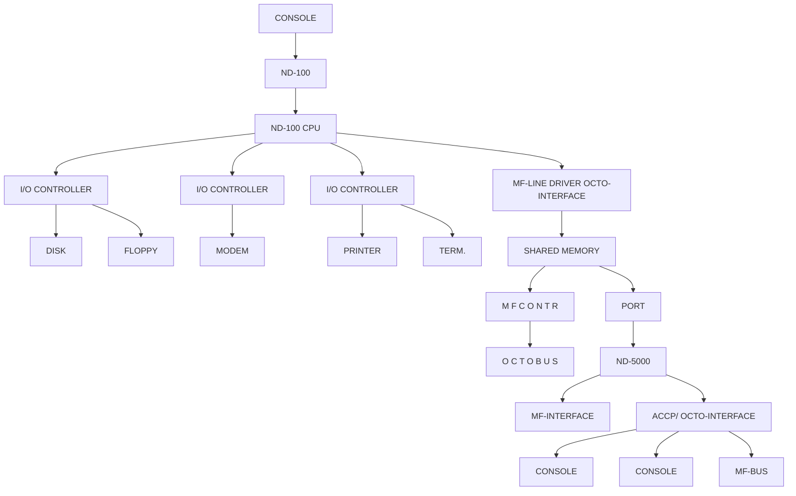
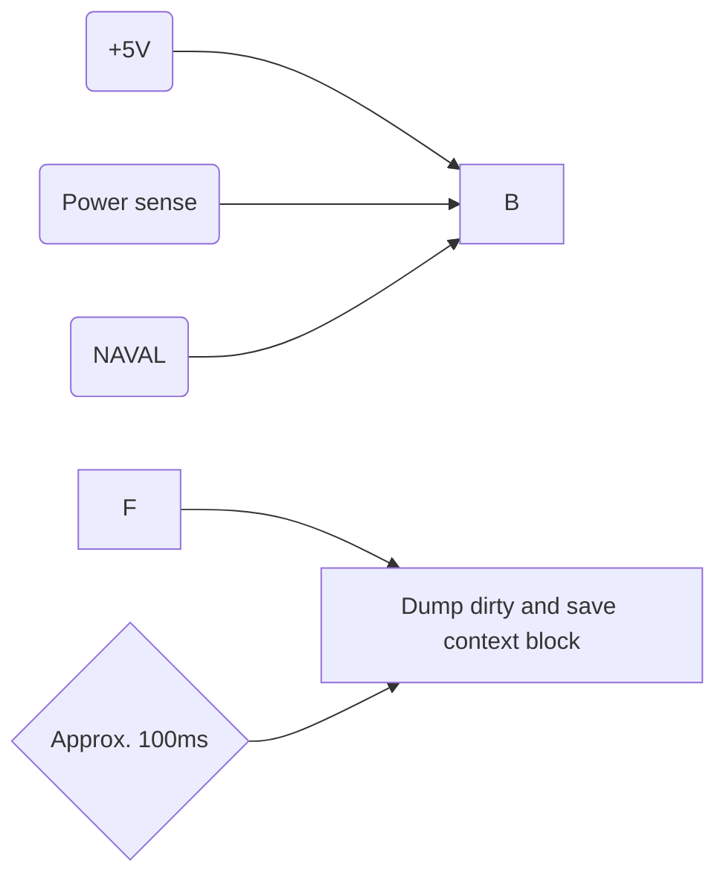
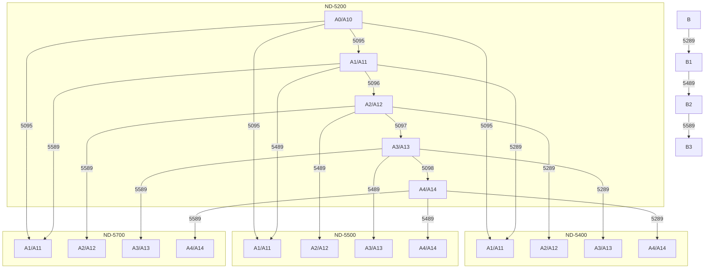
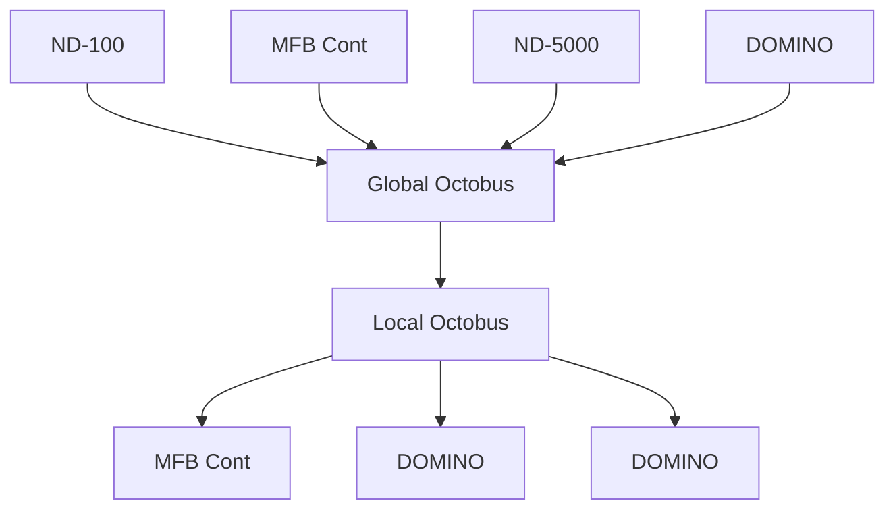
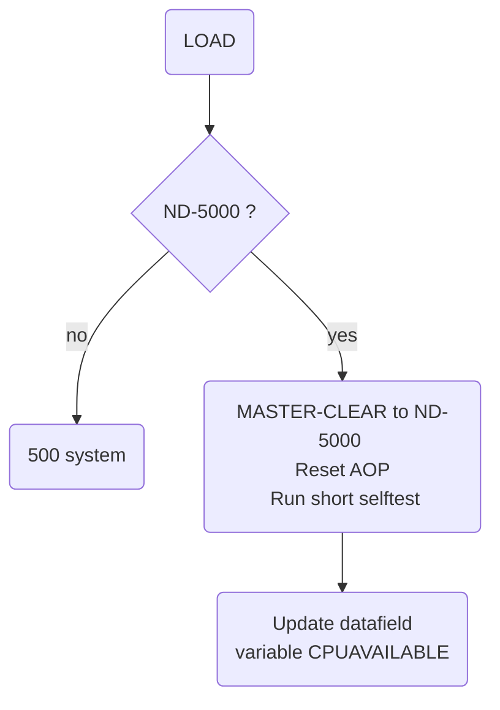
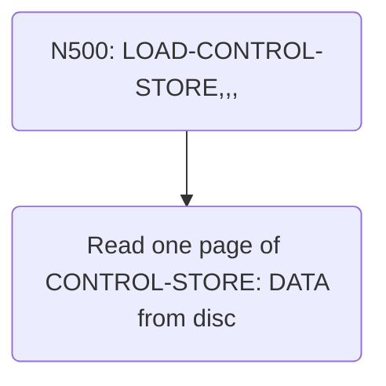
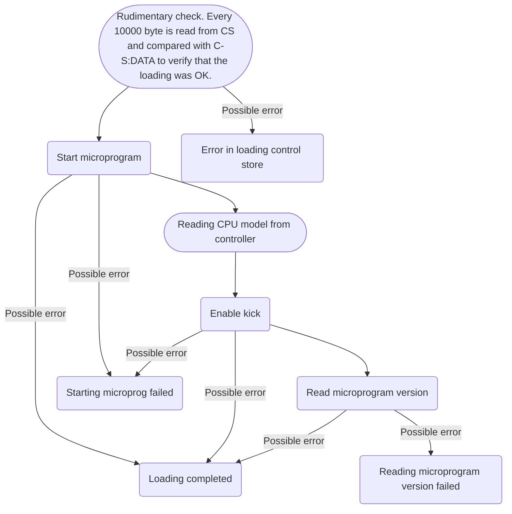
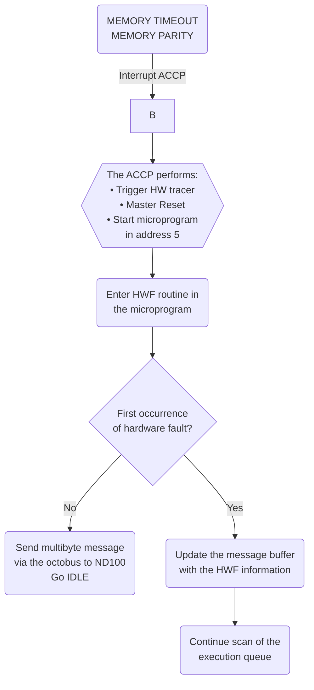
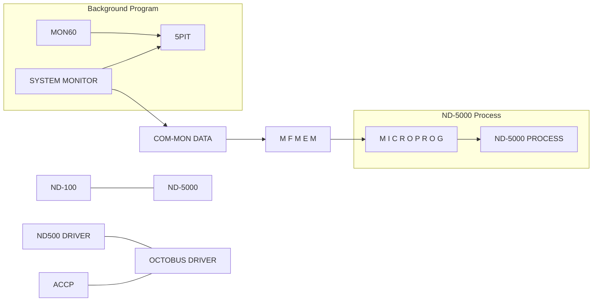
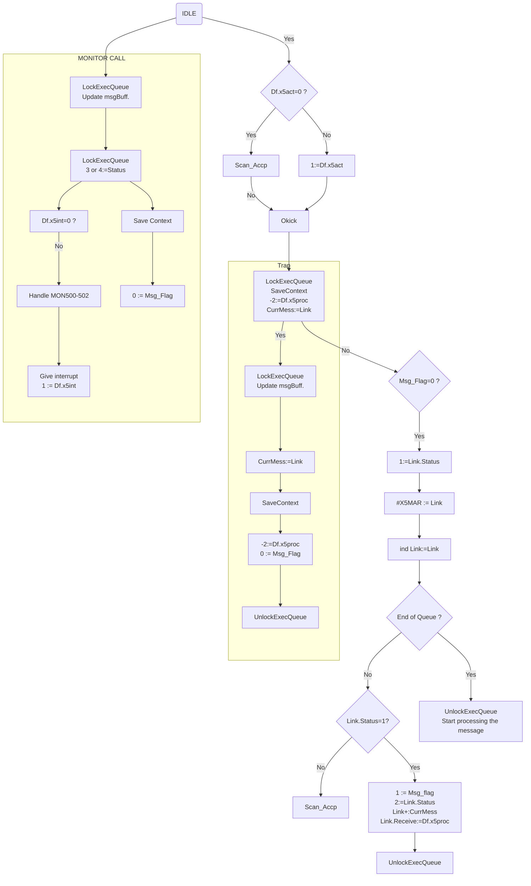

## Page 1

# ND-5000 Hardware Maintenance

**ND-05.017.1 EN**

```
  [Logo: ND Norsk Data]
```

---

## Page 2

# ND-5000 Hardware Maintenance

ND-05.017.1 EN

---

## Page 3

# Documentation Information

The information in this manual is subject to change without notice.  
Norsk Data A.S assumes no responsibility for any errors that may appear in this manual, or for the use or reliability of its software on equipment that is not furnished or supported by Norsk Data A.S.

Copyright (C) 1988 by Norsk Data A.S  
Version 1  June 1988  

Send all documentation requests to:  
Norsk Data A.S  
Graphic Centre  
P.O. Box 25 - Bogerud  
N-0621 Oslo 6  
NORWAY

---

## Page 4

# Preface

## The manual

This manual covers the ND-5000 computer systems. The ND-110 part of the system is covered by the ND-100 Hardware Maintenance Manual. The manual is meant to be a helping hand for the service staff, used in addition to:

- The Service Handbook
- ND-100 Maintenance Manual

## The reader

This manual has been prepared for the Norsk Data field service engineers and technical personnel directly involved in maintaining the ND-5000 computer systems.

## Prerequisite knowledge

A basic knowledge of the hardware in the ND-5000 computer systems.

## Related manuals

| Manual                                     | Code    |
|--------------------------------------------|---------|
| ND-100 Hardware Maintenance Manual         | ND-30.008|
| Test Program Description for ND-100        | ND-30.005|
| ND-5000 Hardware Description               | ND-05.020|

---

## Page 5

# ND-5000 Overview

## 1.1 The ND-5000 Family
### 1.1.1 ND-5000 Model-range
- ND-5000 Compact Systems
- ND-5000 Large Systems

## 1.2 Cabinets
### 1.2.1 Large Cabinet
- Card Rack
### 1.2.2 Small Cabinet
- Card rack

## 1.3 Power supply
- Small cabinet
- Large cabinet
- Power fail/restart

## 1.4 CPU types
- ND-5000 basic CPU type 1
- ND-5000 Basic CPU type 2
- ND-5000 basic CPU type 3
- Difference between CPU-types
- Microprogram versions

# Hardware Upgrading of ND-5000 Systems

## 2.1 System description

### 2.1.1 Upgrading from ND-5200 to ND-5400 system
### 2.1.2 Upgrading from ND-5400 to ND-5500 system
### 2.1.3 Upgrading from ND-5500 to ND-5700 system
### 2.1.4 Upgrading from ND-5700 to ND-5800 system
### 2.1.5 Upgrading from ND-5800 to ND-5900/2/3/4 system
### 2.1.6 Setting the ND-5000 CPU model
- Updating tool to be used on ND-5000 Compact systems
- Updating tool to be used on ND-5000 large cabinet version
- Example

# Octobus Communication

## 3.1 Introduction to octobus hardware
## 3.2 Octobus frame format
## 3.3 Introduction to the protocol
### 3.3.1 Message format

## 3.4 Octobus hardware on ND5000 CPU
## 3.5 Internal octobus cable
## 3.6 ACCP
### 3.6.1 Connecting the ACCP console
### 3.6.2 ND-5000 self-test
- Self test status
- Self test Run

---

## Page 6

# Hardware Trace Module

## 4.1 Trace Module Memory
56

## 4.2 Software Control of the Trace Module
- INITIATE-TRACER
- ARM-THE-TRACER
- DISARM-THE-TRACER
- DUMP-TRACE-MEMORY
- WRITE-TRACE-FILE
- READ-TRACE-FILE
- EXAMINE-TRACE

56

57

58

58

58

58

58

## 4.3 Dump of Trace Memory When an Error Situation Has Occurred
59

## 4.4 The ND-5000 Trace Module Decoding Tools
62

# Maintenance

## 5.1 Preventive Maintenance
64

## 5.2 Fans
64

## 5.3 Voltages
66

## 5.4 LEDs
67

## 5.5 E00 System
68

## 5.6 Substituting Modules
73

## 5.7 CPU Transport Box
74

# Troubleshooting

## 6.1 ND-100 Error
75

## 6.2 Initialization of the ND-5000 Systems
76

### 6.2.1 Loading of Control Store
76

### 6.2.2 Different Error Messages That Can Occur During Startup of ND-5000
- Attempt to Start the ND-500 Monitor Didn't Succeed
- ND-5000 Self-Test Fails
- Errors During Loading of Control Store

80

80

81

### 6.2.3 ND-5000 Error Messages
- General
- Fatal System Error Messages
- Hardware Fault
- Page Fault
- Protect Violation
- Index Scaling Error
- Illegal Instruction Code
- Instruction Sequence Error
- Illegal Operand Specifier
- Trap Handler Missing

85

88

88

89

100

107

114

122

126

130

134

138

# Some Useful Debugging Commands in the ND-5000 Monitor

## 7.1 LOOK-AT-PROGRAM
143

## 7.2 LOOK-AT-DATA
144

## 7.3 LOOK-AT-FILE
144

## 7.4 LOOK-AT-STACK
144

## 7.5 LOOK-AT-RELATIVE
144

## 7.6 LOOK-AT-REGISTER
145

## 7.7 LOOK-AT-SRF
145

---

## Page 7

# Contents

## 7.8 LOOK-AT-RESIDENT-MEMORY
... 145

## 7.9 LIST-ACTIVE-SEGMENT
... 145

## 7.10 Set breakpoints
... 146

## 7.11 Address trace
... 147

## 7.12 Reset all debugging activity
... 148

## 7.13 Trap handling
... 148

## 7.14 Program execution control
... 148

## 7.15 Display error messages from monitor calls
... 148

## 7.16 Resident place
... 149

## 7.17 List E00 level and version of basic ND-5000 hardware/software
... 149

## 7.18 List memory configuration
... 150

## 7.19 Forced stop of the ND-5000
... 151

## 7.20 Dump of the Swapper datasegments
... 151

## 7.21 Dump all hardware registers
... 152

## 7.22 Operations against the control store
... 153

## 7.23 Reset ND-5000 CPU
... 155

## 7.24 Set cache mode
... 156

## 7.25 Attach another process
... 156

# 8 Test and Utility Programs
... 157

## 8.1 ND-5000 TEST MICROPROGRAMS
... 157

### 8.1.1 Definitions
... 157

### 8.1.2 Switches on the cache
... 157

### 8.1.3 Loading and starting SEMICS
... 158  
- Starting the TPE monitor
... 158  
- Starting SEMICS
... 159  

### 8.1.4 Using SEMICS
- Prepare for testing
... 159  
- Test numbering
... 160  
- Initial parameter values
... 160  
- Accessing files through SEMICS
... 160  
- Running microtests
... 161  
- Error in memory configuration
... 162  

### 8.1.5 Logging errors
... 163

## 8.2 ND-5000 TEST MACROPROGRAMS
... 164

### 8.2.1 DESMODUR
... 164  
- How to get started
... 166  
- Messages that occur during a test run
... 170  
- Logging errors
... 170  

### 8.2.2 FLOTILJE
... 171  
- General
... 171  
- Options before test run starting
... 172  
- Options if error is discovered
... 173  
- Options for environment
... 173  
- Running FLOTILJE
... 174  
- Logging errors
... 174  

### 8.2.3 PIPELINE EXERCISER
... 175  
- General
... 175  
- How to run the test
... 176  
- Logging errors
... 177  

### 8.2.4 MMS TEST
... 178  
- Running the MMS test
... 178  
- Logging errors
... 180  

### 8.2.5 PAGE FAULT EXERCISER
... 181  
- First the swap file selection
... 181  
- Prepare for testing
... 182  
- Precautions
... 182

---

## Page 8

# Session Example
- **Page**: 183

# Error Reporting
- **Page**: 185
- **The Error Message**: 185
- **Example 2**: 
  - **Example 1**: 186

## 8.2.6 Floating Point Test
- **General**: 187
- **Getting Started**: 189
- **Running FLOAT-TEST**: 190
- **Logging Errors**: 191
- **Reading the Error Log File**: 191
- **Miscellaneous**: 192

## 8.2.7 Octobus
- **Octobus Test Commands**: 192
- **SET-PARAMETERS**: 193
- **LIST-HARDWARE-CONFIGURATION**: 193
- **RUN**: 194
- **Logging Errors**: 195

# 8.3 Verification Programs
- **Page**: 196

## 8.3.1 SUPER
- **Test Description**: 196
- **Running SUPER**: 196
- **Logging Errors**: 199

## 8.3.2 SIBAS Test
- **Logging Errors**: 200

## 8.3.3 CTXTEST
- **Logging Errors**: 202

## 8.3.4 INVERSE-MATRIX, WHEISTONE, DHYRISTONE and LACOURT Tests
- **Logging Errors**: 203

## 8.3.5 LIBTEST
- **Logging Errors**: 205

# 8.4 Utility Programs
- **Page**: 206

## 8.4.1 NS00X-MESSAGE
- **Program Description**: 208
- **Running NS00X-MESSAGE**: 208

## 8.4.2 Test Functions in ND-5000/MF Firmware
- **Page**: 209

# 8.5 MF-Bus Test and Maintenance Program
- **Page**: 210

## 8.5.1 Connecting the Console Terminal to the Controller
- **Page**: 210

## 8.5.2 Description of the Most Useful Commands
- **INIATE-EEPROM**: 212
- **CONFIGURATE-SLOT**: 213
- **LIST-CONFIGURATION**: 213
- **TEST-MEMORY**: 214
- **SYNDROME-TEST**: 214
- **AUTOINITIALIZE-BANK**: 215
- **LIST-OCTOBUS-STATION**: 215
- **OCTOBUS-SELFTEST**: 215
- **ACCESS-OCT-REG**: 216
- **OCT-CONTROL-FUNCTION**: 216
- **OCT-TRANSMIT-STATUS**: 216
- **OCTOBUS-DRIVER**: 216
- **LIST-SUBPROC-TABLE**: 217
- **READ-OCTOBUS-RECEIVE**: 217
- **TRANSMIT-OCTOBUS**: 217

## 8.5.3 Example of Configuring a MF System
- **Configuring a ND-5000 System**: 220
- **Upgrading a MF-System**: 225

---

## Page 9

# Verifying the Upgraded MF-Configuration

Page 227

## Switches and Indicators

| Component                         | Page |
|-----------------------------------|------|
| Plugboard no. 1 (5904)            | 229  |
| The Motherboard (5502)            | 232  |
| The MFM Line Driver               | 233  |
| The Cache Module (5610)           | 235  |
| The MFB Bus Port (5152/5155)      | 236  |
| The Dynamic RAM (5462)            | 237  |
| The Dynamic RAM (5411)            | 238  |
| The MFB Controller (5151)         | 239  |
| The MFB Controller (5156)         | 240  |
| The MFB Controller (5454)         | 241  |
| The MFB Controller (5465)         | 242  |
| The Double Bus Controller         | 243  |

---

## Page 10

```
( x )
```

---

## Page 11

# Table of Appendices

## Appendix A

| Section                                                               | Page |
|----------------------------------------------------------------------|------|
| A.1  Context block (Register block)                                  | 244  |
| A.2  Allocation of registers in the Scratch Register File            | 246  |
| A.3  Commands received by ACCP on the Octobus                        | 250  |
| A.4  ND100/ND5000 communication                                      | 252  |
| A.5  Initialization of the ND-5000 microprogram                      | 253  |
| A.6  Extended CPU data field for SINTRAN K WM-406                    | 254  |
| A.7  ND-5000 microprogram communication flowchart for Sintran K WM406| 256  |
| A.8  The message buffer (mail box) description for Sintran K WM-406  | 257  |
| A.9  Micro function description                                      | 260  |
| A.10 ACCP status register                                            | 261  |
| A.11 BADAP status register                                           | 261  |
| A.12 Memory management status register                               | 262  |
| A.13 Error codes from monitor calls                                  | 263  |
| A.14 Error returns from MON-60 calls/low level system errors         | 265  |
| A.15 Error codes returned from the ACCP processor                    | 267  |

## Index

- Page 275

---

## Page 12

# List of Figures

1. ND-5000 Computer System .................................. 1  
2. The ND-5000 Cabinet ...................................... 4  
3. ND-5000 Compact Cabinet .................................. 7  
4. Power Supply in the ND-5000 Compact Cabinet .............. 11  
5. Power Supply in the ND-5000 Large Cabinet ................ 12  
6. Switches and LEDs on the Power Supply Modules ............ 14  
7. Power Fail Interrupt Connection on the Large Cabinet (new type) ................... 21  
8. Power Fail Interrupt Connection on the Large Cabinet (first version) ............... 22  
9. Layout CPU Type 1 ....................................... 24  
10. Layout CPU Type 2 ...................................... 25  
11. Layout CPU Type 3 ...................................... 26  
12. Octobus Cabling on ND-5000 ............................. 46  
13. ACCP Console Connection on the Large Cabinet ........... 48  
14. ACCP Console Connection on ND-5000 Compact Cabinet ..... 49  
15. Fans ................................................... 65  
16. Checking the voltage ................................... 66  
17. The ECO register ....................................... 70  
18. CPU Transport Box ...................................... 74  
19. ND-100 Error Conditions ................................ 75  
20. Connecting the MF Console on the Large Cabinet ......... 210  
21. Connecting the MF Console on the Compact Cabinet ....... 211  
22. Switches on plugboard 1 (5904) ......................... 229  
23. Switchsetting on plugboard 1 for ND-100 console ........ 230  
24. Switchsetting on plugboard 1 for MF-console ............ 230  
25. Switchsetting on plugboard 1 for ND-100 console and MF-console .......... 231  
26. Mother board (5502) .................................... 232  
27. The MFM Line Driver .................................... 233  
28. The Cache Module (5610) ................................ 235  
29. The MFB Bus Port (5152/5155) ........................... 236  
30. The Dynamic RAM (5462) ................................. 237  
31. The Dynamic RAM (5411) ................................. 238  
32. The MFB Controller (5151) .............................. 239  
33. The MFB Controller (5156) .............................. 240  
34. The MFB Controller (5454) .............................. 241  
35. The MFB Controller (5465) .............................. 242  
36. The Double Bus Controller .............................. 243

---

## Page 13

# List of Tables

| No. | Title                                                 | Page |
|-----|-------------------------------------------------------|------|
| 1.  | ND-5000 Compact Configuration Overview                | 2    |
| 2.  | ND-5000 Compact Configuration Overview                | 3    |
| 3.  | The MF-bus Card Rack (first version)                  | 5    |
| 4.  | ND-5000 Card Rack (new type)                          | 6    |
| 5.  | ND-5000 Compact Card Rack (first version)            | 8    |
| 6.  | ND-5000 Compact Card Rack (new type)                 | 9    |
| 7.  | Specifications for the ND-5000 Power Supply          | 16   |
| 8.  | Difference between the CPU Models                    | 27   |
| 9.  | Survey of ND-5000 Error Messages                     | 88   |

---

## Page 14

```
                                              ( xiv )
```

---

## Page 15

# Chapter 1 ND-5000 OVERVIEW

## 1.1 The ND-5000 Family

The ND-5000 is a 32-bit, general purpose super minicomputer, and at the top of the Norsk Data range of computer systems.



_Figure 1. ND-5000 Computer System_

---

## Page 16

# 1.1.1 ND-5000 Model-range

The ND-5000 systems are delivered in the Compact cabinet and in large cabinets.

## ND-5000 Compact Systems

```
 _______________________________________
|                                       |
|                                       |
|                                       |
|                                       |
|                                       |
|                                       |
|                                       |
|_______________________________________|
```

| Parameter                  | 5200                     | 5400                     | 5500                     | 5700                      |
|----------------------------|--------------------------|--------------------------|--------------------------|---------------------------|
| CPU type                   | 1                        | 2                        | 2                        | 2                         |
| CPU model                  | 2                        | 4                        | 5                        | 7                         |
| CPU ND number              | 110249                   | 110248                   | 110247                   | 110218                    |
| CPU part number            | 320001                   | 320002                   | 320002                   | 320002                    |
| Microprogram vers. *       | 110<xxx>                 | 111<xxx>                 | 112<xxx>                 | 113<xxx>                  |
| I/O processor              | ND110                    | ND120                    | ND120                    | ND120/CX w/memory         |
| Disk size (A models) (Internal) | 60 to 4*125 Mb          | 125 to 4*125 Mb         | 125 to 4*125 Mb          | 125 to 4*125 Mb           |
| Disk size (Model B) (External) | Up to 3.6 Gb            | Up to 3.6 Gb            | Up to 3.6 Gb             | Up to 3.6 Gb              |
| Streamer                   | A-models                 | A-models                 | A-models                 | A-models                  |

| System type   | ND-5200 Compact | ND-5400 Compact | ND-5500 Compact | ND-5700 Compact |
|---------------|-----------------|-----------------|-----------------|-----------------|
| Model:        |                 |                 |                 |                 |
| A0/A10        | 60 MB           | -               | -               | -               |
| A1/A11        | 125 MB          | 125 MB          | 125 MB          | 125 MB          |
| A2/A12        | 2X125 MB        | 2X125 MB        | 2X125 MB        | 2X125 MB        |
| A3/A13        | 3X125 MB        | 3X125 MB        | 3X125 MB        | 3X125 MB        |
| A4/A14        | 4X125 MB        | 4X125 MB        | 4X125 MB        | 4X125 MB        |
| B             | External        | External        | External        | External        |

*Table 1. ND-5000 Compact Configuration Overview*

\* = Valid for SINTRAN K, WM 406.

---

## Page 17

# Chapter 1 ND-5000 OVERVIEW

## ND-5000 Large Systems

```
          _______________
         |       ____    |
         |      |____|   |
  _______|____________    |
 |     |            | |   |
 |     |_________   | |_  |
 |      _________|  | | \ |
 |     |__________  | |  ||
 |_______________| |_|  ||
 |_____________________||
```

| Parameter                  | 5200     | 5400     | 5500     | 5700     | 5800     | 5900*    |
|----------------------------|----------|----------|----------|----------|----------|----------|
| CPU type                   | 1        | 2        | 2        | 2        | 3        | 3        |
| CPU model                  | 2        | 4        | 5        | 7        | 8        | 8        |
| CPU ND-number              | 110249   | 110248   | 110247   | 110218   | 110171   | 110171   |
| Microprogram vers. **      | 110<xx>  | 111<xx>  | 112<xx>  | 113<xx>  | 114<xx>  | 114<xx>  |
| I/O processor              | ND110    | ND120    | ND120    | ND120/CX | ND120/CX | ND120/CX |
|                            |          |          |          | w/2Mb    | w/4Mb    | w/4Mb    |
| Memory size                |          |          |          |          |          |          |
| shared/local               | 4/2      | 4/4      | 8/4      | 12/6     | 16/10    | 24/6     |
| Cache size                 |          |          |          |          |          |          |
| Data (KB)                  | -        | -        | 64       | 64       | 64       | 64*      |
| Instruction                | -        | -        | 8K x 320 bit | 8K x 320 bit | -  | -      |
| Disk size (External)       | Up to 29 Gb                                                                             |

*Table 2. ND-5000 Compact Configuration Overview*

* * = Model 5900 contain 2, 3 or 4 CPUs.
* **= Valid for SINTRAN K, WM 406.

---

## Page 18

# 1.2 Cabinets

The ND-5000 is delivered either in a small or a large cabinet. This section gives a short description of the two cabinets, the card crates etc.

## 1.2.1 Large Cabinet

The computer cabinet looks like this:

```
   ____________________
  |                    |
  |     _________      |
  |    |         |     |
  |    |         |     |
  |    |_________|     |
  |                    |
  |____________________|
```

*Figure 2. The ND-5000 Cabinet*

---

## Page 19

# Chapter 1 ND-5000 OVERVIEW

## Card Rack

| Card Position | Card Type             | Comments                                                                                                  |
|---------------|-----------------------|-----------------------------------------------------------------------------------------------------------|
| 1             |                       |                                                                                                           |
| 2             |                       |                                                                                                           |
| 3             |                       | Earlier used for ND-570 floating-point unit cards.                                                        |
| 4             |                       |                                                                                                           |
| 5             |                       |                                                                                                           |
| 6             | ND-5000 CPU           |                                                                                                           |
| 7             |                       | └── CPU type 1: pos. 6 and 7                                                                              |
| 8             | (MFB Dynamic RAM)     | └── CPU type 2: pos. 6, 7 and 8                                                                           |
| 9             | (MFB Dynamic RAM)     | └── CPU type 3: pos. 6, 7, 8 and 9                                                                        |
| 10            | MFB Dynamic RAM       |                                                                                                           |
| 11            | MFB Dynamic RAM       |                                                                                                           |
| 12            | Ports or memory of choice |                                                                                                           |
| 13            |                       | Note that the Multifunction Bus Controller only has 15 external request and grant lines. Masters can then not be placed in pos. 8-11. These can only be used for memory. |
| 14            |                       |                                                                                                           |
| 15            |                       |                                                                                                           |
| 16            |                       |                                                                                                           |
| 17            |                       |                                                                                                           |
| 18            |                       | The Multifunction Bus Ports are the same cards as the MPM-5 ports.                                        |
| 19            |                       |                                                                                                           |
| 20            |                       | The MFB Dynamic RAM cards are the same as the MPM-5 dynamic RAM cards.                                     |
| 21            |                       |                                                                                                           |
| 22            |                       |                                                                                                           |
| 23            |                       |                                                                                                           |
| 24            |                       |                                                                                                           |
| 25            | Ports or memory of choice |                                                                                                           |
| 26            | Multifunction Bus Controller (5465) |                                                                                                           |

*Table 3. The MF-bus Card Rack (first version)*

---

## Page 20

# Chapter 1 ND-5000 Overview

| Card Position | Card Type        | Comments                                              |
|---------------|------------------|-------------------------------------------------------|
| 1             | MF-bus controller (5465) |                                                       |
| 2             | MF-bus port (5155)       | Port for ND-100                                       |
| 3             | Ports or memory of choice|                                                       |
| 4             | "                        |                                                       |
| 5             | ND-5000 CPU 4   | Pos 5 - 8                                              |
| 6             |                  |                                                       |
| 7             |                  |                                                       |
| 8             |                  | CPUs 2 - 4 are optional, and these positions may be occupied by memory or ports. |
| 9             |                  |                                                       |
| 10            | ND-5000 CPU 3   | Pos. 10 - 13                                           |
| 11            |                  |                                                       |
| 12            |                  |                                                       |
| 13            |                  |                                                       |
| 14            |                  |                                                       |
| 15            | ND-5000 CPU 2   | Pos. 15 - 18                                           |
| 16            |                  |                                                       |
| 17            |                  |                                                       |
| 18            |                  |                                                       |
| 19            |                  |                                                       |
| 20            | ND-5000 CPU 1   |                                                       |
| 21            |                  |                                                       |
| 22            |                  |                                                       |
| 23            |                  |                                                       |
| 24            |                  |                                                       |

```
   |
   |---- CPU type 1: pos. 20 and 21
   |---- CPU type 2: pos. 20 - 22
   |---- CPU type 3: pos. 20 - 23
```

_Table 4. ND-5000 Card Rack (new type)_

---

## Page 21

# Chapter 1 ND-5000 OVERVIEW

## 1.2.2 Small Cabinet

Figure 3 shows the ND-5000 Compact cabinet with its main modules. The new and old card racks are shown in tables 5 and 6.

```
       ___________________
      |                   |
      |    ___________    |
      |   |           |   |
      |   |  _______  |   |
      |   | |       | |   |
      |   | |_______| |   |
      |   |___________|   |
      |                   |
      |                   |
      |   _____________   |
      |  |             |  |
      |  |    ND-5000  |  |
      |  |   Compact   |  |
      |  |   Cabinet   |  |
      |  |_____________|  |
      |___________________|
```

*Figure 3. ND-5000 Compact Cabinet*

---

## Page 22

# Card Rack

Table 5 shows the ND-5000 in a double bus backwiring used in the Compact cabinet for models A0-A4 and model B. Dummy plugs are inserted in all free positions.

| Card Pos. | Card Type                                  | Comments                                     |
|-----------|--------------------------------------------|----------------------------------------------|
| 1         | ND-5000 CPU card                           |                                              |
|           |                                            | ┌─ CPU type 1: pos. 1 and 2                  |
| 2         |                                            | └─ CPU type 2: pos. 1 - 3                    |
| 3         | (MFB Dynamic RAM)                          |                                              |
| 4         | MFB Dynamic RAM                            | 4, 8 or 16 Mbyte Dynamic RAM                 |
| 5         | Double Bus Controller                      |                                              |
| 6         | ND-110/CX CPU                              |                                              |
| 7         | Tracer/Memory                              |                                              |
| 8         | HDLC/Megalink/Memory                       |                                              |
| 9         | "                                          |                                              |
| 10        | 8 term./PIOC/Memory                        |                                              |
| 11        | "                                          |                                              |
| 12        | "                                          |                                              |
| 13        | ST506 Disk Controller/Triangel/Memory/Free |                                              |
| 14        | Floppy-SCSI/Free/Memory                    |                                              |
| 15        | Free                                       |                                              |
| 16        | Free                                       |                                              |
| 17        | Free                                       |                                              |
| 18        | Plugboard 1                                | From pos.10: 8 term./PIOC                    |
|           |                                            | From pos.5 & 6: Console                      |
|           |                                            | From pos.6: Telefix/Tfix port                |
| 19        | Plugboard 2                                | From pos.11: 8 term./PIOC                    |
|           |                                            | From pos.8: HDLC/Megalink                    |
| 20        | Plugboard 3                                | From pos.12: 8 term./PIOC                    |
|           |                                            | From pos.9: HDLC/Megalink                    |

*Table 5. ND-5000 Compact Card Rack (first version)*

---

## Page 23

# Chapter 1 ND-5000 OVERVIEW

Table 6 shows the ND-5000 in a double bus backwiring used in a compact cabinet for models A10-A14 and model B.

## THE ND-5000 COMPACT CARD RACK

| Card Pos. | Card Type                                     | Comments                                    |
|-----------|-----------------------------------------------|---------------------------------------------|
| 1         | ND-5000 CPU card                              |                                             |
| 2         |                                               | └─ CPU type 1: pos.1 and 2                  |
| 3         | (MFB Dynamic RAM)                             | └─ CPU type 2: pos.1 - 3                    |
| 4         | MFB Dynamic RAM                               | 4, 8 or 16 Mbyte Dynamic RAM                |
| 5         | Double Bus Controller                         |                                             |
| 6         | ND-110 CPU                                    |                                             |
| 7         | Tracer/Memory/Ethernet/(Token ring)           |                                             |
| 8         | HDLC/Megalink/Memory/Ethernet/(Token ring)    |                                             |
| 9         | "                                             |                                             |
| 10        | 8 term./PIOC/Memory                           |                                             |
| 11        | "                                             |                                             |
| 12        | "                                             |                                             |
| 13        | Floppy & SCSI controller                      |                                             |
| 14        | Free                                          |                                             |
| 15        | Free                                          |                                             |
| 16        | Free                                          |                                             |
| 17        | Free                                          |                                             |
| 18        | Plugboard 1                                   |                                             |
|-----------|-----------------------------------------------|---------------------------------------------|
| 19        | Plugboard 2                                   |                                             |
|-----------|-----------------------------------------------|---------------------------------------------|
| 20        | Plugboard 3                                   |                                             |

*Table 6. ND-5000 Compact Card Rack (new type)*

---

## Page 24

# 1.3 Power Supply

This section gives a short introduction to the power supplies in the ND-5000 computers. This is a new generation MPS (Multipower System). It consists of one or more modules, depending on the power consumption in the different cabinets.

This power supply will, to a larger extent than earlier models, also supply internally installed peripherals, like 5 1/4" disk drives, floppy drives etc.

## Small Cabinet

The small cabinet is equipped with one power supply:

**DC110**

This power supply is accessible from the front of the cabinet. It is of the plug-in type, and can be removed by loosening the four screws in the front and pulling it out (see figure 4). 

The DC110 supplies the following voltages and currents:

```
5V/120A  
12V/15A  
5V/7A standby
```

- **+5V/120A** mainly supplies power for the CPU and the memory.
- **+5V/7A** standby supplies power for the memory in the case of a power failure.
- **+12V/15A** supplies the power for peripheral equipment mounted in the compact cabinet, like 5 1/4" disk and floppy drives.

For more information (switches, LEDs etc.), see the description on figure 6.

---

## Page 25

# Chapter 1 ND-5000 OVERVIEW

``` 
     _______
    /       \
   /  _______\
  |  /       
  | |   ______   
  | |  |____  | 
  | |       | |  
  | |_______| | 
  |__________|  
 /          \
/____________\   
```

*Figure 4. Power Supply in the ND-5000 Compact Cabinet*

---

## Page 26

# Large Cabinet

The ND Multipower Supply is mounted in the upper part of the cabinet, accessible from the rear:

It is the plug-in type, and can be removed by loosening the four screws in the front and pulling it out.

```
       ______________
      |              |
      |              |
  ____|    ____      |
 |    |   |    |     |
 |    |   |    |_____|__
 |____|   |    |     |  |
|       __|    |     |  |
|      |      /      |  |
|______|_____/_______|__|
```

*Figure 5. Power Supply in the ND-5000 Large Cabinet*

---

## Page 27

# Chapter 1 ND-5000 Overview

## Cabinet, Rear View

```
+------+-------+-------+-------+------+
| DC110| DC200 | DC200 | DC300 | DC400|
| 5V/120A | 5V/200A | 5V/200A | 5V/50A STB |   |
| 12V/15A |       |       |             |   |
| 5V/7A STB |     |       |             |   |
+------+-------+-------+-------+------+
```

## The Different Modules:

- **DC110** - Delivers the following voltages and currents:
  ```
  5V/120A
  *5VSTB/7A
  12V/15A
  ```
  *In this case, DC110 is used in a multipower configuration together with other modules, and the standby power (STB) is not active. STB is, in this case, taken care of by DC300.

- **DC200** - Delivers the 5V/200A.

- **DC300** - Delivers the 5V/50A standby for ten minutes.

- **DC400** - For future use.

---

## Page 28

# Chapter 1 ND-5000 OVERVIEW

## Switches, LEDs etc

This is a short description of the switches, LEDs etc. found on the front of the modules (see fig 6):

```
ASCII Art:

   ND MULTI POWER SYSTEM   ND MULTI POWER SYSTEM   ND MULTI POWER SYSTEM
    
         DC 110                  DC 200                 DC 300
    _______________________________________________
   |                                             | 
   |                                             |
   |   o o o o o     o o o o    o o o o o o      | 
   |                                             |
   |   SLAVE MODE                                |
   |                                             |
   |   o o o o o     o o o o    o o o o o o      |
   |                                             |
   |_____________________________________________|
   |   OVERTEMP   |                            |
   |   TRANSIENT  |                            |
   |_____________________________________________|

```

*Figure 6. Switches and LEDs on the Power Supply Modules*

- **ON/OFF SWITCH** - This switch is used to turn the power module ON or OFF.

- **ADJUSTMENT** - The screws called ADJ are used to adjust the output, which can be checked on the test points (TP).

- **MARG** - These switches increase/decrease the output by +/- 5%. This will NOT activate the transient indicator if the voltages are correct.

- **OVERTEMP** - This red LED is lit if the internal temperature exceeds 90 degrees C.

- **TRANSIENT** - This red LED is lit if any voltage varies by more than 10% from the nominal value. The LED must be reset by the RESET switch, which has three positions:
  - The MIDDLE position (default) enables both the visual and audible alarms.

---

## Page 29

# Chapter 1 ND-5000 OVERVIEW

- The UPPER position, where the switch will be locked, disables the audible alarm. The visual alarm is still enabled.

- The LOWER position (spring return) resets the alarm.

- SLAVE MODE - This green LED is lit when DC200 delivers power in slave mode (controlled by DC110). When the load is below approximately 16 A, DC110 will supply the 5V alone, and this LED is not activated.

---

## Page 30

# Chapter 1 ND-5000 Overview

|                        | DC110        | DC200        | DC300    |
|------------------------|--------------|--------------|----------|
|                        | +5V | +5V SB | +12V         | +5V      | +5V SB |
| Maximal current        | 120 A | 7 A | 15 A          | 200 A    | 50 A    |
| Ripple, band width 30 Mhz (mVpp) | 50 | 50 | 100    | 50       | 50      |
| Overvoltage protection | >=6V      | >=6V    | >=15V | >=6V     | 5.8 - 6.5V |
| Overcurrent protection | 130-150A  | 7.7-9.8A | 16.5-21A | 220-240A | 55-60A |
| Short circuit protection | 4V    | 4V       | 10V       | 4V       | 4V      |
| Switch-on current      | Max. 150A peak                                |
| Margin control         | +/-5%        | +/-5%        | +/-5%    |
| Static regulation for "worst case" combination of line and load change | Max.+/-1% | Max.+/-1% | Max.+/-1% |
| Voltage adjustment     | +/- 5-7%     | +/- 5-7%     |          |
| Temperature coefficient output voltage, per °C | Max.+/-200ppm (1mV/°C) | Max.+/-200ppm (1mV/°C) | Max.+/-200ppm (1mV/°C) |

*Table 7. Specifications for the ND-5000 Power Supply*

---

## Page 31

# Chapter 1 ND-5000 OVERVIEW

## The Plug Connectors

Note that connector 1A1 on DC110 is turned upside down.

```
 __________________   __________________   __________________   __________________
|    DC400        | |    DC300        | |    DC200        | |    DC110        |
|  z  d  32   4   | |  z  d  32   4   | |  z  d  32   4   | |  d  z  32   4   |
|  A     4   1   | |  A     4   1   | |  A     4   1   | |  A     4   1   |
|  1         3   | |  1         2   | |  1         2   | |  1         1   |
|               | |               | |               | |               |
 -----------------   -----------------   -----------------   -----------------
  | z d 32 4 |       | z d 32 4 |       | z d z d 32 4 |     | z d z d 32 4 |
  | B     4 1 |       | B     3 1 |       | B 2 B 2 4 2 |   | B 1 B 1 4 3 |
  |           |       |           |       |               |   |               |
   -----------         -----------         ---------------     ---------------
```

The connectors on the rear side of the power modules have a layout like this:

```
  z  d
  _____
 | 32 |
 | 30 |
 | 28 |
 | 26 |
 | 24 |
 |  .  |
 |  .  |
 |  .  |
 | 10 |
 |  8 |
 |  6 |
 |  4 |
  -----
```

---

## Page 32

# Chapter 1 ND-5000 OVERVIEW

## SIGNAL-LISTS

### DC110 plug 1A1

| Pin | Signal      | Pin | Signal        |
|-----|-------------|-----|---------------|
| D06 | Not used    | Z04 | Not used      |
| D10 | 12V return  | Z08 | 12V return    |
| D14 | +12V        | Z12 | +12V          |
| D18 | +5V SB      | Z16 | +5V SB        |
| D22 | 5V SB return| Z20 | 5V SB return  |
| D26 | Common      | Z24 | Remote off    |
| D30 | Memory inhibit | Z28 | Common    |
|     |             | Z32 | Power fail int.|

### DC110 plug 1A4

```
+-------+        +-----+
| Z32 to|        | D30 |
| 5V    |        | to  |
| return|        | +5V |
| Z04   |        | D06 |
+-------+        +-----+
```

### DC110 plug 1B3

| Pin | Signal        | Pin | Signal        |
|-----|---------------|-----|---------------|
| Z32 | 5V sense +    | D30 | Battery +     |
| Z28 | 5V sense -    | D26 | Battery -     |
| Z24 | Vc (0-5V)     | D22 | Rem. 5V SB marg.|
| Z20 | Vc return     | D18 | Rem. +5V marg.|
| Z16 | Common        | D14 | N.C.          |
| Z12 | N.C.          | D10 | Neutral (net) |
| Z08 | N.C.          | D06 | Line (net)    |
| Z04 | GND (net)     |     |               |

### DC110 plug 1B4

```
+-------+        +-----+
| Z32 to|        | D30 |
| 5V    |        | to  |
| return|        | +5V |
| Z04   |        | D06 |
+-------+        +-----+
```

---

## Page 33

# Chapter 1 ND-5000 OVERVIEW

## DC200 plug 2A4

```
+--------+            +--------+
| Z32    |            | D30    |
| to     |            | to     |
| 5V     |            | +5V    |
| return |            |        |
+--------+            +--------+
| Z04    |            | D06    |
+--------+            +--------+
```

## DC200 plug 2B2

|       |          |         |              |
|-------|----------|---------|--------------|
| Z32   | 5V sense + | D30    | Vc return   |
| Z28   | 5V sense - | D26    | Vc (0-5V)   |
| Z24   | Power fail int. | D22 | Common      |
| Z20   | Optional jump. | D18 | Remote OFF  |
| Z16   | Optional jump. | D14 | N.C.        |
| Z12   | N.C.           | D10 | Neutral (net) |
| Z08   | N.C.           | D06 | Line (net)   |
| Z04   | GND (net)      |      |              |

## DC200 plug 2B4

```
+--------+            +--------+
| Z32    |            | D30    |
| to     |            | to     |
| 5V     |            | +5V    |
| return |            |        |
+--------+            +--------+
| Z04    |            | D06    |
+--------+            +--------+
```

---

## Page 34

# DC300 Plugs Overview

## DC300 Plug 3A1

```plaintext
+---------+---------+
| D06     | Z04     |
| to      |         |
| +5V SB  | to      |
| D30     | 5V SB   |
|         | return  |
|         | Z32     |
+---------+---------+
```

## DC300 Plug 3B1

|        |          |
|--------|----------|
| D06    | Not used |
| D10    | Not used |
| D14    | Rem. 5VSB marg. |
| D18    | Power fail int. |
| D22    | Not used |
| D26    | Neutral (net) |
| D30    | Line (net) |
| Z04    | Not used |
| Z08    | Sense + |
| Z12    | Sense - |
| Z16    | Common |
| Z20    | Remote OFF |
| Z24    | Not used |
| Z28    | Not used |
| Z32    | Ground (net) |

---

## Page 35

# Chapter 1 ND-5000 OVERVIEW

## Power fail/restart

### Large cabinet (new type)

The power sense signal from the +5V power is connected to the PFI plug on the plug board (Print 5234), located in the backplane at the rear side of the MF-bus controller.

```
  +---------+ 
  |         | 
  | OCTO 2  | 
  |         | 
  +---------+ 
  |         |
  | OCTO 1  |
  |         |
  +---------+
  |         |
  |  PFI    |
  |         |
  +---------+
  |         |
  | MF      |
  | console |
  | (Rs232) |
  +---------+
  |         |
  | Serial  |
  |  line   |
  +---------+
```

```
         +------------------+
         |  ND-5000, REAR   |
         |        VIEW      |
         +------------------+
         |  +-----------+   |
         |  |  ND DC110 |   |
         |  +-----------+   |
         |  |  ND DC200 |   |
         |  +-----------+   |
         |  |  ND DC300 |   |
         |  +-----------+   |
         |  | MF- CARD   |  |
         |  |   CRATE    |  |
         |  +-----------+   |
         |                  |
         |  ND-100 CARD     |
         |    CRATE         |
         +------------------+

         +---------------------------+
         | ND-5000 power plug panel  |
         |                           |
         |   [1A1]    To ND-100      |
         |   +-----+  card crate     |
         |   |     |                 |
         |   | 3B1 |                 |
         |   |     |                 |
         |   +-----+                 |
         |   |     |                 |
         |   | 2B2 |                 |
         |   |     |                 |
         +---+-----+-----------------+
         
                  Power fail interrupt
                    connection on ND-5000
```

*Figure 7. Power Fail Interrupt Connection on the Large Cabinet (new type)*

---

## Page 36

# ND-5000 OVERVIEW

## Large Cabinet (First Version)

The power sense is taken care of by a kit (No 323338) mounted as shown:

```plaintext
MF-crate pos.26

1 ┌───────────┐
  │           │
  │           ├────────────────────┐
  │           │                    │
  │           ├────────────────┐   │
  │           │                │   │
32│           │                │   │
cba           │                │   │
  │           │                │   │
  │           └────────────┐   │   │
  └──────────────────┐     │   │   │
[7]                 [6]   [7]  [6] [7]
```

- **ND-100 Card Rack Terminal Strip**

## The Power Fail Connection on ND-5000 in Large Cabinet, Old Type

```plaintext
Backwiring, ND-5000 Card Crate
+-----------------------+
|                       |
| Position 26D          |
|                       |
└── 6───────┐         [6]             Backwiring, ND-100 Card Crate
+──────────+|+──────+  ┌────────+           +---------------+
|          |||         |        |           |               |
|   OCTO 2 ||| OCTO 1  |        |           │ 6 / 7         |
|          |||         |        |           +---------------+
|          |||         |        |
|   MPM-5  |||         |        |
|  Console |||         |        |
|          |||         └────────┘
|          |||
+----------+++
|           |||
+-----------+++
```

*Figure 8. Power Fail Interrupt Connection on the Large Cabinet (First Version)*

---

## Page 37

# Chapter 1 ND-5000 OVERVIEW

When power fail occurs, the context block and the dirty memory locations (if WIOO mode) must be written to memory.



## The different modules must have at least ECO level:

- **MFM5 Dynamre RAM 5411** U
- **Double Bus Controller 5464** C
- **MFB Controller 5454** D
- **MFB Controller 5465** B
- **ND5000 Mother Board 5502** 9b
- **ND5000 ACOP Module 5602** 5c
- **Backplane part no. 324801** 1c   
  (Only if "old" cabinet)
- **ND110 (Rask 2)** F
- **SINTRAN III WM 406** Patch file 5400

## ND-5000 Compact cabinet

Power sense is taken care of in the backwiring.

---

## Page 38

## 1.4 CPU Types

The ND-5000 CPU physically consists of:

- A mother card
- Up to three layers of baby cards

The baby cards are placed on the mother card in a sandwich construction. The first layer of baby cards contains hardware to increase the CPU performance.

## ND-5000 Basic CPU Type 1

The CPU type 1 module will cover the CPU model 2 (ND-5200 system). Part number: 320001.  
The CPU type 1 consists of two layers:  
1st layer: MB  
2nd layer: ALU IDA MMS CS MIC ACCP

```
+------------+
| MOTHER     |
| BOARD      |
+------------+

          +------+
          | ALU  |
          +------+
+------+  +------+
| CS   |  | MMS  |
+------+  +------+
| IDA  |  +------+
+------+  | ACCP |
| MIC  |  +------+
+------+
```
Mother board with 1st layer of baby module

*Figure 9. Layout CPU Type 1*

| Part no. | Module                                          |
|----------|-------------------------------------------------|
| 324602   | MB : Mother board                               |
| 324701   | MM : Instruction/data memory management controller |
| 324702   | ACCP : Access processor                         |
| 324704   | ALU : Arithmetic logical unit                   |
| 324707   | CS : Control store - 16K                        |
| 324708   | IDA : Instruction/data address controller       |
| 324709   | MIC : Microinstruction controller               |

---

## Page 39

# Chapter 1 ND-5000 OVERVIEW

## ND-5000 Basic CPU Type 2

CPU type 2 covers CPU models 4, 5, and 7 (ND-5400, ND-5500 and ND-5700 systems).  
Part number: 320002.  
CPU type 2 consists of 3 layers:  
1st layer: MB  
2nd layer: CACHE ALU  
3rd layer: AAP IDA M⁵ CS MIC ACCP  

```
  _____________________     _______________
 |                     |   |               |
 |      MOTHER         |   |     ALU       |
 |      BOARD          |   |   Not Used    |
 |_____________________|   |_______________|
  _____________________     _______________
 |                                         |
 |                  CACHE                  |
 |_________________________________________|

  _____________________     _______________      _______________
 |                     |   |               |    |               |
 |       AAP           |   |     M⁵         |    |      ACCP      |
 |_____________________|   |_______________|    |_______________|
  _______________        _______________      _______________
 |               |      |               |    |               |
 |     CS        |      |     IDA       |    |      MIC       |
 |_______________|      |_______________|    |_______________|

Mother board ----  Mother board with ----  Mother board with  
1. layer of baby modules     2. layer of baby modules

Figure 10. Layout CPU Type 2
```

| Part no. | Module                                            |
|----------|---------------------------------------------------|
| 324602   | MB: Mother board                                  |
| 324701   | M⁵: Instruction/data memory management controller |
| 324702   | ACCP: Access processor                            |
| 324704   | ALU: Arithmetic logical unit                      |
| 324707   | CS: Control store                                 |
| 324708   | IDA: Instruction/data address controller          |
| 324709   | MIC: Microinstruction controller                  |
| 324710   | CACHE: Instruction/data cache module              |
| 324715   | AAP: Additional arithmetic processor              |

---

## Page 40

# ND-5000 Basic CPU Type 3

CPU type 3 covers the CPU model 8 (ND-5800 and ND-5900 systems).

Part number: 320003.

CPU type 3 consists of 4 layers:
1. 1st layer: MB
2. 2nd layer: CACHE ALU
3. 3rd layer: AAP IDA M¥S CS MIC ACCP
4. 4th layer: IDAC

```
   ┌───────────────┐         ┌─────────┐  ┌─────────┐
   │               │         │         │  │         │
   │   MOTHER      │         │   ALU   │  │   AAP   │
   │   BOARD       │         │ Not Used│  │         │
   │               │         └─────────┘  │         │
   │               │         ┌─────────┐  │   M¥S   │
   │               │         │  CACHE  │  │         │
   │               │         └─────────┘  │         │
   └───────────────┘         ┌─────────┐  │         │
                             │   CS    │  │         │
                             └─────────┘  │         │
                             ┌─────────┐  │         │
                             │   MIC   │  └─────────┘
                             └─────────┘  │   IDA   │
                                           └─────────┘
                                           │  ACCP   │
                                           └─────────┘
```

Mother board ———— Mother board with ———— Mother board with  
1. layer of baby modules  2. layer of baby modules

```
   ┌─────────┐
   │         │
   │   IDAC  │
   │ "booster"│
   │         │
   └─────────┘
   ┌─────────┐  ┌─────────┐  ┌─────────┐
   │   IDA   │  │   MIC   │  │  ACCP   │
   │         │  │         │  │         │
   └─────────┘  └─────────┘  └─────────┘
```

| Part no. | Module                                       |
|----------|----------------------------------------------|
| 324603   | MB: Mother board                             |
| 324701   | M¥S: Memory management controller            |
| 324702   | ACCP: Access Processor                       |
| 324704   | ALU: Arithmetic Logical unit                 |
| 324707   | CS: Control store - 16K                      |
| 324718   | IDA: Instruction/data address contr.        |
| 324709   | MIC: Microinstruction controller             |
| 324717   | CACHE: Instruction/data cache module         |
| 324714   | IDAC: I-level data address controller        |
| 324715   | AAP: Additional arithmetic processor         |

*Figure 11. Layout CPU Type 3*

---

## Page 41

# Chapter 1 ND-5000 OVERVIEW

## Difference between CPU-types

The table below shows the parameters signifying the different models.

| ND-5000 system: | CPU type: | Enabled function:      | Disabled function: | Master clock speed: |
|-----------------|-----------|------------------------|--------------------|---------------------|
| ND-5200         | 1         |                        |                    | Normal (70 ns)      |
| ND-5400         | 2         | Instr.Cache            | Data cache         | Slow (156 ns)       |
|                 |           | SIFOC                  | Addr.cache         |                     |
| ND-5500         | 2         | Data cache             | Addr.cache         | Slow (156 ns)       |
|                 |           | Instr.cache            | WICO               |                     |
|                 |           | SIFOC                  |                    |                     |
| ND-5700         | 2         | Data cache             | WICO               | Normal (70 ns)      |
|                 |           | Instr.cache            |                    |                     |
|                 |           | Addr.cache             |                    |                     |
|                 |           | SIFOC                  |                    |                     |
| ND-5800         | 3         | Data cache             | WICO               | Normal (70 ns)      |
|                 |           | Instr.cache            |                    |                     |
|                 |           | Addr.cache             |                    |                     |
|                 |           | SIFOC                  |                    |                     |

*Table 8. Difference between the CPU Models*

SIFOC : Smart IFGO Control (Smart ifgo strategy enabled)  
WICO  : Write In Cache Only (Write ones strategy ("dirty"))

---

## Page 42

# Microprogram Versions

## Prereleased versions for Sintran K WM406

---

ND5000 w/microprogr.FI.p..(ND-5200):

- **File name**: MIC-5200-23-400:DATA
- **Version**: 11023

AAP.04 with E20 >

ND5000 W/AAP4 with FMUL/DMUL.......:

- **File name**: MIC-5400-23-400:DATA
- **Version**: 11123

- **File name**: MIC-5500-23-400:DATA
- **Version**: 11223

- **File name**: MIC-5700-23-400:DATA
- **Version**: 11323

- **File name**: MIC-5800-23-400:DATA
- **Version**: 11423

## Released microprogram versions

| ND no. | CPU     | Filename                                   | Version | Comments       |
|--------|---------|--------------------------------------------|---------|----------------|
| 211272 | ND-5200 | MICRO-5200-A27:DATA                        | 11027   | Sintran K WM406|
|        |         | MICRO-5200-B27:DATA                        | 11527   | Sintran K WM500|
|        |         | ND-5000-AF-SIM-A:NRF                       |         | SAX library    |
|        |         | ND-5000-DF-SIM-A:NRF                       |         | DAX library    |
|        |         | ND-500-RTC-LIB-A:NRF                       |         | RTC library    |
| 211273 | ND-5400 | MICRO-5400-A27:DATA                        | 11127   | Sintran K WM406|
|        |         | MICRO-5400-B27:DATA                        | 11627   | Sintran K WM500|
|        |         | ND-5000-AF-SIM-A:NRF                       |         | SAX library    |
|        |         | ND-5000-DF-SIM-A:NRF                       |         | DAX library    |
|        |         | ND-500-RTC-LIB-A:NRF                       |         | RTC library    |
| 211274 | ND-5500 | MICRO-5500-A27:DATA                        | 11227   | Sintran K WM406|
|        |         | MICRO-5500-B27:DATA                        | 11727   | Sintran K WM500|
|        |         | ND-5000-AF-SIM-A:NRF                       |         | SAX library    |
|        |         | ND-5000-DF-SIM-A:NRF                       |         | DAX library    |
|        |         | ND-500-RTC-LIB-A:NRF                       |         | RTC library    |
| 211275 | ND-5700 | MICRO-5700-A27:DATA                        | 11327   | Sintran K WM406|
|        |         | MICRO-5700-B27:DATA                        | 11827   | Sintran K WM500|
|        |         | ND-5000-AF-SIM-A:NRF                       |         | SAX library    |
|        |         | ND-5000-DF-SIM-A:NRF                       |         | DAX library    |
|        |         | ND-500-RTC-LIB-A:NRF                       |         | RTC library    |
| 211276 | ND-5800 | MICRO-5800-A27:DATA                        | 11427   | Sintran K WM406|
|        |         | MICRO-5800-B27:DATA                        | 11927   | Sintran K WM500|
|        |         | ND-5000-AF-LIB-A:NRF                       |         | SAX library    |
|        |         | ND-5000-DF-LIB-A:NRF                       |         | DAX library    |
|        |         | ND-500-RTC-LIB-A:NRF                       |         | RTC library    |

---

## Page 43

# Chapter 2: Hardware Upgrading of ND-5000 Systems

## 2.1 System description

**ND-5000 Compact configurations**

The ND-5000 Compact series is equipped with:

- Internal disks or a controller for external disks
- One Streamer, 125 MB (Option on systems with external disks)
- One floppy-disk drive (1.2 MB capacity)
- 4 to 6 MB memory
- SINTRAN and utilities

All ND-5000 Compact systems are available in two models: A model with internal disks and B model with external disk option. A models include from one to four internal disks of 125 MB capacity each (called models A1 to A4). ND-5200 Compact system includes an extra model with one 60 MB internal disk (called model A0). Model B versions are delivered with a controller for external disks and can be configured with external disks and magtape.

The table below shows the models within each configuration:

| System Type | ND-5200 COMPACT | ND-5400 COMPACT | ND-5500 COMPACT | ND-5700 COMPACT |
|-------------|-----------------|-----------------|-----------------|-----------------|
|             | Mod A | Mod B   | Mod A | Mod B   | Mod A | Mod B   | Mod A | Mod B   |
| Memory size shared/local | 4/2 | 4/4 | 4/4 | 4/4 |
| Disk size MB | 60 - 4X125 | Ext. 4X125 | 125 - 4X125 | Ext. 4X125 | 125 - 4X125 | Ext. 4X125 | 125 - 4X125 | Ext. 4X125 |
| Streamer as backup media | Yes | No | Yes | No | Yes | No | Yes | No |

---

## Page 44

# Chapter 2: Hardware Upgrading of ND-5000 Systems

The following table shows the detailed disk configuration for the ND-5000 Compact systems:

| System type | ND-5200 Compact | ND-5400 Compact | ND-5500 Compact | ND-5700 Compact |
|-------------|-----------------|-----------------|-----------------|-----------------|
| Model:      |                 |                 |                 |                 |
| A0/A10      | 60 MB           | -               | -               | -               |
| A1/A11      | 125 MB          | 125 MB          | 125 MB          | 125 MB          |
| A2/A12      | 2X125 MB        | 2X125 MB        | 2X125 MB        | 2X125 MB        |
| A3/A13      | 3X125 MB        | 3X125 MB        | 3X125 MB        | 3X125 MB        |
| A4/A14      | 4X125 MB        | 4X125 MB        | 4X125 MB        | 4X125 MB        |
| B           | External        | External        | External        | External        |

---

## Page 45

## Chapter 2: Hardware Upgrading of ND-5000 Systems

### Upgrading Possibilities

Full upgrading is possible from one system to the next one. The difference between Ax to AIx is the cabinet, so upgrading here is not possible. In addition, within each system, all models with internal disks can be upgraded to a model with larger internal disk capacity (i.e. models A0 through A4). However, it is not possible to add external disks to these models.

Upgrading from models A to B and from Ax to AIx is not allowed. The following diagram shows the upgrading paths:



```plaintext
+--------------+
| ND-5200      |
| Compact      |
+--------------+
                
A0/A10         
  |             
5095            
  |             
A1/A11 --------+
  |             |
A2/A12 ----+    |
  |        |    |
A3/A13    5289  |
  |        |    |
A4/A14 <--------+


+--------------+
| ND-5400      |
| Compact      |
+--------------+
                
A1/A11 --------+
  |            |
5096 ------A1/A11
  |        |   |
5289 -----+    |
  |        |   |
A2/A12 ----+   |
  |        |   |
5289 ------A2/A12
  |        |   |
A3/A13 ----+   |
  |        |   |
5289 ------A3/A13
  |        |   |
A4/A14 ----+   |
  |        |   |
5289 ------A4/A14


+--------------+
| ND-5500      |
| Compact      |
+--------------+

A1/A11 -------+
  |           |
5096 --------+
  |           |
5489 --------+
  |           |
A2/A12 ----+   |
  |        |   |
5097 ------A2/A12
  |        |   |
A3/A13 ----+   |
  |        |   |
5489 ------A3/A13
  |        |   |
A4/A14 ----+   |
  |        |   |
5489 ------A4/A14


+--------------+
| ND-5700      |
| Compact      |
+--------------+

A1/A11 -------+
  |           |
5096 --------+
  |           |
5589 --------+
  |           |
A2/A12 ----+   |
  |        |   |
5097 ------A2/A12
  |        |   |
A3/A13 ----+   |
  |        |   |
5589 ------A3/A13
  |        |   |
A4/A14 ----+   |
  |        |   |
5589 ------A4/A14


+-------------+
|     B       |
+-------------+

+--------------------+
|  -> 5289 -> B ->   |
+--------------------+
|  -> 5489 -> B ->   |
+--------------------+
|  -> 5589 -> B ->   |
+--------------------+
```

---

## Page 46

## Chapter 2  Hardware Upgrading of ND-5000 Systems

### The upgrade kits consist of:

#### 5095
- 1 * 125 Mb  SCSI disk

#### 5096
- 1 * 125 Mb  SCSI disk

#### 5097
- 1 * 125 Mb  SCSI disk

#### 5098
- 1 * 125 Mb  SCSI disk

| Part Number | Description |
|-------------|-------------|
| 5289        | ND-5400 CPU |
|             | ND-120 with 4 Mb onboard memory |
|             | Name label for ND-5400 COMPACT |
|             | Microprogram MIC-5400-xx-400:DATA, ND no. 211273 |
| 5489        | ND-5500 CPU |
|             | Name label for ND-5500 COMPACT |
|             | Microprogram MIC-5500-xx-400:DATA, ND no. 211274 |
| 5589        | ND-5700 CPU |
|             | ND-120/CX with 4 Mb onboard memory |
|             | Name label for ND-5700 COMPACT |
|             | Microprogram MIC-5700-xx-400:DATA, ND no. 211275 |

> **NOTE**  
> Remember to bring the "updating tool" for setting the CPU model in the EEPROM in backwiring.

---

## Page 47

# ND-5000 Large Systems

The large-cabinet ND-5000 systems are equipped with:

- ND-110 I/O processor in ND-5200
- ND-120 I/O processor in ND-5400 and ND-5500
- ND-120/CX I/O processor in ND-5700

The table below shows the configuration for the large-cabinet ND-5000 systems:

| System Type | ND-5200 | ND-5400 | ND-5500 | ND-5700 | ND-5800 | ND-5900 Model 2 | ND-5900 Model 3 | ND-5900 Model 4 |
|-------------|---------|---------|---------|---------|---------|-----------------|-----------------|-----------------|
| Memory size shared/loc. | 4/2 | 4/4 | 8/4 | 12/6 | 16/10 | 24/6 | 24/6 | 24/6 |
| Cache size Data (Kb) | - | 64 | 64 | 64 | 64 x 2 | 64 x 2 | 64 x 3 | 64 x 4 |
| Instruction | - | 8K x 320 bit | - | - | - | x 2 | x 3 | x 4 |
| Disk types | extern. | extern. | extern. | extern. | extern. | extern. | extern. | extern. |

## Upgrading Possibilities

The following diagram illustrates the upgrading paths for the ND-5000 series:

### Upgrade Path

```mermaid
graph TB
    A(ND-5200) -->|5290| B(ND-5400)
    B -->|5490| C(ND-5500)
    C -->|5590| D(ND-5700)
    D -->|5790| E(ND-5800)
    E -->|5890| F(ND-5900)
    F -->|5891| 
    F -->|5892| 
```

---

## Page 48

# Chapter 2: Hardware Upgrading of ND-5000 Systems

## 5290
- ND-5400 CPU
- ND-120 with 4 Mb onboard memory
- Name label for ND-5400
- Microprogram MIC-5400-xx-400:DATA

## 5490
- ND-5500 CPU
- Name label for ND-5500
- Microprogram MIC-5500-xx-400:DATA

## 5590
- ND-5700 CPU
- ND-120/CX with 6 Mb onboard memory
- Name label for ND-5700
- Microprogram MIC-5700-xx-400:DATA

## 5790
- ND-5800 CPU
- Name label for ND-5800
- Microprogram MIC-5800-xx-400:DATA

## 5890
- ND-5800 CPU
- Print for AOCP console (in backwiring)
- Name label for ND-5900

## 5891
- ND-5800 CPU
- Print for AOCP console (in backwiring)
- Name label for ND-5900 model 3

## 5892
- ND-5800 CPU
- Print for AOCP console (in backwiring)
- Name label for ND-5900 model 4

```
+----------------------------+
| NOTE                       |
|                            |
| Remember to bring the      |
| "updating tool" for setting|
| the CPU model in the EEPROM|
| in backwiring.             |
+----------------------------+
```

---

## Page 49

# Chapter 2 Hardware Upgrading of ND-5000 Systems

## 2.1.1 Upgrading from ND-5200 to ND-5400 system

- Change the ND-5000 CPU from CPU type 1 to CPU type 2.
- Replace the ND-110 CPU with ND-120 CPU.
- Use the updating tool to set the CPU model to 4.
- Replace the ND-5000 microprogram with version 144xx.  
  (Remember to change switch settings for memory limits  
  for MPM port and local ND-100 memory).

## 2.1.2 Upgrading from ND-5400 to ND-5500 system

- Use the updating tool to set the CPU model to 5.
- Replace the ND-5000 microprogram with version 145xx.

## 2.1.3 Upgrading from ND-5500 to ND-5700 system

- Use the updating tool to set the CPU model to 7.
- Replace the ND-5000 microprogram with version 147xx.
- Replace the ND-110/CX CPU with ND-120/CX-4MB.  
  (Remember to change switch settings for memory limits  
  for MPM port and local ND-100 memory).

## 2.1.4 Upgrading from ND-5700 to ND-5800 system

- Replace the ND-5000 CPU from CPU type 2 to CPU type 3.
- Replace the ND-120/CX-2MB CPU with ND-120/CX-4MB CPU.  
  (Remember to change switch settings for memory limits  
  for MPM port and local 100 memory).
- Use the updating tool to set the CPU model to 8.
- Replace the ND-5000 microprogram with version 148xx.

---

## Page 50

# Chapter 2 Hardware Upgrading of ND-5000 Systems

## 2.1.5 Upgrading from ND-5800 to ND-5900/2/3/4 System

- Insert extra ND-5000 CPU type 3 (1, 2 or 3 extra CPUs).
- Insert "Samson console print" behind each extra ND-5000 CPU.
- Use the updating tool to (1) configure and (2) set the CPU model to 8 for the extra ND-5000 CPUs:

```
ND-5000 CPU 1, octobus station no. 70B
ND-5000 CPU 2, octobus station no. 71B
ND-5000 CPU 3, octobus station no. 72B
ND-5000 CPU 4, octobus station no. 73B
```

## 2.1.6 Setting the ND-5000 CPU Model

The CPU model must be set when the ND-5000 CPU is upgraded or when the contents of the EEPROM in the MF backplain are cleared or lost.

### Updating Tool to be Used on ND-5000 Compact Systems

| Part No.  | Description                      |
|-----------|----------------------------------|
| 350156    | Double Bus Contr. updating tool. |

The special PROMs are available only in this kit.

To set the CPU model, exchange these PROMs with the ones on the double bus controller:

```
PROM version 27/11 -87
pos. 16J, 18J, 16K and 18K
```

### Updating Tool to be Used on ND-5000 Large Cabinet Version

| Part No.  | Description                    |
|-----------|--------------------------------|
| 350157    | MF Bus Controller updating tool. |

The special PROMs are available only in this kit. To set the CPU model, exchange these PROMs with the ones on the MF bus controller,

```
PROM version 11/11 -87
pos. 18C, 20C, 22C and 23C
```

---

## Page 51

# Chapter 2: Hardware Upgrading of ND-5000 Systems

Use the command `SET-CPU-MODEL` to set the correct model.

## Example

```
============================================================
=                       MF bus - TEST AND MAINTENANCE PROGRAM                       =
=                                                                               =
=                       INTERNAL VERSION for 5465 (5454)                               =
=                       November 11, 1987                                               =
============================================================

  - * INITIALIZING MF-BUS MEMORY * -

  BANK NOT PROPERLY INITIALIZED - NOT AVAILABLE
```

#### COMMENT

The MF bus will not be available when these PROMs are used. These PROMs are only to be used during initialization of the MF bus or setting the CPU model on ND-5000 CPUs. To set the CPU model, the command shown below must be used.

```
>SET-CPU-MODEL:J

  DANGER! YOU CAN DAMAGE YOUR SYSTEM
  PASSWORD:J
  SLOTNO:6J       % Slot position of the ND-5000 CPU
  CPU:7J          % ND-5000 CPU model ref. list above.
                  % Values 2,4,5,7 or 8.

  - WRITING TO NONVOLATILE MEMORY, PLEASE WAIT -
  NEW PASSWORD (Y/N):NJ
```

---

## Page 52

# Chapter 2: Hardware Upgrading of ND-5000 Systems

To verify that the CPU model is correct, the following command can be used:

```
>LIST-CONFIGURATION
Slot no.: 6
SLOT 06 : ND 5000 MODEL: 00B
STATION NO: 0000070B
POWER FAIL DESTINATION: 000001B
BROADCAST TYPE: 000000B
SPEED: 000011B
CPU MODEL: 000007B
MASTER CONTROL REG : 000201B
```

LIMITS THAT DEFINE ACCESS AREAS FOR THIS SLOT

When the correct ND-5000 CPU model has been set, the normal PROMs must be inserted again on the MF bus controller to run the system.

```
| WARNING |
|---------|
| If the updating tool is not available, you must not use the following commands in the MF maintenance program. |
|                                                                                                                |
| >INITIATE-EEPROM with slot number equal to the MF controller.                                                  |
| >CONFIGURATE-SLOT with slot number equal to the ND-5000 CPU and the configuration saved.                        |
|                                                                                                                |
| These two commands will destroy the CPU model setting for the ND-5000 CPU.                                     |
```

---

## Page 53

# Chapter 3 Octobus Communication

The octobus is a fast serial bus optimized for handling short messages. A maximum of 62 stations (processors) can be connected to one bus. The octobus is used in low-level operating systems to provide interprocess synchronization and exchange of configuration parameters during initiation. The octobus is also be used as the communication medium between system, components for debugging and maintenance.

The octobus is not visible above the low-level operating system.

## 3.1 Introduction to Octobus Hardware

The octobus can be divided into a global and a local octobus. Only a device connected to the global octobus may be MASTER of the octobus chain. All devices connected to the octobus chain are given a unique station number.

Definitions of octobus station numbers:

| Station no. | Octobus device                |
|-------------|-------------------------------|
| 1           | ND-100                        |
| 2 - 7       | MFB controllers               |
| 10-13       | SCSI controllers (disk)       |
| 14-15       | Matra VME                     |
| 16-17       | Multifunction communication   |
| 20          | Hyperchannel                  |
| 21-23       | FDDI (Fibermet)               |
| 24-27       | FPS-5000                      |
| 30-33       | Graphic controller            |
| 34-67       | Free for expansion            |
| 70-76       | ND-5000                       |

---

## Page 54

# Chapter 3: Octobus Communication



The global octobus consists of four differential signals, which are converted to TTL signals on the local octobus. The local octobus the following signals:

- XRREQ
- XCLK
- XDAT
- XRFO

With the bus in a quiescent state, the three first lines are off, while, if MASTER is selected, the XRFO line pulses with a 15 μsec. period. If XRFO is not pulsing, indicating that no MASTER is selected, the stations connected to the octobus, will automatically start to assign a MASTER. The one with lowest station number will end up as MASTER and start transmitting refresh signal (XRFO). When a MASTER is selected, the Octobus is ready to transfer messages between any of the stations connected to the bus. A transfer is initiated by a station when activating the XRREQ line. When the MASTER receives this request, it automatically starts to transmit clocks (XCLK) with the frequency specified for the Octobus (1 or 4 MHz). All requesting stations then start to transmit their messages into the octobus (XDAT). Each requesting station will go on transmitting until it receives a "1" while transmitting a "0" itself. Then it stops transmitting, waits until the current frame is finished and then starts all over. When a station gives up, its priority is incremented, so on the next try, the chances are increased for a successful transfer.

---

## Page 55

# Chapter 3 Octobus Communication

## 3.2 Octobus Frame Format

The signals transmitted on the octobus during one frame are a Start and Stop bit plus 30 bits.

```
3130......27 26.......21 201918..13 12........5 4 3 2 1 0
+---------+----------+--+--+------+------+------+--+--+
| S Priority | Destination | C | B | Source | Information | Parity | Ack | S |
+---------+----------+--+--+------+------+------+--+--+
```

Start  
Stop  
← Direction of transmission.

### Priority

Content of "Lost Access Counter"

### Destination

When B=0 (Normal transmission), this field contains one of 62 station numbers (1-768). If B=1 (Broadcast), this field contains one of six station types.

### C

If C=1, the attached information is a control byte. If C=0, the information field contains pure data.

### B

If B=1, all stations of the specified type will accept this message (Broadcast). If B=0, only the station matching the destination number will accept the message.

### Source

Station number of transmitting device.

### Information

One byte of data

### Parity

The number of "1"s are counted and the two least significant bits of the count are attached to the end.

### Ack

Acknowledge of the frame is returned from the destination device.

```
Ackn.
00 : Timeout - 15 retries
01 : Successfully received
10 : Destination busy - 255 retries
11 : If B=0
     Parity error - 15 retries
     If B=1
     Ambiguous response
```

---

## Page 56

# 3.3 Introduction to the protocol

The current protocol used on the octobus is protocol 5.

There are four separate message streams on the octobus:

1. **IDENT** messages routed to **IDENT ENTRIES**. This message immediately activates a process in the destination station with correct working set.

2. **KICK** messages routed to **HANDLER ENTRIES**. This message immediately activates a process in the destination station. The destination process receives kick messages from all stations and has its own data structure to find the reason for activation.

3. **MULTIBYTE** messages routed to **OCTOBUS MESSAGE DEVICES (OMD)**. This message immediately activates a process in the destination station. The destination process receives multibyte messages from all stations. Mainly used for initialization, debugging and maintenance.

4. **EMERGENCY** messages decoded by hardware or octobus driver.

---

## Page 57

# Chapter 3 Octobus Communication

## 3.3.1 Message Format

The data sent/received has the following 16-bit format when sent on the octobus or read from the FIFO:

```
| 15 | 14 13 12 11 10 09 | 08 07 06 05 04 03 02 01 00 |
| C  | B  Dest/Source    | INFORMATION                |
```

- **B=1:** Broadcast octobus frame to all stations with specified type.
- **C=1:** The information field contains a command.

**Dest/Source:**  
When sending a frame on the octobus, this field contains destination station number or broadcast type if B=1. When receiving a frame from octobus this field contains source station number.

The Information field is decoded by the octobus driver as follows:

```
| 15 | 14 13 12 11 10 09 | 08 07 | 06 05 | 04 | 03 02 01 00 |
| C  | B  Dest/Source    | E     | K  M  | S  |            |
-------------------------------------------------------------
| 1  | 0                | 1     |        |    | <emergency code>  | Emergency message
| 1  | 0                | 0     | 1      |    | <kick number>    | Kick message
| 1  | 0                | 0     | 0  0   |    | <ident.no.>      | Ident message
| 1  | 0                | 0     | 1  1   |    | <CMD no>         | Start of multibyte message
| 1  | 0                | 0     | 1  0   |    | <CMD no>         | End of multibyte message
| 0  | 0                |        |         |    | <data byte>      | Part of multibyte message
```

- **E:** Emergency, only used for hardware messages, e.g., power fail, master clear, reset AQP etc.
- **K:** Kick, used as a kick or "wake-up" signal to a handler. Used to activate/terminate ND-5000.
- **M:** Multibyte message. If S=1, means start of multibyte message. If S=0 means end of multibyte message. Used when loading control store or issuing AQP commands on ND-5000.

---

## Page 58

# Chapter 3: Octobus Communication

## IDENT
Ident message activates a process in the destination station. It is used to interrupt the ND-100 from the ND-5000 CPU. The destination must be prepared for receiving IDENT messages from a specific station.

## KICK
Kick message activates a process in the destination station. A kick message can be received from all stations. Kick number 1 is used in the ND-5000 CPU to start scanning the execution queue.

## MULTIBYTE
Multibyte messages are routed to the specified CMD routine by the destination process. In the ND-5000 CPU, multibyte messages with CMD number 3 will be handled by the Access Processor (ACP).

## 3.4 Octobus Hardware on ND5000 CPU

The ND-5000 CPU is connected to the local octobus in the MF crate.

### Local Octobus (TTL)

```
 ┌────────────────────┐   ┌─────────────────────┐
 │                    │   │ Initiation          │
 │                    │   │ parameters:         │
 │ Transmitter path   │   │ • BADAP reg.        │
 │                    ├──►│ • Speed             │
 │ Receiver path      │   │ • Station no.       │
 └────────┬───────────┘   └─────────────────────┘
          │
          │
 ┌────────▼────────┐
 │   Control       │
 └────────┬────────┘
          │
          │
 ┌────────▼────────┐
 │     FIFO        │
 │      16x16      │
 └────────┬────────┘
          │
          │
 ┌────────▼────────┐
 │   CMD decode    │
 └─────────────────┘
          │
          │
 ┌────────▼────────┐
 │     Power Fail  │
 └─────────────────┘
          │
          │
 ┌────────▼────────┐
 │      AD bus     │
 └─────────────────┘
```

- **RREQ, RCLK, RFOSC**
- **RDAT**
- **TDAT**

---

## Page 59

# Chapter 3 Octobus Communication

## 3.5 Internal Octobus Cable

```mermaid
flowchart LR
    subgraph A[MFM line driver]
    A -->|A| D
    A -->|B| E
    A -->|C| F
    end

    subgraph B[ND5COP0U Local octobus]
    B -->|D| G
    B -->|MF Contr.| H
    end

    subgraph C[Global octobus]
    D --> E
    E --> F
    end

    subgraph D[Extension crates.]
        direction TB
        D -->|XRREQ| F
        D -->|XCLK| G
        D -->|XDAT| H
        D -->|XREQ| I
    end

    Term -->|OCT02| G
    Term -->|OCT01| H
    G -->|MF OCTO| I
    I -->|MF console| J
    J -->[Term]
```

Local octobus is terminated in the D backplane.

Also see the figure on the next page.

---

## Page 60

# Chapter 3 Octobus Communication

## ND-5000, Rear View

```
   _______________________
  | ND     ND     ND     |
  | DC 110 DC 200 DC 300 |
  |_______________________|
  |                      |
  |     MF - CARD CRATE  |
  |                      |
  |                      |
  | CABLE TO MF-         |
  | LINE DRIVER          |
  | W/OCTOINTERF.       ------ Octobus Termination
  |                      |
  |                      |
  |                      |
  |                      |
  |______________________|
  |                      |
  | ND-100 CARD CRATE    |
  |______________________|
```

*Figure 12. Octobus Cabling on ND-5000*

---

## Page 61

# Chapter 3 Octobus Communication

## 3.6 ACCP

During normal operation the ACCP takes care of the octobus communication between the ND-100 and the ND-5000. Additionally, it checks for errors like timeout, memory errors, power failure, etc.

When the microprogram is not running, the ACCP can be used to inspect the memory, control store, etc. To do this, a console must be connected as shown on the next page.

---

## Page 62

## 3.6.1 Connecting the ACCP Console

When E00 level 4 on ACCP is done, the SAMSON Console print must be implemented to enable communication with the ACCP from a terminal.

### The Large Cabinet - New Type

In the large cabinet, the ACCP console is connected to the plug card in the backwiring of the MF-crate, located on the rear side of the crate in the same position as the ND-5000 CPU.

Print 5235, Part no. 324195 "SAMSON console maxson"

```ascii
   A
   |
   |-------ACCP connection
   |       (RS232 cable *1)
   |
   |---- J1A
   |
   |---- J2A
   |
   D
```

```ascii
   +------------------+   ND-5000, REAR VIEW
   |                  |
   |    ND-110        |
   |    NC-5000       |
   |    NC-5000       |
   +------------------+
   |                  |
   |    MF-CARD CRATE |<-- Plug card in position *2
   |                  |<-- Cable to the ACCP console
   |                  |
   +------------------+
   |                  |
   | ND-100 CARD CRATE|
   +------------------+
```

*Figure 13. ACCP Console Connection on the Large Cabinet*

*1) This cable will be delivered together with each new cabinet. Its part number is 325705 and it is registered in the MPS system as CABL-EXT 12/21/22xx DOMINO.*

---

## Page 63

# Chapter 3 Octobus Communication

## The Large Cabinet - First Version

Some systems have been delivered in the first version of the large ND-5000 cabinet. A special kit is prepared for this cabinet version (kit no.: 311002).

## The Compact Cabinet

In these cabinets the plug card for ND-5000 Compacts (print 5236) is mounted on the rear side of the MF crate. In the ND-5000 Compact cabinet, the ACCP console is connected to a plug card located in the middle on the right side of the cabinet.

Print 5236, Part no. 324196 "SAMSON console comson"

```
  ______________
 |              |
 |              |
 | J1A          | Socket for the
 |              | ACCP console plug
 | J2A          | (RS232 cable)
 |              |
 |              | Serial line connector
 |______________| (To ND-100 terminal interface)
 |              |
 | Flat cable   |
 | connection   |
```

```
  ___________
 /          /|
/__________/ |
|          |/

/  |       /
| /________|  
```

Socket for the ACCP console plug (V.24).

*Figure 14. ACCP Console Connection on ND-5000 Compact Cabinet*

---

## Page 64

# Chapter 3 Octobus Communication

## NOTE

When ECO level 4 on AOCP is done, the ND-5000 console print has to be implemented to enable communication with the AOCP from a terminal.

When you have connected the console, type `<CTRL X>` on the keyboard to perform a software RESET. The display will now look like this:

```
+-----------------------------------------------+
| AOCP Software reset performed                 |
| Communication AOCP-ND100 started. Version: .. |
| AOCP:                                         |
+-----------------------------------------------+
```

Typing `HELP` displays the commands available.

---

## Page 65

# Chapter 3 Octobus Communication

## 3.6.2 ND-5000 Self-Test

ND-5000 is equipped with a self-test feature that gives a go/no-go test of the CPU at power-up/Master Clear. The test is executed by the ACCP and no interaction with other processors is necessary to perform the test.

After power-up or after the ND-5000 CPU receives a master clear command via octobus, a self-test microprogram is loaded from ACCP PROMs and executed under control of the ACCP. This takes appr. 20 seconds, and the host (ND-100) must issue the ACCP command 'Read selftest status' every 2nd-5th second after a master clear until the ACCP answers the message. (When the ACCP executes self-tests, it does not answer octobus commands.) This command returns a 16-bit status word where the result of each test is reflected in a particular bit. If a test was successfully completed, the status bit is 0, otherwise 1. This means that all bits should be 0 when all parts of the self-test was OK.

If any part of the self-test failed, the ACCP toggles the master reset signal to flash the red LED on the edge of the mother board. This means that the CPU is dead. The ACCP is still alive, so to debug errors all the test systems may be used. Before this is done, the command RESET-CPU must be issued, or <CTRL X> typed on the console.

```
+---------------------------------------------------------------+
| NOTE:                                                         |
|                                                               |
| The self test started at Master Clear is a short version      |
| taking approximately 20 seconds. The full self test must      |
| be started by the command RUN SELFTEST. This test takes       |
| approximately three minutes.                                  |
+---------------------------------------------------------------+
```

---

## Page 66

# Self Test Status

The self test status is a 16-bit word, where each bit refers to a different test. If a bit is set, this test has failed.

Bit 15 has a special meaning: If CPU type is 2, i.e., if the CPU model is ND-5400, ND-5500 or ND-5700, then this bit is set if the MF-bus controller has not been initialized with the proper CPU model.

The bits are allocated as follows:

| Bit | Description                          |
|-----|--------------------------------------|
| 0   | BUS test                             |
| 1   | MIR test                             |
| 2   | CS test                              |
| 3   | START/STOP test                      |
| 4   | ARG test                             |
| 5   | ALU test                             |
| 6   | REG test                             |
| 7   | TSB test                             |
| 8   | INSTR.CACHE test                     |
| 9   | DATA CACHE test                      |
| 10  | CONTROL CACHE test                   |
| 11  | AAP                                  |
| 12  | -                                    |
| 13  | -                                    |
| 14  | -                                    |
| 15  | CPU model not initialized in MF controller |

---

## Page 67

# Chapter 3 Octobus Communication

## Self Test Run

After a power fail or Master Clear, or when the ACCP command RUN-SHORT-SELFTEST is given, a self test is run in the ND-5000. If this self test fails, see the description on page 81.

The self test consists of the following subtests:

| Test                              | Description                                                                                                                                              |
|-----------------------------------|----------------------------------------------------------------------------------------------------------------------------------------------------------|
| ACCP local RAM test               | Tests the local RAM on the ACCP module.                                                                                                                   |
| Bus test                          | Tests the main buses on the CPU.                                                                                                                          |
| MIR test                          | Tests the microinstruction register on the mother board.                                                                                                  |
| Control store sample test         | Tests some random locations on the control store module.                                                                                                  |
| Start/stop microprogram test      | Tests that the microprogram can be started and stopped.                                                                                                    |
| A,MARG D,AIB test                 | Tests mini-arguments.                                                                                                                                     |
| A,SARG D,AIB test                 | Tests short arguments.                                                                                                                                    |
| A,LARG D,AIB test                 | Tests long arguments.                                                                                                                                     |
| Loading control Store with self-test | Loads control store with the next tests.                                                                                                               |
| ALU verify test                   | Tests ACCP communication, AOP and FBUS, true and false ALU operations, ALU status, Q-register and FBUS shift, status and trap register, selection of test objects, loop counter and index counters. |
| Register test                     | Tests WRF registers, SRF registers, modus, HL, LL, L, P, B and R registers and MIC registers.                                                             |
| TSB test                          | Tests TSB as memory and generates TSB entries.                                                                                                            |
| Instruction CACHE test            | Tests the instruction CACHE with walking zero, walking one, address in address. Tests the GTI and USED bits.                                              |

---

## Page 68

# Chapter 3 Octobus Communication

## Data CACHE Test

| Test  | Description |
|-------|-------------|
| Data CACHE test | Tests the data CACHE with walking zero, walking one, address in address. Tests dirty directory, dirty and reserved flags. |
| Control CACHE sample test | Tests that some locations can be copied from control store to the control CACHE. |
| Self-test completed OK | No errors found by the self-test. |

## Other Useful Commands

- `VALUE <convert number>`
- `HELP <command>`
- `LOOK-AT-CONTROL-STORE <CS address>`
- `LOOK-AT-MEMORY <address>`
- `LOOP-ON-NEXT-COMMAND <Suppress output text ?>`
- `MAIN-FORMAT <Base (hex,oct,dec)>`
- `READ-ACCP-STATUS`
- `READ-EDO-LEVELS`
- `RESET-CPU`
- `RUN-LONG-SELFTEST`
- `RUN-SHORT-SELFTEST`
- `SEND-KICK-OCTOBUS <DESTINATION><kick value (process)>`
- `SEND-MULTIBYTE-OCTOBUS <destination><subprocess><message>`
- `SEND-OCTOBUS <Data (16%)>`
- `SET-CLOCK-SPEED <clock speed (slow,normal,fast)>`
- `SET-KICK-TIMEOUT <kick timeout (ms)>`
- `SET-SERIAL-LINE <enable ND-100-communication via serial line ? (y/n)>`
- `START-MICROPROGRAM <CS address>`
- `STOP-MICROPROGRAM`
- `TEST-BUFFERS <ASR/AOB>`
- `TEST-BUSLOOP <test pattern>`
- `TEST-MEMORY <from address> <to address>`
- `TRACE-COMMUNICATION-DATA <trace communication data to console? (y/n)>`

```
[ NOTE ---------------------------------------------------------------------- ]

The command SET-CLOCK-SPEED will be allowed to modify the clock
speed according to the CPU type and CPU model. The command TRACE-
COMMUNICATION-DATA must be used with care. Timeout can occur.

------------------------------------------------------------------------------

See the ND-5000 Hardware Description (ND-05.020) for a further
description of the AOCP commands.
```

---

## Page 69

# Chapter 3 Octobus Communication

## Running Memory Test from the ACCP Console

ACCP command: TEST-MEMORY `<From address>` `<To address>`

The block size for 1Mb of memory is 0FFFFFH

Example:

Test of the 2 first Mb of the memory:

ACCP: TEST-MEMORY From address: 0 To address: 1FFFFF

---

## Page 70

# Chapter 4 Hardware trace module

This chapter gives a short description of the use of the hardware trace module.

## 4.1 Trace module memory

The trace memory of the ND-5000 CPU is a 160 bits wide and 4K deep static RAM. It covers:

- The three most important buses: MIB, DB and AOP
- The microprogram address
- All "nanostate" identifiers
- The pipeline WAIT signal
- A wired spare signal
- The signal TRIGD.

All these signals will be stored into the memory every micro or nanocycle for 4K cycles, depending on the pre-specified setup of the tracer.

The memory is accessible from microprogram, only for read, in five 32-bit partitions. The contents can be read consecutively from address zero after clearing the Trace Address Counter. One of the five read actions, read C-trace, increments the address counter. To locate the trigger on middle-trace mode, a signal TRIGD (triggered) is available in the C-trace word.

## 4.2 Software control of the trace module

The trace module is controlled by software running in the ND-100. A set of MON60 functions are available:

| Function  | Description               |
|-----------|---------------------------|
| 162B      | Initialize trace module   |
| 163B      | Clear trace module        |
| 164B      | Arm trace module          |
| 165B      | Disarm trace module       |
| 166B      | Dump trace module         |
| 167B      | Clear address counter     |

The ND-500/5000 Monitor includes a set of commands to maintain the trace module on the ND-5000 CPU.

---

## Page 71

# Chapter 4: Hardware Trace Module

## INITIATE-TRACER

To initiate the tracer, the following command is available in the ND-500/5000 Monitor. This command is privileged and can only be used from user SYSTEM.

```
INIT-TRACER <trace cycle>,<trace mode>,<trig spec.>
           <csa>,<clear address>
```

### Trace Cycle
| Trace Cycle | Description               |
|-------------|---------------------------|
| MASTER      | Nanocycles are traced.    |
| MIR         | Microcycles are traced.   |

### Trace Mode
| Trace Mode | Description                                                            |
|------------|------------------------------------------------------------------------|
| START      | Start at trigger and stop at end of memory.                            |
| CENTER     | Start when armed, when triggered stop in opposite memory quadrant. (Between 2 and 3K are traced after trigger). |
| END        | Start when armed, stop when triggered.                                 |

### Trig Spec.
| Trig Spec. | Description                                                                 |
|------------|-----------------------------------------------------------------------------|
| MICRO      | Trigger on a microprogrammed trigger (A,BY02 D,SPEC,CTRACE)                 |
| CSA        | Trigger when MAR = given control store address `<csa>`.                     |
| AOCP       | Receive trigger from AOCP.                                                  |
| WIRED      | Trigger when the signal WTRIG_0 on connector C7 pin B27 or XTRIG_1 on connector C7 pin B31 present. One of these signals may be strapped to any signal. WTRIG_0 can be used if trigger on low condition of a signal is wanted, and XTRIG_1 if trigger on high condition. |

### CSA
- `<csa> = <value>`   
  Control store address (octal). Default = 0.

### Clear Address
- `<clear addr.> = Yes`  
  The address counter will be cleared and the trace memory filled with a dummy pattern.

---

**NOTE**

The system microprogram will after being started in address 0, initiate the trace module as follows before the IDLE loop is entered.

```
Trace cycle = MASTER
Trace mode  = END
Trig spec   = MICRO
```

Then the address counter is cleared, the trace module is armed and the tracer trig LED on the mother board is turned off.

---

## Page 72

# Chapter 4 Hardware Trace Module

## ARM-THE-TRACER

When this command is given, the tracer will be armed and the tracer trig LED on the mother board is turned off.

## DISARM-THE-TRACER

When this command is given, the tracer will be disarmed.

## DUMP-TRACE-MEMORY

The trace memory contents are dumped from the ND-5000 CPU, and examination is started from the trigger point. The terminal screen is filled with the content of the trace memory. See the EXAMINE-TRACE command.

## WRITE-TRACE-FILE

Write the trace data currently being examined to a file. The file may later be recovered for further study. Together with the trace data, information about the system, such as time and date, CPU number and E00 levels are stored.

```
WRITE-TRACE-FILE <file name><comment line>

<filename>      = Any file name. Default file type is :TRAC.

<comment line>  = Any free text up to 80 characters.
                  The text should describe the error situation.
```

## READ-TRACE-FILE

Recover trace data and information from file.

---

## Page 73

# Chapter 4 Hardware Trace Module

## EXAMINE-TRACE

Start examination of the current trace. The picture is positioned at the trigger.

The next page contains a sample of a trace investigation picture. It shows an END trace with CSA trigger on 1008. To navigate during trace examination, the following commands may be used:

| Command | Description |
|---------|-------------|
| >       | Go to next page |
| <       | Go to previous page |
| Move    | Move to given (trigger relative) address |
| Trigger | Move to trigger address |
| Print   | Print current page to file |
| Get     | Search for pattern. `<CTRL P>` gives last pattern searched for. The value X will match any value. |
| Exit    | Exit from examination picture |

---

## Page 74

# Chapter 4: Hardware Trace Module

## Table

| Rel.  | Trig. | MAR   | MIB   | DB    | AOP   | WAIT | IDU | DAC | DCC      | MC | IMM | MIC |
|-------|-------|-------|-------|-------|-------|------|-----|-----|----------|----|-----|-----|
| dec   | oct   | hex   | hex   | hex   | hex   | bin  | hex | bin | hex      | hex| bin | bin |
| -18   | 0645  | 0000C000 | 00000004 | 0000001  | 1 06 | 0000001 | 0F0 | 87  | 00  | 001 |
| -17   | 0645  | 0000C000 | 0000004  | 0000001  | 1 06 | 0000001 | 0F0 | 87  | 00  | 001 |
| -16   | 0645  | 0000C000 | 0000004  | 0000001  | 1 06 | 0000001 | 0F0 | 87  | 00  | 001 |
| -15   | 0645  | F8001003 | 0000004  | 0000001  | 1 06 | 0000001 | 0F0 | 88  | 00  | 001 |
| -14   | 0645  | F8001003 | 0000004  | 0000001  | 1 06 | 0000001 | 0F0 | 97  | 00  | 001 |
| -13   | 06644 | F8001003 | 0000004  | 0000001  | 1 08 | 0000001 | 0F0 | 97  | 00  | 001 |
| -12   | 06464 | F8001003 | 0000004  | 0000001  | 1 10 | 0000001 | 0F0 | 97  | 00  | 001 |
| -11   | 0645  | F8001003 | 0000004  | 0000001  | 1 38 | 0000001 | 0F0 | 97  | 00  | 001 |
| -10   | 0645  | F8001003 | 0000004  | 0000001  | 1 18 | 0000001 | 0F0 | 97  | 00  | 001 |
| -9    | 0645  | F8001003 | 000000  | 000472FF  | 1 30 | 0000001 | 0F0 | 97  | 00  | 001 |
| -8    | 0645  | F8001003 | 000000  | FFFFFFFF  | 1 40 | 0000001 | 0F0 | 97  | 00  | 001 |
| -7    | 0645  | F8001003 | 000000  | FFFFFFFF  | 1 70 | 0000001 | 0F0 | 97  | 00  | 001 |
| -6    | 0101  | F8000FF  | 000000  | 080265A8  | 1 70 | 0000001 | 0F0 | 97  | 00  | 001 |
| -5    | 0101  | F8000FF  | 000000  | 080265A8  | 1 70 | 0000001 | 0F0 | 97  | 00  | 001 |
| -4    | 0101  | F8000FF  | 000000  | 0000001  | 0 70 | 0000001 | 0F0 | 97  | 00  | 001 |
| -3    | 0101  | F8000FF  | 000000  | 0000001  | 0 70 | 0000001 | 010 | 97  | 00  | 001 |
| -2    | 0100  | F8000FF  | 0000004 | 0000001  | 1 70 | 0000001 | 010 | 97  | 00  | 001 |
| -1    | 10243 | F8000FF  | 0000004 | 0000001  | 1 00 | 0000001 | 0B0 | 97  | 00  | 001 |
| TRIGY | 10244 | F8000FF  | 0000004 | 0000001  | 0 00 | 0000001 | 0B0 | 97  | 00  | 001 |

Scroll (>,<), (Move, Trigger, Print, E): E

## Definitions

- **MAR**: Control store address
  - Entry points if no instruction cache hit
- **MIB**: Activity towards instruction memory
  - Local program addresses
  - Physical memory addresses
  - Instruction data at word boundary
- **DB**: Activity towards data memory
  - Logical data addresses
  - Physical memory addresses
  - Data on word boundary (no data cache hit)
- **AOP**: All A operands
  - Data memory/cache aligned
  - Index register (pre/post addressing mode)
- **DAC**: State bit from DAC
- **IDU**: State bit from IDU
- **IMM**: State bit from instruction MM
- **DMM**: State bit from data MM
- **WIRED**: Available to be strapped to any signal
- **WAIT**: Pipeline wait
- **DCC, MC**: State-bit from Data Cache Control and Memory Control
- **MIC**: State-bit from MIC

## Note

```
  ______________________________________________________________
 |                                                              |
 | NOTE                                                         |
 |                                                              |
 | All bits in one trace word are sampled                       |
 | in the same cycle.. You therefore have                       |
 | to think about the pipeline structure                        |
 | when analyzing a trace. MAR trace will                       |
 | normally be two cycles ahead of the                          |
 | others, which are largely traced on                          |
 | M-level.                                                     |
 |______________________________________________________________|
```

---

## Page 75

# Chapter 4 Hardware Trace Module

## Pipeline Structure

```
I level   ─────┐
               │
M level  MIB   │───────────┐
               │           │
A level  IMM   DB          │
        IDU   DCC,MC       │
               AOP    DB  AOP
F level  MIB  DCC,MC       │───────────┐
        DMM   DMM                   │
        DAC                         │
```

## 4.3 Dump of Trace Memory When an Error Situation Has Occurred

When an error situation occurs, the trace module may contain valid information. This is described in the ND-5000 error message chapter.

The procedure below can be used to dump the trace module and send it to the repair center with the defective ND-5000 CPU.

1. Enter the ND-500/5000 Monitor from user SYSTEM.

2. Dump the trace memory.

   ```
   N5000:DUMP-TRACE-MEMORY↵
   ```

   Type `E↵` to exit from the examine-trace picture.

3. Then write the trace dump to a file by using the command:

   ```
   N5000:WRITE-TRACE-FILE↵
   File name: "TRACE-DUMP"↵
   Comments: Prot.viol in PED↵
   ```

4. Copy this file to a floppy diskette and send it with the defective ND-5000 CPU. In this example, the file name is `TRACE-DUMP:TRAC`.

5. Rearm the trace module.

   ```
   N5000:ARM-TRACER↵
   ```

   A rearming of the trace module is required if only a dump of trace memory has been done. If the ND-5000 CPU has to be exchanged, this command is not required.

---

## Page 76

# 4.4 The ND-5000 Trace Module Decoding Tools

An ND-100 program has been made to investigate the trace dump file. The program is called ND5000-Trace module.

```
@ND5000-TRACERJ

*********************************************
**** N D 5 0 0 0 Trace module DECEMBER 2, 1987 ****
*********************************************

Command: HELPJ

HELP or ?           - Help information
EXAMINE-TRACE-MEMORY - Examine trace contents
READ-TRACE-FILE     - Read trace contents from file
WRITE-TRACE-FILE    - Write trace contents to a file
EXIT                - Leave the program

Command: READ-TRACE-FILEJ
From file: SAVE-TRACEJ

-----------------------------------------------------------------------
Date: 87.11.19 10:41:08 CPU no: 19148D SINTRAN K Rev: 05400
Microprogram version: 11323

MB.2  ALU.1  AAP.4  IDAC.-  IDA.2  MM.1  CACHE.1  CS.2  MIC.2  AOCP.1
09.b  00.c   02.a   --      03.a   03.c  01.c    03.b  00.b   04.c

Text: PROT.VIOL

-----------------------------------------------------------------------
```

---

## Page 77

# Chapter 4: Hardware Trace Module

## Command: EXAMINE-TRACE-J

| Rel. |     |      |      | WI |      | IDU | IDU | DCC               |
|------|-----|------|------|----|------|-----|-----|--------------------|
| Trig. | MAR | MIB  | DB   | AOP  | WA | STA  | SUB  | DAC | MC | IMM | DMM | MIC |
| D    | 0   | 0    | 0    | 0  | B  | D   | O   | H  | H  | H  | B  |

|      | TRIG | 00103 | 01000053113 | 26000116164 | 0000000001 | 00 | 0 | 0 | 02F | 010 | 00 | 00 | 111 |
|------|------|-------|--------------|-------------|------------|----|---|---|-----|-----|----|----|-----|
| 1    | 14201 | 01000036107 | 0000000001 | 0000000001 | 10 | 0 | 0 | 02F | 010 | 00 | 00 | 011 |
| 2    | 00104 | 01000036107 | 0000000001 | 0000000001 | 00 | 0 | 0 | 02F | 000 | 00 | 00 | 111 |
| 3    | 00105 | 01000036107 | 0000000001 | 0000000001 | 00 | 0 | 0 | 02F | 010 | 00 | 00 | 111 |
| 4    | 00000 | 01000036107 | 0000000001 | 0000000001 | 00 | 0 | 0 | 02F | 010 | 00 | 00 | 111 |
| 5    | 14202 | 01000036107 | 0000000001 | 0000000001 | 10 | 0 | 0 | 02F | 010 | 00 | 00 | 011 |
| 6    | 00026 | 01000036107 | 0000000001 | 0000000001 | 00 | 0 | 0 | 02F | 000 | 00 | 00 | 111 |
| 7    | 14203 | 01000036107 | 0000000001 | 0000000001 | 00 | 0 | 0 | 02F | 010 | 00 | 00 | 111 |
| 8    | 00104 | 01000036107 | 0000000001 | 0000024004 | 00 | 0 | 0 | 02F | 010 | 00 | 00 | 111 |
| 9    | 00105 | 01000036107 | 0000024004 | 0000000000 | 00 | 0 | 0 | 02F | 010 | 00 | 00 | 111 |
| 10   | 00000 | 01000036107 | 0000000001 | 0000000001 | 00 | 0 | 0 | 02F | 010 | 00 | 00 | 011 |
| 11   | 14204 | 01000036107 | 0000000001 | 0000000001 | 10 | 0 | 0 | 02F | 010 | 00 | 00 | 011 |
| 12   | 14205 | 01000036107 | 0000000001 | 0000000001 | 00 | 0 | 0 | 02F | 000 | 00 | 00 | 111 |
| 13   | 14206 | 01000036107 | 0000000001 | 0000000001 | 00 | 0 | 0 | 0AB | 010 | 00 | 00 | 111 |
| 14   | 14211 | 01000036107 | 0000024014 | 0000000000 | 00 | 0 | 0 | 02F | 010 | 00 | 00 | 111 |
| 15   | 14212 | 01000036107 | 0000000001 | 0000000001 | 10 | 0 | 0 | 02F | 010 | 00 | 00 | 111 |
| 16   | 14212 | 01000036107 | 0000024014 | 0000000000 | 11 | 0 | 0 | 02F | 243 | 00 | 00 | 111 |
| 17   | 14212 | 01000036107 | 0000024014 | 0500300000 | 11 | 0 | 0 | 02F | 242 | 00 | 01 | 111 |
| 18   | 14212 | 01000036107 | 0000024014 | 0500300000 | 11 | 0 | 0 | 02F | 242 | 00 | 00 | 111 |
| 19   | 14212 | 01000036107 | 0000024014 | 0500300000 | 11 | 0 | 0 | 02F | 242 | 00 | 00 | 111 |

Scroll (>,<),(Move,Trigger,Print,Get,Format,Backw,E): E

## Command: EXIT J

---

## Page 78

# Chapter 5 Maintenance

This chapter gives some hints and advice on different maintenance tasks.

## 5.1 Preventive maintenance

Make a habit of checking the fans and voltages each time you open the ND-5000 cabinet. Some parts collect a lot of dust, so regular cleaning is good preventive maintenance and increases system uptime.

## 5.2 Fans

Check that all fans are running.

Inspect the fans mounted on top of the cabinet to make sure that all of them are working.

The other fan trays are of the "plug-in" type which are disconnected from the AC mains when you take them out of the cabinet. All fans are of the same type and size. The best way to find out if an individual fan is working or not is to pull out the fan tray without first turning off the mains switch. As the fans will continue to rotate for a while after they have been disconnected, you will be able to see if one or more fans go markedly slower than the others. If so, they should be replaced.

The power supplies have their own fan tray, mounted under the power supplies on the back of the cabinet.

---

## Page 79

# Chapter 5 Maintenance

```
       ________________
      |                |
      |                |
      |    _________   |
      |   |         |  |
      |   |   Fans  |  |
      |   |         |  |
      |   |_________|  |
      |                |
      |    _________   |
      |   |         |  |
      |   |   Fans  |  |
      |   |_________|  |
      |                |
      |    _________   |
      |   |         |  |
      |   |   Fans  |  |
      |   |_________|  |
      |_______________ |
```

*Figure 15. Fans*

---

## Page 80

# 5.3 Voltages

Check the voltages when the system is fully configured. Attach a voltmeter to the point the voltage should be checked, described below. Adjustments are made by turning the screws marked ADJ (adjustment) till the voltmeter shows the correct value. See sections 1.3 for details.

For MAXON the DC110 is "master" and DC200 is slave. That means:

**THE VOLTAGE SHALL ONLY BE ADJUSTED ON DC 110, NOT ON DC 200.**

The voltage should be checked at the place it is used. For the ND-5000 system, the correct place for sensing the voltage is the 5000 CPU itself since this is the most critical module in the system.

For all systems, the voltage should be adjusted to 5.00 V on the ND-5000 module. Attach the voltmeter to the pins belonging to the E00 strap field. See figure below.

```
   _______
  |       |
  |       |   
  |       |______
  |       |      |
  |       |      |
  |       |      |
   -------         5V
```

*Figure 16. Checking the voltage*

---

## Page 81

# Chapter 5 Maintenance

For the new cabinets MAXON and COMSON the voltages should be as follows:

### MAXON
- **On ND-5000 module:** 5.00 Volt
- **On the other MF/100 cards:** Ca. 5.07 Volt
- **On TP on the DC 110:** Ca. 5.11 Volt

### COMSON
- **On ND-5000 module:** 5.00 Volt
- **On the other MF-cards:** Ca. 5.07 Volt
- **On TP on the DC 110:** Ca. 5.09 Volt

These numbers indicate the normal voltage drop in the system. If the values checked differ from these values, something could be wrong with the power distribution system.

Also for the first versions of the 5000 systems, the voltage on the ND-5000 module should be adjusted to 5.00 Volt. Adjust the 220 Amp power at the back of the cabinet, and sense the voltage over the E00 strap field on the ND-5000 module. The adjustment screw is found behind the power-control panel. By tipping this forward, the adjustment screw will be available. Normal voltage drop from the power to the E00 strap field is about 0.10 Volt. A voltage drop of more than 0.15 - 0.20 indicate that there could be something wrong in the power distribution system.

A battery pack is located inside the standby power supply DC300. The battery pack is a plug-in module, fastened by two screws behind the front plate on the right-hand side. If you suspect that the battery is flat, note that there is a 20 Amp fuse on the back of the battery module. This fuse will go if the battery plug is shorted by mistake. The battery is supposed to last for 4-5 years without any maintenance.

The power modules themselves don't need any maintenance.

## 5.4 LEDs

The LEDs are described in detail in chapter 8. On the mother board of the ND-5000 CPU, a yellow LED (number three, counting from the top) tells if the tracer has been triggered. The tracer consists of some memory and logic is reserved for supervising what is happening inside the CPU. If something goes wrong, all activity prior to this error condition will have been logged and stored in the trace module. It is extremely important to save this information for later use. This can be done as follows:

1. Copy the trace memory to the shared memory by giving the monitor command.

---

## Page 82

# Chapter 5 Maintenance

## DUMP-TRACE-MEMORY

2. The trace data will also be displayed on your terminal, but you can exit from the screen picture and save this trace on a file by the command

   **WRITE-TRACE-FILE**

3. Now you can do a regular floppy dump. Send the floppy, and a written description of what happened, the defective module to the repair center.

## 5.5 ECO system

It is now possible to read the current ECO status of the module from the AOCP console or a terminal. This is done by typing READ-ECO-LEVELS in the AOCP command mode, or by typing VERSION in the ND-5000 monitor. See the example of the using this command in the chapter "Debugging commands in the ND-5000 monitor".

The VERSION command also gives additional information about the microprogram and so on. The ECO status may also be read from small paper labels on the module itself, as usual. New CPUs from stock also have their ECO level printed on the packaging.

All ECOs on the ND-5000 module will be carried out by the Central Repair Center. This is because of the compact layout of this unit and the need for special tools. But it is necessary to know how to find the current ECO level on the ND-5000 CPU.

Normally the ECO level is found on the paper label on the card edge of the mother board.

Example:

| Part no. | Serial no. for the module | ECO level for the module | CPU type | Serial no. for the module | ECO level for the module |
|----------|---------------------------|--------------------------|----------|--------------------------|--------------------------|
| 324602   |                           |                          |          | 320001                   |                          |

If the label is missing, it is necessary to determine the ECO level from the NS000:VERSION command display.

**DETERMINE CURRENT ECO LEVEL**

The monitor command NS000:VERSION displays the version of the microprogram and the ECO number on each baby module and the mother board. This is possible because of a strap field.

---

## Page 83

# Chapter 5 Maintenance

and a print status PAL on each baby module that is coded to the current ECO level which can be read out by SW.

When we have found the current ECO numbers on each module in the ND-5000 CPU, we can determine the ECO level on the CPU by using the ECO register (See the Service Handbook). To use this correctly, we need to know the rules behind this register and the procedure to determine the ECO level on the CPU.

This procedure is shown with an example:

## STEP 1:

**ND-5000: VERSION**

```
Subsystem part: 88. 2.18 REV.-J00 BETA.
System part...: 88. 3. 1
Swapper.......: 88.03.04
Microprogram..: 11825
ACCP version..: 87.10.16A01

Module:     MB.2 ALU.1 AAP.4 IDA.2 MYS.1 CS.2 CACHE.1 MIC.1 ACCP.1
ECO no:      12a    1c    2a    5a    3c    3b     2c     0b    7c
```

This output must be used together with the example of an ECO register on the next page.

---

## Page 84

# Chapter 5 Maintenance

## ECO Table

| Field Act. | Ref. no. | MB.02 | ALU.01 | AAP.04 | IDA.02 | MM.01 | CS.02 | CACHE.01 | MIC.02 | ACCP.01 | ACCP.02 |
|------------|----------|-------|--------|--------|--------|-------|-------|----------|--------|---------|---------|
|            | 324602   | 324704| 324715 | 324708 | 324701 | 324707| 324710| 324709   | 324702 | 324716  |         |
| *          | 5000-039 | 13ab  | 02d Dc | 02a    | 05a    | 03cd  | 03bc  | 02c      | 00b    | 08c     | 01a     |
| *          | 5000-038 | 13ab  | 02d Dc | 02a    | 05a    | 03cd  | 03bc  | 02c      | 00b    | 08c     | 00a     |
| *          | 037      | 13ab  | 02d Dc | 02a    | 05a    | 03cd  | 03bc  | 02c      | 00b    | 07c     | 00a     |
| *          | 5000-037 | 13ab  | 02d Dc | 02a    | 05a    | 03cd  | 03bc  | 02c      | 00b    | 07c     |         |
| *          | 5000-036 | 12ab  | 02d Dc |-02a-   | 05a    | 03cd  | 03bc  | 02c      | 00b    | 07c     |         |
| *          | 035      | 12ab  | 02d Dc | 01a    | 05a    | 03cd  | 03bc  | 02c      | 00b    | 07c     |         |
| *          | 034      | 12ab  | 02d Dc | 00a    | 05a    | 03cd  | 03bc  | 02c      | 00b    | 07c     |         |
| *          | 5000-034 | 12ab  | 02d Dc | -      | 05a    | 03cd  | 03bc  | 02c      | 00b    | 07c     | -       |
| *          | 5000-033 | 12ab  | 02d Dc | -      | 05a    | 03cd  | 03bc  | 02c      | 00b    | 07c     | -       |
| *          | 5000-032 | 11b   | 02d Dc | -      | 05a    | 03cd  | 03bc  | 02c      | 00b    | 06c     | -       |
| *          | 5000-031 | 11ab  | 02d Dc | -      | 05a    | 03cd  | 03bc  | 02c      | 00b    | 05c     |         |
| *          | 5000-030 | 10ab  | 02d Dc | -      | 05a    | 03cd  | 03bc  | 02c      | 00b    | 05c     | -       |
| *          | 5000-029 | 10ab  | 02d Dc | -      | 04a    | 03cd  | 03bc  | 02c      | 00b    | 05c     | -       |
| *          | 5000-028 | 10ab  | 01cd   | -      | 04a    | 03cd  | 03bc  | 02c      | 00b    | 05c     | -       |
| *          | 5000-027 | 09ab  | 01cd   | -      | 04a    | 03cd  | 03bc  | 02c      | 00b    | 05c     | -       |
| *          | 5000-026 | 09ab  | 01cd   | -      | 04a    | 03cd  | 03bc  | 02c      | 00b    | 04c     | -       |
| *          | 5000-025 | 08ab  | 01cd   | -      | 04a    | 03cd  | 03bc  | 02c      | 00b    | 04c     | -       |
| *          | 5000-024 | 08ab  | 01cd   | -      | 03a    | 03cd  | 03bc  | 02c      | 00b    | 04c     |         |
| *          | 5000-023 | 08ab  | 01cd   | -      | 03a    | 03cd  | 03bc  | 02c      | 00b    | 03c     |         |
| *          | 5000-022 | 08ab  | 01cd   | -      | 03a    | 03cd  | 03bc  | 01c      | 00b    | 03c     | -       |
| *          | 5000-021 | 07ab  | 01cd   | -      | 03a    | 03cd  | 03bc  | 01c      | 00b    | 03c     | -       |
| *          | 5000-020 | 07ab  | 01cd   | -      | 03a    | 03cd  | 02bc  | 01c      | 00b    | 03c     | -       |
| *          | 5000-019 | 1 #   | 01cd   | -      | 03a    | 03cd  | 02bc  | 01c      | 00b    | 03c     | -       |
| *          | 5000-018 # | 06ab | 01cd  | -      | 02a    | 03cd  | 02b   | 01c      | 00b    | 03c     | -       |
| *          | *        | 5000-017 | 05ab | 01cd  | -      | 02a   | 03cd  | 02b      | 01c    | 00b     | 03c     | -       |
| *          | 5000-016 # | 04b  | 01d   | -      | 02a    | 03cd  | 02b   | 01c      | 00b    | 02c     | - -     |
| *          | 015       | 04ab | 01cd   | -      | 02a    | 03cd  | 02b   | 01c      | 00b    | 02c     | - -     |
| *          | 014       | 04ab | 01cd   | -      | 02a    | 02cd  | 02b   | 01c      | 00b    | 02c     | - -     |
|            | 5000-014b | 04ab | 01cd   | -      | 02a    | 02c   | 02b   | 01c      | 00b    | 02c     | -       |

**Figure 17. The ECO register**

---

## Page 85

# Chapter 5 Maintenance

## STEP 2:
For each module, underline the first occurrence of the current EOO number. Read from the bottom and upwards.

Procedure: (Check that you are in the right column. Two different card layouts for the ACCP. In this example, the actual values will be: MB -033, ALU -028, AAP -036, IDA -029, MM -015B, CS -021, CACHE -023, MIC -014B, ACCP.01 -034.

## STEP 3:
Look for the uppermost underlined EOO number. (In this example AAP.04 -036) If there is an arrow is present on this line, it means this line is not legal and you have to use the one above. Underline this line. It defines the EOO level of the module.

## STEP 4:
For each module, compare the current EOO number with the number indicated under EOO level. Any mismatch here means you are running a combination of baby boards that are not tested against each other. The ND-5000 CPU should then be exchanged.

## Procedure
The MB, EOO no. -033 has to be checked against EOO level -036. Here, 12a is found in both places and this is legal. The ALU -028 must be checked against -036. (This is also legal, because there is only a dummy (D) on the C-print).

If you don't have the last EOO level on your module, pay attention to the field-action field. The star code means:

- No field action.

* If symptoms detected. The EOO is to be executed only when the specified symptoms occur.

** Must be done. The EOO must be executed by next P.M.

*** Urgent! The EOO must be executed as soon as possible.

Unnecessary EOO level updating is waste of time and money, so please think twice before exchanging the module for EOO updating:

"Does the error really concern the ND-5000?"

---

## Page 86

# Chapter 5 Maintenance

## Some general rules behind the ECO-register:

| LINE NO | EXPLANATION                                                                 |
|---------|------------------------------------------------------------------------------|
| 020-020 | - From one level to a higher one, only one ECO is issued.                   |
| 029-030 | - Introduction of a new PCB. (CS)                                           |
| 021-022 | - Only an ECO on one of the PCBs, ALU D-print. Dummy (D) on C.              |
| 018B-20 | - ECO has to be carried out on all PCB versions of a baby module. (MB.02)   |
|         | - An ECO requires another ECO on another module. (IDA,MB)                   |

---

## Page 87

# Chapter 5 Maintenance

## 5.6 Substituting modules

Field service is to replace defective parts of the ND-5000 based on troubleshooting. Note that you must always replace the whole ND-5000 CPU. The reason is that special tools are needed to disassemble this module.

Before removing or replacing cards in the card racks, you must remember to turn off the power. This is done by turning the key switch on the operator panel OFF. When you have earthed yourself using the wrist strap, you can pull the relevant card out of the crate.

After having installed a new card, you must make sure that this one is working better by running the same software that failed before.

---

## Page 88

# Chapter 5 Maintenance

## 5.7 CPU Transport Box

CPUs are packed and stored in antistatic bags inside boxes specially designed for storage and transport. Inside this box there is an antistatic frame made of polystyrene. The box is marked with the CPU type, part number, and ECO level. It is especially important that the CPU does not leave this packaging before it is to be installed in a computer.

> **Note**
>
> You must earth yourself to the cabinet before you touch the CPU card.

The defective CPU must be placed in the packaging together with trace-dump floppy and error messages and sent to the Central Repair Center.

```
   _______________
  /              /|
 /              / |
/______________/  |
|              |  |
|              | /
|______________|/
```

*Figure 18. CPU Transport Box*

---

## Page 89

# Chapter 6 Troubleshooting

## 6.1 ND-100 Error

This flowchart refers to the proper actions to take when SINTRAN enters different error conditions.

```mermaid
flowchart TD
    A1[STEP 1\nSINTRAN running?] -->|Y E S| A2[STEP 2\nSINTRAN stopped?]
    A1 -->|N O| A4

    A2 -->|Y E S| A3[STEP 3\nSINTRAN hanging?]
    A2 -->|N O| A4

    A3 -->|Y E S| A5
    A3 -->|N O| A4[PROCEDURE:\nCheck level, push STOP\nbutton, and go to step 4]

    A5[STEP 4\nPossible to operate\nin STOP mode?] -->|Y E S| A6[STEP 5\nActive level=14?]
    A5 -->|N O| A7

    A6 -->|Y E S| A8[STEP 6\nSINTRAN reports an\nerror?]
    A6 -->|N O| A7

    A8 -->|Y E S| A9
    A8 -->|N O| A7[Ref. "ND-100 WILL NOT\nRESPOND AT ALL" in\nND-100 Maint. Manual\nRef. "ND-100 STOPPED OR\nHANGING ON LEVEL\nDIFFERENT FROM 14" in\nND-100 Maint. Manual\nRef. "ND-100 STOPPED OR\nHANGING ON LEVEL 14" in\nND-100 Maint. Manual\nRef. "NO RESPONSE FROM\nCERTAIN TERMINALS" in\nND-100 Maint. Manual\nRef. "ERROR MESSAGES\nFROM SINTRAN III" in\nND-100 Maint. Manual]
```

*Figure 19. ND-100 Error Conditions*

---

## Page 90

# Chapter 6 Troubleshooting

## 6.2 Initialization of the ND-5000 systems

This section describes what happens during startup of the ND-5000 and about possible errors that might occur.

### 6.2.1 Loading of control store

```mermaid
flowchart TD
    CPU[1 0 0 C P U (4) (12)] -->|1| ND5000[ND-5000 CPU]
    
    DISK[DISK] -->|3| CSDATA[C-S:DATA]
    DISK -->|2| MF[CPU Data field extension]
    
    X5A[X5A<CCPBUF>] -->|Pointer to buffer used for transfer of large amount of data (1 page)| DISK
    
    ACTOS[OCTO BUS] -->|10| MF[MF CONTROL]
    MF -->|5| MFB[MFB CHANNEL CONTROLLER]
    MFB -->|7| ND5000
    
    ND5000 -->|8| ACCP[ACCP input/output registers]
    
    ND5000 -->|Control| ACCESS[ACCESS MODULE]
    
    ND5000 -->|Control| BABY[CONTROL STORE BABY MODULE]
```

Numbers in parentheses refer to the different states in the flowchart diagram on the next two pages.

---

## Page 91

# Chapter 6 Troubleshooting

## Sintran start-up



% Possible error:    
The system hang on   
level 13 and 14   

## Entering the monitor

```mermaid
flowchart TD
    F(@ND-500-MONITOR) --> G(Initialisation of \n parameters in CPUDPF- \n extension. Verification \n of ACPBUF.)
```

% Possible errors:  
500 MONITOR NOT INITIALIZED  
NO 500(0) CPU FOUND  

% Possible errors:  
ERROR IN MEMORY CONFIGURATION  
ERROR IN VERIFYING PARAMETER POINTER  

## Loading Control Store



% Possible error:  
ND-100 ERRORS

---

## Page 92

## Chapter 6 Troubleshooting

```mermaid
flowchart TD
    A(Read one page of C-S:DATA from disk) -->|% Possible error: ND-100 ERRORS| B{FIRST PAGE ?}
    B -->|YES| C[If first page, ND-100 fill in some parameters. (PST, CNTXT BL)]
    B --> D(COPY TO ACOP-BUFFER)
    D --> E(Octobus message to ACOP telling ACOP to load that page to CS)
    E --> F(The ACOP reads from ACOPBUF, does a parity check and writes to CS)
    F -->|% The ACOP will count number of '1's and report back to ND-100 over octobus.\n% Possible error: CHECK SUM ERROR| G{End Of File ?}
    G -->|No| H
    subgraph steps [ ]
        direction TB
        step3((3))
        step5((5))
        step6((6))
        step7((7))
    end
```

:/: Continued on next page

---

## Page 93

# Chapter 6 Troubleshooting



## Possible Errors

- Error in loading control store
- Loading completed
- Starting microprog failed
- Reading microprogram version failed

---

## Page 94

# 6.2.2 Different Error Messages that can occur during Startup of ND-5000

## Attempt to start the ND-500 monitor didn't succeed

### ND-100 Hang on Level 13 and 14

**Explanation**  
If this happens during start-up of Sintran, the reason could be that the ND-100 cannot access the ND-5000 via octobus. The reason for this could be the Master-grant chain is broken because any dummy plugs in the backwiring is missing. (On Compact, the CPU and DBC-controller are situated in the rightmost and leftmost position in the card rack.)

**Action**  
Use an Ohm-meter for checking the Master-grant chain in the 100-bus.

**Explanation**  
If the system hangs on level 13 and 14 when entering the monitor for the first time, the error could be caused by octobus problems.

**Action**  
Check the function of the octobus.

---

### ND-500 Monitor Not Initialized

The reason for this error could be OCTOBUS errors or error on the ACCP-module in the 5000-CPU. Wrong parameters in the MF-Bus configuration could also be the reason.

**Explanation**  
During the SINTRAN start-up procedure, it finds out whether there is an ND-5000 or ND-500 present in the system by sending IOXs to the different interfaces via octobus. If one or more N5000s are found, Master Clear on N5000 and reset ACCP are performed on the identified CPUs. This Master Clear initiates a short N5000 CPU self-test. The lowest byte in CPUdif variable CPUAVAILABLE is updated according to the configuration. If no CPU is found, the user is denied access to ND-500-Monitor and an error message is given.

**Action**  
Possible error could be on octobus. Connect a terminal to ACCP console and MF console. Verify the octobus communication by the MF console command

```
>LIST-OCTOBUS-STATION
```

Check that the station numbers are correct for the different slot positions.

---

## Page 95

# Chapter 6 Troubleshooting

If errors, check the octobus switches on MF line-driver and the MF-bus controller (double bus controller). (The octobus speed should be "0" for OMCSON and MAXON, "2" for the large cabinet, first version). Also check for any loose connections in the octobus wiring.

Check the AODP function by running self-test from the AODP console.

If octobus tests still fails, exchange the failing module.

Check the MF-bus configuration and parameters.

## ND-5000 Self-test Fails

```plaintext
+-----------------------+
| BUS test failed       |
| Result: 000FFFFFH     |
| Expected: 12345678H   |
| Continue this test?   |
| (Y/N):                |
+-----------------------+

 NOTE
+---------------------------------------------------------+
| If the self-test fails in the                          |
| instruction or data CACHE tests,                       |
| check that both the program and data                   |
| CACHE enable switches are set in the ON                |
| position. Perform a software RESET by                  |
| pressing <CTRL X>.                                     |
+---------------------------------------------------------+
```

The self-test can be started by the following AODP commands:

```
AODP:RUN-SHORT-SELF-TEST;
```

A short version of the self-test is started (approx. 20 sec).

```
AODP:RUN-LONG-SELFTTEST;
```

or the ND-500/5000 Monitor by the command:

```
ND-5000:RUN-SELFTTEST;
```

Start the full self-test of the ND-5000 CPU. This test takes approx. three minutes, and in addition to the Master Clear self-test it includes a thorough test of control store and cache.

---

## Page 96

# Chapter 6: Troubleshooting

## ND-5000:MASTER-CLEAR

Perform a master clear message via the Octobus to ND-5000 CPU and a short selftest is started.

```
| NOTE                                    |
|-----------------------------------------|
| When the self-test is finished,         |
| the control store must be reloaded      |
| self-test. The self-test destroys the   |
| control store.                          |
```

---

## Page 97

# Chapter 6 Troubleshooting

If the self-test fails, the red indicator on the edge of the motherboard starts flashing, and the following message appears on the error device:

```
23/10-13:04 ND-500/5000 CPU 1: process 1: (SYSTEM)TERMINAL-42
ND-5000 self-test failed in:
5B...- ALU test
```

This means that the the ALU test failed.

When the user enters the ND-500/5000 Monitor, he will get a message that self-test has failed.

```
ND-500/5000 MONITOR Version 101 87. 9. 1 / 87. 9.17
ND-5000 self-test failed in:
5B...- ALU test
N5000:
```

The following command can be used to reset the ND-5000 CPU:

```
ND-5000:RESET-CPU
```

This performs a reset CPU message via the octobus to the ND-5000. The ACCP will be re-initiated. This command resets the ND-5000 CPU, and if the self-test failed reset the red indicator on the edge of the motherboard.

```
NOTE
If the self-test failed and RESET-CPU has been performed a new self-test can be started either by the command MASTER-CLEAR or RUN-SELFTEST. If the self-test fails again the ND-5000 CPU must be changed.
```

---

## Page 98

# Chapter 6 Troubleshooting

In addition:

```
+-----------------------------------------------+
| ND-500/5000 MONITOR Version 101 87. 9. 1 /    |
| 87. 9.17                                      |
| ND-5000 selftest failed in:                   |
| 17B...                                        |
| NS000:                                        |
+-----------------------------------------------+
```

## Explanation

After the execution of the self-test, the A0CP sends a multibyte message to the controller asking for the CPU type. Any mismatch between the CPU model returned and the CPU type (possible types are CPU I, CPU II, and CPU III) results in an error message mentioned above. If the ND-5000 CPU doesn't receive any CPU model from the controller, caused by octobus communication problems, this is reported to the AOCP console.

## Action

Connect a terminal as AOCP console. This may give more information about the reason for the trouble.

Possible error messages from AOCP console could be:

```
+--------------------------------------------------+
| MF-bus controller not found on octobus station   |
| 2-7.                                             |
+--------------------------------------------------+
```

## Action

Check OCTOBUS communication.

```
+--------------------------------------------------+
| MF-bus controller has incorrect CPU model        |
| setting.                                         |
+--------------------------------------------------+
```

## Action

- Check ECO level on the controller and the ND-5000 AOCP module.
- Set correct CPU model.

---

## Page 99

# Chapter 6 Troubleshooting

## Errors during loading of control store

The next step of initialization takes place when the first MON 60 call is executed. A routine CONSCMD is called to connect octobus CMD number. This makes it possible for N100 to receive multibyte messages from ACCP. If this is OK, the CPUAVAILABLE bit 5ALIVE is set. If not OK, octobus messages will later give appropriate error messages.

The buffers for N5000-N100 communication will be allocated in shared (MF) memory, e.g. MON 60 buffers, octobus buffer, message buffers, fast-UDMA buffers, etc.

Normally the first MON 60 function is RESERVE-PROCESS(15B). If this is the first access to the system monitor, several local tables are initialized (e.g. swap-file-table, segment table). The result of the ND-5000 self-test is checked, and octobus CMD and ident number are sent to ACCP.

If the next function is place, start-standard-domain or alike, the necessary action to make the system run is performed automatically. This sequence contains the following:

Load control-store (func 37), including a reset on the ND-5000 CPU and a verification of memory addresses in communication with ACCP (ACCP function: verify parameter pointer). A 2 Kb buffer in the MF memory is used for transferring. The pointer to this page (X5ACCPBUF) is found in the negative part of the dummy message (-17 and -16). This buffer is verified in the following way:

The ND-100 writes a bit pattern to the transmission buffer which is read by the ACCP and sent to the ND-100 again over octobus. Any mismatch here is reported as:

```
+------------+---------------------------------------+
| ERROR 2174 | ERROR IN VERIFYING PARAMETER POINTER  |
+------------+---------------------------------------+
```

### Action

Check the memory configuration.

The next step in the control store loading procedure is to load the first page of CONTROL-STORE:DATA into the transmission buffer. Some system parameters are patched into this first page. Then this page is read by the ACCP and loaded into the ND-5000 control store memory. Every 10000 byte comparison is performed on the CONTROL-STORE:DATA file and control store in the ND-5000. Errors here give:

---

## Page 100

# Chapter 6 Troubleshooting

## ERROR 2154 CHECK SUM ERROR

**Action**  
Run the long self-test from the ACP console with the command: `RUN-LONG-SELFTEST`. If it fails, replace the ND-5000 CPU.

After the Control Store has been loaded, the ND-100 reads some locations from the control store module to verify that `CONTROL-STORE:DATA` has been loaded correctly. The contents of these bytes is checked against the contents of the `CONTROL-STORE:DATA` file. Mismatch here gives:

## ERROR IN LOADING CONTROL STORE

**Explanation**  
The control store memory is not loaded correctly.

**Action**  
Replace the ND-5000 CPU.

Then the microprogram is started. The microprogram asks: "WHO AM I?"

If the wrong CPU model is set from the MF console and the correct microprogram is loaded:

- CPU I will run as a slow version of 5200.
- CPU II will run as 5400.
- CPU III will run as 5800.

**Action**  
If the correct microprogram version is used:

- Set the correct CPU model by using the updating tool.
- Perform the command: `MASTER-CLEAR`.
- Reload the control store.

If correct CPU model is set on the controller:

- Copy the correct microprogram version to `CONTROL-STORE:DATA`.
- Reload Control Store.

The next step in the startup procedure is to enable for kicks on octobus. Then the ND-500 Monitor reads the microprogram version.

---

## Page 101

# Chapter 6 Troubleshooting

Possible error message:

```
+--------------------------------------------+
| LOADING COMPLETED. READ MICROPROGRAM       |
| VERSION FAILED.                            |
+--------------------------------------------+
```

**Explanation**

The ND-100 is not able to read the microprogram version. The reason for this could be a wrong microprogram version, hardware fault on the 5000 module, or an error in communication between 100 - 5000.

**Action**

Check and reload the microprogram. If it still fails, replace the 5000 CPU.

---

```
+--------------------------------------------+
| LOADING COMPLETED.                         |
| FATAL SYSTEM ERROR.                        |
| N500/5000 TIMEOUT.                         |
+--------------------------------------------+
```

**Explanation**

If this error occurs during loading of control store, it could be caused by errors in CONTROL-STORE:DATA.

The timeout error is explained under "N500/5000 TIMEOUT" in this troubleshooting chapter.

**Action**

Priority:
- Copy a new microprogram version to CONTROL-STORE:DATA on disk.
- Exchange 5000 CPU.
- Run a memory test from ND-100.
- Test communication from ND-5000 to memory.
- Run memory test from MF console.

If the error is still not solved, look at the explanations of the message "N500/5000 TIMEOUT" later in this troubleshooting chapter.

The next step in the startup procedure is to load and start the swapper. Errors that could occur here are explained in other places in this chapter, see page 89.

---

## Page 102

# 6.2.3 ND-5000 Error Messages

## General

This section gives an overview of the different error messages from the ND-5000 computer.

You will also find an explanation of each error message and advice on troubleshooting procedures.

| Error messages                  | See page: |
|---------------------------------|-----------|
| *** FATAL SYSTEM ERROR ***      | 89        |
| *** ND5000 HARDWARE FAULT ***   | 100       |
| PAGE FAULT                      | 107       |
| PROTECT VIOLATION               | 114       |
| INDEX SCALING ERROR             | 122       |
| ILLEGAL INSTRUCTION CODE        | 126       |
| INSTRUCTION SEQUENCE ERROR      | 130       |
| ILLEGAL OPERAND SPECIFIER       | 134       |
| TRAP HANDLER MISSING            | 138       |

*Table 9. Survey of ND-5000 Error Messages*

---

## Page 103

# Chapter 6 Troubleshooting

## Fatal System Error Messages

A group of errors are fatal to the system. These errors are detected by the N500 driver, system monitor or Swapper. All processes running in the ND-5000 will be aborted.

The first line of the error message is always:

```
*** FATAL SYSTEM ERROR ***
```

| Second line of the error message                 |
|--------------------------------------------------|
| ND-500/5000 timeout                               |
| Timeout, impossible to terminate ND-500/5000      |
| Fatal error from system monitor                   |
| The swapper stopped                               |
| Fatal error from swapper                          |

---

## Page 104

# ND-500/5000 TIMEOUT

```
*** FATAL SYSTEM ERROR ***
ND-500/5000 time-out

N100 STATUS  000000
N500 STATUS  000000
MAR          0000000000  MICRO P: 00000177777
```

An Error message will in addition to the user error message be written on the error device:

```
────────────────────────────────────────────────────────
20/08-12:35 ND-500/5000 CPU 1: process 1: (SYSTEM)TERMINAL-52
Error code:  2000B  ND-500/5000 timeout
────────────────────────────────────────────────────────
```

## Explanation

Two different situations can cause this error message:

- The watchdog message (read microprogram version) has not been processed by the microprogram in the ND-5000 CPU, or this is not indicated in the status of the message.
- ND-100 is unable to reserve the execution queue semaphore. This normally indicates that the microprogram has not released it in time, which is due to ND-5000 hardware problems.

## Action

1. If this problem occurs during normal runtime.

   - Find the extended data field (See Appendix A):

Look at location x5sema.
If x5sema = 0: Look at the location x5proc.
If x5proc = a process number, it means that neither ND-5000 microprogram nor ND-100 has reserved the execution queue and a process was executing macro code. Use the command LOOK-AT-HARDWARE to find the program counter and the process number.

```
N5000: LOOK-AT-HARDWARE
```

A list of registers is displayed. Look for SRF17 and the P register. The contents of SRF17 - 1 was the current process. The P register points to the instruction.

Restart the ND-5000, place the failing process, and look at the failing instruction using the P register. If x5proc = -1: The ND-5000 microprogram is in the idle loop or has just left the idle loop to scan the execution queue, but not yet reserved it. In this case, the ND-5000 CPU doesn’t respond to any kicks (external traps).

---

## Page 105

# Chapter 6 Troubleshooting

## Possible errors:

- ND-5000 CPU or microprogram
- MF memory

If x5sema = -1: Look at the location xprocNo. If xprocNo = 0: ND-100 has reserved the execution queue. If this is the case, there may be something wrong with:

- System monitor or the ND-500 driver
- ND-100 CPU or memory

If xprocNo = 1 to 4: The ND-5000 microprogram has reserved the execution queue. If this is the case, something may be wrong with:

- ND-5000 CPU
- System monitor or the ND500 driver
- MF memory

- Take a Memtof dump of the situation.

2. If this problem occurs during start up of the ND-5000.

- See section 6.2 about error at startup.

---

## Page 106

# Chapter 6 Troubleshooting

## TIMEOUT, IMPOSSIBLE TO TERMINATE ND-500/5000

```
 --------------------------------------
| *** FATAL SYSTEM ERROR ***           |
| Timeout, impossible to terminate     |
| ND-500/5000                          |
 --------------------------------------
```

An error message is written on the *error device* in addition to the user error message:

```
 --------------------------------------------------------------------
| 20/08-12:35 ND-500/5000 CPU 1: process 1: (SYSTEM)TERMINAL-52     |
| Timeout, impossible to terminate ND-500/5000                       |
 --------------------------------------------------------------------
```

### Explanation

This error occurs when the ND-100 sends a terminate message to the ND-5000 CPU, and the ND-5000 doesn't respond within a certain time limit (at present, approx. 0.6 seconds).

### Action

Same as for Timeout message.

---

## Page 107

# Chapter 6 Troubleshooting

## Fatal Error From System Monitor

```
+--------------------------+
| *** FATAL SYSTEM ERROR *** |
| Fatal error from System Monitor Errcode: 30B |
+--------------------------+
```

An error message, in addition to the user error message, is written on the error device:

```
20/08-12:35 ND-500/5000 CPU 1: process 1: (SYSTEM)TERMINAL-52
Error code: 2014B Fatal error from System Monitor
```

The complete error codes are in range 2300B to 2347B. Only the displacement above 2300B will be regarded as subcodes to Fatal error from System Monitor. See Fatal error from System Monitor in the appendix.

Calculate the complete error code: 2300B + 30B = 2330B

### Explanation

If this error occurs during startup of the ND-5000, it is because the system monitor detects something is wrong when initializing the swapper (loading Swapper or starting the swapper).

However, if this error occurs during processing, the system monitor has found an error in the system tables.

Possible errors could be:

- The system monitor has been corrupted
- Error in memory configuration
- Error in memory switch settings
- Other serious MF memory errors
- Octobus errors

### Action

- Restart the ND-5000 by a warm start or cold start.
- Check that the SWAPPER:PSEG and SWAPPER:DSEG files are OK.
- Check that the ND-5000 self-test runs OK.
- Exchange the ND-5000 CPU and see if the problem is solved.

---

## Page 108

# Chapter 6 Troubleshooting

- Run test programs on ND-100:
  Disc-tana, Memory, Instruction, Cache, Paging and Octobus tests.

---

## Page 109

# Chapter 6 Troubleshooting

## THE SWAPPER STOPPED

```
*** FATAL SYSTEM ERROR ***
The swapper stopped
PAGE FAULT
At program address:  1  2242B
Logical address:     1  1024460B
Physical segment:       58D
MEMORY MANAGEMENT STATUS: 22701016000B
```

An error message, in addition to the user error message, is written on the _error device_:

```
--------------------------------------------
20/08-12:35 ND-500/5000 CPU 1: process 1: (SYSTEM)TERMINAL-52
Error code: 2070B The swapper stopped
--------------------------------------------
```

### Explanation

The ND-500 driver detects a fatal trap in the message buffer. If the current process is the swapper process (process No. 0), the trap is fatal for the system. The swapper is stopped and the error message written.

The reason for the stop is given in the third line of the error message and can be one of the error situations listed below:

- Page fault (as in our example)
- Protect violation
- Hardware fault
- Illegal instruction code
- Illegal operand specifier
- Instruction sequence error
- Index scaling error

---

## Page 110

# Chapter 6 Troubleshooting

## Action

### STEP 1

The action depends on the error message:

#### PAGE FAULT:

- Check that the internal hardware tracer has triggered. If so, clear the FERROR flag and dump trace memory to a file.

- Proceed with step 2 to find the instruction that caused the error. Also see the page fault error message.

#### PROTECT VIOLATION:

- Check that the internal hardware tracer has triggered. If so, clear the FERROR flag and dump trace memory to a file.

- Proceed with step 2.

  Also see the protect violation error message.

#### HARDWARE FAULT:

- Check that the internal hardware tracer has triggered. If so, clear the FERROR flag and dump trace memory to a file.

- Proceed with step 2.

  Also see the hardware fault error message.

#### ILLEGAL INSTRUCTION CODE:

- Check that the internal hardware tracer has triggered. If so, clear the FERROR flag and dump trace memory to a file.

- Go to step 2 to find the instruction that caused the error.

  Also see the illegal instruction code error message.

#### ILLEGAL OPERAND SPECIFIER:

- Check that the internal hardware tracer has triggered. If so, clear the FERROR flag and dump trace memory to a file.

- Go to step 2 to find the instruction that caused the error.

---

## Page 111

# Chapter 6: Troubleshooting

Also see the `illegal operand specifier code error` message.

## INSTRUCTION SEQUENCE ERROR:

- Check that the internal hardware tracer has triggered. If so, clear the FERROR flag and dump trace memory to a file.
- Go to step 2 to find the instruction that caused the error.

Also see the `instruction sequence error` message.

## INDEX SCALING ERROR:

- Check that the internal hardware tracer has triggered. If so, clear the FERROR flag and dump trace memory to a file.
- See the `index scaling error` message.

### STEP 2

If you want to look at the instruction causing this error, you must first clear the FERROR flag. This flag is always set when `FATAL SYSTEM ERRORS` occur.

The flag is cleared like this:

```
@LOOK-AT S3DPITJ
READY
4227J mmmmm
mmmmm-12J YYYYYY
YYYYYY+13J 2070 0J
```

Now you can use the `LOOK-AT-REGISTER` command on the swapper process from the ND-500-Monitor. Log in as user SYSTEM and do the following:

```
N500: ATTACH-PROCESS 0J
N500: LOOK-AT-REGISTER PJ
P : XXXXXXXXXXJ
P1 : XXXXXXXXXX:<Failing instruction>
N500: EXITJ
```

---

## Page 112

# Chapter 6: Troubleshooting

## Fatal Error from Swapper

```
*** FATAL SYSTEM ERROR ***
Fatal error from swapper
Error code : 31B
```

An error message, in addition to the user error message, is written on the error device:

```
20/08-12:35 ND-500/5000 CPU 1: process 1: (SYSTEM)TERMINAL-52
Error code: 2047B  Fatal error from swapper
```

### Explanation

This fatal error is detected by the swapper and reported to the driver. All processes running will be aborted.

The error could be caused by almost anything:

- SINTRAN III error
- System monitor error
- File system error
- ND-5000 hardware error
- Internal error in the swapper
- ND-100 hardware error

A list of sub-error codes is found in the appendix.

### Action

- Record all ND-5000 activity when this error occurred:

  ```
  N5000: LIST-ACTIVE-SEGMENT -2↓
  ```

  All active segments for each process are printed out, even the swapper process.

- Clear the FERROR flag by doing the following:

  ```
  @LOOK-AT $3DPIT↓
  READY
  4227↓  mmmnnn
  mmmnnn-12↓  YYYYYY
  YYYYYY+13↓  2070  0↓
  ```

- Take a dump of the swapper data segment by using the command DUMP-SWAPPER in the ND-500/5000 Monitor. See the chapter "Debugging commands in the ND-5000 Monitor".

- Run test on the file system (File system investigator).

---

## Page 113

# Chapter 6 Troubleshooting

- Run tests on ND-100 CPU and memory.

- Exchange the ND-5000 CPU and start the system to see if that solves the problem.

- If not, the dump should be investigated.

---

## Page 114

# Hardware Fault

If a Hardware Fault trap condition is reported back to the ND-500/5000 Monitor, the following error message is written:

```
*** ND-5000 HARDWARE FAULT ***

At program address:        1                   31B
From CPU in slot position:                      6D
Logical address:           1             466414B
MEMORY MANAGEMENT STATUS:                      5B
DATA POFF read request                       
Physical address:         13       137776414B
Physical segment:                             8D
WR:                         13771B
ACCP status:                62750B
BADAP:                        140B
```

An error message, in addition to the user error message, is written on the error device:

```
┌────────────────────────────────────────────────────────────────────┐
│20/08-12:35 ND-500/5000 CPU 1: process 1: (SYSTEM)TERMINAL-52       │
│ND-500/5000 trap number: 51B at: 1000000031B ND-500/5000 Hardware   │ 
│fault                                                               │
└────────────────────────────────────────────────────────────────────┘
```

An error message is also written on the console connected to the MF-bus controller:

```
┌────────────────────────────────────────────────────────────────────┐
│* MF BUS BUS ERROR (MEMORY CYCLE) - T I M E O U T - *              │
│MAINT.STAT: 155022B                                                │
│ERR LOG 1: 3000B ERRLOG 2: 20046B ERRLOG 3: 44001B ERRLOG 4:0377B  │
│MASTER:  0006 SLAVE:  00000 ADDRESS: 37400B SYNDRQM: 0000B         │
└────────────────────────────────────────────────────────────────────┘
```

---

## Page 115

# Chapter 6: Troubleshooting

### Explanation

A hardware fault trap condition occurs in the following situations:

```
 _____________________________________
|                                     |
|  - Memory error                     |
|  - Index error in the Physical      |
|    Segment Table                    |
|_____________________________________|
```

Memory error is detected by the BDADP gate array on the ND-5000 CPU and the ACCP will be interrupted to start the microprogram in the hardware fault routine.

A memory error could be one of two conditions:

```
 _____________________________________
|                                     |
|  - Memory timeout                   |
|  - Memory parity error              |
|_____________________________________|
```

When a hardware fault is caused by a memory error, the program address, ACCP, MMS, and BDADP status register are the most interesting parts of the error message. In the case of a memory error during lookup in the MMS tables, the WR register holds the physical page address used. The MMS status register will also have been locked. However, if a memory error occurs during the final read/write access, the MMS status will not have been locked, or the Logical address or WR register. In these registers, the following information can be found:

| Register         | Information                          |
|------------------|--------------------------------------|
| Program address  | What kind of instruction             |
| ACCP status      | Data/Program reference               |
| BDADP status     | Memory timeout/parity error          |
| MMS status       | Memory timeout/parity error during lookup in MMS tables |
| WR register      | Failing physical page address during lookup in MMS tables |

The slot number in the error message indicates in which slot position in the MF crate the trapping ND-5000 CPU is located.

In addition to the hardware fault error message, an error message will appear on the console connected to the MFB controller. The MFB controller will, when corrections are needed or if any memory error occurs in the MF bus bank, report this to the error station number, usually N100 via the octobus (MFB Contr. PRMS ver. C or later). This multibyte message will then be received by N100 and sent to the error logger (SINTRAN K W4500 or later versions). The error logger then writes an error message on the error device.

---

## Page 116

# Chapter 6 Troubleshooting

The sequence of memory error handling may be shown like this:



If a multibyte message is sent, the error message written on the error device has the following layout:

```
+--------------------------------------------------------+
| 20/08-12:35 ND-500/5000 CPU 1: process 1: (SYSTEM)     |
| TERMINAL-52                                             |
| Memory error detected by the ND-5000 microprogram       |
| Process no.: 1B                                         |
| Trapping P.: 10000000025B                               |
| Restart P.:  10000000025B                               |
| Trap no....: 51B                                        |
| MMS-sts....: 00005516075B                               |
| Log.addr...: 10000000160B                               |
| Phys.addr..: 17777774160B                               |
| Phys.seg...: 11B                                        |
| Wc.........: 0B                                         |
| ASTS.......: 62750B                                     |
| Badap......: 140B                                       |
+--------------------------------------------------------+
```

---

## Page 117

# Chapter 6 Troubleshooting

The error message appearing on the user terminal is as follows:

Memory error detected by the ND-5000 microprogram

Hardware fault situations detected by the MMS gate array:

```
-----------------------------------------
| - Index error in the Physical Segment Table |
-----------------------------------------
```

When this situation occurs the MMS status register and logical address are the interesting part of the error message.

## Action

### In case of memory parity error:

- **Bad memory board in the MF bus.**

  Look at the error message on the console connected to the MFB controller if any or check for any red indicators lighting on any of the memory boards in the MF bus. From the error message on the console, the slot number of the slave module indicates where in the MF crate the "bad" memory board is located. If any red indicators are lighting on this memory board, change this board.

- **Data transfer error on the MF bus or the detection circuit on the ND-5000 is bad.**

  In the case of a transfer error on the MF bus it's likely that there are other problems occurring in this MF bus as well.

  However, the detection circuit on ND5000 CPU may have failed. If so, change the ND-5000 CPU.

### In case of memory timeout:

- **To large physical address in the MF bus was supplied by the ND-5000 CPU.**

  This could be a hardware as well as a software problem. The link addresses in the message queue could be wrongly updated by the system monitor in SINTRAN. This link address to the next message is used by the microprogram to find the next message in the queue. The microprogram saves this address in the SRF. If this is a hardware problem, then it will occur very often.

  The swapper is also using physical addressing when accessing the physical segment table.

---

## Page 118

## Chapter 6 Troubleshooting

The hardware tracer will contain the physical address, it will tell whether the microprogram where scanning the message buffer or if the Swapper was active.

In case of TSB miss the memory management gate array looks the physical segment table to find the correct page. During this lookup, physical addresses are used based on the physical page addresses found in the PST. One of these page addresses may have been wrongly updated by the swapper or the system monitor. If so, the physical page address read from the PST and used in MMS can be found in the WR register in the error message.

If the WR contains a physical page address within the memory size of the MF bus, it's probably a hardware error on the ND-5000 CPU.

If the WR contains a physical page address outside the memory size of the MF bus, a hardware problem in the ND-5000 CPU may have been the reason why the physical page address in the PST has been wrongly updated by the swapper process earlier.

- Bad memory board in the MF bus.

By looking at the error message from the MFB controller, the slave slot number points out the memory module in the MF crate.

```
NOTE
──────────────────────────────────────────────────────────────────────────────────
The internal hardware tracer will in the case of a hardware
fault have been triggered by Master Reset from the AOCP.
The trace memory must be dumped from the ND-500/5000
Monitor from user SYSTEM. The trace module contains valid
information about the error situation.
See the chapter ND-5000 Trace Module.
──────────────────────────────────────────────────────────────────────────────────
```

---

## Page 119

# Chapter 6 Troubleshooting

## Example

```
@NDJ
ND-500/5000 MONITOR Version I REV.-I01
N5000:  BMLJ

*** ND5000 HARDWARE FAULT ***

At program address:          1      31B
From CPU in slot position:          6D
Logical address:             1      466414B
MEMORY MANAGEMENT STATUS:
DATA  POFF read request
Physical address:            13     137776414B
Physical segment:                   8D
WR:                                13771B
AOP status:                        62750
BADAP:                             140

N5000:

In this case, N500-MESSAGE can be used to decode this
message further if necessary. If so, start N500-MESSAGE on
another terminal from user SYSTEM.

@ND500-MESSAGEJ
```

```
*************************************************
*** N D 5 0 0 X - MESSAGE DECODER pre.21.08.87***
*************************************************

Status on CPU type...: 5800  CPU number...: 16408

Operating syst..: SINTRAN III VSX/500 - K
Revision........: 144205
Local CPU.......: ND110/CX-16PITS - 32 Fp
Microprogram ver: 7D
Main CPU........: ND5000
Microprogram ver: 14213D
System part.....: 87. 5.29 Rev. K04
Swapper.........: 87.07.03
Local memory....: 5632D Kbytes
Shared memory...: 16384D Kbytes
Register block..: 00000444000B ==> phys.ND5000 addr.
Phys.seg.table..: 00000644000B ==> phys.ND5000 addr.

>>READJ
Give process number.(-1=>SW):1J
```

### Dump of message buffer for process: 1  CPU in slot position: 6D

| Item         | Value            |
|--------------|------------------|
| Link.......  | 177777B          |
| Link.......  | 177777B          |
| Status.....  | 000003B          | -> Answer/N500 finished |
| Sender.....  | 000001B          | -> Process no.           |
| Receiver...  | 000001B          | -> Process no.           |
| Prev.link..  | 000001B          | -> Previous message      |
| Micfunc....  | 000025B          | -> Restart after trap    |

```
** TRAP MESSAGE......: Hardware fault on data channel
```

---

## Page 120

# Chapter 6 Troubleshooting

Trapping P........: 01000000031B  
Restart P........: 01000000031B  
Trap number......: 051B => 41D  
Logical address..: 01000466414B  
MMS Status reg...: 000000000058  
&nbsp;  
&nbsp;  
No trap indicated in MMSTS!!  
POFF read request  

| Description             | Value          |
|-------------------------|----------------|
| Physical address.:      | 13137776414B >>13884 Kbyte |
|                         | Phys.page: 15436B    |
| Phys.segment no..:      | 000010B        |
| Physical page-WR.:      | 013771B        |
| ACCP status(ASTS):      | 062750B        |
| BADAP status.....:      | 140B => Memory timeout |
| General buffer pointer..| 054 032000B    |

---

## Page 121

# Chapter 6 Troubleshooting

## Page Fault

If a Page Fault trap condition is reported back to the ND-500-MONITOR the following error message is written:

```
+---------------------------------------+
|            PAGE FAULT                 |
| At program address:        1     2242B|
| Logical address:           1 1024460B |
| Physical segment:             58B     |
| MEMORY MANAGEMENT STATUS:    22701016000B |
+---------------------------------------+
```

Explanation: When a PAGE FAULT is issued by a process, the process is set to idle and the swapper is started to handle the page fault.

The swapper checks whether the logical page number (bits 26 - 11 from the logical address) is greater than or equal to the number of pages in the segment.

If that is the case, then it depends on whether or not the process that issued the page fault trap has a local trap handler to take care of a programmed trap condition when further action is going to be taken.

If a local trap handler for programmed trap conditions exists and is locally enabled, the swapper sets the programmed trap bit in the STI register for the trapping process. This causes a programmed trap condition when the process is restarted.

In this case, the error code written into the context block for the process and can be read by the process by using the monitor call GERROOD.

The message appearing on the user terminal usually has the following layout:

```
+-------------------+
|  PROGRAMMED TRAP  |
+-------------------+
```

The process will continue after handling this trap condition.

---

## Page 122

## Chapter 6 Troubleshooting

If the process is not locally enabled for programmed trap, the error message is issued by the ND-500 Monitor. The process is not restarted and the error message below appears on the user terminal:

```
 ________________________________________
|                                        |
| ADDRESS OUTSIDE DATA SEGMENT           |
|                                        |
| PAGE FAULT                             |
| At program address:        1     2242B |
| Logical address:           1  1024460B |
| Physical segment:                   58D|
| MEMORY MANAGEMENT STATUS:  22701016000B|
| CPU trap: *)Zero in PST                |
|________________________________________|

```

*)This message depends on trap type.

or

```
 __________________________________________
|                                          |
| ADDRESS OUTSIDE PROGRAM SEGMENT          |
|                                          |
| PAGE FAULT                               |
| At program address:        1     2257B   |
| Logical address:           1   2003531B  |
| Physical segment:                   43D  |
| MEMORY MANAGEMENT STATUS:  22700006100B  |
| CPU trap: *)Zero in PST                  |
|__________________________________________|

```

*)This message depends on trap type.

The following can be read from the error message above:

A page fault trap condition has occurred at program address 1'2257B from, ND-5000 CPU when reference to logical program address 1'2003531B was attempted. The logical page number (2003531B / 4000B) 400B was outside the program segment. The physical segment number used for accessing the program segment was 43D.

To examine the program at the failing address, do the following:

```
  ________________________________________
 |                                        |
 | ND-5000: LOOK-AT-PROGRAM 1'2257J       |
 | P  1     2257B: CALL 1'3531B,0B J      |
 | P  1     2265B: IF K RET EXJ           |
 |________________________________________|

```

Now we can see that the correct logical program address should be 1'3531B. This is an access to the first logical page on the program segment. In this case, it is an ND-5000 CPU error.

---

## Page 123

# Chapter 6 Troubleshooting

## Action

1. If the trap has been reported to the monitor as example above, then:
   - The internal hardware trace module can only be dumped to a file if the error message is a fatal system error and the swapper stopped because of a page fault. In other cases, the internal tracer does not contain any valid information.

   - Write down or get a hardcopy of the error message.

   - Make a hardcopy dump of the area around the failing program address. From failing program address - 200B up to the failing program address. A terminal with a hardcopy printer may be used for this purpose. If another terminal has to be used, then after logging in and entering the ND-500/5000 Monitor, the ATTACH-PROCESS command can be used to connect to the failing process. Then the following procedure can be used:

     ```
     N500:LOOK-AT-PROGRAM <program address-200B>↵
     Px xxxxxxxxB: <instruction> ↵
     .
     .
     .
     Px xxxxxxxxB:<instruction causing the trap>↵
     Px xxxxxxxxB:<instruction> EXIT↵
     ```

   - Then dump the following registers for the failing process:

     ```
     N500: LOOK-AT-REGISTER↵
     P  : xxxxxxxxxxxxB ↵
     L  : xxxxxxxxxxxxB ↵
     R  : xxxxxxxxxxxxB ↵
     B  : xxxxxxxxxxxxB ↵
     I1 : xxxxxxxxxxxxB ↵
     I2 : xxxxxxxxxxxxB ↵
     I3 : xxxxxxxxxxxxB ↵
     I4 : xxxxxxxxxxxxB EXIT↵
     ```

   - Use the commands LOOK-AT-DATA or LOOK-AT-RELATIVE to the B, R or index register to get the indirect address (if any).

   - Copy the trace file to a floppy if a dump has been taken.

   - Exchange the ND-5000 CPU with a new one and put the failing ND-5000 CPU into the specially designed box, together with the floppy containing the trace dump and a hardcopy of the error message and the information described above.

---

## Page 124

# Chapter 6 Troubleshooting

- Run the same program on the new ND-5000 CPU to see if the problem has been solved.

1. If the process has handled the trap condition locally in the process, a less detailed error description is written.

To investigate further may be rather complicated, but a procedure to follow is described below. The main purpose is to provoke the same trap condition to be reported to, and decoded by, the ND-500/5000 Monitor.

If the failing program is a FORTRAN program, then local handling of the trap condition in the program may be omitted by the following procedure:

If the error message is PROGRAMMED TRAP, you should rerun the program with programmed trap disabled:

```
N500: DEBUG-PLACE <program>J
N500: LOCAL-TRAP-DISABLE PROGR-TRAPJ
N500: RUNJ
```

Now, one of the error messages mentioned above should appear, like:

```
ADDRESS OUTSIDE DATA SEGMENT

PAGE FAULT
At program address:   1         2242B
Logical address:      1      1024460B
Physical segment:              58D
MEMORY MANAGEMENT STATUS: 22701016000B
```

If you want to look at the instruction that caused the error, you can do the following:

```
ND-5000: LOOK-AT-PROGRAM 1'2242J
P 1      2242B: W MOVE 1'24460B,R.30B:S J
P 1      2251B: W MOVE B.34B:S,R.34B:S EXJ
```

When we compare the failing logical data address in the error message above with the logical data address in the instruction, one bit has been added in the error message (bit 18).

---

## Page 125

# Chapter 6: Troubleshooting

If the program initializes its own local trap handlers, which is very common for most of the subsystems like NOTIS, PED, SIBAS etc., then getting more details about the trap conditions can be complicated.

Usually the local trap handlers are set up in one of the first subroutines in the program.

Take a debug place on the failing program.

Find the start address of the program, and look at the program from the start address and search for the first call to a subroutine.

Put a break point just after this call. Start the program. The program then stops at the breakpoint. Now disable the local trap handler and reset the breakpoint and continue the process. When the trap condition occurs, the trap is reported to the ND-500/5000 Monitor.

```
NOTE
-------------------------------------------------------
| Products like NOTIS, PED, LED, LINKAGE-LOADER, LINKER   |
| and other editors which uses file as segment and need   |
| to expand their segment, the process a PROGRAM-TRAP    |
| locally enabled.                                       |
-------------------------------------------------------
```

---

## Page 126

# Chapter 6 Troubleshooting

## Example

```
@ND ND-500/5000 MONITOR Version I REV.-101
N500: TEST
```

```
*** 1987-03-10 08:36:48 ND-500 TRAP: (7635B)
PROGRAMMED TRAP
AT ADDRESS 1000000045B
```

```
N500: DEBUG-PLACE TEST
N500: LOCAL-TRAP-DISABLE ALL
N500: RUN
```

```
ADDRESS OUTSIDE DATA SEGMENT

PAGE FAULT
At program address:   1      2237B
Logical address:      1  40000074B
Physical segment:     69D
MEMORY MANAGEMENT STATUS: 26707217000B
```

```
N500: WHOJ

  1 USED BY SYSTEM
  2 USED BY SYSTEM
  3 USED BY TEST
==> 4 USED BY TEST
```

The failing process is process 4.

```
N500: LOOK-AT-REGISTER PJ
P  : 1000002237B
P 1: 2237B W STZ B.03B(W1) REG I1
I1 : 10000000B
B  : 1000000044B
N500:
```

The effective address in the instruction is:

```
B +30 +(I1*4)
    |
    1'44+30B+(10000000B*4)
    |
1000000044B+30B+40000000B
    |
Eff. address:1040000074B
```

This logical address is too big. Compare the logical address calculated with the logical address found in the message buffer.

---

## Page 127

# Chapter 6 Troubleshooting

In this example register I1 has been wrongly updated earlier in the program.

```
 ____________________________________________
| NOTE                                       |
|                                            |
| If the logical address found in the message|
| buffer is not equal to the effective       |
| address, the error is probably caused by a |
| hardware fault. You should then suspect the|
| ND-5000 CPU.                               |
|____________________________________________|
```

---

## Page 128

# Protect Violation

If a Protect Violation trap condition is reported back to the ND-500/5000 Monitor, the following error message is written:

```
+---------------------------------------------------------------+
| PROTECT VIOLATION                                             |
| At program address:            1             2237B            |
| From CPU in slot position:     6D                            |
| Logical address:               0              24B            |
| MEMORY MANAGEMENT STATUS:                     25007017472B   |
| CPU trap: Zero in capability table (DVM and write PV)        |
| DATA Write request                                            |
| Physical address:            0             57750024B         |
| Physical segment:             0D                             |
| WR:                                        540B              |
+---------------------------------------------------------------+
```

An error message will in addition to the user error message, be written on the error device:

```
+---------------------------------------------------------------------------------------------------+
| 20/08-12:35 ND-500/5000 CPU 1: process 1: (SYSTEM) TERMINAL-52                                    |
| ND-500/5000 trap number: 44B at: 1000002237B ND-500/5000 Protect Violation                        |
+---------------------------------------------------------------------------------------------------+
```

## Explanation

When trying to access a non-existing logical segment in the domain for a process, a protect violation trap condition occurs.

If writing to a logical segment is attempted without having the write-permitted bit set in the capability for this logical segment, a protect violation trap condition occurs.

If ALT prefix is used in accessing a logical segment on one domain from another is attempted without the parameter-access bit set in the capability for this logical segment.

The program address in the error message points to the instruction that caused the error.

---

```
| NOTE                                                                 |
|----------------------------------------------------------------------|
| A protect violation trap condition can be provoked by a hardware     |
| error on the ND-5000 CPU, as well as an error in the program. If     |
| this program has run through without any error before, it is         |
| probably a hardware fault on the ND-5000 CPU.                        |
+----------------------------------------------------------------------+
```

---

## Page 129

# Chapter 6 Troubleshooting

Usually the protect violation trap has a local trap handler routine in the program which will be started when the trap condition occurs. Most user defined trap handlers don't handle this trap condition in the same way. The error message displayed is normally not detailed enough to be used for debugging purposes.

To be able to debug the error, you must make the program stop at the point where the error occurs. The procedure below can be used for programs written in FORTRAN.

```
+------------------------------------------------------+
| N5000:LOCAL-TRAP-DISABLE PROT-VIOLATION              |
| N5000: RUN                                            |
+------------------------------------------------------+
```

The local trap handler to take care of the protect violation trap condition is not started. If this trap condition occurs now, the trap is reported to the ND-500/5000 Monitor and the error message above is written. In addition, the microprogram triggers the internal hardware tracer. The tracer contains valid information about the trap condition.

From the error message below we can read:

A Protect violation has occurred at program address 1'2237B from the ND-5000 CPU in MF crate position 6. The protect violation trap occurred on a data write access to logical segment number 0, address 24B (logical address 0'24B). The contents of WR register, in case of protect violation, is the physical page address to the process segment.

```
+------------------------------------------------------+
|                            PROTECT VIOLATION         |
| At program address:         1      2237B             |
| From CPU in slot position:                   6D      |
| Logical address:            0      24B               |
| MEMORY MANAGEMENT STATUS:          25007017472B      |
| CPU trap: Zero in capability table (DVM and write PV)|
|            └─ from MSTS bit 3:0 trap code.           |
|                                                      |
|                            DATA Write request        |
|              ├── From MSTS bit 31:29                 |
|              │                                       |
|              └── or PROGRAM (MSTS bit 6)             |
|                                                      |
| Physical address:          0      57750024B % Valid  |
|                                                      |
|                            only if MSTS              |
|                            % bit 11 (TSB miss)=0     |
| Physical segment:                 0D                 |
| WR:                           540B                   |
+------------------------------------------------------+
```

---

## Page 130

# Chapter 6 Troubleshooting

## PROTECT VIOLATION

```
At program address:   1                     2237B
From CPU in slot position:                   6D
Logical address:      0                     24B
MEMORY MANAGEMENT STATUS:      25007017472B
CPU trap: Zero in capability table (DMM and write PV)
DATA  Write request
Physical address:     0            57750024B
Physical segment:                          0D
WR:                                       540B
```

## Action

1. If the trap has been reported to the monitor as in the example above:

   - Dump the internal hardware trace module to a file. See the chapter "ND-5000 Trace Module".
   - Write down or get a hardcopy of the error message.
   - Make a hardcopy dump of the area around the failing program address. From failing program address -200B up to the failing program address. A terminal with a hardcopy printer may be used for this purpose. If another terminal must be used then after logging in and entering the ND-500/5000 Monitor, the ATTACH-PROCESS command can be used to connect to the failing process. Then the following procedure can be used:

     ```
     N500:LOOK-AT-PROGRAM <program address-200B>↵
     Px xxxxxxxxxxB:<instruction> ↵
     .
     .
     .
     Px xxxxxxxxxxB:<instruction causing the trap>↵
     Px xxxxxxxxxxB:<instruction> EXIT!↵
     ```

   - Then dump the following registers for the failing process:

     ```
     N500: LOOK-AT-REGISTER↵
     P  : xxxxxxxxxxB ↵
     L  : xxxxxxxxxxB ↵
     R  : xxxxxxxxxxB ↵
     B  : xxxxxxxxxxB ↵
     I1 : xxxxxxxxxxB ↵
     I2 : xxxxxxxxxxB ↵
     I3 : xxxxxxxxxxB ↵
     I4 : xxxxxxxxxxB EXIT!↵
     ```

---

## Page 131

# Chapter 6 Troubleshooting

- Use the commands LOOK-AT-DATA or LOOK-AT-RELATIV to B register to get the indirect address if any.

- Copy the trace file to a floppy.

- Exchange the ND-5000 CPU with a new one and put the failing ND-5000 CPU into the box, together with the floppy with the trace dump and a hardcopy of the error message and information described above. The slot position from the error message can be used to locate the failing ND-5000 CPU in the MF crate, in case there is an ND-5900 system with more than one ND-5000 CPU.

- Run the same program on the new ND-5000 CPU to see if the problem has been solved.

2. If the process has handled the trap condition locally in the process a less detailed error description is written.

To investigate further can be rather complicated, but a procedure to follow is described below.

The main purpose is to provoke the same trap condition to be reported to, and decoded by the ND-500/5000 Monitor.

If the failing program is a FORTRAN program then local handling of the trap condition in the program may be omitted by the following procedure:

```
┌──────────────────────────────────────────┐
│ N5000:DEBUG-PLACE <failing program>      │
├──────────────────────────────────────────┤
│ N5000:LOCAL-TRAP-DISABLE PROT-VIOLATION  │
├──────────────────────────────────────────┤
│ N5000:RUN                                │
└──────────────────────────────────────────┘
```

When the protect violation trap condition occurs, it is be reported to the ND-500/5000 Monitor as described above. The internal hardware tracer will also have triggered.

However, if the program initializes its own local trap handlers, which is very common for most subsystems like NOTIS, PED, SIBAS etc. then getting more details about the trap condition can be complicated.

Usually the local trap handlers are set up in one of the first subroutines in the program.

Debug place the failing program.

Find the start address of the program, and look at the program from the start address and search for the first call to a subroutine.

---

## Page 132

# Chapter 6: Troubleshooting

Put a break point just after this call. Start the program. The program then stops at the breakpoint. Now disable the local trap handler, reset the breakpoint and continue the process. When the trap condition occurs the trap is reported to the ND-500/5000 Monitor and the internal tracer will trigger.

The action to be taken is the same as in point 1.

3. If the process is an RT program or has been started as a standard domain directly from SINTRAN and not from the ND-500/5000 Monitor, only an error message is written on the error device. The internal hardware tracer will have been triggered.

```
+----------------------------------------------------------+
| 20/08-12:35 ND-500/5000 CPU 1: process 1: (SYSTEM)TERMINAL-52 |
| ND-500/5000 trap number: 44B at: 1000002237B ND-500/5000 Protect |
| Violation                                                   |
+----------------------------------------------------------+
```

## If further investigation is needed:

The following information can be found from the error message:

- Protect violation on the program or data channel?
- MF crate position?
- What is the logical address?
- What is the MWS status?
- What is the program address?

## If Protect Violation on the data channel:

- Check the MSTS register in the error message. If the capability is zero then proceed. If it is Write or Alt Protect Violation then the capability may be set wrongly by SINTRAN.

- Check what kind of addressing mode is used.

- Get the contents of the registers involved:
  - B-register
  - R-register
  - Pre-index register
  - Post-index register

  If indirect addressing, get the contents of the location holding the indirect address.

- Compare the failing logical address in the error message with the calculated address in the instruction. There may be some differences in bits 27-31. If there is more than one operand in the instruction, the failing address can be compared with every operand to see which one is

---

## Page 133

# Chapter 6 Troubleshooting

failing.

- If there is a mismatch between the calculated address and the logical address in the error message, then it is a hardware fault on the ND-5000 CPU. However, if the addresses are equal the location or register used in the address calculation has been wrongly updated earlier in the program. It could still be a hardware fault on the ND-5000 CPU.

## If Protect Violation on the Program Channel:

Get the failing process and the instruction causing the error.

If the instruction is one of the following:

- CALL
- CALLG
- JUMPG
- GO
- RETx
- IF<cond>GO

the calling or jump address is wrongly calculated. If RETx instruction, the return address on the local stack may be wrong.

---

## Page 134

# Example

@ND ND-500/5000 Monitor version I REV.101  
N5000: TEST ⏎

*** 1986-03-10 08:36:48 ND-500 TRAP: (7644B)  
PROJECT VIOLATION  
AT ADDRESS 1000000037B

## Exception Statistics

| OCCURRENCES | EXCNO | EXCEPTION TYPE        |
|-------------|-------|-----------------------|
| 1           | 7644B | PROJECT VIOLATION     |

*** JOB ABORTED ***

N5000: DEBUG-PLACE TEST ⏎  
N5000: LOCAL-TRAP-DISABLE PROJECT-VIOLATION⏎  
N5000: RUN⏎

PROJECT VIOLATION  
At program address: 1 37B  
From CPU in slot position: 6D  
Logical address: 3 5400B  
MEMORY MANAGEMENT STATUS: 25007017472B  
CPU trap: Zero in capability table (DMM and write PV)  
DATA Write request  
Physical address: 0 57755400B  
Physical segment: 0D  
WR: 540B  

N5000: LOOK-AT-PROGRAM 1'37J  
P1 37B: D1 ::= IND(B.024B) REG B⏎  
B : 1000000004B EX⏎  

Now you can calculate the effective address to the location where the indirect address is stored:

B+24B=1'4*24=1'30

Get the indirect address:

N5000: LOOK-AT-DATA 1'30 ⏎  
D 1 30B: 1000005400B EX⏎

In this case, the indirect address is:

1'5400B

Now you can compare the indirect address with the logical address found in the message buffer:

| Logical address  | Indirect address |
|------------------|------------------|
| 03000005400B     | 01000005400B     |

---

## Page 135

# Chapter 6 Troubleshooting

In the logical address in the message buffer, bit 28 is set.

The logical address in this case has been incorrectly calculated in the ND-5000 CPU.

---

## Page 136

# Index Scaling Error

If an Index Scaling Error trap condition is reported back to the ND-500/5000 Monitor, the following error message is written:

```
+----------------------+
| INDEX SCALING ERROR  |
| At program address:  1 1062B |
| From CPU in slot position: 6D |
+----------------------+
```

An error message, in addition to the user error message, is written on the error device. This error message also appears when this process is an RT program or standard domain started up directly from SINTRAN.

```
+------------------------------------------------------------------+
| 20/08-12:35 ND-500/5000 CPU 1: process 1: (SYSTEM)TERMINAL-52   |
| ND-500/5000 trap number: 40B at: 1000001062B ND-500/5000 Index   |
| Scaling error                                                  |
+------------------------------------------------------------------+
```

## Explanation

In post-index addressing mode, one of the index registers contains the post-index:

```
H1:=B.20B(R2)
```

In this instruction, INDEX REGISTER 2 (I2) contains the index.

The scaling of the post-index depends on the data type of the instruction. In the instruction above, the effective address (Ea) is calculated like this:

```
Ea=(B)+disp+(R2)*p
```

p is the scaling factor to be used.

This overview shows the relation between the data type and p:

| DATA TYPE | p   |
|-----------|-----|
| BI        | 1/8 |
| BY        | 1   |
| H         | 2   |
| W         | 4   |
| F         | 4   |
| D         | 8   |

The contents of the post-index register could be positive or negative.

---

## Page 137

# Chapter 6 Troubleshooting

If after scaling with the correct scaling factor, the result exceeds 32 bits, an INDEX SCALING ERROR trap is generated.

If this trap condition is not handled by a local trap handler in the process, the internal HW tracer will trigger.

## Action

1. If the trap has been reported to the monitor as in the example above:

   - Dump the internal hardware trace module to a file. See the chapter "ND-5000 Trace Module".

   - Write down or get a hardcopy of the error message.

   - Make a hardcopy dump of the area around the failing program address. From failing program address - 200B up to the failing program address. A terminal with a hardcopy printer may be used for this purpose. If another terminal must be used, then after logging in and entering the ND-500/5000 Monitor, the ATTACH-PROCESS command can be used to connect to the failing process. Then the following procedure can be used:

```
N500:LOOK-AT-PROGRAM <program address-200B>
Px xxxxxxxxxxB:<instruction>
.
.
.
Px xxxxxxxxxxB:<instruction causing the trap>
Px xxxxxxxxxxB:<instruction> EXIT
```

   - Then dump the following registers for the failing process:

```
N500: LOOK-AT-REGISTER
P  : xxxxxxxxxxxxB
L  : xxxxxxxxxxxxB
R  : xxxxxxxxxxxxB
B  : xxxxxxxxxxxxB
I1 : xxxxxxxxxxxxB
I2 : xxxxxxxxxxxxB
I3 : xxxxxxxxxxxxB
I4 : xxxxxxxxxxxxB EXIT
```

   - Use the commands LOOK-AT-DATA or LOOK-AT-RELATIVE to B register to get the indirect address (if any).

   - Copy the trace file to a floppy.

   - Exchange the ND-5000 CPU with a new one and put the failing ND-5000 CPU into the box, together with the floppy with the trace dump and a hardcopy of the error message and the information described above. The slot position from the error message can be used to trace the failing ND-5000 CPU in the MF crate in case there is an ND-5900 system with more than one ND-5000 CPU.

---

## Page 138

# Chapter 6: Troubleshooting

- Run the same program on the new ND-5000 CPU to see if the problem has been solved.

2. If the process has handled the trap condition locally in the process, a less detailed error description is written.

To investigate further can be rather complicated, but a procedure to follow is described below.

The main purpose is to provoke the same trap condition to be reported to, and decoded by the ND-500/5000 Monitor.

If the failing program is a FORTRAN program, then local handling of the trap condition in the program may be omitted by the following procedure:

```
┌──────────────────────────────────────────────────────────┐
│N5000: DEBUG-PLACE <failing_program>⎵↵                     │
│N5000: LOCAL-TRAP-DIS INDEX-SCALING-ERR↵                   │
│N5000: RUN↵                                                │
└──────────────────────────────────────────────────────────┘
```

When the index scaling error trap condition occurs, it is reported to the ND-500/5000 Monitor as described above. The internal hardware tracer will also have triggered.

However if the program initializes its own local traphandlers, which is very common for most subsystems like NOTIS, PED, SIBAS etc., then getting more details about the trap can be complicated.

Usually the local traphandlers are set up in one of the first subroutines in the program.

Debug place the failing program.

Find the start address of the program, and look at the program from the start address and search for the first call to a subroutine.

Put a break point just after this call. Start the program. The program then stops at the breakpoint. Now disable the local trap handler, reset the breakpoint and continue the process. When the trap condition occurs, the trap is reported to the ND-500/5000 Monitor and the internal tracer triggered.

The action to be taken is the same as in point 1.

3. If the process is an RT program or has been started as a standard domain direct from SINTRAN and not from the ND-500/5000 Monitor only an error message is written on the error device. The internal hardware tracer will have been triggered.

---

## Page 139

# Chapter 6 Troubleshooting

```
20/08-12:35 ND-500/5000 CPU 1: process 1: (SYSTEM)TERMINAL-52
ND-500/5000 trap number: 40B at: 1000001062B ND-500/5000 Index
Scaling error
```

Example

The following error message may occur:

```
+-----------------------------------+
| INDEX SCALING ERROR               |
| At program address:       1  1062B|
| From CPU in slot position:   6D   |
+-----------------------------------+
```

- Use the LOOK-AT-PROGRAM command to get the instruction.

```
N500: LOOK-AT-PROGRAM 1'1062↓
P 1  1062B:W MOVE B.034B:S,B.124B(W1) EX ↓
```

- Use the LOOK-AT-REGISTER command to find the post-index register. If the contents of this register are OK, the error condition is caused by a hardware error.

```
N500: LOOK-AT-REGISTER I1  ↓
I1    : 17200000000B EX  ↓
```

The data type is word (W), so the contents of I1 must be multiplied by 4. That means shifting two positions to the left.

```
  ┌─────────────────────────── Bit 31                Bit 0 ───────────────────────────┐
  │                                                                                   │
I1 = 01 111 010 000 000 000 000 000 000 000 000 000 000 000 000
      └──┘
      ┌──┐
      │  │
      │  │
      │  └────────────┐
      │               │
      │               │
      │               │
      └───────────────┘
*4=     11  10
         Overflow
```

Exceeding 32 bits in the index causes INDEX SCALING ERROR.

---

## Page 140

# Illegal Instruction Code

If a Illegal Instruction Code trap condition is reported back to the ND-500-MONITOR, the following error message is written:

```
 ______________________________________________
|                                              |
| ILLEGAL INSTRUCTION CODE                     |
| At program address:  1          1062B        |
| From CPU in slot position:       6D          |
|______________________________________________|
```

An error message will in addition to the user error message be written on the error device. This error message will also appear when this process is an RT program or standard domain started up directly from SINTRAN.

```
 _____________________________________________
|20/08-12:35 ND-500/5000 CPU 1: process 1:   |
|(SYSTEM)TERMINAL-52                          |
|ND-500/5000 trap number: 41B at: 1000001062B |
|ND-500/5000 Illegal Instruction Code         |
|_____________________________________________|
```

## Explanation

The microprogram issues an ILLEGAL INSTRUCTION CODE if:

- It is a privileged instruction and the PIA bit in status register 1 is not set.
- It is a BP instruction and the BPT trap is disabled.
- Mapping to an entry which is not defined.

## Action

1. If the trap has been reported to the monitor, as in the example above, then:

   - Dump the internal hardware trace module to a file. See the chapter "ND-5000 Trace Module".
   
   - Write down or get a hardcopy of the error message.
   
   - Make a hardcopy dump of the area around the failing program address. From failing program address - 200B up to the failing program address. A terminal with a hardcopy printer may be used for this purpose. If another terminal must be used, then after logging in and entering the ND-500/5000 Monitor, the ATTACH-PROCESS command can be used to connect to the failing process.

---

## Page 141

# Chapter 6 Troubleshooting

Then the following procedure can be used:

```
N500:LOOK-AT-PROGRAM <program address-200B>
Px xxxxxxxxxxB:<instruction>
.
.
.
Px xxxxxxxxxxB:<instruction causing the trap>
Px xxxxxxxxxxB:<instruction> EXIT
```

- Then dump the following registers for the failing process:

```
N500: LOOK-AT-REGISTER
P  : xxxxxxxxxxB
L  : xxxxxxxxxxB
R  : xxxxxxxxxxB
B  : xxxxxxxxxxB
I1 : xxxxxxxxxxB
I2 : xxxxxxxxxxB
I3 : xxxxxxxxxxB
I4 : xxxxxxxxxxB EXIT
```

- Copy the trace file to a floppy.

- Exchange the ND-5000 CPU with a new one and put the failing ND-5000 CPU into the box, together with the floppy with the trace dump and a hardcopy of the error message and the information described above. The slot position from the error message can be used to locate the failing ND-5000 CPU in the MF crate in case there is an ND-5900 system with more than one ND-5000 CPU.

- Run the same program on the new ND-5000 CPU to see if the problem is solved.

  If the ND-5000 CPU exchange does not solve the problem, then it may be the data way from the memory to the ND-5000 CPU that is the problem.

  The failing module could then be:

  - A memory board
  - MFB controller
  - Double bus controller (if ND-5000 Compact)
  - Disk corruption

2. If the process has handled the trap condition locally in the process, a less detailed error description is written.

To investigate further may be rather complicated, but a procedure to follow is described below.

The main purpose is to provoke the same trap condition to be reported to, and decoded by, the ND-500/5000 Monitor.

---

## Page 142

# Chapter 6 Troubleshooting

If the failing program is a FORTRAN program, then local handling of the trap condition in the program may be omitted by the following procedure:

```
┌───────────────────────────────────────────────────────────┐
│ N5000:DEBUG-PLACE <failing program> ↵                     │
│ N5000:LOCAL-TRAP-DISAB ILLEGAL-INSTR-COD-                 │
│ N5000:RUN ↵                                               │
└───────────────────────────────────────────────────────────┘
```

When the illegal instruction code trap condition occurs it will be reported to the ND-500/5000 Monitor as described above. The internal hardware tracer will also have triggered.

However, if the program initializes its own local trap handlers, which is very common for most of the subsystems like NOTIS, PED, SIBAS etc., then getting more details about the trap condition can be complicated.

Usually the local trap handlers are set up in one of the first subroutines in the program.

Debug place the failing program.

Find the start address of the program, and look at the program from the start address and search for the first call to a subroutine.

Put a break point just after this call. Start the program. The program then stops at the breakpoint. Now disable the local trap handler, reset the breakpoint and continue the process. When the trap condition occurs the trap is reported to the ND-500/5000 Monitor and the internal tracer triggered.

The action to be taken is the same as in point 1.

3. If the process is a RT program or has been started as a standard domain direct from SINTRAN and not from the ND-500/5000 Monitor, only an error message is written on the error device. The internal hardware tracer will have been triggered.

```
┌───────────────────────────────────────────────────────────────────────────────┐
│ 20/08-12:35 ND-500/5000 CPU 1: process 1: (SYSTEM)TERMINAL-52                 │
│ ND-500/5000 trap number: 41B at: 1000001062B ND-500/5000 Illegal Instruction  │
│ Code                                                                          │
└───────────────────────────────────────────────────────────────────────────────┘
```

---

## Page 143

# Chapter 6 Troubleshooting

### Example

The following error message may occur:

```
 _______________________________________
|                                       |
|  ILLEGAL INSTRUCTION CODE             |
|  At program address:       1   1062B  |
|  From CPU in slot position:     6D    |
|_______________________________________|
```

Use the LOOK-AT-PROGRAM command to get the instruction.

```
N500: LOOK-AT-PROGRAM 1'1062 ⏎
P 1  1062B:0B EX ⏎
```

In this case, the program address has been wrongly calculated. It is probably a hardware fault on the ND-5000 CPU.

---

## Page 144

# Chapter 6 Troubleshooting

## Instruction Sequence Error

If an Instruction sequence error trap condition is reported back to the ND-500-MONITOR, the following error message is written:

```
 _______________________________
|                               |
| INSTRUCTION SEQUENCE ERROR     |
| At program address:    1  1062B|
| From CPU in slot position: 6D  |
|_______________________________|
```

An error message, in addition to the user error message, is written on the error device. This error message also appears when this process is an RT program or standard domain started directly from SINTRAN.

```
 _______________________________
|                               |
|20/08-12:35 ND-500/5000 CPU 1: |
|process 1: (SYSTEM)TERMINAL-52 |
|ND-500/5000 trap number: 43B   |
|at: 1000001062B ND-500/5000    |
|Instruction Sequence Error     |
|_______________________________|
```

### Explanation

The CALL and ENTx instructions are treated as one instruction. An instruction sequence error trap is issued by the ND-5000 CPU in two cases:

1. If a CALL or CALLG instruction is decoded by the ND-5000 CPU, the next instruction has to be an ENTx instruction else an ISE trap condition occurs.

2. If the ND-5000 CPU decodes an ENTx instruction and the previous instruction was not a CALL or CALLG instruction an ISE trap condition occurs.

If this trap condition is not handled by a local trap handler in the process, the internal hardware tracer triggers.

### Action

1. If the trap has been reported to the monitor, as in the example above:

   - Dump the internal hardware trace module to a file. See chapter "ND-5000 Trace Module".
   
   - Write down or get a hardcopy of the error message.

   - Make a hardcopy dump of the area around the failing program address. From failing program address - 200B up to the failing program address. A terminal with a hardcopy printer can be used for this purpose. If another terminal must be used, then after logging in and entering the ND-500/5000 Monitor, the ATTACH-PROCESS command can be used to connect to the failing process. Then the following procedure can be used:

---

## Page 145

# Chapter 6 Troubleshooting

```
N500:LOOK-AT-PROGRAM <program address-200B>
Px xxxxxxxxxxB:<instruction>
.
.
.
Px xxxxxxxxxxB:<instruction causing the trap>
Px xxxxxxxxxxB:<instruction> EXIT
```

- Then dump the following registers for the failing process:

```
N500: LOOK-AT-REGISTER
P  : xxxxxxxxxxxxB
L  : xxxxxxxxxxxxB
R  : xxxxxxxxxxxxB
B  : xxxxxxxxxxxxB
I1 : xxxxxxxxxxxxB
I2 : xxxxxxxxxxxxB
I3 : xxxxxxxxxxxxB
I4 : xxxxxxxxxxxxB EXIT
```

- Use the command LOOK-AT-DATA or LOOK-AT-RELATIVE to B register to get the indirect address (if any).

- Copy the trace file to a floppy.

- Exchange the ND-5000 CPU with a new one and put the failing ND-5000 CPU into the box, together with the floppy with the trace dump and a hardcopy of the error message and the information described above. The slot position from the error message can be used to locate the failing ND-5000 CPU in the MF crate, in case there is an ND-5900 system with more than one ND-5000 CPU.

- Run the same program on the new ND-5000 CPU to see whether the problem has been solved.

2. If the process has handled the trap condition locally in the process, a less detailed error description is written.

To investigate further may be rather complicated, but a procedure to follow is described below.

The main purpose is to provoke the same trap condition to be reported to, and decoded by, the ND-500/5000 Monitor.

---

## Page 146

# Chapter 6 Troubleshooting

If the failing program is a FORTRAN program then local handling of the trap condition in the program may be omitted by the following procedure:

```
┌──────────────────────────────────────────┐
│N5000:DEBUG-PLACE <failing program>¯      │
│N5000:LOCAL-TRAP-DISAB INSTR-SEQUENC-ERR⎟ │
│N5000:RUN⎟                                 │
└──────────────────────────────────────────┘
```

When the instruction sequence error trap condition occurs it is reported to the ND-500/5000 Monitor as described above. The internal hardware tracer will also have triggered.

However if the program initializes its own local trap handlers, which is very common for most subsystems like NOTIS, PED, LED, etc. then getting more details about the trap condition can be complicated.

Usually the local trap handlers are set up in one of the first subroutines in the program.

Debug place the failing program.

Find the start address of the program, and look at the program from the start address and search for the first call to a subroutine.

Put a break point just after this call. Start the program. The program then stops at the breakpoint. Now disable the local trap handler, reset the breakpoint and continue the process. When the trap condition occurs the trap is reported to the ND-500/5000 Monitor and the internal tracer triggered.

The action to be taken is the same as in point 1.

3. If the process is a RT program or has been started as a standard domain direct from SINTRAN and not from the ND-500/5000 Monitor only an error message is will be written on the error device. The internal harware tracer will have been triggered.

```
┌────────────────────────────────────────────────────────────────────────────────────────┐
│20/08-12:35 ND-500/5000 CPU 1: process 1: (SYSTEM)TERMINAL-52                           │
│ND-500/5000 trap number: 43B at: 1000001062B ND-500/5000                                │
│Instruction Sequence Error                                                              │
└────────────────────────────────────────────────────────────────────────────────────────┘
```

---

## Page 147

# Chapter 6 Troubleshooting

## Example

The following error message may occur:

```
+----------------------------------------+
| INSTRUCTION SEQUENCE ERROR             |
| At program address:         1     1062B|
| From CPU in slot position:       6D    |
+----------------------------------------+
```

Use the LOOK-AT-PROGRAM command to get the instruction.

```
N500: LOOK-AT-PROGRAM 1'1062J
P 1   1062B:CALL 1'20020B,0B 1'20020J
P 1   20020B:W1=:R.20B EXJ
          |
          -----
```

Instruction in address 1'20020 should be an ENTIX.

---

## Page 148

# Chapter 6 Troubleshooting

## Illegal Operand Specifier

If an Illegal Operand Specifier trap condition is reported back to the ND-500-MONITOR, the following error message is written:

```
+----------------------------------+
| ILLEGAL OPERAND SPECIFIER        |
| At program address:  1      1062B|
| From CPU in slot position:    6D |
+----------------------------------+
```

An error message, in addition to the user error message, is written on the error device. This error message also appears when this process is a RT program or standard domain started directly from SINTRAN.

```
+-------------------------------------------------------------------------+
| 20/08-12:35 ND-500/5000 CPU 1: process 1: (SYSTEM) TERMINAL-52         |
| ND-500/5000 trap number:  42B at: 1000001062B ND-500/5000 Illegal       |
| Operand Specifier                                                     |
+-------------------------------------------------------------------------+
```

## Explanation

An illegal operand specifier trap is issued if one of these situations occurs:

- Constant operands as destination
- ALT prefix on routine argument
- Type conflict between instruction and operands
- Non-constant number of arguments to CALL and polynomial instructions
- If Register or constant operands in TSET and RDUS instructions

## Action

1. If the trap has been reported to the monitor, as in the example above:

   - Dump the internal hardware trace module to a file. See the chapter "ND-5000 Trace Module".
   
   - Write down or get a hardcopy of the error message.
   
   - Make a hardcopy dump of the area around the failing program address. From failing program address - 200B up to the failing program address. A terminal with a hardcopy printer can be used for this purpose. If another terminal must be used, then after logging in procedure and entering the ND-500/5000 Monitor, the ATTACH-PROCESS command can be used to connect to the failing process. Then the following procedure can be used:

---

## Page 149

# Chapter 6 Troubleshooting

## N500: LOOK-AT-PROGRAM

```
<program address-200B>
Px xxxxxxxxxB: <instruction>
.
.
.
Px xxxxxxxxxB: <instruction causing the trap>
Px xxxxxxxxxB: <instruction> EXIT
```

- Then dump the following registers for the failing process:

```
N500: LOOK-AT-REGISTER
P  : xxxxxxxxxxxxxxxB
L  : xxxxxxxxxxxxxxxB
R  : xxxxxxxxxxxxxxxB
B  : xxxxxxxxxxxxxxxB
I1 : xxxxxxxxxxxxxxxB
I2 : xxxxxxxxxxxxxxxB
I3 : xxxxxxxxxxxxxxxB
I4 : xxxxxxxxxxxxxxxB EXIT
```

- Copy the trace file to a floppy.

- Exchange the ND-5000 CPU with a new one and put the failing ND-5000 CPU into the box, together with the floppy with the trace dump and a hardcopy of the error message and the information described above. The slot position from the error message can be used to locate the failing ND-5000 CPU in the MF crate, in case there is an ND-5900 system with more than one ND-5000 CPU.

- Run the same program on the new ND-5000 CPU to see if the problem is solved. If changing the ND-5000 CPU does not solve the problem, it might be something wrong with the data way to the ND-5000 CPU.

The failing module could then be:

- A memory board
- MFB controller
- Double bus controller (if ND-5000 Compact)
- Disk corruption

2. If the process has handled the trap condition locally in the process a less detailed error description is written.

To investigate further may be rather complicated, but a procedure to follow is described below.

The main purpose is to provoke the same trap condition to be reported to, and decoded by, the ND-500/5000 Monitor.

---

## Page 150

# Chapter 6 Troubleshooting

If the failing program is a FORTRAN program, then local handling of the trap condition in the program may be omitted by the following procedure:

```
┌──────────────────────────────────────────────┐
│ N5000:DEBUG-PLACE <failing_program>          │
│ N5000:LOCAL-TRAP-DISAB ILLEGAL-OPER-SPEC     │
│ N5000:RUN                                    │
└──────────────────────────────────────────────┘
```

When the illegal operand specifier trap condition occurs it is reported to the ND-500/5000 Monitor as described above. The internal hardware tracer also triggered.

However if the program initializes its own local trap handlers, which is very common for most subsystems like NOTIS, PED, SIBAS etc. then getting more details about the trap condition can be complicated.

Usually the local trap handlers are set up in one of the first subroutines in the program.

Debug place the failing program.

Find the start address of the program, and look at the program from the start address and search for the first call to a subroutine.

Put a breakpoint just after this call. Start the program. The program then stops at the breakpoint. Now disable the local trap handler, and reset the breakpoint, and continue the process. When the trap condition occurs, the trap is reported to the ND-500/5000 Monitor and the internal tracer triggers.

The action to be taken is the same as in point 1.

3. If the process is a RT program or has been started as a standard domain direct from SINTRAN and not from the ND-500/5000 Monitor, only an error message is written on the error device. The internal hardware tracer will have been triggered.

```
┌─────────────────────────────────────────────────────────┐
│ 20/08-12:35 ND-500/5000 CPU 1: process 1: (SYSTEM)TERMINAL-52 │
│ ND-500/5000 trap number: 42B at: 1000001062B ND-500/5000 Illegal Operand Specifier │
└─────────────────────────────────────────────────────────┘
```

---

## Page 151

# Chapter 6 Troubleshooting

The following error message may occur:

```
+---------------------------+
| ILLEGAL OPERAND SPECIFIER |
| At program address:  1 1062B |
| From CPU in slot position: 6D |
+---------------------------+
```

Use the LOOK-AT-PROGRAM command to get the instruction.

```
N500: LOOK-AT-PROGRAM 1'1062J
P 1     1062B: W MOVE B.20,+200B EXJ
```

In this situation, an attempt to write into a constant is done. This could be a program error or the program address has been wrongly calculated. It is probably a hardware fault on the ND-5000 CPU, if the program has run OK before.

---

## Page 152

# Trap Handler Missing

If a Trap handler Missing trap condition is reported back to the ND-500/5000 Monitor, the following error message is written:

```
 ________________________________________________
|                                                |
|           TRAP HANDLER MISSING                 |
|           At program address:      1   2237B   |
|           From CPU in slot position:         6D|
|________________________________________________|
```

An error message, in addition to the user error message, is written on the error device. This error message also appears when this process is an RT program or standard domain started directly from SINTRAN.

```
 ________________________________________________
|20/08-12:35 ND-500/5000 CPU 1: process 1:       |
|(SYSTEM)TERMINAL-52                             |
|ND-500/5000 trap number: 45B at: 1000001062B    |
|ND-500/5000                                      |
|Trap handler missing                             |
|________________________________________________|
```

## Explanation

The Trap Handler Address register (THA) points to the base of an array of 64 elements (32 bits) in the data memory. This register is normally initiated in the register block together with P and PS registers when placing the program.

Each element contains the start address of a trap handler routine in the program memory.

The Nth element of this array must hold the start address of the trap routine to handle the Nth trap condition.

If the contents of the THA register + Trap N*4 = 0, the microprogram issues a trap handler missing message to the ND500/5000 Monitor. Trap N is in the range 9-36D. (See N500-Reference Manual.(ND-05.009))

If the location pointed to by the Nth element does not contain an ENIT instruction, the microprogram issues a trap handler missing trap message to the ND-500/5000 Monitor.

To be able to access this array, the Nth must be locally enabled. The Nth bit in OTE1 or OTE2 must be set. If not, the traps no. 9-29 are ignored or, for traps no. 30-36, the microprogram reports the traps to the ND-500/5000 Monitor.

Traps no. 30-36 are always taken care of, either by a local traps handler or by the ND-500/5000 Monitor.

---

## Page 153

# Chapter 6 Troubleshooting

Traps no. 37-41 are fatal, and are always reported directly to the ND-100.

```
31........0
+-----+
| THA |
+-----+
  |
  | Displacement =
  | trapno * 4
  |
  +---------------------------------+
  | USER DATA       | USER PROGRAM  |
  | MEMORY          | MEMORY        |
  | 31........0     | 31........0   |
  |                 |               |
  | 0 Pointer       |               |
  | 1 Pointer       |               |
  | 2 Pointer       |               |
  | 3 Pointer       |               |
  | ~               |               |
  | 20 Pointer      | ENT1.......   |
  | 21 Pointer      | (Trap handler |
  | 22 Pointer      | routine)      |
  | 23 Pointer      | RET           |
  | 24 Pointer      |               |
  | ~               | ENT1.......   |
  | 63 Pointer      | (Trap handler |
  |                 | routine)      |
  |                 | RET           |
  |                 |               |
  |                 | ENT1.......   |
  |                 | (Trap handler |
  |                 | routine)      |
  |                 | RET           |
  +---------------------------------+
```

---

> **NOTE**  
> This error message could appear if you have a linking problem on your domain.

Normally the trap handler vector table and the trap handler stack are located behind the system stack. If the program attempts to use more space than is on the system stack, the trap handler vector can be overwritten. So, when a trap condition occurs and the trap is going to be handled by the process itself, a trap handler missing trap may occur depending on the value in the trap handler vector entry.

The trap leading to trap handler missing can be found in the message buffer location 62B (relative byte address to the link location).

## Action

1. If the trap has been reported to the monitor as in the example above:

   - Dump the internal hardware trace module to a file. See the chapter "ND-5000 Trace Module"
   - Write down or get a hardcopy of the error message.
   - Has this program run through before without this error, and without re-linking modifying?

---

## Page 154

# Chapter 6 Troubleshooting

## If YES:

- Use the N500/5000 message decoder to look at the message buffer for this process. Write down which trap has led to trap handler missing. The rest of the information in the message buffer belongs to this trap.

- Re-link the domain with the Linkage Loader and rerun the program. If the domain is linked to library segments and these library segments are replaced with new revisions this trap may occur.

### If the problem is still present:

- Reload the library segments used by this process and re-link the program.

### If the problem is still present:

- Exchange the ND-5000 CPU with a new one and put the failing ND-5000 CPU into the box, together with the floppy with the trace dump and a hardcopy of the error message and the information described above. The slot position from the error message can be used to locate the failing ND-5000 CPU in the MF crate, in case there is an ND-5900 system with more than one ND-5000 CPU.

- Run the same program on the new ND-5000 CPU to see if the problem has been solved.

### If the problem is still present:

- The trace dump should be investigated.

## If NO:

- There could be a program error or linking problem.

- Try to re-link the domain with the Linkage Loader. Rerun the program. If the domain is linked to library segments, and these library segments are replaced with new revisions, this trap may occur.

### If the problem is still present:

- Reload the library segments used by this process and re-link the program.

### If the problem is still present:

- There is something wrong with the program. If the program overwrites the trap vector table, which is located behind the system stack, this error situation may occur.

---

## Page 155

# Chapter 6 Troubleshooting

2. If the process is an RT program or has been started as a standard domain direct from SINTRAN and not from the ND-500/5000 Monitor, only an error message is written on the error device. The internal hardware tracer will have been triggered.

```
+-------------------------------------------------------------------------------+
| 20/08-12:35 ND-500/5000 CPU 1: process 1: (SYSTEM)TERMINAL-52                 |
| ND-500/5000 trap number: 45B at: 1000002237B ND-500/5000 Trap                 |
| Handler Missing                                                               |
+-------------------------------------------------------------------------------+
```

- Dump the internal hardware trace module to a file. See the chapter "ND-5000 Trace Module".
  
- Write down or get a hardcopy of the error message.

- Has this program run through before without this error, and without re-linking or modifying?

**If YES:**

- Re-link the domain with the Linkage Loader and rerun the program. If the domain is linked to library segments and these library segments are replaced with new revisions, this trap may occur.

  If the problem is still present:

- Reload the library segments used by this process and re-link the program.

  If the problem is still present:

- Exchange the ND-5000 CPU with a new one and put the failing ND-5000 CPU into the box, together with the floppy with the trace dump and a hardcopy of the error message and the information described above.

- Run the same program on the new ND-5000 CPU to see if the problem has been solved.

  If the problem is still present:

- The trace dump should be investigated.

---

## Page 156

# Chapter 6 Troubleshooting

## If NO:

- There could be a program error or linking problem.

- Try to re-link the domain with the Linkage Loader. Rerun the program. If the domain is linked to library segments, and these library segments are replaced with new revisions, this trap may occur.

  If the problem is still present:

- Reload the library segments used by this process and re-link the program.

  If the problem is still present:

- There is something wrong with the program. If the program overwrites the trap vector table which is located behind the system stack, this error situation may occur.

---

## Page 157

# Chapter 7 Some useful debugging commands in the ND-5000 Monitor

All these commands are described in detail in the manual:

ND-500 LOADER/MONITOR ND-60.136

Before any debugging commands are used, the program must be moved into the user's virtual memory. This is done by the commands:

PLACE-DOMAIN or DEBUG-PLACE

If patches to the program segment are to be done, DEBUG-PLACE must be used.

N5000:DEBUG-PLACE <domain name>

By using the LOOK-AT commands, it is possible to display and modify registers and locations in program and data memory.

An address in the current domain is specified as:

    <segment no><segment relative address>

## 7.1 LOOK-AT-PROGRAM

- LOOK-AT-PROGRAM <address>,<domain>

Displays and modifies program memory or program segments. The display is started at the specified address.

If domain is specified, the program segment file is displayed and may be modified (default :PSEG).

---

## Page 158

# Chapter 7 Some Useful Debugging Commands in the ND-5000 Monitor

## 7.2 LOOK-AT-DATA

- **LOOK-AT-DATA** `<address>,<domain>`

  This command is similar to LOOK-AT-PROGRAM, except the data memory or data segment is involved.

## 7.3 LOOK-AT-FILE

- **LOOK-AT-FILE** `<address>,<file name>`

  This command is similar to LOOK-AT-PROGRAM and LOOK-AT-DATA, except the segment file name can be `:PSEG`, or `:DSEG` or any file. The patches are done directly on the file. This command should be used if patching on the segment file is required.

## 7.4 LOOK-AT-STACK

- **LOOK-AT-STACK**

  Displays the current local data field. This is the memory area pointed to by the current B-register, and contains the subroutine call information. The subcommands PREV and NEXT can be used to display previous stack or next stack.

## 7.5 LOOK-AT-RELATIVE

- **LOOK-AT-RELATIVE** `<relative to>`

  Starts listing of data memory relative to the contents of the R-register, B-register, I1-register I2-register, I3-register, I4-register, or an absolute address.

---

## Page 159

# Chapter 7 Some useful debugging commands in the ND-5000 Monitor

## 7.6 LOOK-AT-REGISTER

- **LOOK-AT-REGISTER `<register name>`**

  Displays the specified register in the context block for this process. If ↵ is typed, the next register is displayed. Registers identified as MIC are used by the microprogram.

## 7.7 LOOK-AT-SRF

- **LOOK-AT-SRF `<SRF address>`**

  Examines location from the specified address in the Scratch Register File (4 K x 32-bit memory) on the ND-5000 CPU. See "Allocation of SRF register" in the Appendix.

## 7.8 LOOK-AT-RESIDENT-MEMORY

- **LOOK-AT-RESIDENT-MEMORY `<address>`**

  Examines physical location in shared memory from the specified address. Address 0 is the start of shared memory. This command is privileged and can only be done from user SYSTEM.

## 7.9 LIST-ACTIVE-SEGMENT

- **LIST-ACTIVE-SEGMENT `<process number>`**

  ```
  ND-5000::LIST-ACTIV-SEGMENT↵
  Process number ↵

  Process no.: 1B : (N5000-MAINT-MAN)TERMINAL-55
  Process seg: Phys seg: 54B: (N5000-MAINT-MAN)TERMINAL-55
  Instr. seg 26B: Phys seg: 7B: (PACK-TWO:DOMAIN-USER)LINKAGE-LOAD-H00:PSEG
  Data seg 26B: Phys seg: 62B: (PACK-TWO:DOMAIN-USER)LINKAGE-LOAD-H00:DSEG

  If process number is -2 then all segments for all processes are displayed. This can only be done from user SYSTEM.
  ```

---

## Page 160

# Chapter 7 Some Useful Debugging Commands in the ND-5000 Monitor

## 7.10 Set Breakpoints

- **BREAK `<address>,<count>`**

  Sets a breakpoint at the specified address. If a positive number is specified for the count argument, the breakpoint is passed (`count-1`) times before reaction.

  When the breakpoint is reached, the execution is terminated.

  A breakpoint instruction (BP) is written into the specified address in program memory, and breakpoint trap condition is enabled in MTE register.

- **RESET-BREAKS `<break number>`**

  Resets the specified breakpoint. If no parameters are given, all breakpoints are reset.

---

## Page 161

# Chapter 7 Some useful debugging commands in the ND-5000 Monitor

## 7.11 Address trace

- **TRACE `<address>`,`<data type>`**

  Whenever the location at the specified address is modified during program execution, the new value is displayed. This command uses the LL and HL registers located in the IDU.

  ```
  NOTE
  This command enables for Address Trap Write (ATW). When this command is used, the ND-5000 CPU will be slowed down (slow!) during execution of this process as long as Address Traps are enabled.
  ```

- **GUARD `<address>`,`<data type>`,`<limit1>`,`<limit2>`**

  If no limits are given, any modification of the location specified causes a guard violation error and the program is terminated.

  If one or two limits are specified, the value of the specified location is checked against this range. If the value is outside this range, there is a conditional guard violation and the program is terminated.

  This command uses the LL and HL registers located in the IDU.

  ```
  NOTE
  This command enables for Address Trap Write (ATW). When this command is used, the ND-5000 CPU will be slowed down (slow!) during execution of this process as long as Address Traps are enabled.
  ```

- **EXHIBIT-ADDRESS `<prog.address>`,`<data address>`,`<type>`**

  Sets a breakpoint in the specified program address. When the execution reaches this breakpoint, the specified data address and its contents are written to the output device.

---

## Page 162

# Chapter 7 Some Useful Debugging Commands in the ND-5000 Monitor

## 7.12 Reset All Debugging Activity

- **RESET-DEBUG**

  Clears the results of all previously used commands.

## 7.13 Trap Handling

- **ENABLED-TRAPS**

  Lists the contents of the OTE (Own Trap Enable) register of the current domain and the MTE (Mother Trap Enable) register.

- **LOCAL-TRAP-DISABLE `<trap condition>`**

  Clears the bit in the OTE register corresponding to the specified trap condition, thereby disabling the trap handling for that trap condition.

  If ALL is specified, all traps are locally disabled. The OTE register is cleared.

## 7.14 Program Execution Control

- **RUN**

  Restarts the program from the beginning.

- **CONTINUE**

  Restarts program execution at the current program counter.

- **STEP `<step start>`, `<execution start>`, `<count>`**

  Single-step. If no parameter is given, the instruction pointed to by the program counter is disassembled and shown on the output device. By typing ⊔ this instruction is executed.

## 7.15 Display Error Messages from Monitor Calls

- **AUTOMATIC-ERROR-MESSAGE**

  Automatically writes errors caused by monitor calls to the communication device.

---

## Page 163

# Chapter 7 Some useful debugging commands in the ND-5000 Monitor

## 7.16 Resident place

- **RESIDENT-PLACE \<domain name\>**

  Places the domain permanently in memory. The command is used to avoid swapping and can only be done by user SYSTEM.

## 7.17 List ECO level and version of basic ND-5000 hardware/software

- **VERSION**

  Prints out the version of:

  - Current active subsystem (background part of the monitor)
  - System part of the monitor
  - Swapper
  - Microprogram
  - ACCP program
  - ECO level on every "baby" module on the ND-5000 CPU.

```
ND-5000: VERSION

SUBSYSTEM PART: 87. 9. 1 REV.-I01
SYSTEM PART...: 87. 9.17
SWAPPER.......: REV.-I03
MICROPROGRAM..: 11323
ACCP VERSION..: 87.11.27 E0

Module: MB.2 ALU.1 AAP.4 IDA.2 MMS.1 CS.2 CACHE.1 MIC.1 ACCP.1
ECO no: 12a 2c 2a 5a 30c 3b 2b 0d 5c
```

From the microprogram version, the following may be decoded:

```
zzxxy:

  ┌─────────────┐
  │             │
  └─yy = Microprogram revision level (0-99).
      └──── x = ND-5000 CPU model
             ├── 0 - ND-5200 |- Microcoded Floating-point arithmetic
             ├── 1 - ND-5400
             ├── 2 - ND-5500 |- SINTRAN K - WM 400
             ├── 3 - ND-5700
             ├── 4 - ND-5800
             ├── 5 - ND-5200 |- Microcoded Floating-point arithmetic
             ├── 6 - ND-5400
             ├── 7 - ND-5500 |- SINTRAN K - WM 500
             ├── 8 - ND-5700
             └── 9 - ND-5800
      zz = 11 - Microprogram for ND-5000 CPU for SINTRAN K WM400/500 using AAP4
```

---

## Page 164

# 7.18 List Memory Configuration

- **MEMORY-CONFIGURATION**

  Lists the memory configuration specified in the ND-5000 system.

**Example**

Memory configuration of an ND-5000 system with 16 Mbyte shared memory and 5.5 Mbyte of local ND-100 memory.

## ND-5000: MEMORY-CONFIGURATION

| PART | WIDTH | N100 | N500P | N500D |
|------|-------|------|-------|-------|
| 0B- 17777B | Y | Y | Y |

| PAGE | WORD | BYTE |
|------|------|------|
| ND-100 | ND-500 | ND-100 | ND-500 |
| 005400 | 000000 | 00013000000 | 00000000000 |
| 005524 | 000124 | 00013250000 | 0000520000 |
| Physical segment table: | 005564 | 000164 | 00013350000 | 0000720000 |
| WIP/PGU table: | 005523 | 000123 | 00013246000 | 0000514000 |

```
ND-100 page:          ND-5000 page:
       0                 
                          
     5400                0
                         
     5523        WIP/PGU buffer       123
     5524        Register block       124
                       
     5564        Physical segment table 164
                          
                     17777B
```

Local ND-100 memory

(5400 pages=5.5 Mb)

Shared (MF) memory

---

## Page 165

# Chapter 7 Some useful debugging commands in the ND-5000 Monitor

## 7.19 Forced stop of the ND-5000

- **STOP-ND-500**

  Stops the ND-5000 and logs out all users. This command should only be used if a stop is required, and must be used from user SYSTEM. If someone attempts to start an ND-5000 process after this command, a "warm start" of the ND-5000 is issued.

## 7.20 Dump of the Swapper datasegments

- **DUMP-SWAPPER <file name>**

  The swapper data segments are dumped to a file. This dump may be investigated later by the command INSPECT-DUMP. The command is restricted to user SYSTEM, and is intended to be used after a fatal error from the swapper. If so, the FERROR flag must be reset before the command is given. The FERROR flag is reset by giving two commands: DEBUG-SWAPPER ON followed by DEBUG-SWAPPER OFF.

---

## Page 166

# Chapter 7 Some Useful Debugging Commands in the ND-5000 Monitor

## 7.21 Dump All Hardware Registers

---

- LOOK-AT-HARDWARE `<hardware register>`

```
ND-5000: LOOK-AT-HARDWARE
Register name: HELP

MMS
MIC
IDU
IAC
DAC
SPEC
```

```
ND-5000: LOOK-AT-HARDWARE
Register name

|     | Register     | Value        |
|-----|--------------|--------------|
| P   | 01000072036  | B            | 01000463604 |
| L   | 01000072036  | R            | 01000224210 |
| X1  | 01000224210  | X2           | 01000250374 |
| X3  | 00000000034  | X4           | 01000224374 |
| A1  | 00000000000  | A2           | 00000000000 |
| A3  | 00000000000  | A4           | 00000000000 |
| E1  | 00000000000  | E2           | 00000000000 |
| E3  | 00000000000  | E4           | 00000000000 |
| SC1 | 01000463634  | SC2          | 00000000054 |
| SC3 | 00000000000  | SC4          | 00000000000 |
| SC5 | 01000463604  | SC6          | 01000224210 |
| SC7 | 00000000117  | SC10         | 00000000003 |
| SC11| 00000177400  | SC12         | 00000000000 |
| SC13| 00000200334  | SC14         | 00000000000 |
| Q   | 00000000040  | STS          | 00000000000 |
| TE  | 00000000000  | LC           | 00000000140 |
| RFA1| 00000000004  | RFA2         | 00000077771 |
| MOD | 377000000017 | EA1          | 377777777777 |
| EA2 | 01000464343  | EA3          | 00000450400 |
| IAR | 01000070046  | DACR         | 00000224474 |
| SC2 | 00000000054  | SRF0         | 00000405000 |
| SRF1| 146314631436 | SRF2         | 14000000000 |
| SRF3| 000177777777 | SRF4         | 177600000000 |
| SRF5| 300000000000 | SRF6         | 177777777777 |
| SRF7| 02104210420  | SRF10        | 00000000000 |
| SRF11| 377777777777| SRF12        | 01000503244 |
| SRF13| 11022000003 | SRF14        | 00000000000 |
| SRF15| 00000000000 | SRF16        | 00530160200 |
| SRF17| 00000000040 |              |              |
```

Stops the microprogram and stores it in the hardware register dump routine. This command is privileged and must be done from user SYSTEM. All processes in the ND-5000 must be logged out. After this command has been issued, the microprogram must be started in address 0, and the swapper must be started.

---

## Page 167

# Chapter 7 Some Useful Debugging Commands in the ND-5000 Monitor

## 7.22 Operations Against the Control Store

- **LOOK-AT-CONTROL-STORE `<address>`**

  Used to examine and modify the ND-5000 microprogram.

- **COMPARE-CONTROLSTORE `<file name>,<start address>,<no. of words>,<max no. of fault>`**

  This command compares the content of the Control Store with the file CONTROL-STORE:DATA. Any mismatches found will be reported.

  **NOTE!** Note that some locations are patched by Sintran. Sintran patches only on the first page, so the failing CSA addresses should be between address 0 and 177B. The Service Handbook shows the failing addresses and the bit pattern.

  If mismatch on any other locations, change the CPU.

  Do remember that the long selftest does a complete test of the Control Store.

  Note that this command doesn't function with ND-500/5000 monitor with versions lower than J03.

```
N5000:COMPARE-CONTROL

File name: [ ]
Start address: [ ]
Number of words: [ ]
Max number of faults: [ ]

INEQUALITY FOUND AT: 000003:
CONT.STORE: 040000 000001 157016 100030 000000 000000 000000 000000 044000
FILE:       040000 000001 157016 100030 000000 000000 000010 000000

INEQUALITY FOUND AT: 000020:
CONT.STORE: 040000 000001 157001 060020 000000 000000 000002 120000
FILE:       040000 000001 157001 060020 000000 000000 000000 004000

INEQUALITY FOUND AT: 000021:
CONT.STORE: 040000 000001 157001 060020 000000 000000 000000 000164
FILE:       040000 000001 157001 060020 000000 000000 000000 000002

INEQUALITY FOUND AT: 000022:
CONT.STORE: 040000 000001 157001 060030 000000 000000 000000 000123
FILE:       040000 000001 157001 060030 000000 000000 000000 000003

INEQUALITY FOUND AT: 000023:
CONT.STORE: 040000 000001 157001 050022 000000 000020 000000 020000
FILE:       040000 000001 157001 050022 000000 000020 000000 020200

INEQUALITY FOUND AT: 000024:
CONT.STORE: 040000 000001 157001 060020 000000 000020 000000 104414
FILE:       040000 000001 157001 060020 000000 000020 000000 020020

INEQUALITY FOUND AT: 000025:
CONT.STORE: 040000 000001 157001 060020 000000 000020 000000 000001
```

---

## Page 168

# Chapter 7 Some useful debugging commands in the ND-5000 Monitor

FILE:  
040000 000001 157001 060020 000000 000020 000000 000000

INEQUALITY FOUND AT: 000026:  
CONT. STORE: 040000 000001 157001 060020 000000 000000 000000 104000  
FILE:       040000 000001 157001 060020 000000 000000 000000 020000

INEQUALITY FOUND AT: 000027:  
CONT. STORE: 040000 000001 157541 060020 000000 000000 000020 104000  
FILE:       040000 000001 157541 060020 000000 000000 000010 000000

**NOTE**  
This command doesn't function with ND-500/5000 monitor version I.

- MICRO-ADDRESS `<address>`

Starts execution of the ND-5000 microprogram at the specified address.

---

## Page 169

# 7.23 Reset ND-5000 CPU

## RESET-CPU

- The octobus message RESET-CPU is sent to the AOCP and a Master Clear on the ND-5000 CPU is performed.
- The FERROR flag is cleared.
- The microprogram is stopped and an echo test run on the octobus between the ND-100 and the AOCP.
- The memory configuration is tested by sending the address of the AOCP buffer located in the multiport memory to the AOCP and verifying that the system monitor and AOCP "agrees" on the location of the buffer.

**NOTE:** This command brings the ND-5000 out of a "hangup" situation.

## MASTER-CLEAR

- The octobus emergency message MASTER CLEAR is sent to the AOCP. A Master Clear is performed on the ND-5000 CPU and a short self-test is started. The self-test status is read and verified.
- The FERROR flag is cleared.
- The microprogram is stopped and an echo test run on the octobus between the ND-100 and the AOCP.
- The memory configuration is tested by sending the address of the AOCP buffer located in the multiport memory to the AOCP and verifying that the system monitor and the AOCP "agree" on the location of the buffer.

**NOTE:** This command brings the ND-5000 out of a "hangup" situation. After this command has been issued, the control store must be loaded.

## RUN-SELFTEST

Starts the long self-test on the ND-5000 CPU. The command is privileged and all processes must be logged out of the ND-5000. A long version of the self-test takes approximately three minutes.

**NOTE:** This command does not function on SINTRAN K - WM406.

## Internal Trace Module Maintenance Commands

```
INIT-TRACER
ARM-TRACER
```

---

## Page 170

# Chapter 7 Some useful debugging commands in the ND-5000 Monitor

```
DISARM-TRACER
DUMP-TRACE-MEMORY
CLEAR-TRACE-MEMORY
CLEAR-TRACE-ADDRESS
EXAMINE-TRACE
READ-TRACE-FILE
WRITE-TRACE-FILE
```

See the chapter about the trace module for further details.

## 7.24 Set cache mode

- **CACHE-MODE** `<program cache mode>,<data cache mode>`

  ```
  ND-5000: CACHE-MODE
  Program cache mode: 
  Data cache mode: 
  ```

  Default value is NORMAL-WIOO.

  ```
  NORMAL-WIOO        - Use both memory and cache.
                       Use-Write-In-Cache-Only mode on data cache.
  MEMORY             - Use memory only. The cache will be inhibited.
  WRITE-THROUGH-DATA - Use-Write-Through-Data cache. Inhibit WIOO mode.
  SMART-IF-GO-PROGRAM - Applies to the instruction cache.
  ```

## 7.25 Attach another process

- **ATTACH-PROCESS** `<process number>`

  `<process number>` is the number of the process with which communication is wanted. Default is the current process connected to the terminal.

  The commands LOOK-AT and RUN are routed to the specified process. The process should not be connected to any other terminals. The command is used for debugging purposes, attaching to the swapper process.

---

## Page 171

# Chapter 8 Test and utility programs

This chapter describes the test and utility programs for the ND-5000.

## 8.1 ND-5000 Test Microprograms

SEMICS is a collection of test microprograms for ND-5000 and runs under TPE (Test Program Environment monitor). SEMICS runs under the operating system as a background program.

These tests are grouped in "test systems", each consisting of one or more microtests (max. 256). The purpose of SEMICS is to detect errors in the ND-5000 CPU. The commands are made as similar as possible to the commands for test microprograms for the ND-500 (TEMICS).

### 8.1.1 Definitions

Test system is a collection of 1-256 tests. A test system is started by the command 'RUN'.

Test is the smallest unit visible to the user. A test is started by the command TEST.

Subtest is a part of the test (some tests consist of several subtests), and is invisible to the user.

### 8.1.2 Switches on the Cache

SEMICS is able to detect whether or not the cache module is present. When running microtests using the cache or demanding cache present, the switches for both data and instruction caches should be in the ON position. Be sure this is the case before starting cache-dependent microtests.

---

## Page 172

# Chapter 8 Test and Utility Programs

## 8.1.3 Loading and Starting SEMICS

SEMICS is delivered on two floppy disks.

1. Floppy disk 250247-XX-01D with:
   - TPE monitor
   - SEMICS overlay files
   - Extended error information

2. Floppy disk 250247-XX-02D with the collection of the microtests.

You can run the microtests in two different ways:

1. From the floppy
2. From the hard disc

In both cases, you must load the TPE monitor and the SEMICS overlay files to the hard disk.

If you want extended error information, the microtests must also be run from the hard disk. The PD sheets describe how to perform the loading.

## Starting the TPE Monitor

First, you must start the monitor:

1. Log in as user SYSTEM.

2. Type the following:

   ```
   @(ND5000-SEMICS)TPE-MON-100-::PROG↵
   ```

When the TPE monitor has started, it identifies itself with this heading:

```
TPE Monitor, ND-100 / ND-110 - Version: lnn - yyyy-mm-dd
```

The TPE monitor is now ready to accept your commands.

---

## Page 173

# Chapter 8 Test and Utility Programs

## Starting SEMICS

---

When the TPE monitor is running, you can load the test program:

```
>Load (ND5000-SEMICS)SEMICS ⏎
```

The test program identifies itself, and the program commands are available.

**NOTE**

If you are running the microtests from the floppy disk:

When you have entered the floppy disk with microtests (250247-XX-02D), you must specify directory and user names when you run the first test.

Example:

```
TPE>RUN ⏎
Test system: (250247-XX-02D:FLOPPY-USER)<Test name> ⏎
```

## 8.1.4 Using SEMICS

---

This section describes how to use SEMICS.

### Prepare for Testing

---

The first step in a normal test sequence is to put the configuration dependent parameters into the program and reserve some memory. This is done with the command:

```
>INVESTIGATE-AND-RESERVE
```

This command investigates the system by reading some system parameters. After this, you are asked whether or not to reserve memory for test purposes.

### Test Numbering

---

Each test system contains one or more tests (max. 256). These tests are numbered from 1 to <n>, where <n> is the number of the last test in the test system.

---

## Page 174

# Initial parameter values

SEMICS uses several parameters to control the testing. Some of these parameters must be set according to the hardware configuration of the system. The command

> INVESTIGATE-AND-RESERVE

finds the ND-5000 configuration and updates the corresponding parameters.

NOTE: The ECO fields must be strapped correctly.

The system parameters found by the > INVESTIGATE-AND-RESERVE command can be suppressed at any time by using the > SET-PARAMETER command.

# Accessing files through SEMICS

SEMICS runs as a background program from user SYSTEM, all files are normally owned by user SYSTEM. This applies to files accessed through commands in the TPE monitor (i.e. all commands listed by > MONITOR-HELP command).

For instance, if you are using the TPE monitor command SET-PRINTER-FILE with a file name without the user/directory prefix, the file is searched for under user SYSTEM.

When using some SEMICS commands that require a file name as a parameter, please note that:

1. Files accessed through SEMICS commands WITHOUT the user/directory prefix are searched for under the user SEMICS is taken from. This is usually user ND5000-SEMICS.

2. Files accessed through TPE commands such as MODE are searched for under user SYSTEM.

---

## Page 175

# Chapter 8 Test and Utility Programs

## Running Microtests

The microtests are divided into test systems. Each test system consists of one or more tests. Each test can be executed with one, two, three or four different types of input data. When running a test, several repetitions can be executed for each input type. Different sets of input are used in each repetition.

The input types and the number of repetitions for a test are defined and described on the file `:TEST`.

The tests can be run in one of three modes:

1. All tests in all test systems, in sequence  
   **COMMAND**: COMPLETE-RUN.

2. All tests in one test system  
   **COMMAND**: RUN.

3. One test in one test-system  
   **COMMAND**: TEST.

You are asked if you want to interrupt the execution when a test fails. If you answer YES, or you press the ESCAPE key when a test is running, you are asked about the next action.

The next action can be:

- **REPETITION**: Continue execution on the next repetition.

- **INPUT-TYPE**: Continue execution on the next input type.

- **TEST-ABORT**: Abort execution of the current test.  
  Continue on the next test if it is defined.

- **ABORT**: Abort the execution of the microtests.

- **DUMP**: Dump the last input/output parameter values.

The parameter ERRMAX indicates how many errors can occur in a test before it aborts.

ERRMAX can be changed with the command SET-PARAMETER.

---

## Page 176

# Chapter 8 Test and Utility Programs

## Error in Memory Configuration

When reserving memory or investigating the system, MON 60 (ND-5000 monitor call) can result in the error message ERROR IN MEMORY CONFIGURATION. When this happens, the reason is often an inconsistency between the memory configuration information given to the ND-5000 background monitor and the real physical memory configuration (including switch settings). In some cases there could, of course, also be a real hardware problem on the boards involved.

When you get the message ERROR IN MEMORY CONFIGURATION, try the following hints:

a. Restart the ND-5000 Monitor and give the command:

```
ND-5000: MEMORY-CONFIGURATION ↵
```

A list of parameters is displayed. Compare these parameters with your PHYSICAL local memory size and multiport size. Make sure the parameter values and hardware-switch values are consistent.

b. Update the parameters using the command:

```
ND-5000: DEFINE-MEMORY-CONFIGURATION ↵
```

(Remember to update the HENI-MODE file with these values as well.)

c. Reload SEMICS and use the command

```
>LIST-PARAMETERS ↵
```

to check the current test parameters. Update the values by giving the command

```
>SET-PARAMETER ↵ 
```

and start specifying the parameters you want. (Remember that you must now manually set ALL your test parameters with the command >SET-PARAMETER before testing).

---

## Page 177

## 8.1.5 Logging errors

If you detect any errors on the CPU when running SEMICS, you must return the CPU to the Norsk Data repair center. Include a file containing the error messages from SEMICS where the errors were detected. This file is called `LOG-FILE:SYMB`.

Output from SEMICS can be assembled on the file by using the TPE commands:

```
>SET-PRINIER-FILE  
>SET-PRINIER-MODE
```

The following example illustrates how to direct output from SEMICS to the terminal and to the file `LOG-FILE:SYMB` at the same time.

```
>SET-PRINIER-FILE LOG-FILE:SYMB ↵

>SET-PRINIER-MODE DUPLICATED ↵
```

---

## Page 178

# 8.2 ND-5000 Test Macroprograms

This section describes the test macroprograms for ND-5000.

## 8.2.1 Desmodur

The ND-500/ND-5000 verification system is designed to verify and check the ND-500 and ND-5000 instructions and operation. Three types of tests are performed:

- **Bootstrap**: only limited aspects of an instruction or operation are tested.

- **Full**: this is intended to be a test of the hardware and of the microcode used in the instruction or operation.

- **Microcode**: this is mainly to check the microcode. It is assumed that the hardware used in the instruction or operation works correctly.

The test run starts by executing simple instructions. These instructions are then used for more complex tests. However, the first simple instructions must themselves be tested, and this is done by a test module called bootstrap.

Instructions are executed, and status registers and memory cells affected by the instruction or operation are compared against expected data. If they match, the instruction or operation is assumed to work correctly and the test proceeds. If any error is detected, all relevant error information is saved and can be displayed upon request.

### A Warning

The verification system is intended mainly to verify the logical functions of the macroinstruction set. It verifies that the macroinstructions executed logically correct and give the correct status and result. It is not a specific hardware-design test.

Because of the extensive testing, it is possible the verification test will discover marginal or hard hardware errors with no connection to the instruction currently being tested. Hardware errors may occur in the test result/parameter setup, or in the checking afterwards. This may lead to confusing error information, and it will be necessary to check what really caused the error message.

---

## Page 179

# Chapter 8 Test and Utility Programs

The verification test will NOT test the different instructions under all conditions, such as:

- Page fault
- TSB miss
- Cache-miss
- PXING

Therefore, an instruction tested by the verification test may fail in another program, where some of the external conditions are different.

---

## Page 180

# How to Get Started

## ND-500 Verification System User

The ND-500 verification system runs under the user N500-VERIFY-DOM. This user has all test programs linked together ready for execution, and all the files necessary to run the verification system.

### Initiate System

1. Log in as user N500-VERIFY-DOM:

   ```
   13.24.24       9 JUNE 1987
   SINTRAN III - VSX/500 VERSION K
   ENTER N500-VERIFY-DOM ↵
   PASSWORD: ↵
   OK
   @
   ```

2. Enter the ND-500/ND-5000 monitor:

   ```
   @ND ↵
   ND-5000 MONITOR Version J03 88. 4. 5
   ND-5000:
   ```

3. Start the verification system DESMO;UR:

   ```
   ND-5000: DESMO;UR ↵

   **************************************************
   **** N D - 5 0 0 0 V E R I F I C A T I O N S Y S T E M ****
   ***        VERSION: 87.12.10                     ****
   **************************************************

   NOTE: Now you must specify some test run parameters (CPU type
   etc.) by answering the following questions:
   ```

   ```
   DO YOU WANT DEFAULT TEST RUN(Y/N/H=HELP)?.................(Y)?: N ↵
   SPECIFY MONITOR TYPE(M=MULTI-USER,S=SINGLE-USER,/")......(M)?: ↵
   DO YOU WANT ALL MODULE NAMES LISTED(Y/N/")?.................(N)?: ↵
   TEST RUN MODE(D=DISPLAY,C=CONTINUOUS,S=STOP,/")............(S)?: ↵
   TEST RUN SPEED(C=COMPLETE,Q=QUICK,/").......................(C)?: ↵
   MAXIMUM(377B) NUMBER OF ERRORS ALLOWED(OCTAL)/")........(377)?: ↵
   CPU TYPE=ND-500/I (0), ND-5000 (S) or ND-500/IIO (G)....(S)?: ↵
   TEST MODULE RUN (A=ALL, O=ONE MODULE, /").................(A)?: ↵
   SPECIFY NAME OF FIRST MODULE IN TEST RUN..............(IFG0080T)?: ↵
   ```

---

## Page 181

# Chapter 8 Test and Utility Programs

**NOTE**

Default values of directives can be specified by ⎇. The default directive is shown on the right in parentheses. The "/" character can be used to correct any incorrect directive given. It deletes all directives given and restarts the request sequence.

Numerical input must be ended with ⎇. Non-numerical input must not be ended with ⎇, but the module name must be ended with ⎇. If an improper directive is given, an error message is printed and the request is repeated.

## Test Run Parameters

DO YOU WANT DEFAULT TEST RUN (Y/N/H=HELP).............(Y)?:

Default test run means that default test run parameters will be used by the verification system and the test run initiated.

H (HELP) gives a list of the default directives:

Default test run is:

| MONITOR TYPE                 | M=MULTI-USER       |
|------------------------------|--------------------|
| TEST RUN MODE                | S=STOP             |
| TEST MODULE RUN              | A=ALL MODULES      |
| TEST RUN SPEED               | C=COMPLETE TEST    |
| MAXIMUM NUMBER OF ERRORS ALLOWED | 377B          |
| CPU TYPE                     | G=ND-500           |

---

## Page 182

# Chapter 8: Test and Utility Programs

## SPECIFY MONITOR TYPE(M-MULTI-USER, S-SINGLE-USER, "/")..(M)?

Incorrect monitor type causes error messages to be printed which are not relevant to the instruction or operation being tested.

**DO YOU WANT ALL MODULE NAMES LISTED(Y/N "/").......(N)?**

Y (YES) Lists the test modules in the system:

```
            ................P A R T 1:SIMPLE INTEGER INSTRUCTIONS..................
            IFGBOOT    LOADWORD   WORDADD     TYPELOAD
            ADDRESSING SIRATH     LOGICAL     DESCADDR
            ................P A R T 2:ARITHMETIC AND CONTROL INSTRUCTIONS.....
            MIARITH-1  MIARITH-2  FLOAT-COMP  FLOAT-ARIT  FLOAT-FUNC
            FLOAT-CONV-W FLOAT-CONV-F FLOAT-CONR LOOP1    LOOPD
            LOOPST     INDEX      STBITS      BITFICKLE   SHIFTOP
            LOADADDR-1 LOADADDR-2 LOADADDR-3  LOADADDR-4  LOADADDR-5
            LOADADDR-6 LOADADDR-7 LOADADDR-8  LOADADDR-9  LOADADDR-10
            LOADADDR-11 LOADADDR-12 JUMPER    ERBE-INIT   ERBE-ENIM
            ERBE-ENTF  ERBE-ENTFN  ERBE-ENTS  ERBE-ENTSN  ERBE-ENTT
            ERBE-ENTB  BUDDY      I-F-REG
            ................P A R T 3:STRING INSTRUCTIONS...................
            MOVEFILL   STRINGS-1  STRINGS-2   STRINGS-3   STRINGS-4
            STRINGS-5  STRINGS-6  STRINGS-7   STRINGS-8   STRINGS-9
            STRINGS-10 STRINGS-11 STRINGS-12  STRINGS-13  STRINGS-14
            STRINGS-15 STRINGS-16 STRINGS-17  STRINGS-18  STRINGS-19
            ................P A R T 4:TRAP HANDLING..........................
            SPEC-REG   TRAP-1     TRAP-2      TRAP-3      SPEC-INS
            TRAP-N-1   TRAP-N-2   TRAP-N-3    TRAP-N-4    TRAP-N-5
            TRAP-N-6   TRAP-N-7   AD-HOC
            ................P A R T 5: MODULE REQUIRING SEPARATE TESTRUN.........
            SSMOV-1    SELFTEST
```

## TEST RUN-MODE(D-DISPLAY, C-CONTINUOUS, S-STOP, "/")........(S)?

D (DISPLAY): In this mode, no error checking and handling are done. Apart from those modules testing string instructions, all test modules eject this mode, i.e., they act as if no testing is to be performed. Modules testing string instructions display the entire test conditions for the first string instruction in the module. Then, control is given to the operator.

---

## Page 183

# Chapter 8 Test and Utility Programs

## C (Continuous)
If an error is detected during the test run, a brief error message is printed. Then, the test run is automatically resumed.

## S (Stop)
If an error is detected during the test run, an extensive error message is printed. Then, control is given to the operator, and he can now use the test run commands.

## Test Run Speed (C=Complete, Q=Quick, "/")..........(C)?
- **C (Complete):** The test program uses a complete set of test conditions during the test run, i.e., the instruction or operation is thoroughly tested.
- **Q (Quick):** The test program uses a quick set of test conditions during the test run, i.e., the instruction or operation is not thoroughly tested. Apart from those modules testing string instructions, all test modules ignore the test run speed and always execute with a complete set of test conditions.

## Maximum (377B) Number of Errors Allowed (OCTAL "/").....(377)?
Total number of errors accepted during the test run. If exceeded, the test run is aborted and a message is printed on the terminal.

## CPU Type - ND-500(G), ND-5000(S) or ND-5000 w/ 570 FP(X)...(G)?
Selects the CPU type to get correct data and results for testing.

## Test Module Run (A=All, O=One Module, "/")............(A)?
- **A:** All test modules are executed in sequence.
- **O:** One test module is executed in loop mode.

## Specify Name of First Module in Test Run.........(IFGOB00T)?
This is the first module in the test run. The entire module name must be given. Abbreviations are not recognized. The verification system places the specified module and starts execution.

---

## Page 184

# Chapter 8  Test and Utility Programs

## Messages that occur during a test run

Test modules are placed and executed in sequence, starting and ending with the modules specified by the operator. Execution of test modules continues as long as no errors are detected. When an error occurs, the test run prints information about the error. At this point the test run may stop or it may continue, depending on the value of the test run parameters:

```
TEST RUN-MODE(D=DISPLAY,C=CONTINUOUS,S=STOP,")........(S)?:MAXIMUM(377B)
```

If the test run stops, the operator can use the test run commands to display additional error information given by the test program. He may continue execution of the test program or restart the current test module. He can continue in the current module as long as the maximum number of errors is not exceeded or the end of the module reached. In these cases, he can only restart the module. He can place and start the next test module in the test run by typing RESUME-MACRO.

## Logging errors

When an error has occurred, it is important to collect as much information about it as possible. This can be done by checking registers, etc.:

- Create a file where you specify all the commands and parameters you want to use. Use the file as an input file in a mode job.
- Dump the output onto a file.

The example below shows how to log error information on a file called LOG-FILE:SYMB.

```
@MODE <input file>,LOG-FILE:SYMB ↲
```

When you send the defective module to the ND Repair Center, include a hardcopy of the log file.

---

## Page 185

# Chapter 8: Test and Utility Programs

## 8.2.2 FLOTILJE

This section describes the program FLOTILJE and explains how to use it.

### General

FLOTILJE is a verification program for the floating instruction set.

There are also other verification programs used for this purpose (SUPER and LIBTEST), but they have some weak points:

- Only a limited set of test data can be used.
- Only parts of the addressing facilities of the ND-500/ND-5000 instruction set is used.
- It is difficult to implement execution of instructions in a controlled environment, such as:
  - Cache miss/hit
  - TSB miss/hit
  - Page faults/restarting
  - Word aligning
  - PXING
  - etc.

- Lack of testing with CONSTANTS. Because these will become a part of the instruction code, these operands will be routed through other parts of the hardware, and will, therefore test other parts of the system.

The purpose of FLOTILJE is to fill this gap in the testing of the floating instruction set.

### What FLOTILJE Can Do

- Generate RANDOM test data - no check on legal values.
- Use instructions with a wide spectrum of addressing modes, including CONSTANTS.
- Execute instructions in the following situations:
  - Cache hit/miss
  - Dump dirty cache
  - TSB hit/miss
  - Page faults
- Put operands in odd addresses (WORD CROSSING)

---

## Page 186

# Chapter 8: Test and Utility Programs

- Depending on the `: LOW ADDRESS xxxxB` command in the load file, one of the operands will cross the page limits and generate PXING.

- For each instruction type, it checks that the same data set gives the same result and status bits (STI) for all addressing modes.  
  (Because of the random generation of data, it is difficult to have an exact facit result. Instead, an expected result and status are made, using only register operands, and it checks that both result and status are the same for all addressing modes.)

- In some instructions (SIN, COS, ASIN, ACOS, ATAN, ATAN2 and SQRT), the results should lay between certain limits, and it is checked that they do.

## Options Before Test Run Starting

```
Options before test run starting
_________________________________________________
```

| Command   | Description                                                                                                                                                |
|-----------|------------------------------------------------------------------------------------------------------------------------------------------------------------|
| Command-L | List the tested instructions with their addresses and operands.                                                                                            |
| Command-S | Specify fixed test data. If you want to loop on certain test data, you may specify these as 3 * 2 octal values of 11 digits each.                           |
|           | See the example of the use of this command in the section "Running FLOTILJE".                                                                              |
| Command-P | Pass instructions. You may skip instructions that you don't want to test. Useful if you notice that a certain instruction fails, and you want to loop and check the other instructions without being stopped each time the failing instruction is tested. |
| Command-N | Save the test data and the result/status from the test data on a file. This file may be used as input to a later test run (maybe on another CPU) to compare the results between runs.   |
|           | The file name is FLOTESTUP:DATA.                                                                                                                           |
| Command-O | Use the test data and result/status from a file as input (see command-"N"). The test data is used, and the result/status is checked against the result/status on the input file (expected result). |
| Command-C | The command changes bit 23 in OTEI from 0 to 1 or vice versa. If changed to 1, the ADDRESS-TRAP-WRITE trap will be enabled, and this will lead to a disabling of the AC-cache on the ND-5000, i.e., AC-miss will always occur.     |

---

## Page 187

# Chapter 8 Test and Utility Programs

## Options if Error is Discovered

| Option                      | Description                                                                                                                                     |
|-----------------------------|-------------------------------------------------------------------------------------------------------------------------------------------------|
| **Stop on error (S)**       | Stop on the first error. The error information will be displayed and the monitor prompt will occur. You may continue with the command: CONTINUE. |
| **Continue on error (C)**   | Continue on error. The error information will be displayed, and the test run continues, generating new test data.                              |
| **Looping on failing test pattern (L)** | The error information will be displayed. The test run will continue, using the failing data set as test pattern.                             |

## Options for Environment

The "HIT-TEST-FACTOR" parameter can be set from 0 to 4:

- **0** = The operands in the data memory will always be in the cache.
- **1** = The operands will first be tested with CACHE HIT, then with CACHE MISS.
- **2** = The operands will be tested with CACHE HIT, CACHE MISS and DUMP-DIRTY on cache.
- **3** = The operands will be tested with CACHE HIT, CACHE MISS, DUMP-DIRTY on cache and MISS in TSB.
- **4** = The operands will be tested with CACHE HIT, CACHE MISS, DUMP-DIRTY on cache, MISS in TSB and PAGEFAULT.

---

## Page 188

# Running FLOTILJE

This section shows an example of how to run FLOTILJE using default parameters.

```
ENTER:ND5000-USER-TEST ↵
PASSWORD: ↵

@ND ↵

ND-5000/5000 MONITOR Version J03 88. 4.15 / 88. 4. 5
ND-5000: D-PLA FLOTILJE ↵

ND-5000: RUN ↵
```

```
============================================================================
==                       F L O T I L J E - FLOATING TEST (DHB 87.11.06)  ==
==------------------------------------------------------------------------==
==                        USE "H" FOR HELP ON COMMANDS AND                ==
==                               "E" FOR EXPLANATION.                     ==
==    NOW ! ALSO POSSIBLE TO RUN ON ND 500/2 MACHINES; USE "F" COMMAND !  ==
============================================================================
COMMAND (A,C,D,E,F,H,I,L,N,O,P,R,S) /R/ :↵
RUN/LIST TESTED INSTR./SPECIFY TESTDATA/PASS INSTRUCTION (R/L/S/P) /R/:↵
STOP / CONTINUE / LOOP ON FOUND ERROR PATTERN (S/C/L) /S/:↵
WILL GENERATE RANDOM TEST DATA, STOPS ON ERROR.
GIVE HIT TEST FACTOR (0-10) DEF = 9:↵

HOW MANY LOOPS SHOULD BE DONE (DEC) (0=FOREVER) : ↵

NUMBER OF INSTRUCTIONS TESTED : 2592D * 10D = 34430D

LOOPING ; HITTESTFACTOR : 0D
LOOPING ; HITTESTFACTOR : 1D
LOOPING ; HITTESTFACTOR : 2D
LOOPING ; HITTESTFACTOR : 3D
```

# Logging errors

You can log errors to a file by using the @MODE command in SINTRAN. The startup procedure and the parameters must, of course, be specified in the input file. How to log errors to the file LOG-FILE:SYMB, is illustrated below:

```
@MODE <input file>,LOG-FILE:SYMB ↵
```

---

## Page 189

# Chapter 8 Test and Utility Programs

## 8.2.3 PIPELINE EXERCISER

This section describes the Pipeline Exerciser and explains how to run it.

### General

The pipeline exerciser consists of four different fragments:

- Fragment 1 uses simple macroinstructions, executed in a way that creates predefined pipeline situations.

- Fragment 2 exercises different addressing modes in different pipeline situations.

- Fragment 3 tests instructions before and after exceptions (trap situations are used).

- Fragment 4 combines a set of "heavy" instructions and address modes.

---

## Page 190

# How to Run the Test

Log into the user ND5000-PIPELINE, start the ND-5000 Monitor, and enter the following commands:

```
ND-5000:PIPELINE-EXERC
```

## Pipeline Exerciser

```
  ┌────────────────────────────────────────────────────────────────────────┐
  │                                 COMMENT                               │
  ├────────────────────────────────────────────────────────────────────────┤
  │ You must define two parameters before the Pipeline Exerciser can start:│
  │ TEST RUN MODE:                                                         │
  │ E: If an error occurs, an error message is printed out.                │
  │ B: If an error occurs, the program stops and you can examine registers.│
  │                                                                        │
  │ LOOP COUNTER : Total number of loops in a test run.                    │
  └────────────────────────────────────────────────────────────────────────┘
```

### Parameters

```
TEST RUN MODE (E=ERROR-MESSAGE, B=BREAK POINT, "/")? (E)? 
TOTAL NUMBER OF LOOPS IN TEST RUN (OCTAL, "/")? (1)? 7
```

```
  ┌────────────────────────────────────────────────────────────────────────┐
  │                                 COMMENT                               │
  ├────────────────────────────────────────────────────────────────────────┤
  │ During the test run, the program counts the number of loops,           │
  │ in this case 7 (oct).                                                  │
  └────────────────────────────────────────────────────────────────────────┘
```

### End of Test Run

```
******************  E N D  O F  T E S T  R U N  ******************
```

# Logging Errors

You can log errors to a file by using the `@MODE` command in SINTRAN. The startup procedure and the parameters must, of course, be specified on the input file. How to log errors to the file `LOG-FILE:SYMB`, is shown below:

```
@MODE <input file>,LOG-FILE:SYMB
```

---

## Page 191

# Chapter 8 Test and Utility Programs

## 8.2.4 MMS Test

The memory management (MMS) test program is a stand-alone test program. It is designed to test the different operations performed by the memory management system, and the microcode.

Its basic task is to provoke trap situations in MMS. These are:

- Protect violation
- Page-fault
- Index-error (a type of hardware fault), on both data and program MMS.
- Instruction sequence error (tested in conjunction with multidomain calls)

To create these traps, the program modifies both the Domain Information Tables (DIT) and the Physical Segment Table (PST) during execution. The traps arising are handled locally, and different tests to evaluate the trap are performed.

Since the MMS test creates fatal traps by altering contents in PST and DIT, it is important that no other program can access the actual table entries. Therefore, fixing of pages used by the test must be done before starting. (MMS-TEST:MACR will do this.)

In the present version, it's necessary to know the start address of PST (i.e. PSTP). Use the command

```
MEMORY-CONFIGURATION
```

to get this, and give it as an input parameter to the program. You must be a privileged user to do that.

If errors are detected, error information is printed to the terminal if specified.

### Files

- **MMS-TEST-1:xxx** is the main program.
- **MMS-TEST-2:xxx / MMS-TEST-3:xxx** are program code placed on segments 2 and 3. This code is accessed from the main program, after the segment's capability or mapping tables have been altered. Access to code on one of these segments causes the wanted trap condition.
- **MMS-TEST:MODE** links and loads the three programs to the domain MMS-TEST.

---

## Page 192

# Chapter 8 Test and Utility Programs

- **MMS-FIX:MACR** is a macro for preparing the test for run. It places the program, and fixes the wanted pages into memory. Before giving the command RUN, you must make yourself a privileged user (this macro must be started from user SYSTEM). This is done by patching the PIA bit into the domain info table for domain 0.

The MMS test is separated into different fragments, classified by the type of trap.

## Running the MMS Test

Starting the MMS test:

1. Log onto user SYSTEM.
2. Start the ND-500/5000 monitor.
3. Type the command `(N500-MMS-TEST)MMS-FIX`.

This causes a :MACR file to be executed, which performs several patches, a MEMORY-CONFIGURATION command, and a LOOK-AT-REGISTER PS command.

When you see the ND-5000: prompt, you must enter the command "LOOK-AT-PHYSICAL-SEGMENT 310 x", where x is the last digit of the PS register. You must change this location to a "1", as shown in the example below.

---

**NOTE:**  
After entering the RUN command, you are asked for the value of the pointer to the physical segment table. This value appeared in the output from the MEMORY-COMMAND. Since the screen is cleared when you enter the RUN command, you must take note of this number prior to giving the RUN command.

```
@ND ⏎
ND-500/5000 MONITOR Version J03 88. 4.15 / 88. 4. 5
ND-5000: (N500-MMS-TEST)MMS-FIX ⏎

N500: D-PLACE (N-MMS)MMS-TEST

N500: LOOK-AT-REG ST1
ST1 : 0B PER
ST1 : 0B 2
ST2 : OB .

N500: FIX-S-S 1 P 0 217777B

N500: FIX-S-S 1 D 0 133777B

N500: FIX-S-S 2 P 100000000B 100077777B
```

---

## Page 193

# Chapter 8 Test and Utility Programs

## N500 Operations

- **N500: FIX-S-S 2 D** 100000008B 10007777B
- **N500: FIX-S-S 3 P** 10000000B 10007777B
- **N500: FIX-S-S 3 D** 1000X0008B 10007777B
- **N500: MEM**

| PART WIDTH | N100 | N500P | N500D |
|------------|------|-------|-------|
| 0B- 17777B | Y    | Y     | Y     |

|          | PAGE       | WORD          | BYTE          |
|----------|------------|---------------|---------------|
|          | ND-100     | ND-500        | ND-100        | ND-500     |
| ND-500   | 004000     | 000000        | 000100000000  | 0000000000 |
| Register | 004112     | 000112        | 00010224000   | 0000450000 |
| Physical | 004152     | 000152        | 00010324000   | 0000720000 |
| Segment  | 004111     | 000111        | 00010222000   | 0000444000 |

## N500: LOOK-AT-REGISTER P

- **PS:** 11422000117B

## ND-5000 Operations

```plaintext
+------------------------------------+
| ND-5000: LOOK-AT-PHYSICAL-SEGMENT  |
| 310 117                            |
| PHSBG 0 310B: OB PERMIT-DEPOSIT    |
| PHSBG 0 310B: OB BYTE              |
| PHSBG 0 310B: OB 1                 |
| PHSBG 0 311B: OB :                 |
+------------------------------------+

ND-5000: RUN
```

```plaintext
**************************************************
**************************************************
***                                            ***
*** M E M O R Y    M A N A G E M E N T    T E S T***
***                                            ***
****             VERSION : 870618              ****
***                                            ***
**************************************************
**************************************************
```

### Test Run Configuration

- LOG ERROR MESSAGES ON A FILE (Y/N, "/")..........................(N)? 
- POINTER TO PHYSICAL SEGMENT TABLE (OCTAL, "/")..................(-)?: 720000 
- IS THE PROGRAM RUNNING ON A 5000 CPU (Y/N, "/")..................(Y)?:
- TEST RUN MODE (E-ERROR-MESSAGE, B=BREAK-POINT, "/")..............(E)?:
- TOTAL NUMBER OF LOOPS IN TEST RUN (OCTAL, "/")...................(1)?: 
- FRAGMENT TO RUN (1,2,3,4,5,6,7,10,11,12,13 H=HELP, "/")..(ALL EXPT 13)?: 
- FRAGMENT 12 IS RUNNING -- LOOP NUMBER : 00000000000B

```plaintext
**********        END OF TEST RUN        **********
```

- **ND-5000: ex**

---

## Page 194

# Chapter 8 Test and Utility Programs

## Logging Errors

To save reported error messages, you can do the following:

```
@MODE <input file>,<err-mess-file>
```

where `<input file>` is a mode file starting the test with default parameters set, and `<err-mess-file>` is an output file storing the error printouts. The only thing you should remember is that you must set the privileged instructions allowed first.

---

## Page 195

# Chapter 8 Test and Utility Programs

## 8.2.5 Page Fault Exerciser

The Page Fault Exerciser is a macro-written test program that supplies test instructions running in a page-fault environment. The Page Fault Exerciser test runs test sequences in which instructions deliberately overlap page boundaries. This is done to ensure that the hardware handles the page fault correctly. The best way to become familiar with the test is to start it, and then give the INFORMATION command.

### First the Swap File Selection

You must first decide whether you want to use the current swap file for swapping or directly use DSEG as original segment. Using the standard swap file is much faster for starting and exiting, but steals about 3000D pages of the available swapping space. The DSEG option does not take any swap file resources, but whenever you leave the program, the swapper writes the 29 segments back to the DSEG, which takes about 1 minute.

Two mode-files are available for changing the swapping path, logged under PAGE-FAULT-TEST:

```
@Mode USE-SWAP-FILE:Mode., ↵
```

and

```
@Mode USE-DSEG-FILE:Mode., ↵
```

The default installation option is USE-DSEG-FILE. You can change it whenever you want, by running one of the two mode files, providing nobody is using PF exerciser at the same time.

---

## Page 196

# Chapter 8 Test and Utility Programs

## Prepare for Testing

The second step is to become privileged. You must log in as user SYSTEM, and prepare the following macro, or type the following commands directly at the console:

```
N5000: PLACE (PAGE-FAULT-TEST)PF-EXERCISER↵
N5000: LOOK-AT-REGISTER PS ↵

PS : 45454000006B EXIT ↵
        _ 
       | Physical segment number |
       ‾‾‾
```

```
N5000: LOOK-AT-PHYSICAL-SEGMENT,310B,6B ↵
PHSEG 0     310B:                    0B PERMIT ↵
PHSEG 0     310B:                    0B BYTE ↵
PHSEG 0     310B:    0B 1 ↵
PHSEG 0     311B:    0B EXIT ↵
N5000: RUN ↵
```

## Precautions

They are quite obvious: Since you will be running as a privileged process, you are allowed to execute any instruction for the system. Always remember to check the SWAP-FILE size before running the program. There should be at least 3000 pages available for other processes, unless you want to run alone. If you get the message

```
NO MORE AVAILABLE SWAPPING SPACE
```

try to place the domain using DSEG files as swapping files.

---

## Page 197

# Chapter 8  Test and Utility Programs

## Session Example

Since you are running under TPE control, you can change your terminal type, print the date, display the program status, or even prepare some mode files for later use. Here is one example:

```
@ (Logged under user SYSTEM)
@
@ND-500-MONITOR↵
N500: PF-Exerciser↵           (Macro doing all the patches)
```

TPE Monitor, ND-500 - Prerelease: A03 - 1987-02-10

PAGE-FAULT Exerciser for ND-500/5000 - Version A03 - 1987-12-20

-INFO- The command INFORMATION gives you a full program description.

Number of data segment used for the test routines: 29  
You are running on an ND-5000 CPU.

Data patterns initialization. Wait...  
- Segment 30  
Finished.

The command HELP gives you the full list of available commands.

```
TPE>PROGRAM-STATUS↵
TPE PROGRAM STATUS: 1987.11.30 12:45:11

TPE version......................: A03 - 1987.02.10 (Prerelease)
Console device...................: 36D / 44B
Printer device/mode..............: 36D / 44B / normal
Stop on full page................: Off
Test program file name...........: PF-Exerciser-A03

CPU type used....................: ND-5000
Data segments available..........: 2D:30D
Data segments used for test......: 2D:30D
Program segments used for test...: 2D:30D
Data pattern number..............: 1
Data pattern regeneration count..: 50000
Histogram function is turned.....: Off

TPE>RUN-ALL-TESTS↵

Sequential run is started at 1987.11.30 12:52:05
- Program segment 30
  _________________________________
  | COMMENT↵                        |
  | Counting from 2 to 30D        |
  ---------------------------------
  
Sequential run finished. 
Data pattern verification. Wait... 
- Segment 30
```

---

## Page 198

# Chapter 8 Test and Utility Programs

Finished.  
**COMMENT**  
```
+----------------+
|    No error    |
+----------------+
```

Random run is started at 1987.11.30 14.05.43  
Test counter: 50000  
**COMMENT**  
```
+---------------------------+
|  Increments every 1000 loops  |
+---------------------------+
```

Data pattern verification. Wait...  
- Segment 30  
Finished.  
**COMMENT**  
```
+----------------+
|    No error    |
+----------------+
```

*** Data patterns regeneration with next pattern number: 2 ***

Data pattern initialization. Wait...  
- Segment 30  
Finished.  
Test counter: 12500  

**COMMENT**  
```
+--------------------------+
| Here I pressed the ESCAPE key |
+--------------------------+
```

Run aborted by ESCAPE at 1987.11.30 16:11:54  
Number of executed test sequences: 12576  

## ESCAPE

TPE>SERVICE-PROGRAM↵

PF-Serv>LOOK-AT-ESCAPE-REGISTER↵  
Register name: PJ↵

```
P  02000000011↵
L  01000142751 .↵
```

PF-Serv>LOOK-AT-PROGRAM↵  
Address: 2'11  

```
02000000011:  PCTSB ↵
02000000013:  DCTSB ↵
02000000015:  RETD  .↵
```

PF-Serv>VERIFY-DATA-PATTERN↵  
**COMMENT**  
```
+-----------------------------------+
| Always verify memory before exiting |
+-----------------------------------+
```

Data pattern verification. Wait...  
- Segment 30  
**COMMENT**  
```
+------------------------+
|   No error detected    |
+------------------------+
```

Finished.  
PF-Serv>EXIT↵  
TPE>EXIT↵

---

## Page 199

# Chapter 8 Test and Utility Programs

## Error Reporting

Most of the traps are enabled during the RUN. (If a failure leads to a trap, it is reported and the RUN is aborted). Some information is displayed, and the SERVICE-PROGRAM can be used for further investigations if needed. However, the program or whole system may crash, making it impossible to report errors. If this happens, a potential problem exists in the computer.

## The Error Message

When a trap is detected and reported to the test program, information is written to the selected printer device:

- Where the trap occurred: either in the test sequence presently active, or in the main program loop (the loop which extracts the test routine parameters from the table where they are defined and which activates it).

- The test table index (can be used later to reproduce the error.)

- The trap number and name.

- The program address (P register) when the trap occurred.

You are asked if you want more information. If your answer is YES, the following is also printed:

- The expected instruction/adressing/operand type, from the table.

- The disassembled failing instruction found in program memory.

- Some registers dumped from the trap stack: P, B.aux, L, B, R, I1, I2, I3, I4.

---

## Page 200

# Example 2

If you forgot to patch the physical segment to become privileged, this happens after a few seconds:

*** ERROR, Trap has been detected in test sequence :

```
+---------------------------------------------------------------+
+ Test table index.... : 00032D                                 +
+ Trap number/name.... : 33 Illegal instruction code            +
+ Program address..... : 02000000011B                           +
+ Base address (B).... : 00000000000B                           +
+---------------------------------------------------------------+
```

Do you want more information (YES or NO): **YES**

TRAP definition: 33 Illegal instruction code

## CURRENTLY USED TEST TABLE:

- Test routine address....: 02000000010B
- Test instruction........: CTSB
- Addressing modes........: Not applicable, Not applicable, Not applicable
- Data type...............: Not applicable
- Base address B register.: 02000000000B

## FAILURE INFORMATION:

- Instruction failing.....: PCTSB

```
--------------------------------
COMMENT: 
Privileged instruction!
--------------------------------
```

| Register            | Value           |
|---------------------|-----------------|
| P register......... | 02000000011B    |
| B.aux.............. | 00000000000B    |
| L register......... | 01000064704B    |
| B register......... | 00000000000B    |
| R register......... | 00000000000B    |
| I1 register........ | 00000000000B    |
| I2 register........ | 00000000000B    |
| I3 register........ | 00000004001B    |
| I4 register........ | 17332004000B    |

Do you want to continue the test run (YES or NO): **NO**

```
TPE>
```

REMEMBER: These messages will appear only if the local trap handlers are enabled (default when starting). See the commands `>DISABLE-LOCAL-TRAPS` and `>ENABLE-LOCAL-TRAPS`.

---

## Page 201

# Chapter 8 Test and Utility Programs

## Example 1

```
TPE>RUN-ALL-TESTS ↵

Sequential run is started at 1987.10.30 10:12:05
- Program segment 30
Sequential run finished.
Data pattern verification. Wait...
- Segment 30 
Finished.
------------------------------
| COMMENT                   |
| No error                  |
------------------------------

Random run is started at 1987.11.30 11.05.43
Test counter: 50000
Data pattern verification. Wait...
- Segment 30
Finished.
------------------------------
| COMMENT                   |
| No error                  |
------------------------------

*** Data patterns regeneration with next pattern number: 2

Data pattern initialization. Wait...
- Segment 30 
Finished
Test counter: 12500

*** ERROR, Trap has been detected in test sequence:
+-----------------------------------------------------------------+
| + Test table index....: 00182D                                  |
| + Trap number/name....: 36 Protect violation                    |
| + Program address.....: 33000223764B                            |
| + Base address (B)....: 05000033776B                            |
+-----------------------------------------------------------------+
Do you want more informations (YES or NO): YES ↵

TRAP definition: 36 Protect violation

C U R R E N T L Y  U S E D  T E S T  T A B L E:

Test routine address....: 33000223763B
Test instruction........: DIV4
Addressing modes........: Local Indirect, Local Indirect, Descriptor
Data type...............: Double
Base address B register.: 05000033776B
```

---

## Page 202

# Failure Information

Instruction failing.....: DIV4  
P register.............: 33000223764B  
```
-------------------------------
| COMMENT                     |
| Test routine addr. + size   |
| of ENTD, OK.                |
-------------------------------
```
B.aux..................: 00000000000B  
L register.............: 0100064704B  
B register.............: 05000033776B  
```
-------------------------------
| COMMENT                     |
| Base address B, OK.         |
-------------------------------
```
R register.............: 00000000000B  
I1 register............: 00000204500B  
I2 register............: 00002230000B  
I3 register............: 00000004001B  
I4 register............: 17332004000B  

Do you want to continue the test run (YES or NO): **NO**

```
TPE>SERVICE-PROGRAM
```
```
PF-Serv>VERIFY-DATA-PATTERNS
```

Data patterns verification. Wait...

- Segment 5  

| Address    | Expected value | Found value | Data type          |
|------------|----------------|-------------|--------------------|
| 0500034206 | 24572425424    | 0000000000  | Source operand data|

```
-------------------------------
| COMMENT                     |
| A source pointer area       |
| has been overwritten.       |
| This should never happen,   |
| and it means something is   |
| wrong.                      |
-------------------------------
```

....

Finished.

---

## Page 203

# Chapter 8 Test and Utility Programs

## 8.2.6 Floating Point Test

---

### General

---

FLOAT-TEST is a diagnostic program designed to test four arithmetic boards on ND-500/2, and ND-5000 computers. All instructions tested are simulated in software, i.e. the expected result computation does not use the external arithmetic on the ND-500/5000 computers. Following the computation of the expected result the actual instruction is executed, producing the actual result. The two results (i.e. the expected and actual results) are now compared and, in the case of unequal results, the program flags the error by giving an error message. Note, however, that only the execution of the instruction (i.e. the computation of the actual result) uses external arithmetic on the ND-500/5000.

---

## Page 204

# Chapter 8: Test and Utility Programs

## Getting Started

In addition to the program files, FLOAT-TEST contains a data file called FUNCTEST-DATA:DATA. This data file contains a set of carefully selected operands and precomputed expected results.

To run FLOAT-TEST, do the following:

1. Log in as user FLOAT-TEST

   SINTRAN will respond with the following:

   ```
   13.23.59   6 OCTOBER   1987
   SINTRAN III - VSX/500  VERSION K
   ENTER FLOAT-TEST ↵
   PASSWORD:↵
   OK
   @
   ```

2. Now, enter the ND-500/5000 monitor:

   ```
   @ND ↵
   ND-5000 MONITOR Version XXX
   ND-5000:
   ```

3. Activate FLOAT-TEST by typing:

   ```
   ND-5000: FLOAT-TEST ↵

   TPE Monitor, ND-5000 - Prerelease: XXXXX
   ```

   ```
   --- FLOAT-TEST ---
   --- floating hardware diagnostics ---
   ```

   The command HELP gives you the full list of available commands  
   TPE>

---

## Page 205

# Chapter 8 Test and Utility Programs

## Running FLOAT-TEST

The command FUNCTION-TEST is used whenever the user wants to perform a comprehensive hardware test. The command is recommended for field testing and runs continuously until the ESCAPE key is pressed. In the first two passes FUNCTION-TEST uses input data from the file FUNCTEST-DATA:DATA. This file contains, in addition to operands, precomputed expected results. Consequently, these passes will be very fast, and will flag severe hardware problems. From the third pass on, FUNCTION-TEST generates data using random number algorithms. System time is used to generate the random numbers.

The command is given as:

```
TPE> FUNCTION-TEST ↵
```

The program responds by displaying the "Pass Count" number, i.e. the current pass number, and the "Test Number." The "Test Number" gives the number of the currently executing test.

All detected errors are sent to the error log (i.e. the terminal or a file), which is set to the terminal by default.

At the end of every pass, the program displays the number of completed passes and the total number of errors found during the current function test.

## Logging Errors

It is possible to log errors to the terminal, to a file, or to both the terminal and a file. The SET-ERROR-LOG command is used for this purpose.

The command is given as:

```
TPE>SET-ERROR-LOG ↵
Log Type < Term / Disk / Both / None >: Term ↵
```

If the "Disk" or "Both" option is chosen, the program prompts for the error log file name.

```
Error Log File: FUNCTEST-ERROR:DATA ↵
```

Note that the error log file is not an ASCII file and should be opened using the program only. The error patterns have pattern numbers starting from 1000. Each failing data is logged along with the nine immediately preceding patterns (if as many as nine patterns exist). Each failing data creates one pattern in the error log file.

---

## Page 206

# Chapter 8 Test and Utility Programs

## Reading the Error Log File

The procedure for reading and examining the error results is as follows: Take a directory listing (i.e. LIST-PATTERN-DIRECTORY) of the error log file you have chosen. The number of pattern entries will be equal to the number of errors that occurred during the last run. Read the desired pattern into memory using the READ-PATTERN-INTO-MEMORY command. Look at the header using the EDIT command. This will tell you the test number. Examine the buffer using the SHOW-PATTERN-IN-MEMORY command. It is also possible to run the buffer to regenerate the error. If required, change the formats for integer and real variables and examine the buffer again.

## Miscellaneous

FLOAT-TEST also gives the user the flexibility of executing specific tests. The RUN command computes the simulated results and performs a hardware test on the data existing in the memory buffer. If the memory buffer is not initialized, or if no pattern is read from the specified file, RUN will give the following message:

    No valid data in the buffer ..

The RUN command displays the test number of the currently executing test. In the case of errors, appropriate error messages are displayed.

    Test number .... XXDD

If a test ends without errors, the program prompt is redisplayed.

For further information on FLOAT-TEST, see the FLOAT-TEST User Guide.

---

## Page 207

# Chapter 8 Test and Utility Programs

## 8.2.7 OCTOBUS

The Octobus Test Program runs stand-alone in the ND-100, controlled by the TPE monitor. The program must be downloaded from a floppy. Its basic functions are:

- Test the octobus controller in the ND-100 line driver.
- Find the octobus configuration.

### Octobus Test Commands

The commands available for the user are:

- `SET-PARAMETERS <loop> <abort> <suppress> <error report level>`
- `LIST-HARDWARE-CONFIGURATION`
- `RUN <test sequence>`

### SET-PARAMETERS

The user can set parameters that decide the behavior of the RUN command. The parameters are listed below, and their default values are shown in parentheses.

- Loop mode (No)
- Abort mode (Yes)
- After how many errors (10)
- Suppress error messages (No)

The user can also specify the appearance of the error messages. This is done by answering 'Yes' to the question 'Define error reporting level'. The following questions must then be answered (default values in parentheses):

- Controller number (Yes)  
  The number of the failing octobus controller.
- Hardware device number (Yes)  
  The hardware device number for the failing octobus controller.

---

## Page 208

# Chapter 8 Test and Utility Programs

- **Type of error** (Yes)  
  Specify what is wrong.

- **Error information** (Yes)  
  This information depends on the type of error. It may be register contents, or found and expected values.

- **Decoding of status** (Yes)  
  Decoding of register contents shown under 'Error information'.

## LIST-HARDWARE-CONFIGURATION

This command finds present octobus controllers, and all the octobus stations present for each controller. These stations may be the MF bus controller, the ACOP and/or the DOMINO modules. Before returning to TPE, a configuration table is shown. This table consists of, from left to right:

- Octobus controller number
- Octobus hardware device number
- Receive ident code (level 13)
- Transmit ident code (level 13)
- The octobus controller's station number
- Stations seen by the octobus controller

## RUN

Using this command, you can run all tests (default), only one test, or a sequence of tests. The available tests are:

1. Check transmit - receive loop
2. Loop all possible patterns
3. Check receive FIFO length

**Test 1:**  
The controller sends one byte to itself. The transmit and receive parts are tested.

**Test 2:**  
The controller sends all possible bit patterns to itself and compares the transmitted and received patterns to check if the controller is able to transmit and receive all possible bit patterns.

---

## Page 209

# Chapter 8 Test and Utility Programs

## Test 3

The controller sends several bytes to itself, and detect when the receive FIFO is full. The size of the receive FIFO is checked.

The program always tests the following items, without user intervention.

- Status registers
- Interrupt and ident codes
- The combination RFT (Ready For Transfer), IE (Interrupt Enabled) and ID (Interrupt Detected)

## Logging Errors

If you should detect any errors on the CPU and decide to return the CPU to the ND repair center, please include a file containing the error messages from the Octobus test where the errors were detected.

Output from the octobus test can be assembled on a file by using the TPE commands:

```
>SET-PRINTER-FILE
>SET-PRINTER-MODE
```

The following example illustrates how to direct output from the Octobus test to the terminal and to the file LOG-FILE:SYMB at the same time.

```
>SET-PRINTER-FILE LOG-FILE:SYMB
>SET-PRINTER-MODE DUPLICATED
```

---

## Page 210

# 8.3 VERIFICATION PROGRAMS

This section describes the verification programs for ND-5000.

## 8.3.1 SUPER

This section describes SUPER and how to run it.

### Test description

This test verifies that the ND-5000 CPU calculates correctly. The SUPER test uses input from several files.

The test verifies the Floating Arithmetic and the Slice.

The SUPER source files can also be used as input files to the FORTRAN compiler to verify the compilation.

### Running SUPER

The results are compared against a control-copy file. If the result is correct, "OK" is written after every printout. In case of an incorrect result, "ERR" and the actual and expected result are written.

The results are printed out as octal numbers (22 digits).

---

## Page 211

# Chapter 8 Test and Utility Programs

```
                                    197
```

```
ENTER ND5000-SUPERTEST
PASSWORD:
OK
@nd
ND-500/5000 MONITOR Version 100 (preliminary) 87. 6.16 / 87. 9.17
ND-5000: RUN-SUPER
SPECIFY FIRST SUPER TESTRUN..(ETHYL,HEXAT,BR-60)..(ETHYL)?ETHYL
SPECIFY CPU TYPE.(S = ND-5000, X = ND-5000 W/570 FP)..(S)?
```

```
N500: CC ************************************

N500: CC * SUPER TEST RUN  E T H Y L *

N500: CC * RUNNING ON ND-5000 *

N500: CC ************************************

N500: PLACE SUPER

N500: RUN
```

THE POINT GROUP OF THE MOLECULE IS ...CN  
THE ORDER OF THE PRINCIPAL AXIS IS ... 2  
NUMBER OF SUBGROUPS : 2  
NUMBER OF SUBGROUPS : 2  

| ITERATION NO. | TOTAL ENERGY        | STATUS |
|---------------|---------------------|--------|
| 2             | -78.36878  1407162746421037707250B | OK |
| 3             | -77.92968  1407157337755332721463B | OK |
| 4             | -77.94551  1407157440624367307073B | OK |
| 5             | -77.94641  140715744307167223431B  | OK |
| 6             | -77.94647  140715744604203305325B  | OK |
| 7             | -77.94648  1407157444620103310474B | OK |
| 8             | -77.94648  1407157444621160511455B | OK |

STOP 0  
N500: TIME-USED  

Time and date: 10.43.14  14 October 1987  
Entered ND-500/5000 at 10.38.26  14 October 1987  
Total time logged on ND-500/5000 monitor:  
ND-500/5000 CPU time used in last run:  
ND-100 CPU time used by ND-500/5000 process in last run:  
Total ND-500/5000 CPU time used:  
Total ND-100 CPU time used by ND-500/5000 process:  
Total ND-100 CPU time used:  

| Description | Time |
|-------------|------|
| Total time logged on ND-500/5000 monitor | 4 min 48.0 s |
| ND-500/5000 CPU time used in last run | 4 min 16.3 s |
| ND-100 CPU time used by ND-500/5000 process in last run | 1.3 s |
| Total ND-500/5000 CPU time used | 4 min 16.3 s |
| Total ND-100 CPU time used by ND-500/5000 process | 1.3 s |
| Total ND-100 CPU time used | 3.4 s |

```
N500: PLACE SUPER

N500: RUN

THE POINT GROUP OF THE MOLECULE IS ...CN
THE ORDER OF THE PRINCIPAL AXIS IS ... 2
NUMBER OF SUBGROUPS : 2
```

---

## Page 212

# Chapter 8: Test and Utility Programs

## Number of Subgroups: 2

| Iteration No. | Total Energy | Value                     | Status |
|---------------|--------------|---------------------------|--------|
| 2             | -233.71204   | 1410646662204174606140B   | OK     |
| 3             | -231.75253   | 14106370051334707223014B  | OK     |
| 4             | -231.55939   | 1410636171507464034650B   | OK     |
| 5             | -231.54454   | 1410636133162237160532B   | OK     |
| 6             | -231.54566   | 1410636153412742014150B   | OK     |
| 7             | -231.54691   | 1410636140042734114506B   | OK     |
| 8             | -231.54746   | 1410636141152101374126B   | OK     |
| 9             | -231.54767   | 1410636141506166540142B   | OK     |
| 10            | -231.54775   | 1410636141623773156274B   | OK     |
| 11            | -231.54777   | 1410636141656431475040B   | OK     |
| 12            | -231.54778   | 1410636141667355261606B   | OK     |
| 13            | -231.54779   | 1410636141672332465572B   | OK     |
| 14            | -231.54779   | 1410636141673320666142B   | OK     |

STOP 0  
N500: Time-Used

```
Time and date:   13.32.42  14 October 1987
Entered ND-500/5000 at 10.38.26  14 October 1987
Total time logged on ND-500/5000 monitor:............... 2 h 54 min 15.5 s
ND-500/5000 CPU time used in last run:.................. 2 h 48 min 47.0 s
ND-100 CPU time used by ND-500/5000 process in last run: 11.3 s
Total ND-500/5000 CPU time used:........................ 2 h 53 min 3.4 s
Total ND-100 CPU time used by ND-500/5000 processes:.... 12.7 s
Total ND-100 CPU time used:............................. 15.6 s
```

## N500: Place Super

## N500: Run

### The Point Group of the Molecule is ...C1  
### The Order of the Principal Axis is ... 0  

## Number of Subgroups: 1

| Iteration No. | Total Energy | Value                     | Status |
|---------------|--------------|---------------------------|--------|
| 2             | -2779.00049  | 1414266600037670724601B   | OK     |
| 3             | -2779.00056  | 1414266600044777211317B   | OK     |
| 4             | -2779.00059  | 1414266600046713400555B   | OK     |
| 5             | -2779.00061  | 1414266600047630474610B   | OK     |
| 6             | -2779.00062  | 1414266600050255310256B   | OK     |
| 7             | -2779.00062  | 1414266600050545302307B   | OK     |

---

## Page 213

# Chapter 8: Test and Utility Programs

## Iteration Results

```
ITERATION NO.:  8, TOTAL ENERGY : -2779.00063 1414266600050753572716B OK
ITERATION NO.:  9, TOTAL ENERGY : -2779.00063 1414266600051114777655B OK
ITERATION NO.: 10, TOTAL ENERGY : -2779.00063 1414266600051227022437B OK
ITERATION NO.: 11, TOTAL ENERGY : -2779.00063 1414266600051316126034B OK
ITERATION NO.: 12, TOTAL ENERGY : -2779.00063 1414266600051370063465B OK
ITERATION NO.: 13, TOTAL ENERGY : -2779.00063 1414266600051427411761B OK
ITERATION NO.: 14, TOTAL ENERGY : -2779.00063 1414266600051457335247B OK
STOP 0
N500: TIME-USED
```

## Time and Date

| Description                                      | Time                |
|--------------------------------------------------|---------------------|
| Time and date:                                   | 14.53.50  16 October 1987 |
| Entered ND-500/5000 at                           | 10.38.26  14 October 1987 |
| Total time logged on ND-500/5000 monitor:        | 52 h 15 min 24.5 s  |
| ND-500/5000 CPU time used in last run:           | 49 h 16 min 2.9 s  |
| ND-100 CPU time used by ND-500/5000 processes in last run: | 24.0 s           |
| Total ND-500/5000 CPU time used:                 | 52 h 9 min 6.3 s   |
| Total ND-100 CPU time used by ND-500/5000 processes: | 36.7 s           |
| Total ND-100 CPU time used:                      | 40.4 s             |

## Command Exit

```
ND-5000: EXIT ↵
```

## Logging Errors

If you need to save the test output on a disk file, do the following:

1. Log in as user TELEFIX. Type `TELEFIX ↵` to start TELEFIX-LOCAL.

2. Type the following commands:

   ```
   CONNECT, ↵
   OPEN-LOG-FILE SUPER ↵
   MANUAL-MODE ↵
   ```

   The effect of these three commands is to connect you to a virtual terminal, and all traffic on this terminal will be in the file `SUPER:LOGS`.

3. Press the `<ESCAPE>` key, and log in as user SYSTEM.

4. Type the commands described earlier to start the ND-5000 monitor and SUPER. When the test is finished, log out.

5. Type `CTRL @` to return to TELEFIX. You can now exit from TELEFIX, or type LOG-ANALYZER to look at the log file.

---

## Page 214

# Chapter 8 Test and Utility Programs

## 8.3.2 SIBAS Test

The SIBAS test is a FORTRAN program, named SIBBIG, which exercises various SIBAS functions. It is used to verify that the SOLO and TUTTI instructions are functioning properly.

To run the test without using TELEFIX:

1. Log in as user SYSTEM
2. Type `MODE (SIBAS-TEST)INIT-SIBAS:MODEL` ↲ to initialize the files
3. Then type `ND` ↲ to start the ND-5000 Monitor
4. Type `SIBBIG` ↲ to start the test program

The following output appears on the screen:

```
==============================
====   S I B A S - T E S T   ====
==============================

This program SIBBIG loops and  
finds, deletes, modifies persons, jobs  
and connected reports.  
  
THE PROGRAM TERMINATES  
AND CLOSES THE DATABASE  
IF YOU TYPE B !
```

---

## Page 215

## Chapter 8 Test and Utility Programs

You must then answer the following questions:

```
+-------------------------------------------+
| GIVE MAX-TIME IN MINUTES:NN ⏎             |
| SIAS SYSTEM NO(0-23): 1 ⏎                 |
| REMOTE LINE NO(0-4): 0 ⏎                  |
| REDUCED PRINTOUT- 0/ FULL = 1: 0 ⏎        |
|                                           |
| DATABASE FORDB OPENED AT 7 50 6 11 2 3 1987|
| ERASED 0 RECORDS FROM PERSON               |
| ERASED 251 RECORDS FROM JOB                |
| REALM JOBB FILLED UP                       |
| STORED 1208 RECORDS INTO JOB               |
| 486 RECORDS STORED AT 35 27 8 11 2 3 1987  |
| DATABASE FORDB CLOSED AT 38 27 8 11 2 3 1987|
| DATABASE FORDB OPENED AT 47 36 8 11 2 3 1987|
| REALM PERSON OPENED                        |
| MODIFIED 486 PERSONS AT 10 12 9 11 2 3 1987|
| DATABASE FORDB CLOSED AT 11 12 9 11 2 3 1987|
| MODIFIED 486 PERSONS AT 20 53 9 11 2 3 1987|
| DATABASE FORDB CLOSED AT 21 53 9 11 2 3 1987|
| MODIFIED 486 PERSONS AT 0 50 10 11 2 3 1987|
| DATABASE FORDB CLOSED AT 2 50 10 11 2 3 1987|
| . . .                                      |
|                                           |
| MODIFIED 486 PERSONS AT 6 59 37 12 2 3 1987|
| DATABASE FORDB CLOSED AT 8 59 37 12 2 3 1987|
| MAX TIME REACHED!!!                        |
| NUMBER OF SOPDB= 119 SCLDB= 119            |
| NUMBER OF SRPIM= 120 SFRM= 1               |
| NUMBER OF STORE= 2181 SGET= 114814         |
| NUMBER OF SMDPY= 57348 SRASE= 251          |
| NUMBER OF SRPSM= 118 SRNSM= 57348          |
| NUMBER OF SRNIS= 57348 SFEL= 118           |
| NUMBER OF SPITCH 118 TOTAL = 290003        |
| PROGRAM STOPPED AT 7 1 38 12 2 3 1987      |
| PROGRAM STARTED AT 8 50 6 11 2 3 1987      |
+-------------------------------------------+
```

You can then type **EXIT ⏎** to leave the ND-500 Monitor.

---

## Page 216

# Chapter 8  Test and Utility Programs

## Logging Errors

If you need to save the test output on a disk file, do the following:

1. Log in as user TELEFIX. Type `TELEFIX` ↵ start TELEFIX-LOCAL.

2. Type the following commands:

   ```
   CONNECT,,↵
   OPEN-LOG-FILE SIBAS ↵
   MANUAL-MODE↵
   ```

   The effect of these three commands is to connect you to a virtual terminal, and all traffic on this terminal will be in the file SIBAS:LOGS.

3. Press the `<ESCAPE>` key, and log in as user SYSTEM.

4. Type the commands described earlier to start the ND-5000 monitor and SIBSIG. When the test is finished, log out.

5. Type CTRL @ to return to TELEFIX. You can now exit from TELEFIX, or type LOG-ANALYZER to look at the log file.

---

## Page 217

# 8.3.3 CXTEST

CXTEST is a COBOL program that tests BCD arithmetic.

CXTEST requires approximately five minutes to run. To run it, log in as user N500-USER-TEST, and enter the following commands:

```
  @nd >_
  ND-500/5000 MONITOR Version 100 (preliminary) 87. 6.16 / 87. 9. 1
  ND-5000: CXTEST >_

  MODIFIED FOR ND-500CX      FS-TSNS 7/4-86
  NORSK DATA TEST PROGRAM CHECKING ADD/MULTIPLY
  DIVIDE AND SUBTRACT IN FOLLOWING FORMATS:
      DISPLAY ,COMP-1(=BINARY) AND COMP-3 (=BCD).
  THE LOOPS START WITH NEGATIVE NUMBERS
  THAT ARE STEPPED TO POSITIVE NUMBERS
  MULTIPLY/ DIVIDE IS BY 2 FOR EASY CHECKING
  THE PROGRAM ENDS BY RUNNING MOVE AND IF-TEST
  USING CHARACTER STRINGS. NOTE! THE PROGRAM
  WILL ABORT AFTER ILLEGAL INSTRUCTION IF
  YOUR COMPUTER HAS NO COMM. INSTRUCTION SET!
  START DATE: 870923 AT 1438 O'CLOCK
  MULTIPLY TEST STARTED
  DIVIDE   TEST STARTED
  SUBTRACT TEST STARTED
  TEST MOVE AND IF-STATEMENT STARTED

  ND-5000:
```

## Logging Errors

If you need to save the output from this test on a disk file, follow the directions given at the end of the section on the SIBAS test, but specify USER as the log file instead of SIBAS.

---

## Page 218

# Chapter 8: Test and Utility Programs

## 8.3.4 INVERSE-MATRIX, WHEATSTONE, DHRYSTONE and LACOURT Tests

These tests are FORTRAN number crunchers, which can fail on certain types of faulty hardware.

The Inverse Matrix test requires approximately twenty minutes to run. The Lacourt test requires approximately three minutes to run. The Whetstone and Dhrystone tests each require less than one minute.

To run each of these tests, log in as user ND5000-USER-TEST, and enter the following commands:

```
@ND ↵
ND-500/5000 MONITOR Version 100 (preliminary) 87. 6.16 / 87. 9. 1
ND-5000: MATRIX ↵
NO. OF LOOPS BEFORE BREAK: 20 ↵
LOOP IF FAILS PR. 1000 FADDS GREATER THAN: ↵

RELATIVE PRECISION = .100000000000000D-09

-------------------------------------------------------------------------------
| ITERATION | PRECISION OF MATRIX                                               |
|-----------|-------------------------------------------------------------------|
| 1000      | .19594851684598D-12                                               |
| 2000      | .48272985081055D-12                                               |
| 3000      | .72126666562958D-12                                               |
| 4000      | .80075175953979D-12                                               |
| 5000      | .93555013471641D-12                                               |
| 6000      | .11567864831814D-11                                               |
| 7000      | .12109209190295D-11                                               |
| 8000      | .11433552182628D-11                                               |
| 9000      | .10520891512486D-11                                               |
| 10000     | .93997919324727D-12                                               |
| 11000     | .85242650951339D-12                                               |
| 12000     | .90775583768997D-12                                               |
| 13000     | .10523618382210D-11                                               |
| 14000     | .11755466555677D-11                                               |
| 15000     | .12983341488383D-11                                               |
| 16000     | .14130428419572D-11                                               |
| 17000     | .15680333104714D-11                                               |
| 18000     | .18678268088180D-11                                               |
| 19000     | .22009239157814D-11                                               |
| 20000     | .26060834777664D-11                                               |
-------------------------------------------------------------------------------

END OF RUN
```

---

## Page 219

# Chapter 8 Test and Utility Programs

## ND-5000: WHETSTONE
```
ND-5000: WHETSTONE 
3125.0 WHETSTONE KIPS
```

## ND-5000: DHRYSTONE
```
ND-5000: DHRYSTONE

*******************
--- Start Timer ---
*******************
*******************
--- Stop Timer  ---
*******************
Dhrystone time for 100000 passes = 15
This computer benchmarks at 6553 dhrystones/second
```

## ND-5000: LACOURT
```
ND-5000: LACOURT 
BEGINNING OF JOB TEST1
START ONLY RETURN END
STOP  ONLY RETURN END
START TRANSFER A BUFFER
1  2  3  4  5  6  7  8  9  10
11 12 13 14 15 16 17 18 19 20
21 22 23 24 25 26 27 28 29 30
.
.
.
START MOMENTUM
-.194924209058E+02
STOP MOMENTUM
END OF JOB TEST3
8.68 SECONDS
16.08 SECONDS
12.92 SECONDS
13.90 SECONDS
```

## ND-5000: EX
```
ND-5000: EX 
```

## Logging Errors

If you need to save the output from these tests to a disc file, follow the directions given at the end of the section on CXTEST.

---

## Page 220

# 8.3.5 LIBTEST

LIBTEST is a program designed to test the mathematical library functions, but is also relevant as a verification program for the hardware. The functions are tested against their inverse function, using the fact that SIN(ASIN(X))=X, SQRT(X)*SQRT(X)=X, EXP(LOG(X))=X, etc.

The function being tested is listed in column F in the output. The inverse function is in column G. The INTERVAL and STEP columns specify the values for which the functions are tested.

The maximum value of the errors found appears in the MAX ERROR column. The value of X for which this value occurred is in the CORR. X column.

The value in the ERROR RMS column is the mean root square calculated for all of the errors on X values.

The rightmost column is the execution time for the function, in microseconds. Note that this value will be different each time the test is executed. The total execution time for this test is less than one minute.

---

## Page 221

# Chapter 8 Test and Utility Programs

To run LIBTEST, log in as user N500-USER-TEST and enter the following commands:

```
@ND 
ND-500/5000 MONITOR Version 100 (preliminary) 87. 6.16 / 87. 9. 1
ND-5000: LIBTEST 
```

## Single Precision

| F   | G    | INTERVAL | STEP   | MAX ERROR | CORR. X | ERROR RMS | EX. TIME FOR |
|-----|------|----------|--------|-----------|---------|-----------|--------------|
| SIN | ASIN | -1.0 1.0 | .1E-02 | .2E-06    | .5E+00  | .1E-08    | 23           |
| ASIN| SIN  | -1.6 1.6 | .2E-02 | .1E-04    | .2E+01  | .1E-06    | 21           |
| COS | ACOS | -1.0 1.0 | .1E-02 | .5E-06    | -.6E+00 | .3E-08    | 29           |
| ACOS| COS  | 0 3.1    | .2E-02 | .6E-05    | .3E+01  | .9E-08    | 22           |
| TAN | ATAN | -9.010.0 | .1E-01 | .2E-05    | .1E+02  | .1E-07    | 25           |
| ATAN| TAN  | -1.6 1.6 | .2E-02 | .2E-06    | .1E+01  | .9E-09    | 20           |
| SQRT| X**2 | .010.0   | .5E-02 | .0E+00    | .1E+01  | .0E+00    | 9            |
| X**2| SQRT | .010.0   | .5E-02 | .2E-06    | .8E+01  | .3E-08    | 2            |
| EXP | LOG  | .010.0   | .5E-02 | .3E-06    | .3E+01  | .2E-08    | 22           |
| LOG | EXP  | -9.010.0 | .1E-01 | .2E-06    | .1E+01  | .5E-09    | 30           |

## Double Precision

| F   | G    | INTERVAL | STEP   | MAX ERROR | CORR. X | ERROR RMS | EX. TIME FOR |
|-----|------|----------|--------|-----------|---------|-----------|--------------|
| SIN | ASIN | -1.0 1.0 | .1E-02 | .3E-16    | -.9E+00 | .2E-18    | 70           |
| ASIN| SIN  | -1.6 1.6 | .2E-02 | .8E-14    | .2E+01  | .5E-17    | 82           |
| COS | ACOS | -1.0 1.0 | .1E-02 | .8E-16    | -.6E+00 | .5E-18    | 84           |
| ACOS| COS  | 0 3.1    | .2E-02 | .4E-14    | .3E+01  | .3E-17    | 83           |
| TAN | ATAN | -9.010.0 | .1E-01 | .3E-15    | .9E+01  | .2E-17    | 74           |
| ATAN| TAN  | -1.6 1.6 | .2E-02 | .3E-16    | -.1E+01 | .2E-18    | 69           |
| SQRT| X**2 | .010.0   | .5E-02 | .0E+00    | -.1E+01 | .0E+00    | 23           |
| X**2| SQRT | .010.0   | .5E-02 | .6E-16    | .8E+01  | .6E-18    | 6            |
| EXP | LOG  | .010.0   | .5E-02 | .6E-16    | .7E+01  | .6E-18    | 59           |
| LOG | EXP  | -9.010.0 | .1E-01 | .5E-16    | .1E+01  | .1E-18    | 93           |

```
ND-5000: EX 
```

## Logging Errors

If you need to save the output from these tests on a disk file, follow the directions given at the end of the section on CXTEST.

---

## Page 222

# 8.4 UTILITY PROGRAMS

This section describes the utility programs for ND-5000.

## 8.4.1 N500X-MESSAGE

Since error messages from the ND-5000 Monitor (using also S III W4500) have been revised to be more complete, this program is no longer as useful as before on the ND-500 disk test pack.

### Program Description

When using this utility program, you can read and decode the message buffer for a given ND-5000 process. Each message buffer contains 145B (101D) 16-bits entries. The first seven (0-6) of these are the message header, and these locations are always decoded.

Entry 6 contains the function (MICFUNC) to perform and entry 2 contains the STATUS. Depending on the contents of these two locations, the rest of the message is either decoded or written as octal 16-bits values. The program has a set of commands:

```
>>EXIT
  Closes the file and exits the program.

>>HELP
  Prints a list of the commands.

>>LIST-EXECUTION-QUEUE
  Lists the execution queue.

>>OCTAL-DUMP
  Prints the message buffer as octal values, except for the message header.

>>READ-MESSAGE:
  Decodes the specified message buffer. If there is no trap or monitor call, the program prints the message as octal values.

>>SAVE-MESSAGE
  Saves the specified message buffer to the file SAVE-MESSAGE:DATA.

>>WHO
  Lists the users currently logged in on the ND-5000.
```

The file SAVE-MESSAGE:DATA is not closed before the command EXIT is performed. Several message buffers can, therefore, be saved on the file.

---

## Page 223

# Chapter 8: Test and Utility Programs

## Running N500X-MESSAGE

```
ENTER SYSTEM  
PASSWORD:....  
OK
@N500X-MESSAGE
```

```
*********************************************
*** N D 5 0 0 X - MESSAGE DECODER pre. 20.05 ***
*********************************************
```

### Status on CPU Type

- CPU Type: 5200
- CPU Number: 6155

### Specifications

| Specification         | Details                                |
|-----------------------|----------------------------------------|
| Operating System      | SINTRAN III VSX/500 - K                |
| Revision              | 105000                                 |
| Local CPU             | ND110/CX-16FIPS - 32 Fp                |
| Mic. Program Version  | 11D                                    |
| Main CPU              | ND5000                                 |
| Mic. Program Version  | 13213D                                 |
| System Part           | 87. 9.17 Rev. K05                      |
| Swapper               | 87.07.03                               |
| Local Memory          | 4096D Kbytes.                          |
| Shared Memory         | 16384D Kbytes.                         |
| Register Block        | 00000444000B => phys.ND5000 addr.      |
| Phys. Seg. Table      | 00000644000B => phys.ND5000 addr.      |

```
>>READ  
Give process number.(-1=SW):8  
```

### Dump of Message Buffer for Process: 8

| Field      | Value       | Notes                                   |
|------------|-------------|-----------------------------------------|
| Link       | 1777777B    |                                         |
| Link       | 1777777B    |                                         |
| Status     | 000003B     | => Answer/N500 finished                 |
| Sender     | 000010B     | => Process no.                          |
| Receiver   | 000010B     | => Process no.                          |
| Prev. Link | 000001B     | => Previous message                     |
| Micfunc.   | 000023B     | => Start ND500/Trap or mcn.call         |

```
** TRAP MESSAGE......: Instruction Sequence Error

Trapping P........: 01000065610B
Restart P........: 01000065610B
Trap Number.......: 043B => 35D
General Buffer Pointer..: 040 050000B
```

```
>>EX  
--> Exit
```

---

## Page 224

# Chapter 8 Test and Utility Programs

## 8.4.2 Test Functions in ND-5000/MF Firmware

---

## 8.5 MF-Bus Test and Maintenance Program

---

All the registers on the Port module, the RAM module, and the Controller module are programmed from the MFB Test and Maintenance Program. This program appears at the console terminal, which can be connected to the controller module.

### 8.5.1 Connecting the Console Terminal to the Controller

---

Large cabinet: A console can be connected to the MFB controller via the plugboard (Print 5234) located in the backplane in the rear side of the controller.

```
  +-----------------------------+
A |                             | 
  |                             |
B |                             |
  |                             |
C |                             | 
  |                             |
D |                             |
  |                             |
  +-----------------------------+
    OCTO 2
    OCTO 1
    PFI
    MF console 
    (RS232)
    MF console 
    (current Loop)
```

*Figure 20. Connecting the MF Console on the Large Cabinet*

"Old" cabinet: A console can be connected to the MFB controller via the plug panel marked CONS.

---

## Page 225

# Chapter 8 Test and Utility Programs

Compact cabinet: The console is connected to socket 2E on plugboard 1 (324904) in crate position 18, and the Telefix cable is connected to socket 3E.

Console switch U38 switches the console to master console or MF console.

```
Component side
 ┌──────────────────────────────────────────────────────────────────────────┐
 │  ┌────┐     ┌────┐     ┌────┐     ┌────┐                                │
 │  │ 2A │     │ 3A │     │ 2A │     │ 3A │                                │
 │  └────┘     └────┘     └────┘     └────┘              A                 │
 │  ┌────┐     ┌────┐                                             ┌────┐   │
 │  │ 2B │     │ 3B │                                             │    │   │
 │  └────┘     └────┘                                             │ ND │   │
 │  ┌────┐     ┌────┐                                             │  - │   │
 │  │ 2C │     │ 3C │                                             │ 100│   │
 │  └────┘     └────┘                       B                     │ CPU│   │
 │  ┌────┐     ┌────┐                                             │ con│   │
 │  │ 2D │     │ 3D │                                             │ sole│   │
 │  └────┘     └────┘                                             └────┘   │
 │  ┌────┐     ┌────┐     ┌────┐     ┌────┐                                │
 │  │ 2E │ ──► │ 3E │     │ U  │   Console                                 │
 │  └────┘     └────┘     │ 38 │   Switch                    C             │
 │                        └────┘                                           │
 │                             ┌────────┐  ┌────────┐                   ┌──┴──┐
 │                             │        │  │        │                   │     │
 │      Telefix cable          │ MF     │  │ Console│                   │ Tele│
 │      connected              │ console│  │ cable  │                   │fix  │
 │      Console cable          │        │  │connected                   │ cable│
 └───────────────────────────────────────────────────────────────────────────┘
```

*Figure 21. Connecting the MF Console on the Compact Cabinet*

See details for switch settings on the plugboard in the chapter "Switches and Indicators".

---

## Page 226

# 8.5.2 Description of the Most Useful Commands

This section briefly describes some of the most important commands. For further information, see the manual:

MPM 5 Technical Description - ND-10.004

These commands will be described:

- INITIATE-EEPROM
- CONFIGURATE-SLOT
- LIST-CONFIGURATION
- TEST-MEMORY
- SYNDROME-TEST
- AUTOINITIATE-BANK
- LIST-OCTOBUS-STATION
- OCTOBUS-SELFTEST
- OCTOBUS-FACILITIES
  - ACCESS-OCT-REG `<function>` `<value>`
  - LIST-SUBPROC-TABLE
  - OCT-CONTROL-FUNCTION `<function>` `<retry>`
  - OCT-TRANSMIT-STATUS
  - OCTOBUS-DRIVER `<function>`
  - READ-OCTOBUS-RECEIVE
  - TRANSMIT-OCTOBUS `<destination>` `<C(0/1)>` `<B(0/1)>` `<no of bytes (5 max.)>` `<byte 1> ..... <byte 5>`

---

## Page 227

# Chapter 8 Test and Utility Programs

### Note

```
+--------------------------------------------------------+
| Two of the commands described in this section must     |
| NOT be used unless you are going to update             |
| the ND-5000 CPU:                                       |
|                                                        |
| INITIATE-EEPROM                                        |
| CONFIGURATE-SLOT (for the CPU)                         |
|                                                        |
| You need a special tool for this updating:             |
|                                                        |
| For DEC:    Partno. 350156                             |
| For MF-contr: Partno. 350157                           |
| See description on page 36                             |
+--------------------------------------------------------+
```

## INITIATE-EEPROM

Parameter: Slot number

Date (Year, Month, Day (YYMMDD))

Old contents will be lost - continue?(Yes/No)

## CONFIGURATE-SLOT

Parameter: Slot number

With this command, it is possible to configure the MFB system. See the example on page 220.

## LIST-CONFIGURATION

Parameter: Slot number

Lists the contents of a specified slot in the bank. See the example on page 227.

---

## Page 228

# TEST-MEMORY

Parameters: Start Block (128 Kbyte)  
Number of blocks  
Number of runs  
Suppress error report? (Yes/No)  

Performs a statical pattern test on the MFB memory.

```
 _____________________________
|                             |
| >TEST-MEMORY                |
| Start-blk (128 kb):0        |
| No. of blk:40               |
| No. of run:1                |
| Suppress. err. report: yes  |
|_____________________________|
```

# SYNDROME-TEST

Tests the logic circuitry used to detect errors in memory.

```
 _________________________________
|                                 |
| >SYNDROM<CR>                    |
| SLOT    03 1-BIT CORRECTION - OK |
|           2-BIT DETECTION - OK  |
|_________________________________|
```

---

## Page 229

# Chapter 8 Test and Utility Programs

## AUTOINITIATE-BANK

After this command, the bank is automatically initiated with parameters found in the EEPROM.

The MFB is now ready for normal operation and the entered parameters are stored in the EEPROM in the backwiring.

The following commands are octobus commands:

- LIST-OCTOBUS-STATION
- OCTOBUS-SELFTEST
- OCTOBUS-FACILITIES
  - ACCESS-OCT-REG `<function>` `<value>`
  - LIST-SUBPROC-TABLE
  - OCT-CONTROL-FUNCTION `<function>` `<retry>`
  - OCT-TRANSMIT-STATUS
  - OCTOBUS-DRIVER `<function>`
  - READ-OCTOBUS-RECEIVE
  - TRANSMIT-OCTOBUS `<destination>` `<C(0/1)>` `<B(0/1)>` `<no. of bytes (5 max)>` `<byte 1> ..... <byte 5>`

## LIST-OCTOBUS-STATION

Lists showing the octobus stations present in this ring.

## OCTOBUS-SELFTEST

The octobus controller sends different bit patterns to itself on the octobus. The patterns transmitted and received are compared.

The transmit and receive parts are tested. No interrupt check.

---

## Page 230

# ACCESS-OCT-REG

The user has direct access to the octobus registers. The functions are:

- 0 - Read receive data
- 1 - Not used
- 2 - Read receive status
- 3 - Write receive control
- 4 - Not used
- 5 - Write transmit data
- 6 - Read transmit status
- 7 - Write transmit control

# OCT-CONTROL-FUNCTION

The user can write the controller's receive- and transmitcontrol register, without knowing the format of these registers. In this way, the command operates on a higher level than ACCESS-OCT-REG. The following functions exist:

- 0 - Read all mode
- 1 - Clear receiver
- 2 - Clear transmitter
- 3 - Clear transmit FIFO
- 4 - Remove master
- 5 - Set number of retries on transmit

# OCT-TRANSMIT-STATUS

Gives the user the contents of the transmit status register.

# OCTOBUS-DRIVER

Gives the user access to the Octobus 680XX driver. The following functions are defined:

- 1 - Send multibytes
- 2 - Broadcast multibytes
- 3 - Send kick
- 4 - Send ident
- 5 - Send emergency (Not implemented)

---

## Page 231

# Chapter 8 Test and Utility Programs

- **6** - Read transmit status  
- **7** - Connect kick  
- **8** - Connect ident  
- **9** - Connect CMD  
- **10** - Access octobus registers (Not implemented)

Verifies that the transmit and receive parts, the octobus driver and the interrupts work correctly. For further details about the different functions, see the Octobus Driver Programming Guide (written by DVT - 15. Oct. 1986).

## LIST-SUBPROC-TABLE

The message(s) received at a specified CMD number.

## READ-OCTOBUS-RECEIVE

Gives one byte from the receive FIFO (Info), together with the transmitter (Source) and the status (Status). Following status may be given:

- **000** - The byte read is valid data.
- **002** - The byte read is not valid data.

Verifies that the receive part of the controller works correctly. Bypass as the octobus driver.

Before using this command, you must disable interrupt on channel 6 by the command DISABLE-INTERRUPT `<channel no.>`. The interrupt is enabled by the command ENABLE-INTERRUPT `<channel no.>`.

## TRANSMIT-OCTOBUS

The user can transmit bytes on the octobus. Verifies that the transmit part of the controller works correctly. Bypass as the octobus driver.

Transmit and receive messages on the Octobus.

---

## Page 232

# Chapter 8: Test and Utility Programs

## Examples

### 1. Communication with Use of Octobus Driver

Verify that the transmit and receive parts of the octobus controller, and the octobus driver (software and interrupts), work correctly.

#### To Send a Multibyte Message on Octobus

```
(8BUS)@OCTOBUS-DRIVER ↵
Function: 1 ↵
Destination: <Dest station no> ↵
Cmd: <Dest CMD no (0-15)> ↵
Own cmd: <Own CMD no (0-15)> ↵
Msg content (text string): Hello world ↵
- OK - Msg_id: 00000400001B
(8BUS)@
```

#### To Receive a Multibyte Message on Octobus

```
(8BUS)@OCTOBUS-DRIVER ↵
Function: 9 ↵
Cmd: X ↵
Action: ↵
Flag: ↵
Buffer size: 70 ↵
- OK -
(8BUS)@LIST-SUBPROC-TABLE ↵
Cmd: X ↵

Cmd0X
Source AA Message size 011
HELLO-WORLD
Cmd: -1 ↵
(8BUS)@
```

Before any message can be received, an OMD must be connected. If you want the octobus controller to send a multibyte message to itself, the commands must be done in the following order:

1. OCTOBUS-DRIVER 9 (Connect CMD no. X)
2. OCTOBUS-DRIVER 1 (Send message to CMD no. X)
3. LIST-SUBPROC-TABLE (List contents of CMD no. X)

---

## Page 233

# Chapter 8: Test and Utility Programs

## Communication with Bypass of the Octobus Driver

Verify that the transmit and receive parts of the octobus controller work correctly.

### To Send Bytes on the Octobus:

```
(BBUS)@TRANSMIT-OCTOBUS ↵
Destination:<Dest station no> ↵
C(0/1):0 ↵
B(0/1):0 ↵
No of bytes (5 max):3 ↵
Byte 1:<value of byte 1> ↵ 
Byte 2:<value of byte 2> ↵ 
Byte 3:<value of byte 3> ↵
(BBUS)@ ↵
```

### To Read the Octobus Receive FIFO:

```
>DISABLE-INTERRUPT 6 ↵
>OCTOBUS-FACILITIES ↵
(BBUS)@READ-OCTOBUS-RECEIVE ↵
Source <source station number>
Info <value of first byte in receive fifo>
Status <000/002 - valid data/not valid data>
(BBUS)@EXIT ↵
>ENABLE-INTERRUPT 6 ↵
```

Before any message can be received, the interrupt on channel 6 must be disabled. If you want the octobus controller to send bytes to itself, the commands must be done in the following order:

1. **DISABLE-INTERRUPT**  
   (Disable interrupt on channel 6)

2. **TRANSMIT-OCTOBUS**  
   (Send maximum 5 bytes)

3. **READ-OCTOBUS-RECEIVE**  
   (Read one byte from FIFO)

4. **ENABLE-INTERRUPT**  
   (Enable interrupt on channel 6)

---

## Page 234

# 8.5.3 Example of configuring a MF system

This section describes how to configure a MF system:

1. Configure a system by:
   - Setting the switches on the memory cards in the ND-100 card crate.
   - Configure the MF system by using the command CONFIGURATE-SLOT.

2. Upgrading the system by installing an ND-120/CX-4Mb and reconfigure the upgraded system.

3. Checking the configuration by using the command LIST-CONFIGURATION.

## Configuring a ND-5000 system

The basic configuration in the example is:

- ND-5000
- ND-110/CX
- 2 x 2 Mb local ND-100 memory
- Ethernet controller (512 Kb)
- 16 Mb shared memory

1. Set the switches in the ND-100 card crate as shown below:

| Module        | Lower limit switchsetting | Upper limit display | Ethernet switch setting |
|---------------|---------------------------|---------------------|-------------------------|
| 1st 2Mb board | 000                       | 100                 |                         |
| 2nd 2Mb board | 100                       | 200                 |                         |
| Ethernet      |                           |                     | 020                     |

---

## Page 235

# Chapter 8: Test and Utility Programs

Configure the MF system by using the command CONFIGURATE-SLOT.

## CONFIGURATE-SLOT

```
--------------------------------------------------------------------------------
| MODULES IN THIS BANK                                                         |
|------------------------------------------------------------------------------|
| SLOT  | 01 | MF-BUS CONTROLLER STANDARD                                      |
| SLOT  | 02 | PORT TWIN 16-BIT (PRINT 5155)                                   |
| SLOT  | 03 | DYNAMIC RAM - 4 MB                                              |
| SLOT  | 04 | DYNAMIC RAM - 4 MB                                              |
| SLOT  | 05 | DYNAMIC RAM - 4 MB                                              |
| SLOT  | 06 | DYNAMIC RAM - 4 MB                                              |
| SLOT  | 20 | ND-5000 MODEL: 00B                                              |
--------------------------------------------------------------------------------
```

Slot no:01

```
SLOT                 : 01 : MF-BUS CONTROLLER STANDARD
TIMEOUT(2-40 MIC. SEC.): 6
MAINT CONTROL REG. (RETURN=DEFAULT):
ERROR INVESTIGATOR ON ?: N
REPORT 1-BIT ERRORS ?: N
NEW BAUD RATE ?: N
```

- WRITING TO NONVOLATILE MEMORY, PLEASE WAIT -

Slot no: 02

```
SLOT                 : 02 : TWIN 16 BIT PORT (PRINT 5155)
EXPLAIN PORT PARAMETERS: YES
```

Memory areas are opened for access by giving LOWER and UPPER LIMITS.  
LOWER LIMIT <= area < UPPER LIMIT  
Several non-overlapping areas are allowed.  
START ADDRESS is the first physical address in the MFB memory.  
LIMITS and START ADDRESS are in modules of 128 KB (0-0B, 1=40000B, 2=1000000B, ..., n=n*4000000B).  
DATA LENGTH is 16 or 32 bits.  
INTERLEAVE TYPE is 0, 2, 4 or 8.  

```
LOWER LIMIT: 44
UPPER LIMIT: 244
```

```
---------------------------------------------
| COMMENT:                                  |
|                                           |
| LOWER LIMIT = PRIVATE 100-MEMORY (KB)     |
|                  128                      |
|                                           |
| UPPER LIMIT = AMOUNT OF MFB MEMORY (KB)   |
|                   + LL                    |
|                                           |
|                                          |
---------------------------------------------
```

ACCESS (LOCAL=1, GLOBAL=2, BOTH=3): 1

```
-----------------------------------
| COMMENT:                        |
|                                 |
| Local means only within the bank.|
| Global means outside the bank.  |
-----------------------------------
```

MORE LIMITS (YES/NO): N

```
-----------------------------------
| COMMENT: If holes inside the     |
| memory are wanted, add more      |
| limits.                          |
-----------------------------------
```

- continued -

---

## Page 236

# Chapter 8: Test and Utility Programs

---

| **Parameter**                    | **Value**      |
|----------------------------------|----------------|
| START ADDRESS (PORT BASE)        | [input]        |
| DATALENGTH (16, 32):             | 16             |

COMMENT: The datalength tells if it is a 32-bit source or a 16-bit source connected to the port.

| **Parameter**                    | **Value**      |
|----------------------------------|----------------|
| INTERLEAVE TYPE (0, 2, 4, 8):    | 2              |
| INTERLEAVE PORT NUMBER (0-3):    | [input]        |

COMMENT: The interleave port number refers to bit 2 and bit 3 in the PORT CONTROL REGISTER.

| **Parameter**                    | **Value**      |
|----------------------------------|----------------|
| REQUEST DELAY (10, 30, 40, 60):  | 40             |

COMMENT: The request delay refers to bit 4 and bit 5 in PORT CONTROL REGISTER. Default=40nS.

| **Parameter**                    | **Value**      |
|----------------------------------|----------------|
| BUFFERED WRITE (Y/N):            | YES            |

COMMENT: Buffered write means that, when doing a write cycle, data ready is returned as soon as the data is latched into the port, but before the MFB cycle is finished.

| **Parameter**                    | **Value**      |
|----------------------------------|----------------|
| MASTER CONTROL REGISTER(CR-DEF): | [input]        |

COMMENT: Refer to the MASTER CONTROL REGISTER.

| **Parameter**                    | **Value**      |
|----------------------------------|----------------|
| SAVE (YES/NO):                   | YES            |

- WRITING TO NON-VOLATILE MEMORY, PLEASE WAIT

| **Slot** | **Details**                                    |
|----------|------------------------------------------------|
| Slotno:  | 03                                             |
| SLOT    | 03 : DYNAMIC RAM - 4 MB                        |
| LOWER LIMIT (256 KBYTE INCREMENT (OCTAL)): | [input]     |
| RAM CONTROL REG.: | [input]                              |

- LOADING PARAMETERS TO BOARD, PLEASE WAIT -
SAVE (YES/NO): YES

COMMENT: NO = Configuration parameters are stored only in the registers on this module.
YES = Configuration parameters are also saved in the non-volatile memory in the backplane.

- WRITING TO NON-VOLATILE MEMORY, PLEASE WAIT

| **Slot** | **Details**                                    |
|----------|------------------------------------------------|
| Slot no: | 04                                             |
| SLOT    | 04 : DYNAMIC RAM - 4 MB                        |
| LOWER LIMIT (256 KBYTE INCREMENT (OCTAL)): | 20          |
| RAM CONTROL REG.: | [input]                              |

- LOADING PARAMETERS TO BOARD, PLEASE WAIT -
SAVE (YES/NO): YES

- WRITING TO NON-VOLATILE MEMORY, PLEASE WAIT

---

## Page 237

# Chapter 8 Test and Utility Programs

## Slot no: 05

```
SLOT        05 : DYNAMIC RAM - 4 MB
LOWER LIMIT (256 KBYTE INCREMENT (OCTAL)): 40
RAM CONTROL REG.:
```

- LOADING PARAMETERS TO BOARD, PLEASE WAIT - SAVE (YES/NO): YES

- WRITING TO NON-VOLATILE MEMORY, PLEASE WAIT -

## Slot no: 06

```
SLOT        06 : DYNAMIC RAM - 4 MB
LOWER LIMIT (256 KBYTE INCREMENT (OCTAL)): 60
RAM CONTROL REG.: <CR>
```

- LOADING PARAMETERS TO BOARD, PLEASE WAIT - SAVE (YES/NO): YES

- WRITING TO NON-VOLATILE MEMORY, PLEASE WAIT -

---

**WARNING**

You need a special tool (part no. 350157) when configuring the CPU.

## Slot no: 20

```
SLOT        20 : ND 5000 MODEL: 00B
OCTOBUS STATION NO : 70
```

| COMMENT:        | STATION NO: | TYPE OF STATION:                  |
|-----------------|-------------|-----------------------------------|
|                 | 1           | ND-100                            |
|                 | 2- 7        | MF bus controller                 |
|                 | 10-13       | SCSI controllers (disk)           |
|                 | 14-15       | Matra VME                         |
|                 | 16-17       | Multifunction communication       |
|                 | 20          | Hyperchannel                      |
|                 | 21-23       | FDDI (Fibernet)                   |
|                 | 24-27       | FPS-5000                          |
|                 | 30-33       | Graphic controller                |
|                 | 34-67       | Free for expansion                |
|                 | 70-76       | ND-5000                           |

```
POWER FAIL DESTINATION (CR gives default=1):
REC. BROADCAST TYPE (CR gives default=0): 
```

- LOADING PARAMETERS TO BOARD, PLEASE WAIT - SAVE (YES/NO): YES

- WRITING TO NON-VOLATILE MEMORY, PLEASE WAIT -

SAVE (Y/N): Y

WRITING TO NON-VOLATILE MEMORY - PLEASE WAIT- READY

> AUTOINITIATE-BANK

---

## Page 238

# Chapter 8: Test and Utility Programs

Use the ND-5000 Monitor command MEM-CONFI to check the complete memory configuration:

## ND-5000: MEM-CONFI

| PART WIDITH | N100 | N500P | N500D |
|-------------|------|-------|-------|
| 0B-17777B   | Y    | Y     | Y     |

|             | PAGE           | WORD           | BYTE           |
|-------------|----------------|----------------|----------------|
| ND-100      | ND-500         | ND-100         | ND-500         |
| ND-500 address zero:     | 004400 000000  | 000110000000  | 000000000000  |
| ND-500 register block:   | 004524 000124  | 00011250000   | 00005200000   |
| Physical segment table:  | 004564 000164  | 00011350000   | 00007200000   |
| WIP/PGU table:           | 004523 000123  | 00011246000   | 00005140000   |

ND-5000: ex

```
+-----------------------------------------+
| 2Mb                                     |
+-----------------------------------------+
| 2Mb                                     |
+-----------------------------------------+
| Ethernet 1/2 Mb                         |
+-----------------------------------------+
| 4400            0                       |
| 4Mb                                     |
+-----------------------------------------+
| 4Mb                                     |
|                                         |
+-----------------------------------------+
| 4Mb                                     |
|                                         |
+-----------------------------------------+
| 4Mb                                     |
|                                         |
+-----------------------------------------+
| 24777           17777                   |
+-----------------------------------------+
```

ND-100 can see and access both the local 100 memory and the MF memory.

ND-5000 can only see and access MF memory.

---

## Page 239

# Chapter 8 Test and Utility Programs

## Upgrading a MF-system

Replace the ND-110/CX with an ND-120/CX - 4Mb. The 4Mb memory on the ND-120/CX board makes it necessary to change the switch settings in the ND-100 card crate and to reconfigure the MF system.

Change the switch settings on the memory cards in the ND-100 card crate to the values shown in the table below:

| Module       | Lower limit switch setting | Upper limit display | Ethernet setting |
|--------------|----------------------------|---------------------|------------------|
| ND-120/CX    |                            | 200                 |                  |
| 1st 2Mb board| 200                        | 300                 |                  |
| 2nd 2Mb board| 300                        | 400                 |                  |
| Ethernet     |                            |                     | 040              |

---

## Page 240

# Chapter 8 Test and Utility Programs

Configure the MF system, using the command CONFIGURATE-SLOT.  
It is only necessary to configure the port module after the upgrading.

## CONFIGURATE-SLOT

```
+--------------------------------------------------------------------+
| MODULES IN THIS BANK                                               |
|====================================================================|
| SLOT  01  :  MF-BUS CONTROLLER STANDARD                            |
| SLOT  02  :  PORT TWIN 16-BIT (PRINT 5155)                         |
| SLOT  03  :  DYNAMIC RAM - 4 MB                                    |
| SLOT  04  :  DYNAMIC RAM - 4 MB                                    |
| SLOT  05  :  DYNAMIC RAM - 4 MB                                    |
| SLOT  06  :  DYNAMIC RAM - 4 MB                                    |
| SLOT  20  :  ND-5000 MODEL: 00B                                    |
+--------------------------------------------------------------------+

Slotno:02

SLOT    02  :  TWIN  16-BIT PORT (PRINT 5155)
EXPLAIN PORT PARAMETERS : YES

Memory areas are opened for access by giving LOWER and UPPER LIMITS.  
LOWER LIMIT <= area < UPPER LIMIT  
Several non-overlapping areas are allowed.  

START ADDRESS is the first physical address in the MFB memory.  
LIMITS and START ADDRESS are in modules of 128 KB (0=0B, 1=400000B, 2=1000000B,..., n=n*400000B).  
DATA LENGTH is 16 or 32 bits.  
INTERLEAVE TYPE is 0, 2, 4 or 8.  
```

| Parameter                              | Value      |
|----------------------------------------|------------|
| LOWER LIMIT                            | 104        |
| UPPER LIMIT                            | 304        |
| ACCESS (LOCAL=1, GLOBAL=2, BOTH=3)     | 1          |
| MORE LIMITS (YES/NO)                   | N          |
| START ADDRESS (PORT BASE)              | [illegible]|
| DATALENGTH (16, 32)                    | 16         |
| INTERLEAVE TYPE (0, 2, 4, 8)           | 2          |
| INTERLEAVE PORT NUMBER (0-3)           | [illegible]|
| REQUEST DELAY (10, 30, 40, 60)         | 40         |
| BUFFERED WRITE (Y/N)                   | YES        |
| MASTER CONTROL REGISTER(CR-DEF.)       | [illegible]|
| SAVE (YES/NO)                          | YES        |

```
- WRITING TO NON-VOLATILE MEMORY, PLEASE WAIT -
```

---

## Page 241

# Chapter 8 Test and Utility Programs

## Verifying the Upgraded MF-Configuration

---

Verify the "new" configuration by using the command LIST-CONFIGURATION:

```
>LIST-CONFIGURATION

Slot no: 1
SLOT        01 : MF-BUS CONTROLLER STANDARD
MAINTENANCE CONTR. REG: 000415B
TIMEOUT ON MF-BUS     : 000006
BAUD RATE ON console  : 009600

Slot no: 2
SLOT        02 : TWIN 16-BIT PORT (PRINT 5155)
PORT START ADDRESS   : 000000B
PORT CONTROL REGISTER: 000041B
MASTER CONTROL REGISTER : 000125B
LIMITS THAT DEFINE ACCESS AREAS FOR THE PORT.
LOW LIMIT: 000104B  HIGH LIMIT: 000304B   LOCAL

Slot no: 3
SLOT        03 : DYNAMIC RAM - 4 MB
LOW LIMIT OF RAM     : 000000B
RAM CONTROL REGISTER : 000000B

Slot no: 4
SLOT        04 : DYNAMIC RAM - 4 MB
LOW LIMIT OF RAM     : 000020B
RAM CONTROL REGISTER : 000000B

Slot no: 5
SLOT        05 : DYNAMIC RAM - 4 MB
LOW LIMIT OF RAM     : 000040B
RAM CONTROL REGISTER : 000000B

Slot no: 6
SLOT        06 : DYNAMIC RAM - 4 MB
LOW LIMIT OF RAM     : 000060B
RAM CONTROL REGISTER : 000000B

Slot no: 20
SLOT        20 : ND 5000 MODEL: 00B
STATION NO         : 000070B
POWER FAIL DESTINATION: 000001B
BROADCAST TYPE     : 000000B
SPEED              : 000000B
CPU MODEL          : 000004B
MASTER CONTROL REGISTER: 000201B

LIMITS THAT DEFINE ACCESS AREAS FOR THIS SLOT.
```

---

## Page 242

# Chapter 8: Test and Utility Programs

Use the ND-5000 Monitor command `MEM-CONFI` to check the complete memory configuration:

## Configuration Details

### ND-5000: MEM-CONFI

```
PART WIDTH    N100   N500P  N5000D
0B-17777B      Y      Y       Y
```

|                     | PAGE     | WORD       | BYTE        |
|---------------------|----------|------------|-------------|
| ND-500 address zero:| 010400   | 000000     | 00021000000 | 00000000000 |
| ND-500 register block:| 010524 | 000124     | 00021250000 | 00005200000 |
| Physical segment table:| 010564 | 000164     | 00021350000 | 00000720000 |
| WIP/PGU table:     | 010523   | 000123     | 00021246000 | 00005140000 |
| ND-5000: ex        |          |            |             |

### Memory Diagram

```
    +-------------------------+
    | 4Mb                     |
    | onboard on 120/CX       |
    +-------------------------+
    | 2Mb                     |
    +-------------------------+
    | 2Mb                     |
    +-------------------------+
    | Ethernet 1/2 Mb         |
    +-------------------------+
    | 10400                   |
    | 0                       |
    +-------------------------+
    | 4Mb                     |
    +-------------------------+
    | 4Mb                     |
    +-------------------------+
    | 4Mb                     |
    +-------------------------+
    | 4Mb                     |
    | 30377                   |
    | 17777                   |
    +-------------------------+
```

**Note:**
- ND-100 can see and access both the local 100 memory and the MF memory.
- ND-5000 can only see and access MF memory.

---

## Page 243

# Chapter 9 Switches and Indicators

This chapter describes the LEDs and switches on the ND-5000 cards. For ND-100 cards, see the ND-100 Hardware Maintenance Manual (ND-30.008) or the Service Handbook.

## Plugboard no. 1 (5904)

```
+-----------------------+
|                       |
|    Card edge view     |
|                       |
| 2A         3A         | Side view
|  +-----+   +-----+    |
|  |     |   |     |    |  +------------------+
|  |     |   |     |    |  |   Console  U40   |
|  +-----+   +-----+    |  |   U39  Modem     |
|                       |  +------------------+
| 2B         3B         |
|  +-----+   +-----+    |  Baudrate
|  |     |   |     |    |
|  |     |   |     |    |  The baudrate switch on 100 CPU must be set to 15
|  +-----+   +-----+    |  to activate the baudrate switch on the plugboard.
|                       |
| 2C         3C         |  The most used baudrates:
|  +-----+   +-----+    |
|  |     |   |     |    |      Baudrate - switch
|  |     |   |     |    |      110 - 2
|  +-----+   +-----+    |      300 - 5
|                       |      600 - 6
| 2D         3D         |      1200 - 7
|  +-----+   +-----+    |      2400 - A
|  |     |   |     |    | B    4800 - C
|  |     |   |     |    |      9600 - E
|  +-----+   +-----+    |
|                       |  The baudrate switch U40 controls connector 2E
| 2E         3E         |  The baudrate switch U39 controls connector 3E
|  +-----+   +-----+    |
|  |     |   |     |    |      +---+
|  |     |   |     |    |      |U08|
|  +-----+   +-----+    |      +---+
|                       |      +---+
|                       |      |U02|
|                       |  C   +---+
|                       |
+-----------------------+

```

*Figure 22. Switches on plugboard 1 (5904)*

---

## Page 244

# Chapter 9: Switches and Indicators

## Switch Setting on the Plugboard

### Only 100 - CONSOL, Current Loop

```
|     |     |
| 2E  | 3E  |
|_____|_____|
|          |
|          |
|  U3B     |
|          |
|          |
|__________|       |    |
                   |    |
                   |____|
                   U08   U02
                   
100 consol, current loop. Baudrate set on U40.
```

*Figure 23. Switchsetting on plugboard 1 for ND-100 console*

### Only MF - CONSOL Current Loop

```
|     |     |
| 2E  | 3E  |
|_____|_____|
|          |
|          |
|  U3B     |
|          |
|          |
|__________|       |    |
                   |    |
                   |____|
                   U08   U02

MF CONSOL - current loop. Baudrate on U40.
```

*Figure 24. Switchsetting on plugboard 1 for MF-console*

---

## Page 245

# Chapter 9 Switches and Indicators

```
Both 100 - CONSOLE and MF - CONSOLE

┌──┐ ┌──┐ ┌──┐
│2E│ │3E│ │  │
└┬─┘ └─┬┘ └──┘
 └──┬──┘
     ┌───┐
     │U3B│
     └─┬─┘
       │
       │ ┌───┐
       └─┤U08│  ┌───┐ ┌───┐
         └─┬─┘  │U02│ │   │
           └────┴───┘ └───┘
           
100 - console      RS 232.     Baudrate on switch U39.
MF - conslol     Current loop. Baudrate on switch U40.
```

*Figure 25. Switch setting on plugboard 1 for ND-100 console and MF-console*

---

**NOTE**

Please NOTE that the ND-100 console is RS 232

---

---

## Page 246

# The Motherboard (5502)

## Chapter 9: Switches and Indicators

- **Yellow LED**: OCTO - Octopus activity.  
  Flashes each time the AACP receives information via the octobus. It flashes rapidly when the control store is being loaded.

- **Green LED**: MACRO.  
  Lights when the CPU executes the macroprogram.

- **Yellow LED**:  
  Lights when the tracer is triggered.

- **Red LED**: MERR = Memory error, normally OFF.

- **Green LED**: ECMIR.  
  Lights when the microprogram is running.

- **Yellow LED**: AMODE = AACP mode.  
  Lights when the AACP has control of the CPU, i.e., during bootstrapping, etc.

- **Red LED**: MR = Master Reset.  
  Lights at power-up reset or when Master Clear is received. Turned OFF by AACP during initialization. If self-test failed, this LED flashes until RESET-CPU is performed. The LED may also be turned OFF by typing CTRL-X (AACP software reset) on the AACP console.

*Figure 26. Motherboard (5502)*

---

## Page 247

# Chapter 9 Switches and Indicators

## The MPM Line Driver

```
 ____________________________________________________
|                                                    |
| |__| SW2  "REMOVE"   Remove master                  |
| |__| LD1  "REQ"     Transmit request                |
| |__| LD2  "MASTER"  I am master                     |
| |__|                                               |
|  2   TH5  "SPEED"   Octobus speed                   |
|  1   TH4  least                                    |
|  0   TH3  most    "STATION"                         |
|      Octobus station number                         |
| |__|                                               |
|  0   TH2  "OCTO"                                   |
|      Octobus device number                          |
|____________________________________________________|

             Figure 27. The MPM Line Driver
```

### Setting of octobus device number:

Thumbwheel TH2 "OCTO" uses only four of its 16 positions to set the device number.

| Th.W. No. | OBC No | IOX No | IDENT CODE LEV 13 |
|-----------|--------|--------|-------------------|
|           |        |        | Receive  | Transmit |
| 0         | OBC 0  | 100400 | 40       | 41       |
| 1         | OBC 1  | 100410 | 42       | 43       |
| 2         | OBC 2  | 100420 | 44       | 45       |
| 3         | OBC 3  | 100430 | 46       | 47       |

---

## Page 248

# Chapter 9 Switches and Indicators

## Setting of octobus station number:

Octobus station number for the ND-100 is defined to be number 1. Devices connected to the global octobus should be given station numbers from 1-17B.

The station number is set by two thumbwheels. Thumbwheels TH3 and TH4 "STATION" use eight of their positions each for setting the station number. The setting of the station number should be in octal, with the least digit on TH4 and most on TH3.

## Setting of octobus speed:

The thumbwheel TH5 "SPEED" uses only four of its positions for setting the speed of the octobus.

| Th.W. No. | Speed (MHz) |
|-----------|-------------|
| 0         | 4.0         |
| 1         | 1.0         |
| 2         | 1.0         |
| 3         | 0.5         |

Normal speed setting is 4 MHz.

```
+-----------------------------------------------+
| NOTE                                          |
| In the first version of the ND-5000 cabinet,  |
| the octobus speed should be set to 1 MHz.     |
| Remember to set the same octobus speed on the |
| MF controller.                                |
+-----------------------------------------------+
```

---

## Page 249

# Chapter 9 Switches and Indicators

## The Cache Module (5610)

- Green LED: WIOC. Lights when the Write-In-Cache mode is ON.
- Green LED: Lights when the instruction cache is turned ON.
- Green LED: Lights when the data cache is turned ON.

```
ON  OFF

[  ] DCA : Data cache enable switch

[  ] ICA : Instruction cache enable switch
```

*Figure 28. The Cache Module (5610)*

---

## Page 250

# The MFB Bus Port (5152/5155)

```
+-----------------------------------------------+
| ● LD 1  Red    : PORT IN TEST or NAVIB (not   |
|                  available). NAVIB can be     |
|                  programmed or hardwired XMINH|
|                  i.e. port is not connected   |
|                  to any driver.               |
|                                               |
| ● LD 2  Yellow : Request to port              |
|                                               |
| ● LD 3  Yellow : Request within port address  |
|                  to port                      |
|                                               |
| <---------- Interleave port number            |
| <---------- No light in display               |
|                                               |
|  [ ]                                          |
|  _______________                              |
| | LS  _________| BASE (Oct). 128 Kb units,    |
| | MS |          calculated by the 68000, NOT  |
| |    |          the same as the start address.|
| |__________                                   |
| | LS  _________ UPPER LIMIT (Oct) 128 Kb units|
| | MS |                                        |
| |                                            |
| |__________                                   |
| | LS  _________ LOWER LIMIT (Oct) 128 Kb units|
| | MS |                                        |
+-----------------------------------------------+
```

*Figure 29. The MFB Bus Port (5152/5155)*

---

## Page 251

# Chapter 9: Switches and Indicators

## The Dynamic RAM (5462)

```
   ┌──┐
   │  │
   │LS│
   └──┘
   ┌─────────────┐
   │ LOWER LIMIT │ 2 Mb units.
   │   (Oct)     │
   └─────────────┘
   ┌──┐
   │  │
   │MS│
   └──┘
   ┌────┐
   │SIZE│ digit 04 means 4 Mb
   │    │ digit 08 means 8 Mb
   │    │ digit 16 means 16 Mb
   └────┘
```

| Indicator | Color  | Description                                                                 |
|-----------|--------|-----------------------------------------------------------------------------|
| LD 4      | Red    | **HARD ERROR** means the error investigator has found an error that must be corrected for every cycle. |
| LD 5      | Red    | **BAD MEMORY** means non-correctable error has been detected within this module. The contents of the EEPROM remains even if the power fails. Cleared with the INIT-EEPROM command. |
| LD 1      | Yellow | **CORRECTED** means that at least one error correction is done. Cleared by hard or soft reset, power down or disable/enable SW 1. |
| LD 2      | Green  | **ENABLED** lit when error correction is enabled. |
| SW 1      |        | **ERROR CORRECTION** enable/disable. Normal operation: Enabled (switch up). |
| LD 3      | Yellow | **ACCESS** means module is accessed with memory cycles. |
| LD 6      | Green  | Lit when interleave is enabled |
| LD 7      | Yellow | Lit if interleave bank are even addresses |

---

*Figure 30. The Dynamic RAM (5462)*

---

## Page 252

# The Dynamic RAM (5411)

```
  ___
 |   |
 |LS |
 |___| 

      |______________ LOWER LIMIT (Oct) 256 Kb units.

 ___
|   |
|MS |
|___|

      |______________ SIZE, digit 4 means 1 Mb
                      digit 6 means 4 Mb
                      digit 8 means 2 Mb
```

- **LD 4** Red: **HARD ERROR** means that the error investigator has found an error that must be corrected for every cycle.

- **LD 5** Red: **BAD MEMORY** means non-correctable error has been detected within this module. The contents of the EEPROM remains even when if the power fails. Cleared with the INIT-EEPROM command.

- **LD 1** Yellow: **CORRECTED** means that at least one error correction is done. Cleared by hard or soft reset, power down or disable/enable SW 1.

- **LD 2** Green: **ENABLED** lit when error correction is enabled.

```
 ___
|   |
|SW1|
|___|

ERROR CORRECTION enable/disable.
Normal operation: Enabled (switch up).
```

- **LD 3** Yellow: **ACCESS** means module is accessed with memory cycles.

---

*Figure 31. The Dynamic RAM (5411)*

---

## Page 253

# Chapter 9 Switches and Indicators

## The MFB Controller (5151)

```
 .-------------------------------------------------------.
 |  • LD 3  Green   POWER O.K. means that 5 volts standby|
 |                    is present on the board. Normally  |
 |                    lit.                               |
 |                                                       |
 |  • LD 2  Red     DIS, disable, means that switch 3    |
 |                   (powerfail disable) on this card    |
 |                   is disabled. Normally not lit.      |
 |                                                       |
 |  • LD 1  Yellow  TRFO means that REFRESH is running.  |
 |                   Normally lit.                       |
 |                                                       |
 |  [ ] SW 3        POWERFAIL DISABLE normal operation   |
 |                   enabled (switch in middle position).|
 |                                                       |
 |  [ ] SW 2        SOFT RESET produces a simulated power|
 |                   fail.                               |
 |                                                       |
 |  [ ] SW 1        REMOVE removes refresh.              |
 |                                                       |
 |  [ ] SW 4        TOTAL RESET same as both 5 volt and  |
 |                   5 volt standby OFF. Initiates memory|
 |                   and loads the RAM modules with the  |
 |                   configuration parameters from the   |
 |                   EEPROM in the backwiring.           |
 |                                                       |
 |  [ ] TH3          Not used without octobus.           |
 `-------------------------------------------------------`
```

*Figure 32. The MFB Controller (5151)*

---

## Page 254

# The MFB Controller (5156)

- **LD 3 Green**  
  **POWER O.K.** means that 5 volts standby is present on the board. Normally lit.

- **LD 2 Red**  
  **DIS** (disable), means that switch 3 (power fail disable) on this card is disabled. Normally not lit.

- **LD 1 Yellow**  
  **TRFO** means that REFRESH is running. Normally lit.

```
+-----+
|     | SW 3
+-----+
POWERFAIL DISABLE normal operation enabled
(switch in middle position).

+-----+
|     | SW 2
+-----+
SOFT RESET produces a simulated power fail.

+-----+
|     | SW 1
+-----+
REMOVE removes refresh.

+-----+
|     | SW 4
+-----+
TOTAL RESET same as both 5 volts and 5 volts standby OFF.
Initiates memory and loads the RAM modules with the 
configuration parameters from the EEPROM in the backwiring.
```

```
+-------+    Selects the octobus speed:  0 = 4.0 Mhz
| TH3   |                               2 = 1.0 Mhz
+-------+                               3 = 0.5 Mhz
   LSB                                 1=illegal
+-------+
| TH2   |
+-------+
+-------+    Octobus station number
| TH1   |
+-------+
   MSB
```

*Figure 33. The MFB Controller (5156)*

**NOTE:** TH3 must be set to 2 in the first version cabinet and set to 0 in the new cabinet type.

---

## Page 255

# Chapter 9 Switches and Indicators

## The MFB Controller (5454)

```
 ________________________________________
|                                        |
| •  LD 3  Green  POWER O.K. means that  |
|             5 volt standby is present  |
|             on the board. Normally lit.|
|                                        |
| •  LD 2  Red    DIS disable, means     |
|             that switch 3 (power fail  |
|             disable) on this card is   |
|             disabled. Normally not lit.|
|                                        |
| •  LD 1  Yellow  TRFO means that       |
|             REFRESH is running.        |
|             Normally lit.              |
|                                        |
| [__] SW 3  POWERFAIL DISABLE, normal   |
|            operation enabled (switch   |
|            in middle position).        |
|                                        |
| [__] SW 2  SOFT RESET, produces a      |
|            simulated power fail.       |
|                                        |
| [__] SW 1  REMOVE, removes refresh.    |
|                                        |
| [__] SW 4  TOTAL RESET, same as both   |
|            5 volt and 5 volt standby   |
|            OFF. Initiates memory and   |
|            loads the RAM modules with  |
|            the configuration parameters|
|            from the EEPROM in the      |
|            backwiring.                 |
|                                        |
| [___]  Selects the octobus speed: 0 = 4.0 Mhz  |
| [_TH3]          2 = 1.0 Mhz                   |
|                3 = 0.5 Mhz                    |
|                1 = illegal                    |
|                                        |
| [___]  Octobus station number          |
| [_TH2]                                |
|                                        |
| [___]                                  |
| [_TH1]                                  |
|                                        |
|________________________________________|
```

*Figure 34. The MFB Controller (5454)*

**NOTE:** TH3 must be set to 2 in the first version cabinet and set to 0 in the new cabinet type.

---

## Page 256

# The MFB Controller (5465)

- **LD 3 Green**  
  POWER O.K. means that 5 volt standby is present on the board. Normally lit.

- **LD 2 Red**  
  DIS disable, means that switch 3 (power fail disable) on this card is disabled. Normally not lit.

- **LD 1 Yellow**  
  TRFO means that REFRESH is running. Normally lit.

```
 __     
|__| SW 3   
    POWERFAIL DISABLE, normal operation enabled 
    (switch in middle position).

 __     
|__| SW 2  
    SOFT RESET produces a simulated power fail.

 __     
|__| SW 1  
    REMOVE, removes refresh.

 __     
|__| SW 4  
    TOTAL RESET, same as both 5 volt and 5 volt 
    standby OFF. Initiates memory and loads the 
    RAM modules with the configuration parameters 
    from the EEPROM in the backwiring.

 __     
|__| TH3  
    Selects the Octobus speed: 0 = 4.0 Mhz 
                             2 = 1.0 Mhz 
                             3 = 0.5 Mhz 
                             1 = illegal
 __     
|__| TH2  
                     
 __     
|__| TH1  
    Octobus station number
```

*Figure 35. The MFB Controller (5465)*

---

**NOTE:** TH3 must be set to 2 in the first version cabinet and set to 0 in the new cabinet type.

---

## Page 257

# Chapter 9 Switches and Indicators

## The Double Bus Controller

```
 _________________________________________
|_________________________________________|
|                                         |
| ┌────┐   TH1 Device No.  Ident          |
| │TH1 │   0  100400      40/41           |
| │    │   1  100410      42/43           |
| │    │   2  100420      44/45           |
| │    │   3  100430      46/47           |
| └────┘                                 |
| ┌────┐   TH4  Station No.              |
| │TH4 │   0    Not allowed              |
| │    │   1    1                        |
| │    │   2    2                        |
| │    │   etc.                          |
| └────┘                                 |
|   ● LD4 Yellow                         |
|     Indicates that ND-100 accesses     |
|     within ND-100 limits               |
|         Strap field,                   |
|          o o o o o o o o               |
|         ECO-Version:                   |
|          o o o o o o o o               |
|          o o o o o o o o               |
|                                        |
|   ○ STR 8: Normal strap setting        |
|   ● LD3 Yellow                         |
|     MASTER. Means that controller is   |
|     master. Always lit.                |
|                                        |
|   ● LD2 Green                          |
|     Power OK. Means that 5 volt and    |
|     5 volt standby are present on the  |
|     board. Always lit.                 |
|          o                             |
|          o                             |
|     ○ STR 7: Normal strap setting      |
|   ● LD1 Red                            |
|     DIS. Means that switch 3 (power    |
|     fail detection) is disabled.       |
|     Normally not lit.                  |
| ┌────┐ SW3 POWER FAIL DISABLE          |
| │14L │ Normal operation enabled        |
| └────┘ (middle position)               |
| ┌────┐ SW2 SOFT RESET                  |
| │12L │ Produces a "power fail" signal  |
| └────┘ to the MF bus.                  |
|        (same as 5V OFF).               |
| ┌────┐ SW1 TOTAL RESET                 |
| │13L │ Normal operation enabled        |
| └────┘ (middle position)               |
|        Same as both 5V and 5V standby  |
|        OFF. Initiates memory, takes    |
|        the configuration from the      |
|        EEPROM in the backplane and     |
|        writes it to the boards.        |
| ┌────┐ TH3 Speed                       |
| │TH3 │ 0    4.0 Mhz                    |
| │    │ **2  1.0 Mhz                    |
| │    │ 3    0.5 Mhz                    |
| └────┘                                 |
| ┌────┐ TH2 Station                     |
| │TH2 │ 0    Not allowed                |
| │    │ 1    1                          |
| │    │ 2    2                          |
| │    │ **3  3                          |
| │    │ etc.                            |
| └────┘                                 |
|     ○○ STR 6 Normal strap setting      |
|                                        |
| ooooooooooooooooooo    SW5 SW6 DIP switch octobus functions |
| ooooooooooooooooooo    ○ STR9 Normal case in.               |
|_________________________________________|

```

*Figure 36. The Double Bus Controller*

---

## Page 258

# Appendix A

## A.1 Context block (Register block)

The context block is saved and loaded from physical ND-5000 memory. The current executing process number * 400B is used as index in the context-block save area to access the correct context block. Some are connected to a domain and are updated in the domain information table by all instructions affecting these registers. Thus, it is not necessary to save these registers when changing process numbers. The registers are loaded before execution is started. Registers enclosed by parentheses are not saved in or loaded from the context block when changing to a new process. They are loaded from the domain information table before execution is started.

A pointer to the start of the context block is patched in location OFFSET (address 20) in the microprogram when loading the control store. The physical address of the context (register) block can also be found by the command LIST-MEMORY-CONFIG in the ND5000 Monitor. The command LOOK-AT-RESIDENT from user SYSTEM can be used to look at physical multiport memory. The context block (register block) is 400B bytes. The first block is always dummy. The process number should be used to find the correct block.

The address of current block can be calculated as follows:

```
Start_Of_Register_Block+400B+Process_No*400B
```

---

## Page 259

# Appendix A

| Register number | Context disp. | Trap disp. | DIT Disp. | Register name                      | Register symbols |
|-----------------|---------------|------------|----------|-----------------------------------|------------------|
| 0               | 00B           | 02B        | 03B      | Trapping P register                | (P)              |
| 1               | 0B            | 00B        | 03 0B    | Restart P register                 | (P)              |
| 2               | 1B            | 04B        | 03 4B    | Link register                      | (L)              |
| 3               | 2B            | 01 0B      | 04 0B    | Base register                      | (B)              |
| 4               | 3B            | 01 4B      | 04 4B    | Record register                    | (R)              |
| 5               | 4B            | 02 0B      | 05 0B    | Index register 1                   | (IX1)            |
| 6               | 5B            | 02 4B      | 05 4B    | Index register 2                   | (IX2)            |
| 7               | 6B            | 03 0B      | 06 0B    | Index register 3                   | (IX3)            |
| 8               | 7B            | 03 4B      | 06 4B    | Index register 4                   | (IX4)            |
| 9               | 10B           | 04 0B      | 07 0B    | Floating most register 1           | (A1)             |
| 10              | 11B           | 04 4B      | 07 4B    | Floating most register 2           | (A2)             |
| 11              | 12B           | 05 0B      | 10 0B    | Floating most register 3           | (A3)             |
| 12              | 13B           | 05 4B      | 10 4B    | Floating most register 4           | (A4)             |
| 13              | 14B           | 06 0B      | 11 0B    | Floating least register 1          | (E1)             |
| 14              | 15B           | 06 4B      | 11 4B    | Floating least register 2          | (E2)             |
| 15              | 16B           | 07 0B      | 12 0B    | Floating least register 3          | (E3)             |
| 16              | 17B           | 07 4B      | 12 4B    | Floating least register 4          | (E4)             |
| 17              | 20B           | 10 0B      | 13 0B    | Status register 1                  | (ST1)            |
| 18              | 21B           | 10 4B      | 13 4B    | Status register 2                  | (ST2)            |
| 19              | 22B           | 11 0B      | 14 0B    | Process segment register           | (PS)             |
| 20              | 23B           | (11 4B)    | 14 4B    | 274B Top of stack register         | (TOS)            |
| 21              | 24B           | (12 8B)    | 15 0B    | 300B Lower limit register          | (LL)             |
| 22              | 25B           | (12 8B)    | 15 8B    | 304B Higher limit register         | (HL)             |
| 23              | 26B           | (13 8B)    | 16 0B    | 266B Trap handler register         | (THA)            |
| 24              | 27B           | 13 8B      | 16 0B    | Current executing domain reg.      | (CED)            |
| 25              | 30B           | 14 0B      | 17 0B    | Current alternative domain reg.    | (CAD)            |
| 26              | 31B           | 14 8B      | 17 8B    | Current executing segment reg.     | (CES)            |
| 27              | 32B           | 15 0B      | 20 0B    | Current alternative segment reg.   | (CAS)            |
| 28              | 33B           | 15 4B      | 20 4B    | Microprogram scratch register 1    | (SC1)            |
| 29              | 34B           | 16 0B      | 21 0B    | Microprogram scratch register 2    | (SC2)            |
| 30              | 35B           | (16 4B)    | 21 4B    | 226B Own trap enable register 1    | (OTE1)           |
| 31              | 36B           | (17 0B)    | 22 0B    | 232B Own trap enable register 2    | (OTE2)           |
| 32              | 37B           | (17 8B)    | 22 4B    | 236B Child trap enable register 1  | (CTE1)           |
| 33              | 40B           | (20 0B)    | 23 0B    | 242B Child trap enable register 2  | (CTE2)           |
| 34              | 41B           | (20 4B)    | 23 4B    | 246B Mother trap enable register 1 | (MTE1)           |
| 35              | 42B           | (21 0B)    | 24 0B    | 252B Mother trap enable register 2 | (MTE2)           |
| 36              | 43B           | (21 4B)    | 24 4B    | 256B Trap enable modification mask 1| (TEM1)         |
| 37              | 44B           | (22 0B)    | 25 0B    | 262B Trap enable modification mask 2| (TEM2)         |
|                 |               |            | 324B     | Reason for programmed trap         | (ERRCODE)        |

---

## Page 260

# Information Saved at Trap

| Register Number | Context Disp. | Trap Disp. | DIT Disp. | Register Name | Register Symbols |
|-----------------|---------------|-----------|----------|---------------|------------------|
| 36              | 44B           | 220B      |          | Trap number saved causing Trap Handler Missing | |
| 37              | 45B           | 224B      | 254B     | Trapping P     | |
| 38              | 46B           | 230B      | 260B     | Status, trapped between trap and entity finished | |
| 39              | 47B           | 234B      |          | Trap number saved | |
| 40              | 50B           | 240B      | 24B      | Restart P      | |
| 41              | 51B           | 244B      | 14B      | Protect violation information (MMS.STS) | |
| 42              | 52B           | 250B      | 20B      | Protect violation address (MMS.LA) | |
|                 |               | 254B      |          | MMS Physical address (MMS.PHYS) | |
|                 |               | 260B      |          | Physical segment Number (MMS.PHS/CAP) | |
|                 |               | 264B      |          | WR register (MMS.WR) | |
|                 |               | 272B      |          | Slot no./BADAP status | |

| Register Number | Context Disp. | Trap Disp. | DIT Disp. | Register Name |
|-----------------|---------------|-----------|----------|--------------|
|                 |               | 200B      |          | CED of calling domain |
|                 |               | 201B      |          | CAD of calling domain |
|                 |               | 203B      |          | Return address in calling domain |
|                 |               | 207B      |          | Base register in calling domain |
|                 |               | 213B      |          | CED of trapped domain |
|                 |               | 214B      |          | CAD of trapped domain |
|                 |               | 272B      |          | CED of mother domain |
|                 |               | 273B      |          | Flag for 'Inside' trap handler |
|                 |               | 310B      |          | Flag for 'PIA' (bit 0 = 1 : 'PIA' = 1) |

# A.2 Allocation of Registers in the Scratch Register File

The size of the hardware scratch register file (SRF) is 4K x 32 bits. The SRF can be looked at with the command:

```
LOOK-AT-SRF <address>  address within SRF 0-4000B
```

---

## Page 261

# Appendix A

Initialization of the different registers in the SRF is done during startup of the microprogram.

| Status   | Register  | Use                                                                   |
|----------|-----------|-----------------------------------------------------------------------|
| reserved | SRF00     | Constant = 0                                                          |
| reserved | SRF01     | Constant = 66666666H (used by BCD)                                    |
| reserved | SRF02     | Constant = 60000000H (used by BCD)                                    |
| reserved | SRF03     | Constant = 00177777777B                                               |
| reserved | SRF04     | Constant = 17760000000B                                               |
| reserved | SRF05     | Constant = 30000000000B                                               |
| reserved | SRF06     | Constant = 17777777777B                                               |
| reserved | SRF07     | Constant = 11111110H (used by BCD)                                    |
| reserved | SRF10     | Status 2 surugat                                                      |
| reserved | SRF11     | Current/previous process + 1                                          |
| reserved | SRF12     | TOS                                                                   |
| reserved | SRF13     | PS register                                                           |
| reserved | SRF14     | CED register                                                          |
| reserved | SRF15     | CAD register                                                          |
| reserved | SRF17     | Current process + 1                                                   |
| Used     | SRF32     | Slot pos/BAADAP status                                                |
|          | SRF33     | ACCP status                                                           |
|          | SRF34     | MMS.WR register                                                       |
|          | SRF35     | MMS.CAP/PHS register                                                  |
| When trap| SRF36     | MMS.PHYS register                                                     |
| occurs   | SRF37     | MMS.LA register                                                       |
|          | SRF40     | MMS.STS register                                                      |
|          | SRF41     | Restart P                                                             |
|          | SRF42     | Trapping P                                                            |
|          | SRF1777   | Last Octopus msg from microprog. Backword                             |
|          | SRF2000   | Address of Current Message.                                           |
|          | SRF2001   | Maximum index in FIFO (WM500)                                         |
|          | SRF2002   | Address of the FIFO buffer (WM500)                                    |
|          | SRF2003   | Communication flag (0=idle, 1=running \|1=trap in process)            |
| Read from| SRF2004   | Trace traps (WM500). (two bytes)                                      |
| the ACCP | SRF2005   | Host station number and CMD number                                    |
| at start | SRF2006   | Error station number and CMD number                                   |
| up       | SRF2007   | Initial setting of the Modus register                                 |
|          | SRF2010   | Slot number and BADAP status at startup                               |
|          | SRF2011   | ACCP status at startup.                                               |
|          | SRF2012   | Modus register saved and used at trap                                 |
|          | SRF2013   | Process 0 started flag (false=0, true=1)                              |
|          | SRF2014   | Legal bits to modify in the Modus reg.                                |
|          | SRF2015   | CPU type and model read from the ACCP.                                |
|          | SRF2016   | Flag for CPU available (false=1, true=0)                              |
|          | SRF2017   | Address of this #CPU data field                                       |
|          | SRF2020   | Pointer to start of message block                                     |
|          | SRF2021   | Message flag (0: Status=1 1: Status\>1)                               |
|          | SRF2022   | Address of CPUfig.                                                    |
|          | SRF2023   | Accp input value if any                                               |
|          | SRF2024   | Address of Accp -> Samson flag                                        |
|          | SRF2025   | Address of message to start for Mon 50x                               |
|          | SRF4040-4520 | Mathematical constants                                            |
|          | SRF4040-4520 | Mathematical constants                                            |

---

## Page 262

# Multibyte Message Description

The following is a description of multibyte messages routed via the octobus defined ErrorStation or defined HostStation.

```
<StartOfMessage> 100060 Ored <HostStation> or <ErrorStation>.
<SourceCmd> Set = 4
<NumberOfBytes> = <MessageBody.{NumberOfBytes}> + 2
<FaultType>:
  200B (80h) = Memory Error                             : Fatal    38 Bytes
  201B (81h) = General Trap Message                     : NotFatal 14 Bytes
  202B (82h) = Wrong microprogram                       : NotFatal  6 Bytes
  203B (83h) = Wrong microprogram                       : Fatal     6 Bytes
  204B (84h) = Unrecognized kick                        : NotFatal  4 Bytes
  205B (85h) = Unrecognized message                     : NotFatal  4 Bytes
  206B (86h) = Unrecognized emergency                   : NotFatal  4 Bytes
  207B (87h) = Unrecognized Accp Command                : NotFatal  4 Bytes
  210B (88h) = Unexpected external trap                 : NotFatal  2 Bytes
  211B (89h) = Size of Wip&Pgu table = 0                : Fatal     2 Bytes
  212B (8Ah) = Pst pointer = 0                          : Fatal     2 Bytes
  277B       = MicroProgram error in Trap_Cbcm          : 2 Bytes

<ErrorReporter> 1 = MicroProgram
<MessageBody>
<EndOfMessage> 100040 Ored <HostStation> or <ErrorStation>.
```

# Octo-Bus Message Content

Contents of the different messages sent as a octo-bus message.

| Fault Type = 200B Hardware Fault |         |
|----------------------------------|---------|
|                                  | Fatal   |
| MessageBody                      |         |
| Process No.                      | 2 Bytes |
| Trapping_P                       | 4 Bytes |
| Restart_P                        | 4 Bytes |
| Trap_no                          | 2 Bytes |
| Logical_address                  | 4 Bytes |
| Pv_code                          | 4 Bytes |
| Physical_address                 | 4 Bytes |
| Physical_segment                 | 4 Bytes |
| Working register                 | 4 Bytes |
| Srf.ASTS                         | 2 Bytes |
| Srf.BADAP                        | 2 Bytes |
| total                            | 38 Bytes |

---

## Page 263

# Appendix A

## Fault Descriptions

```
+***********************************************************+
| Fault Type = 201B General trap message  : NotFatal        |
| MessageBody Process No.                 : 2 Bytes         |
|             Trapping_P                  : 4 Bytes         |
|             Restart_P                   : 4 Bytes         |
|             Trap_no                     : 2 Bytes         |
|             total                       : 14 Bytes        |
+***********************************************************+
| Fault Type = 202  Wrong microprogram    : NotFatal        |
| Fault Type = 203  Wrong microprogram    : Fatal           |
| MessageBody Current CPUModel            : 1 Byte          |
|             My CPUModel                 : 1 Byte          |
|             MicroprogramVersion         : 2 Bytes         |
|             total                       : 6 Bytes         |
+***********************************************************+
| Fault Type = 204  Unexpected Octo-bus Kick                |
| Fault Type = 205  Unexpected Octo-bus MultiByte message   |
| Fault Type = 206  Unexpected Octo-bus Emergency message   |
| Fault Type = 207  Unexpected ACCP command                 |
| MessageBody Message Header              : 2 Bytes         |
|             total                       : 4 Bytes         |
+***********************************************************+
| Fault Type = 210  Unexpected external trap.               |
| Fault Type = 211  Size of Wip&Pgu table = 0               |
| Fault Type = 212  Pst pointer = 0                         |
| Fault Type = 277  Microprogram error in Ocb-message       |
| MessageBody ------------------             : 0 Bytes      |
|             total                       : 2 Bytes         |
+***********************************************************+
```

The system parameters are used for returning multi-byte messages via Octo-bus to HostStation or ErrorStation at hardware fault. Also used for delivering messages of other exceptions to HostStation or ErrorStation. Detailed message description is given above.

---

## Page 264

# Appendix A

## A.3 Commands Received by ACCP on the Octobus

| Command      | Code | Description                          |
|--------------|------|--------------------------------------|
| RSSYSPAR     | 15B  | % 0Dh Read system parameters         |
| LSSYSPAR     | 16B  | % 0Eh Load system parameters         |
| ECHO         | 17B  | % 0Fh echo test                      |
| REOD         | 20B  | % 10h read EOD levels                |
| LPARPNT      | 21B  | % 11h load parameter pointer         |
| VERPAP       | 22B  | % 12h verify parameter pointer       |
| LCS0         | 23B  | % 13h load CS (via MPM)              |
| LCS1         | 24B  | % 14h load CS direct                 |
| DUC0         | 25B  | % 15h dump CS (via MPM)              |
| DCS1         | 26B  | % 16h dump CS direct                 |
| DEBCOMMIC    | 27B  | % 17h Debug Commic (no STOP sync)    |
| AMICTRAP     | 30B  | % 18h ACCP Microprogram trap         |
| RUNSELFT     | 33B  | % 1Bh read selftest status           |
| STOPMIC      | 34B  | % 1Ch stop mic.prog                  |
| CONTMIC      | 35B  | % 1Dh cont. micro program            |
| RESTMIC      | 36B  | % 1Eh restart micro program          |
| ALIVE        | 37B  | % 1Fh alive check                    |
| LMAR         | 40B  | % 20h load MAR                       |
| LMIR         | 41B  | % 21h load MIR                       |
| RMIR         | 42B  | % 22h read MIR                       |
| TESTBUS      | 43B  | % 23h bustest                        |
| RAIB16D      | 44B  | % 24h Read AIB16 directly            |
| RAIB32D      | 45B  | % 25h Read AIB32 directly            |
| LAOB16D      | 46B  | % 26h Load AOB16 directly            |
| LAOB32D      | 47B  | % 27h Load AOB32 directly            |
| RASTS        | 50B  | % 28h read ASTS                      |
| LMODE        | 51B  | % 29h write mode                     |
| LOON         | 52B  | % 2Ah write con                      |
| WMPM         | 53B  | % 2Bh write multiport                |
| RMPM         | 54B  | % 2Ch read multiport                 |
| SETTRAC      | 55B  | % 2Dh set trace sel.                 |
| SCLOCK       | 56B  | % 2Eh set clock                      |
| RCLOCK       | 57B  | % 2Fh read clock                     |
| READSELFT    | 60B  | % 30h read selftest status           |
| ENKICK       | 61B  | % 31h enable kikcs                   |
| DISKICK      | 62B  | % 32h disable kikcs                  |
| TESTBUF      | 63B  | % 33h buffertest                     |
| LAOB32       | 64B  | % 34h Load AOB32 via MPM             |
| RAIB32       | 65B  | % 35h Read AIB32 via MPM             |
| STAMIC0      | 66B  | % 36h Start mic-prg. directly        |
| LOOP         | 67B  | % 37h Set scop-loop mode             |
| SPEED        | 70B  | % 38h Set clock speed                |
| CPURES       | 71B  | % 39h Reset Samson CPU               |
| TESTMPM      | 72B  | % 3Ah Test multiport                 |
| DCCD         | 73B  | % 3Bh dump CC direct                 |
| DUCC         | 74B  | % 3Ch dump CC (via MPM)              |
| PRGMVERS     | 75B  | % 3Dh Read ACCP PRGM version         |
| CPUMODEL     | 76B  | % 3Eh Read CPU MODEL                 |

---

## Page 265

# Appendix A

```
+-------------------------------------------------------------+
| AOCP-initiated messages to ND-100:                          |
|   HWfault = 200B   % SAMSON hardware fault                  |
|                                                             |
| Emergency messages (C-bit (bit 15) set), detected by        |
| hardware:                                                   |
|   ARES  = 361B   %  241h Reset AOCP                         |
|   ACONT = 362B   %  242h Continue AOCP                      |
|   ASTOP = 363B   %  243h Stop AOCP                          |
|   TERM  = 364B   %  244h Terminate AOCP                     |
+-------------------------------------------------------------+
```

---

## Page 266

# A.4 ND100/ND5000 Communication



- Octobus and memory are used for communication and synchronization.
- Common data (like message buffers) are placed in shared (MF) memory.

---

## Page 267

# Appendix A

## A.5 Initialization of the ND-5000 Microprogram

The microprogram is loaded into the control store and started when the ND-5000 is initialized. After going through some initialization, the microprogram enters the IDLE loop.

The initialization of the ND-5000 means clearing the data and instruction caches and TSB, setting the floating, BCD and integer constant registers, and resetting trap enable and the status registers.

The CPU type and model settings are checked and the internal trace module is initiated and armed.
The call/enter flag is also initiated. Then the microprogram sets the current process number (Df.x5proc) to -1 before the IDLE loop is entered.

The communication between the ND-100 and ND-5000 is built on a message block, residing in shared memory. Before a message is activated in the ND-5000 CPU the message block is initiated depending on the operation to be carried out. When the ND-5000 microprogram is activated the execution queue is scanned to find the first message block with status equal to 1. When such a message is found, a routine in the microprogram is entered according to function specified in the message block.

The microprogram then uses the block to return messages back to the ND-100. The microprogram begins to scan the execution queue from the IDLE loop if Df.x5act = 0 in the extended data field, or if an octobus kick is received.

When the loading of controlstore is finished, the microprogram is started in address 0. The microprogram will then enter the Init_Samson routine as described below. The microprogram may also be started from address 16B or 17B (MICRO-START 16 or 17). The microprogram will then enter the Init_From17 routine. If the microprogram is started from address 16B, the internal tracer will trig. This feature may be used in case of timeout and the internal tracer has not triggered and the microprogram is looping. If the internal tracer has triggered the microprogram in case of timeout can be started in address 17b.

---

## Page 268

# A.6 Extended CPU Data Field for SINTRAN K WM-406

The message buffers are physically located in the shared memory.

The start of the data field may be located as described below.

The CPU datafield can be found in S5CPU in SYMBOL-2-LIST.

```
@LOOK-AT SEGM S3DPIT
<S5CPU> + 21B / <bank no>] % N100 bank number
<address>                    % Address within bank
.
@LOOK-AT PHYS
<bank no> + <address> - 30B / <Df.x5mess>
```

| Data fields in N100 memory | Message buffers (in MF memory) |
|-----------------------------|--------------------------------|
|                             | x5mess                         |
|                             | x5mar                          |

```
            30
  +----------------------+
  |CPU datafield         |
  |  extended            |
  +----------------------+
             0
  +----------------------+
  | Link                 |              Start of execution
  +----------------------+              queue
  | process 0            |
  +----------------------+
  | process 1            |
  +----------------------+
  | process 2            |
  +----------------------+
  |                      |
  |                      |
  | end of queue         |
  | proc n               |
  +----------------------+
```

```
 +----------+
 | N5000    |
 | global   |
 | datafield|
 +----------+
       |
       V
 +-----------+
 | S5CPU     |
 | maillink  |
 +-----------+
       |
       V
 +-----------+
 | CPUadf    |
 +-----------+
       |
       V
 +-----------+
 | process   |
 | descr.    |
 +-----------+
```

---

## Page 269

# Appendix A

| Byte Addr | CPUDF. | Description |
|-----------|--------|-------------|
| 0         | x5mess | Address of last message processed by ND-5000 CPU when an interrupt to ND-100 was given. |
| 2         |        | A pointer to the IDLE message. |
| 4         | x5mar  |            |
| 6         |        |            |
| 10        | x5sema | Reserve/Release semaphore of the execution queue. <br>-1 = Reserved 0 = Released (TSET is used). |
| 12        | x5int  | Set to 1 by ND5000 when a message is finished, together with interrupt and updating x5mess. <br>If x5int ≠ 0 then inhibit interrupts and updating of x5mess. x5int is cleared by ND-100. |
| 14        | x5act  | Activate ND-5000 from IDLE (0 = Activate 1 = Has been activated by this flag). |
| 16        | x5proc | Current process number (updated by the microprog). <br>-1 = in IDLE state, -2 = scanning the execution queue) |
| 20        | x5zero | N100 page number of address zero in shared memory. |
| 22        | x5ACP  | N100 address of ACOP buffer. |
| 24        | buffer | N100 address of octobus buffer. |
| 26        | x5octo |            |
| 30        | buffer | N100 address of buffer used by LOOK-AT-HARDWARE. |
| 32        | x5HW   |            |
| 36        | buffer |            |
| 40        | x5resCPU | ND-5000 CPU number which has reserved the execution queue (processor number 1-4). |
| 60        | Next_Link | Link to first message in execution queue. |
| 62        |        |            |
| 64        | Status | Message status (set by TEM500) <br>0: Free   1: Terminate ND-5000 CPU |
| 66        | -1     |            |
| 70        | 0      |            |
| 72        | 0      |            |
| 74        | 47B    | Micfunc = 47B: Terminate |

The ND-5000 CPU will when activated from the idle loop, starts scanning the execution queue pointed to by CPUDF.x5nar.

A location (START_MESS address 26) in the ND-5000 microprogram points to x5nar location in the extended CPU data field. The START_MESS location is patched during loading of the control store.

When the ND-5000 CPU is in IDLE state CPUDF.x5proc is -1.

When the ND-5000 CPU is activated the CPUDF.x5proc is set to -2 until a 1 in status of a message in the execution queue is found. Then CPUDF.x5proc is set equal to the RECEIVER process number. If the end of the queue is found the ND-5000 CPU goes idle and -1 is written into CPUDF.x5proc.

Each time the ND-5000 CPU is finished handling a message, the CPUDF.x5int location decides whether or not the ND-5000 CPU is going to give an interrupt (lev.13) via the octobus (ident msg) to the ND-100. If CPUDF.x5int = 0 the ND-100 will be interrupted on level 13 and CPUDF.x5int is set equal to 1. The address of the current message block is written into CPUDF.x5mess. If CPUDF.x5int ≠ 0 then an interrupt is not issued from the ND-5000 CPU, and the CPUDF.x5mess location is not updated.

---

## Page 270

# Appendix A

## A.7 ND-5000 Microprogram Communication Flowchart for Sintran K



---

## Page 271

# Appendix A

## A.8 The Message Buffer (Mail Box) Description for Sintran K WM-406

Each block contains a header and a data part. The header consists of six 16-bit words describing the message. The data part consists of a function value and a number of parameters depending on the operation to be carried out.

The size of each message buffer is 256 bytes.

Locating the message buffer and process description:

- The ND100 memory bank may be found in 5MEBA address 4644 on segment S3DPIT.
  ```
  @LOOK-AT SEGM S3DPIT
  4644 /<bank no>
  ```

- Get reserved process description address from RT description for the shadow process in ND100 (BAKxx).
  ```
  @LIST-RT-DESCRIPTION BAKxx
  ```

- ```@LOOK-AT SEGM S3DPIT```
  - ```<RT descr. address+7>/``` <address of current message buffer inside the bank>

- ```@LOOK-AT PHYS```
  ```
  <bank no + address> / 177777  % Link address
                        177777
                         3      % Status
  ```

---

## Page 272

# Appendix A

## Byte Address Table

| Byte Addr. | Description                                            |
|------------|--------------------------------------------------------|
| -60        |                                                        |
| -60        |                                                        |
| -60        |                                                        |
| -60        |                                                        |
| -60        |                                                        |
| -60        |                                                        |
| -60        |                                                        |
| -32        | 5tslscounta                                            |
| -30        | 5tslstntime   ND-5000 CPU time used when changing priority   |
| -26        | 5tslststatus  Time slice status                        |
| -24        | pdclfg        SINTRAN address to enter after cleaning up   |
| -22        | sv5func       MON60 func. code in cleaning-up sequence |
| -20        | ND5000        ND-5000 CPU time used                    |
| -16        | time used                                              |
| -14        | CPUdf         Address of ND-5000 CPU df. used by this process |
| -12        | 5priority     ND5000 priority of process               |
| -10        | htsllowpri    Highest "low time slice" priority        |
| -6         | magno         "Magic" part of process no (sequence number) |
| -4         | outDf         Address of term output Df using proc.    |
| H -2       | 5msflag       Repeat flag (bit 15)                     |
| E 0        | link.00       Link to next message in the execution queue. |
| A 2        | link.01       Status                                   |
| D 4        | link.02                                                |
| E 6        | link.03       Sender process                           |
| R 10       | link.04       Receiver process                         |
| 12         | link.05       Link to previous message (Nl00 address). |
| 14         | link.06                                                |
|            | Micro function                                        |
| D          | Parameter list according to                           |
| A          | function being processed.                             |
| T =        | =                                                     |

```
P A
R T
```

---

## Page 273

# Appendix A

## Next link

The two first words of the block hold the start address of the next block. If the start address of the next block is equal to -1, this means end of link. The link address is a byte address.

## Status of the block

Status gives information about the message currently being processed.

| Code | Description                                         |
|------|-----------------------------------------------------|
| 0    | Block free                                          |
| 1    | Message to ND-5000                                  |
| 2    | Message in process. Set by microprogram at start of handling the message |
| 3    | Answer to ND-100. Set when the microprogram is finished handling the message |
| 4    | Error return from ND5000                            |
| 13B  | Stopped by MON 501/502                              |

## Sender

Sender process number. Owner of the message block.

## Receiver

Receiver is the ND-5000 process number to receive the block.

## Previous link

Link to previous message buffer in the execution queue. This is an ND-100 physical address within the bank.

## The data part

Each message between the ND-100 and the ND-5000 contains a data part. The first word of the data part defines the function to be performed. The different functions require different numbers of parameters to be involved in the data part of the link.

---

## Page 274

# A.9 Micro Function Description

| Value(oct) | Function                                       |
|------------|------------------------------------------------|
| 1          | Read microprogram version                      |
| 10         | Logical data memory read                       |
| 11         | Logical data memory write                      |
| 12         | Clear cache                                    |
| 22         | Start process 0                                |
| 23         | Start                                          |
| 24         | Restart after monitor call                     |
| 25         | Restart after trap                             |
| 26         | Restart process with write back of a buffer    |
| 30         | Physical segment read                          |
| 31         | Physical segment write                         |
| 34         | Logical instruction memory read                |
| 35         | Logical instruction memory write               |
| 42         | Programmed trap                                |
| 44         | Histogram read                                 |
| 45         | Clear cache & TSB                              |
| 46         | Dump dirty                                     |
| 47         | Go IDLE                                        |
| 50         | Restart UNIX                                   |
| 51         | Restart UNIX after monitor call                |
| 52         | Restart UNIX process                           |
| 70         | Initialize Trace module                        |
| 71         | Clear Trace module                             |
| 72         | Arm Trace module                               |
| 73         | Disarm Trace module                            |
| 74         | Dump Trace module                              |
| 75         | Clear Address counter of the Trace module      |
| 76         | Set cache modus                                |
| 77         | Dump SRF                                       |

---

## Page 275

# A.10 ACCP Status Register

## ACCP Status:

| BIT | NAME     | POLARITY | FUNCTION                                                       |
|-----|----------|----------|----------------------------------------------------------------|
| 0   | AIBF     | 1        | ACCP input buffer flag                                         |
| 1   | AOBF     | 1        | ACCP output buffer flag                                        |
| 2   | OBREC    | 1        | Octobus receive-FIFO flag                                      |
| 3   | OSTOP    | 0        | Octobus emergency interrupt                                    |
| 4   | DMBUSY   | 0        | Data memory busy                                               |
| 5   | IMBUSY   | 0        | Instruction memory busy                                        |
| 6   | DMMBUSY  | 0        | Data memory management busy                                    |
| 7   | IMMBUSY  | 0        | Instruction memory management busy                             |
| 8   | CSERR    | 0        | Control store error                                            |
| 9   | EDD      | 0        | Data memory cycle. Read when memory error to distinguish Instruction/Data channel error. |
| 10  | ALIVE    | 1        | CPU alive watch-dog signal                                     |
| 11  | ACCPTRAP | 0        | Tells the ACCP that data in AIB is to be interpreted by the ACCP instead of being sent directly to the Octobus. Set by the microprogram in MOD register. |
| 12  | STOP     | 1        | Microprogrammed stopped                                        |
| 13  | POWFAIL  | 0        | Power fail                                                     |
| 14  | ARMED    | 0        | Tracer armed. Goes off when tracer triggered.                  |
| 15  | TEST     | 1        | Test bit for synchronization with production test equipment.   |

# A.11 BADAP Status Register

## BADAP Status Register:

```
+-------------------------------------------------+
| 0 : n.u                                         |
| 1 : Not available or inhibit, i.e. the MF bus  |
| 2 : Timeout, a non bus request timeout          |
| 3-4 : n.u                                       |
| 5 : Parity error on the MF bus                  |
| 6 : Bus error, a bus timeout                    |
| 7 : Bus fatal error                             |
+-------------------------------------------------+
```

---

## Page 276

# A.12 Memory Management Status Register

| Bit 31 | STATE7 | MM-system state register bit 7 |
|--------|--------|--------------------------------|
| Bit 30 | STATE6 | MM-system state register bit 6 |
| Bit 29 | STATE5 | MM-system state register bit 5 |

STATE7-5:
- 000 - POFF read request
- 001 - POFF write request
- 010 - PXING request
- 011 - Read with write permit
- 100 - Read request
- 101 - Write request
- 110 - PHS read request
- 111 - PHS write request

| Bit 28 | STATE4 | MM-system state register bit 4         |
|--------|--------|----------------------------------------|
| Bit 27 | STATE3 | MM-system state register bit 3         |
| Bit 26 | STATE2 | MM-system state register bit 2         |
| Bit 25 | STATE1 | MM-system state register bit 1         |
| Bit 24 | STATE0 | MM-system state register bit 0         |
| Bit 23 | LOCK   | A lock request                         |
| Bit 22 | DIRTY  | Waiting a dirty request                |
| Bit 21 | ALTF   | Current ALTF bit                       |
| Bit 20 | WTIP   | Capability- Written in page updated    |
| Bit 19 | WRIT   | Write permitted                        |
| Bit 18 | PARA   | Parameter access permitted             |
| Bit 17 | SHAR   | Shared segment                         |
| Bit 16 | USED   | The USED entry bit                     |
| Bit 15 | PHSUSED| Physical segment use of WR             |
| Bit 14 | PHSWPTP| Physical segment written in page tab.  |
| Bit 13 | PHSWMSS| Physical segment TSB miss              |
| Bit 12 | INHCGW | Inhibit cache write                    |
| Bit 11 | MISS   | TSB miss                               |
| Bit 10 | DMAT   | (A)DOM-reg match DDOM                  |
| Bit 9  | PSMAT  | PS-reg match DPS                       |
| Bit 8  | LAMAT  | LA-reg match DLA                       |
| Bit 7  | spare  |                                         |
|--------|--------|----------------------------------------|
| Bit 6  | ZERO   | 0: DATA  1: PROGRAM set by the microprogram |
| Bit 5  | ZERO   | Zero in the WR- or CAP-register        |
| Bit 4  | TRAPS  | Indicate a trap to the CPU             |
| Bit 3  | TRAP3  | Bit 3 in the trap code                 |
| Bit 2  | TRAP2  | Bit 2 in the trap code                 |
| Bit 1  | TRAP1  | Bit 1 in the trap code                 |
| Bit 0  | TRAP0  | Bit 0 in the trap code                 |

TRAP3-0:
- 0000 - Address out of range - need one more index level
- 0001 - Alternative protect violation
- 0010 - Write protect violation
- 0011 - Index error
- 0100 - Memory error
- 0101 - Memory timeout
- 0110 - Indirect capability to another machine
- 0111 - Indirect capability within the machine
- 1000 - Zero in the capability
- 1001 - Zero in the capability (DMM and ALTF protect viol)
- 1010 - Zero in the capability (DMM and write protect viol)
- 1011 - Zero in physical segment t.entry for PS or zero in the capability (DMM write & ALTF prot)
- 1100 - Zero in last level index entry for PS
- 1101 - Zero in physical segment table entry
- 1110 - Zero in second level index entry
- 1111 - Zero in last level index entry

The STATE(7:0) will keep the state number leading to trap.

---

## Page 277

# Appendix A

## A.13 Error codes from monitor calls

| Code | Description |
|------|-------------|
| 1000 | ND-500/5000 Open File Table is full |
| 1001 | File is neither continuous nor Mag.Tape |
| 1002 | ND-500/5000 Open File Table for direct transfer is full |
| 1003 | Error in monitor call |
| 1004 | Odd byte address |
| 1005 | Odd bytecount |
| 1006 | Too big bytecount |
| 1007 | Bytecount not modulo sector size in direct transfer |
| 1010 | Address outside file limits in direct transfer |
| 1011 | Block address not modulo sector size in direct transfer |
| 1012 | Hardware status error in direct transfer |
| 1013 | Illegal monitor call number |
| 1014 | DC access not legal on Mag.Tape |
| 1015 | Wrong number of parameters in monitor call |
| 1016 | Byte pointer not modulo sector size in direct transfer |
| 1017 | Data area cannot be placed inside a 64k Sintran III segment |
| 1020 | Segment not modifiable |
| 1021 | Bytecount not modulo block size in direct transfer |
| 1022 | Illegal operation on file connected to a segment |
| 1023 | File already connected to a segment |
| 1024 | All logical data segments used |
| 1025 | Logical data segment already used |
| 1026 | Block size not modulo sector size |
| 1027 | Address outside program segment |
| 1030 | Address outside data segment |
| 1031 | Trying to write segment back on System Swap File |
| 1032 | Illegal memory type of specified area |
| 1033 | Max global fix |
| 1034 | Error in absolute fix |
| 1035 | Other segments has user fixed pages in the specified area |
| 1036 | Other segments has System fixed pages in the specified area |
| 1037 | Impossible to do fix contiguous because of already System fixed pages |
| 1040 | Impossible to do fix contiguous because of already user fixed pages |
| 1041 | No contiguous area available because of System fixed of other segments |
| 1042 | No contiguous area available because of user fixed of other segments |
| 1043 | Impossible to do contiguous fix. Area greater than the physical memory |
| 1044 | Not enough memory reserved by the ND-500/5000 |
| 1045 | Trying to fix pages shared with a Sintran III segment |
| 1046 | Segment not in use |
| 1047 | The process has no Before Image Log segment |

---

## Page 278

# Appendix A

| Error Code | Description                         |
|------------|-------------------------------------|
| 1050       | No Swap-File part available         |
| 1051       | Swapping space not available        |
| 1052       | No free physical segment            |
| 1053       | Segment not modifyable              |
| 1054       | Illegal process number              |
| 1055       | Swap device error                   |
| 1056       | Privileged monitor call             |
| 1057       | Illegal logical segment number      |
| 1060       | No such process                     |
| 1061       | Illegal address                     |
| 1062       | Swapper in use on another CPU       |
| 1063       | Table for attach segments is full   |
| 1064       | Attach segment name not found       |
| 1065       | Sintran IV segment error            |

---

## Page 279

# Appendix A

## A.14 Error returns from MON-60 calls/low level system errors

| Code | Description |
|------|-------------|
| 2000 | ND-500/5000 time-out |
| 2001 | Illegal micro function |
| 2002 | Illegal status in message to ND-500/5000 |
| 2003 | ND-500/5000 DMA/octobus error |
| 2004 | Illegal stop reason |
| 2005 | Unknown trap |
| 2006 | Error answer from the Micro program |
| 2007 | Illegal register number |
| 2010 | Illegal address |
| 2011 | Illegal function code in MON 60 |
| 2012 | Illegal segment number in load |
| 2013 | Illegal file number in load |
| 2014 | Fatal error from System Monitor |
| 2015 | ND-500/5000 reserved for special use |
| 2016 | No ND-500/5000 process available |
| 2017 | No buffer available for data transfer |
| 2020 | Too great byte count in data transfer |
| 2021 | Too many shared areas |
| 2022 | No RT-common defined |
| 2023 | Shared segment fixed, but not contiguously |
| 2024 | Shared segment fixed in wrong address |
| 2025 | Shared area outside ND-500/5000 memory |
| 2026 | Too big program segment |
| 2027 | Too big data segment |
| 2030 | No ND-500/5000 process to communicate with |
| 2031 | Not enough memory available for segment |
| 2032 | Control Store not initialized |
| 2033 | Define-Memory-Configuration command is required |
| 2034 | Other user(s) already logged on ND-500/5000 |
| 2035 | ND-500/5000 not reserved for special use |
| 2036 | No Swap file part available |
| 2037 | Swapping space not available |
| 2040 | Swap file already defined |
| 2041 | Swap file is not contiguous mass storage file |
| 2042 | Swap file is in use |
| 2043 | Swap file not found |
| 2044 | No free physical segment |
| 2045 | No free Swap file entry |
| 2046 | Not mass storage file |
| 2047 | Fatal error from Swapper |
| 2050 | Memory not available |
| 2051 | Fatal Micro program error |
| 2052 | ND-500/5000 Monitor not initialized |
| 2053 | Memory for the Context blocks not available |
| 2054 | Error in memory configuration |
| 2055 | Histogram already in use |
| 2056 | Histogram not reserved by you |
| 2057 | ND-500/5000 power off |

---

## Page 280

# Appendix A

| Code | Description |
|------|-------------|
| 2060 | ND-500 interface error |
| 2061 | ND-500/5000 stopped |
| 2062 | ND-500/5000 power fail |
| 2063 | ND-500/5000 power fail has occurred |
| 2064 | ND-500/5000 power up |
| 2065 | Illegal logical segment type |
| 2066 | Swapper must be loaded |
| 2067 | Illegal physical segment |
| 2070 | The Swapper stopped |
| 2071 | Timeout, impossible to terminate ND-500/5000 |
| 2072 | Micro program break reached |
| 2075 | No memory available for ND-500/5000 buffers |
| 2076 | Segment not modifiable |
| 2077 | Illegal logical segment number |
| 2100 | Not required access to the segment |
| 2101 | Function not implemented |
| 2102 | Name already used |
| 2103 | Error in loading Control Store |
| 2104 | Too many fixed memory parts |
| 2105 | Mass storage transfer error in swapping |
| 2106 | Too many Sintran III/ND-500/5000 segments to fix |
| 2107 | Error in Standard domain |
| 2110 | Standard domain table is full |
| 2111 | Standard domain in use |
| 2112 | Ambiguous Standard domain |
| 2113 | No such Standard domain |
| 2114 | RT-common specified in domain, but RT-common does not exist in system |
| 2115 | Error in linking to RT-common |
| 2116 | xx segment fixed in wrong physical address |
| 2117 | Memory error detected by the ND-5000 Micro program |
| 2120 | ND-5000 Control Store error detected by the ACP |
| 2121 | No memory is reserved for the ND-500/5000 |
| 2122 | Memory area not available for ND-500/5000 segment |
| 2123 | xx trying to link to a demand segment in Sintran III |
| 2124 | RT-common not contiguous |
| 2125 | The actual segment size does not fit the segment size specified in the domain entry |
| 2126 | No memory available for Sintran III segment in ND-500/5000/Sintran III shared memory area |
| 2127 | Function not allowed when in "debug-swapper" mode |
| 2130 | "Debug-swapper" is done from another process |
| 2134 | Not enough memory reserved by the ND-500/5000 |
| 2135 | Trying to fix inside a Sintran III shared area |
| 2136 | Command not allowed from RT |
| 2137 | Illegal process number |
| 2140 | Not allowed in Resident-place |
| 2141 | No such process |
| 2142 | ND-500/5000 user break |
| 2143 | Filesystem call not allowed on remote opened files |
| 2144 | User called fatal stop |
| 2145 | Trying to place an empty segment |

---

## Page 281

# Appendix A

## A.15 Error Codes Returned from the ACCP Processor

(ACCP command status have reserved error numbers 2146-2164)

| Error Number | ACCP Command Status                                |
|--------------|----------------------------------------------------|
| 2146         | ACCP command status=-2 : Illegal when kicks are enabled |
| 2147         | ACCP command status=-1 : Illegal when Micro-program is running |
| 2150         | ACCP command status= 0 : Micro program not started |
| 2151         | ACCP command status= 1 : No parameter pointer given |
| 2152         | ACCP command status= 2 : Illegal word count        |
| 2153         | ACCP command status= 3 : Illegal address           |
| 2154         | ACCP command status= 4 : Checksum error            |
| 2155         | ACCP command status= 5 : Hardware error in Control Stores buffered CI-bits |
| 2156         | ACCP command status= 6 : Not defined as ACCP command |
| 2157         | ACCP command status= 7 : ND-5000 Micro program has stopped |
| 2160         | ACCP command status= 8 : Memory error              |
| 2161         | Unknown ACCP command status                        |

| Error Number | Description                                         |
|--------------|-----------------------------------------------------|
| 2165         | ND-5000 timeout: ACCP was terminated, ND-5000 Micro program is running |
| 2166         | ND-5000 timeout: ACCP was terminated, ND-5000 Micro program has stopped |
| 2167         | ND-5000 timeout: Impossible to terminate ACCP after timeout |
| 2170         | This ACCP command is not available through MON 60 function 157 |
| 2171         | ND-5000 timeout: No answer from ACCP                |
| 2172         | Exceeding ACCP buffer during ACCP transmission      |
| 2173         | ACCP echo test failed                               |
| 2174         | Verifying ACCP parameter pointer failed             |
| 2175         | Checking Control Store failed                       |
| 2176         | Exceeding octobus buffer during ACCP transmission   |
| 2177         | ND-5000 selftest failed                             |

---

## Page 282

# Appendix A: Error Codes Returned from OCTOBUS

(Octobus errors have reserved error numbers 2200-2277)

| Error Code | Description |
|------------|-------------|
| 2200 | Interrupt level not supported by octobus driver or not called from correct level |
| 2201 | Octobus unit number outside range |
| 2202 | Octobus unit number not present |
| 2203 | No octobus message device (cmd) is free |
| 2204 | No ident entry is free for connection to specific station |
| 2205 | Ident entry outside range |
| 2206 | No single-byte message in octobus message device (cmd) input queue |
| 2207 | No multi-byte message in octobus message device (cmd) input queue |
| 2210 | Nil message body pointer |
| 2211 | No buffer is available for sending multi-byte message |
| 2212 | Output buffer for sending single-byte message/kick is full |
| 2213 | Too small receive buffer defined during connection with cmd (only for MC68xx) |
| 2214 | Cmd not prepared for receiving multi-byte message (only for MC68xx) |
| 2215 | No more place to allocate received buffer (only for MC68xx) |
| 2216 | Error in transmit queue link operation |
| 2217 | Transmit error: Already tried to send the message 256 times unsuccessfully |
| 2220 | Destination station not present, the message is not sent |
| 2221 | Destination station is busy and the kick/message is not sent |
| 2222 | Parity error/Hardware error occurred while sending message |
| 2223 | Error when transmitting the message |
| 2224 | No bridge defined for this ring |
| 2225 | Illegal message type (only returned from octobus driver in ND-100) |
| 2226 | Illegal number of bytes in multi-byte message (1-377b) |
| 2227 | Station number outside of range (1-76b) or not known by octobus driver |
| 2230 | Octobus message device outside of range (0-17b) |
| 2231 | Ident entry/octobus message device not reserved |
| 2232 | Ident entry not present |
| 2233 | No transmit queue element available |
| 2234 | Receive buffer of the application is full |
| 2235 | Illegal transmit identification |
| 2236 | Illegal function code in monitor call |
| 2237 | Illegal parameter (value must be a ND-100 word -16 bits) |
| 2240 | Routine not yet implemented |
| 2241 | Bridging not implemented |
| 2242 | Broadcast not implemented |

---

## Page 283

# Appendix A

## Fatal Error from System Monitor

Error codes in the range (2300:2377):

| Code | Description |
|------|-------------|
| 2301 | PTSINTRAN: Memory Map address less than start of Memory Map |
| 2303 | CLEEOPEN: Specified open file number not found in FOPTABLE or in EXFOPTABLE |
| 2304 | SETACP: No Process segment exists for this process |
| 2305 | MAKEPSEG: Specified physical page not found in Memory Map |
| 2306 | PLSWAPPER.CRFILF: Trying to read the Swappers pseg or dseg into ND-500/5000 local memory |
| 2307 | PLSWAPPER.GFINFO: No Open File Table element found for an open file |
| 2310 | PLSWAPPER.GFINFO: Empty file (Swappers pseg or dseg) |
| 2311 | PLSWAPPER.GFINFO: Too big segment (Swappers pseg or dseg) |
| 2312 | PLSWAPPER.GFINFO: Swappers pseg or dseg file is double indexed |
| 2313 | PLSWAPPER: Illegal physical segment allocated for the Swapper |
| 2314 | PLSWAPPER: Start of Swappers Segment Table is outside Swappers data segment |
| 2315 | PLSWAPPER: End of Swappers Segment Table is outside Swappers data segment |
| 2316 | PLSWAPPER: Start of Swappers Memory Map is outside Swappers data segment |
| 2317 | PLSWAPPER: End of Swappers Memory Map is outside Swappers data segment |
| 2320 | PLSWAPPER: Actual end of Swappers Memory Map is outside Swappers data segment |
| 2321 | PLSWAPPER: Actual end of Swappers Segment Table is outside Swappers data segment |
| 2322 | PLSWAPPER: Swappers data segment is placed in ND-500/5000 local memory |
| 2323 | PLSWAPPER: Error in reading the index page of SWAPPER:DSEG from mass storage |
| 2324 | PLSWAPPER: Error in linking the pages for SWAPPER:DSEG out of Sintran IIIs Memory Map |
| 2325 | PLSWAPPER: Error from ND-500/5000 when writing the SWAPPER:DSEG index page into ND-500/5000, using the communication |
| 2326 | PLSWAPPER: Error when reading the index page of SWAPPER:PSEG from mass storage |
| 2327 | PLSWAPPER: The SWAPPER:PSEG is placed in ND-500/5000 local memory |
| 2330 | PLSWAPPER: Error when linking the pages for SWAPPER:PSEG out of Sintran IIIs Memory Map |
| 2331 | PLSWAPPER: Error when reading the SWAPPER:PSEG into memory from mass storage |
| 2332 | PLSWAPPER: Error when reading the SWAPPER:DSEG into memory from mass storage |
| 2333 | PLACE.DOOVERLAP: Specified page not found in rtcommon |
| 2334 | PLACE.FFSIZE: No Open File Table element found for an open file |

---

## Page 284

# Fatal Error from System Monitor

## Appendix A

| Error Code | Description                                                                      |
|------------|----------------------------------------------------------------------------------|
| 2335       | PLACE: No Open File Table element found for an open file                         |
| 2336       | DFSYDOM: No Open File Table element found for an open file                       |
| 2337       | DFSYDOM: No free System Domain Segment entry                                     |
| 2340       | OPSYDOM: No Open File Table element found for an open file                       |
| 2341       | GIVEPAGES: Illegal Memory Map address                                            |
| 2342       | PAGETOMEMORY: Illegal Memory Map address                                         |
| 2343       | PLACE.PLRESIDENT: Inconsistency in segment size in resident-place                |
| 2344       | PLSWAPPER: Swappers data segment is greater than 128mb                           |
| 2345       | PLSWAPPER: Swappers Software Segment Table and Memory Map Table overlaps         |

---

## Page 285

# Appendix A
Trap error messages from ND-500

## TRAP MESSAGES (range 7600b:7651b)

| Code | Message                        |
|------|--------------------------------|
| 7605 | Zero                           |
| 7606 | Carry                          |
| 7607 | Sign                           |
| 7610 | Flag                           |
| 7611 | Overflow                       |
| 7612 | Not used                       |
| 7613 | Invalid operation              |
| 7614 | Divide by zero                 |
| 7615 | Floating underflow             |
| 7616 | Floating overflow              |
| 7617 | Bcd overflow                   |
| 7620 | Illegal operand value          |
| 7621 | Single instruction trap        |
| 7622 | Branch trap                    |
| 7623 | Call trap                      |
| 7624 | Break point instruction trap   |
| 7625 | Address trap fetch             |
| 7626 | Address trap read              |
| 7627 | Address trap write             |
| 7630 | Address zero access            |
| 7631 | Descriptor range               |
| 7632 | Illegal index                  |
| 7633 | Stack overflow                 |
| 7634 | Stack underflow                |
| 7635 | Programmed trap                |
| 7636 | Disable process switch timeout |
| 7637 | Disable process switch error   |
| 7640 | Index scaling error            |
| 7641 | Illegal instruction code       |
| 7642 | Illegal operand specifier      |
| 7643 | Instruction sequence error     |
| 7644 | Protect violation              |
| 7645 | Trap handler missing           |
| 7646 | Page fault                     |
| 7647 | Power fault                    |
| 7650 | Processor fault                |
| 7651 | Hardware fault                 |

---

## Page 286

# Appendix A

## Error Codes from Swapper

Error codes used in the Swapper if reporting externally (to ND-100).

| Code | Description |
|------|-------------|
| 0    | No error occurred during processing of a message to the swapper |
| 22B  | ILLEGAL PARAMETER |
| 174B | ADDRESS OUTSIDE PROGRAM SEGMENT |
| 1027B | ADDRESS OUTSIDE DATA SEGMENT |
| 1030B | WRITE SEGMENT BACK ON SWAP FILE |
| 1032B | ILLEGAL MEMORY TYPE OF THE SPECIFIED AREA |
| 1033B | MAXIMUM NO. OF PAGES FIXED LIMIT IS EXCEEDED |
| 1034B | THE ENTIRE, OR A PART OF THE SPECIFIED AREA BELONGS TO THE ND-100 |
| 1035B | OTHER SEGMENTS HAS USER FIXED IN THE SPECIFIED AREA |
| 1036B | OTHER SEGMENTS HAS SYSTEM FIXED IN THE SPECIFIED AREA |
| 1037B | TWO PAGES ARE SYSTEM FIXED WITH ILLEGAL PHYSICAL DISTANCE IN THE MEMORY |
| 1040B | TWO PAGES ARE USER FIXED WITH ILLEGAL PHYSICAL DISTANCE IN THE MEMORY |
| 1041B | TOO MUCH SYSTEM FIXED PAGES IN THE MEMORY |
| 1042B | TOO MUCH USER FIXED PAGES IN THE MEMORY |
| 1043B | NO BIG ENOUGH MEMORY AREA AVAILABLE |
| 1044B | NOT ENOUGH MEMORY RESERVED BY THE ND-500 |
| 1045B | TRYING TO FIX INSIDE A S111 SHARED AREA |
| 1046B | SEGMENT NOT IN USE |
| 1047B | THE PROCESS HAS NO BEFORE IMAGE LOG SEGMENT |
| 1055B | Swap device error |
| 1065B | Error detected on S4 segment |
| 2047B | FATAL ERROR IN SWAPPER (Sub-codes: see below) |
| 2067B | Illegal phys. segno in message to swapper |
| 2121B | NO MEMORY IS RESERVED FOR THE ND-500 |
| 2067B | Phys. segment already defined (segm. has pages) |

### Sub-codes for Error Message: Fatal Error from Swapper (2047B)

| Code | Sub-code Description |
|------|-----------------------|
| 1B   | REL BITBUFFER <br> Trying to release a bitbuffer that is already free. Internal error. |
| 3B   | DISCONNECT SEGMENT <br> Bad segment links. Internal error. |
| 4B   | DIR ADR <br> Illegal owner of a bitbuffer. Internal error. |
| 5B   | RW PAGE <br> Trying to read/write from/to a page not belonging to ND-500. Internal error. |
| 7B   | XCLEAN SEGMENT <br> Illegal owner of memory map element. Internal error. |
| 10B  | XCLEAN SEGMENT <br> Illegal usage of a page. Internal error. |
| 11B  | XCLEAN SEGMENT <br> FREE POOL link corrupt. Internal error. |
| 12-13B | FREE POOL PAGE <br> FREE POOL link corrupt. Internal error. |
| 15B  | GET_FREE PAGE <br> The number of pages of a physical segment is greater or equal to the maximal number of pages the segment may have. The error occurs when no page is obtained from cleaning the segment. |

---

## Page 287

# Appendix A
## Error Codes from Swapper

| Code | Error Description |
|------|-------------------|
| 168  | Internal error. |
| 16B  | **LXADR**<br>A single or double indexed segment has no index page. Internal error. |
| 17B  | **GET_CAPTAB**<br>The process segment is indexed - probably old content of PST. |
| 20B  | **INDEX**<br>Logical page number different from zero when updating the index of direct indexed segment. Internal error. |
| 21B  | **LINK OUT**<br>A memory map element does not belong to the right memory map link. Internal error. |
| 22B  | **PAGE_FAULT**<br>Illegal physical segment number in a page fault. Indicates ND-500 hardware, micro program error or ND-100 hard/software error. |
| 23B  | **KILL_PAGELINK**<br>Illegal owner of a memory map element. Internal error. |
| 24B  | **BSEGM_OUTSWAP**<br>Error in FREE_POOL link. Internal error. |
| 25B  | **SCAN_PROCESS_SEGMENT**<br>Illegal segment number found in capability table. |
| 26B  | **FIX_SEGMENT**<br>Error in contiguous memory area. Internal error. |
| 27B  | **GET_CAPTAB**<br>Domain no > 0 in S3 process - not implemented. |
| 30B  | **INCREASE**<br>Too many memory intervals. Bad memory configuration or bad definition of the memory configuration. |
| 31B  | **INCREASE**<br>A page given from the ND-100 to the ND-500 does not belong to the ND-100. Indicates PIT-0/SIII error. |
| 32B  | **SW MAIN**<br>The data segment and the program segment of the swapper have different versions. Forgotten to copy the :DSEG or :PSEG file? |
| 33B  | **PHYS_SEGMENT_BACK**<br>Illegal segment number in WSEG. Indicates PIT-0 error. |
| 34B  | **RW PAGE**<br>A file pointer is zero. Indicates PIT-0 error. |
| 35B  | **CHECK BBLINK**<br>Error in buffer link. |
| 36B  | **GRAB_PAGE**<br>Illegal page usage. Internal error. |
| 37B  | **BSEGM_OUTSWAP**<br>In FRPQ true, but segment not in the FREE_POOL queue. Internal error. |
| 40B  | **FIX_SEGMENT**<br>Error in an index page. Internal error. |
| 41B  | **SWAP MAIN**<br>Error return from MON 377B. Indicates SIII error. |
| 42B  | **AINIT_SWAP**<br>Overlap between global data and tables. Move tables and reload swapper. |
| 43B  | **CLOSE_4**<br> |
| 45B  | **RW PAGE**<br>Internal error. |
| 46B  | **INIT SWAPPER**<br>Illegal startup data. Indicates ? |

---

## Page 288

# Appendix A

## Error Codes from Swapper

| Code | Description |
|------|-------------|
| 47B  | **RW_PAGE** No such page on a write access. Internal error. |
| 50B  | **CHANGE_N_PAGES** Number of pages of physical segment is -1. Internal error. |
| 51B  | **CHECK_N_PAGES** The number of pages of a physical segment field is wrong. Internal error. |
| 52B  | **SW_MAIN** Unimplemented function call to swapper (function 7 or 20B) |
| 55B  | **SWAP_MAIN** Illegal message type to the swapper. Indicates PIT-0 error. |
| 56B  | **SCAN_PROC_SEGM** Illegal of a process segment. Pit-0 error. |
| 57B  | **RW_PAGE** Error in the file system. GPUPI gives zero as result. |
| 60B  | **RW_PAGE** Error in the file system. GPUPI gives bad file pointer. |
| 61B  | **MONCALL** Index in before image log buffer corrupt. Internal error |
| 62B  | **SWAP_MAIN** Call to the SWAPPER with function 6, which never has worked after the intentions. |
| 63B  | **DISCONNECT_SEGMENT** Internal error. |
| 64B  | **FIX_SEGMENT** Inconsistencies if reference information. Internal error. |
| 65B  | **MOVE_PAGE** Source and destination pages are unequal after move. |
| 66B  | **INIT 4** Message to initialize swapper for sintran IV use has been received but this swapper is made for sintran III only. |
| 70B  | **DECREASE_MEMORY** **MIN_COMMON_PAGE** is not ok. Fixing/unfixing problem? |
| 71B  | Same as above but the error discovered immediately after **MIN_COMMON_PAGE** was updated. |
| 72B  | **MONCALL** Illegal function code in MN510 |
| 73B  | Internal error in prefetch code. |
| 101B | TSB handling is not defined then a PST entry is changed. Internal error |
| 102B | Illegal physical segment used as window segment. Internal error |
| 103B | Illegal call to InPaRelPa. The segment is not indexed. |
| 104B | Illegal call to IndexPage. The segment is not indexed. |
| 105B | Pagefault on a segment which currently isn't used !!! |
| 106B | **SCAN PROCESS SEGMENT** Domain no. X < 0 in a single domain system |
| 107B | **CRE NEW VERSION** Function is not available in this version |

---

## Page 289

# Index

| Topic                                                     | Page |
|-----------------------------------------------------------|------|
| AAP                                                       | 26   |
| AOCP                                                      | 26   |
| AOCP-console                                              | 49   |
| ALU                                                       | 26   |
| Cabinet, large                                            | 2    |
| Cache                                                     | 26   |
| Card positions, mini ND-5000                              | 8    |
| Card positions, ND-5000                                   | 5    |
| Card rack, ND-5000                                        | 8    |
| Card rack, ND-5000 Compact                                | 8    |
| Compact ND-5000 card rack                                 | 2    |
| CPU performance, ND-5000                                  | 26   |
| CS                                                        | 26   |
| DC110                                                     | 66   |
| DC200                                                     | 66   |
| DO YOU WANT ALL MODULE NAMES LISTED(Y/N/"/")              | 168  |
| (N)?                                                      |      |
| DO YOU WANT DEFAULT TESTRUN (Y/N/H=HELP)                  | 167  |
| (Y)?                                                      |      |
| E00 paper label                                           | 68   |
| Emergency message                                         | 42   |
| IDA                                                       | 26   |
| IDAC                                                      | 26   |
| Ident message                                             | 44   |
| Kick message                                              | 44   |
| Large cabinet models                                      | 2    |
| MAXIMUM(377B) NUMBER OF ERRORS ALLOWED(OCTAL"/")          | 169  |
| (377)?                                                    |      |
| MF Bus Controller updating tool                           | 36   |
| MIC                                                       | 26   |
| MVS                                                       | 26   |
| Models, ND-5000 large cabinet                             | 2    |
| Multibyte message                                         | 43   |
| ND-5000 card rack                                         | 5    |
| ND-5000 large cabinet                                     | 2    |
| Octobus station numbers                                   | 39   |

---

## Page 290

# Index

## Performance
- CPU ND-5000 ................... 2

## Positions
- Mini ND-5000 card rack ........ 8
- ND-5000 card rack ............. 5

## Programming Guide
- MFB .......................... 210

## Rack Positions
- ND-5000 ....................... 5
- ND-5000 Compact ............... 8

## Running
- SUPER ........................ 196

## Short Selftest
- .............................. 53

## Specify Monitor Type
- M=Multi-user, S=Single-user, "/" (M)? : 168

## Specify Name of First Module
- In Test Run (if GOBOOT) : 169

## SUPER
- ............................. 196

## Test Module Run
- A=ALL, O=One Module, "/" (A)? : 169

## Test Run Speed
- C=Complete, Q=Quick, "/" (C)? : 169

## Test Run Mode
- D=Display, C=Continuous, S=Stop, "/" (S)? : 168

## Signals
- XCLK .......................... 40
- XDAT .......................... 40
- XREQ .......................... 40
- XRFO .......................... 40

---

## Page 291

# SEND US YOUR COMMENTS!

Are you frustrated because of unclear information in our manuals? Do you have trouble finding things?

Please let us know if you:
- find errors
- cannot understand information
- cannot find information
- find needless information.

Do you think we could improve our manuals by rearranging the contents? You could also tell us if you like the manual.

Send to:  
Norsk Data A.S  
Documentation Department  
P.O. Box 25 BOGERUD  
N - 0621 OSLO 6 - Norway

# NOTE!

This form is primarily for documentation errors. Software and system errors should be reported on Customer System Reports.

---

Manual Name: _________________________________  Manual number: ________________

Which version of the product are you using? ____________________________________________

What problems do you have? (use extra pages if needed) 

______________________________________________________________________________

______________________________________________________________________________

______________________________________________________________________________

Do you have suggestions for improving this manual?

______________________________________________________________________________

______________________________________________________________________________

______________________________________________________________________________

Your name: ________________________________________  Date: _______________

Company: _______________________________________  Position: _______________________

Address: 

______________________________________________________________________________

______________________________________________________________________________

What are you using this manual for?

______________________________________________________________________________

---

## Page 292

```
[Image: Cover with colored squares in a gradient from yellow to green]
```

---

