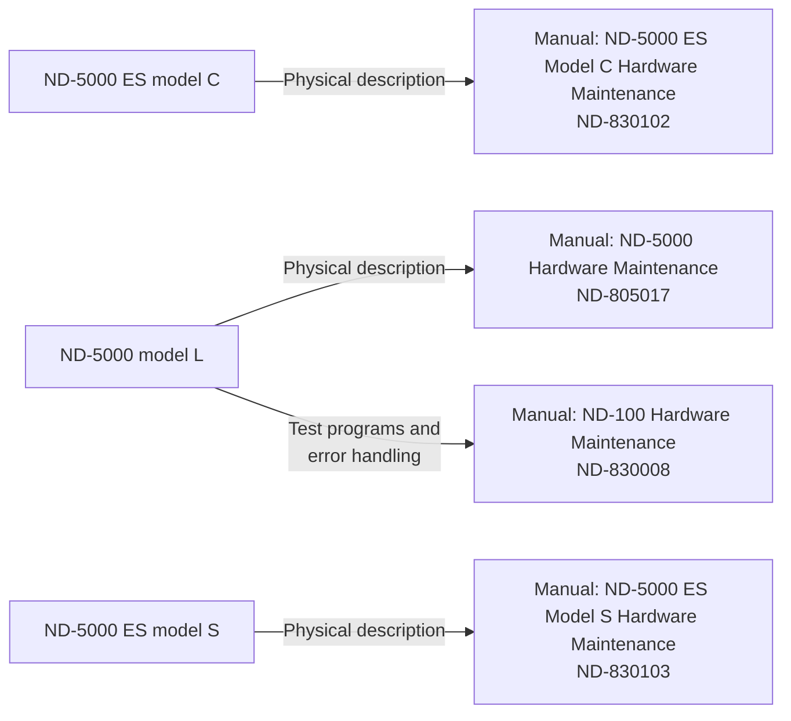
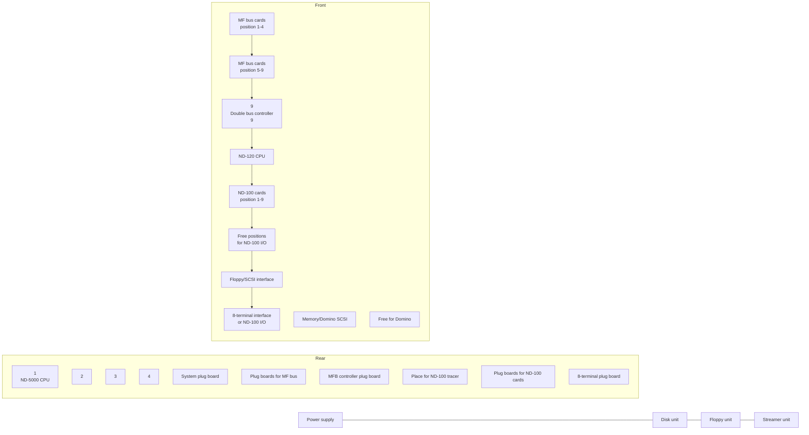

## Page 1

# ND-5000 ES

## Model C Hardware Maintenance Manual

**ND-830102.1 EN**

ND  
Norsk Data

[Cover: Abstract design with colored rectangles]

Scanned by Jonny Oddene for Sintran Data © 2011

---

## Page 2

```
[Photo: Blank page with very faint and illegible text]
```

---

## Page 3

# ND-5000 ES

## Model C Hardware

### Maint. Manual

ND-830102.1 EN

---

_Scanned by Jonny Oddene for Sintran Data © 2011_

---

## Page 4

# Note

The numbering system for Norsk Data's documentation changed in September 1988. All numbers now start with an 8. The numbering structure is therefore ND-8x.xxx.xx.xx. Example: ND-863018.3A EN. Existing manuals will receive a new number if and when they are updated or revised.

The information in this manual is subject to change without notice. Norsk Data A.S assumes no responsibility for any errors that may appear in this manual, or for the use or reliability of its software on equipment that is not furnished or supported by Norsk Data A.S.

Copyright 1989 by Norsk Data A.S

Send all documentation requests to:

Norsk Data A.S  
Publication Department  
P.O. Box 25 - Bogerud  
N-0621 Oslo 6  
NORWAY  

Scanned by Jonny Oddene for Sintran Data © 2011

---

## Page 5

# Preface

## THE PRODUCT

The new ND-5000 ES Model C replaces the current ND-5000 Compacts. It covers the low/medium end of the ND-5000 systems and is meant to be used as general departmental systems and servers for installations that are not too large.

## THE MANUAL

This manual covers the ND-5000 ES Model C. It is meant to be a helping hand for the service staff.

The manual is a physical description and does NOT cover the handling of system errors, test program descriptions etc., as these are described in other manuals. The illustration below shows which manual to use for the different tasks:



---

## Page 6

# The Reader

The readers of this manual should be field service engineers and technical personnel directly involved in maintaining the ND-5000 ES Model C.

# Related Manuals

| Manual                                            | Number   |
|---------------------------------------------------|----------|
| ND-100 Hardware Maintenance Manual                | ND-830008|
| ND-5000 Hardware Maintenance                      | ND-805017|
| Test Program Description for ND-100               | ND-830005|
| ND-5000 Hardware Description                      | ND-805020|

---

## Page 7

# Table of Contents

## 1 INTRODUCTION

| Section | Description                      | Page |
|---------|----------------------------------|------|
| 1.1     | System description               | 1    |
| 1.2     | Models                           | 2    |
| 1.3     | Upgrading possibilities          | 3    |

## 2 Physical description

| Section   | Description                                 | Page |
|-----------|---------------------------------------------|------|
| 2.1       | Cabinet                                     | 5    |
| 2.1.1     | Panels                                      | 6    |
| 2.1.2     | Fan tray                                    | 8    |
| 2.1.3     | Operator panel                              | 8    |
| 2.1.4     | Backwiring                                  | 10   |
| 2.1.4.1   | SCSI bus                                    | 14   |
| 2.1.5     | Card crate                                  | 27   |
| 2.1.6     | Mass storage devices                        | 29   |
| 2.1.6.1   | Floppy drive                                | 30   |
| 2.1.6.2   | Disk unit(s)                                | 31   |
| 2.1.6.3   | Streamer drive                              | 32   |
| 2.1.6.4   | ND Gigabyte System                          | 33   |
| 2.1.7     | Power supply                                | 34   |
| 2.1.8     | Boards                                      | 36   |
|           | System plugboard (5259)                     | 37   |
|           | MFB controller plugboard (5234)             | 38   |
|           | ND-100 Floppy and SCSI controller (3201)    | 39   |
|           | 8-terminal plugboards                       | 40   |

## 3 Maintenance display

| Section   | Description                      | Page |
|-----------|----------------------------------|------|
| 3.1       | Function                         | 43   |
| 3.1.1     | Normal display operation         | 44   |
| 3.1.2     | OPCOM commands using display     | 46   |
|           | Memory examine                   | 46   |
|           | Register examine                 | 48   |
|           | Reset to normal operation        | 50   |
|           | Define display format            | 50   |

---

## Page 8

# Table of Appendices

Appendix A: Part numbers .............................................. 52

Index ........................................................................ 53

Scanned by Jonny Oddene for Sintran Data © 2011

---

## Page 9

# List of Figures

1. Cabinet .................................................. 5  
2. Front panel .............................................. 6  
3. Panels ................................................... 7  
4. Fan tray and operator panel .............................. 9  
5. Backwiring (5812) ........................................ 12  
6. Backwiring (5816) ........................................ 13  
7. SCSI bus on the backwiring PCB 5812 ...................... 16  
8. SCSI bus on the backwiring PCB 5816 ...................... 17  
9. ND-100 accesses all SCSI devices ......................... 18  
10. Strapping on the SCSI bus - normal configuration ........ 20  
11. SCSI bus shared between two controllers ................. 21  
12. Strapping on the SCSI bus - extended configuration I .... 23  
13. SCSI bus shared between three controllers ................ 24  
14. Strapping on the SCSI bus - extended configuration II ... 26  
15. Card crate .............................................. 28  
16. Mass storage devices .................................... 29  
17. Switchsetting on the floppy unit ........................ 30  
18. Switchsetting on the disk unit .......................... 31  
19. Switchsetting on the streamer ........................... 32  
20. Switchsetting on the gigatape ........................... 33  
21. Power supply ............................................ 35  
22. System plugboard (5259) ................................. 37  
23. MFB controller plugboard (5234) ......................... 38  
24. ND-100 floppy and SCSI controller (3201) ................ 39  
25. External plug panel (1701) .............................. 41  
26. Connecting the maintenance-display ...................... 42  
27. Maintenance-display ..................................... 43

---

## Page 10

# List of Tables

1. Model overview .................................. 2  
2. Upgrading possibilities ......................... 3

---

## Page 11

# Chapter 1 INTRODUCTION

This chapter gives an introduction to the ND-5000 ES C models.

## 1.1 System description

The new ND-5000 ES Model C replaces the current ND-5000 Compact. It covers the low/medium end of the ND-5000 systems and is meant to be used as general departmental systems and servers for installations that are not too large.

It has the same cabinet as the previous version, except for the front cover. The interior, however, is completely new. It consists of a large card crate, into which all cards and devices (including the new power supply, the fan unit, disks, floppy units and streamer units) can be plugged. The backwiring is located in the middle of the card crate, and cards and devices are plugged in from both the front and the rear sides.

The new ND-5000 ES Model C is available with all ND-5000 CPU versions, including ND-5800.

See the table on page 2 for an overview of the various systems available.

---

## Page 12

# 1.2 Models

This section contains an overview of the different models available.

```
  _____________________
 /                     \
|                       |
|                       |
|                       |
|                       |
 \_____________________/
```

| SYSTEM      | ND-5200 | ND-5400 | ND-5500 | ND-5700 | ND-5800   |
|-------------|---------|---------|---------|---------|-----------|
| I/O PROCESSOR | ND-120 | ND-120 | ND-120 | ND-120/CX | ND-120/CX |
| MEMORY (MB)  |         |         |         |         |           |
| SHARED+LOCAL | 4 + 2   | 4 + 4   | 8 + 4   | 8 + 4   | 16 + 6    |

| DISK SIZE (MB) |
|----------------|
| Model C1: 310  |
| Model C2: 2x310 |
| Model C3: 3x310 |
| Model C4: 4x310 |
| Model C5: 5x310 |

| BACKUP MEDIA                                          |
|-------------------------------------------------------|
| Streamer: 155 MB                                      |
| Options : ND Gigatape system                           |
|            HP magtape - 1600/6250 bpi, 125 ips         |

*Table 1. Model overview*

---

## Page 13

# Chapter 1 INTRODUCTION

## 1.3 Upgrading possibilities 

Full upgrading is possible between the ND-5000 ES Model C systems:

- Upgrading between models, for example upgrading an ND-5200 Model C1 to an ND-5200 Model C5.
- Upgrading between systems, for example upgrading an ND-5200 to an ND-5700.

Note that extra memory boards are not included in the upgrading kits, and must therefore be ordered separately.

```
ND-5200      ND-5400      ND-5500      ND-5700      ND-5800  
Model C1---->Model C1---->Model C1---->Model C1---->Model C1  
  |            |            |            |            |      
Model C2---->Model C2---->Model C2---->Model C2---->Model C2  
  |            |            |            |            |      
Model C3---->Model C3---->Model C3---->Model C3---->Model C3  
  |            |            |            |            |      
Model C4---->Model C4---->Model C4---->Model C4---->Model C4  
  |            |            |            |            |      
Model C5---->Model C5---->Model C5---->Model C5---->Model C5  
```

*Table 2. Upgrading possibilities*

---

## Page 14

# Chapter 2 Physical Description

This chapter describes the different parts of the hardware in the new ND-5000 ES Model C. This is a physical description, and will not cover functional descriptions of the different parts described in this chapter:

- Cabinet
- Panels
- Power switch
- Backwiring
- Fan tray
- Operator panel
- Card crate
- Plug-in modules

---

## Page 15

# Chapter 2 Physical Description

## 2.1 Cabinet

This section describes the cabinet, including the card crate, the power supply and the devices.

It is easy to replace defective devices and modules, as the parts that normally need service are plugged directly into the backwiring and the cabinet is practically free from internal cables.

```
   ____________________
  /                   /|
 /___________________/ |
|                   |  |
|      _______      |  |
|     |       |     |  |
|     |_______|     |  |
|     |       |     |  /
|     |_______|     | /
|___________________|/
```

*Figure 1. Cabinet*

---

## Page 16

# Chapter 2 Physical Description

## 2.1.1 Panels

This section shows how to remove the panels.

**Front panel**

Remove the screw located at the top of the panel. Lift the panel slightly and pull it away.

```
      +--------------------------------------------------+
      |                                                  |
      |                                                  |
      |                                                  |
      |                                                  |
      |                                                  |
      +--------------------------------------------------+
```

*Figure 2. Front panel*

---

## Page 17

# Chapter 2 Physical Description

| Panel       | Description                                                                 |
|-------------|-----------------------------------------------------------------------------|
| Side panels | Turn the two screws on the top of the side panels 1/2 turn counterclockwise and lift the panel away. See figure 3. |
| Top panel   | Remove the four screws holding the top panel and lift it away. See figure 3. |
| Rear panel  | Remove the four screws holding the rear panel and lift it away. See figure 3. |

```
   +------+
  /      /|
 +------+ |
 |      | +
 |      |/
 +------+

   Figure 3. Panels
```

---

## Page 18

## Chapter 2: Physical Description

### 2.1.2 Fan Tray

The cooling is based on the same principle as the previous ND-5000 Compact. The fans are located in a fan tray pluggable from the bottom of the front into the backwiring (see figure 4). The fans are the DC type, with an extra wire for indicating the rotation speed. The power for the fans is supplied by the DC 500 power supply, and the voltage is controlled by software and the ambient temperature. The input to the fan speed control comes from an NTC resistor which senses the room temperature. This sensor is mounted at the top of the backwiring, close to the air inlet.

```
NOTE

Note that you must turn the power off 
before removing or inserting the fan 
tray.
```

### 2.1.3 Operator Panel

The operator panel and key switch are located at the top of the front (see figure 4). It is similar to the operator panels on previous ND computers, but the display has been removed. The information that earlier could be read from the display is still available, but you must connect a maintenance display to get it (see page 42). The operator panel is connected to the backwiring via a flat cable along the top of the cabinet.

---

## Page 19

# Chapter 2 Physical Description

```
  ____________________
 /                    \
|                      |
|                      |
|                      |
|                      |
|                      |
|     Fan Unit         |
|                      |
|                      |
|                      |
|                      |
|______________________|

   Figure 4. Fan tray and operator panel
```

Scanned by Jonny Oddene for Sintran Data © 2011

---

## Page 20

# Chapter 2 Physical Description

## 2.1.4 Backwiring

The backwiring acts as the main connection between all internal modules. All cards and devices are plugged directly into the backwiring, including the power supply and the fan tray.

The backwiring also contains:

- Temperature sensor (regulating the fan speed)
- Connector for the operator panel
- An area where it is possible to measure the voltages
- Terminator/strap fields for the SCSI bus
- Switches for splitting the SCSI bus

The backwiring is prepared for taking care of the internal SCSI bus. This bus has been routed to all internal SCSI devices, and it ends up on the plugboard in position 14. Here the bus can be terminated, or one external single-ended SCSI device can be connected. This could, for example, be a magtape unit used for backup.

Normally all devices on the SCSI bus can be accessed from ND-100, but the strap/terminator fields and the split switches on the backwiring make it possible to split the SCSI bus. See the description in the section "SCSI bus" on page 14.

Two different versions of the backwiring are used:

- PCB number 5812 for early versions
- PCB number 5816 for later versions

The difference between these two backwirings is the possibility to split the bus with

---

## Page 21

# Chapter 2 Physical Description

straps/terminators and split switches. See the illustrations of the backwirings (figure 5 and figure 6) and the description in the section "The SCSI bus" on page 14.

Unused SCSI positions must be terminated by a dummy plug, part number 322774.

[Scanned by Jonny Oddene for Sintran Data © 2011]

---

## Page 22

# Chapter 2: Physical Description

```plaintext
 ________________________________________
| Temp-   |                              |
| sensor  |  Operator Gnd +5V 5VStb +12V |
|_________|   panel                      |
|                                        |
|                                        |
|                                        |
|                                        |
|                                        |
|                                        |
|                                        |
|                                        |
|________________________________________|
| Fan tray                               |
|________________________________________|

 __________________________
|                          |
|    Floppy   Strapfield 1 |
|    Streamer              |
|    Disk B                |
|______/\__________________|
|    Strapfield 2          |
|                          |
|    Disk A   Disk C       |
|__________________________|
|          Split-switch    |
|__________________________|
|    Disk E   Disk D       |
|__________________________|
```

*Figure 5. Backwiring (5812)*

[Scanned by Jonny Oddene for Sintran Data © 2011]

---

## Page 23

# Chapter 2: Physical Description

```
 ____________________________________
|                                    |
| Temp-      *   __                  |
| sensor    * * [  ] [  ] [  ]       |
|            *                       |
|                                   |
| Operator                ________  |
| panel                  |    ┌──┐ |
|         _____          | Floppy  |
|        |  :  |         | Streamer |
|        |_____|         |______   |
|                       | Strapf  |
|                       :________|
|                       : ____    |
|                       | Strapf  |
|                       | Disk A  |
|                       | Disk C  |
|                       :_________|
|                         Strapf   |
|                         | Disk D |
|                         | Disk E |
|                         :________|
|                                   
| Fan tray                          |
|___________________________________|

Side View:
 __________________
|  +5V  5VStb +12V  |
|__________________|

```

**Figure 6. Backwiring (5816)**

---

## Page 24

## 2.1.4.1 SCSI Bus

The SCSI (Small Computer Systems Interface) standard is used for connecting mass storage devices to the computer. A maximum of eight units can be connected to one bus (including the ND-100 SCSI controller).

On the ND-5000 ES Model C, the backwiring takes care of the internal SCSI bus. This bus has been routed to all internal SCSI devices (streamer and disks), and it ends up on the plugboard in position 14 (see figures 7 and 8).

Here the bus can be terminated, or one external single-ended SCSI device can be connected. This could, for example, be a magtape unit used for backup.

To be able to separate the different SCSI units from each other, each unit connected to the SCSI bus must have its own SCSI identification number (ID number). These numbers are 0-7, and they are set by switches or straps on each device or board.

| ID number | Device                          | See page |
|-----------|---------------------------------|----------|
| 0         | Disk A (system disk)            | 31       |
| *) 1      | Streamer or ND Gigatape         | 32       |
| 2         | Optional external SCSI device   |          |
| 3 - 6     | Free (Disk B-E)                 | 31       |
| 7         | ND-100 Floppy and SCSI controller| 39       |

*) SCSI ID number 1 is reserved for the device used for system disk backup.

---

## Page 25

# Chapter 2 Physical Description

All devices on the SCSI bus are normally accessed from the ND-100, but there are several possible ways to split the access to the SCSI devices. This is done with strap fields and split switches in the backwiring (see figure 5 and figure 6) and a flat cable on the System plugboard - 5259 (see figure 22).

On the next pages we show three different examples of how to do this on both versions of the backwiring.

```
+-------------------- NOTE -------------------+
|                                            |
| Unused SCSI positions must be terminated   |
| by a dummy plug, part number 322774.       |
|                                            |
+--------------------------------------------+
```

---

## Page 26

# Chapter 2: Physical Description

```
 ________________________________
| Temp-   ______________________ |
| sensor |                      ||
|        | Operator panel       ||
|        |______________________||
|______| Gnd | +5V | 5VStb | +12v |
|_______________________________ |
|                               ||
|                               ||
|                               ||
|                               ||
|         SCSI bus              ||
|          _______________      ||
|         |               |     ||
|_________|  Streamer     |____(_)
|_________|               |_____||
|          _______________      ||
|_________|  Strapfield 1  |____||
|_________|               |_____||
|   Disk B |             | Disk A||
|          |_____________|      ||
|   Disk C | Strapfield  | Disk D||
|          |_____________|      ||
|                               ||
|   Disk E                      ||
|_______________________________||
| Fan tray                      ||
|_______________________________||
     |__________________________   
    | System plug board       |
    | MFB SCSI controller     |
    |_________________________|

ND-100 Floppy and SCSI Interface
```

*Figure 7. SCSI bus on the backwiring PCB 5812*

---

## Page 27

# Chapter 2 Physical Description

## ND-100 Floppy and SCSI Interface

```
        _________________________
       | Temp-                   |
       | sensor                  |
       |                         |
       | Operator Gnd  +5V 5VStb +12v
       | panel         o    o    o 
       |               ___ ___ ___
       |              |___|___|___|
       |
       |         _________________________
       |        |                         |
       |        |                         |
       |        |                         |
       |        |         Streamer        |
       |        |            |            |
       |        |          ___            |
       |        |         |   |           |
       |        |  _______|___|__________ |
       |        | |       |   |          ||
       |        | |   ___ |   | ___      ||
       |        | |  |   ||   ||   |     ||
       |        | |  |___||   ||___|     ||
       |        | |  Strapfield 1        ||
       |        | |______________________||
       |        |          | || | ||     ||
       |        |          | || | ||     ||
       |        |          | || | ||     ||
       |        |          | || | ||     ||
       |        |          | || | ||     ||
       |        |          | || | ||     ||
       |        |          | || | ||     ||
       |        |         _| || | ||_    ||
       |        |        |___________|   ||
       |        |          Disk B       ||  SCSI bus
       |        |     _____________     ||
       |        |    | | | | | | | |    ||
       |        |____|_|_|_|_|_|_|_|____||
       |        |         Strapfield 2  ||
       |        |_______________________||
       |         ______________________ ||
       |        ||  Disk C             ||
       |        ||                    T ||
       |        ||  Strapfield 3      T ||
       |        |_______________________||
       |                             T  ||
       |         ______________________ ||
       |        ||  Disk E             ||
       |        ||                    T ||
       |        ||  Disk A             ||
       |        ||                    T ||
       |        ||                     ||
       |        ||  Split-switch       ||
       |_______|| | | | | | | | | | |  ||
       |        | | | | | | | | | | |  ||
       |        |         Fan tray     ||
       |        |_______________________||

```

System plug board  
MFB SCSI controller

*Figure 8. SCSI bus on the backwiring PCB 5816*

---

## Page 28

## Chapter 2 Physical Description

The ND-100 bus accesses all SCSI devices:

### Backwiring PCB 5816

```plaintext
  +-----------------------------------+
  | ND-100 SCSI and                  |
  | floppy controller                 |
  +-----------------------------------+
       |                            |
+------+                            +-----------------+
|     |                             |                 |
|  +----+                           |   +-----------+ |
|  |    |                           |   |           | |
|  |    |                           |   |           | |
|  |    |                           |   |           | |
|  |    |                              |           | |
|  +----+                              +-----------+ |
|  |                             |   | System plug | |
|  |                             |   | board       | |
|  |                             |   +-------------+ |
|  | Disk A                      |                 | |
|  +-----------------------------+                 | |
+------------------------------------------+       | |
                      |                     |       | |
                   +--+                     +-------+ |
                   | Streamer                       | |
                   +-------------------------------+ |
                                                   | |
                       +---------------------------+ |
                       | Disk B                    | |
                       +---------------------------+ |
        +------------------------------------------+ |
        | Disk C                                   | |
        +------------------------------------------+ |
        | Disk D                                   | |
        +------------------------------------------+ |
        | Disk E                                   | |
        +------------------------------------------+ |
        +------------------------------------------+ |
|       | Terminator or external SCSI interface   | |
+-------+-----------------------------------------+ +
```

### Backwiring PCB 5812

```plaintext
  +-----------------------------------+
  | ND-100 SCSI and                  |
  | floppy controller                 |
  +-----------------------------------+
       |                            |
+------+                            +-----------------+
|     |                             |                 |
|  +----+                           |   +-----------+ |
|  |    |                           |   |           | |
|  |    |                           |   |           | |
|  |    |                           |   |           | |
|  |    |                              |           | |
|  +----+                              +-----------+ |
|  |                             |   | System plug | |
|  |                             |   | board       | |
|  |                             |   +-------------+ |
|  | Disk A                      |                 | |
|  +-----------------------------+                 | |
+------------------------------------------+       | |
                      |                     |       | |
                   +--+                     +-------+ |
                   | Streamer                       | |
                   +-------------------------------+ |
                                                   | |
                       +---------------------------+ |
                       | Disk B                    | |
                       +---------------------------+ |
        +------------------------------------------+ |
        | Disk C                                   | |
        +------------------------------------------+ |
        | Disk D                                   | |
        +------------------------------------------+ |
        | Disk E                                   | |
        +------------------------------------------+ |
        +------------------------------------------+ |
|       | Terminator or external SCSI interface   | |
+-------+-----------------------------------------+ +
```

*Figure 9. ND-100 accesses all SCSI devices*

---

## Page 29

## Chapter 2 Physical Description

- The strap fields on the backwiring must be set as shown in the figures on the next page.

- The split switches on the backwiring must be set as shown in the figures on the next page.

- The flat cable on the System plugboard must be connected as shown on the figures on the next page.

- The SCSI plug on the System plugboard must be terminated, or an external SCSI device must be connected. Then the SCSI bus must be terminated on the external device.

- Empty SCSI positions must be equipped with dummy plugs, part number 322774.

---

## Page 30

# Chapter 2 Physical Description

```
Backwiring PCB 5816
 ____________________
|                    |
|  _________________ |
| |_____|_____|_____| |
| |_____|_|___|_____| |
|  \|/ Strapping     |
|      ______________ |
|     |______|____|__ |
|                    |
|____Strapfield 1____|

Strapfield 2
```

```
System Plug Board
  ________
 |        |
 |   []   | A
 |________|
 |   []   | B
 |   []   | C
 |________|
     []   | D
```

```
Backwiring PCB 5812
 ____________________
|                    |
|  _________________ |
| |_____|_____|_____| |
| |_____|__|__|_____| |
|  \|/ Strapping     |
|     _____ ________ |
|____|_____|______|__|

Strapfield 1
Strapfield 2
```

*Figure 10. Strapping on the SCSI bus - normal configuration*

---

## Page 31

# Chapter 2 Physical Description

**ND-100 bus accesses the streamer and one disk, the MF bus accesses the rest of the SCSI devices:**

## Backwiring PCB 5816

```plaintext
  +-----------------------------+         +------------------------+
  | ND-100 SCSI and             |         | Terminator or external |
  | floppy controller           |         | SCSI interface         |
  +-----------------------------+         +------------------------+
               |                                    |
               |                                    |
               |                                    |
           +---+--------------------------------+---+
           |                                     |
           | System plug board                   |
           |                                     |
           +-------------------------------------+
                 | |  | | | | | | | | | | | | |
                 | |  | | | | | | | | | | | | |
                TT TT  TT TT TT TT TT TT TT TT TT
                 | |  | | | | | | | | | | | | |
         +-------+ +--+ + +--+ +--+ +--+ +--+ +--+
         |         |     |    |    |    |    |    |
     +-------+ +-------+ +----+ +----+ +----+ +----+
     | Disk A | |Streamer| | Disk B | | Disk C | | Disk D | | Disk E |
     +-------+ +-------+ +----+ +----+ +----+ +----++----+
```

## Backwiring PCB 5812

```plaintext
  +-----------------------------+         +------------------------+
  | ND-100 SCSI and             |         | Terminator or external |
  | floppy controller           |         | SCSI interface         |
  +-----------------------------+         +------------------------+
               |                                    |
               |                                    |
               |                                    |
           +---+--------------------------------+---+
           |                                     |
           | System plug board                   |
           |                                     |
           +-------------------------------------+
                 | |  | | | | | | | | | | | | |
                 | |  | | | | | | | | | | | | |
                TT TT  TT TT TT TT TT TT TT TT TT
                 | |  | | | | | | | | | | | | |
         +-------+ +--+ + +--+ +--+ +--+ +--+ +--+
         |         |     |    |    |    |    |    |
     +-------+ +-------+ +----+ +----+ +----+ +----+
     | Disk A | |Streamer| | Disk B | | Disk C | | Disk D | | Disk E |
     +-------+ +-------+ +----+ +----+ +----+ +----++----+
```

*Figure 11. SCSI bus shared between two controllers*

---

## Page 32

# Chapter 2 Physical description

This can be done as described below:

- An MF bus SCSI controller card must be placed in MF bus position 8 in the card crate (positions 5, 6 or 7 may also be used, but then you must use an extra plugboard in the backwiring and a flat cable).

- The strap fields in the backwiring must be set as shown in the figure on the next page.

- The split switches in the backwiring must be as shown in the figure on the next page.

- The flat cable on the System plugboard must be connected as shown in the figure on the next page.

- The SCSI plug on the System plugboard must be terminated, or an external SCSI device must be connected. Then the SCSI bus must be terminated on the external device.

- Empty SCSI positions must be equipped with dummy plugs, part number 322774.

---

## Page 33

## Chapter 2 Physical Description

### Backwiring PCB 5816

```
Terminator
+----------------------------------+
|           T T Terminators        |
| Strapfield 1                     |
|                                  |
|                                  |
| +------+ +------+ +------+       |
| |      | |      | |      |       |
| |      | |      | |      |       |
| +------+ +------+ +------+       |
| Strapfield 2       +-------+     |
|                    |       |     |
|                    |       |     |
|                    +-------+     |
| Strapping                      |
| Strapfield 3                   |
+----------------------------------+
```

### Backwiring PCB 5812

```
+----------------------------------+
|           T T Terminators        |
| Strapfield 1                     |
|                                  |
|                                  |
| +------+ +------+ +------+       |
| |      | |      | |      |       |
| |      | |      | |      |       |
| +------+ +------+ +------+       |
| Strapfield 2       +-------+     |
|                    |       |     |
|                    |       |     |
|                    +-------+     |
+----------------------------------+
```

### System Plug Board

```
+------------------------+
|                       A|
|                        |
| +-------+              |
| |       |              |
| |       |              |
| |       |              |
| +-------+              |
|              +--------+|
|              |        ||
|              |        ||
|              +--------+|
|                        |
|                       B|
|                        |
|                        |
|                       C|
|                        |
|                        |
|                       D|
+------------------------+
```

*Figure 12. Strapping on the SCSI bus – extended configuration I*

---

## Page 34

# Chapter 2: Physical Description

The SCSI devices split between three controllers (one ND-100 SCSI controller and two MF bus SCSI controllers):

## Backwiring PCB 5816

```plaintext
                    SCSI plug board 
                       ______________
                      |              |
                      |______________|
   __________________________|___
  |                            |   |
  | System plug board 1        |   |
  |______________________      |   |
           |                   |   |
  __________|______           _|___|________
 |                 |         |              |
 | ND-100 SCSI and |         | MFB SCSI     |
 | floppy controller |       | controller 1 |
 |_________________|_________|______________|
        | TT         | T                  |
        |            |                    |
    ____|_____    ___|___    ___    ___    ___
   |          |  |       |  |   |  |   |  |   |
   | Disk A   |  |Streamer|  |Disk B |Disk C |Disk D |Disk E |
   |__________|  |_______|  |_______|_______|_______|

```

## Backwiring PCB 5812

```plaintext
                    SCSI plug board 
                       ______________
                      |              |
                      |______________|
   __________________________|___
  |                            |   |
  | System plug board 1        |   |
  |______________________      |   |
           |                   |   |
  __________|______           _|___|________
 |                 |         |              |
 | ND-100 SCSI and |         | MFB SCSI     |
 | floppy controller |       | controller 1 |
 |_________________|_________|______________|
        | TT         | T                  |
        |            |                    |
    ____|_____    ___|___    ___    ___    ___
   |          |  |       |  |   |  |   |  |   |
   | Disk A   |  |Streamer|  |Disk B |Disk C |Disk D |Disk E |
   |__________|  |_______|  |_______|_______|_______|

```

*Figure 13: SCSI bus shared between three controllers*

---

## Page 35

# Chapter 2 Physical Description

This can be done as described below:

- An MF bus SCSI controller (MF bus SCSI controller I) must be placed in MF bus position 8 in the card crate (positions 5, 6 or 7 may also be used, but then you must use an extra plugboard in the backwiring and a flat cable).

- Another single-ended MF bus SCSI controller (MF bus SCSI controller II) must be placed in MF bus positions 5, 6 or 7, and a SCSI plugboard must be placed in the same position from the rear side.

- The strap fields on the backwiring must be set as shown in the figure on the next page.

- The split switches on the backwiring must be as shown in the figure on the next page.

- The flat cable on the System plugboard must be connected as shown in the figure on the next page.

- A cable must be connected between the two plugboards.

- Empty SCSI positions must be equipped with dummy plugs, part number 322774.

---

## Page 36

# Chapter 2: Physical Description

## Backwiring PCB 5816

```
    ┌────────┐
    │        │
    │        │──── Terminiators
    │        │     Strapfield 1
    │        │
    └────────┘──── Strapping
          │        Strapfield 2
          │
          └──── Strapping and terminator
               Strapfield 3
```

## Backwiring PCB 5812

```
    ┌────────┐
    │        │
    │        │──── Terminiators
    │        │     Strapfield 1
    │        │
    └────────┘──── Strapping and terminator
          │        Strapfield 2
          │
```

## System Plug Board

```
   ┌────────┐
   │        │ A
   │        │
   │        │ B
   │        │ 
   │        │ C
   │        │
   │        │ D
   └────────┘
```

*Figure 14. Strapping on the SCSI bus - extended configuration II*

---

## Page 37

# Chapter 2 Physical Description

## 2.1.5 Card Crate

The card crate has the following layout:

**In the front:**

- Nine positions for ND-100 cards
- Five positions for MF bus cards
- Place for streamer unit, floppy unit and up to five disk units

Free ND-100 positions do not need dummy plugs. Empty positions for mass storage devices must be terminated by special plugs.

**At the rear:**

- Slots for plugboards
- Four positions for the ND-5000 CPU
- Place for the power supply

---

## Page 38

## Chapter 2: Physical Description



---

*Figure 15. Card crate*

---

## Page 39

# Chapter 2 Physical Description

## 2.1.6 Mass Storage Devices

This section describes the mass storage devices:

- Floppy drive
- Streamer
- Disk drive
- Gigatape

```
+---------------------------------+
|  +----+   +--+--+   +--+--+--+  |
|  | A  |   | B | C |  | D | E |  |
|  +----+   +-----+   +-------+  |
+---------------------------------+

A: 1 floppy unit
B: 1 streamer and
C: Up to 5 disk units
ND-Gigatape system is optional
```

*Figure 16. Mass storage devices*

---

## Page 40

## 2.1.5.1 Floppy Drive

The 5 1/4" floppy drive is the plug-in type, located at the top of the front (see figure 16). The drive is mounted on a board, and is therefore very easy to replace: Turn off the power, remove the two screws holding the floppy drive and pull it out.

#### NOTE

Turn the key switch on the operator panel to OFF and turn the power off before removing the floppy drive.

When replacing the floppy unit, remember to check that the switchsetting on the new unit is set to the correct value (see the figure below).

```plaintext
  ●                Shorted
  ○  
      
  ○                Open
  ○ 
     
    ◼  ◼
   DE/X          | 
   DC1/2 ◻ ◻ ◻ | SR DC
   ◻ ◻ ◻ ◻    | ◻ ◼  FG
   D1-D4 TM
             ░░░░░░░░░░░░░░░
             ░░░░░░░░░░░░░░░
```

*Figure 17. Switchsetting on the floppy unit*

---

## Page 41

# Chapter 2 Physical Description

## 2.1.6.2 Disk Unit(s)

Up to five disk units can be mounted in the cabinet (see figure 16), depending on the model. Each drive is mounted on a board, and they are therefore easy to replace:

Turn off the power, remove the two screws holding the disk and pull it out.

```
+----------------------------------------------+
| NOTE                                         |
|                                              |
| Turn the key switch on the operator          |
| panel to OFF and turn the power off          |
| before removing the disk unit.               |
+----------------------------------------------+
```

When replacing a disk unit, you must check that the switch setting on the new unit is correct (see the figure below).

```
   Rear side
    +-----------+
    |   [===]   |
    +-----------+
            ^
            |
          .---.
         |     | = Strap
          '---'
```

```
+-----------------+
|                 |
|                 |
|                 |
|                 |                       
|                 |                       
|                 |                       
|                 |                       
|                 |                       
+-----------------+
```

```
    +---+ +---+ +---+
    |   | |   | |   | Disk A
    +---+ +---+ +---+

    +---+ +---+ +---+
    |   | |   | |   | Disk B
    +---+ +---+ +---+

    +---+ +---+ +---+
    |   | |   | |   | Disk C
    +---+ +---+ +---+

    +---+ +---+ +---+
    |   | |   | |   | Disk D
    +---+ +---+ +---+
    
    +---+ +---+ +---+
    |   | |   | |   | Disk E
    +---+ +---+ +---+
```

*Figure 18. Switchsetting on the disk unit*

---

## Page 42

## Chapter 2 Physical Description

### 2.1.6.3 Streamer Drive

The 5 1/4" streamer drive is the plug-in type, located at the top of the front (see figure 16). The drive is mounted on a board, and is therefore very easy to replace:  
Turn off the power, remove the two screws holding the streamer and pull it out.

#### NOTE

```
+----------------------------------------------------+
| Turn the key switch on the operator                |
| panel to OFF and turn the power off                |
| before removing the streamer.                      |
+----------------------------------------------------+
```

When replacing a streamer unit, you must check that the switch setting on the new unit is correct (see the figure below).

```
         Rear side
  +----------------------+
  |  ----                |
  | |    |               |
  | |    |               |
  | |    |               |
  +----------------------+
 
    CF2

  +--------------+
  | o  o  o  o   |
  | o  o  o  o   |
  | o  o  o  o   |
  +--------------+
 
 PEN  CF0  ID0
```

*Figure 19. Switchsetting on the streamer*

---

## Page 43

# Chapter 2 Physical Description

## 2.1.6.4 ND Gigabyte System

This is an optional tape system that uses 8 mm cartridge tapes and can store up to 2.2 Gbytes of data on one cartridge. The tape system uses a standard SCSI interface, and the drive is 5 1/4" high. When installed on models C1-C4, it is located in the upper right corner where disk B is normally located (see figure 16). When installed on model C5, it is mounted in a separate box.

The drive is mounted on a board and is therefore very easy to replace:
- Turn off the power, remove the two screws holding the board and pull it out.

When replacing a unit, you must check that the switchsetting on the new unit is correct (see the figure below).

```
             +------------------+
             |                  |
             |    +--------+    |
             |    |  ____  |    |
             |    | |    | |    |
             |    | |____| |    |
             |    +--------+    |
             |                  |
  +----------+                  |
  |                             |
  |                             |
  +-----------------------------+
  |   |   |   |   |   |   |   |   |
```

*Figure 20. Switchsetting on the gigatape*

[Photo: Rear side]

---

## Page 44

## 2.1.7 Power Supply

The new DC500 and DC501 power supplies are equipped with a microprocessor. Voltages, currents and the fan speed can be monitored and adjusted via a terminal or via TELEFIX.

The power supply also checks that all fans in the fan tray are running.

A temperature sensor, mounted on the top of the backwiring, checks the temperature inside the cabinet. If the temperature increases, the power supply feeds the fans a higher voltage to increase the fan speed, and that reduces the temperature.

The power supply has the following capacities:

| Voltage          | Amperes                    |
|------------------|----------------------------|
| + 5 Volts        | 150 Amperes                |
| + 5 Volts standby| 8 Amperes (DC501: 12 Amperes) |
| +12 Volts        | 18 Amperes (25 Amp. peak to start up disks) |

It is not necessary to perform any maintenance or adjustments on the power module. If the module is defective, it must be replaced.

The power supply is the plug-in type and is therefore easy to replace: Turn the key switch on the operator panel to OFF and turn the power off. Disconnect the two cables from the power supply, unscrew the two screws holding the power supply and pull it out.

```
 __________________________
|          NOTE            |
|--------------------------|
| Turn the key switch on   |
| the operator panel to OFF|
| and turn the power off   |
| before removing the power|
| supply.                  |
|__________________________|
```

---

## Page 45

# Chapter 2: Physical Description

```
  _______________
 /               \
| DC500 Power    |
| supply         |
|                |
| AC in          |
|      _______   |
|     |   o   |  |
|     |_______|  |
|                |
| To ON/OFF switch|
 \_______________/     __________
                     |          |
                     | Logic    |
                     | signals  |
                     |          |
                     | Voltages |
                     |__________|

          ___________________________
         /                           \
        /                             \
       |  _________________________    |
       | |                         |   |
       | |      _______  _______   |   |
       | |     |       ||       |  |   |
       | |     |   B   ||   C   |  |   |
       | |     |_______||_______|  |   |
       | |                         |   |
       | |      _______  _______   |   |
       | |     |       ||       |  |   |
       | |     |   A   ||   D   |  |   |
       | |     |_______||_______|  |   |
       | |                         |   |
       | |      _______  _______   |   |
       | |     |       ||       |  |   |
       | |     |   E   ||   F   |  |   |
       | |     |_______||_______|  |   |
       | |_________________________|   |
        \______________________________/
```

*Figure 21. Power Supply*

---

## Page 46

# Chapter 2 Physical Description

## 2.1.8 Boards

This section describes new boards that are unique to the ND-5000 ES Model C, controllers or plugboards. Other ND-100 cards and cards in the MF bus are not described here, since they are described in other manuals.

Plugboards are plugged into the backwiring from the rear of the cabinet, and this means the computer is almost cable-free.

Some of the plugboards are delivered with every system, while others are optional depending on the model and configuration.

The purpose of this brief description is to show the plugs and switches on the boards.

---

## Page 47

# Chapter 2 Physical Description

## System Plugboard (5259)

This board is used to connect the following devices:

- Maintenance display
- External SCSI device
- ND-5000 CPU console
- ND-100 console
- TELEFIX modem

The plugboard also contains switches for baud rates for the consoles and a switch for enabling/disabling TELEFIX. It is delivered with every system and is placed in the leftmost position in the backwiring, seen from the rear side.

```
   +------------------------------------------------------+
   |                                                      |
   | Connection for the maintenance                       |
   | panel                                                |
   |                                                      |
   | Connection for external SCSI                         |
   | device, or terminztion                               |
   | -----------------------------------------------      |
   | Switch for enabling/                           |      |
   | disabling TELEFIX.                            |      |
   | Normal setting: DOWN                          |      |
   | -----------------------------------------------      |
   | Yellow LED. Lit if differential SCSI                 |
   |                                                      |
   | Connection for ND-5000 CPU                           |
   |                                                      |
   | Baud rate for ND-100 CPU                             |
   | console                                              |
   |                                                      |
   | Connection for ND-100 CPU                            |
   |                                                      |
   | Baud rate for TELEFIX                                |
   |                                                      |
   | Connection for TELEFIX                               |
   +------------------------------------------------------+
   |                                                      |
   | Flatcable for connecting                             |
   | the SCSI bus.                                        |
   | See description in the                               |
   | chapter "The SCSI bus".                              |
   +------------------------------------------------------+
```

*Figure 22. System plugboard (5259)*

---

## Page 48

# MFB Controller Plugboard (5234)

This board is used for the following connections:

- OCTO 1 and OCTO 2
- Power-fail interrupt (not used)
- MFB console (RS232 and current loop)

```
┌──────────────────────────────────────────┐
│                                          │
│               OCTO 1                     │
│                                          │
│               OCTO 2                     │
│                                          │
│         Power fail interrupt             │
│             (not used)                   │
│                                          │
│          MF console (RS232)              │
│                  James                   │
│                                          │
│        MF console (current loop)         │
│                                          │
└──────────────────────────────────────────┘
```

*Figure 23. MFB controller plugboard (5234)*

---

## Page 49

# Chapter 2 Physical Description

## XD-100 Floppy and SCSI Controller (3201)

This board contains both the old floppy controller circuitry and the SCSI adapter to the ND-100. You can install up to four SCSI adaptors in one ND-100.

```
    ┌─────────────────────┐
    │                     │
    │  Z80 DMA            │
    │  BUS                │
    │  REQ                │
    │                     │
    │   ┌────────────┐    │
    │   │  6         │    │
    │   └────────────┘    │
    │   Error code display│
    │   for floppy        │
    │   interface         │
    │                     │
    │   ┌────────────┐    │
    │   │  0         │    │
    │   └────────────┘    │
    │                     │
    │   ┌────────────┐    │
    │   │  0         │    │
    │   └────────────┘    │
    │                     │
    │  SCSI ID number     │
    │  Range: 0-7. 7 means│
    │  host               │
    │                     │
    │  IOX and Ident      │
    │  Range: 0-3         │
    │  (SCSI bus 1-4)     │
    │                     │
    │  0 means floppy     │
    │  unit 0             │
    └─────────────────────┘
```

*Figure 24. ND-100 floppy and SCSI controller (3201)*

[Scanned by Jonny Oddene for Sintran Data © 2011]

---

## Page 50

# 8-terminal plugboards

There are two different types of plugboards for the 8-terminal interface:

- **PCB 5261 (8-terminal plugboard)** is plugged into the backwiring from the rear side, normally in position 1. Because of the size of the plugboard, it is not possible to plug other plugboards into position 2. Up to eight terminals can be connected to this plugboard.

  This board is normally used when eight or fewer terminals are connected.

- **PCB 5262 (Plugboard for external panel)** is plugged into the backwiring from the rear side in one of the free I/O-positions. This plugboard is connected to an external plug panel (PCB 1701) via two cables (see figure 25). PCB 1701 is mounted in a frame on a wall in the data room. Up to eight terminals can be connected to PCB 1701, and each frame can take up to eight external plug panels.

---

## Page 51

# Chapter 2 Physical Description

```
         ___________________________________
        |                                   |
        |  Frame for plug panel, mounted    |
        |  on the wall                      |
        |                                   |
        |   _________                       |
        |  |         |                      |
        |  | PCB 1701 | 8-terminal external |
        |  |         |  plug panel          |
        |  |_________|                      |
        |                                   |
        |                                   |
        |   o  o  o  o  o  o  o  o          |
        |                                   |
        |                                   |
        |              _____________________|
        |             |                     |
 _______|_______      |                     |
|               |     |                     |
|               |______ Cables. partnumber  |
| PCB 5262 Plug |      |     325725         |
| board external|      |____________________|
| panel, plugged|
| into the backwiring  _______|
|_____________________|       |
        |                     |
        |_____________________|
```

*Figure 25. External plug panel (1701)*

---

## Page 52

# Chapter 3: Maintenance Display

Since there is no display on the operator panel of the ND-5000 ES Model C, you must use an external maintenance display. It is similar to the display part of the first ND-100 operator panels, but there is no OPCOM button (see the figure on page 43).

## Connection

Connect the display to the upper socket in the system plugboard (5259), which is located in the leftmost position in the backwiring, seen from the back.

```
        ____________________________
       |                            |
       | Connection for the         |
       | maintenance panel          |
       |____________________________|
       |                            |
       |                            |
       |                            |
       |                            |
       |                            |
       |                            |
       |____________________________|
```

*Figure 26. Connecting the maintenance display*

[Scanned by Jonny Oddene for Sintran Data © 2011]

---

## Page 53

# Chapter 3 Maintenance Display

## 3.1 Function

The maintenance display has four main parts:

1. The FUNCTION field
2. The ADDRESS field
3. The DATA field
4. The OPCOM indicator

```
 .----------.          .--------.
 |    0     |   -PIP   | O OPCOM |
 |  ___ ___ |          `--------'
 | |UTL|HIT||  RNG MODE  
 | |___|___||          
 |          | 15 14 13 12 11 10 9  8  7  6  5  4  3  2  1  0
 | FUNCTION |--------------------------------------------
 |          |  .--------------------------------------.
 |  DAY HR  |  | 2   6 : 1   3 : 4   8 : 5   0       |
 |----------|  `--------------------------------------'
 | ADDRESS  |  .-----------------------------------------.
 |          |  |  | | | | | | | | | | | | | | | | | | | |
 |          |  | 7  6  5  4  3  2  1  0        |
 |----------|  `-----------------------------------------'
 |  DATA    |       
 `----------`       

Figure 27. Maintenance-display
```

---

## Page 54

# Chapter 3 Maintenance Display

## 3.1.1 Normal Display Operation

In normal conditions, the different parts of the display operate as described in this section.

### The FUNCTION Field:

The four parts of the FUNCTION field show the following:

#### UTIlity

The UTIL part shows the utility of the ND-120 CPU. The more the ND-120 is utilized (that is, the less time spent on program level 0), the more segments are lit.

```
|       |    |------|    |-\\    |------|
|       |    |      |    |  \\   |      |
|       |    |      |    |   \\  |      |
|       |    |      |    |      \\|      |
|       |    |      |    |       \\      |
|       |    |      |    |         \\    |
|       |    |------|    |           \\  |
                      |             \\|
```
No activity                   100% Utility

#### Cache HIT

The HIT part shows the hit rate in cache memory. The more hit in cache, the more segments are lit.

```
|       |    |------|    |-\\    |------|
|       |    |      |    |  \\   |      |
|       |    |      |    |   \\  |      |
|       |    |      |    |      \\|      |
|       |    |      |    |       \\      |
|       |    |      |    |         \\    |
|       |    |------|    |           \\  |
                      |             \\|
```
No cache hits               100% cache hit

#### Protect RING

If the paging system is on, the RING part shows which of the four protection rings the computer is running on.

```
  +     +---+     +---+     +---+     +---+
>| |   |   |    |   |    |   |    |   |
>| |   |   |    |   |    |   |    |   |
  +     +---+     +---+     +---+     +---+
```
Paging off      Ring 0      Ring 1      Ring 2      Ring 3

---

## Page 55

# Chapter 3 Maintenance Display

## Interrupt/paging MODE

The MODE part shows whether the interrupt system and/or the paging system is turned on.

```
 lP      l

Both the Interrupt and  Only the interrupt sys-
paging systems are on.   tem is on.
```

## The ADDRESS field

The ADDRESS field displays the DAY, HOUR, MINute and SECond taken from the system clock. (See figure 27 on page 43.)

## The DATA field

The DATA field shows the active program level in the computer. A "one" is set in one of the positions 0-15, corresponding to the active level. The display has afterglow, so it is possible to see a single instruction on a program level. (See figure 27 on page 43.)

## The OPCOM indicator

As the name indicates, the OPCOM indicator is lit when the computer is in OPCOM mode.

---

## Page 56

# Chapter 3 Maintenance Display

## 3.1.2 OPCOM Commands Using Display

Some of the commands available in OPCOM use the display. A summary of how they affect the display is given here. For a complete explanation of OPCOM etc., see the manual ND-110 & ND-120 Functional Description (ND-806030).

### Why Use the Display?

Much of the same information is shown on both the console and the display. But the display remains in the same mode afterwards, and is continuously updated. Therefore you can set up the display to examine for example register or memory address, leave OPCOM, start a program, and still see what happens in that register or address.

## Memory Examine

### Display

When you examine memory, the display responds like this:

- **FUNCTION** field: examine mode
  - PEXM = Physical address examine
  - PT 0 - PT17 = Logical address, mapped via page table 0 - 178.

- **ADDRESS** field: Memory address.

- **DATA** field: Contents of current address.

---

## Page 57

# Chapter 3 Maintenance Display

## Examine Mode

First, set the memory examine mode. If you want to use physical addresses, give the OPCOM command:

```
#E↓
```

If you want to use logical addresses, specify the number of the desired page table (0 - 178) before the "E".

*Example:*

```
#2E↓
```

Subsequent addresses will be mapped through page table 2.

## Memory Examine

To examine a location in memory, type the address followed by a `/`. The display remains in this mode until you give a new display command.

*Example:*

```
#E↓
#12345/ 54321
```

The contents of physical address 123458 is now 543218. This is shown on both the console and the display. If it is changed by a running program, the new contents will be shown on the display.

---

## Page 58

# Register Examine

In register examine mode, the display shows:

**FUNCTION field:** Name (and program level if specified) of the register.

**ADDRESS field:** Current Program Counter (PC). Updated continuously.

**DATA field:** Contents of register. Updated continuously.

## Working Registers

To examine one of the working registers, type:

```
#xxRy/
```

- **xx = Program level (0 - 178).** Default is program level 0.
- **Ry = Working register name R0 - R7.** Corresponding to register-file working registers STS, D, P, B, L, A, T, and X respectively. (These names can also be used directly, but STS must be abbreviated to S.)

**Example:**

```
#14R0/ 000043
```

The contents of R0 (STS register) on program level 14 is now 43. This is shown on both the console and the display. If it is changed by a running program, the new contents will be shown on the display. In addition, the display shows the current program counter (also updated continuously) and the name and level for the register.

---

## Page 59

# Chapter 3 Maintenance Display

```
+-------------------+
|                   |
|      1 4 R 0      |
|                   |
+-------------------+
| PC: 12466   | 43 |
+-------------+----+
```

## Internal Registers

To examine one of the internal registers, type:

```
#Iy/
```

y = internal register number:

| Number | Register |
|--------|----------|
| 0      | PANS     |
| 1      | STS      |
| 2      | OPR      |
| 3      | PSR      |
| 4      | PVL      |
| 5      | IIC      |
| 6      | PID      |
| 7      | PIE      |
| 10     | CSR      |
| 11     | ACTL     |
| 12     | ALD      |
| 13     | PES      |
| 14     | PCR      |
| 15     | PEA      |

**Example:**

```
#I7/
```

This input on the console will show the contents of the PIE-register on the console and the display. Changes will only be seen on the display.

## User Register

The user register is used by some diagnostic and utility programs to hold current status information. To examine this register, type

```
#U/
```

---

## Page 60

# Chapter 3 Maintenance Display

## Reset to Normal Operation

| OPCOM input | The command |
|-------------|-------------|
|             | #ACT/       |

resets the display to the normal operating mode, which is described beginning on page 44.

| Master Clear | The display is also reset to normal operation by a Master Clear to the ND-100. |

## Define Display Format

| OPCOM input | #uuzzyxFJ |
|-------------|------------|

This command sets the format for the display of data. If the parameters uuzzyx are omitted, the default is octal format.

### Parameter Explanation

- **x : Number representation code.**

  - **x = 0** Displayed data is in octal format. zz has no effect.
  - **x = 1** Displayed data is in unary format, i.e. four of the bits in the displayed data are used to light one out of 16 indicators.
  - **x = 2** Displayed data is in binary format. zz has no effect.

- **y : "Stretch" code (afterglow).**

  - **y = 0** No stretching
  - **y = 1** Zeros are stretched

Scanned by Jonny Oddene for Sintran Data © 2011

---

## Page 61

# Chapter 3 Maintenance Display

y = 2 Ones are stretched  
y = 3 Zeros and ones are stretched  

zz : *Lower start bit for unary display*.  

zz = 0-248 Position of lowest bit  
&nbsp;&nbsp;&nbsp;&nbsp;&nbsp;&nbsp;to be represented in unary format.  

uu : *Display processor maintenance codes*.

| uu | Description                                  |
|----|----------------------------------------------|
| 1  | Display year and month in the ADDRESS field  |
| 2  | Inhibit message                              |
| 4  | Initialize panel processor                   |
| 108| Abort message                                |

(See "ND-110 & ND-120 Functional Description" for details on displaying messages on the display.)

*Example*

#1421FJ

After this command is given in OPCOM, bits 148-178 are shown in unary format with afterglow on ones.

---

## Page 62

# Appendix A: Part Numbers

This appendix contains the part numbers for some of the parts in the ND-5000 ES C models.

| Part                                       | Part number |
|--------------------------------------------|-------------|
| DC 500 power supply                        | 512030      |
| Disk drive 310 Mb SCSI 5.25 "              | 323355      |
| Double Bus controller (5464)               | 324244      |
| Dummy plug for empty SCSI positions        | 322774      |
| External SCSI cable                        | 325725      |
| Fan unit                                   | 323354      |
| Floppy drive 1.2 Mb 5.25 "                 | 323357      |
| Frame for external plug panel              | 509507      |
| MOS Memory 4 Mb (5462)                     | 350160      |
| ND-120 CPU, 2 Mb (3202)                    | 350112      |
| ND-120 CPU, 4 Mb (3202)                    | 350110      |
| ND-120 CPU, 6 Mb (3202)                    | 350108      |
| ND-5200 Basic CPU type I                   | 320001      |
| ND-5400                                    |             |
| ND-5500 Basic CPU type II                  | 320002      |
| ND-5700                                    |             |
| ND-5800 Basic CPU type III                 | 320003      |
| Operator panel                             | 323235      |
| PCB 1701 8 terminal external plug panel    | 350231      |
| PCB 5234 MFB console/Octobus plugboard     | 324194      |
| PCB 5259 System plugboard                  | 350309      |
| PCB 5261 8 terminal plugboard              | 350311      |
| PCB 5262 Plugboard external panel          | 350312      |
| PCB 5812 Backwiring                        | 324812      |
| SCSI and floppy disk interface (3201)      | 350001      |
| SCSI bus terminator (backwiring) (1880)    | 324148      |
| SCSI bus terminator (plugboard)            | 517692      |
| Streamer 155 Mb 5.25 "                     | 323356      |
| PCB 5257 Tracer converter                  | 350307      |

---

## Page 63

# Index

- **+12 volts** .................................. 34
- **+5 Volts** ................................... 34
- **+5 Volts standby** ............................ 34

- **Air inlet** .................................... 8

- **Back panel** ................................... 7
- **Backwiring** .................................. 10

- **Cooling** ...................................... 8
- **Currents** .................................... 34

- **DC500** ....................................... 34
- **DC501** ....................................... 34
- **Display** ...................................... 8
- **Dummy plug** .................................. 10

- **External single-ended SCSI device** ............ 10

- **Fan speed** ................................... 34
- **Fan speed control** ............................ 8
- **Fans** ......................................... 8
- **Front panel** .................................. 6

- **Internal SCSI bus** ........................... 10
- **Internal SCSI devices** ....................... 14

- **Key switch** ................................... 8

- **ND-100 console** .............................. 37
- **ND-5000 CPU console** ......................... 37
- **NTC resistor** ................................. 8

---

## Page 64

# Index

## Physical description
- Side panels .......................... 7
- Split switch ........................ 10
- Splitting the SCSI bus .............. 10
- Standby power ....................... 34
- Strap fields ........................ 10
- System plugboard .................... 19

## TELEFIX connection
- Temperature sensor .................. 10
- Terminator fields ................... 10
- Top panel ........................... 7

## Upgrading ........................... 3

## Voltages ........................... 34

---

## Page 65

I'm sorry, but the page is blank except for "Scanned by Jonny Oddene for Sintran Data © 2011" at the bottom.

---

## Page 66

```
[Document Title Page]

[Abstract Colors Illustration]

Scanned by Jonny Oddene for Sintran Data © 2011
```

---

