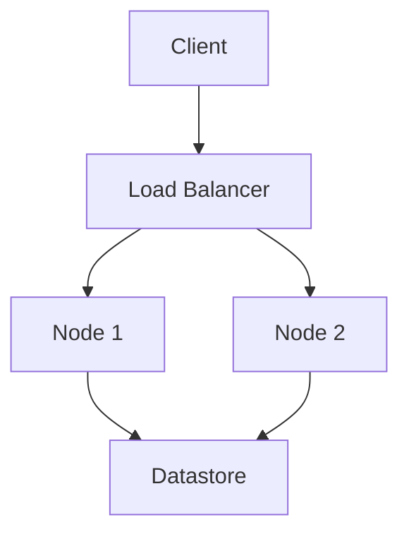

## Page 1

# ND-5000 ES

## System Administrator Guide

Comma

[Logo: Comma]

---

## Page 2

I'm sorry, the scanned page is blank. If you have another document or image, please upload it for me to convert.

---

## Page 3

# ND-5000 ES
## System Administrator Guide

830147EN3

[Scanned by Jonny Oddene for Sintran Data © 2021]

---

## Page 4

# Document Information

The information in this manual is subject to change without notice.  
Comma Data Service AS assumes no responsibility for any errors that may appear in this manual, or for the use or reliability of its software on equipment that is not furnished or supplied by Comma Data Service AS.

Copyright © 1993 by Comma Data Service AS

| Version | Date         |
|---------|--------------|
| 1       | April 1989   |
| 2       | November 1990|
| 3       | February 1993|

Send all documentation requests to:

Comma Data Service AS  
P.O. Box 6448 - Etterstad  
N-0605 Oslo, Norway

---

## Page 5

# Preface

**The product**  
The ND-5000 Extended Server (ES) is a multi-purpose server based on the ND-5000 series of CPUs and the SINTRAN III operating system.

**The reader**  
The manual is mainly written for those responsible for the daily operations of the ND-5000 ES, such as system supervisors and administrators, but may also be of use to others concerned with computer operations and data security.

**Prerequisite knowledge**  
The reader should be familiar with Comma's operating system SINTRAN III. Chapter 2 gives a brief introduction to some SINTRAN III concepts. Further information can be found in the manuals:

- **SINTRAN III User Guide**  ND-860264
- **SINTRAN III System Supervisor**  ND-830003

**The manual**  
The System Administrator Guide is intended as an introduction to the supervisory and managerial tasks involved in operating an ND-5000 ES computer.

- **Chapter 2** gives an introduction to the basic concepts of the SINTRAN III file system.
- **Chapter 3** gives an overview of the basic tailoring tasks that you should perform to utilise the system management tools as effectively as possible.
- **Chapter 4** describes the ND-5000 ES Administrator’s menu system. It gives you a short introduction to all the menu choices available, and tells you which management tasks you can perform with their help.
- **Chapter 5** gives a detailed description of the ND-5000 ES's prepackaged standard system disk: What it contains, how to install it (new version), and how to restore it from streamer tape.

**Appendix A** describes the standard predefined system procedures for warm start, cold start and shutdown of the ND-5000 ES.

**Appendix B** contains a glossary.

You should note that this manual is intended as an introduction (or “index”) to other manuals describing different management tools in greater detail.

---

## Page 6

# Table of Contents

## Chapter 1 Introduction to the ND-5000 ES

1

## Chapter 2 Introduction to SINTRAN

2.1 Structure of the SINTRAN file system  
2.2 Users  
2.3 Privileged users  
2.4 Naming and abbreviation  

3  
3  
4  
4  

## Chapter 3 ND-5000 ES Operation Procedures

3.1 Logging in  
3.2 Initial preparations  
3.2.1 Setting up disks and directories  
3.2.2 Defining users and giving them user areas  
3.2.3 Configuring the external network connections  
3.2.4 Redefining passwords  
3.3 Tailoring procedures for system operations  
3.3.1 Modifying the "system files"  
3.3.2 Defining backup procedures  
3.3.2.1 Total system backup  
3.3.2.2 Backup of individual directories  
3.3.2.3 The system disk  
3.3.2.4 Incremental file backup  
3.3.2.5 Summary - defining backup procedures  
3.3.3 File system verification procedures  

5  
5  
6  
7  
8  
8  
9  
9  
10  
10  
11  
12  
12  
13  
13  

## Chapter 4 ND-5000 ES System Administrator Menus

4.1 Map of the menu system  
4.2 OWS / terminal activity  
4.3 Database administration (optional)  
4.4 Backup  
4.5 Batch scheduling  
4.6 Printer administration  
4.7 Stop / restart the system  
4.7.1 Shutdown  
4.7.2 Warm start  
4.7.3 Cold start  
4.8 Configuration management  
4.8.1 Software version overview  
4.8.2 SINTRAN configuration  
4.8.3 SINTRAN system files  
4.8.3.1 Edit EXTRA-LOAD file  
4.8.3.2 Edit EXTRA-HENT file  
4.8.3.3 Edit STOP-MODE file  
4.8.3.4 Edit CONFIG-FILES file  
4.8.3.5 Save configuration files  
4.8.3.6 Edit USER-DISKS file  

15  
16  
17  
18  
19  
20  
21  
22  
22  
23  
23  
24  
24  
25  
26  
27  
27  
27  
27  
27  
28

---

## Page 7

# Table of Contents

## 4.8.4 Databases - SW-CONFIG (optional)
- Page 28

## 4.8.5 Network Configuration Files
- Page 29

### 4.8.5.1 COSMOS XMSG Definitions
- Page 29

### 4.8.5.2 COSMOS Network Definitions (LAN)
- Page 30

### 4.8.5.3 LAN - TCP/IP Hosts (optional)
- Page 30

### 4.8.5.4 LAN - TCP/IP OWS (optional)
- Page 31

## 4.8.6 Backup Definition
- Page 32

## 4.8.7 Mass Storage Devices
- Page 33

### 4.8.7.1 List SINTRAN Devices
- Page 34

### 4.8.7.2 Edit Peripheral Definitions
- Page 34

### 4.8.7.3 Define DSS Devices
- Page 35

## 4.8.8 Printer Definitions
- Page 36

## 4.8.9 Terminal Characteristics
- Page 37

## 4.9 User Administration
- Page 38

### 4.9.1 Update UE-profiles
- Page 39

### 4.9.2 Create User Area
- Page 40

### 4.9.3 Create NOTIS-DS User (optional)
- Page 41

### 4.9.4 Delete NOTIS-DS User (optional)
- Page 42

### 4.9.5 Update Mailing List (optional)
- Page 42

### 4.9.6 Change UE-password
- Page 43

### 4.9.7 Edit User Areas
- Page 43

## 4.10 File System Maintenance
- Page 44

### 4.10.1 Create Directory
- Page 45

### 4.10.2 User Area Management
- Page 46

### 4.10.3 Verify Directories
- Page 47

### 4.10.4 Test Directory
- Page 48

### 4.10.5 Regenerate Directory
- Page 48

### 4.10.6 Directory Statistics
- Page 49

### 4.10.7 DSS Disk Maintenance
- Page 50

### 4.10.8 DSS Tape Service Program
- Page 51

### 4.10.9 File Manager
- Page 51

## 4.11 Various Tasks
- Page 52

### 4.11.1 Update the System Clock
- Page 53

### 4.11.2 Change the SYSTEM Password
- Page 54

### 4.11.3 Reset "Too many attempts to enter"
- Page 55

### 4.11.4 Update UE-login Picture
- Page 56

### 4.11.5 Update System Administrator Menus
- Page 56

## 4.11.6 Advanced Database Management
- Page 57

#### 4.11.6.1 Repair (SIBR-DBM) (optional)
- Page 58

#### 4.11.6.2 Operation (SIBAS Service) (optional)
- Page 58

#### 4.11.6.3 List R-log (SIBR-LOOKLOG) (optional)
- Page 59

### 4.11.7 List SINTRAN Servers
- Page 59

### 4.11.8 List RT-programs
- Page 60

### 4.11.9 List COSMOS Servers
- Page 61

### 4.11.10 Performance Monitoring
- Page 61

### 4.11.11 Edit Local Domain (UE)
- Page 62

## 4.12 Exit to SINTRAN
- Page 62

---

## Page 8

# Chapter 5 The Standard System Disk

5.1 PACK-BASIC ............................................................... 63  
5.2 PACK-MAIN-SW .......................................................... 65  
5.3 Standard included software ......................................... 66  
5.4 Installing a new version of PACK-BASIC from streamer tape 68

# Chapter 6 Changes in System Software

6.1 SINTRAN III ................................................................. 69  
6.2 ND-5000 Swapper ..................................................... 69  
6.3 User Environment ...................................................... 70  
6.4 SPRINT ..................................................................... 71  
6.5 COSMOS Basic Module ............................................ 72  
6.9 UPS Server for SINTRAN ......................................... 72

# Appendix A Predefined System Procedures

A.1 Standard warm start procedure .................................. 73  
A.2 Standard cold start procedure ................................... 74  
A.3 System shutdown procedure ...................................... 76  
A.4 Customisable MODE files .......................................... 76  
A.5 Installing SINTRAN III separately .............................. 77  
A.6 SINTRAN III standard configurations ......................... 78  
A.7 Increasing segment file size ...................................... 80

# Appendix B Glossary

...................................................................................... 81

Index  
...................................................................................... 89

---

## Page 9

# Chapter 1 Introduction to the ND-5000 ES

The ND-5000 ES series is a range of multi-purpose servers designed to function in Comma's Extended System Architecture.

The servers are based on the ND-5000 / DOMINO (Motorola 68000) technology and run all current and future SINTRAN applications. These servers provide high capacity and high performance, combined with excellent backup facilities and flexibility for network and network connections.

The ND-5000 ES is available in three different models, each of which offers a variety of different types, giving a wide choice of configuration possibilities.

Features of the ND-5000 ES:

- Full ND-5000 performance range.
- Easy and fast backup using 155 Mbyte streamer.
- Support for Ethernet and other Local Area Network connections.
- Support for Wide Area Network connection.
- Standard support for up to 90 terminals simultaneously. This may be changed (refer to appendix A for further information).
- Full upgrade possibility within the range.
- Wide choice in applications.

Although the standard backup medium is streamer tape, the Gigatape System or the 1600/6250 bits per inch magnetic tape are available as options. The disk capacity is from 310 to 67510 (48 x 1400 + 310) Megabytes.

For the System Administrator the ND-5000 ES includes a variety of tools and predefined operating procedures. In combination with integrated and prepackaged software on the standard system disk, this makes operation of the ND-5000 ES simple, secure and nearly automatic.

---

## Page 10

# The System Administrator's Responsibilities

A System Administrator is a person responsible for the daily operation and maintenance of the ND-5000 ES(s) and the network it is connected to.

In some organisations the tasks may be shared between several roles, for example:

- The System Supervisor
- The ND-5000 ES Operator

Some of the computer management tasks involved in operating an ND-5000 ES and network are:

- Regular preventive maintenance like backup and verification of the file system and databases (can be nearly automated).
- Administration of users, user areas, printers and mailing addresses.
- Installation or upgrade of software.

The System Administrator has several tools to help in the management of an ND-5000 ES. The "ND-5000 ES System Administrator Menu system" gives you a simple, menu-oriented interface to these tools. But all management utilities can also be started directly from the SINTRAN III command line, if you find this more convenient.

---

## Page 11

# Chapter 2 Introduction to SINTRAN

SINTRAN III is Comma's proprietary operating system. This chapter outlines the most important concepts in SINTRAN from a system administrator's point of view. The manual *SINTRAN III User Guide (860264)* gives a fuller explanation of some of the material described here.

## 2.1 Structure of the SINTRAN file system

**Directories**  
Each disk is divided into one or more directories (traditionally only one). On an ND-5000 ES, a directory can also span over several disks. (We say that a directory is created on a “pool”, which is a logical continuous disk area.) There is no hierarchical structure, that is, a directory cannot contain another directory.

**User areas**  
A directory is divided into user areas. Disk space for a user area is explicitly allocated as a number of pages (a page is 2 Kbytes of storage). Thus, each user area has a definite size but may be expanded or shrunk. (For historical reasons, SINTRAN employs the term “user” for user area.)

**Files**  
Files can also be created with a definite size (continuous files) although it is more usual for files to expand freely as data is added (indexed files). An indexed file may grow until the user area is full; when it tries to grow beyond that point, SINTRAN gives the error message: “No more pages available for this user”.

## 2.2 Users

**User environment**  
Most tasks relating to user administration, such as creation of new users, are done with a set of programs known as User Environment (UE).

**Access to user areas**  
Each user has access to a set of user areas. One area is defined as the main user area for the user; this is the area the user will be in right after logging on to the computer. It is possible to move to one of the alternative user areas with the help of a menu-option or a command (usually called “Change user area”).

**User profile**  
The user profile, administered through UE, contains information about a user's main and alternative user areas, authorisation, preferred language, etc.

---

## Page 12

# 2.3 Privileged users

Not all users are allowed to perform all tasks. System administration tasks, which may affect all users, are restricted to users who have special privileges. There are two main types of privilege:

- **Supervisor access.** To be allowed to do some protected tasks, you need to have your authorisation (in your user profile) defined as Supervisor.

- **Access to user area SYSTEM.** Certain tasks cannot be done unless you are logged in to user area SYSTEM.

- A typical system administrator user has supervisor authorisation in the user profile, and SYSTEM as the main user area.

# 2.4 Naming and abbreviation

## Naming rules

The following naming conventions apply to SINTRAN itself, programs such as User Environment are less restrictive.

- Names are allowed to have a maximum of 16 characters (maximum 30 characters for a user name in User Environment). The characters that can be used are letters, digits and hyphens.

- Uppercase and lowercase letters are not distinguished: system, System and SYSTEM are equivalent.

- File names consist of the name itself, followed by a colon and then a file-type designation (maximum 4 characters). For example: EXTRA-LOAD:MODE

To access a file from a different user area than that containing the file, give the user-area name in parentheses before the file name:

    (MODE-FILES)EXTRA-LOAD:MODE

## Abbreviating commands and names

Think of the name as divided into parts, separated by the hyphens it contains. Each part can be abbreviated, or left out, as long as the result is not ambiguous. Possible abbreviations for EXTRA-LOAD:MODE would be:

    E-L:MODE
    EXT:M
    -LOAD:M

---

## Page 13

# Chapter 3 ND-5000 ES Operation Procedures

When a new ND-5000 ES has been installed, some configuration tasks must be performed before the computer can be of practical use. This includes definition of disks and disk-pools, creation of directories and user areas, initialisation of the databases and definition of the necessary operating procedures. This chapter deals with how to perform these tasks.

## 3.1 Logging in

Most of these tasks can be performed via the ND-5000 ES System Administrator menu system. To get into this menu system from the console, do the following:

- Press ESC.

The user environment login picture should now be displayed. If you get the word “Enter:” instead, type the words given in the text below:

```
ENTER: SYSTEM ⏎
Password: <password> ⏎
@UE-LOGIN ⏎
```

Note: This password is entered at installation time.

- Type:

```
Name: SYSTEM ⏎
Password: 0 ⏎ (initial password)
```

- The main menu should now be displayed.

```
 ┌─────────────┐
 │  Note!      │
 └─────────────┘
 The predefined “Name” and “Password” should be changed by you! You should also change password for the SINTRAN user area SYSTEM.
```

Refer to sections:

- 4.9.1 Update UE profiles
- 4.11.2 Change SYSTEM password

for information about how to do this.

[Scanned by Jonny Oddene for Sintran Data © 2021]

---

## Page 14

# 3.2 Initial preparations

## 3.2.1 Setting up disks and directories

Initially only the system disk (containing the PACK-BASIC and PACK-MAIN-SW directories, see chapter 5) is available for direct use on the ND-5000 ES. Before you can create user areas, files, etc., you must make the (DOMINO/SCSI) disks known to the system. The submenu for this is shown in:

section 4.8.7, Mass storage devices

**Define disks**

To define disks on the DOMINO/SCSI system, use the option shown in:

section 4.8.7.3, Define DSS devices

Normally, this will have been performed by Comma prior to installation. See chapter 4 for further explanation.

```
┌───────────┐
│   Note!   │
├───────────┘
│ Remember that you must perform a warm start of the
│ computer to make new disks available for further
│ configuration. This can be done via the task:
│ Warm start (section 4.7.2)
└───────────────────────────────────────────────
```

**Define SINTRAN pools**

Now you can create “pools” on the disks, which can hold the SINTRAN III directories.

See section 4.10.7, DSS disk maintenance

for more information about using the command CREATE-SINTRAN-POOL.

For a more detailed explanation, see the manual *DOMINO SCSI Operator Guide (814009)*.

**Create directory**

To create a SINTRAN directory on a disk pool, use the option:

Create directory, section 4.10.1

---

## Page 15

# Update Start-up Job

After having defined a new directory, remember to update the file: `(MODE-FILES)USER-DISKS:MODE` to have the directories automatically entered after a warm start.

To do this use the task:

Edit USER-DISKS file, section 4.8.3

Add additional commands for each directory as follows:
```
@ENTER-DIRECTORY
@SET-DEFAULT-DIRECTORY
```

## 3.2.2 Defining Users and Giving Them User Areas

The tasks in the submenu:

User administration, section 4.9

contain entries for most tasks concerning definition of users and allocation of user areas to them.

### Create User

To define a user with a user profile, use the option:

Update UE profiles, section 4.9.1

### Create User Area

To create a user area on a SINTRAN directory, use the task:

Create user area, section 4.9.2

It is also possible to use the menu option:

User area management, section 4.10.2

to accomplish this.

You should give every SINTRAN user area a password.

### Passwords

For SINTRAN user area SYSTEM this is accomplished via the task

Change the SYSTEM password, section 4.11.2

For other SINTRAN user areas, you should log in to the user area and then issue the command

```
@CHANGE-PASSWORD <old password>,<new password>
```

---

## Page 16

## 3.2.3 Configuring the external network connections

**TCP/IP and COSMOS addresses**

The ND-5000 ES is usually connected to an OpenLAN Local Area Network and/or a COSMOS network.

To define the ND-5000 ES’s network address and the COSMOS name, as well as services offered by the ND-5000 ES, use the tasks in the submenu:

Network configuration files, section 4.8.5

Here you should also define the routes to the external computers in your network.

See the manuals:

*OpenLAN Network Supervisor Guide* (830107) and  
*COSMOS X.25 Option Operator's Guide* (830034)

for further explanations of these tasks.

## 3.2.4 Redefining passwords

When delivered from Comma, the ND-5000 ES system disk contains initial passwords for the following important User Environment users:

| Users                      | Initial password |
|----------------------------|------------------|
| SYSTEM                     | 0                |
| (and if SIBAS-MANAGER is installed) | TPS              |

Use the task

Update UE profiles, section 4.9.1

to change the passwords for these users.

> **Note!**  
> When you have changed the passwords for user SIBAS-MANAGER, remember also to update the file
>
> (SYSTEM)LOAD-MODE:MODE

---

## Page 17

## 3.3 Tailoring procedures for system operations

When delivered from Comma, the ND-5000 ES is equipped with prepackaged system software, as well as tools and procedures for system management of the ND-5000 ES.

The system administration tools and procedures are intended to offer a nearly automatic operating environment for the ND-5000 ES.

By tailoring the procedures to your ND-5000 ES environment, the System Administrator's tasks can be reduced to a minimum, consisting basically of checking regularly for abnormal events, changing backup media and initiating recovery procedures, if necessary.

Tailoring the system procedures includes:

- Modifying the "system files" (system-specific parts of shutdown, "warm" and "cold" start procedures).
- Defining the backup procedures.
- Setting up verification procedures for directories.

## 3.3.1 Modifying the "system files"

By "system files" we mean the batch jobs that are executed when a controlled shutdown, a "warm start" or "cold start" procedure is initiated on the ND-5000 ES.

These preconfigured files have to be changed by you to include:

- Your own passwords
- ENTER-DIRECTORY commands for your directories
- Procedures for start or shut down of any additional software you run on your ND-5000 ES (for example NOTIS-ID or NOTIS-DS).

This tailoring can be done by entering the Administrator menu task:

Configuration management/SINTRAN system files, section 4.8.3

---

## Page 18

# 3.3.2 Defining backup procedures

The Backup Manager (BM) modules give you several options for defining backup and restore procedures to cover your specific needs.

In the BM Definition program you can define backup- and restore- jobs. The BM Scheduler modules make it possible to set up these jobs for automatic execution at given times and intervals.

With the ND-5000 ES, a number of predefined examples of backup procedures are included in the BM Definition job database. They are referred to in the following sections, and you can enter the menu task:

Backup definition, section 4.8.6

to list and edit them.

Use the task:

Batch scheduling, section 4.5

to set them up for periodical execution.

(See *Backup Manager User Guide (860276)*, for further information.)

## 3.3.2.1 Total system backup

At regular intervals (for example once a week) you should run a total backup of all directories (you can exclude PACK-BASIC). A predefined batch job exists for this in the file:

```
(SYSTEM)TOTAL-BACKUP:BTCH
```

### Total backup procedure

This job will go through the following procedure:

- Run a controlled shutdown of the ND-5000 ES with a closing of the databases and server programs.
- Backup PACK-MAIN to the 155 Mbyte streamer drive.
- Backup all directories on the DOMINO/SCSI disks to the GigaTape System (GTS) streamer drive.
- Perform a warm start of the ND-5000 ES when the backup is done.

---

## Page 19

# Backup Procedures

To customise this procedure:

- Enter the task “Backup definition” and check that the sets:
  ```
  BACKUP-PACK-BASIC
  BACKUP-PACK-MAIN
  ALL-DSS-TO-GTS
  ```
  can be used on your ND-5000 ES (for instance backup device names).

## Automatic Execution

Enter the “Batch scheduling” task and set up a new entry to run the batch job `(SYSTEM)TOTAL-BACKUP:BTCH` at the frequency you want (for example weekly or perhaps even daily).

> **Note!**  
> Each time this job is to be executed, you must remember to mount new backup media in the 155 Mbyte streamer drive (or the GTS).
> 
> This job will give you backup copies of all data, but the ND-5000 ES will be unavailable during the backup period.

## Alternative Procedure

If your ND-5000 ES is mainly used for running SIBAS databases, an alternative to this predefined job could be to define a backup set containing separate database backup jobs.

## 3.3.2.2 Backup of Individual Directories

If you find it inconvenient to shut down the ND-5000 ES for a complete system backup, you can, of course, backup individual directories while the others are in full use by the users.

If mirrors are defined, the directory can even be used during backup.

---

## Page 20

## 3.3.2.3 The system disk

The ND-5000 ES system disk directory PACK-BASIC is basically configuration-independent, so you do not have to take backup of this directory regularly. However, if any changes are made on PACK-BASIC, you should take a backup copy on a streamer (in case of disk crash).

**Take backup**  
PACK-MAIN-SW, PACK-EXTENSION and PACK-APPLICATION should, however, be copied at regular intervals, for instance when you have modified the configuration-dependent files.

A predefined set: BACKUP-PACK-MAIN exists for this (and will be executed as part of the Total system backup procedure).

Check that you can perform RESTORE after backup.

## 3.3.2.4 Incremental file backup

The total system backup procedure is primarily intended to provide security in the event of a disk crash.

However, it is more common that you need access to single files from a backup copy, because a user accidentally has deleted a file.

It is possible to restore single files from the image backups produced by the total backup procedure (by using the BM FileRestore module). However, this may take some time (a half hour or more, depending on the directory size, and where on the tape the image is located).

Therefore, you can combine the total system backup procedure with an incremental file backup procedure.

**Take separate backups for fast restore**  
If you have enough disk space, you could use a specific disk directory for holding the (perhaps daily) incremental file backups. Thereby you would have fast access to a backup of all modified files, and this directory would also be part of the total system backup procedure. (However, it is also possible to use the streamer drives for file backups!)

The predefined set: FILE-INCREMENTAL gives you an example of how to establish an incremental backup procedure.

---

## Page 21

# 3.3.2.5 Summary - Defining backup procedures

The PACK-BASIC directory is a non-updated directory, and you need take only one or two initial copies of it.

Configuration-dependent files on PACK-BASIC will automatically be copied to PACK-MAIN-SW at shutdown (or you can do it manually). (See chapter 5).

PACK-MAIN-SW is your configuration-dependent system directory, and it should be backed up regularly to the 155 Mbyte streamer.

The (SYSTEM)TOTAL-BACKUP:BTCH job contains a total shutdown, backup and restart job, which could be run periodically as an unattended full backup for security against disk crash.

Incremental SINTRAN III backup of individual files should be run at shorter intervals to have fast access to backups of individual files, that, for example, have been accidentally deleted. These files could be kept on a separate directory or on tape.

Databases should be backed up individually to tape and/or another disk. An evaluation of the need for availability or short recovery time must be performed to decide the frequency of full backups, incremental backups or the use of mirroring.

# 3.3.3 File system verification procedures

**Verify the file system regularly**

You should regularly check the consistency of the SINTRAN III file system on all directories.

It is possible to set up automatic procedures for this verification.

You should:

- Run verification of SINTRAN file systems regularly.

The SINTRAN III file system on each directory can be verified manually by using the menu task.

Verify directories, section 4.10.3

---

## Page 22

# SINTRAN III File System Verification

The batch job which is included with the system: `(SYSTEM)VERIFY-DIR:BTCH` can be used for running unattended regular verification of one or several directories. Errors will be reported to the batch output file, and the SINTRAN III error device.

To customise this procedure:

- Enter directory names in the batch job.
- Set it up for execution via the BM Scheduler to perform the job automatically and unattended, section 4.5.

## Note!

The job includes a shutdown of the ND-5000 ES. This may be necessary because `OEV-VERIF:PROG` needs to reserve a directory before it can be verified. (This means logging out users and closing any open files.)

---

## Page 23

# Chapter 4 ND-5000 ES System Administrator Menus

The ND-5000 ES is delivered with a menu system for the System Administrator. The main purposes of this menu system are:

- To give an overview of the most common tasks and tools available for operating the ND-5000 ES.
- To create a simple, easy-to-use administrator environment for the non-professional System Administrator.

The experienced System Administrator may after some time find it convenient to bypass the menu system. Therefore, it can be useful to know that every menu option is an entry to utility programs or SINTRAN commands that can be started directly from the SINTRAN command line.

When logging in as System Administrator (or any other user that has this menu system as the default menu), the following main menu is displayed:

| System Administrator                   |
|----------------------------------------|
| SYSTEM      User area: SYSTEM  Mail: 0  1992-12-21  16:12 |
| 1  OWS/Terminal Activity               |
| 2  Database Administration             |
| 3  Backup                              |
| 4  Batch Scheduling                    |
| 5  Printer Administration              |
| 6  Stop/Restart the System             |
| 7  Configuration Management            |
| 8  User Administration                 |
| 9  File System Maintenance             |
| 10 Various Tasks                       |
| 11 Exit to SINTRAN                     |
| Task:                                  |

```
 _________________________________
| Note!                           |
|                                 |
| Although the menu system is     |
| prepared for use by the         |
| ND-5000 ES as a database server,|
| this requires that the          |
| database software is installed  |
| as well.                        |
|_________________________________|
```

---

## Page 24

# 4.1 Map of the Menu System

```mermaid
graph TD
    A(MAIN MENU) --> B(STOP/RESTART THE SYSTEM)
    A --> C(CONFIGURATION MANAGEMENT)
    A --> D(USER ADMINISTRATION)
    A --> E(FILE SYSTEM MAINTENANCE)
    A --> F(VARIOUS TASKS)
    C --> G(SINTRAN SYSTEM FILES)
    C --> H(NETWORK CONFIGURATION FILES)
    C --> I(MASS STORAGE DEVICES)
    F --> J(ADVANCED DATABASE MANAGEMENT)

    B --> |1| K{Shutdown}
    B --> |2| L{Warm Start}
    B --> |3| M{Cold Start}
    
    C --> |1| N{Software Version Overview}
    C --> |2| O{SINTRAN Configuration}
    C --> |3| P{SINTRAN System Files}

    D --> |1| Q{Update UE-profiles}
    D --> |2| R{Create User Area}
    D --> |3| S{Create NOTIS-DS User}
    D --> |4| T{Delete NOTIS-DS User}
    D --> |5| U{Update Mailing List}
    D --> |6| V{Change UE-password}
    D --> |7| W{Edit User Areas}

    E --> |1| X{Create Directory}
    E --> |2| Y{User Area Management}
    E --> |3| Z{Verify Directories}
    E --> |4| AA{Test Directory}
    E --> |5| AB{Regenerate Directory}
    E --> |6| AC{Directory Statistics}
    E --> |7| AD{DSS Disk Maintenance}
    E --> |8| AE{DSS Tape Service Program}
    E --> |9| AF{File Manager}

    F --> |1| AG{Update the System Clock}
    F --> |2| AH{Change the SYSTEM Password}
    F --> |3| AI{Reset "Too Many Attempts to Enter"}
    F --> |4| AJ{Update UE-login Picture}
    F --> |5| AK{Update System Administrator Menus}
    F --> |6| AL{Advanced Database Management}
    F --> |7| AM{List SINTRAN Servers}
    F --> |8| AN{List RT-Programs}
    F --> |9| AO{List COSMOS Servers}
    F --> |10| AP{Performance Monitoring}
    F --> |11| AQ{Edit Local Domain (UE)}

    G --> |1| AR{Edit EXTRA-LOAD File}
    G --> |2| AS{Edit EXTRA-HENT File}
    G --> |3| AT{Edit STOP-MODE File}
    G --> |4| AU{Edit CONFIG-FILES File}
    G --> |5| AV{Save Configuration Files}
    G --> |6| AW{Edit USER-DISKS File}

    H --> |1| AX{COSMOS - XMSG Definitions}
    H --> |2| AY{COSMOS - Network Definitions}
    H --> |3| AZ{LAN - TCP/IP Hosts}
    H --> |4| BA{LAN - TCP/IP OWS's}

    I --> |1| BB{List SINTRAN Devices}
    I --> |2| BC{Edit Peripheral Definitions}
    I --> |3| BD{Define DSS Devices}

    J --> |1| BE{Repair (SIBRDM-DBM)}
    J --> |2| BF{Operation (SIBAS Service)}
    J --> |3| BG{List R-log (SIBR-LOOKLOG)}
```

Scanned by Jonny Oddene for Sintran Data © 2021

---

## Page 25

# 4.2 OWS/terminal activity

This menu option brings you into the Multi-machine Operator Environment (OEM) program (OEM-STATUS). The following is displayed:

| OEM: Terminals  | Batch          | System   | Exit            |
|-----------------|----------------|----------|-----------------|
| Send Message    | Release        | Stop     | Start Broadcast |
| **System**      | **Term**       | **User name** | **User area**     | **Last command**             |
| ALFRED          | 554            | System   | System          | CC <OEM-STATUS> CC           |
| >>              | 555            | System   | System          | (TCP-IP)FTP-SERV-BA-         |
|                 | 770            | System   | System          | FA-server 01 active.         |
|                 | 771            | System   | System          | OEM Master Server A0         |
|                 | 772            | Multi-Oe | System          | OEM Server A01 37/B          |

With this program you can:

- List OWS/terminal activity of all SINTRAN terminals in the LAN/COSMOS network.
- Send a direct message to one or several terminals.
- Stop a "hanging" terminal.
- Release a terminal (enable-escape function).
- Start inactive terminals (that is, set up the UE login screen on them).
- For active terminals, it is also possible to edit and change the terminal communication setup.
- Fetch information about batch-process activities.
- Abort running batch jobs.

On-line help is available.

For further details, see

*OEM User Guide (830101).*

---

## Page 26

# 4.3 Database administration (optional)

If SIBAS is installed, use this menu option to enter the SIBAS Manager program. The following is displayed:

| SmOp:   | Status | Start-DB | Stop-DB | Events | Maintenance | Services | Exit |
|---------|--------|----------|---------|--------|-------------|----------|------|
| ND-211455 A06 SIBAS Manager |        |          |         |        |             |          |      |

| Computer | Last event     | Database | Description   | State | Users |
|----------|----------------|----------|---------------|-------|-------|
| ALFRED   | 03-26 10:22 →  | FORDB    | Test-base no. 1 | Active | 0     |

| Message Window | Type (I) to enter |
|----------------|-------------------|

SIBAS Manager is a tool to manage and maintain SIBAS databases. SIBAS Manager includes functions to handle all daily tasks involved in managing a database system.

SIBAS Manager handles many database management functions automatically (automatic database start with reprocessing, checkpointing, monitoring of user activity, R-log and table-D utilisation, etc.). You can use the operator program to:

- Manually start and stop databases in the network.
- Monitor activity.
- Handle users (send messages, log them out, etc.).
- Look at the event report file to investigate abnormal events.
- Schedule consistency checks of the databases.

SIBAS Manager contains extensive help functions.

For further details, see _DIALOGUE Operations (830072)_.

---

## Page 27

## 4.4 Backup

This entry brings you to the Backup Manager module BM-Operator. The following menu will be displayed:

```
+-------+---------+--------+---------+-----+-----+
| BmOp: | Backup  | Restore| Copy    | BM  | Exit|
|       | Start   | List   | Services|     |     |
+-------+---------+--------+---------+-----+-----+
| ND-211226 B05  BACKUP MANAGER - OPERATOR       |
|                                                 |
| PATCH-LEVEL: 020 - 13.11.92 / SIBAS: 012       |
| Automatic help                                 |
+-------------------------------------------------+
```

In BM-Operator you can:

- Start predefined backup and restore sets to backup databases, SINTRAN files and directories.
- Perform “ad-hoc” copying between disks and between disks and backup devices.
- Perform several functions for tape handling.

From BM-Operator it is also possible to start the other Backup Manager modules:

- **BM-Definition**: to define backup and restore jobs for later execution (see section 4.8.6).
- **BM-Scheduler**: to schedule predefined backup sets and SINTRAN batch jobs for automatic startup at a given time and interval (see section 4.5).
- **BM-FileRestore**: to restore single files from an image copy of a SINTRAN directory on tape.

For further information, see:

*Backup Manager User Guide (860276).*

---

## Page 28

## 4.5 Batch scheduling

This menu option brings you to the Backup Manager module BM-Scheduler. The following menu is displayed:

```
+--------+-----+----------+------+-----+
| BmSch: | Edit |  New   | Supervise | BM  | Exit |
+--------+-----+----------+------+-----+
|                                    |
| Edit the queue of scheduled entries |
|                                    |
| ND-211226 B05                       |
| BACKUP MANAGER - SCHEDULER          |
|                                    |
| Server: ALFRED                      |
+-------------------------------------+
```

In BM-Scheduler you can:

- Schedule predefined backup sets for execution.
- Set up SINTRAN III batch jobs for execution.
- You can also manipulate the queues on all machines in your network running the BM-Scheduler server program.

For further information, see:

*Backup Manager User Guide (860276).*

---

## Page 29

## 4.6 Printer administration

This menu option takes you to the SPRINT Spooling System operator program SPRINT-SSY. The following menu is displayed:

```
+-------------------------+--------------------+
| ND-211056  Version A06  | 1992-12-21 17:38   |
|-------------------------+--------------------|
| SPRINT: [Edit] [Print] [Select printer]     |
|         [Control printer] [Supervise] [Exit]|
|                                            |
| No printers are defined in the system.     |
|                                            |
| Printer:                                   |
| Current forms *  1     2     3     4     5 |
|                                            |
|                User area: System           |
+--------------------------------------------+
```

Via SPRINT you can handle spooling queues and printers in your COSMOS network. For further details, see:

*SPRINT User Guide* (860252).

---

## Page 30

# 4.7 Stop/restart the system

This entry displays the following submenu:

```
+-------------------------+
|    System Administrator |
|-------------------------|
| SYSTEM                  |
| User area: SYSTEM       |
| Mail: 0            1992-12-21 17:47 |
|-------------------------|
| 1  OWS/Terminal Activity|
| 2  Database Administration |
| 3  Backup               |
| 4  Batch Scheduling     |
| 5  Printer Administration |
| 6  Stop/Restart the System |
| 7  Configuration Management |
| 8  User Administration  |
| 9  File System Maintenance |
| 10 Various Tasks        |
| 11 Exit to SINTRAN      |
|                         |
| Task:                   |
|-------------------------|
| STOP/RESTART THE SYSTEM |
| 1  Shutdown             |
| 2  Warm Start           |
| 3  Cold Start           |
|                         |
| Task:                   |
+-------------------------+
```

## 4.7.1 Shutdown

This submenu option will start a standard system procedure (SYSTEM-SHUTDOWN:MODE) that will perform a controlled shutdown of your ND-5000 ES.

- New users will not be allowed to enter.
- The system-specific file STOP-MODE:MODE is run.
- Servers and databases will be closed.
- Configuration-dependent files will be “saved” on PACK-MAIN-SW (see chapter 5).
- Finally, the system will be set in single-user mode (where only the console terminal may run SINTRAN commands).

---

## Page 31

## 4.7.2 Warm start

This submenu option will:

- Run a shutdown of the ND-5000 ES (see section above).
- Perform a @RESTART-SYSTEM command.

In other words, a Master Clear will be performed and the computer will be re-initialised. The file LOAD-MODE:MODE will automatically be executed (see appendix A).

A warm start reloads minor parts of SINTRAN, restarts it, and initializes some parts of the system information. Currently executing programs cease executing when a warm start is performed. During normal operation of the system, you use a warm start mainly for restarting the system after, for instance, a stand-alone maintenance task. It is also useful for correcting error situations occurring in SINTRAN (for example "hanging" situations).

For further information, see:

SINTRAN III System Supervisor - (830003).

## 4.7.3 Cold start

This submenu option performs the SINTRAN command @COLD-START.

A cold start reloads a complete copy of SINTRAN, and then performs a warm start.

During normal operation of the system, you use cold start only after reconfigurations. A cold start can also be used to rectify some problems which cannot always be cured by a warm start. It should, however, not be used unnecessarily, as most error information will be lost. This makes failures more difficult to diagnose for service personnel.

---

## Page 32

## 4.8 Configuration management

This menu option is used to enter miscellaneous configuration tasks for the operating system, databases, the local area network, mass storage devices etc. The following submenu is displayed:

```
+-------------------------+
| System Administrator    |
| SYSTEM User area: SYSTEM| Mail: 0  1992-12-22 09:03 |
+-------------------------+------------------------+
| 1 OWS/Terminal Activity |                        |
| 2 Database Administration| CONFIGURATION MANAGEMENT |
| 3 Backup                | 1 Software Version Overview |
| 4 Batch Scheduling      | 2 SINTRAN Configuration    |
| 5 Printer Administration| 3 SINTRAN System Files     |
| 6 Stop/Restart the System| 4 Databases - SW-CONFIG   |
| 7 Configuration Management| 5 Network Configuration Files|
| 8 User Administration   | 6 Backup Definition        |
| 9 File System Maintenance| 7 Mass Storage Devices    |
|10 Various Tasks         | 8 Printer Definitions      |
|11 Exit to SINTRAN       | 9 Terminal Characteristics |
+-------------------------+------------------------+
Task:
```

### 4.8.1 Software version overview

This submenu entry can be used to update a file containing version number, name and SINTRAN user area for all the basic standard software included on your ND-5000 ES.

The file is initially updated by ND and you should keep it updated whenever you install new versions, revisions or patches on your ND-5000 ES. It is useful to maintain a simple software version control on the server.

The file is called: `(SYSTEM)SW-VERSION:INFO`.

---

## Page 33

# 4.8.2 SINTRAN configuration

This menu option starts the program file S3-CONFIG:PROG, which is used to set up configuration parameters concerning SINTRAN. The following screen is displayed:

```
+---------------------------------+----------------+
|       SINTRAN III configuration |  ND-211024F03  |
+---------------------------------+----------------+
|  BACKGROUND  IO-COMM   LAMU    SCSI   XMSG    NUCLEUS |
|   VARIOUS     DISPLAY   PRINT   HELP   GENERATE EXIT     |
|   CONFIG:                                       |
+-------------------------------------------------+
```

You can use the program to get a list of your local SINTRAN III configuration (use the menu command PRINT). You can also change the current configuration parameters: TADs, number of batch processors, number of background programs, number of spooling processes, etc.

**BACKGROUND**  
Informs about the number of TADs, batch processors, background programs, etc.

**IO-COMM**  
Informs about the number of HDLCs, X.21s, spooling device numbers, etc.

**LAMU**  
Informs about the LAMU system.

**SCSI**  
Informs about the setup of SCSI disks and tapes.

**XMSG**  
Informs about the X-message (XMSG) communication system.

**NUCLEUS**  
Informs about the NUCLEUS communication system.

**VARIOUS**  
Informs about device buffers, spooling queue sizes, etc.

After having changed a parameter, use the GENERATE command to update the configuration file.

Note that you have to perform a cold start to get the configuration updates into effect!

For further details, see

**SINTRAN III System Supervisor (830003).**

---

## Page 34

## 4.8.3 SINTRAN System Files

After installing new software in the computer or changing the SYSTEM password, you may need to update the customizable SINTRAN III startup files:

    (MODE-FILES)EXTRA-LOAD:MODE
    (MODE-FILES)EXTRA-HENT:MODE
    (MODE-FILES)USER-DISKS:MODE

The submenu can also be used to edit the system-specific part of the shutdown procedure file:

    (MODE-FILES)STOP-MODE:MODE

The submenu also contains an entry to save the current version of all configuration (-dependent) files onto the user area:

    PACK-MAIN-SW:CONFIG-FILES

from the directory:

    PACK-BASIC

(See also chapter 5.) The procedure that saves the configuration-dependent files can also be edited via this submenu.

The submenu is:

```plaintext
+-------------------------+---------------------------+
| System Administrator    |                           |
| SYSTEM                  |                           |
| User area: SYSTEM       | Mail: 0                   |
|                         | 1992-12-22 09:47          |
+-------------------------+---------------------------+
| 1 OWS/Terminal Activity | CONFIGURATION MANAGEMENT  |
| 2 Database Administration                         |
| 3 Backup                  1 Softw SINTRAN SYSTEM FILES  |
| 4 Batch Scheduling       2 SINTR                   |
| 5 Printer Administration 3 SINTR 1 Edit EXTRA-LOAD File|
| 6 Stop/Restart the System 4 Datab 2 Edit EXTRA-HENT File |
| 7 Configuration Management 5 Netwo 3 Edit STOP-MODE File |
| 8 User Administration    6 Backu 4 Edit CONFIG-FILES File |
| 9 File System Maintenance 7 Mass 5 Save Configuration Files |
| 10 Various Tasks         8 Print 6 Edit USER-DISKS File  |
| 11 Exit to SINTRAN       9 Termi                     |
|                         | Task:                     |
| Task:                   |                           |
+-------------------------+---------------------------+
```

---

## Page 35

## 4.8.3.1 Edit EXTRA-LOAD file

The EXTRA-LOAD file is run automatically after a warm start of the computer (@RESTART-SYSTEM command). It is started by the LOAD-MODE file, which is started automatically by SINTRAN III at warm start. The file usually contains commands to start server programs etc. You must update this file if you change the SYSTEM password, if there is a new server to be started, etc.

## 4.8.3.2 Edit EXTRA-HENT file

The EXTRA-HENT file will be run after a cold start of the computer. It is started by the HENT-MODE file. EXTRA-HENT will enter user directories, load reentrant subsystems and standard domains, etc. You must update this file if some new software is to be loaded as a reentrant subsystem or standard domain.

## 4.8.3.3 Edit STOP-MODE file

The STOP-MODE file is used to perform a controlled shutdown of the ND-5000 ES. It can be started with the menu option

Shutdown (section 4.7.1)

You should update this file if a new server is installed which needs to be stopped in a controlled way.

## 4.8.3.4 Edit CONFIG-FILES file

The mode file (MODE-FILES)CONFIG-FILES:MODE is used to copy all configuration-dependent files on directory PACK-BASIC to user area PACK-MAIN:CONFIG-FILES.

## 4.8.3.5 Save configuration files

Several configuration-dependent files are found on user area PACK-BASIC:SYSTEM. These files should regularly be saved onto PACK-MAIN-SW to include them in the regular backup routines for this directory.

This menu option copies all of these configuration-dependent files from PACK-BASIC to PACK-MAIN-SW:CONFIG-FILES. This copying is also performed automatically on shutdown.

---

## Page 36

# 4.8.3.6 Edit USER-DISKS file

This file is run automatically every time the system is started (both warm start and cold start). It is used to initialise and enter all user-defined directories.

# 4.8.4 Databases - SW-CONFIG (optional)

If you have SIBAS installed, you can use this menu option to automatically read the file:

```
(ND-OPERATIONS)SW-CONFIG:SYMB
```

into the editor PED.

This file contains configuration information concerning SIBAS databases, SIBAS Manager and DIALOGUE tools. In the file each database and DIALOGUE tool/product has its own “section”, identified with a header and a number of parameters giving information about the database or the tool.

```
************************************************************
*                  <<<<<<<<<<>>>>>>>>>>                  *
*                    ********************************      *
*                    *                                        *
* SYSTEM-NAME : OEM-MULTI                                       *
* The following lines enable the OEM-SERVE server to be         *
* started up automatically.                                     *
* See "OEM User Guide 30.101.1 EN" for further info.            *
* The TASK table is for internal use only, and MUST EXIST. DO NOT CHANGE. *
* SERVER-NAME           = (OE-USER)OEM-SERVE-A                  *
* UE-USER               = % DUMMY                               *
* UE-PASSWORD           = % DUMMY                               *
* CLUSTER               = ALFRED                                *
* TASK                  = STATUS "OEMSERVER                     *
* TASK                  = STOP "OEMSERVER                       *
*                    ****************************************  *
*                  <<<<<<<<<<>>>>>>>>>>                        *
************************************************************
```

To change or add parameters, just edit the file. The changes will normally take effect after the next restart of the database or SIBAS Manager server.

For further details, refer to chapter 3 of this manual and see:

_Dialogue Operations (830072)._

---

## Page 37

## 4.8.5 Network configuration files

This submenu contains entries to update the files that define the external connections to your ND-5000 ES.

```
+---------------------------------+
|  System Administrator           |
|  User area: SYSTEM  Mail: 0  1992-12-22 09:47  |
+------------------+--------------+
| SYSTEM           | CONFIGURATION MANAGEMENT  |
|------------------|---------------------------|
| 1  OWS/Terminal  | 1 Softw                   |
|         Activity | 2 SINTR                   |
| 2  Database      | 3 SINTR                   |
|    Administration| 4 Datab                   |
| 3  Backup        | 5 Netwo                   |
| 4  Batch         | 6 Backu                   |
|    Scheduling    | 7 Mass                    |
| 5  Printer       | 8 Print                   |
|    Administration| 9 Term                    |
| 6  Stop/Restart  | Task:                     |
|    the System    |                           |
| 7  Configuration | NETWORK CONFIGURATION FILES|
|    Management    | 1 COSMOS - XMSG Definitions|
| 8  User          | 2 COSMOS - Network Definitions|
|    Administration| 3 LAN      - TCP/IP Hosts  |
| 9  File System   | 4 LAN      - TCP/IP OWS's  |
|    Maintenance   | Task:                     |
| 10 Various Tasks |                           |
| 11 Exit to SINTRAN|                           |
| Task:            |                           |
+------------------+---------------------------+
```

You can define names and routes to external ND computers connected through ND COSMOS, as well as to other servers and workstations connected via Ethernet (TCP/IP).

### 4.8.5.1 COSMOS XMSG definitions

Via this submenu entry you can define the names and routes to other ND computers connected to the ND-5000 ES via ND COSMOS. The network configuration files are executed by the warm start procedure.

For definition of local connections:

    (MODE-FILES)DEF-XMSG-LOCAL:MODE

and for external connections:

    (MODE-FILES)DEF-XMSG-NET:MODE

---

## Page 38

# 4.8.5.2 COSMOS network definitions (LAN)

Via this submenu entry you can define the names and routes to other ND computers connected to the ND-5000 ES via the ND COSMOS Ethernet option. This configuration file will be executed by the warm start procedure. The file is called:

```
(MODE-FILES)ENCOS-START:MODE
```

# 4.8.5.3 LAN - TCP/IP hosts (optional)

If the TCP/IP software is installed, this submenu option will read the file (SYSTEM)AIP-HOSTS:SYMB into the editor PED, allowing you to inspect or update it. The configuration file AIP-HOSTS:SYMB file gives you information about the host computers in your local area network. Every host and workstation in the network must have an updated version of this file.

The file should have a layout like the following example:

```
PED:10 lines read (470 bytes)
Line: 1-21  Column: 1-80  Region: MAIN  Position: ------
(...,T...,T...,T...,T...,T...)....4...........5.....T.....6.....T.....7T.....8
# 0.0.0.0  Local-Host-Name  alias1  alias2  alias3  # Comment

130.067.006.019  alfred  *sib2  # SIB=560 SIBRCOM=561
                                  # TERMINAL=23
                                  # HOST=551 DS=551 UE=551 SSY=551
130.067.006.090  sibas  *sib1  sibas-1  # SIB=560 SIBRCOM=561
130.067.006.091  sibas  sibas-2  # SIB=560 SIBRCOM=561
130.067.006.092  sibas  sibas-3  # TERMINAL=23
130.067.006.093  sibas  sibas-4  # HOST=551 DS=551 UE=551 SSY=551
```

For further information concerning LAN configurations, see:

*OpenLAN Network Supervisor Guide (830107)*

For information concerning SIBAS / SIBAS-Backend configuration, see: *DIALOGUE Operations (830072)*

---

## Page 39

## 4.8.5.4 LAN - TCP/IP OWS (optional)

If the TCP/IP and the SIBAS Manager is installed, this submenu option reads the file `(SYSTEM)AIP-OWS:SYMB` into the editor PED, so that you can inspect or update the file. The ND OpenLAN Network is an extension to the COSMOS network, allowing workstations to communicate with a host computer such as an ND-5000 ES across Ethernet Local Area Network running the TCP/IP protocol.

The configuration file `AIP-OWS:SYMB` file gives you information about the location of workstations and the IP addresses used in your network.

The file is for information only. However, if "Name" is present, this information will be used by SIBAS Manager when displaying information about the users of a database. The file should have the following layout:

```
----------------------------------------------------
| PED: 2 lines read (62 bytes)                     |
| Line: 1-21  Column: 1-80  Region: MAIN  Position:|     
| ....T1....T2....T3....T4....T5....T6....T7....T8 |
| 130.067.004.026 ows-26    # OWS-56 mitten        |
----------------------------------------------------
```

---

## Page 40

# 4.8.6 Backup definition

This menu option will bring you into the Backup Manager BM-Definition module. This screen will be displayed:

```
+--------+-------+------+-------+---------+------+-----+
| BmDef: | List  | Edit | Store | New     | BM   | Exit|
|        |       |      |       | Services|      |     |
| Backup | Restore                                  |
+--------+-------+------+-------+---------+------+-----+
| ND-211226 B05                           |
| BACKUP MANAGER - DEFINITION             |
|                                         |
|                                         |
|                               Automatic help |
+----------------------------------------+
```

With this program module you can

- Predefine backup and restore jobs of SINTRAN files, images (directories and pools) and SIBAS databases.
- The jobs can be combined into Sets that can be ordered for execution via the BM-Scheduler and BM-Operator modules.

Some predefined jobs are included with the standard installation of Backup Manager. Customisation of these jobs is described in chapter 3.

---

## Page 41

# 4.8.7 Mass storage devices

This menu option is used to set up parameter disks and tapes connected to your ND-5000 ES. These peripherals can be grouped in the following two classes:

- Disks and tapes connected to the ND-100 disk system.
- Disks and tapes connected to the DOMINO/SCSI system.

The submenu below is displayed for this option:

```
+-----------------------------------------+
| System Administrator                    |
| SYSTEM  User area: SYSTEM  Mail: 0      |
|                               1992-12-22 09:47 |
+-----------------------------------------+
| 1  OWS/Terminal Activity                |
| 2  Database Administration              |
| 3  Backup                               |
| 4  Batch Scheduling                     |
| 5  Printer Administration               |
| 6  Stop/Restart the System              |
|7  Configuration Management              |
| 8  User Administration                  |
| 9  File System Maintenance              |
|10  Various Tasks                        |
|11  Exit to SINTRAN                      |
|                                         |
|  Task:                                  |
+-----------------------------------------+
|          CONFIGURATION MANAGEMENT       |
| 1  Softw    | MASS STORAGE DEVICES      |
| 2  SINTRA   |---------------------------|
| 3  SINTRA   | 1  List SINTRAN Devices   |
| 4  Datab    | 2  Edit Peripheral Definitions |
| 5  Netwo    | 3  Define DSS Devices     |
| 6  Backu    |                           |
| 7  Mass     | Task:                     |
| 8  Print    |                           |
| 9  Term     |                           |
| Task:      |                           |
+-----------------------------------------+
```

---

## Page 42

## 4.8.7.1 List SINTRAN Devices

This menu option performs the SINTRAN command

```
@LIST-MASS-STORAGE-DEVICES
```

The printout on the screen may look something like this:

```
DIR INDEX 0 : DISC-2-SCSI-1 UNIT 0 SUBUNIT 1
DIR INDEX 1 : DISC-2-SCSI-1 UNIT 0 SUBUNIT 0
DIR INDEX 3 : STREAMER-1 UNIT 0
DIR INDEX 40 : FLOPPY-DISC-1 UNIT 0
```

All devices known to SINTRAN will be listed. Note that additional tapes or optical disks may be connected, but known only to the DOMINO/SCSI mass storage system. The SINTRAN mass storage devices will normally be defined when your computer is installed. For further details, see *SINTRAN III System Supervisor (830003)*.

## 4.8.7.2 Edit Peripheral Definitions

With this menu option you can edit the file

```
(MODE-FILES)DEF-PERIPHERALS:MODE
```

This file is used to define peripheral files for ND-100 tape devices, all printers etc. The file itself contains a description of how a new peripheral should be defined. The file will be executed whenever a new version of PACK-BASIC is installed on your computer. The file may look like this:

```
PED:6 lines read (470 bytes)
Line: 1-21 Column: 1-80 Region: MAIN Position: •-------
¦......T1......T2....T3....T4....T....5.....T....6.T.....7 T.......8

@DELETE-FILE FLOPPY-2
@SET-PERIPHERAL-FILE "FLOPPY-2" 1001B
@SET-FILE-ACCESS FLOPPY-2 RWACD RWACD RWACD
@DELETE-FILE STREAMER-1
@SET-PERIPHERAL-FILE "STREAMER-1" 2226B
@SET-FILE-ACCESS STREAMER-1 RWACD RWACD RWACD
```

---

## Page 43

# 4.8.7.3 Define DSS devices

This entry will bring you into the DOMINO/SCSI operator program DP-SERVICE:PROG. This program is used to define disks and tapes connected to the DOMINO/SCSI mass storage system.  
To list defined and active device names, do the following:

```
+-------------------------------------------------------------+
| SCSI DOMINO DEVICE LEVEL SERVICE PROGRAM - Version A08      |
| DP: LIST-DEVICE-NAMES CURRENT                               |
|                                                             |
| Device name | Type | Vendor | Product                       |
|-------------|------|--------|-------------------------------|
| DISK-1      | Disk | NDCDC  | EMD 97201 (368)               |
| TAPE-1      | Tape | NDSTK  | 2925                          |
+-------------------------------------------------------------+
```

To list defined device names that will be activated the next time the DOMINO/SCSI mass storage system is started (computer “warm start”):

```
+-------------------------------------------------------------+
| SCSI DOMINO DEVICE LEVEL SERVICE PROGRAM - Version A08      |
| DP: LIST-DEVICE-NAMES NEXT                                  |
|                                                             |
| Device name | Domino | Id | Lun | Code | Devicetype         |
|-------------|--------|----|-----|------|---------------------|
| DISK-1      | 10b    | 1  | 0   | 0    | Disk               |
| TAPE-1      | 10b    | 2  | 0   | 0    | Tape               |
+-------------------------------------------------------------+
```

To define a new device in DOMINO/SCSI:

```
+-------------------------------------------------------------+
| SCSI DOMINO DEVICE LEVEL SERVICE PROGRAM - Version A08      |
| DP: LIST-DEVICE-NAME                                        |
|                                                             |
| Device name: DISK-3                                         |
| Domino octobus station (0-77b): 10b                         |
| SCSI Id number: 3                                           |
| SCSI logical unit number (0): 0                             |
| Device type (Disk/Tape/Write-once-disk/Read-only-disk)      |
|         /Disk/: Disk                                        |
| Device code (0): 0                                          |
| Automatic BDIO enter (yes/No) ? /Yes/: YES                  |
+-------------------------------------------------------------+
```

For further information, see  
_DOMINO SCSI Operator Guide (814009)_.

---

## Page 44

# 4.8.8 Printer definitions

This option will bring you into the SPRINT spooling system's operator program SPRINT-SSY. This screen is displayed:

```
+-----------------------------------------+
| ND-211056 Version A06      1992-12-22 12:58 |
| SPRINT: Edit Print  Select printer Control printer Supervise  Exit |
|                                             |
| No printers are defined in the system.      |
|                                             |
| Printer:                 User area: System  |
| Current forms *  1  2  3  4  5              |
+---------------------------------------------+
```

To configure printers and the spooling system SPRINT, use the menu option SUPERVISE. Here you have submenus to set up SPRINT (define printer and forms) and to tune the spooling system.

For further details, see the SPRINT User Guide (860252).

---

## Page 45

# 4.8.9 Terminal characteristics

This menu option will bring you into the Multi-machine Operator Environment (OEM) program (OEM-STATUS).

This menu will be displayed:

| OEM:       | Terminals | Batch | System | Exit        |
|------------|-----------|-------|--------|-------------|
|            | Send-Message | Release | Stop | Start | Broadcast |
| System     | Term    | User name      | User area | Last command |
| >> ALFRED  | 555     | System         | System    | CC <OEM-STATUS> CC |
|            | 770     | System         | System    | [TCP-IP/FTP]-SERV-BA- |
|            | 771     | System         | System    | FA-server 01 active. |
|            | 772     | Multi-Oe       | System    | OEM Master Server A0 |
|            | 773     | Multi-Oe       | System    | OEM Server A01 371B |
|            | 774     | Sibas Manager  | System    | <SIBAS Manager> serv |
|            | 775     | System         | System    | OWS Access Server (5 |

If you want to change any of the "Communication switches" for a terminal, use the MARK key to mark the line representing the terminal you want, and push the <> key. (Note that if a terminal is not shown in tables it must be "started" first; then use the Terminals/Start command.) This screen will be shown:

| OEM:            | Terminals | Batch | System | Exit    |
|-----------------|-----------|-------|--------|---------|
|                 | Send Message | Release | Stop | Start | Broadcast |
| Communication Switches |                           |
| Machine: ALFRED | Logical Device Number | : 1     |
|                 | Type of Device         | : TERMINAL |
| Terminal Type   |                       | : 113   |
| Communication Handshake, Input  |       | : NONE  |
| Communication Handshake, Output |       | : XON/XOFF |
| Receiving Speed |                   | : 0     |
| Transmission Speed |               | : 0     |
| Transmission Code Length |        | : 7     |
| Transmission Code Parity  |        | : EVEN  |
| Transmission Code Stop Bits |     | : 2     |
| Echo Mode        |                   | : ON    |

You can now edit any of the parameters shown above.

For further details, see: _OEM User Guide (830101)_ and _SINTRAN III System Supervisor (830003)_.

[Scanned by Jonny Oddene for Sintran Data © 2021]

---

## Page 46

# 4.9 User Administration

Through this menu option you can perform several tasks concerning user administration, such as defining user profiles and user areas, updating mailing lists, etc. This submenu will be displayed:

```
+----------------------+---------------------------+
|    System            | User area: SYSTEM    Mail: 0   1992-12-22 13:18  |
+----------------------+---------------------------+
| 1 OWS/Terminal Activity                          |
| 2 Database Administration                        |
| 3 Backup                                          |
| 4 Batch Scheduling                               |
| 5 Printer Administration                         |
| 6 Stop/Restart the System                        |
| 7 Configuration Management                       |
| 8 User Administration                            |
| 9 File System Maintenance                        |
| 10 Various Tasks                                 |
| 11 Exit to SINTRAN                               |
|                                                  |
| Task:                                             |
+-------------------------------------------------+
```

```
+--------------------+
| USER ADMINISTRATION |
+--------------------+
| 1 Update UE-profiles|
| 2 Create User Area  |
| 3 Create NOTIS-DS User |
| 4 Delete NOTIS-DS User |
| 5 Update Mailing List  |
| 6 Change UE-password   |
| 7 Edit User Areas      |
|                       |
| Task:                  |
+-----------------------+
```

---

## Page 47

# 4.9.1 Update UE-profiles

This entry is used to define, change or delete user profiles, user which are handled by User Environment. The entry will bring you into the service program UE-PMAN. In this screen-oriented program you can:

- Define new users.
- Set up their main and alternative SINTRAN user areas.
- Define their authorisation level, etc.

The initial screen (in UE version E) looks like this:

```
+-----------+----------+-----------+-----------+-------+----------+
| UE: User  | Terminal | IP address| User Group| UDO   | Supervise|
+-----------+----------+-----------+-----------+-------+----------+
| Fetch List                                                      |
+-----------------------------------------------------------------+
| User Environment                         Version E00            |
+-----------------------------------------------------------------+
| User area: System                       Mail: 0     1992-12-22  |
+-----------------------------------------------------------------+
```

For details, see the _User Environment Reference Manual (860194)_.

---

## Page 48

# 4.9.2 Create user area

This menu option makes it possible for you to create and define a SINTRAN user area. This gives a user space on disk to create files etc. This form will be displayed:

```
+--------------------------------------------------------+
|                        System Administrator            |
| SYSTEM User area: SYSTEM Mail: 0  1992-12-22 13:18     |
|                                                        |
| 1  OWS/Terminal Activity                               |
| 2  Database Administration                             |
| 3  Backup                                              |
| 4  Batch Scheduling                                    |
| 5  Printer Administration                              |
| 6  Stop/Restart the System                             |
| 7  Configuration Management                            |
| 8  User Administration   USER ADMINISTRATION           |
| 9  File System Maintenance   1  Updat                  |
| 10 Various Tasks          2  Creat                      |
| 11 Exit to SINTRAN       3  Creal                      |
|                          4  Delet                      |
| Task:                   5  Updat                       |
|                          6  Chang                      |
|                          7  Edit                       |
| CREATE SINTRAN III USER AREA                           |
|   Directory Name : ...............                     |
|   User Area Name : ...............                     |
|   Number of Pages: ...............                     |
|                                                        |
+--------------------------------------------------------+
```

The parameters you are prompted for are:

**Directory name**  
Directory name. Give the name of the directory where you want to create the user area.

**User area name**  
User area name. The name of the user area you want to create.

**Number of pages**  
The number of SINTRAN pages you want to allocate to this user area on this directory. One page is 2K bytes.

The command will perform the SINTRAN III commands:

```
@CREATE-USER <user area name>
@CREATE-USER <directory name>:<user area name>
@GIVE-USER-SPACE <directory name>:<user area name> <pages>
```

---

## Page 49

# 4.9.3 Create NOTIS-DS User (Optional)

Through this menu option you can give a user access to a NOTIS-DS archive. This menu option only applies when NOTIS-DS is installed.  
The program (DS-PROGRAMS)DS-SERVICE:PROG will be run to execute this task.

The following screen is used:

```
+------------------------------------------+
|            System Administrator          |
| User area: SYSTEM    Mail: 0   1992-12-22 13:18 |
+------------------------------------------+
| SYSTEM              | USER ADMINISTRATION |
|---------------------|---------------------|
| 1 OWS/Terminal Activiy | 1 Updat          |
| 2 Database Administration | 2 Creat       |
| 3 Backup            | 3 Creat             |
| 4 Batch Scheduling  | 4 Delet             |
| 5 Printer Administration | 5 Updat        |
| 6 Stop/Restart the System | 6 Chang       |
| 7 Configuration Management | 7 Edit       |
| 8 User Administration |                   |
| 9 File System Maintenance                 |
| 10 Various Tasks                          |
| 11 Exit to SINTRAN                        |
|                                           |
| Task :            Task:                   |
|                   CREATE NOTIS-DS USER    |
|                                           |
|                   Give User Name:         |
|                   ---------------------   |
|                   (User must exist as UE-user) |
+------------------------------------------+
```

Use the User Environment user name in this field.

For further information about NOTIS-DS archive supervision, see:

*NOTIS-DS Supervisor Guide (830059)*

**Note!**

Create NOTIS-DS user and delete NOTIS-DS user (sections 4.9.3 and 4.9.4), require the D-version or later of NOTIS-DS.

---

## Page 50

## 4.9.4 Delete NOTIS-DS user (optional)

Through this menu option you can remove a user's access to NOTIS-DS: This menu option only applies when NOTIS-DS is installed.  
The program (DS-PROGRAMS)DS-SERVICE:PROG will be run to execute this task.

The following screen is used:

```
+-----------------------------------------------+
|          System Administrator                 |
| SYSTEM         User area: SYSTEM  Mail: 0     |
|                        1992-12-22 13:18       |
+-----------------------------------------------+
| 1 OWS/Terminal Activity                       |
| 2 Database Administration                     |
| 3 Backup                                      |
| 4 Batch Scheduling                            |
| 5 Printer Administration                      |
| 6 Stop/Restart the System                     |
| 7 Configuration Management                    |
| 8 User Administration                         |
| 9 File System Maintenance                     |
|10 Various Tasks                               |
|11 Exit to SINTRAN                             |
| Task:                                         |
+-----------------------------------------------+
|             USER ADMINISTRATION               |
| 1 Updat                DELETE NOTIS-DS USER   |
| 2 Creat                ---------------------  |
| 3 Creat                Give User Name:        |
| 4 Delet                ......................  |
| 5 Updat                                       |
| 6 Chang                                       |
| 7 Edit                                        |
| Task:                                         |
+-----------------------------------------------+
```

Use the User Environment user name in this field.

For further information about NOTIS-DS archive supervision, see:

**NOTIS-DS Supervisor Guide (830059).**

## 4.9.5 Update mailing list (optional)

This menu option starts the editor PED and reads file (NOTIS)MAILING-LISTS:TEXT. You can then edit the NOTIS-ID mailing lists. This menu option only applies when NOTIS-ID is installed.

---

## Page 51

## 4.9.6 Change UE-password

This menu entry is used to change the User Environment password for a user. Note that for security reasons you will be asked for the old password. The entry will bring you into the service program UE-PMAN, ready to change the password of the current user (normally SYSTEM):

```
+----------------------------------+------------------+
| User Profile - Page 1            |                  |
+----------------------------------+------------------+
| User name        : SYSTEM        |                  |
| Password         : ......................... | Letters: 0 |
| Standard task    :                |                  |
| Language         : English        |                  |
| User level       : Advanced       |                  |
| Default user area: SYSTEM         |                  |
| Organization     :                |                  |
| Department       :                |                  |
| Telephone no.    :                |                  |
| Location         :                |                  |
| ID               :                |                  |
| Comments         :                |                  |
+----------------------------------+------------------+
```

## 4.9.7 Edit user areas

This menu entry is used to change the legal SINTRAN user areas available for a user. The entry will bring you into the service program UE-PMAN, ready to edit the list of user areas of the current user (normally SYSTEM):

```
+---------------------------------+----------------------+
| SINTRAN User Areas              |                      |
+---------------------------------+----------------------+
| User name       : SYST          | User areas for SYSTEM|
| Authorization   : Supe          | Default user area:   |
| SINTRAN         : Yes           | SYSTEM               |
| SINTRAN user areas: 5           | Legal user areas:    |
| ID-card         : No            | ES-PLATFORM.SYSTEM   |
| Time limits     :               | ES-PLATFORM.MD-OPERATIONS|
| User groups     : 0             | ES-PLATFORM.OE-USER  |
| Menu system     : (SYST         | ES-PLATFORM.USER-ENVIRONMENT|
| Date of last login: 1992        | ES-PLATFORM.BACKUP-MANAGER|
+---------------------------------+----------------------+
| Press EXIT to return            |                      |
+---------------------------------+----------------------+
```

---

## Page 52

# 4.10 File system maintenance

Through this menu option you can perform several tasks concerning maintenance of the file system on your computer. You can verify the consistency of the directories, give and take pages from a user area or regenerate the structure of a directory. This submenu will be displayed:

```
 ------------------------------------------
|                System Administrator      |
|------------------------------------------|
| SYSTEM    User area: SYSTEM   Mail: 0    |
|                    1992-12-22  14:08     |
|------------------------------------------|
| 1  OWS/Terminal Activity                 |
| 2  Database Administration               |
| 3  Backup                                |
| 4  Batch Scheduling                      |
| 5  Printer Administration                |
| 6  Stop/Restart the System               |
| 7  Configuration Management              |
| 8  User Administration                   |
| 9  File System Maintenance               |
|10  Various Tasks                         |
|11  Exit to SINTRAN                       |
|------------------------------------------|
|                   FILE SYSTEM MAINTENANCE|
|------------------------------------------|
|1  Create Directory                       |
|2  User Area Management                   |
|3  Verify Directories                     |
|4  Test Directory                         |
|5  Regenerate Directory                   |
|6  Directory Statistics                   |
|7  DSS Disk Maintenance                   |
|8  DSS Tape Service Program               |
|9  File Manager                           |
|------------------------------------------|
| Task:                                    |
|------------------------------------------|
```

---

## Page 53

# 4.10.1 Create Directory

You use this entry to create a new SINTRAN directory on a disk. This screen will be displayed:

```
+-------------------------------------------------------------------------+
|                                System Administrator                     |
| SYSTEM           User area: SYSTEM                Mail: 0  1992-12-22 14:08 |
|-------------------------------------------------------------------------|
| 1 OWS/Terminal Activity        | FILE SYSTEM MAINTENANCE               |
| 2 Database Administration      |                                       |
| 3 Backup                       | 1 Creat  CREATE SINTRAN III DIRECTORY |
| 4 Batch Scheduling             | 2 User                                |
| 5 Printer Administration       | 3 Verif   Directory Name:            |
| 6 Stop/Restart the System      | 4 Test    ................................ |
| 7 Configuration Management     | 5 Regen                               |
| 8 User Administration          | 6 Direct  Device Name:               |
| 9 File System Maintenance      | 7 DSS D                               |
|10 Various Tasks                | 8 DSS T                               |
|11 Exit to SINTRAN              | 9 File                                |
|-------------------------------------------------------------------------|
| Task:                                                              Task:|
+-------------------------------------------------------------------------+
```

The parameters are:

**Directory name**

Give a name for the directory you want to create.

**Device name**

If the disk in question is a DOMINO/SCSI disk, give the pool name. If the disk is connected to the ND-100 disk system, give a name as listed by the LIST-MASS-STORAGE command.

```
+-------------------------------------------------------------------------+
| Note!                                                                   |
|                                                                         |
| This menu option does not include the possible parameters               |
| <device unit>, <device subunit> and <bit-file position>.                |
|                                                                         |
| If you need to set these parameters, you may either include them as the |
| last part of the device name (separated by commas), or use the SINTRAN  |
| III command @CREATE-DIRECTORY directly.                                 |
+-------------------------------------------------------------------------+
```

For further details, see:

*SINTRAN III System Supervisor (830003)*  
*DOMINO SCSI Operator Guide (814009)*

---

## Page 54

# 4.10.2 User area management

This menu option brings you into the interactive program OEA-AREAS:PROG. With this program you can:

- Get statistics on all SINTRAN user areas of all directories on this computer.
- Change the number of pages allocated to a user area.
- Create or delete user areas.

The following screen is displayed when the program has collected information about the user areas:

| OEA: Edit | Statistics | Exit |
|-----------|------------|------|
| **User area** | **Directory** | **P** | **Last use** | **Publ** | **Frien** | **Own** | **Alloc** | **Used** | **Max** | **Ind** |
| ASM-1      | PACK-MAIN-SW | N | 92-12-18 | RWACD | RWACD | RWACD | 0   | 0   | 256 | 9  |
| ASM-2      | PACK-MAIN-SW | N | 92-12-18 | RWACD | RWACD | RWACD | 250 | 31  | 256 | 29 |

User area: SYSTEM

In this example the user area ASM-2 has 250 pages allocated on directory PACK-MAIN-SW and 31 pages are used by files.

For further description of commands, etc., see the

*Operator Environment Menu System User Guide (860359).*

---

## Page 55

## 4.10.3 Verify directories

This menu option brings you into the interactive program OEV-VERIF:PROG. Through this program you can:

- Verify (run consistency checks on) a SINTRAN III directory.

A screen like the following is displayed by the program after you have selected a directory for verification:

```
+---------------------------+------------------+
| OEV :  Select-Directory   |  Select-Device   | Exit |
|  Select a Directory for Verification         |
|  File System Verification  Version B01  ND 211073 |
+---------------------------+------------------+
|            Octal          16-bit   SYSTEM    |
+----------------------------------------------+
```

Normally, you run the command Warning-and-Error-List or Statistics to check the consistency of a directory.

This should be done at regular intervals. A predefined batch job that can be tailored to verify your directories is delivered with your ND-5000 ES. (See chapter 3).

The program will display any errors on screen.

```
+----------------------------------------------+
| Note!                                        |
| A directory will be reserved for special use |
| by the OEV-VERIFY program during consistency |
| check. This means that no users can be active|
| on the directory and no files may be open.   |
+----------------------------------------------+
```

If you discover errors, see chapter 10.4 in the

*SINTRAN III System Supervisor (830003).*

---

## Page 56

# 4.10.4 Test directory

This entry should be used with care and only in situations where you have discovered errors in the consistency of one of the disk directories.

The menu option performs the SINTRAN III command `@TEST-DIRECTORY` which does basic consistency checking, but also tries to repair minor errors in addition to rebuilding the bit file.

```
───────────────
 Caution! 
───────────────
This command should never be aborted during execution, as this may leave the bit file insufficiently rebuilt. If the TEST-DIRECTORY command reports errors, the next menu option Regenerate Directory should not be run.
───────────────
```

For further explanation, see section 10.4 in the

*SINTRAN III System Supervisor (830003)*

# 4.10.5 Regenerate directory

This entry should be used with care and only in situations where you have discovered errors in the consistency of one of the disk directories.

Test directory should always be run before this option is executed.

The entry performs the SINTRAN III command `@REGENERATE-DIRECTORY` which basically performs:

- Basic consistency check
- Rebuilding of the bit file
- Correction of errors in the file system

```
───────────────
 Note! 
───────────────
This command should never be aborted during execution; not even if Test directory reported errors!
───────────────
```

For further explanations, see section 10.4 in the

*SINTRAN III System Supervisor (830003).*

---

## Page 57

# 4.10.6 Directory statistics

This entry will display statistics for all entered directories on the computer. Example:

```
DIR INDEX 0 : DISC-4-SCSI-1 UNIT 0 SUBUNIT 1 **77 MB** : PACK-MAIN-SW 
(MAIN AND DEFAULT DIRECTORY) 
3251 PAGES UNRESERVED AND 13270 PAGES UNUSED OUT OF 37842 PAGES 
MAXIMUM UNUSED CONTIGUOUS AREA ON DIRECTORY 11526 PAGES 

DIR INDEX 1 : DISC-4-SCSI-1 UNIT 0 SUBUNIT 0 **77 MB** : PACK-BASIC-B 
(DEFAULT DIRECTORY) 
188 PAGES UNRESERVED AND 5398 PAGES UNUSED OUT OF 37842 PAGES 
MAXIMUM UNUSED CONTIGUOUS AREA ON DIRECTORY 2294 PAGES

DIR INDEX 2 : DISC-4-SCSI-1 UNIT 0 SUBUNIT 2 **77 MB** : PACK-EXTENSION 
(DEFAULT DIRECTORY) 
24933 PAGES UNRESERVED AND 25404 PAGES UNUSED OUT OF 37842 PAGES 
MAXIMUM UNUSED CONTIGUOUS AREA ON DIRECTORY 22064 PAGES 

DIR INDEX 2 : DISC-4-SCSI-1 UNIT 0 SUBUNIT 3 **77 MB** : PACK-APPLICATION 
(DEFAULT DIRECTORY) 
33594 PAGES UNRESERVED AND 36186 PAGES UNUSED OUT OF 37842 PAGES 
MAXIMUM UNUSED CONTIGUOUS AREA ON DIRECTORY 36095 PAGES
```

---

## Page 58

# 4.10.7 DSS Disk Maintenance

This option will bring you into the DOMINO/SCSI operator program domain (SCSI-DOMINO)BDIO:DOM. With this program you can, among other things, define storage pools on disks, set up disk mirroring, run consistency checks, fetch statistics, etc.

The program will present itself as this:

```
+-----------------------------------------------------+
| BDIO OPERATOR COMMAND INTERFACE  Version A09        |
| Storage Administrator                               |
| BDIO:                                               |
+-----------------------------------------------------+
```

Press the keys SHIFT+HELP to get a list of all commands.

The BDIO program domain must initially be used to prepare a disk for SINTRAN III use.

Before you can create a SINTRAN directory on a disk connected to the DOMINO/SCSI mass storage system, you have to create a "SINTRAN pool" for the directory. The command CREATE-SINTRAN-POOL is used for this. This menu option performs this command for you.

The parameters for this command are:

| **Parameter** | **Description** |
|---------------|-----------------|
| **DISK NAME** | Give a name as defined via the Define DOMINO devices command. |
| **ERASE**     | Answer Y(es) if you want to erase the old disk contents, but note that this may take considerable time. |
| **POOL NAME** | Give a name to identify the disk area you are preparing. It must later be used as "DEVICE NAME" when creating a SINTRAN directory. It will also be the name displayed when performing the LIST-MASS-STORAGE command. |
| **SIZE**      | Give the number of pages you later want to allocate to the SINTRAN directory on this pool. |

For further details, see  
DOMINO SCSI Operator Guide (814009).

---

## Page 59

## 4.10.8 DSS tape service program

This entry will start the DOMINO/SCSI service program (SCSI-DOMINO)TAPE-TEST:PROG. Through this program you can perform functions on DDS-tape drives corresponding to the "device function" operations available from SINTRAN on ND-100 connected tape-drives: LOAD-MEDIUM, REWIND, etc.

The program will present itself like this:

```
+----------------------------------------------+
| DOMINO TAPE INTERFACE PROGRAM - Version A05  |
|                                              |
| ND-100 address : 22342000b                   |
| Domino address : 20012704000b                |
| TAPE:                                        |
+----------------------------------------------+
```

Type HELP to get a list of all commands.

For further details, see *DOMINO SCSI Operator Guide (814009)*.

## 4.10.9 File manager

This entry will start the File Manager program. You use this program to manipulate file parameters (list files, rename files, delete files, change file protection, etc.).

The initial screen shown looks like this:

```
+-----------------------------------------------------------+
| Area               Main Select:                           |
| File name  Type V T  Public Friend Own  Written Read N Pages Bytes |
| (................T.....)(T.........T.........T.....).Yr.Mn.Dy.Yr.Mn.Dy.............|
|                                                           |
| File Manager ND-211075 version C03                        |
|                                                           |
| Press the HELP key!                                       |
+-----------------------------------------------------------+
```

---

## Page 60

## 4.11 Various tasks

This submenu contains a collection of various tasks which now and then must be performed by an ND-5000 ES administrator. The submenu is:

---

### System Administrator

| SYSTEM                        | User area: SYSTEM | Mail: 0 | 1992-12-22 21:25 |
|-------------------------------|-------------------|---------|------------------|
| 1  OWS/Terminal Activity      |                   |         |                  |
| 2  Database Administration    |                   |         |                  |
| 3  Backup                     |                   |         |                  |
| 4  Batch Scheduling           |                   |         |                  |
| 5  Printer Administration     |                   |         |                  |
| 6  Stop/Restart the System    |                   |         |                  |
| 7  Configuration Management   |                   |         |                  |
| 8  User Administration        |                   |         |                  |
| 9  File System Maintenance    |                   |         |                  |
| 10 Various Tasks              |                   |         |                  |
| 11 Exit to SINTRAN            |                   |         |                  |

**Task:**

| VARIOUS TASKS                                |
|----------------------------------------------|
| 1  Update the System Clock                   |
| 2  Change the SYSTEM Password                |
| 3  Reset "Too Many Attempts to Enter"        |
| 4  Update UE-login Picture                   |
| 5  Update System Administrator Menus         |
| 6  Advanced Database Management              |
| 7  List SINTRAN Servers                      |
| 8  List RT-Programs                          |
| 9  List COSMOS Servers                       |
| 10 Performance Monitoring                    |
| 11 Edit Local Domain (UE)                    |

**Task:**

---

## Page 61

# 4.11.1 Update the System Clock

Via this entry you can update the computer's internal clock:  
You should preferably update the clock only when all databases are passive. You must fill in this screen form:

```
      System Administrator                                                    
 SYSTEM        User area: SYSTEM  Mail: 0                    1992-12-22  21:25
+---------------------------+    +----------------------------------------+
|  1 OWS/Terminal Activity  |    | VARIOUS TASKS                          |
|  2 Database Administration|    |                                        |
|  3 Backup                 |    |  1  Upda     UPDATE THE SYSTEM CLOCK   |
|  4 Batch Scheduling       |    |  2  Chan                              |
|  5 Printer Administration |    |  3  Rese     Minute:                   |
|  6 Stop/start the System  |    |  4  Upda     Hour:                     |
|  7 Configuration Management|   |  5  Upda     Day:                      |
|  8 User Administration    |    |  6  Adva     Month:                    |
|  9 File System Maintenance|    |  7  List     Year:                     |
| 10 Various Tasks          |    |  8  List                              |
| 11 Exit to SINTRAN        |    |  9  List                              |
|                           |    | 10  Perf                              |
| Task:                     |    | 11  Edit                              |
+---------------------------+    | Task:                                 |
                                 +----------------------------------------+
```

Note that the value for year must be given in full as a 4-digit number (for example, 1993, not only 93).

---

## Page 62

# 4.11.2 Change the SYSTEM password

Via this entry you can change the password for user area SYSTEM.

After you have entered the old and new password, the file (SYSTEM)LOAD-MODE:MODE will be read into the editor PED. Now you must update the line:

    @CHANGE-PASSWORD,,<new password>

```
+-------------------------------------------+
|               System Administrator        |
| SYSTEM   User area: SYSTEM   Mail: 0   1992-12-22 21:25 |
+-----+-----------------------+-------------+
|  1  |  OWS/Terminal Activity| VARIOUS TASKS|
|  2  |  Database Administration           | 1  Upda |
|  3  |  Backup                            | 2  Chan |
|  4  |  Batch Scheduling                  | 3  Rese |
|  5  |  Printer Administration            | 4  Upda |
|  6  |  Stop/Restart the System           | 5  Upda |
|  7  |  Configuration Management          | 6  Adva |
|  8  |  User Administration               | 7  List |
|  9  |  File System Maintenance           | 8  List |
| 10  |  Various Tasks                     | 9  List |
| 11  |  Exit to SINTRAN                   | 10 Perf |
| Task:                                    | 11 Edit |
|                                          | Task:   |
+------------------------------------------+----------+
```

**CHANGE SYSTEM PASSWORD**

- Old Password: .......................
- New Password: .......................

Remember to update SINTRAN III System files.

---

## Page 63

## 4.11.3 Reset "Too many attempts to enter"

If a user has tried too many times to log in without a correct password, the terminal is "locked", so that it becomes impossible to log in. This menu option can be used to reset the terminal for normal use.

```
+-----------------------------------------------+
|              System Administrator             |
+-----------------------------------------------+
| SYSTEM       | User area: SYSTEM   Mail: 0    |
|              | 1992-12-22  21:25              |
+--------------+--------------------------------+
| 1 OWS/Terminal Activity       | VARIOUS TASKS |
| 2 Database Administration     | 1 Update the System Clock |
| 3 Backup                      | 2 Change the SYSTEM Password |
| 4 Batch Scheduling            | 3 Reset "Too Many Attempts to Enter" |
| 5 Printer Administration      | 4 Update UE-login Picture |
| 6 Stop/Restart the System     | 5 Update System Administrator Menus |
| 7 Configuration Management    | 6 Advanced Database Management |
| 8 User Administration         | 7 List SINTRAN Servers |
| 9 File System Maintenance     | 8 List RT Programs |
| 10 Various Tasks              | 9 List COSMOS Servers |
| 11 Exit to SINTRAN            | 10 Performance Monitoring |
|                               | 11 Edit Local Domain (UE) |
| Task :                        | Task:                      |
+-------------------------------+----------------------------+
```

The menu option will bring you into the UE-PMAN program. Proceed as follows (this is valid for UE version E):

- Enter the terminal profile and type the terminal number.
- Move the cursor to the field to the right of the text: "Number of successive unsuccessful attempts to log in" and change the number in this field to 0.

```
+---------------------------------------------+
|          Terminal Profile                   |
+---------------------------------------------+
| Terminal number :     Terminal type:        |
|                                             |
| Standard task :                             |
|                                             |
| Authorized users :                          |
|                                             |
| ID card :                                   |
|                                             |
| Time limits :                               |
|                                             |
| XON / XOFF :                                |
|                                             |
| Direct login user :                         |
|                                             |
| project password :                          |
|                                             |
| Legal printer :                             |
|                                             |
| Date of last login :    Login count :       |
|                                             |
| Number of successive unsuccessful attempts: |
| to log in:                                  |
+---------------------------------------------+
```

[Scanned by Jonny Oddene for Sintran Data © 2021]

---

## Page 64

## 4.11.4 Update UE-login picture

Use this menu option to change the screen displayed when a user presses the ESC key to log in. You can, for example, put in a message for the day. (The menu task will start the UE-FUNC program with function code = 15).

## 4.11.5 Update system administrator menus

This entry is used to edit the ND-5000 ES System Administrator's menu system. The User Environment menu editor UE-EDIT-<ver>:PROG is started, and the ES-MENU-EN:MENU file is automatically read. You can now change the menu system, add tasks, change language, etc.

```
+---------------------------------------------------+
| Note!                                             |
|                                                   |
| If you edit the Administrator menu, we recommend  |
| that you make a copy to your own user area, use   |
| the profile manager and perform the editing.      |
+---------------------------------------------------+
```

For further details, see the  
_User Environment Reference Manual (860194)_.

---

## Page 65

# 4.11.6 Advanced Database Management

If the required database software is installed, this submenu contains entries to miscellaneous SIBAS database management utility programs. These are:

- SIBR-DBM for database repair and verification
- SIBAS Service for manual and advanced operation tasks
- SIBR-LOOKLOG to inspect the Routine log

This submenu is displayed:

```
+-------------------------------------------------------------------+
|                           System Administrator                    |
|               User area: SYSTEM   Mail: 0    1992-12-22 21:25     |
+------------------------------------+------------------------------+
| SYSTEM                             | VARIOUS TASKS                |
|------------------------------------|------------------------------|
| 1  OWS/Terminal Activity           | 1  Upda                      |
| 2  Database Administration         | 2  Chan                      |
| 3  Backup                          | 3  Rese          ADVANCED    |
| 4  Batch Scheduling                | 4  Upda          DATABASE    |
| 5  Printer Administration          | 5  Upda          MANAGEM     |
| 6  Stop/Restart the System         | 6  Adva                      |
| 7  Configuration Management        | 7  List                      |
| 8  User Administration             | 8  List                      |
| 9  File System Maintenance         | 9  List                      |
| 10 Various Tasks                   | 10 Perf                      |
| 11 Exit to SINTRAN                 | 11 Edit                      |
| Task:                              | Task:                        |
+------------------------------------+------------------------------+
```

```
+------------------------------------+
|       ADVANCED DATABASE MANAGEM    |
|------------------------------------|
| 1  Repair (SIBR-DBM)               |
| 2  Operation (SIBAS Service)       |
| 3  List R-log (SIBR-LOOKLOG)       |
| Task:                              |
+------------------------------------+
```

---

## Page 66

# 4.11.6.1 Repair (SIBR-DBM) (optional)

This option will bring you into the service program (SIBR-B)SIBR-DBM to work on a database located on the user area you are prompted for.

SIBR-DBM can be used to:

- Verify the structure of a database.
- Repair the structure of a database.
- Various other database maintenance functions.

```
+---------------------------------------------+
| Note!                                       |
|---------------------------------------------|
| SIBR-DBM cannot be used while the database  |
| is in operation.                            |
+---------------------------------------------+
```

For further details, see the manual  
*DIALOGUE Operations (830072).*

# 4.11.6.2 Operation (SIBAS Service) (optional)

This entry will bring you into the SIBAS Service program. SIBAS Service can be used as an alternative to SIBAS Manager, but will normally be used if you want to perform initial and advanced operations that SIBAS Manager does not support.

Some of these operations are:

- Initialisation of database logs.
- Non-standard recovery.
- Database rollback without reprocessing.

The initial screen of SIBAS Service looks like this:

```
+--------+-------+------+------+---------+----------+-----------+
| SibS:  | Choose| Status| Start| Stop | Services | Configure| Disk usage |
|        |   DB  |       |      |      |          |          |          |
+--------+-------+------+------+---------+----------+-----------+
| Choose current database.                                     |
| SIBAS/R version B06                                          |
|                                                              |
| Global SW-CONFIG                                             |
+--------------------------------------------------------------+
```

For further details, see the manual  
*DIALOGUE Operations (830072).*

---

## Page 67

## 4.11.6.3 List R-log (SIBR-LOOKLOG) (optional)

This option will bring you into the service program (SIBR-B)SIBR-LOOKLOG on the SINTRAN III user area you are prompted for. SIBR-LOOKLOG can be used to inspect or manipulate an R-log (routine log) file. It cannot be used while the database is active.  
For further details, see the manual:

DIALOGUE Operations (830072)

```
+-----------------------+
| S I B A S / R -       |
| SIBR-LOOKLOG          |
|                       |
| VERSION B06           |
|                       |
| LOG-FILE:             |
+-----------------------+
```

## 4.11.7 List SINTRAN servers

This option will give you information about all servers automatically started by the SINTRAN III command @START-SERVERS. (This command is normally performed by the (SYSTEM)LOAD-MODE procedure run at system startup).

The information given may look like this:

| INDEX | START-CODE | PROGRAM   | VERSION                                   |
|-------|------------|-----------|-------------------------------------------|
| 0B    | 2B         | NKSERV    | C06 January 3, 1990                       |
| 1B    | 0B         | NKNAME    | C04 January 13, 1989                      |
| 2B    | 2B         | PROMAN    | C06 December 12, 1989                     |
| 3B    | 1B         | ERS3WD    | ERS/Watchdog, D02 August 14, 1990         |
| 4B    | 2B         | BOPCOM    | VERSION C02 SEPTEMBER 22, 1988            |
| 5B    | 2B         | MTSERV    | MTAD-SERVER, B03 September 28, 1988       |
| 6B    | 2B         | DP100     | A08 July 31, 1990                         |
| 7B    | 2B         | TCPD      | TCP/IP Watchdog Eth-III D00               |
| 10B   | 2B         | FTPRTD    | FTP Watchdog Eth-III B05                  |
| 15B1B | PFTCON     | PFIcon Server A02 December 1, 1992                    |

---

## Page 68

# 4.11.8 List RT-programs

This entry will give you current status about all real-time programs known by SINTRAN. Here you will find useful information when serious errors have occurred and in "hang" situations.

Parts of the printout can look like this:

| NAME  | RT-DESCR | PRIOR | STATUS | P-REG  | T.LEFT | INTERV | ACTUAL | SEGM |
|-------|----------|-------|--------|--------|--------|--------|--------|------|
| DUMMY | 123308   | 0     | READY  | 404568 |        | 0B     | 0B     |
| STSIN | 123568   | 0     | PASSIVE| 422148 |        | 5B     | 3B     |
| RTERR | 124068   | 64    | PASSIVE| 0B     |        | 0B     | 0B     |
| ISWAP | 124328   | 191   | PASSIVE| 720738 |        | 0B     | 0B     |
| TIMRT | 124608   | 128   | PASSIVE| 434248 | 0      | 1      | 0B     | 0B   |

The fields are:

- **NAME**  
  RT-program name

- **RT-DESCR**  
  RT-description address in SINTRAN

- **PRIOR**  
  Current priority

- **STATUS**  
  Current status

- **P-REG**  
  Current program location register

- **T.LEFT**  
  Time left if the program is in a wait state (given in seconds)

- **INTERV**  
  Defined wake-up interval, if any

- **ACTUAL**  
  Current system segment in ND-100

- **SEGM**  
  Segment where the program is loaded

For further details, see  
SINTRAN III System Supervisor (830003).

---

## Page 69

# 4.11.9 List COSMOS servers

The menu option will bring you into the XMSG Command Program. With it, you can perform a number of commands concerning your COSMOS network and servers. To get a status of COSMOS servers on the computer, perform the command: LIST-SERVERS,,  
The display may look like this:

```
┌────────────────────────────────────────────────────────────────────────────┐
│ XMSG command program (210373P)                                             │
│ Compiled for version  (Release P)                                          │
│ XMSG kernel version (Release P)                                            │
│ Options:                                                                   │
│  ND-100/CX only. XPIT. Trace. Watchdog.                                    │
│  Inter-system: Network gateway/IOC.                                        │
│  (Type ? to get a list of the new commands.)                               │
│                                                                            │
│ X-C:LIST-SERVER,,J                                                         │
│                                                                            │
│ System   Port   Free SPs   Name                                            │
│ 16402    40     24         *SIBMAN.                                        │
│ 16402    41     0          *OEM-774.                                       │
│ 16402    66                *COMA.                                          │
│ 16402    70     40         *DSSERVER.                                      │
│ 16402    72     2          *BASERVER.                                      │
└────────────────────────────────────────────────────────────────────────────┘
```

# 4.11.10 Performance monitoring

This entry will bring you into the OEP performance monitoring program. The following screen will be displayed:

```
┌──────────────────────────────────────┐
│                                      │
│ OEP: Diagnose Start Stop Edit Report Exit  │
│                                      │
│ Press HELP for information about each menu choice │
│                                      │
│ PERFORMANCE MONITOR Version B     ND-21107B00 │
└──────────────────────────────────────┘
```

The program can be used to measure utilisation of system resources such as CPU usage, disk usage, etc. The Diagnose command can be used to give an on-line analysis of any "bottlenecks" in your system. It is also possible to define and run more specific log macros for your system.  

See the manual: Performance Monitoring, Tuning and Capacity Planning - (830083).

---

## Page 70

## 4.11.11 Edit local domain (UE)

This menu option will bring you into the User Environment supervisor program. You can then edit several User Environment configuration parameters, including parameters pertaining to a User Environment local domain.

The initial screen picture looks like this:

| UE:            | Local Domain | Machine | Database | Activity-log | Login count | Server |
|----------------|--------------|---------|----------|--------------|-------------|--------|
| Fetch          | Protect      | Login   |          |              |             |        |

## 4.12 Exit to SINTRAN

This menu option allows you to use the SINTRAN III command processor directly to perform SINTRAN commands.

---

## Page 71

# Chapter 5 The Standard System Disk

When delivered from Comma, the ND-5000 ES contains a standard configured "system disk" split in four separate directories:

```
PACK-BASIC       - Device DISC-4-SCSI-1 Unit 0 Subunit 0
PACK-MAIN-SW     - Device DISC-4-SCSI-1 Unit 0 Subunit 1
PACK-EXTENSION   - Device DISC-4-SCSI-1 Unit 0 Subunit 2
PACK-APPLICATION - Device DISC-4-SCSI-1 Unit 0 Subunit 3
```

Each directory has a capacity of 77 Mbyte.

```
    System disk
      layout
     
      77 Mbyte  +---------------+
               |   Subunit 0    | 
               | PACK-BASIC     |
               | (standard      |
               | included       |
               | software)      |
               +---------------+
     
      77 Mbyte  +---------------+
               |   Subunit 1    |
               | PACK-MAIN-SW   |
               | (configuration |
               | dependent      |
               | files)         |
               +---------------+
     
      77 Mbyte  +---------------+
               |   Subunit 2    |
               | PACK-EXTENSION |
               | (additional    |
               | Comma software)|
               +---------------+
     
      77 Mbyte  +---------------+
               |   Subunit 3    |
               | PACK-APPLICATION|
               | (for special   |
               | applications)  |
               +---------------+
```

## 5.1 PACK-BASIC

The PACK-BASIC directory contains all standard included software, as well as SINTRAN III and test/utility programs.

PACK-BASIC contains these user areas:

| User area           | Contents                                          |
|---------------------|---------------------------------------------------|
| SYSTEM RT SPRINT-USER | SINTRAN III, seg.file and swapfile               |
| SPRINT-USER         | SPRINT spooling programs and printer drivers      |
| SCRATCH             | Scratch files used during cold start              |
| USER-ENVIRONMENT    | User Environment                                  |
| INSTALL-TOOLS       | Micro programs                                    |
| BASIC-FILES         | COSMOS basic & Ethernet SW, ND-500 Monitor, Linkage-Loader, ND-LINKER, Convert domain, etc. |
| SPEC-MODIF-PATCH    | Special system-included files                     |
| OE-USER             | Operator Environment programs                     |
| TEST-USER           | Test programs, DOMINO and NUCLEUS monitors        |
| SCSI-DOMINO         | DSS disk system software                          |
| BACKUP-MANAGER      | Backup Manager B version                           |

---

## Page 72

# PACK-BASIC Configuration

PACK-BASIC is primarily configuration-independent, but for technical reasons, some configuration-dependent files still have to be located in this directory. These are:

## (SYSTEM)peripheral files

- Streamers
- Magnetic tapes
- Printers
- Plotters

## (SYSTEM)S3-CONFIG:CNFG

Setup of spooling, communication, XMSG and SCSI devices on ND-100. (The part which is different from the standard configuration.)

## (SYSTEM)DSS-DEVICES:CNFG

Contains all definitions for DOMINO/SCSI devices on the system.

### If the TCP/IP Basic Module is installed, these files are also present:

- **(SYSTEM)AIP-HOSTS:SYMB**
  - Contains IP definitions for Ethernet communication (hosts & servers).

- **(SYSTEM)AIP-OWS:SYMB**
  - Contains IP definitions for Ethernet communication (workstations). This is an information file which is used by SIBAS Manager.

- **(SYSTEM)AIP-CONFIG:SYMB**
  - Contains configuration data for Ethernet communication.

## (SYSTEM)SM-DBINFO:SYMB

If SIBAS is installed, this file contains DBA passwords for databases started by SIBAS Manager.

## (SYSTEM)DS-DBINFO:SYMB

If NOTIS-DS is installed, this file contains DBA passwords for the NOTIS-DS database.

## Additional Information

You can add any other files that are configuration-dependent, for instance if add-on software is installed that must have files located in the user area SYSTEM.

These files will be copied to PACK-MAIN-SW (user area CONFIG-FILES) at regular intervals to be part of standard backup procedures for that directory.

```
-----------------------------------
| Note!                          |
| New preloaded versions of all  |
| standard included software     |
| (PACK-BASIC), will regularly   |
| be available on streamer from  |
| Comma.                         |
-----------------------------------
```

---

## Page 73

## 5.2 PACK-MAIN-SW

PACK-MAIN-SW and PACK-BASIC are prepared and reserved for standard included software. The free space on this directory is available to the customer. PACK-MAIN-SW is also the SINTRAN main directory on the ND-5000 ES.

PACK-MAIN-SW contains the following standard user areas (all user areas are defined on PACK-MAIN-SW):

| User area           | Contents                                                                 |
|---------------------|--------------------------------------------------------------------------|
| ND-OPERATIONS       | Miscellaneous files for Operator Environment, etc.                       |
| ND-SPOOL-AREA       | Spooling file area                                                       |
| CONFIG-FILES        | A save area for configuration dependent files on PACK-BASIC              |
| SCRATCH             | Scratch files during start-up                                            |
| FLOPPY-USER         | Empty                                                                    |
| SWAP-USER           | Area where new swap files can be created                                 |
| MODE-FILES          | Mode files used during warm start, cold start, etc.                      |
| UE-DATABASE-USER    | User Environment                                                         |

Backup of PACK-MAIN-SW should be part of your standard backup procedures.

This directory will **not** be updated when a new version of PACK-BASIC’s streamer cassette is delivered by Comma!

---

## Page 74

## 5.3 Standard Included Software

### Basic Operating System

| Code       | Description                                           |
|------------|-------------------------------------------------------|
| 250304 N01 | SINTRAN III version N standard config. A              |
| M02        | ND-5000 Swapper                                       |
| L03        | ND-500/5000 Background Monitor                        |
| 211518 E00 | User Environment                                      |
| 210586 D14 | UE-Errors                                             |
| 211479 A09 | DSS Basic System (DOMINO/SCSI software)               |
| 211847 B00 | ND-5830/5850 Microprogram                             |
| 211276 F00 | ND-5800 Microprogram                                  |
| 211275 F00 | ND-5700 Microprogram                                  |
| 211274 E02 | ND-5500 Microprogram                                  |
| 211273 E02 | ND-5400 Microprogram                                  |

### Printer Management

| Code       | Description                                           |
|------------|-------------------------------------------------------|
| 211056 A06 | Sprint Spooling System                                |
| 211583 A07 | Sprint Standard Printer Drivers                       |
| 211495 A07 | Sprint Printer Driver for Hp LaserJet                 |

### Communication Software

| Code       | Description                                           |
|------------|-------------------------------------------------------|
| 210374 G03 | COSMOS Basic Module                                   |
| 210580 B04 | COSMOS Ethernet Option                                |
| 211154 D00 | COSMOS FTP/Telnet Client                              |
| 211325 B02 | OWS Access Server for ND-5000                         |

### Operation Tools

- ND-5000 ES System Admin. Menu System  
- 211078 A01 Multi-Machine Operator Environment  
- 211226 B05 Backup Manager  
- 210337 I06 Backup-System  
- 211074 B01 Performance Monitor for ND-100/500/5000  
- 212036 A02 UPS Server  

### File-System Utilities

| Code       | Description                                           |
|------------|-------------------------------------------------------|
| 211075 C03 | File Manager                                          |
| 211073 B01 | File System Verification                              |
| 211070 A01 | User Area Manager                                     |

### DOMINO Maintenance Utilities

| Code       | Description                                           |
|------------|-------------------------------------------------------|
| 211322 D02 | DOMINO Maintenance kit                                |
| 211321 C03 | NUCLEUS Maintenance kit                               |
| 211481 D01 | DSS Test programs                                     |

---

## Page 75

# Other Tools

| Code       | Description                                  |
|------------|----------------------------------------------|
| 210532 K00 | PED (English) for ND-500/5000                |
| 210080 J00 | PED (English) for ND-100                     |
| 210913 C01 | SINTRAN III Monitor Call Package             |
| C01        | ND-500/5000 Place Library                    |
| 210534 B00 | JEC                                          |
| 210721 C01 | BRF-Linker                                   |
| 210455 G06 | VTM tables                                   |
| 210375 C00 | Telefix files for User Sites                 |
| 210319 H02 | ND-500 Linkage-Loader                        |
| 210511 D02 | ND-500 Exception Library                     |
| 211224 B01 | ND-Linker for ND-500/5000                    |
| 211229 A00 | Convert-Domain                               |
| 211480 A09 | DSS Libraries                                |
| 210335 H00 | Symbolic Debugger for ND-500/5000            |
| 210336 F01 | Symbolic Debugger for ND-100                 |
| 211846 A02 | Softice for SINTRAN Systems                  |

# Stand-alone programs

Several stand-alone programs are included with the ND-5000 ES. Most of these are test programs to be used by Comma's personnel, but one important utility is the program: DISK-RESTORE-B. This stand-alone utility will be used to restore a completely new version of PACK-BASIC from the 155 Mbyte streamer drive in case of disk crash (or if you have received a new updated version from Comma).

---

## Page 76

## 5.4 Installing a new version of PACK-BASIC from streamer tape

Restoring PACK-BASIC from streamer tape may be necessary if you have had a total disk crash on the ND-5000 ES system disk.

In this case, you should use the DISK-RESTORE-B stand-alone program to restore the backup copies of both PACK-BASIC and PACK-MAIN-SW to the system disk.

DISK-RESTORE is described in the manual *Backup Manager User Guide (860276.)*

When both streamers are restored, push the MCL and LOAD buttons to restart the ND-5000 ES.

If you need to restore a new (or the original) version of PACK-BASIC from streamer tape, it is particularly important that you have kept all system-specific files updated.

---

## Page 77

# Chapter 6 Changes in System Software

This chapter describes the major changes in software included in the Basic Software Package compared to version B of the platform.

## 6.1 SINTRAN III

Refer to the SINTRAN III Release Information, N-version for a complete description of new or changed features and functions of the N-version.

The most important changes are listed below:

- Improved utilisation of disk by an optimised file system cache.
- Improved utilisation of memory by removing restrictions on the use of memory above the old 32 Mbyte limit.
- Support the new multi-thread ND-5000 Swapper.
- Larger configurations (both standard configurations and custom-generated configurations. The N-version thus supports more terminals and processes.
- Improved fault tolerance and error messages.

## 6.2 ND-5000 Swapper

The M-version of the ND-5000 Swapper is made multi-thread, which means that it will start handling new swap requests while waiting for other requests to finish. Up to ten requests may be handled in parallel.

Furthermore, the M-version of the Swapper utilise a cache for initial data segments to further improve performance.

---

## Page 78

# User Environment

The most important changes in the E-version of User Environment are:

- The UE server and the login program now run on the ND-5000 part of the system. This implies better performance, particularly when logging in.

  Note, however, the following important points:
  - The ND-5000 must be running when starting User Environment (this is standard in the start-up files included on the C-version of the Basic Software package).
  - If the ND-5000 (or the ND-5000 Swapper) stops, it is no longer possible to log in on a terminal using User Environment. You should therefore edit the file (USER-ENVIRONMENT)UE-ENABLE:MODE defining at least one terminal not to use User Environment.

- The password mechanisms are improved to increase security:
  - The old password must now be entered when changing password.
  - A supervisor must enter his own password when changing other user's passwords.
  - Possibility to prevent changing the password back to the previous password (or some of the later passwords).
  - Possibility for to get system-generated passwords.
  - Possibility to set a minimum time between password changes.
  - Possibility to define the syntax of legal passwords to avoid users selecting simple passwords like telephone numbers.

- Logging IP address (on terminal or PC) in the activity log and show it on UE-FUNC,TERMINAL-STATUS.

- Possibility to set access control on IP address (similar to terminal number).

- Log remote system ID (when running on a TAD) in the activity log and show it on UE-FUNC,TERMINAL-STATUS.

- All error messages from User Environment are now sent to the SINTRAN III Watchdog.

---

## Page 79

## 6.4 SPRINT

### SPRINT Standard Printer Driver version A07

- The Driver now allows the TIU to signal busy by sending reset. The driver will no longer stop when receiving 'SLEconnaborted' from SLIB. To allow 'SLEtimedout' to be interpreted as busy as well, set printer info. 1 byte 4 to 1.

- To select both sheet feeders on QMS-1700, printer info. 1, byte 2 must be set to 1.

### SPRINT Printer Driver for HP LaserJet Printers ver. A07

- The Driver now allows the TIU to signal busy by sending reset. The driver will no longer stop when receiving 'SLEconnaborted' from SLIB. To allow 'SLEtimedout' to be interpreted as busy as well, set printer info. 1 byte 4 to 1.

### SPRINT Printer Driver for Canon CaPSL version A07

- The A07 version supports font cartridges on Canon series II to improve printouts. To enable this, set the value 1 on parameter for font cartridges in SPRINT.

  If you do not have the font cartridge, the file (SPRINT-USER)SETUP-CAPSLA07:SYMB must be downloaded to get the NOTIS character set.

- This driver do not support the old Canon LBP8 printers. For these printers you must still use the 'AI' driver (PRM-SERV-AI-A07:PFIL/DFIL).

### SPRINT support for network printers

- The A07-version of SPRINT printer drivers support printers connected directly to Ethernet using a TCP/IP interface in the printer.

- The printer must be configured to recognise its IP address. On HP LaserJet llisi and QMS 1700 this can be done from the front panel of the printer; other printers may require a separate boot server, for example BootP Server for SINTRAN.

---

## Page 80

# 6.5 COSMOS Basic Module

**COSMOS Connect-To**

- Revision G03 handles scripts of twice the size of scripts in G02.
- Login on local domains is changed to allow logging into a task:
  CONNECT-TO `<system>` `<task>` `<param.1>` `<param.2>` ...

**COSMOS Spooling**

- The maximum number of printers for COSMOS Spooling is increased to 100.
- Error messages from COSMOS Spooling is now sent to the SINTRAN Watchdog.
- The previous problem with 'No more versions can be created in this object block' is now bypassed.

# 6.6 UPS Server for SINTRAN

The UPS Server for SINTRAN makes it possible to communicate with a UPS (Uninterrupted Power Supply) unit via Octobus.

If a power fail lasting more than 10 seconds occurs, the UPS Server will detect this, and run the mode file `(SYSTEM)SHUT-POWERFAIL:MODE` to shut down the system. After the shut-down procedure is completed, the UPS is told to shut off power.

---

## Page 81

# Appendix A Predefined System Procedures

## A.1 Standard warm start procedure

When an initial warm start of the computer is performed, the following standard initial commands are executed:

```
@INITIAL-COMMAND ENTER-DIR,PACK-MAIN-SW,DISC-4-SCSI-1,0,1
@NEXT-INITIAL-COMMAND ENTER-DIR PACK-BASIC,DISC-4-SCSI-1,0,0
@NEXT-INITIAL-COMMAND SET-DEFAULT-DIRECTORY PACK-BASIC
@NEXT-INITIAL-COMMAND CONNECT SYSTEM-OUTPUT:LIST 105 W
@NEXT-INITIAL-COMMAND CLOSE 105
@NEXT-INITIAL-COMMAND CLEAR-PASS SYSTEM
@NEXT-INITIAL-COMMAND CH-PASS,,ND
@NEXT-INITIAL-COMMAND BATCH
@NEXT-INITIAL-COMMAND APPEND-BATCH 1 LOAD-MODE:MODE SYSTEM-OUT:LIST
```

Note that PACK-MAIN-SW is entered first, and will therefore be the main directory. Then PACK-BASIC is entered. This will make PACK-BASIC a default directory.

By doing this, all friend accesses, new users, etc., will be created on the PACK-MAIN-SW directory (which is controlled by the customer). Installing a new version of PACK-BASIC will therefore not destroy any such customisation.

Note the following about the warm start procedure:

- The LOAD-MODE:MODE file is located on user SYSTEM on the directory PACK-BASIC.
  
- The following files can be customised by the user: (PACK-MAIN-SW:MODE-FILES)EXTRA-LOAD:MODE. The customer/option dependent parts are called from this file.
  
- All standard mode jobs performed by a warm-start procedure are located in the user area: PACK-MAIN-SW:MODE-FILES.
  
- The mode files involved in the warm start procedure can be described as shown on the following page.

---

## Page 82

# Input File Name and Output File Name

| Input file name | Output file name            |
|-----------------|-----------------------------|
| (SYSTEM)LOAD-MODE:MODE | (SYSTEM)SYSTEM-OUTPUT:LIST |

## Calling:

```
% ➔ (MODE-FILES)DEF-XMSG-LOCAL:MODE
➔ (MODE-FILES)START-ND5000:MODE
➔ (MODE-FILES)NIT-RAM:MODE
%     ➔ (MODE-FILES)CLEAR-SCRATCH:MODE
➔ (MODE-FILES)START-SNA:MODE
➔ (MODE-FILES)USER-DISKS:MODE
➔ (MODE-FILES)START-EXTCOM:MODE
%     ➔ (MODE-FILES)DEF-XMSG-NET:MODE
% ➔ (BASIC-FILES)COS-START-G:MODE
%     ➔ (MODE-FILES)COS-DEFINE-PRINT:MODE
%     ➔ (BASIC-FILES)COS-FA-SERV-G:MODE
➔ (MODE-FILES)ENCOS-START:MODE
➔ (MODE-FILES)START-UE:MODE
➔ (MODE-FILES)START-SPRINT:MODE
➔ (BACKUP-MANAGER)BM-START-B:MODE
% ➔ (SIBR-B)SIBCOM-START:MODE
➔ (OE-USER)START-OE:MODE
➔ (MODE-FILES)EXTRA-LOAD:MODE
% ➔ (DS-PROGRAMS)DS-EMSTART-E:MODE
% ➔ (EXTENSION-MODE)EXTENSION-LOAD:MODE
```

> Note!  
> %-signs indicate optional files.

# A.2 Standard Cold Start Procedure

The standard cold start procedure delivered with the ND-5000 ES enables you to perform the following tasks:

- Copy and load SINTRAN III from the system disk SINTRAN save area to its image area (located on user area PACK-BASIC:SYSTEM).
- Start SINTRAN III.
- Enter PACK-BASIC on DISC-4-SCSI-1 unit 0 subunit 0.
- Execute the file:  
  `(PACK-BASIC:SYSTEM)HENT-MODE:MODE.`

**Result file:** `(PACK-BASIC:SYSTEM)HENT-OUTPUT:LIST`

---

## Page 83

# File Naming and Execution Guide

## Input and Output Filenames

| Input file name                        | Output file name                  |
|----------------------------------------|-----------------------------------|
| (SYSTEM)HENT-MODE:MODE                 | (SYSTEM)HENT-OUTPUT:LIST          |

## Calling:

```mermaid
flowchart TD
    A[(Start)] --> B((MODE-FILES)DEFINE-SEG-FILE:MODE)
    A --> C((SCSI-DOMINO)BDIO-LOAD-A:MODE)
    A --> D((USER-ENVIRONMENT)UE-LOAD:MODE)
    D --> E((USER-ENVIRONMENT)UE-PATCH:MODE)
    D --> F((USER-ENVIRONMENT)UE-UEXPS:MODE)
    A --> G((TCP-IP)TCP-BA-LOAD:MODE)
    G --> H((TCP-IP)DEFINE-TCPD-D:MODE)
    G --> I((TCP-IP)DEFINE-FTPRT-D:MODE)
    A --> J((SIBR-B)SIBCOM-LOAD:MODE)
    A --> K((BASIC-FILES)BACKUP-LOAD-I:MODE)
    A --> L((BACKUP-MANAGER)BM-SERVER-B:MODE)
    A --> M((BACKUP-MANAGER)BM-DUMP-B:MODE)
    A --> N((SIBR-B)SM-LOAD-A:MODE)
    A --> O((SIBR-B)SIBRC-B:DUMP)
    A --> P((BASIC-FILES)COS-HENT:MODE)
    P --> Q((BASIC-FILES)COS-XFTRA-G:MODE)
    P --> R((BASIC-FILES)COS-COSP-G:MODE)
    P --> S((BASIC-FILES)COS-FAU-G:MODE)
    P --> T((BASIC-FILES)COS-FSART-G:MODE)
    A --> U((BASIC-FILES)ENCOS-LOAD-B:MODE)
    A --> V((OE-USER)LOAD-MEASURE:MODE)
    A --> W((OE-USER)OE-LOAD:MODE)
    W --> X((ND-OPERATION)FM-LOAD:MODE)
    A --> Y((OE-USER)OEM-OETAD-R-A:MODE)
    A --> Z((MODE-FILES)EXTRA-HENT:MODE)
    Z --> AA((DS-PROGRAMS)DS-EM-LOAD:MODE)
    Z --> AB((MODE-FILES)USER-DISKS:MODE)
    A --> AC((EXTENSION-MODE)EXTENSION-HENT:MODE)
    A --> AD((MODE-FILES)INIT-RAM:MODE)
    A --> AE((MODE-FILES)CLEAR-SCRATCH:MODE)
    A --> AF((ND-OPERATION)SPRINT-LOAD:MODE)
```

Note:  
%-signs indicate optional files.

## Additional Information

The file `(PACK-MAIN:MODE-FILES)EXTRA-HENT:MODE` contains the customisable part of the cold-start procedure. Here you can insert the loading of other Comma software products or your application programs. The standard cold start procedure will execute these mode files.

---

## Page 84

# A.3 System Shutdown Procedure

To perform a controlled shutdown of the ND-5000 ES, you should always run the standard included shutdown procedure. This can be done in two ways:

- From the System Administrator menu option select: Shutdown (see section 4.7.1)
- Log in to SINTRAN III user area SYSTEM and type  
  `@MODE (MODE-FILE)SYSTEM-SHUTDOWN:MODE,,`

The standard shutdown procedure will copy the configuration-dependent files from `PACK-BASIC:SYSTEM` to `PACK-MAIN-SW:CONFIG-FILES`. Furthermore, `GET-POOL-CONFIG` is saved to:

```
GET-POOL-INFO:LIST (user MODE-FILES)
GET-POOL-INFO:MODE (user SYSTEM)
```

When the procedure has been performed, the computer can be operated only from the system console (terminal number 1).

All databases, server programs, OE, UE, SPRINT, etc., will be stopped in a controlled way.

Stopping additional server programs (like NOTIS-ID and NOTIS-DS) should be added to this procedure. (The commands exist as comments in the file.)

# A.4 Customisable MODE Files

The user MODE-FILES contains customisable files. The following rules apply to these files:

- **EXTRA-LOAD:MODE**  
  Used to enter starting point of additional Comma software.

- **EXTRA-HENT:MODE**  
  Used to indicate loading of additional Comma software.

- **DEF-XMSG-LOCAL:MODE**  
  Used to enter XMSG definitions for the local machine (no external definitions).

- **ENCOS-START:MODE**  
  Used to define other machines on a COSMOS Ethernet connection.

- **DEFINE-XMSG-NET:MODE**  
  Used to define remote machine names and system routing for other COSMOS machines in the network.

---

## Page 85

# SINTRAN III Configuration

- **DEFINE-PERIPHERALS:MODE**  
  Every time you make SINTRAN spooling files on your system, you must update this :MODE file.
  
- **USER-DISKS:MODE**  
  In this file you enter all "not platform" disk units, and setting of default/main directory.
  
- **START-ND5000:MODE**  
  This file is used for defining the memory configuration of your ND-5000 system.
  
- **STOP-MODE:MODE**  
  This file contains the stopping of "non-platform" products.

## A.5 Installing SINTRAN III separately

In some cases it might be necessary to load SINTRAN from diskette, for example when the customer has requirements concerning the SINTRAN configuration which are not supported in the standard configuration included. SINTRAN may then be generated specially for a specific configuration, or one of the other standard configurations may be used.

This procedure apply when loading SINTRAN from diskette:

- Shutdown the system (refer to section 4.7.1).

- Load SINTRAN from diskette and run the patch file.  
  **IMPORTANT:** The patch file revision must be at the same revision level as the one on the platform.

- When SINTRAN and the patch file are installed, the file `(SYSTEM)PATCH-VERSION:MODE` must be run as a mode job. This file includes additional patches for SINTRAN running on the platform.

- Do a cold start: `@COLD-START`.

- Log in and enter the main directory by typing:  
  ```
  @ENTER-DIRECTORY,,DISC-4-SCSI-1,0,0
  ```

  Log out and log in as user SYSTEM:  
  ```
  @SINTRAN-SERVICE
  *SET-COLDSTART-MODE-FILE PACK-BASIC,DISC-4-SCSI-1,0,0
  HENT-MODE:MODE
  HENT-OUTPUT:LIST
  *EXIT
  @S3-CONFIG GENERATE
  @COLD-START
  ```

A list of options included in the three standard configurations available are given on the following pages.

---

## Page 86

# A.6 SINTRAN III Standard Configurations

A list of options included in the SINTRAN III/VSX version N standard configurations A, B, and C is given below (standard configuration A is included as standard on ND-5000 ES systems):

|                                   | A | B | C |
|-----------------------------------|---|---|---|
| **SMD/ECC disk controllers (max. 4 units/each):** | 2 | 4 | 2 |
| **ST-506 (Winchester) disk (max. 2 units/each):** | 1 | 2 | 1 |
| **SCSI host adaptor (controller):** | 3 | 2 | 2 |
| **SCSI disk units (per system):** | 8 | 8 | 4 |
| **SCSI streamer units (per system):** | 2 | 2 | 2 |
| **SCSI magnetic tape units (per system):** | 3 | 2 | 2 |
| **SCSI optical disk units (per system):** | 2 | 1 | 2 |
| **Bootstrap driver for SMD disk controller:** | Yes | Yes | Yes |
| **Bootstrap driver for Winchester disk controller:** | Yes | Yes | Yes |
| **Bootstrap driver for SCSI disk controller:** | Yes | Yes | Yes |
| **Floppy/streamer controllers (max. 3 units/each):** | 2 | 2 | 2 |
| *(both types of floppy drives supported)* |   |   |   |
| **Magnetic tape controllers (maximum 4 units/each):** | 2 | 2 | 2 |
| *(Cipher, Pertec, STC only)* |   |   |   |
| **Terminals:** | 135 | 155 | 175 |
| **Communication:** |   |   |   |
| **HDLC + synchronous modem:** | 6 | 12 | 2 |
| **HDLC interfaces:** | 0 | 6 | 0 |
| **Synchronous modem interface:** | 2 | 2 | 2 |
| **PIOC interfaces:** | 4 | 4 | 2 |
| **GPIB interface:** | 1 | 1 | 1 |
| **MPM IV option:** | Yes | Yes | Yes |
| **I/O bus extensions:** | 2 | 2 | 0 |
| **X.21 interfaces:** | 2 | 2 | 1 |
| **X.25 option:** | Yes | Yes | Yes |
| **X.29 option:** | Yes | Yes | Yes |
| **CAMAC:** | 0 | 16 | 0 |
| **Universal DMA / Vicom interfaces:** | 2 | 6 | 2 |
| **Fast UDMA on ND-500:** | Yes | Yes | Yes |
| **Ethernet interfaces:** | 3 | 2 |  |
| **TELEFIX:** | 1 | 1 | 1 |
| **HASP DMA interface:** | 1 | 1 | 1 |
| **Net/One controllers:** | 3 | 3 | 1 |
| **ND-Wordplex Harmony/Bridge** | Yes | No | Yes |

---

## Page 87

# Line Printers

| Feature                                 | A  | B  | C  |
|-----------------------------------------|----|----|----|
| Parallel or DMA interfaces               | 2  | 2  | 2  |
| Versatec printer/plotter DMA             | 2  | 2  | 2  |
| Versatec printer/plotter I/O             | 2  | 2  | 2  |
| Extra spooling processes                 | 16 | 10 | 16 |
| COSMOS spooling                          | Yes| Yes| Yes|

# Software Options

| Feature                                      | A   | B   | C   |
|----------------------------------------------|-----|-----|-----|
| Terminal/TAD background tasks                | 172 | 125 | 205 |
| Terminal access devices (TADs)               | 70  | 50  | 70  |
| Batch processes                              | 10  | 10  | 10  |
| Segments                                     | 600 | 750 | 620 |
| Free RT-descriptions for users               | 200 | 148 | 230 |
| ND-500 processes                             | 150 | 135 | 200 |
| SIBAS processes                              | 12  | 12  | 12  |
| Semaphores                                   | 50  | 50  | 50  |
| Internal devices (byte-oriented)             | 22  | 30  | 30  |
| Internal devices (block-oriented)            | 2   | 2   | 2   |
| CX-CPU                                       | Yes | Yes | Yes |
| ND-500                                       | Yes | Yes | Yes |
| ND-500 CPUs                                  | 4   | 4   | 4   |
| ND-5000 CPUs                                 | 4   | 4   | 4   |
| XMSG                                         | Yes | Yes | Yes |
| Device buffers                               | 128 | 125 | 128 |
| Symbolic Debugger tasks                      | 12  | 8   | 15  |
| Remote file access segments                  | 50  | 32  | 50  |
| CONNECT-TO:                                  | Yes | Yes | Yes |
| RT and I/O accounting                        | Yes | Yes | Yes |
| Remote Job Entry queues                      | All | All | All |
| Logging facilities                           | All | All | All |
| RT-Common                                    | 6   | 6   | 6   |
| TPS:                                         | 0   | 1   | 1   |
| LAMU:                                        | Yes | Yes | Yes |
| MON ADP:                                     | Yes | Yes | Yes |
| MON 5MTRANS:                                 | Yes | Yes | Yes |
| Background allocation:                       | Yes | Yes | Yes |
| Read segment:                                | Yes | Yes | Yes |
| Disk optimisation:                           | Yes | Yes | Yes |
| Direct task:                                 | No  | Yes | Yes |
| RT-programs from direct task:                | 0   | 25  | 0   |
| Magnetic Tape from direct task:              | No  | Yes | No  |
| Direct transfer on magnetic tape:            | Yes | Yes | Yes |
| Connect data fields:                         | 2   | 16  | 2   |
| Fault Tolerant eXtension (FTX):              | Yes | Yes | Yes |
| Disk Mirroring clusters                      | 8   | 8   | 1   |
| Paper tape punch:                            | Yes | Yes | Yes |
| Allocated areas:                             | 112 | 112 | 112 |
| Programmable RT-clock driver:                | No  | Yes | No  |
| Standard bootstrap drivers:                  | Yes | Yes | Yes |
| BDIO pool data fields                        | 32  | 16  | 40  |

---

## Page 88

# A.7 Increasing segment file size

If a platform system is initialised with the maximum number of terminals and background processes, there will not be much space in the standard segment files for additional applications.

In such cases, it is necessary to increase the capacity of the segment files. This also applies if the number of background processes is increased.

The following procedure is recommended:

- Calculate the necessary size of the new segment file (the space requirements are given in the PI-sheet for each product).

- Determine which disk (PACK-BASIC and PACK-MAIN are not available) has room for the new segment file (remember that a segment file is a contiguous file).

- If necessary, create a user area, give this user area enough space and log in as this user area. Create the file:
  
  ```
  @CREATE-FILE SEGFIL2:DATA,<number of pages>
  ```

- Update the file `(MODE-FILES)DEFINE-SEGMENT-FILE:MODE` to include definition of the new segment file.

  Further, update the file `(MODE-FILES)SHUT-COLDSTART-MODE` to include the command to delete this file as a segment file.

---

## Page 89

# Appendix B Glossary

### AIP-HOSTS:SYMB
A file containing information (IP addresses and names) about host computers in an OpenLAN network. Used by TCP/IP software.

### AIP-OWS:SYMB
A file containing information (IP addresses and names) about office workstations connected to a given host. The file is not critical to the functioning of the system, but is used by SIBAS Manager to display the names of OWS users of a database.

### Background Manager
A background program or background process is a realtime program that controls a terminal or a batch processor.

### Backup Manager
A set of screen-oriented, menu-driven programs used for taking backup and for restoring files, disks and databases from backup.

### Batch
A batch job is a way of executing commands and programs independently of any terminal. Input is read from a file called the batch input file, which is a series of SINTRAN commands almost exactly like a mode file; output is written on the batch output file. Batch jobs are executed by a batch processor, which is a software process running in the ND-100 CPU.

### Bit file
Each directory has a bit file, which contains a map of the directory. A bit file has one bit for each page on the directory.

### Cold start
A cold start reloads a complete copy of SINTRAN, and then performs a warm start.

During normal operation of the system, you use cold start only after reconfigurations. Cold start can also be used to rectify some problems which cannot always be cured by a warm start. It should, however, not be used unnecessarily, as most error information will be lost. This makes failures more difficult to diagnose for service personnel.

---

## Page 90

# Technical Terms

## Continuous file

A continuous file occupies a sequential, uninterrupted area on the disk/floppy diskette. It is fully described with the address to the first page and the number of pages. This provides faster access time than an indexed file.

Normally, only special files, such as the system files and databases are continuous. When such a file is allocated on the disk, it is placed in the first free hole big enough to contain it.

Unlike indexed files, which are expanded automatically as data is added, continuous files have a fixed size which must be changed explicitly.

## COSMOS

The networking system used traditionally to connect Comma computers. Based on the proprietary XMSG communication protocol.

## Default directory

A default directory is automatically searched whenever a file is referred to without specifying the directory name.

## DIALOGUE

A set of software tools for developing applications that access a SIBAS database.

## Directory

A directory is a means of organizing the available space on a continuous area of a disk or floppy diskette. It consists of descriptions of user areas and files as well as some administrative information for the file system. The description of a user area is called a user entry, while a single file description is called an object entry. A directory is referred to by a directory name.

## Disk mirroring

Disk mirroring means that two or more disks or disk storage areas (a “cluster”) are used in place of one. Instead of storing information on a single disk or storage area, it is stored in an identical way on all the disks or areas in the cluster. Thus, the disks or areas in the cluster are always exact copies of each other.

Disk mirroring makes it possible to take backup while applications are running, thus increasing system availability. Also, disk mirroring greatly improves security against disk failure.

---

## Page 91

# Technical Page

**DOMINO**  
A DOMINO disk controller is a processor which controls input and output to the SCSI disk. This task was previously done exclusively by the ND-100 CPU.

**DSS**  
DOMINO/SCSI - Mass Storage System. New I/O system for ND-5000 computers.

**EXTRA-HENT :MODE**  
A mode file on user area SYSTEM which is run (in addition to HENT-MODE:MODE) every time a cold start is performed. This file may need to be updated when new software is installed.

**EXTRA-LOAD :MODE**  
A mode file on user area SYSTEM which is run (in addition to LOAD-MODE:MODE) every time a warm start is performed. This file may need to be updated when new software is installed.

**Gigatape**  
The ND Gigatape System (GTS) is a modified video cassette player which is used as a backup medium. One Gigatape cassette will store more than 2 Gigabytes of data.

**Indexed file**  
A file whose organisation uses an index. In SINTRAN III, this is the most common type of file. Its pages are scattered around on the disk. The first page contains pointers to these pages. It is expanded automatically in write operations. This means that it is given pages when necessary. If it is rewritten with fewer bytes, pages are not released, even if they are no longer needed.

An index block is needed to map from the file pointer (object entry) into the correct data pages. Compare continuous file.

**LAMU**  
Logically Addressed Memory Unit: SINTRAN III's LAMU system is an extension to the segments. It makes it possible for background and RT-programs to access a larger address area than is made available by the three segments. The address space of a LAMU can be shared by several CPUs.

**LAN**  
Local Area Network: A high speed local interconnection of computing equipment, sharing information and resources. Typically, the area covered would not exceed a few kilometres.

---

## Page 92

# Main Directory

All user areas must be registered in a main directory. Only user areas defined in a main directory are known to SINTRAN. The main directory is searched for matching user name and password when logging in. The directory contains information about the disk space available to each user. There is normally only one main directory in the system, capable of holding as many as 256 different user area definitions.

# Mass Storage Device

A device used for permanent storage of data, such as a disk or a tape drive.

# Mirror

See disk mirroring.

# Mode File

A file containing a series of SINTRAN commands and/or input to programs. The contents of the mode file can be executed automatically in sequence by the SINTRAN command MODE.

Mode files are used extensively in SINTRAN system operations. Examples are the standard mode files HENT-MODE:MODE and LOAD-MODE:MODE, which automatically initialise the software on the computer after it has been started.

# ND-100

All computers that run SINTRAN contain an ND-100 CPU. ND-100 is a generic name which includes all CPUs called ND-100, ND-110 or ND-120. See also ND-5000.

# ND-500

The ND-500 CPU is the predecessor of the ND-5000, which is the main processor in the ND-5000 ES computers. The ND-500 and the ND-5000 are closely related both in function and instruction set.

# ND-5000

The main processor in the ND-5000 ES models. ND-5000 computers (such as the ND-5000 ES models), have both an ND-100 and an ND-5000 CPU. Most software runs in the ND-5000, while most of SINTRAN runs in the ND-100.

# NOTIS-DS

The document storage system used by Comma’s suite of office automation software, NOTIS.

# NOTIS-ID

Comma’s electronic mail system. ID stands for Information Distribution.

---

## Page 93

# Technical Terms

**NUCLEUS**  
A low-level message system used in ND-5000 computers.

**OpenLAN**  
Comma's new networking system, an extension of COSMOS, using standard communication protocols, including TCP/IP.

**OWS**  
Office workstation: A personal computer specially adapted for use in a network that also contains shared resources such as databases, file servers and large printers.

**Page**  
A contiguous area of memory consisting of 2048 bytes. (This corresponds to about 26 lines of text consisting of 80 characters each.) By extension, a page can also refer to 1024 words on a disk, tape or other storage medium.

**Pool**  
A storage area on disk recognised by software (BDIO) running in a DOMINO disk controller.

**Real time program**  
(RT-program.) A program that is terminal independent and has user-assigned priorities. The real time programs that are of interest for system supervisors are typically programs that run continuously and perform functions such as controlling terminals and batch processors (see background programs).

**RT-program**  
Real time program.

**SCSI**  
The Small Computer Systems Interface (SCSI) standard is used for connecting mass storage devices such as magnetic hard disks, optical disks and tape devices to ND computer systems. The DOMINO disk system uses the SCSI standard, but SCSI devices may also be controlled by the ND-100 CPU.

**Segment**  
An area on mass storage of variable length, containing one or more programs and subprograms to be run as a single unit. The basic program concept in SINTRAN III is the segment. A segment is a contiguous and limited virtual address area residing on a segment file on mass storage. A virtual address area is an image of the memory.

**Segment file**  
All programs and directly accessible data (segments, as opposed to data in files read through the file system) are located in one or more segment files. These are continuous files belonging to the user area SYSTEM.

---

## Page 94

# Server

A server is a piece of hardware and/or software that provides services to other parts of a system. An ND-5000 ES is an example of a hardware-based server that gives the users in an OpenLAN network fast and efficient access to shared databases. A software server is typically a program that runs continuously and provides services to other programs. For example, NOTIS-ID has servers which take care of the complexities of sending mail from one user to another in a network.

# SIBAS Manager

A screen-oriented, menu-driven program for controlling SIBAS databases.

# SIBAS

Comma’s database management system.

# Spooling System

Software for printer handling, especially useful in a multi-user environment. A spooling system handles documents that are to be printed, getting them from another program such as a word processor and putting them into a queue.

# SPRINT

A spooling system for use on Comma computers, with various functions for handling printers and print queues.

# SW-CONFIG :SYMB

A file, on user area ND-OPERATIONS, containing definitions of SIBAS databases and DIALOGUE tools.

# System Disk

The disk containing SINTRAN. User area SYSTEM is always on the system disk. On the ND-5000 ES, the system disk contains the two directories PACK-BASIC and PACK-MAIN-SW.

# System Password

The password for user area SYSTEM.

# TAD

Terminal Access Device: When a user logs in to another computer via COSMOS, the user’s terminal is represented on the other machine by a TAD. TADs are also used to run software servers.

# TCP/IP

A standard communication protocol, used in OpenLAN.

# Unreserved Pages

The pages in a directory that are not contained in an area.

# Unused Pages

The pages in a directory that are contained in a user area, but not in a file.

---

## Page 95

# User areaTCP/IP

In SINTRAN III, when files are stored on a disk, they are kept in an area that has a name. All the user areas together form a directory. A user area contains the number of pages assigned to the user by the System Supervisor. Each user area can have up to 4096 files, divided into object blocks of 256 files each. That means each directory can have 256 user areas of 4096 files = 1,048,576 files.

User areas were originally known simply as users, since this was at one time the only user concept on ND computers. The SINTRAN commands still use this term (for example, CREATE-USER to create a user area), and you may come across it elsewhere, especially in older documentation.

# User area SYSTEM

User area SYSTEM is the only SINTRAN user area with permission to execute all SINTRAN commands. As the most privileged user area, it is normally available only to the system supervisor.

# User Environment

A software product for handling users and defining menus in a SINTRAN environment.

# Warm start

A warm start reloads minor parts of SINTRAN, restarts it, and initializes some parts of the system information. Currently executing programs cease executing when a warm start is performed. During normal operation of the system, you use warm start mainly for restarting the system after backup. It is also useful for correcting small error situations occurring in SINTRAN.

# XMSG

X-message: A proprietary communication protocol, used by COSMOS, User Environment, and other Comma software.

---

## Page 96

I'm sorry. The page is blank, so there is no content to convert to Markdown.

---

## Page 97

# Index

## A

- Abbreviation rules ............................................................................. 4
- AIP-HOSTS:SYMB ............................................................................ 30, 64
- AIP-OWS:SYMB ................................................................................ 31, 64
- Alternative user area ......................................................................... 3
- Archive: see NOTIS-DS  
- Authorisation .................................................................................... 4, 39

## B

- Background programs, number of ..................................................... 25
- Backup Manager definition ............................................................... 32
- Backup Manager operator program .................................................. 19
- Backup Manager scheduler .............................................................. 20
- Backup, perform predefined backup .................................................. 19
- Backup, scheduling .......................................................................... 20
- Batch jobs, abort .............................................................................. 17
- Batch processors, number of ............................................................ 25
- Batch queues ................................................................................... 20
- Batch scheduling .............................................................................. 20
- Bit file ............................................................................................... 48
- BM-Definition ................................................................................... 32
- BM-Operator ..................................................................................... 19
- BM-Scheduler .................................................................................. 20

## C

- Change user area ............................................................................ 3
- Checkpoint database ....................................................................... 18
- Clock, update ................................................................................... 53
- Cold start .......................................................................................... 23
- Cold start file ..................................................................................... 27
- Cold start, technical details .............................................................. 74
- Communication software, standard included .................................. 66
- Configuration management .............................................................. 24
- Configuration-dependent files .......................................................... 27
- Consistency check, database .......................................................... 58
- Consistency check, directory ........................................................... 48
- Consistency check, DSS disk ......................................................... 50
- Contiguous file .................................................................................. 3
- COSMOS ........................................................................................... 29, 30
- COSMOS servers, list ..................................................................... 61

---

## Page 98

# D

- Database administration ................................................................................. 18
- Database logs, initialise ............................................................................... 58
- Database, configuring .................................................................................. 28
- Database, repair ............................................................................................ 58
- Database, verification ................................................................................... 58
- Dead terminal ............................................................................................... 17
- DEF-PERIPHERALS:MODE ....................................................................... 34
- Define backup ............................................................................................... 32
- Device buffers ............................................................................................... 25
- Directory .......................................................................................................... 3
- Directory statistics .................................................................................. 46, 49
- Directory verify .............................................................................................. 47
- Directory, create ............................................................................................ 45
- Directory, regenerate .................................................................................... 48
- Directory, test ................................................................................................ 48
- Disk erase ...................................................................................................... 44
- Disk mirroring, set up .................................................................................... 44
- Disk space for user: see User area  
- Disk verify ..................................................................................................... 47
- Disk: see also Mass storage  
- Document archive, give user access ........................................................... 41
- Document storage: see NOTIS-DS  
- DOMINO: see also DSS ................................................................................ 1
- DP-SERVICE ................................................................................................. 35
- DS-SERVICE ................................................................................................. 41
- DS: see NOTIS-DS  
- DSS devices, define ...................................................................................... 35
- DSS disk maintenance ................................................................................. 50
- DSS tape maintenance ................................................................................. 51

# E

- Erase disk contents ...................................................................................... 50
- EXTRA-HENT:MODE .................................................................................. 27
- EXTRA-LOAD:MODE ........................................................................... 27, 74

# F

- File manager ................................................................................................. 51
- File system maintenance ............................................................................. 44
- File system structure ..................................................................................... 3
- File type .................................................................................................... 3, 4
- Files, continuous .............................................................................................. 3
- Files, indexed ................................................................................................... 3
- Files, save configuration dependent files .................................................... 27
- Files, SAVE-CONFIG file ............................................................................ 27

---

## Page 99

# G

- Glossary ....................................................................................................................... 81

# H

- Hanging terminal ....................................................................................................... 17
- HDLC .......................................................................................................................... 25
- HENT-MODE:MODE ................................................................................................. 75
- Host computers ......................................................................................................... 30

# I

- Indexed file .................................................................................................................. 3
- Initial commands ...................................................................................................... 73
- Introduction to ND-5000 ES ....................................................................................... 1
- Introduction to SINTRAN ............................................................................................ 3
- IO-COMM ................................................................................................................... 25

# L

- LAMU ........................................................................................................................ 25
- LAN TCP/IP .............................................................................................................. 30
- LAN workstations ..................................................................................................... 31
- List mass storage devices in SINTRAN .................................................................... 34
- List SINTRAN devices ............................................................................................... 34
- List SINTRAN servers ............................................................................................... 59
- LIST-SERVERS ......................................................................................................... 61
- LOAD-MODE:MODE .................................................................................................. 74
- Login screen .............................................................................................................. 56
- Login to user area ....................................................................................................... 3
- Logs, initialise database logs ................................................................................... 58
- Lowercase ................................................................................................................... 4

# M

- Mailing list ................................................................................................................. 42
- Main menu ................................................................................................................. 15
- Main user area ....................................................................................................... 3, 38
- Mass storage, define DOMINO devices ..................................................................... 35
- Mass storage, devices ............................................................................................... 33
- Mass storage, list SINTRAN devices ......................................................................... 34
- Master clear ............................................................................................................... 23
- Menu system, introduction ....................................................................................... 15
- Menu system, map ..................................................................................................... 16
- Menus, update System Administrator menus ........................................................... 56
- Mirroring, set up ........................................................................................................ 50
- Multi-machine OE ..................................................................................................... 17

---

Scanned by Jonny Oddene for Sintran Data © 2021

---

## Page 100

# N

| Topic                                           | Page |
|-------------------------------------------------|------|
| Naming rules                                    | 4    |
| Network definitions                             | 29   |
| NOTIS-DS, give user access to archive           | 41   |
| NOTIS-DS, remove user access to archive         | 42   |
| NOTIS-ID mailing list                           | 42   |
| NUCLEUS                                         | 25   |

# O

| Topic                                           | Page |
|-------------------------------------------------|------|
| OEA                                             | 46   |
| OEM                                             | 17   |
| OEV                                             | 47   |
| Operating system, basic                         | 65   |
| Operator                                        | 2    |
| OWS activity                                    | 17   |
| OWS, configuring                                | 31   |

# P

| Topic                                           | Page |
|-------------------------------------------------|------|
| PACK-BASIC                                      | 63   |
| PACK-MAIN-SW                                    | 65   |
| Page                                            | 3    |
| Password, change SYSTEM password                | 54   |
| Password, change UE password                    | 43   |
| Performance monitoring                          | 61   |
| Peripheral device definitions                   | 34   |
| Pool, define                                    | 50   |
| Predefined backup                               | 19   |
| Print queue                                     | 21   |
| Printer administration                          | 21   |
| Printers                                        | 36   |
| Priority of RT-program                          | 60   |
| Privileged users                                | 4    |
| Program development tools, included             | 66   |
| Program location register                       | 60   |

# R

| Topic                                           | Page |
|-------------------------------------------------|------|
| R-log                                           | 18   |
| R-log, look at                                  | 59   |
| Real time: see RT                               |      |
| Regenerate directory                            | 48   |
| Release terminal                                | 17   |
| Repair database                                 | 58   |
| Reprocessing                                    | 18   |
| Responsibilities of System Administrator        | 2    |
| Restart system                                  | 23   |
| RT-description                                  | 60   |
| RT-programs, list                               | 60   |

---

## Page 101

# S

- **S3-CONFIG** .................................................................................... 25
- **Scheduling** ................................................................................... 20
- **SCSI, in S3-CONFIG** .................................................................................... 25
- **Segment** ......................................................................................... 60
- **Send message to database users** .................................................................................... 18
- **Send message to terminals** .............................................................................................. 17
- **Servers, list COSMOS servers** ...................................................................................... 61
- **Servers, list SINTRAN servers** ........................................................................................ 59
- **Shutdown** ....................................................................................... 76
- **Shutdown file** ................................................................................ 27
- **SIBAS Manager** ........................................................................... 18
- **SIBAS Service** ............................................................................. 58
- **SIBR-DBM** ................................................................................... 58
- **SIBR-LOOKLOG** ......................................................................... 59
- **SINTRAN command access for users** ........................................................... 39
- **SINTRAN configuration** ................................................................................. 25
- **SINTRAN servers, list** ...................................................................................... 59
- **SINTRAN system files** .................................................................................... 26
- **SINTRAN, exit to** ................................................................................................... 62
- **SINTRAN, introduction** ..................................................................................... 3
- **Software version overview** ............................................................................... 24
- **Software, standard included** ........................................................................... 65
- **Space for user area** ......................................................................................... 3
- **Space, disk space for users: see User area**
- **Spooling device** ................................................................................................ 25
- **Spooling queue** ................................................................................................. 21
- **Spooling queue size** ......................................................................................... 25
- **Spooling system** ......................................................................................... 21, 36
- **SPRINT** .............................................................................................. 21, 36
- **Standard included software** ............................................................................. 65
- **Start system** ....................................................................................................... 23
- **Start/stop database** ......................................................................................... 18
- **Statistics (OEV command)** .............................................................................. 47
- **Stop system** ........................................................................................................ 22
- **Stop terminal** ....................................................................................................... 17
- **STOP-MODE file** ............................................................................................... 27
- **Structure of file system** ......................................................................................... 3
- **Stuck terminal** .................................................................................................... 17
- **Supervisor access** ............................................................................................. 4
- **SW-CONFIG:SYMB** .......................................................................................... 28
- **SW-VERSION** ................................................................................................... 24
- **System Administrator** ..................................................................................... 2, 4
- **System Administrator menus, update** ....................................................... 56
- **System Administrator responsibilities** ...................................................... 2
- **System files** ........................................................................................................ 26
- **System management tools, included** ............................................................... 66
- **SYSTEM password** ...................................................................................... 54
- **System supervisor** ....................................................................................... 2

[Scanned by Jonny Oddene for Sintran Data © 2021]

---

## Page 102

# T

| Topic                                         | Page |
|-----------------------------------------------|------|
| TADs, number of                               | 25   |
| Tailoring procedures                          | 9    |
| Tape maintenance                              | 51   |
| Tape: see also Mass storage                   |      |
| Terminal activity                             | 17   |
| Terminal communication, change                | 17, 37|
| Terminal stuck                                | 17   |
| Terminals                                     | 37   |
| Terminals, "too many attempts to enter"       | 55   |
| Test directory                                | 48   |
| Time, update clock                            | 53   |
| Too many attempts to enter                    | 55   |

# U

| Topic                                         | Page |
|-----------------------------------------------|------|
| UE                                            | 3    |
| UE-EDIT                                       | 56   |
| UE-PMAN                                       | 39, 55|
| Uppercase                                     | 4    |
| User administration                           | 38   |
| User area                                     | 3    |
| User area SYSTEM                              | 4    |
| User area, create                             | 40   |
| User areas, edit                              | 43   |
| User create                                   | 39   |
| User create                                   | 40   |
| User define                                   | 38   |
| User Environment                              | 3    |
| User management                               | 46   |
| User profile                                  | 3    |
| User profile, update                          | 39   |
| User space                                    | 3    |
| User statistics                               | 46   |
| User SYSTEM                                   | 4    |
| User, give access to document archive         | 41   |
| User, give disk space                         | 40   |
| User, give or take disk space                 | 46   |
| User, remove access to document archive       | 42   |
| USER-DISKS file                               | 28   |
| Users                                         | 3    |

# V

| Topic                                         | Page |
|-----------------------------------------------|------|
| Various tasks                                 | 52   |
| Verification of database                      | 18, 58|
| Verify directory                              | 47   |
| Verify DSS disk                               | 50   |

---

## Page 103

# W

| Topic                                   | Page |
|-----------------------------------------|------|
| Warm start                              | 23   |
| Warm start file                         | 27   |
| Warm start, technical details           | 73   |
| Warning-and-error-list (OEV command)    | 47   |
| Workstation: see OWS                    |      |

# X

| Topic           | Page     |
|-----------------|----------|
| X.21            | 25       |
| XMSG            | 25, 29   |
| XMSG-COMMAND    | 61       |

---

## Page 104

The page is blank except for the page number [96] and a small footer note saying "Scanned by Jonny Oddene for Sintran Data © 2021".

---

## Page 105

```
# Distributed Systems

## Overview

Distributed systems allow multiple independent systems to work together as a cohesive unit. They provide scalability, reliability, and efficiency.

## Components

| Component       | Function                          |
|-----------------|-----------------------------------|
| Node            | Basic processing unit             |
| Network         | Communication infrastructure      |
| Datastore       | Storage for shared data           |
| Load Balancer   | Distributes work across nodes     |

## Architecture

### Typical Setup

- Multiple nodes interconnected via a network
- A centralized datastore for shared access
- Load balancers to manage traffic distribution

Below is a basic architecture diagram:



## Conclusion

Distributed systems are essential for modern computing, providing the necessary infrastructure for high-demand applications.

[Illustration: Distributed network with nodes and communication links]
```

---

## Page 106

I'm unable to process the content in the scanned page you provided. If you could provide the text content, I can certainly help convert it to Markdown.

---

