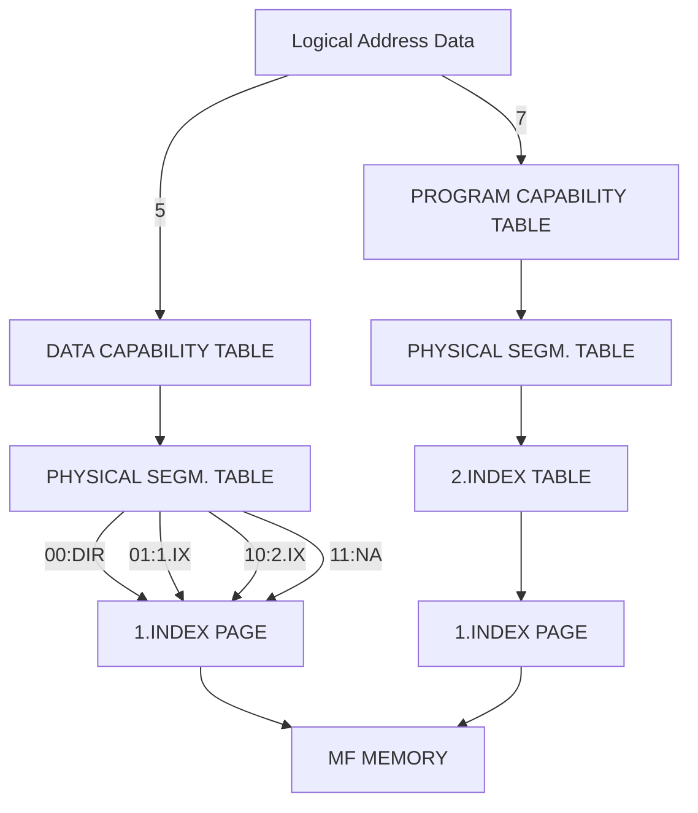
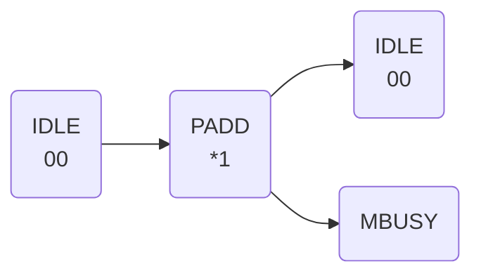
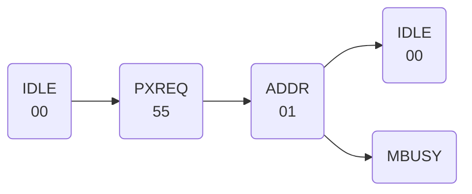
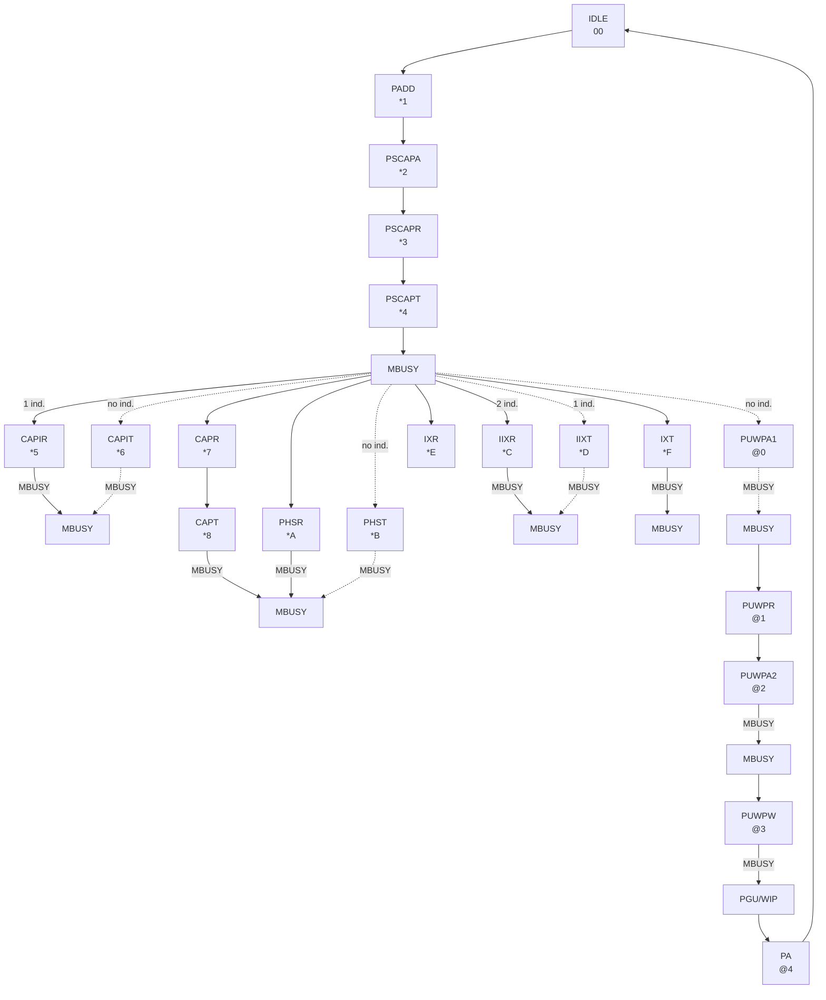
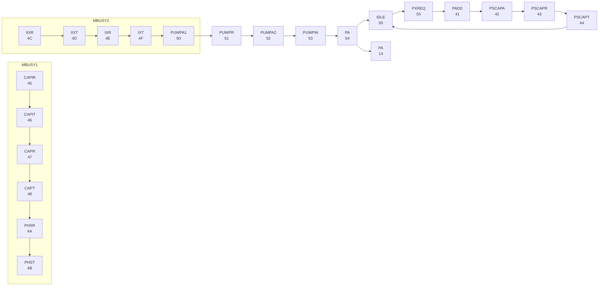
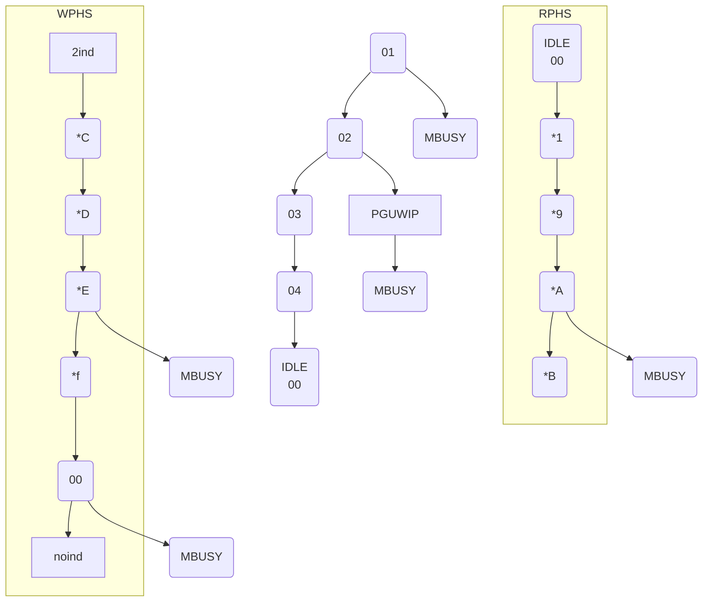
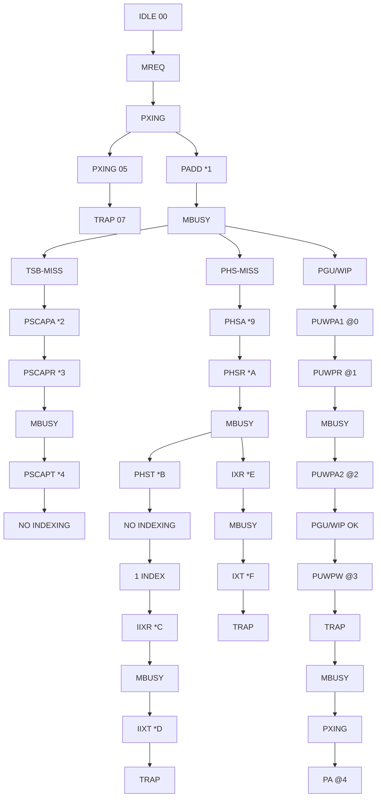

## Page 1

# Memory Management System

## Logical Addresses from IAC or DAC

```
31                            20 19        11 10 0
|----------------------------|-------------|------|
|            5               |      7      |   9  |   11   11   1
```

### Segment No. Logical Page Number Address Within Page

```
27 26         20 19     11 10
|-------------|--------|--------|
| Index table | Index  | Displacement within page
| 2 entry point| table 1 | entry point
```

## Physical Address After Calculation in Memory Management System

```
31                           11 10 DIP 0
|---------------------------|-----------|
|          11              |    1      |
```

### Physical Page Number to MF Memory Address Within Page

```
|                    PAGE NO.                   |
|                       |                       |
|                       |                       |
|                       |                       |
|                       v                       |
|-----------------------------------------------|
| PAGE X-1                                       |
| PAGE X                                         |
|    2048 BYTE                                   |
|    0-3777B                                     |
| PAGE X+1                                       |
| MF MEMORY                                      |
```

---

## Page 2

# Memory Management Block Overview

```mermaid
graph TD;
    PST[Physical Segment Table (PST)] -->| | IDX2[Index Block 2];
    IDX2 -->| | IDX1[Index Block 1];
    IDX1 -->|Physical Page Number| MF[MF Memory];
```

## Direct Addressing

If segment (program) size is less than 2KB, the PST contains the physical page number.
(Logical address bits 26-11 = 0)

## Single Index Addressing

If segment size is between 2KB and 1MB (1-512D pages), the index block 1 contains the physical page number.
(Logical address bits 26-20 = 0)

## Double Index Addressing

If segment size is between 1MB-128MB (512D-65536D pages), physical page number comes from index block 1, via index 2.

## Addressing Types

Bit 31 and 30 in physical segment table give type of addressing:

| Bit 31 | Bit 30 | Type of Addressing                                           |
|--------|--------|-------------------------------------------------------------|
| 0      | 0      | Direct Addressing (Ph. page no. in bit 29-0)                |
| 0      | 1      | Single Index Addressing (Ph. page no. in index 1)           |
| 1      | 0      | Double Index Addressing (Ph. page no. in index 1, via index 2) |
| 1      | 1      | Illegal (**Hardware Fault**)                                 |

8.DAY

---

## Page 3

# How to Find PST-Index

## Accessing the Process Segment

    (N500:MEMORY-CONFIGURATION)
            ↓ 31.........0
               ┌───────┐
    PSTP       │ 0 │ I │ X │
               └───────┘
    +PS        ───────────────┐
                              │
        8K ENTRIES            │
    I = 0                     │
                              ↓
                 I = 1  ────────X*4000B────────────────┐
                                              +DOM/8   │
               ┌───────┐                         ┌─────┴──┐
    INDEX TABLE│ 0 │ 0 │                          │ 0 │ X │
               └─────┘                         └───────┘

                      32 ENTRIES

## Process Segment (PRS)

    15.........0
    X*4000B
    + DOM(2:0)*256+D
    + LA(31:27)*2

    DIT 0          : ONE PAGE IN THE PRS 
                    CONTAINS 8 DIT. THE
    DIT 1          : SIZE OF THE DIT IS
                    256 BYTES.

    DIT 7          : THE MAX SIZE OF A
                    PRS IS 32 PAGES.

**Notes:**
- D=100B IF DATA ACCESS
- D=0 IF PROGRAM ACCESS
- DIT=DOMAIN INFORMATION TABLE
- I=INDEXED
- X=PHYSICAL PAGE NUMBER
- LA(31:27)=SEGMENT PART OF THE LOGICAL ADDRESS.

## One Domain Information Table Expanded:

    15.............0
    ┌───────────────────────────┐
    │   PROG. SEGM. 0           │ PROGRAM CAPABILITY
    │          31               │ TABLE 32 ENTRIES
    │   DATA SEGM. 0            │
    │          31               │ DATA CAPABILITY
    └───────────────────────────┘ TABLE 32 ENTRIES
    TRAP HANDLER INFO
    MONITOR CALL INFO
    DOMAIN CALL INFO
    64 ENTRIES

    255
    128 ENTRIES PER DOMAIN

## Page Fault Trap Occurs If:

1. The content of PST=0.
2. The content of INDEX TABLE=0.

**Protect Violation Trap Occurs If:**
1. The content of CAPABILITY TABLE=0.

---

## Page 4

# One Entry in Data Capability Table

```
15 14 13 12                           0
|    |    |    | ------------------- |
|                                     |
|                                     |
|     PST INDEX                       |
|                                     |
|                                     |
0 0 1  MEANS: SHARED SEGMENT
0 1 0  MEANS: PARAMETER ACCESS VIA ALT. PERMITTED
1 0 0  MEANS: WRITE PERMITTED
```

- THESE BITS ARE WRITTEN INTO TSB WHEN TSB IS UPDATED.

PST INDEX = PHYSICAL SEGMENT TO DATA SEGMENT NO.
THIS INDEX IS USED AS INDEX IN THE PST 
TO FIND THE PHYSICAL PAGE NUMBER OF THE SEGMENT.

# One Entry in Program Capability Table

## Direct Capability

```
15 14 13                           0
|    |    | ------------------- |
|                              |
|   0    unused   PST INDEX    |
|                              |
```

## Indirect Capability (This machine)

```
15 14 13 12                           0
|    |    |    | ------------------- |
|                                     |
|    1    0   nu    8 bits    5 bits  |
|            DOMAIN    SEGMENT        |
```

## Indirect Capability (Other machine)

```
15 14 13                           0
|    |    | ------------------- |
|                              |
|    1    1        14 bits     |
|          Machine number       |
```

---

## Page 5

# Access Physical Data Segment

I=INDEXED  
LA(31:27)=SEGMENT PART OF  
X=PHYSICAL PAGE NUMBER  
THE LOGICAL ADDRESS.

## Physical Segment Table (PST)

```plaintext
PST BASE ----------------------------------------
|                                              |
|  ------------------------------------------  |
|  | 31  30  29  ....  0                     | |
|  | I  |  X                                | |
|  ------------------------------------------  |
|       |                                      |
|       v                                      |
|       I=0    ------------------              |
|       +------| X*4000B        |              |
|              |                |              |
|              -----------------|              |
|             ------------------               |
|             |                                |
| 8192D ENTRIES                                |
|             ------------------               |
|             |                                |
| DOUBLE INDEX   ---------------------------   |
| | 31 ... 0   |                           |   |
| |            |                           |   |
| -------------|                           |   |
|              ----------------------------    |
|                                |             |
| I=2   +LA                       v             |
|       (26:20)                   |             |
| +     ------------------------  |             |
| |     | 0  |  X               | |             |
| |     ------------------------  |             |
| +LA(19:11)                      |             |
| X*4000B    -------------------- |             |
| |           |               29   |             |
| -------------               |    |             |
|                             v    |             |
|                         +---|   |    MF MEMORY |
|                         | X  |   |             |
| INDEX PAGE 2            |____|   |             |
| 128D ENTRIES                    |              |
|              ------------------                |
|              |                                 |
| SINGLE INDEX  ---------------------------      |
| | 31 ....... 0 |                          |    |
| |              |                          |    |
| ---------------|                          |    |
|                --------------------------      |
| INDEX PAGE 1                                  |
| 512D entries                                  |
| IF DATA SEGMENT                               |
| BIT 31o MEANS WRITE PERMITTED                 |
------------------------------------------------

Page fault trap occurs if:

1. The content of PST=0.
2. DIRECT(I=0) AND LA(26:11)<0.
3. SINGLE INDEX(I=1) AND LA(26:20)<0.
4. CONTENT OF INDEX PAGE 2=0.
5. CONTENT OF INDEX PAGE 1=0.

Hardware fault trap occurs if:

1. INDEX (I)=3

```
         
## Data/Ins Page

```
DATA/INS PAGE
--------------
|   2KB    |
--------------
```

8.DAY

---

## Page 6

# Memory Management Physical Address Mapping for ND-5000

*Will also be valid for 500/2 when system software is updated to run both 500/2 and SAMSON*

## Logical Address Instruction

| 5 | 7 | 9 | 11 |
|---|---|---|---|



**Protection Bit (Bit 31)** in last lookup  
*Write permitted on data segments*

---

Scanned by Jonny Oddene for Sintran Data © 2024

---

## Page 7

# Memory Management States

A state sequencer is used to control the memory management system. There is one sequencer for instruction MMS and one for data. The sequencer is controlled by the following signals:

- **CLK**: Master clock
- **MR**: Set memory management state sequencer to zero
- **TRAP**: Memory management trap indication
- **CDRY/MBUSY**: Channel ready from the memory port
- **SSTS(5:0)**: Selected status information. The MMS-controller needs information from the MM-chip depending on which state the controller is in.

|      | STATE=0    | STATE=12H | else     |
|------|------------|-----------|----------|
| SSTS(5) | NSTATE7  | (PHS)MISS | (PHS)MISS |
| SSTS(4) | NSTATE6  | (PHS)WIP  | (PHS)WIP  |
| SSTS(3) | NSTATE5  | WR(31)    | WR(31)    |
| SSTS(2) | PXING    | WR(30)    | WR(30)    |
| SSTS(1) | REQS     | TPUWP     | PHUSED    |
| SSTS(0) | CTRAP    | CTRAP     | CTRAP     |

The sequencers for DMMS and IMMS are similar. Here we will look at the DMMS sequencer.

The sequencer uses 8 state bits to control the MMS chip:  
STATE(7:0) - MMS-sequencer state number

## Bit 7, 6 and 5 - MMS Sequencer Type of Request

```
000 - RPOFF  - a POFF read request
001 - WPOFF  - a POFF write request
010 - PXING  - a request to check next logical page
011 - RHWP   - a read before write request
100 - RMEM   - a read request
101 - WMEM   - a write request
110 - RPHS   - a PHS read request
111 - WPHS   - a PHS write request
```

## Bit 4, 3, 2, 1 and 0 - MMS Sequencer State Number (Hex)

```
00 - IDLE
  - no memory address is being translated
  - read registers and TSB
  - write registers and TSB
  - initiate a memory request
  - LA := LA + 1 page
  - clear MM trap, clear TSB
```

8.DAY

---

## Page 8

# ND5000-MF Handouts

## *1 - PADD

- The address is presented on the memory bus and hit is tested
- If POFF then DB is:

```
-----------------------------
| Z            | 31  | LLA  |
-----------------------------
                                0
```

- If PHS then DB is:

```
-----------------------------
| 29  | WR       | 0 10 | LLA |
-----------------------------
                                0
```

- Else DB is:

```
-----------------------------
| 29        TSB page       |
-----------------------------
|  0       10  | LLA  |
-----------------------------
                                0
```

## *2 - PSCAPA

- Address to PHST to get the process segment
- DB is:

```
-------------------------------------
| PSTP(29:0) + PS(12:9) | 8 | PS  |
-------------------------------------
|                           0 | Z | Z |
-------------------------------------
```

## *3 - PSCAPR

- Read the PHST entry for the process segment
- WR := PST entry

## *4 - PSCAPT

- Test the PHST entry for the process segment and present a new address on memory bus
- DB is:

```
-------------------------------------------
| 29  | WR       |   0 Z Z Z Z 7 | DOM 3 Z Z |
-------------------------------------------
```

## *5 - CAPIR

- Read first index to get the process segment
- WR := PST index

## *6 - CAPIT

- Test the index page entry for the process segment and present a new address on memory bus
- DB is:

```
---------------------------------------------
| 29  | WR       |   0 2 DOMO Z D | 31LLA 28 Z Z |
---------------------------------------------
```

## *7 - CAPR

- Read the capability
- If LLA(27) then CAP := DB(15:0) else CAP := DB(31:0)

## *8 - CAPT

- Test the capability and present a new address on memory bus
- DB is:

```
--------------------------------------
| PSTP(29:0) + CAP(12:9) | 8 | CAP | 
--------------------------------------
|                           0 | Z | Z |
--------------------------------------
```

## *9 - PHSA

- Physical segment request address to PHST
- DB is:

```
--------------------------------------
| PSTP(29:0) + PHS(12:9) | 8 | PHS |
--------------------------------------
|                           0 | Z | Z |
--------------------------------------
```

## *A - PHSR

- Read physical segment table (PHST) index
- WR := PST entry

---

8.DAY

---

## Page 9

# ND5000-MF Handouts

## *B - PHST

- Test physical segment table (PHST) index and present a new address on memory bus

### DB is:

```
|    |    |    |
|----|----|----|
| 29 | WR | 0 Z Z 26 LLA 20 Z Z |
|    |    |    |
```

## *C - IIXR

- Read 1. level of two level indexing
- WR := PST index

## *D - IIXT

- Test the 1. index page entry and present a new address on memory bus

### DB is:

```
|    |    |    |
|----|----|----|
| 29 | WR | 0 19 LLA 11 Z Z |
|    |    |    |
```

## *E - IXR

- Read last level of indexing
- WR := PST index

## *F - IXT

- Test the last index page entry and present a new address on memory bus

## @0 - PUWPA1

- Address to PUWPT first time to read the entry

### DB is:

```
|                     |    |    |    |
|---------------------|----|----|----|
| PUWP(29:0) + WR(28:13) | 12 | WR | 4 Z Z |
|                     |    |    |    |
```

## @1 - PUWPR

- Read the PUWPT entry
- LA := PUWPT entry

## @2 - PUWPA2

- Test the PUWPT entry and present the address for PUWPT second time to write new entry or the final physical address
- If not PGU/WIP then DB is:

```
|                     |    |    |    |
|---------------------|----|----|----|
| PUWP(29:0) + WR(28:13) | 12 | WR | 4 Z Z |
|                     |    |    |    |
```

- Else DB is:

```
|    |    |    |
|----|----|----|
| 29 | WR | 0 10 LLA 0 |
|    |    |    |
```

## @3 - PUWPW

- Write the new entry to the PUWPT
- PUWPT entry := LA + PGU/WIP

## @4 - PA

- Final physical address
- The DB is:

```
|    |    |    |
|----|----|----|
| 29 | WR | 0 10 LLA 0 |
|    |    |    |
```

## @5 - PXREQ

- Page crossing request
- LLA := LA

## @7 - TRAPS

- Trapping state
  - Read registers and TSB
  - Clear MM trap (CTRAP)

---

8.DAY

---

Scanned by Jonny Oddene for Sintran Data © 2024

---

## Page 10

# Memory Management State Sequence

## Read Paging Off
- RPOFF

## Write Paging Off
- WPOFF request: (hex)

| \*= | 0 | 2 |
|-----|---|---|



### RWWP= Read Before Write
### RMEM= Read Memory
### WMEM= Write Memory
### RPHS= Read Physical Segment
### WPHS= Write Physical Segment

|       | RWWP | RMEM | WMEM | RPHS | WPHS |
|-------|------|------|------|------|------|
| \*=   | 6    | 8    | A    | C    | E    |

- with hit/wip:


## Logical Page Crossing Request
- PXING request with hit/wip:



---

## Page 11

# ND5000-MF Handouts

## Read Before Write
- **RHW P:** 
  - * = 6
  - @ = 7

## Read Memory
- **RMEM:**
  - 8
  - 9

## Write Memory
- **WMEM Request:**
  - A without hit/wip: (hex)
  - B without hit/wip: (hex)



## Footer
- **Scanned by:** Jonny Oddene for Sintran Data © 2024
- **Page:** 8.DAY

---

## Page 12

# ND5000-MF HANDOUTS

## LOGICAL PAGE CROSSING REQUEST: 
PXING request without hit/wip: (hex)



- MBUSY
- MBUSY
- MBUSY

2 ind. MBUSY  
1 ind. MBUSY  
no ind. MBUSY

#### PGU/WIP

8.DAY

---

## Page 13

# ND5000-MF HANDOUTS

## READ PHYSICAL SEGMENT
**RPHS**

## WRITE PHYSICAL SEGMENT
**WPHS request:**

| Symbol | Description                   |
|--------|-------------------------------|
| * = C  |                               |
| @ = D  |                               |
| E      | without hit/wip (hex)         |
| F      | without hit/wip (hex)         |



---

**8.DAY**

Scanned by Jonny Oddene for Sintran Data © 2024

---

## Page 14

# ND5000-MF HANDOUTS

## The MM (Memory Management) Nanostates; (HEX)



State Chart for the MM Nanostates;

* OR @ DEPENDS ON WHAT SORT OF REQUEST YOU HAD. (SEE PAGE 10-13)

---

8.DAY

---

## Page 15

# Explanation of the MM Nanostates

**MM Baby Card:**

The memory management baby cards (one for instructions and one for data) are associated with nanostate sequencers. Requests to main memory activate a nanosequence, which may be short or long depending on whether 'hit' in the TSB (Translation Speedup Buffer) follows. When a MM baby card is engaged in a nanosequence, the requesting nanosequence of either the DCC (for data memory) or the IDU (for instructions) must wait until the MM nanosequence is finished.

All nanostates with names ending with the letter 'A', generate a physical address and send a request to memory.

## MM State 00: IDLE

State 00, IDLE, is the resting state of an MM nanosequencer. In this state A-operands can be read from the MM baby card and destinations can be written. If a memory request is received, the next state is either PXING (state 05) if the request is a PXING-request, or PADD (state *1) otherwise.

If a dirty write request is to be issued, the dirty PS and the dirty DOM registers are loaded in this state.

If a PXING-request is received, the LA-register is incremented by 4000B, to point into the next page of logical memory.

When a memory read/write request is to be sent to the MM baby card, the LA-register is filled with the logical address, and a TSB address is generated by using a hash algorithm on some of the address bits. This happens in the nanocycle before the request. The request may be of different types:

| Type                             | bit 7 6 5 | abb.  |
|----------------------------------|-----------|-------|
| Logical read request             | 0 0 0     | RPOFF |
| Logical write request            | 0 0 1     | WPOFF |
| Logical page-crossing request    | 0 1 0     | PXING |
| Read before write request        | 0 1 1     | RWVP  |
| Physical read request            | 1 0 0     | RMEM  |
| Physical write request           | 1 0 1     | WMEM  |
| Read request in physical segment | 1 1 0     | RPHS  |
| Write request in physical segment| 1 1 1     | WPHS  |

## MM State *1: PADD

State *1, PADD, loops until the previous memory request has been finished. It then presents the physical address on DB (for data) or MIB (for instructions). The 11 least significant bits are the same as in the logical address, and the rest of the physical address bits are taken from the addressed entry in the TSB.

This physical address is the correct one if there is TSB-'hit'. The test on TSB-hit/TSB-miss is performed in this nanocycle.

If TSB-hit together with indications that the WIP/PGU-table is properly updated, the nanosequence will be finished, and the next state is IDLE. Final request to memory is then issued.

If the WIP/PGU-table needs to be updated, the next nanostate is number 00, PUWPAI.

---

## Page 16

# ND5000-MF HANDOUTS

If the request is a logical read/write request with TSB-miss, the next state is *2, PSCAPA.

If the request is a read/write of a physical segment location, and the single word TSB for such accesses gives PHS-miss, the next state is number *9, PHSA.

A few conditions cause the next state to be number 07, TRAP. These conditions are:

- Memory error
- Memory timeout
- Write protect violation
- Alternative protect violation

## MM State *2: PSCAPA

State *2, PSCAPA, uses PSTP and PS to generate an address inside PST. A read request for this address is issued. The next state is *3, PSCAPR.

## MM State *3: PSCAPR

State *3, PSCAPR, loops until data requested in state *2 is returned from memory. A few conditions cause the next state to be number 07, TRAP. These conditions are:

- Memory error
- Memory timeout

The next state is number *4, PSCAPT.

## MM State *4: PSCAPT

State *4, PSCAPT, tests the data read in state *3. A few conditions cause the next state to be number 07, TRAP. These conditions are:

- The indexing for this physical segment has 2 levels. This is not allowed for a process segment.
- The PST-entry contains zero. Page fault.

If the PST-entry indicated no indexing, the next state is number *7. A read request to fetch 4 bytes containing the capability is then sent to memory.

If single indexing is indicated, state number *5 is entered. A read request to fetch the required word from the index page is then sent to memory.

## MM State *5: CAPIR

State *5, CAPIR, loops until data requested in state *4 is returned from memory. A few conditions cause the next state to be number 07, TRAP. These conditions are:

- Memory error
- Memory timeout

The next state is number *6, CAPIT.

## MM State *6: CAPIT

State *6, CAPIT, tests the data read in state *5. A few conditions cause the next state to be number 07, TRAP. These conditions are:

[Page footer: 8.DAY]

---

## Page 17

# ND5000-MF HANDOUTS

## Index Error

Bit 31 and bit 30 must be 0.  
The index-entry contains zero. Page fault.

A read request to fetch 4 bytes containing the capability is then sent to memory. The next state is number *7, CAPR.

## MM State *7: CAPR

State *7, CAPR, loops until data requested in state *4 or state *6 is returned from memory. A few conditions cause the next state to be number *7, TRAP. These conditions are:

- Memory error
- Memory timeout

The next state is number *8, CAPT.

## MM State *8: CAPT

State *8, CAPT, tests the data read in state *7. A few conditions cause the next state to be number *7, TRAP. These conditions are:

- The capability is indirect other machine
- The capability is indirect other domain
- The capability is 0, protect violation
- Write protect violation
- Alternative protect violation

A read request to fetch 4 bytes from the PST is then sent to memory. The next state is number *A, PHSR.

## MM State *9: PHSA

State *9, PHSA, reads 4 bytes from the PST in requests that want to read or write in physical segments, when PHS-miss occurs. The next state is number *A, PHSR.

## MM State *A: PHSR

State *A, PHSR, loops until data requested in state *8 or state *9 is returned from memory. A few conditions cause the next state to be number *7, TRAP. These conditions are:

- Memory error
- Memory timeout

The next state is number *B, PHST.

## MM State *B: PHST

State *B, PHST, tests the data read in state *A. A few conditions cause the next state to be number *7, TRAP. These conditions are:

- Indexing error. 3 index levels are not allowed.
- The PST-entry contains zero. Page fault.

If the PST-entry indicated no indexing, the next state is number *0. The physical address will then have been found.

If single indexing is indicated, state number *E is entered. A read request to fetch the needed word from the index page is then sent to memory.

---

## Page 18

# ND5000-MF Handouts

If double indexing is indicated, state number *C is entered. A read request to fetch a word from the first index page is then sent to memory.

## MM State *C: IIXR

State *C, IIXR, loops until data requested in state *B is returned from memory.

A few conditions cause the next state to be number 07, TRAP. These conditions are:

- Memory error
- Memory timeout

The next state is number *D, IIXT.

## MM State *D: IIXT

State *D, IIXT, tests the data read in state *C. A few conditions cause the next state to be number 07, TRAP. These conditions are:

- Indexing error
- The index-entry contains zero. Page fault.

The next state is number *E, IXR. A read request to read an entry in the last index table is sent out to memory.

## MM State *E: IXR

State *E, IXR, loops until data requested in state *D or in state *B is returned from memory. A few conditions cause the next state to be number 07, TRAP. These conditions are:

- Memory error
- Memory timeout

The next state is number *F, IXT.

## MM State *F: IXT

State *F, IXT, tests the data read in state *E. A few conditions cause the next state to be number 07, TRAP. These conditions are:

- Indexing error
- The index-entry contains zero. Page fault.
- The last index entry which was read indicates that the accessed page was write protected.

The next state is number 00, PUWPA1.

## MM State 00: PUWPA1

State 00, PUWPA1, is entered when the WIP or the PGU table may need to be updated. This state generates a physical address using the PSTP-pointer, and sends a read request with 'LOCK' to memory, to get hold of the WIP and PGU information for 16 pages of physical memory. The next state is number 01, PUWPR.

---

8.DAY

---

## Page 19

# ND5000-MF Handouts

## MM State 01: PUWPR

State 01, PUWPR, loops until data requested in state 00 is returned from memory. A few conditions cause the next state to be number 07, TRAP. These conditions are:

- Memory error
- Memory timeout

The next state is number 02, PUWPA2.

## MM State 02: PUWPA2

State 02, PUWPA2, checks the data read by state 01.

If WIP and PGU are correctly set for the physical page that is to be accessed, the next state is number 00, IDLE. The final physical address is then sent to memory. It is generated using the physical page number read in state *E (IXR) or *A (PHSR), and the displacement within page is taken from the LA-register. The proper type of memory request is sent to memory. The type has been saved in the MM baby card during the nanosequence.

If WIP or PGU need to be updated, an address is generated and a write request is sent to main memory to write the updated WIP/PGU information. The next state is then number 03, PUWPH.

## MM State 03: PUWPH

State 03, PUWPH, loops until memory is finished with the write request from state number 02. A few conditions cause the next state to be number 07, TRAP. These conditions are:

- Memory error
- Memory timeout

## MM State 04: PA

State 04, PA, sends the final physical address to memory. It is generated using the physical page number read in state *E (IXR) or *A (PHSR), and the displacement within page is taken from the LA-register. The proper type of memory request is sent to memory. The type has been saved in the MM baby card during the nanosequence. The next state is number 00, IDLE.

## MM State 05: PXING

State 05, PXING, is inserted between state 00 and state *1 when PXING-requests are received by the MM. The LA-register is incremented by 4000B when state 05 is entered from state 00. State 05 is needed to allow time for the new LA-register to generate a TSB hash index.

## MM State 07: TRAP

State 07, TRAP, handles all exceptional conditions occurring during MM nanosequences. State 07 loops until it is released by the microcode command CTRAP (clear trap). While the MM nanosequencer is in state 07, A-operands can be read and destinations can be written. No requests are processed by the nanosequencer. When state 07 is finished, state 00, IDLE is entered.

---

## Page 20

# MFbus Channel Controller (MFBCC) Nanostates

## State Chart for the MFBCC Nanostates

```mermaid
flowchart TD
    IIDLE0(IIDLE<br>0) --> |clear| ILOCKST
    ILOCKST --> |(IRREQ'+IWREQ)'| ILO3(ILO<br>3)
    ILO3 --> |DLOBSY'| IAWT1(IAWT<br>1)
    
    IAWT1 --> |DABUSY+DLOBSY| IADR4(IADR<br>4)
    IADR4 --> |MEMERR| IDWT5(IDWT<br>5)
    IDWT5 --> |SABSY| IASYNC6(IASYNC<br>6)
    IASYNC6 --> |SDRY| IDSYNC2(IDSYNC<br>2)
    IDSYNC2 --> |SDRY'| MEMERR
    
    DIDLE0(DIDLE<br>0) --> |clear| DLOCKST
    DLOCKST --> |DREQST'| DLO7(DLO<br>7)
    DLO7 --> |ILOBSY'+BOTH| DHOLD3(DHOLD<br>3)
    
    DHOLD3 --> |IABUSY+ILOBSY| DAWT1(DAWT<br>1)
    DAWT1 --> DADR4(DADR<br>4)
    DADR4 --> |MEMERR| DDWT5(DDWT<br>5)
    DDWT5 --> |SABSY| DASYNC6(DASYNC<br>6)
    DASYNC6 --> |SDRY| DDSYNC2(DDSYNC<br>2)
    DDSYNC2 --> |SDRY'| MEMERR
```

## Legend

| Prefix/Term | Description                             |
|-------------|-----------------------------------------|
| I-prefix    | Instruction                             |
| D-prefix    | Data                                    |
| ABUSY       | Address busy                            |
| DREQST      | Data request start                      |
| LOCKST      | Lock start                              |
| IRREQ       | Instr. read request                     |
| IWREQ       | Instr. write request                    |
| DWT         | Data wait                               |
| LO          | Lock                                    |
| ASYNC       | Address synch                           |
| DHOLD       | Data hold                               |
| LOBSY       | Lock busy                               |
| MEMERR      | Memory error                            |
| RREQ        | Read request                            |
| WREQ        | Write request                           |
| SABSY       | Synchronized ARY' (address ready not)   |
| SDRY        | Synchronized data ready                 |
| AWT         | Address wait                            |
| ADR         | Address                                 |
| IDLE        | Idle                                    |
| DSYNC       | Data synchronization                    |

---

## Page 21

# Explanation of the MFBCC Nanostates

## Instruction Channel States

### I-channel State 0: IIDLE
State 0, instruction channel IDLE state.

### I-channel State 1: IAWT
State 1, IAWT, instruction channel address wait. The data channel is in address state.

### I-channel State 2: IDSYNC
State 2, IDSYNC, instruction channel data synchronization. Waits for DRY (data ready) from BADAP.

### I-channel State 3: ILO
State 3, ILO, instruction channel lock state. Generates LOCK signal to BADAP.

### I-channel State 4: IADR
State 4, IADR, instruction channel address state. Generates ARQ (address request) to BADAP.

### I-channel State 5: IDWT
State 5, IDWT, instruction channel wait state. The data channel is in data state or synchronization.

### I-channel State 6: IASYNC
State 6, IASYNC, instruction channel address synchronization. Waits for ARY (address ready) from BADAP.

---

## Page 22

# Data Channel States

## D-channel State 0: DIDLE
State 0, data channel IDLE state.

## D-channel State 1: DAWT
State 1, DAWT, data channel address wait. The instruction channel is in address state.

## D-channel State 2: DDSYNC
State 2, DDSYNC, data channel data synchronization. Waits for DRY (data ready) from BADAP.

## D-channel State 3: DHOLD
State 3, DHOLD, hold state for the data channel. Used if a request occurs simultaneously on instruction and data channels.

## D-channel State 4: DADR
State 4, DADR, data channel address state. Generates ARQ (address request) to BADAP.

## D-channel State 5: DDWT
State 5, DDWT, data channel wait state. The instruction channel is in data state or synchronization.

## D-channel State 6: DASYNC
State 6, DASYNC, data channel address synchronization. Waits for ARY (address ready) from BADAP.

## D-channel State 7: DLO
State 7, DLO, data channel lock state. Generates LOCK signal to BADAP.

---

