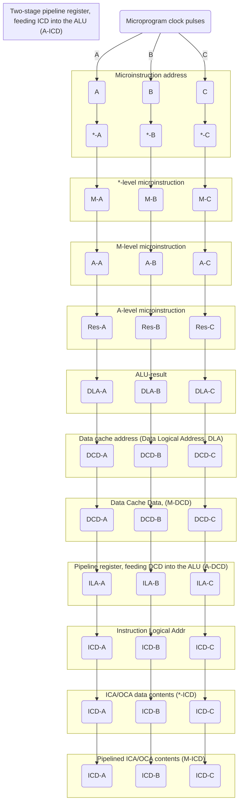
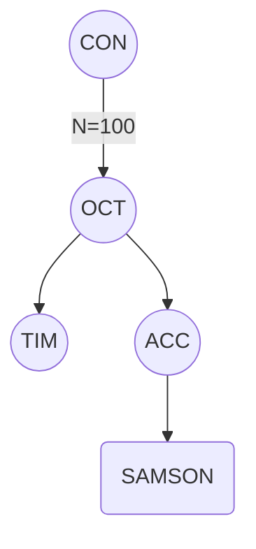
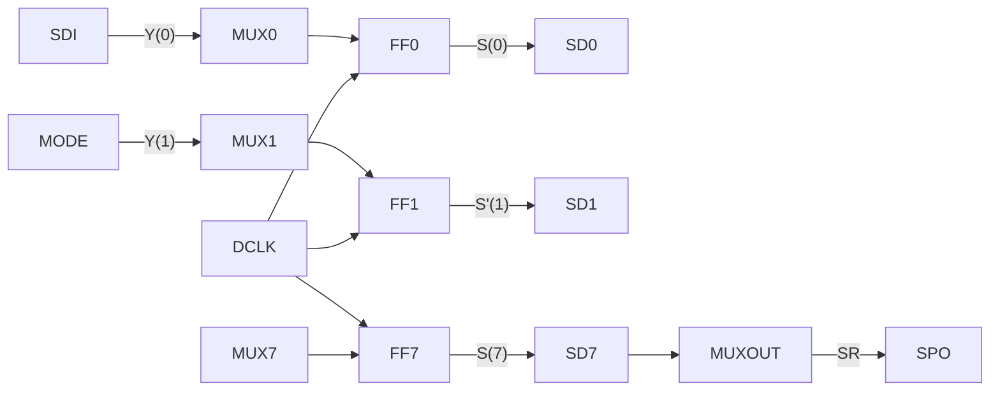
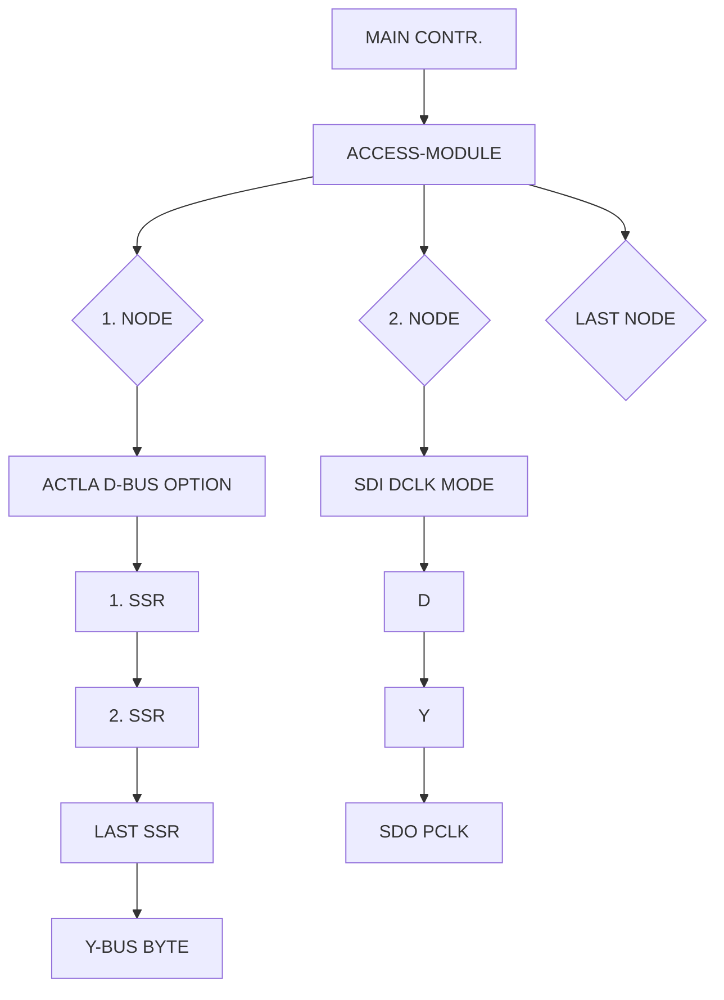
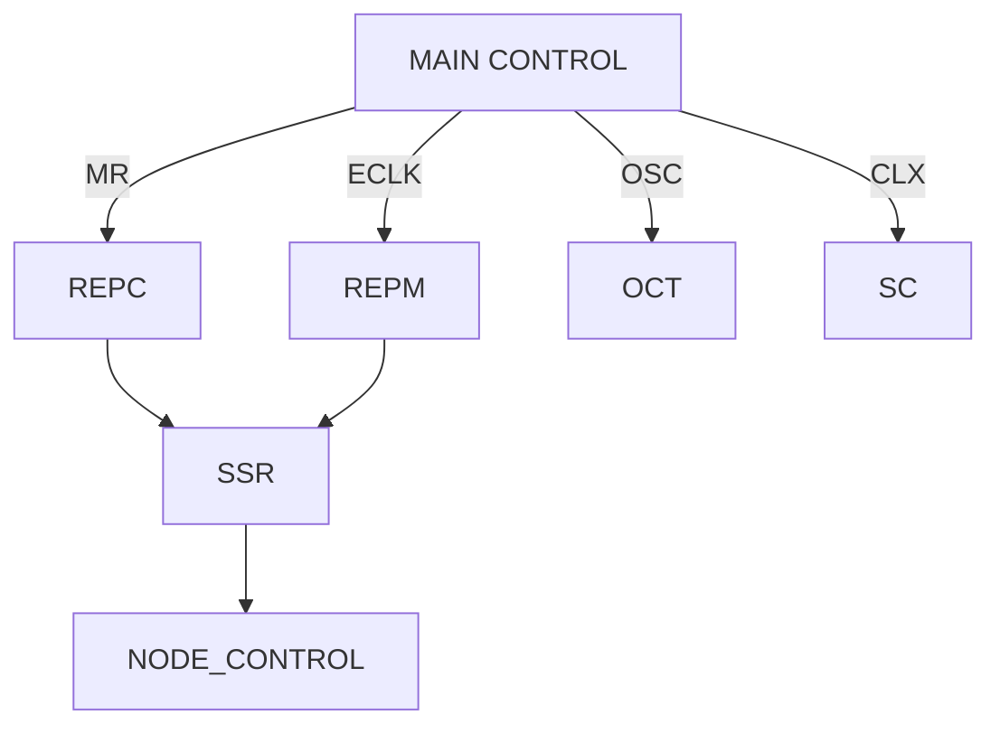
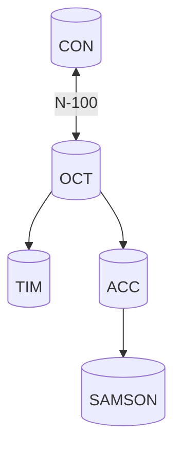
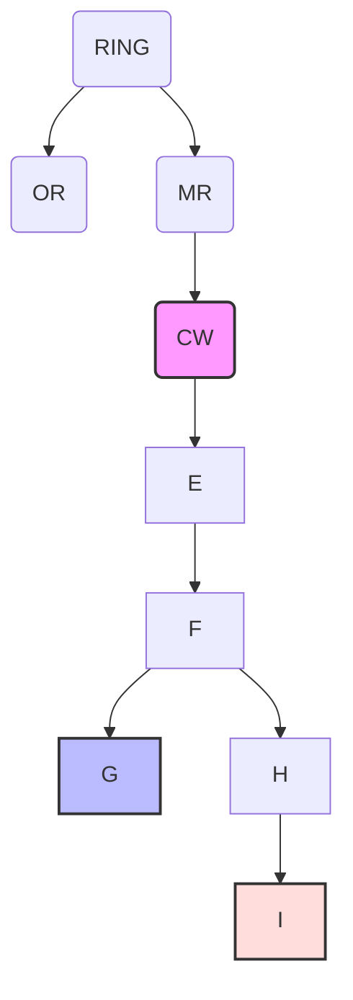

## Page 1

# EXPECTED
```
 ______  __  __     _______ _______ ______  _______  ______
|  __  \|  ||  |   /  ____//    ___/ |  ___|  ____/ |  _   \
| |   \  | ||  |  |   \_.| |  |_      | |   | |__    | |_|  |
| |    | | ||  |   \___  \  \_  |     | |   |  __|   |  _   /
| |__/  | ||  |   _____|  |   \ |     | |   | |___   | |  \
|_____/   ||__|  /_______/  \__|     |_|0__|______0|__|0___

SAMSON


  ______  _____  ____    ____    ____   ____  ____   _____ 
 /  ____||_   _|   |   |   \_.| /   _|\  ____| \/   ____| 
| .--.     | |    |___ |  ___/ /   __|  |  __|  __/ |___  
| |        | | ,      ||     |\ \_ | | |  |   ||  \ /  _ \ 
|_   _  \_____/_____|\_|,_____\ ____|}

```

# BEHAVIOUR

The **SAMSON** project aims at developing a new CPU in the family of NC computer systems. The instruction set is the same as implemented in **ND-500/GEPPETTO**, with a few minor extensions. A main design goal is to increase the computation speed for the top model of the line. It is also considered important to decrease the complexity, the component cost and the production cost of the **ND-500** concept. These goals should be obtained by utilizing new technology where possible, and by shrinking the physical dimensions of the CPU to diminish signal propagation delays. Extensive pipelining techniques, as used in **ND-500/GEPPETTO**, will be employed.

This document is divided into a number of chapters. Each chapter focuses on one aspect of the CPU, some aspects are more thoroughly exposed than others. The document is primarily intended to be a guide for the designers involved within the **SAMSON** project. It outlines the hardware blocks that comprise the project, and it tries to help the designer of each block to understand where and how his work will influence the whole design.

This document will be far from finished when it is released for the first time. It will be subject to several additions, corrections and clarifications as progress in the design continues. It is hoped that it will evolve during the whole design phase, and that the final edition would be suited as the basis of some sort of course manual.

---

## Page 2

# Chapters

1. General Description
2. Macro Instruction Pipelining
3. ALU and Registers
4. Logical Data Cache
5. Logical Instruction Caches
6. Micro Instruction
7. Trap System
8. External Control
9. Memory Management
10. Physical Caches
11. Multiport Memory Interface
12. Timing
13. Additional Arithmetical Processors

---

## Page 3

# Chapter 1. General Description

The CPU has been divided according to the block diagram presented here:

```mermaid
flowchart LR
    MPM1 -- * --> MPC1
    CON -- * --> OCT1
    (N-100) -- * --> TRP
    CON -- * --> OCT2
    MPM2 -- * --> MPC2
    MPC1 -- IMDB --> IMM -.-> IPC
    IAC -.-> IMDB
    IAC -- * --> ILC
    ILC -- * --> WRF
    ILC -- * --> ALU
    WRF -.- IMDB
    SRF -- A & B --> ALU
    ALU -- F-BUS --> DPR
    DPR -- D --> DAC
    DAC -- DMDB --> DMM
    DMM -- * --> DPC
    DPC -- * --> ACC
    ACC -- * --> CS
    CS -- IMDB --> TRP
    TRP -- * --> MIC
    MIC -- * --> ILC
    ACC -- * --> IAC
    DMM -- * --> IMM
    IMM -- IMDB --> IPC
    IPC -- IMDB --> MPC2
    AAP -- D --> DLC
    DLC -- * --> ILC
```

The abbreviations signify:

| Abbreviation | Description                       |
|--------------|-----------------------------------|
| A            | A-operand-bus                     |
| B            | B-operand-bus                     |
| ACC          | Access-module                     |
| ALU          | Arithm. & log. unit               |
| CON          | Control-processor                 |
| CS           | Control-store                     |
| DAC          | Data mem. addr. contr.            |
| DLC          | Data log. cache                   |
| DMM          | Data mem. managem.                |
| DPC          | Data phys. cache                  |
| DPR          | Double pipeline reg.              |
| AAP          | Additional Arithm. Proc.          |
| DMDB         | Data mem. data-bus                |
| WRF          | Working register file             |
| F-BUS        | Function-bus (ALU output)         |
| IMDB         | Instr. mem. data-bus              |
| IAC          | Instr. mem. addr. contr.          |
| ILC          | Instr. logical cache              |
| IMM          | Instr. mem. managem.              |
| IPC          | Instr. phys. cache                |
| MPC          | Multi-port channel                |
| MPM          | Multi-port memory                 |
| MIC          | Micro instruction contr.          |
| OCT          | Octo-bus interface                |
| SRF          | Scratch-register file             |
| TRP          | Trap control                      |
| TIM          | Timing control                    |

The ALU is the central data processing element in the block diagram.
It receives data through the A- and B-operand bus from a variety of sources.

---

## Page 4

# Technical Overview

Sources, one of the most important is the working register file, WRF. The WRF holds a small number of 32-bit registers, when more extensive storage is needed, the scratch register file, SRF, is used. The ordinary registers of the macro instruction repertory are housed inside WRF, more seldomly used registers are housed in SRF. The A and B operands are worked upon by the ALU, or by the additional arithmetical processors, AAP. The results from the ALU are presented on the F BUS, which spreads to several destinations, most notably back to the WRF.

The operations of the ALU, the selections of WRF registers and several other functions, are controlled by a microprogram that resides in a control store (CS). CS consists of RAM, and is organized as 16K words with a word width of 128 bits. The address of the CS is generated by a microprogram sequencer, MIC. The MIC has the ability to sequence and branch through the microprogram in CS, and it is controlled by the trap system (TRP).

In addition to the control of the ALU and register selection, the microprogram performs control over the instruction memory controller (IAC) and the data memory controller (DAC). The IAC and DAC generate addresses used to address the instruction and data memory respectively. In order to calculate operand addresses in a fast and easy manner, the DAC contains the B and R registers, and copies of the 4 index registers. The generated addresses are used to access the data logical cache (DLC) and the instruction logical caches (ILC). These cache systems are complicated, and at the very heart of the SAMSON system. The ILC is further divided into the instruction cache (ICA) and the operand cache (OCA). The DLC and the ILC-systems communicate with the memory system whenever the needed data are not found in the caches. The necessary information will then be passed through the memory data bus (MDOB or DMOB), and the logical addresses are translated to physical addresses by the memory management units (IMM or DMM) that are connected to the memory data buses. The physical addresses are forwarded to optional physical cache systems (IPC or DPC), and if the data are found there, no memory accesses will be issued. Only when neither the logical nor the physical cache systems contain the needed data, memory requests will be generated by the multiport memory controllers (MPC). The multiport memory (MPM) must then provide the needed data.

Because of the pipelined nature of the instruction execution, several pipeline registers not shown in the block diagram are needed. Only one pipeline register is shown in the block diagram. This is the double pipeline register, DPR, needed to provide the ALU with constant operands. As will be explained in the chapter on pipelining, constant operands need to be pipelined twice.

All the block diagram boxes except the COH, the OCT and the ACC have now been mentioned. There are two control processors (CON) interfaced with the SAMSON CPU. One is needed to perform cold-start bootstrapping, test functions and to control tracing functions inside SAMSON. The other will be involved in I/O-functions and other run-time communication tasks. The CON-processors (which in the first systems will be 1 or 2 ND-10 computers) perform their control through octobus interfaces (OCT). Special hardwired functions in the first OCT and in the access module (ACC) makes it possible to bootstrap or test different circuits in the SAMSON CPU before the microprogram starts running. The main hardware feature responsible for this is the possibility to read and write a long shift register that consists of [illegible].

```plaintext
+--------------+       +-------------+       +-------------+
| Working      |       | Arithmetic  |       | Additional  |
| Register File|       | Logic Unit  |       | Arithmetical|
| (WRF)        |  ---> | (ALU)       |  ---> | Processors  |
+--------------+       +-------------+       | (AAP)       |
                                              +-------------+
```

[Diagram: Block Diagram showing registers and processors]

---

## Page 5

## Technical Overview

Several of the already mentioned pipeline registers hooked together with other information within the CPU. Some of these pipeline registers normally contain information from the CS. Mechanisms controlled by ACC can reverse these pipeline registers, so that they are used to load the microprogram from the pipeline registers into the CS. The ACC-module also controls a hardware tracer, so that the flow of the microprogram and referenced memory addresses may be logged for later examination. The other OCT is connected to the trap (TRP) module. It thereby has the ability to interrupt the normal execution of the SAMSON microprogram. The OCT can also receive [illegible] from the SAMSON microprogram, and interrupt the control computer.

---

## Page 6

# Section 2. Macro Instruction Pipelining

The microprogram of the SAMSON CPU is 128 bits wide. It is divided into a variety of fields with functions on the different parts of the CPU. The address of the next microprogram word will always become valid during the first part of a micro-cycle, and the contents of this address will appear towards the end of the cycle. This content, which is the microinstruction to be executed in the next cycle, is the so-called *-level microinstruction. After the next microprogram clock pulse this microinstruction will have been transferred into a pipeline register, and thereby it has become the M-level microinstruction. The M-level microinstruction controls among other things the selection of operands and registers to be used by the ALU in the next microcycle. When the next microprogram clock pulse has arrived, the microinstruction has been clocked further along the pipeline, and has become the A-level microinstruction. It is the A-level microinstruction that controls most of the functions exerted by a microinstruction, including the control of the ALU. Some functions controlling the sequencing of micro- and macro-instructions use the *-level microinstruction because this is available at the earliest time.

The operation of the ALU is controlled by the A-level microinstruction. The timing of the ALU-operation in relation to the access of the corresponding microinstruction is illustrated below.

```
          ┌──────────────────────────────┐
          │ Microprogram clock pulses    │
          └──────────────────────────────┘
          │              │              │ 
Microinstruction address "A"            "B"            "C"
          │              │              │              │
*-level microinstruction *-A            *-B            *-C
          │              │              │              │
M-level microinstruction M-A            M-B            M-C
          │              │              │              │
A-level microinstruction A-A            A-B            A-C
          │              │              │              │
ALU-result               Res-A          Res-B          Res-C
          │              │              │              │
          ↑              ↑              ↑              ↑
```

---

## Page 7

# Cache and Microinstruction Execution in CPU

To obtain a reasonable execution speed, simple one-operand macro-instructions require only one microinstruction to be executed. For the execution to run at full speed, it is necessary that the instruction itself and the data it operates on are found in the appropriate caches within the CPU.

There are two caches for the instruction stream, called the Instruction Cache (ICA) and the Operand Cache (OCA). These caches contain characteristics on each macroinstruction, and information necessary to compute logical addresses and access modes for data memory operands. A more thorough explanation of the contents and use of ICA and OCA are given in a special chapter, only the timing characteristics are considered here.

There is one data cache in the CPU. As long as memory data is found in this cache, its speed is supposed to be fast enough to allow the processor to proceed without any waiting states. The data cache contains 2 sets of caches, and performs simultaneous comparisons against the 2 cache directories. If `hit` occurs in one of the directories, the cache content will be used, and memory will not be accessed. An access to the data cache is performed in the microcycle before the data are needed by the ALU. The ALU is busy executing the previous microcycle when the data cache is accessed. When the data cache data are found, they are kept in a `pipeline`-register to be presented to the ALU from the beginning of the next microcycle.

```
┌────────────────────────────────────────────────────────────┐
│                  ┌──────────────────────────────┐          │
│                  │      Microprogram clock pulse │         │
│                  └─────────────────┬────────────┘          │
│                                    │                       │
│Microinstruction address        ┌───┴────┐                  │
│                               │   'A'   ├───┐              │
│                               │   'B'   │   ├───┐          │
│                               │   'C'   │   │   │          │
│                               └─────────┘   │   │          │
│                                *-level microinstruction   │
│                               ┌─────────┐   │   │          │
│                               │   *-A   │   ├───┘          │
│                               │   *-B   │   │              │
│                               │   *-C   │   │              │
│                               └─────────┘   │              │
│                                M-level microinstruction    │
│                               ┌─────────┐   │              │
│                               │   M-A   │   ├───┐          │
│                               │   M-B   │   │   ├───┐      │
│                               │   M-C   │   │   │   │      │
│                               └─────────┘   │   │   │      │
│                                A-level microinstruction    │
│                               ┌─────────┐   │   │   │      │
│                               │   A-A   │   │   │   ├───┐  │
│                               │   A-B   │   │   │   │   │  │
│                               │   A-C   │   │   │   │   │  │
│                               └─────────┘   │   │   │   │  │
│                                  ALU-result │   │   │   │  │
│                               ┌─────────┐   │   │   │   │  │
│                               │  Res-A  │   │   │   │   │  │
│                               │  Res-B  │   │   │   │   │  │
│                               │  Res-C  │   │   │   │   │  │
│                               └─────────┘   │   │   │   │  │
│     Data cache address (Data  ┌─────────┐   │   │   │   │  │
│     Logical Address, DLA)     │  DLA-A  │   │   │   │   │  │
│                               │  DLA-B  │   │   │   │   │  │
│                               │  DLA-C  │   │   │   │   │  │
│                               └─────────┘   │   │   │   │  │
│        Data Cache Data, (M-DCD)             │   │   │   │  │
│                               ┌─────────┐   │   │   │   │  │
│                               │  DCD-A  │   │   │   │   │  │
│                               │  DCD-B  │   │   │   │   │  │
│                               │  DCD-C  │   │   │   │   │  │
│                               └─────────┘   │   │   │   │  │
│Pipeline register, feeding DCD               │   │   │   │  │
│  into the ALU (A-DCD)      ┌─────────┐      │   │   │   │  │
│                            │  DCD-A  │      │   │   │   │  │
│                            │  DCD-B  │      │   │   │   │  │
│                            │  DCD-C  │      │   │   │   │  │
│                            └─────────┘      │   │   │   │  │
│                               ║   ║   ║   ║   │   │   │   │  │
│                               ─   ─   ─   ──   ─────  ───── │
└────────────────────────────────────────────────────────────┘
```

---

## Page 8

# Pipeline Register and Data Cache Mechanism

To allow the data cache contents to be fetched that early, the instruction and operand caches (ICA and OCA) contain information necessary to compute the logical address of a memory operand. ICA and OCA must be accessed one microcycle before the data cache is accessed. The DLA will then be available early enough. When an operand value is found directly in OCA (a constant operand), this operand value must be fed through a two-stage pipeline register. The output of this pipeline register will be in phase with data to be used by the ALU.

These pipelining mechanisms will keep 3 macroinstructions in execution at the same time, as long as the macroinstructions are executed by only one micro-instruction each. While instruction A is on its way through the ALU, ICA and OCA are accessing the instruction and operand cache contents for instruction C, and simultaneously the data cache is used to find the data that is needed by instruction B.



---

## Page 9

# SECTION 3: ALU and Registers

## Registers

The register block of the SAMSON CPU consists of a 3-level hierarchy of registers. The bottom level has only one 32-bit register, the Q-register, which may be used as a scratch register during calculations. Special hardware makes it possible to use the Q-register during microprogrammed multiplication and division. This makes the SAMSON CPU able to perform with reasonable speed without any Additional Arithmetic Processors (AAP's).

The following operations can be performed on the Q-register:

- It can be loaded from the F-BUS independent of other F-BUS destinations.
- It can be shifted left or right independent of other destinations.
- It can be used as a source or destination to/from the ALU without affecting the 10-bit register file address field of the microword.
- During left shift, the serial input is specially controlled to allow division to be carried out easily.

The next level of the register hierarchy consists of the main register block. It contains 16 32-bit registers in this succession:

| Address | Register Type         |
|---------|-----------------------|
| 0       | Floating register 1   |
| 1       | Floating register 2   |
| 2       | Floating register 3   |
| 3       | Floating register 4   |
| 4       | Index/integer register 1 |
| 5       | Index/integer register 2 |
| 6       | Scratch register 1    |
| 7       | Scratch register 2    |
| 10      | Extension register 1  |
| 11      | Extension register 2  |
| 12      | Extension register 3  |
| 13      | Extension register 4  |
| 14      | Index/integer register 3 |
| 15      | Index/integer register 4 |
| 16      | Scratch register 3    |
| 17      | Scratch register 4    |

With this organization, it is easy to make double length pairs of floating registers and scratch registers. When executing macro programs, register numbers must be translated to register block addresses according to this table:

| Register Type         | Must Give Register Block Address |
|-----------------------|----------------------------------|
| Index register 1  (00)| 0100                             |
| Index register 2  (01)| 0101                             |
| Index register 3  (10)| 1100                             |
| Index register 4  (11)| 1101                             |
| Floating register 1 (00)| 0000 (and 1000)               |
| Floating register 2 (01)| 0001 (and 1001)               |

---

## Page 10

# Register Block Overview

Floating register 3 (10) must give register block address 0010 (and 1010)  
Floating register 4 (11) must give register block address 0011 (and 1011)  

The 4 scratch registers are never addressed by macroinstructions, only by microprogram. Hardware must be provided to generate address 0110 and 1110 as a pair, and 0111 and 1111 as another when double scratch registers are needed.

## Summary of the Register Block

The register block can be summarized in these paragraphs:

- A- and B-operand may be selected independently to the CPU.
- The F-BUS can be written into a register block word independent of the A- or B-source.
- Only one register block register can be written in one microcycle. However, two can be read simultaneously, one on the A-, and one on the B-bus.
- When A or B register block addresses are used, there are restrictions on the use of register file addresses because of overlapping fields in the microword.
- The register block is addressed either explicitly from microcode, or by addresses derived from macroinstructions (OR-Logic).
- A register block address is always presented in the microcycle before a read or write operation is performed (as for the data cache).
- Read and write can be done in the same microcycle.

## Register Copies

Some of the registers in this register block have copies elsewhere within the CPU. In particular, this applies to the 4 index registers, which have copies residing inside the Data Address Controller, the DAC. (The DAC also contains other registers used to address memory operands, more specifically the B and R registers.)

## Special Problem in Microcycles

A special problem arises when one microcycle wants to read the same register block address as is been written into by the end of the former microcycle. This problem arises because the read access is pipelined. It is in family with the problem one has when the logical data cache is written by a write cache microcycle just in front of a read microcycle (that also may have the same logical address): These cases must be detected by special hardware. In the register case, the reading must give the F-BUS as a result, instead of the former register contents. Hardware must therefore compare the read and write addresses, and use the F-BUS in cases of equality. In the cache case, hardware must detect the read/write "crash", and delay the microcycle so that the write is finished before the read is allowed.

## Register Hierarchy Level

The third level of the register hierarchy consists of the register file. This is not as flexible to use as the register block (not to mention the O-register). It is used for storage of the macro instruction set registers that do not have space in the register block. In addition the register file will have extensive scratch space for intermediate results. Several constants and variables needed by the microprogram are also kept in the register file. The register file has room for 1K 32-bit registers.

---

## Page 11

## Register File Features

The register file has these features:

- It can only enter the ALU through the A-bus.

- The register file address in the microword overlap both the A- and B-register block addresses.

- The register file is always written from the F-BUS.

- Only one register file word can be read or written in one microcycle.

- When the register file is written into, the register block cannot be destination in the same microcycle.

A change of executing process will need to change the whole register block (except possibly the 4 scratch registers), the B and R registers (residing in the DAC), the P-register (residing in the IAC), the Status register (residing in hardware associated with the ALU), and a number of context dependent addresses in the register file. In addition the registers controlling the logical/physical translation mechanisms in the IMM and DMM need to be changed.

---

## Page 12

# ALU

The ALU of the SAMSON CPU is a high-speed ALU capable of performing the arithmetic and logical operations necessary for the operation of the machine. Several ordinary ALU designs could be appropriate to use. Because of the economy in use of controlling bits, and the ability to perform A-B as well as B-A, a device functionally equivalent to 74381 has been selected.

It is not finally decided what sort of implementation will be used to realize the -381-functions. It is perhaps most likely that discrete 4-bit components will be used. But is may also be convenient to make a gate array that contains both the ALU, the register block and other circuits surrounding the ALU itself. Regardless of the implementation, the following assumes that a -381-like ALU is used.

In addition to fulfilling the 381-functions, some additional features are necessary within the ALU-compartment of the block diagram.

- It would be convenient if the SAMSON CPU could perform floating point calculations (although at a slow speed) without any AAP's. Such microprogrammed floating point arithmetic need a minimum of extra hardware to proceed with reasonable efficiency. This extra hardware is included in connection with the ALU, the Q-register and the microprogrammed control.

- It would also be an advantage if no AAP was necessary in order to perform BCD-arithmetic. The microprogram would then need to perform the necessary BCD functions. Microprogrammed BCD-instructions will benefit from having some extra hardware associated with the ALU. This is documented in Section 6, where the microinstruction layout is described.

- A special register particularly suited as loop counter for the microprogram, must be provided in the vicinity (or inside) the ALU. This register ought to be about 16 bits wide, and must have special microprogram control. In addition to count passes through loops, it can be used to address the register block, and to serve as bit number source for the bit mask generator.

- A bit mask generator (BMG) to supply the ALU A-operand with a single 1 among 0's, is provided. Usually the bit number is selected by the A-operand field of the microword, but is can also be controlled by the loop counter.

- Microcode argument fields must be possible to use as ALU A-operands. Such immediate arguments are of two types, short (16 bits) and long (32 bits). The long arguments overlap the microword jump address field, and the short arguments have their bit no. 15 sign extended up to bit no. 31.

- To increase the versatility of the ALU, both the A- and B-operand may undergo changes before they are acted upon by the 3-bit ALU function field. One microcode bit controls whether to use the A-operand directly or inverted, and another controls whether to use the B-operand or to replace it with zero.

---

## Page 13

# Chapter 4: Logical Data Cache

The data cache and memory system must be used in different modes:

- **Normal mode**, write-back mode, where the cache is used normally when read accesses are done, and acts as a write buffer when write accesses are done. Write accesses will not go directly to memory. Cache data will only be written in memory when this is necessary.

- **Write-through mode**, where the cache is used normally when read accesses are done, and write accesses are written both in cache and in memory. This is the way all previous ND-caches have worked.

- **Cache inhibit mode**, where the cache is never written into. Read accesses will use the cache contents if a hit is found.

- **Physical mode**, controlled by the paging on/off signal. When paging is off, cache contents are never affected. Read and write accesses always go 'around' the cache directly to memory, regardless of the cache contents.

The data cache consists of two equally organized parts. Both parts store up to 4K 4-byte words. They are called data cache 1 and 2.

One cache directory word is associated with each 4-byte word, and the comparison of the upper part of the address and the directory gives rise to the HIT signals. One HIT signal originates from the comparison with directory number 1 (HIT1), and one HIT signal originates from the comparison with directory number 2 (HIT2). Each byte in a cache word has its own USED indicator, called USED1 and USED2 for the two caches respectively. Because the cache also acts as a write buffer, each byte also has its own FLAG-bits (FLAG1 and FLAG2), that indicates that the byte need to be written into memory before the cache byte is destroyed or forgotten ("write-back").

When a read access is done, the directories of both caches are used to search for a HIT. If a HIT is found, and the bytes needed are USED, the bytes are read from the cache into a pipeline register, and used by the ALU in the next microcycle. When all the needed bytes are not in the same 4-byte wide cache word, two directory comparisons need to be done. These two comparisons are performed in series, only one directory is present in each of the two caches.

If a write access is done, the written data will enter one of the cache parts. Memory will never be written at once when the cache system is used in this so-called write-back mode. Memory will only be written into when that is necessary, that is the case if there already is data belonging to another memory address in the cache entry to be used, and these data has the FLAG-bit set. When data is written into cache but not into memory, it is always necessary to ensure that the corresponding memory is available, so that it will not give rise to page faults, write protection traps etc. when memory is needed.

---

## Page 14

## Cache Behavior

When only a part of a 4-byte cache word is needed by a read request, and the data has to be read from memory, a whole 4-byte word is always read, and a whole 4-byte cache word is always updated.

When only a part of a 4-byte cache word is written, the remaining bytes in the cache word are either kept as they are, or have their USED-bits cleared, depending on HIT or not HIT. If a USED-bit is to be cleared, and the corresponding FLAG-bit is set, the byte need to be written to memory.

When a request is done, the cache behaviour is controlled by the 2 HIT signals, the 8 USED signals and the 8 FLAG bits that are generated. In the following tables, this behaviour is outlined:

### USED Signals

- **+USED1 and +USED2** are the logical 'or' of the 4 USED bits belonging to the 4 bytes of the addressed cache word of cache 1 or 2 respectively (= is anybody USED).

- **.USED1 and .USED2** are the logical 'and' of the 1, 2 or 4 bytes that are needed by a request to the addressed cache word of cache 1 and 2 respectively (= is everybody needed used).

### FLAG Bits

- **+FLAG1 and +FLAG2** are the logical 'or' of the 4 FLAG bits of one cache word of cache 1 and 2 respectively (= does anybody need to be saved in memory).

---

## Page 15

# Technical Instructions

```
+-----+-----+-----+-------+-----+-----+-----+-----+
|     HIT1     |     HIT1     |     HIT1     | HIT1|
| HIT2 | HIT2 | HIT1 | HIT2 | HIT1 | HIT2 | HIT1 | HIT2 |
|               |               |               |                |
+-----+-----+-----+-------+-----+-----+-----+-----+
|  USED1 |  USED1 |  USED1 |  USED1 | USED1 | USED1 | USED2  | USED2  |
|         +         +         +         +         +         +          +         +          | 
|         USED2  USED2  USED2  USED2  USED1 . USED2  USED1 . USED2 |
+-----+-----+-----+-------+-----+-----+-----+-----+
|        RX     |   R2    |    R1    |   Use  |    R1    |   Use  |    R2    |
|                  |            |            |   no.  |            |   no.  |           |
|         Read  |            |            |    1.    |            |    2.   |          |
+-----+-----+-----+-------+-----+-----+-----+-----+
|        WX     |                   W4                   |                     W3                   |
|                  |                                             |                                             |
|       Write   |                                            |                                             |
+-----+-----+-----+-------+-----+-----+-----+-----+
```

WX, RX, W1, W2, W3, W4, R1, and R2 used in this table are explained by the following tables:

## RX

```
+-----+-----+-----+-----+-----+-----+
|   FLAG1 |   FLAG1 |   FLAG1 |   FLAG1 | FLAG1  |
|  +FLAG2 |  +FLAG2 |  +FLAG2 |  +FLAG2 | +FLAG2 |
+-----+-----+-----+-----+-----+-----+
|     R2    |    R1    |                Write FLAG2-marked bytes from cache no. 2            |   R2   |
|            |            |                                        to memory                                      |          |
+-----+-----+-----+-----+-----+-----+
```

## WX

```
+-----+-----+-----+-----+-----+-----+
|   FLAG1 |   FLAG1 |   FLAG1 |   FLAG1 | FLAG1  |
|  +FLAG2 |  +FLAG2 |  +FLAG2 |  +FLAG2 | +FLAG2 |
+-----+-----+-----+-----+-----+-----+
|     W1    |    W2    |                Write FLAG1-marked bytes from cache no. 1            |   W1   |
|            |            |                                        to memory                                      |          |
+-----+-----+-----+-----+-----+-----+
```

---

## Page 16

# Cache Operations

## Instructions

| R1 | Read memory (4 bytes)          |  
|----|--------------------------------|  
|    | Update cache no. 1 (4 bytes)   |  
|    | 1 -> USED1 (of all 4 bytes)    |  

| R2 | Read memory (4 bytes)          |  
|----|--------------------------------|  
|    | Update cache no. 2 (4 bytes)   |  
|    | 1 -> USED2 (of all 4 bytes)    |  

| W1 | Write requested bytes into     |  
|    | cache no. 1                    |  
|    | 1 -> USED1 of requested        |  
|    | bytes in cache word            |  
|    | 1 -> FLAG1 of requested        |  
|    | bytes in cache word            |  
|    | 0 -> USED1 of rest of bytes    |  
|    | in cache word                  |  
|    | 0 -> FLAG1 of rest of bytes    |  
|    | in cache word                  |  

| W2 | Write requested bytes into     |  
|    | cache no. 2                    |  
|    | 1 -> USED2 of requested        |  
|    | bytes in cache word            |  
|    | 1 -> FLAG2 of requested        |  
|    | bytes in cache word            |  
|    | 0 -> USED2 of rest of bytes    |  
|    | in cache word                  |  
|    | 0 -> FLAG2 of rest of bytes    |  
|    | in cache word                  |  

| W3 | Write requested bytes into     |  
|    | cache no. 1                    |  
|    | 1 -> USED1 of requested        |  
|    | bytes in cache word            |  
|    | 1 -> FLAG1 of requested        |  
|    | bytes in cache word            |  

| W4 | Write requested bytes into     |  
|    | cache no. 2                    |  
|    | 1 -> USED2 of requested        |  
|    | bytes in cache word            |  
|    | 1 -> FLAG2 of requested        |  
|    | bytes in cache word            |  

## Special Problem

A special problem, known as a read/write "crash", occurs when a microcycle writes in a cache address, and the next microinstruction wants to read from the cache. Because the read access is pipelined to occur at the same time as the write, special hardware is needed to stretch the microcycle. The write access must be finished before the read is allowed.

---

## Page 17

# SECTION 5. Logical Instruction Caches

The instruction stream is cached in two caches called the instruction opcode and the operand cache. These caches do not contain the raw data from the instruction stream, instead they contain partially digested data especially suited for direct control of the hardware. Both these caches are used in a synchronous manner from the CPU, no waiting states are needed in order to access their data.

## THE INSTRUCTION OPCODE CACHE (ICA)

A separate cache contains information about instruction opcodes. It is addressed at the same time as the operand cache and the cached first microinstruction executing this macroinstruction. This makes the opcode, the first operand, and the first microinstruction accessible to the CPU simultaneously. Opcodes without operands will have special information about that in the instruction cache. The operand cache will therefore not need 'hit' corresponding to addresses of such instructions. (But 'hit' here will not have any bad effects, the operand will just not be used.)

The instruction cache (ICA) has one entry for each byte address. Each entry contains information about the operation to be performed:

- 13 bits field, containing the opcode itself.
- 1 bit field. 0 means that the opcode needs at least one operand; 1 means the opcode will use no operands. This bit originates from the **first microinstruction**.
- 2 bits field, containing the opcode length. (If it proves necessary to have the length of the whole instruction cached, 12 bits will be necessary.) These bits originate from the **first microinstruction**.
- 3 bits field, containing a code for the data type of the opcode. Different types are bit, byte, halfword, word, floating, double floating, and perhaps 80-bit floating. This field originates from the **first microinstruction**.

---

## Page 18

# THE OPERAND CACHE (OCA)

The operand cache has one entry for each byte address. Each byte addressed entry contains partially digested information about one operand. This information consists of a 32 bits data field, and several small bit fields that indicates what the 32 bits are, and what operations should be done with them and registers active in operand addressing.

The fields are:

- **32 bits data field**, used by constants and displacements. This field will always be used, except when the operand is a register. The source of this information is found in the original *operand*, but it may have been acted upon by microcode.

- **4 bits code field**, indicating what kind of operand this cache entry represents. This field controls what should be done with the data field, and which address mode should be used. The contents are determined mainly by the *operand*, partly also by *microcode*.

  ```
  0  : Constant operand
  1  : Constant operand requiring continuation in next cache address
  2  : Absolute addressing
  3  : Local addressing
  4  : Record addressing
  5  : Local postindexed addressing
  6  : Absolute postindexed addressing
  7  : Preindexed addressing
  10 : Indirect local addressing
  11 : Indirect local postindexed addressing
  12 : Not used
  13 : Not used
  14 : Register operand
  15 : Immediate operand
  16 : Not used
  17 : Last part of a continuated constant operand
  ```

- **4 bits operand length field**, contains the number of bytes this operand occupies in the instruction stream. If the operand is the first operand of the instruction, the opcode length is added to this field. This field is controlled by the *operand type* and *microcode*.

- **2 bits register number field**, indicates which index register should be used for addressing or register operand, if any. The contents are determined by the *operand*.

- **1 bit field** indicating Read/Write. A 1-bit indicates that the operand shall be written into. This bit is controlled by *microcode*.

---

## Page 19

- 1 bit ALT-field, indicating that ALT-prefix is included in the *operand*.

- 1-bit DESC-field, indicating that DESC-prefix is included in the *operand*.

- 2-bits register DESCriptor number field, only used when DESCriptor addressing is employed. The field indicates the index register number used for postindexing after the descriptor has been found. The *operand* determines this field.

- 2 bits field used only when the DESC-field is 1. One bit indicates that this operand is the first operand of an instruction. This bit originates from *microcode*. The other bit indicates that the access is an address access, and therefore should not increment the descriptor index register. This bit also originates from *microcode*.

- 1-bit that indicates that the operand needs MMS-'hit' and write permit when it is read. This bit is necessary for read/write operands. It is controlled by *microcode*.

# OCA USE

The first operand of an instruction is saved in the operand cache address with the same byte address as the opcode of the instruction. Thereby the opcode and the operand is available to the CPU at the same time.

Later operands are saved in the byte-address where they begin.

Constants are converted to the correct type (corresponding to their opcode) before they are saved in the data field of the operand cache. If the opcode is double floating (or 80-bits floating), more than one cache address is needed for the constant. The most significant part is placed in the usual cache address, and the least significant part is placed where it is expected to interfere minimally with other operands. It turns out to be best if it is placed in the cache address immediately following the cache address containing the most significant part. If 80-bit floating format is implemented, two extra cache addresses need to be used, namely the two immediately following the most significant part. 80-bit floating format may require definition of opcodes with 3 bytes. An 80-bit constant is symbolized with :E in the table below.

A constant (or the most significant part of a :D or :E constant) is placed in operand cache address N. If the opcode is of type :D or :E, one or two supplementary cache addresses are used, as explained above. The table shows which cache address that contains the next operand to be needed. This cache address should preferably not be overwritten by the :D- or :E- constant.

---

## Page 20

# Operand Types

```
:S signifies that the operand is of type short
:B - - - - - - - byte
:H - - - - - - - halfword
:W - - - - - - - word or floating single
:D - - - - - - - double floating
:E - - - - - - - 80-bit floating
```

1 signifies that opcode is 1 byte, the operand is number 1  
2 - - - - 2 bytes, - - - -  
3 - - - - 3 - -  

X signifies that the opcode may be of any length, the operand must be later than operand number 1.

# Opcode Table

| N    | Opcode           |
|------|------------------|
| N+1  | X :S             |
| N+2  | X :B 1 :S        |
| N+3  | X :H 1 :B 2 :S   |
| N+4  | 1 :H 2 :B 3 :S   |
| N+5  | X :W 2 :H 3 :B   |
| N+6  | 1 :W 3 :H        |
| N+7  | 2 :W             |
| N+8  | 3 :W             |
| N+9  | X :D             |
| N+10 | X :E 1 :D        |
| N+11 | 1 :E 2 :D        |
| N+12 | 2 :E 3 :D        |
| N+13 | 3 :E             |

From this table it is possible (but not quite obvious) to find out:

- Constants as first-operands to :D-opcodes have no restrictions.
- Constants as later operands to :D-opcodes should not be :S.
- Constants as first-operands to :E-opcodes should not be :S if the opcode consists of one byte.
- Constants as later operands to :E-opcodes should not be :S or :B.

Ordinary `hit` on the logical address will usually be sufficient to allow the contents of the operand cache to be used. An exception from this well known rule is found in the cases of double (and :E-type) constants. A special code is used to tell the cache control that a 64-bit (80-bit) constant is needed. Then the cache will only be used if both cache addresses n and n+1 (and n+2 in 80-bit) gives `hit`, and the code field of n is 1 and n+1 is 17 (in 80-bit n must be 1, n+1 must be 1 and n+2 must be 17). The opcode type field of the microinstruction is used to indicate that 1 or 2 additional cache entries need `hit` in order to use the OCA. If this is not the case, the operand must be taken from memory, not from cache.

---

## Page 21

# Operand Specifier Transition Tables

These tables indicate the transition from Operand Specifier Address Code to Operand Cache contents.

## Table

| Operand Specifier Byte Code | 32-bit Value From   | Meaning                       | 4-bit Cache Code        |
|-----------------------------|---------------------|-------------------------------|-------------------------|
| 0cc                         | Const:S             | cc signext constant           | 0,1: constant           |
| 1dd                         | B.dd:S              | dd*4 displcmt 3: (B)+dd*4     |                         |
| 2dd                         | R.dd:S              | dd*4 displcmt 4: (R)+dd*4     |                         |
| 300                         | Reserved            |                               |                         |
| 301                         | B.x:B               | x, 8 bits displcmt 3: (B)+d   |                         |
| 302                         | B.x:H               | x, 16 bits displcmt 3: (B)+d  |                         |
| 303                         | B.x:W               | x, 32 bits displcmt 3: (B)+d  |                         |
| 304                         | Address             | 32 bits address               | 2: address              |
| 305                         | IND(B.x:B)          | x, 8 bits displcmt 10: ((B)+d)|                         |
| 306                         | IND(B.x:H)          | x, 16 bits displcmt 10: ((B)+d)|                         |
| 307                         | IND(B.x:W)          | x, 32 bits displcmt 10: ((B)+d)|                         |
| 310                         | ALTernative(op)     | x from (op)                   | 2,3,4,5,6,7,10,11       |
| 311                         | R.x:B               | x, 8 bits displcmt 4: (R)+d   |                         |
| 312                         | R.x:H               | x, 16 bits displcmt 4: (R)+d  |                         |
| 313                         | R.x:W               | x, 32 bits displcmt 4: (R)+d  |                         |
| 314                         | Const:D             | MSH of const constant         | 1: constant             |
| 315                         | Const:B             | con. signext constant         | 0,1: constant           |
| 316                         | Const:H             | con. signext constant         | 0,1: constant           |
| 317                         | Const:W/F           | constant                      | 0,1: constant           |
| 320+n                       | Rn                  | not used                      | 14: [illegible]         |
| 324+n                       | B.x(Rn):B           | x, 8 bits displcmt 5: (B)+d*p*(Rn) |                         |
| 330+n                       | B.x(Rn):H           | x, 16 bits displcmt 5: (B)+d*p*(Rn) |                         |
| 334+n                       | B.x(Rn):W           | x, 32 bits displcmt 5: (B)+d*p*(Rn) |                         |
| 340+n                       | Address(Rn)         | 32 bits address               | 6: address+p*(Rn)      |
| 344+n                       | IND(B.x:B)(Rn)      | x, 8 bits displcmt 11: ((B)+d)*p*(Rn) |                         |
| 350+n                       | IND(B.x:H)(Rn)      | x, 16 bits displcmt 11: ((B)+d)*p*(Rn) |                         |
| 354+n                       | IND(B.x:W)(Rn)      | x, 32 bits displcmt 11: ((B)+d)*p*(Rn) |                         |
| 360+n                       | DESCriptor(op)(Rn)  | x from (op)                   | 2,3,4,5,6,7,10,11       |
| 364+n                       | Rn.x:B              | x, 8 bits displcmt 7: (Rn)+d  |                         |
| 370+n                       | Rn.x:H              | x, 16 bits displcmt 7: (Rn)+d |                         |
| 374+n                       | Rn.x:W              | x, 32 bits displcmt 7: (Rn)+d |                         |

Later parts of const constant 1,17: constant immediate operand 15: immediate op

---

## Page 22

# Technical Data Table

| Operand byte | ALT-flag | 4-bit length + opcode length when 1. operand | 2-bit reg. code | DESC-flag + 2 n-bits |
|--------------|----------|-------------------------------------------|----------------|-------------------|
| 0cc          | x        | 1                                         | x              |                   |
| 1dd          | 0/1      | 1                                         | 0/1 (n)        |                   |
| 2dd          | 0/1      | 1                                         | 0/1 (n)        |                   |
| 300          |          |                                           |                |                   |
| 301          | 0/1      | 2                                         | 0/1 (n)        |                   |
| 302          | 0/1      | 3                                         | 0/1 (n)        |                   |
| 303          | 0/1      | 5                                         | 0/1 (n)        |                   |
| 304          | 0/1      | 5                                         | 0/1 (n)        |                   |
| 305          | 0/1      | 2                                         | 0/1 (n)        |                   |
| 307          | 0/1      | 3                                         | 0/1 (n)        |                   |
| 306          | 0/1      | 5                                         | 0/1 (n)        |                   |
| 310          |          | m+1 {2}                                   |                |                   |
| 311          | 0/1      | 2                                         | 0/1 (n)        |                   |
| 312          | 0/1      | 3                                         | 0/1 (n)        |                   |
| 313          | 0/1      | 5                                         | 0/1 (n)        |                   |
| 314          | x        | 9                                         | x              |                   |
| 315          | x        | 2                                         | x              |                   |
| 316          | x        | 3                                         | x              |                   |
| 317          | x        | 5                                         | x              |                   |
| 320+n        | x        | 1                                         | n              | x                 |
| 324+n        | 0/1      | 2                                         | n              | 0/1 (n)           |
| 330+n        | 0/1      | 3                                         | n              | 0/1 (n)           |
| 334+n        | 0/1      | 5                                         | n              | 0/1 (n)           |
| 344+n        | 0/1      | 5                                         | n              | 0/1 (n)           |
| 350+n        | 0/1      | 2                                         | n              | 0/1 (n)           |
| 350+n        | 0/1      | 3                                         | n              | 0/1 (n)           |
| 350+n        | 0/1      | 5                                         | n              | 0/1 (n)           |
| 360+n        |          | m+1 {2} x if Rx in (op)                   |                |                   |
| 364+n        | 0/1      | 2                                         | n              | 0/1 (n)           |
| 370+n        | 0/1      | 3                                         | n              | 0/1 (n)           |
| 374+n        | 0/1      | 5                                         | n              | 0/1 (n)           |
| x            |          | 0                                         | x              |                   |
| x            |          | 1,2,4                                     | x              |                   |

---

## Page 23

# OCA Examples

If ALT-prefix is included in the operand, this will be indicated by setting the ALT-bit to 1. The ALT-flag is never used with constant or register operands.

If DESC-prefix is included in the operand, the DESC-bit will be 1. The two DEScriptor register bits will then be used, otherwise they have no meaning.

The length field of the operands in the operand cache will be incremented when ALT or DESC is present. If both the prefixes are present, the length will be increased by 2.

The longest operand possible consists of 9 bytes, and signifies a double constant. The longest operand that references memory will have a 32 bits displacement, and both ALT and DESC prefixes. In addition, a 1 byte address code will be present, altogether 7 bytes. In assembly notation an example will be:

```
ALT(DESC(IND(b.x:Wl(Rm))(Rn)) , or octal 
310,360+n,354+m,Rn,xxx,xxx,xxx, in the operand cache
```

| Field            | Value           | Note                              |
|------------------|-----------------|-----------------------------------|
| Data field       | xxx,xxx,xxx,xxx |                                   |
| Code field       | 11              | means ((b+d)*p*(Rm))              |
| Length field     | 7               |                                   |
| ALT field        | 1               |                                   |
| DESC field       | 1               |                                   |
| Reg.no. field    | m               |                                   |
| DESC.reg.no. field | n               |                                   |

## The Treatment of this Operand Proceeds as Follows:

1. B-reg. + xxx,xxx,xxx,xxx is calculated -> A
2. Read address A, the content is A1 (the indirect access)
3. Calculate A1 + (Rm*8) -> A2 (post index factor =8 for descriptors)
4. Read address A2+, the content is DL (descriptor length)
5. Read address A2+4, the content is DS (descriptor start)
6. If (Rn)+1 \< DS, set descriptor range trap status bit
7. If (Rn)+1 \>= DL, set K status bit
8. If descriptor range trap is enabled and set, branch to trap handler
9. Calculate DS + (p*Rn) -> A3 (p=1,2,4,8 depending on opcode type)
10. Use A3 as address in the access, read/write/address access.

In this example, this access will be in the alternative domain.

11. If data access, Rn + 1 -> Rn, increment index counter in case of later page fault.

---

## Page 24

# Operand Cache Examples

Examples of less complicated operands, and their representation in the operand cache:

## 1. B.dd:S, Short Local Addressing

**Octal**: 0dd    
The address is (B)+dd*4

| Field               | Value                 |
|---------------------|-----------------------|
| Data field          | 000 000 000 dd*4      |
| Code field          | 3 means (B) + displacement |
| Length field        | 1 (+ opcode length if 1. operand) |
| ALT field           | 0                     |
| DESC field          | 0                     |
| Reg.no. field       | x                     |
| DESC reg.no. field  | x                     |

## 2. IND(B.x:H), Halfword Indirect Local Addressing

**Octal**: 306 xxx xxx    
The address is ((B)+displacement).

| Field               | Value                 |
|---------------------|-----------------------|
| Data field          | 000 000 xxx xxx       |
| Code field          | 10 means ((B) + displacement) |
| Length field        | 3 (+ opcode length if 1. operand) |
| ALT field           | 0                     |
| DESC field          | 0                     |
| Reg.no. field       | x                     |
| DESC reg.no. field  | x                     |

## 3. ALT(B.x(Rn):B), Alternative Byte Local Postindexed Addressing

**Octal**: 310 324+n xxx    
The address is (B)+displacement+p*(Rn).

| Field               | Value                 |
|---------------------|-----------------------|
| Data field          | 000 000 000 xxx       |
| Code field          | 5 means (B) + displacement +(Rn)*p |
| Length field        | 3 (+ opcode length if 1. operand) |
| ALT field           | 1                     |
| DESC field          | 0                     |
| Reg.no. field       | n                     |
| DESC reg.no. field  | x                     |

## 4. The Constant xxx:H

**Octal**: 316 xxx xxx    
Belonging to an opcode of type double.

| Field               | Value                                 |
|---------------------|---------------------------------------|
| Data field          | xxx xxx xxx xxx (converted to floating) |
| Code field          | 1 (means constant that needs continuation) |
| Length field        | 3 (+ opcode length if 1. operand)     |
| ALT field           | 0                                     |
| DESC field          | 0                                     |
| Reg.no. field       | x                                     |
| DESC reg.no. field  | x                                     |

### In the Next Cache Address is Stored:

| Field               | Value                                 |
|---------------------|---------------------------------------|
| Data field          | 000 000 000 000 (LSH of xxx converted to float) |
| Code field          | 17                                    |
| Length field        | 0                                     |
| ALT field           | 0                                     |
| DESC field          | 0                                     |
| Reg.no. field       | x                                     |
| DESC reg.no. field  | x                                     |

---

## Page 25

# Mechanisms to Fill ICA & OCA

When an opcode or an operand is needed and not found in the cache, mechanisms must be activated to generate the appropriate cache contents. It is essential that this generation of cache contents is done as fast as possible, it will be essential in determining the speed of the machine. The most common operand types should be able to be 'decoded' automatically, so that no extra microcycles are generated. The operand will then, in case of a miss, be leading to the necessary fields, which are written into the OCA under control of the microcode.

More complicated operand types may need a special microprogram sequence to compute the necessary cache contents. The number of such cases must be kept at a minimum, but for example constant conversions and descriptor addressing will definitely need such special sequences. Such operands need special microcode in ND-500/GEPPETTO as well.

## The Filling of ICA

The filling of ICA is relatively simple. The entrypoint field is taken from the map, the register number from the opcode, and the rest from the microinstruction word. Apart from the data type, which already has a field in the microword, 5 bits are needed from the first microinstruction. These are:

- One no-operands bit - NOOP
- Two opcode-length bits - OPLE
- One single-cycle bit - SCYC
- One second-cycle-operand bit - SECOP

These bits are taken from the Short Argument field of the microword and written into ICA when the Load ICA-command is given without 'hit'.

## The Filling of OCA

The filling of OCA is more complicated than the filling of ICA. The microprogram word must control how the operand generates the contents to be written into OCA. For some operand varieties the hardware control needed to generate these contents is very complicated. These operands are handled by starting special microprogram sequences, that returns by using the hardware branch return sequence control command.

- The DESC-prefix will always need extra microcycles to be executed. It will also add 1 to the OCA length field, and the rest of the operand will be processed to find the descriptor.
- Constant conversions that require conversion from integer to floating (or double), need extra microprogram cycles. The return address is saved in the special hardware branch register as for DESC.

These conversions will not need extra cycles:

- Sign extension needs no extra microcycles.
- To fill a double constant into the OCA, two microcycles are needed, the same as executes the operations on the two halves of the constant. It is therefore not necessary with extra cycles to process a double constant which is written into OCA.
- The ALT-prefix will set the ALT-flag in OCA, add 1 to the length field, and continue with the rest of the operand. It will not need any extra microcycles.

---

## Page 26

# OCA Microcode Control

To control the filling of the OCA, microcode must have the following repertory:

- 2 bits to indicate:
  - 00: the operand is a general operand
  - 01: the operand is a 1-byte immediate operand
  - 10: the operand is a 2-byte immediate operand
  - 11: the operand is a 4-byte immediate operand
- 1 bit to indicate Read/Write
  - 0: Read
  - 1: Write
- 1 bit to indicate that MMS-hit is necessary when the operand is read.

These bits or their effect will be written into the OCA whenever the Load OCA-command is given without `hit`.

Special commands that load OCA will be used to handle the special functions needed to fill OCA from descriptor and constant-conversion microroutines.

## Descriptor Addressing

Descriptor addressing must fill OCA with:
- 1 bit indicating operand number one
- 1 bit indicating address access
- 2 bits indicating descriptor register number

These bits, together with the data, code and length fields found from the ordinary operand will be written into OCA when the DESC-load OCA-command is given without `hit`. The descriptor microroutines will be entered independent on `hit` or not.

## Constant Conversions

Constant conversions, except pure sign extensions, need to have the OCA data-field filled from the ALU output bus, and not from some automatic source. The contents of the code field must come directly from microcode, and not from the operand specifier bytes. This requires 4 bits of microcode. The OCA will be filled with such microprogram controlled content by the CONST-load OCA-command. The constant conversion routines will never be entered when `hit` occurs.

---

## Page 27

# Operand Conversions

The conversions performed with the operands on their way to the OCA is simplified in this table:

## Transformations Performed Without Extra Microcycles

```
Operand bits    Data field content
32 bits    ──▶  32
16 bits    ──▶  32
16 bits    ──▶  32 + sext
8 bits     ──▶  32
8 bits     ──▶  32 + sext
6 bits     ──▶  32
6 bits     ──▶  32 + sext
```

## Transformations That Require Special Microcycles

```
64 bits :D-const    ──▶  32+32
 :S,:B,:H,:W-const ──▶  32(+32)
Length field        ▲
+ first [0,1,2]    │
+ ALT Code byte    │
+ DESC field       │
First operand number
```

## Normal Operands

| Operand     | Data Field Content | | | | | | Length | Field | ALT Code | Byte | DESC Field | First Operand Number |
|-------------|---------------------|-|-|-|-|-|---------|-------|---------|------|------------|----------------------|
| 0cc Const:S | X                   | | | |(X) |         | 1       | 0(1+17) |   0  |
| 1dd B.dd:S  |    X                | | | | | |         | 1       | 3       |   0  |
| 2dd R.dd:S  |    X                | | | | | |         | 1       | 4       |   0  |
| 300 Reserved|                     | | | | | |         |         |         |      |
| 301 B.x:B   |                     |X| | | | |         | 2       | 3       |   1  |
| 302 B.x:H   |                     | |X| | | |         | 3       | 3       |   1  |
| 303 B.x:W   |                     | | |X| | |         | 5       | 3       |   1  |
| 304 Address |                     | | | |X| |         | 5       | 2       |   1  |
| 305 IND(B.x:B)|                   |X| | | | |         | 2       | 10      |   1  |
| 306 IND(B.x:H)|                   | |X| | | |         | 3       | 10      |   1  |
| 307 IND(B.x:W)|                   | | |X| | |         | 5       | 10      |   1  |
| 310 ALTERNATIVE(op) gives ALT:1 and continues normally
| 311 R.x:B   |                     | | | |X| |         | 2       | 4       |   1  |
| 312 R.x:H   |                     | | | | |X|         | 3       | 4       |   1  |
| 313 R.x:W   |                     | |X| | | |         | 5       | 4       |   1  |
| 314 Const:D |                     | | | | | |         | 9       | 1+17    |   1  |
| 315 Const:B |                     | | | | | |(X)      | 2       | 0(1+17) |   1  |
| 316 Const:H |                     | | | | | |(X)      | 3       | 0(1+17) |   1  |
| 317 Const:W/F|                    | | | | | |(X)      | 5       | 0(1+17) |   1  |
| 320+n Rn    |                     | | | | | |         | 1       | 14      |   0  |
| 324+n B.x(Rn):B|                  | |X| | | |         | 2       | 5       |   1  |
| 330+n B.x(Rn):H|                  | | |X| | |         | 3       | 5       |   1  |
| 336+n B.x(Rn):W|                  | | | |X| |         | 5       | 5       |   1  |
| 344+n Address(Rn)|                | | | | |X|         | 5       | 6       |   1  |
| 344+n IND(B.x:B)(Rn)|             | |X| | | |         | 2       | 11      |   1  |
| 350+n IND(B.x:H)(Rn)|             | | |X| | |         | 3       | 11      |   1  |
| 354+n IND(B.x:W)(Rn)|             | | | | |X|         | 5       | 11      |   1  |
| 360+n DESCRIPTOR(op)(Rn) gives DESC:1 X, start in special entrypoint
| 364+n Rn.x:B |                    | | | |X| |         | 2       | 7       |   1  |
| 370+n Rn.x:H |                    | | | | |X|         | 3       | 7       |   1  |
| 374+n Rn.x:W |                    | |X| | | |         | 5       | 7       |   1  |

## Immediate Operands

| Length  | | 1 byte long | | | | |X| | 1  | 15  | 0 |
| Length  | | 2 bytes long| | |X| | | | 2  | 15  | 0 |
| Length  | | 4 bytes long| |X| | | | | 4  | 15  | 0 |

---

## Page 28

# Operand Transformation

The following pages explain how the transformation of operands into OCA data takes place. In the first line of each section the original operand is written. The following lines outline the content of OCA.

## Operand Specifier

| Operand Specifier Byte Code | Description     |
|-----------------------------|-----------------|
| 0cc                         | `Const:S`       |
| 1dd                         | `B.dd:S`        |
| 2dd                         | `R.dd:S`        |
| 300                         | `Reserved`      |
| 301                         | `B.x:B`         |

## Operand Details

### Const:S

**Operand**

```
00Sccccc
```

**Data**

```
SSSSSSSS SSSSSSSS SSSSSSSS SSSccccc
```

```
Code    = 0 (if not belonging to a :D- or :E-opcode)
Length  = 1 + first(0,1,2)
Reg.no. = xx    DESC.reg.no = xx
ALT = DESC = 0  Hit-bit = from microprog.
```

### B.dd:S

**Operand**

```
01dddddd
```

**Data**

```
00000000 00000000 00000000 ddddddd0
```

```
Code    = 3
Length  = 1 + first(0,1,2)
Reg.no. = xx    DESC.reg.no = xx
ALT = DESC = 0  Hit-bit = from microprog.
```

### R.dd:S

**Operand**

```
10dddddd
```

**Data**

```
00000000 00000000 00000000 ddddddd0
```

```
Code    = 4
Length  = 1 + first(0,1,2)
Reg.no. = xx    DESC.reg.no = xx
ALT = DESC = 0  Hit-bit = from microprog.
```

### Reserved

**Operand**

```
11000000
```

**Data**

```
Nothing interesting filled in here
```

```
Never filled into cache, gives
Illegal Operand Spec. Trap
```

### B.x:B

**Operand**

```
11000001 dddddddd
```

**Data**

```
00000000 00000000 00000000 dddddddd
```

```
Code    = 3
Length  = 2 + first(0,1,2)
Reg.no. = xx    DESC.reg.no = xx
ALT = DESC = 0  Hit-bit = from microprog.
```

---

## Page 29

# 302 B.x:H

| Operand | 1100010|dddddddd|eeeeeeee |
|---------|---------|---------|---------|
| Data    | 00000000|00000000|dddddddd|eeeeeeee |

- Code = 3
- Length = 3 + first(0,1,2)
- Reg.no. = xx DESC.reg.no = xx
- ALT = DESC = 0 Hit-bit = from microprog.

# 303 B.x:W

| Operand | 1100011|dddddddd|eeeeeeee|ffffffff|gggggggg |
|---------|---------|---------|---------|---------|---------|
| Data    | dddddddd|eeeeeeee|ffffffff|gggggggg |

- Code = 3
- Length = 5 + first(0,1,2)
- Reg.no. = xx DESC.reg.no = xx
- ALT = DESC = 0 Hit-bit = from microprog.

# 304 Address

| Operand | 1100100|aaaaaaaa|bbbbbbbb|cccccccc|dddddddd |
|---------|---------|---------|---------|---------|---------|
| Data    | aaaaaaaa|bbbbbbbb|cccccccc|dddddddd |

- Code = 2
- Length = 5 + first(0,1,2)
- Reg.no. = xx DESC.reg.no = xx
- ALT = DESC = 0 Hit-bit = from microprog.

# 305 IND(B.x:B)

| Operand | 1100101|dddddddd |
|---------|---------|---------|
| Data    | 00000000|00000000|00000000|dddddddd |

- Code = 10
- Length = 2 + first(0,1,2)
- Reg.no. = xx DESC.reg.no = xx
- ALT = DESC = 0 Hit-bit = from microprog.

# 306 IND(B.x:H)

| Operand | 1100110|dddddddd|eeeeeeee |
|---------|---------|---------|---------|
| Data    | 00000000|00000000|dddddddd|eeeeeeee |

- Code = 10
- Length = 3 + first(0,1,2)
- Reg.no. = xx DESC.reg.no = xx
- ALT = DESC = 0 Hit-bit = from microprog.

# 307 IND(B.x:W)

| Operand | 1100111|dddddddd|eeeeeeee|ffffffff|gggggggg |
|---------|---------|---------|---------|---------|---------|
| Data    | dddddddd|eeeeeeee|ffffffff|gggggggg |

- Code = 10
- Length = 5 + first(0,1,2)
- Reg.no. = xx DESC.reg.no = xx
- ALT = DESC = 0 Hit-bit = from microprog.

---

## Page 30

# Instruction Set

## 310 ALT(oper)

| Operand | 11001000 \| Any memory referencing operand (MRO) |
|---------|-----------------------------------------------|
| Data    | content from MRQ in usual manner              |

- **Code**: dependant on MRO-type (2,3,4,5,6,7,10,11)
- **Length**: 1 + MROlength + first(0,1,2)
- **Reg.no.**: from MRQ
- **DESC.reg.no.** = xx
- **ALT** = 1, **DESC** = 0, **Hit-bit** = from microprog.

## 311 R.x:B

| Operand | 11001001 \| dddddddd        |
|---------|-----------------------------|
| Data    | 00000000,00000000,00000000,dddddddd |

- **Code**: 4
- **Length**: 2 + first(0,1,2)
- **Reg.no.**: xx
- **DESC.reg.no.** = xx
- **ALT** = DESC = 0
- **Hit-bit** = from microprog.

## 312 R.x:H

| Operand | 11001010 \| dddddddd \| eeeeeeee        |
|---------|-----------------------------------------|
| Data    | 00000000,00000000,dddddddd,eeeeeeee     |

- **Code**: 4
- **Length**: 3 + first(0,1,2)
- **Reg.no.**: xx
- **DESC.reg.no.** = xx
- **ALT** = DESC = 0
- **Hit-bit** = from microprog.

## 313 R.x:W

| Operand | 11001011 \| dddddddd \| eeeeeeee \| ffffffff \| gggggggg |
|---------|---------------------------------------------------------|
| Data    | dddddddd,eeeeeeee,ffffffff,gggggggg                      |

- **Code**: 4
- **Length**: 5 + first(0,1,2)
- **Reg.no.**: xx
- **DESC.reg.no.** = xx
- **ALT** = DESC = 0
- **Hit-bit** = from microprog.

## 314 Const:D

| Operand    | 9 bytes | 11001100 \| cccc \| dddd \| eeee \| ffff \| gggg \| hhhh \| iiii \| jjjj |
|------------|---------|-----------------------------------------------------|
| Data for cache | byte addr n | cccccccc,dddddddd,eeeeeeee,ffffffff |
| Data for cache | byte addr n+1 | gggggggg,hhhhhhhh,iiiiiiii,jjjjjjjj |

- **Code(n)** = 1
- **Code(n+1)** = 17 (if not belonging to a :E-opcode)
- **Length(n)** = 9 + first(0,1,2)
- **Length(n+1)** = 0
- **Reg.no.** = xx
- **DESC.reg.no.** = xx
- **ALT** = DESC = 0
- **Hit-bit** = from microprog.

---

## Page 31

# Technical Documentation

## Instructions

### Const:B
| Field    | Value                         |
|----------|-------------------------------|
| Operand  | `11001101` `Sccccccc`         |
| Data     | `SSSSSSSS` `SSSSSSSS` `SSSSSSSS` `Sccccccc` |

- **Code**: 0 (if not belonging to a `:D-` or `:E-opcode`)
- **Length**: 2 * first(0,1,2)
- **Reg.no.**: xx DESC.reg.no = xx
- **ALT = DESC**: 0
- **Hit-bit**: from microprog.

### Const:H
| Field    | Value                         |
|----------|-------------------------------|
| Operand  | `11001110` `Sccccccc` `ddddddd` |
| Data     | `SSSSSSSS` `SSSSSSSS` `Sccccccc` `ddddddd` |

- **Code**: 0 (if not belonging to a `:D-` or `:E-opcode`)
- **Length**: 3 * first(0,1,2)
- **Reg.no.**: xx DESC.reg.no = xx
- **ALT = DESC**: 0
- **Hit-bit**: from microprog.

### Const:W/E
| Field    | Value                         |
|----------|-------------------------------|
| Operand  | `11001111` `ccccccc` `dddddddd` `eeeeeee` `ffffff` |
| Data     | `ccccccc` `dddddddd` `eeeeeee` `ffffff` |

- **Code**: 0 (if not belonging to a `:D-` or `:E-opcode`)
- **Length**: 5 * first(0,1,2)
- **Reg.no.**: xx DESC.reg.no = xx
- **ALT = DESC**: 0
- **Hit-bit**: from microprog.

### Rn
| Field    | Value                  |
|----------|------------------------|
| Operand  | `110100nn`             |
| Data     | Not used with register operands |

- **Code**: 14
- **Length**: 1 + first(0,1,2)
- **Reg.no.**: nn DESC.reg.no = xx
- **ALT = DESC**: 0
- **Hit-bit**: from microprog.

### B.x(Rn):B
| Field    | Value                         |
|----------|-------------------------------|
| Operand  | `110101nn` `dddddddd`         |
| Data     | `00000000` `00000000` `00000000` `dddddddd` |

- **Code**: 5
- **Length**: 2 + first(0,1,2)
- **Reg.no.**: nn DESC.reg.no = xx
- **ALT = DESC**: 0
- **Hit-bit**: from microprog.

### B.x(Rn):H
| Field    | Value                         |
|----------|-------------------------------|
| Operand  | `110101nn` `dddddddd` `eeeeeeee` |
| Data     | `00000000` `00000000` `dddddddd` `eeeeeeee` |

- **Code**: 5
- **Length**: 3 + first(0,1,2)
- **Reg.no.**: nn DESC.reg.no = xx
- **ALT = DESC**: 0
- **Hit-bit**: from microprog.

---

## Page 32

# Page 16

## B_x(Rn):L:W

```
Operand
110111nn dddddddd eeeeeeee ffffffff gggggggg
Data
dddddddd eeeeeeee ffffffff gggggggg

Code    = 5
Length  = 5 + first(0,1,2)
Reg.no. = nn     DESC.reg.no = xx
ALT = DESC = 0   Hit-bit = from microprog.
```

## Address(Rn)

```
Operand
111000nn dddddddd eeeeeeee ffffffff gggggggg
Data
dddddddd eeeeeeee ffffffff gggggggg

Code    = 6
Length  = 5 + first(0,1,2)
Reg.no. = nn     DESC.reg.no = xx
ALT = DESC = 0   Hit-bit = from microprog.
```

## IND(B_x:B)(Rn)

```
Operand
111001nn dddddddd
Data
00000000 00000000 00000000 dddddddd

Code    = 11
Length  = 2 + first(0,1,2)
Reg.no. = nn     DESC.reg.no = xx
ALT = DESC = 0   Hit-bit = from microprog.
```

## IND(B_x:H)(Rn)

```
Operand
111010nn dddddddd eeeeeeee
Data
00000000 00000000 dddddddd eeeeeeee

Code    = 11
Length  = 3 + first(0,1,2)
Reg.no. = nn     DESC.reg.no = xx
ALT = DESC = 0   Hit-bit = from microprog.
```

## IND(B_x:W)(Rn)

```
Operand
111011nn dddddddd eeeeeeee ffffffff gggggggg
Data
dddddddd eeeeeeee ffffffff gggggggg

Code    = 11
Length  = 5 + first(0,1,2)
Reg.no. = nn     DESC.reg.no = xx
ALT = DESC = 0   Hit-bit = from microprog.
```

---

## Page 33

# Technical Details

## DESC(oper)(Rn)

```
 ---------------------------------------
| Operand | 111100nn | Any memory       |
|         |          | referencing      |
|         |          | operand (MRO)    |
 ---------------------------------------
| Data    | content  from MRQ in usual  |
|         | manner                      |
 ---------------------------------------
```

- Code: dependant on MRO-type [2,3,4,5,6,7,10,11]
- Length: 1 * MROlength + first{0,1,2}
- Reg.no.: from MRO
- DESC.reg.no.: = nn
- ALT = 0, DESC = 1
- Hit-bit = from microprog.

## ALT(DESC(oper))(Rn))

```
 --------------------------------------------
| Operand | 11001000 | 111100nn | Any memory |
|         |          |          | referencing|
|         |          |          | operand    |
|         |          |          | (MRO)      |
 --------------------------------------------
| Data    | content  from MRQ in usual      |
|         | manner                          |
 --------------------------------------------
```

- Code: dependant on MRO-type (2,3,4,5,6,7,10,11)
- Length: 2 * MROlength + first{0,1,2}
- Reg.no.: from MRO
- DESC.reg.no.: = nn
- ALT = 1, DESC = 1
- Hit-bit = from microprog.

## Rn.x:B

```
 ---------------------------------------
| Operand | 111101nn | dddddddd        |
 ---------------------------------------
| Data    | 00000000 | 00000000 | 00000000 |
|         |          |          | dddddddd |
 ---------------------------------------
```

- Code: = 7
- Length: 2 + first{0,1,2}
- Reg.no.: = nn
- DESC.reg.no: = xx
- ALT = DESC = 0
- Hit-bit = from microprog.

## Rn.x:H

```
 -----------------------------------------
| Operand | 111110nn | dddddddd | eeeeeeee |
 -----------------------------------------
| Data    | 00000000 | 00000000 | dddddddd |
|         |          |          | eeeeeeee |
 -----------------------------------------
```

- Code: = 7
- Length: 3 + first{0,1,2}
- Reg.no.: = nn
- DESC.reg.no: = xx
- ALT = DESC = 0
- Hit-bit = from microprog.

## Rn.x:W

```
 --------------------------------------------------
| Operand | 111111nn | dddddddd | eeeeeeee | ffffffff |
|         |          |          |          | gggggggg |
 --------------------------------------------------
| Data    | dddddddd | eeeeeeee | ffffffff | gggggggg |
 --------------------------------------------------
```

- Code: = 7
- Length: 5 + first{0,1,2}
- Reg.no.: = nn
- DESC.reg.no: = xx
- ALT = DESC = 0
- Hit-bit = from microprog.

---

## Page 34

# Byte Immediate Operand

## Examples

```
  ┌─────────────┐
  │   Operand   │
  │  Sddddddd   │
  └─────────────┘
  ┌─────────────────────────────┐
  │          Data               │
  │  SSSSSSSSS SSSSSSSSS Sdddddd│
  └─────────────────────────────┘
```

- **Data:**

  ```
  SSSSSSSSS SSSSSSSSS Sddddddd
  ```

- **Code:** 15
- **Length:** 1 * first(0,1,2)
- **Reg.no.:** xx
- **DESC.reg.no.:** xx
- **ALT = DESC:** 0 
- **Hit-bit:** from microprog.

# Halfword Immediate Operand

## Examples

```
  ┌─────────────────────────────┐
  │           Operand           │
  │   Sddddddd eeeeeeee         │
  └─────────────────────────────┘
  ┌─────────────────────────────┐
  │           Data              │
  │   SSSSSSSSS SSSSSSSSS Sdddddd│
  │             eeeeeeee        │
  └─────────────────────────────┘
```

- **Data:**

  ```
  SSSSSSSSS SSSSSSSSS Sddddddd eeeeeeee
  ```

- **Code:** 15
- **Length:** 2 * first(0,1,2)
- **Reg.no.:** xx
- **DESC.reg.no.:** xx
- **ALT = DESC:** 0
- **Hit-bit:** from microprog.

# Word Immediate Operand

## Examples

```
  ┌───────────────────────────────┐
  │            Operand            │
  │  aaaaaaaa bbbbbbbb cccccccc  │
  │             dddddddd         │
  └───────────────────────────────┘
  ┌───────────────────────────────┐
  │            Data               │
  │  aaaaaaaa bbbbbbbb cccccccc   │
  │             dddddddd          │
  └───────────────────────────────┘
```

- **Data:**

  ```
  aaaaaaaa bbbbbbbb cccccccc dddddddd
  ```

- **Code:** 15
- **Length:** 4 * first(0,1,2)
- **Reg.no.:** xx
- **DESC.reg.no.:** xx
- **ALT = DESC:** 0
- **Hit-bit:** from microprog.

---

## Page 35

# CHAPTER 6: Micro Instruction

The hardware that constitutes the SAMSON CPU is controlled by a microprogram. In some cases this microprogram delegates some of its controlling functions to other hardware parts of the CPU. The OR-logic is an example, when the macrocode needs control of register numbers and data path width. Another example is the selection of every first microinstruction needed to execute a macroinstruction. The microprogram will then need help by a mapping PROM, or by the instruction cache system.

The microprogram resides in static RAM. It is organized as 16k words with 128 bits in each word. Before the microprogram can be started, it must be loaded into the RAM. This is done by means of a bootstrapping mechanism controlled by the CON through the ACC-module. The data to be written into the RAM is sent 'backwards' into the RAM from the pipeline registers that normally receive output from the RAM's.

Each microprogram word of 128 bits is divided into a number of fields. Each field has controlling actions on one or a few functional hardware units. The division into fields is done according to the following drawing, and short explanations of the functions of different field contents follow.

[Diagram: Microprogram field division]

```
+---------------------------+------------------------------+
|        Field 1            |          Field 2             |
+---------------------------+------------------------------+
|        Field 3            |          Field 4             |
+----------------------------------------------------------+
```

---

## Page 36

# SAMSON MICROCODE DEFINITION

```
11111111111111111111111111111111
2222222222111111111100000000999999999999888888888777777777666666
7654321098765432109876543210987654321098765432109876543210987654
```

|                  |                |                        |
| ---------------- | -------------- | ---------------------- |
| **PARITY**       | **ALU CONTROL**| **REG. FILE ADDRESS**  |
| **TRUE**         |                | **A-OPER ADDRESS**     |
|                  | 1 **CIN**      | 9                      |
|                  | 2 **ALU**      | 8 **B-OPER ADDRESS**   |
|                  | 6 **CIN**      | 2 88 **DESTINATION ADDRESS** |
|                  | 7 **ALU**      |                        |
|                  | 101 **COND. ALU** | 7 38 **SPARE**      |
|                  | 9 5111 **ALU OUTPUT SHIFT CONTROL** | 2 87 **STS CONTROL** |
|                  | 1111 **ADD. PROC. CONTROL** | 7 57 **LOOP COUNTER CONTR.** |
|                  | 111 **SPARE** | 4 277 **ADDR. CONTROL**|
|                  | 100 01 **INDEX COUNT CONTROL** | 106 **EA SAVE CONTR.** |
|                  | 9 3011 **DATA TYPE** | 966 **SPARE** |
|                  | 2009 **O-REG CONTROL** | 876 **SET CONDITION** |
|                  | 109 **A-OPER CONTROL** | 661 **CONDITION SAV.** |
|                  | 6599 43          | 56                  |

```
66665555555555554444444444444333333333332222222221111111111
32109876543210987654321098765432109876543210987654321098765
```

|                         |                 |                                  |
| ----------------------- | --------------- | -------------------------------- |
| **CONDITIONAL SEQUENCE**|**JUMP ADDRESS** | **LONG ARGUMENT**                |
| 64 **CONDITIONAL MEMORY** | 3             | 1 **SHORT ARGUMENT**             |
| 36 31 **TEST OBJECT SELECT** | 1 2        | 6 **ADDRESS CONTR.**             |
| 26 **SEQUENCE CONTROL** | 9              | 3 11 **ADDR. ARITH. A-SELECT**   |
| 1 **TRUE**              | 6 5 **ADDR. ARITH. B-SELECT** | 3 11 **MINI ARGUMENT** |
| 5 **FALSE**             | 0 7 0          |                                    |
| 6 35 **JUMP TYPE**      |                |                                    |
| 2 94 **COMMANDS**       |                |                                    |
| 87 **TO TRAP SYSTEM**   |                |                                    |
| 841 **TO IMM**          |                |                                    |
| 641 **TO DMM**          |                |                                    |
| 541 **TO ICA**          |                |                                    |
| 141 **TO OCA**          |                |                                    |
| 341 **TO IAC**          |                |                                    |
| 241 **TO DAC**          |                |                                    |
| 14 **COMMAND CODE**     |                |                                    |
| 03 3                   |                |                                    |
| 9 2                    |                |                                    |

---

## Page 37

# Technical Page

Bit 127, is the parity bit. It is always adjusted so that the total number of 1-bits across the whole 128-bit control store word is odd.

Bits 126-110, control the ALU. It is divided into two equal fields of 7 bits each. One 7-bit field is used when the 'true' ALU-command is executed, the other when the 'false' field is valid. 1 extra bit is used to enable the true/false test, and 2 extra bits control the shifter that is situated at the ALU output. This makes up the total of 17 bits.

## Bit 126 (119 for false)

| Bit | Description                                      |
|-----|--------------------------------------------------|
| 0   | A=A-OPER The A-bus entering the ALU is used directly. |
| 1   | A=A-OPER The A-bus entering the ALU is inverted before use. |

## Bit 125 (118 for false)

| Bit | Description                                      |
|-----|--------------------------------------------------|
| 0   | B=B-OPER The B-bus entering the ALU is used directly. |
| 1   | B=ZERO The B-bus entering the ALU is not used. Instead zero is used. |

## Bits 124-122 (117-115 for false)

| Bits | Description                                                   |
|------|---------------------------------------------------------------|
| 000  | ZERO The ALU generates zero                                   |
| 001  | B-A is generated (B and A modified by bits 125-126)           |
| 010  | A-B is generated (B and A modified by bits 125-126)           |
| 011  | A+B is generated (B and A modified by bits 125-126)           |
| 100  | A XOR B EXCLUSIVE OR of A and B is generated                  |
| 101  | A OR B INCLUSIVE OR of A and B is generated                   |
| 110  | A AND B LOGICAL AND of A and B is generated                   |
| 111  | ONES The ALU generates only 1-bits                            |

## Bits 121-120 (114-113 for false)

| Bits | Description                                                        |
|------|--------------------------------------------------------------------|
| 00   | The carry into the ALU is 0                                        |
| 01   | The carry into the ALU is 1                                        |
| 10   | The carry into the ALU is the C-bit of the STS1-register           |
| 11   | The carry into the ALU is bit 0 of the Q-register (used during divide) |

## Bit 112, enable conditional ALU function

| Bit | Description                                                            |
|-----|------------------------------------------------------------------------|
| 0   | Use true ALU command (bits 126-120)                                    |
| 1   | Use false ALU command (bits 119-113) if selected condition is false    |

## Bit 111-110, ALU output shift control

| Bits | Description                                                               |
|------|---------------------------------------------------------------------------|
| 00   | The ALU result is passed directly onto the F-bus                          |
| 01   | The ALU result is shifted one left (*2) before passed onto the F-bus      |
| 10   | The ALU result is shifted one right (C is end input)                      |
| 11   | The ALU result is shifted one right (Bit 0 is end input, rotational)      |

---

## Page 38

## Overview

Bits 109-103 controls the additional arithmetic processors that may be associated with the CPU. No such processors have been defined yet, but it is likely that their control will be similar to the control in ND-500. A difference is that only 64 bits can be transferred from the A/B-bus system to the AAP in one microcycle (against 128 in ND-500). Only 32 bits can be transferred from the AAP in one cycle (against 64 in ND-500).

## Processor Number

| Bits 109-108 | Processor Number     |
|--------------|----------------------|
| 00           | No AAP operation     |
| 01           | AAP no. 1            |
| 10           | AAP no. 2            |
| 11           | AAP no. 3            |

## AAP Function

| Bits 107-102 | AAP Function         |
|--------------|----------------------|
| 00000        | AAP function 1       |
| 00001        | AAP function 2       |
| 00010        | AAP function 3       |
| 00011        | AAP function 4       |
| 00100        | AAP function 5       |
| 00101        | AAP function 6       |
| 00110        | AAP function 7       |
| 00111        | AAP function 8       |
| 01000        | AAP function 9       |
| 01001        | AAP function 10      |
| 01010        | AAP function 11      |
| 01011        | AAP function 12      |
| 01100        | AAP function 13      |
| 01101        | AAP function 14      |
| 01110        | AAP function 15      |
| 01111        | AAP function 16      |
| 10000        | AAP function 17      |
| 10001        | AAP function 18      |
| 10010        | AAP function 19      |
| 10011        | AAP function 20      |
| 10100        | AAP function 21      |
| 10101        | AAP function 22      |
| 10110        | AAP function 23      |
| 10111        | AAP function 24      |
| 11000        | AAP function 25      |
| 11001        | AAP function 26      |
| 11010        | AAP function 27      |
| 11011        | AAP function 28      |
| 11100        | AAP function 29      |
| 11101        | AAP function 30      |
| 11110        | AAP function 31      |
| 11111        | AAP function 32      |

---

## Page 39

# Technical Page

## Bit 102

Bit 102, is not used yet: SPAREBIT

## Bits 101-100, Index Counter Control

Bits 101-100, is used to control the index counters. One of the 4 8-bit index counters may be incremented, addressed by the OCA-content. All 4 counters may be cleared collectively by the microprogram, if not they will be cleared automatically at the beginning of each macroinstruction. Only the DESCRIPTOR microroutines increment these counters, and the page fault routines read their values.

| Bits | Control        |
|------|----------------|
| 00   | HOLD           |
| 01   | COUNT          |
| 10   | CLEAR         |
| 11   |                |

- **HOLD**: Hold index counters  
- **COUNT**: Increment the counter addressed by OCA Desc.reg.no. field  
- **CLEAR**: Clear index counters

## Bits 99-97, Data Type Control

Bits 99-97, data type control, controls the width of operations performed in the CPU. It is controlled by these microcode bits, but the microprogram may delegate this control to the instruction cache.

| Bits | Control                     |
|------|-----------------------------|
| 000  | W (word)                    |
| 001  | F (32-bit floating)         |
| 010  | HW (halfword)               |
| 011  | BY (byte)                   |
| 100  | BI (bit)                    |
| 101  | DF (64-bit double floating) |
| 110  | ICA (data type controlled from ICA) |
| 111  |                             |

## Bits 96-95, Q-Register Control

Bits 96-95, Q-register control, controls the handling of the Q-register. The Q-register has special input during left shift, to make division easily possible for the microprogram.

| Bits | Control                    |
|------|----------------------------|
| 00   | HOLD                       |
| 01   | LOAD                       |
| 10   | SHL                        |
| 11   | SHR                        |

- **HOLD**: Hold Q  
- **LOAD**: F-bus -> Q  
- **SHL**: Q*2 -> Q, End Input = (CRY.M) + (CRY.Q0) + (M.Q0)  
- **SHR**: Q/2 -> Q

---

## Page 40

# A-Bus Control

Bits 94-93, A-bus control, controls the selection of the source to the A-bus. Some A-bus sources need the 5-bit A-operand select field free, and they are controlled by this field.

```
| Bits 94-93, A-bus control |
|---------------------------|
| 00 | BMC -> A-bus, a single 1-bit among 0's, selected by the A-field |
| 01 | RF -> A-bus, a register file address selected by the A and B field |
| 10 | Q -> A-bus, often used together with writing into RF |
| 11 | other source for the A-bus (controlled by the 5-bit A-field below) |
```

Bits 92-88, A-bus select, controls (together with bits 94-93) the source of the A-bus entering the ALU.

Bits 87-83, B-bus select, controls the source of the B-bus entering the ALU.

Bits 82-78, destination control, determines some destinations that can be loaded with the F-bus from the ALU. In addition, several F-bus destinations are controlled by other fields in the microword.

| Bits 92-88, A-bus sel. | Bits 87-83, B-bus sel. | Bits 82-78, Destin. sel. |
|------------------------|------------------------|--------------------------|
| 00000 | A1           | 00000 | A1           | 10000 | A1             |
| 00001 | A2           | 00001 | A2           | 10001 | A2             |
| 00010 | A3           | 00010 | A3           | 10010 | A3             |
| 00011 | A4           | 00011 | A4           | 10011 | A4             |
| 00100 | X1           | 00100 | X1           | 10100 | X1             |
| 00101 | X2           | 00101 | X2           | 10101 | X2             |
| 00110 | ASCR1        | 00110 | ASCR1        | 10110 | ASCR1          |
| 00111 | ASCR2        | 00111 | ASCR2        | 10111 | ASCR2          |
| 01000 | E1           | 01000 | E1           | 11000 | E1             |
| 01001 | E2           | 01001 | E2           | 11001 | E2             |
| 01010 | E3           | 01010 | E3           | 11010 | E3             |
| 01011 | E4           | 01011 | E4           | 11011 | E4             |
| 01100 | X3           | 01100 | X3           | 11100 | X3             |
| 01101 | X4 .         | 01101 | X4 .         | 11101 | X4             |
| 01110 | ESCR1        | 01110 | ESCR1        | 11110 | ESCR1          |
| 01111 | ESCR2        | 01111 | ESCR2        | 11111 | ESCR2          |
| 10000 | OCA          | 10000 | OCA          | 00000 | NONE (dummy)   |
| 10001 | OCA descr    | 10001 | OCA descr    | 00001 | OCA            |
| 10010 | ICA          | 10010 | ICA          | 00010 | ICA            |
| 10011 | BIT no. LC   | 10011 | AAP data     | 00011 | RF, register file |
| 10100 | LC, loop counter | 10100          | 00100 | Octobus        |
| 10101 | DATA from memory | 10101          | 00101 | STS register 1 |
| 10110 | SARG, short arg. | 10110          | 00110 | STS register 2 |
| 10111 | LARG, long arg. | 10111           | 00111                  |
| 11000 | PRINT version  | 11000            | 01000                  |
| 11001 | WRF reg.no. LC | 11001            | 01001                  |
| 11010 | INDEX counters | 11010            | 01010                  |
| 11011 | BCD correction + | 11011          | 01011                  |
| 11100 | BCD correction - | 11100          | 01100                  |
| 11101 |                | 11101            | 01101                  |
| 11110 |                | 11110            | 01110                  |
| 11111 |                | 11111            | 01111                  |

---

## Page 41

# Technical Page

Bits 77-75 are not used yet: SPAREBITS

## Bits 74-72, STS Control

Bits 74-72 control the 'automatic' behaviour of the status bits that are affected by arithmetic and other operations. These 'automatic' bits include Z, S, C, O, FO, FU and BO. In addition, some control codes specially needed by the K-flag are included.

| Bits 74-72 | STS Control                                 |
|------------|---------------------------------------------|
| 000        | STS not automatically affected              |
| 001        | 1 -> K-flag                                 |
| 010        | 0 -> K-flag                                 |
| 011        | Set K-flag if ALU-output is zero            |
| 100        | Load data status bits according to ALU-result |
| 101        | Load data status bits according to ALU-result during compare |
| 110        | Load data status bits according to floating-result |
| 111        | Load data status bits according to BCD-result |

## Bits 71-70, LC Control

Bits 71-70 control the loop counter (LC). LC is a separate 32-bit hardware register specially suited for counting. It is mainly used to count the number of passes through loops.

| Bits 71-70 | LC Control                      |
|------------|---------------------------------|
| 00         | HOLD LC LC will not be changed  |
| 01         | LC+1 -> LC Increment LC         |
| 10         | LC-1 -> LC Decrement LC         |
| 11         | LOAD LC Load LC from the F-bus  |

## Bit 69, Address Arithmetic Control Select

Bit 69 selects the source of control for the data address arithmetic. When operands in the instruction stream need memory access, the OCA will be in charge of the data address generation in the DAC. When the microprogram needs to read or write in data memory, it will need to control the address generation itself.

| Bit 69 | Address Arithmetic Control Select    |
|--------|--------------------------------------|
| 0      | OCA OCA is in charge of the data address arithmetic |
| 1      | MICRO The microprogram is in charge  |

---

## Page 42

# Control of the Effective Address Registers

Bits 68-67, control of the effective address registers. Whenever a data memory address has been calculated, it is saved in a register called the effective address register number 0 (EA0). In addition, the DAC maintains 3 other EA-registers, called EA1, EA2, and EA3. The loading of these 3 registers with the data logical address (DLA) is controlled by this field.

| Bits 68-67, EA Control |
|------------------------|
| 00                     | Load only EA0      |
| 01                     | Load EA0 and EA1   |
| 10                     | Load EA0 and EA2   |
| 11                     | Load EA0 and EA3   |

Bit 66, is not used yet: SPAREBIT

Bit 65, select test condition, is used to change the selected test object for true/false testing. It is accompanied by a 5-bit code that selects the new signal to be selected for testing.

| Bit 65, Set Condition  |
|------------------------|
| 0  HOLD                | Hold the previously used test object  |
| 1  SET                 | Select new test object                |

Bit 64, condition save bit, works on a small stack in the test condition system of the CPU. The stack is 1 bit wide and 2 bits deep. Each time microprogram bit 64 is set, this stack is pushed, and the new top bit receives its value from the state of the test object now selected. The stack cannot be cleared, and it can never be popped. The 2 bits in the stack can be selected as test objects.

| Bit 64, Save Condition |
|------------------------|
| 0  HOLD                | The condition stack is not affected   |
| 1  PUSH                | The condition stack is pushed. Top bit taken from current test object |

Bit 63, enable conditional sequence, is used whenever a branch point in the microprogram execution is reached. The selected test condition will then determine whether the true or false sequence commands will be effective.

| Bit 63, Conditional Sequence |
|------------------------------|
| 0  Use always 'true' sequence command                           |
| 1  Use 'false' sequence command if selected test object is false |

---

## Page 43

# Bit 62, Conditional Memory

Bit 62, conditional memory access, is used to make eventual memory requests in the same microcycle dependent on the state of the selected test object.

## Bit 62, Conditional Memory
| Bit | Description |
|-----|-------------|
| 0   | Perform eventual requests independent of test objects |
| 1   | Perform eventual requests only if selected test object is true |

## Bits 61-57, Test Object Select

Bit 61-57, test object selection field, is used together with bit 65 to select a test object that may be used for various purposes. The tested object may have two states, 'true' or 'false', and it is the state of the previous ALU-cycle that determines the result.

### Bits 61-57, Test Object Select

| Code  | Description |
|-------|-------------|
| 00000 | Q0 Bit 0 of Q-register |
| 00001 | ENTER The current macroinstruction is an ENTER-instruction |
| 00010 | ZRO The Z-bit of the STS1-register |
| 00011 | CRY The C-bit of the STS1-register |
| 00100 | SGN The S-bit of the STS1-register |
| 00101 | OVFL The O-bit of the STS1-register |
| 00110 | K The K-bit of the STS1-register |
| 00111 | DATOP The current operand addresses data memory |
| 01000 | SORZ Inclusive or of the S- and Z-bits of the STS1-register |
| 01001 | CNZ And of the C- and NOT(Z)-bits of STS1-register |
| 01010 | MFOFU Inclusive or of floating overflow and underflow from floating AA |
| 01011 | CONOP The current operand is a constant operand |
| 01100 | MZRO The Zero-signal from the ALU |
| 01101 | MCRY The Carry-signal from the ALU |
| 01110 | MSGN The Sign-signal from the ALU |
| 01111 | MOVFL The Overflow-signal from the ALU |
| 10000 | MSEXO Exclusive or of the Sign and the Overflow-bits from the ALU |
| 10001 | TRAP A trap signal is waiting to be processed |
| 10010 | MSORZ Inclusive or of the Sign and Zero-bits from the ALU |
| 10011 | MCNZ And of the Carry and the Not(Zero)-bits from the ALU |
| 10100 | PDONE Part Done bit from the STS1-register |
| 10101 | MFS Floating Sign from the floating AAP |
| 10110 | MFO Floating Overflow from the floating AAP |
| 10111 | MFU Floating Underflow from the floating AAP |
| 11000 | MBO BCD Overflow from the BCD AAP |
| 11001 | MIVO BCD Invalid Operation from the BCD AAP |
| 11010 | ICDRY Instruction Channel Ready, no outstanding requests in the air |
| 11011 | MDZ Divide by zero signal from the floating AAP |
| 11100 | PARITY Parity of the least significant byte of the F-bus |
| 11101 | SAVC1 Top bit of the condition stack |
| 11110 | SAVC2 Bottom bit of the condition stack |
| 11111 | LCZ Loop Counter is zero |

---

## Page 44

# Microprogram Sequence Control

Bits 56-47, microprogram sequence control, is the field that together with bit 63 controls what the address of the next micro-instruction should be. According to the same principles of division as the ALU control field (bits 126-110), this field is divided into a 'true'- and a 'false'-field, each with 4 bits. In addition, a special Jump Type field with 2 bits is included, making up the total field width of 10 bits.

## Bits 56-55 (52-51 for false), Sequencer Command

| Bits | Command | Description |
|------|---------|-------------|
| 00   | JUMP    | Jump. Field 48-47 determines from where the jump address is taken |
| 01   | RETURN  | Return to the address in the top word of the sequencer stack |
| 10   | NEXT    | Proceed to the next word of the control store |
| 11   | REPEAT  | Repeat the current control store word |

## Bits 54-53 (50-49 for false), Stack Command

| Bits | Command | Description |
|------|---------|-------------|
| 00   | HOLD    | The sequencer stack is not affected |
| 01   | POP     | The sequencer stack is popped. The bottom word remains unchanged |
| 10   | LOAD    | The top word of the stack is replaced by the current address + 1 |
| 11   | PUSH    | The stack is pushed. The top word is filled by the current address + 1 |

## Bits 48-47, Jump Type Field

| Bits | Command  | Description |
|------|----------|-------------|
| 00   | NORMAL   | The new microaddress is microword bits 29-16 |
| 01   | VECTOR   | The new microaddress is microword bits 29-16 logically ored with loop counter bits 5-0. 64-way branch is possible. |
| 10   | MAP      | The new microaddress is the first in a new macroinstruction |
| 11   | HDW.BR   | The new microaddress is taken from the hardware branch register which is filled when branches to DEScriptor or CONSTANT conversion microroutines are necessary. |

---

## Page 45

# Commands to Various CPU Modules

Bits 46-32, commands to various CPU modules, is used to load and read different controlling registers in several parts of the CPU. It is also used to activate the ICA and OCA when new macro-instructions or operands should be activated or fetched. It is also responsible for microprogrammed requests both to the data memory and the instruction memory. The field is divided into two parts. One part, bits 39-32, contains an 8-bit code that acts upon the modules selected by the bits in the other part, bits 46-40. This organization makes it easy to affect several modules with one command when that is required, while it also possible to divide such a collective command into several separate commands.

- One bit indicates that this is a command for the TRP module.
- One bit indicates that this is a command for the IMM module.
- One bit indicates that this is a command for the DMM module.
- One bit indicates that this is a command for the DCA module.
- One bit indicates that this is a command for the IAC module.
- One bit indicates that this is a command for the DAC module.

## Command Table

```
| WR          |                                              |
|-------------|----------------------------------------------|
| Bits 46-32. Commands | /E                             RQ  |
| TRP IMM DMM ICA DCA IAC DAC command |                      |
| 1   X   X   X   X   X   X   XXXXX0000 | Sample 'after'-traps     |
| 1   X   X   X   X   X   X   XXXXX0011 | Write trap enable register|
|                                        |
| X   1   X   X   X   X   X   00XXXXXX | Write IMM-register number XXXXXX |
| X   1   X   X   X   X   X   10XXXXXX | Read IMM-register number XXXXXX  |
| X   X   1   X   X   X   X   00XXXXXX | Write DMM-register number XXXXXX |
| X   X   1   X   X   X   X   10XXXXXX | Read DMM-register number XXXXXX  |
|                                        |
| X   X   1   X   X   X   X   XXXXX0000 | Start macroinstruction. Load ICA if HIT |
| X   X   X   1   X   X   X   XXXXX0000 | Get operand, load OCA if HIT               |
| X   X   X   X   1   X   X   XXXXX0001 | DESC-load of OCA                           |
| X   X   X   1   X   X   X   XXXXX0010 | CONST-load of OCA                          |
|                                        |
| X   X   X   X   X   X   1   00X00000 | Unwrite P-reg                            |
| X   X   X   X   X   X   1   10X00000 | Read P-reg                               |
| X   X   X   X   X   X   0   00X00001 | Write B-reg                              |
| X   X   X   X   X   X   0   10X00001 | Read B-reg                               |
| X   X   X   X   X   X   0   00X0010  | Write R-reg                              |
| X   X   X   X   X   X   0   10X0010  | Read R-reg                               |
|                                        |
| X   X   1   X   X   X   1   11XXXXXX | Read data-memory Number of bytes controlled by TYPE field (can only be 1, 2, 4)  |
| X   X   1   X   X   X   1   01XXXXXX | Write data-memory                         |
| X   1   X   X   X   X   1   11XXXXXX | Read instruction memory                   |
| X   1   X   X   X   X   1   01XXXXXX | Write instruction memory                  |
```

# Long Argument and Jump Address Field

Bits 31-16, long argument and jump address field, is used for two purposes. It contains either the 16 most significant bits of a 32-bit argument, or it contains a 14-bit microprogram jump address in bits 29-16. If the bit pattern can be used both as a long argument and a jump address at the same time, this will be perfectly legal.

---

## Page 46

# Argument and Data Address Control Field

**Bits 15-0**, argument and data address control field, is used for a number of purposes:

- It contains the 16 least significant bits of a 32-bit argument.
- It contains the 16 bits that may make up a short argument. A short argument used as an A-operand to the ALU will be sign extended, i.e., bit 15 is copied into bits 16-31.
- It contains information to control the data address arithmetic inside the DAC-module. This will only be the case when microword bit 69 is 1, indicating that the microprogram is in charge of this arithmetic. The format of these controlling fields may change to conform to the formats of the fields in OCA that normally controls this arithmetic. A preliminary proposal is the following:

Bits 5-0 may contain a 'mini-' argument that is used either as an A or B operand to the address arithmetic. This mini-argument is sign extended to 32 bits width.

## Data Address Arithmetic Function

| Bits 15-14 | Function                                  |
|------------|-------------------------------------------|
| 00         | Address arithmetic A plus address arithmetic B |
| 01         | Pass A-input through arithmetic           |
| 10         | Pass B-input through arithmetic           |
| 11         |                                           |

## Data Address Arithmetic A-Operand Select

| Bits 13-11 | Function                           |
|------------|------------------------------------|
| 000        | EAO-register used as A-input       |
| 001        | EAO-register used as A-input       |
| 010        | EAO-register used as A-input       |
| 011        | EAO-register used as A-input       |
| 100        | Bits 5-0 used as A-input           |
| 101        |                                    |
| 110        |                                    |
| 111        | 4 used as A-input                  |

## Data Address Arithmetic B-Operand Select

| Bits 10-6  | Function                            |
|------------|-------------------------------------|
| 00000      | X1 Index register 1                 |
| 00001      | X2 Index register 2                 |
| 00010      | X3 Index register 3                 |
| 00011      | X4 Index register 4                 |
| 00100      | 2*X1 2\*Index register 1            |
| 00101      | 2*X2 2\*Index register 2            |
| 00110      | 2*X3 2\*Index register 3            |
| 00111      | 2*X4 2\*Index register 4            |
| 01000      | 4*X1 4\*Index register 1            |
| 01001      | 4*X2 4\*Index register 2            |
| 01010      | 4*X3 4\*Index register 3            |
| 01011      | 4*X4 4\*Index register 4            |
| 011XX      | F-BUS Output from the ALU           |
| 100XX      | Bits 0-5 of the microword           |
| 101XX      | B B-register                        |
| 110XX      | R R-register                        |
| 111XX      | 4                                   |

---

## Page 47

I'm sorry, but the page appears to be blank. There is no visible text or diagrams to transcribe.

---

## Page 48

# Table of Content Chapter 8

## 8.1 Serial Shadow Register

## 8.2 Access Module

### 8.2.1 ACC, Main Control (node 0)
- 8.2.1.1 Control Instruction Set
- 8.2.1.2 Repeat Sequence Memory (REPM)
  - 8.2.1.2.1 Using the "REPM"

### 8.2.2 General Node Control

### 8.2.3 Timing Control

## 8.3 Memory Bus Register (node 1)
### 8.3.1 A Sequence to Load the Addr. Reg. from Octobus

## 8.4 Tracer (node 4)
### 8.4.1 Trace Word
- 8.4.1.1 Group 1: Trace Identifier
- 8.4.1.2 Group 2: Instruction Addresses
- 8.4.1.3 Group 3: Data Logical Address
- 8.4.1.4 Group 4: ALU Output (F-bus)
- 8.4.1.5 Group 5: Time Counter

### 8.4.2 Trace Memory

### 8.4.3 Qualifiers and Control

### 8.4.4 Trace Action Control

### 8.4.5 Access via SSR-loop
- 8.4.5.1 Examine Trace Memory
- 8.4.5.2 Defining Qualifiers
  - 8.4.5.2.1 Addressing Qualifiers for Write
  - 8.4.5.2.2 Clearing Qualifiers (step one)
  - 8.4.5.2.3 Defining Qualifying Combinations (step 2)
  - 8.4.5.2.4 Examine Qualifier Map Memory (for test-purposes)
- 8.4.5.3 Trace Control Setting

---

## Page 49

# Chapter 8: External Control

In addition to the two ordinary memory-channels (one for instructions and one for data), a "control-access" channel enters the SAMSON CPU through the "Octobus" (see appendix A). All SAMSON activities that need external control must be controllable through this interface. This applies to hardware verification and debugging, to SAMSON initialization and start-up.



**Fig. 8. External control access.**

The modules connected to the octobus interface are the TIM (timing control module) and the ACC (access module). By the connection to the TIM, it is possible to control the cycle timing like stop, start and step. The access module is connected to a linkage of "serial shift registers" (SSR's) giving access to about 500 signals, mostly pipeline registers within the CPU. The ACC also has direct access through the data channel to the main memory.

---

## Page 50

# 9.1 Serial Shadow Registers

Pipeline registers are needed several places in the SAMSON CPU. By replacing conventional octal D-flip-flop registers with the device Am29318 from AMD or equivalents, all the information in the pipeline of the machine will be available with a minimum of extra hardware.

During normal pipeline use, data enters via the D(0-7) inputs, are gated through the multiplexer MMX, and are clocked into the pipelineregister (PR) on the rising edge of PCLK. PR is enabled onto the output pins by the OEY-signal.

The signal on the output pins (Y(0-7)) can be clocked into the shadow register (SR, a serial shift register) by the rising phase of PCLK. This makes it possible to read the Y-bus through the SR.

Another function makes it possible to enable the contents of SR onto the D(0-7)-bus, and thereby make data flow "backwards" on the D-bus to load for example a control store.

SR can also be shifted serially. This is the mode used by the ACC-module control for entering data into SR's, and reading data out of them.

Another useful function of the pipeline register packages is their ability to load PR from SR. This is useful to set up one pipeline word, and it can be done even if no control store or other source of pipeline data is available. One word is then set up by shifting it into SR, and transferring it to PR.

The block diagram and the truth table of the pipeline registers follow underneath.

---

## Page 51

```mermaid
flowchart TD
    A(SDI) --> |DCLK| B(&)
    B --> C(D)
    C --> D(8-BIT<br>SHADOW<br>REGISTER (SP))
    D --> E(H MUX L)
    E --> F(8-BIT<br>PIPELINE<br>REGISTER (PR))
    F --> G(E)
    G --> |SSR| H
    H --> |Y(0-7)| I
    F --> |E| G
    D --> |E| J
    J --> |D(0-7)| K(SDO)
    A --> |MODE| L
    L --> |PCLK| M(OEY)
    M --> |SSR| N(S(0-7))
    
    style A stroke:#333,stroke-width:2px;
    style B stroke:#333,stroke-width:2px;
    style C stroke:#333,stroke-width:2px;
    style D stroke:#333,stroke-width:2px;
    style E stroke:#333,stroke-width:2px;
    style F stroke:#333,stroke-width:2px;
    style G stroke:#333,stroke-width:2px;
    style H stroke:#333,stroke-width:2px;
    style I stroke:#333,stroke-width:2px;
    style J stroke:#333,stroke-width:2px;
    style K stroke:#333,stroke-width:2px;
    style L stroke:#333,stroke-width:2px;
    style M stroke:#333,stroke-width:2px;
    style N stroke:#333,stroke-width:2px;
```

Fig. 8.1.1 SSR Block diagram

---

## Page 52

# Detailed Block of Shadow Register



_Fig. 8.1.2 Detailed block of Shadow Register_

# SSR Function Table

| Inputs               | Outputs             | Operation                      |
|----------------------|---------------------|--------------------------------|
| SDI | MODE | DCLK | PCLK | SDO | Shadow Register       | Pipeline Register |                                |
|----|-----|-----|-----|-----|-----------------|----------------|--------------------------------|
| X  | L   | ↑   | X   | Y   | S(i)↔S(i-1)     | NA             | Serial Shift.                  |
|    |     |     |     |     | S(0)↔SDI        |                | D(0-7) Disabled               |
| X  | L   | X   | ↑   | S(7)| NA              | P(i)↔D(i)      | Normal load pipeline register |
| L  | H   | ↑   | X   | L   | S(i)↔Y(i)       | NA             | Load SR from Y.               |
|    |     |     |     |     |                 |                | D(0-7) disabled               |
| X  | H   | X   | ↑   | SDI | NA              | P(i)↔S(i)      | Load PR from SR.              |
| H  | H   | ↑   | Y   | H   | Hold            | NA             | Hold SR.                      |
|    |     |     |     |     |                 |                | D(0-7) enabled                |

_Fig. 8.1.3 SSR Function table_

---

## Page 53

## 8.2 Access Module

Presented below is a block diagram of several of the SAMSON building blocks, with serial shift registers inserted at different pipeline positions. SSR's of different lengths are all presented as the symbol:

```
+---+
|   |
|   |
+---+
```

Where the serial linkage is on top and bottom of the symbol, the "D-bus" is the left input and the PR (Pipeline Register) output on the "Y-bus" is on right side.

```mermaid
flowchart TD
    IMF --> |6| DAC
    DAC --> |7| DLC
    DLC --> |11| --> AAP
    AAP --> |12| 
    ORL --> |8| WRF
    WRF --> |9| ALU
    ALU --> |10| --> F
    IAC --> |5| ILC
    ILC --> |3| CS --> |15| CW
    OCT --> |0| --> ADR
    ADR --> |1|
    CW --> |2|
    MIC --> |3|
    DMM --> |14|
    DMA --> |11|
    MPC
    DMM --> DMM
```

Fig. 8.2.1 SSR Loop

---

## Page 54

# SSR-Loop and Node Descriptions

The linkage of the SSR's is called the "SSR-loop". Each SSR-symbol in fig. 8.2.1 is representing a "Node" which may include one or up to 16 SSR's. The following is a list of the different Nodes with the mnemonic and the number of bytes/SSR's included.

| Node | MNE. | SSR's | Node Description                              |
|------|------|-------|-----------------------------------------------|
| 0    | OR   | 1     | Octobus Register                             |
| 1    | MR   | 4     | Memory-bus Register                          |
| 2    | CW   | 16    | Control Word                                 |
| 3    | CSA  | 2     | Micro Address                                |
| 4    | TRC  | 17    | Tracer                                       |
| 5    | IA   | 4     | Instruction Logical Address                  |
| 6    | IMM  | 6(?)  | Instruction Memory Management Status         |
| 7    | DA   | 4     | Data Logical Address                         |
| 8    | OC   | 4     | Operand/Constant (1. pipeline)               |
| 9    | WRA  | 1     | Working Register Address                     |
| 10   | AB   | 8     | A- and B-operand as from WRF                 |
| 11   | DC   | 4     | Data Cache/Memory A-operand                  |
| 12   | AAP  | 8(?)  | Additional Arithm. Processor                 |
| 13   | F    | 4     | ALU output or Memory bus data                |
| 14   | DMM  | 6(?)  | Data Memory Management Status                |
| 15   | AI   | 2     | ALU instr. (part of 2. pipeline of CW)       |

The interconnection of the different nodes to the access-module is shown in fig. 8.2.2. To control the nodes, each node is equipped with a "Node Controller". Each "Node Controller" is connected to a Instruction-bus driven by the ACC-module. The specs. of this Instruction-bus is given in section 8.2.1.

---

## Page 55



_Fig. 8.2.2 Node Interconnection_

---

## Page 56

# 8.2.1 ACC Main Control (Node 0)

The chain of nodes is controlled by node 0, which contains the main circuitry of the ACC-module. A block diagram of node 0 is shown in Fig. 8.2.2. To control the different nodes, a set of instructions is defined. Through a 7-bit bus, these instructions are brought to the nodes. The origin of the instructions is the external controller through the octobus. However, by means of a "Repeat-memory", it is possible to repeat a given sequence of instructions any number of times. All "control-bytes" received from the octobus are directly transferred to the instruction-bus as instructions while "data-bytes" are loaded into the "P-reg" of node 0 (OP). If a control-byte is received while the "Repeat-memory" is active (REPM=1), this will be inserted to the instruction-stream making it possible to break a sequence if wanted.



_Fig. 8.2.3 ACC Main Control (Node 0)_

---

## Page 57

# 2.2.4.1 Control Instruction Set

The instruction-bus driven by the ACC-module consists of 9 lines. 7 lines are the instruction code (0-6), one line is a sync return, and one line is a strobe signal STR. The table below shows the complete instruction set. Group 1, 2, and 3 are "ACC"-specials, while the others are reserved or predefined octobus functions (see appendix A). (aaaa signifies the node address and nnnn means the device-nr. etc. within one node.)

## Group 1: To All Nodes

| Code    | Instruction | Description            |
|---------|-------------|------------------------|
| 0000000 | SHIFT       | Shift loop one step    |
| 0000001 | DEPPR       | Deposit SSR-loop in all P-regs  |
| 0000010 | PRCLK       | Generate PCLK to all P-regs    |

## Group 2: To Node Last Addressed

| Code    | Instruction | Description                    |
|---------|-------------|--------------------------------|
| 0001000 | FTC#A       | Fetch Y-Bus to SSR-loop        |
| 0001001 | DEPDA       | Deposit SSR-loop on D-bus      |
| 0001010 | DEPPA       | Deposit SSR-loop in P-reg      |
| 0001011 | PCLKA       | Generate PCLK to P-reg         |
| 001nnnn | ACTLA,N     | General Activate device N      |

## Group 3: Direct Addressed Node

| Code    | Instruction | Description                           |
|---------|-------------|---------------------------------------|
| 010aaaa | WAITA       | Wait for SYNC signal from addr. node  |
| 011aaaa | ADDRN       | Address node                          |

## Group 4: Predefined General Control (not used)

## Group 5: Direct to Main Control

| Code    | Instruction | Description                               |
|---------|-------------|-------------------------------------------|
| 1110000 | STRTP       | Start processor (i.e., release from stop) |
| 1110001 | RESET       | Master reset (and stop)                   |
| 1110010 | CNTUE       | Same as STRTP                             |
| 1110011 | STOPP       | Stop processor (i.e., stop CLK as high)   |
| 1110100 | SSNGL       | Set single cycle mode                     |
| 1110101 | RSNGL       | Reset single cycle mode                   |
| 1110110 | STST        | Set test mode                             |
| 1110111 | RTEST       | Reset test mode                           |
| 1111000 | SREPM       | Set repeat mode                           |
| 1111001 | RREPM       | Reset repeat mode                         |

## Group 6: Octobus to Octobus

| Code    | Instruction | Description     |
|---------|-------------|-----------------|
| 1111100 | WHOIM       | Who is master   |
| 1111101 | IAMMA       | I am master     |
| 1111110 | P0+UP       | Power up status |
| 1111111 | PDOWN       | Power down status |

---

## Page 58

## 8.2.1.2 Repeat Sequence Memory

To speed up functions containing a large amount of repeated sequences, a "Repeated sequence memory" (REPM) is implemented in the ACC-module. The REPM consists of a 1K/1K bytes memory and a 10^(12)-hits counter. The counter is reset by both the "RREPM" and the "SREPM" instructions and incremented each time a control-instruction is executed either the REPM-mode is set or not. When REPM-mode is reset, each control-instruction is stored into the REPM. When REPM-mode is set, control-instructions are fetched from the REPM successively till a "RREPM"-instruction is found or received from octobus. If a WAIT instruction is found, the successive stream of instructions from the REPM is halted till the addressed "wait-on" object is ready. The cycle-time of the REPM will be determined by the access-time of the memory-device used and the maximum propagation of the shift-linkage through all node-controllers. Presumptively the cycle-time will be around 100 ns.

### 8.2.1.2.1 Using the "REPM"

The following is an example of use of the REPM to transmit one byte from SSR-loop to octobus.

| n  | Instruction | Description                      |
|----|-------------|----------------------------------|
| n+1| REPM        | % Reset REPM-counter             |
| 0  | SHIFT       | % Shift SSR-loop one step        |
| 1  | SHIFT       | % "                              |
| 2  | SHIFT       | % "                              |
| 3  | SHIFT       | % "                              |
| 4  | SHIFT       | % "                              |
| 5  | SHIFT       | % "                              |
| 6  | SHIFT       | % "                              |
| 7  | SHIFT       | % "                              |
| 10 | DEPPA       | % Load P-reg from SSR (OR)       |
| 11 | ACTLA,0     | % Transmit one byte on octobus   |
| 12 | WAT,0       | % Wait for octobus (SREPM etc.)  |
| 13 | SREPM       | % Repeat from REPM A=0           |

From now on the sequence 0-12 will be repeated each time the instruction "SREPM" is received on the octobus. The execution of one sequence will take 11±100ns=1.1 microsec. Since the maximum speed of the octobus is 8 microsec./byte, the ACC-module will wait for a new "SREPM" most of the time. In case of longer sequences (more than 8 microsec.), a kind of "hand-shake"-mechanism should be implemented in the external control-software. For test-purposes, an endless loop of instructions may be wanted. This is obtained by terminating the sequence with a "SREPM". The loop is terminated from external by a "RREPM" or "RESET".

---

## Page 59

## 8.2.2 General node control

Each node is equipped with PAL to decode the instruction bus. In addition to the control-signals to the sense. A general Activate enable ('ACTE') is available to enable a further decoding of the "nnnn"-field of the instruction.

```plaintext
        /SO(N-1)\
       +---------+
/I(0-6)|         |/NSL
 READY|   PAL    |/MODE
 /STB | 16L8     | CLK
      |         | FCLK
      +---------+ /ACTE
        /SDI     /SYNC
```

```
NSEL=(I(0-3)=(no<eno.))+NSELÅ(/I5+/I6)
MODE:=/SHIFTÅNSL
CLKP:=(DEPPRÅDEPPA)STB
DCLK:=(FTCHA+FTCHÅ+DEPPAÅSHIFT)STB
ACTE=ACTLA,(0+1^+2)
SYNC=/WAITÅREADY
SDI=SHIFTÅSO(N-1)+DEPDPB
```

"/" means logical false or not (bar)  
"Å" means logical and  
"+" means logical or  

Fig. 8.2.3 Node Controller

---

## Page 60

# 8.2.3 Timing Control

On some occasions it will be necessary to control the cycle timing from external sources. This is done both to reset the CPU to a defined state (Master clear), and to stop, start or step the cycle clock. To make this possible, the following control-commands are available through the octobus.

- **RESET** - Master Clear to all "clearable" logics. Leaves the machine in stop-state.
- **STOPP** - Put machine in stop-state. That is, leave the cycle clock (CLK) in high state after first following low-to-high transient (positive edge of CLK).
- **SSMGL** - Put machine in single step mode. That is, let CLK go to low state and then stop after low-to-high transition each time a start command is transmitted.
- **START** - Start. That is, release machine from stop-state.

If the CPU is running, it has to be stopped before any command (except SHIFT) is given to the ACC-module. Since SHIFT is excepted from this rule, it is possible to examine all SSRs after a very short stop of the running CPU. This kind of operation may be accomplished by the following sequence.

```
    STOPP   (CPU is running)
    FETCH   (CPU is stopped)
    START   (CPU is stopped)
    SHIFT   (CPU is running)
    SHIFT   (CPU is running)
    .
    .
```

---

## Page 61

## 8.3 Memory Bus Control Unit MR Node 1

In addition to the outline, another possibility to access the [illegible] is [illegible] through the "MR". MR consists of a separate address counter for necessary signals to establish memory accesses on the Data Memory Bus. The control is connected to the D-bus [illegible] and may be loaded through the same bus by "DEPDA" followed by "ACTLA". The Y-bus of the SSRs are connected to the DMDB. To avoid extra arbitrating-logics, it is not possible to use the MR for memory-accesses while the CPU is running. There are four functions defined for MR by means of the ACTLA-commands:

```
ACTLA,0  Load Address-counter from D-bus
ACTLA,1  Count (increment) address-counter
ACTLA,2  Start Read Request to memory
ACTLA,3  Start Write Request to memory
```

### 8.3.1 A Sequence to Load the Address-register from Octobus

| n    | Command | Description                          |
|------|---------|--------------------------------------|
| n+1  | ADDRN,0 | Address node 0 (OR)                  |
|      | RREPM   | Reset REPM-counter                   |
| 0    | FTCHA   | Load SSR by 1. byte received from octobus |
| 1    | SHIFT   | Shift SSR-loop                       |
| 2    | SHIFT   | ""                                   |
| 3    | SHIFT   | ""                                   |
| 4    | SHIFT   | ""                                   |
| 5    | SHIFT   | ""                                   |
| 6    | SHIFT   | ""                                   |
| 7    | SHIFT   | 8 times altogether                   |
| 10   | WAIT,0  | Wait for next data-byte              |
| 11   | WAIT,0  | Wait for "SREPM"                     |
| 11   | SREPM   | Repeat sequence                      |
| 11   | SREPM   | ""                                   |
| 12   | ADDRN,1 | Address node 1 (MR)                  |
| 13   | DEPDA   | Deposit to D-bus                     |
| 14   | ACTLA,0 | Load Address-counter                 |
| 15   | SHIFT   | Dummy shift (to release D-bus)       |

---

## Page 62

# 8.1 Tracer

A trace-facility to monitor the most important events that happen, is built into SAMSON. The logical addresses to both instruction and data memory, the micro instruction address and the ALU output, are sampled and stored by a hardware mechanism. This is called the Tracer. The Tracer consists of a 1k record memory (each record is 84-32=16 bits), a 16-bits time counter, a four-term qualifier sensing on all 120 bits and an address counter. 

Each qualifier-term is fully programmable and may be used to start tracing, to record, to stop tracing or to trap or interrupt the running SAMSON program. The qualifiers are sensing for a specified event on all 120 bits. It is possible to specify either false, true or don’t care for all 120 signals for each qualifier individually.

A completed trace consists of at least three records. The start-record triggered by the start qualifier, one or more records qualified by the record qualifier and finally a stop record or a trap record.

```mermaid
flowchart TD
    A[TMA count] -->|to SSR-loop| B[trace mem.]
    B --> C[SSR]
    FETCH --> D[ ]
    Mul0 --> E[ ]
    ILA -->|1| F[WRITE]
    DLA --> G[ ]
    F --> H[ ]
    OSC --> I[Time/Count]
    I -->|To SSRs| J[Node controller]
    J -->|Node control bus| C[SSR]
    E -->|80-111| B
    G -->|48-79| B
    H -->|TW(16-47)| B
    I -->|TW(0-15)| K[To SSRs]
    B -->|112-119| L[Qualifier map]
    L -->|TRAP| M[TAC]
```

*Fig. 8.4.1 Tracer*

---

## Page 63

## 8.4.1 Trace Word

The trace word consists of 120 bits divided into five groups. This word is the object that is being stored in the trace memory and tested upon by the qualifiers. Due to the pipelined architecture of the machine, the states of the signals in the different groups, which logically belong to one instruction cycle, do not appear in the same clock cycle. To line up the trace word in one clock cycle, both for storage and testing, necessary levels of registers are inserted in each group-word. The following describes the different groups.

### 8.4.1.1 Group 1: Trace Identifier

Group 1 is an eight-bit trace identifier. It is used both to identify the type of data in group 2 and to identify the type of trace (start, record or stop/trap). The qualifiers from the previous cycle are available in bit 116-119 for immediate sequence qualification and map-memory test-purpose.

| Bit          | 119 | 118 | 117 | 116 |
|--------------|-----|-----|-----|-----|
|              | Q4  | Q3  | Q2  | Q1  |
|              |     |     |     |     |
| Value of qualifiers 0(1-4) in previous cycle  |     |     |     |     |

| Bit | 115 |     |
|-----|-----|-----|
|     | 0   | Group 2 is type "a" |
|     | 1   | Group 2 is type "b" |

| Bit | 114 | 113 | 112 |                              |
|-----|-----|-----|-----|------------------------------|
| 0   | 0   | 0   | 0   | Start record or interrupted nonstarted. |
| 0   | 0   | 1   | 2.  | Start record (in sequence)  |
| 0   | 1   | 0   | 3.  | Start record (in sequence)  |
| 0   | 1   | 1   | 4.  | Start record (in sequence)  |
| 1   | 0   | 0   | Record qualified record          |
| 1   | 0   | 1   | Restart record                   |
| 1   | 1   | 0   | Stop record                      |
| 1   | 1   | 1   | Trap record                      |

### 8.4.1.2 Group 2: Instruction Addresses

Group 2 is either the 32 bits logical address of the macro-instruction (ILA) or a mix of the 16 least significant bits of ILA and the micro-instruction address.

```
Group 2 a
| 111                                                        80 |
|--------------------------------------------------------------|
|                             31 ILA(0-31)                    0 |

Group 2 b
| 109        96        95                             80 |
|-------------------------------------------|---------|
|    xx  13 CSA(0-13)  0  15 ILA(0-15)      0 |
```

---

## Page 64

# 8.4.1.3 Group 2: Data Logical Address

The 32 bits DLA is presented in group 2. This group always shows the relevant DLA, independent on whether it is a write or a read memory cycle. The pipeline registers needed to implement this are controlled by hardware.

```
  70                            48
┌───────────────────────────────┐
│ Group 2      │ DLA(0-31)      │
└──────────────┴────────────────┘
```

# 8.4.1.4 Group 4: ALU Output (F)

The 32 bits ALU output, the F-bus, is presented in group 4.

```
  47                            16
┌───────────────────────────────┐
│ Group 4      │ F(0-31)        │
└──────────────┴────────────────┘
```

# 8.4.1.5 Group 5: Time Counter

A 16 bits time-counter is the content of group 5. The value of this number is equal to the time between the actual and the previous record or the elapsed time from arming to the start-event. The resolution of the time-counter is 25 ns. The maximum time-count is 2^16 ns or 1.6384 ms. If the time-counter shows maximum (65536), the time is 1.6384 ms or more (overflow).

```
  15                             0
┌───────────────────────────────┐
│ Group 5      │ TC(0-15)       │
└──────────────┴────────────────┘
```

---

## Page 65

### 8.4.2 Trace Memory

The trace-memory is a memory array of 1k word by 120 bits and a 12 bits address-counter.

### 8.4.3 Qualifiers and Control

The signal, generated upon detection of a specified unique logical state of the whole trace-word, is called a qualifier. There are four general qualifiers available. In principle, a qualifier could be implemented with a 120 bits register (containing a pattern to compare against), 120 XOR-gates, a 120 bits mask register (containing a "don't care mask") and 120 open-collector nand-gates tied together to one signal. However the "price" for such a implementation of four qualifiers would be about 350 ICs when using standard available circuits. A much more economical and elegant implementation uses 10 devices of 1k by 4 bits static RAMs with open-collector outputs as shown in fig. 8.4.2. This technique is for instance used in logic state analyzers.

```mermaid
flowchart TD
    TW(119-108) --> A1[A(0-11)]
    A1 --> O1(Q1)
    A1 --> O2(Q2)
    A1 --> O3(Q3)
    A1 --> O4(Q4)
    
    TW2[TW(107-96)] --> A2[A(0-11)]
    A2 --> O1
    A2 --> O2
    A2 --> O3
    A2 --> O4
    
    TW3[TW(11-0)] --> A10[A(0-11)]
    A10 --> O1
    A10 --> O2
    A10 --> O3
    A10 --> O4
```

_Fig. 8.4.2 Qualifier Map_

---

## Page 66

### 8.4.3 Trace Action Control

The four general qualifiers may be used both to qualify for storing in trace memory and/or to trigger actions like trap, start trace or stop trace. It is also possible to specify a sequence of events to qualify for an action. The determination of what action(s) each qualifier is going to qualify for, is specified by means of a control word.

```
      +----------------------+
Q1 -->|                      |--> REC2
Q2 -->|                      |--> REC1
Q3 -->|                      |--> REC0
Q4 -->|                      |--> TRAP
      |                      |--> COUNT
      |                      |--> WRITE
      +----------------------+
          Control word
```
*Fig. 8.4.3 Trace action control*

### 8.4.5 Access via SSR-loop

All access to the tracer goes through the SSR-loop. This applies for examine trace memory, to define qualifier map memory and for control. The tracer is given the node number 17 (TRC) and the amount of SSRs (bytes) are 17. There are four "ACTLA"-devices defined on this node (see 8.2.1).

| 0 | ACTLA,TM | Write Trace memory        |
|---|----------|---------------------------|
| 1 | ACTLA,QM | Write Qualifier memory    |
| 2 | ACTLA,TC | Write Trace control set-up|
| 3 | ACTLA,DT | Direct trace commands     |

```
 119 <------+---------------------------------+------> 0
     Trace-word (TW(0-119))
Group: |   1   |   2  |   3  |    4     | 5 |
  To  +---1----+---2--+---3--+----4-5-6-7----+---8-9--+  From
 next |   1    |   3  |   4  |   5  6  7  8  |  9  11 |  prev.
 node | CAL T  | T    | ILA  | M   A  T      | F  TC  |  node
```
*Fig. 8.4.11 Tracer node SSR organisation*

---

## Page 67

### 8.4.5.1 Examine Trace Memory

To examine a location in the trace memory from external, the address has to be loaded into TMA and the read-code into the CA. That is, byte 1 and 2 in node 17 has to be defined by loading SSR-loop and a "Deposit P-reg" on node 17 (DEPPA,17) has to be executed. Then a "Fetch Y-bus" (FTCHA or FETCH) and a dump of the loop (DLVO or DUMP) will bring the content back to the external.

```
byte 1               byte 2
 -----------------  -----------------
| 7  | 4| 2| 0     || 7  | 0        |
|------------------|-----------------|
|     CA    |     TMA     |
 -----------------  -----------------
| 3 | 0|11           | 0             |
 -----------------  -----------------
```
*Fig. 8.4.5 TMA and CA*

### 8.4.5.2 Defining Qualifiers

To define the qualifiers, all content of the 10 RAMs has to be defined. This is most efficiently done in two steps. First step is to clear all content by parallel write access to all devices. Next step is to define all combinations on each 12-bits group on the TW separately, to give one or more true qualifier. A conversion table for the grouping of the 10 devices is shown below.

| TW:     | 119 | 108| 107 | 96 | 95 | 84 | 83 | 72 | 71 | 60 | 59 | 48 | 47 | 36 | 35 | 24 | 23 | 12 | 11 | 0  |
|---------|-----|----|-----|----|----|----|----|----|----|----|----|----|----|----|----|----|----|----|----|----|
| DVA:    | 11  | 0  | 11  | 0  | 11 | 0  | 11 | 0  | 11 | 0  | 11 | 0  | 11 | 0  | 11 | 0  | 11 | 0  | 11 | 0  |
| DEVICE: | 1   | 2  | 3   | 4  | 5  | 6  | 7  | 8  | 9  | 10 |

*Fig. 8.4.6 Qualifier Map Addresses*

---

## Page 68

# 8.4.5.2.1 Addressing Qualifiers for Write

Writing in qualifier map memory is done by loading the SSR-loop with a defined "TW-word" and "deposit P-reg" on node 17 (NEPPA,17) followed by a "ACTIA,QMM". Both parallel write to all 10 devices and write to addressed device is possible by specifying CA(0-2).

# 8.4.5.2.2 Clearing All Qualifiers (Step One)

By a parallel write with Q(1-4) equal to zero as described above and with increment by one of each 12-bits group, repeated 4096 times, all qualifiers are cleared.

# 8.4.5.2.3 Defining Qualifying Combinations (Step Two)

Each device has to be addressed separately for each unique combination (12 bits combination) for write with the actual combination of qualifiers. If there are any "don't care bits" in the group, both combinations of the actual bit(s) has to be permuted. To define a qualifier as true is to present a "one" in the bit(s) of the Q(1-4) when writing.

# 8.4.5.2.4 Examine Qualifier Map Memory (For Test-Purposes)

For test-purposes, it is possible to examine the qualifier map memory. The QM has to be addressed like when writing but instead of the "ACTIA,QMM" command, a "FTCHA" followed by a dump of the SSR-loop, will bring the value of the Q(1-4) as bit(116-119) back to the external. Note that each QM-device has to be addressed individually for read.

---

## Page 69

# Trace Control Setting

The following is a list of the different actual control-access to the tracer. The ACTLA commands from the node-controller is used to activate the different tasks.

## ACTLA CA: Q:
**dev:** 3210 1321

### QM-access:
| Code      | Action                                            |
|-----------|---------------------------------------------------|
| 1 (QM) 0000 pppp | Write all QM-devices (pppp = pattern)           |
| 1 (QM) aaaa pppp | Write address QM-dev. (0000aaaaaa1011)          |
| none aaaa xxxx   | Read address QM-dev. (0000aaaaaa1011)           |

### TM-access:
| Code       | Action                     |
|------------|----------------------------|
| 0 (TM) 1111 xxxx | Write trace memory     |
| none 1111 xxxx   | Read trace memory      |

## Trace Specification

### Trigger:
| Code       | Action                             |
|------------|------------------------------------|
| 2 (TC) 0000 xxxx | Trigg on any cycle               |
| 2 (TC) 0001 pppp | Trigg on specified combination of Q(1-4) |

### Sequence Qualified Trigger
| Code       | Action                                       |
|------------|----------------------------------------------|
| 2 (TC) 0010 0011 | Trigg on Q2 after Q1                      |
| 2 (TC) 0010 0111 | Trigg on Q3 after Q2 after Q1             |
| 2 (TC) 0010 1111 | Trigg on Q4 after Q3 after Q2 after Q1    |

### Store Qualification:
| Code       | Action                             |
|------------|------------------------------------|
| 2 (TC) 0100 xxxx | Store any cycle                  |
| 2 (TC) 0101 pppp | Store on specified comb. of Q(1-4) |

### Stop Trace:
| Code       | Action                                  |
|------------|-----------------------------------------|
| 2 (TC) 0110 xxxx | Stop trace on end of memory           |
| 2 (TC) 0111 0000 | Don't stop trace                      |
| 2 (TC) 0111 pppp | Stop trace on spec. comb. of Q(1-4)   |

### Restart Sequence:
| Code       | Action                                   |
|------------|------------------------------------------|
| 2 (TC) 1000 0000 | Don't restart sequence                  |
| 2 (TC) 1001 pppp | Restart on spec. comb. of Q(1-4)        |

### Trap:
| Code       | Action                             |
|------------|------------------------------------|
| 2 (TC) 1010 0000 | No trap                          |
| 2 (TC) 1011 pppp | Trap on spec. comb. of Q(1-4)     |

### Direct Actions:
| Code       | Action           |
|------------|------------------|
| 3 (DT) 000x xxxx | Trigg           |
| 3 (DT) 010x xxxx | Store           |
| 3 (DT) 011x xxxx | Stop trace      |
| 3 (DT) 100x xxxx | Restart sequence|
| 3 (DT) 101x xxxx | Trap            |
| 3 (PT) 111x xxxx | Arm trigger     |

---

## Page 70

# Section 9. Memory Management System (MMM) on SAMSON

Samson will have two memory management systems, one for instructions and one for data. Seen from micro programs these systems will be similar to the memory management systems on NORD-500. This document is mainly a description of the physical implementation of the MMM-system on SAMSON. The implementation of the MMM on Samson will differ from the MMM-system on the NORD-500. The main differences can be summarized as follows:

- When a TSB-fail is detected, the MMM-module will go through the necessary tables in memory. If a page fault or protect violation is detected, the microprogram will be notified, and a trap handling microroutine will be started. But if all the necessary tables are found in physical memory, the MMM will perform all the handling itself. The microprogram will be started when the final data read from memory is available. It will look as if the main processor pauses until the MMM is able to supply the data.

- This is in great contrast with the corresponding behavior of ND-500, where the microprogram itself is responsible for the access of the various tables. The macroinstruction that gave rise to the TSB-fault had to be restarted in ND-500. That is not necessary in SAMSON. For the same reason it is not necessary with a sequential TSB in SAMSON.

- TSB-fault in SAMSON will only trap the microprogram if page fault, write protect violation, parameter access protect violation or TSB parity error is detected.

- WIP and PGU handling is performed by the MMM, and not by the microprogram.

This description of the memory management of SAMSON starts by summarizing the features of Sintran 4 memory management. Then follows a description of the MMM gate array chip as it is envisioned for the SAMSON system.

---

## Page 71

# Physical Implementation

## Process Segment (PS)

```plaintext
+---------------------+
| Process Segment No  |
|         n-2         |
+---------------------+
| Process Segment No  |
|         n-1         |
+---------------------+
|       Domain 0      |
+---------------------+
|       Domain 1      |
+---------------------+
| Process Segment No  |
|         n           |
+---------------------+
|     Domain 255      |
+---------------------+
| Process Segment No  |
|         n+1         |
+----------------------------------+
|   Program capability table       |
+----------------------------------+
|   Data capability table          |
+----------------------------------+
|   Domain call information        |
+----------------------------------+
|   Trap handling inform.          |
+----------------------------------+
|   Domain characteristics         |
+----------------------------------+
```

For each active process there is one process segment. On a process segment, there may be up to 256 domain information tables, one table of 256 bytes for each domain owned by the process. Each domain information table keeps information on the structure and properties of one domain. Each domain information table has two capability tables - one for data and one for program. Each capability table has 32 elements, one for each of the 32 logical segments that can be in one domain. In addition, each domain information table contains domain call information, trap handling information, and domain characteristics. Each logical segment can have up to 128 Mbytes.

---

## Page 72

# Logical Address and Capabilities

The 5 most significant bits of the logical address are referred to as the logical segment number. These 5 bits are used to point out one of the 32 elements in the `DATA-CAPABILITY-TABLE` or in the `PROGRAM-CAPABILITY-TABLE`. One such element is called a capability and has the same layout as for ND-500.

## Program Segment Capability

### a) Direct Capability

```
---------------------------------
| 1 bit |  2 bits  |   13 bits  |
|--------------------------------
|      Indirect=0    unused     |
|       physical segment table  |
|             index             |
---------------------------------
```

### b) Indirect Capability

#### i) This Machine

```
-----------------------------
| 1 bit | 1 bit | 1 bit | 3 bits  | 5 bits |
|-------------------------------------------
| Indirect=1  other unused domain segment  |
|            machine=0                     |
-------------------------------------------
```

#### ii) Other Machine

```
-----------------------------------
| 1 bit | 1 bit |     14 bits     |
|---------------------------------
| Indirect=1  other machine number|
|          machine=1              |
-----------------------------------
```

## Data Segment Capability

```
-----------------------------------------
| 1 bit | 1 bit | 1 bit |     13 bits    |
|-----------------------------------------
| write | parameter | shared  | physical |
| permitted | access | segment  | segment |
|                       table            |
|                       index            |
-----------------------------------------
```

## Physical Memory

Because the number of address bits between the SAMSON CPU and its associated memory is limited to 32 bits, the physical main memory size may be up to 2^32 bytes. With a page size of 2048-2^11, this implies 2^21 pages or 21 bits page number. The table structure of the memory management system supports 2^41 bytes or 2^30 pages, or approximately 2 Terabytes.

A bit table is maintained in physical memory. The table is called the Page-Used/Written-in-Page (PUP) table. It may be up to 2^22 bits in size, and it is accessible through microcode and privileged instructions. It contains two bits per physical memory page. One bit, the WIP-bit, contains a '1' if the page has been written to since the bit was cleared by software. This means that the page must be copied back to mass storage before it is replaced by another one. The other bit [illegible].

---

## Page 73

bit is the PGU-bit. It indicates that a page has been used since the bit was cleared. This can be used to determine which pages are candidates to be overwritten when more memory space is needed.

---

## Page 74

# Physical Segment Table (PST)

The MM-system has a Physical Segment Table Pointer (PSTP) pointing to the start of the Physical Segment Table (PST). The PST contains four-byte entries for each physical segment in the whole system. Each entry contains the page number of a data page or an index page.

The 13 bits physical segment number in the capability table will point out one of the 8192 elements in PST. Depending on the size of the physical segment the access method will be direct or indexed once or twice. Bits 30-31 of each element in the PST will hold information of the access mode:

| One PST entry: | 2 bits | 30 bits |
|---------------|--------|---------|
| access        | physical page number |

The two access bits have the following meaning.

## Access=0 Direct

Bits 0-29 contain the physical page number that contains the physical segment. The physical segment has only one page in memory. The logic address bits 0-10 give the displacement within the this 2 Kbytes page.

## Access=1 Single indexing

Bits 0-29 contain the physical page number of an index page. Logic address bits 11-19 give the displacement within this index page. This index page entry contains the physical page number that contains the logical address. Logic address bits 0-10 give the displacement within the 2 Kbytes page.

## Access=2 Double indexing

Bits 0-29 contain the physical page number of the second level index page. Logic address 20-26 gives the displacement within this second level index page. This index page entry contains the physical page number of the first level index page. Logic address 11-19 gives the displacement within this first level index page. This index page entry contains the physical page number that contains the logical address. Logic address bits 0-10 give the displacement within the 2 Kbytes page.

The maximum size of a segment is 2^8^4^2^7=128 Mbytes or 2^1^6=64 K pages.

---

## Page 75

# Physical Page Access Diagram

The physical page access can be illustrated by this diagram:

```mermaid
flowchart TB
    A[Logical Address] -->|31 27| B[Via data or instruction capability tables in the Domain information Table]
    B --> C[Physical Segment Table Index (13 bits)]
    C --> D[Physical Segment Table]
    D --> F[Page no. (20 bits)]
    D --> G[Access bits]
    F --> H[max. 2Kbytes]

    E[Index to 1. level] --> I[1. level of index table (512 entries)]
    I --> J[Page no. (30 bits)]
    J --> K[max. 1Mbyte]

    L[Index to 2. level] --> M[2. level of index table (128 entries)]
    M --> N[Page no. (30 bits)]
    N --> O[max. 128Mbytes]

    A -->|20| E

    G --> M

    Z[Index in page] -->|11| V

    subgraph Segment
        direction TB
        X[0 Page no.]
        X --> Y[Access bits]
    end

    subgraph D
        X
        Y
    end 
```

- Logical Address is segmented into 31, 27, 20, and 11 bits.
- Physical Segment Table has a maximum of 8192 entries.
- The 1st level index table consists of 512 entries and the 2nd level has 128 entries.
- The max sizes are:
  - 2Kbytes for the 20-bit page number.
  - 1Mbyte for the first level of index table.
  - 128Mbytes for the second level of index table.
- 20:8 entries linked to a 30-bit page number.

---

## Page 76

# Process Registers

The capability tables hold the physical segment numbers of all logical segments in a domain. The capabilities are found on the physical segment specified by the process segment register (PS) of the process. This physical segment is called the process segment of the process. On this segment, the currently executing domain register (CED) selects a 256-byte domain information table. This table includes the capability tables. The logical segment number selects an entry in the capability table. This table entry contains the physical segment number of the referenced segment.

- **PSTP** - Physical Segment Table Pointer (21 bits)  
  This register is pointing to the start of the Physical Segment Table. This is a global pointer for the whole system.

- **PS** - Process Segment Register (13 bits)  
  This register points to an element of the Physical Segment Table. The PST-element addresses the Process Segment of the process. Each process has its own PS-register.

- **CED** - Current Executing Domain (8 bits)  
  This register holds the domain number used by the currently executing process. Each process has its own CED-register.

- **CAD** - Current Alternative Domain (8 bits)  
  This register holds the alternative domain number used by the current process. Each process has its own CAD-register.

An example on addressing a program capability:

```ascii
   +-----------------+                   +-----------------+
   | Registers       |                   | Physical        |
   |                 |                   | Segment Table   |
   |                 |                   |                 |
   | PSTP            +-----------------> |                 |
   |                 |                   |                 |
   | PS=100          +--------------+    |                 |
   |                 |              |    |      100        |
   | CED=1           |              +--> |                 |
   |                 |                   |                 |
   | Segno=3         +-----------------> |                 |
   |                 |                   |                 |
   +-----------------+                   +-----------------+
                                              ^
                       255          1         |
                        +---------------------+
                        |                     |
                        v                     v
                   +-------------------------------+
                   | Program capability            |
                   | table                         |
                   |                               |
                   | Data capability               |
                   | table                         |
                   |                               |
                   | Domain                        |
                   | information                   |
                   +-------------------------------+

   Process segment
       of current process
   Current domain
       information table
```

---

## Page 77

# Translation Speed up Buffer

The translation from logic address to physical address is complicated and requires several memory accesses for each memory reference. A single memory reference may need to read from all the following tables in addition to the final access:

1. The Physical Segment Table (for addressing the Process Segment).
2. First index table.
3. The Data Capability Table.
4. The Physical Segment Table.
5. Second index table.
6. First index table.
7. The final access.

A new page may need to be swapped from mass storage.

It is unacceptable to go through all these accesses for every memory reference. To reduce the number of accesses, a special hardware buffer that consists of RAM is used. The logical page number of a reference (the upper 21 address bits), the domain number and the process number are saved in the buffer together with the corresponding physical page number and the permit bits of the corresponding capability. The buffer is called the Translation Speed up Buffer (TSB). When later accesses are made to the same page, the physical page number is taken directly from the TSB. This reduces the number of memory references. Because the domain number and the process number are stored together with the physical page number, there will be no need to clear the buffer when changing process.

There will be one TSB for each MFM, one for data and one for instructions.

The TSB will be 4096 entries deep. The index to the TSB is taken directly from logic address bits 22-11. This means that different processes or domains using same logic address will use the same entry in the TSB.

```
 Logic     Process    Domain  Cap      Physical Page
 Address   Segment            Tab      Number
 31-22     12-0       7-0              31-11
 ______________________________________________________________________
|          |          |      |         |                                |
|__________|__________|______|_________|________________________________|
         ↑       ↑↑       L
         |       ||                                                     |
         |       ||     Parity Used                                     |
         Parity  ||     bit                            Capability Table:|
         bit     ||                                           |          |
                 ||     Written-in-table-updated              |          |
                 ||     Write permitted                       |          |
                 ||     Para. access permitted                |          |
                 ||     Shared segment                        |
 Logic Address  ||                                            |
 bits (22-11)   |                                             |
```

---

## Page 78

## Technical Page Analysis

It may well be that the utilization of TSB would be better if some sort of hashing algorithm was used to generate the TSB-index. The domain number and the process segment number could then be used to generate the index. 4 bits of the index could be used for that purpose. It will then be necessary to save 13 instead of 9 logical address bits in the TSB.

In the TSB there are four capability bits and three status bits. One of the status bits - Used - is used to indicate that this index in the TSB is in use. The other two status bits are used for parity checking. The four capability bits are:

### Capability Bits

- **T - Written In Page Table Updated**

  This bit is used to indicate that the page pointed to by the physical page number has been written to, and that the Written In Page Table bit in memory has been set. When an entry in TSB is written because of a read reference, this bit should be reset. The bit is always checked when a write is done. If the bit is '1', nothing special has to be done. But if the bit is '0', this bit and the corresponding bit in the Written In Page Table in the memory both have to be set to one.

Each Domain in a Process can have 32 logical Segments. Each segment is protected by one element in the Capability Table of the Domain Information Table. For Program Segments only read is allowed. For Data Segments there are three bits used by the protection system. These bits are the same as the three bits in the TSB:

### Protection System Bits

- **W - Write Permitted**

  This bit indicates that the physical page can be written into.

- **P - Parameter Access via ALT-prefix Permitted**

  This bit indicates whether routines in other domains may refer to this segment through the ALT-prefix.

- **S - Shared Segment (Cache Inhibit)**

  This means that the Segment can be shared between several domains or processes. If a segment is shared, data will always be read from main memory rather than from cache to ensure that different processes are aware of each other's updating of a data item.

---

## Page 79

# MEMORY MANAGEMENT CHIP

The MM-chip will take care of the translation from logical to physical addresses when memory references are performed. The chip will be controlled by the microprogram through 5 control lines and through a sequencer which uses 14 inputs and 2 outputs to/from the chip. A general 32-bit bi-directional 3-state bus enters the chip. This bus is used to read status, read special registers, write to special registers, as well as receiving logical addresses, transmitting physical addresses, and receiving or transmitting 32-bit data words.

The MM-chip will work with the TSB. Physical Page Address will be read from/written to the TSB through this general bus. The Process Segment and the Logic Address bits in the TSB will be written in the TSB through this bus. The input to the MM-chip from Process Segment and Logic Address will come through 13+(13) input lines. The domain entry in the TSB is written and read through 8 bi-directional lines. There will be 2 parity check bits and one Used bit through 3 bi-directional lines. The protection bits from the capability will be accessed through 4 bi-directional lines. There might be 4 output lines for hashed index to the TSE. There will also be 2 clock input signal and a reset signal. This makes:

| Signals/Busses | Name    | Type    | No. pins(Alt.) |
|----------------|---------|---------|----------------|
| Commands       | COM     | Input   | 5              |
| Address Mode   | MOD     | Output  | 2              |
| Select Register| SEL     | Input   | 4              |
| General Data Bus| DB     | 3-state | 32             |
| Capability     | CAP     | Bi-dir  | 4              |
| Control        | CON     | Bi-dir  | 2              |
| Domain         | DOM     | Bi-dir  | 8              |
| Process Segment| PS      | Input   | 13             |
| Logic Address  | LA      | Input   | 0 (13)         |
| Parity         | PARO    | Bi-dir  | 1              |
| (Hashing)      | HA      | Output  | 4              |
| Clocks, Reset, Test|      | Input   | 4              |
| TSB control (W and E)| TSBCON | Output | 6       |
| PON, ALT       |         | Input   | 2              |

|                | No. pins(Alt.) | No. output      |
|----------------|----------------|-----------------|
| Bi-directional 3-state buffers | 22             |                |
| Bi-directional buffers         | 16             |                |
| Output buffers                 | 8 (12)         | 56 (60)        |
| Input buffers                  | 37 (41)        |                |

Total input and output: 93 (101)  
==================================

---

## Page 80

# MA*M Modes

The MA*M system will be in one of four basic modes:

- **ROMEM** - Doing memory references
- **RWMEM** - Reading or writing internal registers or TSP
- **WTEST** - Writing to internal register through the serial shift register
- **RTEST** - Reading from internal register through the serial shift register

The two first modes are for normal operations.  
The two last modes are for testing the MA*M system.

## Memory References - ROMEM

The memory references can be divided into 12 different operations:

| Operation | Description |
|-----------|-------------|
| PPUWPT    | Read entry in the page-used-written-in-page-table |
| WPUWPT    | Write entry in the page-used-written-in-page-table |
| RPSPTS    | Read physical-segment-table to get address for process segment |
| RICAP     | Read 1. index table to get address for capability-table |
| RCAP      | Read entry in the capability-table |
| RPST      | Read entry in the physical-segment-table |
| RI1IX     | Read entry in the 2. level-index-table |
| RI1X      | Read entry in the 1. level-index-table |
| PREQ      | Read from physical memory |
| WPREQ     | Write to physical memory |
| RPOFF     | Read from physical memory with paging off |
| WPOFF     | Write to physical memory with paging off |

## Memory Management References - RWMEM

Nearly all registers on this chip can be both read from and written to by the microprogram. This is very important to increase the testability of the MA*M system. Besides the status register, there are 7 registers on the MA*M chip that need to be controlled. The MA*M system will have 7 read and 7 write operation:

| Operation | Description |
|-----------|-------------|
| RSTAT     | Read status register |
| WLA       | Write logic address |
| WDOM      | Write domain register |
| RDOM      | Read domain register |
| WA1DOM    | Write alternative domain register |
| RA1DOM    | Read alternative domain register |
| WPS       | Write process register |
| RPS       | Read process register |
| WPUWPT    | Write page-used-written-in-page pointer |
| RPUWPT    | Read page-used-written-in-page pointer |
| WPSTP     | Write physical segment table pointer |
| RPSTP     | Read physical segment table pointer |
| WR        | Write working register |
| RR        | Read working register |

There are four different ways by which entries in the TSB can be cleared:

- **CTSB** - Clear one entry in TSB
- **CTSBPS** - Clear one entry in TSB if process segment match
- **CTSBDO** - Clear one entry in TSB if domain match
- **CTSBBPG** - Clear one entry in TSB if page match

---

Scanned by Jonny Oddone for Sintran Data © 2020

---

## Page 81

# Serial Control/Test - PTTEST/VTTEST

All modules in SAMSON can be controlled and tested through shadow serial shift registers. On the NMM-system we have direct access to most of the registers through the parallel 32 bits data/address lines. This needs some extra hardware and microcode. It is considered highly important to be able to read and write all registers either in parallel from the data/address bus or through the serial shift registers.

The registers in the NMM-system wanted on the SSR-line are:

| Register Name     | Description            | Size     |
|-------------------|------------------------|----------|
| STAT              | NMM-status register    | 32 bits ?|
| CAP               | Capability register    | 11 bits  |
| LA                | Logic address register | 32 bits  |

The control/test of the NMM-system as a general node described in chapter 8.

---

## Page 82

# MMM-chip Registers

## MA - Memory Address Register - 32 bits - Read

This register is used to hold the memory address chosen by the selector on the MMM-chip. It is used to save the physical address for later use.

## LA - Logic Address Register - 32 bits - Read/Write

This register contains the logical address.

## PS - Process Segment Register - 12 bits - Read/Write

This register contains the Process Segment Number of the currently executing process. This number is an index in the Physical Segment Table to find the process segment of the process. Each element in the PST is 4 bytes. The maximum size of the PST will then be 8192 entries or 32K bytes (15 pages). The size of the PST will depend on the number of physical segments in the system.

## PSTP - Physical Segment Table Pointer - 21 bits - Read/Write

This register, shifted 11 places left, points to the start of the Physical Segment Table.

## DOM - Domain number - 8 bits - Read/Write

This register is used to hold the currently executing Domain (CED).

## ADOM - Alternative Domain number - 8 bits - Read/Write

This register is used to hold the currently executing Alternative Domain (CAD).

## CAP - Capability register - 41 bits - Read/Write

This register contains the capability when it is written into the TSB. The bits are taken from the L-, P-, and S-bits in the data capability. On the instruction channel, this register is not used.

## R - R-register - 32 bits - Read/Write

This is a general register for temporary data. The contents of this register will depend on the state of the MMM-chip.

## PUWP - Page Used/Written in Page Pointer - 21 bits - Read/Write

This register, shifted 11 places left, points to the start of the PUWP-table. The table contains two bits per physical page. The bit Page Used (PGU) is periodically checked and used to decide which page is to be swapped out (least recently used). The bit Written In Page (WIP) will be set to one when something is written into the page. The WIP bit will indicate if the page in memory is identical to the page on mass-storage. The maximum table size is 2^2(2^21) bits and depends on the amount of physical memory. The PUWP is the 21 most significant bits of the first physical address of this table. This pointer plus the 17 most significant bits of the physical address points out a word entry of the table. This word contains the WIP and PGU bits for 16 pages. In this way one can access all the 2^21 2 bits entries in this table. When these bits should be handled by software, special instructions are available that make the microprogram use the table.

## STS - Status register - 32 bits - Read

These bits indicate the state of the MMM:

| ADMOPV | Alternative Domain Protect Violation |
|--------|--------------------------------------|
| WRPV   | Write Protect Violation              |

---

## Page 83

# TSB Match Descriptions

| Code     | Description                                                                                                                                   |
|----------|-----------------------------------------------------------------------------------------------------------------------------------------------|
| DOMATCH  | DOmain in TSB MATCH with (A)DOM register                                                                                                      |
| PSMATCH  | Process Segment in TSB MATCH with PS register                                                                                                 |
| LAMATCH  | Logic Address in TSB match with LA address                                                                                                    |
| MATCH    | An entry in TSB MATCH for this logic address, domain and process segment. The entry is in use and there are no parity error. This bit is also set if paging is off. |
| PGMATCH  | An entry in TSB was found with the Physical Page Number entry equal to LA address (31-11). This comparison is used to clear the TSB-entries that map to a specific physical page. |

---

## Page 84

# MIM Formats

The data formats will depend on the operation.

```plaintext
  ------------------------------------------
 |31                              15       0|
 |------------------------------------------|
 || | | | | | | | | | | | | | | | | | | | | ||
 |------------------------------------------|
 |7                 0,7        0,7       0  |
 |------------------------------------------|
 |              0,15               0        |
 |------------------------------------------|
 |17   WIP       2,17     PCU          2    |
 |----------------------------------------- |
 | Ix          nu      | PST                   |
 |             20                  0| PST    |
 |             ----------------------
 |             nu      | IXT                   |
 |             20                  0| IXT    |
 |             ----------------------
 |                 nu |P  S  12 PSTI           |
 |------------------------------0| Cap. data |
 |                             ----------||
 |                 nu |Z  Z  12 PSTI         ||
 |-----------------------------0| Cap. d.in ||
 |                             ----------||
 |             nu             |M  7   DO   ||
 |-----------------------------0| SEG Cap. i.in ||
```

(Cap. d.in = direct instruction capability)  
(Cap. i.in = indirect instruction capability)

---

## Page 85

# Output Formats

The different outputs from the MMM-chip will have the following formats:

| 31  | 19, 18      | 11, 10   | 0          |
|-----|-------------|----------|------------|
| 20  | PSTP(20:0) + PS(12:9)   | 0, 8      | PS 0, Z, Z | 1)  |
| 20  | PSTP(20:0) + [IXT(12:9)];        | 0, 8      | (IXT) 0, Z, Z | 2)  |
| 20  | (PST)                    | 0, Z, Z, Z, Z, 7 𝛅 | 𝛅  𝛅, 7, Z    | 3)  |
| 20  | (PST)                    | 0, 1     | LA 20, 𝛅, Z | 4)  |
| 20  | (PST)/(IXT)              | 0, 10    | LA 11, 𝛅, Z | 5)  |
| 20  | (PST)/(IXT)              | 0, 2, 3, 0[𝛅] 31 LA | 27, Z     | 6)  |
| 20  | (PST)/(IXT)              | 0, 10    | LA          | 7)  |
| 31  | STS                      |          | 0          | 8)  |
| 20  | PUUP(20:0) + MA(31:24)   | 0, 23    | MA 15 Z Z,  | 9)  |
|     |                           | Z, Z, Z, Z, Z, 12  | PS          | 10) |
|     |                           | [𝛅], Z, Z, 7, 7    | (A)DOM      | 11) |

(𝛅 = ADC*/DOM*)

## Addressing Modes

1. **Physical Segment Table Addressing with Process Segment:**

   Physical Segment Table Pointer + Process Segment Index

2. **Physical Segment Table Addressing with Domain Information Table:**

   Physical Segment Table Pointer + Domain Information Table Index

3. **Indexed Addressing - Process Segment:**

   Physical Segment Table Entry + ADOM/DOM

4. **Indexed Addressing - 1. entry of 2 index levels:**

   Physical Segment Table Entry + Logic Address(26-20)

5. **Indexed Addressing - last index level:**

   (Physical Segment Table Entry)/(1. level Index Table Entry) + 
   Logic Address(19-11)

6. **Direct or Index Capability Addressing:**

   (Physical Segment Table Entry)/(1. level Index Table Entry) + 
   ADCM/DOM + Logic Address(31-27)

7. **Final Address:**

   (Physical Segment Table Entry)/(1. or 2. level Index Table Entry) + 
   Logic Address(10-0)

8. **Status Register Read:**

   Status Information(31-0)

9. **Page Used/Written in Page Address:**

   Page Used / Written in Page Address Pointer + Physical Address(31-15)

10. **Read/Write Process Segment Register**

11. **Read/Write DOM/ADOM Register**

---

## Page 86

# Address Selection

4 lines will be needed to select between the 9 different sources for physical addresses. One way to do this is illustrated in the following table. S3 will select between an adding and a selecting function. S2-S0 will select the source for physical address (10:0). REF is a reference to the illustration above.

| CODE    | HEX | REF | MA-REGISTER             |
|---------|-----|-----|-------------------------|
| S3 S2 S1 S0 |     |     | 31-10         | 18-11  | 10-2         | 1-0    |
| 0 0 0 0 | 0   | 5)  | P(20:8)       | R(7:0) | LA(19:11)   | 0,0    |
| 0 0 0 1 | 1   | 2   | R(20:8)       | R(7:0) | R(8:0)      | 0,0    |
| 0 0 1 0 | 2   | 3)  | R(20:8)       | R(7:0) | 0,0,0,0,DOM(7:3) | 0,0    |
| 0 0 1 1 | 2   | 4)  | R(20:8)       | R(7:0) | 0,0,LA(25:20) | 0,0    |
| 0 1 0 0 | 4   | E   | R(20:8)       | R(7:0) | PS(8:0)     | 0,0    |
| 0 1 0 1 | 6   | F)  | R(20:8)       | R(7:0) | DOM(2:0),C,D,å | å,0    |
| 0 1 1 0 | 6   | 7)  | R(20:8)       | R(7:0) | LA(10:2)    | LA(1:0) |
| 0 1 1 1 | 7   | 8)  | STS(20:8)     | MSS(17:0) | MA(23:15) | 0,0    |
| 1 0 0 0 | 8   | F)  | PSTP(20:0)+PS(12:9) | LA(19:11)   | 0,0    |
| 1 0 0 1 | 9   | 2)  | PSTP(20:0)+PS(12:9) | R(8:0)      | 0,0    |
| 1 0 1 0 | A   | £   | PMJP(20:0)+M4A(31:24) | 0,0,0,0,DOM(7:3) | 0,0    |
| 1 0 1 1 | B   | £   | PWUP(20:0)+M4A(31:24) | 0,0,LA(26:20) | 0,0    |
| 1 1 0 0 | C   | 1)  | PSTP(20:0)+PS(12:9)  | PS(8:0)     | 0,0    |
| 1 1 0 1 | D   | £   | PSTP(20:0)+PS(12:9)  | DOM(2:0),0,D,å | å,0    |
| 1 1 1 0 | E   | £   | PWUP(20:0)+M4A(31:24) | LA(10:2)    | LA(1:0) |
| 1 1 1 1 | F   | Q)  | PWUP(20:0)+M4A(31:24) | MA(23:15)   | 0,0    |

a: MA(5:1):=LA(31:27)  
£: This code can be used in testing

---

## Page 87

# Introduction

This manual describes the Micro Test System for the SAMSON. The main objective of MTS is to enable us to debug the first version of SAMSON as fast as possible. It is believed that this objective also will result in a system suitable for System Integration and Tech. Support.

The MTS is a software system with a number of features:

- A flexible command structure to ease the user interface to the System.

- The MTS can be run in a mode where the system look like a Logic Analyzer.

- The Octobus connection between ND-100 and SAMSON is tested as the first test in MTS.

- SAMSON is tested by loading small microprograms into the controlstore, starting them and checking the results.

- There are two kinds of test routines:

  - Verification routines that run tests, checks results and report errors, if any.

  - Test routines, intended to run repeatedly and to be used together with oscilloscopes, logic probes, etc., to locate errors. As input to these routines test data, can be supplied by the user.

- Each program may be run in one-by-one-mode (one routine runs over and over again), or in all-mode where all routines in a given test-set is run in sequence one after another.

- The whole test system may also be run in sequence (one after another). This is intended for weekend runs, for instance.

---

## Page 88

## 2 Hardware and Software Environment

### 2.1 Hardware

In addition to the two ordinary memory-channels (one for instructions and one for data), a "control-access" channel enters the SAMSON CPU through the "Octobus". All SAMSON activities that need external control must be controllable through this interface. This applies to hardware verification and debugging, to SAMSON initialization and start-up.


*Fig. 8. External control access.*

The modules connected to the octobus interface are the TIM (timing control module) and the ACC (access module). By the connection to the TIM, it is possible to control the cycle timing like stop, start and step. The access module is connected to a linkage of "serial shift registers" (SSR's) giving access to about 500 signals, mostly pipeline registers within the CPU. The ACC also has direct access through the data channel to the main memory.

### 2.2 Software

The Micro Test System (MTS) is running under S-3 on ND-100. MTS is implemented in PLANC.

---

## Page 89

# 3 Data Presentation

Below you will find the general layout of the screen picture when microtests are run.

| Status field (test-name) | Program status     | Current OPR value   |
|--------------------------|--------------------|---------------------|
| Last Command Given       | Current Output Device. |                     |

```
+---------------------------------------------+
|                                             |
|                 Test Results                |
|                                             |
+---------+---------+---------+---------+-----+
| text1   | text2   | text3   | text4   | ... |
+---------+---------+---------+---------+-----+
| expected value | xxxxx | xxxxx | xxxxx | ... |
| actual value   | yyyyy | yyyyy | yyyyy | ... |
| difference     | zzzzz | zzzzz | zzzzz | ... |
+---------------------------------------------+
```

Program Status could be: `<stopped>` or `<test failed>` or `<looping>` or `<running>`.

---

## Page 90

# Displaying Data from the "Ring"

The "ring" of the access module consists of approximately 72 bytes of information. All these bytes are normally sampled when data is read from the SAMSON via the OCTOBUS. The user can specify the display format of these data together with the specification of which part of the data she/he will like to inspect.

Here follows the first proposal for the methods and the commands available to the user.

## Node Names in the RING

As stated in chapter 8 of the behavioural description of SAMSON, the RING consists of a set of nodes. These nodes have the following characteristics:

| Node | Mnemon | Bytes | Node Description                               |
|------|--------|-------|-------------------------------------------------|
| 1    | OR     | 1     | Octobus register                               |
| 2    | MR     | 4     | Memory-bus register                            |
| 3    | CW     | 16    | Micro controlword                              |
| 4    | MIA    | 2     | Micro address                                  |
| 5    | IA     | 4     | Instruction Logical address                    |
| 6    | IMM    | 6(?)  | Instruction Memory Management status           |
| 7    | DA     | 4     | Data logical address                           |
| 8    | OC     | 4     | Operand/constant (1. pipeline)                 |
| 9    | WRA    | 1     | Working register address                       |
| 10   | A      | 4     | A-operand as from WRF                          |
| 11   | B      | 4     | B-operand                                       |
| 12   | DC     | 4     | Data Cache/Memory A-operand                    |
| 13   | F      | 4     | ALU-output or Memory bus data                  |
| 14   | DMM    | 6     | Data Memory Management status                  |
| 15   | AI     | 2     | ALU instr. (part of 2. pipeline of CW)         |
| 16   | MD     | 4     | SSR control                                     |
| 17   | TRA    | 2     | TRACE memory address                           |

---

SUM 72

---

## Page 91

# Data Structure for the Data on the RING



## Commands for Specifying the Format and the Nodes to be Displayed

Note that every displayable unit in the system has a predefined default display format. This format is used unless anything else is specified.

### set-format-specification `<name>` `<format specifier>`

- `<name>::=<node name>-<field name>-<subfield name>`
- `<format specifier>::= <H>` `<D>` `<B>` `<X>`
  - `<H>::= hexadecimal`
  - `<D>::= decimal`
  - `<B>::= octal`
  - `<X>::= binary`

The `<name>` gives the scope of this command. This means that everything in the data structure beneath the name given will be displayed with the format given in the command.

### set-display `<name list>`

- `<name list>::= <name>,<name>,<name list>`

As in the previous command the `<name>` gives the scope of the command. This means that setting `<name> = CW` will make all the fields and subfields of the control word displayable.

### reset-format-specification `<name list>`

This command will set the display format of the `<name list>` to the default value. Note that the absence of a `<name list>` will set the display format for all displayable units in the system to their default value.

---

## Page 92

# Logic Analyzer Mode

## TRACE SPECIFICATION PICTURE

| Event Definition     |                   | COMMAND: XXXXX |
|----------------------|-------------------|----------------|
| 0                    |                   |                |
| 1 ILA(0:31)          | DLA(0:31)         | F(0:31)        |

```
1                             
                             
8 1. Q1                       1. Trigg on every cycle
9 2. Q1-Q2                    2. Trigg on event Q4 Q3 Q2 Q1
0 3. Q1-Q2-Q3                    X  X  X  X
1 4. Q1-Q2-Q3-Q4  Current: X  Current: X
2                             
                             
.3 Store specification.       Trap specification.
4 1. Store on every cycle     1. No trap
5 2. Store on event Q4 Q3 Q2 Q1 2. Trap on event Q4 Q3 Q2 Q1
6 Current: X X X X           Current: X X X X
7                             
                             
8 Stop trace specification.   
9 1. Stop on end of memory.   
0 2. Don't stop              
1 3. Stop on event Q4 Q3 Q2 Q1
2 Current: X X X X           
3                             
4                             
5                             
```

## Display Picture

Status: XXXXXXXXXXXX

COMMAND: XXXXX

| Trace |                |     |     |      | Old    |
|-------|----------------|-----|-----|------|--------|
| REC   | Ident          | ILA(0:31) | DLA(0:31) | F(0:31) | Quali | Time |
| XXXX  | XXXXXX         | XXXXXXXX   | XXXXXXXX   | XXXXXXXX | XXXX | XXXXX |
| XXXX  | XXXXXX         | XXXXXXXX   | XXXXXXXX   | XXXXXXXX | XXXX | XXXXX |
| XXXX  | XXXXXX         | XXXXXXXX   | XXXXXXXX   | XXXXXXXX | XXXX | XXXXX |
| XXXX  | XXXXXX         | XXXXXXXX   | XXXXXXXX   | XXXXXXXX | XXXX | XXXXX |
| XXXX  | XXXXXX         | XXXXXXXX   | XXXXXXXX   | XXXXXXXX | XXXX | XXXXX |
| XXXX  | XXXXXX         | XXXXXXXX   | XXXXXXXX   | XXXXXXXX | XXXX | XXXXX |
| ....  | ....           | .......    | .......    | .......  | .... | ....  |
| XXXX  | XXXXXX         | XXXXXXXX   | XXXXXXXX   | XXXXXXXX | XXXX | XXXXX |

The commands legal in the Trace Specification Picture are as follows:
- Trigg
- Store
- Strace
- Restart
- Trap
- Arm
- Display

---

## Page 93

## Display Picture Commands

The commands legal in the Display Picture are as follows:

| Command      | Description      |
|--------------|------------------|
| cursor-up    | scroll the data  |
| cursor-down  | scroll the data  |
| trace-specs  |                  |
| quit         |                  |

---

## Page 94

# 5 Available Commands

1. **read-status**  
   Displays the 500 bits from the ring in a predefined format.

2. **dump-memory <lower address><upper address>**  
   Dumps the actual memory locations according to the "dump modus".

3. **dump-registers**  
   Dumps the SAMSON registers.

4. **dump-controlstore <lower address><upper address>**  
   Dumps the controlstore according to current "dump modus".

5. **run-previous-test**

6. **run-next-test**

7. **repeat-current-test**

8. **start-from-beginning**

9. **specify-data-input**  
   We should take a closer look if the OPR concept is sufficient. One could think of defining data input entities as "clock" and "random" in addition.

10. **load-samson-memory <load address><file name>**  
    Could be used for loading an "Access Module Program" into SAMSON memory.

11. **load-controlstore <file name>**

12. **set-dump-device**  
    This command makes it possible to dump the output on alternative devices (printer, file). Default dump-device is Terminal.

13. **activate-analyzer**  
    This command enters the Logic Analyzer modus where the terminal acts as a Logic State Analyzer.

14. **run-user-program <file name>**  
    This command loads and runs the user-defined test program residing on the file in question. If no file name is given the program saved in the local data area of the micro test system (if any) is executed (saved by the command "save-micro-program").

15. **set-program-trace-mode <output file>**  
    This is a command intended to be used in the debugging of the micro test system. All important routines in the system should have a test on the "trace-mode-flag". If this flag is set the routine should write important values to the output file. This strategy is mandatory for the routines sending output to the Octobus and will enable us to test the part of the program sending data to the Octobus without having the Octobus connection in actual operation.

---

## Page 95

## Commands

16) **run-normal-clock**  
Starts the microprogram in the SAMSON controlstore by starting the clock. The clock is running without external control.

17) **run-programmed-clock**  
Starts the microprogram in SAMSON controlstore by simulating the clock from the Octobus.

18) **save-micro-program \<file name\>**  
Saves the microprogram now residing in the SAMSON controlstore after a disassembly. If no file-name is given the program is stored in a local data-area in the micro test system.

19) **continuous-master-clear**

20) **run-single-step**  
Gives a clock active and a clock inactive by use of the Octobus.

21) **verify-controlstore**  
Compares the current microprogram in the controlstore with the contents in memory in the microtest system.

22) **deposit-controlstore \<adress\>\<microinstruction\>**  
The \<microinstruction\> is supposed to be symbolic and needs an assembly before deposited in the controlstore.

23) **deposit-register \<????????\>**

24) **deposit-ring-node**  
This command must be subject to discussions!!!!!

25) **set-memory-management-on**

26) **set-memory-management-off**

---

