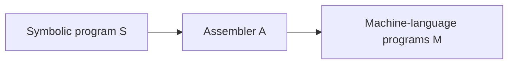
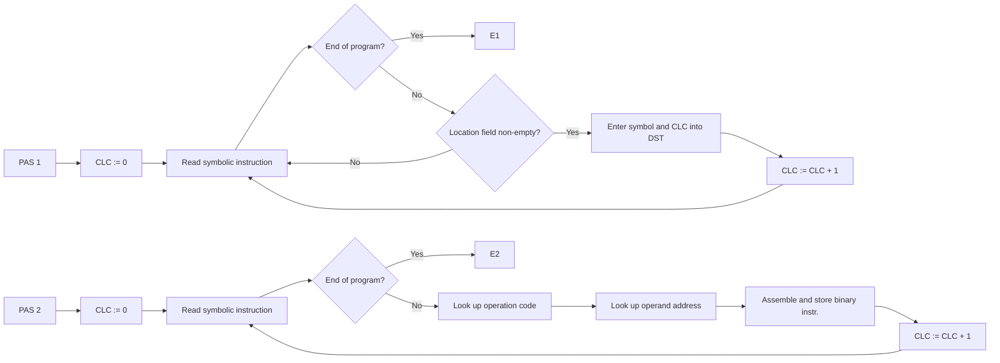
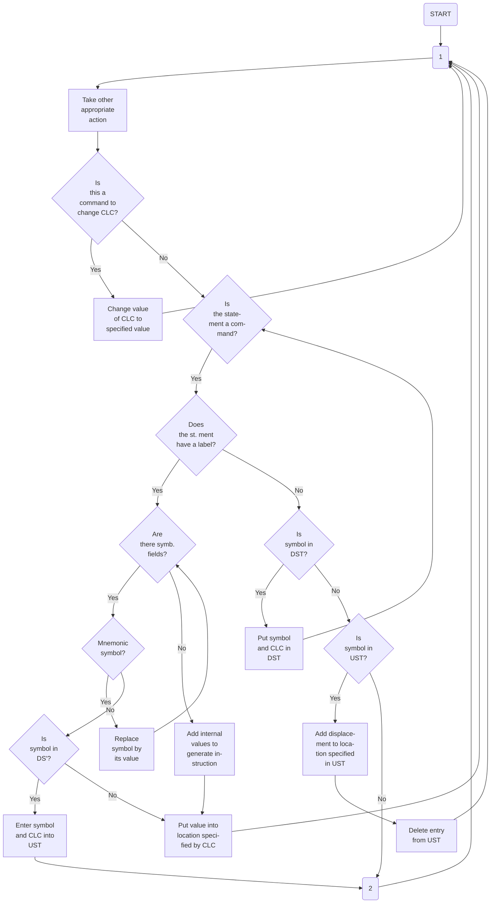

## Page 1

# Course Manual CF20

## Introduction to Assembly Programming

### NORSK DATA A.S

```
   N D   
 ●●●  ●●●●
●     ●   ●
●●●   ●●● 
●     ●  ●
 ●●●  ●   ●
```

---

## Page 2

# COURSE MANUAL
CF20

## INTRODUCTION TO ASSEMBLY PROGRAMMING

---

## Page 3

The page is blank, so there is no text or diagrams to convert to Markdown.

---

## Page 4

# REVISION RECORD

## Notes

| Revision | Notes                                                |
|----------|------------------------------------------------------|
| 1/75     | Original Printing                                    |
| Rev. A   | The following pages have been revised or added:      |
| 2/75     | 1-4, 2-1, 2-6, 2-7, 2-8, 2-9, 3-4, 3-5               |

CF20 - Introduction to Assembly Programming  
January 1975

```
 A/S NORSK DATA-ELEKTRONIKK
 Lorcnveien 57, Oslo 5 - Tlf.: 21 73 71
```

---

## Page 5

The page is blank and contains no visible text or elements to convert.

---

## Page 6

# TABLE OF CONTENTS
...oo0oo...

## Chapters:

| Chapters | Page |
|----------|------|
| 1. ASSEMBLERS | 1-1 |

### 1.1 Basic Concepts of Scanning and Assembly

| Subsections | Page |
|-------------|------|
| 1.1.1 External Instruction Format | 1-1 |
| 1.1.2 Operation Codes and Address Symbols | 1-2 |
| 1.1.3 Two-Pass and One-Pass Assembly | 1-2 |

| Chapters | Page |
|----------|------|
| 2. AN IMAGINARY MACHINE | 2-1 |

### 2.1 The Assembly Language MINI

| Section | Page |
|---------|------|
| 2.2 Instruction Word | 2-2 |

### 2.3 Some Examples

| Subsections | Page |
|-------------|------|
| 2.3.1 Addition of 3 octal Numbers | 2-3 |
| 2.3.2 Find the smallest Number of three octal Numbers | 2-3 |
| 2.3.3 Multiply two positive octal Numbers | 2-4 |

### 2.4 Program Modification

| Subsections | Page |
|-------------|------|
| 2.4.1 Example | 2-4 |
| 2.4.2 "The Turtle" | 2-5 |

### 2.5 Extension of the Imaginary Machine

| Subsections | Page |
|-------------|------|
| 2.5.1 Example | 2-6 |

### 2.6 Commands

| Subsections | Page |
|-------------|------|
| 2.6.1 Define-label | 2-7 |
| 2.6.2 Termination | 2-8 |
| 2.6.3 Execution | 2-8 |

### 2.7 Exercises

| Page |
|------|
| 2-8 |

| Chapters | Page |
|----------|------|
| 3. FUNCTIONAL DESCRIPTION OF AN ASSEMBLER | 3-1 |

### 3.1 Symbol Tables

| Page |
|------|
| 3-1 |

---

## Page 7

# Chapters

| Chapter | Title                                                 | Page |
|---------|-------------------------------------------------------|------|
| 3.2     | Table Structure                                       | 3-2  |
| 3.3     | Example of Assembly                                   | 3-2  |
| 3.4     | Exercises                                             | 3-5  |
| 4       | INTRODUCTION TO MACRO INSTRUCTIONS                    | 4-1  |
| 4.1     | Macro Definition, Macro Call and Macro Expansion      | 4-1  |
| 4.2     | Format Parameters in Macro Instructions               | 4-2  |
| 4.3     | Remark                                                | 4-4  |
| 4.4     | Exercises                                             | 4-4  |

....oo0oo....

CF20 - Introduction to Assembly Programming

---

## Page 8

# ASSEMBLERS

During execution of a program, the instruction sequence is represented inside the computer by binary instructions in successive registers. However, the programmer specifies instructions symbolically. The conversion from a symbolic representation of a program to its binary representation inside the computer can itself be performed by a computer program. This is referred to as the assembly process, and the program which performs the conversion is called an assembler.

An assembler is a program that accepts a program written in assembly language as input and produces its machine language equivalent. Each instruction word in an assembly language program is translated to only one instruction word in machine language.

Thus, we can think of an assembler as a function, the domain of which is the set of all legal assembly language instructions, and the range of which is the corresponding set of machine language instructions. Operation of the assembler A on a symbolic assembly language program S produces a machine language program M, i.e., M = A(S).



_Figure 1.1: The operation of an assembler._

## 1.1 Basic Concepts of Scanning and Assembly

### 1.1.1 External Instruction Format

Input to an assembler consists of sequences of symbolic instructions each of which consists of a number of symbolic fields. It will be assumed that symbolic instructions consist of a location field followed by an operation field, followed by an address field.

`<instruction> ::= <location field> <operation field> <address field>`

The location field contains the instruction label, if there is any. It is used to give symbolic names to locations in order to be able to reference them easily.

---

## Page 9

# Operation Codes and Address Symbols

The assembler basically has to deal with two kinds of symbols:

i. operation code symbols  
ii. address symbols.

The internal binary codes corresponding to operation code symbols are specified by a mnemonic table. When the binary code corresponding to an operation code symbol is required, it is determined by a table look-up in the mnemonic table.

Address symbols do not have fixed internal values. Their values are assigned by the assembler.

Instructions are normally assembled assuming that they will be placed in a set of contiguous locations during execution. However, the value of the location in which the first instruction will be placed is left open. Addresses are normally relative addresses, relative to the first instruction of the instruction block.

## Two-Pass and One-Pass Assembly

Addresses to locations are specified by the defined symbol table, DST, constructed during the assembly process. In order to insure that all symbols are defined before they are referred to, early assemblers were designed to perform assembly in two passes over the instruction sequence. The first pass reads only the location field and builds the symbol table. In both passes a simulated location counter keeps track over the address of the instruction currently being scanned relative to the beginning of the instruction sequence. The location counter will be referred to as current location counter, CLC, or program counter, P.

If the binary instructions of the assembled program can be stored in core during assembly, then assembly can be performed in a single pass by partial translation of instructions which contain references to undefined symbols as they are encountered. Reference addresses of undefined symbols are noted down in an undefined symbol table, UST, and are fixed up as location symbols get defined.

---

CF20 - Introduction to Assembly Programming

---

## Page 10

# Operation of a Simple Two-Pass Assembler



_Figure 1.2: Operation of a simple two-pass assembler._ 

CF20 - Introduction to Assembly Programming

---

## Page 11

# One-Pass Assembly of a Program

## Figure 1.3: One-pass assembly of a program P.

Situation before A gets defined in location 10 is shown.

| CLC | D | R |
|-----|---|---|
| 0   | B |   |
| 1   | A |   |
| 2   | B |   |
| 3   | A |   |
| 4   |   |   |
| 5   | B |   |
| 6   | A |   |
| 7   | B |   |
| 10  | A |   |

Program P with definitions D and references R of symbols

| Name | DA |
|------|----|
| B    | 0  |

DST contains symbol's name and definition address DA

| Name | RA |
|------|----|
| A    | 1  |
| A    | 3  |
| A    | 6  |

UST contains undefined symbol's name and reference address RA

Alternatively, each entry in the defined symbol table can contain one more field which indicates whether the symbol is defined or not. At any time, the last occurrence of a reference to an undefined symbol is contained in the defined symbol tables, the address field in the instruction is used to chain references to the same undefined symbol.

## Figure 1.4: One-pass assembly by use of one table only.

| CLC | D | R |
|-----|---|---|
| 0   | B |   |
| 1   | A |   |
| 2   | B |   |
| 3   | A |   |
| 4   |   |   |
| 5   | B |   |
| 6   | A |   |
| 7   | B |   |
| 10  | A |   |

Program P, originally

| CLC | D | R |
|-----|---|---|
| 0   |   |   |
| 1   |   |   |
| 2   | 0 |   |
| 3   |   |   |
| 4   |   |   |
| 5   | 0 |   |
| 6   |   |   |
| 7   | 0 |   |
| 8   | A |   |

Program P before A gets defined 

| Name | Addr | D/R |
|------|------|-----|
| B    | 0    | D   |
| A    | 6    | R   |

Table DST before A gets defined.

CF20 - Introduction to Assembly Programming.

---

## Page 12

# 2. AN IMAGINARY MACHINE

We shall now present an imaginary machine which consists of a processor, an internal memory of 1/4K 16 bits words and a Teletype as input/output unit.

Each location in the memory contains an octal number. The contents may be interpreted in two ways: either as an instruction or as an operand's value.

An instruction consists of two parts: a function code and a reference to an operand address.

The processor has two registers which have the same length as a memory location:

i. A-register is the accumulator  
ii. P-register is the program counter. It is increased by one for each new instruction.

## 2.1 The Assembly Language MINI

The assembly language of the imaginary machine is called MINI. It is a somewhat extended subset of NORD computers' instruction repertoire.

Statements in MINI have one of the following formats:

```
<instruction> ::= [<label>]<operation><operand>

or

<symbol definition> ::= <label>, <value>

where

<label> ::= <letter> | <label><letter> | <label><decimal digit>

<operand> ::= <label>

<value> ::= <label>|<octal number>
```

A `<label>`, which is a definition of a symbol's address, and an `<operand>` which is a reference to a symbol's value, may contain up to four alphanumeric characters. An `<octal number>` may contain up to six octal digits.

The `<operation>` must be one of the legal MINI operations listed below:

---

## Page 13

# Instruction Word

If a location contains an instruction, this is interpreted as a function code and a reference to an operand address, (see Figure 2.1). Addressing is relative to the P-register. In other words: reference to an operand address is recomputed as a displacement from the definition address to the reference address:

displacement: = definition address - reference address

```
15  14  13  12  11  10  9   8  7  6  5  4  3  2  1  0
+---+---+---+---+---+---+---+---+---+---+---+---+---+
|               Function code              |       |
+---+---+---+---+---+---+---+---+---+---+---+---+---+
                       Displacement, Δ
```

Figure 2.1: MINI's instruction word.

Both backward and forward references are permitted such that the displacement may be negative or positive. Since the displacement must be represented by 8 bits, the sign inclusive, it is possible to refer to operands within an interval of 256 locations (the size of the memory). The displacement is limited by the following inequality:

-128 ≤ Δ ≤ 127.

This means that the last reference to the defined symbol may not occur later than 128 locations after the corresponding < symbol definition >. On the other hand, reference to an undefined symbol must not occur earlier than 127 locations prior to the < symbol definition >.

CF20 - Introduction to Assembly Programming

---

## Page 14

# 2.3 Some Examples

## 2.3.1 Addition of 3 Octal Numbers

### MINI-program:

```
INP
STA NUM1
INP
STA NUM2
INP
STA NUM3
ADD NUM1
ADD NUM2
STA SUM
HLT

NUM1, 0
NUM2, 0
NUM3, 0
SUM, 0
```

## 2.3.2 Find the Smallest Number of Three Octal Numbers

### MINI-program:

```
INP
STA NUM1
INP
STA NUM2
INP
STA NUM3
SUB NUM2
JAP SM2
    LDA NUM3
    JMP TST2
SM2, LDA NUM2
TST2, SUB NUM1
    JAP FIN
    ADD NUM1
    JMP WRTE
FIN, LDA NUM1
WRTE, OUT
HLT

NUM1, 0
NUM2, 0
NUM3, 0
```

---

## Page 15

## 2.3.3 Multiply Two Positive Octal Numbers

**MINI-program:**

```
         INP
         STA    NUM1
         STA    PROD
         INP
         STA    NUM2
    JAZ  FIN1
CONT,    SUB    ONE
         STA    NUM2
    JAZ  FIN
         LDA    PROD
         ADD    NUM1
         STA    PROD
         LDA    NUM2
         JMP    CONT
FIN,     LDA    PROD
FIN1,    OUT
         HLT
NUM1,    0
NUM2,    0
PROD,    0
ONE,     1
```

## 2.4 Program Modification

In the previous examples we distinguished between words containing instructions and words containing data. It might be useful to be able to modify instructions, too, in order to be spared rewriting similar instructions.

### 2.4.1 Example:

Read n numbers into the locations NUM, NUM+1, NUM+2, ..., NUM+n-1. Compute their sum and place it in location SUM.

Instead of writing n input and store instructions and n-1 addition instructions, we may use loops where these instructions are repeated and modified.

**MINI-program:**

```
         INP    }
         STA    N    } Number of numbers
         STA    N1
```

[CF20 - Introduction to Assembly Programming]

---

## Page 16

```
READ  INP              | Read numbers
STRE  STA NUM          |
       LDA N1         |   
       SUB ONE        | Test if N numbers are read
       STA N1         |
       JAZ REST       |
       LDA STRE       |
       ADD ONE        | Modify store instruction
       STA STRE       |
       JMP READ       | Repeat
REST  LDA ORG1         |
       STA STRE       | Restore correct instruction
       LDA N          | Restore number of numbers
       STA N1         |
       LDA ZERO       | Initiate summation
       STA SUM        |
LOOP  LDA SUM          |
AD1   ADD NUM         | Summation
       STA SUM        |
       LDA N1         |
       SUB ONE        |
       STA N1         | Test if finished
       JAZ FIN        |
       LDA AD1        |
       ADD ONE        | Modify addition instruction
       STA AD1        |
       JMP LOOP       | Repeat
FIN   LDA ORG2         |
       STA AD1        | Restore original store instruction
       LDA SUM        |
       OUT            | Write result
       HLT            |

ZERO   0
ONE    1
N      0
N1     0
ORG1   4046
ORG2   60026
SUM    0
NUM    0

2.4.2 "The Turtle"

The program moves itself further in memory.

MINI-program:

THIS  LDA THIS        | Moves the i-th instruction
STRE  STA NEXT        |

CF20 - Introduction to Assembly Programming
```

---

## Page 17

# Extension of the Imaginary Machine

Usually, programs consist of parts which are systematically repeated. In mathematics and high-level languages, we use indexes to refer to a given operand. An index may be a variable which changes its value.

In the preceding section, we saw examples of how to program loops. Indexing was implemented by changing the operand part of those instructions which refer to an indexed variable. This is clumsy and time-consuming. We now introduce a new register X, called the index register. It has the same length as the other two registers. There are three instructions to manipulate the X-register:

- **LDX** Load X-register
- **STX** Store X-register
- **JNC** Increment X-register and jump if it is negative.

## Example

Alternative solution for the problem in example '2.4.1':

### MINI-program:

```
LDA ADR
ADD N        Base address
STA ADR
LDA ZERO
SUB N        Negation of N
STA N
LDX N
```

---

```
LDA THIS
ADD ONE
STA THIS        Modify instruction in location THIS
LDA STRE
ADD ONE
STA STRE        Modify instruction in location STRE
LDA PLEN
SUB ONE        Test if finished
STA PLEN
JAZ NEXT
JMP THIS       Repeat
```

|      |    |
|------|----|
| ONE  | 1  |
| PLEN | 17 |
| NEXT | 0  |

---

CF20 - Introduction to Assembly Programming

---

## Page 18

# Assembly Program Summation

```
LDA  ZERO    
ADD  ADR,X     Summation
JNC  NEXT      Test if finished  
STA  SUM      
OUT          
HLT          

ADR  ,  NUM  
ZERO ,  0  
N    ,  0  
SUM  ,  0  
NUM  ,  0  
```

The effective address used in location NEXT is given by the contents of ADR plus the contents of the X-register, i.e., effective address: = contents (ADR) + X = (NUM + N) + X, where X = -N, -(N - 1), ....., -1.

## 2.6 Commands

Commands have a number of different formats. For the most part commands direct the assembler to take some action and cause no instructions to be assembled, but there are exceptions.

Three commands are of paramount importance: the define label command, the termination command and the execution command.

### 2.6.1 Define-label

This command is executed by writing a symbol at the beginning of a line followed by a comma (,). When this command is executed, the specified symbol is given as its value the current value of the location counter. Thus, if CLC = 400

```
A,
```

gives A the value 400. The comma in a label definition must not be confused with the comma in the symbol ,X.

With the above command, instructions and constants, programs can be written. For example, if CLC = 400 in the beginning,

```
STRT,  LDA  F00
       STA  L
       HLT

F00  ,  3
L    ,  0
```

_CF20 - Introduction to Assembly Programming_

---

## Page 19

# Assembly Programming

This is equivalent to

```
Location 400 
   │
   └───┐
       │
    ┌──▼──┐
    │044003│
    │004003│
    │146162│
    │000003│
    │000000│
    └──────┘
```

where STRT's address is 400, F00's address is 403, and L's address is 404.

The `=` command is another method of giving a value to a symbol. The way to use this command is to write a symbol at the beginning of a line and to immediately follow the symbol by the `=` sign (no intervening characters including spaces). The `=` sign is then followed by an expression composed of symbols and numbers. The arithmetic value of this expression is made the value of the symbol

```
A = STRT + 1
```

There may be no undefined symbols in the expression. This command is used to define symbols which are undefined after assembly has been terminated.

## 2.6.2 Termination

The termination command `)END` is used to terminate assembling. It must follow the last line in the program.

## 2.6.3 Execution

The execution command `)RUN` is used to start execution of a program. It must have been preceded by an `)END` command.

## 2.7 Exercises

### 2.7.1

Write a program that divides a number A by a number B. The quotient is placed in location Q and the rest in R.

### 2.7.2

Write a program that outputs 3 numbers in ascending order.

### 2.7.3

Write a program that reads another arbitrary program into the locations following your program and transfers control to it after instruction HLT has been read.

---

CF20 - Introduction to Assembly Programming

---

## Page 20

## 2.7.4

The "turtle" contains some mistakes. Write a correct "turtle"-program

i. without using the X-register.  
ii. by using the X-register.

---

CF20 - Introduction to Assembly Programming

---

## Page 21

The page is blank. There is no visible content to transcribe or convert to Markdown.

---

## Page 22

# 3. FUNCTIONAL DESCRIPTION OF AN ASSEMBLER

Each mnemonic has a unique binary value (See table 3.1). All the mnemonics and their binary or octal equivalents are stored in a table which is called the Mnemonic Table.

During assembly of an instruction, the assembler just adds the value of all the mnemonics which are encountered in the instruction. The total sum of this procedure is then the completely assembled instruction in binary or octal format. This sum, which is now equal to the actual machine instruction, is now stored in memory.

The assembler employs a so-called Current Location Counter (CLC) to keep track of where in the memory an instruction is saved, and the value of the CLC is incremented by 1 for each instruction which is interpreted.

In this manner the instructions will be stored sequentially in memory during the assembly process.

## 3.1 Symbol Tables

The Defined-Symbol Table, DST, contains all symbols defined by "," during assembling or by "=" afterwards.

That is:

```
SYM, 2
SYM1 = SYM + 1
```

The symbols SYM and SYM1 are said to be local or user-defined symbols.

When the assembler encounters SYM, 2, the symbol is first tested to see if it is already contained in the DST, thereby preventing the double definition of a symbol. If not contained in DST, it is stored in DST with the octal value of CLC, i.e., its definition address.

If SYM has been defined before, an error message is printed out saying that the symbol SYM is double defined.

Next step in the processing of the symbol SYM is to see if it is part of the so-called Undefined Symbol Table, UST.

The Undefined Symbol Table is used for symbols which are referred to but not yet defined. If there are references to the symbol SYM

[CF20 – Introduction to Assembly Programming]

---

## Page 23

# Table Structure

The structure of the mnemonic, defined-symbol, and undefined-symbol table is basically the same.

Each symbol in the mnemonic table will have an internal representation which requires two memory locations. Symbols in DST and UST require three memory locations.

| Location |          |            | Location |          |                |
|----------|----------|------------|----------|----------|----------------|
| n        | Symbol   |            | n        | Symbol   | (first part)   |
| n + 1    | Value    |            | n + 1    | Symbol   | (last part)    |
|          |          |            | n + 2    | Value    |                |

Mnemonic Table | DST and UST

Figure 2.1: Table Structure

In the mnemonic table only one location is used to store the symbol. Mnemonic symbols consist of three letters each of which are stored in five bits. The second location is used for the fixed binary value of the mnemonic symbol.

In DST and UST the two first locations are used to store the actual symbol itself. The third location is used for saving the value of CLC, either as definition address in DST or as reference address in UST.

# Example of Assembly

Assume that the following instruction is to be assembled:

CF20 - Introduction to Assembly Programming

---

## Page 24

# LDA NUMₓ

To assemble this instruction, the assembler executes the following steps:

i. Each character of a symbol is read one by one. Space indicates to the assembler that it has read a complete symbol. This would first be LDA.

ii. Next, the symbol will be tested to see if it is found in the Mnemonics Table or not. If it is a mnemonic its octal value (in this example 044000₈) will be saved. If it is not a mnemonic, the assembler continues at step iv.

iii. On completion of step ii, the assembler continues reading characters of which constitutes the next symbol which is now NUM.

iv. The symbol NUM is tested for membership of the defined symbol table to see if NUM is already defined. If true, the displacement: = CLC - definition address is calculated and added to the instruction saved so far.

If the symbol NUM is not a member of the defined symbol table, NUM will be placed in the undefined symbol table together with the value of the CLC which now holds the value of memory location where the symbol NUM is being referred to by the instruction LDA NUM. Now, only the value of LDA is stored in the location where CLC is pointing to, and the assembly of the instruction LDA NUM will not be completed before NUM is defined.

v. The value of the complete instruction is stored in memory at the location given by CLC, and the assembler is ready to start the assembly process for the next instruction.

A complete flow diagram for any assembly process is shown in figure 3.2.

[CF20 - Introduction to Assembly Programming]

---

## Page 25



---

## Page 26

# Table 3.1: Summary of MINI Instructions with Internal Representation

| Octal Value | Mnemonic | 15 | 14 | 13 | 12 | 11 | 10 | 9 | 8 | 7 6 5 4 3 2 1 0 |
|-------------|----------|----|----|----|----|----|----|---|---|-------------------|
| 004000      | STA      | 0  | 0  | 0  | 0  | 1  | 0  | 0 | 0 | Displacement Δ   |
| 014000      | STX      | 0  | 0  | 0  | 1  | 1  | 0  | 0 | 0 |                   |
| 044000      | LDA      | 0  | 1  | 0  | 0  | 1  | 0  | 0 | 0 |                   |
| 054000      | LDX      | 0  | 1  | 0  | 1  | 1  | 0  | 0 | 0 |                   |
| 060000      | ADD      | 0  | 1  | 1  | 0  | 0  | 0  | 0 | 0 |                   |
| 064000      | SUB      | 0  | 1  | 1  | 0  | 1  | 0  | 0 | 0 |                   |
| 124000      | JMP      | 1  | 0  | 1  | 0  | 1  | 0  | 0 | 0 |                   |
| 130000      | JAP      | 1  | 0  | 1  | 1  | 0  | 0  | 0 | 0 |                   |
| 131000      | JAZ      | 1  | 0  | 1  | 1  | 0  | 0  | 1 | 0 |                   |
| 132400      | JNC      | 1  | 0  | 1  | 1  | 0  | 1  | 0 | 1 |                   |
| 146162      | HLT      | 1  | 1  | 0  | 0  | 1  | 1  | 0 | 0 | 0 1 1 1 0 0 1 0 0 |
| 160000      | INP      | 1  | 1  | 1  | 0  | 0  | 0  | 0 | 0 |                   |
| 161000      | OUT      | 1  | 1  | 1  | 0  | 0  | 0  | 1 | 0 |                   |
| 003000      | X        | 0  | 0  | 0  | 0  | 0  | 1  | 1 | 0 |                   |

# Exercises

## 3.4.1

Find the octal representation of the programs in example 2.3.2 and example 2.3.3.

## 3.4.2

Use the flow chart in figure 3.2 to trace the program of example 2.4.1. Build the defined- and undefined-symbol table.

## 3.4.3

Suppose we want to construct a one-pass assembler which uses only one table (see section 1.1.3). Change the flow chart in figure 3.2 to fit this demand.

---

## Page 27

[The page appears to be blank, with no visible content to transcribe.]

---

## Page 28

# 4. INTRODUCTION TO MACRO INSTRUCTIONS

The assembly language programmer often finds it necessary to repeat some blocks of instructions many times within a program. Macro facilities allow the programmer to associate names with symbol strings. In employing a macro, the programmer essentially defines a single instruction to represent a block of code. For every occurrence of this one-line macro instruction in a program, the macro processor (part of the assembler) will substitute the entire block.

## 4.1 Macro Definition, Macro Call and Macro Expansion

Macro facilities in an assembler allow the programmer to associate a name with a sequence of symbolic instructions and to subsequently use that name to denote the sequence of instructions.

Consider for example the following program:

```
    .
    .
    .
    INP
    ADD X
    OUT
    .
    .
    .
    INP
    ADD X
    OUT
    .
    .
    .
    X, .......
```

In the above program, the sequence

```
INP
ADD X
OUT
```

occurs twice. It is convenient to name frequent sequences of instructions and to denote their occurrence by the abbreviated name. A name is attached to a sequence of instructions by means of a macro instruction which may be formed in the following way:

CF20 - Introduction to Assembly Programming

---

## Page 29

# Macro Definitions

```
MACRO <macro name>
<sequence of instructions>
END
```

A macro definition is introduced by the control operation MACRO followed by the `<macro name>`. The `<sequence of instructions>` constitutes the macro body. The macro definition is terminated by the control operation END.

When a macro gets defined, the name and the macro body are entered into the macro table. The macro table is a symbol table of name-value correspondence, just like the mnemonic table or the defined-symbol table. It is consulted when the value, the macro body, associated with a macro name is to be determined.

The macro definition does not give rise to any lines of generated code. The use of the macro name as an operation mnemonic in an assembly program causes substitution of the macro body for the macro name and subsequent assembly of the generated lines of instruction. This use of a macro name is referred to as a macro call. The instruction sequence substituted for the macro name is referred to as the macro expansion generated by a macro call.

Our example might be rewritten as follows, assigning the name INCR to the repeated sequence.

| Source         | Expanded Source    |
|----------------|--------------------|
| MACRO INCR     |                    |
| INP            | INP                |
| ADD X          | ADD X              |
| OUT            | OUT                |
| END            |                    |
| ...            | ...                |
| INCR           | INP                |
|                | ADD X              |
|                | OUT                |
| ...            | ...                |
| INP            | INP                |
| ADD X          | ADD X              |
| OUT            | OUT                |
| ...            | ...                |
| X ..........   | X ..........       |

## 4.2 Formal Parameters in Macro Instructions

So far, we have only discussed parameterless macros. All of the calls to any given macro will produce precisely the same macro

---

_CF20 - Introduction to Assembly Programming_

---

## Page 30

# Macro Expansion

This is unnecessarily restrictive. An important extension is to allow macro definitions with formal parameters which can be substituted by different actual parameters in different macro calls.

Different fields or an entire instruction may be treated as formal parameters.

Consider the following macro definition which treats the operand field as formal parameters:

```
MACRO SUM X, Y, Z
  LDA X
  ADD Y
  STA Z
END
```

Macro calls of this macro must contain three actual parameters. Two kinds of substitution are performed to obtain the macro expansion resulting from a macro call:

i. Actual parameters replace formal parameters

ii. The resulting macro body replaces the macro call.

Thus the macro call

```
SUM A, B, A
```

would result in the macro expansion

```
LDA A
ADD B
STA A
```

Similarly, the operation field or a complete instruction may be treated as formal parameters. The following example has a parameter which is a complete instruction, a parameter which is an operation field and a parameter which is an operand field:

```
MACRO KAHU X, Y, Z
  X
  Y Z
  STA Z
END
```

The macro call

```
KAHU (LDA A), SUB, B
```

CF20 - Introduction to Assembly Programming

---

## Page 31

# 4.3 Remark

The macro facility is not part of the MINI assembly language.

# 4.4 Exercises

## 4.4.1

Define a macro which shortens the programs in example 2.3.2 and 2.3.3.

## 4.4.2

Consider the following program:

```
MACRO   READ    Z
        INP
        STA     Z
        END
MACRO   SEQ3    OP1, L, OP2
        STA     OP1
        JAZ     L
        LDA     OP2
        END
        READ    X
        STA     PROD
        READ    N
NEXT,   LDA     N
        SUB     ONE
        SEQ3    N, FIN, X
CONT,   SUB     ONE
        SEQ3    X1, NEXT, PROD
        ADD     X
        STA     PROD
        LDA     X1
        JMP     CONT
FIN,    LDA     PROD
        OUT
        HLT
```

CF20 - Introduction to Assembly Programming

---

## Page 32

# Assembly Programming Exercise

| Variable | Initial Value |
|----------|---------------|
| X        | 0             |
| N        | 0             |
| PROD     | 0             |
| X1       | 0             |
| ONE      | 1             |

How will the program be expanded? Trace the program for X=2 and N=3. Which values do X, N, PROD, and X1 have after execution?

## 4.4.3

Write a MINI-program to find the greatest common divisor of two numbers X and Y.

Try to shorten your source program by introducing macros.

---

CF20 - Introduction to Assembly Programming

---

## Page 33

[The page is blank, so there's no content to transcribe or convert.]

---

## Page 34

# COMMENT AND EVALUATION SHEET

CF20 - Introduction to Assembly Programming  
January 1975

In order for this manual to develop to the point where it best suits your needs, we must have your comments, corrections, suggestions for additions, etc. Please write down your comments on this pre-addressed form and post it. Please be specific wherever possible.

**FROM:**

________________________________________________

________________________________________________

________________________________________________

---

## Page 35

[The image appears blank or unreadable. Please provide another image or clarify.]

---

## Page 36

# We Make Bits for the Future

NORSK DATA A.S  
BOX 4 LINDEBERG GÅRD  
OSLO 10 NORWAY  
PHONE: 39 16 01  
TELEX: 18661

---

