## Page 1

# NORD-10/HAWK — Disk Controller

## NORSK DATA A.S.

[Photo: dark cover with a white label and rows of circular perforations.]

---

## Page 2

# NORD-10/HAWK—

# Disk Controller

---

## Page 3

ii

# REVISION RECORD

| Revision | Notes |
|---|---|
| 03/76 | Original Printing |
|  |  |
|  |  |
|  |  |
|  |  |
|  |  |
|  |  |
|  |  |
|  |  |
|  |  |
|  |  |
|  |  |
|  |  |
|  |  |
|  |  |
|  |  |
|  |  |
|  |  |
|  |  |
|  |  |
|  |  |
|  |  |
|  |  |
|  |  |
|  |  |
|  |  |
|  |  |
|  |  |
|  |  |
|  |  |
|  |  |
|  |  |
|  |  |
|  |  |
|  |  |
|  |  |

NORD-10/HAWK – Disk Controller  
Publication No. ND-11.010.01

[Logo: stylized “NDB” dot-matrix logo]

A/S NORSK DATA-ELEKTRONIKK  
Lørenveien 57, Oslo 5 - Tlf.: 21 73 71

---

## Page 4

iii

# TABLE OF CONTENTS

```text
          + + +
            +
```

| Section |  | Page |
|---|---|---|
| 1 | **NORD-10/HAWK PROGRAMMING SPECIFICATIONS** | 1–1 |
| 1.1 | Disk Device Register Addresses | 1–1 |
| 1.2 | Read Block Address | 1–2 |
| 1.3 | Preparing for a Transfer | 1–4 |
| 2 | **THE INTERFACE SIGNALS** | 2–1 |
| 2.1 | Signal Explanation | 2–1 |
| 2.1.1 | Output Lines | 2–1 |
| 2.1.2 | Input Lines | 2–3 |
| 2.2 | Signal Assignments | 2–4 |
| 2.2.1 | Disk Configurations | 2–8 |
| 3 | **DISK ADDRESSING** | 3–1 |
| 3.1 | Block Address Format | 3–2 |
| 3.1.1 | Sector Format — General Discussion | 3–2 |
| 3.1.2 | Disk Formatting | 3–4 |
| 3.2 | The Clock System | 3–6 |
| 3.2.1 | The Bit Counter | 3–6 |
| 3.2.2 | The Phase Generator Network | 3–6 |
| 3.2.2.1 | Operations | 3–7 |
| 4 | **WRITE AND READ OPERATION** | 4–1 |
| 4.1 | Write Operation | 4–1 |
| 4.2 | Read Operation | 4–2 |
| 4.3 | The Check Word Generator | 4–3 |
| 4.3.1 | Operation | 4–5 |
| 5 | **INTERRUPT GENERATION AND HANDLING** | 5–1 |
| 5.1 | Device Interrupts | 5–4 |
| 5.2 | Error Interrupts | 5–6 |

---

## Page 5

# iv

| Section: |  | Page: |
|---|---|---:|
| 6 | STATUS GENERATION | 6–1 |
| 6.1 | Detailed Description | 6–2 |
| 6.1.1 | SB0 — Ready for Transfer Interrupt<br>Enabled | 6–2 |
| 6.1.2 | SB1 — Error Interrupt Enable | 6–2 |
| 6.1.3 | SB2 — Device Active | 6–2 |
| 6.1.4 | SB3 — Device Ready for Transfer | 6–4 |
| 6.1.5 | SB4 — Inclusive OR of Errors (SB5 - 11) | 6–4 |
| 6.1.6 | SB5 — Write Protect Violate | 6–4 |
| 6.1.7 | SB6 — Time Out | 6–5 |
| 6.1.8 | SB7 — Hardware Error | 6–5 |
| 6.1.9 | SB8 — Address Mismatch | 6–5 |
| 6.1.9.1 | Principal Circuit Description | 6–7 |
| 6.1.10 | SB9 — Read Parity Error | 6–7 |
| 6.1.11 | SB10 — Compare Error | 6–9 |
| 6.1.12 | SB11 — DMA Channel Error (Missing<br>Clocks) | 6–9 |
| 6.1.13 | SB12 — Transfer Complete | 6–9 |
| 6.1.14 | SB14 — Transfer ON | 6–9 |
| 6.1.15 | SB14 — ON Cylinder | 6–11 |
| 6.1.16 | SB15 — Bit 15 Loaded by Previous<br>Control Word | 6–11 |
| 7 | THE CONTROL WORD | 7–1 |
| 7.1 | Detailed Description | 7–2 |
| 7.1.1 | CW0 — Enable Interrupts on Device<br>Ready for Transfer | 7–2 |
| 7.1.2 | CW1 — Enable Interrupt on Errors | 7–2 |
| 7.1.3 | CW2 — Activate Device | 7–2 |
| 7.1.4 | CW3 — Test Mode | 7–4 |
| 7.1.4.1 | Clock and Data Substitutions | 7–4 |
| 7.1.4.2 | Sector Substitutions | 7–8 |
| 7.1.4.3 | Read Operation in Test Mode | 7–8 |
| 7.1.4.4 | Write Operation in Test Mode | 7–8 |
| 7.1.5 | CW4 — Device Clear | 7–9 |
| 7.1.6 | CW5 - 6 — Address Bits 16 and 17 | 7–11 |
| 7.1.7 | CW7 - 8 — Not Assigned | 7–11 |
| 7.1.8 | CW9 - 10 — Unit Select | 7–11 |
| 7.1.9 | CW11 - 12 — Device Operation | 7–12 |
| 7.2 | M0 — Read Transfer | 7–13 |
| 7.2.1 | Detailed Description | 7–13 |

ND-11.010.01

---

## Page 6

# V

| Section: |  | Page: |
|---|---|---|
| 7.3 | M1 — Write Transfer | 7–17 |
| 7.4 | M2 — Read Parity | 7–20 |
| 7.5 | M3 — Compare Test | 7–22 |
| 7.5.1 | CW13 — Marginal Recovery | 7–22 |
| 7.5.2 | CW14 — Not Assigned | 7–23 |
| 7.5.3 | CW15 — Write Format | 7–23 |

# APPENDIX A — Diagrams

# APPENDIX B — Signal Definition List

# APPENDIX C — Backwiring Print

# APPENDIX D — Controller Activity Indicators (Physical Locations)

# APPENDIX E — N-10/HAWK Physical Layout

ND 11 010 01

---

## Page 7

# vi

## Table

| Table | Title | Page |
|---|---|---|
| 2.1 | The Interface Signals | 2–2 |
| 2.2 | Interface Signals — Pin Assignments, etc. | 2–5 |

## Figure

| Figure | Title | Page |
|---|---|---|
| 2.1 | Disk Configurations | 2–8 |
| 3.1 | Block Address Format | 3–2 |
| 3.2 | ND — Sector Format | 3–2 |
| 3.3 | Disk Controller — Block Diagram | 3–5 |
| 4.1 | The Check Word Generator | 4–4 |
| 5.1 | Interrupt Generation | 5–2 |
| 6.1 | Status Generation, SB0 - 4 | 6–3 |
| 6.2 | Status Generation, SB4 - 8 | 6–6 |
| 6.3 | Status Generation, SB9 - 11 | 6–8 |
| 6.4 | Status Generation, SB12 - 15 | 6–10 |
| 7.1 | Activate Device — Illustration | 7–3 |
| 7.2 | Clock and Data — Substitution | 7–5 |
| 7.3 | Sector Clock — Substitution | 7–6 |
| 7.4 | Disable of Unit Error Condition | 7–7 |
| 7.5 | Device Clear Illustration | 7–10 |
| 7.6 | Bus Address bits 16 and 17 | 7–11 |
| 7.7 | Unit Selection | 7–11 |
| 7.8 | Mode Indication | 7–12 |
| 7.9 | Read Transfer | 7–14 |
| 7.10 | Read Gate Activation | 7–15 |
| 7.11 | Write Transfer | 7–18 |
| 7.12 | Read/Write Gate Activation | 7–19 |
| 7.13 | Read Parity — Data Flow | 7–20 |
| 7.14 | Read/Read Parity Differences | 7–20 |
| 7.15 | Compare Test — Data Flow | 7–22 |

ND-11.010.01

---

## Page 8

1–1

# 1 NORD-10/HAWK PROGRAMMING SPECIFICATIONS

## 1.1 DISK DEVICE REGISTER ADDRESSES

The codes below are relevant for disk system I. Each disk system may consist of four disk units. For disk system II, add 10₈ to the specified codes.

|  |  |  |
|---|---|---|
| Read Core Address | IOX | 500 |
| Load Core Address | IOX | 501 |
| Read Sector Counter | IOX | 502 |
| Load Block Address | IOX | 503 |
| Read Status Register | IOX | 504 |
| Load Control Word | IOX | 505 |
| Seek Instruction (Read Block Address) | IOX | 506 |
| Load Word Count Register | IOX | 507 |

The minimum number of words to be transferred is one sector, i.e. 200₈ words. The maximum number of words is one track, i.e. 24 sectors (6000₈ words).

---

## Page 9

1-2

# 1.2 READ BLOCK ADDRESS

This instruction is implemented for maintenance purposes only. By first  
loading a control word with bit 3 (Test Mode) the instruction

`IOX     506`

will return the previously loaded block address to the A-register.

## Control Word

| Bit | Description |
|---:|---|
| 0 | Enable interrupt on device ready for transfer |
| 1 | Enable interrupt on errors |
| 2 | Activate device |
| 3 | Test mode |
| 4 | Device clear |
| 5 | Address bit 16 |
| 6 | Address bit 17 |
| 7 - 8 | Not assigned |
| 9 | Unit select |
| 10 | Unit select |
| 11 | Device operation |
| 12 | Device operation |
| 13 | Not assigned |
| 14 | Marginal recovery |
| 15 | Write Format |

## Unit Select Code:

| Bit Number 10 | Bit Number 9 | |
|---:|---:|---|
| 0 | 0 | Unit 0 |
| 0 | 1 | Unit 1 |
| 1 | 0 | Unit 2 |
| 1 | 1 | Unit 3 |

## Device Operation Code:

| Bit Number 12 | Bit Number 11 | |
|---:|---:|---|
| 0 | 0 | Read Transfer |
| 0 | 1 | Write Transfer |
| 1 | 0 | Read Parity |
| 1 | 1 | Compare |

To format a disk the formatting switch must be turned on. Write  
transfer and Write Format must be specified.

ND-11.010.01

---

## Page 10

# Status Word

| Bit | Description |
|---:|---|
| 0 | Ready for transfer, interrupt enabled |
| 1 | Error interrupt enabled |
| 2 | Device active |
| 3 | Device ready for transfer |
| 4 | Inclusive OR of errors (status bits 5 - 11) |
| 5 | Write protect violate |
| 6 | Time out |
| 7 | Hardware error |
| 8 | Address mismatch |
| 9 | Parity error |
| 10 | Compare error |
| 11 | Missing clock(s) |
| 12 | Transfer complete |
| 13 | Transfer on |
| 14 | On cylinder |
| 15 | Bit 15 loaded by previous control word |

---

## Page 11

1–4

# 1.3 PREPARING FOR A TRANSFER

A disk system is classified as a Mass Storage Device. Data Transfer takes place over a DMA (Direct Memory Access channel). A DMA will, when started, run without CPU supervision, i.e. the transfer is controlled from the DMA interface.

However, prior to a DMA transfer the various "control" registers must be loaded with start information.

This information is loaded via the A-register through a P10 "channel".

The sequence in which the control registers are loaded is of no significance. However, the preparation process is terminated when loading the control word with "Activate device" (CW2) specified.

**Example:**

- Read "Status register" (IOX 504) to check if the unit is <u>Ready</u> (SB3) and Busy (SB2).

- Load "Block Address Register" (IOX 503) with the block address (disk address).

- Load "Core Address Register" (IOX 501) with the address of the first memory access.

- Load "Word Counter" (IOX 507) with the number of words to be transferred.

  (200₈ ≤ WC + 6000₈)

- Load "Control Word" (IOX 505) with unit selection, Device Operation, interrupt enable and "Activate Device".

The data transfer will now start and the "word counter" is decremented and the "core address register" incremented by one for each word transferred.

The DMA transfer is normally terminated by a word count of zero (WC = 0).

ND-11 010 01

---

## Page 12

2–1

# 2 THE INTERFACE SIGNALS

The signals going to and from the unit are referred to as the interface signals. The type and number of lines are listed in Table 1.

## 2.1 *SIGNAL EXPLANATION*

### 2.1.1 *Output Lines*

Cylinder Strobe  
&nbsp;&nbsp;&nbsp;&nbsp;strobes the cylinder address into the cylinder address register.  
&nbsp;&nbsp;&nbsp;&nbsp;The cylinder address lines must be stable when the cylinder  
&nbsp;&nbsp;&nbsp;&nbsp;strobe is applied.

Cylinder Address  
&nbsp;&nbsp;&nbsp;&nbsp;nine address lines holding the new address information at the line  
&nbsp;&nbsp;&nbsp;&nbsp;when the “cylinder strobe” is applied.

Return to Zero Seek  
&nbsp;&nbsp;&nbsp;&nbsp;resets control logic and commands the carriage to cylinder 0.

Head Select  
&nbsp;&nbsp;&nbsp;&nbsp;selects one of four recording heads by holding the binary address.  
&nbsp;&nbsp;&nbsp;&nbsp;The desired head selection must be held constant during the  
&nbsp;&nbsp;&nbsp;&nbsp;entire read or write operation.

Write Data/Clock  
&nbsp;&nbsp;&nbsp;&nbsp;transmits double frequency encoded data and clock signals to the  
&nbsp;&nbsp;&nbsp;&nbsp;unit.

Write Gate  
&nbsp;&nbsp;&nbsp;&nbsp;enables the write circuitry during a write operation.

Erase Gate  
&nbsp;&nbsp;&nbsp;&nbsp;enables the erase current to the erase Coil.  
&nbsp;&nbsp;&nbsp;&nbsp;for pre-erasing data during a write operation.

Read Gate  
&nbsp;&nbsp;&nbsp;&nbsp;enables the read circuitry during a read operation.

Unit Select  
&nbsp;&nbsp;&nbsp;&nbsp;four select lines (one for each unit) selects the unit to be  
&nbsp;&nbsp;&nbsp;&nbsp;accessed. Unit selection must be active when exchanging data  
&nbsp;&nbsp;&nbsp;&nbsp;with a controller.

Note 1:  
&nbsp;&nbsp;&nbsp;&nbsp;Interrupt is the only signal that might be sent to the  
&nbsp;&nbsp;&nbsp;&nbsp;controller from an unselected unit.

Note 2:  
&nbsp;&nbsp;&nbsp;&nbsp;A unit may be selected for test purposes by setting  
&nbsp;&nbsp;&nbsp;&nbsp;the Unit Select switches at the I/O board. (Refer to  
&nbsp;&nbsp;&nbsp;&nbsp;Appendix B-3 in “HAWK – Disk System” Manual.)

---

## Page 13

# Table 2.1: *The Interface Signals*

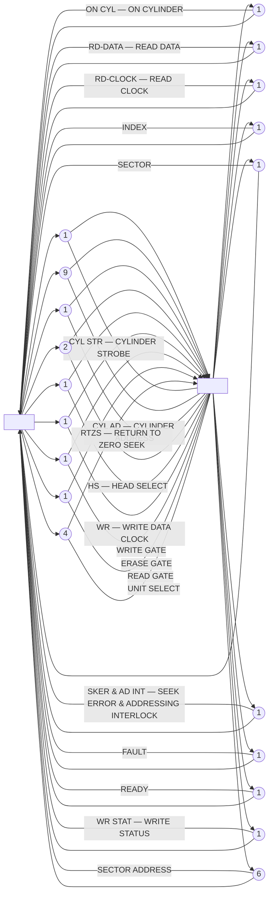

2-2

ND-11.010.01

---

## Page 14

2-3

# 2.1.2 *Input Lines*

**On Cylinder**  
indicates that the R/W/E-heads have reached the cylinder address issued. The signal is inactive while the R/W/E-heads are moving.

Note: Signal will also be activated by a "seek error".

**Read Data**  
separated digital data information sent to the controller.

**Read Clock**  
separated digital clocks (one for each data cell) sent to the controller.

**Index**  
start of revolution mark. Indicates start of sector counting.

**Sector**  
start of sector mark.

Note: When heads 0 and 1 are selected the sector mark will derive from the cartridge. If heads 2 or 3 are selected the sector mark will derive from the fixed disk.

**Sector Address:**  
five lines that carry the sector address for the selected disk.

**Seek Error**  
indicates that the unit was unable to successfully complete a seek operation.  
OR  
indicates that the unit has received an illegal address. (Address Interlock)

Note: By use of option switches on the I/O-board the Address Interlock signal will be set back as Seek Error. This is done for the ND-interface since the Address Interlock Line is not used.

Note: A RTZS will clear the control logic and command the carriage back to cylinder 0.

**Address Acknowledge**  
indicates that the unit has received a legal address.

Note: This feature is not used by the ND-interface.

**Write Status**  
unit is inhibited from writing on the disk. This signal is active whenever one or two WRITE PROTECT switches are on and the associated disk is selected -- or when the controller write protect line is active.

---

## Page 15

2–4

# 2.2 SIGNAL ASSIGNMENTS

Table 2.2 shows the above described interface signals — direction, polarity.

On the controller side the plug pin number, card type and terminal number are listed.

On the unit side the corresponding plug pin number and I/O cord pin number are listed.

ND 11 010 01

---

## Page 16

# 2-5

## PAGE 1 of TABLE 2

UNIT 8427M

| CONTROLLER CARD TYPE | TERM NO. | PIN NO. | SIGNAL/POOL | DIRECTION | SIGNAL | PLUG PIN NO. | I/O CARD PIN NO. 71/P |
|---|---:|---|---|:---:|---|---|---|
| 1036 | 59 | SS | DTAS0 | ↑ | CYL STR — CYLINDER STROBE | A | B14 |
| 1036 | 61 | NN | TA00 | ↑ | CYL AD/0 | C | A16 |
| 1036 | 63 | MM | TA10 | ↑ | CYL AD/1 | E | B16 |
| 1036 | 65 | JJ | TA20 | ↑ | CYL AD/2 | H | A17 |
| 1036 | 67 | HH | TA30 | ↑ | CYL AD/3 | K | B17 |
| 1036 | 75 | Y | TA40 | ↑ | CYL AD/4 | M | A12 |
| 1036 | 77 | V | TA50 | ↑ | CYL AD/5 | P | B12 |
| 1036 | 79 | U | TA60 | ↑ | CYL AD/6 | V | A13 |
| 1036 | 87 | K | TA70 | ↑ | CYL AD/7 | T | B13 |
| 1036 | 88 | F | TA80 | ↑ | CYL AD/8 | R | A24 |
| 1036 | 91 | E | DRTZ0 | ↑ | RTZS — RETURN TO ZERO SEEK | AA | B26 |
| 1039 | 57 | TT | DHS00 | ↑ | HS/0 — HEAD SELECT | AC | B27 |
| 1039 | 58 | SS | DHS10 | ↑ | HS/1 + HEAD SELECT | AE | B7 |
| 1039 | 69 | DD | DWD0 | ↑ | WRB — WRITE DATA/CLOCK | AS | B19 |
| 1039 | 55 | JJ | DWG0 | ↑ | WRITE GATE | AM | A15 |

## Table 2.2: Interface Signals — Pin Assignments, etc.

---

## Page 17

# Table 2.2: Interface Signals — Pin Assignments, etc.

**UNIT 9427M**  
**PAGE 2 OF TABLE 2**

| CARD TYPE | TERM NO. | PIN NO. | SIGNAL/POL | DIRECTION | SIGNAL | PLUG PIN NO. | I/O CARD PIN NO. |
|---|---:|---|---|:---:|---|---|---|
| 1039 | 67 | HH | DEG○ | ↑ | ERASE GATE | AP | B6 |
| 1039 | 71 | CC | DRG○ | ↑ | READ GATE | AV | B15 |
| 1039 | 89 | F | US1○ | ↑ | UNIT SELECT 1 | BA | B25 |
| 1039 | 91 | E | US2○ | ↑ | UNIT SELECT 2 | BN | B28 |
| 1039 | 93 | B | US3○ | ↑ | UNIT SELECT 3 | BV | B28 |
| 1039 | 95 | A | US4○ | ↑ | UNIT SELECT 4 | BS | B25 |
| 1039 | 77 | V | CREADY○ | ↓ | READY | AX | A29 |
| 1039 | 79 | U | CEYL○ | ↓ | ON CYL — ON CYLINDER | BD | B9 |
| 1039 | 73 | Z | RFD○ | ↓ | RD DATA — READ DATA | AV | B29 |
| 1039 | 75 | Y | CRC○ | ↓ | RD CLK — READ CLOCK | AZ | A14 |
| 1039 | 87 | K | CART INDEX | ↓ | INDEX | BF | A31 |
| 1039 | 85 | L | SECTOR | ↓ | SECTOR | BL | B10 |
| 1039 | 83 | P | SEEK ERRO | ↓ | SEEK ERROR | BJ | B8 |
| 1039 | 81 | R | FAULT | ↓ | FAULT | BJ | A19<br>A30 |

NDA-11 010 01

---

## Page 18

# Page 3 of Table 2

## Unit 9427H Controller

| Card Type | Terminal No. | Pin No. | Signal/Pol | Direction | Signal | Plug Pin No. | I/O Card Pin No. 7/1/P1 |
|---|---:|---|---|---|---|---|---|
| 1107 | 83 |  | WPE00 | ↓ | WR STAT — WRITE STATUS | AK | B30 |
| 1107 | 95 |  | SB10 | ↓ | SA/0 — SECTOR ADDRESS | CJ | B2 |
| 1107 | 93 |  | SB20 | ↓ | SA/1 — SECTOR ADDRESS | CD | A1 |
| 1107 | 91 |  | SB40 | ↓ | SA/2 — SECTOR ADDRESS | CN | B4 |
| 1107 | 89 |  | SB80 | ↓ | SA/3 — SECTOR ADDRESS | CR | B3 |
| 1107 | 87 |  | SB160 | ↓ | SA/4 — SECTOR ADDRESS | CL | A2 |
| 1107 | 85 |  | MAR90 | ↑ | WRITE PROTECT OR TRACK OFFSET | AH | B23 or A23 (Sage Option Switch Clear) |

*Table 2.2: Interface Signals — Pin Assignments, etc.*

---

## Page 19

2-8

# 2.2.1 Disk Configurations

A maximum of four units may be wired up to one controller. The limitation is found in the four address lines. The unit number is set up by unit selection switches on the I/O board. (Refer to Appendix B-3 in “HAWK – Disk System” manual.)

Any combination of 9427 and 9427H may be connected in the “daisy chain”. It should be observed that 9427 is given the unit number dependent of its position in the daisy chain, while 9427H may be selected to be any of the possible unit numbers. (Refer to Figure 2.1.)

Precautions should be taken to avoid more than one unit being assigned the same unit number. For further details see I/O board schematics in the “HAWK – Disk System” manual – Appendix A.

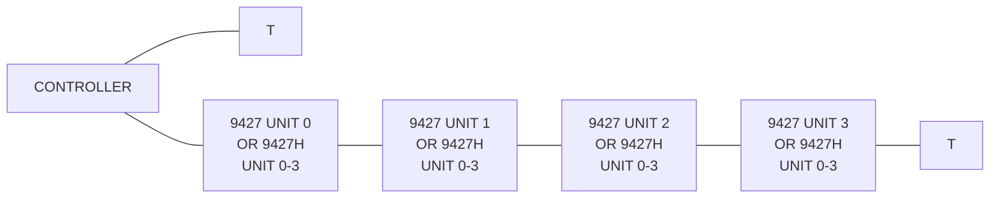

T:  Line Terminators

**Figure 2.1: _Disk Configurations_**

ND-11.010.01

---

## Page 20

3–1

# 3 DISK ADDRESSING

The disk surface is divided into 408 (406) tracks (cylinders). Four recording surfaces require four recording heads. Each track is divided into 24<sub>10</sub> (30<sub>8</sub>) sectors.

The disk address referred to as “Block Address” is thus composed of:

- Head Number (2 bits)
- Cylinder Number (9 bits)
- Sector Number (5 bits)

which is a total of 16 bits.

---

## Page 21

3–2

# 3.1 BLOCK ADDRESS FORMAT

Figure 3.1 illustrates the "Block Address Format":

```text
   15    14                  6 5    4                       0
    ┌─────┬───────────────────┬─┬─────┬───────────────────────┐
    │  D  │    CYLINDER #     │S│     │       SECTOR #        │
    │     │                   │ │     │                       │
    │ (1) │        (9)        │(1)   │          (5)          │
    └─────┴───────────────────┴─┴─────┴───────────────────────┘
      ↓                         ↓
     HS1        ◄────          HS0       ◄──── Head selection
```

**Figure 3.1:** *Block Address Format*

Bits 0 - 4:    Designates the sector within a track.

Bit 5:         Surface of the (by Bit 15) selected disk (S = 0 upper  
                surface; S = 1 lower surface).

Bit 6 - 14:    Designates the cylinder number.

Bit 15:        Designates the fixed (D = 1) or the removable (D = 0)  
                disk.

The Block Address is loaded by an IOX 503.

The unit will perform a seek operation to the addressed cylinder when  
an "Activate" is performed.

```text
          SAA 4          % Activate
          IOX 505        % Device
```

# 3.1.1 Sector Format — General Discussion

A sector is divided into 8 phases as illustrated in Figure 3.2.

```text
       ○        ○        ○        ○        ○        ○          ○        ○      ○      ○
       1        2        3        4        5        6          7        8      9      10

      H6       SP       ADDR     CWA       H6       SP          DATA     CWD     E      T6
 ┌────────┬────────┬────────┬────────┬────────┬────────┬────────────────┬───────┬─────┬─────┐
 │  120   │   96   │   16   │   16   │  120   │   96   │      2048      │  16   │  1  │ 75  │
 └────────┴────────┴────────┴────────┴────────┴────────┴────────────────┴───────┴─────┴─────┘
 │        │        │        │        │        │        │                │       │     │
 ◄───────►        ◄───────►        ◄───────►          ◄────────────────►       ◄────►
 │        │        │        │        │        │        │                │       │     │
 ├────────┼────────┼────────┼────────┼────────┼────────┼────────────────┼───────┼─────┼─────┤
     Ph1       Ph1      Ph2      Ph3      Ph4      Ph4              Ph5      Ph6    Ph7   Ph8
```

**Figure 3.2:** *ND — Sector Format*

---

## Page 22

# 3-3

A discussion of the different phases follow:

1. A "Head gap" or "Tolerance gap" of 120 zeros is the first field in a sector after a "sector mark" has been detected. The purpose of this "Head gap" is to compensate for:

   - head switching time
   - sector pulse jitter
   - controller variations
   - mechanical skew in sector notches/holes
   - physical distance between Erase and Read/Write heads

   Since the length of a data cell is 400ns at a nominal RPM (2400), the duration of the Head gap is 48μs. Some time during the "Head gap" the read gate should be activated and read operation initiated. Under most common conditions, the read will start in the middle of the "Head gap",

2. The next field in the sector format is the "sync pattern" — SP. The end of the "sync pattern" is indicated by a recorded "1", preceded by 95 zeros.

   The purpose of the "sync pattern" is to bring the "read recovery logic" into syncronization with:

   - the speed of the disk drive
   - the correct phase relationship between data and clocks.

   This is discussed in detail during "Read Recovery Operation". The "Head gap" and the "Sync Pattern" will be treated as one field by the controller, Phase 1. End of "Phase 1" or "Sync Pattern" is indicated by a recorded "1".

3. The 16 bits block address (ADDR) is the next field recorded. This field is referred to as Phase 2 in the controller.

4. Check Word on Address — CWA — is a special check word for the address recorded.

5. Following the CWA, a new "Head gap" will show up. The reason for this "Head gap" is to:

   - compensate for controller turn-around time.
   - allow time for head switching from a read to a write operation.

   This "Head gap" consists of 120 zeros.

6. A Sync Pattern — SP — of 95 zeros terminating with a 1 bit has the identical purpose, in this case, as in ②.  
   (⑤ and ⑥ are in the controller referred to as Phase 4.)

---

## Page 23

3-4

⑦ Next in the row is the data field consisting of 2048 data cells.  
(Equal to 128 - 16 bits words = 1/8 K-words.)

⑧ CWD — Check Word on Data is generated by the controller as the data is written on the disk. Next, this bits word is passed on to the disk.

⑨ This field consists of only 1 bit which indicates "end of recording".

⑩ The "Tolerance Gap" — TG — is normally 75 data cells long. The purpose is to:

- absorb mechanical skew in sector notches/holes
- compensate for "Write oscillator" drift

## 3.1.2 Disk Formatting

The first operation a new disk (cartridge or fixed disk) must go through is the formatting process. This must be done prior to any exchange of data with the disk. This process will:

- write zeros into ① the "head gap"
- continue writing zeros into the "sync pattern" ② terminating with a "1".
- write the block address into the above field ③.
- write the "control word address" into the CWA field ④.

The above steps are repeated for each sector on every track of the disk.

When this process has been completed, random access to different addresses can be made.

---

## Page 24

# Figure 3.3: Disk Controller — Block Diagram

```mermaid
flowchart TB
    subgraph PAGE[""]
        direction TB

        P1039["1039"]
        P1107["1107"]

        subgraph DISK["Disk Controller"]
            direction LR

            subgraph CLOCK["Read clock"]
                direction TB
                CL["CL (Read clock)"]
                Aclk["A"]
                Iclk["1"]
                Aclk --> Iclk
                CL --> Aclk
            end

            subgraph CNT["BIT COUNTER NETWORK"]
                direction TB
                BIT["BIT<br/>COUNTER<br/>NETWORK"]
                IP["IP"]
                C1["C+1"]
                R["R"]
                BIT --- IP
                BIT --- C1
                BIT --- R
            end

            subgraph SEC["Sect."]
                direction TB
                S39["39"]
                I39["1"]
                S39 --> I39
            end

            subgraph WRITE["Write clock unit"]
                direction TB
                TEST["Test<br/>Cl"]
                RST["Test<br/>RC"]
                Atest["A"]
                Arst["A"]
                Iw["1"]
                Aw["A"]
                Iwr["1"]
                Awr["A"]
                Atest --> Iw
                Arst --> Iw
                Iw --> Aw
                Aw --> Iwr
                Awr --> Iwr
                TEST --> Atest
                RST --> Arst
            end

            subgraph BUS[""]
                direction TB
                A26["A"]
                A35["A"]
                S26a["26"]
                S26b["24"]
                S35a["35"]
                S35b["34"]
                S28["28"]
                A26 --> S26a --> S26b
                A35 --> S35a --> S35b
            end

            subgraph B15NET[""]
                direction TB
                S31a["31"]
                S31b["29"]
                B15["B15"]
                A1["A"]
                I1["1"]
                A2["A"]
                I2["1"]
                A3["A"]
                S31a --> S31b
                S31b --> B15
                B15 --> A1 --> I1 --> A2 --> I2 --> A3
                REDG["Red Gate"]
                OMSC["OMS CATCH"]
                S17["17"]
                S31["31"]
                S17 --> REDG
                S31 --> OMSC
            end

            subgraph PHI[""]
                direction TB
                PHITE["PhiTE"]
                PHI1["Phi 1"]
                EGD["EG"]
                Aphi["A"]
                Iphi["1"]
                Aphi2["A"]
                Iphi2["1"]
                S36["36"]
                S37["37"]
                S36 --> S37
                S37 --> Iphi
                Iphi --> Aphi
                Aphi --> Iphi2
                Iphi2 --> Aphi2
                PHITE --> Aphi
                PHI1 --> EGD
            end

            subgraph PHASES[""]
                direction LR
                B15IN["B15"]
                PH2["Ph 2"]
                PH3["Ph 3"]
                PH4["Ph 4"]
                PH5["Ph 5"]
                PH6["Ph 6"]
                PH7["Ph 7"]
                AP2["A"]
                AP3["A"]
                AP4["A"]
                AP5["A"]
                AP6["A"]
                AP7["A"]
                B15IN --> AP2
                PH3 --> AP3
                PH4 --> AP4
                PH5 --> AP5
                PH6 --> AP6
                PH7 --> AP7
            end

            subgraph REGISTER[""]
                direction TB
                REG[""]
                AP2 --> REG
                AP3 --> REG
                AP4 --> REG
                AP5 --> REG
                AP6 --> REG
                AP7 --> REG
            end

            subgraph SR8["SR-8<br/>74/64"]
                direction TB
                SR["SR-8<br/>74/64"]
                CD["CD"]
                AEXT["A"]
                CLP["CLP"]
                SC["SC"]
                EXT["Ext.<br/>sect."]
                SR --- CD
                AEXT --- CD
                CLP --> SR
                SC --> SR
                EXT --> AEXT
            end

            subgraph PHOUT[""]
                direction LR
                PH1["Ph 1"]
                PH2O["Ph 2"]
                PH3O["Ph 3"]
                PH4O["Ph 4"]
                PH5O["Ph 5"]
                PH6O["Ph 6"]
                PH7O["Ph 7"]
                PH8O["Ph 8"]
                O6["6"]
                O8["8"]
                O10["10"]
                O13["13"]
                O14["14"]
                O16["16"]
                O18["18"]
                O20["20"]
                PH1 --> O6
                PH2O --> O8
                PH3O --> O10
                PH4O --> O13
                PH5O --> O14
                PH6O --> O16
                PH7O --> O18
                PH8O --> O20
            end

            V["3–5<br/>to<br/>various<br/>parts of<br/>the osc."]
            V --- O10
            V --- O14
            V --- O18

            CLK["CLK"]
            CLK --> Aclk
            Aclk --> Iclk
            Iclk --> REG
            REG --> SR
            BIT --> B15NET
            BIT --> BUS
            BIT --> SEC
            SEC --> SR
            WRITE --> CLK
        end
    end
```

---

## Page 25

3-6

# 3.2 THE CLOCK SYSTEM

A 10 MHz crystal oscillator (located on the 1036 module) is the heart of the disk and controller operation. When divided by 4 a 2.5 MHz clock is derived (C1 pulses). The clock pulses serve as:

- ⊙ Write clocks during a Write operation.
- ⊙ Read clocks during a read operation until the read gate is turned on.
- ⊙ Read or Write (whichever is specified) under Test mode of operation.

## 3.2.1 The Bit Counter

The write clocks (C1) from the crystal oscillator or the read clocks from the unit (RC) during a read operation feeds the Bit counter (located on the 1039 card) with clock pulses. Various stages of the bit counter are sent to the phase generator and other parts of the controller as control terms.

The bit counter will be cleared by a sector pulse (SECT) or by the term CLBC (clear bit counter). CLBC originates in the "Phase generator network" located on the 1107 card. Refer to Figure 3.3.

For each new phase initiated by the "phase generator network" the bit counter will be reset to zero by the term "CLBC". The maximum count will thus be 2048 in Phase 6. (Refer — General Sector Format.)

## 3.2.2 The Phase Generator Network

A sector is divided into 8 different phases where each phase holds an exact number of data cells (bits). The "Phase generator network" is responsible for changing from one phase to the next. This network operates close together with the "Bit counter". Refer to Figure 3.3.

The last stage in the "Phase generator network" consists of a serial in (Ext sect), parallel out (PH1 - PH8), shift register. A sector pulse (CLP) clears the register while the delayed part of the sector pulse (Ext sect) sets the first bit.

Since "Ext sect" appears only once for each sector, only one bit will be shifted down the register, i.e. only one phase will be active at the time.

---

## Page 26

# 3.2.2.1 Operations

## Phase 1:

Phase 1, composed of the "Head gap" and the "Sync Pattern", is entered by the latter part of the sector pulse (Ext sect). Phase 1 will be terminated in:

⊙ a Write Format mode of operation by counting up 216 bits. The last bit will be a 1 (ONE CATCH) recorded.

⊙ a Read or Write mode of operation by reading the "one catch".

## Phase 2:

Phase 2, containing a 16 bits address, is terminated by reading a count of 15 (16 bits counted).

## Phase 3:

Phase 3, holding a 16 bits check word on the address recorded in Phase 2, will be dropped when a count of 15 is reached.

## Phase 4:

Phase 4 has the same purpose and format as Phase 1. Phase 4 will be dropped:

⊙ in a write operation after 126 bits recorded (125 zeros and 1 one)

⊙ in a read operation after reading the "ONE CATCH".

## Phase 5:

Phase 5, containing 2048 data cells, will be active until a count of 2047 has been reached.

## Phase 6:

The check word on the data field is held in Phase 6. This phase will be terminated after the 15th check word bit.

## Phase 7:

This phase lasts only for one data cell at a time and contains a 'one'. A bit count of ONE will, therefore, terminate this phase.

## Phase 8:

The length of this phase will be measured from the end of Phase 7 up to the next sector pulse.

---

## Page 27


---

## Page 28

# 4 WRITE AND READ OPERATION

## 4.1 *WRITE OPERATION*

- Prior to a write operation the heads must be positioned over the desired cylinder (which is part of the block address) and the desired head must be selected (also part of the block address). Then a search for the desired sector takes place by reading the sector address in phase 2 and associated "control word" in phase 3, the controller will command a write.

- 120 zeros will be recorded in the "Head gap" ⑤.

- continuing with 95 zeros and a "1" in the "Sync Pattern" ⑥.

- followed by the data in the "Data Field" ⑦.

- and the calculated "check word" ⑧.

- ending with "1" ⑨.

The above sequence of events takes place for every write operation. Note that Phase 4, 5, and 6 are rewritten for every write operation in order to obtain the same phase relationship for data and clocks throughout phase 4, 5, 6, and 7.

ND-11.010.01

---

## Page 29

# 4.2 READ OPERATION

In order to perform a read operation one head must be selected and positioned over the desired cylinder. Then a search for the addressed sector will take place. When the correct cylinder is found the read operation will continue and read the addressed data field.

Since the address portion is written during the formatting processing and the data portion during a normal write operation, they will have a random phase relationship in respect to each other. Due to this fact, resynchronization will be obtained in Phase 4 during a read operation. (For further details see Chapter 9.2 in "HAWK – Disk System" manual.)

---

## Page 30

4–3

# 4.3 THE CHECK WORD GENERATOR

In order to increase the reliability of a read/write operation, parity or check word is introduced.

The "check word generator" is wired to perform the polynomial X¹⁵ + X² + 1. The main building blocks are two 8 bit shift registers. For principal study we consider the shift register elements. For each clock pulse (CLCC) applied a one element shift operation is performed. The clock pulses are enabled to the "check word generator" in Phase 2, 3, 5, and 6.

---

## Page 31

# 4-4

```mermaid
flowchart TB
    CL["CL<br/>Ph 2356"] --> CLA["A"]
    CLA --> CP["Clock<br/>pulses"]
    CP --> CLCC["CLCC"]

    WD1["Write Data<br/>Ph25"] --> WA["A"]
    RD1["Read Data<br/>Ph2356"] --> RA["A"]
    WA --> I1["I"]
    RA --> I1
    I1 --> E1["= 1"]

    CLCC --> E1

    E1 --> C0["C 0"]
    C0 --> C1["C 1"]
    C1 --> E2["= 1"]
    E1 --> E2

    E2 --> C2["C2"]
    C2 --> C3["C3"]
    C3 --> C4["C4"]
    C4 --> C5["C5"]
    C5 --> C6["C6"]
    C6 --> C7["C7"]
    C7 --> C8["C8"]
    C8 --> C9["C9"]
    C9 --> C10["C10"]
    C10 --> C11["C11"]
    C11 --> C12["C12"]
    C12 --> C13["C13"]
    C13 --> C14["C14"]
    C14 --> E3["= 1"]

    E3 --> C15["C15"]
    C15 --> C15L["C 15"]

    CX["C X<br/>Shift register element"] --> SR[""]
    SR --> E3

    P36["Ph36"] --> A1["A"]
    X1[""] --> A2["A"]
    X2[""] --> A3["A"]
    X3[""] --> A4["A"]
    A1 --> I2["I"]
    A2 --> I2
    A3 --> I2
    A4 --> I2
    I2 --> A5["A"]
    W["Write"] --> A5
    A5 --> WD["Write<br/>Data"]
    WD --> E3

    W2["Write<br/>Ph 36"] --> A6["A"]
    A6 --> A7["A"]
    C15L --> A7
    A7 --> T15["T15"]
    T15 --> FB["Feed back"]
    FB --> E1
```

[illegible]

---

## Page 32

4-5

# 4.3.1 Operation

During the formatting process the 16 bits address is written on the disk in phase 2 and passed on to the “check word generator”. During this phase a feedback (T15) is enabled and the check word generator will operate according to the above mentioned polynomial. The 16 bits check word generated in Phase 2 will be shifted out and sent to the unit as write data in Phase 3. This is accomplished by blocking the feedback and keeping the input inactive. The (=1) gates will thus perform no logical operation.

The same sequence of events will take place during a normal write operation.

In Phase 2 the “Block Address” will be read off the disk and will also enter the “Check Word Generator”. The check word on address will also be entered in Phase 3. If no address parity has occurred the shift register elements contain all 0’s at the beginning of Phase 4.

If an address parity has occurred, SB9 will set. (Refer – Description of SB9, Chapter 6.1.10.)

The same sequence of events will take place when a read operation is specified.

---

## Page 33

[Blank page]

---

## Page 34

# 5 INTERRUPT GENERATION AND HANDLING

The disk controller is wired to interrupt level 11<sub>10</sub>. The various sources for interrupt will be discussed here.

In order to enable all the interrupt sources a

```text
                         :
SAA 3                   % set bit 0 and 1
                         % enable interrupt on device ready for transfer and
                         enable interrupt on Errors
                         :
```

must be performed.

The main interrupt source may be divided into two groups:

- Device Interrupts
- Error Interrupts

"Device Interrupts" are enabled by "Control Word", bit number 0 and  
"Error Interrupts" are enabled by "Control Word", bit number 1.

The two interrupt enable FF's are reset in one of two ways:

1. "Device Clear" generated by "Control Word", bit number 4

```text
                         :
                    BSET ONE 40 DA
                       IOX 505
                         :
```

OR

2. "Inident" issued on level 11 and interrupt present.

```text
                  INIDENT•Level 11•Int
```

The second will reset one of the interrupt enable FF's depending on whether:

- Busy → $\overline{\text{Busy}}$ OR
- $\overline{\text{Error Condition}}$ → Error condition occurred

---

## Page 35

# Figure 5.1 Intertrap Generation

```mermaid
flowchart LR
    subgraph WK["WK"]
        subgraph UT["[illegible] UTILITY TEST"]
            I32["I"] --- n32(["32"]) --- n64(["64"])
            n64 --- A1["A"]
            A1 --- n22(["22"]) --- n22b(["22"]) --- T3["3st"]
            T3 --- n88(["88"]) --- n88b(["88"])
            A1 --- SC["Sector clock"]
            A1 --- C["[illegible]<br/>(drive)"]
        end

        subgraph WKPD["WK WPED protector<br/MI (Write transfer)"]
            A2["A"] --- n25(["25"]) --- n24(["24"])
            n24 --- SB5["SB5 (Protect volution)"]
            SB5 --- I2["I"]
            A3["A"] --- n27(["27"]) --- n27b(["27"])
            A3 --- WFE["WFE (Write formate)"]
            A4["A"]
            A4 --- R["Ready"]
            A4 --- T["Test"]
            I2 --- A4
        end

        subgraph SB5G["SB5 (Time out)"]
            TO["TIME<br/>OUT<br/>CIRCUIT"]
            I2 --- TO
        end

        subgraph WKERR["WK / JK error"]
            I3["I"] --- n28(["28"]) --- n26(["26"])
            n26 --- SB["SB"]
            SB --- DE["Disk error"]
            DE --- A5["A"]
            I3 --- JK["JK error"]
        end
    end

    subgraph P37["P37"]
        I4["I"] --- n7(["7"]) --- n4(["4"])
        n4 --- T3b["3st"] --- n90(["90"]) --- n90b(["90"])
        I4 --- PB["PB Busy"]
        n7 --- E103["103"]
        E103 --- n63(["63"])
        n63 --- LED["LED"]
        LED --- n71(["71"])
        n71 --- I5["I"]
        I5 --- E4["Error Ind"]
    end

    subgraph WC2["WC2"]
        I6["I"] --- n32c(["32"]) --- n64c(["64"])
        n64c --- A6["A"]
        A6 --- COMP["COMPL"]
        A6 --- "Sector clock"
    end

    subgraph P04["P04"]
        I7["I"] --- n90c(["90"])
        n90c --- WCG["WORD<br/>COUNT<br/>ZERO<br/>GENERATOR"]
        WCG --- n46(["46"])
        n46 --- n47(["47"])
    end

    subgraph P03["P03"]
        n37(["37"]) --- n36(["36"]) --- I8["I"]
        I8 --- ERQ["ERQ"]
        ERQ --- T3c["3st"]
        T3c --- n36b(["36"]) --- n36c(["36"]) --- n86(["86"]) --- n86b(["86"]) --- I9["I"]
        I9 --- ERR["Error"]
    end

    subgraph BUSY["Busy"]
        I10["I"] --- B1["Busy"]
        B1 --- A7["A"]
        A7 --- "Device Int."
        A7 --- "MDB0"
        A7 --- "CW"
        A7 --- "Clear"
        A7 --- CINT["Cint BA3 Busy"]
        I10 --- "Device clear Int.<br/>control Bit 4/ Clear"
    end

    subgraph ERRINT["Error Int."]
        A8["A"] --- "Error"
        A8 --- "MDB1"
        A8 --- "CW"
        A8 --- "Clear"
        A8 --- I11["I"]
        I11 --- A9["A"]
        A9 --- "Cint BA3 Error"
    end

    subgraph GEN["Intertrap Generation"]
        I12["I"] --- A10["A"]
        A10 --- "Busy"
        A10 --- "Incident BA3"
        A10 --- "MDB4"
        A10 --- "CW"
        A10 --- "Clear"

        I13["I"] --- A11["A"]
        A11 --- "Busy"
        A11 --- "Error"
        A11 --- "MDB2"
        A11 --- "CW"

        I14["I"] --- A12["A"]
        A12 --- "Cint BA3 Busy"
        A12 --- "Device clear Int.<br/>control Bit 4/ Clear"
        A12 --- "MDB0"
        A12 --- "CW"

        I15["I"] --- A13["A"]
        A13 --- "Cint BA3 Error"
        A13 --- "Clear"
        A13 --- "MDB1"
        A13 --- "CW"

        I16["I"] --- A14["A"]
        A14 --- "Busy"
        A14 --- "Error"
    end

    P37 --> P04
    P37 --> BUSY
    BUSY --> ERRINT
    ERRINT --> P03
    P03 --> GEN
    WKPD --> P37
    WC2 --> BUSY
```

| Signal | Description |
|---|---|
| SB5 | Write protect violate (Time out) |
| SB6 | Time out |
| SB7 | DERR (Disk Error) |
| SB8 | (Address mismatch) |
| SB9 | (Priority Error) |
| SB10 | (Compare Error) |
| SB11 | (MA channel Error) |

5-2

---

## Page 36

# 5-3

To determine which was reset we must look at Status Register bits num-
ber 0 and 1 after doing a:

&nbsp;  
&nbsp;  
⋮  
**IOX 504 (Read Status) transfer**  
⋮  
&nbsp;  

Let us now look into the interrupt sources within the two groups
separately.

---

## Page 37

5-4

# 5.1 *DEVICE INTERRUPTS*

“Device Interrupts” are generated when the transition “Busy → $\overline{\text{Busy}}$” occurs. This is done by resetting the “Busy FF” which is already set by control word bit number 2, “Activate Device”.

```text
                    :
                    :
            BSET ONE 20 DA
                IOX 505
                    :
                    :
```

The main sources will reset the “Busy FF”.

1. Term “Clear” generated from bit number 4 in Control Word. i.e.

```text
                    :
                    :
            BSET ONE 40 DA
                IOX 505
                    :
                    :
```

Instruction sequence executed.

2. The term “BCOMPL”, activated by the word counter, has counted down to zero (transfer is completed) for the next sector clock.

    BCOMPL = Sector Clock·WC = 0.

3. The third main source comes into effect by activating the term “BRBUSY”.

    This term is activated by one of five sources:

    1. A write transfer is attempted to a disk plate, (fixed or cartridge) which is write protected, from the HAWK front panel.

        Status bit number 7 (SB5, protect violation) will also set.

    2. Drop of Ready (Ready → $\overline{\text{Ready}}$), from HAWK, while not being in test mode of operation.

    3. If an “Address mismatch” has occurred while not being in the WF — Write Format Mode of Operation. Status bit number 8 (SB8 - address mismatch) will also set.

    4. If Busy FF is set for more than 300ms.

        i.e. a head positioning + data transfer has taken more than 300ms.

        Status bit number 6 (SB6, Time out) will also be set.

ND 11 040 01

---

## Page 38

# 5-5

5. A disk error has occurred.  
   A disk error is defined in the controller as:

- A Fault condition which occurred in the HAWK.

  OR

- Seek Error has occurred.

Status bit number 7 (SB7 – Disk Error) will be set in either case.

## COMMENTS:

Regarding SB6 and SB7 the following conclusion can be made:

| SB7 | SB6 | |
|---|---|---|
| 0 | 1 | Seek time plus transfer time > 300ms. Fault occurred. |
| 1 | 0 | in HAWK. Seek Error occurred in HAWK, i.e. a seek operation not completed within 500ms. |
| 1 | 1 | NB: the 1-1 combination can only be read if the IOX < Status > will be executed at least 200ms after the interrupt was detected. This is to allow time for the Seek Error information to be transferred to the controller. The interrupt is caused when SB6 is set from the 300ms time out circuitry in the controller. |

---

## Page 39

5–6

# 5.2 ERROR INTERRUPTS

The "Error Interrupt" is activated as a function of Status Bit number 4 (SB₄) being set.

SB4 will set if any of SB5 – SB11 become active. Refer to "Status Generation".

## General Comments:

We notice that SB5, SB6, SB7, and SB8 will generate "Device Interrupt" and "Error Interrupt".

An Ident instruction will thus reset "Error Interrupt Enable" and "Device Interrupt Enable" if one of the above Status Bits caused the interrupt condition.

ND 11 010 01

---

## Page 40

6–1

# 6 STATUS GENERATION

The status register can be read by an IOX 504 instruction.

The bit assignment is as follows:

## Status Word

| Bit | Description |
|---|---|
| Bit 00 | Ready for transfer, interrupt enabled |
| Bit 01 | Error interrupt enabled |
| Bit 02 | Device active |
| Bit 03 | Device ready for transfer |
| Bit 04 | Inclusive OR of errors (status bits 5 - 11) |
| Bit 05 | Write protect violate |
| Bit 06 | Time out |
| Bit 07 | Hardware error |
| Bit 08 | Address mismatch |
| Bit 09 | Read Parity Error |
| Bit 10 | Compare error |
| Bit 11 | (DMA channel error) Missing Clock |
| Bit 12 | Transfer complete |
| Bit 13 | Transfer on |
| Bit 14 | On cylinder |
| Bit 15 | Bit 15 loaded by previous control word |

---

## Page 41

6-2

# 6.1 DETAILED DESCRIPTION

The setting of the different status bits will be discussed and illustrated when required.

## 6.1.1 SB0 — Ready for Transfer Interrupt Enabled

Refer to Figure 5.2.

When performing a Read Status, IOX 504 SB0 senses and reports the status of the "Device Interrupt Enable" FF. When set SB0 = 1. When cleared SB0 = 0. The "Device Interrupt Enable" is set by "Control Word" Bit 0.

```text
                    :
                    :
                  SAA 1
                 IOX 505
                    :
                    :
```

## 6.1.2 SB1 — Error Interrupt Enable

Refer to Figure 5.2.

SB1 senses and reports the status of the "Error Interrupt Enable" at the point in time when a Read Status, IOX < 504 >, is performed. The "Error Interrupt Enable" is set by Control Word — Bit 1.

```text
                    :
                    :
                  SAA 2
                 IOX 505
                    :
                    :
```

## 6.1.3. SB2 — Device Active

Refer to Figure 6.1.

SB2 senses and reports the status of the "Busy" FF. The "Busy FF" is set by Control Word Bit 2, "Activate Device".

```text
                    :
                    :
                  SAA 4
                 IOX 504
                    :
                    :
```

---

## Page 42

# 6-3

```mermaid
flowchart TB
    MDB4[MDB 4] --> A1[A]
    CW1[CW] --> A1
    A1 --> REF["Ref<br/>fig 6-2"]

    subgraph STATUS[" "]
        direction TB

        BC[BCOMPL] --> I1[I]
        CLR1[Clear] --> I1
        BR[BRBUSY] --> I1
        I1 --> BUSY_R[Busy<br/>S<br/>cd<br/>C<br/>R]

        MDB2[MDB 2] --> BUSY_R
        CW2[CW] --> BUSY_R

        MDB0[MDB 0] --> DEV[Device INT<br/>S<br/>cd<br/>C<br/>R]
        CW0[CW] --> DEV
        DEV --> DIEN[DIEN]

        MDB1[MDB 1] --> ERRINT[Error INT<br/>S<br/>cd<br/>C<br/>R]
        CW3[CW] --> ERRINT
        ERRINT --> EIEN[EIEN]

        REF --> I2[I]
        I2 --> CLEAR[Clear]
        H((H)) --> ACT[Action<br/>S<br/>cd<br/>C<br/>R]
        CLEAR --> ACT
        ACT --> A2[A]
        A2 --> FIN[Finished]

        DEV --> TRI["3 st."]
        ERRINT --> TRI
        BUSY_R --> TRI
        FIN --> TRI

        RSTAT[RSTAT<br/>(Read Status<br/>IOX 504)] --> TRI
        TRI --> MDBO[MDB 0]
        TRI --> MDBO1[MDB 1]
        TRI --> MDBO2[MDB 2]
        TRI --> MDBO3[MDB 3]
        TRI --> MDBO4[MDB 4]
    end

    LDB["LOCAL DATA BUS<br/>⇓"]

    subgraph G1037["1037"]
        direction TB
        E36((36)) --> ST["3 st."]
        ST --> E86A((86))
        E86A --> E86B((86))
        E86B --> E86C((86))
        E86C --> I3[I]
        I3 --> ERROR[Error]

        E43((43)) --> SB4[SB 4]
        SB5[SB 5] --> ISB[I]
        SB6[SB 6] --> ISB
        SB7[SB 7] --> ISB
        SB8[SB 8] --> ISB
        SB9[SB 9] --> ISB
        SB10[SB 10] --> ISB
        SB11[SB 11] --> ISB
        ISB --> SB4
    end

    E36 --- E43
    ERROR --- E36
    E86B --- T1013["1013"]
    E86C --- T1014["1014"]
```

**Figure 6.1: _Status Generation, SBO - 4_**

---

## Page 43

6–4

The Busy FF will be reset when the desired operation (indicated by Control Word Bits 11 - 13) is completed. If the specified condition takes more than 300ms, SB6 will set which in turn will reset the "Busy FF". The most common method for resetting Busy is "Word Counter" = 0 (WC = 0). Busy may also be set by a Control Word Bit 4, "Device Clear" operation.

```
        .
        .
        .
    BSET ONE 40 DA
       IOX 505
        .
        .
        .
```

For a more complete study of the resetting conditions refer to Figure 6.2.

## 6.1.4 SB3 — Device Ready for Transfer

Generally, the Device is ready for a new operation when the previous one is completed. This is indicated by the term "FINISHED" being generated.

SB2 = (Busy → Busy̅) ⊗ Action. The Action FF sets with the Busy FF and can be cleared by Control Word Bit 4 (CW4) — "Clear Device".

```
        .
        .
        .
    BSET ONE 40 DA
       IOX 505
        .
        .
        .
```

See also description for SB2 (Device active).

## 6.1.5 SB4 — Inclusive OR of Errors (SB5 - 11)

Refer to Figure 6.1.

Status Bit 4 will set when one of Status Bits 5 - 11 (SB5 - SB 11) sets. For further information refer to the following description of SB5 to 11.

## 6.1.6 SB5 — Write Protect Violate

Refer to Figure 6.3.

Write protect violate (SB5) will be generated if a Write operation (specified by Control Word Bits 11 and 12) is attempted to a disk plate (fixed or cartridge) that is protected. The signal WPED will be returned from HAWK to indicate this error condition.

---

## Page 44

6-5

Note: The HAWK has two write protect switches which make it possible for a write transfer to take place.

Example: A write transfer to the cartridge while the fixed disk is write protected.

# 6.1.7 SB6 — Time Out

Refer to Figure 6.3.

Status Bit 6 (SB6) will set if the Busy FF is set for more than 300ms. That means that NO operation should take more than 300ms. This check is performed by the ONE SHOT located on 1037. A "Time Out" error occurs if the Busy → Busy doesn't take place before the one shot times out.

# 6.1.8 SB7 — Hardware Error

Refer to Figure 6.3.

Status Bit 7 (SB7) derives from the HAWK. SB7 will set if a "Seek Error" or a "Fault" condition occurs in the unit.

SB7 = Seek Error + Fault

By analyzing SB7 and SB6 it's possible to tell if a "Fault" or a "Seek Error" occured.

If a "Seek Error" occurs in the unit (a seek operation exceeds 500ms) SB6 will set 200m in advance of SB7.

Seek Error = SB6 · SB7

A "Fault" condition in the unit will only set SB7, i.e.

Fault = SB7 · $\overline{\text{SB6}}$

# 6.1.9 SB8 — Address Mismatch

Refer to Figure 6.3.

Status Bit 8 (SB8) will set if an address mismatch occurs between the "Block Address" (address given by the CPU) and the address ready off the disk in phase 2. This takes place if the Read/Write heads are settled off the desired (addressed) track.

A "Return to Zero Seek" (RTZS) operation issued from the controller, will reset the control logic and reposition the heads to cylinder zero. Operations may resume from this point.

---

## Page 45

# Figure 6.2. Status Generation, SB4 - 8

```mermaid
flowchart TB

    subgraph TOP[""]
        direction LR

        CW["(Control word<br/>bits 11-12)"]
        CW11["CW11"]
        CW12["CW12"]
        SEL["A"]
        N7A(("7"))
        N7B(("7"))
        IWT["I"]
        AWP["A"]
        N25(("25"))
        N24(("24"))

        CW --- CW11
        CW --- CW12
        CW11 --> SEL
        CW12 --> SEL
        SEL --> N7A
        N7A ---|"MI"| N7B
        N7B -->|"Write transfer"| IWT
        IWT -->|"MI"| AWP
        AWP -->|"WPED"| N25
        N25 -->|"SB5"| N24

        HAWK1["From HAWK"] -->|"WPED<br/>(Write protected)"| AWP
        PV["Protect violation"] --- N24

        R1013["1013"]
        R1107["1107"]
        R1037["1037"]

        R1013 --- CW
        R1107 --- PV
        R1037 --- PV
    end

    subgraph MID[""]
        direction LR

        BSTART(("92"))
        N92(("92"))
        ST3["3st"]
        N37(("37"))
        N39(("39"))
        ISTART["I"]
        TIMER["300 MS"]
        AR["A / R"]
        A2["A"]
        SBREG["I"]

        BSTART -->|"B START"| N92
        N92 --> ST3 --> N37 --> N39
        N39 -->|"START"| ISTART
        ISTART -->|"CLEAR"| AR
        AR --> TIMER
        TIMER --> A2
        A2 -->|"SB 6"| SBREG

        H1(("H")) --> AR
        H2(("H")) -->|"(BUSY = CLEAR)"| AR

        SBREG ---|"SB5"| N24
        SBREG ---|"SB4"| SB4["SB 4"]
        SBREG ---|"SB7"| SB7["SB 7"]
        SBREG ---|"SB8"| SB8["SB 8"]

        M1["M"] --- ISTART
        M1 --- A2

        R1014["1014"]
        R1013B["1013"]
        R1037B["1037"]

        R1014 --- BSTART
        R1013B --- N37
        R1037B --- N39
    end

    subgraph BUSYAREA[""]
        direction LR
        BUSYBOX["BUSY"]
        IBUSY["I"]
        N92B(("92"))

        BUSYBOX -->|"BUSY"| IBUSY --> N92B
        N92B --- BSTART
    end

    subgraph ERR["1036"]
        direction LR
        IE["I"]
        N26A(("26"))
        N26B(("26"))

        IE --> N26A --> N26B
        DIERR["DIERR"] --- N26B
    end

    FAULT["Fault"] --> IE
    SEEK["Seek Error"] --> IE
    N26B --- SBREG

    subgraph ADDR["1107"]
        direction LR

        PISO["Parallel<br/>in serial<br/>out"]
        N16(("16"))
        EQ1["=1"]
        AA["A"]
        CNT["x-y<br/>16<br/>CNTR<br/>C"]
        H3(("H"))
        SCD["S<br/>CD"]
        A3["A"]
        N27A(("27"))
        N27B(("27"))

        N16 --> PISO
        PISO --> EQ1
        DRD["DRD<br/>Serial addr.<br/>(Ph 2) From HAWK"] --> EQ1
        EQ1 --> AA
        PH2["Ph 2"] --> AA
        CL["(Read clock)<br/>CL"] --> AA
        AA --> CNT
        CNT -->|"16<br/>Equal addr. bits."| H3
        H3 -->|"Equal addr."| SCD
        SCD -->|"E15"| A3
        A3 -->|"Addr. mismatch"| N27A --> N27B
        N27B --- SBREG

        CLA["CLA (Equal bits)<br/>(Sector clock)<br/>SC"] -->|"C"| SCD
    end

    subgraph SECTOR[""]
        direction LR

        N5A(("5"))
        N5B(("5"))
        COMP["Comparator<br/>network"]
        AG["A"]
        COMP2["A"]
        A4["A"]
        A5["A"]

        SA1["Sector addr.<br/>(part of<br/>block addr.)"] --> N5A
        N5A -->|"A"| COMP
        SA2["Sector addr.<br/>From sector<br/>counter on HAWK"] --> N5B
        N5B -->|"B"| COMP
        COMP -->|"A = B"| A4
        RG["Read Gate"] --> A4
        OC["On cylinder"] --> A4
        A4 -->|"Comp A"| A5
        PH3["Ph 3"] --> A5
        A5 --> A3
    end

    BLOCK["Block addr."] --- PISO
    R1022["1022"] --- BUSYBOX
    R1107B["1107"] --- ADDR
```

---

## Page 46

6-7

# 6.1.9.1 Principal Circuit Description

Refer to Figure 6.3.

The term COMPA (Heads on addressed sector) becomes active when sector address from the sector counter, in HAWK, matches the sector address held in the Block Address, provided “Read Gate” and “ON Cylinder” are active.

In phase 2 the “Block Address” is read off the disk in serial format and compared bit by bit in the exclusive OR with the Block Address shifted from the “parallel in - serial out” shift network.

One “CLA” (equal bit pulse) will be generated for each equal address bit compared. These pulses will increment a 16 bits counter which produces a carry output (E15) at a count of 15. If the addresses are equal the “Equal Address FF” will set when the last address bit has been compared.

If the addresses did not compare, the 16 equal bits counter would not reach a count of 16 and the term E15 would be inactive. Also, the Equal Address FF would not set.

In the beginning of Phase 3 the status of the Equal Address FF will be reported as SB8 (normal condition) or $\overline{\text{SB8}}$ (error condition).

# 6.1.10 SB9 — Read Parity Error

Refer to Figure 6.3.

Status Bit 9 will set if parity occurs on address or data read from disk.

When reading the address in Phase 2 the address will be fed through the check word (parity word) generator. In Phase 3 the recorded check word will be read and passed through the generator. If no parity occurred the check word generator will hold the number 0 at the end of Phase 3 or the beginning of Phase 4.

When reading the data in Phase 5 the data will also be fed through the parity check word generator and a check word will be generated. If the check word read from the disk in Phase 6 is the same as the one generated in Phase 5, the check word generator will hold a 0 in the beginning of Phase 7.

If a parity occurs the check word generator will hold a non-zero value in the beginning of Phase 4 (address parity error) or in the beginning of Phase 7 (data parity error) and SB9 will set.

---

## Page 47

# 6-8

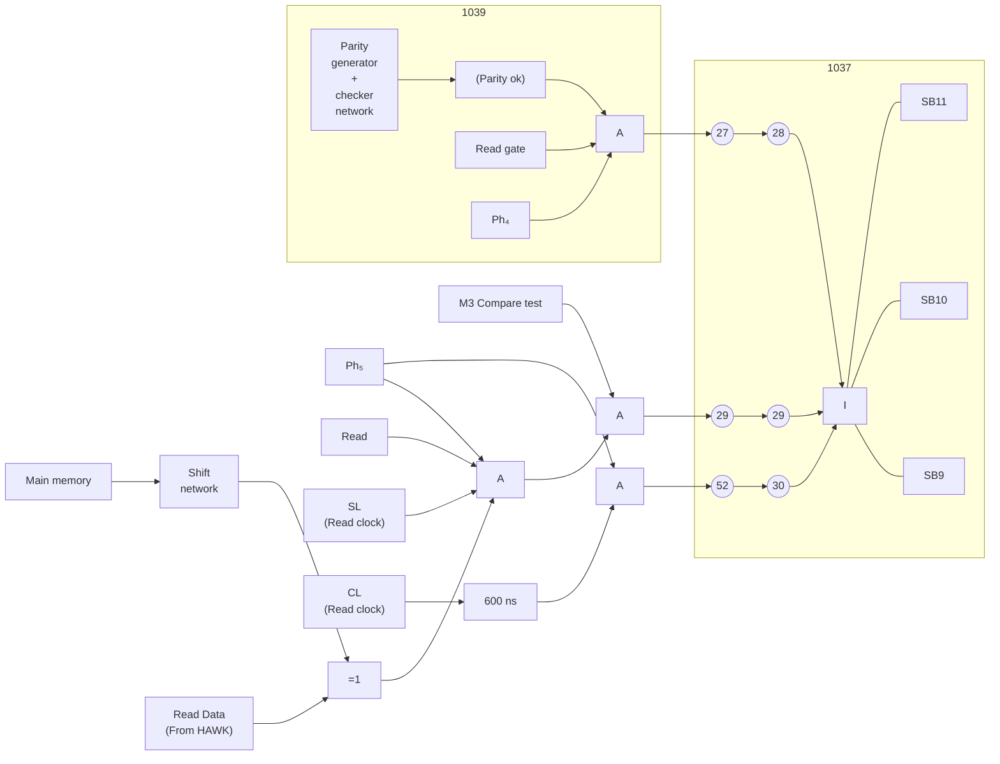

## Figure 6.3. *Status Generation, SB9 - 11*

---

## Page 48

6-9

# 6.1.11 *SB10 — Compare Error*

A compare test may be specified by setting Bits 11 and 12 in the control word.

```text
                 :
                 :
          LDA (014000
           IOX 505
                 :
                 :
```

M3 (compare test) will then be activated and the data field in Phase 5 recorded on the disk will be compared bit by bit with a specified memory data buffer.

If unequal bits are found the exclusive OR will output a "1" and SB10 will set indicating compare error.

# 6.1.12 *SB11 — DMA Channel Error (Missing Clocks)*

Refer to Figure 6.4.

SB11 will set if one clock is missing in Phase 5. The length of a data cell is 400ms, and if one clock is missing the 600ms one shot will time out and set Status Bit 11 (SB11).

# 6.1.13 *SB12 — Transfer Complete*

Refer to Figure 6.4.

Prior to a data transfer (read or write) the word counter will be set to the number of words to be transferred. (Minimum — 200₈; Maximum 6,000₈)

```text
LDA (Number of words to be transferred)
IOX 507
```

The word counter will be counted down for each word transferred.

When the word count of zero comes up and the following sector pulse occurs, SB12 will set, indicating transfer completed.

# 6.1.14 *SB14 — Transfer ON*

Refer to Figure 6.5.

SB13 (Transfer ON) is active when performing a Read or a Write transfer — indicated by the Read or the Write gate being active. That means that any data transfer to and from the HAWK will set SB13.

---

## Page 49

# 6-10

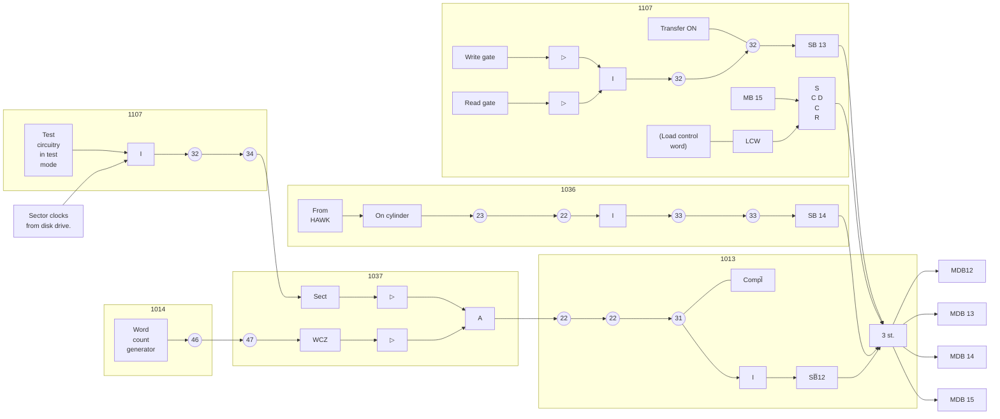

```text
       .-^^^^^^^^-.
     .'            '.
    /   []      []   \
   | []            [] |----< sensor
   |                  |
    \   []      []   /
     '.            .'
       '-.______.-'      .----.
                          |    |
                          |    |
                          '----'
```

## Figure 6.4: *Status Generation, SB12 - 15*

---

## Page 50

6-11

## 6.1.15 SB14 — ON Cylinder

Refer to Figure 6.5.

SB14 is set directly from "ON Cylinder" from HAWK. "ON Cylinder" means that the read/write heads have reached the cylinder address last issued from the controller. SB14 will be inactive when the Read/Write heads are moving.

## 6.1.16 SB15 — Bit 15 Loaded by Previous Control Word

SB15 will set if Bit 15 was set in the previous control word issued. (Bit 15 in control word specifies "Write Format".)

---

## Page 51


---

## Page 52

7-1

# 7 THE CONTROL WORD

Various control functions and operations in the controller and the HAWK will be dictated from the CPU via the control word. The control functions are set by a:

```text
          .
          .
          .
       LDA (Mask
       IOX 505
          .
          .
          .
```

The bit assignment for the control word is as follows: Bit 0

| Bit | Assignment |
|---:|---|
| 0 | Enable interrupt on device ready for transfer |
| 1 | Enable interrupt on errors |
| 2 | Activate device |
| 3 | Test Mode |
| 4 | Device Clear |
| 5 | Address Bit 16 |
| 6 | Address Bit 17 |
| 7 | Not assigned |
| 8 | Not assigned |
| 9 | Unit select |
| 10 | Unit select |
| 11 | Device operation |
| 12 | Device operation |
| 13 | Marginal recovery |
| 14 | Not assigned |
| 15 | Write format |

## Unit Select Code

| Bit 10 | Bit 9 | |
|---:|---:|---|
| 0 | 0 | Unit number 0 |
| 0 | 1 | Unit number 1 |
| 1 | 0 | Unit number 2 |
| 1 | 1 | Unit number 3 |

## Device Operation Code

| Bit 12 | Bit 11 | |
|---:|---:|---|
| 0 | 0 | (M0) Read Transfer |
| 0 | 1 | (M1) Write Transfer |
| 1 | 0 | (M2) Read Parity |
| 1 | 1 | (M3) Compare |

---

## Page 53

7-2

# 7.1 DETAILED DESCRIPTION

The operation performed as a function of the various control word bits will be discussed and illustrated when required.

## 7.1.1 CW0 — Enable Interrupts on Device Ready for Transfer

When a

    SAA 1
    IOX 505

is executed the "Device Interrupt Enable" FF will set. (Refer to Figures 6.1 and 6.2.) When CW0 is set device interrupts may come through and drive the interrupt line (Level 11).

## 7.1.2 CW1 — Enable Interrupt on Errors

When a

    SAA 2
    IOX 505

is executed control word bit 1 sets. (Refer to Figures 5.1 and 5.2.) Interrupt from various error sources may now come through and drive the interrupt line (Level 11).

## 7.1.3 CW2 — Activate Device

Refer to Figure 7.1.

    A    SAA 4
         IOX 505

will set CW2 and set the "Busy" FF. This will be indicated by the "OPIND" being lit. The LED-diode is located on the 1107 card and a 300ms one shot (time-out) is triggered. The Busy should not be set for more than 300ms. (Refer description of Status Bit 6, SB6, Chapter 6.1.7.)

The device activation is performed by removing the reset condition for the "Read Gate" and enable resetting of the EQUALDFF. Since CLEAR = BUSY the EQUALDFF will be cleared when the read/write heads arrive at the addressed sector. This is indicated when the EQUAL signal is active. An active "EQUALD" signal is one of the conditions for setting the "Read Gate" and the "Write Gate". Without Read or Write gate active, no data transfer can take place to and from the HAWK.

CW2, when active, will enable for any Read or Write operation.

ND-11 010 01

---

## Page 54

# 7-3

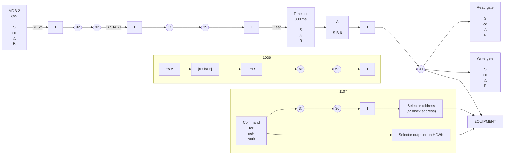

See fig. 6-2

## Figure 7.1: Active Device — Illustration

---

## Page 55

7–4

# 7.1.4 CW3 – Test Mode

The controller will be set in the Test Mode of operation by executing:

    SAA 10
    IOX 505

This mode of operation simplifies check-out and maintenance. In test mode the basic parts of the controller operate in the same way as during a normal disk transfer, without a disk unit being connected.

NOTE: If a disk unit is connected to the controller, the unit should be stopped and powered down before running test mode.

While the controller is still in test mode it must substitute:

- The clocks from the unit (refer to Figure 7.2.)

- The serial data from the unit.(refer to Figure 7.2.)

- Sector pulses from the unit and (refer to Figure 7.3.)

  Inhibit (disable)

- Error conditions from the unit (refer to Figure 7.4.)

The error conditions are:

1. Ready → <span style="text-decoration: overline">Ready</span>

2. Fault conditions

3. Seek Errors

## 7.1.4.1 Clock and Data Substitutions

Refer to Figure 7.2.

Read clocks (CL) are substituted by a crystal oscillator producing clock pulses at a frequency of 2.5MHz (equivalent to a data cell of 400ns).

The data will be generated by a data pattern generator. The inputs are taken from a bit counter counting the clock pulses. The pattern generator will alternatively generate a 0-1-0-1, etc. and a 1-0-1-0, etc. pattern for alternating memory words. The alternated assembled words will then be:

    125252₈ and
    052525₈

ND-11.010.01

---

## Page 56

# 7-5

```mermaid
flowchart LR
    subgraph P1013["1013"]
        MDB["MDB 3"] --> LC["S<br/>CD<br/>C<br/>R"]
        LCW["LCW"] --> LC
        LOAD["(Load<br/>control<br/>word)"] --> LC
        LC -->|Test̅| P23A(("23"))

        RC["Read clock<br/>from HAWK RC̅"] --> P15(("15")) --> P14(("14")) --> I_RC["I"]
        XO["Crystal<br/>oscillator"] --> P25(("25")) --> P24(("24"))
        RD["Read data<br/>from HAWK"] --> P21(("21"))
        BC["From bit<br/>counter"] --> P4(("4")) --> TPG["Test<br/>pattern<br/>generator"]
    end

    subgraph P1039["1039"]
        P23B(("23")) --> I_TEST["I"]
        I_TEST --> A1["A"]
        P23B --> A2["A"]

        I_RC --> A2
        P24 --> A1

        A1 --> I_CL["I"]
        A2 --> I_CL
        I_CL -->|CL (Read clock)| CLOUT[""]

        P21 --> P20(("20")) --> A3["A"]
        TPG --> A4["A"]

        P23B --> A3
        P23B --> A4

        A3 --> I_DRD["I"]
        A4 --> I_DRD
        I_DRD -->|DRD (Serial read<br/>data)| DRDOUT[""]
    end

    P23A --- P23B
    P15 --- P14
    P25 --- P24
    P21 --- P20

    R73["Ref. fig. 7.3<br/>1036"] -.-> P23A
    R74["Ref. fig.<br/>7.4"] -.-> P23B

    style P1013 fill:none,stroke-dasharray: 8 8
    style P1039 fill:none,stroke-dasharray: 8 8
    style CLOUT fill:none,stroke:none
    style DRDOUT fill:none,stroke:none
```

**Figure 7.2:** *Clock and Data — Substitution*

ND-11.010.01

---

## Page 57

# 7–6

```mermaid
flowchart LR
    subgraph B1013["1013"]
        direction TB
        R72["Ref. fig. 7.2"] --> N23(("23"))
    end

    IDX["Index<br/>(From HAWK)"] --> T["T"]
    T --> RIN["R"]
    SC["Sector<br/>clock"] --> CIN["C"]

    CNT["5 bit sector counter"]
    RIN --> CNT
    CIN --> CNT

    N23 -->|Test| OSC["800 Hz<br/>Sector<br/>clock<br/>oscillator"]

    CNT --> Q5(("5"))
    Q5 --> TSC["TSC0–4"]

    FSH["From sector counter<br/>in HAWK"] --> F5(("5"))
    F5 --> REC["RECEIVER"]
    REC --> R5(("5"))

    R5 --> MUX0["0"]
    TSC --> MUX1["1"]

    MUX["G0<br/>G1<br/><br/>MAX"]
    MUX0 --> MUX
    MUX1 --> MUX

    MUX --> M5(("5"))
    M5 -->|A| COMP["Comp.<br/>network"]

    SADDR["Sector addr.<br/>(part of block addr.)"] -->|B| COMP

    COMP -->|A = B| ANDLOW["A"]
    RG["Read gate"] --> ANDLOW
    OC2["On cyl"] --> ANDLOW
    ANDLOW -->|COMPA| OUT[""]

    OSC -->|Ext. sect.| ANDTOP["A"]
    OC1["On cylinder"] --> ANDTOP
    ANDTOP -->|EQUAL| N37(("37"))

    OSC --> SC
```

**Figure 7.3: _Sector Clock — Substitution_**

---

## Page 58

# 7-1

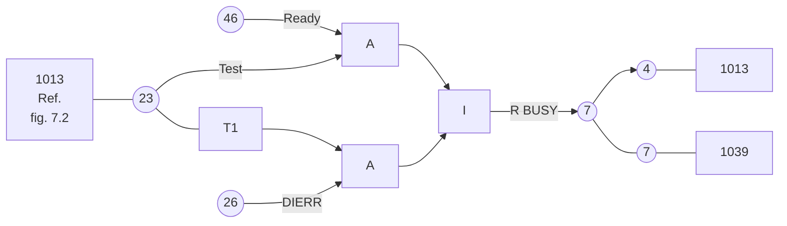

**Figure 7.4:** *Disable of Unit Error Condition*

---

## Page 59

7-8

# 7.1.4.2 Sector Substitutions

The output of a 800Hz sector clock oscillator is used in Test mode to update the sector counter. The term EQUAL and COMPA will be activated when the sector counter reaches a count specified in sector address (part of the block address). Refer to Figure 7.3.

# 7.1.4.3 Read Operation in Test Mode

In order to perform a Test Read Operation the "Block Address Register" must be loaded with the address of:

125252₈

which will be done by a:

```text
        LDA (125252
        IOX 503.
```

In phase 2 of the addressed sector the entire Block Address will be compared with the address read from the disk, in this case from the data pattern generator.

Address mismatch (SB8) will occur if the Block Address is different from the data pattern generated when a sector address compare occurs (COMPA).

For proper operation the data buffer in core must be checked.

Refer to the normal read operation for further details.

# 7.1.4.4 Write Operation in Test Mode

Prior to a Test Write operation the output pattern must be set up in a data buffer in core.

For a good check of the data a "Compare Mode" must be specified (described later) along with the Test Mode.

In this combined mode of operation the data written will be compared bit by bit with the output from the data generator. Also, here the Block address of 125252₈ must be specified.

The data buffer must then be set up with:

```text
        :
     125252
     052525
     125252
        :
        :
        etc.
```

[illegible]

---

## Page 60

# 7-9

If a data compare error occurs SB10 will set.

Refer to Chapter 7.3 – "Write Operation" for further details.

# 7.1.5 CW4 – Device Clear

Refer to Figure 7.5.

A

```text
        SAA 20
        IOX 505
```

will set CW4 and a device clear will be performed. Status bits 10 - 12 (SB10 - Compare Error, SB11 - Missing Clock and SB12 - Transfer Complete) will be cleared. The "Device Request" and "Busy" will also be reset. A "Return-to-Zero-Seek" (RTZS) will be commanded provided a time-out occurred.

NOTE: If a "Time-out" (SB6) has occurred the "Busy" has already been reset. Refer to Figure 6.2.

---

## Page 61

# 7-10

```text
                                      1014                 1013

        1022

                                                     +-----------+    Write protect violate
                                                     |   SB 5    |
                                                     +-----------+    Time out
                                                     |   SB 6    |
                                                     +-----------+    Hardware error
                                                     |   SB 7    |
                                                     +-----------+    Address mismatch
                                                     |   SB 8    |
                                                     +-----------+    Parity error
                                                     |   SB 9    |
                                                     +-----------+    Compare Error
                                                     |   SB 10   |
                                                     +-----------+    Missing clocks
                                                     |   SB 11   |
                                                     +-----------+    Transfer complete
                                                     |   SB 12   |
                                                     +-----------+

                         Busy
                       +------+
                       |      |
                       |      |
                       |      |
                       +------+
                          R
                          |
                          |
MDB 4 -----> +------+    +------+                  (72)    (72)    (72) -----> R
             |      |--->|      |-------------------+-------+-------+        +------+
CW ---------> |  A   |    |  I   |                                           |      |
             |      |<---|      |                                           |      |
             +------+    +------+                                           +------+
                            |
                            |
                            +------------------------(58)----(58)---+
                                                                      |
                                                                      +--------> R
                                                                               +------+
                                                                               |      |
                                                                               +------+
                                                                      |
                                                                     +--+
                                                                     |  |
                                                                     +--+
                                                                      |
                                                                    (54)  MC
                                                                      |
                                                                    (55)
                                                                      |
                                                                      +----------> A
                                                                                  +------+
SB 6 --------------------------------------------------------------------------->|      |
Time out                                                                           |  Π   |-----> RTZ
                                                                                   |      |       Return
                                                                                   +------+       to zero
                                                                                                  seek.

                                      C̅F  Clear
                                      M̅C̅M

                                                        Device request

                                                        1037
```

| Status bit | Description |
|---|---|
| SB 5 | Write protect violate |
| SB 6 | Time out |
| SB 7 | Hardware error |
| SB 8 | Address mismatch |
| SB 9 | Parity error |
| SB 10 | Compare Error |
| SB 11 | Missing clocks |
| SB 12 | Transfer complete |

Figure 7.5: *Device Clear Illustration*

ND-11.010.01

---

## Page 62

7–11

# 7.1.6 CW5-6 – Address Bits 16 and 17

<u>1022</u>

```mermaid
flowchart LR
    MDB5[MDB 5] --> A[CD<br/>C<br/>R]
    CW5[CW̅] --> A
    MDB6[MDB 6] --> B[CD<br/>C<br/>R]
    CW6[CW̅] --> B
    A --> S[3 st.]
    B --> S
    S --> N53((53))
    S --> N54((54))
    N53 --> BA16[BA16 (Bus Addr.)]
    N54 --> BA17[BA17̅]
```

**Figure 7.6:** *Bus Address bits 16 and 17*

Bus Address bits 16 and 17 can be specified by CW5 and CW6.

NOTE: One data transfer has to take place within one (by CW5 and CW6) specified 64K memory bank.

# 7.1.7 CW7-8 – Not Assigned

# 7.1.8 CW9-10 – Unit Select

<u>1107</u>

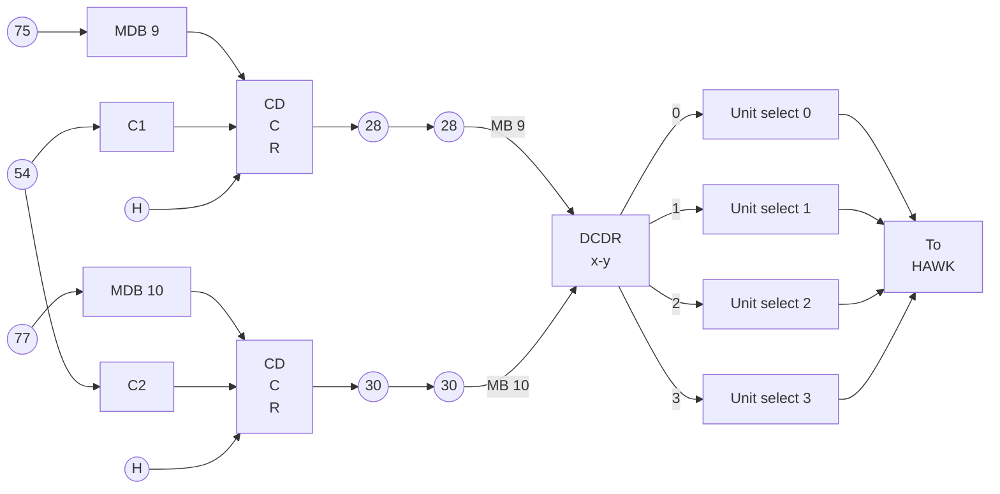

**Figure 7.7:** *Unit Selection*

---

## Page 63

7-12

By CW9 and CW10 one out of four units may be selected in accordance with the table below:

| CW10 | CW9 | Unit No. Selected |
|---|---|---|
| 0 | 0 | Unit number 0 selected |
| 0 | 1 | Unit number 1 selected |
| 1 | 0 | Unit number 2 selected |
| 1 | 1 | Unit number 3 selected |

NOTE 1: For any communication between a unit and the controller, the unit must be selected.

NOTE 2: It should also be noted that one unit is always selected, i.e. one unit selection is dropped only be selecting another.

# 7.1.9 CW11-12 — Device Operation

```text
                 1013                                      1039                 1107
                  ____                                      |                    |
                                                            |                    |
                       +--------+                           |                    |
                       |  X Y   |                           |                    |
                       | DECDR  |                           |                    |
                       |        |                           |                    |
                       |      0 |>---- M0 ----(6)----(6)----+----[ ]----(54)----(59)----<|----[ ]----+5 v
                       |        |                                                            Read Ind
             MB 11 ----|      1 |>---- M1 ----(7)----(8)----+----[ ]----(55)----(57)----<|----[ ]----+5 v
                       |        |                                                            Write Ind
             MB 12 ----|      2 |>---- M2 ----(8)---(10)----+----[ ]----(60)----(65)----<|----[ ]----+5 v
                       |        |                                                            Parity Ind
                       |      3 |>---- M3 ----(9)---(12)----+----[ ]----(62)----(69)----<|----[ ]----+5 v
                       +--------+                                                            Comp. Ind
                                                            |                    |
                                                            |                    |
                                                            |                    |
```

Figure 7.8: *Mode Indication*

Four modes of operation may be specified by CW11-12 in accordance with the table below. The appropriate LED located on the 1107 card will be lit. Refer to Figure 7.6.

| CW12 | CW11 | Mode Operation |
|---|---|---|
| 0 | 0 | Read Transfer |
| 0 | 1 | Write Transfer |
| 1 | 0 | Read Parity |
| 1 | 1 | Compare Test |

ND-11.010.01

---

## Page 64

7-13

# 7.2 MO – READ TRANSFER

Refer to Figure 7.5 and Chapter 3.1.1, – Sector Format - General Discussion. During a read transfer the data found in phase 5 of the sector format is sent to the controller as a serial bit stream, assembled in the controller to 16 bits words and set to memory. As each word is sent to memory the

- "Core Address Register" is incremented and
- "Word Counter" decremented.

If the word count specified is greater than 128 (one sector) the data read operation will resume on the following sector, Phase 5, until the

- word counter is zero and
- an interrupt is generated if enabled.

(A maximum of 24<sub>10</sub> sectors can be read in one operation.)

## 7.2.1 Detailed Description

During the initialization process the "Block Address" is loaded, holding the values for:

- Cylinder Address
- Head Selection
- Sector Address

Refer to Figure 7.7 for the following discussion.

When CW3 sets (activate device) a "Track Address Strobe" is generated strobing the Cylinder Address (Block Address 6 - 14) into the Cylinder Register in the HAWK, provided the heads were not moving (ON Cylinder). The unit will perform a seek operation to the specified cylinder. The sector address specified in the Block Address 0 - 5 will be compared with the sector address continuously read from the unit. The "Equal" signal will clear the Equald FF activating the "EQUALD" signal. The "Read Enable" FF (Read gate) will set 128 bits into phase 1. (This will be done whether or not a read or write is specified.)

The Read gate will enable the read circuitry in the unit. The speed/frequency and phase synchronization will be established. The controller will now enable data and clocks to the controller after counting 16 "clear zeros".

As we are still in Phase 1 (the pre-amble) only "0"'s are written, i.e. only clocks are received at the controller. A term "Search" is generated at the same time as the "Read Gate" is produced enabling a 16 bits clocks counter. 16 new clock pulses will be counted and the carry output will clear the Enable ONE FF producing the term "Enable One". The first data bit appearing on the data line will trigger the "ONE CATCH". The phase generator will go from Phase 1 to Phase 2.

---

## Page 65

# 7–14

## Figure 7.9: Read Transfer

```text
                                                                                         MB00-15
                                                                                             ^
                                                                                             |
                         +--------------+      +--------------+      +--------------+      +-------+
                         | Shift        |----->| Real         |----->| Driver       |----->|       |
                         | network      |      | Reg.         |      |              |       |       |
                         +--------------+      +--------------+      +--------------+      +-------+
                                |                    |                     |
                                |                    |                     +---- EN
                                |                    |
                                +---- DRD

      Device request
             |
             v
       +-----------+      Device request
       | INGRANT   |-----------------------------+
       +-----------+                             |
             |                                   v
             |                              +---------+
             |                              | A       |
             |                              +---------+
             |                                   |
             +-----------------------------------+------------------> INPUT CONNECT
                                                 |
                                                 +------------------> Data bus and Memory
                                                                      control signal


  (Delay will vary with bus and memory activity)
  Device request asks for permission to use Data bus and Memory
  control gives permission by issuing a INGRANT signal


  -------------------------------------------------------------------------------
  | 1012                                                                    |
  |                                                                          |
  |  1013             1032                1014                1022         |
  |                                                                          |
  |  +---+--(5)--(6)--+      +-----------+      +------------+             |
  |  | I |            |      | Word      |      | Word       |             |
  |  +---+            |      | counter   |      | counter    |             |
  |                   |      +-----------+      +------------+             |
  |                   |             |                   |                    |
  |                   |             |                   +--- WCZ            |
  |                   |             |                                        |
  |                   |      +-----------+                                  |
  |                   |      | A         |                                  |
  |                   |      +-----------+                                  |
  |                   |             |                                        |
  |                   |      +-----------+                                  |
  |                   |      | I         |                                  |
  |                   |      +-----------+                                  |
  |                   |             |                                        |
  |                   |       write from DRQ                                |
  |                   |       increment word counter                         |
  |                   |       (Data channel strobe)                          |
  -------------------------------------------------------------------------------


  -------------------------------------------------------------------------------
  | 1036                                                                    |
  |                                                                          |
  |  MS (activate)                                                          |
  |      |                                                                   |
  |      +--- HS                                                             |
  |      |                                                                   |
  |      +--- ON CYL                                                        |
  |      |    (ON cylinder)                                                 |
  |      |                                                                   |
  |      +--- TAS (track gate strobe)                                       |
  |                                                                          |
  |  DA 6-14                                                                 |
  |  Black Address                                                           |
  |                                                                          |
  |  DA 0-4                                                                  |
  |                                                                          |
  |  +----------------+       +----------------+                            |
  |  | Sector         |       | I              |                            |
  |  | homework       |       +----------------+                            |
  |  +----------------+                |                                   |
  |          |                          v                                   |
  |          +--------------------> Search                                  |
  |                               +-----------+                             |
  |                               | I         |                             |
  |                               +-----------+                             |
  |                                    |                                    |
  |                                    v                                    |
  |                               +-----------+                             |
  |                               | I         |                             |
  |                               +-----------+                             |
  |                                    |                                    |
  |                             Search address                              |
  |                             from HAWK                                    |
  |                                                                          |
  |  1037                                                                    |
  |  ONLY                                                                    |
  |  Clear (Busy)                                                            |
  |  From HAWK                                                               |
  |  To HAWK (servo)                                                         |
  |  To HAWK                                                                 |
  -------------------------------------------------------------------------------


  -------------------------------------------------------------------------------
  | 1039                                                                    |
  |                                                                          |
  |  Bit counter                                                             |
  |       |                                                                  |
  |       +--- B15 Bit count (Bit of 16)                                    |
  |                                                                          |
  |  Read enable                                                             |
  |       |                                                                  |
  |       v                                                                  |
  |  +-----------------------+                                               |
  |  | A                     |                                               |
  |  | (Read check)          |                                               |
  |  | Write format WE       |                                               |
  |  +-----------------------+                                               |
  |       |                                                                  |
  |       +----------------------- PR5                                      |
  |                                                                          |
  |  Write                                                                  |
  |       |                                                                  |
  |      Ph 4                                                               |
  |                                                                          |
  |  Read                                                                   |
  |       |                                                                  |
  |      Ph 1                                                               |
  |                                                                          |
  |  INS                                                                    |
  |  Sector pulse                                                            |
  |  (Sector pulse)                                                         |
  -------------------------------------------------------------------------------


  -------------------------------------------------------------------------------
  | 1038                                                                    |
  |                                                                          |
  |  WK                                                                      |
  |  "will enable for read                                                   |
  |   window will be syn-                                                    |
  |   sped and phase and                                                     |
  |   zeros counted to                                                       |
  |   do a will be enabled"                                                  |
  |                                                                          |
  |  Read gate                                                              |
  |       |                                                                  |
  |       v                                                                  |
  |  +-----------------------+                                               |
  |  | Test                  |                                               |
  |  +-----------------------+                                               |
  |       |                                                                  |
  |       +--- Read Data                                                      |
  |              |                                                           |
  |              +--- A --- I --- A --- Read Data                           |
  |                                                                          |
  |  +-----------------------+                                               |
  |  | Test Data Pattern     |                                               |
  |  | generator             |                                               |
  |  +-----------------------+                                               |
  |                                                                          |
  |  +-----------------------+                                               |
  |  | CHECK                  |                                               |
  |  | SUM                    |                                               |
  |  | GENERATOR              |                                               |
  |  +-----------------------+                                               |
  |                                                                          |
  |  AWK                                                                    |
  |  RD (Read Data)                                                         |
  |  Test                                                                   |
  -------------------------------------------------------------------------------


  -------------------------------------------------------------------------------
  |  Read Transfer                                                          |
  |                                                                          |
  |  DRD                                                                     |
  |       |                                                                  |
  |       +--- A --- I --- A --- ENABLE ONE                                 |
  |                                      |                                  |
  |                                      +--- CL (Read clock)                |
  |                                                                          |
  |  Counter zeros                                                          |
  |       |                                                                  |
  |       +--- ENABLE ONE                                                    |
  |                                                                          |
  |  Phase generator                                                        |
  |       |                                                                  |
  |       +--- ONE CATCH                                                     |
  |                |                                                         |
  |                +--- 1029                                                 |
  |                |                                                         |
  |                +--- 1027                                                 |
  |                                                                          |
  |  Read transfer                                                           |
  |       |                                                                  |
  |       +--- A --- I --- A                                                 |
  |                                                                          |
  |  Phase 1 BC 7                                                           |
  |  (bit 28)                                                               |
  |                                                                          |
  |  Search for the first                                                   |
  |  (search bit)                                                           |
  |                                                                          |
  |  Will change from phase 1 to                                            |
  |  phase 2 or from phase 3 to 4                                           |
  -------------------------------------------------------------------------------


  1021   1022   1023   1024   1027   1029   1032   1036   1037   1038   1039
```

---

## Page 66

7–15

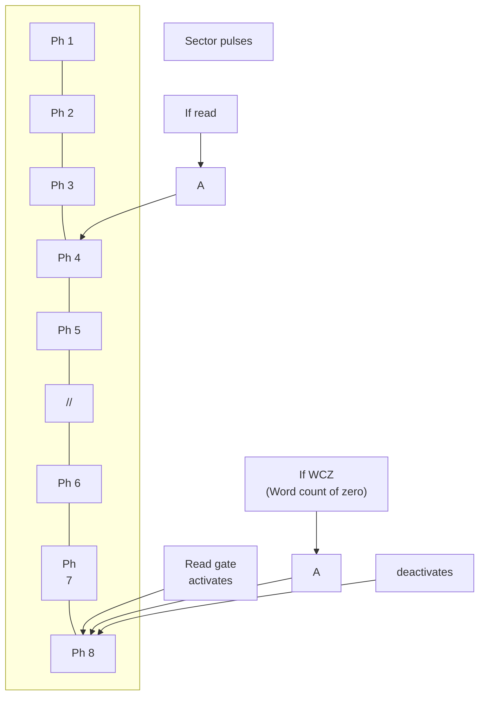

**Figure 7.10: _Read Gate Activation_**

In Phase 2 the “Block Address” is read off the disk and compared bit for bit with the “Block Address Register”.

If address mismatch occurs SBB will set at the beginning of Phase 3.

The address read off the disk in Phase 2 is fed through the “Check Sum Generator”. The check word generated should be equal to the check sum read off the disk in Phase 3. If a parity error on the address occurs (the check sums are not equal) SB9 will set in the beginning of Phase 4.

At the beginning of Phase 4 the Read Gate will clear.

The sequence of events up to the end of Phase 3 and the beginning of Phase 4 is the same for a read or a write sequence.

Since read (M0) is now specified the read gate will be turned back on, 128 bits into Phase 4.

The remainder of the sequence of events in Phase 4 are equal to those in Phase 1.

Phase 5 will be entered when Phase 4 is terminated with a “ONE CATCH”.

In Phase 5, 128 words are assembled and sent to the CPU. This is accomplished by shifting the serial data bits into a shift network located at the 1014 card.

When the bit counter reaches a count of 15 (16 bits are assembled) the following takes place:

- A data channel strobe — DCS — is produced to strobe the assembled data word in the shift network into the Read Register which serves as a one word data buffer.

---

## Page 67

# 7–16

- The "Word Counter" will be decremented, if not already at zero.

- Initial request will be originated and sent out on the Bus as "Device Request".

The "Device Request" asks "Memory Control" (located in the CPU) for permission to use the Bus and Main Memory. The memory control will issue an "Ingrant" signal when the request has been granted. The "Input" and "Connect" signal will be activated and the "Read Register" will be enabled onto the bus on the way to the main memory.

The same sequence will take place each time the bit counter has counted 16 new bits.

If more than one sector should be read in one operation the EQUALD signal will remain active until "ON Cylinder" or "Busy" is dropped, i.e., if a multisector data transfer is specified (WC > 200₈). Error in the block address (SB8, address mismatch) is reported only in the beginning of Phase 3 of the first sector. This is accomplished by dropping the term "COMPA" (ON Address sector) as a result of the sector counter being incremented.

ND-11 010 01

---

## Page 68

# 7.3 M1 – WRITE TRANSFER

The sequence of events for a write operation are identical to those appearing in a read operation up to the beginning of Phase 4. Refer, thereforea to the text for a read transfer and Figure 7.7 and 7.8.

When over the addressed sector the address recorded will be read (Ph2) and checked (Ph3). If “Address Mismatch” occurs it will be reported (SB8) in the beginning of Phase 4, when the “read gate” will also drop. Refer to Figure 7.1 for the following discussion.

The “write gate” will set 16 data cells into phase 4. Only zeros are recorded in this phase up to the bit count of 215 where a one bit (one catch) is recorded and phase 4 terminates.

In phase 5 data from the CPU will be shifted from the shift network located on the 1014 card. That implies that a data word from memory must have been loaded into the shift network before entering phase 5. This is accomplished by the following sequence of events:

- The first “Initial Request” is sent to Memory Control (located in the CPU) as a “DMA request” when “Busy” is set by an “Activate Device” (CW2). This occurs provided the word counter is non-zero and Read is not specified.

- “Memory Control” will return the Ingrant when Memory and Bus are not busy.

- The Ingrant signal will operate the Grant-selector (located on 102 card) to pick the lower inputs.

- The “Connect” signal will be passed on to the Bus along with the Memory Address.

When the Data is read out from memory it will be sent along with the “DMA Data Ready” which will strobe the data into the “Data Write Register” located on the 1014 module.

The Data word will be loaded into the shift network by the term PL (parallel load) to be activated in the beginning of Phase 1 of the addressed sector. The data word will wait there until entering Phase 5. SHTE (shift enable) is then activated.

The data word will be exchanged as serial data (DW&). When the first bit is shifted in the shift network the Data Write Register is ready for a new word from memory and a new “Request” is generated. When the 16th bit has been shifted (indicated by B15 → B15) a new PL (parallel load) is applied.

The Data Write Register must then contain the new data word requested 15 clock pulses before. The decrementation of the word counter will take place for every “Request” generated.

ND-11.010.01

---

## Page 69

# Figure 7.11: Write Transfer

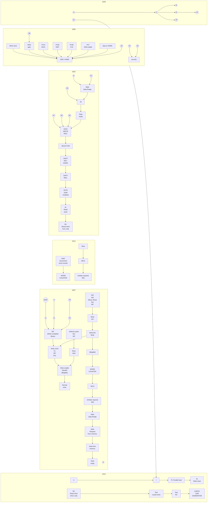

---

## Page 70

# 7–19

If the word counter reaches zero before Phase 5 has terminated, (WC <200₈) no further data will be taken from memory (WC = 0 stops further requests) but the write operation will continue until Phase 5 drops.

The last content of the Data Write Register will then be rewritten 200₈ − WC number of times. When 128 words are written in Phase 5, Phase 6 will be entered where the 16 bits check word on data (Phase 5) is written. Phase 7, consisting of a 'One' recorded, terminates the write operation in this sector.

If a WC >200₈ is specified the write operation will continue in the next sector.

When the word counter reaches zero the “Busy” will clear on the following sector pulse. The EQUALD signal will drop and disable setting of the write gate in the next sector.

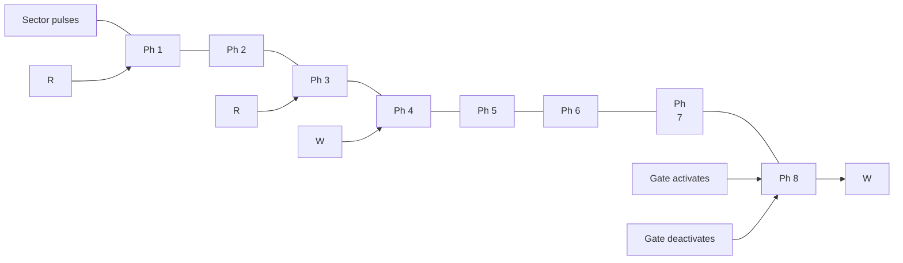

R – Read gate

W – Write gate

**Figure 7.12: _Read/Write Gate Activation_**

---

## Page 71

# 7.4 M2 – READ PARITY

7–20

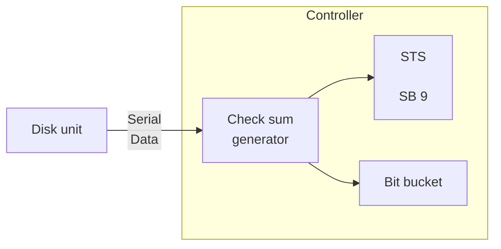

*Figure 7.13: Read Parity — Data Flow*

During this mode of operation the controller will perform a normal read operation (M1) with one exception:

- No device request will be issued, i.e., no data will be transferred to memory. Refer to Figure 7.7.

```mermaid
flowchart TB
    subgraph R1013["1013"]
        direction LR
        N8((8)) --> N5((5)) --> A[A] --> N66((66))
        IRQ[IRQ] --> A
        IRQT["(Initiate request)"] --- IRQ
        M2["\\(\\overline{M2}\\)"] --- N5
        DR["\\(\\overline{\\text{Device request}}\\)"] --- N66
    end

    subgraph R1037["1037"]
        direction LR
        N7((7)) --> N9((9)) --> I[I] --> W[Write]
        N9 --> R[Read<br/>(Read will be active<br/>when M2 activated)]
        M1["\\(\\overline{M1}\\)"] --- N9
    end
```

*Figure 7.14: Read/Read Parity Differences*

ND-11 010 01

---

## Page 72

# 7-21

The data read in Phase 5 will generate a check word. This check word will be compared with the check word read in Phase 6. If a parity error occurs (missing or extra bits) it will be reported in Phase 7 as “Parity Error” — SB9.

A Read Parity mode of operation may be specified to verify the quality of a data recording (write).

---

## Page 73

7–22

# 7.5 M3 — COMPARE TEST

```mermaid
flowchart LR
    MM[Main Memory]
    
    subgraph M1014["1014"]
        SN[Shift<br/>net -<br/>work]
    end

    DD[DISK DRIVE]
    
    subgraph M1039["1039"]
        EQ["= 1"]
        A["A"]
    end

    MM --> SN
    SN -->|Serial Data| EQ
    DD -->|Serial<br/>Data| EQ
    EQ --> A
    PH5[Ph5] --> A
    A -->|SB10<br/>Compare<br/>Error| CE[ ]
```

*Figure 7.15: Compare Test — Data Flow*

In a “Compare test” mode of operation a data field in memory will be compared, bit by bit, with an addressed data field on the unit. SB10 will set if one or more bits were not equal.

See also Figure 5.4 - Status bits 9-11 generation.

A compare test can also be useful with the controller in Test mode. A data field in Main Memory will then be compared, bit by bit, with the output from the data pattern generator.

## 7.5.1 CW13 — Marginal Recovery

If a read parity error occurs during a Read operation a correct data recovery may be achieved by activating a “Marginal Recovery”. The R/W-head will then search back and forth within the addressed track. A successful read may then be accomplished. (Refer also to “Read Recovery” — Chapter 9.2 in “HAWK - Disk System” manual.)

The term “Marg” is sent to the unit from the 1107 card when CWB is set.

[illegible]

---

## Page 74

# 7-23

## 7.5.2 CW14 — Not Assigned

## 7.5.3 CW15 — Write Format

Prior to normal use a disk pack must be formatted. A special program will accomplish this task. This program will write the “Block Address” on every sector on every cylinder on the disk pack. Seen from the controller, a new operation will be initiated for every track — i.e. 24 sectors will be recorded in one operation.

In order to perform a disk formatting the following must be set up:

- Write operation specified (M1)

- Write format specified

  ```
  LDA(
  IOX 505
  ```

- Transfer format switch located on 1107 card (the corresponding LED will be lit — also located on the 1107 card)

Refer to Figure 7.8 for the following discussion.

The disk unit will seek to the addressed cylinder upon an “Activate Device” (CW3) and when heads are “ON Cylinder” and over the first addressed sector the “Equal’d” signal will become active enabling the “Write Enable” to be set. At start of Phase 1 the Write/Erase gate will be activated.

When the “Activate Device” was commanded the “Busy” will set and the first “initiate Request” will go to “Memory Control” as a DMA request. The “Ingrant” coming back from “Memory Control” will generate “connect”. The “CONNECT” and the “Memory Address” will be sent along on the bus. From main memory comes the requested data word along with “DMA Data Ready” which strobes the data word into the “Data Write Register”.

The data word will be loaded into the shift network in the beginning of Phase 1 by a PL (parallel load).

The next data word is requested by the term “SectW” when the first sector pulse comes up on the addressed sector.

Since the “Write/Erase gate” is turned on in the beginning of Phase 1 the write operation starts. However, only zeros are recorded (preamble) until the bit counter reaches a count of 215.

---

## Page 75

# 7-24

The “ONE CATCH” will be recorded and Phase 1 de-activates. At the time when Phase 2 comes up the term SHTE (shift enable) will become active and the 16 bits address held in the “shift network” will be shifted out by the write clock. Phase 2 will drop after 16 write clocks. In Phase 3 the check word generated in Phase 2 will be written on the disk. Phase 3 through 7 will be recorded as a normal write operation although the data recorded is not relevant (will be overwritten by the first normal write operation). During formatting the write gate will remain up until “Busy” drops (WC = 0).

During formatting:

- Only one word is taken from core for each sector — Phase 2 the Block address.

- 30₈ addresses can be written in one operation.

---

## Page 76

# APPENDIX A

# DIAGRAMS

---

## Page 77


---

## Page 78

# APPENDIX B

# SIGNAL DEFINITION LIST

---

## Page 79


---

## Page 80

# B-1

# APPENDIX B — *SIGNAL DEFINITION LIST*

| Term: | Origin: | Description: |
|---|---|---|
| A12-15 | 1013 | From MB12-15 |
| B0 | 1039 | Bit count of zero |
| B1 | 1039 | Bit count of one |
| B15 | 1039 | Bit count of 15 |
| B127 | 1039 | Bit count of 127 |
| B215 | 1039 | Bit count of 215 |
| B2047 | 1039 | Bit count of 2047 |
| BA0-8 | CPU | Lower 9 busaddress bits |
| BCO-10 | 1039 | Bit counter output (2<sup>0</sup> — 2<sup>10</sup>) |
| BCOMPL | 1013 | Transfer completed. Same as “COMPL”. |
| BCY1 | 1039 | Carry output from stage I (count of 15) |
| BCY2 | 1039 | Carry output from stage II (count of 255) |
| BD0-15 | --- | Bus Data 0-15 |
| BERROR | 1013 | Generation: ERROR → ERR → BERROR |
| BRBUSY | 1013 | Generated from “RBUSY” (reset Busy) |
| BSTART | 1022 | Same as Busy. |
| BUSY | 1022 | Busy is set by CW2 — “Activate Device”<br>will be cleared when specified operation<br>has terminated. |
| C1 | 1036 | Write clock from crystal oscillator |
| CAR | 1022 | Load Core Address Register |
| CART INDEX | Unit | Index pulse from unit |
| CEYL | Unit | ON Cylinder from unit |
| CF | 1022 | Clear flags. Generated from: (Activate<br>device) + (Clear device) + (Master clear) |

---

## Page 81

# B-2

## Signal Definition List, continued

| Term: | Origin: | Description: |
|---|---|---|
| CL | 1039 | Read or Write clock |
| CLA | 1107 | Equal address bits (Phase 2) |
| CLBC | 1107 | Change phase and clear bit counter. Clock pulse for the phase generator shift network. |
| CLCC | 1039 | Read/Write clock in phase 2, 3, 5, or 6. |
| CLEAR | 1037 | Same as B̅u̅s̅y̅. |
| CLINT | 1022 | Clear interrupt. Generated when “inident” is received and a local interrupt is pending. CLINT will enable the ident code onto the bus. |
| CLP | 1107 | Sector clock. Pulse shaped “SCP”. |
| COMP IND | 1039 | Controller in “Compare Test” (M3) mode of operation. |
| COMPA | 1107 | (ON Addressed Cylinder) · (Read Gate) ·<br>(ON Cylinder) |
| COMPL | 1037 | Transfer completed. Generates BCOMPL (word counter zero and next sector pulse). |
| CON | 1022 | ‘Connect’ sent to CPU. Generated from CONNECT. |
| CONNECT | 1022 | Connect generated from TCONNECT OR DCONNECT. |
| CRC | Unit | Read clock from unit. |
| CREADY | Unit | Ready reported from unit. |
| CW | 1022 | Control Word. |
| DATA READY | 1022 | Generated from “DMA Data Ready”. |
| DATA WRITE | 1036 | Encoded data sent to unit as “DWD”. |
| DB1 |  |  |
| DCONNECT | 1022 | Connect generated from a request being granted (REQUEST · INGRANT). |

ND-11 010 01

---

## Page 82

# B-3

## Signal Definition List, continued

| Term: | Origin: | Description: |
|---|---:|---|
| DCS | 1037 | Data channel strobe. Strobes the 16 bits assembled word into a read buffer register. |
| DEG | 1036 | Erase gate to unit. |
| DEQL | 1022 | Device equal. Generated when the addressed device is found. |
| DEVICE<br>REQUEST | 1014 | Generated by "Initiate Request". |
| DHS0 | 1036 | Head Select zero (CW5). |
| DHS1 | 1036 | Head Select one (CW15). |
| DIEN | 1022 | Same as SB0. |
| DIERR | 1036 | Disk error. Inclusive OR of "Fault" and "Seek Error" from unit. |
| DINPUT | 1022 | Data input generated as a function of (READ) · (REQUEST GRANTED). |
| DMA DATA<br>READY | CPU | Strobe signal for data from memory. |
| DMA REQUEST | 1022 | Generated from "Initiate Request" through "Device Request". |
| DR0 | 1022 | Same as BA0. Used for register type decoding. |
| DR1 | 1022 | Same as BA1. Used for register type decoding. |
| DR2 | 1022 | Same as BA2. Used for register type decoding. |
| DRD | 1039 | Serial data from unit during read or serial data from test pattern generator in test mode. |
| DREQ | 1022 | Granted device request. (REQ · INGRANT) |
| DRG | 1036 | Read Gate to unit. |
| DRTZ | 1036 | "Return to Zero Seek" command. |

---

## Page 83

# B-4

## Signal Definition List, continued

| Term: | Origin: | Description: |
|---|---:|---|
| DTAS | 1036 | Track address strobe to unit. Generated from “TAS”. |
| DW7 | 1014 | Serial bit output from shift network. |
| DWC | 1037 | Decrement word counter |
| DWD | 1036 | Encoded data to unit. |
| DWG | 1036 | Write gate to unit. |
| E15 | 1107 | 16 equal address bits. (verified on addressed sector.) |
| EG | 1107 | End of phase ONE or FOUR. |
| EI EN | 1022 | Same as SB1. |
| EINPUT | 1022 | Input specified from a read operation. |
| EN | 1014 | Enable 16 bits driver to bus. |
| EQUAL | 1107 | ON Addressed Sector. |
| EQUALD | 1037 | (ON Addressed Sector)    (ON Cylinder). |
| ERASE GATE | 1037 | ERASE Gate. Enable the erase circuitry in the unit. Same as Write Gate. |
| ERR | 1013 | Generated from “ERROR”. |
| ERROR | 1037 | Inclusive OR of Errors. (SB5-11)    (Same as SB4) |
| ERROR IND | 1039 | Error condition(s) occurred. |
| EXT SECT | 1107 | Pulse shaped (“SCP”) Sector Clocks. |
| FAULT | Unit | Fault condition reported from unit. |
| FINISHED | 1022 | Same as SB3. |
| FORMAT ON | 1107 | Write Format switch located on 1107-card closed. |
| IND | 1036 | Index clock pulse from unit. |

ND-11.010.01

---

## Page 84

# B-5

# Signal Definition List, continued

| Term: | Origin: | Description: |
|---|---|---|
| INGRANT | CPU | Give the DMA permission to use the bus and memory. |
| INIDENT | CPU | Timing and identification signal for the address lines when an Ident instruction is executed. |
| INPUT | 1022 | “Input” sent to CPU. |
| INT | 1022 | Interrupt local interrupt generated on the level specified by the Ident instruction. |
| IOXE | CPU | Timing and identification signal for the address lines when an IOX instruction is executed. |
| IRQ | 1037 | Initiate Request. |
| LBLOCK | 1013 | Load Block Address (IOX 503) |
| LCW | 1013 | Load Control Word (IOX 505) |
| LEV11 | 1022 | Local interrupt generated. Activates interrupt on Level 11. |
| M0 | 1013 | Read transfer specified. |
| M1 | 1013 | Write transfer specified. |
| M2 | 1013 | Read parity specified. |
| M3 | 1013 | Compare test specified. |
| MARG | 1107 | Marginal recovery (initiated from CW13). |
| MC | 1014 | Master Clear. Generated from MCM. |
| MCM | 1022 | Master Clear. Generated from Master Clear button in CPU or programmed Master Clear (CW4). |
| MDB0-15 | ---- | Local data bus. |
| MIS | 1013 | Read Block Address. |
| MS | 1037 | Pulse generated through transition of $\overline{\text{Busy}} \rightarrow \text{Busy}$. |
| MSP | 1013 | Write format (CW15). |

---

## Page 85

# B-6

## Signal Definition List, continued

| Term: | Origin: | Description: |
|---|---:|---|
| ON CYL | 1036 | ON Cylinder from unit. Generated from “CEYL”. |
| ONES CATCH | 1037 | A “one” detected in phase 1 or 4. |
| OP IND | 1039 | Operation indicator. Controller in “Busy” state. |
| OUTGRANT | 1022 | Ingrant sent out as outgrant for a device not holding a local request. |
| OUT IDENT | 1022 | Inident sent out as outident for a device not holding a local interrupt. |
| PARITY IND | 1039 | Controller in “Read Parity” (M2) mode of operation. |
| PH1 | 1107 | Phase one. |
| PH2 | 1107 | Phase two. |
| PH3 | 1107 | Phase three. |
| PH4 | 1107 | Phase four. |
| PH5 | 1107 | Phase five. |
| PH6 | 1107 | Phase six. |
| PH7 | 1107 | Phase seven. |
| PH8 | 1107 | Phase eight. |
| PH14 | 1039 | Phase one or four. |
| PH25 | 1039 | Phase two or five. |
| PH36 | 1039 | Phase three or six. |
| PH47 | 1039 | Phase four or seven. |
| PH2356 | 1039 | Phase two, three, five, or six. |
| PH1E | 1107 | End of phase one. |
| PL | 1037 | Parallel load of shift network |

ND-11 010 01

---

## Page 86

# B-7

# Signal Definition List, continued

| Term: | Origin: | Description: |
|---|---:|---|
| RBUSY | 1037 | Reset Busy. |
| RC | 1036 | Pulse shaped and Phase compensated read clock from unit. |
| RCAR | 1022 | Read core address register (IOX 500). |
| RD | 1036 | Read data from unit. Generated from “RRD”. |
| RDA | 1013 | Read Block Address in Test mode. |
| READ | 1037 | Read. Same as Write (WT) |
| READ DATA | 1039 | Serial data. From unit under normal operation, from test pattern generator in Test mode of operation. |
| READ EN | 1037 | Same as “READ GATE”. |
| READ GATE | 1037 | Read gate. Enable read circuitry in unit. |
| READ IND | 1039 | Read indicator. |
| READY | 1036 | Ready reported from unit. Generated from “CREADY”. |
| REQ | 1014 | Same as “Device Request”. Generated from IRQ — Initiate Request. |
| RRD | Unit | Read data from unit. |
| RRQ | 1022 | Reset request. Generated when a request is granted. |
| RSECT | 1013 | Read sector counter. |
| RSTAT | 1022<br>& 1013 | Read Status (IOX 504) |
| RTZ | 1037 | “Return to Zero Seek” command. |
| SB0 | 1022 | Status bit number 0. Ready for transfer interrupt enabled. |
| SB1 | 1022 | Status bit number 1. Error interrupt enabled. |
| SB2 | 1022 | Status bit number 2. Device active. |

ND 11 010 01

---

## Page 87

# B-8

## Signal Definition List, continued

| Term: | Origin: | Description: |
|---|---|---|
| SB3 | 1022 | Status bit number 3. Device ready for transfer. |
| SB4 | 1022 | Status bit number 4. Inclusive OR of errors (status bits 5-11). |
| SB5 | 1107 | Status bit number 5. Write protect violate. |
| SB6 | 1037 | Status bit number 6. Time out. |
| SB7 | 1036 | Status bit number 7. Hardware error. |
| SB8 | 1107 | Status bit number 8. Address mismatch. |
| SB9 | 1039 | Status bit number 9. Parity error. |
| SB10 |  | Status bit number 10. Compare error. |
| SB11 | 1037 | Status bit number 11. Missing clock(s). |
| SB12 |  | Status bit number 12. Transfer complete. |
| SB13 | 1037 | Status bit number 13. Transfer on. |
| SB14 | 1107 | Status bit number 14. ON Cylinder. |
| SB15 |  | Status bit number 15. Bit 15 loaded by previous control word. |
| SC | 1107 | Pulse shaped sector clock. From unit in normal operation. From sector clock oscillator in test mode. |
| SCP | 1107 | Sector Clock. From unit in normal operation. From sector clock oscillator in test mode. |
| SEARCH | 1039 | Search for "1" data after bit count of 128 in phase 1 or 4. |
| SECT | 1107 | Same as "SC". |
| SECTOR | Unit | Sector clock from unit. |
| SECTOR CLOCK | 1107 | Sector clock from unit. Generated from "SECTOR". |
| SECT W | 1037 | Sect · WF · Write EN. |
| SEEK ERROR | Unit | Seek error reported from unit. |

---

## Page 88

# B-9

# Signal Definition List, continued

| Term: | Origin: | Description: |
|---|---:|---|
| SEL1 | 1107 | Constant active. |
| SEL2 | 1107 | Constant active. |
| SHTE | 1037 | Shift enable. |
| SL | 1037 | Pulse shaped Read/Write clock. Generated from (CL). |
| SS | 1107 | Test sector counter feedback. |
| START | 1013 | Same as Busy. |
| T15 | 1039 | Check sum generator feedback. |
| TA0-8 | 1036 | Track address bits 0-8. |
| TAS | 1039 | Track address strobe. Strobe the track address bits into the “cylinder address register” in the unit. |
| TCONNECT | 1022 | Connect generated from (Unident . INT) an interrupt being identified. |
| TEST | 1013 | Controller in test mode of operation (CW3). |
| TIME OUT | 1037 | Time out. Same as SB6. Specified operation exceeded 300ms. |
| TINT | 1022 | Same as “Int”. |
| TSC0-4 | 1107 | Test sector bits. |
| US0-3 | 1036 | Unit 0-3 select lines to unit. |
| USB1 | Unit | Unit sector bit number 0. |
| USB2 | Unit | Unit sector bit number 1. |
| USB4 | Unit | Unit sector bit number 2. |
| USB8 | Unit | Unit sector bit number 3. |
| USB16 | Unit | Unit sector bit number 4. |
| WCS | 1013 | Word counter strobe (load word counter). |
| WCZ | 1014 | Word count of zero. |

---

## Page 89

# B-10

## Signal Definition List, continued

| Term: | Origin: | Description: |
|---|---:|---|
| WD | 1039 | Serial data to be encoded. |
| WEN | 1037 | Generated from: (Write) · (Write Enable)<br>+ (M3) · (Read Enable). |
| WF | 1037 | Write format. |
| WPED | Unit/<br>1107 | Write protect violation. |
| WRITE | 1037 | Write. M1 specified. |
| WRITE CORE | 1037 | Read operation (M0) specified. |
| WRITE EN | 1037 | Write Enable. Same as Write Gate. |
| WRITE GATE | 1037 | Write gate. Enable the Write circuitry in<br>the unit. |
| WRITE IND | 1039 | Write indicator. |

ND-11.010.01

---

## Page 90

# APPENDIX C

## BACKWIRING PRINT

---

## Page 91

[illegible]

---

## Page 92

# C-1

```text
                                  C-1


     GND                                      Vcc
     Vcc                                      GND

  +--------------------------------------------------------------------------+
  |                                                                          |
  |  +--------------------------------------------------------------------+  |
  |  | o o o o o o o o o o o o o o o o o o o o o o o o o o o o o o o   |  |
  |  | o o o o o o o o o o o o o o o o o o o o o o o o o o o o o o   |  |
  |  | o o o o o o o o o o o o o o o o o o o o o o o o o o o o o o   |  |
  |  | o o o o o o o o o o o o o o o o o o o o o o o o o o o o o o   |  |
  |  | o o o o o o o o o o o o o o o o o o o o o o o o o o o o o o   |  |
  |  |                                                                    |  |
  |  |                         DISK CONTROL                               |  |
  |  |                                                                    |  |
  |  | o o o o o o o o o o o o o o o o o o o o o o o o o o o o o o   |  |
  |  | o o o o o o o o o o o o o o o o o o o o o o o o o o o o o o   |  |
  |  | o o o o o o o o o o o o o o o o o o o o o o o o o o o o o o   |  |
  |  | o o o o o o o o o o o o o o o o o o o o o o o o o o o o o o   |  |
  |  |                                                                    |  |
  |  |                              EK 2411                               |  |
  |  |                                                                    |  |
  |  | o o o o o o o o o o o o o o o o o o o o o o o o o o o o o o   |  |
  |  | o o o o o o o o o o o o o o o o o o o o o o o o o o o o o o   |  |
  |  | o o o o o o o o o o o o o o o o o o o o o o o o o o o o o o   |  |
  |  +--------------------------------------------------------------------+  |
  |                                                                          |
  +--------------------------------------------------------------------------+
```

| Position | Function | Number |
|---:|---|---:|
| (24) 32 | Transceiver | 1036 |
| (23) 31 | Timing | 1039 |
| (22) 30 | Sequence | 1107 |
| (21) 29 | Reg. | 1013 |
| (20) 28 | Control | 1037 |
| (19) 27 | DMA | 1014 |
| (18) 26 |  |  |
| (17) 25 |  |  |

```text
     GND                                      Vcc
     Vcc                                      GND

  +--------------------------------------------------------------------------+
  |                                                                          |
  |  +--------------------------------------------------------------------+  |
  |  | o o o o o o o o o o o o o o o o o o o o o o o o o o o o o o   |  |
  |  | o o o o o o o o o o o o o o o o o o o o o o o o o o o o o o   |  |
  |  | o o o o o o o o o o o o o o o o o o o o o o o o o o o o o o   |  |
  |  | o o o o o o o o o o o o o o o o o o o o o o o o o o o o o o   |  |
  |  |                                                                    |  |
  |  |                         DISK CONTROL                               |  |
  |  |                                                                    |  |
  |  |                              EK 2411                               |  |
  |  |                                                                    |  |
  |  | o o o o o o o o o o o o o o o o o o o o o o o o o o o o o o   |  |
  |  | o o o o o o o o o o o o o o o o o o o o o o o o o o o o o o   |  |
  |  | o o o o o o o o o o o o o o o o o o o o o o o o o o o o o o   |  |
  |  | o o o o o o o o o o o o o o o o o o o o o o o o o o o o o o   |  |
  |  +--------------------------------------------------------------------+  |
  |                                                                          |
  +--------------------------------------------------------------------------+
```

| Position | Function | Number |
|---:|---|---:|
| (24) 32 | Transceiver | 1036 |
| (23) 31 | Timing | 1039 |
| (22) 30 | Sequence | 1107 |
| (21) 29 | Reg. | 1013 |
| (20) 28 | Control | 1037 |
| (19) 27 | DMA | 1014 |
| (18) 26 |  |  |
| (17) 25 |  |  |

ND-11.010.01

---

## Page 93


---

## Page 94

# APPENDIX D

## CONTROLLER

## ACTIVITY INDICATORS

### (PHYSICAL LOCATIONS)

---

## Page 95


---

## Page 96

# APPENDIX E

# N-10/HAWK PHYSICAL LAYOUT

---

## Page 97


---

## Page 98

TO BE INSERTED

---

## Page 99

[Blank scanned page]

---

## Page 100

# E-1

```mermaid
flowchart TB
    subgraph B["B"]
        direction TB
        A["1036<br/>Disk Tranceiver"]
        C["1039<br/>Disk Timing"]
        D["1107<br/>Disk Sequence"]
        E["1013<br/>Device Registers"]
        F["1037<br/>Disk control"]
        G["1014<br/>DMA Registers"]
        H["Empty"]
        I["Empty"]
        J["[illegible]<br/>Terminals &lt; 55"]
        K["1022<br/>Bus control"]
        L["Bus controller"]

        A --- C --- D --- E --- F --- G --- H --- I --- J --- K --- L
    end

    U["to/from units"]
    DC["N - 10 / HAWK<br/>Disk controller"]

    A -.- U
    C -.- U
    D -.- U
    G -.- DC
    K ---|"Terminals &lt; 55"| DC
```

ND-11 010 01

---

## Page 101


---

## Page 102

[Logo: stylized dotted “nde” logo]

A/S NORSK DATA-ELEKTRONIKK  
Lørenveien 57, Oslo 5 - Tlf. 21 73 71

# COMMENT AND EVALUATION SHEET

## NORD-10/HAWK DISK CONTROLLER

March 1976

In order for this manual to develop to the point where it best  
suits your needs, we must have your comments, corrections,  
suggestions for additions, etc. Please write down your comments  
on this pre-addressed form and post it. Please be specific  
wherever possible.

1

**FROM:**

______________________________________________

______________________________________________

______________________________________________

---

## Page 103

[Blank page with minor scan artifacts.]

---

## Page 104

– we make bits for the future

---

