## Page 1

# FLOPPY DISK

## SYSTEM

NORSK DATA A.S.

[Photo: black floppy disk with a white label and rows of circular cutouts.]

---

## Page 2

# FLOPPY DISK

## SYSTEM

```text
●
```

```text
●
```

```text
                 .-----------------------------------.
              .-'  Fysiologiska institutionen         '-.
             /                                         \
            |                                           |
            |              Umeå Universitet             |
             \                                         /
              '-.___________________________________.-'
```

```text
●
```

```text
●
```

---

## Page 3

## ii

# REVISION RECORD

| Revision | Notes |
|---|---|
| 10/76 | Original Printing |
|  |  |
|  |  |
|  |  |
|  |  |
|  |  |
|  |  |
|  |  |
|  |  |
|  |  |
|  |  |
|  |  |
|  |  |
|  |  |
|  |  |
|  |  |
|  |  |
|  |  |
|  |  |
|  |  |
|  |  |
|  |  |
|  |  |
|  |  |
|  |  |
|  |  |
|  |  |
|  |  |
|  |  |
|  |  |

Floppy Disk System  
Publication Number ND-11.012.01

```text
NDB
```

A/S NORSK DATA-ELEKTRONIKK  
Lørenveien 57, Oslo 5 - Tlf.: 21 73 71

---

## Page 4

iii

# MAIN CONTENTS

+     +     +

*Section:*

| Section | Title |
|---|---|
| I | **SYSTEM/GENERAL** |
| I.1 | Introduction |
| I.2 | General |
| I.3 | System Configuration |
| I.4 | Floppy Disk Programming Specifications |
| II | **INTERFACE** |
| II.1 | The Interface Signals |
| II.2 | General Command Sequence — Interface/Formatter |
| II.3 | Interrupt Generation and Handling |
| II.4 | Interface Data Routes |
| II.5 | Programmed Nondata Output/Input |
| II.6 | Test Mode |
| II.7 | Master Clear — Autoload |
| III | **FORMATTER** |
| III.1 | Formatter/Unit(s) Interface Signals |
| III.2 | Formatter — Functional Operation |
| III.3 | Track Format |
| III.4 | Data Recovery |
| III.5 | Formatter — Data Flow |
| III.6 | Read/Write Control |
| III.7 | Interrupt, Sense and Status |
| III.8 | Any Seek Operation |
| IV | **UNIT** |
| IV.1 | Diskette Storage Drive |
| IV.2 | Track Accessing |
| IV.3 | Stepper Motor Control Logic |
| IV.4 | Read/Write Operations |

ND-11.012.01

---

## Page 5

iv

# Appendixes:

| Appendix | Title |
|---|---|
| A | SPECIFICATION SUMMARY |
| B | DIAGRAMS |
| C.1 | Interface Hardware Diagrams |
| C.II | Internal Interface Signal List |
| C.III | 1111/1118 Signal Communication |
| C.IV | Floppy Disk Cables |
| D.1 | Formatter Logic Diagrams |
| D.II | Formatter Component — Location Chart |
| D.III | Formatter Test Points/Track Options — Locations chart |
| E.I-E.III | Unit Logic Diagrams |

ND-11.012.01

---

## Page 6

# SECTION I

# SYSTEM/GENERAL

---

## Page 7

# I-i

# DETAILED CONTENTS

+ + +

| Section: |  | Page: |
|---|---|---|
| I.1 | Introduction | I—1—1 |
| I.2 | General | I—2—1 |
| I.2.1 | Diskette Loading | I—2—2 |
| I.2.2 | Diskette Handling | I—2—2 |
| I.2.3 | Write Protection Feature | I—2—4 |
| I.3 | System Configuration | I—3—1 |
| I.4 | Floppy Disk Programming Specifications | I—4—1 |
| I.4.1 | Device Register Address | I—4—1 |
| I.4.2 | Instruction Formats and Descriptions | I—4—2 |
| I.4.2.1 | Read Data Buffer IOX RDAT | I—4—2 |
| I.4.2.2 | Write Data Buffer IOX WDAT | I—4—2 |
| I.4.2.3 | Read Status Register No. 1 (IOX RSR1) | I—4—2 |
| I.4.2.4 | Write Control Word IOX WCWD | I—4—3 |
| I.4.2.5 | Read Status Register No. 2 | I—4—4 |
| I.4.2.6 | Write Drive Address/Write Differences IOX WDAD | I—4—4 |
| I.4.2.7 | Read Test Data IOX RTST | I—4—6 |
| I.4.2.8 | Write Sector/Write Test Byte IOX WSCT | I—4—6 |

ND-11.012.01

---

## Page 8

# 1.1 INTRODUCTION

The Floppy Disk Drive was developed by IBM, in 1967, under direction of Alan Shugart. In 1970, IBM took advantage of their research results, and put the Floppy Disk into a computer system where it was used as a read-only device for diagnostic programs.

In 1973, the usage was extended and the Floppy Disk system was used in a data entry system. From now on, the Floppy Disk was added on the list of peripheral products. Peripheral product’s manufacturers became interested in the new product, and (of course), followed the IBM standard.

However, the first drives had a reputation of being unreliable, having high error rates and head and media wear.

Intensive efforts have been made to reduce the problems, so we today have a low cost, reliable and easy-to-handle device with many applications.

ND-11.012.01

---

## Page 9

I-2-1

# 1.2 GENERAL

Floppy Disk introduces a new data storage facility into a computer system. Refer to Figure 1.2.1.

```text
                                      Floppy disk drive
                                            |
                                            v
                                     ______________________
                                    /                     /|
                                   /_____________________/ |
                                  /                     /  |
                                 /_____________________/   |
                                 |                     |   |
                                 |                     |   |
                                 |                     |   |
                                 |                     |   |
                                 |                     |   |
                                 |                     |   |
                                 |_____________________|  /
                                  \                     \/
                                   \_____________________\
                                            \
                                             \ Latch
                                               handle


                         _______________________________
                        /                              /|
                       /                              / |
                      /______________________________/  |
                      |                              |  |
                      |                              |  |
                      |                              |  |
                      |              ______          |  |
                      |             /      \         |  |
                      |            |        |        |  |
                      |             \______/         |  |
                      |                              |  |
                      |                              |  |
                      |______________________________| /
                       \_____________________________\/
                              ^              ^
                              |              |
                         Index hole     Hub clamping area

                                      ^
                                      |
                               Read/write slot
```

**Figure 1.2.1.**

ND-11.012.01

---

## Page 10

1–2–2

The storage medium itself is a flexible disk (also referred to as a diskette). The diskette is free to rotate inside a semi-rigid envelope. The inside of this envelope is lined with a wiping material to clean the disk of foreign particles, as it rotates.

# 1.2.1 DISKETTE LOADING

To load the diskette, depress the latch and insert the diskette with its label facing out, i.e., the index hole is *above* the center of the diskette. Move the latch handle to the left. The diskette will then be attached to the rotating spindle for a Hub Clamp.

For ease of operation, the diskette can be loaded (or unloaded) with the drive in operating condition, i.e., the spindle rotating.

It is theoretically possible to utilize both sides of the diskette. However, at the present time, only one side is used by the drive since only one read/write head exists. One should also notice that the side used is the one *opposite* the label.

If the diskette is turned, the read/write head will still have access to the surface, however, the index transducer will not see the hole and the drive will attain the ready condition.

# 1.2.2 DISKETTE HANDLING

When removed from the drive, the diskette is stored in an envelope. To protect the diskette, the same care and handling procedures, specified for computer magnetic tape, apply. These precautionary procedures are as follows:

1. Return the diskette to its storage envelope whenever it is removed from the drive.

2. Keep diskettes away from magnetic fields and from ferromagnetic materials. Strong magnetic fields can damage the data recorded on the diskette.

3. Replace storage envelopes when they become worn, cracked or dissorted. Envelopes are designed to protect the diskette.

4. Do not write on the plastic jacket with a lead pencil or ball-point pen. Use a felt pen.

5. Heat and contamination from a carelessly dropped ash can damage the diskette.

ND-11.012.01

---

## Page 11

# I-2-3

6. Do not expose diskette to heat or sunlight.

7. Do not touch or attempt to clean the disk surface. Abrasions may  
   cause loss of stored data.

ND-11.012.01

---

## Page 12

I−2−4

# I.2.3 WRITE PROTECTION FEATURE

```text
                         Write Protect Hole
                              \
                               \
    +--------------------------\---+
    |  +---------+              \  |
    |  | | | | | |                 |
    |  | | | | | |                 o
    |  | | | | | |                   |
    |  | | | | | |                   |
    |  | | | | | |                   |
    |  +---------+                   |
    |                                |
    |             o                  |
    |               (-------)        |
    |               (   ( ) )   (---)|
    |               (-------)        |
    |                                |
    |  +---------+                   |
    |  |         |                   |
    |  |         |                   |
    |  +---------+                   |
    +--------------------------------+
```

A diskette with a hole punched as indicated in Figure I.2.2a is write protected.

b)

```text
                            Tab
                             \
                              \
    +--------------------------\---+
    |  +---------+               \ |
    |  | | | | | |                 |
    |  | | | | | |              +----+
    |  | | | | | |              |    |
    |  | | | | | |              +----+
    |  | | | | | |                 |
    |  +---------+                   |
    |                                |
    |             o                  |
    |               (-------)        |
    |               (   ( ) )   (---)|
    |               (-------)        |
    |                                |
    |  +---------+                   |
    |  |         |                   |
    |  |         |                   |
    |  +---------+                   |
    +--------------------------------+
```

By covering the hole with a tab as indicated in Figure I.2.2b,c, the protection is removed.

c)

```text
                 Fold over Back of Diskette
    +--------------------------------+
    |  +---------+                   |
    |  | | | | | |                   |
    |  | | | | | |                 +--+
    |  | | | | | |                 |  |
    |  | | | | | |                 +--+
    |  | | | | | |                   |
    |  +---------+                   |
    |                                |
    |             o                  |
    |               (-------)        |
    |               (   ( ) )   (---)|
    |               (-------)        |
    |                                |
    |  +---------+                   |
    |  |         |                   |
    |  |         |                   |
    |  +---------+                   |
    +--------------------------------+
```

If a diskette is purchased without the write protection feature, a hole can be punched according to the specification depicted in Figure I.2.2d.

**Figure I.2.2, continued**

ND−11.012.01

---

## Page 13

# 1-2-5

```text
                                      Index Access Hole
                                   ______________________
                              _____|                      |________
                             |     |                      |        |
                         a)  |     |  | | | |             |        |<---- 125" + .010"
                             |     |  | | | |             |   o    |
                             |     |  | | | |             |  /     |
                             |     |  | | | |             | / 150° D
                             |     |  | | | |             |        |
                             |     |                      |        |      ^
                             |     |       ______         |        |      |
                             |     |      /      \        |        |      |
                             |     |     |   __   |        |        |      | 6.250" + .010"
                             |     |     |  /  \  |        |        |      |
                             |     |      \______/         |        |      |
                             |     |                      |        |      |
                             |     |             _______  |        |      v
                             |     |            /       \ |        |
                             |_____|______________________|________|

                                     Write
                                     Protect
                                     Hole
```

# Figure 1.2.2, concluded.

ND-11.012.01

---

## Page 14

I-3-1

# I.3 SYSTEM CONFIGURATION

The Floppy Disk System is a low cost, highly reliable mass storage system with a relatively low access time and transfer rate.

Normally, a Mass Storage Device requires a Direct Memory Access (DMA). However, due to total system cost, a specially designed Programmed Input/Output (PIO) interface has been preferred.

Figure I.3.1 will illustrate the data transfer paths during a read operation. A write operation would be illustrated by reversing the arrows.

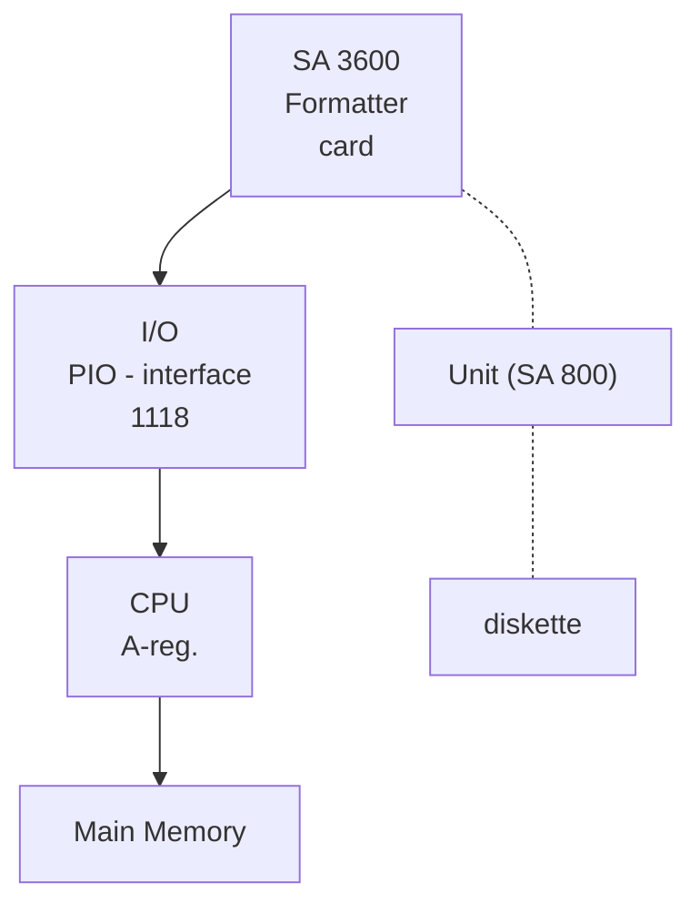

**Figure I.3.1.**

ND-11.012.01

---

## Page 15

# I–3–2

A floppy disk system (SA 3600) can have up to 3 drive units (SA 800).

As depicted in Figure I.3.1, up to 3 drives are daisy-chained to one formatter card. The Formatter is cabled to the Interface located in the I/O System. Two interfaces will be discussed in this manual.

- *The interface between the Interface and the Formatter*

  and

- *the interface between the Formatter and the drive units.*

The first one will be discussed in Section II.1, the second one in Section III.1.

ND-11.012.01

---

## Page 16

# 1.4 FLOPPY DISK PROGRAMMING SPECIFICATIONS

## 1.4.1 *DEVICE REGISTER ADDRESS*

| Register | Address |
|---|---|
| Read Data Buffer | IOX 1560 (IOX RDAT) |
| Write Data Buffer | IOX 1561 (IOX WDAT) |
| Read Status Register No. 1 | IOX 1562 (IOX RSR1) |
| Write Control Word | IOX 1563 (IOX WCWD) |
| Read Status Register No. 2 | IOX 1564 (IOX RSR2) |
| Write Drive Address/Write Differences | IOX 1565 (IOX WDAD) |
| Read Test | IOX 1566 (IOX RTST) |
| Write Section/Write Test Byte | IOX 1567 (IOX WSCT) |

**For** Disk System II add 10₈ to the codes specified above. Each disk system can handle up to 3 drives.

Ident code for Disk System I is 21₈. Ident code for Disk System II is 22₈.

Interrupt level is 11₁₀.

ND-11.012.01

---

## Page 17

I—4—2

# 1.4.2 INSTRUCTION FORMATS AND DESCRIPTION

## 1.4.2.1 *Read Data Buffer IOX RDAT*

Reads one 16 bit word from the Interface Buffer. The buffer address is automatically incremented after execution of the instruction.

## 1.4.2.2 *Write Data Buffer IOX WDAT*

Write one 16 bit word to the Interface Buffer. The buffer address is automatically incremented after execution of the instruction.

## 1.4.2.3 *Read Status Register No. 1 (IOX RSR1)*

| Bit | Description |
|---|---|
| Bit 0: | Not used |
| Bit 1: | Interrupt enabled |
| Bit 2: | Device busy |
| Bit 3: | Device ready for transfer |
| Bit 4: | Inclusive or of bits set in Status Register [No. 2](sense) |

> Note: When bit 4 is set, an error has occurred and Status Register No. 2 *must* be read before proceeding.

| Bit | Description |
|---|---|
| Bit 5: | Deleted record<br><br>This bit is set after the read data command if the sector contained “Deleted Data Address Mark”. |
| Bit 6: | Read/Write Complete<br><br>A read or write operation is completed. |
| Bit 7: | Seek Complete<br><br>The status bit is set after seek or recalibration command when the disk has finished moving the R/W head. |
| Bit 8: | Time Out<br><br>Approximately 1,5 seconds |
| Bits 9-11: | Are only used when formatting:<br><br>Bit 9 is active when buffer address bits 1 and 6 are active.<br>Bit 10 is active when buffer address bits 1 and 7 are active.<br>Bit 11 is active when buffer address bits 1 and 8 are active. |

ND.11.012.01

---

## Page 18

1-4-3

Note: Bits 4-7 are only significant after interrupt or when  
device busy is reset.

| Bits | Description |
|---|---|
| Bits 12-15 | Not used |

# 1.4.2.4 *Write Control Word IOX WCWD*

| Bit | Description |
|---|---|
| Bit 0 | Not used |
| Bit 1 | Enable interrupt |
| Bit 2 | Not used |
| Bit 3 | Test Mode (for description see IOX RTST and —IOX WSCT) |
| Bit 4 | Device clear (NB: *Select drive is deselected*) |
| Bit 5 | Clear interface buffer address |
| Bit 6 | Not used |

The following bits are commands to the Floppy Disk Drive and these are  
the only control bits that generate device busy and interrupts (*NB: with  
the exception of bit 15, control reset*).

| Bit | Description |
|---|---|
| Bit 8 | Format track |
| Bit 9 | Write Data |
| Bit 10 | Write Selected Data |
| Bit 11 | Read ID |
| Bit 12 | Read Data |
| Bit 13 | Seek |
| Bit 14 | Recalibrate |
| Bit 15 | Control Reset |

A detailed description of these commands are given in the appendix.

ND-11.012.01

---

## Page 19

I—4—4

# 1.4.2.5 *Read Status Register No. 2*

| Bits | Description |
|---|---|
| Bits 0-7 | Not used |
| Bit 8 | **Drive not ready**<br><br>This bit is set if the addresses drive has no power, its door is open, or the diskette is not properly installed. The drive address is invalid. |
| Bit 9 | **Write Protect**<br><br>This bit is set if a write operation is attempted on a write protected diskette. |
| Bit 10 | Not used |
| Bit 11 | **Sector Missing and No AM**<br><br>This bit is set if the desired sector for Read Data/Write Data or Write Detected Data cannot be located on the diskette.<br><br>In addition, this bit may indicate a non-locatable data field address mark or a non-locatable address mark. |
| Bit 12 | CRC Error |
| Bit 13 | Not used |
| Bit 14 | **Data overrun**<br><br>A data byte was lost in the communication between N-10 Interface and the Floppy Disk System. |
| Bit 15 | Not used. |

# 1.4.2.6 *Write Drive Address/Write Differences IOX WDAD*

This can be two instructions, depending on bit 0 in the A register.

A)

| Bits | Description |
|---|---|
| Bits 0-1 | **Load Drive Address**<br><br>This instruction selects Drive and Format |
| Bits 1-7 | Not used |
| Bits 8-10 | Drive address (unit number) 0, 1 or 2 |
| Bit 11 | Deselect drive |

ND-11.012.01

---

## Page 20

# 1-4-5

| Bit 15 | Bit 14 | Format (all numbers decimal |
|---:|---:|---|
| 0 | x | IBM 3740 128 bytes/sector 26 sectors/track |
| 1 | 0 | IBM 3600 256 bytes/sector 15 sectors/track |
| 1 | 1 | IBM System 32-II 512 bytes/8 sectors/track |

<u>sector</u>

```text
+--------------+--------------+--------------+--------------+--------------+--------------+--------------+--------------+
| Format       | Format       | \          / | \          / | Dese-        | Drive        | Drive        | Drive        |
| select       | select       |  \        /  |  \        /  | lect         | addr.        | addr.        | addr.        |
|              |              |   \      /   |   \      /   |              | MSB          |              | LSB          |
|              |              |    \    /    |    \    /    |              |              |              |              |
|              |              |     \  /     |     \  /     |              |              |              |              |
|              |              |      \/      |      \/      |              |              |              |              |
|              |              |      /\      |      /\      |              |              |              |              |
|              |              |     /  \     |     /  \     |              |              |              |              |
|              |              |    /    \    |    /    \    |              |              |              |              |
|              |              |   /      \   |   /      \   |              |              |              |              |
|              |              |  /        \  |  /        \  |              |              |              |              |
|              |              | /          \ | /          \ |              |              |              |              |
+--------------+--------------+--------------+--------------+--------------+--------------+--------------+--------------+
       15             14             13             12             11             10             9              8
```

## B)

**Bit 0-0:**         Write Differences

                     This is the differences between current track and desired  
                     track. It is used as an argument for the seek command.

**Bits 1-7:**         Not used

**Bits 8-14:**        Differences between current and desired track

**Bit 15:**           Direction select

**Bits 15-0:**        Access “Out” to a lower track address

**Bits 15-1:**        Access “In” to a higher track address

```text
+--------------+--------------+--------------+--------------+--------------+--------------+--------------+--------------+
| In/Out       | Diff.        | Diff         | Diff         | Diff         | Diff         | Diff         | Diff         |
|              | MSR          |              |              |              |              |              | LSB          |
|              |              |              |              |              |              |              |              |
+--------------+--------------+--------------+--------------+--------------+--------------+--------------+--------------+
       15             14             13             12             11             10             9              8
```

ND-11.012.01

---

## Page 21

1-4-6

# 1.4.2.7 Read Test Data IOX RTST

This instruction is used for simulation of a data transfer between the Floppy Disk System and N-10 interface. It does not transfer data from the N-10 interface to the A register, but puts one 8 bit byte into the interface buffer, each time the instruction is executed. The bytes are packed to 16 bit words in the buffer and may later be read by IOX RDAT instruction. The byte may be chosen by using the IOX WSCT instruction (see description of IOX WSCT). IOX RTST is used for test purposes only and does not generate interrupt and busy signals.

The instruction is only activated when the interface is set in test mode by the following instruction:

```text
SAA 10
IOX WCMD
```

# 1.4.2.8 Write Sector/Write Test Byte IOX WSCT

When the interface is in test mode, this instruction loads the test byte which is transferred by the IOX RTST command. If not in test mode, this instruction loads the sector number to be used in a subsequent Read/Write command.

A)

Not in Test Mode:

| Bits | Description |
|---|---|
| Bits 0-7 | Not used |
| Bits 8-14 | Sector to be used in a subsequent Read/Write command |

Sector range (octal) for different formats:

| Sector range | Format |
|---|---|
| 1-32 | for IBM 3740 |
| 1-17 | for IBM 3330 |
| 1-10 | for IBM System 32-1 |

*NB. Sector 0 must not be used.*

| Bit | Description |
|---|---|
| Bit 15 | Sector autoincrement. If this bit is true the sector register is automatically incremented after each Read/Write command. |

*Note: This autoincrement is not valid past the last sector of a track.*

ND-17.012.01

---

## Page 22

# I-4-7

```text
+----------+----------+----------+----------+----------+----------+----------+----------+
| Auto     | Sect.    | Sect.    | Sect.    | Sect.    | Sect.    | Sect.    | Sect.    |
| incr.    | MSB      |          |          |          |          |          | LSB      |
+----------+----------+----------+----------+----------+----------+----------+----------+
     15         14         13         12         11         10          9          8
```

## B)

### In Test Mode:

| Bits | Description |
|---|---|
| Bits 0-7: | Not used |
| Bits 8-15: | Test byte |

---

## Page 23

# SECTION II

# INTERFACE

---

## Page 24

# II-i

# DETAILED CONTENTS

+ + +

| Section: |  | Page: |
|---|---|---|
| II.1 | The Interface Signals | II—1—1 |
| II.1.1 | General | II—1—1 |
| II.1.2 | Control Lines | II—1—4 |
| II.1.2.1 | Load Drive Address₀ | II—1—4 |
| II.1.2.2 | Load Difference | II—1—4 |
| II.1.2.3 | Load Sector | II—1—5 |
| II.1.2.4 | Load Command₀ | II—1—6 |
| II.1.2.4.1 | Immediate Command | II—1—6 |
| II.1.2.4.1.1 | Control Reset | II—1—6 |
| II.1.2.4.2 | Seek Commands | II—1—6 |
| II.1.2.4.2.1 | Recalibrate | II—1—6 |
| II.1.2.4.2.2 | Seek | II—1—7 |
| II.1.2.4.3 | Read Commands | II—1—7 |
| II.1.2.4.3.1 | Read ID | II—1—7 |
| II.1.2.4.3.2 | Read Data | II—1—8 |
| II.1.2.4.4 | Write Commands | II—1—8 |
| II.1.2.4.4.1 | Write Data | II—1—8 |
| II.1.2.4.4.2 | Write Deleted Data | II—1—8 |
| II.1.2.4.4.3 | Format Track | II—1—8 |
| II.1.3 | Status Lines | II—1—9 |
| II.1.3.1 | Gate Status (Status I) | II—1—9 |
| II.1.3.1.1 | Status Bit Descriptions | II—1—9 |
| II.1.3.1.1.1 | Seek Complete (Status I Bit 7) | II—1—9 |
| II.1.3.1.1.2 | R/W Complete (Status I Bit 6) | II—1—9 |
| II.1.3.1.1.3 | Deleted Record (Status I Bit 5) | II—1—9 |
| II.1.3.1.1.4 | Unit Check (Status I Bit 4) | II—1—9 |
| II.1.3.2 | Gate Sense (Status II) | II—1—10 |
| II.1.3.2.1 | Sense Bit Descriptions | II—1—10 |
| II.1.3.2.1.1 | Data Overrun (Status II Bit 14) | II—1—10 |
| II.1.3.2.1.2 | CRC Error (Status II Bit 12) | II—1—10 |
| II.1.3.2.1.3 | Sector Missing and No AM (Status II Bit 11) | II—1—11 |
| II.1.3.2.1.4 | Write Protect (Status II Bit 9) | II—1—11 |
| II.1.3.2.1.5 | Drive Not Ready (Status II Bit 8) | II—1—11 |

ND-11.012.01

---

## Page 25

# II—ii

| Section: |  | Page: |
|---|---|---|
| II.1.4 | Data Transfer Control Lines | II—1—12 |
| II.1.4.1 | Transfer Direction | II—1—12 |
| II.1.4.1.1 | Transfer Request | II—1—12 |
| II.1.4.1.2 | Transfer Grant | II—1—12 |
| II.1.5 | Special Purpose Lines | II—1—14 |
| II.1.5.1 | Busy | II—1—14 |
| II.1.5.2 | Interrupt | II—1—14 |
| II.1.5.3 | Reset | II—1—14 |
| II.2 | General Command Sequence - Interface/Formatter | II—2—1 |
| II.2.1 | General | II—2—1 |
| II.2.2 | Operation | II—2—2 |
| II.2.3 | Command Classifications | II—2—3 |
| II.2.4 | Read Data Command (example) | II—2—4 |
| II.3 | Interrupt Generation and Handling | II—3—1 |
| II.3.1 | Generation | II—3—1 |
| II.3.2 | Reading Status | II—3—3 |
| II.4 | Interface Data Routes | II—4—1 |
| II.4.1 | General Description | II—4—1 |
| II.4.2 | Address Counter | II—4—4 |
| II.4.2.1 | Address Counting | II—4—5 |
| II.4.3 | Read Disk Operation | II—4—6 |
| II.4.4 | Write Disk Operation | II—4—9 |
| II.4.5 | Write Data Buffer | II—4—12 |
| II.4.6 | Read Data Buffer | II—4—15 |
| II.5 | Programmed Nondata Output/Input | II—5—1 |
| II.5.1 | General | II—5—1 |
| II.5.2 | Nondata Output | II—5—1 |
| II.5.2.1 | IOX \<WCWD> Write Control Word | II—5—3 |
| II.5.2.2 | IOX \<WDAD> Write Drive Address | II—5—4 |
| II.5.2.3 | IOX \<WDAD> Write Difference | II—5—5 |
| II.5.2.4 | IOX \<WSCT> Write Sector | II—5—6 |
| II.5.3 | Nondata Input | II—5—7 |
| II.5.3.1 | IOX \<RSR1> Read Status Register No. 1 | II—5—8 |
| II.5.3.2 | IOX \<RSR2> Status Register No. 2 | II—5—9 |
| II.6 | Test Mode | II—6—1 |
| II.6.1 | Selecting the Test Byte | II—6—3 |

ND-11.012.01

---

## Page 26

# II-iii

| Section |  | Page |
|---|---|---|
| II.7 | Master Clear — Autoload | II—7—1 |
| II.7.1 | General | II—7—1 |
| II.7.2 | Autoload Sequence | II—7—4 |
| II.7.2.1 | General | II—7—4 |
| II.7.2.2 | Detailed Description | II—7—4 |
| II.7.3 | Master Clear — Autoload — When Disk is Not Ready | II—7—9 |
| II.7.4 | The Load Operation | II—7—11 |

ND-11.012.01

---

## Page 27

11–1–1

# 11.1 THE INTERFACE SIGNALS

## 11.1.1 *GENERAL*

Described here, are the interface signals between the Interface and the Formatter. Listed separately, are signal/pin/plug assignments.

As illustrated, the interface consists of a general bi-directional, 8 bits X-fer bus and 12 special purpose lines. The X-fer bus is used by the Interface to transfer:

- *Write data bytes*

  *and*

- *Control bytes*

The X-fer bus is used by the Formatter to transfer:

- *Read data bytes*

- *Status bytes (Status word I)*

  *and*

- *Sense bytes (Status word II)*

ND-11.012.01

---

## Page 28

# II-1-2

```mermaid
flowchart LR
    I[Interface]
    F[Formatter]

    I -->|LOAD DRIVE ADDRESS| F
    I -->|LOAD DIFFERENCE| F
    I -->|LOAD SECTOR| F
    I -->|LOAD COMMAND| F
    I -->|GATE STATUS| F
    I -->|GATE SENSE| F
    I <--> |TRANSFER BUS (8 BITS)<br/>(DATA, CONTROL, STATUS, BUSY)| F
    F -->|INTERRUPT| I
    I -->|RESET| F
    F -->|TRANSFER REQUEST| I
    I -->|TRANSFER GRANT| F
    F -->|TRANSFER DIRECTION| I

    F --- SC[SET CONTROL]
    F --- GS[GATE STATUS]
    F --- IO[I/O BUS]
    F --- DDTC[DISKETTE<br/>DATA<br/>TRANSFER<br/>CONTROL]
```

**Figure 11.1.1:** *Interface Signals*

There are three basic modes of interface line operation.

The *first* mode involves the use of the X-fer bus by the Interface to load control information into the Formatter’s control registers. In this mode, the Interface places an 8-bit control argument on the X-fer bus, then pulls one of the “set control lines”

- *LOAD DRIVE ADDRESS*<sub>0</sub>
- *LOAD SECTOR*<sub>0</sub>
- *LOAD DIFFERENCE*<sub>0</sub>

or

- *LOAD COMMAND*<sub>0</sub>

causing the Formatter to store the X-fer bus argument in the appropriate control register.

ND-11.012.01

---

## Page 29

# II—1—3

The *second* mode of operation involves the use of the X-fer bus by the Interface to retrieve system status information from the Formatter. In this mode, the Interface activates one of the status gate lines

- *GATE STATUS*<sub>0</sub>
- *GATE SENSE*<sub>0</sub>

and the Formatter places the appropriate status byte on the X-fer bus for storage in the interface.

The *third* mode of operation involves the use of the X-fer bus under control of the Formatter, for transferring diskette system data (read or write). The Formatter automatically activates

- *TRANSFEER REQUEST*<sub>0</sub>

whenever a new byte of data is either to be read or written, simultaneously forcing the

- *TRANSFER DIRECTION*<sub>0</sub>

signal to indicate the direction of transfer. The Interface acknowledges the requested transfer by activating the

- *TRANSFER GRANT*<sub>0</sub>

line.

The *BUSY*<sub>0</sub> line indicates, to the Interface, that a command is being executed, so that the Interface does not activate any control line. The *INTERRUPT*<sub>0</sub> line is driven by the Formatter to indicate to the Interface completion of a non-immediate command or an error condition.

ND-11.012.01

---

## Page 30

# II-1-4

# II.1.2 CONTROL LINES

## II.1.2.1 Load Drive Address₀

This signal clocks the data on the X-fer bus into the Formatter's Drive Address Register. The Interface places the desired drive address in the format shown below on the X-fer bus and pulses

— *LOAD DRIVE ADDRESS₀*

with a negative pulse.

| Bit | 7 | 6 | 5 | 4 | 3 | 2 | 1 | 0 |
|---|---|---|---|---|---|---|---|---|
| Function | Optional<br>Format | 512/"1"<br><br>256/"0" | NA | NA | Deselect | Drive<br>Address<br><br>4 | Drive<br>Address<br><br>2 | Drive<br>Address<br><br>1 |

Bits 0-2 are the binary drive address. Bit 3 deselects all drives if it is active. Bit 7 specifies an optional format and bit 6 specifies 512 byte records (0 = 256 byte records). Pulsing of the Load Drive Address₀ line forces a deselection/selection sequence at the drive interface of the Formatter. That is, the previously selected drive is deselected, and if the DESELECT bit (3) is *inactive*, another drive is selected according to the newly loaded drive address. In addition, the format used on the newly selected drive is set at this time. Note that any drive may operate on 128, 256 or 512 byte records.

## II.1.2.2 Load Difference

This signal clocks the data on the X-fer bus into the Formatter's Track Difference Register. The Interface places the desired difference argument (shown below) on the X-fer bus, then pulses

— *LOAD DIFFERENCE₀*

with negative pulse.

| Bit | 7 | 6 | 5 | 4 | 3 | 2 | 1 | 0 |
|---|---|---|---|---|---|---|---|---|
| Function | P-direct<br>"1"=FWD<br>"0"=REV | Diff<br>64 | Diff<br>32 | Diff<br>16 | Diff<br>8 | Diff<br>4 | Diff<br>2 | Diff<br>1 |

ND-11.012.01

---

## Page 31

11-1-5

Bits 0-6 are the binary value of the difference between the current physical track location and the desired track. This value is the number of steps to be taken in a subsequent seek command. Bit 7 designates the direction of stepping.

If this bit is true, the R/W head will be accessed “in” to a higher track address; if this bit is false the R/W head will be accessed “out” to a lower track address.

Note that there is no detection of invalid difference arguments.

# II.1.2.3 *Load Sector*

This signal clocks the data on the X-fer bus into the Formatter’s Sector Address Register. The Interface places the desired sector address (record number) in the format (shown below) on the X-fer bus, then pulses

— *LOAD SECTOR*₀

with a negative pulse.

| 7 | 6 | 5 | 4 | 3 | 2 | 1 | 0 |
|---|---|---|---|---|---|---|---|
| NA | Sector Address 64 | Sector Address 32 | Sector Address 16 | Sector Address 8 | Sector Address 4 | Sector Address 2 | Sector Address 1 |

There is no detection of invalid sector arguments when the sector byte is loaded. The error will be detected when a Read/Write command is started.

Bits 0-6 are the Binary Record Address which will be used as the next search argument for a

— *READ DATA*  
— *WRITE DATA*  
&nbsp;&nbsp;&nbsp;&nbsp;or  
— *WRITE DELETED DATA*

operation.

Note that an all zero byte is not valid and will result in a read/write of an indeterminate record.

ND-11.012.01

---

## Page 32

# II-1-6

## II.1.2.4 Load Command<sub>0</sub>

This signal clocks the data on the X-fer bus into the Formatter's Command Register. The Interface places the command byte, in the format shown below, on the X-fer bus, then pulses

\[
\overline{LOAD\ COMMAND}_{0}
\]

with a negative pulse.

| 7 | 6 | 5 | 4 | 3 | 2 | 1 | 0 |
|---|---|---|---|---|---|---|---|
| Control<br>Reset | Recali-<br>brate | Seek | Read<br>Data | Read<br>ID | Write<br>Deleted<br>Data | Write<br>Data | Format<br>Track |

A valid command argument has only one bit active, since each bit denotes a unique operation to be performed by the Formatter. If two or more command bits are specified, the Formatter sequence is indeterminate and will result in a Unit Check (Status I Bit 4).

## Command Descriptions

### II.1.2.4.1 IMMEDIATE COMMAND

#### II.1.2.4.1.1 Control Reset

This command is used by the **Interface** to halt a command in process or to ensure that all interrupts and status are cleared. The Command Register, Read/Write Control Circuitry, Interrupt Circuitry, and Status and Sense Registers are reset with this command.

The command is immediately executed and does not generate BUSY or INTERRUPT. However, no new command should be loaded for 8µs to allow the system to fully reset.

CONTROL RESET does not deselect the currently selected drive.

### II.1.2.4.2 SEEK COMMANDS

#### II.1.2.4.2.1 Recalibrate

The RECALIBRATE function provides a means of automatically accessing the selected drive's R/W head to track 00. This command is used to correctly orient the access circuitry after system powerup, or when the system detects a seek error.

ND-11.012.01

---

## Page 33

II—1—7

The RECALIBRATE command causes the Formatter access circuitry to STEP the selected drive’s R/W head to the outermost track. The Formatter then generates an INTERRUPT and presents a status of SEEK COMPLETE (Status I Bit 7). The execution time of this command is 0.8 seconds, maximum.

# II.1.2.4.2.2 <u>Seek</u>

The seek function provides R/W head accessing for the selected drive, positioning the R/W head to any one of the 77 tracks on the selected drive’s diskette. A prerequisite track difference argument must be sent by the Interface with a LOAD DIFFERENCE<sub>0</sub> signal. At the reception of the subsequent SEEK command, the Formatter steps the R/W head at nominal rate of 10ms/track (plus 10ms for the last track due to R/W head settling). When the Formatter has stepped the R/W head the number of times designated by the difference register, it generates an interrupt with a corresponding status of SEEK COMPLETE. (Status I Bit 7)

There is no error detection circuitry for the SEEK function.

*The Formatter merely issues the required number of step pulses to the selected drive.*

Mechanical stops prevent the R/W head from exceeding travel limits; however, an invalid difference argument may result in head positioning at an unformatted track. RECALIBRATE can be used for error recovery.

The Interface should command READ ID after every SEEK command in order to verify head position. That is, the Interface should compare the first byte of any *ID field* with the assumed track address and interpret a miscomparison as a SEEK error.

# II.1.2.4.3 READ COMMANDS

## II.1.2.4.3.1 <u>Read ID</u>

The READ ID command causes the Formatter to transfer the first *ID field* encountered by the Read/Write head on the selected drive. The four bytes of data contained in the *ID field* are transferred to the Interface via the X-fer bus. The contents of the bytes are illustrated in Figure III.3.2.

ND-11.012.01

---

## Page 34

II-1-8

# II.1.2.4.3.2 Read Data

The READ DATA command provides for the transfer of the data fields of a requested record from the diskette to the Interface. The READ DATA command forces the Formatter to read each *ID field* encountered (not transferring bytes to the Interface) until a comparison is obtained between the third byte of an *ID field* (sector byte) and the desired sector. The Formatter then reads the next data field encountered, transferring each data byte (excluding the *data field address mark*) to the Interface.

# II.1.2.4.4 WRITE COMMANDS

## II.1.2.4.4.1 Write Data

The WRITE DATA command provides the system function of storing a record on the selected drive's diskette.

This command forces the Formatter to read each *ID field* encountered until a comparison is obtained between the third byte of an *ID field* (sector byte) and the desired sector. The Formatter then sequences up the Write Circuitry in the gap following this *ID field* and starts writing zero bytes. At the end of the gap (17 bytes) the Formatter writes the *data address mark* and requests the Interface to provide the first data byte. The Formatter then writes the *data field* controlling the transfer of each data byte from the Interface.

After writing the *data field*, the Formatter writes two *CRC bytes* which have been generated over the *data field* (including the *address mark*).

## II.1.2.4.4.2 Write Deleted Data

The WRITE DELETED DATA command is operationally identical to the WRITE DATA command, but results in the Formatter writing a *Deleted Data Address Mark* byte in front of the *data field*.

## II.1.2.4.4.3 Format Track

The Format Track command provides the function of writing an entire track of information. (Refer to Figure III.3.2.)

When executing this command, the Formatter provides all *gaps, address marks,* and *CRC bytes* while the Interface provides the 4 *ID bytes* and all *data bytes* for each record (under Formatter transfer control).

ND-11.012.01

---

## Page 35

# 11.1.3 STATUS LINES

## 11.1.3.1 Gate Status (Status I)

This signal is driven by the Interface and forces the Formatter to place the status byte, shown below, on the X-fer bus for acceptance by the Interface. Gating occurs whenever this line is driven to a logical zero level.

| Bit | 7 | 6 | 5 | 4 | 3 | 2 | 1 | 0 |
|---|---|---|---|---|---|---|---|---|
| Status | Seek Complete | R/W Complete | Deleted Record | Unit Check | NA | NA | NA | NA |

Reset of all bits occurs at the end of the GATE STATUS<sub>0</sub> signal, that is, after the status acceptance by the Interface. The system must pulse GATE STATUS<sub>0</sub> after every interrupt to obtain further interrupts.

### 11.1.3.1.1 STATUS BIT DESCRIPTIONS

#### 11.1.3.1.1.1 <u>Seek Complete (Status I Bit 7)</u>

This status bit is set at the completion of any SEEK or RECALIBRATE command (even if the command results in no head movement). It generates an interrupt to the Interface.

#### 11.1.3.1.1.2 <u>R/W Complete (Status I Bit 6)</u>

This status bit is set at the normal completion of any READ or WRITE command. It generates an interrupt to the Interface.

#### 11.1.3.1.1.3 <u>Deleted Record (Status I Bit 5)</u>

This status bit is set during a READ DATA command if the *data field* is preceded by a *Deleted Data Address Mark*.

#### 11.1.3.1.1.4 <u>Unit Check (Status I Bit 4)</u>

This bit is set whenever any error condition is detected by the Formatter, specifically, when the SENSE BYTE transition from no error bits to any error bit active. Detection of a UNIT CHECK condition generates an interrupt to the Interface.

ND-11.012.01

---

## Page 36

II-1-10

# II.1.3.2 *Gate Sense (Status II)*

This signal is driven by the Interface and forces the Formatter to place the SENSE BYTE (error conditions shown below) onto the X-fer bus for acceptance by the Interface.

Reset of all of the bits occurs at the trailing edge of the GATE SENSE<sub>0</sub>, that is, after sense acceptance.

*Note that the presence of any sense bit generates a UNIT CHECK interrupt.*

The Interface *must* pulse GATE SENSE<sub>0</sub> whenever the UNIT CHECK status bit is set in order to obtain further error detection and command processing.

Status II as presented on the X-fer bus:

| 7 | 6 | 5 | 4 | 3 | 2 | 1 | 0 |
|---|---|---|---|---|---|---|---|
| NA | Data<br>Overrun | NA | CRC<br>Error | Sector<br>Missing<br>NO AM | NA | Write<br>Protect | Drive<br>Not<br>Ready |

## II.1.3.2.1 SENSE BIT DESCRIPTIONS

### II.1.3.2.1.1 Data Overrun (Status II Bit 14)

This bit is set if the Interface fails to respond to a TRANSFER REQUEST by the Formatter within a time interval which insures data integrity. In the case of a write operation, the Interface must supply a new byte on the X-fer bus and supply the TRANSFER GRANT signal within 26 micro-seconds of the TRANSFER REQUEST signal.

### II.1.3.2.1.2 CRC Error (Status II Bit 12)

This bit is set during a READ command or during orientation for a WRITE command if a read error is detected for any *ID field* or *data field* read from the selected diskette. A read error is determined by use of a Cyclic Redundancy Code (CRC). Two *CRC bytes* are appended to every field written on the diskette and during a read operation, the CRC is regenerated for the read data and compared with the CRC recorded on the diskette (checked for syndrome = 0). A mismatch denotes a read error.

ND-11.012.01

---

## Page 37

II-1-11

# II.1.3.2.1.3 Sector Missing and No AM (Status II Bit 11)

This bit is set if the desired diskette sector for a READ DATA, WRITE DATA, or WRITE DELETED DATA command cannot be located by the Formatter. It compares the third byte of each *ID field* encountered with the sector byte which has been transferred by the Interface. If there is no comparison within a full revolution of the diskette, the desired sector (record number) is not locatable. In addition, this bit may indicate a non-locatable *data field address mark*.

This error bit can also indicate that the appropriate *ID field address mark* is not locatable for the above commands or the READ ID command.

# II.1.3.2.1.4 Write Protect (Status II Bit 9)

This bit is set if a write operation is attempted on a *Write protected* diskette (see Drive Reference Manual for details on the Write Protected Diskette).

# II.1.3.2.1.5 Drive Not Ready (Status II Bit 8)

This bit is set if:

- *the addressed drive has no power,*
- *its door is open,*
- *the diskette is not properly installed,*  
  *or*
- *the drive address is invalid.*

ND-11.012.01

---

## Page 38

II–1–12

# II.1.4 DATA TRANSFER CONTROL LINES

## II.1.4.1 Transfer Direction

This signal is driven by the Formatter to the Interface to indicate the direction of data transfer on the X-fer bus. A logical zero (true) on this line indicates that data is to be transferred from the Interface to the Formatter and a logical one indicates the reverse direction of transfer. This signal is valid only when TRANSFER REQUEST is active.

### II.1.4.1.1 TRANSFER REQUEST

This signal is driven by the Formatter to the Interface to initiate the transfer of a data byte during the execution of any READ or WRITE command. During a read operation, this signal is forced active (logical zero) when the last bit of a new byte has been read from the diskette and that byte is active on the X-fer bus. During a write operation, this signal is activated and requests the Interface to place the next byte to be written on the X-fer bus. This signal goes to the inactive state when the Interface responds with X-fer bus.

### II.1.4.1.2 TRANSFER GRANT

This signal is driven by the Interface to the Formatter in response to the TRANSFER REQUEST signal. During a READ operation, this signal is activated (logical zero) when the data byte on the X-fer bus has been stored by the Interface. During a WRITE operation, this signal is activated after the requested data byte has been placed on the X-fer bus by the Interface. This signal transition deactivates when the TRANSFER REQUEST signal goes inactive.

ND-11.012.01

---

## Page 39

II—1—13

## DRIVE ADDRESS

| Bit | 7 | 6 | 5 | 4 | 3 | 2 | 1 | 0 |
|---|---|---|---|---|---|---|---|---|
| Assignment | Optional Format | 512<br>256 | NA | NA | Deselect | Drive Address 4 | Drive Address 2 | Drive Address 1 |

## DIFFERENCE

| Bit | 7 | 6 | 5 | 4 | 3 | 2 | 1 | 0 |
|---|---|---|---|---|---|---|---|---|
| Assignment | Stop Dir. | Diff. Address 64 | Diff Address 32 | Diff Address 16 | Diff Address 8 | Diff Address 4 | Diff Address 2 | Diff Address 1 |

## SECTOR

| Bit | 7 | 6 | 5 | 4 | 3 | 2 | 1 | 0 |
|---|---|---|---|---|---|---|---|---|
| Assignment | Auto Incre-<br>ment | Sector Address 64 | Sector Address 32 | Sector Address 16 | Sector Address 8 | Sector Address 4 | Sector Address 2 | Sector Address 1 |

## COMMAND

| Bit | 7 | 6 | 5 | 4 | 3 | 2 | 1 | 0 |
|---|---|---|---|---|---|---|---|---|
| Assignment | Control Reset | Recali-<br>brate | Seek | Read Data | Read ID | Write Deleted Data | Write Data | Format Track |

## STATUS

| Bit | 7 | 6 | 5 | 4 | 3 | 2 | 1 | 0 |
|---|---|---|---|---|---|---|---|---|
| Assignment | Seek Complete | R/W Complete | Deleted Record | Unit Check | NA | NA | NA | NA |

## SENSE

| Bit | 7 | 6 | 5 | 4 | 3 | 2 | 1 | 0 |
|---|---|---|---|---|---|---|---|---|
| Assignment | NA | Data Overrun | NA | CRC Error | Sector Missing<br>NO AM | NA | Write Protect | Drive Not Ready |

# Figure 11.1.2: X-fer Bus Usage and Bit Assignment (excluding data)

ND-11.012.01

---

## Page 40

II—1—14

# II.1.5 SPECIAL PURPOSE LINES

## II.1.5.1 Busy

This signal is sent to the Interface whenever a command is being executed. The Interface must insure that this signal is inactive before forcing any of the SET CONTROL or GATE STATUS lines.

## II.1.5.2 Interrupt

This signal is sent to the Interface to flag the completion of command execution (exception CONTROL RESET) or the detection of an error. If an error is detected, the command under execution is automatically reset. (It is reset by the trailing edge of the GATE STATUS line.)

## II.1.5.3 Reset

This signal performs a general reset to the Formatter, equivalent to turning on system power. This is an asynchronous signal and is generally used only in error recovery.

*Note the following difference between the Reset line and the Control reset command:*

*The Reset line deselects all drives, while the control reset does not.*

ND-11.012.01

---

## Page 41

II–2–1

# II.2 GENERAL COMMAND SEQUENCE – INTERFACE/FORMATTER

## II.2.1 *GENERAL*

In order to study a command sequence, a proper knowledge of the Interface  
Formatter is required. Refer to Chapter II.1.

ND-11.012.01

---

## Page 42

II—2—2

# II.2.2 OPERATION

A general command sequence is initiated from the CPU by executing an IOX \<WCWD\> (write control word). Control gates will place the upper byte of the Control Word on the X-fer bus as a command argument and pulse the LOAD COMMAND<sub>0</sub> line. In the Formatter, the argument will be placed into the Command Latch and a BUSY<sub>0</sub> signal will be sent back to the Interface and set the Busy FF, which has a busy status (RSR1 Bit no. 2) available for the CPU. (A new command must not be issued from the CPU while the Interface is in a Busy state.)

ND-11.012.01

---

## Page 43

# II.2.3 COMMAND CLASSIFICATIONS

The Formatter will start processing the specified command, exchange the required data and control information with the selected unit.

The commands presented on the X-fer bus may be classified into three groups:

- *Commands that perform any READ or WRITE operation*

- *Commands that perform any SEEK operations*

- *Immediate command (Control reset)(No Busy or Interrupt generated)*

| WCWD<br>Bit No.: | X-fer<br>Bit No.: | Command: | Group: |
|---:|---:|---|---|
| 8 | 0 | Format track | Any |
| 9 | 1 | Write data | Read |
| 10 | 2 | Write Deleted Data | or |
| 11 | 3 | Read ID | Write |
| 12 | 4 | Read Data |  |
| 13 | 5 | Seek | Any |
| 14 | 6 | Recalibrate | Seek |
| 15 | 7 | Control reset | Immediate<br>command |

ND-11.012.01

---

## Page 44

II-2-4

# II.2.4 *READ DATA COMMAND* (example)

Let us assume a Read Data operation is specified.

Since this command belongs to any READ or WRITE group, the "R/W Idle" becomes inactive as the Formatter starts processing the command.

Then, when the READ operation is accomplished, i.e., one sector of data is transferred from the unit to the Formatter to the Data Buffer in the Interface, the "R/W Idle" goes to its active state which in turn clears the Command Register. Sensing the Command Register in its cleared state, the BUSY₀ signal will drop. However, the BUSY₀ signal is buffered in the Interface and remains set for some additional time. (Refer to Figure II.2.1.) Provided no R/W Error condition has occurred, the INTERRUPT line will be activated. The INTERRUPT signal received from the Formatter has two main tasks to handle in the Interface.

- *Pass on the Interrupt to the CPU*

- *Generate a Gate Status (GSTAT₀) signal back to the Formatter requesting the status byte to be placed on the X-fer bus.*

When the GATE STATUS (GSTAT) signal drops (pulse width 0,7 — 1,3μs) the X-fer bus holding the status information will be latched into a 4 bits status latch located on the "Floppy Disk Data Card". As the GSTAT is dropped (timed out) a RST STATUS₀ (Reset Status) signal is activated in the Formatter. This signal has two functions:

- *Read Status indicators in the Formatter thus,*

- *dropping the Interrupt line*

The interrupt line will, in turn, drop the Busy FF in the Formatter.

Since the CPU received an Interrupt, it reads the fresh status information (which initially caused the interrupts) from the Interface.

It should be observed that the CPU will be presented with a 16 bit status word where bits 4 through 7 are derived from the Formatter.

ND-11.012.01

---

## Page 45

# General Command Sequence — Principal Timing

```text
Load Command₀       ────────────\____/────────────────────────

Formatter Busy₀     ───────────────\________/──────────────────

Interrupt₀          ─────────────────────────\________/────────

Gate Status         ───────────────────────────\______/────────
```

**Figure II.2.1:** *General Command Sequence — Principal Timing*

The sequence of events will be the same for commands belonging to the any SEEK group with the following exception.

— *The Formatter R/W Idle signal will, in this case, be replaced by SEEK COMPLETE giving the same sequence as described above.*

If a Control Reset, classified as an immediate command, is issued, no BUSY or INTERRUPT signals are sent back to the Interface.

ND-11.012.01

---

## Page 46

## ii-2-6

```text
Load Command          ─────────────────────────────────────────────────────

Command Argument      ─────────────────────────────────────────────────────

Command Latched       ─────────────────────────────────────────────────────

DBUSY                 ────────────────┐       ┌───────────────────────────
                                      └───────┘

BBUSY                 ────────────────────────┐       ┌───────────────────
                                              └───────┘

R/W Idle/Seek Complete
0/Seek Complete       ─────────────────────────────────────────────────────

DINT                  ─────────────────────────────────────────────────────

GSTAT                 ─────────────────────────────────────────────────────

RST STATUS
0                      ─────────────────────────────────────────────────────

INTH                  ─────────────────────────────────────────────────────


                 ╭──────────────────────────────────────────────╮
                 │                                              │
Command and       │       [timing waveform connections]         │
Argument           ╰──────────────────────────────────────────────╯
Latched

* "R/W Idle", applies to "Any Read of Write" command
  while "Seek Complete", applies for "Any Seek" command
  operation.

▲ = No significant time for "Any Seek" operation.
    "Any Read or Write" operation.
```

| Signal | Description |
|---|---|
| Load Command | Decoding of IOX ⧖(CWD) |
| Command Argument | Argument on the x-fer bus |
| Command Latched | The command latched in the command latch-in format |
| DBUSY | Busy signal sent back to controller |
| BBUSY | Busy FF in the controller (Status Bit 2) |
| R/W Idle/Seek Complete 0/Seek Complete | Formatter leaves Idle loop until command interrupt generated in Formatter at completion of command |
| GSTAT | GSTAT FF set in the controller. Latch status byte. |
| RST STATUS 0 | Turn off interrupt condition by clearing the status indicators |
| INTH | Send interrupt signal to the CPU |

**Figure II-2. General Command Sequence**  

ND-11.012.01

---

## Page 47

11-3-1

# 11.3 INTERRUPT GENERATION AND HANDLING

## 11.3.1 *GENERATION*

The Floppy disk Interface is wired up to interrupt level 11<sub>10</sub>. The various interrupt sources are discussed and illustrated at a general level.

The interrupt system is enabled in the Interface by specifying bit no. 1 in the control word.

Refer to Figure III.3.1.

SAA 2  
IOX WCWD (1563)

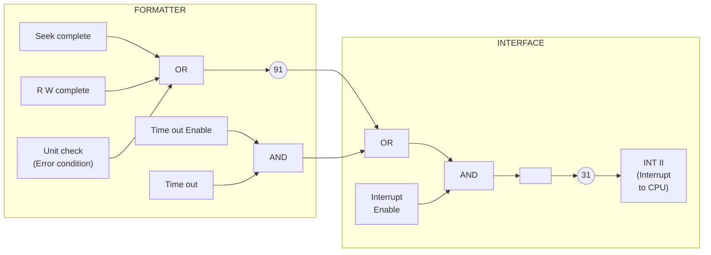

**Figure III.3.1:** *Interrupt System — Principal Operation*

ND-11.012.01

---

## Page 48

# 11-3-2

One interrupt condition — TIMEOUT — originating in the Floppy Disk Control card, enabled by WCWD bit no. 6, while the remaining interrupt conditions originate in the Formatter and enter the Floppy Disk Control card on terminal 91, labelled DINT₀. On completion of any command issued from the Interface, an INTERRUPT is generated in the Formatter. (Refer to the previous chapter, General Command Sequence.) An INTERRUPT is also generated in the Formatter if an error condition occurs (unit check) while executing a command. (The executing command is aborted.)

ND-11.012.01

---

## Page 49

# II.3.2 READING STATUS

Upon receiving an INTERRUPT and identifying the device, the CPU will read the device status to find out what happened and where (Interface, Formatter or unit).

Since the IOX \<RSR1> (Read Status Register no. 1) communicates with the Interface only it is the Interface which is responsible for maintaining fresh status information for the CPU.

This is accomplished via an automatic feature in the Interface Formatter communication. Upon reception of an INTERRUPT from the Formatter, the Interface will gate the status information from the Formatter to the Interface. The CPU will, thus, receive status information that corresponds to the INTERRUPT (refer to Figure II.3.2).

To obtain more information about an INTERRUPT sequence — a general command sequence should be studied (refer to Chapter II.2).

```mermaid
flowchart LR
    subgraph FORMATTER
        SC[SEEK COMPLETE] --> OR[O<br/>R]
        RW[R/W COMPLETE] --> OR
        UC[UNIT CHECK<br/>(Error condition)] --> OR
        FS[Status informations]
    end

    OR --> DIN((91))
    DIN --> INT

    subgraph INTERFACE
        INT[Interrupt]
        SR[STATUS<br/>REGISTER]
    end

    INT --> GSTAT((75<br/>GSTAT₀<br/>(gate status)))
    GSTAT --> FS
    GSTAT --> SR
    FS --> XFER[X-fer Bus]
    XFER --> SR
```

**Figure II.3.2:** *Gating Status*

ND-11.012.01

---

## Page 50

II-4-1

# 11.4 INTERFACE DATA ROUTES

## 11.4.1 *GENERAL DESCRIPTION*

The following discussion refers to Figure 11.4.1.

The Floppy Disk Data card communicates with the CPU on a 16 bit I/O bus labelled BD 0-15. The card also communicates with the Formatter over an 8 bits bi-directional bus labelled TBUS 0-7. All data exchanged between the Formatter (Floppy disk) and the CPU will be routed through a 1k 16 bits sequentially accessed Data Buffer.

This buffer can be used as a byte oriented memory (8 bits) or a word oriented memory (16 bits), i.e., two bytes may be accessed independently within the same buffer address by activating “CE1” or “CE2”. (A 16 bits word will be accessed by activating both.)

As mentioned above, the Data Buffer will be accessed from two sources:

- *The CPU can access this buffer through execution of an IOX <RDAT> (Read) or IOX <WDAT> (Write) instruction.*

The 16 bits word length access will always be performed from the CPU.

- *The Formatter will also access this buffer over the 8 bits X-fer bus. A READ or WRITE operation is by a DIRECTION signal issued from the Formatter.*

Eight bits data bytes will be assembled or disassembled in the Data Buffer when accessed from the Formatter.

The data exchanged between the Data Buffer and the Formatter over the X-fer bus, may be regarded as a DMA type of data transfer. The data transfer is initiated from the CPU — while an INTERRUPT from the Formatter indicates a transfer complete.

The upper part of the internal (BUS 8-15) is “connected” to the X-fer bus directly through an X-mitter/receiver circuit where “FDOUT” enables X-mition and “FDIN” enables reception.

The most significant half of the Data Buffer communicates with BUS 8-15.

ND-11.012.01

---

## Page 51

# BLOCK DIAGRAM 1118  
## (FLOPPY DISK DATA)

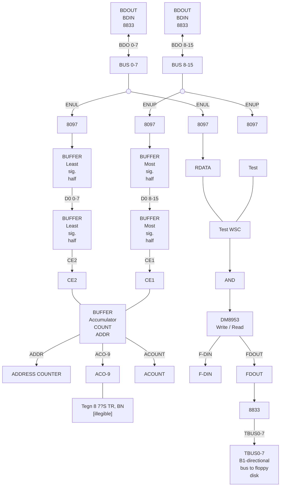

Figure 11.4.1

ND-11.012.01

---

## Page 52

# II-4-3

Data from the Formatter to the least significant half of the buffer must be enabled onto the lower internal bus (BUS 0-7) by the control signal “ENUL” before being written into the buffer.

Data to the Formatter, from the least significant part of the buffer, must be enabled onto the upper internal bus (BUS 8-15) before being enabled out to the Formatter. This is accomplished by the control signal “ENLO”.

ND-11.012.01

---

## Page 53

II-4-4

# II.4.2 *ADDRESS COUNTER*

A sequential address counter will contain the address of the next reference to be made in the Data Buffer.

Except for an *address register clear* operation, no address manipulation can be performed. As an automatic feature, the address is incremented by one for:

- *each access made from the CPU*  
  *(IOX <RDAT> or IOX <WDAT>)*

- *every second access made from the Formatter*  
  *(CE1 and CE2 will toggle to enable lower and upper bytes)*

Since the address register cannot be preset to any value (except zero by an *address counter clear* operation), all read or write should be started from address zero. It is, therefore, of importance to notice that:

- *before a READ or WRITE operation from the CPU or Formatter an “address counter clear” operation must be performed*

This is accomplished in one of four ways:

- *IOX <WCWD> with bit no. 5 specified (clear Interface buffer address)*

- *IOX <WCWD> with bit no. 4 specified (device clear)*

- *depressing the master clear button on CPU panel*

- *after buffer has been loaded with one sector of data (512 bytes) during a master clear load sequence (the start address is then prepared for the microprogram read operation)*

Refer to Figure II.4.2.

ND-11.012.01

---

## Page 54

# 11-4-5

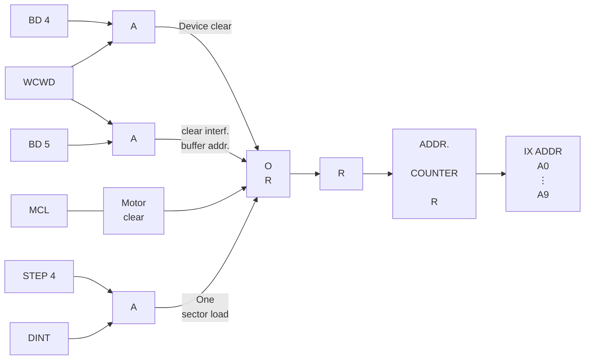

*Figure 11.4.2: Address Counter Clear Illustration*

## 11.4.2.1 Address Counting

As previously mentioned, the counter is incremented by one for each access made from the CPU and every other access made from the Formatter. For more details, refer to Sections 11.4.3 to 11.4.6.

ND-11.012.01

---

## Page 55

II—4—6

# 11.4.3 *READ DISK OPERATION*

The program sequence in which a data read operation can be performed will be discussed separately.

In this section, we will handle the control signals involved during a data transfer from the Formatter to the Interface.

The following discussion refers to Figure 11.4.1 and Figure 11.4.3.

From the selected unit, the data and clocks will alternate on one line labelled READ DATA.

In the Formatter, data and clocks will be separated (described in Section III.4). Data will be assembled into 8 bit bytes in the Formatter; transferred to a Buffer Register driving the X-fer bus. A request (TREQ<sub>0</sub>) will be sent to the Interface. Looking at the DIRECTION line (TDIR), the Interface will know if a READ or a WRITE operation is in progress. (An inactive state indicates a read operation.)

Upon receiving the request signal, the following sequence will be initiated in the Interface. (Assuming an odd byte number X-ferred.)

- *Enable X-mitter/receiver to receive data from the X-fer bus (DIN<sub>0</sub>)*

- *Chip enable 1 (CE1) will be turned on to enable the data bytes to the most significant half of the Data Buffer.*

- *after a short delay a write pulse will be sent to the Data Buffer (WRAM)*

- *as the write pulse drops, i.e., the Data Buffer has accepted the data, a GRANT (TGRANT) signal is sent back to the Formatter turning off the REQUEST (TREQ)*

Seeing the REQUEST line being dropped

- *the Interface will respond by turning off the GRANT (IGRANT) line.*

The sequence for an odd data byte has now been terminated.

ND-11.012.01

---

## Page 56

# Figure 11-4-7

## Read Disk Operation  
*(2 bytes transfer illustration)*

[Timing diagram: formatter/interface interrupt-controller timing waveforms and transfer-direction connections.]

| Signal | Pin |
|---|---:|
| PREQ0 | 95 |
| TGRANT0 | 87 |
| GRANT1 |  |
| TDIRO | 93 |
| DIO1 |  |
| DUT0 | 73 |
| DIN0 | 72 |
| WRAM0 | 60 |
| CE20 | 61 |
| CE10 | 62 |
| ACOUNT | 70 |
| ENLO |  |
| ENUC |  |

```text
                 Interface (Interrupt Controller Timing)

      <---------------------- 2 us ---------------------->

Request with data from Formatter
Interface has accepted the data
Denotes transfer direction (Formatter Interface)
Internal enable signal
Enable data byte from Formatter to Interface
Write pulse to Interface data buffer
Enable least significant half of buffer
Enable most significant half of buffer
Increment "buffer address counter." (pos edge)
Enable bus 0-7

1st byte transferred
(even no. data transfer)

2nd byte transferred
(odd no. data transfer)
```

ND-11.012.01

---

## Page 57

# II-4-8

After approximately 32μs, the second or odd data byte is ready for transfer and the following sequence will be followed:

- *Enable X-mitter/receivers to receive data from the X-fer bus (DIN)*

- *Enabled Bus 8-15 (ENUL) onto Bus 0-7*

- *Chip selection will be toggled to turn on CE2 to enable the data into the least significant half of the Data Buffer*

- *after a short delay, a write pulse (WRAM) will be sent to the Data Buffer*

- *as the write pulse drops, i.e., Data Buffer has accepted the data, a GRANT (TGRANT) signal is sent back to the Formatter turning off the request (TREQ)*

Seeing the request line being dropped, the Interface will:

- *increment the Buffer Address Counter (ACOUNT)*

- *drop the GRANT (TGRANT) line*

The above described sequences will be repeated until one sector (512 bytes) of data is transferred.

In the Data Buffer, the 512 data bytes are packed into 256 CPU words. When the READ operation is completed, an INTERRUPT is given to the CPU. By analyzing the status word the CPU should know the Buffer Address Counter and commence reading the Data Buffer by means of IOX \<RDAT> instructions.

ND-11.012.01

---

## Page 58

11-4-9

# II.4.4 WRITE DISK OPERATION

In this section, we will take a closer look at the control signals involved during a data transfer from the Interface to the Formatter. Refer to the Figure II.4.4 and Figure II.4.1 for the following discussion.

Data written on the diskette must, prior to a write operation, be placed in the Data Buffer.

However, this operation should start with a *Buffer Address Counter Clear* operation (WCWD bit no. 4 or WCWD bit no 5).

Data from the CPU will, by executing IOX <WDAT> (refer to Section II.4.5) be put into the Data Buffer in sequential order starting with address zero.

The operation should be appended with a *Buffer Address Counter Clear* operation.

The actual unit will be prepared for a write operation.

Before the R/W head approaches the actual *data field*, the first data byte to be written on the diskette must be ready in a disassembly register in the Formatter. Prior to this, a request (TREQ) for the first data byte must have been issued from the Formatter. Since a WRITE operation is in progress, the DIRECTION line (TDIR) will be activated by the Formatter.

Receiving the REQUEST, the Interface will start the following sequence:

- *enable X-mitter/receivers to transmit data onto the X-fer bus (DUT)*

- *chip enable 1 will be turned on to enable data from the most significant half of the Data Buffer*

- *the write line (WRAM) is inactive, performing a read operation from the Data Buffer*

- *as a certain amount of time has elapsed, a GRANT (TGRANT) signal is sent back to the Formatter, indicating that a data byte is placed on the X-fer bus*

- *sensing the GRANT signal, the Formatter will pick up the first data byte and put it into the Data Write Register*

- *the Data Write Register will be copied into a Disassembling Register*

ND-11.012.01

---

## Page 59

# Interface Formatter Control Timing

```text
                         <-------------------- 2 µs -------------------->

   [illegible] 95   ____/‾‾‾‾‾‾\____________________________________________
   [illegible] 87   ________/‾‾‾‾\__________________________________________
   GRAM
   TDB 93           _____________/‾‾‾‾‾‾\___________________________________
   DIO [illegible]  ______________________/‾‾‾‾\____________________________
   DUT 73           ___________________________/‾‾‾‾\_______________________
   DIN 72           ________________________________/‾‾‾‾\__________________
   WRR 60           ______________________________________/‾‾‾‾\___________
   CE 61            ____________________________________________/‾‾‾‾\_____
   CE 62            ______________________________________________/‾‾‾‾\___
   [illegible] 70   __________________________________________________/‾‾‾
   ENLG             ________________________________________________________
   ENABLE
   [illegible]

   Request for [illegible] from Formatter

   Strobes data into Format "Write data register".

   Denotes transfer direction (Interface Formatter)

   Internal enable signal.

   Enable data byte onto X-fer bus (to Formatter)     =4-10

   Enable most significant half of buffer
   increment "Buffer Address Counter".

   Enable DO 0-7 onto Bus 8-15


   <--- Data byte transferred --->      <--- Data byte transferred --->
        (lower byte)                         (upper byte)
        or even byte nos.                    or odd byte nos.
```

**Figure 11.4.4: Write Disk Operation**  
*(2 bytes transfer illustration)*

ND-11.012.01

---

## Page 60

# II-4-11

As the R/W heads move into the pre-requested data field (predefined part of the addresses sector) the data bits will start shifting out.

The data bits will be encoded with clock pulses and sent to the unit as WRITE DATA.

At this point in time, a new request will be made for the second byte.

The following will describe the sequence of events.

- *enable the X-mitter/receiver to transmit data onto the X-fer bus (DUT)*

- *enable Bus 0-7 onto Bus 8-15 (ENLO)*

- *chip selection will be toggled to turn on CE2 to enable the data from the least significant half of the Data Buffer*

- *the write line (WRAM) is inactive, performing a READ operation from the Data Buffer*

- *as a certain amount of time has elapsed, a GRANT (TGRANT) signal is sent back to the Formatter indicating that a data byte has been placed on the X-fer bus*

- *sensing the grant signal, the Formatter will pick up the data byte and put it into a Data Write Register and turn off the REQUEST line.*

Seeing the REQUEST line being dropped, the Interface will

- *increment the Buffer Address Counter (ACOUNT)*

- *drop the GRANT (TGRANT) line*

As the first data byte is shifted out to the unit, the disassembly register will be loaded in parallel from the Data Write Register and a new REQUEST will be issued. (The Data Write Register will, thus, function as a one byte buffer in the Formatter).

The above described sequence will be repeated until one sector is written on the diskette (512 bytes) and no more requests will be made.

As the write operation is finished an INTERRUPT is sent to the CPU to indicate termination of the requested operation (refer to Figure II.3.1).

ND-11.012.01

---

## Page 61

# II—4—12

## II.4.5 *WRITE DATA BUFFER*

Prior to a write disk operation (data flow from the Data Buffer located in the Interface to the Formatter) the Data Buffer must be loaded with data. This is accomplished using IOX `<WDAT>` instructions. The data flow is illustrated in Figure II.4.5.

The sequence of control is described below. Refer to Timing Chart II.4.6.

- IOXE timing signal received from CPU

- the transmitter/receivers are enabled to read data  
  from the I/O bus (BDOUT)

- after a short delay, a delayed CONNECT is sent  
  back to the CPU indicating an active transfer  
  (DLCON)

- both the least and most significant parts of Data  
  Buffer are constantly enabled (CE1 and CE2)

- when the data on the bus is assumed to be stable,  
  a data write pulse is generated to the Data Buffer. A  
  16 bits data word is placed in the buffer

When the IOXE signal from the CPU drops the:

- delayed connect (DLCON) signal drops

  *and*

- the write pulse drops

A small delay is introduced before

- disabling the receiver function

to guarantee stable data during the entire write pulse period.

- the Buffer Address Counter will be incremented  
  (ACOUNT)

when a WRITE Data Buffer sequence is terminated.

ND-11.012.01

---

## Page 62

# Figure II.4.5. Write Data Buffer

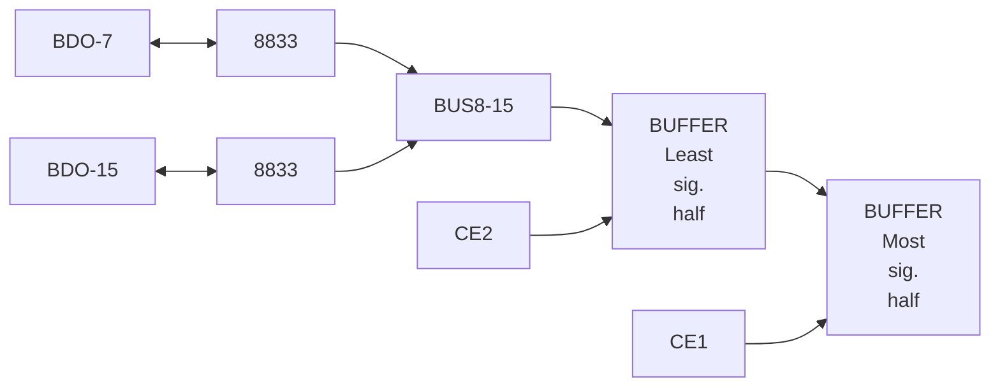

II-4-13

ND-11.012.01

---

## Page 63

# II-4-14

| Signal | Description |
|---|---|
| IOXE₀ | IOX timing signal from CPU |
| DEQL₁ - BAO₁ | Output "register" is accessed |
| DICON₁ | Programmed device output active |
| BDOUT₀ | Enable BD onto interface |
| CEE₀<br>CE₂₀ | Enable least sign. and most sign. half of buffer |
| WDAT₀ | IOX WDAT active |
| ACOUNT₀ | Increment Buffer address counter |

```text
IOXE0       ____________|‾‾‾‾‾‾‾‾‾‾‾‾‾‾‾‾‾‾‾‾‾‾‾‾‾‾‾‾‾‾‾‾
                         ↑

DEQL1-BAO1  ____________|‾‾‾‾‾‾‾\______/‾‾‾‾‾‾‾‾‾‾‾‾‾‾‾
                            ↑

DICON1      ________________|‾‾‾‾‾‾‾‾‾‾‾‾‾‾‾‾‾‾‾‾‾‾‾‾‾‾
                           (100-500 ns)

BDOUT0      _______________________|‾‾‾‾‾‾‾‾‾‾‾‾‾‾\______
                                  56

CEE0        _______________________________|‾‾‾‾‾‾‾|_______
                                              61
CE20        _______________________________|‾‾‾‾‾‾‾|_______
                                              62
                                              ACTIVATE STATE

WDAT0       _______________________________________|‾‾‾‾‾‾\__
                                                   ↑

ACOUNT0     ______________________________________________|‾‾
                                                          70
                                                          ↑
```

# Figure II.4.6: Write Data Buffer — Timing Diagram

ND-11.012.01

---

## Page 64

# II.4.6 *READ DATA BUFFER*

After a read disk operation (data flow from the Formatter to the Data Buffer located in the Interface), the Data Buffer holds one sector of data equivalent to 512 bytes packed into 256 CPU words.

This Data Buffer will be transferred to the CPU by means of IOX \<RDAT\> instructions.

The data flow is illustrated in Figure II.4.7.

The sequence of control is described below. Refer to Timing Chart II.4.8 throughout the following discussion.

- *IOXE timing signal received from the CPU*

- *connect signal (CON) sent to the CPU to indicate an active transfer*

- *input signal (INP) generated to prepare for an input data transfer*

- *both least significant and most significant parts of Data Buffer are constantly enabled (CE1 and CE2)*

- *the output of the least significant half of the Data Buffer DO 0-7 is enabled onto the internal bus, BUS 0-7 (RDAT)*

- *the output of the most significant half of the Data Buffer DO 8-15 is enabled onto the internal bus, BUS 8-15 (ENUP)*

- *after a short delay, the internal data bus, BUS 0-15, is enabled onto the I/O bus (BDIN)*

When the IOXE signal drops from the CPU

- *the connect signal drops (CON)*

- *the input signal drops (INP)*

- *disable least (RDAT) and most (ENUP) significant bytes from Buffer onto internal bus*

After a short delay

- *disable the internal bus from the I/O bus (BDIN)*

- *the buffer address counter will be incremented (ACOUNT)*

The above sequence will be repeated until the Data Buffer is transferred.

ND-11.012.01

---

## Page 65

# II-4-16

## Figure II.4.7

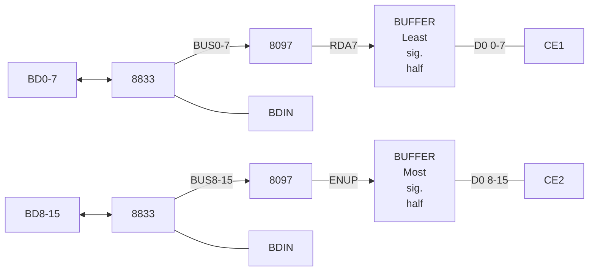

ND-11.012.01

---

## Page 66

# READ DATA BUFFER (IOX \< RDATA T\>) TIMING DIAGRAM

11-4-17

| Signal | Description |
|---|---|
| IOXE0 | IOX timing signal from CPU |
| INCON1 | CON1 (23) |
| DLYINP1 | INP1 (15) Programmed device input (IOX) active. |
| BIN0 | Delayed programmed device input (IOX) active. |
| CE10 | Enable data ONTO BID |
| CE20 | ENABLE least sign and Most sign half of buffer |
| RDATA0 | IOX RDATA ACTIVE |
| ENUP0 | Enable DO 8-15 onto Bus 8-15 |
| ACCOUNT0 | Increment Buffer Address Counter |

```text
 IOXE0      ____/‾‾‾‾‾‾‾‾‾‾‾‾‾‾‾‾‾‾‾‾‾‾‾‾‾‾‾‾‾‾‾‾‾
                 \____________________________________________

 INCON1     ____________/‾‾‾‾‾‾‾‾‾‾‾‾‾‾‾‾‾‾‾‾‾‾‾‾‾‾
                         \____________________________________

 DLYINP1    ________________/‾‾‾‾‾‾‾‾‾‾‾‾‾‾‾‾‾‾‾‾‾
                       (100 ns)
                            \_________________________________

 BIN0       ____________________/‾‾‾‾‾‾‾‾‾‾‾‾‾‾‾‾
                                  \___________________________

 CE10       ______________________________/‾‾‾‾‾‾‾‾
                                          \____________________

 CE20       __________________________________/‾‾‾‾‾
                                                \______________

 RDATA0     ______________________________________/‾‾‾‾‾‾‾‾
                                                  \____________

 ENUP0      __________________________________________/‾‾‾‾
                                                    \__________

 ACCOUNT0   ______________________________________________/‾‾
                                                      \_______

                         (57)     (61)  (62)                 (70)
```

## Figure II.4.8: Read Data Buffer — Timing Diagram

ND-11.012.01

---

## Page 67

II—5—1

# II.5 PROGRAMMED NONDATA OUTPUT/INPUT

## II.5.1 GENERAL

By non-data input/output we mean the flow of nondata information to/from CPU, i.e., information flow necessary to operate the system.

## II.5.2 NONDATA OUTPUT

In this section, we will discuss programmed output, excluding

- *IOX \<WDAT\> Write Data*

  and

- *IOX \<WSCT\> Write Test Byte*

which are discussed in Section II.4.5 and II.6.1 respectively.

What then remains for this discussion is

- *IOX \<WCWD\> Write Control Word*

  *IOX \<WDAD\> Write Drive Address or Write Difference*

  and

- *IOX \<WSCT\> Write Sector*

The general data flow is illustrated in Figure II.5.1.

Except for the Control Word, the data must be held in the upper byte which is transmitted directly to the Formatter. (Refer also to Section I.4.)

The timing chart in Figure II.5.2 shows the active control signals in the correct time perspective.

ND-11.012.01

---

## Page 68

# II-5-2

```mermaid
flowchart LR
    BD07["BD 0 - 7"] --> A[""]
    BDO1["BDOUT"] --> A
    A --> BUS07["Bus 0 - 7"]
    BUS07 --> C["Control"]
    WCWO["WCWO"] --> C

    BD815["BD - 8 - 15"] --> D[""]
    BDO2["BDOUT"] --> D
    D --> BUS815["BUS 8 - 15"]
    BUS815 --> E[""]
    E --> TBUS["TBUS 0 - 7"]
    FDOUT["FDOUT"] --> E
```

**Figure II.5.1: _Nondata Output — Data Flow_**

```text
IOXE
  0        _________                 ____________________________________________ )
          |         |_______________|                                            )  IOX timing signal from CPU
          |_________|               |

(DEOL      · BAO   )
     1          1     1
          ________________________________                                      )  Output register will be accessed
          |                              |
          |______________________________|

DLCON
     1    ________________________________                                      )  Programmed device output active
          |       100-150                |
          |          ns                  |
          |______________________________|

BDOUT       56
     0    ________________________________                                      )  Enable BD onto interface
          |                              |
          |______________________________|

FDOUT
     0    ________________________________                                      )  Enable commands to X-fer bus (Formatter)
          |                              |
          |______________________________|
```

**Figure II.5.2: _Programmed Output (IOX) Timing_**

ND-11.012.01

---

## Page 69

# II-5-3

## II.5.2.1 IOX \<WCWD> Write Control Word

The IOX \<WCWD> will generate an LCOM pulse that will strobe the TBUS into the Command Register located in the formatter. For bit assignment, refer to Section I.4 - Programming Specifications and/or Section II.1 - The Interface Signals.

As described in Figure II.5.3, the lower bits transmitted from the A register will be used locally in the Interface to set up different control functions.

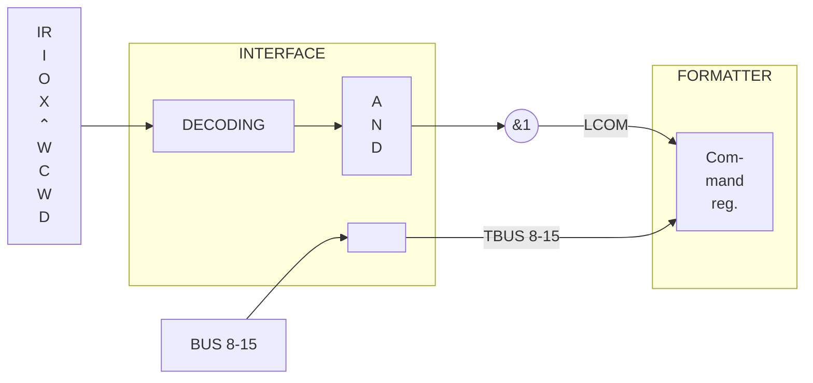

**Figure II.5.4:** *IOX \<WCWD> — Data Flow*

ND-11.012.01

---

## Page 70

# II.5.2.2 I/OX <WDAD> Write Drive Address

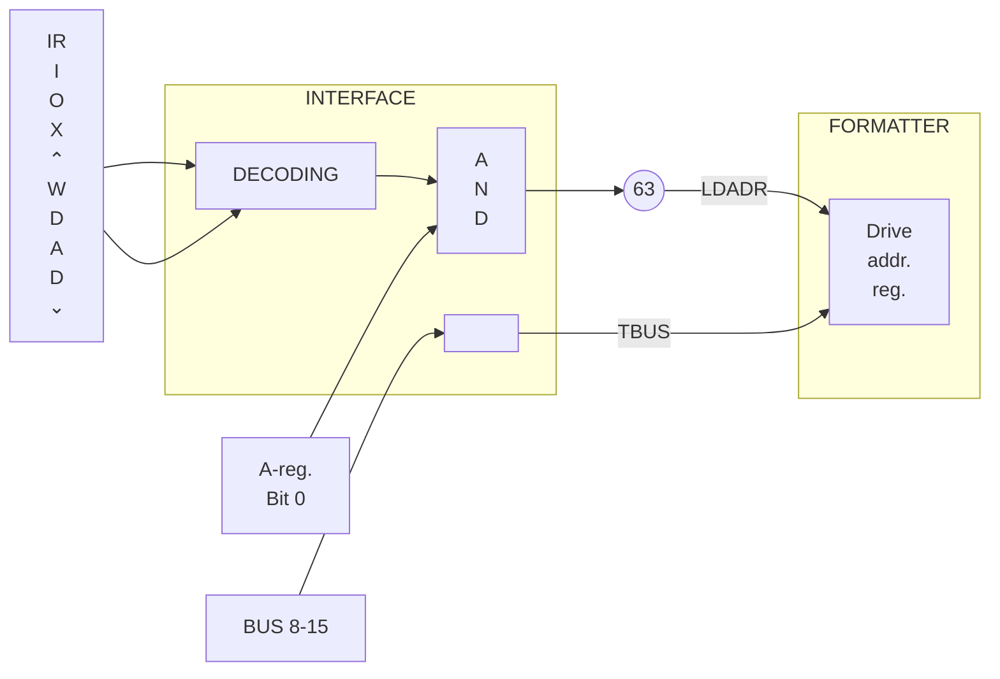

**Figure II.5.4:** *I/OX <WDAD> - Data Flow*

As illustrated above, Load Drive Address (unit and format selection) will be performed by executing IOX <WDAD> with A register bit 0 = 1.

ND-11.012.01

---

## Page 71

# II–5–5

## 11.5.2.3 IOX \<WDAD\> Write Difference

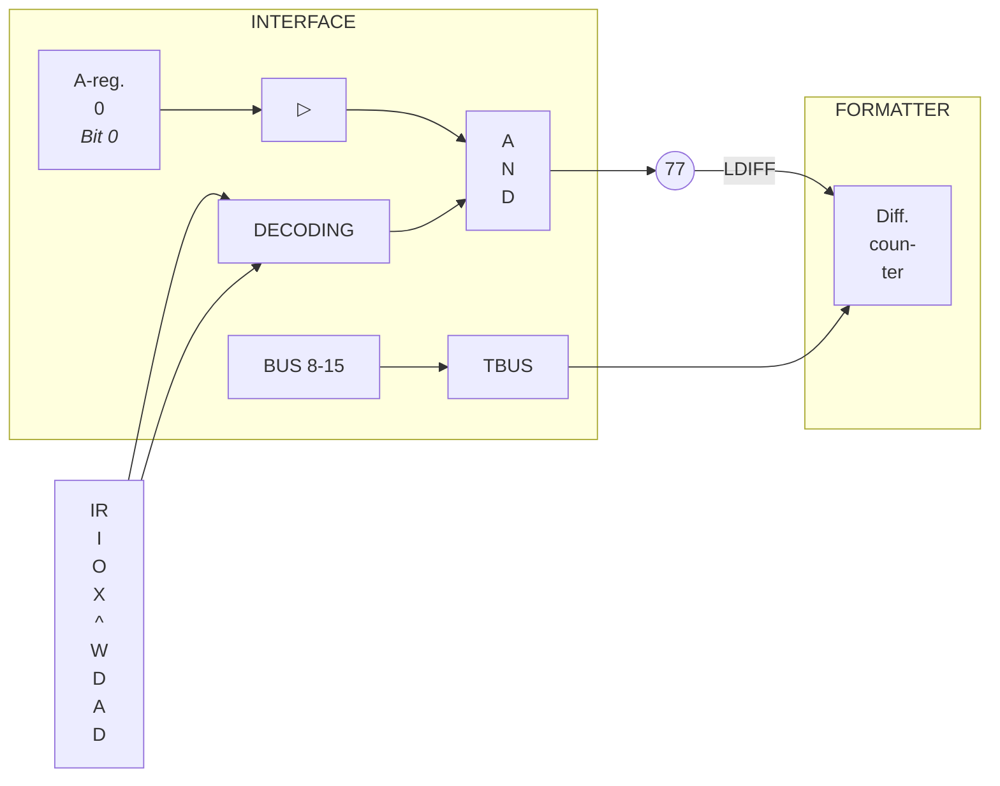

**Figure 11.5.5:** *IOX \<WDAD\> – Data Flow*

As illustrated above, “tracks to go” will be put into the Difference Counter by executing an IOX \<WDAD\> instruction with bit 0 of the A register = 0 and the upper byte of the A register holding the difference.

ND-11.012.01

---

## Page 72

# II.5.2.4 IOX \<WSCT> Write Sector

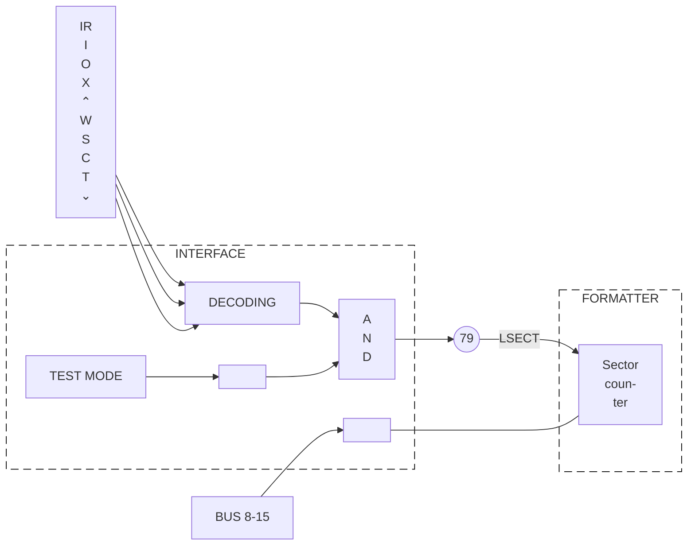

**Figure II.5.6:** *IOX \<WSCT>—Data Flow*

When an IOX \<WSCT> is executed and the Interface is *not* in test mode, the Sector Counter in the Formatter will be loaded with the upper byte of the A register.

ND-11.012.01

---

## Page 73

# II.5.3 NONDATA INPUT

In this section, we will discuss programmed input excluding

- *IOX \<RDAT\>* Read Data

and

- *IOX \<RTST\>* Read Test

which are discussed in Section II.4.6 and II.6 respectively.

To be discussed here are:

- *IOX \<RSR1\>* Read Status Register No. 1
- *IOX \<RSR2\>* Read Status Register No. 2

Figure II.5.7 will illustrate the major control signals in a time perspective.

```text
IOXE₀                         ______________________________________
                             |                                      |
                             |                                      |     IOX timing signal
                             |                                      |     from CPU
                             |                                      |
                             |                                      |
                             |                                      |
                             |                                      |
                             |______________________________________|

(DEQL₁
 BAD₀)₁                      ______________________________________
CON₀                         |                                      |     Input register will
                             |                                      |     be accessed
                             |                                      |
                             |______________________________________|     Programmed device
                                                                            input active

Iup₀          _______________                                        ______
                             |                                      |
                             |                                      |           Prepare for input
                             |______________________________________|           data transfer

*BDIN₀        ________________________________          _____________________
57                                            \________/                     Enable data (status)
                                                                             from X-fer bus onto
                                                                             Bus 8-15

*FDIN₀        ________________________________          _____________________
                                             \________/
```

**Figure II.5.7:** *Programmed Input (IOX) Timing*

ND-11.012.01

---

## Page 74

# 11.5.3.1 IOX \<RSR1> Read Status Register No. 1

```mermaid
flowchart TB
    subgraph INTERFACE
        direction TB

        IOX["IOX<br/>START"] --> DEC["DECODING"]
        IOX --> DEC
        DEC -->|RSR1| BD07["BD 0-7"]

        DINT["DINT (Interrupt)"] --> N91(("91"))
        N91 --> OR["O<br/>R"]
        OR --> OUT1[""]
        N91 --> LOGIC["[illegible]"]
        LOGIC --> N75(("75"))
        N75 -->|GSTAT| GSTAT[""]

        BD07 --> REG1[""]
        BD07 -->|BD 4-7| TSR["Temporary<br/>status<br/>reg."]
        REG1 -->|BD 1-3| BD815["BUS 8-15"]
        TSR --> BD815
        BD07 -->|BD 8| BD815
        BD815 --> BD815OUT["BD 8-15"]

        BD815OUT --> REG2[""]
        REG2 -->|BD 9-11| BD815OUT
    end

    subgraph FORMATTER
        direction TB

        DINT
        GSTAT

        BUS07["BUS 0-7"] --> BUF1[""]
        BUF1 --> BD07

        STAT["Status byte"] --> TBUS["TBUS 0-7"]
        TBUS --> BUF2[""]
        FDIN["FDIN"] --> BUF2
        BUF2 --> BD815

        GSTAT --> STAT
    end
```

Figure 11.5.8: IOX \<RSR1> — Data Flow

ND-11.012.01

---

## Page 75

II-5-9

Upon reception of INTERRUPT, the CPU will issue an IOX <RSR1> to gain information about the “interrupt source”.

As a hardware feature, the Interface will, upon reception of an INTERRUPT from the Formatter, ask the Formatter to present the Status Byte (GSTAT). The status byte (4 bits of significance) will be loaded into a Temporary Status Register. (Refer also to Section II.2 - General Command Sequence.) Decoding of IOX <RSR1> will enable the Temporary Status Register together with some other status indicators onto BD (I/O bus) directly.

# II.5.3.2 IOX <RSR2> *Status Register No. 2*

Finding bit 4 (inclusive OR of bits in Status Register No. 2, i.e., sense register) set in Status Register No. 1, the CPU will execute an IOX <RSR2> to gain information about the error condition. Figure II.5.9 will explain.

The sense byte will be presented for the CPU in the upper byte. Refer to Section I.4 and Section II.1 for bit assignment.

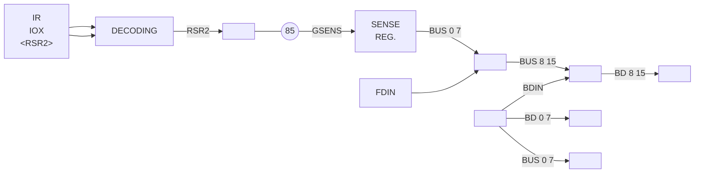

**Figure II.5.9:** *IOX <RSR2> – Data Flow*

ND-11.012.01

---

## Page 76

II-6-1

# 11.6 TEST MODE

Involved in the test modes are:

- *IOX \<WCWD\>* Write Control Word
- *IOX \<WSCT\>* Write Test Byte
- *IOX \<RTST\>* Read Test Data

Refer to Section 1.4 for the above operations.

The purpose of the test mode is to simulate a data transfer between the Formatter and the Interface. From studying a Read Disk Operation, we know that all data from the Formatter will be routed through the Data Buffer. The same data routes will also be used in test mode.

The Interface will be put into test mode by executing:

```text
SAA 10
IOX <WCWD>
```

By executing IOX \<RTST\> (Read Test) a predefined byte (refer to Section 11.6.1) will be put onto the internal bus and written into the Data Buffer, i.e., no data will be moved into the A register during this operation.

By executing a number of IOX \<RTST\> instructions, the test bytes will be packed into the Data Buffer, i.e., the test byte will alternatively be written into the most and then the least significant position of the Data Buffer.

Being in test mode, the Interface will:

- *force the DIRECTION signal inactive, i.e., simulate a disk read operation*
- *disable Transmitters for I/O bus (disable FDIN)*
- *disable receivers from the X-fer bus (disable DIN)*
- *set the Busy FF to enable for toggling of CE1 and CE2*
- *disable the GRANT signal*
- *enable for reading or writing the “test byte” on/off BUS 8-15.*

ND-11.012.01

---

## Page 77

# II-6-2

The data flow is illustrated below:

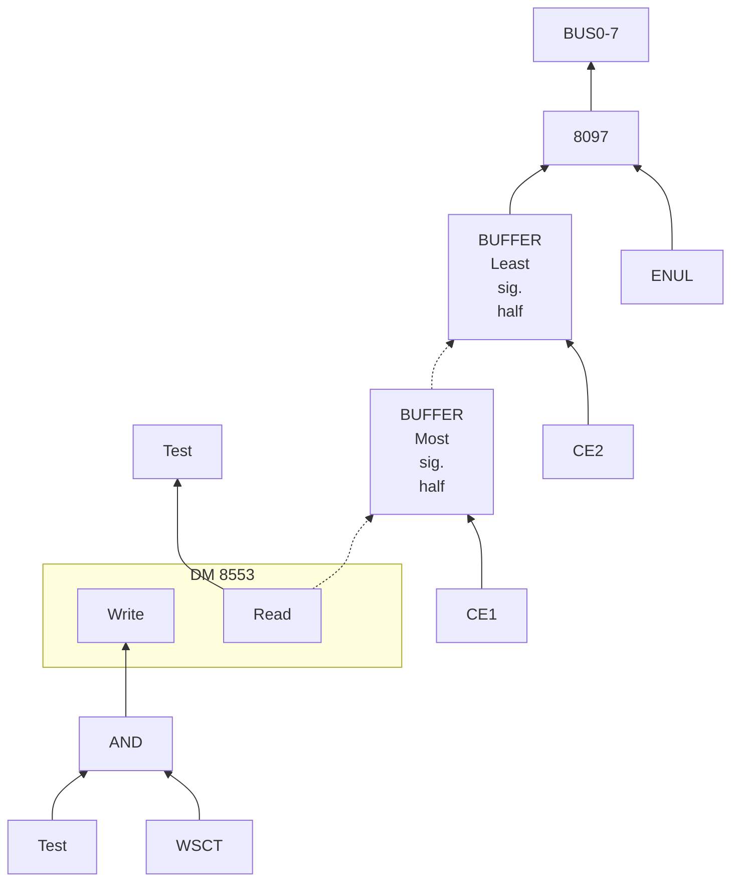

**Figure II.6.1:** *Read Test Data — Data Flow*

ND-11.012.01

---

## Page 78

II-6-3

As depicted in Figure II.6.3, execution of IOX \<RTST> instructions are a combination of Read Disk Operation and IOX \<RDAT> operations with the above described inhibitations.

*Note:  No data will be sent to the CPU.*

# II.6.1 SELECTING THE TEST BYTE

The test byte written into the Data Buffer, by executing the IOX \<RTST> can be selected, as desired, by setting up the test byte in the upper byte of the A register and executing an IOX \<WSCT>.

Data flow is indicated in Figure II.6.2.

```mermaid
flowchart LR
    BOUT[BOUT] --- C8833["8833"]
    BD["BD8 15"] --> C8833
    C8833 --- BDIN[BDIN]

    C8833 --> BUS["BUS 8 -15"]
    BUS --> DM["DM 8553<br/>Write        Read"]
    DM --- READ[""]

    TEST[Test] --- AND[AND]
    WSCT[WSCT] --- AND
    AND --> DM
```

**Figure II.6.2:** *Write Test Byte — Data Flow*

ND-11.012.01

---

## Page 79

# 11-6-4

```text
IOX timing signal from CPU
Input register will be accessed
Programmed device input active
Prepare for input data transfer
(dummy)
Artificial request generated in
test mode
Denotes read transfer
Internal enable signal
Write pulse to Interface data
buffer
Enable least significant half
of buffer
Enable most significant half
of buffer
Increment buffer address counter
(pos. edge)


IOXE₀    ────────┐       ┌───────────────────────────────────────────────┐       ┌────
                 └───────┘                                               └───────┘

INCON₁   ────────────────┐       ┌───────────────────────────────────────────────
                          └───────┘

CON₀     ────────────────────┐       ┌───────────────────────────────────────────
                              └───────┘

INP₀     ────────────────────────┐       ┌───────────────────────────────────────
                                  └───────┘

BDIN₀    ────────────────────────────────────────────────────────────────────────

EDIN₀    ────────────────────────────────────────────────────────────────────────

REQ·1    ────────────────────────────────╭──────────────╮────────────────────────
                                         ╰──────────────╯

TGRANT₀  ────────────────────────────────────────────────────────────────────────

TDR₀     ────────────────────────────────────────────────────────────────────────

DIR₁     ────────────────────────────────────────●───────────────────────────────

WRAM₀    ───────────────────────────────╭───○───╮────────────────────────────────
                                        ╰───○───╯

CE2₀     ────────────────────────────────────────────────┐       ┌────────────────
                                                           └───────┘

CE1₀     ────────────────────────────────────────────────────┐       ┌────────────
                                                               └───────┘

ACOUNT₀  ────────────────────────────────────────────────────────────┐       ┌───
                                                                       └───────┘

ENUL₀    ────────────────────────────────────────────────────────────────────────
```

# Figure 11.6.3: IOX \<RTST\> Timing Diagram (Test Mode active)

*(Execution of two IOX \<RTST\> instructions illustrated)*

[illegible]

---

## Page 80

II-7-1

# 11.7 MASTER CLEAR — AUTOLOAD

## 11.7.1 *GENERAL*

The Floppy Disk is to be considered as a Master Storage Device. Normally, such a device would be handled by a DMA interface, however, due to cost, access time and type of usage considerations, a PIO interface has been chosen. A load must, thus, conform to the program specifications for a teletype or paper tape reader.

However, in order to do a load operation from a Floppy Disk, a sequence of commands must be issued. Since the microprogram performing the load operation does not handle such a sequence, the microprogram will start operating on the data after they have been put into the Data Buffer. An automatic command sequence generator triggered off by WCWD<sub>0</sub> and B#2 handles the task. A load operation is then divided into two parts.

When the load m-program is started it issues a standard activate device command (bit 2 in control word). This is used to initiate autoload sequence. Bit 2 in the control word MUST NOT be used by standard software.

*Load*

*will initiate the load sequence which will move the data from the Data Buffer into main memory. (Illustrated in Figure II.7.1.)*

ND-11.012.01

---

## Page 81

# II–7–2

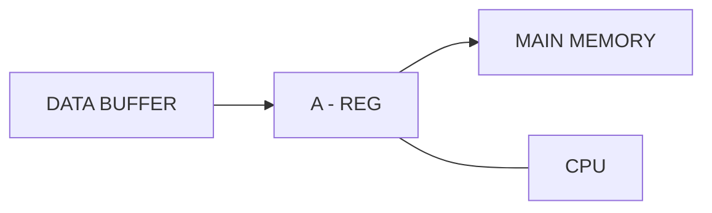

```text
REGISTER
+--------------------------------------------------+
|                                                  |
|          +-----------+    +---------+  +------+  |
|          | MASTER    |    | RESTART |  | LOAD |  |
|          | CLEAR     |    |         |  |      |  |
|          +-----------+    +---------+  +------+  |
|                                          ^       |
|                                      [hand]      |
+--------------------------------------------------+
```

Figure 11.7.1: *Load-Data Flow*

ND-11.012.01

---

## Page 82

# II-7-3

The microprogram initiated by the “load” will not start moving data until it senses the Ready Bit (Status Bit I No. 3). This bit will not be true until one sector of data has been read off the diskette and put into the Data Buffer.

We will, in the following, describe the hardware sequence initiated by WCWD, Bit No. 2.

ND-11.012.01

---

## Page 83

II-7-4

# II.7.2 *AUTOLOAD SEQUENCE*

## II.7.2.1 *General*

BD2 of WCWD<sub>0</sub> will initiate a hardware sequence that reads sector no. 1 on track 0 and transfers the data to the Data Buffer.

The following commands must be presented for the Formatter in the sequence indicated:

- select Drive No. 0 and Sector Format

- recalibrate (reposition the heads to track no. 0)

- specify sector no. 1

- send read command

At the terminal point of the read operation, an INTERRUPT will be sent to the Interface. A Buffer Address Counter Clear will be performed and the ready flag set (Status I bit no. 3).

The microprogram initiated by the LOAD may now start moving the data.

## II.7.2.2 *Detailed Description*

As indicated above, several commands must be issued from the Interface during the “autoload sequence”.

```mermaid
flowchart LR
    IN["WCWD₀<br/>&amp; BO2₀"] --> CSN["COMMAND<br/>SEQUENCING<br/>NETWORK<br/><br/>┌────────┐<br/>│ Step   │<br/>│ Coun-  │<br/>│ ter    │<br/>└────────┘"]
    DINT["DINT"] --> CSN
    CSN --> CG["COMMANDS<br/>GENERATOR"]
    CSN -->|EN| GATE[""]
    CG --> GATE
    GATE --> BUS["BUS 8-15"]
    BUS <--> TBUS["TBUS 0-7"]
    CSN -->|FDOUT| TBUS
    CSN -->|"“LADR” (Load address)"| LADR[""]
    CSN -->|"“LCOM” (Load command)"| LCOM[""]
    CSN -->|"“LSEC” (Load sector)"| LSEC[""]
```

**Figure II.7.2:** *Autoload Illustration*

ND.11.012.01

---

## Page 84

# 11-7-5

As depicted in Figure 11.7.2, a command sequencing network is realized on the control card (1111). This network is responsible for issuing the different commands in the proper order with the correct time perspective. The Command Generator will enable the different command arguments onto the bus.

```text
LDCLK₀              ________        ___________________________________
                          \________/
                           ↓        ↓                         Autoload sequence step pulses
                                   |
                                   |
Puls₁              __________________   ________  _____________________
                                      \_/ 300-400 \
                                           μs       \                  Origin for DLYPuls
                                           ↓
                                           |
DLYPuls₁           ________________________   ______  __________________
                                           \_/      \_/                  Pulse used to activate command lines
                                             ↓        ↓
                                             |        |
EN₀                __________________________\________/________________
                                                                      Enable commands onto X-fer bus during autoload
                                              ↓        ↓
                                              |        |
Command strobe    ____________________________  ______  ________________
(LDADR₀                                      \_/      \_/
 LCOM₀
 LSECT₀)                                                               Command strobe
FDOUT              ________________________________  __________________
                                                \______/
                                                                      Enable commands onto X-fer bus
```

## Figure 11.7.3: *General Autoload Command Timing*

The sequence depicted in Figure 11.7.3 will be run through for each command sent to the Formatter. When “LDCLK” goes off a “DLYPULS” will activate the command lines (one for each run-through) and the “EN” will enable the command argument onto the bus. (Refer to Figure 11.5.1.) The “FDOUT” generated from “EN” will drive the internal bus onto the X-fer bus.

A step counter located in the Command Sequence Network will allow repetition of the above generally described sequence until the last step is reached (LDFIN). For study of the complete sequence, refer to the timing chart labelled “Autoload Sequence — When Disk is Ready”, Figure 11.7.4.

ND-11.012.01

---

## Page 85

# 11-7-6

## Figure 11-7-4: Lead Sequence — When Data Ready

```text
                                                                 Close from CPU (not shown)
                                                                 Start of autoload sequence
                                                                 Autoload sequence stop pulse
                                                                 Pulse used to [illegible] commence [illegible]
                                                                 First stop of autoload sequence
                                                                 Load [illegible] stage
                                                                 Check for possible interrupt from [illegible]
                                                                 Interrupt from Formatter
                                                                 2nd stop of autoload sequence
                                                                 Load Command [illegible]
                                                                 3rd stop of autoload sequence
                                                                 Load master status
                                                                 4th stop of autoload sequence
                                                                 5th stop of autoload sequence
                                                                 Autoload sequence finished
                                                                 Clear buffer address counter


      |      |      |      |      |      |      |      |      |      |      |      |      |
      |      |      |      |      |      |      |      |      |      |      |      |      |
      |      |      |      |      |      |      |      |      |      |      |      |      |
      |      |      |      |      |      |      |      |      |      |      |      |      |
      |      |      |      |      |      |      |      |      |      |      |      |      |
   ---+------+------( )-----+------+------( )-----+------+------( )-----+------+------( )---
      |       \             /        \             /        \             /        \      |
      |        \___________/          \___________/          \___________/          \_____|
      |                                                                              |
   ---+-------------------------( )-------------------------( )--------------------+---
      |                  \_____________________/ \_____________________/            |
      |                                                                              |
      |       _________________________________                                    |
      |______/                                 \___________________________________|
      |                                                                              |
   ---+------( )-----+------( )-----+------( )-----+------( )-----+------( )------+---
      |       \     /        \     /        \     /        \     /        \     /   |
      |        \___/          \___/          \___/          \___/          \___/    |
      |                                                                              |
      |______________________________________________________________________________|
      |                                                                              |
      |      |      |      |      |      |      |      |      |      |      |      |
      |      |      |      |      |      |      |      |      |      |      |      |


 [illegible]     [illegible]     [illegible]     [illegible]     [illegible]
 [illegible]     [illegible]     [illegible]     [illegible]     [illegible]
 [illegible]     [illegible]     [illegible]     [illegible]     [illegible]
```

**NOTE 1:** Interrupt timing is adequate for the operation and examination condition.

ND-11.012.01

---

## Page 86

# II-7-7

Sending IOX `<WCWD>` with B02 set starts off the sequence, i.e., generates the first “LDCLK”. “STEP₀”, the first step in the autoload sequence, will be entered.

During this step, a “LDADR” (load address strobe) will be generated.

| Step no. | Command strobe | X-fer bus 7 | 6 | 5 | 4 | 3 | 2 | 1 | 0 | |
|---:|---|---:|---:|---:|---:|---:|---:|---:|---:|---|
| 0 | LDADR | 1 | 1 | 0 | 0 | 0 | 0 | 0 | 0 | Select drive no 0 and format |
| 1 | LCOM | 0 | 1 | 0 | 0 | 0 | 0 | 0 | 0 | Perform a recalibration |
| 2 | LSECT | 0 | 0 | 0 | 0 | 0 | 0 | 0 | 1 | Sector no 1 specified |
| 3 | LOM | 0 | 0 | 0 | 1 | 0 | 0 | 0 | 0 | Perform a read data command |
| 4 |  |  |  |  |  |  |  |  |  | Wait read completion |
| LDFIN |  |  |  |  |  |  |  |  |  | Set ready<br><br>and<br><br>Clear »Buffer address counter». |

## Figure II.7.5: X-fer Argument for Autoload Sequence

Figure II.7.5 shows the argument enabled onto the bus for different commands. The argument will select driver number 0 and the desired sector format. A one shot “RDDLY” is set up to handle INTERRUPT from the disk if it is not ready (described in Section II.7.3.). If no INTERRUPT occurs, we assume the drive is ready and the sequence may continue.

Step 1 will be entered and will generate a “LCOM” (load command) strobe. The argument with bit no. 6 will specify a recalibration. The time of this operation depends upon where the R/W head is currently located. An INTERRUPT from the disk will given the information that the R/W head is settled on track number 0. The step counter will advance and enable for step 2. During this step, the argument enabled to the bus will indicate the sector number to be operated on, which in our case, is sector number 1.

*NB: Sector counting starts from 1 NOT 0.*

After an internal delay, step number 3 will be entered. This step will order a read command by activating bit number 4 on the X-fer argument and pulsing the “LCOM” control line.

ND-11.012.01

---

## Page 87

# II-7-8

Step 4 will be entered. The data field of sector 0 in track 0 will be assembled and transferred to the Data Buffer in the Interface. At the completion of the read operation (512 bytes read), an INTERRUPT will be presented for the Interface. The last step (LDFIN) is entered to indicate termination of the “Autoload Sequence”. A Buffer Address Counter Clear pulse will be generated to prepare for the microprogram load operation. Status bit no. 3 (ready) will also be activated. The microprogram load will test on this bit before doing a read operation.

ND-11.012.01

---

## Page 88

II—7—9

# II.7.3 *MASTER CLEAR – AUTOLOAD – WHEN DISK IS NOT READY*

Above is described a load sequence, where it has been assumed that the disk unit was in the ready state.

Any of the following conditions will make the disk NOT ready:

- *unit is not powered up*
- *the diskette access door is open*
- *the diskette is not perfectly installed*
- *an illegal drive address is issued*

If one or more of the above indicated conditions are not satisfied when doing a “LADR” (load address), step 0 of the autoload sequence, the Formatter will respond with an INTERRUPT (DINT) within 2µs.

From the timing diagram (Figure II.7.6), we see that step 0 will be re-entered after receiving an INTERRUPT during the one-shot interval “RDDLY”.

The signal “STLD” will clear the step counter such that step 0 will be re-entered. The sequence described by the timing diagram will be active until the disk becomes ready. The normal load sequence (as described above) will then be executed.

WE NOTICE that no status information will be given to the CPU if the unit is not ready during the Autoload sequence.

ND-11.012.01

---

## Page 89

# II-7-10

## Figure II.7.6: Load Sequence if Disk is Not Ready

```text
AUTO₁       ____/‾‾‾‾‾‾‾‾‾‾‾‾‾‾‾‾‾‾‾‾‾‾‾‾‾‾‾‾‾‾‾‾‾‾‾‾‾‾‾‾‾‾‾

WCWD₁       ________/‾‾\________________________________________________
& BO₂₀

LDCLK₀      ____________/‾‾\____________________________________________

STEP0₁      ____________________/‾‾\____________________________________

RDLY₁       ____________________________/‾‾\____________________________

PULS₁       ________________________________/‾‾\________________________
                                      t = 3-400µs

DLYPULS₁    ______________________________________/‾‾\__________________

LDABR₀      ____________________________________________/‾‾\____________

DINT₀₁      ______________________________________________________/‾‾\__
                                                              *

NORDY₀      ____________________________________________________________

             *      *                         *
```

| Signal | Description |
|---|---|
| AUTO₁ | Master Clear from CPU (Push button) |
| WCWD₁ & BO₂₀ | Autoload sequence step pulse |
| LDCLK₀ | First step of autoload sequence |
| STEP0₁ | Enable for Interrupt from unit |
| RDLY₁ | Origin for Dlypulse |
| PULS₁ | Pulse used to activate command lines |
| DLYPULS₁ | Load Drive Address strobe |
| LDABR₀ | Interrupt from formatter |
| DINT₀₁ | Drive selection caused interrupt |
| NORDY₀ | [illegible] |

* When drive is not ready within 2µs, an interrupt is generated

ND-11.012.01

---

## Page 90

# 11—7—11

## 11.7.4 THE LOAD OPERATION

The Autoload sequence is terminated when one sector of data has been transferred to the Data Buffer and the ready flag (Status I bit no. 3) has been set.

Seeing Status I bit no. 3 set, the microprogram will perform the load operation. For further details regarding load format, etc., refer to the NORD-10 Reference Manual — Chapter 8.

ND-11.012.01

---

## Page 91

# SECTION III

## FORMATTER

---

## Page 92

# III-i

# DETAILED CONTENTS

+ + +

| Section: |  | Page: |
|---|---|---|
| III.1 | Formatter/Unit(s) Interface Signals | III—1—1 |
| III.1.1 | General | III—1—1 |
| III.1.2 | Signal Interface | III—1—3 |
| III.1.2.1 | Head Load₀ | III—1—3 |
| III.1.2.2 | Index₀ | III—1—3 |
| III.1.2.3 | Ready₀ | III—1—3 |
| III.1.2.4 | Drive Select 1-3 | III—1—3 |
| III.1.2.5 | Direction Select | III—1—4 |
| III.1.2.6 | Step | III—1—4 |
| III.1.2.7 | Write Data | III—1—4 |
| III.1.2.8 | Write Gate | III—1—4 |
| III.1.2.9 | Track 00 | III—1—4 |
| III.1.2.10 | Write Protected | III—1—5 |
| III.1.2.11 | Read Data | III—1—5 |
| III.1.3 | Power Interface | III—1—6 |
| III.1.3.1 | AC Power | III—1—6 |
| III.1.3.2 | DC Power | III—1—6 |
| III.2 | Formatter – Functional Operation | III—2—1 |
| III.3 | Track Format | III—3—1 |
| III.3.1 | General | III—3—1 |
| III.3.2 | Gaps | III—3—3 |
| III.3.2.1 | Gap 1, Post-Index Gap | III—3—3 |
| III.3.2.2 | Gap 2, ID Gap | III—3—3 |
| III.3.2.3 | Gap 3, Data Gap | III—3—3 |
| III.3.2.4 | Gap 4, Pre-Index Gap | III—3—3 |
| III.3.3 | Address Marks | III—3—4 |
| III.3.3.1 | Index Address Mark | III—3—4 |
| III.3.3.2 | ID Address Mark | III—3—4 |
| III.3.3.3 | Data Address Mark | III—3—4 |
| III.3.3.4 | Deleted Data Address Mark | III—3—4 |
| III.3.4 | Cyclic Redundancy Check (CRC) | III—3—5 |

ND-11.012.01

---

## Page 93

# III-ii

| Section |  | Page |
|---|---|---|
| III.4 | Data Recovery | III—4—1 |
| III.4.1 | Data Separation — General | III—4—2 |
| III.4.2 | Data Recovery — Functional Operation | III—4—4 |
| III.4.2.1 | Phase and Frequency Tracking | III—4—4 |
| III.4.2.2 | Non-Symmetrical Data Window Generation | III—4—4 |
| III.4.2.2.1 | The Peak Shift Effect | III—4—6 |
| III.4.2.3 | Sync Up Circuitry | III—4—8 |
| III.4.2.3.1 | General | III—4—8 |
| III.4.2.3.2 | Operation | III—4—8 |
| III.5 | Formatter — Data Flow | III—5—1 |
| III.5.1 | Read Operation | III—5—1 |
| III.5.2 | Write Operation | III—5—3 |
| III.6 | Read/Write Control | III—6—1 |
| III.6.1 | General | III—6—1 |
| III.6.2 | Read ID | III—6—2 |
| III.6.3 | Read Data | III—6—4 |
| III.6.4 | Write Data | III—6—6 |
| III.6.5 | Write Deleted Data | III—6—10 |
| III.6.6 | Format Track | III—6—13 |
| III.7 | Interrupt, Sense and Status | III—7—1 |
| III.8 | Any Seek Operation | III—8—1 |
| III.8.1 | General | III—8—1 |
| III.8.2 | Seek Operation | III—8—3 |
| III.8.3 | Recalibrate | III—8—4 |

ND—11.012.01

---

## Page 94

III-1-1

# III.1 FORMATTER/UNIT(S) INTERFACE SIGNALS

## III.1.1 GENERAL

As mentioned in Chapter I.3, up to 3 drives (units) can be “daisy chained” onto the Formatter. The assignment of the lines to/from the Formatter will be described in this section. Refer also to Figure III.1.1.

The figure also depicts plug and pin numbers on the Formatter as well as on the unit side. The Interface may be divided into two groups:

- *Signal Interface*

- *Power Interface*

ND-11.012.01

---

## Page 95

# III-1-2

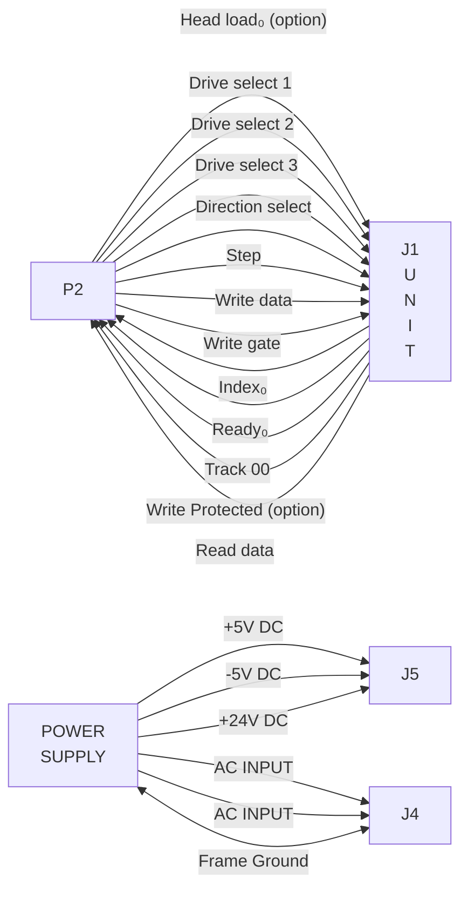

(Logic page #)  Pin #  Pin #

| Signal | P2 Logic page # | P2 Pin # | J1 Pin # |
|---|---:|---:|---:|
| Head load₀ (option) |  |  | 18 |
| Index₀ | (818) | 20 | 20 |
| Ready₀ | (816) | 22 | 22 |
| Drive select 1 | (816) | 26 | 26 |
| Drive select 2 | (816) | 28 | 28 |
| Drive select 3 | (816) | 30 | 30 |
| Direction select | (811) | 34 | 34 |
| Step | (811) | 36 | 36 |
| Write data | (819) | 38 | 38 |
| Write gate | (815) | 40 | 40 |
| Track 00 | (811) | 42 | 42 |
| Write Protected (option) | (810) | 44 | 44 |
| Read data | (820) | 46 | 46 |

| Signal | Connector | Pin # |
|---|---|---:|
| +5V DC | J5 | 5 |
| -5V DC | J5 | 4 |
| +24V DC | J5 | 1 |
| AC INPUT | J4 | 1 |
| AC INPUT | J4 | 3 |
| Frame Ground | J4 | 2 |

# Figure III-1-1

# FORMATTER/UNIT(S) INTERFACE LINES

ND-11.012.01

---

## Page 96

III—1—3

# III.1.2 SIGNAL INTERFACE

## III.1.2.1 Head Load₀

Normally, this line is not used but is a customer installation option line. With this option installed (refer to Maintenance Manual, Section 7), the R/W head will load when this line is activated and the door is closed without the unit being selected.

## III.1.2.2 Index₀

This line is activated by the selected drive once for each revolution of the diskette (166.67ms) to indicate the beginning of a track (pulse width 1.7μs).

## III.1.2.3 Ready₀

Normally, this interface line, when active, will indicate the following:

— *two index holes have been sensed after properly inserting a diskette and closing the door*

*or*

— *two index holes have been sensed after applying + 5VDC power to the drive*

For additional use, refer to the Maintenance Manual, Section 7.5.

## III.1.2.4 Drive Select 1-3

By activating one of these lines the corresponding unit will load the R/W head and respond to the Input lines and gate the Output lines.

Traces DS1, DS2 and DS3 have been provided to define the unit number.

*Note: As shipped from the factory, a shorting plug is installed on DS1.  
To define another unit number, the shorting plug should be  
moved to the appropriate DS-pin.*

ND-11.012.01

---

## Page 97

# III-1-4

## III.1.2.5 *Direction Select*

This interface line is a control signal which defines the direction of motion for the R/W head when the STEP line is pulsed.

A “high” (or open circuit) defines the direction OUT, i.e., the R/W head will move to a lower track number. Conversely, if the line is “low” the R/W head will move toward the center of the diskette.

## III.1.2.6 *Step*

This interface line is a control signal which causes the R/W head to move the direction defined by the DIRECTION line.

The access motion is initated on each trailing edge of the pulse (repetition rate 10ms — pulse width 10µs).

## III.1.2.7 *Write Data*

This line provides encoded clocks and data to be written on the diskette. The leading edge will clock a Write Toggle FF which, in turn, will reverse the write current, thus, writing one bit on the spinning diskette.

*Note: The WRITE GATE must be active in order to perform a write operation.*

## III.1.2.8 *Write Gate*

This line, while in the active state, enables data to be written on the diskette and disables stepping of the R/W head. The Read Circuitry and the Step Motor Control Logic are enabled when the WRITE GATE is turned off.

## III.1.2.9 *Track 00*

The active state of this line indicates that the R/W head is located over track 0.

ND-11.012.01

---

## Page 98

III—1—5

# III.1.2.10 *Write Protected*

This interface signal is provided by the drive to give the Formatter (system) an indication that a Write Protected Diskette is installed.

Under normal operation, the drive will inhibit writing on a protected diskette in addition to notifying the Formatter. For optional use, refer to Section 7.9 in the Maintenance Manual.

# III.1.2.11 *Read Data*

This interface line provides “raw data”, i.e., alternate clocks and data as detected by the units Read Circuitry.

ND-11.012.01

---

## Page 99

III-1-6

# III.1.3 POWER INTERFACE

The unit requires both AC and DC power for operation. The AC power is used for the Spindle Drive Motor while the DC is used for the Electronics and Stepper Motor.

## III.1.3.1 AC Power

For our environments, 220V AC 50Hz is carried on pin 1 and 3 of J4/P4 located below the AC Motor Capacitor.

*Note: For different power environments refer to the Maintenance Manual, Section 4.2.*

## III.1.3.2 DC Power

DC power to the unit is applied via the J5/75 connector located on the non-component side of the PCB near the P4 connector.

For more specific information, refer to the Maintenance Manual, Section 4.2.2.

ND-11.012.01

---

## Page 100

III-2-1

# III.2 FORMATTER — FUNCTIONAL OPERATION

For the following study refer to Figure III.2.1, the description of the Formatter/Interface lines (Section II.1) and description of the Formatter/Unit interface lines (Section III.1).

The different “building blocks” will be discussed in detail as the different operations are discussed. Formatter physical locations are depicted in Figure I.3.1, while logic diagrams, etc. are labelled Appendix D/I-II-III.

When the two above mentioned interfaces have been studied, it should be possible to understand the major control and data flow by looking closely at Figure III.2.1.

---

## Page 101

# SA 810 FORMATTER

```mermaid
flowchart TB
    DR1(( ))
    DR2(( ))
    DR3(( ))

    DATAFMT["DATA FORMAT"]
    CTRLFMT["CONTROL FORMAT"]

    DR1 --- DATAFMT
    DR2 --- DATAFMT
    DR3 --- DATAFMT

    subgraph FORMATTER["SA 810 FORMATTER"]
        direction TB

        DSC["DRIVE<br/>SELECTION<br/>CONTROL"]
        ISC["INTERRUPT<br/>AND<br/>STATUS<br/>CONTROL"]
        SENSE["SENSE"]
        AC["ACCESS<br/>CONTROL"]
        RWC["READ / WRITE<br/>CONTROL"]
        SECTOR["SECTOR<br/>813"]
        TOFF["TRACK<br/>OFFSET"]
        CMD["COM-<br/>MAND"]
        MPX["MPX<br/>813"]
        SER["SER-<br/>DES<br/>817"]
        VFO["VFO<br/>820"]

        G1([""])
        G2([""])
        G3([""])

        DSC --> ISC
        ISC --> SENSE
        SENSE --> G1
        SENSE --> G2
        G1 --> ISC
        G2 --> ISC

        AC --> RWC
        TOFF --> AC
        SECTOR --> RWC
        CMD --> RWC
        MPX --> SER
        SER --> VFO
        VFO --> SER

        RWC --> MPX
        MPX --> RWC

        DSC -->|"READY"| DATAFMT
        DSC -->|"DRIVE SELECT 1"| DATAFMT
        DSC -->|"DRIVE SELECT 3"| DATAFMT
        ISC -->|"INDEX"| DATAFMT
        SENSE -->|"CRC ERROR"| DATAFMT
        SENSE -->|"NO AM + SECTOR MISSING"| DATAFMT
        SENSE -->|"DATA OVERRUN"| DATAFMT
        ISC -->|"WRITE PROTECT"| DATAFMT
        AC -->|"STEP"| DATAFMT
        AC -->|"DIRECTION"| DATAFMT
        AC -->|"SELECT"| DATAFMT
        AC -->|"TRACK 00"| DATAFMT
        RWC -->|"READ DATA"| DATAFMT
        SER -->|"WRITE DATA"| DATAFMT
        DATAFMT -->|"WRITE GATE"| SER

        CTRLFMT -->|"DRIVE ADDRESS"| DSC
        CTRLFMT -->|"SET"| ISC
        CTRLFMT -->|"Y"| ISC
        CTRLFMT -->|"ERROR"| ISC
        CTRLFMT -->|"LD COMMAND"| CMD
        CTRLFMT -->|"GET STATUS"| ISC
        CTRLFMT -->|"SENSE"| SENSE
        CTRLFMT -->|"LD REFERENCE"| TOFF
        CTRLFMT -->|"LD SECTOR"| SECTOR
        CTRLFMT -->|"REQUEST"| RWC
        CTRLFMT -->|"GRANT"| RWC
        CTRLFMT -->|"DIRECTION"| RWC

        RWC -->|"FORMAT CONSTANT"| MPX
        MPX -->|"PARALLEL WRITE DATA"| SER
        SER -->|"PARALLEL READ DATA"| MPX
    end
```

**Figure III.2.1:** Formatter functional diagrams

ND-11.012.01

---

## Page 102

III-3-1

# III.3 TRACK FORMAT

## III.3.1 GENERAL

Tracks may be formatted in a number of ways as indicated in Table III.3.1.

Format selection is under software control, and is selected in parallel with drive selection, by the use of IOX \<WDAD\> (refer to Section I.4, Programming Specifications.)

| FORMAT | RECORDS/<br>TRACK | BYTES/<br>RECORD | SUBSYSTEM STORAGE<br>(In mega-bytes)<br>1 drive | SUBSYSTEM STORAGE<br>(In mega-bytes)<br>3 drives |
|---|---:|---:|---:|---:|
| A (3740). | 26 | 128 | .25 | .75 |
| B (Sys 32-I). | 15 | 256 | .28 | .85 |
| C (Sys 32-II). | 8 | 512 | .30 | .90 |
| AA (Double A). | 32 | 256 | .63 | 1.9 |

**Table III.3.1:** *Format Selection*

## NOTES:

1. Subsystem storage may contain from one to three drives.
2. All diskettes have 77 tracks (0 through 76).
3. Data recording technique is FM for formats A, B, C and M²FM; for format AA.

Due to the usage of “Soft Sectoring Format (only a physical index pulse is detected on the diskette), a track may be divided into the desired number of sectors.

Only SYS 32-II format is discussed and illustrated in the following sections.

ND-11.012.01

---

## Page 103

# Figure III.3.2: FLOPPY DISC — SYS/32-I TRACK FORMAT

```text
Physical index
     |
     |<------------------------------ Selector #1 ------------------------------>|
     |<------------------------------ Selector #2 ------------------------------>|
     |                                                                        Etc.
     v

46 bytes
(normal)

+--------+----------------------+--------+------------------------------------+
| Gap 4  | Post index gap       | Gap 1  | ID-Record #1                       |
|        | 46 bytes (normal)    |        | 7 bytes                            |
|        | G = 40 ones          |        |                                    |
|        | S = 6 zeros          |        | 1  ID-addr. work                  |
|        |                      |        | 2  Track address                  |
|        |                      |        | 3  Zeros                          |
|        |                      |        | 4  Sector address                 |
|        |                      |        | 5  02₁₆                           |
|        |                      |        | 6  CRC #1                         |
|        |                      |        | 7  CRC #2                         |
+--------+----------------------+--------+------------------------------------+
                                     |
                                     | To/From CPU
                                     |
                                     v
+----------------------+---------------------------------------------------------+
| Gap 2                | Data OR Delet. data addr. mark                         |
| ID-gap               +---------------------------------------------------------+
| 17 bytes             | Data Field Record #1                                   |
| (normal)             | 512 bytes                                               |
| G = 11 ones          +---------------------------------------------------------+
| S = 6 zeros          | CRC #1                                                  |
+----------------------+---------------------------------------------------------+
                       | CRC #2                                                  |
                       +---------------------------------------------------------+

                        Update write gate ON

+--------------------------------------------------------------+
| Gap 3                                                       |
| Data gap                                                    |
| 80 bytes                                                     |
| (normal)                                                     |
| G = 73 [illegible]                                           |
| S = 6 zeros                                                  |
+--------------------------------------------------------------+

+------------------------------------+
| ID-Record #2                       |
| 7 bytes                            |
|                                    |
| 1  ID-addr. work                  |
| 2  Track address                  |
| 3  Zeros                          |
| 4  Sector address                 |
| 5  02₁₆                           |
| 6  CRC #1                         |
| 7  CRC #2                         |
+------------------------------------+

Gap 2  --->  Data Field #2  --->  Gap 3  --->  ID-Record #3  --->  Etc.
```

```text
Clocks  ==>        Data  ==>

Index address work format          ID address work format
+---------+                        +---------+
| D    7? |                        | C    7? |
|---------|                        |---------|
| F    C? |                        | F    E? |
+---------+                        +---------+

Data address work format           Deleted data address work format
+---------+                        +---------+
| C    7? |                        | C    7? |
|---------|                        |---------|
| F    B? |                        | F    8? |
+---------+                        +---------+

                 OR
```

```text
                         Addressing:
                       8 sectors
                       727 tracks

                           Track #00
                              \
                               \
                         .-------------.
                      .-'       2       '-.
                    .'    1          ///// '.
                   /                 /////    \
                  |  0              /////   4 |
Index ----------> |-------------------+--------|
                  |                   |        |
                   \        7          5      /
                    '.          6          .'
                      '-.             .-'
                         '-----------'

                              /
                             /
                         Track #76
```

- Gap bits consist of ones. (Number will vary for Gap 2, 3 and 4)
- Read Sync-up bits consist of zeros (constant)

ND-11.012.01

12/[illegible]/75 IBM

---

## Page 104

# III.3.2 *GAPS*

Each field on a track is separated from adjacent fields by a number of bytes containing no *data bits*. These areas are referred to as gaps, and are provided to allow the updating of one field without affecting adjacent fields. As can be seen from Figure III.3.2, there are four different types of gaps.

## III.3.2.1 *Gap 1, Post-Index Gap*

This gap is defined as the 32 bytes between Index Address Mark and the ID Address Mark for Sector one (excluding the *address mark bytes*). This gap is always 32 bytes in length and is not affected by any updating process.

## III.3.2.2 *Gap 2, ID Gap*

The seventeen bytes between the *ID field* and the *data field* is defined as Gap 2 (ID Gap). This gap may vary in size slightly after the *data field* has been updated.

## III.3.2.3 *Gap 3, Data Gap*

The eighty bytes between the *data field* and the next *ID field* are defined as Gap 3 (*data gap*). As with the *ID gap*, the *data gap* may vary slightly in length after the adjacent *data field* has been updated.

## III.3.2.4 *Gap 4, Pre-Index Gap*

The forty-six bytes between the last *data field* on a track and the *Index Address Mark* are defined as Gap 4 (*pre-index gap*). Initially, this gap is nominally 46 bytes in length; however, due to write frequency tolerances and disk speed tolerances, this gap may vary slightly in length. Also, after the *data field* of record 26 has been updated, this gap may again change slightly in length.

ND-11.012.01

---

## Page 105

# III.3.3 *ADDRESS MARKS*

*Address marks* are unique bit patterns, one byte in length and, used in this typical recording format to identify the beginning of *ID* and *data fields* and to synchronize the Deserializing Circuitry with the first byte of each field. *Address Mark* bytes are unique from all other data bytes in that certain bit cells do not contain a clock bit (all other data bytes have clock bits in every bit cell). There are four different types of *address marks* used. Each of these are used to identify different types of fields.

## III.3.3.1 *Index Address Mark*

The *index address mark* is located at the beginning of each track and is a fixed number of bytes in front of the first record. The bit configuration for the *index address mark* is as shown in Figure III.3.2.

## III.3.3.2 *ID Address Mark*

The *ID address mark* byte is located at the beginning of each *ID field* on the diskette. The bit configuration for this *address mark* is shown in Figure III.3.2

## III.3.3.3 *Data Address Mark*

The *data address mark* byte is located at the beginning of each *non-deleted data field* on the diskette. Refer to Figure III.3.2.

## III.3.3.4 *Deleted Data Address Mark*

The *deleted data address mark* byte is located at the beginning of each *deleted data field* on the diskette. Refer to Figure III.3.2.

ND-11.012.01

---

## Page 106

III-3-5

# III.3.4 *CYCLIC REDUNDANCY CHECK (CRC)*

Each field written on the diskette is appended with two *Cyclic Redundancy Check* (CRC) bytes. These two CRC bytes are generated from a cyclic permutation of the data bits starting with bit zero of the *address mark* and ending with bit seven of the last byte within a field (excluding the CRC bytes).

When a field is read back from a diskette, the data bits (from bit zero of the *address mark* to bit seven of the second CRC byte) are divided by the same generator polynomial. A non-zero remainder indicates an error within the data read back from the drive, while a remainder of zero indicates the data has been read back correctly from the disk.

ND-11.012.01

---

## Page 107

III-4-1

# III.4 DATA RECOVERY

From the unit, data and clocks appear as READ DATA. The main tasks for the Data Recovery Circuits are to:

- *separate data from clocks*

- *indicate start of assembly or disassembly of data*  
  *(Enable BR)*

```mermaid
flowchart LR
    RD[Read Data] --> DR[Data Recovery<br/>Xs 820]
    DR --> SD[Separate Data]
    DR --> SC[Separate Clocks]
    DR --> EBR[Enable BR]
```

**Figure III.4.1:** *Data Recovery*

ND-11.012.01

---

## Page 108

III-4-2

# III.4.1 DATA SEPARATION – GENERAL

A pulse train named *Data Window* is internally generated in the Data Recovery Circuit. Basically, this pulse train is ANDed in its true and inverted form with READ DATA and generates SEPARATE DATA and SEPARATE CLOCKS, respectively. Figure III.4.2 will help illustrate.

```mermaid
flowchart LR
    DW[Data window]
    RD[Read Data]
    INV[I]
    AND1["A<br/>N<br/>D"]
    AND2["A<br/>N<br/>D"]
    SD[Separate data]
    SC[Separate clocks]

    DW --> AND1
    RD --> AND1
    DW --> INV
    INV --> AND2
    RD --> AND2
    AND1 --> SD
    AND2 --> SC
```

**Figure III.4.2:** *Data Separation – General*

SEPARATE CLOCKS will function as main clocks during a read operation while SEPARATE DATA will be assembled and sent to the CPU.

Since the *Data Window* is internally generated in the Formatter, and read clock pulses arrive from the spinning diskette, the initial phase relationship is random.

When a read operation starts, the *Data Window* must be set up such that:

- *READ CLOCKS appear in the middle of the “Data Window”, i.e., data will appear in the middle of the “Data Window”.*

  *A specially designed Sync Up Circuitry handles this task (discussed in Section III.4.2.3).*

Another consideration that should be made is:

- *Should the “Data Window” by symmetrical or not, i.e., should we look for data for the same amount of time as we look for clocks.*

The answer is no — we look for data for 40% and clocks 60% of the cycle time of the *Data Window*. *Peak Shift* (described in Section III.4.2.2.1) is the effect that has been considered.

ND-11.012.01

---

## Page 109

# III-4-3

Variation in spindle speed — Write Oscillator drift, and drift in *Data Window* frequency, is accomplished by adjusting the *Data Window* frequency of the READ CLOCKS from the diskette. A Phase Lock Loop accomplishes this task.

ND-11.012.01

---

## Page 110

III—4—4

# III.4.2 *DATA RECOVERY — FUNCTIONAL OPERATION*

Refer to Figure III.4.3 for the following discussion.

## III.4.2.1 *Phase and Frequency Tracking*

Phase and frequency tracking is accomplished by a Phase Locked Loop. The VFO (Variable Frequency Oscillator) ① outputs a *ramp voltage* at a frequency of 500KHz. The Comparator Network ② will compare the voltage of the *ramp* at the time when a clock is applied. If the clock pulse (*standardized data*) occurs in the middle of the *ramp*, i.e., when the *ramp* crosses ground level, no *error violation* is produced. If the *ramp* has an offset at the clock time — an *error voltage*, corresponding to the offset magnitude and polarity, will be produced.

Due to the *peak shift effect*, etc., clocks will shift back and forth on a short term basis.

A Long Time Constant Integrator Network ③ will produce an average offset (TP 28 *error voltage*) and set up variable impedance change path to the relaxation oscillator and, thus, charge the frequence of the clocks read off the diskette.

The normal charge path for the *relaxation oscillator* ① is through potentiometer R29, i.e., the nominal speed of the oscillator will be set up by this potentiometer. This can be done in one of two ways:

— *GND on TP27 (no correction)*

*or*

— *GND on* ▽3 *10 (inhibit samples)*

*where the latter should be preferred.*

## III.4.2.2 *Non-Symetrical Data Window Generation*

The *ramp* formed by the VFO ① is the origin for the Data Window Generation Network ④. The *ramp* will clock a Toggle FF, giving a *Data Window* frequency of 250KHz (TP34). Due to the *Peak Shift* effect (which is NOT precompensated during write) a non-symmetrical *Data Window* is formed to obtain highest possible readability. This is accomplished by the Toggle FF controlling an Alternate Charge Patch Circuit. This circuit will be activated for every second *ramp*, thus, giving a non-symmetrical *Data Window*.

ND- 11.012.01

---

## Page 111

# DATA RECOVERY

## Functional Diagram

```text
                                                     III-4-5


   Initial sample                                  Read data
        |                                              |
        v                                              v
   +----------+                                  +----------------+
   | 2/10     |                                  | 2/44           |
   +----------+                                  +----------------+
        |                                              |
        +-------------------+--------------------------+
                            |
                            v
                       +---------+
                       | 1L      |
                       | Only zero|
                       | detector |
                       +---------+
                            |
                   R3       |       R4
        +5V ----/\/\/\------+------/\/\/\---- +5V
                            |
                            v
                       +---------+
                       | 7       |
                       | [illegible]
                       | circuit |
                       +---------+
                            |
                         write data
                            |
                            v
                    +----------------+
                    | 8               |
                    | [illegible]     |
                    +----------------+

  Standardized data
        |
        v
  +--------------------------+
  | 2                        |
  | COMPARATOR                |
  | NETWORK                   |
  +--------------------------+
        |
        +---------------------------> TP29 Ramp
        |
        v
  +--------------------------+
  | 3                        |
  | LONG TIME                 |
  | CONSTANT                  |
  | INTEGRATOR                |
  | NETWORK                   |
  +--------------------------+
        |
        +---- Error voltage TP28
        |
        +--------------------------+
        | Long term error voltage  |
        | controlled charge path   |
        v                          |
  +--------------------------+     |
  | 1                        |<----+
  | VFO                       |
  | VARIABLE FREQUENCY         |
  | OSCILLATOR                 |
  +--------------------------+
        |
        +---- R29 ---- -5V
        |
        +--------------------------+
        | Nominal speed adjustment |
        v                          |
  +--------------------------+
  | 5                        |
  | ALTER-                   |
  | NATE CHARGE              |
  | PATH CIR-                |
  | CUIT                     |
  +--------------------------+
        |
        | (Enable)
        v
  +--------------------------+
  | 4                        |
  | DATA WINDOW               |
  |                            |
  |        DATA WINDOW         |
  |                            |
  |  TOGGLE FF                 |
  |       +----+               |
  |       |CLOCK|               |
  |       +----+               |
  +--------------------------+
        |             |             |
        |             |             |
        |             |             +---- Separate data
        |             +------------------ Separate clock
        +-------------------------------- TP34 Data window


  +--------------------------+
  | 9                        |
  | VFO                      |
  | CLAMP                    |
  | CIRCUIT                  |
  +--------------------------+
        |
        +---- Clamp enable
        |
        +---- VFO enable
        |
        +---- In phase start
        |
        +---- TP35 Delay data


  Ramp

      /\
     /  \__
    /      \__
   /          \__
   ----------------


  Short term
  error voltage
        |
        v
  +--------------------------+
  | 3                        |
  | LONG TIME                 |
  | CONSTANT                  |
  | INTEGRATOR                |
  | NETWORK                   |
  +--------------------------+


  Error voltage TP28

  To bit ring counter  ---------------------------------------------->


  (First 1 bit detected)


  Figure III.4.3.
```

| Drawing | DATA RECOVERY |
|---|---|
| Title | Functional Diagram |
| Document | XS 820 |
| Date | 3.8.76 |
| Sheet | 3 |
| ND-11.012.01 | |

---

## Page 112

III—4—6

# III.4.2.2.1 THE PEAK SHIFT EFFECT

Using modern high frequency techniques, adjacent clocks and data pulses are close enough to interact with each other. The *bit crowding* effect is the interaction of the adjacent pulses.

Because two pulses tend to have a portion of their individual signals super-imposed, the actual read-back voltage is the algebraic sum of the two pulses. The *bit crowding* will only take place when the read-back voltage frequency changes. Figure III.4.4 illustrates this.

```text
Data and clocks      C        »0»       »C»       »1»       C        0        C


Write current

                    ______          ________          _____________
                   /      \________/        \________/             \____


With peak shift
Read-back voltage
with no Peak Shift

                   . . . . . . . . . . . . . . . . . . . . . . . .
                __/ \__                    . . . . . .      ________
              _/       \__              . /       \   .    /        \_
             /            \__          ./           \   ._/           \_
            /                \___     /              \___              \
                               |  \___/                 | \___
                               |                         |
                               |<--->|     Peak          |<--->|
                               |          Shift          |
                               |            |            |
Peak Shift

                    __             __       __       __             __
___________________/  \___________/  \_____/  \_____/  \___________/  \____

                   |              |          |          |
                   |              |          |          |
                   *              *          *          *

                   Constant       Increasing  Constant   Decreasing   Constant
                   Lower          Frequency   Higher     Frequency    Lower
                   Frequency                  Frequency               Frequency
                   No Peak        Early       No Peak    Late         No Peak
                   Shift          Peak Shift  Shift      Peak Shift   Shift
```

**Figure III.4.4:** *Peak Shift — Illustration*

ND-11.012.01

---

## Page 113

# III-4-7

In FM recording technique, each data cell starts with a clock pulse. A “1” data bit will, therefore, be placed between two clock pulses. However, a clock pulse is written between:

1. Two other clock pulses  
   (no peak shift)

```text
                         .-.                       .-.                       .-.
________________________/   \_____________________/   \_____________________/   \____
```

2. A data pulse and another  
   clock pulse (late peak shift)

```text
                         D                         C                         C
                         .-.                       .-.                       .-.
________________________/   \_____________________/   \_____________________/   \____
                                                     . . .
                                                     . . .   ---->
```

3. Another clock pulse and a  
   data pulse (early peak shift)

```text
                         C                         C                         D
                         .-.                     . .-.                       .-.
________________________/   \___________________. ./   \_____________________/   \____
                                                 . .             <----
```

4. Two data pulses  
   (no peak shift)

```text
                         D                         C                         D
                         .-.                       .-.                       .-.
________________________/   \_____________________/   \_____________________/   \____
```

**Figure III.4.5:** *Peak Shift Illustration*

In conclusion, a peak shift will not occur to a data bit, but will occur in both directions to a clock pulse. A longer window is, therefore, required for clock pulses than for data pulses.

The *ramp* (TP29) and, thus, the *Data Window* (TP34) will, by the Alternate Charge Path Circuit, be formed as depicted in Figure III.4.6.

```text
             /\             /\                    /\       /\
            /  \           /  \                  /  \     /  \
           /    \         /    \                /    \   /    \__
          /      \_______/      \______________/      \_/          )   Ramp TP29
          :              :                      :
          :              :                      :
__________|              |______________________|              |__________) Data Window TP34
          |              |                      |
          |    1.0 µs    |       2.4 µs         |
          |              |                      |
               ↑                    ↑
               |                    |
               |____________________|  Clock Detection
               |
               |________________________________  Data Detection
```

**Figure III.4.6:** *Data Window Generation*

ND-11.012.01

---

## Page 114

III—4—8

# III.4.2.3 *Sync Up Circuitry*

## III.4.2.3.1 GENERAL

For the following discussion, refer to Figure III.3.2 (SYS/32-II track format). Gaps have been introduced between the *ID record* and *data field* and between *data field* and *ID record*. The nominal gap lengths are indicated in Figure III.3.2. However, the gap lengths will vary slightly while the *data field* is being updated. A gap may be considered as two portions, the first part consists of all ones, while the last part always consists of 6 bytes of zeros, i.e., only clocks written. This part of the gap is rewritten as the *data field* is updated and will, therefore, always consist of 6 bytes. The purpose of those bytes are to sync up the Phase Locked Loop in the Data Separator and set the *Data Window* 180° out of phase of the clocks.

## III.4.2.3.2 OPERATION

Reading the first part of a gap, the READ DATA line will carry alternating clocks and data pulses. The only Zeros Detector ⑥ will give no output and the 16 Bits Counter ⑦ will stay cleared.

As the *Sync-Up Pattern* (6 bytes of zeros) are entered the Only Zeros Detectors ⑥ will produce a pulse for each zero detected (only clock pulses). The counter ⑦ will start counting up zeros and as a *Cnt Of 8* is reached, a *Cnt Of FF* ⑧ sets the clock pulses and will be applied to the Comparator Network ②. A VFO Clamp Circuit ⑨ will clamp the *ramp* from the oscillator to AV. The Toggle FF located in Data Window and Gating Network ④ will be kept in the cleared state by the clamp.

*After two clock pulses the clamp will be disabled and the ramp will go.*

— *The described operation has now set the “Data Window” 180° out of phase with the clock pulses, i.e., in phase then later appearing data pulses.*

At this time, the Long Time Constant Integrator Network ③ is enabled and a closed loop for phase and frequency tracking is established. Separate clocks are now gated to the Formatter as main clocks.

As a count of 16 is reached, we enable “looking for data”. When the first data bit is found (first one in the *address mark*), the BR Enable, TP27, becomes active. The process of data assembly is now in process.

ND-11.012.01

---

## Page 115

III-5-1

# III.5 FORMATTER – DATA FLOW

## III.5.1 *READ OPERATION*

Refer to Figure III.5.1.

During a read operation data and clocks are received as READ DATA from the selected unit. The Data Separator Network (VFO) (described in Section III.4) will separate clocks and data.

In the Serdes (abbreviation for serializer/deserializer) the data will be assembled into 8 bit bytes. As a new byte is assembled, it will be strobed into a Serdes Buffer. The Multiplexer will select the data byte and send it onto the X-fer bus to the Interface.

ND-11.012.01

---

## Page 116

# Fig. III-5-1 READ-DATA FLOW

```mermaid
flowchart LR
    A["Read Data<br/>separator<br/>network<br/>(VFO)<br/>(xs820)"]
    B["XS817"]
    C["Serdes<br/>Buffer<br/>XS813"]
    D["Mux<br/>XS812"]

    E["Read Data from<br/>selected unit"] --> A
    A -->|"Serdes clocks"| B
    A -->|"Sep data"| B
    B --> C
    F["Status — BR7"] --> C
    C -->|"Serdes"| D
    C -->|"Sep data"| D
    G["Status"] --> D
    H["Sense"] --> D
    I["(Read + Sense)<br/>(Read + Status)"] --> D
    D -->|"X fer bus<br/>0-7"| J[""]
```

---

## Page 117

III-5-3

# III.5.2 WRITE OPERATION

Refer to Figure III.5.2.

During a write operation, the requested data byte will be selected by the Multiplexer and loaded into the Serdes. The data byte will be disassembled and encoded with clock pulses (clocks and data 180° out of phase) and sent to the selected unit.

ND-11.012.01

---

## Page 118

# Fig. III-5-2  
# WRITE-DATA FLOW

```mermaid
flowchart LR
    XFER["X fer bus."] --> XS883["XS883"]
    MUXSEL["Mux selection"] --> XS883
    XS883 -->|"Mux data<br/>0-7"| XS811["Serdes<br/>XS811"]
    SERCLK["Serdes clocks"] --> XS811
    LOAD["Load serdes"] --> XS811
    XS811 -->|"D7"| XS819["Data +<br/>clocks<br/>encoder<br/>XS819"]
    CLOCKS["C7 clocks."] --> XS819
    XS819 -->|"Write Data to<br/>selected unit."| OUT[""]
```

III-5-4

Tegn. 203[illegible]76 E1B

ND-11.012.01

---

## Page 119

III-6-1

# III.6 READ/WRITE CONTROL

## III.6.1 GENERAL

This section describes commands previously referred to as “any READ or WRITE” commands (Section II.2).

The commands are:

- *Format Track*
- *Write Data*
- *Write Deleted Data*
- *Read ID*
- *Read Data*

The above mentioned commands will be executed by a Special Purpose Microprocessor. The commands will generate a start address (entry point) — and the microprocessor will increment or branch through a predetermined sequence of states. The microprocessor will increment or branch to the next state depending upon certain conditions decoded in the different parts of the logic. When the microprocessor is not busy with “any READ or WRITE”, it remains in its idle state (State A) indicated by R/W Idle being active. Upon completion of any of the above mentioned commands, the microprocessor will return to this state (State A).

The microprocessor is composed of the following building blocks:

- *An Increment Condition Selector*
- *A Branch Condition Selector*
- *A Five Bit Program Counter*
- *A 32 bits by 32 locations read only memory (ROM)*
- *Command Latches*

The ROM addresses will be referred to as State A through N. (Refer to Figure III.6.6.)

ND-11.012.01

---

## Page 120

# III.6.2 *READ ID*

The READ ID command causes the Formatter to transfer the first *ID field* encountered by the Read/Write head from the selected drive. The four bytes of data contained in the *ID field* are transferred to the Interface via the X-fer bus. The contents of the bytes are shown below, in the order of transfer.

| Byte No.: | Contents: |
|---:|---|
| 1 | Track address represented in binary (0-76) |
| 2 | Binary zero |
| 3 | Sector address represented in binary (1-10₈) |
| 4 | Hex 02 |

See also Figure III.2.1 representing the Sys 32-II Track Format.

As each of the four bytes are read off the diskette, they are assembled and placed on the X-fer bus on the way to the Interface. Refer to Figure III.5.1 illustrating the data flow.

After transferring the four *ID bytes*, the Formatter reads the next two **CRC bytes**, checking for CRC error on the field just transferred. If the *CRC bytes* read “compare” (CRC syndrome = 0), with the CRC generated for the data just read, a non-error INTERRUPT is generated with corresponding status of R/W COMPLETE.

- *If there is a “miscompare”, a UNIT CHECK INTERRUPT is generated and the CRC ERROR sense bit is set along with status of R/W COMPLETE.*

- *If the Formatter detects no “ID address mark” within a full revolution of the diskette (2 index pulses), a UNIT CHECK INTERRUPT is generated and the NO AM sense bit is set (without R/W COMPLETE).*

- *The DATA OVERRUN sense bit is set during the READ ID command if the Interface does not respond to a TRANSFER REQUEST in sufficient time to insure correct storage of each data byte. That is, if a new data byte is ready on the X-fer bus before TRANSFER GRANT has been received for the previous byte, the overrun condition is detected. In this case, the read operation is allowed to continue to its normal ending, but the Formatter presents a status of UNIT CHECK as well as R/W COMPLETE.*

ND-11.012.01

---

## Page 121

# Read ID - State Diagram

| Active Status | Increment/Branch Conditions | Active Test Points |
|---|---|---|

```mermaid
flowchart TD
    A1([A<br/>R/W-Idle])
    P([P<br/>ID wait])
    Z([Z<br/>Check CRC])
    A2([A<br/>R/W-Idle])

    A1 --- P
    P --- Z
    Z --- A2

    A1 -.- C1["(RD+WRT)•Sel•Setl̅"]
    P --- TP17((TP17))
    TP17 -.- LBC["Load byte counter"]
    P -.- C2["(CNT=0)•BR7"]
    Z --- TP31((TP31))
    TP31 -.- CRC["Check CRC"]
    Z -.- C3["(CNT=0)•BR7"]
```

*Figure III-6-1*

Note: For more detailed study, ref. fig. III-6-6  
and appendix D

ND-11.012.01

---

## Page 122

II-6-4

# 11.6.3 *READ DATA*

The READ DATA command provides for the transfer of the *data field* of the requested record from the diskette to the Interface. The Interface must supply the Formatter with a prerequisite argument (sector) by placing the sector address byte on the X-fer bus and pulsing LOAD SECTOR line. The subsequent READ DATA command forces the Formatter to read each *ID field* encountered (not transferring bytes to the Interface) until a comparison is obtained between the third byte of an *ID field* (sector byte) and the desired sector. The Formatter then reads the next *data field* encountered, transferring each *data byte* (excluding the *data field address mark*) to the Interface Buffer in the manner defined for READ ID. After transferring the *data field*, the Formatter checks for a CRC read-error and:

- generates a R/W COMPLETE with UNIT CHECK INTERRUPT for a read error.

- If the desired "data field" is preceded by a "deleted data address mark", rather than the "normal data address mark", the DELETED RECORD status bit is set and is also presented to the Interface in the servicing of the command completion INTERRUPT.

- DATA OVERRUN and NO AM errors are defined for the READ ID command.

- In addition, if while searching the track for the requested record, a CRC read error is encountered at any "ID field", command execution is immediately halted and a UNIT CHECK INTERRUPT is generated.

- An error condition also results if the desired record cannot be located. That is, the MISSING SECTOR sense bit is set (with its associated UNIT CHECK INTERRUPT) when a sector byte comparison is not obtained within one full revolution of the diskette (2 index pulses).

Correct usage of the READ DATA command presumes that the R/W head has been previously positioned to the track of the record desired.

ND-11.012.01

---

## Page 123

# III-6-5

# Read Data - State Diagram

```mermaid
flowchart TD
    A1([A<br/>R/W - Idle])
    P([P<br/>ID-wait])
    Q([Q<br/>Sector search])
    R([R<br/>Check CRC])
    S([S<br/>ID search rst])
    T([T<br/>Matched sect.])
    W([W<br/>Check CRC])
    X([X<br/>Data Fld.Init])
    Y([Y<br/>Read Data Fld])
    Z([Z<br/>Check CRC])
    A2([A<br/>R/W Idle])

    A1 --- P
    P --- Q
    Q --- R
    R --- S
    T --- W
    W --- X
    X --- Y
    Y --- Z
    Z --- A2

    S --> P
    Q --> T
    S --> T

    A1 -. "(Rd+wrt)·Sel·\\overline{Setl}" .-> C1["Load byte counter"]
    P -. "TP17 ○" .-> C2["Load byte counter"]
    P -. "AM Det·BR7·\\overline{RDTI}" .-> C3[""]
    Q -. "\\overline{TP17} ○" .-> C4["Load byte counter"]
    Q -. "CNT = 0·BR7" .-> C5[""]
    R -. "\\overline{TP31} ○   TP17 ○<br/>A = B·BR7·\\overline{CNT = 0}" .-> C6["Load byte counter<br/>Check CRC"]
    R -. "CNT = 0·BR7" .-> C7[""]
    S -. "(Rd+wrt)·Sel·\\overline{Setl}<br/>(unconditional)" .-> C8[""]
    T -. "TP17 ○" .-> C9["Load byte counter"]
    T -. "\\overline{TP31} ○<br/>CNT = 0·BR7·\\overline{WRT}" .-> C10[""]
    W -. "TP17 ○   TP31 ○" .-> C11["Check CRC<br/>Load byte counter"]
    W -. "CNT = 0·BR7" .-> C12[""]
    X -. "TP17 ○" .-> C13["Load byte counter"]
    X -. "(Rd+wrt)·Sel·\\overline{Setl}<br/>(unconditional)" .-> C14[""]
    Y -. "TP17 ○" .-> C15["Load byte counter"]
    Y -. "CNT = 0·BR7" .-> C16[""]
    Z -. "TP17 ○   TP31 ○" .-> C17["Load byte counter<br/>Check CRC"]
    Z -. "CNT = 0·BR7" .-> C18[""]
```

**Active States** | **Increment / Branch Conditions** | **Active Test Points**
---|---|---
A — R/W - Idle | (Rd+wrt)·Sel·\overline{Setl} | Load byte counter
P — ID-wait | AM Det·BR7·\overline{RDTI} | TP17; Load byte counter
Q — Sector search | CNT = 0·BR7 | \overline{TP17}; Load byte counter
R — Check CRC | A = B·BR7·\overline{CNT = 0}; CNT = 0·BR7 | \overline{TP31}; TP17; Load byte counter; Check CRC
S — ID search rst | (Rd+wrt)·Sel·\overline{Setl} (unconditional) | 
T — Matched sect. | CNT = 0·BR7·\overline{WRT} | TP17; Load byte counter
W — Check CRC | CNT = 0·BR7 | TP17; TP31; Check CRC; Load byte counter
X — Data Fld.Init | (Rd+wrt)·Sel·\overline{Setl} (unconditional) | TP17; Load byte counter
Y — Read Data Fld | CNT = 0·BR7 | TP17; Load byte counter
Z — Check CRC | CNT = 0·BR7 | TP17; TP31; Load byte counter; Check CRC

## Figure III-6-2

Note: For more detailed study, ref. fig. III-6-6 and appendix D

ND-11.012.01

---

## Page 124

# III.6.4 *WRITE DATA*

III—6—6

The WRITE DATA command provides the system function of storing a record on the selected drive’s diskette. The Interface must supply the Formatter with a prerequisite argument (sector) by placing the *sector address byte* on the X-fer bus and pulsing LOAD SECTOR line.

The subsequent WRITE DATA command forces the Formatter to read each *ID field* encountered until a comparison is obtained between the third byte of an *ID field* (sector byte) and the desired sector. The Formatter then sequences up the write circuitry in the gap following this *ID field* and starts writing zero bytes. At the end of the gap (17 bytes) the Formatter writes the *data address mark* and requests the Interface to provide the first data byte. The Formatter then writes the *data field*

---

## Page 125

# III-6-7

- *The DATA OVERRUN sense bit is set during the WRITE DATA command if the Interface does not respond to a TRANSFER REQUEST in sufficient time to insure correct writing of each “data byte”. That is, if the Formatter needs a new “data byte” on the X-fer bus before TRANSFER GRANT has been received (to indicate that a byte is ready from the Interface) the overrun condition is detected. The WRITE operation continues to its normal ending (still writing X-fer bus data without sending TRANSFER REQUEST), but at completion of the command a status of UNIT CHECK as well as R/W COMPLETE is presented to the Interface.*

ND-11.012.01

---

## Page 126

# III-6-8

# Write Data – State Diagram

```mermaid
flowchart TB
    A([A<br/>R/W Idle])
    P([P<br/>ID wait])
    Q([Q<br/>Search sector])
    R([R<br/>Check CRC])
    S([S<br/>ID search rst])
    T([T<br/>Matched sector])
    CONT["(Continue)"]

    A -->|"(Rd + wrt) • Sel • S̅e̅t̅l̅"| P
    P -->|"AM Det • BR7 • R̅D̅ I̅D̅"| Q
    Q -->|"CNT = 0 • BR7"| R
    R -->|"CNT = 0 • BR7"| S
    S -->|"(Rd + wrt) • Sel • S̅e̅t̅l̅<br/>(unconditional)"| T
    T -->|"CNT = 0 • BR7 • WRT"| CONT

    S --> P
    Q -->|"A = B • BR7 • C̅N̅T̅ = 0"| T

    P -. "TP17" .-> PLOAD["Load byte counter"]
    Q -. "TP17" .-> QLOAD["Load byte counter"]
    R -. "TP31<br/>TP17" .-> RLOAD["Load byte counter<br/>Check CRC"]

    style PLOAD fill:none,stroke:none
    style QLOAD fill:none,stroke:none
    style RLOAD fill:none,stroke:none
    style CONT fill:none,stroke:none
```

Figure III.6.3, continued on following page

ND-11.012.01

---

## Page 127

# III-6-9

# Write Data - continued

```mermaid
flowchart TD
    U(["U<br/>ID CRC Check"])
    V(["V<br/>Gap 2<br/>WRT Turn on"])
    J(["J'<br/>WRT Data AM"])
    K(["K'<br/>WRT Data Fld."])
    L(["L'<br/>WRT CRC"])
    O(["0<br/>Finish WRT"])
    A(["A<br/>R/W Idle"])

    U -->|CNT = 0 · BR7| V
    V -->|CNT = 0 · BR7| J
    J -->|BR7| K
    K -->|CNT = 0 · BR7| L
    L -->|CNT = 0 · BR7| O
    O -->|CNT = 0 · BR7<br/>(unconditional)| A

    TP31((TP31))
    TP17U((TP17))
    TP17V((TP17))
    TP32J((TP32))
    TP16((TP16))
    TP32K((TP32))
    TP17K((TP17))
    TP33((TP33))
    TP17L((TP17))
    TP17O((TP17))

    U -.-> TP31
    U -.-> TP17U
    TP17U -.-> UACT["Load byte counter<br/>Check CRC"]

    V -.-> TP17V
    TP17V -.-> VACT["Load byte counter<br/>(WRITE Gate turn on)"]

    J -.-> TP32J
    J -.-> TP16
    TP16 -.-> JACT["WRITE shift CRC<br/>AM WRITE"]

    K -.-> TP32K
    K -.-> TP17K
    TP17K -.-> KACT["WRITE shift CRC<br/>Load byte counter"]

    L -.-> TP33
    L -.-> TP17L
    TP17L -.-> LACT["WRITE CRC<br/>Load byte counter"]

    O -.-> TP17O
    TP17O -.-> OACT["(WRITE Gate dropped)"]
```

Figure III-6-3

Note: For more detailed study, ref. fig. III-6-6  
and appendix D

ND-11.012.01

---

## Page 128

III-6-10

# III.6.5 WRITE DELETED DATA

The WRITE DELETED DATA command is operationally identical to the WRITE DATA command, but results in the Formatter writing a *deleted data address mark* byte in front of *data field*.

ND-11.012.01

---

## Page 129

# III–6–11

# WRITE Deleted Data - State Diagram

```mermaid
stateDiagram-v2
    direction TB

    state "A\nR/W Idle" as A
    state "P\nID Wait" as P
    state "Q\nSearch sector" as Q
    state "R\nCheck CRC" as R
    state "S\nID Search rst" as S
    state "T\nMatched sector" as T
    state "(continue)" as Continue

    A --> P : (Rd+wrt)·Sel·S̅etl
    P --> Q : AM Det·BR7·RD ID
    Q --> R : CNT=0·BR7
    R --> S : CNT=0·BR7
    S --> T : (Rd+wrt)·Sel·S̅etl
    T --> Continue : CNT=0·BR7·WRT

    S --> P
    Q --> T : A=B·BR7·C̅NT=0

    note right of P
      TP17
      Load byte counter
    end note

    note right of Q
      TP17
      Load byte counter
    end note

    note right of R
      TP31
      TP17
      Load byte counter
      Check CRC
    end note

    note right of T
      TP17
      Load byte counter
    end note
```

**Figure III.6.4, continued on next page**

ND-11.012.01

---

## Page 130

# II-6-12

# WRITE Deleted Data - continued

```mermaid
flowchart TB
    U([U<br/>ID CRC Check])
    V([V<br/>Gap 2<br/>WRT Turn on])
    VV([VV<br/>Gap 2<br/>WRT Turn on])
    JJ([JJ<br/>WRT Del Data AM])
    K([K'<br/>WRT Data Fld.])
    L([L'<br/>WRT CRC])
    O([0<br/>Finish WRT])
    A([A<br/>R/W Idle])

    U ---|CNT=0•BR7| V
    V ---|WRT Del| VV
    VV ---|CNT=0•BR7| JJ
    JJ ---|BR7| K
    K ---|CNT=0•BR7| L
    L ---|CNT=0•BR7| O
    O ---|CNT=0•BR7<br/>(unconditional)| A

    U --- TP31[TP31]
    U --- TP17U((TP17))
    TP17U --- UACT[Load byte counter<br/>Check CRC]

    V --- TP17V((TP17))
    TP17V --- VACT[Load byte counter<br/>(WRITE Gate turn on)]

    VV --- TP17VV((TP17))
    TP17VV --- VVACT[Load byte counter]

    JJ --- TP32JJ[TP32]
    JJ --- TP16((TP16))
    TP16 --- JJACT[WRITE shift CRC<br/>AM WRITE]

    K --- TP32K[TP32]
    K --- TP17K((TP17))
    TP17K --- KACT[WRITE shift CRC<br/>Load byte counter]

    L --- TP33[TP33]
    L --- TP17L((TP17))
    TP17L --- LACT[WRITE CRC<br/>Load byte counter]

    O --- TP17O((TP17))
    TP17O --- OACT[Load byte counter]

    A --- AACT[(WRITE Gate dropped)]
```

*Figure III-6-4*

Note: For more detailed study, ref. fig. III-6-6  
and appendix D

ND-11.012.01

---

## Page 131

III—6—13

# III.6.6  *FORMAT TRACK*

The FORMAT TRACK command provides the function of writing an entire track in the format illustration in Figure III.3.2.

This provides full diskette initialization capabilities. In the execution of this command, the Formatter provides all *Gap, Address Mark,* and *CRC bytes* while the Interface provides the 4 *ID bytes* and all *data bytes* for each record (under Formatter transfer control).

When the Formatter receives the FORMAT TRACK command it waits for the Index pulse from the selected drive, then writes:

- “1” bytes until the end of Gap 1

- the Index Address Mark

- “1” bytes for Gap 1

- the “ID address mark” for the first “ID field”, and requests the first byte from the Interface. It continues from this point, to write ID and data bytes (received from the interface) and formatting bytes (generated from the Formatter) (Gaps, Address Marks, CRC) until the last data field is written. At this point, the Formatter starts writing:

- “1” bytes for Gap 4 and continues writing until the Unit’s Index signal is detected again (one full revolution)

All address marks are preceded by six bytes of “zero” in the gap.

Data transference from the Interface is controlled in the same manner as described for the WRITE DATA command. At detection of the second Index pulse, the Formatter presents the end status INTERRUPT, R/W COMPLETE. The DATA OVERRUN error is defined as described for the WRITE DATA command. If DATA OVERRUN is detected, the Formatter finishes writing the record which it was writing (using X-fer bus data), then starts writing Gap 4 (all one bytes) until detection of Index. At this point it presents an INTERRUPT status of R/W COMPLETE and UNIT CHECK. The DATA OVERRUN sense bit indicates to the Interface that all records of the current track were not formatted.

A special consideration for the FORMAT TRACK command is that the Formatter writes only *data address marks* at the beginning of each *data field*. If the user desires *deleted data address marks* for certain records, the Interface must follow the FORMAT TRACK command with a WRITE DELETED DATA command for each record to be deleted.

ND-11.012.01

---

## Page 132

III-6-14

# Format Track – State Diagram

```mermaid
flowchart TD
    A([A<br/>R/W Idle])
    B([B<br/>FMT INIT])
    C([C<br/>START FMT])
    D([D<br/>INDEX AM WRT])
    E([E<br/>Gap 1 WRT])
    CONT([Continue])

    A -->|FMT·INDX·Sel·Setl| B
    B -->|Index| C
    C -->|CNT = 0·BR7| D
    D -->|BR7| E
    E -->|CNT = 0·BR7| CONT

    C --- CTP((TP17))
    CTP -.- CLOAD[Load byte counter<br/>(WRITE gate turn-on)]

    D --- DTP((TP17))
    DTP -.- DLOAD[Load byte counter]

    E --- ETP((TP17))
    ETP -.- ELOAD[Load byte counter]
```

**Figure III.6.5, continued on next page**

ND-11.012.01

---

## Page 133

# Format Track — continued

```mermaid
flowchart TB
    F([F<br/>ID AM WRT<br/>TP32<br/>TP16])
    G([G<br/>ID FLD WRT<br/>TP32<br/>TP17])
    H([H<br/>ID CRC WRT<br/>TP17<br/>TP33])
    I([I<br/>Gap2 WRT<br/>TP17])
    J([J<br/>DATA AM WRT<br/>TP32<br/>TP16])
    K([K<br/>DATA FLD WRT<br/>TP32<br/>TP17])
    L([L<br/>DATA CRC WRT<br/>TP33<br/>TP17])
    M([M<br/>Gap3 WRT<br/>TP17])
    N([N<br/>Gap4 WRT<br/>TP17])
    A([A<br/>R/W Idle])

    F -->|BR7| G
    G -->|CNT=0·BR7| H
    H -->|CNT=0·BR7·LR+OV| I
    I -->|CNT=0·BR7| J
    J -->|BR7| K
    K -->|CNT=0·BR7| L
    L -->|CNT=0·BR7| M
    M -->|CNT=0·BR7| F
    M -->|CNT=0·BR7·(LR+OV)| N
    N -->|Index| A

    F -.-> FTEST[WRITE shift CRC<br/>AM WRITE]
    G -.-> GTEST[WRITE shift CRC<br/>Load byte counter]
    H -.-> HTEST[Load byte counter<br/>WRITE CRC]
    I -.-> ITEST[Load byte counter]
    J -.-> JTEST[WRITE shift CRC<br/>AM WRITE]
    K -.-> KTEST[WRITE shift CRC<br/>Load byte counter]
    L -.-> LTEST[WRITE CRC<br/>Load byte counter]
    M -.-> MTEST[Load byte counter]
    N -.-> NTEST[Load byte counter]
    A -.-> ATEST[(WRITE Gate Dropped)]
```

Figure III-6-5

ND-11.012.01

---

## Page 134

# Fig. III.6.

## Logic Diagram — Read/Write Control Microprogram

**ND-11.012.01**

### Definitions

| Symbol | Definition |
|---|---|
| CNT = 0 | BYTE COUNT = 0 |
| BR7 | BIT RING 7 (LAST BIT) |
| RD | READ COMMAND |
| WRT | WRITE COMMAND |
| FMT | FORMAT COMMAND |
| INDX | INDEX PULSE |
| SEL | DRIVE SELECT |
| SEEK | HEAD SETTLING |
| AM BIT | ADDRESS MARK |

### State Functions and Addresses

| Address | State Function |
|---:|---|
| 00000 | IDLE |
| 00001 | RMT INIT |
| 00010 | START FMT |
| 00011 | INDEX AM WRT |
| 00100 | GAP 1 WRT |
| 00101 | ID AM WRT |
| 00110 | ID FLD WRT |
| 00111 | ID CRC WRT |
| 01000 | GAP 2 WRT |
| 01001 | DATA AM WRT |
| 01010 | DATA FLD WRT |
| 01011 | DATA CRC WRT |
| 01100 | GAP 3 WRT |
| 01101 | GAP 2 WRT |
| 01110 | WRITE [illegible] |
| 01111 | DATA AM |
| 10000 | ID WRT |
| 10001 | SECTOR SEARCH |
| 10010 | ID CHECK |
| 10011 | ID SEARCH RST |
| 10100 | MATCHED SECTOR |
| 10101 | ID CRC CHECK |
| 10110 | GAP 2 WRITE |
| 10111 | DATA AM WRITE |
| 11000 | DATA FIELD WRT |
| 11001 | DATA CRC WRITE |
| 11010 | FINISH WRITE |
| 11011 | ID CRC CK |
| 11100 | DATA LOAD INIT |
| 11101 | READ DATA FLD |
| 11110 | CHECK CRC |
| 11111 | GAP 4 WRT |

## State / Branch Table

| State | Branch State | Branch Condition | Increment Condition | MUX Data Write or Read Control | MUX Count (Series Counter) | State Function | Address |
|---|---|---|---|---|---|---|---:|
| A | P | RD + WRT SEL · SEL | FMT INDX SEL · SEL | ID | ID | IDLE | 00000 |
| B |  |  |  |  |  | RMT INIT | 00001 |
| C |  |  |  | GAP |  | START FMT | 00010 |
| D |  |  | INDEX AM | NO. OF PROCS |  | INDEX AM WRT | 00011 |
| E |  |  |  | GAP | ID | GAP 1 WRT | 00100 |
| F |  |  |  | ID AM | ID | ID AM WRT | 00101 |
| G |  |  |  | XFER BUS | CRC | ID FLD WRT | 00110 |
| H | N | CNT = 0 BR7 (L/R + OV) |  |  | GAP 2 | ID CRC WRT | 00111 |
| I |  |  |  | GAP |  | GAP 2 WRT | 01000 |
| J |  |  |  | DATA AM |  | DATA AM WRT | 01001 |
| K |  |  |  | XFER BUS | CRC | DATA FLD WRT | 01010 |
| L | N | CNT = 0 BR7 (L/R + OV) |  |  | GAP 3 | DATA CRC WRT | 01011 |
| M | F | CNT = 0 BR7 |  | GAP | ID | GAP 3 WRT | 01100 |
| V | K | BR7 |  | GAP | DATA | GAP 2 WRT | 01101 |
| U |  | BR7 |  | DEL DATA AM | DATA AM | WRITE [illegible] | 01110 |
| P | Z | CNT = 0 BR7 |  | ID AM | CRC | ID WRT | 10000 |
| Q | T | A = B · BR7 CNT = 0 |  | SECTOR | CRC | SECTOR SEARCH | 10001 |
| R |  |  |  |  | ID | ID CHECK | 10010 |
| S | P | [illegible] SEL SET |  |  | ID | ID SEARCH RST | 10011 |
| T | W | CNT = 0 BR7 WRT |  |  | CRC | MATCHED SECTOR | 10100 |
| U | V | CNT = 0 BR7 |  | GAP 2 |  | ID CRC CHECK | 10101 |
| V |  | WRT DEL |  | GAP |  | GAP 2 WRITE | 10110 |
| J′ |  |  |  | DATA AM |  | DATA AM WRITE | 10111 |
| K′ |  |  |  | XFER BUS | CRC | DATA FIELD WRT | 11000 |
| L′ |  |  |  | GAP |  | DATA CRC WRITE | 11001 |
| O | R | BR7 |  | GAP |  | FINISH WRITE | 11010 |
| M | Y | RD · [illegible] SEL |  |  | DATA | ID CRC CK | 11011 |
| X |  |  |  |  | CRC | DATA LOAD INIT | 11100 |
| Y |  |  |  | DATA AM | CRC | READ DATA FLD | 11101 |
| Z | A | CNT = 0 BR7 |  | GAP |  | CHECK CRC | 11110 |
| N |  |  |  | GAP |  | GAP 4 WRT | 11111 |

## Program Patterns

| Program Pattern | Bit | Function |
|---|---:|---|
| PROM 4 PATTERN | 0 | BR ADR 0 |
|  | 1 | BR ADR 1 |
|  | 2 | BR ADR 2 |
|  | 3 | BR ADR 3 |
|  | 4 | BR ADR 4 |
|  | 6 | LOAD RCO CNTR |
|  | 7 | R/W IDLE |
| PROM 3 PATTERN | 0 | INC COND SEL 0 |
|  | 1 | INC COND SEL 1 |
|  | 2 | INC COND SEL 2 |
|  | 4 | BR COND SEL 0 |
|  | 5 | BR COND SEL 1 |
|  | 6 | BR COND SEL 2 |
| PROM 2 PATTERN | 0 | WRITE DATA GATE |
|  | 1 | RESET AM |
|  | 2 | CHECK CRC |
|  | 3 | WRITE CRC |
|  | 4 | WRITE SHIFT CRC |
|  | 5 | WRITE GATE |
|  | 6 | AM WRITE |
|  | 7 | LOAD SC |
| PROM 1 PATTERN | 0 | ENABLE READ [illegible] |
|  | 1 | INC SECTOR |
|  | 2 | MUX COUNT C |
|  | 3 | MUX COUNT B |
|  | 4 | MUX COUNT A |
|  | 5 | MUX DATA SEL C |
|  | 6 | MUX DATA SEL B |
|  | 7 | MUX DATA SEL A |

## Programmed Pattern Matrix

| Address | 00000 | 00001 | 00010 | 00011 | 00100 | 00101 | 00110 | 00111 | 01000 | 01001 | 01010 | 01011 | 01100 | 01101 | 01110 | 01111 | 10000 | 10001 | 10010 | 10011 | 10100 | 10101 | 10110 | 10111 | 11000 | 11001 | 11010 | 11011 | 11100 | 11101 | 11110 | 11111 |
|---|---|---|---|---|---|---|---|---|---|---|---|---|---|---|---|---|---|---|---|---|---|---|---|---|---|---|---|---|---|---|---|---|
| PROM 4 PATTERN | — | — | — | — | — | — | — | — | — | — | — | — | — | — | — | — | — | — | — | — | — | — | — | — | — | — | — | — | — | — | — | — |
| PROM 3 PATTERN | — | — | — | — | — | — | — | — | — | — | — | — | — | — | — | — | — | — | — | — | — | — | — | — | — | — | — | — | — | — | — | — |
| PROM 2 PATTERN | — | — | — | — | — | — | — | — | — | — | — | — | — | — | — | — | — | — | — | — | — | — | — | — | — | — | — | — | — | — | — | — |
| PROM 1 PATTERN | — | — | — | — | — | — | — | — | — | — | — | — | — | — | — | — | — | — | — | — | — | — | — | — | — | — | — | — | — | — | — | — |

| Toshiba Corporation | |
|---|---|
| LOGIC DIAGRAM | READ/WRITE CONTROL MICROPROGRAM |
| [illegible] | Fig. III.6. |

---

## Page 135

III–6–17

# PROM 5 PATTERN.

```text
                         ┌───────────────┐
              ┌──────────┤               ├──────────────────────────┐
              │          │               │                          │
              │   IBM    │               │       SYS 32 (512)       │
              │ SYS 32(512)              │       ───────────        │
              │          │               │   OPTIONAL FMT = 1       │
              │  FORMAT  │               │                          │
              │   (512)  │               │   512   256      = 1     │
              └──────────┴───────────────┴──────────────────────────┘
       ┌─────────────────────┐
       │                     │
       │                     │────── Ref. SYS. 32 sector format.
       └─────────────────────┘
```

| Field | IBM SYS 32 (512) FORMAT (512) |  |  |  | 7 | 6 | 5 | 4 | 3 | 2 | 1 | 0 |
|---|---:|---:|---:|---:|---:|---:|---:|---:|---:|---:|---:|---:|
| ID LENGTH | 4 | 0 | 0 | 0 | 1 | 1 | 1 | 1 | 1 | 1 |  |  |
| GAP 4 LENGTH | 46 | 0 | 0 | 1 | 1 | 1 |  | 1 |  |  | 1 |  |
| GAP 1 LENGTH | 32 | 0 | 1 | 0 | 1 | 1 |  | 1 | 1 | 1 | 1 | 1 |
| NO. OF RECORDS | 8 | 0 | 1 | 1 | 1 | 1 | 1 |  | 1 | 1 | 1 | 1 |
| CRC LENGTH | 2 | 1 | 0 | 0 | 1 | 1 | 1 | 1 | 1 | 1 | 1 | 1 |
| GAP 2 LENGTH | 17 | 1 | 0 | 1 | 1 | 1 | 1 |  | 1 | 1 | 1 | 1 |
| GAP 3 LENGTH | 80 | 1 | 1 | 0 | 1 |  | 1 | 1 |  |  |  |  |
| DATA LENGTH | 512 | 1 | 1 | 1 |  |  |  |  |  |  |  |  |
| SYNC. UP LENGTH | 6 |  |  |  |  |  |  |  |  |  |  |  |

## NOTE:

Only the pattern related to  
SYS 32 is illustrated.

Figure III.6.7.

ND-11.012.01

---

## Page 136

III—7—1

# III.7 INTERRUPT, SENSE AND STATUS

For explanation of the above heading refer to: Section II.2 (General Command  
Sequence – Interface/Formatter) and Section III.3 (Interrupt Generation and  
Handling). Refer also to Figure III.7.1. Also, the description of the INTERFACE  
Lines involved in the above mentioned figure, may be reviewed in Section II.1.  
Status and Sense bits descriptions are also described in Section II.1.

ND-11.012.01

---

## Page 137

# Figure III-7-1

```mermaid
flowchart TB
    J24["J24<br/>- LOAD COMMAND"] --> XFER["XFER BUS"]
    J42["J42<br/>- RESET"] --> CMD["CMD REG"]

    XFER --> CMD

    CMD["CMD REG<br/><br/>FORMAT TRACK CMD<br/>WRITE DATA CMD<br/>WRITE DELETED DATA CMD<br/>READ I/O CMD<br/>SEEK CMD<br/>RECALIBRATE CMD<br/>CONTROL PRESET CMD"]

    CMD --> G1["[logic]"]
    CMD --> G2["[logic]"]
    CMD --> G3["[logic]"]
    CMD --> G4["[logic]"]
    CMD --> G5["[logic]"]

    J22["J22<br/>- BUS"] --> BUS["BUS"]
    J20["J20<br/>- INTERRUPT"] --> INT["INTERRUPT"]
    RST["- PWR / CTL RST"] --> G1

    J18["J18<br/>- GATE STATUS<br/>- READ COMMAND"] --> G6["[logic]"]
    J16["J16<br/>- GATE SENSE"] --> G7["[logic]"]

    G1 --> STATUS["STATUS BITS"]
    G2 --> SENSE["SENSE BITS"]
    G3 --> READ["READ DATA"]
    G4 --> RSTATUS["- READ • STATUS"]
    G5 --> RSENSE["- READ • SENSE"]

    STATUS --> MUX["XFER BUS<br/>MUX"]
    SENSE --> MUX
    READ --> MUX
    RSTATUS --> MUX
    RSENSE --> MUX

    MUX --> XB["- XFER BUS"]

    STATUS --- S1["NOT USED<br/>- INT CHECK<br/>- DELETED DATA<br/>- R/W COMPLETE<br/>- SEEK COMPLETE"]
    SENSE --- S2["DRIVE NOT READY<br/>WRITE PROTECT<br/>NOT USED<br/>SECTOR MISSING<br/>- CRC ERROR<br/>NOT USED<br/>DATA UNDERRUN"]
```

| Drawing | Title | Revision | Size |
|---|---|---|---|
| Figure III-7-1 | INTERRUPT SENSE AND STATUS | 50 | [illegible] |

ND-11.012.01

---

## Page 138

III—8—1

# III.8 ANY SEEK OPERATION

## III.8.1 *GENERAL*

For the following study, refer to Figure III.8.1. Refer also to Section III.1 for description of DIRECTION SELECT, STEP and TRACK 00. The remaining INTERFACE signals are described in Section II.1.

ND-11.012.01

---

## Page 139

# Fig. III-8-1. SEEK / RECALIBRATE

```text
                                                                                       III-8-2


 -LOAD DIFF                     +DIRECTION
     J1 6                        SELECT
       \                            J2 34
        \                             |
         +-----------------------------+------------------------------------+
         |                             |                                    |
         |                       +-----+-----+                              |
         |                       |   AND 1   |-------------------- -STEP    |
         |                       +-----+-----+                     J2 36   |
         |                             |                                    |
         |                             |                                    |
         |                             |                                    |
         |                             |                                    |
         |                             |                                    |
         |                             |                                    |
         |      +----------------------+-------------------+                |
         |      |                                          |                |
         |      |                                  +-------+-------+        |
         |      |                                  |    AND 5      |--------+---- +SEEK COMPLETE
         |      |                                  +-------+-------+             |
         |      |                                          |                     |
         |      |                                  +-------+-------+             |
         |      |                                  |     OR        |-------------+---- -BUSY
         |      |                                  +-------+-------+             |
         |      |                                          |                     |
         |      |                                  +-------+-------+             |
         |      |                                  |     OR        |-------------+---- -INTERRUPT
         |      |                                  +-------+-------+             |
         |      |                                          |                     |
         |      |                           +--------------+--------------+      |
         |      |                           |      SEEK CMPLT LATCH       |      |
         |      |                           |             4               |      |
         |      |                           |       X5811                  |      |
         |      |                           +--------------+--------------+      |
         |      |                                          |                     |
         |      |                                          |                     |
         |      |                                      QD  /QD                  |
         |      |                                          |                     |
         |      |      +-----------------------+           |                     |
         |      |      |        STEP GEN       |-----------+                     |
         |      |      |          X5811        |                                 |
         |      |      |            2          |                                 |
         |      |      +-----------+-----------+                                 |
         |      |                  |                                             |
         |      |                 R3                                             |
         |      |              /\/\/\/\                                          |
         |      |                +5V                                             |
         |      |                                                                 |
         |      |              Repetition                                        |
         |      |              rate                                              |
         |      |              adjust                                            |
         |      |                                                                 |
         |      |      +-----------------------+                                  |
         |      |      |        CMD REG        |                                  |
         |      +------|         X5810         |                                  |
         |             |      CMD REG. QB      |                                  |
         |             |      QC   QD          |                                  |
         |             |       R               |                                  |
         |             +-----------------------+                                  |
         |                                                                        |
         |      +-----------------------+                                         |
         +------|       DIFF REG        |                                         |
                |         X5811         |                                         |
                |           3           |                                         |
                |          R            |                                         |
                +-----------------------+                                         |
                                                                                  |
 -TRACK 00                                                                      |
     J2 24 ---------------------------------------------------------------------+
                                                                                  |
 -LOAD CMD                                                                      |
     J2 24 ---------------------------------------------------------------------+
                                                                                  |
                    <------------------- XFER BUS 0-7 ------------------->
                                                                                  |
 -RST STATUS -------------------------------------------------------------------+


                    ND-11.012.01
```

| Signal / Label | Connector / Pin |
|---|---|
| -LOAD DIFF | J1 6 |
| -TRACK 00 | J2 24 |
| -LOAD CMD | J2 24 |
| +DIRECTION SELECT | J2 34 |
| -STEP | J2 36 |
| +SEEK COMPLETE |  |
| -BUSY | J1 22 |
| -INTERRUPT | J1 20 |
| -XFER BUS | 0-7 |
| -RST STATUS |  |

---

## Page 140

# III.8.2 SEEK OPERATION

Prior to a seek operation, the actual track number will be loaded into the Difference Register. Since the bits on the X-fer bus are active when low, the Difference Register will hold the desired track number in its 1's complemented form. The DIRECTION is given by X-fer bus No. 7.

Three conditions must be met ① in order to send STEP pulses to the Unit:

1. *STEP pulses* ② *(always present)*

   The step pulses are generated from a free running RC oscillator with adjustable repetition rate. (Pulse with 10μs, nominal repetition rate 100Hz.)

2. *Difference Register* ③ *different from all 1s (non-zero difference). A LOAD DIFFERENCE has been executed.*

3. *SEEK command issued.*

   This command will parallel load the SEEK Complete Latch ④ with 1100₂ giving Q<sub>B</sub> = Q<sub>D</sub> = 1. ⑤.

As the STEP pulses are sent to the Stepper Control Logic in the selected unit, the pulses will also increment the Difference Register ③.

Reaching a count of all 1s, no more STEP pulses will be sent to the unit.

At this point in time, the unit has not performed the last STEP (10ms) and additional 10ms *head settling time* should elapse before generating SEEK COMPLETE, drop BUSY and send an INTERRUPT to the Interface.

The 20ms delay is introduced by SEEK Complete Latch now working as a shift register. After performing two shifts SEEK COMPLETE is generated.

ND-11.012.01

---

## Page 141

III-8-4

# III.8.3 RECALIBRATE

Specifying a recalibrate will set the Difference Register to all zeros, i.e., tracks to go will be 127, and the DIRECTION will indicate a reverse seek.

In order to send the STEP pulses to the unit, the following three conditions must be met:

1. *STEP pulses* ② *(always present)*

2. *Difference Register* ③ *different from all 1s.*  
   *(“Recalibrate” will set it to all 0s.)*

3. *A “Recalibrate” is specified. This command will parallel load the SEEK Complete Latch with 1100₂.*

The termination condition occurs when doing a Recalibration by receiving a “TRACK 00” indication from the unit (described in Section IV.3.3.3). The SEEK Complete Latch will now be changed from being a latch to a shift register, thus, allowing 20ms from reception of TRACK 00 until SEEK COMPLETE is generated. This is to allow time to perform the last step (10ms) plus *head settling time* (10ms).

As SEEK COMPLETE is activated, BUSY will drop and INTERRUPT generated.

ND-11.012.01

---

## Page 142

# SECTION IV

# UNIT

---

## Page 143

# IV-i

# DETAILED CONTENTS

+   +   +

| Section: |  | Page: |
|---|---|---|
| IV.1 | Diskette Storage Drive | IV-1-1 |
| IV.1.1 | General | IV-1-1 |
| IV.1.2 | Head Positioning | IV-1-3 |
| IV.1.3 | Diskette Drive Spindle | IV-1-5 |
| IV.1.4 | Read/Write Head Assembly | IV-1-6 |
| IV.2 | Track Accessing | IV-2-1 |
| IV.2.1 | General | IV-2-1 |
| IV.2.2 | Seek Operation — General | IV-2-2 |
| IV.3 | Stepper Motor Control Logic | IV-3-1 |
| IV.3.1 | General | IV-3-1 |
| IV.3.2 | Power On Reset | IV-3-2 |
| IV.3.3 | Seek Operations | IV-3-3 |
| IV.3.3.1 | Forward Seek | IV-3-5 |
| IV.3.3.2 | Reverse Seek Operation | IV-3-6 |
| IV.3.3.3 | Track Zero Indicator | IV-3-7 |
| IV.4 | Read/Write Operations | IV-4-1 |
| IV.4.1 | Recording Technique (Single Density) | IV-4-1 |
| IV.4.1.1 | Bit Cell | IV-4-1 |
| IV.4.1.2 | Byte | IV-4-2 |
| IV.4.1.3 | Writing a Bit | IV-4-3 |
| IV.4.1.4 | Reading a Bit | IV-4-4 |
| IV.4.2 | Read/Write Head | IV-4-5 |
| IV.4.3 | Write Circuit Operation | IV-4-7 |
| IV.4.4 | Read Circuit Operation | IV-4-8 |

ND-11.012.01

---

## Page 144

# IV.1 DISKETTE STORAGE DRIVE

## IV.1.1 *GENERAL*

The SA800 Diskette Drive consists of Read/Write and Control Electronics, Drive Mechanism, Read/Write head, Track Positioning Mechanism and the removable Diskette. These components perform the following functions:

- *Interpret and generate control signals*

- *Move Read/Write head to the desired track*

- *Read and Write data*

The relationship and INTERFACE SIGNALS for the internal functions of the SA800 are shown in Figure IV.1.1.

```mermaid
flowchart LR
    RD["READ LOGIC"]
    WL["WRITE LOGIC"]
    CL["CONTROL LOGIC<br/>(Head Load)<br/>(in use)<br/>(Disk change)"]

    RHD["Read Head"]
    WHD["Write Head"]
    HLS["Head Load Solenoid"]
    IL["Index Led"]
    AD["Activity Light"]
    T00L["Track 00 Led"]
    T00D["Track 00 Detector"]
    ID["Index Detector"]
    WP["Write Protect Led/Detector<br/>(optional)"]
    WPD["WRITE PROTECT DETECTOR"]
    WPL["WRITE PROTECT LED"]
    SM["Stepper Motor"]
    DM["Drive Motor"]

    READ_DATA["READ DATA"]
    SEP_DATA["SEP DATA"]
    SEP_CLOCK["SEP CLOCK"]
    WRITE_DATA["WRITE DATA"]
    WRITE_GATE["WRITE GATE"]
    WRITE_PROTECT["WRITE PROTECT<br/>(optional)"]
    STEP["STEP"]
    DIRECTION["DIRECTION SEL."]
    DRIVE_SEL["DRIVE SEL. (4 I.)"]
    TRACK00["TRACK 00"]
    INDEX["INDEX"]
    READY["READY"]
    SECTOR["SECTOR (SA801)"]
    ALTERNATE["ALTERNATE 1 0<br/>(9 lines)"]
    POWER["Power on<br/>Reset"]
    DRIVE_SELECT["Drive<br/>Select"]

    READ_DATA --> RD
    SEP_DATA --> RD
    SEP_CLOCK --> RD

    WRITE_DATA --> WL
    WRITE_GATE --> WL
    WL --> WRITE_PROTECT

    STEP --> CL
    DIRECTION --> CL
    DRIVE_SEL --> CL
    TRACK00 --> CL
    CL --> INDEX
    CL --> READY
    CL --> SECTOR
    CL --> ALTERNATE

    POWER --> WL
    DRIVE_SELECT --> WL
    WL --> RD

    RHD --> RD
    WL --> WHD
    CL --> HLS
    CL --> AD
    CL --> T00L
    T00D --> CL
    ID --> CL

    CL --> SM
    CL --> DM
    CL -->|"STEPPER 01"| SM
    CL -->|"STEPPER 02"| SM
    CL -->|"STEPPER 03"| SM

    WPD --> WL
    WPL --> WPD
    WP --> WPD
    IL --> ID
```

**Figure IV.1.1: _SA800 Functional Diagram_**

ND-11.012.01

---

## Page 145

# IV-1-2

The Head Positioning Actuator positions the Read/Write head to the desired  
track on the Diskette. The Head Load Actuator loads the Diskette against  
the Read/Write head and data may then be recorded or read from the  
Diskette.

The electronics are packed on one PCB. The PCB contains:

- *Index Detector Circuits (Sector/Index for 801)*
- *Head Position Actuator Driver*
- *Head Load Actuator Driver*
- *Read/Write Amplifier and Transition Detector*
- *Safety Sensing Circuits*

ND-11.012.01

---

## Page 146

IV–1–3

# IV.1.2 HEAD POSITIONING

An electrical stepping motor (Head Positioning Actuator) and lead screw positions the Read/Write head. The stepping motor rotates the Lead Screw clockwise or counter clockwise in 15° increments. A 15° rotation of the Lead Screw moves the Read/Write head one track position. The Formatter increments the stepping motor to the desired track.

```text
[Line drawing: head positioning actuator assembly, showing a cylindrical stepping motor,
mounting bracket, lead screw, and attached mechanism.]
```

**Figure IV.1.2:** *Head Positioning Actuator*

Figure IV.1.3a shows the R/W head in *loaded* position while Figure IV.1.3b shows the R/W head in *unloaded* position.

```text
                                      foam pressure pad
                                               \
                                                \
                                      head load pressure pad
                                               \
                                                \
                                      head load arm
                                               \
                                                \
torsion spring ------------------->             \
                                                  \
                                                   +------------------+
                                                   |                  |
                                                   |   R/W head       |
                                                   |                  |      disk
motor                                              +------------------+       \
  \                                                        |                    \
   \                                                       |                     disk envelope
    \                                                      |                         \
     +--------+                                            |                          read/write head
     |        |============================================+============================>
     | motor  |        lead screw                          ^
     +--------+                                            |
                                                          |
                                             head load solenoid (energised)
```

**Figure IV.1.3a:** *Read/Write Head – Loaded*

ND-11.012.01

---

## Page 147

# IV-1-4

```text
                                              head load
                                              solenoid
                                              (deenergized)
                                                   |
                                                   v
                                      . - - - - - - - - - - .
                                    /                         \
                                   /                           \
                                  /                             \
                                 /                               \
                                /                                 \
                               /                                   \
                              /                                     \
                             /                                       \
                            /                                         \
                           /                                           \
                          /                                             \
                         /                                               \
                        /                                                 \
                       /                                                   \
                      /                                                     \
                     /                                                       \
                    /                                                         \
                   /                                                           \
                  /                                                             \
                 /                                                               \
                /                                                                 \
               /                                                                   \
              /                                                                     \
             /                                                                       \
            /                                                                         \
           /                                                                           \
          /                                                                             \
         /                                                                               \
        /                                                                                 \
       /                                                                                   \
      /                                                                                     \
     /                                                                                       \
    /                                                                                         \
   /                                                                                           \
  /                                                                                             \
 /                                                                                               \
/                                                                                                 \
                                                                                  return spring
                                                                                        |
                                                                                        v
                         foam pressure pad
                                  \                                           .----------------.
                                   \                                          |                |
                                    \                                         | head load arm  |
                                     \                                        |                |
                                      \                                       |                |
                                       \                                      '----------------'
                                        \                                             |
                                         \                                            |
                                          \                                           |
                                           \                                          |
                                            \                                         |
                                             \                                        |
                                              \                                       |
                                               \                                      |
                                                \                                     |
                                                 \                                    |
                                                  \                                   |
                                                   \                                  |
                                                    \                                 |
                                                     \                                |
                                                      \                               |
                                                       \                              |
                                                        \                             |
                                                         \                            |
                                                          \                           |
                                                           \                          |
                                                            \                         |
                                                             \                        |
                                                              \                       |
                                                               \                      |
                                                                \                     |
                                                                 \                    |
                                                                  \                   |
                                                                   \                  |
                                                                    \                 |
                                                                     \                |
                                                                      \               |
                                                                       \              |
                                                                        \             |
                                                                         \            |
                                                                          \           |
                                                                           \          |
                                                                            \         |
                                                                             \        |
                                                                              \       |
                                                                               \      |
                                                                                \     |
                                                                                 \    |
                                                                                  \   |
                                                                                   \  |
                                                                                    \ |
                                                                                     \|
                     head load pressure pad                                           *
                             \                                                      /
                              \                                                    /
                               \                                                  /
                                \                                                /
                                 \                                              /
                                  \                                            /
                                   \                                          /
                                    \                                        /
                                     \                                      /
                                      \                                    /
                                       \                                  /
                                        \                                /
                                         \                              /
                                          \                            /
                                           \                          /
                                            \                        /
                                             \                      /
                                              \                    /
                                               \                  /
                                                \                /
                                                 \              /
                                                  \            /
                                                   \          /
                                                    \        /
                                                     \      /
                                                      \    /
                                                       \  /
                                                        \/
                                                        ^
                                                        |
                                                  head load arm

torsion spring
      \                    ________________________________________________
       \                  /                                                \
        \                /                                                  \
         \______________/                                                    \______
                        o
                        |
                        |
                        |
                        |
                        |
                        |
                        |
                        |
                        |
                        |
                        |
                        |
                        |
                        |
                        |
                        |
                        |
                        |
                        |
                        |
                        |
                        |
                        |
                        |
                        |
                        |
                        |
                        |
                        |
                        |
                        |
                        |
                        |
                        |
                        |
                        |
                        |
                        |
                        |
                        |
                        |
                        |
                        |
                        |
                        |
                        |
                        |
                        |
                        |
                        |
                        |
                        |
                        |
                        |
                        |
                        |
                        |
                        |
                        |
                        |
                        |
                        |
                        |
                        |
                        |
                        |
                        |
                        |
                        |
                        |
                        |
                        |
                        |
                        |
                        |
                        |
                        |
                        |
                        |
                        |
                        |
                        |
                        |
                        |
                        |
                        |
                        |
                        |
                        |
                        |
                        |
                        |
                        |
                        |
                        |
                        |
                        |
                        |
                        |
                        |
                        |
                        |
                        |
                        |
                        |
                        |
                        |
                        |
                        |
                        |
                        |
                        |
                        |
                        |
                        |
                        |
                        |
                        |
                        |
                        |
                        |
                        |
                        |
                        |
                        |
                        |
                        |
                        |
                        |
                        |
                        |
                        |
                        |
                        |
                        |
                        |
                        |
                        |
                        |
                        |
                        |
                        |
                        |
                        |
                        |
                        |
                        |
                        |
                        |
                        |
                        |
                        |
                        |
                        |
                        |
                        |
                        |
                        |
                        |
                        |
                        |
                        |
                        |
                        |
                        |
                        |
                        |
                        |
                        |
                        |
                        |
                        |
                        |
                        |
                        |
                        |
                        |
                        |
                        |
                        |
                        |
                        |
                        |
                        |
                        |
                        |
                        |
                        |
                        |
                        |
                        |
                        |
                        |
                        |
                        |
                        |
                        |
                        |
                        |
                        |
                        |
                        |
                        |
                        |
                        |
                        |
                        |
                        |
                        |
                        |
                        |
                        |
                        |
                        |
                        |
                        |
                        |
                        |
                        |
                        |
                        |
                        |
                        |
                        |
                        |
                        |
                        |
                        |
                        |
                        |
                        |
                        |
                        |
                        |
                        |
                        |
                        |
                        |
                        |
                        |
                        |
                        |
                        |
                        |
                        |
                        |
                        |
                        |
                        |
                        |
                        |
                        |
                        |
                        |
                        |
                        |
                        |
                        |
                        |
                        |
                        |
                        |
                        |
                        |
                        |
                        |
                        |
                        |
                        |
                        |
                        |
                        |
                        |
                        |
                        |
                        |
                        |
                        |
                        |
                        |
                        |
                        |
                        |
                        |
                        |
                        |
                        |
                        |
                        |
                        |
                        |
                        |
                        |
                        |
                        |
                        |
                        |
                        |
                        |
                        |
                        |
                        |
                        |
                        |
                        |
                        |
                        |
                        |
                        |
                        |
                        |
                        |
                        |
                        |
                        |
                        |
                        |
                        |
                        |
                        |
                        |
                        |
                        |
                        |
                        |
                        |
                        |
                        |
                        |
                        |
                        |
                        |
                        |
                        |
                        |
                        |
                        |
                        |
                        |
                        |
                        |
                        |
                        |
                        |
                        |
                        |
                        |
                        |
                        \____________________________________________________________
                                                                                     \
                                                                                      \
                                                                                       \
                                                                                        \
                                                                                         \
                                                                                          \
                                                                                           \
                                                                                            \
                                                                                             \
                                                                                              \
                                                                                               \
                                                                                                \
                                                                                                 \
                                                                                                  \
                                                                                                   \
                                                                                                    \
                                                                                                     \
                                                                                                      \
                                                                                                       \
                                                                                                        \
                                                                                                         \
                                                                                                          \
                                                                                                           \
                                                                                                            \
                                                                                                             \
                                                                                                              \
                                                                                                               \
                                                                                                                \
                                                                                                                 \
                                                                                                                  \
                                                                                                                   \
                                                                                                                    \
                                                                                                                     \
                                                                                                                      \
                                                                                                                       \
                                                                                                                        \
                                                                                                                         \
                                                                                                                          \
                                                                                                                           \
                                                                                                                            \
                                                                                                                             \
                                                                                                                              \
                                                                                                                               \
                                                                                                                                \
                                                                                         read/write head
                                                                                              |
                                                                                              v
                    -------------------------------------------------------------------------------
                    ============================= disk =============================================  disk
                    -------------------------------------------------------------------------------  disk envelope

motor
  |
  v
 .------------------.          lead screw
 |                  |              \
 |                  |               \
 |                  |                \
 '------------------'                 \_______________________________________________
                                       /                                               \
                                      /                                                 \
                                     /                 head positioning carriage         \
                                    /_____________________________________________________\
```

**Figure IV.1.3b:** *Read/Write Head — Unloaded*

ND-11.012.01

---

## Page 148

# IV-1-5

## IV.1.3 *DISKETTE DRIVE SPINDLE*

The Diskette Drive Motor rotates the spindle at 360 rpm through a belt-drive system. 50 or 60 Hz power is accommodated by changing the drive pully. A Registration Hub, centered on the face of the Spindle, positions the Diskette. A clamp that moves in conjunction with the Latch Handle fixes the Diskette to the Registration Hub. Refer to Figure IV.1.3.

```text
                         ______________________________________
                        /                                     /|
                       /                                     / |
                      /_____________________________________/  |
                     /                                     /   |
                    /                                     /    |
                   /_____________________________________/     |
                                      o                         |
                                                                |
                                                                |
                                                __________      |
                                               /          \     |
                                              /            \    |
                                             |      O       |   |
                                             |              |   |
                                             |              |   |
                    . . . . . . . . . . . . |              |   |
                  _________                  |              |  /
                 /        /|                 |              | /
                /________/ |                 |______________|/
                |        |  |
                |   O----|--| . . . . . . . . . . . . . . . .
                |________| /

                                             ____________________
                                            |                    |
                                            |       O            |
                                            |                    |
                                            |     ________       |
                                            |    /        \      |
                                            |   /          \     |
                                            |  /            \    |
                                            | /              \   |
                                            ||                |  |
                                            ||                |  |
                                            ||________________|  |
                                            |____________________|
```

**Figure IV.1.3:** *Diskette Drive Spindle*

ND-11.012.01

---

## Page 149

# IV.1.4 READ/WRITE HEAD ASSEMBLY

The Read/Write head is a ceramic head and is in direct contact with the Diskette. The head surface has been designed to obtain maximum signal transfer to and from the magnetic surface of the Diskette with minimum head/Diskette wear.

The SA800 ceramic head is a single element Read/Write head with *straddle erase* elements to provide erased areas between data tracks. Thus, normal tolerance between media and drives will not degrade the signal to noise ratio and insures Diskette interchangeability.

The Read/Write head is mounted on a Carriage which is located on the Head Position Actuator Lead Screw. The Diskette is held in a place perpendicular to the Read/Write head by one platen located on the Base Casting. The Diskette is loaded against the head with a Load Pad actuated by the Head Load Solenoid.

```text
                         track width
                       |<---------->|
                       |            |
                       |            |
                       |  /\/\/\/\  |          Clear edges
                       |  \/\/\/\/  |--------------\
                       |  /\/\/\/\  |--------------->
                       |  \/\/\/\/  |
                       |  /\/\/\/\  |
                       |            |
          Straddle Head \           |          Erase Heads
                         \        .-----------.     \
                          \      /             \     \
                           ---> /               \----->
                                |               |
                                |    _______    |
                                |   |       |   |
                                |   |_______|   |
                                 \             /
                                  \___________/
                                       ^
                                       |
                                       |
                                  Disk motion

                                            \
                                             \
                                      Read Write head
```

**Figure IV.1.4:** *Straddle Head — Recording Principle*

ND-11.012.01

---

## Page 150

# IV-2-1

# IV.2 TRACK ACCESSING

## IV.2.1 *GENERAL*

The recording area is divided into 77 tracks, i.e., the Read/Write head can be moved onto 77 distinct positions.

Track no. 0 is the closest to the edge, while track no. 76 is closest to the center of the Diskette. Refer to Figure IV.2.1.

```text
                 ______________________________
                |                              |
                |  __________                  |
                | | |||||||| |                  |
                | | |||||||| |                  |
                | | |||||||| |                  |
                | | |||||||| |                  |
                | |__________|                  |
                |                              |
                |       .      ______           |------> TR00
                |            /        \         |
                |           |   ____   |        |
                |           |  /    \  |        |
                |           |  \____/  |        |
                |            \________/         |
                |                    TR76       |
                |                      |        |
                |                      v        |
                |                  __________   |
                |                 /          \  |
                |                 \__________/  |
                |                              |
                |  __________                  |
                | |          |                 |
                | |          |                 |
                | |__________|                 |
                |______________________________|
```

**Figure IV.2.1:** *Track Locations*

ND-11.012.01

---

## Page 151

# IV-2-2

## IV.2.2 SEEK OPERATION – GENERAL

The carriage is driven forth or back by means of a rotating Lead Screw  
driven by a Stepper Motor.

The Stepper Motor used on the SA800 is a three-phase, fifteen degree,  
*variable reluctance* Stepper Motor. Figure IV.2.2 shows the logic diagram  
of the motor.

```text
     φ 1  ────────────────────────────┐
                                       │
     φ 3  ────────────────────────┐    │
                                  │    │
     φ 2  ────────────────┐       │    │
                           │       │    │
       ┌ - - - - - - - - - - - - - - - - - - - ┐
       |              ●───────────────┐          |
       |          ●───────────────────┼───●      |
       |      ●───────────────────●   │          |
       |      │   │   │           │   │   │      |
       |  ┌───┼───┼───┼───────────┼───┼───┐      |
       |  │   │   │   │           │   │   │      |
       |  │   │   │   │     .-------------.      |
       |  │   │   │   │   .'   /\/\ /\/\   '.    |
       |  │   │   │   │  /   /           \   \   |
       |  │   │   │   │ |   |   ↟         |   |  |
       |  │   │   │   │ |  <      rotor   >   |  |
       |  │   │   │   │  \   \           /   /   |
       |  └───┴───┴───┴───'---\_/ \_/---'───┘   |
       |                    '-------------'      |
       |                         │                |
       |                         └──────────┐     |
       └ - - - - - - - - - - - - - - - - - ┴ - - ┘
```

**Figure IV.2.2:** *Stepper Motor*

The Stepper Motor has 12 stator windings and a rotor with 8 teeth. The  
12 stator windings are wired together in groups of four, 90° apart. Each  
group of four stator windings is wired to one phase of the Stepper Control  
Logic. The rotor has its 8 teeth spaced 45° apart.

Figure IV.2.3 shows the Stepper Motor (rear view) with phase 1 of the  
Stepper Control Logic Active. Phase 1 is applied to the four stator windings  
at 0°, 90°, 180° and 270°. This causes the four rotor teeth closest to those  
windings to move and line up with the stator windings.

```text
     φ 1  ─────────────●──────────●─────────────────┐
                        │          │                 │
     φ 2  ──────────●───┼──────────┼───┐             │
                    │   │          │   │             │
     φ 3  ──────●───┼───┼──────────┼───┼─────────────┤
                │   │   │          │   │             │
                │   ●───┼───────.---------.          │
                │       │     .-' /\/\ /\/ '-.       │
                ●───────┼────/   /         \  \      │
                │       │   |   |     ↟     |  |      │
                │       │   |  <    rotor   > |      │
                │       │    \   \         / /       │
                │       │     '-._\_/ \_/_.-'        │
                │       │          │   ●─────────────┘
                │       │          │
                └───────┴──────────┴───────────┐
                            │                   │
                            └───────────────────┘
```

**Figure IV.2.3:** *Position 1 (TRK 00)*

ND-11.012.01

---

## Page 152

# IV-2-3

Figure IV.2.4 shows the Stepper Motor with phase 2 of the Stepper Control  
Logic Active. Phase 2 is applied to the stator windings at 30°, 120°, 210°  
and 300°. This causes the four rotor teeth closest to those windings to move  
and line up with the stator windings. The result is a 15° turn of the Stepper  
Motor Lead Screw.

```text
φ1  -------------------●----------------●----------------
                         |                |
φ2  --------------●------|----------------|----------
                   |      |                |          |
φ3  --------●------|------|----------------|----------
             |      |      |                |
             |      ●------|----------------|------+
             |             |                |      |
             |             ●----------------|------|---+
             |                              .---------. |
             |                             /   |_|_|   \|
             |                            / |_|     |_| \
             |                           | |_|  \|/  |_| |
             +---------------------------|     --*--     |---+
                                         | |_|  /|\  |_| |   |
                                         |   |_|     |_| |   |
                                          \   |_|_|_|   /    |
                                           '---------'       |
             +-------------------------------|-----|--------+
             |                               |     |
             +-------------------------------●-----+
```

**Figure IV.2.4:** *Position 2 (TRK 01)*

Figure IV.2.5 shows the Stepper Motor with phase 3 of the Stepper Control  
Logic Active. Result is another 15° turn of the Stepper Motor Lead Screw.

```text
φ1  -------------------●----------------●----------------
                         |                |
φ2  --------------●------|----------------|----------
                   |      |                |          |
φ3  --------●------|------|----------------|----------
             |      |      |                |
             |      ●------|----------------|------+
             |             |                |      |
             |             ●----------------|------|---+
             |                              .---------. |
             |                             /   |_|_|   \|
             |                            / |_|     |_| \
             |                           | |_|  \|/  |_| |
             +---------------------------|     --*--     |---+
                                         | |_|  /|\  |_| |   |
                                         |   |_|     |_| |   |
                                          \   |_|_|_|   /    |
                                           '---------'       |
             +-------------------------------|-----|--------+
             |                               |     |
             +-------------------------------●-----+
```

**Figure IV.2.5:** *Position 3 (TRK 02)*

ND-11.012.01

---

## Page 153

IV-3-1

# IV.3 STEPPER MOTOR CONTROL LOGIC

## IV.3.1 GENERAL

The Stepper Motor Control Logic is functioned by the following lines from the Formatter:

- Direction₀ (Interactive = Rev; Active = FWD)
- Step₀
- Write Gate₀
- Door Closed₀
- Heads Loaded₀

The output is O1, O2, or O3, only one output active at the time (refer to Figure IV.2.1 and description of the Stepper Motor).

ND-11.012.01

---

## Page 154

# IV.3.2 POWER ON RESET

At power on, FF1 and FF2 are reset and O1 will be the active output.  
The Stepper Motor will be aligned up to position 1 as indicated in Figure  
IV.2.3.

ND-11.012.01

---

## Page 155

# IV.3.3 SEEK OPERATIONS

Seeking the Read/Write head from one track to another is accomplished by selecting the desired direction utilizing the Direction Select INTERFACE Line, loading the Read/Write head, and then pulsing the STEP line. Multiple track accessing is accomplished by repeating pulsing of the Step line until the desired track has been reached. Each pulse on the Step line will cause the Read/Write head to move one track either in or out depending on the DIRECTION SELECT line. Refer to Figure IV.3.1.

ND-11.012.01

---

## Page 156

# IV-3-4

```mermaid
flowchart BT
    subgraph Motor["TO STEPPER MOTOR<br/>(See previous illustrations)"]
        P1["φ1"] --> M1["A"]
        P2["φ2"] --> M2["A"]
        P3["φ3"] --> M3["A"]
    end

    HL["Heads Loaded"] --> A1["A"]
    DC["Door Closed"] --> A1
    A1 --> A2["A"]

    WG["Write gate"] --> A3["A"]
    ST["Step"] --> A3
    A3 --> T1["1"]
    TP["(Step<br/>TP 27)<br/>C"] --> T1

    DIR["Direction<br/>0 = Rev<br/>1 = FWD"] --> E2["=1"]
    T1 --> E1["=1"]

    A2 --> FF1["FF1<br/>D     Q<br/>C     Q<br/>CR"]
    E1 --> FF1
    E2 --> FF2["FF1<br/>D     Q<br/>C     Q<br/>CR"]

    FF1 --> M1
    FF1 --> M2
    FF2 --> M2
    FF2 --> M3

    PON1["POWER ON MC"] --> FF1
    PON2["POWER ON MC"] --> FF2
```

**Figure IV.3.1:** *Stepper Control Logic*

ND-11.012.01

---

## Page 157

# IV-3-5

# IV.3.3.1 *Forward Seek*

Let us assume this is the first *SEEK operation* after a Power On Reset. As outlined from Figure IV.3.1, 01 is then the active phase. We also see that

- *the Head must be loaded*
- *the Door closed*
- *the Write Gate not active*

in order to perform a SEEK operation. The DIRECTION line must be inactive (high) to direct a forward SEEK.

Let us assume a forward SEEK of five tracks from track zero. As depicted in Figure IV.3.2, the STEP<sub>0</sub> line will be pulsed 5 times at a repetition rate of 10<sup>0</sup>ms. The Stepper Motor will step forward 15° for each step pulse. During a Forward Seek, the phases will be activated in the following sequence:

```mermaid
flowchart LR
    P1["φ1"] --> P2["φ2"]
    P2 --> P3["φ3"]
    P3 --> P1
```

ND-11.012.01

---

## Page 158

# IV-3-6

```text
Power ON Reset   ●   ────┐ ┌────────────────────────
                         └─┘

Direction        ●        ┌───────────────────┐
                 [illegible]┘                   └──

Step             ●        ───┐ ┌─┐ ┌─┐ ┌─┐ ┌─┐ ┌────
                 [illegible]  └─┘ └─┘ └─┘ └─┘

                                  |   |   |   |   |
FF I             [illegible]──────┴───┐   ┌───────┐
                                      └───┘       └──
                                  |   |   |   |   |

FF II            [illegible]──────┐   ┌───┐
                                  └───┘   └───┐
                                              └────
                                  |   |   |   |   |

φ1               [illegible]──────┐       ┌────────
                                  └───────┘
                                  |   |   |   |   |

φ2               [illegible]──────┐   ┌───────┐
                                  └───┘       └────
                                  |   |   |   |   |

φ3               [illegible]──────────┐   ┌───────┐
                                      └───┘       └──

Tracks           [illegible]──────────┬───┬───┬───┬──
                                      00  01  02  03  04
```

**Figure IV.3.2:** *Stepper Control Logic — Timing Diagram*

# IV.3.3.2 Reverse Seek Operation

The DIRECTION line in active state (low) will define a reverse seek operation.  
As the STEP<sub>O</sub> line is pulsed, the phases will be activated in the sequence  
indicated below.

```mermaid
flowchart LR
    P2["φ2"] --> P1["φ1"]
    P1 --> P3["φ3"]
    P3 --> P2
```

ND-11.012.01

---

## Page 159

IV–3–7

The Stepper Motor will now turn in 15° increments in the opposite direction, moving the Read/Write head to a lower recording track.

# IV.3.3 *Track Zero Indicator*

Pin 42 labelled Track 00 is activated to indicate to the Formatter that the Read/Write head is located on track zero.

Figures IV.3.3 and IV.3.4 will show the logic and timing diagram for track zero indication.

```mermaid
flowchart LR
    DSI["DRV SEL INT"] --> A["A"]
    P1["Ø1"] --> A
    DT["Detect TRØØ<br/>(From photo<br/>transition)"] --> A
    A --> TZ["TRACK ØØ<br/>(pin 42)"]
```

**Figure IV.3.3:** *Track 00 – Logic Illustration*

The track zero flag on the Carriage Assembly is adjusted so that the flag covers the photo transistor at track one. When the FF1 and FF2 are set off and the stepper moves to track zero, phase 1 is ANDed with DRV Sel Int and TRACK ZERO detect. TRACK ZERO indication is sent to the Formatter on pin 42, labelled TRACK 00.

ND-11.012.01

---

## Page 160

# IV-3-8

```text
                         DRV SEL INT
                                      ┌──────────────────────────────────────────────
───────────────────────────────┐      │
                               └──────┘

                         TRACK
                                      ┌─────────┬─────────┬─────────┬─────────┬─────────
                                      │    4    │    3    │    2    │    1    │    0
                                      └─────────┴─────────┴─────────┴─────────┴─────────
                                           ├───────┤ 10 MS

                          STEP
                                      ┌─┐          ┌─┐          ┌─┐          ┌─┐
──────────────────────────────────────┘ └──────────┘ └──────────┘ └──────────┘ └─────────

                     DIRECTION
───────────────────────────────────────────────────────────────────────────────[illegible]───┐
                                                                                                 └────

                           FF1
───────────────────────────────────────────────┐      ┌────────┐
                                               └──────┘        └───────────────────────────────

                           FF2
───────────────────────┐                         ┌───────┐
                       └─────────────────────────┘       └─────────────────────────────────────

                         TRACK 00
                      FLAG (TP 26)
───────────────────────────────────────────────────────┌┐┌┐┌┐──────────────────────────────────
                                      ADJUST TO         ││││
                                      TURN ON      TK 01 └┘└┘└┘

                         TRACK 00
                          INTERFACE
                           PIN 42
───────────────────────────────────────────────────────┐ (TK 0 FLAG ○ φ1)
                                                       └────────────────────────────────────────

                            φ1
───────────────────────┐       ┌───────────────────────┐
                       └───────┘                       └────────────────────────────────────────

                            φ2
───────────────────────┐                       ┌───────┐
                       └───────────────────────┘       └────────────────────────────────────────

                            φ3
───────────────────────────────────────┐       ┌────────────────────────────────────────────────
                                       └───────┘
```

**Figure IV.3.4: _Track 00 – Timing Diagram_**

ND-11.012.01

---

## Page 161

IV-4-1

# IV.4 READ/WRITE OPERATIONS

## IV.4.1 *RECORDING TECHNIQUE (SINGLE DENSITY)*

The format of the data recorded on the diskette is totally under CPU control. Data is recorded on the diskette using frequency modulation as the recording mode, i.e., each data bit recorded on the diskette has an associated clock recorded with it, referred to as FM. Data written on and read back from the diskette takes the form as shown in Figure IV.4.1. The binary data pattern shown represents a 101<sub>2</sub>.

```text
                 CLOCK BITS
                    |            |
          +---------+------------+---------+
          |                                  |
          v                  v               v
     _____| |____     _____| |_____________| |____     _____
                 |___|                         |___|___|

                    ^                             ^
                    |_____________________________|
                              DATA BITS
```

**Figure IV.4.1:** *Data Pattern*

### IV.4.1.1 *Bit Cell*

As shown in Figure IV.4.2, the clock bits and the data bits (if present) are *interleaved*. By definition, a Bit Cell is the period between the leading edge of one clock bit and the leading edge of the next clock bit.

```text
                 CLOCK BITS
                      |
          +-----------+-----------+
          |                       |
          v                       v
     _____| |______     _____    | |_____
                 |_____|     |___|

                  DATA BIT
                (IF PRESENT)

          |<--------------------->|
                  BIT CELL
          |                       |
          |                       |
```

**Figure IV.4.2:** *Bit Cell*

ND-11.012.01

---

## Page 162

IV-4-2

# IV.4.1.2 *Byte*

A Byte, when referring to serial data (being written onto or read from the disk drive), is defined as eight (8) consecutive bit cells. The most significant bit cell is defined as bit cell 0, and the least significant bit cell is defined as bit cell 7. When reference is made to a specific data bit (i.e., data bit 3), it is with respect to the corresponding bit cell (bit cell 3).

During a write operation, bit cell 0 of each byte is transferred to the disk drive first with bit cell 7 being transferred last. Correspondingly, the most significant byte of data is transferred to the disk first and the least significant byte is transferred last.

When data is being read back from the drive, bit cell 0 of each byte will be transferred first with bit cell 7 last. As with reading, the most significant byte will be transferred first from the drive to the Formatter.

```text
                  MOST SIGNIFICANT                         LEAST SIGNIFICANT
                  BIT                                      BIT
                  |                                        |
                  v                                        v

          C       D       C       D       C       C       D       C       C       D       C
       ___     ___     ___     ___     ___     ___     ___     ___     ___     ___     ___
______/   \___/   \___/   \___/   \___/   \___/   \___/   \___/   \___/   \___/   \_____

              |-------|-------|-------|-------|-------|-------|-------|-------|
              | BIT CELL 0 | BIT CELL 1 | BIT CELL 2 | BIT CELL 3 |
              |------------|------------|------------|------------|
              |     1      |     1      |     0      |     0      |
              |------------|------------|------------|------------|
              | BIT CELL 4 | BIT CELL 5 | BIT CELL 6 | BIT CELL 7 |
              |------------|------------|------------|------------|
              |     1      |     0      |     1      |     0      |
              |------------|------------|------------|------------|

       Binary
       Representation

       Hex Representation
                         C                         A
```

**Figure IV.4.3:** *Byte Format*

The SA800 drive uses the double-frequency (2F) horizontal non-return-to-zero (NRZ) method of recording. Double frequency is the term given to the recording system that inserts a clock bit at the beginning of each bit cell time, thereby doubling the frequency of recorded bits. This clock bit, as well as the data bit, are provided by the Formatter.

ND-11.012.01

---

## Page 163

# IV.4.1.3 *Writing a Bit*

The Read/Write head is a ring with a gap and a coil wound some point on the ring. When current flows through the coil, the flux induced in the ring fringes at the gap. As the diskette recording surface passes by the gap, the fringe flux magnetizes the surface in a horizontal direction. See Figure IV.4.4.

```text
                         CURRENT
                    <------------

       FRINGE
       FLUX
          \                    ___________
           \                 .-'           '-.
            \               /                 \
             \             /                   \
              \           |                     |---------
               \          |                     |   coil
                \         |                     |  ))))
                 \        |                     |  ))))
                  \       |                     |---------
                   \       \                   /
                    \       \       gap       /
                     \       |      . .      |
                      \      |      . .      |
                       \_____|______._.______|____________________
                              <---  <---  <---  <---  <---

                      ____________________________________________
                      ____________________________________________
                           ^
                           |
                     MYLARE ®
                     BASE

                                                        OXIDE
                                                        RECORDING
                                                        SURFACE
                                                           \
                                                            \

                                              DISKETTE MOTION
                                              <-------------
```

**Figure IV.4.4:** *Basic Read/Write Head*

During a WRITE operation, a bit is recorded when the flux direction in the ring is reversed by rapidly reversing the current in the coil. The fringe flux is reversed in the gap and hence the portion of the flux flowing through the oxide recording surface is reversed. If the flux reversal is instantaneous in comparison to the motion of the diskette, it can be seen that the portion of the diskette surface that just passed under the gap is magnetized in one direction, while the portion under the gap is magnetized in the opposite direction. *This flux reversal represents a bit.* See Figure IV.4.5.

```text
                         Current
                      <----------

                  ___________
               .-'           '-.
              /                 \
             /                   \---------
            |                     |  coil
            |                     | ))))
            |                     | ))))
            |                     |---------
             \                   /
              \       gap       /
               |       <---    |
_______________|_______________|________________
   <---   <---   <---   <---   <---
________________________________________________
________________________________________________
```

**Figure IV.4.5a.**

```text
                              Current
                           ---------->

                       ___________
                    .-'           '-.
                   /                 \
                  /                   \---------
                 |                     |  coil
                 |                     | ))))
                 |                     | ))))
                 |                     |---------
                  \                   /
                   \       gap       /
                    |       --->    |
____________________|_______|____________________________
   <---   <---   <---   <---  --->   --->   --->   --->
_________________________________________________________
_________________________________________________________

                                      Diskette Motion
                                      <-------------
```

**Figure IV.4.5b.**

*A Recorded Bit — Illustration*

ND-11.012.01

---

## Page 164

IV–4–4

# IV.4.1.4 *Reading a Bit*

During a READ operation, a bit is read when the flux direction in the ring is reversed as a result of a flux reversal on the disk surface. The gap first passes over an area that is magnetized in one direction, and a constant flux flows through the ring and coil. The coil registers no output voltage at this point. When a recorded bit passes under the gap, the flux flowing through the ring and coil will make a 180° reversal. This means that the flux reversal in the coil will cause a voltage output pulse. See Figure IV.4.6.

```text
                                      VOLTAGE PULSE
                                     (FLUX REVERSAL GAP)
                                            |
                      .---------.           |
                   .-'           '-.        |
                  /    .-------.   \      __|__
                 /    /         \   \    /  |  \
                |    |           |   |  /   |   \
                |    |           |   |  \   |   /
                 \    \         /   /    \__|__/
                  \    '-------'   /
                   '-.           .-'
                      '----. .---'
                           \|/
                           / \
---------------------------/---\---------------------------------
       <---- <---- <---- <-       -> ----> ----> ----> ---->
==================================================================
                                  ^
                                  |
                            RECORDED
                               BIT

                                      <----------
                                      DISKETTE MOTION
```

**Figure IV.4.6:** *Reading a Bit*

Figure IV.4.7 shows the recording flux and pulse relationship.

```text
                   |----------------|----------------|----------------|
                   |   BIT CELL 0   |   BIT CELL 1   |   BIT CELL 2   |   BIT CELL 3   |
                   |----------------|----------------|----------------|----------------|
                   |                |                |                |                |
Write Data         C        D       C        C       D        C       D
                   _        _       _                _        _       _        _
__________________/ \______/ \_____/ \______________/ \______/ \_____/ \______/ \____

Write Dr. 1  _________             ____________________             __________________
                   |   |___________|                    |___________|
                   |                |                    |                |

Write Dr. 2  ____________________             ____________________             ______
                   |              |___________|              |___________|

                   <-------><-------><--------------------><-------><-------><------->
Diskette           ---------------------------------------------------------------
Surface             <---- <---- <---- <---- <---- <---- <---- <---- <---- <---->
                         ^        ^
                         |        |
                       Flux Reversal

Read
Signal              ~\____          /¯¯\                 /¯¯\            /¯¯\
                       \   \________/    \_______________/    \__________/    \____

Read Data          _        _       _                _        _       _        _
__________________/ \______/ \_____/ \______________/ \______/ \_____/ \______/
```

**Figure IV.4.7:** *Recording Flux to Pulse Relationship*

ND-11.012.01

---

## Page 165

IV-4-5

# IV.4.2 READ/WRITE HEAD

The Read/Write head contains three coils. Two Read/Write coils are wound on a single core, center tapped and one erase coil is wound on a yoke that spans the track being written. The Read/Write and Erase coils are connected as shown in Figure IV.4.8.

```text
                                  1
                              +--------+
                              |        |
                              +--------+------------------o----------------
                                   |                       |
                                   |                       )
                                   |                       )
                                   |                       )
                                   |                       )              Erase Coil
                                   |                       )                  /
                                   |                       )                 /
                                   |                       o----------------/
                                   |                       |        ___|>|___
                                   |                       |       |         |
                                   |                       |       |         |
                                   |                       |       |         |
                    R/W            |                       o-------|         |------o---+------+
                    Coils           |                      /        |  ) ) )  |      |  |      |
                                   /                       \        |         |      |  |      | 3
Input from                       /                          \       +---------+      |  |      |
write drivers                   /                            \                       |  +------+
or output to                   /                              \                      |
read amps                     /                                \                     |
                             /                                  \                    |
                            /                                    \                   |
                           /                                      \                  |
                          /                                        \                 |
                         /                                          \                |
                        /                                            \               |
                       /                                              \              |
                      /                                                \             |
                     /                                                  \            |
                    /                                                    \           |
                   /                                                      \          |
                  /                                                        \         |
                 /                                                          \        |
                /                                                            \       |
               /                                                              \      |
              /                                                                \     |
             /                                                                  \    |
            /                                                                    \   |
           /                                                                      \  |
          /                                                                        \ |
         +--------+----------------------------------------------------------------o-+
         |        |
         +--------+
             5

                                                                    2,4
                                                                  +------+
                                                                  |      |
                                                                  +------+
```

**Figure IV.4.8:** *Read/Write Head*

In a WRITE operation, the erase coil is energized. This causes the outer edges of the track to be trim erased so that the track being recorded will not exceed the .012" track width. The *straddle erasing* allows for minor deviations in Read/Write head current so as one track is recorded, it will not “splash over” to adjacent tracks. Refer to Figure IV.4.9.

```text
                         track width
                         |<------->|

                          |       |
                          |       |
                          |       |\
                          |       | \
                          |       |  \                 clear edges
                          |       |   \____________________
                          |       |   /                    \
                          |       |  /                      \
                          |       | /                        \
                          |       |/                          \
                          |       |                            \
                          |       |                             \
                          |       |                              \
                          |       |                               \
                          |       |                                \
                          |       |                                 \
                          |       |                                  \
                          |       |                                   \
                          |       |                                    \
                          |       |                                     \
                          |       |                                      \
                          |       |                                       \
                           \                                               /
                            \                                             /
                             \                                           /
                              \                                         /
                Straddle Head  \                                       /   Erase Heads
                    --------->   \                                     /  <---------
                                  \                                   /
                                   \                                 /
                                    \                               /
                                     \                             /
                                      +---------------------------+
                                      |                           |
                                      +---------------------------+
                                                   ^
                                                   |
                                                   |
                                              Disk motion

                                                Read Write head
                                                     ^
                                                     |
```

**Figure IV.4.9:** *Straddle Head — Recording Principle*

ND-11.012.01

---

## Page 166

# IV-4-6

Each bit written will be directed to alternate Read/Write coils, thus, causing a change in the direction of current flow through the Read/Write head. This will cause a change in the flux pattern for each bit. The current through either of the Read/Write coils will cause the old data to be erased as new data is recorded.

In a READ operation, as the direction of flux changes on the diskette surface as it passes under the gap, current will be induced into one of the windings of the Read/Write head. This will result in a voltage output pulse. When the next data bit passes under the gap, another flux change in the recording surface takes place. This will cause the current to be induced in the other coil, causing another voltage output pulse.

ND-11.012.01

---

## Page 167

IV-4-7

# IV.4.3 *WRITE CIRCUIT OPERATION*

WRITE data pulses (clocks and data) are supplied and encoded by the Formatter.

The Write Toggle FF will flip for each pulse. The set and clear output feeds the alternate Write Drivers. Refer to Figure IV.4.10.

The WRITE GATE from the Formatter is ANDed to provide write current.

The output of one of the Write Drivers allows the write current to flow through one half of the Read/Write coil. When the Write Trigger “flips”, the other Write Driver provides write current to the other half of the Read/Write coil.

When write current is sensed flowing to the Write Drivers, a signal is generated to provide erase coil current.

```mermaid
flowchart LR
    F[FORMATTER]
    R[Rec.]
    T[Write<br/>Toggle<br/>FF]
    D1[Write<br/>Driver1]
    D2[Write<br/>Driver2]
    WCS[Write<br/>current<br/>source]
    WS[Write<br/>sense]
    ED[Erase<br/>Driver]
    RW["R/W coil"]
    EC["Erase<br/>coil"]
    G1((Ground))
    G2((Ground))

    F -->|Write Data| R
    R --> T
    F -->|WRITE GATE| T
    F -->|WRITE GATE| WCS
    T --> D1
    T --> D2
    WCS --> D1
    WCS --> D2
    D1 --> RW
    D2 --> RW
    RW --- G1
    D1 --> WS
    D2 --> WS
    WS --> ED
    ED --> EC
    EC --- G2
```

**Figure IV.4.10:** *Write Current — Functional Diagram*

ND-11.012.01

---

## Page 168

IV-4-8

# IV.4.4 READ CIRCUIT OPERATION

When the Formatter requires data from the diskette drive, the Formatter must first load the head. With the head loaded and the write gate inactive, the signal read is fed to the amplifier section of the read circuit. After amplification, this signal is fed to a filter where the noise spikes are removed. The signal is then fed to the differential amplifier.

Since a pulse occurs at least once every 4μs, and data bits are present once every 2μs, the frequency of the read data varies. The read signal amplitude decreases as the frequency increases. Note the signals in Figure IV.4.11. The Differential Amplifier will amplify the read signals to even levels and make square waves out of the read signals (sine waves).

Read data pulses (data and clocks) are sent to the Formatter to be separated in a Data Separation Network (described in Section III.4).

```mermaid
flowchart LR
    HEAD["R/W<br/>HEAD"] --> AMP["AMP"]
    AMP --> FILTER["FILTER"]
    FILTER --> DIFF["DIFF"]
    DIFF --> DET["DET/<br/>SHAPER"]
    DET --> DRV["DRV"]
    DRV --> OUT["READ DATA<br/>TO FORMATTER"]

    WG["WRITE GATE"] --> DET

    S1["1F&nbsp;&nbsp; 2F<br/>[read waveform]"] -.-> AMP
    S2["[sine wave]"] -.-> DIFF
    S3["C&nbsp;&nbsp; C D C<br/>(0)&nbsp;&nbsp;&nbsp;&nbsp;&nbsp;&nbsp;(1)<br/>[square-wave pulses]"] -.-> DET
    S4["[square-wave pulses]"] -.-> DRV
    S5["[square-wave pulses]"] -.-> OUT
```

**Figure IV.4.11:** *Read Circuit — Functional Diagram*

ND-11.012.01

---

## Page 169

# APPENDIXES

---

## Page 170

# DETAILED CONTENTS

+ + +

| Section: |  | Page: |
|---|---|---|
| A | Appendix A - Specification Summary | A-1 |
| B | Appendix B - Test Programs | B-1 |
| C/I | Interface Hardware Diagrams | C-I-1 |
| C/II | Internal Interface Signal List | C-II-1 |
| C/III | 1111/1118 Signal Communication | C-III-1 |
| C/IV | Floppy Disk Cables | C-IV-1 |
| D/I | Formatter Logic Diagrams | D-I-1 |
| D/II | Formatter Component - Location Chart | D-I-1 |
| D/III | Formatter Test Points/Track Options -<br>Locations chart | D-III-1 |
| E/I-E/III | Unit Logic Diagrams | E-1-[illegible] |

ND-11.012.01

---

## Page 171

# APPENDIX A

---

## Page 172

A-1

# APPENDIX A

## SPECIFICATION SUMMARY

### Performance Specifications

| Capacity | Single Density |
|---|---|
| Unformatted — Per Disk | 3.2 megabits |
| Unformatted — Per Track | 41.7 kilobits |

Formatted

|  | Format | Sectors / Track | CPU Words (16 bits) / Sector | CPU Words (16 bits) / Track (in K words) | CPU Words / Diskette (in K words) |
|---|---|---:|---:|---:|---:|
| A | 3740 | 26 | 64 | 1.664 | 125 |
| B | SYS 32-I | 15 | 128 | 1.920 | 140 |
| C | SYS 32-II | 8 | 256 | 2.048 | 150 |
| AA | Double A | 32 | 128 | 4.096 | 315 |

|  |  |
|---|---|
| Transfer Rate | 250 kilobits/sec. |
| Latency (average) | 83 ms |

| Access Time |  |
|---|---|
| Track to track | 10 ms |
| Average | 260 ms |
| Settling Time | 8 ms |
| Head Load Time | 35 ms |

### Functional Specifications

|  | Single Density |
|---|---|
| Rotational Speed | 360 rpm |
| Recording Density<br>(inside track) | 3200 bpi |
| Flux Density | 6400 fei |
| Track Density | 48 tpi |
| Tracks | 77 |
| Physical Sectors — SA800 | 0 |
| Physical Sectors — SA801 | 32/16/8 |
| Index | I |
| Encoding Method | FM |
| Media Requirements — SA800 | SA100/IBM Diskette |
| Media Requirements — SA801 | SA101 |

ND-11.012.01

---

## Page 173

# A-2

## Physical Specifications

### Environment Limits

| Item | Specification |
|---|---|
| Ambient Temperature | =10°C to 38°C |
| Relative Humidity | =20% to 80% |
| Maximum Wet Bulb | =25.5°C) |

### AC Power Requirements

| Item | Specification |
|---|---|
| Frequency | 50/60 Hz ± 0.5Hz |
| 100/115 VAC Installations | =90 to 127V @ 4A typical |
| 200/230 VAC Installations | =180 to 253V @ 2A typical |

### DC Voltage Requirements

| Item | Specification |
|---|---|
| +24VDC ±5% | 1.3A typical |
| +5VDC ±5% | 0.8A typical |
| −5VDC ±5% | 0.5A typical (option −7 to −16 VDC) |

### Mechanical Dimensions

| Item | Specification |
|---|---|
| Width | = 11.8 cm |
| Height | = 24.1 cm |
| Depth | = 36.2 cm |
| Weight | = 5.9 kg. |

| Item | Specification |
|---|---|
| Heat Dissipation | = 72 watt typical |

## Reliability Specifications

| Item | Specification |
|---|---|
| MTBF: | 5000 POH* under heavy usage<br>8000 POH* under typical usage |
| PM: | Every 5000 POH* under heavy usage<br>Every 15000 POH* under typical usage |
| MTTR: | 30 minutes |
| Component Life: | 15,000 POH* |

### Error Rates

| Item | Specification |
|---|---|
| Soft Read Errors: | 1 per 10<sup>9</sup> bits read |
| Hard Read Errors: | 1 per 10<sup>12</sup> bits read |
| Seek Errors: | 1 per 10<sup>6</sup> seeks |

### Media Life

| Item | Specification |
|---|---|
| Passes per Track | 3.5 x 10<sup>6</sup> |
| Insertions | 30,000+ |

\* POH = Power on Hours

ND-11.012.01

---

## Page 174

# APPENDIX B

---

## Page 175

# B-1

## FLOPPY DISK DEBUGGING LOOPS

```text
* THIS IS A SET OF ROUTINES INTENDED FOR SCOPE DEBUGGING OF
* THE FLOPPY DISK SYSTEM
* EACH ROUTINE IS TERMINATED BY EXIT AND
* THIS MAKES IT POSSIBLE FOR THE USER TO BUILD HIS OWN SMALL
* PROGRAMS BY LINKING THESE ROUTINES TOGETHER THE FOLLOWING WAY:

* 135001    JPL I *1
* <ADDR OF ROUTINE>
* 135001    JPL I *1
* <ADDR OF ROUTINE>
*
*
*
```

ND-11.012.01

---

## Page 176

# B-2

[illegible] = 1560

[illegible] = [illegible] + 0  
[illegible] = [illegible] + 1  
[illegible] = [illegible] + 3  
[illegible] = [illegible] + 4  
[illegible] = [illegible] + 5  
[illegible] = [illegible] + 6  
[illegible] = [illegible] + 7  

INTER = 00  
PUSY = 20  
READY = 30  

ENT = 00  
FST = 30  
DCL = 40  
CLRF = 50  

FORM = 100  
WRDAT = 110  
[illegible] = 120  
[illegible] = 130  
[illegible] = 140  
[illegible] = 150  
[illegible] = 160  
RESET = 170  

100/

ND-11.012.01

---

## Page 177

# B-3

[Black ink marks along left margin]

## [illegible]

| Address | Binary | Field | Description |
|---|---|---|---|
| 00000 | 00000000 | DADR | DRIVE & FORMAT |
| 00100 | 00000001 | TPACK | TAPE PACK NO. |
| 00101 | 00000010 | SECT | SECTOR NO. |
| 00102 | 00000011 | DATA | DATA TO BE USED |
| 00103 | 00000100 | DIFF | DIFFERENCE BETWEEN CURRENT & DEST'N TRACK |
| 00104 | 00000101 | [illegible] | ACCESS "IN" TO A HIGHER TRACK NO. |
| 00105 | 00000110 | [illegible] | ACCESS "OUT" TO A LOWER TRACK NO. |
| 00106 | 00000111 | [illegible] | BYTE TO TEST INSTRUCTION |
| 00107 | 00001000 | [illegible] | FORMAT INTERFACE BUFFER (FROM CELL) |

## SELECT DRIVE FORMAT

| Field | [illegible] |
|---|---|
| LOA | LOAD [illegible] |
| SHA | [illegible] |
| AAA | [illegible] |
| TOX | [illegible] |
| ST7 | [illegible] |
| ST7 | [illegible] |
| EXIT | [illegible] |
| DCL SELECT | [illegible] |

| Operation | Description |
|---|---|
| [illegible] | ACTIVE ADDRESS |
| [illegible] | MOVE TO UPPER BYTE |
| [illegible] | EXECUTE |
| [illegible] | DELAY |

## LOAD DIFFERENCE

| Field | [illegible] |
|---|---|
| LOA | LOAD [illegible] |
| SHA | [illegible] |
| TOX | [illegible] |
| EXIT | [illegible] |
| DIF | [illegible] |
| DCL LOAD DIFFERENCE | [illegible] |

| Operation | Description |
|---|---|
| [illegible] | ACTIVE DIFFERENT [illegible] |
| [illegible] | MOVE TO UPPER BYTE |
| [illegible] | EXECUTE |

ND-11.012.01

---

## Page 178

# B-4

| [illegible] | [illegible] | [illegible] | [illegible] |
|---|---|---|---|
| 00122 | 00102 | * SECTION | SECTION |
| 00123 | 044460 | [illegible] | [illegible]OVE TO UPPER [illegible] |
| 00124 | 154410 | [illegible] | EXECUTE |
| 00125 | 165567 | [illegible] |  |
|  | 164542 | [illegible] |  |

| [illegible] | [illegible] | [illegible] | [illegible] |
|---|---|---|---|
| 00126 | 174400 | * CONTROL | * [illegible]RESETT[illegible] AT IN CONTR[illegible] |
| 00127 | 174475 | [illegible] | EXECUTE |
| 00130 | 165563 | SA4 | DELAY |
| 00131 | 171773 | [illegible]UX |  |
| 00132 | 132400 | SA4 |  |
| 00133 | 165642 | UMC |  |

| [illegible] | [illegible] | [illegible] | [illegible] |
|---|---|---|---|
| 00134 | 174400 | * CAL[illegible] PC[illegible]F | * [illegible]CAL[illegible]RATE |
| 00135 | 174435 | SA4 | [illegible]CALL |
| 00136 | 165563 | HSFT | [illegible] |
| 00137 | 165562 | TOX | [illegible] |
| 00140 | 175235 | TOX |  |
| 00141 | 124376 | ESKP |  |
| 00142 | 144642 | J[illegible]P | EXIT |

| [illegible] | [illegible] | [illegible] | [illegible] |
|---|---|---|---|
| 00143 | 170400 | * SHAKER | * SHAKER |
| 00144 | 174435 | [illegible] | [illegible] |
| 00145 | 165563 | TOX | TOX |
| 00146 | 165562 | TOX | TOX |
| 00147 | 175235 | HSKP | HSKP |
| 00151 | 124[illegible]76 | JMB | JMB |
| 001[illegible] | 044[illegible]31 | LBA | LBA |

[Logo: black circular mark]

ND-11.012.01

---

## Page 179

# B-5

|  |  |  |  |  |  |
|---|---|---|---|---|---|
| 00152 | 170 | 00150 | 1564110 | SHAFT | * MOVE TO UPPER QYF |
| 00153 |  | 00110 | 174375 | MSFT | * SEEK "OUT" |
| 00154 |  |  | 1565455 | IOX |  |
| 00155 |  |  | 170400 | SAA |  |
| 00156 | 170 |  | 174355 | MSFT | * START SEEK OPERATION |
| 00157 |  |  | 165563 | IOX | * BUSY? |
| 00160 |  |  | 165562 | IOX | * YES. WAIT UNTIL FINISHED |
| 00161 | 124 | 00150 | 175235 | HSKP | * TRACK NO. |
| 00162 |  | 00110 | 124376 | JMP |  |
| 00163 |  |  | 044316 | LDA |  |
| 00164 |  |  | 1564110 | SHA |  |
| 00165 |  |  | 166565 | IOX |  |
| 00166 | 170 |  | 170400 | SAA | * START SEEK "NO." |
| 00167 |  |  | 174355 | MSFT | * BUSY? |
| 00170 |  |  | 165563 | IOX | * YES. WAIT UNTIL FINISHED |
| 00171 | 124 | 00150 | 165562 | IOX |  |
| 00172 |  | 00110 | 175235 | HSKP |  |
| 00173 |  |  | 124376 | JMP |  |
| 00174 |  |  | 146564 | EXIT |  |

## * READ DISK SECTOR

|  |  |  |  |  |  |
|---|---|---|---|---|---|
| 00175 | 170 |  | 170400 | SAA | * SET READ BIT |
| 00176 | 170 |  | 174345 | HSFT | * BUFFER CLEAR AT |
| 00177 | 170 |  | 174255 | HSFT | * START READ |
| 00200 |  |  | 165563 | IOX |  |
| 00201 | 124 |  | 165562 | IOX | * BUSY? |
| 00202 |  |  | 175235 | HSKP | * YES. WAIT UNTIL FINISHED |
| 00203 |  |  | 124376 | JMP |  |
| 00204 |  |  | 146564 | EXIT |  |

ND-11.012.01

---

## Page 180

# B-6

| [illegible] | 170 | STOCK LIST | QTY | DESCRIPTION |
|---|---:|---|---:|---|
| 00205 | 170400 | SEAT | 0 | ONE SEAT D/A |
| 00206 | 174135 | SEAT | 0 | ONE CLIP D/A |
| 00207 | 174255 | BOX | MCW0 | [illegible] |
| 00210 | 165563 | BOX | BSK1 | [illegible] |
| 00211 | 165562 | SKP | [illegible] | ONE HEAVY D/A |
| 00212 | 175235 | [illegible] | [illegible] | *-2 |
| 00213 | 124376 | EXIT | [illegible] | A01 |
| 00214 | 146?42 |  |  |  |

> * SET WIPER KIT  
> * WIPER CLIP FAR RIT  
> * START WRITE  

| [illegible] | 170 | STOCK LIST | QTY | DESCRIPTION |
|---|---:|---|---:|---|
| 00215 | 170400 | SEAT | 0 | ONE SEAT D/A |
| 00216 | 174135 | SEAT | 0 | ONE CLIP D/A |
| 00217 | 174255 | BOX | MCW0 | [illegible] |
| 00220 | 165563 | BOX | BSK1 | [illegible] |
| 00221 | 165562 | SKP | [illegible] | ONE HEAVY D/A |
| 00222 | 175235 | [illegible] | [illegible] | *-2 |
| 00223 | 124376 | EXIT | [illegible] | A01 |
| 00224 | 146?42 |  |  |  |

> * [illegible] TO RIT  

| [illegible] | 170 | STOCK LIST | QTY | DESCRIPTION |
|---|---:|---|---:|---|
| 00225 | 170400 | SEAT | 0 | ONE SEAT D/A |
| 00226 | 174135 | SEAT | 0 | ONE CLIP D/A |
| 00227 | 174255 | BOX | MCW0 | [illegible] |
| 00230 | 165563 | BOX | BSK1 | [illegible] |
| 00231 | 165562 | SKP | [illegible] | ONE HEAVY D/A |
| 00232 | 175235 | [illegible] | [illegible] | *-2 |
| 00233 | 124376 | EXIT | [illegible] | A01 |
| 00234 | 146?42 |  |  |  |

> * WHITE DELETED DATA BIT  

ND-11.012.01

---

## Page 181

# B-7

## SEEK TO SPECIFIED TRACK (GIVEN IN CELL "TRACK")

| Address | Code | Entry |
|---|---|---|
| 00233 | 0045376 | SEEK • LOAD TRACK |
| 00234 | 156410 | SHA IN |
| 00235 | 174375 | SET 170 DA |
| 00240 | 166565 | IOX |
| 00241 | 170400 | SAA |
| 00242 | 174355 | SET SEEK DA |
| 00243 | 166563 | IOX |
| 00244 | 166562 | IOX |
| 00245 | 176233 | HSK [illegible] DA |
| 00246 | 124376 | JMP *-? |
| 00247 | 146542 | EXT 41 |
| 00250 | 000101 | >FILL |

| Visible text |
|---|
| TRACK |
| START SEEK "OUT" |

## DATA KEEP (FROM CPU)

| Address | Code | Entry |
|---|---|---|
| 00251 | 170400 | SAA |
| 00252 | 174255 | HSET [illegible] |
| 00253 | 166563 | IOX |
| 00254 | 153525 | LOX |
| 00255 | 150525 | [illegible] |
| 00256 | 146376 | [illegible] |
| 00257 | 145601 | IOX |
| 00260 | 006[illegible] | ST[illegible] |
| 00261 | 172460 | A[illegible]X |
| 00262 | 140061 | SKD |
| 00263 | 124374 | JMP |
| 00264 | 146544 | EXT |
| 00265 | 002500 | >FILL |
| 00266 | 000100 | >PCL |

| Visible text |
|---|
| CLEAR BUFFER |
| START ADDR • OF READ IN MEMORY |
| WORD COUNT |
| READ DATA WORD |
| START MEMORY BUFFER ADDR. |
| TRACK • HEAD? |
| FINISH? |
| NO • ONCE MORE. |

ND-11.012.01

---

## Page 182

# B-8

## WIRE DATA (FROM CPL)

| Wire No. | Visible text |
|---|---|
| 00267 | [illegible] |
| 00270 | [illegible] |
| 00271 | [illegible] |
| 00272 | [illegible] |
| 00273 | [illegible] |
| 00274 | [illegible] |
| 00275 | [illegible] |
| 00276 | [illegible] |
| 00277 | [illegible] |
| 00300 | [illegible] |
| 00301 | [illegible] |
| 00302 | [illegible] |
| 00303 | [illegible] |
| 00304 | [illegible] |
| 00305 | [illegible] |

- CLR INTERFACE BUFFER
- START ADDRESS OF WRITE BUFFER IN MEMORY
- WRITE DATA
- INCK • MEMORY BUFFER ADDR.
- DATA •
- INTERFACE BUFFER
- CLEAR INTERFACE BUFFER
- WRITE ADDR. IN ADDR.

## WIRE DATA

| Wire No. | Visible text |
|---|---|
| 00305 | [illegible] |
| 00307 | [illegible] |
| 00310 | [illegible] |
| 00311 | [illegible] |
| 00312 | [illegible] |
| 00313 | [illegible] |
| 00314 | [illegible] |
| 00315 | [illegible] |
| 00316 | [illegible] |
| 00317 | [illegible] |
| 00320 | [illegible] |
| 00321 | [illegible] |
| 00322 | [illegible] |
| 00323 | [illegible] |
| 00324 | [illegible] |

- ADDRESS DATA INTERFACE BUFFER
- CLEAR INTERFACE BUFFER
- WRITE ADDR. IN ADDR.

ND-11.012.01

---

## Page 183

# B-9

## * READ TEST IN TESTMODE

| Address | Visible value |
|---|---:|
| 00325 | 170 |
| 00326 | 170 |
| 00327 | 170 |
| 00330 | 170 |
| 00331 | 144 |
| 00332 | [illegible] |
| 00333 | [illegible] |
| 00334 | 170 |
| 00335 | 150 |
| 00336 | [illegible] |
| 00337 | [illegible] |
| 00340 | 170 |
| 00341 | 124 |
| 00342 | 170 |
| 00343 | [illegible] |
| 00344 | [illegible] |
| 00345 | 170 |
| 00346 | [illegible] |
| 00347 | [illegible] |
| 00350 | [illegible] |
| 00351 | [illegible] |

| Visible code |
|---:|
| 170420 |
| 165563 |
| 170410 |
| 165563 |
| 164450 |
| 154410 |
| 165567 |
| 171400 |
| 154645 |
| 165566 |
| 000000 |
| 173401 |
| 140007 |
| 124374 |
| 171400 |
| 165563 |
| 170420 |
| 165565 |
| 146545 |
| 000105 |
| 000106 |

| Label / instruction | Operand |
|---|---|
| TST. SAA | 20 |
| IOX | WCMO |
| SAA | 10 |
| IOX | WCMO |
| LDA | 1 |
| SAA | [illegible] |
| IOX | WSCT |
| SAX | 0 |
| LDT | 1 (MDCNT) |
| IOX | [illegible] |
| 0 |  |
| AAX | 1 |
| SAB | [illegible] |
| [illegible] | *-4 |
| SAA | 0 |
| IOX | WCMO |
| SAA | 2 |
| IOX | WCMO |
| EXIT |  |

- * CLEAR DEVICE
- * SET IN TEST MODE
- * TEST BYTE
- * NO. OF BYTES TO BE TRANSFERRED
- * SIMULATION OF ONE READ TRANSFER
- * RESET TEST MODE
- * CLEAR DEVICE

)FILL

)PCL TST

ND-11.012.01

---

## Page 184

# FORMATTING. SYS-32-11 FORMAT. • PATCHES FOR OTHER FORMATS

B-10

| Address | [illegible] | [illegible] | [illegible] | Symbol | Comment |
|---|---:|---:|---:|---|---|
| 00352 | 174 | 00400 | 177426 | [illegible] | * CLEAR CHECK COUNTER |
| 00353 | 174 | 00400 | 177425 | [illegible] | * CLEAR FLAG FOR 1ST SECTOR |
| 00354 | 240 | 00402 | 144106 | [illegible] | * CLEAR SECTOR |
| 00355 | 240 | [illegible] | [illegible] | [illegible] |  |
| 00356 | [illegible] | [illegible] | [illegible] | [illegible] |  |
| 00357 | [illegible] | [illegible] | [illegible] | [illegible] | * CLEAR INTERFACE BUFFER |
| 00360 | [illegible] | [illegible] | [illegible] | [illegible] |  |
| 00361 | [illegible] | [illegible] | [illegible] | [illegible] | * WRITE 1 & 2 IN INTERFACE BUFFER |
| 00362 | [illegible] | [illegible] | [illegible] | [illegible] |  |
| 00363 | [illegible] | [illegible] | [illegible] | [illegible] | * WRITE 3 & 4 IN INTERFACE BUFFER |
| 00364 | [illegible] | [illegible] | [illegible] | [illegible] |  |
| 00365 | [illegible] | [illegible] | [illegible] | [illegible] | * IF FLAG SET • DO NOT ACTIVATE FORMATTING |
| 00366 | [illegible] | [illegible] | [illegible] | [illegible] |  |
| 00367 | [illegible] | [illegible] | [illegible] | [illegible] | * CLEAR INTERFACE BUFFER & START FORMATTING FLAG |
| 00370 | [illegible] | [illegible] | [illegible] | [illegible] |  |
| 00371 | [illegible] | [illegible] | [illegible] | [illegible] |  |
| 00372 | [illegible] | [illegible] | [illegible] | [illegible] | * SHOULD BE 175315 FOR 3600 FORMAT |
| 00373 | [illegible] | [illegible] | [illegible] | [illegible] | * INCR. CHECK COUNTER |
| 00374 | [illegible] | [illegible] | [illegible] | [illegible] |  |
| 00375 | [illegible] | [illegible] | [illegible] | [illegible] | * JUMP BACK IF NOT ALL SECTORS FORMATTED |
| 00376 | [illegible] | [illegible] | [illegible] | [illegible] |  |
| 00377 | [illegible] | [illegible] | [illegible] | [illegible] | * WAIT UNTIL NOT BUSY |

ND-11.012.01

---

## Page 185

# B-11

| Address | Code | Text |
|---|---:|---|
| 00414 | 000102 | [illegible] |
| 00417 | 000102 | [illegible] |
| 00420 | 000101 | IOS • 2 |
| 00421 | 000102 | [illegible] |
| 00422 | 000102 | [illegible] |
| 00423 | 000002 | IOS • 2 |
| 00424 | 000010 | MSFCT • 10 |
| 00425 | 000000 | CHCNT • 0 |
| 00426 | 000000 | FLAG • 0 |

| Note |
|---|
| * CHECK INT. |
| * IF OK. THIS LOOP STOPS ON LEVEL WITH ID. CODE IN A (111) |

| Address | Code | Text |
|---|---:|---|
| 00427 | 170400 | INT • [illegible] |
| 00430 | 150106 | SDA [illegible] |
| 00431 | 044170 | LOA [illegible] |
| 00432 | 155532 | TRA 1300 |
| 00433 | 064167 | LOA (400) |
| 00434 | 150107 | T[illegible]F |
| 00435 | 150402 | LON |
| 00436 | 170402 | CAA |
| 00437 | 155633 | TCX |
| 00440 | 000000 | 0 |
| 00441 | 150401 | ICF |
| 00442 | 151000 | CAT |

| Note |
|---|
| * CLFAP [illegible] |
| * INITIALIZE PC ON LEVEL 11 |
| * ENABLE LEVEL 11 |
| * INTERRUPT SHOULD OCCUR NOW. |
| * WRONG. NO INTERRUPT |

| Note |
|---|
| * SHOULD BE 0 FOR 3740 • 1 AND [illegible] FORMAT |
| * SHOULD BE 32 FOR 3740 • 17 FOR 3600 FORMAT |

ND-11.012.01

---

## Page 186

# B-12

## THE FOLLOWING INSTRUCTIONS ON LEVEL 11

| Location | Contents | Instruction |
|---|---:|---|
| 00443 | 143611 | LFV13 • TDEF PL11 |
| 00444 | 154001 | TDEF |
| 00445 | 151000 | WAIT |
| 00446 | 000000 | FILL |
| 00447 | 004000 | FILL |

PCL INT

| Location | Contents | Instruction |
|---|---:|---|
| 00450 | 170420 | LLOOP • SAA |
| 00451 | 165563 | IOXY |
| 00452 | 053326 | LDX |
| 00453 | 146777 | COPY |
| 00454 | 170404 | SAA |
| 00455 | 165563 | IOX |
| 00456 | 000000 | 0 |
| 00457 | 000000 | 0 |
| 00460 | 132775 | UNC |
| 00461 | 146542 | EXIT |
| 00462 | 000000 | LOOP |

- CLEAR DEVICE
- DELAY COUNTER
- START AUTOLOAD
- DELAY

| Symbol | Value |
|---|---:|
| RUFW | 5000 |
| RUFK | RUFW + 2000 |
| DADR | 000100 |
| PACK | 000101 |
| SFCT | 000102 |
| DATF | 000103 |
| DFF | 000104 |
| TRYT | 000105 |

ND-11.012.01

---

## Page 187

# B-13

| Symbol | Address |
|---|---:|
| WCNT | 0000106 |
| SELDK | 0000107 |
| LDIFF | 0000116 |
| LSECT | 0000122 |
| CATS | 0000126 |
| RCALR | 0000134 |
| SHAKE | 0000143 |
| RPTSK | 0000175 |
| WITSK | 0000205 |
| PTOP | 0000215 |
| WPLK | 0000225 |
| HSEK | 0000235 |
| PRUF | 0000251 |
| WPRUF | 0000257 |
| WADDR | 0000306 |
| TSTOP | 0000325 |
| FDMA | 0000332 |
| IMT | 0000427 |
| LCOPR | 0000450 |
| HIFW | 0000500 |
| HIFR | 0002500 |

ND-11.012.01

---

## Page 188

# APPENDIX C

---

## Page 189

# C-I-1

# APPENDIX C/I

## INTERFACE HARDWARE DIAGRAMS

ND-11.012.01

---

## Page 190

# ND-11012.01

[Electrical logic schematic: dense integrated-circuit, connector, signal-line, and control-signal diagram; the full drawing cannot be faithfully recreated from the visible scan.]

Visible labels include: `DISC CONTROL`, `INTERFACE`, `INPUT`, `OUTPUT`, `RESET`, `BUSY`, `READY`, `DENY`, `GRANT`, `SELECT`, `WAD`, `STEP0`, `STEP1`, `STEP2`, `STEP3`, `STEP4`, `STEP5`, `DINT`, `DOUT`, `CLOCK`, `PULSE`, `TEST`, `INTR`, `ACK`, `CLEAR`, `LOAD`, `READ`, `WRITE`, `MODE`, `STATUS`, `CONTROL`, `COMMAND`, `DATA`, `BA0`–`BA8`, `BD0`–`BD8`, `CLO`, `VCC`, `H`, `L`.

| Visible component / marking | Text |
|---|---|
| Logic IC | `74123` |
| Logic IC | `7474` |
| Logic IC | `7400` |
| Logic IC | `7414` |
| Logic IC | `741B` |
| Logic IC | `741C` |
| Logic IC | `74244` |
| Logic IC | `7432` |
| Logic IC | `74LS` [illegible] |
| Drawing number | `ND-11012.01` |

---

## Page 191

# ND.11.012.01

```text
┌──────────────────────────────────────────────────────────────────────────────────────────────────────────────┐
│                                                                                                              │
│  BOUT 55                         BOUT 57                         BOUT 59                                  │
│    ◇                               ◇                               ◇                                       │
│    │                               │                               │                                       │
│  ┌───────┐                     ┌───────┐                     ┌───────┐                                   │
│  │  4A   │                     │  6A   │                     │  8A   │                                   │
│  │ 8833  │                     │ 8833  │                     │ 8833  │                                   │
│  └───────┘                     └───────┘                     └───────┘                                   │
│  BUS0  BUS1  BUS2  BUS3        BUS4  BUS5  BUS6  BUS7        BUS8  BUS9  BUS10 BUS11                      │
│                                                                                                              │
│  STEP0  STEP1  STEP2  STEP3                                                                  STEP4           │
│    ◇      ◇      ◇      ◇                                                                      ◇             │
│                                                                                                              │
│  BOUT 71                         BOUT 73                         BOUT 75                                  │
│    ◇                               ◇                               ◇                                       │
│    │                               │                               │                                       │
│  ┌───────┐                     ┌───────┐                     ┌───────┐                                   │
│  │  9A   │                     │  12E  │                     │  15E  │                                   │
│  │ 8097  │                     │ 8097  │                     │ 8097  │                                   │
│  └───────┘                     └───────┘                     └───────┘                                   │
│  BUS8  BUS9  BUS10 BUS11       BUS10 BUS11 BUS12 BUS13       BUS8 BUS9 BUS10 BUS11                         │
│                                                                                                              │
│  CE4      DU0                   CE2      DU0                   CE2      DU0                                │
│   │        │                     │        │                     │        │                                 │
│  ┌┴────────┴┐                   ┌┴────────┴┐                   ┌┴────────┴┐                                │
│  │  switch  │                   │  switch  │                   │  switch  │                                │
│  └──────────┘                   └──────────┘                   └──────────┘                                │
│                                                                                                              │
│  ┌──────────────────────────────────────────────────────────────────────────────────────────────────────┐  │
│  │                                        2102-1                                                         │  │
│  │                                                                                                      │  │
│  │  BUS0      BUS1      BUS2      BUS3      BUS4      BUS5      BUS6      BUS7                         │  │
│  │   ┌───┐     ┌───┐     ┌───┐     ┌───┐     ┌───┐     ┌───┐     ┌───┐     ┌───┐                         │  │
│  │   │2B │     │4B │     │6B │     │8B │     │10B│     │12B│     │14B│     │16B│                         │  │
│  │   │ A │     │ A │     │ A │     │ A │     │ A │     │ A │     │ A │     │ A │                         │  │
│  │   └───┘     └───┘     └───┘     └───┘     └───┘     └───┘     └───┘     └───┘                         │  │
│  │    DO0       DO1       DO2       DO3       DO4       DO5       DO6       DO7                          │  │
│  │                                                                                                      │  │
│  │  BUS8      BUS9      BUS10     BUS11     BUS12     BUS13     BUS14     BUS15                         │  │
│  │   ┌───┐     ┌───┐     ┌───┐     ┌───┐     ┌───┐     ┌───┐     ┌───┐     ┌───┐                         │  │
│  │   │2C │     │4C │     │6C │     │8C │     │10C│     │12C│     │14C│     │16C│                         │  │
│  │   │ A │     │ A │     │ A │     │ A │     │ A │     │ A │     │ A │     │ A │                         │  │
│  │   └───┘     └───┘     └───┘     └───┘     └───┘     └───┘     └───┘     └───┘                         │  │
│  │    DO8       DO9       DO10      DO11      DO12      DO13      DO14      DO15                         │  │
│  └──────────────────────────────────────────────────────────────────────────────────────────────────────┘  │
│                                                                                                              │
│  WRAM 60 ────────────────────────────────────────────────────────────────────────────────────────────────┐  │
│  CE2  62 ─────────────────────────────────────────────────────────────────────────────────────────────────┤  │
│                                                                                                           │  │
│  2102                                                                                                     │  │
│  Addres  A0 A1 A2 A3 A4 A5 A6 A7 A8 A9                                                                   │  │
│  Vcc 10                                                                                                   │  │
│  Gnd 9                                                                                                    │  │
│                                                                                                           │  │
│  Total: 40 pF                                                                                             │  │
│                                                                                                           │  │
│  7400   7408   7411   7432   7451   7483   7493   7402                                                  │  │
│                                                                                                              │
│  WRAM 61                                                                                                    │
│  CE4  67                                                                                                    │
│                                                                                                              │
│  BAK0 32      BAK1 33      BAK2 34      AKCH 37                                                           │
│                                                                                                              │
│  RSTA 35                                                                                                    │
│  RSR2 36                                                                                                    │
│  100 pF                                                                                                     │
│                                                                                                              │
│  74?                                                                                                        │
│  BUS12  BUS13  BUS14  BUS15                                                                                │
│                                                                                                              │
│  BOUT 70                               BOUT 72                                                            │
│  ACOUT 70                              ENOUT 73                                                           │
│                                                                                                              │
│  INGRAM 9                               OUTGRAN 8                                                          │
│  INDEK 7                                OUTDEK 6                                                           │
│                                                                                                              │
│  TEST 69                                TEST 68                                                            │
│  TEST 65                                TEST 63                                                            │
│                                                                                                              │
│  PULS 59                                                                                                    │
│                                                                                                              │
└──────────────────────────────────────────────────────────────────────────────────────────────────────────────┘
```

---

## Page 192

# C-II-1

# APPENDIX C/II

## INTERNAL INTERFACE SIGNAL LIST

| Signal | Polarity | Origin | Description |
|---|---|---|---|
| ACLR | H | 1111 | Clear buffer address during autoload |
| ACOUNT | L | 1111 | Increment buffer address |
| ADRCL | L | 1111 | Clear buffer address |
| AUTO | H | 1111 | Autoload sequence running |
| AX (0-9) | H | 1118 | Interface buffer address, bits |
| BAXX (0-15) | L | CPU | Main I/O bus address |
| BBUSY | L | 1111 | Device busy (status) |
| BDIN | L | 1111 | Enable data or status to BD |
| BDOUT | L | 1111 | Enable BD to interface |
| BDXX (0-15) | L | ---- | Main I/O bus data |
| BRQ |  | 1111 | 19.2 KHz osc. |
| BUSXX (0-15) | L | 1118 | Internal 3 state bus (16 bits) |
| CE1 | L | 1111 | Enable least significant half of buffer |
| CE2 | L | 1111 | Enable most significant half of buffer |
| CL | L | 1111 | DVCL + MCL |
| CLSTP | L | 1111 | Clear autoload steps |
| CON | L | 1111 | Connect to CPU on main I/O bus |
| DBUSY | L | Floppy | Busy line from floppy disk |
| DEVNO | L | 1111 | Selects device number |
| DIN | L | 1111 | Enable data from floppy to interface |
| DINT | L | Floppy | Interrupt from floppy disk |
| DLCON | H | 1111 | Programmed device output active |
| DLYINP | H | 1111 | Delayed version of input |
| DOXX (0-15) | L | 1118 | Data out points on interface buffer |
| DUT | L | 1111 | Enable data byte to floppy disk |
| DVCL | L | 1111 | Programmed device clear |
| EN | L | 1118 | Enable commands on bus during autoload |
| ENLO | L | 1118 | Enable DO 0-7 on bus 8-15 |
| ENUL | L | 1118 | Enable bus 8-15 on bus 0-7 |
| ENUP | L | 1118 | Enable DO 8-15 on bus 8-15 |
| FDIN | L | 1118 | Enable data or status from floppy disk |
| FDOUT | L | 1118 | Enable data or commands to floppy disk |
| GSENS | L | 1111 | Gate sense strobe |
| GSTAT | L | 1111 | Gate status strobe |
| IDCOD1 | L | 1111 | ID, code 21 |
| IDCOND2 | L | 1111 | ID, code 22 |
| IDENT | H | 1111 | Ident PL11 active (if interrupt) |
| INCOM | H | 1111 | Programmed device input (IOX) active |
| INP | L | 1111 | Input to CPU on main I/O bus |
| INPUT | H | 1111 | Programmed input active (IOX + IDENT) |
| INT11 | L | 1111 | Interrupt to CPU |
| INTEN | L | 1111 | Interrupt enabled (status) |
| INTRPT | H | 1111 | Interrupt to be sent to CPU |

ND-11.012.01

---

## Page 193

# C-II-2

| Signal | Polarity | Origin | Description |
|---|---|---|---|
| LDOM | L | 1111 | Load command strobe |
| LDADR | L | 1111 | Load drive address, strobe |
| LDCLK | L | 1111 | Trailing edge steps the autoload sequence |
| LDFIN | H | 1111 | Autoload sequence finished |
| LDIFF | L | 1111 | Load difference strobe |
| LSECT | L | 1111 | Load sector strobe |
| MATCH | L | 1111 | Match for device IOX |
| MOL | L | CPU | Master clear (push button) |
| NORDY | L | 1111 | Drive select caused interrupt |
| PULS | H | 1111 | PULS used to generate strobes to floppy |
| RDAT | L | 1111 | IOX RDAT active |
| RDLY | H | 1111 | Delay to look for interrupt in step 0 |
| READY | L | 1111 | Device ready for transfer (status) |
| RESET | L | 1111 | Reset to floppy disk |
| RSR1 | L | 1111 | IOX RSR1 active |
| RSR2 | L | 1111,1118 | IOX RSR2 active |
| RSTAT | L | 1118 | Enable status bits 4-7 on BD |
| RTST | L | 1111 | IOX RTST active |
| SSTAT | L | 1111 | Strobe status bits 4-7 |
| STEP0 | H | 1111 | First step of autoload sequence (load addr.) |
| STEP1 | H | 1111 | Second step of autoload sequence (recalibrate) |
| STEP2 | H | 1111 | Third step of autoload sequence (load sector) |
| STEP3 | H | 1111 | Fourth step of autoload sequence (read data) |
| STEP4 | H | 1111 | Fifth step of autoload sequence |
| STLD | L | 1111 | Trailing edge starts autoload sequence |
| STR01 | L | 1118 | Step 0 + step 1 |
| TBUSX (0, 7) | L | 1118 | Bi-directional transfer bus to floppy |
| TDIR | L | Floppy | Direction of floppy disk data transfer |
| TEST | L | 1111 | Test mode active |
| TGRANT |  | 1111 | Data grant to floppy disk |
| TIMOUT | L | 1111 | Timeout (status) |
| TREQ | L | Floppy | Floppy disk request for data |
| WCWD | L | 1111 | IOX WCWD active |
| WDAD | L | 1111 | IOX WDAD active |
| WDAT | L | 1111 | IOX WDAT active |
| WRAM | L | 1111 | Write pulse to interface buffer |
| WSCT | L | 1111,1118 | IOX WSCT active |

ND-11.012.01

---

## Page 194

# APPENDIX C/III

## 1111/1118 SIGNAL COMMUNICATION

Signal communication between 1111 and 1118 card through 1:1 berg connection in the backwiring.

All signals are in 0 polarity.

| Terminal | Signal Name |
|---:|---|
| 56 | BDOUT |
| 57 | BDIN |
| 58 |  |
| 59 | PULS |
| 60 | WRAM |
| 61 | CE1 |
| 62 | CE2 |
| 63 | LDADR |
| 64 | RESET |
| 65 | STEP0 |
| 66 | STEP1 |
| 67 | STEP2 |
| 68 | STEP3 |
| 69 | TEST |
| 70 | ACOUNT |
| 71 | MATCH |
| 72 | DIN |
| 73 | DUT |
| 74 | ADRCL |
| 75 | SSTAT |

C—III—1

ND-11.012.01

---

## Page 195

# C-IV-1

# APPENDIX C/IV

*FLOPPY DISK CABLES*

|  |  |  |
|---|---|---|
| \*N-10 INTERNAL CABLE | \*DEVICE | \*FLOPPY |
| \* | \*CABLE | \*DISK |
| \* | \*1:1 | \*INTERNAL |
| \* | \* | \*CABLE |

## 1111 CARD

| Term | Signal | Burdny | Burdny | Amp |
|---:|---|---|---|---|
| 95 | TDIR | Y | Y | D |
| 94 | GND | AA | AA | 4 |
| 93 | TREQ | Z | Z | F |
| 92 | GND | BB | BB | 6 |
| 91 | DINT | CC | CC | L |
| 90 | GND | EE | EE | 10 |
| 89 | DBUSY | DD | DD | M |
| 88 | GND | FF | FF | 11 |
| 87 | TGRANT | HH | HH | H |
| 86 | GND | KK | KK | 7 |
| 85 | GSENS | JJ | JJ | J |
| 84 | GND | LL | LL | 8 |
| 83 | GSTAT | MM | MM | K |
| 82 | GND | PP | PP | 9 |
| 81 | LCOM | NN | NN | N |
| 80 | GND | RR | RR | 12 |
| 79 | LSECT | SS | SS | E |
| 78 | GND | UU | UU | 5 |
| 77 | LDIFF | TT | TT | C |
| 76 | GND | VV | VV | 3 |

## 1118 CARD

| Term | Signal | Burdny | Burdny | Amp |
|---:|---|---|---|---|
| 95 | TBUS7 | A | A | W |
| 94 | GND | C | C | 19 |
| 93 | TBUS6 | B | B | X |
| 92 | GND | D | D | 20 |
| 91 | TBUS5 | E | E | U |
| 90 | GND | H | H | 17 |
| 89 | TBUS4 | F | F | V |
| 88 | GND | J | J | 18 |
| 87 | TBUS3 | K | K | S |
| 86 | GND | M | M | 15 |
| 85 | TBUS2 | L | L | T |

ND-11.012.01

---

## Page 196

# C-IV-2

| Term | Signal | Burdny | Burdny | Amp |
|---:|---|---|---|---|
| 84 | GND | N | N | 16 |
| 83 | TBUS1 | P | P | P |
| 82 | GND | S | S | 13 |
| 81 | TBUS0 | R | R | R |
| 80 | GND | T | T | 14 |
| 79 | RESET | U | U | Y |
| 78 | GND | W | W | 21 |
| 77 | LDADR | V | V | B |
| 76 | GND | X | X | 2 |

[Logo: black abstract circular mark]

[Logo: black abstract circular mark]

[Logo: black abstract circular mark]

[Logo: black abstract circular mark]

ND-11.012.01

---

## Page 197

# APPENDIX D

---

## Page 198

# D-I-1

# APPENDIX D/I

## FORMATTER LOGIC DIAGRAMS

ND-11.012.01

---

## Page 199

# D-I-2

```text
[Electrical schematic: digital logic circuit with ICs, gates, resistors,
capacitors, connector/test-point lines, and cross-sheet connection symbols.
Visible reference designators include IC1, IC2, IC3, IC4, IC5, IC6, IC7,
IC8, IC9, IC10, IC11, IC12, IC13, IC14, IC15, IC16, IC17, IC18, IC19,
IC20, IC21, IC22, IC23, IC24, IC25, IC26, IC27, IC28, IC29, IC30,
IC31, IC32, and IC33. The schematic cannot be faithfully recreated from
the visible scan resolution.]
```

## Visible Signal Labels

- INPUT CONNECT
- WRITE DATA
- READ DATA
- FORMAT TRACK
- WRITE DELETED
- SEEK + SEEKING
- RECALIBRATE
- DRIVE SELECT
- DRIVE CLOCK
- INDEX
- [illegible] COMMAND
- DATA OVERRUN
- READ COMPARE
- WRITE FAULT
- NOT READY
- DRIVE COMPLETE
- INTERRUPT
- [illegible]
- +5V
- -5V
- GND
- TP1
- TP2
- TP3
- TP4
- TP5
- TP6
- TP7
- TP8
- TP9
- TP10
- TP11

## Notes

1. ALL RESISTORS ARE SPECIFIED [illegible].
2. ALL CAPS ARE [illegible].
3. ALL DIODES ARE [illegible].
4. [illegible].
5. [illegible].
6. CONNECTOR STRIPS REFERENCES [illegible].
7. CUT TRACE FOR USE OF [illegible].
8. CUT TRACE FOR [illegible].
9. ADD JUMPER FOR [illegible].
10. ALL ODD PINS OF CONNECTORS J1 AND J2 ARE GROUNDED.
11. REQUIRES JUMPER (USED IN [illegible] SYSTEMS).

## Component Table

| TYPE | POSITION | UNUSED ELEMENTS | VCC PAD | [illegible] |
|---|---|---|---|---|
| [illegible] | [illegible] | [illegible] | [illegible] | [illegible] |
| [illegible] | [illegible] | [illegible] | [illegible] | [illegible] |
| [illegible] | [illegible] | [illegible] | [illegible] | [illegible] |
| [illegible] | [illegible] | [illegible] | [illegible] | [illegible] |
| [illegible] | [illegible] | [illegible] | [illegible] | [illegible] |
| [illegible] | [illegible] | [illegible] | [illegible] | [illegible] |
| [illegible] | [illegible] | [illegible] | [illegible] | [illegible] |
| [illegible] | [illegible] | [illegible] | [illegible] | [illegible] |

## Type / Position Table

| TYPE | POSITION |
|---|---|
| [illegible] | [illegible] |
| [illegible] | [illegible] |
| [illegible] | [illegible] |
| [illegible] | [illegible] |
| [illegible] | [illegible] |
| [illegible] | [illegible] |
| [illegible] | [illegible] |

## Revision Block

| Field | Visible text |
|---|---|
| LAST CONTROL TO ENGINEERING SPEC. | [illegible] |
| MATERIAL | [illegible] |
| CODE IDENT NO. | [illegible] |
| DRAWING NO. | [illegible] |
| SCALE | [illegible] |
| SHEET | 3 |
| SIZE | D |

---

## Page 200

# D-1-3

```text
+--------------------------------------------------------------------------------------------------+
|                                                                                                  |
|  LOAD DIFFERENT MODE                                                      DIRECTION SELECT       |
|      o----[illegible]--------------------------------------------------------->                  |
|                                                                                                  |
|  READ/WRITE                                                               RST                   |
|      o----[illegible]--------------------------------------------------------->                  |
|                                                                                                  |
|  READ DATA 0                                                               + SEEK COMPLETE       |
|      o----[illegible]--------------------------------------------------------->                  |
|  READ DATA 1                                                               SEEK COMPLETE         |
|      o----[illegible]--------------------------------------------------------->                  |
|  READ DATA 2                                                               RST STATUS            |
|      o----[illegible]--------------------------------------------------------->                  |
|  READ DATA 3                                                               (CLEAR + STATUS)      |
|      o----[illegible]--------------------------------------------------------->                  |
|  READ DATA 4                                                               TRANSFER              |
|      o----[illegible]--------------------------------------------------------->                  |
|  READ DATA 5                                                               (CLEAR + SENSE)       |
|      o----[illegible]--------------------------------------------------------->                  |
|  READ DATA 6                                                               RST SENSE             |
|      o----[illegible]--------------------------------------------------------->                  |
|  READ DATA 7                                                                                     |
|      o----[illegible]                                                                            |
|                                                                                                  |
|                         +--------------------------+                                             |
|                         |            11B           |                                             |
|                         |                          |                                             |
|                         |  A  B  C  D              |                                             |
|                         |                          |                                             |
|                         +--------------------------+                                             |
|                                  |   |   |   |                                                     |
|                                  |   |   |   |                                                     |
|                         +--------------------------+                                             |
|                         |            12B           |                                             |
|                         |                          |                                             |
|                         |  A  B  C  D              |                                             |
|                         |                          |                                             |
|                         +--------------------------+                                             |
|                                  |   |   |   |                                                     |
|                                  |   |   |   |                                                     |
|                    [logic gates, resistors, capacitors, and interconnecting conductors]         |
|                                                                                                  |
|  R7 20K                R6 6.8K               R3 6.8K              R1 8.2K                       |
|  R5 1K                 R2 2K                 C3 100 PF            C2 [illegible]                |
|                                                                                                  |
|  TP12                                                                                            |
|                                                                                                  |
|  XS 8/10     XS 8/12     XS 8/16     XS 8/17     XS 8/18                                       |
|                                                                                                  |
+--------------------------------------------------------------------------------------------------+
```

| Field | Visible text |
|---|---|
| Title | TIMER (LOGIC P.C. BOARD) |
| Drawing No. | 271080-0 |
| Sheet | D |
| Scale | [illegible] |
| Date | 4-7-71 |

---

## Page 201

# D-1-4

```text
XS-812


   [illegible input labels]                           [illegible output labels]

        |                                                     |
        |                                                     |
        +----------------------+                              +------------------->
        |                      |                              |
        |    +-----------+     |     +-----------+            |
        +----|           |-----+-----|           |------------+
             | [illegible]     |     | [illegible]
             |           |     |     |           |
             +-----------+     |     +-----------+
                               |
                               |
                         +-----------+
                         | [illegible]
                         |           |
                         +-----------+
                               |
                               |
      -------------------------------------------------------------------------
      |                                                                       |
      |  +--------+    +--------+    +--------+    +--------+                 |
      |  |[illeg.]|    |[illeg.]|    |[illeg.]|    |[illeg.]|                 |
      |  +--------+    +--------+    +--------+    +--------+                 |
      |      |             |             |             |                       |
      |      +------+------+------+------+-------------------------------+    |
      |             |             |             |                         |    |
      |  +--------+ |  +--------+ |  +--------+ |  +--------+             |    |
      |  | [illeg.| |  | [illeg.| |  | [illeg.| |  | [illeg.|             |    |
      |  +--------+ |  +--------+ |  +--------+ |  +--------+             |    |
      |      |       |      |       |      |       |      |                 |    |
      |      |       |      |       |      |       |      |                 |    |
      |      o-------o------o-------o------o-------o------o-----------------    |
      |                                                                       |
      -------------------------------------------------------------------------

      +--[gate]--+--[inverter]-----------------------------------------------> 28
      |          |
      |        [illegible]
      |
      +--[gate]--+--[inverter]-----------------------------------------------> 26
      |
      +--[gate]--+--[inverter]-----------------------------------------------> 32
      |
      +--[gate]--+--[inverter]-----------------------------------------------> 30
      |
      +--[gate]--+--[inverter]-----------------------------------------------> 36
      |
      +--[gate]--+--[inverter]-----------------------------------------------> 34
      |
      +--[gate]--+--[inverter]-----------------------------------------------> 40
      |
      +--[gate]--+--[inverter]-----------------------------------------------> 38
      |
      +--[inverter]-----------------------------------------------------------> [illegible]

                                  D-I-4
```

| Field | Visible text |
|---|---|
| Drawing number | D-I-4 |
| Border marking | XS-812 |
| Company | HUGHES [illegible] |
| Sheet | D |
| Revision / date | [illegible] |

---

## Page 202

# D-1-5

```text
                         +-----------------------------------------------+
                         |                                               |
                         |                 CAP-2 WRITE                   |
                         |                                               |
                         |   MUX DATA SELECT A                            |
                         |   MUX DATA SELECT B                            |
                         |   MUX DATA SELECT C                            |
                         |                                               |
                         |   + ADDRESS BUFFER 0                           |
                         |   + ADDRESS BUFFER 1                           |
                         |   + ADDRESS BUFFER 2                           |
                         |   + ADDRESS BUFFER 3                           |
                         |                                               |
                         |   + ADDRESS BUFFER 4                           |
                         |   + ADDRESS BUFFER 5                           |
                         |   + ADDRESS BUFFER 6                           |
                         |   + ADDRESS BUFFER 7                           |
                         |                                               |
                         |   MUX DATA 0                                   |
                         |   MUX DATA 1                                   |
                         |   MUX DATA 2                                   |
                         |   MUX DATA 3                                   |
                         |                                               |
                         |   MUX DATA 4                                   |
                         |   MUX DATA 5                                   |
                         |   MUX DATA 6                                   |
                         |   MUX DATA 7                                   |
                         |                                               |
                         |   [complex logic schematic: ICs, gates,        |
                         |    resistors, buses, and interconnections]     |
                         |                                               |
                         |   + SERDES BUFFER 0                            |
                         |   + SERDES BUFFER 1                            |
                         |   + SERDES BUFFER 2                            |
                         |   + SERDES BUFFER 3                            |
                         |                                               |
                         |   + SERDES BUFFER 4                            |
                         |   + SERDES BUFFER 5                            |
                         |   + SERDES BUFFER 6                            |
                         |   + SERDES BUFFER 7                            |
                         |                                               |
                         |                 PULL UP                        |
                         |                                               |
                         |                 A-B (LAT)                      |
                         |                                               |
                         |                         TP13                   |
                         +-----------------------------------------------+
```

| Visible title-block field | Text |
|---|---|
| Drawing title | CONTROL BOARD |
| Sheet | D |
| Drawing number | 27100-0 |
| Revision | [illegible] |

---

## Page 203

# D-I-6

[Complex electronic schematic: dense digital logic drawing with integrated-circuit blocks, logic gates, signal lines, pin numbers, connectors, and cross-reference grid A–D / 1–4.]

## Visible Signal Labels

- READ & WRITE
- READ SELECT
- READ DATA SELECT
- WRITE SELECT
- WRITE DATA SELECT
- MUX COUNT
- MUX DATA SELECT
- MUX COMMAND
- LOAD SELECT
- LOAD COMMAND
- A-D
- WRITE DELETED
- READ ID
- BR 7 DELETED
- WRITE (OLD) DATA
- (CNT. 0-BRT.)
- BAT
- INDEX
- FAST REC + (MAN)
- SINGLE CLK
- [illegible] ERROR
- [illegible] RST
- RESET AM
- 1ST WRITE DATA
- 1ST RESET AM
- MUTE SELECT
- MUTE DATA SELECT
- MUTE REC
- MUTE SENSE
- MUTE [illegible]
- CLOCK
- LOAD RCD STATE
- CNT. 0-BRT.

## Visible Component / Net Identifiers

- XS B14
- XS B18
- XS B10
- XS B20
- XS B15
- XS B13
- XS B19
- XS B16
- XS B17
- XS B12
- XS B11
- XS B9
- XS B8
- XS B7
- XS B6
- XS B5
- XS B4
- XS B3
- XS B2
- XS B1
- +5V
- R20 1K
- R21 1K
- R22 1K
- 4.7K
- 4.7K
- 74LS[illegible]
- 74[illegible]

## Drawing Information

| Field | Visible text |
|---|---|
| Title | MULTI COMMAND TO ENGINEERING SPC. |
| Sheet | D |
| Drawing number | 27100-0 |
| Revision | [illegible] |
| Company mark | Sperry [illegible] |

---

## Page 204

# D-1-7

[Schematic: dense digital logic circuit diagram with integrated-circuit blocks, logic gates, interconnecting signal lines, pin numbers, and connector references.]

## Visible Signal Labels

- + WRITE GATE
- + ERASE CLOCK
- + FORMAT MARK
- − RESET RUN
- − FORMAT TRAK
- + [illegible]
- + [illegible] CLOCK
- + [illegible] GATE
- + [illegible] BITS
- + [illegible] BIT
- + [illegible] SECTOR
- + [illegible] STROBE
- + OUT = 0, SET
- + LOAD SC
- + [illegible]
- − WRITE GATE (OUT)
- + GAP 2 MARK
- + CNT = 0, [illegible]
- + CNT = 0, [illegible]
- + [illegible] BIT
- − (LAST REC'D BIT)
- TEST
- LOAD BYTE GATE

## Drawing References

| Reference | Visible text |
|---|---|
| Sheet | D-1-7 |
| Border zones | A, B, C, D; 1, 2, 3, 4 |
| Drawing number | 27/000-0 |
| Company | BORG-WARNER |
| Revision | D |
| Title | [illegible] |

---

## Page 205

# D-1-8

[Complex electronic logic schematic with integrated-circuit symbols, logic gates, interconnecting signal lines, connectors, and pin numbers.]

```text
+ LOAD ADV ADDR

+ PULSE SELECT
- DRIVE SELECT
- DRIVE SELECT
- DRIVE SELECT
- DRIVE SELECT

+ SELECTED

+ DRIVE NOT READY
+ DRIVE NOT READY

+ ALL UP B
+ OPTIONAL FMT

+ 5/2 BYTES
+ 5/2 BYTES
```

| Visible label | Value / reference |
|---|---|
| XS 8/6 | |
| XS 8/12 | |
| XS 8/10 | |
| XS 8/11 | |
| XS 8/13 | |
| XS 8/14 | |
| XS 8/15 | |
| XS 8/16 | |
| XS 8/18 | |
| XS 8/19 | |
| XS 8/20 | |
| XS 8/21 | |
| XS 8/22 | |
| XS 8/23 | |
| XS 8/24 | |
| XS 8/25 | |
| XS 8/26 | |
| XS 8/29 | |
| XS 8/30 | |
| XS 8/31 | |
| XS 8/32 | |
| XS 8/33 | |
| XS 8/34 | |
| XS 8/35 | |
| XS 8/36 | |
| XS 8/37 | |
| XS 8/38 | |
| XS 8/39 | |
| XS 8/40 | |
| XS 8/41 | |
| XS 8/42 | |
| XS 8/43 | |
| XS 8/44 | |
| XS 8/45 | |
| XS 8/46 | |
| XS 8/47 | |
| XS 8/48 | |
| XS 8/49 | |
| XS 8/50 | |
| XS 8/51 | |
| XS 8/52 | |
| XS 8/53 | |
| XS 8/54 | |
| XS 8/55 | |
| XS 8/56 | |
| XS 8/57 | |
| XS 8/58 | |
| XS 8/59 | |
| XS 8/60 | |
| XS 8/61 | |
| XS 8/62 | |
| XS 8/63 | |
| XS 8/64 | |

| Component | Visible value |
|---|---|
| R20 | 150 |
| R23 | 47.5 |
| R? | 100 |
| C23 | 47? |
| 74? | 10? |

| Title block field | Visible text |
|---|---|
| Title | GLOBAL SELECT/LOAD F.I.B. |
| Size | D |
| Scale | 2/100-0 |
| Sheet | 7 OF 8 |
| Revision | [illegible] |

---

## Page 206

# D-19

```text
[Schematic: digital logic circuit with integrated circuits, logic gates, resistors,
test point TP19, and interconnected signal lines.]
```

- WRITE DATA GATE
- SEP DATA
- SERDES CLOCK
- LOAD SECONDS
- SELECTED RECORD
- ECC READ
- LBM DATA
- AM DETECTED
- (AM DETECTED, 0FF)
- ROLL UP A
- TP19
- +5V
- R13 240
- R81 470
- X5 B20
- X5 B19
- X5 B18
- X5 B17
- X5 B16
- X5 B15
- X5 B14
- X5 B13
- X5 B12
- X5 B11
- X5 B10
- X5 B09
- X5 B08
- X5 B07
- X5 B06
- X5 B05
- X5 B04
- X5 B03
- X5 B02
- X5 B01
- X5 B00

| Field | Visible text |
|---|---|
| Drawing | D-19 |
| Revision | D |
| Number | 27100-0 |
| Sheet | 2 / [illegible] |

---

## Page 207

# D-1-10

[Complex electronic logic schematic: interconnected integrated-circuit blocks, logic gates, resistors, capacitors, signal lines, connector references, and pin numbers.]

Visible signal labels include:

- +PULL UP 3
- +CRC INPUT
- − SERIAL CLOCK
- +WRITE SHIFT CLK
- +WRITE REC
- +WRITE CRC
- − CHECK CRC
- +WRITE BYTE
- +FORMAT CRC
- +WRITE SYNC
- − SYNC
- +INDEX
- +RST SENSE
- +INHIBIT SECTOR
- − WRITE (PLL) DATA
- − RAW DATA
- − DATA SELECT (READ)
- − WRITE PROTECT ERROR
- +DATA OVERRUN
- +DATA REQUEST
- − SEEK REQUEST
- +R/W ERROR
- +INDEX
- +R/W ERROR
- +CRC ERROR
- +CRC DATA
- − BAD SECTORS
- +DRQ
- +DRT
- +DRQ
- +R/W ERROR
- − SEEK REQUEST
- +DATA OVERRUN
- +R/W ERROR
- +INDEX
- +R/W ERROR
- +READ OR WRITE
- +R/W DONE
- +R/W ERROR

Visible component/reference markings include:

- R11 150
- R12 4K7
- C28 150
- C29 150
- 74LS04
- 74LS08
- 74LS10
- 74LS11
- 74LS14
- 74LS20
- 74LS32
- 74LS86
- 74LS112
- 74LS123
- 74LS173
- 74LS174
- 74LS175
- 74LS191
- 74LS193
- 74LS221
- 74LS240
- 74LS244
- 74LS245
- 74LS253
- 74LS374
- XS B10
- XS B11
- XS B12
- XS B13
- XS B14
- XS B15
- XS B16
- XS B17
- XS B18
- XS B19
- XS B20
- XS B21
- XS B22
- XS B23
- XS B24
- XS B25
- XS B26
- XS B27
- XS B28
- XS B29
- XS B30
- XS B31
- XS B32
- XS B33
- XS B34
- XS B35
- XS B36
- XS B37
- XS B38
- XS B39
- XS B40
- XS B41
- XS B42
- XS B43
- XS B44
- XS B45
- XS B46
- XS B47
- XS B48
- XS B49
- XS B50
- XS B51
- XS B52
- XS B53
- XS B54
- XS B55
- XS B56
- XS B57
- XS B58
- XS B59
- XS B60
- XS B61
- XS B62
- XS B63
- XS B64
- XS B65
- XS B66
- XS B67
- XS B68
- XS B69
- XS B70
- XS B71
- XS B72
- XS B73
- XS B74
- XS B75
- XS B76
- XS B77
- XS B78
- XS B79
- XS B80
- XS B81
- XS B82
- XS B83
- XS B84
- XS B85
- XS B86
- XS B87
- XS B88
- XS B89
- XS B90
- XS B91
- XS B92
- XS B93
- XS B94
- XS B95
- XS B96
- XS B97
- XS B98
- XS B99
- XS B100
- XS B101
- XS B102
- XS B103
- XS B104
- XS B105
- XS B106
- XS B107
- XS B108
- XS B109
- XS B110
- XS B111
- XS B112
- XS B113
- XS B114
- XS B115
- XS B116
- XS B117
- XS B118
- XS B119
- XS B120
- XS B121
- XS B122
- XS B123
- XS B124
- XS B125
- XS B126
- XS B127
- XS B128
- XS B129
- XS B130
- XS B131
- XS B132
- XS B133
- XS B134
- XS B135
- XS B136
- XS B137
- XS B138
- XS B139
- XS B140
- XS B141
- XS B142
- XS B143
- XS B144
- XS B145
- XS B146
- XS B147
- XS B148
- XS B149
- XS B150
- XS B151
- XS B152
- XS B153
- XS B154
- XS B155
- XS B156
- XS B157
- XS B158
- XS B159
- XS B160
- XS B161
- XS B162
- XS B163
- XS B164
- XS B165
- XS B166
- XS B167
- XS B168
- XS B169
- XS B170
- XS B171
- XS B172
- XS B173
- XS B174
- XS B175
- XS B176
- XS B177
- XS B178
- XS B179
- XS B180
- XS B181
- XS B182
- XS B183
- XS B184
- XS B185
- XS B186
- XS B187
- XS B188
- XS B189
- XS B190
- XS B191
- XS B192
- XS B193
- XS B194
- XS B195
- XS B196
- XS B197
- XS B198
- XS B199
- XS B200

---

## Page 208

# D-I-11

```text
[Complex electronic schematic: densely interconnected logic gates, integrated-circuit blocks,
resistors, signal lines, connection points, and a dashed enclosure. The full circuit cannot
be faithfully recreated from the visible scan detail.]

Visible labels include:

D-I-11
USED ON ASSEMBLY 27103
SIG CLOCK
2 MHZ CLK
+5V
+12V
R89 100
R90 510
```

## Title Block

| Field | Visible value |
|---|---|
| Drawing | D-I-11 |
| Revision | D |
| Other title-block text | [illegible] |

---

## Page 209

# D-I-12

[Schematic: densely detailed electronic circuit diagram containing integrated-circuit logic gates, flip-flops, transistors, diodes, resistors, capacitors, inductors, connector pin callouts, and interconnected signal wiring.]

| Visible signal label |
|---|
| +5V |
| +P5V |
| +WRITE DATA |
| +WRITE CLOCK |
| +READ DATA |
| +WRITE GATE |
| +WRITE SAMPLES |
| +READ BR |
| +SPEED DATA |
| +SPEED CLOCK |
| +ENABLE BR |
| +X1 BITS CLOCK |
| +X2 BITS CLOCK |

| Visible identifier |
|---|
| D-I-12 |
| 27103 |
| 27100 |
| 21102 |
| 21104 |

---

## Page 210

# APPENDIX D/II

## FORMATTER COMPONENT — LOCATION CHART *(next page)*

D–II–1

ND-11.012.01

---

## Page 211

# D—II—2

|  | A | B | C | D | E | F | G | H | I | J | K | L | M |
|---|---|---|---|---|---|---|---|---|---|---|---|---|---|
| 1 | 23166 | 927T?95 | CA3006 | 927T?05 |  | 74195 | 74193 | 74195 | 74188 | 7422 | 7432 | 9401 | 74195 |
| 2 |  |  |  |  |  | ★ |  |  |  |  |  |  |  |
| 3 | 9604 | 7406 | 7406 |  |  | 74195 | 74106 | 74195 | 74188 | 74188 | 74163 | 741S112 | 741S112 |
| 4 | 9604 |  |  |  | [illegible] | 7430 |  |  |  | 74138 | 74163 | 74146 | 74163 |
| 5 | 74193 |  |  | 7400 | 74110 | 74176 | 74176 | 74112 | 74138 | 74163 | 74104 | 74146 | 74163 |
| 6 | 751? | 7431 | 7431 | PE9820 | 7404 | 7408 | 74151 |  | 74151 | 74151 | 7440 | 74151 | 741S112 |
| 7 | 74195 | 7406 | ★ | 74193 |  | 7486 | 740 |  | 7486 | 74151 | 7408 |  | 741S112 |
| 8 | 74195 | [illegible] | 74195 | 7404 | 7485 | 74195 |  |  | 7402 | 74138 | 74151 | 7404 |  |
| 9 | 9602 | ★ | 7404 | 7440 | 7485 | 74195 | 74195 | 7432 |  | 74138 |  |  |  |
| 10 | 74138 | 7406 | 7406 | 7427 | 74153 | 74195 | 74195 | 7408 |  | 74151 | 74195 | 7408 | 74195 |
| 11 | ★ | 74195 | 74195 | 74193 | 74153 | 74157 | 74195 | 7485 |  | 74151 | 7427 | 74195 | 74195 |
| 12 | 74138 | 7430 | 7402 | 7408 | 74153 | 74153 | 74195 | 74151 |  | 74151 | 74195 | 74151 | 741S112 |
| 13 | 74138 | 74193 | 74195 | 74193 | 74153 | 74153 |  | 741S112 |  | 741S112 | K1116X | PE9829 | PE9829 |

★ 914C? x=SR  
★ 914C? x=PE  

Formatted Component-location Chart

ND-11.012.01

---

## Page 212

# APPENDIX D/III

D—III—1

## Formatter Test Points — Locations Chart

```text
                         A   B   C   D   E   F   G   H   J   K   L   M
                      +-------------------------------------------------+
                    3 |  o o       1       27      29       28          |
                      |  o o                 F o o                      |
                      |              N o o                              |
                    2 |                    D o o       L o o            |
                      |                          C o o                   |
                      |                         M o o                    |
                      |                                  7 o             |
                      |                                     8 o           |
                      |             E o o                                 |
                      |                34 35                              |
                      |                    26                             |
                    1 |                         G o o                    |
                      |                         C o o o                   |
                      |                         C o o o                   |
                      |                              13 o                 |
                      |                                12 o  30           |
                      |                                   19 o             |
                      |                                      9 o           |
                      |                                       8 o           |
                      |                                               20 o  |
                      |                                            10 o     |
                      |                                             11 o    |
                      |                                          22 o       |
                      |                                            1 o o o   |
                      |                                            1 o o o   |
                      |                                             H o o o  |
                      |                                             H o o o  |
                      |                    K o o                         |
                      |                                  5 o              |
                      |                                                  16 o|
                      |                              18 o                |
                      |                                   23 o            |
                      |                                      B o o         |
                      |                         15 o 14                   |
                      |                             P o o                 |
                      |                                  6 o              |
                      |                              25 o 24              |
                      |                                             36 o    |
                      |                                               H o o |
                      |                                               H o o |
                      +-------------------------------------------------+
```

## Test Points

| Test Point | Description |
|---:|---|
| TP-6 | — WRITE (CELL) DATA |
| 7 | — READ COMMAND |
| 8 | — SEEK + RECALIBRATE |
| 9 | — R/W COMPLETE |
| 10 | + UNIT CHECK |
| 11 | — SEEK COMPLETE |
| 12 | — A=B |
| 13 | — BRANCH |
| 14 | — INC |
| 15 | + AM WRITE |
| 16 | — LOAD BYTE COUNTER |
| 17 | — SELECTED |
| 18 | • D Ø |
| 19 | + LCH CLK |
| 20 | — AM DETECTED |
| 21 | + R? ER? [illegible] |
| 22 | + R? ER? [illegible] |
| 23 | — [illegible] |
| 24 | + [illegible] |
| 25 | — SEEK CLOCK |
| 26 | — [illegible] |
| 27 | + [illegible] |
| 28 | — [illegible] |
| 29 | — [illegible] |
| 30 | — SERIAL DATA |
| 31 | — CHECK CRC |
| 32 | — WRITE SHIFT CRC |
| 33 | — [illegible] |
| 34 | — DATA WINDOW |
| 35 | + DELAYED DATA |
| 36 | + DELAYED SERIAL DATA |

## Track Options

| Designation | Description |
|---|---|
| A | CRC I.C. |
| B | [illegible] |
| H | DATA WINDOW ADJUST |
| J | EARLY ADJUST (N & PM) |
| K | LATE ADJUST (N & PM) |
| L/M/N | FORMAT |
| P/G | VFO TEST |

```text
                 P2                         P1
          /----------------\         /----------------\
         /                  \       /                  \
        |                    |     |                    |
         \                  /       \                  /
          \----------------/         \----------------/
```

ND-11.012.01

---

## Page 213

# APPENDIX E

---

## Page 214

# APPENDIX E/1

## UNIT LOGIC DIAGRAMS

E-1-1

ND-11.012.01

---

## Page 215

# E-1-2

[Schematic diagram: discrete logic and transistor circuitry with signal lines, IC gates, resistors, capacitors, inductors, diodes, connectors, and power rails.]

## Signal Labels

- WRITE DATA
- WRITE PROT
- WRITE GATE
- PULSE UP
- DRIVE SELECT
- READ/WRITE
- READ/WRITE (2)
- ERASE DRV (3)
- READ/WRITE (1)
- READ LOAD
- DOOR CLOSED
- HEAD LOAD
- DRIVE READY
- TRACK #8
- READ SAMPLE
- READ SAMPLE (1)
- WRITE LED
- DOOR CLOSED
- HEAD LOAD
- DRIVE RETURN
- 24V RETURN
- 5V
- +5V
- -5V
- +24V
- -24V

## Notes

1. ALL RESISTORS ARE IN OHMS, 1/4W, 5%.
2. ALL CAPACITORS ARE IN MICROFARADS 50V, 20%.
3. ALL DIODES ARE 1N4148, 1/2W.
4. ALL DIODES ARE [illegible].
5. [illegible]
6. [illegible]
7. [illegible]
8. (XX) = [illegible]
9. I.C. LOCATION [illegible].
10. I.C. LOCATION [illegible].
11. [illegible]
12. [illegible]
13. SHORTING PLUG INSTALLED.

## Logic IC Table

| Type | Position | Elements | I.C. Pin | GND Pin |
|---|---:|---|---:|---:|
| 7400 | [illegible] | [illegible] | [illegible] | [illegible] |
| 7402 | [illegible] | [illegible] | [illegible] | [illegible] |
| 7404 | [illegible] | [illegible] | [illegible] | [illegible] |
| 7405 | [illegible] | [illegible] | [illegible] | [illegible] |
| 7406 | [illegible] | [illegible] | [illegible] | [illegible] |
| 7407 | [illegible] | [illegible] | [illegible] | [illegible] |
| 7410 | [illegible] | [illegible] | [illegible] | [illegible] |
| 7430 | [illegible] | [illegible] | [illegible] | [illegible] |
| 7474 | [illegible] | [illegible] | [illegible] | [illegible] |
| 7486 | [illegible] | [illegible] | [illegible] | [illegible] |

## Component Labels Visible

| Reference | Value / Type |
|---|---|
| R1 | 50 |
| R2 | 50 |
| R3 | 50 |
| R4 | 50 |
| R5 | 50 |
| R6 | 50 |
| R7 | 50 |
| R8 | 50 |
| R9 | 49.9 |
| R10 | 49.9 |
| R11 | 510 |
| R12 | 510 |
| R13 | 510 |
| R14 | 510 |
| R15 | 510 |
| R16 | 4.7K |
| R17 | 4.7K |
| R18 | 4.7K |
| R19 | 4.7K |
| R20 | 4.7K |
| R21 | 4.7K |
| R22 | 4.7K |
| R23 | 4.7K |
| R24 | 4.7K |
| R25 | 1K |
| R26 | 1K |
| R27 | 1K |
| R28 | 1K |
| R29 | 390 |
| R30 | 390 |
| R31 | 390 |
| R32 | 390 |
| R33 | 390 |
| R34 | 390 |
| R35 | 390 |
| R36 | 390 |
| R37 | 4.02K |
| R38 | 4.02K |
| R39 | 4.02K |
| R40 | 4.02K |
| R41 | 20K |
| R42 | 20K |
| R43 | 20K |
| R44 | 20K |
| R45 | 510 |
| R46 | 510 |
| R47 | 27K |
| R48 | 27K |
| R49 | 12K |
| R50 | 51K |
| C1 | 0.1 |
| C2 | 0.1 |
| C3 | 0.1 |
| C4 | 0.1 |
| C5 | 0.01 |
| C6 | 0.01 |
| C7 | 0.01 |
| C8 | 0.01 |
| C9 | 10 |
| C10 | 0.1 |
| C11 | 0.1 |
| C12 | 0.1 |
| C13 | 0.1 |
| C14 | 0.1 |
| C15 | 0.01 |
| C16 | 0.01 |
| C17 | 0.01 |
| C18 | 0.01 |
| C19 | 0.01 |
| C20 | 0.01 |
| C21 | 1N4003 |
| C22 | 1N4003 |
| C23 | 1N4003 |
| C24 | 1N4003 |
| C25 | 1N4003 |
| C26 | 1N4003 |
| C27 | 1N4003 |
| C28 | [illegible] |
| C29 | [illegible] |
| Q1 | 2N4231 |
| Q2 | 2N4231 |
| Q3 | 2N4231 |
| Q4 | 2N4231 |
| Q5 | 2N4231 |
| Q6 | 2N4231 |
| Q7 | 2N2222A |
| Q8 | 2N2222A |
| Q9 | 2N2222A |
| Q10 | 2N2222A |
| Q11 | 2N2222A |
| Q12 | 2N2222A |
| Q13 | 2N2222A |

## Title Block

| Field | Value |
|---|---|
| Company | HUGHES AIRCRAFT COMPANY |
| Title | SCHEMATIC DIAGRAM — DISCRETE, 800 SERIES |
| Drawing No. | 251100-1 |
| Sheet | 2 |
| Scale | [illegible] |
| Date | 4-11-[illegible] |

---

## Page 216

# E-1-3

```text
[Complex electronic schematic: diskette interface diagram with analog read/write circuitry,
logic gates, flip-flops, test points, connectors, and labeled signal lines.]
```

## Signal Labels

| Signal |
|---|
| TRACK ZERO X800 |
| DISK CHANGE X800 |
| WRITE PROTECT X800 |
| PULSED X800 |
| READY X800 |
| INDEX X800 |
| SECTOR X800 |
| READ/WRITE X800 |
| READ/WRITE(A) X800 |
| READ GATE X800 |
| WRITE PROTECT X800 |
| PULSED X800 |
| READY X800 |
| INDEX X800 |
| SECTOR |
| READ DATA |
| SEP DATA |
| SEP CLOCK |
| WRITE PROT LED |
| TRK 00 LED |
| INDEX LED |

## Notes

| Visible text |
|---|
| SECTOR SEPERATOR |
| USED ON ASSEMBLY 25102 25107 |
| DATA SEPERATOR |
| USED ON ASSEMBLY 25104 25105 25106 25107 |

## Title Block

| Field | Visible text |
|---|---|
| Title | DISKETTE INTERFACE DIAGRAM 25100 SERIES |
| Sheet | 2 |
| Size | D |
| Drawing | 25100-1 |
| Date | 25 10 01 |
| Rev | 0509 |

---

## Page 217

# E-II-1

# UNIT PCB TEST POINT LOCATIONS

```text
                                  ┌───────────────────────────────────────────────────────────────┐
                                  │                                                               │
                                  │        1 ■   ●                                                │
                                  │          ●   ● J5                                             │
                                  │          ●   ●                                                │
                                  │                                                               │
              ┌───────┐           │          7                                                    │
              │       │           │          o                              11                   │
              │  P1   │           │                                         o                     │
              │       │           │                                                               │
              │    2  │           │                                                        25     │
              │      1│           │                                                        o      │
              │      ││           │                                             26                 │
              │      ││           │                                             o    12             │
              │      ││           │                                                  o              │
              │      ││           │                                                               │
              │      49           │                                                               │
              │    50 │           │                                                               │
              └───────┘           │                                                               │
                                  │                                                               │
                                  │                                       27                      │
                                  │                                       o                        │
                                  │                                                               │
                                  │                                                               │
                                  │              21                    10                          │
                                  │              o                     o                           │
                                  │            o                                                  │
                                  │           24                                                  │
                                  │                                                               │
                                  │                                             16                │
                                  │                                             o                 │
                                  │                                                               │
                                  │                          2   1                                │
                                  │                          o   o                                │
                                  │                                                               │
                                  │                    6                                          │
                                  │                    o            4  3  5                       │
                                  │                                 o  o  o                        │
                                  └───────────────────────────────────────────────────────────────┘
                                                                    ●
                                                                   J6 ●
                                                                    ●

              J1                                                        J2
                                                                          ┌───────┐
                                                                          │  0    │
                                                                          │    P2 │
                                                                          │ A   1 │
                                                                          └───────┘

                                                                    1
                                                                   □
                                                                   □
                                                                   □
                                                                 J3 ●
                                                                   □                 ┌───┐
                                                                   □                 │ □ │
                                                                                     │ □ │
                                                                                     │ □ │
                                                                                     │ ● │
                                                                                     │ □ │
                                                                                     └───┘
                                                                                       P3

                                                                          ┌─────┐
                                                                          │ P6  │
                                                                          └─────┘
```

## Test Point Assignment

| Test Point | Assignment |
|---:|---|
| 1 | Read Data Signal |
| 2 | Read Data Signal |
| 3 | Read Data (Differentiated) |
| 4 | Read Data (Differentiated) |
| 5 | Signal Ground |
| 6 | Signal Ground |
| 7 | Signal Ground |
| 10 | −Index |
| 11 | +Head Load |
| 12 | −Index and 801 Sector Pulses |
| 16 | +Read Data |
| 21 | −Data Separator Time +1 |
| 24 | −Data Separator Time +2 |
| 25 | +Write Protect |
| 26 | +Detect Track 00 |
| 27 | +Gated Step Pulses |

ND-11.012.01

---

## Page 218

# APPENDIX E/III

```text
+--------------------------------------------------------------------------------------+
|                                                                                      |
|     [illegible]            [large circular component] [large circular component]   |
|                            [large circular component]                               |
|                                                                                      |
|     +-----------+                                              [switch]              |
|     |     J5    |                                              J2                    |
|     |  01   02  |                                                                    |
|     |  03   04  |                                                                    |
|     |  05   06  |                                                                    |
|     +-----------+                                                                    |
|                                                                                      |
|        [integrated circuits, connectors, resistors, capacitors, and test points]    |
|                                                                                      |
|        [integrated circuits, connectors, resistors, capacitors, and test points]    |
|                                                                                      |
|        [integrated circuits, connectors, resistors, capacitors, and test points]    |
|                                                                                      |
|        [integrated circuits, connectors, resistors, capacitors, and test points]    |
|                                                                                      |
|                                                  J6                                  |
|                                                                                      |
+--------------------------------------------------------------------------------------+
```

▪▪  Jumper Plug Installed as Shipped

•  Test Point

# Unit PCB Component Location

ND-11.012.01

E-III-1

---

## Page 219

[Logo: dot-matrix “NDE” logo]

A/S NORSK DATA-ELEKTRONIKK  
Lørenveien 57, Oslo 5 - Tlf. 21 73 71

# COMMENT AND EVALUATION SHEET

## Floppy Disk System

October 1976

Publication No. ND-11.012.01

In order for this manual to develop to the point where it best suits your needs, we must have your comments, corrections, suggestions for additions, etc. Please write down your comments on this pre-addressed form and post it. Please be specific wherever possible.

## FROM:

```text
________________________________________________________

________________________________________________________

________________________________________________________
```

---

## Page 220

– we make bits for the future

NORSK DATA A.S BOX 4 LINDEBERG GÅRD OSLO 10 NORWAY PHONE: 39 16 01 TELEX: 18661

---

