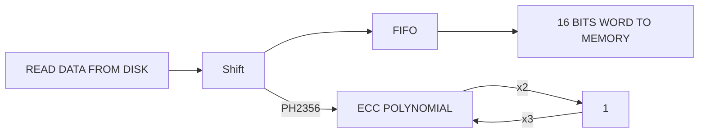
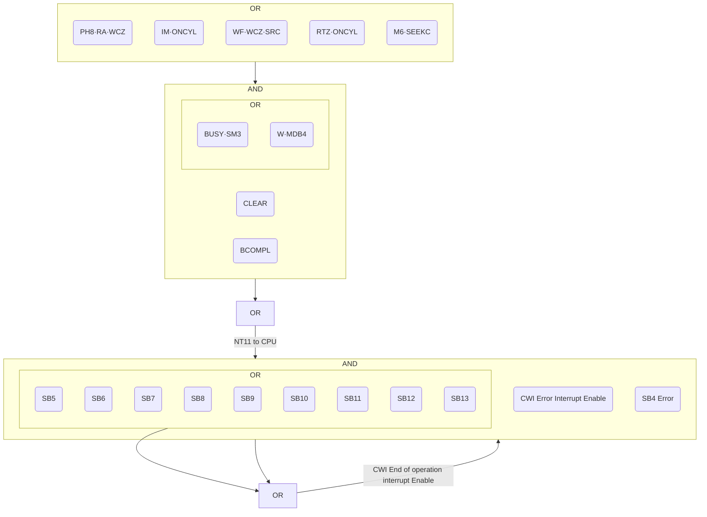
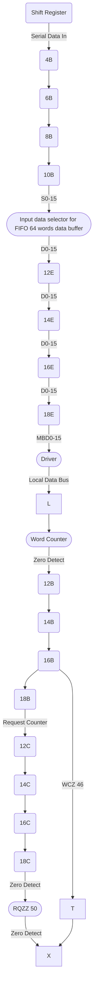
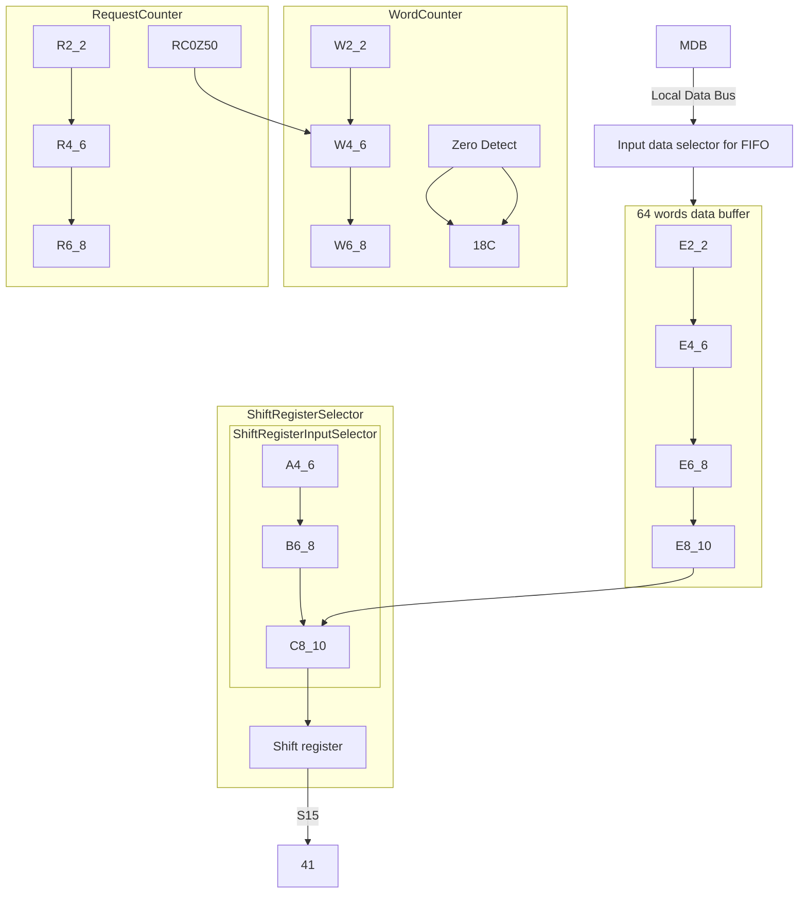
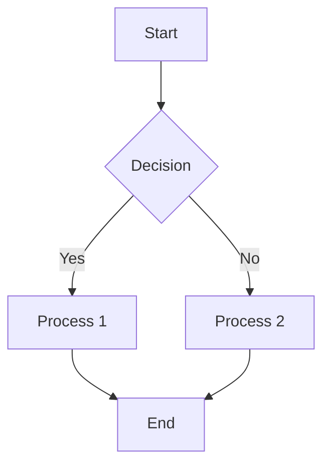
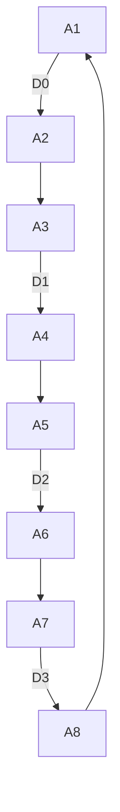
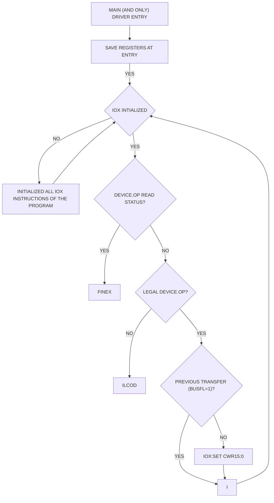
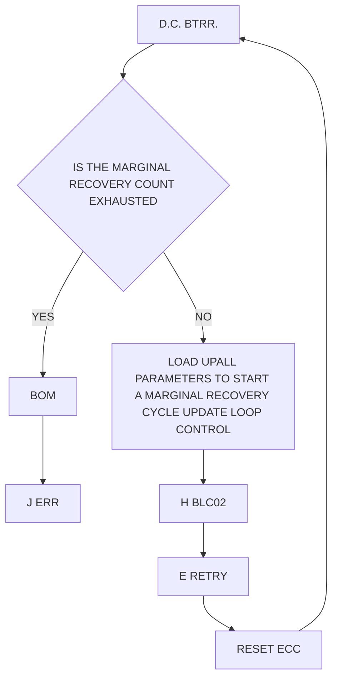

## Page 1

# Error Correction Control (ECC) Disk Controller

## NORSK DATA A.S 

```
[Design: ND logo in dotted pattern]
```

Scanned by Jonny Oddene for Sintran Data © 2010

---

## Page 2

```
 ____________________
|                    |
|                    |
|       TABLE        |
|                    |
|____________________|

Scanned by Jonny Oddene for Sintran Data © 2010
```

---

## Page 3

# Error Correction Control (ECC) Disk Controller

Scanned by Jonny Oddene for Sintran Data © 2010

---

## Page 4

# Revision Record

| Revision | Notes                                                             |
|----------|-------------------------------------------------------------------|
| 10/78    | ORIGINAL PRINTING                                                 |
| 06/79    | Revision A                                                        |
|          | The following pages have been updated:                           |
|          | 1-2, 2-3, 2-4, 5-1, 5-2, 5-3, 5-4, 5-5, B-1, N-1, N-2            |

ERROR CORRECTION CONTROL (ECC) DISK CONTROLLER  
Publication No. ND-11.013.01

```
  ___  ___
 |   ||   |
 |___||___|
 |   ||   |
 |___||___|
```

NORSK DATA A.S  
Postboks 4, Linderberg gård  
Oslo 10, Norway  

Scanned by Jonny Oddene for Sintran Data © 2010

---

## Page 5

# Comments, Error Reports and Requests

The reader’s comment form at the back of this manual invites the reader’s evaluation of the manual. Both general and detailed comments are welcome.

The software system field report form issued by Norsk Data may be used to report errors in documentation.

These forms, together with all other types of inquiry and requests for documentation should be addressed to:

```
Documentation Department
Norsk Data A.S.
Postboks 4, Lindeberg gård
Oslo 10, Norway
```

ND-11.013.01

---

## Page 6

The page is blank, so there's no text or images to convert into Markdown.

---

## Page 7

# TABLE OF CONTENTS
+   +   +

| Section | Description                                  | Page |
|---------|----------------------------------------------|------|
| 1       | ECC DISK CONTROLLER -- GENERAL DESCRIPTION   | 1-1  |
| 2       | ADDRESSING CONCEPT                           | 2-1  |
| 2.1     | Defining the Unit Number                     | 2-2  |
| 2.1.1   | Unit Selection                               | 2-3  |
| 2.2     | Addressing on Disk Pack                      | 2-3  |
| 2.2.1   | Surface (Head Selection)                     | 2-4  |
| 2.2.2   | Cylinder Selection                           | 2-5  |
| 2.2.3   | Sector Selection                             | 2-5  |
| 3       | SECTOR FORMAT                                | 3-1  |
| 3.1     | The Phases                                   | 3-1  |
| 3.2     | The Clock Counter                            | 3-2  |
| 4       | THE INTERFACE SIGNALS                        | 4-1  |
| 4.1     | Signal Explanation                           | 4-2  |
| 4.1.1   | Bus Bit Usage                                | 4-3  |
| 4.1.1.1 | Tag Timing                                   | 4-4  |
| 4.1.2   | The Remaining A Cable Lines                  | 4-5  |
| 4.1.3   | The B Cable Lines                            | 4-6  |
| 5       | ERROR CORRECTION CODE                        | 5-1  |
| 5.1     | General About ECC                            | 5-1  |
| 5.1.1   | Features of the ECC Polynomial               | 5-2  |
| 5.2     | Data Error (Status Bit 9)                    | 5-3  |
| 5.3     | Analyzing the Data Error (Status Bit 9)      | 5-3  |
| 5.3.1   | Run ECC Operation — M8                       | 5-4  |
| 5.4     | The Reliability of Error Correction Control (ECC) | 5-6  |
| 5.4.1   | The Parity Tree                              | 5-6  |
| 5.4.2   | Checking the Parity Tree                     | 5-7  |
| 5.4.3   | A Complete Check of the Detection and Correction Capability of the ECC | 5-8  |

ND-11.013.01

---

## Page 8

# Section

| Section | Page |
|---------|------|
| 6 | CONTROLLER FUNCTIONS ILLUSTRATED BY TIMING DIAGRAMS | 6-1 |

# 7 INTERRUPT GENERATION AND HANDLING

| Section | Page |
|---------|------|
| 7.1 | Error Interrupts | 7-1 |
| 7.2 | End of Operation Interrupt | 7-1 |
| 7.2.1 | Normal End of Operation (BCOMPL) | 7-2 |
| 7.2.2 | Forced Clear (CLEAR) | 7-2 |
| 7.2.3 | Abnormal End of Operation (BRBUSY) | 7-3 |

# 8 DEBUGGING GUIDE

| Section | Page |
|---------|------|
| 8.1 | Check the Operation of the IOX Instructions | 8-1 |
| 8.2 | Check Data Channel | 8-2 |
| 8.3 | Checking the Operation of the Disk Controller (Test Mode) | 8-3 |
| 8.3.1 | ECC Test Loop | 8-4 |
| 8.4 | Connecting a Disk Drive | 8-5 |

# 9 LOGIC BOARDS — SHORT DESCRIPTION

| Section | Page |
|---------|------|
| 9.1 | 1013 — Device Registers (POS 32) | 9-1 |
| 9.2 | 1134 — ECC Control (POS 31) | 9-1 |
| 9.3 | 1092 — Buffered DMA (POS 30) | 9-2 |
| 9.4 | 1133 — ECC Polynomials (POS 29) | 9-5 |
| 9.5 | 1135 — SMD Timing (POS 28) | 9-5 |
| 9.6 | 1077 — SMD Control (POS 27) | 9-6 |
| 9.7 | 1078 — SMD Receive (POS 26) | 9-6 |
| 9.8 | 1154 — SMD Transmit (POS 25) | 9-7 |
| 9.9 | 1156 — Unit Control (POS 24) | 9-8 |
| 9.10 | 1155 — Bus Control | 9-9 |

# Appendix

| Appendix | Description | Page |
|----------|-------------|------|
| A | LOGIC DIAGRAMS | A-1 |
| B | CONTROLLER PCB LAYOUT | B-1 |
| C | SIGNAL DEFINITION LIST | C-1 |
| D | 1155 — PCB SWITCHES AND JUMPERS | D-1 |
| E | SMD SECTOR SWITCH SETTING | E-1 |
| F | PCB POWER REQUIREMENT | F-1 |

---

## Page 9

# Appendix

## G TRACK/SECTOR FORMAT
Page: G-1

## H ECC DISK CONTROLLER BACKWIRING
Page: H-1

## I CONNECTOR LISTS
Page: I-1

## J A THEORETICAL INTRODUCTION TO ERROR CORRECTING CODES (ECC)
Page: J-1

- **J.1** Introduction  
  Page: J-1
- **J.2** Linear, Cyclic Codes for Burst Error Correction  
  Page: J-2
- **J.3** Specific Polynomials  
  Page: J-7
- **J.4** Correction and Detection Capabilities  
  Page: J-11
- **J.5** Summary  
  Page: J-18

## K TEST PROGRAMS
Page: K-1

- **K.1** PASCAN Test Program — 2226  
  Page: K-1
- **K.2** SUPER-RAND Test Program — 2222  
  Page: K-2
- **K.3** ECC Test Program — 2224  
  Page: K-2
- **K.4** BIGFUNC Test Program — 1824  
  Page: K-3

## L SINTRAN III — SMD DISK DRIVER ROUTINE
Page: L-1

## M DISK SPECIFICATIONS
Page: M-1

## N ECC DISK CONTROLLER PROGRAMMING SPECIFICATIONS
Page: N-1

- **N.1** Disk Device Register Address  
  Page: N-1
- **N.2** Disk Format  
  Page: N-2

  - **N.2.1** Disk Address  
    Page: N-2

- **N.3** Control Word  
  Page: N-2

  - **N.3.1** Control Word Content  
    Page: N-2
  - **N.3.2** Select Unit  
    Page: N-3
  - **N.3.3** Marginal Recovery Cycle  
    Page: N-3
  - **N.3.4** Device Operation  
    Page: N-3

- **N.4** Read Seek Condition  
  Page: N-5
- **N.5** Read Status  
  Page: N-6
- **N.6** ECC Count Register (ECR)  
  Page: N-6
- **N.7** ECC Pattern Register (EPR)  
  Page: N-6
- **N.8** ECC Control  
  Page: N-7

ND-11.013.01

---

## Page 10

[Page is blank and contains no visible text or diagrams to convert.]

---

## Page 11

# ECC DISK CONTROLLER — GENERAL DESCRIPTION

The ND558 ECC disk controller can handle from 1 to 4 disk units. The disk units can be ND574 (288 Mbytes disk unit), ND572 (75 Mbytes disk unit) or ND576 (37 Mbytes disk unit).

Any mixture of the above units can also be connected to the same controller.

ECC (Error Correction Control) is standard. ECC implies, for this controller, that all error bursts of up to 11 bits are detected and corrected.

All error bursts of up to 34 bits are detected but not corrected.

The controller converts the DMA data flow (data to/from memory) to a serial bit stream (to/from the selected unit).

A 64 word FIFO (temporary storage) located in the controller allows the data path bandwidth to be exceeded for short intervals. Data flow for read and write is illustrated in Figures 1.1 and 1.2 respectively.

The ECC disk controller is located in the I/O system (Input/Output system) and occupies 9 to 12 I/O card slots which correspond to 1 to 4 units connected (respectively). Refer also to Appendix B.

For details regarding the disk units refer to Appendix M.

---

## Page 12

# Figures

## Figure 1.1: Write Data


## Figure 1.2: Read Data



---

ND-11.013.01  
Revision A  

Scanned by Jonny Oddene for Sintran Data © 2010

---

## Page 13

# Addressing Concept

Figure 2.1 shows the controller/units interconnection. As already mentioned, a disk system may consist of from 1 to 4 units connected to the same controller.

As illustrated in Figure 2.1, each unit is connected to the controller via two cables. The A cable is daisy-chained through all units and terminated at the end. Only one unit (the selected unit) can communicate with the controller at the same time. There is one B cable for each unit.

```plaintext
     ------------------------------
                ND 558
         ECC DISK CONTROLLER
     ------------------------------
         A   B     B     B     B
         |   |     |     |     |
         |   |     |     |     |
       +-+ +-+   +-+   +-+   +-+ 
       |S| |S|   |S|   |S|   |S|
       |M| |M|   |M|   |M|   |M|
       |D| |D|   |D|   |D|   |D|
       |0| |1|   |2|   |3|   | |
       +-+ +-+   +-+   +-+   +-+
                 TERM
                ----
                 |M|
                 +++
```

*Figure 2.1: Controller/Units Interconnection*

---

## Page 14

# 2.1 Defining the Unit Number

On the front panel of the unit, a numbered unit select plug defines the unit number. (Each unit is shipped with a plastic bag containing 16 unit select plugs.) On the corresponding "1156 SMD UNIT CONTROL" card (connected via the B cable) in the controller, the unit define switches must be set to the corresponding value (location 9D). Refer to Figure 2.2 for switch setting.

It is important that the setting of unit number on the unit (plastic plug) and the controller (corresponding 1156 card) are equal.

Example: Illustration shows unit 0 setting on the 1156 board.

```
     +-------------+
     |             |
     |      1056   |
     |             |
     +-------------+
         |
         |
         v
         +---->      +---+
                     | 0 |
         +           +---+
         |-----+     | 1 |
         |     |     +---+
         +-----+     | 2 |
                     +---+
                     | 3 |
                     +---+
                     | 4 |
                     +---+
```

| Unit Define Table |     |      |      |     |
|-------------------|-----|------|------|-----|
| **Switch No.**    | \(2^0\) | \(2^1\) | \(2^2\) | 0   |
| **Unit No.**      | 1   | 2    | 3    | 4   |
| **0**             | ON  | ON   | ON   | ON  |
| **1**             | OFF | ON   | ON   | ON  |
| **2**             | ON  | OFF  | ON   | OFF |
| **3**             | OFF | OFF  | ON   |     |

*Figure 2.2: Unit Number Definition*

ND-11.013.01

---

## Page 15

# 2.1.1 Unit Selection

Bits 7 - 9 in the control word specifies the unit number that the CPU wants to access. The binary value for the unit number is transmitted on the A cable, on the unit select lines, and compared with the select plugs. The unit in which the unit codes match will be selected.

# 2.2 ADDRESSING ON DISK PACK

Once the unit is selected, a specified block of data on a disk pack can be pointed out by the block address. The block address is held by two registers in the interface; block address register I and block address register II. (Refer to Programming Specifications, Appendix N.)

The block address is logically divided into 3 fields:

- the surface (head) selection
- the track selection
- the sector selection

Figure 2.3 illustrates the block address format.

```
CWR bit 15 = 1                            CWR bit 15 = 0
15                 0 15                 8 7 0
+------------------+------------------+
|                  | Surface (head)   | Sector
|   Cylinder       |
+------------------+------------------+
Block Address Register II   Block Address Register I

Figure 2.3: Block Address Format
```

---

## Page 16

# 2.2.1 Surface (Head Selection)

- The 288 Mbytes disk has 19 (0 - 18) recording surfaces (heads) and one prerecorded servo surface.
- The 38/75 Mbytes disk has 5 (0 - 4) recording surfaces (heads) and one prerecorded servo surface.

The servo head is always selected and always reading. The information from the servo surface serves a number of purposes in the unit. Figure 2.4 shows a 38/75 Mbytes disk pack and a 288 Mbytes disk pack.

```
                     Top protection cover
  _______________________________
 |                             |
0|_____________________________|
 |                             |
1|_______________servo_________|
 |                             |
2|_____________________________|
 |                             |
3|_____________________________|
 |                             |
4|_____________________________|
                             38/75 Mbytes disk pack
  _______________________________
 |                             |
   Bottom protection cover


                     Top protection cover
  _______________________________
 |                             |
0|_____________________________|
 |                             |
1|_____________________________|
 |                             |
2|_____________________________|
 |                             |
3|_____________________________|
 |                             |
4|_____________________________|
 |                             |
5|_____________________________|
 |                             |
6|_____________________________|
 |                             |
7|_____________________________|
 |                             |
8|_______________servo_________|
 |                             |
9|_____________________________|
 |                             |
10|____________________________|
 |                             |
11|____________________________|
 |                             |
12|____________________________|
 |                             |
13|____________________________|
 |                             |
14|____________________________|
 |                             |
15|____________________________|
 |                             |
16|____________________________|
 |                             |
17|____________________________|
 |                             |
18|____________________________|
                             288 Mbytes disk pack
  _______________________________
 |                             |
   Bottom protection cover
```

*Figure 2.4: 38/75 and 288 Mbytes Disk Packs*

ND-11.013.01  
Revision A

---

## Page 17

## 2.2.2 Cylinder Selection

When control word bit 2 is activated, the content of block address register II (cylinder number) is transferred to the servo system in the selected unit. Logic in the unit will calculate the difference between the current cylinder and the new one. The difference and direction will command the servo to seek to the new cylinder.

- The 38 Mbytes disk has 411 cylinders
- The 75/288 Mbytes disk has 823 cylinders.

Refer also to Figure 2.5.

```
         disk pack
          rotation
              \              
               \               
                \               Index
                 \               |
                  \  | Sector number
                    V
                +--------------+
              /                /
           /  16.   |   17   / 0  /
         / 15      |       / 1   /
       /     14   |     / 2    /
     /___________|___/____/
   |      13  |      /  3     | Track 0
   |         /|    / 4       | Track 411 for 38 Mbytes disk
   |        / |  / 5         | Track 823 for 75/288 Mbytes disk
   |_ _ _ ¯¯|/_ _ _____|_
  |    12  / /|
  |___    |_ _|_____  |
     |   11 /  |     5    | FEOT - Forward end of travel
     |____ /   | 6         | REOT - Reverse end of travel
     |   / 10  |  7       |
     |  /    9 | 8        |
     |_/_____ ______/|
   |______
   | REOT
```

*Figure 2.5: Tracks and Selectors*

## 2.2.3 Sector Selection

The number of sectors accepted by the controller is 18 and applies for 38/75 and 288 Mbytes disk units.

The sector number is held by the lower byte of block address register I (refer to Figure 2.3).

On 1156 (SMD unit control) when the sector counter (synchronized to the sectors on the disk pack) matches the sector part of the block address, a read/write operation can take place.

**NOTE:** On the unit the sector number is defined by switches. Refer to Appendix E for details.

ND-11.013.01

---

## Page 18

It appears the scanned page is mostly blank except for a note at the bottom:

```
Scanned by Jonny Oddene for Sintran Data © 2010
```

---

## Page 19

# SECTOR FORMAT

As previously stated, the disk pack is divided into 18 sectors. Each sector is again divided into subfields referred to as phases. Appendix G gives a summary of the phases, etc.

## 3.1 THE PHASES

On the 1135 (SMD Timing) board, a bit counter and a phase generator are located. A sector is divided into 8 phases.

**Phase 1:**

This phase consists of 232 0's ending with 8 1's. The purpose of this phase is:

- to compensate for sidewise mechanical skew between the read/write heads with respect to the servo head.
- to compensate for read circuits set up time.
- to allow the data/clock separation circuits phase lock oscillator to synchronize and lock.

This phase is written during the formatting process.

**Phase 2:**

During formatting the block address is written onto the disk pack. Refer to Figure 2.3 for format.

**Phase 3:**

The block address written onto the disk in phase 2 during formatting is at the same time generating a 56 bit error correction code (ECC) which is written onto the disk in phase 3 during formatting. For more details regarding the ECC code, see Chapter 5 and Appendix J.

**Phase 4:**

This phase is identical to phase 1. The purpose is to resynchronize the phase lock oscillator in the data/clock separation circuits.

Phase 4 is first written during the formatting process, but will be rewritten for each normal write operation on the sector in question.

**Phase 5:**

Phase 5 represents the data capacity for the sector and is equal to 512 16 bit words (1/2 K words). This data is taken from memory over a DMA channel during a write operation and reverse for a read operation.

**Phase 6:**

When the data is written onto the disk in phase 6 an error correction code (ECC) is generated. This code will then be written onto the disk in phase 6. Refer to Chapter 5 and Appendix J for further details.

---

## Page 20

# Phase 7

This phase consists of 8 1's indicating end of sector.

# Phase 8

This phase consists of 0's and the purpose is to compensate for sidewise mechanical skew between the read/write heads with respect to the servo head.

## 3.2 THE CLOCK COUNTER

The clock counter is also located on the 1135 (SMD timing) board. The clock counter, working as an input to the phase generator which again resets the clock counter at termination of each phase.

The clock pulses, which are counted, derive either from the write clock, read clock or an internal clock oscillator used in test mode.

The circuits which perform the clock selection are located on the 1078 (SMD receiver) module.

---

## Page 21

# 4 THE INTERFACE SIGNALS

For the following discussion refer to Appendix B and Figure 2.1.

In this chapter, the signals between the unit and the controller will be listed and explained. As depicted in Figure 2.1, the signals are transferred over two cables, the A and B cables.

In order to exchange signals between the controller and a unit over the A cable, the unit must be selected. Refer to Chapter 2.

On the B cable, however, the signal exchange takes place without unit selection.

Figure 4.1 lists the interface signals on the A and B cables and the corresponding cards in the controller.

```
   +-----------------------------------------------------------+
   | Tag 1                                                     |
   | Tag 2                                                     |
   | Tag 3                                                     |
   | Bus bits 0-9                          10                  |
   | Inhibit                                                   |
   | Unit Select 1                                             |
   | Unit Select 2                                             |
   | Unit Select 4                                             |
   | Unit Select 8 (not used)                                  |
   | Unit Select tag                                           |
   | Fault                                                     |
   | Seek Error                                                |
   | On cylinder                                               |
   | Unit Ready                                                |
   | Pick in                        Cable A                    |
   | Hold                                                       |
   | Write Protect                                             |
   | Address mark found                                        |
   | Write data                                                |
   | Write clock                                               |
   | Servo clock                                               |
   | Read data                                                 |
   | Read clock                                                |
   | Seek end                                                  |
   | Unit selected                                             |
   | Index                                                     |
   | Sector                                                    |
   +-----------------------------------------------------------+
      1154                                                     1078
      SMD                                                      SMD
      Transmit                                                 receiver

   +--------------------------------------------------------------------+
   | Not used                                                           |
   | Write data                                                         |
   | Write clock                                                        |
   | Servo clock                             1156*                      |
   | Read data                              Unit                       |
   | Read clock                            Control                     |
   | Seek end                                                           |
   | Unit selected                                                      |
   | Index                                                              |
   | Sector                           Cable B                          |
   +--------------------------------------------------------------------+
```

* One 1156 and one B cable per unit, maximum 4.

*Figure 4.1: The Interface Lines*

ND-11.013.01

---

## Page 22

# 4.1 SIGNAL EXPLANATION

This section is divided into 3 parts:

- bus bit usage
- the remaining A cable lines
- the B cable lines

ND-11.013.01

---

## Page 23

# 4.1.1 BUS BIT USAGE

The bus bits 0 - 9 are used for 3 purposes defined by the tag 1, tag 2 or tag 3 line.

1. **Tag 1 line activated.**

   Refer to Figure 2.3. The cylinder address taken from the lower part of block address register II is transferred over the bus bits and strobed into the cylinder address register in the selected unit.

2. **Tag 2 line activated.**

   Refer to Figure 2.3. The head select bits taken from the upper byte of block address register I is transferred over the bus bits and strobed into the head select register in the selected unit.

3. **Tag 3 line activated.**

   When tag 3 is activated, the various functions as given in the table below is sent from the controller to the selected unit.

| Bus Bits | Function                                                                                      |
|----------|-----------------------------------------------------------------------------------------------|
| 0        | Write Gate. Enable write drivers.                                                            |
| 1        | Read Gate. Enable the read circuits and data/clock separator circuits in the drive.          |
| 2        | Servo Offset Plus. Offsets the actuator (heads) from the center of a track position towards the spindle. |
| 3        | Servo Offset Minus. Offsets the actuator (heads) from the center of a track position away from the spindle. |
| 4        | Fault Clear. Pulse sent to the drive to clear the fault summary latch.                      |
| 5        | Address Mark Enable (not used).                                                             |
| 6        | Return to Zero Seek (RTZ). Pulse sent to drive causing the actuator to seek back to track zero. |
| 7        | Data Strobe Early. Enable the data/clock separator (phased locked oscillator — PL0) to strobe the data at a time earlier than optimum. |
| 8        | Data Strobe Late. Enables the data/clock separator (phased locked oscillator - PL0) to strobe the data at a time later than optimum. |
| 9        | Not used.                                                                                    |

ND-11.013.01

---

## Page 24

# 4.1.1.1 Tag Timing

On the 1154 (SMD transmitter) the tag timing generator is located. For every function that should be performed on the disk tag 1, 2 and 3 will be issued in the listed sequence.

For more details refer to Figure 4.2.

```
   _______________                 __________________________
  |               |               |                          |
MS₁               |               |                          |  Master start CWR bit 2
   _________________ _________________ _________________ _________________ 
  |     |     |     |     |     |     |     |     |     |     |     |     |
STRC₁                                                          Tag timing clock
  _______________       _______       _______       _______       _______
 |               |     |       |     |       |     |       |     |       
S₁              S₂    S₃      S₄    S₅      S₆    S₇      S₈                Tag timing counter output

  _________________                 _
 |                 |               | |                        Enable cylinder number onto bit bus
CYCLE₁             |\_____________| |
                 _/|
                |  |                                                    
TAG₁            |  |                                     Strobe cylinder number into unit
                |  |                                
                |__/                                  
                  _____               _________________
                 |     |             |                 |
HEAD₁            |     |             |                 | Enable head number onto bit bus

   ____________________            ____________________
  |                    |          |                    |
TAG₂                                                     Strobe head number into unit

   __________________________________  
  |                                  |
TAG₃                                Enable function onto bit bus
      
   _______________   
  |               |   
On Cylinder₁ 
```

*Figure 4.2: Tag Timing*

ND-11.013.01

[Scanned by Jonny Oddene for Sintran Data © 2010]

---

## Page 25

# 4.1.2 The Remaining A Cable Lines

**Open Cable Detect**

Inhibits unit selection and any unwanted command such as Write Gate when "/A" cable is disconnected or controller power is lost.

**Unit Select lines 2₀ - 2₃**

Used to select the drive. The binary code on these lines must match the code of the drive logical address plug for the drive to be selected. These lines are used in conjunction with the unit select tag (refer to Unit Selection).

**Unit Select Tag**

Starts unit select sequence (refer to discussion on Unit Selection) and is used in conjunction with Unit Select lines 2₀ - 2₃.

**Fault**

Indicates that one or more of these faults exist: DC power fault, head select fault, write fault, write or read while off cylinder, and Write Gate during a read operation (refer to Fault and Error Detection).

**Seek Error**

Indicates that the unit was unable to complete a move within 500 ms, or that carriage has moved to a position outside the recording field. A seek error interrupt also occurs if an address greater than track 822 (410) has been selected. Refer to Seek Functions for more information.

**On Cylinder**

Indicates drive has positioned the heads over a track (refer to Seek Functions).

**Unit Ready**

Indicates that drive is selected, up to speed, heads are loaded and no fault exists.

---

ND-11.013.01

---

Scanned by Jonny Oddene for Sintran Data © 2010

---

## Page 26

# 4.1.3 The B Cable Lines

## Write Data

Carries NRZ data to be recorded on disk pack.

## Write Clock

Synchronized to NRZ Write Data, it is a return of the Servo Clock. This signal is transmitted continuously.

## Servo Clock

9.677 MHz clock signals derived from servo track dibits (refer to Machine Clock).

## Read Data

Carries NRZ data recovered from disk pack (refer to discussions on Read/Write functions).

## Read Clock

Clock signals derived from NRZ read data (refer to discussion on Read/Write functions).

## Seek End

Seek End is a combination of ON CYL or SEEK ERROR indicating that a seek operation has terminated. If an address greater than 822 (410 on BJ4A1) cylinders has been selected there will be no change in Seek End status (refer to Seek Functions).

## Unit Selected

Indicates that the drive is selected. This line must be active before drive will respond to any commands from the controller.

## Index

Occurs once per revolution of disk pack and its leading edge is considered leading edge of sector zero.

## Sector

Derived from servo surface of disk pack, this signal can occur any number of times per revolution of the disk pack. The number of sector pulses occurring depends on setting of switches on the card in position A06 in logic chassis. Refer to Appendix E for Switch Setting.

---

## Page 27

# 5 ERROR CORRECTION CODE

For the following discussion refer to "Track/Sector Format", Appendix G and Chapter 3 where the sector phases are briefly explained.

The theoretical discussion of "Error Correcting Codes" (ECC) is given in Appendix J. From that discussion it is found that a 56 bit "Error Correcting Code" is decided on for use in the ECC disk controller.

## 5.1 GENERAL ABOUT ECC

For this discussion, refer to Figures 1.1 and 1.2. The ECC polynomial register is a shift register with several inputs, several feedbacks and one output. It is the main clock in the controller (read, write or test clock) that perform the shifts. At the same time as the address is shifted out to the disk in phase 2 during formatting, the address appears at the input of the ECC polynomial. The feedback circuits are enabled and at the end of phase 2, a 56 bit polynomial is generated.

In phase 3, the input and feedback is blocked and the content will be shifted out onto the disk.

The exact same sequence takes place during a normal write operation in phase 5 and 6, respectively. The difference, however, is the length of phase 2 and 5.

During the read operation, both address and the ECC code read from disk are shifted into the ECC polynomial register. The feedback circuits are enabled during phase 2 and 3. If the address and the ECC code now read are the same as previously written, the content of the ECC polynomial register shall be equal to zero at the end of phase 3.

The same thing takes place when reading in phase 5 and 6.

```
ND-11.013.01
Revision A
```

---

## Page 28

# 5.1.1 Features of the ECC Polynomial

Errors that occur to the data on the disk, often caused by bad spots, show up as error bursts. The length of the error burst is normally a few bits long.

The burst length is defined as the number of bits from the first to the last failing bit. If, for example, the first and the last bits on a sector are wrong, we regard this as one error burst of 8192 bits in length. Thus, only one error burst is possible per sector.

It is desirable that we are able to detect and correct error burst as long as possible.

As already mentioned, the ECC polynomial is generated in a 56 bit special purpose shift register according to the formula:

```
G(X) = X⁵⁶ + X⁵⁵ + X⁴⁹ + X⁴⁵ + X⁴¹ + X³⁹ + X³⁸ + X³⁷ + X³⁶ + X³¹ + X²² + X¹⁹ +
       X¹⁷ + X¹⁶ + X¹⁵ + X¹⁴ + X¹² + X¹¹ + X⁹ + X⁵ + X + 1.
```

The ECC polynomial is logically divided into two parts, one LO and one HI portion as indicated in Figure 5.1. With this polynomial it is possible with 100% reliability, to detect error burst of up to 34 bits and to correct error burst of up to 11 bits. As the length of error bursts exceeds 34 bits, the chance of detecting them reduces slightly. [Additional information in Appendix J.]

It is to be noticed that the polynomial is not generated in the same fashion during read and write. During read a fixed multiplier is inserted so that the period of the polynomial is equal to the length of PH5 + PH6 = 8192 + 56 = 8248. Therefore, where running the ECC operation (M8), explained later, the shift count directly represents the displacement of the error burst. Refer to Figure 5.2.

The period of the polynomial can be found by inserting a bit pattern then close the input and enable the feedbacks, and apply shift pulses until the original bit patterns appear again. The number of shift pulses is then the period of the polynomial.

```
  INPUT ──────────────────────────────────────────────┐
                                                     │
             11 bits                                 │        45 bits
 ┌──────────┬────────────────────────────────────────┼─────────────────────────────┐
 │  LO      │    HI                                  │                             │
 ├──────────┴─────────────────────────┬──────────────┼─────────────────────────────┤
 │ E0                                E10           E11                           E55 │
 └────────────────────────────────────┴──────────────┴─────────────────────────────┘

Figure 5.1: ECC Polynomial — LO/HI
```

ND-11.013.01  
Revision A  

Scanned by Jonny Oddene for Sintran Data © 2010

---

## Page 29

# 5.2 DATA ERROR (STATUS BIT 9)

If the address/data read in phase 2/5 is not identical to the data previously written, the ECC polynomial will be nonzero at the beginning of phase 4/7. This is interpreted as Data Error and status bit 9 sets. If interrupt is enabled, an interrupt is generated to the CPU. The ECC polynomial circuits and zero detector are located on 1133 (ECC polynomials).

It is, however, of great importance to know whether the Data Error (status bit 9) means bad address (PH2) or bad data (PH5). If Data Error (status 9) is detected on the address (PH2), bit 15 of the Read Seek Condition register will also set. Refer to Programming Specifications, Appendix N.

# 5.3 ANALYZING THE DATA ERROR (STATUS BIT 9)

The status bit 9 will cause an interrupt and the system will initiate an M8 operation. (This operation is new for this controller.) After termination of the M8, the driver checks if the error has occurred in the sector address or in the data. If bit 15 in Read Seek Condition Register (SCR) is set, the controller shows that the error has occurred in phase 2, sector address. The driver decides that this is a non-correctable error. On the other hand, if SCR bit 15 is not set, the error is in the data field and the ECC polynomial has to be analyzed.

## 5.3.1 Run ECC Operation, Error is Correctable

The M8 operation is initiated to analyze the data error. This operation starts in phase 4 or phase 7. This is a shift operation where the input to the ECC polynomial is closed but the feedbacks are open. The controller clock (CL) is used as shift clock.

An ECC Count Register (ECR) keeps track of the number of shifts while the zero detector circuits look at the HI portion of the ECC polynomial.

When the HI portion is equal to zero, the operation is terminated and interrupt is generated. The content of ECR will point at the last error bit in the data and the content of the LO portion represents the error bits. (LO content is the exclusive OR representation of the actual and expected data.)

```
ND-11.013.01

Revision A
```

---

## Page 30

# 5.3.2 The Error is not Correctable

The number of shifts is for the data field maximum 8192 + 56 (ECC) = 8248.

If the number of shifts reaches this value without HI-protion equal zero, the error burst is more than 11 bits long. The error is then not correctable, RSC bit 13 is equal zero and interrupt is generated.

# 5.3.3 The Error is in the Error Correction Code

If the M8 operation is terminated with an ECR (ECC Count Register) value between 8203 and 8248 (max. count), the data error has occurred in the ECC itself. The data correction is then not required.

```
                (value of the counter)
                    +------------------------------+
                    |"Read ECC Count" registers    |
                    +------------------------------+
                            /
M8 operation terminates    /
      HI = 0              /
            |            /
  0---------|-----------o------------------> Error Displacement
            |           |
            |           |
            |           |
            |           |
     PH4    |    PH5 - DATA    PH6
            |           | 
            |           |
            |           |
            |           |
       { 8192           | 56  }
                        | 
                        |   { 11 bits held by the 
                        |     LO portion of the
                        |     ECC polynomial         / 
                        |                              /
                        |                             /
                        |                            /
                        |"Read ECC Pattern" register/
                        +------------------------------+
                        | (The I bits represent the     |
                        |  Error bits in the data)      |
                        +------------------------------+  
```

*Figure 5.2: Error Detection / Data Correction*

ND-11.013.01  
Revision A

---

## Page 31

# 5.3.4 Data Correction (Figure 5.2)

The data read in phase 5 is stored as one block in memory. The Error Pattern Register (EPR) holds the LO-portion of the polynomial and the Error Count Register (ECR) points at the rightmost position of the error burst. With this information the driver routine can easily perform the data correction using an exclusive OR function.

---

## Page 32

# 5.4 THE RELIABILITY OF ERROR CORRECTION CONTROL (ECC)

The ECC gives a good reliability for the data stored on the disk. It is therefore of importance to be sure of proper operation of the hardware circuits involved.

## 5.4.1 The Parity Tree

For the following discussion refer to Figure 5.3.

At the same time as data is shifted into the ECC polynomial shift register, the 1's will toggle a flip-flop at the input. Experience shows that the number of ones in the ECC polynomial, including the state of the toggle flip-flop, is always an even number. This is true during the entire shift operation of the ECC register.

A parity tree is therefore employed to monitor the operation of the ECC polynomial. If the ECC polynomial is malfunctioning, status bit 7 (ECC parity error) will set. Bit 14 of the Read Seek Condition will also set to report this error.

---

## Page 33

# 5.4.2 Checking the Parity Tree

Refer to Figure 5.3.

It is also possible to check the parity tree for proper operations. This is done by forcing a 1 into 7 of the 8 parity generators. If all the 7 parity generators are functioning properly, status bit 7 and Read Seek Condition bit 14 will be set. However, if an even number of parity generators are not functioning it will not be detected by this test. The test bit is set by the ECC control register bit 1.

```
                         ________________
________________________| ECC polynomial  |_________________________
|                       |_________________|
|                              |        |        |        |        |         |        |        |
|____________________________________________________________________________
|          |         |        |        |         |        |         |        |
|     ___   ___  ___     ___  ___      ___  ___     ___  ___       ___  ___  |       TST (ECC control
|     | | | | | | | |   | | | | |    | | | | | |   | | | | |    | | | | |    |       register bit)
|     |8| | | | |8| |   | | | |8|    | | | |8| |   | | | | |    |8| | | |    |       Parity generators
|     |_| |_| |_| |_|   |_| |_| |_|  |_| |_| |_|   |_| |_| |_|  |_| |_| |_|  |       PARITY
|                                                     |~~~~~~~~~~~~~~~~~     |       GENERATORS
|                                                     |~~~~~~~~~~~~~~~ <------ 
|                                                                 |
|                                                                 
|
|            __________________________                         |
|_____________|                            |___________________|                             Toggle
______| FF      EVEN                               
|  _______________ |
|_| D                |
  | O                |
  |                  |
  | CLOCK        |
|_________________|                PAR ERR Status register bit 7 
                            (ECC parity error)
                                  "Read Seek Condition"
                                       Bit 14
```

The parity circuits constantly check the ECC polynomial circuits for proper operations. The TST bit checks the parity threes for proper operation.

*Figure 5.3: ECC Polynomial Check Circuits*

---

## Page 34

# 5.4.3 A Complete Check of the Detection and Correction Capability of the ECC

This check is performed by using the ECC control register bit 2, the "long" bit. (Refer to Figure 5.4.)

When performing a read operation (IMO) with the "long" bit set, phase 5 will be extended with 64 bits so that PH5 long = PH5 + PH6 + PH7. It is thus possible to read PH5 + PH6 + PH7 as data and store it in memory. Under program control it is now possible to introduce a known failure to the data. Then a write operation is performed with the long bit set. The data with the introduced error but correct ECC is written onto the disk. Then a normal read operation is performed. During this operation Data Error should be reported through status register bit 9. An M8 operation can then be initiated and at completion the Read Seek Condition register bit 13 (ECC correctable) will indicate if the error is correctable or not. The ECC Count Register (ECR) will hold the displacement of the error (refer to Figure 5.2) and the ECC Pattern Register (EPR) will hold the ERROR.

This operation gives a complete check of the data paths and the disk controller.

Finally, the ECC polynomial must be cleared by a ECC control bit 0 (reset ECC).

```
  ┌────────────────────┬────────────┬───────┐
  │                    │            │       │
  │                    │            │       │
8192                  56           8
  │                    │            │       │
  │ PH5                │ PH6        │ PH7   │
  └────────────────────┴────────────┴───────┘
  └───────────────────────────────────────────┘
                                PH5 long
```

*Figure 5.4: Read/Write Long*

ND-11.013.01

---

## Page 35

# 6 CONTROLLER FUNCTIONS ILLUSTRATED BY TIMING DIAGRAMS

In this chapter, a few timing diagrams are presented. Each line is labeled with the board number on which they are generated or used.

The timing diagrams do not describe the complete functions, but might be helpful when studying the logic diagrams.

The following diagrams appear:

- **Figure 6.1**: Control Timing
- **Figure 6.2**: Read Sync Byte
- **Figure 6.3**: Read Address
- **Figure 6.4**: Read Data
- **Figure 6.5**: Write Sync Byte and Address
- **Figure 6.6**: Write Data
- **Figure 6.7**: Compare Mode
- **Figure 6.8**: Tag Timing
- **Figure 6.9**: Read from Disk
- **Figure 6.10**: Write to Disk

ND-11.013.01

---

## Page 36

# Figure 6.1: Control Timing

```plaintext
        ________________________________________________________
       |                                                        |
       |                                                        |
   ___|  |______________________________________________________|______ Read Data Only
   | 
   |    ______________________________    _________________
   |   |                              |  |                 |
   |   |                              |  |                 |
   |   |                              |  |                 |
   |   |______________________________|  |_________________|
   |    15                            63  15                63
   |   __________________________________________________________    Read Address
   |  |                                                         |
__|  |                                                         |
    |  |_______________________________________________________|

     ___________________________________________________________    Address
    |                                                           |
    |                                                           |
    |___________________________________________________________|

_______________________________________________________________|____________

     ___________________________________________________________    Write Data
    |                                                           |
    |                                                           |
    |___________________________________________________________|

                PH12 Read (or disk equal to Block Address register)
____________________________________________________________

```

---

## Page 37

# Figure 6-2: Read Sync Byte

```plaintext
\
 \
    192          193           194
/\/\/\/\/\/\/\/\\              __________________
                      /\/\    /
______________________/                  /\/\/
 __________________________________________________
          /\/                /\/\/
111111111111111111                                                         ____________________
000000000000000000
                                                                                          /\/
/\
    __________________              /\   \/\
                       /\/\    /
/\/\/\/\/\/\/\/\\        
/\/\/\/\/\/\/\/\/\\
____________________  /\/            /\/\/
\                 \                  ^          /
 \                 \                  |         /
  \                 \_________________/       \

\               \               /
 \/\/\/\/\/\        /\/\/\/\/\\\\


\       \        __________   \
 \       \      | SYNC HC  |   \ 
  /\/\/\ \/\/\/\|       \|   \    /\   /\
                ######################################
                                                                         
                                        ########

```

- **Write Clock**: W.CL
- **Bit Count of 192**: B192
- **Bit Count Enable**: [Illegible]
- **Read Clock**: RCC
- **Enable Count**: RD
- **Phase 1**: PH1
- **Sync Bit Counter**: C0 C1 C2 C3
- **Sync Character**: SYNC HC
- **Local Bit Counter**: LOAD

ND-11.013.01

[Scanned by Jonny Oddene for Sintran Data © 2010]

---

## Page 38

## Figure 6-3: Read Address

```ascii
     ___     ___     ___     ___     ___     ___     ___     ___     ___     ___
    |   |   |   |   |   |   |   |   |   |   |   |   |   |   |   |   |   |   |   | 
    |   |   |   |   |   |   |   |   |   |   |   |   |   |   |   |   |   |   |   |  
 ---     ---     ---     ---     ---     ---     ---     ---     ---     ---     ---
  ________________________________________________________________________________
 |________________________________________________________________________________|
 |                                                                                |
---   ---                                                                        ---
| |   | |                                                                        | |
|_|   |_|                                                                        |_|
Read Clock                                                               RCL (1078)
Block Addr.                                                             B A (1134)

      ___________________________________________________________________________
     |                                                                           |
 --- |                                                                           |
|   ||                                                                           |
|   ||                                                                           |
 ---                                                                             PH#2
SY-                                                                         (1077/1135)
NCH
 (1077/
1135)                                                                             PH2
                                   _____________________________________     (1135)
                                  |                                     |
 ------------------------------  |                                     |  ------------------
|                                |                                     |                  |
|                                |             Read address bit 2      |                  |
|                                |            = fourth read address bit|                  |
|                                |                Address mismatch after 32 WA pulses    |
|                                |                                     |                  |
 ------------------------------  |                                     |  ------------------
   0  0  1   1  3                    31  _______________     A10        ___________________
 | | |     | |   |             ________|               |__________     |  
 | | |     |_|   |             |                     |                               
 | | |           |             |____________         |                                  
 | | |           |                                                         RA0         
 | | |                                                           RA1
 | | |                                                    RA2
 | | |                                              RA3 
 | | |                                      RA4            
 | | |                               RA5   
 | | |                        PH3
        23       22  5 4                                       41             RA6
                   | |  |                                     | 1
     ______________| |  |                                     | _
    |               |  |    |                                | | |
___| |______________________________                           39  39       PHG  (1135)
Shift Da.                       |    |                        | | | |  
Differnt                        |   |   A26 A25 A811 A B A  A          (1135)
Address                                |   |  |    810 1090
                                     ______________

Shift and                                26  |  Addresses
Receive Clock                          ___________________________________________
 Shift                                   |                                        |  
Phase 3                                  |                                       |
  (1135)                                         |       _________________________________________
 |       |                                           |      |                                       |
 |                                                 1      |                                       |
 |                                                    |    |                                       |
 |                                                                   |                               |
1  241                                                    |
151                                                      | PH3 Count of 32 |                        |
155                                                      |        1      _____ =====              Read Gate
1078                                             ____________________________________________________|     
                                                                                        |          
____                                                                                        
DA  (1078)                                               
                                                                                      
RG  (1077)               
                                                                                                         |
               ____________________________________________________________________
|                                                                          | ___

```

ND-11.013.01

Scanned by Jonny Oddene for Sintran Data © 2010

---

## Page 39

## Figure 6-4: Read Data

```
  __    __    __    __    __    __    __    __    __    __    __    __    __    __    __    __  
 |  |  |  |  |  |  |  |  |  |  |  |  |  |  |  |  |  |  |  |  |  |  |  |  |  |  |  |  |  |  |  | 
 |  |__|  |__|  |__|  |__|  |__|  |__|  |__|  |__|  |__|  |__|  |__|  |__|  |__|  |__|  |__|  | 
                                                                                                
  0    1    2    3    4    5    6    7    8    9   10   11   12   13   14   15                  
                                                                                                
    __    __    __    __    __    __    __    __    __    __    __    __    __    __    __       
   |  |  |  |  |  |  |  |  |  |  |  |  |  |  |  |  |  |  |  |  |  |  |  |  |  |  |  |  |   |      
__|  |__|  |__|  |__|  |__|  |__|  |__|  |__|  |__|  |__|  |__|  |__|  |__|  |__|  |______|      
                                                                                                
  0    1    2    3    4    5    6    7    8    9   10   11   12   13   14   15                  
                                                                                                
                    __                         __                                               
                   |  |                       |  |                                              
   __              |  |                       |  |                                              
__|  |_____________|  |_______________________|  |___________________________                    
                                                                                                
        PH C (10755)                      SYNCH C (10771/135)                                   
                                                                                                
   ________________             ________________             ________________                   
  |                |           |                |           |                                  /
  |                |           |                |           |                                
__|                |___________|                |___________|                            
                                                                                                
    Read Clock - CL (10758)        Read Data - DD (10756/10952)                        
                                  Shift Register (10777)                    
```

---

## Page 40

# Figure 6.5: Write Sync Byte and Address

```
     |       |     |     |     |     |     |     |     |      |      |      |      |     |     |
     |       |     |     |     |     |     |     |     |      |      |      |      |     |     |
     |       |     |     |     |     |     |     |     |      |      |      |      |     |     |
     |       |     |     |     |     |     |     |     |      |      |      |      |     |     |
     |       |     |     |     |     |     |     |     |      |      |      |      |     |     |
     |       |     |     |     |     |     |     |     |      |      |      |      |     |     |
__   |       |     |     |     |     |     |     |     |      |      |      |      |     |     |
  |__|       |     |     |     |     |     |     |     |      |      |      |      |     |     |
     |       |     |     |     |     |     |     |     |      |      |      |      |     |     |
        ____ |____ |     |     |     |     |     |     |      |      |      |      |     |     |
       |  |   |  |__|    |     |     |     |     |     |      |      |      |      |     |     |
__     |  |   |    |     |     |     |     |     |     |      |      |      |      |     |     |
  |____|  |   |____|____ |____ |     |     |     |     |      |      |      |      |     |     |
           |       |   |   |   |     |     |     |     |      |      |      |      |     |     |
           |       |___|   |   |     |     |     |     |      |      |      |      |     |     |
           |       |   |___|   |     |     |     |     |      |      |      |      |     |     |
           |       |   |   |___|____ |     |     |     |      |      |      |      |     |     |
           |       |   |           |   |   |     |     |      |      |      |      |     |     |
           |       |___|           |___|___|     |     |      |      |      |      |     |     |
           |       |                   |   |     |     |      |      |      |      |     |     |
           |       |___________________|   |     |     |      |      |      |      |     |     |
           |                               |     |     |      |      |      |      |     |     |
           |_______________________________|     |     |      |      |      |      |     |     |
                 __________________________      |     |      |      |      |      |     |     |__
                |          |   | |  |    |______|_____|      |      |      |      |     |     |  |__
                |__________|___|_|__|________________|      |      |      |      |     |     |     |
                                                             |      |      |      |     |     |     |
                                                             |      |      |      |     |     |     |
                                                             |      |      |      |     |     |     |

  Write Clock     BC0   BC1   BC2   BC3   BC4   BC5   BC6  BC7  DB0 (11395)  B233 (11390)  PH1 (11395)
  CL (11395)                                                                 Bit count of 233
                                                                               Clear Clock Counter
                                                                               CLB (11395)
                                                                               Parallel Load PL (10717/1092)
                                                                               Initiate Request  IR (10717)
                                                                               Word Counter at Zero - WCZ (1092)

```

---

## Page 41

# Figure 6: Write Data

```
  __  __  __  __  __  __  __  __  __  __  __  __  __  __  __  __  __  __
 |__||__||__||__||__||__||__||__||__||__||__||__||__||__||__||__|     
0    1    2    3    4    5    6    7    8    9    10   11   12   13   14   15
__________________                                           _____________
                    |_                                      _|
                       |______________________________|    |
___________________________________________________________
0    1    2    3    4    5    6    7    8    9    10   11   12   13   14   15
|   Word 0    |   Word 1    |...


__       __       __       __       __       __       __       __
  |_____|  |_____|  |_____|  |_____|  |_____|  |____
123456789012345678901234567890123456789012345678901
                      | TH  | PR  | GR  | RR  |WD  |-PC-| DA |
                      |___________________________________________________

                           ________  ______  _________________

C3          ________  __      _______________________________            _____
```
               
| Bit Stream | Command Bits | Address Bits | Data Bits |
|------------|--------------|--------------|-----------|

```
Bit 15                                           Bit 0
  |||                                             |||
  |▒▒---------------------------------------------▒▒|
  |▒▒▒▒▒▒▒▒▒▒▒▒▒▒▒▒▒▒▒▒▒▒▒▒▒▒▒▒▒▒▒▒▒▒▒▒▒▒▒▒▒▒▒▒▒▒▒▒|
```

| Clock Signals          | Phases |
|------------------------|--------|
| Shift Clock (C4)       | PHASE 4|
| Clock of 29            | B17    |
| Parallel Load          | PL     |

[Waveform Diagram]

---

## Page 42

# Compare Mode

```plaintext
    Bit No.  | 390 | 391 | 0 | 1 | 2 | 3 | 4 | 5 | 6 |
Shift Clock  SL (1092)
Phase 5      PH5 (1135)   ┌───┐ ┌───┐ ┌───┐ ┌───┐ ┌───┐
                          │   │ │   │ │   │ │   │ │   │
Write Data   DW7 (1135)   WD15|WD14|WD13|WD12|WD11|WD10
Read Data    RD0 (1135)   RD15|RD14|RD13|RD12|RD11|RD10
Read Clock   CL (1135)    ┌───┐ ┌───┐ ┌───┐ ┌───┐ ┌───┐
                          │   │ │   │ │   │ │   │ │   │
COMPARE                   ↑   ↑ ↑   ↑ ↑   ↑ ↑   ↑ ↑   ↑
Compare Error             ─────
          SB10 (1135)     Bit 11 written ↓ from bit 11 read
                  
Synch Character  SYNCHC (1077)
PHASE 4          PH4 (1135)
```

*Figure 6.7: Compare Mode*

---

## Page 43

# Tag Timing

```plaintext
                                  Master Start
  |-------------------------------------------------------------|
MS|
  |-------------------------------------------------------------|

STPC
  |---|---|---|---|---|---|---|---|---|---|---|---|---|---|---|---|-  
  
S1
  |---------------|                      |------------------------| 

S2
  |---------------------|                |------------------------|
  
S3
  |-----------------------------|        |------------------------|
  
S4
  |--------------------------------|     |------------------------|  
  
S5
  |------------------------------------| |------------------------|
  
S6
  |--------------------------------------|------------------------|
  
S7
  |---------------------------------------------------------------|
  
S8
  |---------------------------------------------------------------|

TAG1 (CYL SEL)
  |         |     |                      |       |    |           |  

HEAD8
  |         |     |                      |       |    |           |  

TAG2
  |         |     |                      |       |    |           |     

TAG3
  |         |     |                      |       |    |           |       

ON CYLINDER
  |-----------------|                    |------------------------|          
                                      Active are constants
```

*Figure 6.8: Tag Timing*

ND.11.013.01

---

## Page 44

```
                   1000
                     │
       ┌─────┐       │
───────┤     ├───────┼──────────────────
       │     │┌──────┤
───────┤     ├──1008─┼───────
       └─────┘┌──────┤
───────       ├──778─┼────────────
DRY 1 ────────┤      │
              └──────┘
       ┌─────┐┌──────┐
───────┤     ├┤      ├───────
       │     │└──────┘
───────┤     ├──108──┼─────────
       └─────┘┌──────┤
───────       ├──102─┼───────
IRQ 1 ────────┤      │
              └──────┘
       ┌─────┐
───────┤     ├──101──┼──────────────
       │     │┌──────┤
───────┤     ├┤      ├───────
       └─────┘└──────┘
───────  
RQ 1    ─
(Word Count A/B)
────────────────┼─────────
```
[The rest is a timing diagram that cannot be converted to text. Its labels are as follows:]

- MS 1
- IRQ 1
- RD 1
- REQ 1
- DRY 1
- CLS 1
- S 1
- FULL 1
- SOT
- EMPTY 1
- WC 2
- RCC 2 1

*Scanned by Jonny Oddene for Sintran Data © 2010*
*ND:11.013.01*
*Figure 9: Read from Disk. Write to Core/1065*

---

## Page 45

# Figure 6.0: Write to Disk (Read from Core)

```
|                            |        |        |        |        |
|----                        |----    |----    |----    |----    |
| ↑                          |        |        |        |        |
| |   IRQ1                   |        |        |        |        |
| |   RC3_I                  |        |        |        |        |
| |   REC1                   |        |        |        |        |
| |   DRY1                   |        |        |        |        |
| |   DC5_I                  |        |        |        |        |
| |   SL_I                   |        |        |        |     ↓  |
| |   FULL_I                 |        |        |        |     |  |
| |   CLSOT_I                |        |        |        |     |  |
| |   SOT_I                  |        |     ------------------↓  |
| |   EMPTY_I                |    ------------------------|------|
|    _________________________________________     |     |  |
|    ND-11.013.01                                 ----------------|
|                                                  Turned off by RRQ |
|                                                                   |
| <approx. 15 μs>                                                           |
| <max. 30 μs>                                                                |
|                                                                        |
| Word Counter (req. to zero)                                 |
| Request Counter (req. to zero)                      |
```

Scanned by Jonny Oddene for Sintran Data © 2010

---

## Page 46

It seems the page is blank, so there is no content to convert to Markdown.

---

## Page 47

# INTERRUPT GENERATION AND HANDLING

For the following discussion refer to Programming Specifications in Appendix N.

The ECC disk controller is wired to interrupt level 11. The various sources for interrupt will be discussed here.

The interrupt sources can be divided into two groups: (Refer to Figure 7.1.)

- Error interrupts
- End of operation interrupts

Error interrupt is enabled by control word bit 1 and End of Operation interrupt is enabled by control word bit 0.

## 7.1 ERROR INTERRUPTS

Error interrupt will occur when status bit 4 is forced on. Status bit 4 is inclusive OR of status bits 5, 6, 7, 8, 9, 10, 11, 12 and 13.

## 7.2 END OF OPERATION INTERRUPT

End of operation interrupt is generated when the BUSY latch is reset. The Busy latch will be reset in one of the following three ways:

- normal end of specified operation (BCOMPL)
- forced clear (CLEAR)
- abnormal end of operation (BRBUSY)

---

## Page 48

# 7.2.1 Normal End of Operation (BCOMPL)

There are five different ways of generating Normal End of Operation (BCOMPL). Refer to 1077 (SMD Control) gate 17A.

1. Word counter has reached zero during a read or write operation (M₀, M₁, M₂, M₃)

   (PHB · RA · WCZ)

2. On cylinder is reached upon an initiate seek command

   (M4 · ON Cyl)

3. Completion of formatting one track.

   (WF · WCZ · SEC)

4. On cylinder on track 0 is reached upon completing a Return to Zero command.

   (RTZ · ON Cyl)

5. Seek completion search positive

   (M6 · SEEKC)

# 7.2.2 Forced Clear (CLEAR)

There are two ways of forcing the busy latch to reset state and thus generate an interrupt.

1. Master clear from the front panel of the CPU (MC).

2. Programmed master clear, i.e., control word bit 4 (device clear) (MDB4 · CW)

---

## Page 49

# 7.2.3 Abnormal End of Operation (BRBUSY)

This condition corresponds to status bit 12 (refer to 1078 — SMD receiver — gate 18D).

There are five conditions that can set status bit 12 and thus interrupt.

1. Loss of Ready (SB13) condition from the selected unit during an operation.

2. Address mismatch (SB8) occurs when not formatting.

3. Fault line (SB7) from the selected unit is activated during an operation.

4. Illegal load (SB5) while controller is Busy.

5. Time out (SB6).

---

## Page 50

# Interrupt Generation



*Figure 7.1: Interrupt Generation*

ND-11.013.01

Scanned by Jonny Oddene for Sintran Data © 2010

---

## Page 51

# 8 DEBUGGING GUIDE

The normal procedure for checking out the ECC disk controller should be:

1. Check the operation of the IOX instructions.

2. Check data channel by writing and reading a register in the disk controller.

3. Check the operation of the disk controller by running the controller in test mode.

4. Connect a disk drive to the controller and run test programs.

## 8.1 CHECK THE OPERATION OF THE IOX INSTRUCTIONS

Refer to Programming Specifications, Appendix N.

A check should be made that all the controller registers can be accessed.

Note: Control word register bit 15 selects the two banks of registers.

---

## Page 52

# 8.2 CHECK DATA CHANNEL

The data channel can be checked by writing and reading the same register in the controller, and then compare the result. The Core Address register is a register that can be accessed during read and write.

The following program loop will also test the core address register.

| Instruction  | Code  | Comment                                    |
|--------------|-------|--------------------------------------------|
| TRA OPR      | 150 002 | % Read the panel switches               |
| IOX LCA      | 165 541 | % and transfer the content to core address register |
| SAA 0        | 170 400 | % Reset A register                      |
| IOX RCA      | 165 540 | % Read core address register            |
| COPY SA DX   | 146 157 | % Copy the value to X register          |
| JMP * — 5    | 124 373 | % Repeat loop                           |

While running the loop, a comparison can be made between the switch setting and the result in the X register.

The following test loop will also test the block address register I.

| Instruction  | Code  | Comment                                    |
|--------------|-------|--------------------------------------------|
| SAA 10       | 170 410 | % Set bit 3 in A register               |
| IOX CWR      | 165 545 | % Set controller in test mode           |
| TRA OPR      | 150 002 | % Read panel switches and transfer the contents |
| IOX BAR I    | 165 543 | % to block address register I           |
| SAA 0        | 170 400 | % Reset A register                      |
| IOX RBAR I   | 165 546 | % Read block address register           |
| COPY SA DX   | 146 157 | % and copy the contents to X register   |
| JMP * — 7    | 124 371 | % Repeat loop                           |

Block address register II and the data channel will also be tested by the following test loop:

| Instruction      | Code  | Comment                                    |
|------------------|-------|--------------------------------------------|
| SAA 10           | 170 410 | % Set bit 3 in A register               |
| BSET ONE 170 DA  | 174 375 | % Set bit 15 in A register              |
| IOX CWR          | 165 545 | % Set controller in test mode and select register bank I |
| TRA OPR          | 150 002 | % Read panel switches and transfer the contents to block addr. reg. II |
| IOX BAR II       | 165 343 |                                          |
| SAA 0            | 170 400 | % Reset A register                      |
| IOX RBAR II      | 165 546 | % Read block addr. reg. II and copy the contents to |
| COPY SA DX       | 146 157 | % the X register                        |
| JMP * — 7        | 124 371 | % Repeat loop                           |

ND-11.013.01

---

## Page 53

# 8.3 CHECKING THE OPERATION OF THE DISK CONTROLLER (Test Mode)

In test mode, the basic parts of the disk controller operate in the same way during a normal disk transfer, but the disk controller is independent of the disk unit.

Test mode is entered by specifying bit 3 in the control word (CWR 3).

The block address register I must be set to 125252 and block register II must be set to 1252 prior to a transfer in test mode.

**Note:** Parity error will always occur during operations in test mode.

When reading in test mode, a number of words are transferred from a test data pattern generator to memory. The number of words to be transferred is specified by loading the word counter register.

The memory start address is given by loading the core address register.

After reading in test mode (control word register = 000 014), the correct status should be 041 030, where the active bits mean:

- ON cylinder
- data error
- inclusive or of errors
- operation finished

The contents of the memory buffer after transfer is complete should be:

| Location        | Value  |
|-----------------|--------|
| First location  | 125252 |
| Second location | 052525 |
| Third location  | 125252 |
| etc.            |        |

The easiest way of checking data transfer from memory to the disk controller is by use of compare mode while the controller is in test mode.

The data buffer, which was built up during read a read in test mode, will be used as output data under compare mode. The control word register is set to 014 014, to execute a compare test in test mode.

The block address registers should be set as for a normal read in test mode, the result in the status register should also be the same.

ND-11.013.01

---

## Page 54

# 8.3.1 ECC Test Loop

The following loop will read data in test mode and store the data in memory, starting at address CA. The number of words to be transferred is given by WC. The loop also checks for proper operation of the core address register. If the operation is incorrect, the loop will be stopped by a wait instruction. The A register will hold the number of words not transferred.

## Code

| Instruction | Code   | Comment                           |
|-------------|--------|-----------------------------------|
| Start,      |        |                                   |
| LDA BSEL    | 044032 | % Select register                 |
| IOX CWR     | 165545 | % bank 1.                         |
| LDA BAR II  | 044031 | % Load block                      |
| IOX BAR II  | 165543 | % address register II.            |
| SAA 0       | 170400 | % Select register                 |
| IOX CWR     | 165545 | % bank 0.                         |
| LDA BARI    | 044026 | % Load block                      |
| IOX BARI    | 165543 | % address register I.             |
| LDA LCA     | 044025 | % Load core address               |
| IOX LCA     | 165541 | % register with start address     |
| LDA WC      | 044024 | % Load word count register        |
| IOX WC      | 165547 | % with no. of words to be         |
|             |        |   transferred                     |
| LDA CWR     | 044023 | % Load control word               |
| IOX CWR     | 165545 | % and start transfer              |
| SAX * -100  | 171700 | % Delay,                          |
| JNC * 0     | 132400 | % (increment X and jump if        |
|             |        |   negative)                       |
| IOX STS     | 165544 | % Read status                     |
| BSKP ONE 30DA | 175235 | % Check if transfer is finished  |
| JMP * - 4   | 124374 | % If no, loop again               |
| COPY SA DD  | 146151 | % Copy status to D register       |
| IOX RCA     | 165540 | % Read core address register      |
| SUB LCA     | 064010 | % Subtract initial value of       |
|             |        |   core address register           |
| SUB WC      | 064010 | % Subtract no. of words to        |
|             |        |   be transferred                  |
| JAZ * 2     | 131002 | % Jump if A register is 0.        |
|             |        |   (normal condition)              |
| WAIT        | 151000 | % Stop here if check is not OK    |
| JMP START   | 124347 | % Do the program over again       |

## Constants

| Constant | Value   | Description                  |
|----------|---------|------------------------------|
| BSEL,    | 100000  | % Block select constant      |
| BARII,   | 001252  | % Block address register II  |
| BARI,    | 125252  | % Block address register I   |
| LCA,     | 001000  | % Core address register      |
| WC,      | 001000  | % Word count register        |
| CRW,     | 000014  | % Control word register      |

---

ND-11.013.01

---

## Page 55

# 8.4 CONNECTING A DISK DRIVE

When the controller runs without problems in test mode, a unit can be connected. The initial start up procedure is given in the maintenance manual following the disk. The disk pack to be used must be formatted which should be done on another machine.

The test programs to be used to check out the complete disk system is described in Appendix K.

---

## Page 56

The page appears to be blank.

---

## Page 57

# 9 LOGIC BOARDS — SHORT DESCRIPTION

## 9.1 1013 — DEVICE REGISTERS (POS 32)

This module contains:

- status registers, bits 4 - 15 (6C, 6B)
- drivers for reading status, bits 4 - 15 (8C, 8B)
- block address register (14A, 14B, 12C)
- decoding of device operation, M0 - M15 (2A, 2C, 4A, 4B, 4C)
- decoder for device registers (16A)
- drivers for reading block address register (12A, 10B, 16C)

## 9.2 1134 — ECC CONTROL (POS 31)

This module contains:

- Block address register, the cylinder portion of the address (16A, 14C, 13B)
- Block address serialization circuit for address compare when address field of the sector is read (8B, 9A, 10B, 9C)
- IOX Instruction decodes (3A, 1B, 5A, etc.)
- Parts of ECC control register, bits 14, 15 (19A)
- Parts of ECC pattern register, bits 11, 12, 13, 14 (19B)
- Drivers for reading the cylinder portion of the block address register (19A, 12C, 11A)

---

## Page 58

# 9.3 1092 — BUFFERRED DMA (POS 30) 

**Note 1:**  
This module is downwards compatible with the 1014 module. The difference is a 64 word FIFO (buffer) installed in the 1092 versus a 1 word buffer in the 1014. This enables the total data throughput in the memory and/or I/O system to exceed the upper limit for short periods.

**Note 2:**  
Refer also to the manual "NORD-10/S Input/Output System" (ND-06.012), Section 7.3 for a description of this module.

This module contains:

- Input data selector for FIFO (12D, 14D, 16D, 18D)
- 16 words data buffer (FIFO) (12E, 14E, 16E, 18E)
- Shift register input selector (4A, 6A, 8A, 10A)
- Shift register (serial to parallel, parallel to serial data conversion) (4B, 6B, 8B, 10B)
- Data bus driver (12A, 14A, 16A, 18A)
- Word counter (keeps track of the number of words to/from the disk) (12B, 14B, 16B, 18B)
- Request counter (keeps track of the number of words to/from memory) (12C, 14C, 16C, 18C)
- Generation of status bit 11, DMA channel error, overrun/underrun (2D)
- Control circuits

---

ND-11.013.01

---

## Page 59

# 9–3



**Figure 9.1**: 1092 – Read Data Block Diagram

---

ND-11.013.01

---

Scanned by Jonny Oddene for Sintran Data © 2010

---

## Page 60

# Write Data Block Diagram



---

## Page 61

# 9.4

## 1133 — ECC POLYNOMIALS (POS 29)

This module contains:

- ECC polynomial (14E, 14D, 14B, 12B, 12D, 12E, 9E, 9D, 9B, 7B, 7D, 7E, 5C, 5D)
- Error displacement counter (19F, 19B, 7A, 5A)
- Polynomial parity check (14F, 16B, 12F, 9F, 5B, 7F, 5F, 16F, 1C)
- Polynomial zero’s detector (1I4, 12C, 9C, 7C, 5E)
- Bus interface buffers (9A, 19A, 16A, 14A, 12A)

# 9.5

## 1135 — SMD TIMING (POS 28)

This module contains:

- Phase bit counter (4D, 1D, 1E, 4E)
- Phase generator (1C, 4C, 4A, 17E)
- Miscellaneous circuits for counter decodes and controls (10C, 16C, etc.)

*Note:* This module is a substitute for the old 1076 module, but is NOT compatible. Circuits (13A, 16A, 19A) are used to generate inputs for the 1133 module.

---

## Page 62

# 9.6 1077 — SMD CONTROL (POS 27)

This module contains:

- Circuits for generating the following control signals used on the 1092 board.
  - SHTE — shift enable
  - PL — parallel load
  - DCS — data channel strobe
  - IRQ — initiate request
  - WRITE CORE — read disk
  - DWC — decrement word counter
  - SL — shift clock
  - (19C, 11C, 15C, 2D, etc.)
  
- Synchronous character detection (end of PH1 or PH4 during read) (4B)
- Generation of normal end of operation, COMPL (17A)
- Read Gate (13C)
- Write Gate (6B)
- Time out detection (generation of status bit 6) (8C)
- Read clock enable (17B)
- Format switch and format switch on indicator (edge of board)
- Detection of missing read clock (SB7) (2D)
- Detection illegal register load (SB5) (15B, 6D)

# 9.7 1078 — SMD RECEIVE (POS 26)

This module contains:

- Block address (PH2) compare network (5B, 5C, 8C, 5D)
- Cable A receivers (15A, 15B)
- Cable A transmitters (18A, 18B, 18C)
- OR for errors (generation of status bit 4) (15C)
- Selector for clock, data and sector (test mode) (5A)
- Test mode clock oscillator (8D)
- Test mode sector oscillator (2B, 2D)
- Driver for Read Seek Condition (12A, 12B)
- Control word bits 7 - 10 (unit selection and marginal recovery) (12C)

ND-11.013.01

---

## Page 63

# 9.8 1154 — SMD TRANSMIT (POS 25)

## Note 1:

This module incorporates the identical functions of the 1079 module, but with the additional capability of selecting more heads to the disk drive.

## Note 2:

This module is downwards compatible with the 1079 module, i.e., this module can be used in the old controllers.

## Note 3:

The block address serialization circuit (8B and 11B) is not used by the ECC controller.

## Note 4:

The block address inputs (DA X and AX) represent different address bits for old and ECC controller due to different formats.

This module contains:

- Block address serialization circuit (8A, 11B) (not used by the ECC controller)
- Tag timing generator (4B, 5E, 2B, 8C, 2C, 2D, 4D, etc.)
- Bus transmitters (17D, 17B, 17C, 15D, 15C)
- Control transmitters (15B, 13B)
- Marginal recovery circuit (6D, 8D, etc.)
- Internal bus drivers (13C, 11C, 11D)
- Additional head selection (15E)

_ND-11.013.01_

---

## Page 64

# 9.9 1156 — UNIT CONTROL (POS 24)

*Note 1:*

This module is downwards compatible with the 1080 module, i.e., this module can be used in the old controllers.

The logical function of 1156 is the same as the function of the 1080 module with exception of the sector count and the compare circuits.

For 18 sector operation (the ECC controller) the sector counter (10C) is extended by one bit (15A) which makes the circuit count module 18 rather than 16. The extra bit compare is also fed into the sector compare circuit (10B).

When the 1156 is used as a replacement of the 1080 in the old controller, the counter and compare circuits are working on module 16.

For the ECC controller the signals CARRY₀ and the 18S₀ are connected via the backwiring, for the old controller these signals are not connected.

This module contains:

- B cable receivers (18C, 16B, 16D, 18D)
- Write clock transmitter (18C)
- Sector counter (10C, 15A)
- Sector compare (10B, 9A, 4D)
- Sector part of block address register (8B)
- Unit compare (8C)
- Unit decoder (4B)
- Detection of missing servo clock (14C)

*ND-11.013.01*

---

## Page 65

# 9.10 1155 — BUS CONTROL

**Note 1:**

This module is downwards compatible with the 1022 module, i.e., 1155 can be used as a replacement for the 1022 in the old controllers.

The logical function of the 1155 module is the same as the 1022. In addition, the 1155 has circuits (15B and 11A). These circuits are added due to the redefinition of the IOX instructions and the separation into two distinct banks of instruction selected by bit 15 of the control word.

If bit 15 of the control word is zero, circuit (8A) is activated to present status information when decoded.

When bit 15 of the control word is one, circuit (8A) is never activated. Refer to the Programming Specifications, Appendix N.

This module contains:

- Device select switches (11B)
- Core address select switches (7C)
- Ident code select switches (19A, 7C)
- Device equals compare circuit (7B)
- Register decoder (19B)
- Drivers for I/O data bus (BD 0-15) onto local data bus (MDB 0-15) (6A, 3B, 15C)
- Drivers for local data bus (MDB 0-15) onto I/O data bus (BD 0-15) (3A, 5B, 17C)
- Ident mechanism (1C)
- Grant mechanism (1B)
- Bit 16 and 17 of the core address register (17B)
- Driver circuit for lower 5 bits of status word (8A)
- Driver circuit for ident code (13A, 13B)
- Driver circuit for core address register selection (10C)
- Lower 4 bits of status and lower 3 bits of control word (13D, 11D)

ND-11.013.01

---

_Scanned by Jonny Oddene for Sintran Data © 2010_

---

## Page 66

The page is blank with just a line of text at the bottom:

"Scanned by Jonny Oddene for Sintran Data © 2010"

---

## Page 67

# Appendix A

## Logic Diagrams

ND-11.013.01

[Scanned by Jonny Oddene for Sintran Data © 2010]

---

## Page 68

```plaintext
                  +5V
   ----------------------------------------
    |                                     
    |                                     
    +----------------------------------+  
                                       |  
                                     -----
                                     NOR  
                                       04

   A-2

+------+  +------+  +------+  +------+  +------+
| 50A  |  | 50B  |  | 50C  |  | 50D  |  | 50E  |
|      |  |      |  |      |  |      |  |      |
+------+  +------+  +------+  +------+  +------+

+------------------------------------+
|  SEL.       INDX.                  |
|    |           |                   |
|    v           v                   |
|  +------->     +------->       +--->  10  
|  |              |              |        
|  +-------E      +------->     ---         
|           |              |     AND  
|           +--------------+       08
|             RST                          

-------------------+-----------------------
                                  |        
                               +-----+     
                               |     |     
                               +-----+     
                            D1       
                            NOR        
                             12A       

+------+  +------+
|  VA1  |  |  IA  |
+------+  +------+                                        
                                               
  120    +5V     +3         +3         +5V  
  | M                                   
 V  H                                      
-----------                              
   03           

  110                       +--------+
   |                        |        |
   v                        +--------+ 
V H                 
------------
   04
  SECT. 

 ```

 ```plaintext
 NOTES:  THIS SIGNAL IS FOR
 INSTRUMENT DRIVE
 LOGIC                                     
 ```

 ```       

               +5V
 ┌───────────────┬────────────────────────────────────────────────┐
 │               │                                                │
 │          ┌────┴────┐                                           │
 │          │    GND  │                                           │
 │          │ ┌──┬──┐ │                                           │
 │          │ │X   X│ │                                           │
 └──────────┘ └──┴──┘ └───────────────────────────────────────────┘

Logical diagram representation of circuits connected by lines with various symbols including NOR (represented by oval shapes) and blocks representing certain inputs and influences like "VA1", "IA", and sector connections. The document mentions connections (such as SECT., INDX), logical operations, and different components (like capacitors and resistors) represented within the circuitry.

Note: This represents a partial view. Not all elements can be transcribed completely without potential loss of context due to legibility concerns in the image.

ND-11.013.01
```

---

## Page 69

# S451 Transmitter

```
   __________________________________________________
  |                                                  |
  |    A-3 Name           Inputs           Code      |
  |    ---               -------           ----      |
  |    0000    2        7104708            1         |
  |    00A     2        7104685            2         |
  |    00B     2        7104560            3         |
  |    ...               ...               ...       |
  |__________________________________________________|

```

## Components

| Component   | Part Number |
|-------------|-------------|
| C1          | 10uF        |
| C2          | 20uF        |
| R1          | 1kΩ         |
| R2          | 2kΩ         |

## Diagrams

```plaintext
          ___         ___
  +V ----| R1 |-------| C1 |
         |___|       |___|
           |           |
          GND         GND
```



## Notes
- Lines in parentheses ( ) refer to controller path.
- Transistors labeled T1 to T10 are used in signal amplification.
- ND-11.013.01 is the drawing reference number.
- Scanned by Jonny Oddene for Sintran Data © 2010.

---

## Page 70

# Schematic Diagram: SM RECEIVER

## Components

```plaintext
+---+
|   |
|   |
| R |
| E |=== [Element Labels] ===   [Illegible]
| C | 
| E |   [Diagram Structure]     [Resistors, Capacitors, Diodes]
+---+
```

```plaintext
+---+ +---+ ===  30k
|   | |   |  | S1 | [30k resistors]
| A | | B | ===  
+---+ +---+  
```

### Key Circuit Elements

```plaintext
  +---+               +---+
  |   |               |   |
  | E1|               | U1|
  +---+               +---+
  |   |--------------------------------------------------- 
      | [Connections and Component Values]
      +---------------------------------------------------
```

### Circuit Notes

- Block symbol with multiple connection lines
- Inline component labels and values
- Arrows indicating current flow or signal paths

## Table of Components

| Component Label | Description      |
|-----------------|------------------|
| S1              | Switch           |
| R1              | Resistor (30kΩ)  |
| C1              | Capacitor (10μF) |
| D1              | Diode            |
| U1              | IC               |
| E1              | Element 1        |
| M1              | Motor            |

## Diagram Legend

- [Unclear/Illegible Elements] marked as `[Illegible]`
- Connections marked with standardized symbols
- Diagrams integrated to show component placement and line connections

## Miscellaneous

```plaintext
  +---+     +---+
  | C |     | D |     [Component Cluster]
  |   |-----|---|----- [Wire Connector]
  +---+     +---+
```

### Technical Specifications

```plaintext
+-------+          +---------+
| TEST  |--------- | READY   |
+-------+          +---------+
|       |          |         |
```

Ensure circuit connections are precise. For full accuracy, refer to the original diagram when assessing component interactions and placement.

---

## Page 71

# Schematic Diagram A-5

```plaintext
    .--------.      .--------.      .--------.  
    |        |      |        |      |        |  
    |  K1    |      | 47k Ω  |      | 74S112 |  
    |        |--+   |        |--+   |        |--+ 
    '--------'  |   '--------'  |   '--------'  |
                |                |              |
                [K2]             [C1]           [RE1]
                '--------'       10 μF          '--------'
                |                |              |
                |                |              |
.--------.      |      .--------.|      .--------.
|        |      |      |        ||      |        |
|  CL    |<-----'      |  WRIT  ||<-----| WRIT   |
|        |      +----->|        ||      |        |
'--------'      |      '--------''      '--------'
```

[Note: Above is a simplified representation of part of the diagram. Recreate additional parts as needed.]

# Legend

| Symbol | Description        |
|--------|--------------------|
| K1     | Relay K1           |
| 47k Ω  | Resistor (47 kilo-ohms) |
| 74S112 | Flip-flop IC       |
| K2     | Relay K2           |
| C1     | Capacitor (10 μF)  |
| RE1    | Relay RE1          |
| CL     | Clock input        |
| WRIT   | Write control line |

# Notes

- The diagram includes various logic gates, flip-flops, and relays.
- Components are connected by lines representing electrical connections.
- The schematic layout emphasizes logical flow rather than physical placement.

---

## Page 72

```plaintext
       |  |  |  |  |  |  |  |  |  |  |  |  |  |  | 
      +--+--+--+--+--+--+--+--+--+--+--+--+--+--+--+
      |  |  |  |  |  |  |  |  |  |  |  |  |  |  |  | 
--|-- |                                  |  |      |
  |   +---------------------------------+ |  |  |  |
  |   |                                 | |  |  |  |
  |   |                                 | |  |  |  |
  |   |                                 | |  |  |  |
  |   |                                 | |  |  |  |
  |   |                                 | |  |  |  |
  |   |                                 | |  |  |  |
  |   +---------------------------------+ |  |  |  |
  |   |                                  |  |  |  |
  +---+                                  |  |  |  |
      +----------------------------------+  |  |  |
                                             |  |  |
                                        +----+  |  |
                                        |       |  |
                                        O------ |  |
                                                |  |
                                             +--+--+
                                             |
                                             |
                                             O
```

---

## Page 73

# Technical Diagram

## Schematics

```plaintext
     ________________                      ________________
    |                |                    |                |
    |   5A           |                    |   7A           |
    |________________|                    |________________|
    |                |  EP4-1 | EP4-2    | EP7-1 | EP7-2  |
    |                |  SR4-1 | SR4-2    | SR7-1 | SR7-2  |
    |________________|________|__________|_______|_________|

     ________________                      ________________
    |                |                    |                |
    |   12A          |                    |   7E           |
    |________________|                    |________________|
    |                |  EP12-1 | EP12-2  | EP7E-1 | EP7E-2|
    |                |  SR12-1 | SR12-2  | SR7E-1 | SR7E-2|
    |________________|_________|_________|________|________|

     ________________                      ________________
    |                |                    |                |
    |   14A          |                    |   12D          |
    |________________|                    |________________|
    |                |  EP14-1 | EP14-2  | EP12D-1| EP12D-2|
    |                |  SR14-1 | SR14-2  | SR12D-1| SR12D-2|
    |________________|_________|_________|________|________|

     ________________                      ________________
    |                |                    |                |
    |   16           |                    |   70           |
    |________________|                    |________________|
    |                |  EP16-1 | EP16-2  | EP70-1 | EP70-2 |
    |                |  SR16-1 | SR16-2  | SR70-1 | SR70-2 |
    |________________|_________|_________|_______|_________|

     ________________                      ________________
    |                |                    |                |
    |   9F           |                    |   50           |
    |________________|                    |________________|
    |                |  EP9F-1 | EP9F-2  | EP50-1 | EP50-2 |
    |                |  SR9F-1 | SR9F-2  | SR50-1 | SR50-2 |
    |________________|_________|_________|_______|_________|

     ________________                      ________________
    |                |                    |                |
    |   16F          |                    |   55C          |
    |________________|                    |________________|
    |                |  EP16F-1| EP16F-2 | EP55C-1| EP55C-2|
    |                |  SR16F-1| SR16F-2 | SR55C-1| SR55C-2|
    |________________|_________|_________|________|________|

         [illegible]                       ________________
                                           |                |
                                           |   8F           |
                                           |________________|
                                           |  EP8F-1 | EP8F-2|
                                           |  SR8F-1 | SR8F-2|
                                           |________________|

     [illegible]

   __________________                   ________________
  |                  |                 |                |
  |   CONNECTION     |-----------------|   19B          |
  |__________________|                 |________________|
  |                  |                 |  EP19B-1 | EP19B-2|
  |__________________|                 |  SR19B-1 | SR19B-2|
                                      |___________________|

______________________
|                    |
|  DETAIL 1          |
|                    |
|                    |
|                    |
|____________________|
```

## Overview

- **Title:** Electronic Components Diagram
- **Document ID:** ND-11.013.01
- **Dimensions:** [illegible]
- **Date:** [illegible]

---

## Page 74

```
     ┌─────────────────────────┐
     │        REGISTER B       │
     │                         │
     │ ┌───┬───┬───┬───┬───┬─┐ │
     │ │A 0│A 1│A 2│A 3│A 4│ │ │
     │ └───┴───┴───┴───┴───┴─┘ │
     ├─────────────────────────┤
     │ MBQ0 MBQ1 MBQ2 MBQ3 MBQ4│
     └─────────────────────────┘                       ┌─────────┐
    ┌─────────┐                                        │ SSW1 (6)│
    │  3C     │                                        └─────────┘
    │         │
    │         │          DL 9         ┌───────────────────────┐
    └─────────┘───────────┐           │   BUFFERED RAM        │
                          └───────────│ REGISTER  BD2/72  LVTK│
                                      └───────────────────────┘


  ┌─────────┐      ┌─────────┐
  │ 1C      │<─────│ 3E     ┌╩┐
  └─────────┘      └─────────┘ │
  │           DL 10             │                                                      
  └─────────────────────────────┘

     [ More unreadable diagrams and connections ]

```

---

## Page 75

# A-9: Technical Diagram

```plaintext
  ______________________ 
 |     |     |     |     |
 |     |     |     |     |
 |_____|_____|_____|_____|            ____
 |     2    10B    25    |          | J37|
 |__________|____________|          |    |
 |     |     |     |     |          |____|
 |_____|_____|_____|_____|                  \
    EE3 DA1   DA1   DA5    <---------+     __V__
                                      \  |      |
                                        |       |
      ______________________            |_______|
     |     |     |     |     |             
     |     |     |     |     |
     |_____|_____|_____|_____|
     |     8B    25    9A    |
     |__________|____________|
     |     |     |     |     |
     |_____|_____|_____|_____|
           DA0   DA0   DA4

.....................................

```

---

## Page 76

```plaintext
 _______________________________________________________
|                                                       |
|    .---.                  .---.  .---.                |
|    | 1A|                  |2A |  |2C |                |
|    '---'                  '---'  '---'                |
|        \                 /        |                   |
|         \ ___     ___  /    .-----+-----+-----+-----+ |
|     ____ /    \_/    \/    /       \     \     \    | |
|    |  D0+---.     .---+--+--- D1+--+--+  D2 \   | D2 | |
|    |    |   |     |   |  |      /   |   |    |  |    | |
|    +----+-/ |    /    |  |     /---+--+   \  |  \---+ |
|    |  D3+---+---+-----+  |    /     | \    \ |     | |                                                |
|    |____/    \---+____|  \__/       \_|     \|_____/_| |
|                                  \       \     \
|                                   \       \     \
|                                    \       \   /
|                                     \__   __/
|                                        | /
|                                        |/
|            ______________              |
|           |              |             |
|___________|______________|_____________|

```



### Device Registers

| Register | Setting       | Value |
|:--------:|:-------------:|:-----:|
|    A-10  | Configuration | 2413  |
|   4A, 4B | Data I/O      | ---   |

**Notes:**  
- Reset by Jonny Oddene for Sintran Data © 2010
- ND:11.013.01
```

---

## Page 77

# Appendix B

## Controller PCB Layout

```
POSITION   RCB         BACKWIRING
           NUMBER      PCB NO.
                       601B
```

| 21   | 22   | 23   | 24   | 25   | 26   | 27   | 28   | 29   | 30   | 31   | 32   |
|------|------|------|------|------|------|------|------|------|------|------|------|
| 1156 | 1156 | 1156 | 1156 | 1156 | 1154 | 1076 | 1077 | 1135 | 1193 | 1192 | 1134 |
| UNIT | UNIT | UNIT | UNIT | UNIT | SMD  | SMD  | SMD  | ECC  | ECC  | ECC  | DEVICE |
| CONTROL | CONTROL | CONTROL | CONTROL | CONTROL | TRANSMIT | RECEIVE | CONTROL | TIMING/ | BUFFERED | CONTROL | REGISTERS |
|      |      |      |      |      |      |      |       | NOMINALS | DMA    |        |          |

```
ECC DISK
CONTROLLER
```

```
     ↑   ↑   ↑   ↑   ↑   ↑   ↑
     |   |   |   |   |   |   |
B CABLES                      A CABLE
(one cable to/from           (Daisy chained
each unit)                   through all units)

                        BUS CONTROL 1/1541

                                    ↑
                                    |
                                  CABLES
```

```
ND-11.013.01
Revision: A
```

```
Scanned by Jonny Oddene for Sintran Data © 2010
```

---

## Page 78

The page is blank.

---

## Page 79

# APPENDIX C

## SIGNAL DEFINITION LIST

| Signal     | Generated POS   | CARD | Signal Explanation List                                               |
|------------|-----------------|------|-----------------------------------------------------------------------|
| A0-10      | B31             | 1134 | Block address register II (cylinder portion of block address)         |
| BA₁        | B31             | 1134 | Serial block address to be compared with the address (PH2) read from the disk |
| BCOMPL₀    | B32             | 1013 | Buffered COMPL signal                                                 |
| BC₂₀       | B28             | 1135 | Phase bit counter equals 4                                            |
| BERROR₀    | B32             | 1013 | Buffered ERROR signal                                                 |
| BRBUSY₀    | B32             | 1013 | Buffered RBUSY signal                                                 |
| BSTART₀    |                 | 1155 | Activate controller (CWR bit no. 2)                                   |
| BLO-9₀-₁   | B25             | 1154 | Bus lines to disk. The bus is multiplexing cylinder address bits, lead select bits and control bits to disk. |
| B15₀       | B28             | 1135 | Phase bit counter equals 15                                           |
| B31₀       | B28             | 1135 | Phase bit counter equals 31                                           |
| B63₁       | B28             | 1135 | Phase bit counter equals 63                                           |
| B192₀      | B28             | 1135 | Phase bit counter equals 192                                          |
| B8191₀     | B28             | 1135 | Phase bit counter equals 8191                                         |
| CF₀        |                 | 1155 | Clear error flags. Generated by Master Clear, Device Clear or Activate Device. |
| CL₀        | B26             | 1078 | Serial bit clock. The clock derives from read clock (RC) during read, servo clock (WRC) during write or an internal oscillator in test mode. |
| COMPL₀     | B27             | 1077 | Legal completion of an operation (will reset Busy and generate interrupt if enabled) |
| CRCM₀      | B31             | 1134 |                                                                       |

ND-11.013.01

---

## Page 80

# C-2

| Signal       | Generated POS CARD | Signal Explanation List                                                                                           |
|--------------|--------------------|--------------------------------------------------------------------------------------------------------------------|
| Data Ready₀  | —                  | 1155<br>DMA DATA READY to this controller. DATA READY is the termination signal for a one-word transfer to/from memory.<br>For Read (Disk to Memory), Memory has completed the store operation.<br>For WRITE (Memory to Disk), one word is present on the information bus from memory. |
| DAO-15₁      | B32                | 1013<br>Lower 16 bits of block address register                                                                    |
| DCS₀         | B27                | 1077<br>Data channel strobe. Strobes the 16 assembled bits (during read) into the first stage of FIFO.             |
| DEQL₀        | —                  | 1155<br>The specified device number in an IOX instruction matches with this device number.                         |
| DEQLM₀       | B31                | 1134<br>Enable decoding of any register with CWR bit 15 = 0 or select Control Word Register (CWR) when CWR bit 15 = 1. (Refer to programming specifications.) |
| DEVICE REQ₀  | B30                | 1092<br>Request to memory for a one word read or write transfer                                                    |
| DINPUT₀      | —                  | 1155<br>Enables data from output stage of FIFO onto local data bus during a read transfer.                         |
| DRD₁         | B26                | 1078<br>Serial data from disk during normal read or from test data pattern generator during read in test mode.     |
| DR0-2₁       | —                  | 1155<br>Register select bits during an IOX instruction (3 lower bits of address bus)                               |
| DWC₀         | B27                | 1077<br>Decrement word counter pulse. Generated for each word to be transferred to/from disk.                      |
| DW7₁ (SI5₁)  | B30                | 1092<br>Serial data from shift register during write (also referred to as SI5)                                     |
| ECLOCK₁      | B28                | 1135<br>Polynomial shift clock                                                                                     |
| EC₂₀         | B26                | 1078<br>Enable compare of Block Address (PH2) from disk with block address shift register                          |
| EH1Z₀        | B29                | 1133<br>Upper (high) 45 bits of polynomial equal to zero                                                           |
| ELOZ₀        | B29                | 1133<br>Lower (low) 11 bits of polynomial equal to zero                                                            |

ND-11.013.01

[Scanned by Jonny Oddene for Sintran Data © 2010]

---

## Page 81

# Signal Explanation List

| Signal    | Generated POS CARD | Signal Explanation |
|-----------|--------------------|--------------------|
| EOG₁      |                    | End of Gap (no source) |
| EQUAL₀    | B21-24 1156        | Sector match. i.e., lower part of block address (sector number) is equal to sector counter for the selected unit. |
| EQUALD₁   | B27 1077           | Block address (PH2) read from disk compares with block address shift register. |
| ERROR₀    | B26 1078           | Inclusive or of error indicators. Same as STS bit number 4. |
| ERST₀     | B28 1135           | Reset polynomial |
| E55₁      | B29 1133           | Serial output from polynomial |
| E55₀      | B29 1133           | Serial output from polynomial |
| FAULT₀₁   | Selected Unit      | Disk fault from selected unit |
| FBC₁      | B28 1135           | Feedback select signal for polynomial generation. |
| HB8₀      | B31 1134           | Head select line (value = 8) (from block address bit number 11) |
| HB16₀     | B31 1134           | Head select line (value = 16) (from block address bit number 12) |
| HB32₀     | B31 1134           | Not used. Head select line (value = 32) (from block address bit number 13) |
| HB64₀     | B31 1134           | Option for CMD, MMD disk units |
| INDEX₀₁   | Wired Unit         | Start of revolution from the associated unit |
| IRQ₁      | B27 1077           | Initiate request. The controller requests a new memory access (generate DEVICE REQUEST). |
| I₁        | B28 1135           | Input data to polynomial |
| KILL₀     | B28 1135           | Prevent clearing of polynomial when data error is discovered |
| LOW₀      | B32 1013           | Load control word register strobe |
| LONG₀     | B31 1134           | Error correction control bit number 2. Extends PH5 during read or write to be equal to PH5 and PH6 and PH7. Used for maintenance purposes only. |
| MARG₁     | B26 1078           | Marginal recovery. Control word bit number 10. |

ND-11.013.01

---

## Page 82

# Signal Explanation List

| Signal    | Generated  |                       |
|-----------|------------|-----------------------|
|           | POS CARD   | Signal Explanation    |
| MAXCNT₀   | B29 1133   | Error displacement counter equal to 8248 (8192 (PH5) + 56 (PH6)). Used when testing whether data error is recoverable or not. |
| MC₀       | B30 1092   | Buffered MCM          |
| MCM₀      | — 1155     | Master clear from CPU or device clear (control word bit number 4) |
| MDB0₋15₁  | — 1155     | Internal data bus in the disk controller |
| ME₀       | B27 1077   | Master enable. The control is active and on cylinder. |
| MIS₀      | B32 1013   | Read block address strobe. In test mode block address register is returned to the A register in the CPU. |
| MS₀       | B27 1077   | Master start pulse. A 10μs pulse generated when controller goes active. |
| MSP₁      | B32 1013   | Control word bit number 15. Selects one of two "banks" of registers accessed by IOX instructions (refer to program specifications) |
| M₀₀       | B32 1013   | Operation mode 0. Read transfer. |
| M₁₀       | B32 1013   | Operation mode 1. Write transfer. |
| M₂₀       | B32 1013   | Operation mode 2. Read parity transfer. |
| M₃₀       | B32 1013   | Operation mode 3. Compare transfer. |
| M₄₀       | B32 1013   | Operation mode 4. Initiate seek. |
| M₅₀       | B32 1013   | Operation mode 5. Write format. |
| M₆₀       | B32 1013   | Operation mode 6. Seek complete search. |
| M₇₀       | B32 1013   | Operation mode 7. Return to zero seek. |
| M₈₀       | B32 1013   | Operation mode 8. Run ECC operation. |
| M6C₀      | B28 1135   | ECC operation completed |
|           | B21-24 1156| Seek complete search positive. |
| ONCYLL₀,₁ | Selected Unit | Unit has completed a seek operation and a read/write operation can be started. |
| PARERR₀   | B29 1133   | Hardware fault condition exists in ECC polynomial circuits. Reported in status bit number 7 and read seek condition bit number 14. (refer to program specifications). | 

```
 ND-11.013.01
```
Scanned by Jonny Oddene for Sintran Data © 2010

---

## Page 83

# Signal Explanation List

| Signal   | Generated POS | CARD | Signal Explanation       |
|----------|---------------|------|--------------------------|
| PE₁      | B32           | 1013 | Not used                 |
| PH₁₀     | B28           | 1135 | Sector phase 1. Refer to sector format. |
| PH₂₀     | B28           | 1135 | Sector phase 2. Refer to sector format. |
| PH₃₀     | B28           | 1135 | Sector phase 3. Refer to sector format. |
| PH₄₀     | B28           | 1135 | Sector phase 4. Refer to sector format. |
| PH₅₀     | B28           | 1135 | Sector phase 5. Refer to sector format. |
| PH₆₀     | B28           | 1135 | Sector phase 6. Refer to sector format. |
| PH₇₀     | B28           | 1135 | Sector phase 7. Refer to sector format. |
| PH₈₀     | B28           | 1135 | Sector phase 8. Refer to sector format. |
| PH₁₄₁    | B28           | 1135 | Sector phase 1 or 4. Refer to sector format. |
| PH25W₁  | B28           | 1135 | Write in phase 2 or 5.   |
| PL₀      | B27           | 1077 | Parallel load of shift register with data from memory during a write operation. |
| RBUSY₀   | B26           | 1078 | Abnormal end of operation, i.e., error reset of busy FF. Same as status register bit number 12. |
| RC₀      | B21-24        | 1156 | Buffered RCL.            |
| RCE₀     | B27           | 1077 | Read clock enable. Enable read clock (RCL) from disk to be the master clock. Otherwise, the servo clock is enabled. In test mode a test clock is enabled. |
| RCL₀,₁   | Selected Unit |      | Read clock from disk.    |
| RDD₀     | B21-24        | 1156 | Buffered RDDL.           |
| RDDL₀,₁  | Selected Unit |      | Read data from disk      |
| READY₀,₁ | Selected Unit |      | Disk unit ready, i.e., selected unit is up to speed, has the heads loaded and no faults exist. |
| REC₀     | B31           | 1134 | Read ECC count. Refer to programming specifications. |
| REP₀     | B31           | 1134 | Read error pattern. Refer to programming specifications. |
| RG₀      | B27           | 1077 | Read gate. Enables the read circuitry in the selected disk unit. |

---

## Page 84

# Signal Explanation List

| Signal | Generated POS | CARD | Signal Explanation List |
|--------|---------------|------|-------------------------|
| RMUX₀  | B31           | 1134 | Enables decoding of the second bank of registers. (Same as DEQL - CWR bit number 15 = 1) Refer to programming specifications. |
| RRQ₀   | -             | 1155 | Reset request and decrement request counter. |
| RSECT₀ | B32           | 1013 | Read seek condition. Refer to programming specifications. |
| RSTE₀  | B31           | 1134 | Reset ECC polynomial. (Load ECC control bit number 0.) Refer to programming specifications. |
| RCL₀,₁ | Selected Disk |      | Read clock from disk. |
| READ₁  | B28           | 1135 | Inverted WG (write gate) |
| SB₅₀   | B27           | 1007 | Set when loading a register when the controller is active. |
| SB₅₆   | B25           | 1154 | Load of block address while the unit is not on cylinder. |
| SB₆₀   | B27           | 1077 | Timeout. An operation is not completed within 170 ms. |
| SB₇₀   | B21-24        | 1156 | Detection of missing servo clock. |
| SB₇₀   | B26           | 1078 | Fault from disk unit. |
| SB₇₀   | B27           | 1077 | Detection of missing read clock. |
| SB₇₀   | B28           | 1135 | Buffered PAR ERR. i.e., detection of hardware faults in ECC polynomial circuits. |
| SB₈₀   | B26           | 1078 | Address mismatch. Generated if address match did not occur between block address register and block address read from disk (PHZ) within 2 revolutions of the disk. |
| SB₉₀   | B28           | 1135 | Data error on address or data. |
| SB₁₀₀  | B28           | 1135 | Compare error. During compare mode (M3), data from disk did not match with data from memory. |
| SB₁₁₀  | B30           | 1092 | DMA channel error. I.e., (1) during write (M1) the FIFO output stage is empty when the shift register requests a new word, or (2) during read (M0) the input stage of the FIFO is full when the shift register has assembled a 16 bits word. |

---

## Page 85

# Signal Explanation List

| Signal      | Generated POS CARD | Signal Explanation |
|-------------|--------------------|--------------------|
| SB12₀       | B26 1078           | Same as RBUSY. Abnormal end of operation. |
| SB13₀       | B26 1078           | Disk unit not ready. |
| SCR12       | -                  | Not used.          |
| SCR15       | B28 1135           | Data error is discovered in address field (PH2). |
| SEC₀        | B26 1078           | Sector clock from disk or from test oscillator in test mode. |
| SECTL₀₁    | Selected Disk      | Sector clock from disk. |
| SEEKEL₀₁   | Selected Disk      | End seek (on cylinder or seek error) from disk. |
| SERCL₀₁    | Selected Disk      | Servo (write) clock from disk. |
| SHTE₀      | B27 1077           | Enable the shift register to shift. |
| SI₀        | B21-24 1156        | Sector or index pulses. |
| SI0-7₀     | B21-24 1156        | One line for each unit, indicating which one has completed a seek. |
| START₀     | B27 1077           | Buffered START₁ |
| START₁     | B32 1013           | Buffered BSTART₀ |
| TAG1L₀₁   | B25 1154           | Cylinder address strobe to selected unit. |
| TAG2L₀₁   | B25 1154           | Head selection strobe to selected unit. |
| TAG3L₀₁   | B25 1154           | Control selection strobe to selected unit. |
| TD₀        | B28 1135           | Test data from test data pattern generator. Used to generate read data in test mode. |
| TEST₁      | B32 1013           | Controller is active in test mode. |
| TRANSFER₁  | B27 1077           | Controller active in modus 0, 1, 2 or 3. |
| TST₀       | B31 1134           | Force parity error. ECC control word bit number 1. Refer to programming specifications. |
| US0-2₁    | B26 1078           | Unit select bits. Control bit numbers 7, 8 and 9. |
| USL0-2₀₁  | B26 1078           | Unit select bits to units. |

---

## Page 86

# Signal Explanation List

| Signal        | Generated POS | CARD | Signal Explanation |
|---------------|---------------|------|--------------------|
| WA<sub>0</sub>   | B26           | 1078 | Wrong address. Block address register did not match with address read from disk (PH2). |
| WCS<sub>0</sub>  | B32           | 1013 | Load the word count and the request count register with the number of words to be transferred. |
| WCZ<sub>0</sub>  | B30           | 1092 | Word counter equals zero. I.e., specified number of words transfer to/from disk. |
| WD<sub>1</sub>   | B28           | 1135 | Write data to disk. |
| WDL<sub>0..1</sub> | B21-24       | 1156 | Write data to disk. |
| WF<sub>0</sub>   | B27           | 1077 | Write format. I.e., controller in modus 5 and format switch in position. |
| WG<sub>0</sub>   | B27           | 1077 | Write gate. Enables the write data to be written on the disk. |
| WRC<sub>0</sub>  | B21-24        | 1156 | Write clock. Same as servo clock from selected disk unit. |
| WRCL<sub>0..1</sub> | B21-24     | 1156 | Write clock (servo clock) sent back to the selected unit with the write data. |
| Write Core<sub>1</sub> | B27    | 1077 | Controller in modus 0. I.e., read data from disk. |
| 18S<sub>0</sub>  | B21-24        | 1156 | 18 sectors. I.e., used to indicate that format with 18 sectors is in use (ECC controller). |

ND-11.013.01

---

## Page 87

# APPENDIX D

## 1155 — PCB SWITCHES AND JUMPERS

Refer to the assembly drawing for exact locations.

### 1155 PC SWITCHED & JUMPERS
(Refer to the Assembly Drawing for exact locations)

```
     1155 PCB Component Side
   ┌─────────────────────────────┐
   │  6 F D C E B                │
   │  ┌────┐                     │
   │  │    │                     │
   │  │    │                     │
   │5 │    │                     │
   │  │    │                     │
   │  │    │     J H 9 7 8 A     │
   │  │    │     ┌────────┐      │
   │  │    │     │        │      │
   │  └────┘     └────────┘      │
   │6 ─                             │
   │  4 3 2 1                     │
   │  ────────                   │
   │                             │
   └─────────────────────────────┘

                     Switches and Jumper Numbers
```

### SIGNAL NAMES
| # | Signal Name        |
|---|--------------------|
| 1 | CA3₁               |
| 2 | CA2₁ (Core Address)|
| 3 | CA1₁ (Register)    |
| 4 | CA0₁               |
| 5 | I5₁                |
| 6 | I6₁                |
| 7 | D9₀                |
| 8 | D4₀                |
| 9 | D5₀                |
| A | D3₀                |
| B | I5₀                |
| C | I4₀                |
| D | I3₀                |
| E | I2₀                |
| F | I1₀                |
| G | I6₀                |
| H | D6₀                |
| J | D7₀                |

D = IOX code  
I = IDENT code  
I = JUMPERS  
I = DIP SWITCHES  

### 1022 PCB Component Side
```
   ┌─────────────────────────────┐
   │  G F E D C B                │
   │  ┌────┐                     │
   │  │    │                     │
   │  │    │                     │
   │  │    │                     │
   │  │    │                     │
   │  └────┘                     │
   │    J H A 9 8 7              │
   │    ┌────────┐               │
   │    │        │               │
   │    └────────┘               │
   │    6 5 4 3 2 1              │
   │    ───────────              │
   └─────────────────────────────┘
```

1155 Example:  
IOX = 1550₈, ID = 20₈, CAR = 3

INSTALL JUMPERS: 3, 4, 5, 6, F, G, H.  
"CLOSE" SWITCHES: 7, 9, A, B, D, E.

ND-11.013.01

---

## Page 88

I'm sorry, the page is blank. Could you provide a different page for conversion?

---

## Page 89

# APPENDIX E

## SMD SECTOR SWITCH SETTING

The number of sectors per track is selected by toggle DIP switches on the LTV card in POS 06 in the logic chassis of the disk unit.

For the ECC format 18 sectors are used. Refer to the following table and illustration for proper switch setting.

| Switch Number | Open/Closed | Switch Value | Present Value |
|---------------|-------------|--------------|---------------|
| 0             | open        | 1            |               |
| 1             | closed      | 2            | 2             |
| 2             | open        | 4            |               |
| 3             | closed      | 8            | 8             |
| 4             | open        | 16           |               |
| 5             | closed      | 32           | 32            |
| 6             | closed      | 64           | 64            |
| 7             | closed      | 128          | 128           |
| 8             | open        | 256          |               |
| 9             | closed      | 512          | 512           |
| 10            | open        | 1024         |               |
| 11            | open        | 2048         |               |

746\*

* Number of diebits per sector is 746 + 1 = 747

ND-11.013.01

---

## Page 90

# Switch Configuration

## Switches Closed for 18 Sectors

### Switch Diagram

```plaintext
      SWITCH NUMBER               SWITCHES CLOSED FOR 18 SECTORS

          X
  0 ┌─────┬─────┐
  1 │     │     │
    │ SW- │ 1-X │
  2 │  D1 ├─────┘
  3 │     │
  4 │     │ 2
  5 │     │
    └─────┘

          X
  6 ┌─────┬─────┐
  7 │     │     │
    │ SW- │ 1-X │
  8 │  E1 ├─────┘
  9 │     │
 10 │     │ 4
 11 │     │
    └─────┘

```

### Switch State

```plaintext
   ┌─────────────────┐
   │   SWITCH CLOSED │
   │   ┌ SWITCH OPEN │
   │   │             │
   │   │             │
   └───┴─────────────┘
```

### Notes

- POS: 06
- LTV: 2

---

Scanned by Jonny Oddene for Sintran Data © 2010

ND-11.013.01

---

## Page 91

# Appendix F

## PCB Power Requirement

Numbers given are *nominal* @ + 5VDC ( + 10% )

| Component | Current |
|-----------|---------|
| 1133      | 2.5 A   |
| 1134      | 0.75 A  |
| 1135      | 1.0 A   |
| 1154      | 0.75 A  |
| 1155      | 0.9 A   |
| 1156      | 1.0 A   |
| 1013      | 0.85 A  |
| 1077      | 0.6 A   |
| 1078      | 0.75 A  |
| 1092      | 1.6 A   |

**Total:**

- 10.78 A with 1155
- 9.80 A without 1155
- 12.80 A with 4 x 1156 and without 1155

---

ND-11.013.01

Scanned by Jonny Oddene for Sintran Data © 2010

---

## Page 92

The page is blank. No text or diagrams are available to transcribe.

---

## Page 93

# Appendix G

## Track/Sector Format

```plaintext
                   ┌─────────────┬───────────┐
                   │             │  14 or 16 │
                   │     FILL    │     RB9   │
                   └─────────────┴───────────┘
                   ┌─────────────┬───────────┐
                   │             │     8     │
                   │             └───────────┘
                   │      ECC    │     56    │
                   │             └───────────┘
                   │             │     8     │
                   ├─────────────┼───────────┤
                   │             │ 8192      │
                   │     DATA    │           │
                   ├─────────────┴───────────┤
                   │             │    8      │
                   │      ECC    │           │
───────────────────┼─────────────┼───────────┼─────────────────────
                   │             │    32     │
                   │   ADDRESS   │           │
                   └─────────────┴───────────┘
───────────────────┼─────────────┬───────────┼─────────────────────
                   │             │    8      │
                   │      ECC    │           │
                   └─────────────┼───────────┘
───────────────────┼─────────────┼───────────┼─────────────────────
                   │             │   232     │
                   │     SYNC    │           │
                   └─────────────┴───────────┘

NO. OF BITS

PHASE

PHASE 1 - 4 READ CHANNEL SYNC AREA (32 E2 ZERO'S + 232)
          5 - IN SYNC SECTORS (4 ZERO'S, 8192 DATA/ST, OR 188/F8 OR SECTOR)
          6 - START/STOP ARREST, CLOD, DEC/ING RAM, ST21
          7 - SECTOR OPERATE (10 ZERO'S) + TEMPORAL
          8 - END (10 ZERO'S E1 181 MOD P19) + PARITY X

SECTOR FILL AREA ZERO'S - to compensate for variation of tracks and that heads might not be perpendicular over each other
```

| Note                  |                         |
|-----------------------|-------------------------|
| PER TRACK:            |                         |
| 18 SECTORS (9/2) PER TRACK. |                   |
| SECTOR 0.5 & 14 ARE 6889 BITS LONG, SECTOR 17 IS 6892 BITS LONG* |                   |

ND-11.013.01

Scanned by Jonny Oddene for Sintran Data © 2010

---

## Page 94

The scanned page appears to be blank with no visible text or diagrams to transcribe or recreate.

---

## Page 95

# Appendix H

## ECC Disk Controller Backwiring

| Signal  | Connection 1 | Connection 2 |
|---------|--------------|--------------|
| A0 1    | B25: 45     | B31: G74     |
| A1 1    | B25: 46     | B31: 57      |
| A2 1    | B25: 47     | B31: 72      |
| A3 1    | B25: 48     | B31: 60      |
| A4 1    | B25: 49     | B31: 70      |
| A5 1    | B25: 50     | B31: 62      |
| A6 1    | B25: 51     | B31: 68      |
| A7 1    | B25: 52     | B31: 64      |
| A8 1    | B25: 53     | B31: 66      |
| A9 1    | B25: 04     | B31: 29      |
| A10 1   |              | B31: G30     |

|         |              | NO LOAD      |

| BA 1    | B26: 41     | B31: G37     |
| BCOMPL0 | B30: 88     | B32: G88     |
| BCZ 0   | B26: 37     | B28: G37     |
| BERROR 0| B30: 86     | B32: G86     |
| BBRUSY 0| B30: 90     | B32: G90     |
| BSTART 0| B30: 92     |              |

| BO L    | B25: G94    | 1155: G92    |
| B1L 0   | B25: 92     |              |
| B2L 0   | B25: 90     |              |
| B3L 0   | B25: 88     |              |
| B4L 0   | B25: 86     |              |
| B5L 0   | B25: 84     |              |
| B6L 0   | B25: 82     |              |
| B7L 0   | B25: 80     |              |
| B8L 0   | B25: 86     |              |
| B9L 0   | B25: G76    |              |
| B15 0   | B27: 45     | B28: G45     |

| B31 0   | B27: 40     | B28: G40     |
| B63 1   | B27: 46     | B28: G46     |
| B192 0  | B27: 42     | B28: G42     |
| B8191 0 | B27: 44     | B28: G44     |

| BOL 1   | B25: G95    |              |
| B1L 1   | B25: 93     |              |
| B2L 1   | B25: 91     |              |
| B3L 1   | B25: 89     |              |
| B4L 1   | B25: 87     |              |
| B5L 1   | B25: 85     |              |
| B6L 1   | B25: 83     |              |
| B7L 1   | B25: 81     |              |
| B8L 1   | B25: 79     |              |
| B9L 1   | B25: G77    |              |
| B7 0    | B27: 43     |              |

| CF 0    | B30: 72     | B32: 72      |
|         | 1155: G72   |              |
| CL 0    | B23: 32     | B26: G33     |
|         | B27: 33     | B28: 33      |

| COMPL0  | B27: G23    | B32: G22     |
| CARRY 0 | B24: G71    | B24: 70      |
| CRCM0 0 | B28: 91     | B31: G91     |

ND-11.013.01

---

## Page 96

# H-2

## Data Ready

| Signal    | Position 1 | Position 2 |
|-----------|------------|------------|
| DATA READY 0 | B30:62    | B32:62    |
| DA0 1     | B24:38    | B25:38    |
| DA1 1     | B24:39    | B25:39    |
| DA2 1     | B24:40    | B25:40    |
| DA3 1     | B24:41    | B25:41    |
| DA4 1     | B31:42    | B32:T42   |
| DA5 1     | B31:43    | B32:T43   |
| DA6 1     | B31:44    | B32:T44   |
| DA7 1     | B31:45    | B32:T45   |
| DA8 1     | B25:42    | B31:46    |
| DA9 1     | B25:43    | B31:47    |
| DA10 1    | B25:44    | B31:48    |
| DA11      | B31:49    | B32:T49   |
| DA12      | B31:50    | B32:T50   |
| DA13      | B31:51    | B32:T51   |
| DA14      | B31:52    | B32:T52   |
| DA15      | B31:53    | B32:T53   |

## Device

| Signal    | Position 1 | Position 2 | Others      |
|-----------|------------|------------|-------------|
| DCS 0     | B27:G19    | B30:19     |             |
| DEOL0     | B30:82     | B31:82     | 1155:G82    |
| DEOLM0    | B31:G84    | B32:82     |             |
| DEVICE    |            |            |             |
| REQUEST0  | B30:G66    | B32:66     |             |
| DINPUT0   | B30:64     | B32:64     | 1155:G64    |
| DRD 1     | B26:G18    | B27:18     | B28:19      |
| DR0 1     | B27:56     | B30:76     | B31:76      |
| DR1 1     | B30:78     | B31:78     | B32:78      |
| DR2 1     | B30:80     | B31:80     | B32:80      |
| DWC 0     | B27:G49    | B30:48     |             |
| DW7 1     | B28:41     | B30:G41    |             |

## Clock

| Signal    | Position 1 | Position 2 | Others       |
|-----------|------------|------------|--------------|
| ECLOCK1   | B28:G66    | B29:66     |              |
| EC2 0     | B25:36     | B26:G38    | B31:36       |
| EH1Z0     | B28:29     | B29:G27    |              |
| ELOZ 0    | B28:76     | B29:G76    | NO SOURCE    |
| EOG 1     | B28:38     |            |              |
| EQUAL 0   | B24:G52    | B27:55     |              |
| EQUALD1   | B27:G51    | B26:50     |              |
| ERROR 0   | B26:G36    | B32:36     |              |
| ERST0     | B28:G09    | B29:13     |              |
| E55 1     | B28:20     | B29:G20    |              |
| E55 0     |            | B29:G21    | NO LOAD      |

## Fault and Ground

| Signal    | Position  |
|-----------|-----------|
| FAULTL1   | B26:85    |
| FAULTL0   | B26:84    |
| FBC 1     | B28:G07   |
|           | B29:16    |
| GND       | B26:04    |
| GND       | B30:84    |

## H

| Signal  | Position 1 | Position 2 | Others    |
|---------|------------|------------|-----------|
| H       | B30:06     | B30:07     |           |
| HB8 0   | B25:26     | B31:G16    |           |
| HB16 0  | B25:27     | B31:G17    |           |
| HB32 0  | B31:G18    |            | NO LOAD   |
| HB64 0  | B25:31     | B31:G19    |           |

---

Scanned by Jonny Oddene for Sintran Data © 2010  
ND:11.013.01

---

## Page 97

# H-3

## Table

| Label   | Value   |
|---------|---------|
| INDEXL0 | B24: 78 |
| INDEXL1 | B24: 79 |
| IRQ1    | B27: G29 B30: 29 |
| I1      | B28: G10 B29: 10 |
| KILL0   | B28: G93 B29: 92 |
| LCW0    | B25: 55 B26: 55 B32: G56 |
| LONG0   | B28: 92 B31: G92 |
| MARG1   | B25: 18 B26: G12 |
| MAXCNT0 | B28: 82 B29: G80 |
| MC0     | B24: 54 B30: G54 B25: 54 |
| MCM0    | B28: 58 B30: 58 B31: 58 B32: 58 |
| MDB0 1  | B26: T60 B29: 59 B30: 59 B31,32: 59 |
| MDB1 1  | B26: T61 B29: 61 B30: 61 B31,32: 61 |
| MDB2 1  | B25: 62 B26: T62 B29: 63 B30,31,32: 63 |
| MDB3 1  | B26: T63 B29: 65 B30: 65 B31,32: 65 |
| MDB4 1  | B26: T64 B29: 67 B30: 67 B31,32: 67 |
| MDB5 1  | B26: T65 B29: 69 B30: 69 B31,32: 69 |
| MDB6 1  | B26: T66 B29: 71 B30: 71 B31,32: 71 |
| MDB7 1  | B26: T67 B29: 73 B30: 73 B31,32: 73 |
| MDB9 1  | B26: T69 B29: 77 B30: 77 B31,32: 77 |
| MDB10 1 | B26: T70 B29: 79 B30: 79 B31,32: 79 |
| MDB11 1 | B26: T71 B29: 81 B30: 81 B31,32: 81 |
| MDB12 1 | B29: 83 B30: 83 B31,32: 83 |
| MDB13 1 | B28: 85 B30: 85 B31,32: 85 |
| MDB14 1 | B29: 87 B30: 87 B31,32: 87 |
| MDB15 1 | B29: 89 B30: 89 B31,32: 89 |
| ME 0    | B26: 48 B27: G48 |
| MIS 0   | B32: G35 |
| MS 0    | B24: 24 B25: 25 B27: G28 B28: 28 |
| MSP1    | B31: 09 B32: G05 |
| M0 0    | B27: 06 B32: G06 |
| M1 0    | B27: 07 B32: G07 |
| M2 0    | B27: 10 B30: 05 B32: G08 |
| M3 0    | B27: 11 B28: 11 B32: G09 |
| M4 0    | B27: 10 B27: 12 B32: G10 |
| M5 0    | B27: 13 B32: G11 |
| M6 0    | B24: 12 B25: 13 B32: G12 |
| M7 0    | B25: 12 B27: 15 B32: G13 |
| M8 0    | B28: 05 B31: G14 |
| M6C0    | B24: T55 B27: 57 B28: G57 |

| Label   | Value   |
|---------|---------|
| ONCYL0  | B25: 34 B26: G35 B27: 35 |
| ONCYL1  | B27: G31 B32: 33 |
| OPENCL0 | B25: G68 |
| OPENCL1 | B25: G69 |
| ONCYL0  | B26: 80 |
| ONCYL1  | B26: 81 |

---

## Page 98

# Technical Document H-4

| Label      | Code   | Code  | Code  | Code   | Code   |
|------------|--------|-------|-------|--------|--------|
| PARERR0    | B28:08 | B29:G08 |       |        |        |
| PE         | B32:G54 |        |       |        |        |
| PH1 0      | B25:14 | B26:14 | B27:04 | B28:G12 |        |
| PH2 0      | B26:20 | B27:21 |       | B28:G14 | B31:14 |
| PH3 0      | B27:24 |        |       | B28:G27 |        |
| PH4 0      | B27:17 |        |       | B28:G18 |        |
| PH5 0      | B27:20 |        |       | B28:G06 |        |
| PH6 0      | B28:G22 |        |       |        |        |
| PH7 0      | B28:G24 |        |       |        |        |
| PH8 0      | B27:26 |        |       | B28:G26 |        |
| PH14 1     | B27:14 |        |       | B28:G15 |        |
| PH25W1     | B28:G25 | B29:22 |       |        |        |
| PL0        | B27:G09 | B30:08 |       |        |        |
| RBSUY 0    | B26:G05 | B32:04 |       |        |        |
| RC0        | B24:G20 | B26:21 |       |        |        |
| RCE0       | B26:42 | B27:G38 |       |        |        |
| RCLO,1     | B24:86 |        |       |        |        |
| RDD0       | B24:G22 | B26:23 |       |        |        |
| RDDL0      | B24:88 |        |       |        |        |
| RDDL1      | B24:89 |        |       |        |        |
| READYLO    | B26:78 |        |       |        |        |
| READYLO1   | B26:79 |        |       |        |        |
| REC0       | B29:45 | B31:G55 |       |        |        |
| REP0       | B29:55 | B31:G54 |       |        |        |
| RG0        | B25:16 | B26:16 | B27:G16 | B28:16 |        |
| RMUX0      | B31:G13 |        |       |        |        |
| RN0        | B30:94 | B32:94 |       |        |        |
| RSSECT0    | B32:G34 | B26:34 | B29:91 |        |        |
| RST0       | B28:04 | B31:G04 |       |        |        |
| RCL1       | B24:87 |        |       |        |        |
| READ1      | B28:G50 | B29:50 |       |        |        |
| SB5 0      | B25:24 | B26:24 | B27:G30 | B32:24 |        |
| SB6 0      | B26:25 | B27:G25 | B32:25 |        |        |
| SB7 0      | B24:G26 | B26:G26 | B27:G27 | B28:G32 |        |
| SB8 0      | B26:G27 | B32:27 |       | B32:36 |        |
| SB9 0      | B26:28 | B27:36 | B28:G30 | B32:28 |        |
| SB10 0     | B26:29 | B28:G31 | B32:29 |        |        |
| SB11 0     | B26:30 | B30:G31 | B32:30 |        |        |
| SB12 0     | B27:G31 | B32:31 |       |        |        |
| SB13       | B26:G31 | B32:32 |       |        |        |
| SCR12      | B29:11 |        |       |        |        |
| SCR15      | B28:G13 | B29:12 |       |        |        |
| SEC 0      | B26:G40 | B27:39 | B28:39 |        |        |
| SECTL 0    | B24:80 |        |       |        |        |
| SECTL1     | B24:81 |        |       |        |        |
| SEEKELO    | B24:84 |        |       |        |        |
| SEEEKL 1   | B24:85 |        |       |        |        |
| SEEKERLO   | B26:82 |        |       |        |        |
| SEEKERL1   | B26:83 |        |       |        |        |
| SERCL 0    | B24:90 |        |       |        |        |
| SERCL1     | B24:91 |        |       |        |        |

ND-11.013.01

---

## Page 99

# H-5

## Table of Codes

| Code       | Column 1 | Column 2   | Column 3  |
|------------|----------|------------|-----------|
| SHTE0      | B27: G08 | B30: 09    |           |
| SI0        | B24: 36  | B26: 39    |           |
| STO 0      | B24: 04  | B26: 06    |           |
| ST1 0      | B24: 18  | B26: 07    |           |
| ST2 0      | B24: 05  | B26: 8     |           |
| ST3 0      | B24: 19  | B26: 09    |           |
| ST4 0      | B24: 11  | B26: 10    |           |
| ST5 0      | B24: 13  | B26: 11    |           |
| ST6 0      | B24: 14  | B26: 13    |           |
| ST7 0      | B24: 15  | B26: 15    |           |
| START0     | B26: 44  | B27: G41   | B25: 30   |
| STR1 C     | B25: G10 | B25: 11    |           |
| SUSL0      | B26: G86 |            |           |
| SUSL1      | B26: G87 |            |           |
| SYNCAC 1   | B27: G34 | B28: 35    |           |
| SL0        | B27: G05 | B30: 04    |           |
| START1     | B27: 37  | B32: G37   |           |
| TAG1L0     | B25: 74  |            |           |
| TAG1L1     | B25: 75  |            |           |
| TAG2L0     | B25: 72  |            |           |
| TAG2L1     | B25: 73  |            |           |
| TAG3L0     | B25: 70  |            |           |
| TAG3L1     | B25: 71  |            |           |
| TD 0       | B26: 19  | B28: G21   |           |
| TEST1      | B25: 20  | B26: 22    | B32: G23  |
| TRANSFER1  | B24: 53  | B27: G52   |           |
| TST0       | B29: 06  | B31: G06   |           |
| UNITSILD0  | B25: 31  |            |           |
| US0 1      | B24: 45  | B26: G43   |           |
| US1 1      | B24: 47  | B26: G45   |           |
| US2 1      | B24: 49  | B26: G47   |           |
| USL0       | B24: 82  |            |           |
| USL1       | B24: 83  |            |           |
| USOL0      | B26: G94 |            |           |
| USOL1      | B26: 95  |            |           |
| USIL0      | B26: 92  |            |           |
| USIL1      | B26: 93  |            |           |
| US2L0      | B26: 90  |            |           |
| US2L1      | B26: 91  |            |           |
| US3L0      | B26: 88  |            |           |
| US3L1      | B26: G89 |            |           |
| WA 0       | B26: G46 | B27: 50    |           |
| WCS 0      | B30: 55  | B32: G55   |           |
| WCZ0       | B27: 47  | B30: G46   |           |
| WD 1       | B24: 16  | B28: G17   |           |
| WDL0       | B24: 94  |            |           |
| WDL1       | B24: 95  |            |           |
| WF 0       | B26: 54  | B27: G54   |           |
| WG 0       | B25: 22  | B27: G22   | B28: 23   |
| WRC 0      | B24: 17  | B26: 17    |           |
| WRCL0      | B24: G92 |            |           |
| WRCL1      | B24: G93 |            |           |
| WRITE CORE 1| B27: G69| B30: 68    | B32: 68   |
| 18S 0      | B24: 50  | B24: 51    |           |

---

## Page 100

The page is blank.

---

## Page 101

# Appendix I

## Connector Lists

---

ND-11.013.01

---

## Page 102

# Connector List 1013

**Connection:** 232  
**Destination:** B32  
**Board Name:** Device Register

| Pin | Signal Code Reference | Pin | Signal Code Reference |
|-----|-----------------------|-----|-----------------------|
| 00  | VCC                   | 01  | VCC                   |
| 02  | GND                   | 03  | GND                   |
| 04  | RBUSY 0               | 05  | G MSP 1               |
| 06  | G MSP 1               | 07  | G M0 0                |
| 08  | G M1 0                | 09  | G M2 0                |
| 10  | G M3 0                | 11  | G M4 0                |
| 12  | G M5 0                | 13  | G M6 0                |
| 14  | G M7 0                | 15  |                       |
| 16  |                       | 17  |                       |
| 18  |                       | 19  |                       |
| 20  |                       | 21  |                       |
| 22  | COMPL 0               | 23  | G TEST 1              |
| 24  | SB5 0                 | 25  | SB6 0                 |
| 26  | SB7 0                 | 27  | SB8 0                 |
| 28  | SB9 0                 | 29  | SB10 0                |
| 30  | SB11 0                | 31  | SB12 0                |
| 32  | SB13 0                | 33  | ONCYL 1               |
| 34  | G RSECT 0             | 35  | G MIS 0               |
| 36  | ERROR 0               | 37  | G START 1             |
| 38  | T DA0 1               | 39  | T DA1 1               |
| 40  | T DA2 1               | 41  | T DA3 1               |
| 42  | T DA4 1               | 43  | T DA5 1               |
| 44  | T DA6 1               | 45  | T DA7 1               |
| 46  | T DA8 1               | 47  | T DA9 1               |
| 48  | T DA10 1              | 49  | T DA11 1              |
| 50  | T DA12 1              | 51  | T DA13 1              |
| 52  | T DA14 1              | 53  | T DA15 1              |
| 54  | G PE1                 | 55  | G WCS 0               |
| 56  | G LCW 0               | 57  |                       |
| 58  | MCM 0                 | 59  | T MDB0 1              |
| 60  |                       | 61  | T MDB1 1              |
| 62  | DATA READY 0          | 63  | T MDB2 1              |
| 64  | DINPUT 0              | 65  | T MDB3 1              |
| 66  | DEVICE REQ 0          | 67  | T MDB4 1              |
| 68  | WRITE CORE 1          | 69  | T MDB5 1              |
| 70  |                       | 71  | T MDB6 1              |
| 72  | CR 0                  | 73  | T MDB7 1              |
| 74  |                       | 75  | T MDB8 1              |
| 76  | DR0 1                 | 77  | T MDB9 1              |
| 78  | DP1 1                 | 79  | T MDB10 1             |
| 80  | DR2 0                 | 81  | T MDB11 1             |
| 82  | DOELM 0               | 83  | T MDB12 1             |
| 84  |                       | 85  | T MDR13 1             |
| 86  | G BERROR 0            | 87  | T MDB14 1             |
| 88  | G BCOMPLO 0           | 89  | T MD15 1              |
| 90  | G BRBUSY 0            | 91  |                       |
| 92  | BSTART 0              | 93  |                       |
| 94  | RPQ 0                 | 95  |                       |
| 96  | GND                   | 97  | GND                   |
| 98  | GND                   | 99  | VCC                   |

ND-11.013.01

---

## Page 103

# Connector List 1092

## Connector: 230
- **Destination:** B30
- **Board Name:** DMA Register

| Pin | Signal Code Reference |   | Pin | Signal Code Reference |
|-----|------------------------|---|-----|------------------------|
| 00  | VCC                    |   | 01  | VCC                    |
| 02  | GND                    |   | 03  | GND                    |
| 04  | SL 0                   |   | 05  | M2 0                   |
| 06  | H                      |   | 07  | H                      |
| 08  | PL 0                   |   | 09  | SHTE 0                 |
| 10  |                        |   | 11  |                        |
| 12  |                        |   | 13  |                        |
| 14  |                        |   | 15  |                        |
| 16  |                        |   | 17  |                        |
| 18  | DRD 1                  |   | 19  | DCS 0                  |
| 20  |                        |   | 21  |                        |
| 22  |                        |   | 23  |                        |
| 24  |                        |   | 25  |                        |
| 26  |                        |   | 27  |                        |
| 28  |                        |   | 29  | IRQ 1                  |
| 30  |                        |   | 31  | SB11 1                 |
| 32  |                        |   | 33  |                        |
| 34  |                        |   | 35  |                        |
| 36  |                        |   | 37  |                        |
| 38  |                        |   | 39  |                        |
| 40  | 41 T DW7 1             |   | 41  |                        |
| 42  |                        |   | 43  |                        |
| 44  | 45                     |   | 45  |                        |
| 46  | WCZ 0                  |   | 47  |                        |
| 48  | DWC 0                  |   | 49  |                        |
| 50  |                        |   | 51  |                        |
| 52  |                        |   | 53  |                        |
| 54  | MC 0                   |   | 55  | WCS 0                  |
| 56  |                        |   | 57  |                        |
| 58  | MCM 0                  |   | 59 T MDB0 1                 |
| 60  |                        |   | 61 T MDB1 1                 |
| 62  | DATA READY 0           |   | 63 T MDB2 1                 |
| 64  | DINPUT 0               |   | 65 T MDB3 1                 |
| 66  | DEVICE REQ 0           |   | 67 T MDB4 1                 |
| 68  | WRITE CORE 1           |   | 69 T MDB5 1                 |
| 70  |                        |   | 71 T MDB6 1                 |
| 72  | CR 0                   |   | 73 T MDB7 1                 |
| 74  |                        |   | 75 T MDB8 1                 |
| 76  | DR0 1                  |   | 77 T MDB9 1                 |
| 78  | DR1 1                  |   | 79 T MDB10 1                |
| 80  | DR2 1                  |   | 81 T MDB11 1                |
| 82  | DEOL 0                 |   | 83 T MDB12 1                |
| 84  | ECC 0 (GROUND)         |   | 85 T MDB13 1                |
| 86  | BERROR 0               |   | 87 T MDB14 1                |
| 88  | BCOMP 0                |   | 89 T MDB15 1                |
| 90  | RBUSY 0                |   | 91  |                        |
| 92  | BSTART 0               |   | 93  |                        |
| 94  | RRQ 0                  |   | 95  |                        |
| 96  | GND                    |   | 97  | GND                    |
| 98  | VCC                    |   | 99  | VCC                    |

**ND-11.013.01**

[Scanned by Jonny Oddene for Sintran Data © 2010]

---

## Page 104

# Connector List 1077

**Connection:** 227  
**Designation:** B27  
**Board Name:** SMD Control

| Pin | Signal Code Reference | Pin | Signal Code Reference |
|-----|-----------------------|-----|-----------------------|
| 00  | VCC                   | 01  | VCC                   |
| 02  | GND                   | 03  | GND                   |
| 04  | PH1 0                 | 05 G| SL0                   |
| 06  | M0 0                  | 07  | M1 0                  |
| 08 G| SHTE0                 | 09 G| PL0                   |
| 10  | MS 0                  | 11  | M3 0                  |
| 12  | M4 0                  | 13  | M5 0                  |
| 14  | PH14 1                | 15  | M7 0                  |
| 16 G| RG0                   | 17  | PH4 0                 |
| 18  | DRD 1                 | 19 G| DCS 0                 |
| 20  | PH5 0                 | 21  | PH2 0                 |
| 22 G| WG0                   | 23 G| COMPL0                |
| 24  | PH3 0                 | 25 G| SB6 0                 |
| 26  | PH8 0                 | 27 W| SB7 0                 |
| 28 G| MS 0                  | 29 G| IRQ 1                 |
| 30 W| SB5 0                 | 31 G| ONCYL 1               |
| 32  |                       | 33  | CL0                   |
| 34 G| SYNCHC 1              | 35  | ONCYL0                |
| 36  | SB9 0                 | 37  | START 1               |
| 38 G| RC0                   | 39  | SEC 0                 |
| 40  | B31 0                 | 41 G| START 0               |
| 42  | B192 0                | 43  | B7 0                  |
| 44 G| B8191 0               | 45  | BI5 0                 |
| 46  | B63 1                 | 47  | WCZ 0                 |
| 48 G| ME 0                  | 49 G| DWC 0                 |
| 50  | WA 0                  | 51 G| EQUALD 1              |
| 52 G| TRANSFER 1            | 53  | E0L0                  |
| 54 G| WF 0                  | 55  | EQUAL 0               |
| 56  | DR0 1                 | 57  | MGC 0                 |
| 58  |                       | 59  |                       |
| 60  |                       | 61  |                       |
| 62  |                       | 63  |                       |
| 64  |                       | 65  |                       |
| 66  |                       | 67  |                       |
| 68 G|                       | 69 G| WRITE CORE 1          |
| 70  |                       | 71  |                       |
| 72  |                       | 73  |                       |
| 74  |                       | 75  |                       |
| 76  |                       | 77  |                       |
| 78  |                       | 79  |                       |
| 80  |                       | 81  |                       |
| 82  |                       | 83  |                       |
| 84  |                       | 85  |                       |
| 86  |                       | 87  |                       |
| 88  |                       | 89  |                       |
| 90  |                       | 91  |                       |
| 92  |                       | 93  |                       |
| 94  |                       | 95  |                       |
| 96  | GND                   | 97  | VCC                   |
| 98  | VCC                   | 99  | VCC                   |

---

## Page 105

# Connector List 1078

**Connector:** 226  
**Designation:** B26  
**Board Name:** SMD Receiver  

| Pin | Signal Code Reference | Pin | Signal Code Reference |
|-----|-----------------------|-----|-----------------------|
| 00  | VCC                   | 01  | VCC                   |
| 02  | GND                   | 03  | GND                   |
| 04  | GND                   | 05 G| RBUSY 0               |
| 06  | ST0 0                 | 07  | ST1 0                 |
| 08  | ST2 0                 | 09  | ST3 0                 |
| 10  | ST4 0                 | 11  | ST5 0                 |
| 12 G| MARG 1                | 13  | ST6 0                 |
| 14  | PH1 0                 | 15  | ST7 0                 |
| 16  | RG 0                  | 17  | WRC 0                 |
| 18 G| DRD 1                 | 19  | TD 0                  |
| 20  | PH2 0                 | 21  | RC 0                  |
| 22  | TEST 1                | 23  | ROD 0                 |
| 24  | SB5 0                 | 25  | SB6 0                 |
| 26 W| SB7 0                 | 27 G| SB8 0                 |
| 28  | SB9 0                 | 29  | SB10 0                |
| 30  | SB11 0                | 31 G| SB12 0                |
| 32 G| SB13 0                | 33 G| CL 0                  |
| 34  | RSECT 0               | 35 G| ONCYL0                |
| 36 G| ERROR 0               | 37  | BC2 0                 |
| 38 G| EC2 0                 | 39  | SI 0                  |
| 40 G| SEC 0                 | 41  | BA 1                  |
| 42  | BCE 0                 | 43 G| US0 1                 |
| 44  | START 0               | 45 G| US1 1                 |
| 46 G| WA 0                  | 47 G| US2 1                 |
| 48  | ME 0                  | 49  |                       |
| 50  | EQUALD 1              | 51  |                       |
| 52  |                       | 53  |                       |
| 54  | WF 0                  | 55  | LCW 0                 |
| 56 G| GND                   | 57 G| GND                   |
| 58  | -5V                   | 59  | -5V                   |
| 60 T| MDB0 1                | 61 T| MDB1 1                |
| 62 T| MDB2 1                | 63 T| MDB3 1                |
| 64 T| MDB4 1                | 65 T| MDB5 1                |
| 66 T| MDB6 1                | 67 T| MDB7 1                |
| 68 T| MDB8 1                | 69 T| MDB9 1                |
| 70 T| MDB10 1               | 71 T| MDB11 1               |
| 72  |                       | 73  |                       |
| 74  |                       | 75  |                       |
| 76  |                       | 77  |                       |
| 78  | READYL 0              | 79  | READYL 1              |
| 80  | ONCYL 0               | 81  | ONCYL 1               |
| 82  | SEEKERL 0             | 83  | SEEKERL 1             |
| 84  | FAULTL 0              | 85  | FAULTL 1              |
| 86 G| SUSL 0                | 87 G| SUSL 1                |
| 88 G| US3L 0                | 89 G| US3L 1                |
| 90 G| US2L 0                | 91 G| US2L 1                |
| 92 G| US1L 0                | 93 G| US1L 1                |
| 94 G| US0L 0                | 95 G| US0L 1                |
| 96 G| GND                   | 97 G| GND                   |
| 98  | VCC                   | 99  | VCC                   |

ND-11.013.01  

Scanned by Jonny Oddene for Sintran Data © 2010

---

## Page 106

# Connector List 1133

### Connector: 229  
### Designation: B29  
### Board Name: ECC Polynomns  

| Pin | Signal Code Reference | Pin | Signal Code Reference |
|-----|-----------------------|-----|-----------------------|
| 00  | VCC                   | 01  | VCC                   |
| 02  | GND                   | 03  | GNDF                  |
| 04  |                       | 05  |                       |
| 06  | TST0                  | 07  |                       |
| 08  | PARERR0               | 09  |                       |
| 10  | I1                    | 11  | SCR12 0               |
| 12  | SCR15 0               | 13  | ERST0                 |
| 14  |                       | 15  |                       |
| 16  | RBC1 1                | 27  |                       |
| 18  |                       | 19  |                       |
| 20  | E55 1                 | 21  | E55 0                 |
| 22  | PH25VW1               | 23  |                       |
| 24  |                       | 25  |                       |
| 26  |                       | 27  | EHI20                 |
| 28  |                       | 29  |                       |
| 30  |                       | 31  |                       |
| 32  |                       | 33  |                       |
| 34  |                       | 35  |                       |
| 36  |                       | 37  |                       |
| 38  |                       | 39  |                       |
| 40  |                       | 41  |                       |
| 42  |                       | 43  |                       |
| 44  |                       | 45  | REC0                  |
| 46  |                       | 47  |                       |
| 48  |                       | 49  |                       |
| 50  | READ1                 | 51  |                       |
| 52  |                       | 53  |                       |
| 54  |                       | 55  | REP0                  |
| 56  |                       | 57  |                       |
| 58  |                       | 59  | MDB0 1                |
| 60  |                       | 61  | MDB1 1                |
| 62  |                       | 63  | MDB2 1                |
| 64  |                       | 65  | MDB3 1                |
| 66  | ECLOCK1               | 67  | MDB4 1                |
| 68  |                       | 69  | MDB5 1                |
| 70  |                       | 71  | MDB6 1                |
| 72  |                       | 73  | MDB7 1                |
| 74  |                       | 75  | MDB8 1                |
| 76  | ELOZ0                 | 77  | MDB9 1                |
| 78  |                       | 79  | MDB10 1               |
| 80  | MAXCNT0               | 81  | MDB11 1               |
| 82  |                       | 83  | MDB12 1               |
| 84  |                       | 85  | MDB13 1               |
| 86  |                       | 87  | MDB14 1               |
| 88  |                       | 89  | MDB15 1               |
| 90  |                       | 91  | RSECT0                |
| 92  | KILL0                 | 93  |                       |
| 94  |                       | 95  |                       |
| 96  | GND                   | 97  | GND                   |
| 98  | VCC                   | 99  | VCC                   |

ND.11.013.01

Scanned by Jonny Oddene for Sintran Data © 2010

---

## Page 107

# Connector List 1134

## Connector: 231
- **Destination:** B31
- **Board Name:** ECC Control

| Pin | Signal Code Reference | Pin | Signal Code Reference |
|-----|-----------------------|-----|-----------------------|
| 00  | VCC                   | 01  | VCC                   |
| 02  | GND                   | 03  | GND                   |
| 04  | G RSTE0               | 05  |                       |
| 06  | T TST0                | 07  |                       |
| 08  |                       | 09  | MSP1                  |
| 10  |                       | 11  |                       |
| 12  |                       | 13  | G RMUX0               |
| 14  | PH1 1                 | 15  | N-U                   |
| 16  | G HB8 0               | 17  | G HB16 0              |
| 18  | G HB32 0              | 19  | G HB64 0              |
| 20  |                       | 21  |                       |
| 22  |                       | 23  |                       |
| 24  |                       | 25  |                       |
| 26  |                       | 27  |                       |
| 28  |                       | 29  | G A9 1                |
| 30  | G A10 1               | 31  |                       |
| 32  |                       | 33  | CL0                   |
| 34  |                       | 35  |                       |
| 36  | EC2 0                 | 37  | G BA1                 |
| 38  | DA0 1                 | 39  | DA1 1                 |
| 40  | DA2 1                 | 41  | DA3 1                 |
| 42  | DA4 1                 | 43  | DA5 1                 |
| 44  | DA6 1                 | 45  | DA7 1                 |
| 46  | DA8 1                 | 47  | DA9 1                 |
| 48  | DA10 1                | 49  | DA11 1                |
| 50  | DA12 1                | 51  | DA13 1                |
| 52  | DA14 1                | 53  | DA15 1                |
| 54  | G REP0                | 55  | G REC0                |
| 56  |                       | 57  | G A1 1                |
| 58  | MCM0                  | 59  | T MDB0 1              |
| 60  | G                     | 61  | T MDB1 1              |
| 62  | G A5 1                | 63  | T MDB2 1              |
| 64  | G A7 1                | 65  | T MDB3 1              |
| 66  | G A8 1                | 67  | T MDB4 1              |
| 68  | G A6 1                | 69  | T MDB5 1              |
| 70  | G A4 1                | 71  | T MDB6 1              |
| 72  | G A2 1                | 73  | T MDB7 1              |
| 74  | G A0 1                | 75  | T MDB8 1              |
| 76  | DR0 1                 | 77  | T MDB9 1              |
| 78  | DR1 1                 | 79  | T MDB10 1             |
| 80  | DR2 1                 | 81  | T MDB11 1             |
| 82  | DE0L0 0               | 83  | T MDB12 1             |
| 84  | G DE0LM0 0            | 85  | T MDB13 1             |
| 86  |                       | 87  | T MDB14 1             |
| 88  |                       | 89  | T MDB15 1             |
| 90  |                       | 91  | G CRCM0               |
| 92  | G LONG0               | 93  |                       |
| 94  |                       | 95  |                       |
| 96  | GND                   | 97  | GND                   |
| 98  | VCC                   | 99  | VCC                   |

---

## Page 108

# Connector List 1135

**Connector:** 228  
**Destination:** B28  
**Board Name:** SMD Terminal

| Pin | Signal Code Reference | Pin | Signal Code Reference |
|-----|-----------------------|-----|-----------------------|
| 00  | VCC                   | 01  | VCC                   |
| 02  | GND                   | 03  | GND                   |
| 04  | RSTE 0                | 05  | M8 0                  |
| 06  | PH5 0                 | 07  | FBC1 1                |
| 08  | PARERR 0              | 09  | ERST 0                |
| 10  | I 1                   | 11  | M3 0                  |
| 12  | PH1 0                 | 13  | SCR15 0               |
| 14  | PH2 0                 | 15  | PH14 1                |
| 16  | RG 0                  | 17  | WD 1                  |
| 18  | PH4 0                 | 19  | DRD 1                 |
| 20  | E55 1                 | 21  | TD 0                  |
| 22  | PH6 0                 | 23  |                       |
| 24  | PH7 0                 | 25  | PH25W 1               |
| 26  | PH8 0                 | 27  | PH3 0                 |
| 28  | MS 0                  | 29  | EHIZ 0                |
| 30  | SB9 0                 | 31  | S8 10 0               |
| 32  | SB7 0                 | 33  | CL 0                  |
| 34  |                       | 35  | SYNCHC 1              |
| 36  |                       | 37  | BC2 0                 |
| 38  | EOG 1                 | 39  | SEC 0                 |
| 40  | B31 0                 | 41  | DW67 1                |
| 42  | B192 0                | 43  |                       |
| 44  | B819 0                | 45  | B15 0                 |
| 46  | B63 1                 | 47  |                       |
| 48  |                       | 49  |                       |
| 50  | READ 1                | 51  |                       |
| 52  |                       | 53  |                       |
| 54  |                       | 55  |                       |
| 56  |                       | 57  | MC6 0                 |
| 58  | MCM 0                 | 59  |                       |
| 60  |                       | 61  |                       |
| 62  |                       | 63  |                       |
| 64  |                       | 65  |                       |
| 66  | ECLOCK 1              | 67  |                       |
| 68  |                       | 69  |                       |
| 70  |                       | 71  |                       |
| 72  |                       | 73  |                       |
| 74  |                       | 75  |                       |
| 76  | ELOZ 0                | 77  |                       |
| 78  |                       | 79  |                       |
| 80  |                       | 81  |                       |
| 82  | MAXCNT 0              | 83  |                       |
| 84  |                       | 85  |                       |
| 86  |                       | 87  |                       |
| 88  |                       | 89  |                       |
| 90  |                       | 91  | CRCM 0                |
| 92  | LONG 0                | 93  | KILL 0                |
| 94  |                       | 95  |                       |
| 96  | GND                   | 97  | GND                   |
| 98  | VCC                   | 99  | VCC                   |

*ND-11.013.01*

---

## Page 109

# Connector List 1154

Connector: 225  
Designation: B25  
Board Name: SMD Transmitter

| Pin | Signal Code Reference | Pin | Signal Code Reference |
|-----|-----------------------|-----|-----------------------|
| 00  | VCC                   | 01  | VCC                   |
| 02  | GND                   | 03  | GND                   |
| 04  | A9 1                  | 05  |                       |
| 06  |                       | 07  |                       |
| 08  |                       | 09  |                       |
| 10  | G STRC 1              | 11  | STRC 1                |
| 12  | M7 0                  | 13  | M6 0                  |
| 14  | PHI 0                 | 15  |                       |
| 16  | RG 0                  | 17  |                       |
| 18  | MARG 1                | 19  |                       |
| 20  | TEST 1                | 21  |                       |
| 22  | WG 0                  | 23  |                       |
| 24  | W SB5 0               | 25  | M5 0                  |
| 26  | HB8 0                 | 27  | HB16 0                |
| 28  |                       | 29  |                       |
| 30  | START 0               | 31  | HB64 0                |
| 32  | CL 0                  | 33  |                       |
| 34  | ONCYL 0               | 35  |                       |
| 36  | EC2 0                 | 37  | G BA1                 |
| 38  | DA0 1                 | 39  | DA1 1                 |
| 40  | DA2 1                 | 41  | DA3 1                 |
| 42  | DA8 1                 | 43  | DA9 1                 |
| 44  | DA10 1                | 45  | A0 1                  |
| 46  | A1 1                  | 47  | A2 1                  |
| 48  | A3 1                  | 49  | A4 1                  |
| 50  | A5 1                  | 51  | A6 1                  |
| 52  | A7 1                  | 53  | A8 1                  |
| 54  | MC 0                  | 55  | LCW 0                 |
| 56  | GND                   | 57  | GND                   |
| 58  | -5V                   | 59  | -5V                   |
| 60  |                       | 61  |                       |
| 62  | MDB2 1                | 63  |                       |
| 64  |                       | 65  |                       |
| 66  |                       | 67  |                       |
| 68  | G OPENCL 0            | 69  | G OPENCL 1            |
| 70  | G TAG3L 0             | 71  | G TAG3L 1             |
| 72  | G TAG2L 0             | 73  | G TAG2L 1             |
| 74  | G TAG1L 0             | 75  | G TAG1L 1             |
| 76  | G B9L 0               | 77  | G B9L 1               |
| 78  | G B8L 0               | 79  | G B8L 1               |
| 80  | G B7L 0               | 81  | G B7L 1               |
| 82  | G B6L 0               | 83  | G B6L 1               |
| 84  | G B5L 0               | 85  | G B5L 1               |
| 86  | G B4L 0               | 87  | G B4L 1               |
| 88  | G B3L 0               | 89  | G B3L 1               |
| 90  | G B2L 0               | 91  | G B2L 1               |
| 92  | G B1L 0               | 93  | G B1L 1               |
| 94  | G B0L 0               | 95  | G B0L 1               |
| 96  | GND                   | 97  | GND                   |
| 98  | VCC                   | 99  | VCC                   |

ND-11.013.01

---

## Page 110

# Connector List 1156

**Connector:** 224  
**Designation:** B24  
**Board Name:** Unit Controller 1

| Pin | Signal Code Reference | Pin | Signal Code Reference |
|-----|-----------------------|-----|-----------------------|
| 00  | VCC                   | 01  | VCC                   |
| 02  | GND                   | 03  | GND                   |
| 04 T| STO 0                 | 05 T| ST2 0                 |
| 06  |                       | 07  |                       |
| 08  |                       | 09  |                       |
| 10  | M4 0                  | 11 T| ST4 0                 |
| 12  | M6 0                  | 13 T| ST4 0                 |
| 14 T| ST6 0                 | 15 T| ST7 0                 |
| 16  | WD1 1                 | 17 W| WRC 0                 |
| 18 T| ST1 0                 | 19 T| SDT3 0                |
| 20 W| RC0                   | 21  |                       |
| 22 W| RDD 0                 | 23  |                       |
| 24  | MS 0                  | 25  |                       |
| 26 W| SB7 0                 | 27  |                       |
| 28  |                       | 29  |                       |
| 30  |                       | 31  |                       |
| 32  |                       | 33  |                       |
| 34  |                       | 35  |                       |
| 36 W| SIO                   | 37  |                       |
| 38  | DA0 1                 | 39  | DA1 1                 |
| 40  | DA2 1                 | 41  | DA3 1                 |
| 42  |                       | 43  |                       |
| 44  |                       | 45  | US0 1                 |
| 46  |                       | 47  | US1 1                 |
| 48  |                       | 49  | US2 1                 |
| 50  | 18S 0                 | 51  | 18S 0                 |
| 52 W| EQUAL 0               | 53  | TRANSFER 1            |
| 54  | MC 0                  | 55 T| M6C 0                 |
| 56  | GND                   | 57  | GND                   |
| 58  | -5V                   | 59  | -5V                   |
| 60  |                       | 61  |                       |
| 62  |                       | 63  |                       |
| 64  |                       | 65  |                       |
| 66  |                       | 67  |                       |
| 68  |                       | 69  |                       |
| 70  | CARRY 0               | 71  | CARRY 1               |
| 72  |                       | 73  |                       |
| 74  |                       | 75  |                       |
| 76  |                       | 77  |                       |
| 78  | INDEXL 0              | 79  | INDEXL 1              |
| 80  | SECTL 0               | 81  | SECTL 1               |
| 82  | USL 0                 | 83  | USL 1                 |
| 84  | SEEKEL 0              | 85  | SEEKEL 1              |
| 86  | RCL 0                 | 87  | RCL 1                 |
| 88  | RDDL 0                | 89  | RDDL 1                |
| 90  | SERCL 0               | 91  | SERCL 1               |
| 92 G| WRCL 0                | 93 G| WRCL 1                |
| 94 G| WDL 0                 | 95 G| WDL 1                 |
| 96  | GND                   | 97  | GND                   |
| 98  | VCC                   | 99  | VCC                   |

---

ND-11.013.01

[Scanned by Jonny Oddene for Sintran Data © 2010]

---

## Page 111

# APPENDIX J

## A THEORETICAL INTRODUCTION TO ERROR CORRECTING CODES (ECC)

### J.1 INTRODUCTION

Some introductory concepts regarding polynomial structures and vector representation in binary algebra.

A(x) = Cₙ · xⁿ⁻¹ + ... + Cᵢ · xⁱ + ... + C₁ · x¹ + C₀ · x⁰

where Cᵢ are constants in modulo x arithmetic (i.e., 0 ≤ Cᵢ < x) and x is the base. If x = 2 then Cᵢ = 0 or 1.

As an example:

A(x) = 5x₃ + x + 3 base 10 (x = 10)

then this A(x) is actually a number

= 5 · (10)₁ + (10)₁ + 3(10)₀ = 5013₁₀

Another Example:

A(x) = x⁵ + x³ + x + 1 base 2 (x = 2)

= A(x) = 2⁵ + 2³ + 2 + 1 = 32 + 4 + 2 + 1 = 39₁₀

or = 100111₂

In binary arithmetic, it is very convenient to represent numbers as vectors, for example:

110101₂

becomes

```
1 · x⁰ + 0 · x¹ + 1 · x² + 0 · x³ + 1 · x⁴ + · 1 · x⁵
= x⁵ + x⁴ + x² + 1
```

or reverse

= 2⁵ + 2⁴ + 2² + 1 = 53₁₀ = 110101₂

This means that a block of binary data (or any base for that matter) can be thought of as a number and represented by a vector A(x).


ND-11.013.01

---

## Page 112

# J.2 LINEAR, CYCLIC CODES FOR BURST ERROR CORRECTION

Without proving and demonstrating all the properties of this class of codes, the mathematics of burst error correction using these codes can be demonstrated as follows:

According to EUCLID'S ALGORITHM, we have:

For any 2 vectors f(x) and g(x):

\[ f(x) = q(x) \cdot g(x) + r(x) \]

Or in other words, any number (here f(x)) is a certain multiple of another number (here g(x)) and plus a remainder (here r(x)).

This theorem is used in ECC.

Define the data as a vector = M(x)  
Define the generator polynomial = G(x)

We then have:

\[ M(x) = Q(x) \cdot G(x) + R(x) \]

where

- M(x) = data
- R(x) = ECC check bits

and we record M(x) + R(x) on the media.

It is desirable not to have to sort R(x) out from the code word to obtain M(x) when we read it back. In order to separate the two, the data vector M(x) is premultiplied by \( x^{n-k} \) where n is the length of the data + ecc bits and k is the length of the data. 

Thus,

\[ x^{n-k} \cdot M(x) = Q(x) \cdot G(x) + R(x) \]

\[ R(x) + x^{n-k} \cdot M(x) = Q(x) \cdot G(x) + R(x) \]

\[ x^{n-k} \cdot M(x) + R(x) = Q(x) \cdot G(x) \]

or pictorially

```
 M (x)         R (x)        
+-----------+-----------+
|   DATE    |    ECC    |
+-----------+-----------+
<----- k ---><---- t --->
<----------------- n --->
where t = n – k
```

ND.11.013.01

Scanned by Jonny Oddene for Sintran Data © 2010

---

## Page 113

# Error Correction in Code Words

The code word vector \( C(x) \) is recorded on the media where:

\[ C(x) = x^t \cdot M(x) + R(x) \]

Note that in binary Galois Fields \( \text{(GF(2))} \), \( 1 + 1 = 0 \) which means that \( R(x) + R(x) = 0 \).

When the code word vector, \( C(x) \), is read back (module \( G(x) \)) from the media, we obtain:

\[ C(x) / \text{mod } G(x) = x^t \cdot M(x) + R(x) / \text{mod } G(x) = 0 \]

or in other words \( C(x) \) reduced by \( G(x) \) (the generator polynomial) yields a remainder = 0.

This is then used to check the data when it is read back. We know that for no errors in the data, it is necessary (but not sufficient) for \( C(x) / \text{mod } G(x) \) to be equal to zero.

## Error Introduction in Code Words

What happens if an error is introduced into the code word?

Let the error be a burst \( B(x) \) located at position in the code word.

The error vector can then be represented by:

\[ x^i \cdot B(x) = E(x) \] (error vector)

The code word we read back (with error) will now look like:

\[ C'(x) = C(x) + E(x) \]

\[ C'(x) = x^t \cdot M(x) + R(x) + x^i \cdot B(x) \]

This \( C'(x) \) now gets reduced by (fed into) the generator polynomial \( G(x) \) and we get:

\[ C'(x) / \text{mod } G(x) = x^t \cdot M(x) + R(x) + x^i \cdot B(x)/ \text{mod } G(x) \]

Since we are discussing only linear codes here we get:

\[ x^t \cdot M(x) + R(x) + x^i \cdot B(x)/ \text{mod } G(x) \]

\[ = x^t \cdot M(x) + R(x)/ \text{mod } G(x) + x^i \cdot B(x)/ \text{mod } G(x) \]

\[ = 0 + x^i B(x)/ \text{mod } G(x) = S(x) \neq 0 \]

\( S(x) \) is the "syndrome" or what is left in the generator polynomial shift register when the whole code word \( C(x) \) has been read in.

## Problem of Error Correction

The problem of error correction is now:

"Given \( S(x) \) find the error burst \( B(x) \) and its location in the data."

The equation can be rewritten to read:

\[ B(x) = x^{-i} \cdot S(x)/ \text{mod } G(x) \]

It might be beneficial at this point to recapitulate the events so far and also tie the theory to actual operations of logic circuits.

---

ND-11.013.01

*Scanned by Jonny Oddene for Sintran* [Photo: Document text] © 2010

---

## Page 114

# J–4

To generate the code vector in the first place, we needed to generate:

\[ x^t \cdot M(x) + R(x) \]

\[ M(x) = \text{data vector} \]
\[ R(x) = \text{remainder of} \]

\[ x^t \cdot M(x)/\text{mod } G(x) \]

Thus, to record the data, we need a polynomial shift register that multiplies by \( x^t \) and divides by \( G(x) \). \( R(x) \) is what is left in this shift register when all of \( M(x) \) has been fed into it.

\( x^t \cdot M(x) \) is just \( M(x) \) with \( t \) zeros after it, but instead of zeros, we write \( R(x) \) which is of length \( t \).

To read the data back and check for errors, we need a feedback shift register that divides by \( G(x) \).

Now load a logical "1" into its least significant position and shift the register \( i \) times. The contents of the polynomial register will now be:

\[ x^i = r^{i}(x)/\text{mod } G(x) \]

\( r^{i}(x) \) is the remainder of \( x^i \) reduced by \( G(x) \).

\( x^i \) is actually a binary number:

\[ 100\ldots0 \]

\[ i \text{ zeros}. \]

Forward shifts of the polynomial then actually multiplies by \( x \) for every shift.

Likewise, if we could shift the shift register backwards \( i \) times we would get (preloaded with a "1"):

\[ x^{-i} = r^{-i}(x)/\text{mod } G(x) \]

Reverse shifts of polynomial multiples by \( 1/x \) for every shift.

If we could shift the registers (with a preloaded one) sufficiently many times in each direction, we would get back to a "one" again. This is because \( G(x) \) is "cyclic" or has a "period". Let \( N \) be the number of shifts required to get back again (period = \( N \)). We then have:

\[ x^N = 1 \mod G(x) \]

and

\[ x^{-N} = 1 \mod G(x) \]

The period of a polynomial can be determined by factoring it and determining the "order" of each factor. The period is then the least common multiple of the orders of the factors.

Back to the correction problem again:

From \( B(x) = x^{-i} S(x)/\text{mod } G(x) \) we needed to determine \( B(x) \) and \( i \) given \( S(x) \) and of course \( G(x) \).

\[ \text{ND-11.013.01} \]

---

## Page 115

# Shift Register Correction Algorithm

We could run the shift register containing \( S(x) \) backwards, thereby for every shift obtaining:

- \( x^{-1} S(x) \mod G(x) \)
- \( x^{-2} S(x) \mod G(x) \)
- \( \vdots \)
- \( x^{-i} S(x) \mod G(x) \)
- \( \vdots \)
- \( x^{-N} S(x) \mod G(x) \)

For every shift, we would now look at \( B(x) \) and see if it is small enough to be correctable. If, for some shifts, it is small enough, we have solved the problem in that we have found both \( B(x) \) and \( i \). If we could not find a small enough \( B(x) \) until we had shifted \( N \) times, the error would be uncorrectable, i.e., minimum \( B(x) \) is too big. However, running feedback shift registers backwards is clumsy and very hardware consuming.

Now since \( x^N = 1/\mod G(x) = x^{-N} \)

We could run the shift registers forward and get the following sequence:

- \( x^{-N+1} S(x) \mod G(x) \)
- \( x^{-N+2} S(x) \mod G(x) \)
- \( \vdots \)
- \( x^{-i} S(x) \mod G(x) \)
- \( \vdots \)
- \( x^{-1} S(x) \mod G(x) \)

Again when \( B(x) \) is small enough, we have solved the problem and found \( B(x) \) and \( i \). And if no small \( B(x) \) is found for \( N \) shifts, the error is uncorrectable.

This correction algorithm is widely used today, and would be an ideal solution were it not for certain factors:

Cyclic codes are not well suited for error correction at longer bursts when the code word length is close to the period for the code \( (N) \). In fact, for burst error correction is that the code word length \( n \) should be: \( n < < N \).

The importance of this can be seen in a later section on correction and detection capacities. When the code is used with a maximum code word length that is less than the period, it is called a "shortened" code.

All it means is that the \( N-n \) leading digits of the code word are always equal to zero.

--- 

Scanned by Jonny Oddene for Sintran Data © 2010

---

## Page 116

# Correction Algorithm and Polynomial Shifts

The fact that \( n \ll N \) impacts the correction algorithm where we got the following sequence for forward shifts:

- \( x^{-N + 1} S(x) / \text{mod } G(x) \)
- \( x^{-N + 2} S(x) / \text{mod } G(x) \)
- \[ \vdots \]
- \( x^{-i} S(x) / \text{mod } G(x) \)
- \[ \vdots \]
- \( x^{-1} S(x) / \text{mod } G(x) \)

Hence, we have to do \( N-n \) shift initially while virtually "nothing is happening". If we could establish an initial condition of

\[ x^{-n} \cdot S(x) \]

before shifting, we eliminate the \( N-n \) initial shifts.

We recall from reverse shifts of the polynomial preloaded with a "one", we obtained:

\[ x^{-i} = r^{-i}(x) / \text{mod } G(x) \]

Therefore, if we shift in reverse n times, we get:

\[ x^{-n} = r^{-n}(x) / \text{mod } G(x) \]

The code word with error was:

\[ C(x) = x^t M(x) + R(x) + x^i B(x) \]

If we multiply \( C(x) \) by \( x^{-n} \) when at the same time we reduce \( C(x) \) by \( G(x) \), we get:

\[ 
\begin{align*}
x^{-n} \cdot x^t M(x) + x^{-n} R(x) + x^{-n} x^i B(x) / \text{mod } G(x) \\
= x^{-n} (M(x)x^t + R(x))/ \text{mod } G(x) + x^{-n} x^i B(x)/ \text{mod } G(x) \\
= 0 \\
= x^{-n} x^i B(x)/ \text{mod } G(x) = r^{-n}(x) \cdot S(x) / \text{mod } G(x)
\end{align*}
\]

---

\[ \text{ND-11.013.01} \]

---

## Page 117

# Initial Condition

Here we have obtained the initial condition:

\[ x^{-n} \cdot S(x) = r^{-n}(x) \cdot S(x)/ \mod G(x) \]

where \( r^{-n}(x) \) is the remainder left in the shift register when it is reloaded by a logical one, then shifted \( n \) times in the reverse direction.

From the error equation:

\[ B(x) = x^{-i} \cdot S(x)/ \mod G(x) \]

we have now established the initial condition

\[ x^{-n} \cdot S(x)/ \mod G(x) \]

and forward shifts give us this sequence:

\[ 
x^{-n} \cdot S(x)/ \mod G(x) \\
x^{-1} \cdot S(x)/ \mod G(x) \\
x^{-2} \cdot S(x)/ \mod G(x) \\
\vdots \\
x^{-i} \cdot S(x)/ \mod G(x) \\
\vdots \\
x^{-2} \cdot S(x)/ \mod G(x) \\
x^{-1} \cdot S(x)/ \mod G(x) 
\]

The hardware implications here are as follows:

When we read back the code word, we multiply by \( x^{-n} = r^{-n}(x)/ \mod G(x) \) and reduce \( C(x) \cdot x^{-n} \) by \( G(x) \). The coefficients of \( r^{-n}(x) \) must be hardwired into the polynomial shift register.

Then when the whole code word \( C(x) \) has been read, we shift the register forward one shift at a time and look for a sufficiently small \( B(x) \) to be correctable. The number of shifts is \( i \) and equals the displacement of \( B(x) \) in the code vector \( C(x) \). If no correctable \( B(x) \) is found nor \( n \) forward shifts, the error is uncorrectable.

## J.3 Specific Polynomials

The class of codes most frequently used for burst error detection and correction are so-called fire codes (from their "discoverer" P. Fire).

These codes are of the general format:

\[ G(x) = (x^C + 1) \prod_i P(x)_i \]

where:

- \( G(x) \) is the generator polynomial
- \( P(x)_i \) are prime, irreducible polynomials.

ND-11.013.01

---

## Page 118

# Fire Codes and Their Properties

Fire codes are linear, cyclic codes as are their "shortened" versions.

One could construct one's own code based on the general format in this fashion:

\[ P[x_i] \] are available from published tables up to degree 34  
\[ x^c + 1 \] (the orders of \[ P[x_i] \] polynomials must not divide c)

and then thoroughly simulate the resulting code to prove its capabilities.

Or one could select among codes already used for burst error correction by manufacturers. The latter approach results in less word and increased confidence that the code is proper.

Two likely candidate codes have been selected for investigation:

## 1. 48 Bit Code (IBM 3340 and 3350)

\[ 
G(x) = (x + 1)(x^{12} + x^{13} + x^{11} + x^{10} + x^9 + x^8 + x^7 + x^6 + x^5 + x^4 + x^3 + x^2 + x + 1)(x^{35} + x^{23} + x^8 + x^2 + 1) 
\]

## 2. 56 Bit Code (IBM 3330)

\[ 
G(x) = (x^{22} + 1)(x^{11} + x^7 + x^6 + x + 1)(x^{11} + x^9 + x^7 + x^6 + x^5 + x + 1) 
\]
\[ 
(x^{12} + x^{11} + x^{10} + x^9 + x^8 + x^7 + x^6 + x^5 + x^4 + x^3 + x^2 + x + 1) 
\]

Both codes are Fire codes and used for burst error correction and detection.

## Parameter Requirements

The other parameter required is:

\[ x^{-n} = r^{-1} [x] / \text{mod} \ G(x) \]

by reverse shifting the polynomials.

Tables A and B give the value for the 48 bit and 56 bit codes respectively.

The left hand column lists \[-i\] and to the right is the contents of the polynomial at this reverse shift \(\text{round} = r^{-1}[x]\).

### 48 Bit Code

- **n** = length of data + ECC  
- **n** = 512 x 16 + 48 = 8240, **N** = 4.5 x 10¹¹

Then

\[
r^{-1}[x] = 1 + x + x^3 + x^5 + x^6 + x^7 + x^{10} + x^{11} + x^{13} + x^{17} + x^{20} + x^{21} + x^{22} + x^{24} + x^{26} + x^{28} + x^{29} + x^{30} + x^{33} + x^{35} + x^{36} + x^{39} + x^{40} + x^{44} + x^{45} + x^{46} + x^{47}
\]

### 56 Bit Code

- **n** = 512 x 16 + 56 = 8248, **N** = 585422

And

\[
r^{-1}[x] = x^2 + x^5 + x^8 + x^9 + x^{11} + x^{15} + x^{17} + x^{23} + x^{24} + x^{25} + x^{26} + x^{28} + x^{29} + x^{30} + x^{31} + x^{32} + x^{36} + x^{37} + x^{39} + x^{45} + x^{46} + x^{47} + x^{48} + x^{50} + x^{51} + x^{54} + x^{55}
\]

---

ND-11.013.01  
(Scanned by Jonny Oddene for Sintran Data © 2010)

---

## Page 119

# Reverse Whatever Code Polynomial

| Row  | Polynomial Bit Sequence                                                                  |
|------|------------------------------------------------------------------------------------------|
| 3227 | 101111010101101110000101110011110000111010010100101100101110 |
| 3228 | 001101101001000011000011111001101000000101000101011       |
| 3229 | 001110111001100110101110101111100110101001001010010010011  |
| 3230 | 001110110110111101101001010101101110110001001011100110101  |
| 3231 | 111111101101101111001101110100001111011001011110001110001 |
| 3232 | 101111001111011110110011101101011111010110101101011001101 |
| 3233 | 001110101010100111101010100111011101101000001111010010011  |
| 3234 | 101110100001111101110110000111000101110110110110111011011 |
| 3235 | [illegible]                                                                                           |
| 8236 | [illegible]                                                                                           |
| 8237 | [illegible]                                                                                           |
| 8238 | [illegible]                                                                                           |
| 8239 | [illegible]                                                                                           |
| 8240 | 110101010011011001011001101110111001010001101011101       |
| 8241 | [illegible]                                                                                           |
| 8242 | 110111011111101101110010111010011110101110100110011       |
| 8243 | [illegible]                                                                                           |
| 8244 | 111001000101010001110001011001110000101000001101011       |
| 8245 | [illegible]                                                                                           |
| 8246 | 001011101010101110111010100101111011110110100101111       |
| 8247 | 011011011110101110100111111111110101010110101001101       |
| 8248 | 110111011101010011111001101101101110101001001010010       |
| 8249 | 111011001110110100011101001100011110011000101110110       |
| 8250 | [illegible]                                                                                           |
| 8251 | 010110011101010110101000101110111111111101101101110       |
| 8252 | 010101011100111101001101101011101111011111111101010       |
| 8253 | 110101010110100101111001011000101011101111101101011       |
| 8254 | 101011101111001111001011000111111110010101011101101       |
| 8255 | [illegible]                                                                                           |
| 8256 | 111001111101111101110111101101101111111111100110001       |
| 8257 | 111101110101101110001111110001101110100011001011110       |
| 8258 | 101001010101001110111001000100111110100010101001011       |
| 8259 | 011110011111100101010011000101110111011011011101113       |
| 8260 | 100100011100110010110110110111100111101000101011110       |
| 8261 | [illegible]                                                                                           |
| 8262 | 110001011101110111101111010101011111111111100110010       |
| 8263 | 101101010110110110101011111001101011101101101011111        |
| 8264 | 111011111101011011111110111101 101111011111111001100110010 |
| 8265 | 100110001111100011111101001110110101011111111110010100      |
| 8266 | 111001111011011111010101111110110111111110000110000          |
| 8267 | 001111110111010010110110110101111011110110111111100101       |
| 8258 | 111001110011111001101011101111110011101001101101010           |
| 8259 | 101101011111110011010110011011111011111111100101001           |
| 8270 | [illegible]                                                                                           |
| 8271 | 101110011001010101011101110101110111111110010111001          |
| 8272 | [illegible]                                                                                           |
| 8273 | [illegible]                                                                                           |
| 8274 | 011110010001101011101001011101010111011100110101110          |

Table J.1: 48 Bit Polynomial

[ND-11.013.01 Scanned by Jonny Oddene for Sintran Data © 2010]

---

## Page 120

# J-10

## This is a Test Merlin Core Roll

| Code   | Binary Sequence                                           |
|--------|-----------------------------------------------------------|
| 8225   | 00110010101010010110001011010110110110101101101010001011010101001010 |
| 8226   | 01010100100101100101011010101011010110101010110110101101010100011011 |
| 8227   | 10110110101101100110101011011011010110110101110110110101110110101000 |
| 8229   | 11101101011110011110101101111101101111011101110111011110110101100101 |
| 8230   | 01110101100101011011011011011011011011011011011011011011011011011011 |
| 8231   | 11011011101110101110111011101110111011011101101101101110110110011010 |
| 8232   | 10101100110011001100110101010111110010111111001011110010101110101011 |
| 8233   | 01010101010100111111010010101010101110101010101101111101010101101110 |
| 8234   | 10010100011011010111110101011011110101101111111011011010101111010111 |
| 8235   | 10011111010111010110111011101111010111010111011010111010101101101010 |

| Code   | Binary Sequence                                           |
|--------|-----------------------------------------------------------|
| 8253   | 01110101110011010010110101101110100110110110101110111010101010111010 |
| 8239   | 11010101110111011111101101111011101110111011111011010110101010111011 |
| 8249   | 00011011101111011110101011101111010111011100110111101111010111001110 |
| 8241   | 00101110101011011011010101101110111011010111011101101110101110100111 |
| 8242   | 01001110010110101011110010111011101110111010110110111010101011001000 |
| 8243   | 10011010100110101110111011011101011010101010111010010101001101111101 |
| 8244   | 00011011011101110111010110110110111011011111011010101001010101001001 |
| 8245   | 01011101100111011011001111101110111010111010101111010101011111001010 |
| 8246   | 01101111010011010101110111110110111010111011011011010110110110101011 |
| 8247   | 11101110101110101011011110101101101110110110110111011011010110101110 |

| Code   | Binary Sequence                                           |
|--------|-----------------------------------------------------------|
| 8248   | 01001011101110110110101110111010101011011101110101010101110110101010 |
| 8250   | 10011011010110101011010111010111010111011101110110110110101011010110 |
| 8251   | 10101101010110010101101110110111010101101010111010101101101011011010 |
| 8252   | 11010011111010101110101011010101111011010101011101011011010110101011 |
| 8253   | 10101001110111011110101010111011010101010110110111010110110110101111 |
| 8254   | 01010001101110101011110010101011011110101010111010101111011011010110 |
| 8255   | 10010011010110111011101010110111011101110110111011110101101011010110 |
| 8256   | 10010110111010101011110110101101010110101010101110010110111110110111 |
| 8257   | 10010101110110101110110101010110110101011010101101010101110110111110 |
| 8258   | 10010111110010101110101011011011011011011011011010111010111010111011 |

| Code   | Binary Sequence                                           |
|--------|-----------------------------------------------------------|
| 8259   | 10001010011010111011110101101110111010110101110110101110110111010111 |
| 8260   | 11001010110010101110101011101110111010110110101010110111011011011011 |
| 8261   | 00010111011011010110111011010111010110110111010110111010101111010111 |
| 8262   | 01101110101011010110110111010101011101101011010111010110110111011101 |
| 8263   | 01001110010110011010111110111010110101010101110110110111010111101011 |
| 8264   | 01101110111010110111010101011011011110111010111101101111011101101011 |
| 8265   | 11011101010111010111011011010111011101111010111010111010101110110110 |
| 8266   | 00101010111011011011011010110101010101110111101010111011011010101011 |
| 8267   | 01001110111011101011010101111011011011011101101101101101110110111010 |
| 8268   | 10010101010101010101010101010101010101010101010101010101010101010101 |

| Code   | Binary Sequence                                           |
|--------|-----------------------------------------------------------|
| 8269   | 11011010101111011011010101101101101101010110110110110110110101010101 |
| 8270   | 11110110110101101011101011010111011010111011101010111010110110101111 |
| 8271   | 10110110101011010111010111010111010111010101011101011101010110101010 |
| 8272   | 11011111010110110111010111011010101011011011010101010101101101110110 |
| 8273   | 01011010101011011011011101011010111010111010101010110101101101101011 |
| 8274   | 10101101101011101010111101010101010110110101011101011101101101011001 |
| 8275   | 11110111111010110111110110111011010101011011101011110101011011010101 |

**Table J.2: 56 Bit Polynomial**

---

Scanned by Jonny Oddene for Sintran Data © 2010

---

ND-11.013.01

---

## Page 121

# J.4 CORRECTION AND DETECTION CAPABILITIES

There is a small, but finite possibility that an error burst \( B'(x) \) starting at location \( j \) and represented by the vector \( x^jB'(x) \) will be instantly decoded as a different error burst \( B(x) \) starting at location \( i \) and represented by a different vector \( x^iB(x) \).

This phenomena can be expressed as:

\[ x^iB(x) = x^jB'(x) \mod G(x) \]

or, in other words, when the error vectors are reduced, mod \( G(x) \) they are identical.

Of greatest concern are situations where \( B(x) \) is a burst of sufficiently small length to be correctable and \( B'(x) \) can be short (correctable) or long (uncorrectable).

When \( B'(x) \) is long, we get the undesirable situation that an uncorrectable error will be decoded as a correctable error. The system might then correct the data based on the erroneous information and we are left with data with errors but little or no indication that such a condition exists.

Pictorially:

```
  j bits
<-------->
+--------+-----+-----+---+
|  DATA  | B'(x)| B(x) |ECC|
+--------+-----+-----+---+
<--------------->
        i bits
```

There is no analytical method that can provide detailed insights into this situation as far as magnitude is concerned. However, empirically, the condition can be chartered.

From the error vector equation

\[ x^iB(x) = x^jB'(x) / \mod G(x) \]

we get, after dividing by \( x^i \)

\[ B'(x) = x^{i-j}B(x) / \mod G(x) \]

\( B(x) \) is the short (correctable) error burst that the long (uncorrectable) \( B'(x) \) turns into when it is reduced by \( G(x) \).

\[ x^{i-j}B(x) / \mod G(x) \] is generated by shifting \( B(x) \) \( i-j \) times in the generator polynomial \( G(x) \). (i.e., the same as multiplying \( B(x) \) by \( x^{i-j} \) module \( G(x) \).)

Since \( n \) is the length of the code word (data + ecc), we get the polynomial forward (multiply by \( x \)) and for \( i-j \) = negative, we shift in reverse (divide by \( x \)).

Therefore, the mechanics of the situation are:

1. Load the polynomial with \( B(x) \). The length of \( B(x) \) is \( b \) which now is the maximum number of correctable bits desired.

2. Shift the polynomial \( n-1 \) shifts in each direction ( \( -n \le i-j \le +n \)).

3. For each shift, look for a burst pattern \( B'(x) \) which is now the pattern that gets misinterpreted as \( B(x) \). The length of \( B'(x) \) is \( d \) which is the maximum number of detectable bits desired.

```
ND-11.013.01
```

---

## Page 122

# A NORD Standard FORTRAN Program

A NORD Standard FORTRAN program was developed to perform this task and Table J.3 gives the results for the 48 bit polynomial, Table J.4 for the 56 bit polynomial.

The first column indicates the sign of the second column (P = positive, N = negative), the second column is: the value i-j, the third column is B(x) and the fourth column is B'(x).

These tables give just a sample of all the patterns (for 48: maximum d = 30, for 56 maximum d = 38).

Tables J.5 and J.6 (J.5 for 48 and J.6 for 56) tabulates the total number of misinterpreted bursts for the polynomials. Vertical, on the left side are the values of d, horizontal across the top are the values of b and the table entries give the number of bursts for given b's and d's.

The approximate numbers can also be derived statistically.

For each pattern B(x), we need n−1 shifts in each direction, i.e., 2(n−1) shifts total. There are 2b−1 different patterns of B(x) but half of these have a logical 0 in the bottom position, thus their b is actually b−1. We then consider the number of B(x)'s to be 1/2 2b−1 = 2b−1−1.

From this argument, the number of misinterpreted patterns should be:

\[ 2(n−1)(2^b−1−1) \]

Now about half of these patterns of B'(x) will have a logical 0 in the bottom position, thus the number of patterns we should expect is half this number:

\[ 1/2(n−1)(2^b−1−1) = (n−1)(2^b−1−1) \]

Keep in mind that this is valid for cases where the number of detectable bits (d) is equal to the length of the generator polynomial G(x).

Now let us define the length of G(x) to be t, thus if d is less than t we get the number reduced by one factor:

\[ g_5−d \]

such that

\[ (n−1)(2^b−1−1)(2^{t−d}−1) ≈ n2^b+d−t−1 \]

for n >> 1 and b >> 1

For NORD-10 systems, n = 8192 + t

thus if t << 8192

we get

\[ ≈2^b+d−t−1(8192+t) ≈2^{13}⋅2^b+d−t−1 \]
\[ = 2^b+d+t+12 \]

This is the number for patterns B'(x) of length d or less.

Exactly of length d will be about half

\[ ≈ \frac{1}{2} 2^b+d−t+12 = 2^b+d+11−t \]

ND-11.013.01

[Scanned by Jonny Oddene for Sintran Data © 2010]

---

## Page 123

# Polynomial Analysis

Now for the 48 polynomial \( t = 48 \).

\[ 
\# \approx 2b + d + 11 - 48 = 2b + d - 37 
\]

which is in agreement with Table J.5.

For polynomial \( t = 56 \), \# = \( 2b + d - 45 \) corresponding to Table J.6.

One interesting aspect here is that statistically, \( b + d = \) constant for a given polynomial, such that we can trade off correctability and detectability on a one for one basis. 

It can also be seen from the equation (and Tables J.5 and J.6) that \( b \) has to be very large if we are concerned about the possibility of one correctable pattern being misinterpreted as a different correctable pattern.

For 56 polynomial:

\[ 
2b + d - 45 = 1 
\]

\[
\Rightarrow b + d - 45 = 0 \quad \text{or} \quad b = 45 - d 
\]

since by definition, \( d \geq b \), it means that \( b \approx 23 \) before correctable patterns are misinterpreted.

One other aspect of correction and detection is when an error (correctable or uncorrectable) will be misinterpreted as a no error condition.

Of course, if the hardware is malfunctioning this can happen, but in an operable system this means:

\[ 
[x^j B^l(x)] \text{ mod } G(x) = 0 
\]

or "Syndrome equal to zero".

The original data vector was

\[ 
M_1(x) 
\]

and the recorded code word vector was

\[ 
M_1(x) \cdot x^t + R_1(x) + x^j \cdot B^l(x) \text{ mod } G(x) 
\]

This can only happen if:

\[ 
M_1(x) \cdot x^t + R_1(x) + x^j \cdot B^l(x) = M_2(x) \cdot x^t + R_2(x) 
\]

and

\[ 
[M_2(x) \cdot x^t + R_2(x)] \text{ mod } G(x) = 0 
\]

That is, the original code word (1) was through introduction of errors transformed into another legal code word (2).

The probability of this happening depends on the "minimum distance" between any 2 code words. The minimum distance is equal to the minimum number of bits that are different between any two code words.

Since I have yet to figure this out for the 48 and 56 polynomials, this will be addressed later.

---

## Page 124

# Table J.3: 48 Bit Polynomial

| -     | Binary String 1                       | Binary String 2                      |
|-------|---------------------------------------|--------------------------------------|
| N 6017| 1110110023222                         | 1021999999999949111929801811         |
| P 3229| 1061105332002                         | 1019510135305961101616111111         |
| P 3297| 1110116116302                         | 1010503111110986110911621111         |
| N 3547| 111110100309                          | 1119591061019630120111190101         |
| P 6041| 1089111116062                         | 1101611019185111909083               |
| N 909 | 11101080622                           | 11111613111109915609111111           |
| P 6413| 11101091901352                        | 1160916131111069119071021035         |
| P 5041| 181011016030                          | 10160910511181631190908111           |
| P 323 | 10610110909                           | 10910391181609611063110311           |
| P 4355| 1009011116036                         | 1080169101111196111116083            |
| N 119 | 1060111106092                         | 11010311010191169309103011           |
| N 5775| 1060999986081                         | 10111181690981011199118081           |
| F 5041| 1110193031020                         | 1050981911119905091809111            |
| N 477 | 11111111110192                        | 1011590906910923101919               |
| P 7084| 11060911089                           | 111311110898101009311                |
| P 323 | 111111109119                         | 109210011909611091199121891          |
| N 1699| 101009911006                         | 10010309100900611001090691           |
| N 509 | 106108911102                         | 10009111181719110900911              |
| N 607 | 111009101109                         | 1109911118010810021069311            |
| P 5041| 111111011109                         | 110111101110191101100811             |
| P 3663| 106110111198                         | 1090981011911019101908111            |
| P 5975| 101181500116                         | 11001111000001311101110811           |
| P 323 | 11119909112                          | 1111109091290998611911815            |
| N 667 | 10010891119                          | 101091908919118110091101             |
| P 5641| 106031109198                         | 100111813131100119101113811          |
| N 5915| 109101011105                         | 1001118131911010310911119            |
| P 6964| 110101818861                         | 11001011186008110916109031           |
| P 7393| 10611910118                          | 111051011808101031111801             |
| P 5041| 110119011191                         | 109110111099100631109111             |
| N 999 | 101010911109                         | 1080919081916910311110871            |
| N 2083| 106110181610                         | 1101096109011010110111               |
| P 5041| 106976190138                         | 1111069118106080311118511            |
| N 5775| 101019220119                         | 1110612191009118091005181            |
| N 6601| 108111116113                         | 109100031591110601386019301          |
| P 323 | 101009911119                         | 10911001111011096511101811           |
| P 7084| 101009008119                         | 1001269809111816911                  |
| P 7756| 10100901118                          | 11161110191086119109802111           |
| P 2795| 100010101119                         | 10810610060131111102118091           |
| P 5041| 110010611119                         | 109059210101861119199201181          |
| N 477 | 11009111118                          | 1011011000911090601116101811         |
| P 6359| 101011111113                         | 1091001516100991991111081            |
| N 909 | 101011111119                         | 101110011910085911981111101          |

ND-11.013.01

---

## Page 125

# J-15

|     |             |                                                                 |
|-----|-------------|-----------------------------------------------------------------|
| N   | 3296        | 1110011000100001111000111001000100101111111101011101000111001101 |
| F   | 4424        | 1001101100010011111001011111001101111010100111101100110111101101 |
| P   | 5744        | 1111001111100111000111111111100111000100011000111101010011011111 |
| F   | 5744        | 1111101000011010110000000000000010010110111110101100000100001101 |
| N   | 4768        | 1011000010101000111111100111000111001111101011111101110001110011 |
| F   | 5744        | 1101111100100011011101000101011100011111111111110101101010011111 |
| P   | 5744        | 1101111110010001111011001010101011000100000110001001101010011111 |
| F   | 5744        | 1010011010111011000101000100101011000100010110001101101001010111 |
| P   | 6454        | 1100110111011010101011110000010111000111110001111101000110111011 |
| P   | 5376        | 1110011001100010101011111010111000101110101001110101000111110011 |
| N   | 4746        | 1100101011101010100011101011101111101011011011110101011101110010 |
| N   | 1225        | 1100110000100001100111101110100101011111011011101000101101000111 |
| F   | 5328        | 1101101100011010011100000011111000111010111001011111111101101111 |
| F   | 5744        | 1110011010111010101100000000011011101011011111111100111011001101 |
|     |             |                                                                 |
| N   | 5355        | 1101011010100111011001001110100111100111101001000111100111100011 |
| P   | 5749        | 1101001101010101110011101011011101011010100101111001101010011011 |
| F   | 5744        | 1111101011010110101111011101111011011101101011011010000100001111 |
| N   | 1175        | 1101100100101010101011111110101011100110001101110110010001101101 |
| P   | 5919        | 1100011011001111001100001010101101011111100111010100000011111011 |
| P   | 5822        | 1000101100101101110001010000010101011100100101111010101010100011 |
| F   | 5345        | 1101101100001010011111111100101110011101001111101010111010101011 |
| P   | 1859        | 1100011101100111111011000110111011010111101010010011110110110111 |
| N   | 4760        | 1100100010001101010111101111000111101111101011100101010100100011 |
| P   | 3519        | 1100111000100100101011110111101011011000100111011100111110111011 |
| P   | 5535        | 1110110101010101011110100011101011101100101001101010000101101111 |
| P   | 4489        | 1111011010010110111110011011101110100110001101111110000100101101 |
| N   | 1225        | 1100010000101010101011100000101011101000101010111010101101000111 |
| P   | 4951        | 1111000111100111111011101011101110100000011101011100000000101011 |
| F   | 5639        | 1101011101010110111001011111101011111110101110011010101011001111 |
| N   | 5635        | 1001111101010011011101001011101111101111101010011001011001101011 |
| F   | 2189        | 1000001100111100101111111100011111000010100111000111101011111111 |
| N   | 2344        | 1100101011000111100010011100100111001101001111101010101011101010 |
| P   | 5352        | 1100101100000110111010001110100111101011001111101010101010101011 |
| F   | 6454        | 1101101100111010011111110110111000011111101010111011010011101101 |
| P   | 2659        | 1101101010100110111110000100100111011101101010011011111001101111 |
| N   | 4768        | 1100011001101010011110011100110111001011011011111100011110000011 |
| N   | 2622        | 1101100100101100001111111110000111100110001101111100011111011101 |
| P   | 7653        | 1110011011101101110010110011101011011010100101111010111000110011 |
| P   | 4419        | 1111010011010110101111110011101100111100001101111110000101001101 |
| P   | 3576        | 1100100011100011100100011110101101011100110011111100000111100011 |

*Table J.4: 56 Bit Polynomial*

---

## Page 126

# Values

**MAX=11**  
**T=49**  
**HCINT=8250**

| S  | 1  | 2  | 3  | 4  | 5  | 6  | 7  | 8  | 9  | 10 | 11 | 12 |
|----|----|----|----|----|----|----|----|----|----|----|----|----|
| 0  |    |    |    |    |    |    |    |    |    | 9  |    |    |
| 1  | 8  | 9  | 9  | 9  | 9  | 9  | 9  | 3  | 2  |    |    |    |
| 2  | 8  | 9  | 9  | 9  | 9  | 9  | 9  | 3  | 3  |    |    |    |
| 3  | 9  | 9  | 9  | 9  | 3  | 9  | 9  | 1  |    |    |    |    |
| 4  | 9  | 9  | 9  | 9  | 3  | 3  | 9  | 9  | 9  | 9  |    |    |
| 5  | 9  | 9  | 9  | 9  | 3  | 9  | 3  |    |    | 9  |    |    |
| 6  | 9  | 9  | 9  | 9  | 3  | 3  |    |    | 3  |    | 9  |    |
| 7  | 9  | 9  | 9  | 9  | 9  | 9  | 9  | 3  | 3  |    | 9  |    |
| 8  | 9  | 9  | 9  | 9  | 8  | 9  | 9  | 3  | 3  |    | 9  |    |
| 9  | 9  | 9  | 9  | 3  | 2  | 9  | 9  | 9  | 9  |    | 9  |    |
| 10 | 9  | 9  | 9  | 9  | 9  | 9  | 9  | 3  | 9  | 9  |    |    |
| 11 | 9  | 9  | 9  | 9  |    |    |    |    | 3  | 9  |    |    |
| 12 | 9  | 9  | 9  | 9  | 9  | 9  | 9  | 3  | 3  |    | 3  |    |
| 13 | 9  | 9  | 9  | 9  | 9  | 9  | 9  | 2  | 3  |    |    |    |
| 14 | 9  | 9  | 9  | 9  | 9  | 9  | 9  |    | 9  |    |    |    |
| 15 | 9  | 9  | 9  | 9  | 1  | 3  | 3  | 9  | 3  |    |    |    |
| 16 | 9  | 9  | 9  | 9  | 9  | 3  | 9  |    | 9  | 3  |    |    |
| 17 | 9  | 9  | 9  | 9  | 9  | 3  | 8  | 9  | 9  | 9  |    | 3  |
| 18 | 9  | 9  | 9  | 9  | 9  | 3  | 3  | 8  | 9  | 9  |    | 9  |
| 19 | 9  | 9  | 9  | 9  | 9  | 9  | 9  | 3  | 3  |    |    |    |
| 20 | 9  | 9  | 9  | 9  | 9  | 3  | 8  | 9  | 9  | 3  | 9  |    |
| 21 | 9  | 9  | 9  | 9  | 3  |    |    |    | 3  | 3  |    |    |
| 22 | 9  | 9  | 9  | 9  | 3  |    |    | 9  | 9  | 9  |    |    |
| 23 | 9  | 9  | 9  | 9  | 9  | 3  | 9  |    | 9  | 9  |    |    |
| 24 | 0  | 9  | 9  | 9  | 9  | 9  | 9  | 9  | 9  | 9  |    | 3  |
| 25 | 9  | 9  | 9  | 9  | 9  | 9  | 9  |    |    |    |    | 1  |
| 26 | 9  | 9  | 9  | 9  | 9  | 9  | 1  |    | 9  | 9  | 9  | 9  |
| 27 | 9  | 9  | 9  | 9  | 9  | 9  | 9  | 9  |    | 2  | 2  |    |
| 28 | 9  |    | 8  | 8  | 8  | 9  | 9  | 9  |    |    |    |    |
| 29 | 9  | 9  | 9  |    | 9  | 9  | 9  | 9  |    |    |    | 2  |
| 30 | 9  | 9  | 9  |    | 8  | 9  | 9  | 1  | 3  | 4  | 7  | 9  |
| 31 | 9  | 9  | 9  | 4  | 1  | 3  | 9  | 2  | 4  | 8  | 24 | 33 |
| 32 | 9  | 9  | 9  |    | 9  | 3  | 2  | 4  | 18 | 39 | 70 |    |
| 33 | 8  | 8  | 8  | 6  |    | 9  | 2  | 18 | 38 | 73 | 122|    |
| 34 | 8  | 8  | 8  | 9  | 1  | 4  | 12 | 23 | 52 | 113| 259|    |
| 35 | 8  | 8  | 8  | 6  | 11 | 25 | 63 | 132| 253| 439|    |    |
| 36 | 2  | 2  | 5  | 9  | 55 | 64 | 132| 259| 521| 1078|   |    |
| 37 | 4  | 4  | 9  | 29 | 44 | 114| 247| 472| 1228|2023|    |    |
| 38 | 3  | 7  | 19 | 38 | 59 | 111| 235| 504| 1030|2292|4035|    |
| 39 | 8  | 14 | 25 | 73 | 119| 235| 459| 933| 2036|4025|8100|    |
| 40 | 13 | 23 | 59 | 114| 254| 539| 937| 2095|3935|9234|16521|   |
| 41 | 39 | 58 | 118| 235| 490| 1019|2012|4891|9199|15155|32914|  |
| 42 | 50 | 121| 246| 511| 1025|2054|4177|9173|16536|32610|65434| |
| 43 | 137| 253| 532| 1024|2051|4187|9355|16671|33058|65947|131512|

**Table J.5: 48 Bit Polynomial**

---

Scanned by Jonny Oddene for Sintran Data © 2010  
ND-11.013.01

---

## Page 127

# Technical Data Table J-17

## Values are as follows:

| S  | 1 | 2 | 3 | 4 | 5 | 6 | 7 | 8 | 9 | 10 | 11 |
|----|---|---|---|---|---|---|---|---|---|----|----|
| 0  | 3 | 0 | 0 | 0 | 0 | 0 | 0 | 0 | 0  | 0  | 0  |
| 1  | 0 | 0 | 0 | 0 | 0 | 0 | 0 | 0 | 0  | 0  | 0  |
| 2  | 0 | 0 | 0 | 0 | 0 | 0 | 0 | 0 | 0  | 0  | 0  |
| 3  | 0 | 0 | 0 | 0 | 0 | 0 | 0 | 0 | 0  | 0  | 0  |
| 4  | 0 | 0 | 0 | 0 | 0 | 0 | 0 | 0 | 0  | 0  | 0  |
| 5  | 0 | 0 | 0 | 0 | 0 | 0 | 0 | 0 | 0  | 0  | 0  |
| 6  | 0 | 0 | 0 | 0 | 0 | 0 | 0 | 0 | 0  | 0  | 0  |
| 7  | 0 | 0 | 0 | 0 | 0 | 0 | 0 | 0 | 0  | 0  | 0  |
| 8  | 0 | 0 | 0 | 0 | 0 | 0 | 0 | 0 | [illegible] | 0 | 0 |
| 9  | 0 | 0 | 0 | 0 | 0 | 0 | 0 | 0 | 0  | 0  | 0  |
| 10 | 0 | 0 | 0 | 0 | 0 | 0 | 0 | 0 | 0  | 0  | 0  |
| 11 | 0 | 0 | 0 | 0 | 0 | 0 | 0 | 0 | 0  | 0  | 0  |
| 12 | 0 | 0 | 0 | 0 | 0 | 0 | 0 | 0 | 0  | 0  | 0  |
| 13 | 0 | 0 | 0 | 0 | 0 | 0 | 0 | 0 | 0  | 0  | 0  |
| 14 | 0 | 0 | 0 | 0 | 0 | 0 | 0 | 0 | [illegible] | 0 | 0 |
| 15 | 0 | 0 | 0 | 0 | 0 | 0 | 0 | 0 | 0  | 0  | 0  |
| 16 | 0 | 0 | 0 | 0 | 0 | 0 | 0 | 0 | 0  | 0  | 0  |
| 17 | 0 | 0 | 0 | 0 | 0 | 0 | 0 | 0 | 0  | 0  | 0  |
| 18 | 0 | 0 | 0 | 0 | 0 | 0 | 0 | 0 | 0  | 0  | 0  |
| 19 | 0 | 0 | 0 | 0 | 0 | 0 | 0 | 0 | 0  | 0  | 0  |
| 20 | 0 | 0 | 0 | 0 | 0 | 0 | 0 | 0 | 0  | 0  | 0  |
| 21 | 0 | 0 | 0 | 0 | 0 | 0 | 0 | 0 | 0  | 0  | 0  |
| 22 | 0 | 0 | 0 | 0 | 0 | 0 | 0 | 0 | 0  | 0  | 0  |
| 23 | 0 | 0 | 0 | 0 | 0 | 0 | 0 | 0 | 0  | 0  | 0  |
| 24 | 0 | 0 | 0 | 0 | 0 | 0 | 0 | 0 | 0  | 0  | 0  |
| 25 | 0 | 0 | 0 | 0 | 0 | 0 | 0 | 0 | [illegible] | 0 | 0 |
| 26 | 0 | 0 | 0 | 0 | 0 | 0 | 0 | 0 | 0  | 0  | 0  |
| 27 | 0 | 0 | 0 | 0 | 0 | 0 | 0 | 0 | 0  | 0  | 0  |
| 28 | 0 | 0 | 0 | 0 | 0 | 0 | 0 | 0 | 0  | 0  | 0  |
| 29 | 0 | 0 | 0 | 0 | 0 | 0 | 0 | 0 | 0  | 0  | 0  |
| 30 | 0 | 0 | 0 | 0 | 0 | 0 | 0 | 0 | 0  | 0  | 0  |
| 31 | 0 | 0 | 0 | 0 | 0 | 0 | 0 | 0 | 0  | 0  | 0  |
| 32 | 0 | 0 | 0 | 0 | 0 | 0 | 0 | 0 | 0  | 0  | 0  |
| 33 | 0 | 0 | 0 | 0 | 0 | 0 | 0 | 0 | 0  | 0  | 0  |
| 34 | 0 | 0 | 0 | 0 | 0 | 0 | 0 | 0 | 0  | 0  | 0  |
| 35 | 0 | 0 | 0 | 0 | 0 | 0 | 0 | 0 | [illegible] | 0 | [illegible] |
| 36 | 0 | 0 | 0 | 0 | 0 | 0 | 0 | 0 | 0  | 0  | 0  |
| 37 | 0 | 0 | 0 | 0 | 0 | 0 | 0 | 0 | 0  | 0  | 0  |
| 38 | 0 | 0 | 0 | 0 | 0 | 0 | 0 | 0 | 0  | 0  | 0  |
| 39 | 0 | 0 | 0 | 0 | 0 | 0 | 0 | 0 | 0  | 0  | 0  |
| 40 | 0 | 0 | 0 | 0 | 0 | 0 | 0 | 0 | 0  | 0  | 0  |
| 41 | 0 | 0 | 0 | 0 | 0 | 0 | 0 | 0 | 0  | 0  | 0  |
| 42 | 1 | 1 | 1 | 1 | 1 | 2 | 17 | 34 | 61 | 112 | 224 |
| 43 | 0 | 1 | 1 | 2 | 4 | 11 | 23 | 76 | 139 | 254 | 517 |

## Additional Values

|    | 44 | 45 | 46 | 47 | 48 |   |
|----|----|----|----|----|----|---|
|    | 1  | 3  | 4  | 7  | 19 | S1 |
|    | 8  | 2  | 7  | 23 | 31 | 59 |
|    | 7  | 12 | 18 | 36 | 74 | 131 |
|    | 9  | 17 | 31 | 79 | 137 | 193 |
|    | 15 | 36 | 72 | 130 | 270 | 513 |
| 47 |    |    |    |    |     |     |
| 48 | 29 | 62 | 130 | 251 | 478 | 1031 |
| 49 | 52 | 135 | 249 | 520 | 1033 | 1935 |
| 50 | 104 | 264 | 529 | 1032 | 2058 | 4101 |
| 51 | 247 | 516 | 1051 | 2121 | 4163 | 8233 |
| 52 | 279 | 977 | 2027 | 4963 | 9423 | 16985 |
| 54 | 1124 | 2093 | 4101 | 8233 | 16476 | 32811 |
| 55 | 2034 | 4101 | 8195 | 16273 | 32784 | 65526 |
| 56 | 4126 | 8233 | 16571 | 32222 | 65984 | 132019 |

*Table J.6: 56 Bit Polynomial*

ND-11.013.01

---

## Page 128

# J.5 SUMMARY

The question arises: How many bits should I be able to correct and detect?

Correction might be the simplest question. Factors here are based on the storage and recording technology of data utilized such as flying height, tpi, bpi, media thickness and homogeneity factors, etc. for disk files. But perhaps the most important factors are the industry standard and the qualification procedures for the particular recording technology in question. In other words, the vendor or equipment manufacturer should not be asked what he recommends, as much as "what do you use to qualify the equipment you are shipping us?".

For the CDC 40, 80 and 300 Mbytes disk drives in question, the answer is simple: CDC uses a QA procedure where the correctability limit is set at one burst per record of maximum 11 bits in error. The technology used in these disk drives are derivatives of the IBM 3330 (MERLIN) technology which surfaced in 1971. IBM uses an 11 bit burst per record correction scheme here (maximum code word = 104304 bits), hence both industry standard and QA criteria are set at 11 bits correctable, and this number should be used.

The detectable side in the question is more diffuse. Much of the same arguments as for correctables could be used.

Ideally, one should concentrate more on multiple burst detection; or translated to sea level — one should prepare more for two 100 year waves in rapid succession rather than one 10,000 year wave.

Multiple burst detection is a very complex issue and little understood and most equipment manufacturers settle for the second best approach; that is to make the detectables as long as possible within reason dictated by the hardware required.

Then given that correctables (b) should be 11, the Tables J.3 and J.4 will give:

| Polynomial     | b  | Maximum Correctable (d) |
|----------------|----|-------------------------|
| 48 polynomial  | 11 | 21                      |
| 56 polynomial  | 11 | 34                      |

For the 56 polynomial, IBM advertises b = 1 d = 22 for n = 104304.

The wisest choice here is for the 56 polynomial for NORD systems. For little additional hardware over the 48 polynomial (~ IC's) the detection capabilities are quite improved:

b = 11, d = 34 for n = 8248.

Since, statistically, d and n are related by n^2d = constant, the record length could be increased many times before detection capabilities would become seriously impacted.

This seems like a very long-winded and time consuming report on ECC. There are some factors that I think makes it important to know in detail what one is up against when applying ECC to large data bases.

- ECC has an element of risk associated with it. The "holes" of the code should be tabulated and enumerated for the given record length for the cases where the circuitry turns bad data into worse data and signals that "all is well".

- Sophisticated customers concerned about integrity of their data might demand information at this detailed level to be able to decide upon back-up systems, duplications and redundancies of their particular installation.

ND-11.013.01

---

## Page 129

# 56 Bit Encode (Write)

```mermaid
graph TD;
    M(X) --> |multiply by X^56| 1
    1 --> 2
    2 --> o1(X)
    o1(X) --> 3
    3 --> 4
    4 --> o2(X)
    o2(X) --> 5
    5 --> 6
    6 --> o3(X)
    o3(X) --> 7
    7 --> 8
    8 --> o4(X)
    o4(X) --> 9
    9 --> 10
    10 --> o5(X)
    o5(X) --> 11
    11 --> 12
    12 --> o6(X)
    o6(X) --> 13
    13 --> 14
    14 --> o7(X)
    o7(X) --> 15
    15 --> 16
    16 --> o8(X)
    o8(X) --> 17
    17 --> 18
    18 --> o9(X)
    o9(X) --> 19
    19 --> 20
    20 --> o10(X)
    o10(X) --> 21
    21 --> 22
    22 --> o11(X)
    o11(X) --> 23
    23 --> 24
    24 --> o12(X)
    o12(X) --> 25
    25 --> 26
    26 --> o13(X)
    o13(X) --> 27
    27 --> 28
    28 --> o14(X)
    o14(X) --> 29
    29 --> 30
    30 --> o15(X)
    o15(X) --> 31
    31 --> 32
    32 --> o16(X)
    o16(X) --> 33
    33 --> 34
    34 --> o17(X)
    o17(X) --> 35
    35 --> 36
    36 --> o18(X)
    o18(X) --> 37
    37 --> 38
    38 --> o19(X)
    o19(X) --> 39
    39 --> 40
    40 --> o20(X)
    o20(X) --> 41
    41 --> 42
    42 --> o21(X)
    o21(X) --> 43
    43 --> 44
    44 --> o22(X)
    o22(X) --> 45
    45 --> 46
    46 --> o23(X)
    o23(X) --> 47
    47 --> 48
    48 --> o24(X)
    o24(X) --> 49
    49 --> 50
    50 --> o25(X)
    o25(X) --> 51
    51 --> 52
    52 --> o26(X)
    o26(X) --> 53
    53 --> 54
    54 --> o27(X)
    o27(X) --> 55
    55 --> 56
    56 --> 57
    57 --> C(X)
    
    C(X) --> |G(X)| R(X)
    

    style R(X) fill:#f9f,stroke:#333,stroke-width:4px;
``` 

Figure J.1: 56 Bit Encode (Write)

ND-11.013.01 

Scanned by Jonny Oddene for Sintram Data © 2010

---

## Page 130

# Figure J.2: 56 Bit Decode (Read)

```mermaid
flowchart TB
    subgraph Leg[ ]
    direction LR
        A1(X^n \n multiplies by X^n) --->|x| A2{\n divider by (X -1)}
        A3() --> A4(1 bit correctable pattern = β)
        
    end

    P1(( )) 
    P2(( )) 
    P3(( )) 
    P4(( )) 
    P5(( )) 

    P1 --> B1 --> C1
    P2 --> B2 --> C2
    P3 --> B3 --> C3
    P4 --> B4 --> C4
    P5 --> B5 --> C5

    P1 --> B6 --> C6
    P2 --> B7 --> C7
    P3 --> B8 --> C8
    P4 --> B9 --> C9
    P5 --> B10 --> C10

    P1 --> B11 --> C11
    P2 --> B12 --> C12
    P3 --> B13 --> C13
    P4 --> B14 --> C14
    P5 --> B15 --> C15

    P1 --> B16 --> C16
    P2 --> B17 --> C17
    P3 --> B18 --> C18
    P4 --> B19 --> C19
    P5 --> B20 --> C20

    ... 

    style Leg fill:none,stroke:none;
    
    classDef default fill:#fff,stroke:#333,stroke-width:2px;
    classDef circle fill:#fff,stroke:#333,stroke-width:2px;
```

ND-11.013.01

Scanned by Jonny Oddene for Sintran Data © 2010

---

## Page 131

# Appendix K

## Test Programs

The following test programs are available:

- PASCAN
- Super-Rand
- ECC Test
- Bigfunc

### K.1 PASCAN Test Program — 2226

This is a stand-alone "PACK-SCAN" program for the disk controller with ECC. The program will sequentially read through the entire pack and report "hard" and "soft" errors.

"Hard" errors are defined as any errors reported in the status word of the controller except for a correctable error in the read data which is termed "soft" error (i.e., recoverable through the use of the ECC system).

The intended primary use of the program is for Pack surface analysis.

There is an option to be specified prior to running of the program:

- "Address and Data" means that all address fields and data fields are read and verified.
- "Data only" means that all data fields, but not all address fields within each track are read and verified.

**Error Reporting:**

**Hard Error Displays:**

1. the current logical (octal) sector address
2. the controller status register

**Soft Error Displays:**

1. the current logical (octal) sector address
2. the address in main memory where error correction was applied
3. the two error correction pattern words to be exclusively or'ed with data at the main memory address to correct the data

When an error has been encountered and reported, the test will continue the scan until the entire pack is read and "Scan Completed" will then be reported.

---

## Page 132

# K.2 SUPER-RAND TEST PROGRAM — 2222

This is a stand-alone, random address, random data, controller and disk read/write test. The disk addresses and write data are generated by a pseudo-random number generator.

**Example of Operation:**

1. At disk address A, a random data pattern (i) is written from main memory.
2. At disk address B, a random data pattern (j) is written from main memory.
3. The written data at disk address A is read back and verified (against i).
4. The written data at disk address B is read back and verified (against j).

and the process continues in the outlined fashion.

Errors and data mismatches are reported as specified by the test at run-time.

Options to be specified at run-time:

- **Retries active?** When retries are specified, errors are not reported if they are recoverable by the retry and recovery procedure of the test.
- **ECC active?** If active, correctable data errors are not reported.
- **RT clock?** Will print out the time of day value associated with each error report.

The test runs continuously and two disk addresses can be specified and the test will then run simultaneously against both addresses.

# K.3 ECC TEST PROGRAM — 2224

This is a diagnostic program for the disk controller with ECC. The test will do read and write functions to test the functions of the error correction circuitry and it is therefore required that an on-line drive with a disk pack is attached to the controller. The reading and writing is done on a track that is not used by the SINTRAN III Operating System, hence the test does not require a special scratch pack mounted.

The test will completely diagnose, the 1133 pcb of the controller and associated control circuitry on other pcb's. Data records with no errors, correctable errors and uncorrectable errors are written and read-back-verified. The process is repeated many times varying the error-pattern and its displacement within the data record.

**RUN Control and Error Reporting:**

The test can be run once, or looped. When in loop mode and errors occur, the test will abort and start from the beginning of the test again.

Errors are reported as they occur and a brief description is displayed with status word information.

ND-11.013.01

---

## Page 133

# K.4 BIGFUNC TEST PROGRAM — 1824

This is a stand-alone test program, intended to test the disk status word and some of the disk operations. Reading and writing are done on a track not used by the SINTRAN III operating system but it might still be wise to use a scratch pack when running BIGFUNC.

The program is supposed to be self-documenting. The following tests are done.

1. The core address register is written and read 131072 times.

2. Each of the block address registers are written and read 131072 times.

3. Data is read from the interface in test mode. The status word, the data read and the core address register are checked. Word count is in the range 1-2000B.

The status bits are then checked 8 times, in different sequences:

4. Status bit 0 is loaded and read twice.

5. Status bit 1 is loaded and read twice.

6. Status bit 2 is checked after device clear and read.

7. Status bit 5 is checked by loading the core address register, the block address register I, the word count register and the control word when a parity check operation is active, and by loading block address register I when the disk arm is not on-cylinder.

8. Status bit 6 is checked by doing a short parity check and a very long formatting operation (the track is formatted 48 times).

9. Status bit 7 is checked by reading from a non-specified unit (see below). The reading is done at most 8 times.

10. Status bit 8 is checked by formatting a track with incorrect format data, and reading it back.

11. Status bit 9 is checked by reading with word count 1004B and bit 2 in ECC control loaded (long bit).

12. Status bit 10 is checked by doing read, compare, change one bit in the disk buffer, compare.

13. Status bit 11 is checked by doing read with the instructions IOX 0 three times in the waiting loop, and by doing write with the instruction IOX 0 twice in the waiting loop.

14. Status bit 13 is checked by selecting specified units and by reading from non-specified units (see below).

15. Status bit 14 is checked by doing return-to-zero-seek and initiate-seek.

16. Status bit 15 is loaded and read twice. Status bits 3, 4 and 12 are not checked separately. All units not specified to be tested should be turned off (stop the disk pack, turn off power in the back of the disk unit).

ND-11.013.01

---

## Page 134

# K-4

17. Read and write are checked by reading to and writing from different buffers. Seek-complete-search is checked with no previous seek.

18. Read-seek-condition is checked by doing return-to-zero-seek, initiate-seek and by reading from an illegal block address.

The test repeats itself indefinitely.

All errors will be reported by error messages on the terminal.

---

## Page 135

# Appendix L

## SINTRAN III — SMD Disk Driver Routine

### Main (and only) Driver Entry



ND-11.013.01

Scanned by Jonny Oddene for Sintran Data © 2010

---

## Page 136

```mermaid
flowchart TD
    A -->|IOX:&nbsp;READ<br>STATUS| B
    B -->|CONTR.<br>ACTIVE<br>YES| H
    B -->|CONTR.<br>ACTIVE<br>NO| C2
    C2 -->|PREVIOUS<br>X-FER<br>(BUSFL=1)<br>YES| C2
    C2 -->|PREVIOUS<br>X-FER<br>(BUSFL=1)<br>NO| D
    D -->|IOX:&nbsp;SELECT<br>AND&nbsp;CLEAR<br>DEVICE| E
    E -->|IOX:&nbsp;READ<br>STATUS<br>AND&nbsp;SAVE&nbsp;IT<br>IN&nbsp;SSTAT| F
    F -->|READY<br>AND&nbsp;ON<br>CYLINDER<br>NO| J
    F -->|READY<br>AND&nbsp;ON<br>CYLINDER<br>YES| G
    G -->|PREVIOUS<br>TRANSFER<br>(BUSFL=1)<br>NO| H
    G -->|PREVIOUS<br>TRANSFER<br>(BUSFL=1)<br>YES| I
    I -->|ERROR<br>RECOVERY?<br>(SMARG=-1)<br>YES| C
    I -->|ERROR<br>RECOVERY?<br>(SMARG=-1)<br>NO| C

    H["BUSEX"] 
    J["ERCYL"] 
    H["BCONT"]
    C["BERC"]
    C["C"]
```

---

## Page 137

```mermaid
flowchart TD
    B -->|NO| ISSTAT{"ERABRBIT IN<br>STATUS<br>(ISSTAT)"}
    ISSTAT -->|YES| XFERWRITE{"PREVIOUS<br>X-FER WAS<br>WRITE"}
    ISSTAT -->|NO| IOX{"IOX: READ<br>CORE ADDOV"}
    IOX -->|NO| J1[J<br>ECADR]
    IOX -->|YES| H1[H<br>BCONT]
    XFERWRITE -->|NO| RETRY{"MORE<br>RETRIES<br>ALLOWED"}
    XFERWRITE -->|YES| RETRYCOUNTER["INCR. RETRY<br>COUNTER"]
    RETRY -->|NO| J2[J<br>ERR]
    RETRY -->|YES| OLDTYPE{"OLD TYPE<br>CONTROLLER"}
    OLDTYPE -->|YES| G1[G<br>BOM]
    OLDTYPE -->|NO| SETSEC[D<br>SETSEC<br>(SECTOR RETRY INITIALIZE)]
    G1 --> BRTRY[G<br>BRTRY<br>(TRACK RETRY)]
    SETSEC --> BERC[B<br>BERC]
    BERC --> OLDCONTROLLER{"OLD<br>CONTROLLER"}
    OLDCONTROLLER -->|YES| D1
    D1 --> SEC[D<br>SECPRO<br>(SECTOR RETRY LOOP)]
    OLDCONTROLLER -->|NC| SEC
```

---

## Page 138

```mermaid
flowchart TD
    C1[SETSEC] --> |SET SECTOR RETRY FLAG<br/>SMARG:=1| A
    A --> |SET UP ADDRESS<br/>WORD COUNT AND<br/>CORE ADDRESS FOR<br/>SECTOR TO BE RETRIED| G1[BTRY]

    G1 --> C2[SECPRO]
    C2 --> |EVVOR BIT<br/>IN STATUS WORD| D1{NO}
    D1 -- NO --> F[BRCA2]
    D1 -- YES --> E[ERRAN]

    C2 --> |CORE<br/>ADDR, AS<br/>EXPECTED| D2{NO}
    D2 -- NO --> J[ECADR]
    D2 -- YES --> |SECTOR<br/>RETRY FINISHED<br/>SLONG:=0| D3{YES}
    D3 -- YES --> H[BCONT]

    D3 --> |SET UP ADDRESS<br/>WORD COUNT AND<br/>CORE ADDRESS OF<br/>NEXT SECTOR| G2[BTRY]
```

---

## Page 139

```mermaid
graph TD;
    A[O ERRAN] -->|YES| B[CORRECT COMMAND = COMPARE]
    B -->|YES| G>RETRY G]
    B -->|NO| C[DATA ERROR ONLY]
    C -->|NO| G
    C -->|YES| D[ADDRESS FIELD]
    D -->|YES| G
    D -->|NO| E[ECCOP FLAG SET]
    E -->|YES| F[CORRECTABLE DATA ERROR]
    F -->|YES| ECCOR[F]
    F -->|NO| I[SET UP PARAMETERS FOR ECC OP [M8]]
    ECCOR --> G
    I --> J[START ECC OP[IOX]]
    J --> H[H BUSEX]
```

---

## Page 140

```mermaid
flowchart TD
    E --> |ECCOP| A[READ ECC PATTERN\nAND COUNT.\nDETERMINE WHERE\nINCORE THE DATA\nMUST BE CORRECTED\n(CPAT1, CPAT2, CDISP)]
    A --> B{READ\nPARITY\nCOMMAND}
    B -->|YES| C[RESET ERRORS\nAND ECC]
    B -->|NO| D[DO THE PHYSICAL\nCORRECTION OF\nDATA IN CORE]
    D --> C
    C --> |BRCA 2| F
```

---

## Page 141



---

## Page 142

```mermaid
flowchart TD
    A[BCONT] -->|ARE ALL DATA BLOCKS X-FERRED (X-REG=0)| B{ }
    B -->|YES| C[FINEX]
    B -->|NO| D{CONTROLLER TYPE OLD}
    D -->|YES| E[Load 288 MB]
    E --> F[Load up all the parameter registers in the disk controller (Address, Cylinder, Head, Word Count, Command) and activate controller.]
    D -->|NO| F

    F --> G{CONTROLLER ACTIVE}
    G -->|NO| H[ERACT]
    G -->|YES| I[Set Busy Flag BUSEL=-1]
    I --> J[EXIT]
    J --> K[AD1]
```
```
ND-11.013.01
Scanned by Jonny Oddene for Sintran Data © 2010
```

---

## Page 143

```mermaid
flowchart TD
  A[START] -->|H,A<br>FINEX| B[RESET ALL STATUS<br>AND CONTROL<br>VARIABLES.<br>RESTORE REGISTERS]
  B --> C[EXIT]
  C -->|AD02| D{ }
  D -->|ILCOD<br>ERCYL<br>ERR<br>ECADR<br>ERACT| E[SET APPROPRIATE<br>ERROR INDICATORS<br>IN T AND X REGISTER(S)<br>RESET DEVICE, RECALIBRATE]
  E --> F[EXIT]
```
ND-11.013.01

Scanned by Jonny Oddene for Sintran Data © 2010

---

## Page 144

The page is blank.

---

## Page 145

# Appendix M

## Disk Specifications

**ND 574 — 288 Mbytes Disk Unit:**

Maximum number of units (ND574)/controller (ND558): 4.

### Size
- Height: 91.4 cm
- Width: 58.4 cm
- Depth: 91.4 cm

### Weight
- 252 kg.

### Temperature
- Operating: 15.5°C to 32°C
- Gradient: 6.6°C/hour

### Humidity
- Operating: 20% to 80%. No condensation.

### Altitude
- Operating: -305 m to 2000 m.

### Power Requirement
- Voltage: 220 VAC + 7 - 14
- Effect: Operating — 1300w, Standby — 500w
- Frequency: 50Hz + 0.5 - 1.0

### Spindle Speed
- 3600 r/minute

### Seek Characteristics
- Mechanism: voice coil, driver by servo loop.
- Maximum seek time: 55 ms.
- One track seek time: 6 ms.
- Average seek time: 30 ms.

### Latency:*
- Average: 8.3 ms.
- Maximum: 16.6 ms.

*Values given for 3600 r/minute spindle speed. Latency time is defined to be the time required to reach a specified sector after drive is on-cylinder (seek completed).

### Disk Pack
- Type: ND575 or equivalent.
- Disks/pack: 12 (top and bottom for protection only)
- Data surfaces: 19.
- Servo surfaces: 1.
- Data tracks/surface: 823.
- Tracks/cm: 151
- Sectors/track: 18

### Data Capacity (formatted)

| Category   | Capacity                  |
|------------|---------------------------|
| Sector     | 512 words (1/2 K words)   |
| Track      | 9.216 words (9 K words)   |
| Cylinder   | 175.104 words (175 K words) |
| Disk Pack  | 144.110.592 words (144 M words) = 288 M bytes. |

### Transfer Rate
- Bit rate: 9.677 M bits/s
- Word rate: 605 K words/s

### Recording
- Mode: Modified Frequency Modulation (MFM)
- Bit Density: 1590 bits/cm for outer track
- Bit Density: 2377 bits/cm for inner track

ND-11.013.01

[Image: Scanned by Jonny Oddene for Sintran Data © 2010]

---

## Page 146

# ND574 288 MBytes Disk Unit

```
     ________________________
    |                        |
    |                        |
    |      ________________  |
    |     |                | |
    |     |                | |
    |     |________________| |
    |                        |
    |________________________|
          NORSK DATA A.S.          
```

ND-11.013.01

---

## Page 147

# M–3

## ND 576 – 37 Mbytes Disk Unit and ND 572 – 75 Mbytes Disk Unit

### Maximum number of units (ND576) or (ND572) / controller (ND558): 4

### Specifications

- **Size:**
  - Height: 86.4 cm
  - Width: 48.9 cm
  - Depth: 85.1 cm

- **Weight:** 110.1 kg

- **Temperature:**
  - Operating: 15.5°C to 32°C
  - Gradient: 6.6°C/hour

- **Humidity:** Operating: 20% to 80%. No condensation.

- **Altitude:** Operating: —305 m to 3050 m.

- **Power Requirements:**
  - Voltage: 220 VAC + 15 — 25
  - Effect: Operating — 700w; Standby — 300w
  - Frequency: 50 Hz + 0.5 — 1.0

- **Spindle Speed:** 3600 r/minute

- **Seek Characteristics:**
  - Mechanism: Voice coil, driven by servo loop.
  - Maximum seek time: 55 ms.
  - One track seek time: 7 ms.
  - Average seek time: 30 ms.

- **Latency:**
  - Average: 8.3 ms
  - Maximum: 16.6 ms

  *Values given for 3600 r/minute spindle speed. Latency time is defined to be the time required to reach a specified sector after drive is on-cylinder (seek completed).

### Disk Pack

- **Type:**
  - 37 Mbytes: ND577.
  - 75 Mbytes: ND573 or equivalent.

- **Disks/pack:** 5 (top and bottom for protection only)
  - Data surfaces: 5.
  - Servo surface: 1.
  - Data tracks/surface: 
    - 37 Mbytes: 411
    - 75 Mbytes: 823.

- **Tracks/inch:** 
  - 37 Mbytes: 75.6 
  - 75 Mbytes: 151.
- **Sectors/track:** 18.

### Data Capacity (formatted)

| Sector   | 512 words (1/2 K)    |
|----------|----------------------|
| Track    | 9.216 words (9 K)    |
| Cylinder | 46.080 words (46 K)  |

- **Disk pack:**
  - ND576: 18.938.880 words — 37.877.760 bytes.
  - ND572: 37.923.840 words — 75.847.680 bytes.

### Transfer Rate

- Bit rate: 9.677 M bits/s.
- Word rate: 605 K words/s.

### Recording

- Mode: Modified Frequency Modulation (MFM)
- Bit density: 1590 bits/cm for outer track.
- Bit density: 2377 bits/cm for inner track.

ND-11.013.01

[Scanned by Jonny Oddene for Sintran Data © 2010]

---

## Page 148

# ND Disk Units

```
      ________
     |        |
     |        |______ 
     |  NORSK DATA A.S |
     |                 |
     |_________________|
          |
          |
```

## Specifications

| Model  | Capacity      |
|--------|---------------|
| ND576  | 37 Mbyte Disk Unit |
| ND572  | 75 Mbyte Disk Unit |

---

*ND-11.013.01*

[Scanned by Jonny Oddene for Sintran Data © 2010]

---

## Page 149

# Appendix N

## ECC Disk Controller Programming Specifications

### N.1 Disk Device Register Address

The IOX instruction can address two banks of registers. Which bank is being addressed is controlled by bit 15 of the Control Word Register (CWR).

The codes below are relevant for Disk System I. Each disk system may consist of 4 disk units. For Disk System II, add 10₈ to the specified codes.

| CWR bit 15 = 0         | CWR bit 15 = 1          |
|------------------------|-------------------------|
| IOX 1540: READ CORE ADDRESS | READ CORE ADDRESS     |
| IOX 1541: LOAD CORE ADDRESS | LOAD CORE ADDRESS     |
| IOX 1542: READ SEEK CONDITION | READ ECC COUNT      |
| IOX 1543: LOAD BLOCK ADDR I | LOAD BLOCK ADDR II   |
| IOX 1544: READ STATUS REGISTER | READ ECC PATTERN  |
| IOX 1545: LOAD CONTROL WORD | LOAD CONTROL WORD    |
| IOX 1547: LOAD WORD COUNT   | LOAD ECC CONTROL     |

Each transfer is limited to one track (18 sectors) of data.

IOX 1546: READ BLOCK ADDRESS I | READ BLOCK ADDRESS II

This instruction is implemented for maintenance purposes only. By first loading, a control word with bit 3 (Test Mode), this instruction will return the previously loaded block address to the A register.

ND-11.013.01  
Revision A

[Scanned by Jonny Oddene for Sintran Data © 2010]

---

## Page 150

# N.2 DISK FORMAT

## N.2.1 Disk Address

There are two block address registers that both have to be loaded to completely specify a disk address. The formats are:

### Block Address Register I

```
  15 14           9 8 7 6             3 2 1 0
+------+---------+---------------------+
|      | SURFACE |      SECTOR         |
+------+---------+---------------------+
```

Bits 0-7: Sector number, 18 per track (0-17)  
Bits 8-15: Surface number;
- for 38/75 Mbytes disk, 5 maximum (0-4)
- for 288 Mbytes disk, 19 maximum (0-18)

### Block Address Register II

```
  15 14                                      210
+------------------------------------------+
|                 CYLINDER                 |
+------------------------------------------+
```

Bits 0-15: Cylinder number;
- for 38 Mbytes disk — 411 maximum.
- for 75/288 Mbytes disk — 823 maximum.

# N.3 CONTROL WORD

## N.3.1 Control Word Content

| Bit  | Description                                                  |
|------|--------------------------------------------------------------|
| 0    | Enable interrupt on device not active                        |
| 1    | Enable interrupt on errors                                   |
| 3    | Test mode                                                    |
| 4    | Device clear (clear the active flip-flop) and controller error bits |
| 5    | Address bit 16                                               |
| 6    | Address bit 17                                               |
| 7-9  | Unit select (maximum 4 units)                                |
| 11-14| Marginal recovery cycle                                       |
| 11-14| Device operation code                                        |
| 15   | Register multiplex bit                                       |

ND-11.013.01  
Revision A  

Scanned by Jonny Oddene for Sintran Data © 2010

---

## Page 151

# N.3.2 Select Unit

When a control word is loaded, the disk unit number (0-7) has to be set up in bits 7-9.

# N.3.3 Marginal Recovery Cycle

The marginal recovery cycle (control word bit 10) may be used in connection with read operation codes M0, M2 and M3 as defined in Section N.3.4. These control bits are included to be an aid in recovering marginal data. For consecutive read transfers with this bit set the controller will cycle through the following conditions:

1. marginal read: Servo offset positive, data strobe early
2. marginal read: No servo offset, data strobe early
3. marginal read: Servo offset negative, data strobe early
4. marginal read: Servo offset positive, nominal data strobe
5. marginal read: Servo offset negative, nominal data strobe
6. marginal read: Servo offset positive, data strobe late
7. marginal read: No servo offset, data strobe late
8. marginal read: Servo offset negative, data strobe late
9 = 1, etc.

# N.3.4 Device Operation

All device operation codes will be activated when the code is given together with bit 2 (activate device). For all codes except M6, the correct unit number must also be selected.

| Bit     | 14 | 13 | 12 | 11 | Code | Operation                 |
|---------|----|----|----|----|------|---------------------------|
|         | 0  | 0  | 0  | 0  | M0   | Read Transfer             |
|         | 0  | 0  | 0  | 1  | M1   | Write Transfer            |
|         | 0  | 0  | 1  | 0  | M2   | Read Parity Transfer      |
|         | 0  | 0  | 1  | 1  | M3   | Compare transfer          |
|         | 0  | 1  | 0  | 0  | M4   | Initiate Seek             |
|         | 0  | 1  | 0  | 1  | M5   | Write Format              |
|         | 0  | 1  | 1  | 0  | M6   | Seek Complete Search      |
|         | 0  | 1  | 1  | 1  | M7   | Return to Zero Seek       |
|         | 1  | 0  | 0  | 0  | M8   | Run ECC Operation         |

M0 Read Transfer

This operation causes the controller to transfer data from the disk to the computer memory. The number of blocks transferred depends upon the word count as defined by the word count register.

M1 Write Transfer

Transfer of data from the computer memory to the disk.

---

## Page 152

# N–4

## M2 Read Parity Transfer

The controller will check the parity on the *address* and *data* of the sectors specified. Data is transferred to the controller and the check word for both the address field and the data field of a sector is compared with the correct check word as generated by the controller. No data transfer to the computer memory is performed.

## M3 Compare Transfer

This function is included to positively check the data written on the disk. During compare transfer the controller compares the data read from the disk and data from the computer memory is compared bit by bit. Mismatch causes compare error to be set.

## M4 Initiate Seek

This function is included to enable a unit to position the heads prior to a data transfer. The heads will be positioned according to the contents of the Block Address register. As soon as this function is accepted by the disk, the operation will be completed.

## M5 Write Format

Together with a switch on a card in the interface set, this function will cause the controller to write the address field within each sector.

## M6 Seek Complete Search

This function will enable the controller to go in a waiting state until any unit has completed a seek. This function is independent of the unit select code in the control word.

## M7 Return to Zero Seek

This will cause the selected disk to perform a seek to cylinder 0 and will also clear the seek error bit in the unit.

## M8 Run ECC Operation

This function will, when a data error has occurred, initiate the hardware operation that determines if the error is correctable or uncorrectable. If the error is correctable, the error pattern and its displacement within the data field is computed.

---

**ND-11.013.01**

Scanned by Jonny Oddene for Sintran Data © 2010

---

## Page 153

# N.4 READ SEEK CONDITION

## Bits 0-7: Seek Complete

Seek complete status for units 0-7. True if the unit has moved the heads to the correct cylinder or a seek error has occurred and the heads are under the sector number prior to the one specified by the block address loaded before the initiate seek commands for that unit has first been issued.

Thus, after an initiate seek command is given, the Seek Complete bit for that unit will appear once per revolution after the unit is positioned on the correct cylinder, or a seek error has occurred. The condition will last until a transfer command is given.

## Bits 8-10: Unit Select

The unit number as loaded by the last control word.

## Bit 11: Seek Error

Seek error for the selected unit. This signal indicates that the unit was unable to complete a move within 500 ms, or that the heads have moved to a position outside the recording field, or that an address greater than the maximum number of tracks has been selected.

This signal will only be cleared by performing a Return to Zero command on the unit.

## Bit 12: Not defined.

## Bit 13: ECC Correctable

After the hardware ECC operation M8 has been performed after a data error, this bit signals that the error is correctable and that the ECC Count and ECC Pattern Registers contain valid information for correction of the data. The bit is reset by Reset ECC (ECC Control register bit 0) or Device Clear.

## Bit 14: ECC Parity Error (STS bit no. 7)

This bit signals that a hardware fault condition exists in the ECC polynomials. This condition will also set bit 7 of the status word register and hence trigger an error interrupt if this is enabled. The error is reset by the Reset ECC signal (ECC Control register bit 0) or by Device Clear Signal (CWR bit 4). The error is forced set when ECC Control Register bit 1 is active (Force Parity Error).

## Bit 15: Address Field

This bit indicates that the last field read from the disk was the address field within a sector (used for ECC processing after a data check only).

---

**Scanned by Jonny Oddene for Sintran Data © 2010**

ND-11.013.01

---

## Page 154

# N.5 READ STATUS

## Status Word:

| Bit   | Description                                                                                     |
|-------|-------------------------------------------------------------------------------------------------|
| Bit 0 | Controller not active interrupt enabled                                                         |
| Bit 1 | Error interrupt enabled                                                                         |
| Bit 2 | Controller active                                                                               |
| Bit 3 | Controller finished with a device operation                                                     |
| Bit 4 | Inclusive OR of errors (bits 5-13)                                                              |
| Bit 5 | Illegal load, i.e., load while status bit 2 is true or load of block address while the unit is not on cylinder |
| Bit 6 | Timeout                                                                                         |
| Bit 7 | Hardware error (disk fault + missing clocks + missing servo clocks + ECC parity error)          |
| Bit 8 | Address mismatch                                                                                |
| Bit 9 | Data error                                                                                      |
| Bit 10| Compare error                                                                                   |
| Bit 11| DMA channel error                                                                               |
| Bit 12| Abnormal completion                                                                             |
| Bit 13| Disk unit not ready                                                                             |
| Bit 14| On cylinder                                                                                     |
| Bit 15| Register multiplex bit (from CWR bit 15)                                                        |

# N.6 ECC COUNT REGISTER (ECR)

When a correctable data error has been detected, this register will contain the bit displacement from the beginning of the data field to the last bit in error of the error burst.

# N.7 ECC PATTERN REGISTER (EPR)

- **Bits 0-10:** Contain the RIGHT justified error pattern, such that the last bit in error always occupies bit position 0 of this register. This pattern (the contents of this register bits 0-10) should be exclusively OR'ed with the data in the CPU memory at the proper location.

- **Bits 11-14:** Set to logical "one".

- **Bit 15:** Register Multiplex bit (from CWR bit 15)

---

ND-11.013.01

---

## Page 155

# N.8 ECC CONTROL

**Bit 0:**  
Reset ECC

This bit will cause the ECC polynomials to reset to the zero initial state. This function is only used when a data error has occurred, otherwise the polynomials automatically go to the zero state upon completion of a Read or Write. Device Clear function will also reset ECC.

**Bit 1:**  
TST — Force Parity Error

Used for maintenance purposes only. This bit will force ECC parity error to be set.

**Bit 2:**  
Long

Used for maintenance purposes only. When a sector is read or written, the data field of the sector is extended by 64 bits (the length of the ECC appendage plus "end of record" byte). The data and the extra bits are read into or written from the memory of the CPU. This function is used to diagnose the operation of the ECC circuits and can be used with the following Device Operations: M0, M1, M2 and M3.

This bit is "echoed" in ECR bit 14.

---

## Page 156

The page appears to be blank.

---

## Page 157

# NORSK DATA A.S

Postboks 4, Lindeberg gård  
Oslo 10, Norway

## COMMENT AND EVALUATION SHEET

ERROR CORRECTION CONTROL (ECC) DISK CONTROLLER  
OCTOBER 1978  
ND-11.013.01

In order for this manual to develop to the point where it best suits your needs, we must have your comments, corrections, suggestions for additions, etc. Please write down your comments on this pre-addressed form and post it. Please be specific wherever possible.

FROM  
```  
____________________________________  
____________________________________  
____________________________________  
```  

Scanned by Jonny Oddene for Sintran Data © 2010

---

## Page 158

The page is blank, so there is no content to convert to Markdown.

---

## Page 159

The page appears to be blank, with only a footer that reads: 

"Scanned by Jonny Oddene for Sintran Data © 2010." 

There are no additional visible text or elements to transcribe.

---

## Page 160

# We Make Bits for the Future

NORSK DATA A.S  
BOX 4 LINDEBERG GARD  
OSLO 10 NORWAY  
PHONE: 39 16 01  
TELEX: 18661

Scanned by Jonny Oddene for Sintran Data © 2010

---

