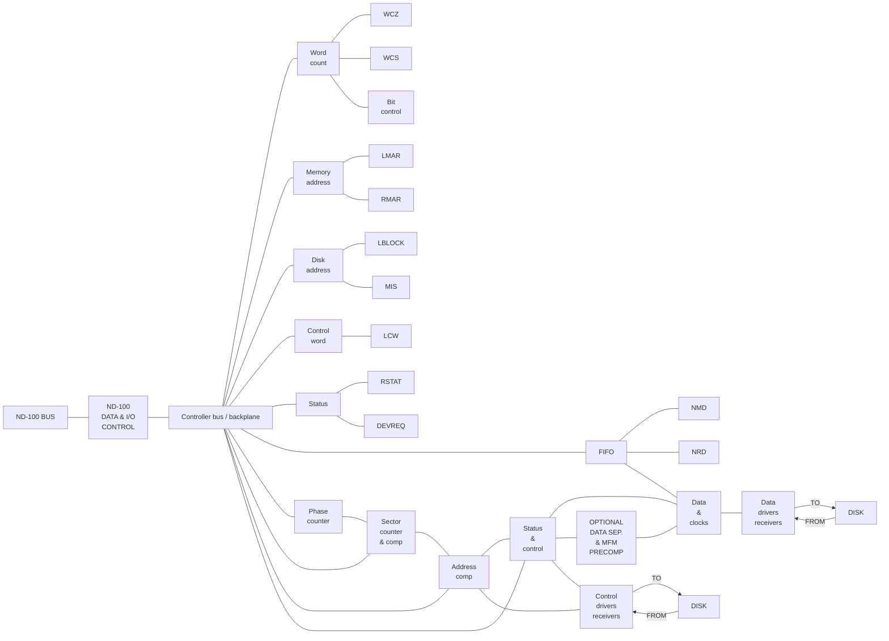
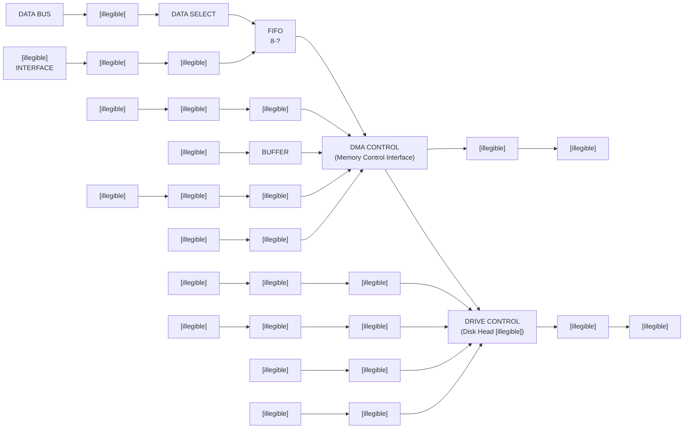

## Page 1

# Winchester Disk Controller

ND-11.015.01

# NORSK DATA A.S.

```text
     o  o  o          o  o  o        o  o  o  o  o  o  o
     o  o  o  o       o  o  o        o  o  o  o  o  o  o  o
     o  o  o  o  o    o  o  o        o  o  o  o  o  o  o  o  o
     o  o  o  o  o  o o  o  o        o  o  o              o  o  o
     o  o  o  o  o  o o  o  o        o  o  o              o  o  o
     o  o  o    o  o  o  o  o        o  o  o  o  o  o  o  o  o
     o  o  o      o  o  o  o         o  o  o  o  o  o  o  o
     o  o  o        o  o  o          o  o  o  o  o  o  o
```

---

## Page 2

ii

# NOTICE

The information in this document is subject to change without notice. Norsk Data  
A.S assumes no responsibility for any errors that may appear in this document.  
Norsk Data A.S assumes no responsibility for the use or reliability of its software  
on equipment that is not furnished or supported by Norsk Data A.S.

The information described in this document is protected by copyright. It may not  
be photocopied, reproduced or translated without the prior consent of Norsk  
Data A.S.

Copyright © 1983 by Norsk Data A.S

---

## Page 3

iii

# PRINTING RECORD

| Printing | Notes |
|---|---|
| 08/83 | Version 01 |
|  |  |
|  |  |
|  |  |
|  |  |
|  |  |
|  |  |
|  |  |
|  |  |
|  |  |
|  |  |
|  |  |
|  |  |
|  |  |
|  |  |
|  |  |
|  |  |
|  |  |
|  |  |
|  |  |
|  |  |
|  |  |
|  |  |
|  |  |
|  |  |
|  |  |
|  |  |
|  |  |
|  |  |
|  |  |
|  |  |
|  |  |
|  |  |
|  |  |
|  |  |

Publ. No.  ND-11.015.01  
Winchester Disk Controller  
August 1983  

```text
●●●   ●●● ●●●●●●●
●●●●  ●●● ●●●●●●●●
●●●●● ●●● ●●●   ●●●
●●●●●●●●● ●●●   ●●●
●●● ●●●●●● ●●●   ●●●
●●●  ●●●●● ●●●●●●●
●●●   ●●● ●●●●●●●
```

NORSK DATA A.S  
P.O. Box 4, Lindeberg gård  
Oslo 10, Norway

---

## Page 4

# IV

Manuals can be updated in two ways, new versions and revisions. New versions consist of a complete new manual which replaces the old manual. New versions incorporate all revisions since the previous version. Revisions consist of one or more single pages to be merged into the manual by the user, each revised page being listed on the new printing record sent out with the revision. The old printing record should be replaced by the new one.

New versions and revisions are announced in the ND Bulletin and can be ordered as described below.

The reader's comments form at the back of this manual can be used both to report errors in the manual and to give an evaluation of the manual. Both detailed and general comments are welcome.

These forms, together with all types of inquiry and requests for documentation should be sent to the local ND office or (in Norway) to:

Documentation Department  
Norsk Data A.S  
P.O. Box 4, Lindeberg gård  
Oslo 10

---

## Page 5

This manual is in loose leaf form for ease of updating. Old pages may be removed and new pages easily inserted if the manual is revised.

The loose leaf form also allows you to place the manual in a ring binder (A) for greater protection and convenience of use. Ring binders with 4 rings corresponding to the holes in the manual may be ordered in two widths, 30 mm and 40 mm. Use the order form below.

The manual may also be placed in a plastic cover (B). This cover is more suitable for manuals of less than 100 pages than for large manuals. Plastic covers may also be ordered below.

```text
          ___________________________              ___________________________
         /                          /|            /                           |
        /                          / |           /                            |
       /__________________________/  |          /                             |
       |   (   )                  |  |         /                              |
       |   (   )  [              ]|  |        |   [              ]             |
       |   (   )                  |  |        |   NORSK DATA A.S               |
       |   (   )    NORSK DATA A.S|  |        |                               |
       |   (   )                  |  |        |          ND                   |
       |          ND              | /         |                               |
       |__________________________|/          |_______________________________|
          A   Ring Binder                    B   Plastic Cover
```

Please send your order to the local ND office or (in Norway) to:

Documentation Department  
Norsk Data A.S  
P.O. Box 4, Lindeberg gård  
Oslo 10  

---

# ORDER FORM

I would like to order

| Quantity | Item |
|---|---|
| ....... | Ring Binders, 30 mm, at nkr 20,- per binder |
| ....... | Ring Binders, 40 mm, at nkr 25,- per binder |
| ....... | Plastic Covers at nkr 10,- per cover |

|  |  |
|---|---|
| Name | ................................................................................ |
| Company | ............................................................................. |
| Address | ............................................................................. |
|  | ................................................................................ |
| City | ................................................................................ |

---

## Page 6

# vii

# TABLE OF CONTENTS

| Section | Page |
|---|---:|
| 1 INTRODUCTION | 1 |
| 2 DESCRIPTION | 3 |
| 2.1 Disk Drive Description | 3 |
| 2.2 Controller Description | 4 |
| 2.3 Handling of Bad Tracks | 5 |
| 3 PROGRAMMING SPECIFICATIONS | 7 |
| 3.1 IOX Address Decoding | 7 |
| 3.2 The Memory Address Register | 7 |
| 3.3 The Block (disk) Address Register | 7 |
| 3.4 The Control Word | 8 |
| 3.4.1 M0 Read Transfer | 9 |
| 3.4.2 M1 Write Transfer | 9 |
| 3.4.3 M2 Read Parity Transfer | 9 |
| 3.4.4 M3 Compare Transfer | 9 |
| 3.4.5 M4 Seek | 9 |
| 3.4.6 M5 Write Format | 10 |
| 3.4.7 M6 Setting of Additional Control Bits | 10 |
| 3.4.8 M7 Return to Zero Seek | 10 |
| 3.5 Read Status Register | 11 |
| 4 DETAILED HARDWARE DESCRIPTION | 13 |
| 4.1 IOX & IDENT | 13 |

ND-11.015.01

---

## Page 7

# viii

| Section | Page |
|---|---:|
| 4.2 DMA | 13 |
| 4.3 Connection to Shugart Drive Types (3038 Only) | 14 |
| 4.4 The Serial Data Part | 15 |
| 5 TEST PROCEDURE | 16 |
| 5.1 Test Block (disk) Address Register | 16 |
| 5.2 Test Memory Address Register | 16 |
| 5.3 Test Ident Code | 16 |
| 5.4 DMA Transfer In Test Mode | 17 |
| 5.5 Connecting the Disk Drive | 18 |
| 5.6 DISC-TEMA | 18 |
| 5.7 SUPER-RANDOM | 18 |
| 6 BLOCK DIAGRAMS | 19 |
| 6.1 8 Inch Disk Controller | 19 |
| 7 LOGIC DIAGRAMS | 21 |
| 7.1 Serial Data (8 inch) | 21 |
| 7.2 Control Cable (8 inch) | 22 |
| 7.3 Control (8 inch) | 23 |
| 7.4 Data Tranceivers-Disk Address-Control Register-Status Register (8 inch) | 24 |
| 7.5 Memory Address Register FIFO (8 inch) | 25 |
| 7.6 Control (8 inch) | 26 |

ND-11.015.01

---

## Page 8

# ix

| Section | Page |
|---|---:|
| 7.7 DMA Devices | 27 |
| 7.8 Serial Data ST506 (5 1/4 inch) | 28 |
| 7.9 Control Cable ST506 (5 1/4 inch) | 29 |
| 7.10 Control ST506 (5 1/4 inch) | 30 |
| 7.11 Data Tranceivers-Disk Address-Control Register-Status Register ST506 (5 1/4 inch) | 31 |
| 7.12 Memory Address Register FIFO ST506 (5 1/4 inch) | 32 |
| 7.13 Control ST506 (5 1/4 inch) | 33 |
| 8 SHORT DESCRIPTION OF FAIRCHILD 9401 | 35 |
| 8.1 9401 Description | 35 |
| 9 ARRANGEMENT DRAWINGS | 37 |
| 9.1 Layout Of Components | 37 |
| 10 CABLE SIGNAL DEFINITION | 39 |
| 10.1 Cable definition for 8" DISK CONTROLLER | 39 |
| 10.2 Data Cable | 40 |
| 10.3 Internal Wiring For CDC Finch in Satellite 5 9 | 41 |
| 10.4 Cable Connection | 42 |

ND-11.015.01

---

## Page 9

# 5 1/4 INCH (ST506) & 8 INCH WINCHESTER DISK CONTROLLER

INTRODUCTION

1

## 1 INTRODUCTION

The 8 Inch Winchester Disk Controller, card 3038, is intended to control one or two Winchester disk drives with an 8 inch "floppy like" connection.

They can be:

- Control Data 9410-3F FINCH
- Memorex 101/102,
- Fujitsu M2301/M2302 B
- Shugart 1000/1100 series or compatible drives.

## NOTE:

Straps, additional components, cable changes and different software parameters may be required going from one drive type to another.

The ST506 (5 1/4 inch Disk Controller, card 3041, controls one or two Winchester Disk drives with the standard 5 1/4 inch interface connection ST506. This card is also prepared for the Enhanced Small Disk Interface, ESDI (10 Mb/s).

ND-11.015.01

---

## Page 10

# 5 1/4 INCH (ST506) & 8 INCH WINCHESTER DISK CONTROLLER

2

ND-11.015.01

---

## Page 11

# 5 1/4 INCH (ST506) & 8 INCH WINCHESTER DISK CONTROLLER

DESCRIPTION

## 2 DESCRIPTION

### 2.1 Disk Drive Description

The disk drive consists of one or more disk plates with a number of circular TRACKS on each surface. A CYLINDER includes all tracks (one on each surface) with the same distance from the centre.

Each surface is divided into a number of SECTORS, which is normally the smallest data block to transfer. Each sector contains 512 words (1 Kbytes) of data.

```text
                         Cylinder          Index
                            |                |
                            |                |
                            v                |
                       .-------------------------.
                    .-'                           '-.
                  .'      .-------------------.      '.       Sector
                 /       /                     \       \       }
                /       /                       \       \      }
               |       |                         |       |
               |       |                         |-------|
               |       |             .-----------|       |
               |       |          .-'            |       |
               |       |       .-'               |       |
               |       |    .-'                  |       |
               |       | .-'                     |       |
                \       \                       /       /
                 \       \                     /       /
                  '.      '-------------------'      .'
                    '-.                           .-'
                       '-------------------------'
                            |
                            v
                       .-------------------------.
                    .-'                           '-.
                  .'      .-------------------.      '.
                 /       /                     \       \
                |       |                       |       |
                |       |           .           |       |
                 \       \                     /       /
                  '.      '-------------------'      .'
                    '-.                           .-'
                       '-------------------------'

                              Track
```

Number of sectors, tracks and cylinders will differ from drive to drive.

Some examples for the 8 inch:

|  | Sectors/<br>Track | Tracks/<br>Cylinder | Cylinders<br>total | Bad<br>tracks | Usable cap-<br>acity Mbytes |
|---|---:|---:|---:|---:|---:|
| CDC Finch-24 | 12 | 3 | 605 | 27 | 21.97 |
| Fujitsu 2302B | 11 | 8 | 244 | 20 | 21.76 |
| Memorex 102 | 11 | 8 | 256 | 80 | 22.16 |
| Shugart 1104 | 9 | 3 | 660 | 30 | 17.97 |

The CDC Finch 9410-24-3F may be may be downgraded from 21.97 MB to 14.15 MB (384 cylinders + spare tracks) by changing cables. See chapter on CABLE CONNECTION.

ND-11.015.01

---

## Page 12

4

# 5 1/4 INCH (ST506) & 8 INCH WINCHESTER DISK CONTROLLER DESCRIPTION

Examples of 5 1/4 inch:

|  | Sectors/Track | Tracks/Cylinder | Cylinders total | Bad tracks | Usable capacity Mbytes |
|---|---:|---:|---:|---:|---:|
| CDC-9415-5 Wren | 9 | 5 | 697 | 90 | 31.19 |
| Micropolis 1304 | 9 | 6 | 830 | 120 | 44.78 |
| Rodime RO208 | 9 | 8 | 640 |  | 41.2 |
| CMI CM6640 | 9 | 6 | 640 | 18 | 35.22 |

## 2.2 Controller Description

The controller can transfer data between any ND-100 memory address and any disk address. The software driver must do a seek to the correct cylinder prior to a read or write operation.

- standard ND-100 IOX IDENT DMA control

- 16 words FIFO with parallel or serial inputs and outputs  
  (Fairchild 9403).

- CRC generator/checker (Fairchild 9401, polynomial used is:  
  X'16 + X'15 + X'2 + 1)

- bit- phase- and sector counters

- sector- address- and data comparators

- step pulse generator

- MFM data separator (phase locked loop). (This is optional  
  for the 3038 card).

- MFM coding with precompensation etc..

ND-11.015.01

---

## Page 13

# 5 1/4 INCH (ST506) & 8 INCH WINCHESTER DISK CONTROLLER

## DESCRIPTION

### 2.3 Handling of Bad Tracks

As bit density grows and production cost is moving down, errors on the media must be tolerated. The bad spots (flaws, media defects) may be handled in different ways. As no error correction (ECC) is available on this controller, a track re-allocation method is used. During formatting of the disk pack, each track is tested for correct data validity.

If errors occur, the (bad) track is given a dedicated new track in an area being reserved for this purpose only. The new (alternative) track address is written in the data fields of all sectors on the bad track, after a flag bit has been written in the address fields.

Thus, when trying to read or write a sector on this track, an error (status bit 8 = address mismatch) is given due to the flag bit in the address field. During the next attempt(s), accepting the flag bit, the first error free sector is read, containing the alternative track address. A seek to this track is then performed and the read or write operation will be carried out.

ND-11.015.01

---

## Page 14

# 5 1/4 INCH (ST506) & 8 INCH WINCHESTER DISK CONTROLLER

6

NO-11.015.01

---

## Page 15

# 5 1/4 INCH (ST506) & 8 INCH WINCHESTER DISK CONTROLLER

## PROGRAMMING SPECIFICATIONS

7

## 3 PROGRAMMING SPECIFICATIONS

### 3.1 IOX Address Decoding

| IOX | Code | Description |
|---|---:|---|
| IOX | 500 | Read Memory address register |
| IOX | 501 | Load Memory address register |
| IOX | 502 | Not used |
| IOX | 503 | Load Block (disk) address register |
| IOX | 504 | Read status register |
| IOX | 505 | Load Control word |
| IOX | 506 | Read Block (disk) address register |
| IOX | 507 | Load Word count / step count |

The codes are relevant for disk system 1. Each disk system may consist of 2 disk units. For disk system 2, add 10 (octal) to the specified codes. Interrupt level is 11, and the ident code is 1 (for system 1) or 5 (for system 2).

### 3.2 The Memory Address Register

The memory address register is loaded by two successive IOX 501 instructions. The first one loads the 8 upper bits of the 24 bits address (A-reg 0-7 => Address 16-23).

The second one loads the lower 16 bits. The memory address register is read in the opposite direction, the first IOX 500 reads the 16 lower bits and the second reads the 8 upper bits.

Before loading or reading the address be sure that the upper/lower selection flip-flop is set according to one of the following conditions:

```text
                    Pushing master clear
                    Programmed device clear (control word bit 4)
                    Read status register
                    Activation (control word bit 2)
```

### 3.3 The Block (disk) Address Register

```text
+------------------------------------------------+------------------+
| 15 14 13 12 11 10  9  8  7  6  5                | 4  3  2  1  0    |
+------------------------------------------------+------------------+
|                    Cylinder                    |      Sector      |
+------------------------------------------------+------------------+
```

The head number is specified in the control word, bits 5-8. The unit number is specified in the control word, bit 9.

NO-11.015.01

---

## Page 16

# 5 1/4 INCH (ST506) & 8 INCH WINCHESTER DISK CONTROLLER

## PROGRAMMING SPECIFICATIONS

8

## 3.4 The Control Word

| BIT | Description |
|---|---|
| 0 | Enable interrupt on device not active |
| 1 | Enable interrupt on errors |
| 2 | Activate device operation |
| 3 | Test mode |
| 4 | Device clear (clears the drive & controller) |
| 5-8 | Head number. (during M6: additional control bits, 3038 only) |
| 9 | Unit number (maximum 2 units) |
| 10 | Not used |
| 11-13 | Device operation code |
| 14 | Direction (active during seek, M4, only) |
| 15 | Bad track |

To clear the disk drive, it may be necessary to execute two consecutive device clear before reading a correct status.

Bit 15, the bad track bit, must be used to read a reallocated track in order to find the new track address.

When running in test mode, the control word should be 100254. Add bit 0 if interrupt is wanted.

Device operation codes:

| BIT 13 | BIT 12 | BIT 11 | Device operation code |
|---:|---:|---:|---|
| 0 | 0 | 0 | M0: Read transfer |
| 0 | 0 | 1 | M1: Write transfer |
| 0 | 1 | 0 | M2: Read parity transfer |
| 0 | 1 | 1 | M3: Compare transfer |
| 1 | 0 | 0 | M4: Seek |
| 1 | 0 | 1 | M5: Write format |
| 1 | 1 | 0 | M6: Loading of additional control bits<br>(3038 only, 3041 not used) |
| 1 | 1 | 1 | M7: Return to zero seek |

All device operation codes will be activated when the code and bit 3 (activate device) is loaded, except for M6 where no activation should be made. Before activation, except for M4,M6 & M7, the following parameters must be loaded: The memory address register, the block address register and the word count. Unit and head numbers are given with the command. For M4, only Word count (= step count) and unit number is necessary, and for M7, only unit number.

ND-11.015.01

---

## Page 17

# 5 1/4 INCH (ST506) & 8 INCH WINCHESTER DISK CONTROLLER PROGRAMMING SPECIFICATIONS

9

## 3.4.1 M0 Read Transfer

This operation causes the controller to transfer data from the disk to the computer memory. The number of blocks transferred depends upon the word count as defined by the word count register.

## 3.4.2 M1 Write Transfer

As read (M0), but transfer of data from computer memory to disk.

## 3.4.3 M2 Read Parity Transfer

The controller will check the parity (CRC) on the address and data of the sectors specified. Data is transferred to the controller and the check word, CRC, for both the address field and the data field of a sector is compared with the correct check word as generated by the controller. No data transfer to the computer memory is performed. If error status bit 9 is set. Note that this check will always be performed during M0, M1 and M3.

## 3.4.4 M3 Compare Transfer

This function is included to positively check the data written on the disk. During compare transfer the controller compares the data read from the disc and data from the computer memory bit by bit. Mismatch causes compare error, status bit 10, to be set.

## 3.4.5 M4 Seek

This function is included to enable a unit to position the heads prior to data transfer. The heads will travel the number of cylinders as specified in the word count register, and the direction is specified in control word bit 14. If bit 14 is zero, the heads will move towards cylinder 0 (innermost cylinder for the Finch). The operation is completed when the heads are settled over the correct tracks.

ND-11.015.01

---

## Page 18

# 5 1/4 INCH (ST506) & 8 INCH WINCHESTER DISK CONTROLLER

## PROGRAMMING SPECIFICATIONS

10

## 3.4.6 M5 Write Format

This causes the controller to write also the address field within each sector. The word count is twice the number of sectors to format:

| Word | Bits | Field |
|---|---:|---|
| First word | 15–5 | Zero |
| First word | 4 | Bad track Flag |
| First word | 3–0 | Head |
| Second word | 15–5 | Cylinder |
| Second word | 4–0 | Sector |

## 3.4.7 M6 Setting of Additional Control Bits

Additional control bits found in bits 5-7:

| Control word bit | Description |
|---:|---|
| 5 | Data strobe early (CDC Finch only) |
| 6 | Data strobe late (CDC Finch only) |
| 7 | Reduce write current & skip write precompensation (Shugart only) |

Note: The above applies to the 3038 card only!

## 3.4.8 M7 Return to Zero Seek

The selected disc seeks to cylinder 0 and clears the seek error bit in the unit. Return to zero by pushing the master clear button.

ND-11.015.01

---

## Page 19

# 5 1/4 INCH (ST506) & 8 INCH WINCHESTER DISK CONTROLLER

## PROGRAMMING SPECIFICATIONS

11

### 3.5 Read Status Register

Status word

| Bit | Description |
|---:|---|
| 0 | Controller not active interrupt enabled |
| 1 | Error interrupt enabled |
| 2 | Controller active |
| 3 | Controller finished with a device operation |
| 4 | Inclusive or of errors (bits 5-13) |
| 5 | 3038: 0 (not used), 3041: Trying to read or write while performing RTZ. |
| 6 | Timeout |
| 7 | Disk fault or missing clocks |
| 8 | Address mismatch |
| 9 | Crc error |
| 10 | Compare error |
| 11 | Fifo over/under-run or dma channel error |
| 12 | 0 (Not used) |
| 13 | 3038: Read or write gate active, 3041: Always 1 (Used to distinguish the 3038 from the 3041). |
| 14 | On cylinder |
| 15 | 0, used to distinguish from 10Mb controller |

ND-11.015.01

---

## Page 20

# 5 1/4 INCH (ST506) & 8 INCH WINCHESTER DISK CONTROLLER

12

ND-11.015.01

---

## Page 21

# 5 1/4 INCH (ST506) & 8 INCH WINCHESTER DISK CONTROLLER

DETAILED HARDWARE DESCRIPTION

13

## 4 DETAILED HARDWARE DESCRIPTION

### 4.1 IOX & IDENT

The controller will respond to IOX-addresses according to the thumb wheel switch and the device number PROM 1200B:

| Thumb wheel | Device number | Ident ce |  |
|---|---|---|---|
| 0 -- | 500-507 | 1 | The first 8", 5 1/4" OR 10MB Controller |
| 1 -- | 510-517 | 5 | The second 8", 5 1/4" OR 10MB Controller |
| 2 -- | 520-527 | 3 | Reserved for MAG-TAPE 1 |
| 3 -- | 530-537 | 7 | Reserved for MAG-TAPE 2 |
| 4 -- | 540-547 | 2 | Reserved for DRUM 1 |
| 5 -- | 550-557 | 6 | Reserved for DRUM 2 |
| 6 -- | 600-607 | 4 | Reserved for VERSATEC 1 |
| 7 -- | 1600-1607 | 14 | Reserved for VERSATEC 2 |
| 8 -- | 1540-1547 | 17 | Reserved for SMD 1 |
| 9 -- | 1550-1557 | 20 | Reserved for SMD 2 |
| 10-15 -- | Not Reserved |  |  |

The lower three IOX address bits are decoded to give one of eight IOX registers.

If the controller is ready for an operation (status bit 3 = 1),and interrupt is enabled (status bit 0 has been set by control bit 0 = 1), the interrupt signal BINT11 will be active, giving an interrupt to level 11 (if the interrupt system is turned on, ION). The IDENT code may now be read by an IDENT PL11 instruction.

### 4.2 DMA

If a write disk command is given, the controller will immediate request the memory to fill up the FIFO. After 16 words has been transferred, the FIFO is full and the requests are temporary stopped, waiting for the disk to hit the correct sector and start emptying. When the FIFO is no longer full, the memory requests will continue.

During a read disk command, the FIFO will be filled by the disk, and when it is no longer empty the memory requests will start, trying to empty.

If the FIFO goes empty during write disk or full during read, status bit 11 will be set.

A meta state detector will permit the controller to operate in a crate with faster DMA cycles (shorter delay from BMEM to INGRANT), like a MPM-4 bus.

ND-11.015.01

---

## Page 22

14

# 5 ¼ INCH (ST506) & 8 INCH WINCHESTER DISK CONTROLLER

## DETAILED HARDWARE DESCRIPTION

### 4.3 Connection to Shugart Drive Types (3038 Only)

If the controller is connected to a drive not containing a data separator (like the SHUGART SA 1000/1100), an analogue phase locked loop is available on the controller to separate data and clocks from a MFM data stream. In addition, coding from NRZ to MFM with precompensation is available during write.

The 3041 connected to an ST506 compatible drive will always use the analogue phase locked loop (located on the board) to separate data and clocks from an MFM data stream.  
The nominal frequency of the VCO is automatically adjusted by means of a DA-converter. Coding from NRZ to MFM with precompensation is performed during write. Write precompensation is 10nanoseconds.  
Precompensation is performed according to the following diagram:

```text
          0              1              1

                    ┌───┐          ┌───┐
───────────────┐    │   │    ──────│   │────────────────────
               └────┘ D └──────────┘ D └─────── t ────────►
                     ↑
                     └──── Write Data Late
```

```text
          1              1              0

       ┌───┐          ┌───┐
───────│   │──────────│   │────────────────────────────────
       └─D─┘          └─D─┘
                         ↑
                         └──── Write Data Early
```

```text
          1              0              0

       ┌───┐                    ┌───┐          ┌───┐
───────│   │────────────────────│   │──────────│   │────────
       └─D─┘                    └─C─┘          └─C─┘
                                  ↑
                                  └──── Write Clock Late
```

```text
          0              0              1

       ┌───┐          ┌───┐                    ┌───┐
───────│   │──────────│   │────────────────────│   │────────
       └─C─┘          └─C─┘                    └─D─┘
                         ↑
                         └──── Write Clock Early
```

The standard ST506 transfer rate is 5 Megabits/second. The proposed ESDI interface will use 10 Megabits/second transfer rate with the data separator on the drive.

ND-11.015.01

---

## Page 23

# 5 1/4 INCH (ST506) & 8 INCH WINCHESTER DISK CONTROLLER

DETAILED HARDWARE DESCRIPTION

15

## 4.4 The Serial Data Part

Each sector is 8721 bits long, and is divided into 8 "phases":

| Bits: | 216* | 32 | 16 | 216 | 8192 | 16 | 1 | 32 |
|---|---:|---:|---:|---:|---:|---:|---:|---:|
| Phase: | 1 | 2 | 3 | 4 | 5 | 6 | 7 | 8 |

```text
             ↑                                           ↑
          Sector                                      Sector
           start                                     finished
```

* NOTE: Board 3041, phase 1 = 472 bits.

Note that the number of bits/track is not divisible with the number of  
bits/sector, and there will be a number of unused bits prior to the  
index pulse. For the CDC Finch the number is 2868 bits.  
The purpose of the different phases is :

| PHASE: | 1 | 2 | 3 | 4 | 5 | 6 | 7 | 8 |
|---|---|---|---|---|---|---|---|---|
| COMMAND: |  |  |  |  |  |  |  |  |
| READ | turn on<br>read<br>gate,<br>and<br>wait<br>for the<br>sync.<br>bit for<br>the<br>address | read<br>and<br>compare<br>address<br>bit for<br>bit | read<br>and<br>check<br>CRC<br>(parity)<br>on<br>address | wait<br>for<br>the<br>sync.<br>bit<br>for<br>data | read<br>data | read<br>and<br>check<br>CRC<br>(parity)<br>on<br>data | read<br>one<br>bit<br>gap | wait<br>for<br>next<br>sect |
| READ<br>PARITY |  |  |  |  | read &<br>compare<br>data |  |  |  |
| COMPARE |  |  |  |  |  |  |  |  |
| WRITE |  |  |  | write<br>zero's<br>& sync<br>bit | write<br>data | write<br>CRC<br>(parity)<br>on data | write<br>one<br>bit<br>gap |  |
| WRITE<br>FORMAT | write<br>zero's<br>& sync<br>bit | write<br>address | write<br>CRC<br>(parity)<br>on<br>address |  | write<br>dummy<br>data |  |  |  |

Phases 1 and 4 are used to synchronize the phase locked loop data  
separator to an MFM zero data stream.

ND-11.015.01

---

## Page 24

# 5 1/4 INCH (ST506) & 8 INCH WINCHESTER DISK CONTROLLER TEST PROCEDURE

16

## 5 TEST PROCEDURE

### 5.1 Test Block (disk) Address Register

The Block (disk) Address Register may be tested by the following loop:

```text
17/PATT,                         125252
20/START, LDA PATT               044377
          IOX LBLOCK             164503    %Load address
          SAA 0                  170400
          IOX RBLOCK             164506    %Read address
          COPY SA DX             146157
          JMP START              124373
```

Start in address 20, and check that X-register equals the content of memory address 17 (PATT).

### 5.2 Test Memory Address Register

The Memory Address Register may be tested by the following loop:

```text
16/LOWER                         125252
17/UPPER                         000377
20/START, SAA 20                 170420
          IOX LCONT              164505    %Clear
          LDA UPPER              044375
          IOX LMAR               164501    %Load upper 8 bits
          LDA LOWER              044372
          IOX LMAR               164501    %Load lower 16 bits
          IOX RMAR               164500    %Read lower 16 bits
          COPY SA DX             146157
          IOX RMAR               164500    %Read upper 8 bits
          COPY SA DT             146156
          JMP START              124366
```

Start in address 20, and check that x-register equals memory address 16, LOWER, and T-register equals address 17, UPPER, (8 bits only)

### 5.3 Test Ident Code

Check the ident code with the following loop:

```text
20/START, SAA 1                  170401
          IOX LCONT              164505
          IDENT PL11             143611
          COPY SA DX             146157
          JMP START              124374
```

The IDENT code is found in X-register, and should be 1. The IDENT code for disk controller II ( = 5) is found by changing IOX address and thumb wheel.

ND-11.015.01

---

## Page 25

# 5 1/4 INCH (ST506) & 8 INCH WINCHESTER DISK CONTROLLER

TEST PROCEDURE

17

## 5.4 DMA Transfer In Test Mode

Data transfer in test mode (disk drive need not be connected), may be tested by the following loop. A test is performed on the data path, FIFO, address compare and DMA logic:

```text
             13/BLOCK                 125252     %Block (disk) addr.
             14/MEMUP                      0     %Upper mem.addr.
             15/MEMLO                   1000     %Lower mem. addr.
             16/WORDC                   1000     %Word count
             17/CONTR                 100254     %Command
             20/START, SAA 20         170420
                       IOX LCONT      164505     %Clear
                       LDA BLOCK      044371
                       IOX LBLOCK     164503     %Load disk address
                       LDA MEMUP      044370
                       IOX LMAR       164501     %Load upper mem.addr.
                       LDA MEMLO      044367
                       IOX LMAR       164501     %Load lower mem. addr.
                       LDA WORDC      044366
                       IOX LWORD      164507     %Load word count
                       LDA CONTR      044365
                       IOX LCONT      164505     %Start transfer
                       IOX RSTAT      164504     %Read status
                       BSKP ONE 30 DA 175235     %Test if finished
                       JMP *-2        124376
                       COPY SA DX     146157     %Save status
                       JMP START      124360
```

The program is initialized to transfer data from a test pattern generator on the controller to memory.

Start the program in address 20, and check that the memory content from 1000 to 1777 is:

```text
             1000/052525
                  125252
                  052525

                     .
                     .

             1776/052525
             1777/125252
```

The status register (in X) should be: 41030. The transfer size and memory address may be changed.

To check the data path from memory to disk, change the Control Word (CONTR) to 114254. The Status should still be 41030.

To check that the compare function works, change one word in the memory data area. Status should then change to 43030.

ND-11.015.01

---

## Page 26

# 5 1/4 INCH (ST506) & 8 INCH WINCHESTER DISK CONTROLLER TEST PROCEDURE

18

## 5.5 Connecting the Disk Drive

If the previous loops are working properly, the disk drive may be connected. Pushing Master Clear will position the heads to cylinder 0 (innermost cylinder for CDC Finch, outermost for other drives). To read and write on the drive, the test mode loop may be used, changing the Block address to 0 (cyl. 0, sect. 0) and the Control word to 4 (read) or 4004 (write), provided that the drive has been formatted. Other sectors or heads may used without seeking. To read or write on other cylinders, a seek command must be carried out by setting the number of tracks to go in WORDC, and the seek command plus direction in CONTR. The loop should be run only once during seek.

## 5.6 DISC-TEMA

The DISC TEMA, DISC TEst & MAintenance system, should now be loaded, and the following commands should be executed: FORMAT, PARITY-CHECK and COMPARE. DISC-TEMA is described in detail in a specific data sheet, and versions older than F should not be used.

## 5.7 SUPER-RANDOM

The SUPER-RANDOM test writes and reads random data on random disk addresses and is a long term test. Version older than E should not be used.

ND-11.015.01

---

## Page 27

# 5 1/4 INCH (ST506) & 8 INCH WINCHESTER DISK CONTROLLER

BLOCK DIAGRAMS

19

## 6 BLOCK DIAGRAMS

### 6.1 8 Inch Disk Controller

# 8" DISK CONTROLLER 3038



ND-11.015.01

---

## Page 28

# 5 1/4 INCH (ST506) & 8 INCH WINCHESTER DISK CONTROLLER

20

NO-11.015.01

---

## Page 29

# 5 1/4 INCH (ST506) & 8 INCH WINCHESTER DISK CONTROLLER

LOGIC DIAGRAMS

21

# 7 LOGIC DIAGRAMS

## 7.1 Serial Data (8 inch)

[Complex schematic: 8" DISK CONTROLLER — SERIAL DATA, with logic gates, connectors, signal lines, component references, grid coordinates, and title block.]

```text
                         8" DISK CONTROLLER
                              SERIAL DATA

     PLL SEPARATOR (SCHUGART ONLY)              DATA CABLE UNIT 1

     A   B   C   D   E   F   G
   1
   2
   3
   4
   5

                              ND-11.015.01
```

---

## Page 30

# 5 1/4 INCH (ST506) & 8 INCH WINCHESTER DISK CONTROLLER

## LOGIC DIAGRAMS

22

## 7.2 Control Cable (8 inch)

[Schematic: detailed logic diagram for the 8" disk controller control cable, including labelled signal lines, logic gates, connectors, timing/control circuits, and title block.]

ND-11.015.01

---

## Page 31

# 5 1/4 INCH (ST506) & 8 INCH WINCHESTER DISK CONTROLLER

LOGIC DIAGRAMS

23

## 7.3 Control (8 inch)

[Complex logic schematic: 8-inch disk controller control circuit diagram, with interconnected logic blocks, gates, flip-flops, counters, registers, and labelled signal lines.]

ND-11.015.01

---

## Page 32

24

# 5 1/4 INCH (ST506) & 8 INCH WINCHESTER DISK CONTROLLER

## LOGIC DIAGRAMS

### 7.4 Data Transceivers—Disk Address—Control Register—Status Register (8 inch)

```text
[Complex logic schematic: a bordered engineering drawing containing multiple
integrated-circuit blocks, signal lines, connector symbols, and a title block.
Most individual component and signal labels are too small to read clearly.]

                         DATA TRANSCEIVERS

     [IC blocks and signal connections]          [IC blocks and signal connections]


                         DISK ADDRESS

     [IC blocks and signal connections]          [IC blocks and signal connections]


                         DISK CONTROL

     [IC blocks and signal connections]          [IC blocks and signal connections]


                         CONTROL REGISTER

     [IC blocks and signal connections]


                         [illegible]

     [row of IC blocks and signal connections]


Drawing border coordinates visible: A–G and 1–5

Title block:
  [illegible]
  [illegible]
  [illegible]
  8 INCH DISK CONTROLLER
  [illegible]
```

NO-11.015.01

---

## Page 33

# 5 1/4 INCH (ST506) & 8 INCH WINCHESTER DISK CONTROLLER

LOGIC DIAGRAMS

25

## 7.5 Memory Address Register FIFO (8 inch)

[Schematic: detailed logic diagram for the Memory Address Register FIFO, with integrated-circuit symbols, signal lines, connectors, coordinate border, and an “8 DISK CONTROLLER” title block.]

NO-11.015.01

---

## Page 34

# 5 1/4 INCH (ST506) & 8 INCH WINCHESTER DISK CONTROLLER

## LOGIC DIAGRAMS

26

## 7.6 Control (8 inch)

[Complex circuit schematic: control logic diagram with integrated-circuit symbols, signal lines, connectors, and grid coordinates; most component labels are too small to read reliably.]

ND-11.015.01

---

## Page 35

# 5 1/4 INCH (ST506) & 8 INCH WINCHESTER DISK CONTROLLER

LOGIC DIAGRAMS

27

## 7.7 Serial Data ST506 (5 1/4 inch)



| Field | Visible text |
|---|---|
| Title | 5 1/4 & 8 INCH WINCHESTER DISK CONTROLLER |
| Drawing No. | NO-11.015.01 |
| Revision | 0804 |

---

## Page 36

# 5 1/4 INCH (ST506) & 8 INCH WINCHESTER DISK CONTROLLER

## LOGIC DIAGRAMS

28

## 7.0 Serial Data ST506 (5 1/4 inch)

[Complex schematic: serial data ST506 logic diagram with integrated-circuit blocks, signal lines, connectors, and grid references A–G and 1–5.]

ND-11.015.01

---

## Page 37

# 5 1/4 INCH (ST506) & 8 INCH WINCHESTER DISK CONTROLLER

LOGIC DIAGRAMS

29

## 7.9 Control Cable ST506 15 1/4 inch

[Complex control-cable logic schematic with connector symbols, signal lines, component blocks, coordinate border, and title block; most internal labels are illegible.]

ND-11.015.01

---

## Page 38

# 5 1/4 INCH (ST506) & 8 INCH WINCHESTER DISK CONTROLLER

## LOGIC DIAGRAMS

### 7.10 Control ST506 (5 1/4 inch)

[Complex logic schematic: ST506 control circuitry with integrated-circuit blocks, signal lines, connectors, and grid references.]

ND-11.015.01

---

## Page 39

# 5 1/4 INCH (ST506) & 8 INCH WINCHESTER DISK CONTROLLER

31

# LOGIC DIAGRAMS

## 7.11 Data Transceivers—Disk Address—Control Register—Status Register

### ST506 (5 1/4 inch)

[Complex logic schematic: integrated-circuit blocks, signal lines, connectors, and component labels; individual labels and connections are not reliably legible.]

ND-11.015.01

---

## Page 40

# 5 1/4 INCH (ST506) & 8 INCH WINCHESTER DISK CONTROLLER

## LOGIC DIAGRAMS

32

## 7.12 Memory Address Register FIFO ST506 (5 1/4 inch)

[Schematic: dense memory address register FIFO logic diagram with integrated-circuit blocks, signal lines, connectors, and a title block; individual labels and connections are not sufficiently legible to reproduce faithfully.]

ND-11.015.01

---

## Page 41

# 5 1/4 INCH (ST506) & 8 INCH WINCHESTER DISK CONTROLLER

33

## LOGIC DIAGRAMS

### 7.13 Control ST506 (5 1/4 inch)

[Complex logic schematic with interconnected integrated-circuit blocks, signal lines, connectors, and grid references A–G and 1–5.]

ND-11.015.01

---

## Page 42

# 5 1/4 INCH (ST506) & 8 INCH WINCHESTER DISK CONTROLLER

34

ND-11.015.01

---

## Page 43

# 5 1/4 INCH (ST506) & 8 INCH WINCHESTER DISK CONTROLLER

SHORT DESCRIPTION OF FAIRCHILD 9401

35

# 8 SHORT DESCRIPTION OF FAIRCHILD 9401

## 8.1 9401 Description

### CRC GENERATOR CHECKER  
### FAIRCHILD TTL MACROLOGIC

The 9401 Cycle Redundancy Check (CRC) Generator/Checker provides an advanced tool for implementing the most widely used error detection scheme in serial digital data handling systems.

A 3-bit control input selects one of eight generator polynomials. The list of polynomials includes CRC-16 and CRC-CCITT as well as their reciprocals (reverse polynomials).

Automatic right justification is incorporated for polynomials of degree less than 16. Separate clear and preset inputs are provided for floppy disk and other applications.

The error output indicates whether or not a transmission error has occurred. Another control input inhibits feedback during check word transmission.

The 9401 is fully compatible with all TTL families.

- GUARANTEED 10MHz DATA RATE
- EIGHT SELECTABLE POLYNOMIALS
- ERROR INDICATOR
- SEPARATE PRESET AND CLEAR CONTROLS
- AUTOMATIC RIGHT JUSTIFICATION
- FULLY COMPATIBLE WITH ALL TTL LOGIC FAMILIES
- 14-PIN PACKAGE
- TYPICAL APPLICATIONS:
  - FLOPPY AND OTHER DISK STORAGE SYSTEMS
  - DIGITAL CASSETTE AND CARTRIDGE SYSTEMS
  - DATA COMMUNICATION SYSTEMS

ND-11.015.01

---

## Page 44

# 5 1/4 INCH (ST506) & 8 INCH WINCHESTER DISK CONTROLLER

36

NO-11.015.01

---

## Page 45

# 5 1/4 INCH (ST506) & 8 INCH WINCHESTER DISK CONTROLLER

SHORT DESCRIPTION OF FAIRCHILD 9401

35

## 8 SHORT DESCRIPTION OF FAIRCHILD 9401

### 8.1 9401 Description

#### CRC GENERATOR/CHECKER  
#### FAIRCHILD TTL MACROLOGIC

The 9401 Cycle Redundancy Check (CRC) Generator/Checker provides an advanced tool for implementing the most widely used error detection scheme in serial digital data handling systems.

A 3-bit control input selects one of eight generator polynomials. The list of polynomials includes CRC-16 and CRC-CCITT as well as their reciprocals (reverse polynomials).

Automatic right justification is incorporated for polynomials of degree less than 16. Separate clear and preset inputs are provided for floppy disk and other applications.

The error output indicates whether or not a transmission error has occurred. Another control input inhibits feedback during check word transmission.

The 9401 is fully compatible with all TTL families.

- GUARANTEED 10MHz DATA RATE
- EIGHT SELECTABLE POLYNOMIALS
- ERROR INDICATOR
- SEPARATE PRESET AND CLEAR CONTROLS
- AUTOMATIC RIGHT JUSTIFICATION
- FULLY COMPATIBLE WITH ALL TTL LOGIC FAMILIES
- 14-PIN PACKAGE
- TYPICAL APPLICATIONS:
  - FLOPPY AND OTHER DISK STORAGE SYSTEMS
  - DIGITAL CASSETTE AND CARTRIDGE SYSTEMS
  - DATA COMMUNICATION SYSTEMS

ND-11.015.01

---

## Page 46

# 36  5 1/4 INCH (ST506) & 8 INCH WINCHESTER DISK CONTROLLER

ND-11.015.01

---

## Page 47

# 5 1/4 INCH (ST506) & 8 INCH WINCHESTER DISK CONTROLLER

ARRANGEMENT DRAWINGS

37

# 9 ARRANGEMENT DRAWINGS

## 9.1 Layout of Components

[Complex technical component-layout drawing: printed circuit board layout with coordinate grid, numerous integrated-circuit outlines and component labels, connectors, shaded areas, and title block.]

| NORSK DATA AS | TITLE | ID NO | CARD PRINT |
|---|---|---|---|
|  | 8" DISK CONTROLLER<br>CDC FINCH | 324105 | D B |

| CORRECTIONS ACCORDING TO ECO |  |  | CORRECTIONS WITHOUT ECO |  |  |
|---|---|---|---|---|---|
| NO | DATE / SIGN | VERIFY | NO | DESCRIPTION | DATE / SIGN |
| 00-109 | [illegible] | [illegible] |  |  |  |
| 00-017 | [illegible] | [illegible] |  |  |  |

NO-11.015.01

---

## Page 48

# 30

# 5 1/4 INCH (ST506) & 8 INCH WINCHESTER DISK CONTROLLER

## ARRANGEMENT DRAWINGS

[Technical drawing: NORSK DATA A.S. 8" DISC CONTROLLER card arrangement, showing a dense component layout with integrated circuits, connectors, test points, edge connector, coordinate markings A–H and numbered positions.]

| TITLE | ID NO. | CARD | PRINT |
|---|---:|---|---|
| NORSK DATA A.S. — 8" DISC CONTROLLER | 322660 | A | A |

| CORRECTIONS ACCORDING TO ECO |  |  | CORRECTIONS WITHOUT ECO |  |  |
|---|---|---|---|---|---|
| NO | DATE / SIGN | VERSION | NO. | DESCRIPTION | DATE / SIGN |
|  |  |  |  |  |  |
|  |  |  |  |  |  |
|  |  |  |  |  |  |
|  |  |  |  |  |  |

| DESIGNED BY | DRAWN BY | DATE | PRINT NO |
|---|---|---|---|
| HS | [illegible] | 21.01.82 | 3038 |

ND-11.015.01

---

## Page 49

# 5 1/4 INCH (ST506) & 8 INCH WINCHESTER DISK CONTROLLER

CABLE SIGNAL DEFINITION

39

## 10 CABLE SIGNAL DEFINITION

### 10.1 Cable definition for 8" DISK CONTROLLER

Signals marked "----------" are not used by the drive. Signals marked "( )" are not used by the controller.

| ND-100 CONN. | RIBBON CABLE | CDC FINCH PIN | CDC FINCH NAME | MEMOREX/FUJITSU PIN | MEMOREX/FUJITSU NAME | SHUGART PIN | SHUGART NAME |
|---|---:|---:|---|---:|---|---:|---|
| Aa 1 | 2 | 2 | ---------- | -- |  | 2 | (Red. w1.cut) |
| Aa 2 | 4 | 4 | Read enable | -- |  | 4 | Head sel. 2 |
| Aa 3 | 6 | 6 | Fault clear | -- |  | 6 | ---------- |
| Aa 4 | 8 | 8 | Head sel. 1 | -- |  | 8 | Seek complete |
| Aa 5 | 10 | 10 | (Capacity) | -- |  | 10 | ---------- |
| Aa 6 | 12 | 12 | ---------- | 2 | Head sel. 0 | 12 | ---------- |
| Aa 7 | 14 | 14 | Head sel. 0 | 4 | Head sel. 1 | 14 | Head sel. 0 |
| Aa 8 | 16 | 16 | ---------- | 6 | Head sel. 2 | 16 | ---------- |
| Aa 9 | 18 | 18 | RTZ | 8 | ---------- | 18 | Head sel. 1 |
| Aa 10 | 20 | 20 | Index | 10 | Index | 20 | Index |
| Aa 11 | 22 | 22 | Ready | 12 | Ready | 22 | Ready |
| Aa 12 | 24 | 24 | (Byte clock) | 14 | (Sec/Byte clock) | 24 | ---------- |
| Aa 13 | 26 | 26 | Drive sel.1 | 16 | Drive sel.1 | 26 | Drive sel.1 |
| Aa 14 | 28 | 28 | Drive sel.2 | 18 | Drive sel.2 | 28 | Drive sel.2 |
| Aa 15 | 30 | 30 | (Drive sel.3) | 20 | (Drive sel.3) | 30 | (Drive sel.3) |
| Aa 16 | 32 | 32 | (Drive sel.4) | 22 | (Drive sel.4) | 32 | (Drive sel.4) |
| Aa 17 | 34 | 34 | Direction | 24 | Direction | 34 | Direction |
| Aa 18 | 36 | 36 | Step | 26 | Step | 36 | Step |
| Aa 19 | 38 | 38 | ---------- | 28 | Fault clear | 38 | ---------- |
| Aa 20 | 40 | 40 | Write enable | 30 | Write gate | 40 | Write gate |
| Aa 21 | 42 | 42 | ---------- | 32 | (Track 0) | 42 | (Track 0) |
| Aa 22 | 44 | 44 | ---------- | 34 | Write fault | 44 | Write fault |
| Aa 23 | 46 | 46 | ---------- | 36 | Read gate | 46 | ---------- |
| Aa 24 | 48 | 48 | Write fault | 38 | ( ) | 48 | ---------- |
| Aa 25 | 50 | 50 | ---------- | 40 | ( ) | 50 | ---------- |
| Aa 26 |  |  |  | 42 | ( ) |  |  |
| Aa 27 |  |  |  | 44 | ( ) |  |  |
| Aa 28 |  |  |  | 46 | ( ) |  |  |
| Aa 29 |  |  |  | 48 | ( ) |  |  |
| Aa 30 |  |  |  | 50 | ( ) |  |  |

AC 1 - AC 25 : Ground

ND-11.015.01

---

## Page 50

# 5 1/4 INCH (ST506) & 8 INCH WINCHESTER DISK CONTROLLER

CABLE SIGNAL DEFINITION

41

## 10.3 Internal Wiring For CDC Finch in Satellite 5 9

### NOTE:

For the Satellite 5, the strap plug is not mounted, giving 14.15 Mb on  
384 error free cylinders.  
Cylinders 384-511 (600-777 octal) are illegal, giving status error bit  
0 (address mismatch). Cylinders 512-595 (1000-1123 octal) should not  
be used.  
Spare tracks in cylinders 596-604 (1124-1134 octal) as for Satellite  
9.

For the Satellite 9 the strap plug is inserted giving 21.97Mb on 596  
error free cylinders.

ND-11.015.01

---

## Page 51

# 5 1/4 INCH (ST506) & 8 INCH WINCHESTER DISK CONTROLLER

## CABLE SIGNAL DEFINITION

42

## 10.4 Cable Connection

NO-11.015.01

---

## Page 52

# * * * * * * * * * * SEND US YOUR COMMENTS!!! * * * * * * * * * *

```text
   ?                 ?
      .--------.
  ?  /  \    /  \    ?
    |   o    o   |
    |     .      |
     \   ___    /
      '--------'
```

Are you frustrated because of unclear information  
in this manual? Do you have trouble finding  
things? Why don't you join the Reader's Club and  
send us a note? You will receive a membership  
card - and an answer to your comments.

Please let us know if you

* find errors
* cannot understand information
* cannot find information
* find needless information

Do you think we could improve the manual by rearranging the  
contents? You could also tell us if you like the manual!!

```text
                  \             /
                   \           /
                    .--------.
                   /  ^    ^  \
                  |   o    o   |
                  |     __     |
                   \   \__/   /
                    '--------'
                   /          \
```

# * * * * * * * * * * HELP YOURSELF BY HELPING US!! * * * * * * * * * *

Manual name:  Winchester Disk Controller                         Manual number:  ND-11.015.01

What problems do you have? (use extra pages if needed)  ________________________________________

________________________________________________________________________________________________

________________________________________________________________________________________________

________________________________________________________________________________________________

________________________________________________________________________________________________

________________________________________________________________________________________________

Do you have suggestions for improving this manual?  __________________________________________________

________________________________________________________________________________________________

________________________________________________________________________________________________

________________________________________________________________________________________________

________________________________________________________________________________________________

Your name:  ____________________________________________    Date:  __________________________

Company:  ______________________________________________    Position:  _______________________

Address:  __________________________________________________________________________________

________________________________________________________________________________________________

What are you using this manual for?  ___________________________________________________________

________________________________________________________________________________________________

________________________________________________________________________________________________

Send to:      Norsk Data A/S,  
              Documentation Department  
              P.O. Box 4, Lindeberg Gård  
              Oslo 10, Norway

```text
                         __________________
                        /                 /|
                       /                 / |
                      /_________________/  |
                      |   ---            | |
                      |    ---           | |
                      |     ---      []  | /
                      |_________________|/

                                                   ----------->
```

Norsk Data's answer will be found on reverse side

---

## Page 53

# Answer from Norsk Data

________________________________________________________________________________

________________________________________________________________________________

________________________________________________________________________________

________________________________________________________________________________

________________________________________________________________________________

________________________________________________________________________________

________________________________________________________________________________

________________________________________________________________________________

________________________________________________________________________________

________________________________________________________________________________

________________________________________________________________________________

________________________________________________________________________________

________________________________________________________________________________

________________________________________________________________________________

Answered by ____________________  ____________________  ____________________  ____________________  Date ____________________

[Faint watermark logo visible behind writing area.]

```
          --------
          |      |
          |      |
          |      |
          --------
```

Norsk Data A.S.

Documentation Department

P.O. Box 4, Lindeberg Gård

Oslo 10, Norway

---

## Page 54

# – we make bits for the future

```text
+--------------------------------------------------------------------------+
|                                                                        o |
|                                                                          |
|                                                                        o |
|                                                                          |
|                                                                        o |
|                                                                          |
|                                                                          |
|                       – we make bits for the future                     |
|                                                                          |
| NORSK DATA A.S BOX 4 LINDEBERG GARD OSLO 10 NORWAY PHONE: 30 90 30     |
| TELEX: 18661                                                          o |
+--------------------------------------------------------------------------+
```

---

