## Page 1

# Norsk Data

## SMD Disk Controller

ND-11.020.01

[Cover design: grey background with red border and red/black circular dot pattern.]

---

## Page 2

# SMD Disk Controller

ND-11.020.01

---

## Page 3

This manual is in loose-leaf form for ease of updating. Old pages may be  
removed and new pages easily inserted if the manual is revised.

The loose leaf form also allows you to place the manual in a ring binder (A)  
for greater protection and convenience of use. Ring binders with 4 rings  
corresponding to the holes in the manual may be ordered in two widths, 30  
mm and 40 mm. Use the order form below.

The manual may also be placed in a plastic cover (B). This cover is more  
suitable for manuals of less than 100 pages than for large manuals. Plastic  
covers may also be ordered below.

```text
       ___________________________
      /                          /|
     /                          / |
    /__________________________/  |
    |   (  |                  |   |
    |   (  |   +------------+ |   |
    |   (  |   | [illegible]| |   |
    |   (  |   +------------+ |   |
    |   (  |                  |   |
    |   (  |    NORSK DATA AS |   |
    |   (  |                  |   |
    |   (  |        ND        |   |
    |______|__________________|  /
           |____________________/
```

A: Ring Bindel

```text
          _________________________
        /                         /|
       /                         / |
      /                         /  |
     /                         /   |
    |                         |    |
    |   o   +--------------+  |    |
    |       | [illegible]  |  |    |
    |   o   +--------------+  |    |
    |                         |    |
    |   |     NORSK DATA AS   |    |
    |   |                     |    |
    |   |          ND         |    |
    |   o                     |    |
    |_________________________|   /
     \___________________________/
```

B: Plastic Cover

Please send your order to the local ND office or (in Norway) to:

**Norsk Data A.S**  
Graphic Center  
P.O. Box 25, Bogerud  
0621 Oslo 6, Norway

---

# ORDER FORM

I would like to order

..... Ring Binders, 30 mm, at nkr 20,- per binder

..... Ring Binders, 40 mm, at nkr 25,- per binder

..... Plastic Covers at nkr 10,- per cover

Name ..........................................................................

Company .......................................................................

Address ........................................................................

................................................................................

City ...........................................................................

---

## Page 4

ii

# NOTICE

The information in this document is subject to change without notice. Norsk Data A.S assumes no responsibility for any errors that may appear in this document. Norsk Data A.S assumes no responsibility for the use or reliability of its software on equipment that is not furnished or supported by Norsk Data A.S.

The information described in this document is protected by copyright. It may not be photocopied, reproduced or translated without the prior consent of Norsk Data A.S.

Copyright © 1984 by Norsk Data A.S

---

## Page 5

iii

# PRINTING RECORD

| Printing | Notes |
|---|---|
| 12/84 | Version 01 |
|  |  |
|  |  |
|  |  |
|  |  |
|  |  |
|  |  |
|  |  |
|  |  |
|  |  |
|  |  |
|  |  |
|  |  |
|  |  |
|  |  |
|  |  |
|  |  |
|  |  |
|  |  |
|  |  |
|  |  |
|  |  |
|  |  |
|  |  |
|  |  |
|  |  |
|  |  |
|  |  |
|  |  |
|  |  |

Publ.No. ND-11.020.01  
SMD Disk Controller  
December 1984  

[Logo: dotted “ND” symbol above “NorskData”]

Norsk Data A.S  
Graphic Center  
P.O.Box 25, Bogerud  
0621 Oslo 6, Norway

---

## Page 6

# Preface

## THE PRODUCT

The 15MHz SMD Disk Controller, ND-632, consists of two cards - 3043 and 3044. This new and faster Disk Controller takes care of the dialog between the controller and the disk drives connected to it.

## THE READER

This manual is written for maintenance, workshop and other personnel who need a description of the SMD (Storage Module Drive) Controller.

## PREREQUISITE KNOWLEDGE

Basic knowledge of the ND-100 computer and the ECC (Error Correction Control) Disk Controller is recommended.

## THE MANUAL

The manual describes the SMD controller, provided in 8 chapters:

- 15MHz SMD Disk Controller
- Programming Specifications
- Functional Description
- Troubleshooting
- Installation
- Connector List

It also contains logic diagrams and descriptive block diagrams, in the appendixes.

## RELATED MANUALS

Test Program Description for ND-100, NORD-10/S, NORD-10 and NORD-12                                        ND-30.005

ND-11.020.01

---

## Page 7

vi

# TABLE OF CONTENTS

| Section | Page |
|---|---:|
| 1 — INTRODUCTION TO THE 15MHZ SMD DISK CONTROLLER | 1 |
| 2 — PROGRAMMING SPECIFICATIONS | 5 |
| 2.1 — DEV.NO. + 0 : Read Memory Address (24 bits) / Read Word Count (24 bits) | 8 |
| 2.2 — DEV.NO. + 1 : Load Memory Address / Count Memory Address & Word Count | 8 |
| 2.3 — DEV.NO. + 2: Read Seek Condition / Read ECC Count | 9 |
| 2.4 — DEV.NO. + 3: Load Block Address I/II | 11 |
| 2.5 — DEV.NO. + 4: Read Status Register/Read ECC Pattern | 12 |
| 2.6 — DEV.NO. + 5: Load Control Word | 13 |
| 2.7 — DEV.NO. + 6: Read Block Address I/II | 16 |
| 2.8 — DEV.NO. + 7: Load Word Count/Load ECC Control | 16 |
| 3 — FUNCTIONAL DESCRIPTION | 21 |
| 3.1 — The DMA Transfer | 23 |
| 3.2 — The Interface Signals | 25 |
| 3.2.1 — Signal Explanation | 27 |
| 3.2.1.1 — Bus Bit Usage | 27 |
| 3.2.1.2 — The Remaining A-Cable Lines | 28 |
| 3.2.1.3 — The B-Cable Lines | 30 |
| 3.2.2 — ND-100 Bus Signals | 31 |
| 3.3 — Track/Sector Format | 33 |
| 3.3.1 — The Phases | 34 |
| 3.3.2 — The Clock Counter | 35 |
| 3.3.3 — The Sector Counter | 36 |
| 3.4 — Error Correction Code Description | 36 |
| 3.4.1 — Features of the ECC Polynomial | 36 |
| 3.4.2 — General Information About ECC | 38 |
| 3.4.2.1 — Write Data | 38 |
| 3.4.2.2 — Read Data | 39 |
| 3.5 — Timing Diagrams | 42 |
| 3.6 — Tag Timing | 45 |
| 3.7 — Interrupt Generation and Handling | 47 |
| 3.7.1 — Error Interrupts | 47 |
| 3.7.2 — End of Operation Interrupt | 48 |
| 4 — TROUBLESHOOTING | 51 |
| 4.1 — Debugging Guide | 53 |
| 4.2 — Check the Operation of the IOX Instructions | 53 |

ND-11.020.01

---

## Page 8

# vii

| Section | Page |
|---|---:|
| 4.3 Check Data Channel | 53 |
| 4.4 Checking the Operation of the Disk Controller (Test Mode) | 55 |
| 4.4.1 Test Loop | 56 |
| 5 TEST PROGRAMS | 59 |
| 5.1 PASCAN Test Program - 2226 | 61 |
| 5.2 Super-Rand Test Program-2222 | 62 |
| 5.3 Disc Tema | 63 |
| 5.4 BIGFUNC | 64 |
| 6 INSTALLATION | 67 |
| 6.1 I/O Configuration Example | 69 |
| 6.2 ND-100 Plug Panel | 70 |
| 6.3 Switches and Indicators on Card no. 3043 | 71 |
| 6.3.1 Indicators - LED 1 - LED 6 | 72 |
| 6.3.2 Cable Type Setting (DIP Switch in Position 7E) | 72 |
| 6.4 Switches and Indicators on Card no. 3044 | 73 |
| 6.4.1 Device Number Selection (Thumbwheel) | 74 |
| 6.4.2 Indicators - LED 1 - LED 3 | 74 |
| 6.5 Connecting a Disk Drive | 74 |
| 7 CONNECTOR LIST | 75 |

# APPENDIX

| Section | Page |
|---|---:|
| A LOGIC DIAGRAM CARD NO. 3043 | 79 |
| B DESCRIPTIVE BLOCK DIAGRAM CARD NO. 3043 | 93 |
| C LOGIC DIAGRAM CARD NO. 3044 | 103 |
| D DESCRIPTIVE BLOCK DIAGRAM CARD NO. 3044 | 115 |
| Index | 123 |

ND-11.020.01

---

## Page 9

# LIST OF ILLUSTRATIONS

| Title | Page |
|---|---:|
| Figure 1: The Disk Drives are Daisy Chained on the Same Controller | 4 |
| Figure 2: The DMA Operation | 24 |
| Figure 3: Interface Lines - A-Cable | 25 |
| Figure 4: Interface Lines - B-cable | 27 |
| Figure 5: ECC Polynomials | 38 |
| Figure 6: Write Data | 40 |
| Figure 7: Read Data | 41 |
| Figure 8: Storage Interconnection | 42 |
| Figure 9: DMA Timing | 43 |
| Figure 10: FIFO Timing. Write From Disk | 44 |
| Figure 11: FIFO Timing. Read From Disk | 45 |
| Figure 12: Control Timing | 46 |
| Figure 13: Tag Timing | 47 |
| Figure 14: The Interrupt Sources | 48 |
| Figure 15: I/O Configuration Example | 69 |
| Figure 16: ND-100 Plug Panel for External Device Connection | 70 |
| Figure 17: Switches and Indicators on Card no. 3043 | 71 |
| Figure 18: Switches and Indicators on Card no. 3044 | 73 |

ND-11.020.01

viii

---

## Page 10

# 15MHZ SMD DISK CONTROLLER

ix

ND-11.020.01

---

## Page 11

# 15MHZ SMD DISK CONTROLLER

1

# CHAPTER 1

## INTRODUCTION TO THE 15MHZ SMD DISK CONTROLLER

ND-11.020.01

---

## Page 12

# 15MHz SMD DISK CONTROLLER

2

ND-11.020.01

[Four circular binding holes along the right edge.]

---

## Page 13

# 15MHZ SMD DISK CONTROLLER

## INTRODUCTION TO THE 15MHZ SMD DISK CONTROLLER

# 1 INTRODUCTION TO THE 15MHZ SMD DISK CONTROLLER

The 15MHz SMD Disk Controller (ND632) is designed to handle from one to four disks.

The controller can transfer data between any ND-100 memory address and any disk address. The maximum transfer rate between the disk drive and the controller is raised from 10 to 15 MHz, to handle new high capacity disk drives. Both 10 and 15 MHz disk drives may be daisy chained on the same controller (see figure 1). Because of this, the new controller should replace the old one in all future installations.

Any combination of the four units may be connected to the same controller. ECC (Error Correction Control) is standard. ECC implies, for this controller, that all error bursts of up to 11 bits are detected and corrected.

All error bursts of up to 34 bits are detected, but not corrected.

The controller converts the DMA data flow (data to/from memory) to a serial bit stream (to/from the selected unit). Read more about the DMA transfer in chapter 3.

ND-11.020.01

---

## Page 14

# 15MHZ SMD DISK CONTROLLER

## Introduction to the 15MHz Disk Controller

4

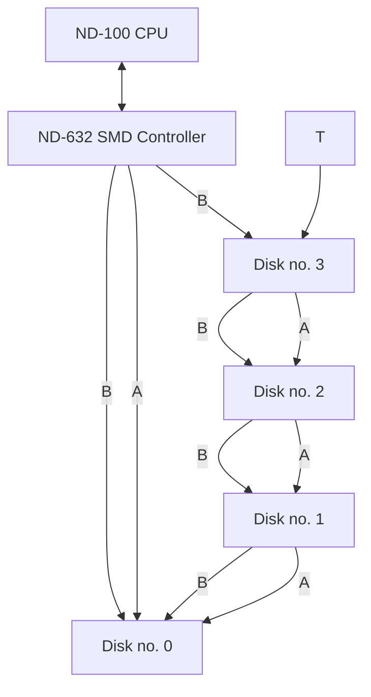

A = A-cable  
B = B-cable  

**Fig. 1. The Disk Drives are Daisy Chained on the Same Controller**

ND-11.020.01

---

## Page 15

15MHZ SMD DISK CONTROLLER

5

# CHAPTER 2

# PROGRAMMING SPECIFICATIONS

ND-11.020.01

---

## Page 16

# 15MHz SMD DISK CONTROLLER

6

ND-11.020.01

[Four circular binder holes along the right edge.]

---

## Page 17

# 15MHZ SMD DISK CONTROLLER

# PROGRAMMING SPECIFICATIONS

7

## 2 PROGRAMMING SPECIFICATIONS

|  |  |
|---|---|
| Card no. | 3043,3044 |
| Standard device no. | 1540,1550 |
| Standard ident. code | 17,20 |
| Standard interrupt level: | 11 |

The IOX address and IDENT code are 16 bits wide, and more controllers using IOXT may be added.

Both 10MHz and 15MHz drives may be daisy chained on this controller.

### Switch setting on 3043 :

DIP switch (in position 7E) contains one switch for each of the four units. This switch must be in the OFF (open) position to be compatible with the old controller.

If the B-cables are flat cables all the way from the controller to the drives, the switches for those units must be in the ON position :

| Unit | Switch |
|---|---|
| Unit 0 | Switch 1 (pin 1-8) |
| Unit 1 | Switch 2 (pin 2-7) |
| Unit 2 | Switch 3 (pin 3-6) |
| Unit 3 | Switch 4 (pin 4-5) |

### Switch setting on 3044 :

|  |  |
|---|---|
| Thumbwheel switch 8 | Controller 1 (IOX 1540) |
| Thumbwheel switch 9 | Controller 2 (IOX 1550) |

Which register the instructions shall activate is controlled by bit 15 in the Control Word Register (CWR) (Dev.No. + 5).

|  | CWR bit 15 = 0 | CWR bit 15 = 1 |
|---|---|---|
| DEV.NO. + 0 : | Read Memory Address | Read Word Count |
| DEV.NO. + 1 : | Load Memory Address | Count Memory Address &<br>Word Count |
| DEV.NO. + 2 : | Read Seek Condition | Read ECC Count |
| DEV.NO. + 3 : | Load Block Address I | Load Block Address II |
| DEV.NO. + 4 : | Read Status Register | Read ECC Pattern |
| DEV.NO. + 5 : | Load Control Word | Load Control Word |
| DEV.NO. + 6 : | Read Block Address I | Read Block Address II |
| DEV.NO. + 7 : | Load Word Count | Load ECC Control |

ND-11.020.01

---

## Page 18

# 15MHZ SMD DISK CONTROLLER  
# PROGRAMMING SPECIFICATIONS

8

## 2.1 DEV.NO. + 0 : Read Memory Address (24 bits) / Read Word Count (24 bits)

The Memory Address Register is read by two successive IOX instructions. The first one gets the lower 16 bits (Address bits 0-15 into the A-reg. 0-15), and the second one gets the upper bits (Address bits 16-23 into A-reg. 0-7). When reading the most significant bits, the upper byte of the A-reg. is undefined and has to be masked.

The Word Count Register is read the same way as the memory address register.

After a transfer, the upper/lower memory address (or word count) control bit (flip-flop) is reset. A Read Status instruction (DEV.NO. + 4) or a Device Clear will also reset this bit.

## 2.2 DEV.NO. + 1 : Load Memory Address / Count Memory Address & Word Count

The Memory Address Register is loaded by two successive instructions. The first loads the 8 upper bits (A-reg. 0-7 into Address bits 16-23), and the second one loads the lower 16 bits (A-reg. 0-15 into Address bits 0-15).

After a transfer, the upper/lower memory address control bit (flip-flop) is reset. A Read Status instruction (DEV.NO. + 4) or a Device Clear will also reset this bit.

**Count Memory Address & Word Count:** This instruction is implemented for maintenance purposes only. By first loading the control word with 102010, a special test mode, each of these instructions will increment the memory address and decrement the word count by one. (Refer to section 3.1, the DMA transfer.)

ND-11.020.01

---

## Page 19

# 15MHZ SMD DISK CONTROLLER

PROGRAMMING SPECIFICATIONS

9

## 2.3 DEV.NO. + 2: Read Seek Condition / Read ECC Count

### Read Seek Condition:

| BIT | MEANING |
|---:|---|
| 0–3 | Seek Complete |
| 4–7 | Not used |
| 8 | Unit Select |
| 9 | Unit Select |
| 10 | Not used |
| 11 | Seek error |
| 12 | Always 1 |
| 13 | ECC Correctable |
| 14 | ECC Parity Error |
| 15 | Address Field |

Bits 0-3: Seek complete status for units 0-3. True if :

- the unit has moved the heads to the correct cylinder, and the heads are under the sector number specified by the block address loaded prior to the initiate seek command.

- a seek error has occurred.

The seek complete status will only be set if an initiate seek command for that unit has first been issued. Note that the sector address loaded before the initiate seek command should be at least two sectors prior to the sector to be read or written.

Thus, after an initiate seek command is given, the Seek Complete bit for that unit will appear once per revolution after the unit is positioned on the correct cylinder, or a seek error has occurred. The condition will last until a transfer command is given.

ND-11.020.01

---

## Page 20

# 15MHZ SMD DISK CONTROLLER

## PROGRAMMING SPECIFICATIONS

10

Bits 8-9: The unit number as loaded by the last control word.

Bit 11 : Seek error for the selected unit. This signal indicates  
         that :

- The unit was unable to complete a move within 500  
  ms.

- The heads have moved to a position outside the  
  recording field.

- An address greater than the maximum number of  
  tracks has been issued.

The signal will only be cleared by performing a Return to  
Zero command on the unit. Pushing the Master Clear button on  
the operators panel will also perform a Return to Zero  
command.

Bit 12 : This bit was always 0 on the NORD-10 controller.

Bit 13 : After the hardware ECC operation has been performed (M8)  
         (after a data error), this bit signals that the error is  
         correctable; and that the ECC Count and ECC Patterns  
         Registers contain valid information for correction of the  
         data. The bit is reset by Device Clear.

Bit 14 : This bit signals that a hardware fault condition exists in  
         the ECC polynomials. This condition will also set bit 7 of  
         the Status Word register (Hardware Error), and hence trigger  
         an error interrupt if this is enabled. The error is reset  
         by the Reset ECC signal (ECC Control register bit 0) or by  
         Device Clear (CWR bit 4). The error is forced set when ECC  
         Control register bit 1 is active. (Force Parity Error).

Bit 15 : This bit indicates that the error (status bit 9) was in the  
         address field of a sector. This bit is only cleared by Reset  
         ECC (ECC control register bit 0).

**Read ECC Count:** When a correctable data error has been detected, this  
register will contain the bit displacement + 2 from the beginning of  
the data field to the last bit of the error burst. It means that if  
the last error bit is bit no. n (starting at 0), the ECC count will be  
n+2.

ND-11.020.01

---

## Page 21

# 15MHZ SMD DISK CONTROLLER

# PROGRAMMING SPECIFICATIONS

11

## 2.4 DEV.NO. + 3: Load Block Address I/II

Both block address registers have to be loaded to completely specify a disk address.

### Block Address Register I:

```text
 15 14 13 12 11 10  9  8  7  6  5  4  3  2  1  0
+-------------------------------+-------------------------------+
| Surface Number                | Sector Number                 |
+-------------------------------+-------------------------------+
```

Bits 0-7:  Sector number  
&nbsp;&nbsp;&nbsp;&nbsp;&nbsp;&nbsp;&nbsp;&nbsp;10 MHz drives have 18 sectors (0-21 oct.)  
&nbsp;&nbsp;&nbsp;&nbsp;&nbsp;&nbsp;&nbsp;&nbsp;15 MHz drives, examples:  
&nbsp;&nbsp;&nbsp;&nbsp;&nbsp;&nbsp;&nbsp;&nbsp;&nbsp;&nbsp;&nbsp;&nbsp;CDC 515 Mb FSD -- 26 sectors (0-31 oct.) + 1 spare  
&nbsp;&nbsp;&nbsp;&nbsp;&nbsp;&nbsp;&nbsp;&nbsp;&nbsp;&nbsp;&nbsp;&nbsp;CDC 825 Mb XMD -- 44 sectors (0-53 oct.) + 1 spare  
&nbsp;&nbsp;&nbsp;&nbsp;&nbsp;&nbsp;&nbsp;&nbsp;&nbsp;&nbsp;&nbsp;&nbsp;FUJITSU 474 Mb M2351A (EAGLE)  
&nbsp;&nbsp;&nbsp;&nbsp;&nbsp;&nbsp;&nbsp;&nbsp;&nbsp;&nbsp;&nbsp;&nbsp;&nbsp;&nbsp;&nbsp;&nbsp;-- 24 sectors (0-27 oct.) + 1 spare  

Bits 8-15: Surface number  
&nbsp;&nbsp;&nbsp;&nbsp;&nbsp;&nbsp;&nbsp;&nbsp;10 MHz drives, examples:  
&nbsp;&nbsp;&nbsp;&nbsp;&nbsp;&nbsp;&nbsp;&nbsp;&nbsp;&nbsp;&nbsp;&nbsp;for 38/75 Mb disk -- 5 (0-4)  
&nbsp;&nbsp;&nbsp;&nbsp;&nbsp;&nbsp;&nbsp;&nbsp;&nbsp;&nbsp;&nbsp;&nbsp;for 150 Mb disk -- 10 (0-11 oct.)  
&nbsp;&nbsp;&nbsp;&nbsp;&nbsp;&nbsp;&nbsp;&nbsp;&nbsp;&nbsp;&nbsp;&nbsp;for 288 Mb disk -- 19 (0-22 oct.)  
&nbsp;&nbsp;&nbsp;&nbsp;&nbsp;&nbsp;&nbsp;&nbsp;&nbsp;&nbsp;&nbsp;&nbsp;for Phoenix disk -- 1-5 (20-24 oct.) fixed  
&nbsp;&nbsp;&nbsp;&nbsp;&nbsp;&nbsp;&nbsp;&nbsp;&nbsp;&nbsp;&nbsp;&nbsp;&nbsp;&nbsp;&nbsp;&nbsp;-- 1 (0) removable  

&nbsp;&nbsp;&nbsp;&nbsp;&nbsp;&nbsp;&nbsp;&nbsp;15 MHz drives, examples:  
&nbsp;&nbsp;&nbsp;&nbsp;&nbsp;&nbsp;&nbsp;&nbsp;&nbsp;&nbsp;&nbsp;&nbsp;CDC 515 Mb FSD -- 24 (0-27 oct.)  
&nbsp;&nbsp;&nbsp;&nbsp;&nbsp;&nbsp;&nbsp;&nbsp;&nbsp;&nbsp;&nbsp;&nbsp;CDC 825 Mb XMD -- 16 (0-17 oct.)  
&nbsp;&nbsp;&nbsp;&nbsp;&nbsp;&nbsp;&nbsp;&nbsp;&nbsp;&nbsp;&nbsp;&nbsp;FUJITSU 474 Mb M2351A (EAGLE) -- 20 (0-23 oct.)  

### Block Address Register II:

```text
 15 14 13 12 11 10  9  8  7  6  5  4  3  2  1  0
+---------------------------------------------------------------+
|                        Cylinder Number                        |
+---------------------------------------------------------------+
```

Bits 0-15: Cylinder number

| Drive | Cylinder number |
|---|---|
| 38 Mbytes disk | 411 max. (0-632 oct.) |
| 75/150/288 Mbytes/Phoenix disk | 823 max. (0-1466 oct.) |
| CDC 515 Mb FSD | 711 max. (0-1306 oct.) |
| CDC 825 Mb XMD | 1024 max. (0-1777 oct.) |
| FUJITSU 474 Mb M2351A (EAGLE) | 842 max. (0-1511 oct.) |

ND-11.020.01

---

## Page 22

# 15MHZ SMD DISK CONTROLLER  
# PROGRAMMING SPECIFICATIONS

12

## 2.5 DEV.NO. + 4: Read Status Register/Read ECC Pattern

### Read Status Register:

| BIT | MEANING |
|---:|---|
| 0 | Controller not active, interrupt enabled |
| 1 | Error interrupt enabled |
| 2 | Controller active |
| 3 | Controller finished with a device operation |
| 4 | Inclusive OR of errors (bits 5-13) |
| 5 | Illegal load |
| 6 | Timeout |
| 7 | Hardware error |
| 8 | Address mismatch |
| 9 | Data error |
| 10 | Compare error |
| 11 | DMA channel error |
| 12 | Abnormal completion |
| 13 | Disk unit not ready |
| 14 | On cylinder |
| 15 | Always 0. Read back of Control Word bit 15 |

Bit 5: Load of any register while status bit 2 is true.

Bit 7: Disk fault, missing read clocks, missing servoclocks, ECC  
parity error.

Bit 11: FIFO over/underrun or ND-100 Bus error.

Bit 13: Inclusive OR of bits 5, 6, 7, 8 and 13.

Bit 15: Used to distinguish the two IOX banks.

### Read ECC Pattern Register:

```text
 15  14  13  12  11  10   9   8   7   6   5   4   3   2   1   0
+---+---+-----------+-------------------------------------------+
| 1 | 0 |  1   1   1|               Error pattern               |
+---+---+-----------+-------------------------------------------+
```

| Bits | Meaning |
|---|---|
| 0-10 | Error pattern. |
| 11-13 | Always 1. |
| 14 | Always 0. To distinguish from the old ND-100 SMD controller. |
| 15 | Always 1. Read-back of Control Word bit 15. |

ND-11.020.01

---

## Page 23

# 15MHZ SMD DISK CONTROLLER

## PROGRAMMING SPECIFICATIONS

13

Bits 0-10: These bits contain the right-justified error pattern, such that the last bit in error always occupies bit position 0 of this register. This pattern (the contents of this register bits 0-10) should be exclusively ORed with the data in the CPU memory at the proper location.

## 2.6 DEV.NO. + 5: Load Control Word

| BIT | MEANING |
|---:|---|
| 0 | Enable interrupt on device not active |
| 1 | Enable interrupt of errors |
| 2 | Activate device operation |
| 3 | Test mode |
| 4 | Device clear |
| 5 | Not used |
| 6 | Not used |
| 7 | Unit select |
| 8 | Unit select |
| 9 | Not used |
| 10 | Marginal recovery cycle |
| 11-14 | Device operation code |
| 15 | Register multiplex bit |

Bits 7-8: When a Control Word is loaded, the disk unit number (0-3) has to be set up in bits 7-8.

Bit 10: The marginal recovery cycle may be used in connection with read operation codes M0, M2 and M3, as defined under bits 11-14. This control bit is included as an aid in recovering marginal data.

If a marginal recovery cycle is started, this bit has to be set every time this instruction (Load Control Word) is given. Otherwise the marginal recovery cycle will be interrupted, and it will start in position 1 again the next time this bit is set in the Control Word.

For consecutive read transfers with this bit set, the controller will cycle through the following conditions :

1) Servo-offset positive, data strobe early.

2) No servo-offset, data strobe early.

3) Servo-offset negative, data strobe early.

ND-11.020.01

---

## Page 24

# 15MHZ SMD DISK CONTROLLER  
# PROGRAMMING SPECIFICATIONS

14

4) Servo-offset positive, nominal data strobe.

5) Servo-offset negative, nominal data strobe.

6) Servo-offset positive, data strobe late.

7) No servo-offset, data strobe late.

8) Servo-offset negative, data strobe late.

9) Servo-offset positive, data strobe early.

Bits11-14: Device operation code: All device operation codes will be activated when the code is given together with bit 2 (activate device). For all codes except M6, the correct unit number must also be selected.

| Bit 14 | Bit 13 | Bit 12 | Bit 11 | Code | Operation |
|---:|---:|---:|---:|---|---|
| 0 | 0 | 0 | 0 | M0 | Read transfer |
| 0 | 0 | 0 | 1 | M1 | Write transfer |
| 0 | 0 | 1 | 0 | M2 | Read parity |
| 0 | 0 | 1 | 1 | M3 | Compare |
| 0 | 1 | 0 | 0 | M4 | Initiate seek |
| 0 | 1 | 0 | 1 | M5 | Write format |
| 0 | 1 | 1 | 0 | M6 | Seek complete search |
| 0 | 1 | 1 | 1 | M7 | Return to zero seek |
| 1 | 0 | 0 | 0 | M8 | Run ECC operation |
| 1 | 0 | 0 | 1 | M9 | Select/Release |

## M0: Read transfer

This operation causes the controller to transfer data from the disk to the computer memory. The number of blocks transferred depends upon the word count, as defined by the Word Count Register.

## M1: Write transfer

Data is transferred from the computer memory to the disk.

## M2: Read parity transfer

The controller will check the parity on the address and data of the sector specified. Data is transferred to the controller and the cyclic check word, for both the address field and the data field of a sector, is compared with the correct check word as generated by the controller. No data transfer to the computer memory is performed.

## M3: Compare transfer

This function is included to positively check the data written on the disk. During compare transfer, the controller compares the data read from the disk and the data from the computer memory bit by bit. A mismatch causes compare error to be set.

ND-11.020.01

---

## Page 25

# 15MHZ SMD DISK CONTROLLER

# PROGRAMMING SPECIFICATIONS

15

## M4: Initiate seek

This function is included to enable a unit to position the heads prior to a data transfer. The heads will be positioned according to the content of the Block Address Register. The sector address must be at least two sectors prior to the one to be read or written. As soon as this function is accepted by the disk, the operation will be completed.

## M5: Write format

This function will cause the controller to write the address field within each sector. (See section 2.8)

## M6: Seek complete search

This function will enable the controller to go into a waiting state, until any unit has completed a seek. This function is independent of the unit select code in the control word. Note that interrupt will be given when the heads of a unit are positioned at the beginning of the specified sector, and that this should be (at least) two sectors prior to the first of the sectors to be read or written.

## M7: Return to zero seek

This will cause the selected disk to perform a seek to cylinder 0, and will also clear the seek error bit in the unit.

## M8: Run ECC operation

This function will, when a data error has occurred, initiate the hardware operation that determines if the error is correctable or uncorrectable. If the error is correctable, the error pattern and its displacement within the data field are computed.

## M9: Select/Release

This is implemented for dual channel drives only. All normal Load Control Word instructions from one channel will select the specified unit, until a Release command is issued. Attempts to select a reserved drive will only cause a delay in access time. A Priority Select command will unconditionally select, and absolutely reserve, the specified unit (interrupts the other channel during a transfer) until a Release command is issued. Attempting to select a priority selected drive will cause a astatus error (unit not ready)

```text
Release             :  LDA (44020
                         IOX LCW
                         LDA (2010
                         IOX LCW


Priority select:       LDA (44010 + Unit no.
                       IOX LCW
```

ND-11.020.01

---

## Page 26

# 15MHZ SMD DISK CONTROLLER  
## PROGRAMMING SPECIFICATIONS

16

Bit 15 : This bit selects which register block on the controller the  
&nbsp;&nbsp;&nbsp;&nbsp;&nbsp;&nbsp;&nbsp;&nbsp;following IOX instructions shall activate.

## 2.7 DEV.NO. + 6: Read Block Address I/II

Note that these registers will always show the last transferred sector  
address. If any error occurs during the transfer, the controller will  
stop, and the Block Address Register will show in which sector the  
error occurred. All the previous sectors are then transferred  
successfully; and, in the case of a data error (status bit 9), the  
whole failing sector will also be transferred. This means that an ECC  
operation or retry may be started immediately on this address.

### Block Address Register I:

```text
 15 14 13 12 11 10 9  8  7  6  5  4  3  2  1  0

+-------------------------+-------------------------+
|     Surface number      |      Sector number      |
+-------------------------+-------------------------+
```

### Block Address Register II:

```text
 15 14 13 12 11 10 9  8  7  6  5  4  3  2  1  0

+---------------------------------------------------+
|                  Cylinder number                  |
+---------------------------------------------------+
```

## 2.8 DEV.NO. + 7: Load Word Count/Load ECC Control

### Load Word Count:

The Word Count register is increased from 16 to 24  
bits, and is loaded by two successive instructions. The first loads  
the 8 upper bits (A-reg. 0-7 into Word Count bits 16-32), and the  
second one loads the lower 16 bits (A-reg. 0-15 into Word Count bits  
0-15).

After a transfer, the upper/lower Word Count control bit (flip-flop)  
is reset. A Read Status instruction (DEV.NO. + 4) or a Device Clear  
will also reset this bit.

The controller is able to transfer a whole cylinder, or up to 16M  
words (24 bits), with a hardware increment of the head and sector  
addresses. For the 75 Mb disk, the maximum word count is 132000 (45k);  
starting with the head and cylinder address equal to 0.

The Word Count is set to an integer multiple of the number of words in  
a sector when device operation is M0-M3.

When executing M5 (Write Format), the interface is set in a special  
mode, and the Word Count is set to twice the number of sectors to be  
formatted. This special mode causes the data from memory to be written  
into the address part of the sector, instead of the data part. Data  
may also be written in the data fields during formatting by selecting  
a special format (see ECC control register).

ND-11.020.01

---

## Page 27

# 15MHZ SMD DISK CONTROLLER

## PROGRAMMING SPECIFICATIONS

17

## Load ECC Control:

| BIT | MEANING |
|---:|---|
| 0 | Reset ECC |
| 1 | Force Parity Error |
| 2 | Long |
| 3 | Format A |
| 4 | Format B |
| 5 | Format C |
| 6 | Format D |
| 7–15 | Not used |

Bit 0 : This bit will cause the ECC polynomials to be reset to the zero initial state. This function is only used when a data error has occurred, otherwise the polynomials automatically go to the zero state upon completion of a Read or Write. Device Clear function will also reset ECC and is preferred.

Bit 1 : Used for maintenance purposes only. This bit will force ECC parity error to be set.

Bit 2 : Used for maintenance purposes only. When a sector is read or written, the data field of the sector is extended by 64 bits (The length of the ECC pattern plus "End of Record" byte). The data and the extra bits are read into or written from the memory of the CPU. This function is used to diagnose the operation of the ECC circuits, and can be used with the following Device operations: M0, M1, M2, M3.

This bit is "echoed" in ECR bit 14.

Bits 3-6: Sector formats and sector length:

| Format A | B | Function: |
|---:|---:|---|
| 0 | 0 | Old format, 1kb/sector, only the first address checked. |
| 1 | 0 | Old format, 1kb/sector, all address fields checked. |

ND-11.020.01

---

## Page 28

18

# 15MHZ SMD DISK CONTROLLER  
# PROGRAMMING SPECIFICATIONS

|  |  |  |
|---|---|---|
| 0 | 1 | New format, 1kb/sector, all address fields checked. |
| 1 | 1 | New format, 0.5kb/sector, all address fields checked. |

Format 0 is identical to the old controller.  
Format 2 should be selected when sector reallocation is used.

Note that it is not allowed to switch the format after formatting.

Format C: Used to write both the address and data during formatting, for faster track testing. Word count must then be two more than the number of data words multiplied by the number of sectors on a track. The memory layout must include the two address words between each sector data buffer.

Format D: Used to read the manufacturer's error information located at the beginning of each track. The word count must be 512 (1000 oct.), and the sector address is 0. Format A, B and C bits are not used (don't care). Only the first four defects on each track are logged. The memory content after transfer will be:

| Memory address | Information |
|---|---|
| 0/ | Cylinder number, bit 15 also tells if the track contains more than one error. |
| 1/ | Head number in upper 8 bits, lower 8 are zero. |
| 2/ | First defect position, in bytes from Index. |
| 3/ | First defect length, in bits. |
| 4/ | Second defect position. |
| 5/ | Third defect length. |
| 6/ | Third defect position. |
| 7/ | Third defect length. |
| 10/ | Fourth defect position. |
| 11/ | Fourth defect length. |
| 12/ | End of information, 170000 octal. |
| 13-777/ | Don't care. |

Unused defect locations are all zeros. If the cylinder address, head address or end of information word do not match, the whole track should be considered defective and be reallocated. Note that status bit 9 (data error) may be set after this transfer.

ND-11.020.01

---

## Page 29

# 15MHZ SMD DISK CONTROLLER

# PROGRAMMING SPECIFICATIONS

19

This table shows the Format bits influence on the length (in bits) of the 8 phases that every sector is divided into:

| Form.bit<br>LongABCD | Phase1<br>length | Phase1<br>to RG | Phase1<br>to RCE | Phase2<br>length | Phase4<br>length | Phase4<br>to WG | Phase4<br>to RG | Phase4<br>to RCE | Phase5<br>length | Phase6<br>length |
|---|---:|---:|---:|---:|---:|---:|---:|---:|---:|---:|
| 0 00X0 | 240 | 65 | 193 | 32 | 240 | 32 | 65 | 193 | 8192 | 56 |
| 1 00X0 | 240 | 65 | 193 | 32 | 240 | 32 | 65 | 193 | 8256 | 8 |
| 0 10X0 | 240 | 65 | 193 | 32 | 240 | 32 | 65 | 193 | 8192 | 56 |
| 1 10X0 | 240 | 65 | 193 | 32 | 240 | 32 | 65 | 193 | 8256 | 8 |
| 0 01X0 | 416 | 273 | 361 | 32 | 128 | 32 | 41 | 113 | 8192 | 56 |
| 1 01X0 | 416 | 273 | 361 | 32 | 128 | 32 | 41 | 113 | 8256 | 8 |
| 0 11X0 | 416 | 273 | 361 | 32 | 128 | 32 | 41 | 113 | 4096 | 56 |
| 1 11X0 | 416 | 273 | 361 | 32 | 128 | 32 | 41 | 113 | 4160 | 8 |
| X XXX1 | 240 | 65 | 193 | 8192 | 240 | --- | --- | --- | 8 | 56 |

Phase 3 is always 56 bits. Phase 7 is always 8 bits. Phase 8 is disk drive dependent. RG (Read Gate) and RCE (Read Clock Enable) are turned off at the beginning of Phase 4 and Phase 8. WG (Write Gate) is turned off at the end of Phase 8.

ND-11.020.01

---

## Page 30

# 15MHZ SMD DISK CONTROLLER

20

ND-11.020.01

---

## Page 31

# 15MHZ SMD DISK CONTROLLER

21

# CHAPTER 3

## FUNCTIONAL DESCRIPTION

ND-11.020.01

---

## Page 32

# 15MHZ SMD DISK CONTROLLER

22

ND-11.020.01

---

## Page 33

# 15MHZ SMD DISK CONTROLLER

## FUNCTIONAL DESCRIPTION

## 3 FUNCTIONAL DESCRIPTION

### 3.1 The DMA Transfer

The DMA transfer is divided into 3 parts (see figure 2):

1. Initialization

2. Transfer

3. Termination

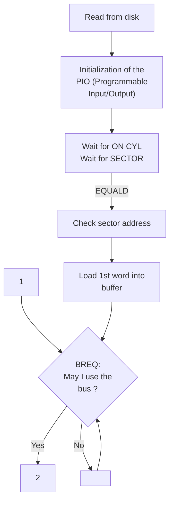

Other users are:  
- Refresh (first priority)  
- CPU  
- DMA (equal priority)  

ND-11.020.01

---

## Page 34

# 15MHZ SMD DISK CONTROLLER

## FUNCTIONAL DESCRIPTION

24

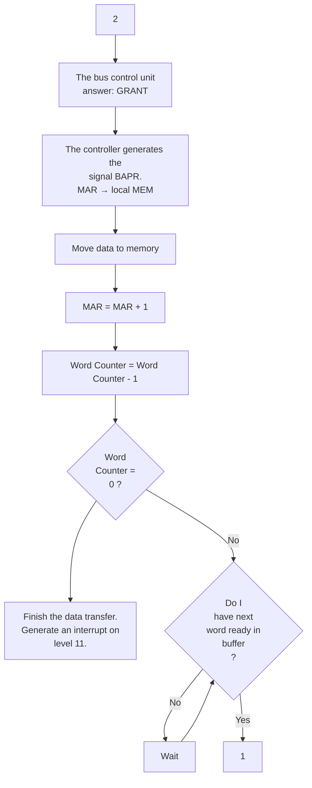

*Fig. 2. The DMA Operation*

An 8Kb FIFO (First In First Out temporary storage) acts as a buffer between the memory and the disk, due to different transfer rates. It is possible, in odd configurations, to select a lower transfer rate between the FIFO and the main memory, dependent on the quantity of the FIFO. This must be done by straps on the card. Data flow for write and read is illustrated in Figures 6 and 7 respectively.

ND-11.020.01

---

## Page 35

# 15MHZ SMD DISK CONTROLLER

## FUNCTIONAL DESCRIPTION

25

## 3.2 The Interface Signals

In this section, the signals between the disk unit and the controller are listed and explained. The signals are transferred over two cables, the A- and B-cables.

In order to exchange signals between the controller and a disk unit over the A-cable, the unit must be selected.

On the B-cable, however, the signal exchange takes place without disk unit selection.

Figures 3 and 4 list the interface signals on the A- and B-cables.

```mermaid
flowchart LR
    C[CONTROLLER]
    D[DISK DRIVE]

    C -->|Unit Select Tag,<br/>Unit Select 0, Unit Select 1| D
    C -->|Tag 1, Tag 2, Tag 3| D
    C -->|Bit (0-9)| D
    C -->|Open Cable Detector| D
    D -->|Fault, Seek Error,<br/>On cylinder, Unit ready| C
    D -->|Write protected| C
    D -->|Busy| C
    C ---|Ground| D

    N1["△ 1<br/>Dual Channel Units only"]
    N2["△ 2<br/>Gated by Unit Selected"]

    N1 -.-> D
    N2 -.-> C
```

△ 1 Dual Channel Units only  △ 2 Gated by Unit Selected.

## Fig. 3. Interface Lines - A-cable

ND-11.020.01

---

## Page 36

26

# 15MHZ SMD DISK CONTROLLER

## FUNCTIONAL DESCRIPTION

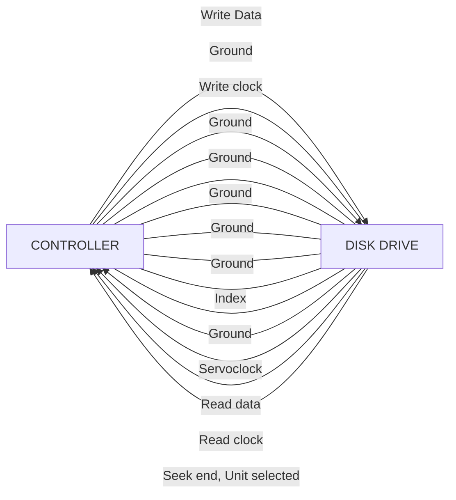

**B-CABLE**

Fig. 4. Interface Lines - B-cable

ND-11.020.01

---

## Page 37

# 15MHZ SMD DISK CONTROLLER

## FUNCTIONAL DESCRIPTION

## 3.2.1 Signal Explanation

This section is divided into 3 parts :

- bus bit usage
- the remaining A-cable lines
- the B-cable lines

## 3.2.1.1 Bus Bit Usage

The bus bits 0-9 are used for 3 purposes defined by the tag 1, tag 2 or tag 3 line.

|  |  |
|---|---|
| Tag 1 line activated | The cylinder address, taken from the lower part of block address register II, is transferred over the bus bits and strobed into the cylinder address register in the selected unit. |
| Tag 2 line activated | The head select bits, taken from the upper byte of block address register I, are transferred over the bus bits and strobed into the head select register in the selected unit. |
| Tag 3 line activated | The various functions given in the table below are sent from the controller to the selected disk unit : |

| Bus bits: | Function : |
|---|---|
| 0 | Write Gate. Enable write drivers. |
| 1 | Read Gate. Enable the read circuits and data/clock separator circuits in the drive. |
| 2 | Servo-Offset Plus. Offsets the actuator (heads) from the center of a track position towards the spindle. |
| 3 | Servo-Offset Minus. Offsets the actuator (heads) from the center of a track position away from the spindle. |
| 4 | Fault Clear. Pulse sent to the drive to clear the fault summary latch. |

ND-11.020.01

---

## Page 38

# 15MHZ SMD DISK CONTROLLER

## FUNCTIONAL DESCRIPTION

|  |  |
|---|---|
| 5 | Address Mark Enable (not used). |
| 6 | Return to Zero Seek (RTZ). Pulse sent to the drive, causing the actuator to seek back to track zero. |
| 7 | Data Strobe Early. Enables the data/clock separator (phased locked oscillator - PLO) to strobe the data at a time earlier than the optimum. |
| 8 | Data Strobe Late. Enable the data/clock separator (phased locked oscillator - PLO) to strobe the data at a time later than the optimum. |

## 3.2.1.2 The Remaining A-Cable Lines

|  |  |
|---|---|
| Open Cable Detect | Inhibits unit selection and any unwanted command, such as Write Gate, when the A-cable is disconnected or controller power is lost. |
| Unit Select Lines 2<sup>0</sup> - 2<sup>3</sup> | Used to select the drive. The binary code on these lines must match the code of the drive's logical address plug, for the drive to be selected. These lines are used in conjunction with the unit select tag (refer to Unit Selection). |
| Unit Select Tag | Starts unit select sequence and is used in conjunction with Unit Select lines 2<sup>0</sup> - 2<sup>3</sup>. |
| Fault | Indicates that one or more of these faults exist:<br><br>- DC power fault<br>- Head select fault<br>- Write fault<br>- Write or read while off cylinder<br>- Write during a read operation<br><br>Refer to Fault and Error Correction. |

ND-11.020.01

---

## Page 39

# 15MHZ SMD DISK CONTROLLER

## FUNCTIONAL DESCRIPTION

29

|  |  |
|---|---|
| Seek Error | Indicates that the unit was unable to complete a move within 500 ms, or that the carriage has moved to a position outside the recording field. A seek error interrupt also occurs if an address greater than the maximum track is selected. Refer to Seek Functions for more information. |
| On Cylinder | Indicates that the drive has positioned the heads over a legal track (refer to Seek Functions). |
| Unit Ready | Indicates that the drive is:<br><br>- selected<br>- up to speed<br>- heads are loaded<br>- no fault exists |
| Write Protected | Gives status bit 13 if trying to write on a write protected disk. |
| Busy | Used for dual channel drives to inform the other channel that the unit is busy. |

ND-11.020.01

---

## Page 40

# 15MHZ SMD DISK CONTROLLER

## FUNCTIONAL DESCRIPTION

30

### 3.2.1.3 The B-Cable Lines

| Line | Description |
|---|---|
| Write Data | Carries NRZ (Non Return to Zero) data to be recorded on the disk pack. |
| Write Clock | Synchronized to NRZ Write Data, it is a return of the servoclock. This signal is transmitted continuously. |
| Servoclock | 9.677 MHz clock signals derived from the servotrack dibits. |
| Read Data | Carries NRZ data recovered from the disk pack (refer to discussions on Read/Write functions). |
| Read Clock | Clock signals derived from NRZ read data (refer to discussions on Read/Write functions). |
| Seek End | Seek End, which is a combination of ONCYL and/or SEEK ERROR, indicates that a seek operation has terminated. |
| Unit Selected | Indicates that the drive is selected. This line must be active before the drive can respond to any commands from the controller. |
| Index | Occurs once per revolution of the disk pack. Its leading edge is considered the leading edge of sector zero. |
| Sector | Derived from the servosurface of the disk pack. This signal can occur any number of times per revolution of the disk pack. The number of sector pulses occurring depends on the setting of the switches on the card in position in the logic chassis. Refer to Chapter 7 for Switch Setting. |

ND-11.020.01

---

## Page 41

# 15MHZ SMD DISK CONTROLLER

# FUNCTIONAL DESCRIPTION

31

## 3.2.2 ND-100 Bus Signals

| Signal | Description |
|---|---|
| An Return | Separate ground line for analog circuits. Connected to logic ground return (GND) in power supply end. (15V Power Supply.) |
| BAPR | Bus Address Present in multiplexed data and address bus. Wired OR line. |
| BCRQ | Bus Control Request from source wanting full control over the bus (for future extensions). Wired OR line. |
| BDRY | Bus Data Ready signals that data is ready or has been accepted: given by the answering device. Wired OR line. |
| BD 0-23 | Multiplexed data and address bus. Bit 0 is the least significant. |
| BERROR | Bus Error signals that an error was detected during a bus cycle, e.g., fatal memory error. Wired OR line. |
| BINACK | Bus Input Acknowledge signals that an interface requesting an input operation may enable data. Generated by the controlling unit. |
| BINPUT | Bus Input signalled by a unit which will transmit data. I/O interfaces must wait for BINACK before enabling data and BDRY. Wired OR line. |
| BINT 10-13,15 | Interrupt lines. BINT10 has the lowest priority. Wired OR lines. |
| BDAP | Bus Data Present signals that data is present during DMA or memory cycles. |
| BIOXE | Input/Output Enable. A strobe to enable data transfer to or from an I/O interface. Generated by the controlling unit. |
| BLANK | Output Blanking signal for process interface. Wired OR signal generated by the monitoring device. |
| BMCL | Bus Master Clear for logic initialization at power-up, and when Master Clear button is pushed. Wired OR line. |

ND-11.020.01

---

## Page 42

# 15MHZ SMD DISK CONTROLLER

## FUNCTIONAL DESCRIPTION

32

|  |  |
|---|---|
| **BMEM** | Bus Memory Cycle signals that a bus cycle accesses memory. Generated by the controlling unit. |
| **BMINH** | Bus Memory Inhibit used to inhibit memory accesses during power-down and power-up sequences in systems which only have battery backup for memory. Generated by the controlling unit. |
| **BREQ** | Request for a DMA cycle. Wired OR line. |
| **CONTINUE** | May be used to start a CPU that is in STOP mode. Wired OR line (only in CPU crate). |
| **GND** | Logical ground return. |
| **INCONTR** | Response to BCRQ indicating that a control over the bus is available. A unit which does not want to control the bus must issue OUTCONTR in response to INCONTR. INCONTR is generated as OUTCONTR by the nearest unit in a less significant board position. |
| **INGRANT** | Response to BREQ, indicating that the bus is available for DMA cycle. The interface which issued BREQ prior to the last leading edge of BMEM may use the bus for a single memory read or write cycle. Otherwise, INGRANT is passed onto OUTGRANT, which is connected to INGRANT of the next lower priority card position (further removed from the controlling unit). INGRANT, as OUTGRANT, originates from the controlling unit. |
| **INIDENT** | Response to BINT 10-13, together with address bits 0-5 which specify BINT number. The interface that issued BINT in the specified level prior to the last leading edge of BAPR, responds by enabling its IDENT CODE into the BD bus. Otherwise, IDENT is passed on to OUTIDENT, which is connected to INIDENT of the next lower priority card position (further removed from controlling unit). INIDENT originates in the OUTIDENT from the controlling unit. |
| **PA 0-3** | Define the card position code and the device numbers of the analog and digital process interfaces. |
| **LOAD** | Activates the load microprogram if the CPU is in STOP mode. Wired OR line (only in CPU crate). |

ND-11.020.01

---

## Page 43

# 15MHZ SMD DISK CONTROLLER

## FUNCTIONAL DESCRIPTION

| Signal | Description |
|---|---|
| OUTCONTR | See INCONTR. |
| OUTGRANT | See INGRANT. |
| OUTIDENT | See INIDENT. |
| RESTART | Starts program execution in location 20 if the CPU is in STOP mode. Wired OR line (only in CPU crate). |
| RUN | Indicates that the CPU is active and executing a program, i.e., _not_ in STOP mode. Generated by the CPU (only in CPU crate). |
| SPARE | Not assigned. |
| STOP | Forces the CPU to enter STOP mode after completion of the current instruction. Wired OR line (only in CPU crate). |
| + 5V | Main logic supply voltage. |
| + 5V Standby | Logic supply voltage for memory retention during power fail. |
| + 15V | Supply voltage for analog interface circuits. For customer use. |
| - 15V | Supply voltage for analog interface circuits. For customer use. |
| + 12V Standby | Supply voltage for memory. Requires battery backup. |

## 3.3 Track/Sector Format

A new track format is included, which allows the address field of each sector in a multisector transfer to be checked. Therefore, "head advance" may be used on disk drives with reallocated tracks.

This also makes it possible to have a spare sector on each track, which will give no additional seek or rotational time delays if a reallocated sector is found. The controller will just skip the bad sector and read the next one(s). The bad sector may be anywhere on the track, and the software driver will not see this at all. It only affects the formatting program. The capacity loss, compared to track reallocation, is typically only 5 Mb for 4-500 Mb drives, due to the much smaller spare track pool, which is now only for tracks containing more than one bad sector.

Half sector lengths are included, which gives sector sizes of 0.5 and 1 Kb. This is done mainly to handle disk drives with fixed sector sizes due to the embedded servo.

ND-11.020.01

---

## Page 44

34

# 15MHZ SMD DISK CONTROLLER

## FUNCTIONAL DESCRIPTION

## 3.3.1 The Phases

This table shows the Format bits' influence on the length (in bits) of the 8 phases that every sector is divided into :

| Form.bit LongABCD | Ph. 1 length | Phase1 to RG | Phase1 to RCE | Phase2 length | Phase4 length | Phase4 to WG | Phase4 to RG | Phase4 to RCE | Phase5 length | Phase6 length |
|---|---:|---:|---:|---:|---:|---:|---:|---:|---:|---:|
| 0 00X0 | 240 | 65 | 193 | 32 | 240 | 32 | 65 | 193 | 8192 | 56 |
| 1 00X0 | 240 | 65 | 193 | 32 | 240 | 32 | 65 | 193 | 8256 | 8 |
| 0 10X0 | 240 | 65 | 193 | 32 | 240 | 32 | 65 | 193 | 8192 | 56 |
| 1 10X0 | 240 | 65 | 193 | 32 | 240 | 32 | 65 | 193 | 8256 | 8 |
| 0 01X0 | 416 | 273 | 361 | 32 | 128 | 32 | 41 | 113 | 8192 | 56 |
| 1 01X0 | 416 | 273 | 361 | 32 | 128 | 32 | 41 | 113 | 8256 | 8 |
| 0 11X0 | 416 | 273 | 361 | 32 | 128 | 32 | 41 | 113 | 4096 | 56 |
| 1 11X0 | 416 | 273 | 361 | 32 | 128 | 32 | 41 | 113 | 4160 | 8 |
| X XXX1 | 240 | 65 | 193 | 8192 | 240 | -- | -- | -- | 8 | 56 |

Phase 3 is always 56 bits.  
Phase 7 is always 8 bits.  
Phase 8 is disk drive dependent.  
RG (Read Gate) and RCE (Read Clock Enable) is turned off at beginning of Phase 4 and Phase 8. WG (Write Gate) is turned off at end of Phase 8.

A sector is divided into 8 phases.

### Phase 1

The purpose of this phase is :

- to compensate for sidewise mechanical skew between the read/write heads with respect to the servohead.

- to compensate for read circuits set up time.

- to allow the data/clock separation circuits phase lock oscillator to synchronize and lock to the address.

This phase is written during the formatting process.

ND-11.020.01

---

## Page 45

# 15MHZ SMD DISK CONTROLLER

# FUNCTIONAL DESCRIPTION

| Phase | Description |
|---|---|
| Phase 2 | During formatting, the block address is written onto the disk pack. During read or write, the block address is checked. |
| Phase 3 | The block address, written onto the disk in phase 2 during formatting, at the same time generates a 56-bit error correction code (ECC - see section 3.3) which is written onto the disk in phase 3 during formatting. |
| Phase 4 | This phase is identical to phase 1. The purpose is to resynchronize the phase lock oscillator in the data/clock separation circuits.<br><br>Phase 4 is first written during the formatting process, but is rewritten for each normal write operation on the sector in question. |
| Phase 5 | Phase 5 represents the data capacity for the sector, and is equal to 512 16-bit words (1/2 K words). This data is taken from memory over a DMA channel during a write operation, and vice versa during a read operation. It is also possible to write data in the data fields of the sector during formatting - this makes track testing faster. |
| Phase 6 | When the data is written onto the disk in phase 5, an error correction code (ECC) is generated. The code will then be written onto the disk in phase 6. |
| Phase 7 | This phase consist of 8 1's, indicating the end of the sector. |
| Phase 8 | This phase consists of 0's, and its purpose is to compensate for sidewise mechanical skew between the read/write heads with respect to the servohead. |

## 3.3.2 The Clock Counter

The clock counter works as an input to the phase generator, which in turn resets the clock counter when terminating each phase.

The clock pulses, which are counted, derive either from the write clock, read clock, or an internal clock oscillator used in test mode.

The circuits which perform the clock selection are located on the SMD Control (3043).

ND-11.020.01

---

## Page 46

36

15MHZ SMD DISK CONTROLLER  
FUNCTIONAL DESCRIPTION

# 3.3.3 The Sector Counter

The sector counter in block address register I always shows the last transferred sector in the read back disk address.

The local sector counter for each unit is increased from 5 to 7 bits (max. 128 sectors). These counters are only used for a parallel seek of several units to include rotational optimization.

# 3.4 Error Correction Code Description

## 3.4.1 Features of the ECC Polynomial

Errors that occur to the data on the disk show up as error bursts. The burst-error processor is a hardware implementation of these codes. It can correct error bursts up to 11 bits long in a data stream being read from a disk. It does so by dividing the data stream by a fixed binary number, represented mathematically by a polynomial :

EXAMPLE :

X⁰ + X² + X⁵ + X⁷ stands for a binary 10100101 since each exponent indicates the position of a 1.

The polynomial is generated in a 56-bit special purpose shift register according to the formula :

G(X)= X⁵⁶ + X⁵⁵ + X⁴⁹ + X⁴⁵ + X⁴¹ + X³⁹ + X³⁸ + X³⁷ + X³⁶ + X³¹ + X²² + X¹⁹ + X¹⁷  
        X¹⁶ + X¹⁵ + X¹⁴ + X¹² + X¹¹ + X⁹ + X⁵ + X + 1

The ECC polynomial is logically divided into two parts, one LO and one HI portion.

```text
                    11 bits                    45 bits
INPUT
  ------------------->+----------------+--------------------------+
                       |       LO       |            HI            |
                       |                |                          |
                       +----------------+--------------------------+
                       E0             E10 E11                      E55
```

ND-11.020.01

---

## Page 47

# 15MHZ SMD DISK CONTROLLER

## FUNCTIONAL DESCRIPTION

37

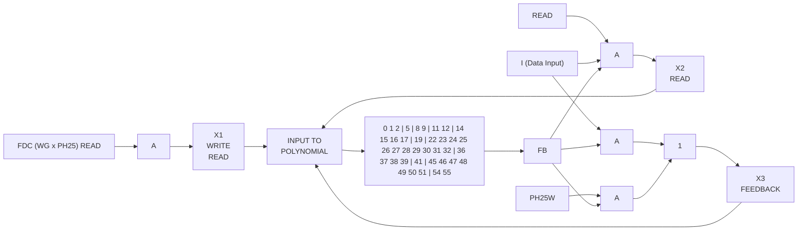

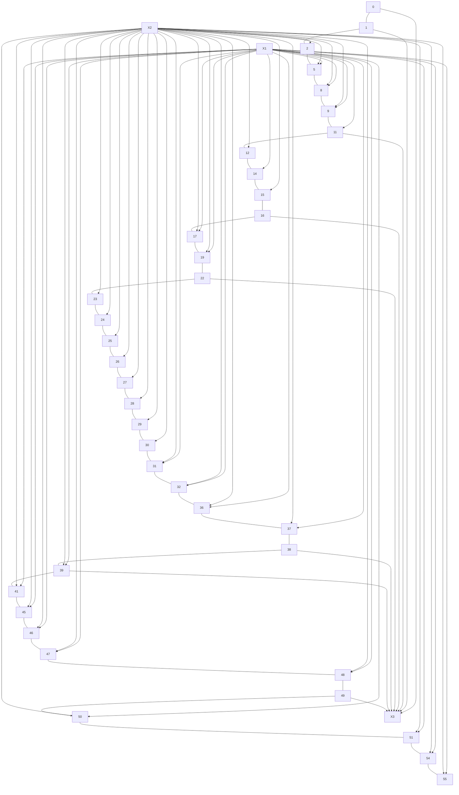

**Write :** Inputs X1 and X3 are open.  
Data is excl. Ored with feedback, and fed into the network through inputs X1 and X3.

**Read :** All inputs are open.  
Data is fed directly through input X2, feedback directly through X3, and data is excl. Ored with feedback in X1.

## Fig. 5. ECC Polynomials

ND-11.020.01

---

## Page 48

38

# 15MHZ SMD DISK CONTROLLER  
## FUNCTIONAL DESCRIPTION

## 3.4.2 General Information About ECC

### 3.4.2.1 Write Data

Memory Data M(X) is serially written onto the disk as it is simultaneously divided with the polynom G(X). This happens by means of a shift register with different feedbacks.

After data is written onto the disk, the rest of the division, which is in the shift register, will be written onto the disk without feedbacks and input. Together this will make "the codeword" - C(X). A look at the code word (=8248 bits) shows that data written first (MSB) will be multiplied (=binary shifted) to the length of the shift register (=the rest) = 56 bits. Like this :

```text
                         ┌─ M(X) is shifted t positions left (t=56)
                         │
                         │

        C(X) = t * M(X) + M(X) / G(X)
                              └──────────┘
                                   │
                                   ↓
                                  R(X)
```

```text
                              C(X)
              ┌─────────────────┬─────────────────┐
              │                 ┴                 │
              │                                   │
              │  (PH2=32 bits)PH5=8192 bits │PH3, PH6=56 bits  │
              │                              │                  │
              └──────────────────────────────┴──────────────────┘
              │                              │                  │
              └──────────────┐       ┌───────┴───────┐          │
                             └───────┘               └──────────┘
                                M(X)          R(X) where G(X)=X⁵⁶+X⁵⁵....
```

The result of the division is not used, only the rest.

ND-11.020.01

---

## Page 49

# 15MHZ SMD DISK CONTROLLER

## FUNCTIONAL DESCRIPTION

39

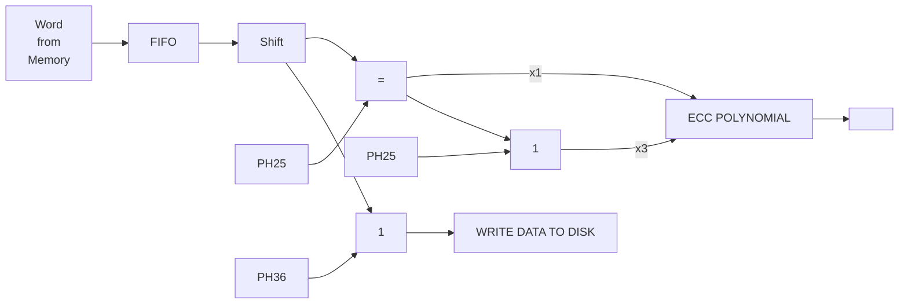

Fig. 6. Write Data

## 3.4.2.2 Read Data

Data is serially read into the memory simultaneously as that in the shift register is divided to the polynom G(X). In addition, data is multiplied to X<sup>-n</sup> N-n times. N is the period of the polynom = 585422, and n is the length of the code word = 8248.

If the data had notbeen premultiplied to X<sup>-n</sup>, the shift register would have had to be shifted backward (hardware exacting), or it would have had to shift forward N-n times to get back to the starting-point (first data bit), because the contents of the shift register will repeat after N shifts one way (forward or backward).

N-n and N because we want to get back to the starting-point in order to go on shifting forwards.

When corrected, the input register will be closed, but gives feedback as during write data.

ND-11.020.01

---

## Page 50

# 15MHZ SMD DISK CONTROLLER

## FUNCTIONAL DESCRIPTION

40

If HI is 0, it means that there is a correctable error LO.

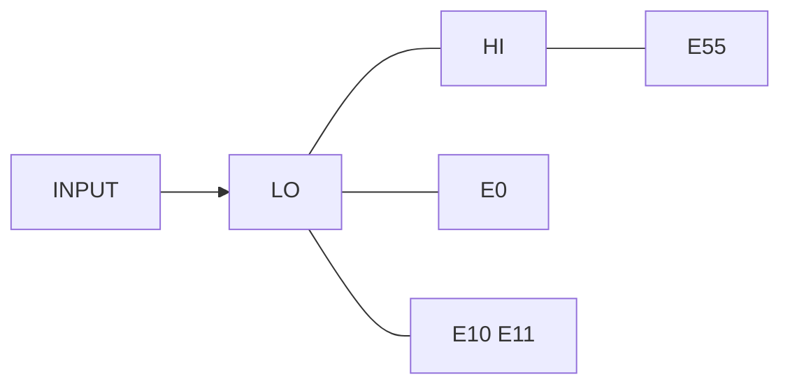

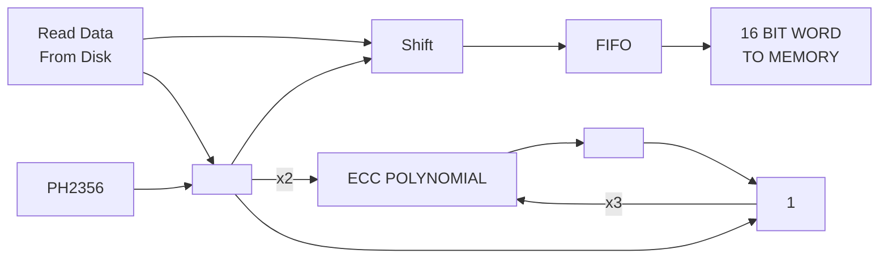

Fig. 7. Read Data

ND-11.020.01

---

## Page 51

# 15MHZ SMD DISK CONTROLLER

## FUNCTIONAL DESCRIPTION

41

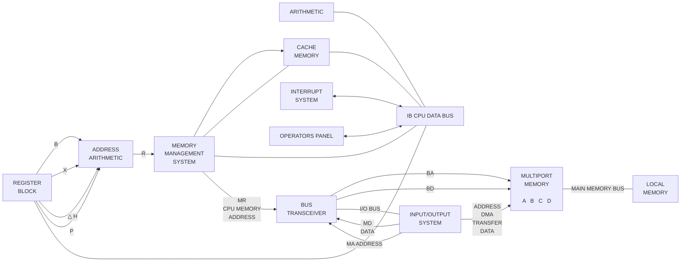

*Fig. 8. Storage Interconnection*

ND-11.020.01

---

## Page 52

# 15MHZ SMD DISK CONTROLLER  
# FUNCTIONAL DESCRIPTION

42

## 3.5 Timing Diagrams

```text
BMEM
   0          _________
             |         \____________________________________________________________________________________     ________
                                                                                                             |___|

INGRANT
      0      ____________________________________________________                                           ________
                                                                            \______________________________|

REQSTRT
       0     _________________________________
                                              \____________________________________________________________

CX
  0          _______________________________________________     _     _     _     _     _     _
                                                               |_| |_| |_| |_| |_| |_| |_| |_| |_| |_| |_| |_

RQBAPR
     0       ________________________________________________     ______________________________________________

ADREN
     0       ________________                      ______________________________________________________________
                            |____________________|

ENDMA
     0       _________________________________
                                              |_____________________________________________________________

                                              DMA READ
                                              DMA WRITE

RQDAP
     0       _________________________________________________________________________________________________
                                                                                      |________________|

DRY
   0         __________________________________________________________________________________________     ______
                                                                                                         |___|

                         ADDRESS
N-100 BUS  ___________________/         \///////////\___________________ DATA TO MEMORY ______________________
                         \_________/     \///////////\

                                                                                         FROM MEM.
                                                                                      ___     ___________________
                                                                                     \   \___/
```

*Fig. 9. DMA Timing*

ND-11.020.01

---

## Page 53

# 15MHZ SMD DISK CONTROLLER

## FUNCTIONAL DESCRIPTION

43

```text
                         FIFO Timing. Write to Disk.


                         10      8       6       4       2       0      14
WDATA (Bit no.)      ___|‾‾|___|‾‾|___|‾‾|___|‾‾|___|‾‾|___|‾‾|___|‾‾|___
                           9       7       5       3       1      15      13

ECL                  ____|‾|_|‾|_|‾|_|‾|_|‾|_|‾|_|‾|_|‾|_|‾|_|‾|_|‾|_|‾|___

DWRQ₀                __________________________________________________________

SETSD₀               ______________________|‾‾‾‾‾‾‾‾‾‾‾‾‾‾‾‾‾‾‾‾‾‾‾‾‾‾‾‾‾

FO₀                  __________________________________________________________

FIFRD₀               _______________________________|‾‾‾|____________________

                                      OUT ADDR.                    IN ADDR.
FA (FIFO Address)    /////////\_____________________/\\\\\\\\\______/\\\\\\\\\
                     ///////// \___________________/ \\\\\\\\\\____/ \\\\\\\\\

RESSO₀               ________________________________|‾‾‾|___________________

SHPL₁ (Parallel Load)_______________________________________________|‾‾‾|____

                     -  -  -  -  -  -  -  -  -  -  -  -  -  -  -  -  -  -  -

FULL₁                _________________________________________|‾‾‾‾‾‾‾‾‾‾‾‾
DEVREQ₁              _________________________________________|_____________

BREQ₀                _______________________________________________|‾‾‾‾‾‾
INGRANT₀             _________________________________|‾‾‾‾‾‾‾‾‾‾‾‾|_______

BAPR₀                ___________________|‾‾|_________________________________

                                      ADDR.        DATA        ADDR.      DATA
BD 0-23 (N-100 bus)  ________________/    \/////////    \______/    \///////
                                   \______/         \______/      \______

BDRY₀                ________________________________|‾‾|___________________

REQSTRT₀             _____________________________|‾‾‾‾‾‾‾|________________

FI₀                  _________________________________|‾‾‾‾‾‾‾‾‾‾‾|________

FIFWR                _______________________________________|‾‾‾|____________

RESSI₀               ___________________________________________|‾‾|_________
```

## Fig. 10. FIFO Timing. Write From Disk

ND-11.020.01

---

## Page 54

# 15MHZ SMD DISK CONTROLLER

## FUNCTIONAL DESCRIPTION

44

## FIFO Timing. Read from Disk.

```text
WDATA          ___     ___     ___     ___     ___     ___     ___     ___
              |   |___|   |___|   |___|   |___|   |___|   |___|   |___|
                1   0  15 14  13 12  11 10   9  8   7  6   5

ECL₀          __    __    __    __    __    __    __    __    __    __
             |  |__|  |__|  |__|  |__|  |__|  |__|  |__|  |__|  |__|

DRRQ₀         ____________|  |____________________________________________

SETSI₀        __________________|  |________________________________________

FI₀           ____________________|      |__________________________________

FIFWR₀        ______________________|  |____________________________________

FA (FIFI addr.)
              //////////////////////\ ADDR /\/\/\ ADDR /////////////////////
              ///////////////////////    \//////\    \//////////////////////

RESSI₀        __________________________|    |______________________________


- - - - - - - - - - - - - - - - - - - - - - - - - - - - - - - - - - -


EMPTY₁        ____________________________|       |_________________________

DEVREQ₁       ________________________________|   |_________________________

BREQ₀         ____________________________________|  |______________________

INGRANT₀      _______________________________________|             |________

BAPR₀         __________________________________________|    |______________

BD 0-23 (N-100 bus)
              //////////////////////////////////////////\ ADDR / DATA ______
              ///////////////////////////////////////////    \     /________

BDRY₀         ___________________________________________________|  |________

REQSTRT₀      ________________________________|___________________|_________

FO₀           ____________________________________|  |______________________

FIFRD₀        ________________________________________|    |________________

RESSO₀        __________________________________________|  |________________
```

## Fig. 11. FIFO Timing. Read From Disk

ND-11.020.01

---

## Page 55

# 15MHZ SMD DISK CONTROLLER

# FUNCTIONAL DESCRIPTION

45

```text
                                      SYNC          ADDRESS    ECC          SYNC                    DATA                    ECC

No. of bits                         +---------+-----+-----+-----+---------+-----+-------------------------+-----+-----+---------+
                                    |         |B'1' | 32  | 56  |         |B'1' |          8192           | 56  |B'1' |         |
                                    +---------+-----+-----+-----+---------+-----+-------------------------+-----+-----+---------+
                                    |<------ PH1 ------>|<-PH2->|<-PH3->|<------ PH4 ------>|<---------- PH5 ---------->|<-PH6->|PH7|<-PH8->|

RG-Read Gate                        ____                    _________________________________
(during read)                      |    |__________________|                                 \________________
                                         Read Address                    Read Data                                  0

RG-Read Gate                        ____                    ______
(during write)                     |    |__________________|      |____
                                         Read Address

WG-Write Gate                       ________________________________                                ______________________________
(during write)                                                        31                             Write Data                    0

WG-Write Gate                      __________________________________________________________________________________________________
(during format)                 0 |

AM-Address Match                   _______________________|
                                                        0

RCE-Read Clock                     __________      ________                                      --------------------      __________
Enable                                      |_____|        |____________________________________ For Read Only _________|
                                                                                                  0

PH41                                                   __
                                                      |  |________________________________

EQUALD                                                   ______________________________________________
                                                                 (PH2 read for disk equal to Block Address register I and II)
```

**Fig. 12. Control Timing**

## 3.6 Tag Timing

The tag timing generator is located on the SMD DATA (3044). For every function that is performed on the disk, tags 1,2, and 3 are issued in the listed sequence.

For more details, refer to figure 13.

ND-11.020.01

---

## Page 56

# 15MHZ SMD DISK CONTROLLER

## FUNCTIONAL DESCRIPTION

46

```text
START₁       ____|‾‾‾‾‾‾‾‾‾‾‾‾‾‾‾‾‾‾‾‾‾‾‾‾‾‾‾‾‾‾‾‾‾‾‾‾‾‾‾‾‾‾

OSC₁        ______|‾‾|__|‾‾|__|‾‾|__|‾‾|__|‾‾|__|‾‾|__|‾‾|__|‾‾|__|‾‾|__|‾‾|__
                                                                                Tag timing clock

Q1₁         ______|‾‾‾‾‾‾‾‾‾‾‾‾‾‾‾‾‾‾‾‾‾‾‾‾‾‾‾‾‾‾‾‾‾‾‾‾‾‾‾‾‾‾‾‾‾‾‾‾‾‾‾‾|
                                                                                  |
Q2₂         ____________|‾‾‾‾‾‾‾‾‾‾‾‾‾‾‾‾‾‾‾‾‾‾‾‾‾‾‾‾‾‾‾‾‾‾‾‾‾‾‾‾‾‾‾‾‾‾‾|
                                                                                  |
Q3₃         ____________________|‾‾‾‾‾‾‾‾‾‾‾‾‾‾‾‾‾‾‾‾‾‾‾‾‾‾‾‾‾‾‾‾‾‾‾‾|
                                                                                  |
Q4₄         __________________________|‾‾‾‾‾‾‾‾‾‾‾‾‾‾‾‾‾‾‾‾‾‾‾‾‾‾‾‾|
                                                                                  |----> Tag timing
Q5₅         ________________________________|‾‾‾‾‾‾‾‾‾‾‾‾‾‾‾‾‾‾‾‾‾‾|        |      counter
                                                                                  |      output
Q6₆         ________________________________________|‾‾‾‾‾‾‾‾‾‾‾‾‾‾‾‾|        |
                                                                                  |
Q7₇         ________________________________________________|‾‾‾‾‾‾‾‾|        |
                                                                                  |
Q8₈         ________________________________________________________|‾‾‾‾|        |

HEADEN₁     ______|‾‾‾‾‾‾‾‾‾‾‾|_______________________________________________
                                                                                Enable cylinder
                                                                                number onto bit
                                                                                bus

TAG2₁       ____________|‾‾‾|_________________________________________________
                                                                                Strobe cylinder
                                                                                number into unit

CYLEN₁      ____________________________|‾‾‾‾‾‾‾‾‾|_________________________
                                                                                Enable head
                                                                                number onto bit
                                                                                bus

TAG1₁       ________________________________|‾‾‾|_____________________________
                                                                                Strobe head
                                                                                number into unit

CONTREN₁    ________________________________________________|‾‾‾‾‾‾‾‾‾‾‾‾‾‾‾‾
                                                                                Enable function
                                                                                onto bit bus

TAG3₁       ________________________________________________________|‾‾‾‾‾‾‾‾

On Cylinder₁________________________________________________|________________
```

## Fig. 13. Tag Timing

ND-11.020.01

---

## Page 57

# 15MHZ SMD DISK CONTROLLER

## FUNCTIONAL DESCRIPTION

47

## 3.7 Interrupt Generation and Handling

The SMD disk controller is wired to interrupt level 11. The various sources for interrupt will be discussed here.

The interrupt sources can be divided into two groups (see figure 14):

- Error interrupts
- End of operation interrupts

Interrupt.

```mermaid
flowchart LR
    A1["M1,M2,M3 :<br/>SEC x WCZ x FIFOEMPTY"] --> OR1["O<br/>R"]
    A2["M0 :<br/>SEC x WCZ"] --> OR1
    A3["M4 x ONCYL"] --> OR1
    A4["WF x WCZ x SeC<br/>x FIFOEMPTY"] --> OR1
    A5["RTZ x ONCYL"] --> OR1
    A6["M6 x SEEKC"] --> OR1

    B1["SB13"] --> OR2["O<br/>R"]
    B2["SB8 x WF"] --> OR2
    B3["SB7"] --> OR2
    B4["SB6"] --> OR2
    B5["SB5"] --> OR2

    OR1 --> OR3["O<br/>R"]
    OR2 -->|"SB12"| OR3

    C1["MCL"] --> OR4["O<br/>R"]
    C2["(LCW x DB4)"] --> OR4
    OR4 -->|"(CLEAR)"| OR3

    OR3 --> AND1["A<br/>N<br/>D"]
    E1["INTRF(End of Operation<br/>Interrupt Enable)"] --> AND1

    D1["SB5"] --> OR5["O<br/>R"]
    D2["SB6"] --> OR5
    D3["SB7"] --> OR5
    D4["SB8"] --> OR5
    D5["SB9"] --> OR5
    D6["SB10"] --> OR5
    D7["SB11"] --> OR5
    D8["SB12"] --> OR5
    D9["SB13"] --> OR5

    OR5 -->|"SB4(Error)"| AND2["A<br/>N<br/>D"]
    E2["INTRER(Error Interrupt<br/>Enable)"] --> AND2

    AND1 --> OR6["O<br/>R"]
    AND2 --> OR6
    OR6 -->|"INT 11 to CPU"| OUT[""]
```

## Fig. 14. The Interrupt Sources

Error interrupt is enabled by control word bit 1, and End of Operation interrupt is enabled by control word bit 0.

## 3.7.1 Error Interrupts

Error interrupt occurs when status bit 4 is forced on. Status bit 4 is inclusive OR of status bits 5,6,7,8,9,10,11,12, and 13.

ND-11.020.01

---

## Page 58

48

# 15MHZ SMD DISK CONTROLLER

## FUNCTIONAL DESCRIPTION

# 3.7.2 End of Operation Interrupt

End of operation interrupt is generated when the START latch is reset.  
The START latch is reset in one of the following two ways :

- normal end of specified operation
- abnormal end of operation (SB 12)

## Normal End of Operation

There are five different ways of generating Normal End of Operation.  
Refer to SMD Control.

1. Word counter has reached zero during a read or write operation (and FIFO empty).

   ```text
   WRITE :  SEC * WCZ * FIFOEMPTY
   READ  :  SEC * WCZ
   ```

2. On cylinder is deactivated upon an initiate seek command.

   ($M4 * \overline{\text{ON cyl}}$)

3. Completion of formatting one track.

   ($WF * WCZ * SEC * FIFOEMPTY$)

4. On cylinder on track 0 is reached upon completing a Return to Zero command.

   ($RTZ * \overline{\text{ON cyl}}$)

5. Seek completion search positive.

   ($M6 * SEEKC$)

## Abnormal End of Operation (SB 12)

There are five conditions that can set status bit 12, and thus interrupt.

1. Loss of Ready (SB13) condition from the selected unit during an operation.

2. Address mismatch (SB8) occurs when not formatting.

3. Fault line (SB7) from the selected unit is activated during an operation, or ECC parity error, or missing read clocks.

ND-11.020.01

---

## Page 59

# 15MHZ SMD DISK CONTROLLER

# FUNCTIONAL DESCRIPTION

49

4. Illegal load (SB5) while controller is Busy.

5. Timeout (SB6).

ND-11.020.01

---

## Page 60

50

# 15MHZ SMD DISK CONTROLLER

ND-11.020.01

---

## Page 61

15MHZ SMD DISK CONTROLLER

51

# CHAPTER 4

# TROUBLESHOOTING

ND-11.020.01

---

## Page 62

# 15MHZ SMD DISK CONTROLLER

52

ND-11.020.01

---

## Page 63

# 15MHZ SMD DISK CONTROLLER

TROUBLESHOOTING

53

## 4 TROUBLESHOOTING

### 4.1 Debugging Guide

The normal procedure for checking out the ECC disk controller should be :

1. Check the operation of the IOX instructions.

2. Check the data channel by writing and reading a register in the disk controller.

3. Check the operation of the disk controller by running the controller in test mode.

4. Connect a disk drive to the controller and run test programs.

### 4.2 Check the Operation of the IOX Instructions

Refer to Programming Specifications in chapter 2.

A check should be made to ensure that all the controller registers can be accessed.

```text
+--------------------------------------------------------------------+
| NOTE !                                                             |
|                                                                    |
| Control word register bit 15 selects the two banks                 |
| of registers.                                                      |
+--------------------------------------------------------------------+
```

### 4.3 Check Data Channel

The data channel can be checked by writing and reading the same register in the controller, and then comparing the results. The Memory Address register is a register that can be accessed during read and write.

ND-11.020.01

---

## Page 64

# 15MHZ SMD DISK CONTROLLER  
## TROUBLESHOOTING

54

The following test loop tests the block address register I.

| Instruction | Code | Comment |
|---|---:|---|
| SAA 10 | 170 410 | % Set bit 3 in A register |
| IOX CWR | 165 545 | % Set controller in test mode |
| COPY ST DA | 146 165 | % The contents of T-register |
| IOX BARI | 165 543 | % to block address register I |
| SAA 0 | 170 400 | % Reset A register |
| IOX RBARI | 165 546 | % Read block address register |
| COPY SA DX | 146 157 | % and copy the contents to X<br>register |
| JMP* - 7 | 124 371 | % Repeat loop |

Check that X-reg. equals T-reg. when changing T-reg.

Block address register II and the data channel are tested by the  
following test loop :

| Instruction | Code | Comment |
|---|---:|---|
| SAA 10 | 170 410 | % Set bit 3 in A register |
| BSET ONE 170 DA | 174 375 | % Set bit 15 in A register |
| IOX CWR | 165 545 | % Set controller in test mode and<br>select register bank I |
| COPY ST DA | 146 165 | % Transfer the contents of the |
| IOX BAR II | 165 543 | % T-reg to block addr. reg. II |
| SAA 0 | 170 400 | % Reset A register |
| IOX RBAR II | 165 546 | % Read block addr. reg II and copy<br>the contents to |
| COPY SA DX | 146 157 | % the X register |
| JMP* - 5 | 124 373 | % Repeat loop |

Check that X-reg. equals T-reg.

## Testing MAR

| Code | Description |
|---:|---|
| 111 | least sign MAR |
| 222 | most sign MAR |
| 170 400 | SAA 0 set block "0" |
| 165 545 | LCW |
| 165 544 | STS (MAR TOGGLE Reset) |
| 44 374 | LDA |
| 165 541 | LMAR most |
| 44 371 | LDA |
| 165 541 | LMAR least |
| 165 540 | RMAR |
| 146 157 | COPY SA - DX |
| 165 540 | RMAR |
| 146 156 | COPY SA - DT |
| 124 367 | JMP* - 11 |

Check that X-reg. equals the least significant MAR, and that T-reg.  
equals the most significant MAR.

ND-11.020.01

---

## Page 65

# 15MHZ SMD DISK CONTROLLER  
## TROUBLESHOOTING

56

The contents of the memory buffer after the transfer is complete should be :

| Location | Contents |
|---|---|
| First location | 125 252 |
| Second location | 052 525 |
| Third location | 125 252 |
| etc. | |

The easiest way of checking data transfer from memory to the disk controller is using compare mode while the controller is in test mode.

The data buffer, which was built up during read in test mode, is used as the output data under compare mode. The control word register is set to 014 014, to execute a compare test in test mode.

The block address register in test mode should be set as for a normal read, and the result in the status register should also be the same.

## 4.4.1 Test Loop

The following loop reads data in test mode and stores the data in memory, starting at the address given by MARL and MARU. The number of words to be transferred is given by WCL and WCU. The drive address is set to a special pattern used only in test mode. The loop tests for correct contents of the status register, and it also checks for proper operation of the memory address register and the word count register. In case of incorrect operation of the controller, the loop will stop at oneof seven WAIT instructions. The contents of the data buffer in memory must be checked manually.

If you want to change the operation of the controller, you may change the parameters listed from

MARU,

to

ACTIV,

```text
044120    START,    LDA          SBLOCK
165545              IOX          LCO          % SELECT REG.BLOCK II
170401              SAA          1
165547              IOX          LWC          % CLEAR ECC
170430              SAA          30

165545              IOX          LCO          % CLEAR DEVICE
044114              LDA          INIT
004115              STA          STEST        % INITIATE SOFTWARE TIMEOUT
170410              SAA          10
165545              IOX          LCO          % TEST MODE

044100              LDA          MARU
165541              IOX          LMAR         % LOAD MEM.ADDR. BITS 16-23
044077              LDA          MARL
```

ND-11.020.01

---

## Page 66

# 15MHZ SMD DISK CONTROLLER

## TROUBLESHOOTING

57

| Code | Label | Instruction | Operand | Comment |
|---|---|---|---|---|
| 165541 |  | IOX | LMAR | % LOAD MEM.ADDR. BITS 0-15 |
| 044076 |  | LDA | WCU |  |
| 165547 |  | IOX | LWC | %LOAD WORD-COUNT BITS 16-23 |
| 044075 |  | LDA | WCL |  |
| 165547 |  | IOX | LWC | % LOAD WORD-COUNT BITS 0-15 |
| 044074 |  | LDA | DA1 |  |
| 165543 |  | IOX | LDAD | % LOAD DISK ADDR.REG. I |
| 044074 |  | LDA | SBLOCK |  |
| 165545 |  | IOX | LCO | % SELECT REG.BLOCK II |
| 044071 |  | LDA | DA2 |  |
| 165543 |  | IOX | LDAD | % LOAD DISK ADDR.REG. II |
| 044071 |  | LDA | ACTIV |  |
| 165545 |  | IOX | LCO | % LOAD CONTROL WORD |
| 165544 |  | IOX | RSR | % READ STATUS |
| 175035 |  | BSKP | ZRO 30 DA |  |
| 151001 |  | WAIT | 1 | % NOT ACTIVE AFTER ACTIVATE |
| 165544 | READS, | IOX | RSR | % READ STATUS |
| 146151 |  | COPY | SA DD |  |
| 175235 |  | BSKP | ONE 30 DA |  |
| 124043 |  | JMP | STIME |  |
| 146115 |  | COPY | SD DA |  |
| 070063 |  | AND | (177773 |  |
| 146153 |  | COPY | SA DB |  |
| 044055 |  | LDA | ACTIV |  |
| 107754 |  | AND | (10 |  |
| 131005 |  | JAZ | *+5 | % JUMP IF NOT TEST MODE |
| 050060 |  | LDT | (41030 |  |
| 140036 |  | SKP | SB EQL DT |  |
| 151002 |  | WAIT | 2 | % TEST MODE STATUS ERROR |
| 124004 |  | JMP | *+4 |  |
| 050055 |  | LDT | (40010 |  |
| 140036 |  | SKP | SB EQL DT |  |
| 151003 |  | WAIT | 3 | % DISK STATUS ERROR |
| 170777 |  | SAA | -1 |  |
| 165540 |  | IOX | RMAR |  |
| 064033 |  | SUB | MARL |  |
| 064034 |  | SUB | WCL |  |
| 131002 |  | JAZ | *+2 |  |
| 151004 |  | WAIT | 4 | % WRONG MEM.ADDR. BITS 0-15 |
| 170777 |  | SAA | -1 |  |
| 165540 |  | IOX | RMAR |  |
| 070043 |  | AND | (377 |  |
| 064023 |  | SUB | MARU |  |
| 064024 |  | SUB | WCU |  |
| 131002 |  | JAZ | *+2 |  |
| 151005 |  | WAIT | 5 | %WRONG MEM.ADDR. BITS 16-23 |
| 165544 |  | IOX | RSR | % RESET FLIP-FLOP |

ND-11.020.01

---

## Page 67

# 15MHZ SMD DISK CONTROLLER

## TROUBLESHOOTING

58

| Object Code | Label | Operation | Operand | Comment |
|---|---|---|---|---|
| 044024 |  | LDA | SBLOCK |  |
| 165545 |  | IOX | LCO | % SELECT REG.BLOCK II |
| 170777 |  | SAA | -1 |  |
| 165540 |  | IOX | RMAR |  |
| 131002 |  | JAZ | *+2 |  |
| 151006 |  | WAIT | 6 | % WORD COUNT NOT ZERO |
| 124276 |  | JMP | START |  |
| 054020 | STIME, | LDX | BUSY |  |
| 150006 |  | TRA | PID | % KEEP CPU BUSY |
| 132777 |  | JNC | *-1 |  |
| 040016 |  | MIN | STEST |  |
| 124326 |  | JMP | READS |  |
| 151007 |  | WAIT | 7 | % SOFTWARE TIMEOUT |
| 124267 |  | JMP | START |  |
| 000000 | MARU, | 0 |  |  |
| 001000 | MARL, | 1000 |  |  |
| 000000 | WCU, | 0 |  |  |
| 001000 | WCL, | 1000 |  |  |
| 125252 | DA1, | 125252 |  |  |
| 052525 | DA2, | 052525 |  |  |
| 100010 | SBLOCK, | 100010 |  | % UNIT NUMBER MUST BE<br>SPECIFIED |
| 000014 | ACTIV, | 14 |  | % BOTH IN SBLOCK AND ACTIV |
| 170000 | INIT, | 170000 |  |  |
| 177770 | BUSY, | -10 |  |  |
| 000000 | STEST, | 0 |  |  |
| 177773 | )FILL |  |  |  |
| 000010 |  |  |  |  |
| 041030 |  |  |  |  |
| 040010 |  |  |  |  |
| 000377 |  |  |  |  |

ND-11.020.01

---

## Page 68

15MHZ SMD DISK CONTROLLER

59

# CHAPTER 5

# TEST PROGRAMS

ND-11.020.01

---

## Page 69

# 15MHZ SMD DISK CONTROLLER

60

ND-11.020.01

---

## Page 70

15MHZ SMD DISK CONTROLLER  
TEST PROGRAMS

61

# 5 TEST PROGRAMS

The following test programs may be used :

- PASCAN
- Super-Rand
- ECC Test
- BIGFUNC
- Disc Tema

If you want more detailed information about test programs, the Test Program Description manual (ND-30.005) is recommended.

## 5.1 PASCAN Test Program - 2226

This is a stand-alone "PACK-SCAN" program for disk controllers with ECC. The program reads through the entire pack sequentially and reports "hard" and "soft" errors.

A "hard" error is defined as any error not recoverable by retries or ECC.

A correctable error in the read data is termed a "soft" error, i.e., recoverable through the use of retries or the ECC system.

The intended primary use of the program is for pack surface analysis.

There is an option to be specified prior to running the program :

> "Address and Data" means that all address fields and data  
> fields are read and verified.

> "Data only" means that all data fields, but not all address fields,  
> within each track are read and verified.

ND-11.020.01

---

## Page 71

62

# 15MHZ SMD DISK CONTROLLER

## TEST PROGRAMS

### Error Reporting :

#### Hard Error Displays :

1. the current logical (octal) sector address
2. the controller status register

#### Soft Error Displays :

1. the current logical (octal) sector address
2. the address in main memory where error correction was applied
3. the two error correction pattern words to be exclusively OR'ed with data at the main memory address to correct the data

When an error is encountered and reported, the test continues the scan until the entire pack is read. "Scan Completed" is then reported.

## 5.2 Super-Rand Test Program-2222

This is a stand-alone random data, controller, and disk read/write test. The write data is generated by a pseudo-random number generator, and the disk address is generated in the following sequence :

    0, n-1, 1, n-2, 2, n-3, ........

n is the number of sectors on the disk pack.

### Example of Operation :

1. At disk address A, a random data pattern (i) is written from main memory.

2. At disk address B, a random data pattern (i) is written from main memory.

3. The written data at disk address A is read back and verified (against i).

4. The written data at disk address B is read back and verified (against i).

The process continues in the outlined fashion.

Errors and data mismatches are reported as specified by the test at runtime.

ND-11.020.01

---

## Page 72

# 15MHZ SMD DISK CONTROLLER

## TEST PROGRAMS

63

Options to be specified at runtime.

| Option | Description |
|---|---|
| Retries active ? | When retries are specified, errors are not reported if they are recoverable by the retry and recovery procedure of the test. |
| ECC active ? | If active, correctable data errors are not reported. |
| RT clock ? | Prints out the time of day associated with each error reported. |

The test runs continuously. Four disk units may be specified per controller, and the test runs simultaneously against all specified units.

This is a diagnostic program for the disk controller with ECC. The test does read and write functions to test the functions of the error correction. It is therefore required that an online drive with a disk scratch pack is attached to the controller.

The test completely diagnoses the 3043/3044 card of the controller, and associated control circuitry on other boards. Data records with correctable errors are written, read back, and verified. The process is repeated many times, varying the error pattern and its displacement within the data record.

Errors are reported as they occur, and a brief description is displayed with status word information.

## 5.3 Disc Tema

This test enables you to format, dump contents, change single words, or check parity on disks. It can also copy, compare, and verify the contents of two disks. Starting the program causes some tests to be run. The disk status is read, and errors are reported.

The test program is written so as to make it easy to run with the modes that are assumed to be the most common ones.

Almost all of the commands are written the same way. The errors are also printed in the same way. The description of the various commands covers only what is special to each command.

For details, refer to the Test Program Description Manual: ND-30.005.

The following is a description of the BIGFUNC Test Program, which is part of Disc Tema.

ND-11.020.01

---

## Page 73

64

# 15MHZ SMD DISK CONTROLLER  
# TEST PROGRAMS

## 5.4 BIGFUNC

BIGFUNC is a stand-alone test program, intended to test the disk status word and some of the disk operations. Reading and writing is done on a track not used by the SINTRAN III operating system, but it might still be wise to use a scratch pack when running BIGFUNC.

The program is self-documenting. The following tests are done :

1. The memory address register is written and read 131072 times.

2. Each of the block address registers are written and read 131072 times.

3. Data is read from the interface in test mode. The status word, the data read, and the memory address register are checked. Word count is in the range 1-2000B.

The status bits are then checked 8 times, in different sequences :

4. Status bit 0 is loaded and read twice.

5. Status bit 1 is loaded and read twice.

6. Status bit 2 is checked after device clear and read.

7. Status bit 5 is checked by loading :

   - the memory address register  
   - the block address register I  
   - the word count register  
   - the control word  

   when parity check operation is active; and by loading block address register I when the disk arm is not on-cylinder.

8. Status bit 6 is checked by doing a short parity check and a very long formatting operation.

9. Status bit 7 is checked by reading from a non-specified unit (see below). 8 read/writes are done in case of error.

10. Status bit 8 is checked by formatting a track with incorrect formatting data, and reading it back.

11. Status bit 9 is checked by reading with word count 1004B and bit 2 in ECC control loaded (long bit).

12. Status bit 20 is checked by doing read, compare, change one bit in the disk buffer, compare.

13. Status bit 11 is checked by doing read with the instructions IOX 0 three times in the waiting loop, and by doing write with the instruction IOX 0 twice in the waiting loop.

ND-11.020.01

---

## Page 74

# 15MHZ SMD DISK CONTROLLER

## TEST PROGRAMS

65

14. Status bit 13 is checked by the selection of specified units and by reading from non-specified units (see below).

15. Status bit 14 is checked by doing return-to-zero-seek and initiate-seek.

16. Status bit 15 is loaded and read twice. Status bits 3, 4, and 12 are not checked separately. All units not specified to be tested should be turned off (stop the disk pack and turn off the power at the back of the disk unit).

17. Read and write are checked by reading and writing from different buffers. Seek-complete-search is checked with no previous seek.

18. Read-seek-condition is checked by doing return-to-zero-seek, initiate-seek, and by reading from an illegal block address.

The test repeats itself indefinitely.

All errors are reported as error messages on the terminal.

ND-11.020.01

---

## Page 75

66

# 15MHZ SMD DISK CONTROLLER

ND-11.020.01

---

## Page 76

15MHZ SMD DISK CONTROLLER

67

# CHAPTER 6

# INSTALLATION

ND-11.020.01

---

## Page 77

# 15MHZ SMD DISK CONTROLLER

68

ND-11.020.01

---

## Page 78

# 15MHZ SMD DISK CONTROLLER

## INSTALLATION

69

# 6 INSTALLATION

## 6.1 I/O Configuration Example

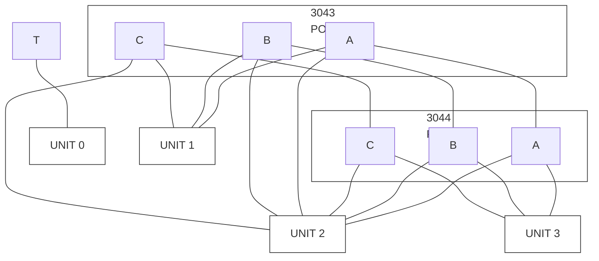

_Fig. 15. I/O Configuration Example_

ND-11.020.01

---

## Page 79

70

# 15MHZ SMD DISK CONTROLLER  
# INSTALLATION

## 6.2 ND-100 Plug Panel

```text
                         ┌───────────────────────────────────────────────────────────────┐
                         │                                                               │
                         │  ┌─┐                                                          │
                         │  │6│                                                          │
                         │  └─┘                                                          │
                         │                                                               │
                         ├───────────────────────────────────────────────────────────────┤
                         │                                                               │
                         │  ┌─┐                                                          │
                         │  │5│                                                          │
                         │  └─┘                                                          │
                         │                                                               │
                         │              4 TERMINALS                         FLOPPY DISK │
                         │                ↙  ↓  ↘  ↘                            ↓        │
                         │                                                               │
                         │       ┌─────────────────┐      ┌─────────────────┐  ┌───────┐ │
                         │       │                 │ 2    │                 │  │       │ │
                         │       └─────────────────┘      └─────────────────┘  ├───────┤ │
                         │       ┌─────────────────┐ 1    ┌─────────────────┐  │       │ │
                         │       │                 │      │                 │  └───────┘ │
                         │       └─────────────────┘      └─────────────────┘            │
                         │                                      4              3         │
                         │                                                               │
                         ├───────────────────────────────────────────────────────────────┤
                         │                                                               │
                         │  ┌─┐                                                          │
                         │  │4│   BIG DISK DAISY CHAIN                                  │
                         │  └─┘                ╲                                        │
                         │                       ╲──────► ┌───────────────────┐          │
                         │                        ╲       │                   │          │
                         │                         ╲─────► └───────────────────┘          │
                         │                                  ┌───────────────────┐         │
                         │                                  │                   │         │
                         │                                  └───────────────────┘         │
                         │                                                               │
                         ├───────────────────────────────────────────────────────────────┤
                         │                                                               │
                         │  ┌─┐                                                          │
                         │  │3│                  UNIT CABLES                             │
                         │  └─┘                     ╲                                    │
                         │                            ╲────► ┌─────────────────┐         │
                         │                             ╲      │                 │ 2       │
                         │                              ╲────► └─────────────────┘         │
                         │                               ╲                                 │
                         │                                ╲──► ┌─────────────────┐         │
                         │                                 ╲    │                 │ 4      │
                         │                                  ╲──► └─────────────────┘        │
                         │                                                               │
                         │       ┌─────────────────┐      ┌─────────────────┐             │
                         │       │                 │ 1    │                 │ 3           │
                         │       └─────────────────┘      └─────────────────┘             │
                         │                                                               │
                         └───────────────────────────────────────────────────────────────┘
                                                               ┌────────┐
                                                               │        │
                                                               │        │
                                                               │        │
                                                               └────────┘
                                                                   ↑
                                                                   │
                                                        CONSOLE TERMINAL
                                                             CABLE
```

## Fig. 16. ND-100 Plug Panel for External Device Connection

ND-11.020.01

---

## Page 80

# 15MHZ SMD DISK CONTROLLER  
## INSTALLATION

71

## 6.3 Switches and Indicators on Card no. 3043

```text
+--------------------------------------------------------------------------------------------------+
|                                                                                                  |
|                                                     A A A A A A                                  |
|                                                     ^ ^ ^ ^ ^ ^                                  |
|                                                     | | | | | +---- LED 1 write gate             |
|                                                     | | | | +------ LED 2 write gate             |
|                                                     | | | +-------- LED 3 write format           |
|                                                     | | +---------- LED 4 read parity            |
|                                                     | +------------ LED 5 compare transfer       |
|                                                     +-------------- LED 6 ECC operation          |
|                                                                                                  |
|                                                     ECC = Error Correction Control               |
|                                                                                                  |
|                                                                                                  |
|                         +--+ DIP switch for cable type setting                                   |
|                         |7E|                                                                     |
|                         +--+                                                                     |
|                          |                                                                       |
|                          v                                                                       |
|                       +---------+       unit 3                                                   |
|                       |4 +-----+|----------                                                      |
|                       |3 +-----+|---------- unit 2                                               |
|                       |2 +-----+|---------- unit 1                                               |
|                       |1 +-----+|---------- unit 0                                               |
|                       +---------+                                                                |
|                        O       O                                                                 |
|                        N       F                                                                 |
|                        |       F                                                                 |
|                        ^       ^                                                                 |
|                        |       +-------- round cable                                             |
|                        +---------------- flat cable                                              |
|                                                                                                  |
|  +-----------------+                 +-----------------+                 +-----------------+    |
|  |        C        |-----------------|        B        |-----------------|        A        |    |
|  +-----------------+                 +-----------------+                 +-----------------+    |
|                                                                                                  |
+--------------------------------------------------------------------------------------------------+
```

**Fig. 17. Switches and Indicators on Card no. 3043**

ND-11.020.01

---

## Page 81

72

# 15MHZ SMD DISK CONTROLLER

## INSTALLATION

## 6.3.1 Indicators - LED 1 - LED 6

All indicators are yellow LEDs, with the following meanings :

| Indicator | Function | Meaning |
|---|---|---|
| LED 1 | Write gate. | Is lit when the disk heads write. |
| LED 2 | Read gate. | Is lit when the disk heads read. |
| LED 3 | Write format. | Is lit when the controller formats. |
| LED 4 | Read parity. | Is lit when the controller checks parity. |
| LED 5 | Compare transfer. | Is lit when the controller compares data after a read/write. |
| LED 6 | ECC Operation. | Is lit when the controller performs error correction calculation. |

## 6.3.2 Cable Type Setting (DIP Switch in Position 7E)

The switch setting concerns B-cables only (B-cables are cables which go directly from the computer to the disk unit). The daisy chain cable (A-cable) may be a flat cable or a round cable.

Switch 7E consists of 4 switches, one for each disk unit. The switch must be OFF when the B-cable is round, and ON when the B-cable is flat.

| Unit | Switch setting | Cable type |
|---|---|---|
| Unit 0 | Switch 1 — OFF<br><br>ON | Round B-cable between computer and disk unit 0.<br><br>Flat B-cable between computer and disk unit 0. |
| Unit 1 | Switch 2 — OFF<br><br>ON | Round B-cable between computer and disk unit 1.<br><br>Flat B-cable between computer and disk unit 1. |
| Unit 2 | Switch 3 — OFF<br><br>ON | Round B-cable between computer and disk unit 2.<br><br>Flat B-cable between computer and disk unit 2. |
| Unit 3 | Switch 4 — OFF<br><br>ON | Round B-cable between computer and disk unit 3.<br><br>Flat B-cable between computer and disk unit 3. |

ND-11.020.01

---

## Page 82

# 15MHZ SMD DISK CONTROLLER

## INSTALLATION

73

## 6.4 Switches and Indicators on Card no. 3044

```text
+------------------------------------------------------------------------------------------------+
|                                                                                                |
|                                      ___                                                       |
|                                     /   \                                                      |
|                                    |     |  thumbwheel                                         |
|                                    |     |                                                     |
|                                      |                                                         |
|                                      |                                                         |
|                                      ^                                                         |
|                                      |                                                         |
|                                      +---- device number selection                             |
|                                                                                                |
|                                                        o  o  o                                  |
|                                                        ^  ^  ^                                  |
|                                                        |  |  +--- LED 3(red) error              |
|                                                        |  +------ LED 2(yellow) on cylinder     |
|                                                        +--------- LED 1(yellow) start (controller active)
|                                                                                                |
|                                                                                                |
|                                                                                                |
|                                                                                                |
|                                                                                                |
|  +-------------------+             +-------------------+             +-------------------+    |
|  |         C         |-------------|         B         |-------------|         A         |    |
|  +-------------------+             +-------------------+             +-------------------+    |
+------------------------------------------------------------------------------------------------+
```

Fig. 18. Switches and Indicators on Card no. 3044

ND-11.020.01

---

## Page 83

74

# 15MHZ SMD DISK CONTROLLER INSTALLATION

## 6.4.1 Device Number Selection (Thumbwheel)

| Thumbwheel Setting | Device Register Address Range (Octal) | Ident. Code (Octal) | Device name |
|---|---|---|---|
| 1-7 | not used |  |  |
| 8 | 1540-1547 | 17 | Big Disk System 1 |
| 9 | 1550-1547 | 20 | Big Disk System 2 |
| 10-15 | not used |  |  |

## 6.4.2 Indicators - LED 1 - LED 3

| Indicator | Colour | Function | Description |
|---|---|---|---|
| LED 1 | (Yellow) | Start | Controller active. |
| LED 2 | (Yellow) | On Cylinder | Read/write head on cylinder. |
| LED 3 | (Red) | Error |  |

## 6.5 Connecting a Disk Drive

When the controller runs without problems in test mode, a unit can be connected. The initial start-up procedure is given in the maintenance manual accompanying the disk. The disk pack to be used must be formatted, preferably on another machine.

ND-11.020.01

---

## Page 84

# 15MHZ SMD DISK CONTROLLER

75

# CHAPTER 7

## CONNECTOR LIST

ND-11.020.01

---

## Page 85

# 15MHZ SMD DISK CONTROLLER

76

ND-11.020.01

---

## Page 86

# 15MHZ SMD DISK CONTROLLER

## CONNECTOR LIST

77

# 7 CONNECTOR LIST

Card communication signals 3043 - 3044

|  |  | "3043" |  | "3044" |
|---|---:|---|:---:|---|
| c | 15 | WG | → | Write Gate |
| a | 15 | RG<sub>0</sub> | → | Read Gate |
| c | 16 | SB10<sub>0</sub> | → | Status bit 10 (Compare Error) |
| a | 16 | DWD<sub>0</sub> | ← | Disk Write Data from shift register |
| c | 27 | RSECT<sub>0</sub> | ← | Read Seek Condition |
| a | 27 | ME<sub>0</sub> | ← | Master Enable |
| c | 18 | LBLOCK<sub>0</sub><sup>1</sup> | ← | Load Block address register I |
| a | 18 | SEC<sub>0</sub> | → | Sector Pulses |
| c | 19 | WD<sub>0</sub> | ← | Write Data to disk |
| a | 19 | LCW<sub>0</sub><sup>1</sup> | ← | Load Control Word |
| c | 20 | WRC<sub>0</sub> | → | Write clock from disk (servoclock) |
| a | 20 | RC<sub>0</sub> | → | Read clock from disk |
| c | 21 | START<sub>0</sub><sup>1</sup> | ← | Controller active |
| a | 21 | RD<sub>0</sub> | → | Read Data from disk |
| c | 22 | DRRQ<sub>0</sub> | → | Disk Read Requests |
| a | 22 | ECL<sub>1</sub> | → | Disk Serial data clock |
| c | 23 | SB9<sub>0</sub> | → | Status bit 9 (Data Error) |
| a | 23 | SB8<sub>0</sub> | → | Status bit 8 (Address Mismatch) |
| c | 24 | WRITE VL<sub>1</sub> | ← | Write clock to disk |
| a | 24 | SB7<sub>0</sub> | → | Status bit 7 (ECC parity error or missing clocks) |
| c | 25 | EC2<sub>0</sub> | → | Enable Block Address shift in phase 2 |
| a | 25 | IND3<sub>0</sub> | ← | Index pulses from unit 3 |
| c | 26 | RDD<sub>1</sub> | → | Read Data from disk or test mode generator |
| a | 26 | BA<sub>1</sub> | ← | Serial Block Address |
| c | 27 | U3<sub>1</sub> | → | Select Unit 3 |
| a | 27 | SI<sub>0</sub> | → | Sector or Index pulses from disk |
| c | 28 | ST3<sub>0</sub> | ← | Seek Terminated on unit 3 |
| a | 28 | FIN<sub>0</sub> | → | M6 or M8 finished |
| c | 29 | EQUAL<sub>0</sub> | → | Equal sector |
| a | 29 | REP<sub>0</sub> | ← | Read ECC Pattern |
| c | 30 | ECCC<sub>0</sub> | ← | Load ECC Control register |
| a | 30 | REC<sub>0</sub> | ← | Read ECC Count |
| c | 31 | NEWHD<sub>0</sub> | → | Select new head (crossing index mark) |
| a | 31 | DWRQ<sub>0</sub> | → | Disk Write Requests |
| c | 32 | GROUND |  |  |
| a | 32 | GROUND |  |  |

ND-11.020.01

---

## Page 87

# 15MHZ SMD DISK CONTROLLER

78

ND-11.020.01

---

## Page 88

15MHZ SMD DISK CONTROLLER

79

# APPENDIX A

## LOGIC DIAGRAM CARD NO. 3043

ND-11.020.01

---

## Page 89

# 15MHZ SMD DISK CONTROLLER

80

ND-11.020.01

---

## Page 90

# 15MHZ SMD DISK CONTROLLER

## LOGIC DIAGRAM CARD NO. 3043

Page 81

[Complex schematic: 15MHZ SMD controller unit drivers and receivers circuitry, with integrated circuits, resistors, capacitors, switches, signal labels, connector references, and card-location grid.]

## Title Block

| Field | Value |
|---|---|
| Title | 15MHZ SMD CONTROLLER UNIT DRIVERS & RECEIVERS (8-CABLES) |
| Drawing No. | 3043 |
| Card No. | 322673 |
| Sheet No. | 1 of 6 |
| Company | NORSK DATA A.S. |
| Location | Oslo, Norway |
| Document No. | ND-11.020.01 |

---

## Page 91

# 15MHZ SMD DISK CONTROLLER

## LOGIC DIAGRAM CARD NO. 3043

82

ND-11.020.01

---

## Page 92

# 15MHZ SMD DISK CONTROLLER

## LOGIC DIAGRAM CARD NO. 3043

83

| Field | Visible text |
|---|---|
| Card No. | 322673 |
| Card | C B.C |
| Date | 12078 |
| Sheet | Page 2 of 6 |
| Design | BM |
| Design date | 06.06.84 |
| Processed by | G |
| Title | 15MHz SMD CONTROL UNIT CONTROL |
| Model data | A.8 |
| Document | 3043 |
| Drawing | ND-11.020.01 |

[Complex electronic logic schematic: grid coordinates A–G and 1–5; sections labelled UNIT 0, UNIT 1, UNIT 2, READ DATA DELAY, NEW HEAD SELECT, SEEK FINISHED, DISK WRITE DATA, and CARD COMMUNICATION (for sheet 2). Visible signal labels include SECT0, INDEX0, OSC(0-6), Q0(0-6), DATA(0-6), START, TRANSFER START, BUSYCL0, ST0, ST1, ST2, ST3, ST4, ST5, ST6, SI0, NEW?0, INDEX1, INDEX2, INDEX3, SEEK1, SEEK2, ECOM0, ECOM1, ECOM2, EQMH0, EQMH1, EQMH2, EQMH3, and EQUAL0.]

---

## Page 93

# 15MHZ SMD DISK CONTROLLER

## LOGIC DIAGRAM CARD NO. 3043

84

ND-11.020.01

---

## Page 94

# 15MHZ SMD DISK CONTROLLER

## LOGIC DIAGRAM CARD NO. 3043

85

[Complex logic schematic: 15 MHz SMD control timing circuitry, with labeled gates, flip-flops, counters, signal interconnections, coordinate grid A–G / 1–5, and title block.]

## Visible schematic section labels

- BIT & PHASE COUNTER
- READ SYNCH PATTERN
- READ CLOCK ENABLE
- READ & WRITE GATES

## Title block

| Field | Visible text |
|---|---|
| DMO | 322673 |
| CARD PRINT | C B C |
| Control | 15 MHz SMD CONTROL TIMING |
| NORISK DATA A.S | Oslo, Norway |
| Card HS | 3043 |
| Page | 3 of 6 |
| Drawn | Sor |
| Drawn DF | 06.06.84 |
| Approved by | [illegible] |

ND-11.020.01

---

## Page 95

86

# 15MHZ SMD DISK CONTROLLER

## LOGIC DIAGRAM CARD NO. 3043

ND-11.020.01

---

## Page 96

# 15MHZ SMD DISK CONTROLLER

## LOGIC DIAGRAM CARD NO. 3043

**87**

## Logic Diagram

```text
                                                                                  G
    +-----------------------------------------------------------------------------------------------+
    |                                       15MHZ SMD DISK CONTROLLER                              |
    |                                       LOGIC DIAGRAM CARD NO. 3043                            |
    |                                                                                               |
    |  +--------------------------------------+  +-----------------------------------------------+  |
    |  |                                      |  |                                               |  |
    |  |             ECL CONTROL              |  |             ADDRESS: COMPARE                  |  |
    |  |                                      |  |                                               |  |
    |  |  26C                                 |  |  20E                 21C                     |  |
    |  |  UBS1                                |  |  DRA0                DRC0                     |  |
    |  |  UCR0                                |  |                                               |  |
    |  |  UHS1                                |  |  23E                 23E                     |  |
    |  |  UCR1                                |  |  PHH1                PHH2                     |  |
    |  |  ULS1                                |  |                                               |  |
    |  |  UCR2                                |  |  BACK1               BACK2                    |  |
    |  |  H3                                  |  |  EQUAL0              EQUAL1                   |  |
    |  |                                      |  |                                               |  |
    |  |  TEST1                               |  |                                               |  |
    |  |  URCH0                               |  |                                               |  |
    |  |  RC P?                               |  |                                               |  |
    |  |                                      |  |                                               |  |
    |  |  23C          23C          23C       |  |                                               |  |
    |  |  H13          H13          H13       |  |                                               |  |
    |  |                                      |  |                                               |  |
    |  |  CLC0         RCL0         UCL0      |  |                                               |  |
    |  |                                      |  |                                               |  |
    |  +--------------------------------------+  +-----------------------------------------------+  |
    |                                                                                               |
    |  +--------------------------------------+  +-----------------------------------------------+  |
    |  |                                      |  |                                               |  |
    |  |        DISK CLOCKS & DATA            |  |          DISK READ & WRITE REQUESTS           |  |
    |  |                                      |  |                                               |  |
    |  |  BACK3                               |  |  BCH                                        |  |
    |  |  BACK4                               |  |  PHH1                                       |  |
    |  |  PHH2                                |  |  PHL2                                       |  |
    |  |                                      |  |                                               |  |
    |  |  EQUAL0                              |  |  FORWARD                                    |  |
    |  |  FHS0                                |  |  RFS0                                       |  |
    |  |  BACK2                               |  |                                               |  |
    |  |                                      |  |  BCH                                        |  |
    |  |  FUR0                                |  |  PHH5                                       |  |
    |  |                                      |  |  EQUAL3                                    |  |
    |  |                                      |  |                                               |  |
    |  |                                      |  |  APRING                                    |  |
    |  |                                      |  |  H5                                        |  |
    |  |                                      |  |                                               |  |
    |  +--------------------------------------+  +-----------------------------------------------+  |
    |                                                                                               |
    |  +--------------------------------------+  +-----------------------------------------------+  |
    |  |                                      |  |                                               |  |
    |  |       MISSING READ CLOCK TEST        |  |                 DATA COMPARE                  |  |
    |  |                                      |  |                                               |  |
    |  |  06C                                 |  |  20E                 21C                     |  |
    |  |  RCL1                                |  |  DRA0                DRC0                     |  |
    |  |                                      |  |                                               |  |
    |  |  EEC1                                |  |  22E                 22E                     |  |
    |  |  F4                                  |  |  UIB0                ME0                      |  |
    |  |                                      |  |                                               |  |
    |  |  22E                                 |  |  23E                                       |  |
    |  |  UIB0                                |  |  EQUAL?                                     |  |
    |  |                                      |  |                                               |  |
    |  +--------------------------------------+  +-----------------------------------------------+  |
    |                                                                                               |
    |                                      [logic symbols and interconnections]                    |
    +-----------------------------------------------------------------------------------------------+
      A                 B                 C                 D                 E                 F  G
      1                 2                 3                 4                 5
```

| Field | Visible text |
|---|---|
| Title | 15MHz SMD CONTROLLER TIMING |
| Card No. | 322673 |
| Drawing No. | 3043 |
| Page | 4 of 6 |
| Date | 12/07/84 |
| Drawn | B.C. |
| Checked | B.C. |
| Project | NORISK DATA A.S. Oslo, Norway |

ND-11.020.01

---

## Page 97

# 15MHZ SMD DISK CONTROLLER

## LOGIC DIAGRAM CARD NO. 3043

88

ND-11.020.01

---

## Page 98

# 15MHZ SMD DISK CONTROLLER

## LOGIC DIAGRAM CARD NO. 3043

89

[Complex logic schematic: densely interconnected IC blocks, pin numbers, signal labels, and connector wiring for the 15MHz SMD controller ECC polynomials.]

| Title No. | 322673 |
|---|---|
| Card | C B&C |
| Corrected | |
| Print No. | 3043 |
| Sheet | 5 of 5 |
| Date | 7 FEB 86 |
| Drawn | MS |
| Component | 15MHZ SMD CONTROL ECC POLYNOMIALS |
| Replaced by | |
| NORISK DATA A.S. | Oslo, Norway |

ND-11.020.01

---

## Page 99

# 15MHZ SMD DISK CONTROLLER

## LOGIC DIAGRAM CARD NO. 3043

90

ND-11.020.01

---

## Page 100

# 15MHZ SMD DISK CONTROLLER

## LOGIC DIAGRAM CARD NO. 3043

91

```text
┌──────────────────────────────────────────────────────────────────────────────────────────────────────────────┐
│                                                                                                              │
│  REC                                                                                                         │
│  ┌───────────────┐     ┌───────────────┐     ┌───────────────┐     ┌───────────────┐                       │
│  │ 9A            │     │ 3A            │     │ 8A            │     │ 4A            │                       │
│  │ CC0           │     │ CC8           │     │ E10           │     │ E3            │                       │
│  │ CC1           │     │ CC9           │     │ E11           │     │ E20           │                       │
│  │ CC2           │     │ CC10          │     │ E12           │     │ E21           │                       │
│  │ CC3           │     │ CC11          │     │ E13           │     │ E22           │                       │
│  │ CC4           │     │ CC12          │     │ E14           │     │ E23           │                       │
│  │ CC5           │     │ CC13          │     │ E15           │     │ LONG          │                       │
│  │ CC6           │     │ LONG          │     │ E16           │     │               │                       │
│  │ CC7           │     │               │     │ E17           │     │               │                       │
│  └───────────────┘     └───────────────┘     └───────────────┘     └───────────────┘                       │
│       REC₀                  (OPC-15)₀              REC₀                  HF₁                               │
│                                                                                                              │
│                         ┌───────────────┐     ┌───────────────┐                                             │
│                         │ 6A            │     │ 7A            │                                             │
│                         │ ST0           │     │               │                                             │
│                         │ ST1           │     │               │                                             │
│                         │ ST2           │     │               │                                             │
│                         │ ST3           │     │               │                                             │
│                         │ MAXCNT        │     │               │                                             │
│                         │ PARPERR       │     │               │                                             │
│                         │ CRY           │     │               │                                             │
│                         │ PSR           │     │               │                                             │
│                         └───────────────┘     └───────────────┘                                             │
│                         RSELECT₁              EBA₁                                                         │
│                                                                                                              │
│  (Cf 3) (Ca 3)   (Cf 4) (Ca 4)   (Cf 5) (Ca 5)   (Cf 6) (Ca 6)                                             │
│  (Cf 7) (Ca 7)   (Cf 8) (Ca 8)   (Cf 9) (Ca 9)   (Cf 10) (Ca 10)                                           │
│                                                                                                              │
│  ┌───────────────┐                              ┌───────────────┐                                         │
│  │ 7B            │                              │ 5B            │                                         │
│  │               │                              │               │                                         │
│  └───────────────┘                              └───────────────┘                                         │
│       HF₁                                            BINACK₁ (Cb 19)                                      │
│                                                      TRANSF₁                                               │
│                                                                                                              │
│  ┌───────────────┐                              ┌───────────────┐                                         │
│  │ 8C            │                              │ 8B            │                                         │
│  │ USEL0         │                              │ BUSYCL₁       │                                         │
│  │ USEL1         │                              │ TEST₁         │                                         │
│  │ USEL2         │                              │ USEL0         │                                         │
│  └───────────────┘                              │ USEL1         │                                         │
│       U0, U1, U2                                │ USEL2         │                                         │
│                                                  └───────────────┘                                         │
│                                                         LCLK₁                                               │
│                                                                                                              │
│  ┌───────────────┐       ┌───────────────┐       ┌───────────────┐                                        │
│  │ 9B            │       │ 10C           │       │ 23C           │                                        │
│  │ M0            │       │ M1            │       │ M2            │                                        │
│  │ M1            │       │ LS            │       │ LS            │                                        │
│  │ M2            │       └───────────────┘       └───────────────┘                                        │
│  │ M3            │                                                                                         │
│  │ M4            │       ┌───────────────┐       ┌───────────────┐                                        │
│  │ M5            │       │ 9C            │       │ 8C            │                                        │
│  │ M6            │       │ M4            │       │ M5            │                                        │
│  │ M7            │       │ LS            │       │ LS            │                                        │
│  │ M8            │       └───────────────┘       └───────────────┘                                        │
│  └───────────────┘                                                                                         │
│       M0, M5, M6, M8                                                                                       │
│                                                                                                              │
│  ┌───────────────┐                     ┌───────────────┐                                                  │
│  │ 6B            │                     │ 4B LS273      │                                                  │
│  │ FORMAT₁        │                     │ DA0           │                                                  │
│  │ FORMAT₂        │                     │ DA1           │                                                  │
│  │ FORMAT₃        │                     │ DA2           │                                                  │
│  │ FORMAT₀        │                     │ DA3           │                                                  │
│  └───────────────┘                     │ DA4           │                                                  │
│       TST₁                              │ DA5           │                                                  │
│                                         │ DA6           │                                                  │
│                                         └───────────────┘                                                  │
│                                         BCLK₀                                                               │
│                                                                                                              │
│                                      BUSYCL₀                                                                │
│                                      LOWG₁                                                                  │
│                                      PRST₁                                                                  │
│                                      LCM₁                                                                   │
│                                      BUST₁                                                                  │
│                                                                                                              │
│  INDICATORS                                                                                                 │
│                                                                                                              │
│  ┌────────────────────┐                                                                                    │
│  │ 9A                 │──── WRITE GATE                                                                     │
│  │ WG₀                │                                                                                    │
│  │ RG₀                │──── READ GATE                                                                      │
│  │ M5₀                │──── WRITE FORMAT                                                                   │
│  │ M2₀                │──── READ FORMAT                                                                    │
│  │ M3₀                │──── COMPARE                                                                        │
│  │ M8₀                │──── ECC                                                                            │
│  └────────────────────┘                                                                                    │
│                                                                                                              │
└──────────────────────────────────────────────────────────────────────────────────────────────────────────────┘
```

| Field | Value |
|---|---|
| DWG NO. | 322673 |
| CARD | C |
| PRINT | B.C. |
| Corrected | 15MHZ SMD CONTROLL |
| System | N100 BUS |
| Company | NORSK DATA A.S. |
| Location | Oslo, Norway |
| Date | 06.06.84 |
| Page | 6 of 6 |
| Printed | 06.06.84 |
| Reference | 3043 |
| Replaced by | G |

ND-11.020.01

---

## Page 101

# 15MHZ SMD DISK CONTROLLER

## LOGIC DIAGRAM CARD NO. 3043

92

ND-11.020.01

---

## Page 102

# 15MHZ SMD DISK CONTROLLER

93

# APPENDIX B

## DESCRIPTIVE BLOCK DIAGRAM CARD NO. 3043

ND-11.020.01

---

## Page 103

# 15MHZ SMD DISK CONTROLLER

94

ND-11.020.01

---

## Page 104

# 15MHZ SMD DISK CONTROLLER

DESCRIPTIVE BLOCK DIAGRAM CARD NO. 3043

95

## GENERAL DESCRIPTION

As explained in the manual, the 15 MHz SMD data card handles all the disk A-cable signals, plus the B-cable signals for one disk unit (no. 3). The 15 MHz SMD control card handles the B-cable signals for the remaining 3 disk units (0, 1 and 2). Both cards also communicate with each other and also with the NORD-100 bus. The following applies to the 15 MHz SMD data card.

## PLUG CONNECTIONS

Plug A is used for the A-cable signals. B-cable signals are connected via plug B, which is also used for communication with the 15 MHz SMD control card. Plug C is used for communication with the NORD-100 bus.

## ND-100 BUS SIGNALS

These signals are connected via plug C to/from :

- Block 1/1 (top left of FBD)
- Block 5/9 (lower left)
- Blocks 1/2 and 1/3 (upper center)

## INTERNAL DATA BUS (DB)

The main data bus internal to the card (DB 0-23) is shown passing across theupper part of the FBD, and connecting down the right-hand side.

## DISK ADDRESS BUSSES

The two disk address busses, DA 0-15 and A 0-15, originate in block 2/2 to the left of center of the FBD and are distributed to blocks 5/1, 4/1, 5/4 and 4/3 at FBD center.

## A-CABLE SIGNALS

All the card outputs to the A-cable originate in block 4/2 (to the right of FBD center), and all signals from the A-cable enter block 4/3 at FBD bottom center.

The A-cable bus (B 0L-11L) originates in block 4/2 (to the right of FBD center). The least significant ten bits of the bus are fed to block 4/2 from block 4/1 as B 0-9. The most significant bits arrive at block 4/2 as A 10-11 from block 2/2.

The TAG bus signals (TAG 1-3) originate in block 4/1 and are fed out of the card via block 4/2.

ND-11.020.01

---

## Page 105

96

# 15MHZ SMD DISK CONTROLLER

## DESCRIPTIVE BLOCK DIAGRAM CARD NO. 3043

## B-CABLE AND INTER-CARD SIGNALS

The B-cable signals, which are concerned with disk unit 3, are connected to block 5/5 at the bottom left of the FBD. The plug B signals that enter or leave block 5/5, and also are prefixed by (3), are those belonging to the B-cable. The remaining plug B signals are connected to the 15 MHz SMD control card (3043).

Note that on the logic diagram, the B-cable signals are not prefixed by (3), but they should have been in order to be consistent with the B-cable signals on card 3043, which are prefixed by 0, 1 or 2.

The data signals on the B-cable are as follows. WD, which enters block 5/5, is the Write Data for disk unit 3. The Write Data has originated in the FIFO on this card (see the next paragraph.), but has passed through the 15 MHz SMD control card before returning as WDL, to go directly to disk unit 3.

The RD output from block 5/5 is the buffered version of RDDL, which is the data read directly from disk unit 3. RD goes to card 3043 before returning to this card as RDD (at FBD mid-left) and entering the FIFI (see the next paragraph.).

## FIFO DATA FLOW

All data transferred between the disk units and the computer memory passes through the FIFO register block (3/2 at the top left of the FBD). The memory data is transferred to/from the FIFO block via the BD 0-15 lines. The disk data input to the FIFO is signal RDD (at FBD mid-left), which comes from card 3044. The data output form FIFO to a particular disk unit is signal DWD leaving the FBD at bottom right, and which also goes to card 3043 before being passed on to a disk unit.

## MODE CONTROL SIGNALS

The card operates in various modes according to the content of the control word loaded into block 2/2 (at FBD upper left). This block generates 10 mode control signals (M0-M9), which are not shown on the FBD but whose destinations are as follows :

| Signals | Destination Block | Function |
|---|---|---|
| M0 | 1/2, 1/3, 3/2, 5/2 | Read Transfer |
| M1 | (used in block 2/2) | Write Transfer |
| M2 | 1/3, 3/2, 5/2 | Read Parity Transfer |
| M3 | (used in block 2/2) | Compose Transfer |
| M123 | 5/2 | Sum of M1, M2 and M3 |
| M4 | 5/2, 5/4 | Initiate Seek |
| M5 | 2/3, 2/4, 5/2 | Write Format |
| M7 | 5/2 | Return to Zero Seek |
| M8 | 4/1 | Run ECC Operation |
| M9 | 4/1 | Select Release |

ND-11.020.01

---

## Page 106

# 15MHZ SMD DISK CONTROLLER

## DESCRIPTIVE BLOCK DIAGRAM CARD NO. 3043

97

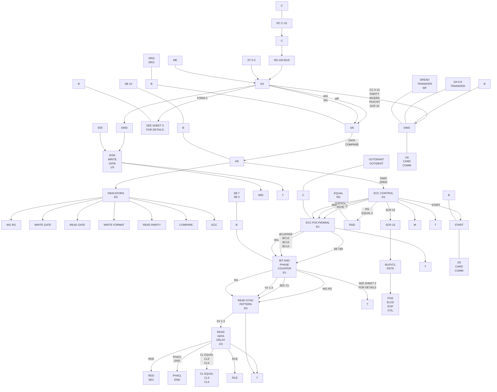

REP  
RFC  
RSCT  
LCW  
LBLOCK  
ECC  

BINACK  
INGRANT  
INIDENT  
BMC  
RUN  

DWD  

START  

15 MHZ SMD CONTROL P/N 3043  
SHEET 1 OF 3  

TO/FROM SHEET 2  

ND-11.020.01

---

## Page 107

# 15MHZ SMD DISK CONTROLLER

## DESCRIPTIVE BLOCK DIAGRAM CARD NO. 3043

98

ND-11.020.01

---

## Page 108

# 15MHZ. SMD DISK CONTROLLER

## DESCRIPTIVE BLOCK DIAGRAM CARD NO. 3043

99

[Complex technical block diagram/schematic with interconnected signal lines, connector points, logic blocks, and card references.]

| Visible block / label |
|---|
| U0 A 0-6 TRANSFER |
| SECTOR COUNTER & COMPARATOR (UNIT 0) |
| SECTOR COUNTER & COMPARATOR (UNIT 1) |
| SECTOR COUNTER & COMPARATOR (UNIT 2) |
| SEEK FINISHED |
| READ & WRITE GATES |
| ADDRESS COMPARE |
| MISSING READ CLOCK TEST |
| DISK CLOCK DATA |
| PART OF 3/2 ALSO BELOW |
| B-CABLE UNIT 1 |
| B-CABLE UNIT 2 |
| SWITCHES |
| NEW HEAD SELECT |
| 15 MHZ SMD CONTRL P/N 3043 SHEET 2 OF 3 |

| Visible signal labels |
|---|
| START |
| ST 0-3 |
| ST0 |
| ST1 |
| ST2 |
| ST3 |
| SI |
| EMPTY |
| END |
| RD |
| WD |
| WRC |
| RCE |
| RCL |
| DCL |
| DCI |
| ROD |
| RDD |
| RG |
| RGA |
| RGHA |
| EQUAL |
| EQUAL TRANSFER |
| PH4CL |
| TRANSFER DIRECT |
| EMF |
| BA |
| ROD SEC |
| RCE ME |
| PH4CL END |
| WRC 0 |
| WRC 1 |
| WRC 3S |
| SW0 |
| SW1 |
| SW2 |
| SW3 |
| INDEX 0 |
| INDEX 1 |
| INDEX 2 |
| IND3 |
| FIN |
| EOHIA |
| EOHIA |
| RCL ERC |
| CARD COMM |
| CARD COMP1 |
| CARD COMP2 |
| CARD COMP3 |
| WOL WRC |
| 0 WOL WRC |
| 1 WOL WRC |
| 2 WOL WRC |
| NEWHEAD |
| SEC 0-3 |
| RG WG |
| SEC 6 |

ND-11.020.01

---

## Page 109

# 15MHZ SMD DISK CONTROLLER

## DESCRIPTIVE BLOCK DIAGRAM CARD NO. 3043

100

ND-11.020.01

---

## Page 110

# 15MHZ SMD DISK CONTROLLER

## DESCRIPTIVE BLOCK DIAGRAM CARD NO. 3043

101

| BLOCK | SHEET | SIGNAL NAME |
|---|---:|---|
| 2/1 | 2 | M4 |
| 2/2 | 2 | M4 |
| 2/3 | 2 | M4 |
| 2/7 | 2 | M6 |
| 3/2 | 2 | M1 M5 |
| 4/1 | 1 | M8 |
| 4/5 | 1 | M3 |
| 4/6 | 1 | M3 M5 |
| 1/5 | 1 | PH7 PH14 PH25 PH36 GB |
| 3/2 | 2 | PH1 PH2 PH4 PH8 BC0 B31 ERG |
| 3/3 | 1 | PH3 |
| 3/4 | 2 | ERCE |
| 4/1 | 1 | PH4 PH25 PH47 PH2356 PHCL B7 BC1 BC2 BC3 B55 |
| 4/2 | 2 | PH2 |
| 4/3 | 2 | PH8 B55 TD |
| 4/5 | 1 | PH5 |
| 4/6 | 1 | PH1 PH2 PH4 PH5 PH14 PH15 BC3 BC4 B7 BCY1 ERG ENO RQ ENOPH5 ERCE |
| 5/1 | 1 | PH25W PH2356 FBC1 |

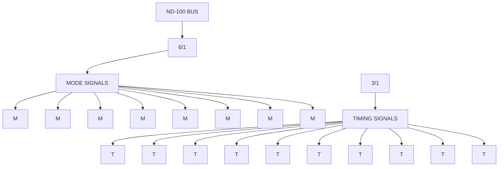

SEE SHEET 1  
FOR LIST OF  
LOWER (RIGHT)  
FOR THESE  
INPUT SIGNALS

NOTE: MODE & TIMING SIGNALS SHOWN BY LINE ON SHEETS 1 & 2 ARE NOT REPEATED HERE.

15 MHZ SMD CONTROLLER P/N 3043  
(SHEET 3 OF 3)

ND-11.020.01

---

## Page 111

# 15MHZ SMD DISK CONTROLLER

## DESCRIPTIVE BLOCK DIAGRAM CARD NO. 3043

102

ND-11.020.01

---

## Page 112

# 15MHZ SMD DISK CONTROLLER

103

# APPENDIX C

## LOGIC DIAGRAM CARD NO. 3044

ND-11.020.01

---

## Page 113

# 15MHZ SMD DISK CONTROLLER

104

ND-11.020.01

---

## Page 114

# 15MHZ SMD DISK CONTROLLER

## LOGIC DIAGRAM CARD NO. 3044

105

```text
                                                                                     ┌───────────────────────────────┐
                                                                                     │ 15MHZ SMD DISK CONTROLLER     │
                                                                                     │ M11-100 BUS                   │
                                                                                     │                               │
                                                                                     │ NORISK DATA A.S.               │
                                                                                     │ 0006, Norway                   │
                                                                                     │                               │
                                                                                     │ ID NO. 3226744                │
                                                                                     │ Drawing no. 3044              │
                                                                                     │ Page 1 of 5                   │
                                                                                     │ Replaced by G                 │
                                                                                     └───────────────────────────────┘


 ┌─────────────────────────────────────────────────────────────────────────────────────────────────────────────────────────────┐
 │                                                                                                                             │
 │  A          B          C          D          E          F          G                                                        │
 │                                                                                                                             │
 │  BAPPR1     DNO0       DNO1       DNO2       DNO0       DNO1       DNO2                                                     │
 │                                                                                                                             │
 │  9B         8B                                                                                                              │
 │  P0         P1         P2         P3         P4         P5         P6         P7                                            │
 │                                                                                                                             │
 │  DNO0       DNO1       DNO2                                                                                                 │
 │                                                                                                                             │
 │  EMERGENCY STOP / SUSPENDENT                                                                         IDENT CONTROL          │
 │                                                                                                                             │
 │  IDENT      STOPIDENT      START                                                                                             │
 │                                                                                                                             │
 │  START                                                                                                                       │
 │  DNO0                                                                                                                        │
 │  DNO1                                                                                                                        │
 │  EQUAL                                                                                                                       │
 │                                                                                                                             │
 │  BMEM1      BMEM0       RSECT0                                                                                               │
 │                                                                                                                             │
 │  PROEND     RECP                                                                                                              │
 │  ADDEN                                                                                                                       │
 │                                                                                                                             │
 │  ENRCY0                                                                                                                       │
 │                                                                                                                             │
 │  INPUT      PROINT1     PROINT0                                                                                               │
 │                                                                                                                             │
 │  STOPIDENT1                                                                                                                   │
 │  STOPIDENT0                                                                                                                   │
 │                                                                                                                             │
 │  ENDMAC0    ENDMA0      EO0        NENTRA0                                                                                   │
 │                                                                                                                             │
 │  PROPOINT1  PROPOINT0                                                                                                        │
 │                                                                                                                             │
 │  RESTART1   RESTART0                                                                                                         │
 │                                                                                                                             │
 │  BAPPR1     BMEM1       BMEM0                                                                                               │
 │                                                                                                                             │
 │  RODAP1     RODAP0     DRY0                                                                                                  │
 │                                                                                                                             │
 │  REQUEST0   REQUEST1                                                                                                         │
 │                                                                                                                             │
 │  INTEGRANT0                                                                                                                  │
 │                                                                                                                             │
 │  RODAP1     DRY0       H1 (RE2)                                                                                              │
 │                                                                                                                             │
 │  GERANT1                                                                                                                     │
 │                                                                                                                             │
 │  PREOSTART1                                                                                                                  │
 │                                                                                                                             │
 │  RODAP1     RODAP0                                                                                                          │
 │                                                                                                                             │
 │  DEVMAC1    COUNT0                                                                                                           │
 │                                                                                                                             │
 │  RODINPUT0  RODMAC1                                                                                                         │
 │                                                                                                                             │
 │  OMA CONTROL                                                                                                                 │
 │                                                                                                                             │
 │  * = POWER PIN CONNECTED TO STAND-BY 5V                                                                                      │
 │                                                                                                                             │
 │  N-100 BUS                                                                                                                   │
 │                                                                                                                             │
 │  ENRCY0                                                                                                                      │
 │  NENTRA0                                                                                                                      │
 │  DENTRA0                                                                                                                      │
 │                                                                                                                             │
 │  BDO0       BDO1       BDO2       BDO3       BDO4       BDO5       BDO6       BDO7                                         │
 │  BDI60      BDI70      BDI80      BDI90      BDI00      BDI10      BDI20      BDI30                                        │
 │                                                                                                                             │
 │  RODAP1     RODAP0     INPUT       ENTRA       BMEM0       BINACK0      BMCL0     BMINH0     BERROR0                       │
 │                                                                                                                             │
 │  BAPPR1     BINT1      BREQ0       BADAP0                                                                               │
 │                                                                                                                             │
 │  H1         H2         H3                                                                                                    │
 │                                                                                                                             │
 └─────────────────────────────────────────────────────────────────────────────────────────────────────────────────────────────┘
```

ND-11.020.01

---

## Page 115

106

# 15MHZ SMD DISK CONTROLLER

## LOGIC DIAGRAM CARD NO. 3044

ND-11.020.01

---

## Page 116

# 15MHZ SMD DISK CONTROLLER

## LOGIC DIAGRAM CARD NO. 3044

Page 107

[Complex logic schematic: 15 MHz SMD disk controller, with integrated-circuit blocks, signal lines, pin numbers, logic gates, registers, counters, and connector references.]

Visible schematic section labels include:

- START & INTERRUPT
- DISK ADDRESS & CONTROL WORD
- STATUS REGISTER
- SECTOR COUNTER
- BLOCK
- READ
- WRITE
- INTERRUPT
- BUSY
- ERROR
- COMPLETE
- DATA IN
- DATA OUT
- CLOCK
- RESET
- TEST
- TRANSFER
- SUSPEND
- SEEK
- RECAL
- START
- PRIORITY
- REQUEST
- READY
- SELECT
- COUNT
- PROTECT
- CONTROL

| Field | Visible text |
|---|---|
| Card P/N | 322674 |
| Title | 15MHZ SMD DISK & DISK ADDRESS & STATUS |
| Organization | NORSK DATA A.S |
| Location | Oslo, Norway |
| Drawing No. | 3044 |
| Page | 2 of 5 |
| Registration | [illegible] |
| Date | [illegible] |
| Drawn | [illegible] |
| Checked | [illegible] |

ND-11.020.01

---

## Page 117

108

# 15MHZ SMD DISK CONTROLLER

## LOGIC DIAGRAM CARD NO. 3044

ND-11.020.01

---

## Page 118

# 15MHZ SMD DISK CONTROLLER

## LOGIC DIAGRAM CARD NO. 3044

109

[Complex logic schematic: 15 MHz SMD DATA FIFO & Registers. Visible grid references A–G and 1–5; numerous integrated-circuit symbols, signal lines, connectors, resistors, and labeled nets.]

| Field | Visible text |
|---|---|
| CARD NO. | 32267 |
| Title | 15 MHz SMD DATA FIFO & Registers |
| Company | NORSK DATA A.S |
| Location | Oslo, Norway |
| Date | 18.07.81 |
| Drawn | DF |
| Drawn date | 06.06.84 |
| Control | KS |
| Page | 3 of 5 |

ND-11.020.01

---

## Page 119

# 15MHZ SMD DISK CONTROLLER

## LOGIC DIAGRAM CARD NO. 3044

110

ND-11.020.01

---

## Page 120

# 15MHZ SMD DISK CONTROLLER

## LOGIC DIAGRAM CARD NO. 3044

**Page:** 111  
**Document No.:** ND-11.020.01  
**Revision:** G

```text
┌──────────────────────────────────────────────────────────────────────────────┐
│                         15MHZ SMD DISK CONTROLLER                            │
│                          LOGIC DIAGRAM CARD NO. 3044                         │
│                                                                              │
│  A          B          C          D          E          F          G         │
│  1          2          3          4          5                                │
│                                                                              │
│ ┌───────────────────────┐  ┌──────────────────────────────────────────────┐ │
│ │ FOCUS CONTROL          │  │ TAG BUS                                      │ │
│ │                        │  │                                              │ │
│ │ CONT                   │  │ TAG1L   TAG2L   OPENCL   US0L   US1L         │ │
│ │ DS0                    │  │ US2L   US3L    US1L    TAG3L   TAG4L         │ │
│ │ FOCUS BUSY             │  │                                              │ │
│ │ BUSY0                  │  │ TAG BUS DRIVER                               │ │
│ │ DSA0                   │  │                                              │ │
│ │ STOP                   │  │ OSC0                                         │ │
│ │ HEAD ENABLE            │  │ * MENU0                                      │ │
│ │ BUSY CL RTZ            │  │                                              │ │
│ └───────────────────────┘  └──────────────────────────────────────────────┘ │
│                                                                              │
│ ┌──────────────────────────────────────────────────────────────────────────┐ │
│ │ DISK STATUS AND POWER SEQ.                                                │ │
│ │                                                                          │ │
│ │ FAULTL       SEEKERL       ONCYLL       READYTL       WPROTL     BUSYL  │ │
│ │ FAULT0       SEEKER0       ONCYL0       READY0        WPROT0     BUSY0  │ │
│ │ TEST0        BUSY0         TEST0        BUSY0          TEST0      H15    │ │
│ │                                                                          │ │
│ │ POWER SEQ.                                                               │ │
│ └──────────────────────────────────────────────────────────────────────────┘ │
│                                                                              │
│ ┌──────────────────────────────┐  ┌────────────────────────────────────────┐│
│ │ MARGINAL RECOVERY DECODER    │  │ TAG BUS TIMING                         ││
│ │                              │  │                                        ││
│ │ MARG                           │  │ SRP  (Servo off+)                     ││
│ │ CYCL0                         │  │ SNO  (Servo off-)                     ││
│ │ ONCYL0                        │  │ DOR  (Data strobe+)                   ││
│ │ SBY3                          │  │ DON  (Data strobe-)                   ││
│ │                              │  │                                        ││
│ │ SP0                           │  │ STRB                                  ││
│ │ SNO                           │  │ CYC5                                  ││
│ │ PCL0                          │  │ MARG                                  ││
│ │ DP0                           │  │                                        ││
│ │ CONTROL                       │  │                                        ││
│ │ RTCL0                         │  │                                        ││
│ └──────────────────────────────┘  └────────────────────────────────────────┘│
│                                                                              │
│ ┌──────────────────────────────────────────────────────────────────────────┐ │
│ │ HEAD ENABLE / CYLINDER CONTROL                                           │ │
│ │                                                                          │ │
│ │ HEADEN0        AIO-7I          B0-7I                                    │ │
│ │ CYLEN0         HEADEN0         CYLEN0                                   │ │
│ │                                                                          │ │
│ │ A0-7I          B0-7I                                                   │ │
│ │                                                                          │ │
│ │ CONTREN0       HEADEN0                                                  │ │
│ └──────────────────────────────────────────────────────────────────────────┘ │
│                                                                              │
│ ┌──────────────────────────────────────────────────────────────────────────┐ │
│ │ TAG BUS                                                                  │ │
│ │                                                                          │ │
│ │ TAG1L      TAG2L      TAG3L      TAG4L                                   │ │
│ │ TAG5L      TAG6L      TAG7L      TAG8L                                   │ │
│ │ TAG9L      US0L       US1L       US2L                                   │ │
│ │ US3L       OPENCL     STTEST0    BUSY0                                  │ │
│ └──────────────────────────────────────────────────────────────────────────┘ │
│                                                                              │
│ NOTES:                                                                       │
│ * Connected to 5V stand-by.                                                  │
│   (Open H) and -5V stand-by.                                                 │
│   (Open H)                                                                   │
│   All resistors 5% unless otherwise stated.                                  │
│                                                                              │
│                         15MHZ SMD DATA & CONTROL                             │
│                                  TAG BUS                                     │
│                                                                              │
│                        Document No. 3044                                     │
└──────────────────────────────────────────────────────────────────────────────┘
```

---

## Page 121

# 15MHZ SMD DISK CONTROLLER

## LOGIC DIAGRAM CARD NO. 3044

112

ND-11.020.01

---

## Page 122

# 15MHZ SMD DISK CONTROLLER

## LOGIC DIAGRAM CARD NO. 3044

113

[Complex electronic logic schematic: 15 MHz SMD disk controller, divided into labeled functional blocks.]

## Visible Functional Blocks

- ADDRESS SHIFT REGISTER
- DISK OPERATION COMPLETE
- READ SEEK CONDITION
- B-CABLE UNIT 3
- START & TIMEOUT
- INDICATORS
- 5V POWER

## Visible Signal and Component Labels

- PHI2A
- PHI2B
- PHI2C
- PHI2D
- ECL
- H5
- DA (0-15)
- AIO-15
- COMPLETE
- EMPTY
- ERROR
- START
- ONCYL
- SEEK
- SEEKER
- SEEKER1
- SEEKER3
- RQL
- RCL
- RDL
- RCL0
- RDL0
- INDEX
- INDEX1
- INDEX3
- SECT
- SECT0
- SECT1
- SECT3
- USL
- USL0
- USL1
- BUSY
- ERROR GENERATION
- EMP/CLK
- STORM/LS
- TRANSF START
- RESET
- DACK
- DATA0-6
- COM3
- SB12
- SB20
- SB60
- ST30
- ST31
- ST50
- ST100
- H9
- H10
- H11
- H13
- H19
- H20
- H23
- H28
- H30
- H35
- H110
- H120
- H135
- H188
- H198
- H210

## Title Block

| Field | Visible text |
|---|---|
| Unit | 15 MHz SMD DATA UNIT CONTROL |
| Drawing title | 15 MHZ SMD DATA UNIT CONTROL |
| Card print | C B |
| P/NO | 322671 |
| Date | 12/07/84 |
| Drawn by | BWI |
| Cont. HS | 06.06.84 |
| Page | 5 of 5 |
| Project | 3044 |
| Release | NORSE DATA A.S. Oslo, Norway |
| Document | 100-L50 |
| Sheet designation | G |

ND-11.020.01

---

## Page 123

# 15MHZ SMD DISK CONTROLLER

114

ND-11.020.01

---

## Page 124

# 15MHZ SMD DISK CONTROLLER

115

# APPENDIX D

## DESCRIPTIVE BLOCK DIAGRAM CARD NO. 3044

ND-11.020.01

---

## Page 125

# 15MHZ SMD DISK CONTROLLER

116

ND-11.020.01

---

## Page 126

# 15MHZ SMD DISK CONTROLLER

DESCRIPTIVE BLOCK DIAGRAM CARD NO. 3044

117

## GENERAL DESCRIPTION

As explained in the manual, the 15 MHz SMD data card handles all the disk A-cable signals, plus the B-cable signals for one disk unit (No. 3). The 15 MHz SMD control card handles the B-cable signals for the remaining three disk units (0, 1, and 2). Both cards also communicate with each other and also with the NORD-100 bus. The following applies only to the 15 MHz SMD control card.

## PLUG CONNECTIONS

Plug A is used for the 3-cable signals for disk units 0 and 1. The signals for unit 2are connected via plug B, which is also used for communication with the 15 MHz SMD Data card. Plug C is used for communication with the NORD-100 bus.

## GENERAL LAYOUT OF THE FBD

The FBD is spread over 3 sheets, whose contents are summarized as follows :

Sheet 1 :

- o  ND-100 Bus communication (block 6/1 at top left).
- o  ECC Polynomial (5/1 at mid-right).
- o  ECC Control (4/1 at center).
- o  Bit & Phase Counters (3/1 at lower right).
- o  Indicator Lamps (6/2 top center).
- o  Data Compare (4/5 upper center).
- o  Disk Read & Write Requests (4/6 at top center).

Sheet 2 :

- o  The B-cable buffer circuits (for units 0, 1, and 2)  
     at lower left of the sheet.
- o  The 3 sector counters and comparators (for units 0,1  
     and 2) at upper left of the sheet.
- o  Seek Finished Logic (2/7 at center).
- o  Read and Write Gates (3/2 at upper right).
- o  New Head Select (2/6 at bottom right).
- o  Address Compare (4/2 at top right).

ND-11.020.01

---

## Page 127

# 15MHZ SMD DISK CONTROLLER

## DESCRIPTIVE BLOCK DIAGRAM CARD NO. 3044

118

## Sheet 3:

- Connections of Mode Control Signals.
- Connections of Timing Signals from Bit Counter and Phase Counter.

Sheets 1 and 2 contain all the function blocks shown on the logic diagrams. Sheet 3 repeats 2 of the blocks on sheet 1 that generate the Mode Control signals (M....) and the Timing signals (mainly B.... & PH....). It also shows their connections, because it was impractical to represent these signals by lines on the FBD.

A block on sheet 1 or sheet 2 which receives Mode or Timing signals is marked with an input arrow and a letter 'M' for Mode or 'T' for Timing. Because the relevant block numbers on sheet 3 are in numerical order, it is easy to locate a particular block number and find out what signals the block receives.

## B-CABLE AND INTER-CARD SIGNALS

All the card inputs and outputs that are connected to the B-cables (for Units 0, 1, and 2) enter or leave their corresponding B-cable logic blocks (1/1, 1/2, and 1/3 at lower left of FBD sheet 2). The B-cable signal names also end in 'L' and are preceded by a number corresponding to the unit they are connected to. For example, 2 WDL (leaving block 1/3) is the Write Data for unit 2.

All other signals on plug B are connected to the 15 MHz SMD data card (3044).

## ND-100 BUS SIGNALS

These signals are connected between block 6/1 (top left of Sheet 1) and plug C.

## WRITE DATA PATHS

The data for writing on the disks arrives as card input DWD at the mid-left of FBD sheet 1. This data has come from the computer memory via the FIFO on the 15 MHz SMD data card (3044).

The data is gated through block 1/5, then passes down to sheet 2 as IWD. On sheet 2, it passes through block 2/4 (at mid-left) before being distributed as WD to each of the 3 B-cable blocks (1/1, 1/2, and 1/3) which pass it on to the appropriate disk units as XWDL (where X is 0, 1, or 2)

Note that WD also exits the card (at bottom right of sheet 2) for transmission to Unit 3 via card 3044.

ND-11.020.01

---

## Page 128

# 15MHZ SMD DISK CONTROLLER

## DESCRIPTIVE BLOCK DIAGRAM CARD NO. 3044

119

Write data is also fed from block 1/5 on sheet 1 (as IWD) to the ECC polynomial via the ECC control logic (block 4/1), which it leaves as signal `I' to be checked in the polynomial for errors.

## READ DATA PATHS

Data read from a disk unit enters its respective B-cable block (1/1, 1/2, or 1/3) at the bottom left of FBD sheet 2 as XRDDL (where X is 0, 1, or 2).

The read data output from blocks 1/1, 1/2, and 1/3 (which are just buffers) is combined into one signal line (RD), because data will be read from only one unit at a time.

Similarly, the data read from unit 3, which is buffered in the 15 MHz SMD data card (3044), arrives at this card (3043) also as RD, and joins the other 3 RD signals as a single input to block 3/2 (at lower center of FBD).

The read data exits block 3/2 as IRD, which passes through block 4/3 before leaving these cards as RDD, to go to card 3044 where it is transferred to memory via the FIFO.

RDD also goes to FBD sheet 1 of 3043, where it enters the ECC control block (4/1), after having been delayed in block 2/4. The read data leaves block 4/1 on signal line `I,' which enters the ECC polynomial (5/1) to be checked for errors.

## ECC POLYNOMIAL

The ECC polynomial (block 5/1 at mid-right of FBD sheet 1) receives either write data or read data for error checking. This data enters 5/1 on signal line `I', and the gating of either write data (IWD) or read data (RDD) onto line `I' is done on the ECC control block (4/1 on sheet 1).

The output from the ECC polynomial consists of:

- Data outputs
- Status outputs
- Control signal outputs

which are related to the 2 card FBDs as follows:

The data outputs (CC 0-13 and E 1-11) are fed to block 6/1 (on sheet 1, 3043), from which they can be read into computer memory via the BD 0-15 lines.

Two status outputs (SB7 and SB9) go out of the card and are transmitted via plug B to card 3044, where they can be read together with the other 2 SB signals from 3043 (SB 8 from sheet 2, and SB 10 from sheet 1) in the status register on card 3044.

ND-11.020.01

---

## Page 129

# 15MHZ SMD DISK CONTROLLER

## DESCRIPTIVE BLOCK DIAGRAM CARD NO. 3044

120

The remaining signal outputs from 4/1 are handled on card 3043 as follows:

Two status signals (PARERR and MAXCNT) go to block 6/1 (on sheet 1), from which they can be read into memory via the BD lines, together with the Seek Complete status bits (ST 0-3) from sheet 2. The control signals from 5/1 go to blocks 1/5, 4/1 and 6/1 on sheet 1.

ND-11.020.01

---

## Page 130

# 15MHZ SMD DISK CONTROLLER

## DESCRIPTIVE BLOCK DIAGRAM CARD NO. 3044

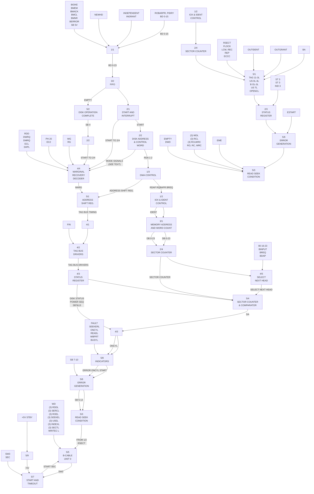

15 MHZ SMD DATA · P/N 3044

ND-11.020.01

---

## Page 131

# 15MHZ SMD DISK CONTROLLER

## DESCRIPTIVE BLOCK DIAGRAM CARD NO. 3044

122

ND-11.020.01

---

## Page 132

# 15MHZ SMD DISK CONTROLLER

## Index

| Entry | Page |
|---|---:|
| An Return | 31 |
| BAPR | 31 |
| BCRQ | 31 |
| BD | 31 |
| BDAP | 31 |
| BDRY | 31 |
| BERROR | 31 |
| BIGFUNC | 64 |
| BINACK | 31 |
| BINPUT | 31 |
| BINT | 31 |
| BIOXE | 31 |
| BLANK | 31 |
| BMCL | 31 |
| BMEM | 32 |
| BMINH | 32 |
| BREQ | 32 |
| Busy | 29 |
| Clock Counter | 35 |
| Compare |  |
| — Mode | 56 |
| — Transfer | 14 |
| CONTINUE | 32 |
| Control Timing | 45 |
| Daisy Chained | 3, 4 |
| Device Operation | 13, 14 |
| DIP Switch | 72 |
| Disc Tema | 63 |
| DMA |  |
| — Timing | 42 |
| — Transfer | 23 |
| ECC |  |
| — Control | 16, 17 |
| — Polynomial | 36 |
| Error Interrupt | 47 |
| Fault | 28 |
| FIFO Timing | 43, 44 |
| Format Bits | 19 |
| GND | 32 |
| IDENT Code | 7 |
| INCONTR | 32 |
| Index | 30 |
| INGRANT | 32 |
| INIDENT | 32 |
| Initiate Seek | 15 |
| Interface Signals | 25 |
| Interrupt Error | 47 |
| IOX Address | 7 |
| LOAD | 32 |
| Marginal Recovery Cycle | 13 |
| On Cylinder | 29 |
| Open cable Detect | 28 |
| OUTCONTR | 32, 33 |
| OUTGRANT | 32, 33 |
| OUTIDENT | 32, 33 |

ND-11.020.01

---

## Page 133

# 15MHZ SMD DISK CONTROLLER

## Index

| Entry | Page |
|---|---:|
| PA | 32 |
| PASCAN | 61 |
| Phase | 19, 34 |
| Read |  |
| &nbsp;&nbsp;Clock | 30 |
| &nbsp;&nbsp;Data | 30 |
| &nbsp;&nbsp;Parity | 14 |
| &nbsp;&nbsp;Transfer | 14 |
| RESTART | 33 |
| Return to Zero Seek | 15 |
| RUN | 33 |
| &nbsp;&nbsp;ECC Operation | 15 |
| Sector | 30 |
| &nbsp;&nbsp;Counter | 36 |
| &nbsp;&nbsp;Length | 17 |
| Seek |  |
| &nbsp;&nbsp;Complete Search | 15 |
| &nbsp;&nbsp;End | 30 |
| &nbsp;&nbsp;Error | 30, 25 |
| Select/Release | 15 |
| Servo-offset | 13, 14 |
| SPARE | 33 |
| &nbsp;&nbsp;Sector | 33 |
| STOP | 33 |
| Super-Rand | 62 |
| Tag |  |
| &nbsp;&nbsp;1 | 27 |
| &nbsp;&nbsp;2 | 27 |
| &nbsp;&nbsp;3 | 27 |
| &nbsp;&nbsp;Timing | 45, 46 |
| Test Mode | 55, 56 |
| Track Format | 33 |
| Transfer Rate | 24 |
| Unit |  |
| &nbsp;&nbsp;Ready | 25 |
| &nbsp;&nbsp;Select | 25 |
| &nbsp;&nbsp;Selected | 30 |
| Word Count | 16 |
| Write |  |
| &nbsp;&nbsp;Clock | 30 |
| &nbsp;&nbsp;Data | 30 |
| &nbsp;&nbsp;Format | 15 |
| &nbsp;&nbsp;Protected | 29 |
| &nbsp;&nbsp;Transfer | 14 |

124

ND-11.020.01

---

## Page 134

# SEND US YOUR COMMENTS!!!

****************

[Cartoon: frustrated bearded man reading a manual, with a dark thought cloud above his head.]

Are you frustrated because of unclear information in  
this manual? Do you have trouble finding things?  
Why don't you join the Reader's Club and send us a  
note? You will receive a membership card — and  
an answer to your comments.

Please let us know if you

- find errors
- cannot understand information
- cannot find information
- find needless information

Do you think we could improve the manual by  
rearranging the contents? You could also tell  
us if you like the manual!

[Cartoon: smiling bearded man with glasses holding a panel bearing the “ND Norsk Data” logo; a heart appears above him.]

# HELP YOURSELF BY HELPING US!!

****************

Manual name:  SMD Disk Controller  
Manual number:  ND-11.020.01

What problems do you have? (use extra pages if needed)  ___________________________________________

________________________________________________________________________________________________

________________________________________________________________________________________________

________________________________________________________________________________________________

Do you have suggestions for improving this manual ?  ______________________________________________

________________________________________________________________________________________________

________________________________________________________________________________________________

________________________________________________________________________________________________

Your name:  ________________________________________________  Date: ___________________________

Company:  _________________________________________________  Position: ________________________

Address:  _____________________________________________________________________________________

________________________________________________________________________________________________

What are you using this manual for ?  ____________________________________________________________

________________________________________________________________________________________________

**NOTE!**  
This form is primarily for  
documentation errors. Software and  
system errors should be reported on  
Customer System Reports.

**Send to:**  
Norsk Data A.S  
Documentation Department  
P.O. Box 25, Bogerud  
Oslo 6, Norway

```text
                                      ----------->
```

Norsk Data's answer will be found  
on reverse side

---

## Page 135

# Answer from Norsk Data

________________________________________________________________________________

________________________________________________________________________________

________________________________________________________________________________

________________________________________________________________________________

________________________________________________________________________________

________________________________________________________________________________

________________________________________________________________________________

________________________________________________________________________________

________________________________________________________________________________

Answered by ________________________________________________ Date _______________

---

```text
                    +------------+
                    |            |
                    |            |
                    |            |
                    +------------+
```

**Norsk Data A.S**  
Documentation Department  
P.O. Box 25, Bogerud  
Oslo 6, Norway

---

## Page 136

# Systems that put people first

NORSK DATA A.S OLAF HELSETS VEI 5 P.O. BOX 25 BOGERUD 0621 OSLO 6 NORWAY

TEL.: 02 - 29 54 00 - TELEX: 18284 NDN

---

