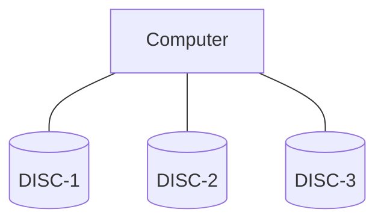
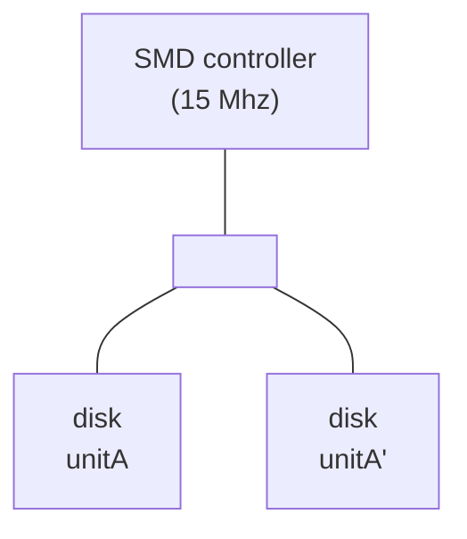
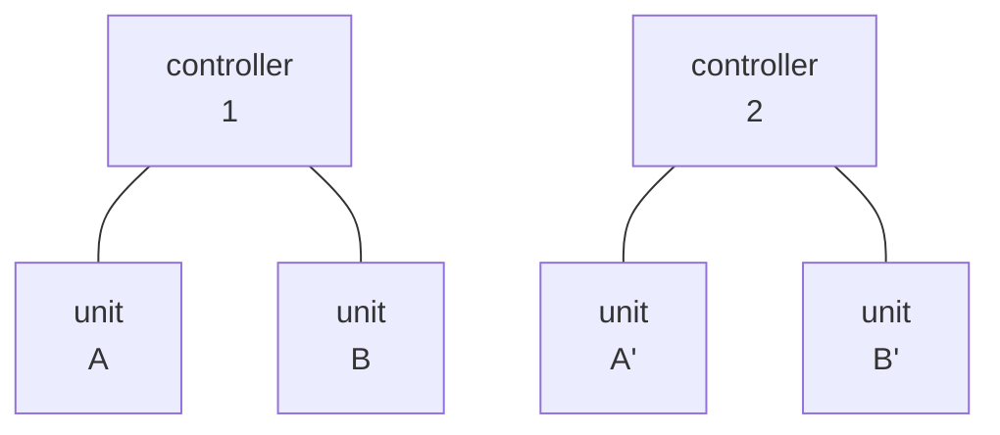
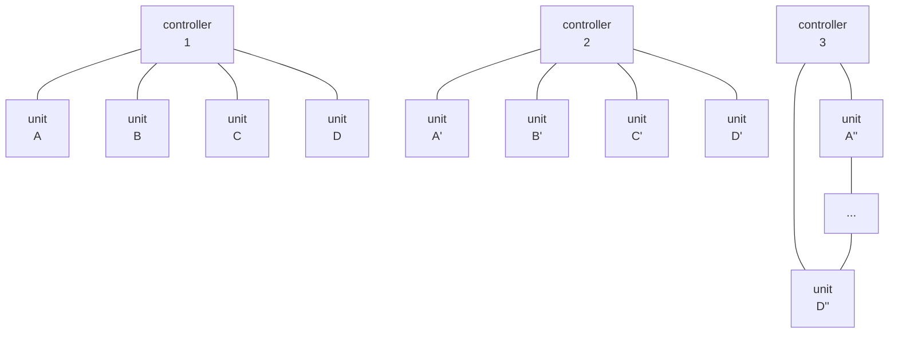

## Page 1

# Disk Mirroring  
# Operator Guide

ND 200701 EN

```text
        ▰
          ▰
            ▰
              ▰
                ▰
                  ▰
                    ▰
                      ▰
```

```text
N D
```

Norsk Data

---

## Page 2

# Disk Mirroring

# Operator Guide

ND-30.070.1 EN

---

## Page 3

# Preface:

## THE PRODUCT

This Operator Guide documents the

**ND Disk Mirroring**     **ND 210855**

version C, as implemented under SINTRAN III version J or later.

## THE READER

This manual should be read by all system operators (supervisors) in charge of installing, loading, testing and maintaining the product listed above.

## PREREQUISITE KNOWLEDGE

Detailed knowledge of the operating procedures of SINTRAN III (version J or later) is assumed. Thorough understanding of the operational procedures of the file or database system used is also advisable.

## RELATED MANUALS

The following manuals supply additional information about products closely related to Disk Mirroring.

| Manual | Document No. |
|---|---|
| FTX Configuration Management Guide | ND-30.069 EN |
| Error Logger Operator/Programmer Guide | ND-20.014 EN |
| SINTRAN III Reference Manual | ND-60.128 EN |
| SINTRAN III System Supervisor Manual | ND-30.003 EN |
| COSMOS Operator Guide | ND-30.025 EN |
| SIBAS II Operator's manual | ND-30.009 EN |

Norsk Data   ND-30.070.1 EN

---

## Page 4

ii

---

## Page 5

# TABLE OF CONTENTS

| Section | Page |
|---|---:|
| 1 INTRODUCTION | 1 |
| 1.1 Disk Mirroring | 3 |
| 1.2 The Fundamental Operating Principles | 3 |
| 1.3 The Product ND Disk Mirroring | 4 |
| 1.4 Some Key Terms and Definitions | 4 |
| 1.5 Functions | 5 |
| 1.5.1 Low level functions | 5 |
| 1.6 Reviving | 6 |
| 1.7 The DIMIR-MANAGER Commands | 6 |
| 2 OPERATING DISK MIRRORING | 9 |
| 2.1 Uses of the Disk Mirroring | 11 |
| 2.2 Starts/Restarts of the System | 11 |
| 2.3 The LOAD- and HENT-MODE Files | 12 |
| 2.4 Taking Backup while Applications are Running | 13 |
| 2.4.1 On-line Backup without Running Disk Mirroring Permanently | 14 |
| 2.4.2 On-line Backup while Running Disk Mirroring | 17 |
| 2.4.3 On-line Backup Without Turning Mirroring Off | 17 |
| 3 HARDWARE CONSIDERATIONS | 19 |
| 3.1 Disk Drives | 21 |
| 3.2 Disk Controllers | 21 |

## APPENDIX

| Section | Page |
|---|---:|
| A THE DIMIR-MANAGER COMMANDS | 23 |
| Index | 61 |

Norsk Data ND-30.070.1 EN

---

## Page 6

iv

---

## Page 7

# DISK MIRRORING OPERATOR GUIDE

1

# CHAPTER 1

## INTRODUCTION

Norsk Data  ND-30.070.1 EN

---

## Page 8

# DISK MIRRORING OPERATOR GUIDE

2

Norsk Data  ND-30.070.1 EN

---

## Page 9

# DISK MIRRORING OPERATOR GUIDE

## INTRODUCTION

3

# 1 INTRODUCTION

This chapter gives an introductory overview of the Disk Mirroring (DIMIR) product. It also explains some of the fundamental operating principles of a typical (standard) Disk Mirroring implementation.

## 1.1 Disk Mirroring

The Disk Mirroring mechanism in SINTRAN III makes it possible to duplicate data. This increases the database integrity and availability.

The addition of extra disks, and the duplication of data, are invisible to the application programs. The advantages thus gained are twofold:

- Security against disk failures is improved.

- Backups can be taken while applications (e.g. database systems) are running, hence increased availability.

## 1.2 The Fundamental Operating Principles

The fundamental operating principles of Disk Mirroring are quite simple. As seen from the operating system, the complete set of discs connected to the machine may be looked upon as a contiguous storage area.

In the example below, three different discs are connected to the computer.



Norsk Data ND-30.070.1 EN

---

## Page 10

4

# DISK MIRRORING OPERATOR GUIDE

## INTRODUCTION

DISC-1 is the system disk (70MB) in this configuration, containing the directory PACK-ONE. DISC-2 is used for storage of the application data and DISC-3 is an exact copy, a mirror, of DISC-2.

When Disk Mirroring is turned on, all write operations to DISC-2 are also done on DISC-3. This is done in two separate write operations, where the second write operation may be done in parallel with the first one depending on the hardware configuration.

## 1.3 The Product ND Disk Mirroring

The Disk Mirroring system consists of four software modules:

| Module | Description |
|---|---|
| Mirroring Module | This module is additions/changes to the operating systemdisk I/O routines. The operation of this module is controlled by a Disk Mirroring (DM) Table. |
| MON SYSU | A monitor call used for controlling Disk Mirroring. |
| REVIVE | An RT-program which enables copying from one disk to another, while the disks are available for ordinary use. |
| DIMIR-MANAGER | This program is the operator command interface to the Disk Mirroring modules. |

In addition, this version of Disk Mirroring uses the Error Logger (FTXEL and FTXWD) for error reporting. However, this is mainly hidden for the operator. For detailed description and operating procedures on the error logger, contact your local ND representative.

## 1.4 Some Key Terms and Definitions

| Term | Definition |
|---|---|
| MEMBER | A Member is either a directory, disk area/partitioning, or all directories on a disk unit. |
| DISK CLUSTER | A disk cluster consists of two or three members each exact copies of one other. All members of a cluster must have the same logical size. |
| PRIMARY | Only Member 1 of a disk cluster is seen by the operating system and is called the primary. Only primaries can contain entered directories. |
| SECONDARIES | Member 2 and Member 3 are called secondaries. For backup purposes it is possible to share Member 3 between different clusters. |

Norsk Data  ND-30.070.1 EN

---

## Page 11

# DISK MIRRORING OPERATOR GUIDE

## INTRODUCTION

5

| Term | Description |
|---|---|
| **NO UPDATE AREAS** | It may occasionally be desirable to temporarily exclude selected areas from the mirroring process. For this purpose, "no update areas" may be defined. |
| **REVIVE** | Disk Mirroring provides the facility of on-line copying between members. This process is called REVIVE and may be used in parallel with normal activity on the cluster. |
| **CONNECTED** | A CONNECTED member is logically attached to a cluster and may be operated on. |
| **VALID** | A VALID member means that the member is flagged as a fully updated and consistent member as seen from the Disk Mirroring software. Note that this does not necessarily mean that any database on this member is consistent. |

## 1.5 Functions

### 1.5.1 Low level functions

| Function | Description |
|---|---|
| Write operations | All write operations issued to the primary (Member 1) in a cluster are also automatically performed on the secondary members (invisible to the applications and to most of SINTRAN), in order to keep them equal. |
| Read operations | A read operation will be performed on only one of the members. If there is more than one valid member then it is possible to distribute the read operations between two of the members. This may in certain cases increase throughput by between 40% and 80%.<br><br>If read distribution is disabled, all read operations will be done on the first valid member. If read distribution is enabled and a read distribution border specified, then read operations above the border will be done on the first valid member and those below on the second valid member. |

Norsk Data  ND-30.070.1 EN

---

## Page 12

6

# DISK MIRRORING OPERATOR GUIDE

# INTRODUCTION

If you have a SINTRAN running with disk sorting (K version or later) it is possible to use a more efficient scheme. Read operations are then performed on the member with the shortest queue length. This is achieved by enabling read distribution and setting the read distribution border to 0. This dynamic distribution is recommended when parallel seek is possible, i.e. when the members are on different controllers or when they are on different units on a controller with parallel seek.

In addition, a new operation, <u>concatenated read and write</u>, is defined. This operation performs a direct copying of the contents of a disk area from a member to one or two other members. All disk transfer to the same area is suspended until the "atomic" read/write is finished. This provides a safe way of doing revive concurrently with other use of the disks in the cluster.

## 1.6 Reviving

The revive function may, in the current version of Disk Mirroring, be performed onto a member, or onto a no-update area on the member. Applications may run in parallel with reviving, the difference being only some degradation in disk I/O performance. The degradation depends on the revive time and the I/O capacity for other purposes.

The I/O capacity taken by the REVIVE program is determined by setting the \<Revive Cycle Delay\> parameter and the \<Revive Priority\> parameter in the commands Set-Revive-Priority and Set-Revive-Cycle-Delay (see appendix A).

The revive time is also dependent upon the number of buffer pages set in the command Set-Revive-Buffer-Size (see appendix A).

## 1.7 The DIMIR-MANAGER Commands

The DIMIR-MANAGER command syntax in Disk Mirroring is as in SINTRAN III, that is, all commands may be abbreviated and parameters are separated by a space or comma.

In this version of the command program the commands may be divided into the following command levels:

|  |  |
|---|---|
| NORMAL | The commands most frequently used. |
| EXTENDED | Less frequently used commands. |

Norsk Data ND-30.070.1 EN

---

## Page 13

# DISK MIRRORING OPERATOR GUIDE

## INTRODUCTION

7

Below, all the normal and extended commands of the DIMIR-MANAGER program are listed. You should note that the commands in the extended set are only for special purposes and requires special precautions. For a complete description of each command, see Appendix A.

| Normal commands: |  |
|---|---|
| Define-Cluster | Set-Read-Distribution |
| Enable-Mirroring | Define-Read-Distribution-Border |
| Disable-Mirroring | Define-No-Update-Area |
| Revive-Member | Enable-No-Update-Area |
| Connect-Member | Disable-No-Update-Area |
| Disconnect-Member | Revive-Area |
| Cluster-Status | Set-Revive-Buffer-Size |
| Set-Command-Level | Set-Revive-Priority |
| List-Disk-Devices | Set-Revive-Cycle-Delay |
| Decode-Disk-Hardware-Status | Program-Status |
| Print-Disk-Error-Information | Exit |
| Priority-Select | Help |
| Release | CC |
| Delete-Cluster |  |

| Extended commands: |  |
|---|---|
| Set-Valid | Stop-Revive |
| Inhibit-Member | Parity-Check |
| Set-Error-Warning-Limit | Print-Disk-Layout-Table |

Norsk Data ND-30.070.1 EN

---

## Page 14

# DISK MIRRORING OPERATOR GUIDE

8

Norsk Data   ND-30.070.1 EN

---

## Page 15

# DISK MIRRORING OPERATOR GUIDE

9

# CHAPTER 2

## OPERATING DISK MIRRORING

Norsk Data  ND-30.070.1 EN

---

## Page 16

10

# DISK MIRRORING OPERATOR GUIDE

Norsk Data  ND-30.070.1 EN

---

## Page 17

# DISK MIRRORING OPERATOR GUIDE

OPERATING DISK MIRRORING

11

## 2 OPERATING DISK MIRRORING

### 2.1 Uses of the Disk Mirroring

There are two reasons for using the Disk Mirroring:

- Security against disk failure, possibly also disk controller failure. This is achieved by constant running Disk Mirroring with two or more valid copies of the data on line. This use of mirroring should be avoided on system disks.

- Taking backup copies while applications are running. This requires use of the Disk Mirroring only during the actual backup process.

These two ways of using the Disk Mirroring may of course be combined.

- One member may be removable and then used as backup.

- One member may be disconnected and the backup-system used to take a copy to either disk or tape.

- A third way is to share a removable disk as secondary-2 between multiple cluster and use this for backup purposes. Each cluster can then always have two valid copies online.

In all cases, however, be sure to disconnect all members residing on a disk pack before it is dismounted. Conversely, always connect the member involved when mounting a new disk pack.

### 2.2 Starts/Restarts of the System

If Disk Mirroring is used as a security against disk failure, the normal procedure would be to define a cluster after each cold start (i.e. in the HENT-MODE file). If you are running a standard SINTRAN version, all device names must be defined in advance.

---

## Page 18

12

# DISK MIRRORING OPERATOR GUIDE

# OPERATING DISK MIRRORING

If not previously defined, you must define the device names:

```text
@DEFINE-MASS-STORAGE-UNIT DISC-70MB-1,1,, ↵
@DEFINE-MASS-STORAGE-UNIT DISC-70MB-2,0,, ↵
```

Then you define these devices as members in a cluster.

```text
@DIMIR-MANAGER ↵
DEFINE-CLUSTER 1,DISC-70MB-1,1,DISC-70MB-2,0,,, ↵
EXIT ↵
```

To verify that the cluster definition is OK, use the CLUSTER-STATUS command. As you can see, the disk DISC-70MB-1 unit 1 has become the primary (Member 1), the DISC-70MB-2 unit 0 has become a secondary (Member 2). You should note that although the disk cluster has been defined, it is not yet active.

The procedure above will store cluster information both on the members of the cluster and on the image area of SINTRAN. This means that cluster definitions and status will be available after a warm-start of the system (warm-start).

Note that it is not advisable to run Disk Mirroring on the system disk (PACK-ONE). The reason for this is that the image-area information will probably be incorrect after a change of system disks.

# 2.3 The LOAD- and HENT-MODE Files

The following should be done after each restart (warm-start) of the system (i.e. in the LOAD-MODE or LOAD-SYSTEM file).

Norsk Data  ND-30.070.1 EN

---

## Page 19

# DISK MIRRORING OPERATOR GUIDE

## OPERATING DISK MIRRORING

13

```text
@CC Define all device names when standard SINTRAN
@DEFINE-MASS-STORAGE-UNIT DISC-70MB-1,1,,
@DEFINE-MASS-STORAGE-UNIT DISC-70-MB-2,0,,
@CC
@DIMIR-MANAGER
CC Mirroring is first disabled to avoid destruction of last
CC written cluster information on members.
DISABLE-MIRRORING 1
CC
CC Then all members in the cluster is connected to allow fetching
CC of cluster status information.
CONNECT-MEMBER 1 1 NO
CONNECT-MEMBER 1 2 NO
CC
CC And then mirroring is enabled with last recorded status.
CC Revive will be performed when necessary
ENABLE-MIRRORING 1 YES YES
EXIT
@CC
@CC Now enter the directory(s)
@ENTER-DIRECTORY ,DISC-70MB-1,1
```

## 2.4 Taking Backup while Applications are Running

If you are running SIBAS and want to take backup while the database system is running, you need the SIBAS II version E10. This is because "on-the-fly" backup requires the possibility of check-pointing and then locking the database.

With older versions of SIBAS or with any other database system, the database must be stopped, in the same way as when a backup is taken without the Disk Mirroring. In general, the steps to follow should be:

- Make certain that your disk is mirrored/revived (i.e., the backup is an exact copy of the original).

- Take a check-point of the database and 'freeze' it

- Disconnect the backup member.

- Release the database from its 'freeze'.

- Remove the backup disk pack.

In the following examples the database system SIBAS II version E10 is used. If you are running any other database, the normal database backup steps, except the copying, must be taken when the SIBAS FTX commands are given. In all the examples it is assumed that the database is initialized and in running state using SIBAS process number 0. If you aren't using any database system, skip the commands concerning SIBAS.

Norsk Data  ND-30.070.1 EN

---

## Page 20

14

DISK MIRRORING OPERATOR GUIDE  
OPERATING DISK MIRRORING

# 2.4.1 On-line Backup without Running Disk Mirroring Permanently

If you just want to use the Disk Mirroring for backup purposes, a cluster must be defined before the on-line backup is done. You must turn mirroring on and do a revive before each backup. Place the commands in a mode file which is started each time you want to take a backup.

---

## Page 21

# DISK MIRRORING OPERATOR GUIDE

## OPERATING DISK MIRRORING

15

Define the cluster:

```text
    @DIMIR
    DIM:DELETE-CLUSTER,1
    DIM:DEFINE-CLUSTER,1,DISC-70-1,1,DISC-70-2,0,,,
```

Turn mirroring on, and do a revive:

```text
    DIM:ENABLE-MIRRORING,1,NO,YES
    DIM:EXIT
```

Take a check-point of the database:

```text
    @SIBAS-SERVICE
    Explanation ?NO
    Status for all SIBAS-processes ?NO
    SYSTEM NUMBER :0
    >>DATABASE-STATUS
    >>OPEN-DATABASE,YES,<password>
    >>BACKUP-FTX
    >>EXIT
```

Disconnect Member 2:

```text
    @DIMIR
    DIM:DISCONNECT-MEMBER 1,2     (see WARNING below).
    DIM:EXIT
```

Release SIBAS:

```text
    @SIBAS-SERVICE
    Explanation ?NO
    Status for all SIBAS-processes ?NO
    SYSTEM NUMBER :0
    >>CONTINUE-FTX
    >>CLOSE-DATABASE
    >>DATABASE-STATUS
    >>EXIT
```

Member 2 may now be removed for backup purposes.

```text
+--------------------------------------------------------------------------------+
| WARNING: When releasing a member for backup purposes, you should               |
|          use the command Disconnect-Member. If you use                         |
|          Disable-Mirroring essential status information on the                 |
|          disk will be lost.                                                     |
+--------------------------------------------------------------------------------+
```

The procedure from the reservation of SIBAS until its release should only take a few seconds if all users are outside critical sequences. Some users may be inside long critical sequences. If SIBAS "hangs" for more than a desirable amount of time in the >>BACKUP-FTX command, you may want to stop the backup process. The following steps should be taken:

Norsk Data  ND-30.070.1 EN

---

## Page 22

# DISK MIRRORING OPERATOR GUIDE

## OPERATING DISK MIRRORING

16

First check (from any available terminal) to see if some users are inside long critical sequences with the commands:

```text
@SIBAS-SERVICE
Explanation ?NO
Status for all SIBAS-processes ?NO
SYSTEM NUMBER :0
>>DATABASE-STATUS
```

This will give an output similar to this:

```text
BEFORE IMAGE LOG ACTIVE, SIZE:  800 C-P TRIGGER:  731 CURRENT:  306
  INTERFACE * LOG ADDRESS *                         TIME
STATISTICS * BLOCK  WORD * BASIC-UNIT HOUR/MIN./SEC. DAY/MONTH/YEAR
-------------------------------------------------------------------

CURRENT     *    469   512 *       41       13:13:11     07.03. 1985
INITIATION  *      1   004 *        7       12:58:53     07.03. 1985
LAST OPEN   *      1   004 *       37       12:59:02     07.03. 1985
LAST CLOSE  *      1   070 *       14       12:59:04     07.03. 1985
LAST CHECK  *      1   100 *       17       12:59:04     07.03. 1985
FILE SIZE   *   1000   LOGGED CALLS =  9876 LOG-TYPE: CIRCULAR
DATABASE (SI-TEST )FORDB    IS OPENED BY    6 USERS
TOTAL NUMBER OF SIBAS CALLS EXECUTED SINCE START:     10104
RUNFLAG 002775B,OFLOG NOT ALLOWED,SGET ANSWERS NOT LOGGED
```

|  | USER-ID |  |
|---|---|---|
| OCTAL | APM | DEV | UPDATE | LOG | TIME LAST UNCOMPLETED SEQUENCE |
| --- | --- | --- | --- | --- | --- |
| 004073 | 1 | 59 BG | NO | OFF |  |
| 004063 | 1 | 51 BG | YES | ON | 10 13:12:59 07.03. 1985 |
| 004054 | 1 | 44 BG | YES | ON |  |
| 004072 | 1 | 58 BG | YES | ON | 9 13:11:49 07.03. 1985 |
| 004001 | 1 | 1 BG | YES | ON |  |

```text
    LAST SYNCHRONIZED CP REQUESTED  13:13:08(42)  07.03. 1985
    SYNCHRONIZED CP IS STILL WAITING FOR UNCOMPLETED SEQUENCE(S)
    LAST SYNCP OWNER: 004001B
    |
    |
    +--> >>FORCE-CLOSE,<last syncp owner>
         >>DATABASE-STATUS
         >>EXIT
```

The example shows that there are still users inside critical sequences (user 004063 and 004072). If you want to stop the backup process, do a FORCE-CLOSE of the database:

Norsk Data   ND-30.070.1 EN

---

## Page 23

# DISK MIRRORING OPERATOR GUIDE

OPERATING DISK MIRRORING

17

## 2.4.2 On-line Backup while Running Disk Mirroring

The following steps should be taken if you are constantly running with  
the Disk Mirroring and want to take an on-line backup.

'Freeze' the database (all users will be hanging):

```text
    @SIBAS-SERVICE ↵
    Explanation ?NO ↵
    Status for all SIBAS-processes ?NO ↵
    SYSTEM NUMBER :0 ↵
    >>DATABASE-STATUS ↵
    >>OPEN-DATABASE,YES,<password> ↵
    >>BACKUP-FTX ↵
    >>EXIT ↵
```

Disconnect Member 2:

```text
    @DIMIR-MANAGER ↵
    DIM:DISCONNECT-MEMBER,1,2 ↵
    DIM:EXIT ↵
```

Release SIBAS from the freeze:

```text
    @SIBAS-SERVICE ↵
    Explanation ?NO ↵
    Status for all SIBAS-processes ?NO ↵
    SYSTEM NUMBER :0 ↵
    >>CONTINUE-FTX ↵
    >>CLOSE-DATABASE ↵
    >>DATABASE-STATUS ↵
    >>EXIT ↵
```

Member 2 can now be removed and kept as a backup copy, or you may  
copy it using the Backup System to a removable disk or magtape.  
Mount a new disk pack on the Member 2 disk drive.

Connect Member 2 and revive the disk:

```text
    @DIMIR ↵
    DIM:CONNECT-MEMBER,1,2,YES ↵
    DIM:EXIT ↵
```

The time from the reservation of SIBAS to the release of it should be  
only a few seconds if all users are outside critical sequences. If  
some users remain in critical sequences longer than the desired time,  
thus "hanging" SIBAS, you can stop the backup process as explained in  
the previous example.

## 2.4.3 On-line Backup Without Turning Mirroring Off

If you also want the Disk Mirroring to run during the release of SIBAS  
and the mounting of a new disk pack, you should define a Member 3 when  
Disk Mirroring is started, and then connect, revive and disconnect  
Member 3.

Norsk Data  ND-30.070.1 EN

---

## Page 24

# DISK MIRRORING OPERATOR GUIDE

## OPERATING DISK MIRRORING

18

In the example below we assume that Member 1 = controller 1 unit 1,  
Member 2 = controller 2 unit 0 and Member 3 = controller 2 unit 1.

Define the cluster

```text
    @DIMIR
    DIM:DEFINE-CLUSTER,1,DISC-75-1,1,DISC-75-2,0,DISC-75-2,1 ↵
    DIM:ENABLE-MIRRORING,1,YES,YES ↵
    DIM:EXIT ↵
```

Connect and revive Member 3:

```text
    @DIMIR
    DIM:CONNECT-MEMBER,1,3,YES
    DIM:EXIT
```

Take a check-point of the database:

```text
    @SIBAS-SERVICE
    Explanation ?NO
    Status for all SIBAS-processes ?NO
    SYSTEM NUMBER :0
    >>DATABASE-STATUS
    >>OPEN-DATABASE,YES,<password>
    >>BACKUP-FTX
    >>EXIT
```

Disconnect Member 3

```text
    @DIMIR
    DIM:DISCONNECT-MEMBER,1,3
    DIM:EXIT
```

Release SIBAS:

```text
    Explanation ?NO
    Status for all SIBAS-processes ?NO
    SYSTEM NUMBER :0
    @SIBAS-SERVICE
    >>CONTINUE-FTX
    >>CLOSE-DATABASE
    >>DATABASE-STATUS
    >>EXIT
```

Member 3 may now be removed.

If there are users within critical sequences longer than desirable,  
you can stop the backup process.

If you want the system to be constantly running with two secondaries,  
you should do a REVIVE on both secondaries when the Disk Mirroring is  
started. Wait until backup before you disconnect any member. Then,  
after releasing SIBAS, mount a new disk pack, connect the disconnected  
member, and revive it after the backup is taken.

Norsk Data  ND-30.070.1 EN

---

## Page 25

# DISK MIRRORING OPERATOR GUIDE

19

# CHAPTER 3

## HARDWARE CONSIDERATIONS

Norsk Data  ND-30.070.1 EN

---

## Page 26

20

# DISK MIRRORING OPERATOR GUIDE

Norsk Data  ND-30.070.1 EN

---

## Page 27

# DISK MIRRORING OPERATOR GUIDE

## HARDWARE CONSIDERATIONS

21

# 3 HARDWARE CONSIDERATIONS

## 3.1 Disk Drives

Most new disk drives may be used when running Disk Mirroring. However some older disk types, i.e. the 30, 60 and 90 MB combined fixed/removable disks (PHOENIX), are not supported by Disk Mirroring.

All disk drives used in mirroring should be configured so that each member belonging to the same cluster is of equal size. Apart from this, they should preferably have the same speed.

## 3.2 Disk Controllers

If all members in a cluster are connected to the same controller, resistance against fatal errors is reduced and in the worst case all write operations are done sequentially. To avoid this, we recommend that all units in a cluster should be connected to separate controllers. This also increases the resilience.

The following figures show some typical cluster configurations.



Fig. 1. Minimum cluster configuration

Norsk Data  ND-30.070.1 EN

---

## Page 28

# DISK MIRRORING OPERATOR GUIDE

## HARDWARE CONSIDERATIONS

22



*Fig. 2. Typical disk cluster configuration*



*Fig. 3. Maximum cluster configuration*

Four disk drives (units) are triplicated for maximum security.

Norsk Data  ND-30.070.1 EN

---

## Page 29

# DISK MIRRORING OPERATOR GUIDE

23

# APPENDIX A

## THE DIMIR-MANAGER COMMANDS

Norsk Data ND-30.070.1 EN

---

## Page 30

# DISK MIRRORING OPERATOR GUIDE

24

Norsk Data  ND-30.070.1 EN

---

## Page 31

# DISK MIRRORING OPERATOR GUIDE

## THE DIMIR-MANAGER COMMANDS

25

# THE DIMIR-MANAGER PROGRAM

SYSTEM and RT are the only users allowed to enter the DIMIR-MANAGER program.

The DIMIR-MANAGER or command program uses the same command syntax as the SINTRAN operating system.

When revive is started by a command, a series of "-" signs are printed to report progress. It is, however possible to use the ESCape key to leave the command program. Revive will continue and it is always possible to check on its progress by giving the CLUSTER-STATUS command later.

Norsk Data  ND-30.070.1 EN

---

## Page 32

# DISK MIRRORING OPERATOR GUIDE

## THE DIMIR-MANAGER COMMANDS

26

| Command | Type |
|---|---|
| CC | Normal |

| Param. number | Parameter name | Default value |
|---|---|---|
|  | No Parameters |  |

## FUNCTION

This command is included to allow comment strings within mode/batch files. It is similar to the SINTRAN command @CC.

Norsk Data ND-30.070.1 EN

---

## Page 33

# DISK MIRRORING OPERATOR GUIDE

## THE DIMIR-MANAGER COMMANDS

27

| Command | Type |
|---|---|
| CLUSTER-STATUS | Normal |

| Param. number | Parameter name | Default value |
|---|---|---|
| 1 | \<Cluster number> | All |

**FUNCTION** : Prints the definition and status of a defined cluster.

**SEE ALSO** : Program-Status on page 49.

**EXPLANATION:** Since Disk Mirroring is invisible to most parts of the  
operating system, this is the only command that indicates  
the true status of a cluster. In all other contexts than  
Disk Mirroring, only Member 1 is visible.

The SINTRAN command List-Directories-Entered will always  
list the directory that is entered on the Member 1  
device, even though Member 1 disk may be dismounted.

**EXAMPLE** :

```text
DIM:CLUSTER-STATUS ↵
Cluster number /all/: ↵

CLUSTER 1 -----------------------------------------> Enabled
        Member 1 : DISC-6-70MB-1-F UNIT 0 SUBUNIT 0 ... Valid
        Member 2 : DISC-6-70MB-2-F UNIT 0 SUBUNIT 0 ... Connected
        Member 3 : ....................................
        Revive buffer size unspecified.
        No update area 1:          100-          199    Disabled
        No update area 2:
         Read distribution enabled.

DIM:
```

Norsk Data ND-30.070.1 EN

---

## Page 34

# DISK MIRRORING OPERATOR GUIDE

## THE DIMIR-MANAGER COMMANDS

28

| Command | Type |
|---|---|
| CONNECT-MEMBER | Normal |

| Param. number | Parameter name | Default value |
|---|---|---|
| 1 | \<Cluster number\> |  |
| 2 | \<Member (1-3)\> |  |
| 3 | \<Revive (yes/no)\> |  |

## FUNCTION

Connects a member in a cluster. This allows mirroring to distribute all updates to the member. After a successful revive the member is given valid status.

## RULES

The member must not be inhibited. A member can only be connected to one cluster at a time.

Used when a new disk is to be included in the cluster, i.e. after backup.

## SEE ALSO

Disconnect-Member on page 37.

## EXPLANATION

Mirroring is only able to read from valid members. To ensure this, always do a revive when connecting a member. When changing a disk pack, always disconnect the member before removing and a connect after mounting the new disk pack.

## EXAMPLE

```text
DIM:CONNECT-MEMBER ↵
Cluster number: 1 ↵
Member (1-3) /2/: 2 ↵
Revive (yes/no) /yes/: ↵

REVIVE FROM MEMBER 1 TO 2 STARTED. TOTAL AREA IS 34765 PAGES.
>---------------------------------------------------------------->
>---------------------------------------------------------------->

DIM:
```

Norsk Data  ND-30.070.1 EN

---

## Page 35

# DISK MIRRORING OPERATOR GUIDE

## THE DIMIR-MANAGER COMMANDS

29

| Command | Type |
|---|---|
| DECODE-DISK-HARDWARE-STATUS | Normal |

| Param. number | Parameter name | Default value |
|---:|---|---|
| 1 | \<Device name\> | |
| 2 | \<Hardware status\> | |

**FUNCTION** : Prints the meaning of the individual bits set in a hardware status word from disk.

Used to find out more about the reasons for a particular disk transfer error.

**SEE ALSO** : Print-Disk-Error-Information on page 46.

**EXAMPLE** :

```text
DIM:DECODE-DISK-HARDWARE-STATUS DISC-6-75MB-3,20230B ↵

 BIT 3   : CONTROLLER FINISHED WITH A DEVICE OPERATION
 BIT 4   : ERROR IN OPERATION
 BIT 7   : HARDWARE ERROR
 BIT 13  : DISK UNIT NOT READY

DIM:
```

Norsk Data  ND-30.070.1 EN

---

## Page 36

# DISK MIRRORING OPERATOR GUIDE

## THE DIMIR-MANAGER COMMANDS

30

| Type |
|---|
| Normal |

## Command: DEFINE-CLUSTER

| Param. number | Parameter name | Default value |
|---:|---|---|
| 1 | \<Cluster number> |  |
| 2 | \<Member 1 device name> |  |
| 3 | \<Member 1 unit> |  |
| 4 | [\<Member 1 subunit>] |  |
| 5 | \<Member 2 device name> |  |
| 6 | \<Member 2 unit> |  |
| 7 | [\<Member 2 subunit>] |  |
| 8 | \<Member 3 device name> |  |
| 9 | \<Member 3 unit> |  |
| 10 | [\<Member 3 subunit>] |  |

## FUNCTION

Defines a cluster by specifying the location of the members in a cluster.

## SEE ALSO

Cluster-Status on page 27.  
Delete-Cluster on page 34.  
Enable-Mirroring on page 38.

## RULES

A member can be a directory or physical disk (i.e. all directories on that disk drive). All members must be of the same size. Member 1 and at least one of the other members (secondaries) must be defined. Member 1 and the Member 2 must not be members of other clusters. More than one cluster may however share a member as Member 3.

## EXPLANATION:

In versions of SINTRAN where devices are not predefined in a standard configuration, all disk units must be defined using the SINTRAN command Define-Mass-Storage-Unit in the filesystem before the cluster is defined.

Subunits will not be prompted when they are implicit from the configuration (e.g. when there is only one subunit).

The cluster will be created with mirroring disabled, Member 1 valid, Member 2 connected and Member 3 disconnected.

Norsk Data ND-30.070.1 EN

---

## Page 37

# DISK MIRRORING OPERATOR GUIDE

## THE DIMIR-MANAGER COMMANDS

31

## EXAMPLE

```text
DIM: DEFINE-CLUSTER ↵
Cluster number: 1 ↵
Member 1 device name: DISC-6-70MB-2 ↵
Member 1 unit: 0 ↵
Member 1 subunit: 0 ↵
Member 2 device name: DISC-6-70MB-3 ↵
Member 2 unit: 0 ↵
Member 2 subunit: 0 ↵
Member 3 device name: DISC-70MB-1 ↵
Member 3 unit: 1 ↵
Member 3 subunit: 0 ↵

DIM:
```

Norsk Data  ND-30.070.1 EN

---

## Page 38

# DISK MIRRORING OPERATOR GUIDE

## THE DIMIR-MANAGER COMMANDS

32

| Type |
|---|
| Normal |

## Command: DEFINE-NO-UPDATE-AREA

| Param. number | Parameter name | Default value |
|---:|---|---|
| 1 | \<Cluster number\> |  |
| 2 | \<Area number\> |  |
| 3 | \<File name\> |  |
| 4 | [\<Start page\>] |  |
| 5 | [\<Number of pages\>] |  |

## FUNCTION

No update areas provides a way to protect an area on a secondary, Member 2 or member 3, from being updated (mirrored). Disk Mirroring will never write to a "no-update area".

## SEE ALSO

Enable-No-Update-Area on page 40.  
Disable-No-Update-Area on page 36.

## EXPLANATION

If the parameter \<File name\> is specified, the two last parameters are not asked for. If the parameter \<File name\> is not specified the last two parameters are asked for.

## EXAMPLE

```text
DIM:<u>DEFINE-NO-UPDATE-AREA</u> ↵
Cluster number:<u>1</u> ↵
Area number: <u>1</u> ↵
File name: <u>DATABASE:DATA</u> ↵

DIM:

DIM:<u>DEFINE-NO-UPDATE-AREA</u> ↵
Cluster number:<u>1</u> ↵
Area number: <u>2</u> ↵
File name: ↵
Start page: 100 ↵
Number of pages: 99 ↵

DIM:
```

Norsk Data ND-30.070.1 EN

---

## Page 39

# DISK MIRRORING OPERATOR GUIDE

## THE DIMIR-MANAGER COMMANDS

33

| Type |  |
|---|---|
| Type: | Normal |

**Command:** DEFINE-READ-DISTRIBUTION-BORDER

| Param. number | Parameter name | Default value |
|---:|---|---:|
| 1 | `<Cluster-number>` |  |
| 2 | `<Page address>` | 0 |

## FUNCTION

It is possible to have Disk Mirroring distribute read accesses between two valid members.

One way of doing this is to define a read distribution boundary. Read operations with disk address above this boundary is performed on the first valid member and those below on the second valid member.

## SEE ALSO

Set-Read-Distribution on page 55.  
Cluster-Status on page 27.

## EXPLANATION

The default value 0 of the parameter `<Page address>` means that all read operations will take place on the first valid member, unless you run SINTRAN with disk sorting (version K or later).

## EXAMPLE

```text
DIM:DEFINE-READ-DISTRIBUTION-BORDER ↵
Cluster number: 1 ↵
Page address /0/: 22536 ↵

DIM:
```

Norsk Data ND-30.070.1 EN

---

## Page 40

34

# DISK MIRRORING OPERATOR GUIDE

## THE DIMIR-MANAGER COMMANDS

**Type:** Normal

## Command: DELETE-CLUSTER

| Param. number | Parameter name | Default value |
|---|---|---|
| 1 | \<Cluster number\> |  |

**FUNCTION:** Removes all information about a cluster.

**SEE ALSO:** Disable-Mirroring on page 35.

**RULES:** Disk Mirroring must be disabled before the cluster is deleted.

Note that, before a cluster can be changed or redefined, it must be deleted.

**EXAMPLE:**

DIM: **DELETE-CLUSTER 1**

DIM:

Norsk Data  ND-30.070.1 EN

---

## Page 41

# DISK MIRRORING OPERATOR GUIDE

## THE DIMIR-MANAGER COMMANDS

35

| Command | Type |
|---|---|
| DISABLE-MIRRORING | Normal |

| Param. number | Parameter name | Default value |
|---|---|---|
| 1 | \<Cluster number\> | |

**FUNCTION** : Disables mirroring on a cluster. With mirroring disabled all disk accesses will go to Member 1 regardless of what the cluster status may have been.

Used when mirroring of a disk is not wanted or the secondaries are wanted for other purposes.

**SEE ALSO** : Enable-Mirroring on page 38.  
Cluster-Status on page 27.  
Disconnect-Member on page 37.

**EXPLANATION:** For Disk Mirroring to function properly it has to know which members are valid. Since Disk Mirroring cannot keep track of changes made when mirroring is disabled. The operator must update this information before mirroring is enabled again.

With mirroring disabled, the members behaves and can be used as if mirroring was not installed.

**WARNING:** When releasing a member for backup purposes, you should use the command Disconnect-Member. If you use Disable-Mirroring essential status information on the disk will be lost.

**EXAMPLE** :

    DIM: DISABLE-MIRRORING 1 ↵

    DIM:

Norsk Data ND-30.070.1 EN

---

## Page 42

# DISK MIRRORING OPERATOR GUIDE

## THE DIMIR-MANAGER COMMANDS

36

| Command | Type |
|---|---|
| DISABLE-NO-UPDATE-AREA | Normal |

| Param. number | Parameter name | Default value |
|---|---|---|
| 1 | \<Cluster number\> |  |
| 2 | \<Area number\> |  |
| 3 | \<On Member (2-3)\> |  |
| 4 | \<Revive (yes/no)\> |  |

## FUNCTION

This command disables a no-update area on a member. When an area is disabled, update will take place as normal.

## SEE ALSO

Define-No-Update-Area on page 32.  
Cluster-Status on page 27.

## EXPLANATION

Disk Mirroring will keep track of which parts of a member are valid. If an area was the only invalid part, then the whole member will appear valid after reviving the area.

## EXAMPLE

```text
DIM:DISABLE-NO-UPDATE-AREA ↵
Cluster number: 1 ↵
Area number: 1 ↵
On member (2-3): 2 ↵
Revive (yes/no) /yes/: ↵

REVIVE FROM MEMBER 1 TO 2 STARTED. TOTAL AREA IS 100 PAGES.

>------------------------------------------------------------>
>------------------------------------------------------------>

DIM:
```

Norsk Data  ND-30.070.1 EN

---

## Page 43

# DISK MIRRORING OPERATOR GUIDE

## THE DIMIR-MANAGER COMMANDS

37

| Command | Type |
|---|---|
| DISCONNECT-MEMBER | Normal |

| Param. number | Parameter name | Default value |
|---|---|---|
| 1 | \<Cluster number\> |  |
| 2 | \<Member (1-3)\> |  |

**FUNCTION** : The member is removed from the cluster. No read or write  
will take place on disconnected member.

Used when one wants to change a disk pack etc.

**SEE ALSO** : Connect-Member on page 28.  
&nbsp;&nbsp;&nbsp;&nbsp;&nbsp;&nbsp;&nbsp;&nbsp;&nbsp;&nbsp;&nbsp;&nbsp;&nbsp;&nbsp;&nbsp;Cluster-Status on page 27.

**RULES** : If mirroring is enabled, the member is set invalid. It is  
illegal to disconnect the last valid member (if you  
really want this, use the SET-VALID command first).

**EXPLANATION:** Always disconnect a member before removing the  
corresponding disk pack.

**EXAMPLE** :

```text
DIM:DISCONNECT-MEMBER ↵
Cluster number: 1 ↵
Member (1-3): 2 ↵

DIM:
```

Norsk Data ND-30.070.1 EN

---

## Page 44

# DISK MIRRORING OPERATOR GUIDE

## THE DIMIR-MANAGER COMMANDS

| Type |
|---|
| Normal |

**Command :** `ENABLE-MIRRORING`

| Param. number | Parameter name | Default value |
|---|---|---|
| 1 | `<Cluster number>` |  |
| 2 | `<Read member status (yes/no)>` | No |
| 3 | `<Revive (yes/no)>` | Yes |

## FUNCTION

This command enables mirroring on a cluster. If wanted, information about member status (disconnected valid) is read from disk. It is also possible to start revive of any members that are not valid.

Normally used after the Define-Cluster command to start mirroring and to update the cluster with status information from disk.

## SEE ALSO

Disable-Mirroring on page 35.  
Cluster-Status on page 27.

## RULES

None of the connected secondaries may have an entered directory. Member 3 must not be active in another cluster. Inaccessible members will be disconnected. Member-status information will only be read from connected members.

## EXPLANATION

Inaccessible members will be disconnected. This is reported to the error logger.

Secondaries will be reserved. This means that an attempt to enter an directory will give a "DEVICE UNIT RESERVED FOR SPECIAL USE" error message from the filesystem.

The member-status information is written to a special area outside the directory on the disk. Some older disk types may not have this area. To use this option, all members must have this area. Also it must be possible to read from either Member 1 or Member 2 to read status information successfully from disk.

Norsk Data  ND-30.070.1 EN

---

## Page 45

# DISK MIRRORING OPERATOR GUIDE

## THE DIMIR-MANAGER COMMANDS

39

## EXAMPLE :

```text
DIM: ENABLE-MIRRORING ↵
Cluster number: 1 ↵
Read member status (yes/no) /no/: ↵
Revive (yes/no) /yes/: NO ↵

DIM:
```

Norsk Data  ND-30.070.1 EN

---

## Page 46

# DISK MIRRORING OPERATOR GUIDE

## THE DIMIR-MANAGER COMMANDS

40

| Type |
|---|
| Normal |

**Command:** ENABLE-NO-UPDATE-AREA

| Param. number | Parameter name | Default value |
|---|---|---|
| 1 | \<Cluster number\> |  |
| 2 | \<Area number\> |  |
| 3 | \<On member (2-3)\> |  |

## FUNCTION

This command enables a no-update area on a member. No update will take place on a enabled no-update area.

## RULES

The area must be defined. It is illegal to enable an area on the last valid member in a cluster. The reason for this is that this area will be excluded for read operations as well as write operations, meaning that this area will not be accessible at all.

## SEE ALSO

Define-No-Update-Area on page 32.  
Disable-No-Update-Area on page 36.

## EXAMPLE

```text
DIM:ENABLE-NO-UPDATE-AREA ↵
Cluster number: 1 ↵
Area number: 1 ↵
On member (2-3): 2 ↵

DIM:
```

Norsk Data   ND-30.070.1 EN

---

## Page 47

# DISK MIRRORING OPERATOR GUIDE

## THE DIMIR-MANAGER COMMANDS

41

| Command | Type |
|---|---|
| EXIT | Normal |

| Param. number | Parameter name | Default value |
|---|---|---|
|  | No Parameters |  |

**FUNCTION** : Terminates the Disk Mirroring command program and returns  
to SINTRAN.

Norsk Data  ND-30.070.1 EN

---

## Page 48

# DISK MIRRORING OPERATOR GUIDE

## THE DIMIR-MANAGER COMMANDS

42

| Command | Type |
|---|---|
| HELP | Normal |

| Param. number | Parameter name | Default value |
|---|---|---|
| 1 | \<Command name\> | All commands |

**FUNCTION** : Prints out the commands available on the current command  
level. The command level is defined by the command SET-  
COMMAND-LEVEL.

Norsk Data  ND-30.070.1 EN

---

## Page 49

# DISK MIRRORING OPERATOR GUIDE

## THE DIMIR-MANAGER COMMANDS

43

**Type:** Extended

**Command:** INHIBIT-MEMBER

| Param. number | Parameter name | Default value |
|---|---|---|
| 1 | \<Cluster number\> |  |
| 2 | \<Member (1-3)\> |  |
| 3 | \<Inhibit (yes/no)\> | No |

**FUNCTION** : Changes the inhibit status of a member. If the member is inhibited, no operations are allowed on the unit.

**SEE ALSO** : Cluster-Status on page 27.

**RULES** : The member must be disconnected before it can be inhibited.

The inhibit status is primarily intended for future use. However, it can be used for blocking any connection of a member.

**EXAMPLE** :

DIM:<u>SET-COMMAND-LEVEL</u> EXTENDED ↵

DIM:<u>INHIBIT-MEMBER</u> ↵  
Cluster number: <u>1</u> ↵  
Member (1-3): <u>1</u> ↵  
Inhibit (yes/no) /no/:<u>YES</u> ↵

DIM:

Norsk Data ND-30.070.1 EN

---

## Page 50

# DISK MIRRORING OPERATOR GUIDE

## THE DIMIR-MANAGER COMMANDS

44

| Type |
|---|
| Normal |

**Command:** LIST-DISK-DEVICES

| Param. number | Parameter name | Default value |
|---|---|---|
|  | No Parameters |  |

**FUNCTION:** Prints all disk devices defined. In addition, device size, logical and hardware device numbers are printed.

This command may also be used to identify the LDN, Logical Device Number, corresponding to a hardware device number.

**SEE ALSO:** Cluster-Status on page 27.

**EXAMPLE:**

```text
DIM:LIST-DISK-DEVICES ↵

                             DISK DEVICE UNITS

LDN    Hdev   Name                 Unit Size
---------------------------------------------------------------
1224   500    DISC-45MB-1          0   22032 PAGES.
1224   500    DISC-45MB-1          1   22032 PAGES.
1207   1550   DISC-2-70MB-2-F      1   69530 PAGES ON 2 SUBUNITS WITH 34765 EACH.
1207   1550   DISC-2-70MB-2-F      2   69530 PAGES ON 2 SUBUNITS WITH 34765 EACH.
565    540    DISC-6-70MB-3-F      0   208590 PAGES ON 6 SUBUNITS WITH 34765 EACH.
565    540    DISC-6-70MB-3-F      1   208590 PAGES ON 6 SUBUNITS WITH 34765 EACH.
566    550    DISC-6-70MB-4-F      0   208590 PAGES ON 6 SUBUNITS WITH 34765 EACH.
---------------------------------------------------------------

LDN is logical device number (octal). Hdev is hardware device number (octal).

The rightmost numeral in a device name indicates the controller number.

DIM:
```

Norsk Data ND-30.070.1 EN

---

## Page 51

# DISK MIRRORING OPERATOR GUIDE

# THE DIMIR-MANAGER COMMANDS

45

| Command | Type |
|---|---|
| PARITY-CHECK | Extended |

| Param. number | Parameter name | Default value |
|---:|---|---|
| 1 | `<Device name>` |  |
| 2 | `<Unit>` |  |
| 3 | `[<Subunit>]` |  |

**FUNCTION** : This command provides a way to run a parity check on a disk while SINTRAN is running and the disk is in use.

**EXAMPLE** :

```text
DIM:SET-COMMAND-LEVEL EXTENDED ↵

DIM:PARITY-CHECK ↵
Device name: DISC-6-70-2 ↵
Device unit /0/: 0 ↵
Device subunit /0/: 0 ↵

PARITY CHECK STARTED. TOTAL 34765 PAGES.

CHECKING PAGE 34765

DIM:
```

Norsk Data  ND-30.070.1 EN

---

## Page 52

# DISK MIRRORING OPERATOR GUIDE

## THE DIMR-MANAGER COMMANDS

46

| Type | Normal |
|---|---|

## Command: PRINT-DISK-ERROR-INFORMATION

| Param. number | Parameter name | Default value |
|---|---|---|
| 1 | \<Device name> |  |
| 2 | \<Unit> |  |

## FUNCTION

Prints error statistics of a disk drive.

The command will give an indication of the performance of disk hardware and storage medium. It will also print the last error that occurred on the unit and a short explanation.

## SEE ALSO

Decode-Disk-Hardware-Status on page 29.

## EXAMPLE

```text
DIM:PRINT-DISK-ERROR-INFORMATION ↵
Device name: DISC-6-70MB-3 ↵
Logical unit /0/: 0 ↵

--------- ERROR INFORMATION FOR DISC-6-70MB-3-F UNIT 0 ---------
NUMBER OF ERRORS ON READ ..................        8
NUMBER OF ERRORS ON WRITE .................        0
ACCUMULATED READ-ERROR BITS ...............   20230B
ACCUMULATED WRITE-ERROR BITS ..............       0B
NUMBER OF TIMEOUTS ON READ ................        0
NUMBER OF TIMEOUTS ON WRITE ...............        0
NUMBER OF RETRIES ON READ .................        0
NUMBER OF RETRIES ON WRITE ................        0
NUMBER OF ERROR CORRECTIONS USED ..........        0
NUMBER OF TIMES REALLOCATED TRACKS USED ...        0
LAST ERROR STATUS (X-REGISTER) ............   20230B HARDWARE OR
                                                   DISK SWITCH
LAST ERROR STATUS (T-REGISTER) ............    1042B SEEK ERROR

DIM:
```

Norsk Data  ND-30.070.1 EN

---

## Page 53

# DISK MIRRORING OPERATOR GUIDE

## THE DIMIR-MANAGER COMMANDS

47

**Type:** Extended

## Command: PRINT-DISK-LAYOUT-TABLE

| Param. number | Parameter name | Default value |
|---|---|---|
| 1 | \<Device name\> |  |
| 2 | \<Unit\> |  |

**FUNCTION** : Prints the physical layout table of disk drive.

**EXAMPLE** :

DIM:<u>SET-COMMAND-LEVEL EXTENDED</u> ↵

DIM:<u>PRINT-DISK-LAYOUT-TABLE</u> ↵  
Device name: <u>DISC-6-70MB-3</u> ↵  
Logical unit /0/: <u>0</u> ↵

```text
-------- LAYOUT TABLE FOR DISC-6-70MB-3-F UNIT 0----------------
WORD/SECTOR .......................... 1000B     512D
SECTORS/TRAC ..........................   32B      26D
SECTORS/CYLINDER ...................... 1160B     624D
MAX CYLINDER .......................... 1306B     710D
FIRST CYLINDER IN POOL ................ 1303B     707D
FIRST RESERVED CYLINDER ............... 1305B     709D
FORMAT TYPE ........................... TRACK AND SECTOR REALLOCATION
FORMAT INDEX OF ENTRY .................   32B      26D

DIM:
```

Norsk Data  ND-30.070.1 EN

---

## Page 54

# DISK MIRRORING OPERATOR GUIDE

## THE DIMIR-MANAGER COMMANDS

48

| Type |
|---|
| Normal |

## Command: PRIORITY-SELECT

| Param. number | Parameter name | Default value |
|---|---|---|
| 1 | \<Device name\> | |
| 2 | \<Unit\> | |

## FUNCTION

This command will send a priority select to the disk switch. This facility will override a select from another computer, thus disconnecting the disks from the other machine and connecting the devices to own machine

Used by the FTX system modules during reconfiguration to ensure that the disks common to both system are available to this CPU.

## SEE ALSO

Release on page 50.

## RULES

If the device unit is Member 1 of an enabled cluster, the Priority-Select command will be sent to all connected members. If Priority-Select is sent from the other CPU first, or the disk switch is manually selected, the command will have no effect.

## EXAMPLE

`DIM:PRIORITY-SELECT DISC-2-7-MB-1,0` ↵

Norsk Data  ND-30.070.1 EN

---

## Page 55

# DISK MIRRORING OPERATOR GUIDE

## THE DIMIR-MANAGER COMMANDS

49

| Command | Type |
|---|---|
| PROGRAM-STATUS | Normal |

| Param. number | Parameter name | Default value |
|---|---|---|
|  | No Parameters |  |

**FUNCTION** : Prints out an overview of all clusters and the values of  
some important program variables.

**EXAMPLE** :

```text
DIM:PROGRAM-STATUS ↵

                         CLUSTER OVERVIEW

Cluster   Member 1                         Mirroring Status
-----------------------------------------------------------------
  1.      DISC-45MB-1 UNIT 0 ...........................Enabled
  2.      Undefined.
  3.      Undefined.
  4.      Undefined.
-----------------------------------------------------------------

WARNING LIMIT FOR NONFATAL DISK ERRORS ................ DISABLED.
REVIVE PRIORITY ....................................... 20D.
REVIVE CYCLIC DELAY ................................... NONE.
SINGLE REVIVE PROCESS.

DIM:
```

Norsk Data  ND-30.070.1 EN

---

## Page 56

# DISK MIRRORING OPERATOR GUIDE

## THE DIMIR-MANAGER COMMANDS

50

| Type |  |
|---|---|
| Type: | Normal |

**Command :** RELEASE

| Param. number | Parameter name | Default value |
|---|---|---|
| 1 | \<Device name\> |  |
| 2 | \<Unit\> |  |

**FUNCTION :** Send a release to a disk switch. Used to free a disk unit  
after a priority select.

**RULES :** If the device unit is Member 1 of an enabled cluster, the  
release will be sent to all connected members.

Norsk Data  ND-30.070.1 EN

---

## Page 57

# DISK MIRRORING OPERATOR GUIDE

## THE DIMIR-MANAGER COMMANDS

51

| Command | Type |
|---|---|
| REVIVE-AREA | Normal |

| Param. number | Parameter name | Default value |
|---:|---|---|
| 1 | \<Cluster number\> |  |
| 2 | \<Area number\> |  |
| 3 | \<From member (1-3)\> |  |
| 4 | \<On member (2-3)\> |  |
| 5 | \<On member (2-3)\> |  |

## FUNCTION

Performs revive of a no update area, from specified valid member.

## SEE ALSO

Enable-No-Update-Area on page 40.  
Disable-No-Update-Area on page 36.

## RULES

Revive is only possible from a valid member. The no-update area must be disabled on all members that are to be revived.

## EXPLANATION

After revive the area will be set valid. If this is the only nonvalid area on the member, the member is set valid.

## EXAMPLE

```text
DIM:REVIVE-AREA ↵
Cluster number: 1 ↵
Area number: 1 ↵
From member (1-3) /1/: 1 ↵
On member (2-3): 2 ↵
On member (2-3) /none/: 3 ↵

REVIVE FROM MEMBER 1 TO 2 AND 3 STARTED. TOTAL AREA IS 100 PAGES.

>------------------------------------------------------------>
>------------------------------------------------------------>

DIM:
```

Norsk Data   ND-30.070.1 EN

---

## Page 58

# DISK MIRRORING OPERATOR GUIDE

## THE DIMIR-MANAGER COMMANDS

52

|  | Type: Normal |
|---|---|
| Command : | REVIVE-MEMBER |

| Param. number | Parameter name | Default value |
|---|---|---|
| 1 | \<Cluster number\> |  |
| 2 | \<From member (1-3)\> |  |
| 3 | \<To member (1-3)\> |  |
| 4 | \<To member (1-3)\> |  |

**FUNCTION** : Starts a revive of specified member onto specified  
member(s).

**SEE ALSO** : Connect-Member on page 28.  
&nbsp;&nbsp;&nbsp;&nbsp;&nbsp;&nbsp;&nbsp;&nbsp;&nbsp;&nbsp;&nbsp;&nbsp;&nbsp;&nbsp;&nbsp;Cluster-Status on page 27.

**RULES** : Members must not be inhibited or disconnected. It is only  
&nbsp;&nbsp;&nbsp;&nbsp;&nbsp;&nbsp;&nbsp;&nbsp;&nbsp;&nbsp;&nbsp;permitted to revive from a valid member.

**EXAMPLE** :

```text
DIM:REVIVE-MEMBER ↵
Cluster number: 1 ↵
Area number: 1 ↵
From member (1-3) /1/: 1 ↵
To member (1-3): 3 ↵
To member (1-3) /none/: ↵

REVIVE FROM MEMBER 1 TO 3 STARTED. TOTAL AREA IS 34765 PAGES.

>---------------------------------------------------------------->
>---------------------------------------------------------------->

DIM:
```

Norsk Data ND-30.070.1 EN

---

## Page 59

# DISK MIRRORING OPERATOR GUIDE

## THE DIMIR-MANAGER COMMANDS

53

| Type |
|---|
| Normal |

**Command :** SET-COMMAND-LEVEL

| Param.<br>number | Parameter<br>name | Default<br>value |
|---|---|---|
| 1 | \<Command level\> | NORMAL |

**FUNCTION :** This command switches the command level between NORMAL and EXTENDED.

**RULES :** Care should be exercised when using commands at the extended level.

Norsk Data ND-30.070.1 EN

---

## Page 60

54

# DISK MIRRORING OPERATOR GUIDE

## THE DIMIR-MANAGER COMMANDS

**Type:** Extended

**Command:** SET-ERROR-WARNING-LIMIT

| Param. number | Parameter name | Default value |
|---|---|---|
| 1 | \<Warning limit\> | 25 |

**FUNCTION:** It is possible to have Disk Mirroring to check the level of nonfatal errors (i.e. retries etc.) and give a warning when a threshold is exceeded. This command defines a limit to the number of nonfatal errors that are tolerated before the warning message is issued by the Error Logger. You may specify 0 as \<Warning limit\> if you want a warning each time a nonfatal error condition occurs.

A high level of nonfatal errors will normally indicate that something is wrong with hardware or the disk pack itself. High numbers of retries will also affect the overall performance of the system.

**SEE ALSO:** Program-status on page 49.

**EXAMPLE:**

```text
DIM:SET-COMMAND-LEVEL EXTENDED ↵

DIM:SET-ERROR-WARNING-LIMIT ↵
Warning limit /25/: 100 ↵

DIM:
```

Norsk Data ND-30.070.1 EN

---

## Page 61

# DISK MIRRORING OPERATOR GUIDE

## THE DIMIR-MANAGER COMMANDS

55

| Type: Normal |
|---|

**Command :** SET-READ-DISTRIBUTION

| Param.<br>number | Parameter<br>name | Default<br>value |
|---|---|---|
| 1 | \<Cluster number\> |  |
| 2 | \<Read distribution (yes/no)\> | Yes |

**FUNCTION :** It is possible to have Disk Mirroring distribute read accesses between Member 1 and Member 2 when both are valid. This will minimize search times and increase throughput on the disk. Two strategies are used, dependent on whether SINTRAN has the disk sorting utility installed or not.

Without disk sorting, Disk Mirroring uses a fixed address on disk, termed read distribution boundary, to distribute the load. Read operations with disk addresses above the boundary go to Member 1 and those below to Member 2.

When disk sorting is present, a more effective strategy, based on actual load, is possible. This strategy will be used when no read distribution border is defined.

Read distribution is initially disabled. When disabled, all accesses go to the first valid member.

**SEE ALSO :** Define-Read-Distribution-Border on page 33.  
Cluster-Status on page 27.

**EXPLANATION:** The strategy used with disk sorting will only be efficient when parallel seek is possible (e.g. Member 1 and Member 2 on different disk controllers). If parallel seek is impossible, it is better to use a read distribution boundary or to disable read distribution.

**EXAMPLE :**

```text
DIM:SET-READ-DISTRIBUTION ↵
Cluster number: 1 ↵
Read distribution allowed? (Yes/No) /yes/: YES ↵

DIM:
```

Norsk Data  ND-30.070.1 EN

---

## Page 62

# DISK MIRRORING OPERATOR GUIDE

## THE DIMIR-MANAGER COMMANDS

56

| Command | Type |
|---|---|
| SET-REVIVE-BUFFER-SIZE | Normal |

| Param. number | Parameter name | Default value |
|---|---|---|
| 1 | \<Cluster number> | |
| 2 | \<Number of pages (1-256)> | |

## FUNCTION

Specifies the length of the memory buffer used during revive.

Usually the revive process selects a suitable buffersize. In some cases, however, there may be reasons for using some other size. This can happen for example when there is shortage of memory.

## SEE ALSO

Program-Status on page 49.

## EXPLANATION

Memory for buffers is taken from the swapping area. When using the dual revive process option, two buffers are needed.

## EXAMPLE

```text
DIM:SET-REVIVE-BUFFER-SIZE ↵
Cluster number: 1 ↵
Number of pages (1-256): 5 ↵

DIM:
```

Norsk Data ND-30.070.1 EN

---

## Page 63

# DISK MIRRORING OPERATOR GUIDE

## THE DIMIR-MANAGER COMMANDS

57

| Type |
|---|
| Normal |

**Command :** SET-REVIVE-CYCLE-DELAY

| Param. number | Parameter name | Default value |
|---|---|---|
| 1 | \<Revive cycle delay (0-500 BTU)\> | 0 |

**FUNCTION :** Changing the cycle-delay time of the REVIVE RT-program is  
the recommended way of controlling the amount of  
resources REVIVE will use.

**SEE ALSO :** Set-Revive-Priority on page 58.  
&nbsp;&nbsp;&nbsp;&nbsp;&nbsp;&nbsp;&nbsp;&nbsp;&nbsp;&nbsp;&nbsp;&nbsp;Program-Status on page 49.

**EXPLANATION:** If cycle delay is used then revive will be a single  
process. A cyclic delay different from zero means that  
revive will be passive for the indicated number of basic  
time units (20 milli-seconds) between each buffer it  
transfers.

**EXAMPLE :**

DIM: <u>SET-REVIVE-CYCLE-DELAY</u> ↵  
Revive cycle delay (0-500 BTU) /0/: <u>20</u> ↵

DIM:

Norsk Data ND-30.070.1 EN

---

## Page 64

# DISK MIRRORING OPERATOR GUIDE

## THE DMIR-MANAGER COMMANDS

58

| Command | Type |
|---|---|
| SET-REVIVE-PRIORITY | Normal |

| Param. number | Parameter name | Default value |
|---|---|---|
| 1 | \<Revive priority (1-255)\> |  |

## FUNCTION

Sets the priority of the REVIVE RT-program.

## SEE ALSO

Set-Revive-Cycle-Delay on page 57.  
Program-Status on page 49.

## EXPLANATION

Changing the priority of the revive process is one way of controlling the amount of resources the REVIVE RT-program will use.

Low priority means longer revive times on a loaded system, but better response times for the users.

## EXAMPLE

```text
DIM:SET-REVIVE-PRIORITY ↵
Revive priority (1-255) /76/: 87 ↵

DIM:
```

Norsk Data ND-30.070.1 EN

---

## Page 65

# DISK MIRRORING OPERATOR GUIDE

## THE DIMIR-MANAGER COMMANDS

59

| Command | Type |
|---|---|
| SET-VALID | Normal |

| Param.<br>number | Parameter<br>name | Default<br>value |
|---:|---|---|
| 1 | \<Cluster number\> |  |
| 2 | \<Member (1-3)\> |  |
| 3 | \<Valid (yes/no)\> | No |

## FUNCTION

Changes the valid status of a member.

## SEE ALSO

Connect-Member on page 28.  
Cluster-Status on page 27.

## RULES

Member must be connected and valid members will still be  
'connected' if "No" is given as input to the parameter  
\<Valid\>.

Note that this command bypasses the normal protection  
mechanisms of Disk Mirroring. It is impossible for Disk  
Mirroring to function at all if the valid indicators are  
wrong. Therefore, be absolutely sure before you set a  
member valid with this command. If you are in doubt, use  
revive.;

## EXAMPLE

```text
DIM:SET-VALID ↵
Cluster number: 1 ↵
Member (1-3): 2 ↵
Valid (yes/no) /no/: YES ↵

DIM:
```

Norsk Data  ND-30.070.1 EN

---

## Page 66

# DISK MIRRORING OPERATOR GUIDE

## THE DIMIR-MANAGER COMMANDS

60

## STOP-REVIVE

| Type |
|---|
| Extended |

| Command |
|---|
| STOP-REVIVE |

| Param. number | Parameter name | Default value |
|---:|---|---|
| 1 | \<Cluster number\> | |

## FUNCTION

This command will clear a revive condition on a cluster.  
If the revive process is active, it will terminate with an error message.

This command is normally used only when you want to stop a revive currently in progress, or when you want to clear the revive condition not reset by the REVIVE program if, for some reason, the REVIVE program has terminated abnormally.

## RULES

It should never be necessary to use the SINTRAN command "@ABORT" on the REVIVE process. This should be avoided altogether.

## EXAMPLE

```text
DIM:SET-COMMAND-LEVEL EXTENDED ↵

DIM:STOP-REVIVE ↵
Cluster number: 1 ↵

DIM:
```

Norsk Data ND-30.070.1 EN

---

## Page 67

# DISK MIRRORING OPERATOR GUIDE

## Index

| Index | Page |
|---|---:|
| Area number | 32, 36, 40, 51 |
| areas no | 5 |
| CC | 26 |
| Cluster | 4 |
|   number | 27, 28, 30, 32, 34–38, 40, 43, 51, 52, 55, 56, 59, 60 |
|   Status | 12 |
| Cluster-number | 33 |
| Cluster-Status | 27 |
| Command |  |
|   level | 53 |
|   name | 42 |
| commands | 6 |
| concatenated read/write | 6 |
| Connect-Member | 28 |
| CONNECTED | 5 |
| cycle delay | 6 |
| database | 13 |
| Decode-Disk-Hardware-Status | 29 |
| Define-Cluster | 30 |
| Define-Mass-Storage-Unit | 12 |
| Define-No-Update-Area | 32 |
| Define-Read-Distribution-Border | 33 |
| Delete-Cluster | 34 |
| Device name | 29, 45–48, 50 |
| DIMIR-MANAGER | 6 |
| Disable-Mirroring | 35 |
| Disable-No-Update-Area | 36 |
| Disconnect-Member | 37 |
| Disk |  |
|   cluster | 4 |
|   controllers | 21 |
|   drives | 21 |
|   Mirroring | 3, 4 |
|   size | 21 |
|   speed | 21 |
| distribution read | 5 |
| duplication | 3 |
| Enable-Mirroring | 38 |
| Enable-No-Update-Area | 40 |
| error logger | 4 |
| Exit | 41 |
| File name | 32 |
| From member | 51, 52 |
| Hardware status | 29 |
| Help | 42 |
| Inhibit yes/no | 43 |
| Inhibit-Member | 43 |
| List-Disk-Devices | 44 |
| load-mode considerations | 12 |

Norsk Data  ND-30.070.1 EN

---

## Page 68

# DISK MIRRORING OPERATOR GUIDE

## Index

| Term | Page |
|---|---:|
| member | 4. |
| &nbsp;&nbsp;1 | 4, 30. |
| &nbsp;&nbsp;1-3 | 28, 37, 43, 59. |
| &nbsp;&nbsp;2 | 4, 30. |
| &nbsp;&nbsp;3 | 4, 30. |
| MON SYSU | 4. |
| no update | 5. |
| Number of | 32, 56. |
| On Member | 36, 40, 51. |
| On-line Backup | 14, 17. |
| On-the-fly backup | 13. |
| &nbsp;&nbsp;operating principles | 3. |
| Page address | 33. |
| Parity-Check | 45. |
| primary | 4. |
| Print-Disk-Error-Information | 46. |
| Print-Disk-Layout-Table | 47. |
| priority | 6. |
| Priority-Select | 48. |
| Program-Status | 49. |
| read |  |
| &nbsp;&nbsp;distribution | 5, 55. |
| &nbsp;&nbsp;member | 38. |
| &nbsp;&nbsp;operations | 5. |
| Release | 50. |
| REVIVE | 4, 5. |
| &nbsp;&nbsp;cycle | 6, 57. |
| &nbsp;&nbsp;priority | 6, 58. |
| &nbsp;&nbsp;yes/no | 28, 36, 38. |
| Revive-Area | 51. |
| Revive-Member | 52. |
| secondary | 4. |
| security | 3. |
| Set-Command-Level | 53. |
| Set-Error-Warning-Limit | 54. |
| Set-Read-Distribution | 55. |
| Set-Revive-Buffer-Size | 56. |
| Set-Revive-Cycle-Delay | 57. |
| Set-Revive-Priority | 58. |
| Set-Valid | 59. |
| SIBAS II | 13. |
| Start page | 32. |
| Stop-Revive | 60. |
| Subunit | 45. |
| To member | 52. |
| Unit | 45-48, 50. |
| VALID | 5. |
| &nbsp;&nbsp;yes/no | 59. |
| warm start | 12. |
| Warning limit | 54. |
| write operations | 5. |

Norsk Data  ND-30.070.1 EN

---

## Page 69

The information in this manual is subject to change without notice. Norsk Data A.S assumes no responsibility for any errors that may appear in this manual. Norsk Data A.S assumes no responsibility for the use or reliability of its software on equipment that is not furnished or supported by Norsk Data A.S. Copyright © 1987 by Norsk Data A.S.

# UPDATING

Manuals can be updated in two ways, new versions and revisions. New versions consist of a completely new manual which replaces the old one, and incorporate all revisions since the previous version. Revisions consist of one or more single pages to be merged into the manual by the user, each revised page being listed on the new printing record sent out with the revision. The old printing record should be replaced by the new one.

New versions and revisions are announced in the ND Customer Support Information and can be ordered from the address below.

The reader’s comments form at the back of this manual can be used both to report errors in the manual and give an evaluation of the manual. Both detailed and general comments are welcome.

| PRINTING RECORD |  |
|---|---|
| PRINTING | NOTES |
| 04/87 | Version 1 EN |
|  |  |
|  |  |
|  |  |
|  |  |
|  |  |
|  |  |

Disk Mirroring Operator Guide  
Publ.No. ND-30.070.1 EN

# RING BINDER OR PLASTIC COVER

The manual can be placed in a ring binder for greater protection and convenience of use. Ring binders may be ordered at a price of NKr. 45.- per binder.

The manual may also be placed in a plastic cover. This cover is more suitable for manuals of less than 100 pages than for larger manuals.

Please send your order, as well as all types of inquiries and requests for documentation to the local ND office, or (in Norway) to:

> Graphic Center  
> Norsk Data A.S  
> P.O.Box 25 BOGERUD  
> N-0621 OSLO 6 - Norway

I would like to order

....... Ring Binders, B5, at NOK 35,- per binder

....... Ring Binders, A4, at NOK 45.- per binder

....... Plastic Covers, A4, at NOK 10.- per cover

Name: .........................................................

Company: ......................................................

Address: ......................................................

---

## Page 70

# ************ SEND US YOUR COMMENTS!!! ************

[Drawing: cartoon of a frustrated bearded man reading a manual, with a dark thought bubble.]

Are you frustrated because of unclear information in  
this manual? Do you have trouble finding things?  
Why don't you join the Reader's Club and send us a  
note?

Please let us know if you

- find errors
- cannot understand information
- cannot find information
- find needless information

Do you think we could improve the manual by  
rearranging the contents? You could also tell  
us if you like the manual!

[Drawing: cartoon of a smiling bearded man holding a manual, with a heart above him.]

# ********** HELP YOURSELF BY HELPING US!! **********

**Manual name:** _______________________________________

**Manual number:** _____________________________________

**What problems do you have? (use extra pages if needed)** _________________________________________________

________________________________________________________________________________________________________

________________________________________________________________________________________________________

________________________________________________________________________________________________________

**Do you have suggestions for improving this manual ?** ___________________________________________________

________________________________________________________________________________________________________

________________________________________________________________________________________________________

________________________________________________________________________________________________________

**Your name:** _________________________________________    **Date:** _________________________________

**Company:** ___________________________________________    **Position:** _____________________________

**Address:** __________________________________________________________________________________________

________________________________________________________________________________________________________

**What are you using this manual for ?** _________________________________________________________________

________________________________________________________________________________________________________

---

## NOTE!

This form is primarily for  
documentation errors. Software and  
system errors should be reported on  
Customer System Reports.

## Send to:

Norsk Data A.S  
Documentation Department  
P.O. Box 25, Bogerud  
0621 Oslo 6, Norway

``` 
                                                        -------------------->
```

Norsk Data's answer will be found  
on reverse side

---

## Page 71

# Answer from Norsk Data

________________________________________________________________________________

________________________________________________________________________________

________________________________________________________________________________

________________________________________________________________________________

________________________________________________________________________________

________________________________________________________________________________

________________________________________________________________________________

________________________________________________________________________________

________________________________________________________________________________

________________________________________________________________________________

________________________________________________________________________________

________________________________________________________________________________

Answered by ________________________________________________  Date ______________

```text
                    +------------------------+
                    |                        |
                    |                        |
                    |                        |
                    |                        |
                    +------------------------+
```

**Norsk Data A.S**

Documentation Department  
P.O. Box 25, Bogerud  
0621 Oslo6, Norway

---

## Page 72

[Graphic: partial ascending row of colored parallelogram shapes along the lower-right edge of a textured blank page.]

---

