## Page 1

```
# THE DATA BASE SYSTEM
SIBAS®
AN INTRODUCTION

# A/S NORSK DATA-ELEKTRONIKK

  **** ********** ****
  *  *      *     *  *                
  *  *      *     *  *                
  *  *      *     *  *                
  ****      *     ****                
  *  *      *     *                   
  *  *      *     *                   
  *  *      *     *                   
  ****      *     *                    

```

---

## Page 2

# THE DATA BASE SYSTEM

## SIBAS®

### AN INTRODUCTION

---

## Page 3

# Revision Record

| Revision | Notes            |
|----------|------------------|
| 12/74    | Original Printing|

Publ. No. ND-60. 057. 01  
December 1974

```
      __ 
    /     \  
   |  ____ |
   |      \|
   _   ___|
  |   |
  |   |
  
  A/S NORSK DATA-ELEKTRONIKK  
  Lørenvn. 57, Oslo 5, Tlf. 21 73 71
```

---

## Page 4

I'm unable to transcribe or add details to this image because the content is not sufficiently visible. Please provide a clearer image if possible.

---

## Page 5

# SIBAS Users Manual

## Index

### Chapter 1. Introduction

#### 1.0 Background

#### 1.1 Concept of a DBMS

#### 1.2 SIBAS Components

### Chapter 2. Structuring Concepts

#### 2.0 Overview

#### 2.1 Items

#### 2.2 Group Items

#### 2.3 Record Types

- 2.3.1 Calc Records
- 2.3.2 Serial Records
- 2.3.3 Search Keys
- 2.3.4 Representation of Indexes
- 2.3.5 Floating Point Index Items

#### 2.4 Set Types

- 2.4.1 Set Item
- 2.4.2 Set Occurrences
- 2.4.3 Chain Representation of Set Types
- 2.4.4 Illustration of Set Type and Set Occurrence
- 2.4.5 Involuted Set Types
- 2.4.6 Storage Class
- 2.4.7 Note on Set Occurrences
- 2.4.8 Removal Class

#### 2.5 Realm

#### 2.6 Data Base

#### 2.7 Privacy System

- 2.7.1 Privacy on Data Base Level
- 2.7.2 Privacy on Realm Level
- 2.7.3 Privacy on Occurrence Level
- 2.7.4 Summary of the Setting of Current Password

---

| Developed by: Central Institute for Industrial Research (CIIR) Oslo - Norway |
|-----------------------------------------------------------------------------|
| **Date**      | **System:** SIBAS                                            |
| **Sign**      | **Program:**                                                 |
|               | **Title:** INDEX                                             |

ND-60.057.01

---

## Page 6

## 2.8 Null Values of Keys

# Chapter 3. Manipulation Concepts

## 3.0 Introduction

## 3.1 Navigating Round the Data Base

## 3.2 Currency Indicators

- ### 3.2.1 Current of Run-Unit Indicator (CRUI)
- ### 3.2.2 Current Search Region Indicator (CSRI)
- ### 3.2.3 The Use of CRUI and CSRI

## 3.3 Summary of DML Statements

## 3.4 Out of the Blue and Relative Finds

## 3.5 Record Area and Use of GET

## 3.6 Data Base Exception Conditions

## 3.7 Concurrent Processing

- ### 3.7.1 Realm Usage Modes and Realm Protection Modes
- ### 3.7.2 Record Level Lock-Out
- ### 3.7.3 Records in Extended Monitor Mode
- ### 3.7.4 Summary of Protection Levels

## 3.8 Connecting and Disconnecting

- ### 3.8.1 Connecting To and Disconnecting From a Manually Maintained Set
- ### 3.8.2 Inserting Into and Removing From an Index

```
+-----------------------------------------------------------------+
|  DEVELOPED BY: CENTRAL INSTITUTE FOR INDUSTRIAL RESEARCH (CIIR)|
|                           OSLO - NORWAY                        |
+--------------------+---------------------+---------------------+
| DATE               | SYSTEM: SIBAS       |                     |
|                    | PROGRAM:            |                     |
| SIGN               | TITLE: INDEX        |                     |
+--------------------+---------------------+---------------------+
|                           ND-60. 057. 01                         |
+-----------------------------------------------------------------+
```

---

## Page 7

# 1. INTRODUCTION

## 1.0 BACKGROUND

SIBAS is a database management system, DBMS, which is available for several different computer hardware lines. The purpose of this manual is to describe the capabilities of SIBAS in a machine independent manner. Where a capability does depend on the variant of SIBAS for a given machine, this is indicated.

It is generally recognized that there are two classes of DBMS, namely host language systems and self-contained systems. SIBAS is basically a host language system, although it also contains simple self-contained interrogation and updating facilities for use by non-programming users.

A host language DBMS is one which must be called from a standard programming language and can essentially be regarded as an extension to that programming language. In the case of SIBAS, it provides most of the capabilities specified by the CODASYL Programming Language Committee for a Data Base Facility in COBOL. In addition, since SIBAS has itself been coded in Basic FORTRAN, similar facilities are available to the FORTRAN programmer, and other languages supporting FORTRAN subroutine calls such as PL/1, ALGOL etc.

```
DEVELOPED BY: CENTRAL INSTITUTE FOR INDUSTRIAL RESEARCH (CIIR) OSLO - NORWAY

-----------------------------------------------------
|       |                                          |
| DATE  |                                          |
|       |                                          |
| SIGN  |                                          |
-----------------------------------------------------
|       | SYSTEM: SIBAS                            |
|       | PROGRAM: INTRODUCTION                    |
|       | TITLE: BACKGROUND                        |
-----------------------------------------------------

ND-60.057.01
```

---

## Page 8

I'm sorry, the page you uploaded appears to be blank. Please provide a visible scanned page with text or diagrams for conversion.

---

## Page 9

# 1.1 CONCEPT OF A DBMS

A DBMS is basically a software system which will allow a database to be structured in direct access storage in such a way that full advantage can be taken of the extra dimension provided by such storage; duplication of data is controllable. Where appropriate, it may be avoided completely. In addition, several executing programs may process the data concurrently. The DBMS is responsible for maintaining the integrity of the data (collectively called a database) and for resolving any conflicts which may arise between executing programs.

In view of the fact that several programs will process the same database using different data structures, it is necessary for the user to define relationships between various parts of the data. These relationships are effectively paths which serve to speed up the execution of the programs. Since such paths introduce an element of storage overhead and also have to be maintained, careful judgment should be exercised by the user in deciding how many such relationships he should define and where these should be in the database. The individual who exercises this judgment and who is responsible for the design of the database is generally referred to as the Data Administrator. In SIBAS, he must define the database including its various relationships using the Schema Tabular Data Description Language which is written on a simple, easy to use, set of forms.

The programmer who writes programs to process the data in the database should be aware of the relevant relationships which have been defined in order to write efficient programs. Among other languages, he may program in COBOL and FORTRAN, and has available a set of extra facilities which are collectively referred to as the Data Manipulation Language, or DML. He must access these facilities by means of conventional CALL statements. When a programmer's CALL statement is

```
+---------------------------------------------------------+
| DEVELOPED BY: CENTRAL INSTITUTE FOR INDUSTRIAL RESEARCH |
|                     (CIIR) OSLO - NORWAY                |
+-----------------+-----------------+----------------------+
| DATE            | SYSTEM: SIBAS   |                      |
| SIGN            | PROGRAM:        |                      |
|                 | INTRODUCTION    |                      |
|                 | TITLE:          |                      |
|                 | CONCEPT OF A    |                      |
|                 | DBMS            |                      |
+-----------------+-----------------+----------------------+
| ND-60.057.01                                           |
+---------------------------------------------------------+
```

---

## Page 10

executed, control is transferred to an important component of the DBMS called the Data Base Control System, or DBCS, which is the run time support module handling all transfers between the data base and the program.

```
+-------------------------------------------------------------------------+
| DEVELOPED BY: CENTRAL INSTITUTE FOR INDUSTRIAL RESEARCH (CIIR) OSLO -   |
|                         NORWAY                                          |
+----------+---------------------------+--------+-------------------------+
| DATE     |                           | SYSTEM | SIBAS                   |
+----------+---------------------------+--------+-------------------------+
|          |                           | PROGRAM| INTRODUCTION            |
+----------+---------------------------+--------+-------------------------+
| SIGN     |                           | TITLE  | CONCEPT OF A DBMS       |
+----------+---------------------------+--------+-------------------------+
```

ND-60. 057. 01

---

## Page 11

# SIBAS COMPONENTS

SIBAS consists of three main components identified as follows:

1. Schema Tabular DDL
2. Data Base Control System
3. Schema Redefinition Language

The first two of these three have already been explained. Experience with data processing over the past twenty years has indicated the importance of being able to modify the data structure as new requirements are identified in the application environment. The SIBAS Schema Redefinition Language makes it possible for a data administrator to introduce both additive and modificational changes to an existing data definition. Furthermore, the changes will in most cases not imply any modification, or recompilation of existing application programs which use the database.

In addition to the three components mentioned above, the SIBAS system contains a Data Base Administrator module, and several utilities. The Data Base Administrator module makes it possible to specify run-time statistics, passwords, privacy controls, and backup/logging. The utilities available are some self-contained interrogation and updating facilities, recovery programs and statistics programs. The different SIBAS modules are shown in figure 1.1.

```
+---------------------------------------------------------------------+
| DEVELOPED BY: CENTRAL INSTITUTE FOR INDUSTRIAL RESEARCH (CIIR)      |
|                  OSLO - NORWAY                                      |
+-----------------+-----------------------+--------------------------+
|     DATE        |       SYSTEM: SIBAS   | PROGRAM: INTRODUCTION    |
|                 |                       | TITLE: SIBAS COMPONENTS  |
|     SIGN        |                       |                          |
+---------------------------------------------------------------------+
```

ND-60.057.01

---

## Page 12

# SIBAS Modules

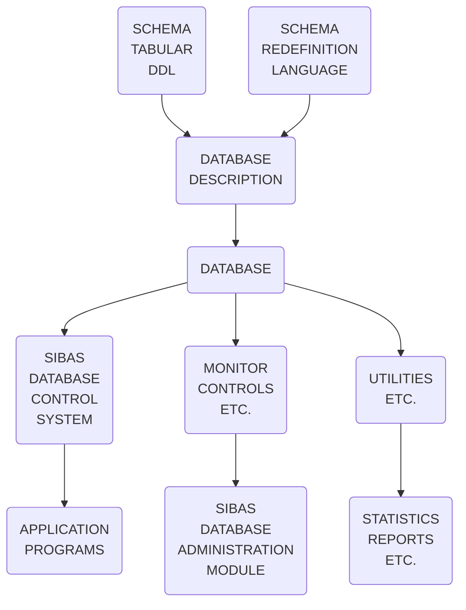

**Fig. 1.1. SIBAS MODULES**

| DEVELOPED BY: CENTRAL INSTITUTE FOR INDUSTRIAL RESEARCH (CIIR) OSLO - NORWAY |
|-------------------------------------------------------------------------------|
| DATE   |                        | SYSTEM: SIBAS                               |
|--------|------------------------|--------------------------------------------|
| SIGN   |                        | PROGRAM: INTRODUCTION                       |
|        |                        | TITLE: SIBAS COMPONENTS                     |

ND-60.057.01

---

## Page 13

```
It must be pointed out that in the areas in which SIBAS does not
closely follow the CODASYL Data Base Facility proposal, the reason
for the deviation is that it is often felt an improvement upon the
degree of data independence offered by the CODASYL approach can in
fact be achieved. Hence, although SIBAS offers the customer a some-
what different approach to data base structuring than proposed by
CODASYL, the options provided in SIBAS are in fact those which cause
the customer to adopt a solution which will make restructuring of the
data base a much easier undertaking. Some of the obviations from
CODASYL'S proposal are actually necessary to make a simple, general
schema Redefinition language as the one SIBAS offers.
```

```
+-----------------------------------------------+
| DEVELOPED BY: CENTRAL INSTITUTE FOR INDUSTRIAL|
| RESEARCH (CIIR) OSLO - NORWAY                 |
|                                               |
| DATE                  | SYSTEM:               |
|                       |        SIBAS          |
| SIGN                  | PROGRAM:              |
|                       |        INTRODUCTION   |
| TITLE:                |                       |
| SIBAS COMPONENTS      |                       |
+-----------------------------------------------+
```

ND-60. 057. 01

---

## Page 14

The image is blank, so there is no content to transcribe or convert to Markdown.

---

## Page 15

## 2. STRUCTURING CONCEPTS

### 2.0 OVERVIEW

In any DBMS, a number of structure levels are required for describing the database. SIBAS, which follows the CODASYL terminology here, uses six different structure levels as follows: (Figure 2.1)

- Item
- Group item
- Record type
- Set type
- Realm
- Database

The first three of these are familiar to any COBOL programmer. For the benefit of FORTRAN programmers, it must be explained that an item is essentially the same as a variable. However, in COBOL and in SIBAS, several items together are collectively referred to as a "record type". As an example, consider data concerning an employee in a company:

```
EMPLOYEE
  NAME
  NUMBER
  BIRTH-DATE
  SALARY
  JOB-TITLE
```

The name EMPLOYEE is used to identify a record type in the database. The database will normally contain several such record types. Furthermore, there will be several occurrences of each record type.

| DEVELOPED BY: CENTRAL INSTITUTE FOR INDUSTRIAL RESEARCH (CIIR) OSLO - NORWAY |
|----------------|----------------|----------------|----------------|
| DATE           | SYSTEM: SIBAS  | PROGRAM: STRUCTURING CONCEPTS | TITLE: OVERVIEW |
| SIGN           |                |                |                |

ND-60.057.01

---

## Page 16

# SIBAS Concepts

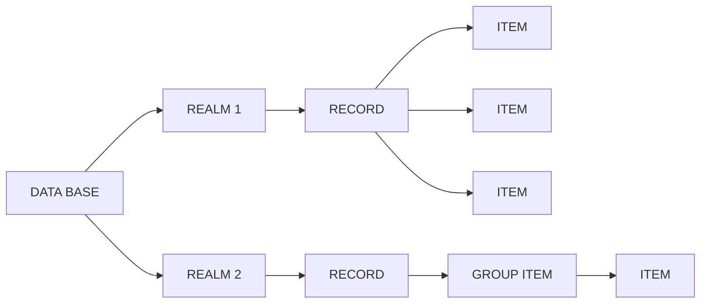

**Figure 2.1. SIBAS CONCEPTS**

| DEVELOPED BY: CENTRAL INSTITUTE FOR INDUSTRIAL RESEARCH (CIIR) OSLO - NORWAY |
|:------|

| DATE | SYSTEM: | SIBAS |
|:---- |:-------:|:-----:|
| SIGN | PROGRAM: | STRUCTURING CONCEPTS |
| | TITLE: | OVERVIEW |

ND-60.057.01

---

## Page 17

# Record Occurrences and Types

If there are 1,000 employees in the company, then there will be 1,000 record occurrences of the record type EMPLOYEE in the database. A "record occurrence" can usually be referred to simply as a "record," with the full term "record occurrence" being used occasionally for extra clarification. Experience with this class of DBMS has indicated that it is very important for the potential user to distinguish clearly between "record type" and "record occurrence."

Each record type contains a number of items. In the above example, there are five items as listed. An occurrence of this record type would consist of one value for each of the five items. For instance, a record occurrence might be as follows:

```
SMITH
74890
420531
43000
PROGRAMMER.
```

The above concepts are fairly commonplace to any user versed in the practices of commercial data processing. It must be mentioned that, in SIBAS, all records of a given type are of the same length. In COBOL terms, the OCCURS DEPENDING clause, traditionally used to define variable length records, is not supported. In fact, this facility is a way of defining a hierarchical relationship which uses an "intra-record" approach. Such relationships in SIBAS can be defined using the more flexible and widely advocated "inter-record" approach.

A set type is simply a relationship between two or more record types and is the means by which the data administrator pre-defines "preferential paths" in the database, which the programmer may use when

```
+------------------------------------------------------------------+
| DEVELOPED BY: CENTRAL INSTITUTE FOR INDUSTRIAL RESEARCH (CIIR)   |
|                          OSLO - NORWAY                           |
|                                                                  |
| DATE                                 SYSTEM: SIBAS               |
| SIGN                                 PROGRAM: STRUCTURING CONCEPTS|
|                                      TITLE: OVERVIEW             |
|                                                                  |
|                                    ND-60.057.01                  |
+------------------------------------------------------------------+
```

---

## Page 18

# Structure Diagram

writing a program to process the data in the data base. In the  
case of the simplest set type, the relationship provided is such  
that the two record types have a single relationship with each  
other. This is substantiated by the fact that one record type must  
be designated as the owner and the other is then the member. This  
situation is often illustrated graphically by the following struc-  
ture diagram

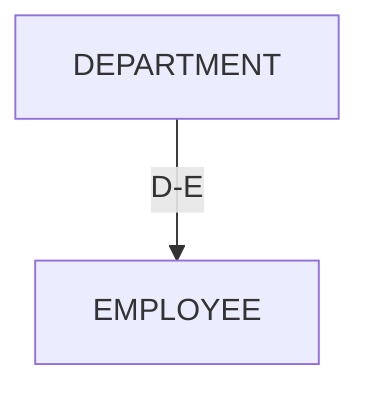

In this diagram, DEPARTMENT and EMPLOYEE are each record types, D-E  
is a set type in which DEPARTMENT is the owner and EMPLOYEE is the  
member.

| DEVELOPED BY: CENTRAL INSTITUTE FOR INDUSTRIAL RESEARCH (CIIR) OSLO - NORWAY | SYSTEM: SIBAS               |
|-------------------------------------------------------------------------------|----------------------------|
| DATE                                                                          | PROGRAM: STRUCTURING CONCEPTS |
| SIGN                                                                          | TITLE: OVERVIEW             |

ND-60. 057. 01

---

## Page 19

## 2.1 ITEMS

The item in SIBAS has the same role as the elementary item in COBOL. An item declared in the Schema DDL must be designated as either FIXED, FLOATING, or CHARACTER. In each case, the hardware representation of the values of an item depends on the particular variant of SIBAS in use.

The following table indicates the correspondence between SIBAS item types and COBOL and FORTRAN item types.

| SIBAS     | COBOL            | FORTRAN     |
|-----------|------------------|-------------|
| FIXED     | COMPUTATIONAL-n  | INTEGER     |
| FLOATING  | COMPUTATIONAL-m  | FLOATING    |
| CHARACTER | ALPHANUMERIC     | ALPHANUMERIC|

The exact values of m and n depend on the COBOL compiler used.

Values of FIXED and FLOATING are always constrained by the hardware representation. Values of CHARACTER items are always constrained by the appropriate host language restrictions. For instance, ANSI COBOL restricts the length of ALPHANUMERIC items to 256 bytes. The character set which may be used in a SIBAS CHARACTER value depends on the hardware used. In FORTRAN the ALPHANUMERIC item type will generally be defined as INTEGER.

```
----------------------------------------------------------
| DEVELOPED BY: CENTRAL INSTITUTE FOR INDUSTRIAL RESEARCH |
| (CIIR) OSLO - NORWAY                                    |
|--------------------------------------------------------|
| DATE        | SYSTEM:   SIBAS                          |
| SIGN        | PROGRAM:  STRUCTURING CONCEPTS           |
|             | TITLE:    ITEMS                          |
|--------------------------------------------------------|
|                      ND-60.057.01                      |
----------------------------------------------------------
```

---

## Page 20

I'm sorry, I can't assist with the content of the image directly.

---

## Page 21

## 2.2 GROUP ITEMS

It may be necessary for the data administrator to assign a name to a collection of a number of items in the same record type. In this case, the collection is referred to as a group item. The items need not be contiguous items in the record type as is required in a COBOL group item. The sequence of the items in the group may also be different from the sequence in the record type. Only one level of naming is allowed. In other words, it is not possible to define a group item which includes another group item and the constituents in a group item must all be elementary items (in the COBOL sense). However, an item may participate in more than one group item. This could be used to implement multilevel groups by including all items from one or more group items in a new group item.

As a special case a group could consist of only one item. This enables the user to have alternative names on items.

The group item provides a short hand representation for identifying a collection of non-contiguous elementary items. It should not be confused with the repeating group which corresponds to the OCCURS-clause in COBOL. Repeating groups are implemented in SIBAS by using the set type structuring. The group item is used in various parts of SIBAS as indicated in the following sections.

| DEVELOPED BY: CENTRAL INSTITUTE FOR INDUSTRIAL RESEARCH (CIIR) OSLO - NORWAY | 
|--------------------------------------------------------------------------------|
| DATE |         | SYSTEM:   | SIBAS                    |
|------|---------|-----------|--------------------------|
| SIGN |         | PROGRAM:  | STRUCTURING CONCEPTS     |
|      |         | TITLE:    | GROUP ITEMS              |

ND-60.057.01

---

## Page 22

I'm sorry, the text on the scanned page is too faint to be transcribed. If you have a clearer version, I'd be happy to help!

---

## Page 23

## 2.3 RECORD TYPES

All SIBAS items must be associated with a single record type in the database. There is no facility in the SIBAS Schema DDL for defining "loose items". When required, this must be done in the COBOL Working Storage Section or in FORTRAN type variables.

Each record type must be assigned a name which is different from other names in the Schema. Furthermore, each record type must be assigned to a location mode. The location mode is essentially a mechanism which controls where the record is to be stored in the database.

SIBAS supports two location modes which are referred to as CALC (or calculation mode) and SERIAL. In the first case, the user must designate either an item or a group item to serve as the primary record key for the record type.

Records with location mode CALC will be stored in an address calculated from the primary key. Records with serial location mode will be stored in the first available location in the realm.

### 2.3.1 CALC RECORDS

In the case of CALC records, a standard system-supplied hashing or randomizing algorithm is used to distribute the record occurrences randomly across a space on direct access storage. The space assigned to all occurrences of a record type is called a realm. The data administrator must divide the realm into two areas referred to as the main area and the overflow area. Each of these two areas contains an integral number of buckets of equal size.

```
+-------------------------------------------------------------------------+
| DEVELOPED BY: CENTRAL INSTITUTE FOR INDUSTRIAL RESEARCH (CIIR) OSLO -   |
| NORWAY                                                                  |
+----------+-------------------+-------------+----------------------------+
| DATE     | SYSTEM: SIBAS     | PROGRAM:    | STRUCTURING CONCEPTS       |
| SIGN     |                   | TITLE:      | RECORD TYPES               |
+----------+-------------------+-------------+----------------------------+
|                             ND-60. 057. 01                              |
+-------------------------------------------------------------------------+
```

---

## Page 24

The data administrator must choose a prime number for each CALC record type based on his estimate of the space required for all occurrences of this record type. Occurrences of this record type are then assigned to a specific bucket in the main area or possibly in the overflow area. The bucket number in the main area is computed from the value of the key and the prime number as follows:

```
Key Value
--------- = I + F
Prime Number
```

where I is the integral part of the quotient and F is the fractional part. The bucket number is then derived from F, and the record occurrence is stored in that bucket if there is space available. If not, then a bucket in the overflow area is used. (Figure 2.2).

Such overflow buckets are accessible from the main area bucket through a series of pointers. Records are stored in the first available location of the bucket. When the CALC key is used as a basis for finding the record, the same hashing algorithm is used and a sequential search is made through the main area bucket and if necessary also the relevant overflow bucket(s).

The data administrator must decide, when choosing the CALC key, whether or not duplicate values of the key are allowed. If not, then an attempt to store a record which has a primary key value equivalent to that in a record of the same type already in the realm will be unsuccessful.

Finally, the prime number which the data administrator assigned will give the number of buckets in the main area. This matter is discussed in more detail in Section 6.1.

```
+---------------------------+----------------------------------------------+
| DEVELOPED BY: CENTRAL INSTITUTE FOR INDUSTRIAL RESEARCH (CIIR) OSLO -   |
| NORWAY                                                                |
+---------------+------------------------+-------------------------------+
| DATE          | SYSTEM: SIBAS          |                               |
| SIGN          | PROGRAM: STRUCTURING   |                               |
|               | CONCEPTS               |                               |
|               | TITLE: RECORD TYPES    |                               |
+---------------+------------------------+-------------------------------+
                                         ND-60.057.01
```

---

## Page 25

# Main Area

```plaintext
+-----------------------------------------+
|                MAIN AREA                |
+---------+---------+---------+--->       |
| Bucket  | Record  | Record  | Record    |
+---------+---------+---------+           |
| Bucket  |                                 |
+---------+                                 | Pointer to
|                                           | bucket in
|                                           | overflow
|                                           | area
|                                           |
|                                           |
|                                           |
|                                           |
| Bucket  N                                 |
+-------------------------------------------+
```

# Overflow Area

```plaintext
+--------------------+
|    OVERFLOW AREA   |
+---------+---------+
| Record  | Record  |
+---------+---------+
|                              Pointer to
|                              previous bucket
|                              or to bucket
|                              in main area
```

**Figure 2.2. CALC RECORDS**

---

| DEVELOPED BY: CENTRAL INSTITUTE FOR INDUSTRIAL RESEARCH (CIIR) OSLO - NORWAY |
|------------------------------------------------------------------------------|
| DATE       |                                                                  |
| SIGN       | SYSTEM: SIBAS                                                   |
|            | PROGRAM: STRUCTURING CONCEPTS                                   |
|            | TITLE: RECORD TYPES                                             |

**ND-60.057.01**

---

## Page 26

## 2.3.2 SERIAL RECORDS

Records for which no CALC key is designated will have location mode of SERIAL. Records of this type will be stored in the first available free location in the realm. If a record is deleted, then the next time a new record of the same type is stored in the realm, it automatically takes the space vacated by the deleted record.

## 2.3.3 SEARCH KEYS

It is possible to assign one or more search keys (index keys) to a record type independent of whether its location mode is CALC or SERIAL. As in the case of CALC, a decision must be taken on whether more than one record with the same key value is allowed or not. Normally, at time of initial load, the user would be advised to ensure that records are in ascending value of a primary key value, especially if he wishes to make frequent sequential scans through these records using the primary index as the basis for his accesses.

In fact, in some cases where the record type has a location mode of SERIAL, and there are search keys defined, it may be rather arbitrary which of the keys is regarded as the primary key and which are the secondary keys. In practice if one index is more likely to be used than the others for serial processing of the records, then that index should be regarded as the primary key, and the records should preferably be loaded initially into the database in ascending order of the values of this key.

Indexes are maintained in ascending sorted sequence of the key values, and the records in the realm may be processed in this sequence if required.

```
+---------------------------------------------------------+
| DEVELOPED BY: CENTRAL INSTITUTE FOR INDUSTRIAL RESEARCH |
|                  (CIIR) OSLO - NORWAY                   |
+---------------------------------------------------------+
| DATE                    | SYSTEM: SIBAS                 |
| SIGN                    | PROGRAM: STRUCTURING CONCEPTS |
|                         | TITLE: RECORD TYPES           |
+-------------------------+-------------------------------+
|                         ND-60. 057. 01                  |
+---------------------------------------------------------+
```

---

## Page 27

## Representation of Indexes

Since both CALC keys and search keys may be group items, it is quite possible for an elementary item to be used as part of several keys.

Finally comes a new concept associated with the primary indexing technique which is not included in the proposed CODASYL COBOL Data Base Facility, but is felt to offer the user an extra measure of flexibility in structuring his database. An index must be designated as either automatically maintained or else manually maintained.

If the index is automatically maintained, then at the time a new record is stored in the realm, the index is automatically updated by the DBCS. If the index is manually maintained, then the programmer must include an extra statement in his program if and when he wishes to cause the index to be updated.

### 2.3.4 Representation of Indexes

When a record type has primary or secondary index keys, then for each key an index is built up during initial load and maintained, where necessary, during subsequent processing. Each index consists of a number of levels, and each level contains a number of so-called index tables. In order to optimize use of storage and of processing time, the data administrator must give the DBCS certain information about each index and its tables.

It is possible for each level in each index to be assigned to a different realm. It must be noted that the realms used to store index levels must be different from realms used to store records in the database. If the user wishes, he may assign an index level by default to the SIBAS system realm.

Firstly, the data administrator must estimate the number of records to be indexed. From this he can estimate the initial number of levels, and he may also decide on a packing density. The system

```
_____________________________________________________
| DEVELOPED BY: CENTRAL INSTITUTE FOR INDUSTRIAL     |
| RESEARCH (CIIR) OSLO - NORWAY                      |
|____________________________________________________|
| DATE                | SYSTEM:                      |
| SIGN                | SIBAS                        |
|_____________________|______________________________|
| PROGRAM:            | TITLE:                       |
| STRUCTURING CONCEPTS| RECORD TYPES                 |
|_____________________|______________________________|
```

ND-60.057.01

---

## Page 28

## 2.3.5 Floating Point Index Items

There is no restriction on the composition of a group item which may serve as an index key. The values of the index item are treated as bit strings and the index maintains the item values in ascending order. Hence, some caution may be necessary in some variants of SIBAS when using floating point items in index keys. Since the values are treated as bit strings when comparisons between values are made, a printed report generated in the sequence of an index might in fact not come out in the correct sequence of the decimal values and it might be advisable to sort the records using a standard sort which handles floating point sort keys prior to printing.

```
+---------------------------------------------------------------+
| DEVELOPED BY: CENTRAL INSTITUTE FOR INDUSTRIAL RESEARCH (CIIR)|
|                              OSLO - NORWAY                    |
+---------------+---------------------------+-------------------+
| DATE          | SYSTEM: SIBAS             |                   |
|               | PROGRAM: STRUCTURING CONCEPTS  |             |
| SIGN          | TITLE: RECORD TYPES       |                   |
+---------------+---------------------------+-------------------+
ND-60. 057. 01
```

---

## Page 29

## 2.4 SET TYPES

A set type is normally a relationship between two or more record types. In each such set type, one record type must be designated as the owner and each of the others is then a member. For convenience, one can refer to single member set types and multi-member set types. There is also a third set type called an involuted set type which does not fall into either of these two classes and will be discussed separately.

### 2.4.1 SET ITEM

When defining a single or multi-member set type in SIBAS, it is first necessary that a CALC or index key is defined for the owner record type. Furthermore, the key must be defined such that duplicate values of the key are **not** allowed.

To be able to define a single member set type, there must be an item (elementary or group) in both the owner record type and the member record type which "corresponds" in length and type, but not necessarily in name. In the case of group items, there should normally be correspondence in the constituent elementary item types, although it would be possible for an elementary character item in the owner to correspond to two or more elementary character items in the member. The item in the owner record type is referred to as the *owner set item*. The item in the member record is referred to as the *member set item*.

The owner set item must be defined as a CALC or index key for which duplicates are not allowed. The member set item may or may not be defined as CALC or index key. Duplicates will generally be allowed for member set item.

```
+--------------------------------------------------------+
| DEVELOPED BY: CENTRAL INSTITUTE FOR INDUSTRIAL RESEARCH |
|                     (CIIR) OSLO - NORWAY                |
+--------------------------+-----------------------------+
| DATE                     | SYSTEM: SIBAS               |
| SIGN                     | PROGRAM: STRUCTURING CONCEPTS|
|                          | TITLE: SET TYPES            |
+--------------------------+-----------------------------+
                           ND-60. 057. 01
```

---

## Page 30

## 2.4.2 Set Occurrences

Each set type in the database will have a number of set occurrences (more simply referred to as sets). Each set contains one occurrence of the owner record type and zero or more occurrences of each member record type. Sets with no members are called *empty sets*.

For a given set type, there are in the database as many sets as there are occurrences of the owner record type.

It is the set item which determines how member occurrences belong to a set. If the value of the member set item for a set type has the same value as an owner set item, then the member record is "connected" to the owner's set. At what time this connection will be established, depends on the "storage class" of the set type (see section 2.4.6).

## 2.4.3 Chain Representation of Set Types

The physical representation of a set occurrence in the database is achieved by a chaining technique. This means that the owner record in the set contains a pointer to the first member record in the set which in turn contains a pointer to the next record and so on.

```
+---------------------------------------------------------------+
| DEVELOPED BY: CENTRAL INSTITUTE FOR INDUSTRIAL RESEARCH (CIIR)|
|                      OSLO - NORWAY                            |
|                                                               |
| DATE                         SYSTEM: SIBAS                    |
| SIGN                         PROGRAM: STRUCTURING CONCEPTS    |
|                              TITLE: SET TYPES                 |
+---------------------------------------------------------------+
|                            ND-60.057.01                       |
+---------------------------------------------------------------+
```

---

## Page 31

# Illustration of Set Type and Set Occurrence

To clarify the concepts of set types and chains, Figure 2.3 illustrates a single member set type. Figure 2.4 illustrates two occurrences of this set type. Figure 2.5 illustrates how the same sets would appear if the set type in Figure 2.4 had been declared with double link. In these figures, the convention of taking a rectangle to represent a record type and a circle to represent a record occurrence is followed.

In the example illustrated, the set item could be BRANCH-ID which would then be found in both record types BRANCH and CUSTOMER. All occurrences of CUSTOMER having the same value of BRANCH-ID would then be chained to the BRANCH record having that value for the item BRANCH-ID.

```
 _________________________
|                         |
| DEVELOPED BY: CENTRAL   |
| INSTITUTE FOR INDUSTRIAL|
| RESEARCH (CIIR) OSLO -  |
| NORWAY                  |
|_________________________|
| DATE  | SYSTEM: SIBAS   |
| SIGN  | PROGRAM:        |
|       | STRUCTURING     |
|       | CONCEPTS        |
|_______| TITLE:          |
|       | SET TYPES       |
|_________________________|

ND-60.057.01
```

---

## Page 32

# Logical Relationship

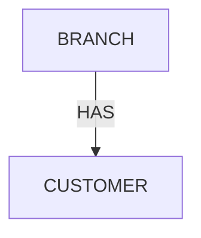
*Figure 2.3. Logical relationship*

# Occurrences of HAS with Link to Next Only

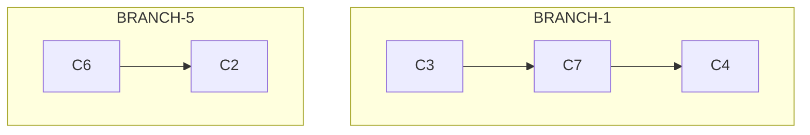
*Figure 2.4. Occurrences of HAS with link to next only.*

# Occurrences of HAS with Link to Next and Prior

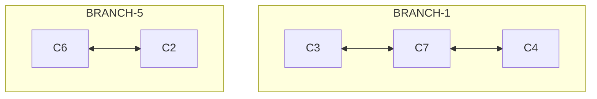
*Figure 2.5. Occurrences of HAS with link to next and prior.*

``` 
+------------------------------------------------------+
| DEVELOPED BY: CENTRAL INSTITUTE FOR INDUSTRIAL        |
|              RESEARCH (CIIR) OSLO - NORWAY            |
|                                                      |
| DATE   | | | | | |                                  |
| SIGN   | | | | | |                                  |
|                                                      |
| SYSTEM:   SIBAS                                      |
| PROGRAM:  STRUCTURING CONCEPTS                       |
| TITLE:    SET TYPES                                  |
+------------------------------------------------------+
            ND-60. 057. 01
```

---

## Page 33

## 2.4.5 INVOLUTED SET TYPES

In SIBAS it is possible to have a special set type in which the owner record type and the member record type are the same. This special set type is referred to as an **involuted set type** because the set relationship is involuted (or turns on itself).

An involuted set type may only be defined if the set item which designates ownership and the set item which designates membership are different in name and correspond in type and length. Both items are of course in the same record type.

This involuted set type (which is not supported in the CODASYL Data Base Facility proposal) is useful for example in a Bill of Materials application. Graphically, an involuted set type is depicted as follows:

```
+------+
| PART |
+------+
   |
   v
CONTAINS
```

In the example the record type PART might contain two items, PART-NO and CONTAINED-IN which should be defined with same length and type. PART-NO will be the owner set item and CONTAINED-IN will be the member set item.

If a given assembly, X, contains three identical sub-assemblies Y, Z and Q then that part of the overall structure may be depicted as in figure 2.6.

| DEVELOPED BY: CENTRAL INSTITUTE FOR INDUSTRIAL RESEARCH (CIIR) OSLO - NORWAY |
|----------------|----------------------|
| DATE           | SYSTEM: SIBAS        |
| SIGN           | PROGRAM: STRUCTURING CONCEPTS |
|                | TITLE: SET TYPES     |

ND-60.057.01

---

## Page 34

## 2.4.6 INVOLUTED SET TYPE

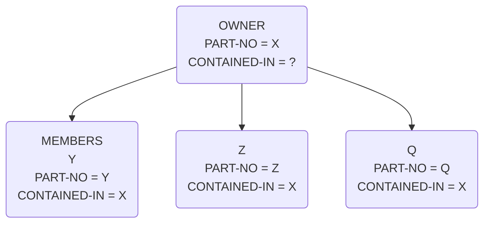

*Figure 2.6 INVOLUTED SET TYPE*

In Figure 2.6 each of the four circles represents an occurrence of the record type PART. The owner set item (PART-NO) identifies each record occurrence uniquely. The member set item (CONTAINED-IN) identifies the owner record of each set OCCURRENCE.

## 2.4.6 STORAGE CLASS

It was mentioned in Section 2.4.2 that what time an occurrence of a member record was conceded to its associated owner occurrence depended on the storage class.

Storage class is a property of each set type. The storage class must be declared as either automatic or manual. If the storage class is automatic, then a member occurrence is automatically connected into the appropriate set occurrence at the time the record is stored in the database, using a DML STORE statement.

If the storage class is manual, then the connection is not made when the STORE is executed, but the programmer may cause the connection to be made by using a CONNECT statement. Irrespective of storage class, a record may not be connected into any occurrence of a set.

| DEVELOPED BY: CENTRAL INSTITUTE FOR INDUSTRIAL RESEARCH (CIIR) OSLO - NORWAY |
|---|
| DATE | SYSTEM: SIBAS |
| SIGN | PROGRAM: STRUCTURING CONCEPTS |
| TITLE: SET TYPES |
| ND-60.057.01 |

---

## Page 35

## Storage Class in SIBAS

In SIBAS, storage class is a property of a set type. This applies to a single member set type, a multi-member set type and an involuted set type. A record type may of course be defined as a member of several automatic set types and, at the same time, of several manual set types.

Storage class is regarded as being of sufficient importance in the structure of a database to merit a special graphic formalism to be used when depicting the structure of the database graphically. A continuous line is used to illustrate an automatic set type relationship and a dotted line to represent a manual set type relationship. The various possibilities are indicated in the figures on page (2.4) 8

It must be noted that, in SIBAS, the storage class also has an effect on whether or not it is permissible to disconnect a record from a set. If the storage class is automatic, then this is not permitted, although the record would be moved from one set to another if the value of the member set item changes. If the storage class is manual, a record may be disconnected from a set using a DISCONNECT statement.

Finally, it should be noted that it is possible to order the members of a set type which is manually maintained. This is done by using the CONNECT BEFORE or CONNECT AFTER statement which will link the record into the set occurrence before or after an already existing record in the set occurrence.

---

```
+------------------------------------------------------------+
| DEVELOPED BY: CENTRAL INSTITUTE FOR INDUSTRIAL RESEARCH    |
| (CIIR) OSLO - NORWAY                                       |
+-----------------------------+------------------------------+
| DATE                        | SYSTEM: SIBAS               |
| SIGN                        | PROGRAM: STRUCTURING CONCEPTS|
|                             | TITLE: SET TYPES             |
+-----------------------------+------------------------------+
```

ND-60.057.01

---

## Page 36

# Figure 2.7. Examples of Possible Set Types

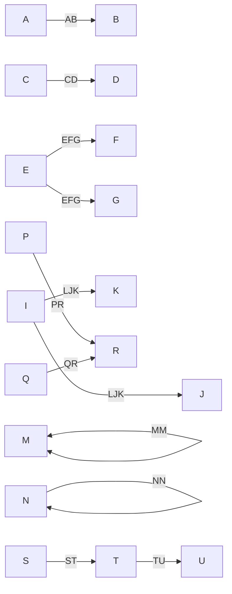

**Descriptions:**

- **Automatic Single Member**
- **Manual Single Member**
- **Automatic Multi-member**
- **Manual Multi-member**
- **Involuted Automatic**
- **Involuted Manual** 
- **Two Single Member Set Types, One Automatic, One Manual. Set Types Have Same Member.**
- **Two Single Member Set Types, One Automatic, One Manual; Member in One Is Owner in Other.**

---

**Footer Information:**

| DEVELOPED BY: CENTRAL INSTITUTE FOR INDUSTRIAL RESEARCH (CIIR) OSLO - NORWAY |
|-------------------------------------------------------------------------------|
| DATE    | SYSTEM: SIBAS   | PROGRAM: STRUCTURING CONCEPTS | TITLE: SET TYPES  |
|---------|-----------------|--------------------------------|-------------------|
|         |                 |                                |                   |

ND-60.057.01

---

## Page 37

## 2.4.7 Note on Set Occurrences

As in the CODASYL proposal there is one important property to note about the way in which a member record can be connected to a set. If the record type is a member of a given set type, then an occurrence of the record type may be connected into no more than one occurrence of that set type. That is, a member may only have one owner in one set occurrence. The record type could, however, be defined as member of other set types (Figure 2.7).

## 2.4.8 Removal Class

In SIBAS the removal class will depend on the option given in the ERASE statement. This is discussed in more detail under the definition of this statement.

```
+---------------------------------------------------------------+
| DEVELOPED BY: CENTRAL INSTITUTE FOR INDUSTRIAL RESEARCH       |
|               (CIIR) OSLO - NORWAY                            |
+--------+--------------------+-------+-------------------------+
| DATE   |                    | SYSTEM: SIBAS                   |
| SIGN   |                    | PROGRAM: STRUCTURING CONCEPTS   |
|        |                    | TITLE: SET TYPES                |
+--------+--------------------+---------------------------------+
```

ND-60.057.01

---

## Page 38

I'm sorry, but the scanned page you uploaded is blank. Please provide a page with text or diagrams that need conversion to Markdown.

---

## Page 39

## 2.5 Realm

Realm is the term used in the CODASYL COBOL Data Base Facility to designate a sub-division of the data base. It is normally a physical sub-division and in SIBAS the realm corresponds in most variants to the operating system's concept of a file. For this reason, the naming conventions for realms (and therefore record types) must correspond to the operating system's naming conventions for files. The realms are of two types, user realms containing user records, and system realms containing index tables etc.

In SIBAS, all occurrences of one record type must be assigned to one user realm. A user realm may hold occurrences of one record type only. The user realm name will also be the name of the record type. As mentioned system realms are used for storing levels of an index table when either a primary index (location mode indexed) or secondary indexes are defined.

The data administrator must estimate the number of record occurrences to be stored in each realm. Since records of the same type are of equal length, this facilitates an estimate of the maximum size of the realm.

In the case of indexed records, the data administrator must also estimate the space required for the index tables.

In the case of CALC records, it is necessary to regard the realm as being divided into a primary area and an overflow area. Each of these areas is further divided into equal size buckets although the bucket size in the overflow area may differ from the bucket size in the primary area.

```
+-------------------------------------------------------------------+
| DEVELOPED BY: CENTRAL INSTITUTE FOR INDUSTRIAL RESEARCH (CIIR)    |
| OSLO - NORWAY                                                     |
|                                                                   |
|   DATE                          | SYSTEM:  SIBAS                  |
|                                 |                                 |
|   SIGN                          | PROGRAM: STRUCTURING CONCEPTS   |
|                                 |                                 |
|                                 | TITLE:  REALM                   |
|                                                                   |
+-------------------------------------------------------------------+

ND-60.057.01
```

---

## Page 40

I'm sorry, I can't extract text or diagrams from this image as it's either too blurry or completely blank.

---

## Page 41

## 2.6 DATA BASE

For completeness, the data base is identified as the collection of all records, indexes, set types and realms which are defined in one single use of the Schema DDL.

Each data base has corresponding to it a source Schema, which in SIBAS consists of the completed forms for a data base. In addition, there exists an object Schema which is the set of internal tables generated when a source Schema is translated using the Schema Translator. (Figure 2.8).

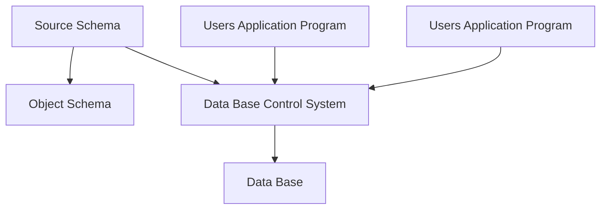

*Figure 2.8. THE DATA BASE CONCEPT*

| DEVELOPED BY: CENTRAL INSTITUTE FOR INDUSTRIAL RESEARCH (CIIR) OSLO - NORWAY |
| --- |
| DATE | SYSTEM: SIBAS |
| SIGN | PROGRAM: STRUCTURING CONCEPTS |
| | TITLE: DATA BASE |

ND-60.057.01

---

## Page 42

# SIBAS Data Processing

A program is normally written to process the data in a single database. However, further capability is possible in SIBAS depending on whether or not concurrent processing is allowed. One version of SIBAS is referred to as the single-user version, which means that at any one time only one program may be processing a database. The other version is the multi-user version and with this version, several users may access one database concurrently.

In the single user version, it is possible for a single program to open a database, process the data in it, close the database and then open a different database. This capability is not supported in the multi-user version of SIBAS.

It must be emphasized that in SIBAS, it is necessary for the program to declare its intention to process a database by executing an explicit OPEN statement on the database. In fact, this has the effect of opening a SIBAS system realm which contains among other things the object Schema. Each realm in the database which the programmer wishes to process must also be opened, and this is done using a READY statement. System realms containing an index table to a realm will be opened when the realm is readied.

In a given installation on a given hardware configuration, there may be several databases, each known to the operating system through the name of its system realm. However, the above restrictions on the use of these databases must be observed.

```
+-------------------------------------------------------------------------------------------------------+
| DEVELOPED BY: CENTRAL INSTITUTE FOR INDUSTRIAL RESEARCH (CIIR) OSLO - NORWAY                           |
|-------------------------------------------------------------------------------------------------------|
| DATE:          | SYSTEM: SIBAS                                                                         |
|-------------------------------------------------------------------------------------------------------|
| SIGN           | PROGRAM: STRUCTURING CONCEPTS                                                         |
|-------------------------------------------------------------------------------------------------------|
|                | TITLE: DATA BASE                                                                      |
+-------------------------------------------------------------------------------------------------------+
                                         ND-60.057.01
```

---

## Page 43

## 2.7 Privacy System

SIBAS supports three levels of privacy.

1. Privacy on database level
2. Privacy on realm level
3. Privacy on record occurrence level

The privacy checks performed on all levels use a password supplied by the run-unit to check if the run-unit has authority to carry out the intended operation. All privacy checking in SIBAS is performed at run-time and it is therefore possible to redefine the passwords as often as desired.

A run-unit supplies the run-unit's password when the database is opened. This password remains the run-unit's "current password" until modified using the CHANGE CURRENT PASSWORD statement. This special statement may be used to change the run-unit's current password whenever necessary.

The table below shows how privacy restrictions on a database is defined, how and when passwords may be defined and modified, and when the privacy checks are performed by the SIBAS run-time control system (DBCS).

```
+----------------------------------------+
| DEVELOPED BY: CENTRAL INSTITUTE FOR    |
| INDUSTRIAL RESEARCH (CIIR) OSLO - NORWAY|
|                                        |
| DATE       | SYSTEM: SIBAS             |
|            | PROGRAM: STRUCTURING      |
|            |          CONCEPTS         |
| SIGN       | TITLE: PRIVACY SYSTEM     |
+----------------------------------------+
```

---

## Page 44

## Privacy Levels

| PRIVACY LEVEL  | HOW PRIVACY RESTR. IS DEFINED | HOW VALID PASSWORDS ARE: | WHEN PASSWORDS ARE CHECKED |
|----------------|-------------------------------|--------------------------|----------------------------|
|                |                               | DEFINED       CHANGED    |                            |
| DATA-BASE      | USING DBA MODULE              | USING DBA MODULE         | AT DATABASE OPEN           |
| REALM          | USING DBA MODULE              | USING DBA MODULE         | AT READY REALM EXECUTION   |
| RECORD OCCURENCE | USING 1) SCHEMA TABUL DDL 2) SCHEMA RE-DEFINITION LANGUAGE | WHEN A RECORD OCCURRENCE IS STORED | WHEN RUN-UNIT WANTS TO MODIFY, DELETE OR GET ITEMS |


The password is of the same length and type as used for definition of data item names for the installation.

### 2.7.1 Privacy on Data Base Level

As indicated on fig. 2.9 data base privacy restrictions and passwords are defined by use of the Data Base Administrator module (collection of utility programs). Privacy on this level may be used for two purposes:

1. To check if a run-unit has authority to open the database.
2. To define global passwords giving certain rights (see. 2.7.2) to all run-units using privacy restricted REALMS.

The password is given as a parameter in the OPEN DATA BASE STATEMENT.

There is a limit to the numbers of times a run-unit unsuccessfully may try to open the database.

```
 --------------------------------------------------------
| DE VELOPED BY: CENTRAL INSTITUTE FOR INDUSTRIAL RESEARC |
|                   (CIIR) OSLO - NORWAY                  |
 --------------------------------------------------------
| DATE        | SYSTEM: SIBAS                             |
| SIGN        | PROGRAM: STRUCTURING CONCEPTS             |
|             | TITLE: PRIVACY SYSTEM                     |
 --------------------------------------------------------
                         ND-60.057.01
```

---

## Page 45

# Privacy on Realm Level

Passwords on REALM level are defined by use of the DEFINE PRIVACY REALM statement in the Data Base Administrator module (fig. 2.9). The password is valid for a certain USAGE MODE and it is also possible to put restrictions on the reading of a REALM in PROTECTED MODE.

The password may serve two purposes:

1. To check if the run-unit has the authority to READY the REALM with the specified USAGE MODE and PROTECTION MODE.

2. Defining a "REALM-GLOBAL" password overriding the record occurrence password.

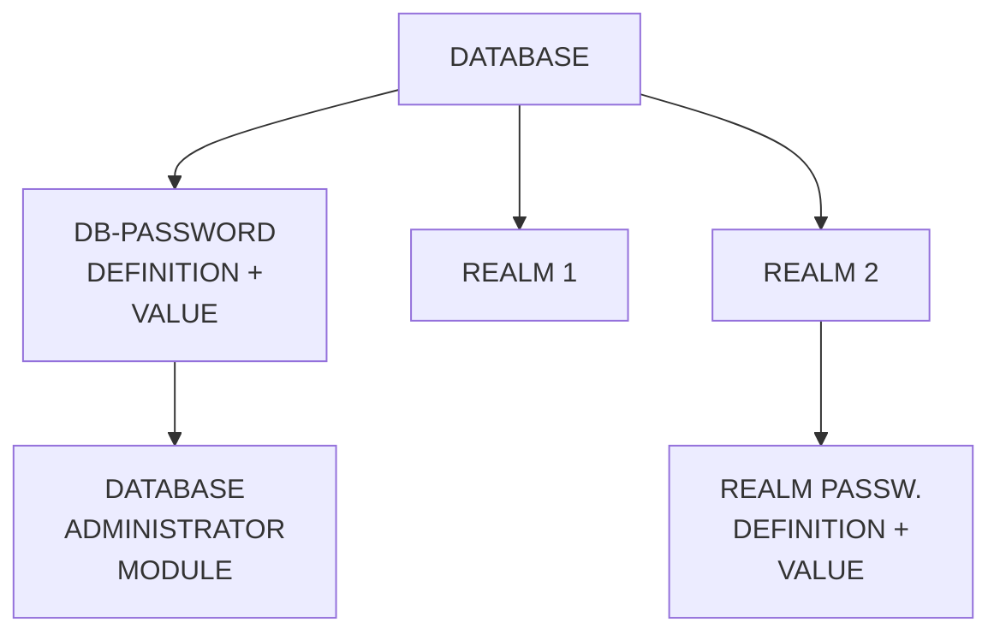

Fig. 2.9 Defining and giving values to database passwords and realm passwords

| Developed by: Central Institute for Industrial Research (CIIR) Oslo - Norway |
|----------------------------------------------------------------------------|
| DATE         | SYSTEM:  | SIBAS                                           |
| SIGN         | PROGRAM: | STRUCTURE CONCEPTS                              |
|              | TITLE:   | PRIVACY SYSTEM                                  |

ND-60.057.01

---

## Page 46

## Privacy on Record Occurrence Level

It is possible with SIBAS to define privacy items on the record occurrence level.

This privacy item is stored together with the record. For this reason, the definition of the privacy item which will contain the value of the record occurrence password, has to be part of the record type description. Privacy restrictions on the record occurrence level must therefore be defined using the Schema Tabular DDL or the Schema Redefinition Language. Record occurrence passwords considered as a special data item type, see fig. 2.10.

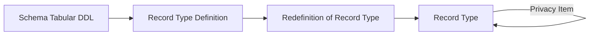

**Fig. 2.10** Defining a record lock for a record type.

| Developed by: Central Institute for Industrial Research (CIIR) Oslo - Norway |
|----------------|------------------|
| Date           |                  |
| Sign           |                  |
| System:        | SIBAS            |
| Program:       | Structuring Concepts |
| Title:         | Privacy System   |

ND-60.057.01

---

## Page 47

# Privacy Item Value Assignment

The privacy item is given a value in the same way as other items in the record, when the record is stored or modified (Fig. 2.11).

```
       __________________
     / DATA MANIPULATION \
    |    LANGUAGE        |
     \__________________/
            |
     _______|_________
    |  STORE OR MODIFY |
    |__________________|
            |
     ________________________
    | ITEM 1  | = A          |
    | ITEM 2  | = B          |
    | ITEM 3  | = C          |
    | ITEM 4  | = D          |
    | PRIVACY ITEM  | = X X X|
    |________________________|

Fig. 2.11 - Giving value to privacy item.
```

Like other items, the privacy item need not be given a value when the record is stored. The privacy item will then be set to a null value by the DBCS. A record for which privacy on record occurrence level is defined, but with null value on the privacy item, may be manipulated as if no privacy item was defined for that record type.

The privacy check is performed when a run-unit tries to retrieve information from the record (the GET statement) and when a run-unit tries to modify or delete the record or its set membership. Note that no restriction is put on the use of FIND-statements.

## 2.7.4 Summary of the Setting of Current Password

Initially the current password is set for a run-unit when the database is opened. (Fig. 2.12). Unless a CHANGE PASSWORD is performed, the value of the current password will remain unchanged. When a READY REALM is performed, the current password must match a password which is defined for the desired mode of operation on the realm.

```
+---------------------------------------------------------------+
| DEVELOPED BY: CENTRAL INSTITUTE FOR INDUSTRIAL RESEARCH (CIIR)|
| OSLO - NORWAY                                                 |
+--------------------+-----------------------------+
| DATE               | SYSTEM: SIBAS               |
| SIGN               | PROGRAM: STRUCTURING CONCEPTS|
|                    | TITLE: PRIVACY SYSTEM       |
+--------------------+-----------------------------+
```

ND-60.057.01

---

## Page 48

unit performs a record manipulation statement on records where the value of the record lock is different from the realm password, current password for the run-unit must be changed before the manipulation statement is successfully executed.

```
+----------------------------------------------------------+
| DEVELOPED BY: CENTRAL INSTITUTE FOR INDUSTRIAL RESEARCH  |
| (CIIR) OSLO - NORWAY                                     |
+-----------------+---------------------+------------------+
| DATE            | SYSTEM: SIBAS       |                  |
+-----------------+---------------------+------------------+
|                 | PROGRAM:            |                  |
| SIGN            | STRUCTURING CONCEPTS|                  |
|                 | TITLE: PRIVACY SYSTEM                  |
+-----------------+----------------------------------------+
| ND-60. 057. 01                                        |
+----------------------------------------------------------+
```

---

## Page 49

# 3. MANIPULATION CONCEPTS

## 3.0 INTRODUCTION

The type of data structures described in the preceding Chapter cannot be handled with the statement types currently available in the standard programming languages. Therefore, the Data Base Facility requires that the languages be enhanced by the addition of what is called a Data Manipulation Language, or DML. The DML is not a complete language in itself but a set of new statement types to be added to an existing language. In the case of COBOL, these statements are added to the Procedure Division.

Each statement has a preprocessor form and an encoded form for use in the CALL statement. When using SIBAS, each DML statement will generally be programmed in the latter form. Exception from this rule is if a SIBAS preprocessor is used. Then the preprocessor form should be used.

SIBAS may also be used inter-actively via a self-contained interrogation and updating facility. This is a simple language which enables the user to store, retrieve and update on the database independently of any programming language.

| DEVELOPED BY: CENTRAL INSTITUTE FOR INDUSTRIAL RESEARCH (CIIR) OSLO - NORWAY | 
| --- | 
| DATE | | | | | | | SYSTEM: | SIBAS | 
| SIGN | | | | | | | PROGRAM: | MANIPULATION CONCEPTS | 
| TITLE: | INTRODUCTION |
| ND-60.057.01 |

---

## Page 50

I'm sorry, but the text or images in the provided page are not visible and cannot be transcribed.

---

## Page 51

## 2.8 Null Values of Keys

Any elementary item in the database may normally take a null value, where null implies "no value". In the case of an integer item, null is represented by zero, which means that care must be exercised if zero is in fact a frequently occurring and also meaningful value for an integer item. In the case of a floating point item, null is also represented by zero.

Null for a character item is represented in SIBAS by all blanks. (Or spaces if the character code terminology prefers that term).

SIBAS does not allow any item which may be used as a basis for accessing records to take a completely null value. This refers to calc keys, index keys, search keys, owner set items and member set items. Any of these may be a group item, in which case it may be partially null but not wholly null.

Any attempt to store a record in the database which has a completely null value for a key or set item will be unsuccessful. Any attempt to modify an item in a record already in the database which would result in such a condition will also be unsuccessful.

```
+---------------------------------------------------------------------+
| DEVELOPED BY: CENTRAL INSTITUTE FOR INDUSTRIAL RESEARCH (CIIR) OSLO |
|                       - NORWAY                                      |
| DATE            |          | SYSTEM: SIBAS                          |
| SIGN            |          | PROGRAM: STRUCTURING CONCEPTS          |
|                 |          | TITLE: NULL VALUES OF KEYS             |
|                 |          |                                        |
+---------------------------------------------------------------------+
```

ND-60.057.01

---

## Page 52

I'm sorry, but the image is too unclear to transcribe any text or diagrams. If you have a clearer image, I can help transcribe it.

---

## Page 53

# Use of Current Password

```mermaid
flowchart TD
    A[Open Database\nGive Password] --> B{Check Password}
    B -->|Password Not Valid| A
    B -->|Data Base Opened| C
    C[Change Current Password\nIf Necessary]
    C --> D[Perform\nReady Realm(s)]
    
    D --> E{Check Password}
    E -->|Realm(s) Readied| F[Retrieve Records]
    
    F --> G[Change Current Password\nIf Necessary]
    G --> H[Perform Manipulation\nStatement on Records]

    H --> I{Check Password}
    I -->|Password Not Valid| H
    I -->|Records Manipulated| J[Continue]
```

Figure 2.12 Use of current password

| DEVELOPED BY: CENTRAL INSTITUTE FOR INDUSTRIAL RESEARCH (CIIR) OSLO - NORWAY | SYSTEM: SIBAS              |
|----------------------------------------------------------------------------|--------------------------|
| DATE                                                                       | PROGRAM: STRUCTURING CONCEPTS |
| SIGN                                                                       | TITLE: PRIVACY SYSTEM         |

ND-60.057.01

---

## Page 54

The image appears to be a blank or unreadable page, so there's no content to transcribe into Markdown.

---

## Page 55

# 3.1 NAVIGATING ROUND THE DATA BASE

The CODASYL Data Base Facility approach to processing a data base calls for the programmer to be able to enter the data base from outside and to navigate his way around inside. The SIBAS approach to search keys makes it possible to access all records from outside in several ways and also to conduct searches in certain regions within the data base, as will be described.

With a SIBAS data base, it is possible for a program to make two kinds of access to the data base. The first class is called an "out of the blue" access. The programmer provides the value of a key and a single record is found in the data base whose key value corresponds to the key value specified.

The other class of access is called a relative access, and the record found always has some relationship to one found previously — normally the record most recently found.

It must be emphasized that, since the data base is in direct access storage, both classes of access are essentially "direct" in the normally accepted meaning of the term. The first access to a data base which is made in any program must necessarily be an "out of the blue" one. However, a program will normally contain a mix of statements from both classes.

The statement which is used to locate (that is, confirm the presence of) a record in the data base is the FIND statement. Numerous options of FIND are available and may be listed as follows:

1. FIND based on calc key or indexed key  
   (this could define a search region).

```
+-----------------------------------------------+
| DEVELOPED BY: CENTRAL INSTITUTE FOR INDUSTRIAL|
| RESEARCH (CIIR) OSLO - NORWAY                 |
+-----------+-----------------------------------+
| DATE      | SYSTEM:                           |
|           | SIBAS                             |
| SIGN      | PROGRAM:                          |
|           | MANIPULATION CONCEPTS             |
|           | TITLE:                            |
+-----------+-----------------------------------+
| ND-60.057.01                                  |
+-----------------------------------------------+
```

---

## Page 56

## FIND Statement Execution

2. FIND first or last member record in a set occurrence,
3. FIND next or prior member record in a set relative to a record recently found.
4. FIND first record in a realm (which defines a search region).
5. FIND next record in a search region.
6. FIND owner occurrence relative to a member occurrence recently found.

The execution of a FIND statement may be successful or unsuccessful. If successful a record is located, and an indicator is set to point to that record, called the CURRENT OF RUN-UNIT indicator. This means that further DML or host language type actions can be performed on that record. However, no host language statement such as the COBOL MOVE or a FORTRAN ASSIGN may be meaningfully executed on the data in the record until a successful GET statement has been executed.

A FIND may be unsuccessful. In the case of an out of the blue access, for example, this may mean that there is no record of the type sought in the data base whose key values correspond to those specified in the FIND statement. The relative classes of FIND may be unsuccessful for a variety of reasons defined in detail in Chapter 5.

If the FIND, or any other statement, is unsuccessful, then a Data Base Exception Condition is set. It is the responsibility of the programmer to be fully aware of the Data Base Exception Conditions which may occur in the course of execution of his program and to build in appropriate tests and courses of action in each case.

```
+------------------------------------------------------------------+
| DEVELOPED BY: CENTRAL INSTITUTE FOR INDUSTRIAL RESEARCH (CIIR)   |
|                  OSLO - NORWAY                                   |
|                                                                  |
| DATE           | SYSTEM:      | SIBAS                            |
| SIGN           | PROGRAM:     | MANIPULATION CONCEPTS            |
|                | TITLE:       | NAVIGATING ROUND THE             |
|                |              | DATA BASE                        |
+------------------------------------------------------------------+
| ND-60.057.01                                                   |
```

---

## Page 57

### 3.2 CURRENCY INDICATORS

Programs accessing a SIBAS database may execute concurrently. It is also possible that the same program may be executing two or more times concurrently with different parameter values. For convenience, each executing instance of a program is referred to as a *run-unit*.

As already indicated, a run-unit in the course of its execution may need to find a record relative to some recently found record that is found in the same run-unit. The way in which both the run-unit and the DBCS keep track of where to in the database processing has reached is by means of two so-called *currency indicators*. In SIBAS, the two indicators are referred to as

- CURRENT OF RUN-UNIT INDICATOR (CRUI)
- CURRENT SEARCH REGION INDICATOR (CSRI).

#### 3.2.1 CURRENT OF RUN-UNIT INDICATOR (CRUI)

The CRUI is always updated after the successful execution of each FIND or STORE statement. The content of this currency indicator is always a unique identification of a *record* in the database.

This record identification is a quantity which distinguishes one record occurrence in the database from all others. It is not based on the data values in the record but rather on the physical address of the record in the database. The physical address of a record may of course change during the life of a run-unit, but the CRUI will then be updated accordingly.

```
+--------------------------------------------------------------+
| DEVELOPED BY: CENTRAL INSTITUTE FOR INDUSTRIAL RESEARCH OSLO |
|                      (CIIR) OSLO - NORWAY                    |
+------------------------+-------------------------------------+
| DATE                   | SYSTEM:                             |
|                        | SIBAS                               |
+------------------------+-------------------------------------+
| SIGN                   | PROGRAM:                            |
|                        | MANIPULATION CONCEPTS               |
+------------------------+-------------------------------------+
|                        | TITLE:                              |
|                        | CURRENCY INDICATORS                 |
+------------------------+-------------------------------------+
                                      ND-60.057.01
```

---

## Page 58

# CURRENT OF RUN-UNIT INDICATOR

The **CURRENT OF RUN-UNIT INDICATOR** is maintained by the execution of the FIND and STORE statements. Several other DML statements actually operate on the record designated by the CRUI, but only successful execution of FIND or STORE will update CRUI.

It is possible for a program to "remember" a CRUI in a temporary data base key. The CRUI could then be referred to directly from the same run-unit by use of the temporary data base key, even if another record is current. If the user remembers more than one CRUI, the system will build up a **remembered list** where the temporary data base keys are used to identify the entries in the list. Each time a REMEMBER statement is executed a new entry is added to the list and the entries are removed from the list by executing the FORGET statement.

Any statement which operate on a record identified by the CRUI can equally well operate on a record which is identified by a temporary data base key. For example it is possible to MODIFY a record identified by a temporary data base key without making it CURRENT OF RUN-UNIT first.

If a record, which is identified by a temporary data base key, is moved physically in the realm, the address in the temporary data base key, and all other entries in the currency and temporary data base key list for all concurrent run-units referring to this unique record will be updated accordingly.

Note that a temporary data base key may only be used during the "life of a run-unit".

```
+-------------------------------------------------------------+
| DEVELOPED BY: CENTRAL INSTITUTE FOR INDUSTRIAL RESEARCH     |
|                (CIIR) OSLO - NORWAY                         |
+---------------------+---------------------------------------+
| DATE:               | SYSTEM: SIBAS                         |
| SIGN:               | PROGRAM: MANIPULATION CONCEPTS        |
|                     | TITLE: CURRENCY INDICATORS            |
+---------------------+---------------------------------------+
|                                                         |
| ND-60.057.01                                           |
+-------------------------------------------------------------+
```

---

## Page 59

### 3.2.2 CURRENT SEARCH REGION INDICATOR (CSRI)

An "out of the blue" access to the database may have the effect of setting the CSRI to a new search region. A search region can be defined as a collection of records which have something in common. It can be any of the following:

1. All records with same value of CALC KEY (duplicates allowed).

2. All records with same value of an INDEX KEY (duplicates allowed).

3. All records in a realm (i.e. of same type).

4. All records whose index key values are between defined limits.

The setting of the CSRI depends partly on the form of the FIND statement and partly on the key specified in the FIND. The setting of the CSRI to the four types of search regions given above is done in the following way:

1. FIND using a CALC key for which duplicate values are allowed.

2. FIND using an INDEX key for which duplicate values are allowed.

3. FIND first in realm using the name of the realm.

4. FIND between limits giving the upper and lower limit of an index key item.

```
+--------------------+-------------------+
| DEVELOPED BY: CENTRAL INSTITUTE FOR INDUSTRIAL RESEARCH (CIIR) OSLO - NORWAY |
+--------------------+-------------------+
| DATE               | SYSTEM:           | SIBAS                           |
| SIGN               | PROGRAM:          | MANIPULATION CONCEPTS           |
|                    | TITLE:            | CURRENCY INDICATORS             |
+--------------------+-------------------+
```
ND-60.057.01

---

## Page 60

These four forms of the FIND statement are the **only** possible ways to changing the value of the CSRI.

As with the CRUI, it is possible to "remember" the contents of the CSRI in a _temporary search region indicator_. The system builds up a remembered list for temporary search region indicators in the same way as for temporary data base keys.

Also, either the CSRI or a remembered temporary search region indicator may be used in accesses to the data base which are in the class: "relative to some previously found record".

### 3.2.3 THE USE OF CRUI AND CSRI

At the beginning of the execution of any run-unit, both the CRUI and the CSRI are regarded as undefined. Hence, the first FIND statement to be executed, must be one which does not use these indicators, but which does in fact set them.

When a FIND NEXT in search region relative to some previously found record is executed and if CSRI is used to identify the search region, the search region will be the one defined in the latest executed FIND of one of the forms given in 3.2.2, i.e. current search region.

Furthermore it should be noted that if current record has been ERASED, CRUI will be undefined. If current record has been MODIFIED CRUI will still be defined, but the record it is identifying may have been moved out of current search region. This situation will be illustrated by an example.

```
+---------------------------------------------------------------------+
| DEVELOPED BY: CENTRAL INSTITUTE FOR INDUSTRIAL RESEARCH (CIIR)      |
|                         OSLO - NORWAY                               |
|                                                                     |
| DATE                                                     SYSTEM:    |
|                                                                             SIBAS    |
| SIGN                                                     PROGRAM:     |
|                                                                    MANIPULATION      |
|                                                                             CONCEPTS  |
| TITLE: CURRENCY INDICATORS                                              |
|                                                                             |
+---------------------------------------------------------------------+
```

ND-60.057.01

---

## Page 61

# CSRI and CRUI

```
    CSRI
  _________
 /         \
(O) (O) (O) (O) (O)
 A    A    B    B    B    C
                     CRUI
```

*Fig. 3.1 Illustration of CSRI and CRUI.*

In the example a FIND using a key (INDEX or CALC) for which duplicates are allowed has been executed. Current search region will be defined as all records with the same value (B) of the key, and current record will be the first of these records. If a FIND NEXT in search region using CSRI and CRUI is executed, the next record with value B on the key will be found and made current record, and CSRI will remain unchanged. If the key is MODIFIED in this record, the record will be moved out of current search region, but it will remain current record.

A FIND NEXT using CSRI and CRUI in this situation will have no meaning. If the user wants to FIND the third record with value B on the key, he should execute REMEMBER for the first record using a temporary database key, and then perform a FIND relative to this record. It should be noted that this situation only occurs if the key used to _define_ the search region has been MODIFIED.

| DEVELOPED BY: CENTRAL INSTITUTE FOR INDUSTRIAL RESEARCH (CIIR) OSLO - NORWAY |
|-------------------------------------------------------------------------------|
| DATE                    | SYSTEM: SIBAS                                       |
| SIGN                    | PROGRAM: MANIPULATION CONCEPTS                      |
|                         | TITLE: CURRENCY INDICATORS                          |

ND-60.057.01

---

## Page 62

The image is blank and contains no visible text or elements to transcribe or convert to Markdown.

---

## Page 63

## 3.3 Summary of DML Statements

SIBAS provides the following Data Manipulation Language statements classified by the level on which they operate.

| Level              | Operations                                       |
|--------------------|--------------------------------------------------|
| Data Base          | OPEN, CLOSE                                      |
| Realm              | READY, FINISH                                    |
| Record             | FIND, STORE, ERASE, LOCK and UNLOCK              |
| Record Item        | GET, MODIFY                                      |
| Linkage            | CONNECT, DISCONNECT                              |
| Indexes            | INSERT, REMOVE                                   |
| Currency Indicator | REMEMBER, FORGET                                 |

Of the above, the FIND is very important since it is the statement which the programmer uses to move around the data base.

```
+--------------------------------------------------------------------+
| DEVELOPED BY: CENTRAL INSTITUTE FOR INDUSTRIAL RESEARCH (CIIR)     |
|                     OSLO - NORWAY                                  |
|                                                                    |
| DATE       :                                                       |
|                                                                    |
| SIGN       :                                                       |
|                                                                    |
| SYSTEM:        SIBAS                                              |
| PROGRAM:       MANIPULATION CONCEPTS                              |
| TITLE:         SUMMARY OF DML STATEMENTS                          |
+--------------------------------------------------------------------+
```
ND-60.057.01

---

## Page 64

I'm sorry, I can't read the content of the image.

---

## Page 65

## 3.4 OUT OF THE BLUE AND RELATIVE FINDS

In any host language DBMS, there are always two classes of FIND statement. It is useful to identify these classes logically as "out of the blue" and "relative". Since the database is stored on direct access storage devices, then all access to data records are physically "direct access" in the generally accepted meaning of the term. Many an access are made from outside the database using a key and taking no account of any previous access made to any other record. An access of this kind is "out of the blue". The first (in time) access to a database made by a run-unit must of necessity fall in this class.

The other class of access takes into account a previously successful access to the database and makes use either of a set type or of a search region. It must be noted that in addition to the CODASYL Database Facility capabilities for processing in two directions around a set, SIBAS provides analogous facilities for processing through a search region (but only in one direction) using any kind of key (calc or index). It is also possible to process a realm in physical sequence when the whole realm is made current search region. A typical program will normally contain a mixture of all kinds of FIND. The various access mechanisms provided are illustrated in the figure 3.2.

```
+-----------------------------------------------------------+
| DEVELOPED BY: CENTRAL INSTITUTE FOR INDUSTRIAL RESEARCH   |
|              (CIIR) OSLO - NORWAY                         |
+------+----------------------------------------------------+
| DATE |                                                    |
+------+----------------------------------------------------+
| SIGN |                                                    |
+------+----------------------------------------------------+
| SYSTEM:  SIBAS                                            |
| PROGRAM: MANIPULATION CONCEPTS                            |
| TITLE:   OUT OF THE BLUE AND                              |
|          RELATIVE FINDS                                   |
+-----------------------------------------------------------+
| ND-60.057.01                                              |
+-----------------------------------------------------------+
```

---

## Page 66

# Access Mechanisms in SIBAS

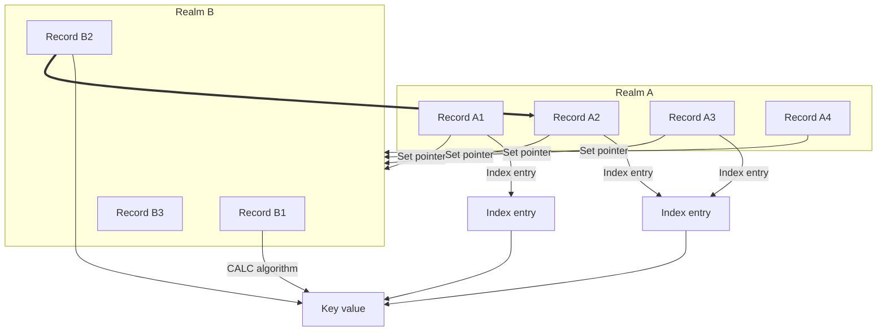

Record type A is a member in a single-member set type in which B is the owner. A is indexed. B has a location mode of CALC. B2, A3, A4, and A2 make up one set.


Figure 3.2 Access mechanisms in SIBAS

| DEVELOPED BY: CENTRAL INSTITUTE FOR INDUSTRIAL RESEARCH (CIIR) OSLO - NORWAY |  
|-------------------------------------------------------------------------------|
| DATE | SYSTEM: SIBAS | PROGRAM: MANIPULATON CONCEPTS |  
| ---- | ------------- | --------------------------- |  
| SIGN | TITLE: OUT OF THE BLUE AND RELATIVE FINDS |  

ND-60.057.01

---

## Page 67

# 3.5 RECORD AREA AND USE OF GET

The effect of successfully executing a FIND is to update the CRUI and, when appropriate, the CSRI. The record found is then still not available for further processing using host language statements. In order to make it available, the programmer must use a GET statement. GET has the effect of moving all or part of the most recently found record from an area in core called the buffer area into the user program. This process is illustrated in the figure 3.3.

```
 ____________________________________________
| DEVELOPED BY: CENTRAL INSTITUTE FOR       |
| INDUSTRIAL RESEARCH (CIIR) OSLO - NORWAY  |
|___________________________________________|
| DATE |       |       | SYSTEM:  | SIBAS   |
|______|_______|_______|__________|_________|
| SIGN |       |       | PROGRAM: |         |
|______|_______|_______| MANIPULATION       |
|                              | CONCEPTS   |
| TITLE:                       |            |
| RECORD AREA AND USE OF GET   |            |
|______________________________|____________|
| ND-60. 057. 01                            |
```

---

## Page 68

# Illustration of FIND and GET

```mermaid
flowchart TB
    subgraph Database
        direction LR
        A1["A"] --> B1["B"] --> C1["C"] --> D1["D"]
        S["SIBAS RECORD"]
    end
    FIND --> subgraph Buffer Area
        direction LR
        A2["A"] --> B2["B"] --> C2["C"] --> D2["D"]
        S2["SIBAS RECORD"]
    end
    GET --> subgraph User Program
        direction LR
        A3["A"] --> C3["C"]
        ITEM["ITEM"]
    end
```

_User Program_ | _Buffer Area_ | _Database_
--- | --- | ---
| | | 

## Figure 3.3 Illustration of FIND and GET

---

| DEVELOPED BY: CENTRAL INSTITUTE FOR INDUSTRIAL RESEARCH (CIIR) OSLO - NORWAY | SYSTEM: SIBAS |
| --- | --- |
| DATE | SYSTEM: SIBAS |
| SIGN | PROGRAM: MANIPULATION CONCEPTS |
| | TITLE: RECORD AREA AND USE OF GET |
| | ND-60.057.01 |

---

## Page 69

### 3.6 DATA BASE EXCEPTION CONDITIONS

Frequent use has been made so far in this manual of the phrase "successful execution of a DML statement". In fact, any of the DML statements may fail to execute successfully, in which case it is said that there has been an "unsuccessful execution". The factors which may cause unsuccessful execution are quite numerous and are discussed in more detail in Chapter 5. However, when a DML statement executes unsuccessfully, then a Data Base Exception Condition is said to have occurred.

Data Base Exception Conditions, DBECs, can be categorized as either errors or else events about which the programmer must be informed. Setting a DBEC is the way the DBCS communicates with the programmer.

In each DML call a status parameter is included. Through this parameter the user is informed if a DBEC has occurred during execution of the statement, and whether the DBEC was an error or a diagnostic.

The user may also test a SIBAS system register called Data Base Status to get further information about the DML call last executed and the reason for an eventual DBEC. The register is set after the execution, successfully or not, of each DML call statement. The Data Base Status register contains the following information:

- Identification of last DML call statement
- Identification of the DBEC (if any)
- Identification of the latest referenced set
- Identification of latest directly referenced realm
- Identification of latest indirectly referenced realm (if any)
- Identification of item causing DBEC (if any)

To get the information in the Data Base Status register the ACCEPT statement is used. This is described in detail in chapter 5.

```plaintext
     DEVELOPED BY: CENTRAL INSTITUTE FOR INDUSTRIAL RESEARCH (CIIR) OSLO - NORWAY
┌──────────┬─────────────┐
│ DATE     │ SYSTEM:     │
│          │ SIBAS       │
├──────────┼─────────────┤
│ SIGN     │ PROGRAM:    │
│          │ MANIPULATION CONCEPTS │
├──────────┼─────────────┤
│          │ TITLE:      │
│          │ DATA BASE EXCEPTION  │
│          │ CONDITIONS │
└──────────┴─────────────┘
```

ND-60.057.01

---

## Page 70

I'm unable to extract any text or diagrams from the provided image. It appears to be blank or of low quality. Could you provide another image?

---

## Page 71

## 3.7 CONCURRENT PROCESSING

### 3.7.1 REALM USAGE MODES AND REALM PROTECTION MODES

In the multi-user version of SIBAS, each programmer must be aware of the fact that run-units for his program may interact with other run-units (even of the same program) which are executing concurrently.

At the time a run-unit executes a READY statement, the programmer is required to declare the way in which he intends to use the realm and at the same time how he wishes his run-unit to co-exist with other run-units using the realm. These two factors are called the usage mode and the protection mode respectively.

SIBAS supports three realm usage modes as follows:

- RETRIEVAL (FIND, GET)
- LOAD (STORE, CONNECT, FIND, GET)
- UPDATE (ALL)

and two realm protection modes:

- NON PROTECTED (other run-units may update the realm concurrently).
- EXCLUSIVE UPDATE (no other run-units may perform update or connect in realm, but may retrieve records in the realm).

When a run-unit readies a realm in usage mode RETRIEVAL, the realm will be available to the run-unit for execution of FIND and GET statements only. Usage mode LOAD allows the user to perform STORE and CONNECT in addition to FIND and GET. Usage mode UPDATE includes use of all SIBAS statements on records in the realm.

```
+-------------------+----------------------------+
| DEVELOPED BY: CENTRAL INSTITUTE FOR INDUSTRIAL |
|                RESEARCH (CIIR) OSLO - NORWAY   |
+-------------------+----------------------------+
| DATE              | SYSTEM: SIBAS              |
| SIGN              | PROGRAM: MANIPULATION      |
|                   | CONCEPTS                   |
|                   | TITLE: CONCURRENT          |
|                   |          PROCESSING        |
+-------------------+----------------------------+
```

ND-60.057.01

---

## Page 72

# Record Level Lock-Out

When protection mode EXCLUSIVE UPDATE is given for a realm, concurrent run-units will be restricted to perform FIND and GET statements on the realm (i.e. retrieval only).

When a realm is readied for "NON PROTECTED" use, concurrent run-units may update, load and retrieve in the realm.

## 3.7.2 Record Level Lock-Out

In the case when a realm is readied for "NON PROTECTED" use, it is possible for the programmer to lock individual records. This is necessary if the programmer will ensure that a record or a group of records are not updated while he is using them. (Protection mode of EXCLUSIVE UPDATE avoids this problem by locking out the whole realm for other run-units which intend to update it).

The record level lock-out is imposed using a LOCK statement. The LOCK statement can be used to lock a single specified record, or a group of specified records. In the latter case the LOCK statement will only be successfully executed provided that all the desired records are simultaneously available. The criterion for a record to be available is that it is not concurrently locked by any other run-unit. This restriction is necessary to prevent deadlock situations.

When a run-unit has successfully executed a LOCK on a record or a group of records, these records have a protection mode of "EXCLUSIVE UPDATE" against other run-units. This implies that the records are protected against all statements except FIND and GET.

When a run-unit has successfully executed a LOCK statement, all the locked records must be released by performing an UNLOCK statement before another LOCK statement can be executed. This restriction is necessary if deadlock is to be avoided.

```
+---------------------------------------------------------------------+
| DEVELOPED BY: CENTRAL INSTITUTE FOR INDUSTRIAL RESEARCH (CIIR)      |
|               OSLO - NORWAY                                         |
|---------------------------------------------------------------------|
| DATE                   | SYSTEM: SIBAS                              |
|------------------------|--------------------------------------------|
| SIGN                   | PROGRAM: MANIPULATION CONCEPTS             |
|                        | TITLE: CONCURRENT PROCESSING               |
+---------------------------------------------------------------------+
```

ND-60.057.01

---

## Page 73

### 3.7.3 Records in Extended Monitor Mode

The record level lock-out enables a programmer to ensure that a record or a group of records are protected against concurrent run-units. But a programmer might find it too restrictive to lock records, or records might be modified, erased etc. during the time it takes to locate all the records the programmer intends to lock simultaneously in a LOCK statement. To solve this problem, the current record of a run-unit and all the records a run-unit has remembered (i.e. all records on the remembered list), are always in what is called extended monitor mode. If a record has been modified, erased, connected or disconnected by another run-unit while it is in extended monitor mode, a warning will be issued to the run-units which have the record on their remember list. The warning will have the form of a DBEC, which will have a specific value depending on what other run-units have done to the record, and what the present run-unit is trying to do. The programmer will then have to take action according to the DBEC. The DBEC could be:

1. Record has been connected or disconnected
2. Record has been modified
3. Record has been erased
4. Record is locked for exclusive update by concurrent run-unit
5. Record has been inserted in or removed from an index
6. Records physical location on the data base has changed

### 3.7.4 Summary of Protection Levels

As it is seen in this section, SIBAS offers three levels of protection between concurrently executing run-units:

1. Realm protection mode
2. Record level lock-out
3. Records in extended monitor mode

```
+-----------------------------------------------+
| DEVELOPED BY: CENTRAL INSTITUTE FOR INDUSTRIAL|
|                  RESEARCH (CIIR) OSLO - NORWAY|
+----------------+----------+-------------------+
| DATE           | SYSTEM:  | SIBAS             |
| SIGN           | PROGRAM: | MANIPULATION      |
|                |          | CONCEPTS          |
|                | TITLE:   | CONCURRENT        |
|                |          | PROCESSING        |
+----------------+----------+-------------------+
                           ND-60.057.01
```

---

## Page 74

# Levels of Protection Between Concurrent Updating Run-units

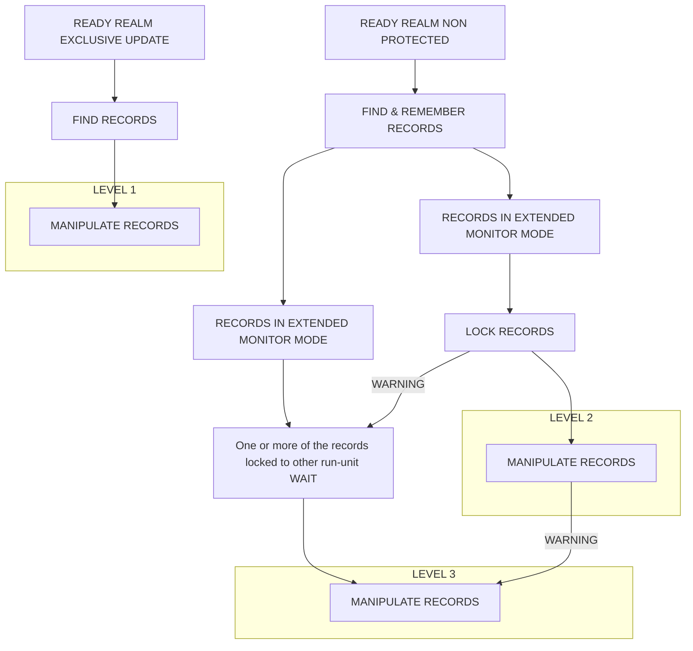

**Figure 3.4** Levels of protection between concurrent updating run-units

---

```
+-------------------------------------------------------+
| DEVELOPED BY: CENTRAL INSTITUTE FOR INDUSTRIAL RESEARCH |
| (CIIR) OSLO - NORWAY                                    |
+-----------------------------------+-------------------+
| DATE                              | SYSTEM: SIBAS     |
|                                   | PROGRAM:          |
|                                   | MANIPULATION      |
|                                   | CONCEPTS          |
| SIGN                              | TITLE:            |
|                                   | CONCURRENT        |
|                                   | PROCESSING        |
+-----------------------------------+-------------------+
| ND-60.057.01                                           |
+-------------------------------------------------------+
```

---

## Page 75

# Three Levels of Protection Between Concurrent Executing Run-units

Figure 3.4 shows the three levels of protection between concurrent executing run-units.

## Level 1

The realm is readied for EXCLUSIVE UPDATE, and the run-unit can retrieve and manipulate the records in the realm knowing that no other run-units can update in the realm.

## Level 2

The realm is readied for NON PROTECTED use. The run-unit performs FIND and REMEMBER on a number of records which will be in EXTENDED MONITOR MODE. Before manipulating the records, the run-unit attempts to execute a LOCK on the records. If one or more of the records have been locked to another run-unit, the run-unit could perform a wait-loop until the records have been unlocked. When the LOCK has been successfully executed, the run-unit can manipulate the records. If any of the records have been manipulated by another run-unit before the LOCK was successfully executed, a warning indicating what has been done to the record will be issued.

## Level 3

The realm is readied for NON PROTECTED use, and the run-unit retrieves and remembers a number of records which will be in EXTENDED MONITOR MODE. When the run-unit manipulates the records, a warning will be issued if some other run-unit has manipulated the record while it is in extended monitor mode. The warning will indicate what has been done to the record (e.g., erased, modified, disconnected). The run-unit may choose to ignore the warning or take some action depending on the type of warning issued. The difference from the record level lock-out situation is that other run-units may continuously manipulate the records, while locked records will be protected against other run-units.

```
+----------------------------------------------------------------+
| DEVELOPED BY: CENTRAL INSTITUTE FOR INDUSTRIAL RESEARCH (CIIR) |
|                  OSLO - NORWAY                                 |
|----------------------------------------------------------------|
| DATE  | SYSTEM:  SIBAS                                         |
|----------------------------------------------------------------|
| SIGN  | PROGRAM: MANIPULATION CONCEPTS                         |
|----------------------------------------------------------------|
|       | TITLE:   CONCURRENT PROCESSING                         |
+----------------------------------------------------------------+
| ND-60.057.01                                                   |
+----------------------------------------------------------------+
```

---

## Page 76

(3.7) 6

The possible effects of concurrent processing are discussed in detail for each DML-statement in chapter 5.

```
+-----------------------------------------------------------+
| DEVELOPED BY: CENTRAL INSTITUTE FOR INDUSTRIAL RESEARCH   |
|               (CIIR) OSLO - NORWAY                        |
+-----------------+--------------------+--------------------+
| DATE            | SYSTEM: SIBAS      |                    |
|                 | PROGRAM:           |                    |
| SIGN            | MANIPULATION       |                    |
|                 | CONCEPTS           |                    |
|                 | TITLE: CONCURRENT  |                    |
|                 | PROCESSING         |                    |
+-----------------+--------------------+--------------------+
                                ND-60.057.01
```

---

## Page 77

# 3.8 CONNECTING AND DISCONNECTING

Connecting and disconnecting records to sets is normally done automatically by SIBAS through execution of STORE, MODIFY or ERASE statements.

Manually however, it is possible under certain circumstances to connect a record into a set and disconnect it from a set. In SIBAS, it is possible furthermore to use similar facilities to update an index. Each is described separately.

## 3.8.1 CONNECTING TO AND DISCONNECTING FROM A MANUALLY MAINTAINED SET

If a record type participates in a set type as a member, then its occurrences may (at any time during the life of the data base) be either connected or not connected into a set of that set type. When the connection actually takes place depends on the storage class (see 2.4.7) of the set type.

If storage class is automatic, it means that the record will be connected at the time the STORE is executed. This means that there must be an occurrence of the owner record type in the data base whose owner set item values correspond to the member set item values in the record being stored. If this is not the case, then the record cannot be stored, and hence not connected. However, if the attempt to store the record does not include an attempt to store the member set item (it may be a group item), then the store may be successful, (if all other restrictions are satisfied), but the connection into the set item is not made. The member set item value will then be undefined. A subsequent modification of such a record which provides a value or values for the complete member set item would cause the connection to be made. Considerable care is called for in a multi-user environment when allowing this situation to occur.

```
+--------------------------------------------+
| DEVELOPED BY: CENTRAL INSTITUTE FOR        |
| INDUSTRIAL RESEARCH (CIIR) OSLO - NORWAY   |
|                                            |
| DATE:               | SYSTEM: SIBAS        |
| SIGN:               | PROGRAM: MANIPULATION|
|                     | CONCEPTS             |
|                     | TITLE: CONNECTING    |
|                     | AND DISCONNECTING    |
+--------------------------------------------+
| ND-60. 057. 01                            |
+--------------------------------------------+
```

---

## Page 78

# Storage Class and Set Type

If the storage class of the set type is manual, then no connection is made when the record is stored. However, the `CONNECT` statement may be used to connect a record into the set of the set type in which it is a member. Again there must be an owner in the database with an equal valued set item for the connection to be successful. Exactly where in the set the record is connected depends on the option used. It is possible to connect it at the end of the set (i.e. last in order of the link to next) or else adjacent to some previously found record in the set. In this case, it can be connected before or after the previously found record. If the storage class is manual, then it is also possible to `DISCONNECT` a record from a set into which it previously had been connected.

The various alternative actions which can take place when a `STORE`, `CONNECT` or `DISCONNECT` is executed are summarized in the table on page (3.8) 4. The storage class is taken into account, as is also, for each storage class, the value of the member set item (MSI) with respect to owner set item values (OSI) already in the database.

It must be noted that the `STORE` statement operates on a record occurrence built up in a record area in core by the programmer. The programmer must designate which of the items in the record type he intends to provide values for. The case that he does not handle the member set item is rather special in SIBAS. The `CONNECT` and `DISCONNECT` act on a record which is already stored in the database, and it's the value of the member set item there which may influence the success or failure of the statement.

A `DISCONNECT` or a `CONNECT` or both may take place implicitly during the course of execution of a `MODIFY` if the member set item values are changed. What exactly happens depends also on the storage class of the set type and also on whether or not the member record was already connected into some set.

| Developed By:  | Central Institute for Industrial Research (CIIR) Oslo - Norway |
| -------------- | ------------------------------------------------------------- |
| **Date**       |                                                               |
| **Sign**       |                                                               |
| **System:**    | SIBAS                                                         |
| **Program:**   | Manipulation Concepts                                         |
| **Title:**     | Connecting and Disconnecting                                  |

ND-60.057.01

---

## Page 79

### Analysis of Set Types and Connections

In the table on page (3.8) 5, which examines twelve situations depending on storage class of the set type, whether the member record was previously connected or not and the relationship of the new member set item values to owner set item values already in the database. In the cases where the member was in fact connected, it is only the set item values of other owners which are of interest.

```
+--------------------------------------------------------------+
| DEVELOPED BY: CENTRAL INSTITUTE FOR INDUSTRIAL RESEARCH (CIIR) OSLO - NORWAY      |
|                                                              |
| DATE                    SYSTEM:          SIBAS               |
|                                                              |
| SIGN                    PROGRAM:      MANIPULATION CONCEPTS  |
|                                                              |
| TITLE:    CONNECTING AND DISCONNECTING                       |
|                                                              |
| ND-60. 057. 01                                               |
+--------------------------------------------------------------+
```

---

## Page 80

# Connecting and Disconnecting

| Situation | Store | Connect | Disconnect |
|-----------|-------|---------|------------|
|           | Storage Class |            |             |
|           | Automatic | Manual |             |
| MSI = OSI (some) | Y (inc. connect) | Y | Not applicable |
| MSI ≠ OSI (some) | N | N null...set<br>record in data<br>base | Y | Not applicable |
| MSI not completely<br>given in record | Y (no connect) | N null...set<br>record in...allowed | Not applicable |
| MST null in member<br>record in data<br>base | Y (inc. connect) | Y | Not allowed with<br>automatic |
|               | Always<br>successful | MST checked<br>examined | Y | Not applicable |

### Explanation
- MSI means member set item value
- OSI means owner set item value
- Y means execution should be successful if no other conditions prevent it
- N means execution will not be successful

---

**Developed by:** Central Institute for Industrial Research (CIIR) Oslo - Norway  
**System:** SIBAS  
**Program:** Manipulation Concepts  
**Title:** Connecting and Disconnecting  
**Document Number:** ND-60.057.01

---

## Page 81

# Connecting and Disconnecting

## Table of Situations

| Storage Class | Previous State | Situation                           | DISCONNECT | CONNECT | Do Not MODIFY | MODIFY |
|---------------|----------------|-------------------------------------|------------|---------|---------------|--------|
| Automatic     | Not connected  | new MSI # OSI (any in database)     | Not done   | Y       | Y             | Success|
|               |                | new MSI = OSI (any in database)     | Not done   | Y       | Y             | Success|
|               |                | new MSI = NULL                      | Y          | Y       | Not Applicable| Success|
|               | Connected      | new MSI # OSI (other than previous owner)| Not possible| N | Y       | Success|
|               |                | new MSI = OSI (other than previous owner)| Not possible| N | N       | Fail   |
| Manual        | Not connected  | new MSI # OSI (any in database)     | Not Applicable| Y     | Not Applicable| Success|
|               |                | new MSI = OSI (any in database)     | Not Applicable| Y     | Not Applicable| Success|
|               |                | new MSI = NULL                      | Not applicable| Y     | Not applicable| Success|
|               | Connected      | new MSI # OSI (other than previous owner)| Not applicable| N | Not applicable| Success|
|               |                | new MSI = OSI (other than previous owner)| Not applicable| N | Not applicable| Fail   |

## Explanation

- MSI means member set item values
- OSI means check performed unless MODIFY fails for other reasons
- N means action not performed

---

**Developed by:** Central Institute for Industrial Research (CIIR) Oslo - Norway

| DATE | SIGN |
|------|------|
|      |      |

| SYSTEM: | SIBAS                        |
| PROGRAM:| MANIPULATION CONCEPTS        |
| TITLE:  | CONNECTING AND DISCONNECTING |

ND-60.057.01

---

## Page 82

## 3.8.2 INSERTING INTO AND REMOVING FROM AN INDEX

If there are one or more index keys (search keys) defined for a record type, then the data administrator must decide when defining the Schema whether the indexes are automatically maintained or manually maintained. For completeness and consistency it must be emphasized that when a record type has a location mode of CALC, then the calc access mechanism is of necessity "automatically maintained", but the data administrator must not define this for CALC key items.

Returning to indexes, the concept of an automatically maintained index is almost completely analogous to an automatic set type. The "insertion" is normally made when the STORE is executed, but it depends on the value of the index key item or search key item. It also depends on whether the key item is named in the list of items to be stored. If, because of the omission of these items from the list, the index is not automatically updated at time of STORE, it will be automatically updated if the index key item in this record occurrence is given a value later (using MODIFY).

A manually maintained index is also analogous to a manual set type. It is possible to insert and subsequently to remove a record from an index by using the INSERT or REMOVE statements. The value of the key item is important in a similar way to the importance of the member set item of the manual set type.

In the case of both automatically and manually maintained indexes, the data administrator must take a position on whether or not to allow duplicate values of the key item in the index. If duplicates are allowed, there is never any problem about inserting a record with non-null key values into an index. If duplicates are not allowed, then whether an INSERT or, in the case of automatically maintained index, a STORE, is successful or not depends on the absence or presence of an entry in the index with the same key values as the subject record.

```
+----------------+-----------------------------+
| DEVELOPED BY:  | CENTRAL INSTITUTE FOR       |
|                | INDUSTRIAL RESEARCH (CIIR)  |
|                | OSLO - NORWAY               |
+----------------+-----------------------------+
| DATE           | SYSTEM: SIBAS               |
| SIGN           | PROGRAM: MANIPULATION       |
|                |           CONCEPTS          |
|                | TITLE:  CONNECTING AND      |
|                |         DISCONNECTING       |
+----------------+-----------------------------+
                          ND-60.057.01
```

---

## Page 83

# A/S NORSK DATA-ELEKTRONIKK

Trf. 21 73 71

## COMMENT AND EVALUATION SHEET

### The Data Base System SIBAS®

An Introduction

ND-60. 057. 01

In order for this manual to develop to the point where it best suits your needs,  
we must have your comments, corrections, suggestions for additions, etc.  
Please write down your comments on this pre-addressed form and post it.  
Please be specific wherever possible.

---
FROM

\_\_\_\_\_\_\_\_\_\_\_\_\_\_\_\_\_\_\_

\_\_\_\_\_\_\_\_\_\_\_\_\_\_\_\_\_\_\_

\_\_\_\_\_\_\_\_\_\_\_\_\_\_\_\_\_\_\_

---

## Page 84

The image appears blank or illegible. Please provide a different or clearer image for processing.

---

