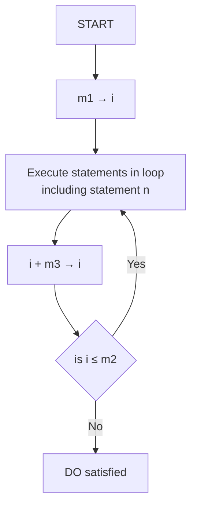

## Page 1

# NORD-10 FORTRAN SYSTEM
### Reference Manual

## NORSK DATA A.S

```
       .  .  .  .  .  .  .  .  .  .  .  . 
       .  .  .  .  .  .  .  .  .  .  .  . 
       .  .  .  N  N  N  N  .  .  .  .  . 
       .  .  N  N  N  N  N  N  .  .  .  . 
       .  N  N  N  N  N  N  N  N  .  .  . 
       .  N  N  .  .  .  .  N  N  .  .  . 
       .  N  N  .  .  .  .  N  N  .  .  . 
       .  N  N  .  .  .  .  N  N  .  .  . 
       .  N  N  N  N  N  N  N  N  .  .  . 
       .  N  N  N  N  N  N  N  N  .  .  . 
       .  N  N  .  .  .  .  N  N  .  .  . 
       .  N  N  .  .  .  .  N  N  .  .  . 
       .  N  N  .  .  .  .  N  N  .  .  . 
       .  .  N  N  N  N  N  N  .  .  .  . 
       .  .  .  N  N  N  N  .  .  .  .  . 
       .  .  .  .  .  .  .  .  .  .  .  . 
       .  .  .  R  R  R  R  .  .  .  .  . 
       .  .  R  R  R  R  R  R  .  .  .  . 
       .  R  R  R  R  R  R  R  R  .  .  . 
       .  R  R  .  .  .  .  R  R  .  .  . 
       .  R  R  .  .  .  .  R  R  .  .  . 
       .  R  R  .  .  .  .  R  R  .  .  . 
       .  R  R  R  R  R  R  R  R  .  .  . 
       .  R  R  R  R  R  R  R  R  .  .  . 
       .  R  R  .  .  .  .  R  R  .  .  . 
       .  R  R  .  .  .  .  R  R  .  .  . 
       .  R  R  .  .  .  .  R  R  .  .  . 
       .  .  R  R  R  R  R  R  .  .  .  . 
       .  .  .  R  R  R  R  .  .  .  .  . 
       .  .  .  .  .  .  .  .  .  .  .  . 
       .  .  .  T  T  T  T  .  .  .  .  . 
       .  .  T  T  T  T  T  T  .  .  .  . 
       .  T  T  T  T  T  T  T  T  .  .  . 
       .  T  T  .  .  .  .  T  T  .  .  . 
       .  T  T  .  .  .  .  T  T  .  .  . 
       .  T  T  .  .  .  .  T  T  .  .  . 
       .  T  T  T  T  T  T  T  T  .  .  . 
       .  T  T  T  T  T  T  T  T  .  .  . 
       .  T  T  .  .  .  .  T  T  .  .  . 
       .  T  T  .  .  .  .  T  T  .  .  . 
       .  T  T  .  .  .  .  T  T  .  .  . 
       .  .  T  T  T  T  T  T  .  .  .  . 
       .  .  .  T  T  T  T  .  .  .  .  . 
       .  .  .  .  .  .  .  .  .  .  .  . 
``` 

## TSL Data AB

Grev Turegatan 60, 114 38 STOCKHOLM  
Tel. 08 - 23 51 80

---

## Page 2

# NORD-10 
## FORTRAN SYSTEM
### Reference Manual

---

## Page 3

# REVISION RECORD

| Revision | Notes            |
|----------|------------------|
| 02/77    | Original Printing|
|          |                  |
|          |                  |
|          |                  |
|          |                  |
|          |                  |
|          |                  |
|          |                  |
|          |                  |
|          |                  |
|          |                  |
|          |                  |
|          |                  |
|          |                  |
|          |                  |
|          |                  |
|          |                  |

NORD-10 FORTRAN System — Reference Manual  
Publication No. 60.074.01

```
  [Logo: ND]
```

NORSK DATA A.S.  
Lørenveien 57, Postboks 163 Økern, Oslo 5, Norway

---

## Page 4

# PREFACE

+ + +

This FORTRAN Reference Manual is written for programmers using the NORD-10 FORTRAN System.

This manual assumes a basic knowledge of the FORTRAN language. However, extensive use of examples throughout this manual should be of help to clarify some of the difficulties.

This manual contains the information required to produce and run a FORTRAN job.

+ + +

ND-60.074.01

---

## Page 5

# TABLE OF CONTENTS

### Section: 

1. **INTRODUCTION**  
   Page: 1–1

2. **ELEMENTS OF NORD-10 FORTRAN**  
   Page: 2–1

   2.1 Constants  
   2.1.1 Integer 2–1  
   2.1.2 Double Integer 2–1  
   2.1.3 Real 2–1  
   2.1.4 Double Precision Real 2–2  
   2.1.5 Complex 2–2  
   2.1.6 Logical 2–3  
   2.1.7 Octal 2–3  
   2.1.8 Character 2–3  
   2.1.9 Hollerith 2–4

   2.2 Variables  
   2.2.1 Simple Variables 2–5  
   2.2.2 Subscripted Variables 2–5  
   2.2.3 Arrays 2–6  
   2.2.3.1 Array Structure 2–6  
   2.2.3.2 Array Notation 2–8

   2.3 Character Type  
   2.3.1 Character Substrings 2–9  
   2.3.2 Substring Names 2–9

   2.4 Statements 2–10  
   2.5 Program Units 2–11  
   2.6 Order of Statements and Lines 2–12

3. **EXPRESSIONS AND REPLACEMENT STATEMENTS**  
   Page: 3–1

   3.1 Arithmetic Expressions  
   3.1.1 Elements 3–1  
   3.1.2 Rules for Forming Expressions 3–2  
   3.1.3 Order of Evaluation 3–2

*ND-60.074.01*

---

## Page 6

# Table of Contents

## Section 3

| Section                                      | Page |
|----------------------------------------------|------|
| 3.2 Mixed Mode Arithmetic Expressions        | 3-4  |
| 3.3 Character Expressions                    | 3-7  |
| 3.3.1 Character Primaries                    | 3-7  |
| 3.3.2 Character Expressions                  | 3-8  |
| 3.4 Arithmetic Replacement Statement         | 3-9  |
| 3.5 Mixed Mode Replacement Statement         | 3-10 |
| 3.6 Character Assignment Statement           | 3-12 |
| 3.7 Logical Expressions                      | 3-13 |
| 3.8 Relational Expressions                   | 3-15 |
| 3.9 Character Relational Expressions         | 3-17 |
| 3.10 Logical Replacement Statement           | 3-18 |

## Section 4

### TYPE DECLARATIONS AND STORAGE ALLOCATIONS

| Section                                        | Page |
|------------------------------------------------|------|
| 4.1 TYPE Statement                             | 4-2  |
| 4.2 DIMENSION Statement                        | 4-4  |
| 4.2.1 Adjustable Dimensions                    | 4-5  |
| 4.3 COMMON Statement                           | 4-6  |
| 4.4 Common Blocks                              | 4-7  |
| 4.5 EQUIVALENCE Statement                      | 4-10 |
| 4.6 Equivalence of Character Entities          | 4-13 |
| 4.7 DATA Statement                             | 4-14 |
| 4.8 Character Constants in Data Statements     | 4-15 |
| 4.9 BLOCK DATA Statement                       | 4-16 |
| 4.10 IMPLICIT Statement                        | 4-17 |
| 4.11 PARAMETER Statement                       | 4-18 |

## Section 5

### CONTROL STATEMENTS

| Section                                      | Page |
|----------------------------------------------|------|
| 5.1 Statement Identifiers                    | 5-2  |
| 5.2 GO TO Statements                         | 5-3  |
| 5.2.1 Unconditional GO TO Statement          | 5-3  |
| 5.2.2 ASSIGN Statement                       | 5-3  |
| 5.2.3 Assigned GO TO Statement               | 5-3  |
| 5.2.4 Computed GO TO Statement               | 5-4  |
| 5.3 IF Statements                            | 5-5  |
| 5.3.1 Arithmetic IF Statement                | 5-5  |
| 5.3.2 Logical IF Statement                   | 5-5  |
| 5.4 DO Statements                            | 5-6  |
| 5.4.1 DO Loop Execution                      | 5-6  |
| 5.4.2 DO Nests                               | 5-8  |
| 5.4.3 DO Loop Transfer                       | 5-10 |

ND-60.074.01

---

## Page 7

# Programs, Functions and Subprograms

| Section | Page |
|---------|------|
| 5.5     | CONTINUE Statement | 5-11 |
| 5.6     | PAUSE Statement | 5-12 |
| 5.7     | STOP Statement | 5-13 |
| 5.8     | END Statement | 5-14 |

## 6 Programs, Functions and Subprograms

| Section             | Page |
|---------------------|------|
| 6.1 Main Programs and Subprograms | 6-2  |
| 6.2 Parameters                 | 6-3  |
| 6.2.1 Formal Parameters        | 6-3  |
| 6.2.2 Actual Parameters        | 6-3  |
| 6.2.3 Length of Character Formal and Actual Arguments | 6-4 |
| 6.3 FUNCTION Subprograms       | 6-5  |
| 6.3.1 Function Reference       | 6-6  |
| 6.3.2 Function Parameters      | 6-6  |
| 6.4 Statement Functions        | 6-9  |
| 6.5 Library Functions          | 6-10 |
| 6.6 EXTERNAL Statement         | 6-11 |
| 6.7 SUBROUTINE Subprograms     | 6-12 |
| 6.8 CALL Statements            | 6-13 |
| 6.9 ENTRY Statements           | 6-15 |
| 6.10 Program Arrangement       | 6-17 |
| 6.11 RETURN and END Statements | 6-19 |
| 6.12 Real-Time Priority Notation | 6-20 |

# I/O and File-Utilities in NORD-10 FORTRAN

| Section | Page |
|---------|------|
| 7.1     | I/O Statements | 7-1  |
| 7.2     | Implied DO Loop | 7-5  |
| 7.3     | Free Format I/O Statements | 7-7  |
| 7.4     | The OPEN Statement | 7-8  |
| 7.5     | The CLOSE Statement | 7-10 |
| 7.6     | REWIND Statement | 7-11 |
| 7.7     | BACKSPACE Statement | 7-12 |
| 7.8     | ENDFILE Statement | 7-13 |

## 7.9 Additional File Utility Subprograms

| Section | Page |
|---------|------|
| 7.9.1   | Read (random) Part of a File | 7-14 |
| 7.9.2   | Write (random) Part of a File | 7-14 |
| 7.9.3   | Set Block Size of a File | 7-14 |
| 7.9.4   | Set Byte Pointer of a File | 7-15 |
| 7.9.5   | Set Block Pointer of a File | 7-15 |
| 7.9.6   | Read Byte Pointer of a File | 7-15 |
| 7.9.7   | Read Maximum Bytes of a File | 7-15 |
| 7.9.8   | Set Maximum Bytes of a File | 7-15 |
| 7.9.9   | Read (sequential) Bytes from a File | 7-16 |
| 7.9.10  | Write (sequential) Bytes to a File | 7-16 | 

`ND-60.074.01`

---

## Page 8

# FORMAT SPECIFICATIONS

| Section | Page |
|---------|------|
| 8       | 8-1  |

## 8.1 Introduction

- 8.1.1 Formatted Input/Output 8-1
- 8.1.2 Binary Input/Output 8-1
- 8.1.3 “Free” Format Input/Standard Format Output 8-2

## 8.2 Formatted Input/Output

- 8.2.1 FORMAT Statement 8-3
- 8.2.2 Record 8-3
- 8.2.3 FIO-Conversion Specifications 8-5

### 8.2.3.1 F Format (Fixed Decimal Point) 8-6

### 8.2.3.2 E Format (Normalized with Exponent) 8-7

### 8.2.3.3 D Format (Normalized with Exponent) 8-8

### 8.2.3.4 I or J Format (Integer or Double Integer) 8-8

### 8.2.3.5 A Format (Alphanumeric) 8-9

#### 8.2.3.5.1 Character Data Formatting 8-10

### 8.2.3.6 H Format (Hollerith) 8-10

### 8.2.3.7 `*... Text ...*` or `'... Text ...'` 8-10

### 8.2.3.8 X Format (Skip) 8-11

### 8.2.3.9 T Format (Tab) 8-12

### 8.2.3.10 Z or O Format (Octal) 8-12

### 8.2.3.11 L Format (Logical) 8-14

### 8.2.3.12 `/ Specification (Record Separator)` 8-14

### 8.2.3.13 Scale Factor 8-16

### 8.2.3.14 Parenthesized Format Specification 8-17

- 8.2.4 Numeric Input Strings 8-18
- 8.2.5 FORMAT and List Interfacing 8-19
- 8.2.6 Field Termination by Comma 8-21

## 8.3 Binary Input/Output

8-22

## 8.4 Standard Format Input/Output

- 8.4.1 “Free” Format Input 8-23
- 8.4.2 Standard Format Output 8-24

## 8.5 Format Control

8-25

# COMPILER USER’S GUIDE

| Section | Page |
|---------|------|
| 9       | 9-1  |

## 9.1 Cross Reference Map Option

9-3

## 9.2 The Program Map Option

9-4

## 9.3 The Conditional Compiling Option

9-6

## 9.4 The Library Mode Option

9-7

## 9.5 The Re-entrant Mode Option

9-8

---

ND-60.074.01

---

## Page 9

# Table of Contents

| Section | Page |
|---------|------|
| 9.6     | DO-Loop Optimization | 9-9  |
| 9.7     | Statement Execution Profile Analysis | 9-10 |
| 9.8     | The Debugging Option       | 9-11 |
| 9.8.1   | The Compilation and Load Procedures | 9-11 |
| 9.8.2   | Syntax of the Command      | 9-11 |
| 9.8.2.1 | Syntax of the Arguments    | 9-11 |
| 9.8.2.2 | Statement Specifications   | 9-12 |
| 9.8.2.3 | Specifying FORTRAN Variable Names | 9-12 |
| 9.8.3   | The Available Commands     | 9-13 |
| 9.8.4   | Examination of Variable Values | 9-15 |

# 10 NORD-10 RELOCATING LOADER USER'S GUIDE

| Section | Page  |
|---------|-------|
| 10.1    | How to Load and Execute a BRF-Program | 10-2  |
| 10.2    | Load-Address Control Commands   | 10-3  |
| 10.3    | Commands Affecting the Symbol-Table | 10-4  |
| 10.4    | Saving and Dumping of Binary Programs | 10-6 |
| 10.5    | Auxiliary Memory Examination Commands | 10-7 |
| 10.6    | Memory-Image Loading            | 10-8  |
| 10.7    | Overlay Segmentation of FORTRAN Programs | 10-9 |
| 10.8    | Common Blocks                   | 10-12 |
| 10.9    | The OPEN Command                | 10-13 |
| 10.10   | Loader Command Summary          | 10-14 |

# Appendixes

| Appendix | Description | Page |
|----------|-------------|------|
| A        | Coding Procedures | A-1  |
| B        | Statements of NORD-10 FORTRAN | B-1  |
| C        | Library Functions of NORD-10 FORTRAN | C-1  |
| C.1      | Intrinsic Functions | C-1  |
| C.2      | Bit Operations in FORTRAN | C-6  |
| C.2.1    | Logical Operations | C-6  |
| C.2.2    | Integer Variable Logical Shift | C-6 |
| C.2.3    | Single Bit Operations | C-7  |
| C.3      | SINTRAN III Monitor Calls | C-8  |
| C.4      | System Routines of NORD-10 FORTRAN | C-9  |
| D        | NORD-10 Word Structure | D-1  |

ND-60.074.01

---

## Page 10

# Appendixes

| Section | Description                                                      | Page |
|---------|------------------------------------------------------------------|------|
| E       | Mixed NORD-10 FORTRAN and MAC/NPL/BASIC Routines                 | E–1  |
| E.1     | Parameter- and File-Access in Assembly Subprograms               | E–2  |
| E.2     | Access of Common Variables                                       | E–3  |
| E.3     | Functions in Assembly                                            | E–4  |
| E.4     | Example of a MAC Subprogram Structure                            | E–5  |
| E.5     | Calling a FORTRAN Subprogram from Assembly                       | E–6  |
| E.6     | Calling Sequence of Single Argument FORTRAN Library Routines     | E–7  |
| E.7     | Directly Called Assembly Subprograms                             | E–8  |
| E.8     | Mixing NORD-10 FORTRAN/BASIC                                     | E–10 |
| F       | System Diagnostics                                               | F–1  |
| F.1     | Compiler Error Messages                                          | F–1  |
| F.2     | The Loader Error Messages                                        | F–7  |
| F.3     | Run-time Error Diagnostics                                       | F–9  |
| G       | NORD-10 FORTRAN for 32 Bit Reals                                 | G–1  |
| H       | ASCII Character Set                                              | H–1  |
| I       | Example of Running a FORTRAN Job on the NORD-10 FORTRAN System   | I–1  |

ND-60.074.01

---

## Page 11

# 1 INTRODUCTION

The NORD-10 FORTRAN System provides a convenient language for expressing mathematical and scientific problems in a familiar notation.

A set of FORTRAN statements, presented as a source program to the FORTRAN compiler, produces an object program that contains the machine language instructions for solving a problem. Compilation is carried out sequentially, from one subprogram to the next; each subprogram is independently compiled. Once a program is compiled, and if no errors are detected by the compiler, a program may be repeatedly loaded by the loader and executed on the NORD-10 computer with varying sets of data.

The NORD-10 FORTRAN compiler is a two pass system developed on the basis of the NORD STANDARD FORTRAN compiler. It is improved and extended in various ways and reflects the recent trends in the FORTRAN language development. Especially emphasized is the type CHARACTER features, the IMPLICIT-, PARAMETER-, ENTRY-, OPEN- and CLOSE- statements.

ND-60.074.01

---

## Page 12

# ELEMENTS OF NORD-10 FORTRAN

## 2.1 CONSTANTS

Nine basic types of constants are used in the NORD-10 FORTRAN: Integer, Double Integer, Real, Double Precision Real, Complex, Logical, Octal, Hollerith, and Character. The type of a constant is determined by its form. The computer word structure for each type is given in Appendix D.

### 2.1.1 Integer

An integer constant consists of up to five decimal digits in the range of \(-2^{15} \le n \le 2^{15} - 1\). An integer constant occupies one storage location.

**Example:**

|     |      |      |
|-----|------|------|
| 63  | -3241| 896  |
| 247 | 27963| -4343|

### 2.1.2 Double Integer

A double integer constant consists of up to 10 digits in the range of \(-2^{31} = -2147483648 \le n \le 2147483647 = 2^{31}-1\). A double integer constant occupies two consecutive storage locations.

**Examples:**

|          |          |
|----------|----------|
| -444444  | 999000000|

### 2.1.3 Real

Real constants are represented by a string of up to nine digits. A real constant may be expressed with a decimal point or with a fraction and an exponent representing a power of ten. The forms of real constants are:

- .nE
- .nE±s
- n.
- n.E±s
- n.n
- n.nE±s
- .n

n is the base; s is the exponent to the base 10. The plus sign may be omitted for a positive s. The range of s is 0 through 99. 

---

ND-60.074.01

---

## Page 13

# Real Constants

A real constant occupies three consecutive main storage locations.

**Examples:**

```
  3.1415768    -314.    .013469
  .31416E1     3.14E06  -31.415E-1
 -0.31415E+01
```

Refer to Appendix G.

## 2.1.4 Double Precision Real

Double precision constants may be expressed by 1 to 23 significant decimal digits. Their forms are similar to real constants, but a D corresponds to E in the exponent part. The range is also equivalent to that of reals. A double precision constant occupies six consecutive main storage locations.

**Examples:**

```
  0.0D0       -1340.D3    3.1415926535D+1
 +8.5D-2      .4D04
```

Refer to Appendix G.

## 2.1.5 Complex

Complex constants are represented by pairs of real constants separated by a comma and enclosed in parentheses.

```
  (R₁, R₂)
```

R₁ represents the real part of the complex number, and R₂ the imaginary part. Either constant may be preceded by a - sign.

Diagnostics occur when the pair of numbers consist of integer constants, including (0, 0).

A complex constant occupies six main storage locations.

---

## Page 14

# Examples

**NORD-10 FORTRAN Representation:**  
Complex Numbers:

| NORD-10 FORTRAN Representation | Complex Numbers |
| ------------------------------ | --------------- |
| (1., 3.80)                     | 1. + 3.80i      |
| (8.1, 16.2)                    | 8.1 + 16.2i     |
| (-11.09, 1.2E−3)               | −11.09 + 0.0012i|
| (1., 0.)                       | 1               |
| (0., −1.)                      | −i              |

Refer to Appendix G.

## 2.1.6 Logical

Logical constants are represented by one of the following notations:

```
.TRUE.
.FALSE.
```

A logical constant occupies one main storage location; the system represents `.TRUE.` by 1 and `.FALSE.` by 0.

## 2.1.7 Octal

An octal constant is denoted by one to eleven octal digits postfixed by the letter B. Depending on its magnitude, an octal constant is treated as single or double integer.

**Example:**

```
123456B  −7B  17777777777B
```

## 2.1.8 Character

A character constant has the form of an apostrophe followed by a non-empty string of characters followed by an apostrophe. The string may consist of up to 80 characters. The delimiting apostrophes are not part of the datum represented by the constant. An apostrophe within the datum string is represented by two consecutive apostrophes. In a character constant, blanks embedded between the delimiting apostrophes are significant.

---

ND-60.074.01

---

## Page 15

# Character Constants

The length of a character constant is the number of characters between the delimiting apostrophes, except that each pair of consecutive apostrophes counts as a single character. The delimiting apostrophes are not counted. The length of a character constant must be greater than zero. (See Appendix D.)

**Examples:**

```
'A'    'ABCDEFGHIJKLM'    '1 2 3 4'
```

## 2.1.9 Hollerith

A Hollerith constant is a string of alphanumeric characters of the form nHf; n is an unsigned decimal integer less than 81 representing the length of the field f. Spaces are significant in the field f. When n is not a multiple of 2, the last computer word is left-justified with ASCII space filling the remainder of the word. Hollerith constants may not be used within expressions.

A Hollerith constant may also be enclosed within quotes omitting the nH.

**Example:**

|       |       |            |
|-------|-------|------------|
| 2 H0K | 3 HSUM | 4 HDATA   |
| 2 H A | 6 HEXAMPL | 12 HCOMPLEX DATA |
| 2 HA6 | 6 HNORD-1 | "HOLLERITH" |
| 1 H1  |       |            |

---

## Page 16

# 2.2 VARIABLES

Variable names are alphanumeric identifiers that represent specific storage locations.

## 2.2.1 Simple Variables

The type of the variable may be defined in a TYPE declaration (Chapter 4). Otherwise, the type is determined by the first letter of the variable name. The initial characters I, J, K, L, M and N indicate integer variables. Other initial letters indicate real variables.

A simple variable represents a single quantity; a subscripted variable represents either an array or one element within an array. A symbolic name consists of one to seven alphanumeric characters, the first of which must be alphabetic.

### Examples of simple integer variables:

```
N    LIN    I12
K2P11 NODE   JTEST
```

### Examples of simple real variables:

```
VECT   B2306  OLE  SIXSIX
PET26  A1B    ATE
```

## 2.2.2 Subscripted Variables

A subscripted variable is represented by an alphanumeric identifier followed by a one, two, three or four dimensional subscript enclosed in parentheses. If the subscript has more than four dimensions, a diagnostic is issued. The identifier is the name of the array; subscripts may be constants, variables, or expressions with integer values. A non-integer value will cause a compiler diagnostic.

A subscripted variable references a single element in an array, the subscript describes the relative location of the element within the array.

### Subscript Forms

A subscript dimension may have the form of any integer expression. Mixed mode or real expressions are not allowed.

ND-60.074.01

---

## Page 17

# Examples

| Legal                             | Illegal                        |
|-----------------------------------|--------------------------------|
| ARRAY(10 * NUM + 5, 20)           | ARRAY(10. * NUM + 2, 20.)      |
| A(I(J))                           | A(A(2.))                       |
| B(I + 2, J + 3, K + 4)            | B(X + 2., Y + 3., Z + 4.)      |
| C(IABS(J))                        | C(ABS(X))                      |

## 2.2.3 Arrays

An array is a block of successive memory locations for storage of variables. In certain contexts, the entire array may be referred to by the array name without subscripts. Each element of an array is referenced separately by the array name plus the subscript notation. Arrays may have one, two, three or four dimensions.

The array name and the dimensions of the array must be declared at the beginning of the program in a DIMENSION, COMMON or a type statement. The type of an array is determined by the array name of the type declaration. The number of dimensions in an array subscript indicates the dimension of the array; the magnitude of each dimension indicates the maximum value that the subscript may take. Program execution errors may result if subscripts are larger than the dimensions initially declared for the array.

The amount of memory allocated to an array depends on the array type and dimensions.

The compiler does not necessarily assign sequential storage to two or more arrays.

### 2.2.3.1 Array Structure

Elements of arrays are stored by columns in ascending order of storage location. The ordering of elements in an array follows the rule that the first subscript varies most rapidly and the last subscript varies least rapidly. In the array declared as A(3, 3, 3):

ND-60.074.01

---

## Page 18

# Array Storage and Location

```
    A111 A121 A131
    A211 A221 A231
    A311 A321 A331
             A112 A122 A132
             A212 A222 A232
             A312 A322 A332
                     A113 A123 A133
                     A213 A223 A233
                     A313 A323 A333
```

The planes are stored in order, starting with the first, as follows:

| Element | Location |
|---------|----------|
| A111    | L        |
| A121    | L+9      |
| A133    | L+72     |
| A211    | L+3      |
| A221    | L+12     |
| A233    | L+75     |
| A311    | L+6      |
| A321    | L+15     |
| A333    | L+78     |

since one element in A occupies 3 locations.

The location of an array element with respect to the first element is a function of the maximum array dimensions and the type of the array. Given DIMENSION A (L, M, N) the location of A(i, j, k) with respect to the first element of the array A, is given by:

\[ A + [i - 1 + L (j - 1 + M (k - 1))] * E \]

The quantity in brackets is the subscript expression. It must be a positive integer value. E is the element length in terms of the number of computer words needed for each element of the array.

For real arrays, E = 3; for integer arrays E = 1.

ND-60.074.01

---

## Page 19

## 2.2.3.2 Array Notation

A subscript describing an array notation cannot have more dimensions than are specified for the array; thus, the elements of the one-dimensional array A(I[D₁]) may not be referred to as A(I, J, K, L), A(I, J, K) or A(I, J). A diagnostic will be given if this is attempted. However, any two-, three-, or four-dimensional array may always be referred as if it were a one-dimensional.

The array name without a subscript references the entire array when it is used in an I/O list, a specification statement other than DIMENSION, or as a parameter of a function or subroutine subprogram.

---

## Page 20

# 2.3 CHARACTER TYPE

A character datum is a string of characters. The string may consist of any characters. The blank character is valid and significant in a character datum. The length of a character datum is the number of characters in the string. A character datum unit has one 8 bits byte in a storage sequence for each character in the string.

Each character in the string has a character position that is numbered consecutively 1, 2, 3, etc. The number indicates the sequential position of a character in the string, beginning at the left and proceeding to the right.

## 2.3.1 Character Substrings

A character substring is a contiguous portion of a character datum. A character substring is identified by a substring name and may be assigned values and referenced. A substring name is local to a program unit.

## 2.3.2 Substring Names

The forms of a **substring name** are:

- \( v \ ( e_1 \ : \ e_2 \ ) \)
- \( a \ ( s \ [, s ] \ldots \ ) ( e_1 \ : \ e_2 \ ) \)

where:

- **v** is a character variable name
- **a** ( s [ , s ] . . . ) is a character array element name
- **e_1** and **e_2** are each an integer expression and are called **substring expressions**

The value of **e_1** specifies the left-most character position and the value of **e_2** specifies the right-most character position of the substring. For example, A(2:4) specifies characters in positions two through four of the character variable A, and B(4,3)(1:6) specifies characters in positions one through six of the character array element B(4,3).

The values of **e_1** and **e_2** must be such that:

\[ 1 \leq e_1 \leq e_2 \leq \text{len} \]

where **len** is the length of the character variable or array element.

---

## Page 21

## 2.4 STATEMENTS

Statements are the basic functional units of the FORTRAN language. An executable statement performs a calculation or directs control of the program; a non-executable statement provides the compiler with information regarding variable structure, array allocation, storage sharing requirements. Assignment, control, and input/output statements are executable. The non-executable statements are specification statements, and the DATA, FORMAT, PROGRAM, FUNCTION and SUBROUTINE statements.

A statement consists of an initial line which may be followed by any number of continuation lines. The characters of a statement are written, one per column, in columns 7 through 72. Continuation lines are marked by a character other than blank or zero in column 6. No more than one statement may be written on a line.

A unique label may be assigned to any statement. A statement label is a numeric string in the range 1 to 32767; leading zeros are ignored. Thus, 0012 is equivalent to 12 or 012 when used as a statement label. The label may be placed anywhere in the label field. Trailing spaces are ignored. Thus, ⎽⎽12 ⎯⎽12⎽⎽⎽ and ⎽⎽⎽⎽12 all refer to the same label.

ND-60.074.01

---

## Page 22

## 2.5 PROGRAM UNITS

A NORD-10 FORTRAN program consists of one main program and, optionally, one or more subprograms. The term program unit refers to either the main program or a subprogram.

A main program is a set of statements and comments forming a self-contained computing procedure; it must contain at least one executable statement. A PROGRAM statement may be used as the first statement of a main program, but is not necessary. A main program may not contain a FUNCTION, or a SUBROUTINE statement.

A subprogram is also a set of statements and comments. A procedure subprogram contains at least one executable statement and is headed by either a FUNCTION or SUBROUTINE statement.

---

## Page 23

## 2.6 ORDER OF STATEMENTS AND LINES

A PROGRAM statement may appear only as the first statement of a main program. The first statement of a subprogram must be either a FUNCTION, SUBROUTINE or BLOCK DATA statement.

Within a program unit that permits the statements:

1. FORMAT statements may appear anywhere

2. all specification statements must precede all DATA statements, statement function statements and executable statements

3. all statement function statements must precede all executable statements

4. DATA statements may appear anywhere after the specification statements

Within the specification statements of a program unit, IMPLICIT statements must precede all other specification statements except PARAMETER statements. A PARAMETER statement must precede all other statements containing the symbolic names of constants that appear in that PARAMETER statement.

The last line of a program unit must be an END statement.

---

## Page 24

# 3 EXPRESSIONS AND REPLACEMENT STATEMENTS

## 3.1 ARITHMETIC EXPRESSIONS

An arithmetic expression is a constant, variable (simple or subscripted), an evaluated function, or any combination of these separated by arithmetic operators, commas, or parentheses to form a meaningful mathematical expression.

**Arithmetic Operators:**

| Operator | Operation      |
|----------|----------------|
| +        | addition       |
| -        | subtraction    |
| *        | multiplication |
| /        | division       |
| **       | exponentiation |


### 3.1.1 Elements

The elements of arithmetic expressions are formed as follows:

A primary is an arithmetic expression in parentheses, a constant (positive or zero), variable, array element, or function reference.

```
  (A+B)    (–A*B)    ((A**B)–(A*B))
  124      12.4E–2   0
  X        A(I, J)   SIN(V)
```

A factor is a primary, or a primary**a primary:

```
  (A+B)       (A+B)**X   I**2
```

A term is a factor, a term/factor, or a term*term:

```
  A**B        (A**B)/X         ((A**B)/X)*SIN(V)
```

A signed term is immediately preceded by a plus or minus:

```
  –A**B     –X          –(–A*B)
```

A simple arithmetic expression is a term, or two simple arithmetic expressions separated by plus or minus:

```
  (A+B)+X   X/2.314     Y/SIN(X)–A**B
```

An arithmetic expression is a simple arithmetic expression, or a signed term plus or minus a simple arithmetic expression:

```
  –X/Y      I**2+K      –A**B–X/Y
```

ND-60.074.01

---

## Page 25

# 3.1.2 Rules for Forming Expressions

Two arithmetic operators may not be adjacent to each other; X + ÷ Y is an illegal expression. The subtraction operator may not be used as a sign of negation. −X implies 0−X and must be enclosed in parentheses when preceded by another operator: X + (−Y) is a legal expression.

Parentheses may be used to indicate grouping as in ordinary mathematical notation, but they may not be used to indicate multiplication: (X) (Y) does not imply (X) * (Y); nor does juxtaposition imply multiplication: XY does not imply X * Y.

Any primary may be raised to a power that is a positive or negative integer primary, but only a positive real primary can be raised to a real power. Real and integer quantities may be mixed in the same expression.

A negative primary may not be raised to a power that is a real number: (−15.0)**2.5 is illegal. A primary with a zero value may not be raised to a power value of zero. An element may not be evaluated if its value is not mathematically defined. Diagnostics are given under run-time.

# 3.1.3 Order of Evaluation

When the hierarchy of operations in an expression is not completely specified by parentheses, the operations are performed in the following order:

```
**  exponentiation           performed first
/   division
*   multiplication           performed next
+   addition
−   subtraction              performed last
```

Within a sequence of consecutive multiplications and/or divisions, or additions and/or subtractions, when the order is not explicitly indicated by parentheses, expressions are evaluated from left to right.

Whenever ambiguity is possible in the evaluation of an expression, parentheses should be used. The ambiguous expression A**B**C can be clarified as (A**B)**C or A**(B**C) only by parentheses.

---

## Page 26

# Examples

## Valid Expressions:

- A * (—B)
- A ** (B ** C)
- (A ** B) ** C
- —B + C
- A — B + C
- A — (B + C)
- — (A + B) ** C evaluated as — ((A + B) ** C)
- — (A + B)
- J ** I
- A * I

## Invalid Expressions:

- A * — B
- (—A) ** C
- ** B ** C

ND-60.074.01

---

## Page 27

# 3.2 MIXED MODE ARITHMETIC EXPRESSIONS

Arithmetic expressions can contain mixed types of constants and variables. Mixed mode arithmetic is accomplished through the special library conversion subroutines (Appendix C.4).

The order of dominance of the operand types within an expression is complex-double precision-real-double integer-integer.

In mixed mode arithmetic, the mode used to evaluate any portion of an expression is determined by the dominant type so far encountered within the expression, and the normal hierarchy of arithmetic operations; integer mode will be used when an integer type is first encountered and will be converted to real mode when a real type is encountered.

The following table indicates how the mode is determined from the possible combinations of variables.

| + − * /         | Integer | Double Integer | Real | Double Precision | Complex |
|-----------------|---------|----------------|------|------------------|---------|
| Integer         | Integer | Double Integer | Real | Double Precision | Complex |
| Double Integer  | Double Integer | Double Integer | Real | Double Precision | Complex |
| Real            | Real    | Real           | Real | Double Precision | Complex |
| Double Precision| Double Precision | Double Precision | Double Precision | Double Precision | Complex |
| Complex         | Complex | Complex        | Complex | Complex          | Complex |

## Examples:

1. Given A, B type real; I, J type integer. The mode of evaluating the expression (A\*B−I+J) will be real because the dominant operand is type real. It is evaluated:

```
A * B ➜ R₁  real

Convert I to real

R₁ − I ➜ R₂  real

Convert J to real

R₂ + J ➜ R₃  real
```

ND-60.074.01

---

## Page 28

# Evaluation and Operand Dominance

## Parentheses and Evaluation Order

2. The use of parentheses can change the evaluation. A, B, I, J are defined as above. (A*B–(I–J)) is evaluated:

   ```
   A * B ➔ R1   real

   I – J ➔ R2   integer

   Convert R2 to real

   R1 – R2 ➔ R3   real
   ```

3. The order of the elements in an expression can change the evaluation. A, B, I, J are defined as above. The expression (J–I+A+B) is evaluated:

   ```
   J – I ➔ R1   integer

   Convert R1 to real

   R1 + A ➔ R2   real

   R2 + B ➔ R3   real
   ```

## Rules

1. The order of dominance of the standard operand types within an expression from highest to lowest is:

   ```
   COMPLEX

   DOUBLE PRECISION

   REAL

   DOUBLE INTEGER

   INTEGER
   ```

2. The mode of an evaluated arithmetic expression is referred to by the name of the dominant operand type.

---

## Page 29

## 3-6

3. In expressions of the form A\*\*B the following rules apply:

- B may be negative when the form is A\*\*(-B).
- For the standard types the mode/type relationships are:

|        | T y p e B                         |
|--------|-----------------------------------|
|        | Integer | Double Integer | Real  | Double Precision | Complex |
| Integer| Integer | Double Integer | Real  |                   |         |
| Double | Double  | Double Integer | Real  |                   |         |
| Integer| Integer |                  |      |                   |         |
| Real   | Real    | Real            | Real |                   |         |
| Double | Double  |                 |      |                   |         |
| Precision | Precision               |      |                   |         |
| Complex | Complex                  |      |                   |         |

Mode of A\*\*B

The empty squares denote illegal expressions.

ND-60.074.01

---

## Page 30

# 3.3 CHARACTER EXPRESSIONS

A character expression is used to express a character string. Evaluation of a character expression produces a result of type character.

The simplest form of a character expression is a character constant, symbolic name of a character constant, character variable reference, character array element reference, character substring reference or character function reference. More complicated character expressions may be formed by using one or more character operands together with character operators and parentheses.

The character operator is:

//  Concatenation

A character concatenation expression is formed by:

\[ X_1 \ // \ X_2 \]

where

- \( X_1 \) denotes the operand to the left of the operator
- \( X_2 \) denotes the operand to the right of the operator

The result of a concatenation operation is a character string whose value is the value of \( X_1 \) concatenated on the right with the value of \( X_2 \) and whose length is the sum of the lengths of \( X_1 \) and \( X_2 \). For example, the value of `'AB' // 'CDE'` is the string ABCDE.

A character expression and the operands of a character expression must identify values of type character only. The operands for a concatenation operation must have a specified constant length.

## 3.3.1 Character Primaries

The character primaries are:

1. Character constant
2. Symbolic name of a character constant
3. Character variable reference
4. Character array element reference
5. Character substring reference
6. Character function reference
7. Character expression enclosed in parentheses

ND-60.074.01

---

## Page 31

## 3.3.2 Character Expressions

The forms of a *character expression* are:

1. Character primary
2. Character expression // character primary

Thus, a character expression is a sequence of one or more character primaries separated by the concatenation operator. Form 2 indicates that in a character expression containing two or more concatenation operators, the primaries are combined from left to right to establish the interpretation of the expression. For example, the formation rules specify that the interpretation of the character expression

'AB' // 'CD' // 'EF'

is the same as the interpretation of the character expression

('AB' // 'CD') // 'EF'

Note that parentheses have no effect upon the value of a character expression. Thus, the value of the character expression in this example is the same as that of the constant 'ABCDEF'.

---

## Page 32

# 3.4 ARITHMETIC REPLACEMENT STATEMENT

The general form of the arithmetic replacement statement is

    v = e

where

- **e** is an arithmetic expression
- **v** is any variable name, simple or subscripted written without a sign
- **=** means that v is replaced by the value of the expression e, with conversion for mode if necessary

**Examples:**

```
REST      = X + Y * A
SUM       = X + SIN(X)
ARG(I,J)  = X + 2.* Y (I + 1)
PER(1)    = 5.2 + X ** Y
```

ND-60.074.01

---

## Page 33

# 3.5 MIXED MODE REPLACEMENT STATEMENT

Although the type of an evaluated expression is determined by the type of the dominant operand, this does not restrict the types that the identifier v may assume.

Arithmetic Replacement Statement

v = e

v is an identifier, e is the evaluated arithmetic expression.

Rules for Assignment for e to v.

| v type          | e type          | Assignment                                                   |
|-----------------|-----------------|--------------------------------------------------------------|
| Integer         | Integer         | Assign                                                       |
| Integer         | Double integer  | Convert double integer to integer and assign                 |
| Integer         | Real            | Fix and assign                                               |
| Integer         | Double precision| Double precision fix and assign                              |
| Integer         | Complex         | Fix real part and assign                                     |
| Double integer  | Integer         | Convert integer to double integer and assign                 |
| Double integer  | Double integer  | Assign                                                       |
| Double integer  | Real            | Fix to double integer and assign                             |
| Double integer  | Double precision| Double precision fix to double integer and assign            |
| Double integer  | Complex         | Fix real part to double integer and assign                   |
| Real            | Integer         | Float and assign                                             |
| Real            | Double integer  | Float and assign                                             |
| Real            | Real            | Assign                                                       |
| Real            | Double precision| Double precision evaluate and real assign                    |
| Real            | Complex         | Assign, real part of e                                       |
| Double precision| Integer         | Double precision float and assign                            |
| Double precision| Double integer  | Double precision float and assign                            |
| Double precision| Real            | Real evaluate, Double precision assign                       |
| Double precision| Double precision| Assign                                                       |
| Double precision| Complex         | Real part evaluate, Double precision assign                  |
| Complex         | Integer         | Float (e) ➔ real part, 0 ➔ imaginary part                   |
| Complex         | Double integer  | Float (e) ➔ real part, 0 ➔ imaginary part                   |
| Complex         | Real            | e ➔ real part, 0 ➔ imaginary part                           |
| Complex         | Double precision| Real converted e ➔ real part, 0 ➔ imaginary part            |
| Complex         | Complex         | Assign                                                       |

ND-60.074.01

---

## Page 34

# Examples

1. **A = I + J is evaluated as:**

   ```
   I + J → R₁  integer
   Convert R₁ to real
   Store R₁ in A
   ```

2. **I = J + A is evaluated as:**

   ```
   Convert J to real
   J + A → R₁  real
   Convert R₁ to integer
   Store R₁ in I
   ```

---

## Page 35

# 3.6 Character Assignment Statement

The form of a character assignment statement is:

    v = e

where

- **v** is the name of a character variable, character array element or character substring
- **e** is a character expression

Execution of a character assignment statement causes the evaluation of the expression **e** and the assignment and definition of **v** with the value of **e**. None of the character positions being defined in **v** may be referenced in **e**. All of the character positions referenced in **e** must be defined. **v** and **e** may have different lengths. If the length of **v** is greater than the length of **e**, the effect is as though **e** were extended to the right with blank characters until it is the same length as **v** and then assigned. If the length of **v** is less than the length of **e**, the effect is as though **e** were truncated from the right until it is the same length as **v** and then assigned.

If **v** is a substring, only the character positions specified are defined. The definition status of character positions not specified by the substring is unchanged.

**Examples:**

```
CHAR = 'ABC' // 'DEF'
X(I)(1:J+1) = CHAR(2:3)
```

---

## Page 36

# Logical Expressions

A logical expression has the general form

```
O₁ op O₂ op O₃ ...
```

The forms Oᵢ are logical variables or relational expressions; and op is either the logical operator `.AND.` indicating conjunction or `.OR.` indicating disjunction.

The logical operator `.NOT.` indicating negation appears in the form

```
.NOT. O₁
```

The value of a logical expression is either true or false. Logical expressions are generally used in logical IF statements. (See Section 5.3.)

## Rules:

1. The hierarchy of logical operations is:

   First `.NOT.`  
   then `.AND.`  
   then `.OR.`

2. A logical variable or a relational expression is, in itself, a logical expression. If L₁ and L₂ are logical expressions, then

   ```
   .NOT. L₁
   L₁ .AND. L₂
   L₁ .OR. L₂
   ```

   are logical expressions. If L is a logical expression, then (L) and ((L)) are logical expressions.

3. If L₁ and L₂ are logical expressions and op is `.AND.` or `.OR.` then

   ```
   L₁ op op L₂
   ```

   is always illegal.

4. The logical operator `.NOT.` may appear in combination with `.AND.` or `.OR.` only as follows:

   ```
   .AND. .NOT.
   .OR. .NOT.
   .AND. (.NOT. ...)
   .OR. (.NOT. ...)
   ```

---

## Page 37

# Logical Expressions

.NOT. may appear with itself only in the form

.NOT.(.NOT.(.NOT. . . . .

Other combinations will cause compiler diagnostics.

## Logical Operators

If \( L_1 \) and \( L_2 \) are logical expressions, the logical operators are defined as follows:

- .NOT. \( L_1 \) is false only if \( L_1 \) is true
- \( L_1 \) .AND. \( L_2 \) is true only if \( L_1 \) and \( L_2 \) are both true
- \( L_1 \) .OR. \( L_2 \) is false only if \( L_1 \) and \( L_2 \) are both false

## Examples of Logical Expressions

| Valid Expressions | Illegal Expressions |
|-------------------|---------------------|
| A.OR.B            | A.NOT..OR.B         |
| A.AND.B           | A.OR..NOT..NOT.B    |
| A.OR.B.AND.C.OR.D | X.GT.B.AND.C        |
| .NOT.A.AND.B.AND.C|                     |
| .NOT.(A.AND.B)    |                     |
| X.GT.Y.AND.A      |                     |
| A.AND..NOT.B      |                     |

A, B, C and D are logical variables, X and Y are real.

---

## Page 38

# 3.8 RELATIONAL EXPRESSIONS

A relational expression has the form:

\( q_1 \, \text{op} \, q_2 \)

where \( q_1 \) and \( q_2 \) are arithmetic expressions; op is an operator belonging to the following set:

| Operator | Meaning                |
|----------|------------------------|
| .EQ.     | Equal to               |
| .NE.     | Not equal to           |
| .GT.     | Greater than           |
| .GE.     | Greater than or equal to|
| .LT.     | Less than              |
| .LE.     | Less than or equal to  |

A relation is true if \( q_1 \) and \( q_2 \) satisfy the relation specified by op.

A relation is false if \( q_1 \) and \( q_2 \) do not satisfy the relation specified by op.

## Rules:

1. Use a relational operator between two arithmetic expressions:

   \( q_1 \, \text{op} \, q_2 \)

2. It is not permissible to use the form

   \( q_1 \, \text{op} \, q_2 \, \text{op} \, q_3 \)

   Instead separate two relational expressions with a logical operator .AND. or .OR. in any of the forms

   \( q_1 \, \text{op} \, q_2 \, \text{.AND.} \, q_3 \, \text{op} \, q_4 \)

   \( q_1 \, \text{op} \, q_2 \, \text{.OR.} \, q_3 \, \text{op} \, q_4 \)

3. The evaluation of a relation of the form \( q_1 \, \text{op} \, q_2 \) is from left to right.

   The relations \( q_1 \, \text{op} \, q_2' \, q_1 \, \text{op} \, (q_2') \), \( (q_1') \, \text{op} \, q_2 \) and \( (q_1') \, \text{op} \, (q_2') \) are equivalent. 

ND-60.074.01

---

## Page 39

# Examples:

```
A.GT.5.2
R=(X/5)*A.LT.Y
B-C.EQ.5
X(I).GE.X(I-1)
I.LE.10
```

---

## Page 40

# 3.9 CHARACTER RELATIONAL EXPRESSIONS

The form of a character relational expression is

\[ e_1 \ \text{relop} \ e_2 \]

where

- \( e_1 \) and \( e_2 \) are character expressions
- \(\text{relop}\) is a relational operator

A character relational expression is interpreted as the logical value true if the values of the operands satisfy the relation specified by the operator. A character relational expression is interpreted as the logical value false if the values of the operands do not satisfy the relation specified by the operator.

The character expression \( e_1 \) is considered to be less than \( e_2 \) if the ASCII value of \( e_1 \) precedes the ASCII value of \( e_2 \) in the collating sequence; \( e_1 \) is greater than \( e_2 \) if the ASCII value of \( e_1 \) follows the ASCII value of \( e_2 \) in the collating sequence. If the operands are of unequal length, the shorter operand is considered as if it were extended on the right with blanks to the length of the longer operand.

**Example:**

```
CHARACTER A * 3
IF ((A.EQ.'YES').OR.(A.EQ.'NO')) GOTO 10
```

ND-60.074.01

---

## Page 41

# 3.10 LOGICAL REPLACEMENT STATEMENT

The general form of a logical replacement statement is

E = L

where E is a variable of type logical and L may be a logical or relational expression, or any of the logical values .TRUE. or .FALSE.

**Examples:**

LOGICAL L1, L2, L3, L4

L1 = .TRUE.  
L2 = .FALSE.  
L3 = L1 .OR. L2  
L4 = L1 .AND. .NOT. L3  
L1 = X .GE. Y  
L2 = L1 .OR. Y .EQ. 2

Note: It is illegal to assign a logical or relational expression to an arithmetic variable, or to assign an arithmetic expression to a logical variable.

ND-60.074.01

---

## Page 42

# TYPE DECLARATIONS AND STORAGE ALLOCATIONS

Statements of this kind are also called declarative statements. Declarative statements are non-executable statements that:

- assign word structure to variables (TYPE),
- reserve storage for arrays and single variables (DIMENSION, COMMON),
- designate shared storage (COMMON, EQUIVALENCE), and
- assign initial values to variables (DATA).

---

## Page 43

# 4.1 TYPE STATEMENT

The TYPE statement provides the compiler with information about the structure of variable or function identifiers. It overrides or confirms the type implied by the first character of the identifier and it may provide dimension information. The TYPE statement has the following form:

```
t v₁, ..., vₙ
```

t is INTEGER, DOUBLE INTEGER, REAL, COMPLEX, DOUBLE PRECISION, LOGICAL or CHARACTER, and the vᵢ are variable name, array name, function name or array declarator.

**Example:**

| Type          | Variables            | Words/Element     |
|---------------|----------------------|-------------------|
| INTEGER       | A, X11, I1, HEP, D36F| 1 word/element    |
| DOUBLE INTEGER| IDOUBL, DWORD (10)   | 2 words/element   |
| REAL          | INTER, ITEST, K25, ALFA | 3 words/element |
| DOUBLE PRECISION | DP                | 6 words/element   |
| COMPLEX       | C1                   | 6 words/element   |
| LOGICAL       | L1, L2, X, Y(5)      | 1 word/element    |
| CHARACTER     | CHAR * 3, B(5)*2     |                   |

**Rules:**

1. The TYPE declaration is non-executable and must precede the first executable statement in a given program.

2. If an identifier is declared in two or more TYPE declarations a compiler diagnostic will occur.

3. An identifier not declared in a TYPE statement will be an integer if the first letter of the identifier is I, J, K, L, M or N; for any other letter it will be real.

4. An array identifier in the list designates the entire array.

ND-60.074.01

---

## Page 44

# CHARACTER Type-Statement

The form of a CHARACTER type-statement is:

```
CHARACTER [*len [,] ] nam [, nam] . . .
```

where

`nam` is one of the forms:

```
v [*len]
a [(d)] [*len]
```

- `v` is a variable name or a function name
- `a` is an array name
- `a (d)` is an array declaration

`len` is the length (number of characters) of a character variable, character array element or character function, and is called the *length specification*. `len` is an unsigned, non-zero, integer constant.

A length `len` immediately following the word CHARACTER is the length specification for each entity in the statement not having its own length specification. A length specification immediately following an entity is the length specification for only that entity. Note that for an array, the length specified is for each array element. If a length is not specified for an entity, its length is one.

An entity declared in a CHARACTER statement must have a length specification that is an integer constant expression. Formal parameters should be specified with maximum length, although during execution they assume the length of the associated actual argument.

The length specified for a character function in the program unit that references the function must be an integer constant expression and must agree with the length specified in the program unit that specifies the function.

```
ND-60.074.01
```

---

## Page 45

# 4.2 DIMENSION STATEMENT

Storage may be reserved for arrays with non-executable statements, DIMENSION, COMMON and type.

DIMENSION v₁ (i₁₁), ... , vₙ (iₙₖ)

Each v(i) is an array declarator. vᵢ are the array names; (iᵢⱼ) are subscripts containing 1, 2, 3 or 4 integer constant subscript dimensions separated by commas. The number of dimensions indicates the dimensions of the array. The magnitude of the value given for each dimension indicates the maximum value that the dimension may take in any subsequent reference.

From information in a DIMENSION statement, the compiler determines the number of computer words to reserve for the array named in the statement.

In the following statement, the number of elements in the array is 125; the array has three dimensions and its elements are real numbers.

DIMENSION SPACE (5, 5, 5)

REAL SPACE

The value of a subscript dimension may never be less than 1.

The number of computer words reserved for the array, SPACE, is 375. This is three times the number of elements in the array because the type of the array is REAL, and in the NORD-10 computer, a real number uses three computer words or 48 bits.

An integer uses one computer word, 16 bits. Therefore, in the following example the number of computer words reserved for the array ISP is 125.

## Examples:

DIMENSION ISP (5, 5, 5)

DIMENSION A(30), I22(10, 2), AB(6, 20)

DIMENSION H (5, 5)

COMPLEX H

The number of elements in H is 25. Six **words** are used to form a complex element; therefore, the number of memory locations reserved for H is 150.

---

## Page 46

# 4.2.1 Adjustable Dimensions

In a subprogram (see Chapter 6), a formal argument may be declared to be an array in a type or DIMENSION statement. The corresponding actual argument is an array name. The dimensions of the formal argument may be transmitted as arguments, or they may be constants of the subprogram. For example:

```
SUBROUTINE SUB (A, I)

DIMENSION A (1,5,5)
```

The number and values of the dimensions need not be the same in both the calling and the called routines. Storage for the array is not allocated in the subprogram and the dimension information is used only to compute addresses. The product of the maximum dimensions of the formal argument must not exceed the main storage assigned to the actual argument.

ND-60.074.01

---

## Page 47

# 4.3 COMMON STATEMENT

A program may be divided into independently compiled subprograms that use the same data. The COMMON statement reserves storage areas — blank or labeled — that can be referenced by more than one subprogram.

```
COMMON/x₁/a₁ . . ./xₙ/aₙ
```

xᵢ are alphanumeric identifiers, and each aᵢ is a list composed of simple variable identifiers and array identifiers, subscripted or non-subscripted.

A list aᵢ may not contain formal parameters. If a non-subscripted array name appears, the dimensions must be defined by a DIMENSION statement in that program unit. Arrays may be dimensioned in the COMMON statement by a subscript string following the array identifier. If an array is dimensioned in both a COMMON statement and a DIMENSION statement, a compiler diagnostic results.

An identifier xᵢ may be a name of one to seven alphanumeric characters or blank. A non-blank name identifies the storage as labeled common; a blank name identifies blank common. If the name is blank, the first two slashes may be omitted. Only one name may be assigned to labeled common, but the name may be specified more than once.

All labeled common storage areas are assigned together in the order of appearance regardless of the number of identifiers; all blank common storage areas are assigned together in the order of appearance.

**Examples:**

```
COMMON A, B, C
COMMON // A, B, C, D
COMMON /BLOK/ A, B(10)/BLOK2/ C(10), D(10, 10)
COMMON /ABC/ D(15), ABC, PER, I1(50)
```

ND-60.074.01

---

## Page 48

# 4.4 COMMON BLOCKS

The COMMON statement provides the programmer with a means of reserving blocks of storage areas that can be referenced by more than one subprogram. The statement reserves both blank and labeled blocks.

If a subprogram does not use all of the locations reserved in a common block, unused variables may be necessary in the COMMON statement to ensure proper correspondence of common areas:

Main program: COMMON/SUM/A,B,C  
Subprogram: COMMON/SUM/E,F,G

In the above example, only the variables E and G are used in the subprogram. The unused variable F is necessary to space over the area reserved by B.

**Rules:**

1. COMMON is non-executable and must precede the first executable statement in the program. Any number of COMMON statements may appear in a program unit.

2. Labeled common block identifiers are used only for block identification within the compiler; they may be used elsewhere in the program as other kinds of identifiers.

3. An identifier in one common block may not appear in another common block. If it does, the identifier is doubly defined and an error message will result.

4. The order of the arrays in a common block is determined by the COMMON statement.

5. At the beginning of program execution, the contents of the common block are undefined unless specified by a DATA statement.

The length of a common block in computer words is determined from the number and type of the list identifiers. In the following statement, the length of the common block A is 26 computer words. The origin of the common block is Q(1), (Q and R are real, NR is integer).

```
ND-60.074.01
```

---

## Page 49

# Examples:

## 1. Labeled Common:

COMMON/A/Q(4), R(4), NR(2)

```
origin

Q (1)
Q (2)
Q (3)
Q (4)
R (1)
R (2)
R (3)
R (4)
NR (1)
NR (2)

Each real variable requires three computer words
```

## 2. Blank Common:

COMMON A, B(2), K  
COMMON N(2), M(2)

```
origin

A
+3   B (1)
+6   B (2)
+9   K
+10  N (1)
+11  N (2)
+12  M (1)
+13  M (2)
```

## 3. Rearrangement of Common:

Main program:

COMMON /EX/ TEMP(20)

The labeled common, EX, occupies 60 storage locations.

---

ND-60.074.01

---

## Page 50

# Subprogram

**COMMON /EX/ B(10), I(10), J(20)**

The labeled common occupies the same 60 storage locations as in the main program. However, 30 locations are used by the real array B, 10 locations are used by the integer array I and 20 locations are used by the integer array J.

---

## Page 51

# 4.5 EQUIVALENCE STATEMENT

The EQUIVALENCE statement permits storage to be shared by two or more variables. It does not equate these variables mathematically.

**EQUIVALENCE (k₁), ..., (kₙ)**

Each kᵢ is an equivalence group of two or more variables or array elements separated by commas: a₁, a₂, ..., aₘ. If an element aᵢ has a subscript, the subscript must contain only constants. No formal parameters may appear in an EQUIVALENCE statement. Every element aᵢ in one equivalence group is assigned the same storage. If a real number is assigned the same storage as an integer, only the first word of the real number is shared with the one-word integer.

The first elements of arrays may be aligned by equivalencing the array names; elements of integer, logical, real, and complex arrays may be aligned by equivalencing subscripted variables (the subscripts must be integer constants). Array lengths need not be equal.

**Example:**

If two arrays, not in common, are equivalenced:

```
DIMENSION A(3), B(2), C(4)
INTEGER A,B,C
EQUIVALENCE (A(3), C(2))
```

Storage locations are assigned as follows:

```
L       A(1)
L+1     A(2)    C(1)
L+2     A(3)    C(2)
L+3             C(3)
L+4             C(4)
.
.
.
M       B(1)
M+1     B(2)
```

However, if two arrays, one of them in common, are equivalenced:

```
DIMENSION C(4)
INTEGER A,B,C
COMMON A(3), B(2)
EQUIVALENCE (B(2), C(2))
```

**ND-60.074.01**

---

## Page 52

# Storage Locations

Storage locations are assigned as follows:

| Location | Assigned |
|----------|----------|
| L        | A(1)     |
| L+1      | A(2)     |
| L+2      | A(3)     |
| L+3      | B(1)     C(1) |
| L+4      | B(2)     C(2) |
| L+5      | C(3)     |
| L+6      | C(4)     |

The EQUIVALENCE statement does not rearrange common, but arrays may be defined as equivalent so that the length of a common block is changed. The origin of the common block may not be changed by an EQUIVALENCE statement.

## Rules

1. **EQUIVALENCE is non-executable and must precede the first executable statement in the program or subprogram.**

2. **The EQUIVALENCE statement must follow after DIMENSION or COMMON.**

3. **No more than one element in an EQUIVALENCE set may belong to COMMON.**

4. **An identifier used as a formal parameter cannot also be used in an EQUIVALENCE statement.**

5. **EQUIVALENCE cannot rearrange COMMON, however, arrays may be equivalent so that they change the length of the common block.**

6. **An identifier may appear more than once in an EQUIVALENCE statement.**

7. **An identifier in a COMMON statement used in an EQUIVALENCE set is the base identifier for the EQUIVALENCE statement. When none in the set belongs to COMMON, the identifier with the lowest address becomes the base identifier. All other elements in the set are referenced to the base identifier.**

ND-60.074.01

---

## Page 53

# Example

Align elements of two arrays:

```
DIMENSION A(10,5), I(150)
EQUIVALENCE (A,I)
```

```
5   READ (N,100) A
.
.
.
10  READ (N,110) I
.
.
.
```

The EQUIVALENCE statement assigns the first element of array A and array I to the same storage location. The READ statement 5 stores array A in consecutive locations. Before statement 10 is executed all operations using A should be completed as the values of array I will be read into the storage locations previously occupied by A.

It should be noted that I(1), I(2), and I(3) are stored into the three consecutive locations making up A(1).

# Example

```
EQUIVALENCE (A,B), (C,D), (E,F), (A,F), (B,D)
```

This statement will be interpreted as, and identical to, the following statement:

```
EQUIVALENCE (A, B, C, D, E, F)
```

---

## Page 54

## 4.6 Equivalence of Character Entities

An entity of type character should be equivalenced only with other entities of type character. The lengths of the equivalenced entities are not required to be the same.

An EQUIVALENCE statement specifies that the storage sequences of the character entities in an equivalence group have the same first character storage unit. Any adjacent characters in the associated entities may also have the same character storage unit and thus may also be associated. In the example:

```
CHARACTER A*4, B*4, C(2)*3
EQUIVALENCE (A, C(1)), (B, C(2))
```

The association of A, B, and C can be graphically illustrated as:

```
| 01 | 02 | 03 | 04 | 05 | 06 | 07 |

|----------A----------------|

            |----------B----------------|

|------C(1)-------|--------C(2)-------|
```

---

## Page 55

## 4.7 DATA STATEMENT

The DATA statement assigns constant values to variables or arrays in the source program. It may be used by itself or with a DIMENSION statement.

```
DATA k₁/d₁/, ..., kₙ/dₙ/
```

kᵢ are lists containing the names of variables or array elements; and dᵢ are corresponding lists of constants (signed or unsigned).

Multiple entries in a list are separated by commas. There must be a one-to-one correspondence between the elements of a list kᵢ and a list dᵢ. This correspondence establishes the initial values of the elements of the list kᵢ.

When an element of a list kᵢ is an array element, the subscript must contain only integer constants. An element of a list kᵢ may not appear as a formal parameter.

### Examples:

```
DIMENSION GRADE (8)
REAL GRADE
INTEGER I
DATA GRADE(1), GRADE(2), GRADE(3), GRADE(4), GRADE(5),
     GRADE(6) /60., 65., 70., 75., 80., 85., / I/1 /
```

Some elements of the array GRADE are set to the initial values specified in the associated list: GRADE(1) is to contain the initial value 60., GRADE(2) the initial value 65., and so forth. In the same statement the integer variable I is set to the initial value 1.

**Repetition factor:**

```
DIMENSION A(10)
DATA A/1.0, 9* 2.0/
```

The value 2.0 will be put into nine consecutive elements.

```
DIMENSION A(10)
DATA A/1., 2., 5., 2.5, 0.5, 3., 10., 20., 10., 1.0/

COMPLEX CX
DATA CX/(1.0, 2.0)/

LOGICAL L1(2)
DATA L1/.TRUE., .FALSE./

DIMENSION OUT(2)
DATA OUT/6HTHIS , 6HIS ,TRUE/
```

ND-60.074.01

---

## Page 56

# 4.8 CHARACTER CONSTANTS IN DATA STATEMENTS

An entity in the list k₁ that corresponds to a character constant must be of type character. If the length of the character entity in the list k₁ is greater than the length of its corresponding character constant, the additional rightmost characters in the entity are initialized with blank characters. If the length of the character entity in the list k₁ is less than the length of its corresponding character constant, the additional rightmost characters in the constant are ignored. Note that initialization of a character entity causes definition of all the characters in that entity, and that each character constant initializes exactly one variable, array element, or substring.

---

## Page 57

## 4.9 BLOCK DATA STATEMENT

This is of the form:

```
BLOCK DATA
```

and may only appear as the first statement of a block data subprogram. Such subprograms are used to enter initial values into elements of blank and labeled common blocks. Only type statements, EQUIVALENCE, DATA, DIMENSION, and COMMON statements are permitted in a block data subprogram.

If an entity of a given common block is being given an initial value in such a subprogram, a complete set of specification statements for the entire block must be included, even though some of the elements of the block do not appear in DATA statements.

Example of a block data subprogram:

```
BLOCK DATA
DIMENSION ARR(5)
INTEGER AA(10)
COMMON /BLOC1/ARR,/BLOC2/AA
DATA ARR/5*1.0/,AA(1)/1/
END
```

---

## Page 58

# 4.10 IMPLICIT STATEMENT

An IMPLICIT statement is used to change or confirm the default implicit integer and real typing.

The form of an IMPLICIT statement is:

```
IMPLICIT typ (a [, a] ...) [, typ (a [, a] ...) ] ...
```

where

- `typ` is one of INTEGER, DOUBLE INTEGER, REAL, DOUBLE PRECISION, COMPLEX, LOGICAL, or CHARACTER [*len]

- `a` is either a single letter or a range of single letters in alphabetical order.  
  A range is denoted by the first and last letter of the range separated by a minus. Writing a range of letters a₁ – a₂ has the same effect as writing a list of the single letters a₁ through a₂, inclusive.

- `len` is the length of the character entities and is an integer constant. If `len` is not specified, the length is one.

An IMPLICIT statement specifies a type for all variables, arrays, and functions (except intrinsic functions) that begin with any letter that appears in the specification, either as a single letter or included in a range of letters. IMPLICIT statements do not change the type of any intrinsic functions. An IMPLICIT statement applies only to the program unit that contains it.

Type specification by an IMPLICIT statement may be overridden or confirmed for any particular variable, array, or function name by the appearance of that name in a type-statement. An explicit type specification in a FUNCTION statement overrides an IMPLICIT statement for the name of that function subprogram. Note that the length is also overridden when a particular name appears in a CHARACTER or CHARACTER FUNCTION statement.

Within the specification statements of a program unit, IMPLICIT statements must precede all other specification statements except PARAMETER statements. A program unit may contain any number of IMPLICIT statements.

The same letter must not appear as a single letter, or be included in a range of letters, more than once in all of the IMPLICIT statements in a program unit.

**Examples:**

```
IMPLICIT REAL (A–H, O–Z), INTEGER (I–N)
IMPLICIT CHARACTER*10(C), LOGICAL(L)
```

Note that the first example expresses the default FORTRAN type conversions.

ND-60.074.01

---

## Page 59

# 4.11 PARAMETER STATEMENT

A PARAMETER statement is used to give a constant a symbolic name.

The form of a PARAMETER statement is:

```
PARAMETER p = c [, p = c] . . .
```

where

- **p** is a symbolic name
- **c** is either:
  1. a single constant
  2. an expression of integer constants and previously named integer PARAMETER-constants. In such expressions only the operators +, −, * and / are permitted

Each symbolic name **p** is the name of a constant and becomes defined to the value of the constant **c** that appears to the right of the equals. Once such a symbolic name is defined, that name may appear in that program unit in any subsequent statement as a primary. The symbolic name of a constant must not be part of a FORMAT statement or format specification.

A symbolic name in a PARAMETER statement may identify only the corresponding constant in that program unit. Such a name may appear in subsequent **c**-expressions in PARAMETER statements within the same program unit.

The symbolic name of a constant assumes the type implied by the form of its corresponding constant. The initial letter of the symbolic name has no effect on its type. The symbolic name of a character constant assumes the length of the character constant.

**Examples:**

```
PARAMETER PI = 3.1415, ALTER = 40, N = 3*120
PARAMETER VALUE = ALTER/10+N
```

ND-60.074.01

---

## Page 60

# CONTROL STATEMENTS

Program execution normally proceeds from statement to statement as they appear in the program. Control statements can be used to alter this sequence or cause a number of iterations of a program section. Control may be transferred to an executable statement only; a transfer to a non-executable statement will result in a program error which is usually recognized during compilation. With the DO statement, a predetermined sequence of instructions can be repeated any number of times by stepping a simple integer variable after each iteration.

ND-60.074.01

---

## Page 61

# 5.1 STATEMENT IDENTIFIERS

Statements are identified by unsigned numbers, 1 to 32767, which can be referred to from other sections of the program. An identifier may occupy any of the first five columns of the coding form; blanks are squeezed out and leading zeros are ignored, 1,01,001,0001 are identical. Such an identifying number is called a statement label.

---

## Page 62

# 5.2 GO TO STATEMENTS

GO TO statements provide transfer of control.

## 5.2.1 Unconditional GO TO Statement

GO TO k

This statement causes an unconditional transfer to the statement labeled k.

## 5.2.2 ASSIGN Statement

This statement has the form

ASSIGN k TO i

where k is a transfer label and i is an integer variable name. This statement is used in conjunction with assigned GO TO statements using the same integer variable.

Once mentioned in an ASSIGN statement, the integer variable should not be referred to in any statement other than an assigned GO TO statement. This applies until it has been redefined, since its content is an octal address after the execution of the ASSIGN statement.

## 5.2.3 Assigned GO TO Statement

The assigned GO TO statement has the form

GO TO i,(k₁, k₂, ..., kₙ)

where i is an integer switch variable. Prior to the execution of an assigned GO TO statement, the variable i must have been given a label value by an ASSIGN statement. At run-time, this label value is checked against the parenthesized list of labels. Then, if the actual label value coincides with any one of the list, a transfer is performed to the statement identified by this label. Otherwise, a run-time error message will result, and the control is transferred to the statement of label k₁. A maximum of 125 labels may be specified.

ND-60.074.01

---

## Page 63

# Example

```
ASSIGN 1 TO K
.
.
10 GO TO K, (1, 2, 3)
.
.
1 ASSIGN 2 TO K
  GO TO 10
2 K = 20
  OUTPUT (1) K
.
.
.
```

## 5.2.4 Computed GO TO Statement

GO TO (k₁, ..., kₙ), i

The kᵢ are statement labels; i is an integer variable or expression.

Execution of this statement causes a branch to the statement identified by kᵢ, where i is the value of the integer variable at the time of execution. If i is less than 1 or greater than n, an error message will result and control returns to label k₁. A maximum of 125 labels may be specified.

### Example

```
INTEGER A, B, C

A = 1
C = 1

GO TO (10, 20, 30), C
.
.
10 A = A + 2
   GO TO (11, 21, 31), A     Control is transferred to the statement 
                              labeled 31
```

ND-60.074.01

---

## Page 64

# 5.3 IF STATEMENTS

Conditional transfer of control is provided by the arithmetic IF statement and the logical IF statement.

## 5.3.1 Arithmetic IF Statement

The arithmetic IF statement has three branches.

IF (e) k₁, k₂, k₃

e is an arithmetic expression and kᵢ are statement labels. This statement tests the evaluated quantity e and jumps to one of the labels kᵢ according to the value of e.

| Condition | Action       |
|-----------|--------------|
| e < 0     | jump to k₁   |
| e = 0     | jump to k₂   |
| e > 0     | jump to k₃   |

**Examples:**

```
IF (A*B-C*SIN(X)) 10, 10, 20
IF (I) 5, 6, 7
IF (A/B**2) 3, 6, 7
```

## 5.3.2 Logical IF Statement

IF (L) s

L is a logical or relational expression and s is a statement. If L is true (non-zero), the statement s is executed. If L is false (zero), continue in sequence to the statement following the logical IF.

**Example:**

```
IF (L) GO TO 10                     (L is logical)
IF (A.AND.B) X = SIN(Y)/P
IF (X.GE.2.) X = 2.
IF (Y.GT.5..OR.Y.LT.-5.) GO TO 100
```

ND-60.074.01

---

## Page 65

# 5.4 DO STATEMENTS

The DO statement makes it possible to repeat a set of statements and to change the value of an integer, double integer, real or double precision variable during the repetition.

```
DO n i = m₁, m₂, m₃
DO n i = m₁, m₂
```

The DO loop begins with the DO statement and ends with the statement numbered n; i is the simple variable used as an index; mᵢ are the indexing parameters. m₁ is the initial value assigned to i; m₂ is the final value assigned to i. Each must be either a constant, a variable or an expression. m₃ is the increment added to i after each DO loop is executed. If m₃ is omitted, it is assumed to have the value 1. m₁ and m₂ may be negative and m₃ must be greater than zero.

The statement label n which terminates the DO loop must be the number of an executable statement in the same program unit as the DO statement and must follow it. n may not be the label of any of the following:

- GO TO statement
- Arithmetic IF
- RETURN
- STOP
- PAUSE
- DO statement

## 5.4.1 DO Loop Execution

The DO statement, the statement labeled n, and any intermediate statements constitute a DO loop which consists of the following steps:

- i is set to its initial value m₁ and the DO loop is executed.
- At the end of the DO loop i is increased by m₃ (or 1), and the value of i is compared with m₂. If i is less than or equal to m₂, the DO loop is executed. If i is greater than m₂, control passes to the statement immediately following n, and the DO loop is terminated.

Note that the DO loop is always executed at least once, even if m₁ exceeds m₂ on the initial entry. The following chart shows a DO loop.

```
+------------------------------+
|     i = m₁                   |
|     DO LOOP EXECUTION        |
| +--------------------------+ |
| |  i = i + m₃              | |
| |  IF i <= m₂ THEN         | |
| |    CONTINUE LOOP         | |
| |  ELSE                    | |
| |    EXIT LOOP             | |
| +--------------------------+ |
+------------------------------+
```

---

## Page 66



---

## Page 67

# 5.4.2 DO Nests

A DO loop containing another DO loop is called a DO nest. The last statement of a nested DO loop must either be the same as the last statement of the outer DO loop or occur before it. If \( D_1, D_2, \ldots, D_m \) represent DO statements, where the subscripts indicate that \( D_1 \) appears before \( D_2 \) appears before \( D_3 \), and \( n_1, n_2, \ldots, n_m \) represent the corresponding limits of the \( D_i \), then \( n_m \) must appear before \( n_{m-1} \ldots n_2 \) must appear before \( n_1 \).

```
D1
|
|-- D2
|   |
|   |-- D3
|       |
|       n3
n2
n1
```

DO loops may be nested to the depth of ten at most.

**Examples:**

DO loops may be nested in common with other DO loops.

**A)**

```
D1
|
|-- D2
|   |
|   |-- D3
|       |
|       n3
n2
|-- D4
|   |
|   n4
n1
```

**B)**

```
D1
|
|-- D2
|   |
|   n2
|-- D3
|   |
|   n3
n1
```

**C)**

```
D1
|
|-----------
|          |
D2         D3

n1 = n2 = n3
```

ND-60.074.01

---

## Page 68

# Technical Page

## A)

```
DO 1 I = 1, 10, 2
   .
   .
   .
DO 2 J = 1, 5
   .
   .
   .
DO 3 K = 2, 8
   .
   .
   .
3 CONTINUE
   .
   .
   .
2 CONTINUE
   .
   .
   .
DO 4 L = 1, 3
   .
   .
   .
4 CONTINUE
   .
   .
   .
1 CONTINUE
```

## B)

```
DO 100 L = 2, LIMIT
   .
   .
   .
DO 10 I = 1, 10
   .
   .
   .
10 CONTINUE
   .
   .
   .
DO 20 K = K1, K2
   .
   .
   .
20 CONTINUE
   .
   .
   .
100 CONTINUE
```

## C)

```
DO 5 I = 1, 5
   .
   .
   .
DO 5 J = I, 10
   .
   .
   .
DO 5 K = J, 15
   .
   .
5 CONTINUE
```

---

## Page 69

# 5.4.3 DO Loop Transfer

In a DO nest, a transfer may be made from one DO loop into a DO loop that contains it; and a transfer out of a DO nest is permissible.

The special case is transferring out of a nested DO loop and then transferring back to the nest. In a DO nest, if the range of i includes the range of j and a transfer out of the range of j occurs, then a transfer into the range of i or j is permissible.

In the following diagram, EXT represents a portion of the program outside of the DO nest.

```
      ┌───┐
      │ i │
      └──┬┘
         │
      ┌──▼──┐
      │  j  │
┌─────┴────►│      out      ┌──────┐
│          ┌┴──────────────►│      │
│          │           ┌───►│  EXT │
│          ◄──────────┘     │      │
│      in  ◄──────────────┐ └──────┘
└─────────────────────────┘
```

If two or more DO loops terminate at the same statement and a transfer is made to the terminal statement outside the inner DO loop, the inner DO should have its own terminal statement.

**Warning:** The compiler does not check for jumps from an external place to somewhere within the loop. If this is done, the result will depend on the last defined value of i.

---

## Page 70

# 5.5 CONTINUE STATEMENT

**CONTINUE**

This statement is most frequently used as the last statement of a DO loop to provide a loop termination when a GO TO or IF would normally be the last statement of the loop. If CONTINUE is used elsewhere in the source program, it acts as a do-nothing instruction and control passes to the next sequential program statement.

---

## Page 71

# 5.6 PAUSE STATEMENT

**PAUSE**

**PAUSE n**

n is a positive integer or character constant/variable. When either statement is encountered, execution of the object program halts with PAUSE n or PAUSE output on the terminal. By pressing the carriage return button, program execution is continued with the statement immediately following PAUSE.

---

ND-60.074.01

---

## Page 72

# 5.7 STOP STATEMENT

    STOP

    STOP n

n is a positive integer or character constant/variable. When either statement is encountered, execution of the object program terminates. The program exits to the operating system. STOP or STOP n is output on the terminal.

---

## Page 73

# 5.8 END STATEMENT

**END**

END marks the physical end of a program unit. It is executable in the sense that it will effect return from a subprogram in the absence of a RETURN.

The END statement of a main program will return the control to the operating system.

---

## Page 74

# 6 PROGRAMS, FUNCTIONS AND SUBPROGRAMS

A FORTRAN program consists of a main program with or without subprograms. The main program and subprograms communicate with each other through parameters and common variables.

---

## Page 75

# 6.1 MAIN PROGRAMS AND SUBPROGRAMS

A main program may be written with or without references to subprograms.

The PROGRAM statement may be used as the first statement of the main program.

PROGRAM name

name is an alphanumeric identifier from one to seven characters; the first must be alphabetic. This statement is optional.

A main program may refer to both subroutines and functions which are compiled independently of the main program. A calling program is a main program or subprogram that refers to subroutines and functions.

ND-60.074.01

---

## Page 76

# 6.2 PARAMETERS

Main programs, subprograms and functions use parameters as one means of communication. The parameters appearing in a subroutine call or a function reference are actual parameters. The corresponding parameters appearing with the subroutine or function name in the definition are formal parameters. Actual and formal parameters must agree in order, type and number. A maximum of 63 parameters is permitted.

## 6.2.1 Formal Parameters

The following are permissible forms for formal parameters:

- array name
- simple variable
- function subprogram name
- subroutine subprogram name

Since formal parameters are local to the subprogram containing them, they may be the same as names appearing outside the program unit.

No element of a formal parameter list may appear in a COMMON, EQUIVALENCE, or DATA statement within the subprogram. When a formal parameter represents an array, it should be declared in a DIMENSION statement within the subprogram.

**Example:**

```
SUBROUTINE PER(A, I, X)
FUNCTION OLE(X)

A, I and X are formal parameters
```

## 6.2.2 Actual Parameters

The following are permissible forms for actual parameters:

- constant
- simple or subscripted variable
- arithmetic expression
- array name
- function subprogram name
- subroutine subprogram name

When an actual parameter is a subroutine or function name, that name must also appear in an EXTERNAL statement in the calling program.

ND-60.074.01

---

## Page 77

# Example

```
CALL PER (B, K, Y)
```

B, K and Y are actual parameters.

## 6.2.3 Length of Character Formal and Actual Arguments

If a formal argument is of type character, the associated actual argument must be of type character and the length of the formal argument must be less than or equal to the length of the actual argument. If the length of a formal argument of type character is less than the length of an associated actual argument, the left-most characters of the actual argument are associated with the formal argument.

If a formal argument of type character is an array name, the restriction on length is for the entire array and not for each array element.

ND-60.074.01

---

## Page 78

# 6.3 FUNCTION SUBPROGRAMS

A function subprogram is a computational procedure which returns a single value associated with the function name. The mode of the function is determined by its name in the same way as a variable identifier.

The first statement of a function subprogram must have the following form:

```
FUNCTION F (a₁, ..., aₙ)
```

F is the symbolic name of the function. The name of the function F must also appear as a variable name in the defining subprogram. The value of this variable at the time of execution of any RETURN statement in this subprogram is called the value of the function. aᵢ are the formal parameters.

The function subprogram may contain any statement except SUBROUTINE, another FUNCTION statement, or any statement that directly or indirectly references the function being defined *.

Besides the FUNCTION F (a₁, a₂, ..., aₙ) statement where mode is determined by the first character, the following FUNCTION statements are accepted as alternate forms:

| Type                      | Function Statement            |
|---------------------------|--------------------------------|
| INTEGER FUNCTION          | F (a₁, a₂, ..., aₙ)            |
| REAL FUNCTION             | F (a₁, a₂, ..., aₙ)            |
| DOUBLE PRECISION FUNCTION | F (a₁, a₂, ..., aₙ)            |
| COMPLEX FUNCTION          | F (a₁, a₂, ..., aₙ)            |
| LOGICAL FUNCTION          | F (a₁, a₂, ..., aₙ)            |

F is the function name, and aᵢ are formal parameters. The type FUNCTION statement declares the type of the result returned by the function. Double integer and character functions may be declared by mentioning the function name in a type-statement list.

**Example:**

```
FUNCTION XSQ(A)

XSQ = A*A
RETURN
END
```

* In reentrant mode, recursive calls are permitted.

ND-60.074.01

---

## Page 79

# 6.3.1 Function Reference

F \( a_1, \ldots, a_n \)

F identifies the function being referenced. It is the same as the name in the FUNCTION statement. \( a_i \) are the actual parameters.

A function reference may appear any place in an expression where an operand may be used. The evaluated function will have a single value associated with the function name. When a function reference is encountered in an expression, control is transferred to the function indicated. When a RETURN or END statement in the function subprogram is encountered, control is returned to the statement containing the function, with the function reference replaced by the value of the function.

**Example:**

X = A+B\*XSQ\(D\)

# 6.3.2 Function Parameters

The formal parameters of a function subprogram may not appear in either a COMMON, DATA or EQUIVALENCE statement in the function subprogram. When a function reference is executed, actual parameters are associated with all appearances of the corresponding formal parameters in executable statements and statement functions in the defining subprogram. If a formal parameter appears in a statement redefining its value, the corresponding actual parameter must be a simple or subscripted variable or an array name. If an actual parameter is an arithmetic expression, it is evaluated and its value is associated with the corresponding formal parameter.

If a formal parameter is an array name, the corresponding actual parameter must be an array. A formal parameter used as a format specification in a formatted READ or WRITE statement must be an array or of type character.

If an actual parameter is a function or subroutine name, the corresponding formal parameter must be used as a function or subroutine reference.

A function must have at least one, and not more than 63 parameters.

ND-60.074.01

---

## Page 80

# Examples

## 1. Function Subprogram

```
FUNCTION GREAT (A, B)
IF (A–B) 1, 1, 2
1 GREAT = A–B
  RETURN
2 GREAT = A + B
  END
```

### Calling Program Reference:

```
Z(I, J) = F1 + F2 – GREAT (C–D, 3.*IJ)
```

## 2. Function Subprogram

```
FUNCTION SYCHE (A, B, X)
CALL X
SYCHE = A/B*2.* (A–B)
END
```

### Calling Program Reference:

```
EXTERNAL EROS
.
.
.
R = S – SYCHE (TLIM, ULIM, EROS)
```

In the function subprogram, TLIM, ULIM replaces A, B. The CALL X is a call to a subroutine named EROS. EROS appears in an EXTERNAL statement so that the compiler recognizes it as a subroutine name rather than a variable identifier.

## 3. Function Subprogram

```
FUNCTION AL(W, X, Y, Z)
CALL W(X, Y, Z)
AL = Z**4
RETURN
END
```

ND-60.074.01

---

## Page 81

# Calling Program Reference

**EXTERNAL SUM**
```
.
.
.
G = AL(SUM, E, V, H)
```

In the function subprogram the name of the subroutine (SUM) and its parameters (E, V, H) replace W and X, Y, Z. SUM appears in the EXTERNAL statement so that the compiler will treat it as a subroutine name rather than a variable identifier.

ND-60.074.01

---

## Page 82

## 6.4 STATEMENT FUNCTIONS

Statement function definitions must precede the first executable statement of the program or subprogram and must follow any specification statements. The name of a statement function must not appear in an EXTERNAL statement, nor as a variable name or an array name in the same program or subprogram. A statement function applies only to the program or sub-program containing the definition; it is defined by a statement of the form:

\[ f(a_1, a_2, \ldots, a_n) = e \]

- \( f \) is the statement function name, \( e \) is any expression.
- \( a_i \) are variable names which are dummy arguments indicating type, number, and order of arguments; they may be the same as variable names of the same type appearing elsewhere in the program unit.
- \( n \) may not exceed 63.
- \( f \) and \( e \) must be both logical or both non-logical.
- Statement functions of type character are not permitted.

### Examples:

1. **LOGICAL C, P, EQV**

   \[
   EQV(C, P) = (C.AND.P).OR.(.NOT.C.AND..NOT.P)
   \]

2. **COMPLEX D**

   \[
   D(A, B) = (3.2, 0.9) * EXP(A) * SIN (B) + (2.0, 1.) * EXP(A) * COS(B)
   \]

3. **GROS(R, HRS, OTHER)**

   \[
   GROS(R, HRS, OTHER) = R*HRS + R*.5*OTHER
   \]

---

## Page 83

# 6.5 Library Functions

Function subprograms that are used frequently have been written and stored in a reference library and are available to the programmer through the compiler.

A list of these functions is found in Appendix C. When a reference appears in the source program, the compiler identifies it as a library function and generates a calling sequence within the object program.

**Example:**

```
X = SIN(A) + ALOG(B)
```

---

## Page 84

## 6.6 EXTERNAL STATEMENT

When the actual parameter list of a given function or subroutine reference contains a function or subroutine name, that name must be declared in an EXTERNAL statement. Its form is:

```
EXTERNAL name₁, name₂, name₃, . . . 
```

nameᵢ is a function or subroutine name used as a parameter.

The EXTERNAL statement must precede the first executable statement in any program in which it appears. When it is used, EXTERNAL always appears in the calling program. (See examples in Section 6.3.2.)

ND-60.074.01

---

## Page 85

# 6.7 SUBROUTINE SUBPROGRAMS

A subroutine is a computational procedure which may return none, one or more values. No value or type is associated with the name of a subroutine. The first statement of a subroutine subprogram must be one of the following:

```
SUBROUTINE s
SUBROUTINE s (a₁, ..., aₙ)
```

s is an alphanumeric identifier; aᵢ are formal parameters and may be variable names, array names, or subprogram names.

The name of the subroutine must not appear in any other statement in the subprogram. The names of the formal parameters aᵢ may not appear in a COMMON, EQUIVALENCE or DATA statement in the subprogram. The parameters may be defined or redefined within the subprogram so that they may effectively return results.

The subroutine must be referenced by a CALL statement.

**Rules:**

1. The name of the subroutine may not appear in any declarative statement (TYPE, DIMENSION) in the subroutine.

2. The name of the subroutine must never appear within the subroutine as an identifier in a replacement statement, in an input/output list or as callee name in a CALL statement. \*

3. No element of a formal parameter list may appear in a COMMON, EQUIVALENCE, or DATA statement within the subroutine.

4. When a formal parameter represents an array, it should be declared in a DIMENSION statement within the subroutine.

5. The SUBROUTINE statement may have from 0 to 63 formal parameters.

\* In reentrant mode, recursive calls are permitted.

ND-60.074.01

---

## Page 86

# 6.8 CALL STATEMENTS

The executable statement in the calling program to refer to a subroutine is one of the forms:

```
CALL S
CALL S (a₁, ..., aₙ)
```

S is the name of the subroutine being called and aᵢ are actual parameters. The name may not appear in any specification statement in the calling program except in EXTERNAL statement. A subroutine may also be referenced by the appearance of its name in an EXTERNAL statement.

The CALL statement transfers control to the subroutine. When a RETURN or END statement is encountered in the subroutine, control is returned to the next executable statement following the CALL in the calling program. If the CALL statement is the last statement in a DO loop, looping continues until the loop is satisfied.

## Examples:

1. **Subroutine Subprogram**

   ```
   SUBROUTINE TEST (X, Y, Z)
   Z = 2 * X + X/Y
   END
   ```

   **Calling Program References**

   ```
   CALL TEST (X(I), Y(I), A)
   .
   .
   .
   CALL TEST (A, B, C)
   .
   .
   .
   CALL TEST (X(I) + H, Y(1) + 2., W)
   ```

2. **Subroutine Subprogram (Matrix Multiply)**

   ```
   SUBROUTINE MATM
   COMMON/BLK1/X(20, 20), Y(20, 20), Z(20, 20)
   DO 10 I = 1, 20
   DO 10 J = 1, 20
   Z(I, J) = 0.0
   DO 10 K = 1, 20
10 Z(I, J) = Z(I, J) + X(I, K) * Y(K, J)
   RETURN
   END
   ```

ND-60.074.01

---

## Page 87

# Calling Program References

```
COMMON/BLK1/A(20, 20), B(20, 20), C(20, 20)
.
.
.
CALL MATM
.
.
.
```

## Subroutine Subprogram

SUBROUTINE HTAR(Y, Z)
```
COMMON/1/X(100)
Z = 0.0
DO 5 I = 1, 100
5    Z = Z + X(I)
CALL Y
RETURN
END
```

### Calling Program Reference

```
COMMON/1/A(100)
EXTERNAL PRNT
.
.
.
CALL HTAR(PRNT, SUM)
```

## Subroutine Subprogram

SUBROUTINE PIP (A, B, C)
```
A = B ** C
.
.
.
END
```

### Calling Program Reference

```
.
.
.
CALL PIP (V(1), X, 3)       parameters must agree in number
```

ND-60.074.01

---

## Page 88

# 6.9 ENTRY STATEMENT

An ENTRY statement permits a procedure reference to begin with a particular executable statement within the function or subroutine subprogram in which the ENTRY statement appears. Optionally, a subprogram may have one or more ENTRY statements.

An ENTRY statement is of the form:

```
ENTRY S (a₁, a₂, ..., aₙ)
ENTRY S
```

where

1. S is the symbolic name of the subroutine or function entry point to be defined.

2. The a's are the formal arguments, each either a variable name, an array name or an external procedure name. A formal argument corresponds to an actual argument in a CALL statement or in a function reference.

3. The ENTRY statement allows entry into a subprogram (either a SUBROUTINE or FUNCTION) at a place other than that defined by the SUBROUTINE or FUNCTION statement.

4. Entry is made at the first executable statement following the ENTRY statement.

5. A subprogram may contain any number of ENTRY points defined by ENTRY statements.

6. Appearance of an ENTRY statement in a subprogram does not preclude the rule that statement functions in subprograms must precede the first executable statement of the subprogram.

7. ENTRY statements are non-executable and do not affect the execution flow of a subprogram.

8. An ENTRY statement may not appear in a main program.

9. A subprogram may not reference itself through an ENTRY point.

10. An ENTRY statement cannot appear in the range of a DO or EXTENDED RANGE of a DO.

---

## Page 89

# Technical Instructions

## 11. ENTRY Statement Formal Arguments

The formal arguments in the ENTRY statement need not agree in order, type or number with the formal arguments in the SUBROUTINE or FUNCTION statement or any other ENTRY statement in the subprogram. However, the arguments for each CALL or function reference must agree in order, type and number with the formal arguments in the SUBROUTINE, FUNCTION or ENTRY statement that it references.

## 12. Entering a Subprogram via ENTRY

Entry into a subprogram via an ENTRY statement sets up the association of formal arguments with actual arguments in the same manner as entry via SUBROUTINE or FUNCTION statement.

The function and entry names are not required to be of the same type unless the type is character, but the variable whose name is used to reference the function subprogram must be in a defined state when a RETURN or END statement is executed in that program unit.

## 13. Names of Formal Arguments

Names of formal arguments which appear in argument lists may not be used in executable statements unless they have previously physically appeared in the formal list of a SUBROUTINE, FUNCTION or ENTRY statement.

## 14. Function Entry Name

A function entry name may appear in a type-statement. If the function entry name is of type character, the length specified must agree with the length specified for the name of the function subprogram and the length specification is restricted to the forms permitted in the FUNCTION statement.

**Note:** No other formal parameters than those associated with the referenced entry must be accessed during that particular call.

---

ND-60.074.01

---

## Page 90

# 6.10 PROGRAM ARRANGEMENT

NORD-10 FORTRAN assumes that all statements and comments appearing between a PROGRAM, A SUBROUTINE or FUNCTION statement or the first statement of a main program and an END statement belong to one program unit. A program unit must consist of at least one executable statement that is actually executed. Any specification statement or statement function definitions must precede the first executable statement with specifications preceding statement function definitions. FORMAT statement may appear anywhere in a program unit. The last executable statement in a main program or subprogram must be one of the following:

```
STOP
RETURN
END
```

A subprogram normally contains RETURN statements that indicate the end of logic flow within the subprogram and return control to the calling program. In a function subprogram, control returns to the statement containing the function reference at which time the value of the function is made available to the calling program. In subroutine subprograms, control returns to the next executable statement following the CALL statement. A STOP statement causes an exit to the operating system.

END is the final statement in a program or a subprogram. In a subprogram, END causes a return to the calling program and may replace a final RETURN statement.

A typical arrangement of a set of main program and subprograms follows: (next page)

ND-60.074.01

---

## Page 91

# PROGRAM TEST

```
.
.
.
```

END

## SUBROUTINE S1

```
.
.
.
```

END

## SUBROUTINE S2

```
.
.
.
```

END

## FUNCTION F1 (…)

```
.
.
.
```

END

## FUNCTION F2 (…)

```
.
.
.
```

END

ND-60.074.01

---

## Page 92

# 6.11 RETURN AND END STATEMENTS

A subprogram normally contains one or more RETURN statements that indicate the end of logic flow within the subprogram and return control to the calling program. The form is:

```
RETURN
```

In function subprograms, control returns to the statement containing the function reference. In subroutine subprograms, control returns to the statement following the call.

The END statement marks the physical end of a program, subroutine subprogram or function subprogram. If the RETURN statement is omitted, END acts as a return to the calling program.

A main program must not contain a RETURN statement.

---

## Page 93

# 6.12 REAL-TIME PRIORITY NOTATION

The real-time priority is specified by:

    PROGRAM <prog. name>, <priority>

The `<prog. name>` may be any acceptable FORTRAN name. It will be referred to in the loader tables and must be defined only once. The `<priority>` specifies the priority of the real-time program and may be any unsigned number between 1 and 255. An example might be:

    PROGRAM PER, 5

Here PER will be defined to a real-time program with a priority of 5.

The `<priority>` may be omitted. Then the `<priority>` will be set to zero, and a warning message will be printed at load-time.

See the "SINTRAN III User's Guide" manual for further information.

---

## Page 94

# I/O AND FILE-UTILITIES IN NORD-10 FORTRAN

## 7.1 I/O STATEMENTS

Input/output statements control the transfer of data between the computer memory and logical units, which can be external devices or mass storage files.

Data can be formatted or unformatted. Formatted data is converted and transferred according to a FORMAT string. Unformatted data is transferred in a purely binary form with no use of FORMAT strings.

Data may also be converted internally according to a FORMAT string; i.e., from binary to formatted form or vice versa. This may be obtained by referencing an array name or a character expression instead of a unit number. In this case, the formatted data is either read from or written into the specified array.

This array should have a size to cover the maximum length of formatted records, 136 characters (each 8 bits).

The general form of an input statement is:

```
READ (<unit>, <format>, REC = <rec.>, ERR = <err.>, END = <end.>) <iolist>
```

whereas that of output is:

```
WRITE (<unit>, <format>, REC = <rec.>, ERR = <err.>) <iolist>
```

where

- **unit**  
  denotes a unit number which is connected to a device or a file through the OPEN statement.  

  In this case, unit must be an integer constant, variable or expression.

  If unit is an array name or a character expression the transfer of formatted data is established between the array (or character string) and the I/O list starting out with its first byte. In this mode, REC = has no effect.

- **format**  
  identifies a format string. This may be one of the following:
  
  1. A statement label of a FORMAT statement. 

ND-60.074.01

---

## Page 95

# Technical Document

## Array Name or Expression

2. An array name or an expression which constitutes a format string syntactically compatible with that of a FORMAT statement (first left and last right parenthesis included).

If the format specifier is omitted, the data transfer is performed upon binary bit patterns with no conversion. One half-word (8 bits) is moved at a time. Two neighbour half-words are placed side by side in one word (first byte in bits 8-15 and second byte in bits 0-7). The order of half-words is preserved during the transfer.

## Record Number

`rec` is an integer constant, variable or expression which denotes the record number in the file from where the data transfer starts. The first record of a file has the number 0.

The record size of the file (in 16 bits words) is specified in an OPEN statement.

## Error Handling

`errl` is a statement label being left the control if an I/O or formatting error is detected during the transfer. This statement must appear in the same program unit and must be executable. The error code is contained in the system integer variable `ERRCODE`. If the `ERR =` specifier is missing, the execution is terminated on I/O errors.

## End of File Detection

`endl` is a statement label being left the control if end-of-file is detected during the execution of an input statement.

The statement labeled by `endl` must appear in the same program unit and must be executable. If the `END =` specifier is missing the execution is terminated on end-of-file detection.

The parameter unit must be the first item following the left parenthesis. If not omitted, the format specification must be the second item.

The specifiers `REC =`, `ERR =` and `END =` are all optional and their sequence is arbitrary.

## Input/Output List

The input/output list (I/O list) may contain one or more of the following elements separated by commas:

1. A variable name
2. An array element name
3. An array name
4. A numeric or character expression (except function calls)
5. An implied DO list

ND-60.074.01

---

## Page 96

# An Array Name

An array name without subscripts in an input/output list specifies the entire array in the order in which it is stored.

In output statements a formatted record length of maximum 136 characters may be written to the specified unit. An output record length is determined by the number and types of the I/O list items and the format specification. The number of characters of an input record must not exceed 136 characters.

The number of parameters in the I/O list is limited to a maximum of 63. (Single array names without subscripts count as two parameters.)

## Examples

```
    DIMENSION D (10, 10)
    WRITE (5, 10) A, B, C
10  FORMAT (3F10.5)
    .
    .
    .
    WRITE (5, 10)((D(I, J), I = 1, N1), J = 1, N2)
    WRITE (5, 10) D
    WRITE (5, 20)
20  FORMAT (6X, 5HABCDE)

    READ (4, 10, ERR = 98, END = 99) X, Y, Z
10  FORMAT (3F10.5)
98  STOP 1
99  STOP 2

    DIMENSION D (10, 10)
    READ (4, 11) ((D(I, J), I = 1, N1), J = 1, N2)
11  FORMAT (5E12.2)
    READ (4, 11) D
```

The following example illustrates how to write a FORMAT string into an array to be used later as a referenced FORMAT specification. The example also shows how to change this FORMAT. (Refer to the next page.)

ND-60.074.01

---

## Page 97

# Technical Code Example

```plaintext
DIMENSION IBUFF (68)
REAL = 5.0
INT = 6
WRITE (IBUFF, 9000)
9000 FORMAT ('(F10.2, I10)')
WRITE (1, IBUFF) REAL, INT
READ (IBUFF, 9100) I, J
9100 FORMAT (T3, I2, T9, I2)
I = I + 1
J = J – 1
WRITE (IBUFF, 9100) I, J
WRITE (1, IBUFF) REAL, INT
```

## Result on the terminal:

```plaintext
□□□□□□ 5.00 □□□□□□□□□□6
□□□□□□ 5.00 □□□□□□□□□□6
```

---

ND-60.074.01

---

## Page 98

# 7.2 IMPLIED DO LOOP

The general form is:

```
(((A(I,J,K), B(I,J,K), γ₁ = m₁, m₂, m₃), γ₂ = n₁, n₂, n₃), γ₃ = p₁, p₂, p₃)
```

where

|    |    |
|----|----|
| A, B | are array names |
| mᵢ, nᵢ, pᵢ | are integer expressions. If m₃, n₃, or p₃ is omitted, it is construed as 1. |
| I, J, K | are subscripts of A and B and must be integer variables or constants |
| γ₁, γ₂, γ₃ | are I, J, or K; γ₁ ≠ γ₂ ≠ γ₃ |

The I/O list may contain five nested implied DO loops.

**Example:**

As an element in an input/output list, the expression

```
WRITE(i,n)(((A(I, J, K), I = m₁, m₂, m₃), J = n₁, n₂, n₃), K = p₁, p₂, p₃)
```

implies a nest of DO loops of the form:

```
DO 10 K = p₁, p₂, p₃
DO 10 J = n₁, n₂, n₃
DO 10 I = m₁, m₂, m₃

   WRITE (i,n)A(I, J, K)
10 CONTINUE
```

(Be aware that the last way of writing will generate more output records, as the WRITE generates at least one record every time it is executed!)

**Examples:**

To write the elements of a 3 by 3 matrix by columns:

```
WRITE(i) ((A(I, J), I = 1, 3), J = 1, 3)
```

To write the elements of a 3 by 3 matrix by rows:

```
WRITE(i) ((A(I, J), J = 1, 3), I = 1, 3)
```

ND-60.074.01

---

## Page 99

# Example

For instance, a multi-dimensional non-subscripted list element, SPECS, with an associated DIMENSION SPECS (8, 6, 4) statement is transmitted as if under control of an implied DO loop:

```
WRITE (i, n) SPECS
```

is equivalent to:

```
WRITE (i, n) (((SPECS(I, J, K), I = 1, 8), J = 1, 6), K = 1, 4)
```

---

## Page 100

# 7.3 FREE FORMAT I/O STATEMENTS

These statements have syntax identical with the READ and WRITE statements except for:

1. INPUT is substituted for READ
2. OUTPUT is substituted for WRITE
3. All format specifications are omitted

The execution of these statements cause the conversion of data to conform to the following default format specifications (see Section 8.4):

|                | 48 bit reals | 32 bit reals |
|----------------|--------------|--------------|
| Logical        | L16          | L16          |
| Integer        | I16          | I16          |
| Double Integer | I16          | I16          |
| Real           | E16.8        | E16.6        |
| Double Real    | E16.8        | E16.6        |
| Complex        | 2E16.8       | 2E16.6       |
| Character      | A            | A            |

**Example:**

```
DIMENSION D (10)
INPUT (L) (D(I), I = 1, 10)
OUTPUT (1) 'D=', D
```

ND-60.074.01

---

## Page 101

# 7.4 THE OPEN STATEMENT

An OPEN statement may be used to connect a file to a unit or change certain specifiers of a file that is connected to a unit. The statement may be applied upon both existing files and implicitly created files.

The OPEN statement has the general form:

```
OPEN ([UNIT=] <unit>, ERR=<errl>, FILE=<file>, STATUS=<status>, 
      ACCESS=<access>, RECL=<recl>)
```

where

- **unit**  
  is an integer constant, variable or expression representing a number in the range 1-99 chosen by the user. This unit may be referenced in the I/O statements. However, in reentrant programs this unit will be *assigned* a value by the system. In this case, unit must be an integer variable name. The specifier UNIT= is optional.

- **errl**  
  is a statement label being left the control if the execution of the OPEN statement causes an error diagnostic from the file system, or if the unit is outside the range 1-99. The error number is contained in the system integer variable ERRCODE. The statement labeled by errl must appear in the same program unit as the OPEN statement and must be executable. If ERR=<errl> is omitted, an error condition will cause termination of the program.

- **file**  
  is a character expression whose value is the name of the file to be connected to the specified unit. The FILE= specifier cannot be omitted. Default file type is SYMB.

- **status**  
  is a character expression whose value is OLD, NEW or UNKNOWN. If OLD is specified, the file must exist; otherwise, an error condition exists. If NEW is specified, the file must not exist. STATUS= ‘NEW’ will create a file with the name specified. If status has the value UNKNOWN the file will be created if it does not exist. If STATUS=<status> is omitted the file is assumed to exist.

ND-60.074.01

---

## Page 102

# Access Specification

`access` is a character expression whose value is one of the following:

| Access | Denoting                                                      |
|--------|---------------------------------------------------------------|
| W      | sequential write (WRITE statements)                          |
| R      | sequential read (READ statements)                            |
| WX     | random read or write (for RFILE/WFILE use)                   |
| RX     | random read (for RFILE use)                                  |
| RW     | sequential read or write (READ/WRITE statements)             |
| WA     | sequential write append (WRITE statements)                   |
| WC     | random read or write common (only continuous files)          |
| RC     | random read common (only continuous files)                   |

The access specifier cannot be omitted.

# Record Length Specification

`recl` is an integer constant, variable or expression with a positive value which specifies the record length in words. If this specifier is omitted, the record size is assumed to be 256 words.

The `recl` has significance in the following cases:

1. By specifying REC= in READ/WRITE
2. The block number in RFILE/WFILE calls (byte no. = block no. * recl*2)

The user is strongly advised to check for errors subsequently after OPEN.

| ERRCODE | Description                          |
|---------|--------------------------------------|
| 0       | No errors                            |
| # 0     | Error number (see Appendix F.3)      |

# Example

```
OPEN (6, FILE= 'L-P', ACCESS='W', ERR = 100)
100 IF (ERRCODE.NE.0) STOP
```

ND-60.074.01

---

## Page 103

# 7.5 THE CLOSE STATEMENT

A CLOSE statement is used to terminate the connection of a particular unit to a file and causes the SINTRAN III file system to close the file.

The general form is:

```
CLOSE ([UNIT=] <unit>)
```

The specifier notation is equivalent to that of the OPEN statement. If UNIT= -1 all files for entered user are closed.

---

## Page 104

# 7.6 REWIND STATEMENT

**REWIND i**

Moves the file pointer to the beginning of the logical unit number i. When the file pointer is already at the beginning of the logical unit number i, the statement acts as a do-nothing statement.

ND-60.074.01

---

## Page 105

# 7.7 BACKSPACE STATEMENT

**BACKSPACE i**

Backspaces the pointer one logical record on the unit number i. When the pointer is already at the beginning of the unit number i, the statement acts as a do-nothing statement.

Binary records *cannot* be backspaced if the logical unit is a file on disk or drum.

---

## Page 106

# 7.8 ENDFILE STATEMENT

**ENDFILE i**

Writes an end-of-file mark on the logical unit number i if this is used as a device (MT, CASSETTE or FLOPPY-disk). Otherwise, the maximum byte pointer (file length) will be equal to the number of read/written bytes on the specified file.

---

## Page 107

# 7.9 ADDITIONAL FILE UTILITY SUBPROGRAMS

**Note:** The user is advised to test for errors immediately after each of these calls. If an error has occurred, the error code may be found in the system integer variable `ERRCODE`.

`ERRCODE=0` means no errors.

## 7.9.1 Read (random) Part of a File

```
CALL RFILE (<file no.>, <return flag>, <memory address>, <block no.>, <no. of words>)
```

This is a subroutine to read a random record from a file. `<File no.>` identifies the file. If `<return flag>` is zero, the program will be set in a wait state until the transfer is finished. If `<return flag>` is set non-zero, there will be return from `RFILE` as soon as the transfer is started, so that the program and the transfer can proceed in parallel. The `<return flag>` has effect in real-time programs only.

The parameter `<memory address>` determines where the record should be placed. In FORTRAN this can be any array name. `<Block no.>` gives the file block number where the record starts, while `<no. of words>` defines the record size. There is no inherent restriction on the record size.

## 7.9.2 Write (random) Part of a File

```
CALL WFILE (<file no.>, <return flag>, <memory address>, <block no.>, <no. of words>)
```

This is a subroutine to write a random record onto a file. The parameters have the same meaning as for `RFILE`. If the record does not fill the last block completely, the rest of the block will have undefined contents.

## 7.9.3 Set Block Size of a File

```
CALL SETBS (<file no.>, <block size>)
```

This call will set the block size of the specified opened file. The block size may be any number greater than or equal to 1 (default = 256 words).

---

ND-60.074.01

---

## Page 108

# 7.9.4 Set Byte Pointer of a File

```
CALL SETBT (<file no.>, <byte number>)
```

This call will set the byte pointer of the file to the specified byte number. The first byte is denoted by 0, the second by 1, etc. The call may be applied on files opened for RW only.

# 7.9.5 Set Block Pointer of a File

```
CALL SETBL (<file no.>, <block number>)
```

This call will set the byte pointer of the file to the first byte in the specified block. The first block is denoted by 0, the second by 1, etc.

# 7.9.6 Read Byte Pointer of a File

```
CALL REABT (<file no.>, <byte number read>)
```

This call will return in second parameter the current byte pointer of the specified file.

# 7.9.7 Read Maximum Bytes of a File

```
CALL RMAX (<file no.>, <max. no. of bytes>)
```

This call will return in second parameter the maximum bytes + 1 of the specified file.

# 7.9.8 Set Maximum Bytes of a File

```
CALL SMAX (<file no.>, <max. bytes>)
```

This call will set the number of bytes of a file equal to the second parameter.

The number of bytes specified in SETBT, REABT, RMAX and SMAX may either be single or double integer.

ND-60.074.01

---

## Page 109

# 7.9.9 Read (sequential) Bytes from a File

`ICHAR = INCH (<file number>)`

ICHAR receives an 8-bit character (16-bit if data link or word oriented internal device) from the device buffer without any modification, except for card reader, which is converted to ASCII. If there are no bytes in the buffer, the program will enter a waiting state.

# 7.9.10 Write (sequential) Bytes to a File

`CALL OUTCH (<file number>, <char. value>)`

The 8 right bits of the `<char. value>` (16 bits if data link) is outputted to the buffer. If there is no room in the buffer, the program will be in waiting state until more room is available.

---

## Page 110

# FORMAT SPECIFICATIONS

## 8.1 INTRODUCTION

The FORTRAN FORMATTED INPUT/OUTPUT System, FIO, has three different "modes" of transmission of data between a file/external device and computer memory.

### 8.1.1 Formatted Input/Output

This is the general FORTRAN input/output whereby the data transmission is performed under control of a FORMAT statement.

**Example:**

```
WRITE (5, 10) A, B, C, K, L, M
 10  FORMAT (2E20.8, I15, F5.1./, 2X, 2I10)
```

where (5, 10) specifies the logical unit number 5 and FORMAT statement number 10 and A, B, ..., M is the I/O list.

Note that the list item and the format specification should normally be of the same type, but they can also be of different types. A list item of integer type can be input or output under F or E specification, and a list item of real type can be input or output under I specification. (On input the data string is processed according to the format specification before it is converted to the type of the list item. This feature should, therefore, be used with caution.)

### 8.1.2 Binary Input/Output

This is also a standard FORTRAN feature. Transmission in this mode will merely move the data from one place to another (specified by the programmer) without conversion.

**Example:**

```
READ (2) L
```

where (2) specifies the logical unit number 2 and L is the I/O list.

---

ND-60.074.01

---

## Page 111

# 8.1.3 "Free" Format Input/Standard Format Output

Transmission of data in this mode includes conversion of data similar to that of formatted I/O. But in using this form of I/O, the programmer need have no concern about the FORMAT statement since the data conversion is not under external format control.

**Example:**

```
INPUT   (2) A, B, C, D, K, L, R
OUTPUT  (3) A, B, C, D, K, L, R
```

---

## Page 112

# 8.2 FORMATTED INPUT/OUTPUT

FORTRAN READ and WRITE statement of the form:

```
READ   (i, n) L
WRITE  (i, n) L
```

cause the generation of calls to the formatted I/O routine. The form of these calls is shown in Section 8.1.1. In the above statements, i is a logical unit number, n is a FORMAT statement number and L is the I/O list.

## 8.2.1 FORMAT Statement

The FORMAT statement is used to specify the conversion to be performed on data being transmitted during formatted input/output. It is non-executable and may be placed anywhere in the program. In general, conversion performed during output is the reverse of that performed during input. FORMAT statements have the form:

```
FORMAT (s₁, s₂, s₃, ..., sₙ)
```

where

- n ≥ 0, and sᵢ has either a formatted specification of one of the forms described below or a repeated group of such specifications in the form

```
r(s₁, s₂, ..., sₘ)
```

where

- m > 0, r is a repeat count (described below), and sᵢ has one of the format specifications listed below.

Format specifications describe the kind or type of conversion to be performed, specific data to be generated, and editing to be executed. Each entity appearing in an input/output list is processed by a single format specification.

## 8.2.2 Record

A record is a unit, composed of a number of positions or other smaller units. A NORD record has variable length, i.e., from one LF to the next CR. The maximum record length has 136 positions. FORMAT statements define records. The first left parenthesis starts a new record, while the last right parenthesis terminates it. The number of positions in each record must not exceed the maximum number, but may be less than it.

ND-60.074.01

---

## Page 113

# Note

The right parenthesis of a parenthesized specification group, not preceded by a repetition factor, causes termination of a record.

## Example

The program:

```
PROGRAM T1
DIMENSION A (5)
DO 1 I = 1,5
1 A(I) = 10.0*I
DO 2 J = 1,5
2 WRITE (1, 3) J, (A(I), I = 1,5)
3 FORMAT (2X, I2, (4X, F5.1))
END
```

causes the following output:

```
1  10.0
   20.0
   30.0
   40.0
   50.0

2  10.0
   20.0
   30.0
   40.0
   50.0

3  10.0
   20.0
   30.0
   40.0
   50.0

4  10.0
   20.0
   30.0
   40.0
   50.0

5  10.0
   20.0
   30.0
   40.0
   50.0
```

ND-60.074.01

---

## Page 114

# 8.2.3 FIO-Conversion Specifications

| Specification | Description                                   |
|---------------|-----------------------------------------------|
| rFw.d         | Real number without exponent                  |
| rEw.d         | Real number with exponent                     |
| rDw.d         | Double Precision number with exponent         |
| rIw           | Integer or double integer                     |
| rJw           | Integer or double integer                     |
| rAw           | Alphanumeric specification                    |
| rOw           | Octal integer specification                   |
| rZw           | Octal integer specification                   |
| rLw           | Logical specification                         |
| Tw            | Tab specification                             |
| ±nP           | Scaling factor                                |

## Editing Specifications:

- **rX**: Intra-line spacing
- **nHs**: Text
- **`*...*`**: Text
- **`....`**: Text
- **r/**: New record

The letters r, w, d, n and s in the specifications above have the following meanings:

- **r** is an optional unsigned integer that indicates that the specification is to be repeated r times. When r is omitted, its value is assumed to be 1. For example, 3I6 is equivalent to I6, I6, I6. For X specification, r must be defined.
- **w** is an unsigned integer that defines the width, in characters (including digits, decimal points, algebraic signs and blanks), of the external representation of the data being processed.
- **d** for F, E and D specification, is an unsigned integer that specifies the number of fractional digits appearing in the magnitude portion of the external field.
- **n** is an unsigned integer that defines the number of characters being processed.
- **s** is a string of characters acceptable to the FORTRAN formatting processor.

ND-60.074.01

---

## Page 115

# 8.2.3.1 F Format (Fixed Decimal Point)

**Form:** Fw.d

Real data may be processed by this form of conversion. The total width of the field, including decimal point and sign, if any, is specified by w, and the value of d allows for the appropriate number of digits in the fractional portion of the field. F format specification should be used for numbers that range from 1.0E-9 to 1.0E9 in absolute value. (1.0E-6 to 1.0E6 for 32 bit reals.)

## OUTPUT

Internal value is rounded to d decimal places with an overall length of w. The field is right-justified with as many leading blanks as necessary. Negative values are preceded with a minus sign. Consequently, for the specification F11.4,

| Value        | Conversion  |
|--------------|-------------|
| 273.4        | 273.4000    |
| 7            | 7.0000      |
| -.003        | -0.0030     |
| -442.30416   | -442.3042   |

If a value requires more positions than are allowed by the magnitude of w, the output field is filled with asterisks. This happens if:

```
w < d + 2 + n
```

where

n is the number of digits to the left of the decimal point.

## INPUT

Input strings may take any of the integer or real constants' forms discussed below in Section 8.2.4, "Numeric Input Strings". Each string will be of length w with d characters in the fractional portion of the value. If a decimal point is present in the input string, the value of d is ignored, and the number of digits in the fractional portion of the value will be explicitly defined by that decimal point. For the specification F10.3,

| Value     | Conversion |
|-----------|------------|
| 33        | .033       |
| 802142    | 802.142    |
| .34562    | .34562     |
| -7.001    | -7.001     |

ND-60.074.01

---

## Page 116

# 8.2.3.2 E Format (Normalized with Exponent)

**Form:** rEw.d

Real data is processed by this form of conversion.

## OUTPUT

Internal values are converted to real constants of the forms,

```
d.ddd ............. dE±ee
```

where the length of the output field is w, and the number is scaled to have one digit of the mantissa to the left of the decimal point, such that the number of digits in the mantissa is d + 1. The exponent, ±ee, is interpreted as a multiplier of the form 10±ee.

Internal values are rounded to d + 1 digits, and negative values are preceded by a minus sign. The external field is right-justified and preceded by the appropriate number of blanks. The following are examples for the specification E15.7:

| Input       | Output        |
|-------------|---------------|
| 90.4450     | 9.0445000E+01 |
| -435739015  | -4.3573902E+08|
| .000375     | 3.7500000E-04 |
| .2          | 2.0000000E-01 |
| 0.0         | 0.0000000E+00 |

The field is counted from the right and includes the two exponent digits, the sign, the letter E, the fractional digits, the decimal point, the most significant digit, and the sign of the value (minus or space). If a width specification is of insufficient magnitude to allow expression of an entire value, w < d + 7, the field will be filled with asterisks. E format can be used for numbers that range from 1.0E−100 to 1.0E100 in absolute value. (1.0E−76 to 1.0E76 for 32 bit reals.)

## INPUT

The discussion in Section 8.2.4 contains a description of the form permissible for strings of input characters. Conversion is identical to F format conversion. In particular, input fields for conversion in E format need not have exponents specified.

ND-60.074.01

---

## Page 117

# Examples

| Input Value   | Specification | Converted to  |
|---------------|---------------|---------------|
| -113409E2     | E11.6         | -11.340900    |
| -409385E-03   | E11.2         | -4.09385      |
| 849935E-02    | E10.5         | .0849935      |
| 6851          | E4.0          | 6851.0        |

First, the decimal point is positioned according to the specification; then the value of the exponent is applied to determine the actual position of the decimal point. In the first example, -113409E2 with a specification of E11.6 is interpreted as -113409E02, which when evaluated (i.e., -113409 * 10^2), becomes -11.340900.

## 8.2.3.3 D Format (Normalized with Exponent)

This format is equivalent to the E format. It is also used in the same way.

## 8.2.3.4 I or J Format (Integer or Double Integer)

Form: rIw or rJw

Integer data is processed by this form of conversion.

### OUTPUT

Internal values are converted to integer constants, w giving the maximum number of digits to be output. Negative values are preceded by a minus sign, and the field will be right-justified and preceded by the appropriate number of blanks. The specification I6 implies that:

```
    273        is converted to      ␣␣␣␣␣273
      7        is converted to      ␣␣␣␣␣␣7
-24204         is converted to     -24204
```

If the magnitude of data requires more positions than are permitted by the value of the width w, the field will be filled with asterisks. I format can be used for integer numbers in the range -32768 to 32767 and double integer numbers in the range -2^31 to 2^31-1. I format can also be used for real numbers.

The J format will result in leading zeros instead of leading blanks.

ND-60.074.01

---

## Page 118

# INPUT

External input strings must take the integer form discussed in Section 8.2.4.

## 8.2.3.5 A Format (Alphanumeric)

**Form:** rAw

# OUTPUT

Internal binary values are converted to character strings with eight bits per character. The more significant characters are converted first. That is, conversion is from left to right, at the rate of two characters per word. Note that when the magnitude of w does not provide for enough positions to express the data value completely, the external field is shortened from the right (least significant) portion. This is not treated as an error condition. When w has a value greater than necessary, the external character string is preceded by the appropriate number of blank characters.

**For Example:**

| Internal Value | Specification | Output |
|----------------|---------------|--------|
| HI             | A2            | HI     |
| HO             | A3            |  HO    |
| :X             | A1            | :      |

# INPUT

Let v = 2 (integer) or v = 6 (real). (v = 4 for 32 bit real.)

When the width w is larger than necessary (that is, w > v), the list item is filled with the right-most characters. For example, if the list item is integer type, and the specification A10 is used, ABCDEFGHIJ is converted to IJ alone. However, when the value of w is less than v, the more significant positions of the list item are filled with w characters, and the remainder of the positions are filled with blanks. Q, with a specification of A1, is converted to Q   if the list item is an integer.

ND-60.074.01

---

## Page 119

# 8.2.3.5.1 Character Data Formatting

The Aw specification may be used with an input/output list item of type character.

If a field width `w` is not specified with the A descriptor, the number of characters in the field is the length of the character input/output list item.

Let `len` be the length of the input/output list item. If the specified field width `w` for A input is greater than or equal to `len`, the right-most `len` characters will be taken from the input field. If the specified field width is less than `len`, the `w` characters will appear left-justified with `len-w` trailing blanks in the internal representation.

If the specified field width `w` for A output is greater than `len`, the output field will consist of `w-len` blanks followed by the `len` characters from the internal representation. If the specified field width `w` is less than or equal to `len`, the output field will consist of the left-most `w` characters from the internal representation.

# 8.2.3.6 H Format (Hollerith)

**Form:** nHs

OUTPUT

The `n` characters in the strings are transmitted to the external record. For instance:

| Specification  | External String  |
|----------------|------------------|
| 1HE            | E                |
| 7H VALUE       | VALUE            |
| 7HKR 3.95      | KR 3.95          |
| 9HX(2, 5)  =   | X(2, 5)  =       |

The H format must not be used on input.

# 8.2.3.7 * ... Text ... * or ' ... Text ... '

This specification may be used instead of nH to output text from a format. The text between the two asterisks/apostrophes is treated like a Hollerith field. Within the field, two consecutive asterisks/apostrophes are counted as a single. Comma is optional after this specification.

ND-60.074.01

---

## Page 120

# Example

FORMAT (*HOLLERITH*)

## 8.2.3.8 X Format (Skip)

The form of the X specification is:

rX

where r must be ≥ 1.

### OUTPUT

The next r positions in the output record will be blanks. In other words, a field of r blanks will be created. For example, the specifications

```
4HWXYZ, 4X, 4HIJKL
```

generate the following external string:

```
WXYZ    IJKL
```

### INPUT

The next r characters from the input string are ignored (that is, they are skipped). For example, with the specifications

```
F5.2, 6X, I3
```

and the input string

```
76.41IGNORE697
```

the characters

```
IGNORE
```

will not be processed.

ND-60.074.01

---

## Page 121

# 8.2.3.9 T Format (Tab)

**Form:** Tw

This specification causes processing to continue at the w'th character of this input or output record.

# 8.2.3.10 Z or O Format (Octal)

**Form:** rZw or rOw

Octal input/output can be performed specifying any of the data types — integer, double integer, or real — in the I/O list.

As each octal digit represents three bits, and the NORD-10 word length is sixteen bits, the following connection is used:

| Data Type        | Representation                                        |
|------------------|-------------------------------------------------------|
| Integers         | treated as one 16 bit word, 6 octal digits            |
| Double Integers  | treated as one 32 bit word, 11 octal digits           |
| Reals            | treated as one 48 bit word, 16 octal digits (one 32 bit word, 11 octal digits for 32 bit reals) |

## OUTPUT

Internal binary values are converted to character strings at a rate of three hits per character.

| Data Type        | Condition and Conversion                              |
|------------------|-------------------------------------------------------|
| Integers         | If w ≥ 6, the left-most digit is the value of the left-most bit of the word              |
| Double Integers  | If w ≥ 11, the left-most digit is the value of the left-most two bits of the word        |
| Reals            | If w ≥ 16, the three words are treated as a single forty-eight bit word                 |

Note that when the magnitude of w does not provide for enough positions to express the data value completely, the most significant digits are truncated. This is not treated as an error condition. When w has a value greater than necessary, the external character string is preceded by the appropriate number of blank characters.

ND-60.074.01

---

## Page 122

# Example

## Specification

| Specification | Internal Value             | Output Value              |
|---------------|----------------------------|---------------------------|
| **Integers**  |                            |                           |
| Z8            | 137420                     | 137420                    |
| Z5            | 137420                     | 37420                     |
| Z3            | 040001                     | 001                       |
| **Reals**     |                            |                           |
| Z16           | 040003 100000 000000       | 200016 000000000000 |
| Z11           | 040003 100000 000000       | 600000000000 |

## INPUT

w characters from the input record are assembled into the list item at a rate of three bits per character.

If w < 6 for integers, w < 11 for double integers, and w < 16 for reals, the input characters will be right-justified, and the left-most part will be filled with zeros.

If w > 6 for integers, w > 11 for double integers, and w > 16 for reals, the list item will be filled with the right-most characters.

# Example

## Specification

| Specification | Input Value               | Internal Value            |
|---------------|---------------------------|---------------------------|
| **Integers**  |                           |                           |
| Z6            | 137326                    | 137326                    |
| Z6            | [illegible]2671           | 002671                    |
| Z8            | 37533235                  | 133235                    |
| Z2            | 35                        | 000035                    |
| **Reals**     |                           |                           |
| Z16           | 200016000000000002        | 040003 100000 000002      |

ND-60.074.01

---

## Page 123

# 8.2.3.11 L Format (Logical)

**Form:** rLw

This code is used only with input and output of logical variables.

If Lw is specified for output and the value of the logical list item is .TRUE., the right-most position of the field with length w contains the letter T. If the value is .FALSE., the letter F is printed, instead.

On input, the field width is scanned from left to right for the first occurrence of T or F, and the value of the corresponding logical list item is set to .TRUE. or .FALSE., respectively. All other characters of the external input field are ignored. In the absence of T or F in the input field, the value will be F.

# 8.2.3.12 / Specification (Record Separator)

The form of the / specification is:

```
r/ or /
```

Each slash (/) specified causes another record to be processed. In the case of continuous specifications (i.e., /////.../ or r/), records are ignored during input (since no conversion occurs between each of the slash specifications), and blank records are generated during output operations. The same condition can occur when a slash specification and either of the parenthesis characters surrounding the field specifications are continuous, (i.e., r(/)). A slash preceding the final right parenthesis in a FORMAT statement is *not* ignored.

**OUTPUT**

Whenever a slash specification is encountered, the current record being processed is output, and another record is begun. If no conversion has been performed when the slash is encountered, a blank record is created. The statements

```
WRITE (5, 10) X, K
10 FORMAT (F5.3///I13)
```

are processed in the following manner:

---

ND-60.074.01

---

## Page 124

# Technical Page

1. A record is begun and X is converted with the specification F5.3.

2. The first slash is encountered, the record containing the external representation of X is terminated, and another record is begun.

3. The second slash is encountered, the second record is terminated, and a third record is started. Note that since no conversion occurred between the termination of the first and second records, the second record was blank.

4. The value of the variable K is converted with the I13 specification, the closing right parenthesis is encountered and the third record is terminated.

If a third item, Z, was added to the output list, as in

```
WRITE (5, 10) X, K, Z
```

the following additional steps will occur:

5. A fourth record is begun and Z is converted using the specification F5.3.

6. The first slash is re-encountered, the fourth record is terminated and a fifth record is begun.

7. Again, the second slash is processed, the fifth record, which is blank, is terminated, and the sixth record is started.

8. Since there are no more list items, the specification I13 is not processed, a termination occurs, and the final or sixth record, which is also blank, is output.

Note that the processing of Z in steps 5 through 8 is equivalent to processing with the statement

```
10 FORMAT (F5.3, //)
```

since the specification I13 was not utilized.

The original FORMAT statement could also have been written as 

```
10 FORMAT (F5.3, 2/I13)
```

or 

```
10 FORMAT (F5.3, 2(I, I13)
```

both of which would cause identical effects.

ND-60.074.01

---

## Page 125

# Statements and Format

The two statements

```
    WRITE (5, 4) X
4   FORMAT (3/E12.4/)
```

cause the generation of the three blank records, followed by a record containing the value of X (converted by the specification E12.4), followed by another blank record.

# Input

The effect of slash specifications during input operations is similar to the effect for output, except that for input, records are ignored in the cases where blank records are created during output. For example, the statements

```
    READ (5, 4) X
4   FORMAT (3/E12.4/)
```

cause three records to be bypassed, a value from the fourth record to be converted (with the specification E12.4) and assigned to X, and a fifth record to be bypassed. This means that, as with the last example for output, records created with a FORMAT statement containing slash specifications can be input by use of the identical FORMAT statement. This is not true in FORTRAN systems that ignore a final slash.

## 8.2.3.13 Scale Factor

Form:  ±nP

This specification effects only E and F output and has no effect on input.

**Output:**  ±nP in front of:

|           |                                                 |
|-----------|-------------------------------------------------|
| lw:       | no effect                                       |
| Fw.d:     | (external value) = (internal value) · 10<sup>±n</sup> |
| Ewd:      | (external value) = (internal value)             |

n is an arbitrary integer, n ≤ 99. The + sign in front of n is optional.

---

## Page 126

# Format Specification

The mantissa of the output is multiplied by 10^+n and +n is subtracted from the exponent part. The +nP specification is valid for the specification (E or F) it is placed in front of. For instance, in the format (5P6F15.3, F10.2), the 5P scaling factor will have effect on the six real numbers output by the 6F15.3 specification only, and the last number output by F10.2 will not be scaled.

### Examples

#### Internal Value = 3.1456789

| Specification | Output       | Comment         |
|---------------|--------------|-----------------|
| F10.3         | □□□□3.146    |                 |
| 1PF10.3       | □□31.457     |                 |
| 4PF10.3       | 31456.789    |                 |
| 6PF10.3       | **********   | Too short field |
| -1PF10.3      | □□□□□□0.315  |                 |
| -3PF10.3      | □□□□□□0.003  |                 |
| -4PF10.3      | **********   | Too short field |

#### Internal Value = -3.1456789

| Specification | Output         | Comment         |
|---------------|----------------|-----------------|
| E15.3         | □□□□-3.146E+00 |                 |
| 4PE15.3       | □-31456.789E-04|                 |
| 6PE15.3       | ***************| Too short field |
| -3PE15.3      | □□□□-0.003E+03 |                 |
| -4PE15.3      | ***************| Too short field |

## 8.2.3.14 Parenthesized Format Specification

Within a FORMAT statement, any number of specifications may be repeated by enclosing them in parentheses, preceded by an optional repeat count, in the form shown below.

\(r(s_1, s_2, s_3, \ldots, s_m)\)

where

m > 0.

---

ND-60.074.01

---

## Page 127

# 8–18

For example, in processing the statement

```
3 FORMAT (3(A4, F5.2, 3X), 3I10)
```

each repetitive specification is exhausted in turn, as in each singular specification. The following are additional examples of repetitive specifications:

```
34 FORMAT (4X, 2(A8, 1X, 7E12.3), I4, 3(I2, I5))
1125 FORMAT (/A4, F10.7, 5(E14.4, 2/) E14.5)
```

Nesting of this type is permissible to a depth of five levels. The presence of parenthesized groups within a FORMAT statement affects the manner in which the FORMAT is rescanned if more list items are specified than are processed the first time through the FORMAT statement. In particular, when one or more such groups have appeared, the rescan begins with the group whose right parenthesis was the last one encountered prior to the final right parenthesis of the FORMAT statement.

## 8.2.4 Numeric Input Strings

A numeric input string consists of a string of digits with or without a leading sign, decimal point, or trailing exponent. An exponent is normally specified as

```
E±e
```

where the plus sign is optional and e is a one- or two-digit number. The form ±e is also accepted (without the E), in which case the plus sign is not optional. Thus, a variety of forms may be used to express data for numeric input, such as

```
 ±n    ±n.m    ±n.    ±.m  
±nE±e ±n.mE±e ±n.E±e ±.mE±e
 ±n±e  ±n.m±e  ±n.±e  ±.m±e
```

where the plus signs are optional except in an exponent field without an E (as described above).

**Note:** The form ±n is the only form accepted by an I specification. All are accepted by E and F specifications.

The field terminates only when the width is exhausted or by a comma or CR. The following rules apply to blanks in numeric fields with a width specified.

1. Leading blanks are ignored, except that they are counted as part of the field width.

ND-60.074.01

---

## Page 128

# Formatting Specifications

2. Once any non-blank character has been found, all blanks beyond that point are treated as zeros.

For a format specification such as F10.0, all the input strings in each of the columns below produce the value shown in the top line of the column. The first three lines in each column are typical numeric fields, the others are permissible but less readable.

|        |          |       |
|--------|----------|-------|
| -.004  | 7.5E12   | 0     |
| -4E-3  | .75E+13  | 0.0   |
| .004   | 75E11    |       |
| ___4   | 75___E6  | 0+0   |
| ___4E  | 750+10   | 0E    |
| ___8   | ___75E16 | + -   |

On input, a plus sign for the exponent field following an E is optional.

## 8.2.5 FORMAT and List Interfacing

Formatted input/output operations are controlled by the FORMAT requested by each READ or WRITE statement. Each time a formatted READ or WRITE statement is executed, control is passed to the FORMAT processor. The FORMAT processor operates in the following manner:

1. **Initial Control:** When control is initially received, a new input record is read or construction of a new output record is begun.

2. **Subsequent Records:** Subsequent records are started only after a slash specification has been processed (and the preceding record has been terminated), or after the final right parenthesis of the FORMAT has been sensed. Attempting to read or write more characters on a record than are or can be physically present does not cause a new record to begin; during output operations the extra characters are lost and during input operations they are treated as blanks.

3. **Input Operation Termination:** During an input operation, processing of an input record is terminated whenever a slash specification or the final right parenthesis of the FORMAT is sensed, or when the FORMAT processor requests an item from the list and no list items remain to be processed. Construction of an output record terminates and the record is written on the same conditions.

ND-60.074.01

---

## Page 129

# Conversion Specification Processing

1. **Conversion Specification**

   Every time a conversion specification (i.e., D, F, E, I, Z or A specification) is to be processed, the FORMAT processor requests a list item. If one or more items remain in the list, the processor performs the appropriate conversion and proceeds with the next field specification. If the next specification is one that does not require a list item (i.e., H, X or /) it is processed whether or not another list item exists. Thus, for example, the statement:

   ```
   WRITE (6, 12)
   12 FORMAT (/// 4HABCD)
   ```

   would produce three blank records and one record containing ABCD before reaching the final right parenthesis. When there are no more items remaining in the list and the final right parenthesis has been reached or a conversion specification has been found, the current record is terminated, and control is passed to the statement following the READ or WRITE statement that initiated the input/output operation.

2. **Final Right Parenthesis and Rescan**

   When the final right parenthesis of a FORMAT statement is encountered by the FORMAT processor, a test is made to determine if all list items have been processed. If the list has been exhausted, the current record is terminated and control is passed to the statement following the READ or WRITE statement that initiated the input/output operation. However, if another list item is present, an additional record is begun, and the FORMAT statement is rescanned. The rescan takes place as follows:

   - **A)** If there are no parenthesized groups of specifications within the FORMAT statement, the entire FORMAT is rescanned.

   - **B)** However, if one or more parenthesized groups do appear, the rescan is started with the group whose right parenthesis was the last one encountered prior to the final right parenthesis of the FORMAT statement. In the following example, the rescan begins at the point indicated.

     ```
     FORMAT(3X,(F7.2,A5),(X,3HABC(I3I4,(E15.7I/,A3)),E20.8,3HXYZ))
                ↑                ↑                 ↑
             rescan           closing          final right
             begins          parenthesis       parenthesis
              here           of internal       of FORMAT
                                group
     ```

   - **C)** If the group at which the rescan begins has a repeat count (r) in front of it, the previous value of the repeat count is used again for each rescan.

3. **List Item Conversion**

   Each list item to be converted is processed by one specification or one iteration of a repeated specification.

---

**ND-60.074.01**

---

## Page 130

# Field Termination by Comma

An additional feature has been introduced for input of numeric input strings by E, F or I format specification. The numeric input string can be terminated by a comma (,), relieving the user of the concern of editing his data in proper columns.

**Example:**

```
   READ (3, 10) K, X, Y
10 FORMAT (I10, E16.8, F14.2)
```

The input data string can be typed as

```
   125, 1.23E+6, 235.,
```

where the comma will terminate the field of the input string processed.

**Warning:**

A trap is best illustrated by the following example:

```
   READ (3, 10) I1, I2, I3
10 FORMAT (3I4)
```

If the input string is typed as follows

```
   23, 6420, 16,
```

the internal values of the variables will become

```
   I1 = 23
   I2 = 6420
   I3 = 0 NB!
```

The explanation is that as the first comma terminates the first field, the second comma will terminate the third field because the second number of four digits will terminate the second field (I4).

**Example:**

If `, , ,` is typed in the above example, the result will become:

```
   I1 = I2 = I3 = 0
```

---

## Page 131

# 8.3 BINARY INPUT/OUTPUT

The binary transmission mode merely transports bit-pattern from one place to another, e.g. from external devices or mass storage files into computer memory or the reverse.

One half-word (8 bits) is moved at a time. Two neighbour half-words are placed side by side in one memory location. The order of the half-words is preserved during the transfer.

ND-60.074.01

---

## Page 132

# STANDARD FORMAT INPUT/OUTPUT

## "Free" Format Input

The FIO system includes an input option that relieves the programmer from the difficulty of input format description. The statement that causes this option is

```
INPUT (m) list
```

where m is a logical unit number. The elements of the list determine which type of format specification the conversion will follow. (See Section 7.3.)

Each field in the input data string is terminated either by a comma (,) or a carriage return (CR) (see Section 8.2.6). Note that a CR should not be preceded by a comma if the list is not exhausted, as the CR will then terminate the next field and have the same effect as a comma followed by a comma. A maximum of twenty data fields can be input in one record (line).

Note that a comma will terminate character strings as well as numeric data.

**Example:**

```
INPUT (3) I1, I2, X
```

The data string can be input as:

```
12, 526, 1.25E-6 CR
```

or

```
12 CR L F
526, 1.25E-6 CR
```

Note: The conversion will always follow the rules for the default format specifications.

**Example:**

```
INPUT (3) X
```

Typing 3269, without a decimal point will cause the internal value to become X = 3269.

ND-60.074.01

---

## Page 133

# 8.4.2 Standard Format Output

The default output specifications are listed in Section 7.3.

The output appears with four numbers on each line, if there is output sufficient to fill a line.

This type of output is effected by the statement

```
OUTPUT (m) list
```

where m is the logical unit number.

---

## Page 134

# 8.5 FORMAT CONTROL

The first character in a formatted output record is always used for format control to direct the line printer. The table below shows the reactions of the printer on different characters in the first position.

| Character | Reaction                                     |
|-----------|----------------------------------------------|
| Blank     | Simple record shift                          |
| 0         | Double record shift                          |
| 1         | New page                                     |
| +         | Same record as before                        |
| $         | Append actual record to last one with no LF/CR |

All other characters in the first position act as blanks and are skipped.

**Example:**

```
    WRITE (1, 100)
    WRITE (1, 200)
100 FORMAT (1H , 'TEXT')
200 FORMAT (/, 1H$, 'TEXT')
```

The first `WRITE` statement will produce the record:

```
LF, TEXT, CR
```

while the last one will produce:

```
LF, CR, TEXT
```

ND-60.074.01

---

## Page 135

# COMPILER USER'S GUIDE

The FORTRAN compiler may be recovered from the operating system by typing

```
FTN.
```

When the compiler has printed $ on the terminal, it is ready to accept one of the commands which are explained below.

All commands may be abbreviated and Aᴄ and Qᴄ may be applied on the terminal input.

The main command of the compiler is

```
COMPILE <source file> <list file> <object file>
```

which initiates the compilation process.

The source file is your symbolic program version containing FORTRAN statements. A listing of the program (diagnostics included) is written on the list file, while the object program in binary relocatable format is written onto the object file.

The files may be specified by their names or, being previously opened (for random access), by their octal file numbers. The file names must be delimited by at least one space or comma. The default source and list file type is SYMB, while the object file type is BRF.

The compilation is completed when end-of-file is encountered or an EOF statement is found.

The number of compiled statements and the number of diagnostics given are printed on the terminal.

**Example:**

```
@FTN
$COMP MY-FILE LINE-PRIN 100
```

Here, the permanent open scratch file is used for object output.

If no diagnostics are given, the compiler has accepted all the statements to be syntactically and semantically correct and the object version may be loaded by the NORD-10 Relocating Loader. The guide for loading and execution is found in Section 10.1.

ND-60.074.01

---

## Page 136

# Technical Documentation

The control is transferred from the compiler subsystem into the operating system by the command

```
EXIT.
```

Some auxiliary compiler commands are explained below. The available commands are listed by the compiler by typing

```
HELP.
```

---

ND-60.074.01

---

## Page 137

# 9.1 CROSS REFERENCE MAP OPTION

The cross reference map is a dictionary of all symbol names appearing in the program unit, with references to each symbol listed by source line numbers. The symbol names are listed alphabetically.

The cross reference map follows the source listing of each program unit on the list device.

The cross reference option is obtained by giving the command CROSS-REFERENCE prior to the compilation.

**Example:**

```
@FTN
— NORD-10 FORTRAN COMPILER—
$CROS-REF
$COM FILE, TERM, 100

 1*    COMMON /BLOCK1/  A(10), B
 2*    COMMON /BLOCK2/  I(10)
 3*    DOUBLE PRECISION DP1
 4*    COMPLEX C1
 5*    C1   = (1.0,1.0)
 6*    DP1  = 5.8D+20
 7*    DO  100 K = 1,10
 8*    A(K) = FLOAT(K)
 9*    I(K) = K
10*  100 CONTINUE
11*    B    = 0.0
12*    DO  200 K = 1,10
13*    B    = B + A(K)
14*  200 CONTINUE
15*    END

-----------------------  C R O S S - R E F E R E N C E   M A P  ---
```

| Symbol | References    |
|--------|---------------|
| A      | 1  8  13      |
| B      | 1  11  13  13 |
| C1     | 4  5          |
| DP1    | 3  6          |
| FLOAT  | 8             |
| I      | 2  9          |
| K      | 7  8  8  9  9  12  13 |

```
16* EOF
```

ND-60.074.01

---

## Page 138

# 9.2 The Program Map Option

The program map is a table with the (relative) memory addresses of each statement and a list of all symbols appearing in a program unit.

The properties of each symbol and its (relative) addresses are printed as octal numbers. The symbol names are grouped into local identifiers (local variables and array names), common identifiers (common variables and array names) and external referenced subroutines, functions and library routines.

The program map follows the source listing of each program unit on the list device.

This option is obtained by giving the command

`PROGRAM-MAP <load base>`

where

`<load base>`

is the octal address where you intend to start the loading. Then local identifiers are mapped with their correct addresses. In reentrant mode, local identifiers are mapped with a displacement relative to local base-field (stack value). All common identifiers are mapped with their relative address within their common blocks.

**Example:**

```
@FTN
- NORD-10 FORTRAN COMPILER—
$PROG-MAP 20000
$COM FILE, TERM, 100
```

(continued on the following page)

ND-60.074.01

---

## Page 139

# Example, continued:

```
   LINE:                +0                  +1                  +2                  +3
   10%            20034                20045                20047                20055

  MEMORY  ADDRESS  MAP
   END          400  K  =  B  +  4(K)
   20000  &2  K  =  A(K)
                           14     200  II =  0.0
                           13%    200  IF =  0.0
                           12%    &1 K  =  CONTINUE
                           10%    &"k6 K  =  FLOAT(K)
  COMMON        COMMON
  BLOCK1/       BLOCK2/
              //  RAM

TABLE                    20142
C[                     20142
ARRAY[                 ARRAY[
C[                     C1C1
LOCAL  VARIABLE  TOTAL       20061 20072 20402        20472     20441 20081 20141
PC1                      20412 20142 20450 20150 20549 28502 20142

                          COMMON  IDENTIFIERS
                   ID     B *      H             ,

  L O C A L   I D E N T I F I E R S
        +4                                    +5                   +6
--------.-                                   - -                       -

  A(10)     1(10)                           FLOAT
  DOUBLE  PRECISION
  FLOAT
  H
  TOTAL                                      II
   * C1          C1
       ID 

EXTERNAL  REFERENCES
 A
 A    BLOCK1  I
 I\   H  X
RAY

                 REAL FLOAT
                    EDF
```

## ND-60.074.01

---

## Page 140

# 9.3 THE CONDITIONAL COMPILING OPTION

The compiler is put into conditional compiling mode by the command

CONDITIONAL-COMPILING <list of characters>.

Then if one of the characters specified is found in the second column of a comment statement, i.e., after C or *, the two first characters are removed and the statement compiled.

A maximum of five characters may be given in the CONDITIONAL-COMPILING command.

**Example:**

```
$COND-COM  X,+
```

The following two comment statements will be compiled:

```
C+  WRITE (1,100) A, B, C
*X  GO TO 20
```

ND-60.074.01

---

## Page 141

# 9.4 THE LIBRARY MODE OPTION

In certain cases it is advantageous for the user to compile a set of sub-programs onto a file from where he wants to select a sublist of units dependent on his program configuration.

This may be obtained by giving the command:

```
LIBRARY-MODE
```

prior to the compilation.

In this modus, each of the subprograms on the object file are headed with a library control information.

At load time, a specified unit will be loaded if it is referenced previously (undefined entry), else it is skipped. In other words, subprograms that are not needed will not be loaded.

The library mode may be switched off by the command:

```
RESET-LIBRARY-MODE
```

ND-60.074.01

---

## Page 142

# 9.5 THE REENTRANT MODE OPTION

In this mode, set by the command

```
REENTRANT-MODE
```

the compiler generates reentrant object code.

The code may be run with the reentrant version of the FORTRAN run-time system and is suited especially for real-time applications. This modus deviates mainly from the standard one in the following respects:

1. Recursive calls are permitted.

2. DATA statement with *local* identifiers are not permitted.

3. Local identifier values are not preset to zero, and their assigned values are lost by each exit from a program unit.

4. All local data-areas are stacked in a continuous area starting at the first free location address beyond the read-only code-part. The stack area is limited by the common data-area.

---

## Page 143

# 9.6 DO-LOOP OPTIMIZATION

The NORD-10 FORTRAN compiler is able to perform certain DO-loop optimizations upon the inner or two inner loop levels. Some loop-invariant operations are moved outside the loop if possible.

Special cases of integer multiplication (frequently appearing in index calculations) may be reduced to additions (strength reduction).

The optimization feature is selected by the command:

```
OPTIMIZE-LOOPS <degree>
```

where

| `<degree>` | Description                                |
|------------|--------------------------------------------|
| 0          | no optimization (switch off)               |
| 1          | inner level optimization (default set)     |
| 2          | two inner levels optimization              |

It is noticed that degree = 2 does not reduce the execution time significantly from that of degree = 1.

**Note:** The results of the executions should, of course, be identical regardless of the degree value.

---

## Page 144

# 9.7 STATEMENT EXECUTION PROFILE ANALYSIS

A useful source of information about your executed program is a map giving the number of times that each statement has been executed.

This is obtained by giving the command

```
PROFILE-MAP <output file name>
```

prior to the compilation.

The profile map will be dumped on the file specified *when the execution has reached the END statement of the main program*.

## Example

```
@FTN
— NORD-10 FORTRAN COMPILER —
$PROFILE-MAP TERM
$COMP PROFIL, 1, 100

1*    PROGRAM PROFILE
2*    DO 10 I = 1, 10
3* 10 CONTINUE
4*    END

4 STATEMENTS COMPILED
CPU-TIME USED IS 0.3 SEC.
$SEX

@NRL
RELOCATING LOADER
*LOAD 100 FTNLIBR
*RUN

1 EXEC. 1 TIME
2 EXEC. 1 TIME
3 EXEC. 10 TIMES
4 EXEC. 1 TIME

Note: The statement counters are printed module 65536.
```

ND-60.074.01

---

## Page 145

# 9.8 THE DEBUGGING OPTION

By the debugging facility, the user is able to execute his program while tracing, stepping or breaking through it. Variables may be examined and modified whenever wanted, like an interactive execution on assembly level.

## 9.8.1 The Compilation and Load Procedures

### Compilation:

If the program should be executed in debugging mode, the DEBUG-MODE command must be given before the compilation ($DEBUG-MODE). The debug option cannot be applied upon reentrant compiled programs.

The main program _must_ be compiled in debug mode, but not all of the subprogram units.

### Loading:

The debugging supervisor which is a part of the FORTRAN run-time system, must be present prior to the execution. This supervisor is called 8DBUG and occupies some 1.5K of storage. A debug execution must be started from the loader by the RUN command.

## 9.8.2 Syntax of the Command

When the debugging supervisor prints an & on the terminal, it is ready to accept a command. The available commands (along with possible arguments) must be typed on the same line as the & and terminated by a carriage return. The command word may be abbreviated.

Space has delimiting effect, but more than one in a sequence is ignored.

## 9.8.2.1 Syntax of the Arguments

An argument may be:

1. A decimal number
2. One or two statement specifications
3. One or more symbolic FORTRAN variable names

ND-60.074.01

---

## Page 146

# 9.8.2.2 Statement Specifications

The general syntax is:

```
<program unit name>, <statement number> + <displacement>
```

However, if the referenced statement belongs to the same unit as the next statement of execution, the unit name may be omitted.

```
<statement number> + <displacement>
```

Furthermore, if no numbered statement precedes the referenced one, the statement number is dropped.

```
<program unit name> + <displacement>
```

A zero displacement may be omitted in the specification. All displacements must be positive.

**Examples:**

| Specification | Comment                                       |
|---------------|-----------------------------------------------|
| SUBR, 100+2   | Two statements beyond that of label 100 in SUBR.   |
| 10+5          | Five statements beyond that of label 10 in actual unit. |
| PROG+2        | Third statement of PROG.                      |
| PROG2,4       | Statement with label 4 in PROG2.              |

# 9.8.2.3 Specifying FORTRAN Variable Names

The general syntax is:

```
<program unit name>, <name>
```

If the variable belongs to the same unit as the next statement of execution, the program unit name may be omitted. Arrays must be indexed with constants as subscripts (array elements).

**Examples:**

```
OLE, A
B
SUBR, ARRAY (26)
ARR (1, 1, 1)
```

ND-60.074.01

---

## Page 147

# 9.8.3 The Available Commands

## TRACE `<statement specification>` `<statement specification>`

The flow of control of the FORTRAN program may be examined through all statements executed (TRACE `<carriage return>`) or through one or more trace areas, each specified by a lower and an upper bound.

During execution a reference to each passed statement will be printed out. These references are preceded by the word TRACE enclosed in brackets.

**Example:**

```
&TRACE OLE,10+1 OLE,100
```

## BREAK `<statement specification>`

When the specified statement is reached, the execution will halt and the control will be transferred to the debugging supervisor. The break is performed before the specified statement is executed.

**Example:**

```
&BREAK OLE,10+2
```

## COND `<variable name>` `<relational operator>` `<constant>`

When/if specified condition is true, the control will be transferred to the debugging supervisor.

The specified variable must be of type integer or real only.

All the FORTRAN standard relational operators, i.e., `.LT.`, `.LE.`, `.EQ.`, `.NE.`, `.GE.` and `.GT.` are permitted. If the specified condition causes a break, it will be reset automatically (contrary to the BREAK command).

**Examples:**

```
&COND SUBR,A(2) .EQ. 4.5
&COND I .GT. 6
```

## DISPLAY `<variable name>` `<variable name>` ... etc.

In trace mode, the specified variable names will be printed out followed by a colon and their current values.

---

ND-60.074.01

---

## Page 148

# BOUND

**BOUND** `<array name>` `(<index1>, . . . , <indexn>)`

The array should be specified with the greatest indices permitted. If the array is accessed beyond this range, a message will be given and the control will be transferred to the debugging supervisor.

**Example:**

```
&BOUND SUBR,ARR (4,4).
```

# RESET

RESET may be used in front of the TRACE, BREAK, DISPLAY, and BOUND commands with or without arguments (no arguments of RESET BREAK and BOUND). Its effect is to delete an earlier given argument of the four commands listed.

**Example:**

```
&RESET BREAK
```

# WHERE (or *)

WHERE prints a reference on the terminal to the next statement of execution.

# DEVICE

**DEVICE** `<logical device number>`

By this command, the user may specify the output device of trace information and display parameters.

# Step Command

**>** (Step Command)

The next statement will be executed according to the dynamic flow of control of the program. Thus, this command decreases the speed of execution only and the track is never lost.

# CONTINUE (or C)

The execution will continue (or start) from the next statement.

---

## Page 149

# NEST

This command displays the routine nesting in the format:

```
&NEST
<name of present unit>
<name of caller>
:
:
<name of main program>
```

# EXIT

Exits to the operating system.

## 9.8.4 Examination of Variable Values

When the supervisor prints the character `&`, the values of single or sub-scripted variables may be examined and possibly modified. This may be obtained by typing the name (cfr. Section 9.8.2.3) of it followed by a slash:

```
<variable name>/
```

The value, which will appear on the right side of the slash, may be changed by typing a left arrow (←) along with the new value and terminating with carriage return.

**Examples:**

```
& A / 2.30000000E+10 ← 4.5
& FUNC,I/ 10↲
             2
```

If an array element name is specified, the subsequent element will be displayed automatically by typing carriage return. However, when a dot (.) precedes the carriage return, the control is left to the supervisor.

When the upper array bound is reached the examination terminates automatically.

**Example:**

```
& A(1)/ 1.00000000E+00↲
                       2.00000000E+00↲
                                       &
                                        ↲
```

ND-60.074.01

---

## Page 150

# NORD-10 RELOCATING LOADER USER'S GUIDE

Programs transformed (by an assembler or compiler) into Binary Relocatable Format (BRF) must be read and processed by a loader in order to be executed by the machine. Relocatable programs may be loaded anywhere in the memory according to default system addresses or according to load addresses specified by the user.

By the load process, the BRF-programs are transformed into an absolute binary format and the quality of relocatability is lost.

There are three main types of loading:

1. **Basic Loading**

   This is the most common method of loading, whereby the program is loaded directly into the user’s memory space.

2. **Memory-Image Loading**

   The program is loaded onto a file where it resides in absolute binary form.

3. **Overlay-Segment Loading**

   Parts of the program are loaded into the same memory area and, when completed, they are written on different areas on a file.

The NORD-10 RELOCATING LOADER may be recovered from the operating system by typing

```
NRL
```

When the loader has printed an asterisk (*) on the terminal it is ready to accept commands from the user.

ND-60.074.01

---

## Page 151

# 10.1 HOW TO LOAD AND EXECUTE A BRF-PROGRAM

Loader input is obtained from one or more files/library-files. The loading is initiated by the command:

```
*LOAD <file name> [<file name>...]
```

Each of the files specified will be loaded until end-of-file is detected, then the control is transferred to the loader command processor (types *) which is then ready to accept another command. The bracket contents denote optional parameters.

To obtain the entry-point addresses of the loaded program, use the command:

```
*ENTRIES-DEFINED [<file name>]
```

which will give you a printout of the entry-names along with their octal addresses in memory. If no file/device name is specified, the printout will appear at your terminal. Also, referenced (not defined) entry-points may be requested by the command:

```
*ENTRIES-UNDEFINED [<file name>]
```

The octal addresses which appear on this map denote the last reference address.

If you have loaded a FORTRAN program and some references still remain, the FORTRAN run-time/library system-file should be loaded. If any of these routines are necessary for the execution they will be selected by the loader and connected with their corresponding references.

There should be no undefined entry-points remaining and your program may be started by the command:

```
*RUN.
```

When the program has been executed, the control is transferred to the operating system (@).

If you wish to leave the loader and enter the operating system you simply write:

```
*EXIT.
```

You may re-enter the loader by using the system command:

```
@CONTINUE.
```

ND-60.074.01

---

## Page 152

# 10.2 LOAD-ADDRESS CONTROL COMMANDS

If you wish to load your program at an address other than the preset values you may obtain this by typing:

    *SET-LOAD-ADDRESS <octal address>

Subsequent loading will then be performed from the address specified.

Also, the absolute upper load limit may be redefined with:

    *UPPER-LIMIT <octal address>

Be certain that no overlapping may occur when manipulating load-addresses.

---

## Page 153

# Commands Affecting the Symbol-Table

Symbolic table-entry-points may be created, renamed or deleted by the user. An entry is created by:

```
*DEFINE <entry name> <octal value/address>
```

Symbol names may be renamed by:

```
*RENAME <old symbol name> <new symbol name>
```

and an entry is deleted by:

```
*KILL <symbol name>
```

The associated address/value of an entry-point may be examined by typing:

```
*VALUE <symbol>
```

The loader then prints the octal number on the terminal.

The associated address/value of an entry-point may be entered into a memory location by the command:

```
*REFERENCE <symbol> <octal memory address>
```

It doesn’t matter if the referenced entry-point is present in the table or not, as the correct address will be filled in when the symbol value is defined.

If the message

```
LOADER TABLE OVERFLOW
```

is given it means that there is no more room for entries. The table-length may be expanded through the command:

```
*SIZE <number of entries (octal)>
```

However, the old table contents are lost. This means that you must repeat the load procedure beginning with an appropriate table length.

All table contents are removed by typing:

```
*RESET
```

However, all entries present may be protected from later removal (through RESET) by typing:

```
*FIX
```

ND-60.074.01

---

## Page 154

# Section 10-5

The RESET will then merely remove all symbols entered after the moment when the table was fixed.

Also, the current location when fixing will later act as the lower bound reset-address.

The user is advised not to fix the table when there are undefined references.

Fixed entries are not listed through the commands:

ENTRIES-DEFINED and ENTRIES-UNDEFINED.

ND-60.074.01

---

## Page 155

# 10.4 Saving and Dumping of Binary Programs

The loaded program may be saved in binary form in two ways:

```
*DUMP <destination file name> [<start address> <restart address>]
```

This command saves the loaded program on the specified file. The program may be retrieved with the RECOVER command. It then starts in the specified start address. The restart address specifies where the program should be started with the CONTINUE command. The dump-limits may be set by the BOUNDARIES command. Default boundaries range from the lowest to the highest address accessed by the loader since the last recovery. The main entry will act as a default start and restart addresses.

```
*BPUN <destination file name> <start addr> <bootstrap addr>
```

The program area (default or specified by the BOUNDARIES command) will be dumped binary on the destination file with an octal coded bootstrap ahead. The main start entry of the program may be specified symbolically or octally. The bootstrap address (octal number) specifies where the bootstrap program (44@ locations) will be located, if the program is loaded into a stand-alone NORD-10. Default destination type: BPUN. Default boundaries range from the lowest to the highest address accessed by the loader since the last recovery.

When a dump area, other than the default addresses, is preferred it may be specified by:

```
*BOUNDARIES <lower address> <upper address>.
```

ND-60.074.01

---

## Page 156

# 10.5 AUXILIARY MEMORY EXAMINATION COMMANDS

**DEPOSIT <octal address> <new contents>**

The new contents are put into the octal address specified. If the last parameter is missing the old contents are displayed and may be changed by typing the new contents on the same line. By typing CR the next location will be displayed automatically. Termination character is point (.).

**OCTAL-DUMP <lower address> <upper address> [<file name>]**

The contents of the locations between lower and upper address will be dumped on the specified file, eight consecutive locations on each line. If no file name is specified the contents are dumped on the terminal.

**ASCII-DUMP <lower address> <upper address> [<file name>]**

The contents of the locations between lower and upper address will be dumped on the specified file, eight consecutive locations (16 characters) on each line. Non-visual characters appear as space. If no file name is specified the characters are dumped on the terminal.

---

## Page 157

# 10.6 MEMORY-IMAGE LOADING

Your program(s) may be loaded directly into a memory-image file instead of into main memory.

The loader is put into this special mode by the command

```
*IMAGE-FILE <file name>
```

whereby, the file name denotes the memory-image file and has IMAG as default type.

The IMAGE-FILE must be the first command given after the loader recovery.

The DUMP/BPUN commands apply to memory-images as well as to pure memory-loaded systems.

Image loaded programs may only be executed by applying the RECOVER/PLACE-BINARY SINTRAN III commands.

ND-60.074.01

---

## Page 158

# 10.7 OVERLAY SEGMENTATION OF FORTRAN PROGRAMS

As a program may be too large to fit in the available memory space, the programmer may decide to divide his program into several overlay-segment modules. When the program system is generated in this way, only certain portions (root-segment + one overlay-segment) of the executing program need to be in memory concurrently. The various overlay-segments reside in the same area of memory at different times, and during time of execution they are loaded automatically (in binary form) by the run-time system when the control is transferred to one of its entry-points. The overlay structure consists of a main program (referred to as the root-segment) and one level of associated overlay-segments.

```
  -------------------------------
 | Root                          |
 | Segment                       |
 | (Resident)                    |
 |                               |
  -------------------------------
 | Overlay                       |
 | Area                          |
 |                               |
  -------------------------------
 | Common Area                   |
 | (Resident)                    |
 |                               |
  -------------------------------

      Memory                                 
      |                                               
      |                                               
      |                               ----------------
      |----------------------------| Overlay 1      |
                                   |                |
                                   ---------------- 
                                   
                                   ---------------- 
                                  | Overlay 2      |
                                   ----------------
                                   
                                   ---------------- 
                                  | Overlay 3      |
                                   ----------------
                                              .
                                              .
                                              .
                                             
                                                  Random read file
```

*Figure 10.1: The Overlay Structure*

The root-segment and the common area reside in memory throughout the entire execution, while the overlays reside on a random-read file. This file is specified with the OVERLAY-FILE command which also acts as an overlay-modus setting. The OVERLAY-FILE command should, therefore, be the first directive given after recovering the loader from the operating system. Default type of the overlay-file is OVLY.

ND-60.074.01

---

## Page 159

# Example

**OV-FI OVLAY1**

Note: The scratch file 100 may be used as the overlay-file by giving the command OV-FI 100.

The root-segment is generated by loading the main program, along with some (user selected) frequently used function/subprograms. The root-segment should be completed by loading the FORTRAN run-time and library-file.

Usually, when the root-segment is completed, some undefined subprograms are referenced. Such referenced subprograms may be grouped into overlay-segments in various ways. In generating overlays, the programmer should organize his program to retain the commonly used subprograms in the root-segment and the less used routines in the overlay-segments, which reside in memory only temporarily, one at a time. The set of subprograms on an overlay-segment is specified by the loader-command:

**OVERLAY-ENTRY <name1> <name2> ... <nameN>**

where the names refer to subprograms called from the root-segment.

When this command is given, the specified subprograms can be loaded from one or more BRF files. It is recommended that the overlay subprograms be kept on a separate BRF file compiled in the library mode (see Section 9.4). In this way, the specified set of subprograms may be selected and loaded into the overlay regardless of the compilation sequence.

When all specified entry-points are defined and no other undefined references occur on this overlay, the message

**OVERLAY COMPLETED**

is given.

When all specified entry-points are defined but other references occurred during the load process, the message

**UNDEF REFERENCES ON OVERLAY**

is given. The file(s) containing these entry-points may then be loaded in order to complete the overlay.

When an overlay is completed another one may be specified and created according to the outline above. 

ND-60.074.01

---

## Page 160

# Overlay System Completion

An overlay system is considered to be complete if no undefined reference occurs on the entry-map (`UNDEFINED-ENTRY` command). It may then be started by the `RUN` command or saved by the `DUMP` command (to be retrieved later).

The user should consider the following restrictions:

- Only one level of overlays is possible, thus, a routine in the root-segment may reference any other routines in the root-segment or overlay subprograms, while an overlay subprogram may only reference subprograms in its associated overlay or in the root-segment.

- The FORTRAN debugging option cannot be used in connection with overlays.

# An Example of Overlay Generation

In the following example, the root-segment is compiled into the file `ROOT:BRF` and the subprograms into `LIBSUB:BRF` (in library mode) in the sequence `SUBR1, SUBR2, SUBR3, SUBR4`. To generate a program system with `SUBR1, SUBR4` on overlay 1 and `SUBR2, SUBR3` on overlay 2, the following command sequence will apply:

```
*OV-FI OVERLAY-SYSTEM
*LOAD ROOT FTNLIBR
*OV-ENT SUBR1 SUBR4
*LOAD LIBSUB
OVERLAY COMPLETED
*OV-ENT SUBR2 SUBR3
*LOAD LIBSUB
OVERLAY COMPLETED
*
```

ND-60.074.01

---

## Page 161

# 10.8 COMMON BLOCKS

The memory area in which the loader puts the program is a continuous area from a lower address up to the upper bound. The program units, therefore, normally grow upwards while the COMMON block is allocated in the topmost part of the available space. The length of the COMMON block is given in the object program, and the COMMON block address is found by subtracting this length from the upper bound.

The COMMON block address must be known before the addresses referencing COMMON are loaded. Therefore, the COMMON block address which uniquely specifies the maximum COMMON block length, is defined by the first program unit using COMMON data. This is the explanation of the restriction that a COMMON block cannot be expanded by the succeeding program units.

If the COMMON blocks A, B and C are declared in the object program in this succession, the allocation of the blocks will be as in Figure 10.2.

```
     0
+---------+
|  Loader |
+---------+
|         |
|    C    |
|         |
+---------+
|         |
|    B    |
|         |
+---------+
|         |
|    A    |
|         |
+---------+
    177777

          Increasing
          Address
```

*Figure 10.2: Multiple COMMON Blocks*

---

## Page 162

# 10.9 THE OPEN COMMAND

The loader OPEN command provides the user with the ability to open a file and connect it to a chosen unit number when the OPEN statement is left out of his program. This command has the form:

```
OPEN <file name> <decimal unit no.> <access>
```

where

- **file name**: is a 1-16 character(s) file/device name acceptable by the SIN III file system. Default file type is SYMB.

- **decimal unit no.**: is a number in the range 1-99 chosen by the user and which may appear in his I/O statements.

- **access**: is one of the following (refer to Section 7.4):

  | Access Code | Description                                                        |
  |-------------|--------------------------------------------------------------------|
  | R           | sequential read                                                    |
  | W           | sequential write                                                   |
  | RW          | sequential read and write                                          |
  | RX          | random read                                                        |
  | WX          | random read and write                                              |
  | WA          | sequential write append                                            |
  | RC          | random read with read access from other users allowed (only continuous files) |
  | WC          | random read and write with read and write access from other users allowed (only continuous files) |

**Note**: This command may only be applied when the INBT/OUTBT routines are loaded. 

ND-60.074.01

---

## Page 163

# 10.10 LOADER COMMAND SUMMARY

The loader is controlled from the terminal by the set of commands listed below. The command words may be abbreviated and the parameters (if any) are separated by space or comma.

## ASCII-DUMP `<lower address>` `<upper address>` `[<file name>]`

The contents of the locations between lower and upper address will be dumped on the specified file, eight subsequent locations (16 characters) on each line. Non-visual characters appear as space. If no file name is specified the characters are dumped on the terminal.

## BOUNDARIES `<lower address>` `<upper address>`

This command is used to specify the dump area in connection with the BPUN and DUMP commands.

## BPUN `<destination file name>` `<start addr>` `<bootstrap addr>`

The program area (default or specified by the BOUNDARIES command) will be dumped binary on the destination file with an octal coded bootstrap ahead. The main start entry of the program may be specified symbolically or octally. The bootstrap address (octal number) specifies where the bootstrap program (448₈ locations) will be located if the program is loaded into a stand-alone NORD-10. Default destination type: BPUN. Default boundaries range from the lowest to the highest address accessed by the loader since last recovery.

## DEFINE `<symbol>` `<octal value>`

The symbol will be entered into the loader table. Its value will be equal to the octal number specified.

**Example:**

```
DEF EDMUN 777
```

## DEPOSIT `<octal address>` `<new contents>`

The new contents are put into the octal address specified. If last parameter is missing the old contents are displayed and may be changed by typing the new contents on the same line. By typing CR the next location will be displayed automatically. Termination character is a dot (.).

ND-60.074.01

---

## Page 164

# DUMP Command

```
DUMP <destination file name> [<start address> <restart address>]
```

This command saves the loaded program on the specified file. The program may be retrieved with the RECOVER command, and then starts in the specified start address. The restart address specifies where the program should be started with the CONTINUE command. The dump limits may be set by the BOUNDARIES command. Default boundaries range from the lowest to the highest address accessed by the loader since last recovery.

# ENTRIES-DEFINED

```
ENTRIES-DEFINED [<file name>]
```

All symbols (defined) present in the loader table will be printed on the terminal. In addition, the current location and the upper bound are displayed in the following format:

```
FREE: <current location> – <upper bound>
```

Default file name is the terminal.

**Example:**

```
E–D
EDMUN = 000777
FREE: 002000–177777
```

# ENTRIES-UNDEFINED

```
ENTRIES-UNDEFINED [<file name>]
```

This command is similar to ENTRIES-DEFINED. However, only undefined symbols are printed.

Default file name is the terminal.

# EXIT

The control is left to the operating system.

# FIX

The current contents of the loader table are fixed (will not be removed by RESET) and the current location will later act as the lower bound reset-address. The fixed entries do not appear in any entry list-out.

```
ND-60.074.01
```

---

## Page 165

# HELP

List the available loader commands on the terminal.

# IMAGE-FILE `<file name>`

The BRF information will be loaded into the file specified instead of directly into the main memory. Default file type is IMAG.

**Example:**

```
IM-FI DREAM
```

# KILL `<symbol>`

If present, this symbol will be removed from the loader-table.

**Example:**

```
KILL EDMUN
```

# LOAD `<file name>` `[<file name>...]`

The file(s) specified will be loaded until end-of-file is encountered. Default file type is BRF.

**Example:**

```
LOAD SUB1, SUB2
```

# OCTAL-DUMP `<lower address>` `<upper address>` `[<file name>]`

The contents of the locations between lower and upper addresses will be dumped on the specified file, eight subsequent locations on each line. If no file name is specified, the contents are dumped on the terminal.

**Example:**

```
OCTAL-DUMP 0 3

000000:   000000  000000  000000  000000
```

ND-60.074.01

---

## Page 166

# Overlay Commands

## OVERLAY-ENTRY `<entry name>` `[<entry name>...]`

Specifies the subprograms on the next overlay. These units may be called from the root-segment or from the actual overlay itself.

## OVERLAY-FILE `<file no./name>`

Specifies the overlay-file and the loader is put into overlay-mode.

## REFERENCE `<symbol>` `<octal address>`

1. If the symbol is not present in the loader table, a -1 will be put into the address specified and this address will be referenced in the table. If no octal address is specified no memory address will be affected. It is impossible to reference an undefined symbol in 177777₈.
2. If the symbol is present but already referenced (undefined) the address specified will be linked into the reference-chain.
3. If the symbol is defined, its value will be put into the address specified.

Example:

```
REF UU 1001
REF UU 1002
```

## RENAME `<old symbol name>` `<new symbol name>`

The old symbol name in the loader table will be replaced by the new one. Defined/not defined state and value are left unchanged.

## RESET

The loader variables and tables are initialized (symbols removed).

## RUN

The loaded program system will be started in its main entry.

## SET-LOAD-ADDRESS `<octal address>`

Subsequent loading will start from the address specified.

ND-60.050.07

---

## Page 167

# SIZE `<octal number>`

If the message TABLE OVERFLOW is given, the loader table may be expanded by this command. The octal number specifies the number of entries in the table. Old table contents are lost. Default size is 300₈ entries (SIZE 300). By this command the loader will be reset automatically.

# UPPER-LIMIT `<octal address>`

The load area upper limit is set to the value specified.

# VALUE `<symbol>`

If defined, the value of the symbol specified will be printed on the terminal.

**Example:**

```
VAL_EDMUN
000777
```

# X-LOAD `<file name>` `[<file name>...]`

Exclusive load. Library sequences headed with defined symbols are skipped while all other units on the file(s) specified will be loaded until end-of-file is encountered. Default file-type is: BRF. This command is somewhat special and is used for system generation.

**Example:**

```
X-LOAD LIBRA
```

# AUTOMATIC

```
<library file 1>
.
.
.
<library file n>
```

The specified library files will be loaded when the RUN, DUMP and BPUN commands are used, if undefined references exist in the loader table. The loading from the libraries terminates when all references are defined, or when the library files are scanned twice. If this results in the necessary definitions, the specified command will be performed, otherwise, an error message will be written. 

ND-60.074.01

---

## Page 168

# Example

```
*AUTO
FTNLIBR
USER-LIBRARY
.
```

The command lines are terminated by a dot (.).

Pre-automatic mode buffer is not cleared by the RESET command, thus, the loader may be initiated and dumped for later recovery with the automatic sequence intact. If the command AUTOMATIC is not used, the pre-automatic mode buffer is initiated with the file name FTNLIBR. The buffer may be cleared by typing:

```
AUTO
.
```

---

## Page 169

# APPENDIXES

---

## Page 170

# Appendix A

---

## Page 171

# Appendix A

## Coding Procedures

### Statements

FORTRAN coding forms contain 80 columns; the characters of the language are written, one per column, in columns 7 through 72. Statements longer than 66 columns may be carried to the next line by using a continuation designator. No more than one statement may be written on a line. Blanks may be used freely in FORTRAN statements to improve readability. Blanks are significant only in Hollerith fields of format specification nH, `. . . .` and `* . . . .*`.

### Statement Identifiers

Any statement may have an identifier but only statements referred to elsewhere in the program require identifiers. A statement identifier (also called a statement label or statement number) is a string of from one to five digits, 1 to 32767, in columns 1 through 5. The value of the identifier is not significant, but it must be positive. Leading zeros are ignored; 1, 01, 001, 0001 are equivalent forms. Zero is not a statement identifier. In any given program unit each statement identifier must be unique.

### Lines

A line is a string of maximum 72 characters from the FORTRAN character set. Lines may be initial, continuation, comment or end. In an initial line, the first line of any statement, column 6 must be zero or blank. Only an initial line may have a statement identifier in columns 1 through 5. If there is no statement identifier, columns 1 through 5 are blank. A statement with statement number must be blank in column 6.

If a statement occupies more than one line, all subsequent lines must have a FORTRAN character other than zero, or blank in column 6. Every program and subprogram must be terminated by an end line indicating that the written description of the program unit is complete.

### Comments

A comment line is designated by the letter C or * in column 1, and contains comment information in columns 2 through 72. Comment information is a convenience to the programmer; it appears in the source program but is not translated into object code. Continuation is not permitted; each line of comments must be preceded by the C or * designator.

ND-60.074.01

---

## Page 172

# Carriage Return (CR)

Carriage return is used for termination of a line. It may occur anywhere on the line from column 1 to column 80. If the source program is punched on cards, column 81 will be CR and column 0 will be LF (line feed). Source programs typed on paper tape must start each line with line feed and terminate it with carriage return. Dummy lines and blank cards are ignored. Any occurrence of characters not included in the FORTRAN set will result in an error message and the rest of the statement will be skipped.

Columns 73 to 80 may be used for identification.

---

## Page 173

# Appendix B

---

## Page 174

# Appendix B

## Statements of NORD-10 FORTRAN

| Statement Form                         | N/E | Page  |
|----------------------------------------|-----|-------|
| ASSIGN                                 | E   | 5-3   |
| BACKSPACE i                            | E   | 7-12  |
| BLOCK DATA                             | N   | 4-16  |
| CALL s                                 | E   | 6-13  |
| CALL s(a₁, ..., aₙ)                     | E   | 6-13  |
| CHARACTER [*len,] v₁, ..., vₙ           | N   | 4-3   |
| CLOSE (u)                              | E   | 7-10  |
| COMMON/x₁/a₁,...,xₙ/aₙ                  | N   | 4-6   |
| COMPLEX v₁, ..., vₙ                     | N   | 4-2   |
| CONTINUE                               | E   | 5-11  |
| DATA k₁/d₁/, ..., kₙ/dₙ/                | N   | 4-14  |
| DIMENSION v₁ (i₁), ..., vₙ (iₙ)         | N   | 4-4   |
| DO n i = m₁, m₂                         | E   | 5-6   |
| DO n i = m₁, m₂, m₃                     | E   | 5-6   |
| DOUBLE INTEGER v₁, ..., vₙ             | N   | 4-2   |
| DOUBLE PRECISION v₁, ..., vₙ           | N   | 4-2   |
| END                                    | E   | 5-14  |
| ENDFILE i                              | E   | 7-13  |
| EQUIVALENCE (k₁), ..., (kₙ)            | N   | 4-10  |
| EXTERNAL v₁, ..., vₙ                   | N   | 6-11  |

**N = non-executable; E = executable**

ND-60.074.01

---

## Page 175

# Statements

| Statement Form                                     | N/E | Page |
|----------------------------------------------------|-----|------|
| FORMAT (s₁, s₂, s₃, ..., sₙ)                        | N   | 8-3  |
| t FUNCTION f (a₁, ..., aₙ)                           | N   | 6-5  |

t may be any of the following:
- INTEGER
- REAL
- DOUBLE PRECISION
- COMPLEX
- LOGICAL

| Statement Form                                     | N/E | Page |
|----------------------------------------------------|-----|------|
| GO TO k (unconditional GO TO)                      | E   | 5-3  |
| GO TO i, (k₁, k₂, ..., kₙ) (assigned GO TO)         | E   | 5-3  |
| GO TO (k₁, ..., kₙ), i (computed GO TO)            | E   | 5-4  |
| IF (e)k₁, k₂, k₃ (arithmetic IF)                   | E   | 5-5  |
| IF (L) s (logical IF)                              | E   | 5-5  |
| IMPLICIT typ (v₁, ..., vₙ)                         | N   | 4-17 |
| INTEGER v₁, ..., vₙ                                | N   | 4-2  |
| INPUT (i) L (standard format)                      | E   | 7-7  |
| LOGICAL v₁, ..., vₙ                                | N   | 4-2  |
| OPEN (<specifiers>)                                | E   | 7-8  |
| OUTPUT (i) L (standard format)                     | E   | 7-7  |
| PARAMETER p₁ = c₁, ..., pₙ = cₙ                    | N   | 4-18 |
| PAUSE                                              | E   | 5-12 |
| PAUSE n                                            | E   | 5-12 |
| PROGRAM name                                       | N   | 6-2  |
| READ (i, n) L (formatted)                          | E   | 7-1  |

N = non-executable; E = executable

ND-60.074.01

---

## Page 176

# Statement Forms

| Statement form       |           | N/E | Page  |
|----------------------|-----------|-----|-------|
| READ (i, n)          | (formatted)   | E   | 7-1   |
| READ (i) L           | (binary)      | E   | 8-1   |
| READ (i)             | (binary)      | E   | 8-1   |
| REAL v₁, ..., vₙ     |               | N   | 4-2   |
| RETURN               |               | E   | 6-17  |
| REWIND i             |               | E   | 7-11  |
| STOP                 |               | E   | 5-13  |
| STOP n               |               | E   | 5-13  |
| SUBROUTINE s         |               | N   | 6-12  |
| SUBROUTINE s (a₁, ..., aₙ) |       | N   | 6-12  |
| v = e                | (arithmetical replacement) | E | 3-9  |
| WRITE (i, n) L       | (formatted)   | E   | 7-1   |
| WRITE (i, n)         | (formatted)   | E   | 7-1   |
| WRITE (i) L          | (binary)      | E   | 7-1   |

N = non-executable; E = executable

ND-60.074.01

---

## Page 177

# Appendix C

---

## Page 178

# Appendix C

## Library Functions of NORD-10 FORTRAN

### C.1 Intrinsic Functions

| Function           | Definition                      | Number of Arguments | Name  | Type of Argument | Type of Function |
|--------------------|---------------------------------|---------------------|-------|------------------|------------------|
| **Type Conversion**| Conversion to Integer int (a) See Note 1 | 1                   | INT   | Real             | Integer          |
|                    |                                 |                     | IFIX  | Real             | Integer          |
|                    |                                 |                     | IDINT | Double           | Integer          |
|                    | Conversion to Real See Note 2   | 1                   | FLOAT | Integer          | Real             |
|                    |                                 |                     | SNGL  | Double           | Real             |
|                    |                                 |                     | REAL  | Complex          | Real             |
|                    | Conversion to Double            | 1                   | DFLOAT| Integer          | Double           |
|                    |                                 |                     | DBLE  | Real             | Double           |
|                    | Conversion to Complex See Note 3| 2                   | CMPLX | Real             | Complex          |
| **Truncation**     | int (a) See Note 1              | 1                   | AINT  | Real             | Real             |
| **Nearest Whole Number** | int (a + .5) if a > 0; int (a - .5) if a < 0 | 1 | ANINT | Real             | Real             |
| **Nearest Integer**| int (a + .5) if a > 0; int (a - .5) if a < 0 | 1 | NINT  | Real             | Integer          |
| **Absolute Value** | \| a \| (ar\[^2] + ai\[^2]\) ^1/2 | 1 | IABS  | Integer          | Integer          |
|                    |                                 |                     | ABS   | Real             | Real             |
|                    |                                 |                     | DABS  | Double           | Double           |
|                    |                                 |                     | CABS  | Complex          | Real             |

ND-60.074.01

---

## Page 179

# Functions Reference Guide

| Function                  | Definition                                 | Number of Arguments | Name         | Type of Argument | Type of Function |
|---------------------------|--------------------------------------------|---------------------|--------------|------------------|------------------|
| Remaindering              | \( a_1 = \text{int}(a_1/a_2) \, a_2 \)     | 2                   | MOD          | Integer          | Integer          |
|                           |                                            |                     | AMOD         | Real             | Real             |
|                           |                                            |                     | DMOD         | Double           | Double           |
| Transfer of Sign          | \( a_1, 1 \, \text{if} \, a_2 > 0 \)       | 2                   | ISIGN        | Integer          | Integer          |
|                           |                                           |                    | SIGN         | Real             | Real             |
|                           | \( -a_1, 1 \, \text{if} \, a_2 < 0 \)     |                     | DSIGN        | Double           | Double           |
| Positive Difference       | \( a_1 = a_2 \, \text{if} \, a_1 > a_2 \)  | 2                   | IDIM         | Integer          | Integer          |
|                           |                                            |                     | DIM          | Real             | Real             |
|                           | \( 0 \, \text{if} \, a_1 \leq a_2 \)      |                     | DDIM         | Double           | Double           |
| Choosing Largest Value    | \( \text{max} \, (a_1, a_2, \ldots) \)   | \(\geq 2\)         | MAX0         | Integer          | Integer          |
|                           |                                            |                     | AMAX1        | Real             | Real             |
| \([Vertical Whitespace]\) | \( \)                                      |                     | AMAXO        | Integer          | Real             |
|                           |                                            |                     | MAX1         | Real             | Integer          |
| Choosing Smallest Value   | \( \text{min} \, (a_1, a_2, \ldots) \)   | \(\geq 2\)         | MIN0         | Integer          | Integer          |
|                           |                                            |                     | AMIN1        | Real             | Real             |
|                           |                                            |                     | AMINO        | Integer          | Real             |
|                           |                                            |                     | MIN1         | Real             | Integer          |
| Length                    | Length of Character Entity                 | 1                   | LEN          | Character        | Integer          |
| Imaginary Part            | \( a_i \)                                  | 1                   | AIMAG        | Complex          | Real             |
| Conjugate of Argument     | \( (a_r - a_i) \)                          | 1                   | CONJG        | Complex          | Complex          |
| Square Root               | \( (a)^{1/2} \)                            | 1                   | SQRT         | Real             | Real             |
|                           |                                            |                     | DSQRT        | Double           | Double           |
|                           |                                            |                     | CSQRT        | Complex          | Complex          |

ND-60.074.01

---

## Page 180

# C-3

| Function            | Definition  | Number of Arguments | Name           | Type of Argument | Type of Function |
|---------------------|-------------|---------------------|----------------|------------------|-----------------|
| Exponential         | e^*a        | 1                   | EXP            | Real             | Real            |
|                     |             |                     | DEXP           | Double           | Double          |
|                     |             |                     | CEXP           | Complex          | Complex         |
| Natural Logarithm   | logₑ(a)     | 1                   | ALOG           | Real             | Real            |
|                     |             |                     | DLOG           | Double           | Double          |
|                     |             |                     | CLOG           | Complex          | Complex         |
| Common Logarithm    | log₁₀(a)    | 1                   | ALOG₁₀         | Real             | Real            |
|                     |             |                     | DLOG₁₀         | Double           | Double          |
| Logarithm with base 2 | log₂(a)   | 1                   | ALOG2          | Real             | Real            |
| Sine                | sin(a)      | 1                   | SIN            | Real             | Real            |
|                     |             |                     | DSIN           | Double           | Double          |
|                     |             |                     | CSIN           | Complex          | Complex         |
| Cosine              | cos(a)      | 1                   | COS            | Real             | Real            |
|                     |             |                     | DCOS           | Double           | Double          |
|                     |             |                     | CCOS           | Complex          | Complex         |
| Arctangent          | arctan(a)   | 1                   | ATAN           | Real             | Real            |
|                     |             |                     | DATAN          | Double           | Double          |
|                     | arctan(a₁/a₂) | 2                 | ATAN2          | Real             | Real            |
|                     |             |                     | DTAN2          | Double           | Double          |
| Hyperbolic Sine     | sinh(a)     | 1                   | SINH           | Real             | Real            |
| Hyperbolic Cosine   | cosh(a)     | 1                   | COSH           | Real             | Real            |
| Hyperbolic Tangent  | tanh(a)     | 1                   | TANH           | Real             | Real            |

ND-60.074.01

---

## Page 181

# Notes for Table in Section C.1

1. For `a` of type real or double precision, there are two cases: if |a| < 1, `int(a) = 0`; if |a| > 1, `int(a)` is the integer whose magnitude is the largest integer that does not exceed the magnitude of `a` and whose sign is the same as the sign of `a`.

   **Example:**

   ```
   int(−3.7) = −3
   ```

   For `a` of type real, `IFIX(a)` is the same as `INT(a)`.

2. For `a` of type double precision, `REAL(a)` is as much precision of the significant part of `a` as a real datum can contain. For `a` of type complex, `REAL(a)` is the real part of `a`.

3. `CMPLX(a)` is the complex value whose real part is `a` and whose imaginary part is zero.

4. All angles are expressed in radians.

For reference, here are the definitions of some of the complex functions in terms of separate operations on their real and imaginary parts:

```
CABS(a + bi)  = √(a² + b²)

CEXP(a + bi)  = e^a(cos b + i sin b)

CLOG(a + bi)  = ½ log(a² + b²) + i tan⁻¹(b/a)

CSIN(a + bi)  = (e^b + e⁻^b) / 2 * sin a + i (e^b - e^-b) / 2 * cos a

CCOS(a + bi)  = (e^b + e⁻^b) / 2 * cos a - i (e^b - e^-b) / 2 * sin a
```

Reference Number: ND-60.074.01

---

## Page 182

# Restrictions of Argument Range and Results

Restrictions on the range of arguments and results for intrinsic functions are as follows:

1. **Remaindering**: The result for MOD, AMOD, and DMOD is undefined when the value of the second argument is zero.

2. **Transfer of Sign**: If the value of the first argument of ISIGN, SIGN, or DSIGN is zero, the result is zero, which is neither positive nor negative.

3. **Square Root**: The value of the argument of SQRT and DSQRT must be greater than or equal to zero. The result of CSQRT is the principal value with the real part greater than or equal to zero. When the real part of the result is zero, the imaginary part is greater than or equal to zero.

4. **Logarithms**: The value of the argument of ALOG, DLOG, ALOG1 and DLOG1 must be greater than zero. The value of the argument of CLOG must not be (0., 0.). The range of the imaginary part of the result of CLOG is: \(-\pi \leq \text{imaginary part} \leq \pi\).

5. **Sine and Cosine**: The absolute value of the argument of SIN, DSIN, COS and DCOS is not restricted to be less than \(2\pi\).

6. **Arctangent**: The range of the result for ATAN and DATAN is: \(-\pi/2 \leq \text{result} \leq \pi/2\). If the value of the first argument of ATAN2 or DTAN2 is zero or positive, the result is zero or positive respectively. If the value of the first argument is negative, the result is negative. The value of both arguments must not be zero. The range of the result for ATAN2 and DTAN2 is: \(-\pi < \text{result} \leq \pi\).

---

ND-60.074.01

---

## Page 183

# C.2 BIT OPERATIONS IN FORTRAN

## C.2.1 Logical Operations

The logical operations are implemented as single/double integer functions in FORTRAN. In the following, m and n are constants, single/double integer variables or array elements. Operations are performed on a full word bit by bit.

### Inclusive or

```
IOR (m, n)
```

### Logical Product

```
IAND (m, n)
```

### Logical Complement

```
NOT (m)
```

### Exclusive or

```
IEOR (m, n)
```

## C.2.2 Integer Variable Logical Shift

The logical shift is implemented as a single/double integer function in FORTRAN. A right or left shift can be specified. Zeros are propagated following the shifted value and the variable's sign is not extended or preserved.

```
ISHFT (m, n)
```

where

- m is a single/double integer variable or element of an array to be shifted.
- n is a single/double integer variable, constant or array element specifying the number of positions to be shifted and the direction.

| n < 0 | Shift right |
|-------|-------------|
| n = 0 | No shift    |
| n > 0 | Shift left  |

ND-60.074.01

---

## Page 184

# C.2.3 Single Bit Operations

The absolute value of n, |n|, should not exceed 15 for single and 31 for double integer. If it does, the number of shifts will be modulo 32.

There are two subroutines to set and clear a specified bit in a single/double integer variable and a single/double integer function to extract the value of a specified bit.

In the following:

- m is a single/double integer variable or array element of which a specified bit is to be operated upon.

- n is a single/double integer variable, constant or array element specifying the bit number. For single integer and n > 15, n modulo 16 is used. For double integer and n > 31, n modulo 32 is used.

Bits in a computer word are numbered from 0 – 15 or 0 – 31 from *right to left*.

## Extract Bit

```
IBIT (m, n)
```

The function value is 0 or –1 depending on bit n of m is 0 or 1.

## Set Bit

```
CALL STBIT (m, n)
```

Bit n of m is set to a one.

## Clear Bit

```
CALL CLBIT (m, n)
```

Bit n of m is set to a zero.

---
ND-60.074.01

---

## Page 185

# C.3 SINTRAN III MONITOR CALLS

There are several monitor call functions included in the FORTRAN run-time system.

The user is advised to consult his SINTRAN III User's Guide to get an up-to-date description of these.

ND-60.074.01

---

## Page 186

# C.4 SYSTEM ROUTINES OF NORD-10 FORTRAN

| System Routine | Task Performed |
|----------------|----------------|
| 8AXA           | Real exponentiation with real exponent |
| 8AXI           | Real exponentiation with integer exponent |
| 8BCSP          | Run-time BACKSPACE processing |
| 8CAD           | Complex addition |
| 8CAS           | Character type assignment |
| 8CAX           | Character array element access |
| 8CDV           | Complex division |
| 8CLOS          | Run-time CLOSE processing |
| 8CMU           | Complex multiplication |
| 8CNCT          | Logical unit connect table |
| 8CONC          | Character string concatenation |
| 8CONV          | File connect unit conversion |
| 8CSB           | Complex subtraction |
| 8CXI           | Complex exponentiation with integer exponent |
| 8DAD           | Double pr. real addition |
| 8DBUG          | Debug option run-time routine |
| 8DDV           | Double pr. real division |
| 8DFRQ          | Profile option map dumper |
| 8DIV           | Integer division |
| 8DIX           | Double integer exponentiation |
| 8DIXI          | Double integer exponentiation with integer exponent |
| 8DMU           | Double pr. real multiplication |
| 8DSB           | Double pr. real subtraction |
| 8DXI           | Double pr. real exponentiation with integer exponent |
| 8ENDF          | Run-time ENDFILE processing |
| 8ENTR          | Subprogram call entry |
| 8ERR           | Run-time error message routine |
| 8FIO           | Fortran formatting system |
| 8FIX           | Real to integer conversion |
| 8FREQ          | Profile map statement counter |
| 8IAD           | Double integer addition |
| 8IDI           | Double integer to single integer conversion |
| 8IDR           | Double integer to real conversion |
| 8IDV           | Double integer division |
| 8IMU           | Double integer multiplication |
| 8ISB           | Double integer subtraction |
| 8IXI           | Integer exponentiation |
| 8LEAV          | Main and subprogram return |
| 8LIB           | General library entry |
| 8OPEN          | Run-time OPEN processing |
| 8OVTB          | Overlay segment table pointer |
| 8PAUS          | Run-time PAUSE processing |

---

## Page 187

# C-10

## System Routine Tasks

| System Routine | Task Performed                                         |
|----------------|-------------------------------------------------------|
| 8RILD          | Real to double integer conversion                     |
| 8RLDN          | Address containing the error message logical unit     |
| 8RTEN          | Main program entry of 8ENTR                           |
| 8RUTB          | Overlay routine table pointer                         |
| 8RNWD          | Run-time REWIND processing                            |
| 8SEG           | Character segment operation                           |
| 8SSUB          | Character string subtraction                          |
| 8STOP          | Run-time STOP processing                              |
| INBT           | One byte input routine                                |
| OUTBT          | One byte output routine                               |

ND-60.074.01

---

## Page 188

# Appendix D

---

## Page 189

# Appendix D

## NORD-10 Word Structure

### Instruction Word

| Op. code | X | I | B | Displacement |
|----------|---|---|---|--------------|
| 15       | 11| 10| 9 | 8 7          |
|          |   |   |   | 0            |

One instruction word always occupies one location, 16 bits of the computer memory. The operation code occupies the five most significant bits (11 - 15) and specifies one of 32 instructions.

For memory reference instructions, bits 0 - 10 are used to specify the address of the instruction. The instructions which do not have an address, use these bits to further specifications. Bits 8, 9 and 10, called ,B I and ,X are used to control the address computation.

The displacement is an 8 bit signed number ranging from -128 to +127, using two’s complement for negative numbers and sign extension to produce a 16 bit number.

### Data Word

Three basic types of data words exists:

1. **Single length numbers**

   A 16 bit number which occupies one memory location. Representation of negative numbers are in two’s complement. Range as integers: -32768 ≤ x ≤ 32767.

2. **Double length numbers**

   A 32 bit number which occupies two consecutive locations in memory, and where negative numbers also are in two’s complement.

   | n              | n + 1          |
   |----------------|----------------|
   | Most significant | Least significant |
   | 31 A           | 16 15 D 0      |

ND-60.074.01

---

## Page 190

# Floating Point Numbers

The data format of floating point words is 32 bits mantissa magnitude, one bit for the sign of the number, and 15 bits for a signed exponent.

The mantissa is always normalized, \(0.5 \leq \text{mantissa} < 1\); for all non-zero numbers bit 31 equals one. The exponent base is 2. The exponent is biased with \(2^{14}\), i.e., 40000\(_8\) is added to the actual exponent, so that a standardized floating zero contains zero in all 48 bits.

In the computer memory, one floating point data word occupies three 16-bit locations, which are addressed by the address of the exponent part.

- **n**: exponent and sign
- **n + 1**: most significant part of mantissa
- **n + 2**: least significant part of mantissa

In CPU registers, bits 0 – 15 of the mantissa are in the D register, bits 16 - 31 in the A register, and bits 32 - 47, exponent and sign, in the T register. These three registers together are defined as the floating accumulator.

```
   +-----------------------+-----------------------+------------------+
   |          n            |         n + 1         |      n + 2       |
   +-----------------------+-----------------------+------------------+
   | Exponent              | Man - tissa           |                  |
   +-----------------------+-----------------------+------------------+
47 | T                     | 32 31 A               | 16 15 D 0        |
```

The accuracy is 32 bits or approximately 9 decimal digits. Any integer up to \(2^{32}-1\) has an exact floating point representation. The range is:

\[ 2^{-16384} \cdot 0.5 \leq |x| < 2^{16383} \cdot 1 \text{ or } x = 0 \]

or

\[ 10^{-4931} < |x| < 10^{4931} \]

## Examples (octal format):

| T     | A       | D     |
|-------|---------|-------|
| 0     | 0       | 0     |
| +1:   | 040001  | 100000| 0     |
| -1:   | 140001  | 100000| 0     |

ND-60.074.01

---

## Page 191

# Double Precision Numbers

The data format of double precision words is 80 bits mantissa magnitude, one bit for the sign of the number and 15 bits for the signed exponent. The mantissa is always normalized, \( 0.5 \leq \text{mantissa} < 1 \), and for all non-zero numbers bit 79 equals one. The exponent base is 2, the exponent is biased with \( 2^{14} \), so that a standardized double precision zero contains zero in all 96 bits.

In the computer memory one double precision data word occupies six 16 bit locations, which are addressed by the address of the exponent part.

| Address | Content                        |
|---------|--------------------------------|
| n       | exponent and sign              |
| n + 1   | most significant part of mantissa |
| n + 2   | mantissa                       |
| n + 3   | mantissa                       |
| n + 4   | mantissa                       |
| n + 5   | least significant part of mantissa |

The accuracy is 80 bits or approximately 23 decimal digits, any integer up to \( 2^{80} - 1 \) has an exact double precision representation.

The range is the same as for floating point numbers.

# Complex Numbers

The data format of a complex number is two subsequent floating point words.

In the computer memory, one complex number occupies six 16 bit locations which are addressed by the address of the exponent part of the real part.

| Address | Content                                      |
|---------|----------------------------------------------|
| n       | exponent and sign of real part               |
| n + 1   | most significant part of mantissa of real part |
| n + 2   | least significant part of mantissa of real part |
| n + 3   | exponent and sign of imaginary part          |
| n + 4   | most significant part of mantissa of imaginary part |
| n + 5   | least significant part of mantissa of imaginary part |

ND-60.074.01

---

## Page 192

# 6. Character Strings

The data format of strings consists of a two-word object which contains a pointer to the memory location of the string and the number of characters in the string. Bit 15 of the second word indicates odd (right) 1'th byte. The string itself consists of the ASCII values packed two by two into one word. The words are stored in consecutive order. The parity bit (bit 7) is always set to zero.

```
  n                        n + 1
  _________________________________
 |            |            |       |
 |  Pointer   |     0 1    | Number|
 |            |            | of    |
 |            |            | Characters|
 |____________|____________|_______|
 15                                0

       ___________________________
      |     1.byte |     2.byte   | nn
      |____________|______________|
      |     3.byte |     4.byte   | nn + 1
      |____________|______________|
      |                        |   nn + 2
      |                        |
      |________________________| nn + 3
        15                  0
```

ND-60.074.01

---

## Page 193

# Appendix E

---

## Page 194

# Appendix E

## Mixed NORD-10 FORTRAN and MAC/NPL/BASIC Routines

The NORD-10 FORTRAN Run-time System has been designed to allow an extensive use of mixed FORTRAN and assembly systems. No special heading format of the assembly routines is necessary, but there exist some restrictions upon the user of the B register.

Calling assembly subroutines/functions from FORTRAN, the value of the B register by leaving the subprogram must not differ from the entering value (system value). The scratch locations B-220 to B-201 may be used by the subprogram.

ND-60.074.01

---

## Page 195

# E.1 PARAMETER AND FILE-ACCESS IN ASSEMBLY SUBPROGRAMS

When entering any assembly subprogram, the A register points to a sequence of the actual parameter addresses (if any).

The number of the actual arguments is contained in the T register.

Files opened from the loader with the OPEN command, or from a FORTRAN routine with the OPEN statement, can be accessed through a MON instruction if the file connect unit conversion routine, 8CONV, is called prior to the MON call.

## Example:

```
)9EXT       8CONV

LDT         UNIT        % USER SPECIFIED FILE NO.
JPL I       (8CONV      % CONVERT FROM USER SPECIFIED
                        % TO INTERNAL FILE NO.
MON         1           % READ ONE BYTE
MON         65          % ERROR RETURN
                        % NORMAL RETURN
```

If the file is accessed through the FORTRAN system INBT/OUTBT routines, the 8CONV call must be omitted.

## Example:

```
)9EXT       INBT

LDT         UNIT        % USER SPECIFIED FILE NO.
JPL I       (INBT       % READ ONE BYTE
MON         65          % ERROR RETURN
                        % NORMAL RETURN
```

*ND-60.074.01*

---

## Page 196

# E.2 ACCESS OF COMMON VARIABLES

)9ADS

This MAC command is used to generate addresses of LABELED COMMON variables of a FORTRAN program. Two symbols separated by blank or plus sign have to follow the command.

For example:

```
PER, )9ADS LABEL DISP  % PER WILL CONTAIN THE ADDRESS
                       % OF LABEL + THE VALUE OF DISP
```

The first symbol must correspond to a COMMON label declared in the FORTRAN program. A blank COMMON is accessed by using the symbol BLANK. The second symbol is a displacement to the COMMON label, and must have been previously declared as fixed absolute (DISP=). At load time, the address of the COMMON label is added to the displacement.

ND-60.074.01

---

## Page 197

# E.3 FUNCTIONS IN ASSEMBLY

A function must always return with a value, and this must be contained in the central registers.

| Function Type                    | Description                                                                                                                                                                                                                 |
|----------------------------------|-----------------------------------------------------------------------------------------------------------------------------------------------------------------------------------------------------------------------------|
| Logical functions                | Logical value (0 or 1) in the A register.                                                                                                                                                                                   |
| Integer functions                | Value in the A register.                                                                                                                                                                                                    |
| Double integer functions         | Value in the A–D registers.                                                                                                                                                                                                 |
| Real functions                   | Value in the T-A-D registers. (A-D for 32 bit real)                                                                                                                                                                         |
| Character functions              | Character descriptor in the A-D registers.                                                                                                                                                                                  |
| Double precision and complex functions | These are special cases where the least significant mantissa words or the imaginary part of the function value must be placed in locations B register —172, —171 and —170 (extended accumulator of the calling program). As usual, the most significant or real part must be contained in the T-A-D registers (or A-D). |

The final instruction sequence of a complex function should therefore be:

```
LDF   IMAGPART
STF   -172,B  % B MUST CONTAIN THE SYSTEM VALUE
LDF   REALPART
EXIT
```

ND-60.074.01

---

## Page 198

# E.4 Example of a MAC Subprogram Structure

```
)9BEG
)9ENT SUBR

    SUBR, SWAP SA DB
        STA SAVB          % SAVES B REGISTER
        _
        LDF I ,B          % ACCESS OF 1.PARAMETER
        _
        LDF I N-1,B       % ACCESS OF N'TH PARAMETER
        _
        LDA SAVB
        COPY SA DB
        EXIT              % RETURNS TO FORTRAN

    SAVB, 0
)9END
```

The locations determined by (B) -220 to (B) -201 are free to use. (B value by entering the subprogram.)

**Same example in NORD PL version:**

```
*)9BEG
*)9ENT SUBPL

    SUBR SUBPL
        DISP 0
        REAL ARRAY POINTER PARI  % FOR ACCESS OF REAL PARAMETERS ONLY
        PSID
        INTEGER SAVB            % HIDES VALUE OF B REGISTER

    SUBPL: A::=B::=SAVB         % SAVES B REGISTER
        _
        TAD:=PARI (0)          % ACCESS OF 1'TH PARAMETER
        TAD:=PARI (X)          % ACCESS OF X + 1'TH PARAMETER
        _
        SAVB:=:B               % RESTORES B
        EXIT                   % RETURNS TO FORTRAN
        RBUS
*)9END
```

ND-60.074.01

---

## Page 199

# E.5 CALLING A FORTRAN SUBPROGRAM FROM ASSEMBLY

The calling sequence is explained through the following example:

```
)9BEG
)9EXT 8ENTR SUBR
_
_
JPL I  (8ENTR       % 8ENTR IS A RUNTIME TRANSITION
                % ROUTINE
        SUBR       % FORTRAN SUBROUTINE NAME
        N           % NUMBER OF PARAMETERS
        PARAM1  % ADDRESS OF 1. PARAMETER
_
_
        PARAMN  % ADDRESS OF N'TH PARAMETER
_                             % RETURN, FUNCTION VALUE IF ANY
_                             % IN ACCUMULATOR
)FILL
)9END
```

Note: This calling sequence also applies to assembly callees when the overlay system is used.

ND-60.074.01

---

## Page 200

# E.6 CALLING SEQUENCE OF SINGLE ARGUMENT FORTRAN LIBRARY ROUTINES

When the jump to any of these routines is performed, the user should be aware that the locations B – 220₈ through B – 201₈ are affected to changes from the library (scratch area).

**Example:**

```
)9EXT 8LIB SIN

LDF  ARG       % PICKS UP ARGUMENT
LDX  (SIN      % ADDRESS OF ACTUAL FUNCTION
JPL  I, *+1
8LIB           % SPECIAL LIBRARY ENTRY
```

The calling sequence of multiple argument library routines coincides with that of ordinary subprograms in assembly.

---

## Page 201

# E.7 DIRECTLY CALLED ASSEMBLY SUBPROGRAMS

The standard general way of calling assembly subprograms from NORD-10 FORTRAN involves a significant overhead in the runtime transition routines 8ENTR-8LEAV.

The NORD-10 FORTRAN offers a special feature to remove this overhead totally. However, there exist some restrictions upon the parameters to be used.

## ENTRY AND RETURN

- If the B register is to be used within the routine, its entering value must be saved and restored before the return.

- No special heading is necessary.

- Return address is according to L + 1 by entry. Thus, if L is not used within the subprogram, EXIT AD1 will return properly.

- Directly called subprograms may be used as functions or as subroutines.

## TRANSFER OF PARAMETERS

- Only integer parameters or array names may occur in direct calls.

- They are limited to a maximum of 4.

- The parameters values are transferred in the registers:

  ```
  1st parameter value in T register
  2nd parameter value in A register
  3rd parameter value in D register
  4th parameter value in X register
  ```

- If array names occur as parameters (without index), the start address of the array is transferred.

Note: Unlike ordinary subprograms, directly called routines cannot alter any of the single variable parameters (call by value).

Directly called subprograms are declared through the ASSEMBLY statement. This statement is syntactically identical to the EXTERNAL statement.

[Document ID: ND-60.074.01]

---

## Page 202

# Example

## ASSEMBLY DIREC

```
CALL DIREC (IPAR1, IPAR2, IPAR3, IPAR4)
```

This will result in the compiled code:

```
LDT IPAR1
LDA IPAR3
COPY SA DD
LDA IPAR2
LDX IPAR4
JPL 1 * + 1
DIREC
```

ND-60.074.01

---

## Page 203

# E.8 Mixing NORD-10 FORTRAN/BASIC

Any mixture of NORD-10 FORTRAN/BASIC is allowed with the following restrictions:

1. Type character is not allowed as actual parameters in calls to BASIC subprograms (due to garbage collection in BASIC). Calls to FORTRAN subprograms where the actual parameter is a BASIC string and the corresponding formal parameter is of type character are allowed.

2. The data types of the actual/formal parameters must be in agreement.

3. Generally, both the FORTRAN and the BASIC runtime systems must be loaded.

---

## Page 204

# Appendix F

---

## Page 205

# Appendix F

## System Diagnostics

### F.1 Compiler Error Messages

The compiler error diagnostics follows the source listing of each routine or, if no listing is specified, they appear on the terminal. A maximum of 40 diagnostics per routine may be printed.

The general format of the compilation error diagnostics are:

```
**FTN ERR IN LINE N OF <name> "<ref.>" <message>
```

where N is the line number, `<name>` the routine name, `<ref.>` a reference to a FORTRAN item and `<message>` is one of the following printouts:

**?**

The command is illegal.

**AMBIGUOUS**

The command is abbreviated too much.

**UNRECOGNIZED STATEMENT**

The referenced line is not recognized as a legal FORTRAN statement.

**LABEL EXPECTED**

The referenced item appears in a relationship where a statement label is expected.

**SYNTAX ERROR**

The referenced item appears in a relationship where it is syntactically or semantically incorrect.

**MISPLACED STATEMENT**

The referenced line does not appear in the required order of statements (see Section 2.6).

ND-60.074.01

---

## Page 206

# F-2

## SUBSCRIPT DECL ERROR

The referenced item is not legal in the dimensioning declaration.

## MAX SUBSCRIPTS EXCEEDED

The referenced array is declared with more subscripts than permitted.

## SUBSCRIPT DATATYPE ERROR

The referenced item is not of integer datatype.

## INCORRECT NUMBER OF SUBSCRIPTS

The referenced array is accessed with number of subscripts deviated from its declaration.

## PREVIOUSLY USED

The referenced label is assigned to more than one statement in the program unit.

## ILL REFERENCED

The referenced label either belongs to a FORMAT statement or a transfer label is used as FORMAT specifier.

## REFERS TO ITSELF

The statement may cause a transfer to itself.

## MAX DO-LOOP NESTING

DO loops are nested deeper than 10 levels.

## ILL DO-LOOP TERMINATION

The referenced statement is not permitted as an end-of-do statement.

ND.60.074.01

---

## Page 207

# END-OF-DO LABEL PREVIOUSLY DEFINED

Self evident diagnostic.

# ILL. REFERENCE OF FORMAT STATEMENT

A format statement appears as an end-of-do label.

# DOES NOT REFER TO FORMAT

The referenced label does not precede a FORMAT statement (transfer label).

# IMPROPERLY NESTED DO-LOOPS

Self evident diagnostic.

# RE-DIMENSIONED

The referenced array was previously declared.

# ILL. CONDITIONAL STATEMENT

DO statements and logical IF statements cannot be used as conditional statements of logical IF clause.

# TWO COMMONS IN ONE EQUIV-BLOCK

Two common identifiers appear in one or two merged equivalence blocks. The referenced line number does not make sense in this diagnostic.

# ILL. EXPRESSION

Non-integer constant appears in a PARAMETER statement.

# ILL. CHARACTER

A non-FORTRAN character has occurred.

ND-60.074.01

---

## Page 208

# Technical Page F-4

## MISSING

The referenced statement label is not assigned to any statement within the last program unit.

## REDUNDANT DATA

A DATA statement contains more constants than required.

## OUT OF DATA

A DATA statement contains less constants than required.

## NOT INTEGER TYPE

The referenced item is required to be of type integer.

## FUNCTION PREVIOUSLY USED AS VARIABLE

The referenced identifier appears as a function reference, despite being used previously as a single variable.

## HOLLERITH IN EXPRESSION

Hollerith constants may be assigned to identifiers only.

## OPERATION UPON ILL. DATATYPE

The referenced operator has no defined effect upon the actual data type(s).

## INCORRECT NUMBER OF PARAMETERS

The referenced library function is called with an incorrect number of parameters.

## INCORRECT PARAMETER TYPE

The referenced library function is called with an incorrect parameter data type.

ND-60.074.01

---

## Page 209

# F–5

## ILL. ASSIGNMENT
Not character data types on each side of the =.

## UNBALANCED PARENTHESIS
Self evident diagnostic.

## LOCAL IDENTIFIERS IN DATA STATEMENT
This is not permitted in re-entrant compile modus.

## ARRAY NOT DIMENSIONED
The referenced array is not declared by dimensions.

## MISSING SUBSCRIPT(S)
The referenced array is required to be subscripted in this context.

## TOO LONG CONDITIONAL STATEMENT
The conditional statement of a logical IF clause is too long.

## TOO COMPLEX EXPRESSION
The operator-stack is full, try to reduce the expression by splitting it up into two statements.

## TOO MANY OPERAND/PARAMETERS
The operand stack is full, it contains 63 entries.

## NOT CHARACTER TYPE
The referenced item is required to be of type character.

## ILL. AS STATEMENT FUNC. PARAMETER
Self explanatory.

ND-60.074.01

---

## Page 210

# Data Do Not Match with Element

In DATA statements the identifiers and the assigned constants must be of equal data type. The lengths of Hollerith strings must fit into the identifier.

# Superfluous Argument

The referenced item is not needed in this context.

# Equivalence Below Common

The first part of the referenced array will not be included in the common block where it is equivalenced.

The equivalence index of the array is specified with too high value.

# Too Long Char. String

A maximum of 80 characters are permitted in Hollerith and character strings.

# Too Many Local Variables, System Limitation

The three 400\(_8\) local data-field blocks (B field) are completely filled. The user may evade this limitation by declaring some of the local variables as common entities.

# Fatal Compiler System Error

This is system error and should be reported to Norsk Data A.S.

---

ND-60.074.01

---

## Page 211

# F.2 The Loader Error Messages

## AMBIGUOUS

The last command word is abbreviated until an ambiguity has occurred.

## AT UPPER LIMIT

The current load address has reached the absolute upper limit or the beginning of the common area.

## BRF CHECKSUM ERROR

The BRF file contents are damaged due to hardware or software errors occurring when it was written or read.

## COMMON BLOCK EXPANDED

The length of an already defined common block is declared larger in a subsequently loaded program.

## DOUBLY DEFINED

The symbol being defined (either by loading a file or by the DEFINE command) has already been assigned a value.

## ILL. BRF-CONTROL NO

Non-interpretive information has appeared on the BRF file due to hardware or software errors.

## INSUFFICIENT PROGRAM

Error diagnostics have occurred during the compilation process.

## LOADER-TABLE OVERFLOW

The loader symbol table is filled.

ND-60.074.01

---

## Page 212

# NO MAIN ENTRY

The user is trying to start a program with no main module.

# NO OVERLAY-FILE SPECIFIED

The command OVERLAY-FILE should be given first.

# OVERLAY ENTRY-TABLE OVERFLOW

Too many entries in the overlay-system. Table size can only be expanded by generating a new loader version.

# OVERLAY SEGMENT-TABLE OVERFLOW

Too many overlay segments. Table size can only be expanded by generating a new loader version. Default size: 16 overlays.

# AUTO-BUFFER FULL

No more room for automatic commands.

# ILL. FILE NO.

The specified file number in the OPEN command must be in the range 1-99.

# OPEN-CONNECT TABLE MISSING

The FORTRAN run-time system/library has to be loaded prior to this command.

# UNDEFINED SYSTEM/LIBRARY ENTRIES ON ROOT-SEGM.

The FORTRAN run-time system/library must be loaded into the root-segment.

# COMMON BLOCK EXCEEDS AVAILABLE MEMORY

The specified common block is too big.

In addition to the messages listed above, some of the file system diagnostics (I/O errors) may appear at your terminal.

ND-60.074.01

---

## Page 213

# F.3 RUN-TIME ERROR DIAGNOSTICS

The run-time error diagnostics are printed on the user terminal in the format:

```
FORTRAN RUN-TIME ERROR nnnnnn AT ADDRESS aaaaaa
ERROR TEXT
```

where `nnnnnn` is the octal error number with the error text meaning.

The address location `aaaaaa` belongs to the compiled sequence of the statement where the error has occurred.

If the error is serious (S) the message `***JOB ABORTED***` is given and the control is left to the operating system.

The following list contains the error diagnostics which may occur during an execution of a FORTRAN program. 

ND-60.074.01

---

## Page 214

# Error Code: Meaning (error text) (S):

| Decimal | Octal | Meaning                                       |
|---------|-------|-----------------------------------------------|
| 0       | 0     | NOT USED                                      |
| 1       | 1     | NOT USED                                      |
| 2       | 2     | BAD FILE NUMBER                               |
| 3       | 3     | END OF FILE                                   |
| 4       | 4     | CARD READER ERROR (CARD READ)                 |
| 5       | 5     | DEVICE NOT RESERVED                           |
| 6       | 6     | NOT USED                                      |
| 7       | 7     | CARD READER ERROR (CARD NOT READ)             |
| 8       | 10    | NOT USED                                      |
| 9       | 11    | NOT USED                                      |
| 10      | 12    | END OF DEVICE (TIMEOUT)                       |
| 11      | 13    | NOT USED                                      |
| 12      | 14    | NOT USED                                      |
| 13      | 15    | NOT USED                                      |
| 14      | 16    | NOT USED                                      |
| 15      | 17    | NOT USED                                      |
| 16      | 20    | NOT USED                                      |
| 17      | 21    | ILLEGAL CHARACTER IN PARAMETER                |
| 18      | 22    | NO SUCH PAGE                                  |
| 19      | 23    | NOT DECIMAL NUMBER                            |
| 20      | 24    | NOT OCTAL NUMBER                              |
| 21      | 25    | YOU ARE NOT AUTHORIZED TO DO THIS             |
| 22      | 26    | DIRECTORY NOT ENTERED                         |
| 23      | 27    | AMBIGUOUS DIRECTORY NAME                      |
| 24      | 30    | NO SUCH DEVICE NAME                           |
| 25      | 31    | AMBIGUOUS DEVICE NAME                         |
| 26      | 32    | DIRECTORY ENTERED                             |
| 27      | 33    | NO SUCH LOGICAL UNIT                          |
| 28      | 34    | UNIT OCCUPIED                                 |
| 29      | 35    | MASTER BLOCK TRANSFER ERROR                   |
| 30      | 36    | BIT FILE TRANSFER ERROR                       |
| 31      | 37    | NO MORE TRACKS AVAILABLE                      |
| 32      | 40    | DIRECTORY NOT ON SPECIFIED UNIT               |
| 33      | 41    | FILES OPENED ON THIS DIRECTORY                |
| 34      | 42    | MAIN DIRECTORY NOT LAST ONE RELEASED          |
| 35      | 43    | NO MAIN DIRECTORY                             |
| 36      | 44    | TOO LONG PARAMETER                            |
| 37      | 45    | AMBIGUOUS USER NAME                           |
| 38      | 46    | NO SUCH USER NAME                             |
| 39      | 47    | NO SUCH USER NAME IN MAIN DIRECTORY           |
| 40      | 50    | ATTEMPT TO CREATE TOO MANY USERS              |
| 41      | 51    | USER ALREADY EXISTS                           |
| 42      | 52    | USER HAS FILES                                |
| 43      | 53    | USER IS ENTERED                               |

---

## Page 215

# Error Codes

| Decimal | Octal | Meaning (error text) (S)                                |
|---------|-------|--------------------------------------------------------|
| 44      | 54    | NOT SO MUCH SPACE UNRESERVED IN DIRECTORY              |
| 45      | 55    | RESERVED SPACE ALREADY USED                            |
| 46      | 56    | NO SUCH FILE NAME                                      |
| 47      | 57    | AMBIGUOUS FILE NAME                                    |
| 48      | 60    | WRONG PASSWORD                                         |
| 49      | 61    | USER ALREADY ENTERED                                   |
| 50      | 62    | NO USER ENTERED                                        |
| 51      | 63    | FRIEND ALREADY EXISTS                                  |
| 52      | 64    | NO SUCH FRIEND                                         |
| 53      | 65    | ATTEMPT TO CREATE TOO MANY FRIENDS                     |
| 54      | 66    | ATTEMPT TO CREATE YOURSELF AS FRIEND                   |
| 55      | 67    | CONTINUOUS SPACE NOT AVAILABLE                         |
| 56      | 70    | NOT DIRECTORY ACCESS                                   |
| 57      | 71    | SPACE NOT AVAILABLE TO EXPAND FILE                     |
| 58      | 72    | SPACE ALREADY ALLOCATED                                |
| 59      | 73    | NO SPACE IN DEFAULT DIRECTORIES                        |
| 60      | 74    | NO SUCH FILE VERSION                                   |
| 61      | 75    | NO MORE PAGES AVAILABLE FOR THIS USER                  |
| 62      | 76    | FILE ALREADY EXISTS                                    |
| 63      | 77    | ATTEMPT TO CREATE TOO MANY FILES                       |
| 64      | 100   | OUTSIDE DEVICE LIMITS                                  |
| 65      | 101   | NO PREVIOUS VERSION                                    |
| 66      | 102   | FILE NOT CONTINUOUS                                    |
| 67      | 103   | FILE TYPE ALREADY DEFINED                              |
| 68      | 104   | NO SUCH ACCESS CODE                                    |
| 69      | 105   | FILE ALREADY OPENED                                    |
| 70      | 106   | NOT WRITE ACCESS                                       |
| 71      | 107   | ATTEMPT TO OPEN TOO MANY FILES                         |
| 72      | 110   | NOT WRITE AND APPEND ACCESS                            |
| 73      | 111   | NOT READ ACCESS                                        |
| 74      | 112   | NOT READ, WRITE AND COMMON ACCESS                      |
| 75      | 113   | NOT READ AND WRITE ACCESS                              |
| 76      | 114   | NOT READ AND COMMON ACCESS                             |
| 77      | 115   | FILE RESERVED BY ANOTHER USER                          |
| 78      | 116   | FILE ALREADY OPENED FOR WRITE                          |
| 79      | 117   | NO SUCH USER INDEX                                     |
| 80      | 120   | NOT APPEND ACCESS                                      |
| 81      | 121   | ATTEMPT TO OPEN TOO MANY MASS STORAGE FILES            |
| 82      | 122   | ATTEMPT TO OPEN TOO MANY FILES                         |
| 83      | 123   | NOT OPENED FOR SEQUENTIAL WRITE                        |
| 84      | 124   | NOT OPENED FOR SEQUENTIAL READ                         |
| 85      | 125   | NOT OPENED FOR RANDOM WRITE                            |
| 86      | 126   | NOT OPENED FOR RANDOM READ                             |

ND-60.074.01

---

## Page 216

# Error Codes

### Error Code: Meaning (error text) (S)

| Decimal | Octal | Meaning                                  |
|---------|-------|------------------------------------------|
| 87      | 127   | FILE NUMBER OUT OF RANGE                 |
| 88      | 130   | FILE NUMBER ALREADY USED                 |
| 89      | 131   | NO MORE BUFFER SPACE                     |
| 90      | 132   | NO FILE OPENED WITH THIS NUMBER          |
| 91      | 133   | NOT MASS STORAGE FILE                    |
| 92      | 134   | FILE USED FOR WRITE                      |
| 93      | 135   | FILE USED FOR READ                       |
| 94      | 136   | FILE ONLY OPENED FOR SEQUENTIAL READ OR WRITE |
| 95      | 137   | NO SCRATCH FILE OPENED                   |
| 96      | 140   | FILE NOT RESERVED BY YOU                 |
| 97      | 141   | TRANSFER ERROR                           |
| 98      | 142   | RESERVED BY RT PROGRAM                   |
| 99      | 143   | NO SUCH BLOCK                            |
| 100     | 144   | SOURCE AND DESTINATION EQUAL             |
| 101     | 145   | ILLEGAL ON TAPE DEVICE                   |
| 102     | 146   | END OF TAPE                              |
| 103     | 147   | TAPE ALREADY IN USE                      |
| 104     | 150   | NOT RANDOM ACCESS ON TAPE FILES          |
| 105     | 151   | NOT LAST FILE ON TAPE                    |
| 106     | 152   | NOT TAPE DEVICE                          |
| 107     | 153   | ILLEGAL ADDRESS REFERENCE IN MONITOR CALL|
| 108     | 154   | NOT LAST RECORD ON TAPE                  |
| 109     | 155   | FILE ALREADY OPEN BY ANOTHER USER        |
| 110     | 156   | FILE ALREADY OPEN FOR WRITE BY ANOTHER USER |
| 111     | 157   | MISSING PARAMETER                        |
| 112     | 160   | TWO PAGES MUST BE LEFT UNRESERVED        |
| 113     | 161   | NO ANSWER FROM REMOTE COMPUTER           |
| 114     | 162   | DEVICE CANNOT BE RESERVED                |
| 115     | 163   | OVERFLOW IN READ                         |
| 116     | 164   | DMA ERROR                                |
| 117     | 165   | BAD DATABLOCK                            |
| 118     | 166   | CONTROL/MODUS WORD ERROR                 |
| 119     | 167   | PARITY ERROR                             |
| 120     | 170   | LRC ERROR                                |
| 121     | 171   | DEVICE ERROR (READ-LAST-STATUS TO GET STATUS) |
| 122     | 172   | NO DEVICE BUFFER AVAILABLE               |
| 123     | 173   | ILLEGAL MASS STORAGE UNIT NUMBER         |
| 124     | 174   | ILLEGAL PARAMETER                        |
| 125     | 175   | WRITE-PROTECT VIOLATION                  |
| 126     | 176   | ERROR DETECTED BY READ AFTER WRITE       |
| 127     | 177   | NO EOF MARK FOUND                        |

ND.60.074.01

---

## Page 217

# Error Codes

| Decimal | Octal | Meaning (error text) (S)                     |
|---------|-------|---------------------------------------------|
| 128     | 200   | CASSETTE NOT IN POSITION                    |
| 129     | 201   | ILLEGAL FUNCTION CODE                       |
| 130     | 202   | TIME OUT (NO DATABLOCK FOUND)               |
| 131     | 203   | PAPER FAULT                                 |
| 132     | 204   | DEVICE NOT READY                            |
| 133     | 205   | DEVICE ALREADY RESERVED                     |
| 134     | 206   | NOT PERIPHERAL FILE                         |
| 135     | 207   | NO SUCH QUEUE ENTRY                         |
| 136     | 210   | NOT SO MUCH SPACE LEFT                      |
| 137     | 211   | NO SPOOLING FOR THIS DEVICE                 |
| 138     | 212   | NO SUCH QUEUE                               |
| 139     | 213   | QUEUE EMPTY                                 |
| 140     | 214   | QUEUE FULL                                  |
| 141     | 215   | NOT LAST USED BY YOU                        |
| 142     | 216   | NO SUCH CHANNEL NAME                        |
| 143     | 217   | NO REMOTE CONNECTION                        |
| 144     | 220   | ILLEGAL CHANNEL                             |
| 145     | 221   | CHANNEL ALREADY RESERVED ON REMOTE COMPUTER |
| 146     | 222   | NO REMOTE FILE PROCESSOR                    |
| 147     | 223   | FORMATTING ERROR                            |
| 148     | 224   | INCOMPATIBLE DEVICE SIZES                   |
| 149-256 | 225-400 | NOT USED                                  |

---

## Page 218

# Error Codes

| Error Code | Meaning (error text) (S)              |
|------------|---------------------------------------|
| Decimal    | Octal                                 |
| 257        | 401                                   |
|            | **FATAL FORMATTING SYSTEM ERROR (S)** |
|            | This is a system error due to software or hardware errors. |
| 258        | 402                                   |
|            | **TOO LOW PARENTH. LEVEL IN FORMAT(S)** |
|            | A maximum of 5 levels is permitted.   |
| 259        | 403                                   |
|            | **ILL. CHAR. IN FORMAT STRING (S)**   |
| 260        | 404                                   |
|            | **INCORRECT TERMINATION OF FORMAT (S)** |
| 261        | 405                                   |
|            | **OUTPUT RECORD SIZE EXCEEDED**       |
|            | A maximum of 136 characters is permitted. |
| 262        | 406                                   |
|            | **FORMAT REQUIRES GREATER INPUT RECORD** |
| 263        | 407                                   |
|            | **INTEGER OVERFLOW ON INPUT**         |
|            | The result will be 32767              |
| 264        | 410                                   |
|            | **INPUT RECORD SIZE EXCEEDED**        |
|            | A maximum of 136 characters is permitted. |
| 265        | 411                                   |
|            | **PARITY ERROR ON INPUT**             |
| 266        | 412                                   |
|            | **BAD CHAR. ON INPUT**                |
|            | The input field is ignored and the result will be zero. |
| 267        | 413                                   |
|            | **REAL OVERFLOW ON INPUT**            |
|            | The result will be 1.0E99             |
| 268        | 414                                   |
|            | **REAL UNDERFLOW ON INPUT**           |
|            | The result will be 0.0.               |
| 269        | 415                                   |
|            | **NOT USED**                          |
| 270        | 416                                   |
|            | **REAL OVERFLOW ON OUTPUT**           |

ND-60.074.01

---

## Page 219

# Error Codes

## Error Code Table

| Decimal | Octal | Meaning (error text) (S) |
|---------|-------|---------------------------|
| 271     | 417   | FORMAT SPECIFICATION DOES NOT APPLY |
| 272     | 420   | OVERFLOW IN EXPONENT ON INPUT |
| 273     | 421   | NOT USED                  |
| 274     | 422   | NOT USED                  |
| 275     | 423   | NOT USED                  |
| 276     | 424   | NOT USED                  |
| 277     | 425   | NOT USED                  |
| 278     | 426   | ERR IN COMPUTED GOTO      |
| 279     | 427   | ERR IN ASSIGNED GOTO      |
| 280     | 430   | OVERFLOW IN INTEGER**INTEGER |
| 281     | 431   | ZERO BASE AND NEG. EXPONENT (OVERFLOW) |
| 282     | 432   | BASE LESS THAN ZERO IN REAL**REAL |
| 283     | 433   | OVERFLOW IN REAL**REAL    |

## Additional Information

### ERR IN COMPUTED GOTO

The control variable of a computed GOTO statement has a negative, zero, or too high value. The first statement label of the list will be applied.

### ERR IN ASSIGNED GOTO

The assigned label does not match with any of the specified ones. The first statement label of the list will be applied.

### OVERFLOW IN INTEGER\*\*INTEGER

The result will be 32767.

### ZERO BASE AND NEG. EXPONENT (OVERFLOW)

The result will be 32767 for integers and 1.0E99 for reals.

### BASE LESS THAN ZERO IN REAL\*\*REAL

The result will be 0.0.

### OVERFLOW IN REAL\*\*REAL

The result will be 1.0E99.

---

ND-60.074.01

---

## Page 220

# Error Codes

| Error Code | Meaning (error text) (S)                              |
|------------|-------------------------------------------------------|
| Decimal    | Octal                                                 |
| 284        | 434   | NEG. ARG. IN SQRT<br>The result will be 0.0.            |
| 285        | 435   | TOO LARGE ARG. IN SIN OR CSIN<br>The result will be 0.0.|
| 286        | 436   | TOO LARGE ARG. IN COS OR CCOS<br>The result will be 0.0.|
| 287        | 437   | TOO LARGE ARG. IN EXP OR CEXP<br>The result will be 1.0E99.|
| 288        | 440   | ZERO OR NEG. ARG. IN LOGARITHM<br>The result will be -1.0E99.|
| 289        | 441   | BOTH ARGS. ZERO IN ATAN2 OR DTAN2<br>The result will be 0.0.|
| 290        | 442   | NOT USED                                      |
| 291        | 443   | INTEGER DIVISION BY ZERO                      |
| 292        | 444   | OVERFLOW IN DB, INTEGER**INTEGER              |
| 293        | 445   | NOT USED                                      |
| 294        | 446   | TOO LARGE ARG. IN SINH<br>The result will be 1.0E99.|
| 295        | 447   | TOO LARGE ARG. IN COSH<br>The result will be 1.0E99.|
| 296        | 450   | TOO LARGE ARG. IN INT<br>The result will be 0.|

ND-60.074.01

---

## Page 221

# Error Codes and Meanings

| Error Code | Meaning (error text)(S):                   |
|------------|--------------------------------------------|
| Decimal    | Octal |                                     |
| 297        | 451   | TOO LARGE ARG. IN IDINT             |
|            |       | The result will be 0.               |
| 298        | 452   | TOO LARGE ARG. IN DEXP              |
|            |       | The result will be 1.0E99.          |
| 299        | 453   | TOO LARGE ARG. IN DSIN              |
|            |       | The result will be 0.0.             |
| 300        | 454   | TOO LARGE ARG. IN DCOS              |
|            |       | The result will be 0.0.             |
| 301        | 455   | NEG. ARG. IN DSORT                  |
|            |       | The result will be 0.0.             |

ND-60.074.01

---

## Page 222

# Appendix G

---

## Page 223

# Appendix G

## NORD-10 FORTRAN for 32 Bit Reals

As the NORD-10 may be supplied with a microprogram which operates on 32 bit real numbers, a special FORTRAN version is available for users who stick to this format.

The compiler is self-adjustable and exists in one version only.

The Library and Run-time systems have separate versions for the 48 and 32 bit real arithmetic.

The use of the two versions are identical but the user should consider the small precision (6 - 7 digits) of 32 bit reals.

### 1. 32 Bit Floating Point Format

The data format of floating point words is 22 + 1 bits mantissa magnitude, one bit for the sign of the number and 9 bits for a signed exponent.

The mantissa is always normalized, 0.5 ≤ mantissa < 1. The exponent base is 2. The exponent is biased with 2⁸, i.e., 400₈ is added to the actual exponent, so that a standardized floating zero contains zero in all 32 bits.

In the computer memory one floating point data word occupies two 16 bit locations, which are addressed by the address of the exponent part.

```
n     exponent, sign bit and most significant part of mantissa
n + 1 least significant part of mantissa
```

In CPU registers, bits 0 - 15 of the mantissa are in the D register, bits 16 - 31, the most significant part of the mantissa, exponent and sign, in the A register. These two registers together are defined as the floating accumulator.

| Word 1 (A) |                  Word 2 (D)                  |
|------------|---------------------------------------------|
| 15    14   | 6     5     0    15                          |
| Exponent Sign | Normalized Mantissa                        |

The accuracy is 23 bits or 6-7 decimal digits, any integer up to 2²³-1 has an exact floating point representation.

---

## Page 224

# Note

The one extra bit in the mantissa is the most significant, and is set to one if not all bits in the exponent is zero. It is removed in the result.

The range of a floating point number is approximately −10^76 through +10^76.

## 2. 64 Bit Double Precision Format

The data format of double precision words is 54 + 1 bits mantissa magnitude, one bit for the sign of the number and 9 bits for the signed exponent. The mantissa is always normalized, 0.5 ≤ mantissa < 1. The exponent base is 2, the exponent is biased with 2^8, so that a standardized double precision zero contains zero in all 64 bits.

In the computer memory, one double precision data word occupies four 16 bit locations, which are addressed by the address of the exponent part.

| Address | Description                                      |
|---------|--------------------------------------------------|
| n       | exponent, sign-bit and most significant part of mantissa |
| n + 1   | mantissa                                         |
| n + 2   | mantissa                                         |
| n + 3   | least significant part of mantissa               |

The accuracy is 54 + 1 bits or approximately 16 decimal digits, any integer up to 2^55−1 has an exact double precision representation.

The range is the same as for floating point numbers.

## 3. 64 Bit Complex Format

The data format of a complex number is two subsequent floating point words.

In the computer memory, one complex number occupies four 16 bit locations which are addressed by the address of the exponent part of the real part.

| Address | Description                                      |
|---------|--------------------------------------------------|
| n       | exponent, sign-bit and most significant bits of mantissa of real part |
| n + 1   | least significant bits of mantissa of real part  |
| n + 2   | exponent, sign-bit and most significant bits of mantissa of imaginary part |
| n + 3   | least significant bits of mantissa of imaginary part |

---

## Page 225

# Appendix H

---

## Page 226

# Appendix H

## ASCII Character Set

| Graphic | Octal Value | Decimal Value | ASC Abbreviation | Comments                  |
|---------|-------------|---------------|------------------|---------------------------|
|         | 0           | 0             | NUL              | Null                      |
|         | 1           | 1             | SOH              | Start of heading          |
|         | 2           | 2             | STX              | Start of text             |
|         | 3           | 3             | ETX              | End of text               |
|         | 4           | 4             | EOT              | End of transmission       |
|         | 5           | 5             | ENQ              | Enquiry                   |
|         | 6           | 6             | ACK              | Acknowledge               |
|         | 7           | 7             | BEL              | Bell                      |
|         | 10          | 8             | BS               | Backspace                 |
|         | 11          | 9             | HT               | Horizontal tabulation     |
|         | 12          | 10            | LF               | Line feed                 |
|         | 13          | 11            | VT               | Vertical tabulation       |
|         | 14          | 12            | FF               | Form feed                 |
|         | 15          | 13            | CR               | Carriage return           |
|         | 16          | 14            | SO               | Shift out                 |
|         | 17          | 15            | SI               | Shift in                  |
|         | 20          | 16            | DLE              | Data link escape          |
|         | 21          | 17            | DC1              | Device control 1          |
|         | 22          | 18            | DC2              | Device control 2          |
|         | 23          | 19            | DC3              | Device control 3          |
|         | 24          | 20            | DC4              | Device control 4          |
|         | 25          | 21            | NAK              | Negative acknowledge      |
|         | 26          | 22            | SYN              | Synchronous idle          |
|         | 27          | 23            | ETB              | End of transmission block |
|         | 30          | 24            | CAN              | Cancel                    |
|         | 31          | 25            | EM               | End of medium             |
|         | 32          | 26            | SUB              | Substitute                |
|         | 33          | 27            | ESC              | Escape                    |
|         | 34          | 28            | FS               | File separator            |
|         | 35          | 29            | GS               | Group separator           |
|         | 36          | 30            | RS               | Record separator          |
|         | 37          | 31            | US               | Unit separator            |
|         | 40          | 32            | SP               | Space                     |
| !       | 41          | 33            | !                | Exclamation point         |
| "       | 42          | 34            | "                | Quotation marks           |
| #       | 43          | 35            | #                | Number sign               |
| $       | 44          | 36            | $                | Dollar sign               |
| %       | 45          | 37            | %                | Percent sign              |
| &       | 46          | 38            | &                | Ampersand                 |
| '       | 47          | 39            | '                | Apostrophe                |
| (       | 50          | 40            | (                | Opening parenthesis       |

```
   /\
  /  \
 /    \
|      |
|      |
|  <   |
|      |
|      |
```

[Photo: Illegible handwritten notes]

ND-60.074.01

---

## Page 227

# ASCII Table

| Graphic | Octal Value | Decimal Value | ASC Abbreviation | Comments        |
|---------|-------------|---------------|------------------|-----------------|
| )       | 51          | 41            | )                | Closing parenthesis |
| *       | 52          | 42            | *                | Asterisk        |
| +       | 53          | 43            | +                | Plus            |
| ,       | 54          | 44            | ,                | Comma           |
| -       | 55          | 45            | -                | Hyphen (Minus)  |
| .       | 56          | 46            | .                | Period (Decimal)|
| /       | 57          | 47            | /                | Slant           |
| 0       | 60          | 48            | 0                | Zero            |
| 1       | 61          | 49            | 1                | One             |
| 2       | 62          | 50            | 2                | Two             |
| 3       | 63          | 51            | 3                | Three           |
| 4       | 64          | 52            | 4                | Four            |
| 5       | 65          | 53            | 5                | Five            |
| 6       | 66          | 54            | 6                | Six             |
| 7       | 67          | 55            | 7                | Seven           |
| 8       | 70          | 56            | 8                | Eight           |
| 9       | 71          | 57            | 9                | Nine            |
| :       | 72          | 58            | :                | Colon           |
| ;       | 73          | 59            | ;                | Semi-colon      |
| <       | 74          | 60            | <                | Less than       |
| =       | 75          | 61            | =                | Equals          |
| >       | 76          | 62            | >                | Greater than    |
| ?       | 77          | 63            | ?                | Question mark   |
| @       | 100         | 64            | @                | Commercial at   |
| A       | 101         | 65            | A                | Uppercase A     |
| B       | 102         | 66            | B                | Uppercase B     |
| C       | 103         | 67            | C                | Uppercase C     |
| D       | 104         | 68            | D                | Uppercase D     |
| E       | 105         | 69            | E                | Uppercase E     |
| F       | 106         | 70            | F                | Uppercase F     |
| G       | 107         | 71            | G                | Uppercase G     |
| H       | 110         | 72            | H                | Uppercase H     |
| I       | 111         | 73            | I                | Uppercase I     |
| J       | 112         | 74            | J                | Uppercase J     |
| K       | 113         | 75            | K                | Uppercase K     |
| L       | 114         | 76            | L                | Uppercase L     |
| M       | 115         | 77            | M                | Uppercase M     |
| N       | 116         | 78            | N                | Uppercase N     |
| O       | 117         | 79            | O                | Uppercase O     |
| P       | 120         | 80            | P                | Uppercase P     |
| Q       | 121         | 81            | Q                | Uppercase Q     |
| R       | 122         | 82            | R                | Uppercase R     |
| S       | 123         | 83            | S                | Uppercase S     |
| T       | 124         | 84            | T                | Uppercase T     |
| U       | 125         | 85            | U                | Uppercase U     |
| V       | 126         | 86            | V                | Uppercase V     |

ND-60.074.01

---

## Page 228

# H–3

| Graphic | Octal Value | Decimal Value | ASC Abbreviation | Comments             |
|---------|-------------|---------------|------------------|----------------------|
| W       | 127         | 87            | W                | Uppercase W          |
| X       | 130         | 88            | X                | Uppercase X          |
| Y       | 131         | 89            | Y                | Uppercase Y          |
| Z       | 132         | 90            | Z                | Uppercase Z          |
| [       | 133         | 91            | [                | Opening bracket      |
| \       | 134         | 92            | \                | Reversing slant      |
| ]       | 135         | 93            | ]                | Closing bracket      |
| Λ or ↑  | 136         | 94            | Λ                | Circumflex, up-arrow |
| _       | 137         | 95            | _, UND, BKR      | Underscore, back arrow|
| `       | 140         | 96            | `, GRA           | Grave accent         |
| a       | 141         | 97            | a, LCA           | Lowercase a          |
| b       | 142         | 98            | b, LCB           | Lowercase b          |
| c       | 143         | 99            | c, LCC           | Lowercase c          |
| d       | 144         | 100           | d, LCD           | Lowercase d          |
| e       | 145         | 101           | e, LCE           | Lowercase e          |
| f       | 146         | 102           | f, LCF           | Lowercase f          |
| g       | 147         | 103           | g, LCG           | Lowercase g          |
| h       | 150         | 104           | h, LCH           | Lowercase h          |
| i       | 151         | 105           | i, LCI           | Lowercase i          |
| j       | 152         | 106           | j, LCJ           | Lowercase j          |
| k       | 153         | 107           | k, LCK           | Lowercase k          |
| l       | 154         | 108           | l, LCL           | Lowercase l          |
| m       | 155         | 109           | m, LCM           | Lowercase m          |
| n       | 156         | 110           | n, LCN           | Lowercase n          |
| o       | 157         | 111           | o, LCO           | Lowercase o          |
| p       | 160         | 112           | p, LCP           | Lowercase p          |
| q       | 161         | 113           | q, LCQ           | Lowercase q          |
| r       | 162         | 114           | r, LCR           | Lowercase r          |
| s       | 163         | 115           | s, LCS           | Lowercase s          |
| t       | 164         | 116           | t, LCT           | Lowercase t          |
| u       | 165         | 117           | u, LCU           | Lowercase u          |
| v       | 166         | 118           | v, LCV           | Lowercase v          |
| w       | 167         | 119           | w, LCW           | Lowercase w          |
| x       | 170         | 120           | x, LCX           | Lowercase x          |
| y       | 171         | 121           | y, LCY           | Lowercase y          |
| z       | 172         | 122           | z, LCZ           | Lowercase z          |
| {       | 173         | 123           | {, LBR           | Opening (left ) brace|
| \|      | 174         | 124           | \|, VLN          | Vertical line        |
| }       | 175         | 125           | }, RBR           | Closing (right) brace|
| ~       | 176         | 126           | ~, TIL           | Tilde                |
| ␡       | 177         | 127           | DEL              | Delete, rubout       |

ND-60.074.01

---

## Page 229

# Appendix I

---

## Page 230

# Appendix I

## Example of Running a FORTRAN Job on the NORD-10 FORTRAN System

```
@FTN
-NORD-10 FORTRAN COMPILER-
$COMP ROOT, 1, 100
  1*    PROGRAM ROOT
  2*    READ (1, *) X
  3*    WRITE (1, '(1X, "SQRT (", F10.3, ") =", F10.3)') X, SQRT(X)
  4*    END

4 STATEMENTS COMPILED
CPU-TIME USED IS 0.4 SEC.
$EX
@NRL
RELOCATING LOADER
*LOAD 100 FTNLIBR
FREE: 022440–177777
*RUN
16.0
SQRT(     16.000) =     4.000
@
```

ND-60.074.01

---

## Page 231

```
   N D
```

```
NORSK DATA A.S.
Lørenvn 57 - Postboks 163, Økern
OSLO 1
```

# COMMENT AND EVALUATION SHEET

**NORD-10 FORTRAN System — Reference Manual  
February 1977 Publication No. ND-60.074.01**

In order for this manual to develop to the point where it best suits your needs, we must have your comments, corrections, suggestions for additions, etc. Please write down your comments on this pre-addressed form and post it. Please be specific wherever possible.

FROM:  
__________________________  
__________________________  
__________________________

---

