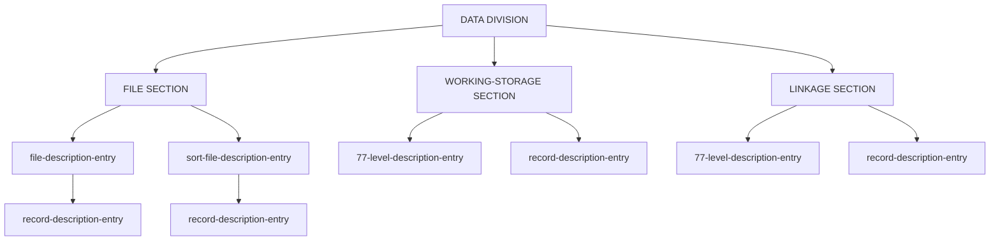
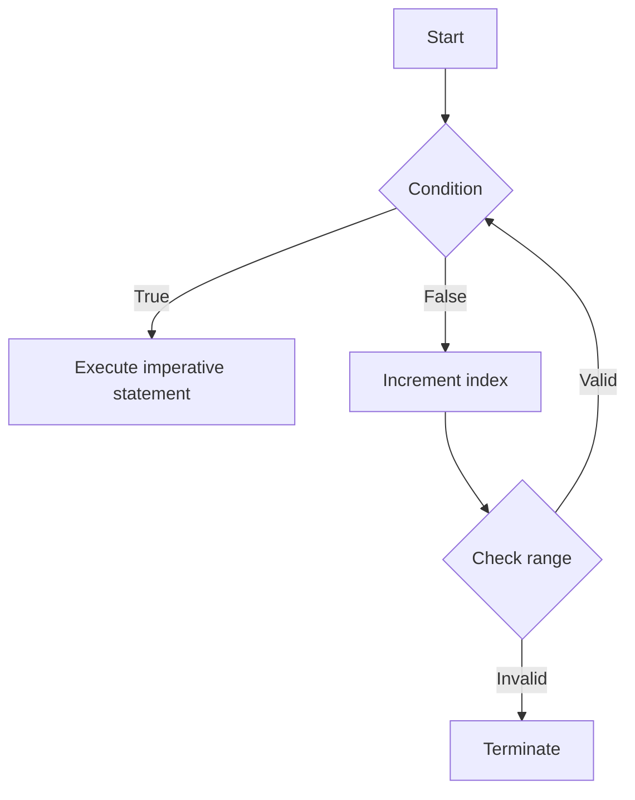
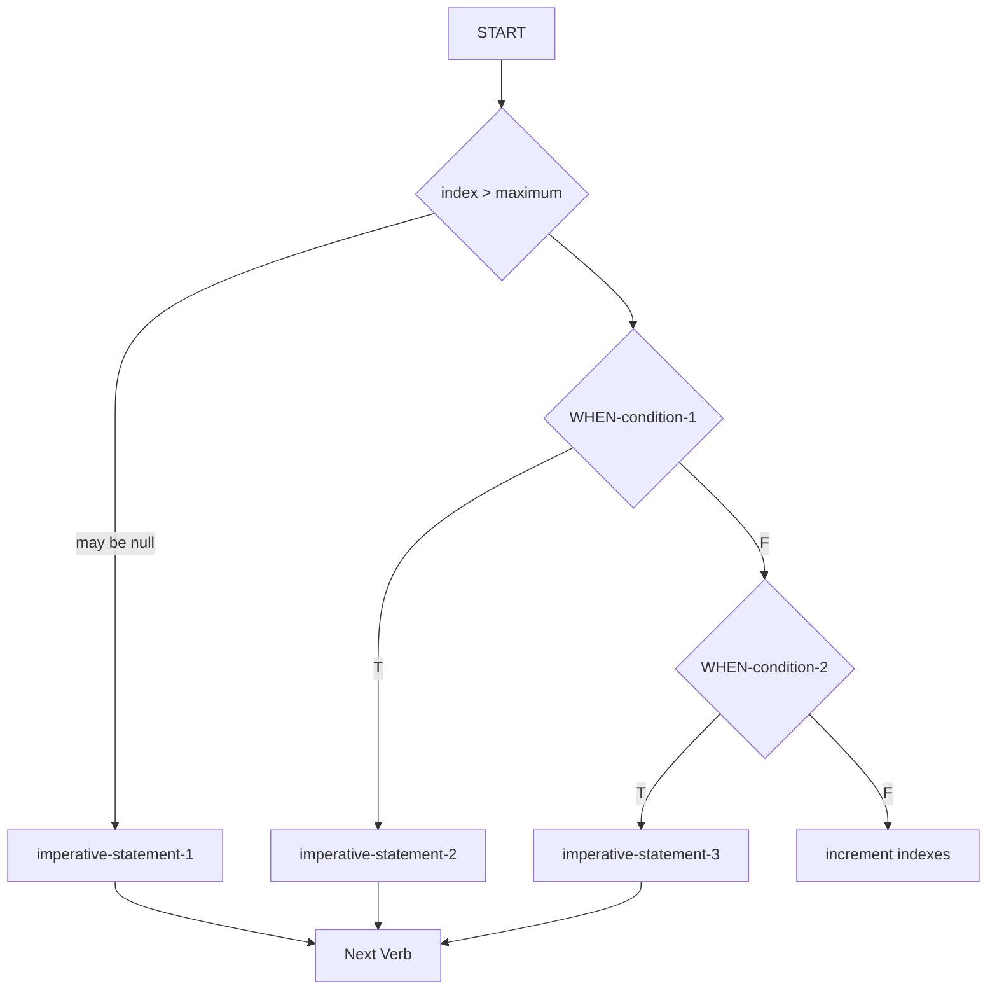
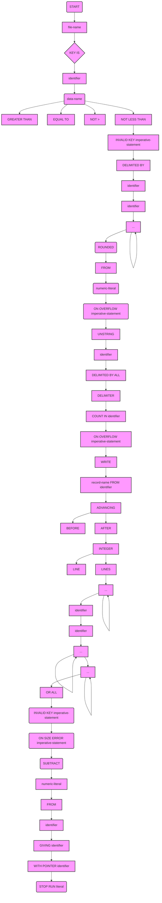
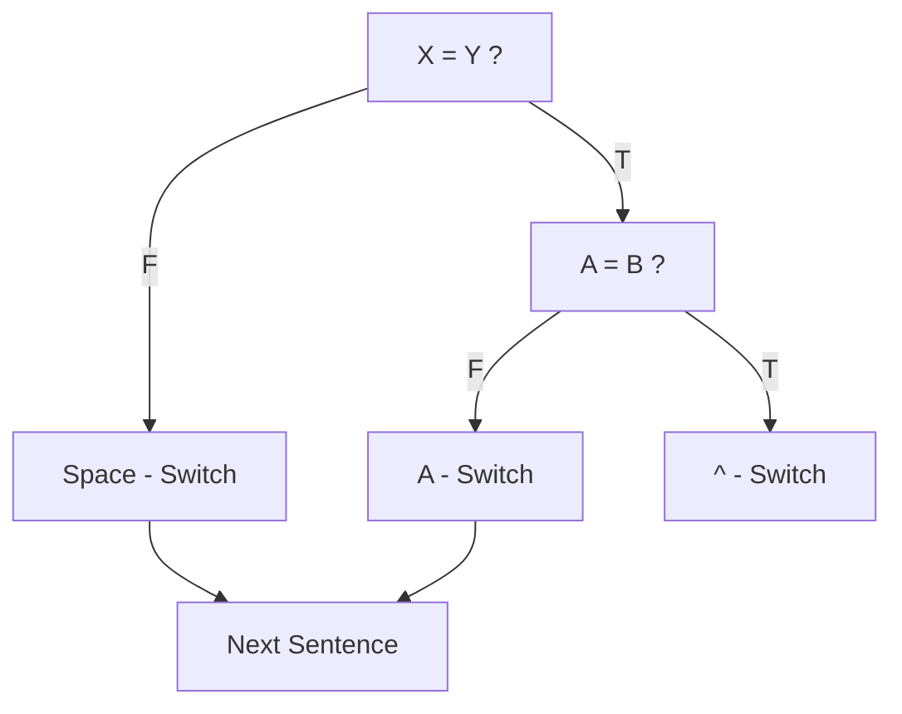

## Page 1

```markdown
# NORD-10 COBOL

## Reference Manual
```

---

## Page 2

# NORD-10 COBOL

**Reference Manual**

---

## Page 3

# REVISION RECORD

| Revision | Notes                                         |
|----------|-----------------------------------------------|
| 10/77    | Original Printing                             |
| 06/78    | Version two, superseding previous issue       |
| 05/79    | Version three, superseding previous versions  |

Publ No. ND-60.089.03  
May 1979  

```
  NORSK DATA A.S.
  Lørenveien 57, Postboks 163 Økern, Oslo 5, Norway
```

---

## Page 4

# NOTICE

Norsk Data A.S believes that the information described in this manual is accurate and reliable, and much care has been taken in its preparation. However, no responsibility, financial or otherwise, is accepted for any consequences arising out of the use of this material. The information herein is subject to change without notice.

Norsk Data A.S assumes no responsibility for the use or reliability of its software on equipment that is not furnished or supported by Norsk Data A.S.

The information described in this document is protected by copyright. It may not be photocopied, reproduced or translated without the prior consent of Norsk Data A.S.

Copyright © 1978 by Norsk Data A.S.

ND-60.089.03

---

## Page 5

# ACKNOWLEDGEMENT

"Any organization interested in reproducing the COBOL report and specifications in whole or in part, using ideas taken from this report as the basis for an instruction manual or for any other purpose, is free to do so. However, all such organizations are requested to reproduce this section as part of the introduction to the document. Those using a short passage, as in a book review, are requested to mention 'COBOL' in acknowledgment of the source, but need not quote this entire section.

COBOL is an industry language and is not the property of any company or group of companies, or of any organization or group of organizations.

No warranty, expressed or implied, is made by any contributor or by the COBOL Committee as to the accuracy and functioning of the programming system and language. Moreover, no responsibility is assumed by any contributor, or by the committee, in connection therewith.

Procedures have been established for the maintenance of COBOL. Inquiries concerning the procedures for proposing changes should be directed to the Executive Committee of the Conference on Data Systems Languages.

The authors and copyright holders of the copyrighted material used herein:

- FLOW-MATIC (Trademark of Sperry Rand Corporation),
  Programming for the UNIVAC I and II, Data Automation Systems copyrighted 1958, 1959, by Sperry Rand Corporation;
- IBM Commercial Translator, Form No. F28-8301, copyrighted 1959 by IBM;
- FACT, DSI 27A5260-2760, copyrighted 1960 by Minneapolis-Honeywell

have specifically authorized the use of this material in whole or in part, in the COBOL specification in programming manuals or similar publications."

— from the ANSI COBOL Standard (X3.23-1974) 

ND-60.089.03

---

## Page 6

# Table of Contents

## Section: Page:

1. **FUNDAMENTAL CONCEPTS OF COBOL** 1-1
   - 1.1 Character Set 1-1
   - 1.2 Punctuation 1-2
   - 1.3 Word Formation 1-2
   - 1.4 Coding Rules 1-3
   - 1.5 Format Notation 1-3
   - 1.6 Level Numbers and Data-Names 1-5
   - 1.7 File-Names 1-6
   - 1.8 Condition-Names 1-6
   - 1.9 Mnemonic-Names 1-6
   - 1.10 Literals 1-7
   - 1.11 Figurative Constants 1-8
   - 1.12 Structure of a Program 1-9
   - 1.13 Qualification of Names 1-11
   - 1.14 The COPY Statement 1-11

2. **IDENTIFICATION DIVISION** 2-1

3. **THE ENVIRONMENT DIVISION** 3-1
   - 3.1 Configuration Section 3-2
   - 3.2 Input-Output Section 3-2
     - 3.2.1 File-Control 3-3
       - 3.2.1.1 General Format 3-3
       - 3.2.1.2 Definition of Sequential File Organization 3-5
       - 3.2.1.3 Definition of Relative File Organization 3-5
       - 3.2.1.4 Definition of Indexed File Organization 3-6
     - 3.2.2 I-O Control Paragraph 3-6

4. **THE DATA DIVISION** 4-1
   - 4.1 Data Types 4-1
   - 4.2 The Data Description Entry 4-3
   - 4.3 Formats for Elementary Items 4-4
   - 4.4 USAGE Clause 4-5
   - 4.5 PICTURE Clause 4-6
   - 4.6 VALUE Clause 4-11
   - 4.7 REDEFINES Clause 4-12
   - 4.8 OCCURS Clause 4-13
   - 4.9 SYNCHRONIZED Clause 4-14
   - 4.10 BLANK WHEN ZERO Clause 4-14
   - 4.11 JUSTIFIED Clause 4-14
   - 4.12 SIGN Clause 4-15
   - 4.13 Level 88 Condition-Names 4-16
   - 4.14 Level 66 (RENAMES Clause) 4-18
   - 4.15 Organization of the Data Division 4-19
     - 4.15.1 General Format 4-19
     - 4.15.2 File Section 4-19

ND-60.089.03

---

## Page 7

# Table of Contents

| Section                | Page  |
|------------------------|-------|
| 4.15.2.1 FD Entries    | 4-19  |
| 4.15.2.2 BLOCK-Clause  | 4-20  |
| 4.15.2.3 RECORD-Clause | 4-20  |
| 4.15.2.4 LABEL-Clause  | 4-20  |
| 4.15.2.5 DATA-RECORD(S)-Clause | 4-21 |
| 4.15.3 Working Storage Section | 4-21 |
| 4.15.4 Linkage Section | 4-21  |

# 5 THE PROCEDURE DIVISION

## 5.1 Statements, Sentences, Procedures-Names
- Page: 5-1

## 5.2 Organization of the Procedure Division
- Page: 5-2

## 5.3 Inter-Program Communication
- Page: 5-3

### 5.3.1 General
- Page: 5-3

### 5.3.2 USING List Appendage to Procedure Header
- Page: 5-3

## 5.4 DECLARATIVES and the USE Sentence
- Page: 5-4

## 5.5 Arithmetic Statements
- Page: 5-6

### 5.5.1 General
- Page: 5-6

### 5.5.2 SIZE ERROR Option
- Page: 5-7

### 5.5.3 ROUNDED Option
- Page: 5-7

### 5.5.4 GIVING Option
- Page: 5-8

## 5.6 Relative Indexing
- Page: 5-9

## 5.7 File Processing
- Page: 5-9

### 5.7.1 Definition of Sequential File Organization
- Page: 5-9

### 5.7.2 Definition of Relative File Organization
- Page: 5-10

### 5.7.3 Indexed Organization File Processing
- Page: 5-11

### 5.7.4 File Status Reporting For Indexed Files
- Page: 5-13

## 5.8 COBOL Verbs
- Page: 5-14

### 5.8.1 ACCEPT Statement
- Page: 5-15

### 5.8.2 ADD Statement
- Page: 5-16

### 5.8.3 ALTER Statement
- Page: 5-16

### 5.8.4 CALL Statement
- Page: 5-17

### 5.8.5 CLOSE Statement
- Page: 5-17

### 5.8.6 COMPUTE Statement
- Page: 5-18

### 5.8.7 DELETE Statement
- Page: 5-20

### 5.8.8 DISPLAY Statement
- Page: 5-20

### 5.8.9 DIVIDE Statement
- Page: 5-21

### 5.8.10 EXHIBIT Statement
- Page: 5-21

### 5.8.11 EXIT Statement
- Page: 5-22

### 5.8.12 GO TO Statement
- Page: 5-22

### 5.8.13 IF Statement
- Page: 5-23

### 5.8.14 INSPECT Statement
- Page: 5-26

### 5.8.15 MOVE Statement
- Page: 5-28

### 5.8.16 MULTIPLY Statement
- Page: 5-30

### 5.8.17 OPEN Statement
- Page: 5-30

### 5.8.18 PERFORM Statement
- Page: 5-31

### 5.8.19 READ Statement
- Page: 5-32

### 5.8.20 REWRITE Statement
- Page: 5-34

ND-60.089.03

---

## Page 8

# Section

| Section | Statement            | Page |
|---------|----------------------|------|
| 5.8.21  | SEARCH Statement     | 5-35 |
| 5.8.22  | SET Statement        | 5-37 |
| 5.8.23  | SORT Statement       | 5-38 |
| 5.8.24  | START Statement      | 5-41 |
| 5.8.25  | STOP Statement       | 5-42 |
| 5.8.26  | STRING Statement     | 5-43 |
| 5.8.27  | SUBTRACT Statement   | 5-44 |
| 5.8.28  | UNSTRING Statement   | 5-45 |
| 5.8.29  | WRITE Statement      | 5-47 |

# Appendixes

| Appendix | Title                              | Page |
|----------|------------------------------------|------|
| A        | NORD-10 COBOL SYNTAX               | A-1  |
| B        | RESERVED WORD LIST                 | B-1  |
| C        | ASCII CHARACTER SET                | C-1  |
| D        | DIAGNOSTIC WORD MESSAGES           | D-1  |
| E        | ADVANCED FORMS OF CONDITIONS       | E-1  |
| F        | NESTING OF IF STATEMENTS           | F-1  |
| G        | TABLE OF PERMISSIBLE MOVE OPERANDS | G-1  |
| H        | RELATED DOCUMENTATION              | G-1  |

ND-60.089.03

---

## Page 9

# Introduction

NORD-10 COBOL is based upon American National Standard X3.23-1974. Elements of the COBOL language are allocated to twelve different functional processing "modules".

Each module of the COBOL Standard has two non-null "levels" — level 1 represents a subset of the full set of capabilities and features contained in level 2.

In order for a given system to be called COBOL, it must provide at least level 1 of the Nucleus, Table Handling and Sequential I/O modules.

The following summary specifies the content of NORD-10 COBOL with respect to the Standard.

| Module        | Features Available in NORD-10 COBOL                                                                                                                                         |
|---------------|------------------------------------------------------------------------------------------------------------------------------------------------------------------------------|
| **Nucleus**   | All of level 1, plus these features of level 2: <br> Levels 77, 01-49, 66, 88. <br> Value series or range, level 88 conditions. <br> Use of logical AND/OR/NOT in conditions. <br> Use of algebraic relational symbols for equality or inequalities. <br> Implied subject, or both subject and relation, in relational conditions. <br> Nested IF statements; parentheses in conditions; sign test. <br> ACCEPTance of data from DATE/DAY/TIME <br> STRING and UNSTRING statements <br> Procedure-names consisting of digits only <br> COMPUTE with multiple receiving fields <br> PERFORM VARYING one index <br> Mnemonic-names for ACCEPT or DISPLAY devices <br> Qualification of Names (Procedure Division) <br> The ALL-form of figurative-constants. |
| **Sequential I/O** | All of level 1 plus these features of level 2: <br> RESERVE clause <br> Multiple operands in OPEN & CLOSE, with individual options per file. <br> Variable used to specify print file ADVANCING LINES. |
| **Relative I/O**   | All of level 1 plus: <br> RESERVE clause <br> DYNAMIC access mode (with READ next) <br> START (with key relations EQUAL, GREATER, or NOT LESS). |
| **Indexed I/O**    | 1 key only. All of level 1 plus: <br> RESERVE clause <br> DYNAMIC access mode (with READ NEXT) <br> START (with key relations EQUAL, GREATER or NOT LESS) | 

ND-60.089.03

---

## Page 10

# Table of Contents

| Feature                        | Description                                            |
|-------------------------------|--------------------------------------------------------|
| Library                       | Level 1                                                |
| Inter-Program Communication   | Level 1                                                |
| Table Handling                | All of level 2, except the "DEPENDING ON" form of OCCURS clause |
| Debugging                     | Conditional compilation: lines with "/D in column 7" are bypassed unless WITH DEBUGGING MODE. READY TRACE, RESET TRACE, EXHIBIT. |
| Sort                          | Level 2; up to 5 sort-file keys.                       |

ND-60.089.03

---

## Page 11

# FUNDAMENTAL CONCEPTS OF COBOL

## CHARACTER SET

The COBOL source language character set consists of the following characters:

- Letters A through Z
- Blank or space
- Digits 0 through 9
- Special characters:
  - `+` Plus sign
  - `-` Minus sign
  - `*` Asterisk
  - `=` Equal sign
  - `>` Relational sign (greater than)
  - `<` Relational sign (less than)
  - `$` Dollar sign
  - `,` Comma
  - `;` Semicolon
  - `.` Period or decimal point
  - `" "` Quotation mark
  - `(` Left parenthesis
  - `)` Right parenthesis
  - `'` Apostrophe (alternate of quotation mark)
  - `/` Slash

Of the previous set, the following characters are used for words:

- `0` through `9`
- `A` through `Z`
- `-` (hyphen)

The following characters are used for punctuation:

- `(` Left parenthesis
- `)` Right parenthesis
- `,` Comma
- `.` Period
- `;` Semicolon

The following relation characters are used in simple conditions:

- `<`
- `=`
- `>`

---

## Page 12

# 1.2 PUNCTUATION

The following general rules of punctuation apply in writing source programs:

1. A period, semicolon, or comma, when used, should not be preceded by a space, but must be followed by a space.

2. A left parenthesis should not be followed immediately by a space; a right parenthesis should not be preceded immediately by a space.

3. At least one space must appear between two successive words and or literals. Two or more successive spaces are treated as single space, except in non-numeric literals.

4. Relation characters should always be preceded by a space and followed by another space.

5. When the period, comma, plus, or minus characters are used in the PICTURE clause, they are governed solely by rules for report items.

6. A comma may be used as a separator between successive operands of a statement, or between two subscripts.

7. A semicolon or comma may be used to separate a series of statements or clauses.

# 1.3 WORD FORMATION

A word is composed of a combination of not more than 30 characters, chosen from the following set of 37 characters:

```
0 through 9 (digits)
A through Z (letters)
- (hyphen)
```

A word must begin with a letter or a digit; it may not end with a hyphen. A word is ended by a space, or by proper punctuation. A word may contain more than one embedded hyphen; consecutive embedded hyphens are also permitted. All words are either reserved words, which have preassigned meanings, or programmer-supplied names. If a programmer-supplied name is not unique, there must be a unique method of reference to it by use of name qualifiers, i.e., TAX-RATE IN STATE-TABLE. Primarily, a non-reserved word identifies a data item or field, and is called a data-name. Other cases of non-reserved words are file-names, condition names, mnemonic-names, and procedure-names.

```
ND-60.089.03
```

---

## Page 13

# 1.4 CODING RULES

Since NORD-10 COBOL is a subset of American National Standards Institute (ANSI) COBOL, programs are written on standard COBOL coding sheets, and the following rules are applicable.

1. Each line of code could have a six-digit sequence number in columns 1-6, such that the punched cards are in ascending order. Blanks are also permitted in columns 1-6.

2. Reserved words for division, section, and paragraph headers must begin in Area A (columns 8-11). Procedure-names must also appear in Area A (at the point where they are defined). Level numbers may appear in Area A.

3. All other program elements should be confined to columns 12-72, governed by the other rules of statement punctuation. If a slash (/) appears in column 7, the associated card is treated as comments and will be printed at the top of a new page when the compiler lists the program.

4. Columns 73-80 are ignored by the compiler.

5. Explanatory comments may be inserted on any line within a source program by placing an asterisk in column 7 of the line. Any combination of characters may be included in Areas A and B of that line. The asterisk and the characters will be produced on the source listing but serve no other purpose. See also Section 1.7 for using column 7 in continuation lines for non-numeric literals.

# 1.5 FORMAT NOTATION

Throughout this publication, basic formats are prescribed for various clauses or statements. These generalized descriptions guide the programmer in writing his own statements. They are presented in a uniform system of notation, explained in the following paragraphs.

1. All words printed entirely in capital letters are reserved words. These are words that have preassigned meanings. In all formats, words in capital letters represent an actual occurrence of those words.

2. All underlined reserved words are required unless the portion of the format containing them is itself optional. These are key words. If any key word is missing or is incorrectly spelled, it is considered an error in the program. Reserved words not underlined may be included or omitted at the option of the programmer. These words are optional words; they are used solely for improving readability of the program.

3. The characters `>` `<` when appearing in formats, although not underlined, are required when such formats are used.

ND-60.089.03

---

## Page 14

# Technical Documentation

## 4.

All punctuation and other special characters represent the actual occurrence of those characters. Punctuation is essential where it is shown. Additional punctuation can be inserted, according to the rules for punctuation specified in this publication. In general, terminal periods are shown in formats in the manual because they are required; semicolons and commas are not shown generally because they are optional.

## 5.

Words printed in lower-case letters in formats represent generic parts (i.e. data-names) of which a valid representation must appear.

## 6.

Parts of a statement of data description entry which are enclosed in brackets are optional. Parts between matching braces ({}) represents a choice of mutually exclusive options.

## 7.

Certain entries in the formats consist of a capitalized word(s) followed by the word "Clause" or "Statement". These designate clauses or statements that are described in other formats, in appropriate sections of the text.

## 8.

In order to facilitate reference to them in the text, some lower-case words are followed by a hyphen and a digit or letter. This modification does not change the syntactical definition of the word.

## 9.

Alternate options may be explained by separating the mutually exclusive choices by a vertical stroke, see following example:

| AREA | AREAS is equivalent to |
| ---- | ---------------------- |
|      | AREA                  |
|      | AREAS                 |

## 10.

The ellipsis (...) indicates that the immediately preceding unit may occur once, or any number of times in succession. An unit means either a single lower-case word, or a group of lower case words and one or more reserved words enclosed in brackets or braces. If a term is enclosed in brackets or braces, the entire unit of which it is part must be repeated when repetition is specified.

## 11.

Comments, restrictions, and clarification on the use and meaning of every format are contained in the appropriate portions of the manual.

## 12.

In generalized formats, where optional elements are depicted, their optionality may be indicated by parentheses instead of brackets, provided the lack of formality represents no substantial bar to clarity of comprehension.

---

ND-60.089.03

---

## Page 15

# 1.6 Level Numbers and Data-Names

For purposes of processing, the contents of a file are divided into logical records, with level number 01 specifying a logical record. Subordinate data items that constitute a logical record are grouped in a hierarchy and identified with level numbers 02 to 49. Level number 77 identifies a "stand-alone" item in Working-Storage. A level number less than 10 may be written as a single digit.

Levels allow specification of subdivisions of a record necessary for referring to data. Once a subdivision is specified, it may be further subdivided to permit more detailed data reference. This is illustrated by the following weekly timecard record, which is divided into four major items: name, employee-number, date, and hours, with more specific information appearing for name and date.

```
        +------------+
        | TIME-CARD  |
        +------------+
        | NAME       |
        |  +---------+--------+
        |  | LAST-NAME       |
        |  | FIRST-INIT      |
        |  | MIDDLE-INIT     |
        +---------------------+
        | EMPLOYEE-NUM       |
        +---------------------+
        | WEEKS-END-DATE     |
        |  +-----------------+
        |  | MONTH           |
        |  | DAY-NUMBER      |
        |  | YEAR            |
        +---------------------+
        | HOURS-WORKED       |
        +---------------------+
```

Subdivisions of a record that are not themselves further subdivided are called elementary items. Data items that contain subdivisions are known as 'group items.' When a Procedure statement makes reference to a group item, the reference applies to the area reserved for the entire group.

Less inclusive groups are assigned numerically higher level numbers. Level numbers of items within groups need not be consecutive. A group whose level is k includes all groups and elementary items described under it until a level number less than or equal to k is encountered.

Separate entries are written in the source program for each level. To illustrate level numbers and group items, the weekly timecard record in the previous example may be described (in part) by Data Division entries having the following level numbers, data-names and Picture definitions.

Levels 66 (RENAMES) and 88 (condition-names) are special cases of non-hierarchical levels, and are explained elsewhere in this manual.

```
01 TIME-CARD.
   02 NAME.
      03 LAST-NAME      PICTURE X(18).
      03 FIRST-INIT     PICTURE X.
      03 MIDDLE-INIT    PICTURE X.
   02 EMPLOYEE-NUM     PICTURE 99999.
   02 WEEKS-END-DATE.
      05 MONTH         PIC 99.
      05 DAY-NUMBER    PIC 99.
      05 YEAR          PIC 99.
   02 HOURS-WORKED     PICTURE 99V9.
```

ND-60.089.03

---

## Page 16

# Data-Name

A data-name is a word assigned by the user to identify a data item used in a program. A data-name always refers to a region of data, not to a particular value; the item referred to often assumes a number of different values during the course of a program.

A data-name must begin with an alphabetic character. A data-name or the key word FILLER must be the first word following the level number in each Record Description entry, as shown in the following general format:

```
level number { data name }
             { FILLER    }
```

This data-name is the defining name of the entry, and is the means by which references to the associated data area (containing the value of a data item) are made.

If some of the characters in a record are not used in the processing steps of a program, then the data description of these characters need not include a data-name. In this case, FILLER is written in lieu of a data-name after the level number.

## 1.7 FILE-NAMES

A file is a collection of data records, such as a deck of punched cards or a reel of magnetic tape, containing individual records of a similar class or application. A file-name is defined by a FD entry in the Data Division's File Section. FD is a reserved word which must be followed by a unique programmer-supplied word called the file-name. Rules for composition of the file-name word are identical to those for data-names (Refer to Section 1.3). A sort-file description is defined by a SD entry in the File Section.

## 1.8 CONDITION-NAMES

A condition-name is defined in level 88 entries within the Data Division. Rules for formation of name words are specified in Section 1.3; explanations of condition-name declarations and procedural statements employing them are given in the chapters devoted to Data and Procedure divisions.

## 1.9 MNEMONIC-NAMES

A mnemonic-name is assigned in the Environment Division for reference in Accept or Display statements. A mnemonic-name is composed according to the rules in Section 1.3.

ND-60.089.03

---

## Page 17

# 1.10 LITERALS

A literal is a constant that is not identified by a data-name in a program, but is completely defined by its own identity. A literal is either non-numeric or numeric.

## NON-NUMERIC LITERALS

A non-numeric literal must be bounded by matching quotation marks or apostrophes and may consist of any combination of characters in the ASCII set, except quotation marks or apostrophe, respectively. All spaces enclosed by the quotation marks are included as part of the literal. A non-numeric literal must not exceed 120 characters in length.

The following are examples of non-numeric literals:

```
"ILLEGAL CONTROL CARD"
'CHARACTER-STRING'
"DO'S & DON'T'S"
```

Each character of a non-numeric literal (following the introductory delimiter) may be any character other than the delimiter. That is, if the literal is bounded by apostrophes, then quotation (") marks may be within the literal, and vice versa. Length of a non-numeric literal excludes the delimiters; length minimum is one.

A succession of two "delimiters" within a literal is interpreted as a single representation of the delimiter within the literal.

Only non-numeric literals may be "continued" from one line to the next. When a non-numeric literal is of a length such that it cannot be contained on one line of a coding sheet, the following rules apply to the next line of coding (continuation line):

1. A hyphen is placed in column 7 of the continuation line.

2. A delimiter is placed in Area B preceding the continuation of the literal.

3. All spaces at the end of the previous line and any spaces following the delimiter in the continuation line and preceding the final delimiter of the literal are considered to be part of the literal.

4. On any continuation line, Area A should be blank.

---

## Page 18

# NUMERIC LITERALS

A numeric literal must contain at least one and not more than 18 digits. A numeric literal may consist of the characters 0 through 9 (optionally preceded by a sign) and the decimal point. It may contain only one sign character and only one decimal point. The sign, if present, must appear as the leftmost character in the numeric literal. If a numeric literal is unsigned, it is assumed to be positive.

A decimal point may appear anywhere within the numeric literal, except as the rightmost character. If a numeric literal does not contain a decimal point, it is considered to be an integer.

The following are examples of numeric literals:

```
72     +1011    3.14159    -6    -.333    0.5
```

By use of the Environment specification DECIMAL-POINT IS COMMA, the functions of characters period and comma are interchanged, putting the "European" notation into effect. In this case, the value of "pi" would be 3,1416 when written as a numeric literal.

## 1.11 FIGURATIVE CONSTANTS

- A figurative constant is a special type of literal; it represents a value to which a standard data-name has been assigned. A figurative constant is not bounded by quotation marks.

ZERO may be used in many places in a program as a numeric literal. Other figurative-constants are available to provide non-numeric data; the reserved words for various characters are as follows:

| Figurative Constant | Description                                           |
|---------------------|-------------------------------------------------------|
| SPACE               | the blank character represented by "octal" 40         |
| LOW-VALUE           | the character whose "octal" representation is 00      |
| HIGH-VALUE          | the character whose "octal" representation is 177     |
| QUOTE               | the quotation mark, whose "octal" representation is 42 (7-8 in punched cards) |

The plural forms of these figurative constants are acceptable to the compiler. A figurative constant represents as many instances of the associated character as are required in the context of the statement.

Another form of figurative-constant consists of the reserved word ALL followed by a one-character non-numeric literal, or followed by one of the above figurative-constant reserved words.

---

## Page 19

# 1.12 STRUCTURE OF A PROGRAM

Every COBOL source program is divided into four divisions. Each division must be placed in its proper sequence, and each must begin with a division header.

The four divisions, listed in sequence, and their functions are:

- **IDENTIFICATION DIVISION**, which names the program.

- **ENVIRONMENT DIVISION**, which indicates the computer equipment and features to be used in the program.

- **DATA DIVISION**, which defines the names and characteristics of data to be processed.

- **PROCEDURE DIVISION**, which consists of statements that direct the processing of data at execution time.

The following skeletal coding defines program component structure and order.

### IDENTIFICATION DIVISION.

- **PROGRAM-ID.** program-name.
- [AUTHOR. comment-entry ...]
- [INSTALLATION. comment-entry ...]
- [DATE-WRITTEN. comment-entry ...]
- [DATE-COMPILED. comment-entry ...]
- [SECURITY. comment-entry ...]
- [REMARKS. comment-entry ...]

### ENVIRONMENT DIVISION.

- **CONFIGURATION SECTION.**
  - [SOURCE-COMPUTER. NORD-10.]
  - [OBJECT-COMPUTER. NORD-10.]
  - [SPECIAL-NAMES. entry.]
  
- **INPUT-OUTPUT SECTION.**
  - [FILE-CONTROL. entry ...]
  - [I-O-CONTROL. entry ...]

### DATA DIVISION.

```
[Bracketed Outline for Diagram]
|------------------------------|
| CONFIGURATION SECTION.       |
| - SOURCE-COMPUTER. NORD-10.  |
| - OBJECT-COMPUTER. NORD-10.  |
| - SPECIAL-NAMES. entry.      |
|------------------------------|
| INPUT-OUTPUT SECTION.        |
| - FILE-CONTROL. entry ...    |
| - I-O-CONTROL. entry ...     |
|------------------------------|

```
ND-60.089.03

---

## Page 20

```
  ________________________
 |                        |
 | FILE SECTION.          |
 | {file description entry|
 |  record description    |
 |  entry ...}            |
 |________________________|
 |                        |
 | WORKING-STORAGE SECTION|
 | [data item description |
 |  entry] ...            |
 |________________________|
 |                        |
 | LINKAGE SECTION.       |
 | [data item description |
 |  entry] ...            |
 |________________________|
 |                        |
 | PROCEDURE DIVISION     |
 | [USING identifier-1    |
 |  ...].                 |
 |________________________|
 |                        |
 | DECLARATIVES.          |
 | {section-name SECTION. |
 |  USE Sentence.         |
 |  {paragraph-name.      |
 |  {sentence} ...}. ...} |
 |________________________|
        |                         |
        | END DECLARATIVES.       |
        | { section-name SECTION. |
        | {paragraph-name.        |
        | {sentence} ...} ...}    |
        |_________________________|
```

**1-10**

**ND-60.089.03**

---

## Page 21

# 1.13 QUALIFICATION OF NAMES

When a data-name, condition-name or paragraph name is not unique, procedural reference may therefore be accomplished uniquely by use of qualifier names. For example, if there were two or more items named YEAR, the qualified reference:

    YEAR OF HIRE-DATE

might differentiate between year fields in HIRE-DATE and TERMINATION-DATE.

Qualifiers are preceded by the word OF or IN; successive data-name or condition-name qualifiers must designate lesser-level-numbered groups that contain all preceding names in the composite reference, i.e., HIRE-DATE must be a group item (or file-name) containing an item called YEAR. Paragraph-names may be qualified by their containing section-name.

The maximum number of qualifiers is one for a paragraph-name, five for a data-name or condition-name. File-names and mnemonic-names must be unique.

A qualified name may only be written in the Procedure Division, or in a level 66 entry.

# 1.14 THE COPY STATEMENT

The statement COPY text-name provides a means of incorporating into a source program a body of standard COBOL code maintained in a "COPY Library" as a distinctly named (text-name) entity. A COPY statement must be terminated by a period. A COPY statement may appear anywhere except within the copied entity itself.

The effect of copying is to augment the source stream processed by the compiler by insertion of the copied entity in place of the COPY statement, and then resuming processing of the primary source of input at the end of the copied entity.

After the text-name operand of COPY the remainder of the source card must be blank (up to column 72 inclusive).

The text-name consists of a file-description as defined in the NORD File Manual (ND-60.052) in the form:

    (directory-name : user-name) file-name : type;version

where names can be up to 16 characters in length, type up to 4 characters, and version a number ranging from 1 to 256.

Only file-name is mandatory, and default type is :SYMB denoting a COBOL source-file.

Please refer to the mentioned manual for further information concerning file-name conventions.

ND-60.089.03

---

## Page 22

# 2 IDENTIFICATION DIVISION

Every COBOL program begins with the Identification Division. This division identifies both the source program and the resultant output listing. In addition, the user may include the date the program is written, the date the compilation of the source program is accomplished and such other information as desired under the paragraphs shown below:

## IDENTIFICATION DIVISION

| PROGRAM-ID.   | Program-name.       |
|---------------|---------------------|
| AUTHOR.       | [comment-entry]     |
| INSTALLATION. | [comment-entry]     |
| DATE-WRITTEN. | [comment-entry]     |
| DATE-COMPILED.| [comment-entry]     |
| SECURITY.     | [comment-entry]     |
| REMARKS.      | [comment-entry]     |

Only the PROGRAM-ID paragraph is required; it must be the first paragraph. Program-name is any alphanumeric string of characters, the first of which must be alphabetic. Only the first 6 characters of program-name are retained by the compiler.

The DATE-COMPILED paragraph, if present and if placed from column 8, causes the first line of its comment-entry to be replaced by the current date and time during program compilation.

The contents of any other paragraphs are of no consequence, serving only as documentary remarks. 

ND-60.089.03

---

## Page 23

# The Environment Division

## Environment Division

### Configuration Section

```
[ SOURCE-COMPUTER.     NORD-10    [WITH DEBUGGING MODE]. ]
[ OBJECT-COMPUTER.     NORD-10.                           ]
```

#### Special-Names

```
[ CONSOLE IS mnemonic name ]
[ CURRENCY SIGN IS literal ]
[ DECIMAL-POINT IS COMMA ].
```

### Input-Output Section

#### File-Control

```
{ file-control-entry } . . .
```

#### I-O Control

```
[ SAME AREA FOR { file name } . . .]
```

---

## Page 24

# 3.1 CONFIGURATION SECTION

The CONFIGURATION SECTION, which has three possible paragraphs, is optional. The three paragraphs are SOURCE-COMPUTER, OBJECT-COMPUTER, and SPECIAL-NAMES. The contents of the first two paragraphs are treated as commentary, except the phase WITH DEBUGGING MODE, if present, enables normal processing of source lines naming “D” in column 7.

In case the currency symbol is not supposed to be the Dollar Sign, the user may specify a single character non-numeric literal in the Currency Sign clause. However, the designated character may not be a quote mark, or any of the characters defined for Picture representations.

The "European" convention of separating integer and fraction positions of numbers by the comma character is specified by employment of the clause DECIMAL-POINT IS COMMA.

Note that the reserved word IS is required in entries for currency sign definition and decimal-point convention specification.

# 3.2 INPUT-OUTPUT SECTION

The second section of the Environment Division is mandatory (unless the program has no data files); it begins with the header:

    INPUT-OUTPUT SECTION.

This section has two paragraphs: File-Control and I-O-Control. In the former, the programmer defines the file assignment parameters, including specification of buffering.

---

    ND-60.089.03

---

## Page 25

# 3.2.1 File-Control

## 3.2.1.1 General Format

The general format of the FILE-CONTROL paragraph is shown on the following page:

```
FILE-CONTROL.

   SELECT file name ASSIGN TO {"Nord file name: type; version"}
                                  data name
       ___________________
      |                   |
      | RESERVE integer   |   _______
      |    _______________|__| AREA  |
      |   |                | | AREAS |
      |   |________________| |_______|

       ___________________    
      |                   |  
      | ORGANIZATION IS   |  
      |   SEQUENTIAL      |  
      |___________________|  
   
      [ACCESS MODE IS SEQUENTIAL]
      [FILE STATUS IS data name].

       ___________________      ____________________________
      |                   |    |                            |
      | ORGANIZATION IS   |    | ACCESS MODE IS SEQUENTIAL  |
      |   RELATIVE        |    | RANDOM                     |
      |___________________|    | DYNAMIC                    |
                               |____________________________|

      [RELATIVE KEY IS data name]
      [FILE STATUS IS data name].

       ___________________      ____________________________
      |                   |    |                            |
      | ORGANIZATION IS   |    | ACCESS MODE IS SEQUENTIAL  |
      |   INDEXED         |    | RANDOM                     |
      |___________________|    | DYNAMIC                    |
                               |____________________________|

      RECORD KEY IS data name
      [FILE STATUS IS data name].
```

For every program file, a Sentence-Entry (beginning with the reserved word SELECT) is required in the FILE-CONTROL paragraph.

In the Select Sentence-Entry, device is written as a non-numeric literal enclosed in matching quotation marks or apostrophes. The contents of this literal must be written to conform to SINTRAN III/VS file-name conventions.

The user may express the device as a literal whose contents are of the form:

```
(directory:user) file-name: type;version
```

for generalized access to any files available to a SINTRAN III/VS user. Examples:

```
SELECT MASTER-FILE ASSIGN "CARD-READER" ...
SELECT FILE-1 ASSIGN "XPDATA:SYMB" ...
SELECT IN-PUT ASSIGN TO "(JENSEN) FILE17:REC" ...
```

If the file-name assignment is not a constant, then device may be written as a data-name, defined later in the program; its value at OPEN-time must contain a character string representing a valid SINTRAN III file-name reference as discussed above.

ND-60.089.03

---

## Page 26

# Reserve Clause and Buffer Areas

If the Reserve clause is not present, the compiler assigns buffer areas. An integer number of buffers specified by the Reserve clause may be from 1 to 7.

# FILE STATUS Entry

If the FILE STATUS entry, data-name-1 defines a two-character Working-Storage item into which the run-time data management facility places status information after an I-O statement. The left-hand character of data-name-1 assumes the values:

- `0` for successful completion
- `1` for End-of-File condition
- `3` for a non-recoverable (I-O) error

The right-hand character of data-name-1 is set to `0` if no further status information exists for the previous I-O operation. The following combinations of values are possible:

| File Status Left | File Status Right | Meaning          |
|------------------|-------------------|------------------|
| `0`              | `0`               | O.K.             |
| `1`              | `0`               | EOF              |
| `3`              | `0`               | Permanent error  |
| `3`              | `4`               | Disk space full  |

Both the Access and Organization clauses are optional for sequential input-output processing. For Relative files, alternate formats are available in the Environment Division.

---

## Page 27

# 3.2.1.2 Definition Of Sequential File Organization

Sequential organization is allowed on all types of hardware devices that COBOL can communicate with. The only access mode is sequential.

# 3.2.1.3 Definition Of Relative File Organization

**Relative organization** is restricted to disk-based files. Records are differentiated on the basis of a relative record number which ranges from 1 to 999,999, or to a lesser maximum for a smaller file. Unlike the case of an Indexed file, where the identifying key filed occupies a part of the data record, relative record numbers are conceptual, and are not embedded in the data records.

A relative-organized file may be accessed either sequentially, dynamically or randomly. In sequential access mode, records are accessed in the order of ascending record numbers.

In random access mode, the sequence of record access is controlled by the program, through the means of placing a number in a relative key item. In dynamic access mode, the program may inter-mix random and sequential access verb forms at will.

In the Environment Division, the SELECT entry must specify ORGANIZATION IS INDEXED, and the Access clause format is:

```
ACCESS MODE IS SEQUENTIAL | RANDOM | DYNAMIC.
```

Assign, Reserve, and File Status clause formats are identical to those used for sequentially- or indexed-organized files.

In addition to the usual clauses in the SELECT entry, a clause of the form:

```
RELATIVE KEY IS data-name-1
```

is required for random or dynamic access mode, or if a START statement exists for such a file, even if access mode is sequential.

Data-name-1 must be described as an unsigned external decimal integer item not contained within any record description of the file itself; its type may not be binary.

ND-60.089.03

---

## Page 28

# 3.2.1.4 Definition Of Indexed File Organization

An indexed-file organization provides for recording records of a "data base" and also keeping a directory (called the control index) of pointers that enable direct location of records having particular unique key values. An indexed file must be assigned to disk-files only.

A file whose organization is indexed can be accessed either sequentially, dynamically or randomly.

Sequential access provides access to data records in order of ascending values of the record key.

In the random access mode, the order of access to records is controlled by the programmer. Each record desired is accessed by placing the value of its key in a key data item prior to an access statement.

In the dynamic access mode, the programmer's logic may alter from sequential access to random access, and vice versa, at will.

In the Environment Division, the SELECT entry must specify ORGANIZATION IS INDEXED, and the Access clause format is:

ACCESS MODE IS SEQUENTIAL | RANDOM | DYNAMIC.

Assign, Reserve, and File Status clause formats are identical to those specified in Section 3.2.1.1 of this manual.

The format of this clause, which is required, is:

RECORD KEY IS `data-name-1`

where `data-name-1` is an item defined within the record descriptions of the associated file description, and is a group item, an elementary alphanumeric item or a decimal field. A decimal key must have no P characters in its Picture, and it may not have a SEPERATE sign. No record key may be subscripted.

If random mode access is specified, the value of `data-name-1` designates the record to be accessed by the next Delete, Read, Rewrite or Write statement. Each record must have a unique record key value.

# 3.2.2 I-O Control Paragraph

The specification permits the programmer to enumerate files that are open only at mutually exclusive times, in order that they may share the same I-O buffer areas, which conserves the utilization of memory space.

The format of the Same Area entry (which designates files that all share a common I-O area) is:

SAME AREA FOR `{file-name}` ...

- No file may be listed in more than one Same Area clause. To conserve space, SAME AREA entries should be used wherever possible (each entry designating files open at mutually exclusive times).

ND-60.089.03

---

## Page 29

# THE DATA DIVISION

Several types of data items can be described in COBOL programs. These data items are described in the following section.

## 4.1 DATA TYPES

### Group Items

A group item is defined as one having further subdivisions, so that it contains one or more elementary items. In addition, a group item may contain other groups. An item is a group item if, and only if, its level number is less than the level number of the immediately succeeding item. If an item is not a group item, then it is an elementary item. The maximum size of a group item is 4095 characters.

### Elementary Items

An elementary item is a data item containing no subordinate items.

### Alphanumeric Item

An alphanumeric item consists of any combination of characters, making a "character string" data field. If the associated picture contains "editing" characters, it is an alphanumeric edited item.

### Report (Edited) Item

A report item is an edited numeric item containing only digits and/or special editing characters. It must not exceed 30 characters in length. A report item can be used only as a receiving field for numeric data.

### Numeric Items

External Decimal Item: An external data item is one in which one computer character (byte) is employed to represent one digit. A maximum number of 18 digits is permitted; the exact number of digit positions is defined by writing a specific number of 9-characters in the Picture description. For example, PICTURE 999 defines a 3-digit item. That is, the maximum decimal value of the item is nine hundred ninety-nine.

If the Picture begins with the letter S, then the item also has the capability of containing an "operational sign". An operational sign does not occupy a separate character (byte), unless the "SEPARATE" form of SIGN clause is included in the item's description. Regardless of the form of representation of an operational sign, its purpose is to provide a sign that functions in the normal algebraic manner.

ND-60.089.03

---

## Page 30

# Usage of External Decimal Item

The "Usage" of an external decimal item is DISPLAY (see Usage clause).

## Internal Decimal Item

An internal decimal item is stored in packed decimal format. It is attained by inclusion of the COMPUTATIONAL-3 Usage clause.

A packed decimal item defined by n 9's in its picture occupies [(n + 2)/2] bytes in memory. All bytes except the rightmost contain a pair of digits, each digit being represented by the binary equivalent of a valid digit value from 0 to 9.

In the rightmost byte of a packed item is found both the item's low-order digit and the operational sign. For this reason, the compiler considers a packed item to have an arithmetic sign, even if the original Picture lacked an S-character.

## Binary Item

A binary item uses the base 2 system to represent an integer not in excess of 32,767. It occupies one 16-bit word. The leftmost bit of the reserved area is the operational sign, usage is COMPUTATIONAL, and picture must be of form S9(n) where n cannot exceed 5. No picture clause is required.

## Index Item

An index item has no picture; usage is INDEX.

### Index Names And Index Items

An index name is declared not by the usual method of level number, name, and data description clauses, but implicitly by appearance in the "INDEXED BY index name" appendage to an OCCURS clause. Therefore, an index name is equivalent to an index item, although defined differently.

An index name must be uniquely named. An index item may only be referred to by a SET statement, a CALL statement's USING list, a Procedure header USING list, as the variation item in PERFORM VARYING, or in a relational condition; in all cases the process is equivalent to dealing with a binary word integer subscript.

---

ND-60.089.03

---

## Page 31

# 4.2 THE DATA DESCRIPTION ENTRY

A Data Description entry specifies the characteristics of each field (item) in a data record. Every item must be described in a separate entry in the same order in which the item appears in the record. Each Data Description entry consists of a level-number, a data-name, and a series of independent clauses followed by a period.

The general format of a Data Description entry is:

```
level-number  { data-name }  (REDEFINES-clause)  (JUSTIFIED-clause)
              {  FILLER   }

              (PICTURE-clause)  (USAGE-clause)  (SYNCHRONIZED-clause)

              (OCCURS-clause)  (BLANK-clause)  (VALUE-clause)  (SIGN-clause).
```

When this format is applied to specific items of data, it is limited by the nature of the data being described. The allowable format for the description of each data type appears below. Clauses which are not shown in a format are specifically forbidden in that format. Clauses that are mandatory in the description of certain data items are shown without parentheses.

## Group Item Format

```
level-number  { data-name }  (REDEFINES-clause)  (USAGE-clause)
              {  FILLER   }

              (OCCURS-clause).
```

**Example:**

```
01  GROUP-NAME.
    02  FIELD-B PICTURE X.
    02  FIELD-C PICTURE X.
```

**Note:**

The USAGE clause may only be written at a group level to save repetitious writing of it at the subordinate element level.

---

## Page 32

# 4.3 FORMATS FOR ELEMENTARY ITEMS

## Alphanumeric Item

(also called a character-string item)

```
level-number { data-name }
            { FILLER     }
            (REDEFINES-clause) (OCCURS-clause)

PICTURE IS an-form (USAGE IS DISPLAY) (JUSTIFIED-clause)

(VALUE IS non-numeric-literal).
```

**Examples:**

```
02 MISC-1 PIC X(53).
02 MISC-2 PICTURE BXXXBXXB.
```

## Report Item

(also called a numeric-edited item)

```
level-number { data-name }
            { FILLER     }
            (REDEFINES-clause) (OCCURS-clause)

                  (USAGE IS DISPLAY) (BLANK WHEN ZERO) (PICTURE IS report form).
```

**Example:**

```
02 XTOTAL PICTURE $999,999.99-.
```

## Decimal Item

```
level-number { data-name }
            { FILLER     }
            (REDEFINES-clause) (OCCURS-clause)

PICTURE IS numeric-form (SIGN-clause)

(VALUE IS numeric-literal). (USAGE-clause)
```

**Examples:**

```
02 HOURS-WORKED PICTURE 99V9, USAGE IS DISPLAY.
02 HOURS-SCHEDULED PIC S99V9, SIGN IS TRAILING.
   -------------------------------------------
11 TAX-RATE PIC S99V999 VALUE 1.375, COMPUTATIONAL-3.
```

```
ND-60,089.03
```

---

## Page 33

# Binary Item

```
                               {  data-name  }
level-number                   {   FILLER    }   (REDEFINES-clause)  (OCCURS-clause)

                   USAGE IS COMPUTATIONAL/COMP/INDEX

                       (VALUE IS numeric-literal).

Examples:

  02  SUBSCRIPT COMP, VALUE ZERO.
  02  YEAR-TO-DATE COMPUTATIONAL.
```

## 4.4 USAGE CLAUSE

The USAGE clause describes the form in which numeric data is represented.

The USAGE clause may be written at any level. If USAGE is not specified, the item is assumed to be in "DISPLAY" mode. The format of the USAGE clause is:

```
             -------------------------
USAGE IS     |  COMPUTATIONAL        |
             |  INDEX                |
             |  DISPLAY              |
             |  COMPUTATIONAL-3      |
             -------------------------
```

INDEX is explained in the Chapter on Table Handling. COMPUTATIONAL usage defines an integral binary field. COMPUTATIONAL-3, which may be abbreviated COMP-3, defines a packed (internal decimal) field.

```
ND-60.089.03
```

---

## Page 34

# 4.5 PICTURE CLAUSE

The PICTURE clause specifies a detailed description of an elementary level data item and may include specification of special report editing. The reserved word PICTURE may be abbreviated as PIC.

The general format of the PICTURE clause is:

```
          { an-form }
PICTURE IS { numeric-form }
          { report-form }
```

There are three possible types of pictures, as explained in the ensuing paragraphs.

## An-Form Option

This option applies to alphanumeric (character string) items. The PICTURE of an alphanumeric item is a combination of data description characters X, A, or 9 and, optionally, editing characters B, 0 and /. An X indicates that the character position may contain any character from the computer’s ASCII character set. A Picture that contains at least one of the combinations:

- (a) A and 9, or
- (b) X and 9, or
- (c) X and A

in any order is considered as if every 9, A or X character were X. The characters B, 0 and / may be used to insert blanks or zeros or slashes in the item.

## Numeric-Form Option

The PICTURE of a numeric item may contain a valid combination of the following characters:

| CHARACTER | MEANING                                                                                                                                              |
|-----------|------------------------------------------------------------------------------------------------------------------------------------------------------|
| 9         | The character 9 indicates that the actual or conceptual digit position contains a numeric character. The maximum number of 9’s in a Picture is 18.   |
| V         | The character V indicates the position of an assumed decimal point. Since a numeric item cannot contain an actual decimal point, an assumed decimal point is used to provide the compiler with information concerning the scaling alignment of items involved in computations. Storage is never reserved for the character V. Only one V, if any, is permitted in any single Picture. |
| S         | This character indicates that the item has an operational sign. It must be the first character of the Picture.                                      |

ND-60.089.03

---

## Page 35

# Scaling Position Character P

The P indicates an assumed decimal scaling position, and is used to specify the location of an assumed decimal point when the point is not within the number that appears in the data item. The scaling position character P is not counted in the size of the data item. Scaling position characters are counted in determining the maximum number of digit positions (18) in numeric edited items or in items that appear as operands in arithmetic statements.

The scaling position character P may appear only to the left or right of the other characters in the string as a continuous string of P's within a PICTURE description. The sign character S and the assumed decimal point V are the only characters which may appear to the left of a leftmost string of P's. Since the scaling position character P implies an assumed decimal point (to the left of the P's if the P's are leftmost PICTURE characters and to the right of the P's if the P's are rightmost PICTURE characters), the assumed decimal point symbol V is redundant as either the left-most or rightmost character within such a PICTURE description.

# Report-Form Option

This option describes an item suitable as an "edited" receiving field for presentation of a numeric value. The editing characters that may be combined to describe a report item are as follows:

```
9 V . Z CR DB , S + * B 0 − P /
```

The characters 9, P, and V have the same meaning as for a numeric item. The meanings of the other allowable editing characters are described in the following text.

## CHARACTER MEANING

| Character     | Meaning                                                                                                                                                                                                                  |
|---------------|--------------------------------------------------------------------------------------------------------------------------------------------------------------------------------------------------------------------------|
| `.`           | The decimal point character (.) specifies that an actual decimal point is to be inserted in the indicated position and the source item is to be aligned accordingly. Numeric character positions to the right of an actual decimal point in a PICTURE must consist of characters of one type. |
| `Z and *`     | The characters Z and * are called replacement characters. Each one represents a digit position. Leading zeroes to be placed in positions defined by Z or * are suppressed, becoming blank or *. Zero suppression terminates upon encountering the decimal point ( . or V) or a non-zero digit. Z or * may appear to the right of an actual decimal point only if all digit positions are the same. |
| `CR and DB`   | CR and DB are called credit and debit symbols and may appear only at the right end of a picture. These symbols occupy two character positions and indicate that the specified symbol is to appear in the indicated positions if the value of a source item is negative. If the value is positive or zero, spaces will appear instead. CR and DB and + and − are mutually exclusive. |
| `,` (comma)   | The comma specifies insertion of a comma between digits. Each insertion character is counted in the size of the data item, but does not represent a digit position. The comma may also appear in conjunction with a floating string, as described below. |

ND-60.089.03

---

## Page 36

# Floating Strings

A floating string is defined as a leading, continuous series of either S or + or –, or a string composed of one such character interrupted by one or more insertion commas and/or decimal point. For example:

```
SS,SSS,SSS
+ + + +
--,---,-
+(8),+ +
SS,SSS,SS
```

A floating string containing n + 1 occurrences of S or + or – defines n digit positions. When moving a numeric value into a report item, the appropriate character floats from left to right, so that the developed report item has exactly one actual S or + or – immediately to the left of the most significant non-zero digit, in one of the positions indicated by S or + or – in the PICTURE. Blanks are placed in all character positions to the left of the single developed S or + or –. If the most significant digit appears in a position to the right of positions defined by a floating string, then the developed item contains S or + or – in the rightmost position of the floating string, and non-significant zeros may follow. The presence of an actual or implied decimal point in a floating string is treated as if all digit positions to the right of the point were indicated by the PICTURE character 9. In the following examples, b represents a blank in the developed items.

| PICTURE | Numeric Value | Developed Item |
|---------|---------------|----------------|
| SSS999  | 14            | bbS014         |
| --,---,999 | -456       | bbbb-456       |
| SSSSSS  | 14            | bbbS14         |

A floating string need not constitute the entire PICTURE of a report item, as shown in the preceding examples. Restrictions on characters that may follow a floating string are given later in this description.

When a comma appears to the right of a floating string, the string character floats through the comma in order to be as close to the leading digit as possible.

# Character Meaning

**+ and –**  
The character + or – may appear in a PICTURE either singly or in a floating string. As a fixed sign control character, the + or – must appear as the last symbol in the PICTURE. The plus sign indicates that the sign of the item is indicated by either a plus or minus placed in the character position, depending on the algebraic sign of the numeric value placed in the report field. The minus sign indicates that blank or minus is placed in the character position, depending on whether the algebraic sign of the numeric value placed in the report field is positive or negative, respectively.

**B**  
Each appearance of B in a PICTURE represents a blank in the final edited value.

**/**  
Each slash in a PICTURE represents a slash in the final edited value.

**0**  
Each appearance of 0 in a PICTURE represents a position in the final edited value where the digit zero will appear.

ND-60.089.03

---

## Page 37

# Other Rules for a Report (Edited) Item PICTURE

1. The appearance of one type of floating string precludes any other floating string.

2. There must be at least one digit position character.

3. The appearance of a floating sign string or fixed plus or minus insertion character precludes the appearance of any other of the sign control insertion characters, namely, +, −, CR, DB.

4. The characters to the right of a decimal point up to the end of a PICTURE, excluding the fixed insertion characters +, −, CR, DB (if present), are subject to the following restrictions:

   a. Only one type of digit position character may appear. That is, Z * 9 and floating-string digit position characters S + − are mutually exclusive.

   b. If any of the numeric character positions to the right of a decimal point is represented by + or − or S or Z, then all the numeric character positions in the PICTURE must be represented by the same character.

5. The PICTURE character 9 can never appear to the left of a floating string, or replacement character.

# Additional Notes on the PICTURE Clause

1. A PICTURE clause must only be used at the elementary level.

2. An integer (m) enclosed in parentheses and following X 9 S Z P * B − or + indicated the number of consecutive occurrences of the PICTURE character. Except for pictures of the form X(m), the maximum value of m is 255, unless other limits apply (i.e., max. 18 digits).

3. Characters V and P are not counted in the space allocation of a data item. CR and DB occupy two character positions.

4. A maximum of 30 character positions is allowed in a PICTURE character string. For example, PICTURE X(89) consists of five PICTURE characters.

5. A PICTURE must consist of at least one of the characters A Z * X 9 or at least two consecutive appearances of the + or − or S characters.

6. The characters . S V CR and DB can appear only once in a PICTURE.

7. When DECIMAL-POINT IS COMMA is specified, the explanations for period and comma are understood to apply to comma and period, respectively.

The examples below illustrate the use of PICTURE to edit data. In each example, a movement of data is implied, as indicated by the column headings. (Data value shows contents in storage; scale factor of this source data area is given by the PICTURE.)  

ND-60.089.03

---

## Page 38

# Source Area and Receiving Area

## Source Area

| PICTURE | Data Value |
|---------|------------|
| 9(5)    | 12345      |
| 9(5)    | 00123      |
| 9(5)    | 00000      |
| 9(4)V9  | 12345      |
| V9(5)   | 12345      |
| S9(5)   | .00123     |
| S9(5)   | -00001     |
| S9(5)   | 00123      |
| S9(5)   | 00001      |
| 9(5)    | 00123      |
| 9(5)    | .00123     |
| S9(5)   | 12345      |
| $9(9)V99| 02345      |
| $999V99 | 00004      |

## Receiving Area

| PICTURE   | Edited Data     |
|-----------|-----------------|
| $$$,$$9.99| $12,345.00      |
| $$$,$$9.99| $123.00         |
| $$$,$$9.99| $0.00           |
| $$$,$$9.99| $1,234.50       |
| $$$,$$9.99| $0.12           |
| -------.99| 123.00          |
| -------.99| -1.00           |
| ++++++.99 | +123.00         |
| -------.99| 1.00            |
| ++++++.99 | +123.00         |
| -------.99| 123.00          |
| *******.99CR| **12345.00   |
| ZZZ.VZZZ  | 2345            |
| ZZZ.VZZZ  | 04              |

---

ND-60,089.03

---

## Page 39

# 4.6 VALUE CLAUSE

The VALUE clause specifies the initial value of working-storage items. The format of this clause is:

    VALUE IS literal

The size of a literal given in a VALUE clause must be less than or equal to the size of the item as given in the PICTURE clause. The positioning of the literal within a data area is the same as would result from specifying a MOVE of the literal to the data area. The type of literal written in a VALUE clause depends on the type of data item, as specified in the data item formats earlier in this text. For edited items, values must be specified as non-numeric literals.

When an initial value is not specified, no assumption should be made regarding the initial contents of an item in Working-Storage.

The VALUE clause may be specified at the group level, in the form of a correctly sized non-numeric literal, or a figurative-constant. (A form used in level 88 items is explained in Section 3.15.) The VALUE clause must not be written in a Data Description entry that also has an OCCURS or REDEFINES clause, or in an entry that is subordinate to an entry containing an OCCURS or REDEFINES clause.

---

## Page 40

# 4.7 REDEFINES CLAUSE

This clause specifies that the same area is to contain different data items, or provides an alternative grouping or description of the same data. The format of the REDEFINES clause is:

    REDEFINES data-name-2

When written, the REDEFINES clause should be the first clause following the data-name that defines the entry.

When an area is redefined, all descriptions of the area remain in effect. Thus, if B and C are two separate items that share the same storage area due to redefinition, the procedure statements MOVE X TO B or MOVE Y TO C could be executed at any point in the program. In the first case, B would assume the value of X and take the form specified by the description of B. In the second case, the same physical area would receive Y according to the description of C.

For purposes of discussion of redefinition, data-name-1 is termed the subject, and data-name-2 is called the object. The levels of the subject and object are denoted by s and t, respectively. The following rules must be obeyed in order to establish a proper redefinition.

1. s must equal t.

2. The object must be contained in the same record (01 group level item), unless s = t = 01.

3. Prior to definition of the subject and subsequent to definition of the object there can be no level numbers that are numerically less than s.

4. Prior to definition of the subject and subsequent to definition of the object, if there are other levels equal to s, then they must also redefine the object.

The length of data-name-1, multiplied by the number of occurrences of data-name-1, may not exceed the length of data-name-2, except if the level of data-name-1 is 1 (permitted only outside the File Section). 

ND-60.089.03

---

## Page 41

# 4.8 OCCURS CLAUSE

The OCCURS clause is used in defining related sets of repeated data, such as tables, lists and arrays. It specifies the number of times that a data item with the same format is repeated. Data Description clauses associated with an item whose description includes an OCCURS clause, apply to each repetition of the item being described. When the OCCURS clause is used, the data name that is the defining name of the entry must be subscripted whenever it appears in the Procedure Division. If this data-name is the name of a group item, then all data-names belonging to the group must be subscripted whenever they are used.

The OCCURS clause must not be used in any Data Description entry having a level number 01, 66, 77 or 88. The OCCURS clause has the following format:

```
OCCURS integer TIMES [INDEXED BY index-name...]
```

**Note:**

The maximum integer permissible is 4095. (The maximum associated record size is 4095.)

A subscript is a positive non-zero integer whose value determines to which element a reference is being made within a table or list. The subscript may be represented either by a literal or a data-name that has an integral value. Whether the subscript is enclosed in parentheses and appears after the terminal space of the name of the element. A subscript must be a decimal or binary item. (The latter is strongly recommended, for the sake of efficiency.)

At most three OCCURS clauses may govern any data item. Consequently, one, two, or three subscripts may be required. Multiple subscripts are separated by a comma, i.e. ITEM (I, J).

**Example:**

```
01 ARRAY.
   03 ELEMENT, OCCURS 3, PICTURE 9(4).
```

The above example would be allocated storage as shown below.

```
ELEMENT (1)      ARRAY, consisting of twelve
ELEMENT (2)      characters; each item has
ELEMENT (3)      4 digits.
```

A data-name may not be subscripted if it is being used for any of the following functions:

1. When it is being used as a subscript.
2. When it appears as the defining name of a data description entry.
3. When it appears as data-name-2 in a REDEFINES clause.

ND•60.089.03

---

## Page 42

# 4.9 SYNCHRONIZED CLAUSE

The SYNCHRONIZED clause is designed in order to allocate space for data in an efficient manner, with respect to the computer word organization of its central "memory". In this compiler, the SYNCHRONIZED specification is treated as commentary only.

The format of this clause is:

| SYNC | SYNCHRONIZED | LEFT | RIGHT |

# 4.10 BLANK WHEN ZERO CLAUSE

The clause BLANK WHEN ZERO may be written to specify that a report (edited) field is to contain nothing except blanks if the numeric value moved to it has a value of zero.

# 4.11 JUSTIFIED CLAUSE

The JUSTIFIED RIGHT clause, which is only applicable to unedited character string items, signifies that values are stored in a right-to-left fashion, resulting in space fill on the left when a short field is moved to a longer Justified field, or in truncation on the left when a long field is moved to a shorter Justified field. The Justified clause is effective only when the associated field is employed as the "receiving" field in a Move statement.

The word JUST is a permissible abbreviation of JUSTIFIED.

---

## Page 43

# 4.12 SIGN CLAUSE

- For an external decimal item, there are four possible manners of representing an operational sign; the choice is controlled by inclusion of a particular form of the SIGN clause, whose general form is:

  `[SIGN IS] TRAILING | LEADING [SEPARATE CHARACTER]`

The following chart summarizes the effect of various forms of this clause.

| SIGN Clause         | Sign Representation               |
|---------------------|-----------------------------------|
| TRAILING            | Embedded in rightmost byte        |
| LEADING             | Embedded in leftmost byte         |
| TRAILING SEPARATE   | Stored in separate rightmost byte |
| LEADING SEPARATE    | Stored in separate leftmost byte  |

When the above forms are written, the Picture must begin with S.

If no S appears, the item is not signed (and is capable of storing only absolute values), and the SIGN clause is prohibited.

When S appears at the front of a Picture but no SIGN clause is included in an item's description, the "default" case SIGN IS TRAILING is assumed.

The SIGN clause may be written at a group level; in this case the clause specifies the sign's format on any signed subordinate external decimal item.

---

## Page 44

# 4.13 LEVEL 88 CONDITION-NAMES

The level 88 condition-name entry specifies a value, list of values, or a range of values that an elementary item may assume, in which case the name condition is true, otherwise false. The format of a level 88 item's value clause is:

```
                 literal-1 [literal-2…]
VALUE IS {                              }
                 literal-1 THRU literal-2
```

A level 88 entry must be preceded either by another level 88 entry (in the case of several consecutive condition-names pertaining to an elementary item) or by an elementary item. Every condition-name pertains to an elementary item in such a way that the condition-name may be qualified by the name of the elementary item and the elementary item's qualifiers. A condition-name is used in the Procedure Division in place of a simple relational condition. A condition-name may pertain to an elementary item (a conditional variable) requiring subscripts. In this case, the condition-name, when written in the Procedure Division, must be subscripted according to the same requirements as the associated elementary item. The type of literal in a condition-name entry must be consistent with the data type of the conditional variable. In the following example, PAYROLL-PERIOD is the conditional variable. The picture associated with it limits the value of the 88 condition-name to one digit.

```
02 PAYROLL-PERIOD PICTURE IS 9.
   88 WEEKLY VALUE IS 1.
   88 SIMI-MONTHLY VALUE IS 2.
   88 MONTHLY VALUE IS 3.
```

Using the above description, one may write the procedural condition-name test:

```
IF MONTHLY GO TO DO-MONTHLY.
```

An equivalent statement is:

```
IF PAYROLL-PERIOD = 3, GO TO DO-MONTHLY.
```

For an edited elementary item, values in a condition-name entry must be expressed in the form of non-numeric literals.

The user may not write a VALUE clause containing both literals in a series and a range.

---

## Page 45

## 4.14 LEVEL 66 (RENAMES CLAUSE)

The RENAMES clause, whose use is restricted to special definition entries having level number 66, permits alternative names to be defined for overlapping fields. The format of an entry of this type is:

```
66 data-name-1 RENAMES data-name-2 [THRU/THROUGH data-name-3.]
```

RENAMES is permissible only when the defining level is 66; such entries must all follow immediately at the end of the record to which they pertain, and the referenced items data-name-2 and data-name-3 must be defined in the foregoing record at a level between 02 and 49, inclusive.

No OCCURS clause may govern data-name-2 or data-name-3.

An entry whose level is 66 may be followed only by another level 66 or 01, or by another FD, SD, Section or Procedure Division.

The following chart illustrates the scope of areas involved in renaming.

| Data-name-2  | Data-name-3  | Data-name-1                                   |
|--------------|--------------|-----------------------------------------------|
| Elementary   |              | Elementary item with same description as data-name-2. |
| Group        |              | Group - alternative name for data-name-2.     |
| Elementary   | Elementary   | Group including all the contiguous space allocated data-name-2 through data-name-3.* |
| Elementary   | Group        |                                               |
| Group        | Group        |                                               |

* Data-name-3 must begin to the right of item data-name-2; data-name-3 cannot be subordinate to data-name-2.

**Examples of RENAMES:**

```
01 TAB.
   03 A.
      05 A1 PIC X.
      05 A2 PIC XXX.
      05 A3 PIC XX.
      05 A4 PIC XX.
   03 X.
      05 X1 PIC XX.
      05 X2 PIC X(6).
      05 X3 PIC X(8).

66 C RENAMES A.                 (A1 THRU A4)
66 D RENAMES A1 THRU A3.
66 E RENAMES A4 THRU X2.
66 F RENAMES A2 THRU X.         (A2 THRU X3)
66 G RENAMES A THROUGH X.       (A1 THRU X3)
```

ND-60.089.03

---

## Page 46

# 4.15 ORGANIZATION OF THE DATA DIVISION

## 4.15.1 General Format

The following gives the general format of the sections in the Data Division, and defines the order of their presentation in the source program.



## 4.15.2 File Section

### 4.15.2.1 FD Entries

In the FILE SECTION of the Data Division, a FD entry (file definition) must appear for every selected file. This entry precedes the descriptions of the file's record structure(s).

The general form of a FD entry is:

```
FD file name LABEL-clause
    [DATA RECORD(S)-clause ] [BLOCK-clause ] [RECORD-clause ].
```

---

## Page 47

# 4.15.2.2 BLOCK-Clause

The BLOCK CONTAINS clause is used to specify the size of a physical record.

```
  BLOCK    CONTAINS    { CHARACTERS }
integer-1              {  RECORDS   }
```

The BLOCK CONTAINS clause is used to specify characteristics of physical records in relation to the concept of logical records.

In order to describe a file that was created by the source editor QED, the user must specify BLOCK CONTAINS 0 RECORDS; this has the interpretation of logical record delimitation by Carriage Return and Line Feed. Otherwise, records are delimited on the basis of record sizes.

When the BLOCK CONTAINS clause is omitted, it is assumed that records are not blocked. When neither the CHARACTERS or the RECORDS option is specified, the CHARACTERS option is assumed.

When the RECORDS option is used, the compiler assumes that the block size provides for integer-1 records.

# 4.15.2.3 RECORD-Clause

Since the size of each data record is defined fully by the set of data description entries constituting the record (level 01) declaration, this clause is always optional. The format of this clause is:

```
  RECORD CONTAINS integer-2 CHARACTERS
```

# 4.15.2.4 LABEL-Clause

The format of this required FD-entry clause is:

```
LABEL RECORD | RECORDS IS | ARE OMITTED | STANDARD
```

The OMITTED option specifies that no labels exist for the file. It must be specified for files assigned to unit-record devices. It may be specified for files assigned to magnetic tape unit.

The STANDARD option specifies that labels exist for the file and that the labels conform to system specifications.

---

## Page 48

# 4.15.2.5 DATA-RECORD(S)-Clause

The optional DATA RECORDS clause identifies the records in the file by name. Its format is:

```
   DATA   RECORD IS
          RECORDS ARE
                      ) data-name-1 [data-name-2 ...]
```

The presence of more than one data-name indicates that the file contains more than one type of data record. That is, two or more record descriptions may apply to the same storage area. These records need not have the same description. The order in which the data-names are listed is not significant.

Data-name-1, data-name-2, etc., are the names of data records, and each must be preceded in its record description entry by the level number 01.

# 4.15.3 Working-Storage Section

The second section of the DATA DIVISION begins with the header WORKING-STORAGE SECTION.

Data description entries in this section may employ level numbers 01-49, as in the File section, as well as 77. Value clauses, prohibited in the File section (except for level 88) are permitted throughout the Working-storage section.

# 4.15.4 Linkage Section

The third section into which the Data Division may be divided is defined by use of the header LINKAGE SECTION. In this section, the user describes data by name and attribute, but storage space is not allocated. Instead, these "dummy" descriptions are applied (through the mechanism of the USING list on the Procedure Division header) to data whose addresses are passed into a subprogram by a call upon it from a separately compiled program. Consequently, VALUE clauses are prohibited in the Linkage Section, except in level 88 condition-name entries. Refer to Section 5.3 for further information.

ND-60.089.03

---

## Page 49

# 5 THE PROCEDURE DIVISION

In this chapter, the basic concepts of the Procedure Division are explained. Advanced topics (such as Indexing of tables, Sort, Inter-program communication and Declaratives) are discussed in subsequent chapters.

## 5.1 STATEMENTS, SENTENCES, PROCEDURE-NAMES

The Procedure portion of a source program specifies those procedures needed to solve a given EDP problem. These steps (computations, logical decisions, etc.) are expressed in statements similar to English, which employ the concept of verbs to denote actions, and statements and sentences to describe procedures. The Procedure portion must begin with the words PROCEDURE DIVISION.

A statement consists of a verb followed by appropriate operands (data-names or literals) and other words that are necessary for the completion of the statement. The two types of statements are imperative and conditional.

### IMPERATIVE STATEMENTS

An imperative statement specifies an unconditional action to be taken by the object program. An imperative statement consists of a verb and its operands, excluding the IF conditional statement, the READ statement and any I/O statement which has an INVALID KEY clause.

### CONDITIONAL STATEMENTS

A conditional statement stipulates a condition that is tested to determine whether an alternate path of program flow is to be taken. The IF statement provides this capability. READ statements, and any I/O statement having an INVALID KEY clause, are also considered to be conditional. When an arithmetic statement possesses a SIZE ERROR suffix, the statement is considered to be conditional rather than imperative.

### SENTENCES

A sentence is a single statement or a series of statements terminated by a period and followed by a space.

### PARAGRAPHS

A paragraph is a logical entity consisting of one or more sentences. Each paragraph must begin with a paragraph-name.

Paragraph-names and section-names are procedure-names. Procedure-names follow the rules for name-formation. In addition, a procedure-name may consist only of digits. An all-digit procedure-name may not consist of more than 18 digits; if it has leading zeros, they are all significant.

### SECTIONS

A section is composed of one or more successive paragraphs, and must begin with a section-header. A section header consists of a section-name conforming to the rules for procedure-name formation, followed by the word SECTION and a period. A section header must appear on a line by itself. Each section-name must be unique.

ND-60.089.03

---

## Page 50

# 5.2 ORGANIZATION OF THE PROCEDURE DIVISION

Discounting the Declaratives region of this division, the PROCEDURE part of a program may be subdivided in three possible ways:

1. The non-Declaratives portion of the Procedure Division consists of only paragraphs.

2. The non-Declaratives portion of the Procedure Division consists of a number of paragraphs followed by a number of sections (themselves each subdivided into one or more paragraphs).

3. The non-Declaratives portion is entirely subdivided into sections (themselves each subdivided into one or more paragraphs).

The DECLARATIVES portion of the Procedure Division is optional; it provides a means of designating a procedure to be invoked in the event of an I/O error.

---

## Page 51

# 5.3 INTER-PROGRAM COMMUNICATION

## 5.3.1 General

Separately compiled COBOL program modules may be combined into a single executable program. Inter-module communication is made possible through the use of the LINKAGE Section of the Data Division (which follows the Working-Storage Section) and by the CALL statement and the USING list appendage to the Procedure Division header of a subprogram module. The Linkage section describes data made available in memory from another program module. Record description entries in the LINKAGE section provide data-names by which data-areas reserved in memory by other programs may be referenced. Entries in the LINKAGE section do not reserve memory areas because the data is assumed to be present elsewhere in memory, in a CALLING program.

Any Record Description clause may be used to describe items in the LINKAGE Section as long as the following rules are adhered to:

1. The rules concerning contiguous and noncontiguous storage specified for the Working-storage section.

2. The VALUE clause may not be specified for other than level 88 items.

3. Level 01 items are assumed to start on a computer word boundary. It is the programmer's responsibility to ensure proper alignment between an argument (pointer to data) in a CALL statement and the corresponding data-name in a USING list on a subprogram Procedure header.

## 5.3.2 Using List Appendage To Procedure Header

The Procedure Division header of a CALLable subprogram is written as:

```
PROCEDURE DIVISION USING data-name . . .
```

Each of the data-name operands is an entry in the Linkage Section of the subprogram, having level 77 or 01. Addresses are passed from an external CALL in one-to-one correspondence to the operands in the USING list of the Procedure header so that data in the calling program may be manipulated in the subprogram. 

ND-60.089.03

---

## Page 52

# 5.4 DECLARATIVES AND THE USE SENTENCE

The Declaratives region provides a method of including procedures that are executed not as part of the sequential coding written by the programmer, but rather when a condition occurs which cannot normally be tested by the programmer.

Although the system automatically handles checking and creation of standard labels and executes error recovery routines in the case of input/output errors, additional procedures may be specified by the COBOL programmer.

Since these procedures are executed only at the time an error in reading or writing occurs, they cannot appear in the regular sequence of procedural statements. They must be written at the beginning of the Procedure Division in a subdivision called DECLARATIVES. Related procedures are preceded by a USE sentence or with the key words END DECLARATIVES.

The key words DECLARATIVES and END DECLARATIVES must each begin in Area A and be followed by a period. No other text may appear on the Declaratives at the front of the Procedure Division.

## PROCEDURE DIVISION.

```
                   DECLARATIVES.

                  ------------------------
                  | section-name SECTION. USE sentence. |
                  |                                      |
                  | [paragraph-name. [sentence] ...]    |
                  | ...                                  |
                  ------------------------

                   END DECLARATIVES.
```

The USE sentence defines the applicability of the associated section of coding.

A USE sentence, when present, must immediately follow a section header in the Declarative portion of the Procedure Division and must be followed by a period followed by a space. The remainder of the section must consist of one or more procedural paragraphs that define the procedures to be used. The USE sentence itself is never executed; rather, it defines the conditions for the execution of the USE procedure.

The format of the USE sentence is:

```
USE AFTER STANDARD { ERROR }
                           { EXCEPTION } PROCEDURE ON

file-name ... ... | INPUT | OUTPUT | I-O.
```

The words EXCEPTION and ERROR may be used interchangeably. The associated declarative section is executed (by the Perform mechanism) after the standard I-O recovery procedures for the files designated, or after the invalid key condition arises on a statement lacking the INVALID KEY clause. A given file-name may not be associated with more than one declarative section, but more than one file-name may be associated with one USE sentence.

ND-60.089.03

---

## Page 53

# Technical Documentation

Within a declarative section there must be no reference to any non-declarative procedure. Conversely, in the non-declarative portion there must be no reference to procedure-names that appear in the declaratives section, except that PERFORM statements may refer to a USE procedure, or to procedures associated with it.

An exit from a declarative section is inserted by the compiler following the last statement in the section. All logical program paths within the section must lead to the exit point.

ND-60.089.03

---

## Page 54

# 5.5 ARITHMETIC STATEMENTS

## 5.5.1 General

There are five arithmetic statements: ADD, SUBTRACT, MULTIPLY, DIVIDE and COMPUTE. Any arithmetic statement may be either imperative or conditional. When an arithmetic statement includes an ON SIZE ERROR specification, the entire statement is termed conditional, since whether or not the size-error condition arises is data-dependent.

An example of a conditional arithmetic statement is:

```
ADD 1 TO RECORD-COUNT, ON SIZE ERROR MOVE ZERO TO RECORD-COUNT, DISPLAY "LIMIT 99 EXCEEDED".
```

Note that if a size error occurs (in this case, it is apparent that RECORD-COUNT has Picture 99, and cannot hold a value of 100), both the MOVE and DISPLAY statements are executed. Otherwise, the MOVE and DISPLAY statements are not executed.

The three statement components that may appear in arithmetic statements (GIVING option, ROUNDED option, and SIZE ERROR option) are discussed in detail later in this section.

### Basic Rules for Arithmetic Statements

1. All data-names used in arithmetic statements must be elementary numeric data items that are defined in the Data Division of the program, except that operands of the GIVING option may be report items. Index-names and index-items are not permissible in these arithmetic statements.
   
2. Decimal point alignment is supplied automatically throughout the computation.

3. Intermediate result fields generated for the evaluation of arithmetic expressions assure the accuracy of the result field, except where high-order truncation is necessary.

---

## Page 55

# 5.5.2 SIZE ERROR Option

If, after decimal-point alignment and any low-order truncation, the value of a calculated result exceeds the largest value which the receiving field is capable of holding, a size error condition exists.

The Size Error option is written immediately after any arithmetic statement, as an extension of the statement. The format of the Size Error option is:

```
ON SIZE ERROR imperative statement …
```

If the SIZE ERROR option is present, and a size error condition arises, the value of the resultant data-name is unaltered and the series of imperative statements specified for the condition is executed.

If the SIZE ERROR option has not been specified and a size error condition arises, no assumption should be made about the final result.

An arithmetic statement, if written with a SIZE ERROR option, is not an imperative statement. Rather, it is a conditional statement and is prohibited in contexts where only imperative statements are allowed.

# 5.5.3 ROUNDED Option

If, after decimal-point alignment, the number of places calculated for the result is greater than the number of places in the data item that is to be set equal to the calculated result, truncation occurs unless the ROUNDED option has been specified.

When the ROUNDED option is specified, the least significant digit of the resultant data-name has its value increased by 1 whenever the most significant digit of the excess is greater than or equal to 5.

Rounding of a computed negative result is performed by rounding the absolute value of the computed result and then making the final result negative.

The following chart illustrates the relationship between a calculated result and the value stored in an item that is to receive the calculated result, with and without rounding.

| Calculated Result | PICTURE | Value After Rounding | Value After Truncating |
|-------------------|---------|----------------------|------------------------|
| -12.36            | S99V9   | -12.4                | -12.4                  |
| 8.432             | 9V9     | 8.4                  | 8.4                    |
| 35.6              | 99V9    | 35.6                 | 35.6                   |
| 65.6              | S99V    | 66                   | 65                     |
| .0055             | SV999   | .006                 | .005                   |

Illustration of Rounding

ND-60.089.03

---

## Page 56

# 5.5.4 GIVING Option

If the GIVING option is written, the value of the data-name that follows the word GIVING is made equal to the calculated result of the arithmetic operation. The data-name that follows GIVING is not used in the computation and may be a report item.

---

## Page 57

# 5.6 RELATIVE INDEXING

A user reference to an item in a table controlled by an OCCURS clause may be expressed with a proper number of subscripts, separated by commas, and the whole enclosed in matching parentheses. See the following example:

```
TAX-RATE (BRACKET, DEPENDENTS)
XCODE (I,2)
```

where subscripts are ordinary integer decimal data-names, or integer constants, or binary integer (COMPUTATIONAL or INDEX) items, or index-names.

A further case exists, called relative indexing. In this case, a "subscript" may be expressed as follows:

```
name + integer constant
```

where a space must be on either side of the plus or minus, and "name" may be any proper index-name or index-item. See the following example:

```
XCODE (I + 3, J − 1).
```

# 5.7 FILE PROCESSING

## 5.7.1 Definition Of Sequential File Organization

Sequential organization can be used on all types of files. Records are differentiated on the basis of their physical position.

A sequential-organized file may only be accessed sequentially. Records are accessed in the order of physical position.

---

ND-60.089.03

---

## Page 58

# 5.7.2 Definition Of Relative File Organization

Relative organization is restricted to disk-based files. Records are differentiated on the basis of a relative record number which ranges from 1 to 999,999, or to a lesser maximum for a smaller file. Unlike the case of an Indexed file, where the identifying key field occupies a part of the data record, relative record numbers are conceptual, and are not embedded in the data records.

A relative-organized file may be accessed either sequentially, dynamically or randomly. In sequential access mode, records are accessed in the order of ascending record numbers.

In random access mode, the sequence of record access is controlled by the program, through the means of placing a number in a relative key item. In dynamic access mode, the program may inter-mix random and sequential access verb forms at will.

In the Environment Division, the SELECT entry must specify ORGANIZATION IS RELATIVE, and the Access clause format is:

ACCESS MODE IS **SEQUENTIAL** | **RANDOM** | **DYNAMIC**.

Assign, Reserve, and File Status clause formats are identical to those specified in Section 3.2.1.1 of this manual.

In addition to the usual clauses in the SELECT entry, a clause of the form:

```
RELATIVE KEY IS data-name-1
```

is required for random or dynamic access mode, or if a START statement exists for such a file, even if access mode is sequential.

Data-name-1 must be described as an unsigned external decimal integer item not contained within any record description of the file itself; its type may not be binary.

## OTHER SYNTAX CONSIDERATIONS

The FD entry for a Relative file is the same as for any other file assigned to disk (and therefore possessing standard labels).

Within the Procedure Division, the verbs Open, Close, Read, Write, Rewrite, Delete and Start are available.

ND-60.089.03

---

## Page 59

# 5.7.3 Indexed Organization File Processing

**DEFINITION OF INDEXED FILE ORGANIZATION**

An indexed file organization provides for recording records of a "data base" and also keeping a directory (called the control index) of pointers that enable direct location of records having particular unique key values. An indexed file must be assigned to disk-files only.

A file whose organization is indexed can be accessed either sequentially, dynamically or randomly.

Sequential access provides access to data records in order of ascending values of the record key.

In random access mode, the order of access to records is controlled by the programmer. Each record desired is accessed by placing the value of its key in a key data item prior to an access statement.

In the dynamic access mode, the programmer's logic may alter from sequential access to random access, and vice versa, at will.

**SYNTAX CONSIDERATIONS (ENVIRONMENT)**

In the Environment Division, the SELECT entry must specify ORGANIZATION IS INDEXED, and the Access clause format is:

```
ACCESS MODE IS SEQUENTIAL | RANDOM | DYNAMIC.
```

Assign, Reserve, and File Status clause formats are identical to those specified in Section 3.2.1.1 of this manual.

**RECORD KEY CLAUSE**

The format of this clause, which is required, is:

```
   RECORD KEY IS data-name-1
```

where data-name-1 is an item defined within the record descriptions of the associated file description, and is a group item, an elementary alphanumeric item or a decimal field. A decimal key must have no P characters in its Picture, and it may not have a SEPARATE sign. No record key may be subscripted.

If random mode access is specified, the value of data-name-1 designates the record to be accessed by the next Delete, Read, Rewrite or Write statement. Each record must have a unique record key value. 

```
ND-60.089.03
```

---

## Page 60

# PROCEDURE DIVISION STATEMENTS FOR INDEXED FILES

The syntax of the OPEN statement (See Section 5.8.17) also applies to Indexed organized files, but WITH NO REWIND is prohibited.

The following table summarizes the available statement types and their permissibility in terms of Access mode and Open option in effect. Where "X" appears, the statement is permissible, otherwise it is not valid under the associated Access mode and Open option.

| ACCESS MODE IS | Procedure Statement | Open Option in Effect |       |
|----------------|----------------------|-----------------------|-------|
|                |                      | Input                 | Output| I-O   |
| SEQUENTIAL     | READ                 | X                     |       | X     |
|                | WRITE                |                       |       | X     |
|                | REWRITE              |                       |       | X     |
|                | START                |                       |       | X     |
|                | DELETE               |                       |       | X     |
| RANDOM         | READ                 | X                     |       | X     |
|                | WRITE                |                       |       | X     |
|                | REWRITE              |                       |       | X     |
|                | START                |                       |       | X     |
|                | DELETE               |                       |       | X     |
| DYNAMIC        | READ                 | X                     |       | X     |
|                | WRITE                |                       | X     | X     |
|                | REWRITE              |                       |       | X     |
|                | START                | X                     |       | X     |
|                | DELETE               |                       |       | X     |

In addition to the above statements, CLOSE is permissible under all conditions; the same format shown in Section 5.8.5 is used, but the reserved word options (LOCK, REMOVAL, NO REWIND, REEL, UNIT) are all irrelevant.

ND-60.089.03

---

## Page 61

# 5.7.4 File Status Reporting For Indexed Files

Every ISAM call returns a status, it is a word which contains 2 characters, the following table summarizes the possible settings:

| LEFT CHARACTER | RIGHT CHARACTER                                      | 0 - No more information | 1 - Sequence error | 2 - Duplicate key | 3 - No record found | 4 - End of file | 5 - Key-id unknown | 7 - Wrong access mode | 8 - Other | 9 - File system error |
|----------------|-----------------------------------------------------------------|-----------------------|------------------|------------------|-------------------|---------------|-----------------|-------------------|---------|-------------------|
| Successful     | 0                                                               | X                     | X                |                  |                   |               |                 |                   |         |                   |
| At end         | 1                                                               |                       | X                |                  |                   |               |                 |                   |         |                   |
| Invalid key    | 2                                                               | X                     | X                | X                | X                 |               |                 |                   |         |                   |
| Permanent error| 3                                                               | X                     |                  |                  |                   |               |                 |                   |         |                   |
| Other          | 9                                                               | X                     |                  |                  |                   | X             | X               | X                 | X       | X                 |

The "00" return status is the normal one.  
The "98" return status depends on the call executed:

- for OPEN: file does not correspond to given description
- for CLOSE: file already closed
- for START: function code is invalid

The other settings are self-explanatory.

ND-60.089.03

---

## Page 62

# 5.8 COBOL VERBS

The COBOL verbs described below are described in the following sections:

```
ACCEPT     MULTIPLY
ADD        OPEN
ALTER      PERFORM
CALL       READ
CLOSE      REWRITE
COMPUTE    SEARCH
DELETE     SET
DISPLAY    SORT
DIVIDE     START
EXHIBIT    STOP
EXIT       STRING
GO         SUBTRACT
IF         UNSTRING
INSPECT    WRITE
MOVE
```

---

## Page 63

# 5.8.1 ACCEPT Statement

The Accept statement is used to enter data into the computer on a low volume basis, from either punched cards or operator key-in at the computer console. The format of the Accept statement is:

```
ACCEPT data-name [FROM mnemonic-name]
```

Omission of FROM mnemonic-name implies that input is from the terminal. One line is read, and as many characters as necessary (depending on the size of the named data field) are moved, without change, to the indicated field.

When input is to be accepted from the console, a system-generated message code is typed automatically, execution is suspended, and then after the operator enters a response, the program stores the acquired data in the field designed by data-name, and normal execution proceeds.

Following is an example of a form of the ACCEPT statement used to acquire the current date, day or time:

## ACCEPT DATE/DAY/TIME Statement

The standard date, day or time value may be acquired at execution time by a special form of ACCEPT statement:

```
ACCEPT data-name FROM 
┌─────┐
│DATE │
│DAY  │
│TIME │
└─────┘
```

The formats of standard values DATE, DAY and TIME are:

| Format | Description |
|--------|-------------|
| **DATE** | a six digit value of the form YYMMDD (year, month, day).<br>Example: July 4, 1976 is 760704. |
| **DAY** | a five digit "Julian date" of the form YYNNN where YY is the two low order digits of year and NNN is the day-in-year number between 1 and 366. |
| **TIME** | an eight digit value of the form HHMMSSFF where HH is from 00 to 23, MM is from 00 to 59, SS is from 0 to 59, and FF is from 00 to 99; HH is the hour, MM is the minutes, SS is the seconds, and FF represents hundredths of a second. |

The Picture of data-name should be 9(6), 9(5) or 9(8), respectively, for DATE, DAY or TIME acquisition, i.e., all the source values are integers. If not, the standard rules for a move govern storage of the source value in the receiving item (data-name).

ND-60.089.03

---

## Page 64

# 5.8.2 ADD Statement

The ADD statement adds together two or more numeric values and stores the resulting sum. The ADD statement format is:

```
ADD { numeric-literal
      { data-name-1   }
                   ...
    }
    { TO
      GIVING } data-name-n [ROUNDED][SIZE-ERROR-clause]
```

When the TO option is used, the values of all the data-names (including data-name-n) and literals in the statements are added, and the resulting sum replaces the value of data-name-n. At least two data-names and/or numeric literals must follow the word ADD when the GIVING option is written.

Examples of proper ADD statements are:

```
ADD INTEREST, DEPOSIT TO BALANCE ROUNDED
ADD REGULAR-TIME OVERTIME GIVING GROSS-PAY.
```

The first statement would result in the total sum of INTEREST, DEPOSIT and BALANCE being placed at BALANCE, while the second would result in the sum of REGULAR-TIME and OVERTIME earnings being placed in item GROSS-PAY.

# 5.8.3 ALTER Statement

The ALTER statement format is:

```
ALTER paragraph TO [PROCEED TO] procedure-name
```

and it is used to modify a simple GO TO statement elsewhere in the Procedure Division, thus changing the sequence of execution of program statements.

Paragraph (the first operand) must be a COBOL paragraph that consists of only a simple GO TO statement; the ALTER statement in effect replaces the former operand of that GO TO by procedure-name. Consider the ALTER statement in the context of the following program segment.

```
GATE.     GO TO MF-OPEN
MF-OPEN.  OPEN INPUT MASTER-FILE
          ALTER GATE TO PROCEED TO NORMAL.
NORMAL.   READ MASTER-FILE, AT END GO TO EOF-MASTER.
```

Examination of the above code reveals the technique of "shutting a gate", providing for a one-time initializing program step.

```
ND-60.089.03
```

---

## Page 65

# 5.8.4 CALL Statement

The CALL statement format is:

```
CALL literal USING data-name ...
```

Literal is a subprogram name defined as the program-id of a separately compiled program. Data names in the Using list are made available to the called subprogram by passing addresses to the subprogram; these addresses are assigned to the Linkage section items declared in the using list of that subprogram. Therefore the number of data-names specified in matching CALL and Procedure Division Using lists must be identical.

*Note:*

Correspondence between caller and callee lists is positional, not by identical spelling of names.

# 5.8.5 CLOSE Statement

Upon completion of the processing of a file, a CLOSE statement must be executed, causing the system to make the proper disposition of the device. Whenever a file is closed, or has never been opened, READ or WRITE statements cannot be executed properly.

The format of the CLOSE statement is:

```
CLOSE file-name  REEL     WITH       {LOCK}
                  UNIT     FOR        {NO}
                           REMOVAL    REWIND
```

For convenience in processing parts of multi-reel tape files, the file-name may be followed by the reserved word REEL or UNIT, in order to advance to the next reel without waiting to do so automatically upon encountering the end of the current reel of tape. If a file is closed with the REEL or UNIT modifier, further input or output is permitted; this type of statement is a reel swap, not a true close-down of file access.

Suffixes and their interpretation are as follows:

- **WITH LOCK:** further use of the file is prohibited.
- **FOR REMOVAL:** the reel is dismounted from the computer.
- **WITH NO REWIND:** the reel is left mounted and is available for re-opening at a subsequent time.

However, the reserved word options (WITH NO REWIND or WITH LOCK) are not meaningful for files with Relative or Indexed organization. 

ND-60.089.03

---

## Page 66

# 5.8.6 COMPUTE Statement

The COMPUTE statement evaluates an arithmetic expression and then stores the result in a designated numeric or report item.

The format of the COMPUTE statement is:

```
COMPUTE data-name-1 ... [ROUNDED] =
    {
      data-name-2
      numeric-literal
      arithmetic-expression
    }
    [SIZE-ERROR-clause]
```

An example of such a statement is:

```
COMPUTE GROSS-PAY ROUNDED = BASE-SALARY *
  (1 + 1.5 * (HOURS - 40) / 40).
```

An arithmetic expression is a proper combination of numeric literals, data-names, arithmetic operators and parentheses. In general, the data-names in an arithmetic expression must designate numeric data. Consecutive data-names (or literals) must be separated by an arithmetic operator, and there must be one or more blanks on either side of the operator. The operators are:

- `+` for addition
- `-` for subtraction
- `*` for multiplication
- `/` for division

Parenthesization may be specified when the normal order of operations is not desired. Consider the following expression:

```
A + B / (C - D * E)
```

Evaluation of the above expression is performed in the following ordered sequence:

1. Compute the product D times E, considered as intermediate result R1.
2. Compute intermediate result R2 as the difference C — R1.
3. Divide B by R2, providing intermediate result R3.
4. The final result is computed by addition of A to R3.

Without parentheses, the expression

```
A + B / C — D * E
```

is evaluated as:

```
R1 = B / C
R2 = A + R1
R3 = D * E
final result = R2 – R3
```

ND-60.089.03

---

## Page 67

# Punctuation Rules

When parentheses are employed, the following punctuation rules should be used:

1. A left parenthesis is preceded by one or more spaces.

2. A right parenthesis is followed by one or more spaces.

The expression A — B — C is evaluated as (A — B) — C. Unary operators are permitted, see the following example:

```
COMPUTE A = + C + –4.6
COMPUTE X = – Y
COMPUTE A, B(II) = C — D (3)
```

---

## Page 68

# 5.8.7 DELETE Statement

## DELETE Statement (Relative I-O)

The format of the DELETE statement is:

```
DELETE file-name RECORD
   [INVALID KEY imperative statement ...]
```

For a file in a sequential access mode, the immediately previous action must have been a successful READ statement; the record thus previously made available is logically removed (or made inaccessible).

For a file with dynamic or random access mode declared, the removal action pertains to whatever record is designated by the value in the RELATIVE KEY item (data-name-1). If no such numbered record exists, the Invalid Key condition arises.

## DELETE Statement (Indexed I-O)

The DELETE statement logically removes a record from the Indexed file; the format of the statement is:

```
DELETE file-name RECORD
   [INVALID KEY imperative statement ...]
```

For a file in the sequential access mode, the last input-output statement executed for file-name must have been a successful Read statement; that record is deleted.

For a file having random or dynamic mode access, the record deleted is the one associated with the record key; if there is no such matching record, the invalid key condition exists, and control passes to the imperative statements in the INVALID KEY clause, or to an applicable USE Declaratives section if no INVALID KEY clause exists.

# 5.8.8 DISPLAY Statement

The DISPLAY statement provides a simple means of outputting low-volume data without the complexities of File Definition; the maximum total number of characters to be output is 132.

The format of the DISPLAY statement is:

```
DISPLAY { data-name   }
        { literal     } ... [UPON mnemonic-name]
```

When the UPON suffix is omitted, it is understood that output is destined to be printed on the standard display device.

Values output are either literals, figurative constants (one character), or data fields; if a data item operand is packed, it is displayed as a series of digits followed by a separate trailing sign.

ND-60.089.03

---

## Page 69

# 5.8.9 DIVIDE Statement

The DIVIDE statement computes a quotient of two numeric values and stores it. The format of the Divide statement is:

```
     { data-name-1          }        { data-name-2          }
DIVIDE { numeric-literal-1 }   BY   { numeric-literal-2 }
    
    [GIVING data-name-3][ROUNDED][SIZE-ERROR-clause]
```

The BY-form signifies that the first operand (data-name-1 or numeric-literal-1) is the dividend (numerator), and the second operand (data-name-2 or numeric-literal-2) is the divisor, or denominator. If GIVING is not written in this case, then the first operand must be a data-name, in which the quotient is stored.

The INTO-form signifies that the first operand is the divisor and the second operand is the dividend. If GIVING is not written in this case, then the second operand must be a data-name, in which the quotient is stored.

Division by zero always causes a size-error condition.

# 5.8.10 EXHIBIT Statement

The execution TRACE mode may be set or reset dynamically. When set, procedure-names are printed in the order in which they are executed.

Execution of the READY TRACE statements sets the TRACE mode to cause printing of every section and paragraph name each time it is entered. The RESET TRACE statement inhibits such printing. Possession of a printed list of procedure names in the order of their execution is invaluable in detection of a program malfunction; it aids in detection of the point at which actual program flow departed from the expected program flow. Another debugging feature may be required in order to reveal critical data values at specifically designated points in the procedure. The EXHIBIT statement provides this facility.

The statement form:

```
EXHIBIT NAMED { literal
                { data-name } ...
```

produces a printout of values of the indicated literal, or data items in the format data-name = value.

Statements EXHIBIT, READY TRACE and RESET TRACE are extensions to ANS-74 standard COBOL designed to provide a convenient aid to program debugging.

Programming Note: It is often desirable to include such statements on source lines that contain D in column 7, so that they are ignored by the compiler unless WITH DEBUGGING MODE is included in the SOURCE-COMPUTER paragraph.

---

## Page 70

# 5.8.11 EXIT Statement

The EXIT statement is used where it is necessary to provide an end-point for a procedure.

The format for the EXIT statement is:

```
paragraph-name.    EXIT.
```

EXIT must appear in the source program as a one-word paragraph preceded by a paragraph-name. An exit paragraph provides an end-point to which preceding statements may transfer control if it is decided to bypass some part of a section.

## EXIT PROGRAM STATEMENT

The statement `EXIT PROGRAM`, appearing in a called subprogram, causes control to be returned to the next executable statement after CALL in the calling program. This statement must be a paragraph by itself.

Programming Note: Any caller to a COBOL subprogram must assure that argument pointers (to be used as pointers to the subprogram’s linkage items) are proper word addresses.

When a COBOL CALL is executed, the arguments (or parameters) must be word aligned items; the caller receives the effective word addresses as developed by the COBOL run-time routines.

# 5.8.12 GO TO Statement

The GO TO statement transfers control from one portion of a program to another. It has the following general format:

```
GO TO procedure-name [... DEPENDING ON data-name]
```

The simple form `GO TO procedure-name` provides the basic means of transferring the path of flow to a designated paragraph or section.

The more general form designates n procedure-names as a choice of n paths to transfer to, if the value of data-name is 1 to n, respectively. Otherwise, there is no transfer of control and execution proceeds in the normal sequence.

---

## Page 71

# 5.8.13 IF Statement

The IF statement permits the programmer to specify a series of procedural statements to be executed in the event that a stated condition is true. Optionally, an alternative series of statements may be specified for execution if the condition is false. The general format of the IF statement is:

```
IF condition { NEXT SENTENCE 
               statement(s)-1 } ... [ ELSE statement(s)-2 ...]
```

Examples of IF statements:

1. `IF BALANCE = 0 GO TO NOT-FOUND.`

2. `IF X < 1.743 MOVE ‘M’ TO FLAG.`

3. 
   ```
   IF ACCOUNT-FIELD = SPACES OR NAME = SPACES ADD 1
   TO SKIP-COUNT ELSE GO TO BYPASS.
   ```

The first series of statements is executed if, and only if, the designated condition is true. The second series of statements is executed if, and only if, the designated condition is false. The second series (ELSE part) is terminated by a sentence-ending period. If there is no ELSE part to an IF statement, then the first series of statements must be terminated by a sentence-ending period. Refer to Appendix F for discussion of nested IF statements.

Regardless of whether the condition is true or false, the next sentence is executed after execution of the appropriate series of statements unless a GO TO is contained in the imperatives that are executed, or unless the nominal flow of program steps is superseded because of an active Perform statement.

A condition is either a simple condition or a compound condition. A compound condition may not be parenthesized explicitly. A simple relational condition has the following structure:

```
operand-1 relation operand-2
```

where "operand" is a data-name, literal, or figurative-constant.

A compound condition may be formed by connecting two conditions by the logical operator AND or OR, e.g. A < B OR C = D. Refer to Appendix E for further permissible forms involving parenthesization, NOT, or "abbreviation".

The term relation has three basic forms, expressed by the relational symbols equals, less than, or greater than (i.e., = or <or >).

Another form of relation that may be used involves the reserved word NOT, preceding any of the three relational symbols. In summary, the six relations in conditions are:

| Relation   | Meaning                        |
|------------|--------------------------------|
| =          | is equal to                    |
| <          | is less than                   |
| >          | is greater than                |
| NOT =      | is not equal to                |
| NOT <      | is greater than, or equal to   |
| NOT >      | is less than, or equal to      |

---

## Page 72

# Reserved Words and Conditions

The reserved words AND or OR permit the specification of a series of relational tests, as follows:

a. Individual relations connected by AND specify a compound condition that is met (true) only if all the individual relationships are met.

b. Individual relations connected by OR specify a compound condition that is met (true) if any of the individual relationships are met.

The following is an example of a compound condition containing both AND and OR connectors. Refer to Appendix E for formal specification of evaluation rules.

```
IF X = Y AND FLAG = 'Z' OR SWITCH = 0 GO TO PROCESSING.
```

In the above example, execution will be as follows, depending on various data values.

| X  | Y  | Data Value FLAG | SWITCH | Does Execution go to PROCESSING? |
|----|----|-----------------|--------|----------------------------------|
| 10 | 10 | 'Z'             | 1      | Yes                              |
| 10 | 11 | 'Z'             | 1      | No                               |
| 10 | 11 | 'Z'             | 0      | Yes                              |
| 10 | 10 | 'p'             | 1      | No                               |
| 6  | 3  | 'p'             | 0      | Yes                              |
| 6  | 6  | 'p'             | 1      | No                               |

Usages of reserved word phrasings EQUAL TO, LESS THAN, and GREATER THAN are accepted equivalents of = < > respectively. Any form of the relation may be preceded by the word IS, optionally.

## Methods of Performing Comparisons

### Numeric Comparisons:

The data operands are compared after alignment of their decimal positions. The results are as defined mathematically, with any negative values being less than any positive value. An index-name or index item may appear in a comparison.

### Character Comparisons:

Non-equal length comparisons are permitted, with spaces being assumed to extend the length of the shorter item, if necessary. Relationships are defined in the ASCII code; in particular, the letters A-Z are in an ascending sequence, and digits are less than letters. Refer to Appendix C for all ASCII character representations.

[Document Number: ND-60.089.03]

---

## Page 73

# Simple Conditions

Returning to our discussion of simple conditions, there are three additional forms of a simple condition, in addition to the relational form, namely: class test, condition-name test (88), and sign test.

A class test condition has the following syntactical format:

```
data-name IS [NOT] { NUMERIC 
                    { ALPHABETIC }
```

This condition specifies an examination of the data item content to determine whether all characters are proper digit representations (when the test is for NUMERIC) or only alphabetic or blank space characters exist (when the test is for ALPHABETIC). The NUMERIC test is valid only for a group, decimal, or character item. The ALPHABETIC test is valid only for a group or character item (Picture an form).

A sign test has the following syntactical format:

```
data-name IS [NOT] { NEGATIVE | ZERO | POSITIVE }
```

This test is equivalent to comparing data-name to zero in order to determine the truth or falsity of the stated condition.

A condition-name test is expressed by the following syntactical format:

```
condition-name
```

where condition-name is defined by a level 88 data division entry.

---

## Page 74

# 5.8.14 INSPECT Statement

The INSPECT statement enables the programmer to examine a character-string item. Options permit various combinations of the following actions:

(a) counting appearances of a specified character,

(b) mapping a specified character into an alternative,

(c) qualifying and limiting the above actions by keying those actions to the appearance of other specific characters.

The format of the INSPECT statement is:

```
INSPECT data-name-1 [TALLYING-clause][REPLACING-clause]
```

where TALLYING-clause has the format

```
TALLYING data-name-2 FOR {CHARACTERS
                          {ALL | LEADING} operand-3}

[BEFORE | AFTER INITIAL operand-4]
```

and REPLACING-clause has the format

```
REPLACING {CHARACTERS
           {ALL | LEADING | FIRST operand-5} BY operand-6

BEFORE | AFTER INITIAL operand-7]
```

In the above formats, operand-n may be a quoted literal of length one, a figurative constant signifying a single character, or a data-name of an item whose length is one.

Tallying-clause and Replacing-clause may not both be omitted; if both are present, Tallying-clause must be first.

Tallying-clause causes character-by-character comparison, from left to right, of data-name-1. When an AFTER INITIAL operand-4 subclause is present, the counting process begins only after detection of a character in data-name-1 matching operand-4. If BEFORE INITIAL operand-4 is specified, the counting process terminates upon encountering a character in data-name-1 which matches operand-4.

Replacing-clause causes replacement of characters under specified conditions. If BEFORE INITIAL operand-7 is present, replacement does not continue after detection of a character in data-name-1 matching operand-7. If AFTER INITIAL operand-7 is present, replacement does not commence until detection of a character in data-name-1 matching operand-7.

When both TALLYING and REPLACING clauses are present, the two clauses behave as if two INSPECT statements were written, the first containing only a TALLYING clause and the second containing only a REPLACING clause.

In developing a TALLYING value, the final result in data-name-2 is equal to the tallied count plus the initial value of data-name-2. In the first example below, the item COUNTX is assumed to have been set to zero initially.

ND-60.089.03

---

## Page 75

# Inspect Item Tallying

INSPECT ITEM TALLYING COUNTX FOR ALL "L" REPLACING LEADING "A" BY "E" AFTER INITIAL "L".

| Original (ITEM) | Result (ITEM) | Final (COUNTX) |
|-----------------|---------------|----------------|
| SALAMI          | SALEMI        | 1              |
| ALABAMA         | ALEBAMA       | 1              |

# Inspect Work-Area

INSPECT WORK-AREA REPLACING ALL DELIMITER BY TRANSFORMATION

| Original (WORK-AREA)       | NEW YORK N Y (length 16) |
|----------------------------|--------------------------|
| Original (DELIMITER)       | (space)                  |
| Original (TRANSFORMATION)  | (period)                 |
| Result (WORK-AREA)         | NEW.YORK..N.Y...         |

---

## Page 76

# 5.8.15 MOVE Statement

The MOVE statement is used to move data from one area of main storage to another and to perform conversions and/or editing on the data that is moved. The MOVE statement has the following format:

```
MOVE { data-name-1         } TO data-name-2 [data-name-3 ...]
       {        literal    }
```

The data represented by data-name-1 or the specified literal is moved to the area designated by data-name-2. Additional receiving fields may be specified (data-name-3 etc.). When a group item is a receiving field, characters are moved without regard to the level structure of the group involved and without editing.

Subscripting or indexing associated with data-name-2 is evaluated immediately before data is moved to the receiving field. The same is true for other receiving fields (data-name-3, etc., if any). But for the source field, subscripting or indexing (associated with data-name-1) is evaluated only once, before any data is moved.

To illustrate, consider the statement

```
MOVE A (B) TO B, C (B),
```

which is equivalent to

```
MOVE A (B) TO temp
MOVE temp TO B
MOVE temp TO C (B)
```

where temp is an intermediate result field assigned automatically by the compiler.

The following considerations pertain to moving items:

1. **Numeric (external or internal decimal, binary, numeric literal, or ZERO) or alphanumeric to numeric or report:**

   a. The items are aligned by decimal points, with generation of zeros or truncation on either end, as required.

   b. When the types of the source field and receiving field differ, conversion to the type of the receiving field takes place. Alphanumeric source items are treated as unsigned integers with Usage Display.

   c. The items may have special editing performed on them with suppression of zeros, insertion of a dollar sign, etc., and decimal point alignment, as specified by the receiving area.

```
ND-60.089.03
```

---

## Page 77

# 2. Non-numeric source and targets:

a. The characters are placed in the receiving area from left to right (unless justified right applies).

b. If the receiving field is not completely filled by the data being moved, the remaining positions are filled with spaces.

c. If the source field is longer than the receiving field, the move is terminated as soon as the receiving field is filled.

3. When overlapping fields are involved, results are not predictable.

4. Appendix G shows, in table form, all permissible combinations of source and receiving field types.

_Examples of Data Movement (b represents blank):_

| Source Field | Receiving Field           |
|--------------|---------------------------|
| PICTURE      | Value | PICTURE | Value before MOVE | Value after MOVE |
|--------------|-------|---------|-------------------|-----------------|
| 99V99        | 1234  | S99V99  | 9876-             | 1234 +          |
| 99V99        | 1234  | 99V9    | 987               | 123             |
| S9V9         | 12-   | 99V999  | 98765             | 01200 +         |
| XXX          | A2B   | XXXXX   | Y9X8W             | A2Bbb           |
| 9V99         | 123   | 99.99   | 87.65             | 01.23           |

ND-60.089.03

---

## Page 78

# 5.8.16 MULTIPLY Statement

The MULTIPLY statement computes the product of two numeric data items and stores it.

The format is:

```
    MULTIPLY { data-name-1       }
             { numeric-literal-1 }
    BY       { data-name-2 [GIVING data-name-3] }
             { numeric-literal-2   GIVING data-name-3 }
             [ROUNDED] [SIZE-ERROR-clause]
```

When the GIVING option is omitted, the second operand must be a data-name; the product replaces the value of data-name-2. For example, a new BALANCE value is computed by the statement MULTIPLY 1.03 BY BALANCE. (Since this order might seem somewhat unnatural, it is recommended that GIVING always be written.)

# 5.8.17 OPEN Statement

The OPEN statement must be executed prior to commencing file processing. The format of an OPEN statement is:

```
    OPEN { INPUT   }
         { I-O     } file-name ...
         { OUTPUT  }
```

For an INPUT file, opening initiates reading the file’s first records into memory, so that subsequent Read statements may be executed without waiting.

For an OUTPUT file, opening makes available a record area for development of one record, which will be transmitted to the assigned output device upon the execution of a Write statement.

Failure to precede (in terms of time sequence) file reading or writing by the execution of an Open statement is a serious execution-time error which will cause abnormal termination of a program run.

An I-O opening is valid only for a random mass-storage file; it permits use of the REWRITE statement for modified records.

---

## Page 79

# 5.8.18 PERFORM Statement

The PERFORM statement permits the execution of a separate body of program steps. Two formats of the PERFORM statement are available:

## Option 1

```
PERFORM range [ { integer   } TIMES ]
               [ { data-name }       ]
```

## Option 2

```
PERFORM range [VARYING data-name FROM
               amount-1 BY amount-2 UNTIL ] condition.
```

In the above syntactical presentation, the following definitions are assumed:

a. Range is a paragraph-name, a section-name, or the construct procedure-name-1 THRU procedure-name-2. (THROUGH is synonymous with THRU.)

b. The generic operands amount-1 and amount-2 may be a numeric literal or data-name. In practice, these amount specifications are frequently integers, or data-names that contain integers, and the specified data-name is used as a subscript within the range.

In Option 1, the designated range is performed (i.e., executed remotely) a fixed number of times, as determined by an integer or by the value of an integral data-item.

In Option 2, the range is performed a variable number of times, in a step-wise progression, varying from an initial value of data-name = amount-1, with increments of amount-2, until a specified condition is met.

In an Option 2 Perform, evaluation of the next value of data-name is done on a dynamic basis so that, at least in theory, amount-2 might be different from time to time (only if changed within the designated range, of course).

The condition in an Option 2 Perform is evaluated prior to each attempted execution of the range. Consequently, it is possible to not Perform the range, if the condition is met at the outset.

At run-time, it is illegal to have concurrently active perform ranges whose terminus points are the same.

ND-60.089.03

---

## Page 80

# 5.8.19 READ Statement

## READ Statement (Sequential I-O)

The format of READ statement is:

```
READ file-name RECORD [INTO data-name]
    [AT END imperative statement ...]
```

The READ statement makes available the next logical data record of the designated file from the assigned device.

Since at some time the end-of-file will be encountered, the user should include the AT END clause. The reserved word END is followed by any number of imperative statements, all of which are executed only if the end-of-file situation arises. The last statement in the AT END series must be followed by a period, to indicate the end of the sentence. If end-of-file occurs but there is no AT END clause on the READ statement, an applicable Declarative procedure is performed; if neither AT END nor Declarative exists, a run-time I/O error is considered to have occurred.

When there does exist a data record to be read, successful execution of the READ statement is immediately followed by execution of the next sentence.

When more than one 01 is subordinate to a file definition, the user must be able to distinguish between the types of records that are possible, in order to determine exactly which type is currently available. This requirement can be achieved by a data comparison, using an IF statement to test a field which has a unique value for each type of record.

The INTO option permits the user to specify that a copy of the data record is to be placed into a designated data field immediately after the READ statement. The data-name must not be defined in the file itself.

In the case of a blocked input file, not every READ statement performs a physical transmission of data from an external storage device; instead, READ may simply obtain the next logical record from an input buffer.

---

## Page 81

# READ Statement (Relative I-O)

### Format 1:

```
READ file-name [NEXT] RECORD [INTO data-name]
     [AT END imperative statement ...]
```

### Format 2:

```
READ file-name RECORD [INTO data-name]
     [INVALID KEY imperative statement ...]
```

Format 1 must be used for all files in sequential access mode. The NEXT phrase must be present to achieve sequential access if the file's declared mode of access is Dynamic.

Format 2 is used to achieve random access (declared mode of access either Random or Dynamic).

If a Relative Key is defined (in the file’s SELECT entry), successful execution of a format 1 READ statement updates the contents of the RELATIVE KEY item ("data-name-1") so as to contain the record number of the record retrieved.

For a Format 2 READ, the record that is retrieved is the one whose relative record number is pre-stored in the RELATIVE KEY item ("data-name-1"). If no such record exists, however, the "Invalid Key" condition arises, and is handled by  
(a) the imperative statements given in the INVALID KEY portion of the READ, or  
(b) an associated Declarative section, or (c) by the run-time error handler if neither of the above is specified.

# READ Statement (Indexed I-O)

### Format 1 (Sequential Access):

```
READ file-name [NEXT] RECORD [INTO data-name]
     [AT END imperative statement ...]
```

### Format 2 (Random or Dynamic Access):

```
READ file-name RECORD [INTO data-name] [KEY IS data-name-2]
     [INVALID KEY imperative statement ...]
```

Format 1 with the NEXT option is used for sequential reads of a DYNAMIC access mode file. The AT END clause is executed when the logical end-of-file condition arises. If this clause is not written in the source statement, an appropriately assigned USE Declarative section is given control at end-of-file time.

In Format 2, the INVALID KEY clause specifies actions to be taken if the access key value does not refer to an extant key in the file.

The "KEY IS" clause designates the record key (declared in the file’s SELECT entry) as the "current key of record". If no "KEY IS" clause is written in a READ statement, then the (prime) record key is assumed to be the key of record, for non-sequential access. The user must ensure that a valid key value is in the designated key field prior to execution of a random-access Read.

ND-60.089.03

---

## Page 82

# 5.8.20 REWRITE Statement

## REWRITE Statement (Sequential I-O)

The REWRITE statement replaces a logical record on a sequential disk file. The format is:

```
REWRITE record-name [FROM data-name]
```

At the time of execution of this statement, the file to which record-name belongs must be open for I-O operations (See OPEN Statement, Section 5.8.17).

If a FROM part is included in this statement, the effect is as if MOVE data-name TO record-name were executed just prior to the REWRITE. Execution of REWRITE replaces the record that was accessed by the most recent READ statement, said prior read must have been completed successfully, as indicated by the File Status indicator. (The file status indicator is updated by execution of REWRITE.)

## REWRITE Statement (Relative I-O)

The format of the REWRITE statement is:

```
REWRITE record-name [FROM data-name]
  [INVALID KEY imperative statement]
```

For a file in sequential access mode, the immediately previous action must have been a successful READ; the record thus previously made available is replaced in the file by executing REWRITE.

For a file with dynamic or random access mode declared, the record that is replaced by executing REWRITE is the one whose ordinal number is pre-set in the RELATIVE KEY item (data-name-1). If no such item exists, the "Invalid Key" condition arises.

## REWRITE Statement (Indexed I-O)

The REWRITE statement logically replaces an existing record, the format of the statement is:

```
REWRITE record-name [FROM data-name]
  [INVALID KEY imperative statement ...]
```

The last READ statement must have been successful in order for a REWRITE statement to be valid. If the value of the record key in record-name (or corresponding part of data-name, if FROM appears in the statement) does not equal the key value of the immediately previous read, or if that previous read was unsuccessful, then the invalid key condition exists and the imperative statements are executed, if present; otherwise an applicable USE Declaratives section is executed.

---

ND-60.089.03

---

## Page 83

# 5.8.21 SEARCH Statement

A linear search of a table may be done using the SEARCH statement; its general form is:

```
SEARCH table [VARYING identifier | index-name]

  [AT END imperative-statement-1]
    { WHEN condition-1 }
    { NEXT SENTENCE }
    { imperative-statement-2 }
```

"Table" is the name of a data-item having an OCCURS clause that includes an INDEXED-BY list; "table" must be written without subscripts or indexes because the nature of the SEARCH statement causes automatic variation of an index-name associated with a particular table.

There are four possible "varying" cases:

- (a) NO VARYING phrase — the first-listed index-name for the table is varied.
  
- (b) VARYING index-name-in-a-different-table — the first-listed index-name in table's definition is varied, implicitly, and the index-name listed in the VARYING phrase is varied in like manner, simultaneously.

- (c) VARYING index-name-defined-for table — this specific index-name is the only one varied.
  
- (d) VARYING integer-data-item-name — both this data-item and the first-listed index-name for table are varied, simultaneously.

The term variation has the following interpretation:

1. The initial value is assumed to have been established by an earlier statement such as SET.

2. If the initial value exceeds the maximum declared in the applicable OCCURS clause, the SEARCH operation terminates at once, and if an AT END phrase exists, the associated imperative statement-1 is executed.

3. If the value of the index is within the range of valid indexes (1, 2, ... up to and including the maximum number of occurrences), then each WHEN-condition is evaluated until one is true or all are found to be false. If one is true, its associated imperative statement is executed and the SEARCH operation terminates.

   If none is true, the index is incremented by one and step (3) is repeated. Note that incrementation of index applies to whatever item and/or index is selected according to rules a-d.

The logic of a SEARCH is depicted in the following chart.



---

## Page 84

# Search All Statement

Another form of the SEARCH statement (SEARCH ALL) operates on ordered tables of information. An ordered table is one whose description includes an OCCURS clause containing a KEY clause:

```
OCCURS integer TIMES

   { ASCENDING   }
   { DESCENDING } KEY IS data-name ... } ...

INDEXED BY index-name ...
```

Technically, the ASCENDING or DESCENDING KEY clause is required for a non-linear search of a table to be able to exploit the known ordering of data using an optimum "binary search" method; however, in NORD-10 COBOL the key clause is not mandatory.

The SEARCH ALL statement is different from the other form in the following respects:

1. Only one WHEN clause is permitted.
2. On the WHEN condition, the only relational operator permitted is = or (IS) EQUAL TO.
3. On the WHEN condition, the only logical operator permitted is AND; use of OR is prohibited.

ND-80.089.03



---

## Page 85

# SEARCH Statement

4. On the WHEN condition, if condition-names are included, they must be only single-valued (the compiler does not enforce this rule — it is a user response).

5. The first index-name associated with named "/table/" is set to 1 automatically at the beginning of the SEARCH ALL process.

To summarize, format 2 of the SEARCH statement is:

```
SEARCH ALL table [AT END imperative-statement]

WHEN simple-condition-2 [AND simple-condition-3]

{NEXT SENTENCE | imperative-statement-2 …}
```

## 5.8.22 SET Statement

The SET statement permits the manipulation of index-names, index items, or binary subscripts for table-handling purposes. There are two formats:

**Format 1:**

```
      { index-name-1 }    { index-name-2 }
SET   { index-item-1 }...TO{ index-item-2 }
      { data-name-1  }    { data-name-2  }
                        { integer-2   }
```

**Format 2:**

```
      { index-name-3 }    { UP BY   }
SET   { index-item-3 }...{ DOWN BY }
                        { index-name-4 }
                        { index-item-4 }
                        { data-name-4  }
                        { integer-4    }
```

Format 1 is equivalent to moving the "TO" value (i.e. integer-2) to multiple receiving fields written immediately after the verb SET.

Format 2 is equivalent to reduction (DOWN) or increase (UP) applied to each of the quantities written immediately after the verb SET: the amount of the reduction or increase is specified by a name or value immediately following the word BY.

In any SET statement, data-names are restricted to binary items, except that an integer decimal item may precede the word TO.

ND-60.089.03

---

## Page 86

# 5.8.23 SORT Statement

One of the most fundamental and frequently required business data processing techniques is file sorting, for often data is collected or produced in one order but required to be processed or reported in a different order. The COBOL SORT feature necessitates a sort-file-definition in the File Section and a SORT statement in the Procedure Division. If required, two special statements may also be used to build a file to be sorted or to retrieve ordered records at the final stage of sorting.

Interacting with the SORT subsystem, a COBOL object program may modify, insert, delete or summarize records during the initial or final phases of the sorting operation.

To use the SORT feature, the programmer provides sort-file definitions (having the special level indicator SD). There must be a SELECT sentence in the Environment Division for any SD-file. In a SD-entry, only the RECORD CONTAINS and DATA RECORDS clauses may appear. In the Procedure Division, the executable SORT statement initiates a sorting operation.

The format of this statement is:

```
SORT sort-file-name { ON { ASCENDING   } KEY {data-name}... } 
                      {   { DESCENDING }                     }

        { USING file-name-1 { INPUT PROCEDURE IS range-1 } }

        { GIVING file-name-2 { OUTPUT PROCEDURE IS range-2 } }
```

where ranges are defined as section-name-1[THRU section-name-2]. The following discussions define the syntactic components of the SORT statement.

## ASCENDING AND DESCENDING KEYS

ASCENDING and DESCENDING specify whether the records are to be sorted into an ascending or descending sequence based on one or more sort keys. The sequence specified is applicable to all sort keys immediately following the keyword ASCENDING or DESCENDING. Both ASCENDING and DESCENDING may be specified in the same statement for different keys. Example:

```
SORT SFILE ASCENDING DEPARTMENT, DESCENDING RATE ...
```

Sort keys must not be governed by an OCCURS clause (which would necessitate subscripting). The appropriate collating sequence, depending on key type, is used for each key. Sort keys are those data-names contained in the KEY clause of the SORT statement; all such names must be defined in record(s) subordinate to the sort-file-name. The major sort key is the first one in the KEY clause. Up to five sort keys may be defined per SORT. Every record which is listed in the DATA RECORDS clause of the sort-file must contain within its Record Description the KEY item data-name-1, data-name-2, etc.; each of the KEY items must have the same relative position in every one of the records. No two sort keys should overlap. A particular data item may be used once only in the KEY description.

ND-60.089.03

---

## Page 87

# SORT USING FILE-NAME-1

USING indicates that the records to be sorted are those of the files named in the USING clause and that they are all to be passed to the sorting operation as one input file. These file(s) will be automatically opened, read, and closed; the programmer must not attempt to do so himself. File-name-1 is defined by a FD entry, not a sort-file-definition.

# SORT INPUT PROCEDURE

INPUT PROCEDURE indicates that the programmer has written an input procedure to process records before sorting and has included the procedure in the Procedure Division in the form of one or more distinct sections. The input procedure passes records one at a time to the SORT system after it has completed its processing. In other words, the file to be sorted is built up by procedural statements in the specified range. The input procedure can include any statements needed to select, create, or modify records. Control must not be passed to the input procedure except by a SORT statement, because RELEASE statements (see below) have no meaning unless they are controlled by a SORT statement. The input procedure must not contain any SORT statements and must be fully "self-contained", in the sense that execution is not passed outside the range except to revert to the SORT system. The input procedure must incorporate three specific functions:

1. It must build the records that are to be sorted, one at a time, in the data record that has been described for the sort-file. This can be accomplished by using statements such as READ ...INTO ...or MOVE. If the input is to come initially from a file, the program must open that file prior to executing the SORT statement.

2. Once a record has been built, the input procedure must make that record available to the sorting operation by means of the RELEASE statement, after which the record just built is no longer available. Either step 1 or step 3 is next.

3. When all the records have been released, control must pass to the last statement in the procedure in order to terminate the procedure. The EXIT statement provides a means of achieving this return to the SORT subsystem.

# RELEASE STATEMENT

The RELEASE statement, which can only appear in an input procedure, causes one record to be transferred to the sorting operation. If an input procedure is specified, the RELEASE statement must be included in that procedure. The format of the RELEASE statement is:

```plaintext
RELEASE record-name [FROM data-name]
```

where record-name is one of the data records in a sort-file-definition.

---

## Page 88

# SORT GIVING FILE-NAME-2

GIVING indicates that, after the records have been sorted, they are to be written as a file on file-name-2. If the programmer specifies the GIVING option all records that have been sorted will be placed on one file. This file will be automatically opened, written, and closed by the SORT system. The programmer must not attempt to do so himself. File-name-2 is defined by a FD entry, not a sort-file definition.

# SORT OUTPUT PROCEDURE

OUTPUT PROCEDURE indicates an output procedure to process records after they have been sorted and are available finally in merged order. The output procedure returns the records one at a time from the SORT system after they have been sorted. In this case, the specified procedure retrieves the records in the order implied by the sort keys. The output procedure may consist of any statements needed to select, modify, or copy records being returned (one at a time, in sorted order) from the sort-file. Control must not be passed to the output procedure except by a SORT statement, since RETURN statements are meaningless unless controlled by a SORT statement. The output procedure must not include any SORT statements and must be self-contained. The programmer must write the output procedure so that it incorporates three specific functions:

1. It must obtain sorted records, one at a time, by means of the RETURN statement. Once a record has been returned, the previously returned record is no longer available.

2. It performs suitable output operations on each record returned. In order to produce an output file, the output procedure must properly open, written, and close it.

3. When the SORT system has returned all records and the output procedure attempts to execute another RETURN statement (as in Step 1), the AT END clause of the RETURN statement is executed. The imperative statement in the AT END clause must ultimately pass control to the last statement of the output procedure in order to terminate the entire SORT operation. The EXIT statement is the usual means of achieving this termination.

# RETURN STATEMENT

The RETURN statement causes individual records to be obtained from the sorting operation after all the records have been sorted, and it indicates what action is to be taken with regard to each. The format of the RETURN statement is:

```
RETURN sort-file-name [INTO data-name]

[AT END imperative-statement ...]
```

Note that, as in the READ statement, data is obtained by referring to the file-name. Data processing (as required in Step 2, above) employs appropriate record, group, and elementary item names contained in the sort-file record definition.

ND-60.089.03

---

## Page 89

# 5.8.24 START Statement

## START Statement (Relative I-O)

The format of the START statement is the same for a Relative file as for an Indexed file:

```
START file-name
       KEY IS
             ┌───────────────┐
             │  GREATER THAN │
             │      NOT <    │  data-name
             │    EQUAL TO   │
             │ NOT LESS THAN │
             └───────────────┘
[INVALID KEY imperative statement …]
```

Execution of this statement specifies the beginning position for reading operations; it is permissible only for a file whose access mode is defined as sequential or dynamic. Data-name may only be that of the previously declared RELATIVE KEY item. When executing this statement, the associated file must be currently open in INPUT or I-O mode.

## START Statement (Indexed I-O)

The START statement enables an Indexed organized file to be positioned for reading at a specified key value. This is permitted for files open in either sequential or dynamic access modes. The format of this statement is:

```
START file-name
       KEY IS
             ┌───────────────┐
             │    GREATER    │
             │   NOT LESS    │  data-name
             │    EQUAL TO   │
             │     NOT <     │
             └───────────────┘
[INVALID KEY imperative statement …]
```

Data-name must be a declared record key and the value to be matched by a record in the file must be pre-stored in it. When executing this statement, the file must be open in the input or I-O mode.

If the KEY phrase is not present, equality between a record in the file and the record key value is sought. If key relation GREATER or NOT LESS is specified, the file is positioned for next access at the first record greater than, or greater than or equal to, the indicated key value.

If no matching record is found, the imperative statements in the Invalid Key clause are executed, or an appropriate USE Declarative section is executed.

---

## Page 90

# 5.8.25 STOP Statement

The STOP statement is used to terminate or delay execution of the object program.

The format of this statement is:

```
     STOP   { RUN    }
            { literal }
```

STOP RUN terminates execution of a program, returning control to the operating system.

The form STOP literal causes the specified literal to be displayed on the console, and execution to be suspended. Execution of the program is resumed only after operator intervention. Presumably, the operator performs a function suggested by the content of the literal, prior to resuming program execution.

---

## Page 91

# 5.8.26 STRING Statement

The STRING statement allows one to concatenate multiple sending data item values into a single receiving item. The general format of this statement is:

```
STRING
  operand-1 ..
DELIMITED BY
  operand-2
  SIZE
INTO identifier-1 [WITH POINTER identifier-2]
[ON OVERFLOW imperative-statement]
```

In this format, the term operand means a literal, figurative-constant, or data-name. "Identifier-1" is the receiving data-item name.

If no POINTER phrase exists, the default value of the logical pointer is one. The logical pointer value designates the beginning position of the receiving field into which data placement begins. During movement to the receiving field, the criteria termination of an individual source is controlled by the "DELIMITED BY" phrase:

- DELIMITED BY SIZE: the entire source field is moved (unless the receiving field becomes full).
- DELIMITED BY operand-2: The character string specified by operand-2 is a "Key" which, if found to match a like-numbered succession of sending characters, terminates the function for the current sending operand (and causing automatic switching to the next sending operand, if any).

If at any point the logical pointer (which is automatically incremented by one for each character stored into identifier-1) is less than one or greater than the size of identifier-1, no further data movement occurs, and the imperative statement given in the OVERFLOW PHRASE IS EXECUTED (if any).

There is no automatic space fill into any position of identifier-1 — that is, unaccessed positions are unchanged upon completion of the STRING statement.

Upon completion of the STRING statement, if there was a POINTER phrase, the resultant value of identifier-2 equals its original value plus the number of characters moved during execution of the STRING statement.

ND-60.089.03

---

## Page 92

# 5.8.27 SUBTRACT Statement

The SUBTRACT statement subtracts one or more numeric data items from a specified item and stores the difference.

The SUBTRACT statement format is:

```
        SUBTRACT { data-name-1        }
                 { numeric-literal-1  } ... FROM
                 { data-name-m        GIVING data-name-n }
                 { numeric literal-m  GIVING data-name-n }

                 [ROUNDED][SIZE-ERROR-clause]
```

The effect of the SUBTRACT statement is to sum the values of all the operands that precede FROM and then to subtract that sum from the value of the item following FROM.

The result (difference) is stored in data-name-n, if there is a GIVING option. Otherwise, the result is stored in data-name-m.

---

## Page 93

# 5.8.28 UNSTRING Statement

The UNSTRING statement causes data in a single sending field to be separated into subfields that are placed into multiple receiving fields. The general format of the statement is:

```
UNSTRING identifier-1

  [DELIMITED BY [ALL] operand-1 [OR [ALL] operand-2] ...]

  INTO {identifier-2 [DELIMITER IN identifier-3] [COUNT IN identifier-4]} ...

  [WITH POINTER identifier-5]

  [TALLYING IN identifier-6]

  [ON OVERFLOW imperative-statement]
```

Criteria for separation of subfields may be given in the "DELIMITED BY" phrase. Each time a succession of characters matches one of the literals or data-item values named by operand-1, the current collection of sending characters is terminated and moved to the next receiving field specified by the INTO clause.

Identifier-1 must be a group or character string (alphanumeric) item. When a data-item is employed as any operand-1, that operand must also be a group or character string item.

Receiving fields (identifier-2) may be any of the following types of items:

|   |   |
|---|---|
| (a) | an unedited alphanumeric item |
| (b) | a character-string item |
| (c) | a group item |
| (d) | an external decimal item (numeric, usage DISPLAY) whose Picture does not contain any P character. |

If there is a "DELIMITED BY" phrase in the UNSTRING statement, then there may be "DELIMITER IN" phrases following any receiving item (identifier-2) mentioned in the INTO clause. In this case, the character(s) that delimit the data moved into identifier-2 are themselves stored in identifier-3. Furthermore, if a "COUNT IN" phrase is present, the number of characters that were moved into identifier-2 is moved to identifier-4.

If there is a "POINTER" phrase, then identifier-5 must be an integral numeric item, and its initial value becomes the initial logical pointer value (otherwise, logical pointer value one is assumed). The examination of source characters begins at the position in identifier-1 specified by the logical pointer; upon completion of the UNSTRING statement the final logical pointer value will be copied into identifier-5 as a "feedback" value.

If at any time the value of the logical pointer is less than 1 or exceeds the size of identifier-1, then overflow is said to occur and control passes over to the imperative statements given in the "ON OVERFLOW" clause, if any.

ND-60.089.03

---

## Page 94

# Page 5-46

Overflow also occurs when all receiving fields have been filled prior to exhausting the source field.

During the course of source field scanning (looking for matching delimiter sequences), a variable length character string is developed, which, when completed by recognition of a delimiter or by acquiring as many characters as the size of the current receiving field can hold, is then moved to the current receiving field in the standard MOVE fashion.

If there is a "TALLYING IN" phrase, identifier-6 must be an integral numeric item. The number of receiving fields acted upon, plus the initial value of identifier-6, will be produced in identifier-6 upon completion of the UNSTRING statement.

**Note:**

If an operand reference in either a STRING or UNSTRING statement is variably subscripted, the effective address for that component is evaluated just once, prior to beginning the process of stringing or unstringing.

---

## Page 95

# 5.8.29 WRITE Statement

## WRITE Statement (Sequential-I-O)

The format of a WRITE statement is:

```
WRITE record-name [FROM data-name-1]
 [[ AFTER
    BEFORE ]]        ADVANCING { amount LINE(S)
                                  PAGE }
```

Ignoring the Advancing option for the moment, we proceed to explain the main functions of the WRITE statement.

In COBOL, all file output is achieved by execution of the WRITE statement. Depending on the device assigned, "written" output may take the form of printed matter, magnetic recording on tape or disk. The user is reminded also that you READ file-name, but you WRITE record-name.

Record-name must be one of the level 01 records defined for an output file.

If the data to be output has been developed in Working-Storage or in another area (for example, in an input file’s record area), the FROM suffix permits the user to stipulate that the designated data (data-name-1) is to be copied into the record-name area and then output from there.

The Advancing option is restricted to line printer output files, and permits the programmer to control the line spacing on the paper in the printer. In the above format, amount may be either an unsigned integer literal or an integer numeric data-item having a value; run-time values from 1 to 60 are permitted:

| Integer | Carriage Control Action    |
|---------|----------------------------|
| 1       | Normal single spacing      |
| 2       | Double spacing             |
| 3       | Triple spacing             |
| .       |                            |
| .       |                            |
| .       |                            |

Normal single spacing is assumed (after 1 line) if there is no BEFORE or AFTER option in the WRITE statement.

Use of the key word AFTER implies that the carriage control action precedes printing a line, whereas use of BEFORE implies that writing precedes the carriage control action.

---

## Page 96

# WRITE Statement (Relative I-O)

The format of the WRITE statement is:

```
WRITE record-name [FROM data-name]
   [INVALID KEY imperative statement ...]
```

If access mode is (defined as or defaulted to) sequential, then completion of a WRITE statement causes the relative record number of the record just output to be placed in the RELATIVE KEY item (data-name-1).

If access mode is random or dynamic, then the user must pre-set the value of data-name-1 in order to assign the record an ordinal (relative) number.

The Invalid Key condition arises if there already exists a record having the specified ordinal number, or if the allocated disk space is exceeded.

# WRITE Statement (Indexed I-O)

The WRITE statement releases a logical record for an output or input-output file; its general format is:

```
WRITE record-name [FROM data-name-1]
   [INVALID KEY imperative statement ...]
```

Just prior to executing the WRITE statement, a valid (unique) value must be in that portion of the record-name (or data-name-1 if FROM appears in the statement) which serves as RECORD KEY.

In the event of an improper key value, the imperative statements are executed, if the INVALID KEY clause appears in the statement; otherwise there must be appropriate USE Declarative section. The invalid key condition arises if:

a. the key value is not unique;
b. the allocated disk space is exceeded.

ND-60.089.03

---

## Page 97

# APPENDIXES

ND-60.089.03

---

## Page 98

# Detailed Contents

| Section | Description                         | Page  |
|---------|-------------------------------------|-------|
| A       | NORD-10 COBOL SYNTAX                | A-1   |
| B       | RESERVED WORD LIST                  | B-1   |
| C       | ASCII CHARACTER SET                 | C-1   |
| D       | DIAGNOSTIC MESSAGES                 | D-1   |
| E       | ADVANCED FORMS OF CONDITIONS        | E-1   |
| F       | NESTING OF IF STATEMENTS            | F-1   |
| G       | TABLE OF PERMISSIBLE MOVE OPERANDS  | G-1   |
| H       | RELATED DOCUMENTATION               | H-1   |

ND-60.089.03

---

## Page 99

# Appendix A

## NORD-10 COBOL Syntax

```plaintext
                                 _________________________
                                |                         |
                                |  WITH DEBUGGING MODE    |
                                |_________________________|
                                           |
                                           |
 _______________________                  |
|                       |                 |
|   ENVIRONMENT DIVISION.                  |
|_______________________|                  |
                                           |
 _____________________________________________________
|                                                     |
|   CONFIGURATION SECTION.    NORD-10                 |
|   SOURCE-COMPUTER.          NORD-10                 |
|   OBJECT-COMPUTER.          NORD-10                 |
|                                                     |
|   SPECIAL-NAMES.                                    |
|  _______________________                            |
| |                       |                           |
| |   CONSOLE IS mnemonic-name                        |
| |_______________________|                           |
|  _______________________                            |
| |                       |                           |
| |   CURRENCY SIGN IS [literal]                      |
| |_______________________|                           |
|                       ___________________________   |
|                      |                           |  |
|                      |  DECIMAL-POINT IS COMMA.  |  |
|                      |___________________________|  |
|_____________________________________________________|

 _____________________________
|                             |
|   IDENTIFICATION DIVISION.  |
|_____________________________|
         |
 ____________________________________________________________________________
|          |         |         |         |         |         |               |
| program- | PROGRAM-| AUTHOR. | INSTALL-| DATE    | DATE    | SECURITY.     |
| name.    | ID.     |         | ATION.  | WRITTEN.| COMPILED|               |
|          |         |         |         |         | .       |               |
| [comment | [comment| [comment| [comment| [comment| [comment| [comment     |
|  entry]  |  entry] |  entry] |  entry] |  entry] |  entry] |  entry]      |
|__________|_________|_________|_________|_________|_________|_______________|
```

```

ND-60.089.03
```

---

## Page 100

# Input-Output Section

## File-Control

```
         __________________________________
        |                                  |
        v                                  |
-----------------------------------        |
| SELECT file-name ASSIGN TO       |       |
| [                     ]          |       |
| [    "word file name": type    ] |       |
-----------------------------------        |
                     |                    |
                     |                    |
                     v                    |
-----------------------------------       |
| ORGANIZATION IS SEQUENTIAL       | <-----     ---------------------
| [     ]                          |       ---->| IO-CONTROL         |
-----------------------------------             | SAME AREA FOR      |
                     |                         | [file-name]...      |
                     |                          ---------------------
                     v
---------------------------------------------------------------
| ACCESS MODE IS SEQUENTIAL                                   |
| [              ]                                            |
| [ FILE STATUS IS data-name ]                                |
---------------------------------------------------------------
                     |
                     v
---------------------------------------------------------------
| SEQUENTIAL     | SEQUENTIAL     |            RECORD KEY IS  |
| ACCESS MODE  | ACCESS MODE     |              data-name     |
| [RANDOM]         | [RANDOM]         |                        |
| [DYNAMIC]       | [DYNAMIC]       |            FILE STATUS  |
| RELATIVE       | RELATIVE       |              IS data-name |
| [KEY IS]       | [KEY IS]       |                            |
| data-name]     | data-name]     |                            |
---------------------------------------------------------------
        |                        |
        v                        v
---------------------------------------------------------------
| ORGANIZATION IS RELATIVE      | ORGANIZATION IS INDEXED       |
---------------------------------------------------------------
                         |
                         v
---------------------------------------------------------------
| ACCESS MODE IS RANDOM      | ACCESS MODE IS DYNAMIC         |
---------------------------------------------------------------
```

ND-60.089.03

---

## Page 101

# Data Division

## File Section

- `FD` *file name*
  - `[BLOCK CONTAINS integer CHARACTERS]`
  - `[RECORD CONTAINS integer CHARACTERS]`
  - `LABEL RECORDS ARE OMITTED`
  - `DATA RECORDS ARE`
    - *(data name)*
    - `[01 level-record-description-entry] ...`
  
- `SD` *file name*
  - `[RECORD CONTAINS integer CHARACTERS]`
  - `[DATA RECORD IS data name]`
  - `01 level-record-description-entry`

## Linkage Section

- `77 level-description-entry`
- `01 level-description-entry`
- `record-description-entry`

## Working-Storage Section

- `77 level-description-entry`
- `01 level-description-entry`
- `record-description-entry`

```
       +---------------------------------+
       |             DATA DIVISION.      |
       |                                 |
       |      FILE SECTION.              |
       |                                 |
       | FD   file name                  |
       | +-----------------------------+ |
       | |  [BLOCK CONTAINS integer]   | |
       | |         CHARACTERS]         | |
       | +-----------------------------+ |
       | |  [RECORD CONTAINS integer   | |
       | |         CHARACTERS]         | |
       | +-----------------------------+ |
       | |  LABEL  RECORDS  ARE  OMITTED| |
       | +-----------------------------+ |
       | |  DATA   RECORDS  ARE         | |
       | |        +--------------------+| |
       | |        | (data name)        || |
       | |        | [01 level-record-  || |
       | |        |  description-entry]|| |
       | |        |     ...            || |
       | |        +--------------------+| |
       | |               ...            | |
       | +-----------------------------+ |
       |                                 |
       | SD  file name                   |
       | +-----------------------------+ |
       | | [RECORD CONTAINS integer   | |
       | |         CHARACTERS]         | |
       | +-----------------------------+ |
       | | [DATA   RECORD IS  data name] | |
       | |   +--------------------------+| |
       | |   |    01 level-record-      || |
       | |   |    description-entry     || |
       | |   |                          || |
       | |   +--------------------------+| |
       | |               ...            | |
       +---------------------------------+
```

---

## Page 102

# Technical Page A-4

## 01-level-record-description-entry

```mermaid
graph TD;
    data-name1 -- data-name -- 1
    subgraph 01
        FILLER
        PICTURE --> |PIC| character-string
        REDEFINES --> |data-name| character-string
        USAGES --> |IS| COMPUTATIONAL
        COMPUTATIONAL-3
        COMP-3
        COMP
        COMP-1
        DISPLAY
        INDEX
        SIGN --> |IS| LEADING
        TRAILING
        SEPARATE-CHARACTER
        SYNCHRONIZED
        SYNC
        JUSTIFIED
        JUST
        LEFT
        RIGHT
        BLANK-WHEN-ZERO
        VALUE --> |IS| literal
    end
```

## 77-level-description-entry

```mermaid
graph TD;
    data-name2 -- data-name -- 77
    subgraph 77
        FILLER
        PICTURE --> |PIC| character-string
        REDEFINES --> |data-name| character-string
        USAGES --> |IS| COMPUTATIONAL
        COMPUTATIONAL-3
        COMP-3
        COMP
        COMP-1
        DISPLAY
        INDEX
        SIGN --> |IS| LEADING
        TRAILING
        SEPARATE-CHARACTER
        SYNCHRONIZED
        SYNC
        JUSTIFIED
        JUST
        LEFT
        RIGHT
        BLANK-WHEN-ZERO
        VALUE --> |IS| literal
    end
```

ND-50.089.03

---

## Page 103

```
mermaid
graph TD;
    A[data-name]
    B[(9)]
    C[REDEFINES]
    D[(data-name)]
    E[PICTURE]
    F[PIC]
    G[(character-string)]
    H[USAGE IS]
    I[COMPUTATIONAL]
    J[COMPUTATIONAL-3]
    K[COMP]
    L[COMP-3]
    M[DISPLAY]
    N[DISPLAY-1]
    O[SIGN IS]
    P[LEADING]
    Q[TRAILING]
    R[SEPERATE CHARACTER]
    S[OCCURS]
    T[(integer) TIMES]
    U[ASCENDING]
    V[DESCENDING]
    W[KEY IS]
    X[(data-name)]
    Y[INDEXED BY]
    Z[(index-name)]
    AA[LEFT]
    AB[RIGHT]
    AC[SYNCHRONIZED]
    AD[SYNC]
    AE[JUSITFIED]
    AF[RIGHT]
    AG[BLANK WHEN ZERO]
    AH[VALUE IS]
    AI[(literal)]
    AJ[66]
    AK[data-name RENAMES data-name]
    AL[88]
    AM[condition-name]
    AN[VALUES IS]
    AO[(literal)]
    AP[THROUGH]
    AQ[THRU]
    A -- C --> D
    A -- E --> F
    F -- G
    F -- H --> I & J
    F -- H --> K & L
    F -- I --> M & N
    F -- O --> P & Q
    O -- R
    F -- S --> T
    A -- U & V
    F -- W --> X
    F -- Y --> Z
    F -- AA
    F -- AB
    F -- AC --> AD
    F -- AE --> AF
    F -- AG
    F -- AH --> AI
    F -- AJ --> AK
    F -- AL --> AM
    AM -- AN --> AO
    AM -- AP & AQ
```

---

## Page 104

# Technical Document

```mermaid
graph TD
    A[PROCEDURE DIVISION] --> B[USING (data-name)]
    A --> C[DECLARATIVES]
    C --> D[DECLARATIVE SECTION]
    D --> E[USE declarative-sentence]
    A --> F[END DECLARATIVES]
    F --> G[SECTION]
    G --> H[Paragraph-name {sentence}]
    A --> I[ERROR]
    I --> J[EXCEPTION]
    J --> K[USE AFTER STANDARD EXCEPTION]
    
    P[PROCEDURE ON file-name] --> Q[INPUT]
    Q --> R[OUTPUT]
    P --> S[ERROR]

    X[General format for statements] --> Y[ACCEPT identifier \n FROM mnemonic-name]
    Y --> Z[DATE \n DAY \n TIME]

    AA[identifier] --> AB[GIVING (ROUNDED)]
    AD[identifier] --> AE[ADD]    
    AE --> AF[ALTER FILE ]
    AF --> AG[procedure-name]
    AG --> AH[TO Proceed]

    AI[FROM mnemonic-name] --> AJ[FILE]
    AK --> AL[SEED 10]
```

| Element             | Description                                          |
|---------------------|------------------------------------------------------|
| ND-60.089.03        | Document Reference                                   |
| Input/Output        | Connection descriptors in the procedure              |
| With No Rewind      | Tape handling options for file procedures            |
| For Removal/Removal | File processing instructions                          |

```
| No Rewind |
| LOCK      |
| --------- |
| REEL UNIT |

| File-name |
| --------- |
| WITH      |
```

### Notes

- Ensure proper format for file and procedure commands.
- Elements such as `DATE`, `DAY`, and `TIME` are part of mnemonic names for statements processing.
- The diagram and table provide a conceptual framework for understanding the procedural logic.

---

## Page 105

```mermaid
graph TD;
    COMPUTE --> |identifier| ROUNDED;
    ROUNDED --> |arithmetic-expression| ON_SIZE_ERROR;
    ON_SIZE_ERROR --> |imperative-statement|;
    DELETE --> filename RECORD INVALID_KEY;
    INVALID_KEY --> |imperative-statement|;
    DISPLAY --> identifier literal;
    DIVIDE --> identifier INTO;
    INTO --> |identifier| GIVING;
    GIVING --> |identifier|;
    EXIT --> PROGRAM[];
    GO_TO --> |procedure-name| DEPENDING_ON;
    DEPENDING_ON --> |identifier|;
    IF_condition --> ELSE_statement;
    ELSE_statement --> ELSE_NEXT_STATEMENT;
    NEXT_SENTENCE -->;
    INSPECT --> identifier;
    INSPECT --> BEFORE_AFTER;
    BEFORE_AFTER --> |identifier (literal)|;
    BEFORE_AFTER --> INITIAL;
    BEFORE_AFTER --> LEADING_CHARACTERS;
    LEADING_CHARACTERS --> REPLACING_CHARACTERS;
    TALLYING --> identifier FOR;
    FOR --> |identifier (literal)| ALL_LEADING_CHARACTERS;
    REPLACING_CHARACTERS --> |BY| identifier (literal);
```

---

## Page 106

```mermaid
graph TD
    A[MOVE f {identifier}]
    A --> |TO| B{identifier}
    C[BY] --> |{identifier | literal}| A
    C[BY] --> |{numeric-literal} GIVING {identifier}| A
    
    D[MULTIPLY {numeric-literal}] 
    D --> |BY {identifier}| E{identifier}
    F[OPEN] --> |{file-name}| G[INPUT OUTPUT]
    
    H[PERFORM] --> |{procedure-name}|
    H --> |THROUGH| I[THRU]
    H --> |{procedure-name}| J[PROCEDURE]
    
    K[TIMES]
    L[UNTIL condition]
    M --> |VARYING {identifier}| N
    
    O[READ] --> |{file-name}| P[INTO {identifier}]
    Q --> |AT END {imperative-statement}| R
    Q --> |KEY IS {data-name}|
    
    S[RELEASE] --> |record-name|
    
    T[RETURN] --> |record-name| U[FROM {identifier}]
    
    V[REWRITE] --> |record-name | W[FROM {identifier}]
    
    X[SEARCH] --> |{identifier index-name}|
    Y[NEXT SENTENCE]
    
    Z[imperative-statement] --> |WHEN condition| AA
    Z --> |...|
```

---

## Page 107

```
                                     __________________________
                                    |                          |
                                    |      section-name        |
                                    |__________________________|
                                      ____________________________
                                     |                            |
                                     |       section-name         |
                                     |____________________________|

______________________
|    SEARCH ALL      |
|____________________|
        |
        | identifier
        |
 _______|_________________________
| AT END imperative-statement1   |
|________________________________|
        |
        |________________________
        |    data-name           |
        |________________________|
                |
              WHEN
                |
                |
         _______|________________
        |  condition-name        |
        |_______________________ |
                |
                |_______________________
                |  data-name             |
                |_______________________ |
                        |
                       AND
                       / \
                      /    \
                     /      \
              ______/        \_________
             | identifier      literal  |
             |__________________________|
                     |
                  IS EQUAL TO
                     |
             _______/ \_________
            | identifier literal|
            |____________________|

______________________
| imperative-statement|
|_____________________|
         |
         | NEXT-SENTENCE
         |
   ______|___________________
  | identifier               |
  | index-name               |
  | integer                  |
  | index-name   . . .       |
  |__________________________|
        /       |    |  \ \  \
       /________|____|__\_\__\______________
      |          TO                        |
      |____________________________________|
                        |
                        | identifier
                        | index-name
                        | integer
                        |
                     SET
                        |
   _____________________|_____________________
  | identifier                                |
  | index-name                                |
  | integer                                   |
  | index-name   . . .                        |
  |___________________________________________|
          /         |       |    \ \          \
         /__________|_______|_____\_\__________\_
        | SETo       BY      identifier         |
        |_______________________________________|

/ \    
ASC  
DESC
ENDING  
       \ /
        |
       KEY   
        |
        | data-name
        |
/ \     ____|____
ASCN   |         |
DESC   |-----------|
ENDING\| file-name |             
INPUT  |-----------|
PROC's \|_______  |
               \ |
                      USING
                           |           
                          file-name
                                         

          _______
         |     _ |
         |____ \_\____
 __________________________
/ ______________________ \
/                        \
|         section-name    |
|_________________________|

```

---

## Page 108



```plaintext
ND-60.089.03
```

---

## Page 109

# Appendix B

## Reserved Word List

```
051 ACCEPT         007 DIVISION
080 ACCESS         041 DOWN
052 ADD            074 DYNAMIC
037 ADVANCING      063 ELSE
035 AFTER          046 END
022 ALL            045 ENVIRONMENT
035 ALPHABETIC     036 EQUAL
048 ALTER          047 ERROR
031 AND            114 EXCEPTION
108 ARE            069 EXHIBIT
072 AREA           061 EXIT
112 AREAS          116 F
146 ASCENDING      004 FD
071 ASSIGN         003 FILE
037 AT             069 FILE-CONTROL
199 AUTHOR         109 FILE-ID
034 BEFORE         009 FILLER
015 BLANK          025 FIRST
085 BLOCK          073 FOR
026 BY             029 FROM
064 CALL           058 GIVING
123 CHARACTER      056 GO
087 CHARACTERS     036 GREATER
044 CLOSE          008 HIGH-VALUE
097 COMMA          008 HIGH-VALUES
014 COMP           039 I-O
055 COMP-3         102 I-O-CONTROL
014 COMPUTATIONAL  064 IDENTIFICATION
055 COMPUTATIONAL-3 050 IF
065 COMPUTE        104 IN
192 CONFIGURATION  014 INDEX
051 CONSOLE        020 INDEXED
086 CONTAINS       003 INITIAL
128 COPY           039 INPUT
153 COUNT          068 INPUT-OUTPUT
106 CURRENCY       042 INSPECT
066 DATA           197 INSTALLATION
155 DATE           030 INTO
199 DATE-COMPILED  045 INVALID
199 DATE-WRITTEN   021 IS
137 DAY            018 JUST
135 DEBUGGING      018 JUSTIFIED
099 DECIMAL-POINT  040 KEY
117 DECLARATIVES   083 LABEL
066 DELETE         023 LEADING
147 DELIMITED      017 LEFT
150 DELIMITER      036 LESS
056 DEPENDING      111 LIFE-CYCLE
146 DESCENDING     042 LINE
055 DISPLAY        042 LINES
060 DIVIDE
```

---

## Page 110

# Technical Terms Index

| Code | Term              | Code | Term               |
|------|-------------------|------|--------------------|
| 005  | LINKAGE           | 018  | RIGHT              |
| 120  | LOCK              | 059  | ROUNDED            |
| 007  | LOW-VALUE         | 052  | RUN                |
| 007  | LOW-VALUES        | 101  | SAME               |
| 081  | MODE              | 145  | SD                 |
| 057  | MOVE              | 053  | SEARCH             |
| 059  | MULTIPLY          | 006  | SECTION            |
| 125  | NAMED             | 199  | SECURITY           |
| 200  | NEGATIVE          | 070  | SELECT             |
| 130  | NEXT              | 132  | SENTENCE           |
| 076  | NO                | 033  | SEPARATE           |
| 033  | NOT               | 032  | SEQUENTIAL         |
| 034  | NUMERIC           | 067  | SET                |
| 197  | OBJECT-COMPUTER   | 105  | SIGN               |
| 011  | OCCURS            | 060  | SIZE               |
| 104  | OF                | 072  | SORT               |
| 103  | OFF               | 131  | SOURCE-COMPUTER    |
| 090  | OMITTED           | 005  | SPACE              |
| 027  | ON                | 006  | SPACES             |
| 047  | OPEN              | 100  | SPECIAL-NAMES      |
| 032  | OR                | 099  | STANDARD           |
| 079  | ORGANIZATION      | 068  | START              |
| 039  | OUTPUT            | 107  | STATUS             |
| 148  | OVERFLOW          | 062  | STOP               |
| 110  | OWNER             | 075  | STRING             |
| 124  | PAGE              | 058  | SUBTRACT           |
| 054  | PERFORM           | 017  | SYNC               |
| 051  | PIC               | 017  | SYNCHRONIZED       |
| 012  | PICTURE           | 053  | TALLYING           |
| 149  | POINTER           | 052  | THAN               |
| 201  | POSITIVE          | 057  | THROUGH            |
| 001  | PROCEDURE         | 057  | THRU               |
| 048  | PROCEED           | 156  | TIME               |
| 127  | PROGRAM           | 016  | TIMES              |
| 202  | PROGRAM-ID        | 028  | TO                 |
| 009  | QUOTE             | 043  | TRACE              |
| 007  | QUOTES            | 023  | TRAILING           |
| 083  | RANDOM            | 075  | UNSTRING           |
| 046  | READ              | 024  | UNTIL              |
| 043  | READY             | 041  | UP                 |
| 084  | RECORD            | 055  | UPON               |
| 115  | RECORDING         | 019  | USAGE              |
| 034  | RECORDS           | 070  | USE                |
| 010  | REDEFINES         | 126  | USING              |
| 020  | RELATIVE          | 013  | VALUE              |
| 073  | RELEASE           | 054  | VARYING            |
| 199  | REMARKS           | 115  | WHEN               |
| 044  | REMOVAL           | 118  | WITH               |
| 194  | RENAMES           | 002  | WORKING-STORAGE    |
| 061  | REPLACING         | 045  | WRITE              |
| 072  | RESERVE           | 005  | ZERO               |
| 043  | RESET             | 005  | ZEROES             |
| 074  | RETURN            | 005  | ZEROS              |
| 119  | REWIND            |      |                    |
| 049  | REWRITE           |      |                    |

---

## Page 111

# Appendix C
## ASCII Character Set

| Character | Octal Value | Character   | Octal Value |
|-----------|-------------|-------------|-------------|
| A         | 101         | 0           | 60          |
| B         | 102         | 1           | 61          |
| C         | 103         | 2           | 62          |
| D         | 104         | 3           | 63          |
| E         | 105         | 4           | 64          |
| F         | 106         | 5           | 65          |
| G         | 107         | 6           | 66          |
| H         | 110         | 7           | 67          |
| I         | 111         | 8           | 70          |
| J         | 112         | 9           | 71          |
| K         | 113         | Blank (SPACE) | 40        |
| L         | 114         | "           | 42          |
| M         | 115         | $           | 44          |
| N         | 116         | ,           | 47          |
| O         | 117         | (           | 50          |
| P         | 120         | )           | 51          |
| Q         | 121         | *           | 52          |
| R         | 122         | +           | 53          |
| S         | 123         | ,           | 54          |
| T         | 124         | -           | 55          |
| U         | 125         | .           | 56          |
| V         | 126         | /           | 57          |
| W         | 127         | ;           | 73          |
| X         | 130         | <           | 74          |
| Y         | 131         | =           | 75          |
| Z         | 132         | >           | 76          |

- Plus-zero (zero with embedded positive sign); 173
- Minus-zero (zero with embedded negative sign); 175

---

## Page 112

# Appendix D

## Diagnostic Messages

```
00: FILE SECTION ASSUMED HERE.
01: OPERAND OUTPUT AS INTEGER.
02: DATA DIVISION ASSUMED HERE.
03: AREA-A VIOLATION; RESUMPTION AT NEXT PARAGRAPH/SECTION/DIVISION/VERB.
04: ERRONEOUS DEVICE ASSIGNMENT.
05: ERROR IN SELECT-SENTENCE; RESUMPTION AT NEXT SELECT OR AREA-A.
06: ELEMENT NOT DEFINED.
07: ERRONEOUS RERUN-ENTRY IS IGNORED.
08: ERRONEOUS FILE-NAME IS IGNORED.
09: BLANK WHEN ZERO IS DISALLOWED.
10: STATEMENT DELETED DUE TO ERRONEOUS SYNTAX.
11: RECORD MIN/MAX DISAGREES WITH RECORD CONTAINS, LATTER SIZES PREVAIL.
12: FILE NOT SELECTED; ENTRY BYPASSED.
13: REDUNDANT FD PROCESSED AS IS.
14: INVALID BLOCKING IS IGNORED.
15: INVALID RECORD SIZE(S) IGNORED.
16: UNIT-RECORD FILE BLOCKING IS IGNORED.
17: INCOMPLETE FILE DESCRIPTION.
18: SUBSCRIPT OR INDEX-NAME IS NOT UNIQUE.
19: SOURCE BYPASSED UNTIL NEXT FI/SECTION.
20: PROCEDURE DIVISION ASSUMED HERE.
21: OMITTED WORD SECTION IS ASSUMED HERE.
22: MISORDERED/REDUNDANT SECTION PROCESSED AS IS.
23: ERRONEOUS SUBSCRIPTING; STATEMENT DELETED.
24: ERRONEOUS QUALIFICATION; LAST DECLARATION USED.
25: ITEM ASSUMED TO BE BINARY.
26: REDUNDANT CLAUSE IGNORED.
27: NAME OMITTED; ENTRY BYPASSED.
28: IMPROPER REDEFINITION IGNORED.
29: OCCURS DISALLOWED AT LEVEL 01/777, OR COUNT TOO HIGH.
30: INVALID VALUE IGNORED.
31: WORKING-STORAGE ASSUMED HERE.
32: LEVEL 01 ASSUMED.
33: PICTURE IGNORED FOR INDEX ITEM.
34: PERIOD ASSUMED AFTER PROCEDURE-NAME DEFINITION.
35: GROUP ITEM, THEREFORE PIC 9/1/BLANK/SYNC IS IGNORED.
36: FD-VALUE IGNORED SINCE LABELS ARE OMITTED.
37: STATEMENT DELETED DUE TO NON-NUMERIC OPERAND.
38: STATEMENT DELETED BECAUSE INTEGRAL ITEM IS REQUIRED.
39: LITERAL TRUNCATED TO SIZE OF ITEM.
40: EXCESSIVE OCCURS CLAUSE NESTING IS IGNORED.
41: DATA RECORDS CLAUSE WAS INACCURATE.
42: GROUP SIZE > 4095; LENGTH SET TO 1.
43: REQUIRED DATA SPACE EXCEEDS MAX. AVAILABLE.
44: 'DATA-NAME' IN ASSIGN CLAUSE IS UNDEFINED OR WRONG TYPE.
45: IMPROPER USE OF 66 (RENAMES).
46: A PARAGRAPH DECLARATION IS REQUIRED HERE.
47: USING-LIST ITEM LEVEL MUST BE 01/777/WORD-ALIGNED.
48: VALUE DISALLOWED DUE TO OCCURS/REDEFINES/TYPE CONFLICT.
49: CLAUSES OTHER THAN VALUE DELETED.
50: SUBSCRIPT 0 OR OVER MAX. NO. OCCURRENCES; 1 USED.
51: RIGHT PARENTHESIS REQUIRED AFTER SUBSCRIPTS.
52: MISSING PROGRAM-ID/PROGRAM-NAME; DEFAULT PROGRAM NAME = MAINCBB.
53: EXTERNAL DECIMAL ITEM IS UNSIGNED.
54: LABEL RECORDS OMITTED ASSUMED FOR UNIT-RECORD FILE.
55: INCOMPLETE (OR TOO LONG) STATEMENT DELETED.
56: TERMINAL PERIOD ASSUMED ABOVE.
57: VARYING ITEM MAY NOT BE SUBSCRIPTED.
58: SINGLE-SPACING ASSUMED DUE TO IMPROPER ADVANCING COUNT.
59: PROCEDURE-NAME IS UNSEQUELABLE.
60: KEY DECLARATION OF THIS FILE IS NOT CORRECT.
```

ND-60.089.03

---

## Page 113

# Technical Notes

## Error and Warning Codes

| Code | Description |
|------|-------------|
| 61   | STATEMENT DELETED BECAUSE OPERAND IS NOT A FILE-NAME. |
| 62   | 'COMP+' IGNORED FOR DECIMAL ITEM. |
| 63   | KEY MUST BE DECIMAL OR CHARACTER ITEM, MAX. 255 BYTES. STATEMENT DELETED. |
| 64   | PICTURE CLAUSE IS BAD FORMED. PIC X ASSUMED. |
| 65   | CONDITIONAL I/O STATEMENT DISALLOWED WITHIN 'IF'. |
| 66   | BAD SORT/RELEASE/RETURN USAGE. |
| 67   | COPY FILE CANNOT BE FOUND. |
| 68   | CONTINUATION LINE DISALLOWED HERE. |
| 69   | ILLEGAL CHARACTER IN COLUMN 7. |
| 70   | CONTINUATION LINE; THEREFORE COL 8-11 MUST BE SPACES. |
| 71   | ILLEGAL CHARACTER; IGNORED. |
| 72   | FAULTY QUOTED LITERAL. |
| 73   | ERRONEOUS PUNCTUATION. REQUIRED BLANKS ASSUMED. |
| 74   | ELEMENT IS MALFORMED. |
| 75   | QUOTED LITERAL/NUMERIC ELEMENT/NAME IS TOO LONG. |
| 80   | ILLEGAL MOVE OR COMPARISON IS DELETED. |
| 81   | DISPLAY LIMIT IS 132 CHARACTERS (CONSOLE/PRINTER). |
| 82   | FILE NEVER OPENED. |
| 83   | FILE NEVER CLOSED. |
| 84   | INCONSISTENT READ USAGE. |
| 85   | INCONSISTENT WRITE USAGE. |
| 86   | 'DELETE' NOT VALID FOR NON-ORGANIZED FILE. |
| 88   | KEYS MAY ONLY APPLY TO AN INDEXED/RELATIVE FILE. |

---

*ND-60.089.03*

---

## Page 114

# Appendix E

## Advanced Forms of Conditions

### Evaluation Rules for Compound Conditions

1. Evaluation of individual simple conditions is done first.

2. AND-connected simple conditions are next evaluated as a single result.

3. OR and its adjacent conditions (or previously evaluated results) are then evaluated.

#### Examples:

- **(a)** A < B OR C = D OR E NOT > F

  The evaluation is equivalent to (A < B) OR (C = D) OR (E , F) and is true if any of the three individual parenthesized simple conditions is true.

- **(b)** WEEKLY AND HOURS NOT = 0

  The evaluation is equivalent, after expanding level 88 condition-name WEEKLY, to

  ```
  (PAY-CODE = 'W') AND (HOURS ≠ 0)
  ```

  and is true only if both the simple conditions are true.

- **(c)** A = 1 AND B = 2 AND C > -3

  OR P NOT EQUAL TO "SPAIN"

  is evaluated as

  ```
  [(A = 1) AND (B = 2) AND (G > -3)]

  OR (P # "SPAIN")
  ```

  If P = "SPAIN", the compound condition can only be true if all three of the following are true:

  ```
  (c.1)  A = 1
  (c.2)  B = 2
  (c.3)  G > -3
  ```

  However, if P is not equal to "SPAIN", the compound condition is true regardless of the values of A, B and G.

ND-60.089.03

---

## Page 115

# Parenthesized Conditions

Parentheses may be written around a condition or parts thereof in order to take precedence in the evaluation order. **Examples:**

```
IF A = B AND (A = 5 OR A = 1)
    PERFORM PROCEDURE--44.
```

In this case, PROCEDURE--44 is executed if A = 5 OR A = 1 while at the same time A = B.

# Abbreviated Conditions

For the sake of brevity, the user may omit the "subject" when it is common to several successive relational tests. For example, the condition A = 5 OR A = 1 may be written A = 5 OR = 1. This may also be written A = 5 OR 1, where both subject and relation being common are implied.

Other examples:

```
IF A = B OR C OR Y
```

is a shortened form of

```
IF A = B OR A = C OR A = Y
```

*Caution:* Abbreviations in which the subject and relation are implied are only permissible in relation tests; the subject of a sign test or class test cannot be omitted.

# Not, The Logical Negation Operator

In addition to its use as a part of a relation (i.e. IF A IS NOT = B), "NOT" may precede a condition. For example, the condition NOT (A = B OR C) is true when (A = B OR A = C) is false. The word NOT may precede a level 88 condition name, also.

```
ND-60.089.03
```

---

## Page 116

# Appendix F

## Nesting of IF Statements

A "nested IF" exists when, in a single sentence, more than one IF precedes the first ELSE.

**Example:**

```
IF X = Y IF A = B
    MOVE "^" TO SWITCH
ELSE MOVE "A" TO SWITCH
ELSE MOVE SPACE TO SWITCH
```

The flow of the above sentence may be represented by a tree structure:



Another useful way of viewing nested IF structures is based on numbering IF and ELSE verbs to show their priority.

|       | `IF_1` | `X = Y`                |
|-------|--------|------------------------|
| `true action_1` | `IF_2` | `A = B` |
|       | `true-action_2` | MOVE "^" TO SWITCH |
|       | `ELSE_2 false-action_2` | MOVE "A" TO SWITCH |
| `ELSE_1` | `false-action_1` | MOVE SPACE TO SWITCH |

ND-60.089.03

---

## Page 117

# F–2

The above illustration shows clearly the fact that IF₂ is wholly nested within the true-action side of IF₁.

It is not required that the number of ELSEs in a sentence be the same as the number of IFs; there may be fewer ELSE branches.

**Examples:**

```
IF       M = 5 IF K = 0
         GO TO M1K0 ELSE GO TO MNOT1.

IF       AMOUNT IS NUMERIC IF AMOUNT
         IS ZERO GO TO CLOSE-OUT.
```

In the latter case, IF₂ could equally well have been written as AND.

---

## Page 118

# Appendix G
## Table of Permissible Move Operands

|                     | Numeric Integer | Numeric Non-integer | Numeric Edited | Alphanumeric Edited | Alphanumeric Group |
|---------------------|-----------------|---------------------|----------------|---------------------|--------------------|
| **Numeric Integer** | OK              | OK                  | OK (C)         | OK (C)              | OK (B)             |
| **Numeric Non-integer** | OK          | OK                  | OK (C)         | OK (C)              | OK (B)             |
| **Numeric Edited**  | OK              | OK                  |                | OK (B)              | OK (B)             |
| **Alphanumeric Edited** | OK (A)       | OK (A)              | OK (B)         | OK (B)              | OK (B)             |
| **Alphanumeric Group** | OK (A)        | OK (A)              | OK (B)         | OK (B)              | OK (B)             |

### Notes:

1. Source sign is ignored, if any.

2. Any move with either source or receiving operand in a group is considered a group move. See Sect 2.5.15 of this manual for discussion of the effect of a group move.

3. Group move interpreted as an unsigned integer; source length may not exceed 31.

---

## Page 119

# APPENDIX H

## RELATED DOCUMENTATION

More comprehensive information is to be obtained through the following manuals:

| Manual Number | Title                      |
|---------------|----------------------------|
| ND-60.090     | NORD-10 COBOL Users Guide  |
| ND-60.066     | NORD-10 Relocating Loader  |
| ND-60.050     | SINTRAN III Users Guide    |
| ND-60.052     | NORD File System           |

Especially the NORD-10 COBOL Users Guide gives information concerning various system aspects, various program efficiency techniques giving valuable hints to the programmers for best utilization of the system, and the COBOL interactive debugging system.

---

## Page 120

# Comment and Evaluation Sheet

**NORSK DATA A.S.**

P.O. Box 4; Lindeberg gård, Oslo 10

## COBOL Reference Manual

ND-60.089.03

In order for this manual to develop to the point where it best suits your needs, we must have your comments, corrections, suggestions for additions, etc. Please write down your comments on this pre-addressed form and post it. Please be specific wherever possible.

---

FROM

```
_____________________________________________________
_____________________________________________________
_____________________________________________________
```

ND-60.089.03

---

## Page 121

The page is completely green with no visible text or diagrams to transcribe or recreate.

---

