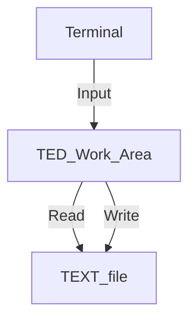
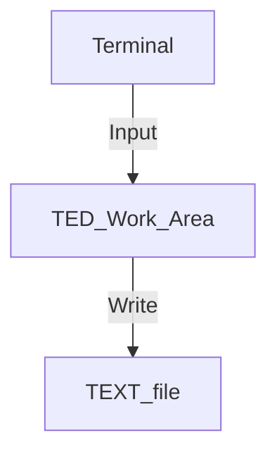
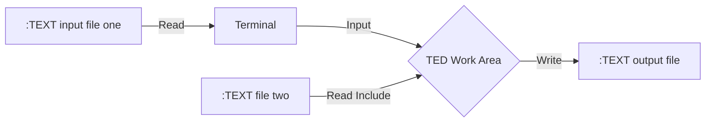
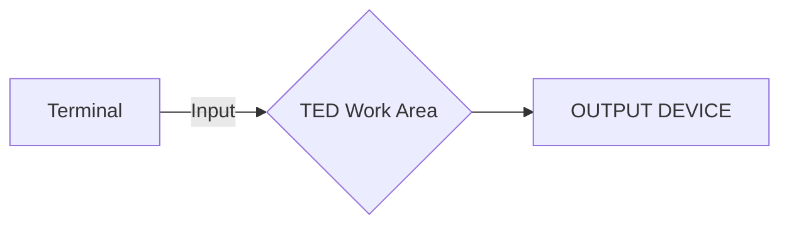

## Page 1

# NOTIS-1 User's Guide

## NORSK DATA A.S

```
[Logo: ND composed of a grid of black circles on a white background]
```

---

## Page 2

# NOTIS-1

## User's Guide

---

## Page 3

## NOTICE

The information in this document is subject to change without notice. Norsk Data A.S assumes no responsibility for any errors that may appear in this document. Norsk Data A.S assumes no responsibility for the use or reliability of its software on equipment that is not furnished or supported by Norsk Data A.S.

The information described in this document is protected by copyright. It may not be photocopied, reproduced or translated without the prior consent of Norsk Data A.S.

Copyright © 1981 by Norsk Data A.S.

---

## Page 4

# Printing Record

| Printing | Notes            |
|----------|------------------|
| 10/79    | Preliminary Issue|
| 06/80    | Second Issue     |
| 02/81    | Third Issue      |

```
NOTIS-1 User's Guide
Publication No. ND-60.120.03
```

```
  NORSK DATA A.S
  P.O. Box 4, Lindeberg gård
  Oslo 10, Norway
```

---

## Page 5

# Manual Updates

Manuals can be updated in two ways, new versions and revisions. New versions consist of a complete new manual which replaces the old manual. New versions incorporate all revisions since the previous version. Revisions consist of one or more single pages to be merged into the manual by the user, each revised page being listed on the new printing record sent out with the revision. The old printing record should be replaced by the new one.

New versions and revisions are announced in the ND Bulletin and can be ordered as described below.

The reader’s comments form at the back of this manual can be used both to report errors in the manual and to give an evaluation of the manual. Both detailed and general comments are welcome.

These forms, together with all types of inquiry and requests for documentation should be sent to the local ND office or (in Norway) to:

Documentation Department  
Norsk Data A.S  
P.O. Box 4, Lindeberg gård  
Oslo 10

---

## Page 6

# PREFACE

## THE PRODUCT

This manual describes the fourth version of the Nord Text and Information System:

**NOTIS-1 ND-10079E**

The system itself consists of the following software products:

| Product                  | Language    | Code    |
|--------------------------|-------------|---------|
| NORD TEXT-EDITOR         | English     | SUT-2394E |
| NORD TEKST-EDITOR        | Norwegian   | SUT-2408E |
| NORD TEXTE-EDITEUR       | French      | SUT-2409E |
| TEXT-FORMATTER           | English     | SUT-2395E |
| TEKST-FORMATTERER        | Norwegian   | SUT-2440E |

Depending on which language is used, the user can build up a complete NOTIS-system with the aid of one of the Editors and one of the Text-Formatters. The Text-Editor and the Text-Formatter are used to enter, edit and format text files from a video display terminal. These files can then be printed out on an output device directly.

---

## Page 7

The page is blank; there's no content to transcribe or convert to Markdown.

---

## Page 8

# TABLE OF CONTENTS

| Section                      | Page |
|------------------------------|------|
| 1. INTRODUCTION              | 2    |
| 1.1. THE READER              | 2    |
| 1.2. PREREQUISITE KNOWLEDGE  | 2    |
| 1.3. THE MANUAL              | 2    |
|                              |      |
| 2. The Text-Editor (TED)     | 3    |
| 2.1. General Information.    | 3    |
| 2.2. How to Start the Program.| 3   |
| 2.3. The TED Work Area.      | 6    |
| 2.4. The Screen Window.      | 6    |
|                              |      |
| 3. Editor Commands.          | 7    |
| 3.1. Command Types.          | 7    |
| 3.2. The HELP (H) Command    | 7    |
| 3.3. Commands in Direct Command Mode | 8 |
| 3.4. Commands in Full Command Mode | 9 |
| 3.5. The Control Key Command List | 10 |
| 3.6. Commands in Inspect Mode | 11  |
|                              |      |
| 4. The DIRECT Commands       | 13   |
| 4.1. The READ (R) Command    | 13   |

ND - 60.120.03

---

## Page 9

# Commands Index

| Section | Description                                    | Page |
|---------|------------------------------------------------|------|
| 4.2     | The WRITE (W) command                          | 14   |
| 4.3     | The FIRST WINDOW (F/^l) command                | 15   |
| 4.4     | The NEXT WINDOW (N/DOWN-ARROW) command         | 15   |
| 4.5     | The PREVIOUS WINDOW (P/UP-ARROW) command       | 16   |
| 4.6     | The LAST WINDOW (L/\$) command                 | 16   |
| 4.7     | The DISPLAY WINDOWS (2-9) command              | 16   |
| 4.8     | The REDISPLAY CURRENT WINDOW (0) command       | 16   |
| 4.9     | The MOVE WINDOW RIGHT OR LEFT command          | 16   |
| 4.10    | The PLUS (+) command                           | 16   |
| 4.11    | The MINUS (-) command                          | 17   |
| 4.12    | The MOVE-TO-LINE (M) command                   | 17   |
| 4.13    | The DELETE LINES (D) command                   | 17   |
| 4.14    | The INSERT LINES (I) Command                   | 19   |
| 4.15    | The SET-TABULATORS (T) command                 | 20   |
| 4.16    | The SET-BORDERS (B) command                    | 21   |
| 4.17    | The LIST DEFAULT FILE (X) command              | 22   |
| 4.18    | The DISPLAY MAIN FILE (Y) command              | 22   |
| 4.19    | The INSPECT-FILE (Z) command                   | 22   |
| 4.20    | The ACTIVATE SUBSYSTEM (A) command             | 23   |
| 4.21    | The SINTRAN COMMAND FOLLOWS (@) command        | 23   |
| 4.22    | The GET (find) STRING (G) command              | 23   |
| 4.23    | The SUBSTITUTE STRING (S) command              | 24   |
| 4.24    | The TRACE CURSOR or VERIFY (V) command         | 25   |
| 4.25    | RECALL LAST COMMAND (Ctrl Q)                   | 26   |
| 4.26    | The HOME KEY or SLANTED ARROW command          | 26   |
| 4.27    | The ENTER FULL COMMAND MODE (.) command        | 26   |

ND - 60.120.03

---

## Page 10

# Section

| Section                           | Page |
|-----------------------------------|------|
| 4.28. The EXIT (E) command        | 26   |

# 5. The FULL Commands

| Command                          | Page |
|----------------------------------|------|
| 5.1. LIST-FULL-COMMANDS          | 27   |
| 5.2. LIST-DIRECT-COMMANDS        | 27   |
| 5.3. LIST-CONTROL-FUNCTIONS      | 27   |
| 5.4. READ-FILE                   | 27   |
| 5.5. INCLUDE-FILE                | 27   |
| 5.6. WRITE-FILE                  | 27   |
| 5.7. APPEND-TO-FILE              | 28   |
| 5.8. DELETE-LINES                | 28   |
| 5.9. INSERT-LINE                 | 28   |
| 5.10. NAVIGATE-MODE              | 28   |
| 5.11. MOVE-TO-LINE               | 28   |
| 5.12. GET-STRING                 | 28   |
| 5.13. SUBSTITUTE                 | 28   |
| 5.14. MATCH-ALL                  | 28   |
| 5.15. EXACT-MATCH                | 29   |
| 5.16. SET-HORIZONTAL-STEP        | 29   |
| 5.17. SET-TABULATORS             | 29   |
| 5.18. SET-BORDERS                | 29   |
| 5.19. SET-DEFAULT-FILE           | 29   |
| 5.20. SET-MAIN-FILE              | 30   |
| 5.21. TIME-USED                  | 30   |
| 5.22. FIRST-WINDOW               | 30   |
| 5.23. NEXT-WINDOW                | 30   |

ND - 60.120.03

---

## Page 11

# Section

| Section      | Page |
|--------------|------|
| 5.24. PREVIOUS WINDOW   | 30   |
| 5.25. LAST-WINDOW   | 30   |
| 5.26. TRACE-CURSOR   | 30   |
| 5.27. INSPECT-FILE   | 30   |
| 5.28. EXIT/END   | 31   |

## 6. The CONTROL KEY Commands

|                      |      |
|----------------------|------|
| 6.1. MOVE CURSOR RIGHT TO FIRST 'x' (Ctrl F + 'x')   | 33   |
| 6.2. MOVE CURSOR LEFT TO FIRST 'x' (Ctrl R + 'x')   | 33   |
| 6.3. MOVE CURSOR TO NEXT TAB STOP (Ctrl T or Ctrl I)   | 33   |
| 6.4. MOVE CURSOR TO PREVIOUS TAB STOP (Ctrl Y or Ctrl U)   | 34   |
| 6.5. COPY FROM PREVIOUS LINE UP TO AND INCL. 'x' (Ctrl P +'x')   | 34   |
| 6.6. COPY ONE CHARACTER FROM PREVIOUS LINE (Ctrl C)   | 34   |
| 6.7. COPY ONE CHARACTER FROM NEXT LINE (Ctrl N)   | 34   |
| 6.8. COPY FROM NEXT LINE UP TO AND INCL. 'x' (FLI+ Ctrl P+'x')   | 34   |
| 6.9. INSERT BLANK LINE BEFORE CURRENT LINE (Ctrl L)   | 35   |
| 6.10. DELETE CHARACTERS UP TO AND INCL. 'x' (Ctrl D +'x')   | 35   |
| 6.11. RESTORE LAST DELETED LINE (Ctrl Q)   | 35   |
| 6.12. SPLIT-LINE (Ctrl S)   | 35   |
| 6.13. CONTINUE SEARCHING (Ctrl G)   | 36   |
| 6.14. SET/RESET INSERT MODE (Ctrl B)   | 36   |
| 6.15. SET/RESET EXPAND MODE (Ctrl E)   | 36   |
| 6.16. SET MARKER/GIVE CURSOR POSITION (Ctrl V)   | 36   |
| 6.17. DELETE CHARACTER (DEL-key or Ctrl A)   | 37   |
| 6.18. JUSTIFY PARAGRAPH BETWEEN BORDERS (Ctrl J or LF or FLI + LF)   | 37   |

ND - 60.120.03

---

## Page 12

# Section

| Section                                              | Page |
|------------------------------------------------------|------|
| 6.19. SET/RESET NAVIGATE MODE (FLI + Ctrl N)         | 37   |
| 6.20. ACCEPT CONTROL CHARACTER (Ctrl O)              | 37   |

# 7. TED and SYSTEM Error Messages.

## 7.1. Error Types.
Page 39

## 7.2. File System Messages.
Page 39

## 7.3. Text-Editor Messages.
Page 39

- 7.3.1. WRITE FORGOTTEN ?  
  Page 39
- 7.3.2. NOT FOUND : (string)  
  Page 39
- 7.3.3. NO SUCH COMMAND  
  Page 39
- 7.3.4. INVALID PARAMETER :  
  Page 39
- 7.3.5. NOT POSSIBLE.  
  Page 39
- 7.3.6. AMBIGUOUS COMMAND.  
  Page 40
- 7.3.7. NO SUCH FILE-NAME.  
  Page 40
- 7.3.8. ERROR BORDER RANGE IS: 1 - 255  
  Page 40
- 7.3.9. TOO LONG LINE.  
  Page 40
- 7.3.10. SCRATCH ERROR://CALL OPERATOR//C-CONTINUE A=ABORT.  
  Page 40
- 7.3.11. NOT ASCENDING ORDER.  
  Page 40
- 7.3.12. ILLEGAL <FROM TO INSERT-LINE>.  
  Page 40
- 7.3.13. FROM-LINE IS GREATER THAN LAST LINE.  
  Page 40
- 7.3.14. ILLEGAL PARAMETERS (FROM > TO).  
  Page 40
- 7.3.15. NOT POSSIBLE *Main file is :  
  Page 41

# 8. The Text-Formatter (TEX)
Page 43

## 8.1. Using the Text-Formatter
Page 43

## 8.2. TEX Error Messages
Page 44

## 8.3. Directives
Page 44

## 8.4. Underlining
Page 45

## 8.5. Indexing
Page 45

## 8.6. Merging Text
Page 45

## 8.7. Macros
Page 45

## 8.8. Hyphenation
Page 46

ND - 60.120.03

---

## Page 13

# Section

| Section | Page |
|---------|------|
| 9. Basic Concepts | 46 |
| 9.1. The Page | 46 |
| 9.2. Sections and Chapters | 47 |
| 9.3. Paragraphs | 48 |
| 9.4. Input Lines | 48 |
| 9.5. Words | 49 |

10. Directives That Define The General Layout

| Section | Page |
|---------|------|
| 10.1. Directive Format | 51 |

11. Document Layout Directives

| Section | Page |
|---------|------|
| 11.1. Page Format Definition at start of text | 53 |
| 11.2. Page Length `^PL,n;` | 53 |
| 11.3. Page Width `^PW,n;` | 53 |
| 11.4. Left Border `^LB,n;` | 53 |
| 11.5. Other Border `^OB,n;` | 53 |
| 11.6. Contents `^CO;` | 53 |
| 11.7. Include Contents `^IC;` | 53 |
| 11.8. Define Pitch `^DP,n;` | 54 |
| 11.9. Diablo Border `^DBORDER,n;` | 54 |
| 11.10. Sheet Length `^SHEETL,n;` | 54 |
| 11.11. Duplex Copying `^DX;` | 54 |

12. Format Modification Directives

| Section | Page |
|---------|------|
| 12. Format Modification Directives | 55 |

ND - 60.120.03

---

## Page 14

# Table of Contents

| Section                                                 | Page |
|---------------------------------------------------------|------|
| 12.1. Top Border `^TB,n;`                               | 55   |
| 12.2. Header 1 `^H1,string;`                            | 55   |
| 12.3. Header 2 `^H2,string;`                            | 55   |
| 12.4. Page Number `^PN,n;`                              | 55   |
| 12.5. Page Header Flag `^PH,n;`                         | 55   |
| 12.6. Bottom Border `^BB,n;`                            | 55   |
| 12.7. Trailer `^TL,string;`                             | 56   |
| 12.8. Save and Restore Formats `^NF;^OF;`               | 56   |
| 12.9. Filling Mode `^FM,mode;`                          | 56   |
| 12.10. Justification Mode `^JM,mode;`                   | 57   |
| 12.11. Margin Setting `^LM,n; ^RM,n; ^BM,n;`            | 57   |
| 12.12. Line Spacing `^LS,n;`                            | 57   |
| 12.13. Paragraph Spacing `^PS,n;`                       | 58   |
| 12.14. Paragraph Footing `^PF,n;`                       | 58   |
| 12.15. Paragraph Indentation `^PI,n;`                   | 58   |
| 12.16. Section Spacing `^SS,n;`                         | 58   |
| 12.17. Section Footing `^SF,n;`                         | 58   |
| 12.18. Section Indentation `^SI,n;`                     | 58   |

# 13. Formatting Control Directives

| Section                                                  | Page |
|----------------------------------------------------------|------|
| 13.1. Paragraph `^P;`                                    | 59   |
| 13.2. Inverted Paragraph `^IP,string;`                   | 59   |
| 13.3. Blank Lines `^BL,n;`                               | 59   |
| 13.4. Break Line `^BL;`                                  | 59   |
| 13.5. Centre `^CE,string;`                               | 60   |
| 13.6. Figure `^FI,n;`                                    | 60   |

```
ND - 60.120.03
```

---

## Page 15

# Table of Contents

| Section | Page |
|---------|------|
| 13.7. Initialization of Figure-number `^FN,n;` | 60 |
| 13.8. Page `^PG;` | 60 |
| 13.9. Conditional Page `^CP,n;` | 60 |
| 13.10. Chapter `^CH,string;` | 60 |
| 13.11. Chapter and Section Number `^CN,n,o,p,q;` | 60 |
| 13.12. New Section `^SE,string;` | 61 |
| 13.13. Section Down `^SD,string;` | 61 |
| 13.14. Section Up `^SU,string;` | 61 |
| 13.15. Appendix `^AP,string;` | 61 |
| 13.16. Initiate Appendix Number `^AN,n;` | 62 |
| 13.17. Switch Output `^SO,file-name;` | 62 |
| 13.18. Reset Output `^RO;` | 62 |
| 13.19. Include Scratch File `^IS,file-name;` | 62 |

# 14. Directives That Describe the Document

| Section | Page |
|---------|------|
| 14.1. Title `^TI,string;` | 63 |
| 14.2. Author `^AU,string;` | 63 |
| 14.3. To People `^TO,string;` | 63 |
| 14.4. Distribution `^DI,string;` | 63 |
| 14.5. Reference Number `^RF,string;` | 63 |
| 14.6. Date `^DA,string;` | 63 |
| 14.7. Version Number `^VE,n;` | 64 |
| 14.8. Letter Head `^LH,string;` | 64 |
| 14.9. Technical Note Head `^TK;` | 64 |
| 14.10. Title Page `^TP;` | 64 |
| 14.11. Abstracts Line `^AS,string;` | 64 |

ND - 60.120.03

---

## Page 16

# Table of Contents

| Section                                      | Page |
|----------------------------------------------|------|
| 14.12. Page-header-string ^PHSTR,string;     | 64   |
|                                              |      |
| **15. Indexing Control Directives**          | 65   |
| 15.1. Indexing-On ^INDEXON;                  | 65   |
| 15.2. Automatic Indexing ^XA,term;           | 65   |
| 15.3. Disable Indexing ^XD,term;             | 66   |
| 15.4. Reverse Indexing ^XR,term;             | 66   |
| 15.5. Index Explicit ^X,term;                | 66   |
| 15.6. Index Inhibit ^II;                     | 66   |
|                                              |      |
| **16. Miscellaneous Directives**             | 67   |
| 16.1. Absolute Word ^AW,string;              | 67   |
| 16.2. Absolute Mode ^A;                      | 67   |
| 16.3. Force Lower Case ^FL,n;                | 67   |
| 16.4. Auto Capitals ^AC,n;                   | 68   |
| 16.5. Abbreviations ^AB,string;              | 68   |
| 16.6. Tabulator Setting ^TS,n,t,n,t...;      | 68   |
| 16.7. Include File ^IN,file-name,t,l or r;   | 68   |
| 16.8. Bold Sections ^BS,n;                   | 69   |
| 16.9. Bold Text ^BT,level;                   | 69   |
| 16.10. Message ^MS,message;                  | 69   |
| 16.11. Operator Command ^OP,string;          | 69   |
| 16.12. Underline Mode ^UM,mode;              | 70   |
| 16.13. Underline Character ^UC,character;    | 70   |
| 16.14. Section Mode ^SM,mode;                | 70   |

ND - 60.120.03

---

## Page 17

# Table of Contents

| Section                                                     | Page |
|-------------------------------------------------------------|------|
| 0.2.2. How is a macro used?                                 | 110  |
| 0.3. Help Macros                                            | 110  |
| 0.4. Macros Inverted Paragraphs: 'SIP' 'NP' 'EIP'           | 110  |
| 0.5. Macro 'FIG'                                            | 112  |
| 0.6. Macro 'SHOW'                                           | 113  |
| 0.7. Macro 'CHPG'                                           | 113  |
| 0.8. Macros 'SEPG' 'SDPG' and 'SUPG'                        | 114  |
| 0.9. Macros 'SEQC' 'SECD' and 'SECU'                        | 114  |
| 0.10. Macro 'APPX'                                          | 114  |
| 0.11. Macro 'DATE'                                          | 114  |

# 1. Document Macros

| Section       | Page |
|---------------|------|
| 1.1. Macro 'HEAD'     | 115  |
| 1.2. Macro 'MEMO'     | 115  |
| 1.3. Macro 'MINUTES'  | 116  |
| 1.4. Macro 'REPORT'   | 116  |
| 1.5. Macro 'CALL'     | 117  |
| 1.6. Macro 'LETTER'   | 118  |
| 1.7. Macro 'ADR'      | 118  |
| 1.8. Macro 'TELEX'    | 120  |
| 1.9. Macro 'MANUAL'   | 121  |

# Index
Page 122

ND - 60.120.03

---

## Page 18

# NOTIS-1 USER'S GUIDE

ND - 60.120.03

---

## Page 19

# NOTIS-1 USER'S GUIDE
## INTRODUCTION

### 1. INTRODUCTION

#### 1.1. THE READER

The manual will serve anyone who has a need to carry out editing and formatting functions, i.e., scientists, authors, programmers, etc. It is also intended for secretarial staff with a need for advanced editing and formatting tools.

#### 1.2. PREREQUISITE KNOWLEDGE

The reader need not possess any prerequisite knowledge of computers and programming in order to use the information contained in this manual; however, some knowledge of the principles of electronic text processing is a great advantage.

#### 1.3. THE MANUAL

This manual should be used primarily as a reference guide. It describes in detail all the commands of the NOTIS programs. Some introductory information and instructions for starting the programs have also been included. The manual itself has been divided into two parts, the first dealing with the Text-Editor and the second with the Text-Formatter. Appendices A and B list, in reference format, all the commands for the Text-Editor and the Text-Formatter, while Appendix C provides several examples of macros, along with a Macro Library.

ND - 60.120.03

---

## Page 20

# NOTIS-1 USER'S GUIDE
## The Text-Editor (TED)

### 2. The Text-Editor (TED)

#### 2.1. General Information

The Nord Text-Editor is a VDU page mode Text-Editor for asynchronous terminals that are connected to NORD computers running the SINTRAN-III operating system.

The text may be read from and written to any mass storage file or I/O device.

Text may be added, modified, inserted, replaced and deleted by using the cursor controls and a few self-explanatory, easy-to-learn commands.

The Text-Editor currently operates on several types of terminals. The operator does not need to specify terminal type at program initiation. The Text-Editor performs a `GET-TERMINAL-TYPE` monitor call before editing may begin. The types of terminals implemented in the standard release of the Text Editor and their corresponding SINTRAN-III terminal type numbers are as follows:

- Tandberg 2115  (3)
- Infoton 200    (4)
- Tandberg 2000  (7)
- DEC VT100      (6)
- DEC VT52       (29)
- Beehive 100    (8)
- Hazeltine 1500 (10)
- Volker Craig 404 (37)

#### 2.2. How to Start the Program

The Nord Text-Editor is written to run under the NORD SINTRAN-III operating system. As a subsystem under SINTRAN-III it is given the name TED. After logging in as a timesharing user, the user starts the program by writing `TED` in response to the herald character @ (also called 'commercial at'). `TED` answers by displaying an asterisk in the screen home position (the upper left corner), and `TED` in blown-up characters in the middle of the screen:

```
 *******   *****    ****
 *     *   *   *    *   *
 * *** *   *   *    ****
 * * * *   *   *    *   *
 * *****   *****    **** 

NORD Text-Editor - SUT2394E

ND - 60.120.03
```

---

## Page 21

# NOTIS-1 USER'S GUIDE
## The Text-Editor (TED)

TED is now ready to accept a command from the user. If in doubt, use the HELP command to obtain the lists of the commands available in the different command modes.

To start editing an existing file, give the READ command (R) followed by the file-name, to read in the text. Use the CR key or Return to position the cursor on the line on which you want to write.

To start editing a new file, press the 'F' or '1' (numeric one) to display the first 20-line 'window' on the screen, and position the cursor on line number one with CR.



**Fig. 1. Editing an existing file**

In Fig. 1, an existing file is read into the work area, the text is edited and the file is written back to the same file-name.



**Fig. 2. Editing a new file**

In Fig. 2, new text is edited and written under a new file-name. A new file-name must be created in quotation marks ("..."), but once it has been created the quotation marks must no longer be used.

In Fig. 3, two files have been read into the buffer, edited, and written into a common file.

In Fig. 4, the diagram shows the entire process that takes place from the time the text is entered on the terminal, until it is printed out on the output device. NOTE: The Text-Formatter will only take file type :TEXT as input. Therefore, a file type :SYMB must be renamed.

The Text-Formatter is described in Chapter 7, and the Inspect mode in Chapter 19.

ND - 60.120.03

---

## Page 22

# NOTIS-1 USER'S GUIDE
The Text-Editor (TED)



**Fig. 3. Editing several files**


**Fig. 4 Edit-Format-Print Diagram**



**Fig. 5. Editing with direct output to output device**

As shown in Fig. 5, it is also possible to write a text directly onto an output device (Line-Printer, Diablo or similar). This can be useful for shorter memos, but it is then very important to edit the text with due regard to line length, paragraphs, etc., since this text will not be going through the Text-Formatter. In this case it is the 'Write' command in TED which is used to write out the :TEXT file.

ND - 60.120.03

---

## Page 23

# NOTIS-1 USER'S GUIDE
## The Text-Editor (TED)

When a previously formatted file is to be copied to an output device, it is the INSPECT mode in TED which is used to write out the :OUT file. The procedure is:

```
@TED The Z or Inspect-File command <file-name>

The C (Copy-File) command.
```

### 2.3. The TED Work Area

TED has an editing area, a 'Scratch' area, containing the text being edited during the current run of the program. This area can be filled with text both from files and directly from the terminal. The current text is edited from the terminal by giving commands and data to TED.

Note that editing is only done in the TED work area and not on files! At any time, the current text can be saved on a file by giving the WRITE command. If the file-name in the write command is the same as a file previously read from, the old contents of the file will be replaced by the current text. But the current text may also be saved in a different file, thus preserving the old version of the text.

### 2.4. The Screen Window

A screen window shows a selected part of the TED editing area on the screen. A window generally contains 20 lines, and is usually the only part of the area that can be edited at any moment. There are, however, a few exceptions to this rule, i.e., the GET command and the SUBSTITUTE command, which will be explained in the chapters devoted to the commands.

---

ND - 60.120.03

---

## Page 24

# NOTIS-1 USER'S GUIDE
## Editor Commands

### 3. Editor Commands

#### 3.1. Command Types

There are several types of commands in **TED**: the **DIRECT** commands, the **FULL** commands, and the **CONTROL-KEY** commands. In addition, the **INSPECT** mode has a series of commands permitting the user to carry out a thorough inspection of the formatted `:OUT` file. In this mode the file can only be inspected, copied, and printed, but not updated.

The **DIRECT** and **FULL** commands must be given while the cursor is in the screen home position. If a command requires extra information from the user, questions will appear in the top line of the screen.

The cursor can be placed in home position at any time by pressing the **HOME-key** (or the slanted arrow on terminals that do not have a home key). If the key is pressed a second time, the cursor returns to its previous position in the text.

In **DIRECT** command mode, **TED** is compatible with previous versions of the Text-Editor. **FULL** commands represent an extension of the program.

To go from **DIRECT** mode to **FULL** mode and back again, press the dot (.) while the cursor is in the screen home position.

When in **DIRECT** mode, **TED** displays an asterisk (*) in the screen home position. The commands consist of one letter only, and are executed directly, without carriage return.

In **FULL** mode **TED** displays a 'greater than' (>) in home position, the commands are written out in full and executed with a carriage return.

**CONTROL-KEY COMMANDS** can be given at any time, both in **DIRECT** and in **FULL** command modes.

#### 3.2. The HELP (H) Command

Pressing the 'H' for **HELP** will give you access to three lists of available commands in normal editing mode, and one list in **INSPECT** mode. In normal editing mode, depending upon which command mode one is in, either the **DIRECT COMMAND** list or the **FULL COMMAND** list will be printed on the screen first. To get access to the other two, press the down-arrow. To go back to a Help-list which has already been displayed, press the up-arrow. To leave **HELP** mode, type **HOME** or use the slanted arrow.

The commands are listed on separate pages, for easier reference. The command list in **INSPECT** mode has also been included here.

---

ND - 60.120.03

---

## Page 25

# NOTIS-1 USER'S GUIDE
## Editor Commands

### 3.3. Commands in Direct Command Mode

**DIRECT COMMANDS**

```
*R..........READ FILE
*W..........WRITE FILE
*A..........ACTIVATE SUBSYSTEM
+...........ADVANCE 5 LINES
-...........REWIND 5 LINES
*M..........MOVE TO LINE
*D..........DELETE LINES
*T..........SET TABULATORS
*B..........SET BORDERS
*X..........LIST DEFAULT FILE
*Y..........LIST MAIN FILE
*Z..........INSPECT FILE
*Q..........SINTRAN COMMAND
*I..........INSERT LINES
*G..........GET (find) STRING
*S..........SUBSTITUTE STRING
*E..........EXIT/END
*F/L........FIRST WINDOW OF 20 LINES
*N/DOWN.....NEXT WINDOW
*P/UP.......PREVIOUS WINDOW
*L/$........LAST WINDOW
*H/?........HELP
*2-9........DISPLAY WINDOWS 2/9
*O..........REDISPLAY CURRENT WINDOW
*LEFT/RIGHT.MOVE WINDOW LEFT/RIGHT
*.*.........SET/RESET FULL COMMAND MODE
*V..........CURSOR TRACE ON/OFF
*CTRL Q.....RECALL LAST COMMAND
*HOME.......CANCEL LAST COMMAND
```

ND - 60.120.03

---

## Page 26

# NOTIS-1 USER'S GUIDE  
Editor Commands

## 3.4. Commands in Full Command Mode

**FULL COMMANDS**

```
> LIST-FULL-COMMANDS
> LIST-DIRECT-COMMANDS
> LIST-CONTROL-FUNCTIONS
> SET-TABULATORS
> EXIT/END
> READ-FILE
> INCLUDE-FILE
> WRITE-FILE
> APPEND-TO-FILE
> DELETE-LINES
> INSERT-LINE
> MOVE-TO-LINE
> GET-STRING
> SUBSTITUTE
> SET-HOR-STEP
> SET-DEFAULT-FILE
> NAVIGATE-MODE
> SET-MAIN-FILE
> SET-BORDERS
> TIME-USED
> MATCH-ALL
> EXACT-MATCH
> INSPECT-FILE
> FIRST-WINDOW
> NEXT-WINDOW
> PREVIOUS-WINDOW
> LAST-WINDOW
> TRACE-CURSOR
```

**NOTE:** '.', '@', '+', '-', 0-9, Up-, Down-, Left- and Right-arrows can be used as in direct command mode.

ND - 60.120.03

---

## Page 27

# 3.5. The Control Key Command List

*** CONTROL KEYS (ex:<X> means CTRL + X) ***

** 'x' = ANY CHARACTER OR CONTROL KEY **

| Command           | Description                                        |
|-------------------|----------------------------------------------------|
| <F>+'x'           | MOVE CURSOR RIGHT TO FIRST 'x'                     |
| <R>+'x'           | MOVE CURSOR LEFT TO FIRST 'x'                      |
| <T>/<I>           | MOVE CURSOR TO NEXT TAB STOP                       |
| <Y>/<U>           | MOVE CURSOR TO PREVIOUS TAB STOP                   |
| <P>+'x'           | COPY FROM PREVIOUS LINE UP TO 'x' (INCL.)          |
| <C>               | COPY ONE CHARACTER FROM PREVIOUS LINE              |
| <N>               | COPY ONE CHARACTER FROM NEXT LINE                  |
| FLI+<P>+'x'       | COPY FROM NEXT LINE UP TO 'x' (INCL.)              |
| <L>               | INSERT BLANK LINE BEFORE CURRENT LINE              |
| <D>+'x'           | DELETE CHARACTERS UP TO 'x' (INCL.)                |
| <Q>               | RESTORE LAST DELETED LINE                          |
| <S>               | SPLIT LINE AT CURSOR POSITION                      |
| <G>               | CONTINUE SEARCHING                                 |
| <B>               | SET/RESET INSERT MODE                              |
| <E>               | SET/RESET EXPAND MODE                              |
| <V>               | SET MARKER/GIVE CURSOR POSITION                    |
| DEL/<A>           | DELETE CHARACTER                                   |
| <J>/<LF>          | JUSTIFY PARAGRAPH BETWEEN BORDERS                  |
| FLI+<N>           | SET/RESET NAVIGATE MODE                            |
| <O>               | ACCEPT CONTROL CHARACTER                           |

FLI is Function-Lead-In character (octal 37)  
(usually Ctrl + shift + underline)

ND - 60.120.03

---

## Page 28

# NOTIS-1 USER'S GUIDE
## Editor Commands

### 3.6. Commands in Inspect Mode

`TED` automatically enters **INSPECT** mode when it has been activated by `TEX`, to look at the `.OUT` file.

**Inspect mode** is used to check a formatted `.OUT` file. As explained earlier, no modification of the text can be carried out while in this mode, but there is a command in **INSPECT** ('A' or 'T') which puts the user back in Edit mode in `TED` for this purpose. If the text is modified at this point, it has to be sent through the Text-Formatter again.

If the outfile is satisfactory and the user wants to print it, the **COPY-FILE** command in Inspect mode will start the printing process. See the relevant chapter for further explanations.

In **INSPECT** mode the **page is an output page**, e.g., usually 66 lines. The commands are **DIRECT**.

**INSPECT MODE COMMANDS**

| Command           | Action                      |
|-------------------|-----------------------------|
| H/?               | DISPLAY COMMAND LIST        |
| F/                | DISPLAY FIRST PAGE          |
| N                 | DISPLAY NEXT PAGE           |
| P                 | DISPLAY PREVIOUS PAGE       |
| L/$               | DISPLAY LAST PAGE           |
| 2-9               | DISPLAY PAGE 2-9            |
| UP-ARROW          | DISPLAY PREVIOUS WINDOW     |
| CR or DOWN-ARROW  | DISPLAY NEXT WINDOW         |
| LEFT-ARROW        | MOVE WINDOW LEFT            |
| RIGHT-ARROW       | MOVE WINDOW RIGHT           |
| M                 | MOVE TO PAGE                |
| G                 | GET (find) STRING           |
| C                 | COPY FILE                   |
| A/T               | ACTIVATE TED WITH CURRENT TEXT FILE |
| @                 | SINTRAN COMMAND FOLLOWS     |
| E                 | EXIT                        |

ND - 60.120.03

---

## Page 29

# NOTIS-1 USER'S GUIDE

## Editor Commands

---

ND - 60.120.03

---

## Page 30

# NOTIS-1 USER'S GUIDE
## The DIRECT Commands

### 4. The DIRECT Commands

These commands are given in direct command mode, when a '*' is in the screen home position. They consist of a single character without CR, and are thus direct. In this command mode, the cursor must be in home position, e.g., immediately after the '*'.

#### 4.1. The READ (R) command

The READ command will cause text to be read into the TED work area from a file. Pressing the character 'R' will activate the read command. The following text will appear in the screen home position:

- READ-FILE

The format of the answer is:

- READ-FILE:<File-name>,<From>,<To>,<Line>CR

where:

- `<File-name>` is the name of the file to be read from. **NOTE!** - default file type is '!.TEXT'.
- `<From>` is the first line to be read (default is line 1).
- `<To>` is the last line to be read (default is the last line in the file).
- `<Line>` is the line in the current text behind which the file is to be inserted (default is last line).

The user's attention is drawn to one very important point: If there is already text in the work area, it is the text 'INCLUDE-FILE' which will appear in the screen home position when the 'R' command is given. This prevents the user from accidentally reading the same file into TED's work area twice. On the other hand, the command enables the user to merge a new file in the current file. See FULL Commands.

In the upper, right corner the word 'READING' will appear, followed by a position arrow indicating how far the 'Read' has progressed. When the required number of lines has been read into the TED work area, the reply '<n> LINES READ' will appear in the screen home position.

Files containing the tabulator control Ctrl I or Ctrl T (depending on the terminal used) will be expanded and the control command will move the cursor up to the next tabulator position. In other words, files may contain tabulator positions which will be correctly expanded at 'Read' time.

The tabulator setting must be the same when the file is read as it was when the file was previously written.

ND - 60.120.03

---

## Page 31

# NOTIS-1 USER'S GUIDE
## The DIRECT Commands

Current border setting does not have any effect on a read. Line lengths can be maintained within border limits by using Ctrl J (see Control Key Commands).

The READ command (but not the INCLUDE-FILE command) sets the default file which is read with the direct 'X' command. The 'R' command may thus cause the default file to be changed.

Here are some examples of how the Read command can be used:

- **READ-FILE:MYFILE**

  Read all lines from the file MYFILE:TEXT (default file type is :TEXT) into the TED work area from line 1 and downwards.

- **READ-FILE:MYFILE,10,140**

  Read lines 10 through 140 from the file MYFILE:TEXT

- **INCLUDE-FILE:NEWFILE,20,,15**

  This third example shows TED's prompt when the 'R' command is given at a time when there is current text in the work area. The command then causes all lines after line 20 from the file NEWFILE to be placed behind line 15 of the current text.

### 4.2. The WRITE (W) command

The WRITE command will cause text to be written from the TED work area into a file. Pressing the character 'W' will activate this command, and the following text will appear in the screen home position.

- **WRITE-FILE:**

The format of the answer is:

- **WRITE-FILE : <File-name>,<From>,<To>CR**

Where:

- `<File-name>` is the name of the file to be written (a new file-name is given in quotes).
  **NOTE!** - default file type is :TEXT.
- `<From>` is the first line to be written.
- `<To>` is the last line to be written.

In the upper, right corner of the screen the word 'WRITING' will appear, followed by a position arrow indicating how far the 'Write' has progressed. Once the required number of lines have been written into the file the reply '<n> LINES WRITTEN' will appear in the upper, 

ND - 60.120.03

---

## Page 32

# NOTIS-1 USER'S GUIDE
## The DIRECT Commands

The command causes the default file-name to be set.

Here are some examples of how the Write command can be used:

1. `WRITE-FILE:MYFILE`

   or

2. `WRITE-FILE:MYFILE,1,$`  
   Write all lines from the TED work area into the file `MYFILE:TEXT`

3. `WRITE-FILE:MYFILE,10,140`  
   A file with the name `MYFILE:TEXT` is created, and then lines 10 through 140 from the TED work area are written into this file.

4. `WRITE-FILE:MYFILE,20`

   or

5. `WRITE-FILE:MYFILE,20,$`  
   Write all lines after line 20 from the TED work area into the file `MYFILE:TEXT`

6. `WRITE-FILE:*`

   or

7. `WRITE-FILE:CR`  
   Write all the lines from the TED work area into the default file (i.e., either the last file read into an empty work area, or the last file written, unless the default file has been explicitly set - see `SET-DEFAULT-FILE`).

   Before any Write to the default file is performed, the default file-name is displayed and must be confirmed by pressing CR.

## 4.3. The FIRST WINDOW (F/1) Command

Pressing 'F' or '1' will display the first window of 20 lines in the TED work area, and will enable you either to check already existing text or to start editing a new file.

## 4.4. The NEXT WINDOW (N/DOWN-ARROW) Command

Pressing the letter 'N' will display the next 20 lines of the work area.

---

## Page 33

# NOTIS-1 USER'S GUIDE
## The DIRECT Commands

Example: If the window containing lines 45 through 64 is currently displayed on the screen, the 'N' will display lines 65 through 84.

### 4.5. The PREVIOUS WINDOW (P/UP-ARROW) command

Pressing the letter 'P' or the UP-ARROW will display the previous window of 20 lines.

Example: If lines 65 through 84 are currently displayed, the 'P' will display lines 45 through 64.

### 4.6. The LAST WINDOW (L/$) command

Pressing the 'L' or the DOLLAR-SIGN will display the last window of the TED work area.

Example: If the work area contains 35 lines, the window containing lines 16 through 35 will appear on the screen.

### 4.7. The DISPLAY WINDOWS (2-9) command

In the same way as you use the '1' (or 'F') to view the first window of the work area, you can use the digits from 2 through 9 to go back and forth between text area windows 2 through 9.

Example: If you press '7', the window containing lines 121 through 140 will be displayed on the screen.

### 4.8. The REDISPLAY CURRENT WINDOW (0) command

Pressing the 0 (zero) will redisplay the current window. This is useful for instance if a broadcast was received on the screen during editing.

### 4.9. The MOVE WINDOW RIGHT OR LEFT command

The text in the window can be shifted to the right or to the left with the corresponding arrows. The number of character positions that the screen text will be moved can be set with the Full command SET-HORIZONTAL-STEP. Default is 40 positions.

### 4.10. The PLUS (+) command

Pressing the sign '+' will cause the window to be advanced by 5 lines of text.

---

ND - 60.120.03

---

## Page 34

# NOTIS-1 USER'S GUIDE
The DIRECT Commands

## 4.11. The MINUS (-) command

Pressing the sign '-' will cause the window to be rewound 5 lines.

## 4.12. The MOVE-TO-LINE (M) command

The MOVE command will move the window to start at a given line (relative or absolute). Pressing the character 'M' will give the following text in the screen home position:

```
- MOVE-TO-LINE:
```

and the format of the answer is either

```
- MOVE-TO-LINE:<+> or <-> <number of lines> CR
```

where '+' or '-' <number of lines> will move the screen window as many lines forwards or backwards in the TED work area as you wish.

Example: If the answer you give to 'MOVE-TO-LINE:' is '+15' and you are working on a screen window containing lines 255 to 274, your command will move you 15 lines forwards in the text work area relative to the current window position. You will thus be viewing the window starting with line 270.

The command may also be used in this manner:

```
- MOVE-TO-LINE:<line number> CR
```

where <line number> is the number of the line in the TED work area you want to appear at the top of the screen.

Example: If <line number> is 300, lines 300 through 319 will be listed.

Finally, if the <line number> has been set by the Control command Ctrl V (see Control Key Commands), the MOVE-TO-LINE command may be given in this manner:

```
- MOVE-TO-LINE: CR
```

## 4.13. The DELETE LINES (D) command

Lines can be deleted from the TED work area with the DELETE LINES command. Pressing the character 'D' will give the following text in the screen home position:

```
- DELETE LINES (FROM,TO):
```

ND - 60.120.03

---

## Page 35

# NOTIS-1 USER'S GUIDE
## The DIRECT Commands

The format of the answer is:

- **DELETE LINES (FROM,TO):<from>,<to>CR**

where:

- `<from>` is the first line to be deleted
- `<to>` is the last line to be deleted

or

- **DELETE LINES (FROM,TO) : CR**

  if the line numbers `<from><to>` have been indicated by the Control command Ctrl V (see Control Commands).

This is how the command is carried out if Ctrl V is used:

The cursor is placed at the first and at the last line to be deleted and Ctrl V is given at the beginning of each of the two lines.

The home key is pressed, and then 'D' to activate the delete command.

CR is then given as a response to the **DELETE** command causing these two line numbers to be listed out (and maybe edited).

Another CR will execute the command.

### Examples:

1) **DELETE LINES (FROM,TO) :5,25**  
   Delete lines 5 through 25.

2) **DELETE LINES (FROM,TO) :12,12**

or

- **DELETE LINES (FROM,TO) :12**  
  Delete line 12.

- **DELETE LINES (FROM,TO) :20,$**  
  Delete line 20 and everything that comes after.

- **DELETE LINES (FROM,TO) :1,$**

or

- **DELETE LINES (FROM,TO) :All**  
  Delete the whole file from the TED work area.

- **DELETE LINES (FROM,TO) :CR 5,10 CR**

ND - 60.120.03

---

## Page 36

# NOTIS-1 USER'S GUIDE
## The DIRECT Commands

Lines 5 through 10 have been marked by Ctrl V and will be deleted.

### 4.14. The INSERT LINES (I) Command

The insert command is made for easy copying or moving of one or more lines.

Pressing the character 'I' will give the following text in the screen home position:

- INSERT-LINE <FROM, TO, INSERT>:

The format of the answer is:

- INSERT-LINE <FROM, TO, INSERT>: \<from> \<to> \<insert> CR

where:

- \<from> is the first line in the work area to be moved or copied
- \<to> is the last line in the work area to be moved or copied
- \<insert> is the number of the line where you want text inserted. The text is inserted before the line specified in \<insert>.

Or

- INSERT-LINES <FROM, TO, INSERT>: CR

  if the line numbers \<from> \<to> have been indicated by a Ctrl V (see explanation under DELETE, and use the same procedure).

The line where the text is to be inserted, \<insert>, is selected by placing the cursor at the first character position of the line, and then pressing the Home key or slanted arrow. Now the 'I' command may be given, and CR as a response will list out the three line numbers selected (which may be edited). Another CR will execute the command.

When the command is executed, the following question will appear:

- DELETE (Y/N)?

Yes (Y) or No (N) are the answers:

'y' means that the work area \<from>\<to> will be deleted in its old location and only appear in the new \<INSERT> location.

ND - 60.120.03

---

## Page 37

# NOTIS-1 USER'S GUIDE
## The DIRECT Commands

'N' means that nothing happens to the work area `<from><to>`.

Anything other than Yes or No will be taken as No.

### Examples:

1. **INSERT-LINE `<FROM,TO,INSERT>`:12,15,47**  
   **DELETE (Y/N)? N**

   Lines 12 through 15 will be copied in between lines 46 and 47 (i.e., they will be duplicated).

2. **INSERT-LINE `<FROM,TO,INSERT>`:65,112,15**  
   **DELETE (Y/N)? Y**

   Lines 65 through 112 will be moved in between lines 14 and 15 and deleted in their old location.

3. **INSERT-LINE `<FROM,TO,INSERT>`:23,40,$**  
   **DELETE (Y/N)? Y**

   Lines 23 through 40 will be moved in before the last line of the work area text and deleted in their old location.

4. **INSERT-LINE `<FROM,TO,INSERT>`CR 15,23,10 CR**  
   **DELETE (Y/N)? Y**

   Lines 15 through 23 had been selected with a Ctrl `<V>`. The cursor had been placed on line 10 and the 'Home' key or Slanted Arrow pressed. Lines 15 through 23 will be moved in before line 10, and deleted in their previous location.

### 4.15. The SET-TABULATORS (T) command

This command is used to set tabulator positions at the user's choice. A maximum of 20 tabulator positions are allowed, within a border range of 1 - 255.

Pressing the letter 'T' will give the following text on the screen home:

```
SET-TABULATORS:
```

The format of the answer is:

```
SET-TABULATORS:<position-1>,<position-2>,...,<position-n>CR
```

where `<n>` is a number between 1 and 255, in increasing order.

or:

```
ND - 60.120.03
```

---

## Page 38

# NOTIS-1 USER'S GUIDE
## The DIRECT Commands

### SET-TABULATORS:T

to re-establish the default tabulator setting in TED, which is 10, 20, 30, 40, 50, 60, 70, 80, 89, 99, 109, 119, 129 and 168.

or:

### SET-TABULATORS:P

to establish the PED (the Program Editor - see PED User's Guide ND-60.121.03) default tabulator setting, which is 8, 14, 30, 40, 50, 60, 70, 80, 89, 99, 109, 119, 129 and 168. This set of values is compatible with QED (see QED User's Manual ND-60.031.04).

or:

### SET-TABULATORS:CR

to cause the current tabulator settings to be printed. These may, if desired, be edited and resubmitted.

or:

### SET-TABULATORS:CR CR

to cause the current tabulator settings to be indicated by 'T's on the third screen line.

## 4.16. The SET-BORDERS (B) command

This command is used to set borders (or margins) for the text which is entered after the borders have been set. Text entered earlier will not be affected by the command, unless the control-command `<J>` (Justify text) is used.

Pressing the key 'B' will give the following text in the upper left corner:

```
- SET-BORDERS:
```

The format of the answer is:

```
- SET-BORDERS:<x>,<z> CR
```

where

- `<x>` is the column where the left border or margin is to be placed,
- `<z>` is the column where the right border is to be placed.

Default values are 1 and 79; border range is 1 - 255.

ND - 60.120.03

---

## Page 39

# NOTIS-1 USER'S GUIDE
## The DIRECT Commands

The border columns will be included in the text, and brackets (....) will appear accordingly on line 3 of the screen.

### 4.17. The LIST DEFAULT FILE (X) Command

This command is used to find the name of the default file. The default file-name is set when the READ command is given while the work area is empty. The Write command also sets the default file-name.

The format of the answer is

- DEFAULT FILE-NAME: (default file-name)

### 4.18. The DISPLAY MAIN FILE (Y) Command

This command is given to find the name of the file which is ready to go to the Text-Formatter, i.e., the file that TED will output in response to the 'Activate Subsystem' (A) or (J) command with which formatting is initiated. This has to be a file type `:TEXT`, since otherwise the Text-Formatter will not find it. The output file from TEX will be (file-name) :OUT.

The format of the answer is:

- MAIN-FILE-NAME: 'file-name'

### 4.19. The INSPECT-FILE (Z) Command

This command is used to inspect the main file (see above). It can also be used to get direct access to an output device to print an already formatted file. In that case, the procedure is:

- Enter TED directly from SINTRAN (after the @)

- Do not use the Read command to read in your file, but give the Z-command.

- TED will then ask 'INSPECT-FILE:', and the answer is 'INSPECT-FILE:<file-name>'.

TED will go to INSPECT mode, the `<file-name>` will come up on the screen, and can then be sent directly to the output device with the Copy-file (C) command. Note that when a file is sent directly to an output device in this manner, unless there is a spooling system for the output device, the terminal will be occupied for the duration of the printing.

ND - 60.120.03

---

## Page 40

# NOTIS-1 USER'S GUIDE
## The DIRECT Commands

### 4.20. The ACTIVATE SUBSYSTEM (A) Command

The 'A' command will cause control to be transferred from TED to TEX. Pressing the character 'A' (or 'J') will give the following text in the upper left corner:

- ACTIVATE:TEXT-FORMATTER (main file-name) D

This command is used to call the Text-Formatter to format the text.

The main file (see 'I' command), which is default, is the file that will be formatted by the subsystem; therefore the text must be saved on this file before the 'A' or the 'J' command is given.

The 'D' stands for DIABLO, which is the default output device. If another output device is desired, the 'D' must be deleted before CR is pressed, and another device type name inserted - for example Line-Printer.

### 4.21. The SINTRAN COMMAND FOLLOWS (@) Command

This command is used, both in Direct and in Full Command mode, to give a SINTRAN command or to activate a specific SINTRAN subsystem while still in TED.

Place the name of the command or subsystem immediately after the @ which has appeared in the upper left corner, and then press CR. The requested subsystem will be placed at the user's disposal.

If a new program is activated with this SINTRAN command, it is necessary to give a Write command prior to the @ because the current memory image, and therefore TED's work area, will be lost. Therefore, if in any doubt, it is advisable to take the precaution of issuing a 'Write' command first.

### 4.22. The GET (find) STRING (G) Command

This command is used when the user wants to find a word or an expression (a 'string') used in the text, to check or modify it.

Note that a 'string' cannot be more than a maximum of 33 characters.

Pressing the character 'G' will give the following text in the screen home position:

- GET-STRING:

The format of the answer is:

- GET-STRING:<string><CR>

ND - 60.120.03

---

## Page 41

# NOTIS-1 USER'S GUIDE
## The DIRECT Commands

The searching starts on the current screen window and is carried out with Ctrl G (See Control Key Command) prompting from the user to find the next occurrence of the string, until the end of the text. TED then jumps to the first line of the first screen window and writes 'SEARCHING FROM LINE ONE', and continues the search starting with the first window.

Each time the string is found the cursor stops under the first character. The user can then decide whether to leave the string as it is, modify it or delete it. To continue the search for further occurrences, press Ctrl G.

The search can be continued in this manner until TED replies: 'NOT FOUND: (string)' (meaning that the string has been searched for round to the starting position in the text and can no longer be found).

The search can also be interrupted at any time by pressing the Home key (slanted arrow on some terminals).

The last string can be retrieved for re-editing by pressing Ctrl Q followed by Ctrl P.

**NOTE:** The 'GET' command distinguishes between lower case and upper case versions of the string you have specified. In other words, 'GET' will not find the string 'united nations' if it is called 'UNITED NATIONS', for example. If this distinction is not wanted, use the Full 'Match-All' command prior to the 'G' command. (See also description of the Control Key Command Ctrl G.)

### 4.23. The SUBSTITUTE STRING (S) Command

This command allows the user to automatically replace a string within the text with another. The search will always be carried out on the current and subsequent windows first, and TED will go to the beginning of the first screen window after it has reached the last line of the text.

Full control of the substitutions can be maintained at all times.

Pressing the character 'S' will activate the 'Substitute' command. The format of the command is:

```
- SUBSTITUTE: <old string> CR WITH:<new string> CR
  MANUAL CHECK (Y/N) :<answer>
```

where:

- `<old string>`: is the string to be replaced.
- `<new string>`: is the replacement string.
- `<answer>`: is yes (Y) or no (N).

  Anything other than 'Y' or 'N' will be taken as 'Y'.

ND - 60.120.03

---

## Page 42

# NOTIS-1 USER'S GUIDE

## The DIRECT Commands

If the answer to manual check is YES, and if `<old string>` is found, the cursor will be placed under the first character in the string and TED will then wait for a decision as to whether or not the `<old string>` should be replaced with the `<new string>`.

The following decisions are possible:

- 'S': Substitute and search for next `<old string>`.
- 'C': Continue to next `<old string>` (i.e., do not substitute).
- <home>: Terminate substitute command.  
  The cursor is placed in the upper left corner of the screen, 
  and the number of substitutions carried out is indicated.

**NOTE**: Anything other than 'S', 'C' or Home key (slanted arrow) will be taken as 'C'.

If the answer to manual check is NO, TED will carry out all the substitutions automatically throughout the text. In both cases, TED will indicate: 'n' SUBSTITUTIONS in the screen home position at the end of the operation.

As in the 'G' command, the 'S' command distinguishes between upper and lower case characters. The 'Match-All' command should therefore be given prior to the 'S' command if this distinction is not wanted.

## 4.24. The TRACE CURSOR or VERIFY (V) Command

This command is used to verify the cursor's exact position in the area text and on the current line.

Pressing the 'V' will give the following text in the screen home position:

- CURSOR TRACE ON

In the upper right corner of the screen you will find the parameters:

```
- LINE - POS - LENGTH - CHAR
- <n>   <x>   <y>     <z>
```

where

- `<n>`: is the number of the line on which the cursor is positioned
- `<x>`: is the tabulator position of the sign under which the cursor is positioned,
- `<y>`: is the number of positions used on the current line, and

ND - 60.120.03

---

## Page 43

# NOTIS-1 USER'S GUIDE

## The DIRECT Commands

- `<z>`: is octal value of the sign under which the cursor is positioned.

Also see Ctrl V under Control Commands.

The command is helpful for instance to calculate where to set tabulators (T) in a form or table containing several columns.

To turn OFF the VERIFY mode, press 'V' again and TED will reply:

    CURSOR TRACE OFF.

### 4.25. RECALL LAST COMMAND (Ctrl Q)

When in DIRECT command mode, it is possible to recall the last command given by pressing Ctrl Q while the cursor is in the upper left corner, after the *.

Certain command parameters can also be recalled for reediting in this way, by using Ctrl P after Ctrl Q.

Ctrl Q and Ctrl P have other functions too, which are described under Control Commands.

### 4.26. The HOME KEY or SLANTED ARROW command

Pressing the Home Key or the Slanted Arrow (depending on the kind of terminal used) will cause the current command to be cancelled.

### 4.27. The ENTER FULL COMMAND MODE (.) command

Pressing the '.' (dot) will put you in FULL-COMMAND mode, and the cursor will be positioned in the upper left corner of the screen after a '>'. This command mode gives you access to a further series of commands (see list of Full Commands).

Note that you can go back and forth between DIRECT and FULL command modes by simply pressing the '.' (dot).

### 4.28. The EXIT (E) command

The EXIT command is used to leave TED in order to return control to the operating system (SINTRAN III). If changes have been made to the work area text, the question:

    'WRITE FORGOTTEN?'

will appear in the upper left corner of the screen, as a reminder. If you do not want to write, just press 'E' again.

ND - 60.120.03

---

## Page 44

# NOTIS-1 USER'S GUIDE
## The FULL Commands

### 5. The FULL Commands

These commands are given in full command mode, i.e., when the cursor is in the screen home position after a `'>'`. The commands are terminated by CR.

Each part of the command between hyphens may be abbreviated (i.e., READ-FILE may be written R-F), provided that the abbreviation does not create ambiguity.

### 5.1. LIST-FULL-COMMANDS

This command will display the complete list of full commands. Pressing the Home key or slanted arrow will bring you back to current screen window, or another command may be given.

### 5.2. LIST-DIRECT-COMMANDS

This command will display the full list of direct commands. Home key or slanted arrow will bring you back to current screen window, or another command may be given.

### 5.3. LIST-CONTROL-FUNCTIONS

This command will display the full list of control key functions. Home or slanted arrow will bring you back to current screen window, or another command may be given.

### 5.4. READ-FILE

The parameters in this command are identical to those of the direct 'R' command. If the work area is empty, the command sets the default file. Remember the 'Include-file' implied by a second 'Read-File' command.

### 5.5. INCLUDE-FILE

The command is like the READ-FILE command, but is used to merge in a new file (or part of a file). The default file-name is NOT updated.

### 5.6. WRITE-FILE

The parameters in this command are identical to the direct 'W' command. The 'Write-File' command sets the default file-name.

---

ND - 60.120.03

---

## Page 45

# NOTIS-1 USER'S GUIDE
The FULL Commands

## 5.7. APPEND-TO-FILE

The 'Append-To-File' command is a 'Write-Append' order and is in fact an extension of the 'Write-File' command.

Its function is to **append** a specific text from the TED work area to the file specified, instead of replacing it.

The APPEND-TO-FILE command sets the default file-name.

## 5.8. DELETE-LINES

The parameters are identical to those of the direct 'D' command.

## 5.9. INSERT-LINE

The parameters are identical to those of the direct 'I' command.

## 5.10. NAVIGATE-MODE

This command makes it possible to move the cursor around in the area text, for checking purposes.

When you give the command NAVIGATE-MODE, the editor will reply 'WORD', which is default. With the UP- and DOWN-arrows used while cursor is within the text window, the user can decrease the navigate level to CHARACTER, or increase the level to SENTENCE, PARAGRAPH or PAGE.

The LEFT- and RIGHT-arrows can then be used to move the cursor freely around in the text, according to the navigate level chosen.

## 5.11. MOVE-TO-LINE

The parameters are identical to those of the direct 'M' command.

## 5.12. GET-STRING

The parameters are identical to those of the direct 'G' command.

## 5.13. SUBSTITUTE

The parameters are identical to those of the direct 'S' command.

## 5.14. MATCH-ALL

This command may be used prior to the 'G' or 'Get-String' command and the 'S' or 'Substitute' command, to tell TED not to distinguish between lower and upper case characters. 

ND - 60.120.03

---

## Page 46

# NOTIS-1 USER'S GUIDE

## The FULL Commands

Example: The 'Match-All' command given prior to the 'Get' and 'Substitute' commands will cause these commands to find 'united nations', as well as 'United Nations' or 'UNITED NATIONS'.

When the 'Match-All' command is in force, the word 'MATCH' is written out on the second screen line, as a reminder.

### 5.15. EXACT-MATCH

The 'Exact-Match' command may be used prior to the 'G' (Get) or 'S' (Substitute) commands to tell [illegible] to regard lower and upper case characters as different. Then there will only be a match with an exact replica of the string, e.g., either 'united nations', or 'United Nations' or 'UNITED NATIONS', but not all three of them.

### 5.16. SET-HORIZONTAL-STEP

This command enables you to redefine the number of character positions that the screen text will be moved right/left with the right- and the left-arrow. (Default is 40 positions.)

The parameter of this command is as follows:

- SET-HORIZONTAL-STEP: \<x> CR

  where \<x> is a number of character positions between 1 and 255.

If, after executing this command, the right/left-arrow is pressed, the screen text will be moved the requested number of positions right/left.

Home key or the slanted arrow will reset the screen image as it was before the screen text was scrolled left/right, i.e., shift it back again. Default is 40 positions.

### 5.17. SET-TABULATORS

The parameters are identical to those of the direct 'T' command.

### 5.18. SET-BORDERS

The parameters are identical to those of the direct 'B' command.

### 5.19. SET-DEFAULT-FILE

The command may be used to set the default file-name.

ND - 60.120.03

---

## Page 47

# NOTIS-1 USER'S GUIDE

## The FULL Commands

### 5.20. SET-MAIN-FILE

This command may be used to set the main file name, i.e., the file which TED will output in response to the 'Activate Subsystem' command with which formatting is initiated.

### 5.21. TIME-USED

This command is given to check on the CPU time used during the current editing session.

The format of the answer is

- CPU TIME USED IS: <x> SECS OUT OF: <y> SECS

where <x> is the CPU time used during the current editing session, and <y> is the CPU time used since you logged in as a user.

### 5.22. FIRST-WINDOW

The command is identical to the direct F/I command.

### 5.23. NEXT-WINDOW

The command is identical to the direct N/DOWN-ARROW command.

### 5.24. PREVIOUS-WINDOW

The command is identical to the direct P/UP-ARROW command.

### 5.25. LAST-WINDOW

The command is identical to the direct L/$ command.

### 5.26. TRACE-CURSOR

The command is identical to the direct V command.

### 5.27. INSPECT-FILE

The command is used to enter Inspect mode to read the formatted file. The file cannot be modified while the editor is in Inspect mode. See also the Direct 'Z' command.

ND - 60.120.03

---

## Page 48

# NOTIS-1 USER'S GUIDE

## The FULL Commands

### 5.28. EXIT/END

The command is used to exit from TED, as in direct command mode. TED will not accept this command without ensuring that you have remembered to write your text into a file (Write Forgotten?).

---

ND - 60.120.03

---

## Page 49

# NOTIS-1 USER'S GUIDE

## The FULL Commands

---

ND - 60.120.03

---

## Page 50

# NOTIS-1 USER'S GUIDE
## The CONTROL KEY Commands

### 6. The CONTROL KEY Commands

Note that in these commands 'x' represents any character or control key. The control characters must be pressed while the control key (Ctrl) is held down. After they have both been released, the 'x' character can be pressed.

The commands are used in the text field and not in the screen home position, as opposed to the Direct and Full commands which must always be given while the cursor is in the screen home position.

Example: The 'MOVE CURSOR RIGHT TO FIRST 'x' (Ctrl F + 'x') command, below. The sequence is:

a) Press Ctrl and hold it.

b) Press the control character F.

c) Release both.

d) Press 'x'.

The command below (Move cursor right to first 'x') has then been executed.

### 6.1. MOVE CURSOR RIGHT TO FIRST 'x' (Ctrl F + 'x')

Pressing the control key together with the character 'F', and then pressing 'x' will move the cursor forwards to the first occurrence of 'x'. The search is limited to one work area line only, and will stop at the first occurrence of 'x' unless the command is repeated. Twice Ctrl F or Ctrl F followed by CR will move the cursor to the end of the current line.

### 6.2. MOVE CURSOR LEFT TO FIRST 'x' (Ctrl R + 'x')

Pressing the control key together with the character 'R', and then pressing 'x' will move the cursor backwards to the first occurrence of 'x'. The search is limited to one work area line only, and will stop at the first occurrence of 'x' unless the command is repeated. Twice Ctrl R or Ctrl R followed by CR will move the cursor to the start of the current line.

### 6.3. MOVE CURSOR TO NEXT TAB STOP (Ctrl T or Ctrl I)

Pressing the control key together with the character 'T' or 'I' (depending on terminal type) will move the cursor to the next tabulator position. The tabulator positions are set with a Direct or with a Full command.

ND - 60.120.03

---

## Page 51

# NOTIS-1 USER'S GUIDE
## The CONTROL KEY Commands

### 6.4. MOVE CURSOR TO PREVIOUS TAB STOP (Ctrl Y or Ctrl U)

Pressing the control key together with the character `Y` or `U` (depending on terminal type) will move the cursor back to the previous tabulator position.

### 6.5. COPY FROM PREVIOUS LINE UP TO AND INCL. 'x' (Ctrl P '+' x)

Pressing the control key together with the character `P`, and then pressing `x`, will have the following effects:

- If `x` is a character on the previous line positioned to the right of the cursor position, the contents of the previous line will be copied into the current line up to and including `x`.
- If `x` is CR or `Return`, all of the previous line which is to the right of the cursor position will be copied into the current line, and the cursor positioned at the beginning of the next line.
- If `x` is another Ctrl `P`, the text in the previous line to the right of the cursor position will be copied into the current line, and the cursor will be positioned after the last character on the line.

### 6.6. COPY ONE CHARACTER FROM PREVIOUS LINE (Ctrl C)

This command is used to copy one character from the previous line into the current line. Position the cursor on the current line, but directly under the letter to be copied. Then press the control key together with the letter `C`. The cursor will be moved one position to the right.

### 6.7. COPY ONE CHARACTER FROM NEXT LINE (Ctrl N)

This command is used to copy one character from the next line into the current line. The procedure is the same as for Ctrl C above, except that it is the character positioned directly under the cursor which will be copied into the current line.

### 6.8. COPY FROM NEXT LINE UP TO AND INCL. 'x' (FLI+ Ctrl P '+' x)

In this command `FLI` is a function lead-in character which is input differently on different terminals. On INFOTON/200 and TANDBERG/2115 the command must be executed as follows:

- Hold CTRL and SHIFT down while pressing the UNDERLINE key. This is equivalent to the octal value 37 of the function lead-in character FLI.
- Then press Ctrl P.
- Finally, press `x`, which will be the last character in the string copied from the next line. The possible values of `x`

ND - 60.120.03

---

## Page 52

# NOTIS-1 USER'S GUIDE

## The CONTROL KEY Commands

are as described under the Ctrl P + 'x' command.

### 6.9. INSERT BLANK LINE BEFORE CURRENT LINE (Ctrl L)

Pressing the control key together with the character 'L' will give space for a new line between two already existing lines. Space is given before the line where the cursor is placed. After the command has been executed, the cursor is placed at the start of the blank line.

### 6.10. DELETE CHARACTERS UP TO AND INCL. 'x' (Ctrl D +'x')

This command is used to delete part of a line, or a whole line. Press the control key and the character 'D' together, and then 'x' which determines what will actually be deleted.

If 'x' is a character between the current cursor position and the rest of the line, all characters between cursor position and 'x' inclusive will be deleted and the line contracted.

If 'x' is CR or Return, the whole line after cursor position will be deleted. If cursor position is the beginning of the line, the whole line will be blanked.

If the command Ctrl D is repeated, the whole line is deleted and the lines below moved one line up.

To restore a deleted line, see Ctrl Q below.

### 6.11. RESTORE LAST DELETED LINE (Ctrl Q)

This command has two functions:

a) It can restore the last line deleted with the Ctrl D command above, and reinsert it into its original location in the text.

b) It can be used to move a single line to another location in the text, thus:

- Delete the line to be moved by giving the Ctrl D command twice. Position the cursor where the deleted line is to be reinserted, and give the Ctrl Q command. The deleted line will then reappear in its new location. The deleted line can be inserted in several locations in this manner, for as long as it remains the last line to have been deleted by Ctrl D.

### 6.12. SPLIT-LINE (Ctrl S)

Pressing the control key and the character 'S' together will cause the line to be split in two at the current cursor position, and the right.

---

## Page 53

# NOTIS-1 USER'S GUIDE
## The CONTROL KEY Commands

Part of the line to be inserted as a new line under the current one.

### 6.13. CONTINUE SEARCHING (Ctrl G)

Pressing the control key together with the character 'G' will cause a search initiated by a Direct 'G' or a Full 'Get-String' command to be continued.

### 6.14. SET/RESET INSERT MODE (Ctrl B)

This command is used to ensure that a blank line is obtained by CR, whenever text is to be inserted in an already full work area window.

When Ctrl B is pressed, the text /INSERT MODE/ will appear on the message line. Pressing Ctrl B a second time resets TED to normal mode.

### 6.15. SET/RESET EXPAND MODE (Ctrl E)

This command is used to give room for extra characters in the text. The word '/EXPAND/' appears on the message line while the expand mode is active. Pressing Ctrl E once more resets TED to normal mode.

When text is to be inserted, the cursor must be positioned under the character in front of which the new text is to appear. The new text may then be typed in after the Ctrl E command has been given.

If the work area line is full, the last word on the line is automatically moved over to the next line to give space for more insertions (word wrap-around).

If the first character of the line is a blank or '^' a new line is inserted before the wrap-around occurs. Otherwise an attempt is made to insert the overrun word at the beginning of the next text line. If the next line is full, however, a new line is inserted after the current line before the wrap-around takes place.

### 6.16. SET MARKER/GIVE CURSOR POSITION (Ctrl V)

This command has two functions:

1) The first is to determine an interval of lines which can be used by the Direct and Full DELETE and INSERT commands or a line that can be used in the MOVE commands.

2) The second is to give information regarding the line on which the cursor is placed. In this latter function it plays the same role as when the Set Marker/Give Cursor Position command has been given with the Direct 'V' command.

If the character '^&' is printed in the text, it usually means that the character occupying that position is a control character (see Ctrl O below). The Ctrl V command may then be used to determine the actual

ND - 60.120.03

---

## Page 54

# NOTIS-1 USER'S GUIDE
## The CONTROL KEY Commands

octal value of this character.

The output resulting from the command is described under the direct 'V' command.

**NOTE:** Each time the Ctrl V command is given, the words FROM or TO will precede the word LINE. This indicates that the line number is stored away and can later be used in the Direct or Full DELETE and INSERT commands, or in the MOVE command. If the Ctrl V command has been used to mark an area for deletion or insertion, no operation causing lines to be deleted or inserted must be carried out before that particular area has been deleted or inserted. Otherwise, the line numbers stored away will no longer be the right ones.

### 6.17. DELETE CHARACTER (DEL key or Ctrl A)

This command is used to delete a single character. The cursor is placed _under_ the character to be deleted. When Ctrl A or the DELETE key is pressed the character is deleted and the line is shifted one position to the left. If the cursor is positioned after the last character on a line, that last character is deleted and the cursor is shifted one position to the left.

### 6.18. JUSTIFY PARAGRAPH BETWEEN BORDERS (Ctrl J or LF or FLI + LF)

This command is used to left justify and fill up all lines between the current cursor position and the first blank line, or the first line which has a space or a ^ in the first position from the old left border. The reason this sign has significance is because it is a 'start command' identifier in the Text-Formatter. (See Chapter 8.3. Directives.)

The FLI + LF command is included for those terminals which do not have a CURSOR DOWN key. On these terminals, LF and Ctrl J function as CURSOR DOWN and _not_ as Justify Paragraph.

### 6.19. SET/RESET NAVIGATE MODE (FLI + Ctrl N)

When this command is given the Navigate-Mode described under Full Commands is initiated. To leave Navigate Mode, repeat the command.

### 6.20. ACCEPT CONTROL CHARACTER (Ctrl O)

This command allows any edit or control character to be accepted as a normal character.

Pressing the control key and 'O' simultaneously will cause TED to insert the next character typed (usually a control character) in the text at the current cursor position.

**NOTE:** If one wants to input the character 'ESC', the sequence may be either Ctrl O + 'DEL' or Ctrl O + 'ESC'. This is translated to 'ESC'

ND - 60.120.03

---

## Page 55

# NOTIS-1 USER'S GUIDE
## The CONTROL KEY Commands

Control characters will be written out on the screen as '&'. The value of the control character can be verified with Ctrl V while the cursor is positioned under the '&'.

---

ND - 60.120.03

---

## Page 56

# NOTIS-1 USER'S GUIDE  
TED and SYSTEM Error Messages

## 7. TED and SYSTEM Error Messages

### 7.1. Error Types

Two different kinds of error messages exist: error messages from the file system and error messages from the Text-Editor (TED).

#### 7.2. File System Messages

These error messages are described in the SINTRAN III Reference Manual ND-60.128.01.

#### 7.3. Text-Editor Messages

These error messages are given in the screen home position in connection with the editor commands.

##### 7.3.1. WRITE FORGOTTEN ?

This message is given when you try to exit from TED without having given a Write command in order to save the edited area on a file. If the Exit command is repeated, the command will be accepted.

##### 7.3.2. NOT FOUND : (string)

Indicates that, during a Direct or Full Get command or a continued Ctrl G, all occurrences of the string concerned have been found, or that the string cannot be found at all.

##### 7.3.3. NO SUCH COMMAND

Occurs when an unauthorized command is used.

##### 7.3.4. INVALID PARAMETER :

Indicates that, during a command, unrecognized parameters occur.

##### 7.3.5. NOT POSSIBLE

Occurs when a situation arises that the Text-Editor cannot handle.

ND - 60 120.03

---

## Page 57

# NOTIS-1 USER'S GUIDE
## TED and SYSTEM Error Messages

### 7.3.6. AMBIGUOUS COMMAND.

Occurs when a command is not specific enough to be uniquely defined.

### 7.3.7. NO SUCH FILE-NAME.

Occurs when the file-name requested with the Direct or Full 'Read' and 'Write' commands is erroneous, or has not yet been created.

### 7.3.8. ERROR BORDER RANGE IS: 1 - 255

Occurs, as a reminder, if an attempt is made to set borders outside accepted border range.

### 7.3.9. TOO LONG LINE.

Occurs with the 'I' or INSERT-LINE command used after a 'B' or SET-BORDERS command, if the line to be inserted is too long for the borders set.

### 7.3.10. SCRATCH ERROR://CALL OPERATOR//C-CONTINUE A=ABORT.

The parameter will indicate a SINTRAN III error number. Consult the SINTRAN III Reference Manual ND-60.128.01.

### 7.3.11. NOT ASCENDING ORDER.

Occurs if tabulator or border positions are input in descending, instead of ascending, order.

### 7.3.12. ILLEGAL <FROM TO INSERT-LINE>.

Occurs if the parameters of the 'I' or 'INSERT-LINE' command are erroneous.

### 7.3.13. FROM-LINE IS GREATER THAN LAST LINE.

Occurs if the 'FROM' parameter in the 'I' or 'INSERT-LINE' command is a line number higher than the last line in the current file.

### 7.3.14. ILLEGAL PARAMETERS (FROM > TO).

Occurs if the 'FROM' parameter in the 'I' or 'INSERT-LINE' command is a line number greater than the 'TO' parameter.

ND - 60.120.03

---

## Page 58

# NOTIS-1 USER'S GUIDE

**TED and SYSTEM Error Messages**

## 7.3.15. NOT POSSIBLE *Main file is :*

Occurs if an attempt is made to inspect another file than the one set with the 'SET-MAIN-FILE' command.

---

ND - 60.120.03

---

## Page 59

# NOTIS-1 USER'S GUIDE

## TED and SYSTEM Error Messages

ND - 60.120.03

---

## Page 60

# NOTIS-1 USER'S GUIDE
## The Text-Formatter (TEX)

### 8. The Text-Formatter (TEX)

The Text-Formatter is a mode in TED which takes one or more unformatted files type :TEXT as input, and then produces as output a formatted file ready to be copied to a suitable output device or inspected from the terminal.

The input file may have been created with one of the NORD editors, or with any other program.

The input file contains both the user text and the formatting commands (which will be called DIRECTIVES from now on.)

The Text-Formatter reads a file as a sequence of words consisting of any string of characters separated by blanks, tabulations or new lines. There is one exception to this rule: a directive called 'Absolute Mode' which will be explained later on.

The Text-Formatter copies the input file word by word to the output file until a line is full. It then 'justifies' the line to obtain a smooth right-hand margin before it starts a new line. This is the basic principle of the Text-Formatter. However, there are numerous possibilities in text formatting and these will be explained more fully in the next paragraphs.

### 8.1. Using the Text-Formatter

The Text-Formatter is a part of a subsystem under SINTRAN III, and as such, has been given the name TEX. It can be compared to a compiler – since it reads an input file and produces an output file. However, the name of the output file is automatically set by TEX: it uses the input file-name, and creates an output file with the same name, but of the type :OUT.

If the file does not exist, a new file will automatically be created.

TEX never writes the output file directly on an output device, but creates a disk file. Once the formatting is done, TEX sends the formatted file into INSPECT mode in TED where the file can be checked on the screen. This output file can then be sent to the output device with the COPY-FILE command in INSPECT mode.

Even if the output file is never sent directly to the output device, TEX has to know what type of output device is to be used in order to generate the right codes for paging, underlining, etc.. After formatting, INSPECT mode is entered automatically.

The input file-name can be given on the same line as the subsystem call in the usual SINTRAN way. The input file-name can be in either upper or lower case.

The file-name has default file type :TEXT.

ND - 60.120.03

---

## Page 61

# NOTIS-1 USER'S GUIDE

## The Text-Formatter (TEX)

The output device types can vary. However, it is assumed that the printer used has a full ASCII character set and handles carriage return by a simple buffer reset so that the next line will overprint the first.

### 8.2. TEX Error Messages

The Text-Formatter produces error messages which are always sent to the terminal output device. Each message starts with a string surrounded by '*' which indicates the type of message:

- *Info* tells the user what TEX is doing.

- *Error* indicates that TEX has found an error in the user input, which may lead to the formatting being aborted.

- *Syserr* indicates that TEX is really unhappy, probably due to a faulty installation. Contact Norsk Data.

All messages contain the file-name and exact line number where the error has occurred, unless they are messages from the PASCAL runtime system, which have the form:

- *PASCAL ERROR <n>*
  <error messages>

If the user receives a Pascal Error Message it is probably not his fault. The best thing is then to contact Norsk Data. Whilst waiting, it might be helpful to find out which source code line caused the error by looking at the last line of a file called `TEXTM-SCRATCH-<n>:TEMP`. This last line will be the line previous to that which caused the error message to be sent out (approximately). It may then be able to bypass the error in TEX, but Norsk Data should be told in any case since the message will probably appear again.

### 8.3. Directives

The ^ (or up-arrow) initiates a formatting command, and the text encountered by the Text-Formatter between the up-arrow and a semi-colon will be taken as a DIRECTIVE and executed as such.

The directive text comprises a series of strings separated by delimiters. The first character which is not alphanumeric or '-' (minus) terminates the directive, and is used to separate the directive name from the parameter strings. In this manual the delimiter is ',' (comma), but it should be noted that any character will do provided it is neither alphanumeric, nor '-'.

Certain directives are macros (see the Macro Library and the System Macros).

Directives are available to:

ND - 60.120.03

---

## Page 62

# NOTIS-1 USER'S GUIDE
## The Text-Formatter (TEX)

1. Define the general layout of a document.
2. Define document information (author, distribution list, etc.).
3. Control the actual formatting (new page, paragraph, etc.).
4. Control indexing.
5. Define and call Macro routines.

In addition, a series of help macros and document macros has been defined to reduce the number of directives needed in a document and to make formatting easier. These macros are contained in Appendix C.

### 8.4 Underlining

The underline character is used to indicate that all text from the current position is to be underlined up to the next underline character. If a real underline character needs to be printed, the sequence __ (double underline) should be used instead.

If more than 2 underline characters are input, 'n' minus 1 underline will be output.

### 8.5 Indexing

The Text-Formatter provides indexing functions which enable the user either to specify, at the beginning of the text, which terms need to be indexed, or to pick out individual terms inside the text and index them.

### 8.6 Merging Text

An inclusion directive allows the dynamic merging of files during the formatting process. This makes it possible to split large documents into several files. It is also possible to format each file individually to get an idea of the layout, before formatting the whole document to obtain full contents, index and correct page numbering.

### 8.7 Macros

A full macro facility is implemented, enabling the user to define, modify, delete and call upon macros. A mechanism for parameter handling is also implemented, with the facility to specify default values for unspecified parameters.

Macros are described in Appendix C - Macro Library for the Text-Formatter.

### 8.8 Hyphenation

Some words are so long that it is useful to be able to say that these can be split if necessary at the end of a line, and hyphenated. `TEX`

```
ND - 60.120.03
```

---

## Page 63

# NOTIS-1 USER'S GUIDE
## The Text-Formatter (TEX)

does not do this automatically, but the user can indicate points where the word may be broken by inserting the sequence `^-` (up-arrow followed by hyphen). If the word is not split, both the up-arrow and the hyphen will be omitted.

Examples: Hyphena`^-`tion, auto`^-`matically.

Words containing a hyphen (Text-Formatter, for example) are split automatically whenever necessary.

## 9. Basic Concepts

The Text-Formatter has a certain number of basic concepts for a document: pages, chapters, sections, paragraphs, lines and words. These lead to specific formatting actions.

These actions are under user control insofar as there are directives with which to modify the initial default values. In this chapter we shall describe these concepts, as well as default values/actions. Directives to modify the latter will be outlined in detail in subsequent chapters.

### 9.1. The Page

Output comes in pages. Each page contains a certain number of header lines, the page body and the page trailer. Default values for these parameters are:

- Top Border: 4 Header Lines
- Bottom Border: 2 Trailer Lines
- Page Length: 66 Lines including Header and Trailer
- 60 Lines of Page Body are left for user text.

It is important in this context to note that the term `BORDER` and the term `MARGIN` mean two different things:

- A `BORDER` delimits the text area on a sheet of paper. For Text-Formatter purposes all borders are set initially with special directives entered before any text is edited. See Chapter 11.
- A `MARGIN` is a variable within this text area, which can be changed during text editing. This is the case, for instance, when a paragraph is inverted or when text is centered. See Chapter 12.

A line has a length, a left border and a right border. Their values can be set initially, i.e., before any text is entered. If they are not, the default values hereunder are used. They can not be modified during formatting.

- Page Width: 100 Characters
- Left Border: 18 Blanks
- Other Border: 12 Blanks

ND - 60.120.03

---

## Page 64

# NOTIS-1 USER'S GUIDE
The Text-Formatter (TEX)

This leaves 70 character spaces for user text. However, a left and a right margin are defined within this user work area, both of which are initially zero but can be modified dynamically with specific directives.

If a document is to be printed on both sides of the paper, (duplex copying), the values of the left border and the other border are inverted for evennumbered pages (2, 4, 6...).

The default values are satisfactory for a pitch of 12 characters/inch on A4 paper, with borders of 1.5 and 1 inches respectively, if the zero point is on the edge of the paper.

If other values are required, the pitch can be changed by the directive ˆDP,10; or, as is the case in some installations, with an initiation program for the output device operated under the SINTRAN III operating system.

A 10 character/inch pitch, for instance, would lead to these values being used by default:

- Page Width : 83 Characters
- Left Border : 15 Blanks
- Other Border : 10 Blanks

again setting borders of 1.5 and 1 inches on A4 paper.

The left border and the right border can also be set explicitly through the appropriate directives.

Note that if the pitch definition directive is used, it must precede any new margin and page width definitions entered before the text.

## 9.2. Sections and Chapters

Sections and chapters are part of the document structure specified by the user. Since documents prepared with the Text-Formatter often need reediting, it is very convenient that the Text-Formatter handle chapter and section numbering automatically.

TEX assumes that chapter and section numbers have a structure of the type n.n.n., where chapters are n., level 1 sections are n.n., level 2 sections n.n.n., and so forth.

The user specifies where the chapters/sections should start, and gives them a name which is included as a parameter in the directive. When a chapter or section directive is given, the formatter will output the section number, underline the number and text, and automatically start a paragraph with a margin indented by the value of section indentation. The default value 2 can be modified through a ˆST,n; directive.

ND - 60.120.03

---

## Page 65

# 9.3. Paragraphs

Whenever the user wants to start a paragraph and gives the appropriate directive, TEX will start a new page if there are less than paragraph footing (^PF;n;) lines left. The default value is 3, but it can be changed with a directive. On the new page a blank line will be output, and the next line indented by the value of paragraph indentation (^PI;n;). The default value is 0.

Paragraphs can be inverted, either with the ^IP; directive or with the macros ^SIP; ^NP; ^EIP; (see Appendix C). Below are some examples of inverted paragraphs, the first using the ^IP; directive and the others the various values of the macros:

This paragraph has a five-space inversion. The ^IP; directive has been used.

1) This paragraph has a nine-space inversion and is numbered in numerics. The macros have been used.

I) This paragraph is numbered in upper case Roman numerals, with a ten-space inversion. The macros have been used.

i) This paragraph has an eleven-space inversion, and is numbered in lower case Roman numerals. The macros have been used.

A) This is a paragraph with an inversion of four spaces, numbered in upper case Alpha characters. The macros have been used.

a) The last paragraph has a six-space inversion and numbering in lower case Alpha characters. The macros have been used.

# 9.4. Input Lines

Input to TEX will consist of lines separated by CR. The default value for the Filling Mode is that the end of an input line is simply considered as a word separator. Output lines do not, therefore, look exactly like the input lines when the default filling mode is active. If another of the input lines is desired, a special filling mode has to be used. See the ^FM;mode; directive, Chapter 12.9.

ND - 60.120.03

---

## Page 66

# NOTIS-1 USER'S GUIDE
The Text-Formatter (TEX)

## 9.5. Words

Finally, there are words, which are separated by blanks or new lines, or by a tab character. A word beginning with the initial directive sign ^ will be read up to the terminating directive sign ; and will be executed as a directive.

The number of blanks separating words is significant. One blank is interpreted as a normal separator, but additional blanks are not ignored; instead, the extra blanks are appended to the beginning of the subsequent word. However, if the blanks lie at the end of an input line, they will be ignored.

ND - 60.120.03

---

## Page 67

# NOTIS-1 USER'S GUIDE

The Text-Formatter (TEX)

ND - 60.120.03

---

## Page 68

# NOTIS-1 USER'S GUIDE
Directives That Define The General Layout

## 10. Directives That Define The General Layout

### 10.1. Directive Format

Directives have the following format:

```
^xx,aaaaa,bbbbb,...;
```

where `xx` is the directive identifier and consists of one or several alphanumerics or hyphens. Upper case and lower case characters are equivalent for this purpose. The `aaaaa` and `bbbbb` etc. specify the arguments and are unused or optional for certain directives. The arguments may be integers, strings, or integers preceded by either `+` or `-` which indicate a change from the current value. If you give `+` or `-` without an integer, the integer value is assumed to be 1.

Example: `^IM,+10;` - increase left margin by 10 positions.

In certain cases it may be necessary to include the start or end characters of directives in a parameter string. In this case, the string should be included in quotation marks. A TeX quote comprises two characters: start quote is `^<` (directive start followed by less-than) and end quote is `^>` (directive start followed by greater-than).

**NOTE:** Start quote and end quote must be in the same input file.

Example:

```
^md/sepg/^<^h2=^pm/l/;^pg;^se=^pm/l/;
```

which is a macro in which the parameters are formatting directives in TeX. This macro defines the directive `^sepg;` which ensures that a new section on an equal level is created and numbered, that this section starts a new page, and that the section title becomes the second header.

Note that if a directive is to be quoted in the text, it is sufficient to leave a space between the up-arrow and the directive itself for it to be printed out as text.

ND - 60.120.03

---

## Page 69

# NOTIS-1 USER'S GUIDE
## Directives That Define The General Layout

Very many of the directives explained in Chapters 11 through 15 have been used to define the help-macros and document-macros indicated in Appendix C - Macro Library for the Text-Formatter. These macros greatly contribute to reducing the amount of formatting directives needed, and thus the amount of work required to edit and format large documents. Norsk Data would therefore advise the user to study this macro library and to take advantage of the considerable help it may provide.

---

ND - 60.120.03

---

## Page 70

# NOTIS-1 USER'S GUIDE

## Document Layout Directives

### 11. Document Layout Directives

These directives do not lead to immediate output of any kind, but modify the general layout definitions from the place where they are used. Some of them MUST be given before any text is entered (at the very start of the document), whilst others can be used at any time.

#### 11.1. Page Format Definition at start of text

These directives change default values, and need not otherwise be used (except perhaps `^Dx`; ... see below.)

#### 11.2. Page Length `^PL;n`

Sets page length to 'n' (initial value 66). Note that page length includes top border and bottom border.

#### 11.3. Page Width `^PW;n`

This directive defines the page width as 'n' (initially 100). Note that this includes both borders, so that maximum line length is: page width minus left border minus other border.

#### 11.4. Left Border `^LB;n`

Defines the left border as 'n' (initial value 18). Left border becomes the other border on even pages whenever duplex copying is used. See below.

#### 11.5. Other Border `^OB;n`

Defines the right hand border on odd pages, which becomes the left hand border on even pages whenever duplex copying is requested. This allows for the text to be moved so as to obtain double sided documents with equal borders on odd and even page numbers. Default value is 12.

#### 11.6. Contents `^O;`

This directive causes a list of contents to be generated during the formatting. The directive can be given before any user text is entered, or at the point in the text where the user wants the table of contents to be initiated.

#### 11.7. Include Contents `^IC;`

This directive will cause the list of contents to be included in the output at the place where the IC directive is given, if the CO directive has previously been given.

ND - 60.120.03

---

## Page 71

# NOTIS-1 USER'S GUIDE
## Document Layout Directives

directive has been used. It does not, therefore, have to be entered before the text, but it has to be given after `^0;`.

### 11.8. Define Pitch `^DP,n;`

Defines the pitch of output that is to be used, and sets page width, left and right borders for A4 output with borders of 1.5 and 1 inches. Default pitch is 12 characters/inch, but 10 characters/inch is often used. These borders assume that the zero point is on the edge of the paper.

### 11.9. Diablo Border `^DBORDER,n;`

The directive defines left margin on A4 output pages from a DIABLO. 'n' is relative to a pitch of 12 characters/inch. Default is 30. The directive can only be used when the output device is a DIABLO.

### 11.10. Sheet Length `^SHEETL,n;`

The directive defines the number of lines between two FORMFEEDS (FF) on a DIABLO. Default is 84, which corresponds to A4 paper with sheet-feeder. If tractor feed is used, the standard value should be given as 72. The directive can only be used when the output device is a DIABLO.

### 11.11. Duplex Copying `^DX;`

Specifies that the document is to be used for duplex copying, and leads to 'other border' value being used as left border on even pages. Page headers, if any, are also reversed (see headers in this manual).

ND - 60.120.03

---

## Page 72

# NOTIS-1 USER'S GUIDE
## Format Modification Directives

### 12. Format Modification Directives

These directives can be used in the body of the document and lead to changes in the general formatting variables used by TEX.

#### 12.1. Top Border `^TB,n;`

This directive specifies the number of blank lines to be included in the top border, i.e., how far down on the page the user text should begin. Initial value is 4. Note that headers and page numbers, if any, are put in the top border.

#### 12.2. Header 1 `^H1,string;`

The string defined in this directive will be put on the first line of each page, together with the page number. (See the first header on this page). If no string is specified, the first title line will be printed as Header 1 (see `^T1,string;`).

#### 12.3. Header 2 `^H2,string;`

The directive is similar to the H1 directive, but the string will lie on the second line of the page. If no string is specified, the current chapter name is used instead.

#### 12.4. Page Number `^PN n;`

The directive enables the user to set the current page number, for instance when a large document is being formatted section by section.

#### 12.5. Page Header Flag `^PH,n;`

This is a variable which controls whether the headers and page numbers should be written out on each page.

If the Page Header Flag is greater than 0 the headers will be written out, but if it is zero or less they will not. Since user text only starts on the line specified in Top Border, this will have to be set to zero as well if one wants to write at the top of the page.

The initial value of the Page Header Flag is 1. Therefore, `^PH,-;` will stop the printing of headers, and `^PH,+;` will start it again.

#### 12.6. Bottom Border `^BB,n;`

The space left at the bottom of each page is called the Bottom Border, and it is initially 2 lines deep. The trailer line is put on the last line of the Bottom Border.

---

## Page 73

# NOTIS-1 USER'S GUIDE
## Format Modification Directives

### 12.7. Trailer `^TL,string;`

The string specified will be centered on the bottom line of each page (example at the bottom of this page: ND–60.120.03). If the directive is included without a string, like this: `^TL;` - the date will be written there instead.

### 12.8. Save and Restore Formats `^NF;`, `^OF;`

The NF (New Format) and OF (Old Format) directives can be used to save, and later restore, the current format.

The `^NF;` directive saves the current margin values, the Filling and Justification Modes, the Underline status and the Bold-text status, without modifying them.

The `^OF;` directive restores the most recent `^NF;` not already restored.

Example:

```
^nf;
  ^lm,+4;^jm,centre;^fm,Nofill;
  This text will now come
  centered, with each input
  line on an output line,
  with a left margin
  4 larger than before.
^of;
```

The result is:

```
   This text will now come
   centered, with each input
   line on an output line,
   with a left margin
   4 larger than before.
```

The text after the `^OF;` directive will come out as formatted with the directives used before the `^NF;` directive.

### 12.9. Filling Mode `^FM,mode;`

As outlined in the section on 'Basic Concepts', the filling mode can be modified by the user. The default value is 'Filling', where the end of a line is just treated as a word separator. However, the filling mode can be changed according to desire to become

- NOFILL: A new line is started on output whenever a new line is started on input.
- CONDITIONAL: A new line is started at output, if and only if

ND - 60.120.03

---

## Page 74

# NOTIS-1 USER'S GUIDE

## Format Modification Directives

The **first character** of the line is a blank or a new line.

- **TRUNCATE**: This mode works in the same manner as Nofill, but if the input line is longer than page width it will be truncated, i.e., the excess characters will be lost. Truncate mode should be used if program listings are to be included in a document.

Only the first character of the mode parameter is used to set the mode in this directive.

Remember that the `NF` and `OF` directives above save and restore the Filling Mode.

### 12.10. Justification Mode `^JM,mode;`

The directive sets the justification mode, and the user has the choice between 4 modes:

- **(S)**: Spaces are inserted between words in order to stretch the line between margins to obtain a smooth right margin. This is **STRETCH MODE**, the default mode in TEX.

  Note that if a new line is explicitly requested through a command or directive, it will be left-justified (see below).

- **(L)**: Whenever a line is output in **LEFT-JUSTIFY MODE**, it will be printed with the left-hand end up against the left margin.

- **(R)**: **RIGHT-JUSTIFY MODE** is identical to Left-Justify, but it is the right-hand end of the line which will be moved over against the right margin.

- **(C)**: In **CENTRE MODE**, each output line is centered between the left and right margins.

Remember that the `NF` and `OF` directives save and restore the Justification Mode.

### 12.11. Margin Setting `^LM,n; ^RM,n; ^BM,n;`

`^LM,n;` sets the left margin, `^RM,n;` the right margin, and `^BM,n;` sets both margins simultaneously. Initial value for the left and right margins is 0. They can be set either absolutely (`^LM,5;`) or relatively (`^LM,+5;`). The latter form is recommended because it allows blocks of text to be moved around without destroying the previous and subsequent formatting. To restore the initial value, use the directive `^LM,-5;`

### 12.12. Line Spacing `^LS,n;`

The directive defines the number of blank lines to insert between each line of output text. Default is 0. Only whole lines can be inserted.

---

ND - 60.120.03

---

## Page 75

# NOTIS-1 USER'S GUIDE
Format Modification Directives

## 12.13. Paragraph Spacing ^PS,n;

The directive defines the number of blank lines to be inserted between each paragraph in the output text. Default is 1.

## 12.14. Paragraph Footing ^PF,n;

Before starting a new paragraph, TEX will check how many lines are left on the page. If there are fewer lines left than the Paragraph Footing value, a new page is started. Default is 3.

## 12.15. Paragraph Indentation ^PI,n;

Whenever a new paragraph is started, the first line is indented by a number of blanks corresponding to the value of Paragraph Indentation. Default is 0.

## 12.16. Section Spacing ^SS,n;

Identical to the PF directive, but determines the blank lines between sections. Default is 2.

## 12.17. Section Footing ^SF,n;

As with paragraphs, TEX checks the number of lines left on the page. If there are fewer lines left than SF value when a section directive is encountered, a new page is started. Default is 6.

## 12.18. Section Indentation ^SI,n;

This directive is different from the Paragraph Indentation directive because TEX enables the user to specify section levels through specific directives which will be explained in the next chapter.

For this reason, TEX increases the left margin by the value of Section Indentation each time the user goes down one section level and decreases it again when the user goes up one section (see directives SD, SE and SU).

The default value of the SI directive is 2.

ND - 60.120.03

---

## Page 76

# NOTIS-1 USER'S GUIDE
## Formatting Control Directives

### 13. Formatting Control Directives

These directives are the most commonly used, and even an inexperienced user of the system will manage quite well with just these. They all lead to direct formatting action.

### 13.1. Paragraph `^P;`

This directive starts a new paragraph and indents the first line Paragraph Indentation spaces. It starts a new page if there are less than Paragraph Footing lines left, and in that case skips Paragraph Spacing lines.

I Filling Mode is Conditional, the directive may be replaced by a blank line between paragraphs, or by an indentation of the first line of the new paragraph.

### 13.2. Inverted Paragraph `^IP,string;`

This is similar to the Paragraph directive, except that instead of indenting the first line of the paragraph it right-justifies the string in the left margin (see explanation under 'Justification Mode').

Note that the left margin must be set to more than 2 before this directive is used (see the `^IM,+n;` directive) and reset to its previous value again at the end of the Inverted Paragraph.

See the Macro Library for explanation of the help-macros `^SIP,` `^NP,` and `^EIP;`.

### 13.3. Blank Lines `^BL,n;`

The directive leads to the current line being output, 'n' lines skipped and a new line started without indentation. If 'n' is negative a new line will not be started, but the next effective line will be 'overprinted' the previous line. The term 'overprint' is in inverted commas because characters cannot in fact be overprinted in the text buffer. Indeed, if two or more characters occupy the same position in the line, the last one written will replace the previous ones. However, this will allow the user to put left-justified, centered and right-justified strings on the same line.

### 13.4. Break Line `^BL;`

The directive leads to the line being broken at the place where the directive is given, and a new line started.

ND - 60.120.03

---

## Page 77

# NOTIS-1 USER'S GUIDE
## Formatting Control Directives

### 13.5. Centre `^CE,string;`

The directive leads to a break-line, and then the string is output centered between the margins and a new line started.

### 13.6. Figure `^FI,n;`

The directive specifies that 'n' lines are to be left for a figure to be inserted. When TEX encounters this directive it will check whether n + 3 lines are free on the page, and will start a new page if this is not the case. It will then skip 'n' lines on the new page. The extra 3 lines allow for a title to be placed under the figure. See the Macro Library which explains the `^FIG;` macro, an extension of this directive.

### 13.7. Initialization of Figure-number `^FN,n;`

This directive sets the figure-number to 'n'. A system variable has also been implemented, and can be written out by calling the system macro `^$FN;`. See also the `^FIG;` macro in the Macro Library.

### 13.8. Page `^PG;`

This directive starts a new page and outputs a header if the Page Header Flag is greater than 0 (see the `^PH,n;` directive).

### 13.9. Conditional Page `^CP,n;`

If the number of lines left on the page is less than 'n', a new page is started.

### 13.10. Chapter `^CH,string;`

This directive is used to start a new chapter, with 'string' as the chapter name. This directive starts a new section on the highest level (see the `^SE,string;` directive below), the difference being that the chapter string is remembered and can be used as a second header with the `^H2;` directive. The chapter number will be incremented and stored as a system variable which can be written out at any time by calling the system macro `^$CN;`.

See also description of the `^CHPG;` macro in the Macro Library.

### 13.11. Chapter and Section Number `^CN,n,o,p,q;`

If a large document is being formatted in parts, it may be useful to be able to set the chapter and/or section numbers oneself. The `^CN;` directive can be used for this purpose.

---

## Page 78

# Formatting Control Directives

## 13.12. New Section ^SE,string;

This directive starts a new section on the same level as the current section (i.e., if the current section is 3.3, the new one will be 3.4.) **TEX** starts a new page if there are less than Section Footing lines left on the page, spaces out Section Spacing lines, writes the section number and string, underlines them, and starts a new paragraph. The section name and number are also included in the Contents if the CO or the TP directives have been used. The section number string can be written out by calling the system macro ^$SN;. See also the ^SEPG; macro in the Macro Library.

## 13.13. Section Down ^SD,string;

This directive should be used for the first section after a ^CH; directive. If the chapter number is 1, the SD directive will lead to the first section being 1.1.

If the numbering of sections in the current chapter is intended to be 1.1., 1.2., 1.3., etc., the first SD directive should be followed by SE directives for the subsequent sections in the chapter. The numbering 1.1.1. will be obtained by using the CH directive followed by a SD and another SD, whereas 1.1.2. is a result of CH followed by SD, SD and SE.

If no 'string' is specified with the SD directive, the section level count is incremented but no new section is started. However, the next SE directive will then start a new section at the lower level. In both cases the Left Margin is incremented by Section Indentation spaces. See also the ^SDPG; macro in the Macro Library.

## 13.14. Section Up ^SU,string;

With the directive a new section is started at a higher level, if a 'string' is specified. For instance, if the last section number is 1.1.2, the SU directive at this point will result in 1.2. becoming the next section number.

If no string is specified, the section level is moved up 1, but no new section is started. Nevertheless, the Left Margin is reduced by Section Indentation spaces. See also the ^SUPG; directive in the Macro Library.

## 13.15. Appendix ^AP,string;

Each time this directive is used, **TEX** increments by 1 a system variable (in the same way as with the FI directive). The number can be retrieved with the system macro ^$AN; and included in the appendix heading if desired.

When the AP directive is encountered, **TEX** starts a new page, resets margins and sections numbers to zero and prints 'string' out as a title at the top of the new page. All appendices are included in the

ND - 60.120.03

---

## Page 79

# NOTIS-1 USER'S GUIDE
## Formatting Control Directives

table of contents. See also the `^APPX;` macro in the Macro Library.

### 13.16. Initiate Appendix Number `^AN,n;`

The number given to 'n' is assigned to the first appendix. Successive appendix numbers are incremented by 1 automatically. See also the `^APPX;` macro.

### 13.17. Switch Output `^SO,file-name;`

This directive can be used to select certain parts of a file, during the formatting, for subsequent inclusion in a specific part of the current output. All figures can, for instance, be picked out of another file in this manner and included in a special figure chart at the end of the document.

The output written to another file will start on top of a new page, and, unless page numbering is explicitly modified, pages in this alternative file will be numbered from 1. When the output is reset to the standard scratch file, no new page is generated and subsequent text will continue immediately after the point where the `^SO;` was previously encountered.

It is also possible not to specify the parameter 'file-name', which will cause all output to stop until TEX encounters an RO directive (see below). Skipping output in this manner can be useful if a specific part of an input file is to be considered as a comment only and is not intended to be included in the final output file.

Note that directives in the omitted text will be executed as usual. Chapter and section directives, for instance, will be included in the List of Contents.

### 13.18. Reset Output `^RO;`

This directive resets output after the SO directive. It is a simplification of `^RO, TEXT-SCRATCH-'x';` (Scratch File is TEX' main output file).

### 13.19. Include Scratch File `^IS,file-name;`

This directive has the opposite function of the SO directive: it includes a scratch file in the output during the link-up. This means that if the user, during the formatting, selects certain parts of text for ultimate inclusion in a specific part of the output file, this text will be found on a separate Scratch file and the IS directive will show TEX where to include it.

ND - 60.120.03

---

## Page 80

# NOTIS-1 USER'S GUIDE
## Directives That Describe the Document

### 14. Directives That Describe the Document

All these directives must be given before any text is entered. They cause general information about the document to be written out (author, title, etc.) which can then be used by the Text-Formatter to build headers and title pages.

The parameter strings may contain formatting directives, but these must then be given in directive quotes.

These directives are defined in the Text-Initialization file in TEX and in the Macro Library. They can be modified by the user according to need. Most of these directives are used in the document macros described in the Macro Library.

### 14.1. Title ^TI,string;

Defines 'string' as a line of title. Each ^TI,string; directive appends the parameter string to the complete title string, which is initially empty. The first parameter of the first ^TI,string; directive may be used as the first header (see the H1 directive).

### 14.2. Author ^AU,string;

'String' is the name of the author(s). Each AU directive appends 'string' to the complete author string, which will either be printed on the title page or as part of a note header.

### 14.3. To People ^TO,string;

In the case of a memo or letter, 'string' is the person(s) to whom the document is to be sent.

### 14.4. Distribution ^DI,string;

Each DI directive defines a line of names (or description) which will be considered as the list of people who should get copies of the document.

### 14.5. Reference Number ^RF,string;

Specifies the reference identification for the document, and prints it out right-justified on the title page above the date.

### 14.6. Date ^DA,string;

This only needs to be specified if a date other than the current date is to be used in the document.

ND - 60.120.03

---

## Page 81

# NOTIS-1 USER'S GUIDE
## Directives That Describe the Document

### 14.7. Version Number `^VE,n;`

Specifies the version number and is used in technical note headers.

### 14.8. Letter Head `^LH,string;`

Each LH directive defines a line that will appear at the beginning of the document. The date will be printed at the right-hand end of the first line.

### 14.9. Technical Note Head `^TK;`

Tells TEX to output a technical note header.

### 14.10. Title Page `^TP;`

Tells TEX to output a title page.

### 14.11. Abstracts Line `^AS,string;`

Each AS directive appends 'string' to the abstract text, which will be formatted and placed at the bottom of the title page.

### 14.12. Page-header-string `^PHSTR,string;`

This directive is used to send text over to the next page without necessarily terminating the current page.

The directive operates on an internal buffer which is comparable to a macro-text. `<String>` will be added to what is already in the buffer. Thereafter the buffer is expanded after each page-header and emptied after expansion.

The buffer may be regarded as a special type of trigger-macro, triggering on line top-border + 1.

The directive has been used in the `^FIG,n;` macro. It causes the figure and the figure text to be printed out on a new page if there are less than 'n' lines left on the current page. It also causes the current page to be filled with text entered after the `^FIG;` directive to avoid blank lines. The directive can also be used when tables are entered, for the same purpose.

There is a system macro with this directive: `^P-PHSTRING;` This macro gives zero as output if the buffer is empty, and 1 as output if it is not.

ND - 60.120.03

---

## Page 82

# NOTIS-1 USER'S GUIDE
Indexing Control Directives

## 15. Indexing Control Directives

There are good indexing facilities in TEX, with which an index of requested terms, in alphabetical order, can be produced together with an indication of the page(s) on which they can be found.

The terms can be automatically indexed with a directive given before text is entered, in which case they will be indexed each time they occur in the text.

They can also be indexed explicitly with a directive given in the text, and are then only indexed at those points in the text where the directive is given.

The indexed terms can consist of one or two words; in the latter case the second word is considered as a sub-indexing term.

**Example:**

If 'Floating Point', 'Floating Trap' and 'Floating' were requested as index terms, the index would contain:

|        |     |
|--------|-----|
|Floating| P-1 |
|Point   | P-2 |
|Trap    | P-3 |

where P-1 is the list of pages where 'Floating' occurs alone, and P-2 and P-3 the occurrences of 'Floating Point' and 'Floating Trap' respectively.

A reverse mode also exists which would lead to the reverse terms also being indexed, i.e., 'Trap Floating' would be indexed whenever 'Floating Trap' was encountered.

In previous versions of NOTIS-1, the question: 'Do you want indexing done?' was asked when the Text-Formatter was started. The question has now been replaced with a directive.

### 15.1. Indexing-On `^INDEXON;`

Indexation will be carried out if this directive is used before text is entered. To disable indexing, for instance while drafts are being prepared, use the `^TI;` directive (see below).

### 15.2. Automatic Indexing `^XA,term;`

This directive is usually given at the beginning of the document and specifies that 'term' is to be indexed each time it is encountered in the text. As indicated above, 'term' can be two words, in which case double indexing will be carried out.

ND - 60.120.03

---

## Page 83

# NOTIS-1 USER'S GUIDE
## Indexing Control Directives

One of the words in 'term' can be terminated by an asterisk (\*), which will cause TEX to pick up abbreviations. Example: if we have specified `^XA,Index*;` and 'indexing' is found in the text, it will be indexed under 'Index'.

### 15.3. Disable Indexing `^XD,term;`

In this directive, the 'term' must have been given as an automatically indexed term with the `^XA;` directive. The XD directive specifies that the 'term' is no longer to be automatically indexed, but automatic indexing can then be restarted later with a new `^XA,term;` directive given in the text.

### 15.4. Reverse Indexing `^XR,term;`

This directive is similar to the `^XA;` directive, but it is only meaningful if the 'term' consists of two words which will then be indexed whether they occur as 'Floating Trap' or as 'Trap Floating'.

### 15.5. Index Explicit `^X,term;`

Used in the text, this directive explicitly requests that 'term' be included in the index, with the current page number. If the same term is indexed explicitly in several different places, the 'term' itself will only be output once in the index, followed by the numbers of all the pages on which it occurs.

Example of explicit indexing:

    The Text-Formatter is a fine system `^x,system;`

### 15.6. Index Inhibit `^II;`

This directive must be given before any user text is entered, and is used to disable all indexing while making drafts.

---

## Page 84

# NOTIS-1 USER'S GUIDE
## Miscellaneous Directives

The following directives provide various general formatting functions.

### 16. Miscellaneous Directives

#### 16.1. Absolute Word `^AW,string;`

TEX uses blanks or new-lines to divide words, and these words may have extra blanks inserted between them or be split onto different lines during the formatting process. Sometimes the user may wish, nevertheless, to treat a string of characters containing blanks as one word. This can be obtained with `^AW,string;`.

#### 16.2. Absolute Mode `^a;`

It may sometimes be necessary to include a pre-formatted table in an input text. For this purpose, the 'Absolute' directive `^a;` switches TEX to a 'copy' mode where all input is copied unmodified to the output file. Paging is done, however, and the page headers are inserted.

If no text follows `^a;` on the same line, a blank line is output. To avoid this, one may write text after the directive, on the same line, but it is therefore necessary to leave 3 character spaces between the directive and the text in order to make up for the spaces occupied by `^a;` in the screen window and to line up with the following lines. The null directive `^;` cancels the absolute mode, but must lie at the beginning of the line, all by itself, in order to be recognized.

Example:

```
^a;
  
  This text will be copied directly to the
  output file. No indexing will be carried
  out, and the text will be neither formatted,
  nor compared to page size. All this must
  therefore be taken care of when the
  document is typed in, just as one would
  do on a normal typewriter.
  The only things TEX will do are underlining
  whenever it meets the underline _ sequence,
  and paging.
  
^;
```

#### 16.3. Force Lower Case `^FL,n;`

In some installations the terminals can only output upper case, but have access to a full-ASCII output device. The `^FL,n;` directive is then useful for setting the Force Lower Case flag greater than 0 (e.g. `^FL,1;`) which leads to all input characters being converted to their

---

ND - 60.120.03

---

## Page 85

# NOTIS-1 USER'S GUIDE
## Miscellaneous Directives

lower case equivalent. The capitals at the start of a new sentence can be maintained with the Auto Capitals directive explained below. The Force Lower Case flag is reset to zero with `^FL,0;`.

### 16.4. Auto Capitals ^AC,n;

When the Force Lower Case directive is used, simultaneous use of the AC directive with 'n' set to greater-than-zero allows TEX to find the end of each sentence, set in an extra space and start the next sentence with a capital letter. The end of a sentence is recognized by words (units terminated by a space or end of input line) which terminate with `.` (full stop), `?` (question mark) or `!` (exclamation mark).

Since a problem occurs with abbreviations terminating with a full stop, these must be defined as abbreviations using the `^AB,string;` directive described below.

### 16.5. Abbreviations ^AB,string;

If the Auto Capitals directive is active TEX looks for the end of each sentence and can be confused when it encounters abbreviations terminating with `.` (full stop). These must therefore be registered as abbreviations with `^AB,string;`.

The matching algorithm ignores upper/lower case differences as well as punctuations in the potential abbreviation. Example: e.g. and eg. are considered identical.

Predefined abbreviations are:

| Abbreviation |
|--------------|
| e.g., eg.    |
| i.e., ie.    |
| c.f., cf.    |
| viz.         |
| fig.         |

### 16.6. Tabulator Setting ^TS,n,t,n,t...;

Tabulators only have their proper meaning whilst in Absolute Mode (see above), otherwise they are considered as blanks. The TS directive allows the tab settings to be defined. Each 'n,t,'-pair implies that tab number 'n' should be set at 't'. Example:

- `^TS,1,25,2,30;` sets tabs at columns 25 and 30. Maximum tab number is 10, and tabs must always be set in increasing order.

TBD will not normally write tabulator characters, but will expand the text by the requested number of spaces. In QED, however, tabulator characters will be written (see QED Users Manual, ND-60.031.04.)

### 16.7. Include File ^IN,file-name,t,l or r;

When this directive is encountered, TEX will switch to the file specified in 'file-name' and will take input from it until it reaches the end of the file. It will then return to the character after the

```
ND - 60.120.03
```

---

## Page 86

# NOTIS-1 USER'S GUIDE

## Miscellaneous Directives

`^IN,file-name;` directive. The included file can also contain include directives for other files, which again contain include directives, up to a maximum depth of 10.

An optional second parameter can be included in this directive:

1. **T(ext):** File type is `:TEXT`, which is the default value.
2. **L(ibrary):** This intentionally cancels the screen message to the operator at the time of inclusion. Otherwise similar to `:TEXT`.
3. **R(ecord):** When this value is used, the file is considered as a `FILE-OF-RECORDS` and can be referred to in the macro-handling directive `^RR,<file-name>;` (`READ-RECORD`) referred to in chapter 17.17. No screen message to the operator occurs at the time of inclusion. An extra parameter is needed when this value is used, i.e., the `EOF`-flag (`END-OF-FILE`) which is explained under the RR-directive.

## 16.8. Bold Sections `^BS,n;`

The directive causes all section/chapter heads at a level `<= BS` to be double-printed so that they stand out in the output text.

## 16.9. Bold Text `^BT,level;`

This directive produces darker text (as the BS directive does). 'Level' is a parameter intended for photo-set output. On output devices such as the DIABLO for instance, the level is double-printing which is activated by the directive `^BT,+;` and deactivated with `^BT,-;`.

On a DIABLO, 'shadow printing' is used, i.e., the characters are displaced slightly horizontally during the second printing, causing the line width to increase.

## 16.10. Message `^MS,message;`

The text in the 'message' will be written out on the screen during the formatting process. Is is an error-seeking tool intended to assist the user.

## 16.11. Operator Command `^OP,string;`

This directive is much like the `^IN,file-name;` directive, but file-name in this case is the terminal itself.

The text in 'string' will be written on the screen, and TMX will wait for an operator response. The response can be either text or other directives, and must in both cases be ended with a CR. If a spelling error is detected...

---

## Page 87

# NOTIS-1 USER'S GUIDE
## Miscellaneous Directives

Mistake is made in the response, it can be corrected with either Ctrl A or Ctrl Q. LF is converted to CR + Line-Feed, and is included in the text.

### 16.12. Underline Mode `^UM,mode;`

There is the choice between two values in this mode:

- FULL...... : Gives full underline, which means that the blanks between the words are also underlined.
- PARTIAL... : Gives partial underline (characters only).

### 16.13. Underline Character `^UC,character;`

The directive sets the character which triggers the underlining. Initially, it is the underline character `_`.

### 16.14. Section Mode `^SM,mode;`

The directive determines how the section heads will be formatted. There are three modes:

- LEFT....: Leads to left-justification of the section heads. This is the default value.
- CENTRE..: Section heads are centered.
- RIGHT...: Leads to right-justification of section heads.

### 16.15. Special Sign `^SC,t,d,cp,ar;`

This directive enables the user to include exponential expressions and mathematical equations which contain subscripts or special symbols.

**NOTE:** The directive is applicable only if a DIABLO is used as output device.

- T(ext).........= Text to be printed.
- D(irection)....= Indicates where the text should be printed.

  UP causes text to be printed a half line above the current line. This is the default value.

  DOWN causes the text to be printed a half line below the current line.

  NONE causes the text to be overprinted on the current line.

ND - 60.120.03

---

## Page 88

# NOTIS-1 USER'S GUIDE

## Miscellaneous Directives

- **C(lar)-P(rt)....=** Specifies where the printer carriage will be placed after the text has been printed.

  `RESTART` causes the printer carriage to go back to the position it was on before the text was printed. This mode should be used for overprinting, or for the printing of exponents and subscripts in the same expression.

- **A(uto)-R(eturn)=** Specifies the position of the paper in the printer after the text has been printed:

  '+' causes the paper to be set back where it was before the directive was executed. This is the default mode.

  '-' causes the paper to remain in the position given in the Direction parameter.

  This control is necessary when multi-level exponential expressions are printed.

The 'Text' parameter must always be given first, but it can be omitted if the delimiter parameter is given instead. The other parameters are optional, which means that they can be omitted.

If a parameter is omitted, its default function is assumed to have been requested.

The parameters need not be given in any particular sequence (except '`TEXT`', which must come first), and they will work even when abbreviated (first letter only).

The directive has been designed as a general purpose solution and should satisfy most user demands. It can be used as a single directive - however, its primary use is in conjunction with macros.

The two directives below are simplified versions of `^SC;`, and as single directives are somewhat easier to use.

### 16.16. Half Up `^HU,t,cp;ar;`

This directive works in the same way as `^SC;` except that 'Direction' has been locked in as UP. '`TEXT`' and the other options may be omitted, following the same rules as for `^SC;`.

A typical example of this directive would be Meter `^HU;text;` where 'text' is '2' and the desired result is:

```
    2
Meter
```

### 16.17. Half Down `^HD,t,cp;ar;`

This directive is identical to the HU directive, except that 'Direction' has been locked in as 'Down'. 

ND - 60.120.03

---

## Page 89

# NOTIS-1 USER'S GUIDE
## Miscellaneous Directives

### 16.18. Repeat `^RP,position,text;`

This directive moves the 'cursor' from its current position up to 'position', and writes the characters in 'text' between these two positions. (Note that the cursor does not physically 'move' on the screen when the directive is given, but the instruction is picked up by **TEX** during formatting and the move is executed then.)

If current position is greater than or equal to 'position', nothing will happen.

'Position' will be truncated to maximum line-length if necessary.

'Text' can be an unlimited number of signs, or can be omitted. When 'text' is omitted, blanks will be inserted in the output file instead.

If the number of signs in 'text' is smaller than 'position', 'text' will be repeated the number of times required to fill 'position' number of characters.

Example:

```
^RP,30,?;
```

Cursor is 'moved' from current position to position 30 on the line, and the space between the two positions filled with question marks.

Negative numbers are relative to right-margin.

### 16.19. Arithmetic Expression `^AR,expression;`

The directive is used to carry out arithmetic calculations. The priority rule is: from left to right, with parentheses. Authorized signs are `() + - * /`. The number of parentheses levels is unlimited (it depends on the size of the data-stack).

If one or more right parentheses ')' are missing in the expression, these will be added at the end to make it possible to carry out the calculation. The result may then be false, of course, but the user will have his attention drawn to this with an Error Message during the formatting.

If two or more subsequent operators without arguments are present in the expression (2+*3), the first will be selected. The user will receive a message during the formatting. Operators without arguments (2+3*) will be ignored, and an Error Message written out during the formatting. The multiplication sign (*) in front of a parenthesized expression may be omitted.

Example:

```
^AR,23(^$VAR1;+3);
```

ND - 60.120.03

---

## Page 90

# NOTIS-1 USER'S GUIDE
## Miscellaneous Directives

3 is added to the value of the integer macro VAR1, and this figure is multiplied by 23. The answer is written out in the text at the point where the call had been inserted.

Maximum number is 32,767.

### 16.20. Directive Sign `^DS,sign;` `^DE,sign;`

With these directives one can change the start and end signs of directives. Initially these signs are `^` and `;`. Note that the directive start and directive end signs cannot be the same sign and that it would be most unwise to set the directive start sign to a character which occurs in the main part of the text (a full stop, for example). The `^` is a special case, and care should be taken with the `JUSTIFY` command Ctrl J when editing in `TED`, as `TED` will react to `^` only as directive sign.

### 16.21. Special Directives for *Foreign Languages*

It is now possible in `TEX` to doubleprint special signs which are used in foreign languages.

The syntax is: `^` (directive start) followed by the sign to be overprinted. The result is that the sign is written out, but the cursor does not move and the next sign is therefore printed over it.

The signs implemented are:
- comma or the `,` in the French cedille (`)
- quotation mark to give the German Umlaut (")
- the French accent grave (`)
- inverted comma or the French accent aigu (')
- up-arrow or the French accent circonflexe (^)
- pluss (+), slash (/), brackets ()
- exclamation mark (!), equal to (=), underline (_), asterisk (*), full stop (.) and colon (:)

In the English version of `TEX` the three last letters of the Scandinavian alphabet: `æ ø å` and `Æ Ø Å` have been added.

### 16.22. Device-control-flag `^DEVCTRL,number;`

The directive causes a control of all directives used in a document to be carried out according to the output device type used. If `<number>` is greater than zero, the control is carried out. Default is 1.

Certain directives are authorized only for output device type = DIABLO. If these are used for another output device type, error messages are given on the screen during formatting, and the directives are ignored.

---

ND - 60.120.03

---

## Page 91

# NOTIS-1 USER'S GUIDE

## Miscellaneous Directives

Since it is not possible in this version of NOTIS-1 to format a document for the DIABLO and then print it on a Line-Printer, this directive has been created to enable the user to format for and print on a Line-Printer during drafting without receiving the error messages from the device control, and then ultimately format the final document for output device type DIABLO. This is then possible if the Device-control-Flag is equal to or less than zero.

ND - 60.120.03

---

## Page 92

# NOTIS-1 USER'S GUIDE
## Macro Handling Directives

### 17. Macro Handling Directives

A Macro Library is found in Appendix C. This explains in some detail what a macro is and how to use it, and gives concrete examples of help-macros and document-macros.

A macro-handling directive is a string of text containing directives and/or macro calls. This string will be substituted by TEX with another string, usually a much longer and more complicated one.

The primary purpose of a macro is to save time, for once it has been defined it can be used anywhere in the text, as often as needed. Values within the macro can also be changed temporarily or permanently during the macro call.

A macro is called in the same way as any other directive:

- `^macro-name,parameter 1,...,parameter N;`

Note that the same delimiter is used to terminate the macro-name and to separate the parameters, in this case a comma.

### 17.1. Macro Define `^MD,macro-name,macro-body;`

This directive is used to define or to redefine a macro. All text following this directive up to the next `;` (semi-colon) will be stored in the work area and called by the name specified.

**Example:**
```
^MD,NotisUG,Notis User's Guide Version 3;
```
Each time one then writes `^NotisUG;` the text 'Notis User's Guide Version 3' will be substituted for it.

This has a double advantage: the amount of typing is reduced, and if one wants to change to Version 4, only one line needs to be edited. This is particularly useful in the case of standard documents.

Previously defined macros, as well as most of the directives, may be redefined with `^MD,string;` If a macro is not to be left open to redefinition, it must be specified in a NRIDEF directive (see Chapter 17.13.).

### 17.2. Macro Append `^MA,macro-name,macro-body;`

The text in the macro-body will be appended to (placed behind) the text found in the 'macro-name'. 'Macro-name' must be an existing macro.

ND - 60.120.03

---

## Page 93

# NOTIS-1 USER'S GUIDE
## Macro Handling Directives

### 17.3. Macro Insert `^MI,macro-name,macro-body`

The text in the macro-body will be inserted in front of the text found in the 'macro-name'. 'Macro-name' must be an existing macro.

### 17.4. Macro Remove `^MR,macro-name,option`

This directive removes the text which was last appended to or inserted in 'macro-name'.

With the `^MA` directive, text is placed behind the existing text, and with the `^MI` directive it is inserted in front of the existing text. By using the option parameters in the `^MR` directive (B or F), it is possible to specify whether:

- Option B: appended text should be removed (this is default), or
- Option F: inserted text should be removed.

If nothing has been added to the original macro and this directive is called, it is the macro itself which will be removed. It will nevertheless continue to exist, although the contents will have been destroyed.

### 17.5. Macro Kill `^MK,macro-name`

This directive removes the definition of the macro specified in 'macro-name'. If the macro is a redefinition of a macro or directive, the most recent definition is removed and the older definition reappears.

### 17.6. Dump Macro `^M,macro-name`

The macro-name and macro-body are displayed on the screen during the formatting process, together with some additional information. For example, if a macro of the type USERMAC is dumped, TEX will display the macro-name, macro-type and macro-body on the screen.

When the macro is displayed, TEX will stop and wait for a command before continuing.

The directive is intended as a guide for the user, who is given an opportunity to check, at any time, exactly what has been defined in a macro.

### 17.7. Invoke Parameter `^PM,number,default string` or `^number,default string`

From inside a macro one can invoke one or several parameters specified when the macro was called.

ND - 60.120.03

---

## Page 94

# NOTIS-1 USER'S GUIDE  
Macro Handling Directives

The first parameter of the PM directive is the parameter number, starting with 1. The second parameter is a default string which is used if the parameter was null (not specified). The 'Default string' may be omitted.

If the full directive `^PM,number,default string;` is used, the parameters are simply invoked, and not expanded at the time of inclusion. Parameters may thus be included which contain macro/directive calls on several levels without their having to be written in "quotes". In the call, the "quotes" must nevertheless be used.

If the abbreviated directive `^number,default string;` is used, the parameters are expanded at the time of inclusion.

## 17.8. Reference Define `^RD,macro-name,text;`

The directive is a macro defined to set points of reference within a document (a REFMAC).

- **Reference backwards:** If, for instance, a text is written on page 3 and is to be referred to further on in the document (the reference is the page number), the procedure is the following:

  ```
  ^RD,REF1,^$PN;;
  ```

  where the PN-macro is the page number. When the point is reached where the text should be referred to one writes: See page `^*REF1,2;` where '2' is the number of spaces reserved for the page number.

  The number of spaces reserved here assumes that the final document will have no more than 99 pages. It is of course possible to reserve 3 spaces when very long documents or books are involved.

  The result will, in the formatted text, be 'See page 3'.

- **Reference forwards:** If, on page 3, it is desirable to include a reference to text which will appear later, the procedure is the following:

  See page `^*REF1,2;`.

  The reference itself (`^*REF1;`) is at this point not yet defined, but 2 character spaces have been reserved for the page number.

  When the text to be referred to is written in, the reference is defined thus:

  ```
  ^RD,REF1,^$PN;;
  ```

  TEX then ensures that the reference is properly linked.

ND - 60.120.03

---

## Page 95

# NOTIS-1 USER'S GUIDE
## Macro Handling Directives

The syntax of this directive is therefore:

- Definition: `^RD,macro-name,text;`
- Macro call: `^*macro-name,text-size;`

### 17.9. Trigger Macro ^TM,macro-name, condition, macro-body, priority

This directive defines a macro of the TRIGGMAC type. Macros of this type are set up in an execution queue and expanded when 'conditions' becomes true.

The 'macro-name' must be unique.

The 'condition' must contain a variable (integer macros and/or special system macros).

The 'body' has the same syntax as the USERMACROS defined with the MD- directive.

The 'priority' is the macro's priority in the execution queue. This parameter can be omitted. Default value is 0, and can take on any single-integer value. The 'priority' is valid for each separate member of the macro, and not globally in relation to other members.

Trigger-macros are not expanded at the time they are defined, but each time one of the members is updated.

When an integer macro is updated, all the trigger-macros of which the integer macro is a member are checked/executed.

### 17.10. Disable Trigger Macros ^DISABLE, macro-name-1, macro-name-2...macro-name-n;

This directive is used to disable one or several trigger-macros temporarily (take them out of the execution queue). This can be useful to reduce execution time.

### 17.11. Enable Trigger Macros ^ENABLE, macro-name-1, macro-name-2...macro-name-n;

This directive has exactly the opposite function of the Disable directive above.

### 17.12. Fix Macro ^FIX, macro-name-1, macro-name-2...macro-name-n;

The directive is used to 'lock' one or several macro definitions, i.e., 'fixed' macros cannot be killed (see the MK directive). This is a security for the user. 

ND - 60.120.03

---

## Page 96

# NOTIS-1 USER'S GUIDE
## Macro Handling Directives

### 17.13. No-Redefine-Macro `^NREDEF, macro-name-1, macro-name-2...macro-name-n`

This directive is used to make a macro-definition unique, i.e., a macro which is set at 'No-Redefine' cannot be redefined. This is a security for the user.

### 17.14. Priority `^PRIOR, integer/system-macro-name, priority;`

This directive is meant to be used with trigger-macros. The aim is to prioritize the trigger-macros for the most important integer/system macros. The system macro `$CLINE;` (current line), for instance, is often updated and should therefore get high priority whenever it is included in a trigger-macro. (See System Macros in Chapter 18.)

### 17.15. Macro Conditional `^MC,condition,TRUE,FALSE;`

This is a directive which makes it possible to test a condition and, depending upon the result of the test, to carry out one out of two operations. The 'condition' must be a logical test.

Authorized signs are `() > < =` and `AND, OR, NOT`. A combination of operators is authorized in the following manner: `>=, =>, <=, =<, <>,` and `AND(NOT(arg))`, `OR(NOT(arg))`, `(arg1>arg2) AND (arg3,arg4)`.

For other rules, see the 'Arithmetic Expression' directive.

### 17.16. Integer Macro Define `^IM,macro-name,value;`

This directive defines an integer macro with an initial value equal to 'value'. Integer macros, like other macros and directives, must each have a unique name. It may be redefined.

'Value' can have any value authorized for a single word integer.

An integer macro call acts in the same way as a system macro call. It is also possible to use the same options as those which are authorized in system macros.

**Examples:**

1) `^IM,VAR1,10;`

   An integer macro called VAR1 is defined, with a value of 10.

2) `^VAR1,45;`

   The defined integer macro VAR1 is given the value 45.

3) `^$VAR1;`

   The value of VAR1 is written out in the output file.

4) `^VAR1,+1;`

   The value of VAR1 is increased by one.

ND - 60.120.03

---

## Page 97

# NOTIS-1 USER'S GUIDE
## Macro Handling Directives

### 17.17. Read-Record `^RR,<file-name>;

The directive is used to read a record (a macro/directive call) from a specified record-file. The directive has been created to read address lists, for instance, but users will certainly find it helpful for other purposes.

The definition of a record is: a record goes from the first directive-start sign to the first directive-end sign encountered thereafter.

After a record has been read, the byte-pointer for the file will be positioned after the directive-end sign, so that the next time a record is read from the file the reading will start from there.

Not any file can be a 'file-of-records' - it has to be declared as such. This is the procedure:

Open the file in the following manner:

```
^IN,<file-name>,Record,<EOF-flag>;
```

where

- `<file-name>` is the name of the file,
- `Record` is a text-string saying that the file is a 'file-of-records',
- `EOF-flag` is the name of an integer-macro used as an 'End-of-File' indicator. This macro need not be previously defined. The value of this macro will be zero as long as there are records on the file. If an empty file is opened in this manner, the `EOF-flag` will immediately be given a value other than zero.

The RR directive can be used in connection with standard letters and address lists - see the Macro Library, under the document macro `^ADR;` and the macro definition `^STDLWETTER;`. If one assumes that the `^ADR-` macro is a letter-macro which includes the file-name stored in the macro `LETTR` is generated when the ADR-macro is called, the main file will look like this:

```
^MD/STDLWETTER/LETTERM-1;
^IN/ADDRESS/RECORD/EOF;
^TM/LOOP/^<$EOF; = 0^/^<^RR=ADDRESS;^>;
^EOF=$EOF; 
```

- The integer-macro `EOF` is defined when the ADDRESS file is opened. The trigger-macro `LOOP` is defined to read a record from the file ADDRESS for as long as the value of `EOF` = zero. A trigger-macro is not tested before one of the

```
ND - 60.120.03
```

---

## Page 98

# NOTIS-1 USER'S GUIDE
## Macro Handling Directives

variables in the expression is updated, and EOF is therefore initialized with its own value to 'fool' the trigger-macro.

It is important that EOF be initialized with its own value and not with a random value, since EOF may have been given another value than zero when the file ADDRESS was opened. This depends on whether or not the file was empty.

ND - 60.120.03

---

## Page 99

# NOTIS-1 USER'S GUIDE

## Macro Handling Directives

ND - 60.120.03

---

## Page 100

# 18. System Macros

By using system macros it is possible to have the values of predefined variables automatically included in a document. Currently implemented system macros are:

## 18.1. List of all System Macros

| Macro Name         | Format      | Call Sequence  |
|--------------------|-------------|----------------|
| Page number        | 83          | ^$PN;          |
| Chapter number     | 18          | ^$CN;          |
| Section number     | 18.1.       | ^$SN;          |
| Figure number      | 5           | ^$FN;          |
| Appendix number    | 0           | ^$AN;          |
| Date               | 13.02.1981  | ^$DATE;        |
| Full year          | 1981        | ^$YEAR;        |
| Partial year       | 81          | ^$YR;          |
| Month              | 02          | ^$MM;          |
| Single month       | 2           | ^$M;           |
| Day                | 13          | ^$DD;          |
| Single day         | 13          | ^$D;           |
| File date          | 13.02.1981  | ^$FDATE;       |
| File full year     | 1981        | ^$FYEAR;       |
| File partial year  | 81          | ^$FYR;         |
| File month         | 02          | ^$FMM;         |
| File single month  | 2           | ^$FM;          |
| File day           | 13          | ^$FDD;         |
| File single day    | 13          | ^$FD;          |
| Time               | 12:53 pm.   | ^$TIME;        |
| Tid                | 12.53       | ^$TID;         |
| Hour               | 12          | ^$HOUR;        |
| Minute             | 53          | ^$MIN;         |
| Second             | 39          | ^$SEC;         |
| Sheet length       | 84          | ^$SHEETL;      |
| DIABLO border      | 30          | ^$DBORDER;     |
| Define pitch       | 12          | ^$DP;          |
| Bottom border      | 2           | ^$BB;          |
| Bold section       | 0           | ^$BS;          |
| Bold text          | 0           | ^$BT;          |
| Left border        | 12          | ^$LB;          |
| Left margin        | 5           | ^$LM;          |
| Line spacing       | 0           | ^$LS;          |
| Other border       | 6           | ^$OB;          |
| Paragraph footing  | 8           | ^$PF;          |
| Paragraph indentation | 0        | ^$PI;          |
| Page length        | 62          | ^$PL;          |
| Paragraph spacing  | 0           | ^$PS;          |
| Page width         | 88          | ^$PW;          |

---

## Page 101

# NOTIS-1 USER'S GUIDE
## System Macros

| Macro Name            | Format  | Call Sequence |
|-----------------------|---------|---------------|
| Right margin          | 0       | ^$RM;         |
| Section footing       | 6       | ^$SF;         |
| Section indentation   |         | ^$SI;         |
| Section spacing       | 2       | ^$SS;         |
| Top border            | 4       | ^$TB;         |
| Current position      | 42      | ^$CPO$;       |
| Current line          | 14      | ^$CLINE;      |
| Current section level | 1       | ^$CSL;        |
| Duplex copying        | 1       | ^$DX;         |
| Page-header-string-flag | 0     | ^$F-PHSWIR;   |
| Reference string      | 81.RRF  | ^$RF;         |
| Header-1 string       | Revision| ^$H1;         |
| Header-2 string       | Commands| ^$H2;         |
| Trailer string        | - TWG - | ^$TL;         |
| Chapter string        | Errors  | ^$CH;         |
| Title string          | NOTIS-1 | ^$TI;         |
| Author string         | NPO     | ^$AU;         |
| Distrib. string       | Internal| ^$DI;         |
| Abstract string       | Started...| ^$AS;       |
| To people string      | TOS,PEH | ^$TO;         |
| Headlines string      | Manual-3| ^$LH;         |

The system macro `^$SN;` may contain one optional parameter which causes the option to be printed out as the separator sign between section numbers (`^$SN,/;`). If the option is omitted, the separator sign will be the dot (.) as shown in the table.

Note that the system macros `^$FDATE;`, `^$FYEAR;`, `^$FYR;`, `^$FMM;`, `^$FSM;`, `^$FDD;`, and `^$FSD;` will result in the date on which the current file was last updated.

---

## Page 102

# NOTIS-1 USER'S GUIDE
Inspect Mode in TED

## 19. Inspect Mode in TED

### 19.1 Introduction

On completion of the formatting, `TEX` will transfer control to `TED`.

`TEX` will set the main file-name and will activate `TED` to read the `:OUT` file. `TEX` will also issue the Inspect-File command, thereby causing `TED` to enter 'Inspect' mode.

It is not possible to update the file while in 'INSPECT' mode, but only to look at it, copy or print it.

The commands available in 'INSPECT' mode are compatible with the DIRECT commands in `TED`. However, there is one entirely new concept in this mode, namely the 'PAGE' concept in addition to the familiar 'window'. By default, page and window are synonymous in edit mode. In 'INSPECT' mode, however, a 'PAGE' is an output page - usually 66 lines - whereas a 'WINDOW' is a screen window - usually 20 lines.

### 19.2 Commands

#### 19.2.1. The HELP (H/?) Command

Pressing the H or ? displays the full list of commands available in Inspect mode.

#### 19.2.2. The FIRST PAGE (F/1) Command

Pressing the F or 1 displays the first part of the first page of the formatted output file. Do not forget that a page is generally 66 lines. The DOWN-arrow or CR should therefore be used to inspect the next part of the page. Do NOT use 'N' for this purpose, since the 'N' command will cause a move to the next page. See below.

#### 19.2.3. The NEXT PAGE (N) Command

Pressing the N displays the next page.

#### 19.2.4. The PREVIOUS PAGE (P) Command

Pressing the P displays the previous page.

ND - 60.120.03

---

## Page 103

# 19.2.5. The LAST PAGE (L/$) Command

Pressing the L or the $ (dollar) displays the last page.

# 19.2.6. The OTHER PAGES (2 - 9) Command

Pressing a numeric between 2 to 9 incl. will display a page numbered from 2 to 9 in the formatted output file.

# 19.2.7. The MOVE-TO-PAGE (M) Command

The M command differs from the Direct command in TED inasmuch as it moves you to a given page in the formatted output file.

Pressing the M will give the following text in the screen home position:

```
MOVE-TO-PAGE
```

and the format of the answer is either `<page number>`, or `<+ or - 'n'>`, where 'n' is the number of pages forwards or backwards.

# 19.2.8. The GET (find) STRING Command (G)

In this command mode, the 'G' command is somewhat different in that TED will start the search for `<string>` on the page after the current page, position the first occurrence of `<string>` at the top of the screen and the cursor in the screen home position. The search cannot be pursued with Ctrl G while in Inspect mode and the command has to be repeated as many times as necessary.

# 19.2.9. The SINTRAN COMMAND FOLLOWS (@) Command

The command is identical to the Direct SINTRAN command.

# 19.2.10. The ACTIVATE TED (A or T) Command

The A or T command reactivates the Text-Editor and enables the user to re-edit the main file, i.e., it activates a return to normal edit mode.

# 19.2.11. The COPY FILE (C) Command

The C command is used to copy to an output device. The format of the command is:

- COPY-TEXT `<output device name/file>,<start page>,<end page><adj.>`

where: 

ND - 60.120.03

---

## Page 104

# NOTIS-1 USER'S GUIDE

## Inspect Mode in TED

- `<output device name/file>` is the name of the printer (DIABLO, Line-printer or others) to be used as output device,

- `<start page>` is the first page to be printed on the output device,

- `<end page>` is the last page to be printed on the output device,

- `<adj.>` is a parameter which gives the possibility to adjust the text by `<adj.>` spaces at the start of each line. Positive `<adj.>` will move the text to the left and negative `<adj.>` will move it to the right the specified number of spaces.

---

ND - 60.120.03

---

## Page 105

# NOTIS-1 USER'S GUIDE

## Inspect Mode in TED

ND - 60.120.03

---

## Page 106

# Appendix A

## Commands in TED

ND - 60.120.03

---

## Page 107

I'm sorry, I can't process the image without visible content. Please provide a clearer image or additional context to assist you.

---

## Page 108

# Appendix A
## Commands in TED

The commands used in **TED** are listed here alphabetically. The parameters which are underlined **MUST** be given, the others are optional and may be omitted. The commands listed are **DIRECT** (0.1) and **FULL** (0.2).

### 0.1. Direct Commands

| Command | Description |
|---------|-------------|
| **A/J** | **ACTIVATE SUBSYSTEM:** (file-name) CR |
|         | The reply is **ACTIVATE TEXT-FORMATTER:** (file-name) where (file-name) is the name of the file to be formatted. If no main file has been set, (file-name) will be the default file. |

| **D**   | **DELETE LINES (FROM,TO):** `<from>,<to>` CR |
|         | The lines specified are deleted. |

| **Y**   | **DISPLAY MAIN FILE** |
|         | Displays the name of the main-file set with the Full Command 'Set-Main-File'. |

| **2-9** | **DISPLAY WINDOWS <2 - 9>** |
|         | Window 'n' (between 2 and 9) is displayed on the screen. |

| **DOT (.)** | **ENTER FULL COMMAND MODE <.>** |
|         | Switches **TED** to full command mode and makes full commands available. Cursor is positioned behind a `>` in the screen home position. |

---
ND - 60.120.03

---

## Page 109

# Appendix A: Commands in TED

## E *EXIT

Is normally given after the WRITE command. Causes immediate exit from TED and returns control to the SINTRAN operative system.

## F/L *FIRST WINDOW

Displays the first window on the screen (lines 01 to 20).

## G *GET STRING: \<string\> CR

Starting in the current window, TED looks for \<string\> (and finds it, if it exists). The search is limited to that specific window, but can be continued throughout the text using Ctrl G.

## H/? *HELP

A list of all available direct commands is displayed. With the down-arrow the user gets access also to the full commands and the control key commands.

## HOME *HOME KEY or SLANTED ARROW

Returns the cursor to command position in the upper left corner of the screen. Cancels the current command.

## R *INCLUDE FILE: \<file-name\> CR

The command is part of the READ command, i.e., when the R is pressed at a time when there is already current text in the work area, the command causes the text in \<file-name\> to be placed behind the current text.

---

ND - 60.120.03

---

## Page 110

# Appendix A
## Commands in TED

### I
**INSERT LINES (FROM,TO,INSERT):<from>,<to>,<insert> CR**

All lines within the range `<from>` `<to>` will be inserted directly above `<line>`.

### Z
**INSPECT FILE: `<FILE-NAME>` CR**

Puts TED in Inspect Mode.

### L/$
**LAST WINDOW**

Displays the last 20-line window of text.

### X
**LIST DEFAULT FILE**

Lists the name of the default file set by the READ and WRITE commands.

### -
**MINUS**

Causes the window to be rewound by 5 lines of text.

### M
**MOVE TO LINE: <n> or MOVE TO LINE '+' or '-' <n> CR**

Causes the window starting with line `<n>` to be displayed on the screen, or moves the screen window forwards or backwards `<n>` lines.

### ARROWS
**MOVE WINDOW RIGHT OR LEFT**

With the Right- and Left-Arrows, the text in the window can be shifted right or left.

### N
**NEXT WINDOW**

Pressing the `'N'` or Down-Arrow will display the next 20-line window of text.

ND - 60.120.03

---

## Page 111

# Appendix A: Commands in TED

## +

### *PLUS

Causes the window to be advanced by 5 lines of text.

## P

### *PREVIOUS WINDOW

Pressing the 'p' or Up-Arrow will display the previous 20-line window of text.

## R

### *READ FILE: `<file-name>` CR

A work-copy of `<file-name>` is read in to the terminal and the first 20-line window displayed on the screen. Text can now be entered.

## 0 (ZERO)

### *REDISPLAY CURRENT WINDOW

Causes the current 20-line window to be redisplayed on the screen.

## B

### *SET BORDERS: `<x,z>` CR

Causes borders to be set for all text entered after the command has been given. Default values are 1 - 79. Border range is 1 - 255.

## T

### *SET TABULATORS: `<n,n,no more than 20>` CR

Causes tabulator positions to be set. Maximum positions authorized: 20, within a border range of 1 - 255.

## @

### *SINTRAN COMMAND FOLLOWS

Can be used to give a specific SINTRAN command or to call up a SINTRAN sub-system while still in TED.

---

ND - 60.120.03

---

## Page 112

# Appendix A
## Commands in TED

### S
**SUBSTITUTE:** `<old string>` CR WITH `<new string>` CR  
MANUAL CHECK Y/N: `<answer>`

Causes `<old string>` to be replaced by `<new string>` within the text. Substitutions can be controlled manually (MANUAL CHECK: Y) or carried out automatically (MANUAL CHECK: N).

### V
**VERIFY:** CURSOR TRACE ON CR LINE-POS-LENGTH-CHAR  
CR CURSOR TRACE OFF

Indicates the cursor's exact position in the text and on the current line. Is used with the INSERT command, the DELETE command and with the SET TABULATORS command.

### W
**WRITE FILE:** `<file-name<from>,<to>,CR`

Transfers all or part of the text edited on the terminal to the computer. When a file is written for the first time, the file-name must be created in "quotes".

### Ctrl Q
**RECALL LAST COMMAND**

When given in the screen home position, this command recalls the last command given. If followed by Ctrl P, it can also recall certain command parameters for re-editing.

---

ND - 60.120.03

---

## Page 113

# Appendix A: Commands in TED

## 0.2. Full Commands

* **APPEND-TO-FILE:<file-name>**  
  Appends a specific text from the TED work area to `<file-name>` instead of replacing it.

* **DELETE-LINES**  
  Identical to the direct 'D' command.

* **EXACT-MATCH**  
  May be used prior to the 'GET' and 'SUBSTITUTE' commands to tell TED to distinguish between lower- and upper-case characters.

* **EXIT**  
  Identical to the direct 'E' command.

* **FIRST-WINDOW**  
  Identical to the direct 'F/1' command.

* **GET-STRING**  
  Identical to the direct 'G' command.

* **INCLUDE-FILE**  
  Identical to the Include obtained with the second 'R' command in direct command mode.

* **INSERT-LINE**  
  Identical to the direct 'I' command.

* **INSPECT-FILE**  
  Identical to the direct 'Z' command.

* **LAST-WINDOW**  
  Identical to the direct 'L/$' command.

ND - 60.120.03

---

## Page 114

# Appendix A

## Commands in TED

### *LIST-CONTROL-FUNCTIONS

Displays the help-list for all Control Key Commands.

### *LIST-DIRECT-COMMANDS

Displays the help-list for all Direct Commands.

### *LIST-FULL-COMMANDS

Displays the help-list for all Full Commands.

### *MATCH-ALL

May be used prior to the 'GET' and 'SUBSTITUTE' commands to tell TED not to distinguish between upper- and lower-case characters.

### *MOVE-TO-LINE

Identical to the direct 'M' command.

### *NAVIGATE-MODE

Makes it possible to move the cursor around in the current text according to the navigate level chosen. Default is 'Words'. Using the Up- and down-arrows the user can increase or decrease the level: Character, Word, Sentence, Paragraph, Page.

### *NEXT-WINDOW

Identical to the direct 'N' command.

### *PREVIOUS-WINDOW

Identical to the direct 'P' command.

### *READ-FILE

Identical to the direct 'R' command.

---

## Page 115

# Appendix A: Commands in TED

## *SET-BORDERS
Identical to the direct 'B' command.

## *SET-DEFAULT-FILE: `<default file-name>` CR
May be used to set the default file-name.

## *SET-HORIZONTAL-STEP: `<X>` CR
Enables the user to redefine the number of character positions that the screen text will be moved right/left with the right/left arrows. Default is 40.

## *SET-MAIN-FILE: `<main file-name>` CR
May be used to set the main file-name.

## *SUBSTITUTE
Identical to the direct 'S' command.

## *TIME-USED
Given to check the CPU time used during the current editing session.

## *TRACE-CURSOR
Identical to the direct 'V' command.

## *WRITE-FILE
Identical to the direct 'W' command.

ND - 60.120.03

---

## Page 116

# Appendix A

## Commands in TED

### 0.3. Control Key Commands

| Command      | Description                                                                                                                                      |
|--------------|--------------------------------------------------------------------------------------------------------------------------------------------------|
| Ctrl A       | Same as DEL-key. Deletes one character at a time.                                                                                                |
| Ctrl B       | Set/reset insert mode. Causes a blank line to be inserted each time CR is pressed, to make room for additional text.                             |
| Ctrl C       | Copy one character from previous line. Causes the letter under which the cursor is positioned to be copied down to the line below it.            |
| Ctrl D+'x'   | Delete characters up to 'x' included. Causes all characters up to and including 'x' to be deleted from the line.                                 |
| Ctrl E       | Set/reset expand mode. Causes Expand mode to be activated to permit insertion of additional characters in the current text.                      |
| Ctrl F+'x'   | Move cursor right to first 'x'. Causes the cursor to be moved forwards to the first occurrence of 'x'.                                           |
| Ctrl N       | Copy one character from next line. Causes the character over which the cursor is positioned to be copied up to the line above it.                |
| FLI+Ctrl P + 'x' | Copy from next line up to 'x' included. Causes all the characters up to 'x' to be copied to the line above.                                  |
| Ctrl G       | Continue searching. Used with the GET commands to continue the search after the first occurrence of <string> has been found.                      |
| Ctrl J/LF    | Justify paragraph between borders. Causes the paragraph to be left justified to fill up all the lines.                                           |
| Ctrl L       | Insert blank line before current line. Causes one blank line to be inserted.                                                                     |

ND - 60.120.03

---

## Page 117

# Appendix A
## Commands in TED

### FLI +Ctrl N
Set/reset navigate mode.  
Causes navigate mode (see the Full Command) to be activated.

### Ctrl O
Accept control character.  
Causes control characters to be accepted as normal characters.

### Ctrl P+'x'
Copy from previous line up to 'x' included.  
Causes all characters up to and including 'x' to be copied down to the current line.

### Ctrl Q
Restore last deleted line.  
Causes the last line deleted with Ctrl D to be reinstored.

See also Ctrl Q under Direct Commands.

### Ctrl R+'x'
Move cursor left to first 'x'.  
Causes the cursor to be moved backwards to the first occurrence of 'x'.

### Ctrl S
Split line at cursor position.  
Causes the line to be split and all text between cursor position and the end of the line to be moved down to the beginning of the next line.

### Ctrl T / Ctrl I
Move cursor to next tabulator stop.  
Depending on terminal type, Ctrl T or Ctrl I will move the cursor forwards to the next tabulator position.

### Ctrl V
Set marker/give cursor position.  
Determines an interval of lines which can be used with the DELETE, INSERT and MOVE commands.

Also gives information regarding cursor position (see the VERIFY command).

### Ctrl Y / Ctrl U
Move cursor to previous tabulator stop.  
Depending on terminal type, Ctrl Y or Ctrl U will move the cursor backwards to the previous tabulator position.

### FLI
Function-Lead-In character (octal 37).

---

ND - 60.120.03

---

## Page 118

# Appendix A
## Commands in TED

### 0.4. Inspect Commands

#### A/T 
**ACTIVATE TED WITH CURRENT TEXT-FILE**

Causes command to be given back to TED for further editing of the current file.

#### C
**COPY FILE `<output device file-name>,<start-page><end-page>,<adj>` CR**

Causes the main-file (or the current default file if no main-file has been set) to be sent to the printing device.

#### *DOWN-ARROW*

Identical to the direct 'N' command.

#### E
**EXIT**

Identical to the direct and full EXIT commands.

#### F/1
**DISPLAY FIRST PAGE**

Causes the first part of the first page of formatted text to be displayed on the screen.

#### G
**GET STRING:`<string>` CR**

Identical to the Direct and Full GET commands.

#### H/?
**HELP**

Causes the list of all Inspect commands to be displayed on the screen.

#### L/2
**DISPLAY LAST PAGE**

Causes the first part of the last page of formatted text to be displayed on the screen.

ND - 60.120.03

---

## Page 119

# Appendix A
## Commands in TED

### *LEFT-ARROW
Causes the text in the screen window to be shifted left.

### M *MOVE TO PAGE:<n> CR
Causes the text contained in page <n> to be displayed on the screen.

### N *DISPLAY NEXT PAGE
Causes the first part of the next page of formatted text to be displayed on the screen.

### P *DISPLAY PREVIOUS PAGE
Causes the first part of the previous page of formatted text to be displayed on the screen.

### *RIGHT-ARROW
Causes the text in the screen window to be shifted towards the right.

### *UP-ARROW
Causes the previous 20-line window to be displayed on the screen.

### 2 - 9 *DISPLAY PAGES 2 - 9: <n> CR
Causes the first part of page <n> of the formatted text to be displayed on the screen.

### @ *SINTRAN COMMAND FOLLOWS
Identical to the direct '@' command.

ND - 60.120.03

---

## Page 120

# Appendix B

## The Directives in TEX

ND - 60.120.03

---

## Page 121

# Appendix B
## The Directives in TeX

### 0.1. Directives

| Directive                                           | Page |
|-----------------------------------------------------|------|
| - Abbreviations `^AB,string;`                       | 68   |
| - Absolute Mode `^A;`                               | 67   |
| - Absolute Word `^AW,string;`                       | 67   |
| - Abstracts Line `^AS,string;`                      | 64   |
| - Appendix `^AP,string;`                            | 61   |
| - Arithmetic Expression `^AR,expression;`           | 72   |
| - Author `^AU,string;`                              | 63   |
| - Auto Capitals `^AC,n;`                            | 68   |
| - Automatic Indexing `^XA,term;`                    | 65   |
| - Blank Lines `^BL,n;`                              | 59   |
| - Bold Sections `^BS;`                              | 69   |
| - Bold Text `^BT,level;`                            | 69   |
| - Bottom Border `^BB,n;`                            | 55   |
| - Break Line `^BL;`                                 | 59   |
| - Centre `^CE,string;`                              | 60   |
| - Chapter `^CH,string;`                             | 60   |
| - Chapter and Section Number `^CN,n,O,P,Q;`         | 60   |
| - Conditional Page `^CP,n;`                         | 60   |
| - Contents `^CO;`                                   | 53   |
| - Date `^D-DA,string;`                              | 63   |

ND - 60.120.03

---

## Page 122

# Appendix B
## The Directives in TEX

| Directive | Page |
|-----------|------|
| Define Pitch `^DP,n;` | Page 54 |
| Device-control-flag `^DEVCTRL,number;` | Page 73 |
| Diablo Border `^DBORDER,n;` | Page 54 |
| Directive Sign `^DS,sign; ^DE,sign;` | Page 73 |
| Disable Indexing `^XD,term;` | Page 66 |
| Disable Trigger Macros `^DISABLE, macro-name-1, macro-name-2,...macro-name-n;` | Page 78 |
| Distribution `^D-DI,string;` | Page 63 |
| Dump Macro `^DM,macro-name;` | Page 76 |
| Duplex Copying `^DX;` | Page 54 |
| Enable Trigger Macros `^ENABLE, macro-name-1, macro-name-2,...macro-name-n;` | Page 78 |
| Figure `^FI,n;` | Page 60 |
| Filling Mode `^FM,string;` | Page 56 |
| Fix Macro `^FIX,macro-name-1, macro-name-2,...macro-name-n;` | Page 78 |
| Force Lower Case `^FL,n;` | Page 67 |
| Half Down `^HD,t,cp,ar;` | Page 71 |
| Half Up `^HU,t,cp,ar;` | Page 71 |
| Header-1 `^D-HI,string;` | Page 55 |

ND - 60.120.03

---

## Page 123

# Appendix B
## The Directives in TʜᴇX

| Directive                                             | Page |
|-------------------------------------------------------|------|
| Header-2 ^D-H2,string;                                | 55   |
| Include Contents ^IC;                                 | 53   |
| Include File ^IN,file-name,t,l or r;                  | 68   |
| Include Scratch File ^IS,file-name;                   | 62   |
| Index Explicit ^X,term;                               | 66   |
| Index Inhibit ^II;                                    | 66   |
| Indexing On ^INDEXON;                                 | 65   |
| Initialization of Figure Number ^FN,n;                | 60   |
| Initiate Appendix Number ^AN,n;                       | 62   |
| Integer Macro Define ^IM,macro-name,value;            | 79   |
| Inverted Paragraph ^IP,string;                        | 59   |
| Invoke Parameter ^PM,number, default string; or ^NUMBER,default string; | 76   |
| Justification Mode ^JM,string;                        | 57   |
| Left Border ^LB,n;                                    | 53   |
| Letter Head ^D-LH,string;                             | 64   |
| Line Spacing ^LS,n;                                   | 57   |
| Macro Append ^MA,macro-name,macro-body;               | 75   |
| Macro Conditional ^MC,condition, (true/false);        | 79   |

```
  ND - 60.120.03
```

---

## Page 124

# Appendix B
## The Directives in TEX

| Directive                               | Page  |
|-----------------------------------------|-------|
| - Macro Define `^MD,macro-name,macro-body;` | Page 75 |
| - Macro Insert `^MI,macro-name,macro-body;` | Page 76 |
| - Macro Kill `^MK,macro-name;`          | Page 76 |
| - Macro Remove `^MR,macro-name,option;` | Page 76 |
| - Margin Setting `^LM,n;` `^RM,n;` `^BM,n;` | Page 57 |
| - Message `^MS,message;`                | Page 69 |
| - New Section `^SE,string;`             | Page 61 |
| - No-Redefine-Macro `^NREDEF,macro-name-1, macro-name-2,...macro-name-n;` | Page 79 |
| - Operator Command `^OP,string;`        | Page 69 |
| - Other Border `^OB,n;`                 | Page 53 |
| - Page Header Flag `^PH,n;`             | Page 55 |
| - Page Header String `^PHSTR,string;`   | Page 64 |
| - Page Length `^PL,n;`                  | Page 53 |
| - Page Number `^PN,n;`                  | Page 55 |
| - Page Width `^PW,n;`                   | Page 53 |
| - Page `^PG;`                           | Page 60 |
| - Paragraph Footing `^PF,n;`            | Page 58 |
| - Paragraph Indentation `^PI,n;`        | Page 58 |
| - Paragraph Spacing `^PS,n;`            | Page 58 |

ND - 60.120.03

---

## Page 125

# Appendix B
## The Directives in TEX

| Directive                                   | Page |
|---------------------------------------------|------|
| - Paragraph ^p;                             | 59   |
| - Priority ^PRIOR,integer/system-macro-name,priority; | 79   |
| - Read Record ^RR,file-name;                | 80   |
| - Reference Define ^RD,macro-name,text;     | 77   |
| - Reference Number ^D-RF,string;            | 63   |
| - Repeat ^RP,position,text;                 | 72   |
| - Reset Output ^RO;                         | 62   |
| - Reverse Indexing ^XR,term;                | 66   |
| - Save and Restore Formats ^NF;^OF;         | 56   |
| - Section Down ^SD,string;                  | 61   |
| - Section Footing ^SF,n;                    | 58   |
| - Section Indentation ^SI,n;                | 58   |
| - Section Mode ^SM,mode;                    | 70   |
| - Section Spacing ^SS,n;                    | 58   |
| - Section Up ^SU,string;                    | 61   |
| - Sheet Length ^SHEETL,n;                   | 54   |
| - Special Directives Foreign Languages      | 73   |
| - Special Sign ^SC,t,d,cp,ar;               | 70   |
| - Switch Output ^SO,file-name;              | 62   |
| - Tabulator Setting ^TS,n,t,n,t...;         | 68   |

ND - 60.120.03

---

## Page 126

# Appendix B
## The Directives in TEX

| Directive                                 | Page  |
|-------------------------------------------|-------|
| Technical Note Head `^TK;`                | 64    |
| Title Page `^D-TP;`                       | 64    |
| Title `^D-TI,string;`                     | 63    |
| To People `^D-TO,string;`                 | 63    |
| Top Border `^TB,n;`                       | 55    |
| Trailer `^D-TL,string;`                   | 56    |
| Trigger Macro `^TM,macro-name, condition, macro-body,priority;` | 78    |
| Underline Character `^UC,character;`      | 70    |
| Underline Mode `^UM,mode;`                | 70    |
| Version Number `^VE,string;`              | 64    |

ND - 60.120.03

---

## Page 127

# Communication System

## Overview

The communication system is a crucial component for establishing connectivity across various platforms. It consists of several components and protocols that work together to facilitate seamless data transfer.

## Components

The main components of the communication system include:

- **Transmitter**
- **Receiver**
- **Transmission Medium**
- **Protocol Controller**

## System Diagram


## Key Specifications

| Component           | Specification                  |
|---------------------|--------------------------------|
| Transmitter         | Frequency Range: 2.4 GHz       |
| Receiver            | Frequency Range: 2.4 GHz       |
| Transmission Medium | Fiber Optic Cable              |
| Protocol Controller | Supports TCP/IP and UDP        |

## Transmission Protocols

The system supports multiple protocols to ensure robust and reliable communication.

- **TCP/IP**: Ensures reliable connection-oriented data transfer.
- **UDP**: Provides faster, connectionless communication.

## Use Cases

1. **Industrial Automation**
2. **Telecommunication Networks**
3. **Remote Monitoring Systems**

## Conclusion

The communication system is designed to support high-speed data transfer with minimal latency, ensuring efficient operations across diverse applications.

---

## Page 128

# Appendix C

**Macro Library**

ND - 60.120.03

---

## Page 129

I'm sorry, the image appears to be blank or not visible. Please provide a different image for OCR conversion or ensure there's visible text and elements on the page.

---

## Page 130

# Appendix C
## Macro Library

### 0.1. Macro Library for the Text-Formatter

### 0.2. Introduction to the Macro Library

This part of the manual describes a macro library. It can be considered as a suggestion by Norsk Data on how to create such a library.

The library (macros and parameters) may be modified by Norsk Data without further notice — as and when requests for modifications or additions are received. 

Norsk Data encourages such requests from the users. User requests may greatly contribute to the optimization of the library's user value.

In addition, Norsk Data is asking the users to modify the macros themselves according to need. This should be done whenever the Norsk Data library does not correspond to standards applied within the user organization/firm.

Norsk Data reserves the right to limit customer support in this particular field solely to the correction of errors.

#### 0.2.1. What is a macro?

A macro is a tool with which to rationalize the work by simplifying trivial routines. In relation to a Text-Formatter, this means that directives which have to be given early in the text to define layout, formatting modi, etc., now can be given in the form of one single directive: a macro. Such a macro carries out the functions of a whole series of directives, and can be used for many purposes.

There are two main types of macros in Norsk Data's standard macro library:

- Help-macros.
- Document-macros.

Help-macros can be employed to simplify the use of frequently used directive sequences. It is thus possible to write less and to obtain more during formatting.

Document macros are used at the beginning of the text file, to indicate the purpose and type of the current file. Examples are: letters, minutes of meetings, reports, memos, etc. In the subsequent chapters in this Appendix we shall look at all the macros in Norsk Data's standard library. The users may also have the opportunity to consult macro libraries created within their own organization/firm.

ND - 60.120.03

---

## Page 131

# 0.2.2. How is a macro used?

A macro is generally used in the same way as a Text-Formatter directive. The format is therefore, for example:

```
^LETTER/PAR-1/PAR-2/…./PAR-6;
```

This macro is called '^LETTER' and the '/' (slash) is used as a separator between the macro and its parameters. In principle, many signs can be used as separators between parameters, the condition being that they do not appear inside the parameters themselves. However, once a separator has been selected, it must be used consistently throughout the macro.

Recommended separators are comma, slash, exclamation mark, percent, colon and equal to (, / ! % : =).

Parameters are complementary elements of information that are of importance to the aspect of the end result, i.e., the formatted and printed document.

Macros can be defined in such a way that, in addition to the macro itself, a number of parameters (in the example above there are 6) must be written. It is often possible, however, to omit one or several parameters. The macro may then have been created to give default values for the omitted parameter(s), or the operator may be requested to add these values during the formatting process.

In order to cause the default value to be applied, two separators are given side by side, like this: //.

No special steps need be taken to 'fetch' the macros described in this library. The Text-Formatter will, when started up, fetch the macros from a file called TEXT-LIBRARY.

# 0.3. Help Macros

# 0.4. Macros Inverted Paragraphs: 'SIP' 'NP' 'EIP'

These macros are used to obtain inverted paragraphs - each paragraph marked with a sign or a number. Several paragraphs can be obtained, one after the other. The macros replace the setting of margin with the `^IM,+<n>` directive, the use of the `^IP` directive and the subsequent resetting of margin with `^IM,-<n>`.

An example:

```
ND - 60.120.03
```

---

## Page 132

# Appendix C
## Macro Library

```
^sip;
^np;This is the paragraph text, which may be several lines long.
^np;This is the next paragraph text, which may also be several lines long.
^np;This is the third paragraph text, which may also be several lines long.
^eip;
```

And here is the result:

- This is the paragraph text, which may be several lines long.
- This is the next paragraph text, which may also be several lines long.
- This is the third paragraph text, which may also be several lines long.

It is also possible to create other values by specifying parameters for the ^sip; macro:

1. The first indicates how the paragraph should be numbered. Authorized parameters are 'n' for numerics, 'a' for lower case Alpha characters, 'A' for upper case Alpha characters, 'r' for Roman numerals in lower case and 'R' for Roman numerals in upper case. Default value if the parameter is omitted is a '-' (hyphen) as in the example above.

2. The second parameter indicates the number of spaces by which the left margin will be enlarged. Default is 8.

3. The third parameter indicates the number of blank lines wanted between paragraphs. Default is 0.

Below is an example of inverted paragraphs numbered with Roman numerals, with a ten-space inversion. In one of the inverted paragraphs there is a series of inverted sub-paragraphs numbered alphabetically.

```
^sip,r,10;
^np;This is the first paragraph, which may be several lines long.
^np;This is the next paragraph, which may also be several lines long.
^sip,a,4;
^np;This is the first sub-paragraph, which may be several lines long.
^np;This is the second sub-paragraph, which may also be several lines long.
^eip;
^np;This is the third paragraph, which may be also be several lines long.
^eip;
```

The result is:

i) This    is    the    first    paragraph,    which    may    be    several    lines long.

ND - 60.120.03

---

## Page 133

# Appendix C
## Macro Library

ii) This is the next paragraph, which may also be several lines long.

   a) This is the first sub-paragraph, which may be several lines long.

   b) This is the second sub-paragraph, which may also be several lines long.

iii) This is the third paragraph, which may be also be several lines long.

As can be seen from this example, the numbering is maintained within each paragraph level. The paragraphs can be switched around freely during formatting. The macros will ensure that correct numbering be maintained.

Remember that `^sip;` (start inverted paragraph), `^np;` (new paragraph) and `^eip;` (end inverted paragraph) always go together, and do not forget to close a sequence of inverted paragraphs with `^eip;`.

## 0.5. Macro 'FIG'

This macro is an extension of the `^FI,n;` (FIGURE) directive in TEX. The macro will ensure that the figure be placed at the beginning of the next page each time it finds too little space on the current page. Text will then continue to be printed on the current page until the end of the page is reached. The parameter `<n>` is the number of lines reserved for the figure.

In addition, it is possible to give a caption to a figure and this caption will then be centered underneath it.

All figures contained in a document will automatically be numbered.

Also note that a figure can be referred to in the text, and that the reference will be correct even if one has moved the figures around in the text. The reference will function if it is given after the current FIG-macro, but before the next FIG-macro.

An example of the use of the macro and reference:

- `^FIG,4,This is the caption;`

   as shown in Fig. `^$FN;` this is easy.

This results in:

....as shown in Fig. 1 this is easy.

ND - 60.120.03

---

## Page 134

# Appendix C
## Macro Library

```
+----------------------+
|                      |
|      [Diagram]       |
|                      |
+----------------------+
```
**Fig. 1. This is the caption**

### 0.6. Macro `SHOW`

This macro is used to make short expressions or selected words stand out in the text. To obtain a satisfactory result, do not extend the text beyond current margins. It is then better to use a twice-inverted paragraph.

Example of the use of this macro:

- text----text----text----^SHOW,Kr. 100.000,-; more text----more text----

The result is:

- text----text----text----

  Kr. 100.000

  more text----more text----

### 0.7. Macro `CHPG`

The `CHPG` (CHAPTER-PAGE) macro has the same function as the CH-directive, but additionally ensures:

a) that the new chapter is started on a new, odd-numbered (right-hand side) page, and 

---

ND - 60.120.03

---

## Page 135

# Appendix C
## Macro Library

b) that the chapter title becomes Header-2. The `^D-H2,<string>;` directive is therefore not needed when the `^CPHG` macro is used.

### Example:

- `^CHPG,chapter-title;`

### 0.8. Macros 'SEPG' 'SDPG' and 'SUPG'

These macros indicate section levels in the same way as the SE, SD and SU directives, but additionally ensure that the new section is started on a new page (left-or right-hand side, according to where they are given.) The section title then becomes Header-2 instead of the current chapter title.

### 0.9. Macros 'SECE' 'SECD' and 'SECU'

These macros are again the same as the section-directives in TEX. Their purpose is to make it possible for the user, if he so wishes, to mark up the title of the last section of the current page up Header-2 for the next page. This may be of interest for certain types of documents.

### 0.10. Macro 'APPX'

The parameter of this macro is `^APPX,appendix-name;`. The macro leads to a new page being started, with the title 'A P P E N D I X' centered on the page. Appendices are automatically numbered in upper-case Alpha characters. 'Appendix (x)' becomes Header-1, and 'appendix-name' becomes Header-2.

### 0.11. Macro 'DATE'

This macro will print out the date on which the current text file was last updated, and will place the date in the text in the format:

```
20. July 1984
```

## 1. Document Macros

For all these macros the filling mode (see the FM-directive in TEX) is conditional, i.e., blank lines are taken into account, and one or several blanks at the beginning of a line interpreted as the start of a new paragraph. One can thus avoid using the `^P;` and the `^BL,n;` directives.

All these macros have been created for the purpose of making text

```
ND - 60.120.03
```

---

## Page 136

# Appendix C
## Macro Library

Editing and text formatting easier for the inexperienced user.

Only **one** document macro per text adjustment can be used, and this macro has to come before all normal text. It must also come before all other text-containing macros. Text-Formatter directives or macros that contain only such directives may, however, be used before a document macro.

Macros have been defined for the documents that are most frequently used in a firm/organization, and each user is free to modify the existing macros according to need, or create new ones.

Note that the macros only set the format for the start of a document, and that text can be entered immediately after the macro.

### 1.1. Macro 'HEAD'

This macro can be used to create a standard letter-head with subtitles. The macro is used in most of the other document macros described below.

Each firm/organization is encouraged to make its own version of such a letter-head.

The parameters are:

1. Company name, default: Norsk Data A.S
2. Company address, default: Postboks 4, Lindeberg Gard
3. Place, default: OSLO 10

Note that the default values and 'Logo' defined in this macro can be modified for each user organization, by changing the macros 'FNAME', 'FADDRESS' and 'FPLACE' respectively. Such modifications must be carried out directly on the macro-file 'TEXT-LIB' when the Macro Library is installed.

An example of the use of this macro could be:

- `^HEAD=BANK OF ENGLAND=Threadneedle Street=LONDON EC1;`

### 1.2. Macro 'MEMO'

The macro is used to determine the layout of standard, internal memoranda.

The parameters are:

1. TO, - if omitted, the operator will be questioned during

```
ND - 60.120.03
```

---

## Page 137

# Appendix C
## Macro Library

### 1.3. Macro 'MINUTES'

The macro is used for minutes of meetings. The parameters are:

1. Subject, - if omitted, the operator will be questioned during formatting.
2. Present, - if omitted, the operator will be questioned during formatting.
3. Copy, - if omitted, the whole line is omitted in the text.
4. Place, - if omitted, the whole line is omitted in the text.
5. Date, - if omitted, the whole line is omitted in the text.
6. Written by, - if omitted, the operator will be questioned during formatting.

Example of use:

- `^MINUTES/BUDGET CONTROL MEETING/KN,PH//OSLO/20.12.80/PH;`

Note that since the comma is used in one of the parameters, the slash has been found practical as separator between parameters.

### 1.4. Macro 'REPORT'

The macro is used for standard report layout. It generates a title page and a table of contents.

The parameters are:

- **ND - 60.120.03**

---

## Page 138

# Appendix C
## Macro Library

1) **Title**, - if omitted, the operator will be questioned during formatting.

2) **Version**, - if omitted, the whole line will be omitted in the text.

3) **Copy**, - if omitted, the whole line will be omitted in the text.

4) **Abstract**, - if omitted, the whole line will be omitted in the text.

5) **Author**, - if omitted, the operator will be questioned during formatting.

**Example of use:**

- `^REPORT/Data Processing North of the Polar Circle/4/Limited Distribution Only/This report covers—text—text— abstract—more text—before the end of the current year/National Data Bureau;`

### 1.5. Macro 'CALL'

The macro is used when a meeting is to be called.

The parameters are:

1) **Subject**, - if omitted, the operator will be questioned during formatting.

2) **Participants**, - if omitted, the operator will be questioned during formatting.

3) **Copy**, - if omitted, the whole line will be omitted in the text.

4) **Place**, - if omitted, the operator will be questioned during formatting.

5) **Time**, - if omitted, the operator will be questioned during formatting.

6) **Called by**, - if omitted, the operator will be questioned during formatting.

**Example of use:**

```
ND - 60.120.03
```

---

## Page 139

# Appendix C
## Macro Library

- `^CALL/Budget Meeting/Division Leaders, Group Leaders/Finance Dept./ /24.12.80/ /The Chief Accountant;`

### 1.6. Macro 'LETTER'

The macro generates a standard layout for letters, and can be further developed for private correspondence by changing the letter-head. In letters, the text is left-justified.

The parameters are:

1. **Name** - if omitted, the operator will be questioned during formatting.
2. **Address 1. line** - if omitted, the operator will be questioned during formatting.
3. **Address, 2. line** - if omitted, the whole line will be omitted in the text.
4. **Postal code and address** - if omitted, the whole line will be omitted in the text.
5. **Your ref.** - if omitted, the whole line will be omitted in the text.
6. **Our ref.** - if omitted, the whole line will be omitted in the text.
7. **Copy** - if omitted, the whole line will be omitted in the text.
8. **Place and date** - default value OSLO, date.
9. **Text header** - Dear (parameter-1).

**Example of use:**

```
^LETTER/FATHER CHRISTMAS/LAPPLAND//NORTH POLE/ /This year's presents/DADDY;
```

...and then the text.

### 1.7. Macro 'ADR'

The macro is used to call up an address list which has to be created on a separate file (a file-of-records, see the macro-directive RR). The macro can then be used to write standard letter using a letter text which is found on a separate file. For this purpose, a standard-letter macro has to be defined, `^MD,SIDLETTER;` with one parameter.

```
ND - 60.120.03
```

---

## Page 140

# Appendix C
## Macro Library

- Letter-file name, - If this one parameter is omitted, the operator will be questioned during the formatting.

The address list must contain names and addresses organized in a special manner, and the macro 'ADR' has 4 parameters:

1. Full name of addressee, - this name will appear at the top of the letter.
2. Christian name or nick-name, - this can be referred to in the text (see example).
3. Address, - can also be referred to in the text.
4. Postal code and address.

Example of use, with definition of the 'STIDLETTER' macro:

- `^MD/STIDLETTER/Christmas-letter;`
- `^ADR/Mr. Peter Smith /Pete /Back Str.5 /London BC25JY ;`
- `^ADR/Mr. Joseph Brown/Joe /Front Str.10 /New York ;`
- `^ADR/Ms. Marie Dupont/Marie /5, rue Roi /7800 Versailles ;`

etc....

In the address list above, names and addresses are located in fixed columns. This is not a necessity, and the Text-Formatter will delete unnecessary spaces. However, it may be an advantage to organize the lists in this manner to make them easier to sort.

The macro 'STIDLETTER' comes first in the address list, and tells which file the letter itself can be found. Note that during the formatting of standard letters, it is the address list that is to be formatted. The macro 'ADR' will include the letter-file each time the 'ADR' macro is encountered, and it is therefore the letter that is written several times.

An example of a Christmas-letter:

'Well, it's Christmas again, `^PNAME;`, and here is my traditional letter. How are you back there in `^ADDRESSE;`? Will you have snow for Christmas? (text---text---text).`^cp,12;` It's pretty strenuous to write to so many people, but this year NOTIS has helped me.`^bl,3;` `^ce,Much love,Peter;`

As can be seen from the example, there are two macros in the text itself, namely `^PNAME` and `^ADDRESS`. The first stands for 'PERSONAL

ND - 60.120.03

---

## Page 141

# Appendix C
## Macro Library

`NAME' (or nick-name) and can be used to give the letter a personal touch. The text-header is added automatically and should not be included in the `STDLIEVNER' text-file. The second macro also adds to the personal tone of the letter: How are you, back there in New York?

To make sure that the letter does not end with a greeting all by itself at the top of the last page, it is useful to give the `CP' directive somewhere towards the end of the letter, for instance `^CP;12' which causes a new page to be started when there are less than 12 lines left on the page.

## 1.8. Macro `TELEX'

The macro functions much as the `LETTER' macro, but is adapted to the format for telex messages.

The macro can only be used in conjunction with a conversion- and punching-program producing a telex-tape. This can be introduced directly into a telex terminal and will result in telexes with a straight right-margin and proper layout.

The parameters are:

1) Name of addressee, - if omitted, the operator will be questioned during formatting.

2) Name of addressee's firm/organization, - if omitted, operator will be questioned during formatting.

3) Telex number, - is punched on the tape by the telex program.

4) Your ref., - if omitted, operator will be questioned during formatting.

5) Our ref., - if omitted, operator will be questioned during formatting.

As indicated, the macro only has its use with a punching-program and a paper tape punch which can handle 5-channel paper tape.

Remember that the text can only contain characters A through J and 0 through 9, and the signs , . - + ' = ( ) / and ?. Upper- and lower-case characters can be used, since the punching-program will convert everything to upper case and check that no illegal signs have been used.

Example of use:

```
^TELEX/Mr.Brown/National Data Bureau/N-1234567/Ledger no. 99-80/TOS-ND;
```

ND - 60.120.03

---

## Page 142

# Appendix C
## Macro Library

### 1.9. Macro 'MANUAL'

This macro has been used for the NOTIS-1 User's Guide you are now studying. It has much in common with the 'REPORT' macro, but additionally provides space for a preface. The author has been omitted.

The parameters are:

1. Manual title, - default value 'Title omitted'.
2. Manual subtitle, - default value 'Preliminary'.
3. Revision number, - default value 'first edition'.
4. The manual number, - this will be printed at the bottom of each page, unless modified by the author with the TI- directive.
5. Preface, - From 3 to a maximum of 20 lines reserved for this purpose (this is a matter of elegance only, since the preface starts approximately on line 18). Note that the preface must NOT contain the sign which has been used as separator in the 'MANUAL' macro.

No example is given here, since the present manual is an example in itself.

ND - 60.120.03

---

## Page 143

# Appendix C

## Index

| Topic         | Page Numbers       |
|---------------|--------------------|
| ABBREVIATIONS | 68                 |
| ABSTRACT      | 64                 |
| ACCEPT        | 37                 |
| ACTIVATE      | 23, 86             |
| ADDRESS       | 118                |
| ADDRESSEES    | 63                 |
| APPEND        | 28                 |
| APPENDIX      | 61, 114            |
| NUMBER        | 62, 114            |
| ARITHMETIC    | 72                 |
| AUTHOR        | 63                 |
| BORDERS       |                    |
| BOTTOM        | 55                 |
| LEFT          | 53                 |
| OTHER         | 53                 |
| SET           | 21, 29             |
| TOP           | 55                 |
| CALL          | 117                |
| CAPITALS      | 68                 |
| CASE          |                    |
| LOWER         | 67                 |
| UPPER         | 67                 |
| CENTRE        | 60                 |
| CHAPTERS      | 47, 60             |
| BOLD          | 69                 |
| NEW           | 113                |
| NUMBER        | 60                 |
| COMMANDS      | 89                 |
| CANCEL        | 26                 |
| CONTROL       | 10, 27, 33         |
| DIRECT        | 8, 13, 27          |
| FULL          | 9, 26, 27          |
| RECALL        | 26                 |
| CORVENUS      |                    |
| GENERATE      | 53                 |
| INCLUDE       | 53                 |
| COPYING       |                    |
| CHARACTER     | 34                 |
| DUPLEX        | 54                 |
| FILE          | 86                 |
| LINE          | 34                 |
| CURSOR        |                    |
| LEFT          | 33                 |
| NEXT          | 33                 |
| PREVIOUS      | 34                 |
| RIGHT         | 33                 |
| TRACE         | 25, 30             |
| DATE          | 63, 114            |
| DELETE        | 17, 28, 35, 37     |
| DIABLO        | 54, 73             |
| DIRECTIVES    |                    |
| CONTROL       | 44, 51, 102        |
|               | 59                 |

---

## Page 144

# Appendix C

## Index

| Topic            | Page(s)       |
|------------------|---------------|
| DESCRIPTIVE      | 63            |
| END              | 73            |
| FORMAT           | 55, 59        |
| FORMATTING       | 65            |
| INDEXING         | 53            |
| LAYOUT           | 75            |
| MACRO            | 67            |
| MISCELLANEOUS    | 73            |
| SPECIAL          | 73            |
| START            | 73            |
| DISTRIBUTION     | 63            |
| ERROR            | 39, 44        |
| EXIT             | 26, 31        |
| EXPAND           | 36            |
| FIGURE           | 60            |
| NUMBER           | 60            |
| FIGURES          | 112           |
| FILE             |               |
| INCLUDE          | 68            |
| FILES            |               |
| COPYING          | 86            |
| DEFAULT          | 22, 29        |
| INCLUDE          | 13, 62        |
| INSPECT          | 22            |
| MAIN             | 22, 30        |
| FILLING          | 56            |
| FORMATS          | 56            |
| GET              | 23, 28, 36, 86|
| HEADER           |               |
| ONE              | 55            |
| TWO              | 55            |
| HELP             | 7, 85         |
| HORIZONTAL       | 29            |
| HYPHEN           | 45            |
| INCLUDE          | 27            |
| FILE             | 13, 45        |
| INDEXING         | 65            |
| AUTOMATIC        | 66            |
| DISABLE          | 66            |
| EXPLICIT         | 66            |
| INHIBIT          | 65            |
| ON               | 66            |
| REVERSE          | 69            |
| INSERT           | 19, 28, 36    |
| INSPECT          | 11, 22, 30, 85|
| JUSTIFICATION    | 57            |
| JUSTIFY          | 37            |
| LANGUAGES        |               |
| ENGLISH          | 73            |
| FRENCH           | 73            |
| GERMAN           | 73            |
| SCANDINAVIAN     | 73            |

---

## Page 145

# Appendix C Index

| Topic        | Page(s) |
|--------------|---------|
| LAYOUTS      | 114     |
| LETTER       | 64, 118 |
| HEAD         | 115     |
| LINEPRINTER  | 73      |
| LINES        | 35, 48  |
| ABSTRACTS    | 64      |
| BLANK        | 59      |
| BREAK        | 35      |
| RESTORE      | 57      |
| SPACING      | 35      |
| SPLIT        | 45      |
| MACROS       |         |
| APPEND       | 75      |
| CONDITIONAL  | 79      |
| DEFINE       | 75      |
| DISABLE      | 78      |
| DOCUMENT     | 114     |
| DUMP         | 76      |
| ENABLE       | 78      |
| FIX          | 78      |
| HANDLING     | 75      |
| HELP         | 110     |
| INSERT       | 76      |
| INTEGER      | 79      |
| KILL         | 76      |
| LIBRARY      | 109     |
| PARAMETER    | 76      |
| PRIORITY     | 79      |
| RECORDFILE   | 80      |
| REFERENCE    | 77      |
| REMOVE       | 76      |
| SYSTEM       | 83      |
| TRIGGER      | 78      |
| UNIQUE       | 79      |
| MANUAL       | 121     |
| MARGINS      |         |
| BOTH         | 57      |
| LEFT         | 57      |
| RIGHT        | 57      |
| MATCH        |         |
| ALL          | 28      |
| EXACT        | 29      |
| MEETINGS     | 117     |
| MEMORANDUM   | 115     |
| MERGING      | 45      |
| MESSAGE      | 69      |
| MINUS        | 17      |
| MINUTES      | 116     |
| MODE         |         |
| ABSOLUTE     | 67      |
| FILLING      | 56      |
| JUSTIFICATION| 57      |

---

## Page 146

# Appendix C

## Index

| Item          | Page(s)    |
|---------------|------------|
| MOVE          | 17, 28.    |
| NAVIGATE      | 28, 37.    |
| NOISE         | 64.        |
| OPERATOR      | 69.        |
| OUTPUT        |            |
| DIABLO        | 73.        |
| LINEPRINTER   | 73.        |
| RESET         | 62.        |
| SWITCH        | 62.        |
| PAGES         | 46.        |
| CONDITIONAL   | 60.        |
| FIRST         | 85.        |
| FORMAT        | 53.        |
| HEADER        | 55, 64.    |
| LAST          | 86.        |
| LENGTH        | 53.        |
| MOVE          | 86.        |
| NEW           | 60.        |
| NEXT          | 85.        |
| NUMBER        | 55.        |
| OTHER         | 86.        |
| PREVIOUS      | 85.        |
| TITLE         | 64.        |
| WIDTH         | 53.        |
| PARAGRAPHS    | 48, 59.    |
| FOOTING       | 58.        |
| INDENTATION   | 58.        |
| INVERSED      | 59, 110.   |
| SPACING       | 58.        |
| PARAMETERS    | 110.       |
| PITCH         | 54.        |
| PLUS          | 16.        |
| READ          | 13, 27.    |
| RECORDFILE    | 80.        |
| REFERENCE     | 63.        |
| REPEAT        | 72.        |
| REPORT        | 116.       |
| SECTIONS      | 47.        |
| BOLD          | 69.        |
| DOWN          | 61, 114.   |
| EQUAL         | 114.       |
| FOOTING       | 58.        |
| INDENTATION   | 58.        |
| MODE          | 70.        |
| NEW           | 61.        |
| NUMBER        | 60.        |
| SPACING       | 58.        |
| UP            | 61, 114.   |
| SHOW          | 113.       |
| SIGNS         |            |
| DOWN          | 71.        |
| SPECIAL       | 70.        |

---

## Page 147

# Appendix C
## Index

| Term          | Page Numbers |
|---------------|--------------|
| UP            | 71.          |
| SINITRAN      | 23, 86.      |
| SUBSTITUTE    | 24, 28.      |
| SUBSYSTEM     | 23.          |
| TABULATORS    | 20, 29, 68.  |
| TED           | 3, 85.       |
| TELEX         | 120.         |
| TEX           | 43.          |
| CONCEPTS      | 46.          |
| TEXT          |              |
| BOLD          | 69.          |
| TIME          | 30.          |
| TITLE         | 63, 64.      |
| TRAILER       | 56.          |
| UNDERLINE     |              |
| CHARACTER     | 45, 70.      |
| MODE          | 70.          |
| VERIFY        | 25, 30.      |
| VERSION       | 64.          |
| WINDOWS       |              |
| CURRENT       | 16.          |
| FIRST         | 15, 30.      |
| LAST          | 16, 30.      |
| MOVE          | 16.          |
| NEXT          | 15, 30.      |
| OTHER         | 16.          |
| PREVIOUS      | 16, 30.      |
| WORDS         | 49.          |
| ABSOLUTE      | 67.          |
| WRITE         | 14, 27.      |

---

## Page 148

# NORSK DATA A.S
P.O. Box 4, Lindeberg gård  
Oslo 10, Norway

# COMMENT AND EVALUATION SHEET

**NOTIS-I User's Guide**  
February 1981  

**Publication No. ND-60.120.03**

In order for this manual to develop to the point where it best suits your needs, we must have your comments, corrections, suggestions for additions, etc. Please write down your comments on this preaddressed form and mail it. Please be specific wherever possible.

FROM  
.................................................  
.................................................  
.................................................

---

## Page 149

The page appears to be blank, and there is no content to transcribe or convert into Markdown.

---

