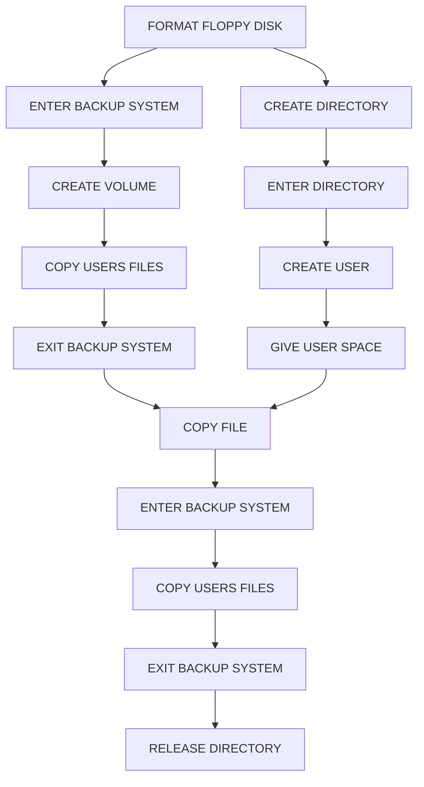
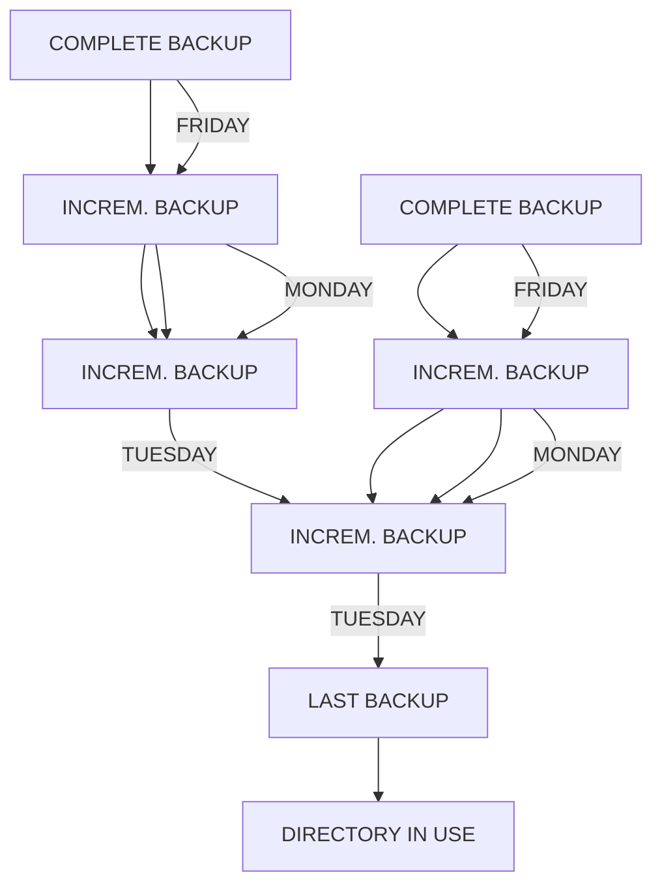

## Page 1

# BACKUP User Guide

ND-60.250.1 EN

---

## Page 2

# BACKUP User Guide

ND-60.250.1 EN

---

## Page 3

# TABLE OF CONTENTS

| Section | Page |
| ------- | ---- |
| 1 INTRODUCTION | 1 |
| What is the Backup System | 3 |
| Online help information | 3 |
| Why do we need a Backup System | 4 |
| Storage media for Backup | 4 |
| Organisation of files on storage media | 5 |
| Command summary | 5 |

| 2 TAKING BACKUP ON A VOLUME | 9 |
| What is a VOLUME | 11 |
| Using a floppy disk | 11 |
| The floppy disk unit | 11 |
| Guidelines for floppy disks | 14 |
| Write protection on floppy disks | 15 |
| How to insert a floppy disk | 16 |
| Formatting a floppy disk | 17 |
| Using magnetic tapes | 18 |
| The STC tape unit | 18 |
| The CIPHER tape unit | 21 |
| Creating a VOLUME | 22 |
| Copying files onto a VOLUME | 23 |
| Common error messages | 24 |
| LIST-VOLUME | 25 |
| Backup that extends over several volumes | 26 |
| Recovering files from a VOLUME | 26 |
| DELETE-VOLUME-FILES | 27 |

| 3 TAKING BACKUP ON A DIRECTORY | 29 |
| What is a DIRECTORY | 31 |
| The main DIRECTORY | 31 |
| The default DIRECTORY | 31 |
| Checking the length of your file | 32 |
| Checking if a floppy disk has a DIRECTORY | 32 |
| Creating a DIRECTORY | 33 |
| Entering the DIRECTORY | 34 |
| CREATE-USER | 34 |
| GIVE-USER-SPACE | 35 |
| The COPY-FILE command | 35 |
| The RELEASE-DIRECTORY command | 36 |
| To RELEASE-DIRECTORY (Unit Occupied) | 36 |

---

## Page 4

# Section

| Section | Page |
|---------|------|
| The COPY-USERS-FILES command | 38   |
| The LIST-FILE command | 40   |
| Recovery of files | 40   |

## 4 THE ADVANCED SELECT COMMANDS

| Command                             | Page |
|-------------------------------------|------|
| FILE-NAME                           | 44   |
| SOURCE-DIFFERENT-FROM-DESTINATION   | 45   |
| DESTINATION-FILES-EXIST             | 45   |
| FILE-ATTRIBUTE                      | 45   |
| WRITTEN-DATE-INTERVAL               | 45   |
| READ-DATE-INTERVAL                  | 46   |
| FILE-INDEX-INTERVAL                 | 46   |
| GENERATION-INTERVAL                 | 47   |
| AND, OR, NOT and parenthesis        | 48   |
| Other SELECTION commands            | 49   |

## 5 SERVICE-PROGRAM-CUF

| Command                     | Page |
|-----------------------------|------|
| COPY-MODE                   | 54   |
| USER-COPY-LOG-MODE          | 55   |
| SET-DENSITY                 | 56   |
| SINGLE-SEARCH               | 57   |
| SET-MATCHING-MODE           | 57   |
| SHRINKING-MODE              | 58   |
| SET-BLOCK-SIZE-FOR-TAPE     | 58   |

## 6 REMOTE BACKUP

Page 59

## 7 FILE TYPES

| File Type        | Page |
|------------------|------|
| Log files        | 65   |
| Parameter files  | 65   |
| File versions    | 67   |

## 8 BACKUP FOR THE SYSTEM SUPERVISOR

Page 69

## 9 STAND-ALONE PROGRAMS

| Description                   | Page |
|-------------------------------|------|
| Precautions                   | 75   |
| Controlled stop of SINTRAN    | 75   |
| The FILE SYSTEM INVESTIGATOR  | 78   |
| DISC-TEMA-H                   | 81   |
| Disk types                    | 84   |
| WINCH-TO-FLOPPY               | 84   |

Norsk Data ND-60.250.1 EN

---

## Page 5

# Section Index

| Section                                                                                  | Page |
|-----------------------------------------------------------------------------------------|------|
| FLOPPY-TO-WINCH                                                                          | 85   |
| MCOPY-TANB                                                                               | 86   |
| The COPY and COMPARE commands                                                            | 87   |
| Changing disk type and mag-tape device number                                            | 89   |
| Changing the modes of the program                                                        | 89   |
| Moving the memory buffer                                                                 | 91   |
| DIR-BACKUP - The stand-alone streamer backup program                                     | 92   |
| Copying from a disk to a streamer tape                                                   | 93   |
| How to label the streamer tape                                                           | 97   |
| Copying from the streamer tape back to the disk                                          | 98   |
| The write protection of the cartridge                                                    | 99   |
| Commands available in the stand-alone program - DIR-BACKUP                               | 100  |
| 10 SINTRAN III COMMANDS FOR TAKING BACKUP                                                | 101  |
| 11 THE BACKUP SYSTEM                                                                     | 105  |
| MULTIUSER-COPY                                                                           | 107  |
| MODIFIED-SINCE-LAST-BACKUP                                                               | 109  |
| RECREATE-FILES-AND-USERS                                                                 | 110  |
| Incremental backup - Examples and warnings                                               | 111  |
| System commands in the SERVICE-PROGRAM-CUF                                               | 116  |
| DUMP-BACKUP-SYSTEM                                                                       | 117  |
| MASTER-LOG-MODE                                                                          | 117  |
| USER-INCREMENTAL-MODE                                                                    | 118  |
| SET-VOLUME-ACCESS                                                                        | 118  |
| DESTINATION-EXPANSION-MODE                                                               | 119  |
| VOLUME-MODE                                                                              | 119  |
| SET-DEFAULT-ANSWERS                                                                      | 120  |
| COMPARE-MODE                                                                             | 120  |
| An example of modifying the copying mode                                                 | 121  |
| DEVICE-COPY                                                                              | 122  |
| How to use a filestore cabinet and a disk drive                                          | 122  |
| Taking backup on a hard disk                                                             | 125  |
| DEVICE-COPY as a mode or batch job                                                       | 126  |
| The functions of DEVICE-COPY                                                             | 126  |
| APPENDIX                                                                                 | 129  |
| A Label formats on magnetic tape volumes                                                 | 129  |
| B Backup system version H errors                                                         | 138  |
| INDEX                                                                                    | 141  |

Norsk Data ND-60.250.1 EN

---

## Page 6

# ND BACKUP USER GUIDE

## PREFACE

### THE PRODUCT

The BACKUP SYSTEM is a subsystem used for copying files from one storage medium to another. BACKUP means making an extra copy of a disk pack or individual files which can be kept in a safe place. If the need arises, this copy can be used later for recovery of deleted files or corrupted data. This manual describes: BACKUP-SYSTEM ND 21033H, the stand-alone programs for taking backup, and the SINTRAN III commands for taking backup.

### THE READER

This manual is written for users of SINTRAN III who wish to take backup or copy files.

### PREREQUISITE KNOWLEDGE

To get full benefit from this manual, you should be familiar with the SINTRAN III operating system.

### THE MANUAL

The aim of this manual is to present the Backup System to users who are completely unfamiliar with it. The various commands, subcommands and parameters are described in detail. Simple examples are included to show how the various commands can be used. The first seven chapters of this manual are intended for all end users. The last four chapters are intended for the System Supervisor.

### RELATED MANUALS

| Manual                                               | Reference     |
|------------------------------------------------------|---------------|
| SINTRAN III System Supervisor                        | ND-30.003.06  |
| SINTRAN III Timesharing/Batch Guide                  | ND-60.132.03  |
| Test Program Description ND-500                      | ND-30.018.01  |
| Test program Description for ND-100, NORD-10/S, NORD-10 and NORD-12 | ND-30.005.02  |

```
    ________
   /        \
  /----------\
 |            |
 |            |
 |            |
 |            o
 |            |
 |            |
 |            |
  \----------/
      |
      |
```

Norsk Data ND-60.250.1 EN

---

## Page 7

# Standard Notation

| In the text you see | What it means or what it is used for:                                 |
|---------------------|-----------------------------------------------------------------------|
| ![grey area]        | Areas shaded grey represent screen pictures.                          |
| BACKUP-SYSTEM       | Text typed by the user is _underlined_ and written in uppercase.      |
| ↵                   | This represents the carriage return key. On the terminal it may be marked ↵, CR, or RETURN. |
| ↖                   | This represents the HOME key.                                         |
| CTRL + W            | This is an example of a CTRL combination. It means you press the CTRL key and hold it down while you press W. |

All commands can be abbreviated. For example the command BACKUP-SYSTEM↵ can be abbreviated to B-S↵. The only requirement is that the command is not ambiguous.

```
   ____
  / .. \
 |/  oO|><
 (    o)
  \ __>
```

Norsk Data ND-60.250.1 EN

---

## Page 8

# CHAPTER 1

## INTRODUCTION

ND BACKUP USER GUIDE

Norsk Data ND–60.250.1 EN

---

## Page 9

# ND Backup User Guide

---

Norsk Data ND-60.250.1 EN

---

## Page 10

# ND BACKUP USER GUIDE

## 1 INTRODUCTION

---

### WHAT IS THE BACKUP SYSTEM

The BACKUP SYSTEM is a subsystem which is used for copying individual files or a group of files from one storage medium to another efficiently. It can also be used for copying a whole disk using the DEVICE-COPY command. This command is however restricted to user System.

The backup system is fully interactive allowing users to communicate with the terminal by using commands similar to English phrases or sentences. The commands correspond to the major steps a user must follow depending on which type of backup s/he would like to take.

---

### ONLINE HELP INFORMATION AND OTHER FEATURES

Online help information is available in the backup system for every prompted command, subcommand or parameter at all levels of communication. You may type a question mark "?" as an answer to a prompt. This will display information about the expected input followed by the prompt you were at last.

```
+---------------------------------+
| Ba-sy: COPY-USERS-FILES         |
|                                 |
| Destination type: ?             |
|  The destination types are      |
|  either DIRECTORY or VOLUME.    |
|                                 |
| Destination type:               |
+---------------------------------+
```

If you type a "?" or write HELP at the end of a command, information about the command will be displayed. You could also write HELP followed by the command name. The output will be a list of the available commands matching the specified command name.

The escape (ESC) or home (\) key may be used to cancel parameter collection in a command. If the ESC or \ key is used during command execution, it will cause a return to SINTRAN III.

* * *

_Norsk Data ND-60.250.1 EN_

---

## Page 11

# ND BACKUP USER GUIDE
## INTRODUCTION

Writing HELP as a parameter of HELP will cause all the commands currently available, and their parameters, to be displayed together with their corresponding explanations.

If a prompted parameter has a default value, it will be displayed between apostrophes following the prompt. An empty string too may occur as a default value.

SINTRAN III commands may be executed from the backup system by typing @ followed by the SINTRAN command. This helps you to rapidly access information which can be obtained only at the SINTRAN III level. For example, if you have forgotten the name of the newly created directory on a floppy disk, `@LIST-DIRECTORIES-ENTERED↲` would supply this information. After execution of the SINTRAN III command, you will return to the same point you were at in the backup system before the SINTRAN III command was executed.

To enable communication with other computer installations, the ANSI standard label format is available for magnetic tapes.

## WHY DO WE NEED A BACKUP SYSTEM

No matter how reliable a computer is, the possibility always exists that problems can arise at some point involving the risk of your losing important files. One can also lose files by using the delete command on the wrong file or writing over an important file so that the original contents of the file are lost. Backup copies can be used in such cases for the recovery of deleted files or corrupted data.

A disk-to-disk copy is usually taken by the computer installation staff at regular intervals (usually once a week). Thus, in the worst case you could lose a week's work. Even this risk could be avoided if you take your own backup, particularly of those files you consider important and would not like to expose to any risks.

## STORAGE MEDIA FOR BACKUP

The storage media for backup copies of files are hard disks, floppy disks, magnetic tapes or streamer tapes.

*Norsk Data ND-60.250.1 EN*

---

## Page 12

# ORGANISATION OF FILES ON STORAGE MEDIA

Depending on how files are organised on storage media they are said to reside on a DIRECTORY or on a VOLUME. Files stored on hard disks must be stored on a DIRECTORY, files on floppy disks can either be stored on a DIRECTORY or on a VOLUME whereas files stored on magnetic tape will only be stored on a VOLUME.

# COMMAND SUMMARY

Below is a list of all the commands that are available on the backup system, together with their parameters. This list is displayed on the terminal if you type HELP after entering the backup system. Three of these commands, COPY-USERS-FILES, MULTIUSER-COPY and SERVICE-PROGRAM-CUF, have their own set of subcommands.

```
Ba-sy: HELP
```

| Command                  | Parameters                                                   |
|--------------------------|--------------------------------------------------------------|
| DESCRIBE-ALL-COMMANDS    | `<Output file>`                                              |
| COPY-USERS-FILES         | `<Destination type: Subcommand> <Source type: Subcommand> <Manual selection: Subcommand>` |
| MULTIUSER-COPY           | `<Destination type: Subcommand> <Source type: Subcommand> <Manual user check?> <Manual selection: Subcommand>` |
| DEVICE-COPY              | `<Destination device name> <Destination device unit> <Source device name> <Source device unit> <Function: Subcommand>` |
| RECREATE-FILES-AND-USERS | `<Destination directory name> <Parameter file name> <Manual user check?> <Manual file check?>` |
| CREATE-VOLUME            | `<Volume name> <Device name> <Device unit>`                 |
| DELETE-VOLUME-FILES      | `<Volume name> <Device name> <Device unit> <Generation of first file to delete> <File name>` |
| LIST-VOLUME              | `<Device name> <Device unit> <File name> <Output file>`     |
| SERVICE-PROGRAM-CUF      | `<Cuf-serv: Subcommands>`                                   |
| EXIT                     |                                                              |

```
Ba-sy:
```

Norsk Data ND-60.250.1 EN

---

## Page 13

# ND Backup User Guide Introduction



**FIGURE 1.** The following is an overview of the steps one must follow for taking a backup copy of a file onto a floppy disk or magnetic tape.

Norsk Data ND-60.250.1 EN

---

## Page 14

# ND Backup User Guide
## Introduction

| Status of SINTRAN | From                  | To                    | Method                            | Special features                                                                                                     |
|-------------------|-----------------------|-----------------------|-----------------------------------|----------------------------------------------------------------------------------------------------------------------|
| Running           | User area Floppy disk | Floppy disk User area | Backup system (COPY-USERS-FILES)  | Recommended for personal backup                                                                                      |
| Running           | User area Remote user | Remote user User area | Backup system (COPY-USERS-FILES)  | Recommended for copying from remote user.                                                                            |
| Running           | User area Mag. tape   | Mag. tape User area   | Backup system (COPY-USERS-FILES or MULTIUSER-COPY) | The remaining methods are recommended for copying disk packs or large number of files in one operation. The copying mode can be modified using the SERVICE-PROGRAM-CUF and advanced selections. The command DEVICE-COPY is an alternative for rapidly copying a disk pack. |
| Running           | Disk Mag. tape        | Mag. tape Disk        | Backup system (DEVICE-COPY)       |                                                                                                                      |
| Running           | User area Disk        | Disk User area        | Backup system (COPY-USERS-FILES or MULTIUSER-COPY) |                                                                                                                      |
| Running           | Disk                  | Disk                  | Backup system (DEVICE-COPY)       |                                                                                                                      |
| Down              | Disk Mag. tape        | Mag. tape Disk        | MCOPY-TANB                        |                                                                                                                      |
| Down              | Disk (Winch.) Streamer | Streamer Disk (Winch.) | DIR-BACKUP                        |                                                                                                                      |
| Down              | Disk                  | Disk                  | DISC-TEMA                         |                                                                                                                      |
| Down              | Disk (Winch.)         | Floppy                | WINCH-TO-FLOPP                    |                                                                                                                      |
| Down              | Floppy                | Disk (Winch.)         | FLOPP-TO-WINCH                    |                                                                                                                      |

Table 1. An overview of storage media and recommended backup method.

Norsk Data ND-60.250.1 EN

---

## Page 15

# ND BACKUP USER GUIDE

---

Norsk Data ND-60.250.1 EN

---

## Page 16

# ND BACKUP USER GUIDE

9

# CHAPTER 2

## TAKING BACKUP ON A VOLUME

---

Norsk Data ND-60.250.1 EN

---

## Page 17

```
# ND BACKUP USER GUIDE

Norsk Data ND-60.250.1 EN
```

---

## Page 18

# ND BACKUP USER GUIDE

## TAKING BACKUP ON A VOLUME

### 2 TAKING BACKUP ON A VOLUME

---

#### WHAT IS A VOLUME

A volume is a set of files sequentially organised on a storage medium such as a magnetic tape or a floppy disk. A volume must be CREATED and given a VOLUME NAME before it can be used. Only one volume may exist on a floppy disk or magnetic tape. A volume may however contain files from several users. Only the first file on a volume may extend over several volumes (look at page 26: BACKUP THAT EXTENDS OVER SEVERAL VOLUMES).

---

#### USING A FLOPPY DISK

Most end users will use floppy disks for taking backup copies of programs and data. Floppy disks can also be used to build up a "floppy disk library" where you keep copies of your least used files in order to make room for new files on the disk (archive).

---

#### THE FLOPPY DISK UNIT

The floppy disk unit is a horizontal slot, (except on ND Satellite where it is a vertical slot), which is usually on the front of the computer cabinet. It has a door with a little red lamp near it. To open the door, you must either press the button below the door or flip the door up, depending on the type of disk unit you have. Normally the door should be open if the drive is not in use. If the door is closed, FIRST MAKE SURE THAT NO ONE IS USING THE FLOPPY DISK UNIT BEFORE YOU OPEN IT!

If the little lamp is on, or blinks, it means that someone is using the unit. If you are in doubt, use the following command:

```
+---------------------------+
| @LIST-DIRECTORIES-ENTERED |
|                           |
| DIRECTORY NAME:           |
| OUTPUT FILE:              |
+---------------------------+
```

Norsk Data ND-60.250.1 EN

---

## Page 19

# ND Backup User Guide
## Taking Backup on a Volume

This produces a list of all the storage media that contain a directory in active use, for instance like this:

```
DIR INDEX 1 : DISC-2-75MB-1 UNIT 0 SUBUNIT 0 : PACK-ONE
DIR INDEX 2 : DISC-2-75MB-1 UNIT 1 SUBUNIT 1 : PACK-TWO-685
DIR INDEX 3 : FLOPPY-DISC-1 UNIT 0 : NOTIS
```

If the list includes the words FLOPPY-DISC like the one above, check which unit number it is on. In the above example unit 0 is occupied. If the floppy disk unit you need to use is the same as the one that appears on the screen, you may assume that someone is using it. In that case it is very important that you DO NOT OPEN the door as you might spoil the disk of the person using the unit.

> **NOTE:** Volumes which are in active use are not included in the list above. To find out if someone is using the DEVICE UNIT for copying on a volume you can use the following command:

```
@WHERE-IS-FILE↵
FILE NAME: FLOPPY-1↵

FLOPPY-1:; : OPENED BY USER P-HANSEN ON TERMINAL-1
```

The FILE NAME in the above picture refers to the peripheral file name. In this example P-HANSEN is using the peripheral file floppy-1 for taking backup on a volume. That means UNIT 0 is occupied. If UNIT 0 was not occupied, the message FLOPPY-1:; : FREE TO USE would appear on the screen. If your terminal is a long way from the computer, there is usually a terminal or a CONSOLE near the computer which you can use.

Table 2 shows how you can derive the peripheral file name from the DEVICE NAME and the DEVICE UNIT. 

Norsk Data ND-60.250.1 EN

---

## Page 20

# ND Backup User Guide

## Taking Backup on a Volume

| DEVICE NAME  | DEVICE UNIT | PERIPHERAL FILE NAME |
|--------------|-------------|-----------------------|
| floppy-disc-1| 0           | floppy-1              |
|              | 1           | floppy-2              |
|              | 2           | floppy-3              |
|--------------|-------------|-----------------------|
| floppy-disc-2| 0           | floppy-4              |
|              | 1           | floppy-5              |
|              | 2           | floppy-6              |
|--------------|-------------|-----------------------|
| mag-tape-1   | 0           | mag-tape-0            |
|              | 1           | mag-tape-1            |
|              | 2           | mag-tape-2            |
|              | 3           | mag-tape-3            |
|--------------|-------------|-----------------------|
| mag-tape-2   | 0           | mag-tape-4            |
|              | 1           | mag-tape-5            |
|              | 2           | mag-tape-6            |
|              | 3           | mag-tape-7            |
|--------------|-------------|-----------------------|
| mag-tape-3   | 0           | mag-tape-8            |
|              | 1           | mag-tape-9            |
|              | 2           | mag-tape-10           |
|              | 3           | mag-tape-11           |
|--------------|-------------|-----------------------|
| mag-tape-4   | 0           | mag-tape-12           |
|              | 1           | mag-tape-13           |
|              | 2           | mag-tape-14           |
|              | 3           | mag-tape-15           |

Table 2. Showing relationship between DEVICE NAME, DEVICE UNIT and PERIPHERAL FILE NAME

Norsk Data ND-60.250.1 EN

---

## Page 21

# ND Backup User Guide
## Taking Backup on a Volume

**NOTE!**

Good diskette habits will minimize the risk of losing data. For your own benefit, _always follow these rules_:

1. Hands off the diskette surface.

   ```
   +--------------+
   |              |
   |   +------+   |  X
   |   |      |   |
   |   +------+   |
   +--------------+
   Diskette surface
   ```

2. Keep the diskettes away from magnetic fields. Do not place them on top of your terminal or other equipment.

   ```
   +--------------+
   |              |
   |   +------+   |  X
   |   | MAG  |   |
   |   +------+   |
   +--------------+
   ```

3. Do not bend or fold the diskettes.

   ```
   +---------------+
   |      /\       |  X
   |     /  \      |
   |    /____\     |
   +---------------+
   ```

4. Keep the diskettes in the jackets when they are not in use.

   ```
   +---------------+
   |     |||||     |  X
   |     |||||     |
   |     |||||     |
   +---------------+
   ```

5. Be careful when inserting the diskette in the floppy drive. NEVER leave it halfway inserted in the open door.

   ```
   +-----------+
   |           |
   |   [   ]   |
   | X|   |    |
   +-+---+--+--+
       /
   ```

6. AND FINALLY: Do not drop the diskette on the carpet, and if you do, pick it up again immediately, as the static electricity may damage the data.

**Figure 2. Guidelines for floppy disks.**

Norsk Data ND-60.250.1 EN

---

## Page 22

# ND Backup User Guide

## Taking Backup on a Volume

# The Write Protection for Floppy Disks

The write protection on a floppy disk differs depending on whether you are using:

a) An 8 1/2 inch floppy disk or

b) A 5 1/4 inch floppy disk

If a notch is not present on an 8 1/2 inch floppy disk, you may write to it. To protect it from being written to, cut a notch approximately 4 millimeters wide and 4 centimeters from the margin as shown on figure 3. (For 5 1/4 inch floppy disks, the notch is situated 3 centimeters from the margin.) If you should later need to write to the floppy disk again, cover the notch with the narrow metal tape which you find in the disk packet.

When using a 5 1/4 inch floppy disk, (figure 3b), do the opposite of that described above. To be able to write to the disk, the notch should not be covered by the metal tape. To obtain write protection, cover the notch with the metal tape.

If you have write protection on your floppy disk and try to write to it, the following error message appears on the screen:

```
DEVICE ERROR (READ-LAST-STATUS TO GET STATUS)
```


```
  _______                        _______
 |       |                      |       |
 | ND    |                      | ND    |
 | Norsk |                      | Norsk |
 | Data  |                      | Data  |
 |       |                      |       |
 |Flexible|                     |Flexible|
 |disks  |                      |disks  |
 |       |                      |       |
 |       |                      |       |
 |       |                      |       |
 |_______|                      |_______|
     ||                             ||
     ||                             ||
     ||                             ||
     ||                             ||
     ||                             ||
Write protection               Write protection
notch                          notch
Read/Write slot

A. 8 1/2 inch floppy disk    B. 5 1/4 inch floppy disk
```

Figure 3. Placing the metal tape on a floppy disk. A. 8 1/2 inch floppy disk. B. 5 1/4 inch floppy disk.

Norsk Data ND–60.250.1 EN

---

## Page 23

# HOW TO INSERT A FLOPPY DISK

If you are using an 8 1/2 inch floppy disk, insert it with the read/write slot first and the upper side (smooth margins) facing upwards.

For a 5 1/4 inch floppy disk, the slot may be horizontal or vertical. If the slot is horizontal, the write protection notch of the floppy disk should be on the left and the upper side (smooth margins) facing upwards. If the slot is vertical, the write protection notch should point downwards and the upper side should face left.

```
  1.
  Make sure that
  the door is
  unlocked (red
  means locked).

  UNLOCKED
   ↑
   ↓
  LOCKED

  ┌───────────┐
  │    ___    │
  │   |___|   │
  │           │
  └───────────┘
     ↑
     Insert

  2.                3.                   4.
  Press the left    Insert the            Close
  side of the       diskette as          the door.
  door. The door    shown.               5.
  opens.            Push it in as        Lock the
                    far as it will       door if
                    go.                  you want.
```

_Figure 4. How to insert a 5 1/4 inch floppy disk into a vertical slot._

Norsk Data ND-60.250.1 EN

---

## Page 24

# ND Backup User Guide
## Taking Backup on a Volume

```
 ___________________
|                   |
|                   |
|   [   ]           |
| [   ]   [   ]     |
|   [   ]           |
|                   |
|___________________|
```

```
 ___________________
|                   |
|                   |
|   [   ]           |
| [   ]   [> ]      |
|   [   ]           |
|                   |
|___________________|
```

```
 ___________________
|                   |
|                   |
|   [   ]           |
| [   ]   [   ]     |
|   [v  ]           |
|                   |
|___________________|
```

*Figure 5. How to insert an 8 1/2 inch floppy disk into a horizontal slot.*

---

## Formatting a Floppy Disk

If you are using an unformatted floppy disk the first thing you do is to format it using the DEVICE-FUNCTION command.

**WARNING**: If you format a floppy disk that has already been formatted and has files copied on to it, these files will be deleted due to the reformatting.

```
@DEVICE-FUNCTION FLOPPY-1,SET-FLOPPY-FORMAT 17
```

If your floppy disk is single-sided/single-density, the format is 0. If it is double-sided/double-density the format is 17.

In this example floppy-1 represents the peripheral file name, and is a combination of an abbreviation of the DEVICE NAME and the DEVICE UNIT on which your floppy disk is. See table 2 for details on how to derive the peripheral file name given the DEVICE NAME and DEVICE UNIT. The DEVICE-FUNCTION command takes 1-2 minutes to complete. If there are any pages that are not usable on the disk, they will be marked by @DEVICE-FUNCTION and listed during the formatting.

Floppy disks from NORSK DATA are usually formatted prior to delivery. This is not necessarily true of subsidiaries.

---

*Norsk Data ND-60.250.1 EN*

---

## Page 25

# Using Magnetic Tapes

Your magnetic tape station can be one of the following types:

1. STC
2. CIPHER
3. PERTEC

A brief description of the STC and CIPHER tape stations is given below.

# The STC Tape Unit

Figure 6 shows the STC Model 1950 series tape unit. The switches of the operator panel may be used in various sequences to obtain the desired results. The most common operating sequence is as follows:

1. Check that the write enable ring underneath the reel is in place.

2. Place the tape reel or cartridge in a matching position on the file reel hub and lock it into position using the latch. Make sure that the reel is secure.

3. Press the LOAD/REWIND switch. If a cartridge is used, this will now be opened. The file reel will then wind a few wraps of tape round the machine reel hub. If the tape does not reach the machine reel in approximately 10 seconds, the tape rewinds and a second loading sequence begins automatically. If the second attempt is unsuccessful, the tape rewinds, the cartridge closes and the RESET indicator flashes to signal a problem.

   A manual threading procedure is provided and can be used with open reel tapes that have defective leaders. The manual sequence is entered by pressing the LOAD/REWIND switch a second time before the tape leader is positioned in the threading path. You can now place the tape leader in the tape path. A third depression of the LOAD/REWIND switch causes the thread-sequence to continue.

4. After the machine reel is wrapped, the tape is moved forward until the beginning of tape (BOT) marker is found. Vacuum is automatically transferred to the vacuum columns and this, together with the reels unwinding tape, loads the columns. The door automatically closes.

Norsk Data ND-60.250.1 EN

---

## Page 26

# ND Backup User Guide

## Taking Backup on a Volume

5. When the columns are loaded, the tape unit automatically moves the tape forward to the BOT marker. If BOT is not found within 1.5 seconds, the tape is searched in backward direction. If no BOT marker is found, the tape unloads and the RESET indicator flashes.

6. When BOT is sensed, the LOAD/REWIND indicator lights and the tape unit is ready for operation.

7. You can now CREATE-VOLUME.

After copying is completed, unload the tape as follows:

1. If the tape unit is operating online, press the RESET switch.

2. Press the REWIND/UNLOAD switch. The tape rewinds at high speed but drops to normal operating speed just prior to the beginning of tape marker (BOT), stops momentarily at BOT, and then unloads onto the file reel.

Norsk Data ND-60.250.1 EN

---

## Page 27

# ND Backup User Guide

## Taking Backup on a Volume

```
   ___________________________
  |                           |
  |                           |
  |        File               |
  |       reel hub ---------->|
  |          |                |
  | Latch  --|                |
  |                           |
  |                           |
  |                           |
  | Machine                   |
  | reel hub                  |
  | (behind door)             |
  |___________________________|
```

```
| Power On Indicator     | POWER          |
| File Protected         | FILE PROTECT   |
| OR BOT Detected        | LOAD REWIND    |
| Online Status Indicator| ONLINE         |
| FCU Select Indicator   | SELECT         |
| Machine Check Detected | RESET          |
| Software Select        | UNLOAD         |
| GCR Mode Selected      | SOFTWARE SELECT|
| PE Mode Selected       | GCR            |
| NRZI Mode Selected     | PE             |
| Density Select         | NRZI           |
```

Figure 6. The STC Model 1950 Series Tape Unit showing the Operator Control Panel (1953)

Norsk Data ND-60.250.1 EN

---

## Page 28

# ND Backup User Guide
## Taking Backup on a Volume

---

# The Cipher Tape Unit

1. Open the unit door by pushing it down.

2. The tape leader should be cut like this. Use Cipher tool part No. 209990-500 or equivalent.

3. Make sure that the write enable ring underneath the reel is in place.

4. Wind all tape onto the reel.

5. Insert the reel fully into the opening with the write enable ring down and place it on the hub. Turn the reel a few turns counter-clockwise to make sure it is correctly positioned on the hub.

6. Close the unit door.

7. 
   - Press the LOAD REWIND switch and wait until the LOAD REWIND lamp stops flashing.
   - Press the ON-LINE switch. If you want high density copying, press first the HI DEN switch and then the ON-LINE switch.

8. You can now CREATE-VOLUME.

```
----------------------------
|       |        |        |
| LOAD  | UNLOAD | ON-LINE|
| REWIND|        |        |
----------------------------
|        |        |        |
| WRTEN  | HI     |        |
| TEST   | DEN    |        |
----------------------------
```

*Figure 7. The CIPHER tape unit.*

Norsk Data ND-60.250.1 EN

---

## Page 29

# ND Backup User Guide
## Taking Backup on a Volume

To unload the tape:

1. First check that the ON-LINE switch is not lit. If it is lit, press it. Press the UNLOAD switch. This will cause the UNLOAD indicator to flash. When the unload sequence is completed, the UNLOAD indicator will remain lit and the door will unlock.
2. You can now open the front panel door.
3. Lift the reel carefully off the hub and remove it.
4. Close the front panel door.

## Creating a Volume

The example below illustrates how you can create a volume on a floppy disk or a magnetic tape.

```
@BACKUP-SYSTEM↵
Ba-sy: CREATE-VOLUME↵
  Volume name: ANNUAL↵
  Device name: FLOPPY-DISC-1↵
  Device unit '0': 0↵
```

a) To create a volume one must first enter the BACKUP SYSTEM by writing BACKUP-SYSTEM. The system responds by writing Ba-sy:

b) The next command you give is CREATE-VOLUME.

c) The backup system now asks for the VOLUME NAME. You can invent a VOLUME NAME yourself which consists of maximum 6 characters and is preferably related to the contents of the file. Remember that you can never abbreviate the volume name.

d) The next two parameters are DEVICE NAME and DEVICE UNIT. These relate to where the magnetic tape or the floppy disk is mounted. Standard names are FLOPPY-DISC-1, FLOPPY-DISC-2 or MAG-TAPE-1 to MAG-TAPE-4. The DEVICE UNIT numbers range from 0-3. If only one unit exists, it has unit number 0. The default value for the DEVICE NAME and/or DEVICE UNIT will appear together with the prompts as shown in the above example if only one NAME or UNIT exists on your system. Note that it is also possible to specify a remote DEVICE NAME (look at page 61: REMOTE BACKUP).

Norsk Data ND-60.250.1 EN

---

## Page 30

# ND Backup User Guide
## Taking Backup on a Volume

### Copying Files onto a Volume

The example below shows how you can use the COPY-USERS-FILES command of the backup system to copy files to a floppy disk or magnetic tape:

```
+-----------------------------------+
| Ba-sy: COPY-USERS-FILES           |
|                                   |
| Destination type: VOLUME          |
| Destination volume name: ANNUAL   |
| Destination device name: FLOPPY-DISC-1 |
| Destination device unit: 0        |
| Destination file generation: 1    |
|                                   |
| Source type: DIRECTORY            |
| Source directory name: .          |
| Source user name: 'P-HANSEN'      |
| Source file name: '.;TEXT'        |
| Manual selection: YES             |
|                                   |
| FILE 4: (PACK-TWO:P-HANSEN)CHAPTER-ONE:TEXT;1 |
|    INDEXED  3 PAGES  MODIFIED 29/08-85(YES/NO)? YES |
|    - OK                             |
| FILE 5: (PACK-TWO:P-HANSEN)CHAPTER-TWO:TEXT;1 |
|    INDEXED  7 PAGES  MODIFIED 14/10-85(YES/NO)? YES |
|    - OK                             |
| FILE 9: (PACK-TWO:P-HANSEN)MEMO:TEXT;1          |
|    INDEXED  1 PAGE  MODIFIED 17/03-85(YES/NO)? NO  |
+-----------------------------------+
```

The first parameter is DESTINATION TYPE. You write VOLUME followed by ␍. The next four parameters refer to the destination. The first three of these are identical to those for creating a volume. The last parameter DESTINATION FILE GENERATION refers to the file generation number (maximum 4 characters). Different file generations are used to store more than one generation of a set of files on the same volume. The default value is the last generation of the file existing on the volume + 1. If the volume is empty, 1 will be used as the default file generation.

Prompts are sometimes followed by a default value enclosed in single quotation marks. Dynamic or empty default values are represented by single quotation marks without any text between.

The SOURCE TYPE refers to the area the files are being copied from. Since the destination type is VOLUME, the source type must be DIRECTORY as VOLUME to VOLUME copying is not implemented.

Norsk Data ND-60.250.1 EN

---

## Page 31

# ND Backup User Guide
## Taking Backup on a Volume

The **SOURCE DIRECTORY NAME** refers to the directory that contains the files to be copied. The default value is the default directory for the source user. The source directory may also be remote (see page 61: REMOTE BACKUP).

The **SOURCE USER NAME** refers to the name of the owner of the files to be copied. The default value is your own user name, or the remote entering user if the source directory is remote.

The **SOURCE FILE NAME** refers to the files to be copied. Maximum permitted length of a file name is 26 characters. The default value is an empty string matching all files owned by the specified user.

**MANUAL CHECK** offers four alternatives. You may answer YES if you wish the system to stop for manual confirmation before each file is copied, NO if you do not want manual confirmation before copying. In the latter case all the files will be copied automatically to the specified destination. If you answer LIST the files will also be automatically copied to the destination. These files will however also be listed on the terminal. The fourth alternative is SELECT. This command is described in detail on page 43: THE ADVANCED SELECT COMMANDS.

Normally you cannot copy files opened for write by another user. You may, however, copy a continuous file opened for common write (WC) by opening it for common read (RC) before entering the backup system.

---

## Common Error Messages

The unit number is not always marked on the computer. If more than one device unit exists, and you write the wrong number, an error message appears on the screen:

```
┌──────────────────────────────────────────────┐
│ DEVICE ERROR (READ-LAST-STATUS TO GET STATUS)│
│ *Not ready: Floppy-Disc-1,1                  │
│ *Last command aborted                        │
│ Ba-sy:                                       │
└──────────────────────────────────────────────┘
```

You can start again now - and remember to write the correct unit number. Ask your system supervisor if in doubt.

This error message also appears on the terminal if the disk is inserted incorrectly, or the storage medium is write protected and you try to write to it.

Norsk Data ND-60.250.1 EN

---

## Page 32

# ND Backup User Guide
## Taking Backup on a Volume

Occasionally, even though the door of the floppy disk unit is open, and the unit apparently not in use when you start, you can get the error message FILE ALREADY RESERVED. This is because the previous user of the floppy disk unit forgot to release the directory. You must now release the directory yourself before you can proceed any further. See page 36: TO RELEASE DIRECTORY (UNIT OCCUPIED).

### LIST-VOLUME

You may now want to check whether your files have actually been copied over to the floppy disk or magnetic tape. You can do this by using the LIST-VOLUME command as shown below:

```
Ba-sy: LIST-VOLUME↲
   Device name 'FLOPPY-DISC-1'↲
   Device unit: 0↲
   File name ''↲
   Output file 'Terminal'↲

   Volume name: ANNUAL
   Owned by: P-HANSEN
   File 1: (P-HANSEN)CHAPTER-ONE:TEXT;1 copied 85.11.14
       INDEXED 3 pages modified 85.08.29
   File 2: (P-HANSEN)CHAPTER-TWO:TEXT;1 copied 85.11.14
       INDEXED 7 pages modified 85.14.10

   *End of Volume

   If more to do, mount next volume: ANNUAL on FLOPPY-DISC-1,0

   Mounted? (YES/NO, you may push ESC) NO↲

   Number of data pages: 10

Ba-sy: EXIT↲
```

As shown on the screen picture above, the output is a list of files copied, the date they were copied, the number of pages in each and the date they were last modified.

---

## Page 33

# ND BACKUP USER GUIDE
## TAKING BACKUP ON A VOLUME

### BACKUP THAT EXTENDS OVER SEVERAL VOLUMES

Occasionally, you may reach the end of a volume before the entire file has been copied on to it. That is, the entire capacity of the floppy disk or magnetic tape is used up before the whole file is copied. In such cases the system will inform you that you can continue copying by inserting a new medium on the `<device-name, unit number>`. This means that you may now insert a new floppy disk or magnetic tape, as the case may be, and write `Y↵`.

The system now informs you that a volume has not been created on the new medium and asks if you want to create a new volume having the same name as the previous volume. If you answer `Y↵`, the system creates a new volume having the same name as the volume you just removed. The copying of the interrupted file will now continue. If you answer `N↵`, you will be asked to mount another floppy disk/magnetic tape. If you do not wish to continue copying the file, press ESC.

If you are in the process of copying several files and you reach the end of a volume while copying for example file number 10, that part of the file that has already been copied will be deleted from the volume. This is because only the first file on a volume may be split over several volumes. You will however be asked to mount a new floppy disk or magnetic tape and the file will then be recopied to this new volume as its first file.

To get out of the backup system and return to the SINTRAN level, write EXIT.

### RECOVERING FILES FROM A VOLUME

The files you have copied to your floppy disk or magnetic tape can be restored to your user area when desired. Using the example cited above for copying files to a volume, when recovering these files, the source and destination parameters switch values. The SOURCE will now be VOLUME and the source name ANNUAL. The destination will be DIRECTORY and DESTINATION DIRECTORY NAME will be the directory on which you have user space.

```
   _____   ______
  /     \ |      |
 | () () ||      |  
  \  ^  / | () () |
   || ||   \  ^  /
   || ||    || ||
Norsk Data ND-60.250.1 EN
```

---

## Page 34

# ND BACKUP USER GUIDE

## TAKING BACKUP ON A VOLUME

### DELETE-VOLUME-FILES

Files stored on a volume can be deleted. However, because a volume is a sequential set of files, they cannot be deleted randomly. To delete files on a volume, an end of volume is written at the beginning of the specified file. This will cause the specified file as well as all the subsequent files on the volume to be unavailable. The parameters for the DELETE-VOLUME-FILES command are shown below:

```
Ba-sy: DELETE-VOLUME-FILES <volume-name>,<device-name>,
       (<device-unit>),(<generation-of-first-file-to-delete>),
       [(<file-name>)]
```

The default value of `<generation-of-first-file-to-delete>` is all file generations. Manual check is mandatory, that is, you have to confirm that you want to delete the files by entering YES or NO from your terminal.

---

## Page 35

```
ND BACKUP USER GUIDE

_________________________________________________

Norsk Data ND–60.250.1 EN
```

---

## Page 36

# Chapter 3

## Taking Backup on a Directory

[ND Backup User Guide]

Norsk Data ND-60.250.1 EN

---

## Page 37

# ND Backup User Guide

Norak Data ND-60.250.1 EN

---

## Page 38

# 3 Taking Backup on a Directory

## What is a Directory

A directory is a set of files residing on a mass storage medium, for example a floppy disk or a hard disk, and can be accessed directly. Only one directory is permitted per floppy disk. Each directory, however, whether it is on a floppy disk or a hard disk, may contain files from one or several users. A directory must be CREATED with a name and ENTERED into the system before it can be used. When a directory is no longer needed, it should be RELEASED and physically removed from the system. The next time it is needed, it must be physically replaced and entered again.

## The Main Directory

The first directory entered containing SINTRAN III (and related subsystems) is regarded as the main directory. This directory cannot be released.

## The Default Directory

Any directory in the system on a disk can be a default directory. A user may have space in one or more than one or all of the default directories of the system. If the user has space on more than one default directory on the same system, the directory with the lowest index in which s/he has space will be default. To access any of the others, it is necessary to specify the directory name. If the user leaves out the directory name in a file name, the default directory is assumed.

The system supervisor (user SYSTEM) is responsible for entering the main and default directories, setting them up as main or default and creating and allocating space to the different users. End users can create, enter and release directories on floppy disks only.

* *Norsk Data ND-60.250.1 EN*

---

## Page 39

# ND BACKUP USER GUIDE
## TAKING BACKUP ON A DIRECTORY

---

## CHECKING THE LENGTH OF YOUR FILE

Let us say you want to take a backup of the file ANNUAL-REP:TEXT. The first thing to do is to check if ANNUAL-REP:TEXT will fit on one floppy disk. A floppy disk has limited storage capacity. If you are using a single-sided/single-density floppy disk it usually takes 148 file-system pages. A double-sided/double-density floppy disk takes 610 file-system pages.

Give the command:

```
@FILE-STATISTICS ↵
FILE NAME: ANNUAL-REP:TEXT ↵
OUTPUT FILE: ↵
```

This command will give you various bits of information on the status of the file. The important piece of information for you is the number of pages. If it is less than 148, the file will fit on a single-sided/single-density floppy disk. If it has more than 148 pages, and the maximum capacity of your floppy disk station is for 148 pages, you will have to copy your file onto a VOLUME which extends over more than one floppy disk. If, however, your floppy disk station has the capacity for 610 pages, you could use a double-sided/double-density disk. If your file is more than 610 pages long, copying it on a VOLUME provides the best solution. Note that indexed files need at least one page more than stated in the file statistics.

---

## CHECKING IF A FLOPPY DISK HAS A DIRECTORY

One way to find out if a floppy disk already has a directory or not is by looking at its label. Another way to find out is as follows:

First insert the disk into the floppy disk unit. You then use the command ENTER-DIRECTORY. This command has three parameters, DIRECTORY NAME, DEVICE NAME and DEVICE UNIT. Since you do not know the directory name, you can just write two commas to represent a blank parameter. It is not necessary to specify the directory name. It is however necessary to specify the second parameter (in this case

---

Norsk Data ND–60.250.1 EN

---

## Page 40

# ND Backup User Guide

## Taking Backup on a Directory

FLOPPY-DISC-1 abbreviated to F-D-1). Note that the DEVICE NAME can either be FLOPPY-DISC-1 or FLOPPY-DISC-2, and the DEVICE UNIT numbers vary from 0 to 3. If only one unit exists, it has unit number 0. The example below shows how you can use this command:

```
@ENTER-DIRECTORY,-F-D-1,0⇓
```

You can now use the LIST-DIRECTORIES-ENTERED command to find out the name of the directory on the floppy disk (see page 36: TO RELEASE DIRECTORY (UNIT OCCUPIED) for details about the LIST-DIRECTORIES-ENTERED command). If the floppy disk already has a directory, you can jump to ENTER DIRECTORY. If it does not already have a directory, you get the message: DIRECTORY NOT ON SPECIFIED UNIT. In the latter case you must CREATE a DIRECTORY as explained below.

## Creating a Directory

The following example shows how you can CREATE a DIRECTORY on a floppy disk:

```
@CREATE-DIRECTORY⇓
DIRECTORY NAME: ANNUAL⇓
DEVICE NAME: FLOPPY-DISC-1⇓
DEVICE UNIT: 0⇓
BIT FILE ADDRESS: ⇓
```

The command has four parameters:

a) First you will be asked for DIRECTORY NAME. Make up one, preferably one which is related to the contents of the file. Remember that you cannot abbreviate here, since this is the first time you specify the name.

b) The next you are asked is DEVICE NAME. This is a name that exclusively refers to the floppy disk controller. Standard names are FLOPPY-DISC-1 and FLOPPY-DISC-2. Ask your system supervisor for the correct name on your computer.

c) The next question is DEVICE UNIT. Here you must write the unit number - which can range from 0 to 3 (normally 0 or 1). Ask your system supervisor if you are not sure.

Norsk Data ND-60.250.1 EN

---

## Page 41

# ND Backup User Guide
### Taking Backup on a Directory

d) The last question concerns BIT FILE ADDRESS. It is not important to know what this means at this stage. You should always respond with a ↵ here.

The system will now start creating the directory. This takes between half a minute and one minute. A red light near the door of the floppy disk unit goes on and off indicating that the system is working. When the light goes off and you are again at SINTRAN level, the operation is complete.

> **Note:** Files that existed on the floppy disk prior to using the CREATE-DIRECTORY command will now be unavailable. It is therefore important to label your floppy disk clearly with DIRECTORY NAME, USER NAME and FILE NAMES so you do not lose important files through using this command.

## Entering the Directory

The directory on the floppy disk must be entered into SINTRAN III before it can be used for copying files:

```
┌──────────────────────┐
│@ENTER-DIRECTORY↵     │
│DIRECTORY NAME: ANNUAL↵│
│DEVICE NAME: FLOPPY-DISC-1↵ │
│DEVICE UNIT: 0↵        │
└──────────────────────┘
```

The parameters here are the same as the parameters of the CREATE-DIRECTORY command.

## Create-User

You must now create a user on this floppy disk using the following command:

```
┌──────────────────────────┐
│@CREATE-USER↵             │
│USER NAME: ANNUAL:P-HANSEN↵ │
└──────────────────────────┘
```

You need to specify the directory name followed by the actual user name. The directory name in this example is ANNUAL and the actual user name is P-HANSEN. The user must already exist on the main directory. 

*Norsk Data ND-60.250.1 EN*

---

## Page 42

# GIVE-USER-SPACE

This command is used for allocating space on the floppy disk to the user:

```
@GIVE-USER-SPACE↵
USER NAME: ANNUAL:P-HANSEN↵
NUMBER OF PAGES: 610↵
```

In this example, the entire capacity of a two-sided floppy disk is allotted to user P-HANSEN.

The floppy disk is now ready for the actual copying process. There are two ways of doing this:

a) By using the SINTRAN III command COPY-FILE.

b) By using the BACKUP-SYSTEM subcommand COPY-USERS-FILES.

# THE COPY-FILE COMMAND

This command is used for copying one file at a time from one user area to another. It can also be used for copying single files from remote systems.

> **NOTE:** You must have READ ACCESS to the source file to be able to copy it.

```
@COPY-FILE↵
DESTINATION FILE: "(ANNUAL:P-HANSEN)ANNUAL-REP:TEXT"↵
SOURCE FILE: (P-HANSEN)ANNUAL-REP:TEXT↵
```

a) The DESTINATION FILE is a new file, so the whole file name must be enclosed in double quotes. You must specify in brackets that the new file is going to be created on directory ANNUAL with P-HANSEN as owner. This must be followed by the name of the file to be copied. In this example, it is ANNUAL-REP:TEXT.

b) For SOURCE FILE you must write the user name in brackets followed by the name of the file to be copied. If, however, you are entered with your own user name, (P-HANSEN in this example), you do not need to specify the user name. The file name in this example is the same as that of the destination file, that is, ANNUAL-REP:TEXT.

---

Norsk Data ND-60.250.1 EN

---

## Page 43

# ND Backup User Guide
## Taking Backup on a Directory

The file is now copied on to the floppy disk. You can confirm this by giving the command:

```
 @LIST-FILES⇥
 FILE NAME: (ANNUAL:P-HANSEN)⇥
 OUTPUT FILE: _
```

The output for this command is a list of all the files that have been copied to the floppy disk.

## The Release-Directory Command

Before you remove the floppy disk from the floppy disk unit, you must release the directory from SINTRAN III. THIS IS VERY IMPORTANT! The following command can be used for doing so:

```
 @RELEASE-DIRECTORY⇥
 DIRECTORY NAME: ANNUAL⇥
```

If you forget the RELEASE DIRECTORY command, the next user who tries to use the ENTER DIRECTORY command on the floppy disk drive gets the error message UNIT OCCUPIED.

## To Release Directory (Unit Occupied)

If you know who last used the floppy disk unit you can fetch that person's floppy disk with the correct directory name, insert it into the floppy disk unit, and release the directory using the RELEASE-DIRECTORY command.

If however, the unit is occupied and you do not know who used it last, you can find this out by giving the following command:

```
 @LIST-DIRECTORIES-ENTERED⇥_
```

---

## Page 44

# ND Backup User Guide  
## Taking Backup on a Directory

This will produce a list of directories entered into SINTRAN III, for example, as shown below:

```
DIR INDEX 0: DISC-45MB UNIT 0:PACK-ONE
DIR INDEX 1: DISC-45MB UNIT 0: PACK-ONE
DIR INDEX 2: FLOPPY-DISK-1 UNIT 0: ADDRESS-LIST
```

It is apparent from this list that the unit was last occupied by the floppy disk having the directory ADDRESS-LIST. This directory must now be released as follows:

a) Insert a blank floppy disk _(unused or with no directory)_. It should, however, have the same format as the entered directory, that is, 0 if single-sided/single-density or 17 if double-sided/double-density. Since we do not know which format the floppy disk had, we must find out by trial and error. You could for example try first with a double-sided/double-density disk. If you do not succeed in releasing the directory, try with a single-sided/single-density disk.

b) Release the directory even though the "wrong" floppy is in the drive.

```
@RELEASE-DIRECTORY↵
DIRECTORY NAME: ADDRESS-LIST↵
DIRECTORY NOT ON SPECIFIED UNIT
```

In spite of this error message _(DIRECTORY NOT ON SPECIFIED UNIT)_, the ADDRESS-LIST directory is released. It is now possible to CREATE and ENTER the new directory.

```
  ____
 /    \_____
|  0110     \_____
|  0000           |
 \____    _____   |
      \__/     \__|
```

Norsk Data ND-60.250.1 EN

---

## Page 45

# THE COPY-USERS-FILES COMMAND

When you use the COPY-FILE command, only one file is copied at a time to the floppy disk. If you have several files that need to be copied, a more efficient method would be to use the COPY-USERS-FILES command of the BACKUP SYSTEM.

Suppose that this time you have a number of smaller files called LETTER-1:TEXT, LETTER-2:TEXT, and so on, which you want to copy onto a floppy disk. The method to CREATE and ENTER the directory, CREATE USER and GIVE USER SPACE is exactly the same as described previously. After you have executed these commands, instead of using the COPY-FILE command, you may now enter the BACKUP-SYSTEM and use the COPY-USERS-FILES command as shown below.

```
@BACKUP-SYSTEM↵

Ba-sy:COPY-USERS-FILES↵

   Destination type:DIR↵
   Destination directory name ' ' : ANNUAL↵
   Destination user name 'P-HANSEN' ↵

   Source type:DIR↵
   Source directory name ' ' : ↵
   Source user name 'P-HANSEN' ↵
   Source file name ' ' :;TEXT↵

   Manual selection:Y↵

FILE 1:(PACK-ONE: P-HANSEN)LETTER-1:TEXT;1
   INDEXED FILE   5 PAGES  MODIFIED 85.10.03 (YES/NO) Y↵

Ba-sy:EXIT↵

@
```

a) When you enter the BACKUP-SYSTEM, it responds by writing Ba-sy:. You give the command COPY-USERS-FILES.

b) The system then asks for DESTINATION TYPE, and you answer DIR, because you are going to copy to a directory.

c) You are now asked for the DESTINATION DIRECTORY NAME. Write the directory name you have chosen for your floppy disk. In our example it is ANNUAL.

---

## Page 46

# ND Backup User Guide
## Taking Backup on a Directory

d) The next parameter is the **DESTINATION USER NAME**, and the prompt suggests your own user-name as default. Since you created a user with your own user-name for the floppy disk too, you may just press ↵.

e) You must now answer the corresponding questions for **SOURCE**. The source type can be DIRECTORY, VOLUME, or a parameter file. In this particular example the SOURCE TYPE is directory, so you type DIR.

f) For **SOURCE DIRECTORY NAME** you can just press ↵. This will give you the default value which is your default directory name. If you have user space on more than one directory in the same system, you should specify which directory you want the files to be copied from (for example PACK-THREE if you have user space both on PACK-TWO and PACK-THREE).

g) The **SOURCE USER NAME** is your own user-name, which is the default value. It is therefore sufficient to write ↵.

h) The system now asks for **SOURCE FILE NAME**. All the files you want to copy end with :TEXT. You therefore type :TEXT. (If you just type ↵, it means all the files on the source user area.)

i) You are then asked whether you want **MANUAL SELECTION** or not. You know that you have several files ending with :TEXT. If you wish all of them to be copied onto the floppy disk you answer N for NO. This will cause all your files ending with :TEXT to be copied automatically onto the floppy disk.

   If you answer Y for YES, every file ending with :TEXT will be listed on the terminal, one after the other, and you must answer Y or N after each of them to say whether you want to copy them or not.

   The third alternative is L for LIST. This will also automatically copy all the files ending with :TEXT onto the floppy disk. It will, however, write the name of each file on the terminal after it is copied.

   The last alternative is the command SELECT, which contains several alternatives. This command is described in detail in chapter 4.

j) When all the files have been listed and copied, Ba-sy: will be displayed again on the terminal. Type EXIT to get back to SINTRAN III.

Normally you cannot copy files opened for write by another

- Norsk Data ND-60.250.1 EN

---

## Page 47

# ND Backup User Guide

## Taking Backup on a Directory

You may, however, copy a continuous file opened for common write (WC) by opening it for common read (RC) before entering the backup system.

## The List-File Command

You may now want to check that the floppy disk really contains the files you have copied to it. You can use the following command to confirm this:

```
@LIST-FILE↵
FILE NAME: (ANNUAL:P-HANSEN)↵
OUTPUT FILE:_
```

A list of the files on the floppy disk will now appear on the terminal.

## Recovery of Files

When files are to be retrieved from the backup to your user area, only the command ENTER-DIRECTORY should be given before the BACKUP-SYSTEM is entered. Note that the SOURCE DIRECTORY NAME will be the name of the directory on the floppy disk - in this example ANNUAL. The DESTINATION DIRECTORY NAME will be the directory on which you have user space.

```
       ___      //        
      /o o\    //         
     |  ^  |  <            
     \_=_/   \\          
     /| |\\  ||          
```

Norsk Data ND-60.250.1 EN

---

## Page 48

# Chapter 4

## The Advanced Select Commands

Norsk Data ND-60.250.1 EN

---

## Page 49

# ND Backup User Guide

Page 42

---

Norsk Data ND-60.250.1 EN

---

## Page 50

# ND BACKUP USER GUIDE
## THE ADVANCED SELECT COMMANDS

### 4 THE ADVANCED SELECT COMMANDS

The SELECT command of MANUAL SELECTION gives you more advanced selection criteria for source files.

The following are some of the criteria available for selection when using the select command. This list is displayed on the terminal if you write HELP after the prompt SELECTION:

```
Ba-sy: COPY-USERS-FILES

Manual selection: SELECT
Selection: HELP

FILE-NAME <File name>
MODIFIED-SINCE-LAST-BACKUP
SOURCE-DIFFERENT-FROM-DESTINATION
DESTINATION-FILES-EXIST
FILE-ATTRIBUTE <Attribute>
WRITTEN-DATE-INTERVAL <First date>, <Last date>
READ-DATE-INTERVAL <First date>, <Last date>
FILE-INDEX-INTERVAL <Low file index>, <High file index>
GENERATION-INTERVAL <Low file generation>, <High file generation>
AND
OR
NOT
]

LIST-FILES-SELECTED <Output file>
LIST-SELECTION
DELETE-CURRENT-SELECTION
DELETE-LAST-KEY
EXECUTE

Selection:
```

Norsk Data ND-60.250.1 EN

---

## Page 51

# ND Backup User Guide

## The Advanced Select Commands

The selection prompts allow you to specify various selection keys, and to use the logical operators AND, OR, NOT, and parenthesis between the selection keys. For example, you could copy all the files which were written to within a given interval of time. The following is an example of how you can use a SELECT command:

```
+---------------------------------------+
|          Ba-sy: COPY-USERS-FILES⬒     |
+---------------------------------------+
| Manual selection: SELECT⬒             |
| Selection: WRITTEN-DATE-INTERVAL⬒     |
|    First date: 85.12.31⬒              |
|    Last date: ⬒                       |
| Selection: AND NOT FILE-NAME: BRF⬒    |
+---------------------------------------+
```

In this example all files written to since 31st December 1985 (inclusive) will be copied, with the exception of files ending in `:BRF`. Since no last date was specified, the last date is today. Note that if any files have suffixes starting with `:BRF`, such as `:BRFA`, `:BRFB`, `:BRF1` and so on, they will not be copied.

The prompt SELECTION, of MANUAL SELECTION, can be answered in one of the following ways depending on the type of backup you wish to take.

## FILE-NAME

This means that you would like to specify the files to be copied by username, file name, file type and version number. The system then asks for FILE NAME. You must specify a name matching the files to be copied. Directory names are illegal.

```
+--------------------------------------+
|  Selection: FILE-NAME⬒               |
|  File name: <file-name>⬒             |
+--------------------------------------+
```

---

## Page 52

# ND BACKUP USER GUIDE
## THE ADVANCED SELECT COMMANDS

---

### SOURCE-DIFFERENT-FROM-DESTINATION

This command is used to select files where the last written date does not match the last written date of the corresponding destination file. The command does not have any parameter. Source files with no corresponding destination file will also be selected.

```
Selection: SOURCE-DIFFERENT-FROM-DESTINATION
```

---

### DESTINATION-FILES-EXIST

This selection copies files only if destination files with exact matching names exist in advance. The destination type should be directory.

```
Selection: DESTINATION-FILES-EXIST
```

---

### FILE-ATTRIBUTE

The file attributes you can choose from are ALLOCATED, CONTIGUOUS, INDEXED, SPOOLING, PERIPHERAL, TERMINAL, or TEMPORARY. The default value is INDEXED.

```
Selection: FILE-ATTRIBUTE
   Attribute 'INDEXED' <write-relevant-attribute>
```

---

### WRITTEN-DATE-INTERVAL

This selection allows you to define a date interval, with the first and last dates included in the interval. A file is copied if it is written to within the interval. When copying from a VOLUME, the file will be copied if it was written to the VOLUME within the given interval. If the source type is directory, this selection should be used together with a log file to keep track of which backup directory or volume contains the most recent copy of the files (see page 55: USER-COPY-LOG-MODE).

The first parameter of this subcommand is FIRST DATE. Here you can write the first date of the interval, specifying the time if necessary. The format is yy.mm.dd:hh.mm.ss.

Norsk Data ND-60.250.1 EN

---

## Page 53

# ND Backup User Guide: The Advanced Select Commands

Default is no limit. The next parameter is LAST DATE. Here you may give the last date using the same format as for FIRST DATE. Default is today's date.

If you press ↵ after you have written the date, (that is, you do not wish to specify any time), the system assumes the whole day for both dates. For example, if the FIRST DATE is 85.06.15 and the LAST DATE 85.07.15, the files copied will be from 85.06.15:00.00.00 to 85.07.15:23.59.59.

```
+------------------------------------+
| Selection: WRITTEN-DATE-INTERVAL↵ |
| First date ''  (write-first-date)↵ |
| Last date ''   (write-last-date)↵  |
+------------------------------------+
```

## READ-DATE-INTERVAL

This selection enables you to select files that have been read within a specified time interval. The date interval includes the limits of the interval. This command can only be used when the source type is a directory.

The first parameter is FIRST DATE and its default value is no limit. The next parameter is LAST DATE with a default value which gives today's date. The format for both these parameters is the same as described for WRITTEN-DATE-INTERVAL.

```
+--------------------------------+
| Selection: READ-DATE-INTERVAL↵ |
| First date '' (write-first-date)↵ |
| Last date ''  (write-last-date)↵  |
+--------------------------------+
```

## FILE-INDEX-INTERVAL

Each file belonging to a user on a directory has an index number. The file index number is the number output in front of each file name in the SINTRAN III command @LIST-FILES. It can also be the file sequence number in a volume. When used by the MULTIUSER-COPY selection from a directory, the user and file indexes are combined as follows:

```
4096 * user index + file index.
```

The selection FILE-INDEX-INTERVAL permits you to select files by file index numbers. The first parameter is LOW FILE INDEX, that is, the lower file index limit. The next parameter is HIGH FILE INDEX, which is the upper file index limit. The interval that will be used for the selection

Norsk Data ND–60.250.1 EN

---

## Page 54

# ND Backup User Guide

## The Advanced Select Commands

will include the given limits. The default value for LOW FILE INDEX is 0 and for HIGH FILE INDEX it is the maximum index number used.

```
Selection: FILE-INDEX-INTERVAL
┌─────────────────────────────────────┐
│ Low file index 0 : <give the desired index number>   │
│ High file index   : <give the desired index number>  │
└─────────────────────────────────────┘
```

This command is useful when copying from a volume to a directory. The maximum number of files a user can have per directory is 256. A volume however may contain far more files than this. By using the selection FILE-INDEX-INTERVAL you can specify the upper and lower file indexes thereby controlling that not more than 256 files are copied per directory.

## GENERATION-INTERVAL

File generations can be created on volumes. To copy an interval of source file generations from a volume you can use the selection:

```
Selection: GENERATION-INTERVAL
┌─────────────────────────────────────────┐
│ Low file generation : <give lower generation number>   │
│ High file generation : <upper generation number>       │
└─────────────────────────────────────────┘
```

The answers to both the parameters LOW FILE GENERATION and HIGH FILE GENERATION should not exceed a maximum of 4 characters. The first parameter is LOW FILE GENERATION and here you should write the lowest generation number desired. The default value is no limit. The next parameter is HIGH FILE GENERATION which requires you to give the highest generation number you wish to be included in the interval. The default value for this parameter is no limit if the file generations are numeric, otherwise the low file generation is the default value. The interval includes the specified file generations.

[ASCII art: Illustration of character/cartoon near the bottom right corner]

Norsk Data ND-60.250.1 EN

---

## Page 55

# AND, OR, NOT AND PARENTHESIS

The selections described above can be combined by using the logical operators AND, OR, NOT and parenthesis as shown in the next example. Each line is terminated by carriage return, and SELECTION will appear again.

```
Selection: FILE-NAME :DATA
Selection: AND
Selection: [
Selection: FILE-ATTRIBUTE INDEXED
Selection: OR
Selection: FILE-ATTRIBUTE CONTINUOUS
Selection: ]
```

The use of AND between two selection keys demands that both keys be satisfied. The use of the logical operator OR between two selection keys demands that at least one of the two keys be satisfied. NOT used before a selection key demands that that key should not be satisfied. AND and OR should always be used between keys. Giving two operators adjacent to each other results in the last being overruled by the first. Exceptions are AND NOT, OR NOT and parentheses. Selections may also be combined on one line as follows:

```
Selection: NOT ( FILE-NAME :TEXT AND FILE-INDEX-INTERVAL 0,10 )
```

The selection AND will always be evaluated before the selection OR. For example:

```
Selection: FILE-NAME A OR FILE-NAME B AND FILE-NAME C
```

means:

```
Selection: FILE-NAME A OR ( FILE-NAME B AND FILE-NAME C )
```

and not:

```
Selection: ( FILE-NAME A OR FILE-NAME B ) AND FILE-NAME C
```

Norsk Data ND-60.250.1 EN

---

## Page 56

# ND BACKUP USER GUIDE
## THE ADVANCED SELECT COMMANDS

### OTHER SELECTION COMMANDS

When you have specified your selections, you can get a list of all the files affected. Your terminal is the default `<output file>`. The command to use is:

```
LIST-FILES-SELECTED⇥
```

You may also have all current selection keys listed on the terminal by using the command:

```
LIST-SELECTION⇥
```

Finally, you may delete the complete selection or the last specified selection only, by using the commands:

```
DELETE-CURRENT-SELECTION⇥
```

or

```
DELETE-LAST-KEY⇥
```

When you have completed the selection, you can stop the 'SELECTION' prompts by typing the command:

Selection: `EXECUTE⇥`

You now get the prompt:

Manual file check?

The answers are:

- **YES:** Ask for manual confirmation before each file is copied.
- **NO:** Copy all files without manual confirmation.
- **LIST:** No manual confirmation, but the file names will be listed.

The current selection will be current in a later selection if you do not exit from the BACKUP SYSTEM. Note that user System may dump the BACKUP SYSTEM with a selection that will be current when user SYSTEM later uses the BACKUP SYSTEM with a SELECT command.

---

Norsk Data ND-60.250.1 EN

---

## Page 57

# ND Backup User Guide

Page: 50

---

Norsk Data ND-60.250.1 EN

---

## Page 58

# CHAPTER 5

## SERVICE-PROGRAM-CUF

---

**ND BACKUP USER GUIDE** 

Page 51

---

_Norsk Data ND–60.250.1 EN_

---

## Page 59

# ND Backup User Guide

---

Norsk Data ND-60.250.1 EN

---

## Page 60

# SERVICE-PROGRAM-CUF

The SERVICE-PROGRAM-CUF can be used to modify the function of the copying command. In this manner, you can control the way the backup system works. The following commands are available in this program:

```
+----------------------------------------------+
| Ba-sy: SERVICE-PROGRAM-CUF                   |
| Cuf-serv: HELP                               |
| Command name:                                |
|                                              |
| DUMP-BACKUP-SYSTEM <PROG user name>          |
| MASTER-LOG-MODE <Master log file>, <Append access>|
| USER-INCREMENTAL-MODE <User incremental mode>|
| SET-DENSITY <Device name> <Device unit> <Density>|
| SET-VOLUME-ACCESS <General public access?>   |
| DESTINATION-EXPANSION-MODE <Automatic expansion?>|
| COPY-MODE <Special mode>                     |
| VOLUME-MODE <Mode?>                          |
| USER-COPY-LOG-MODE <Log file>, <Append access>|
| SINGLE-SEARCH <Single search mode>           |
| SET-MATCHING-MODE <Exact matching cases>     |
| SHRINKING-MODE <Shrinking?>                  |
| SET-DEFAULT-ANSWERS <Answer?>                |
| SET-BLOCK-SIZE-FOR-TAPE <Max number of pages in destination blocks>|
| COMPARE-MODE <Mode>                          |
| EXIT                                         |
|                                              |
| Cuf-serv:                                    |
+----------------------------------------------+
```

The following is a simple example of how you can modify the COPY-USERS-FILE command by using the SERVICE-PROGRAM-CUF:

```
+----------------------------------------------+
| @BACKUP-SYSTEM                               |
|                                              |
| Ba-sy: SERVICE-PROGRAM-CUF                   |
| Cuf-serv: COPY-MODE                          |
| Special mode    :  NO-OVERWRITE              |
|                                              |
| Cuf-serv: EXIT                               |
|                                              |
| Ba-sy:                                       |
+----------------------------------------------+
```

---

## Page 61

# ND BACKUP USER GUIDE
## SERVICE-PROGRAM-CUF

In this example, you enter the SERVICE PROGRAM CUF and choose the command COPY-MODE. There are several options in this command. The one chosen in the above example is NO-OVERWRITE, and it creates new versions of already existing destination files.

EXIT takes you from the SERVICE PROGRAM CUF level to the backup system level.

The SERVICE PROGRAM CUF offers a number of special copying modes for backing up. Of these the following are available to the end user:

## COPY-MODE

This selection has one parameter, SPECIAL MODE, which enables you to specify the type of copying you want to be done. The alternatives are as follows:

- **COPY**  
  The contents of the files are copied. If, however, the selection MODIFIED-SINCE-LAST-BACKUP is not used, the object entries containing the file access, dates last opened and so on, will not be copied. The max byte pointer is however copied. Contiguous destination files larger than the source are not shrunk.

- **ARCHIVE**  
  This selection creates new versions of destination directory files that already exist. It deletes the source files after copying if the selection COPY-USERS-FILES is used. If the MULTIUSER-COPY selection is used, it will delete the pages of source files after copying is completed.

- **DELETE**  
  Deletes source files without copying them. When used with the COPY-USERS-FILES command, you are only permitted to delete your own files. Note that neither SOURCE nor destination types may be VOLUME. The SOURCE must not be remote either. If the DESTINATION-EXPANSION-MODE is set while deleting files, then the destination user space is not expanded. On the contrary, the space occupied by the deleted files on the backup directory is taken away.

- **NO-OVERWRITE**  
  This parameter requires that the destination type is a directory. New versions of destination files that already exist will be created.

- **CONTIGUOUS-DESTINATION**  
  This selection causes destination files to be copied as contiguous.

- **INDEXED-DESTINATION**  
  The destination files will be indexed.

```
Norsk Data ND-60.250.1 EN
```

---

## Page 62

# ND Backup User Guide
## Service-Program-CUF

> **Note:** For CONTIGUOUS-DESTINATION and INDEXED-DESTINATION selections, both the destination and source types should be directory. If the destination files already exist with a wrong attribute, the source file will not be copied.

To reset NORMAL MODE just press ⇤.

---

## User-Copy-Log-Mode

This command uses a log file in your user area for keeping a record of the files copied. Information about the destination and source directories, date and time of copying, and the names of the files copied will be recorded. The following example shows how you can use the user-copy-log-mode command:

```
Ba-sy: SERVICE-PROGRAM-CUF⇤
Cuf-serv: USER-COPY-LOG-MODE⇤
Log file : 'BACKUP:LOG'⇤
Append access? 'YES'⇤

Cuf-serv: EXIT⇤
Ba-sy: COPY-USERS-FILES⇤
```

The first parameter of the USER-COPY-LOG-MODE requires the name of the log file. For more details about log files see page 65: LOG FILES.

In the second parameter, which is Append access, you specify how the record of copying should be maintained. The default value is YES. This will cause information to be appended to the log file. That is, each time you take backup using this mode of copying, information about the files copied (their source and destination directories, date of copying, etc.) will be appended to the information already existing on the file. If you answer N0⇤, information will be written from the beginning of the file. That is, all information that was on the file prior to this backup will be lost.

The log mode is reset by pressing ⇤ in answer to the prompt Log file.

---

Norsk Data ND-60.250.1 EN

---

## Page 63

# ND Backup User Guide
## Service-Program-CUF

> **Note:** You must not go out of the backup system between defining the copying mode and using the COPY-USERS-FILES command. If you do so, the modifications you just made will not exist the next time the backup system is entered. User SYSTEM can however use the command DUMP-BACKUP-SYSTEM to dump the backup system on a file BACKUP-X:PROG, where X is the version number (see page: 117 MASTER-LOG-MODE).

---

## Set-Density

If you have an STC model magnetic tape station, you may use the selection SET-DENSITY. If you are permitted to control density while copying, it is normally indicated on the front panel of your tape station. If it is not indicated, press the button SELECT-DENSITY so that the button SOFTWARE-SELECT lights. This selection has three parameters:

1. **Device Name** (mag-tape-1 to mag-tape-4)
2. **Device Unit** (ranging from 0-3). If only one unit exists, it has unit number 0.
3. **Density** (This value can be either 1600 or 6250). You may choose the density you wish to be set on the tape station when the tape is positioned at load point.

The selection SET-DENSITY will only have effect if it is executed while the tape is positioned at the so-called LOAD-POINT. The tape is positioned at this point when you have mounted it but not yet performed read or write either to or from it.

If you specify a density while a tape is in the tape station, it will apply to the tape station until a new density is selected. It will also apply to the tape that was in the tape station until it is written to from LOAD-POINT with another density selection.

In cases where the density on the magnetic tape is different from the density currently set on the tape station, the tape station will read the tape in the density which was used when the tape was written. This is possible due to the ID-burst positioned at the beginning of the tape containing information about the density in which the tape was written.

---

*Norsk Data ND-60.250.1 EN*

---

## Page 64

# ND BACKUP USER GUIDE
## SERVICE-PROGRAM-CUF

### SINGLE-SEARCH

This command enables you to set a search strategy when copying files from a volume. This mode is switched on by answering ON↵ to the prompt SINGLE-SEARCH. It means that copying will end when the first non-matching file is encountered after a matching file is found on the source volume. A volume is normally searched from the beginning to the end to find all the matching files to be copied. SINGLE-SEARCH operates the same way until a matching file or group of files has been copied. The magnetic tape or floppy disk remains positioned at the end of the last file that was copied. SINGLE-SEARCH also makes it possible to copy a number of different files in one pass through the volume. In order to achieve this, however, the files to be copied should occur consecutively in the source volume. Note that this command can only be used when the source files are on a volume.

OFF↵ means all files found in the volume will be copied. SINGLE-SEARCH is thus switched off.

---

### SET-MATCHING-MODE

This subcommand makes it possible to restrict the files being copied to identical file names only. Permitted answers to the prompt SET-MATCHING-MODE are ALL, PAR or NO. ALL means that only files matching exactly will be copied. PAR demands exact matching only for file names in a parameter file. NO will copy all files matching the given file name. If an empty source file name is given, all file names will be considered as matching it. The following is an example of how you can use the SET-MATCHING-MODE subcommand together with a SELECTION:

```
+------------------------------------------+
| Ba-sy: SERVICE-PROGRAM-CUF↵              |
| Cuf-serv: SET-MATCHING-MODE↵             |
|  Exact matching cases : NO↵ ALL↵         |
| Cuf-serv: EXIT↵                          |
| Ba-sy: COPY-USERS-FILES↵                 |
|                                          |
| Manual selection: SELECT↵                |
|  Selection: WRITTEN-DATE-INTERVAL↵       |
|   First date : 85.06.15↵                 |
|   Last date  :↵                          |
|  Selection: AND NOT FILE-NAME :BRF↵      |
|  Selection: EXECUTE↵                     |
+------------------------------------------+
```

*Source: Norsk Data ND-60.250.1 EN*

---

## Page 65

# ND BACKUP USER GUIDE
## SERVICE-PROGRAM-CUF

In this example all files written to since 15th June 1985, excluding all `.BRF` files, will be copied. This is a useful selection if you take a backup of all your files regularly. The first time you take a backup of your files, avoid selecting WRITTEN-DATE-INTERVAL. For subsequent backup this can be a useful selection as you need only copy files that have been written to since the last backup.

## SHRINKING-MODE

This command is very useful if the files you wish to copy contain unused space. The prompt SHRINKING? should be answered YES if you wish to shrink the files. To copy your files unmodified you must answer NO.

## SET-BLOCK-SIZE-FOR-TAPE

This command enables you to set the maximum number of pages in blocks to be written on destination tapes. The prompt for this command is MAX NUMBER OF PAGES IN DESTINATION BLOCKS. The answer should be a number from 0 to 8. Default is 0, which means that the system itself decides the block size.

---

Norsk Data ND-60.250.1 EN

---

## Page 66

# ND BACKUP USER GUIDE

## CHAPTER 6

### REMOTE BACKUP

[Photo: Blue cover with text]

---

Norsk Data ND-60.250.1 EN

---

## Page 67

```
60                                    ND BACKUP USER GUIDE


                            Norsk Data ND-60.250.1 EN
```

---

## Page 68

# 6 REMOTE BACKUP

The COPY-USERS-FILES of the backup system can also be used for copying between systems that are interconnected via COSMOS. If you are logged in on system A for example, you can copy files from:

a) System A to system B

b) System B to system A

c) System B to System C

The COSMOS identifier is written after the prompt SOURCE DIRECTORY NAME if you are copying from a remote system. If you are copying to a remote system it ought to be written after the prompt DESTINATION DIRECTORY NAME. If both SOURCE and DESTINATION are remote, then both are used as COSMOS identifiers. The COSMOS identifier consists of:

`<system>(<remote-user>(<password>))`.

Remember that you must have READ ACCESS to the SOURCE USER and READ and WRITE ACCESS to the DESTINATION USER. In the following example the backup system is used for copying from a remote system to the system you are logged in on.

```
@BACKUP-SYSTEM↵

BACKUP-SYSTEM / ---

Ba-sy: COPY-USERS-FILES↵
  Destination type: DIR↵
  Destination directory name .. .↵
  Destination user name 'P-HANSEN'↵

  Source type: DIR↵
  Source directory name : : MINI (A-SMITH(XYZ)).PACK-3↵
  Source user name 'A-SMITH'↵
  Source file name ' LETTER-2:TEXT'↵

  Manual selection: L↵

FILE 3: MINI.(PACK-3-MINI:A-SMITH)LETTER-2:TEXT;1
       INDEXED       5 PAGES  MODIFIED: 85.11.1 - OK

Ba-sy:
```

---

Norsk Data ND-60.250.1 EN

---

## Page 69

# ND Backup User Guide
## Remote Backup

In this example MINI is the name of the remote system, A-SMITH is the name of the remote user, XYZ is the remote user's password and PACK-THREE is the directory on which the file resides.

You can also copy to or from a remote volume by specifying the COSMOS identification in front of the remote device name, for example:

```
MINI(A-SMITH(XYZ)).FLOPPY-DISC-1
```

Norsk Data ND-60.250.1 EN

---

## Page 70

# ND BACKUP USER GUIDE

63

## CHAPTER 7

### FILE TYPES

Norsk Data ND–60.250.1 EN

---

## Page 71

```markdown
# ND Backup User Guide

Norsk Data ND-60.250.1 EN
```

---

## Page 72

# 7 FILE TYPES

## LOG FILES

A log file is a file which can be used by the backup system for storing information about the files copied. The following information is stored on log files:

- Destination directory or volume name
- Source directory or volume name
- Date and time of copying
- Names of files copied

Log files can be specified as parameters to the subcommands USER-COPY-LOG-MODE (see page 55) and MASTER-LOG-MODE (see page 117) which are available in the SERVICE-PROGRAM-CUF. If the log file has not been created in advance, its name should be enclosed in double quotation marks the first time it is referred to. The log file can be retrieved and inspected like any other file using a word processing system. It can also be used later as a parameter file for restoring files.

## PARAMETER FILES

A parameter file is a file containing the names of the files or the names of the users of the files to be copied. Parameter files can be specified as source type. Only lines in the parameter file which contain a left parenthesis, "(", are treated as file names. The other words are ignored if not interpreted as user names written in the required format (see below). The parameter file should be found in the system in which you are logged in. The source files named in the parameter file must also reside on a directory.

When using the COPY-USERS-FILES-COMMAND, all the files named in the parameter file will be copied to the same destination user. You may specify MANUAL SELECTION of files. The effect will be the same as using a COPY command for each file name in the parameter file. If the parameter file contains only user names, all files belonging to these users will be copied. The formats of strings accepted as

---

Norsk Data ND-60.250.1 EN

---

## Page 73

## User Guide - File Types

User names are the ones identical to the output from the SINTRAN III command `@LIST-USERS`. That is, strings starting with a space followed by a colon and another space, for example:

```
: PACK-TWO:P-HANSEN
```

The example below shows how you can use a parameter file.

```
+------------------------+
| Ba-sy: COPY-USERS-FILES|
+------------------------+
| Destination type: DIR  |
| Destination directory  |
| name: MINI[A-SMITH(XYZ)]|
| Destination user name  |
| 'A-SMITH'              |
+------------------------+
| Source type: PARAMETER-FILE|
| Parameter file name:  |
| FILE-LIST:TEXT        |
+------------------------+
| Manual selection:     |
|                       |
| File 0                |
| (PACK-TWO:P-HANSEN)   |
| CHAPTER-ONE:TEXT;1    |
| INDEXED - 3 PAGES     |
| MODIFIED 85.12.20 - OK|
| File 1                |
| (PACK-TWO:P-HANSEN)   |
| CHAPTER-TWO:TEXT;1    |
| INDEXED - 7 PAGES     |
| MODIFIED 85.12.15 - OK|
+------------------------+
| Number of files copied: 2 |
+------------------------+
| Ba-sy:                  |
+------------------------+
```

In this example, P-HANSEN is logged in on system MAXI. He copies two of his `:TEXT` files (CHAPTER-ONE and CHAPTER-TWO) over to system MINI where A-SMITH has user space. The files he copied are listed on a parameter file called FILE-LIST:TEXT and are on P-HANSEN's user area. Output from LIST-FILES, LIST-USERS, FILE-MANAGER, and LIST-FILES-SELECTED (of the backup system) as well as the log file, may be used as parameter files.

> **NOTE:** When copying in default matching mode, all files matching a file in the parameter file will be copied. For example, if there are two files FILE-A:TEXT and FILE-B:TEXT, they will both be copied if the parameter file contains (P-HANSEN)FILE:TEXT as a string. The matching mode may be set by the command `SET-MATCHING-MODE` (see page 57).

*Norsk Data ND-60.250.1 EN*

---

## Page 74

# ND Backup User Guide

## File Types

### File Versions

Several versions of a file can be created by using the SINTRAN command CREATE-FILE. The name of the file to be created should be followed by a semi-colon (;) and a number which represents the number of versions you wish to create:

```
@CREATE-FILE
FILE NAME: CHAPTER-ONE:TEXT;3
NUMBER OF PAGES: _
```

If you execute the LIST-FILE command now, you will find that you have three files on your area having the name CHAPTER-ONE:TEXT. Each of these files is followed by its version number, that is 1, 2, or 3.

If you have three versions of a file and do not specify which version of the file you wish to retrieve, then version number 1 will be retrieved. When you write the file back to your user area, it will automatically be written to the highest version number (in this example 3) which will now become version number 1. The previous version number 1 becomes version number 2, whereas version number 2 becomes version number 3. Note that this happens whether you update a file or not. You should therefore be very careful not to save a file you have not updated, if you wish to retain older versions of the file.

Creating several versions of a file can also be considered as a method of securing backup. If you should accidently delete or destroy one of the files it can be replaced by the next version.

> **NOTE**: This is not a backup system feature, but is mentioned here as it is a method for obtaining extra copies of a file.

---

Norsk Data ND-60.250.1 EN

---

## Page 75

# ND Backup User Guide

## File Types

---

*Norsk Data ND-60.250.1 EN*

---

## Page 76

# ND Backup User Guide

## Chapter 8

### Backup for the System Supervisor

Norsk Data ND-60.250.1 EN

---

## Page 77

# ND Backup User Guide

Norak Data ND-60.250.1 EN

---

## Page 78

# ND BACKUP USER GUIDE

## BACKUP FOR THE SYSTEM SUPERVISOR

### 8 BACKUP FOR THE SYSTEM SUPERVISOR

```
          __
        <(o \_____
          \____ (__\
           __________)
             V  V   \
            `       ~\

```

The System Supervisor is an end user with access to all the commands described in the first part of this manual. In addition, a set of privileged commands is available exclusively to the System Supervisor. These commands are used for taking backup of whole disks. Chapters 9-11 describe these commands in detail.

The System Supervisor has the responsibility for taking backup of all the files in the system. If your machine is used for a lot of program development, it may be necessary to take backup as frequently as every day. The most usual is to take backup once or twice a week. It is a good idea to take backup at the same time each week so users know the machine is unavailable at this time.

Security increases if you can keep more than one generation of a backup. These should be kept in a fire and dust proof cupboard outside the machine or printer room, preferably in another building.

In general, the System Supervisor can use one of the following methods for taking backup of whole disks in the system:

- Using stand-alone programs
- Using file system commands
- Using the Backup System

The choice of method depends both on your needs and the system configuration.

Norsk Data ND–60.250.1 EN

---

## Page 79

# ND Backup User Guide

[Page is blank]

---

Norsk Data ND-60.250.1 EN

---

## Page 80

# Chapter 9

**Stand-Alone Programs**

---
Norak Data ND-60.250.1 EN

---

## Page 81

# ND Backup User Guide

Page 74

---

Norsk Data ND-60.250.1 EN

---

## Page 82

# ND Backup User Guide
## Stand-Alone Programs

### 9 Stand-Alone Programs

In contrast to the backup system which can only be used when SINTRAN is running, stand-alone programs can be executed when SINTRAN is stopped or not loaded. A stand-alone program can, by itself, control the CPU and run the machine.

Stand-alone programs provide a fast method of taking backup of hard disks. The following stand-alone programs will be described in this chapter:

- DISC-TEMA-H
- WINCH-TO-FLOPP
- FLOPP-TO-WINCH
- MCOPY-TANB
- DIR-BACKUP

---

### Precautions

Before taking a backup of a directory be sure it is not corrupted. You can do this by using the FILE SYSTEM INVESTIGATOR which is a stand-alone program used for checking the consistency of a directory. The FILE SYSTEM INVESTIGATOR diagnoses errors, but does not correct them. For more details about this program see:

**SINTRAN III System Supervisor**  
**ND-30.003.06**

Before testing a directory with the FILE SYSTEM INVESTIGATOR the whole system should be stopped.

---

### Controlled Stop of SINTRAN

1) Log in as user SYSTEM and use the SINTRAN command SET-UNAVAILABLE to make sure that no new user logs in.

2) Use a direct broadcast to all terminals that are in use:

```
@MAIL-↓
*DIRECT-BROADCAST
$$$$$ BACKUP IN 5 MINUTES, PLEASE LOG OUT $$$$$                                            
$$$$$ THANKS, SUPERVISOR $$$$$ <CTRL L>                                                    
*EXIT-↑
```

Norsk Data ND-60.250.1 EN

---

## Page 83

# ND Backup User Guide
## Stand-Alone Programs

3) Check that no users are logged in by using the SINTRAN command WHO.

4) If any users are still logged in, stop their terminals as follows:

```
@STOP-TERM <term-number>
```

5) Check the status of the RT-programs by using the SINTRAN command: `@LIST-RT-PROGRAMS`.  
   
   Note that the system RT-programs appear on the top of the list (they often end with TIMRT). These are followed by the other RT-programs. If any of these are not passive, speak to the person responsible for them to make sure that you do not abort something very important.

6) You should also contact those using the batch-processor:

```
@LIST-BATCH-PROCESS
```
```
@LIST-BATCH-QUEUE
```

If ACCESS is running, that is, if DATA-DICTIONARY is using the batch-processor, check that no one is using ACCESS before you execute:

```
@ABORT-BATCH <batch-number>
```
```
@LIST-SPOOLING-QUEUE LINE-PRINTER
```

The contents of the spooling-queue are not lost during a warm start, but the file currently printing is lost. During a cold start the spooling files are emptied and the contents lost.

*Norsk Data ND–60.250.1 EN*

---

## Page 84

# ND Backup User Guide

## Stand-Alone Programs

7) Close the scratch file using the `@CLOSE-FILE 100` command.

8) Close the SIBAS database as follows:

```
@SIBAS-SERVICE↵
GIVE SIBAS SYSTEM NUMBER [0-9=LOCAL, 10-89=REMOTE]: 0↵
SIBAS STATE: RUNNING
>>DATABASE-STATUS↵

>>STOP↵
SIBAS STATE: READY
>>SET-PASSIVE↵
SIBAS STATE: PASSIVE
>>EXIT↵
- EXIT -
```

If the `DATABASE-STATUS` shows that the database is opened by one or more users, you must first close it before giving the `STOP` command. Inform all those using the database that you are going to close it - giving them sufficient time to complete what they are doing.

```
>>FORCE-CLOSE -1↵
>>STOP↵
SIBAS STATE: READY

>>SET-PASSIVE↵
SIBAS STATE: PASSIVE
>>EXIT↵
- EXIT -
```

The command `FORCE-CLOSE` with the parameter `-1` closes the database for all users. For more information about stopping and starting SIBAS, see the SIBAS II Operator's Manual.

Instead of executing these commands manually, you may use a mode file, for example the file:

```
RESERVE-SYSTEM:MODE
```

which is distributed together with the backup system.

9) Stop SINTRAN III by pressing the STOP and MCL buttons or use the command STOP-SYSTEM.

*Norsk Data ND-60.250.1 EN*

---

## Page 85

# ND Backup User Guide

## Stand-Alone Programs

Insert the floppy disk containing the stand-alone program in unit 0 of FLOPPY-DISC-1 and give the following commands:

```
#MACL↵
#15606
```

SINTRAN is now stopped.

## The File System Investigator

The FILE SYSTEM INVESTIGATOR can be used after SINTRAN is stopped to check that there are no serious errors in the file system. If you copy a pack with serious errors, you risk having a backup which is not usable. The check takes only 5 minutes on a 75 Mbyte disk and can be done as follows:

- Put the floppy disk with the stand-alone program in the floppy disk unit 0.
- Type 1560B on the console to load the floppy disk monitor.
- When the floppy disk monitor is started, an asterisk (*) appears on the screen.
- You can now start the FILE SYSTEM INVESTIGATOR as shown in the following example:

```
*LOAD FILESYS↵
.
DEVICE NAME: DISC-75MB-1↵
UNIT: 0↵
```

This command checks that the file system on the disk is OK. Remember to give the correct answer when asked for the disk type. In this example DISC-75MB-1 is the disk type and 0 is the disk unit.

---

Norsk Data ND-60.250.1 EN

---

## Page 86

# ND Backup User Guide
## Stand-Alone Programs

Online information about the available commands can be obtained by typing:

```
>HELP↵
```

The following commands should now be executed:

```
>DUMP-DIRECTORY-ENTRY↵

>LIST-USERS↵

>PAGE-LIST↵

E↵
```

These three commands check the consistency of the directory.

If E is answered to the prompt which follows the command PAGE-LIST, only errors will be listed. The output will describe the type of errors and where they are located. The output may be directed to a line printer by using the command:

```
>SET-PRINTER-DEVICE-NUMBER↵
SET-PRINTER-DEVICE-NUMBER

DEVICE NO.: 430↵
>
```

Information about different variables used in the program such as the DEVICE NUMBER, can be obtained by using the command: 

```
>PROGRAM-STATUS↵
```

Serious error messages are:

- Page conflict (Refer System Supervisor Chapter 10.3.2)
- Serious error in bit file (Refer System Supervisor Chapter 10.3.2)

---

Norsk Data ND-60.250.1 EN

---

## Page 87

# ND Backup User Guide

## Stand-Alone Programs

To correct them you can use:

```
@TEST-DIRECTORY - Corrects bit-file error

@REGENERATE-DIR - Corrects error in object/user/directory
entry or bit-file
```

### Warning

Do not use TEST and REGENERATE if you have 'PAGE-CONFLICT' (or 'OUTSIDE-DEVICE-LIMITS'). Both start by putting zeros in the bit file, and this makes @TEST-DIRECTORY very dangerous, because no one expects a test to change the contents of the directory.

**These commands when used, must be used together.**

If you do not receive any SERIOUS ERROR MESSAGES, insert the TEST-PROGRAM-DISKETTE with the backup-program.

Make sure that you choose the correct backup program for your disk type. The following is recommended:

- DISC-TEMA-H for 33/37.5/66/75/288/30/60/90 Mb
- WITOF for Satellite
- MCOPY for Cipher, Tandberg, Pertec and STC Mag-tape drives
- DIR-BACKUP for Compact

### Note

These programs are an alternative to the backup system and are intended to be used when SINTRAN is not running.

```
   _______
  |       |
  | _____ |
  ||     || 
  ||     ||   ! 
  ||_____||  '! 
  |_______|   '!
      ||    /!' 
     /__\   \   
```

---

## Page 88

# ND Backup User Guide

## Stand-Alone Programs

---

# DISC-TEMA-H

**PRODUCT NAME:** Test programs for ND-100  
**ND-NUMBER:** 210523D

The program DISC-TEMA is intended to be a service and maintenance program which can be used for testing and verifying a disk or a disk system. It has a set of commands which enable you to format, dump contents, change single words, or check parity on disks. It can also be used for copying, comparing, matching and verifying the contents of two disks. For a detailed description of this program see:

Test Program Description for ND-100, NORD-10/S, NORD-10 and NORD-12 ND-30.005.02

This section gives a brief outline of how to use this program for formatting disks and copying to them.

To format a disk SINTRAN should first be stopped as described on page 75 CONTROLLED STOP OF SINTRAN. Formatting is done as follows:

```
#MACL↵
#15606↵
*LOAD DISC-TEMA↵
*** DISC TEST AND MAINTENANCE SYSTEM (DISC-TEMA) ***

Program no.:   203134H00↵
DATE ISSUED:   12 January 1985

DISC-NAME:     D-75-1↵

Data way to disc system 1 tested.
Memory address register on disc system 1 tested.

Memory buffers initialized.
The command HELP gives you a list of the commands.

>FORMAT↵

>PARITY-CHECK↵
```

To guard against copying to the wrong disk pack, switch off all drives except the one with the new disk pack.

If there are any error messages, format again. Sometimes an error message is just a notification that a bad track is found and that reallocation has been done. The disk can be used.

Norsk Data ND-60.250.1 EN

---

## Page 89

# ND Backup User Guide
## Stand-Alone Programs

DISC-TEMA can be used for all disks except the 10 Mb cartridge disks. The following is an example of how to use DISC-TEMA for taking backup:

```
#MACL↵
##15606↵
*DISC-TEMA↵
*** DISC TEST AND MAINTENANCE SYSTEM [DISC-TEMA] ***

Program no.  :   20313H00
Date issued  :   12 January 1985

DISC-NAME: D-75-1
DISC-75MB-1

DATA WAY TO DISC SYSTEM 1 TESTED
MEMORY ADDRESS REGISTER ON DISC SYSTEM 1 TESTED

MEMORY BUFFERS INITIALIZED
THE COMMAND HELP GIVES YOU A LIST OF THE COMMANDS
›SET-DISC-TYPE↵
SET-DISC-TYPE

"FROM" DISC NAME: D-2-75-1
DISC-2-75MB-1
"TO" DISC NAME: D-75-1
DISC-75MB-1

›COPY↵
COPY
FROM DISC-2-75MB-1
UNIT [0-3 OCT.]: 0↵
SUB UNIT [0-1 OCT.]: 1↵

TO DISC-75MB-1
UNIT [0-3 OCT.]: 1↵

›MATCH↵
MATCH
FROM DISC-2-75MB-1
UNIT [0-3 OCT.]: 0↵
SUB UNIT [0-1 OCT.]: 1↵

TO DISC-75MB-1
UNIT [0-3 OCT.]: 1↵

›
```

If the "from" disk has a WRITE PROTECTION button, remember to press it. The disk types used in the H-version of

*Norsk Data ND-60.250.1 EN*

---

## Page 90

# ND Backup User Guide
## Stand-Alone Programs

DISC-TEMA are listed on page 84: DISK TYPES.

It is important to test your backup for validity by using the commands VERIFY or COMPARE. VERIFY compares the contents of two disk areas by reading them both from the disk and then comparing them word by word in memory.

COMPARE reads the first disk area and compares it with the second disk area. The first disk area is read into memory and then back to the disk interface and the second area is read to the interface. The comparison is then done on the interface, not in the memory.

Obviously, VERIFY takes more time than COMPARE. It is a good idea to do compare until an error is found and then use VERIFY on these areas. Continue with COMPARE when it is again possible.

DISC-TEMA has in addition the command MATCH. This means that COMPARE will be performed as long as no error is found. VERIFY takes over whenever an error is encountered, and the program returns to COMPARE later.

| NOTE: | When disks have been originally formatted with reallocation of bad tracks, MATCH should be used rather than COMPARE. |

If there are no error messages with COPY or MATCH, then the backup was successful.

You can now start the system with a warm start.

---

Norsk Data ND-60.250.1 EN

---

## Page 91

# DISK TYPES

The following are the disk types used in the H-version of DISC-TEMA.

1. VARYING  
2. **DISC-75MB-1  
3. DISC-288MB-1-R  
4. DISC-70MB-2  
5. DISC-288MB-2-R  
6. DISC-38MB-1  
7. DISC-38MB-2  
8. DISC-30MB-1  
9. DISC-60MB-1  
10. DISC-90MB-1  
11. DISC-30MB-2  
12. DISC-60MB-2  
13. DISC-90MB-2  
14. DISC-2-75MB-1  
15. DISC-2-75MB-2  
16. DISC-3-75MB-1  
17. DISC-3-75MB-2  
18. DISC-21MB-1  
19. DISC-21MB-2  
20. DISC-14MB-1  
21. DISC-14MB-2  
22. DISC-45MB-1  
23. DISC-45MB-2  
24. DISC-23MB-1  
25. DISC-23MB-2  
26. DISC-16MB-1  
27. DISC-16MB-2  
28. DISC-4-70MB-1-R  
29. DISC-4-70MB-2-R  
30. DISC-70MB-1  
31. DISC-70MB-2  
32. DISC-2-70MB-1-F  
33. DISC-2-70MB-2-F  
34. DISC-140MB-1-F  
35. DISC-140MB-2-F  
36. DISC-4-70MB1-F  
37. DISC-4-70MB-2-F  
38. DISC-288MB-1-F  
39. DISC-288MB-2-F  
40. DISC-6-70MB-1-F  
41. DISC-6-70MB-2-F  
42. DISC-2-225MB-1-F  
43. DISC-2-225MB-2-F  
44. DISC-450MB-1-F  
45. DISC-450MB-2-F  
46. DISC-75MB-3  
47. DISC-75MB-4  
48. DISC-288MB-3-R  
49. DISC-288MB-4-R  
50. DISC-225MB-1-R  
51. DISC-225MB-2-R  
52. DISC-74MB-1  
53. DISC-74MB-2

*Means the default disk.

# WINCH-TO-FLOPP

**PRODUCT NAME:** SINTRAN III VSE/VSX Utility programs  
**ND-NUMBER:** 210628D

This program copies the directory on SATELLITE/COMPACT computers onto a set of floppy disks.

When the program has been loaded, it will first print a heading and then ask for disk type.

You are next asked for the backup date. Answer by typing a string of not more than 50 characters. This string will be written to the backup floppy disks and can be checked later if the backup is copied back to the disk.

The program now tells you how many pages there are on the disk to be copied, and how many floppy disks you need for it. The floppy disks referred to here are double-sided.

Norsk Data ND-60.250.1 EN

---

## Page 92

# ND Backup User Guide
## Stand-Alone Programs

Double-density. If they are not formatted, the backup program will format them. Check that the floppy disks are not write protected.

For copying a full 21 Mb disk (SATELLITE/9), 18 floppy disks are needed. If the program uses more floppy disks than predicted, this means that either the floppy disks are not very good, or that the floppy hardware may be in need of service. While copying, the program asks for a new floppy disk each time the one being copied to is full. The floppy disks will be numbered consecutively starting with 1. The floppy disk number, the disk directory it was copied from, and the backup date will be written to each floppy disk. It takes about 1.75 minutes to fill one floppy disk and you will be informed when the last disk has been filled.

---

# FLOPP-TO-WINCH

This program copies the directory backup from a set of floppy disks onto the Winchester disk on SATELLITE/COMPACT computers.

After the program has been loaded, it will first print a heading and ask for the disk type. You will then be asked to insert one of the backup disks used earlier for taking backup by the WINCH-TO-FLOPPY program. Any disk will do, the sequence is of no importance. The program now writes the number of the floppy disk, the name of the directory the backup was taken from, and the backup date. You are asked to confirm that it is the correct backup. Every time a new floppy disk is entered, the same procedure is repeated. When all the disks have been read, the program stops.

---

*Norsk Data ND-60.250.1 EN*

---

## Page 93

# MCOPY-TANB

**PRODUCT NAME:** SINTRAN III VSE/VSX Utility programs  
**ND-NUMBER:** 210628D

MCOPY is a program for copying between disks and magnetic tapes. This program copies directories on disk to and from Cipher, Tandberg, Pertec and STC Mag-tape drives. MCOPY runs under the Test-program Monitor (although it is not a test program itself).

> **NOTE:** A backup on mag-tape must be copied back to the same type of disk that it was copied from.

You load the program as follows:

```
#MACL↲
#*15606↲
*LOAD MCOPY
MAG TAPE - DISK COPY, HUT 16490. ISSUED: AUG 27, 1985
THE COMMAND HELP GIVES YOU A LIST OF THE COMMANDS
>
```

To obtain a list of all the commands available in MCOPY write the following command:

```
>LIST-SPECIAL-COMMANDS↲

COPY-TO-MAG-TAPE
COPY-FROM-MAG-TAPE
COMPARE-DISK-TAPE
SINTRAN-BLOCK-SIZE
SET-MAG-TAPE-DEVICE-NUMBER
1600-BPI
SYSTEM-COPY
AUTOMATIC-COMPARE
SET-DISK-TYPE
CHANGE-MEMORY-BUFFER-ADDRESS
```

*Norsk Data ND-60.250.1 EN*

---

## Page 94

# ND Backup User Guide
## Stand-Alone Programs

# The Copy and Compare Commands

Three of the commands available in MCOPY are used to copy or to compare.

1. One or more directories can be copied from a disk to a magnetic tape by giving the command:  
   `> COPY-TO-MAG-TAPE ↑`

2. You can copy from a magnetic tape back to a disk by using the command:  
   `> COPY-FROM-MAG-TAPE ↑`

3. To compare the contents of one or more directories with the contents of a magnetic tape you can use the command:  
   `> COMPARE-DISK-TAPE ↑`

Each of these commands has a set of parameters requiring the following information:

a) If the disk type has not been written previously, you must do so now.

```
+----------------------+
| DISK NAME: DISC-75MB-1 |
+----------------------+
```

The disk type is specified by standard SINTRAN names (See page 84: DISK TYPES). In this example the disk type is DISC-75MB-1.

b) If you are using one of the following disk types - 38/75/288/30/60/90 Mb, you will be asked whether you want the old or new directory size:

```
DIRECTORIES CREATED BY SINTRAN VERSION E OR LATER ARE A FEW PAGES
SMALLER THAN THOSE CREATED BY VERSIONS A, B, C, D. DO YOU WANT THE
NEW SIZE (VERSION E OR LATER) OR THE OLD SIZE (VERSION D OR EARLIER)?
PLEASE ANSWER OLD OR NEW: NEW ↑
```

c) You are now asked for the unit number:

```
DISK UNIT (DECIMAL, 0-3): 0 ↑
```

Norsk Data ND-60.250.1 EN

---

## Page 95

# ND Backup User Guide
## Stand-Alone Programs

d) If your disk type is one with multiple directories on the same unit, for example 10 Mb, 30/60/90 Mb, 2-75 Mb, 3-75 Mb, you will be asked one of the following questions depending on whether the system copy is turned on or off. If the system copy is on you get the prompt:

```
---------------------------------------------------
| REMOVABLE OR FIXED : FIXED                      |
| SUBUNIT (DECIMAL, 0-2) : 1                      |
---------------------------------------------------
```

The first prompt refers to the directory that is to be copied. It can be either REMOVABLE or FIXED for 10 Mb and 30/60/90 Mb. The second prompt asks for the subunit and applies to disks with more than one subunit (for example 60/90 Mb, 2-75 Mb, 3-75 Mb).

The user is then asked about the magnetic tape unit:

```
---------------------------------------------------
| MAG-TAPE UNIT (DECIMAL, 0-3) : 2                |
---------------------------------------------------
```

If the system copy is turned off, and your disk type is one with multiple directories on the same unit, the program asks for file number on the tape:

```
---------------------------------------------------
| MAG-TAPE FILE NUMBER (DECIMAL, 0-99) : 2        |
---------------------------------------------------
```

If you have copied several directories to a tape by giving file number, it makes it easier to select one specific directory later if you want to copy it back to a disk. Remember that the first file on the mag-tape is file number 0.

After you have answered all the prompts, before starting any copy/compare operation, the user is asked: OK?

If you answer YES the copy/compare operation is started.

_Norsk Data ND-60.250.1 EN_

---

## Page 96

# CHANGING DISK TYPE AND MAG-TAPE DEVICE NUMBER

The commands are:

- SET-MAG-TAPE-DEVICE-NUMBER
- SET-DISK-TYPE

These commands are used to change the the values of mag-tape device number or disk type. When a copy/compare command is given, the program checks if the disk type has already been given, for example, in connection with an earlier copy/compare operation. If the disk type has been given, the program will continue to use this disk type until it is explicitly changed by using the command:

```
>SET-DISK-TYPE➞ 
DISK NAME : DISK-2-75MB-1➞
```

When the program is started, it assumes that the mag-tape drive is connected to mag-tape controller 1, device number 520 octal. This may be changed by giving the command:

```
>SET-MAG-TAPE-DEVICE-NUMBER➞
MAG-TAPE DEVICE NUMBER (OCTAL, 520-530) : 530➞
```

Mag-tape drives connected to mag-tape controller 2 have device number 530 octal.

# CHANGING THE MODES OF THE PROGRAM

The commands are:

- SYSTEM-COPY
- AUTOMATIC-COMPARE
- 1600-BPI
- SINTRAN-BLOCK-SIZE

These commands are used to turn on/off (set/reset) special features of the program. The relevant feature (mode) is either turned off or on depending on what state it was in previously. When such a command is given, the program will answer whether the relevant feature is turned off or on.

Norsk Data ND-60.250.1 EN

---

## Page 97

# ND Backup User Guide
## Stand-Alone Programs

For example, if you asked for: 
```
>SYSTEM-COPY
```
- if it was off, it will now be turned on. This is confirmed with a message which is displayed on the terminal: SYSTEM COPY TURNED ON

To turn the SYSTEM-COPY off use exactly the same command, that is, SYSTEM-COPY. The program responds by displaying: SYSTEM COPY TURNED OFF.

## 1. Automatic Compare

When the program is started, automatic compare is turned on. This means that after each copy operation the program will automatically do a compare. When copying directories occupying multiple reels of tape (for example a 75 Mb directory on 1600 BPI), the program will compare each reel of tape after it has been copied. You thus avoid the trouble of having to mount each reel of tape twice. The automatic compare can be turned off by giving the command:

```
>AUTOMATIC-COMPARE
```

```
AUTOMATIC COMPARE TURNED OFF
```

## 2. System Copy

With disk types having multiple directories on the same unit, it is possible to copy/compare multiple directories using the command SYSTEM-COPY. This mode is initially turned off. It can be turned on by giving the command: 
```
>SYSTEM-COPY
```
The program responds by displaying on the terminal SYSTEM COPY TURNED ON.

## 3. Setting the BPI Mode

The STC mag-tape drive may record data on magnetic tapes in either the 1600 BPI or 6250 BPI mode. The mode is initially set in 6250 BPI, but this may be changed by giving the command: 

```
>1600-BPI
```

```
1600 BPI TURNED ON
```

Recording the data in 1600 BPI mode makes it possible to read the tape on the Pertec mag-tape drive.

---

Norsk Data ND–60.250.1 EN

---

## Page 98

# ND BACKUP USER GUIDE
## STAND-ALONE PROGRAMS

If you have a Cipher mag-tape drive, recording may be done in a 3200 or 1600 BPI mode. The mode however must be set manually by the user.

## 4. SETTING SINTRAN BLOCK SIZE

The record size on tape is usually set at more than 1K (1024) 16 bit words (that is, more than one page). This enables a more efficient use of the tape. The command SINTRAN-BLOCK-SIZE can however be used to set the record size on tapes to exactly one page each. The purpose of this command is to enable the user to copy from tape to disk while SINTRAN is running. The SINTRAN command COPY-DEVICE is used for such copying.

SINTRAN block size is initially turned off.

**WARNING:** It is not possible to recover directories that occupy more than one reel of tape when using the COPY-DEVICE command. Note also that setting record size to one page leads to inefficient utilization of the tape. In addition, it also makes the copy/compare operation slower. The command SINTRAN-BLOCK-SIZE should therefore only be used if absolutely necessary. The command is used as follows:

```
>SINTRAN-BLOCK-SIZE↵
SINTRAN BLOCK SIZE TURNED ON
```

## MOVING THE MEMORY BUFFER

The command CHANGE-MEMORY-BUFFER-ADDRESS will move the memory buffer used by disks and mag-tapes. Initially, the buffer is in memory bank 0. This command CAN ONLY be used when the disk controller (controller 2 or 3) is connected to the multiport memory via its own multiport channel, and is not able to see the local ND-100 memory. When this command is issued, MCOPY will report the present bank number (a memory bank is 128 Kbyte) and ask for another.

Norsk Data ND-60.250.1 EN

---

## Page 99

# DIR-BACKUP - The Stand-Alone Streamer Backup Program

This program copies up to a 75 Mb disk from the disk system to the tape, starting from page 0 on the disk. The first page of the tape contains information about the backup date, which disk unit the backup was copied from and the number of pages. You will also get CPU information and the version of the backup system.

If backup is taken daily, the read/write heads should be cleaned once a week. If backup is taken weekly, clean the heads once a month. For details on how to clean the read/write heads see the Operator manual for your machine type.

Streamer backup should only be taken by the system supervisor. DIR-BACKUP, the program which is used for taking streamer backup when SINTRAN is not running, is described in greater detail in:

| ND-100 COMPACT Operator Guide | ND-30-031-02 |
|-------------------------------|--------------|

In order to load the program for taking streamer backup, the operating system should first be stopped as explained on page 75: **Controlled Stop of SINTRAN**.

---

Norsk Data ND-60.250.1 EN

---

## Page 100

# ND BACKUP USER GUIDE
## STAND-ALONE PROGRAMS

# COPYING FROM A DISK TO A STREAMER TAPE

After the system has been stopped, insert the floppy disk with the backup program into FLOPPY-DISC-1, UNIT 0, and load the program as follows:

```
   ##15606↵
*DIR-BACKUP↵

===============================================
=         Directory backup for                =
=   Winchester-disc and Streamer              =
=   Time and date: Date/Month-Year hh:mm:ss   =
===============================================

DIR-BACKUP - Version : C01 - OCTOBER 16, 1985

The command HELP gives you a list of the commands
```

The backup program is now loaded so you may remove the floppy disk from the disk drive. A heading with the title of the program, the date, and the time will be written on the console terminal as shown in the example above. Insert the cartridge in the streamer drive as shown in figure 8. Remember that each backup recording requires one cartridge. The only exception is a 75 Mb disk which requires two cartridges.

If you wish to change the default values of the program, you should first execute the MODE command as shown below. Alternatively you may execute the backup command directly.

```
>MODE↵

MODE

Running on a screen terminal ......... (Yes/No) : N↵
Restart SINTRAN after backup ......... (Yes/No) : N↵
Compare after copy ................... (Yes/No) : YES↵
Abort when compare error ............. (Yes/No) : NO↵
Disable ESC function ................. (Yes/No) : NO↵
System name or number ................ : Not defined ↵
```

All the questions in this program are provided with default answers. If you just press ↵, the default answer is

Norsk Data ND-60.250.1 EN

---

## Page 101

# ND Backup User Guide
## Stand-Alone Programs

Displayed. If you do not wish to use the default value, you may type in a new answer. Each time you change the answer, the new answer you give becomes the new default value. When you terminate the program and start again, the original default values are reset.

```
 _________    _________     _________
|         |  |         |   |         |
|         |  |         |   |         |
|         |  |_________|   |_________|
|         |   
|_________|

Open the      Slide the      Close
door by      cartridge      the door.
pushing      in as shown
the knob.    until it
             stops.
```

```
    ________________________
   |   _________________    |
   |  |                 |   |
   |  |_________________|   |
   |                       /
   |______________________/
  
Grip the cartridge firmly
with one hand and push it
in until it stops.

Fully inserted cartridge.
```

**Figure 8.** How to insert the cartridge into streamer drives.

*Norsk Data ND-60.250.1 EN*

---

## Page 102

# ND Backup User Guide

**Stand-Alone Programs**

The backup command is as follows:

```
┌────────────────────────┐
│ >BACKUP↵               │
│ BACKUP                │
│                        │
│ TO                     │
│ STREAMER system   (1-2 (Dec.))  1↵  │
│ Unit............... (0-3 (Dec.))  0↵│
│                        │
│ FROM                   │
│ DISC-NAME.............HELP↵       │
│ 1) DISC-14MB-1        │
│ 2) DISC-14MB-2        │
│ 3) DISC-16MB-1        │
│ 4) DISC-16MB-2        │
│ 5) DISC-21MB-1        │
│ 6) DISC-21MB-2        │
│ 7) DISC-23MB-1        │
│ 8) DISC-23MB-2        │
│ 9) DISC-28MB-1        │
│ 10) DISC-28MB-2       │
│ 11) *DISC-45MB-1      │
│ 12) DISC-45MB-2       │
│ 13) DISC-74MB-1       │
│ 14) DISC-74MB-2       │
│ DISC-NAME.............: DISC-45MB-1↵│
│ DISC-45MB-1           │
│ Unit............... (0-3 Oct.): 0↵  │
│ == hh:mm:ss  Initialize disc and streamer == │
│ == hh:mm:ss  Copy from disc to STREAMER ==   │
└────────────────────────┘
```

To get a list of the disk types, you may just write `HELP↵` after the prompt DISC NAME. DISC-45MB-1 is the default value and is marked with an asterisk.

You may now press CTRL + V, that is press CTRL and V simultaneously, to see how many pages are copied. If you do this, you will get this message:

```
==BAC02↵> Pages copied to streamer: xxxxxx
```

When copying is complete, you are informed and the program goes on with the compare procedure.

Norsk Data ND-60.250.1 EN

---

## Page 103

# ND Backup User Guide
## Stand-Alone Programs

```
==  hh:mm:ss  End of volume                ==

==  hh:mm:ss  Compare disc and streamer    ==

==  hh:mm:ss  End of volume                ==

Ready with next streamer tape (Yes/No): Y⏎

==  hh:mm:ss  Initialize disc and streamer ==
```

When the prompt `>` occurs, the backup is completed.

To take backup of a 45 Mb disk using the COMPARE command takes about 20 minutes. The COMPARE command performs the same function as "compare after copy" in the MODE command. It compares the contents of the cartridge with the contents of the disk it was copied from.

If the backup was unsuccessful, for example, because you did not insert a cartridge, the following message is written on the terminal:

```
NO CARTRIDGE installed
Ready with streamer tape (Yes/No): Y⏎
```

Or if you try to copy to a write protected cartridge:

```
WRITE PROTECTED cartridge installed
Ready with streamer tape (Yes/No): Y⏎
```

A fatal error gives the following message:

```
==BAC44=> FATAL ERROR, operation aborted. Time hh:mm:ss
========> Failing on             : DISC
========> Hardware status = 171430B, ==> Address mismatch
>
```

*Norsk Data ND-60.250.1 EN*

---

## Page 104

# ND Backup User Guide

## Stand-Alone Programs

The octal number 171430B and the partially decoded message, Address mismatch, vary depending on the type of error you have.

If you get the following decoded message:

```
==>BAD CARTRIDGE
```

you should try to clean the read/write heads and, if necessary, insert a new cartridge.

## How to Label the Streamer Tape

After taking backup it is important to label the cartridge clearly for later reference. Figure 9 shows how the label should be attached.

**WARNING:** Do not place the label on the cartridge's metal plate.

```
    _______________________
   |                       |
   |   FASTENING THE LABEL |
   |_______________________|
           ↘
           Label
          ________
         |        |
         |        |
         |________|

DO NOT fasten the label to the metal plate on the underside of the cartridge. The thickness of the label will be sufficient to bring the cartridge out of its correct position, so that the tape will be positioned too high with respect to the read/write heads.
```

_Figure 9. How to label the cartridge._

Norsk Data ND-60.250.1 EN

---

## Page 105

# COPYING FROM THE STREAMER TAPE BACK TO THE DISK

To restore information from the streamer tape to the disk, the RECOVER command of DIR-BACKUP may be used:

> **WARNING:** Information restored to a disk by using the RECOVER command is written over any previous information that may be present on the disk. This means that all information that was present on the disk is lost after the RECOVER command is executed. There is no way of protecting against this.

The RECOVER command is very similar to the BACKUP command. The following is an example of how to use it:

```
>RECOVER
RECOVER
TO
DISC-NAME:.....................:DISC-45MB-1
DISC-45MB-1

Unit.......... [0-3 Oct.]:

FROM
STREAMER system [1-2 Oct.]:

Unit.......... [0-3 Oct.]:

== hh:mm:ss Initialize disc and streamer ==

==BAC08=> This backup is recorded day/month-year hh:mm
=======> From DISC-xxMB-x  Unit 0 System TEST
=======> This is tape number 1. Starting at page number : 000000
    Backup done with DIR-BACKUP-C01

== hh:mm:ss Copy TO DISC from streamer ==
== hh:mm:ss End of volume ==
== hh:mm:ss Compare disc and streamer ==
== hh:mm:ss End of volume ==
```

> **NOTE:** Comparing is only performed if specifically asked for, either through the MODE command or by using the COMPARE command.

Norsk Data ND-60.250.1 EN

---

## Page 106

# ND Backup User Guide
## Stand-Alone Programs

# The Write Protection of the Cartridge

```
  ______________________________
 /                              \
|  _____________________________  |
| |                             | |
| |                             | |
| |                             | |
| |           ______            | |
| |          |  ____  |         | |
| |          | |    | |         | |
| |          | |____| |         | |
| |          |________|         | |
| |                             | |
| |_____________________________| |
 \_______________________________/
```

You can protect existing data on a cartridge from accidental overwrite by turning the write protect plug to the SAFE position. This prohibits writing on any track.

_Writing prohibited_

Figure 10. The write protection of the Cartridge.

Norsk Data ND-60.250.1 EN

---

## Page 107

# Commands Available in the Stand-Alone Program - DIR-BACKUP

The following commands are available in the streamer backup program:

## Monitor Commands

| Command                | Parameters                                      |
|------------------------|-------------------------------------------------|
| >EXPLAIN-COMMAND⏎    | <Command (def. (default) PROGRAM PURPOSE)>      |
| >LIST-SPECIAL-COMMANDS⏎ | <Command (def. PROGRAM COMMANDS)>              |
| >HELP⏎               | <Command (def. ALL COMMANDS)>                   |
| >TERMINAL-MODE⏎      | <Capital letters (def. current)>                |
|                        | <Delay after CR (def. current)>                |
|                        | <Stop on full page (def. current)>             |
|                        | <Log out on missing carrier (def. current)>    |

## Additional Commands

| Command                | Parameters                                      |
|------------------------|-------------------------------------------------|
| >EXIT⏎               |                                                  |
| .>PRINT-NOTE⏎        | <Note (def. ALL)> No notes exist.                |
| >UPDAT⏎              | <Minute (def. 0)>                                |
|                        | <Hour (def. 0)>                                 |
|                        | <Day (def. 0)>                                  |
|                        | <Month (def. 0)>                                |
|                        | <Year (def. 0)>                                 |
| >DATCL⏎              |                                                  |
| >PROGRAM-STATUS⏎     |                                                  |

## Backup and Recovery Commands

| Command                | Parameters                                      |
|------------------------|-------------------------------------------------|
| >BACKUP⏎             | <To STREAMER system (def. 1)>                    |
|                        | <Unit (def. 0)>                                 |
|                        | <From DISC-NAME (def. DISC-45MB-1)>            |
|                        | <Unit (def. 0)>                                 |
| >RECOVER⏎            | <To DISC-NAME (def. DISC-45MB-1)>                |
|                        | <Unit (def. 0)>                                 |
|                        | <From STREAMER system (def. 1)>                 |
|                        | <Unit (def. 0)>                                 |

## Compare and Restart Commands

| Command                | Parameters                                      |
|------------------------|-------------------------------------------------|
| >COMPARE⏎            | <DISC-NAME (def. DISC-45MB-1)>                   |
|                        | <Unit (def. 0)>                                 |
|                        | <STREAMER system (def. 1)>                      |
|                        | <Unit (def. 0)>                                 |
| >RESTART-SINTRAN⏎    | <DISC-NAME> (def. DISC-45MB-1)                   |
|                        | <Unit (def. 0)>                                 |

## Mode Command

| Command                | Parameters                                      |
|------------------------|-------------------------------------------------|
| >MODE⏎              | <Running on screen terminal (def. current)>     |
|                        | <Compare after copy (def. current)>             |
|                        | <Abort when compare error (def. current)>       |
|                        | <Abort on ESC (def. current)>                   |
|                        | <System name or number (def. current)>          |

Norsk Data ND–60.250.1 EN

---

## Page 108

# ND Backup User Guide

### Page 101

## Chapter 10

### SINTRAN III Commands for Taking Backup

---

Norsk Data ND-60.250.1 EN

---

## Page 109

# ND Backup User Guide

Page 102

Norsk Data ND-60.250.1 EN

---

## Page 110

# 10 SINTRAN III COMMANDS FOR TAKING BACKUP

Two SINTRAN III commands can be used for taking online backup of the complete system.

All files in the source directory can be copied onto the destination directory by using the following command:

```
@COPY-DIRECTORY <destination directory name>,
<source directory name>
```

The users and the file names will be the same in the destination directory as in the source directory. The destination directory should be empty when the command is given, that is, the directory should be created but no users or files should exist. The destination files will be reorganized, thus giving more contiguous space. Allocated files will be created but not copied.

To copy all the pages from the source device to the destination device, the following command can be used:

```
@COPY-DEVICE <destination device name>,
<source device name>
```

This command can be used on devices such as disk packs, magnetic tapes and floppy disks. Note that the destination device must not be an entered directory.

The SINTRAN III commands are only available to user SYSTEM. When taking backup of a disk pack or magnetic tape, the users of these devices should be informed. You could, for example, inform them through the MAIL system that they should stop using these devices. If the disk pack has a main directory, then no one should use the system at all. Make sure that there is no activity on the system before you start the backup. When these commands are used on floppy disks, these precautions need not be taken.

---

Norsk Data ND-60.250.1 EN

---

## Page 111

```
# ND BACKUP USER GUIDE

[Page is blank]

Norsk Data ND–60.250.1 EN
```

---

## Page 112

# Chapter 11

## The Backup System

---

ND Backup User Guide

Page: 105

---

Norsk Data ND-60.250.1 EN

---

## Page 113

# ND Backup User Guide

Norsk Data ND-60.250.1 EN

---

## Page 114

# 11 THE BACKUP SYSTEM

The BACKUP SYSTEM offers a variety of facilities for copying files to and from disks, floppy disks, and magnetic tapes. Part I of this manual describes in detail the commands in the backup system which are available to all end users. In this section, commands and subcommands that are reserved for user SYSTEM only will be described. These are:

- MULTIUSER-COPY
- MODIFIED-SINCE-LAST-BACKUP
- RECREATE-FILES-AND-USERS
- Some commands of the SERVICE-PROGRAM-CUF
- DEVICE-COPY

To use the backup system, you must first enter the system by writing:

```
@BACKUP-SYSTEM↲
```

## MULTIUSER-COPY

The MULTIUSER-COPY is a command which is used for copying files belonging to several users on the same directory. Only user SYSTEM may use MULTIUSER-COPY to copy files to a directory. All end users may, however, use the command MULTIUSER-COPY to copy files to a volume provided they have the necessary file access.

Like the COPY-USERS-FILES command, the MULTIUSER-COPY also has subcommands to describe the source and destination. Directory information such as FILE ACCESS, LAST DATE OPENED FOR READ, LAST DATE OPENED FOR WRITE, CREATION DATE and MAX BYTE POINTER is copied from the source file to the destination file. For user SYSTEM, and for those with directory access to the source, the last date OPENED FOR READ and number of times OPENED will not be updated on the source if taking incremental backup (see page 109: MODIFIED-SINCE-LAST-BACKUP). The following example shows how all the files on one directory can be copied to a directory on another disk using the MULTIUSER-COPY command:

```
[Command example not shown in text]
```

---

## Page 115

# ND Backup User Guide

## The Backup System

```
Ba-sy: MULTIUSER-COPY↵
Destination type: DIRECTORY↵
Destination directory name: BACKUP49↵

Source type: DIRECTORY↵
Source directory name: PACK-TWO↵
Source user name: ↵

Manual user check?: NO↵
Manual selection: NO↵
Ba-sy: EXIT↵
```

The DESTINATION TYPE can be either DIRECTORY or VOLUME. Only user SYSTEM is allowed to specify DIRECTORY as destination type. The DESTINATION DIRECTORY NAME in this example is BACKUP49. It has been CREATED and ENTERED, but is otherwise empty. The DESTINATION-EXPANSION-MODE should be set in advance so users are automatically allotted the space required to copy their files. Note that it is not permitted to specify the name of a remote directory as destination type.

If you are copying between directories where the destination files already exist, the source and destination date for LAST OPENED FOR WRITE are checked. If the destination is written to later than the source, you will be asked whether the copying is taking place in the right direction.

The SOURCE TYPE can be DIRECTORY, VOLUME or PARAMETER-FILE. For details on how to use parameter files, see page 65. Since the prompt SOURCE USER NAME is answered with just ↵, which is equivalent to an empty user string, all files will be copied. An empty user string matches all user names. However, files opened for write on the source directory will not be copied. You must check that enough of space is available for all files to be copied. The BACKUP SYSTEM will create all the necessary file names.

If you select DESTINATION-EXPANSION-MODE in the SERVICE PROGRAM CUF (see page 118), users who do not exist in advance on the destination directory are created, and they are automatically given pages.

Norsk Data ND–60.250.1 EN

---

## Page 116

# ND Backup User Guide
## The Backup System

The prompt MANUAL USER CHECK can be answered in one of the following ways:

- **YES**: Stop for manual confirmation at each new user
- **NO**: No confirmation requested
- **LIST**: No confirmation, but all users will be listed

LIST is the default value.

The prompt MANUAL SELECTION has the same options as for the COPY-USERS-FILES command, that is YES, NO, LIST or SELECT. The selections available under the subcommand SELECT, (see page 43: THE ADVANCED SELECT COMMANDS), can also be used by user SYSTEM in combination with the MULTIUSER-COPY command.

### Modified-Since-Last-Backup

This selection criterium is normally restricted to user SYSTEM. It can however be made available to all end users if user SYSTEM in the SERVICE-PROGRAM-CUF selects USER-INCREMENTAL-MODE, which is then dumped on the file BACKUP-H:PROG. Only those files which were modified since the last backup was taken using this selection criterium can thus be copied. It should be used with a log file to keep track of which backup directory or volume contains the most recent copies of the files. The source type must be directory.

If copying to a directory in this incremental mode, and if the COPY-MODE is not set to OVERWRITE-INCREMENTAL, new versions of the destination files are created, if the source files were modified since the last backup was taken. Backup copies are taken to these new versions to avoid overwriting older backup generations. Older destination versions higher or equal to the new versions are given higher version numbers automatically.

If a log file is not used, the modified status of the source files is not reset, and new versions of existing destination files are not created. Old backup generations are thereby overwritten.

When copying in the DESTINATION-EXPANSION-MODE, the destination user will get the space required for the destination files.

Norsk Data ND-60.250.1 EN

---

## Page 117

# RECREATE-FILES-AND-USERS

This command can be used to create destination files and users listed in a parameter file. The files created by using this command are indexed files. Note that these files are created as empty files, that is, no information is copied onto them. The command has four parameters:

```
RECREATE-FILES-AND-USERS <Destination directory name>
                         <Parameter file name> <Manual user check?>
                         <Manual file check?>
```

You cannot use a parameter file to select files from a volume on magnetic tape. You can, however, use the parameter file to RECREATE-FILES-AND-USERS on an empty directory, and then use the selection DESTINATION-FILES-EXIST when copying from the volume. The service command DESTINATION-EXPANSION should be used to give each user the appropriate space to contain the files.

Note that the destination directory must not be remote. The file and user names listed in the parameter file must not be remote either.

---

## Page 118

# ND BACKUP USER GUIDE
## THE BACKUP SYSTEM

# INCREMENTAL BACKUP - EXAMPLES AND WARNINGS

Figure 11 illustrates an example of incremental backup. A complete backup of all files is taken each week. In addition, a backup of all modified files is taken daily. The backups are taken on disks which are kept for two weeks.



Figure 11. An example of incremental backup.

New directories should be created both for the complete directories and each incremental directory. Thus all old files are deleted.

If you use the BACKUP-SYSTEM to take a complete backup, you should use the redundant manual selection:

- MODIFIED-SINCE-LAST-BACKUP
- NOT MODIFIED-SINCE-LAST-BACKUP

This will reset the MODIFIED-SINCE-LAST-BACKUP status of the modified files. This method of taking a complete backup requires some hours, for example 2-3 hours for a 75 Mb directory pack. It can, however, be run while others use the computer, that is you do not need to stop SINTRAN. Files opened for write during backup will not be copied.

Norsk Data ND-60.250.1 EN

---

## Page 119

# ND Backup User Guide
## The Backup System

Backup can be taken much faster by using the stand-alone program DISC-TEMA or the backup system command DEVICE-COPY. These methods, however, should not be used the first time you take backup of a device, as they do not reset the modified status of the files that are copied.

You should use a log file to keep track of which backup generation has the most recent backup. This is useful when a user wishes to recover files. The log file should be placed on the source directory and opened by APPEND ACCESS when taking incremental backup, thus accumulating the information during a week. The first incremental backup after a complete backup should, however, not be opened with APPEND ACCESS. The log file should only be initialized.

In the example above, there should be two log files, one for each week. The log file should be closed and copied to the destination at the end of each incremental backup. If you do not use a log file, the modified status of the files will not be reset. You may log to the terminal if you want to reset the modified status without keeping the log file, for example, when taking a complete backup.

The method of creating a new directory for each incremental backup involves a wastage of space on these directories, since only a small fraction of files are normally modified since the last backup. In this way there may be a lot of backup disks to maintain. One may save space by accumulating several generations on the same incremental backup, as explained in the next section.

## Multicycle

You may save space on the incremental backups by using them several times between each complete backup. A new directory should be created only when used the first time after a complete backup. In the incremental mode, the BACKUP-SYSTEM avoids overwriting older generations of the files by creating a new version of the destination file. The file is copied to the new version.

Older generations will then get higher version numbers, and they may be a bit difficult to recover as their version numbers will be higher than the version numbers written in the log file. The files, in such cases, can be selected by a WRITTEN-DATE-INTERVAL selection. To recover the latest generation of each file you only have to select the first version.

You may also use the same incremental backups for several directories, for example, all the directories on one computer.

*Norsk Data ND-60.250.1 EN*

---

## Page 120

# ND Backup User Guide

## The Backup System

### Warning

Each user, in such cases, should not have files on more than one of these directories. Such files, with equal names and users on different directories, will be copied to different versions on the backup, and thus they will be difficult to recover. Note also that this method is not as reliable as the single-cycle method. If you destroy an incremental backup, you may destroy several generations of the same file. In the worst case, there may be no generation of the file on the other incremental backups.

### Directory Recovery

If you want to recover the complete directory, you should use the most recent complete backup and copy all the later incremental backups to it. If you do not want to recover the files deleted or renamed since the last complete backup, you may do as follows:

For each incremental backup, list all the files on the source directory to a file on the destination. This may be done by using the selection command LIST-FILES-SELECTED before specifying any selections. Copy both the incremental backup and the complete backup to an empty directory using the file list as a parameter file.

If you start recovery using the most recent incremental backup, the BACKUP-SYSTEM will ask if you are copying in the right direction when you reach an older generation of a file that is already recovered. You may answer that you want to skip such files. You may thus recover only the last generation of each file.

Recovery to an empty directory by using a parameter file, instead of the last complete backup, has some disadvantages. You must manually, or by a mode file, give each user the proper extra space. The users must also restate their password, default file access, and friend access as this information is not stored on the backup. You may also need to patch the dates in the user entries.

### Backup To, and Recovery From Volumes

If you are taking backup on magnetic tape, you should use the selection command LIST-SELECTED-FILES to create a list of all files and users on the source directory. When restoring the copied files to an empty directory, you may use the backup system command RECREATE-FILES-AND-USERS, using the list from the last backup as a parameter file. This will create empty user areas and files on the directory. The selection command DESTINATION-FILES-EXIST can be used to recover only the files created. Thus you will avoid restoring deleted files. In addition, the users... 

```
Norsk Data ND-60.250.1 EN
```

---

## Page 121

# ND Backup User Guide

## The Backup System

Selection command DESTINATION-EXPANSION should be used to give each user the appropriate space to hold the files.

To produce the list file on the volume, only produce it on the source directory as for directory backup, and copy it to the volume for each incremental backup generation. To use it as a parameter file to RECREATE-FILES-AND-USERS, copy it back to the directory.

### Recreating Empty Users

When recovering to an empty directory from directory or volume backup, by means of a list file as suggested above, you will not recover users with no files on the main directory. To avoid the manual recreation of these users, you may generate a user file list on the backup by the SINTRAN command LIST-USERS. This file may later be used as a parameter file to the backup command RECREATE-FILES-AND-USERS to create the users. You still have to give user space and so on.

### Updating Backup Directories

Instead of taking incremental backup by the selection MODIFIED-SINCE-LAST-BACKUP, you may use the selection SOURCE-DIFFERENT-FROM-DESTINATION. This will copy files which are not already equal on source and destination directories, including the cases where the destination files do not exist in advance. This is one way of updating your backup directories. A file which has been modified will be copied to all the backup directories in turn, and not only to the first backup after the modification.

If you use this method, you do not need to maintain a log file to keep track of which backup contains the most recent modification. The recovery of files becomes simple, as it may be taken only from the last backup. It therefore becomes unnecessary to take complete backup very frequently.

Older versions of files on the destination are, however, overwritten when this method is used unless you specify the mode preventing overwrite of older versions.

Files deleted on the source directory will not be deleted on the destination. Thus, the backup directory may get full even though the source directory is not full. You can avoid this if you exclude for instance :OUT files, etc. when taking backup. Alternatively, you could start with a new disk pack when a backup directory is filled.

The COPY-MODE command, DELETE, can be used to delete files on the backup pack which are deleted on the source. 

---

Norsk Data ND-60.250.1 EN

---

## Page 122

# ND BACKUP USER GUIDE
## THE BACKUP SYSTEM

The backup pack is first used as source, and the directory you wish to copy, as destination. The unwanted files on the backup are deleted using the selection NOT DESTINATION-FILES-EXIST. If DESTINATION-EXPANSION-MODE is set while deleting the files, no destination user space is expanded. On the contrary, space occupied by deleted files on the backup directory is taken away:

```
Ba-sy: SERVICE-PROGRAM-CUF↵
Cuf-serv: COPY-MODE↵
Special mode: DELETE↵
Cuf-serv: DESTINATION-EXPANSION-MODE↵
Automatic expansion?: YES↵
Cuf-serv: EXIT↵

Ba-sy: MULTIUSER-COPY↵
Destination type: DIRECTORY↵
Destination directory name: PACK-TWO↵

Source type: DIRECTORY↵
Source directory name: BACKUP-TWO↵
Source user name: ↵

Manual user check?: LIST↵
Manual selection: SELECT↵
Selection: NOT DESTINATION-FILES-EXIST↵
Selection: EXECUTE↵
Manual file check?: LIST↵
Are you going to delete source files without copying?: YES↵
```

The files which are deleted from the backup pack will now be listed on the terminal.

> **WARNING:** Remember to turn off the DELETE MODE before you start copying from the directory to the backup pack. If you forget, you risk deleting files from the directory. You return to the NORMAL MODE (that is, you turn off the DELETE MODE) as follows:

```
Ba-sy: SERVICE-PROGRAM-CUF↵
Cuf-serv: COPY-MODE↵
Special mode: ↵
Cuf-serv: EXIT↵

Ba-sy: 
```

Norsk Data ND–60.250.1 EN

---

## Page 123

# ND Backup User Guide

## The Backup System

If you do not exit the backup system after deleting files, the DESTINATION-EXPANSION-MODE will still be current when you start copying to the backup pack. If you exit the backup system, remember to set the DESTINATION-EXPANSION-MODE before you start copying to the backup pack.

You may now copy from the directory to the backup pack as follows:

```
+-------------------------------------+
| Ba-sy: MULTIUSER-COPY               |
| Destination type: DIRECTORY         |
| Destination directory name: BACKUP-TWO |
|                                     |
| Source type: DIRECTORY              |
| Source directory name: PACK-TWO     |
| source user name:                   |
|                                     |
| Manual user check? 'LIST': NO       |
| Manual selection: SELECT            |
| Selection: SOURCE-DIFFERENT-FROM-DESTINATION |
| Selection: EXECUTE                  |
| Manual file check?: NO              |
+-------------------------------------+
```

Files which were modified since the backup on BACKUP-TWO was taken will now be copied. You thus get a backup copy which is identical to the source.

If you use the command RECREATE-FILES-AND-USERS, or MULTIUSER-COPY to copy to a directory or delete files on a directory, the backup system version H will check that the directory you want to create, copy to, or delete from is a backup directory. If the directory is defined by SINTRAN as a default directory, it is not considered as a backup directory. You will then be asked if you really want to do what you have specified.

## System Commands in the Service-Program-CUF

The SERVICE-PROGRAM-CUF consists of a set of subcommands for changing the default values and copying modes of the backup system. In this section, only those subcommands that are reserved for user SYSTEM are described in detail. Note that all modifications made in the backup system by using the SERVICE-PROGRAM-CUF can be made permanent by using the command DUMP-BACKUP-SYSTEM, as described in the next section.

*Norsk Data ND-60.250.1 EN*

---

## Page 124

# DUMP-BACKUP-SYSTEM

This subcommand is used when you have changed the default values and copying mode of the backup system, and wish to make these changes permanent. The execution of this command causes the modified backup system to be dumped on the file:

BACKUP-H:PROG

This file must exist before a dump command can be executed. It should also contain a copy of the original :PROG file before dumping to it. The file can belong to any specified user. The subcommand has only one parameter:

DUMP-BACKUP-SYSTEM <PROG user name>

You must specify the name of the user where the :PROG files are kept. The default user name is user SYSTEM.

# MASTER-LOG-MODE

The command MASTER-LOG-MODE is used for selecting a copying mode in which the names of the files copied, the date of copying, the destination and the source can be stored in a log file. For details on log files see page 65. This command has two parameters:

MASTER-LOG-MODE <Master log file> <Append access?>

In the first parameter you need to specify the name of the log file to be used. Alternatively, you may just press ↵ to reset the MASTER-LOG-MODE.

For the second parameter, the answer YES means the log information should be appended to the end of the log file. The answer NO means that the new log information can be written from the start of the file. Old information on the log file is thus overwritten and lost.

If the DUMP command is used after this command, then the log file must always be present when copying as user SYSTEM.

---

Norsk Data ND-60.250.1 EN

---

## Page 125

# USER-INCREMENTAL-MODE

This command is used by user SYSTEM to allow public users to take incremental backup by using the selection criteria:

**MODIFIED-SINCE-LAST-BACKUP**

When this mode is ON, all users may use this selection criteria, with the restriction that it may be used only on the files owned by the user performing the copying. When the mode is OFF, only user SYSTEM and user RT are allowed to use this selection criterion. This mode can be made permanent by dumping the backup system.

# SET-VOLUME-ACCESS

This command is used to set or reset access for public users to volumes other than their own. It has only one parameter:

**SET-VOLUME-ACCESS `<General public access?>`**

The answer YES will give all users access to other users' volumes. NO will only allow user SYSTEM to access volumes owned by other users. The DUMP command after this command will make the access permanent. Public users may, in any case, access volumes owned by FLOPPY-USER.

# DESTINATION-EXPANSION-MODE

User SYSTEM can use this command while copying files, in order to set a copying mode where the destination user area will be expanded if it is too small to hold the files being copied. Users who do not exist in advance will also be created if the MULTIUSER-COPY command is used in this mode. This command only affects output to directories and it is restricted to user SYSTEM.

**DESTINATION-EXPANSION-MODE `<Automatic expansion?>`**

The answer should be YES to expand the destination user area, or NO to skip the copying and output an error message if the user area is too small.

---

## Page 126

# VOLUME-MODE

This command decides how the system will handle indexed files with holes when copying to a volume on tape. This command enables you to choose between three types of copying modes:

- STANDARD-VOLUME
- MANUAL-STANDARD
- BACKUP-SYSTEM

The mode STANDARD-VOLUME selects the ANSI defined format. A hole in a file is considered a page not written to and is not allocated space. Holes will be copied as empty pages containing only zeroes. If MANUAL-STANDARD is used, copying of files with holes must be confirmed from your terminal.

The BACKUP-SYSTEM format will mark holes with a label instead of copying empty pages. This format can only be used with files to be handled by the BACKUP-SYSTEM. This is the default copying mode.

```
Cuf-serv: VOLUME-MODE->
Mode?: STANDARD-VOLUME->
```

# SET-DEFAULT-ANSWERS

This command defines the mode in which the backup system will handle the situation when a YES/NO answer is required and the system is run as a mode or batch job. The alternatives are YES, NO, SUGGESTED and DEMAND.

SET-DEFAULT-ANSWERS <Answer?>

You may set the strategy to one of the following:

- **YES/NO**, which means that all YES/NO questions will be handled as if you had given YES or NO as a response to the question.

- **SUGGESTED** means that the system will use the answer that it suggests as default. The answers the system suggests will always be selected according to a rule that tells it to select the answer that gives the smallest chance for a catastrophic result if the answer is wrong.

- **DEMAND** means that the system will expect input from the mode or batch file that controls the run. This is the default alternative.

Norsk Data ND-60.250.1 EN

---

## Page 127

# COMPARE-MODE

This command specifies the checking strategy for the destination, that is, whether it should be compared to the source after copying.

COMPARE-MODE `<Mode>`

The permitted answers are:

- DEVICE. This turns the COMPARE-MODE ON for DEVICE-COPY. It is also the default value.

- RETENTION winds and rewinds a streamer tape to unstress it before DEVICE-COPY and compare.

- NO turns off all comparison.

- FILE-COMPARE will cause the source and destination files to be compared when copying files with the MULTIUSER-COPY or COPY-USERS-FILES commands.

---

## Page 128

# ND BACKUP USER GUIDE
## THE BACKUP SYSTEM

### AN EXAMPLE OF MODIFYING THE COPYING MODE

The following example shows some possible combinations of the SERVICE-PROGRAM-CUF for modifying the backup system.

```
┌──────────────────────────────────┐
│ Ba-sy: SERVICE-PROGRAM-CUF       │
│                                  │
│ Cuf-serv: SET-VOLUME-ACCESS      │
│   General public access: YES     │
│                                  │
│ Cuf-serv: MASTER-LOG-MODE        │
│   Master log file: BACKUP-LOG:SYMB │
│   Append access: YES             │
│                                  │
│ Cuf-serv: DESTINATION-EXPANSION-MODE │
│   Automatic expansion: YES       │
│                                  │
│ Cuf-serv: DUMP-BACKUP-SYSTEM     │
│   Prog-user-name: PROG-FILES     │
│                                  │
│ Cuf-serv: EXIT                   │
│                                  │
│ @DUMP-PROGRAM-REENTRANT          │
│   Name: BACKUP-SYSTEM-H          │
│   File name: [PROG-FILES]BACKUP-H:PROG │
└──────────────────────────────────┘
```

The command SET-VOLUME-ACCESS lets users other than the owner access a volume.

The destination user area on a directory can be too small for the source files. The command DESTINATION-EXPANSION-MODE will select a copying mode where the destination user area is expanded automatically if user SYSTEM copies to that area.

The name of the copied files, the date of copying, the destination and source can be stored in a log file. The command MASTER-LOG-MODE is used for selecting this copying mode. The log information can either overwrite the old information in the log file or be appended to it. The log file can later be used as a parameter file.

The modifications you have made by using the SERVICE-PROGRAM-CUF will not exist the next time you enter the backup system unless you give the command DUMP-BACKUP-SYSTEM. This will dump the backup system on the file BACKUP-x:PROG, where x is the version. Remember to give the command @DUMP-PROGRAM-REENTRANT afterwards. Note that only user SYSTEM may dump the system.

*Norsk Data ND-60.250.1 EN*

---

## Page 129

# Device-Copy

This command enables you to rapidly copy complete device units. When you use this command, the entire device unit or subunit is copied, irrespective of its logical content. The device may be a disk, a magnetic tape, or a streamer tape.

Destination disks used for DEVICE COPY should be formatted in advance, using the stand-alone program DISC-TEMA (see page 81).

Before you start copying, check that the device unit you need to use for the backup disk pack is not occupied. Use the command:

```
@LIST-DIRECTORIES-ENTERED
```

If the unit is occupied, first release it.

A directory cannot be released unless all files are closed and all users are logged out from it. Use MAIL to send DIRECT-BROADCAST to users who are logged in asking them to log out.

Check also that the directory which you wish to take backup of, or recover files to, is not in use. This directory must not, however, be released. If the system pack is going to be used for DEVICE-COPY, you should stop all other activities on the system by executing, for example, the mode job:

```
RESERVE-SYSTEM:MODE
```

which is distributed together with the backup system.

# How to Use a Filestore Cabinet and a Disk Drive

If you are planning to use a disk pack on the filestore cabinet, and the START button is lit green, it means that a disk pack is already inside the unit and the door cannot be opened. Press the START button so the lamp blinks. When it goes off, the door can be opened and the disk pack can be removed. Insert a new disk pack into the unit, shut the door and then press the START button again. The light starts blinking. When it remains lit green, the disk is ready for use.

Norsk Data ND–60.250.1 EN

---

## Page 130

# ND Backup User Guide
## The Backup System

If you wish to use a disk pack on a disk drive for taking backup, the procedure for mounting and removing the disk pack is different from that described for a filestore cabinet. Figure 12 shows how you can remove a disk pack from a disk drive.

### Instructions

1. **If the unit is on (START lamp lit), press the START button and WAIT**  
   until the READY lamp stops flashing, and a click is heard.

2. **To open the lid, push the lid release as shown (use both hands if necessary).**

   ```
     ________________________
    |                        |
    |                        |
    |       LID RELEASE      |
    |                        |
    |________________________|
   ```

3. **Place the blue, transparent cover over the disk pack as shown.**

4. **Turn the locking bar counter-clockwise until you hear a series of clicks.**

   ```
    ______________________
   |                      |
   |                      |
   |       Click          |
   |       Click          |
   |       Click          |
   |______________________|
   ```

5. **Lift the disk pack out and place it on the tray, while at the same time pressing the two small bars underneath the tray together.**

   When you release the two bars, the tray is locked onto the disk pack.

### Caution

- Place the disk pack on the tray **AT ONCE**  
  to avoid damage from dust, scratching, or static electricity.

---

*Figure 12. How to remove a disk pack from the disk drive.*

Norsk Data ND-60.250.1 EN

---

## Page 131

# ND Backup User Guide
## The Backup System

When not in use, a disk pack should be placed inside its cover (figure 13) for protection. The cover is placed on a black tray (figure 13) which locks into the cover. Press the two black bars on the lower side of the tray to enable the disk to lock into the tray. When you release the bars, the cover is locked. Make sure that you have both cover and tray handy before you start this operation.

To insert a new disk pack, first lift the disk off the tray by pressing the black bars below the tray to release the locking mechanism. Place the disk pack in position inside the disk drive. Turn the locking bar (figure 13) in a CLOCKWISE direction until it stops. You may now remove the cover.

```
     ______
   /          \
  |  COVER |
   \_______/
      |  
      |  LOCKING BAR
     \|/
  _________
 /_______ \
|  TRAY    |
 \_______/

Figure 13. The cover of the disk pack.
```

---

## Page 132

# ND Backup User Guide
## The Backup System

### Taking Backup on a Hard Disk, Magnetic Tape or Streamer

Below is an example of how to use the DEVICE-COPY command:

```
Ba-sy: DEVICE-COPY▾
  Destination device name: DISC-70MB▾
  Destination device unit: 1▾
  Source device name: DISC-70▾
  Source device unit: 0▾
  Function: COPY▾

Pages to copy: xxxxx

Copying  >>>>>>>>
Comparing >>>>>>>>>
  - OK

Ba-sy:
```

1. You must specify the name of the device where the destination medium is mounted. In this example it is DISC-70MB. It could, however, have been any of the other permitted disk types (see page 84: DISK TYPES), or another type of storage medium such as MAG-TAPE-1 or STREAMER-TAPE-1. You may not copy to a remote device.

2. When specifying the DESTINATION DEVICE UNIT, use the format:

   `<Unit.type.subunit>`, `<Unit-type-subunit>` or `<Unit:unit>`

   for example:

   ```
   0.F.1, 0-F-1 or 0:2
   ```

   where F stands for fixed media and R for removable media. You may skip both type and subunit if they are not relevant for the device.

   **NOTE:** F and R are only relevant for PHOENIX disks. On other disks, the format should be `<Unit.subunit>` or `<Unit-subunit>`, or just `<Unit>` if the disk is not divided into subunits.

   `<Unit:unit>` may only be used for tapes and represents a list of units. You may thus mount several tapes before copying of a directory unit is started.

*Norsk Data ND-60.250.1 EN*

---

## Page 133

# ND BACKUP USER GUIDE  
## THE BACKUP SYSTEM

3) For SOURCE you need to specify the name of the device where the source medium is mounted. The alternatives for SOURCE DEVICE NAME are the same as for DESTINATION DEVICE NAME. In this example it is DISC-70MB. It could, however, have been DISC-3-75MB-2, MAG-TAPE-3 or STREAMER-TAPE-2, and so on. For more details about disk types see page 84.

4) Use the same format for SOURCE DEVICE UNIT as for DESTINATION DEVICE UNIT.

## DEVICE-COPY AS A MODE OR BATCH JOB

When using the command DEVICE-COPY as a mode or batch job, the runtime communication will not go to the output file specified for the job. Instead it is directed to the console or the ERROR DEVICE - if the ERROR DEVICE is set to a device other than the console by using the SINTRAN command:

`@SET-ERROR-DEVICE <device number>`

Note that answers to runtime questions can only be written to the console and not to the error device - in cases where the error device is different from the console.

After copying is completed, -OK, or an error message, or in certain cases both, are written to the output file indicating whether the copying was executed correctly or not.

## THE FUNCTIONS OF DEVICE-COPY

The command DEVICE-COPY has the following four functions:

- COPY
- APPEND-DEVICE
- LIST-DEVICES-APPENDED
- DELETE-LAST-APPENDIX

The function COPY copies all information from source to destination without making any changes. The program checks how many pages there are to copy and writes it on the terminal. In this example, xxxxx represents the number of pages to be copied from source to destination. You are informed when COPYING begins. After COPYING is completed, the program goes over to COMPARING the information between source and destination. If it is exact, the message OK is displayed on the terminal.

Norsk Data ND-60.250.1 EN

---

## Page 134

# ND Backup User Guide
## The Backup System

The prompt FUNCTION of the DEVICE-COPY command can be used to control the way in which copying is performed. The following commands can be used for this purpose:

- **APPEND-DEVICE** `<Device name of next directory entered> <Device unit>`

  This command is used to specify the next source directory to be copied or the next destination directory to be recovered in the current DEVICE-COPY command. You may thus specify a list of devices to be copied/recovered in one DEVICE-COPY command.

- **LIST-DEVICES-SPECIFIED**

  The output for this command is the devices specified as destination and source prior to the prompt FUNCTION. If the APPEND-DEVICE command has been used, the list will also include the devices appended.

- **DELETE-LAST-APPENDIX**

  The execution of this command causes the deletion of the last device appended to the list - if you regret that you appended it.

The prompt FUNCTION reappears on the screen until the command COPY is given. The current list of devices will then be copied. After a directory is successfully copied, you will be asked to mount a new pack on the backup unit to copy to or from the next directory in the appended list.

Note that the main directory may not be appended. If you wish to copy the main directory together with several other directories in a single COPY command, specify the main directory as the first source or destination device. The other directory devices may then be appended to it.

An appended list is particularly useful when you have to remove the system directory pack to mount several backup packs on its unit to copy or recover all the other directories of the system. By appending all the other directories to the list, it becomes possible to copy them in one COPY command, without having to remount the system disk between each directory to be copied.

Note that DEVICE-COPY does not check whether the destination was written to more recently than the source. However, since the source directory is normally an entered directory, and the destination directory is not entered, it should be easy to control whether the copying is taking place in the right direction.

The function COPY is also used to recover a directory to the system. If you wish to recover a directory, the

Norsk Data ND-60.250.1 EN

---

## Page 135

# ND Backup User Guide
## The Backup System

The destination unit must be an entered directory. The following question will then appear on the screen:

```
Copy to directory. OK? (YES/NO)
```

If you answer YES, copying is performed to the entered directory.

When copying from or recovering to the system directory by using the DEVICE-COPY command, no swapping occurs. This is because the active part of the backup system is placed on the DMA-server segment which is fixed in memory, and the swap semaphore is reserved. As a result of this, you may recover the system pack without running FLOPPY-SINTRAN.

You may also remove the system pack to place a backup pack on its unit without running FLOPPY-SINTRAN. This is an advantage in a system where the only removable disk is the system disk. This is also useful in cases where there are two removable disk packs, one of them being the system directory, and you need to take a backup of the other removable disk.

In cases where you remove the system pack before taking backup, you must give the DEVICE-COPY command followed by its parameters, including the COPY command, before you remove the system pack.

> **NOTE:** To achieve this, it is important to remember that both the system directory, and the directory to be copied or recovered, must be entered directories.

The backup system prompts you when the system pack should be removed and the backup pack mounted. After this is performed, the COPY command is executed. When copying is completed, you will be asked to remount the system pack, after which you get the Ba-sy: prompt back on the screen.

A special situation is encountered when you try to copy a 140 Mb disk, which is not divided into two 70 Mb subunits but is defined as one directory of 140 Mb, to 70 Mb disks. In such cases you will need three 70 Mb disks, the last of which will contain only two pages. If, however, the 140 Mb disk is divided into two 70 Mb subunits, you will need just two 70 Mb disks to copy the 140 Mb disk.

_Norsk Data ND–60.250.1 EN_

---

## Page 136

# Appendix A: Label Formats on Magnetic Tape Volumes

Implementation of magnetic tape volumes in the SINTRAN III Backup system is based upon the American National Standard magnetic tape labels for Information Interchange, X3.27-1969. However, some deviations from the standard have been made. Deviations are marked with a dollar sign ($) in the explanation.

## General Rules

The general volume layout is as follows:

```
VOL1 HDR1 HDR2 UHL1*-FILE1-
*EOF1*HDR1 HDR2 UHL1*-FILE2- * < or >**  EOF1
                                                      EOV1
```

where VOL1, HDR1, HDR2, UHL1, EOF1, and EOV1 are labels, and asterisks are EOF marks (tape marks).

- All labels are 80 character blocks.
- All information in the labels is recorded as ASCII characters with the parity bit cleared. All unused character positions will contain spaces. $$$ Some label fields, however, contain binary information.
- File data is recorded as I * 2048 character blocks where I is an integer from 1 to 8. These blocks may contain any character (0-255).

## $$$$ Deviation from Standard

- Only the first file in a volume may be extended to other volumes.
- A nonstandard label, HOLE, has been introduced. This label can be inserted between the file data blocks. The important information in this label is a 32-bit binary number contained in characters 77-80 of the label. The backup system uses this number in the following way: 

Each 2048 character unit on the tape corresponds to a 1024 16-bit word block on the disk, referred to as a page. The pages are numbered 0, 1, 2, 3, etc. to establish a

```
[illegible content]
```

Norsk Data ND-60.250.1 EN

---

## Page 137

# ND Backup User Guide
## The Backup System

Logical sequence of pages. If the logical sequence is not continuous, then a "HOLE label" defines where the next block on the tape logically belongs in the disk file. In order to represent a logical hole on the tape, the HOLE label will be inserted in front of the next block, stating this block's logical number. Blocks of I * 2048 characters without a HOLE label are expected to belong to a contiguous logical area, and will cause the logical block number to be incremented by one.

### Example:

| Log. block no: | 0  | 5 | 6 | 7 | 100 | 101 | 120 |
|----------------|----|---|---|---|-----|-----|-----|
| Data           | HOLE Data | Data | Data | HOLE Data | Data | HOLE Data |
|                | (5) |     |     | (100) |     | (120) |

Where "data" represents file data blocks (2048 characters) and "HOLES" are labels. The contents of HOLE labels are shown in parentheses.

## Volume Header Label

| POSITION | FIELD NAME         | LENGTH | CONTENTS  |
|----------|--------------------|--------|-----------|
| 1-3      | 1 Label identifier | 3      | VOL       |
| 4        | 2 Label number     | 1      | 1         |
| 5-10     | 3 Volume serial number | 6      | (volume name) $ |
| 11       | 4 Accessibility    | 1      | (space)   |
| 12-31    | 5 (Not used)       | 20     | (spaces)  |
| 32-37    | 6 (Not used)       | 6      | (spaces)  |
| 38-51    | 7 Owner identification | 14     | (name of owner) $ |
| 52-79    | 8 (Not used)       | 28     | (spaces)  |
| 80       | 9 Label standard level | 1      | (space)  |

$ Fields 3 and 7:

- These fields contain alphanumeric characters. If the field is not fully filled with characters, the last character in the string is an apostrophe. This character is used to mark the end of the string and is not part of the name. The unused part of the field is filled with spaces.

Norsk Data ND-60.250.1 EN

---

## Page 138

# ND Backup User Guide
## The Backup System

### First File Header Label

| Position | Field | Name                     | Length | Contents                |
|----------|-------|--------------------------|--------|-------------------------|
| 1- 3     | 1     | Label identifier         | 3      | HDR                     |
| 4        | 2     | Label number             | 1      | 1                       |
| 5-21     | 3     | File identifier          | 17     | (file name) $           |
| 22-27    | 4     | Set identification       | 6      | (file type) $           |
| 28-31    | 5     | File section number      | 4      | (0001-0002-nnnn)        |
| 32-35    | 6     | File sequence number     | 4      | (0001-0002-nnnn)        |
| 36-39    | 7     | Generation number        | 4      | (file generation) $     |
| 40-41    | 8     | Generation version number| 2      | (version number) $      |
| 42-47    | 9     | Creation date            | 6      | (ANSI stand. date)      |
| 48-53    | 10    | Expiration date          | 6      | (spaces) $              |
| 54       | 11    | Accessibility            | 1      | (space)                 |
| 55-60    | 12    | Block count              | 6      | 000000                  |
| 61-73    | 13    | System code              | 13     | SINTRAN III x           |
| 74-80    | 14    | (Not used)               | 7      | (spaces)                |

#### Field Descriptions

**Field 3:**

- Apostrophe is used to mark the end of a string and this character is not part of the name. The unused part of the field is filled with spaces.

**Field 4:**

- Only the four first characters are used in this field. If less than four characters are used, an apostrophe is used to mark the end of the string.

**Field 7:**

- Only alphanumeric characters. The field is left-justified and an apostrophe is used to mark the end of a string. The character code in this field identifies a backup generation of files.

**Field 8:**

- This field contains numbers from 1 to 99. The numbers are left-justified. One digit numbers should be followed by an apostrophe. The number identifies different versions of files with identical file identifiers and set identifications (fields 3 and 4). Each version must be treated as an individual file.

**Field 9 and 10:**

- Creation and expiration date are not used and will contain spaces.

---

## Page 139

# ND Backup User Guide
## The Backup System

**$ Field 13:**

- The system code is SINTRAN III x, where x is the version code, for example J.

## Second File Header Label

| Position | Field | Name                        | Length | Contents                         |
|----------|-------|-----------------------------|--------|----------------------------------|
| 1-3      | 1     | Label identifier            | 3      | HDR                              |
| 4        | 2     | Label number                | 1      | 2                                |
| 5        | 3     | Record format               | 1      | U                                |
| 6-10     | 4     | Block length                | 5      | (number of characters)           |
| 11-15    | 5     | Record length               | 5      | (spaces)                         |
| 16-50    | 6     | Res. for operating systems  | 35     | (name of owner)                  |
| 51-52    | 7     | (Not used)                  | 2      | (spaces)                         |
| 53-80    | 8     | (Not used)                  | 28     | (spaces)                         |

**$ Field 6:**

- Up to 16 alphanumeric characters, starting from position 16, identifying the owner of this file. If the name is shorter than 16 characters, an apostrophe is used to mark the end of the name. The next 10 bytes of field 6 contain an ASCII representation of the maximum byte pointer of the file.

## User Label

| Position | Field | Name            | Length | Contents        |
|----------|-------|-----------------|--------|-----------------|
| 1-3      | 1     | Label identifier| 3      | UHL             |
| 4        | 2     | Label number    | 1      | 1               |
| 5-80     | 3     | User option     | 76     | (file info.)    |

**$ Field 3:**

- This field differs from the ANSI label standard. The field contains binary information for the ND subsystem backup system SINTRAN III in the following format:

---

## Page 140

# ND Backup User Guide
## The Backup System

# Field 3:

| **Position** | **Within Field** | **Within Label** | **Contents**                                       |
|--------------|------------------|------------------|----------------------------------------------------|
| 1-2          | 5-6              |                  | Version number of this file (1-255 dec.)           |
| 3-4          | 7-8              |                  | Total number of versions (1-255 dec.)              |
| 5-8          | 9-12             |                  | File system standard creation date                 |
| 9-12         | 13-16            |                  | Logical page number of first page in this section  |
| 13-76        | 17-80            |                  | SINTRAN III file system object entry               |

## $ Nonstandard Hole Label

| **Position** | **Field** | **Name**           | **Length** | **Contents**    |
|--------------|-----------|--------------------|------------|-----------------|
| 1-3          | 1         | Label identifier   | 3          | HOL             |
| 4            | 2         | Label number       | 1          | E               |
| 5-80         | 3         | User option        | 76         | (information)   |

- $ Field 3:
  - Contains a number in the following format:

# Field 3:

| **Position** | **Within Field** | **Within Label** | **Contents**                                                                                  |
|--------------|------------------|------------------|---------------------------------------------------------------------------------------------|
| 1-72         | 5-76             |                  | (No information)                                                                            |
| 73-76        | 77-80            |                  | 32-bit binary number stating the logical block number of the following data block.          |

## End of File Label

| **Position** | **Field** | **Name**        | **Length** | **Contents**                  |
|--------------|-----------|-----------------|------------|-------------------------------|
| 1-3          | 1         | Label identifier| 3          | EOF                           |
| 4            | 2         | Label number    | 1          | 1                             |
| 5-54         | 3-11      | (Same as HDR1)  | 50         | (corresponds HDR1)            |
| 55-60        | 12        | Block count     | 6          | (number of blocks)            |
| 61-80        | 13-14     | (Not used)      | 20         | (spaces)                      |

Norsk Data ND-60.250.1 EN

---

## Page 141

# ND BACKUP USER GUIDE
## THE BACKUP SYSTEM

---

## END OF VOLUME LABEL

| Position | Field | Name               | Length | Contents                    |
|----------|-------|--------------------|--------|-----------------------------|
| 1-3      | 1     | Label identifier   | 3      | EOV                         |
| 4-80     | 2-14  | (Same as EOF1)     | 77     | (corresponds to EOF1)       |

---

## MODIFICATIONS FOR DEVICE BACKUP

When a complete device unit is copied to a volume on disk or tape, the copy of the device unit/subunit on the volume is a normal volume file. If the backup system command DEVICE-COPY is used, the system itself decides whether a device should contain a volume or directory. The device should contain a volume if it is a streamer or magnetic tape, or if the source and destination devices have different sizes, and the destination device is not an entered directory while the source is.

The ANSI labels of a destination volume are then generated as follows:

---

## VOL1 - VOLUME HEADER LABEL

**FIELD 3** - Volume serial number (volume name).

Each time a device is copied to a volume, a new volume is automatically created by the system. The volume name is not explicitly given by the user, but decided by the system to be BACKUP.

**FIELD 7** - Owner identification (name of owner).  
The owner will be SYSTEM.

---

## HDR1 - FIRST FILE HEADER LABEL

**FIELD 3** - File identifier (file name).

The file name is the name of the source device, for example DISC-75MB-1

**FIELD 4** - Set identification (file type).

The file type is the unit/subunit identification given as, for instance, 1 (unit 1) if there are no subunits, or 1-2 if subunit 2 is copied, or 2R or 2F1 if the source is a Phoenix disk with removable (R) and fixed (F) subunits (2F1 means fixed subunit 1 of unit 2).

---

Norsk Data ND-60.250.1 EN

---

## Page 142

# ND BACKUP USER GUIDE

## THE BACKUP SYSTEM

FIELDS 6, 7 and 8 - Sequence, generation and version numbers. Since a new volume is created each time a device is copied, the copy will be the first file on the volume, and thus the sequence number is 0001. When the DEVICE-COPY function is COPY, the generation and version numbers are set to 1.

## HDR2 - SECOND FILE HEADER LABEL

**FIELD 6 - Res. for operating systems (length: 35 bytes).**

- **Bytes 1 - 16:**  
  ND-CPU-XXXXXXXXX where xxx... is the CPU number of the system, left-justified and terminated by an apostrophe.  
  This may be regarded as the owner of the file.

- **Bytes 17 - 32:**  
  Directory name of the source.

- **Byte 33:**  
  Directory index of the source.

- **Bytes 34 - 35:**  
  File system flag word (DFLAG) of the directory table entry of the source.

## UHL1 - USER LABEL

**FIELD 3 - User option (length: 76 bytes)**

- **Bytes 1 - 2:**  
  Binary generation (= version) number.

- **Bytes 3 - 4:**  
  Total number of generations.

- **Bytes 5 - 8:**  
  Copy date in the standard SINTRAN III file system format.

- **Bytes 9 - 12:**  
  Start page number. When the section number of the HDR1 label is > 1 (the device copy is split into several volumes), this is the start page of the current section. If the section number is 1, and the start page is > < to the file pointer of the device object entry (see below), then the source device was a main directory containing SINTRAN III, and:

```
start page - file pointer = logical number of first page behind (SYSTEM)SEGFILE:DATA
```

Thus, when recovering this file, one may skip SINTRAN III.

Norsk Data ND-60.250.1 EN

---

## Page 143

# ND BACKUP USER GUIDE
## THE BACKUP SYSTEM

- **Bytes 13 - 76:**

  Device object entry (length: 64 bytes). This object entry is constructed by the backup system, and is quite similar to an ordinary SINTRAN III file system object entry. It describes the source device, and contains the following:

## DEVICE OBJECT ENTRY IN FIELD 3:

| POSITION IN OBJECT ENTRY | CONTENTS |
|--------------------------|----------|
| 1-2                      | Flag word (NFLAG) of the name table entry of the device |
| 3-18                     | Device name |
| 19-22                    | Unit subunit: 1', 2-1', 1R', 2F1' (see HDR1 file type) |
| 23-26                    | Zero (version chain pointers) |
| 27-28                    | Access word is 1, i.e. only owner read access |
| 29-30                    | File attribute word is 20B, i.e. contiguous file |
| 31-32                    | Unit and device number (DUNIT) from the directory entry |
| 33-34                    | Term.no. and user index of the user who made the copy |
| 35-36                    | Subunit and name index (LUNIT) from the directory entry |
| 37-52                    | Zero (open counts and dates) |
| 53-56                    | Number of pages in file (source device) |
| 57-60                    | Max. byte pointer = number of pages * 2048 - 1 |
| 61-64                    | File pointer. Start page of source device on disk |

## SPECIAL RULES FOR FLOPPY VOLUMES

- Only floppy formats 0 and 17 are allowed.

- Each label group (HDR1 HDR2 UHL1) is written in one record (sector on the floppy).

- A HOLE label is written as a deleted record to distinguish it from data, and the EOF mark preceding the EOF1-label is written as a deleted record containing the identifier 'EOF*' in the first 4 bytes of the record, to distinguish it from a HOLE label.

Norsk Data ND-60.250.1 EN

---

## Page 144

# ND BACKUP USER GUIDE
## THE BACKUP SYSTEM

---

## SPECIAL RULES FOR DISK AND STREAMER

All the labels in front of, between, or at the end of files on disk or streamer volumes are written in one sector, and they have fixed positions in the sector. An exception from this may be the case where one needs several UHLn labels (n>1) to contain a logical bit file (based on the index blocks) of large indexed files, when normal file backup on disk or streamer volumes is implemented.

### BEGINNING OF VOLUME

```
VOL1 Zero-word Zero-word HDR1 HDR2 UHL1 EOF-word
```

The Zero-word contains only 0, while the EOF-word contains binary 3 (EOF) in the first byte, and an asterisk (*) in the last byte.

### BETWEEN FILES

```
Eof-word EOF1 Eof-word HDR1 HDR2 UHL1 Eof-word
```

### END OF VOLUME

```
EOF1
Eof-word < or > Eof-word Eof-word
EOV1
```

If the volume is not empty. If the volume is empty, the contents of the first sector is:

```
VOL1 Zero-word Eof-word Eof-word
```

The labels and Zero/Eof-words in front of, or between files will thus take 4 * 80 bytes + 3 * 2 bytes = 326 bytes = 163 words of a sector.

---

Norsk Data ND-60.250.1 EN

---

## Page 145

# Appendix B: Backup System Version H Errors

```
ssi=340b
```

| Code | Description |
|------|-------------|
| 0b   | Backup System |
| 1b   | Last command aborted |
| 2b   | Recover parameters |
| 3b   | Number is too big for encoding |
| 4b   | String is too long for label number decoding |
| 5b   | Wrong delimiter in string |
| 6b   | No files copied |
| 7b   | Impossible ANSI date |
| 10b  | Inconsistent |
| 11b  | Not possible, file is open for write |
| 12b  | Do not skip first version |
| 13b  | Error in listing |
| 14b  | Directory and user for source and destination may not be equal |
| 15b  | Not ready: |
| 16b  | Not on line: |
| 17b  | Not rewound |
| 20b  | No volume |
| 21b  | Wrong volume mounted: |
| 22b  | The user entered is not the owner of this volume |
| 23b  | Deleted record; not hole or EOF |
| 24b  | Last file continues on next volume. Illegal to write behind it |
| 25b  | Inconsistent vol.; not EOF1 label |
| 26b  | Inconsistent number of files on volume |
| 27b  | Error: at start of destination volume |
| 30b  | Error: not at end of destination volume |
| 31b  | Wrong or missing volume, do you want to create new volume?: |
| 32b  | Write protected |
| 33b  | End of volume |
| 34b  | Wrong end of file: |
| 35b  | Skip 1 source page |
| 36b  | Not first section of file: |
| 37b  | Not deleting destination file |
| 40b  | Not continuation of last volume |
| 41b  | Not continuation of last file |
| 42b  | Illegal character in: |
| 43b  | End of tape |
| 44b  | Copy volume to volume is not implemented |
| 45b  | Too long string in parameter file |
| 46b  | Error in parameter file |
| 47b  | No such unit: |
| 50b  | No device name given |
| 51b  | Ambiguous device name |
| 52b  | Illegal device name |
| 53b  | Unit occupied |
| 54b  | Error in dumping to: |
| 55b  | Cannot open log file |

```
Norsk Data ND-60.250.1 EN
```

---

## Page 146

# ND Backup User Guide

## The Backup System

| Code | Description |
|------|-------------|
| 56b  | Destination modified since last backup, or last modification of source file is older than that of destination: |
| 57b  | New source file user: |
| 60b  | Give new file |
| 61b  | Not read access to name of file no: |
| 62b  | Too small destination file |
| 63b  | Error concerning: |
| 64b  | Wrong floppy format: |
| 65b  | Deleting last file by regenerating EOV behind VOL1 label (empty volume) |
| 66b  | Deleting last volume file: |
| 67b  | Logical "hole" in datapages for file: |
| 70b  | Error in page no: |
| 71b  | Not standard log. dev. no. for: |
| 72b  | Error from opening parameter file |
| 73b  | Try the MASTER-LOG-MODE command |
| 74b  | Illegal date |
| 75b  | Reducing redundant selection |
| 76b  | Reducing impossible or dummy selection |
| 77b  | Parenthesis syntax error |
| 80b  | Impossible selection (may include source type key) |
| 101b | No key deleted |
| 102b | Previous selection is current |
| 103b | Illegal previous selection is deleted |
| 104b | Remote illegal |
| 105b | Source and destination directory may not be equal |
| 106b | No previous selection |
| 107b | Mount next tape or floppy on: |
| 108b | No log file defined, COPY-MODE is reset |
| 111b | Restricted to user system, COPY-MODE is reset |
| 112b | No copy to existing file: |
| 113b | Not yet implemented |
| 114b | No preceeding AND/OR |
| 115b | Deleting preceeding AND/OR/NOT |
| 116b | Do not take incremental backup in archive mode. |
| 117b | Not allowed in MULTIUSER-COPY |
| 120b | Not own user. |
| 121b | Cannot avoid SINTRAN III. Try FLOPPY-SINTRAN or DIR-BACKUP. |
| 122b | If delete old files, enter as user: |
| 123b | And create new volume: |
| 124b | Impossible block size on tape |
| 125b | Different directory name: |
| 126b | Do not use FLOPPY-SINTRAN for backup. |
| 127b | Missing pages. Retry with a later floppy/streamer microprogram. |
| 130b | PROM error. |
| 131b | Warning: STC tape station will not let you change parity. |
| 132b | STC tape station will only accept 1600 or 6250 as density values. |
| 133b | Cannot change density on this tape station. |
| 134b | Tape already in use with different parity and density. |
| 135b | Impossible date/time specified. |
| 136b | LOW date/time is greater than high date/time. |
| 137b | EOF not found when expected during file compare. |
| 140b | Trying to append too many directories. |
| 141b | Trying to append a main directory. |

```
Norsk Data ND-60.250.1 EN
```

---

## Page 147

# ND Backup User Guide
## The Backup System

- **142b** Trying to append a directory that is not entered.
- **143b** Trying to append a directory already specified.
- **144b** File name and list file parameters are ignored.
- **145b** Disk mirroring error. Not disabled or disconnected.
- **146b** Copy the original BACKUP-Hxx:PROG file before dumping to the copy.
- **147b** Illegal to delete files with these parameters.
- **160b** Unavailable error message. Error code:
- **161b** Can not avoid SINTRAN III. Try FLOPPY-SINTRAN or DIR-BACKUP.
- **162b** Do not use FLOPPY-SINTRAN for backup.
- **163b** Missing pages. Retry with a newer floppy/streamer microprogram.
- **164b** Too old floppy/streamer microprogram. Try version C or later.
- **165b** Wrong volume mounted:
- **166b** Not volume

---

*Norsk Data NP-60.250.1 EN*

---

## Page 148

# ND BACKUP USER GUIDE

## Index

| Topic                         | Page |
|-------------------------------|------|
| ABORT-BATCH                   | 76   |
| ACCESS                        | 76   |
| Advanced SELECT               | 40   |
| Allocated                     | 45   |
| AND                           | 48   |
| Append access                 | 55   |
| APPEND-DEVICE                 | 127  |
| ARCHIVE                       | 54   |
| AUTOMATIC-COMPARE             | 89   |
| Bad cartridge                 | 97   |
| BIT FILE                      | 34   |
| BPI mode                      | 90   |
| CHANGE-MEMORY-BUFFER-ADDRESS  | 91   |
| CIPHER                        | 18, 21 |
| CLOSE-FILE                    | 76   |
| COMPARE                       | 83   |
| -DISK-TAPE                    | 87   |
| -MODE                         | 120  |
| CONSOLE                       | 12   |
| Contiguous                    | 45   |
| CONTIGUOUS-DESTINATION        | 54   |
| Controlled stop               | 75   |
| COPY                          | 54   |
| -FILE                         | 35   |
| -FROM-MAG-TAPE                | 87   |
| -MODE                         | 54, 109 |
| -TO-MAG-TAPE                  | 87   |
| -USERS-FILES                  | 23, 38 |
| COPY-DEVICE                   | 103  |
| COPY-DIRECTORY                | 103  |
| COSMOS                        | 61   |
| CREATE                        |      |
| -DIRECTORY                    | 33   |
| -FILE                         | 67   |
| -USER                         | 34   |
| -VOLUME                       | 22   |
| DATA-DICTIONARY               | 76   |
| DATABASE-STATUS               | 77   |
| Decoded message               | 97   |
| Default                       | 4    |
| directory                     | 31   |
| DELETE                        | 54   |
| -CURRENT-SELECTION            | 49   |
| -LAST-APPENDIX                | 127  |
| -LAST-KEY                     | 49   |
| -VOLUME-FILES                 | 27   |
| Destination                   |      |
| -EXPANSION-MODE               | 118  |
| -FILES-EXIST                  | 45   |
| directory                     | 38   |

Norsk Data ND-60.250.1 EN

---

## Page 149

# ND Backup User Guide

## Index

| Topic                             | Page Numbers |
|-----------------------------------|--------------|
| type                              | 23, 38       |
| user                              | 39           |
| DEVICE                            | 120          |
| -COPY                             | 3, 122       |
| -FUNCTION                         | 17           |
| error                             | 15           |
| name                              | 13           |
| unit                              | 13           |
| DIR-BACKUP                        | 92           |
| DIRECT-BROADCAST                  | 75           |
| Directory                         | 31           |
| recovery                          | 113          |
| DISC-TEMA-H                       | 81           |
| Disk                              |              |
| controller                        | 33           |
| drive                             | 122          |
| types                             | 84           |
| Double-sided/double-density       | 17, 32       |
| DUMP-BACKUP-SYSTEM                | 117          |
| DUMP-DIRECTORY-ENTRY              | 79           |
| ENTER-DIRECTORY                   | 33, 34       |
| EXECUTE                           | 49           |
| EXIT                              | 26           |
| File                              |              |
| -ATTRIBUTE                        | 45           |
| -COMPARE                          | 120          |
| -INDEX-INTERVAL                   | 46           |
| -NAME                             | 44           |
| -STATISTICS                       | 32           |
| -SYSTEM-INVESTIGATOR              | 78           |
| generation                        | 23           |
| name                              | 12           |
| versions                          | 67           |
| Filestore cabinet                 | 122          |
| FLOPPY-TO-WINCH                   | 85           |
| floppy                            |              |
| -SINTRAN                          | 128          |
| disk                              | 11           |
| FORCE-CLOSE                       | 77           |
| formatting                        | 17           |
| GENERATION-INTERVAL               | 47           |
| GIVE-USER-SPACE                   | 125          |
| Hard disk                         | 45           |
| Indexed                           | 54           |
| -DESTINATION                      | 76           |
| LINE-PRINTER                      | 76           |
| LIST                              |              |
| -BATCH-PROCESS                    | 76           |
| -BATCH-QUEUE                      | 76           |
| -DEVICES-SPECIFIED                | 127          |

Norsk Data ND-60.250.1 EN

---

## Page 150

# ND Backup User Guide

## Index

- **DIRECTORIES-ENTERED** . . . . . . . . . . . . . . . . . . . 11, 36.
- **FILE** . . . . . . . . . . . . . . . . . . . . . . . . . . 40.
- **FILES** . . . . . . . . . . . . . . . . . . . . . . . . . . 36.
- **FILES-SELECTED** . . . . . . . . . . . . . . . . . . . . . . 49.
- **RT-PROGRAMS** . . . . . . . . . . . . . . . . . . . . . . . 76.
- **SELECTION** . . . . . . . . . . . . . . . . . . . . . . . . 49.
- **SPECIAL-COMMANDS** . . . . . . . . . . . . . . . . . . . . . 86.
- **SPOOLING-QUEUE** . . . . . . . . . . . . . . . . . . . . . . 76.
- **VOLUME** . . . . . . . . . . . . . . . . . . . . . . . . . . 25.

## LOAD-POINT

- **Log**
  - **files** . . . . . . . . . . . . . . . . . . . . . . . . . . 65.
  - **mode** . . . . . . . . . . . . . . . . . . . . . . . . . . 55.

- **magnetic tapes** . . . . . . . . . . . . . . . . . . . . . 18.
- **Main directory** . . . . . . . . . . . . . . . . . . . . . 31.
- **Mandatory** . . . . . . . . . . . . . . . . . . . . . . . . 27.

## Manual

- **STANDARD** . . . . . . . . . . . . . . . . . . . . . . . . . 119.
- **check** . . . . . . . . . . . . . . . . . . . . . . . . . . 24.
- **selection** . . . . . . . . . . . . . . . . . . . . . . . . 39.
- **threading** . . . . . . . . . . . . . . . . . . . . . . . . 18.

## MASTER-LOG-MODE

- **MATCH** . . . . . . . . . . . . . . . . . . . . . . . . . . 83.
- **MCL** . . . . . . . . . . . . . . . . . . . . . . . . . . . 77.
- **MCOPY-TANB** . . . . . . . . . . . . . . . . . . . . . . . . 86.

## Memory

- **buffer** . . . . . . . . . . . . . . . . . . . . . . . . . . 91.
- **Mode** . . . . . . . . . . . . . . . . . . . . . . . . . . . 54, 55.
- **MODIFIED-SINCE-LAST-BACKUP** . . . . . . . . . . . . . . . 109.

## Multi Options

- **Multicycle** . . . . . . . . . . . . . . . . . . . . . . . 112.
- **Multiport**
  - **channel** . . . . . . . . . . . . . . . . . . . . . . . . . 91.
  - **memory** . . . . . . . . . . . . . . . . . . . . . . . . . 91.

- **MULTIUSER-COPY** . . . . . . . . . . . . . . . . . . . . . 107.

## Overwrite Options

- **NO-OVERWRITE** . . . . . . . . . . . . . . . . . . . . . . 54.
- **Normal mode** . . . . . . . . . . . . . . . . . . . . . . . 55.

## Miscellaneous

- **NOT** . . . . . . . . . . . . . . . . . . . . . . . . . . . 48.
- **Notch** . . . . . . . . . . . . . . . . . . . . . . . . . . 15.
- **Octal number** . . . . . . . . . . . . . . . . . . . . . . 97.
- **Online** . . . . . . . . . . . . . . . . . . . . . . . . . . 3.
- **OR** . . . . . . . . . . . . . . . . . . . . . . . . . . . . 48.
- **OVERWRITE-INCREMENTAL** . . . . . . . . . . . . . . . . . . 109.
- **PAGE-LIST** . . . . . . . . . . . . . . . . . . . . . . . . 79.
- **Parameter files** . . . . . . . . . . . . . . . . . . . . . 65.
- **Parenthesis** . . . . . . . . . . . . . . . . . . . . . . . 48.

## Peripheral

- **file** . . . . . . . . . . . . . . . . . . . . . . . . . . . 13.

## Additional Components

- **PERTEC** . . . . . . . . . . . . . . . . . . . . . . . . . . 18.
- **Phoenix** . . . . . . . . . . . . . . . . . . . . . . . . 125.
- **Precautions** . . . . . . . . . . . . . . . . . . . . . . 75.

## READ

- **DATE-INTERVAL** . . . . . . . . . . . . . . . . . . . . . . 46.

---

*Norsk Data ND-60.250.1 EN*

---

## Page 151

# ND Backup User Guide Index

- LAST-STATUS .......................................... 24
- RECOVER ................................................ 98
- Recovering files ...................................... 26
- Recovery .............................................. 40
- RECREATE-FILES-AND-USERS .................... 110
- Reel hub .................................................. 18
- Reformatting ........................................... 17
- REGENERATE-DIR ..................................... 80
- RELEASE-DIRECTORY ................................. 36
- Remote Backup ........................................ 61
- RESERVE-SYSTEM .................................... 77
- RETENTION ............................................ 120
- Satellite .................................................. 11
- SELECT-DENSITY ...................................... 56
- SERVICE-PROGRAM-CUF .......................... 53
- SET  
  - BLOCK-SIZE-FOR-TAPE ............................. 58
  - DEFAULT-ANSWERS ............................... 119
  - DENSITY ................................................. 56
  - DISK-TYPE ........................................... 89
  - FLOPPY-FORMAT .................................. 17
  - MAG-TAPE-DEVICE-NUMBER ................... 89
  - MATCHING-MODE ................................... 57
  - PRINTER-DEVICE-NUMBER ....................... 79
  - UNAVAILABLE ....................................... 75
  - VOLUME-ACCESS ................................... 118
- SHRINKING-MODE ....................................... 58
- SIBAS  
  - SERVICE ................................................ 77
- SINGLE-SEARCH ......................................... 77
- Single-sided/single-density .......................... 17, 32
- SINTRAN-BLOCK-SIZE ................................. 89
- SOFTWARE-SELECT .................................... 56
- Source  
  - DIFFERENT-FROM-DESTINATION ................ 45
  - directory ................................................ 24, 39
  - file ......................................................... 24, 39
  - type ....................................................... 23, 39
  - user ......................................................... 24, 39
- Special mode ................................................ 54
- Spooling ...................................................... 45
- Stand-alone ................................................ 75
- STANDARD-VOLUME ................................ 119
- STC ............................................................ 18
- storage media ................................................ 4
- Streamer backup ........................................... 92
- System  
  - COPY .................................................... 89
  - supervisor .............................................. 71
- tape  
  - leader .................................................. 18

Norsk Data ND-60.250.1 EN

---

## Page 152

# ND Backup User Guide

## Index

| Topic                      | Page  |
|----------------------------|-------|
| path                       | 18.   |
| Temporary                  | 45.   |
| Terminal                   | 45.   |
| STATISTICS                 | 75.   |
| TEST                       |       |
| - DIRECTORY                | 80.   |
| - PROGRAM-DISKETTE         | 80.   |
| TIMRT                      | 76.   |
| Unit occupied              | 36.   |
| Unload                     | 19, 22. |
| USER                       |       |
| - COPY-LOG-MODE            | 55.   |
| - INCREMENTAL-MODE         | 118.  |
| VERIFY                     | 83.   |
| volume                     | 11.   |
| - MODE                     | 119.  |
| WHERE-IS-FILE              | 12.   |
| WINCH-TO-FLOPP             | 84.   |
| write                      |       |
| enable                     | 18.   |
| protection                 | 15, 82. |
| WRITTEN-DATE-INTERVAL      | 45.   |

Norsk Data ND-60.250.1 EN

---

## Page 153

# SEND US YOUR COMMENTS!

Are you frustrated because of unclear information in our manuals? Do you have trouble finding things? Why don't you join the Reader's Club and send us a note? You will receive a membership card — and an answer to your comments.

Please let us know if you:

- find errors
- cannot understand information
- cannot find information
- find needless information.

Do you think we could improve our manuals by rearranging the contents? You could also tell us if you like the manual.

Send to:  
Norsk Data A.S  
Documentation Department  
P.O. Box 25 BOGERUD  
N - 0621 OSLO 6 - Norway

**NOTE!**  
This form is primarily for documentation errors. Software and system errors should be reported on Customer System Reports.

| Manual Name: ___________________________ | Manual number: _________________ |

Which version of the product are you using? ________________________________________

What problems do you have? (use extra pages if needed)

______________________________________________________________________________

______________________________________________________________________________

______________________________________________________________________________

Do you have suggestions for improving this manual?

______________________________________________________________________________

______________________________________________________________________________

______________________________________________________________________________

| Your name: __________________________ | Date: _______________ |

| Company: ___________________________ | Position: _______________ |

| Address: ____________________________________________________ |

What are you using this manual for? _____________________________________________

Norsk Data’s answer will be found on the reverse side.

```
+-----------------------------+
| [Cartoon image of character]|
| with ND logo                |
+-----------------------------+
```

---

## Page 154

# Answer from Norsk Data

---

____________________________________________________________________

____________________________________________________________________

____________________________________________________________________

____________________________________________________________________

____________________________________________________________________

____________________________________________________________________

____________________________________________________________________

____________________________________________________________________

____________________________________________________________________

____________________________________________________________________

Answered by: ____________________________ Date: ______________

---

Norsk Data A.S  
Documentation Department  
P.O. Box 25 BOGERUD  
N · 0621 OSLO 6 · Norway  

```
+-----+
|     |
|     |
|     |
+-----+
```

---

## Page 155

```
ND

Systems that put people first
```

---

