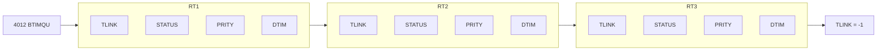
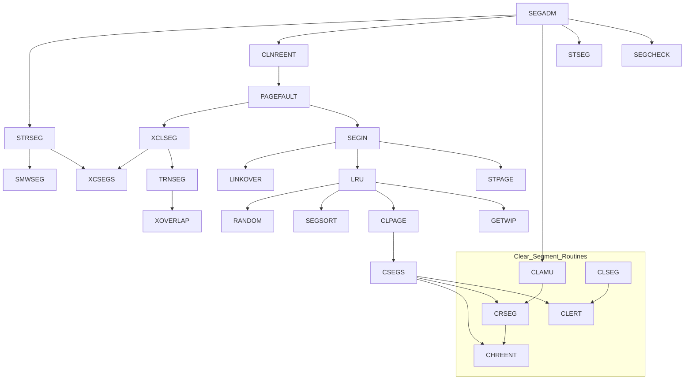
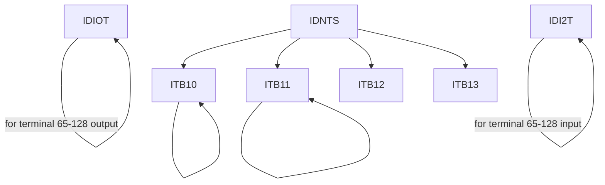
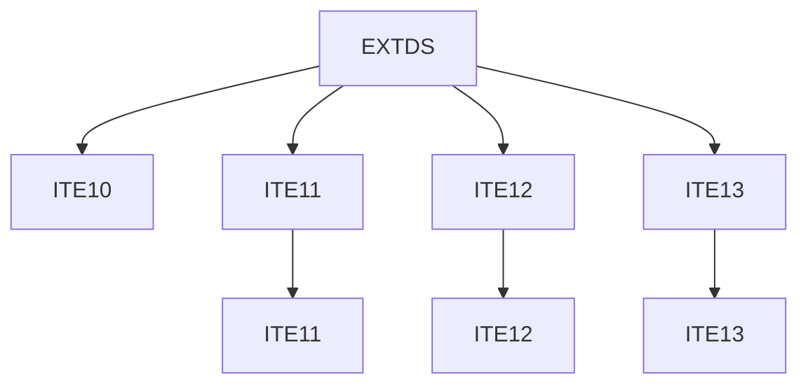
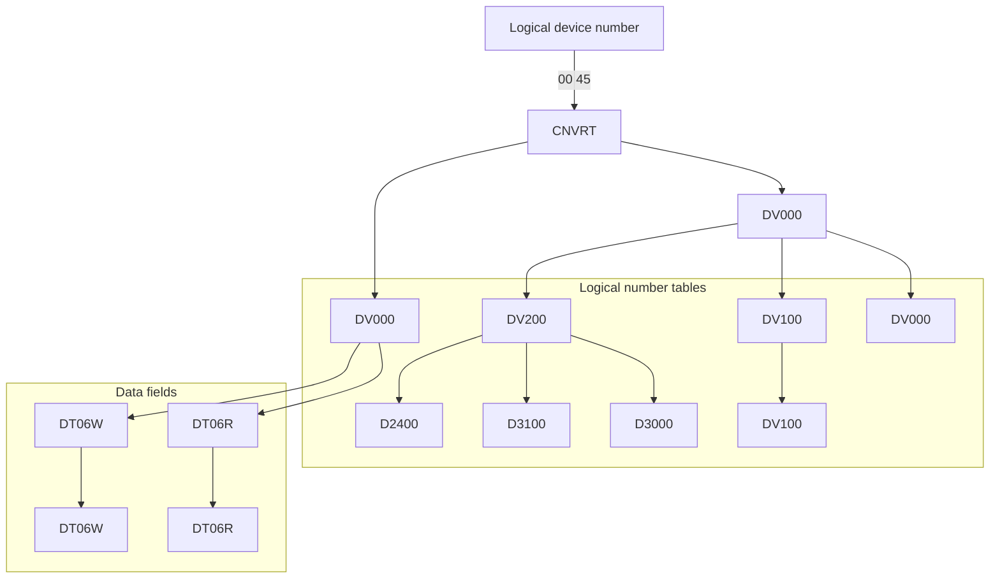
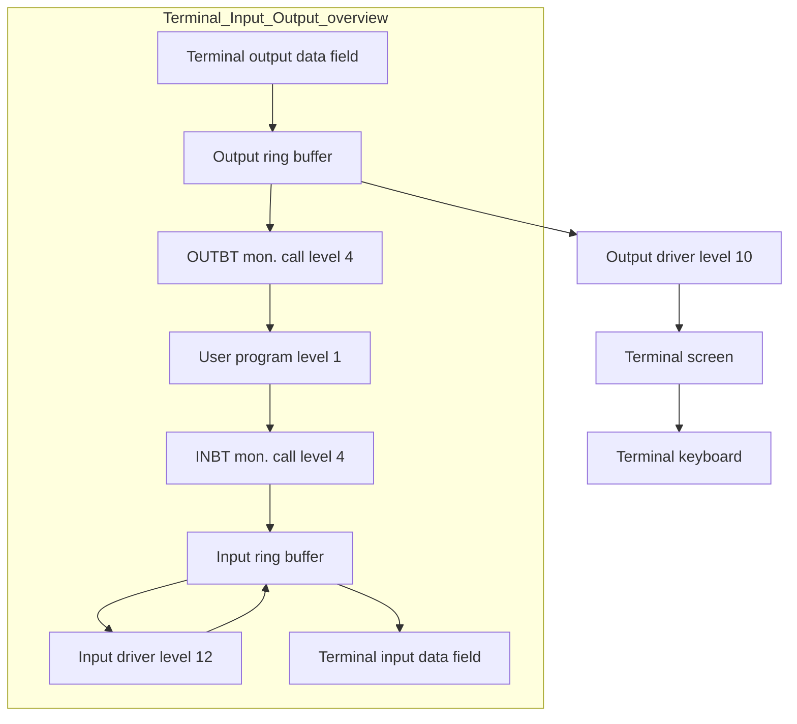
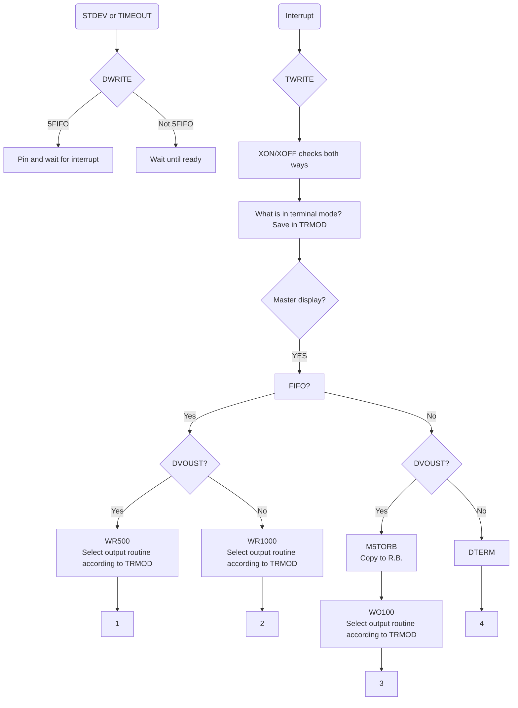

## Page 1

# SINTRAN III/VSX

## System Documentation

ND-820023.1 EN

```
ND
Norsk Data
```

---

## Page 2

I'm unable to convert this image to Markdown as it does not contain any visible text or diagrams to transcribe. Please provide a clearer image or further details.

---

## Page 3

# SINTRAN III/VSX

## System Documentation

ND-82023.1 EN

---

## Page 4

# Note

The numbering system for Norsk Data's documentation changed in September 1988. All numbers now start with an 8. The numbering structure is therefore ND-8xxxxx.xx xx. Example: ND-863018.3A EN. Existing manuals will receive a new number if and when they are updated or revised.

The information in this manual is subject to change without notice. Norsk Data A.S assumes no responsibility for any errors that may appear in this manual, or for the use or reliability of its software on equipment that is not furnished or supported by Norsk Data A.S.

Copyright © 1988 by Norsk Data A.S  
Version 1  
November 1988

Send all documentation requests to:

Norsk Data A.S  
Graphic Centre  
P.O. Box 25 - Bogerud  
N-0621 Oslo 6  
NORWAY

---

## Page 5

# PREFACE

## The Manual

This manual describes the K-version of SINTRAN III/VSX.  
A few chapters are not included in this first version of the manual, these will be supplied in later revisions.

## The Reader

The manual is intended for experienced users who need to understand the internal structure of SINTRAN III.  
The reader is assumed to be familiar with programming.

Some knowledge of the basic structure of the MAC assembly language (the assembly language used on ND-100 computers) and the ND Programming Language (NPL) will also be helpful.

## Related Manuals

- **SINTRAN III Commands Reference Manual** (ND-860128)  
  This manual is a complete reference to the SINTRAN III commands, SINTRAN-Service-Program commands and ND-500/5000 Monitor commands.

- **SINTRAN III Monitor Calls** (ND-860228)  
  This manual is a complete reference to the SINTRAN III monitor calls.

- **SINTRAN III Commands Reference Manual** (ND-860128)  
  This manual is a complete reference to the SINTRAN III commands, SINTRAN-Service-Program commands and ND-500/5000 Monitor commands.

- **SINTRAN III Real Time Guide** (ND-860133)  
  This describes real time programming facilities. It is written for application programmers and assumes a reading knowledge of FORTRAN.

## Note on Names

All symbolic names of routines, variables, symbols and (status-)bits refer to the NPL source code, not to the MAC code used when patching.

---

## Page 6

The scanned page is mostly unreadable due to damage. The visible text at the bottom reads:

```
Scanned by Jonny Oddene for Sintran Data © 2021
```

---

## Page 7

# TABLE OF CONTENTS

| Section | Page |
|---------|------|

# 1. INTRODUCTION

| 1.1 | General | 1-1 |
| 1.2 | History | 1-3 |
| 1.3 | Basic Hardware Environment | 1-3 |
| 1.4 | Basic Operating System Structure | 1-4 |

# 2. SINTRAN III ARCHITECTURE

| 2.1 | Physical Memory Layout | 2-3 |
| 2.2 | System Layout on Disk | 2-4 |
| 2.3 | Page Index Table Layout | 2-5 |
| 2.4 | Interrupt Level Usage | 2-8 |
| 2.5 | System Included Segments | 2-9 |
| 2.6 | System Included RT-Programs | 2-10 |

# 3. SINTRAN III MONITOR

| 3.1 | Data Structures | 3-3 |
| 3.1.1 | RT-Description | 3-3 |
| 3.1.2 | Data Field | 3-5 |
| 3.2 | Queues | 3-7 |
| 3.2.1 | The Monitor Queue | 3-8 |
| 3.2.2 | The Execution Queue | 3-9 |
| 3.2.3 | The Time Queue | 3-11 |
| 3.2.4 | The Reservation Queues | 3-12 |
| 3.2.5 | The Waiting Queues | 3-13 |
| 3.2.6 | Queues - Overview | 3-14 |
| 3.3 | Kernel | 3-15 |
| 3.4 | RT-Programs | 3-16 |
| 3.4.1 | Starting and Stopping RT-Programs | 3-16 |
| 3.4.2 | Entering RT-Programs Into the Execution Queue | 3-18 |
| 3.4.3 | Changing Priority | 3-18 |
| 3.5 | Reserving and Releasing of Resources | 3-18 |
| 3.5.1 | Waiting Queue Operations | 3-19 |
| 3.5.2 | Anti-Jamming | 3-19 |
| 3.6 | Time Scheduling | 3-20 |
| 3.6.1 | Scheduling an RT-program for Execution | 3-20 |
| 3.6.2 | Scheduling an RT-Program for Periodic Execution | 3-21 |
| 3.7 | The Different Ways of Scheduling - Overview | 3-22 |
| 3.8 | Time Handling | 3-23 |
| 3.8.1 | The Real Time Clock | 3-23 |
| 3.8.2 | Accessing the Calendar | 3-24 |

Norsk Data ND-820023.1 EN

Scanned by Jonny Oddene for Sintran Data © 2021

---

## Page 8

# Table of Contents

## 4 TIME SLICING
- 4.1 Introduction ............................................. 4-3
- 4.2 Basic Algorithm ......................................... 4-6
- 4.3 The Time Slicing Classes ............................ 4-6
- 4.4 Special Priorities - Anti-Jamming ............... 4-7
- 4.5 Time Slice Class Overview .......................... 4-8

## 5 MONITOR CALLS
- 5.1 Introduction to Monitor Calls ........................ 5-3
- 5.2 Data Structures ......................................... 5-3
- 5.3 Monitor Call Working Field .......................... 5-4
- 5.4 Interrupt Levels ......................................... 5-5
- 5.5 Parameter Transfer Mechanisms .................. 5-6
- 5.6 Monitor Call Execution ................................ 5-6
- 5.7 Return from Monitor Calls ............................ 5-7
- 5.8 Single-thread and Multi-thread Monitor Calls .... 5-7
- 5.9 Types of Monitor Calls and Related Working Fields ... 5-8

## 6 THE MEMORY MANAGEMENT SYSTEM
- 6.1 Introduction and Data Structures .................. 6-3
- 6.2 Page Index Tables ...................................... 6-4
- 6.3 Protection Mechanisms .............................. 6-4

## 7 SEGMENT HANDLING
- 7.1 The Segment Table ...................................... 7-3
- 7.2 The Memory Map Table or The Core Map Table ... 7-5
- 7.3 Segments - Segment Types ........................... 7-7
- 7.4 Queues ..................................................... 7-9
  - 7.4.1 The Segment Queue ............................... 7-9
  - 7.4.2 Page Queue ....................................... 7-10
- 7.5 Segment Supervising .................................. 7-12
- 7.6 Segment Administration ............................. 7-12
  - 7.6.1 Segment Checking ................................. 7-13
  - 7.6.2 Clearing the Page Tables ....................... 7-13
  - 7.6.3 Setting Up the Page Tables ................... 7-14
  - 7.6.4 Removal of Modified Pages ................... 7-14
  - 7.6.5 Inserting a Page Into a Segment .......... 7-14
- 7.7 Page Fault Handling .................................. 7-14
- 7.8 Segment Fetching ...................................... 7-16
  - 7.8.1 Getting a Segment Into Memory .............. 7-16
  - 7.8.2 Find the Least Recently Used Segment ...... 7-18
  - 7.8.3 Linking Pages Over to a New Segment .... 7-18
- 7.9 Reentrant Segment Handling ...................... 7-20
  - 7.9.1 Attaching a Reentrant Segment ............ 7-20
  - 7.9.2 Context Switching To a Program with a Reentrant Segment .................. 7-20

---

Norsk Data ND-820023.1 EN

Scanned by Jonny Oddene for Sintran Data © 2021

---

## Page 9

# Section

| Section | Page |
|---------|------|
| 7.9.3   | Context Switching From a Program with a Reentrant Segment | 7-20 |
| 7.9.4   | Action when a Reentrant Page is Modified | 7-20 |
| 7.10    | Segment File Usage | 7-21 |
| 7.11    | Monitor Calls for Segment Administration | 7-21 |
| 7.12    | LAMUs | 7-22 |
| 7.12.1  | The LAMU Description Table (LAMDT) | 7-22 |
| 7.12.2  | The Active LAMU Table (ALAMT) | 7-23 |
| 7.13    | ADP Segment | 7-23 |
| 7.13.1  | Monitor Call Interface | 7-24 |
| 7.13.2  | Data Structures | 7-25 |
| 7.13.3  | Functions | 7-26 |
| 7.13.4  | Affected Parts of SINTRAN | 7-26 |

# 8 I/O System

| Section | Title | Page |
|---------|-------|------|
| 8.1     | Introduction | 8-3 |
| 8.2     | The Interrupt System | 8-3 |
| 8.2.1   | Use of the Interrupt Levels | 8-4 |
| 8.2.2   | The Internal Interrupt | 8-4 |
| 8.3     | Data Fields | 8-5 |
| 8.4     | Logical Device Number Table | 8-5 |
| 8.4.1   | Conversion from Logical Device Number to Data Field Address | 8-6 |
| 8.5     | IDENT Tables | 8-6 |
| 8.5.1   | Conversion from IDENT Codes to Data Fields | 8-7 |
| 8.6     | Drivers and Interrupt Identification | 8-8 |
| 8.7     | Byte Oriented Devices | 8-9 |
| 8.7.1   | The Device Dependent Routines | 8-10 |
| 8.7.1.1 | The STDOV Routine | 8-10 |
| 8.7.1.2 | The SETOV Routine | 8-10 |
| 8.7.2   | Ring Buffers | 8-11 |
| 8.7.3   | I/O Monitor Calls | 8-11 |
| 8.8     | Block Oriented Devices (DMA) | 8-13 |
| 8.8.1   | Level Changes When Performing a DMA I/O Operation | 8-13 |
| 8.8.2   | File System Monitor Calls (Mass Storage Monitor Call) | 8-14 |
| 8.8.3   | Data Fields Involved for Mass Storage Monitor Calls | 8-14 |
| 8.8.4   | The System Included RT-Program RWRtn | 8-14 |
| 8.8.5   | Execution of a File System Monitor Call (Mass Storage Monitor Call) from a Background Program | 8-15 |
| 8.9     | Internal Devices | 8-18 |
| 8.9.1   | Byte Oriented Internal Device | 8-18 |
| 8.9.2   | Block Oriented Internal Device | 8-18 |
| 8.10    | Semaphores | 8-18 |
| 8.11    | Timer Mechanism | 8-19 |
| 8.11.1  | Data Structure | 8-19 |
| 8.11.2  | Functions | 8-20 |

---

## Page 10

# Disk I/O

| Section | Title                                                                           | Page |
|---------|---------------------------------------------------------------------------------|------|
| 9       | **DISK I/O**                                                                    | 9-1  |
| 9.1     | Introduction - Data Structures                                                   | 9-3  |
| 9.2     | The Disk Cache                                                                   | 9-4  |
| 9.3     | Purpose of the Device Buffers                                                    | 9-5  |
| 9.4     | Location, Structure, and Organization of the Device Buffer and DBHS              | 9-6  |
| 9.5     | The Operation of the Cache                                                       | 9-7  |
| 9.6     | Device Buffer for Special Use                                                    | 9-8  |
| 9.7     | Bad Track Reallocation                                                           | 9-8  |
| 9.8     | Optimized Processing of Requests, Disk Access Sorting and Parallel Seek          | 9-8  |

# Magnetic Tape I/O

| Section | Title                           | Page |
|---------|---------------------------------|------|
| 10      | **MAGNETIC TAPE I/O**           | 10-1 |
| 10.1    | Introduction - Data Structures  | 10-3 |

# DMA Printer/Plotter I/O

| Section | Title                          | Page |
|---------|--------------------------------|------|
| 11      | **DMA PRINTER/PLOTTER I/O**    | 11-1 |

# Terminal I/O

| Section  | Title                                                                       | Page |
|----------|-----------------------------------------------------------------------------|------|
| 12       | **TERMINAL I/O**                                                            | 12-1 |
| 12.1     | Overview of Terminal I/O                                                    | 12-3 |
| 12.1.1   | IOX Instructions                                                            | 12-4 |
| 12.1.2   | ND-100 Interrupt System                                                     | 12-6 |
| 12.2     | Data Structures                                                             | 12-7 |
| 12.2.1   | The Ident Code Tables                                                       | 12-7 |
| 12.2.2   | Extended Ident Code Tables                                                  | 12-8 |
| 12.2.3   | Logical Device Number Conversion                                            | 12-9 |
| 12.2.4   | The Level 12 Window                                                         | 12-10|
| 12.2.5   | Relationship Between the Data Fields and the Ring Buffers                   | 12-12|
| 12.2.6   | Storing Characters in the Ring Buffer                                       | 12-13|
| 12.2.7   | Organization of Data Fields and Ring Buffers in Physical Memory             | 12-14|
| 12.3     | Interrupt Handling Overview                                                 | 12-15|
| 12.4     | Terminal Input                                                              | 12-17|
| 12.4.1   | IOTRANS Routines                                                            | 12-25|
| 12.4.2   | INBIT/OUTBIT Monitor Call Execution                                         | 12-27|
| 12.5     | 8-bit Input/Output                                                          | 12-28|
| 12.6     | Terminal Output                                                             | 12-28|
| 12.6.1   | Tuning Variables for Terminal Output Driver                                 | 12-28|
| 12.6.2   | Terminal Output (all)                                                       | 12-29|
| 12.6.3   | Terminal Output (FIFO)                                                      | 12-30|
| 12.6.4   | Terminal Output (FIFO)                                                      | 12-31|
| 12.6.5   | Terminal Output (non-FIFO)                                                  | 12-32|
| 12.6.6   | Terminal Output (Master Display)                                            | 12-33|
| 12.7     | TADs                                                                        | 12-34|
| 12.8     | Split TAD Data Fields                                                       | 12-34| 

```
Norsk Data ND-820023.1 EN
```
Scanned by Jonny Oddene for Sintran Data © 2021

---

## Page 11

# Table of Contents

## 12.9 Echo and Break Strategies
- 12.9.1 ASCII Table .................................. 12-35
- 12.9.2 SINTRAN Defined Echo Modes .................. 12-36
- 12.9.3 SINTRAN Defined Break Modes ................. 12-36
- 12.9.4 Echo Handling ................................ 12-37

## 13 START ROUTINES

| Section | Title                                         | Page |
|---------|-----------------------------------------------|------|
| 13.1    | Flow charts                                   | 13-3 |
| 13.2    | Cold-Start                                    | 13-6 |
| 13.2.1  | COLDSTART Routine                             | 13-6 |
| 13.2.2  | PCOLDSTART/PRESYS Routine                     | 13-6 |
| 13.2.3  | Load Program                                  | 13-7 |
| 13.2.4  | SINTRAN Routine (COMMON-CODE)                 | 13-7 |
| 13.2.5  | SETPABL                                       | 13-27 |
| 13.2.6  | STSIN                                         | 13-28 |
| 13.2.7  | OLDSTART Routine                              | 13-29 |
| 13.3    | RESTART Routine                               | 13-32 |
| 13.4    | Floppy Load                                   | 13-32 |
| 13.4.1  | MACM                                          | 13-32 |
| 13.4.2  | Patching Procedure                            | 13-34 |
| 13.5    | Power Fail                                    | 13-35 |
| 13.5.1  | PWFAIL Routine                                | 13-35 |

## 14 ERROR HANDLING
- Page 14-1

## 15 BACKGROUND PROCESSING
- Page 15-1

## 16 COMMAND PROCESSOR

| Section | Title                                         | Page |
|---------|-----------------------------------------------|------|
| 16.1    | Command Data Structures                       | 16-3 |
| 16.2    | Execution of Commands                         | 16-4 |
| 16.2.1  | Monitor Call Commands                         | 16-4 |
| 16.2.2  | Special Monitor Call Commands                 | 16-4 |
| 16.2.3  | Standard Commands                             | 16-5 |
| 16.2.4  | File System Commands                          | 16-5 |
| 16.3    | Protection Mechanisms                         | 16-5 |

## 17 SYSTEM MEASUREMENTS
- Page 17-1

## 18 XMSG

| Section | Title                                         | Page |
|---------|-----------------------------------------------|------|
| 18.1    | Terms and Conventions                         | 18-3 |
| 18.2    | Outline of Implementation                     | 18-3 |
| 18.3    | XMSG Table Structures                         | 18-3 |
| 18.3.1  | XMSG Basefield - XXBAS                        | 18-3 |
| 18.3.2  | Global Variables that Do Not Lie in the Basefield | 18-8 |
| 18.3.3  | XT-Block - Task Description                   | 18-8 |

Norsk Data ND-820023.1 EN
Scanned by Jonny Oddene for Sintran Data © 2021

---

## Page 12

# Section

| Section  | Title                                                                | Page  |
|----------|----------------------------------------------------------------------|-------|
| 18.3.4   | XP-Block - Port Descriptor                                           | 18-10 |
| 18.3.5   | XM-Block - Message                                                   | 18-12 |
| 18.3.6   | XS-Block - System Description and Routing Table                      | 18-16 |
| 18.3.7   | XL-Block - Link or Hyperlink Descriptor                              | 18-18 |
| 18.3.8   | XD-Block - Frame Elements                                            | 18-21 |
| 18.3.9   | XMSG Table Layout                                                    | 18-24 |
| 18.4     | XMSG K Layout on XPIT                                                | 18-25 |
| 18.5     | XLEV5 - XMSG: Monitor Loop on Level 5                                | 18-26 |
| 18.6     | XHS3J Common Entry Point from SINTRAN                                | 18-28 |
| 19       | ND-500                                                               | 19-1  |

# Appendix

## A. Glossary

| Appendix | Title       | Page |
|----------|-------------|------|
| A        | GLOSSARY    | A-1  |

## B. Special Devices

| Appendix | Title            | Page |
|----------|------------------|------|
| B        | SPECIAL DEVICES  | B-1  |

## C. Data Structures - Definitions

| Section | Title                                                           | Page |
|---------|-----------------------------------------------------------------|------|
| C.1     | RT-Description                                                  | C-3  |
| C.2     | Segment Table Related                                           | C-6  |
| C.2.1   | Segment Table Entry                                             | C-6  |
| C.2.2   | Memory Map Table Element                                        | C-7  |
| C.2.3   | LAMU Description Table Element                                  | C-7  |
| C.2.4   | Active LAMU Table Element                                       | C-8  |
| C.3     | Data Fields                                                     | C-9  |
| C.3.1   | Mass Storage (Disk) Driver Data Field                           | C-10 |
| C.3.2   | Terminal Data Field                                             | C-13 |
| C.3.3   | TAD (Terminal Access Device) Data Field                         | C-20 |
| C.4     | Various Other Tables                                            | C-25 |
| C.4.1   | Command Table Element                                           | C-25 |
| C.4.2   | Time Slice Table Element                                        | C-25 |
| C.4.3   | Device Buffer Header                                            | C-26 |
| C.5     | ND-500 Tables                                                   | C-27 |
| C.5.1   | ND-500 Global Data Field                                        | C-27 |
| C.5.2   | ND-500 CPU Data Field                                           | C-30 |

```
Norsk Data ND-820023.1 EN
```

---

## Page 13

# SINTRAN III/VSX System Documentation

1-1

# Chapter 1

## Introduction

Norsk Data ND-820023.1 EN

[Scanned by Jonny Oddene for Sintran Data © 2021]

---

## Page 14

```markdown
# SINTRAN III/VSX System Documentation

---

## Document Information

- Document ID: NO-820023.1 EN
- Publisher: Norsk Data

---

[Document contains watermarks and typical aging signs such as stains and discoloration.]

Scanned by Jonny Oddene for Sintran Data © 2021
```

---

## Page 15

# SINTRAN III/VSX System Documentation

## 1. Introduction

### 1.1 General

SINTRAN III is a multiprogramming real-time operating system for the ND-100, ND-500, and ND-5000 range of computers. It allows users to run real-time, time-sharing, batch, and remote batch programs concurrently.

An introduction to available features is found in the SINTRAN III User Guide (ND-860264), whereas details about functions available is found in the SINTRAN III Commands Reference Manual (ND-860128) and in the SINTRAN III Monitor Calls (ND-860228).

### 1.2 History

SINTRAN II was originally developed for the NORD-10 computer which was introduced in 1973. It represented a major development from the SINTRAN II operating system used on the NORD-1 computers.

Over the years, SINTRAN III has been changed to meet the changed requirements and to support and make use of the changed hardware of the systems. This also includes support of the multi-CPU systems NORD-50, ND-500, and ND-5000 (adding one or more 32-bit CPUs to the basic 16-bit NORD-10 or ND-100 CPU).

### 1.3 Basic Hardware Environment

The ND-100 is a 16-bit general-purpose mini computer system.

It includes a memory management system and an interrupt system.

The hardware memory management system provides basic protection mechanisms and a paging system which extends the 64 Kiloword logical address space (using 16-bit addresses) to 32 Megabyte physical address space (using 24-bit addresses).

The hardware interrupt system supports 16 interrupt levels, each having a complete register set (8 registers). The interrupt levels can be activated both by external interrupts (various I/O devices) or by software. Different parts of SINTRAN III are assigned to different interrupt levels, thus context switches in the operating system are very quick and involve very little overhead.

Norsk Data ND-820023.1 EN

---

## Page 16

# Basic Operating System Structure

SINTRAN III may be considered to consist of two basic parts: the real time monitor and the background processor.

The main task of the real time monitor is to identify why it was called, and then activate the appropriate monitor function. The real time monitor controls when a real time program (RT-program) is to be started considering program priorities, time and interrupts. It also administrates segment handling and controls the I/O system which handles external interrupts.

The background processor is in principle a set of system-included RT-programs, running under the control of the real time monitor. The background processor administrates time sharing and batch processing.

Other operating components include the file system, protection mechanisms, I/O system, segment and memory management, command processor and inter-process communication.

---

## Page 17

# SINTRAN III/VSX SYSTEM DOCUMENTATION

2-1

## CHAPTER 2

### SINTRAN III ARCHITECTURE

---

Norsk Data ND-820023.1 EN

---

Scanned by Jonny Oddene for Sintran Data © 2021

---

## Page 18

```
2-2                                      SINTRAN III/VSX SYSTEM DOCUMENTATION

                        Norsk Data ND-820023.1 EN
```

---

## Page 19

# SINTRAN III ARCHITECTURE

## 2.1 Physical Memory Layout

| Address | During start-up | (size) | (size) | Normal run status |
|---------|-----------------|--------|--------|-------------------|
| 0       | Common code     | 11k    | 11k    | Common code       |
| 12₈     | Restart routines ("POF" code) | <6k | <6k | Restart routines ("POF" code) |
| 33₈     | Start program   | >7k    |        | Reg. block+bitmap |
|         | Reg. block+bitmap | 10k   | 37k    | Resident data     |
|         | Resident data   | 35k    | 1k     | MEMTOF            |
|         | unused          | 2k     | 2k     | unused            |
| end of  |                 |        |        |                   |
| bank 1  | buffer area*    | 0-xk   | 0-xk   | buffer area*      |
|         | RPIT            | <53k   | <53k   | RPIT              |
|         | buffer area*    | 0-xk   | 0-xk   | buffer area*      |
|         | MPIT            | <52k   | <52k   | MPIT              |
| within  | buffer area*    | 0-xk   | 0-xk   | buffer area*      |
| one     | segment table   | <64k   | <64k   | segment table     |
| bank    | buffer area*    | 0-xk   | 0-xk   | buffer area*      |
| bank    | memory map      | <64k   | <64k   | memory map        |
| border  | buffer area*    | 0-xk   | 0-xk   | buffer area*      |

*) buffer areas are used for big terminal data fields and other non-PIT data.

Note that common code always starts at physical address 0 and that resident data (DPIT) logical address 4000 starts at physical address 60000. All resident code is mapped as segments and is accessible through the segment table.

Logical device table is found in bank no. LOGDBANK at addresses found in the CNVRT array in DPIT.

Norsk Data NO-820023.1 EN

---

## Page 20

# SINTRAN III/VSX System Documentation
## 2.2 System Layout on Disk

| File                   | Contents             | Start address | Size  | Disk addr. | Macro displ. | Patch macro |
|------------------------|----------------------|---------------|-------|------------|--------------|-------------|
| **SINT RAN: DATA**     | Common Code          |               |       | 1          |              |             |
|                        | Start Restart        |               |       |            |              |             |
|                        | Resident Data        | [illegible]   |       |            |              |             |
|                        | [illegible]          |               |       |            |              |             |
| **MACM-AREA: DATA**    | Error Program        | 30 000        | 12k   | 100        | - 13         | PERRP       |
|                        | End Resident Data    | 112 000       | 2k    | 112        |              | P2RDA       |
|                        | System segment       | 130 000       | 3k    | 114        | - 54         | PSYSG       |
|                        | MEMTOF               | 172 000       | 1k    | 117        |              |             |
|                        |                      |               |       |            |              |             |
|                        | RT-Loader            | 30 000        | 41k   | 137        | - 14         | PRTLO       |
| **SEG FILO: DATA**     | Common Code          | 0             | 13k   | 200        | 0            | PCCST       |
|                        | Start Restart        | 26 000        | 20k   | 213        |              |             |
|                        | Resident Data        | 4 000         | 43k   | 233        | - 2          | PRODAT      |
|                        | End Resident Data    | 112 000       | 2k    | 277        |              |             |
|                        | System Segment       | 130 000       | 3k    | 301        |              |             |
|                        | Spooling Data Field  | 150 000       | 1k    | 304        | - 64         | PSPDF       |
|                        | RPIT                 | 26 000        | 65k   | 305        | - 13         | PRPIT       |
|                        | MPIT                 | 26 000        | 65k   | 372        | - 13         | PMPIT       |
|                        | Segment Table        | 0             | 20k   | 457        | 0            | PSGTB       |
|                        | File System          | 26 000        | 65k   | 477        | - 13         | PFILS       |
|                        | Command Segment      | 26 000        | 65k   | 564        | - 13         | POPCO       |
|                        | 5PIT                 | 26 000        | 5k    | 651        | - 13         | P5PIT       |
|                        | ND-500 Monitor       | 40 000        | 60k   | 656        | - 20         |             |
|                        |                      |               |       |            | 736          |             |


Norsk Data ND-820023.1 EN

Scanned by Jonny Oddene for Sintran Data © 2021

---

## Page 21

# SINTRAN III/VSX System Documentation

## SINTRAN III Architecture

### 2.3 Page Index Table Layout

| RPIT=10       | SPIT=11        | FPIT=4                  | 5PIT=5         | XPIT=6        | MPIT=12             |
|---------------|----------------|-------------------------|----------------|---------------|---------------------|
| Micro-common  | μ (2K)         | μ                       | μ              | μ             | μ                   |
| Common code   | © (9K)         | ©                       | ©              | ©             | ©                   |
| Monitor calls | Edit routines  | File system segment     | MON 60         | XMSG          | Resident code:      |
| Resident code | Command segment|                         | ND-500 monitor |               | M-level (monitor level) |
| B-level (lev. 4) | RT-load     |                         |                |               | S-level (SegAdm. lev.)(*) |
| Buffers       | DMAC           |                         |                |               | level-10            |
|               | Error program  |                         |                |               | level-11            |
|               | S-level (SegAdm. lev.)(*) |              |                |               | level-12            |
|               |                |                         |                |               | level-13            |
|               |                |                         |                |               | level-14            |
|               |                |                         |                |               | Buffers             |

| DPIT=7           | POF             | X5DPT=13+14              | FUPIT=3      | DTPIT=17     | UPITN=1, UPITA=2                  |
|-----------------|----------------|--------------------------|-------------|-------------|----------------------------------|
| μ               | μ              | ND-500 name segments     | μ           | Direct tasks| Users norma) PIT (UPITN)        |
| Resident common data (37k) | |  (PIT 13)                |              |             |                                  |
| wind.BF         | Start-program  | ND-500 standard domain   | Remote file |             | Users altern. PIT (UPITA)        |
| wind.NS         | base (1k)      | segment (PIT 14)         | user PIT    |             |                                  |
| wind.10         | Restart code   |                          |             |             |                                  |
| wind.12         |                |                          |             |             |                                  |
| wind.1/4 (5k)   | Start code     |                          |             |             |                                  |
| System segment  | Register blocks|                          |             |             |                                  |
| (8k)            | Bitmaps        |                          |             |             |                                  |
| Data segment    |                |                          |             |             |                                  |
| (12k)           | 66000          |                          |             |             |                                  |
|                 | Stack window   |                          |             |             |                                  |

```
(*) : The segment administration routines (SegAdm) is found on MPIT in generations prior to 500, on SPIT in generation 500 and later.
```

```
Scanned by Jonny Oddene for Sintran Data © 2021
Norsk Data ND-820023.1 EN
```

---

## Page 22

# SINTRAN III/VSX-SYSTEM DOCUMENTATION

## SINTRAN III ARCHITECTURE

Note that (almost) all code must run in two-bank mode. Some code must even switch between one-bank and two-bank mode in order to access all its data (or use physical memory load and store instructions). All system code will use DPIT as alternative page table.

### Common code (Θ)

The common code part contains the routines that can be called from more than one PIT.

The common code should not exceed 11 K of code (0-25777₈).

### µΘ (micro common)

This part of common is also present in the data PIT (DPIT). It is mainly used for parameter fetching and other operations on the user's data area.

### Resident code (RPIT)

This part contains code for most SINTRAN monitor calls except a few, which are placed on SPIT. File system monitor calls are processed in the file system PIT. Other resident code that today is found in part 2 of resident should also be in this PIT, e.g., TAD resident code, resident RT-programs, configuration dependent code and "PIT3" code.

OUTBIT/INBIT level code is here. Buffers accessed with RBGET/RBPUT are at the top of this PIT (they are also in MPIT).

### Monitor PIT (MPIT)

Here is all code for:

- monitor level
- internal interrupts (level 14)
- drivers for levels 10 to 13
- and segadm level (generations prior to generation 500 only)

Note that the part of this PIT that contains segadm is on ring 3. This makes it possible to run nearly always with paging on.

Buffers accessed with RBGET/RBPUT are at the top of this PIT (they are also in RPIT).

### SINTRAN PIT (SPIT)

In this page index table we find the command, RT-Loader and DMAC segments. In generations 500 and later, the segments administration (SegAdm) routines are also placed on SPIT. A segment will be removed from this PIT only when another segment must be entered. Note that the first page of the segment area (page 138₈) always contains the Edit routine with its related routines.

---

[Norsk Data ND-820023.1 EN]

[Scanned by Jonny Oddene for Sintran Data © 2021]

---

## Page 23

# SINTRAN III/VSX SYSTEM DOCUMENTATION

## SINTRAN III ARCHITECTURE

### File system and file user, ND500, XMSG PITs (FPIT, FUPIT, SPIT, XPIT)

These PITs each (currently) contain a single segment only, and a special strategy is applied to the setting and clearing of these page index tables to minimize context switch overhead.

### ND-500 name and standard domain segment PITs (XSDPIT)

These PITs are used for the ND-500 name segment and standard domain segments. The last page of these PITs are used as a window to the ND-500 monitor stack page on the ND-500 user’s data segment.

### Data PIT (DPIT)

The data PIT contains the resident common data, as RT-descriptions, data fields and system global variables. The background system segments are placed in this PIT, as well as the ND-500 data segments and various file system segments. All windows are in this PIT. μΦ is also included here.

### User page index tables (UPITN, UPITA, DTPIT)

Three page index tables are reserved for the users. Two for background and RT-programs (normal and alternative PIT) and one for direct tasks.

### Non-PIT data

The following data is not in any PIT:

- Segment table
- Memory map
- RT-programs' register block and bit map
- "Big" terminal (TAD) data fields
- ND-500 mail boxes
- Logical device number tables
- ND-500 communication buffers (for MON 60)

---

## Page 24

## 2.4 Interrupt Level Usage

| Level | Description                                         |
|-------|-----------------------------------------------------|
| 15    | Extremely fast user interrupts                      |
| 14    | Internal interrupts                                 |
| 13    | Real Time Clock, HDLC drivers                       |
| 12    | Terminal Input, & ND-100 - ND-500 Communication     |
| 11    | Mass storage Input/Output                            |
| 10    | Terminal output                                     |
| 9     |                                                     |
| 8     | Direct tasks                                        |
| 7     |                                                     |
| 6     |                                                     |
| 5     | XMSG                                                |
| 4     | I/O Monitor calls                                   |
| 3     | Segment administration                              |
| 2     | SINTRAN III Monitor                                 |
| 1     | Real time programs and Background programs          |
| 0     | Idle loop                                           |

Note the changed use of levels 2 and 3.

---

## Page 25

# SINTRAN III/VSX System Documentation

## SINTRAN III Architecture

### 2.5 System Included Segments

| SEGMENT No. | No. NAME   | ADDRESS RANGE | PIT | DESCRIPTION                                        |
|-------------|------------|---------------|-----|----------------------------------------------------|
| 2           | S3IMAGE    | 0 - 65777     | 1   | Memory image of COMMON code, Start/restart program |
| 3*          | S3CG       | 30000 - 177777| 11  | Command segment                                    |
| 4           | S3RTL      | 30000 - 123777| 11  | RT-Loader segment                                  |
| 5           | S3ERS      | 130000 - 131777| 7   | System segment for error program                    |
| 6           | S3FS       | 26000 - 177777| 4   | File system segment                                |
| 7*          | S3DMAC     | 64000 - 153777| 11  | DMAC segment                                       |
| 10          | S3RTFIL    | 0 - 177777    | 2   | RTFIL segment                                      |
| 11          | S3ERL      | 0 - 177777    | 1   | Error log segment                                  |
| 12          | S3SFSV     | 26000 - 177777| 1   | Initial file system segment                        |
| 13          | S3OPCSV    | 26000 - 177777| 1   | Initial command segment                            |
| 14*         | S3ERRP     | 30000 - 53777 | 1   | Error program segment                              |
| 15          | S3BFLY     | 26000 - 26000 | 1   | Reserved for system extension                      |
| 16          | S3SRPIT    | 26000 - 177777| 1   | Initial RPIT (save area)                           |
| 17*         | S3SMPIT    | 26000 - 177777| 1   | Initial MPIT (save area)                           |
| 20*         | S3MD       | 0 - 175777    | 14  | ND-500 standard domains segment                    |
| 21*         | S3NM5      | 0 - 175777    | 13  | ND-500 name tables segment                         |
| 22          | S3RAF2     | 26000 - 155777| 3   | Remote File Access segment                         |
| 23          | S3DPIT     | 4000 - 107777 | 7   | DPIT segment (global data)                         |
| 24*         | S3SGST     | 0 - 37777     | 7   | Initial segment table                              |
| 26*         | S3RPIT     | 26000 - 177777| 1   | Image of RPIT                                      |
| 26*         | S3IMPIT    | 26000 - 177777| 1   | Image of MPIT                                      |
| 27*         | S3SGT      | 0 - 37777     | 1   | Image of segment table                             |
| 30          | S3SM5      | 4000 - 177777 | 5   | ND-500 system monitor segment                      |
| 31*         | S3SSPD     | 150000 - 151777| 7  | Initial spooling data fields                       |
| 32          | S3RTACC    |               | 1   | Reserved, but not used                             |
| 33          | S3XMSG     | 120000 - 177777| 2   | XMSG POF segment                                   |
| 34          | S3XMSGDP   | 0 - 177777    | 2   | XMSG demand segment (XROUT)                        |
| 35          | S3MPIT     | 26000 - 161177| 12  | MPIT segment                                       |
| 36          | S3TA10     | 110000 - 133777| 11  | TAAODM segment                                     |
| 37          | S3RTD      | 0 - 177777    | 1   | RT-Loader data segment                             |
| 40          | S3FURDT    | 150000 - 157777| 7   | File User data segment for RT-prog                 |
| 41          | S3IMED     | 26000 - 277777| 1   | Image of EDIT routines                             |
| 42          | S3ED       | 26000 - 277777| 11  | EDIT routines                                      |
| 43          | S3PATCH    | 174000 - 177777| 2   | Reserved for internal use by ND                    |
| 44*         | S3DIPIT    | 4000 - 117777 | 1   | Memory image of system data (DPIT)                 |
| 45          | S3ISYS     | 130000 - 135777| 1   | Memory image of system segment                     |
| 46*         | S3S5PIT    | 0 - 37777     | 1   | Save of 5PIT segment                               |
| 47          | S3RPIT     | 26000 - 145777| 10  | RPIT segment                                       |
| 50*         | S3IS5PIT   | 0 - 37777     | 10  | Image of 5PIT segment                              |
| 51*         | S3SPIT     | 26000 - 37777 | 5   | 5PIT segment                                       |
| 52          | S3SAVE     | 0 - 65777     | 1   | Save of common code and start prog                 |
| 53          | S3SDPIT    | 4000 - 117777 | 1   | Save of DPIT                                       |
| 54          | S3SERSV    | 130000 - 135777| 1  | Save of system segment                             |
| 55          | S3SERRP    | 30000 - 53777 | 1   | Save of error program                              |
| 56          | S3SRTC     | 30000 - 67777 | 1   | Save of RT-Loader's code segment                   |
| 57          | S3SRTO     | 0 - 25777     | 1   | Save of RT-Loader's data segment                   |
| 60          | S3SSERD    | 112000 - 115777| 1  | Save of DPIT last two pages                        |
| 61          | S3IED      | 112000 - 115777| 1  | Image of DPIT last two pages                       |
| 62          | S3SM5      | 40000 - 177777| 1   | Save of ND-500 Monitor                             |
| 63          | S3MEMT     | 172000 - 173777| 1  | MEMTOF                                             |
| 64          | S3SERD     | 112000 - 115777| 7  | DPIT last two pages                                |

---

## Page 26

# SINTRAN III/VSX System Documentation

## SINTRAN III Architecture

Note: Segments 2-64 will be given standard segment names the first time the RT-Loader is entered.

All system included segments are placed on segment file number 0 (SEGFILE:DATA), except segments 52-60 and 63 which are placed on the files SINTRAN:DATA and MACM-AREA:DATA.

## 2.6 System Included RT-Programs

| PROGRAM | PURPOSE |
|---------|---------|
| 1SWAP   | Queueing program requests for swapping |
| 5SWAP   | Performs ABSTR in ND-100 for the ND-500 Swapper |
| ACCRT   | RT accounting |
| BAKnnn  | Background process for terminal (BAK01-BAK99) |
| BKnnnn  | - (BK100-BK128) |
| BCHnn   | Batch process |
| BPTMP   | Timeout program for background allocation system |
| COSPO   | COSMOS-spooling server |
| DUMM2   | Dummy program used by the spooling system |
| DUMMY   | Dummy program to prevent empty execution queue |
| FDRT1   | Transfer data between interface buffer and memory. Floppy formatting. (FLOPPY-1) |
| FDRT2   | Transfer data between interface buffer and memory. Floppy formatting. (FLOPPY-2) |
| FIXRT   | Monitor call/command FIXX execution |
| RTD1L   | Buffer transfer program for DISC-ACCESS-LOG |
| RTRER    | Output error messages |
| RTFRA    | Does remote file access for RT-programs (COSMOS - remote file access) |
| RTSLI   | Time slicer. Changes priority on all time-sliced processes. |
| RWRT1   | Block data transfer. Activated from RFILE/WFILE/RPAGE/WPAGE for RT-programs |
| RWRT2   | Open file from RT-programs |
| RWRT3   | Block transfer on MAG-TAPE-1 (MAGTP) |
| RWRT5   | VERSATEC-1 DMA |
| RWRT6   | CDC-DMA LINK |
| RWRT7   | MAG-TAPE-2 |
| RWRT8   | VERSATEC-2 DMA |
| RWRT9   | FLOPPY-DISC 1 |
| RWRT10  | FLOPPY-DISC 2 |
| RWRT11  | LINE-PRINTER/VERSATEC -1 I/O |
| RWRT12  | LINE-PRINTER/VERSATEC -2 I/O |
| RWRT13  | Block-oriented internal device 1 INPUT |
| RWRT20  | Block-oriented internal device 1 OUTPUT |
| RWRT14  | Block-oriented internal device 2 INPUT |
| RWRT21  | Block-oriented internal device 2 OUTPUT |
| RWRT15  | Block-oriented internal device 3 INPUT |
| RWRT22  | Block-oriented internal device 3 OUTPUT |
| RWRT16  | Block-oriented internal device 4 INPUT |
| RWRT23  | Block-oriented internal device 4 OUTPUT |
| RWRT17  | Block-oriented internal device 5 INPUT |
| RWRT24  | Block-oriented internal device 5 OUTPUT |

Norsk Data ND-820023.1 EN

[Scanned by Jonny Oddene for Sintran Data © 2021]

---

## Page 27

# SINTRAN III/VSX SYSTEM DOCUMENTATION
## SINTRAN III ARCHITECTURE

| Code  | Description                                     |
|-------|-------------------------------------------------|
| RWRT25| HASP DMA 1 INPUT                                |
| RWRT26| HASP DMA 1 OUTPUT                               |
| RWRT27| HASP DMA 2 INPUT                                |
| RWRT28| HASP DMA 2 OUTPUT                               |
| RWRT29| HASP DMA 3 INPUT                                |
| RWRT30| HASP DMA 3 OUTPUT                               |
| RWRT31| HASP DMA 4 INPUT                                |
| RWRT32| HASP DMA 4 OUTPUT                               |
| RWRT33| HASP DMA 5 INPUT                                |
| RWRT34| HASP DMA 5 OUTPUT                               |
| RWRT35| HASP DMA 6 INPUT                                |
| RWRT36| HASP DMA 6 OUTPUT                               |
| SPRTn | Spooling programs (1-9)                         |
| SPRnn | Spooling programs (10-30)                       |
| STSIN | Initialize SINTRAN III and start systems RT-programs |
| TADnn | Background process for Terminal Access Device   |
| TAADA | Administers connections to TADs from requesting users. |
| TERMP | Starts the user defined "clean-up" RT-program when RT-programs are aborted (if enabled) |
| TIMRT | Timer RT-program. Start timeout routine for all devices in timer table. |
| UDRnn | Performs Fast Universal DMA for user processes. |
| DIMWD | Used by the disk mirroring facility which is part of the Fault Tolerant eXtension. |

---

## Page 28

# SINTRAN III/VSX System Documentation

Page: 2-12

---

[Page contains visible damage and stains, some text might be missing]

---

Norsk Data ND-820023.1 EN

Scanned by Jonny Oddene for Sintran Data © 2021

---

## Page 29

# SINTRAN III/VSX System Documentation

### Chapter 3

## SINTRAN III Monitor

Norsk Data ND-820023.1-EN

*Scanned by Jonny Oddene for Sintran Data © 2021*

---

## Page 30

I'm unable to read the text beyond what is visible and can transcribe for you. The page appears to include:

```
SINTRAN III/VSX SYSTEM DOCUMENTATION

Norsk Data ND-820023.1 EN
```

If there's more content you can provide in other pages or if there are clearer sections, feel free to share them!

---

## Page 31

# SINTRAN III MONITOR

## 3.1 Data Structures

### 3.1.1 RT-Description

Each RT-program defined has its own description in the system tables.  
An RT-program is identified by the address of its RT-description.  
Whenever an RT-program is inserted in a table or queue, it is the various elements in the RT-description which really is manipulated.

The main part (shown below) of all RT-descriptions is placed in the RT-description table in the DPII segment. The address of the start of the RT-description table is found in the variable RTSTART (address 4020 in DPII), and address of the first location after the end of the table is found in the variable RTEND (address 4323 in DPII).

The layout of the RT-description is shown below:

|       |                                      |
|-------|--------------------------------------|
| 0     | TLINK Time queue link                |
| 1     | STATUS Status bits                   |
| 2     | INPRITY Initial RT-program priority  |
| 3     | PRITY Actual RT-program priority     |
| 4     | DTIM1                                |
| 5     | DTIM2 Start time (DTIME)             |
| 6     | DTIN1                                |
| 7     | DTIN2 Activation interval (DTINT)    |
| 10    | STADR Start address                  |
| 11    | SEGM1                                |
| 12    | SEGM2 Initial segments (DSEGM)       |
| 13    | WLINK Waiting queue, execution queue |
| 14    | ACTISEG                              |
| 15    | ACT2SEG Actual segments (DACTISEG)   |
| 16    | INIPRI Initial page tables and ring  |
| 17    | ACTPRI Actual page tables and ring   |
| 20    | BRESLINK Beginning of reservation link |
| 21    | RSEGM Reentrant segment              |
| 22    | BUFWINDOW Physical page no. of buffer currently used as a |
| 23    | TRMWINDOW Program dependent, see below. general window |
| 24    | NSWINDOW Physical page no. of ND-500 mailbox window |
| 25    | RTDLGADDR Physical address of extended part of RT-desc (register block + bit map)|

```
Norsk Data ND-820023.1 EN
```

---

## Page 32

# SINTRAN III/VSX System Documentation
## SINTRAN III Monitor

The TRMWINDOW location is the physical page number of either the non-DPIT part of the terminal data field (for background RT-programs), or the RT-program monitor call working field (for other RT-programs).

The RT-description is split into two parts (a main part placed on the DPIT segment) and an extended part.  
The extended part is placed in bank 0 of physical memory, and contains the save area for the register block and the bit map for reentrant segments. The address of this extended part is found in location RTDLGADDOR of the DPIT part of the RT-description.

The layout of the extended part of the RT-description is shown below:

|   |       |   |
|---|-------|---|
| 0 | DPREG | Saved P-register |
| 1 | DXREG | Saved X-register |
| 2 | DTREG | Saved T-register |
| 3 | DAREG | Saved A-register |
| 4 | DDREG | Saved D-register |
| 5 | DLREG | Saved L-register |
| 6 | DSREG | Saved S-register (status register) |
| 7 | DBREG | Saved B-register |
| 10 | BITMAP | Reentrant segment bit map (pages 0-15) |
| 11 | BITM1 | Bit map continued (pages 16-31) |
| 12 | BITM2 | Bit map continued (pages 32-47) |
| 13 | BITM3 | Bit map continued (pages 48-63) |
| 14 | BITM4 | Bit map continued (pages 64-79) |
| 15 | BITM5 | Bit map continued (pages 80-95) |
| 16 | BITM6 | Bit map continued (pages 96-111) |
| 17 | BITM7 | Bit map continued (pages 112-127) |

### Format of INIPRI and ACTPRI:

```plaintext
+---------------------+-------------------+-----------+------+
|     Normal PIT      |  Alternative PIT  |   Level   | Ring |
|                     |                   |           |      |
| 0                   | 0                 | 0     1   | 1    |
+---------------------+-------------------+-----------+------+
| 1 7  16 15 14 13 1  | 1 11 10 | 0  07 06 | 05 04 | 03 02 | 01 00 |
```

The 1 in bit number 2 indicates 16-page index table mode.

Norsk Data ND-820023.1 EN

---

## Page 33

# SINTRAN III/VSX System Documentation

## SINTRAN III Monitor

### Format of STATUS

```
5BACKGR: Background RT-program
5USED:   This RT-description is in use
5TSLICED: This RT-program is time sliced
5ESCF:   Waiting for Escape priority
5BRKF:   Waiting for Break priority
5SPRF:   Program is anti-jammed

 17 16 15 14 13 12 11 10 09 08 07 06 05 04 03 02 01 00
 |  |  |  |  |  |  |  |  |  |  |  |  |  |  |  |  |  |
 |---------------------------------------------|
 |-----------------| |-------------------------|  5WWAIT: Process in
 |-----------------|  5RTOFF: Start inhibited  swapping queue
 |---------------|  5TMOUT: TMOUT has been used
 |-------------|  5ABS: ABSET has been used
 |-----------|  5INT: INTV has been used
 |---------|  5RWAIT: RTWT or HOLD has been used
 |-------|  5REP: Repeat execution
 |-------|  5WAIT: I/O wait
```

### 3.1.2 Data Field

All resources which can be reserved by RT-programs, have one or two description tables. These descriptions are called the data fields of the resource (or device). If a device has separate channels for input and output, it has two data fields, other devices have only one. Because of the great variety of devices, the data field format may vary in size and contents. For a complete description of the various data fields, refer to appendix C.3.

All data fields have a common part which is placed in the DPIT segment, but some device-dependent parts of data fields may be placed elsewhere (refer to appendix C.3 for details). The common part of all data fields are shown below:

|   |          |                                  |
|---|----------|----------------------------------|
| 0 | RESLINK  | Reservation link                 |
| 1 | RTRES    | Reserving RT-program             |
| 2 | BWLINK   | Beginning of waiting queue       |
| 3 | TYPERING | Device type and ring             |
| 4 | ISTATE   | State (active, I/O-wait, etc.)   |
| 5 | MLINK    | Monitor queue link               |
| 6 | MFUNC    | Monitor level function address   |

Norsk Data ND-820023:1 EN

Scanned by Jonny Oddene for Sintran Data © 2021

---

## Page 34

# SINTRAN III/VSX System Documentation
## SINTRAN III Monitor

The minimum data field consists of the four elements RESLINK, RTRES, BWLINK and TYPRING; but ISTATE, MLINK and MFUNC are also included for almost all devices.

Note that data fields are extended both with negative and positive displacements to accommodate the various devices.

The address of the data field is the address of the RESLINK element (displacement 0 of the main part of the data field in DPIT). A data field is identified by this address.

### Format of TYPRING:

```
Protection Ring
5CLDV: Clear device routine available
       (CLEAR-DEVICE may be used)
5NORES: No reservation necessary
        (before using device)
5BAD: Terminal access device (TAD)
5TERM: Terminal
5IBDV: Internal block device
5INVERT: Invert digital I/O

          ┌───┬───┬───┬───┬───┬───┬───┬───┐
          │17 │16 │15 │14 │13 │12 │11 │10 │
          └───┴───┴───┴───┴───┴───┴───┴───┘
            │         │   │   │   │   │   │
            ├─────────┘   │   │   │   │   │ 5FLOP: Floppy disk
            │             │   │   │   │   ├ 5MT: Magnetic tape
            ├─────────────┘   │   │   │   ├ M144B: Block calls allowed
            │                 │   │   ├───┤ 5SPLTDF: Split data field
            ├───────────────┘ │   │   │   │ (a part outside DPIT)
            │                 │   │   ├───┤ 5ISET: IOSET allowed
            ├───────────────┘ │   │   ├───┤ 5CONCT: CONCT allowed
            │                 │   │   ├───┤ 5RFILE: mass storage file
            ├───────────────┘ │   │   ├───┤ 5IOBT: INBT/OUTBT allowed
            │                 │   │   
    ┌───────┴─────────┬───────┼─────────────┬───────┬───────────┬──────┐
    │ 07 │ 06 │ 05 │ 04 │ 03 │ 02 │ 01 │ 00 │
    └─────┴─────┴─────┴─────┴─────┴─────┴─────┴─────┘
```

Norsk Data ND–820023.1 EN

[Scanned by Jonny Oddene for Sintran Data © 2021]

---

## Page 35

# SINTRAN III/VSX SYSTEM DOCUMENTATION  
## SINTRAN III MONITOR

### 3.2 Queues

To be able to administer resources and keep track of all requests for resources, SINTRAN uses different queues.

The most important queues are:

- The Monitor queue
- The Execution queue
- The Time queue
- The Reservation queues
- The Waiting queues

Norsk Data ND-820023.1 EN

Scanned by Jonny Oddene for Sintran Data ©2021

---

## Page 36

# 3.2.1 The Monitor Queue

There is one (global) monitor queue.

The monitor queue is a linked list of data fields of devices requiring services from SINTRAN routines on monitor level.

The head of the queue is a variable in the DOPT segment: MQUEUE.

The link element is the MLINK element in each data field (see below).

The last data field in the monitor queue will have MLINK = -1.

The monitor queue may be illustrated like this:

```
    data field       data field       data field
4011  ┌───────┐      ┌───────┐       ┌───────┐
MQUEUE│       │ ───> │       │ ───>  │       │
      └───────┘      └───────┘       └───────┘
       ┌───────┐      ┌───────┐       ┌───────┐
       │ MLINK │      │ MLINK │       │ MLINK │
       ├───────┤      ├───────┤       ├───────┤
       │ MFUNC │      │ MFUNC │       │ MFUNC │
       └───────┘      └───────┘       └───────┘
                                    MLINK = -1
```

The MFUNC element in the data field contains the address of the SINTRAN routine to be executed.

The monitor queue is ordered on time of entry into queue with the oldest entry at the end of the queue. New data fields will be entered into the queue in front of the queue. Data fields are removed from the end of the queue.

Routine used to insert data fields into the monitor queue: RTACT  
and: XRTACT  
and: CXRTACT  
and: CXXRIACT  

---
Norsk Data ND-820023.1 EN

Scanned by Jonny Oddene for Sintran Data © 2021

---

## Page 37

# SINTRAN III/VSX SYSTEM DOCUMENTATION
## SINTRAN III MONITOR

### 3.2.2 The Execution Queue

There is one (global) execution queue.

The execution queue contains the RT-description of all RT-programs which are waiting for execution, including the RT-program currently executing.

RT-programs currently waiting for an I/O transfer will also be kept in the execution queue, but the 5WAIT bit in the STATUS word will be set to indicate the wait state.

The same applies to RT-programs currently waiting for the Swapper, the 5SWAIT bit in the STATUS word is set (in addition to the 5WAIT bit) to indicate this state.

Note that an RT-program may be put in both the execution queue and the time queue at the same time - this applies to RT-programs scheduled for execution at regular time intervals.

The head of the queue is a variable in the DPIT segment: BEXQU.

The link element is the WLINK element in each RT-description.

The WLINK element of DUMMY's RT-description is pointing at BEXQU - 2.

The execution queue may be illustrated like this:

```
  4011
   │
───┬───────────────────────────────────┬────────────────────────────┬─────────────────
   │                                   │                            │
   │                                   │                            │
  BEXQU                           RT-description               RT-description
   │                                   │                            │
   │                                   │                            │
┌──────┐                           ┌──────┐                    ┌──────┐
│STATUS│                           │STATUS│                    │STATUS│
├──────┤                           ├──────┤                    ├──────┤
│PRITY │                           │PRITY │                    │PRITY │
├──────┤                           ├──────┤                    ├──────┤
│      │                           │      │                    │      │
│      │                           │      │                    │      │
│      │                           │      │                    │      │
│      │                           │      │                    │      │
│      │                           │      │                    │      │
│      │                           │      │                    │      │
│WLINK │                           │WLINK │                    │WLINK │
└──────┘                           └──────┘                    └──────┘
   │                                   │                            │
   │                                   └────────────────────────────┘
   └─────────────────────────────────────────────────────────────────────
```

The execution queue is ordered on priority (in descending order). New RT-programs will be entered into the queue after RT-programs with the same priority.

Norsk Data ND-820023.1 EN

---

## Page 38

# SINTRAN III/VSX System Documentation
## SINTRAN III Monitor

The last RT-program in the execution queue will normally be the RT-program DUMMY (which calls the idle loop). DUMMY has priority 0, and any RT-program which this priority will therefore be placed after DUMMY in the execution queue. This means that they will never be executed.

The first RT-program in the execution queue which is not in a wait state (5WAIT bit set), will be the executing RT-program.

The RT-programs in the execution queue may be listed by the SINTRAN command `@LIST-EXECUTION-QUEUE`.

Routine used to insert RT-programs into the execution queue: TOEXQ  
and: TOWQU.

Routine used to remove RT-programs from the execution queue: FREXQU  
and: FRWQU.

```
[Photo: Page with text on execution queue routines in SINTRAN III/VSX system]
```

Norsk Data ND–620023.1 EN

---

## Page 39

# SINTRAN III/VSX SYSTEM DOCUMENTATION
## SINTRAN III MONITOR

### 3.2.3 The Time Queue

There is one (global) time queue.

The time queue contains the RT-description of all RT-programs which are scheduled for activation or reactivation at a given time.

Note that an RT-program may be put in both the time queue and the execution queue at the same time - this applies to RT-programs scheduled for execution at regular time intervals.

The head of the queue is a variable in the DPII segment: BTIMQU.

The link element is the TLINK element in each RT-description.

The last RT-program in the time queue will have TLINK = -1.

The time queue may be illustrated like this:



The time queue is ordered on waiting time (in ascending order). New RT-programs will be entered into the queue after RT-programs with the same scheduled time.

RT-programs are removed from the front of the queue at the scheduled time, and entered into the execution queue according to its priority. If an RT-program is already in the execution queue or in a waiting queue, the 5REP bit in the STATUS word is set to indicate repeated execution.

Routine used to insert RT-programs into the time queue: TTIMQU.  
Routine used to remove RT-programs from the time queue: FTIMQU.

The RT-programs in the time queue may be listed by the SINTRAN command `@LIST-TIME-QUEUE`.

Norsk Data ND-820023.1 EN

Scanned by Jonny Oddene for Sintran Data © 2021

---

## Page 40

# 3.2.4 The Reservation Queues

There is one reservation queue for each RT-program.

The reservation queue is a linked list of data fields of devices (resources) reserved by this RT-program.

The head of the queue is an element in the RT-description: BRESLINK.

The link element is the RESLINK element in each data field.

The last data field in the reservation queue will have RESLINK - the RT-description address of the reserving RT-program.

The reservation queue may be illustrated like this:

```
RT-description
  |
  V
+---------+     +---------+     +---------+
|         |     |         |     |         |
| BRESLINK|-->  | RESLINK |-->  | RESLINK |
|         |     | RTRES   |     | RTRES   |
|         |     | TYPRING |     | TYPRING |
+---------+     +---------+     +---------+
```

The reservation queues are ordered on time of entry into queue.  
New data fields will be entered into the queue in front of the queue.  
Data fields are removed from the queue when the resource is released.

Routine used to insert data fields into a reservation queue: BRESERVE and: CBRES.

Routine used to remove data fields from a reservation queue: BRELEASE and: CBREL.

The data fields in the reservation queue may be listed by the SINTRAN command @LIST-RT-DESCRIPTION. The command @LIST-DEVICE may be used to show if a data field is in any reservation queue, provided the data field describes a device with a logical device number.

---

## Page 41

# SINTRAN III/VSX System Documentation
## SINTRAN III Monitor

### 3.2.5 The Waiting Queues

There is one waiting queue for each data field.

The waiting queue contains RT-descriptions for RT-programs waiting to reserve the corresponding device. 

The head of the queue is an element in the data field of the device: BWLINK.

The link element is the WLINK element in each RT-description.

The last RT-description in the reservation queue will have WLINK = the address of the data field of the device.

The waiting queue may be illustrated like this:

```
+-----------+       +----------------+   +----------------+   +----------------+
| data field|       | RT-description |   | RT-description |   | RT-description |
|-----------|       |+--------------+|   |+--------------+|   |+--------------+|
| RESLINK   |------>||  PRITY       ||-->||  PRITY       ||-->||  PRITY       ||
| RTRES     |       ||              ||   ||              ||   ||              ||
| BWLINK    |       ||              ||   ||              ||   ||              ||
| TYPRING   |       ||  WLINK       ||   ||  WLINK       ||   ||  WLINK       ||
+-----------+       |+--------------+|   |+--------------+|   |+--------------+|
                    +----------------+   +----------------+   +----------------+
```

The waiting queues are ordered on priority of RT-program. New RT-programs will be entered into the queue after RT-programs with the same priority. RT-programs are removed from the queue at the front of the queue.

Routine used to insert RT-programs into a waiting queue: TQWQU.  
Routine used to remove RT-programs from a waiting queue: FRWQU.

The RT-programs in the waiting queue for a device may be listed by the SINTRAN command `@LIST-DEVICE`, provided the device has a logical device number. The command `@LIST-RT-DESCRIPTION` may be used to show if a program is in any waiting queue.

Norsk Data ND-820023.1 EN

---

## Page 42

# 3.2.6 Queues - Overview

The following figure shows the interconnection between the different queues described previously. Only link elements of RT-descriptions and data fields are shown - relative sizes are not correct.

```mermaid
flowchart TB
    subgraph MONITOR_QUEUE [********** THE MONITOR QUEUE **********]
        MQUEUE_1(data field) -->|MLINK| MQUEUE_2(data field) -->|MLINK| MQUEUE_3(data field) -->|MLINK = -1|
    end

    subgraph TIME_QUEUE [********** THE TIME QUEUE **********]
        TQUEUE_1(RT-description) -->|TLINK| TQUEUE_2(RT-description) -->|TLINK| TQUEUE_3(RT-description) -->|TLINK = -1|
    end

    subgraph EXECUTION_QUEUE [********** THE EXECUTION QUEUE **********]
        EQ_1(RT-description) -->|WLINK| EQ_2(RT-description) -->|WLINK| EQ_3(RT-description)
    end

    subgraph RESERVATION_QUEUE [********** A RESERVATION QUEUE **********]
        RQ_1(data field) -->|RESLINK| RQ_2(data field) -->|RESLINK| RQ_3(data field)
    end

    subgraph WAITING_QUEUE [********** A WAITING QUEUE **********]
        WQ_1(RT-description) -->|WLINK| WQ_2(RT-description) -->|WLINK| WQ_3(RT-description)
    end
```

---

## Page 43

# SINTRAN III/VSX SYSTEM DOCUMENTATION
## SINTRAN III MONITOR

### 3.3 Kernel

The kernel of the SINTRAN III monitor consists of two basic routines: MONEN (the MONitor level ENtry routine) and STUPR (STart PRogram). These routines are found on the MPIT segment, and are executed on the monitor interrupt level; MLEVEL, (level 2).

MONEN will basically do one thing: scan the monitor queue to see if any routines on higher interrupt levels require services from routines on the monitor level, and, if any, start the routine(s) specified. This feature is especially used by device-drivers (usually running on levels 10, 11, 12 and 13), which will place the data field of the corresponding device in the monitor queue to signal the request.

Every time MONEN is started, it will search for the oldest data field in the monitor queue. Since the queue is ordered with the newest data fields first, this means that MONEN has to search for the end of the queue.

If any element is found in the monitor queue, MONEN will remove the element from the queue and jump to the processing routine whose address is given in the MFUNC location of the data field. Note that MONEN will do an ordinary jump, not a subroutine call, to the processing routine. When the processing is completed, this routine will jump back to the start of MONEN.

If the monitor queue is empty, MONEN will activate an RT-program. To see if it is necessary to select a new RT-program for execution, MONEN examines the global variable MTOR. Any routine in SINTRAN which does something that may change the contents and/or sequence of the execution queue must also set MTOR to a non-zero value. This will indicate that the execution queue must be scanned to find the next RT-program to activate.

If MTOR is zero, MONEN will activate the application level, ALEVEL (level 1) and continue execution of the same RT-program as was running before. If MTOR is non-zero, MONEN will first call the routine STUPR which will select the next RT-program to execute.

STUPR will scan the execution queue to find which RT-program should be started. The first RT-program in the execution queue which is not waiting (5WAIT bit set) will be selected.

The execution queue must always contain at least one RT-program which is not in I/O wait. Therefore the RT-program DUMMY must never be removed from the execution queue, nor must it be put into I/O wait.

When STUPR has found a program to execute, it will perform the necessary context switch to this program. It will then jump back to the start of MONEN, having first set MTOR to zero to avoid another rescheduling.

---

## Page 44

# SINTRAN-III/VSX SYSTEM DOCUMENTATION
## SINTRAN III MONITOR

### 3.4 RT-Programs

Any program having an RT-description is an RT-program.  
An RT-program is the only kind of program which can be handled directly by the SINTRAN III kernel.

A special type of RT-programs is used to control terminals, TADs and batches, one program for each terminal (or TAD or batch process). Such RT-programs are called background RT-programs and are identified by having the 5BACKGR bit of the STATUS word of the RT-description set.

An RT-program is built (and deleted) using a loader integrated into SINTRAN - the RT-loader.

An RT-program can start and stop any other RT-program (including itself).

An RT-program is responsible for reserving (and releasing) of all devices and resources it want to use.

An RT-program will have the privileges (with respect to the ring protection mechanism) as set when it was built.

An RT-program's privileges with respect to the file system (file access privileges, etc.) are the same as the privileges for user RT.

User RT is also the owner of all files referred to from RT-programs (unless another user is specified explicitly).

### 3.4.1 Starting and Stopping RT-Programs

An RT-program is started when it is placed in the execution queue.

The SINTRAN command @RT or the monitor call RT (MON 100) is used to start an RT-program. They will both cause the routine RTENTRY to be called. In addition, RTENTRY will be called in the following situations:

- When a program is removed from the time queue because its waiting time has elapsed.
- When a terminating RT-program has the STATUS bit 5REP set, indicating that the program should be restarted immediately. The routine RTENTRY will clear the 5REP bit to avoid multiple restarts.

The following cases apply when the routine RTENTRY is called to start an RT-program:

1. The program is not in any queue (passive state).  
   The program is put into the execution queue for execution according to its priority. The P-register, priority, ring and page table will be initialized.

Norsk Data ND-820023.1 EN

---

## Page 45

# SINTRAN III/VSX System Documentation

## SINTRAN III Monitor

### Program Execution States

2) **The program is waiting to be restarted (5RWAIT bit set).**

   If the program has executed, the monitor calls RTWT (MON 135), HOLD (MON 104), or TMOUT (MON 267). The 5RWAIT bit (or the 5TMOUT bit) in the STATUS variable of the RT-description is set to indicate that the program should be restarted from the same address.

   If such a program is scheduled to be started (restarted), the program is re-inserted into the execution queue. The 5RWAIT (or 5TMOUT) bit is cleared and the program will resume execution.

3) **The program is already executing.**

   If a program which is already executing is scheduled to be started, it will be marked for repeated execution when the current execution is finished. 

   The 5REP bit in the STATUS variable of the RT-description is set to indicate this. Note that 5REP is NOT a counter, it is only a status bit.

4) **If a program is set up for periodic execution (the 5JINT bit of the STATUS variable is set),** the program will be entered into the execution queue for execution. It will also be entered into the time queue for repeated execution when the period is up.

   This is the reason why different link elements are used to link an RT-description into the execution queue and the time queue.

### Termination of an RT-Program

The execution of an RT-program is terminated in three different ways:

1) **The program may terminate itself** by executing one of the following monitor calls:

   - LEAVE (MON 0)
   - RTEXIT (MON 134)
   - ABORT (MON 105) on itself
   - QERMS (MON 65)

2) **The program is terminated from "outside"** by the SINTRAN command @ABORT or the monitor call ABORT (MON 105).

3) **The program is terminated by SINTRAN III** as a result of a fatal error during execution of the program.

When an RT-program is terminated, all resources reserved by the program are released and the program is removed from the execution queue or, in case no. 2, possibly from a waiting queue.

Terminating a program with the command @ABORT (or MON ABORT) will also remove the program from the time queue and prevent repeated and periodic execution.

### Voluntary Wait State

An RT-program may also enter a voluntary wait state.

This is the case when an RT-program executes the monitor call RTWT (MON 135). The program will be removed from the execution queue, and the 5RWAIT bit of the STATUS variable will be set to indicate the wait state. If the RT-program had its 5REP bit in the STATUS word set prior to the RTWT monitor call, it will be re-inserted into the execution queue.

```
Norsk Data ND-820023.1 EN
```

---

## Page 46

# SINTRAN III/VSX System Documentation
## SINTRAN III Monitor

It is also possible to enter a temporary wait state, see HOLD/TMOUT below.  
A program will leave such a voluntary wait state before the waiting time is due, when:

- The SINTRAN command @RT is used, or some other program executes the monitor call RT (MON 100).

### 3.4.2 Entering RT-Programs Into the Execution Queue

The routine TOEXQ is used to enter an RT-program into the execution queue. This routine will, if necessary, use FRWQU to remove the program from a waiting queue. Note that the link element used to link an RT-program in the execution queue is the same as the one used to link it into a waiting queue. Thus a program cannot be in the execution queue and in a waiting queue at the same time, nor can it be in two different waiting queues.

TOEXQ calls the routine TOWQU to actually link the program into the execution queue. This is done by searching through the queue until a program with a lower priority than the one to be entered into the queue is found, and the program is then linked into the queue in front of all programs with lower priority.

### 3.4.3 Changing Priority

The priority of a program may be changed permanently by the SINTRAN command @PRIOR or the monitor call PRIOR (MON 110).  
A permanent change of priority involves changing both the PRITY and the INPRITY locations in the RT-description.  
The priority of a program may also be changed temporarily by the time slicer and by the SINTRAN III kernel itself (to prevent a program from jamming the system by keeping a device when other programs with higher priority are waiting for the device).  
A temporary change of priority only involves changing the PRITY location in the RT-description.  
The routine PRIOR is used for this purpose. The routine PRIOR will use the routines FRWQU and TOWQU to remove and re-insert the program in a queue (the execution queue or a waiting queue) after changing the priority.

Programs with priority set to 0 (zero), will never start executing because such programs are kept in the execution queue after program DUMMY, which calls the idle loop.

### 3.5 Reserving and Releasing of Resources

As mentioned above, an RT-program is responsible for reserving and releasing any devices it requires.  
A program may only reserve a device which is protected by the same or lower protection ring as the program itself. The protection ring for the program is specified in the ACTPRI variable of the RT-description and the protection ring for the device is found in the TYPRING element of the data field.

---

## Page 47

# SINTRAN III/VSX System Documentation

## SINTRAN III Monitor

A device is reserved for use by the program by the monitor call RESRV (MON 122), and released by the monitor call RELES (MON 123). The routines used are RESERV and RELEASE.

RESERV will again use BRESERV to enter the device into the reservation queue of the program. It may also use FREXQU to remove the program from the execution queue and TOWQU to insert it into the waiting queue, if necessary.

RELEASE uses BRELEASE to remove the device from the reservation queue of the program and BRELEASE may use FRWQU and TOEXQ to restart another program which was waiting for the device.

It is also possible to reserve a device on behalf of another program. The command @PRSRV or the monitor call PRSRV (MON 124) is used for this purpose. Similarly, the command @PRLSE or the monitor call PRLSE (MON 125) is used to release a device even if it is reserved by another program. The routines used are PRSRV and PRLSE respectively. They use the same subroutines as RESERV and RELEASE above.

### 3.5.1 Waiting Queue Operations

If a program is trying to reserve a device which is already reserved by another program, it will enter the waiting queue for that device.

The routines RESERV and PRSRV will use FREXQU to remove the program from the execution queue and TOWQU to enter it into a waiting queue. A program is put into the waiting queue according to its priority.

When a device is released, routine BRELEASE will remove the first program (the one with highest priority) from the waiting queue, use BRESERV to reserve the device for the program and call TOEXQ to enter the program into the execution queue again.

### 3.5.2 Anti-Jamming

If the device in question is a system resource (defined as a resource requiring programs to run on protection ring 2 or higher to reserve it) and the program being put into the waiting queue for the device has higher priority than the program already reserving the device, the program that has reserved the device will be given a new temporary priority to be able to finish using the resource faster. This mechanism is called anti-jamming and the routine involved is ANTIJAMMER. The program that has reserved the device is given the same priority as the first program waiting for the device, which also is the one with highest priority in the waiting queue. When a program is given anti-jamming priority, the 5SPRPF bit of the STATUS word of the RT-description is set.

When a device is released from a program which was temporarily given anti-jam priority, the routine RESAJ is called to change the priority back to its permanent priority, or possibly to a new anti-jam priority if the program has another system resource reserved. When the priority of the program is reset to its permanent priority, the 5SPRPF bit of the STATUS word of the RT-description is cleared.

Norsk Data ND-820023.1 EN

[Scanned by Jonny Oddene for Sintran Data © 2021]

---

## Page 48

# SINTRAN III/VSX System Documentation
## SINTRAN III Monitor

### 3.6 Time Scheduling

RT-programs may also be scheduled for execution according to different time criteria. The possibilities are:
- At a given time.
- After a given time.
- Periodic with a fixed interval.

Execution may be discontinued for a given time.  
The time scheduling is based on the internal system time. This is a count of the number of basic time units (20 msec) since the system was started. This count is kept in a 2-word variable called MTIME.  
See the chapter on Clock Interrupts Handling for more details.

When a program is put into the time queue, the system will calculate at what system time it should be activated. This value is stored in the variable DTIME in the RT-description. On every interrupt, this variable will be compared against MTIME to see if it is time for this program to be activated.

### 3.6.1 Scheduling an RT-program for Execution

This time is given in basic time units (20 ms).  
There are two ways of selecting this type of time scheduling:

1) Specifying that execution is to start at a given time.

   The SINTRAN command @ABSET or the monitor calls ABSET (MON 102) or DABST (MON 127) are used for this type of scheduling.  
   The 5ABS bit of the STATUS variable is set to indicate this.

   The routines ABSET or DABST are used for this purpose. They will again use routine TTIMIQ to enter the program into the time queue.

2) Specifying that execution is to start after a given time from the current time.

   The SINTRAN command @SET or the monitor calls SET (MON 101) or DSET (MON 126) are used to schedule a program in this way. The 5ABS bit of the STATUS variable is cleared to indicate this.

   The routines SET and DSET are used for this purpose, they will again use routine TTIMIQ to enter the program into the time queue.

A program may also itself enter a temporary wait state. The monitor calls HOLD (MON 104) or TMOUT (MON 267) are used for this purpose.

For MON HOLD, the routine used is HOLD, and it will again use the routines TTIMIQ to enter the program into the time queue, unless the program is already scheduled for repeated execution. The program is removed from the execution queue and the bit 5WAIT bit in the STATUS variable is set to indicate that the program shall be restarted from the same address.  
Executing MON HOLD with a time parameter of zero will reset status bits indicating repeated execution (5REPT), periodic execution (5INIT) and absolute time scheduling (5ABS). It will also remove the program from the time queue.

---

Norsk Data ND-820023.1 EN  
Scanned by Jonny Oddene for Sintran Data © 2021

---

## Page 49

# SINTRAN III/VSX System Documentation

## SINTRAN III Monitor

For MON TMOUT, the routine used is TMOUT. This routine performs the same action as the routine HOLD, but in addition it sets the TMOUT bit in the STATUS word to indicate which monitor call was used. Also, the TMOUT routine does not allow a time parameter of zero.

## 3.6.2 Scheduling an RT-Program for Periodic Execution

The SINTRAN command ØINTV or the monitor calls INTV (MON 103) or DINTV (MON 130) are used to schedule a program in this way. The time interval in basic time units is kept in the DTINT variable of the RT-description and the SINT bit of the STATUS variable is set to indicate the type of scheduling. Note that these commands and monitor calls will not enter the program into any queue. It must be activated by some other scheduling command or monitor call, for example ØRT, ØABSET or ØSET. The program will, when entering the execution queue for execution, also be placed in the time queue for repeated execution with the given time interval periods.

When the next activation time arrives, the program will be entered into the execution queue once more or, if it is still executing due to the previous activation, the SREP bit will be set in the STATUS variable. In addition, the DTINT variable (interval time) will be added to the DTIME (current time) to form the next activation time, and the RT-description will be re-entered into the time queue according to the new value of DTIME.

If an interval-scheduled program executes a MON HOLD or a MON TMOUT while the RT-description is already in the time queue, its position in the time queue will be changed according to the waiting time specified in MON HOLD or MON TMOUT without any warning given.

---

## Page 50

# 3.7 The Different Ways of Scheduling - Overview

An RT-program may be scheduled for execution in several different ways:

| Type of scheduling       | Command or monitor call used             | Queues: Insert/Remove | STATUS bits which maybe Set/Cleared   | Comments                                                                                   |
|--------------------------|------------------------------------------|-----------------------|---------------------------------------|--------------------------------------------------------------------------------------------|
| Immediate                | @RT MON RT                               | Exec(I)               | 5REP (S) <br> 5RWAIT (C)              | 5REP set if already in execution queue. <br> If 5RWAIT has been set, execution is resumed. |
| At specific time         | @ABSET MON ABSET MON DABST               | Time(I)               | 5ABS (S)                             | 5ABS is set to indicate absolute time schedule.                                            |
| In specific time         | @SET MON SET,DSET                        | Time(I)               | 5ABS (C)                             | 5ABS is cleared to indicate this schedule.                                                 |
| Periodic                 | @INTV MON INTV MON DINTV                 | None                  | 5INT (S)                             | 5INT is set to indicate periodic execution. <br> Program is not entered into any queue, but when it is entered into the execution queue, it will also be entered into the time queue. |
| Enter a voluntary wait state | MON RTWT                             | Exec(R)               | 5RWAIT (S)                           | 5RWAIT is set to indicate voluntary wait. Program execution is resumed when program is started by @RT/MON RT. |
| Enter a temporary wait state | @HOLD MON HOLD                        | Exec(R) <br> Time(I)  | 5RWAIT (S) <br> 5ABS (C)             | MON HOLD with 0 time will only reset STATUS bits. <br> MON HOLD with time # 0 will enter program into time queue and set 5RWAIT. |
|                          | MON TMOUT                               | Exec(R) <br> Time(I)  | 5TMOUT (S) <br> 5WAIT (S) <br> 5ABS (C) | MON TMOUT will enter program into time queue and set 5TMOUT. <br> In both cases, program execution is resumed when the time is up. |

---

## Page 51

# SINTRAN III/VSX SYSTEM DOCUMENTATION
## SINTRAN III MONITOR

### 3.8 Time Handling

The SINTRAN III Monitor maintains two time counts to keep track of time. One, ATIME, is maintained on interrupt level 15a; the other, MTIME, is maintained on monitor level. Both the time counts are 32-bit (2-word) integers counting basic time units of 20 ms. During normal operations, the two time counts are equal, but in cases of heavy activity on high interrupt levels, MTIME may fall behind. This is automatically corrected when MLEV is resumed. The time counts are initialized to zero at system start-up time. SINTRAN also maintains a calendar on monitor level. This calendar is an array of 16-bit words, placed in the DPIT segment:

|        |                    |
|--------|--------------------|
| 9CL00  | Basic time unit (20 ms) |
| 9CL01  | Second             |
| 9CL02  | Minute             |
| 9CL03  | Hour               |
| 9CL04  | Day                |
| 9CL05  | Month              |
| 9CL06  | Year               |

### 3.8.1 The Real Time Clock

The Real Time Clock is a hardware device which will interrupt the SINTRAN III Monitor on interrupt level 15a.

The frequency of this clock is one basic time unit, 20 milliseconds.

The Real Time Clock has a data field (in the DPIT segment) addressed by the symbol CLCFI. This data field has the following layout:

| -1      | DRIVER  | Address of the device driver          | (= ENT13)  |
|---------|---------|---------------------------------------|------------|
| CLCFI:0 | RESLINK | Reservation link                      | (not used) |
| 1       | RTRES   | Reserving RT-program                  | (not used) |
| 2       | BWLINK  | Beginning of waiting queue            | (not used) |
| 3       | TYPRING | Device type and ring                  | (not used) |
| 4       | ISTATE  | State (active, I/O-wait, etc.)        | (not used) |
| 5       | MLINK   | Monitor queue link                    |            |
| 6       | MFUNC   | Monitor level function address        | (= ICLK)   |

When the Real Time Clock gives an interrupt, the driver routine (ENT13) running on interrupt level 15a is activated. This routine will increment the time count, ATIME, by one basic time unit (20 ms). If the Real Time Clock interrupted a program running on ALEVEL or BLEVEL (levels 1 or 4), it will also increment the time used of the current running RT-program. Finally, it does some basic accounting.

---

## Page 52

# SINTRAN III/VSX System Documentation

## SINTRAN III Monitor

ENTI3 then places the data field (CLCFL) in the monitor queue. Finally, since ENTI3 is basically a loop, it gives up its interrupt level to return to lower levels.

The lower level activated is the monitor level (MLEV - level 2). This means that routine MONEN will be called and, as the MFUNC element of the RT Clock data field contains the address of routine ICLK, ICLK will be called.

ICLK calls the routine KALDR to increment the monitor level time count MTIME and the calendar array. This is repeated until MTIME has reached the same value as ATIME, thus compensating for any time interrupts not yet processed by the monitor level.

When the time counter and calendar has been updated, the routine ICLK will scan the time queue, and call RTENTRY to activate any RT-program that has reached its activation time. Since the time queue is ordered on increasing time, the routine needs only scan the queue until it finds the first program not yet to be started.

It also performs histogram sampling and scanning of the time queue for ND-500. This is done by calling the routine 500HIST. ICLK will return to MONEN which will restart the current running program or start a new program.

### 3.8.2 Accessing the Calendar

The current calendar may be accessed in three different ways:

1. **Reading current date and time.**  
   The current time and date may be read by the command @DATCL or by the monitor call CLOCK (MON 113). The current time in basic time units may also be read by the monitor call TIME (MON 11).

2. **Setting current date and time.**  
   The current time and date may be set by the command @UPDATE or by the monitor call UPDAT (MON 111).  
   The routine involved is UPDAT, which will set the current time and date, and the panel clock.

3. **Adjusting current date and time.**  
   The current time and date may be adjusted by the command @CLADJ or by the monitor call CLADJ (MON 112).  
   The routine involved is CLADJ, which will adjust the current time and the panel clock. It will also scan the time queue and correct the scheduled time for all programs scheduled to start at a specific time (@ABSET or MON ABSET).

---

Norsk Data ND-820023.1 EN

---

## Page 53

# SINTRAN III/VSX SYSTEM DOCUMENTATION

## CHAPTER 4

### TIME SLICING

Norsk Data ND-820023.1 EN

---

## Page 54

# SINTRAN III/VSX System Documentation

```
[Page is mostly blank with visible imperfections]
```

---

Norsk Data ND-620023.1 EN

---

## Page 55

# SINTRAN III/VSX SYSTEM DOCUMENTATION

## 4. TIME SLICING

### 4.1 Introduction

As shown in the previous chapter, RT-programs are assigned the CPU according to priority. This means that if several programs have equal priority, the one first started will get the CPU as long as no programs with higher priority require it. To avoid this in particular for background RT-programs, time slicing is introduced.

The main idea behind time slicing is to share the CPU between different programs in such a way that system throughput is optimized. On the one hand, this means that programs needing only small bursts of CPU time, for instance between I/O operations, should get a high priority to allow them to proceed with other activity as quickly as possible. On the other hand, programs that use a lot of CPU time should get a lower priority to avoid them monopolising the CPU.

In practice this is achieved by giving each program a priority and a corresponding CPU time limit. As long as the program releases the CPU, normally by executing a monitor call, without having exceeded its CPU time limit, it will retain its priority. If the program exceeds the CPU time limit without having released the CPU, it will be assigned a lower priority, usually with a corresponding longer CPU time limit.

A time sliced program has the bit 5TSLICED set in the STATUS word of the RT-description.

A system included RT-program, RTSLI, also called the time slicer, is the main part of this mechanism. RTSLI runs with a fixed, high priority (200øa) and is scheduled to run at fixed intervals of 25 basic time units (0.5 second).

To be able to handle programs with different requirements for the CPU, the system provides different sets of program priorities and definitions for how long a program may run on each priority. Such a set of priorities and related time limits is called a time slice class, and up to 16 time slice classes may be handled. Any RT-program may be time sliced.

The definition of time slice classes all rely on the definition of the time slice unit, which is 12 basic time units, or 240 ms, of CPU time. A program accumulates CPU time, 1 basic time unit at a time, when it is the active RT-program running when the system is interrupted by the Real Time clock.

The parameters of the different time slice classes are all defined in the following tables (all found on DP1T):

| Parameter   | Description |
|-------------|-------------|
| TSLPRITAB   | Priorities  |
| TSLTIMTAB   | Time limits |
| TSLNEXTAB   | Link pointers |
| TSLESCELM   | Start index in TSLPRITAB/TSLTIMTAB/TSLNEXTAB when escape |
| TSLBRELEM   | Start index in TSLPRITAB/TSLTIMTAB/TSLNEXTAB when break |
| TSLUPRITAB  | Highest priority on "ND-500 lower time slice class" |

---

## Page 56

# SINTRAN III/VSX System Documentation: Time Slicing

The values of these tables, as well as some other variables described below, may be changed by the SINTRAN-Service-Program command `*DEFINE-TIME-SLICE`.

The time slicer uses some global tables to contain information about programs which may be time sliced. These are:

## The Time Sliced Programs Table

This table contains 2-word entries for each program which may be time sliced. The format of each entry is:

```
+--------------------+  RT-description address of the program
| 0                  | (-1 marks the end of the table).
+--------------------+
| 1                  | index in the time slice table and the
+--------------------+ RT-description table (see below).
```

The time sliced programs table is fixed in physical memory. The variable GLTMBANK in DPII contains the memory bank number and DTSLPRTAB, also in DPII, contains the address within this memory bank.

## Time Slice Table

This table contains 5-word entries for each RT-program. The format of each entry is:

|   |             |  |
|---|-------------|--|
| 0 | TSLSTATUS   | Time slice status (see below) |
| 1 | TSCOUNTA    | Number of time slice units on current priority (negative value) |
| 2 | 1CPUTIME    | CPU time used (CPUTIME) |
| 3 | 2CPUTIME    |  |
| 4 | TSLNTIME    | CPU time used at last change of time slice element |

### Format of TSLSTATUS

```
+--+--+--+--+--+--+--+--+--+--+--+--+--+--+--+--+--+
|  |  |  |  |  |  |  |  |  |  |  |  |  |  |  |  |  |
+--+--+--+--+--+--+--+--+--+--+--+--+--+--+--+--+--+
|       Saved time       |     Current time      |    Time slice element number    |
|        slice class     |      slice class      |                                 |
+--+--+--+--+--+--+--+--+--+--+--+--+--+--+--+--+--+
|17|16|15|14|13|12|11|10|09|08|07|06|05|04|03|02|01|00|
```

The time slice table is fixed in physical memory. The variable GLTMBANK (in DPII) contains the memory bank number and GTSLTAB (also in DPII) contains the address within this memory bank. Note that the CPUTIME location is used to accumulate CPU time used for every RT-program, even if the RT-program is not time sliced.

---

## Page 57

# SINTRAN III/VSX System Documentation

## Time Slicing

The following figure shows the relationship between the different tables:

| RT-description table | Time sliced program table         | Time slice table          |
|----------------------|-----------------------------------|---------------------------|
| (a 22-word entry     | (a 2-word entry per time sliced   | (a 5-word entry per       |
| per program)         | program)                          | program)                  |


- Resides on DPIT.
- Fixed in physical memory.

### Address of Tables

- Address of table in variable RTSTART.
- Address of table in variable DTSLPRTAB.
- Address of table in variable GTSLTAB.
- Memory bank number of tables in variable GLTMBANK.

The order of the elements in the RT-description table and the time slice table is the same.

### SINTRAN-Service-Program Commands

The following SINTRAN-Service-Program commands lists information about time slicing:

- `*LIST-TIME-SLICE-PARAMETERS` - list general time slicer parameters
- `*LIST-TIME-SLICE-CLASS` - list parameters of a time slice class
- `*LIST-TIME-SLICED-PROGRAMS` - list the programs which are controlled by the time slicer

The routines used are `CMLTSL`, `CPTSLCLASS`, and `LTSPR` respectively.

---

Norsk Data ND-820023.1 EN

---

## Page 58

# SINTRAN III/VSX SYSTEM DOCUMENTATION  
## TIME SLICING

The following SINTRAN-Service-Program commands may be used to insert programs into the time slicer tables:

- **INSERT-IN-TIMESLICE** - for background RT-programs
- **INSERT-PROGRAM-IN-TIMESLICE** - for other RT-programs

The routines used are ITSLSIS and CPITSLSIS respectively.

Similarly, programs may be removed from the time slicer tables by the SINTRAN-Service-Program commands:

- **REMOVE-FROM-TIMESLICE** - for background RT-programs
- **REMOVE-PROGRAM-FROM-TIMESLICE** - for other RT-programs

The routines used are XRTSLSIS and CPFITSLSIS respectively.

### 4.2 Basic Algorithm

Each time a time sliced program is started, e.g., logging-in, entering a batch job, etc., it will start on the highest priority level of the time slice class the program belongs to. This level is called the escape level of the class.

Time sliced programs normally move steadily down towards the lowest priority of the time slice class, except from break-conditions and escape-conditions in interactive mode. When reaching the lowest priority of a class, the time sliced program will enter a loop, switching between the two, or sometimes more, lowest priorities defined for the class until the program is finished or an escape or break-condition occurs. The loops are used to avoid the system setting down into a too stable pattern. The loops are illustrated by the back-arrows on the figure below. The looping is necessary to give equivalent programs "a fair share" of the CPU.

Whenever the time slicer discovers a program which has used as much CPU time as it is allowed on its current priority according to the definitions for the time slice class, the time slicer will change the priority, up or down, according to the class definition.

### 4.3 The Time Slicing Classes

As mentioned above, up to 16 time slice classes may be handled. Presently the following 6 time slice classes are defined:

| CLASS | DESIGNED FOR                                       |
|-------|----------------------------------------------------|
| 0     | Interactive jobs in ND-100 and ND-500.             |
| 1     | Batch jobs in ND-100 and ND-500.                   |
| 2     | ND-100 shadow process for ND-500 interactive ND-500 mode jobs. |
| 3     | ND-100 shadow process for ND-500 batch jobs.       |
| 4     | ND-500 mode jobs.                                  |
| 5     | File servers.                                      |

Classes 6-17 are not predefined and may be used for user-defined purposes.

---

Norsk Data ND-820023.1 EN

---

## Page 59

# SINTRAN III/VSX SYSTEM DOCUMENTATION

## TIME SLICING

New time slice classes may be defined, or old definitions changed, by the SINTRAN-Service-Program command *DEFINE-TIME-SLICE*. The routine used by this command is DTSLICE.

### 4.4 Special Priorities - Anti-Jamming

Some special priorities are used to handle certain situations:

- **Break priority.**  
  This priority is intended to be used for background RT-programs when the user at the terminal types a character defined as a break character according to the current break strategy defined. The terminal driver will set the 5BRKF bit in the STATUS word of the RT-description, and the program will be given the new priority the next time the time slicer is started, that is, within 0.5 sec.  
  Break priority is not set if the program already has a higher priority than the limit specified in the variable TSLLOWLG, or has got anti-jam priority.

- **Escape priority.**  
  This priority is intended to be used for background RT-programs when the user at the terminal types the escape character. The SINTRAN routines invoked when the escape character is typed, will set the 5ESCF bit in the STATUS word of the RT-description and the program will be given the new priority the next time the time slicer is started, that is, within 0.5 sec.  
  Escape priority is not set if the program has got anti-jam priority.

- **Anti-jam priority.**  
  This priority is given to programs reserving devices defined as system resources, when other programs are waiting for the resource.  
  A system resource is a device with the TYPRING word of its data field specifying the device to be protected on rings 2 or 3. The mechanism is as described under anti-jamming on page 19. The program given an anti-jam priority has the 5SFRF bit in the STATUS word of the RT-description set, and the time slicer will not change the priority of a program which is being anti-jammed.

A special algorithm is included to avoid situations where the time slicing becomes "too stable". This algorithm checks the CPU time to be consumed at the current priority level. If the number of time slice units of CPU time allowed for a program is greater than or equal to the variable TSLHTIME, a random number between 0 and the value of the variable TSLHASHM is added to the CPU time allowed.

---

Norsk Data ND-820023.1 EN

---

## Page 60

# 4.5 Time Slice Class Overview

The table below shows how the different classes are defined. The time limit is given inside each box with the corresponding priority given to the right of the box. The time limits are time slice units of 12 basic time units (240 ms) CPU time. Note that all numbers are octal.

## Priority vs Classes Diagram

```plaintext
           Classes
Priority   0     1     2     3     4     5
70 - - - - - - - - - - - - - - - - - - - -
     ND-500
     message
     prior
    (71)
60 - - - - - - - - - - - - - - - - - - - -
            E--┌──┐
               │ 1│
               └──┘
               B--┌──┐
50 - - - - - - - -│ 3│- - - - - - - - - - - - - - - EB-┌──┐
               ┌──┘  │                               │ 3│
    Break     │      │                               └──┘
    limit- ┌──┘    ┌─┴──┐                         EB-┌──┐
          │ 6│    │ 4  │                             │ 2│
40 - - - └──┘     └─────┘                             └──┘
    ┌─────────┐   ┌─────┐   ┌───────────┐   ┌───────────┐
   │ 14  │           │ 22        │         │  50  │
          └──┘     └─────┘   │ 20      │     │ 24  │
30 - - - - -┘          │        │ 22    │        │ 40  │
    ┌────────────┐  ┌──────┐  │       │     │        │
         │ 30  │        │ 22  │        │ 10    │        │
20 - - - - - - - - -  └──────┘                        │ - - 
                             │                        │
10 - - - - - - - - - - - - - - - - - - - - - - - -  │
                             │                 ┌───────┘
 0 - - - - - - - - - - - - - - - - - - - |- - - - - - - - 
   0     1     2     3     4     5
```

## Abbreviations

The abbreviations used are:

- **E (E→)** means escape element
- **B (B→)** means break element
- **EB (EB→)** means escape element and break element (as same element)

---

## Page 61

# SINTRAN III/VSX System Documentation

## Chapter 5

### Monitor Calls

Norsk Data ND–620023.1 EN

---

## Page 62

```markdown
# SINTRAN III/VSX System Documentation

Norsk Data ND-820023.1 EN
```

---

## Page 63

# 5. MONITOR CALLS

## 5.1 Introduction to Monitor Calls

Monitor calls are routines within SINTRAN III callable from RT-programs. To enter such a routine, the program executes a special instruction, the MON instruction. This instruction takes an 8-bit address part, the monitor call number. A monitor call is identified by this number, which may be in the range 0 - 3778.

When a program executes a MON instruction, this generates an internal interrupt on level 14 where routine ENT14 is activated. This routine will check if the interrupt was a monitor call or some other internal interrupt, and if the latter, handle that interrupt. In the case of a monitor call, ENT14 will use the monitor call number as index to find the correct dispatch routine in the table GOTAB. The purpose of these dispatch routines is mainly to pass control to the correct level for handling the monitor call. This may be BLEVL (interrupt level 4) or MLEVL (level 2) or, for MON XMSG, continued on level 14.

## 5.2 Data Structures

The SINTRAN III monitor calls handling routines uses a set of tables to select how to handle the different monitor calls and which routine within SINTRAN III to call when an RT-program executes a monitor call. These tables are:

| Table   | Description                                                                                                                                                           |
|---------|-----------------------------------------------------------------------------------------------------------------------------------------------------------------------|
| GOTAB   | Type of monitor call - address of dispatch routine on level 14 called to select the correct level for further execution. 1 word per monitor call entry. GOTAB resides on MPTI. The monitor call number is index in the table. |
| MCTAB   | Address of routine containing the actual monitor call code. 1 word per monitor call entry. MCTAB resides on DPIT. The monitor call number is index in the table.      |
| MPPTAB  | PIT where the routine found in MCTAB is located. 1 byte per monitor call entry. MPPTAB resides on DPIT. The monitor call number is index in the table.                |
| TMCTAB  | Type of monitor call, determines which routine in TYPETAB to call for a given monitor call. 1 byte per monitor call entry. TMCTAB resides on DPIT. The monitor call number is index in the table. |
| TYPETAB | Address of routine, executed on MLEVL, to be called according to type found in TMCTAB. 2 words for each different type, the first used for calls from normal RT-programs, the second for calls from background RT-programs. TYPETAB resides on DPIT. Presently, there are 32 different types of monitor calls, thus TYPETAB has a length of 6410 words. Type of monitor call (from TMCTAB), modified by type of program, is index in the table. A list of the routines called for each type, and related working field, is given in section 5.9 on pages 8-10. |

Norsk Data ND-820023.1 EN

---

## Page 64

# Monitor Call Working Field

The monitor handling routines also use a monitor call working field. This working field is used to save the calling program's registers, for parameter passing, and as a general work area. Which working field is used, depends on the kind of program executing a monitor call:

- If the calling program is a background RT-program, the working field is the array BGFIELD placed on the terminal's system segment.
- If the calling program is an ordinary RT-program, the working field is placed in a page of physical memory pointed to by location TRMWINDOW in the RT-description. The address within the page is calculated as the RT-program's index in the RT-description table multiplied by 40₈ taken modulo 2000₈.

In both cases, the layout of the working field is as shown below:

|   |        |                                        |
|---|--------|----------------------------------------|
| 7 | ZPREG  | Saved P-register of calling program    |
| 10| ZXREG  | Saved X-register of calling program    |
| 11| ZTREG  | Saved T-register of calling program    |
| 12| ZAREG  | Saved A-register of calling program    |
| 13| ZDREG  | Saved D-register of calling program    |
| 14| ZLREG  | Saved L-register of calling program    |
| 15| ZSREG  | Saved Status-register of calling program|
| 16| ZBREG  | Saved B-register of calling program    |
| 17| OLDPAG | Saved ACTPRI word of calling program   |
| 20| D0     | Parameter number 1                     |
| 21| D1     | Parameter number 2                     |
| 22| D2     | Parameter number 3                     |
| 23| D3     | Parameter number 4                     |
| 24| D4     | Parameter number 5                     |
| 25| D5 = CL7| Parameter number 6                    |
| 26| D6     | Parameter number 7                     |
| 27| D7     | Parameter number 8                     |
| 30| D8     | Parameter number 9                     |
| 31| D9     | Parameter number 10                    |
| 32| D10    | Parameter number 11                    |
| 33| D11    | Parameter number 12                    |
| 34| PCLREG | Saved return address (used by GET routines) |
| 35| PCOPRI | Saved PIT (used by GET routines)       |
| 36|        | Work area for monitor call routines (7 words) |

Norsk Data ND-820023.1 EN

---

## Page 65

# SINTRAN III/VSX SYSTEM DOCUMENTATION
## MONITOR CALLS

The monitor handling routines also use the variables:

- **14MONNO** - Monitor call number of last monitor call detected and handled on level 14.
- **MONNO** - Monitor call number of last monitor call handled on levels 1, 2 or 4.

Both these variables are found in DPIT.

### 5.4 Interrupt Levels

As mentioned above, the different interrupt levels involved when a monitor call is executed are:

- **level 14** - to identify monitor calls from other internal interrupts and start the correct level for the actual execution.
- **BLEVL - level 4** - for some I/O monitor calls, or
- **MLEVL - level 2** - for administration
- **ALEVL - level 1** - the monitor call code, including parameter fetch, is usually executed on level 1.

For most monitor calls, the use of the levels involved can be illustrated like this:

```mermaid
flowchart TD
    A(Level 14) --> B(Level 2)
    B --> C(Level 1)
    D(Level 1) --> A

    subgraph Level14
    E(ENT14: If monitor call: - call dispatch routine (address in GOTAB) - start correct level)
    end
    
    subgraph Level2
    F(Start at CALLPROC Administration: Scan tables, call admin. routines according to type. Save registers.)
    end
    
    subgraph Level1
    G(RT-program executes a monitor call. The microprogram generates level 14 interrupt and set T-register on level 14 to monitor call number.) 
    |<---|
    H(The actual execution of the monitor call (including parameter fetching).)
    end
```

Norsk Data ND-820023.1 EN

Scanned by Jonny Oddene for Sintran Data © 2021

---

## Page 66

# SINTRAN III/VSX SYSTEM DOCUMENTATION

## MONITOR CALLS

### 5.5 Parameter Transfer Mechanisms

The routines which execute the code of a monitor call are also responsible for parameter fetching. However, some common routines are available to handle the ordinary way of parameter transfer to a monitor call with the A-register pointing to a block of parameter addresses. All the common parameter routines will take as input the calling program's A-register in the B-register and pointer to the monitor call working field in the X-register. All routines read parameter values from the calling programs' alternative page table.

The parameter transfer routines are:

| Routine | Description                                 |
|---------|---------------------------------------------|
| GET0    | no parameters to fetch, but initialize page tables. |
| GET1    | get a single parameter.                    |
| GET2    | get two parameters.                        |
| GET3    | get three parameters.                      |
| GET4    | get four parameters.                       |
| GET5    | get five parameters.                       |
| GETP0   | get the address of a single parameter.     |

The parameters fetched by the routines above will be stored in variables D0 (for the first parameter) to D4 (for the fifth one) in the monitor call working field.

GETS2 - get two parameters, the first one is a single word, the second a double-word stored in locations D1 and D2 of the monitor call working field.

In addition, several monitor call routines have their special parameter transfer routines. These are:

| Routine | Description                                 |
|---------|---------------------------------------------|
| GETHD   | pick up parameters for HDLC (MON 201).      |
| GETMT   | pick up parameters for MAGTP (MON 144).     |
| GETRW   | pick up parameters for RFILE/WFILE (MON 117 / MON 120). |
| GETUD   | pick up parameters for UDMA (MON 333).      |
| GETXAB  | pick up parameters for EXABSTR (MON 335).   |

All further access to the parameters once they are picked up will be to the parameter locations (D0, D1, ...) in the monitor working field. If parameters are transferred through registers, these are found in the save locations (ZAREG, ZTREG, ...) in the monitor working field.

### 5.6 Monitor Call Execution

As mentioned above, ENT14 will activate the correct level and routine to handle a monitor call once it is detected. In most cases, this will be routine CALLPROC on MLEVEL (level 2). CALLPROC will call the appropriate administration routine found in TYPETAB, which finds the address of the correct monitor call working field. If the actual execution of the monitor call is to take place on ALEVEL (level 1), the administration routines will also save the calling program's registers and ACTPRI word in the working field. This is done in routine SWAPREG.

Norsk Data NO-820023.1 EN

---

## Page 67

# SINTRAN III/VSX SYSTEM DOCUMENTATION

## MONITOR CALLS

In some cases, the working field used may be different from these mentioned above. These are:

- For file system monitor calls from background RT-programs, the arrays DFS1 and DFS2 on the system segment are used as working field.
- For file system monitor calls from ordinary RT-programs, the corresponding working fields are the two data fields:
  - DF1 to handle block transfer monitor calls, for example RFILE/WFILE.
  - DF2 to handle openfile monitor call, for example OPEN.

In this case, the working fields include the standard locations of a data field (displacements 0-7). This is necessary because these data fields have to be reserved before use.

### 5.7 Return from Monitor Calls

All monitor calls executed on ALEVL (level 1) will return through one of the set of return routines. These return routines call different system routines, all executed on MLEVL (level 2). The exit routines will restore the calling program's registers and ACTPRI word. If a monitor call returns parameters in the registers, these parameter values must be stored in the register save locations of the working field prior to calling the exit routines.

The exit routines are:

| Exit Routine | Calls        | Description                                |
|--------------|--------------|--------------------------------------------|
| RET          | MONEN        | Normal return                              |
| RETSUPR      | STUPR        | Execution queue or segments is changed     |
| RETRWAIT     | RWAIT        | Calling program is to enter I/O-wait       |
| RETRTWAIT    | RTWT         | Calling program is to enter RT-wait        |
| ABRETXIT     | BRTEXT       | Calling program is to be terminated        |
| RETXIT       | RTEXT        | Calling program is to be aborted           |

### 5.8 Single-thread and Multi-thread Monitor Calls

Since the working storage used by the monitor calls code is local to the calling program, monitor calls may be treated as reentrant routines. This means that several monitor calls may be executed simultaneously, and one monitor call may be called from several programs at the same time.

In some cases, however, monitor calls require special synchronization. This is usually handled by substituting a data field for the ordinary monitor call working field. The data field most commonly used for this is:

- **DEMFIELD** which is an ordinary data field (length 44a words).

The working fields will, in this case, include the standard locations of a data field (displacements 0-7), since the data field has to be reserved before use.

Other commonly used monitor calls data fields are DF1 and DF2 which are mentioned above.

---

## Page 68

# SINTRAN III/VSX System Documentation

## Monitor Calls

Some monitor calls use other special data fields for synchronization, for example:

- **MON PIOCM (MON 255)** uses SEMPI
- **MON MAPSIB (MON 304)** and **MON MSIBB (MON 305)** use one of the working fields from the arrays SIBBDEVS or SIBAPDEVS
- **MON N500M (MON 60)** uses the ND-500 data field

## 5.9 Types of Monitor Calls and Related Working Fields

Below is a list of the various types of monitor calls (as given in TMCTAB and TYPETAB) and the working field used for each type.

| Type Number | Routine Foreg./Backgr. | Function |
|-------------|------------------------|----------|
| 0           | ILMERR/ILMERR          | Illegal monitor call |
| 1           | XMCAL/BMCAL            | **Foreground**: The working field from the RT-description location TRMWINDOW.<br>**Background**: Allowed only for rings 2 or 3 (bit 1 set). The RPIT routine BBCLB on IOBT level is started. The system segment working field BGFIELD and the DPIT double location DCSTART to store the monitor routine address and the monitor call number are used. |
| 2           | M500/M500              | The ND-500(0) global data field is used as a working field. |
| 3           | XBPNT/XBPNT            | The Symbolic Debugger data field is used as working field. |
| 4           | JETTYPE/JETTYPE        | Not defined |
| 5           | RTEXT/BRTWT            | **Foreground**: RTEXT to terminate<br>**Background**: Release ND-500(0) process and start routine XJABORT |
| 6           | RTWT/BBRTWT            | **Foreground**: RTWT to set program in I/O wait and to remove it from the execution queue.<br>**Background**: If Ring 2 then start at RTWT else start at BRTWT |
| 7           | DIREX/DIREX            | A direct jump to the monitor call routine (no need for working field) |

Norsk Data ND-820023.1 EN

---

## Page 69

# SINTRAN III/VSX SYSTEM DOCUMENTATION  
## MONITOR CALLS

| Type Number | Routine      | Function                                                                                |
|-------------|--------------|-----------------------------------------------------------------------------------------|
| 10          | MCAL/BBCAL   | **Foreground:** (MCAL = XMCAL, type 1) <br> **Background:** The RPIT routine BBCBLB on IOBT level is started. The system segment working field BGFIELD and the DPIT double location DCSTART to store the monitor routine address and the monitor call number are used. |
| 11          | MFIX/BMFIX   | The DEMFIELD working field is used for foreground and background. Only allowed from ring 2 background |
| 12          | MOFIL/MOFI2  | **Foreground:** The working field from the RT-description location TRMWINDOW. <br>**Background:** RPIT routine MFBBCL is started on IOBT level. The system segment BGFIELD is used as a working field. |
| 13          | ILMERR/BBCAL | **Foreground:** Illegal monitor <br> **Background:** Described in type 10 |
| 14          | MFIX/BXCAL   | **Foreground:** DEMFIELD is used <br> **Background:** BXCAL = BBCAL described in type 10 |
| 15          | ILMERR/MOFI2 | **Foreground:** Illegal monitor <br> **Background:** RPIT routine MFBBCL is started on IOBT level. The system segment BGFIELD is used as a working field. |
| 16          | XMCAL/BXCAL  | **Foreground:** The working field from the RT-description location TRMWINDOW. <br> **Background:** Described in type 10 |
| 17          | ILMERR/MOCOM | **Foreground:** Illegal monitor <br> **Background:** Start MBNENTRY in IOBT level for monitor call COMND MENTRY is used as working field |
| 20          | ILMERR/DF2BCALL | **Foreground:** Illegal monitor <br> **Background:** DFS2 is used as working field. DF2BB is started on IOBT level. Reserve without going through COMENTRY |
| 21          | RTEXT/YBRTWT | **Foreground:** RTEXT to terminate the program <br> **Background:** Start user escape or local function |
| 22          | MFIX/MFIX    | DEMFIELD is used as working field |

Norsk Data ND-820023.1 EN

---

## Page 70

# SINTRAN III/VSX SYSTEM DOCUMENTATION

## MONITOR CALLS

| Type Number | Routine Foreg./backgr. | Function |
|-------------|------------------------|----------|
| 23          | ILMERR/MFIX            | Foreground: Illegal monitor  Background: DEMFIELD used as working field |
| 24          | MSIBA/MSIBA            | One of the data field in the array SIBAPDEVS reserved depending on T-register on level 1 |
| 25          | RRSIO/MOFIA            | Foreground: Special entry for MON RSIO. Background: RPIT routine MFBBCL is started on IOBT level. The system segment BGFIELD is used as a working field. |
| 26          | MOFIL/MOFIB            | Foreground: The working field from the RT-description location TRMWINDOW. Background: RPIT routine MFBBCL is started on IOBT level. The system segment BGFIELD is used as a working field. |
| 27          | ILMERR/MOFIB           | Foreground: Illegal monitor Background: Described in previous type. |
| 30          | ILMERR/MOFIA           | Foreground: Illegal monitor Background: Described in type 26 |
| 31          | MPIOM/MPIOM            | The special data field SEMPI is used |
| 32          | MSIB/MSIB              | One of the data field in the array SIBBDEVS reserved depending on T-register on level 1 |
| 33          | MUDMA/MUDMA            | Special for MON UDMA. |
| 34          | XMLGIN/XMLGIN          | MLIDFIELD is use as an address to to the working field. This type is used by the MON LOGIN. |
| 35          | MMLAM/MMLAM            | MDLAM is used as working field for MON LAMU |
| 36          | 0/0                    | [illegible] |
| 37          | 0/0                    | [illegible] |

Norsk Data ND-820023.1 EN

---

## Page 71

# SINTRAN III/VSX SYSTEM DOCUMENTATION

6-1

## CHAPTER 6

### THE MEMORY MANAGEMENT SYSTEM

Norsk Data NO-820023.1 EN

---

## Page 72

# SINTRAN III/VSX System Documentation

```
 6-2
 
 [Page largely illegible]
 
 Norsk Data ND-820023.1 EN
 
 Scanned by Jonny Oddene for Sintran Data © 2021
```

---

## Page 73

# SINTRAN III/VSX SYSTEM DOCUMENTATION
## THE MEMORY MANAGEMENT SYSTEM

# 6. THE MEMORY MANAGEMENT SYSTEM

## 6.1 Introduction and Data Structures

The memory management system is used to extend the physical address space and to provide a memory protection system.

The memory management system consists of two parts:
- the paging system
- the memory protection system

The key data structure of the memory management system is the page tables, which are used to transform a logical page number into a physical page number.

Each page table has 64 2-word entries, one entry for each logical page to map. The layout of the ND-100 page table entry is as follows (2 words per entry):

```
  ┌────────────────────────────────────────────────────────────────────┐
  │ 5WPM: Write permit                                                │
  │ 5RPM: Read permit                                                 │
  │ 5FPM: Fetch permit                                                │
  │ 5WIP: Written in Page                                             │
  │ 5PGU: Page used                                                   │
  │       Protection Ring                                             │
  └────────────────────────────────────────────────────────────────────┘
              ┌──────────┐
              ▼          │
┌────────────────────────────────────────────────────────────────────┐
│ ┌────────────────────────────────► Ring ◄─────────────────────────┐ │
│ │       unused                                                     │ │
│ └─────────────────────────────────────────────────────────────────┘ │
│17 16 15 14 13 12 11 10 07 06 05 04 03 02 01 00                     │
│────────────────────────────────────────────────────────────────────│
│ Physical Page Number                                              │
│17 16 15 14 13 12 11 10 07 06 05 04 03 02 01 00                     │
└────────────────────────────────────────────────────────────────────┘
```

The entries in the page table are only changed by software, except for the two bits 5WIP and 5PGU which are also controlled automatically by the Memory Management System.

- **Bit 5WIP: Written In Page**
  - This bit is set by hardware when a write occurs and then remains set. It is cleared by software.
  - It is used to determine if the page has been changed, and must therefore be written back to disk.

- **Bit 5PGU: Page Used**
  - This bit is set by hardware whenever the page is accessed and it remains set. The bit is cleared by software.
  - It is used by the swapper to determine which pages are in regular use by the program.

Norsk Data ND-820023.1 EN

---

## Page 74

# SINTRAN III/VSX SYSTEM DOCUMENTATION
## THE MEMORY MANAGEMENT SYSTEM

The paging system will take the 6-bit page number from the logical address and use this as index to find the corresponding page table entry. From the second word of the page table entry it will get a 14-bit physical page number. This physical page number is combined with the offset within the page (the least significant 10 bits) in the logical address to form the final physical memory address.

In this way a 16-bit logical address, consisting of a 6-bit page number and a 10-bit offset, is converted into a 24-bit physical address consisting of a 14-bit page number and a 10-bit offset.

The total amount of physical memory in the ND-100 is limited by the 14-bit physical page number. The maximum addressable memory in ND-100 is therefore 16 Mword (of 16 bits) or 32 Megabytes.

## 6.2 Page Index Tables

SINTRAN III/VSX uses 16 page index tables, each table having a length of 2008 words. The page index tables occupy a reserved part of physical memory bank number 0, in addresses 1740008-1777778. This area of physical memory is called shadow memory.

This memory is only accessible when:
- the paging system is turned off by the instructions POF and PIOF.
- the paging system is turned on, but code executed is on ring 3.
- the paging system is turned on, using privileged instructions for physical memory access (LDIAX, STATX, etc.).

The memory addresses for each page index table is as follows:

| PIT number | Addresses          |
|------------|--------------------|
| 0          | 1740008-1741778    |
| 1 (UPITN)  | 1742008-1743778    |
| 2 (UPITA)  | 1744008-1745778    |
| 3 (FUPIT)  | 1746008-1747778    |
| 4 (FPIT)   | 1750008-1751778    |
| 5 (SPIT)   | 1752008-1753778    |
| 6 (XPIT)   | 1754008-1755778    |
| 7 (DPIT)   | 1756008-1757778    |
| 10 (RPIT)  | 1760008-1761778    |
| 11 (SPIT)  | 1762008-1763778    |
| 12 (MPIT)  | 1764008-1765778    |
| 13 (X5DPT) | 1766008-1767778    |
| 14 (X5DPT) | 1770008-1771778    |
| 15         | 1772008-1773778    |
| 16         | 1744008-1755778    |
| 17 (DTPIT) | 1776008-1777778    |

## 6.3 Protection Mechanisms

As indicated above, the memory management system also includes a hardware protection system using two different protection mechanisms:

- **Page Protection Mechanism**: what kind of access is allowed to a specific page in memory
- **Ring Protection Mechanism**: who is allowed to access the page

Norsk Data NO-820023.1 EN

---

## Page 75

# SINTRAN III/VSX System Documentation

## The Memory Management System

The different types of memory accesses allowed are indicated in the access permission bits of the first word of an entry in a page index table. The permission bits have the following meaning:

- **5WPM**: Write is permitted
- **5RPM**: Read is permitted
- **5FPM**: Instruction Fetch is permitted

The control of whom is allowed to access a page of memory is done by the hardware ring mechanism which places all pages of memory on a selected protection level, the protection ring. Access to a page of memory is only permitted for code executing on the same or higher protection ring.

The hardware ring mechanism also protects execution of instructions. Normal instructions may be executed from code running on any ring, but privileged instructions are only allowed from rings 2 and 3. Any instruction that would allow a program to interfere with or damage either the operating system or another program is classed as a privileged instruction. An example would be any instruction that allows the program to access directly into physical memory.

Furthermore, the ring mechanism is also extended by software, as described in chapter 3, to restrict the reservation of certain devices (refer to the TYPIRG word of a data field).

In SINTRAN III/VSX, the hardware ring mechanism is used like this:

| Privileged Levels |           |                            |
|-------------------|-----------|----------------------------|
| Ring 3            |           | SINTRAN Segment Administration |
| Ring 2            |           | SINTRAN                     |
|                   |           | RT-programs Accessing SINTRAN |

| Normal Levels     |           |                            |
|-------------------|-----------|----------------------------|
| Ring 1            |           | RT-Common                  |
|                   |           | RT-programs Accessing RT-Common |
| Ring 0            |           | Normal RT-programs         |
|                   |           | All Background Programs    |

A normal RT-program may execute on either ring 0, 1 or 2, but a background RT-program is always executed on ring 0. This means that background programs may never directly access parts of SINTRAN; use RT-Common or execute privileged instructions.

Note that while the memory management hardware allows the use of separate ring and permission bits for each page, this is not currently used by SINTRAN. In SINTRAN, every page within a segment will have the same ring and permission bits set.

Before a RT-program is started, the Paging Control Register (PCR) for the relevant RT-program level is loaded by the SINTRAN III.

```
Normal   | Alternative  | Page  | Level | Ring
Page     | Page         |       |       |
Table    | Table        |       |       |
_________|______________|_______|_______|_______
17     16 15 14 13 12 | 11  10 07 06 05 04 03 02 01  0
```

The PCR holds the information about which Normal Page Table, Alternative Page Table and Ring the RT-program will be using.

---

## Page 76

# SINTRAN III/VSX System Documentation
## The Memory Management System

The ring bits of the program's PCR are compared with the ring bits of the appropriate page table index. The PCR ring bits must be greater or equal than the Page Table ring bits to allow access to the page.

Norsk Data ND–820023.1 EN

---

## Page 77

# SINTRAN III/VSX SYSTEM DOCUMENTATION

## CHAPTER 7

SEGMENT HANDLING

Norsk Data ND-820023.1 EN

---

## Page 78

# SINTRAN III/VSX System Documentation

Norsk Data No-820023.1 EN

Scanned by Jonny.Oddene for Sintran Data © [illegible]

---

## Page 79

# SINTRAN III/VSX SYSTEM DOCUMENTATION

## SEGMENT HANDLING

### 7. SEGMENT HANDLING

The basic program concept is the segment. It is a contiguous area in the logical address space. In physical memory, it will be scattered because of the hardware paging system.

A segment is a set of pages. The minimum number of pages belonging to a segment is 1, the maximum is 128 pages. (64 pages of program instructions and 64 pages of data in 2-bank mode).

All segments have a description placed in a global segment table, the segment table entry.

### 7.1 The Segment Table

The segment table contains one element for each segment in the system. The maximum number of segments in the system is contained in the DPIT variable SGMAX. The segment table is found in physical memory and the DPIT variables SEGIBANK contains the memory bank number and SEGSTART contains the address within this memory bank.

The segment table entry has the following layout:

|   |         |                                     |
|---|---------|-------------------------------------|
| 0 | SEGLINK | Link through active segments        |
| 1 | PRESEG  | Previous segment in link            |
| 2 | LOGADR  | First logical page of the segment   |
| 3 | SEGLENGTH | Length of the segment in pages    |
| 4 | MADR    | Address of segment within the segment file |
| 5 | FLAG    | Flag word (segment file number and flags) |
| 6 | SGSTATUS | Segment status and protect word    |
| 7 | BPAGLINK | Pointer to the page list of this segment |

Format of LOGADR:

```
 -------------------------------------------
|           |                             |
|           | Page table No  | First Logical Page |
|           |                             |
 -------------------------------------------
| 17 16 15 14 13 12 11 10 09 08 07 06 05 04 03 02 01 00 |
 -------------------------------------------
```

---

## Page 80

# SINTRAN III/VSX System Documentation
## Segment Handling

### Format of SGSTATUS:

- **5NCLSEG**: Never clear PIT for this kind of segment. Pit entries are set up and cleared whenever a page is given to/taken from the segment.
- **5FIX**: Segment is fixed.
- **5CMINH**: This memory map element must not be used.
- **5SPTFIXED**: Segment is fixed in page table.
- **5MSYS**: This memory map element is used for system area.
- **5CMRES**: Memory map element is reserved (with FIXC).
- **5CMIDUM**: This memory map element is in the free list.

```
 17  16  15  14  13  12  11  10  
 ┌──┐ ┌──┐ ┌──┐ ┌──┐ ┌──┐ ┌──┐ ┌───────┐
 │  │ │  │ │  │ │  │ │  │ │  │ │  Ring │
 └──┘ └──┘ └──┘ └──┘ └──┘ └──┘ └───────┘
  07  06  05  04  03  02  01  00  

         ┌────────────────────┐
         │ Protection ring    │
         ├────────────────────┘
         │ 5PGU: Page used.   
         │ 5WIP: Written in page.
         │ 5FPM: Fetch permit
         │ 5RPM: Read permit
         │ 5WPM: Write permit
         └────────────────────┘
```

The bits 11-17 are used by the Hardware Memory Management System.

### Format of FLAG:

- **50K**: Segment is OK.
- **51NHB**: Segment not built.
- **5SYSEGM**: System segment.
- **5SPROT**: Protected segment.
- **5SREEP**: Reentrant subsystem segment.
- **5FIXC**: Segment is fixed contiguously.
- **5DEMAND**: Demand segment.

```
 17  16  15  14  13  12  11  10  
 ┌──┐ ┌──┐ ┌──┐ ┌──┐ ┌────┐
 │  │ │  │ │  │ │  │ │    │
 └──┘ └──┘ └──┘ └──┘ └────┘
     Unused
 ┌───────────────┐
 │               │
 └───────────────┘
  07  06  05  04  03  02  01  00  

 Segment file number for this segment 
```

_Norsk Data ND-820023.1 EN_

---

## Page 81

# SINTRAN III/VSX SYSTEM DOCUMENTATION
## SEGMENT HANDLING

### 7.2 The Memory Map Table or The Core Map Table

The Memory Map Table contains one element or one entry for each physical page in the system.

The Memory Map Table is placed in physical memory. The DPIT variable CORMBANK contains the memory bank number and the start address is within this bank and is always zero.

The layout of the memory map element is as follows:

|   |         |                               |
|---|---------|-------------------------------|
| 0 | PAGLINK | Next page in page link (0 = end of list) |
| 1 | PREVIOUS| Previous page in link.        |
| 2 | PROTECT | Protect and status word       |
| 3 | LOGPAGE | Logical page number.          |

Format of **PREVIOUS** for the first page in the page queue:

```
|---------------------------|---|
| S e g m e n t   N u m b e r| 1 |
| 1 7 16 15 14 13 12 11 10  0| 1 |
|---------------------------|---|
```

The layout of the PROTECT word is the same as for the SGSTATUS word of the segment table entry.

Format of **LOGPAGE**:

```
|----------------------------------------------|
|                                              |
|                       | Page Table No |      |
|                       | Logical Page  |      |
|----------------------------------------------|
| 1 7 16 15 14 13 12 11 | 10 07 06 05 04 | 03  |
|----------------------------------------------|
```

The LOGPAGE word is used to access the corresponding page table entry. The address to this page table entry will be:

(Page Table No)*2008 + (Logical Page)*2 + 1740008

The first word in the page table entry will be set equal to the PROTECT word and the second word which is the corresponding physical page will be equal to the content of the PAGLINK word divided by 4.

---

## Page 82

# SINTRAN III/VSX System Documentation
## Segment Handling

The relation between the current RT-program's description and:

1. its segments in the Segment Table
2. its pages in the Memory Map Table
3. its pages in the Page Table Index.

```plaintext
+-------------------+   +----------------+   +----------------+   +--------------+
| RT-description    |   | Segment Table  |   | Memory Map     |   | Page Table   |
| Table             |   |                |   | Table          |   |              |
+-------------------+   +----------------+   +----------------+   +--------------+
|                   |   |                |   |                |   |              |
|                   |   | SEGLINK        |   | PAGLINK        |   |              |
|                   |   |                |   | PREVIOUS       |   |              |
|                   |   | PRESEG         |   | PROTECT        |   |              |
|                   +-->|                |   |                |   |              |
| ACT1SEG           |   | LOGADR         |<--+ LOGPAGE        |   |              |
|                   |   |                |   |                |   |              |
| ACT2SEG           |   | SEGLENGTH      |   | PAGLINK        |   |              |
|                   |   |                |   | PREVIOUS       |   |              |
|                   |   | MADR           |   | PROTECT        |   |              |
|                   |   |                |   | LOGPAGE        |<--+              |
|                   |   | SGSTATUS       |   |                |   |              |
|                   |   |                |   |                |   |              |
|                   |   | BPAGLINK       |   |                |   |              |
|                   |   |                |   |                |   |              |
+-------------------+   +----------------+   +----------------+   +--------------+
```

Norsk Data ND-820023.1 EN

[Scanned by Jonny Oddene for Sintran Data © 2021]

---

## Page 83

# SINTRAN III/VSX SYSTEM DOCUMENTATION

## SEGMENT HANDLING

### 7.3 Segments - Segment Types

The different properties of a segment show what type of segment it is. These properties are indicated by various bits in the SGSTATUS and FLAG words of the segment table entry and are determined at load time.

The types are:

- **Non-demand segment:**  
  All pages belonging to the segment must be in memory before the program can be started. It is a user fatal error if such a segment gets a page fault. A non-demand segment is indicated by having the 5DEMAND bit in the FLAG word of the segment table entry cleared. This type of segment can be fixed in memory.

- **Demand segment:**  
  Only the pages of the segment that are needed must be in memory. Demand segment starts with page fault. If a page fault occurs, the missing page is fetched from mass storage to memory. Demand segment is allowed only to have a maximum number of pages in memory. This limit is the same for all the demand segments. The value for this limit depends on the size of the memory. The DPIT variable MAXP is used to hold this value. As long as the segment has less pages than MAXP in memory, physical pages are then taken from the least recently used segment. When a segment is using more pages than MAXP, its own pages will be swapped in and out. A demand segment is indicated by having the 5DEMAND bit in the FLAG word of the segment table entry set.

- **SPIT segment:**  
  Segment will be removed from this page table only when another segment will use this PIT. The DPIT variable S3SEG will contain the current segment using the SPIT.

- **No Clear Segment:**  
  PIT entries for the segment are set up or cleared only when pages are given to or taken from the segment. This is indicated by having the 5NCLSEG bit in the SGSTATUS word (in the segment table entry) and in the PROTECT word (the memory map element) set.

- **PIT fixed:**  
  Segment is fixed in this page table and will never be removed from the PIT. A PIT fixed segment is indicated by having the 5SPITFIXED bit in the SGSTATUS word and in the PROTECT word set.

- **Reentrant Segment:**  
  A reentrant segment is a segment which may be connected as an extra segment in addition to the two segments that can be used by an RT-program. In contrast to the two segments, it may overlap one or both segments in the logical address space. The segment number for the reentrant segment is kept in the RSEGNUM word of the RT-description.

```
Norsk Data ND-820023.1 EN
```

---

## Page 84

# SINTRAN III/VSX System Documentation

## Segment Handling

Connecting a reentrant segment will not make it possible to extend the address space area for the program, but will make it easier to share code (reentrant routines) between programs. It also makes it possible to share complete programs (reentrant subsystems) between several terminal users, the programs sharing the reentrant segment will be in such cases the background RT-program controlling the terminal. A reentrant segment is indicated by having set the 5SREEP bit in the FLAG word of the segment table entry. The reentrant segment bit map (in the non-resident data part of the RT-description) is used to indicate which pages initially belonging to the reentrant segment are actually linked to the shadow segment. This means that a reentrant segment will be completely shared as long as no users need to write anything to it (ordinary program code). When a user attempts to write to a page in the reentrant segment, this page is linked to the shadow segment.

Norsk Data ND-820023.1 EN

---

## Page 85

# SINTRAN III/VSX SYSTEM DOCUMENTATION
## SEGMENT HANDLING

### 7.4 Queues

The segment handling routines use two queues for administrating segments and their pages in memory:

- The Segment Queue
- The Page Queue

### 7.4.1 The Segment Queue

The segment queue is a two-way circular list of segment table entries of the segments which are allowed to be swapped out. The segment queue starts at the global head element found in the DPIT variable BSEGLINK. The link elements are the SEGLINK and the PREVIOUS. The first element in the list is addressed by the DPIT variable BSEGLINK.

The following DPIT variables are used:

| Variable   | Description                      |
|------------|----------------------------------|
| BSEGLINK   | Start of link                    |
| SEGTBANK   | Memory bank number               |
| SEGSTART   | Start address of the segment table|

The Least Recently Used (LRU) segment is the one found in the location PRESEG in the head element.

#### An example of a Segment Queue

```mermaid
flowchart TD
    A[BSEGLINK] --> B1[SEGLINK<br>PRESEG]
    B1 --> B2[SEGLINK<br>PRESEG]
    B2 --> B3[SEGLINK<br>PRESEG]
    B3 --> B4[SEGLINK<br>PRESEG]
    B4 --> B1
    B1 --> C1[SEGLINK<br>PRESEG]
    C1 --> C2[SEGLINK<br>PRESEG (LRU segment)]
    C2 --> C3[SEGLINK<br>PRESEG]
    C3 --> C4[SEGLINK<br>PRESEG]
    C4 --> C1
```

Norsk Data ND-820023.1 EN

---

## Page 86

# 7.4.2 Page Queue

Each segment in the segment queue has a page queue, containing one or more pages, at maximum the number of pages the segment needs. The page queue is a two-way list of pages in the Memory Map Table belonging to the same segment. A segment is removed from the segment queue if its page queue is empty.

Initially, all pages of physical memory (available for swapping) are placed in the page queue of the dummy segment (segment number 1) which is then the only segment in the segment queue.

Pages are taken from this segment until the dummy segment has lost all its pages and it is then removed from the segment queue.

The following DPII variables are used:

| Variable   | Description                        |
|------------|------------------------------------|
| BSEGLINK   | Start of link                      |
| SEGTBANK   | Memory bank number                 |
| SEGSTART   | Start address of the segment table |
| CORMBANK   | Memory Map Table bank number       |

## An example of a Page Queue

```
  ┌────────┐
0 │ SEGLINK│
  ├────────┤
1 │ PRESEG │
  ├────────┤
  │   .    │
  ├────────┤
7 │BPAGLINK│
  └────────┘
      │
      └───────────────┐
                      │
                  ┌────────┐
                  │ PAGLINK│
                  ├────────┤
                  │PREVIOUS│
                  ├────────┤
                  │PROTECT │
                  ├────────┤
                  │LOGPAGE │
                  └────────┘
                      │
                      │
                  ┌────────┐
                  │ PAGLINK│
                  ├────────┤
                  │PREVIOUS│
                  ├────────┤
                  │PROTECT │
                  ├────────┤
                  │LOGPAGE │
                  └────────┘
                      │
                      │
                  ┌────────┐
                  │ 000000 │
                  ├────────┤
                  │PREVIOUS│
                  ├────────┤
                  │PROTECT │
                  ├────────┤
                  │LOGPAGE │
                  └────────┘
```

---

## Page 87

# SINTRAN III/VSX SYSTEM DOCUMENTATION
## SEGMENT HANDLING

The format PREVIOUS word for the first page in the page queue

| S e g m e n t | N u m b e r | 1 | 1 |
|---------------|------------|---|---|
| 17 16 15 14 13 12 11 | 10 09 08 07 06 05 04 03 | 02 01 00 |

## Segment Queue and Page Queue

```mermaid
flowchart TB
    BSEGLINK -->|Most Recently Used Segment| seg1[SEGLINK]
    seg1 --> pren[PRESEG]
    pren --> bp1[BPAGLINK]

    bp1 --> PAGE1[PAGLINK]<br>PREVIOUS<br>... 
    PAGE1 --> PAGE2[PAGLINK]<br>PREVIOUS<br>...
    PAGE2 --> PAGE3[O]<br>PREVIOUS<br>...
    PAGE1 ---> seg2[SEGLINK]
    seg2 --> pren2[PRESEG]
    pren2 --> bp2[BPAGLINK]

    seg1 -.-> seg4
    bp2 --> seg3[SEGLINK]
    seg3 --> pren3[PRESEG]
    pren3 --> bp3[BPAGLINK]

    seg2 -.-> seg4
    seg3 -.-> seg4

    seg4[SEGLINK] --> pren4[PRESEG]
    pren4 --> bp4[BPAGLINK]
    bp4 -->|Least Recently Used Segment| seg4
```

---

## Page 88

# SINTRAN III/VSX SYSTEM DOCUMENTATION
**SEGMENT HANDLING**

## 7.5 Segment Supervising

The segment supervisor runs on SLEV level. It is activated for two reasons:
- either because the segments of the program to be started must be put into the page tables.
- or because the current running program caused a Page Fault.

In the first case, the segment supervisor is called from the monitor test routine STUPR (STart UPper). The SLEV routine SEGADM is started.

In the second case it is called from level 14 because of a Page Fault. The routines IPAGFAULT corresponding to Page Fault interrupt.

They check if:
- Page Fault is allowed on the interrupting level.
- If the page needs to be transferred from mass storage to memory.

## 7.6 Segment Administration

The segment administration routines run on ring 3 and SLEV (level 3).

The SLEV level SEGADM converts the segment numbers found in the RT-description to segment description addresses and store those values into the DPIT variables NSEGA, NSEGB and NSEGC.

The routine SEGADM activates the following routines:

The routine SEGCHECK checks that the segment is ready (bit 50K set in the FLAG word), removes the segment from the segment link by using the routine OUTSEGILINK and inserts it at the beginning of the segment queue.

The routine SEGIN is used to fetch a segment from mass storage. It will be described later.

The routine XCSEGS clears:
- The page table entries for the terminal window
- The data buffer window and ND-500 buffer window and the LAMU area.
- The page tables for the last running program.
- The page table entries for the RT-program’s system segment and the RT-COMMON and checks for the modified reentrant pages

The routine CLNREENT will reset the nonreentrant pages into the page index table using the bit map array from the RT-description.

The STSEG will set up the segments into the corresponding page table. The current RT-program using the segments is saved in the DPIT location SEGPROG.

The SETRT will set up the RT-program’s system segment in the DPIT. The DPIT variable RTYSSG contains the first physical page used for the RT's system segment. The RT-program's system segment is an artificial one because it has no segment description in the segment table.

Norsk Data ND-820023.1 EN

---

## Page 89

# SINTRAN III/VSX SYSTEM DOCUMENTATION

## SEGMENT HANDLING

The SLAMU will set LAMU if it is used. The DPIT variables SEGMA, SEGMB and SEGMC will be updated to the current segments in use.

### 7.6.1 Segment Checking

The SLEV level routine SEGCHEK controls that the specified segment is present in the segment link. If the segment has some pages in memory and is not the first in the segment link then the segment is first removed from the link and inserted as the first segment in the segment link. The SEGCHECK will return either 0 if the segment is OK or -1 if the segment is not in memory. The information about whether the necessary pages are in memory is found in the FLAG location (5) bit 50K (0) in the segment table.

### 7.6.2 Clearing the Page Tables

The Page Index Tables must be cleared before setting up a new contents. This is done by the routines XCSEGS, CSEGS.

- The XCSEGS clears:
  - The terminal window's page table entry.
  - The logical page 53a in DPIT.
  - The data buffer window's page table entry.
  - The logical page 47a in DPIT.
  - The ND-500 buffer window's page table entry.
  - The logical page 50a in DPIT.
  - The LAMU tables for this RT-program using the CLAMU routine.
  - The page tables for the current segment in use SEGMA, SEGMB and SEGMC. Before the routine CLSEG is called to clear the page table, it tests if it is not a SPIT segment.
  - The page table entries for the RT-program's system segment and the RT-COMMON using the routine CLERT.
  - Check for modified reentrant pages using the routine CHREENTPAGES.

- The CSEGS clears:
  - The page table for the specified segment only if it is one of the current segment in use (SEGMA, SEGMB, SEGMC) or if it is the current SPIT segment (S3SEG).
  - The terminal window's page table entry.
  - The logical page 53a in DPIT.
  - The data buffer window's page table entry.
  - The logical page 47a in DPIT.
  - The ND-500 buffer window's page table entry.
  - The logical page 50a in DPIT.
  - The LAMU tables for this RT-program using the CLAMU routine.

The CLSEG checks first that the segment may be cleared from page table. It will go through all the page link for this segment and copy the PROTCET word from the page table entry to the Memory Map Table for the corresponding page and then it will clear the page table entry.

The XCLSEG do the same job as the CLSEG but it will not perform the check on the segment status.

[Photo: Visible text and markings on the page including handwritten notes and damage]

---

## Page 90

# SINTRAN III/VSX System Documentation

## Segment Handling

### 7.6.3 Setting Up the Page Tables

The routine STSEG reads from the Memory Map Table and writes into the respective location in the Page tables. The Page Used bit 5PGU in the protect word is reset before writing back into the Page table.

The routine SETRT will set up the page table for the artificial segment RT-program's system segment. The first physical page is in the DPIT variable RTSYSG.

### 7.6.4 Removal of Modified Pages

If a page belonging to a reentrant segment has been modified, it must be taken from one of the private segments. But a fresh copy of the same logical page may also be contained in the reentrant segment because some other program has accessed it.

Therefore, after the reentrant segment has been put into the page table, the routine CLNREENT clears all the nonreentrant pages according to the RT-description bit map array.

### 7.6.5 Inserting a Page Into a Segment

A modified page of a reentrant segment, after being removed from that segment is inserted into the private segment to which it logically belongs.

The INSRPAGE routine first checks if the page is contained in the logical address space of the specified segment. If the page is not within the segment INSRPAGE returns with a zero value, otherwise the page is put in the beginning of the page link and the segment is inserted in the segment link if it is not there. INSRPAGE will return a value one to the calling routine.

### 7.7 Page Fault Handling

When a page fault occurs this generates an internal interrupt which is handled on hardware interrupt level 14. The ENT14 reads the Internal Interrupt Code (IIC) and update the DPIT variables PERR, ACTLV and IBITNO in the basefield for level 14.

The Paging Status Register (PGS) will contain the information to use by the Page Fault handling routines.

---

Norsk Data NO-820023.1 EN

---

## Page 91

# SINTRAN III/VSX SYSTEM DOCUMENTATION
## SEGMENT HANDLING

### Format of the PAGING STATUS REGISTER - PGS:

```
 ------------------------
| 17 16 15 14 13 12 11 10 |
| 09 08 07 06 05 04 03 02 |
|------------------------|
|         Page Table      |
|------------------------|
|   Logical Page Number   |
 ------------------------
```

- ⟵⟵ (PM) 1: Permit Violation, 0: Ring Violation
- ⟶⟶ (FF) Instruction Fetch Fault

A Page Fault occurs if the accessed page is not represented in the page table, i.e. the corresponding entry is equal zero.

A Page Fault may occur during the fetch of an instruction or during a data cycle of an instruction. In the first case the P-register has not been incremented. In the second case the P-register points to the instruction following the instruction causing the internal internal, the instruction must be repeated after the missing page has fetched. This is done by decrementing the P-register on the interrupting level.

The routine IPAGFAULT will save the logical page number causing Page Fault and the Page Index Table in the DPIT variable PNUMB.

IPAGFAULT first checks if Page Fault occurs for the one of the window pages (buffer window, terminal window or the ND-500 window). It is possible to recover from the Page Fault without transferring any page from mass storage. But Page Fault for one of these pages is only allowed if the corresponding location (BUFWINDOW, TRMWINDOW, NSWINDOW) in the RT-description is nonzero. The page table entry will be updated by setting the physical page found in the corresponding window locations in the RT-description and by setting the protection bits (RPM=WPM=1 and ring 2).

The window buffer logical page is 47₈ on DPIT (WND8F=748).
The terminal window logical page is 53₈ on DPIT (WND4T=7538).
The ND-500 window logical page is 50₈ on DPIT (WNDN5=750₈).

Page Fault is allowed on ALEV or BLEV.

Page Fault interrupt is only allowed on monitor level (level 2) if the logical page causing Page Fault is one of the window pages.

If the Page Fault occurs in RT-COMMON and the current running program is a foreground, the page table will be updated for the RT-COMMON.

Page Fault in window pages or RT-COMMON is handled on level 14.

After recovery without any page transfer, the IPAGFAULT routine returns to RET14 which set the T-register equal 1000₈ and wait for next interrupt.

The monitor level routines PAGEFAULT/P2PAGEFAULT are activated by the level 14 routine ACTMON when the Page Fault interrupt occurred because of a Page Fault from level 1 or 4 and the logical page causing Page Fault is not one the window pages or the RT-COMMON pages.

---

## Page 92

# SINTRAN III/VSX System Documentation
## Segment Handling

The monitor level routines PPAGEFAULT/P2PAGEFAULT will again activate the level 3 routines PAGEFAULT/PAGE2FAULT.

The PAGE2FAULT routine will start the BLEVSET routine on monitor level to save INBIT/OUTBT level (level 4) registers in terminal data field, the ACTPR1 in DBACTPR1, the P-register on level 4 into DBPREG and set the P-register on level 1 to the routine BLEVEVRACTIVATE to be reactivated when the RT-program is restarted.

The PAGE2FAULT/PAGEFAULT check that:
- The page table entry corresponding to the logical page causing Page Fault is zero.
- This logical page does belong to a demand segment or to one of the SINTRAN III intern segments where Page Fault is allowed.

The segment fetching routine SEGIN is started.

## 7.8 Segment Fetching

The segment fetching part is activated by either the routine SEGADM or PAGEFAULT/PAGE2FAULT whenever a segment or a part of it has to be fetched in memory.

The segment fetching has a somewhat complex structure, since a segment fetch can involve several mass storage accesses with waiting times in between.

The routine SEGIN gets the missing part of segment into, i.e., one or more pages for a non-demand segment, or the actual missing page for a demand segment.

SEGIN uses the routines:
- LRU
  - to find the Least Recently Used segment in the segment queue.
- TRNSEG
  - transfers a segment/page to or from mass storage.
- LINKOVER
  - links pages over from the LRU segment to the requesting segment.

### 7.8.1 Getting a Segment Into Memory

The routine SEGIN transfers segments into memory from mass storage. The segment transfer cannot proceed in parallel since the segment fetching is not reentrant. A semaphore 5CLOAD is used to protect the segment fetching part from being executed by more than one process. If the actual mass storage is already busy with a file transfer, the routine RWSEGM (called from TRNSEG) releases the segment transfer segment. Thus, another process waiting for segment transfer from a different mass storage may be able to execute the segment fetching part. Otherwise the segment transfer semaphore is first released after the segment transfer has been terminated.

```
Norsk Data ND-820023.1 EN
```

---

## Page 93

# SINTRAN III/VSX System Documentation

## Segment Handling

The routine `SEGIN` will:

- **First reserve the segment transfer semaphore (5CLOAD).**  
  If the semaphore is already in use then the calling program will be set in I/O wait and in "swap-wait" (the bits 5WAIT and 55WAWAIT are set in the STATUS word in the RT-description). All the reserved resources on ring 3 will be released from the calling program and the routine `RWAIT` is activated on monitor level. And start the monitor routine `RWAIT` which try to activates the next RT-program in the execution queue.

- **Save:**
  - The swapping segment in the DPIT variable `SEGREF`,
  - The swapping program in the DPIT variable `SRTREF` and
  - The RT-program segment addresses saved in `NSEGA, NSEGB, NSEGC` by the routine `SEGADM` will be copied into the DPIT variables `TSEGA, TSEGB TSEGC`.

- **Call the routine `XCSEGS` to clear segments from page table.**

- **Check if Non-Demand or Demand segment.**  
  For the Non-Demand segment:
  - `SEGIN` computes the number of pages missing and find the LRU segment and page by calling the routine `LRU`. It writes back the page to mass storage (if the page has been written to) and links the LRU pages to the requesting segment (`SEGREF`).
  - Set `A-register` to zero (read all necessary pages).

  For the Demand segment:
  - If the segment has some pages in memory (segment OK) then find the LRU segment and page, write back the page to mass storage (if necessary) and link one LRU page to the requesting segment.
  - Set `A-register` to -1 (read only the missing page).

- **Store `A-register` into the variable `NUMBER` and the routine `TRNSEG` to transfer pages from mass storage to memory is called.**

- **Set the segment ready (the bit 50K is set in FLAG word).**  
  If it is a Demand segment and if it is No Clear segment or SPII segment, the routine `STPAGE` will enter the page in the corresponding Page Table.

- **Release the segment transfer semaphore (5CLOAD).**

- **The monitor level routine `RW` or `STUPR` is activated**, depending on the current running RT-program (`RTREF`).
  - `RW` : No switch process if the `RTREF` = `SRTREF`.
  - `STUPR` : Start the first ready RT-program with highest priority.

```
+----------------------------------------------+
| Norsk Data ND-620023.1 EN                   |
| Scanned by Jonny Oddene for Sintran Data 2021|
+----------------------------------------------+
```

---

## Page 94

# 7.8.2 Find the Least Recently Used Segment

The routine LRU is used to find the Least Recently Used segment in the segment queue.

The routine LRU will:

- Check if the page requesting segment is a No Clear segment not at the head of the segment list then it is moved to the head of the segment list to avoid trashing (destroying the system) because of these segments.

- Check if the DPIT variable MAXP (maximum allowed number of pages that a Demand segment can have in memory) is less than 200s and the page requesting segment is a Demand segment and the page requesting segment has more pages than MAXP then pages are taken from itself.

- Check whether the requesting RT-program uses three segments or less (The segments in use are found in the DPIT array TSEGS)  
  If the RT-program has at most two segments in memory then:  
  Get the LRU (GETLAST) from the segment list and if the LRU segment is one of the two segments which the RT-program needs it is moved at the beginning of the segment queue and the call to GETLAST is repeated until a segment is found or one of the two segments is selected according to the segment type (Demand segments are victims) or to the position of the segment in the segment queue.  
  If the RT-program has three segments in memory then one of the two other segments is selected. A local array TSGN is used for the selection algorithm. First find an index for the requesting segment in the DPIT array TSEGS, then compute a new index into TSGN to select one of the two others by using the formula:  
  (Index in TSEGS)+3+(Index in TSEGS) - one’s complement of RO1 

- Once a segment is selected:  
  The routine CSEGS clears the page table if the segment is active.  
  The routine SEGSORT sorts the pages belonging to this segment and not used pages (bit 5PGU = 0 in PROTECT word) are put first in the page link. This sorting is performed for Demand segments. The routine RANDOM select a random page from the list to be swapped out.

# 7.8.3 Linking Pages Over To a New Segment

The routine LINKOVER uses the LRU segment to link pages over to the SEGREF segment. Pages are taken from the beginning of LRU segment’s page queue and they are inserted at the beginning of the requesting segment’s page queue.

The number of pages which will be linked over at maximum is the number of missing pages. The LRU is removed from the segment queue if all of its pages are linked over.

---

## Page 95

# SINTRAN III/VSX System Documentation

## Segment Handling

The hierarchy of routines used for segment administration is shown in the figure below.



Norsk Data ND-820023.1 EN

---

## Page 96

# SINTRAN III/VSX SYSTEM DOCUMENTATION
## SEGMENT HANDLING

### 7.9 Reentrant Segment Handling

Handling of reentrant segments are sometimes different on ND-100 and ND-110 / ND-120. The differences are described below.

#### 7.9.1 Attaching a Reentrant Segment

When a reentrant segment is attached by a program, the pages in the shadow segments overlapping the reentrant segment are removed, and the reentrant bit map in the RT-description is cleared.

#### 7.9.2 Context Switching To a Program with a Reentrant Segment

- **ND-100:** The reentrant segment is entered into the page tables (STSEG). Page table entries corresponding to set bit map entries are cleared. The shadow segments are then entered into the page tables.

- **ND-1x0:** The reentrant segment is entered into the page tables and write protected (STSEG). Page table entries corresponding to set bit map entries are cleared. The shadow segments are then entered into the page tables.

#### 7.9.3 Context Switching From a Program with a Reentrant Segment

- **ND-100:** The pages of the reentrant segment are checked (CHREENTPAGES) whether they have been modified. If that is the case, an attempt is made to link the modified pages to the appropriate shadow segment. If that is possible, all is well and the reentrant bit map is updated. If it is not, the pages are linked to the free list, an error is reported, and the program is aborted.

- **ND-1x0:** No special handling of reentrant segments.

#### 7.9.4 Action when a Reentrant Page is Modified

- **ND-100:** No special handling of reentrant segments.

- **ND-1x0:** Since the reentrant segment was write protected when it was entered into the page tables, this action will cause a write permit violation. A check on level 14 (IICO1) verifies that this is a permit violation in the users page tables, that a reentrant segment is currently in use, and that the reentrant segment is write protected in the page tables, but not in the segment table. A routine (WREENT) is started on level 2 to handle this. This routine checks that the write attempt is within one of the shadow segments and that it is a demand segment which has write permitted. If this is not the case, the program is aborted with an appropriate error message. If all is well so far, the free list is checked for free pages. If one is found, the violated page is copied to the free page which is then linked into the shadow segment.

---

## Page 97

# SINTRAN III/VSX System Documentation

## Segment Handling

If no free page is available, the violated page is linked to the shadow segment. In any case, the reentrant bit map is updated to reflect that this page is no longer reentrant. The user program then continues.

The advantage with the approach used on ND-1x0 as opposed to ND-100 is that there is no handling of modified reentrant pages until a modification occurs. This saves time in context switches. Time is also saved for other users of the reentrant in that pages are usually not taken from it when other programs modify it.

## 7.10 Segment File Usage

Each segment has a save area on disk mass storage is located on contiguous files called Segment File.

The SINTRAN III/VSX allows up to 4 segment files, numbered 0-3.

## 7.11 Monitor Calls for Segment Administration

| Call   | Description                                             | Routine       |
|--------|---------------------------------------------------------|---------------|
| FIX    | Fix segments in memory                                  | MON FIX       |
| UNFIX  | Unfix segment from memory                               | MON UNFIX     |
| FIXC   | Fix segment contiguously in memory                      | MON FIXC      |
| REET   | Attach Reentrant segment                                | MON REENT     |
| SREEN  | Attach Reentrant Segment and save Shadow                | MON SREEN     |
| SPLRE  | Special Reentrant                                       | MON SPLRE     |
| WSEG   | Write Segment Back to Disk                              | MON WSEG      |
| ENTSG  | Enter Segment onto PIT (to define direct task)          | MON ENTSG     |
| MCALL  | Change to new Segment(s)                                | MON MCALL     |
| MEXIT  | Restore to old Segment(s)                               | MON MEXIT     |
| SGMYTY | Change/Restore Segments and PIT, or REMSG               | MON SGMYTY    |

- `MON FIX (MON 115)` uses routine FIX.
- `MON UNFIX (MON 116)` uses routine UNFIX.
- `MON FIXC (MON 160)` uses routine FIXC.
- `MON REENT (MON 167)` uses routine REENT.
- `MON SREEN (MON 212)` uses routine SREEN.
- `MON SPLRE (MON 323)` uses routine SPLRE.
- `MON WSEG (MON 164)` uses routine WSEG.
- `MON ENTSG (MON 157)` uses routine ENTSG.
- `MON MCALL (MON 132)` uses routine MCALL.
- `MON MEXIT (MON 133)` uses routine MEXIT.
- `MON SGMYTY (MON 341)` uses routine SGMYTY.

Norsk Data ND-820023.1 EN

---

## Page 98

# SINTRAN III/VSX System Documentation
## Segment Handling

### 7.12 LAMUs

The LAMU System is intended to be an extension to the Segment Structure in SINTRAN III.

A LAMU is a limited continuous logical and continuous physical address area. The size range of a LAMU is 1 page to 128 pages and the logical address range covers page 1008 to page 2778 (page tables 1 or 2). A LAMU can be created and deleted by monitor call (MON MLAMU) or by command in the SINTRAN Service Program.

The logical page of a LAMU is defined at connect time. Several RT-programs can use the same LAMU simultaneously. A LAMU is identified by a number returned from the system when the LAMU is created, or specified in the "create LAMU" call. The same physical page can exist in several LAMUs at the same time.

The connected LAMU will be disconnected by the Disconnect LAMU function in the monitor call MLAMU or by the RT-Loader when the RT-program is deleted. There will be no disconnection of LAMUs when an RT-program is aborted.

Two tables are used for administration of LAMUs:

### 7.12.1 The LAMU Description Table (LAMDT)

Each LAMU in the system have an element in LAMDT. The LAMU identifier is index in the LAMDT. The size of LAMDT limits the maximum number of LAMUs in a system, and this size is defined at system startup time. For ordinary LAMUs, each element in LAMDT consists of 3 words:

|   |      |                                      |
|---|------|--------------------------------------|
| 0 | LAMPP| First physical page in LAMU          |
| 1 | LAMNP| Number of pages in LAMU              |
| 2 | LAMPR| LAMU protection                      |

For system LAMUs, each element consists of 4 words (same 3 words as above, and one extra word):

|   |      |                                      |
|---|------|--------------------------------------|
| 0 | LAMPP| First physical page in LAMU          |
| 1 | LAMNP| Number of pages in LAMU              |
| 2 | LAMPR| LAMU protection                      |
| 3 | SYLAI| Allocated area index returned from MON FIXC5 |

The LAMU Description Table is located in physical memory. The DPIT variable LAMBANK contains the memory bank number, and the DPIT variable LAMDT contains the address within this bank.

```
[Photo: bottom of the page shows Norsk Data document information]
```

---

## Page 99

# SINTRAN III/VSX SYSTEM DOCUMENTATION

## SEGMENT HANDLING

### 7.12.2 The Active LAMU Table (ALAMT)

Each RT-program in the system has an element in ALAMT. The RT-program index is used as an index to access the Active LAMU Table. Each element in ALAMT consists of 2 words:

| 0 | LAMCN | LAMU identification of connected LAMU |
|---|-------|--------------------------------------|
| 1 | LAMLP | First physical page of connected LAMU |

If an entry in ALAMT is not zero, a LAMU is connected, and the entry contains the relevant information.  
The Active LAMU table is located in physical memory.  
The DPIT variable LAMBANK contains the memory bank number, and the DPIT variable LAMACT contains the address within this bank.

A LAMU connected to an RT-program can overlap with (in logical address area), a part of a segment, a whole segment or more than one segments used by the RT-program together with the LAMU.

The pages belonging to the segments will be set into the Page Index Tables first, and then the LAMUs, hence the pages of an overlapping LAMU will overwrite the segment's pages in the Page Index Tables. When clearing the Page Index Tables, the pages belonging to LAMUs will be cleared first, and then the segment's pages.

The monitor calls RFILE, WFILE and MAGTP are the only available I/O monitor calls to LAMUs (in addition to ABSTR). Direct file transfer to LAMUs can be used when the whole data buffer resides within one LAMU.

### 7.13 ADP Segment

This monitor call is meant to be used by ADP systems to make faster calls to much used runtime modules.

The subsystems communicate with these runtime modules through a monitor call and a mailbox LAMU. This LAMU is allocated and connected the first time the monitor call is used. To make connection to the runtime modules fast these are loaded onto so-called PROGRAM LAMUs, which are connected and disconnected through the monitor call.

```
Norsk Data ND-820023.1 EN
```

---

## Page 100

# 7.13.1 Monitor Call Interface

## Entry:

**T-register: Function:**

| Function Number | Description                        |
|-----------------|------------------------------------|
| 1               | Go to ADP LAMU                     |
| 2               | Go to subsystem                    |
| 3               | Connect mailbox LAMU               |
| 4               | Disconnect mailbox LAMU            |
| 5               | Delete mailbox LAMU                |
| 6               | Create program LAMU                |
| 7               | Delete program LAMU                |
| 8               | Connect program LAMU as data bank  |
| 9               | Disconnect program LAMU            |
| 10              | Program LAMU write protect         |
| 11              | Program LAMU write permit          |
| 12              | Disconnect all LAMUs               |

**X-register:**

- For functions 1 and 2: Address of parameters in mailbox
- For function 8: Number of pages

**A-register:**

- For function 1:
  - LAMU number (bits 10-13)
  - Routine number (bits 0-9)
- For function 2: Return address
- For functions 6 to 11: Program LAMU number

Functions 6 to 11 are only allowed for user SYSTEM.  
Functions 5 and 12 are only allowed for SINTRAN itself.

## Exit:

**A-register:**

- For functions 1 and 2: Unchanged
- For functions 3 to 12: Status (0 is ok)

**X-register:** Unchanged  
**T-register:** Unchanged  
**L-register:**

- For function 1: Return address after monitor call
- For other functions: Unchanged

In case of errors in functions 1 and 2, the user program will be aborted.

## Possible error messages:

- Illegal function.
- Illegal program LAMU id.
- Program LAMU already exists.
- No such program LAMU.
- Illegal program LAMU size.
- Program LAMU not connected.
- Not allowed now.
- You are not authorized to do this.

All errors possible from MON MLAMU.

---

## Page 101

# SINTRAN III/VSX SYSTEM DOCUMENTATION
## SEGMENT HANDLING

### Figures

```plaintext
In subsystem.                 In ADP-LAMU.
After function 2.             After function 1.

+--------------+              +--------------+
|  Program     |              |  Program     |
|  bank        |              |  LAMU        |
|  BG segment  |              +--------------+
+--------------+              |  Extra       |
|  Data bank   |              |  segment     |
|              |              +--------------+
|  LAMU        |              |  LAMU        |
+--------------+              +--------------+


Program LAMU as data.
After function 3.

+--------------+
|  Program     |
|  bank        |
|  BG segment  |
+--------------+
|  Data bank   |
|              |
|  Program     |
|  LAMU        |
+--------------+
```

### 7.13.2 Data Structures

The global data consists of an array of program LAMUs containing the corresponding LAMU indices (PROGLAMU). Each background program has four variables on the system segment: One indicating the mailbox LAMU, one indicating whether the mailbox is connected or not, one indicating whether the program is running in a LAMU or not and one for saving the reentrant segment (MAILAMU, MAILCON, RUNLAMU, OLDREENT).

Norsk Data ND–820023.1 EN

---

## Page 102

# 7.13.3 Functions

1. Check whether mailbox LAMU exists, if not then create and connect it. Exchange background segment and reentrant segment with the extra data segment. Connect the specified program LAMU, set up the return address and compute start address from routine number. Flag that program executes in LAMU. Return through STUPR.

2. Disconnect program LAMU and restore users segments. Flag that the program does not execute in a LAMU. Set P-register to return address. Return through STUPR.

3. Connect mailbox LAMU. If it does not exist then create it first. Set MAILCON.

4. Disconnect mailbox LAMU.

5. Disconnect mailbox LAMU, delete it and reset MAILAMU.

6. Execute a create system LAMU for the specified program LAMU with size specified in the X-register.

7. Delete a program LAMU.

8. Disconnect mailbox LAMU. Connect the specified program LAMU as data (from logical page 200).

9. Disconnect the current program LAMU.

10. Protect the specified program LAMU against writing.

11. Allow writing in the specified program LAMU.

# 7.13.4 Affected Parts of SINTRAN

MAILAMU, MAILCON and RUNLAMU must be reset in STSUPER. MAILCON and RUNLAMU must be reset in LAMDISCONNECT. The mailbox must be deleted in LOGOUT.

---

## Page 103

# SINTRAN III/VSX SYSTEM DOCUMENTATION

## CHAPTER 8

### I/O SYSTEM

Norsk Data ND–820023.1 EN

---

## Page 104

```markdown
# SINTRAN III/VSX System Documentation

Page: 8-2

Norsk Data ND-820023.1 EN
```

---

## Page 105

# SINTRAN III/VSX System Documentation
## I/O System

### 8. I/O System

#### 8.1 Introduction

The I/O system handles external equipment, internal devices and direct tasks. The I/O system will initiate an I/O transfer based on an I/O request from a user program using a monitor call. During the transfer, the I/O system can perform other tasks or go passive. When the I/O operation is completed, an I/O interrupt will be generated to inform the I/O system to perform some concluding operations terminating the I/O function. For character input from external devices, the physical unit is the I/O requesting source giving interrupts. By having all interrupts report to levels 10-13, the interrupt events will be captured, identified and recorded for later processing at lower levels.

In order to deal with a number of concurrent operations, the I/O systems routines are, with some exceptions, reentrant routines. The non-reentrant parts are protected by lock mechanisms (semaphores).

There is one data field per I/O device which is used as a working area by the I/O reentrant routines. The data field contains the necessary data like address setup, buffer address, associated routines etc...

#### 8.2 The Interrupt System

It reflects the architecture of the ND-100 CPU (refer to ND-06.015.02 ND-100 Functional description).

There are two 16-bit registers to control the interrupt level to be activated:

| Abbreviation | Description                  |
|--------------|------------------------------|
| PIE          | Priority Interrupt Enable    |
| PID          | Priority Interrupt Detect    |

Each interrupt level is associated with the corresponding bit in the two registers.

The PIE register informs about which levels interrupts may occur and be served. The PIE register is controlled by software. Resetting a bit in PIE will disable the corresponding level and all interrupts from this level will be ignored.

The PID register informs about levels on which interrupts are detected. The PID register is controlled by software and hardware. Setting a specific bit in PID will activate the corresponding level.

The highest program level for which the corresponding bits are set in both PIE and PID is the current running level.

---

## Page 106

# 8.2.1 Use of the Interrupt Levels

The interrupt levels are used in the SINTRAN III/VSX version K in the following way:

- **Level 15**: Not used.
- **Level 14**: Internal interrupt: page faults, protect violations, monitor instruction (See below IIC).
- **Level 13**: An interrupt every 20ms from the Real time clock.  
  HDLC input uses also this level.
- **Level 12**: Input from character devices (terminals etc).  
  HDLC output and ND-500 are handled on this level.
- **Level 11**: Mass storage devices Input/Output.
- **Level 10**: Output to character devices (terminals, printers etc).
- **Level 9-6**: Used for direct tasks.
- **Level 5**: XMSG.
- **Level 4**: Some Input/Output monitor calls (BLEV).
- **Level 3**: The segment administration (SLEV).
- **Level 2**: The SINTRAN III monitor (MLEV).
- **Level 1**: RT-programs and background programs (ALEV).
- **Level 0**: To run an idle loop.

# 8.2.2 The Internal Interrupt

Level 14 is activated by the internal interrupts. The routine ENT14 on level 14 will read the IIC register and analyses the interrupt. If the interrupt is from a monitor call, the monitor call number will be in the T-register on level 14.

## Internal Interrupt Code

| Bit no:   | IIC code | Cause                    |
|-----------|----------|--------------------------|
| (Decimal) | (Octal)  |                          |
| NA        | 0        | Not used                 |
| MC        | 1        | Monitor Call             |
| PV        | 2        | Protect Violation        |
| PF        | 3        | Page Fault               |
| II        | 4        | Illegal Instruction      |
| PI        | 5        | Error indicator          |
| IOX       | 7        | IOX error                |
| PTY       | 10       | Memory Parity Error      |
| MOR       | 11       | Memory Out of Range      |
| POW       | 12       | Power fail interrupt     |
| 11-15     | 13-17    | Not used                 |

Norsk Data ND-820023.1 EN

---

## Page 107

# SINTRAN III/VSX SYSTEM DOCUMENTATION
## I/O SYSTEM

### 8.3 Data Fields

Each I/O device is represented by a data field. Two way devices have two data fields, one for each direction, input and output. Most elements in the data field are special for each device type. The other elements in the data field serve as working area for the reentrant routines of the I/O system. All the I/O data fields have a standard part of 7 locations which are used by the reservation queue and the monitor queue.

|   |        |                       |
|---|--------|-----------------------|
| 0 | RESLINK| Reservation link      |
| 1 | RTRES  | Reserving RT-program  |
| 2 | BWLINK | Beginning of waiting queue |
| 3 | TYPRING| Device type and ring  |
| 4 | ISTATE | State (Active, Passive, I/O wait) |
| 5 | MLINK  | Monitor queue link    |
| 6 | MFUNC  | Monitor function      |

### 8.4 Logical Device Number Table

Whenever a program requests an I/O operation, a logical device number (LDN) is given as a monitor call parameter. This LDN is used to find the appropriate data field. For two-way devices an additional parameter is required to select the input or the output data field.

The conversion from logical device number to data field is performed by the routine LOGPH. The LOGPH will use the DPIT array CNVRT, the logical device number tables and the variable LOGDBANK (the bank number for the logical device number tables). CNVRT is an index table having one entry for each set of 1008 logical device numbers. Each logical device number table uses the first location to give the highest logical device number in the table. The rest of the table is organized by pairs of pointers: input and output data field for the corresponding device. One of the pointers is zero for one-way devices.

The variable LOGDBANK in DPIT will give the bank number where the logical device number tables reside.

---

## Page 108

# 8.4.1 Conversion from Logical Device Number to Data Field Address

```plaintext
Logical Device Number
+----+---+
| 00 |42 |
+----+---+

+-----------+
| Bank number |
| LOGDBANK   |  
+-----------+

+-------+      +----------+   +----------+
| DV000 |      | MAXDO    |   | Data fields|
| DV100 | ---> | DT42R    | ->| INPUT      |
| DV200 |      | DT42W    |   |            |
+-------+      +----------+   | OUTPUT     |
| D3100 |                      +----------+
+-------+
```

# 8.5 IDENT Tables

Each of the levels 10-13 may have up to 512 devices connected to them, hence they are called "vectored". When an interrupt occurs to one of the vectored interrupt levels (10-13) the IDENT instruction is used to identify the source of the interrupt. The IDENT instruction will return an ident code in the A-register. This returned code is used as an index in the ident table at the corresponding level. There is one ident code table for each interrupt level. The ident code tables contain data field addresses. If the ident number is too big to be used directly as an index into the ident table, the corresponding extension table is searched sequentially. However the final result is the data field address which is copied into the B-register on the interrupt level.

---

Norsk Data ND–820023.1 EN

---

## Page 109

# SINTRAN III/VSX SYSTEM DOCUMENTATION
## I/O SYSTEM

### 8.5.1 Conversion from IDENT Codes to Data Fields

The ident code tables are named ITBnn where nn indicates the level. The ITBnn tables are located in the MPIT while the data fields are located in the DPIT. The extension of the ident code tables are ITEnn (nn is the level).

```mermaid
flowchart TB
    subgraph IDENT_code_tables
        direction TB
        subgraph ITB13
            IDENT_PL13 -->|CLFIE| []
        end
        subgraph ITB12
            IDENT_PL12 -->|DT42R| -->|INPUT| []
        end
        subgraph ITB11
            IDENT_PL11 -->|BIGDI| []
        end
        subgraph ITB10
            IDENT_PL10 -->|DT42W| []
        end
    end

    IDENT_code_tables --> Data_fields
```

Norsk Data ND-820023.1 EN

---

## Page 110

# 8.6 Drivers and Interrupt Identification

The I/O systems contain reentrant routines handling the physical interface between the operating system and the various devices. These routines are called drivers. There is one driver for each device type. The drivers run on levels 10-13 (driver levels). On each level there is a general routine common to all drivers on that level. These routines have two entry points, IDnn and WTnn, where nn is in the range 10-13.

The routine IDnn is called when a driver has terminated its present operation and wants to go in WAIT. IDnn saves the restart address in the DRIVER location in the data field, before WTnn executes a WAIT instruction.

When a new interrupt occurs on the same level, the P-register of that level will be pointing to the instruction following WAIT in WTnn routine. WTnn will identify the interrupt through the IDENT instruction, find the corresponding data field in the IDENT tables and restart the driver routine from the address found in the DRIVER location in the data field.

The driver will use the monitor queue to start routines on monitor level.

When a driver is activated from a routine at a lower level the start address of the driver is used. Before the interrupt is generated from the lower level, the P-register on the driver level is set to one of the routines SLVnn, which starts the driver from the start address found in the STDRIV location in the data field.

---

## Page 111

# SINTRAN III/VSX SYSTEM DOCUMENTATION
## I/O SYSTEM

### 8.7 Byte Oriented Devices

The devices such as terminals, tape readers, tape punches printers, card readers and modem connections are called byte (character) oriented devices.

One byte is transferred by the use of a I/O monitor call.

The information flow for the input:

```mermaid
flowchart TD
    A[User program requests an I/O operation (MON INBT) and enters I/O wait] --> B[The Device: Terminal]
    B --> C[Driver]
    C --> D[Character is put in ring buffer]
    D --> E[Character is read from ring buffer by monitor call]
    E --> F[RDATA is used to reset I/O wait. User program may use the character]
```

Norsk Data ND–820023.1 EN

---

## Page 112

# SINTRAN III/VSX SYSTEM DOCUMENTATION
## I/O SYSTEM

### 8.7.1 The Device Dependent Routines

The byte oriented monitor calls are device-independent from a user program. The following locations in the data field are device-dependent:

| Displacement | Symbol  | Comment                                                                    |
|--------------|---------|----------------------------------------------------------------------------|
| -6           | TMSUB   | Subroutine called by the timer RT-program when timeout is detected.        |
| -2           | STDRIV  | Entry point of driver routines on levels 10 or 12                          |
| -1           | DRIVER  | Restart address for driver saved before giving up driver level.            |
| 6            | MFUNC   | The monitor function routine.                                              |
| 7            | IOTRANS | Subroutine to transfer one byte between ring buffer and user program       |
| 10           | STDEV   | Start-device routine                                                       |
| 11           | SETDV   | Subroutine used to set control information to the device.                  |

#### 8.7.1.1 The STDEV Routine

For terminal input, the STDEV routine is a dummy, TEXIT.  
For terminal output, the STDEV routine DMOUT will set up the registers on level 10 to:
- B-register: the data field address
- T-register: the start driver address
- P-register: the SLV10 routine and generates an interrupt to level 10

For character internal devices, the STDEV routine will link the opposite data field in the monitor queue. The monitor function routine will reset the I/O wait status for the RT-program having reserved the opposite data field.

#### 8.7.1.2 The SETDV Routine

For terminal input, the SETDV routine CTRTI will reset the echo bit in DFLAG and set the echo pointer RSISTE to -1 and initialize the ring buffer pointers.

For terminal output, the SETDV routine CRTRTO will clear the bit 17 in MINBHOLD (this bit is used to lock the output buffer for OUTSTRING) and initialize the ring buffer pointers.

---

Norsk Data ND-620023.1 EN

---

## Page 113

# SINTRAN III/VSX SYSTEM DOCUMENTATION

## I/O SYSTEM

An overview of some dependent routines:

| Device                 | Data field | TMSUB | STDRIV | DRIVER | IOTRANS | STDEV | SETDV |
|------------------------|------------|-------|--------|--------|---------|-------|-------|
| Terminal input         | DTnnR      | TTIMR | STTIN  | TYENT  | TTGET   | TEXIT | CTRTI |
| Terminal output        | DTnnW      | TTOMR | DWRIT  | DWRIT  | TRTPU   | DMOUT | CTRTO |
| Internal Device input  | IDnnI      |       | IGTCH  | ISTDV  |         |       | CLBUF |
| Internal Device output | IDnnO      |       | IPTCH  | OSTDV  |         |       | INIOS |

### 8.7.2 Ring Buffers

The character oriented devices' buffers are organized as ring buffers. Information about these buffers are kept in the device data field. Two-way devices like terminals have two separate ring buffers while internal devices share one ring buffer.

| Displacement | Symbol | Comment                                                     |
|--------------|--------|-------------------------------------------------------------|
| 14           | BUFST  | Pointer to buffer start within data field physical page (TDFPHPAGE) |
| 15           | MAX    | Buffer size in bytes                                        |
| 16           | BHOLD  | Number of bytes actually in buffer                          |
| 17           | HENTE  | Fetch pointer                                               |
| 20           | CFREE  | Number of free locations in buffer                          |
| 21           | FYLLE  | Store pointer                                               |

If HENTE or FYLLE reaches the value MAX they are reset to zero thus establishing the ring.

### 8.7.3 I/O Monitor Calls

**INBT**  
Read one byte from device or file  
`MON INBT (MON 1)`  
The routine INBT on level 4 will be started

**OUTBT**  
Write one byte to device or file  
`MON OUTBT (MON 2)`  
The routine OUTBT on level 4 will be started

**IOSET**  
Set control information for device  
`MON IOSET (MON 141)` uses the routine IOSET which will start the routine found in the location SETDV in the terminal data field.

Norsk Data ND-820023.1 EN

---

## Page 114

# SINTRAN III/VSX SYSTEM DOCUMENTATION
## I/O SYSTEM

### CIBUF
Clear device input buffer  
MON CIBUF (MON 13) uses the routine CIBUF and the routine in the location SETDV in the terminal input data field.

### COBUF
Clear device output buffer  
MON COBUF (MON 14) uses the routine COBUF and the routine in the location SETDV in the terminal output data field.

### ISIZE
Get number of bytes in input buffer  
MON ISIZE (MON 66) uses the routine ISIZE

### OSIZE
Get number of bytes in input buffer  
MON OSIZE (MON 67) uses the routine OSIZE

### LASTC
Get last typed character.  
MON LASTC (MON 26) uses routine LSTC

### M81NB
Reads up to 8 bytes from a device.  

Returns with characters in A, D, L and X registers.  
T-register contains number of bytes read.  
Uses IOTRANS to perform actual transfer  
MON M81NB (MON 21) uses the routine M81NB  
The calling program will be set in I/O wait if the buffer is empty when the call occurs.  
Uses the present echo and break strategy.

### B81NB
Read 8 bytes from a device  

Returns with characters in A, D, L and X registers.  
T-register contains number of bytes read.  
MON B81NB (MON 23) uses the routine B81NB to perform the actual transfer.  
The calling program will be set in I/O wait if the buffer is empty when the call occurs.  
Present echo and break strategy does not apply.

### B81NW
Reads 8 bytes from a device  

Returns with characters in A, D, L and X-registers  
MON B81NW (MON 63) uses the routine B81NW to perform the transfer.  
The calling program will be set in I/O wait if less than 8 bytes in buffer when the call occurs.

### M8OUT
Writes up to 8 bytes to a device  

Bytes to be written in A, D, L and X-registers  
Logical device number in T-register  
MON M8OUT (MON 22) uses the routine M8OUT

### B8OUT
Write 8 bytes to device  
MON B8OUT (MON 24) uses the routine B8OUT

### T8INB
Reads up to 8 bytes from a device with break checking (up to first break character).  

Returns with characters in A, D, L and X-registers  
T-register contains number of bytes read  
T-register bit 17 indicates if break condition is found.

---

Norsk Data ND-820023.1 EN

---

## Page 115

# SINTRAN III/VSX System Documentation

## I/O System

Uses TDGET to perform actual transfer.  
The calling program will be set in I/O wait if less than 8 bytes in buffer when the call occurs.  
MON T8INB (MON 310) uses the routine T8INB

**INSTR**  
Read character string from peripheral device  
MON INSTR (MON 161) uses the routine 3INSTR

**OUTST**  
Write character string to peripheral device  
MON OUTST (MON 162) uses the routine 3OUTST

## 8.8 Block Oriented Devices (DMA)

Devices such as disks and magnetic tapes are called block oriented devices. They have a Direct Memory Access to the physical memory, the CPU need only to know when the DMA I/O operation is finished, hence the CPU may perform separate tasks while blocks are being transferred.

The routines handling block oriented I/O devices may be called from:

- Segment transfer routines
- File system
- User monitor calls

## 8.8.1 Level Changes When Performing a DMA I/O Operation

```mermaid
graph TB
    A(Internal Interrupt level (14)) --> B(Initiate I/O Operation)
    B --> C(Performs other tasks)
    C --> D(Interrupt I/O Operation complete)
    A --> E(Driver level (11))
    E --> F
    F --> D
    F(Monitor call handling. Calling program set in I/O wait) --> G(Restart user program)
    G --> H(Monitor level (2))
    H --> I(User level (1))
```

---

## Page 116

# 8.8.2 File System Monitor Calls (Mass Storage Monitor Call)

Monitor call to operate on files and internal block devices:

| Call  | Function                        | Details                                         |
|-------|---------------------------------|-------------------------------------------------|
| RFILE | Read a number of words from a file | MON RFILE (MON 117) uses the routine XRFILE   |
| WFILE | Write a number of words to a file | MON WFILE (MON 120) uses the routine XWFILE   |
| MAGTP | Device function                  | MON MAGTP (MON 144) uses the routine MAGTP    |

Monitor call to operate only on files:

| Call  | Function                        | Details                                         |
|-------|---------------------------------|-------------------------------------------------|
| RPAGE | Read 256 words from a file      | MON RPAGE (MON 07) uses the routine XRPAGE    |
| WPAGE | Write 256 words to a file       | MON WPAGE (MON 10) uses the routine XWPAGE    |
| RDISK | Read 256 words from a scratch file | MON RDISK (MON 05) uses the routine RDISK     |
| WDISK | Write 256 words to a scratch file | MON WDISK (MON 06) uses the routine WDISK     |

# 8.8.3 Data Fields Involved for Mass Storage Monitor Calls

If the monitor call is used from:

- Background program, the data field DFSn in the associated system segment will be used as a monitor call working area.

- Foreground program, the DFn data field is used as a monitor call working area.

# 8.8.4 The System Included RT-Program RWRTn

If a block oriented monitor call is used from a foreground program, a RWRTn program will be started. The RWRTn programs are system-included with their code in the FPIT. This code is common for all the RWRTn programs.

They are used for two main purposes:

- To save or to restore the calling RT-program segment information and the PCR (page table and ring information).
- To be set in I/O wait if the calling RT-program uses the no-wait mode option in RFILE or WFILE.

[Norsk Data ND-820023.1 EN]

---

## Page 117

# SINTRAN III/VSX System Documentation
## I/O System

Each RWRT-program serves a specific purpose:

| RWRT  | DF    | Purpose                                    |
|-------|-------|--------------------------------------------|
| RWRT1 | DF1   | Transfers to/from disk-1 and disk-2        |
| RWRT2 | DF2   | Open-file/Close-file from RT-program       |
| RWRT3 | DF3   | Transfers to/from magnetic tape 1          |
| RWRT13| DF13  | Transfer to block oriented internal device |

A complete list is found in SINTRAN III Release Information, K-version ND-860230.

### 8.8.5 Execution of a File System Monitor Call (Mass Storage Monitor Call) from a Background Program

#### User level (Level 1): The user program code

A block transfer monitor call is executed (for example MON WFILE).

#### Level 14: The code is in MPIT

An interrupt to level 14 occurs. The ENT14

**Routine ENT14:**

Store the monitor call number into the variable 14MONNO  
(address 4654 in DP1T) and use the monitor call number as an  
index in GOTAB to start the level 14 routine.

**Routine MFELL:**

- The X-register on monitor level is set to the monitor call number.
- The P-register on monitor level to the routine CALLPROC.
- The monitor level is set in P10 and P1E.
- The wait instruction is executed in RET14.

#### Monitor level (Level 2): The code is in MPIT listing

**Routine CALLPROC:**

- Save the monitor call number in location MONNO  
  (address 4205 in DP1T).
- The monitor call routine DP1T table MCTAB is used to get the subroutine performing the monitor call number requested.
- The monitor call number is a word index in the MCTAB table.
- In this case the XWFILE is found and stored in location CSTART  
  (address 4204 in DP1T).
- The DP1T table TMCTAB (1 byte per monitor call) is used to get an index in the monitor call type table TYPETAB (DP1T) where the monitor call number is used as a byte index.
- The TYPETAB has two entries, one for background and one for foreground programs.
- The specific monitor routine from TYPETAB prepare the monitor call working area and perform the appropriate action before leaving this level.

The routine BBCAL:

- Set the P-register on level 4 to the routine BBCLB and set the corresponding bit in PID register.

---

## Page 118

# SINTRAN III/VSX System Documentation

## Level 4: The code is on RPIT listing

This level is used to allow page fault when saving the register block in the monitor call working field.

### The routine BBCLB:

- The BGFIELD on the system segment will be used as a monitor call working field.
- Loading of A-register and D-register with the monitor call subroutine and the monitor call number.

### The routine BSWAPREG:

- Save the level 1 register block in the BGFIELD.
- The XWFILE routine address is stored in the P-register on level 1
- The BGFIELD address is stored in the X-register on level 1
- The monitor call parameter address A-register on level 1 is copied to the B-register level 1.
- The monitor call PIT table MPPITAB is used to find the PIT for the monitor call subroutine XWFILE. The monitor call number is used as a byte index in the MPPITAB table. The FPIT (file system PIT) will be used.
- Save the actual page tables and ring (ACTPR1) for the current running program (RTREF) in the location OLDPAGE in the BGFIELD.
- Set the new ACTPR1 in the RTREF program.
- Update the PCR on level 1
- Set two bank modus on level 1.
- A `wait` instruction is executed.

## File system level (Level 1): The code is on FPIT listing

### The routine XWFILE:

- XWFILE is entered with X-register pointing to the BGFIELD and B-register to the parameter list.
- 1 (write flag) =: BGFIELD.IFUNC
- BGFIELD.OLDPAGE =: BGFIELD.SVOLDPAGE
- GAPIT: Get alternative page table in D-register and store  
  `D =: BGFIELD.OLDPAGE.`
- GETRW: Get parameters for WFILE or RFILE
- Copy parameters from user area to BGFIELD in locations D0, D1, D2, etc... and disable the monitor level (MLEV ; MCL PIE)

GETRW and GAPIT are located in the COMMON CODE listing.

```plaintext
| IMBRET: | Get the first page of system segment into memory.       |
|         | The code for this subroutine is in the DPIT listing.   |
|         | X-register=B-register points to the BGFIELD.            |
|         | 1 =: BGFIELD.WFLAG                                      |
|         | The address of the routine WFILE is stored in BGFIELD.MRSTA |

| FCM:   | 0 =: MOTYPE and address of DFS1 =: A-register |

| DFRES: | A-register (DFS1) =: NEWF1 (location 7604 in DPIT)              |
|        | B-register (BGFIELD) =: OLDF1 (location 7605 in DPIT)           |
|        | Copy from BGFIELD to DFS1, B-register points now to the DFS1 data field. |
```

Norsk Data ND-820023.1 EN

---

[Scanned by Jonny.Odde from the SintranData © 2003]

---

## Page 119

# SINTRAN III/VSX SYSTEM DOCUMENTATION

## I/O System

### Commentry
The monitor level is still disabled  
Current executing program RTREF =: DFS1.SSREF  

```
RTREF.ACTISEG =: DFS1.STRISEG   Save actual segments.
RTREF.RSEGM  =: DFS1.STRSEGM    Save reentrant segment.
O =: RTREF.ACTISEG =: RTREF.RSEGM
```

Clear segments for RTREF  
Save the background actual state. TTIFIED is the terminal input data field address.

### States
```
TTIFIELD.BSTATE =: DFS1.OBSTATE =: COBSTATE
```
COBSTATE is in the system segment and OBSTATE=3.  
```
SBCOMM =: TTIFIELD.BSTATE
```
Set in command mode  

Save FLABG in DFS1.OFLGB (OFLGB=4).  

Enable the monitor level.  

Disable escape character. RTREF =: CRITREF (in system segment)  

### Routines
Start the routine from MRSTA  

#### Writing to a File
```
WFILE: Write a data block to a file
```

Test if the file is opened for this access.  
Get the open file table entry for this opened file  

```
FWRT: Write a number of words on file
```

- **CHLAM:** Check if LAMU
- **CHRLIM:** Check if area is within the user segments.

CHLAM and CHRLIM code are in COMMON CODE listing  

#### Disk and Buffer Management
```
GPADR: Get the disk address of the specified file page and return it in AD-registers.
```

- **GDEVB:** Reserve a device buffer and its Device Buffer Header (DBH) from the disk cache (routine G3NWT)
- **DBTRANS:** Define the window page address.

Set up the buffer window in RT-description and in the DPIT (logical page 47a).  
DBTRANS code is on COMMON CODE listing  

#### Segment Management
```
RSCALLSEGS: Restore the segments in RT-description and use the MIMEXY routine to switch to those segments.

DBTRANS: is called again

COPYB: Copy from the user area to the device buffer

The code is on COMMON CODE listing
```

#### Segment Clearing
```
SVCALLSEGS: Clear segments
O =: RTREF.ACTISEG =: RTREF.RSEGM
```

#### Writing Device Buffers
```
WBLOC: Write the device buffer to the file.
```
- **GSIZE:** Get device size
- **GDIRT:** Get Logical sub-unit and name index entry
- **GNAMA:** Get name table address NAMAD  

Check if page is within device address  
Start the specific transfer routine found in displacement PTRNS in NAMAD  

For big disk: BABST, for magnetic tape: MABST  
for floppy-disk: FDABS, for cartridge disk: CABST  

**BABST:** Big disk absolute transfer  
It will prepare the parameters for the ABSTrans monitor call in the DBH.

### Monitor Execution
**MONABST:** To execute the ABSTrans monitor call.  
This routine code is on COMMON CODE listing.  

```
MON 131 : EXIT
```

The execution of this monitor call is described in next chapter.

### Accounting
**BIOACCOUNT:** Count the block I/O if accounting is on

Release DBH  

---
Norsk Data ND-820023.1 EN

---

## Page 120

# SINTRAN III/VSX System Documentation - I/O System

We are back in the COMMENTRY routine:
- Increment the DFS1.ZPREG
- Restore the segments for the calling RT-program
- Restore the background state BSTATE
- The routine MORET is set in P-register on monitor level and set monitor level bit in PID.

## Monitor Level (Level 2)

The code is in MPIT listing

- **MORET**: The file system monitor calls will return here. Restore the current running program ACTPRI and the level 1 PCR from the DFS1.OLDPAGE. The saved register block in DFS1 is loaded into level 1 register block.
- **MONEN**: If nothing in the monitor queue then leave this level

## User Level (Level 1)

The user program code

The next instruction will executed.

## 8.9 Internal Devices

An internal device is a communication channel used to transfer data from memory buffer to user programs. They can be used:
a) for synchronization
b) as byte oriented devices to transfer bytes through the ring buffer.
c) as block oriented device to transfer a large amount of data.

### 8.9.1 Byte Oriented Internal Device

A Byte Oriented internal device has one data field for input and for output but a common ring buffer.

### 8.9.2 Block Oriented Internal Device

A Block Oriented Internal Device is a internal device for transferring a large amount of data from one segment to the other segment. The overhead is reduced compared to the use of byte oriented internal devices. The monitor call RFILE, WFILE, MAGTP can be used. However, the monitor call MAGTP is the most commonly used.

## 8.10 Semaphores

A semaphore in SINTRAN III diverges from the Dijkstra-semaphore. It is a data field with the standard four locations (RESLINK, RTRES, BWLINK and TYPRING). It is used mainly for two purposes:

a) To protect critical regions.
   The associated critical region may be looked upon as the device in this case. If several programs want to enter the critical region only one (RTRES) will get the ability, while the others will stay in the wait queue for the "device".

---

## Page 121

# SINTRAN III/VSX SYSTEM DOCUMENTATION
## I/O SYSTEM

b) to synchronize several independent running RT-programs

The SINTRAN III uses a number of semaphores as locks to protect the internal data structures.

A semaphore is identified by a logical device number. It is only in the state reserved or free.

A semaphore is reserved and released by the the monitor calls:

- MON RESRV (MON 122) : Reserve a semaphore
- MON RELES (MON 123) : Release a semaphore
- MON PRSRV (MON 124) : Reserve a semaphore on behalf of another program
- MON PRLS   (MON 125) : Force a RT-program to release a semaphore

The @SCHEDULE command will reserve, but automatically release a file system semaphore

## 8.11 Timer Mechanism

A lot of devices require timeout checking. For terminals a timeout check ensures that the terminal interface is enabled for interrupt. For a disk a timeout check initiates a new I/O operation if an interrupt has not been received after a certain time.

### 8.11.1 Data Structure

Three locations are used from the device data field.

| Address | Label  | Description                                               |
|---------|--------|-----------------------------------------------------------|
| -6      | TMSUB  | Subroutine called by the timer RT-program when timeout is detected. |
| -5      | TMR    | Timer counter                                             |
| -4      | TTMR   | Start value of TMR                                        |

Two timer tables are used: TMRTA and TMRTE. They contain addresses to the device data fields that need periodical timeout checking service.

---

## Page 122

# SINTRAN III/VSX SYSTEM DOCUMENTATION  
## I/O SYSTEM  

The **TMRT** table is used for terminals:

```
|         |                                  |
| DTO1R   | Terminal input data field        |
|_________|__________________________________|
| DTO1W   | Terminal output data field       |
|_________|__________________________________|
|   -1    | End of timer table.              |
|_________|__________________________________|
```

The **TMRTA** table is used for all the other devices.

The **TMRTA** and the **TMRT** tables are located in the RPIT.

### 8.11.2 Functions

The timer RT-program TIMRT is a periodic program which is started every second. Its main purpose is to provide the timeout checking. Each time, it is executed, it will increment the timer counter location TMR in the device data fields present in the timer tables. When the TMR reaches zero the appropriate timeout routine which is found in location TMSUB in the device data field is executed. TIMRT reads the panel clock on ND-100 and updates the internal SINTRAN III calendar (DPIT locations 9CL00 to 9CL09).

Each hour TIMRT will enable for memory errors (SAA 4 ; TRR ECCR).

TIMRT runs with RPIT as normal page table and DPIT as an alternative page table.

The TIMRT program will scan through the batch table BCHTAB and compare the maximum allowed time for the batch job to:

- The accumulated CPU time in the location CPU1 in the time slice table.
- The accumulated ND-500 CPU time in the ND-500 message buffer if the ND-500 is used.  

Norsk Data ND-620023.1 EN

---

## Page 123

# SINTRAN III/VSX System Documentation

### Chapter 9

## Disk I/O

Norsk Data ND-820023.1 EN

---

## Page 124

# SINTRAN III/VSX System Documentation

[Page appears to be mostly blank or unreadable]

Norsk Data ND-820023.1 EN

---

## Page 125

# 9. DISK I/O

## 9.1 Introduction - Data Structures

The main part of the disk data field is:

| Offset | Description                                 |
|--------|---------------------------------------------|
| -32    | TRG - T-register when calling driver        |
| -31    | ARG - A-register when calling driver        |
| -30    | DRG - D-register when calling driver        |
| -27    | XRG - X-register when calling driver        |
| -26    | CTRG - T-register when calling driver first time |
| -25    | CARG - A-register when calling driver first time |
| -24    | CDRG - D-register when calling driver first time |
| -23    | CXRG - X-register when calling driver first time |
| -22    | ERCNT - Number of errors return from driver |
| -21    | SERRB - Serious error bits (no retry)       |
| -20    | WERRB - Write back bits                     |
| -17    | AERRB - Accumulated error bits              |
| -16    | TACNS - Number of retries                   |
| -15    | TACCOUNT - Retry counter                    |
| -14    | COMFL - Compare flag                        |
| -13    | BLSZ - Block size                           |
| -12    | TRNSF - Driver routine address              |
| -11    | BUSY - Busy return address                  |
| -10    | FINISH - Routine when transfer is finished  |
| -7     | PFEIL - Routine when error return           |
| -6     | TMSUB - Timer subroutine                    |
| -5     | TMR - Timer counter                         |
| -4     | TTMR - Start value of TMR                   |
| -3     | HDEV - Hardware device                      |
| -2     | STDRIV - Start point of driver              |
| -1     | DRIVER - Restart after interrupt            |
| 0      | RESLINK - Reservation link                  |
| 1      | RTRES - Reserving RT-program                |
| 2      | BWLINK - Beginning of waiting queue         |
| 3      | TYPRING - Device type and ring bits         |
| 4      | ISTATE - 0 = Idle, 1 = busy, -1 = nowait mode |
| 5      | MLLINK - Monitor queue                      |
| 6      | MFUNC - Monitor function                    |
| 7      | TTLREG - Return address on monitor level    |
| 10     | HSTAT - Hardware Status from device         |
| 11     | MTRANS - Monitor level routine to activate driver |
| 12     | MRTREF - Program calling close              |

To be continued.

---

## Page 126

# SINTRAN III/VSX System Documentation

## Disk I/O

|   |       |                                    |
|---|-------|------------------------------------|
| 13| BREGC | Address of I/O data field          |
| 14| ABFUN | ABSTrans function                  |
| 15| MEMA1 | Initial memory address (24 bits)   |
| 16| MEMA2 |                                    |
| 17| ABP21 | ABSTrans parameter 2               |
| 20| ABP22 |                                    |
| 21| ABP31 | ABSTrans parameter 3               |
| 22| ABP32 |                                    |
| 23| ABA31 | ABSTrans parameter 3 (physical address) |
| 24| ABA32 |                                    |

## 9.2 The Disk Cache

The cache system is used to increase the performance of a system by keeping the pages in use in physical memory.  
The Device Buffer Header (DBH) require 25 words for the data field in DPIT and the Device Buffer 1k (one page) in physical memory.

|   |       |                                      |
|---|-------|--------------------------------------|
|  0| RESLINK | Reservation link                   |
|  1| RTRES   | Reserving RT-program               |
|  2| BWLINK  | Beginning of waiting queue         |
|  3| TYPING  | Device type and ring bits          |
|  4| DNUMB   | Directory index                    |
|  5| CPAG1   | Current page in buffer             |
|  6| CPAG2   |                                    |
|  7| LNUMB   | Logical device number of DBH       |
| 10| DBUFB   | Memory bank for DB                 |
| 11| BUFFER  | Buffer address relative to start of bank |
| 12| DBLOC   | Number of sectors (words) to transfer |
| 13| DBL01   | First word of block transfer       |
| 14| DBL02   | Second word of block transfer      |
| 15| DKFUN   | Transfer function                  |
| 16| DPNT0   | Parameter for ABSTrans             |
| 17| DPNT1   | Parameter for ABSTrans             |
| 20| DPNT2   | Parameter for ABSTrans             |
| 21| DPNT3   | Parameter for ABSTrans             |
| 22| PNEXT   | Address of next DBH in chain       |
| 23| PPREV   | Address of previous DBH in chain (-1) |
| 24| SECTP   | Number of sectors in page for direct transfer |

---

## Page 127

# SINTRAN III/VSX System Documentation

## Disk I/O

The following special values apply:

| Value  | Description |
|--------|-------------|
| DNUMB  | Directory index: 0-3778 : file system directory index<br>4008 : then the DBH is in special use<br>\< 0 : then the DBH is not in use |
| CPAG1  | For SMD disks: bit 14-17 is the physical unit<br>For cartridge or bit 14 if fixed or removable<br>phoenix disks: bit 15-17 is the physical unit DBL01 |
| DBL01  | This is only used for big disks or magnetic tape |
| DKFUN  | Transfer function and most significant bits of disk address |
| PNEXT  | Value of -1 marks the last in chain |
| PPREV  | Value of -1 marks the last in chain |

## 9.3 Purpose of the Device Buffers

The device buffers and their associated device buffer headers have the following uses in the SINTRAN III operating system.

1. The SINTRAN III file system uses the device buffers to transfer file system pages between memory and devices like disks or floppy disks so that pages or parts of pages can be copied to/from an RT-program's address space or other data areas to be used within SINTRAN III (the user file buffer...). This is the most important use of these buffers and probably makes up 99% of their use.

2. The file system uses the headers to perform ABSTrans (ABSolute TRansfer) to devices like magnetic tape to perform functions like WRITE-EOF.

3. A Spooling program (SPRT1, SPRT2, etc.) uses a device buffer (but not the header) as a data area, actually transforming it into a page of a segment and attaching this segment to itself.

4. The IOTRANS routines for magnetic tape, floppy disk, Versatec and cassette use a device buffer as a ring buffer for INBT/OUTBT. The IOTRANS routine CLPUT also uses a Device Buffer Header as a ring buffer for the same purpose.

5. The SINTRAN III commands also use device buffers:
   - DEVICE-FUNCTION
   - INITIALIZE-BACKGROUND-PROGRAM
   - SINTRAN-SERVICE-PROGRAM command INITIALIZE-SYSTEM-SEGMENT

6. Device buffers are used as block internal device and are manipulated by the monitor call MAGTP (MON 144).

7. A buffer of 1K words or more may be required in the MAGTP monitor call.

```
Norsk Data ND-820023.1 EN
```

---

## Page 128

# SINTRAN III/VSX SYSTEM DOCUMENTATION
## DISK I/O

The use of device buffers is divided into FILE SYSTEM use and SPECIAL use (all other uses). This is because a device buffer in use by, for example, the spooling program can be reserved for several hours and the file system cannot wait for a device buffer more than a few disk transfer time.

The Device Buffer Headers start at address DEVBU in DPIT and the address of the end of the device buffer table is in location ENDBU.

## 9.4 Location, Structure and Organization of the Device Buffer and DBHs

The device buffer occupies a contiguous block of pages in physical memory. They are not allowed to cross from one bank to another. Their positions are determined by the SINTRAN start program (SINTR). The following global variables in DPIT are updated:

| Variable   | Address | Description                                            |
|------------|---------|--------------------------------------------------------|
| DVBFPAGE   | 5043    | First physical page legal for device buffers           |
| BUFASTART  | 4150    | Start of block device buffer area relative to start of bank |
| BUFBANK    | 4231    | Buffer bank for device buffer                          |
| MXDVBUFS   | 5042    | Maximum number of device buffers in this system        |

The pages allocated for device buffer will be removed from the swapping pages.

The device buffers are controlled by the DBHs which contain a double word pointer to the address of the corresponding device buffer and a logical device number with which they can be locked/reserved.

The DBHs are in DPIT and the device buffer in physical memory. The DBHs are chained together into a doubly linked list. PNEXT contains the address of the next DBH in the link and PPREV contains the address of the previous DBH.

The addresses of the device buffers and the pointers are set up initially in the file system routine INITF which is called from the OLDSTART start RT-program STSIN.

The DBHs and consequently the device buffers are organized into two chains:

- One chain has at its head and tail the variables MRUBU the most recently used (MRU) DBH and LRUBU the least recently used (LRU) DBH; these are device buffers in use by the file system.
- The other chain has just a head element, GMBCH. This chain is for devices in special use. The buffers in special use are kept in a separate chain to avoid the file system from checking whether a device buffer is in special use before trying to reserve it.

The device buffers only move to the special use chain when they are in special use. As soon as they are released they are put back at the LRU end of the file system chain.

Norsk Data ND-820023.1 EN

---

## Page 129

# SINTRAN III/VSX SYSTEM DOCUMENTATION
## DISK I/O

The global (DPIT) variables used are:

| Variable | Description |
|----------|-------------|
| MRUBU (7541) | Most Recently Used DBH (set by INITF routine) |
| LRUBU (7542) | Least Recently Used DBH (set by INITF routine) |
| GMBCH (7543) | Head of chain of buffers in special use |
| MAXBU (7544) | Always leave at least one DBH for file system use |

## 9.5 The Operation of the Cache

The routine G3NWT is central to the cache. A file system page is defined by a directory number and page address within that directory. Whenever a request for a file system page comes to G3NWT, it searches for this page in the chain of DBHs, in file system use starting at MRU. If the page is found an attempt is made to reserve it for the executing program, if it is not free an attempt is made to reserve the LRU DBH. In either case this page is then made the MRU DBH.

If the DBH is free it will be locked and G3NWT returns control to the calling routine. If not the calling program must wait for it to become free (with BLDN unlocked). When it eventually reserves the DBH it must again check all the pages in the cache to see if the required page has arrived in the cache while the program has been waiting. If it has the program must release the DBH already reserved and try to reserve the new one, if the required page is not in the cache or is the one already reserved, the program is free to return to the calling routine.

This is necessary to avoid that the same page will get into the cache more than once. Also note that any page we try to reserve is put as the MRU DBH. This is to prevent several programs waiting for the same DBH (the LRU) with a corresponding increase in waiting time. This is one of the problems the disk cache is designed to alleviate. The other problem to avoid is getting different data in memory from that on disk. This can happen when executing the command @COPY-FILE, direct transfer to disk or the commands @ENTER-DIRECTORY or @RELEASE-DIRECTORY.

In these cases the CL routines are used:
- Routine CL1DB clears (i.e. sets directory and page address to -1) from the cache any specified page on a given directory
- Routine CLRDB clears a range of pages on a given directory from the cache
- Routine CLADB clears all pages on a given directory from the cache

Any cleared page is put back at the LRU end of the buffers-infile-system-use chain. All operations on the chain of buffers are protected by the semaphore BLDN, the device buffer allocation lock, including changing a page number as in @COPY-FILE and MON COPAG.

Norsk Data NO-820023.1 EN

© Copyright by Norsk Data © 2021

---

## Page 130

# 9.6 Device Buffer for Special Use

The routine GMBUF is used to get a device buffer or a set of device buffers for special use (i.e., a page or several pages). There are three entry points which lead to the GMBUF routine:

- **G3BUF**: The normal entry from level one, used by SINTRAN III commands, MAGTP monitor call and the spooling program.
- **G3IBUF**: Used for reserving block internal devices and called only from MAGTP. Such DBHs are reserved for the DUMMY RT-program.
- **G5BUF**: The entry point from reserving DBHs for IOTRANS routines on level 4. It is executed on level 4.

The G3… routines and G5BUF are different because they run on different levels. On level 1 the monitor calls and the lock/unlock routines can be used, but on monitor level the monitor kernel routines are used (BRELEASE, BRESERVE etc…).

When a DB and its DBH are in special use this is indicated by 400 in the DNUMB displacement in the DBH data field. The first word of the page address also contains the logical device number of the device for which the DB is reserved (e.g., 5 for line printer, 40 for magnetic tape interface 1, unit 0).

# 9.7 Bad Track Reallocation

The layout of addresses must be altered to match the ND standard when the disk is new from the manufacturer. There is no guarantee that such disk packs are free from errors. If the media has flaws (bad spots), those must be taken into consideration when formatting and a usable area must be provided as an alternative space for data.

The formatting program will write the list of bad tracks with a special format on the last track in the buffer pool. When a track is to be reallocated, an extra bit is set in the address field, and the address of the spare track is written as data in each sector of the whole track. When formatting is finished the table of bad tracks (and also the corresponding spare tracks) is written to the last track in the buffer pool.

When a reallocated track is to be accessed, address mismatch will occur and the disk driver will set the bad track bit in the address and try to read two words from each sector until a successful read is completed. Then it will use these two words as the address of the spare track and access this track instead. The disk driver will have a normal return but there has been three (or more) disk accesses instead of one.

# 9.8 Optimized Processing of Requests - Disk Access Sorting and Parallel Seek

The disk scheduling technique is sometimes called the "elevator algorithm" because of its similarity with the operation of an elevator. The disk arm moves in one direction (outwards or inwards) and chooses the disk operation that gives the shortest arm movement in current direction of travel. The move direction is changed only when there are no [illegible].

---

## Page 131

# SINTRAN III/VSX System Documentation

## Disk I/O

No more disk operations waiting for cylinders in the current direction of travel. Spare cylinders can disturb the work of an otherwise effective disk scheduling algorithm.

Rotational optimization has not been implemented. There may be several reasons:
- Rotational delay is less than seek delay
- ND does not support any drivers for fixed-head disks.
- Not so many situations with several outstanding requests for one cylinder.

## Controller Data Field

```ascii
 +----------------------------------+
 |       Pointer to unit data field |
 |                                  |
 +----------------------------------+
 | Head of unit-access-queue (unit df)|
 +----------+----------+
            | SCLINK   |     Queue element
            | SLINK    |     with started
            +----------+     seek.
                |
        +----------------+
        | Sorted access  |
        | queue element  |
        | NLINK          |
        +----------------+
```

## Head of Unit-Access-Queue (Unit DF)

| Address | Name  | Description                                      |
|---------|-------|--------------------------------------------------|
| 0       | ULINK | Link to next unit (DF)                           |
| 1       | SCLINK| Link to access queue                             |
| 2       | PLHAD | Pointer to last head addr. in current direction  |
| 3       | PLELE | Pointer to last element in access queue          |
| 4       | SLINK | Link started disk access queue                   |
| 5       | MOVNE | Current head direction of movement               |
| 6       | CSUSE | Current head position (surface and sector)       |
| 7       | CCYLI | Current head position (cylinder)                 |
| 10      | SUNIT | Unit number                                      |

SCLINK, PLHAD, PLELE are used for the sorting access queue elements.

---

## Page 132

# SINTRAN III/VSX System Documentation
## Disk I/O

### Disk Access Queue Element:

|   | Name   | Description                                         |
|---|--------|-----------------------------------------------------|
| 0 | RESLINK| Reservation link                                    |
| 1 | RTRES  | Reserving RT-program                                |
| 2 | BWLINK | Beginning of waiting queue                          |
| 3 | TYPRING| Device type and ring                                |
| 4 | ISTATE | Device status                                       |
| 5 | NLINK  | Link to next queue element                          |
| 6 | TYPCO  | Type/code bit                                       |
| 7 | SRLREG | Saved TRLREG                                        |
| 10| SSSTAT | Saved Hardware status                               |
| 11| PARAP  | Pointer to parameter from program                   |
| 12| SURFS  | Surface and sector                                  |
| 13| SCYLI  | Cylinder (SPHYSP-SURFS)                             |
| 14| ABFUN  | ABSTRans function                                   |
| 15| MEMA1  | Initial memory address (24-bit), ABSTRans par. 1    |
| 16| MEMA2  |                                                     |
| 17| ABP21  | ABSTRans parameter 2                                |
| 20| ABP22  |                                                     |
| 21| ABP31  | ABSTRans parameter 3                                |
| 22| ABP32  |                                                     |
| 23| ABA31  | Physical address                                    |
| 24| ABA32  |                                                     |

### The Global Data Used in DPIT:

- **DIREAD = 0**: The head of disk ready queue. When the disk transfer is ready the queue elements are entered in this queue before being processed on monitor level.
- **FQELEMENT = FREE1**: Head of free queue element
- **FQELNO = 14**: Number of free queue elements
- **STRSO = 1**: Number of queue element reserved
- **STRQS**: Free queue semaphore data field

### For the ND-500 Swapper:

- **IL11Q**: Start of interrupt queue on level 11
- **5DQAC**: Disk access queue element for ND-500 Swapper.

---

## Page 133

# SINTRAN III/VSX System Documentation

## First Part of the Disk Access Queue Element for ND-500 Swapper

|  |  |  |
|---|---|---|
| 0 | ILQLINK | Queue element link |
| 1 | ILQTRES | Reserving RT-program |
| 2 | ILQPADDR | Driver address |
| 3 | ILQRADDR | Return address when calling interrupt |
| 4 | ILQDFADOR | Mass storage data field |

## Monitor Level

The (MTRANS) monitor transfer routine STRNS will do the following:
- Call GETFREE which will get a free queue element from the pool in T register.
- Reserve this element for the calling RT-program. The return address, the access type and the parameter address are stored in locations SRLREG TYPQC and PARAP in the queue element data field.
- Get the ABSTrans parameters into the queue element data field (ABFUN, MEMA1, ... ABA32).
- Find the unit access queue data field.
- Call TOSECT to convert disk address to cylinder and surface and store them in queue element data field SCYLI and SURFS.
- Call STRSORT to do sorting into the unit access queue.
  - If the controller data field is idle:
    - If a call from ND-500 Swapper then the disk access queue element is linked into the level 11 queue, and return.
  - Else set up the registers on level 11 to start the driver routine STRDISK from location STDRIV in disk controller data field, enable level 11.

Set the calling RT-program in I/O wait before control is passed to level 11.

## ND-500 Driver Level (Level 12)

When the ND-500 driver detects a call to the ABSTrans, the monitor transfer routine 5STRNS is activated on the driver level (level 12). This routine will continue in the STRNS routine, without executing the get parameter routines.

## DMA Level (Level 11)

- The routine STRDISK is entered with B register pointing to the disk controller data field and the X register to unit access data field.
- The disk controller is set busy (I:=ISTATE)
- The routine SSCUR is called to update the queue element and the disk head direction and initiate parallel seek.
- Initialize the timer counter and wait on seek interrupt.
- Read seek condition and find out which unit
- Set "transfer started" and go to the routine
- Routine CTRDISK is called to fetch the parameters and call the device driver found in location TRNSF until the transfer is finished or an error occurs.

---

## Page 134

# SINTRAN III/VSX SYSTEM DOCUMENTATION

## DISK I/O

- Routine COOPT is called when the transfer is finished. It will check if any error from the driver (ERROR 20 and ERROR 21) and continue at:
- Routine SCOOPT, which will link out the queue element (GETOUT) and return to ND-500 driver if the call was from ND-500 Swapper. Link the controller data field to the monitor queue if the head queue element is empty (DIREX=0). Find next element and start seek. Start again from SSCUR if any in queues. When no more in queues, give up interrupt the monitor routine STRETRANS is activated when the driver has finished.

## Disk Access Sorting Algorithm

```plaintext
IF UnitDF.Movme = From_Low_To_High_Cylinder THEN
  IF QueueElement.Cylinder >= UnitDF.CurrentCylinder THEN
    Append_Increase_After(SCLINK,up to PLHAD)
  ELSE
    Append_Decrease_After(PLHAD,up to PLELE)
  ENDIF
ELSE
  IF QueueElement.Cylinder <= UnitDF.CurrentCylinder THEN
    Append_Decrease_After(SCLINK,up to PLHAD)
  ELSE
    Append_Increase_After(PLHAD,up to PLELE)
  ENDIF
ENDIF
```

## Example

```plaintext
+-----+         +-----+
| 500 |         |1000 |
| 550 |         | 750 |
| 700 | SCLINK  | 650 | SCLINK
+-----+         +-----+
|1000 |         | 400 |
+-----+ PLHAD   +-----+ PLHAD
| 400 |         |1200 |
| 300 |         |1400 |
+-----+ PELE    +-----+ PELE
```

Norsk Data ND-820023.1 EN

---

## Page 135

# SINTRAN III/VSX SYSTEM DOCUMENTATION

10-1

# CHAPTER 10

## MAGNETIC TAPE I/O

---

Norsk Data ND-820023.1 EN

---

## Page 136

```plaintext
10-2                                 SINTRAN III/VSX SYSTEM DOCUMENTATION

                                                                            Norsk Data ND-820023.1 EN
```

---

## Page 137

# 10. MAGNETIC TAPE I/O

## 10.1 Introduction - Data Structures

The magnetic tape driver on level 11 is separated into two parts:

- The MTRANS routine CTRMAGT controls the total transfer as it gets the parameter list passed over from the monitor routine MTRNS routine.

- The driver routine CTRMAGT on level 11 calls the appropriate driver until the transfer is finished or if an error occurs. When the transfer is finished the monitor routine RETRA will reset the state of the calling program and return to ABSTrans.

The magnetic tapes can be accessed as DMA devices or as byte oriented devices. Two different data fields are then available: The DMA transfer data field and the byte oriented data field.

The main data used by the device driver routines when performing a DMA transfer.

For the TANDBERG magnetic tape:

| Offset | Name   | Description                              |
|--------|--------|------------------------------------------|
| -12    | TRNSF  | TMAGT : Driver routine address           |
| -11    | BUSY   | MBUSY : Busy return address              |
| -10    | FINISH | MFINI : Routine when transfer is finished|
| -7     | PFEIL  | MFEIL : Routine when error return        |
| -6     | TMSUB  | MGTMR : Timer subroutine                 |
| -5     | TMR    | 0 : Timer counter                        |
| -4     | TTMR   | -10 : Start value of TMR                 |
| -3     | HDEV   | 520 : Hardware device                    |
| -2     | STDRIV | CTRMA : Start point of driver            |
| -1     | DRIVER | 0 : Restart after interrupt              |
| 0      | RESLINK| Reservation link                         |
| 1      | RTRES  | Reserving RT-program                     |
| 2      | BWLINK | Beginning of waiting queue               |
| 3      | TYPRING| Device type and ring bits                |
| 4      | ISTATE | 0 = Idle, 1 = busy, -1 = nowait mode    |
| 5      | MLINK  | Monitor queue                            |
| 6      | MFUNC  | RETRA : Monitor function                 |
| 7      | TRLREG | Return address on monitor level          |
| 10     | HSTAT  | Hardware Status from device              |
| 11     | MTRANS | MTRNS : Monitor level routine to activate driver |

---

## Page 138

# SINTRAN III/VSX System Documentation
## Magnetic Tape I/O

### For the STC magnetic tape

| Address | Label   | Description                                      |
|---------|---------|--------------------------------------------------|
| -12     | TRNSF   | SMAGT : Driver routine address                   |
| -11     | BUSY    | MBUSY : Busy return address                      |
| -10     | FINISH  | MFINI : Routine when transfer is finished        |
| -7      | PFEIL   | MFEIL : Routine when error return                |
| -6      | TMSUB   | MTMRS : Timer subroutine                         |
| -5      | TMR     | 0 Timer counter                                  |
| -4      | TTMR    | -2 Start value of TMR                            |
| -3      | HDEV    | .520 Hardware device                             |
| -2      | STDRIV  | CTRMA : Start point of driver                    |
| -1      | DRIVER  | 0 Restart after interrupt                        |
| 0       | RESLINK | Reservation link                                 |
| 1       | RTRES   | Reserving RT-program                             |
| 2       | BWLINK  | Beginning of waiting queue                       |
| 3       | TYPRING | Device type and ring bits                        |
| 4       | ISTATE  | 0 = Idle, 1 = busy, -1 = nowait mode             |
| 5       | MLINK   | Monitor queue                                    |
| 6       | MFUNC   | RETRA : Monitor function                         |
| 7       | TRLREG  | Return address on monitor level                  |
| 10      | HSTAT   | Hardware Status from device                      |
| 11      | MTRANS  | MTRNS : Monitor level routine to activate driver |

---

Norsk Data ND-820023.1 EN

---

## Page 139

# SINTRAN III/VSX SYSTEM DOCUMENTATION
## MAGNETIC TAPE I/O

The main data used by the device driver routines when performing a byte transfer or a close file.

|  |       |                           |
|---|-----|-----------------------------|
| -1 | ADRBHEAD | 0                         | Device buffer interrupt        |
| 0  | BRESLINK | 0                         | Reservation link               |
| 1  | RTRES    | 0                         | Reserving RT-program           |
| 2  | BWLINK   | *-2                       | Beginning of waiting queue     |
| 3  | TYPRING  | 0                         | Device type bits and ring      |
| 4  | ISTATE   | 0                         | Device state                   |
| 5  | MLINK    | 0                         | Monitor link                   |
| 6  | MFUNC    | IORES                     | Monitor level function address |
| 7  | IOTRANS  | CBPUT                     | Called from INBT/OUTBT to transfer |
| 10 | STDEV    | TEXIT                     | Start device                   |
| 11 | SETDV    | CA1CL/CA0CL               | IOSET routine (Input/Output)   |
| 12 | DFOPP    | MTDO1/MITD11              | Opposite data field            |
| 13 | DERROR   | 0                         | Error code                     |
| 14 | BUFF     | 0                         | Start of ring buffer           |
| 15 | MAX      | 4000                      | Buffer capacity                |
| 16 | BHOLD    | 0                         | Number of characters in buffer |
| 17 | HENTE    | 0                         | Fetch pointer                  |
| 20 | CFREE    | 4000                      | Free position                  |
| 21 | FYLLE    | 0                         | Store pointer                  |
| 22 | CLOGDV   |                           | Logical number for DMA data field |
| 23 | DFDEV    |                           | Logical number for DF data field |
| 24 | LREGC    | 0                         | Return address after IOTRANS   |
| 25 | CASUN    | 0                         | Device unit number             |
| 26 | CERROR   | 0                         | Current error code             |
| 27 | LASTC    | 0                         | Last current character         |
| 30 | NOWRE    | 2000                      | Number of characters to read/write |
| 31 | CPARM    |                           | Parameter list for MTRANS      |
| 36 | MABUF    | 0                         | 2nd word in memory buffer address |
| 37 | VEFUNC   | 0                         | Not used                       |
| 40 | CILOG    |                           | Logical device number          |

Norsk Data ND-8200023.1 EN 

© 2021 Jørn Nodtne for Sintran Data

---

## Page 140

# SINTRAN III/VSX System Documentation

Norsk Data ND-820023.1 EN

---

[Page: 10-6]

---

## Page 141

# SINTRAN III/VSX SYSTEM DOCUMENTATION

## CHAPTER 11

### DMA PRINTER/PLOTTER I/O

---

[Norsk Data ND-820023.1 EN]

[Scanned by Jonny Oddene for Sintran Data © 2021]

---

## Page 142

```plaintext
11-2                   SINTRAN III/VSX SYSTEM DOCUMENTATION

                            [Illegible Content]

Norsk Data ND–820023.1 EN
```

---

## Page 143

# SINTRAN III/VSX System Documentation

## DMA Printer/Plotter I/O

### 11. DMA Printer/Plotter I/O

TO BE SUPPLIED LATER

---

## Page 144

# SINTRAN III/VSX SYSTEM DOCUMENTATION

Norsk Data ND-820023.1 EN

---

## Page 145

# SINTRAN III/VSX SYSTEM DOCUMENTATION

## CHAPTER 12

### TERMINAL I/O

Norsk Data ND-820023.1 EN

---

## Page 146

```
12-2                            SINTRAN III/VSX SYSTEM DOCUMENTATION

[Norsk Data ND–820023.1 EN]
```

---

## Page 147

# SINTRAN III/VSX SYSTEM DOCUMENTATION
## TERMINAL I/O

### 12. TERMINAL I/O

#### 12.1 Overview of Terminal I/O

When a character is typed on a terminal or a character is to be displayed on the screen, an interrupt on level 12 or 10 is generated and a SINTRAN routine running on that level will be activated:

```
15 14 13 12 11 10 9 8 7 6 5 4 3 1 0
┌──────────────────────────────────────┐
│                                      │
│                PID                   │
│                                      │
└──────────────────────────────────────┘

Enter level nn

Level nn: IDENT PLnn    In CPU                External
                                           to CPU
                                             .
                                             .
                                             .
                                             .
Ident code                                  Interrupt
                                             Level
│
└──> ┌──────────┐
     │ A-register│
     └──────────┘
        │
    ┌────────────────┐
    │                │
    │ Ident code     │
    │ table ITBnn    │
    └────────────────┘
        │
    ┌──────────────────────────┐
    │                          │
    │ Data field for           │
    │ interrupting device      │
    └──────────────────────────┘
        │
    ┌─────────┐     ┌───────┐     ┌────────────┐
    │ Driver  │     │ IOX   │     │ HW I/O     │
    │ program │     │       │     │ Interface  │
    └─────────┘     └───────┘     └────────────┘
                                       │
                              ┌─────────────────┐
                              │ External device │
                              └─────────────────┘
```

On each interrupt level, there is a service routine that will execute the privileged instruction IDENT PLnn (where nn identifies the interrupt level). There are four such routines, ID10, ID11, ID12 and ID13. The instruction will return with the ident code in the A-register. This code is then used as an index to the ident table ITBnn to find the address to the data field of the interrupting device. There are four ident code tables, ITB10, ITB11, ITB12 and ITB13, one per interrupt level. In the data field, the address to the driver routine is found and control is given to this routine, which will do input/output operations on the device.

---

## Page 148

# 12.1.1 IOX Instructions

For each terminal there is a set of registers on the hardware interface. These registers are manipulated by the privileged instructions IOX and IOXT.

```
+-------------------+     +--------------------+
|    IDR            |     |   ODR              |
|   Register 0      |     |   Register 5       |
|                   |     |                    |
| Input Data Register|    | Output Data Register|
+-------------------+     +--------------------+

+-------------------+     +--------------------+
|    ISR            |     |   OSR              |
|   Register 2      |     |   Register 6       |
|                   |     |                    |
| Input Status Register | | Output Status Register |
+-------------------+     +--------------------+

+-------------------+     +--------------------+
|    ICR            |     |   OCR              |
|   Register 3      |     |   Register 7       |
|                   |     |                    |
| Input Control Register| | Output Control Register|
+-------------------+     +--------------------+
```

If we use an the IOX instruction, the instruction is build up the following way:

- **IOX**  
  - Hardware device number, this information is found in the input data field for the device, location HDEV.
  - Register number, refers to the registers mentioned above. The register numbers are defined by symbols used by the driver routine.

Example: Read the IDR for terminal number 58.

IOX 1220, the octal value of the instruction word would be:

| IOX   | 164000 |
|-------|--------|
| HDEV  | 1220   | % HW device number in data field. |
| IDR   | 0      |

Instruction: 165220

If the IOXT is used, the value of HDEV and the register is set in the T-register, and IOXT is executed. IOX and IOXT will transfer the contents of the Input Data Register to the A-register on the CPU.

- **IOX IDR**  
  Read input data (according to control word setting). The last character input is transferred to the A-register. The data available signal is reset if the microprogrammed operator communication (MOPC) is not active.

---

## Page 149

# SINTRAN III/VSX SYSTEM DOCUMENTATION
## TERMINAL I/O

### IOX ISR

Read input status.

Data available will give interrupt when it occurs:
Data is available (ready for transfer)
Is never given if MOPC is active
Inclusive OR of error bits 5-7

```
  ┌───────────────────────┐
  │ 0 0 0 0 0 0 0 1 1 1 1 0 0 0 1 │
15 14 13 12 11 10 9 8 7 6 5 4 3 2 1 0
  └────────────┬────────┘
               │
  Overrun ─────┤
  Parity error─┤
  Framing error┘
```

### IOX ICR

Set input control.

- Bit 0 = 1: Enable interrupt if data available (ready for transfer) occurs.

Bits 11 and 12:
- Bit 11 = 1, bit 12 = 1 signifies 5 bits code.
- Bit 11 = 0, bit 12 = 1 signifies 6 bits code.
- Bit 11 = 1, bit 12 = 0 signifies 7 bits code.
- Bit 11 = 0, bit 12 = 0 signifies 8 bits code.

- Bit 13 = 1: signifies 1 stop bit.
- Bit 13 = 0: signifies 2 stop bits (1.5 for 5 bits code).

- Bit 14 = 1: A parity bit is added to the number of bits mentioned above.
- Bit 14 = 0: No parity bit added.

### IOX ODR

Write data.

### IOX OSR

Read output status.

Ready for transfer will give interrupt when it occurs
Ready for transfer

```
  ┌───────────────────────┐
  │ 0 0 0 0 0 1 0 0 0 0 0 0 0 0 0 │
15 14 13 12 11 10 9 8 7 6 5 4 3 2 1 0
  └────────────┬────────┘
               │
```

### IOX OCR

Set output control.

- Bit 0 = 1: Enable interrupt if ready for transfer occurs.

---

## Page 150

# 12.1.2 ND-100 Interrupt System

PID - Priority Interrupt Detect

```mermaid
flowchart TB
    subgraph InterruptLines
        I
        N
        T
        E
        R
        U
        P
        T
        L
        I
        N
        E
        S
    end

    subgraph SetBySoftware
        S
        E
        T
        B
        Y
        S
        O
        F
        T
        W
        A
        R
        E
    end

    InterruptLines -->|Priority Interrupt Level| PIL
    SetBySoftware --> PVL

    PIL -->|Currently active level| Registers
    PVL -->|Previous Program Level| Registers

    subgraph Registers
        P
        X
        T
        A
        D
        L
        STS
        B
        PCR
    end
    subgraph Blocks
        "16 register blocks"
    end
```

PIE - Priority Interrupt Enable

Norsk Data ND–820023.1 EN

---

## Page 151

# SINTRAN III/VSX SYSTEM DOCUMENTATION  
## TERMINAL I/O  

### 12.2 Data Structures

#### 12.2.1 The Ident Code Tables

There exist four such tables, one per external interrupt level, and they are called ITB10, ITB11, ITB12, and ITB13. There are also four other tables, extended ident code tables, ITE10, ITE11, ITE12, ITE13.



The IDNTS is located on S3DPIT and consists of pointers to the respective ident tables. The ITB/ITD tables are located on S3MPIT, the contents are data field addresses, and the ident code for the interrupting device is used as an index to address these tables.

---

## Page 152

# 12.2.2 Extended Ident Code Tables



EXTDS is located on S3DPIT and the ITE tables on S3MPIT.  
One entry in the ITE table consists of a double word:

| Ident code | Data field address |
|------------|-------------------|

To search through the ITE table, the current ident code must be compared to the ident code in each entry until there is a match.

---

## Page 153

# SINTRAN III/VSX SYSTEM DOCUMENTATION
## TERMINAL I/O

### 12.2.3 Logical Device Number Conversion



The CNVRT table is located on S3DPIT, which is also the case for the resident part of the data fields. The logical number tables DV000 - D3100 is located in physical memory in LOGDBANK, and the tables can be found in the COMMON listing. These tables are used by the subroutine LOGPH to convert a logical device number into the corresponding data field address. LOGPH is called with A-register = logical device number and returns with A=input data field address and D = output data field address. If both registers equals 0 on return it means that this device does not exist.

*Norsk Data ND-820023.1 EN*

*Maintained by Jonny Oddene for Sintran Data © 2021*

---

## Page 154

# 12.2.4 The Level 12 Window

The non-resident part of the data field and the ring buffers are found in physical memory. A logical address of the non-resident data field is calculated by a routine on level 12 (SET12WINDOW), and a window on level 12 is set up. There are similar windows on level 4 and 10. As it is vital to understand the relationship between the resident and non-resident data field and how the window is set up, an example will be given.

Example: Terminal number 55 is reserved by BAK03. Using information found in the RT-description and the non-resident part of the data field we shall locate the ring buffers for terminal number 55.

```
@LIST-DEVICE 55D,0
RESERVED BY: BAK03

@LIST-RT-DESCRIPTION BAK03↲
BACKGROUND PROGRAM
ACTIVE
```

| SEGMENTS | 1 AND 2 | REENT | NPIT | APIT | RING | PRIORITY | TIMESLICED |
|----------|---------|-------|------|------|------|----------|------------|
| INITIAL: | 3B      | 1073B | 11B  | 7B   | 2    | 100B     | CLASS:..0B |
| ACTUAL:  | 3B      | 1073B | 11B  | 7B   | 2    | 60B      |            |

START ADDRESS: 35644B  
LAST STARTED: 23 MINS 39 SECS  
ND-100 CPU TIME USED: 31 SECS  

```
P X T A D L S B
035630 072055 000007 000004 001073 035525 000101 010574
```

| RESERVED DATAFIELDS | LOGICAL UNIT | FIRST WAITING                     |
|---------------------|--------------|-----------------------------------|
| 22712B              | 67B OUTPUT   |                                   |
| 22677B              | 67B INPUT    | (address of resident input df)    |

```
    ┌────────────────────┐
    │    -4 TDFPHPAGE/170│   Page no in physical mem.
    │    -3 TDFLGADDR/160│   Logical address of df
    │    -2 STDRIV       │   Start driver addr
    │    -1 DRIVER       │   Restart driver addr
    │     0 RESLINK      │   Reservation link, devices
    │     1 RTRES        │   Reserving RT-program
    └────────────────────┘
```

Norsk Data ND–8220023.1 EN

---

## Page 155

# SINTRAN III/VSX System Documentation

## Terminal I/O

To find the value of TDFPHAGE:

```
@LOOK-AT S3DPIT (CR)

22673/170.
```

The non-resident part of the data field lies in physical page no 170, this corresponds to physical address 360000 (170*2000). The address of the non-resident data field will be calculated and a terminal window on level 12 will be set up. This is done by the routine `COMMON.SET12WINDOW`:

On entry (from the driver) \( B_1 \) equals the address of the non-resident data field for the interrupting device, i.e. 22677\(_8\) (DPIT). The routine will then read TDFPHAGE and TDFLGADDR from the resident data field and compute the logical address for the non-resident data field which will be kept in \( B_1 \). It should be noted that TDFLGADDR does not really contain the logical address of this data field, but when masking out the page number bits, we will find the correct displacement within a page.

```
SET12WINDOW: *BLDA 170   % ION indicator from status register
              *IOF
              AD:=TDFPHAGE    % Physical page and "logical addr".

              A::=D    % A=160045, D=170
              *AND (1777)    % A=45 (displacement in page)

              A+"WND12*2000"::=B    % B = logical address of
                                     % non-resident data field
```

SYMBOL WND12=752, i.e., PIT 7, entry 52 which is the level 12 window. After this operation \( B_1 \) = 124045 which means: Logical page number 52 on PIT 7 (DPIT), displacement in page = 45

The next step is to set up the level 12 window, i.e., to update the page index table:

```
              A::142000   % A=protection bits and ring
                          % D=phys. page (170).

              *POF
              AD:=12WINDOW    % The PIT element is updated
```

Declaration of 12WINDOW:
```
              DOUBLE POINTER 12WINDOW::=WND12*2+174000
```

which gives the address of the correct entry in the page index tables in memory bank 0.

```
              *PON
              AD:=SAVAD   % Restore AD
              *BSKP ZRO SSK;ION    % Set ION if set on entry
```

From now on all references to this data field will be directed via the page table as long as this data field is the current one on level 12.

Norsk Data ND=820023.1EN

*Scanned by Jonny Oddene for Sintran Data © 2021*

---

## Page 156

# 12.2.5 Relationship Between the Data Fields and the Ring Buffers

In the non-resident data field there are displacements that will be used to address the ring buffers in physical memory. The ring buffers for a given terminal will always be found in the same physical page as the non-resident data field.

```plaintext
+-------------------------------------------------+
|                                                 |
|                       |                         |
|                       |                         |
|                       |                         |
|                       |                         |
|                       |                         |
|                       |                         |
|  The ring buffer      +-------------------------+
|      system.          |                         |
|                       |                         |
|                       |                         |
|                       |                         |
|                       |                         |
|                       |                         |
+-----------------------+-------------------------+
|   |   |   |   |   |   |                         |
+-----------------------+-------------------------+
```

```plaintext
+--------+----------------------------------------+
| BUFST  | Buffer start                           |
+--------+----------------------------------------+
| MAX    | Buffer capacity                        |
+--------+----------------------------------------+
| BHOLD  | No. of characters in buffer            |
+--------+----------------------------------------+
| HENTE  |                                        |
+--------+----------------------------------------+
| CFREE  | No of free positions in buffer         |
+--------+----------------------------------------+
| FYLLE  |                                        |
+--------+----------------------------------------+
```

Fetch pointer

Store pointer
 
The terminal driver on level 12 will store characters in the ring buffer using control information in the non-resident data field. This is done by the routine COMMON.CXRBPUT.

Norsk Data ND-820023.1 EN

---

## Page 157

# SINTRAN III/VSX SYSTEM DOCUMENTATION
## TERMINAL I/O

### 12.2.6 Storing Characters in the Ring Buffer

To access the ring buffer the terminal driver will compute a logical address, using the same algorithm as for the non-resident data field. Examples of such calculations are found in the routines CXRBPUT and CXRBGET in the COMMON listing. CXRBPUT is called from the terminal driver, on entry A₁ equals character to be stored, B₁ = non-resident data field:

```
CXRBPUT: IF T:=CFREE=0 THEN EXIT FI % Ring buffer is full
         T-1=:CFREE                  % Decrement cfree by 1
         X-:D:=FFYLE                 % Save X, X=store pointer
         A:=T;B                      % T=char, A=addr. of non-res. df
         *AND (176000)               % Mask out displacement in page
         *ADD BUFST                  % and replace with the start of 
                                     % the ring buffer
         A=:T                        % t = logical start for the ring 
                                     % buffer, A=character
         *SBYT                       % Store the character in the
         :
         EXIT
```



---

## Page 158

# 12.2.7 Organization of Data Fields and Ring Buffers in Physical Memory

## Non-resident Data Field

| Physical Addr: 360000 | Physical Page 170                                  |
|-----------------------|----------------------------------------------------|
|                       | Displacements                                      |
|                       | in page: in df:                                    |
|                       | 0       -44      PECH7                             |
| 45                    | 0        RESLINK                                   |
|                       | Terminal input                                     |
|                       | non-resident data field                            |
| 111                   | 44       LUSADD                                    |
| 112                   | Input ring buffer                                  |
|                       | Size=134₈ characters                               |
|                       | =56₈ words                                         |
| 167                   |                                                    |
| 170                   | -10      SCREEN                                    |
| 200                   | 0        RESLINK                                   |
|                       | Terminal output                                    |
|                       | non-resident data field                            |
| 243                   | 43       SBHOLD                                    |
| 244                   | Output ring buffer                                 |
|                       | Size=270₈ characters                               |
|                       | =134₈ words                                        |
| 377                   |                                                    |
| 400                   | Next terminal                                      |

```plaintext
+----------+--------+
|          |        |
| BUFST/112|        |
| MAX/134  |        |
|          |        |
| BHOLD    |        |
| HENTE    |        |
|          |        |
| CFREE    |        |
| FYLLE    |        |
+----------+--------+
```

---

## Page 159

# SINTRAN III/VSX SYSTEM DOCUMENTATION
## TERMINAL I/O

### 12.3 Interrupt Handling Overview

```mermaid
flowchart TD
    subgraph Driver_Level [Driver level]
        direction TB
        IDnn
        DRIVER
        CXRTACT
    end
    subgraph Monitor_Level [Monitor level (2)]
        direction TB
        MONEN
        MFUNC
    end
    subgraph Application_Level [Application level (1)]
        xxxxx
    end
    
    Interrupt --> IDnn
    WTnn --> DRIVER
    IDnn --> DRIVER
    DRIVER <--> CXRTACT
    MONEN --> MFUNC
```

When an interrupt occurs, control is given to a service routine on the appropriate interrupt level, when terminal input control is given to WT12 (S3MPIT), which is the service routine running on level 12.

Norsk Data N0-820023.1 EN

---

## Page 160

# SINTRAN III/VSX System Documentation
## Terminal I/O

### WT12: *WAIT; COPY SA DA

    A:=0; *IDENT PL12; 1BANK

% Get the ident code from the interrupting device, and set  
% the addressing mode in 1-bank mode as the ident tables are  
% located on the current NPIT.

    IF A-1<"MAX12" THEN T:=ITB12(A); IF T≠0 GO TODRIVER

Test if the ident code is within the ITB12 table. If a  
data field address is found, execution continues at TODRIVER,  
where the address of the data field is put in register B, and  
control is given to the device driver routine (displacement  
DRIVER) in the data field. Execution will now continue at the  
input terminal driver, STTIN at address TYENT (S3MP1T).

    X:="MXX12"≔D:=ID12T;A:=C11DCODE; CALL MBIDTERM; A:=C11DCODE

Set up the registers for the ID12T (terminal 65-128), and  
call MBIDTERM which will get the data field address from this  
table, and give control to the driver routine if the  
data field address was found.

    X:=ITE12; GO EXTEND

The data field address has not yet been found, and the  
extended ident table will be searched.

### EXTEND: A+1; IF =0 GO ERR22 % FALSE INTERRUPT

    IF A>=400 AND <"MAXCA" THEN
        *2BANK
        CALL CATEST
    FI

Test if it is a CAMAC device.

    DO
        IF =X.SO THEN
            X.S1:=B
            T-1:=:A; *2BANK
            GO DRIVER
        FI
        IF T+1=0 GO ERR22; X+2
    OD

Search through ITE12, if no match is found output the error  
message "FALSE INTERRUPT". If found, control is given to the  
driver.

---

## Page 161

# SINTRAN III/VSX SYSTEM DOCUMENTATION
## TERMINAL I/O

### 12.4 Terminal Input

```
┌───────────────────────────────────────────────┐
│                    S T T I N   T Y E N T (S3MPIT)                   │
├───────────────────────────────────────────────┤
│ STTIN: Initialize timeout counter for the terminal │
├───────────────────────────────────────────────┤
│ RETURN: call I012                                                      │
├───────────────────────────────────────────────┤
│ TYENT: call SETI2WINDOW, get address of opposite data field │
├───────────────────────────────────────────────┤
│ NXCHR: call TIAPD, read character, read OK ?                     │
│                            ┌─────────────────────────────────┐      │
│            YES          │   ROUSPEC = 0 ?                    │ NO  │
│                            └─────────────────────────────────┘      │
├────────────────────────────────────────────────────────────│
│            YES                                                      │
│                                    NO                                │
│                                    call ROUSPEC                 │
├────────────────────────────────────────────────────────────│
│ A=.:LAST                                                                 │
│ call XONREAD (Checks for received XON/XOFF)      │
│ XON/XOFF character ?                                        │
│          ┌───────────────┐                                  │
│  YES   │                           │  NO                        │
│          └───────────────┘                                  │
├────────────────────────────────────────────────────────────│
│   BRECHOFL/\177770=:BRECHOFL (Clear echo and break flag). │
│   call XONCHECK (test for XON/XOFF out)                      │
├────────────────────────────────────────────────────────────│
│ Uppercase characters (DFLAG.5CAPITAL=1) ?                │
│          ┌───────────────┐                                  │
│  YES   │                           │  NO                        │
│          └───────────────┘                                  │
├────────────────────────────────────────────────────────────│
│ Convert all characters from lower                                │
│ case to upper case except "delete"                           │
│ and "rubout" character.                                           │
├────────────────────────────────────────────────────────────│
│ SCREEN ≠ 0 ?                                                    │
│ (Two way device with CR-delay)                          │
│          ┌───────────────┐                                  │
│  YES   │                           │  NO                        │
│          └───────────────┘                                  │
├────────────────────────────────────────────────────────────│
│ X.SCREEN < 0 ? (Full page)                            │
│          ┌───────────────┐                                  │
│  YES   │                           │  NO                        │
│          └───────────────┘                                  │
├────────────────────────────────────────────────────────────│
│ LAST=0 ?                                                            │
│          ┌───────────────┐                                  │
│  YES   │                           │  NO                        │
│          └───────────────┘                                  │
├────────────────────────────────────────────────────────────│
│ FLAGB.5LCHAR=0? Not local func                      │
│          ┌───────────────┐                                  │
│  YES   │                           │  NO                        │
│          └───────────────┘                                  │
├────────────────────────────────────────────────────────────│
│ CESCP SHZ -10 ≠ 0 ?                                            │
│          ┌───────────────┐                                  │
│  YES   │                           │  NO                        │
│          └───────────────┘                                  │
├────────────────────────────────────────────────────────────│
│ go NXCHR      go NXCHR  A (next page)  go NXCHR     go RETURN │
└─────────────────────────────────────────────────────────────┘
```

Norsk Data ND-820023.1 EN

---

## Page 162

# SINTRAN III/VSX System Documentation
## Terminal I/O

### Diagram A

```mermaid
graph TD
    A1[DFLAG.5SPEC=1 and DFLAG.5CTRL0=1?] -->|YES| B1[call ESCAPE (COMMON)]
    B1 --> C1{Escape character?}
    C1 -->|NO| D1[BSTATE ≠ 0 ?]
    D1 -->|YES| E1
    D1 -->|NO| E2
    C1 -->|YES| F1
    F1 --> E2
    A1 -->|NO| G1
    G1 --> H1{DFLAG.5CTRL0=0?}
    H1 -->|YES| I1{LAST=17?}
    I1 -->|YES| J1[1:=DFLAG.5CTRL0]
    I1 -->|NO| K1
    H1 -->|NO| K1
    J1 --> L1[CFREE ≠ 0 (Still space in ring buffer?)]
    L1 -->|YES| M1
    L1 -->|NO| N1
    K1 --> O1{DFLAG.5ECHO=1}
    O1 -->|YES| P1[Echo may be given by the driver]
    O1 -->|NO| Q1
    P1 --> R1[call TECHO(COMMON)]
    R1 --> S1(Test for echo)
    S1 --> T1[call TBREAK (Test for break)]
    T1 -->|YES| U1
    T1 -->|NO| V1
    U1 --> W1
    W1 --> X1
    X1 --> Y1
    Q1 -->|1:=TINFO.5BFUL| Z1
    Z1 --> AA1[Indicate that buffer is full]
    AA1 --> BB1
    BB1 --> CC1[I1STATE ≠ -1 Nowait mode]
    CC1 -->|YES| DD1
    CC1 -->|NO| EE1
    DD1 --> FF1
    EE1 --> GG1[BRECHOFL.5ECHO ≠ 1]
    GG1 -->|YES| HH1
    GG1 -->|NO| II1
    HH1 --> JJ1[call CXRBPUT(COMMON)]
    JJ1 --> KK1
    II1 --> LL1[call ECHSUBR]
    II1 -->|NO| MM1
    LL1 --> NN1[BRCACH]
    MM1 --> OO1[BRECHOFL≥0 Ignore character]
    OO1 -->|YES| PP1
    OO1 -->|NO| QQ1[7:=LAST call ECHSUBR]
```

### Table B

| B          | next page             |
|------------|-----------------------|
| go RETU    | go BFULL (Buffer is full, restart user.) |
| go BFULL   | go NXCHR              |

[Norsk Data ND-820023.1 EN]

---

## Page 163

# SINTRAN III/VSX SYSTEM DOCUMENTATION
## TERMINAL I/O

### B

```
+-----------------------------------------------------+
| ADDCH: LAST/\377; CALL CXRBPUT (store character in  |
| ring buffer)                                         |
+-----------------------------------------------------+
| Is there still space in the ring buffer?             |
+--------------------------------------+--------------+
| YES                                  | NO           |
+--------------------------------------+--------------+

+-----------------------------------------------------+
| BRECHOFL.5BREAK =1? (Break according to strategy)   |
+--------------------------------------+--------------+
| YES                                  | NO           |
|                                      |              |
| 0=:DFLAG.5ECHO                       | BRECHOFL.5ROFF=0? |
| (Echo off in driver)                 | (make sure that the buffer |
| FYLLE = HENTE ?                      | is emptied when XOFF).     |
+-----------------+--------------------+---------------------------+
| YES             | NO                 |                           |
+-----------------+--------------------+---------------------------+
| 1=:DFLAG.5ALEC  | 0=:5ALEC           |                           |
| the whole buffer| Part of buffer must|                           |
| echoed by driver| be echoed by       |                           |
|                 | IOTRANS            |                           |
+-----------------+--------------------+---------------------------+
| Update RSISTE (pointer to first      | YES        | NO           |
| character not echoed).               +------------+-------------+
+--------------------------------------+---------------------------+
| C (next page)                        | go RETU    | go BFULL     |
|                                      |            |              |
+--------------------------------------+------------+--------------+
```

Norsk Data ND-820023.1 EN

---

## Page 164

# SINTRAN III/VSX SYSTEM DOCUMENTATION

### TERMINAL I/O

---

### C

**BFULL:**  
call TSTBACK (Common) - subroutine to set high priority on break characters

#### 500 CPU?
- **YES**  
- **NO**

| YES | NO |
|-----|----|
| IN5MSG#0 (Terminal data field is owned by ND-500 DVINST,DVOUTS)) |

- **YES**  
- **NO**

| YES | NO |
|-----|----|
| messbuff.MLFLA # 0 monitor level active | IISTATE = -1 or -2 Nowait mode |

#### Decision Table:

| YES | NO | YES | NO |
|-----|----|-----|----|
| 1=:messbuff.MLFLA | call PNW55T (Common) Restart the 500 process |

call CXRTACT (Common)  
Insert data field in monitor queue and set MFUNC routine = IBMOVE (Common),  
which will move bytes from terminal input buffer to ND-500 buffer, on monitor level.

Insert data field in monitor queue with MFUNC=IORESTART(S3MPIT) (the program will be restarted on monitor level)

**RETU:**  
ROUSPEC#0 (Terminal data field)  
Special routine to be called

| YES | NO |
|-----|----|
| call ROUSPEC go OKCHAR | Next character |

---

Norsk Data ND-820023.1 EN

---

## Page 165

# SINTRAN III/VSX SYSTEM DOCUMENTATION
## TERMINAL I/O

T I A P D, routine to read a character from the terminal (IOXT)

Is the device ready? (bit 3, Input Status register).

|         | YES | NO  |
|---------|-----|-----|
|         |     |     |
|         | Read character |     |
| Missing carrier (bit 13, input status register)? |     |     |
| YES     | NO  |     |
| Mark line error, 1:=DFLAG.5LBRK Timeout to start in 2 seconds. | Line speed OK? |     |
| YES     | NO  |     |
| Inclusive OR of errors? |     |     |
| YES     | NO  |     |
| Parity error? |     |     |
| YES     | NO  |     |
| Set parity error TINFO.5PAER | Set framing error TINFO.5FRER | Cont. at FSPEED |
| Line OK, 0:=DFLAG.5LBRK Return to the main routine with character in A-register (EXITA) |     |     |

Initialize timeout counter and enable for interrupt.  
Return to main routine (EXIT).

---

## Page 166

# SINTRAN III/VSX System Documentation

## Terminal I/O

### ECHSUBR: Free Space in Ring Buffer on Output (CFREE ≠ 0)

| YES | NO  |
|-----|-----|

### Output Buffer Locked (MINBHOLD.5BLOCK=1)?

|              | Yes                                                         | No                                                                                                                                                                                                                                     |
|--------------|-------------------------------------------------------------|---------------------------------------------------------------------------------------------------------------------------------------------------------------------------------------------------------------------------------------|
|              | Indicate that echo and break testing should be done by TTGET (-1:=RSISTE) store char. in ringbuff. (cont. at ADDCH, within main routine) | Output buffer not empty (EMPITFLAG ≠ 0) and terminal not in "send XON" state? (DFLAG.5OXON=0)                                                                                                                                         |
| **YES**      |                                                             |                                                                                                                                                                                                                                       |
|              | Enable console for displ. functions 1:=.TINFO.5ENABLE       | Store char. in buffer                                                                                                                                                                                                                 |
|              | Write the character to all terminals linked to the master   | (CXRBP)                                                                                                                                                                                                                                |
| **Screen ready for transf?** | **YES**                                                       | **NO**                                                                                                                                                                                                                                 |
| Write char., activate | Activate and PIN echo via output buffer                 | Next char.                                                                                                                                                                                                                             |
| **E X I T**  |                                                             | (NXCHR)                                                                                                                                                                                                                                |

Norsk Data ND-820023.1 EN

---

## Page 167

# SINTRAN III/VSX SYSTEM DOCUMENTATION
## TERMINAL I/O

### XOFTR

This routine is an alternative to normal XON/XOFF checking and requires XON/XOFF to be in sequence. Any other combination will be treated as normal data characters. The routine is activated by entering its address in the ROUSPEC location in the input terminal data field. The routine is called at the start (D=0) and at the end (D=1) of the driver. The first part performs the XON/XOFF checking and the last part performs branching according to the result of the first part.

---

### X O F T R - first part (D=0)

| XON/XOFF checking for this device? (DFLAG.5XDEVICE=1) |
|-------------------------------------------------------|
| YES                                                   |
|                                                       |

|                                                         |                               |
|---------------------------------------------------------|-------------------------------|
|                       First part (D=0)?                 |                               |
| YES                                                     | NO                            |

|                                                         |                               |
|---------------------------------------------------------|-------------------------------|
|                       XOFF character (X.XOFCR=0)?       |                               |
| YES                                                     | NO                            |

|                                                         |                               |
|---------------------------------------------------------|-------------------------------|
|                     Stop output                          | XON character (X.XONCR=0)?   |
| YES                                                     | NO                            |
|                                                         |                               |
| Pin Output                                              | Data character                |
|                                                         |                               |
|                                                         | Cont. next page               |
| Skip return                                             | Skip return                   |

---

### X O F T R - second part (D=1), return check.

| Data character (BRECHOFL.IDATA=1)?        |
|-------------------------------------------|
| YES                                       |
|                                           |

|                                                |                                           |
|------------------------------------------------|-------------------------------------------|
| Save char in data field                        | Should output be enabled?                 |
| Indicate that output                           | (BRECHOFL.OPIN=1)                         |
| should be enabled                              |                                           |
| (1:=BRECHOFL.OPIN)                             | YES                                       |
|                                                | NO                                        |
|                                                |                                           |
| Pin output                                     |                                           |
|                                                |                                           |
| Return                                         | Skip return                               |

---

Norsk Data ND-820023.1 EN

---

## Page 168

# SINTRAN III/VSX SYSTEM DOCUMENTATION
## TERMINAL I/O

### C X R T A C T (COMMON)

| Is data field in monitor queue (data field.MLINK # 0)? |     |
|------------------------------------------------------|-----|
| YES                                                  | NO  |
|                                                      | Set monitor function for terminal = IORES (A=:data field.MFUNC) <br> Set level 2 interrupt <br> (When higher levels gives up priority, execution will continue at MONEN on level 2 (MLEV)). |

Return

### I O R E S T A R T (MPIT), Restart after transfer
Control to this routine is given by MONEN (MPIT)

| Is terminal in NOWAIT-mode (ISTATE < 0)? |     |
|------------------------------------------|-----|
| YES                                      | NO  |
| call RTENTRY <br> subroutine to enter <br> an RT-program in the <br> execution queue  | call RDATA (Common) <br> Subroutine to reset <br> waiting state |
| continue at STUPR (MPIT)                 |     |

---

## Page 169

# SINTRAN III/VSX SYSTEM DOCUMENTATION
## TERMINAL I/O

### 12.4.1 IOTRANS Routines

There are two IOTRANS routines called from INBT to get a character from the ring buffer:

TTGET - called via data field (displacement IOTRANS).  
TDGET - called directly.

| TTGET : set switch (INPTY=0) | (RPIT) |
|------------------------------|--------|
| TDGET : set switch (INPTY=1) |        |

#### FELLS: Is terminal connected? (FLAGB.5LSTA=0)

| YES | NO |
|-----|----|

#### Are there any characters in the buffer? (BHOLD ≠ 0)

| YES | NO |
|-----|----|

#### Free positions in buffer? (df.CFREE>0)

| YES | NO | Turn echo on in driver: |
|-----|----|-------------------------|
| call XXONCHECK (RPIT) | Indicate delayed echo from output buffer, 1:=BRECHO.5WECH | 1:=DFLAG.5ECHO 0:=DFLAG.5ALEC Driver to define next break: -1:=RSISTE |

* (Subroutine to the IOTRANS routine to send XON if space is available in the buffer. XON is given when half the buffer is free and XOFF has previously been sent)
* call CXRBGET (COMMON)
* Get character from input ring buffer.

| Continue next page | Return | Return | Return with err. mess DERROR= 316 |
|--------------------|--------|--------|----------------------------------|

---

## Page 170

# SINTRAN III/VSX SYSTEM DOCUMENTATION

## TERMINAL I/O

### TTGET/TDGET cont.

| May the driver give echo? (DFLAG.5ECHO=1) |   |
|-------------------------------------------|---|
| YES                                       | NO|

| Echo by TTGET/TDGET? (RSISTE=-1) |   |
|----------------------------------|---|
| YES                              | NO|

| All chars. already echoed? DFLAG.5ALEC=0 |   |
|------------------------------------------|---|
| YES                                      | NO|

| call TECHO (COMMON) |                     |
|---------------------|---------------------|
| Test for echo       |                     |

| call TBREAK (COMMON) |                   |
|----------------------|-------------------|
| Test for break       |                   |

| Character to be ignored? BRECHOFL<0 |   |
|-------------------------------------|---|
| YES                                 | NO|

| Echo bell, get next character (label: NXTCH) | Echo char. |
|----------------------------------------------|------------|

| TTGET                                    | TDGET           |
|------------------------------------------|-----------------|

| Test if break condition:                  |           |
| HENTE-RSISTE=0 or BRECHOFL.5BREAK=1       |           |
| if yes: set T-register = 1                |           |

| Unmodified input (TINFO.5UMOD=1)? |   |
|-----------------------------------|---|
| YES                               | NO|

| Is the terminal in command mode (BSTATE-BSTATE.5COMM=0)? |   |
|----------------------------------------------------------|---|
| YES                                                      | NO|

| call SETPARITY (COMMON)     |               |
|-----------------------------|---------------|
| Skip return                 |               |

Norsk Data ND-820023.1 EN

---

## Page 171

# SINTRAN III/VSX SYSTEM DOCUMENTATION
## TERMINAL I/O

### 12.4.2 INBT/OUTBT Monitor Call Execution

```mermaid
flowchart TD
    subgraph INTERNAL_INTERRUPT_LEVEL[INTERNAL INTERRUPT LEVEL (14)]
        ENT14
    end
    ENT14 --> INBT_OUTBT_LEVEL
    subgraph INBT_OUTBT_LEVEL[INBT/OUTBT LEVEL (4)]
        INBT_OUTBT[INBT/\nOUTBT]
        INBT_OUTBT --> IOBTX
        IOBTX --> IOTRANS
        IOTRANS --> STDEV
        STDEV --> IOTRANS
    end
    INBT_OUTBT_LEVEL --> MONITOR_LEVEL
    subgraph MONITOR_LEVEL[MONITOR LEVEL (2)]
        MONEN
    end
    MONEN --> APPLICATION_LEVEL
    subgraph APPLICATION_LEVEL[APPLICATION LEVEL (1)]
        Program
    end
```

Norsk Data ND-820023.1 EN

---

## Page 172

# SINTRAN III/VSX SYSTEM DOCUMENTATION
## TERMINAL I/O

### 12.5 8-bit Input/Output

#### TINFO bits

```
---------
| 58BIT  | 
| (5)    |
---------
```

Set startup if CNTREG = 8 bit character length (TBUSPEED).

```
---------
| 58BIT  |
| (5)    |
---------
```

Set by program. Survives only in user mode. IOMTY, function = 12B.

| 8 data bits (TINFO.58BIT=1)             |               |
|-----------------------------------------|---------------|
| Unmodified inp/outp, TINF.5UMOD=1       | 5UMOD = 0     |
| Bit 7 = 1                               | Bit 7 = 0     |
| Always BREAK No ECHO                    | Normal BREAK and ECHO check |
| Reject char. echo bell                  | Normal BREAK and ECHO check |

### 12.6 Terminal Output

#### 12.6.1 Tuning Variables for Terminal Output Driver

These variables are located on DPIT:

```
NWR100, 100;24;30;23
```

This array (NRW100) contains the maximum number of characters in the respective mode indicated by TRMOD (see below).  
This applies to ND-100.

For a 500 CPU we will in addition make use of the following variables:

```
C5LFI, 0  % If unequal 0: maximum number of characters to copy
C5LPL, 0  % If unequal 0: maximum number of characters to copy
```

```
NWR500, 100,34,44,30
```

This array (NRW500) contains the maximum number of characters in the respective mode indicated by TRMOD (see below).  
This applies to ND-500.

Other variables used by the terminal driver is:

```
WRCH, 0   % Number of characters to write
EBHO, 0   % Number of characters transferred
CBHOL, 0  % Number of bytes/words to write
TRMOD, 0  % Terminal mode (0-3)
```

---

## Page 173

# SINTRAN III/VSX SYSTEM DOCUMENTATION

## TERMINAL I/O

### 12.6.2 Terminal Output (all)



Norsk Data ND–820023.1 EN

---

## Page 174

# SINTRAN III/VSX SYSTEM DOCUMENTATION
## TERMINAL I/O

### 12.6.3 Terminal Output (FIFO)

```mermaid
flowchart TD
    A1[1] --> B[WR500\nMaximum number of characters allowed: NWR500(TRMOD)\nFind number of characters in ND-500-message\nDetermine number of characters to write. CBHOL\nSelect output according to the value of TRMOD:]
    B -->|0| C[WO500\nWrite characters\nwith no check]
    B -->|1| D[W1500 Ind.check St.f.p.]
    B -->|2| E[W2500 Indicate check for CR]
    B -->|3| F[W3500, indicate check for\nCR and stop on full page]
    C --> G[CRDCH]
    D --> G
    E --> G
    F --> H[WC500\nWrite characters and\ncall check routines\nfound in pointers]
    H --> G
    G --> I[SF PCH]
    I --> J[CRRTH]
    I --> K[CRLFT]
    J --> L[5SRTH]
    K --> M[5SLFT]
    L --> N[Is all characters in the 500-buffer printed?]
    M --> N
    N -->|Yes| O[5FINI\nRestart 500 process]
    O --> P[LEAVE LEVEL 10]
    N -->|No| Q[5CMOR\nCan ring buffer contain rest of char.?]
    Q -->|YES| R[Copy characters\nto ring buffer]
    R --> S[PT5RST]
    S --> P
    Q -->|NO| T[Update 5HENT and\nNOBYT in 500 message]
    T --> S
```

---

## Page 175

# SINTRAN III/VSX SYSTEM DOCUMENTATION

## TERMINAL I/O

### 12.6.4 Terminal Output (FIFO)

```mermaid
flowchart TD
    A2[2]
    A2 -->|W R 1 0 0| B
    B[Maximum number of characters allowed : NWR100\(TRMOD\)
    Find number of characters in ring buffer
    Determine number of characters to write. CBHOL
    Select output routine according to TRMOD]
    B --> C0[0]
    B --> C1[1]
    B --> C2[2]
    B --> C3[3]
    C0 --> W0100
    C1 --> W1100
    C2 --> W2100
    C3 --> W3100
    W0100[Write chars.\nwith no check\nRingbuffer is\nnot updated\nfor each char]
    W1100[ST.F.P.\nWrite char.\nand check\nRB updated\nfor each char]
    W2100[Cr.D\nWrite char.\nand check\nRB updated\nfor each char]
    W3100[Sr.F.P+Cr.D.\nWrite char.\nand check\nRB updated\nfor each char]
    W0100 --> BOUT
    BOUT[B M O U T\nUpdate RB\npointers]
    BOUT --> |Full page\nwrite bell| I
    I[Carriage return\nWait for interrupt]
    I --> D5[5]
    D5 --> H
    H[Write 5 dummy characters]
    H --> RESTART[GO TO RESTART AFTER\nINTERRUPT]
    RESTART --> J
    J[LEAVE LEVEL 10]
    J --> |PIN (Enable interrupt)| K
    K --> L[RSOUT\nRestart output if\nwaiting]
    J --> M[RSINP\nRestart input if\n5WECH and SUFFS]
```

```plaintext
Norsk Data ND-820023.1 EN
```

---

## Page 176

# 12.6.5 Terminal Output (non-FIFO)

```mermaid
flowchart TD
    A3[3]
    A3 --> B[W R 1 0 0 
            Maximum number of characters allowed: ONE
            If ring buffer contains at least one character:
            Select output routine according to TRMOD]
    B --> C0[0]
    B --> C1[1]
    B --> C2[2]
    B --> C3[3]
    C0 --> D0[SB100\nWrite chars.\nwith no check\nRing buffer\nis updated]
    C1 --> D1[W1100\nST.F.P.\nWrite char.\nand check\nRB updated]
    C2 --> D2[W2100\nCr.D\nWrite char.\nand check\nRB updated]
    C3 --> D3[W3100\nSr.F.P+Cr.D.\nWrite char.\nand check\nRB updated]
    
    D0 --> E[Full page\nwrite bell]
    D1 --> E
    D2 --> E
    D3 --> E
    
    E --> F[5]
    F --> G[Carriage return\nWait for interrupt]
    
    G --> H[Write 5 dummy characters]
    
    H --> I[GO TO RESTART AFTER\nINTERRUPT]
    I --> J[PIN (Enable interrupt)]
    
    J --> K[LEAVE LEVEL 10]
    K --> L1[RSOUT\nRestart output if\nwaiting]
    K --> L2[RSINP\nRestart input if\nSWECH and SUFFS]
```

Norsk Data ND–820023.1 EN

---

## Page 177

# SINTRAN III/VSX System Documentation

## Terminal I/O

### 12.6.6 Terminal Output (Master Display)

```mermaid
flowchart TD
    A(4)
    A --> B(DTERM)
    B --> C{DVOUTST?}
    C -->|Yes| D[M5TORB\nCopy to RB]
    C -->|No| E

    D --> F[Collect character from\nRing buffer and check\naccording to TRMOD]
    F --> G(S.F.PAGE\n(full Bell))
    F --> H(Output character)
    G --> H

    H --> I(Cr.D\nCR. printed)
    H --> J[PRCHA\nWrite character\non own terminal\nFollow link in\nPDISPLAY and\nwrite character on\neach terminal link]
    I --> K(5)
    
    K --> L(PIN\nown term)
    L --> M(STOP ON FULL PAGE\nEMPTY BUFFER)
    
    M --> N(LEAVE LEVEL 10)

    N --> O(RSOUT\nRestart output if\nwaiting)
    N --> P(RSINP\nRestart input if\nSWECH and SUFFS)

```

```
Norsk Data ND-820023.1 EN
```

---

## Page 178

# SINTRAN III/VSX SYSTEM DOCUMENTATION
## TERMINAL I/O

### 12.7 TADs

### 12.8 Split TAD Data Fields

TAD - data fields on K/VSX are organized similar to terminals, i.e. a small part resides in resident and the remaining part in physical addresses.

A new bit is introduced in TYPRING, 5SPLITDF (bit 13, earlier used for ND-NET (5COM)). This bit will be set for both terminals and TADs.

|           | RESIDENT DATA FIELD | MAPPED DATA FIELD |
|-----------|---------------------|-------------------|
|           | Neg.disp  | Pos.disp | Neg.disp | Pos.disp |
| **INPUT** | 4 (4)     | 6 (6)    | 45 (45)  | 46 (44)  |
| **OUTPUT**| 4 (4)     | 6 (6)    | 10 (10)  | 46 (43)  |

### 12.9 Echo and Break Strategies

```
  -----------
 |           |
 |   -1      |
 |  ECHOTAB  |
 |           |
  -----------
  Pointer to echo table
  
  -----------
 |           |
 |  -10      |
 |  BRKTAB   |
 |           |
  -----------
  Pointer to break table
```

```
 ECHOTAB:                     BRKTAB:
 --------                     -------

 ECHO                        BRK0
 ECH1   SINTRAN-defined      BRK1
 ECH2   ECHO and BREAK       BRK2
 ECH3   tables located on    BRK3
 ECH4   S3DPIT               BRK4
 ECH5                         BRK5
 ECH6                         BRK6
 PECH7 user-defined,         PBRK7 user-defined,
       part of data field          part of data field
 0 means no echo             0 means no break
```

Norsk Data ND-820023.1 EN

---

## Page 179

# SINTRAN III/VSX SYSTEM DOCUMENTATION

## TERMINAL I/O

### 12.9.1 ASCII Table

```
| 100 40 20 10  4  2  1 |
| 000 000 000 000 000 000 000 |
```

|   |   |    |    |    |    |    |    |
|---|---|----|----|----|----|----|----|
| 0 | NUL | SOH | STX | ETX | EOT | ENQ | ACK |
|   | BEL | BS  | HT  | LF  | VT  | FF  | CR  |
|   | SO  | SI  |    |    |    |    |    |
| 1 | DLE | DC1 | DC2 | DC3 | DC4 | NAK | SYN |
|   | ETB | CAN | EM  | SUB | ESC | FS  | GS  |
|   | RS  | US  |    |    |    |    |    |
| 2 | !   | "  | #  | $  | %  | &  | '  |
|   | (   | )  | *  | +  | ,  | -  | .  |
|   | /   |    |    |    |    |    |    |
| 3 | 0   | 1  | 2  | 3  | 4  | 5  | 6  |
|   | 7   | 8  | 9  | :  | ;  | <  | =  |
|   | >   | ?  |    |    |    |    |    |
| 4 | @   | A  | B  | C  | D  | E  | F  |
|   | G   | H  | I  | J  | K  | L  | M  |
|   | N   | O  |    |    |    |    |    |
| 5 | P   | Q  | R  | S  | T  | U  | V  |
|   | W   | X  | Y  | Z  | [  | \\ | ]  |
|   | ^   | _  |    |    |    |    |    |
| 6 | a   | b  | c  | d  | e  | f  | g  |
|   | h   | i  | j  | k  | l  | m  | n  |
|   | o   |    |    |    |    |    |    |
| 7 | p   | q  | r  | s  | t  | u  | v  |
|   | w   | x  | y  | z  | {  | [illegible] | }  |
|   | ~   | DEL|    |    |    |    |    |

```
| 100 40 20 10  4  2  1 |
| 000 000 000 000 000 000 000 |
```

**Break table**: Break on this character if bit is set (1).  
**Echo table**: Echo this character if bit is clear (0).

Norsk Data ND-820023.1 EN

---

## Page 180

# SINTRAN III/VSX SYSTEM DOCUMENTATION

## 12.9.2 SINTRAN Defined Echo Modes

- **ECHO**: `{{000000,000000,000000,000000,000000,000000,000000,000001}}`  
  Echo on all characters except DEL.

- **ECH1**: `{{177377,177777,000000,000000,000000,000000,000000,000001}}`  
  No echo on DEL and control characters except BEL, echo on all other characters. SINTRAN command echo mode.

- **ECH2**: `{{177333,177777,000000,000000,000000,000000,000000,000001}}`  
  No echo on DEL and control characters except BEL, LF, CR. Echo on all other characters. Special MAC echo mode.

- **ECH3**: `{{177777,177777,100077,177777,177777,177777,177777,177777}}`  
  Echo on digits 1 to 9, all other characters are ignored.

- **ECH4**: `{{177777,177777,077777,177777,100000,000037,100000,000037}}`  
  Echo on space and on letters A to Z and a to z.

- **ECH5**: `{{177777,177777,000000,000000,000000,000000,000000,000003}}`  
  Echo on all characters except control characters, tilde, DEL.

- **ECH6**: `{{177377,177777,077777,177777,100000,000037,177777,177777}}`  
  Echo on BEL, space and upper case letters A to Z.

## 12.9.3 SINTRAN Defined Break Modes

- **BRK0**: `{{177777,177777,177777,177777,177777,177777,177777,177777}}`  
  Break on all characters.

- **BRK1**: `{{177737,177777,000000,000000,000000,000000,000000,000000}}`  
  Break on DEL and control characters except LF. SINTRAN command break mode.

- **BRK2**: `{{177777,177777,045003,000041,100000,000011,177777,177777}}`  
  Break on all control characters. Also break on `! & @ / . : ?  \`. Special MAC break mode.

- **BRK3**: `{{177777,177777,177777,100077,177777,177777,177777,177777}}`  
  Break on all characters except digits 1 to 9.

- **BRK4**: `{{177777,177777,077777,177777,100000,000037,100000,000037}}`  
  No break on space and on letters A-Z, a-z. Break on all other characters.

- **BRK5**: `{{177777,177777,000000,000000,000000,000000,000000,000003}}`  
  Break on all control characters, tilde and DEL.

- **BRK6**: `{{000004,000000,000000,000000,000000,000000,000000,000000}}`  
  Break on CR only.

---

## Page 181

# SINTRAN III/VSX SYSTEM DOCUMENTATION
## TERMINAL I/O

### 12.9.4 Echo Handling

```plaintext
┌──────────────────┐
│                  │
└──────────────────┘

Initial state, the ring buffer is empty.

  ┌───────────┐
  │           │
┌─┴───────────┴──────────────────┐
│               f  i  r  s  t    │
│ │ │ │ │ │ │ │ │ │ │ │ │ │ │ │ ││
└─┴─┴─┴─┴─┴─┴─┴─┴─┴─┴─┴─┴─┴─┴─┴─┘

Input is received from the terminal and
stored in the ring buffer. Echo and break
testing is done by the driver.
```

|         |           |        |
|---------|-----------|--------|
| HENTE   | RSISTE=0  | FYLLE  |
|         |           | DFLAG.5ECHO=1 |

```plaintext
  ┌──────────┐
  │          │
┌─┴─────┬────┴─────────────────┐
│            f  i  r  s  t  o  │
│ │ │ │ │ │ │ │ │ │ │ │ │ │ │ ││
└─┴─┴─┴─┴─┴─┴─┴─┴─┴─┴─┴─┴─┴─┴─┴┘

Break character is received from the
terminal. RT-program taken out of I/O-
wait. 5ECHO cleared to stop echo from
driver. RSISTE points to the first
character not echoed.
```

|         |        |        |
|---------|--------|--------|
| HENTE   | RSISTE | FYLLE  |
|         |        | DFLAG.5ECHO=0 |

```plaintext
  ┌──────────┐
  │          │
┌─┴─────────┴──────────────────┐
│            f  i  r  s  t     │
│ │ │ │ │ │ │ │ │ │ │ │ │ │ │ ││
└─┴─┴─┴─┴─┴─┴─┴─┴─┴─┴─┴─┴─┴─┴─┴┘

More input received from the terminal.
RT-program has not yet read old input.
Characters stored in ring buffer without
any echo and break testing.
```

|         |        |        |
|---------|--------|--------|
| HENTE   | RSISTE | FYLLE  |
|         |        | DFLAG.5ECHO=0 |

```plaintext
  ┌────────────┐
  │            │
┌─┴────────────┴────────────────────┐
│            f  i  r  s  t  o  n  e  x  t   │
│ │ │ │ │ │ │ │ │ │ │ │ │ │ │ │ │ │ │ │ │ │ ││
└─┴─┴─┴─┴─┴─┴─┴─┴─┴─┴─┴─┴─┴─┴─┴─┴─┴─┴─┴─┴─┴─┴┘

RT-program has read input up to RSISTE.
TTGET has transferred input without any
echo and break checking.
RSISTE is set to -1 to indicate that
TTGET should do echo and break testing.
```

|         |        |        |
|---------|--------|--------|
| HENTE   | RSISTE | FYLLE  |
|         |        | DFLAG.5ECHO=0 |

```plaintext
  ┌───────────┐
  │           │
┌─┴───────────┴───────────────────┐
│                f  i  r  s  t  o  n  e  x  t   │
│ │ │ │ │ │ │ │ │ │ │ │ │ │ │ │ │ │ │ │ │ │ │ │ ││
└─┴─┴─┴─┴─┴─┴─┴─┴─┴─┴─┴─┴─┴─┴─┴─┴─┴─┴─┴─┴─┴─┴─┴─┘

RT-program has read all input received.
RSISTE is set to 0 and 5ECHO to 1 to
indicate that driver should take over
echo and break testing.
```

|         |           |        |
|---------|-----------|--------|
| HENTE   | RSISTE=0  | FYLLE  |
|         |           | DFLAG.5ECHO=1 |

---

## Page 182

# SINTRAN III/VSX System Documentation

**Norsk Data NO-820023.1 EN**

---

## Page 183

# SINTRAN III/VSX System Documentation

## Chapter 13

### Start Routines

Norsk Data ND–820023.1 EN

---

## Page 184

# SINTRAN III/VSX System Documentation

```plaintext
Norsk Data ND–820023.1 EN
```

---

## Page 185

# SINTRAN III/VSX SYSTEM DOCUMENTATION
## START ROUTINES

### 13. START ROUTINES

In the description of the different routines there are some references to the SINTRAN listing.  
In the routine SINTR there are defined some global constants called PLXXX.

#### 13.1 Flow-charts

```mermaid
flowchart TD
    A(@COLD-START<br>command) --> B(CCOLDSTART<br>Fetch data field of<br>device used as console.)
    B --> C(PCOLDSTART PRESYS<br>Routine to read the bootstrap<br>(LOAD PROGRAM) into memory.<br>If COLD-START: copy SINTRAN<br>from save-area to image on disk.)
    C --> D(LOAD PROGRAM<br>Read swap driver into memory.<br>Start in address 22 (221).)
    D --> E(SINTR<br>CALL SYSEVAL (routine to get<br>info. about the computer)<br>Find memory size.<br>Check which interfaces are<br>present.<br>IF COLD-start: Copy segments<br>from save to image.<br>Write bootstrap to disk.)
    
    F(@RESTART-SYSTEM<br>command)
    
    G(POWER-FAIL) --> H(PWFAIL<br>Save DPIT-windows<br>Save registers on all<br>levels<br>Save PCR on level 1-13) --> I(POWER UP AGAIN)
    I --> J(RESTART<br>Enable power fail<br>Clear all PITs) --> E
```

---

## Page 186

# SINTRAN III/VSX SYSTEM DOCUMENTATION

## START ROUTINES

```mermaid
flowchart TD
    A[" "] --> B[SEPTTABL]
    B --> C["Map the different segments\ninto pits.\nInitialize PCR on level 1-16\nRestore register blocks\nCall user-defined restart\nroutine"]
    C --> D["GO TO IDLE LOOP\nON LEVEL 0"]
    D --> E[STSIN PROGRAM]
    E --> F["STSIN-program is set up in\nthe EXECUTION queue and will\nbe started now.\nSTART: Start TIMRT\nInitialize segment table for\ndifferent segments.\nSwitch to command segment and\ngo to OLDSTART."]
    F --> G[OLDSTART]
    G --> H["Reserve memory for HDLC-buffer\nCalculate number of pages for\nswapping.\nStart RTRFA.\nIf COLD-START\n  Move system segments.\n  Initialize diff.segments.\n  Count no of backgr.processes\nendif\nIf WARM-START\n  Initialize background proc.\nendif\nStart time slicer (RTSLI).\nStart background allocation\ntimeout program (BPTMP).\nInitiate file system tables.\nExecute initial commands.\nUpdate the clock.\nStart error-program (RTERR)."]
    H --> I[STSLUTT]
    I --> J["Terminate STSIN-program."]
```

Norsk Data ND–820023.1 EN

---

## Page 187

# SINTRAN III/VSX System Documentation
## Start Routines

```mermaid
flowchart TD
    A[Floppy-Load] --> B{M A C M}
    B --> C[Ask for disk type\nUpdate MSTYP, MSTYQ\nTYPE ANY MACM COMMAND:]
    C --> D[10,0$]
    C --> E[)HENT]
    C --> F[22!]

    D --> G[Load SINTRAN from diskette.]
    G --> H[Write message:\nSINTRAN III VSX\nVERSION K LOAD]
    H --> I[Define macros for\nSINTRAN segments]
    I --> J[Read COMMON-CODE\nStart-program\nDPIT\nto segment file (image)]
    J --> K[Read the other SINTRAN\nsegments to SAVE-area.]
    K --> L[Copy SEGFILO (63 pages)\nto SINTRAN:DATA]
    L --> F
    
    E --> M[Cold start]
    M --> N[Copy save to image.\nie. Copy SINTRAN:DATA\nto SEGFILO (63 pages)]
    N --> F

    L --> F
```

Norsk Data ND-820023.1 EN

---

## Page 188

# SINTRAN III/VSX System Documentation

## Start Routines

```mermaid
flowchart TD
    A[" "] --> B["Read disk driver into memory page 77."]
    B --> C["Start this driver and it will copy 63-pages of SINTRAN (common, start-prog. and DPIT) to memory."]
    C --> D["Start SINTRAN in location 22 and go to SINTR."]
    D --> E["SINTR"]
```

### 13.2 Cold Start

#### 13.2.1 CCOLDSTART Routine

When you give the SINTRAN command COLD-START, the first routine you enter is CCOLDSTART.

COLD-START routine:
- IF terminal number is given.
- Get address of background program for this device.
- Go to PCOLDSTART in COMMON-CODE.

#### 13.2.2 PCOLDSTART/PRESYS Routine

This routine resides in COMMON-CODE and has two entries:
- **PCOLDSTART**: when executing COLD-START, called from CCOLDSTART on SPII.
  - Set routine-switch = logical device number to communicate with after COLD-START.
  - Go to common part of routine.
- **PRESYS**: when giving the RESTART-SYSTEM command you enter at this point.
  - Set routine-switch = 0, and go to common part of routine.

---

## Page 189

# SINTRAN III/VSX System Documentation
## Start Routines

Common part of routine:

Set PCR-register on level 1, to DPIT as alternative page table and MPIT as normal page table.

IF COLD-START  
Copy SINTRAN:DATA (save-area) to SEGFILE:DATA (image), pages 0-77, i.e. the segments S3SSSAVE and S3SDPII copied to S3IMAGE and S3IDPII. Update S3IDPII with logical device number to communicate with, in location LGCOLDSTART.  
ENDIF

Read page 0 from the system disk. This contains the start bootstrap (LOAD-PROGRAM). Place it into memory from address 0.  
Clear CACHE.  
Start the bootstrap in address 0.

### 13.2.3 Load Program

The load program is the bootstrap residing on page 0 on the disk. It is called from the commands RESTART-SYSTEM and COLD-START, to move the swap driver from disk to memory.

- Set cache inhibit limit and clear cache.
- Move the load-program to page 77 in memory, then the swap driver is moved to correct address.
- Call the driver to get first part of SINTRAN into memory, read the 77 first pages from image into memory (COMMON-CODE, START/RESTART-PROGRAM and first part of DPIT).
- Jump to SINTR-routine and start the system.

### 13.2.4 SINTR Routine (COMMON-CODE)

Initialize paging system and interrupt system. CALL SYSEVAL to find CPU type.

**SYSEVAL-routine**

Routine to deduct CPU/system information and update the global SINTRAN variables with this information.

A 12-word (14 octal) array contain various information about the system. The array is subdivided into several fields for various type of information. The following gives a detailed description of the information present in the various entries.

---

Norsk Data ND-820023.N.EN

---

## Page 190

# SINTRAN III/VSX System Documentation
## Start Routines

| DISP | NAME      | DESCRIPTION                                       |
|------|-----------|---------------------------------------------------|
| 0    | SYSNO     | system number (normally CPU number)               |
| 1    | HWINFI(0) | hardware information                              |
|      |           | LEFT BYTE = CPU type                              |
|      |           | 0 = NORD-10 48-bit floating                       |
|      |           | 1 = NORD-10 32-bit floating                       |
|      |           | 2 = ND-100 48-bit floating                        |
|      |           | 3 = ND-100 32-bit floating                        |
|      |           | 4 = ND-110 48-bit floating                        |
|      |           | 5 = ND-110 32-bit floating                        |
|      |           | RIGHT BYTE = instruction set                      |
|      |           | 0 = standard (NORD-10 or ND-100)                  |
|      |           | 1 = NORD-10 commercial, ND-100/CE                 |
|      |           | 2 = ND-100/CE with "micro-segamd" for 4 PITs      |
|      |           | 3 = ND-100 or ND-110 with                         |
|      |           |     "micro-segamd" for 16 PITs                    |
|      |           | 4 - 255 not used                                  |
| 2    | HWINFI(1) | ND-110 microprogram version                       |
| 3    | HWINFI(2) | system type (100, 102, 500, 502, 5561..)          |
| 4    | SINVER(0) | operating system                                  |
|      |           | LEFT BYTE = operating system                      |
|      |           | 0 = SINTRAN III VS                                |
|      |           | 1 = SINTRAN III VSE                               |
|      |           | 2 = SINTRAN III VSE/500                           |
|      |           | 3 = SINTRAN III RTP                               |
|      |           | 4 = SINTRAN III VSX                               |
|      |           | 5 = SINTRAN III VSX/500                           |
|      |           | 6 - 255 NOT USED                                  |
|      |           | RIGHT BYTE = version letter                       |
|      |           |      ASCII character without parity (A-Z)         |
| 5    | SINVER(1) | not used (SIBAS system no.)                       |
| 6    | REVLEV    | patch file revision level, 16-bit integer         |
| 7    | GENDAT(0) | system generation time (minutes)                  |
| 8    | GENDAT(1) | system generation time (hours)                    |
| 9    | GENDAT(2) | system generation time (day)                      |
| 10   | GENDAT(3) | system generation time (month)                    |
| 11   | GENDAT(4) | system generation time (year)                     |

Norsk Data ND-820023.1 EN

---

## Page 191

# SINTRAN III/VSX System Documentation

## Start Routines

Does the computer have 32- or 48-bit floating?  
Is it a NORD-10 or ND-100?  
Check for instruction set:  
Try to execute different special instructions to find out which type of CPU is installed in the computer. If the instructions fail, it will make an internal interrupt to level 14, with the internal-interrupt-code equal the code for ILLEGAL INSTRUCTION.

Is the instruction set "commercial extended"?  
Try the special instructions BFILL, GECO, SLWCS.  
Are instructions for "micro-segamd" for 16 PITs legal?  
Is it a ND-110?  
THEN check ND-110 microprogram version  
Is ND-500 included?  
Find SINTRAN version letter.  
All this information is then stored in the HWINFO array.

Return to SINTR routine.

Test if CPU is ND-100/CX or ND-110, if not call ERRFATAL.

Set up CPU-loop-time for ND-110. Set also lower limit for cache to -1 and upper limit for cache to 0, i.e., no cache inhibit.

Test memory address bits 19-23 (1-32MB) and enable for memory out of range.

## PL003

Find last 32K memory module and calculate memory size  
Update:  
- LPHYSPAGE - last physical page.  
- TMMAP - bit set for each existing memory bank  

Calculate number of RT-descriptions  
If register blocks + reentrant bit maps exceed 1 bank, call ERRFATAL  
If ERTDLGADDR overlap with global data (>60000), call ERRFATAL  

Update:  
- NNRTP - number of RT-descriptions  
- ERTDLGADDR - end of register blocks and reentrant bit maps  

Check all generated HDLC's in OHDA  
If interface is present,  
- test whether it is a normal HDLC or HDLC synchronous modem  
- update logical unit number table  
- remove from timer table  
- insert in ident table  

else  
- clear entries in logical unit table  
- remove from IOBUTAB  
- put zero in ident table  

endif  

```
Norsk Data ND-802023.1.EN
```

---

## Page 192

# SINTRAN III/VSX SYSTEM DOCUMENTATION
## START ROUTINES

### OHDTA - Table for Legal and Possible HDLC Devices
Each entry represents one HDLC interface

|   | HDLCSELECTION |                                                                        |
|---|:--------------|------------------------------------------------------------------------|
| 0 | LOGHDLC       | Logical device number 1360, 1362, ...                                  |
| 1 | NHDLC         | HDLC data field input                                                  |
| 2 | NOHDLC        | HDLC data field output                                                 |
| 3 | SYNHDLC       | Synchronous modem data field input                                     |
| 4 | SYNOHDLC      | Synchronous modem data field output                                    |
| 5 | IDHDLC        | Ident code                                                             |
| 6 | INTHDLC       | Data field address to insert in ident table                            |
| 7 | CDF1CLTIMER   | Data field address to remove from timer table                          |
| 8 | CDF2CLTIMER   | Data field address to remove from timer table                          |

**SELECTION:** 
- 0 - Don't use this HDLC
- 1 - Use this HDLC as HDLC  
  `(logno.in = HDLC-data field.input, logno.out = 0, logno+1.in = 0, logno+1.out = HDLC-data file.out)`
- 2 - Use this HDLC as synchronous modem  
  `(logno.in = synch.data field.in, logno+1.in = 0, logno.out = synch.data field.out, logno+1.out = 0)`

**OHDEN** - end of HDLC devices.

### PL004

Check if there are any LINE-PRINTERS defined in the OLPTA, and check if the corresponding data fields are generated. Execute an IOX to verify if the interface is present or not. If interface is not present, remove the logical device number from IOBUTAB.

---

## Page 193

# SINTRAN III/VSX System Documentation

## Start Routines

### OLPTA - Table for Line Printers

Each entry consists of 16 words:

| Address | Label     | Description                                        |
|---------|-----------|----------------------------------------------------|
| 0       | LPSELECTION | Line printer selection, see below (default 0)     |
| 1       | LPLOGNO     | Main logical device number (default 5)            |
| 2       | LPDMLOGNO   | DMA data field logical device no. (default 1167)  |
| 3       | 1LPIODF     | Address of main data field (def. IDMP1)           |
| 4       | 2LPIODF     | Address of main data field (def. DILP1)           |
| 5       | 3LPIODF     | Address of main data field (def. DLPR)            |
| 6       | 1LPDMDF     | Address of DMA data field (def. DMLP1)            |
| 7       | 2LPDMDF     | Address of DMA data field (def. DMPR1)            |
| 10      | 3LPDMDF     | Address of DMA data field (def. DLPR)             |
| 11      | 1LPIDENT    | Ident code 1 (default 140230)                     |
| 12      | 2LPIDENT    | Ident code 2 (default 3)                          |
| 13      | 3LPIDENT    | Ident code 3 (default 3)                          |
| 14      | LPLCENTRY   | Flag (# 0 when printer cannot/should not be used) |
| 15      | FREE        |                                                   |
| 16      | FREE        |                                                   |
| 17      | FREE        |                                                   |

**Selection:**

- 0 - don't use this line printer
- 1 - use data field 1 for this line printer (DMPR-type)
- 2 - use data field 2 for this line printer (DMLP-type)
- 3 - use data field 3 for this line printer (DLPR-type)

Check if there are any synchronous modems in the OSYMTAB. Execute an IOX to verify that the interface is present. If the interface is present, set SYMCLENTRY to zero, if not remove the logical device number from IOBUTAB.

### OSYMTAB - Table for Synchronous Modem

| Address | Label      | Description                                        |
|---------|------------|----------------------------------------------------|
| 0       | SYMSELECTION | = 0 : don't use this synchronous modem            |
| 1       | SYMIDFELT    | Address of input data field                       |
| 2       | SYMODFELT    | Address of output data field                      |
| 3       | SYMLOGNO     | Logical device number of synchronous modem        |
| 4       | SYMCIDENT    | Ident code of synchronous modem                   |
| 5       | SYMCLENTRY   | Flag set when generated synchronous modem should be "cleared" |

[Photo: Page with text and tables related to system documentation for start routines and modems]

---

## Page 194

# SINTRAN III/VSX System Documentation
## Start Routines

### PL005

Find the I/O BUFFER AREA, this area will be mapped in RPIT and MPIT. The greatest address of ERPIT or EMPIT + one page decide the start of the buffer. Go through all elements in XIOBUTAB, if it is a HDLC and the buffer is greater than 2000 update ZHDLCSIZE. For other devices (except synchronous modem) add buffer size to CBUF, if buffer area cross memory bank call ERRFATAL.

Find the start of the I/O buffer area, go through the XIOBUTAB once more. For all devices (except HDLC and synchronous modem) update BUFST, MAX and CFREE in the data field.

Go through XIOBUTAB once more to find buffer for synchronous modem and HDLC buffers which are less than 2000. Update:

- CHDLCF - for HDLC buffer
- BUSYMOD - for synchronous modems

If one of the buffers exceeds memory bank call ERRFATAL.

Set up buffer for ERROR-DEVICE (logical device number 500₈). Compute address of error ring buffer, and update BUFST, MAX and CFREE in error device data field IERRF. This buffer is placed in "physical memory" in bank 0.

Compute memory address limits in physical pages, and update:

- CMLPHPAGE - end of common code
- CMFHPAGE - start of common code
- RSFHPAGE - start of SBField, restart routines & register blocks
- RSLHPAGE - end of start routines & register blocks
- DPIFHPAGE - start of DPIT
- DPILPHPAGE - end of DPIT part 1
- XDPIIFHPAGE - start of DPIT part 2
- XDPIILHPAGE - end of DPIT part 2
- MTFFHPAGE - first memory page used for MEMTOF program
- MTFLPHPAGE - last memory page used for MEMTOF program
- CFPHYSPAGE - first physical page available for buffers

### PL006

Check if the PIOC interfaces are present or not, by executing an IOX. If present update the size of the PIOC in the location PIMPG in the data field else clear the entry in the logical unit table.

PIOCS - Table of all PIOCs.

| 0 | address of data field       |
|---|-----------------------------|
| 1 | logical device number       |

---

## Page 195

# SINTRAN III/VSX SYSTEM DOCUMENTATION

## START ROUTINES

### Set up RT-COMMON table

Check if there are any pages in RT-common.  
If the first physical page of RT-common is not specified, allocate RT-common from top of physical memory, using the routine YGETAREA.  
If memory not found call ERRFATAL.  
Compute first logical page of RT-common, update DCCTAB with logical and physical page number.  
Test if RT-common pages exist, if not call ERRFATAL else initialize the RT-common pages.

| CCSTART | First physical page of RT-common |
|---------|---------------------------------|
| DCCTAB  | RT-common table                 |

### GETAREA / YGETAREA

Local subroutine to allocate continuous area in memory:

- **ENTRY:**  
  A = first page to test  
  B = sbfield in sintr  
  X = number of pages in area  
  T = last possible page in area  

- **GETAREA:** 
  Allocates pages from A up to T and test that whole area is in one bank  

- **YGETAREA:** 
  Allocates pages from A down to T (called when allocating pages to RT-common)  

- **ZGETAREA:** 
  Same as GETAREA but can cross memory bank  

- **EXIT:**  
  Area not found  

- **EXIT+1:** 
  Area found, A-register = first page in area  

### PL007

Test if disk sorting/parallel seek should be removed or not.  
If it should be removed then update ERROR, STDRIV, MFUNC and MTRANS in the disk data field.

### PL008

#### CRDISC:

Local subroutine to read from disk / write to disk.  
Entry:  
A - disk address in pages  
X - number of pages  
T - read/write flag  

#### CRWDISC:

Local subroutine to copy from the save-area to image/segments.  
Entry:  
A - disk address in pages to write to  
X - number of pages to move  
T - disk address in pages to read from

---

## Page 196

# PL009

Find swap-device, if main swap device is outside the range 7-33, call ERRFATAL because then the main swap-device type is illegal. Update DSKTYPE and XXSWTYPE according to if it's a Phoenix or not.

Find:
- Logical device number, if logical device number is illegal, call ERRFATAL.
- Disk driver address and address of swap driver.
- Sector/tracks, if different from zero call ERRFATAL.
- Set start of SEGFILE in sectors.
- Initialize disk layout table.
- Initialize "segment file" #4 (SINTRAN:DATA + MACM-AREA:DATA).
- Swap-device disk layout.

Update:
- DSKTYPE - main swap device type.
- XXSWTYPE - flag for fixed 30/60/90 Mb disk (Phoenix).
- CSWPDF - address of swap-disk data field.
- ABLPAGE - number of disk sectors per track (DPIT).
- CDABLAGE - number of disk sectors per track (PHYS).
- BLST - start of SEGFILE in sectors (DPIT).
- DNWLB8 - device buffer, spare track addresses.

MAIN-SWAPPING-DISC DATA - index in MDISCS is  
`(swap-device-type - 10) * 4`  
Each entry consists of the following 4 locations:

|   |          |
|---|----------|
| 0 | SWDDFILD | address of data field                 |
| 1 | SWDLOGNO | logical device number                 |
| 2 | SWDSDRIVER | entry point of driver used by bootstrap |
| 3 | SWDDDRIVER | entry point of start-up driver ("swap driver") |

# PL010

Find memory area to use in disk transfers. If cold start then allocate 70 pages else allocate 1 page. In both cases use routine GETAREA to allocate memory, if no memory is found call ERRFATAL.

If cold start then copy from save to image, use subroutine CRWDISC to copy from the save-area to image/segments, ERRFATAL will be called if error occurs during transfer.

---

## Page 197

# SINTRAN III/VSX SYSTEM DOCUMENTATION

## START ROUTINES

These segments will be copied:

```
S3SRPIT   RPIT
S3SMPIT   MPIT
S3SSGT    Segment table
S3FSSV    File system
S3SRTC    RT-Loader program segment
S3SRTD    RT-Loader data segment
S3SERRP   Error program
S3OPCSV   "Edit routine" segment
S3OPCSV   Command segment
S3SSYS    Segment 5 (including RT-program's system segment)
S3SSYS    First part of system segment
S3SSPIT   5PIT segment
S3SERD    Part 2 of DPIT
```

### PL011

**S3SSMS5** ND-500 system monitor

- Set up disk layout table for the "swap driver".
- Initialize the data field for the "swap driver" with information about disk type.
- Read page #0 from disk and insert bootstrap and "swap driver", and then write the page back, use subroutine CRDISC during read/write to disk.

### PL012

- Compute size of memory map, find continuous memory for the memory map and set up memory map for all pages (0 - LPHYSPAGE), if no memory is found call ERRAFATAL.
- The physical page number is index in the memory map

Update:

| Element      | Description                        |
|--------------|------------------------------------|
| MMFPAGE      | First page of memory map           |
| MMLPAGE      | Last page of memory map            |
| CORMBANK     | Memory map bank                    |
| CORMSTART    | Start of memory map                |

- Compute size of the logical number tables, and reserve memory for these tables, if no memory found, call ERRAFATAL.

Update:

| Element        | Description                                   |
|----------------|-----------------------------------------------|
| LGTIPHPAGE     | First physical page in logical number table   |
| LGTLPHPAGE     | Last physical page in logical number table    |
| LOGDBANK       | Bank number for logical device unit tables    |
| CNVRT          | Logical number tables part                    |

- Move the logical number tables to physical memory.

- Compute size of RPIT and allocate area, if no memory found, call ERRAFATAL.

Update:

| Element        | Description                        |
|----------------|------------------------------------|
| RPIFPHPAGE     | First physical page used by RPIT   |
| RPILPHPAGE     | Last physical page used by RPIT    |
| RPIBANK        |                                    |

Norsk Data ND-820023.1 EN

---

## Page 198

# SINTRAN III/VSX System Documentation

## Start Routines

Compute size of MPIT and allocate area, if no memory found, call `ERRFATAL`.

Update:
- `MPIFPHPAGE` - first physical page used by MPIT
- `MPILPHPAGE` - last physical page used by MPIT
- `MPIBANK`

Allocate memory for the EDIT routine segment, if no memory found, call `ERRFATAL`.

Update:
- `EDIFPHPAGE` - first physical page used by EDIT-routine segment
- `EDILPHPAGE` - last physical page used by EDIT-routine segment

Allocate memory for the I/O buffers, if no memory found, call `ERRFATAL`.

Update:
- `IOBFPHPAGE` - first physical page used by I/O buffers.
- `IOBLPHPAGE` - last physical page used by I/O buffers.

Allocate memory for RT-program's system segment, if no memory is found, call `ERRFATAL`.

Update:
- `RTSGFPHPAGE` - first physical page for RT-program's system seg.
- `RTSGLPHPAGE` - last physical page for RT-program's system seg.

### PL013

Allocate memory for 5PIT, if no memory found, call `ERRFATAL`.

Update:
- `5PIFPHPAGE` - first physical page used by 5PIT segment.
- `5PILPHPAGE` - last physical page used by 5PIT segment.

Calculate the number of device buffers to use in this system, update end of device buffer headers. Find contiguous area for the device buffers. If no memory found, call `ERRFATAL` else initialize these pages.

Update:
- `BUFBANK` - memory bank where device buffer lies.
- `BUFASTART` - start of block device buffer area relative to start of bank.
- `DBFPAGE` - first physical page used as device buffer.
- `DBLPAGE` - last physical page used as device buffer.

### PL014

Reserve one page for "spare-track-addr-buffer", if no memory is found, call `ERRFATAL`. Compute and set up the address of "spare-track-transfer-buffer" in the data field for all "big-disks" and Winchester disks.

Update:
- `SPTRFPHPAGE` - first physical page for "spare-track-address-buffer"
- `SPTRLPHPAGE` - last physical page for "spare-track-address-buffer"
- `DWNLBBA` - spare track address in disk data field (Winchester)
- `DWNLBBA` - spare track address in disk data field (big-disk)

---

## Page 199

# SINTRAN III/VSX SYSTEM DOCUMENTATION

## START ROUTINES

### PL015

Initialize the variables for MON ENTSG.  
Update:

```
ESBANK  - memory bank of "ESSARRAY"
ESDATA  - displacement within bank of ESDATA
ESEDATA - displacement within bank of ESEDATA
ESCNT   - number of entered segments
```

Calculate size of the different LAMU tables. If the size is greater than one bank, call ERRFATAL.  
Reserve memory for the LAMU system.  
If no memory is found call ERRFATAL, else calculate the start of the tables and clear the LAMU tables.

Update:

```
LAMBANK  - memory bank for LAMU tables.
FLAMPAGE - first physical page for LAMU tables.
LLAMPAGE - last physical page for LAMU tables.
SYLDLT   - size of LAMU descriptor
LAMDT    - add size of LAMU descriptor
LAMACT   - size of active LAMU table
LAMAI    - size of LAMU area MON 61 index
LAMIH    - size of LAMU inhibit table
```

### PL016

Reserve memory for the monitor-call-log table. If no memory found, call ERRFATAL.  
Update:

```
MCLGPAGE     - physical page for monitor-call-log table
MCLGBANK     - memory bank of monitor log tables
CMCLFPHPAGE  - first physical page used for monitor-call log
CMCLLPHPAGE  - last physical page used for monitor-call log
```

Reserve memory for the synchronous modem buffers according to BUSYMOD. If no memory found, call ERRFATAL.  
Update:

```
SYMFHPHPAGE  - first physical page used for big synchronous modem buffer
SYMLPHPAGE   - last physical page used for big synchronous modem buffer
```

Initialize the synchronous modem data fields with buffer start address, MAX and CFREE.

### PL017

Reserve memory for the HDLC buffers according to CHDLCF. If no memory found, call ERRFATAL.  
Update:

```
HDLCFPHPAGE  - first physical page used for HDLC buffer
HDLCLPHPAGE  - last physical page used for HDLC buffer
```

Initialize the HDLC data fields with buffer start address, MAX and CFREE.

---

Norsk Data ND-820023.1 EN

---

## Page 200

# SINTRAN III/VSX System Documentation
## Start Routines

Compute size of the segment table, and allocate memory for the segment table.  
Use the routine GETAREA to allocate the memory area needed, if this is not available, call ERRFATAL.  
Update:
- **NPGSTAB** - number of pages in segment table (SBFIELD)
- **SEGTBANK** - memory bank for segment table (DPIT)
- **SEGSTART** - start of segment table in SEGTBANK (DPIT)
- **XSGRT** - pointer to dummy segment (DPIT)

Read the segment table from image.

## PL018

Initialize memory map table. Link all pages in the free-page-link (swapping-pages).  
Set up initial protection bits.  
Update:
- **ECORMAP** - end of memory map (DPIT)

Initialize the segment link. Pointer to dummy segment is put into the segment link.  
Update:
- **BSEGLINK** - start of segment link (DPIT)

Copy RPIT from image and map the start program on RPIT.  
Copy MPIT from image.  
Copy segment 42 (EDIT ROUTINES) from image.  
Copy RT-program's system segment from image, and clear the buffer-pool (RT-open file table).

## PL019

Copy 5PIT segment from image.  
Find how many terminal interfaces there are in this system, and check the ident code of the existing terminal interfaces.  
If a terminal interface does not exist, the pointer to this data field is removed from the timer table, from the logical unit table, and from the TIOBUTAB.  
When getting IOX-errors when addressing an interface, the interface is defined as not present.

## PL020

Compute required space for the terminal data fields outside resident, initialize these pages. Go through TIOBUTAB (physical), to calculate required buffer space. Use routine ZGETAREA to allocate required space, if not enough space available, then call ERRFATAL.  
Update:
- **TDFPAGE** - first physical page used for terminal data fields (SBFIELD)
- **TDLPHPAGE** - last physical page used for terminal data fields (SBFIELD)
- **TDFBANK** - memory bank for terminal data fields outside resident (DPIT)

---

Norsk Data NO-820023.1 EN

---

## Page 201

# SINTRAN III/VSX SYSTEM DOCUMENTATION  
## START ROUTINES

Find number of TAD in this system. Check logical device table D1400 for existing TAD.  
If maximum number of TADs to use, is less than the number of TADs generated in this system, then clear the not used entries in the logical unit table, and remove it from the timer table.

### PL021

Compute number of TAD/terminal background programs to use, the remaining TAD/terminal background programs will be set in RTOFF.  
Update:  
MXTBPROGS - number of terminal/TAD background programs in use (DPIT)

Reserve memory for the "big" TAD data fields, 200B words per TAD data field.  
Call routine GETAREA to allocate memory, if memory not available, call ERRFATAL  
Call routine MAKTADDF (RPIT) to create TAD-data fields outside resident.  
Find number of batches to use in this system.  
Call routine CLBCKTABENTRY to remove the batch-processors not in use from background table.  
Also clear the elements in logical unit table for these entries.

Compute size of the page-owner table for MON SPLREE.  
Call GETAREA to reserve memory, if not available, call ERRFATAL.  
Update:  
DSREBADDR - address of page-owner table for MON SPLREE (DPIT)

### PL022

Compute size of the background-allocation table area, and reserve memory for this area.

### PL023

Compute number of spooling processes to use in this system set segment size and mass storage address of the spooling queue segments to use. The unused spooling queue segments will be set inhibit and the peripheral device number in the spooling table element will be cleared (set to -1), and the corresponding spooling RT-program will be set Rtoff.

### PL024

Compute the maximum number of ND-500 processes to use in this system. Set the mass storage address of the ND-500 data segments to use. The unused ND-500 data segments and ND-500 file transfer segments will be set inhibit.

Check if ND-500 CPU is present  
```
CGSSIZE = ND-500 data segment size
Do from first ND-500 data segment to last ND-500 data segment
  mass storage of ND-500 data segment
  inhibit of ND-500 data segment
  inhibit of ND-500 file transfer segment
Enddo
```

Norsk Data ND-820023.1 EN

---

## Page 202

# SINTRAN III/VSX System Documentation
## Start Routines

### PL026

Compute the maximum number of remote-file-access connections that simultaneously can be active in the system. The mass storage address of the remote-file-transfer data segments, that can be used is set up, and the rest of the remote-file-transfer data segments are set inhibit.

Compute the maximum number of ND-100 Symbolic Debuggers that simultaneously can be active. The mass storage address of the Symbolic Debugger segments, that can be used, is set up, and the rest of the debugger data segments present, are set “inhibit”.

### PL027

If Cold start then  
&nbsp;&nbsp;&nbsp;&nbsp;Calculate mass storage address of first system segment.  
&nbsp;&nbsp;&nbsp;&nbsp;Calculate mass storage address of first background segment.  
&nbsp;&nbsp;&nbsp;&nbsp;Set segment length of all system segments.  
endif  
If MON ADP isn't available then  
&nbsp;&nbsp;&nbsp;&nbsp;Cannot use "MON ADP", no ADP-data segment available.  
endif  

Accumulate needed space for different tables:  
NALME * maximum number of HDLCs - for FIXC5 mon call  
If MON ADP, then 1 element for each background program  
2 locations for each entry in FXCTAB  
FXCTAB - table for start of memory map for allocated memory areas (not segments).  
Time slice table area  
&nbsp;&nbsp;&nbsp;&nbsp;DTSLPRTAB - address of time sliced program tables  
RT-accounting  
I/O accounting  
LOG/HISTOGRAM sampling area  
MEMORY-TYPE array  

### PL028

Call routine GETAREA to allocate space for these tables, if space not available, call ERRFATAL. Initialize pages used for sampling buffers. Update:

| Symbol | Description |
|--------|-------------|
| GLTMBANK | memory bank for time slice/RT-accounting/I/O-accounting table |
| MBMEMARRAY | memory bank for memory table array (DPIT) |
| MEMARRAY | physical address of memory table array (DPIT) |
| MBFXCTAB | memory bank of FXCTAB (DPIT) |
| EFXCTAB | end of FXCTAB (DPIT) |
| GTSLTAB | address of time slice tables (DPIT) |
| ACTABLE | address of RT-accounting table (DPIT) |
| IOACTABLE | address of block i/o accounting (DPIT) |
| ALGAR | physical address within MBPGA of start of program-log sampling buffer (DPIT) |
| MBLGA | memory bank of program-log sampling buffer (DPIT) |

Norsk Data ND-820023.1 EN

---

## Page 203

# SINTRAN III/VSX SYSTEM DOCUMENTATION

## START ROUTINES

Allocate memory for the RT-program's monitor call working fields, if space not available, call ERRFATAL.  
Initialize the RT-descriptions with page number for monitor call working field.

### PL029

Link the allocated memory areas out from the memory map.  
Uses the routines MOUTLINKL/IMOUTLINKL.

- Link out COMMON CODE
- Link out DPIT PART 1
- Link out DPIT PART 2
- Link out MEMTOF page
- Link out Restart routine and register blocks/reentrant bit map
- Link out RT-program's system segment
- Link out PIT pages
- Link out logical device number table
- Link out memory map area
- Link out device buffer area
- Link out segment table
- Link out RPIT
- Link out MPIT
- Link out "edit routines" segment
- Link out I/O buffer pages
- Link out page-owner table area
- Link out monitor-call-log table page
- Link out synchronous modem I/O buffers
- Link out HDLC buffer area
- Link out terminal data field area
- Link out TAD data field area
- Link out LAMU area
- Link out BACS table area
- Link out 5PIT segment pages
- Link out program-log pages
- Link out "spare-track-address-buffer"
- Link out RT-program's monitor call working fields
- Link out cache inhibit bit map page

### PL030

Link out RT-COMMON

Update:  
ARTLPAGE - first logical page in RT-common (DPIT)  
ARTFPAGE - last logical page in RT-common (DPIT)  

- Link out not-swap pages and initialize the pages.
- Find number of swapping pages and initialize the swapping pages.

### PL031

- Read DPIT part-2 into swapping pages.
- Read in MEMTOF page.

Norsk Data ND-820023.1 EN

---

## Page 204

# SINTRAN III/VSX SYSTEM DOCUMENTATION
## START ROUTINES

### PL032

Set time slice class.  
IF saved time slice class (TSLSTATUS bit 14-17) equals zero THEN  
&nbsp;&nbsp;&nbsp;&nbsp;time slice class for terminals is set to zero and  
&nbsp;&nbsp;&nbsp;&nbsp;time slice class for batch is set to one  
ELSE  
&nbsp;&nbsp;&nbsp;&nbsp;time slice class is set equal saved time slice class  
ENDIF  

### PL033

Call routine FINDFLOPPY to check if a floppy interface is present and update timer table, ident code table, logical unit table according to the result of the investigation, i.e. entries are cleared if interface not found, correct data field, old or new floppy, is inserted into the tables if interface is present.

Check if all generated BIG-disks are present.  
BDISTABLE has one entry for each generated disk.  
If disk data field is generated Then  
&nbsp;&nbsp;&nbsp;&nbsp;If interface is not present Then  
&nbsp;&nbsp;&nbsp;&nbsp;&nbsp;&nbsp;&nbsp;&nbsp;remove from timer table  
&nbsp;&nbsp;&nbsp;&nbsp;Endif  
&nbsp;&nbsp;&nbsp;&nbsp;update logical device number table  
&nbsp;&nbsp;&nbsp;&nbsp;update ident code table  
Endif  

BDISTABLE - Table of all "BIG-DISKS"

|   |                              |
|---|------------------------------|
| 0 | Address of data field        |
| 1 | Logical device number        |
| 2 | Ident code (level 11)        |

Check if all data fields in MTDITABLE are present.  
If data field is generated  
&nbsp;&nbsp;&nbsp;&nbsp;If interface is not present Then  
&nbsp;&nbsp;&nbsp;&nbsp;&nbsp;&nbsp;&nbsp;&nbsp;remove from timer table  
&nbsp;&nbsp;&nbsp;&nbsp;else interface present  
&nbsp;&nbsp;&nbsp;&nbsp;&nbsp;&nbsp;&nbsp;&nbsp;update MTDITABLE and timer table according to configuration  
&nbsp;&nbsp;&nbsp;&nbsp;Endif  
&nbsp;&nbsp;&nbsp;&nbsp;update logical device number table  
&nbsp;&nbsp;&nbsp;&nbsp;update ident code table  
Endif  

Norsk Data ND–820023.1 EN

---

## Page 205

# SINTRAN III/VSX SYSTEM DOCUMENTATION
## START ROUTINES

**MTDITABLE** - Table of all STC magnetic tapes, Cipher/Pertec magnetic tapes and Winchester disks:

|                           | STC magnetic tape                                          |
|---------------------------|------------------------------------------------------------|
| alternative 1 data field  | Cipher/Pertec magnetic tape or Winchester disk             |
| alternative 2 data field  |                                                            |
| logical device number     |                                                            |
| ident code (level 11)     |                                                            |

**PL034**

Clear all unused magnetic tape units from logical number tables and timer table.  
Clear nonexistent PIOCs from the timer table, and from the extended ident code table.

**XMTTABLE** - Table of logical device units of magnetic tape I/O data fields:

|   |                                                           |
|---|-----------------------------------------------------------|
| 0 | logical device number of controller data field            |
| 1 | logical device number of magnetic tape unit no. 0 data field |
| 2 | logical device number of magnetic tape unit no. 1 data field |
| 3 | logical device number of magnetic tape unit no. 2 data field |
| 4 | logical device number of magnetic tape unit no. 3 data field |
| 5 | address of magnetic tape unit number 0 data field         |
| 6 | address of magnetic tape unit number 1 data field         |
| 7 | address of magnetic tape unit number 2 data field         |
| 10| address of magnetic tape unit number 3 data field         |

**PL035**

Check all generated HDLCs  
FOR all HDLCs DO  
&nbsp;&nbsp;&nbsp;&nbsp;Check HDLC configuration table for type of HDLC.  
&nbsp;&nbsp;&nbsp;&nbsp;Update Ident code table level-12 and timer table according to configuration.  
ENDDO  
Go to PL038  

**PL036**

Local subroutine to update the logical device number table for a line-printer.

**PL037**

Local subroutine to clear a LINE-PRINTER from all tables.

---

## Page 206

# SINTRAN III/VSX SYSTEM DOCUMENTATION
## START ROUTINES

### PL038

Check all generated line-printers  
FOR all line-printers DO  
&nbsp;&nbsp;&nbsp;&nbsp;Check line-printer-configuration table for type of line-printer.  
&nbsp;&nbsp;&nbsp;&nbsp;Update Ident code table and timer table according to configuration.  
ENDDO

Check Versatec-configuration table.  
FOR all generated Versatecs DO  
&nbsp;&nbsp;&nbsp;&nbsp;IF this Versatec can be used THEN  
&nbsp;&nbsp;&nbsp;&nbsp;&nbsp;&nbsp;&nbsp;&nbsp;If the interface is present THEN  
&nbsp;&nbsp;&nbsp;&nbsp;&nbsp;&nbsp;&nbsp;&nbsp;update HDEV in the data field (hardware device number).  
&nbsp;&nbsp;&nbsp;&nbsp;Update ident code table.  
&nbsp;&nbsp;&nbsp;&nbsp;Update address of form-feed.  

### PL039

&nbsp;&nbsp;&nbsp;&nbsp;ELSE  
&nbsp;&nbsp;&nbsp;&nbsp;If Versatec can not be used  
&nbsp;&nbsp;&nbsp;&nbsp;remove this Versatec from timer table, logical unit table and ident code table.  
&nbsp;&nbsp;&nbsp;&nbsp;Endif  
Enddo  

### ODMVT - Table for VERSATEC on DMA interface:

|   |                         |
|---|-------------------------|
| 0 | DMVSELECTION            |
|   | # 0: use if interface present |
|   | = 0: don't use this VERSATEC  |
| 1 | DMVDATFADDR             |
|   | data field address      |
| 2 | DMVLDLOGNO              |
|   | logical device number of VERSATEC |
| 3 | DMVDVFLOGNO             |
|   | logical device number of VERSATEC-df-data field |
| 4 | DMVIOLOGNO              |
|   | logical device number of VERSATEC I/O data field |
| 5 | DMVIDENT                |
|   | ident code of VERSATEC  |
| 6 | DMVHDEV                 |
|   | IOX-number of VERSATEC  |

IF generated more X.21-data fields than wanted to use  
remove extra X.21 from timer table and logical unit table.  
Endif

### CX21TABLE - Table of all X.21 connections, each entry consists of the following locations:

|                         |
|-------------------------|
| address of data field   |
| logical device number   | 

Norsk Data ND-820023.1 EN

---

## Page 207

# SINTRAN III/VSX System Documentation

## Start Routines

### PL040

Set spooling device number in spooling-data field according to the values set up in spooling-configuration table (OSPTA), remove data field from the background table and clear DBPROG.

OSPTA - Table for spooling devices.

```
+-----+
| SLDx |  spooling device number one entry for each spooling number
+-----+
```

Clear unused synchronous modem entries according to synchronous modem configuration table (OSYMTABLE).  
Update timer table and logical unit table.

### PL041

The table TBUDMA consists of all generated UNIVERSAL DMA, VICOM, or RAMTEC data fields.  
Check which interfaces are present and decide type of interface.  
Update ident code table, timer table, logical unit table according to this.

#### TBUDMA - UNIVERSAL DMA/VICOM/RAMTEC Configuration Table

|   |                              |
|---|------------------------------|
| 0 | Address of data field        |
| 1 | Logical device number        |
| 2 | Universal DMA device number  |
| 3 | Universal DMA ident code     |
| 4 | VICOM device number          |
| 5 | VICOM ident code             |
| 6 | RAMTEC device number         |
| 7 | RAMTEC ident code            |

### PL042

Compute the number of days in February the year the system is generated.

### PL043

Do for all elements in Terminal IO-buffer table (TIOBU):  
Calculate size of input- and output-buffer and input- and output-data fields.  
Check that size of buffer and data field for one terminal do not exceed one page.  
If it is too big, call ERRFATAL.  
Check that the device exists in logical unit table.  
If not: call ERRFATAL.  
Call routine MAKETDFS to create the terminal data fields outside resident.

Enddo

---

## Page 208

# SINTRAN III/VSX SYSTEM DOCUMENTATION
## START ROUTINES

### PL044

**Update:**

- MEMARRAY - memory type array
- MEMTYPE - memory type in this machine.

All found memory is initially set to MPM5 memory.  
FOR all memory DO:  
Try different IOX-instructions to decide the type of memory which is present.  
Update the MEMTYPE according to this.  
Use the routine SMEMTYPE to set up the memory type of a memory bank in the MEMARRAY.

### PL045

The different types of memory is:

- MPM3 - multiport 3 memory
- MPM4 - multiport 4 memory
- MPM5 - multiport 5 memory
- ECCR - Error correction memory (local ND-100 or MPM4)
- PIOC - PIOC memory

There is also a bit in the MEMTYPE word saying if bus expander is present.  
Enddo

### PL046

Set up memory part type. There are maximum 20 memory parts.  
Set up ND-500 page zero, first page available for ND-500.

### PL047

Initialize all background programs with system segment and OPCOM segment.

### PL048

Build segments.  
Use routine SGBUILD to build RPIT/MPIT/DPIT/ERROR/5PIT - segments in memory in the already allocated areas.

### PL049

Compress the extended ident tables.  
Compress the first part of the timer table.  
Compress the last part of the timer table.  
Change clear-cache instruction with "RAND 0 0" if ND-110 CX.

### PL050

Update the segment administration with the alternative routines if this CPU has the new "K-version micro program".

**GO SETPTABL**

---

*Note: Some elements such as the Norsk Data reference and scanned page footers are omitted as they do not contain content that needs transcription.*

---

## Page 209

# SINTRAN III/VSX SYSTEM DOCUMENTATION

## START ROUTINES

### 13.2.5 SEPTTABL

**SEPTTABL:**

- Call subroutine IPTMAP, this is a subroutine to set up PIT #0 as NPIT and PIT #17 as APIT for the start and restart routines, it will also clear all other page tables.
  - map "micro-common" into DPIT
  - map I/O buffers into RPIT and MPIT, according to ASCBUF, IOBFFHPAGE and IOBLPHPAGE.
  - map common code into the necessary pits
  - map RPIT segment into the PIT
  - map MPIT segment into the PIT
  - map data segment into the PIT
  - map DPIT part 2 segment into the PIT
  - map 1 page in SPIT (edit routines) into the PIT
  - map SPIT segment into the PIT
  - map PIT handling routines on ring 3 in MPIT, (address 32000-41777)

Initialize paging control register (PCR) on all levels except 0.

If startup after power fail
- set up RT-program's system segment
- set up current segment in PIT `(SEGMA, SEGMB)`
- set up file system segment `(FILESGM)`
  - ND-500 system monitor segment `(5NSEGM)`
  - file user (RFA) segment `(FUSEGM)`
- restore DPIT windows
endif

Call TBUSPEED,
This is a local subroutine to set TSPEED for terminals, the TSPEED is found in the input data field.
-1 means do not set speed.
This routine checks also what type of terminal interface which is used and in case of buffered terminal controller set 5FIF0 in TINFO.
If CNTREG is defined with character length equal 8-bits, 58BIT is also set in TINFO.

Call CLADV (local subroutine to clear all IOX-devices except user-reserved IOXs)

Get information about the logical unit executing the @COLD-START command.

Check that the disk is on cylinder.

Initialize bus expander if present.  
Initialize multiport IV if present.

Restore register blocks for level 1-16

---

Norsk Data ND-820023.1 EN

---

## Page 210

# SINTRAN III/VSX SYSTEM DOCUMENTATION
## START ROUTINES

If startup after power fail then call "user-restart routine" and update the monitor queue with the data field for user restart-program.  
else  
Set up pointers to, and initialize the memory area used for register blocks and reentrant bit map for RT-programs.  
Update start-address for DUMMY, STSIN, ISWAP.  
endif  

If it is an ND-100/ND-110 CPU with the option "microprogrammed segment administration, Initialize segment administration for CX/K microprogram, by giving the addresses of some global symbols (segment table bank, start of segment table in bank and memory map bank), to the microprogram.  

If not a startup after power fail (i.e. warm- or cold start) update the bit map for cache disabled pages, get the initial values from UCACHLIM and LCACHLIM on DPIT.  

If ND-110 CPU then update the bit map for  
- device buffer area  
- HDLC buffer area  
- spare-track buffer area  

endif  

If ND-110 CPU  
If restart after power fail, enable pages in cache  
else disable pages in cache  
else set upper and lower cache inhibit page.  

If initial startup (not power fail)  
move DPIT from address 66000 to 60000 in physical memory.  
move DPIT part 2  
move MEMTOF to address 172000 in physical memory.  
endif  

Clear PIT number 0 and PIT number 17, used in the start-up.  
Set PCR (paging control register) for level 0.  
Restore PIT entries for segments entered with MON ENTSG.  

goto PENTO - dummy loop.

## 13.2.6 STSIN

**STSIN**  
Set up interval for the timer RT-program, TIMRT and start the program.  
If cold start and "error-device" ≠ console  
Set up background program and data field for "error-device".  
endif  

Make STSIN a background program.  
Initialize segment table for different segments:  
- Spooling queue segments,  
- ND-500 data- and file-transfer segments,  
- Remote file-access segments  
- Symbolic Debugger segments  

Write segment 51SGT (image of segment table) back to disk.  
Switch to command segment and go to OLDSTART (on command segment).

Norsk Data NO-820023.1 EN

---

## Page 211

# SINTRAN III/VSX SYSTEM DOCUMENTATION

## START ROUTINES

### 13.2.7 OLDSTART Routine

**OLDSTART - start RT-program**

Reserve contiguous memory for the HDLC-buffers greater than 1K. Use MON 61 (FIXC5) to allocate buffer area.
If ND-110:
- Set this area as the cache inhibit area. Update Cache-inhibit bit map.

Call routine CCHNSWPAGES to calculate number of pages for swapping, maximum number of pages to fix and maximum number of pages in memory for one segment.
Update:
- NOPGS - number of pages for swapping (DPIT)
- FIXMAX - maximum number of pages to fix (DPIT)
- MAXP - maximum number of pages in memory for one segment (DPIT)

**OLDSTART:**

- Start RTRFA - remote file access RT-program.
- Reserve input and output device for console.

If cold start:
- Move system segment and background segment for terminal one to the segment file. Use the routine MOVESYSEG.
- If device for cold start is # console:
  - Update system segment with device number and data field address.
  - Set error device to this device.

"Activate" the terminals in the timer table. Initialize DMAC segment, FILE-USER segment, TADADM segment and ACCRT segment.

Count number of background processes:
- If background allocation:
  - The variable 1NBPP give the number of background processes
- Else not background allocation:
  - Count number of data fields in the background table.

Write information about the system to error device:

```
NUMBER OF PAGES THE SYSTEM WILL USE ON THE SEGMENT FILE: xx
FIRST SYSTEM SEGMENT STARTS ON PAGE : xxxx
NUMBER OF BACKGROUND PROCESSES : xxxx
EACH BACKGROUND PROCESS NEEDS : xxxx
```
  
Norsk Data ND-820023.1 EN

---

## Page 212

# SINTRAN III/VSX System Documentation
## Start Routines

### ELSE Warm Start
- **ACTIVATE** the terminals in the timer table.
- Initialize the system segments for the background processes.

#### If not background allocation system
- **DO** for all data fields in the background table
  - **IF** DBPROG-location in the data field is ≠ 0 then
    - Initialize the background program by using the MOVESYSSEG routine.
  - **Endif**
- **Enddo**

#### ELSE background allocation system present
- **DO** for all background programs with status ≠ RTOFF
  - Initialize the background program by using the MOVESYSSEG routine.
- **Enddo**
- **Endif**
- **Endif**

### Start Time Slicer RT-program RTSLI
- **IF** background allocation system is present
  - Initialize PRVTTABLE and SBPRTAB
    - **PRVTTABLE** - table for saving variables from the system segment used by background allocation system.
    - **SBPRTAB** - this table contains one entry for each background program which has no fixed terminal/TAD connection.
  - Start background allocation timeout program BPTMP.

#### ELSE no background process allocation system
- **DO** for all data fields in the background table
  - **IF** terminal is not removed from background table
    - Set up terminal window in RT-description.
    - **IF** warm start
      - Find segment number for system segment in the RT-description.
      - Update system segment with address of terminal data field.
    - **Endif**
  - **Endif**
- **Enddo**

- **Endif**

Call file system routine INITF to initiate various file system tables.

## INITF (Reset File Table Contents)

- Clear all device buffer headers (DBBHs).
- Put the address of the device buffer into the DBBH.
- Chain the DBH's together for the LRU-algorithm (least recently used-algorithm).
- Set the addresses of the most- and least-recently used DBBHs.
- Compute number of device buffer headers.
- Leave one buffer for the file system.
- Mark the end of the chains.

- **FOR** all directories in the directory table **DO**
  - Clear DIRFL and number of users entered.
- **Enddo**

---

## Page 213

# SINTRAN III/VSX SYSTEM DOCUMENTATION
## START ROUTINES

FOR all bit-file-buffers DO  
Reset BPART and BLAST in the bit-file-buffer-entry.  
ENDDO  

Call FUSEB - routine to find the address of the user entry buffer.  
Reset user entry.  
Call FOBJB - routine to find the address of the object entry buffer.  
Reset object entry.  
IF this is COLD-START  
&nbsp;&nbsp;&nbsp;&nbsp;Initiate the spooling queues for all spooling programs.  
Endif  

IF initial commands should be executed  
&nbsp;&nbsp;&nbsp;&nbsp;INIBUF - buffer containing the commands defined as initial commands.  
&nbsp;&nbsp;&nbsp;&nbsp;First initial command is ENTER-DIRECTORY  
&nbsp;&nbsp;&nbsp;&nbsp;Use monitor call COMMAND  
&nbsp;&nbsp;&nbsp;&nbsp;Enter user system  
&nbsp;&nbsp;&nbsp;&nbsp;Skip to next command.  
&nbsp;&nbsp;&nbsp;&nbsp;DO for all commands defined as initial commands  
&nbsp;&nbsp;&nbsp;&nbsp;&nbsp;&nbsp;&nbsp;&nbsp;Use monitor call COMMAND to execute command.  
&nbsp;&nbsp;&nbsp;&nbsp;Enddo  
&nbsp;&nbsp;&nbsp;&nbsp;IF user-start routine is defined, execute this routine.  
&nbsp;&nbsp;&nbsp;&nbsp;Release user SYSTEM and enter user RT.  
Endif  

Set segment number 5 (error-program segment) as non-demand segment  
Wait 5 seconds for updating the clock.  
Write time and title to "error-device".  
Write the following texts to console:

```
SINTRAN III IS RUNNING -
PAGES FOR SWAPPING : xxx
```

Set up physical address of X.21-buffers into the X.21 data fields  
IF "panel clock `incorrect`"-flag is set (set by timer)  
&nbsp;&nbsp;&nbsp;&nbsp;Write error message.  
ENDIF  

IF COLD-START and COLD-START-MODE-FILE is defined.  
&nbsp;&nbsp;&nbsp;&nbsp;Enter main-directory  
&nbsp;&nbsp;&nbsp;&nbsp;Release console device  
&nbsp;&nbsp;&nbsp;&nbsp;Use MON LOGIN to execute COLD-START-MODE-FILE.  
ENDIF  

Start error-program RTERR  
Go STSLUTT- routine in COMMON to terminate STSIN.

## STSLUTT 

- Routine to set priority to zero for the STSIN program and to terminate the STSIN program. Called from OLOSTART.

Disable monitor level  
Release all devices reserved by STSIN.  
Remove STSIN from execution queue.  
Set priority in STSIN to 0.  
Activate monitor level and turn on the interrupt system.  
On monitor level the execution queue will be scanned, and another program will be started.  

Norsk Data ND-820023.1 EN

---

## Page 214

# 13.3 RESTART Routine

The execution will continue here after POWER UP again:

- enable power fail
- clear all page index tables
- if disk DMA was active at power fail time, force a new DMA-call
- go to SETPTABL

# 13.4 Floppy Load

## 13.4.1 MACM

MACM is used when SINTRAN is loaded from the SINTRAN-diskettes. It is a special version of the MAC-compiler.

The information on the file SINTRAN:DATA on the SINTRAN-diskette is not the same as SINTRAN:DATA on the system-disk. The information on the diskette file SINTRAN:DATA is a mix of ASCII-code and BRF-code to be loaded by MACM.

Starting MACM.

First you will be asked for disk type. This information is placed into two variables: MSTYP, MSTYO and used by )9BYTT.

MACM commands:

- )GJEM - copies the complete "current memory image" to a save area on the disk.
- )HENT - restores the memory image from the save area.
- )REDEF - redefine the disk type defined in MACM.
- )9READ - read binary code from the floppy into the "current memory image".
- )9BYTT - This command makes it possible to change the "basic-parameters" of a MACM-system.  
  The ten symbolic parameters for )9BYTT must be previously defined.  
  The meaning of the parameters is explained below:

| Symbol  | Meaning                                       | Symbol Used |
|---------|-----------------------------------------------|-------------|
| MSTYP   | mass storage type                             | F           |
| DEVNO   | primary mass storage device number            | G           |
| CORAD   | dummy                                         | D           |
| LONG    | dummy                                         | D           |
| CLM     | dummy                                         | D           |
| BLST    | dummy                                         | D           |
| DRES    | see below                                     |             |
| CRMAX   | end of memory address - symbol used           | A           |
| MACAD   | dummy                                         | D           |
| DASA    | "mass storage address" of "GJEM/HENT" area    | H           |

---

## Page 215

# SINTRAN III/VSX System Documentation

### Start Routines

Symbols for parameter DRES:

| Symbol | Description                    |
|--------|--------------------------------|
| EP     | Error program                  |
| RL     | RT-loader                      |
| CCS    | Common code and startup routines (SEGFILO start) |
| R0     | Resident data part one         |
| R2     | Resident data part two         |
| SY     | System segment                 |
| SPD    | Spooling data fields           |
| RP     | RPIPT                          |
| MP     | MPIPT                          |
| STB    | Segment table                  |
| FS     | File system                    |
| CS     | Command segment                |
| 5P     | 5PIPT                          |
| PM     | MEMTOF                         |
| SM     | ND-500 monitor                 |

Note that the symbols above state block addresses for the respective areas and must be calculated from page number depending on disk type.

After the symbols have been given desired values, type the command: `)9BYTT F'G'D'D'D'D'DRES'A'D'H`

MACM now writes CR/LF indicating that the command has been executed.

If a symbol in the parameter string is not defined, the error message: FABS NOT FOUND is printed. This means fixed absolute symbol does not exist in MACM's symbol table. Restart with `)9BYTT`. The symbol names may of course be anything but the order of the parameters is essential (as described).

Because MACM can only address 64k, it has to do something to be able to write to all the SINTRAN segments. It will then use the `)9BYTT` command to set up different "windows" to the disk (to SINTRAN:DATA or SEGFILO:DATA). After the command is executed the addresses you access is belonging to this "window".

In that way you can access all the different SINTRAN segments. It is defined some patch macros in MACM to set up the correct "window" to the segments.

Norsk Data ND-820023.1 EN

---

## Page 216

# SINTRAN III/VSX SYSTEM DOCUMENTATION

## START ROUTINES

### Macro Names and Corresponding Area

| Macro Name | Corresponding Area                     | Name of SINTRAN Segment   |
|------------|----------------------------------------|---------------------------|
| PCCST      | common-code and start routines         | S3IMAGE (image)           |
| PRDAT      | resident data part one                 | S3PDIT (image)            |
| P2RDA      | resident data part two                 | S3SRD (save)              |
| PSYSG      | system segment                         | S3SSY (save)              |
| PSPDF      | spooling data fields                   | S3SSPO (save)             |
| PRPIT      | RPIT                                   | S3SRPIT (save)            |
| PMPIT      | MP1T                                   | S3SMPIT (save)            |
| PFILS      | file system and spooling program       | S3SFSSV (save)            |
| PRTLO      | RT-loader                              | S3SRTC (save)             |
| POPCO      | command segment                        | S3OPCSV (save)            |
| PERRP      | error-program                          | S3SERRP (save)            |
| PSGTB      | segment table                          | S3SSGT (save)             |
| PMEMT      | MEMTOF                                 | S3MEMTF (image)           |
| P500M      | ND-500 monitor                         | S3SSM5 (save)             |
| PEND       | reset memory image before starting     |                           |

### 13.4.2 Patching Procedure

Before 22! is typed, patches to the system can be done by calling one of the macros.  
The macros are called by entering the macro name followed by carriage-return and line-feed.

#### Note

```
The macro PEND must always be used before starting
if any of the other macros have been used.
```

### 10,0$ Command

- 10 - means: read from floppy (input file is floppy)
- 0 - means: no output on terminal

When this command is given, MACM will start to read from the SINTRAN-floppy.  
First, it will copy 63 pages to the first part of SEGFILE, this will be COMMON-code, start-program and DPIT.  
The rest of the segments is read into save-area, and will be copied to image during startup.  
When all segments are copied you will be asked to type 22! to start SINTRAN.

### 22!

MACM will first read a swap driver into page 77 in memory, start this driver and it will copy 63 pages from SEGFILE to memory (this is COMMON-code and start-program and DPIT).  
A location called SWTYP on DPIT is updated with disk-type (the value of MSTYG is put into SWTYP).  
Then P-register is set to 22 and the SINTRAN startup-program continue the starting up procedure in the routine SINTR.

Norsk Data ND–820023.1 EN

---

## Page 217

# SINTRAN III/VSX System Documentation

## Start Routines

### 13.5 Power Fail

#### 13.5.1 PWFAIL Routine

This is a routine on level 14, activated by power fail interrupt, but it can also be called by the STOP-SYSTEM command.

- Call routine 5PF1 for 500-system, and terminate ND-500 and set up information that power fail has occurred.
- Save registers on all levels.
- Save Paging Control register (pcr) on level 1-13.
- Call routine 5PF2, and check that ND-500 has terminated, else try again.
- Call routine 5PF3, set POWER-OFF bit in ND-500 status, and check again if ND-500 is terminated.
- Save DPIT windows.
- Remove user segment SEGMA and SEGMB from page index table.
- Save WIP-bits (written in page) for SEGMC (reentrant segment for user process).

Go to PWAIT

PWAIT: Execute the WAIT instruction, and the computer will stop and wait until power is up again.

---

## Page 218

```markdown
# SINTRAN III/VSX System Documentation

Norsk Data ND-820023.1 EN
```

---

## Page 219

# SINTRAN III/VSX SYSTEM DOCUMENTATION

## Chapter 14

### Error Handling

Norsk Data ND-820023.1 EN

---

## Page 220

# SINTRAN III/VSX System Documentation

Norsk Data ND-820023-1 EN

---

[Note: The page mainly contains visible text information. No diagrams or tables are available on this specific page to transcribe.]

---

## Page 221

# SINTRAN III/VSX SYSTEM DOCUMENTATION

## 14. Error Handling

**TO BE SUPPLIED LATER**

Norsk Data ND–820023.1 EN

---

## Page 222

# SINTRAN III/VSX System Documentation

Norsk Data ND–820023.1 EN

---

## Page 223

# SINTRAN III/VSX SYSTEM DOCUMENTATION

15-1

# CHAPTER 15

## BACKGROUND PROCESSING

Norsk Data ND-820023.1 EN

Scanned by John O'Brien at the Oslo Sintran-lab © 2021

---

## Page 224

# SINTRAN III/VSX System Documentation

Norsk Data NO-820023.1 EN

---

## Page 225

# SINTRAN III/VSX SYSTEM DOCUMENTATION

## BACKGROUND PROCESSING

### 15. BACKGROUND PROCESSING

TO BE SUPPLIED LATER

Norsk Data ND-820023.1 EN

---

## Page 226

# SINTRAN III/VSX System Documentation

Norsk Data ND-820023.1 EN

---

## Page 227

# SINTRAN III/VSX SYSTEM DOCUMENTATION

### 16-1

## CHAPTER 16

### COMMAND PROCESSOR

Norsk Data ND–820023.1 EN

---

## Page 228

# SINTRAN III/VSX System Documentation

**Norsk Data ND-820023.1 EN**

---

## Page 229

# 16. Command Processor

## 16.1 Command Data Structures

```
+---------+----------------------------------+
| 0       | CNAME    Pointer to name string  |
| 1       | CPARAM   Pointer to parameter list CCPARAM |
| 2       | CMAND    Command routine   FUNC  |
| 3       | CPROTECT Protection flag   CCPROTECT |
+---------+----------------------------------+
```

CCPARAM: 
- 0 : Normal commands
- -1 : File system commands
- other : Pointer to parameter list for monitor call commands

FUNC: 
- 1 < 377 : Monitor call command: number of monitor call
- ≥ 400 : Pointer to command routine
- 0 : Command not implemented

CCPROTECT: 
- 0 : Public users
- 1 : Users RT and SYSTEM only
- 2 : User SYSTEM only
- Bit 17 set : Command not implemented (disabled by the command REMOVE-SINTRAN-COMMAND in SINTRAN-Service-Program)

Processing of all commands is commenced by the routine SINCOM which is found on the command segment S3COM in SPIT. Commands fall into three basic categories: SINTRAN III commands, reentrant subsystems (including ND-500 standard domains) and ND-100 programs. Programs are located by a search of the file system, other commands are defined in tables within the command segment.

The routine SINCOM is entered from OPCOM within STSUPR and from two monitor calls—COMND (70) and UECOM (317). Monitor call MLOGIN (326) calls the command processor via MON COMND. Commands should always return through this routine (and should never jump directly to OPCOM).

There are three possible returns:

EXIT : error in the parameters of ABORT  
EXIT+1 : normal  
EXIT+2 : from file system commands  

Norsk Data ND-820023.1 EN

---

## Page 230

# 16.2 Execution of Commands

Routine SCAB find first non-blank, if CR then null command (but if 1st character is null then command is always null).  
First check if the command begins with '(', if true then command can only be a program file so jump to RECFILE. In other cases the command is checked against the built-in command table by the routine COMABLOOK from which there are three possible returns:

- -2 : multiple matches (ambiguous)
- -1 : no match
- 0 : single match found

The possibilities are thus:

- -2 : return error 'AMBIGUOUS COMMAND' (code 341B, ER210)
- -1 : not basic command - call RECOVER and search for:
  - reentrant subsystem
  - ND-500 standard domain
  - PROG file
- 0 : command found - check CCPROTECT and execute.  
  error PROTECTED COMMAND (code 342B, ER211) can occur here.

First check the value of FUNC:

| Value | Description |
| --- | --- |
| 0 | Command not implemented: error text returned (NOT via MON 64) |
| 1-377 | Monitor call commands |
| other | other commands, CCPARAM = 0 Special monitor call commands |
| | = 0 Standard commands |
| | =-1 File system commands |

## 16.2.1 Monitor Call Commands

If the value of CPARAM is between 1 and 177000 then this is the address of a parameter list. The prompt strings are held on SPIT following the command texts and the values of the parameters are stored in an integer array ACTPAR in the system segment. Up to 5 parameters are permitted, a zero terminates the list.

If the value of FUNC is between 1 and 377 then that monitor call is called with the parameters previously collected. Only monitor calls using a standard parameter list can be called by this method.

## 16.2.2 Special Monitor Call Commands

Four monitor calls are treated specially. They have routines within SINCOM and parameters are fetched from within these routines. The special features are:

[Photo: Technical document showing page 16-4 of SINTRAN III/VSX SYSTEM DOCUMENTATION COMMAND PROCESSOR]

Norsk Data ND-820023.1 EN

---

## Page 231

# SINTRAN III/VSX SYSTEM DOCUMENTATION
## COMMAND PROCESSOR

ABORT: check for zero parameter value - i.e. do not allow abort of own program. Error return for the zero parameter case is to label ERR8 which returns a text string `ERROR RT-PROG.e0`.

HOLD: Escape enabled during execution.

UPDAT: To permit public use the first time after a warm start. Global variable ERUCL is initially set to one and is cleared when the command is executed.

ENTSG: If error return from the monitor call return error ILLEGAL PARAMETER (code 174 ER109).

## 16.2.3 Standard Commands

If the value of CPARAM is zero then a standard SINTRAN command is being called for which there is a routine in SPIIT starting at the location pointed to by FUNC. This routine is therefore called directly.

## 16.2.4 File System Commands

If CPARAM is -1 then a standard SINTRAN command is being called. Execution is very similar to standard commands except that the routine is located on FPIT and reached via the routines FILESYS to switch to FPIT and CMMON to set up the file system stack. The X-register contains the value of FUNC, the address of the routine to be called. If an error occurs it is reported by ERRLIST in the error segment S3ERD.

Other combinations of FUNC and CPARAM have no effect.

## 16.3 Protection Mechanisms

When a user logs in, location PASSTYPE is set up in his system segment, possible values are:

| Value | Description |
|-------|-------------|
| 0     | Public      |
| 1     | RT          |
| 2     | System      |

The value of PASSTYPE is checked against CCPROTECT for the command and if greater than PASSTYPE the error PROTECTED COMMAND (code 342) occurs.

In a number of file system commands there are calls to routines TUSRT and TUSYS. These check if the user name for the current user is SYSTEM or RT (TUSRT) or SYSTEM (TUSYS). If the condition is not fulfilled, the error code 25 `YOU ARE NOT AUTHORIZED TO DO THIS` is returned. In the K-version these routines are used to do all the standard command protection for the file system (although it is possible to increase the protection through the SINTRAN Service Program in the same way as for ordinary commands). One important feature of this method of protection is that it gives the possibility to select the level of protection according to the parameters supplied. Typically commands may be allowed on floppy disk but not on hard disks.

Norsk Data NO-820023.1 EN

---

## Page 232

# SINTRAN III/VSX System Documentation

## Command Processor

---

16-6.

---

Norsk Data ND-820023.1 EN

Scanned by Joern L. Gener for Sintran Data © 2021

---

## Page 233

# SINTRAN III/VSX SYSTEM DOCUMENTATION

## CHAPTER 17

### SYSTEM MEASUREMENTS

Norsk Data ND-820023.1 EN

---

## Page 234

# SINTRAN III/VSX System Documentation

Norsk Data ND-820023.1 EN

---

## Page 235

# SINTRAN III/VSX SYSTEM DOCUMENTATION

## 17. SYSTEM MEASUREMENTS

TO BE SUPPLIED LATER

---

Norsk Data ND-820023.1 EN

---

## Page 236

# SINTRAN III/VSX System Documentation

---

Norsk Data ND-820023.1 EN

---

## Page 237

# SINTRAN III/VSX System Documentation

18-1

## Chapter 18

XMSG

---

Norsk Data ND–820023.1 EN

---

## Page 238

# SINTRAN III/VSX System Documentation

Norsk Data ND-820023.1 EN

---

## Page 239

# SINTRAN III/VSX SYSTEM DOCUMENTATION

## 18. XMSG

### 18.1 Terms and Conventions

The following terms and symbols will be used:

- -> : The variable contains a pointer to ...
- PIT : Page Index Table
- XPIT : XMSG page index table (PIT 6)
- RT Index : Index of an RT-program in the table of RT-programs.
  DUMMY is 0, STSIN 1, etc.

All numbers are decimal unless followed by B (e.g. 10B is 8 decimal).

### 18.2 Outline of Implementation

The XMSG system provides task to task communication between background, RT-programs, drivers and direct tasks. These can be in the same CPU, or in a tightly coupled set of ND-500, ND-100 and PIOCs with one SINTRAN or connected by a network.

The XPIT code can be divided into 3 separate sections: the kernel (monitor call handling), the network layer and the link layer. In order to minimize the time used on level 5, all non time-critical functions are handled by an RT-program called XROUT, which resides on a demand segment (34) and is linked to segment 33 (XFIX). XROUT functions include naming, updating of routing tables, starting/stopping links, trace control, starting/stopping XMSG.

Finally, control and debugging is handled by the XMSG-Command program, which is a normal background program, but has a special interface to the XMSG system, in that it reads the table structures directly from XPIT.

### 18.3 XMSG Table Structures

The table structures used by XMSG will now be described. Since these change occasionally, the definitions given in the XMSG-SYSTABS and XMSG-POFTABS files should be checked. These are NPL files which are 'included' when compiling parts of XMSG that access the appropriate structures.

XMSG name conventions help one find what type of table a variable lies in, since the first two characters are 'X' followed by the table identifier: 'T' for task, 'P' or 'Q' for port, 'M' for message, 'S' for system description, 'D' for frame descriptor and 'L' for link descriptor although some variables in the basefield do not obey these conventions.

#### 18.3.1 XMSG Basefield - XXBAS

The basefield contains all shared variables for XMSG. It is pointed at by the B-register whilst on level 5, except when a link layer handler is running, in which case B points to the XL-block for that link.

```
Norsk Data ND-820023.1 EN
```

---

## Page 240

# SINTRAN III/VSX System Documentation XMSG

The basefield is described as a DISP field in XMSG-POFTABS:SYMB, and allocated by a MAC space allocation at the beginning of XMSG-KERCODE:SYMB.

The first part of the basefield contains information that is static during XMSG execution: the first word indicates XMSG status, the seven are definitions of the current configuration. They are initialized explicitly in XMSG-KERCODE:SYMB with symbols defined in XMSG-SYS-DEF:SYMB.

## Basefield Configuration

| Symbol | Description |
|--------|-------------|
| XINIT  | Set to equal the XMSG password by initialization (0 when loaded). Is set to -1 when XMSG is closed down (e.g. by a crash) |
| X8END  | Last word usable in kernel for buffer/tables |
| X7MMX  | Maximum message size in bytes |
| X7FSZ  | Maximum frame size in bytes |
| X7T01  | Timeout to use for reception of datagram (XTUs) |
| X7T02  | Timeout to use for transmit of datagram |
| X7TRA  | Number of trace buffers |
| X7MTS  | Maximum memory usable by a task at any time |
| X7RTV  | Maximum number of RT-programs |
| X7SIR  | Size of system ident and routing table |
| X7LNK  | Maximum number of link accessible |
| X7TSK  | Number of task elements |
| X7PRI  | Number of port elements |
| X7MES  | Number of message elements |
| X7COM  | Number of communication datagram elements |
| X7FRM  | Number of receive frame buffers |
| XQSTR  | Pointer to start of level 5 queue table |
| XQEND  | Pointer to address following end of level 5 queue table |
| X8FCH  | Address of head of function chain. There is one descriptor for each XMSG function, comprising three words: |

### Descriptor Words

- **XFNEX:** Address of next function descriptor block
- **XFVAL:** The function value and some status bits, specifying who and under what conditions is allowed to use it
- **XFSTR:** The start address for execution of the function

These descriptors are generated using the ZFUNC macro.

## Information Stored by XMSG Crash

| Symbol | Description |
|--------|-------------|
| XCRAR  | Crash reason. XXnn code as defined in XMSG-VALUES file |
| XCRAP  | Address following location where the crash routine was called |

## Locations Used by XLEVD (Level 14 Driver)

| Symbol  | Description |
|---------|-------------|
| PSTAT   | SPARE (not used) |
| S14BR   | Saved level 14 B-register |
| XPVL    | Last caller's interrupt level multiplied by 10s |
| XINDX   | Last RT-program caller's RT index in RT-table |

Norsk Data ND–820023.1 EN

---

## Page 241

# SINTRAN III/VSX SYSTEM DOCUMENTATION

## XMSG

### Physical Memory Allocation - Set up by XR0UT Initialization

| Symbol  | Description                                                       |
|---------|-------------------------------------------------------------------|
| XBPBK   | Bank in which kernel has been loaded                              |
| XBBTK   | Bank in which tables has been loaded                              |
| XBBNK   | Bank no for start of message buffer space                         |
| XBSTR   | Start address of buffer space (displacement within XBBNK)         |
| XBEBK   | Bank no where message buffer ends                                 |
| XBEND   | End of buffer space (displacement within XBEBK)                   |
| XBASV   | Save location used by buffer allocation routines                  |
| XBSAV   | Scratch location used by buffer allocation routines               |
| XBDEX   | Address of XBBNK (X-register when calling buffer allocation routines (ZBGET/ZBBEL)) |

### Various Table Starts

| Symbol  | Description                             |
|---------|-----------------------------------------|
| X8LNK   | Start of link table                     |
| X8TSK   | Start of task table                     |
| X8PRT   | Start of port table                     |
| X8MES   | Start of message table (PIT part)       |
| X8COM   | Start of communication blocks           |
| X8FRM   | Start of receive frame blocks           |
| X8TRA   | Pointer to 1st trace buffer descriptor  |
| X8FUN   | Pointer to start of function vector     |
| X8RTV   | Pointer to RT-vector (2 words per RT-program) |
| X8SIR   | Start of system ident and routing tables |
| X8MCB   | Multicall buffer start                  |
| X8TRB   | Address of first trace buffer (on XBTBK)|
| X8FRB   | Address of first frame buffer (on XBTBK)|
| X8LBF   | Address of last word used for frame buffers |

### Routing and Multi-System Information (Set by XFRIN Function)

| Symbol  | Description                                                   |
|---------|---------------------------------------------------------------|
| XSYID   | Local system number.                                          |
| XRFNA   | If # 0 forwarding not allowed (i.e. passthrough stop)         |
| XRPRT   | Port to which messages sent with the XFROU option must be sent (i.e. XROUT port number) |
| XCPRN   | Spare                                                         |
| 5NLEN   | Maximum length of a port name in words                        |
| 6NLEN   | Maximum length of a port name in bytes                        |
| XRSYS   | Current remote system (YSEND - send message)                  |

### Work Area for Kernel

| Symbol  | Description                                                   |
|---------|---------------------------------------------------------------|
| XCTPT   | Current calling task or task on whose behalf the network layer is working. |
| XSTAT   | Status for return to caller in T-register (if 0 hang him only) |
| XFUNC   | Current function number.                                      |
| XPCLN   | Current length parameter.                                     |
| XPDSP   | Displacement within message (in bytes)                        |

---

Norsk Data ND-820023.1 EN

---

## Page 242

# SINTRAN III/VSX System Documentation

## Network Layer Variables

Variables marked with + means transmitter only.

| Variable | Description |
|----------|-------------|
| XSHEA | Header for XS-elements (routing & remote system state) |
| XSFRE | Header for chain of free XS-elements |
| XSUSE | Number of XS-elements in use |
| XMUSE | Maximum number of XS-elements used (limit in X7SIR) |
| XNCNA + | Current destination network address for message under transmission (current message) |
| XNCNM + | -1 : checksum disabled (for XNCNA) <br>  0 : checksum enabled but not provided <br> 1 : checksum enabled and provided on XNCNA |
| XNPTR + | Displacement in current message (while fragmenting a message for transmission) |
| XNCMS + | Message address of message being sent (fragmented) |
| XNSEQ + | Datagram reference number (transmit without delivery confirmation). Has value range 1000008 to 1777778 |
| XNTQH | Header for messages that have been transmitted and are waiting for ACK/NAK from destination system |
| XNWQH | Queue for message waiting for initialization to remote system |
| XNCXD | Address of XD-block that is currently being used (scratch) |
| XNRQH | Queue header for messages under reception |
| XNXQH | Transmit queue for messages sent without delivery confirmation (waiting for ED-frame (end of datagram to be sent) |

## XL-block (link) Control Information

| Variable | Description |
|----------|-------------|
| XLFRE | Header for free XL-blocks (chained) |
| XLUSE | Number of XL-blocks in use now |
| XLMAX | Maximum number of entries used |
| XLLIM | Total number of XL-blocks allocated at initialization |
| XLCXL | XL-block address of link currently being handled by the link layer |

## XT-block (task) Control Information

| Variable | Description |
|----------|-------------|
| XTFRE | Header for free XT-blocks (chained) |
| XTUSE | Number of XT-blocks in use now |
| XTMAX | Maximum number of entries used |
| XTLIM | Total number of XT-blocks allocated at initialization |

## XP-block (port) Control Information

| Variable | Description |
|----------|-------------|
| XPFRE | Header for free XP-blocks (chained) |
| XPUSE | Number of XP-blocks in use now |
| XPMAX | Maximum number of entries used |
| XPLIM | Total number of XP-blocks allocated at initialization |
| XPLOC | Address of current local (owned by caller) port |
| XPREM | Address of current remote (destination) port |

---

Norsk Data ND–820023.1 EN

---

## Page 243

# SINTRAN III/VSX System Documentation

## XMSG

### XM-block (message elements) allocation information

| XMREF | Header for free chain |
|-------|-----------------------|
| XMUSE | Number of entries in use |
| XMMAX | Maximum number of entries in use |
| XMLIM | Total number of entries |
| XMCUR | Message address of message whose header is currently swapped into the basefield |
| ----- | and here lies the currently swapped in message header (if XMCUR is not zero). This is described below |

### XD- and XF- (transmit and receive datagram) control

XD- and XF-elements are identical, except that XF-elements each have a buffer in physical memory big enough for one frame, whereas XD-blocks are used to transmit data directly from the local message buffer/header.

| XDFRE | Header for free chain |
|-------|-----------------------|
| XDUSE | Number of elements descriptors in use |
| XDMAX | Maximum number used simultaneously |
| XDLIM | Maximum number that can be used simultaneously |
| XDTRN | Number of XD-blocks available for use for transmitting messages from this system |
| XFFRE | Header for free list for receive buffers |
| XFUSE | Number of elements descriptors in use |
| XFMAX | Maximum number used simultaneously |
| XFLIM | Maximum number that can be used simultaneously |

### Trace Control

The trace buffers and their descriptors lie in physical memory pointed at by X8TRA (set up by XR0UT).

| XZRTA | RT-address of XTRACE, the trace dumping program |
|-------|------------------------------------------------|
| XZFNO | RT-open file number on which the trace is being dumped. If 0, then tracing is not active |
| XZBNO | Block number in file. Block 0 always contains a header, blocks 1..n are used circularly for trace data. n is detected by "NO SUCH PAGE" error when attempting to write over the end of the (continuous) file |
| XZSNO | Serial number of that block, written in to the header of each block to check that file is not destroyed (range 1-177777B) |
| XZFIL | Buffer number of buffer being filled by level 5 trace routine |
| XZEMP | Buffer number of buffer being dumped by XTRACE to disk |
| XZMIS | Number of trace calls missed due to overflow - also written into header of each block written to disk |
| XZFLG | Flag set by XTRACE to indicate to level 5 routines that it is waiting to be kicked when a new buffer is to be written to disk. Kick is done by clearing the IO wait bit in the RT-description |
| XZTIC | Set to -1 each clock tick to force a new clock value to be traced (clock traces are only put in to the trace when necessary - otherwise the trace easily gets filled up with clock traces) |

```
    +-------------+
    |   [Photo:   |
    |  Stain or   |
    | Photograph] |
    +-------------+
```

Norsk Data ND-820023.1 EN

---

## Page 244

# 18.3.2 Global Variables that Do Not Lie in the Basefield

These variables are allocated explicitly by use of INTEGER ARRAY just after the basefield, and just before the KERNEL code (in XFIX).

- **XQxxx**: Queue headers for the XMSG mini-monitor on level 5  
  (refer to XLEV5)

- **XXADD**: Address of indirect transfer buffer (no longer used)

- **XUrRG**: := P, X, T, A, D, L, S, B. XMSG loads these with the register values with which level 1 XMSG should be started  
  (see routine YSTL1)

# 18.3.3 XT-Block - Task Description

Each direct task or driver using XMSG has one XT-block. RT-programs can have 2, called "user XT-block" and "system XT-block". The former is used when a user program calls XMSG, the latter when SINTRAN or the file system call XMSG on behalf of the user, so as to prevent these two from interfering with each other.

The "user" and "system" modes are differentiated by setting bit 7 of the function code (T-register) in monitor calls to XMSG. Only privileged tasks or RT-programs running on ring 2 are allowed to set bit 7.

XT-blocks are automatically allocated from a pool as soon as a task which has no XT-block makes an XMSG call of any kind, and are returned to the free pool when the task executes a disconnect request (XFDCI).

XMSG maps RT-addresses to XT-blocks using a vector containing two words for each RT-program (user and system XT-block). The index into this vector is the RT-index multiplied by 2 (+ 1 if user mode). The address of the vector (which is in physical memory) is in X8RTV (basefield).

The LIST-TASKS command in the XMSG-Command program lists this table.

---

## Page 245

# SINTRAN III/VSX SYSTEM DOCUMENTATION

## XMSG

| Abbreviation | Description |
|--------------|-------------|
| XTCHN | Chain word for task blocks. Is used either to chain free XT-blocks (see resource allocation - ZRALL) or to chain task blocks waiting for a resource (e.g. indirect transfer buffer) |
| XTSTA | Status word (see below) |
| XTRTA | RT address of task (or 0 if driver) |
| XTPRT | Header for port chain (ports owned by this task) |
| XTMEM | Number of bytes of memory used by this task. This is incremented either by getting a message (XFGGET) or having a message put onto an input chain (YSEND) |
| XTCMS | Task current message. Unless set explicitly (XTSCM), this is the last message got or received. Cleared before sending or releasing it |
| XTSTS | Task status: Bit 15 = Paging status, bits 0-3 = Interrupt level |
| XTPRG | This is the context save area (8 words) for the task when it makes an XMSG call. |
| XTXRG | Since XMSG runs on level 5, but can be called from higher levels, level 14 (see XLEVD) saves the current call context in the task's XT-block and chains this to the level 5 queue. Functions that return results store these into the appropriate XTXRG and the whole block is returned to the calling task before it is restarted. In the driver case, another driver can run on the same level (or another) before the XMSG call is executed. |
| XTLRG | XTMRG and XTXRG are synonyms for the task's saved AD and TAD registers respectively. |
| XTAPPR | If a buffer needs to be transferred to/from an RT-program's logical space, the XMSG function forces a routine on level 1 to do the copying. The program's ACTPRI will then be saved in XTAPR |
| XTTAP | Bank number to used in a data transfer (driver call) |
| XTUBF | User buffer logical address (16 bit). Synonym XTDF (see below) |
| XTSBK | System buffer bank number (i.e. upper 8 bits of a 24-bit physical memory address). Bit 15 is used to indicate the direction of transfer (set implies from user area to physical memory) |
| XTSBF | Lower 16 bits of physical memory address. XTSAD is double-word synonym for XTSBK and XTSBF |
| XTCNT | Transfer count in bytes requested by the caller |
| XTCNN | Multicall pointer |
| XTHOM | Restart address in XMSG (or 0) |

To be continued

---

Norsk Data ND-820023.1 EN

---

## Page 246

# SINTRAN III/VSX System Documentation

## XMSG

|      |                                                                 |
|------|-----------------------------------------------------------------|
| XTASG | Save actual segments in use (ACTSEG) Driver: P-register to use when waking up (refer to XFWDF function) |
| XTUSG | Leftmost byte is PIT number, rightmost byte is user segment number |
| XTACH | Chain of free allocated messages                               |
| XTAMS | Size of allocated messages in bytes                            |
| XTUAC | Chain of free allocated messages for exclusive use             |
| XTUMS | Size of exclusive allocated messages in bytes                  |
| XTMMH | MSD of maximum amount of memory allowed for the task           |
| XTMMML | LSD of maximum amount of memory allowed for the task XTMMX is double-word synonym for XTNNH and XTMMML |
| XTFUN | Current executing (most recently executed) function            |
| XTCON | Function handling continue address (or 0)                      |

### 18.3.4 XP-Block – Port Descriptor

Each port has its one port descriptor on XPIT. When a port is opened, a port descriptor (XP-block) is taken from the free pool and chained to the task which opened the port. When the port block is chained to a task, the XP-block is inserted as the first element in the task block variable called XTPRT, and so XTPRT contains a list (queue) of ports opened by that task. The address of the XP-block is printed in the 'address' field by the LIST-PORTS command of the XMSG-Command program.

|       |                                                                                       |
|-------|---------------------------------------------------------------------------------------|
| XPCHN | Chain through free port elements (see ZRALL) or ports owned by the task               |
| XPSTA | Port status word (see below)                                                          |
| XPTPT | Address of owner's XT-block                                                           |
| XPCHK | Match (check) part of magic number                                                    |
| XPQHD | Header for message queue (or 0 if empty)                                              |
| XPLEN | Number of messages in queue                                                           |
| XPCMS | Port current message. Set by receive of a message. Cleared by sending or releasing the message (or receiving another one). See XMPRT. XPIMC = XPCMS, but contains address of code to execute if this is an immediate execution port (used by network gateways for X.21 and X.25) |

```
[Photo: Page includes text descriptions but appears to be a scan or photocopy.]
```

Norsk Data ND–820023.1 EN

---

## Page 247

# SINTRAN III/VSX System Documentation
**XMSG**

## Format of XPSTA:

- **5PKOC**: Set if XROUT is to be kicked when the port is closed
- **5PWAI**: Set if a wait (XFWTF) is done on this port only
- **5PROU**: Set if this is the routing (XROUT) port
- **5PWAK**: Set if a single wake-up (XFWAK) is done on this port
- **5PKIK**: Set when XROUT has been kicked (only on routing port)

```
  ┌───────────────────────────────────────┬─────────────────┐
  │                                       │                 │
  │                                       │                 │
  │                                       │                 │
  │                                       │                 │
  └───────────────────────────────────────┴─────────────────┘
  17 16 15 14 13 12 11 10 09 08 07 06 05 04 03 02 01 00
                                            │    │    │    │
                                            │    │    │    │
                                            └────┴────┘    │
                                                    │      │
                                                    │      │
      5PIMX: Set if immediate execution of code     │      │
          (gateway port only)                       │      │
                                                    │      │
                  5PACT: Set if port descriptor     │      │
                        is in use (active)          │      │
                                                    │      │
                                                    └──────┘
```

## Format of 2nd Word in Magic Number (1st Word is the System Number):

```
  ┌───────────────────────────┬───────────────────────────┐
  │                           │                           │
  │                           │                           │
  │                           │                           │
  │   Port number             │   Random part = XPCHK     │
  │                           │                           │ 
  └───────────────────────────┴───────────────────────────┘
  17 16 15 14 13 12 11 10 09 08 07 06 05 04 03 02 01 00
```

XPOQHD contains the address, i.e. a pointer to XMCHN, of the first message queued to the port. The address of the next message, if any, queued to the port is found in the XMCHN location and so on. The list of messages queued to the port is terminated by a zero in XMCHN (or in XPOQHD if none is chained to the port).

---

Norsk Data ND-820023.1 EN

---

## Page 248

# SINTRAN III/VSX System Documentation

## 18.3.5 XM-Block - Message

Each message in the XMSG buffer pool comprises three separate parts: a table element that is always in XPIT, a header that is swapped into XFIX when required and a user area allocated out of the buffer area.

The LIST-MESSAGES command in the XMSG-Command program lists these tables.

1. The table element that is always on XPIT

```
Message identifier
 └─┬─ XMCHN  Chain through lists of messages (e.g., to a port)
   ├─ XMHAB  Bank no. of message header (+ bits, see below)
   └─ XMHAW  Displacement within that bank (XMHAB) of header
```

### Format of XMHAB:

```
| 17 | 16 | 15 | 14 | 13 | 12 | 11 | 10 09 08 07 | 06 05 04 03 | 02 01 00 |
+----+----+----+----+----+----+----+-------------+-------------+----------+
|                |           Bank number         |
```

- 5MPCM: Set if message is port current message (port.address in XMPRT)
- 5MACT: Set if message unit is in use (active)

The message identifier which is given to the user by XMSG as (for example) a result of a 'reserve message buffer' (XFGET) function is the address of XMCHN (on XPIT).

---

Norsk Data ND-820023.1 EN

---

## Page 249

# SINTRAN III/VSX System Documentation

## XMSG

### 2. The Header (XM-block) in Physical Memory (Bank XBTBK)

The header is swapped into XMSG basefield on XPIT when required, i.e., the header is swapped in when the message is to be accessed by routines in XMSG. The table element address of the message whose header is current in the basefield is in a basefield location called XMCUR (current message). If this is zero, no message header is currently swapped in. The header itself comprises two adjacent parts. The first is sent over when a message is sent between systems, whereas the second part has purely local significance.

#### XMHA, XMHAB, XMHAW (in the table element on segment 33)

```
      +-------------------------------+
      | XMTHD                         | Transport header (when sent to another system)       
      |                               | XMGAD is synonym and used to find the corresponding   
      |                               | XD-block if this message is used for communication    
      |                               | with a network gateway                                 
      +-------------------------------+
      | XMSTA                         | Message status word (see below)                       
      +-------------------------------+
      | XMDSY                         | Destination system number                             
      +-------------------------------+
      | XMDPT                         | Destination port number and random number             
      |                               | (see below)                                           
      +-------------------------------+
      | XMSSY                         | Source system number                                  
      +-------------------------------+
      | XMSPT                         | Source port number and random number                  
      |                               | (see below)                                           
      +-------------------------------+
      | XMSIZ                         | Message size in bytes                                 
      +-------------------------------+
      | XMTIM                         | Network timeout (in XTUs)                             
      +-------------------------------+
      | XMDAB                         | Bank number of data buffer (containing user data)     
      +-------------------------------+
      | XMDAW                         | Start of data buffer (displacement within XMDAB)      
      +-------------------------------+
      | XMLEN                         | Current no. of significant bytes in data buffer       
      +-------------------------------+
      | XMSCR                         | Scratch location (for further description see below)  
      +-------------------------------+
      | XMTPD                         | Pointer to task descriptor (XT-block) owning this     
      |                               | message                                               
      +-------------------------------+
      | XMALL                         | Pointer to the task that ALLOCATED this message       
      |                               | initially                                             
      +-------------------------------+
      | XMPRT                         | Port address for which message is current (if it is)  
      +-------------------------------+
```

#### The Different Possibilities of the Location XMSCR

1. If the message is statically owned (i.e., not on any chain or under transmission), this contains the current displacement in the message.

2. Whilst waiting for a network acknowledgement, it contains the datagram reference number.

3. When returned by the network layer to the kernel, it contains the status (result to sender task if sent secure with wait).

Norsk Data ND-820023.1 EN

---

## Page 250

# SINTRAN III/VSX SYSTEM DOCUMENTATION
## XMSG

### Format of XMSTA:

```
5MRED: Set when whole message has been read 
5MRTN: Set if message being returned (non-delivery)
5MSEC: Set if secure send (return on non-delivery)
5MBNC: Set if bounce message on the way out
5MHIP: Set if high priority message
5MROU: Set if sent by the routing program
       (XROUT)
5MPRV: Set if sent by privileged task
5MRND: Set if return on non-delivery 
       (sent secure with nowait)

  17  16  15  14  13  12  11  10
|    |    |    |    |    |    |    |  
 --------------------------------
|    |    |    |    |    |    |    |  
 --------------------------------
| 07 | 06 | 05 | 04 | 03 | 02 | 01 | 00 |
 
5MWRI: Set if message has been
5MBUF: Set if data space was 
       reserved from XMSG buffer pool
5MRCV: Set if message is a received 
       message
5MALL: Set if allocated message
5MUAL: Set if exclusively allocated message
5MACT: Set if message header is in use (active)
```

### The Variables XMDPT and XMSPT are Coded As:

```
  17  16  15  14  13  12  11  10  | 07 | 06 | 05 | 04 | 03 | 02 | 01 | 00 |
 -------------------------------- ----------------------------------------
|                                |                                       |
 -------------------------------- ----------------------------------------
|          Port number           |            Random number              |
```

The port number (bits 7-17) is the port number which is printed in the 'no' field in the LIST-PORTS command of the XMSG-Command program, and returned to the user as a result of the 'open-port' (XFOPN) XMSG function. The random number (bits 0-6) is generated by XMSG when the port is opened, and saved in XPCHK in the port-descriptor (XP-block).

---

## Page 251

# SINTRAN III/VSX System Documentation

## XMSG

3. The user area allocated out of the XMSG buffer pool.

```
  XMDAB, XMDAW (in the message header which is in physical/XPIT)
    ┌─────────────────────────────────────────┐
    │                                         │
    │  XBBNK, XBSTR (see below)               │
    │  ┌───────────────────────────┐          │
    │  │   XMHED (see below)       │ Used by  │
    │  ├───────────────────────────┘ routines │
    │  │ U               A          in XMSG   │
    │  │ E S A         T                  │
    │  │ R R D (XMLEN contains   │
    │  │   R D       the number  │
    │  │ E S A         of        │
    │  │ U                 significant      │
    │  │               A         bytes.)    │
    │  │──────────────────────────┘        │
    │  XMSIZ / 2                           │
    │                                      │
    │  XBEBC, XBEND (see below)           │
    └─────────────────────────────────────────┘
```

XMDAB and XMDAW point (normally) to a user buffer in the XMSG buffer area. This buffer contains the user data which has been written using the 'writing into message buffer' (XFWRI) function (or other relevant XMSG functions). In addition, when a message arrives from another system, the user data is also copied to this buffer.

The start and end addresses of the XMSG message area are specified by the variables XBBNK, XBSTR, XBEBK, and XBEND which are in the XMSG basefield on XPIT:

|   | Variable  | Description                                           |
|---|-----------|-------------------------------------------------------|
| 33| XBBNK     | Bank number for start of message area                 |
| 34| XBSTR     | Start of message area (displacement within XBBNK)     |
| 35| XBEBK     | Bank no. for end of message area                      |
| 36| XBEND     | End of message area (displacement within XBEBK)       |

*Norsk Data NO-820023.1 EN*

---

## Page 252

# SINTRAN III/VSX System Documentation
## XMSG

The **XMHED** location, which is only of interest to the XMSG buffer handling routines, have the following format:

```
Set if buffer is free
Set if preceding buffer is free
┌──────────────────────────────────────────────────────────────────┐
│        Buffer size in multiple of sixteen words                  │
└──────────────────────────────────────────────────────────────────┘
┌─────┬───┬───┬───┬───┬───┬───┬───┬───┬───┬───┬───┬───┬───┬───┬───┬───┐
│ 17  │16 │15 │14 │13 │12 │11 │10 │07 │06 │05 │04 │03 │02 │01 │00 │   │
└─────┴───┴───┴───┴───┴───┴───┴───┴───┴───┴───┴───┴───┴───┴───┴───┴───┘
```

Note that both bit 0 and bit 1 cannot be set, since this would lead to the buffers being concatenated. If the previous buffer is free, the last word of the latter contains the address of its XMHED word.

## 18.3.6 XS-Block - System Description and Routing Table

The XS-table lies entirely in physical memory and is therefore accessed using the XLDA macro. This implies that each element (one for each known remote system) cannot contain more than 8 words. The LIST-SYSTEM command in the XMSG-Command program lists this table. The structure of each element is:

| Field  | Description                                                                                     |
|--------|-------------------------------------------------------------------------------------------------|
| XSCHN  | Chain word through active or free blocks                                                        |
| XSSID  | System identification of remote system                                                          |
| XSLNK  | Link address of XL-block through which one can get access to that system (if 0 then that system has no valid route defined) |
| XSSAD  | Sub-address given to link entity to help it forward this element (if gateway). XSSAD is the number of the next (adjacent) system to which the datagrams are to be sent |
| XSSSQ  | Send sequence number for datagrams                                                              |
| XSSCN  | Send control and counter: <br>0 = dead <br>0 = init <br>> 0 = run                             |
| XSRSQ  | Receive sequence number                                                                         |
| XSSTA  | System status word                                                                              |
| XSHOP  | Number of hops to this system.<br> Each WAN hop counts 256 LAN hops                                |

Norsk Data ND-820023.1 EN

---

## Page 253

# SINTRAN III/VSX SYSTEM DOCUMENTATION

## XMSG

### Format of XSSTA

```mermaid
flowchart TB
    subgraph XSSTA [ ]
        direction TB
        A1[17] --> A2[16] --> A3[15] --> A4[14] --> A5[13] --> A6[12] --> A7[11] --> A8[10]
        B[Option-Version-Protocol]
        C[09] --> D[08] --> E[07] --> F[06] --> G[05] --> H[04] --> I[03] --> J[02] --> K[01] --> L[00]
    end
    E --> M[55FRI: Indicates that this system is defined as friend]
    F --> N[55LEC: Checksum on datagrams enable on local system]
    G --> O[55REC: Checksum on datagrams enable on remote system]
    I --> P[55DCE: Set if checksum error detected on datagram]
```

### XRQUT's Part of the Routing Table (QSTAB)

There is a one to one mapping of XS-block to QS-blocks.

| Code  | Description                                                       |
|-------|-------------------------------------------------------------------|
| QSSID | System identification                                             |
| QSLNK | Link address if directly connected (neighbour)                     |
| QSVIA | User defined as accessible via this system                        |
| QSSCR | Scratch location used while building a new copy of the XS-block   |
| QSSAD | Sub address if hyperlink                                          |

Norsk Data ND–820023.1 EN

---

## Page 254

# 18.3.7 XL-Block - Link or Hyperlink Descriptor

Each link or hyperlink has a descriptor. When a link entity is running, the base register on level 5 points to one of these. The LIST-LINKS command in the XMSG-Command program lists this table.

| Descriptor | Description |
|------------|-------------|
| XLCHN      | Chain through free links, or links waiting for activation (XQLNK) |
| XLSTA      | XL-block status (see below) |
| XLSTT      | Link state (Dead, init, calling, connect, run, kill) |
| XLSID      | System identifier of neighbour or virtual system if gateway |
| XLLUN      | Logical unit number of I/O device. If HDLC then bit 15 is set. If this is a gateway link (XLSGA set), then XLLUN = XLPRT = port no., to the messages containing datagram segments should be sent |
| XLCXD      | XD-block currently being handled (scratch location) |
| XLRFM      | Points to the first element of the chain of empty XF-blocks which been returned from the network layer or returned by other links after being forwarded |
| XLTQH      | Points to the first element in a chain of XD-blocks waiting to be transmitted |
| XLRRQ      | Points to the first element in a chain of XD-blocks returned by the link driver |
| XLRDF      | HDLC data field address (receiver part) |
| XLRVR      | Receiver state variable. Expected sequence number of next information frame to be received |
| XLRMR      | Number of empty frame buffers currently queued to the HDLC receiver. The window size sent to the remote transmitter is one less than this number |
| XLRAC      | Last received HDLC A/C from any frame |
| XLRRS      | HDLC A/C from the last correct (in sequence) I- or RR-frame received |
| XLRCN      | Error counter (counted up for every bad frame) (CRC, sequence, etc. errors) |
| XLTDF      | HDLC data field address (transmit part) |
| XLTIT      | Interrupt flag for com. with the transmit driver (only one frame at a time). Link layer sets to 0 when expecting interrupt, driver sets to >0 when interrupt occurs. <0 LL is not expecting interrupt |

```
To be continued
```

Norsk Data ND-820023.1 EN

---

## Page 255

# SINTRAN III/VSX SYSTEM DOCUMENTATION

## XMSG

| Command | Description |
|---------|-------------|
| XLDRA   | DCB restart address (on I/O completion) |
| XLDID   | HDLC DCB identification (=0) |
| XLDLN   | HDLC DCB length (=10) |
| XLDMX   | HDLC DCB maximum length (=10) |
| XLDCH   | HDLC DCB chain word (=0). If gateway then XLDCH / XLDFN = XLLMA which contains magic number of local port |
| XLDFN   | HDLC DCB function code to HDLC driver (= 6 which implies a transmit where caller has already made a command list for the DMA interface) |
| XLDST   | Status from HDLC driver. Synonym XLNST contains status from network server. Is set as soon data is copied into the server buffer, before any transmission is attempted. |
| XLDHW   | Hardware status from HDLC driver |
| XLDLA   | Address of DMA list (XLTTL) |

```
+-------+
| XLTTL |
+-------+
    ↓
    DMA list for HDLC driver transmitter (13 words) 
    (4 words per buffer - maximum 3 buffers/frame + 1 stop word = 13 words)
    ↓
    +-------+
    | XLTAC |
    +-------+
    Transmitter A/C bytes. I-frames have A/C byte from XD-block header
    ↓
    +-------+
    | XLTID |
    +-------+
    System identification sent together with SABM/UA (set by XROUT in START_LINK)
    ↓
    +-------+
    | XLTLS |
    +-------+
    (Re)transmission list. Frames to be sent, and frames that are sent, but not ACK'ed. Each frame is indexed by its sequence number
    ↓
    +-------+
    | XLTFR |
    +-------+
    First free element in the transmission list (fill pointer)
    ↓
    +-------+
    | XLTVS |
    +-------+
    State variable for send (i.e., sequence number of next/current information frame). Incremented at end of transmission of each frame
    ↓
    +-------+
    | XLTVA |
    +-------+
    ACK number from remote receiver (all up to this not including) has been received correctly by the other end
    ↓
    +-------+
    | XLTCN |
    +-------+
    Retransmission counter (either SABMs or I-frames)
    ↓
    +-------+
    | XLTIT |
    +-------+
    Time countdown. Set when transmitter is started in RUN/CALL
    ↓
    +-------+
    | XLTTM |
    +-------+
    Timeout value, given in XMSG time units
    ↓
    +-------+
    | XLTNO |
    +-------+
    Total number of INFO frames sent on this link
    ↓
    +-------+
    | XLTRC |
    +-------+
    Number of retransmissions executed on this link
```

Norsk Data NO-820023.1 EN

---

## Page 256

# Format of XLSTA

- **XL5TX**: Set if the local transmitter is triggered
- **XL5KR**: Set if a change in the link state has occurred which requires that XROUT is kicked, so that XROUT can update its routing tables
- **XL5AR**: Autorestart bit (used by XROUT in QCLLK)
- **XL5PF**: A power fail has occurred reinitialization of the link is needed
- **XL5NW**: Waiting for the network layer to run (RR optimization)
- **XL5SR**: Send REJ, the link has received an I-frame with a sequence error
- **XL5RC**: REJ condition (discard I-frames until expected sequence number)

```mermaid
flowchart TB
    l17["17"]
    l16["16"]
    l15["15"]
    l14["14"]
    l13["13"]
    l12["12"]
    l11["11"]
    l10["10"]
    l9[""]
    l8[""]
    l7[""]
    l6[""]
    l5[""]
    l4[""]
    l3[""]
    l2[""]
    l1[""]
    l0[""]
    l17 ---> l7
    l16 -.->|XL5RC| l6
    l15 -.->|XL5SR| l5
    l14 -.->|XL5NW| l4
    l13 -.->|XL5PF| l3
    l12 -.->|XL5AR| l2
    l11 -.->|XL5KR| l1
    l10 -.->|XL5TX| l0
    l1 -.->|XL5WA: This is a wide area gateway - link| l7
    l0 -.->|XL5GA: This is a gateway link - XLSID contains virtual system number| l6
    l2 -.->|XL5IN: The link is being initialized| l5
    l3 -.->|XL5AC: Mark that the link descriptor is in use| l4
```

# Values of XLSTT - Link State

The link can be in 6 different states, so XLSTT has six different values.

| Link state | Symbol | Value |
|------------|--------|-------|
| dead       | XLDED  | 0     |
| init       | XLINI  | 1     |
| calling    | XLCAL  | 2     |
| connect    | XLCON  | 3     |
| run        | XLRUN  | 4     |
| kill       | XLKIL  | 5     |

---

## Page 257

# SINTRAN III/VSX System Documentation

## XMSG

### 18.3.8 XD-Block - Frame Elements

XD-blocks are used to look after frames, whether they are on their way into, out of, or through the current system. They exist in two different forms, but have the same table structure, although not all is used by all forms.

The LIST-FRAMES command in the XMSG-Command program lists this table.

| Field  | Description |
|--------|-------------|
| XDCHN  | Chain word for queues |
| XDSTA  | Status word and type (see below) |
| XDOWN  | Address of owner link. This is set by XRQUT when the link is started. Note that receive XD-blocks are used as transmit XD-blocks when datagram segments are forwarded through a machine. For further description, see below. |
| XDSAD  | Secondary address (to gateway only). Set by network layer when the XD-block is sent for transmission on a gateway link |
| XDRAD  | Restart address when being chained back to XMSG by the HDLC driver. This is the start of a dcb used when chaining the XD-block to HDLC for either transmit or receive (see Link Layer description) |
| XDDID  | DCB identification. This must be < 0 to indicate to HDLC that the DCB must not be chained back to the HDLC monitor call handling code. All XD-blocks have DID = 1000nn8, where nn is their index in the XD-block table |
| XDDLN  | Length of DCB in bytes. Synonym XDMES if gateway, contains the address of the message which "overlaps" the buffer area for this XD-block |
| XDDSZ  | Maximum length (size) of DCBs in bytes (=XDLEN) |
| XDCHC  | Chain word for DCBs to HDLC |
| XDFCN  | Function code to HDLC |
| XDSTT  | Return status from HDLC |
| XDDHW  | Hardware status returned by HDLC |
| XDNB1  | Number of bytes in buffer 1 (message header if first fragment of a message) |
| XDBD1  | Bank number (where buffer 1 lies) |
| XDD01  | Displacement in bank |
| XDNB2  | Number of bytes in buffer 2 (usually contains the data part of the frame) |
| XDBD2  | Bank number (where buffer 2 lies) |
| XDD02  | Displacement in bank |

```
Space for receiver DCB
```

```
To be continued
```

---

## Page 258

# SINTRAN III/VSX System Documentation

## XMSG

| S | XDHAC | HDLC A/C field                                                         |
|---|-------|------------------------------------------------------------------------|
| e | XDROU | Network information (version, protocol, hop count)                     |
| e | XDTYP | Datagram type information (SD, EC, DC, control)                        |
| x | XDDNA | Destination network address                                            |
| p | XDSNA | Source network address                                                 |
| l | XDREF | Sequence number for this datagram, or the one it refers to if ACK/NAK  |
| a | XDSCR | Scratch field (size if start of message,                                |
| n |       | displacement if in message, status if ACK/NAK)                         |
| a | XCSM  | Checksum. Complement of one's complement sum of header.                |
| t |       | An error in this checksum usually implies that either a DMA error has occurred, or memory has been overwritten, since line errors are checked by CRC in the HDLC interface |
| i |       |                                                                        |
| o |       |                                                                        |
| n |       |                                                                        |
| b |       |                                                                        |
| e |       |                                                                        |
| ? |       |                                                                        |
| o |       |                                                                        |
| w |       |                                                                        |

## Format of XDSTA:

- **XD50K**: Set if sending/receiving of the datagram went OK 
- **XD5K1**: If the owner link dies, this bit is set 
- **XD5AK**: Set if this is a network layer acknowledgement 

```
  17  16  15  14  13  12  11  10
  ┌───┬───┬───┬───┬───┬───┬───┬───┐
  │   │   │   │   │   │   │   │   │
  ├───┴───┴───┴───┴───┴───┴───┴───┤
  │ 07  06  05  04  03  02  01 00 │
  └───────────────────────────────┘
    XD5AC: This XD-block is not on the free chain
```

Norsk Data NO-820023.1 EN

---

## Page 259

# SINTRAN III/VSX System Documentation

## XMSG

### Format of XDTYP:

- **XD5C0**: Set to indicate this is a control datagram
- **XD5SD**: Set to indicate this is a start of datagram
  - (XD5C0 is not set)
- **XD5UT**: Set to indicate that the control datagram refers to an outgoing message (XD5C0 is set)
- **XD5ED**: Set to indicate this is an end of datagram
  - (XD5C0 is not set)
- **XD5BA**: Set to indicate that the control datagram is a REJ or NAK (XD5C0 is set)
- **XD5DC**: Set to indicate confirm delivery request
- **XD5IN**: If control datagram, this bit indicates network connection initialize

```
  17  16  15  14  13  12  11  10
  ┌──┬──┬──┬──┬──┬──┬──┬──┐
  │  │  │  │  │  │  │  │  │
  └──┴──┴──┴──┴──┴──┴──┴──┘
  07  06  05  04  03  02  01  00
```

The 8 last words in the XD-block is the network header that will be the first part of frames sent out and into which the link layer copies the header of incoming frames.

---

## Page 260

# 18.3.9 XMSG Table Layout

Basefield on XPIT/PIT3 in bank XBPBK

```
+-----+-------------------------+------------+
|     |                         | Message area|
|     |                         | on XBBNK-XBEBK |
|     |                         +------------+
| XINIT                                         |
|                                                |
| XBBNK                                          |
| XBSTR                                          |
| XBEBK                                          |
| XBEND                                          |
|                                                |
|                                                |
|              Task desc. on XPIT/PIT3           |
|      +----------------------------------+      |
|      |                                  |      |
|      |      XTCHN                       |      |
|      |      XTPRT                       |      |
|      |      XTCMS                       |      |
|      +---+----------------------+-------+      |
|          |                      |              |
|     Port desc.           Port desc.            |
|    on XPIT/PIT3    ->   on XPIT/PIT3           |
|         +---------+        +-----+             |
|         |         |        |     |             |
|         | XPCHN   |        | O   |             |
|         | XPSTA   |        | XPSTA|            |
|         | XPIPT   |        | XPIPT|            |
|         | XPCHK   |        | XPCHK|            |
|         | XPHOQ   |        | XPHOQ|            |
|         | XPLEN   |        | XPLEN|            |
|         | XPCMS   |        | XPCMS|            |
|         +---------+        +-----+             |
|                                                |
|    Message table        Message table          |
|     on XPIT/PIT3  -->   on XPIT/PIT3           |
|         +--------+     +--------+              |
|         | XMCHN  |     | O      |              |
|         | XMHAB  |     | XMHAB  |              |
|         | XMHAW  |     | XMHAW  |              |
|         +--------+     +--------+              |
|                                                |
|       Message hdr in phys                      |
|     (XM-block in XMHAB)                        |
|         XMCUR                                  |
|         XMTHD                                  |
|         XMSTA                                  |
|         XMDSY                                  |
|         XMDPT                                  |
|         XMSPY                                  |
|         XMSPT                                  |
|         XMSIZ                                  |
|         XMTIM                                  |
|         XMDAB                                  |
|         XMDAW                                  |
|             Swapped 'n                         |
|         <=======                               |
|         XMLEN                                  |
|         XMSCR                                  |
|         XMPTP                                  |
|         XMALL                                  |
|         XMPRT                                  |
|                                                 |
|         XMTHD                                  |
|         XMSTA                                  |
|         XMDSY                                  |
|         XMDPT                                  |
|         XMSSY                                  |
|         XMSPT                                  |
|         XMSIZ                                  |
|         XMTIM                                  |
|         XMDAB                                  |
|         XMDAW                                  |
|                                                 |
|     Contains the XT-block                       |
|     address of the current calling              |
|     task.                                       |
+------------------------------------------------+
  
```

```
--------------------------------------------
| XMHED                                      |
|                                             |
| XMHED                                      |
--------------------------------------------
| XMSI                                      |
| r                                        |
| e                                        |
| n                                        |
| D                                        |
| M                                        |
| a                                        |
| l                                        |
| a                                        |
| B                                        |
| XMHED                                    |
--------------------------------------------
```

---

## Page 261

# SINTRAN III/VSX SYSTEM DOCUMENTATION XMSG

## 18.4 XMSG K Layout on XPIT

- Segment 34 is loaded on UPIT and linked to segment 33
- SINTRAN resident common data is loaded on DPIT

```mermaid
flowchart TB
    A(XROUT)
    B(XTRACE)

    subgraph s1[Basefield Code]
        A --> B
        Tables --> s2
    end

    s2(Tables \n Name table etc.)

    subgraph s3[SINTRAN resident common data]
    end
    
    s1 --> s3
    s3 --> C(XROUT accesses \n SINTRAN common \n data using \n physical \n addresses)

    A --> |117777| D(5XPOF/120000)
    D --> |XMSG-KERNEL(seg.33) \n 120200| E(SINTRAN defs.)
    
    subgraph s4[Transport layer \n (function handlers)]
    end

    subgraph s5[Network layer]
    end

    subgraph s6[Link layer]
    end

    E --> |XMSG basefield \n XBTBK \n XBPBK \n XBBNK \n XBSTR \n XBEBK \n XBEND| s4
    s4 --> s5
    s5 --> s6
    s6 --> F(XPATC/XENDC)

    F --> |Tables in phys.mem.| G(XM-blocks)
    G --> H(RT-vector \n (contains 2 elem. \n for each RT-pr.))
    H --> I(System ident and \n routing table)
    I --> J(Multicall \n buffers)
    J --> K(Trace buffers)
    K --> L(Frame buffers)

    E --> |Patches if any \n (else zero) \n Tables: \n Func.handler arr \n XL-blocks \n XIT-blocks \n XP-blocks \n Pointers XM-blo. \n Transmit dgr. \n XD-blocks \n Trace headers| M(Message \n buffer \n pool)

    M -.-> |≤256K| N[(S256K)]
    G -.-> |≤64K|
```

Norsk Data ND-820023.1 EN

---

## Page 262

# 18.5 XLEV5 - XMSG Monitor Loop on Level 5

XLEVH is the basic context switching routine on level 5. XMSG is structured as a set of queue driven handlers. Each handler has a three word header (XQxxx), containing:

1. The queue header word
2. An enable/disable flag
3. The start address of the handler code.

These handler headers lie immediately after the basefield and are scanned by XLEVH to see whether the handlers have anything to do (i.e. queue header not 0 and enable flag not 0). If so it goes directly to that handler. The handler runs until completion, and finishes by calling XLEV5. If XLEV5 finds that no handler has anything to do, it calls the routine XWTO5.

```mermaid
graph TD;
    XLEV5 -->|Priority: 1| XQSTO --> XHSTO;
    XLEV5 -->|2| XQKER --> XHKER;
    XLEV5 -->|3| XQKIC --> XHKIC;
    XLEV5 -->|4| XQBUF --> XHBUF;
    XLEV5 -->|5| XQNTT --> XHNTT;
    XLEV5 -->|6| XQNTR --> XHNTR;
    XLEV5 -->|7| XQNRR --> XHNRR;
    XLEV5 -->|8| XQIOR --> XHIOR;
    XLEV5 -->|9| XQLNK --> XHLNK;
    XLEV5 -->|10| XQWQH --> XHWQH;
    XQIOR --> XIOTB;
```

## Queue Descriptions

- **XQSTO** - Stop XMSG.
- **XQKER** - Queue for kernel (XMSG call). Contains XT-blocks.
- **XQKIC** - Queue for kick of drivers.
- **XQBUF** - Queue for allocating buffer. Contains XT-blocks trying to reserve XMSG-buffer.
- **XQNTT** - Queue for network transmitter task. Contains XM-blocks (pointers to XMSG-buffer).
- **XQNTR** - Queue for network transmit receiver task. Contains XD-blocks (pointers to datagram).
- **XQNRR** - Queue for network receive receiver task. Contains XD-blocks.
- **XQIOR** - IOC receive kick queue.
- **XQLNK** - Queue for XMSG link layer. Contains XL-blocks (pointers to the links).
- **XQWQH** - Queue for messages which are waiting for a link to start. Contains pointers to XM-blocks.

Norsk Data ND-820023.1 EN

---

## Page 263

# SINTRAN III/VSX SYSTEM DOCUMENTATION
XMSG

## 18.6 XHS3I Common Entry Point from SINTRAN

During startup XMSG will write the address to the routine XHS3I in the location XDHOM in the SINTRAN routine XMSGA.

All calls to XHS3I from SINTRAN will be done from the routine XMSGA. The X-register will contain a subcode telling XMSG why the call is done.

The 8 subcodes are:

1. **Driver subroutine call**. The call is done via the DRXMSG routine in SINTRAN.
2. **Power fail**. Call is done via the routine PFXMS in SINTRAN.
3. **Clock interrupt**. Call is done via the routine CLXMS in SINTRAN.
4. **Memory failure**. Call is done via the routine MFXMS in SINTRAN.
5. **XMSG call**. Call is done via the routine XMSGY in SINTRAN.
6. **HDLC initialize**. Call is done via the routine ZXRES in SINTRAN.
7. **HDLC receive**. Call is done via the routine ZXRRS in SINTRAN.
8. **HDLC transmit**. Call is done via the routine ZXTRS in SINTRAN.

### Other SINTRAN routines accessed by XMSG code:

| Name    | Used by | From level | PIT    | Meaning                                    |
|---------|---------|------------|--------|--------------------------------------------|
| ZXR14   | XMSG    | 14         | Common | Restarting SINTRAN from XLEVH              |
| 9ERR    | XMSG    | 5,14       | Common | Print error on the error device            |
| XRTEN   | XMSG    | 5          | Common | Restart RT-program from RT-wait            |
| Z2PHY   | XMSG    | 1,5        | Common | Copy data from user area to phys memory    |
| Z2USR   | XMSG    | 1,5        | Common | Copy data from phys memory to user area    |
| ENPCA   | XROUT   | 1          | Common | Enable cache area                          |
| DISPC   | XROUT   | 1          | Common | Set up cache inhibit area                  |
| LOGPH   | XROUT   | 1          | Common | Get HDLC data field address                |
| ZXS12   | XMSG    | 5          | Common | HDLC transmit                              |
| ZXS13   | XMSG    | 5          | Common | HDLC initialize/receive                    |
| ZXRES   | ZXS13   | 13         | Common | HDLC initialize (restarting XMSG)          |
| ZXRRS   | ZXS12   | 12         | Common | HDLC transmit (restart XMSG)               |
| XGTDF   | XMSG    | 14         | Common | Get contents of FLAGB in terminal df       |
| XSTDF   | XMSG    | 14         | Common | Store new contents of FLAGB into the df    |

Norsk Data ND-820023.1 EN

Scanned by Jonny Oddene for Sintran Datamuseum © 2021

---

## Page 264

# SINTRAN III/VSX System Documentation

Norsk Data ND-820023.1 EN

---

## Page 265

# SINTRAN III/VSX System Documentation

## Chapter 19

ND-500

Norsk Data ND-820023.1 EN

---

## Page 266

```markdown
# SINTRAN III/VSX System Documentation

Norsk Data ND-820023.1 EN
```

---

## Page 267

# SINTRAN III/VSX System Documentation

## ND-500

### 19. ND-500

TO BE SUPPLIED LATER

---

Norsk Data ND–820023.1 EN

---

## Page 268

# SINTRAN III/VSX System Documentation

```
[Page visibly marked as "19-4"]
[Norsk Data ND-820023.1 EN visible on the bottom right]
```

---

## Page 269

# Appendix A

## Glossary

---

*Sintran III/VSX System Documentation*

Norsk Data ND–820023.1 EN

---

## Page 270

# SINTRAN III/VSX System Documentation

Norsk Data ND-B20023.1 EN

---

A-2

---

## Page 271

# SINTRAN III/VSX SYSTEM DOCUMENTATION

## GLOSSARY

TO BE SUPPLIED LATER

---

Norsk Data ND–820023.1 EN

---

## Page 272

# SINTRAN III/VSX System Documentation

## Norsk Data ND-820023.1 EN

---

## Page 273

# SINTRAN III/VSX SYSTEM DOCUMENTATION

B-1

# APPENDIX B

## SPECIAL DEVICES

Norsk Data ND-820023.1 EN

---

## Page 274

# SINTRAN III/VSX System Documentation

- **Page Number:** B-2

---

- **Norsk Data NO-820023.1 EN**

---

[Note: Due to the image quality, some parts of the text may not be completely legible.]

---

## Page 275

# SINTRAN III/VSX System Documentation

## Special Devices

8-3

---

TO BE SUPPLIED LATER

---

Norsk Data ND–820023.1 EN

---

## Page 276

# SINTRAN III/VSX System Documentation

Norsk Data ND-820023.1 EN

---

## Page 277

# SINTRAN III/VSX SYSTEM DOCUMENTATION

Page C-1

## APPENDIX C

### DATA STRUCTURES - DEFINITIONS

Norsk Data ND-820023.1 EN

Scanned by Jonny Oddenøe for Sintran Data © 2021

---

## Page 278

```
SINTRAN III/VSX SYSTEM DOCUMENTATION

Norsk Data ND-820023.1 EN
```

---

## Page 279

# SINTRAN III/VSX SYSTEM DOCUMENTATION
## DATA STRUCTURES - DEFINITIONS

Note that all displacement values and bit numbers are given as octal numbers in this appendix.

### C.1 RT-Description

Resident data (DPIT) part:

|   |                |                                        |
|---|----------------|----------------------------------------|
| 0 | TLINK          | Time queue link                        |
| 1 | STATUS         | Status bits                            |
| 2 | INPRITY        | Initial RT-program priority            |
| 3 | PRITY          | Actual RT-program priority             |
| 4 | DTIM1          | Start time (DTIME)                     |
| 5 | DTIM2          |                                        |
| 6 | DTIN1          | Activation interval (DTINT)            |
| 7 | DTIN2          |                                        |
| 10 | STADR         | Start address                          |
| 11 | SEGM1         | Initial segments (DSEGM)               |
| 12 | SEGM2         |                                        |
| 13 | WLINK         | Waiting queue, execution queue         |
| 14 | ACT1SEG       | Actual segments (DACTSEG)              |
| 15 | ACT2SEG       |                                        |
| 16 | INIPRI        | Initial page tables and ring           |
| 17 | ACTPRI        | Actual page tables and ring            |
| 20 | BRESLINK      | Beginning of reservation queue         |
| 21 | RSEGM         | Reentrant segment                      |
| 22 | BUFWINDOW     | Physical page no. of buffer currently used as a general window |
| 23 | TRMWINDOW     | Program dependent, see below.          |
| 24 | N5WINDOW      | Physical page no. of ND-500 mailbox window |
| 25 | RTDLGADDR     | Physical address of extended part of RT-desc (register block + bit map) |

---

## Page 280

# SINTRAN III/VSX System Documentation
## RT-Description

### Part outside resident data (DPIT)

|   |         |                                      |
|---|---------|--------------------------------------|
| 0 | DPREG   | Saved P-register                     |
| 1 | DXREG   | Saved X-register                     |
| 2 | OTREG   | Saved T-register                     |
| 3 | DAREG   | Saved A-register                     |
| 4 | DDREG   | Saved D-register                     |
| 5 | DLREG   | Saved L-register                     |
| 6 | DSREG   | Saved S-register (status register)   |
| 7 | DBREG   | Saved B-register                     |
| 10| BITMAP  | Reentrant segment bit map (pages 0-15) |
| 11| BITM1   | Bit map continued (pages 16-31)      |
| 12| BITM2   | Bit map continued (pages 32-47)      |
| 13| BITM3   | Bit map continued (pages 48-63)      |
| 14| BITM4   | Bit map continued (pages 64-79)      |
| 15| BITM5   | Bit map continued (pages 80-95)      |
| 16| BITM6   | Bit map continued (pages 96-111)     |
| 17| BITM7   | Bit map continued (pages 112-127)    |

### Format of INIPRI and ACTPRI

```
+---+--------------+---------------+---------+-----+
|   | Normal PIT   | Alternative   | Level   |     |
|   |              | PIT           |         | Ring|
+---+--------------+---------------+---------+-----+
| 0 |              |               | 0 0 0 1 | 1   |
+---+--------------+---------------+---------+-----+
17  16 15 14  13  12  11  10  07 06 05 04 03 02 01 00
```

The 1 in bit number 2 indicates 16-page index table mode.

Norsk Data ND-820023.1 EN

---

## Page 281

# SINTRAN III/VSX SYSTEM DOCUMENTATION

## RT-Description

### Format of STATUS:

| Code    | Description                           |
|---------|---------------------------------------|
| 5BACKGR | Background RT-program                 |
| 5USED   | This RT-description is in use         |
| 5TSLICED| This RT-program is time sliced        |
| 5ESCF   | Waiting for Escape priority           |
| 5BRKF   | Waiting for Break priority            |
| 5SPRF   | Program is anti-jammed                |

```plaintext
 ┌───────────────────────────────────────────────────────────────────┐
 │                                                                   │
 └───────────────────────────────────────────────────────────────────┘
  17 16 15 14 13 12 11 10
 
   ┌─────────────────────────────────────────────────────────────────┐
   │                                                                 │
   └─────────────────────────────────────────────────────────────────┘
   07 06 05 04 03 02 01 00  
   └─┬─┘ └─┬─┘ └─┬─┘ └─┬─┘ └─┬─┘ └─┬─┘ └─┬─┘ └─┬─┘ └─┬─┘ └─┬─┘ └─┬─┘ └─┬─┘
    │       │       │       │       │       │       │       │       └─ 5SWWAIT: Process in
    │       │       │       │       │       │       │           swapping queue
    │       │       │       │       │       │       └───────── 5RTOFF: Start inhibited
    │       │       │       │       │       └─────────────── 5TMOUT: TMOUT has been used 
    │       │       │       │       └──────────────────── 5ABS: ABSET has been used
    │       │       │       │                         ┌─ 5INT: INTV has been used
    │       │       │       └──────────────────── 5RWAIT: RTWT or HOLD has been used
    │       │       └───────────────────────────── 5REP: Repeat execution
    │       └──────────────────────────────────── 5WAIT: I/O wait
```

Norsk Data ND-820023.1 EN

---

## Page 282

# SINTRAN III/VSX SYSTEM DOCUMENTATION
## Segment Table Related

### C.2 Segment Table Related

#### C.2.1 Segment Table Entry

|   |         |                                 |
|---|---------|---------------------------------|
| 0 | SEGLINK | Link through active segments    |
| 1 | PRESEG  | Previous segment in link        |
| 2 | LOGADR  | First logical page of the segment |
| 3 | SEGLENGTH | Length of the segment in pages |
| 4 | MADR    | Address of segment within the segment file |
| 5 | FLAG    | Flag word                       |
| 6 | SGSTATUS | Segment status and protect word |
| 7 | BPAGLINK | Pointer to the page list of this segment |

#### Format of LOGADR:

```
 -----------------------
| 17 16 15 14 13 12 11  |
 ------------------------
|      PIT       | First |
|               | Logical |
|               |  Page   |
 ------------------------
      |               
 --------|
| Page Table Number |
 --------------------
```

#### Format of FLAG:

```
50K:    Segment is ready
51INHB: Segment not built
5SYSSEG: System segment
5SPROT: Protected segment
5REEP:  Reentrant subsystem segment
5FIXC:  Segment is fixed contiguously
5DEMAND: Demand segment

 -----------------------
| 17 16 15 14 13 12 11 10 |
 ------------------------
|                          |
|                          |
| 07 06 05 04 03 02 01 00  |
 ------------------------
| Segment file number for  |
|    this segment          |
 ------------------------
```

---

## Page 283

# SINTRAN III/VSX SYSTEM DOCUMENTATION
## Segment Table Related

### Format of SGSTATUS:

```
    ┌─────────────────────────────────────────┐
    │ 5NCLSEG: Never clear PIT for this kind  │
    │         of segment. PIT entries are     │
    │         set up and cleared whenever     │
    │         a page is given to/taken from   │
    │         the segment.                    │
    ├─────────────────────────────────────────┤
    │ 5FIX:   Segment is fixed                │
    ├─────────────────────────────────────────┤
    │ 5CMINH: This memory map element must    │
    │         not be used                     │
    ├─────────────────────────────────────────┤
    │ 5SPTFIXED: Segment is fixed in page     │
    │           table                         │
    ├─────────────────────────────────────────┤
    │ 5MSMSYS: This memory map element is     │
    │         used for system area.           │
    ├─────────────────────────────────────────┤
    │ 5CMRES: Memory map element is reserved  │
    │         (with FIXC)                     │
    ├─────────────────────────────────────────┤
    │ 5CMIDUM: This memory map element is in  │
    │         the free list.                  │
    └─────────────────────────────────────────┘

             17 16 15 14 13 12 11 10
             ┌──┬──┬──┬──┬──┬──┬──┬──┐
             │  │  │  │  │  │  │  │  │
             ├──┴──┴──┴──┴──┴──┴──┴──┤
             │        Ring           │
             └───────────────────────┘
             07 06 05 04 03 02 01 00

                     ┌───────────────────────┬──────────────────┐
                     │                       │ Protection ring  │
                     │                       │ 5PGU: Page used  │
                     │                       └──────────────────┤
                     │                                           │
                     │ 5WIP: Written in page                     │
                     │ 5FPM: Fetch permit                        │
                     │ 5RPM: Read permit                         │
                     │ 5WPM: Write permit                        │
                     └───────────────────────────────────────────┘
```

### C.2.2 Memory Map Table Element

|   |          |                         |
|---|----------|-------------------------|
| 0 | PAGLINK  | Next page in page link. |
| 1 | PREVIOUS | Previous page in link.  |
| 2 | PROTECT  | Protect and status word |
| 3 | LOGPAGE  | Logical page number.    |

### C.2.3 LAMU Description Table Element

|   |         |                           |
|---|---------|---------------------------|
| 0 | LAMPP   | First physical page in LAMU |
| 1 | LAMNP   | Number of pages in LAMU   |
| 2 | LAMPR   | LAMU protection           |

Norsk Data ND-820023.1 EN

---

## Page 284

# SINTRAN III/VSX SYSTEM DOCUMENTATION

## Segment Table Related

For system LAMUs, each element has one extra word:

|   |       |                                 |
|---|-------|---------------------------------|
| 0 | LAMPP | First physical page in LAMU     |
| 1 | LAMNP | Number of pages in LAMU         |
| 2 | LAMPR | LAMU protection                 |
| 3 | SYLAI | Allocated area index returned from MON FIXC5 |

### C.2.4 Active LAMU Table Element

|   |       |                                             |
|---|-------|---------------------------------------------|
| 0 | LAMCN | LAMU id of connected LAMU                   |
| 1 | LAMLP | First physical page of connected LAMU       |

---

## Page 285

# SINTRAN III/VSX SYSTEM DOCUMENTATION
## Data Fields

### C.3 Data Fields

#### Common Part for all Data Fields:

|   |         |                          |
|---|---------|--------------------------|
| 0 | RESLINK | Reservation link         |
| 1 | RTRES   | Reserving RT-program     |
| 2 | BWLINK  | Beginning of waiting queue |
| 3 | TYPRING | Device type bits and ring |

#### Format of TYPRING:

```
   Protection Ring
5CLDV:  Clear device routine available
        (CLEAR-DEVICE may be used)
5NORES: No reservation necessary
        (before using device)
5BAD:   Terminal access device (TAD)
5TERM:  Terminal
5IBDV:  Internal block device
5INVRT: Invert digital I/O
   ┌──────────────────────────────────────┐
17 16 15 14 13 12 11 10 09 08 07 06 05 04 03 02 01 00
 ┌─────────────────────────────────────────────┐
 │                                             │
 |                                             |
 |                        ┌──────┐ 5FLOP: Floppy disk
 └────────────────────────┤  07  │ 5MT:   Magnetic tape
                          └──────┘ M144B: BIock calls allowed
                                    5SPLTDF: Split data field
                                            (a part outside DPIT)
                                    5ISET:   IOSET allowed
                                    5CONCT:  CONCT allowed
                                    5RFILE:  mass storage file
                                    5IOBT:   INBT/OUT allowed
```

[Data sourced from Norsk Data ND-820023.1 EN]

---

## Page 286

# C.3.1 Mass Storage (Disk) Driver Data Field

| Code  | Description                                            |
|-------|--------------------------------------------------------|
| -72   | SVLWK  Save area for driver                            |
| -71   | OSVWK  Save area for driver                            |
| -70   | NWLBB  Device buffer, spare track addresses (DNWLB8B)  |
| -67   | NWLBA  Save area                                       |
| -66   | OCMD1  Save area                                       |
| -65   | OCMD2  Save area                                       |
| -64   | OSVBA  Save area                                       |
| -63   | OSVBB  Save area                                       |
| -62   | OSVCO  Save area                                       |
| -61   | OSVWC  Save area                                       |
| -60   | SPACO  Spare track counter and flag                    |
| -57   | SPAFL  Spare track counter and flag                    |
| -56   | CORCU  Accumulated error corrections                   |
| -55   | SLONG  Sector control number                           |
| -54   | ECCFL  Data correction cycle flag                      |
| -53   | CPAT1  Correcting pattern word no. 1                   |
| -52   | CDISP  Correcting memory address                       |
| -51   | CPAT2  Correcting pattern word no. 2                   |
| -50   | TYPEC  Control word type (1 = new, 0 = old)            |
| -47   | SVLBB  Last block address 2 used (cylinder)            |
| -46   | SVLBA  Last block address 2 used (surface and sector)  |
| -45   | ERRC1  Error counter for ordinary retries              |
| -44   | ERRC2  Error counter for marginal rec. cycles          |
| -43   | SRTRY  No. of ordinary retries for read                |
| -42   | SWTRY  No. of ordinary retries for write               |
| -41   | SMARG  No. of marginal rec. cycles retried             |
| -40   | SVLC0  Last control word used                          |
| -37   | SCADR  Expected memory address after transfer          |
| -36   | MARGC  Marg. rec. cycle flag (0 = normal, -1 = marg.)  |
| -35   | BUSFL  Transfer flag (1 = transfer started)            |
| -34   | SVLCA  Last memory address used                        |
| -33   | SVLWC  Last word counter used                          |

[To be continued]

---

## Page 287

# SINTRAN III/VSX System Documentation

### Data Fields

| Number | Code  | Description                                    |
|--------|-------|------------------------------------------------|
| -32    | TRG   | T-register when calling driver                 |
| -31    | ARG   | A-register when calling driver                 |
| -30    | DRG   | D-register when calling driver                 |
| -27    | XRG   | X-register when calling driver                 |
| -26    | CTRG  | T-register when calling driver first time      |
| -25    | CARG  | A-register when calling driver first time      |
| -24    | CDRG  | D-register when calling driver first time      |
| -23    | CXRG  | X-register when calling driver first time      |
| -22    | ERCNT | Number of errors return from driver            |
| -21    | SERRB | Serious error bits (no retry)                  |
| -20    | WERRB | Write back bits                                |
| -17    | AERRB | Accumulated error bits                         |
| -16    | TACNS | Number of retries                              |
| -15    | TACOUNT| Retry counter                                  |
| -14    | COMFL | Compare flag                                   |
| -13    | BLSZ  | Block size                                     |
| -12    | TRNSF | Driver routine address                         |
| -11    | BUSY  | Busy return address                            |
| -10    | FINISH| Routine when transfer is finished              |
| -7     | PFEIL | Routine when error return                      |
| -6     | TMSUB | Timer subroutine                               |
| -5     | TMR   | Timer counter                                  |
| -4     | TMR   | Start value of TMR                             |
| -3     | HDEV  | Hardware device                                |
| -2     | STDRIV| Start point of driver                          |
| -1     | DRIVER| Restart after interrupt                        |
| 0      | RESLINK| Reservation link                               |
| 1      | RTRES | Reserving RT-program                           |
| 2      | BWLINK| Beginning of waiting queue                     |
| 3      | TYPING| Device type bits and ring                      |
| 4      | ISTATE| 0 = Idle, 1 = busy, -1 = nowait mode           |
| 5      | MLINK | Monitor queue                                  |
| 6      | MFUNC | Monitor function                               |

_To be continued_

Norsk Data ND–820023.1 EN

---

## Page 288

# SINTRAN III/VSX SYSTEM DOCUMENTATION

## Data Fields

|   | Field      | Description                                      |
|---|------------|--------------------------------------------------|
| 7 | TRLREG     | Return address on monitor level                  |
| 10 | HSTAT     | Hardware Status from device                      |
| 11 | MTRANS    | Monitor level routine to activate driver         |
| 12 | MRTREF    | Program calling close                            |
| 13 | BREGC     | Address of I/O data field                        |
| 14 | ABFUN     | ABSTrans function                                |
| 15 | MEMA1     | Initial memory address (24 bits)                 |
| 16 | MEMA2     |                                                  |
| 17 | ABP21     | ABSTrans parameter 2                             |
| 20 | ABP22     |                                                  |
| 21 | ABP31     | ABSTrans parameter 3                             |
| 22 | ABP32     |                                                  |
| 23 | ABA31     | ABSTrans parameter 3 (physical address)          |
| 24 | ABA32     |                                                  |
| 25 | CMAD1     | Current memory address (24 bits) (CMADR)         |
| 26 | CMAD2     |                                                  |
| 27 | CLEDEV    | Address of clear-device-routine                  |
| 30 | HTABL     | Disk layout table pointers (1 location is dummy) |
| 35 | DIFTCOUNT | Time counter after power fail restart            |
| 36 | DEDFADDR  | Address of disk error information field          |

---

## Page 289

# SINTRAN III/VSX SYSTEM DOCUMENTATION
## Data Fields

### C.3.2 Terminal Data Field

Resident data (DPIT) part, both input and output parts:

| Offset | Name       | Description                           |
|--------|------------|---------------------------------------|
| -4     | TDFPHPAGE  | Physical page of data field           |
| -3     | TDFLGADDR  | Address within a page of data fields  |
| -2     | STDRIV     | Driver start address                  |
| -1     | DRIVER     | Driver interrupt restart address      |
| 0      | RESLINK    | Reservation link                      |
| 1      | RTRES      | Reserving RT-program                  |
| 2      | BWLINK     | Beginning of waiting queue            |
| 3      | TYPRING    | Device type bits and ring             |
| 4      | ISTATE     | 0 = active, 1 = I/O-wait, 2 = buffer wait |
|        |            | -1 & -2 = nowait                      |
| 5      | MLINK      | Monitor queue link                    |
| 6      | MFUNC      | Monitor level function address        |

Part outside resident data (DPIT), input part:

| Offset | Name      | Description                                      |
|--------|-----------|--------------------------------------------------|
| -45    | TINFO     | Various information bits for terminal            |
| -44    | PECH7     | Echo table                                       |
| -34    | PBRK7     | Break table                                      |
| -24    | INSMSG    | Addr. of ND-500 message for doing quick INSTRING |
| -23    | RSISTE    | Echo pointer                                     |
| -22    | BRECHOFL  | Break & echo flag                                |
| -21    | ROUSPEC   | Address of special subroutine                    |
| -20    | NCBRK     | Number of characters after last break            |
| -17    | CTTYP     | Terminal type                                    |
| -16    | CESC.     | Disconnect and escape characters                 |
| -15    | BRKMAX    | Maximum BHOLD before break                       |
| -14    | TSPEED    | Terminal speed                                   |
| -13    | CNTREG    | Control register                                 |
| -12    | DFLAG     | Device flag bits                                 |
| -11    | ECHOTAB   | Pointer to echo table                            |
| -10    | BRKTAB    | Pointer to break table                           |
| -7     | LAST      | Last typed character                             |

*To be continued*

---

## Page 290

# SINTRAN III/VSX System Documentation

## Data Fields

| Code | Name       | Description                                 |
|------|------------|---------------------------------------------|
| -6   | TMSUB      | Time out subroutine                         |
| -5   | TMR        | Time out counter                            |
| -4   | TTMR       | Start value of TMR                          |
| -3   | HDEV       | Hardware device number                      |
| -2   | STDRIV     | Driver start address                        |
| -1   | DRIVER     | Driver interrupt restart address            |
| 0    | TDRADDR    | Address of data field in resident           |
| 1    | XDFOPP     | Address of DFOPP in resident                |
| 2    | XOPPDF     | Address of opposite data field (outside DPIT) |
| 3    | TYPRING    | Device type bits and ring                   |
| 4    | XONCR      | XON character, input control.               |
| 5    | XOFCr      | XOFF character, input control.              |
| 6    | [Illegible]| Not used                                    |
| 7    | IOTRANS    | Called from INBT/OUTBT to transfer          |
| 10   | STDEV      | Start device routine                        |
| 11   | SETDV      | IOSET routine                               |
| 12   | DFOPP      | Pointer to output channel data field        |
| 13   | DERROR     | Error code                                  |
| 14   | BUFST      | Start of ring buffer                        |
| 15   | MAX        | Buffer capacity                             |
| 16   | BHOLD      | Number of characters in buffer              |
| 17   | HENTE      | Fetch pointer                               |
| 20   | CFREE      | Free positions                              |
| 21   | FALLE      | Store pointer                               |
| 22   | BSTATE     | Background program state                    |
| 23   | TSTATE     | Time slice state                            |
| 24   | DBPROG     | Background RT-program                       |
| 25   | DBAOR      | Saved P-reg on escape and file system mon.. calls |
| 26   | RIFIL      | For mode input file number                  |
| 27   | BCHISTS    | For mode input status                       |
| 30   | DER0       | Error information                           |
| 30   | BREGBLOCK  | Register save at escape                     |
| 32   | DER2       | Error information                           |
| 40   | DBPREG     | P-register on page fault on IOBT level      |
| 41   | DBACTPRI   | ACTPRI on page fault on IOBT level          |
| 42   | FLAGB      | Background flags                            |
| 43   | EUSADD     | Address for user-escape handling            |
| 44   | LUSADD     | Address for local-function handling         |

---

## Page 291

# SINTRAN III/VSX SYSTEM DOCUMENTATION

## Data Fields

Part outside resident data (DPIT), output part:

| Value | Field   | Description                                  |
|-------|---------|----------------------------------------------|
| -10   | SCREEN  | Counter for stop on full page                |
| -7    | EMPTFLAG| Buffer empty flag                            |
| -6    | TMSUB   | Time out subroutine                          |
| -5    | TMR     | Time out counter                             |
| -4    | TTMR    | Start value of TMR                           |
| -3    | HDEV    | Hardware device number                       |
| -2    | STDRIV  | Driver start address                         |
| -1    | DRIVER  | Driver interrupt restart address             |
| 0     | TDRADDR | Address of data field in resident            |
| 1     | XDFOPP  | Address of DFOPP in resident                 |
| 2     | XOPPDF  | Value to add to current data field address   |
| 3     | TYPRING | Device type bits and ring                    |
| 4     | XONCR   | Xon character, input control                 |
| 5     | XOFC    | Xoff character, input control                |
| 6     | PDISPLAY| Pointer to next terminal in display table    |
| 7     | IOTRANS | Called from INBT/OUTBT to transfer           |
| 8     | STDEV   | Start device                                 |
| 11    | SETDV   | IOSET routine                                |
| 12    | DFOPP   | Pointer to output channel data field         |
| 13    | DERROR  | Error code                                   |
| 14    | BUFS    | Start of ring buffer                         |
| 15    | MAX     | Buffer capacity                              |
| 16    | BHOLD   | Number of characters in buffer               |
| 17    | HENTE   | Fetch pointer                                |
| 20    | CFREE   | Free positions                               |
| 21    | FYLLE   | Store pointer                                |
| 22    | MINBHOLD| Lower limit for break                        |
| 23    | ROFIL   | For "mode" (output file number)              |
| 24    | BCHOST  | For "mode" (output status)                   |
| 25    | ONSMSG  | Address for ND-500 message                   |
| 26    | CBUADR  | Current user buffer address (OUTSTRING)      |
| 27    | NOCHAR  | Number of bytes in OUTSTRING monitor call    |
| 30    | CNOCHAR | Number of words left to transfer in OUTSTRING|
| 31    | XNOCHAR | Working location for OUTSTRING               |
| 32    | ZOPRG   | P, X, T-registers in OUTSTRING               |
| 39    | ZOARG   | A, D and L-registers in OUTSTRING            |
| 40    | ZOSRG   | S, B-registers + old page in OUTSTRING       |
| 43    | SBHOLD  | Saved BHOLD in OUTSTRING                     |

---

## Page 292

# SINTRAN III/VSX System Documentation

## Terminal Data Field, SINTRAN Image and Save Areas, Input Part

| Offset | Field    | Description                                     |
|--------|----------|-------------------------------------------------|
| -4     | ZDBPROG  | Background RT-program                           |
| -3     | HDEV     | Hardware device number                          |
| -2     | ZXONOFCF | XON and XOFF chars. (XOFF in most signif. byte) |
| -1     | ZDFLAG   | Device flag bits                                |
| 0      | ZROUSPEC | Address of special subroutine                   |
| 1      | ZCTTYP   | Terminal type                                   |
| 2      | ZCESCP   | Disconnect and escape characters                |
| 3      | TYPRING  | Device type bits and ring                       |
| 4      | ZTSPEED  | Terminal speed                                  |
| 5      | ZCNTREG  | Control register                                |
| 6      | MFUNC    | Monitor level function address                  |

## Terminal Data Field, SINTRAN Image and Save Areas, Output Part

| Offset | Field    | Description                                           |
|--------|----------|-------------------------------------------------------|
| -4     | ZTINFO   | Various information bits for terminal                 |
| -3     | HOEV     | Hardware device number                                |
| -2     | ZXONOFCF | XON and XOFF chars. (XOFF in most signif. byte)       |
| -1     |          | Not used                                              |
| 0      |          | Not used                                              |
| 1      |          | Not used                                              |
| 2      |          | Not used                                              |
| 3      | TYPRING  | Device type bits and ring                             |
| 4      | ZDFTYP   | Data field type, 0 = terminal, 1 = telefix R, 2 = telefix B |
| 5      |          | Not used                                              |
| 6      | MFUNC    | Monitor level function address                        |

---

## Page 293

# SINTRAN III/VSX SYSTEM DOCUMENTATION
## Data Fields

### Format of TINFO:

```
5FIFO:   FIFO terminal interface
5ENABLE: Console enabled for display functions
5MASTER: Terminal defined as master terminal 
5PRINT:  Terminal used as printer
5CONN:   Printer connected to terminal
5BBIT:   Interface in 8-bit mode
5UMOD:   Unmodified input (no parity)
5CRDLY:  Carriage return delay

 ┌───┬───┬───┬───┬───┬───┬───┬───┬───┬───┬───┬───┬───┬───┬───┬───┬───┬───┐
 │   │   │   │   │   │   │   │   │   │   │   │   │   │   │   │   │   │   │
 └───┴───┴───┴───┴───┴───┴───┴───┴───┴───┴───┴───┴───┴───┴───┴───┴───┴───┘
  17  16  15  14  13  12  11  10   9   8   7   6   5   4   3   2   1   0

                                    5ATERM: Terminal used as
                                            alternative own unit
                                    5ERRMSG: Error buffer (CEERBUF)
                                             should be printed
                                    5VSPEED: Variable speed is allowed
                                    5SPNFOUND: Speed not found when
                                               variable speed allowed
                                    5TELEFIX: Telefix terminal
                                    5FRER:    Framing error on input
                                    5PAER:    Parity error on input 
                                    5BFUL:    Characters lost on input
                                             due to full input buffer
```

Norsk Data ND-820023.1 EN

---

## Page 294

# SINTRAN III/VSX System Documentation

## Data Fields

### Format of DFLAG:

```
5ECHO:   Driver may give echo
5BREAK:  Break flag
5SPEC:   Special break char, no echo on next
5HUP:    Half duplex
5FIMO:   Fixed line, modem interface
5CTRLO:  CTRL+O pressed in terminal input
5ALEC:   All char.s in buffer echoed
         by terminal input driver
5XON:    Send 'XON'
```

```mermaid
graph TD;
    A(5ECHO) -->|15| B[" "];
    C(5BREAK) -->|14| B;
    D(5SPEC) -->|13| B;
    E(5HUP) -->|12| B;
    F(5FIMO) -->|11| B;
    G(5CTRLO) -->|10| B;
    H(5ALEC) -->|9| B;
    I(5XON) -->|8| B;

    J[" "] -->|7| K(5XOFF: Send 'XOFF');
    J -->|7| L(5DEVICE: 'XON/XOFF' on input);
    L --> M(turns XON/XOFF on output);
    N[" "] -->|6| O(5XON: XON/XOFF status on output);
    P[" "] -->|5| Q(5CAPITAL: Convert to capital letters);
    R[" "] -->|4| S(5XOFF: XON/XOFF status on input);
    T[" "] -->|3| U(5IESC: Inhibit escape);
    V[" "] -->|2| W(5LBRK: Missing carrier);
    X[" "] -->|1| Y(5RDEVICE: Output 'XON/XOFF' to control input);
```

### Values of BSTATE:

| Code | Value                      |
|------|----------------------------|
| 0    | 5BPASSIVE: Passive - not logged in |
| 1    | 5BCOMM: Command mode       |
| 2    | 5BUSER: User mode          |
| 3    | 5BESC: User has pressed escape |
| 4    | 5ERROR: Error printout     |
| 5    | 5REMOT: Remote file transfer |
| 6    | 5SERUB                     |
| 7    | 5CFILTRA: Remote file transfer |
| 8    | 5NDS5ESC: Escape while calling ND-500 standard domain |
| 9    | 5LOGIN: Logging in         |
| 10   | 5NDS5: ND-500 User mode    |
| 11   | 5ENMAX: Max. enter count reached, terminal not to be released |

---

## Page 295

# SINTRAN III/VSX System Documentation

## Data Fields

### Format of `FLAGB`

```
 17  16  15  14  13  12  11  10   9   8   7   6   5   4   3   2   1   0
┌───┬───┬───┬───┬───┬───┬───┬───┬───┬───┬───┬───┬───┬───┬───┬───┬───┬───┐
│   │   │   │   │   │   │   │   │   │   │   │   │   │   │   │   │   │   │
└───┴───┴───┴───┴───┴───┴───┴───┴───┴───┴───┴───┴───┴───┴───┴───┴───┴───┘
```

- `5TLREP`: Terminal line report enabled/disabled
- `5ESCON`: Escape allowed in command mode
- `5ESC2SET`: Escape has been typed but not served
- `5LOGOUT`: Log out - missing carrier
- `5ABJOB`: Abort job
- `5LBLOG`: Logout on missing carrier
- `5LCHAR`: Local function on
- `5USESC`: User escape handling on
- `5ESCLOFF`: Delayed escape/local action
- `5WESC`: Escape waiting
- `5WLOC`: Local waiting
- `5LOC2SET`: Local awaiting system ESCON
- `5FFGPAR`: GLPAR called from file system
- `5MLGIN`: Started by MON LOGIN
- `5SPSIO`: Input from "MON LOGIN buffer", no output
- `5LSTA`: Line status 0 = ok, 1 = dead

### Values of `TSTATE`

| Hex  | Code    | Description                             |
|------|---------|-----------------------------------------|
| 0₈   | 5TDUM   | Outside time slice                      |
| 1₈   | 5TLOW   | Inside time slice                       |
| 2₈   | 5THIGH  | Break character                         |
| 3₈   | 5TREACT | Break character, priority not yet raised|
| 4₈   | 5CONT   | Medium priority                         |
| 5₈   | 5WCONT  | Waiting for medium priority             |

---

## Page 296

# C.3.3 TAD (Terminal Access Device) Data Field

## Resident data (DPIT) part, input part:

|    | Field      | Description                                                |
|----|------------|------------------------------------------------------------|
| -4 | TDFPHPAGE  | Physical page of data field                                |
| -3 | TDFLGADDR  | Address within a page of data fields                       |
| -2 | SOTAD      | Save TAD output data field address in XMSG calls           |
| -1 | BXTADD     | Address of XTBLOC in driver calls                          |
|  0 | RESLINK    | Reservation link                                           |
|  1 | RTRES      | Reserving RT-program                                       |
|  2 | BWLINK     | Beginning of waiting queue                                 |
|  3 | TYPRING    | Device type bits and ring                                  |
|  4 | ISTATE     | 0 = active, 1 = I/O-wait, 2 = buffer wait, -1 & -2 = nowait|
|  5 | MLINK      | Monitor queue link                                         |
|  6 | MFUNC      | Monitor level function address                             |

## Resident data (DPIT) part, output part:

|    | Field      | Description                                                |
|----|------------|------------------------------------------------------------|
| -4 | TDFPHPAGE  | Physical page of data field                                |
| -3 | TDFLGADDR  | Address within a page of data fields                       |
| -2 |            | Not used                                                   |
| -1 |            | Not used                                                   |
|  0 | RESLINK    | Reservation link                                           |
|  1 | RTRES      | Reserving RT-program                                       |
|  2 | BWLINK     | Beginning of waiting queue                                 |
|  3 | TYPRING    | Device type bits and ring                                  |
|  4 | ISTATE     | 0 = active, 1 = I/O-wait, 2 = buffer wait, -1 & -2 = nowait|
|  5 | MLINK      | Monitor queue link                                         |
|  6 | MFUNC      | Monitor level function address                             |

---

## Page 297

# SINTRAN III/VSX System Documentation

## Data Fields

### Part outside resident data (DPIT), input part:

| Offset | Name    | Description                                              |
|--------|---------|----------------------------------------------------------|
| -45    | TINFO   | Various information bits for terminal                    |
| -44    | PECH7   | Echo table                                               |
| -34    | PBRK7   | Break table                                              |
| -24    | INSMSG  | Addr. of ND-500 message for doing quick INSTRING         |
| -23    | ESCBUF  | Buffer for escape-response                               |
| -22    | TMPBUF  | Temporary buffer id.                                     |
| -21    | TADTYP  | TAD type                                                 |
| -20    | BRECST  | Break/echo strategy in BRKM/ECHOM                        |
| -17    | CTTYP   | Terminal type                                            |
| -16    | CESC    | Disconnect and escape characters                         |
| -15    | BRKMAX  | Maximum BHOLD before break                               |
| -14    | NOBUFF  | Number of XMSG buffers to use                            |
| -13    | FBSIZ   | Size of XMSG buffers to use                              |
| -12    | DFLAG   | Device flag bits                                         |
| -11    | .ECHOTAB| Pointer to echo table                                    |
| -10    | BRKTAB  | Pointer to break table                                   |
| -7     | LAST    | Last typed character                                     |
| -6     | TMSUB   | Time out subroutine                                      |
| -5     | TMR     | Time out counter                                         |
| -4     | TTMR    | Start value of TMR                                       |
| -3     | PORTNO  | Port number of open port                                 |
| -2     | DBCOU   | Data byte counter in input calls                         |
| -1     | DRIVER  | Driver interrupt restart address                         |
| 0      | TDRADDR | Address of data field in resident                        |
| 1      | XDFOPP  | Address of DFOPP in resident                             |
| 2      | MXMRET  | Return address of XMSG calls                             |
| 3      | TYPRING | Device type bits and ring                                |
| 4      | CURMES  | Current message type                                     |
| 5      | OSVTPN  | Opsys version & TAD protocol no. of partner              |
| 6      | BRCOUNT | Buffer rotate count                                      |
| 7      | IOTRANS | Called from INBT/OUTBT to transfer                       |
| 10     | STDEV   | Start device routine                                     |
| 11     | SETDV   | IOSET routine                                            |
| 12     | DFOPP   | Pointer to output channel data field                     |

*To be continued*

Norsk Data ND-820023.1 EN

---

## Page 298

# SINTRAN III/VSX SYSTEM DOCUMENTATION

## Data Fields

| Code  | Description |
|-------|-------------|
| 13    | DERROR | Error code |
| 14    | BUFFID | XMSG buffer identifier |
| 15    | TDTAFI | First part of buffer address |
| 16    | TDTALA | Last part of buffer address (TDTADD) |
| 17    | TDBTPT | Byte pointer in XMSG buffer |
| 20    | XRSA | Save X-reg in IOTRANS and INIBDR |
| 21    | LRSA | Save L-reg in IOTRANS |
| 22    | BSTATE | Background program state |
| 23    | REMBYTE | Remaining bytes in current message |
| 24    | DBPROG | Background RT-program |
| 25    | DBADR | Saved P-reg on escape and file system mon. calls |
| 26    | RIFIL | For mode input file number |
| 27    | BCHISTS | For mode input status |
| 30    | DERO | Error information |
| 30    | BREGBLOCK | Register save at escape |
| 32    | DER2 | Error information |
| 40    | DBPREG | P-register on page fault on IOBT level |
| 41    | DBACTPRI | ACTPRI on page fault on IOBT level |
| 42    | FLAGB | Background flags |
| 43    | EUSADD | Address for user-escape handling |
| 44    | LUSADD | Address for local-function handling |
| 45    |  | Not used |
| 46    | REMSIZ | Number of remaining bytes in XMSG buffer |

---

Norsk Data ND-820023.1 EN

---

## Page 299

# SINTRAN III/VSX System Documentation
## Data Fields

### Part Outside Resident Data (DPIT), Output Part

| Index | Name      | Description                                    |
|-------|-----------|------------------------------------------------|
| -10   | SCREEN    | Counter for stop on full page                  |
| -7    | LAST      | Last character output                          |
| -6    | TMSUB     | Time out subroutine                            |
| -5    | TMR       | Time out counter                               |
| -4    | TTMR      | Start value of TMR                             |
| -3    | RPORT     | Funny number of communication partner          |
| -2    | PARTNER   | Magic number of communication partner          |
| 0     | TRDADDR   | Address of data field in resident              |
| 1     | XDFOPP    | Address of DFOPP in resident                   |
| 2     | NOBDIS    | Message byte counter in XMSG buffer            |
| 3     | TYPRING   | Device type bits and ring                      |
| 4     | CURMES    | Current message type                           |
| 5     | POOLL1    | Buffer address of next buffer                  |
| 7     | IOTRANS   | Called from INBT/OUTBT to transfer             |
| 10    | STDEV     | Start device                                   |
| 11    | SETDV     | IOSET routine                                  |
| 12    | DFOPP     | Pointer to output channel data field           |
| 13    | DERROR    | Error code                                     |
| 14    | BUFFID    | XMSG buffer identifier                         |
| 15    | TDATA1    | First part of buffer address                   |
| 16    | TDATALA   | Last part of buffer address (TDTADD)           |
| 17    | TDBTPT    | Byte pointer in XMSG buffer                    |
| 20    | XRSA      | Save X-reg in IOTRANS and INIBDR               |
| 21    | LRSA      | Save L-reg in IOTRANS                          |
| 22    | SVOTS     | Saved time slice status if server is time-sliced|
| 23    | ROFIL     | For "mode" (output file number)                |
| 24    | BCHOST    | For "mode" (output status)                     |
| 25    | ONSMSG    | Address for ND-500 message                     |
| 26    | CBUADR    | Current user buffer address (OUTSTRING)        |
| 27    | NOCHAR    | Number of bytes in OUTSTRING monitor call      |
| 30    | MBFID     | Buffer id. for mail message                    |
| 31    | RSPNUM    | Response number awaited on input               |
| 32    | ZOPRG     | P, X, T-registers in OUTSTRING                 |
| 35    | ZOARG     | A, D and L-registers in OUTSTRING              |
| 40    | ZOSRG     | S, B-registers + old page in OUTSTRING         |
| 43    | QSTUAPIT  | PCR when accessing user data in OUTSTRING      |
| 44    | CURBRST   | Current break strategy on input                |
| 45    | CURECST   | Current echo strategy on input                 |
| 46    | REMSIZ    | Number of remaining bytes in XMSG buffer       |

---

## Page 300

# SINTRAN III/VSX System Documentation

## Data Fields

### TAD, Data Field SINTRAN Save Area, Input Part

| Offset | Name    | Description                         |
|--------|---------|-------------------------------------|
| -4     | ZDBPROG | Saved DBPROG                        |
| -3     | ZNOBUF  | Saved NOBUF                         |
| -2     | ZFBSIZ  | Saved FBSIZ                         |
| -1     |         | Not used                            |
| 0      | ZTADTYP | Saved TADTYP                        |
| 1      | ZCTTYP  | Saved CTTYP                         |
| 2      | ZCESCP  | Saved CESC                            |
| 3      | TYPRING | Device type bits and ring           |
| 4      |         | Not used                            |
| 5      |         | Not used                            |
| 6      | MFUNC   | Monitor level function address      |

### TAD, Data Field SINTRAN Save Area, Output Part

| Offset | Name    | Description                         |
|--------|---------|-------------------------------------|
| -4     |         | Not used                            |
| -3     |         | Not used                            |
| -2     |         | Not used                            |
| -1     |         | Not used                            |
| 0      |         | Not used                            |
| 1      |         | Not used                            |
| 2      |         | Not used                            |
| 3      | TYPRING | Device type bits and ring           |
| 4      |         | Not used                            |
| 5      |         | Not used                            |
| 6      | MFUNC   | Monitor level function address      |

---

## Page 301

# SINTRAN III/VSX SYSTEM DOCUMENTATION

## Various Other Tables

### C.4 Various Other Tables

#### C.4.1 Command Table Element

|   | Name     | Description                  |
|---|----------|------------------------------|
| 0 | CNAME    | Pointer to name string       |
| 1 | CPARAM   | Pointer to parameter list    |
| 2 | CMAND    | Command routine              |
| 3 | CPROTECT | Protection and status        |

**Format of CPROTECT:**

```
 17  16  15  14  13  12  11  10  07  06  05  04  03  02  01  00
+---------------------------------------------------------------+
|                                                               |
+---------------------------------------------------------------+
            |                                                   |
            +---------------------------------------------------+
                                 Command privileges:
                                 0 = Public
                                 1 = User RT / SYSTEM
                                 2 = User SYSTEM
                                -1 = file system command

3CMDISABLED: Command is disabled (by REMOVE-SINTRAN-COMMAND)
```

#### C.4.2 Time Slice Table Element

|   | Name      | Description                                             |
|---|-----------|---------------------------------------------------------|
| 0 | TSLSTATUS | Time slice status (see below)                           |
| 1 | TSLCOUNTA | Number of time slice units on current priority (negative value) |
| 2 | 1CPUTIME  | CPU time used (CPUTIME)                                 |
| 3 | 2CPUTIME  |                                                         |
| 4 | TSLNTIME  | CPU time used at last change of time slice element      |

---

## Page 302

# SINTRAN-III/VSX SYSTEM DOCUMENTATION

## Various Other Tables

### Format of TSLSTATUS:

```
+---------------------+-----------------------+-----------------------+
|                     |                       |                       |
| Saved time          | Current time          | Time slice element    |
| slice class         | slice class           | number                |
+---------------------+-----------------------+-----------------------+
|     |     |     |   |     |     |     |     |     |     |     |     |
| 17  | 16  | 15  | 14| 13  | 12  | 11  | 10  | 07  | 06  | 05  | 04  |
+-----+-----+-----+---+-----+-----+-----+-----+-----+-----+-----+-----+
```

### C.4.3 Device Buffer Header

|     |        |                                      |
|-----|--------|--------------------------------------|
| 0   | RESLINK| Reservation link                      |
| 1   | RTRES  | Reserving RT-program                  |
| 2   | BWLINK | Beginning of waiting queue            |
| 3   | TYPRING| Device type bits and ring             |
| 4   | DNUMB  | Directory index                       |
| 5   | CPAG1  | Current page in buffer                |
| 6   | CPAG2  | Current page in buffer                |
| 7   | LNUMB  | Logical device number of DBH          |
| 10  | DBUFB  | Memory bank for DB                    |
| 11  | BUFFER | Buffer address relative to start of bank |
| 12  | DBLOC  | Number of sectors (words) to transfer |
| 13  | DBL01  | First word of block transfer          |
| 14  | DBL02  | Second word of block transfer         |
| 15  | DKFUN  | Transfer function                     |
| 16  | DPNT0  | Parameter for ABSTrans                |
| 17  | DPNT1  | Parameter for ABSTrans                |
| 20  | DPNT2  | Parameter for ABSTrans                |
| 21  | DPNT3  | Parameter for ABSTrans                |
| 22  | PNEXT  | Address of next DBH in chain          |
| 23  | PPREV  | Address of previous DBH in chain (-1) |
| 24  | SECTP  | Number of sectors in page for direct transfer |

---

## Page 303

# C.5 ND-500 Tables

## C.5.1 ND-500 Global Data Field

| Value | Name       | Description                                                   |
|-------|------------|---------------------------------------------------------------|
| -46   | 5SYMVERSION| ND-500 System Monitor version (date and rev.)                 |
| -40   | 5SWVERSION | ND-500 Swapper version (date in ASCII)                        |
| -34   | 5BUFMO     | First physical page used for MON 60 buffer                    |
| -33   | TIMILINK   | Start of ND-500 time queue (TIMLINK)                          |
| -32   | TIM2LINK   |                                                               |
| -31   | NPPGUWIP   | Number of pages in PGU/WIP/WIP table                          |
| -30   | STEXQ      | Start of the execution queue                                  |
| -31   |            |                                                               |
| -26   | ISTSWPQ    | Start of the swapping queue (STSWPQ)                          |
| -25   | DSTSWPQ    |                                                               |
| -24   | NCPU       | Number of CPUs                                                |
| -23   | SWOWN      | CPU data field of CPU where swapping is allowed               |
| -22   | SYSINITFLG | Initialization flags                                          |
| -21   | ZADLINK    | Memory map element address of ND-500 page zero                |
| -20   | PHSLINK    | Memory map link for SWAPPER:DSEG                              |
| -17   | AN5PAGES   | Actual number of pages available for ND-500                   |
| -15   | RELBFLG    | Set to 1 while releasing transfer buffers                     |
| -14   | CPUMASK    | If CPU no. x is active, corresponding bit is set              |
| -13   | NNAMESEG   | Segment number of name segment                                |
| -12   | CCPUDF     | Current CPU data field                                        |
| -11   | GMAGNO     | Global magic number (cyclic process no.)                      |
| -10   | 5BULINK    | Memory map for ND-500 buffers                                 |
| -7    | 5BUBANK    | Memory bank of ND-500 buffers (DBUSTART)                      |
| -6    | 5BUSTART   | Memory address of ND-500 buffers                              |
| -5    | ADS500S    | Address of process description table                          |
| -4    | 5ATM1      | Copy of SINTRAN III variable ATIME (5ATIME)                   |
| -3    | 5ATM2      |                                                               |
| -2    | SAMPUNITS  | Basic time units between each sample                          |
| -1    | PASSIVE    | Allowed "passive" time                                        |
| 1     | RESLINK    | Reservation link                                              |
| 1     | RTRES      | Reserving RT-program                                          |
| 2     | BWLINK     | Beginning of waiting queue                                    |

```
To be continued
```

---

## Page 304

# SINTRAN III/VSX System Documentation

## ND-500 Tables

| Line | Field     | Description                                      |
|------|-----------|--------------------------------------------------|
| 3    | TYPRING   | Device type bits and ring                        |
| 4    | ISTATE    | 0 = active, 1 = I/O-wait, 2 = buffer wait,       |
|      |           | -1 & -2 = nowait                                 |
| 5    | MLINK     | Monitor queue link                               |
| 6    | MFUNC     | Monitor level function address                   |
| 7    | ZPREG     | Saved P-register of calling program              |
| 10   | ZXREG     | Saved X-register of calling program              |
| 11   | ZTREG     | Saved T-register of calling program              |
| 12   | ZAREG     | Saved A-register of calling program              |
| 13   | ZDREG     | Saved D-register of calling program              |
| 14   | ZLREG     | Saved L-register of calling program              |
| 15   | ZSREG     | Saved Status-register of calling program         |
| 16   | ZBREG     | Saved B-register of calling program              |
| 17   | OLDPAGE   | Saved ACTPRI word of calling program             |
| 20   | SFUNCTION | Monitor call function code                       |
| 21   | C500SEG   | Data segment of current program                  |
| 22   | SPRDESCR  | Address of current program's ND-500 semaphore    |
| 23   | BUADR     | Memory bank of buffer (DBUADR)                   |
| 24   | 5BUADR    | Physical address of buffer                       |
| 25   | LOGBADR   | Logical address of device buffer                 |
| 26   | 5OLDSEG   | Initial segments of calling program              |
| 27   | 5RSEGM    | Reentrant segment of calling program             |
| 30   | 5SBITMAP  | Bit map of calling program (bit map in RT-desc.) |
| 40   | 5D11      | 2nd parameter in monitor call                    |
| 41   | 5D12      | Address of 2nd parameter                         |
| 42   | 5P1       |                                                 |
| 43   | 5D21      | 3rd parameter in monitor call                    |
| 44   | 5D22      | Address of 3rd parameter                         |
| 45   | 5P2       |                                                 |
| 46   | 5D31      | 4th parameter in monitor call                    |
| 47   | 5D32      | Address of 4th parameter                         |
| 50   | 5P3       |                                                 |
| 51   | 5D41      | 5th parameter in monitor call                    |
| 51   | 5D42      | Address of 5th parameter                         |
| 53   | 5P4       |                                                 |
| 54   | 5D51      | 6th parameter in monitor call                    |
| 55   | 5D52      | Address of 6th parameter                         |
| 56   | 5P5       |                                                 |

[Note: Scanned by Jonny Oddene for Sintran Data © 2021]

---

## Page 305

# SINTRAN III/VSX SYSTEM DOCUMENTATION

## ND-500 Tables

| Number | Identifier   | Description                                      |
|--------|--------------|--------------------------------------------------|
| 57     | CNTXPAGE     | Page number for ND-500 context block             |
| 60     | ADRZERO      | ND-100 page of ND-500 address zero               |
| 61     | AMEMTABLE    | Physical memory table                            |
| 101    | TYPMEMTAB    | Physical memory type table                       |
| 111    | SYSPAR       | System parameters:                               |
| 111    | NPHSEG       | Number of physical segments                      |
| 112    | PGUINTV      | Clear PGU interval in page faults                |
| 113    | TOOUTSW      | Set "outswap-candidate" interval in page faults  |
| 114    | DCBSZ        | Disk cache buffer size                           |
| 115    | DCNBUF       | Number of disk cache buffers                     |
| 116    | MAXFIX       | Maximum number of pages fixed                    |
| 117    | ADDNSPAGES   | Additional default pages given to ND-500         |
| 120    | XSYSPARS     | Extra system parameters                          |
| 124    | FSYVARIABLE  | System dependent address                         |

## Format of SYSINITFLG

```
BPZER0OK:    Context blocks allocated
BFIRSTACCESS: Very first time ND-500 Monitor
              is called
BSWFDEF:     Swap file is defined
BSUNFIX:     Unfix pages after each
              file transfer
BSWSTART:    Swapper is started
 ________________________________________________________
| 17 | 16 | 15 | 14 | 13 | 12 | 11 | 10 |  9 |  8 |  7 |  6 |  5 |  4 |  3 |  2 |  1 |  0 |
|____|____|____|____|____|____|____|____|____|____|____|____|____|____|____|____|____|____|
      |_______________________________|____|____|____|____|____|____|____|____|____|____|
                                         |                                            |
                                         |__________________________________          |
                                                                            |         |
                                                                BSYDOM:     System domains defined
                                                                BSSTOP:     STOP-ND-500 has been executed
                                                                BSYINIT:    System domains opened
```

---

## Page 306

# C.5.2 ND-500 CPU Data Field

| Offset | Field         | Description                                      |
|--------|---------------|--------------------------------------------------|
| -15    | 5CPUSTOPPED   | Flag to mark that the ND-500 CPU is stopped      |
| -14    | CPUNO         | CPU number (first number is 1)                   |
| -13    | WATCHDOG      | Address of ND-500 message used by the timer      |
| -12    | DMLLIM        | Lower limit for interface                        |
| -11    | DMULIM        | Upper limit for interface                        |
| -10    | MIFLAG        | Microprogram flag                                |
| -7     | 5MICPVERSION  | ND-500 microprogram version                      |
| -6     | TMSUB         | Timer subroutine                                 |
| -5     | TMR           | Timer counter                                    |
| -4     | TTMR          | Start value of TMR                               |
| -3     | HDEV          | Hardware device                                  |
| -2     | STDRIV        | Start point of driver                            |
| -1     | DRIVER        | Restart after interrupt                          |
| 0      | RESLINK       | Reservation link                                 |
| 1      | RTRES         | Reserving RT-program                             |
| 2      | BWLINK        | Beginning of waiting queue                       |
| 3      | TYPRING       | Device type bits and ring                        |
| 4      | ISTATE        | 0 = Idle; 1 = busy, -1 = nowait mode             |
| 5      | MLINK         | Monitor queue                                    |
| 6      | MFUNC         | Monitor function                                 |
| 7      | SPREF         | RT-program reserving ND-500 for special use      |
| 10     | 5INITFLAG     | If = 0; ND-500 not initialized                   |
| 11     | CMASK         | Bit no. corresponding to CPU no. is set          |
| 12     | TIMSLICE      | Time slice                                       |
| 13     | FERROR        | Fatal error in system                            |
| 14     | C5PROC        | Active ND-500 process (idle = -1)                |
| 15     | C5STAT        | ND-500 status                                    |
| 16     | TMRXQ         | Address of error answer                          |
| 17     | MESSILINK     | Traverse location (MSLNK)                        |
| 20     | MESSLINK      |                                                  |
| 21     | MAILILINK     | Message queue head (MAILILINK)                   |
| 22     | MAILINK       |                                                  |
| 23     | LTTMR         | Execute timeout                                  |
| 24     | 5PGLINK       | Start of memory map link for ND-500 memory       |
| 25     | 5RESMEMORY    | Memory map of resident pages                     |
| 26     | PREVMESS      |                                                  |
| 26     | MPBREAK       | Microprogram break information                   |
| 27     | CPUAVAILABLE  | ≠ 0 when ND-500 CPU is present                   |
| 28     | C5PWF         | Power fail flag                                  |

---

## Page 307

# SINTRAN III/VSX SYSTEM DOCUMENTATION

**ND-500 Tables**

## Format of MIFLAG:

**WSMC:** Write string monitor calls 

```
---------------------------------------------------
| 17 | 16 | 15 | 14 | 13 | 12 | 11 | 10 | 9 - 0  |
---------------------------------------------------
```

## Format of SINITFLAG:

**BCSLOADED:** Control store is loaded  
**BMDEFOk:** Memory configuration is ok  
**BSWLOAD:** ND-500 Swapper is loaded

```
---------------------------------------------------
| 17 | 16 | 15 | 14 | 13 | 12 | 11 | 10 | 9 - 0  |
---------------------------------------------------
                         |
                         | 
                      7  6  5  4  3  2  1  0  
                         |
                         |
                  ------------------
                  BRESPLACE: Resident-place mode
```

## Format of CSSTAT:

**BHPFAIL:** Power fail occurred  
**BCSLPFAIL:** Loading control store after power fail

```
---------------------------------------------------
| 17 | 16 | 15 | 14 | 13 | 12 | 11 | 10 | 9 - 0  |
---------------------------------------------------
```

---

## Page 308

# SINTRAN III/VSX SYSTEM DOCUMENTATION

## ND-500 Tables

### Format of MPBREAK:

```
 17  16  15  14  13  12  11  10  9  8  7  6  5  4  3  2  1  0
+---+---+---+---+---+---+---+---+---+---+---+---+---+---+---+
|   |   |   |   |   |   |   |   |   |   |   |   |   |   |   |
+---+---+---+---+---+---+---+---+---+---+---+---+---+---+---+

      7         6         5
          │         │         │        
          │         │         └──────── MPBREACHED: Micro program break is reached
          │         └────────── MPBRWAIT: Waiting for micro program break
          └─────────── MPBENABLE: Micro program break enabled
```

---

Norsk Data ND-620023.1 EN

---

## Page 309

# Send Us Your Comments!

Are you frustrated because of unclear information in our manuals? Do you have trouble finding things?

Please let us know if you:
- find errors
- cannot understand information
- cannot find information
- find needless information.

Do you think we could improve our manuals by rearranging the contents? You could also tell us if you like the manual.

Send to:  
Norsk Data A.S  
Documentation Department  
P.O. Box 25 BOGERUD  
N-0621 OSLO 6 - Norway

## Note!

This form is primarily for documentation errors. Software and system errors should be reported on Customer System Reports.

---

**Manual Name:** ___________________________ **Manual number:** _______________

**Which version of the product are you using?**  
____________________________________________________

**What problems do you have? (use extra pages if needed)**  
____________________________________________________  
____________________________________________________  
____________________________________________________  
____________________________________________________

**Do you have suggestions for improving this manual?**  
____________________________________________________  
____________________________________________________  
____________________________________________________  
____________________________________________________

| Your name: ____________________ | Date: _______________ |
| Company: ______________________ | Position: ___________ |

**Address:** ___________________________________________________

**What are you using this manual for?**  
___________________________________________________

---

```
  ____
 /    \
|      |
 \____/

  ♥
 /|\
  |
_/ \_

```

---

## Page 310

[The page is unreadable due to heavy damage. No text or diagrams are visible.]

---

## Page 311

The page is unreadable. There is no visible text or diagrams to convert to Markdown.

---

## Page 312

```
[Image: Colored squares and textured background]
```

---

