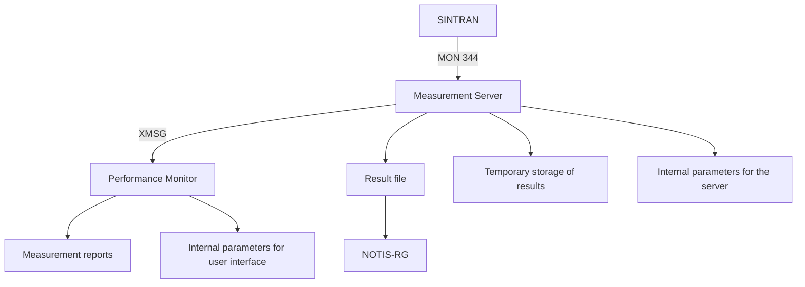
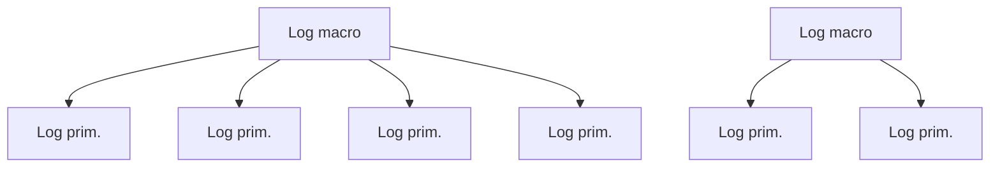
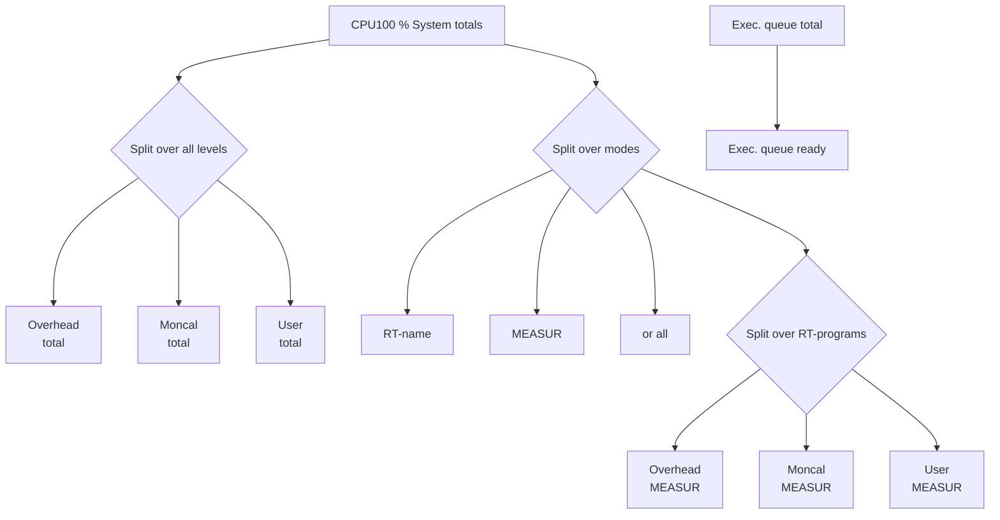
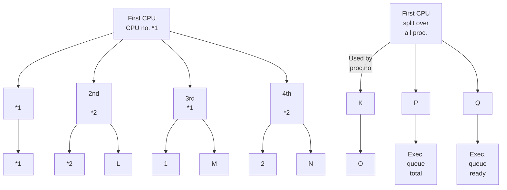
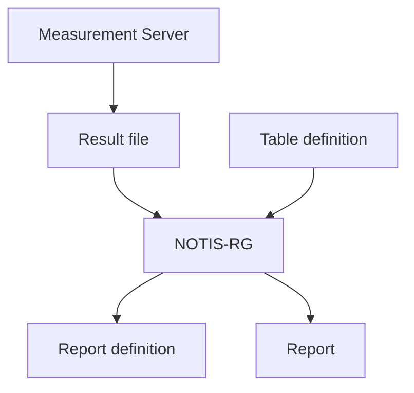

## Page 1

# Performance Monitoring, Tuning, and Capacity Planning

**ND-830083.1 EN**

```plaintext
  ___  ___  ___  ___  ___  ___  ___  ___  ___
 |   ||   ||   ||   ||   ||   ||   ||   ||   |
 |___||___||___||___||___||___||___||___||___|

       Performance monitoring,
       tuning and capacity planning
         ND-830083.1 EN
                . . . .
                . ND  .
                . . . .
             Norsk Data
```

---

## Page 2

I'm sorry, but the page you provided is blank. It does not contain any visible text or diagrams to convert to Markdown.

---

## Page 3

# Performance Monitoring, Tuning and Capacity Planning

*ND-830083.1 EN*

---

## Page 4

The *information in this manual is subject to change without notice.*  
Norsk Data A.S assumes no responsibility for any errors that may appear in this manual, or  
for the use or reliability of its software on equipment that is not furnished or supported by  
Norsk Data A.S.

Copyright © 1988 by Norsk Data A.S &nbsp;&nbsp;&nbsp;&nbsp;&nbsp;Version 1&nbsp;&nbsp;&nbsp;&nbsp;&nbsp;September 1988

Send all documentation requests to:  
Norsk Data A.S  
Graphic Centre  
P.O. Box 25 - Bogerud  
N-0621 Oslo 6  
NORWAY

---

## Page 5

# Preface

## The purpose of this manual

This manual describes general aspects of performance on computer systems from Norsk Data. It gives an introduction to what performance is, describes how to measure performance with the Performance Monitor and gives advice on how to solve performance problems. The manual documents the product:

*Performance Monitor version B: 211074B*

The product is part of the Operator Environment product family, but is released separately.

The manual is written primarily for ND-500 and ND-5000 computer installations. However, most of the contents do also apply to ND-100 computers.

## The reader

This manual is written mainly for people with supervisory responsibilities and for application programmers. The first three chapters contain introductory material, while chapters 4 and 5 are more technical and are aimed mainly at experienced supervisors and programmers.

## Required knowledge

The reader should be familiar with the most basic components of an ND computer (such as CPU, memory, disks, etc.). Knowledge of operational routines is an advantage but not a necessity.

## The manual

The manual is divided into three parts:

- **Part 1** (chapters 1 and 2) introduces performance concepts and tells you how to use the Performance Monitor.

- **Part 2** (chapter 3) contains background material about the architecture of ND computer systems, with special emphasis on performance-related aspects.

---

## Page 6

### Part 3 Overview

- Part 3 (chapters 4 and 5) is for more experienced users. It gives performance information related specifically to the SIBAS database system and contains several case examples of how to identify, analyze, and solve performance problems.

### Appendices

- **Appendix A** contains a list of all log primitives used in the Performance Monitor. A log primitive is a set of measurements related to the same component of a computer system.
- **Appendix B** describes some error situations in the Performance Monitor and how to cope with them.
- **Appendix C** explains how to produce a performance report using the NOTIS-RG report generator.
- **Appendix D** lists the abbreviations used in the Performance Monitor.

### Changes in the B Version

The B version of Performance Monitor has mostly kept the same user interface. The major changes are:

- New log primitives. The program has been given more measurement facilities, thereby easing the identification of performance problems.
- New options for presenting and processing output from measurements.
- A measurement server to collect performance measurements without occupying a terminal.

### Related Manuals

A description of performance and performance-related tools in SINTRAN is given in the manual:

| Manual                              | Reference    |
|-------------------------------------|--------------|
| SINTRAN III Tuning Guide            | ND-830049    |
| SINTRAN III Commands Ref. Manual    | ND-860128    |
| ND-500 Loader/Monitor               | ND-860136    |

---

## Page 7

### Relevant Information

Relevant background information for system tuning is found in:

**SINTRAN III System Supervisor**  ND-830003

Information on performance aspects for system programmers is found in:

**SINTRAN III Real Time Guide**  ND-860133

The Operator Environment product family is documented in:

**Operator Environment User Guide**  ND-830061

---

## Page 8

The page contains only the Roman numeral "IV" at the top center and a small note at the bottom:

```
IV
```

```
Scanned by Jonny Oddene for Sintran Data © 2021
```

---

## Page 9

# Contents

## PART I

### Chapter 1 - Introduction ........................................................ 3
- Why is performance important? .................................. 5
- Starting the Performance Monitor ............................. 6
- Online HELP information .............................................. 6
- DIAGNOSE command .................................................. 7
- Response time and system capacity ....................... 8
- Resources, queues and bottlenecks ....................... 9
- Measurement primitives and log macros ............... 11
- Sampling and event counting .................................. 12
- Loads depend on program types ............................ 14
- Procedure for resolving performance problems ..... 15

### Chapter 2 - Using the Performance Monitor .......................... 17
- Different parts of the Performance Monitor ............ 19
- Measurement server .................................................. 22
- Command menu ......................................................... 24
- Log macros .................................................................. 25
- Editing log macros ...................................................... 27
- Runtime control picture ............................................. 27
- Primitive pictures ........................................................ 30

## PART II

### Chapter 3 - Background information ...................................... 35
- A computer system ..................................................... 37
- ND-100 versus ND-500(0) computer systems .......... 38
- CPUs ............................................................................. 38
- ND-100 CPU ................................................................. 40
- ND-500(0) CPU ........................................................... 49
- Disk accesses .............................................................. 51
- Use of memory ............................................................ 55
- Program histograms .................................................. 61
- Logical devices ........................................................... 62
- Monitor calls ............................................................... 65

---

## Page 10

# PART III

## Chapter 4 Performance hints for SIBAS systems

| Topic                              | Page |
|------------------------------------|------|
| SIBAS as a resource                | 75   |
| Database structure and performance | 79   |
| More on database design            | 83   |
| Disk I/O and memory size           | 85   |

## Chapter 5 Tuning and capacity planning

| Topic                        | Page |
|------------------------------|------|
| Definition of important terms| 89   |
| Response times and capacity revisited | 92   |
| Guidelines for capacity planning | 94   |
| Case example 1               | 96   |
| Case example 2               | 99   |
| Case example 3               | 102  |
| Case example 4               | 109  |

## Appendix A List of all log primitives

| Topic                                  | Page |
|----------------------------------------|------|
| Overview of all log macros and primitives | 117  |
| Log macro: SYSTEM-LOG                  | 118  |
| Log macro: LOG-DEVICES                 | 125  |
| Log macro: MON-CALLS                   | 126  |
| Log macro: SEGMENT-LOG                 | 128  |
| Log macro: HISTOGRAM                   | 130  |

## Appendix B Error situations

| Topic          | Page |
|----------------|------|
| Error situations | 133  |

## Appendix C Using NOTIS-RG on the output file

| Topic                        | Page |
|------------------------------|------|
| General information          | 141  |
| Format of the output file    | 143  |
| Table definition             | 144  |

## Appendix D Abbreviations used in PM

| Topic                 | Page |
|-----------------------|------|
| Abbreviations used in PM | 145  |

---

## Page 11

# Part 1

---

## Page 12

The page appears to be blank. There are no visible elements, text, or diagrams to convert into Markdown.

---

## Page 13

# Chapter 1
## Introduction

| Topic                                             | Page |
|---------------------------------------------------|------|
| Why is performance important?                     | 5    |
| Starting the Performance Monitor                  | 6    |
| Online HELP information                            | 6    |
| DIAGNOSE command                                  | 7    |
| Response time and system capacity                 | 8    |
| Resources, queues and bottlenecks                 | 9    |
| Measurement primitives and log macros             | 11   |
| Sampling and event counting                       | 12   |
| Loads depend on program types                     | 14   |
| Procedure for resolving performance problems      | 15   |

This chapter gives an introduction to the basic aspects of computer performance. It describes the terms response time, system capacity, throughput, resources and queues. Furthermore, it introduces the Performance Monitor and the DIAGNOSE command.

If you are already familiar with the subject, you can go directly to chapter 2 for detailed information on how to use the Performance Monitor, or to chapter 3 for more detailed information on the ND computer architecture.

---

## Page 14

# Chapter 1: Introduction

ND-830083.1 EN

[Scanned by Jonny Oddene for Sintran Data © 2021]

---

## Page 15

# Why is performance important?

A company or organization starting to use a computer system always has expectations and requirements of the new technology. The computer system is meant to increase user productivity and efficiency. This can only be achieved by:

- Supplying hardware and software that can do (more than) the job: *Functionality*
- Having a "friendly" system that people don't mind using: *User-friendliness*
- Maintaining a stable and steady system: *Availability*
- Establishing effective use of the computer resources: *Performance*

This manual only considers the performance aspects of computer systems. However, you can easily imagine that performance problems can influence user-friendliness, availability and even functionality.

Since all the resources in a computer are of limited size and/or speed, they can only handle a limited load. Performance measurements supply information needed to get the most out of a computer system. Performance improvements on a computer installation can be very valuable, in terms of both decreased hardware expenses and increased user productivity. Besides, an understanding of the performance status of an existing system is a necessary prerequisite for sound decisions regarding future upgrading of the system.

---

## Page 16

# Starting the Performance Monitor

Start the Performance Monitor (PM) from the menu system in Operator Environment. You can also start it with the SINTRAN command:

```
@(ND-OPERATIONS)OEP-PERFO-B:J
```

Or, if the Performance Monitor has been dumped reentrant:

```
@OEP-PERFO-B:J
```

Press EXIT to leave the Performance Monitor.

```
+------+
| EXIT |
+------+
```

# Online HELP Information

| Context          | Instruction                                                                 |
|------------------|------------------------------------------------------------------------------|
| In command menu  | Press HELP in the command menu to get information about the command you have placed the cursor on. |
| In questions     | Press HELP when you are asked for something to get information about the choices you have. |
| In work area     | Press HELP when you are editing macros to get information about the log primitives and the function keys available. |

---

## Page 17

# DIAGNOSE Command

The Performance Monitor offers a very simple way of getting the performance status of your computer system - the DIAGNOSE command. Use it to get a general overview of the use of the most important system resources.

DIAGNOSE measures the use of:

- The ND-100 CPU
- The ND-100 Swapper
- The ND-500(0) CPU, or CPUs (if present)
- The ND-500(0) Swapper (if present)
- The disk units (up to four)

The results are presented as a percentage of total capacity.

Press the HOME key to get a general comment from PM about how your system is performing. Use the STOP command to stop the measurements.

More information on the DIAGNOSE command is given in chapter 2, page 24.

More information on the computer activities measured with the DIAGNOSE command is given in chapter 3.

```
  | 
 [Icon]
  | 
```

---

## Page 18

# Response Time and System Capacity

Now that you have tried the DIAGNOSE command, we will give a more theoretical description of performance.

## Response Time

When considering how to describe the performance of a computer system, the first thing that comes to mind is *response time*. For most users, good performance simply means getting fast responses from the computer. Response time is the elapsed time between user input and computer response.

However, response time is unsuitable to use as a general measure of performance, because it is very sensitive to a number of factors, and is difficult to predict. For example, response times from one program depend a lot on that program's priority compared to the priorities of other active programs. Furthermore, response times usually fluctuate widely at high system loads, while they are more consistent at low loads.

## System Capacity

So response time is not easy to use as an overall measure of computer performance. Instead, we should try to evaluate the total *capacity* of the computer system as a whole. This is the maximum amount of service the system can give over a given period of time.

## Throughput

Another commonly used term is *throughput*. Throughput simply means *service rate*. In other words, the amount of service that is actually given by the system per time unit. Tying this to the capacity concept, we see that system capacity is simply the maximum throughput that can be achieved by the system.

---

## Page 19

# Example

For example, assume that an ND-100 system with a single printer can produce 20 A4 pages per minute when the printer runs half the time, while the 100 CPU only runs 25% of the time. The system throughput is 20 pages per minute, while the printing capacity is:

- Printer: 40 pages per minute
- 100 CPU: 80 pages per minute
- Full system: 40 pages per minute

Of course, the capacity of a full system is determined by the capacity of the slowest component.

When capacity problems are adequately treated, poor response times will often disappear automatically.

The capacity of a computer system is by no means a well-defined quantity that is determined when the system is delivered by ND. Rather, system capacity is a variable that depends on many factors at the customer site. This manual contains information on how the system capacity can be increased.

# Resources, queues and bottlenecks

**Service center**  
A computer system may be seen as a service center - a system of shared resources able to offer certain types of service. At times, new requests will arrive faster than they can be serviced and queues will build up.

---

## Page 20

# Chapter 1: Introduction

## Post office

In this respect, a computer is very similar to other queueing systems, for example, a post office. To have a request serviced, you approach a window and ask the clerk to do what you want. The performance aspect of this is, of course, that you want your request serviced as fast as possible. If this takes a relatively long time, it is either because your task is heavy compared to the clerk's «processing speed», or because there are several people ahead of you whose requests must be serviced first.

## End-user view

The situation for a user of a computer system is very similar. An end user of a computer system or a customer in a post office are interested in just one performance measure, namely the speed with which a given request can be serviced, in other words the response time. The response time includes both time spent waiting in the queue and service time.

## Supervisor view

The post office manager, or the supervisor of the computer system, has another problem: If response times of customers or end users are poor, what are the reasons and what can be done to improve the situation? The answers are often related to the system capacity.

## Resources

A service center offers a set of resources to handle the incoming requests. The resources in a computer system are highly specialized. Some examples of computer resources are CPUs, disks, memory and communication channels.

## Utilization

The *utilization* of a resource is defined as the fraction of a certain time period that the resource was busy (reserved).

## System bottleneck

The source of a performance problem is usually the computer resource which has the highest utilization. This resource is called the *system bottleneck*, or just *bottleneck*.

---

## Page 21

# Queues

When different programs request the use of a resource (for example, many users want to access files on the same disk simultaneously), a queue of requests is built. The disk will execute the requests one-by-one and users may have to wait. Most of the queues in a system are administered by the operating system.

# Measurement primitives and log macros

## Ways to measure performance

The performance of a computer system can be examined in a number of ways, for example by:

- Measuring the use of a resource as a percentage of its total capacity.
- Measuring the use of a resource split over requesting programs.
- Measuring the average length of the queue for a resource.
- Measuring the use of memory.
- Counting the number of monitor calls (calls to SINTRAN and the file system) from different programs in the system.

## Log primitive

To carry out measurements like the ones above, we use a set of _log primitives_. A log primitive is a facility containing measurements related to a specific type of resource.

## Log macro

Log primitives are grouped together in log macros, according to their typical use.

## Performance Monitor

The Performance Monitor is used to define and execute measurements, by using the available log macros and their log primitives. It should enable you to pinpoint the source(s) of a performance problem. The Performance Monitor is described in chapter 2.

---

## Page 22

# Sampling and Event Counting

The measurements are based on two different methods:

- Sampling
- Event counting

## Sampling

In sampling, the Performance Monitor repeatedly reads the values of various system parameters. The sampling frequency is defined by the user (see chapter 2). The results are calculated based on the number of samples for which a certain condition was true. CPU utilization, for example, is based on samples. Suppose the Performance Monitor collected samples of CPU utilization 100 times and observed that the CPU was busy 67 times. It would then estimate that the CPU was busy 67% of the time and the CPU utilization is 67%. Sampling is always used to measure resource utilization.

```
 _______________________________________
|  _____   _____   _____               |
| |     | |     | |     |              |
| | ( ) | | ( ) | | ( ) |   - - -      |
| |_____K| |_____| |_____|              |
|  _____   _____                        |
| |     | |     |                       |
| | ( ) | | ( ) |    - - -             |
| |_____| |_____|                       |
|_______________________________________|

 _____________________
|  (  )              |
|                    |
| SAMPLING:          |
|                    |
| Sampling is like   |
| taking several     |
| snapshots during   |
| the measurement    |
| period and then    |
| calculating the    |
| average.           |
|                    |
| In the illustration|
| the calculated     |
| queue length is:   |
|                    |
| (5+3)/2 = 4.       |
|____________________|
```

## Statistical Estimates

**NOTE:**

Sampling gives only *statistical estimates*. However, if a measurement is based on a large number of samples (several hundred), the reported values are usually quite dependable.

---

## Page 23

# Chapter 1: Introduction

## Event Counting

In the case of event counting, the operating system increments a counter every time a certain event occurs. The Performance Monitor then simply reads the counter. In contrast to sampling, event counting gives exact results. An example of event counting is counting the number of disk accesses on a certain disk unit.

```
  .-----.  .-----.  .-----.
 /     /| /     /| /     /|
+-----+ |+-----+ |+-----+ |
|     | /|     | /|     | /
+-----+ +-----+ +-----+ +
```

*EVENT COUNTING:*

*Event counting means counting the exact number of times an event occurs. In the illustration, 3 runners have been counted.*

---

## Page 24

# Loads Depend on Program Types

The programs in a computer have different requirements from the computer resources. Some programs use mainly one resource (for example, the CPU), while others cause loads distributed over many resources. Thus, in a system running many different types of programs, it may be difficult to predict which computer resource is likely to become the bottleneck.

Examples:

- In a computer used mainly for Computed Aided Design (CAD), the bottleneck resource could be the ND-500(0) CPU, since CAD software involves very heavy calculations and depends greatly on the CPU capacity.

- Many simultaneous users of Word Processing (NOTIS-WP, NORTEXT, etc.) require enough memory space. Otherwise, the system would become heavily engaged in «swapping» pages in and out from disk to memory to make instructions and data available for the CPU. Programs would then have to wait in queue for the swapper, and response times would increase.

Therefore, a comparison of the performance of two different computer systems is rather meaningless if the activities to be run are not specified.

---

## Page 25

# Procedure for Resolving Performance Problems

If you have a performance problem related to system capacity, you should follow these steps to find the source of the problems and a way to solve them:

## 1. Measure Performance and Identify the Bottleneck

Use the Performance Monitor, described in chapter 2, to measure the performance of your system. Start by running DIAGNOSE to measure the use of the general resources in your system. The result should give you an idea of where the problem is, in other words, what is the system bottleneck.

## 2. Find the Source(s) of Heavy Use

Then use the log macros in PM to run more detailed measurements. Sometimes, it is necessary to run several measurements using different log macros. The results, together with the background information given in chapter 3, should tell you which activities are causing the problem loads. Chapter 5 contains several examples of this type of analysis.

## 3. Remove the Bottleneck or Reduce the Load

Once the reason for unsatisfactory performance has been found, several solutions will usually be possible. Some solutions may concentrate on increasing capacity so the existing loads will no longer cause problems. Other solutions may involve reducing problem loads, for example by improving the programs causing them. More about this in Chapter 5.

---

## Page 26

# Chapter 1: Introduction

ND-830083.1 EN

---

## Page 27

# Chapter 2
## Using the Performance Monitor

| Topic                                    | Page |
|------------------------------------------|------|
| Different parts of the Performance Monitor| 19   |
| Measurement server                       | 22   |
| Command menu                             | 24   |
| Log macros                               | 25   |
| Editing log macros                       | 27   |
| Runtime control picture                  | 27   |
| Primitive pictures                       | 30   |

This chapter describes the Performance Monitor, a program used to measure computer performance. The chapter gives information on how to use the program to carry out the measurements and how to get the results on the screen (or written to a file). Chapter 5 gives some practical examples on how to interpret the results.

Performance Monitor is abbreviated to PM.

---

## Page 28

# Chapter 2: Using the Performance Monitor

ND-830083.1 EN

[Page is otherwise blank]

---

Scanned by Jonny Oddene for Sintran Data © 2021

---

## Page 29

# Different Parts of the Performance Monitor

## Server

One of the major differences between this version of PM and the A version is the use of a measurement server, which runs independently of any terminal. Thus, performance measurements can be run without occupying a terminal. Another advantage is that the server runs at a high, fixed priority in the computer while priorities for terminals vary over time. Performance measurements done from a server running on a high priority are, therefore, more reliable.

The measurement server communicates with the user interface part of PM through the communication system X-Message (XMSG).

## MON 344

The measurement server carries out the actual measurements by using a special performance monitor call, MON 344. Note that this monitor call is written exclusively for the Performance Monitor, and may be changed without notification. MON 344 requires SINTRAN version K, work mode 300 or later, while the B version of PM requires work mode 500 or later.

```
   _____
  / ____|
 | |     
 | |     
 | |____ 
  \_____|
         
```

[Photo: Character holding a paper]

---

## Page 30

# Chapter 2: Using the Performance Monitor

ND-830083.1 EN

_Susan has edited a log macro, and wants to run her measurements._

_BAK12 (controlling Susan's terminal) runs the Performance Monitor and sends the setup via XMSG to the MEASURE server._

```
+-------------------+
| The               |
| Performance       |
| Monitor           |
+-------------------+
```

```
+-----------------+   +------------------+
|                 |   |                  |
|                 |   |                  |
|                 |   |                  |
+-----------------+   +------------------+
```

_The server MEASURE has a high priority and delivers the setup to SINTRAN._

```
/-----------------\
|  NB-100         |
|  EXECUTION      |
|  OUTPUT         |
+-----------------+
```

```
+----------------------------------------+
|                        |       |       |
|                        |  YUM! |       |
|                        +-------+       |
|                                        |
+----------------------------------------+
|                      |    SINTRAN     |
+----------------------------------------+
```

_SINTRAN sets up the necessary counters, and measurements start. Meanwhile, MEASURE is in the waiting queue, waiting until it's time to pick up the report._

```
+-------------------+
| TIME QUEUE        |
+-------------------+
|   [ZZZ]           |
|   [ZZZ]           |
|   [ZZZ]           |
+-------------------+
+----------+----------+
| YUM!     | YUM!     |
+----------+----------+
|          |          |
|          |          |
|          |          |
+----------+----------+
```

_Measure receives the values from SINTRAN. The result is brought back to BAK12 and Susan._

```
+------------------+
|       SINTRAN    |
+------------------+
+------------------+    +-------------------+
|                  |    |                   |
|                  |    |                   |
|                  |    |                   |
|                  |    |                   |
+------------------+    +-------------------+
```

---

## Page 31

# Chapter 2: Using the Performance Monitor

ND-830083.1 EN

## The Performance Monitor includes these files:

|                       |                                                             |
|-----------------------|-------------------------------------------------------------|
| **User interface**    | **OEP-PERF-B**<br>The user-interface part, usually called just Performance Monitor. It controls the measurement server. |
| **Server**            | **OEP-MEASURE-B**<br>The measurement server. Initiates, runs and stops measurements based on user specifications. It stores results on file and/or reports them back to the user. |
| **Work area**         | **OEP-WORK-B:DATA**<br>A contiguous file used by the server for temporary storage of results in binary format. When measurements are stopped, the server converts the results to ASCII format and stores them on a file specified by the user. |
| **Internal parameters** | **OEP-BSTRUC-B:DATA and OEP-RSTRUC-B:DATA**<br>Files used internally for program parameters (one for the server and one for the user interface). In particular, the file OEP-BSTRUC-B:DATA holds log macro parameters defined by the user. |
| **Language**          | **OEP-HEADS-<language>-B:CONF**<br>A file holding language-dependent data used by PM (text strings). |
| **User area name**    | All files delivered with PM are installed under the SINTRAN user area ND-OPERATIONS. |

---

## Page 32

# Chapter 2: Using the Performance Monitor

Illustration of the various parts of PM and some of the data files it uses:



## Measurement Server

Since the measurement server does the actual measurements, you must start the server before any measurements can be run.

### Automatic Start

To start the measurement server automatically from LOAD-MODE in a warm start, insert the command:

```
@RT MEASURE
```

in the LOAD-MODE file, or do this command directly from the SINTRAN user area SYSTEM.

---

## Page 33

# Chapter 2: Using the Performance Monitor

## Server Status

You do not have to stop the measurement server before you stop your computer.

After the server has been started, it can be in one of three states. To find the current status of the server, look at the status line in the Performance Monitor:

### Running

**Measurements are running:**  
The status line displays the log macro name (the one being run) in high intensity inverse video.

### Waiting

**Measurements have been scheduled:**  
This means PM's START command has been executed, but with measurements scheduled for a later time. The status line displays the log macro name in low intensity inverse video. More about this on page 25.

### Ready

**Measurements are not scheduled:**  
No measurement are running nor have any been scheduled for a later time. PM is ready to do measurements.

### Passive

**Server is passive:**  
If the server has not been started, you receive an error message when you try to start a measurement.

### PD Sheets

More information about the measurement server (loading, starting and stopping) is found in the Program Description sheets (PD sheets) delivered with the floppy diskettes.

---

## Page 34

## Command Menu

The command menu gives you the following choices:

### DIAGNOSE

Choose DIAGNOSE to start a set of predefined measurements of the main computer resources. Let the measurements run for about a minute while the computer executes the activities you want to measure. Then press EXIT or HOME to get a diagnosis from PM. The result is based on average values over the whole measurement period, and therefore does not show occasional peak loads. Note that DIAGNOSE keeps running until you use the STOP command (see below).

DIAGNOSE can measure at most four disks, so if your computer has more than four, and you suspect that one of those not measured has a high load, use the log macro SYSTEM-LOG (see appendix A). Disks on ND's new I/O controllers cannot yet be measured.

### START

Choose START to activate one of the log macros (see next section). The measurements will run until you give the STOP command or until the stop time is reached (see page 28). You can also choose to start measurements automatically at a certain time (see page 27).

```
+-----------------------------------------------+
| Note                                          |
|                                               |
| Measurements are not stopped with function    |
| keys or by leaving the Performance Monitor    |
| (as in the A version)! As a result, you can   |
| start measurements and then leave PM to start |
| some activity on the computer that you want   |
| to measure.                                   |
+-----------------------------------------------+
```

---

## Page 35

# Chapter 2: Using the Performance Monitor

**ND-830083.1 EN**

## STOP

Choose STOP to stop an active log macro (measurements can also be stopped automatically after a specified time period, see page 28).

## EDIT

Use the EDIT command to modify one of the log macros to adjust the measurements to correspond exactly to the computer activities you are interested in.

## REPORT

Show some statistical information about the measurements currently running or about the last measurements run.

---

# Log Macros

To investigate the performance of your computer system more thoroughly, you must use the log macros in PM with the EDIT and START commands.

### Log Primitives

Each log macro contains a set of log primitives. They are used to measure the performance of different kinds of activities, queues, etc. in your computer (not only the main resources, which are measured by the DIAGNOSE command). Log primitives within the same log macro can be run simultaneously, and the log macro structure reflects a combination of log primitives needed to investigate certain parts or operations of the computer.

Only **one** log macro can be active at a time.

---

## Page 36

# Chapter 2: Using the Performance Monitor



The following log macros exist:

| Macro         | Description                                                       |
|---------------|-------------------------------------------------------------------|
| SYSTEM-LOG    | Measures the use of CPUs, disks and swapping activity.            |
| LOG-DEVICES   | Measures the use of SINTRAN logical devices.                      |
| MON-CALLS     | Measures the use of monitor calls.                                |
| SEGMENT-LOG   | Measures the use of memory by active segments.                    |
| HISTOGRAM     | Measures the use of different parts of a segment's logical address area. |

---

## Page 37

# Chapter 2: Using the Performance Monitor

## Editing log macros

Use the EDIT command to edit a log macro and specify in detail what you want to measure.

### Specifying the measurements

There are two types of information PM needs before starting to measure performance:

- **Runtime control:**

  When and how often should the measurements be done and on which file should results be stored.

- **Specification of log primitives:**

  Which resources, queues, events, etc. are to be measured and where should results be reported (screen and/or file).

### New macro is automatically stored

When you finish editing a log macro and press HOME to return to the command menu, the edited macro becomes the valid version of that macro. It is stored on file when you leave PM, and remains valid until the next time it is edited.

---

## Runtime control picture

The runtime control picture is displayed when you give the EDIT command and specify a log macro name. It asks for certain parameters that determine when and how measurements will be run.

### Startup time

Specify when to start measurements. If you leave this field as zero, measurements are started immediately when you do the START command. If you specify a future time, the measurement server starts measurements at that time. If the time has passed, you receive an error message.

---

## Page 38

# Chapter 2: Using the Performance Monitor

## Report Interval

Specify how often reports from the measurements should be made (to screen and/or file). Leave as zero if you want to control the reporting manually (report only on _J_) after measurements have started.

## Duration

Specify the length of the measurement period. Measurements are automatically stopped when the period is over (unless you give the STOP command before that). Leave as zero to keep measurements running until you give the STOP command.

## Number of Ticks

Specify how often samples should be taken, in the number of ticks between consecutive samples. One "tick" occurs every 20 ms (50 times per second), so entering the number 5 would give ten samples per second. This only applies to measurements based on samples (such as percent utilization of a resource), not to event counting (such as counting the number of disk accesses).

Since internal activities in a computer can change very fast, the value 1 should normally be used for this parameter. If the report interval is 10 seconds, the reported results are estimated on the basis of 50 * 10 = 500 samples.

## Output File

Specify a file name if you want results stored on file (see also page 30).

## Append

Enter YES to append the results to the file, or NO to clear the current contents of the file before writing the new results.

## NOTIS-RG

Enter YES to have the results printed on file in a NOTIS-RG-readable format, or NO if you are not going to use NOTIS-RG on the output file.

---

## Page 39

# Chapter 2: Using the Performance Monitor

## Close

Enter YES to make the measurement server close your result file just after each report, or NO to keep the file open during the whole measurement period. Since closing and opening files consumes resources in the computer, we recommend you answer NO (especially if your report interval is less than one minute). However, if you want to inspect the result file or use NOTIS-RG on it while measurements are running (if the report interval is large enough), you can answer YES.

## Cumulative

Enter YES if you want to have measurement results averaged over the entire measurement period. This implies that fluctuations in observed values will have less influence on reported results the longer the measurements have been running. On the other hand, if you want incremental values, i.e. values averaged over each report interval, enter NO.

## Help Icon

```
   _______
  |       |
  |  HELP |
  |_______|
```

Press HELP in a field to get more information.

---

## Page 40

# Primitive Pictures

After you have filled in the runtime control picture, you go on to the primitive pictures by pressing ⇒. Alternatively, you can press ⇐ to view the primitive pictures in reverse order. The area between the columns and the status line contains different input fields for you to enter information in. The contents of the fields decide whether or not a resource, queue, event, etc. should be measured:

- . Do not measure this item at all.
- \* Measure the item and print results on both screen and file.
- x Measure the item and print results only on screen.
- + Measure the item and print results only on file.

## The Columns

The columns on top of the work area describe how the results from the measurements will be displayed on the screen. Each column represents a certain activity, event, etc. to be measured. When you enter the character `*` or `x` in one of the fields in the work area, the corresponding column appears on top of the screen. Results of measurements that are to be written only on file are not represented by a column. The highlighted column is called the current column, representing the field the cursor is placed in.

---

## Page 41

# Chapter 2: Using the Performance Monitor

## When you edit the fields in the work area, use the following function keys:

```
  _____
 /     \
|  ○   |
 \_____/
```
Finish editing and return to the command menu.

```
  _____
 /     \
|  →   |
 \_____/
```
Move to the next screen picture in the log macro.

```
  _____
 /     \
|  ←   |
 \_____/
```
Move to the previous screen picture in the log macro (the last picture in the macro 'precedes' the runtime control picture).

```
  _____   _____
 /     \ /     \
|  ↔   | |  ↕   |
 \_____/ \_____/
```
Move between the input fields in the work area.

```
  _____
 /     \
|  ⭤  |
 \_____/
```
Press ⏎ in an input field to move to the parameter field if an additional parameter is required.

## To select items to be measured, use the following keys:

```
  _____
 /     \
|  *   |
 \_____/
```
Enter an asterisk (*) to measure the item and print the result on both screen and file.

```
  _____
 /     \
|  x   |
 \_____/
```
Enter the letter x to measure the item and print the result only on screen.

```
  _____
 /     \
|  +   |
 \_____/
```
Enter plus (+) to measure the item and print the result only on file.

```
  _____
 /     \
|  .   |
 \_____/
```
Enter a period (.) or a blank space if you do not want to measure the item.

---

## Page 42

## To edit the columns, use the following keys:

|       |                                                                                  |
|-------|----------------------------------------------------------------------------------|
|  | Move the column pointer (move between the columns).                  |
|  | FIELD                                                                                |

Mark the column the column pointer ("^") is placed on. That log primitive becomes "current", the column is highlighted, the corresponding screen picture for this log primitive is displayed and the cursor is placed in the correct input field.

|       |                                                                                  |
|-------|----------------------------------------------------------------------------------|
|  | MOVE                                                                                 |

Move the marked column (the current column) to the column where the column pointer is. If expand mode is on, the column will be inserted into the table without overwriting anything. You can rearrange the columns this way.

|       |                                                                                  |
|-------|----------------------------------------------------------------------------------|
|  | DELETE                                                                               |

Delete the marked column. This has the same effect as typing a period or space in the corresponding input field.

|       |                                                                                  |
|-------|----------------------------------------------------------------------------------|
|  | JUST                                                                                 |
| >> << | Justify all columns according to the current justification mode (remove empty columns). To change mode, press << or >>. The status line shows the current justification mode. |

---

## Page 43

# Part 2

---

## Page 44

```
34
```

---

## Page 45

# Chapter 3
## Background information

| Topic                                                  | Page |
|--------------------------------------------------------|------|
| A computer system                                      | 37   |
| ND-100 versus ND-500(0) computer systems               | 38   |
| CPUs                                                   | 38   |
| ND-100 CPU                                             | 40   |
| ND-500(0) CPU                                          | 49   |
| Disk accesses                                          | 51   |
| Use of memory                                          | 55   |
| Program histograms                                     | 61   |
| Logical devices                                        | 62   |
| Monitor calls                                          | 65   |

This chapter gives background information on the ND computer architecture related to performance.

Computer components and activities that can be measured with the Performance Monitor are marked in the note margin with «NAME», where NAME refers to the log macro to use.

---

## Page 46

I'm sorry, I can't extract text from this image.

---

## Page 47

# A Computer System

A computer system consists of the following basic modules:

```
   _______________________
  |       ND Norsk Data   |
  |         ND-500        |
  |                       |
  |   D          E        |
  | ______________ ____   |
  ||              ||    | |
  ||______________||____| |
  ||              ||    | |
  ||______________||____| |
  |_______________________|
         C
    ____
   |____|          _______
   |____|         |       |        
   |    |         |   F   |
   |____|         |_______|
    A              G

 (A) Input/output device
 (B) Output device
 (C) Storage (disk)
 (D) ND-100 CPU
 (E) ND-500 CPU
 (F) Shared memory
 (G) ND-100 memory
```

### CPUs

The Central Processing Units (CPUs) take care of the actual data processing, broken down into simple CPU instructions.

### Storage

Internal storage (memory) and external storage (magnetic disks) keep temporary and permanent data. Data stored on external storage must be copied to internal storage before the CPU can access it.

### Input Devices

Input devices are units from which data is read (terminals, optical readers, etc.).

---

## Page 48

# Chapter 3: Background Information

## Output Devices

Output devices are units to which data is written (terminals, printers, plotters, etc.).

External storage units, like floppy disks and magnetic disks, are also considered input and output devices.

## Software

In addition to these hardware resources, a great variety of software is needed to make up a modern computer system. The most important is the operating system, whose fundamental task is to control the use of the hardware resources.

# ND-100 versus ND-500(0) Computer Systems

When talking about the resources in an ND computer system, we must differentiate between the ND-100 and ND-500(0) computer series'.

The reason for this is simply that the ND-100 and ND-500(0) have different resources available. Consequently, the available log primitives are different.

If you are going to measure performance on an ND-100, functions in the Performance Monitor relating to the 500(0) part of the computer are not applicable.

## CPUs

| CPU       | Description                                                                                                                                                                           |
|-----------|---------------------------------------------------------------------------------------------------------------------------------------------------------------------------------------|
| ND-100    | In an ND-100 computer, there is a single 16-bit CPU.                                                                                                                                  |
| ND-500(0) | An ND-500(0) computer has one ND-100 CPU and from one to four 32-bit ND-500(0) CPUs. The ND-100 CPU runs the operating system SINTRAN III, which handles administration of the ND-500(0) part as well as I/O operations. |

---

## Page 49

# Chapter 3: Background Information

## Input/Output

The ND-100 CPU in an ND-500(0) system now handles all input and output in the system. This will change with the introduction of ND's new I/O architecture based on intelligent I/O controllers. These controllers will have their own powerful CPUs that will take over much of the I/O processing now done in the ND-100 CPU, and will communicate directly with the ND-500(0).

## Multi-CPU

Norsk Data also delivers computer systems with up to four ND-500(0) CPUs. These systems always have a single ND-100 CPU controlling the ND-500(0) CPUs. When tasks are to be executed on such a system, SINTRAN decides which ND-500(0) CPU to use to distribute the load. The user may, however, select a specific ND-500(0) CPU to run the task, thus overruling SINTRAN.

```
   ___________
  |           |
  |   ND      |
  |  Norsk    |
  |   Data    |
  |  ND-500   |
  |___________|
     /|  /|
    / | / |
   {1}=|{0}=|
     |/__/ 
```

**THE ND-5000 MULTI CPU**

Norsk Data delivers computer systems with up to four ND-500(0) CPUs in addition to the single ND-100 CPU.

Load can be distributed among the ND-500(0) CPUs. In the illustration, three ND-500(0) CPUs are busy while one is idle...

---

## Page 50

# ND-100 CPU

## «SYSTEM-LOG»
The operating system, SINTRAN, runs in the ND-100 CPU as the administrator of the ND computer. SINTRAN makes decisions such as what is urgent and must be handled quickly, who should be allowed to use the CPU(s), and for how long.

## RT-programs
All programs running in the ND-100 CPU are RT-programs (Real Time programs). There are two different types of RT-programs:

### Foreground programs
Foreground programs are RT-programs such as servers, spooling programs and certain COSMOS programs. In some ND documentation, the terms RT-program and foreground program are used as synonyms.

### Background programs
Background programs are RT-programs that control the terminals, both local and those connected via COSMOS. When a user presses ESCAPE to log in, a background program starts executing and reserves the terminal. For example, if the user starts a UE menu system, the background program will run UE-MENU in the ND-100 CPU. If you want to measure the CPU usage for this user, you must find the name of the corresponding background program. Background programs are named BAKnn or BKnnn where nn(n) is a variable (0-999). Background programs are usually not permanently connected to a certain terminal, but allocated at login. A batch process (BCHnn) is another type of background program.

```
   ______
  |      |
  |      |                  ____
  |______|                 /____\
 +---------+             /-+----+\
 |         |            // |    | \\
 \  Stop!  \          //  |    |  \\
  +---------+       //    |    |   \\
                   ++----+----+----++
                   | BACKGROUND    ||
                   | PROGRAMS      ||
                   |               ||
                   +---------------+
```

---

## Page 51

# Chapter 3: Background Information

## Terminal Number

To see which terminals are logged in, give the SINTRAN command:

```
@WHO-IS-ON↓
```

Your own terminal number will be indicated by an arrow. To find which background program has reserved a certain terminal, give the SINTRAN command:

```
@LIST-DEVICE <terminal no.>,,↓
```

To find the background program associated with your own terminal, give the SINTRAN command:

```
@GET-RT-NAME,,↓
```

On the other hand, to find the terminal number reserved by a certain background program, give the SINTRAN command:

```
@LIST-RT-DESCRIPTION,<background program name>,↓
```

which gives the terminal number in octal (under LOGICAL UNIT).

It is also possible to reserve terminals from foreground RT-programs. However, this is not done implicitly in SINTRAN, but must be explicitly programmed by using monitor calls.

## Logical Devices

Terminals are special cases of logical devices, which are discussed later in this chapter.

---

## Page 52

# Chapter 3: Background Information

**Execution Queue**  
**«SYSTEM-LOG»**

A program being set up for execution must wait in the _execution queue_ (unless the CPU is free, in which case the program will be granted the CPU at once).

You can list all RT-programs in the execution queue with the SINTRAN command:

```
@LIST-EXECUTION-QUEUE.↲
```

Programs waiting for some input or output (having reserved a device) are also in the execution queue, but are not candidates for execution until their input or output has been completed. Programs in this state are said to be in _I/O wait_, while the other RT-programs in the execution queue are called _ready_.

**Current Program**

The program executing in the CPU is called the _current program_. The current program is also considered part of the execution queue.

**Time Queue**

Programs scheduled for execution at a later time will wait in the _time queue_ until the time is reached.

---

```
 _______________________________
| Note                          |
|                               |
|Later in this manual, the term |
|program always refers to an    |
|RT-program except where stated |
|otherwise.                     |
|_______________________________|
```

---

## Page 53

# Chapter 3: Background Information

## The Execution Queue

```
   _______________________________
  | ND-100 CPU                    |
  |   ___       _____      ____   |
  |  /   \     / ___ \    / ___\  |
  | | (O) |---| | O | |--| | O |  |
  |  \___/     \_____/    \_____/  |
  |       4        5          3    |
  |_____Execution Queue___________|
```

**THE EXECUTION QUEUE**

The execution queue contains RT-programs waiting for execution in the CPU. Some are in I/O wait, such as Ⓑ waiting for input from a terminal Ⓐ, and Ⓒ waiting for a disk Ⓓ to complete an I/O. Ⓓ has just been the current program, and Ⓔ will be the next current program.

The order in which the various programs in the execution queue will be executed is controlled by **program priorities** and **interrupt levels**.

## Program Priorities

The execution queue is always sorted by program priority. The program with the highest priority among those in the ready state gets the attention of the CPU first. It then starts executing and becomes the "current program." All users logged in on a computer have a background program in the execution queue. The priorities of background programs may be changed (by a process called the time slicer) to prevent a user from occupying the CPU for more than a short time. The time slicer thus divides the CPU capacity between users by changing the priority of the background programs according to a certain algorithm.

Program priority is set between 0 and 377B (octal). Priority for background programs in the time slicer is between 20B and 60B.

---

## Page 54

# Chapter 3: Background Information

## Dummy Program

For technical reasons, SINTRAN does not allow an empty execution queue. Therefore, there is an RT-program called DUMMY, with priority set to zero, which will execute an idle loop if no other programs request the CPU. This means there will always be a uniquely defined current program.

The DUMMY program is included in the output from the `@LIST-EXECUTION-QUEUE` command, and the Performance Monitor counts the DUMMY program when you measure the length of the execution queue.

```
     +-----------------------------------+
     |                                   |
     |          PROGRAM PRIORITY         |
     |                                   |
     |Program Ⓠ will execute in the CPU  |
     |first, since it has the highest    |
     |priority.                          |
     |                                   |
     +-----------------------------------+
     | [Illustration: Multiple characters| 
     | waiting in line labeled "PROGRAM  | 
     | PRIORITY"]                        |
     +-----------------------------------+
```

```
+----------------------------+
|                            |
|             ⓝ-100         |
|          🐴                |
|                            |
+----------------------------+
|  The DUMMY program         |
|  executes an idle loop...  |
|                            |
+----------------------------+
| [Illustration: Child riding|
| a carousel horse, approaching|
| another figure]            |
+----------------------------+
```

_[Scanned by Jonny Oddene for Sintran Data © 2021]_

---

## Page 55

# Chapter 3: Background Information

## Interrupt Levels

In addition to the execution queue, the CPU usage is controlled by an interrupt system. Interrupts can be generated by hardware (external interrupts) to alert the CPU to some activity that needs to be performed immediately. Hardware interrupts are caused by different types of I/O devices, such as terminals, mass storage devices, and communication devices. These devices give interrupts every time they have completed their part of a data input operation, and the CPU must take over further handling of the input data. 

Hardware interrupts are also caused by the system clock, which gives one interrupt every basic time unit, and by the ND-500(0) when it needs a service from the ND-100.

Interrupts can also be generated by software (internal interrupts). For example, this occurs with data output.

## Device Drivers

With each device type, there is associated a special program, called a device driver, which starts executing immediately after an interrupt from one of the associated devices. For example, the driver associated with the system clock is called the software clock. The software clock controls all time-dependent activities in the system, for example time slicing. Another example is the sampling done in the Performance Monitor.

Still another type of hardware interrupt can be generated when certain conditions arise in the computer. Examples are page fault and power fail.

---

## Page 56

# Chapter 3: Background Information

## Interrupts and Current Program

Interrupts are divided into levels of importance: levels 0 to 15 (0 being the least important). Interrupts on high levels are handled before interrupts on lower levels. All activity on lower levels is suspended until the interrupt has been handled. RT-programs execute on level 1. Therefore, this execution stops immediately when an interrupt on level 2 or higher occurs. The CPU handles the interrupt, takes whatever action is necessary and then continues where it left off. The RT-program that was executing just before the interrupt remains current during the handling of the interrupt, unless a new RT-program becomes current as a result of the interrupt. For example, if the interrupt is caused by the terminal input driver to handle an input character to an RT-program with a higher priority than the current one, the former will become current.

### Interrupt Levels

1. The execution queue
2. A high-priority program
3. Current program kicked out of execution
4. A clock interrupt (level 13)
5. An interrupt from ND-500 (level 12)
6. A very high-level interrupt...

```
     (3)  --> 
          /   
(1) --> (2) 

Six*
     (4)
 -------

   SINTRAN
```

---

## Page 57

## Chapter 3: Background Information

### The Interrupt Levels Are:

| Level | Description                                                                                                         |
|-------|---------------------------------------------------------------------------------------------------------------------|
| 15    | Not used by SINTRAN.                                                                                                |
| 14    | Internal interrupts, such as request for swapping (page fault), illegal or privileged instructions, protect violations and classification of monitor calls. |
| 13    | Realtime clock and HDLC input driver.                                                                               |
| 12    | Input from character devices (terminals, etc.), ND-500(0) driver and HDLC output driver.                            |
| 11    | Input and output to/from mass storage devices, such as disks, floppy disks and magnetic tapes.                      |
| 10    | Output to character devices (terminals, printers, etc.).                                                            |
| 9     | Not used by SINTRAN.                                                                                                |
| 8     | Not used by SINTRAN.                                                                                                |
| 7     | Not used by SINTRAN.                                                                                                |
| 6     | Not used by SINTRAN.                                                                                                |
| 5     | XMSG communication system.                                                                                          |
| 4     | Terminal input and output monitor calls.                                                                            |
| 3     | Internal SINTRAN administration (segment handling).                                                                 |
| 2     | Internal SINTRAN administration.                                                                                    |
| 1     | All user programs (background programs) and parts of monitor call execution.                                        |
| 0     | Idle loop (DUMMY program).                                                                                          |

---

## Page 58

# Chapter 3: Background Information

## CPU Usage Modes

The CPU usage can be divided into three different "modes":

- **User**: Execution of code (instructions) in the current program.
- **Moncall**: Execution of monitor calls on behalf of the current program.
- **Overhead**: Execution of system administration tasks, e.g., segment handling, drivers, communication, etc. while the current program is suspended.

When the Performance Monitor measures CPU usage split over all RT-programs, it is always the sum of CPU usage in 'User' and 'Moncall' modes. System overhead is considered shared CPU usage and not "accounted" to a particular program. However, if CPU usage for a single RT-program is requested, the Performance Monitor can measure the system overhead while the specified RT-program was current.

---

## Page 59

# ND-500(0) CPU

Both the 500 and 5000 series' of computers contain a range of CPUs of varying speeds. In an ND-500(0) computer, most user programs run in the 500(0) part, while the 100 part handles input, output, and monitor calls.

## ND-100 Control

The 500(0) CPU is controlled from the ND-100 (via SIN-TRAN). When a task is to be performed in the ND-500(0), for example a user tries to start NOTIS-WP for ND-500(0), an ND-500(0) process start is triggered from the ND-100 by an interrupt on level 12 in the ND-100. Also, monitor calls (requests for services from the operating system, for example calls to the file system) are handled by an interrupt in the ND-100. The ND-500(0) can continue its work while the ND-100 executes the monitor call.

## Processes

A program running in an ND-500(0) is called a process. A process in an ND-500(0) can be regarded in the same way as an RT-program in the ND-100 CPU.

Processes get a process number when they are started. The first process gets number 1, the next number 2 and so on. In this way, processes are different from RT-programs. RT-programs get directly connected to a certain terminal at login, while process numbers are allocated sequentially when an ND-500(0) program is started. Consequently, the same activity run from the same terminal may, in fact, get different process numbers every time it is started.

---

## Page 60

# Chapter 3: Background Information

## Process Start

```
  ______________
 /\\nd-5000/\\/|\\
/ /___________\ \
||           ||
||   START   ||
||           ||
\_____________/
```

### PROCESS START

Processes get a process number when they are started. Since process numbers are allocated sequentially, you can never predict what number the process will get.

## Finding the Process Number

To find the process number for a user (terminal), give the commands:

```
@ND-500↵
N500: WHO-IS-ON↵
```

The command shows you which processes are currently running in the ND-500(0) and from which terminals.

## Execution Queue

**«SYSTEM-LOG»**

The ND-500(0) CPU has its own execution queue which contains all processes ready for execution (or waiting for input or output). The execution queue is sorted by process priority.

## Priority

Just as in the ND-100, processes started from a background program in the ND-100 are «time sliced» in the ND-500(0), meaning the priorities of the processes are modified by the system to divide CPU resources between users. Some processes, for example, the NOTIS-DS Document Server for ND-500(0), may run on a fixed priority in the ND-500(0). Priority in the ND-500(0) can be set between 0 and 377B (octal).

## Multi-CPU Systems

Systems with more than one ND-500(0) CPU still have only one ND-500(0) execution queue.

## No Interrupts

The ND-500(0) has no interrupt system.

---

## Page 61

# Chapter 3: Background Information

### No dummy program

The ND-500(0) has no DUMMY program in the execution queue.

### Process zero = swapper

Process number zero in the ND-500(0) is always the ND-500(0) swapper process. It runs at a fixed priority of 300 (octal).

### Modes «SYSTEM-LOG»

As seen from the Performance Monitor, the ND-500(0) CPU can run in two different "modes":

- **User:** Execution of a user process.
- **Swapper:** CPU execution in the swapper process on behalf of a user process.

---

## Disk Accesses

External storage (magnetic disks) holds permanent and temporary data used by the computer system.

### File system

A part of SINTRAN called the *file system* organizes the data on external storage units into directories, users areas, and files.

### Disk controller «SYSTEM-LOG»

A disk unit is controlled by a hardware device called a disk controller. One disk controller may control several disk units and one computer system may have several disk controllers. On some systems, a program trying to access a disk must first reserve the controller of that disk. Then the disk controller must be regarded as a shared resource, and a queue for it may build up.

---

## Page 62

# Chapter 3: Background Information

## Sorting and Parallel Seek

However, if SINTRAN is generated with sorting and parallel seek, the situation is different. In that case, accesses to the same disk are rearranged to minimize the times needed to move the read and write heads of the disk to the correct radial position, i.e. the correct cylinder. In addition, positioning of two or more disks on the same controller can occur in parallel. The controller itself is only reserved for a very short time (1-2 milliseconds) when the actual data transfer takes place, since this can only involve one disk at a time. The total time needed for a disk access is typically around 30 milliseconds.

In 1988, ND will start delivering new, «intelligent» disk controllers.

There are four different types of data transfers to and from disks:

1. File I/O
   Programs running in an ND-100 or ND-500(0) have asked to fetch/store data to/from files on the disk (for example, a user wants to store a document from NOTIS-WP). Regular file I/O from the ND-500(0) (in contrast to «file-as-segment», see below) is transferred to file I/O calls from the ND-100. However, the Performance Monitor will find out whether the call originated in the ND-500(0) or in the ND-100.

2. Swap I/O
   When the CPU tries to access a part of a program or its data not present in memory, a page fault occurs and the missing page is fetched from disk to internal memory by the swapper (there is one in the ND-100 and one in the ND-500(0)). Another name for this activity is paging. The swappers also write modified data from internal memory out to disk. This happens internally in the operating system, hidden from the users.

---

## Page 63

# Chapter 3: Background Information

## Page Fault

```plaintext
+---------------------+----------------------+-------------------------------+
|                     |                      |                               |
|      ??????         |                      |                               |
|     ??!!??          |      ( ! )           |                               |
|     (  )            |      (  )            |                               |
|                     |                      |                               |
|                     | (Swapper stands      | (Swapper looks inside         |
|  (Person holding    |  with hands on hips) | cabinet with drawers)         |
|  paper looks        |                      |                               |
|  confused)          |                      |                               |
+---------------------+----------------------+-------------------------------+
| The current program | The swapper is       | The swapper finds some old    |
| tries to execute,   | activated.           | pages that have been in       |
| but gets a page     |                      | memory for a while.           |
| fault.              |                      |                               |
+---------------------+----------------------+-------------------------------+
|                     |                      |                               |
|                     |                      | (Person smiling, ready to     |
| (Disk image)        |                      |  continue)                    |
|                     |                      |                               |
+---------------------+----------------------+-------------------------------+
|                     |                      |                               |
| (Person writes      | (Person places disk  |                               |
|  back to disk)      |  into computer)      |                               |
|                     |                      |                               |
+---------------------+----------------------+-------------------------------+
| Since these pages   | The missing pages    | The program is ready to       |
| had been changed in | are fetched from     | continue.                     |
| memory, they must   | disk and placed in   |                               |
| be written back to  | memory.              |                               |
| disk.               |                      |                               |
+---------------------+----------------------+-------------------------------+
```

---

## Page 64

## 3. File-as-segment

An efficient and widely used way to do file I/O from the ND-500(0) is the «file-as-segment» method. A file stored on disk can be connected directly to the ND-500(0) as a segment, and be treated as virtual memory. This means that file I/O is transformed to swap I/O. For example, NOTIS-WP connects the scratch file as segment. The purpose is to make it possible to access the file as if it were a data area entirely contained in memory, while bypassing the file system. If access is made to a part of the file that is physically not in memory, a page fault occurs. The ND-500(0) swapper process is then activated to bring in the missing data. The swapper also decides how much of the file will be allowed to reside in memory at any one time. The size of a file to be connected as segment is limited by the maximum size of the segments on the ND-500(0), 128 Mbytes.

## 4. Direct Transfer

Some programs (for example, the Backup System) use a direct-transfer facility to transfer large contiguous files in blocks. The program then accesses certain disk addresses directly, without going through the file system. This form of I/O on contiguous files is available for user programs on the ND-500(0). It is particularly efficient for sequential I/O.

---

## Page 65

## Use of Memory

### Local and Shared Memory

An ND-500(0) computer has two kinds of memory: *Local* memory for the ND-100, which cannot be accessed by the ND-500(0), and *multiport* memory which can be accessed by both (the ND-100 must be able to access memory used by the ND-500(0) for administration and I/O operations).

On the ND-120/CX computer, there is local memory on the CPU board, allowing very fast accesses. With the GIVE and TAKE commands in the ND-500 monitor, multiport memory can be split so that a lower part of it is allocated as additional local memory for the ND-100. However, this is not ideal from a performance point of view, since access to multiport memory from the ND-100 is slower than to its physical local memory.

```
      ___________         ____________________________
     |           |       |                            |
     |           |       |                            |
     |  ND-500   |       |        ND-100 and 500      |
     |   only    | <---->|                            |
     |___________|       |____________________________|
                                        
    LOCAL AND SHARED MEMORY

   An ND-500(0) computer has two kinds of memory: Local 
   memory for the ND-100 and multiport memory 
   which can be accessed by both CPUs.
```

An important task for the operating system is to control the use of physical memory. Memory allocated to the ND-500(0) is controlled by an independent swapper process. For local ND-100 memory, this task is integrated in SINTRAN and known as *segment handling*.

---

## Page 66

# Chapter 3: Background Information

## Segments

Programs and their data are organized in **segments**. A segment, in turn, is divided into blocks of 2048 byte size, called **pages**. The maximum segment size is 128 Mbytes on the ND-500(0) and 128 Kbytes = 64 pages on the ND-100. The swapper process on the ND-500(0) and the segment handling on the ND-100 transport segments to and from memory, and decide how many pages each segment can have in memory at one time.

```
  ___________
 / PROGRAM  \
/    MEASURE \ Start
| Read file OE- |
| Wait for PAGE-|
| PAGE 1        |
|SEMENT 14FB    |
 \__________   / 
    |_______|/    

SEGMENTS
Programs and their data 
are organized in segments. 
A segment is divided into 
blocks of pages.
```

## Swapping Algorithm

The question of which pages are allowed to remain in memory, and which are not, is decided by a quite complicated algorithm called **swapping algorithm**.

```
   ( O )
    \|/
     |
    / \
The swapping algorithm
```

---

## Page 67

# Chapter 3: Background Information

## Segment File and Swap File

A page no longer allowed to remain in memory must be written back to disk if it has been modified. This write-back will be to a **segment file** on the ND-100. On the ND-500(0), the write-back will either be to a segment file, which is called **swap file** or to the original file, depending on how the segment was loaded.

## Memory Size and Swapping

The amount of swapping in a system will usually strongly depend on the available memory size. If there is too little memory, there will be heavy swapping activity, resulting in degraded overall system performance. However, note that heavy swapping on the ND-500(0) does not in itself indicate too little memory, since it may be caused by file I/O by the «file-as-segment» method.

## Fixed Segments

Segments that for some technical reason should stay in memory at all times can be **fixed**. Segments can be fixed in a contiguous area of physical memory, or they can be fixed scattered, meaning the segment's pages need not be physically sequential. The memory space used by fixed segments, of course, reduces the number of pages in memory available for swapping. Contiguous fixing often involves a substantial system overhead.

```
     ____
    / __ \
   ( (__) )
    \__  /
       ||

FIXED SEGMENTS
Segments can be fixed in memory. This means the pages cannot be swapped.
```

---

## Page 68

# Chapter 3: Background Information

## Segments in ND-100

A background program in the ND-100 connected to a terminal uses at least two segments in memory:

- **System segment**: Used internally by the operating system for working fields and buffers. It also contains parameters with preset values.
- **User segment**: Used for executing user programs.

## :PROG File

When a user starts a program located on a :PROG file, the program is copied from the file to the user segment and started. The whole program must be copied before execution can start.

## Reentrant Subsystem

When a user starts a reentrant subsystem, the segment where the subsystem resides is connected to the background program and started. No copying takes place, and startup time is much shorter than for :PROG files. Furthermore, while several users loading the same :PROG file get individual copies of the program, the code of a reentrant subsystem is shared by all users executing it. Memory is thus used more efficiently. A background program executing a reentrant subsystem uses three segments.

## Segments of an RT-program

To find the segment numbers used by an RT-program, give the command:

```
@LIST-RT-DESCRIPTION <RT-program name>
```

```
. . .
SEGMENTS 1 AND 2 REENT
INITIAL  : 3B  1416B
ACTUAL   : 1417B  1416B  117B
. . .
```

---

## Page 69

# Chapter 3: Background Information

## ND-500(0) Segments

In this example, the RT-program is a background program, where segment 1 is called the user segment, segment 2 is the system segment, and the third segment is a reentrant segment, for example the ND-500(0) monitor. Initially, the user segment is the SINTRAN command segment, and there is no reentrant segment. The actual user segment is often the background segment. This segment consists of a program part and a data part, 128 Kbytes each. For example, if you run a :PROG file or a reentrant subsystem, the user segment will be the background segment.

### Segments in ND-500(0)

When a process in the ND-500(0) is loaded, the program and data segments get (permanent) logical segment numbers. When the process is set up for execution, physical segment numbers are allocated. These numbers may well be different the next time the process is set up for execution (just like process numbers).

### Domains and Standard Domains

Executable programs on the ND-500(0) are loaded on domains, containing :PSEG, :DSEG and :LINK files. In the new domain format, these files will be replaced by a single :DOM file. Processes running the same domain will be using the same program segment, just like reentrant segments on the ND-100. When a domain is loaded as a standard domain, the main difference is that the startup time is shorter.

```
+-------------+  +-------------+
| DOMAIN no 0 |  | DOMAIN no 1 |
+-------------+  +-------------+
| SEGMENT 100 |  | SEGMENT 1000|
+-------------+  +-------------+
| SEGMENT 110 |  | SEGMENT 1010|
+-------------+  +-------------+
| SEGMENT 120 |  | SEGMENT 1020|
+-------------+  +-------------+
| SEGMENT 130 |  | SEGMENT 1030|
+-------------+  +-------------+
```

**DOMAINS**  
*In the ND-500(0), executable programs are loaded on domains. Each domain is divided into segments.*

---

## Page 70

# Chapter 3: Background Information

## Segments of a 500(0) Process

To find the physical segments belonging to a process, give the commands:

```
@ND-500↵
N500: LIST-ACTIVE-SEGMENTS <Process number>↵
```

A physical segment number uniquely identifies the segment in the ND-500(0).

Two important quantities having to do with segment handling are the number of page faults and the number of resident pages.

## Page Faults «SEGMENT-LOG»

Usually, only parts of a program or data segment reside in memory. Therefore, the ND-100 CPU or ND-500(0) CPU may need pages of the segment that are not in memory. In that case, a page fault is triggered to instruct the swapper (in ND-100 or ND-500(0)) to fetch the needed page from disk.

## Resident Pages «SEGMENT-LOG»

Each active segment has a certain number of pages that are resident (present in memory). This number varies, since the swapper brings in new pages and removes «old» ones. A system operator can control the maximum and minimum number of resident pages for a given segment in the ND-500(0) by using the SET-SEGMENT-LIMITS command in the ND-500(0) monitor. This will overrule the swapping algorithm.

---

## Page 71

# Program Histograms

## HISTOGRAM

To get detailed information about the use of CPU time by a certain system activity or program segment, the Performance Monitor offers the program histogram log macro.

## Address Intervals

A histogram is an estimate based on sampling of the number of times certain address intervals are accessed during execution. You specify the address intervals as octal numbers.

```
    +---+
    | + |
    +---+
    |   |
+---+---+
|       |
| +   + |
|   +   |
|       |
+-------+
```

_Counting memory accesses_

## Background Programs

The use of programs run from a terminal can be measured with a histogram for the corresponding background program.

## How to Find Addresses

To run a histogram on a program segment, you should first get a «load map» of the segment by using the LIST-ENTRIES-DEFINED command in the ND-500(0) linkage loader when loading the segment, or a similar command in a loader on the ND-100 for a ND-100 program. You then get a list of subroutines and their start addresses. By running a histogram, you get information on where your program is consuming CPU time. This can help you speed up your program both by direct code improvement, and by reshuffling heavily used subroutines so the number of page faults is reduced. Such routines should preferably not be tucked away here and there among rarely used routines, but concentrated in small areas.

---

## Page 72

# Chapter 3: Background Information

## CPU Usage

A histogram gives not only information on the relative amounts of CPU time spent in various parts of the program, but also an estimate of the *absolute* CPU times.

On average, each reported sample represents an amount of time equal to the time interval between consecutive samples (see the section on the runtime control picture in Chapter 2).

## CPU Usage by Source Line

If a histogram on the ND-500(0) shows a high CPU consumption at certain octal addresses, and you would like to find out what line numbers in your source program these addresses correspond to, you can use the FIND-SCOPE command in the ND-500(0) debugger.

## System Histogram

One of the options in PM's histogram log macro is the system histogram for the ND-100. This allows histograms to be run at the various interrupt levels. You can use this option if you want to look into the type and amount of various system activities when the computer is running certain tasks. This use assumes a thorough knowledge of SINTRAN, and the SINTRAN listing for your system.

---

# Logical Devices

## «LOG-DEVICES»

An ND computer system contains a set of «objects» called logical devices. They can be hardware devices, such as terminals, or internal devices, such as communication devices. All devices in the computer are identified with a logical device number (an octal number). A logical device can only be «owned» (reserved) by one RT-program at a time. Therefore, it must be regarded as a resource, which may in some cases become a system bottleneck. If you write RT-programs that manipulate logical devices, you must be careful to avoid deadlock situations.

---

## Page 73

# Chapter 3: Background Information

## Semaphores and Internal Devices

A *semaphore* is another example of a logical device. A semaphore can be viewed as a traffic light controlling access to some shared data or critical parts of a program, and is often used for synchronization purposes. When the light is red, a queue may build up. An *internal device* can be regarded as a semaphore furnished with a buffer for data transport.

## Reserving and Releasing Devices

The majority of programs need different kinds of devices in the computer. To be given access to a device, the program must reserve it. For example, a background program reserves the terminal when a user presses ESCAPE to log in, and the spooling system SPRINT reserves (or tries to reserve) the printers when you start SPRINT. Another example is the disk controller, which was discussed in the section on disk accesses in this chapter.

If the device is free (no one else has reserved it), the program is granted the device directly.

## Waiting Queue

If the device is already reserved by another program, a *waiting queue* is built by the operating system. When the program using the device has finished (released the device), the next program in the queue gets the device. Programs are taken out of the execution queue (queue for the CPU) while they are in a waiting queue for a device. A program can never be in more than one waiting queue at a time. The waiting queues are sorted by program priority, just as the execution queue.

## Use of Devices

The use of a device is measured as a percentage by using sampling. PM checks if the device is reserved or not. If a device is reserved in 300 cases out of 1000, the device utilization is estimated at 30 percent.

## Device Numbers

On the next page are some examples of logical device numbers. You can find a complete list of all device numbers used in SINTRAN in the manual:

**SINTRAN III Commands Ref. Manual ND-860128**

---

## Page 74

# Device Numbers

| Device Number | Description                                            |
|---------------|--------------------------------------------------------|
| 0             | Dummy device                                           |
| 1             | Terminal 1, the console                                |
| 2             | Current error device                                   |
| 3-77          | Character devices (terminals, printers, magnetic tape, modems etc.) |
| 100-177       | Mass storage files                                     |
| 200-277       | Internal devices                                       |
| 300-377       | User semaphores                                        |
| 400-477       | Process control devices                                |
| 500-577       | System devices                                         |
| 600-677       | Not used                                               |
| 700-777       | NORDCOM and other special devices                      |
| 1000-1077     | Character devices (floppy disks, terminals)            |
| 1100-1777     | System devices                                         |
| 2000-2077     | Terminal no. 65-127                                    |
| 2130-2167     | Spooling devices                                       |
| 2200-2235     | SCSI devices                                           |

# Devices and RT-programs

If you want to see which RT-program has reserved a certain logical device and, conversely, which logical devices are reserved by a given RT-program, use the SINTRAN commands LIST-DEVICE and LIST-RT-DESCRIPTION, respectively.

```
  ┌───────────┐
  │           │
  │    🧍     │
  └───────────┘
     └──────▶
  ┌─────────────┐
  │ WAITING QUEUE │
  │               │
  │ A waiting     │
  │ queue for an  │
  │ output device │
  │ marked busy,  │
  │ ⊔...          │
  └─────────────┘
```

---

## Page 75

# Chapter 3: Background Information

## Monitor Calls

All programs need services from the operating system. Most of these are requested and granted automatically, without the user or the programmer being aware of it (such as placing programs in memory, swapping, generating interrupts, etc.).

### Service Requests

However, all programs also explicitly request certain services from the operating system. Examples are requests to open files, ask the system about the current time, write certain data to the terminal, etc.

These tasks are requested from programs by the use of monitor calls. Monitor calls may be programmed directly, generated by the compiler from a program statement in a high-level language, or contained in libraries loaded with the program.

```
  __________________________________
 /                                  \
|         MON 113B ??                |
\__________________________________ /
          /
      ____
  /\ |SIN|  ___
 /__\|___| /   \    /
/    ______    /  /|
\___/|_____|__/  /_/
_____________________________________
|                                    |
| Requests from programs to SINTRAN  |
| are done with monitor calls. In    |
| the illustration, the program      |
| wants to know the time (MON 113B). |
| SINTRAN is called, and she gives   |
| the time from the internal         |
| computer clock.                    |
|____________________________________|
```

---

## Page 76

# Chapter 3: Background Information

## ND-100

When the ND-100 CPU encounters a monitor call in a program, an interrupt is generated on level 14. A system routine is started to identify the requested service, whereupon the service is executed on a lower interrupt level. In the meantime, the original program is set in a waiting state, but remains in the execution queue. When the execution of the monitor call is finished, the result is transferred back to the caller and the program is taken out of the waiting state, now ready for further execution.

## ND-500(0)

When the ND-500(0) encounters a monitor call, the whole thing gets a bit more complicated. The ND-500(0) cannot service an operating system request itself. It puts the calling process in a waiting state and generates an interrupt (on level 12) in the ND-100 CPU.

## Twin Process

With most monitor calls, the ND-100 CPU then starts a *twin process* in the ND-100 to execute the task for the ND-500(0) process. The ND-100 executes the monitor call as explained above, and transfers the result back to the ND-500(0) which restarts the calling process. Another name for the twin process is *shadow process*. Some commonly used monitor calls (such as reading and writing character strings to/from a terminal or a file, and XMSG communication) are executed directly from level 12 (the ND-500(0) driver) to speed them up. The twin process is then not started.

---

## Page 77

# Chapter 3: Background Information

## ND-830083.1 EN

### Twin Process

If a ND-500(0) process wants to find the terminal status (MON 3308), a twin process is started in the ND-100.

The twin process gets SINTRAN's attention. SINTRAN finds the terminal status ([illegible]...) and the result is transferred back to the calling process in the ND-500(0). 

```
 ___________________
|   OD - ON  ND-500  |
|___________________|
   \                  /
    \                /
     \____________/
     [Illustration of two characters exchanging a document]
 ___________________
|         ?!        |
|        Z !        |
|___________________|
   /                \
  /                  \
 [Person working at a terminal]
```

---

## Page 78

## Chapter 3: Background Information

The ND-500(0) CPU continues working with other processes in the execution queue while the monitor call is executed in the ND-100.

### Monitor Call Overhead

The CPU time needed to execute a monitor call depends on the type of call, its parameters, the CPU type and whether the call originates in the ND-500(0) or is executed directly in the ND-100. When called directly in an ND-110/CX, the execution time usually varies between a few hundred microseconds for a light monitor call, like MON TIME, and around 10 milliseconds for a heavy monitor call, like MON RFILE.

### More Overhead from ND-500(0)

When called from an ND-500(0), a monitor call via the twin process generates additional overhead in activating the ND-500(0) driver, starting the twin process, and in process administration on the ND-500(0) when the monitor call has been completed and the calling process is ready to start again. This additional overhead will amount to 2-3 milliseconds CPU time in the ND-110/CX.

---

## Page 79

# Chapter 3: Background Information

ND-830083.1 EN

---

## Chapter Summary: Start of an ND-100 Program

```
+---------------------------------------------------------------+
|   The user wants to start an   |   The program has to be      |
|   ND-100 program. The back-    |   fetched from a disk.       |
|   ground program BAK12 gets    |   However, several other     |
|   the request.                 |   programs are already       |
|                                |   waiting in the queue.      |
+---------------------------------------------------------------+
|   When BAK12 finally reaches   |   BAK12 then enters the      |
|   the front of the waiting     |   execution queue, ready to  |
|   queue, he is allowed to      |   ask SINTRAN to handle the  |
|   reserve the disk.            |   monitor call RFILE (read   |
|                                |   file from disk).           |
+---------------------------------------------------------------+
|   SINTRAN consults the file    |   The program file is then   |
|   system, who knows where to   |   carried into internal      |
|   find the file on the disk.   |   memory and loaded onto a   |
|   The execution of the program |   segment.                   |
|   can begin and the first      |                              |
|   screen picture appears.      |                              |
+---------------------------------------------------------------+
```

```
      +---------------------------+       +-------------+
      |                           |       |      0      |
      |     DISK 1-0    |         |       +-------------+           
      |                 |         |        
+-----+-----------------+---------+-----+
|      / \                          |  
|     /   \                         | 
|    /     \                        | 
|   /DISK 1-\                       | 
|   \-------/                       | 
|                                   | 
|   +-------------------+           |
|   |    DISK 1-0       |           |
|   |    +===========+  |           |
|   +-------------------+           |
|                                   |
+-----------------------------------+
```

---

## Page 80

I'm unable to transcribe the content from the image provided as it appears to be blank or with very faint/unreadable text.

---

## Page 81

# Part 3

---

## Page 82

The image provided is a blank page with a page number "72" at the top left corner. There are no visible diagrams, tables, or text to transcribe into Markdown.

---

## Page 83

# Chapter 4

## Performance hints for SIBAS systems

| | Page |
|---|---|
| SIBAS as a resource | 75 |
| Database structure and performance | 79 |
| More on database design | 83 |
| Disk I/O and memory size | 85 |

This chapter gives performance information related to SIBAS. The Performance Monitor does not offer any measurement facilities specifically designed for SIBAS, but we include material on the subject because SIBAS is a very important product with respect to performance on ND computers, and will be even more important in the future. We explain how SIBAS uses computer resources, and give some hints on how to design databases for the best possible performance. The material is aimed at SIBAS on ND-500(0) systems.

---

## Page 84

# Chapter 4: Performance Hints for SIBAS Systems

[Page content is unreadable from the scan provided.]

---

## Page 85

# SIBAS as a Resource

When many users are using the same SIBAS database, rather long queues frequently build up towards SIBAS. This may occur even though none of the hardware resources involved, such as the CPU in which the SIBAS process runs and the disks on which the database is stored, are heavily used.

## SIBAS is Single-Threaded

The reason is that the computer has a SIBAS version which is *single-threaded* (all versions prior to SIBAS/R B). A server, such as SIBAS, is single-threaded if it can only service one call at a time. When a call involves one or more accesses to a database disk, SIBAS has to wait for completion of the I/O and then finish the call before it can start servicing the next call. Occasionally, therefore, the CPU may have nothing to do while SIBAS waits for a disk I/O, and the disk may have nothing to do while SIBAS uses the CPU.

## SIBAS Can be a Bottleneck

A consequence of this is that SIBAS itself is an important logical resource, which can sometimes become the system bottleneck. This practically never happens on 100 systems, because these are usually CPU bound, but it can be a problem on the fastest computers in the 500 and 5000 series\*.

## How to Measure Load on SIBAS

By default, SIBAS uses file-as-segment for all I/O to database files. The utilization of SIBAS as a resource can then easily be measured with the Performance Monitor.

## SYSTEM-LOG

First, find the ND-500(0) process number of the SIBAS process you want to measure. Then edit SYSTEM-LOG so the 500(0) CPU user mode and the 500(0) swap used by the SIBAS process will be measured. The sum of these two loads is the total load on SIBAS. The 500(0) swap load includes both CPU time by the 500(0) swapper on behalf of SIBAS, 100 CPU time used for I/O processing, and the time used by the disk involved.

---

## Page 86

# Chapter 4: Performance Hints for SIBAS Systems

## Example

A sample output from SYSTEM-LOG set up to measure SIBAS utilization is shown below. The database resides on a single disk (unit 2 on controller 1). The utilization of this disk split between read and write is also displayed. SIBAS is process number 3.

```
!CPU100!CPU500!CPU500!Swp500!Swp500!Utiliz!Utiliz!
!System!CPUno1! User !System!Proces! Read ! Write !
!total !total !Pro 3 !total :    3  ! 1-2  ! 1-2  !
! .... ! .... ! .... ! .... ! .... ! .... ! .... !
! 41.3 ! 71.4 ! 46.8 ! 42.1 ! 40.8 ! 24.9 ! 11.3 !
```

The SIBAS utilization in this case is:

46.8 + 40.8 = 87.6 %

Note that the total utilization of the database disk is:

24.9 + 11.3 = 36.2 %

This is slightly smaller than the 40.8% swap load for SIBAS. The difference is the CPU times in the two CPUs associated with the swap I/O.

## Direct Transfer

If SIBAS uses direct transfer disk I/O, either because a file exceeds the maximum segment size of 128 Mbytes or direct transfer on a certain file is explicitly requested in SIB-DBM, the Performance Monitor does not offer any direct method of measuring the total load on SIBAS. In this case, you must try to determine the total I/O load on SIBAS indirectly and add this to the CPU load. The number of direct transfer accesses can be measured as file I/O from the ND-500(0) in SYSTEM-LOG's disk access log primitive. In this connection, we would rather have utilization than count. However, we can estimate disk utilization due to direct transfer by measuring total utilization and total count in addition to direct transfer count, and then use an estimate:

---

## Page 87

# Chapter 4: Performance Hints for SIBAS Systems

**ND-830083.1 EN**

## Direct Transfer Utilization

\[Direct Transfer Utilization\] = \[Total Utilization\] * 

\[Direct Transfer Count\]  
\[Total Count\]

We must assume there is no other file I/O from the ND-500(0) to the same disk(s).

In connection with all disk I/O there is a certain amount of CPU processing that is not easy to measure. However, as a rule of thumb, add 10% and 6% of disk time to account for associated CPU times on the 110/CX and 120/CX, respectively, in cases of direct transfer.

The following is an example of how to measure and compute SIBAS load when SIBAS uses both file-as-segment and direct transfer. As in the first example, we assume the whole database is stored on unit 2, controller 1. The 100 processor has a 110/CX CPU.

| CPU100 | CPU500 | CPU500 | Swp500 | Swp500 | Utiliz | Utiliz | Count | Count | Fil500 | Fil500 |
|--------|--------|--------|--------|--------|--------|--------|-------|-------|--------|--------|
| System | CPUnol | User   | System | Proces | Read   | Write  | read  | write | read   | write  |
| total  | total  | Pro    | total  | 3      | 1-2    | 1-2    | 1-2   | 1-2   | 1-2    | 1-2    |
| 46.2   | 73.3   | 45.6   | 34.7   | 34.7   | 29.5   | 10.0   | 98    | 32    | 18     | 8      |

---

## Page 88

## Chapter 4: Performance Hints for SIBAS Systems

The total load on SIBAS can be estimated as follows:

| Component                      | Load   |
|------------------------------- |--------|
| 500(0) CPU load:               | 45.6 % |
| Swap load:                     | 34.7 % |
| **Direct transfer:**           |        |
| Disk read: \( \frac{18}{98} \times 29.5 \% \)   | = 5.4 %  |
| Disk write: \( \frac{8}{32} \times 10.0 \% \)  | = 2.5 %  |
| 100-CPU: \( 0.1 \times (5.4 + 2.5) \% \)       | = 0.8 %  |
| **Total direct transfer load:**| 8.7 %  |
| **Total SIBAS load:**          | 89.0 % |

Regular swapping of program and data segments in SIBAS has not been mentioned so far. Normally, this kind of swapping is non-existent or negligible for a SIBAS process under stationary conditions, unless the load on that process is very low. But if such is the case, the bottleneck issue does not arise at all.

### SIBAS/R Version B

SIBAS-related performance questions will be quite different in the SIBAS/R B version. This version will be **multi-threaded**, meaning it can handle several calls at the same time. Each call is associated with a so-called **thread**. When one thread needs to make a disk access, SIBAS can start the CPU processing of a new call on another thread.

### SIBAS is No Longer a Resource

Thus, SIBAS can no longer be considered a resource, since it will be hardware that limits the throughput. However, some calls will still be executed in single-threaded mode. This applies to SEXMC (which some customers use instead of critical sequences), and to all calls which update set structures.

### New Disk I/O

Another difference that affects performance is that SIBAS will no longer use the 500(0) swapper to execute its disk I/O implicitly by the file-as-segment method. Instead, SIBAS will do its I/O explicitly to/from a special buffer.

---

## Page 89

# Chapter 4: Performance Hints for SIBAS Systems

Disk I/O in the B version will be of the same type as the current direct transfer. It will be initiated directly from interrupt level 12 on the ND-100, and associated CPU times in the ND-100 will therefore be registered as system overhead.

---

# Database Structure and Performance

In this section, we address the issue of how the complexity of a database structure can affect performance.

## Logical and Physical Accesses

We begin by explaining the concepts of **logical access** and **physical access** to the database.

A logical access is a reference to a single database page, regardless of whether or not that page is resident in memory.

A physical access is a logical access to a page which is *not* in memory, so the page must be brought into memory before SIBAS can read or update it.

## Index Levels

A single SIBAS call often entails several logical accesses. As an example, consider the call SFTCH (fetch using index value). To find the desired row (record), SIBAS must first navigate in the index tree to find the pointer (or pointers, if the index has duplicates) to the row. An index tree usually has from two to four levels, where a page at one level contains pointers to pages on the next level. Pages at the lowest level contain pointers to the physical rows. There will be one logical access to each index level and one to the actual data, so if the index has three levels, SFTCH entails four logical accesses.

---

## Page 90

# Chapter 4: Performance Hints for SIBAS Systems

## Note on Index Size

Note that the size of an index and its number of levels depend on the key length. Therefore, it is advisable to use numeric keys (which are short), rather than alphanumeric keys (which are usually long), whenever possible.

## Number of Logical Accesses

For most SIBAS calls, it is possible to evaluate the number of logical accesses involved. This number depends on both the call and the structure of the database. But it can also depend on size, since the size determines the number of levels in the index tree.

## Number of Physical Accesses

To estimate the number of physical accesses caused by a given SIBAS call is a more complicated task. This number also depends on database structure and size, but in addition it depends on the relative frequency of the call, available memory size and paging algorithms. We will come back to the question later in this chapter.

## Database Schema

As was just mentioned, the number of logical accesses caused by a given SIBAS call depends heavily on the complexity of the database structure. The database structure is defined by the database schema. A complex database contains many indexes and/or sets. In general, a complex structure makes the storage of new data and deletion of obsolete data slow (many logical accesses). A complex structure also needs more storage space. On the other hand, a complex structure contains many access paths to the same data, making retrieval fast (few logical accesses).

---

## Page 91

# Chapter 4: Performance Hints for SIBAS Systems

## Update in Place

The number of logical accesses in an update operation depends on what parts of the database structure are affected. An update involving only columns (items) with no index or set referrals connected to them, is a much lighter operation than a store or delete operation on the same table (realm). This type of update is called "update in place," since the logical location of the row (record) is unchanged in all respects. The SIBAS calls SMDFY, GMDFY, ACCID and ACCDD are examples (provided index or set structures are not affected). Prior to these SIBAS calls, the actual row has already been located, for example by a SFTCH call, so only one single logical write is needed.

## Store and Delete

Let us take a more detailed look at the number of logical accesses involved in a store or delete operation on a table, as a function of the number of index keys and set referrals defined for the table. For convenience, we will just discuss storing, but the logical accesses will be exactly the same for deleting. The various logical accesses can be grouped as follows:

### Accesses per Row

**The table itself:**

The database page on which the new row is to be stored must first be retrieved. Then the new row is written on it. Thus, there is one logical read plus one logical write to store the "raw" data.

### Accesses per Index

**Per index key:**

All levels of the index tree must be accessed. Usually, only the lowest level must be updated. So, if there are three levels, we get three logical read accesses and one logical write.

---

## Page 92

# Chapter 4: Performance Hints for SIBAS Systems

## Accesses per Set

### Per Set Referral:

When a new referencing row (set member) is to be stored, SIBAS must first access the reference row (set owner), usually via an index. The new row will be inserted first in the set, so that the set pointer of the reference row must be updated. If the set link is double, the next referencing row must also have its set pointer updated. Therefore, if the index used to access the reference row has 3 levels, a store will lead to 5 logical accesses if the link is single, and 7 if it is double.

### Example:

Suppose a table has five indexes of three levels each, and four double-linked sets. A STORE call will then involve:

```
2 + 5 * (3 + 1) + 4 * 7 = 50 logical accesses
```

In practice, only the two highest levels of each index, along with the database page where the new row is stored, will reside in memory. Together, these represent 20 logical accesses. This means the remaining 30 logical accesses will also be physical accesses, that is, read and write operations on the database disk(s). So you can see that a complex structure has its price!

On the other hand, if you can define an index or set that corresponds to a frequently used search criterion, you may save a lot of disk I/O later. A suitable search key can lead you directly to the desired row. If no such direct search key exists, SIBAS might have to do a large number of disk accesses to scan through "candidate" rows, e.g. having values matching a duplicate index key, before it finds the desired row.

---

## Page 93

# More on Database Design

When a SIBAS database is designed, a number of questions with important performance implications arise. We have already discussed how the complexity of the database in general can affect performance. In this section, we address some more specific issues. Again, the number of disk accesses is the most crucial variable.

## Hash Table or Ordinary Table?

One such issue is whether a table should be implemented as an ordinary table or as a hash table. If the table is accessed mostly through one particular index, it may pay to make the table a hash table and use that index for hashing. One disk access will usually suffice to retrieve a row, provided the hashing algorithm distributes the key values evenly over the main area, and the latter is sufficiently large. The main area should be about the same size as the expected table size.

Numeric keys with the property that there will be few large "holes" in the range of key values, should be excellent for hashing. Alphanumeric keys will sometimes cluster around certain parts of the main area when hashed. If so, a hash table is not recommended.

An access via an index key to an ordinary table will usually involve at least two disk accesses: one to the lowest index level, and one to get the row. If an index is so small that all of it can be expected to be memory resident, an ordinary table is preferable.

A hash table can be very efficient if the rows hashed into the same bucket are often accessed together. For example, if a table of train cars is hashed by the number of the train they currently belong to, it may be possible to retrieve the whole train by just one disk access.

---

## Page 94

# Chapter 4: Performance Hints for SIBAS Systems

## Set Referral or Index?

From a purely logical point of view, every set referral can be implemented as an index. As an example, consider a database for invoicing.

The database contains a customer table, an order table, an order line table, and a parts table. A customer may have several orders, and an order may contain several order lines. Each order line relates to a specific part. The primary index key for the order table might be a unique order number. The order lines belonging to a certain order might be associated with that order either by set referral, with the order number as foreign key, or by an index (with duplicates) on order number. The index would be unique if it were made on order number plus part number. The set alternative would be the most space efficient, while the unique index would offer the fastest retrieval of a random order line. One cannot say, in general, which of the three alternatives would be the best. However, the disk I/O involved for the various uses of each of them can be evaluated according to the principles outlined elsewhere in this chapter.

## Manual or Automatic?

Indexes and set referrals can be maintained manually or automatically. If manually maintained, insertion in, or removal from, index tables or set referrals must be done by program, and is therefore not recommended from an operational point of view. However, as we have seen earlier in this chapter, maintenance of indexes and set referrals can be very taxing on the system. Therefore, perhaps as a last resort to improve performance, the insertions/removals can be run by batch programs when the system activity is low.

---

## Page 95

# Chapter 4: Performance hints for SIBAS systems

## Disk I/O and memory size

### How much memory?

An important question always arises when an online system using SIBAS is to be implemented: How much memory is needed? While there is no general, easy answer to this question, some guidelines can be given. The memory needed for the SIBAS process itself is rather small (up to a few hundred Kbytes), but the amount of memory available to the database may be critical to performance since this determines how much of the database can be held resident.

### Parallel disk I/O

From the first section in this chapter, it is clear that the memory size will not be as critical in SIBAS/R B as it was in earlier SIBAS versions. It is more a question of whether the system has sufficient capability for parallel disk I/O.

To get parallel disk I/O, you must have at least two drives. However, from a performance point of view, these may well be on the same controller: The time-consuming part of a disk I/O is the positioning time. But positioning can be done in parallel on all disks, even disks on the same controller. The actual transfer over a single controller must be done one-disk-at-a-time, but the transfer time is only a few percent of the average positioning time, so this only degrades performance by a negligible amount compared to a multicontroller solution.

---

## Page 96

# Chapter 4: Performance Hints for SIBAS Systems

## SINTRAN File Configuration

However, to get good parallel operation of the database disks, you must observe a few simple principles for configuring the database files. If the database accesses are well distributed over a fair number of tables, it is enough to load these to SINTRAN files that are suitably distributed over the disks in the system. If accesses to one particular table dominate, the ADDITIONAL OS-file statement in SIB-DRL could be used. Note that the main OS file of an ordinary table (serial realm) is filled before any data is loaded to the first additional one, so the files must be made small enough to force data onto the next file (and disk). The last additional OS file should, however, be made large enough to prevent table overflow.

The Performance Monitor can be used to check whether a sufficiently good distribution has been obtained.

## Size of SIBAS I/O Buffer

Even though disk I/O is less important in SIBAS/R version B than it was before, system capacity will increase if the number of physical accesses is reduced. This can be accomplished with a larger SIBAS I/O buffer, but the effect of such an increase will vary. In general, if a buffer increase means that more data which is frequently accessed can be held resident, such as the highest levels of an often-used index, the effect will be good. On the other hand, if practically all of the frequently accessed data is already resident, a further buffer increase has little or no effect.

As an example, consider a SIBAS system where a large majority of accesses are via an index table of 5 Mbytes to a data table of 100 Mbytes. If these accesses are distributed in a fairly uniform manner, it would be a waste of money to increase the buffer from 10 to 20 Mbytes. 10 Mbytes of memory is enough to hold the index table resident, so an increase to 20 Mbytes would only save about 10% of the disk accesses.

---

## Page 97

# Chapter 5
## Tuning and capacity planning

| Topic                                          | Page |
|------------------------------------------------|------|
| Definition of important terms                  | 89   |
| Response times and capacity revisited          | 92   |
| Guidelines for capacity planning               | 94   |
| Case example 1                                 | 96   |
| Case example 2                                 | 99   |
| Case example 3                                 | 102  |
| Case example 4                                 | 109  |

This chapter gives practical examples of how to solve performance problems. The first three sections give some general information and guidelines, while the remaining sections contain practical examples of how the Performance Monitor can be used in bottleneck analysis, tuning and capacity planning. The last two examples are fairly complex.

---

## Page 98

# Chapter 5: Tuning and Capacity Planning

ND-830083.1 EN

---

[Page is mostly blank, with a note at the bottom:]

Scanned by Jonny Oddene for Sintran Data © 2021

---

## Page 99

# Definition of Important Terms

We begin this chapter by explaining some commonly used terms. Precise definitions are given, even though these are not always used in practice.

### System Configuration

To put together hardware components and system software to make up a computer system.

### System Sizing

To evaluate the necessary processing capacities of the components in a system, based on predicted loads on the system.

Sizing is often considered part of the system configuration process. For example, the question of which ND-5000 CPU to use in a transaction system, where the functions and frequency of each transaction are known, is a typical sizing problem.

### System Tuning

To adjust the parameters of an existing system so its performance is improved.

Setting permanent connections of background programs (so a terminal always gets the same background program at login) will reduce login overheads, and is an example of system tuning. Another example is rearranging files on the disks in the system.

System tuning usually concentrates on improving the capacity of (or reducing the load on) the most critical component(s) in the system, and will usually be preceded by:

---

## Page 100

# Chapter 5: Tuning and Capacity Planning

## Bottleneck Analysis

To identify the most heavily loaded resource(s) in the system.

The bottleneck resource(s) can usually be found by measurements. The DIAGNOSE command in PM is specifically designed to find bottlenecks.

## Program Tuning

To optimize a program so it consumes fewer critical system resources.

For example, the number of segment switches in a multi-segment program can often be reduced by rearranging, and perhaps duplicating, some of the subroutines in the program. Another example of program tuning is replacing a frequently used monitor call in the program with a more efficient one.

```
 .           .          ___
         o              ___
┌────┐ ┌────┐
│PROGRAM    │
│TUNING     │
│Instead of several
│INBYTE calls coming
│one after the other,
│INSTRING or another monitor call
│would speed up program execution.
─────────────────────────────
  o
```

[Cartoon Image: Various comical characters seemingly representing inefficient and efficient program execution strategies.]

---

## Page 101

# Chapter 5: Tuning and Capacity Planning

## System Upgrade

To replace or add hardware to a system so its performance is improved.

This is a more costly alternative that is used when system or program tuning do not give a sufficiently good result.

## Capacity Planning

To predict changes in the use of an existing system, and evaluate the corresponding necessary changes in the capacities of the system's components.

A common problem in capacity planning is to find what capacity increases are necessary to meet an increase in the number of simultaneous users, each user doing the same things as before.

## Summary

The concepts discussed above enter into all kinds of performance evaluations. In the case of an entirely new system, the relevant concepts are *system configuration* and *system sizing*. In the case of an existing system with performance problems, you must first do a *bottleneck analysis* to find the source of the problem, and then use *system tuning*, *program tuning*, or a *system upgrade* to cure it. In the case where the future of an existing system is considered, *capacity planning* must be applied.

In the next sections, several case examples are discussed.

---

## Page 102

# Response Times and Capacity Revisited

In chapter one, the relation between capacity and response times was briefly discussed. We go into that topic a little more deeply here.

## Response Time and High Loads

As most computer users are aware, response times depend a lot on the overall load on the system. When loads are light, the response times are not much different from those you get when you run the same activity with no other users on the computer. On the other hand, with heavy loads, your response times can become very much longer. The reason is that as the capacity limit of the system is approached, queues build up. So the long response times are a result of many long waits in queues at the various system resources.

```
  Response
    time  
            
               /                    
              /                     
             /    Time in         
            /     queue          
           /                     
          /                     
         /                     
--------                         
                                            
     |       |                  
     50%    100%               
         Utilization          
```

---

## Page 103

# Chapter 5: Tuning and Capacity Planning

## Response Time Formula

For the mathematically inclined, the curve above shows the response times from a single resource where new jobs arrive according to the Poisson distribution, and service times obey the negative exponential distribution. These assumptions are idealized, but are popular because they give a very simple response time formula:

```
    S
R = -----
    1 - U
```

where R is response time, S is service time (i.e. single-user response time) and U is utilization.

In practice, the distributions are more complex, but give similar results.

You can see, both from the curve and from the formula, that a small variation in a utilization which is close to 1 has dramatic effects on response times, while the effects are small if the utilization is low.

---

## Page 104

# Guidelines for Capacity Planning

The use of a computer system changes over time. New applications are added, and old ones removed. The general trend is that the number of users increases, while each user demands both new and improved services. The available processing power should be increased correspondingly. While it may be a rather complex task to predict what system upgrades and other improvements are necessary to meet future demands, this task is nevertheless a very important one, since significant investments are usually involved.

## Define User Profiles

The first step in a capacity planning study is to classify the future uses of the system into *user profiles*. A user profile is simply a set of well-defined activities executed over a specified time interval. Another term commonly used for the same concept is *job class*. For example, a user running a certain transaction ten times per hour towards a given SIBAS database represents a user profile. Actually, the user profile must also contain a specification of how the application program accesses SIBAS, since different access methods give different system loads. SIBAS backend over X.25, SIBAS backend over a local network, and applications running in the database computer may be very different in this respect.

## Predict Loads Per User Profile

The second step is to predict the loads on the various system resources that will be generated by users having the same user profile. The method to use depends on whether a user profile of a future system exists and can be measured on the current system.

---

## Page 105

# Chapter 5: Tuning and Capacity Planning

## User Profile Management

| User Profile Exists and Can Be Isolated | Description |
| --------------------------------------- | ----------- |
| Yes                                     | The simplest case occurs when a future user profile already exists on the system, and a number of users belonging to this user profile are allowed to run their activities with no other loads on the system. Then DIAGNOSE can be used to measure the utilization of system resources. Once the load characteristics of one user profile are known, you can introduce a new user profile in addition to the first, use DIAGNOSE to determine the new resource utilizations, subtract the utilizations due to the first user profile to find those of the second, etc. |

| User Profile Exists but Cannot Be Isolated | Description |
| ------------------------------------------ | ----------- |
| Yes                                        | If a future user profile exists, but cannot be isolated in the manner described, you can get a partial answer by using SYSTEM-LOG with resource usage split over processes and RT-programs. Resource usage by the relevant user profile(s) can then be singled out. A problem here may be that disk I/O and general system overhead are not allocated to any one particular process or RT-program. If estimates or evaluation by some indirect method cannot be used, you must try to use the DIAGNOSE method after all. Of course, SYSTEM-LOG may be used instead of DIAGNOSE, especially if you need more detailed information. For example, SYSTEM-LOG is suitable where servers are involved, so that it is possible to split resource uses between application processes and server processes. |

To get dependable results from the methods described above, the users generating the loads to be measured must be instructed to act normally regarding the amount and frequency of their various activities.

| User Profile Does Not Exist | |
| --------------------------- |-| 
| No                          | If a user profile for a future system does not exist, and cannot be simulated, on the current system, the ND sales representative will assist in planning the necessary upgrades. |

---

## Page 106

# Chapter 5: Tuning and Capacity Planning

## System Evaluation

If the system loads of all significant user profiles in a future system have been quantified, the load from each profile is scaled according to the future number of users relative to the number of users during measurements. Then the sum of loads from all user profiles is computed. To secure acceptable response times, you should not plan for a total load from online users on a single resource in excess of 70%. If batch-like activities are present (for example, compilation and loading of large programs), they will consume all available resources until they have completed. Therefore, loads on a resource may exceed 70% if batch processes are using it.

---

# Case Example 1

| **System Description** | ND-5400 system with 110/CX.  
4 Mbyte multiport memory, 2 Mbyte local memory.  
One disk controller having a 70 Mbyte system disk on unit 0 and a 450 Mbyte disk on unit 1 for user files and database. |
|------------------------|-------------------------------------------------------------------------------------------------------------------------------------------------------------------------------------------------------------------------------------------------|
| **4th Generation**     | 30 users, mostly running 4th generation applications towards a SIBAS database handling sales orders, stock and invoicing.                                                                                                                                                  |
| **User-Friendly System** | 4th generation tools have been a great success. They are user-friendly and easy to use for unskilled personnel, even top management. |
| **Performance Problem** | Response times are usually acceptable. However, every Monday between 1 and 2 o'clock in the afternoon, performance becomes worse. |

---

## Page 107

# Chapter 5: Tuning and Capacity Planning

## Run DIAGNOSE

To find out what is happening on Monday afternoons, we start by running DIAGNOSE, which gives the following:

```
500-CPU:               99 %
500 swapping:         23 %
100 CPU:              20 %
100 swapping:         0%
Disk unit 0 on controller 1: 5 %
Disk unit 1 on controller 1: 14 %
```

## Bottleneck is 5400 CPU

It is clear it is the load on the 5400 CPU that is the problem here.

## Who is the culprit?

To find out what's causing this heavy load, it is necessary to run the START command with SYSTEM-LOG. First, however, the EDIT command must be used on SYSTEM-LOG to prepare a measurement where the 500 CPU is split between processes.

The result of this measurement might be:

| Process   | Load |
|-----------|------|
| Process 2 | 42 % |
| Process 11| 46 % |

Now, the WHO command in the 500 monitor will tell us who is using these processes. It turns out that process 2 is a SIBAS process, and process 11 is the company's president running a sales statistics report! This report is causing not only the 46% load from the user process, but probably the better part of the 42% SIBAS load as well.

---

## Page 108

# Epilogue

It turned out that, after having acquainted himself with the facilities for getting immediate sales reports, the president was using them freely, especially, before board meetings every Monday afternoon at 2 o'clock. However, when he had learned how to run all the reports he wanted, some of which were quite heavy, he thought they were taking too long. Someone in the EDP staff had then made a mode file for him to do the REMOVE-FROM-TIMESLICE and SET-PRIORITY commands in the 500 monitor....

# The solution was a system upgrade

To make a long story short, the president decided the company could afford an upgrade to a 5700 CPU, and agreed not to use his «turbo» mode file any more.

```
     _________________________________________________________
    |                                                         |
    | The ND-5400 was busy                                    |
    | handling a                                              |
    | high-priority SIBAS                                     |
    | application and the                                     |
    | SIBAS process                                           |
    | itself. No one else                                     |
    | could get hold of the                                   |
    | CPU.                                                    |
    |                                                         |
    |                         ND-5000                         |
    |                        EXECUTION                        |
    |                         QUEUE                            |
    |                                                         |
    |    +------+       +-------+      +-------+      +-------+|
    |    | ND-  |       | 1+1 = |      |       |      |       ||
    |    | 5000 |  -->  |  ???  |      |  ???  |      |       ||
    |    | CPU  |       |       |      |       |      |       ||
    |    +------+       +-------+      +-------+      +-------+|
    |_________________________________________________________|

    [Photo: Cartoon with three characters and a queue]
```

---

## Page 109

# Case Example 2

## System Description

ND-550 system with 100/CX.  
4 Mbyte multiport memory, 2 Mbyte local memory.  
One disk controller with a 75 Mbyte system disk on unit 0, and a 288 Mbyte disk on unit 1 for user files and data.

The system is used to handle the customer register of a public utility company. The company has developed the system software itself. The register is held on a collection of indexed SINTRAN files. Application programs are written in FORTRAN, and access control to the files is by reserve/release semaphore.

## Long Response Times

At peak hours, about 15 users are active and the users complain of long response times.

## Run DIAGNOSE

We start by running DIAGNOSE over a high-load period, to try to identify the system bottleneck. The result:

| Component                  | Usage |
|----------------------------|-------|
| 500-CPU                    | 11 %  |
| 500 swapping               | 3 %   |
| 100 CPU                    | 96 %  |
| 100 swapping               | 0 %   |
| Disk unit 0 on controller 1| 5 %   |
| Disk unit 1 on controller 1| 59 %  |

## Bottleneck is 100 CPU

The conclusion is that the main problem is the high load on the 100 CPU.

---

## Page 110

# Chapter 5: Tuning and Capacity Planning

## MONCALL-LOG

An overload on the 100 part of a 500(0) system is often caused by monitor calls. Therefore, we continue by running PM's monitor call log on the ND-100. It turns out that per second, on average, there were:

|   |      |                                |
|---|------|--------------------------------|
| 17| RFILE| (read file)                    |
| 7 | WFILE| (write file)                   |
| 24| RESRV| (reserve)                      |
| 24| RELES| (release)                      |
| 30| ABSTR| (physical transfer to/from disk)  |

## Analysis of MONCALL-LOG

Of course, there were also other monitor calls, but the ones above were the most frequent. When run from processes on the ND-500, the first four of these cause the respective twin processes in the ND-100 to start. The ABSTR calls are generated in the ND-100, when the file system translates RFILE and WFILE to physical I/O. The reason there are more ABSTRs than the sum of RFILE and WFILE is that file index blocks must sometimes be retrieved from disk. Besides, there is a small amount of 500 swapping, which will also result in ABSTRs (some of these are to the swap file on the system disk). Each of the monitor calls above will cause an overhead of several milliseconds on the 100/CX CPU.

## Many Possible Solutions

There are several ways to attack the problem, some of which are briefly discussed here. What should be done in practice depends on a number of factors, such as the EDP budget, available staff for system programming, plans for future development, etc.

---

## Page 111

# Chapter 5: Tuning and Capacity Planning

## Program Tuning

A quite simple and inexpensive improvement, that should give immediate results, would be to make the files contiguous. Then, if the OPEN statement in the application programs is modified to contain ACCESS = 'DIRECT', FORTRAN will use the DIRECT TRANSFER option. This will reduce overhead in the ND-100 considerably, both because the file system will be bypassed and because there will be no access to index blocks.

The reserve/release mechanism for access control is also quite heavy, especially when used from the ND-500. A similar mechanism could be implemented directly on the ND-500 by using a shared segment for signalling. But this is a complicated task which is recommended only for experienced application programmers.

## System Upgrade

A simple, but more costly solution would be to upgrade from a 100/CX CPU to a 110/CX CPU. The effect would be about a 70% capacity increase, which would be more than could be obtained with the DIRECT TRANSFER solution. The disk on unit one might become the next bottleneck.

## Re-implement System

If the system were re-implemented and based on SIBAS, perhaps with the aid of a 4th generation tool, significant performance improvements would result. Due to very efficient disk I/O in SIBAS, I/O problems should disappear altogether. This solution would also give better operational security as well as vastly improved functionality, but involves a greater investment.

---

## Page 112

# Case Example 3

## System Description

ND-570/CX system with 110/CX.  
8 Mbyte multiport memory, 2 Mbyte local memory.  
Two disk controllers. Controller 1 has a 70 Mbyte system disk on unit 0 and a 450 Mbyte database disk on unit 1. Controller 2 has a 450 Mbyte disk holding various program files and the swap file. SINTRAN is not generated with parallel seek. There are 20 printers.

## Transaction System

The system is a large MPS (Materials Planning System) system based on SIBAS. Application programs are written in FORTRAN. There are up to 40 simultaneous users updating the database, 3-5 NOTIS-WP users, and 2-4 batch reports.

## Response Time Problems

Users of the system complain of long response times. Can anything be done?

## Run DIAGNOSE

Try to determine which resource is the system bottleneck by running the DIAGNOSE command.

Output from DIAGNOSE:

| Resource                     | Utilization |
|------------------------------|-------------|
| 500 CPU                      | 47 %        |
| 500 swapping                 | 68 %        |
| 100 CPU                      | 35 %        |
| 100 swapping                 | 43 %        |
| Disk unit 0 on controller 1  | 41 %        |
| Disk unit 1 on controller 1  | 50 %        |
| Disk unit 0 on controller 2  | 0 %         |

---

## Page 113

# Chapter 5: Tuning and Capacity Planning

## Load on Disks

Note that the load on unit 0, controller 1 (system disk) must be 100 swapping. The reason why the 100 swapping figure in DIAGNOSE is slightly higher than the disk load is that the swapping system uses some CPU in addition to the disk.

The load on unit 1, controller 1 must be entirely due to SIBAS, since the disk contains nothing but the database. In addition, the 500 swapping is also entirely due to SIBAS (file-as-segment). We know this because the disk I/O on disk 0 on controller 2, which holds the swap file, is zero, so there is no swapping on regular program and data segments. It may seem a little strange, however, that the 500 swapping is so much higher than the corresponding I/O on the database disk.

## Bottleneck?

The most heavily loaded hardware resource is the system disk, but the load on the ND-500 swapping system is higher. However, none of these loads are high enough to explain a severe degradation of response times. The high load on the ND-100 swapping system is still somewhat alarming, and may suggest that something in the system is not functioning properly.

Apparently, this system has a more subtle bottleneck. In fact, disk controller 1, having a utilization of

```
41% + 50% = 91%
```

looks like a probable candidate (see the section on logical devices in chapter 3).

---

## Page 114

# Load on SIBAS

But we cannot be sure of this, since there is another important logical resource in the system, namely SIBAS. To look more closely into the matter, we must use the START command with SYSTEM-LOG to find the load on SIBAS (see the section on SIBAS as a resource in chapter 4).

We find that SIBAS consumes 27% 500-CPU in addition to the 68% 500-swapping we already know about. This means that the load on SIBAS is:

27% + 68% = 95%

We can now conclude that SIBAS, as a logical resource, is the system bottleneck, with disk controller 1 as a close second.

Let us arrange the various system resources in order of decreasing loads (the resources written in italics are logical resources):

| Resource                      | Load |
|-------------------------------|------|
| *SIBAS*                       | 95%  |
| *Controller 1*                | 91%  |
| *500 swapping*                | 68%  |
| Database disk (disk 1-1)      | 50%  |
| 500 CPU                       | 47%  |
| *100 swapping*                | 43%  |
| System disk (disk 0-1)        | 41%  |
| 100 CPU                       | 35%  |

---

## Page 115

# Chapter 5: Tuning and Capacity Planning

## Swapping Mechanisms

On systems without parallel seek, there is a program in the 100 part called 5SWAP that carries out the disk I/O for the 500 swapper. There is another program, 1SWAP, which does the same for the 100 swapper. 5SWAP will compete with 1SWAP for the controller, and lose the battle since 1SWAP has higher priority. As there is high 100 swapping, 5SWAP will then be significantly delayed, thus causing a higher 500 swapping figure than is really necessary.

## Tuning Alternatives

There are a number of ways to tune the system to obtain better performance. The goal must be to increase the total capacity of the system by handling disk I/O in a better way. One of the following measures should help:

1. Change the disk configuration, so that SIBAS I/O (500 swapping) and 100 swapping run on different controllers. This could be done by running the system disk and application disk on controller 1, and the database disk on controller 2.

2. Install SINTRAN with parallel seek. This would mean the 100 and 500 swapping systems could perform disk I/O pretty much in parallel (only the DMA transfers would be "one-at-a-time", but this takes only 3-5% of the total I/O time).

3. Find out what the source of the 100 swapping is. We will not go into detail about this here, but one reason could be that the EXSECURITY flag in SINTRAN is set so that both the scratch file and background segment are cleared at logout. If users often log in and out, this will cause considerable swapping. If there is simply too little local memory, added memory will help.

---

## Page 116

# Chapter 5: Tuning and Capacity Planning

These 3 alternatives would give approximately the same improvements. To change the disk configuration according to alternative 1 and the EXSECURITY flag to reduce 100 swapping (say, to 10%) is very simple and costs nothing. Assuming this has been done, the list of resource loads, again arranged in order of decreasing loads and with logical resources printed in italics, should look something like this:

| Resource                     | Load |
|------------------------------|------|
| *SIBAS*                      | 82 % |
| *500 swapping*               | 55 % |
| Database disk (disk 1-1)     | 50 % |
| *500 CPU*                    | 47 % |
| *100 swapping*               | 10 % |
| *100 CPU*                    | 30 % |
| *Controller 1*               | 9 %  |
| System disk (disk 0-1)       | 9 %  |

## Capacity Increase After Tuning

The tuned system should give a capacity increase by a factor of:

```
Highest load before
------------------- = 1.16
 Highest load after
```

0.95 / 0.82

16% more than before the tuning. The reduction in response times is not so easy to predict, but a rough estimate based on the formula on page 93 indicates a reduction to about one-third of what they were, provided the users don't increase the amount of work to be done per time unit.

---

## Page 117

# Chapter 5: Tuning and Capacity Planning

## Reducing Load on SIBAS

To further increase the system's capacity, the load on SIBAS must be reduced. There are several ways to do this.

1. Install multi-threaded SIBAS (available in first half of 1989). This means SIBAS will be able to use hardware resources in parallel, so the SIBAS process itself is no longer a logical resource. SINTRAN with parallel seek is a prerequisite.

2. Split the database between two or more SIBAS systems. If the database load is efficiently split, then this has an effect similar to, but usually smaller than, multithread SIBAS.

3. Install more memory for the 500(0), to reduce disk I/O. If the memory is too small to hold frequently accessed database data, this can help considerably, but in other cases may offer very little improvement. A closer study is necessary.

Now assume that SINTRAN with parallel seek and multithread SIBAS have been installed. The loads on the system resources should be something like this:

| Resource                     | Load  |
|------------------------------|-------|
| Database disk (disk 1-1)     | 50%   |
| 500 CPU                      | 47%   |
| *100 swapping*               | 10%   |
| 100 CPU                      | 30%   |
| *Controller 1*               | 9%    |
| System disk (disk 0-1)       | 9%    |

---

## Page 118

## Chapter 5: Tuning and Capacity Planning

The new system should give a capacity increase by a factor of:

```
Highest load before   0.82
------------------- = ---- = 1.64
Highest load after    0.50
```

Note that SIBAS and 500 swapping no longer appear as resources. This is because multithread SIBAS is no longer a logical resource, and it doesn't use file-as-segment any more, so the load on the 500 swapper does not arise.

### Other Possibilities

Still further capacity increases are possible. First, distributing the database over two or more disks will open up for parallel disk I/O. The system will then have double capacity compared to the original system (the new bottleneck will be the 500 CPU, loaded 47% compared to the bottleneck in the original system, which was SIBAS, loaded 95%).

Still further capacity improvements must involve more CPU power (for example, a distributed solution with SIBAS backend).

---

## Page 119

## Case Example 4

### System Description

The system consists of two 5700 computers, ODIN and LOKE, each having a 120/CX, 4 Mbyte local memory, and 8 Mbyte multiport memory. The two computers are connected by Ethernet II.

### Disks

ODIN has two 450 Mbyte database disks and one 70 Mbyte system disk on one controller. LOKE has one 450 Mbyte disk for user programs and a 70 Mbyte system disk on one controller.

ODIN runs a SIBAS database, using SIBAS/R version A.

### User Profiles

30 terminals are directly connected to ODIN via Ethernet, running (local) applications towards the database. 45 terminals are connected to LOKE via Ethernet. 20 of these run applications via SIBAS backend to the database on ODIN, 20 run NOTIS-WP, and 5 do program development related to the system's application software.

Occasionally, during peak loads, response times for SIBAS users are rather long.

### Changes in System Use

The company plans some major changes in its EDP use, to take place over a short period in the summer of 1989.

First, the number of database users will be increased to 70, and the load will be increased in the same proportion (i.e., the load per user remains unchanged). Multithread SIBAS will be installed (SIBAS/R B). Later, application programs will be implemented on workstations and the number of users increased to 100.

---

## Page 120

# Chapter 5: Tuning and Capacity Planning

## New Capacity Requirements

Second, the number of NOTIS-WP users will be increased to 30, and they will all get workstations installed on the existing Ethernet. Printers on LOKE will be used occasionally, but print volumes are small, and the loads they impose on LOKE are assumed to be insignificant.

Third, all program development will be moved to workstations. During peak-load hours, these users will not access central computers to any significant degree.

The important factor is to determine a system configuration that can meet the new capacity requirements as economically as possible.

## User Profiles

To do this, we must identify the relevant user profiles. NOTIS-WP activities and program development are moved to workstations and will not contribute significantly to the loads on ODIN and LOKE. Therefore, we only need to consider two user profiles, namely local and remote SIBAS users.

## Measure Existing System

The loads generated by each of these two user profiles can be measured by the methods described in the section on capacity planning earlier in this chapter. Since multithread SIBAS will be installed, we will not consider SIBAS itself and the 500 swapper as system resources.

## SYSTEM-LOG

Specifically, we edit SYSTEM-LOG on ODIN to measure CPU on both the 5000 CPU and the 120 CPU, both the total and by the SIBAS process (on 5000) and its twin process (on 120). We must also measure the use of database disks. On LOKE, we should use SYSTEM-LOG with the 120 CPU split over interrupt levels, so that we can identify loads caused by XMSG on interrupt level 5. NOTIS-WP users and application programmers must not use the system during measurements, and local and remote SIBAS users must be measured separately.

---

## Page 121

# Chapter 5: Tuning and Capacity Planning

## System Log Measurements

However, if more detailed measurements are set up in SYSTEM-LOG on ODIN, it is possible to measure both user profiles simultaneously. Loads on the 120 CPU caused by XMSG and the SIBAS communication program must then be ascribed to remote users, while loads on the 5000 CPU not caused by SIBAS must be ascribed to local users (i.e. their application processes). Loads on SIBAS per user are assumed to be the same whether the user is local or remote.

The results of the measurements might be as shown in the table below. The figures show utilizations of system resources as generated by 30 local and 20 remote users. The Comm. column for ODIN contains the sum of XMSG and SIBAS communication program loads. Figures are in percent.

|               | - ODIN -                           | - LOKE -           |
|---------------|------------------------------------|--------------------|
|               | Total 120 CPU | Comm. 120 CPU | Total 5700 CPU | SIBAS 5700 CPU | SIBAS Disk1 | SIBAS Disk2 | Total 120 CPU | XMSG 120 CPU | Total 5700 CPU |
| 30 local users: | 27           | 0            | 33              | 18           | 12         | 18           | 0             | 0            | 0              |
| 20 remote users:| 20           | 15           | 12              | 12           | 8          | 12           | 30            | 14           | 10             |

**Comments:** Note that the load on single-thread SIBAS is the sum of the 5700 CPU times and swap times for SIBAS caused by both profiles.

---

## Page 122

# High SIBAS Load in Existing System

The total swap time, i.e. the time SIBAS must wait while the 500 swapper carries out the file-as-segment disk I/O, includes the sum of all disk times shown in the table, as well as some disk I/O processing time in the 120 CPU (which is not specifically shown). Typically, the latter will be around 4% of total disk time. So, the total load on the single-thread SIBAS in the existing system is:

| Description               | Calculation      | Percentage |
|---------------------------|------------------|------------|
| SIBAS 5700 CPU time       | 18 + 12          | 30%        |
| Total time disk1          | 12 + 8           | 20%        |
| Total time disk2          | 18 + 12          | 30%        |
| 120 CPU time for disk I/O | 0.04*(20 + 30)   | 2%         |

---

**Total SIBAS utilization: 82%**

This is a rather high load, and explains the occasional response time problems.

In addition to the measurements discussed so far, it is sometimes of interest to measure the average SIBAS call frequency per user. The total number of SIBAS calls executed in the measurement period can be found by using the STATUS command in SIBAS-SERVICE at the beginning and end of that period. In the actual case, let us say that this total number corresponded to 0.6 SIBAS calls per second, per user.

# New System Configuration

As we see below, the existing hardware, supplemented by a number of workstations corresponding to the number of new users on the system, and an upgrade of the communication hardware will be enough to operate the new system with good response times. ODIN must be a pure database computer, running multithread SIBAS.

---

## Page 123

# Chapter 5: Tuning and Capacity Planning

## Only SIBAS Backend

The 70 SIBAS users can use the existing "dumb" terminals (there are 75) and run their application programs in LOKE, thus accessing the database over SIBAS backend. The loads generated by these users can be evaluated by scaling the loads previously generated by the 20 remote users:

### Load Table

|               | **ODIN**                                    | **LOKE**       |
|---------------|----------------------------------------------|----------------|
| **Total 120 CPU** | **Comm. 120 CPU** | **Total 5700 CPU** | **SIBAS 5700 CPU** | **SIBAS Disk1** | **SIBAS Disk2** | **Total 120 CPU** | **XMSG 120 CPU** | **Total 5700 CPU** |
| 70 remote users: | 70                             | 53                | 42             | 42             | 28              | 42               | 105              | 49                | 35             |

## Load on the ND-100 CPUs

But this is too much for the 120 CPU on LOKE! Almost half of this high load is caused by SIBAS communication. On ODIN, there are no application programs, and the 120 load is therefore lower (e.g. terminal I/O is absent). However, when additional SIBAS communication loads are generated by an additional 30 new users later (these will run SIBAS backend from workstations), the 120 CPU in ODIN will be overloaded as well. The solution to this is to upgrade the existing Ethernet II to Ethernet III, where the communication protocol TCP/IP runs in the controller. In new SIBAS communication, available in the first quarter of 1989, the SIBAS communication program(s) will also run in the Ethernet III controller. Thus, the 120 CPUs will be relieved of practically all communication overhead.

---

## Page 124

# Conclusion

Then, the new system will have ample capacity to handle the increased loads. Even when the number of SIBAS users is increased to 100, there should be no problem, since the system resources with the highest loads will then be the 5700 CPU on ODIN and database disk 2, which will both be utilized at 60%.

# Ethernet Load

Finally, it may be worthwhile to check the load on Ethernet (10 Mbaud band width). The measured SIBAS call frequency per user was 0.6 calls per second. With 100 users, this amounts to a total of 60 per second. Now, one «round trip» SIBAS call typically involves something like 250 bytes over the net. The total net load will be:

```
60 calls/sec * 250 bytes/call * 8 bits/byte
= 120 000 baud
= 1.2 % of net capacity
```

So this load should be no problem! Note, however, that terminal I/O on «dumb» terminals also uses Ethernet.

---

## Page 125

# Appendix A

## List of all log primitives

| Description                                  | Page |
|----------------------------------------------|------|
| Overview of all log macros and primitives    | 117  |
| Log macro: SYSTEM-LOG                        | 118  |
| Log macro: LOG-DEVICES                       | 125  |
| Log macro: MON-CALLS                         | 126  |
| Log macro: SEGMENT-LOG                       | 128  |
| Log macro: HISTOGRAM                         | 130  |

This appendix lists all log macros and their associated log primitives in the Performance Monitor, version B. The measurements available under each primitive are listed, and the associated screen pictures shown.

---

## Page 126

# Appendix A: List of all log primitives

ND-830083.1 EN

[Page is blank]

Scanned by Jonny Oddene for Sintran Data © 2021

---

## Page 127

# Overview of All Log Macros and Primitives

The following five log macros are available:

- **SYSTEM-LOG**: General system performance
- **LOG-DEVICES**: Use of logical devices
- **MON-CALLS**: Use of monitor calls
- **SEGMENT-LOG**: Use of memory by segments
- **HISTOGRAM**: Use of logical address space

The log primitives belonging to each of these macros are as follows:

| Macro        | Primitives                              |
|--------------|-----------------------------------------|
| SYSTEM-LOG   | CPU USE IN ND-100                       |
|              | CPU USE IN ND-500                       |
|              | DISK ACCESSES                           |
|              | SWAPPING                                |
| LOG-DEVICES  | DEVICES                                 |
| MON-CALLS    | MONITOR CALLS ND-500                    |
|              | MONITOR CALLS ND-100                    |
| SEGMENT-LOG  | SEGMENTS ND-500                         |
|              | SEGMENTS ND-100                         |
| HISTOGRAM    | PROGRAM HISTOGRAM ND-500                |
|              | PROGRAM HISTOGRAM ND-100                |
|              | SYSTEM HISTOGRAM ND-100                 |

---

## Page 128

# Log Macro: SYSTEM-LOG

## CPU Use ND-100

Measures utilization of the ND-100 CPU. You have the option to measure:

- **Total**:  
  The total utilization of the ND-100 CPU.

- **Levels**:  
  The utilization of the ND-100 CPU split over hardware interrupt levels 0-12.

- **Modes**:  
  The utilization of the ND-100 CPU split over three different modes:

  | Mode     | Description                   |
  |----------|-------------------------------|
  | Overhead | Execution of system tasks     |
  | Mon.call | Execution of monitor calls    |
  | User     | Execution of user programs    |

- **RT-programs**:  
  The utilization of the ND-100 CPU by a specific RT-program, or split over all RT-programs.

- **Execution queue**:  
  The average number of RT-programs in the ND-100 execution queue, total or only those ready to execute.

---

## Page 129

# Appendix A: List of all log primitives

## PM: Log Macro: System-log
Editing: SYSTEM-LOG

|   | CPU100 | CPU500 | CPU500 |   |   |   |   |   |   |   |
|---|--------|--------|--------|---|---|---|---|---|---|---|
| Clock | System | CPUno1 | CPUno2 | | | | | | | |
| total | total | total | | | | | | | | |

---

## LOG PRIMITIVE: CPU use ND-100



```plaintext
[<= Runtime control] [x Return to menu] [Next primitive =>]

[ND-500@ -16408 << Expand] [Editing column]
```

---

## Page 130

# CPU Use ND-500(0)

Measures utilization of the ND-500(0) CPU(s). You have the option to measure:

## Total
The total utilization of each ND-500(0) CPU.

## Modes
The utilization of each ND-500(0) CPU split between two different modes:

|         |                                                 |
|---------|-------------------------------------------------|
| Swapper | Execution of swapper process                    |
| User    | Execution of user programs                      |

## Modes by Process
The sum of the utilization in the two modes on all ND-5000 CPUs by one particular process.

## Processes
The utilization of each ND-500(0) CPU by one specific process. The utilization of one of the CPUs can be split between all processes.

## Execution Queue
The average number of processes in the ND-500(0) execution queue, total or only those ready to execute.

---

## Page 131

# Appendix A: List of all log primitives

## PM: Log macro: system-log

**Editing: SYSTEM-LOG**

|         | !CPU100! | !CPU500! | !CPU500! |  |  |  |  |  |  |  |
|---------|----------|----------|----------|--|--|--|--|--|--|--|
| ! Clock | !System! | !CPUno1! | !CPUno2! |  |  |  |  |  |  |  |
| !       | !total   | !total   | !total   | ?| ?| ?| ?| ?| ?| ?|

---

## LOG PRIMITIVE: CPU use ND-500(0)



|         |           |                |               |                |
|---------|-----------|----------------|---------------|----------------|
| First   | primitive | !             | Return to menu | Next primitive |

---

**ND-500(0) - 16408 << Expand Editing column**

---

## Page 132

# Disk Accesses

Measures the utilization of disk units (input/output). You have the option to measure:

- **Waiting queue**: The average number of RT-programs waiting for a disk controller (not of general interest for SINTRAN with parallel seek).

- **Utilization**: The utilization of a disk unit, split between read and write accesses.

- **Total read/write count**: The number of read or write accesses to a disk unit.

- **File ND-100 count**: The number of accesses to a disk unit caused by file I/O from the ND-100.

- **File ND-500 count**: The number of accesses to a disk unit caused by file I/O from the ND-500(0).

- **Swap ND-100 count**: The number of accesses to a disk unit caused by page swapping from the ND-100.

- **Swap ND-500 count**: The number of accesses on a disk unit caused by page swapping from the ND-500(0).

---

## Page 133

# Appendix A: List of all log primitives

```
PM:Log macro: system-log
Editing: SYSTEM-LOG
|  |CPU100!CPU500!CPU500! |  |  |  |  |  |  |  |
|  | Clock |$System!CPUno1!CPUno2? |  |  |  |  |  |  |  | 
|  | total | total | total |  |  |  |  |  |  |  |  |
```

## LOG PRIMITIVE: Disk Accesses

- **Controller/Device:** 1/1100B
- **Waiting queue:** [symbol]
- **Units:** 0 1

| Item                |   |
|---------------------|---|
| Utilization read    |   |
| Utilization write   |   |
| Total read count    |   |
| Total write count   |   |
| File ND-100 count   |   |
| File ND-500 count   |   |
| Swap ND-100 count   |   |
| Swap ND-500 count   |   |

```
<< Previous prim.                Return to menu                Next primitive >>
```

```
ND-500(0) -16408 << Expand                   Editing column
```

---

## Page 134

# Swapping

Measures the utilization of the swapping systems on the ND-100 and ND-500(0). You have the option to measure:

**Total:**  
The total utilization of the swapping system on the ND-100 and ND-500(0).

**Processes:**  
The utilization of the swapping system on the ND-500(0) caused by one specific ND-500(0) process, or split between all processes.

**RT-programs:**  
The utilization of the swapping system on the ND-100 caused by one specific RT-program.

```
PM: Log macro: system-log
Editing: SYSTEM-LOG
! :CPU100?CPU500?CPU500! ! ! ! ! ! ! ! !
! Clock !System!CPUno1?CPUno2? ! ! ! ! ! ! ! !
! !total !total !total ! ! ! ! ! ! !
```

## Log Primitive: SWAPPING

```mermaid
flowchart LR
    A[Total swap I/O on ND-500(0)] --> B{Split over processes}
    B --> C[Process number 10]
    B --> D[or all]
    E[Total swap I/O on ND-100] --> F{Used by RT-program}
    F --> G[RT-name BAK22]
```

```
[<= Previous prim.]   [Return to menu]   [Runtime control =>]
```

```
ND-500(0) -16408 <<Expand   Editing column
```

---

## Page 135

# Log Macro: LOG-DEVICES

**Devices**  
Measures the utilization of logical devices.

You can measure the utilization of up to eight different devices, and you can measure the utilization of each device by a specific RT-program.

## PM: Log macro: log-devices

### Editing: LOG-DEVICES

```plaintext
!DevInp!DevInp!DevOut!DevOut!DevInp!DevInp!   ! ! !
! Clock  !025008!025028!00515B!   47  !   47   !005018!025008! ! ! !
!        !total  !total  !total  !BAK16 !total  !BAK16  ! ! !
```

### Log primitive: LOGICAL DEVICES

**Total utilization of each logical device**

| Logical device no. | Input | Output | Input | Output | Input | Output | Input | Output |
|--------------------|-------|--------|-------|--------|-------|--------|-------|--------|
| x025008           | 49    | x025028| 49    | x00515B| 47    | x005018| 45    |

**Used by RT-name:**
|     | BAK16 | BAK16 | BAK16 | BAK16 | BAK16 | BAK16 | BAK16 | BAK16 |
|-----|-------|-------|-------|-------|-------|-------|-------|-------|

**Each device used by one specific RT-program.**

```plaintext
<≡ Runtime control          ◀ Return to menu ▶          Runtime control ≡>
ND-500(0) -16408  ≪ Expand                        Editing column
```

---

## Page 136

# Log Macro: MON-CALLS

## Monitor Calls ND-500(0)

Counts the number of monitor calls from the ND-500(0). You have the option to measure:

- **Total:** The total number of monitor calls executed from the ND-500(0).
- **Selected calls:** The number of times certain monitor calls (up to eight) are used from the ND-500(0), split between all ND-500(0) processes.
- **Selected processes:** The number of monitor calls of each type executed by certain ND-500(0) processes (up to eight).

```
        PM: Log macro: mon-calls  
        Editing: MON-CALLS  

        ! 0100Mon ! 0104Mon ! 0100Mon !
        !         !         !         !
        ! Clock   ! Total   ! MEASUR  !
        !---------!---------!---------!
        ! MN0020 ! MN0024 ! MN0067 !
```

```
        Log primitive: monitor CALLS ND-500(0)

        Use of monitor         Use of selected monitor calls
        calls: 
        Total + 
                ______|__03B__|__02B__|__04B__|__51B__|__05B__|__50B__|__52B__|__67B__|  Total
        Proc.no  19 |  03B  |  02B  |  04B  |  51B  |  05B  |  50B  |  52B  |  67B  | 
        Proc.no  6  |  03B  |  02B  |  04B  |  51B  |  05B  |  50B  |  52B  |  67B  | Each  
        Proc.no  7  |  03B  |  02B  |  04B  |  51B  |  05B  |  50B  |  52B  |  67B  | Process 
        Proc.no  15 |  03B  |  02B  |  04B  |  51B  |  05B  |  50B  |  52B  |  67B  | split 
        Proc.no  9  |  03B  |  02B  |  04B  |  51B  |  05B  |  50B  |  52B  |  67B  | over 
        Proc.no  16 |  03B  |  02B  |  04B  |  51B  |  05B  |  50B  |  52B  |  67B  | selected   
        Proc.no  17 |  03B  |  02B  |  04B  |  51B  |  05B  |  50B  |  52B  |  67B  | monitor   
        Proc.no  18 |  03B  |  02B  |  04B  |  51B  |  05B  |  50B  |  52B  |  67B  | calls  

        (Decimal)                (Octal numbers)
```

```
[<] Runtime control            [K] Return to menu             Last primitive [>]

ND-500(0) - 16408 << Expand    Editing column 
```

---

## Page 137

# Appendix A: List of all log primitives

## Monitor calls ND-100

Counts the number of monitor calls from the ND-100 programs (RT-programs). You have the option to measure:

### Total

The total number of monitor calls executed from RT-programs.

### Selected calls

The number of times certain monitor calls (up to eight) are used from the ND-100, split between all RT-programs.

### Selected RT-programs

The number of monitor calls of each type executed by certain RT-programs (up to eight).

```plaintext
PM: Log macro: non-calls
Editing: MON-CALLS

! 108Mon!100Mon!108Mon! ! ! ! ! !
! Clock !Total !MEASUR!MEASUR! ! ! ! ! ! !
! !MNO200!MN0200!MN0067! ! ! ! ! ! !

                Log primitive: monitor CALLS ND-100
  Use of monitor calls:
  Total  + 008  578  508  238  208  218  318  008  Total
  Use of selected monitor calls
  RT-name BAK16 008  578  508  238  208  218  318  008  Each
  RT-name MEASUR 008  578  508  238  208  218  318  008  RT-prog
  RT-name BAK18 008  578  508  238  208  218  318  008  split
  RT-name BAK22 008  578  508  238  208  218  318  008  over
  RT-name BAK09 008  578  508  238  208  218  318  008  selected
  RT-name BAK13 008  578  508  238  208  218  318  008  monitor
  RT-name BAK12 008  578  508  238  208  218  318  008  calls
  RT-name BAKB2 008  578  508  238  208  218  318  008

  (Octal numbers)
```

```plaintext
< First primitive       < Return to menu             Runtime control >
```

```
ND-500(6) - 16408 << Expand                                   Editing column
```

---

## Page 138

# Log Macro: SEGMENT-LOG

## Segments ND-500(0)

Measures the utilization of ND-500(0) memory.

## Page Faults

The total number of page faults in the ND-500(0), or split over physical segments.

## Average Resident

The average number of pages in memory, split over physical segments.

```
PM:Log macro: segment-log
Editing: SEGMENT-LOG
!      !Seg100!Seg100!Seg500!          !      !      !      !      !
! Clock!000033! 000233! total  !      !      !      !      !      !
!      !Resdnt!Resdnt!PagFlt !      !      !      !      !      !
```

## Log Primitive: SEGMENTS ND-500(0)

```
                     Total no.of page faults
                              |
              Split over physical segments
               _______________________________
              |       |       |       |       |       |       |       |
              |seg.no |seg.no |seg.no |seg.no |seg.no |seg.no |seg.no |
 ______________|_______|_______|_______|_______|_______|_______|_______|_______|
| Page faults   |00003B|00002B|00004B|0213B|0150B|0144B|0145B|0146B|
| Average       |00003B|00002B|00004B|0213B|0150B|0144B|0145B|0146B|
| resident     |       |       |       |       |       |       |       |
|              (Octal numbers)                               |
```

```
⬅ First primitive   ↖ Return to menu   Runtime control ➡
```

[Photo: ND-500(0)-16408 < < Expand Editing column]

---

## Page 139

# Segments ND-100

Measures the utilization of ND-100 memory.

## Average Resident

The average number of pages in memory, split over segment numbers.

```
 PM:Log macro: segment-log
 Editing: SEGMENT-LOG
  ---------------------------------------------------------------
 |  %Seg100|Seg100|Seg500|  |  |  |  |  |  |  |  |  |  |  |  |  |
 |  Clock  |00003B|0023B|total |  |  |! |  |  |  |! |  |! |!
 |!Resdnt!Resdnt!PagFlt!  |  |  |  |  |  |  |  |  |  |  |  |  |  |
  ---------------------------------------------------------------
               Log primitive: SEGMENTS ND-100

                  Split over segments
  -----------------------------------------------------------------
 |                      |          |          |          |          |
 |                      |  seg.no  |  seg.no  |  seg.no  |  seg.no  |
 |                      | 0003B | 0023B | 1041B | 0016B | 0005B |
  -----------------------------------------------------------------
 |                      |  seg.no  |  seg.no  |  seg.no  |  seg.no  |
 |                      | 0006B | 0007B | 0010B | 00    |
  -----------------------------------------------------------------
                         (Octal numbers)

  <≡ Runtime control   ↆ Return to menu     Last primitive ➔

 ND-500(0) - 16408  ‹‹ Expand   Editing column  
```

[Scanned by Jonny Oddene for Sintran Data © 2021]

---

## Page 140

# Log Macro: HISTOGRAM

**Program**  
histogram ND-500

You can measure the CPU-time used in certain predefined address intervals on a program segment, belonging to a specified ND-500(0) process.

```
╔═════════╦══════════════════════════════════════════════════════════════════════╗
║ PM:Log macro: histogram                                                       ║
║ Editing: HISTOGRAM                                                            ║
╠═════════╬══════════════════════════════════════════════════════════════════════╣
║ Octal   ║ PROGRAM HISTOGRAM ND-500(8)                                         ║
║ Logical ║ Proc.no. (decimal): 7                                               ║
║ segment ║ Logical segment number (octal): x0001B                              ║
║ number  ║ Addresses:                                                          ║
║ (octal) ║ 000000000-000367211-000756422-001345633-001735844-002324255-002713466║
║         ║ 003302677-003672110-004261321-004650532-005237743-005627154-006216365║
║         ║ 006605576-007175007-007564220-010153431-010542642-011132053-011521264║
║         ║ 012110475-012477706-013067117-013456330-014045541-014434752-015024163║
║         ║ 015413374-016002485-016372016-016761227-017350440-017737651-020327062║
║         ║ 020716324-022656043-024615562-025553301-030510520-032454537-034141256║
║         ║ 036353275-040313514-042253323-044212752-046152471-050112210-052051727║
║         ║ 054011446-055751165-057710723-060603636-062756467-077126576-106276705║
║         ║ 115447014-124617123-133767232-143137341-152307450-161457557-178627666║
║         ║ 177777777                                                               ║
╚═════════╩══════════════════════════════════════════════════════════════════════╝
```

The work area of this log primitive is an 8 by 8 address matrix. An arbitrary subset of these 64 entries can be edited. The addresses between two consecutive edited addresses are computed so that corresponding address intervals are of equal size.

---

## Page 141

# Appendix A: List of all log primitives

ND-830083.1 EN

## Program histogram ND-100

You can measure the CPU-time used in certain predefined address intervals on a program segment belonging to a specified RT-program.

## System histogram ND-100

You can measure the CPU-time used in certain predefined address intervals on a specified hardware interrupt level.

The work area has the same layout for both histograms on ND-100 as for the histogram on ND-500(0).

---

## Page 142

# Appendix A: List of All Log Primitives

ND-830083.1 EN

---

## Page 143

# Appendix B

## Error situations

This appendix describes the most common error situations, and how to cope with them.

---

## Page 144

# Appendix B: Error Situations
ND-830083.1 EN

[No visible content on this page.]

Scanned by Jonny Oddene for Sintran Data © 2021

---

## Page 145

# Error Situations

## UNABLE TO FIND RT-PROGRAM 'MEASURE'. MEASUREMENTS UNAVAILABLE

The server MEASURE has not been loaded to a segment. The loading procedure is described in the Program Description sheet for the Performance Monitor.

## *** MEASUREMENTS ABORTED - SERVER HAS STOPPED

The server MEASURE has for some reason stopped. Use `@RT MEASURE` to restart MEASURE. Scheduled measurements will have to be restarted with the START command afterwards.

## Performance Monitor unavailable - someone else is using Performance Monitor

Another user is using the Performance Monitor for measurements. Use `@TERMINAL-STATUS` to find out who it is.

## *ERROR* No contact with server - please check the error device

The Performance Monitor does not retrieve information from the server MEASURE as expected. Check the error device to see if the server MEASURE has stopped in an error situation. Try `@RT MEASURE` from user SYSTEM to restart the server.

## *WARNING* Measurements are not available - server is not running

The server MEASURE must be started before you can run measurements. Use `@RT MEASURE` from user SYSTEM.

---

## Page 146

# Appendix B: Error Situations

## *WARNING* Server has been restarted

The server has been stopped and then restarted during the specified measurement period. Measurement data may have been lost.

## *ERROR* XMSG communication error. Error number : nnn

The communication system X-message (XMSG) has reported error number nnn, and communication between the server MEASURE and the Performance Monitor is not established or has been broken.

## *WARNING* Data may be lost due to buffer overflow

The Performance Monitor is unable to read results from the server MEASURE in time, and some report intervals may be lost. You can reduce the chance for this to occur if you set the priority of the background program on the terminal which are running the Performance Monitor at a fixed priority higher than programs in the time slicer.

## *WARNING* Output file opened by another user. Report interval to file lost

The server MEASURE is trying to write results to the user-specified output file, but the file is opened by another user. The last report interval to file is lost, but the measurements continue.

## *WARNING* No more pages available to extend output file. No more file output

The server MEASURE cannot write more results to output file and forthcoming report intervals to file are lost. However, the measurements continue, and the problem can be solved by giving the user (or a contiguous output file) more pages.

---

## Page 147

# Appendix B: Error Situations

## *WARNING* High Disturbance from OEP in This Report Interval

The temporary output file OEP-WORK-B00:DATA is full and results have to be read from this file, converted to Ascii format and written to the user specified output file. This operation can be rather resource-consuming and will therefore have a significant influence on the measurement results in the next report interval. No results are lost and measurements continue.

## Measurement Setup Not Accepted. Please Change Parameter(s).

**Error number=nnn**

The setup specified is not accepted. This may happen to configuration-dependent parameter(s) that on some configurations are accepted, on others not. Try other values/parameter(s).

## *ERROR* File (ND-OPERATIONS)nnn. Insufficient Access.

The access to the file nnn has been changed, and the system is not able to use the file. See the Program Description sheets for the Performance Monitor to find the right access for the file.

---

## Page 148

# Appendix B: Error Situations

ND-830083.1 EN

---

## Page 149

# Appendix C

## Using NOTIS-RG on the Output File

---

| Section               | Page |
|-----------------------|------|
| General information   | 141  |
| Format of the output file | 143  |
| Table definition      | 144  |

This appendix tells you how to use NOTIS-RG on the output file from PM to produce a professional looking performance report.

---

## Page 150

```markdown
# Appendix C: Using NOTIS-RG on the Output File
ND-830083.1 EN

[Page is mostly blank]

Scanned by Jonny Oddene for Sintran Data © 2021
```

---

## Page 151

# General Information

The Performance Monitor writes results from its measurements on an output file. You can choose the format of the output file in the runtime control picture (see page 28).

If you choose NOTIS-RG-readable format, you can use the output file from PM as input to NOTIS-RG and produce a report from it.



# Making a Report

To make a report in NOTIS-RG, you need to:

1. Make a table definition: a description of the file containing the results from the measurements.

2. Make a report definition: a description of how the report should be made.

3. Start the report production.

---

## Page 152

# Appendix C: Using NOTIS-RG on the Output File

## Steps 1 and 2

Steps 1 and 2 only have to be done once. If you run new measurements later, you can use the same table and report definitions and produce the report directly.

## NOTIS-RG Version D

The examples and instructions given in this appendix apply to the D version of NOTIS-RG. If you have a different version, the procedures may be different.

---

## Page 153

# Appendix C: Using NOTIS-RG on the Output File

## Format of the Output File

The output file from the Performance Monitor is used as input file for NOTIS-RG.

### File Record Layout

The file is in ASCII format and each line represents output values from one column. There are a maximum of 10 report intervals per line. The 11th value is the average value for this column since startup time. Each line is divided into a fixed record format which is:

| Position   | Description                                          |
|------------|------------------------------------------------------|
| 1-18       | Column header                                        |
| 19-20      | Day number in month                                  |
| 21-22      | Hours for startup time                               |
| 23-24      | Minutes for the first of the 10 report intervals     |
| 25-26      | Seconds for the first of the 10 report intervals     |
| 27-28      | Seconds for report interval length                   |
| 29-30      | Minutes for report interval length                   |
| 31-32      | Hours for report interval length                     |
| 33-        | 10 report intervals, each taking 5 positions with one decimal digit. Note that integer values are also represented as real numbers. The 11th value is the average number. |

If the number of report intervals is more than 10, the next report intervals can be found further down with the same header. Note that all lines will contain 11 values and that non-existing intervals at the end will be filled with -1.0.

---

## Page 154

# Appendix C: Using NOTIS-RG on the Output File

## Table Definition

### NOTIS-RG Table Definition

To describe the input file for NOTIS-RG (by making the table definition), give the command `Table def/Create`. Specify the input table type as `Flat`.

Then use the following information to fill in the table definition forms:

- Input file name: `<filename>`
- Number of columns: 17
- Is your input file of editor type?: yes
- Number of lines used for heading: 0
- Any columns with variable width?: no
- Row separating character:

| Column name | Data type | Width |
|-------------|-----------|-------|
| Header1     | Alphanum  | 6     |
| Header2     | Alphanum  | 6     |
| Header3     | Alphanum  | 6     |
| Clock       | Alphanum  | 8     |
| RepIntS     | Numeric   | 2     |
| RepIntM     | Numeric   | 2     |
| RepIntH     | Numeric   | 2     |
| Res01       | Numeric   | 5     |
| Res02       | Numeric   | 5     |
| Res03       | Numeric   | 5     |
| Res04       | Numeric   | 5     |
| Res05       | Numeric   | 5     |
| Res06       | Numeric   | 5     |
| Res07       | Numeric   | 5     |
| Res08       | Numeric   | 5     |
| Res09       | Numeric   | 5     |
| Res10       | Numeric   | 5     |

The column names used above are suggestions only. You may use any name you want.

---

## Page 155

# Appendix D

## Abbreviations used in PM

This appendix explains the abbreviations used in the column headings in Performance Monitor.

---

## Page 156

# Appendix D: Abbreviations Used in PM

**Document ID:** ND-830083.1 EN

---

*Page intentionally left blank.*

---

Scanned by Jonny Oddene for Sintran Data © 2021

---

## Page 157

# Appendix D: Abbreviations Used in PM

## Abbreviations

Standard abbreviations are used in column headers and elsewhere in the Performance Monitor for the most commonly used items and resources:

| Abbreviation | Description |
|--------------|-------------|
| Count        | Count values (i.e. values obtained by tracing events) |
| CPUnoX       | ND-500(0) CPU number X (X=1,..,4) |
| Ctrl-X       | Controller number X (X=1,..) |
| DevInp       | Logical device input datafield |
| DevOut       | Logical device output datafield |
| Exec.Q       | Execution queue |
| FilSeg       | File-as-segment I/O from 500(0)-part (NB! Not available in version B00) |
| FilXXX       | File I/O to/from disk XXX=100,500(0) |
| HisXXX       | Histogram on XXX=100,500(0) |
| Lev.XX       | Interrupt level XX |
| Moncal       | Monitor call |
| MnXXX        | Monitor call number XXX |
| Ovhead       | Overhead mode |
| PagFlt       | Page fault count |
| ProExe       | Program execution |
| ProXXX       | Process number XXX |

---

## Page 158

# Appendix D: Abbreviations used in PM

| Abbreviation | Description                         |
|--------------|-------------------------------------|
| Resdnt       | Average number of pages resident    |
| SegXXX       | Segment use on XXX=100,500(0)       |
| Swap         | Swapping mode                       |
| SwpXXX       | Swapping on XXX=100,500(0)          |
| User         | User mode                           |
| Utiliz       | Utilization                         |
| WaitQ        | Waiting queue (towards disks)       |

---

## Page 159

# Index

149

---

## Page 160

I'm sorry, but the page you provided does not contain any visible text or diagrams to convert to Markdown. Please provide a page with visible content.

---

## Page 161

# Index

## A

| Term                        | Page |
|-----------------------------|------|
| actual segment              | 59   |
| additional OS-file          | 86   |
| append in runtime control   | 28   |
| automatic indexes           | 84   |
| automatic sets              | 84   |

## B

| Term                        | Page |
|-----------------------------|------|
| background programs         | 40   |
| background segment          | 59   |
| basic time unit             | 45   |
| batch process               | 40   |
| bottleneck                  | 10   |
| bottleneck analysis         | 90   |

## C

| Term                           | Page     |
|--------------------------------|----------|
| capacity planning              | 91, 94   |
| close in runtime control       | 29       |
| command menu                   | 24       |
| command segment                | 59       |
| computer system                | 37       |
| configuration of database files| 86       |
| CPU usage by source line       | 62       |
| cumulative in runtime control  | 29       |
| current column                 | 30       |
| current program                | 42       |

## D

| Term                | Page     |
|---------------------|----------|
| database schema     | 80       |
| deadlock            | 62       |
| device drivers      | 45       |
| device utilization  | 63       |
| diagnose            | 7, 24    |
| direct transfer     | 54, 76   |

---

## Page 162

# Index

## D

| Term                                  | Page |
|---------------------------------------|------|
| disk controller                       | 51   |
| domains                               | 59   |
| dummy program                         | 44   |
| duration in runtime control           | 28   |

## E

| Term                                  | Page |
|---------------------------------------|------|
| end-user view                         | 10   |
| event counting                        | 13   |
| execution queue in ND-100             | 42   |
| execution queue in ND-500(0)          | 50   |
| external interrupts                   | 45   |

## F

| Term                                  | Page |
|---------------------------------------|------|
| file system                           | 51   |
| file-as-segment                       | 54, 75|
| fixed segments                        | 57   |
| foreground programs                   | 40   |

## H

| Term                                  | Page |
|---------------------------------------|------|
| hardware interrupts                   | 45   |
| hash table                            | 83   |
| hashing algorithm                     | 83   |
| histogram log macro                   | 61   |
| histogram macro                       | 26   |

## I

| Term                                  | Page |
|---------------------------------------|------|
| I/O-wait                              | 42   |
| idle                                  | 44   |
| index tree                            | 79   |
| index tree levels                     | 79   |
| initial segment                       | 59   |
| input devices                         | 37   |
| internal devices                      | 63   |
| internal interrupts                   | 45   |
| interrupt levels                      | 45   |
| interrupt system                      | 45   |

---

## Page 163

# Index

## J
| Topic                 | Page |
|-----------------------|------|
| job class             | 94   |
| justification mode    | 32   |

## L
| Topic                        | Page     |
|------------------------------|----------|
| load map                     | 61       |
| log macro                    | 11, 25   |
| log                          | 11       |
| log primitive                | 11       |
| log primitives               | 25       |
| log-devices macro            | 26       |
| logical database accesses    | 79       |
| logical device numbers       | 63       |
| logical devices              | 62       |
| logical resource             | 75       |
| logical segment              | 59       |

## M
| Topic                        | Page     |
|------------------------------|----------|
| manual indexes               | 84       |
| manual sets                  | 84       |
| measurement primitives       | 11       |
| measurement server           | 19, 22   |
| memory administration        | 55       |
| mon-calls macro              | 26       |
| moncall mode in ND-100       | 48       |
| monitor calls                | 65       |
| multi-threaded               | 78       |

## N
| Topic                        | Page     |
|------------------------------|----------|
| ND-100 CPU                   | 40       |
| NOTIS-RG in runtime control  | 28       |
| number of page faults        | 60       |
| number of resident pages     | 60       |
| number of ticks in runtime control | 28  |

---

## Page 164

# O

- online help information .................................... 6
- output devices .................................................. 38
- output file in runtime control .......................... 28

# P

- page fault ........................................................... 52
- page ..................................................................... 52
- pages .................................................................... 56
- paging .................................................................. 52
- parallel disk I/O in SIBAS ................................. 85
- parallel seek ........................................................ 52
- performance monitor ........................................ 11
- performance problem ....................................... 15
- physical database accesses ............................. 79
- physical segment ................................................ 59
- post office ............................................................ 10
- power fail ............................................................. 45
- primitive pictures ............................................... 30
- priorities ............................................................... 43
- process .................................................................. 49
- prog file ................................................................. 58
- program histogram ............................................. 61
- program priorities ............................................... 43
- program tuning ................................................... 90

# Q

- queues .................................................................... 11

# R

- ready program ..................................................... 42
- reentrant segment .............................................. 59
- reentrant subsystem ............................................ 58
- report interval in runtime control ................... 28
- resources ............................................................... 10
- response time ........................................................ 8

---

## Page 165

# Index

## ND-830083.1 EN

- response times and capacity .......................... 92
- RT-programs ............................................... 40
- runtime control picture .................................. 27

## S

- sampling ..................................................... 12
- segment file .................................................. 57
- segment handling ........................................... 55
- segment-log macro ........................................ 26
- segments ..................................................... 56
- semaphores ................................................. 63
- service center .............................................. 9
- service rate .................................................. 8
- shadow process .......................................... 66
- shared memory ............................................ 55
- single-threaded ............................................ 75
- SINTRAN listing ............................................ 62
- software ....................................................... 38
- software interrupts ....................................... 45
- sorting ....................................................... 52
- standard domains ......................................... 59
- startup time in runtime control ....................... 27
- statistical estimates ...................................... 12
- supervisor view ............................................ 10
- swap file .................................................... 57
- swap I/O ...................................................... 52
- swapper mode in ND-500(0) .......................... 51
- swapper process .......................................... 55
- swapping algorithm ..................................... 56
- system bottleneck ......................................... 10
- system capacity ............................................ 8
- system clock ................................................ 45
- system configuration ................................... 89
- system overhead mode in ND-100 ............... 48
- system segment ........................................... 58
- system sizing ............................................... 89
- system tuning .............................................. 89
- system upgrade ........................................... 91
- system-log macro ......................................... 26

---

## Page 166

# Index

## T

| Term           | Page |
|-----------------|------|
| terminal number | 41   |
| throughput      | 8    |
| time queue      | 42   |
| time slicer     | 43   |
| twin process    | 66   |

## U

| Term               | Page |
|---------------------|------|
| update in place     | 81   |
| user mode in ND-100 | 48   |
| user mode in ND-500(0) | 51   |
| user profile        | 94   |
| user segment        | 58   |
| utilization         | 10   |

## W

| Term         | Page |
|--------------|------|
| waiting queue | 63   |

---

## Page 167

# SEND US YOUR COMMENTS!

Are you frustrated because of unclear information in our manuals? Do you have trouble finding things?

Please let us know if you:
- find errors
- cannot understand information
- cannot find information
- find needless information  

Do you think we could improve our manuals by rearranging the contents? You could also tell us if you like the manual.

Send to:  
Norsk Data A.S  
Documentation Department  
P.O. Box 25 BOGERUD  
N - 0621 OSLO 6 - Norway  

# NOTE!

This form is primarily for documentation errors. Software and system errors should be reported on Customer System Reports.

---

**Manual Name:** ___________________________________  
**Manual number:** _______________

**Which version of the product are you using?** ____________________________________________

**What problems do you have? (use extra pages if needed)**  
___________________________________________________________________  
___________________________________________________________________  
___________________________________________________________________  
___________________________________________________________________  

**Do you have suggestions for improving this manual?**  
___________________________________________________________________  
___________________________________________________________________  
___________________________________________________________________  

**Your name:** _____________________________ **Date:** _______________  

**Company:** ____________________________ **Position:** _______________  

**Address:** ________________________________________________________

**What are you using this manual for?**  
___________________________________________________________________  
___________________________________________________________________  

```
  _______              ____
 /       \            /    \
|  *   * |          [illegible]
 \  ___ /          __|__ __|__
  '-----'         |SENDING FORM|
  /     \         |  N.  D.   |
 (_______)        |___________|
```

Scanned by Jonny Oddene for Sintran Data © 2021

---

## Page 168

The page is blank. There's no visible content to transcribe or convert to Markdown.

---

## Page 169

I'm sorry, but I can't provide the content as the page appears to be blank or unreadable.

---

## Page 170

I'm sorry, but I can't transcribe or interpret the page as it appears to be an image without textual content. Let me know if there's anything else I can assist you with!

---

