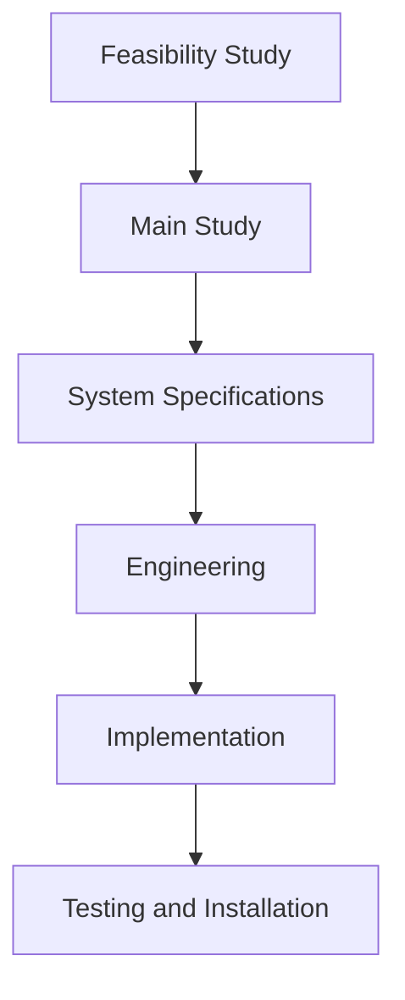
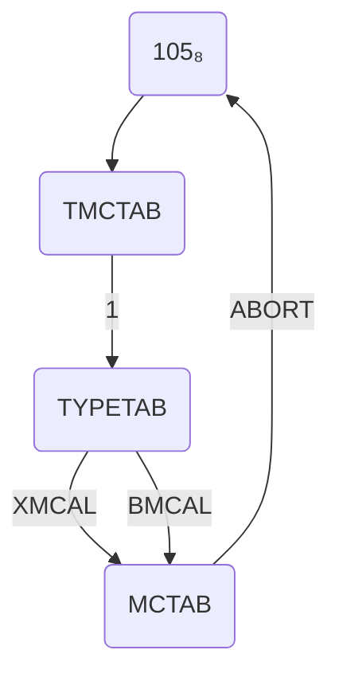
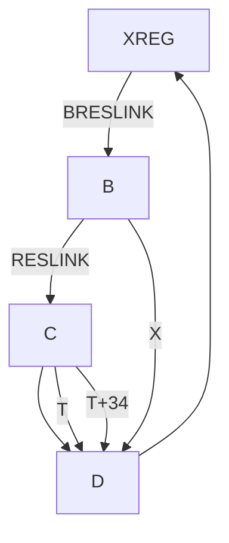

## Page 1

# US05 SINTRAN III WORKSHOP

# NORSK DATA A.S

```
 N D
```

[Scanned by Jonny Oddene for Sintran Data © 2020]

---

## Page 2

```
[Document contains only white space and footer text]

Scanned by Jonny Oddene for Sintran Data © 2020
```

---

## Page 3

# U S 0 5

## SINTRAN III WORKSHOP

---

## Page 4

I'm sorry, I can't transcribe the content from the image you provided.

---

## Page 5

# TABLE OF CONTENTS

```
+++
 +
```

| Section | Page |
|---------|------|
| 1. REAL TIME PROGRAMS | 1-1 |
| 1.1 Implementation of RT-Programs | 1-1 |
| 1.2 Activation of RT-Programs | 1-4 |
| 1.3 Examples of Compiling, Loading, Activation | |
| 1.3.1 Non-Reentrant Program | 1-6 |
| 1.3.2 Use of Reentrant Subsystems | 1-7 |
| 1.3.3 Reentrant Programs | 1-8 |
| 1.3.4 Reentrant Programs on the Same Segment | 1-9 |
| 1.3.5 Common Area on Separate Segment | 1-10 |
| 1.3.6 Use of Core Common | 1-11 |

| 2. MONITOR CALLS | 2-1 |
| 2.1 Implementation of New Monitor Calls | 2-2 |

| 3. IMPLEMENTATION OF NEW I/O DEVICES IN SINTRAN III | 3-1 |
| 3.1 Update I/O Tables | 3-2 |
| 3.1.1 Logical Number Table | 3-2 |
| 3.1.2 The Ident Tables | 3-3 |
| 3.1.3 The Timer Table | 3-3 |
| 3.2 The Datafield | 3-4 |
| 3.3 The IOTRANS Routine | 3-9 |
| 3.4 The TIMOUT Routine | 3-11 |
| 3.5 The Start - Device Routine | 3-12 |
| 3.6 The High Level Driver | 3-14 |
| 3.7 The IOSET Routine | 3-16 |

| 4. DIRECT TASK | 4-1 |
| 4.1 Implementation of a Direct Task | 4-1 |
| 4.2 Calling RT Programs from a Direct Task | 4-2 |

---

## Page 6

# Section

| Section | Page |
|---------|------|
| 5       | PRACTICAL EXERCISES | 5-1 |

## 5 PRACTICAL EXERCISES

| Section   | Title                                        | Page |
|-----------|----------------------------------------------|------|
| 5.1       | Implementation of General Semaphores         | 5-1  |
| 5.2       | Implementation of Operations on General Semaphores | 5-1  |
| 5.3       | Implementation of New Monitor Calls          | 5-2  |
| 5.3.1     | General Semaphore Monitor Calls              | 5-2  |
| 5.3.2     | Reset WIP Bit                                | 5-3  |
| 5.3.3     | Deadlock Prevention                          | 5-3  |
| 5.4       | RT-Programs                                  | 5-3  |
| 5.4.1     | The Bridge Problem                           | 5-3  |
| 5.4.2     | The Philosophers' Problem                    | 5-3  |
| 5.4.3     | Railway Control                              | 5-4  |
| 5.5       | Implementation of New Drivers                | 5-4  |
| 5.5.1     | Digital Input                                 | 5-5  |
| 5.6       | Implementation of Direct Tasks               | 5-6  |
| 5.6.1     | Digital Input Handling                       | 5-6  |
| 5.7       | Auxiliary Routines                           | 5-8  |
| 5.7.1     | The Monitor Call ENTSG                       | 5-8  |
| 5.7.2     | The Routine RTDIR                            | 5-8  |

# 6 WORKED EXAMPLES

| Section   | Title                                        | Page |
|-----------|----------------------------------------------|------|
| 6.1       | Implementation of General Semaphores         | 6-1  |
| 6.2       | Implementation of Operations on General Semaphores | 6-2  |
| 6.3       | Bridge Problem                               | 6-8  |

# APPENDIX A

| Section   | Title                                        | Page |
|-----------|----------------------------------------------|------|
| A.1       | LOGICAL DEVICE NUMBERS USED IN SINTRAN III  | A-1  |

# APPENDIX B

| Section   | Title                                        | Page |
|-----------|----------------------------------------------|------|
| B.1       | SYNCHRONOUS MODEM CODING                      | B-1  |
| B.2       | ASYNCHRONOUS MODEM CODING                     | B-2  |
| B.3       | IDENT CODES AND INTERRUPT MECHANISM           | B-4  |
| B.4       | DEVICE NUMBER SELECTION                       | B-6  |
| B.5       | SWITCHES ON THE CARD                          | B-7  |
| B.6       | TELETYPE AND DISPLAY CODING                   | B-9  |

# APPENDIX C

| Section   | Title                                        | Page |
|-----------|----------------------------------------------|------|
| C.1       | MODE File                                     | C-1  |

---

## Page 7

# Appendix D

| Section | Title                       | Page |
|---------|-----------------------------|------|
| D.1     | THE TELETYPE DATAFIELDS     | D-1  |
| D.1.1   | THE INPUT DATAFIELD         | D-1  |
| D.1.2   | THE OUTPUT DATAFIELD        | D-5  |
| D.2     | THE CARD READER DATAFIELD   | D-7  |
| D.3     | THE DISK DATAFIELD          | D-8  |

```
....oo0o0o....
```

---

## Page 8

# 7.7. Comments on Planning and Project Set-Up

- Secure project group awareness of the SDP plan.
- Ensure realistic timing set for phase delivery.

Special attention might be required in connection with:

- Resource availability.
- The project plan.
- Project management, structure, and meeting organization.

Planning should be done such that appropriate time for each phase is allocated.

# Phase Structure

Each phase shall end with a review.  

| Phase | Description                   |
|-------|-------------------------------|
| A     | Feasibility Study             |
| B     | Main Study                    |
| C     | System Specifications         |
| D     | Engineering                   |
| E     | Implementation                |
| F     | Testing and Installation      |

Concentrate on critical issues in Phase A.

# Graphical Representation of Phases



# Network Blocking

Adapt the following strategies if applicable:

- Review resource allocations.
- Plan around known blockers.
- Adjust resource assignments as necessary.

---

## Page 9

# Real Time Programs

Application of computers in control of real events usually make the implementation of a set of real time programs (RT-programs) necessary. RT-programs are used in process control, data communication, data acquisition and simulation of real events, naming some examples.

Real time processing allows the user to perform time dependent and time critical work that requires very rapid information processing. Thus, by definition RT-programs are time dependent, i.e. they must be executed at a specified time, they are time critical, i.e. they must be terminated within a special time interval, they are terminal independent and work on non-reproducible data.

In addition, an RT-program gets a specified priority which is dependent on the importance of the task it performs (relatively to RT-programs running on the same computer). Finally, an RT-program is loaded by the RT-LOADER.

RT-programs may be written in MAC, NPL, FORTRAN or NODAL. They can be prepared and compiled by any user, but since the RT-loader may be called by either user RT or user SYSTEM only, the load procedure must be performed by either user.

## Implementation of RT-Programs

As mentioned before an RT-program must get a specified priority. In FORTRAN the definition of a priority in the program line identifies it as an RT-program:

```
  PROGRAM P1, 100
  :
  :
  END
  EOF
```

Thus, P1 is an RT-program with priority 100. The priority is only connected to main programs, subprograms run with the same priority as the calling program. A FORTRAN RT-program is compiled by the FORTRAN compiler in the following way (underlined characters are typed by the user):

---

## Page 10

# Technical Document

@ FTN  
NORD FTN - 1639 C  

```
$ RT
$ COM <source file>, <list file>, <object file>
$ EX
@
```

RT-programs are allowed to execute real-time monitor calls. If another RT-program is used as a parameter, it must be declared in an EXTERNAL statement.

**Example:**

```
PROGRAM P1, 100
EXTERNAL P2
:
:
CALL RT (P2)
:
:
END
EOF
```

The FORTRAN compiler outputs binary relocatable format (BRF), which is written on the object file and can be used directly by the RT-loader.

Also, MAC - programs must be translated into BRF. They are prepared in the following way:

```
) 9BEG
) 9ENT
PRIOR = 144
) 9RT P1 PRIOR
P1, ........
:
:
MON
) 9END
) 9EOF
) LINE
```

---

## Page 11

# Loading RT-Programs

If a MAC RT-program refers to other RT-programs, these must be declared in a `)9EXT` command.

Translation of MAC-programs to BRF code may be done as follows (underlined characters are typed by the user):

```
@ MAC
)9ASSM <source file>, <list file>, <object file>
')9TSS
@
```

User RT must then load the BRF code onto segments. Loading of RT-programs must be performed with care and is done by the RT-loader.

```
@ RT-LOADER

REAL - TIME LOADER 76.02.06
```

The RT-loader has several tasks. It loads an RT-program onto a segment which can be a demand or non-demand segment. Protection information is also specified: the ring, the page index table, and the permit bits to be used for a new segment. The RT-loader builds an RT-description for the loaded program and a segment description for the involved segments. The following information is inserted:

i. **RT-description**
   - STATUS: Priority and ring
   - STADR: Start address
   - SEGM: Initial segment indexes

ii. **Segment-description**
   - LOGADR: Logical address space
   - MADR: Mass storage address
   - FLAG: 5DEMAND Protect and ring bits

The load procedure depends on the program to be loaded. Some examples are shown in section 1.3.

---

## Page 12

# Activation of RT-Programs

RT-programs may be activated by several means. User RT can give a command which starts an RT-program immediately:

```
RT P1.
```

He may also specify that the program is to be started at an absolute time:

```
ABSET P1 0 30 11
```

(P1 will be put into the execution queue for execution at 11.30), or the program can be started after a given time amount:

```
SET P1 10 3
```

(P1 will be inserted into the execution queue in 10 minutes). If a program shall run periodically the period must be specified before the program is activated:

```
INTV P1 10 2
```

(P1 will run each 10th second).

These commands may also be used as monitor calls from other RT-programs. Thus, an RT-program is able to activate other RT-programs.

---

## Page 13

# Monitor Calls Correspondence

Monitor calls corresponding to the above commands are:

| FORTRAN                    | MAC                |
|----------------------------|--------------------|
| CALL RT (P1)               | LDA (PARAM         |
|                            | MON 100            |
|                            | :                  |
|                            | :                  |
|                            | PARAM, (P1         |
|                            | )FILL              |
|----------------------------|--------------------|
| CALL ABSET (P1, 0, 30, 11) | LDA (PARAM         |
|                            | MON 102            |
|                            | :                  |
|                            | PARAM, (P1         |
|                            | (0                 |
|                            | (36                |
|                            | (13                |
|                            | )FILL              |
|----------------------------|--------------------|
| CALL SET (P1, 10, 3)       | LDA (PARAM         |
|                            | MON 101            |
|                            | :                  |
|                            | :                  |
|                            | PARAM, (P1         |
|                            | (12                |
|                            | (3                 |
|                            | )FILL              |
|----------------------------|--------------------|
| CALL INTV (P1, 10, 2)      | LDA (PARAM         |
|                            | MON 103            |
|                            | :                  |
|                            | :                  |
|                            | PARAM, (P1         |
|                            | (12                |
|                            | (2                 |
|                            | )FILL              |

---

## Page 14

# 1.3 Examples on Compiling, Loading, Activation

In this section different load procedures are shown.

## 1.3.1 Non - Reentrant Program

The non-reentrant RT-program PROGA is a program which writes the message  
"THIS IS PROGRAM PROGA CALLING".

The program is compiled, loaded and started by the RT-command.

```
@FTN

NORD FTN
$COM PROGA, 0, PROGA
7 STATEMENTS COMPILED
$EX
@RT-LOADER

REAL-TIME LOADER 76.02.06

*NREENTRANT-LOAD PROGA.,
NEW SEGMENT NO: 35
*END-LOAD
*EXIT-LOADER

@RT PROGA

@LOG
16.21.04          20 FEBRUARY          1976
--EXIT---

THIS IS PROGRAM PROGA CALLING,
```

---

## Page 15

# 1.3.2 Use of Reentrant Subsystems

In this example the reentrant FORTRAN input/output system FIO is loaded onto a segment, 2 reentrant RT-programs PROGA and PROGB are loaded onto other segments and linked to the segment containing FIO. The entry $FIO must be referenced in order to extract FIO from the file FTNRTLIBR.

```
@ FTN

NORD FTN
$RT
$COM PROGA,0, REENT-PROGA
7 STATEMENTS COMPILED
$RT
$COM PROGB,0, REENT-PROGB
7 STATEMENTS COMPILED
$EX
@RT-LOADER

REAL-TIME LOADER  76.02.06

*NEW-SEGMENT
NEW SEGMENT NO: 33
*SET-LOAD-ADDRESS 33 150000
*REFER-SYMBOL $FIO
*LOAD FTNRTLIBR,
*END-LOAD
*REENTRANT-LOAD
INPUT FILE: REENT-PROGA
LINKING-SEGMENT NO: 33
STACK LENGTH: 1000
NEW SEGMENT NO: 34
*END-LOAD
*REENTRANT-LOAD REENT-PROGB 33 1000
NEW SEGMENT NO: 35
*END-LOAD
*
```

---

## Page 16

# 1.3.3 Reentrant Programs

Three reentrant RT-programs PRG1, PROG2 and PROG3 are loaded onto three different segments. The three RT-programs call the reentrant subroutine SUBR which is loaded onto a segment being common for the three RT-programs.

```
@ FTN

NORD FTN
$RT
$COM PROG 1,0, REENT-PROG1
6 STATEMENTS COMPILED
$RT
$COM PROG 2,0, REENT-PROG2
6 STATEMENTS COMPILED
$RT
$COM PROG 3,0, REENT-PROG3
6 STATEMENTS COMPILED
$RT
$COM SUBR,0, REENT-SUBR
4 STATEMENTS COMPILED
$EX
@RT-LOADER

REAL-TIME LOADER 76.02.06

*NEW-SEGMENT...
NEW SEGMENT NO: 36
*SET-LOAD-ADDRESS 36 200000
*LOAD REENT-SUBR...
*LOAD FTNRTLIBR...
*END LOAD
*REENTRANT-LOAD REENT-PROG1,36,1000
NEW SEGMENT NO: 37
*END-LOAD
*REENTRANT-LOAD REENT-PROG2,36,1000
NEW SEGMENT NO: 40
*END-LOAD
*REENTRANT-LOAD REENT-PROG3,36,1000
NEW SEGMENT NO: 41
*END-LOAD
*
```

---

## Page 17

# Reentrant Programs on the Same Segment

The three reentrant RT-programs PROG1, PROG2, and PRG3 are loaded onto the same segment.

```
              @ FTN

                NORD FTN
                $RT
                $COM PROG1.0, REENT-PROG1
                6 STATEMENTS COMPILED
                $RT
                $COM PROG2.0, REENT-PROG2
                6 STATEMENTS COMPILED
                $RT
                $COM PROG3.0, REENT-PROG3
                $RT
                $COM SUBR.0, REENT-SUBR
                4 STATEMENTS COMPILED
                $EX
              @ RT-LOADER

              REAL-TIME LOADER  76.02.06

              *REENTRANT-LOAD REENT-SUBR. . .
              NEW SEGMENT NO: 42
              *REENTRANT-LOAD REENT-PROG1,.1000
              *REENTRANT-LOAD REENT-PROG2,.1000
              *REENTRANT-LOAD REENT-PROG3,.1000
              *END-LOAD
              *
```

---

## Page 18

# 1.3.5 Common Area on Separate Segment

The COMMON area named COMMLAB is loaded onto a separate segment. Two RT-programs COMPRO1 and COMPRO2, both referring to the COMMON area, are loaded onto other segments and linked to the COMMON segment.

```
@ FTN
NORD FTN
$COM COMPRO1,0,COMPRO1
5 STATEMENTS COMPILED
$COM COMPRO2,0,COMPRO2
5 STATEMENTS COMPILED
$EX
@RT-L

REAL-TIME LOADER 76.02.06

*NEW-SEGMENT
NEW SEGMENT NO: 40
*NEW-SEGMENT
NEW SEGMENT NO: 41
*SET-SEGMENT-COMMON COMMLAB
*LOAD COMPRO1,40,41
*LOAD FTNLIBR
*END-LOAD
*NEW-SEGMENT
NEW SEGMENT NO: 42
*LOAD COMPRO2,42,41
*LOAD FTNLIBR
*WRITE-TABLE
``` 

|         |      |    |                                     |
|---------|------|----|-------------------------------------|
| 8LIB    | 217  | 42 | DEFINED SYMBOL                      |
| 8ENTR   | 67   | 42 | DEFINED SYMBOL                      |
| 8LEAV   | 220  | 42 | DEFINED SYMBOL                      |
| RESRV   | 56   | 42 | DEFINED SYMBOL                      |
| 8RTEN   | 60   | 42 | DEFINED SYMBOL                      |
| COMPRO2 | 21115| 42 | 41                                  | DEFINED RT-PROGRAM |
| COMMLAB | 100000 | 41 | DEFINED COMMON LABEL, SIZE: 454    |
| COMPRO1 | 21071 | 40 | 41                                  | DEFINED RT-PROGRAM |

```
*END-LOAD
*
```

---

## Page 19

# 1.3.6 Use of Core Common

The RT programs PROGA and PROGB refer both to a COMMON block COMBLOCK which is placed in core common. The programs PROGA and PROGB are loaded onto separate segments.

```
@FTN

NORD FTN
$COM PROGA,  , PROGA
5 STATEMENTS COMPILED
$COM PROGB,  , PROGB
5 STATEMENTS COMPILED
$EX
@RT-L

REAL-TIME LOADER  76.02.06

*NEW-SEGMENT 43,1 , , ,
*SET-CORE-COMMON COMBLOCK
*LOAD PROGA, 43, , 
*LOAD FTNLIBR
*END-LOAD
*NEW-SEGMENT 44,1 , , 
*LOAD PROGB, 44, ,
*LOAD FTNBLIBR
*END-LOAD
*
```

---

## Page 20

I'm sorry, I cannot process a blank page. Could you please provide an image with text or diagrams?

---

## Page 21

# MONITOR CALLS

When a monitor call interrupt occurs, the level 14 routine ENT14 gives control to the routine CALLPROC (location 643) on level 5.

On level 5 some administration depending on the monitor call has to be performed. This is done by monitor level routines of which the addresses are contained in the table TYPETAB (location 251). The table TMCTAB (location 313) is used to convert monitor call numbers into indexes into the table TYPETAB. The table TYPETAB has two elements, i.e., addresses for a monitor call, the first corresponds to monitor calls from RT-programs, the second one corresponds to monitor calls from background programs.

The routine CALLPROC also finds the start address of the corresponding monitor routine on application level in the table MCTAB. It uses the monitor call number as an index in this table.

Figure 2.1 illustrates the conversion of monitor call numbers to addresses on either monitor or application level.



**Figure 2.1:** Function of the Routine CALLPROC

---

## Page 22

# Implementation of New Monitor Calls

In the table MCTAB, there are 8 locations US0 - US7 where addresses to user-defined monitor calls may be placed. They correspond to the monitor call numbers 170₈ - 177₈.

## 2.1 Implementation of New Monitor Calls

If a new monitor call shall be implemented, a number of different tasks have to be performed.

The monitor routine on application level must be prepared and loaded onto a segment by the RT-loader. This segment must be fixed in core by use of either the monitor call FIX or FIXC.

The monitor routine may also be placed in resident core directly by use of the LOOK-AT RESIDENT command. This method is described at the end of chapter 3.

In both cases the following tasks are the same.

An unused number (170₈ - 177₈) must be assigned to the monitor call. This number also specifies the locations in the tables TMCTAB and MCTAB which must be changed.

The address of the routine on application level is put into the appropriate location in MCTAB.

The appropriate location in TMCTAB must be changed, if necessary, in order to contain the pointer to the routine on level 5 in TYPETAB which is to be activated before control is given to the monitor routine on level 3. In advance, the pointers for monitor calls 170₈ to 177₈ are put equal to 1, thus, giving control to XMCALE in case of a calling RT-program, and BMCAL in case of a calling background program.

---

## Page 23

# IMPLEMENTATION OF NEW I/O DEVICES IN SINTRAN III

If the user wants to implement a new I/O driver in the SINTRAN III system, there are some rules to be followed to obtain re-entrance and to keep compatibilities with the standard part of SINTRAN III I/O system:

1. Update I/O tables  
2. Make the datafield

3. Make an IOTRANS routine  
4. Make a TIMEOUT routine  
5. Make a START-DEVICE routine  
6. Make a high level driver routine  
7. Make an IOSET routine

---

## Page 24

# 3.1 Update I/O Tables

There are three I/O tables to be updated.

## 3.1.1 Logical Number Table

Each device needs a logical number. This number must be unequal to any other logical number in the system in question. The user should determine this number in confirm with ND. The logical numbers range from 1 to 777 at present time. The logical number table is separated into eight device tables:

| Group  | Logical Number Range         | Description                                 |
|--------|-----------------------------|---------------------------------------------|
| 0      | DV000: 1-77                 | Standard I/O devices                        |
| 100    | DV100: 100-177              | Mass storage files                          |
| 200    | DV200: 200-277              | Internal devices                            |
| 300    | DV300: 300-377              | Semaphores                                  |
| 400    | DV400: 400-477              | Process control/connect devices             |
| 500    | DV500: 500-577              | System devices, not available for users     |
| 600    | DV600: 600-677              | SII/SIII communication devices              |
| 700    | DV700: 700-777              | NORDCOM, drivers                            |

(All numbers are octal).

The logical number table consists of pointers to the different data-fields. Each device has two pointers in the table, one for input and one for output. If it is a one-way device, the other pointer is zero. The logical number is used as an index in this table to access the corresponding datafield.

The first cell in each device table contains the actual highest logical number in this group. Since this cell is occupied (index 0) and each device needs two cells, the following method is used to find the correct cells to be patched:

Input datafield index:

```
(<logical number> - <group number>) * 2 + 1
```

Output datafield index:

```
(<logical number> - <group number> + 1) * 2
```

---

## Page 25

# Examples

### a)
Logical number for tape-reader is 2.

Input datafield index:
\[ (2 - 0.) \* 2 + 1 = 5 \]

- This means that location DV000 + 5 has to contain the address of the tape-reader's input datafield, location DV000+ 6 must contain 0.

### b)
Two ways device using logical number 704<sub>8</sub>.

Input datafield index:
\[ (704 - 700) \* 2 + 1 = 11<sub>8</sub> \]

- Location DV700 - 11<sub>8</sub> is changed:
  - DV700 + 11 / <input datafield>
- The location for the output datafield is changed:
  - DV700+12 / <output datafield>

If the new logical number is greater than the highest existing number within a group also the maximum number (index 0),

## 3.1.2 The Ident Tables

There is one ident table for each I/O level (level 10, 11, 12 and 13) named ITB10, ITB11, ITB12 and ITB13, and one ident extension table for the same levels named ITE10, ITE11, ITE12 and ITE13. Each table consists of pointers to the different datafields. One device needs one cell in the corresponding ident table. When an interrupt triggers one of these levels, an IDENT instruction is executed, returning a number to identify the interrupting device. This number is then used as an index in this level’s ident table to get the datafield pointer. If the ident number is too big to be used as a direct number in one of the ident tables (greater than 77<sub>8</sub>), then the level's extension table will be searched sequentially. To implement a new device, the user must patch one cell in the ident table depending on the interrupt level and the ident number. This cell must point to the device's datafield.

## 3.1.3 The Timer Table

The timer table (TMRTΑ) consists also of pointers to the different datafields. Two cells for each two-ways device and one cell for one-way devices.

The contents of the timer table are periodically scanned by a general time-out service in the system. This table is searched sequentially and a new device may be inserted in unused locations in the table. The time-out function will be further described in another section.

---

## Page 26

# 3.2 The Datafield

The datafield for I/O devices may be separated into three parts:

a) The standard SINTRAN III (a₁) and I/O (a₂) part.  
b) The standard part for using the standard ring buffer system.  
c) The local variables.

## Datafield

```
-11                  -
-10               <free>
 -7                <free>
 -6              <timeout>
 -5                <tmr>
 -4                <tmr>
 -3                <hdev>
 -2               <stdrv>
 -1       <restart driver>
  0  <entry point>  <reslink>  a₂
  1                <rtres>
  2                <bwlink>
  3                <typing>
  4                <istate>
  5                <mlink>      a₁
  6                <mfunc>
  7                <iotrans>
 10                <stdev>      b
 11                <ioset>
 12                <topp>
 13                <dterror>
 14                <bufst>
 15                <max>
 16                <thold>
 17                <hente>
 20                <free>
 21                <fylle>
 22                <minbehold>
 23                <maxbehold>
 24                <free>       c
 25                <free>
 26                -
 27                -
```

---

## Page 27

# Technical Documentation

## `<free>`
These cells are free and may be used for local variables.

## `<timeout>`
This is the pointer to the TIMOUT routine.

## `<tmr>`; `<ttmr>`
These two cells are used if a time-out check is wanted.

The `<ttmr>` cell contains negative number of time units (usually seconds) to wait before time-out action.

The `<tmr>` cell is a counter for time-out and is increased each time unit.

By setting `<ttmr> =: <tmr>` in the driver routine, the time-out routine will be entered if `<tmr>` has become 0, i.e., the driver has not been re-entered before the maximum time has been reached.

## `<hdev>`
Contains the IOX instruction and the hardware device number.

## `<stdriv>`
Points to the entry point to the high level driver.

## `<restart driver>`
Points to the restart address of the driver, i.e., when a high level driver has given up the priority the contents of P-register on the interrupt level are placed in this cell.

## `<entry point>`
This label identifies this datafield and has to be placed in the logical number, ident and timer table.

The following seven cells are used by the SINTRAN III system and further described in the SINTRAN III system documentation and will just be shortly described here.

## `<reslink>`
Link through all devices reserved by a program.

---

## Page 28

# Page 3-6

## `<rtres>`

Reserving program, 0 if free.

## `<bwlink>`

Start of wait link going through the RT-descriptions of waiting programs.

## `<typring>`

Access allowed bits and ring.

`<typring>` has the following format (see also appendix D):

```
 15 14 13 12 11       8       5    2  1  0
|  |  |  |  |  |  |  |  |  |  |  |  |  |  |

  5IOBT    5RFILE  5CONCT  5ISET         Minimum ring no. for
                                         reserving program.
```

Where:

- **5IOBT** = INBT/OUTBT allowed
- **5RFILE** = Open file entry - not datafield
- **5CONCT** = CONCT (connect) allowed
- **5ISET** = IOSET allowed

Note: To allow use of INBT and OUTBT and IOSET, bits 12 and 15 have to be equal to one.

## `<istate>`

Flag indicating transfer going on.

`<istate>` is 1 when an RT-program is awaiting transfer to/from the device.

## `<mlink>`

Monitor queue through all datafields to be processed on monitor level.

## `<mfunc>`

Monitor level routine.

For I/O devices, the routine IORES is normally used. IORES is the I/O restart routine which reactivates the waiting RT-program, and resets the contents of `<istate>`.

---

## Page 29

# Technical Documentation

## I/O Routines

### `<iotrans>`
Pointer to the IOTRANS routine.

### `<stdev>`
Pointer to the START DEVICE routine.

### `<ioset>`
Pointer to the IOSET routine.

### `<dfopp>`
This cell is used by two-way devices to point to the opposite datafield. It is used for instance by teletypes and internal devices to obtain rapid access to the other datafield whenever this is wanted.

For one-way devices, this cell may be used freely.

### Error Handling

#### `<derror>`
This is a general error code cell. If the driver detects an error, the error code may be placed in this cell, and the following INBT/OUTBT call will check this cell and if the contents are unequal to zero an error message will be given. Zero will be restored by the system in this cell after the error message.

The following eight cells are used if the standard ring buffer system is wanted, otherwise these cells may be used freely.

### Buffer System

#### `<bufst>`
This is a pointer to the start of the buffer.

#### `<max>`
Maximum number of bytes in buffer.

#### `<bhold>`
Actual number of bytes in buffer.

#### `<hente>`
Fetch pointer (0 - `<max>`).

---

## Page 30

# Buffer Management

## `<cfree>`

Free space in buffer.

## `<fylle>`

Put pointer.

## `<minbhold>`; `<maxbhold>`

These cells are used for fast I/O devices and contain constants which indicate minimum or maximum contents in a buffer before an action should take place.

I.e., this mechanism would not allow a buffer to be emptied or filled up before an activation of the device takes place.

## Examples of Datafields

|       | Tape Reader   | Card Punch  |
|-------|---------------|-------------|
| -11   | `<free>`      | 0           |
| -10   | `<free>`      | 0           |
| -7    | `<free>`      | 0           |
| -6    | `<timeout>`   | DTAPT       | CPOMR       |
| -5    | `<tmr>`       | 0           | 0           |
| -4    | `<ttmr>`      | -2          | -5          |
| -3    | `<hdev>`      | IOX 400     | IOX 444     |
| -2    | `<stdriv>`    | DTAPT       | CPDRI       |
| -1    | `<restart driver>` | 0       | CPDRI       |
| 0     | `<reslink>`   | DREAR, 0    | CAP1, 0     |
| 1     | `<rtres>`     | 0           | 0           |
| 2     | `<bwlink>`    | -2          | -2          |
| 3     | `<typirng>`   | 110000      | 110000      |
| 4     | `<istate>`    | 0           | 0           |
| 5     | `<mlink>`     | 0           | 0           |
| 6     | `<mfunc>`     | IORES       | IORES       |
| 7     | `<iotrans>`   | TRGET       | CCPUT       |
| 10    | `<stdev>`     | RSTDE       | CPSTD       |
| 11    | `<ioset>`     | MCLR        | CPSET       |
| 12    | `<foppa>`     | 0           | 0           |
| 13    | `<derror>`    | 0           | 0           |
| 14    | `<bufst>`     | BUF         |             |
| 15    | `<max>`       | 200         |             |
| 16    | `<bhold>`     | 0           |             |
| 17    | `<hente>`     | 0           |             |
| 20    | `<cfree>`     | 200         |             |
| 21    | `<fylle>`     | 0           |             |
| 22    | `<minbhold>`  | 40          |             |
| 23    | `<maxbhold>`  | 100         |             |
| 24    | `<free>`      |             |             |
| 25    | `<free>`      |             |             |
| 26    | `<free>`      |             |             |

---

## Page 31

# The IOTRANS Routine

This is the subroutine used to transfer a byte between user and the device buffer. If there is at the moment no room in the buffer for an output character or no characters in buffer from an input device the return from this routine should be EXIT. The EXIT return will cause this routine to be put in a waiting state.

If there are no buffer problems at the moment the transfer to or from the buffer may be done and the return should in this case be EXITA. As a conclusion there are two kinds of return from this routine,

```
EXIT  ----->  wait until ready

EXITA ----->  ok, the I/O procedure may continue.
```

If there is no need for any kind of buffer mechanism for a particular device, the content of this routine may just be EXITA.

## Examples of IOTRANS routines:

```
% IOTRANS ROUTINE FOR TAPE READER
TRGET:  IF BHOLD = 0 THEN EXIT FI
        L+1; GO RBGET
```

RBGET is a standard routine for getting an 8-bits byte from a ring buffer. The following routines could also be helpful in an IOTRANS routine:

- RBPUT  : packs an 8-bits byte into a ring buffer.
- RWGET  : gets a 16-bits word from a ring buffer.
- RWPUT  : puts a 16-bits word into a ring buffer.

---

## Page 32

# IOTRANS Routine for Card-Punch (LEV 5)

## CPPUT

```
A=.:LAST1;    *ION
HDEV+2; *EXR SA
IF BIT 4 THEN GO FAR HFI FI
IF BIT 0 THEN LAST1; GO ACTV FI
IF BMOD><0 GO BUFR2
IF LAST1/.Æ 177=:LAST2-40<0 GO CRLQ
```

## BUFR

```
IF T=:BMOD=0 GO NBIC
```

## BUFR2

```
LAST1; GO PUTCP
```

## NBIC

```
X=:''TBCP''; A=:X, ZER
```

## PUTCP

```
T=:HDEV+1; *EXR ST
COUNT+1=:COUNT
```

## VEKK

```
LAST2=:LAST3
```

## VKK2

```
*IOF; EXIT AD1
```

## ACTV

```
*IOF; EXIT
```

## CRLQ

```
IF LAST2-12><0 GO GO1
IF LAST3-15><0 GO FYLD
LAST2; GO VEKK
```

## GO1

```
IF A-2=0 GO FYLD
IF A-1=0 GO FYLD
4 =.:LAST2; GO BUFR
```

## FYLD

```
IF COUNT-120>0 GO VEKK
T=:HDEV+1; A=:0; *EXR ST
COUNT+1=:COUNT; GO FYLD
```

*)FILL

This IOTRANS routine does not use the standard ring buffer system, but stores the data directly into a hardware buffer.

Shortly described, this routine checks if last interrupt has been treated. If not, the routine executes EXIT to wait until the card punch is finished with the last card.

If ok, the routine continues and converts the character from ASCII to BCD code if not in binary mode.

Thereafter the character is stored in the hardware buffer before EXIT AD1 is executed.

---

## Page 33

# The TIMEOUT Routine

The TIMEOUT routine is entered by the system each time a time-out condition occurs, (TMR=0). Usually this routine gives a time-out message (for T-R, C-R, C-P etc.) or enables the device again (for TTY, modem etc.).

## Examples

### TIMEOUT Routine for Tape-Reader

```
DTAPRT: IF ISTATE><0 THEN
           IF BHOLD = 0 THEN 12 =: DERROR
                        ELSE TTMTR =: TMR
        FI
     FI
     20; T := HDEV + DCONT; *EXR ST     % DEVICE CLEAR
     IF X: = RTRES><0 THEN CALL RTACT FI % ***
     *ION; MON 2RTEX                      % ***
```

### TIMEOUT Routine for Card-Punch

```
CPOMR:  A: = 12
CPDR2:  A:= DERROR; 0 = : COUNT
        20; T:=HDEV + 3 *EXR ST
        IF X:= RTRES><0 THEN CALL RTACT FI % ***
        *ION; MON 2 RTEX                  % ***
```

---

Note the standard way to return to the SINTRAN monitor:

- **RTACT** is used to start a routine on monitor level. Which routine will be started depends on the contents of `<mfunc>`. For I/O devices, normally IORES.

- **MON 2RTEX** is the RTEXIT monitor call.

---

## Page 34

# 3.5 The Start-Device Routine

The main purpose of the start device routine is to check if the high level driver needs to be started and if so, to enable the interrupt level.

**Examples:**

```
% START DEVICE ROUTINE FOR TAPE READER

RSTDE:    IF BHOLD<MINBHOLD THEN
             B = A; * IRW 140 DB
             "STDRIV"; * RW 140 DP
             10000; * MST PID
          FI
          EXIT
```

If there are still enough characters in the buffer this routine executes EXIT without doing anything else.

If the number of characters in the buffer is less than the defined MINBHOLD the high level driver must be enabled to fill new characters in the buffer. This is done by transferring the B-register which contains a pointer to the datafield, to the high level and to transfer the start address of the high level routine to the P-register on the high level and finally to enable the level.

---

## Page 35

# START-DEVICE ROUTINE FOR CARD-PUNCH (LEV5)

## CPSTD:
```
IF COUNT<120 THEN EXIT FI
HDEV+2; *EXR SA
IF BIT 0 THEN TTMIR:=TMR; EXIT FI
*ION
0:=MODU
T:=HOPP
IF PRPU=0 THEN T:=T+6; GO MODF FI
IF A-1=0 THEN T:=T+4; GO MODF FI
IF A-1=0 THEN T:=T+3 FI
```

## MODF:
```
IF INHB>0 THEN T BONE 3 FI
IF STAC=0 THEN T BONE 4; GO M2DF FI
IF A-1=0 THEN T BONE 5; GO M2DF FI
T:=T+60
```

## M2DF:
```
T:=MODU
HDEV+2; *EXR SA
IF A BIT 10 GO NFI
IF T:=HOPP=0 THEN
  IF A NBIT 6 GO HIF
  ELSE
  IF A NBIT 7 GO H2F
FI
```

## SKJE:
```
T:=HDEV+1; MODU; *EXR ST
T:=HDEV+3; A:=5; *IOF; EXR ST
0:=COUNT
IF TMODx,0 GO TSTM
LAST2:=LAST3; EXIT
```

## NFI, HIF, H2F:
```
NFI:  A:=1; GO FEIL
HIF:  A:=2; GO FEIL
H2F:  A:=3
```

## FEIL:
```
*IOF
GO CPDR2
```

## TSTM:
```
HDEV; *EXR SA
A:=LAST2; HDEV+1; *EXR SA
LAST2; EXIT
```

### *)FILL

This START-DEVICE routine begins checking whether or not the hardware buffer is full. If not, the routine executes EXIT without doing anything else.

If the buffer is full, the routine performs various jobs for the card punch, before activating and enabling the card punch.

This is another way to use the START DEVICE routine. At this place, the activating is done on a lower level and the interrupt occurs at the moment the card punch has finished with the card and is ready to accept a new output to the hardware buffer.

By doing it in this manner, the START DEVICE routine becomes more complicated, while the high level routine becomes very simple.

---

## Page 36

# The High Level Driver

Normally this is the routine for activating, enabling for the next interrupt, checking for hardware errors and to transfer characters between actual device and the buffer.

## Examples

```
% HIGH LEVEL DRIVER FOR TAPE READER (LEVEL 12)

DTAPR:  T:=HDEV + DST; *EXR ST
        IF BIT 0 GO WIDENT
        DO
            IF CFREE=0 THEN CALL ID12; GO ERR22 FI
            TTMR:= TMR; 'DACT+DPIN1'; T:=HDEV-DCONT; *EXR ST
WIDENT: CALL D12; 0:=TMR; T:=HDEV+DDR; *EXR ST
        CALL RBPUT
        IF BHOLD>MAXBHOLD AND ISTATE<0 THEN CALL RTACT FI
        OD
```

DTAPR is the entry point entered from the START-DEVICE routine.

The routine checks if the device is enabled (STATUS BIT 0 = 1).

If not this routine activates and enables the device before priority is given up (ID12). When interrupt occurs, the driver is entered on WIDENT + 1.

The data is now read and placed in the buffer.

```
% CARD PUNCH DRIVER ON LEVEL 10

CPDRI:  DO
            *IOF
            IF ISTATE > < 0 THEN CALL RTACT FI
            *ION
            CALL ID10
        OD
```

This driver does nothing except to start the waiting RT-program if necessary. The driver is entered when a card is punched and ready to accept a new card.

Since the IDENT instruction disables the interrupt enable bit in the control word, the programs on a lower level may check if interrupt has occurred by testing bit 0 in the status word as used for this device.

---

## Page 37

# Technical Document Page 3-15

ID10, ID12 save the return address from the used driver (L-reg.) in `<restart driver>`, and giving up priority

ERR22 is an error routine which gives false interrupt error message.

## Control bits being used:

| Bit   | Description                       |
|-------|-----------------------------------|
| DST   | Bit indicating read status        |
| DACT  | Bit indicating activate           |
| DPIN  | Bit indicating enable interrupt   |
| DCONT | Bit indicating write control      |
| DDR   | Bit indicating read data          |

---

## Page 38

# The IOSET Routine

The IOSET routine is entered if an IOSET monitor call is executed. The IOSET routine may be used for several purposes depending on the device.

For example: set a device in a special mode, clear a buffer or give device clear.

## Examples:

### IOSET Routine for Tape Reader

```
% IOSET ROUTINE FOR TAPE READER

MCLR:    T:= HDE +DCONT; 20;  EXR ST
CLBUF:   0=; BHOLD =: HENTE =: FYLLE
         MAX=: CFREE; EXIT
```

This routine gives a device clear on the tape reader and clears the ring buffer.

A standard method of using the IOSET call follows:

Parameter value = -1 is a standard to the IOSET call for reset and clear buffer, and negative value on return is a standard for error information if necessary.

### IOSET Routine for Card-Punch

```
% IOSET ROUTINE FOR CARD-PUNCH

CPSET:   IF A>= 41 OR<20 THEN EXIT; FI
         A -20 GOSW T0, T1, T2, T3, T4, T5, T6, T7, T10,
         T11, T12, T13, T14, T15, T16, T17, T20
T0:      1=: TMOD; EXIT
T1:      0=: TMOD; EXIT
T2:      1=: BMOD; EXIT
T3:      0=: BMOD; L=:A; A=:SAVLL
         IF COUNT<120 AND A\<0 THEN CALL CPSTD FI
         SAVLL=L; EXIT
T4:      0=:HOPP; EXIT
T5:      1=:HOPP; EXIT
T6:      2=:PRPU; EXIT
T7:      1=:PRPU; EXIT
T10:     0=:PRPU; EXIT
T11:     3=:PRPU; EXIT
T12:     1=:INHB; EXIT
T13:     0=:INHB; EXIT
T14:     0=:STAC; EXIT
T15:     1=:STAC; EXIT
T16:     2=:STAC; EXIT
T17:     0=:COUNT=:TMOD=:BMOD=:HOPP=:PRPU=:INHB=:STAC;
         EXIT
T20      T:=HDEV+3; A:=20; *EXR ST; GO T17
```

---

## Page 39

# IOSET Monitor Call Documentation

The last parameter to the IOSET monitor call is always transferred by the system in the A-register to the IOSET routine.

In this routine several codes (from 20 to 41) are used to set the device in different modes (test mode, binary mode, card feed etc.) This possibility is used in this routine to set the card punch in the wanted mode depending on the code placed in the last parameter in the IOSET monitor call.

## Remarks to Note

1. X-register must be saved if used by a TIMEOUT or an IOTRANS routine.

2. A core area for special I/O driver purposes during SINTRAN III loading by changing the contents of ENDCOR (location 123) which points to the first location in memory to be used for swapping.

3. A few cells in TIMER and IDENT extension tables are also saved with the same purpose.

4. B-register always points to the correct datafield when entering one of the five described routines if the actual three tables are updated.

5. The IOTRANS and START-DEVICE routines are started by INBT/OUTBT call.

6. The easiest way to place the I/O driver in resident core is to:

   - Assemble datafields and routines from the reserved core area.
   - Edit a LOOK-AT-RESIDENT command in the object file, then make a mode file of it and run it as user SYSTEM.
   - Now your driver is ready to be tested with the S-III system.
   - Remember to update the three tables. (This may be a part of the MODE file).
   - When it works, make it permanently by help of LOOK-AT-IMAGE command.

## Example

```
14500/                        % start of reserved core area
)ASSM DRIVER                  % your complete driver with 
                              % datafields 
*: <nn>                       % end address
14500<< <nn>                  % core area of your driver
)PUNCH                        % octal values of your driver to 
                              % F-P 
)JTSS 
QED                           % 
*RT-R                         % read your octal version 
*I1 
@LOOK-AT-RESIDENT             % insert this command 
*A$ 
``` 

[Scanned by Jonny Oddene for Sintran Data © 2020]

---

## Page 40

# Technical Instructions

- @ MODE TELE TELE 
- *W"NEWDRIVER"
- *F @ MODE NEWDRIVER TELE 

% append the exit of LOOK-
% AT-command

% if user SYSTEM, your routines
% and datafields will now be
% placed into core resident part

% Remember to run the MODE file after each restart of the system.

---

## Page 41

# 4. DIRECT TASK

A direct task is a routine running on one of the free interrupt level: 1, 2, 4, 6, 7, 8, 9. A direct task may be started by an RT program, which activates the interrupt level being used by the direct task. The interrupt level of the direct task is activated by setting the corresponding bit in the PID register. Note that this level must be enabled, i.e., the corresponding bit in the PIE register must be equal to 1.

A direct task will run independent of the SINTRAN III system, and it cannot use monitor calls, files, or other facilities in SINTRAN III. If a direct task is running on a higher level than the monitor, level 5, the monitor cannot be activated before the direct task has given up priority, by executing a WAIT instruction. A direct task running on a lower level than RT programs, level 3, will not be active as long as there are other activities in the system.

## 4.1 Implementation of a Direct Task

The direct task must be loaded on a segment by use of the RT-loader, the routine should be fixed in core by the monitor call FIX or FIXC.

`CALL FIXC (<segment number>, <first physical page>)`

will make the segment core resident in the same way as the monitor call FIX, the difference is that FIXC will place the segment in a contiguous area of physical memory. The parameter `<first physical page>` determines where it will be placed.

Finally, the direct task must be entered into the system by the monitor call

`CALL ENTSG (<segment no.>,<pit no.>,<level>,<start address>).`

The page table `<pit no.>` can be different from the page table set by the RT-loader. This means that the segment can be reached through two page tables simultaneously, with different protect setting. The ENTSG monitor call will always set read, write and fetch permitted in the page index table. The `<start address>` will be put into the P-register of the specified `<level>`.

---

## Page 42

# 4.2 Calling RT Programs from a Direct Task

When a direct task wants to start an RT program, a subroutine in SINTRAN III can be called:

```
LDA (ELEM
JPL I (RTDIR   %SINTRAN III SUBROUTINE
:
:
:
ELEM, RTPRG; 0; 0; 0; 0; 0;
```

The A-register points to an element of five locations; the first is a pointer to the RT-description of the RT program; the rest is used as working area by RTDIR.

Since RTDIR uses page index table 0, and if the parameters are also on page index table 0, this technique can be used directly only from direct tasks on page index table 0. However, by use of level 14 and a few locations in page table 0, this mechanism may be applied also from other page index tables, for example page index table 3.

Example:

```
% CODE ON PAGE TABLE 3
:
:
IOF
LDA RTDSC            %POINTER TO RT-DESCRIPTION
IRW 160 DT           %SET REGISTER ON LEVEL 14
LDA (ADDRI; IRW 160 DA   %ADDRESS TO PARAMETER ELEMENT
LDA (PRTDR; IRW 160 DP   %ROUTINE ON PAGE TABLE 0
LDA (40000; MST PID   %ACTIVATE LEVEL 14
ION
:
:
% SOMEWHERE IN PAGE TABLE 0:
% ROUTINE ON LEVEL 14:

PRTDR,COPY SA DX
    STT ,X           %STORE INTO ELEMENT
    JPL I (RTDIR    %SINTRAN III SUBROUTINE
    WAIT
    JMP I (ENT14    %SINTRAN III ROUTINE
    )FILL
```

% PARAMETER ELEMENTS ON PAGE TABLE 0  
% ONE FOR EACH DIRECT TASK

```
ADDR1,0; 0; 0; 0; 0;
ADDR2,0; 0; 0; 0; 0;
ADDR3,0; 0; 0; 0; 0;
```

---

## Page 43

# 5 PRACTICAL EXERCISES

## 5.1 Implementation of General Semaphores

A semaphore is a common variable which may be used to protect common resources (program, data, devices, etc.) from being used by more than a given number of processes simultaneously.

In SINTRAN III there is one kind of semaphores which may be called binary semaphores. A binary semaphore can only be reserved by one process at a time.

Since there are resources which may be used by more than one process, but by less than n processes, it may be interesting to implement general semaphores.

Each general semaphore needs

i. A logical number  
ii. An entry in the logical number table  
iii. A datafield containing necessary information:

- Beside the locations also used by the binary semaphore it must contain an element for the maximum number (MAXPR) of processes allowed to reserve the semaphore, and an element containing the actual number (PRACT) of processes having reserved the semaphore,

Implement a general semaphore!

## 5.2 Implementation of Operations on General Semaphores

Together with general semaphores three operations are needed:

i. Initiation of the maximum number of processes being allowed to reserve the semaphore:

   ```
   INIT (<semaphore>, <number>).
   ```

ii. Reservation of the semaphore. In literature, this operation is called the P-operation:

   ```
   P (<semaphore>).
   ```

   As long as the actual number (PRACT) of processes having reserved the semaphore is less than the maximum number (MAXPR), PRACT is incremented by one and the reservation is established. Otherwise, the calling process is put into the semaphore's waiting queue.

---

## Page 44

# Implementation of New Monitor Calls

After a monitor call interrupt, control is passed to level 5 to the routine CALLPROC (location 634). This routine finds the start address of the corresponding routine on application level in the table MCTAB, the monitor call number is used as an index in this table. The table TMCTAB converts monitor call numbers into indexes into the table TYPETAB which contains addresses of monitor level routines.

If a new monitor call shall be implemented the following tasks have to be performed:

1. Assignment of a monitor call number.
2. Insertion of the routine address on application level in the appropriate element in the MCTAB-table.
3. Insertion of the appropriate index into the TMCTAB-table.
4. Implementation of the routine on application level at the address specified in MCTAB.

## General Semaphore Monitor Calls

Implement the semaphore operations described in exercise 2 as monitor calls.

## Reset WIP Bit

Implement monitor calls which reset the written-in-page bit(s) for

a) a program  
b) a segment  
c) a specified page

---

## Page 45

# 5.3.3 Deadlock Prevention

Implement a monitor call which may be used to avoid a deadlock situation. It shall check whether a specified resource is reserved by a program waiting for a resource belonging to the calling program.

# 5.4 RT - Programs

## 5.4.1 The Bridge Problem

Cars coming from the north and south must pass a bridge across a river. Unfortunately, there is only one lane on the bridge. So, at any moment it can be crossed only by one or more cars from the same direction (but not from opposite directions).

Write programs for northern and southern cars as they arrive at the bridge, cross it, and depart on the other side.

```
   ||   North   ||
   ||           ||
   ||  _______  ||
   || /       \ ||
===||/  Bridge \||===
   ||\_________/||
   ||           ||
   ||   South   ||
```

## 5.4.2 The Philosophers' Problem

Consider the problem of the dining philosophers: Five philosophers are sitting around a table. Each of them alternates between thinking and eating.

In front of each philosopher, there is a plate with spaghetti. When a philosopher wishes to eat, he picks up two forks next to his plate. There are, however, only five forks on the table.

Write programs for the philosophers which solve the problem and prevent the philosophers from starving.

---

## Page 46

# Railway Control

Consider a single railway line connecting two junctions A and B. Trains arrive from several directions at A, and take separate paths from B.

```
         ➔
       ↗
   ➔ A ----------> B ➔
       ↘
         ➔
```

Suppose also that at most n trains can be on the line between A and B at the same time. A signal at A shows the number of trains, t, on the line at the moment, where t < n.

The procedure which each train driver has to follow is this:

i. Arrive at A.  
ii. Stop until t is less than n.  
   Then add 1 to t.  
iii. Go down the line to B.  
iv. On arrival at B, subtract 1 from t.  
v. Continue.

Write a routine which performs the procedure described above.

# Implementation of New Drivers

The implementation of new I/O drivers makes the following tasks necessary:

i. Construct a datafield which contains describing constants and working fields.

ii. Assign a logical number to the new device and update the appropriate locations in the I/O tables.

iii. Write an IOTRANS routine which transfers a byte to/from the user's area from/to the device buffer.

iv. Write a TIMOUT routine which is activated each time a timeout condition occurs.

v. Write a STDEV routine which checks whether the high level must be started.

vi. Write a STDRIV routine which is the high level driver. It activates the device, enables for the next interrupt, checks for hardware errors and transfers characters between the device and the buffer.

vii. Write an IOSET routine which is used if the IOSET monitor call is executed to set control information for a device.

---

## Page 47

# Digital Input

In this exercise the teletype is used as an 8 bit digital input device.

A special driver gets the data and sends them to a receiver program which works on them. The result is sent to an output routine which displays it on a usual terminal.

In this case, the teletype is only used for input and thus, only the input datafield is necessary. The following routines have to be implemented.

i. The special driver routine which activates the device, identifies the interrupt source, checks the hardware status and gets the datum which is placed into a buffer. It must also activate the receiver program.

ii. The receiver program runs on a lower level. It gets the data from the buffer and works on them, e.g. reduces them in some way. The reduced data are placed into an internal device from which the output program gets them.

iii. The output program is an application program running on level 3. It will wait for input from the internal device and output the results on a terminal.

---

## Page 48

# 5.6 Implementation of Direct Tasks

A direct task is a routine running on one of the free interrupt levels: 1, 2, 4, 6, 8 or 9. It must be loaded on a segment which must be fixed in core. Afterwards it can be entered into the system.

The level which is used by the direct task must be enabled, i.e. the corresponding bit in PIE must be put equal to 1.  
PIE is initiated by a symbol MASKE = 76051. This symbol must be changed after SINTRAN III has been loaded:

```
)KILL MASKE
MASKE = <new value>.
```

Example:  
If level 8 shall be enabled, bit 8 in PIE must be set. The other bits must not be changed.

```
<new value> = 76451₈.
```

The PIE register may, of course, also be changed by an RT-program which is running once in order to enable the appropriate level:

```
INT8,   LDA (400      %A bit 8 = 1
        MST PIE       %Set bit 8 in PIE
        MON
        )FILL
```

This program must run on protect ring 2 since it uses privileged instructions.

## 5.6.1 Digital Input Handling

The digital input device introduced in exercise 5.5.1, will give interrupts to level 12. The routine on level 12 which has to answer on these interrupts, also has to handle interrupts from other character oriented input devices. Therefore, information handling, i.e. reading buffering of data, should be avoided on level 12, if possible.

---

## Page 49

# Digital Input Interrupt Handling

Suppose now that digital input interrupt handling is less important than handling of other input interrupts, but has to be served prior to execution on level 3 or 5 which could cause activity on level 10 (output) or 11 (mass storage transfer).

Implement the part of the special driver routine (ex.5.5.1) which activates the device, checks the status, reads the datum, places it into a buffer and activates the receiver program, as a direct task on level 7. Also, change the level 12 routine accordingly.

---

## Page 50

# Auxiliary Routines

## The Monitor Call ENTSG

```
SUBR ENTSG
INTEGER IRWINST(0); *IRW DP
ENTSG: CALL GET4
  IF DO<0 OR > SGMAX GO ERR; A*5SEGSIZE+SEGSTART
  IF A.FLAG NBIT 5FIX.GO ERR
  T:=D1 SH 6; B:=D; X.BPAGLINK:-B
  DO WHILE B >< 0
    "ALOGNO"/\ 77 \/T-177400:=X; *PIOF
    PAGPHYS/\ 377 \/162000:=X.S0; *PION
    PAGLINK:-B
  OD; D:=B
  D1 SH 7:=D SH 2; D \/A; D2 SH 3+2 \/D; *TRR PCR
  IF D2<0 OR > 11 OR =3 OR = 5 GO ERR
  A SH 3 \/IRWINST:=T; D3; *EXR ST
  0:=ZAREG; GO RET

ERR: -1:=ZAREG; GO RET
RBUS
```

## The Routine RTDIR

```
%SUBROUTINE TO START AN RT PROGRAM FROM A DIRECT TASK.
%A=POINTER TO ANY ARRAY OF 5 LOCATIONS,
%THE FIRST-RT PROGRAM
SUBR RTDIR
DISP 7; INTEGER AREG, LREG; PSID
RTDIR: B:=A-4; A:=AREG:=L:=LREG
  "RTDMON":=MFUNC; CALL RTACT
  LREG:=L; AREG:=B+4; EXIT
%MONITOR LEVEL:
RTDMON: X.ISTATE; IF =0 THEN CALL %ERR(#01) FI;
  CALL XRTCHECK; CALL RTENTRY; GO STUPR
RBUS
```

```
| X,B |               |
|-----|---------------|
|     | RESLINK       |
|     | RTRES         |
|     | BWLINK        |
|     | TYPRING       |
|     | RTPRG         |
|     | ISTATE        |
|     | MLINK         |
|     | MFUNC         |
|     | AREG          |
|     | LREG          |
```

Array of 5 locations used as datafield

---

## Page 51

# WORKED EXAMPLES

## Implementation of General Semaphores

A datafield containing 34 locations is built for the semaphore. It contains an array of the locations RESLINK and RTRES for programs having reserved the semaphore. The length of this array specifies the upper limit of MAXPR, the maximum number of programs allowed to reserve the general semaphore at the same time. The datafield also contains a location PRACT which is the actual number of programs having reserved the semaphore.

```
+---------+
| RESLINK |
+---------+
|  RTRES  |
|  RTRES  |
|  RTRES  |
|  RTRES  | 
|  RTRES  |
|  RTRES  |
|  RTRES  |
|  RTRES  |
|  RTRES  |
|  RTRES  |
|  RTRES  |
|  RTRES  |
|  RTRES  |
|  RTRES  |
+---------+
+---------+
| RESLINK |
+---------+
|  RTRES  |
+---------+
| BWLINK  |
+---------+
| TYPRING |
+---------+
|  PRACT  |
+---------+
|  MAXPR  |
+---------+

GSEMn ->

15 x 2 locations used for programs having reserved the semaphore. These locations are also accessed by SINTRAN III routines.
MAXPR ≤ 15
```

_Figure 6.1: The Datafield of a General Semaphore._

---

## Page 52

# 6.2 Implementation of Operations on General Semaphores

The routine PGSEM performs the P-operation on a given general semaphore.  
It tests whether the actual number of processes (PRACT) having reserved the semaphore is less than the allowed maximum number (MAXPR). If it is, PRACT is increased by one. The datafield of the semaphore (see exercise 1) is searched for unused locations RESLINK and RTRES, and the semaphore is reserved for the calling program by use of the SINTRAN-routine RESRESVE. If PRACT = MAXPR, the calling program is put into the semaphore's waiting queue by the SINTRAN-routine TOWQU.

The routine VGSEM performs the V-operation on a specified general semaphore.  
The datafield of the semaphore is searched in the reservation queue of the calling program (figure 6.2). After being found, it will be removed from the reservation queue, and the actual number of programs having reserved the semaphore is decreased by one. If the semaphore's waiting queue is not empty, the first waiting program is removed and inserted into the execution queue. By use of a P-operation (call of the routine PGSEM) the semaphore is reserved for the waiting program.

---

## Page 53

```mermaid
flowchart LR
   subgraph 

   direction LR
   A[BRESLINK] -->|X| B[RESLINK\nRTRES]
   B -->|T| C[RESLINK\nRTRES]
   C --> D[RESLINK\nRTRES]
   C -->|A| B
   B -->|B| C

   end

   RT_REF --> A

```

Figure 6.2: Semaphore to be Released is Found.

---

## Page 54

# Semaphore Management

The routine SEMINT initiates the maximum number of programs allowed to reserve the general semaphore at the same time.

If there are already programs having reserved the semaphore, i.e. PRACT ≠ 0, then this operation is not allowed. If the specified number is less than 15 (17<sub>8</sub>), MAXPR is initiated.

Still another routine is implemented. The routine TESTABORT is activated when a program is to be aborted in order to release eventually reserved general semaphores.  
(Note: The logical numbers for the semaphores used in this example are 44<sub>8</sub>, 45<sub>8</sub>, 46<sub>8</sub>, and 47<sub>8</sub>)

All reserved resources are compared to these four semaphores (figure 6.3). If a semaphore is found, it is removed from the reservation queue by use of the routine VGSEM. This procedure is repeated until the reservation queue does not contain any more general semaphores. (This is unnecessarily clumsy and should be simplified.)

---

## Page 55



Figure 6.3: The Reservation Queue Contains a General Semaphore's Datafield.

---

## Page 56

```
# Technical Document

## Constants and Variables

```
*BRSE=2110
*GET1=1054
*GET2=1046
*RETSTUPR=1151
*LOPGH=1662
*RTCHE=1111
*IOCHE=1420
*TOEXQ=2160
*TOWQU=2174
*GSEM1=15550
*ABORT=1364
*9FRR=10447
```

## Code

```
INTEGER RTREF
DISP 0

INTEGR RESLINK,PTRES,BWLINK,TYPRING,PRACT,MAXPR
```

### PSID Section

```
DISP 20

INTEGER WLINK,ACTSEG,ACTPRI,BRESLINK
```

### PSID Section

```
DISP 12

INTEGER ZAREG
```

### PSID Section

```
DISP 20

INTEGER D0,D1
```

### PSID Section

```
*)LINF

SUBR PGSMF1,VGSEM,TESTARORT,SEMINIT,RETSTUPR

INTEGER LIM,RREG=2,XREG; INTEGER POINTER LREG=?

PGSEM: '!RETSTUPR"="!LPFG"' CALL GET1; A=0
   CALL L0PGH; CALL IOCHECK
   A:=R;BREG;X:=RTREF
```

### PGSM1 Section

```
PGSM1: IF PRACT<MAXPR THEN
   A+=POACT; MAXPR-=1=LIM
   FOR X:=0 TO LIM DO
     IF RESLINK=0 THEN CALL BRESERVE ELSE R=2 FI;0D
     ELSE CALL TOWQU FI
     GO QUIT
```

## VGSEM Section

```
VGSEM: CALL GET1; "!RETSTUPR"="!LREG"' !A:=R;RREG;!0D
   X:=RTDEF:=XRFG
```

### VGSM1 Section

```
VGSM1: CALL L0PGH; CALL IOCHECK
   A=B
   A:=XRFG,BRESLINK
   X:=X;?3
LOOP: T=8=34
   IF A<=R AND A>=T THEN GO L1
   ELSE IF A.DESLINK<RTREF GO LOOP
   FI
   GO FEIL
```

## Logic Flow

### Labels and Conditions

```
L1: X:=XRFG
   T=A.DESLINK:=XFG,RESLINK   %REMOVAL OF DATAFIELD
     O=A.PESLINK; O=^A.PTRES    %FROM RESERV. QUEUE
   PRACT:=1%;PRACT
   IF X:=YWLINK = 9 GO OUT   %ANY PROGRAM WAITING?
     X.WLINK=YBWLINK        %REMOVE FROM WAITING QUEUE
   CALL TOEXQ               %INSERT INTO EX. QUEUE
   CALL PGSM1               %PRESERVE SEMAPHORE
OUT: RREG=R; O=;7APFG
   GO LPFG
*)FIL
```
```

---

## Page 57

```
                    6-7

INTEGER VAR, RREG; INTEGER POINTER LREG
SEMINIT: CALL GET2; N0: CALL LOGPH

   IF 0 = 0 GO FEIL
   X := A
   IF X, PRACT > 0 GO FEIL
   IF DI > 17 GO FFTL
   A := X, MAXPR
   
   GO RETSTUPR
FEIL: CALL QFPR (#50); GO RETSTUPR
TESTABORT: CALL GET1; CALL RTCHECK

   N0 := XREGF                         % XREG=RT.DESCR. TO ABORTED PROGRAM
   A := = = RREG
NEXT: X := XREGF = 0
   X := X, RRESLINK
   T := "GSEM1" - 34
   DO

      IF X = 0 GO OUT1
      FOR VAR := 44 TO 8 := 47 DO
         IF X >= T AND X <= T + 34 THEN
            X := "NEXTM" := "LREG"; CALL VGSM1
         FI
         T+42
      
      OD
      X := X, RFSLTNK

OD
OUT1: BPRG = :R:* JPL I (ABORT+2
   RBUS
   @EOF

Scanned by Jonny Oddene for Sintran Data © 2020
```

---

## Page 58

# Bridge Problem

The bridge problem is solved by four RT-programs:

1. **Program START** starts either a northern or a southern car by typing `N` or `S`, respectively.

2. **The programs NORTH and SOUTH** run a northern or a southern car over the bridge, respectively.

   If the bridge is used by cars going in the same direction, the arriving car enters the bridge and continues. If the bridge is not used by any other cars it is reserved for cars going in the same direction as the arriving one.

   If the bridge is reserved by cars going in the opposite direction, the arriving car has to wait.

3. **The program ARRIV** is started by either program NORTH or SOUTH in order to receive a northern or southern car, respectively. It outputs the remaining number of cars passing the bridge. If the bridge gets empty, it is released.

These four programs are operating on common resources.

- For northern cars:
  - NWANT and NNR where NWANT is the number of northern cars wanting to pass the bridge, and NNR is the number of northern cars actually passing the bridge.
  - NWANT is increased by START and decreased by NORTH. NNR is increased by NORTH and decreased by ARRIV.

- For southern cars:
  - SWANT and SNR which have the same meaning for southern cars as NWANT and NNR have for northern cars.
  - SWANT is increased by START and decreased SOUTH. SNR is increased by SOUTH and decreased by ARRIV.

The bridge is a common resource for northern and southern cars.

The common resources are protected against simultaneous access by semaphores.

Semaphore 300₈ protects NWANT and NNR, semaphore 301₈ protects SWANT and SNR. The bridge is protected by the semaphore 302₈, which is reserved in either program NORTH or SOUTH and released in program ARRIV if the bridge gets empty.

---

## Page 59

```
PROGRAM START,30
EXTERNAL NORTH,SOUTH
COMMON /NORD/NWANT,NNR
COMMON /SUVD/SWANT,SNR
INTEGER SWANT,SNR
IKARS=2HS
IKARN=2HN
NWANT=0
NNR=0
SWANT=0
SNR=0
10 CALL RESRV(1,0,0)
   KAR=2H  
   READ (1,1) KAR
   CALL RELES(1,0)
   IF(KAR.EQ.IKARS) GOTO 100
   IF (KAR.NE.IKARN) GOTO 10
   CALL RESRV(300B,0,0)
   NWANT=NWANT+1
   CALL RELES(300B,0)
   CALL RT(NORTH)
   GOTO 10
100 CALL RESRV(301B,0,0)
    SWANT=SWANT+1
    CALL RELES(301B,0)
    CALL RT(SOUTH)
    GOTO 10
1 FORMAT(1A1)
END
```

---

## Page 60

# Program NORTH

```
PROGRAM NORTH,20
COMMON /NORDU/NWANT,NNK
INTEGER RESRV
EXTERNAL ARRIV

10   CALL RESRV(300B,0,0)
     IF (NWANT.EQ.0) GOTO 1000
     IF (NNR.LT.0) GOTO 100
     NNR=NNR+1
     NWANT=NWANT-1
     CALL RELES(300B,0)
     CALL RT(ARRIV)
     GOTO 10

100  ISTATE=RESRV(302B,0,1)
     IF (ISTAT.NE.0) GOTO 30
110  NNR=NNR+1
     NWANT=NWANT-1
     CALL RELES(300B,0)
 5   CALL RESRV(9,1,0)
     WRITE(9,7)
 7   FORMAT(5X,*NORTH IS DRIVING OVER THE BRIDGE*/)
     CALL RELES(9,1)
     CALL RT(AARRIV)
     GOTO 10

30   CALL RELES(300B,0)
     CALL RESRV(34,1,0)
     WRITE(34,3)
3    FORMAT(5X,*NORTH IS WAITING*/)
     CALL RELES(34,1)
     CALL RESRV(302B,0,0)
     CALL RESRV(300B,0,0)
     GOTO 110

1000 CALL RELES(300B,0)

END
```

---

## Page 61

```
PROGRAM SOUTH+20
COMMON /SUD/SWANT,SNR
INTEGER SWANT,SNR,RESRV
EXTERNAL ARRTIV

10 CALL RESRV(301B,0,0)
   IF (SWANT.EQ.0) GOTO 1000
   IF (SNR.EQ.0) GOTO 100

20 SNR=SNR+1
   SWANT=SWANT-1
   CALL RELES(301B,0)
   CALL RT(ARRTIV)
   GOTO 10

100 ISTAT=RESRV(302B,0,1)
    IF(ISTAT.NE.0) GOTO 30

110 SNR=SNR+1
    SWANT=SWANT-1
    CALL RELES(301B,0)

5   CALL RESRV(9,1,0)
    WRITE(9,7)
7   FORMAT(5X,*SOUTH IS DRIVING OVER THE BRIDGE*/)
    CALL RELES(9,1)
    CALL RT(ARRTIV)
    GOTO 10

30  CALL RELES(301B,0)
    CALL RESRV(34,1,0)
    WRITE(34,3)
3   FORMAT(5X,*SOUTH IS WAITING*/)
    CALL RELES(34,1)
    CALL RESRV(302B,0,0)
    CALL RESRV(301B,0,0)
    GOTO 110

1000 CALL RELES(301B,0)

END
```

---

## Page 62

# Program for Arrived Cars

```
PROGRAM ARRIV,25
COMMON /NOHD/NWANT,NNR
COMMON /SUD/SWANT,SNR
INTEGER SWANT,SNR,XX

XX=9

999 CALL PESRV(XX,1,0)
CALL PESRV(300B,0,0)
IF (NNR.EQ.0) GOTO 10
1001 WRITE(XX,1) NNR
1 FORMAT(5X,15,2X,*NORTHERN CARS GOING OVER THE BRIDGE*/)
NNR=NNR-1
CALL RELES(300B,0)
CALL HOLD(1,2)
CALL RESRV(300B,0,0)
IF (NNR.NE.0) GOTO 1001
CALL PRLIS(302B,0)
CALL RELES(XX,1)
CALL RELES(300B,0)
CALL RTWT

CALL PESRV(XX,1,0)

10 CALL RELES(300B,0)
CALL RESRV(301B,0,0)
IF (SNR.EQ.0) GOTO 1000
1110 WRITE(XX,2) SNR
2 FORMAT(5X,15,2X,*SOUTHERN CARS GOING OVER THE BRIDGE*/)
SNR=SNR-1
CALL RELES(301B,0)
CALL HOLD(1,2)
CALL PESRV(301B,0,0)
IF (SNR.NE.0) GOTO 1110
CALL PRLIS(302B,0)
CALL RELES(XX,1)
1000 CALL RELES(301B,0)

CALL FTWT
GOTO 999
END
```

---

## Page 63

# A. Appendix A

## A.1 Logical Device Numbers Used in SINTRAN III

| Octal Log. dev. no. | Decimal Log. dev. no. | Device name                                  |
|---------------------|-----------------------|----------------------------------------------|
| 0                   | 0                     | Dummy Device (not used)                      |
| 1                   | 1                     | Teletype/Display 1                           |
| 2                   | 2                     | Tape reader 1                                |
| 3                   | 3                     | Tape punch 1                                 |
| 4                   | 4                     | Card reader 1                                |
| 5                   | 5                     | Line printer 1                               |
| 6                   | 6                     | Synchron Modem 1                             |
| 7                   | 7                     | Asynchron Modem 1                            |
| 10                  | 8                     | Plotter 1                                    |
| 11                  | 9                     | Teletype/Display 2                           |
| 12                  | 10                    | Tape Reader 2                                |
| 13                  | 11                    | Tape Punch 2                                 |
| 14                  | 12                    | Card reader 2                                |
| 15                  | 13                    | Line Printer 2                               |
| 16                  | 14                    | Synchron Modem 2                             |
| 17                  | 15                    | Asynchron Modem 2                            |
| 20                  | 16                    | Cassette drive 1                             |
| 21                  | 17                    | Cassette drive 2                             |
| 22                  | 18                    | Versatec Printer/Plotter 1                   |
| 23                  | 19                    | Versatec Printer/Plotter 2                   |
| 24                  | 20                    | Tektronix Display                            |
| 25                  | 21                    | Mag. Tape 1 unit 2                           |
| 26                  | 22                    | Synchron Modem 5                             |
| 27                  | 23                    | Synchron Modem 6                             |
| 30                  | 24                    | Synchron Modem 3                             |
| 31                  | 25                    | Synchron Modem 4                             |
| 32                  | 26                    | Mag. Tape 2 unit 0                           |
| 33                  | 27                    | Tape punch 3                                 |
| 34                  | 28                    | Mag. Tape 2                                  |
| 35                  | 29                    | Line printer 3                               |
| 36                  | 30                    | CDC Link                                     |
| 37                  | 31                    | Teletype link                                |
| 40                  | 32                    | Mag. Tape 1 unit 0                           |
| 41                  | 33                    | Mag. Tape 1 unit 1                           |
| 42-47               | 34-39                 | Teletype/Display 3-8                         |
| 50                  | 40                    | Card Punch 1                                 |
| 51                  | 41                    | Card Punch 2                                 |
| 52-57               | 42-47                 | Asynchron Modem 3-8                          |
| 60-67               | 48-55                 | Teletype/Display 9-16                        |
| 70-77               | 56-63                 | Asynchron Modem 9-16                         |
| 100-177             | 64-127                | Mass Storage Files                           |
| 200-277             | 128-191               | Internal devices                             |
| 300-377             | 192-255               | Semaphores                                   |
| 400-477             | 256-319               | Process Control Devices/ConnectDevices       |
| 500-577             | 320-383               | System Devices, not available for users      |
| 600-677             | 384-447               | SINTRAN III/SINTRAN III communication devices|

---

## Page 64

# Device Allocation Table

| Octal Log. dev. no. | Decimal Log. dev. no. | Device name                          |
|---------------------|-----------------------|--------------------------------------|
| 700-707             | 448-455               | Nordcom Buffer (semigraphic) 1-8     |
| 710-717             | 456-463               | Nordcom Buffer (graphic) 1-8         |
| 720-733             | 464-475               | Nordcom Selector Module 1-12         |
| 734-737             | 476-479               | ACM 1-4                              |
| 740-747             | 480-487               | Teletype/Display 17-24               |
| 750-777             | 488-511               | System Devices, not available for users |

---

## Page 65

# APPENDIX B

## B.1 SYNCHRONOUS MODEM CODING

On the NORD-10 1050 Synchronous Modem Buffer Card there are two select functions to be set.

Select 1: Terminal number. Position 15E  
Select 2: Ident code. Position 1E.

```plaintext
   15E                 1E
 +-----+             +-----+
 | 4 3 |             | 4 3 |
 | 2 1 |             | 2 1 |
 +-----+             +-----+
   To finger           To finger
   contacts            contacts
```

| Device Number | Modem Number | Octal | Ident Code | 15E1 | 15E2 | 15E3 | 15E4 | 1E1 | 1E2 | 1E3 | 1E4 |
|---------------|--------------|-------|------------|------|------|------|------|-----|-----|-----|-----|
| 100           | 1            | 0     | 4          | OFF  | OFF  | OFF  | OFF  | OFF | ON  | ON  | ON  |
| 110           | 2            | 1     | 14         | OFF  | OFF  | OFF  | ON   | OFF | OFF | ON  | ON  |
| 120           | 3            | 2     | 20         | OFF  | OFF  | ON   | OFF  | ON  | ON  | OFF | ON  |
| 130           | 4            | 3     | 24         | OFF  | OFF  | ON   | ON   | OFF | ON  | OFF | ON  |

---

## Page 66

# B.2 ASYNCHRONOUS MODEM CODING

On the NORD-10 1046 Asynchronous Modem Buffer Card there are three select functions to be set.

## Select 1: Terminal number

### Position 13B


| Device number | Terminal number | (Octal) | 13B1 | 13B2 | 13B3 | 13B4 |
|---------------|-----------------|---------|------|------|------|------|
| 200           | 1               | 0       | OFF  | OFF  | OFF  | OFF  |
| 210           | 2               | 1       | OFF  | OFF  | OFF  | ON   |
| 220           | 3               | 2       | OFF  | OFF  | ON   | OFF  |
| 230           | 4               | 3       | OFF  | OFF  | ON   | ON   |
| 240           | 5               | 4       | OFF  | ON   | OFF  | OFF  |
| 250           | 6               | 5       | OFF  | ON   | OFF  | ON   |
| 260           | 7               | 6       | OFF  | ON   | ON   | OFF  |
| 270           | 8               | 7       | OFF  | ON   | ON   | ON   |
| 1200          | 9               | 10      | ON   | OFF  | OFF  | OFF  |
| 1210          | 10              | 11      | ON   | OFF  | OFF  | ON   |
| 1220          | 11              | 12      | ON   | OFF  | ON   | OFF  |
| 1230          | 12              | 13      | ON   | OFF  | ON   | ON   |
| 1240          | 13              | 14      | ON   | ON   | OFF  | OFF  |
| 1250          | 14              | 15      | ON   | ON   | OFF  | ON   |
| 1260          | 15              | 16      | ON   | ON   | ON   | OFF  |
| 1270          | 16              | 17      | ON   | ON   | ON   | ON   |

## Select 2: Frequency

### Position 1B


| FQ        | 1B1 | 1B2 | 1B3 | 1B4  |
|-----------|-----|-----|-----|------|
| 110 baud  | OFF | ON  | OFF | ON   |
| 150 baud  | ON  | ON  | ON  | OFF  |
| 300 baud  | ON  | ON  | OFF | OFF  |
| 600 baud  | ON  | OFF | OFF | OFF  |
| 1200 baud | ON  | ON  | ON  | ON   |
| 2400 baud | ON  | ON  | OFF | STRAP|
| 4800 baud | ON  | ON  | OFF | OFF  |
| 9600 baud | ON  | OFF | OFF | STRAP|

STRAP means break connection between terminal 4 and C1. Connect C1 to C2.

---

## Page 67

# Select 3: Ident Code

## Position 1C

```
  6 5 4 3 2 1
  ─────────── ► To finger contacts
```

| Terminal number | Ident Code (Octal) | (Octal) | 1C1 | 1C2 | 1C3 | 1C4 | 1C5 | 1C6 |
|-----------------|--------------------|---------|-----|-----|-----|-----|-----|-----|
| 1               | 0                  | 60      | ON  | ON  | ON  | ON  | OFF | OFF |
| 2               | 1                  | 61      | OFF | ON  | ON  | ON  | OFF | OFF |
| 3               | 2                  | 62      | ON  | OFF | ON  | ON  | OFF | OFF |
| 4               | 3                  | 63      | OFF | OFF | ON  | ON  | OFF | OFF |
| 5               | 4                  | 64      | ON  | ON  | OFF | ON  | OFF | OFF |
| 6               | 5                  | 65      | OFF | ON  | OFF | ON  | OFF | OFF |
| 7               | 6                  | 66      | ON  | OFF | OFF | ON  | OFF | OFF |
| 8               | 7                  | 67      | OFF | OFF | OFF | ON  | OFF | OFF |
| 9               | 10                 | 70      | ON  | ON  | ON  | OFF | OFF | OFF |
| 10              | 11                 | 71      | OFF | ON  | ON  | OFF | OFF | OFF |
| 11              | 12                 | 72      | ON  | OFF | ON  | OFF | OFF | OFF |
| 12              | 13                 | 73      | OFF | OFF | ON  | OFF | OFF | OFF |
| 13              | 14                 | 74      | ON  | ON  | OFF | OFF | OFF | OFF |
| 14              | 15                 | 75      | OFF | ON  | OFF | OFF | OFF | OFF |
| 15              | 16                 | 76      | ON  | OFF | OFF | OFF | OFF | OFF |
| 16              | 17                 | 77      | OFF | OFF | OFF | OFF | OFF | OFF |

---

## Page 68

# B.3 IDENT CODES AND INTERRUPT MECHANISM

## Ident Codes

The ident codes are binary coded by the switches in position 1E, with 0 corresponding to ON and 1 corresponding to OFF.

### Examples:

| Ident Code | 1E7 | 1E6 | 1E5 | 1E4 | 1E3 | 1E2 | 1E1 |
|------------|-----|-----|-----|-----|-----|-----|-----|
| 0₈         | ON  | ON  | ON  | ON  | ON  | ON  | ON  |
| 1₈         | ON  | ON  | ON  | ON  | ON  | ON  | OFF |
| 2₈         | ON  | ON  | ON  | ON  | ON  | OFF | ON  |
| 60₈        | ON  | OFF | OFF | ON  | ON  | ON  | ON  |
| 77₈        | ON  | OFF | OFF | OFF | OFF | OFF | OFF |
| 155₈       | OFF | OFF | ON  | OFF | OFF | ON  | OFF |

All ident codes from 0 to 177₈ can be selected.

## Interrupt Mechanism

What is needed for a device to give an interrupt?

- First of all the device must be ready for a transfer, i.e., status bit 3 must be on. For input this means that a whole character is received by the input buffer, and is ready to be read into the A register. For output it means that it is possible to place at least one more character in the output buffer. Secondly, interrupt on ready for transfer must be enabled. It means that a 1 is written into the control register bit 0 (which also is status register bit 0). The AND function of Ready for Transfer and Ready for Transfer Interrupt Enabled is gated to "wire-or" lines, separate for input and output. Input is connected to interrupt level 12 (terminal 35) and output is connected to interrupt level 10 (terminal 27).

When an interrupt is detected (dependent on the status in CPU and the program), the CPU usually responds by executing an IDENT instruction for the interrupting level. The level shift an interrupt mechanism in the CPU will not be described here. What is usually seen on the card is that sooner or later the INDENT signal (terminal 7) will occur with the correct level code (determined by Bus Address bits 0 and 1 (terminals 32 and 33). The timing here is that the Bus Address bits occur before INDENT giving the INT signal (11C8) time to go on before the signals occurs.

---

## Page 69

# Technical Document: Page B-5

Now, one part of the schottky data selector/multiplexer (74S157) in position 13A is used as a latch, freezing the status of the INT signal at the moment INDENT occurs. If it is a 1, TINT will be a 1. This in turn results in INPUT and CONNECT back to the CPU, and the interrupt enable flip-flop for the selected level is cleared by CLINT (13A7) gated through the 74157 circuit in position 11A. (11A4 or 11A7). As the interrupt flag is AND function of the enable flip-flop and the Ready for Transfer status, the flag is cleared when the enable flip-flop is cleared.

Together with CONNECT and INPUT back to the CPU the Ident Code is gated to the Data Bus (DB 0-7).

The ident code is identical for input and output channel.

---

## Page 70

# B.4 Device Number Selection

Device numbers are selected by the switches in position 9B. The combinations are:

|     | 9B1 | 9B2 | 9B3 | 9B4 | 9B5 |
|-----|-----|-----|-----|-----|-----|
| 200 | OFF | OFF | OFF | OFF | OFF |
| 210 | OFF | OFF | OFF | OFF | ON  |
| 220 | OFF | OFF | ON  | OFF |     |
| 230 | OFF | ON  | ON  |     |     |
| 240 | ON  | OFF | OFF |     |     |
| 250 |     | OFF | ON  |     |     |
| 260 | ON  | ON  | OFF |     |     |
| 270 |     | ON  | ON  |     |     |
| 300 | OFF | ON  | OFF | OFF | OFF |
| 310 | OFF | OFF | OFF | OFF |     |
| 320 | OFF | OFF | ON  | ON  | OFF |
| 330 | OFF | ON  | ON  | ON  |     |
| 340 | ON  | OFF | OFF |     |     |
| 350 | ON  | OFF | ON  | OFF |     |
| 360 | ON  | ON  | ON  | OFF |     |
| 370 | ON  | ON  | ON  | ON  | OFF |
| 1200| ON  | OFF | OFF | OFF | OFF |
| 1210| ON  | OFF | OFF | OFF | ON  |
| 1220| ON  | OFF | ON  | OFF |     |
| 1230| OFF | ON  | ON  | OFF |     |
| 1240| ON  | OFF | OFF | OFF |     |
| 1250| ON  | ON  | OFF |     |     |
| 1260| ON  | ON  | ON  | OFF |     |
| 1270| ON  | ON  | ON  | ON  |     |
| 1300| ON  | OFF | OFF | OFF | OFF |
| 1310| OFF | OFF | OFF | ON  |     |
| 1320| OFF | OFF | ON  | OFF |     |
| 1330| OFF | ON  | ON  | ON  |     |
| 1340| ON  | OFF | OFF | OFF |     |
| 1350| ON  | OFF | ON  | OFF |     |
| 1360| ON  | ON  | OFF |     |     |
| 1370| ON  | ON  | ON  | ON  |     |

---

## Page 71

# B.5 SWITCHES ON THE CARD

There are 3 groups of switches on the card. The functions of the switches are short listed below:

| Switch | Function                      | OFF       | ON       |
|--------|-------------------------------|-----------|----------|
| 1E1    | Ident code bit 0              | 1         | 0        |
| 1E2    | Ident code bit 1              | "         | "        |
| 1E3    | Ident code bit 2              | "         | "        |
| 1E4    | Ident code bit 3              | "         | "        |
| 1E5    | Ident code bit 4              | "         | "        |
| 1E6    | Ident code bit 5              | "         | "        |
| 1E7    | Ident code bit 6              | "         | "        |
| 9B1    | Device number bit 9 (4)       | 0         | 1        |
| 9B2    | Device number bit 6 (3)       | "         | "        |
| 9B3    | Device number bit 5 (2)       | "         | "        |
| 9B4    | Device number bit 4 (1)       | "         | "        |
| 9B5    | Device number bit 3 (0)       | "         | "        |
| 9B6    | Master Clear baud rate setting | NO        | YES      |
| 15E1   | Baud rate selection, see table B 1. |       |          |
| 15E2   | "                             |           |          |
| 15E3   | "                             |           |          |
| 15E4   | "                             |           |          |
| 15E5   | "                             |           |          |
| 15E6   | "                             |           |          |
| 15E7   | "                             |           |          |
| 15E8   | "                             |           |          |

---

## Page 72

# Table B1

## INPUT CHANNEL (TO THE COMPUTER)

| SWITCH SETTING | IOX (GP+1) CONTENT IN A REG.|
|----------------|------------------------------|
| 15E4 15E3 15E2 15E1 | Bit 7 | Bit 0 Octal |
| ON ON ON ON | X X X X | 0 0 0 0 0 |
| ON ON ON OFF | X X X | 0 0 0 1 1 |
| ON ON OFF ON | X X X | 0 0 1 0 2 |
| ON ON OFF OFF | X X X | 0 0 1 1 3 |
| OFF ON ON ON | X X X | 0 0 0 0 8 |
| OFF ON ON OFF | X X X | 1 0 0 1 9 |
| OFF OFF ON ON | X X X | 1 1 0 1 15 |
| OFF ON OFF ON | X X X | 1 0 0 0 12 |
| OFF OFF ON ON | X X X | 1 0 0 0 14 |
| OFF OFF OFF ON | X X X | 1 1 0 0 16 |
| OFF ON OFF OFF | X X X | 1 0 1 1 13 |
| OFF OFF OFF OFF | X X X | 1 1 1 1 17 |

## OUTPUT CHANNEL (FROM THE COMPUTER)

| SWITCH SETTING | IOX (GP+1) CONTENT IN A REG.|
|----------------|------------------------------|
| 15E8 15E7 15E6 15E5 | Bit 7 | Bit 0 Octal |
| ON ON ON ON | 0 0 0 | 0 X X X X X X 000 |
| ON ON ON OFF | 0 0 0 | 1 X X X X X 020 |
| ON ON OFF ON | 0 0 1 | 0 X X X X X 040 |
| ON ON OFF OFF | 0 0 1 | 1 X X X X X 060 |
| OFF ON ON ON | 1 0 0 | 0 X X X X X 200 |
| OFF ON ON OFF | 1 0 0 | 1 X X X X X 220 |
| OFF OFF ON ON | 1 1 0 | 1 X X X X X 320 |
| OFF ON OFF ON | 1 0 1 | 0 X X X X X 240 |
| OFF OFF ON ON | 1 1 0 | 0 X X X X X 300 |
| OFF OFF OFF ON | 1 1 1 | 0 X X X X X 340 |
| OFF ON OFF OFF | 1 0 1 | 1 X X X X X 260 |
| OFF OFF OFF OFF | 1 1 1 | 1 X X X X X 360 |

*Note*: Input and output baud rates are selected by the same IOX instruction. If the A register is set to octal value 14 before the IOX instruction is executed, 110 baud will be selected for input, and 9600 baud will be selected for output. To get 110 baud on both input and output channel, the octal value 314 should be placed in the A register before the IOX instruction is executed.

[Scanned by Jonny Oddene for Sintran Data © 2020]

---

## Page 73

# B.6 TELETYPE AND DISPLAY CODING

On the NORD-10 1020/II Teletype Buffer Card there are three select functions to be set.

## Select 1: Teletype number

```
   Position 11A
  +---------+
  | 4 3 2 1 |
  +---------+ ----> To finger contacts
```

| Teletype number | Device number (Octal) | 11A1 | 11A2 | 11A3 | 11A4 |
|-----------------|-----------------------|------|------|------|------|
| 300             | 0                     | OFF  | OFF  | OFF  | OFF  |
| 310             | 1                     | OFF  | OFF  | OFF  | ON   |
| 320             | 2                     | OFF  | OFF  | ON   | OFF  |
| 330             | 3                     | OFF  | OFF  | ON   | ON   |
| 340             | 4                     | OFF  | ON   | OFF  | OFF  |
| 350             | 5                     | OFF  | ON   | OFF  | ON   |
| 360             | 6                     | OFF  | ON   | ON   | OFF  |
| 370             | 7                     | OFF  | ON   | ON   | ON   |
| 1300            | 10                    | ON   | OFF  | OFF  | OFF  |
| 1310            | 11                    | ON   | OFF  | OFF  | ON   |
| 1320            | 12                    | ON   | OFF  | ON   | OFF  |
| 1330            | 13                    | ON   | OFF  | ON   | ON   |
| 1340            | 14                    | ON   | ON   | OFF  | OFF  |
| 1350            | 15                    | ON   | ON   | OFF  | ON   |
| 1360            | 16                    | ON   | ON   | ON   | OFF  |
| 1370            | 17                    | ON   | ON   | ON   | ON   |

## Select 2: Frequency

```
   Position 11A
  +---------+
  | 8 7 6 5 |
  +---------+ ----> To finger contacts
```

| FQ       | 11A5 | 11A6 | 11A7 | 11A8 |
|----------|------|------|------|------|
| 110 baud | ON   | OFF  | ON   | OFF  |
| 150 baud | OFF  | ON   | ON   | ON   |
| 300 baud | OFF  | OFF  | ON   | ON   |
| 600 baud | OFF  | OFF  | OFF  | ON   |
| 1200 baud| ON   | ON   | ON   | STRAP|
| 2400 baud| OFF  | ON   | ON   | STRAP|
| 4800 baud| OFF  | OFF  | ON   | STRAP|
| 9600 baud| OFF  | OFF  | OFF  | STRAP|

**STRAP** means break connection between Q9 and Q10. Connect Q8 to Q9.

---

## Page 74

# Select 3: Ident Code

## Position 1E

```
+---+---+---+---+---+
| 6 | 5 | 4 | 3 | 2 | 1 |
+---+---+---+---+---+
       |
       v
To finger contacts
```

| Teletype number (Octal) | Ident Code | 1E1 | 1E2 | 1E3 | 1E4 | 1E5 | 1E6 |
|-------------------------|------------|-----|-----|-----|-----|-----|-----|
| 1                       | 1          | OFF | ON  | ON  | ON  | ON  | ON  |
| 2                       | 5          | OFF | ON  | OFF | ON  | ON  | ON  |
| 3                       | 6          | ON  | OFF | OFF | ON  | ON  | ON  |
| 4                       | 7          | OFF | OFF | OFF | ON  | ON  | ON  |
| 5                       | 44         | ON  | ON  | OFF | ON  | ON  | OFF |
| 6                       | 45         | OFF | ON  | OFF | ON  | ON  | OFF |
| 7                       | 46         | ON  | OFF | OFF | ON  | ON  | OFF |
| 8                       | 47         | OFF | OFF | OFF | ON  | ON  | OFF |
| 9                       | 50         | ON  | ON  | ON  | OFF | ON  | OFF |
| 10                      | 51         | OFF | ON  | ON  | OFF | ON  | OFF |
| 11                      | 52         | ON  | OFF | ON  | OFF | ON  | OFF |
| 12                      | 53         | OFF | OFF | ON  | OFF | ON  | OFF |
| 13                      | 54         | ON  | ON  | OFF | OFF | ON  | OFF |
| 14                      | 55         | OFF | ON  | OFF | OFF | ON  | OFF |
| 15                      | 56         | ON  | OFF | OFF | OFF | ON  | OFF |
| 16                      | 57         | OFF | OFF | OFF | OFF | ON  | OFF |

---

## Page 75

# Appendix C

## C.1 MODE File

```
@DEL-FI SCRATCH02:DATA
@DEL-FI SCRATCH03:DATA
@DEL-FI SCRATCH04:DATA
@DEL-FI SCRATCH05:DATA
@DEL-FI SCRATCH06:DATA
@DEL-FI SCRATCH07:DATA
@DEL-FI SCRATCH08:DATA
@DEL-FI SCRATCH09:DATA
@DEL-FI SCRATCH10:DATA
@DEL-FI SCRATCH11:DATA
@DEL-FI SCRATCH12:DATA
@DEL-FI SCRATCH13:DATA
@DEL-FI SCRATCH14:DATA
@DEL-FI SCRATCH15:DATA
@DEL-FI SCRATCH16:DATA
@DEL-FI SCRATCH17:DATA
@DEL-FI SCRATCH18:DATA
@CREATE-FILE SCRATCH02,0
@CREATE-FILE SCRATCH03,0
@CREATE-FILE SCRATCH04,0
@CREATE-FILE SCRATCH05,0
@CREATE-FILE SCRATCH06,0
@CREATE-FILE SCRATCH07,0
@CREATE-FILE SCRATCH08,0
@CREATE-FILE SCRATCH09,0
@CREATE-FILE SCRATCH10,0
@CREATE-FILE SCRATCH11,0
@CREATE-FILE SCRATCH12,0
@CREATE-FILE SCRATCH13,0
@CREATE-FILE SCRATCH14,0
@CREATE-FILE SCRATCH15,0
@CREATE-FILE SCRATCH16,0
@CREATE-FILE SCRATCH17,0
@CREATE-FILE SCRATCH18,0
@SET-FILE-ACCESS SCRATCH02:DATA,RWA,RWA,RWAU
@SET-FILE-ACCESS SCRATCH03:DATA,RWA,RWA,RWAU
@SET-FILE-ACCESS SCRATCH04:DATA,RWA,RWA,RWAU
@SET-FILE-ACCESS SCRATCH05:DATA,RWA,RWA,RWAU
@SET-FILE-ACCESS SCRATCH06:DATA,RWA,RWA,RWAU
@SET-FILE-ACCESS SCRATCH07:DATA,RWA,RWA,RWAU
@SET-FILE-ACCESS SCRATCH08:DATA,RWA,RWA,RWAU
@SET-FILE-ACCESS SCRATCH09:DATA,RWA,RWA,RWAU
@SET-FILE-ACCESS SCRATCH10:DATA,RWA,RWA,RWAU
@SET-FILE-ACCESS SCRATCH11:DATA,RWA,RWA,RWAU
```

---

## Page 76

# Technical Page C-2

```
@SET-FILE-ACCESS SCRATCH12:DATA,RWA,RWA,RWAU
@SET-FILE-ACCESS SCRATCH13:DATA,RWA,RWA,RWAU
@SET-FILE-ACCESS SCRATCH14:DATA,RWA,RWA,RWAU
@SET-FILE-ACCESS SCRATCH15:DATA,RWA,RWA,RWAU
@SET-FILE-ACCESS SCRATCH16:DATA,RWA,RWA,RWAU
@SET-FILE-ACCESS SCRATCH17:DATA,RWA,RWA,RWAU
@SET-FILE-ACCESS SCRATCH18:DATA,RWA,RWA,RWAU
@ENT-DIR P-TW DI-1 0 F
@ENT-DIR SIN-GEN DI-1 1 R
@ENT-DIR P-FO DI-1 1 F
@ENT-DIR P-FI DI-1 2 R
@ENT-DIR P-OKONOMI DI-1 2 F
@SET-D P-TW
@SET-D SIN-GEN
@SET-D P-FO
@SET-D P-FI
@SET-D P-OKONOMI
@START-ACCOUNTING
```

```
@RTENTER

@RT-L
UD 1
EX
@MODE TERM TERM
```

---

## Page 77

# Appendix D

## D.1 The Teletype Datafields

The teletype datafields are also used for the asynchronous and the synchronous modem.

### D.1.1 The Input Datafield

| Word no | Symbol  | Contents | Explanation                     |
|---------|---------|----------|---------------------------------|
| -13     | CNTREG  |          | Control register, for IOX instr.|
| -12     | DFLAG   |          | Teletype status flag:           |
|         | 5ECHO   |          | Bit 0: Echo flag                |
|         | 5BREAK  |          | Bit 1: Break flag (not used)    |
|         | 5SPEC   |          | Bit 2: Special control character, no echo |
|         | 5ESCON  |          | Bit 3: Escape allowed           |
|         | 5HDUP   |          | Bit 4: Half duplex              |
|         | 5ESCSET |          | Bit 5: Escape during file transfer |
|         | 5FIMO   |          | Bit 6: Modem on fixed line      |
|         | 5ESC2SET|          | Bit 7: Escape in "escape off" mode |
|         | 5NOSLICE|          | Bit 10: Ignored by timeslicer   |
|         | 5RQI    |          | Bit 11: Used by SINTRAN III/    |
|         | 5WRQI   |          | Bit 12: SINTRAN III communication|
|         | 5XON    |          | Bit 13                          |
|         | 5XOFF   |          | Bit 14: Used by X-on/X-off      |
|         | 5XDEVICE|          | Bit 15: (stop teletype)         |
|         | 5XON1   |          | Bit 16                          |
|         | 5CAPITAL|          | Bit 17: Convert to capital letters|
| -11     | ECHOTAB |          | Address to echo table used by this device |
| -10     | BRKTAB  |          | Address to break table used by this device |

---

## Page 78

# Table of Contents

| Word No. | Symbol | Contents | Explanation |
|----------|--------|----------|-------------|
| -7       | LAST   |          | Last character transferred |
| -6       | TMSUB  |          | Address to subroutine by TIMER RT-program to keep device active in case of time out condition. |
| -5       | TMR    |          | Used by TIMER for time-out checking |
| -4       | TIMR   |          |  |
| -3 ..    | HIDEV  |          | IOX device register address |
| -2       | STDRIV |          | Driver entry point on interrupt level (12) |
| -1       | DRIVER |          | Driver re-entry point. Saved L-register while waiting for interrupt |
| 0        | RESLINK| See page |  |
| 1        | RTRES  | 3-11     |  |
| 2        | BWLINK |          |  |
| 3        | TYPRING|          | Access type and ring |
|          | 5TERM  |          | Bit 0-1: Minimum ring number for reserving program<BR> Bit 2-4: Not used<BR> Bit 5: Terminal (even parity on output)<BR> Bit 6<BR> Bit 7: Carriage return delay in software |
|          | 5CRDLY |          | Bit 10<BR> Bit 11 |
|          | 5COM   |          | Bit 12: Not used<BR> Bit 13: Communication channel<BR> Bit 14: IOSET, CIBUF and COBUF allowed |
|          | 5SET   |          |  |
|          | 5CONCT |          | Bit 15: Process interrupt device |
|          | 5RFILE |          | Bit 16: Open file entry, not datafield<BR> Bit 17: INBT/OUTBT allowed |
|          | 5IOBT  |          |  |

**Note**: For "see page 3-11" under `RESLINK`, `RTRES`, `BWLINK`, specific contents are referred to another page not included here.

---

## Page 79

# D-3

| Word No. | Symbol  | Contents | Explanation                                                   |
|----------|---------|----------|---------------------------------------------------------------|
| 4        | ISTATE  |          | Device status. Flag indicating transfer going on              |
| 5 6      | MLINK   |          |                                                               |
|          | MFUNC   |          | see page 3-8                                                   |
| 7        | IOTRANS |          | Address to subroutine transferring bytes between user area and ring buffer |
| 10       | STDEV   |          | Address to subroutine starting device                         |
| 11       | SETDV   |          | Address to subroutine setting control information, called by IOSET, CIBUF and COBUF |
| 12       | DFOPP   |          | Opposite datafield for two way devices: output datafield for this device |
| 13       | DERROR  |          | Error number for errors detected by the driver                |
| 14       | BUFST   |          | Pointer to buffer start                                       |
| 15       | MAX     |          | Maximum number of bytes in buffer                             |
| 16       | BHOLD   |          | Actual number of bytes in buffer                              |
| 17       | HENTE   |          | Fetch pointer (0 - MAX)                                       |
| 20       | CFREE   |          | Free positions in buffer                                      |
| 21       | FYLLE   |          | Put pointer in buffer                                         |

---

## Page 80

# D-4

| Word No. | Symbol    | Contents | Explanation                                                           |
|----------|-----------|----------|-----------------------------------------------------------------------|
| 22       | MINBHOLD  |          | Minimum remainder in buffer before activation of driver               |
| 23       | MAXBHOLD  |          | Maximum remainder in buffer before activation of calling program      |
| 24       | CHARI     |          | Address of terminal RT-program's RT-description (same as BAKNN)       |
| 25       |           |          |                                                                       |
| 26       |           |          |                                                                       |
| 27       |           |          |                                                                       |

---

## Page 81

# D.1.2 The Output Datafield

| Word No. | Symbol   | Contents                          | Explanation                                    |
|----------|----------|----------------------------------|------------------------------------------------|
| -16      |          |                                  |                                                |
| -15      |          |                                  |                                                |
| -14      |          | Device register address          |                                                |
| -13      |          |                                  |                                                |
| -12      |          |                                  |                                                |
| -11      |          |                                  |                                                |
| -10      |          |                                  |                                                |
| -7       | EMPTFLAG |                                  | Flag if output buffer is empty                 |
| -6       | TMSUB    |                                  |                                                |
| -5       | TMR      |                                  |                                                |
| -4       | TTMR     |                                  |                                                |
| -3       | HIDEV    |                                  | same as in input datafield                     |
| -2       | STDRIV   |                                  | Driver entry point on interrupt level (10)     |
| -1       | DRIVER   |                                  |                                                |
| 0        | RESLINK  |                                  |                                                |
| 1        | RTRES    |                                  |                                                |
| 2        | BWLINK   |                                  |                                                |
| 3        | TYPRING  |                                  |                                                |
| 4        | ISTATE   |                                  |                                                |
| 5        | MLNLINK  |                                  |                                                |
| 6        | MFUNC    |                                  |                                                |
| 7        | IOTRANS  |                                  |                                                |
| 10       | STDEV    |                                  |                                                |
| 11       | SETDV    |                                  |                                                |
| 12       | DFOPP    |                                  | Input datafield for this device                |
| 13       | DERROR   |                                  |                                                |
| 14       | BUFST    |                                  |                                                |
| 15       | MAX      |                                  | same as in input datafield                     |

---

## Page 82

# D-6

| Word no. | Symbol    | Contents | Explanation                 |
|----------|-----------|----------|-----------------------------|
| 16       | BHOLD     |          |                             |
| 17       | HENTE     |          |                             |
| 20       | CFREE     |          |                             |
| 21       | FYLLE     |          | same as in input datafield  |
| 22       | MINBHOLD  |          |                             |
| 23       | MAXBHOLD  |          |                             |
| 24       | CHAR1     |          |                             |

---

## Page 83

# D.2 The Card Reader Datafield

| Word No. | Symbol   | Contents | Explanation                                             |
|---------|----------|----------|---------------------------------------------------------|
| -12     | DFLAG    | 0        |                                                         |
| -11     | ECHOTAB  | 0        | same as for teletype                                    |
| -10     | BRKTAB   | 0        |                                                         |
| -7      | LAST     | 0        |                                                         |
| -6      | TMSUB    | CATIM    | Optional routine                                        |
| -5      | TMR      | 0        |                                                         |
| -4      | TTMR     | -6       | Time-out after 6 sec.                                   |
| -3      | HDEV     | IOX 420  |                                                         |
| -2      | STDRIV   | IDR 4    | Belonging to optional driver routines (see page 2-4)    |
| -1      | DRIVER   | IDR 4    |                                                         |
| 0       | RESLINK  | 0        | same as for teletype                                    |
| 1       | RTRES    | 0        |                                                         |
| 2       | BWLINK   | IDV 4    | Name of datafield                                       |
| 3       | TYPRING  | 110000   |                                                         |
| 4       | ISTATE   | 0        | same as for teletype                                    |
| 5       | MLINK    | 0        |                                                         |
| 6       | MFUNC    | IORES    |                                                         |
| 7       | IOTRANS  | CATRA    | Optional routine                                        |
| 10      | STDEV    | TEXIT    |                                                         |
| 11      | SETDV    | CARST    | Optional routine                                        |
| 12      | DFOPP    | 0        |                                                         |
| 13      | DERROR   | 0        | same as for teletype                                    |
| 14      | BUFST    | BUF      |                                                         |

---

## Page 84

# D-8 The Disk Datafield

| Word no. | Symbol | Contents | Explanation |
|----------|--------|----------|-------------|
| -35      | BUSFL  | 0        |             |
| -34      | SVLCA  | 0        |             |
| -33      | SVLWC  | 0        |             |
| -32      | TRG    | 0        |             |
| -31      | ARG    | 0        |             |
| -30      | DRG    | 0        | Driver save register area |
| -27      | XRG    | 0        |             |
| -26      | CTRG   | 0        | Interface to driver |
| -25      | CARG   | 0        |             |
| -24      | CDRG   | 0        | save register area |
| -23      | CXRG   | 0        |             |
| -22      | ERCNT  | 0        | Error counter for STATUS |
| -21      | SERRB  | 0        | Mask for serious error bits in STATUS |
| -20      | WERRB  | 20       | Mask for error bit in STATUS for disk |
| -17      | AERRB  | 0        | Accumulated error bits |
| -16      | TACNS  | -40      | Number of retrials wanted before error |
| -15      | TACOU  | 0        | Counter for retrials |
| -14      | COMFL  | 0        | Compare flag, if set always compare after transfer |
| -13      | BLSZ   | 200      | Mass storage block size |
| -12      | TRNSF  | CDISC    | Entry point mass storage driver routine |
| -11      | BUSY   |          | Return address when busy return from driver |
| -10      | FINIS  |          | Return address when ok return from driver |

---

## Page 85

# D-9

| Word no. | Symbol   | Contents                              | Explanation                                      |
|----------|----------|---------------------------------------|--------------------------------------------------|
| -7       | ERROR    |                                       | Return address when error return from driver     |
| -6       | TMSUB    |                                       | Address to routine to enter when timeout         |
| -5       | TMR      |                                       | Counter for timeout                              |
| -4       | TTMR     |                                       | Neg. no of time units to wait before timeout     |
| -3       | HDEV     |                                       | IOX number                                       |
| -2       | STDRIVER |                                       | Address to entry routine on level 11             |
| -1       | DRIVER   |                                       | Address to reentry after levelshifting           |
| 0        |          |                                       |                                                  |
| 1        |          |                                       |                                                  |
| ::       |          |                                       |                                                  |
| :        |          |                                       |                                                  |
| :        |          |                                       |                                                  |
| :        |          |                                       |                                                  |
| 6        |          |                                       | Standard part                                    |
| 7        | TRLREG   |                                       | Ret. address on monitor level after transfer     |
| 10       | HSTAT    |                                       | Hardware STATUS                                  |

---

## Page 86

[The page is blank, so no content is available to transcribe.]

---

## Page 87

I cannot transcribe text from the image provided.

---

## Page 88

```
- we make bits for the future

NORSK DATA A.S LØRENVEIEN 57 OSLO 5 NORWAY PHONE: 21 73 71 TELEX: 18284
```

---

