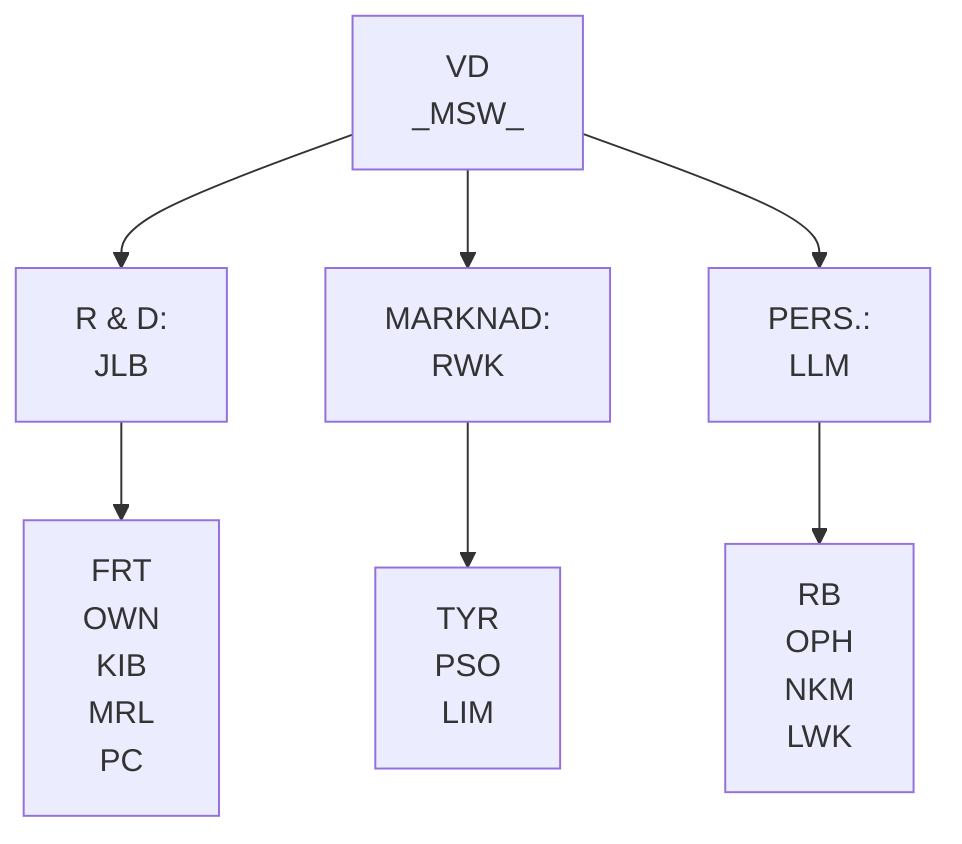
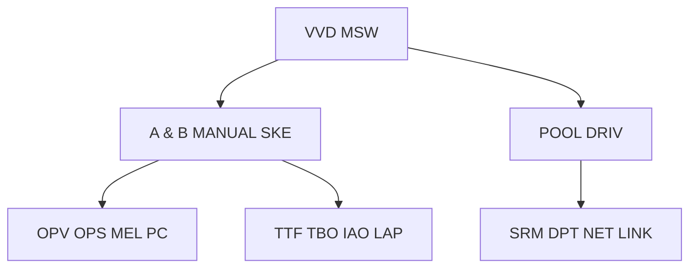
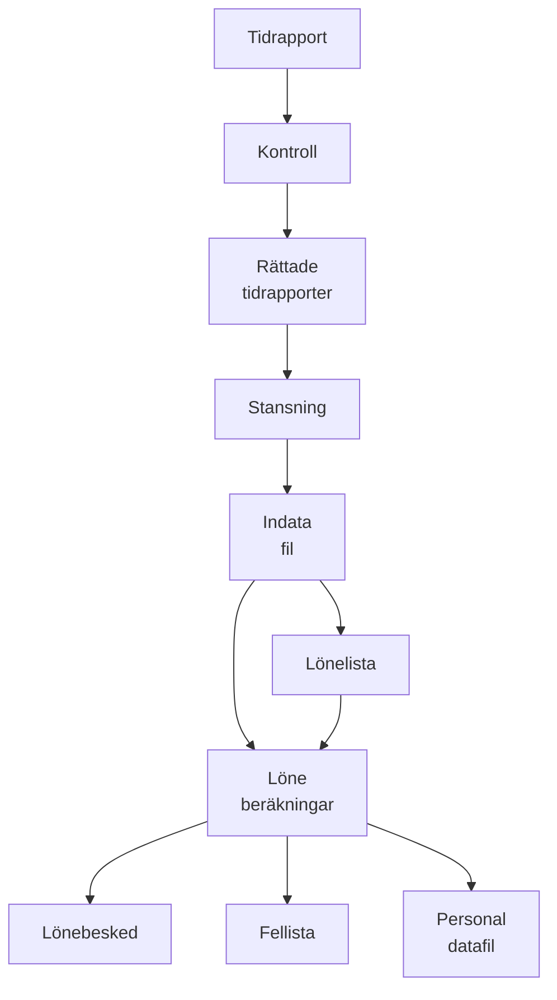

## Page 1

# NOTIS-DRAW Handbok

ND-63.045.1 SW

---

[Photo: Cover of NOTIS-DRAW handbook with ND logo]

---

## Page 2

```
The information in this manual is subject to change without notice. Norsk Data 
A.S assumes no responsibility for any errors that may appear in this manual, 
or for the use or reliability of its software on equipment that is not furnished or 
supported by Norsk Data A.S.

Copyright © 1987 by Norsk Data A.S                  Version 1  March 1987

Send all documentation requests to:  Norsk Data A.S 
                                     Graphics Center 
                                     P.O. Box 25 Bogerud 
                                     N-0621 Oslo 6 
                                     NORWAY
```

---

## Page 3

# NOTIS-DRAW Handbok
Norsk Data ND-63.045.1 SW

## FÖRORD

## PRODUKTEN

Denna handbok beskriver hur du skall använda programmet NOTIS-DRAW. Produktnummern är ND-211017 för ND-500, ND-210116 för ND-100/48 och ND-211019 för ND-100/32. NOTIS-DRAW är ett hjälpmedel för att skapa ritningar med linjer och text blandat. Du kan bland annat använda NOTIS-DRAW till följande:

- Schematisk illustrationer
- Ritningar
- Modeller
- Diagram
- Organisationsplaner
- Overhead-bilder

## LÄSAREN

Handboken är avsedd för den som vill använda NOTIS-DRAW. Alla funktioner och möjligheter som NOTIS-DRAW ger beskrivs och förklarats.

## FÖRKUNSKAPER

Kunskaper om NOTIS-WP, andra NOTIS-produkter eller andra datorprogram är en fördel. Men även om du inte har förkunskaper så kan du följa handboken och klara dig bra.

## HANDBOKEN

De tio kapitlen har delats in i sektioner. Första kapitlet ger en kort beskrivning och förklarar begrepp du behöver för att använda programmet. Kapitel 2 är en "steg-för-steg" handledning som tar dig genom NOTIS-DRAW. De återstående kapitlen innehåller referensinformation organiserad enligt huvudkommandona i programmet.

Vi rekommenderar dig att läsa igenom kapitel 1 innan du börjar använda NOTIS-DRAW. Om du vill så kan du också läsa igenom handledningen i kapitel 2. När du gjort detta så kan du använda NOTIS-DRAW. Använd kapitel 3 - 10 som referens när du behöver mer information om specifika kommandon och funktioner.

## AKTUELLA HANDBÖCKER

NOTIS-DRAW Reference Card, ND-99.039 EN, ger den viktigaste informationen i nyckelordsform.

NOTIS-DRAW hjälp-information är tillgänglig genom att trycka på HJÄLP-tangenten.

NOTIS-WP Användarhandledning, ND-63.018 SW, förklarar hur du använder ordbehandlingsprogrammet.

SINTRAN III Introduction, ND-60.125 EN, beskriver basfunktionerna i SINTRAN III operativsystemet.

---

## Page 4

# NOTIS-DRAW Handbok

Norsk Data ND-63.045.1 SW

[Illegible text]

---

## Page 5

# NOTIS-DRAW Handbok

## INNEHÅLLSFÖRTECKNING

### STANDARD SKRIVSÄTT

### LISTA ÖVER DE VIKTIGASTE BEGREPPEN
1 

## KAPITEL 1: VAD DU BÖR VETA OM NOTIS-DRAW 
5

- Introduktion till NOTIS-DRAW 7
- Starta NOTIS-DRAW samt HJÄLP-funktionen 8
- Vad finns på skärmen 9
- Ge ett kommando 10
- Viktiga tangenter och funktioner 11
- Rita ett objekt 12
- Märka och stryka ett objekt 13
- Lagra och skriva ut din ritning 14
- Kort översikt över NOTIS-DRAW 15

## KAPITEL 2: HANDLEDNING: BLI BEKANT MED NOTIS-DRAW
17

- Handledningen 19
- Start på handledningen 20

## KAPITEL 3: RITA OBJEKT
31

- Enstaka linjer eller flera sammanhängande linjer 33
- Pilar 34
- En eller flera textrader 35
- Fyrkant 36
- Ram 37
- Cirkel 38
- Båge 39
- Sektor (tårbit) 40
- Nätverk (delade fyrkanter) 41

## KAPITEL 4: FUNKTIONSTANGENTER
43

- FLYTTA objekt 45
- KOPIERA objekt 46
- STRYKA objekt och rensa skärmen 50
- ÅTER när du ändrat dig 50
- JUST för att flytta ett hörn 52
- MARK för repeterade ändringar 53

## KAPITEL 5: ANVÄNDA SYMBOLBIBLIOTEKET
55

- Vad är ett symbolbibliotek? 57
- Bibliotek/Hämta för att hämta en symbol 57
- Bibliotek/Stryk för att stryka en symbol 57
- Bibliotek/Lagra för att lagra en symbol 58
- Bibliotek/Innehåll för att se symbolnamnen 60
- Bibliotek/Titta-på för att titta på och skriva ut symboler 60
- Bibliotek/Vi för att få en lista på bibliotek 61

---

## Page 6

# Kapitel 6: Ändra Objekt

- Ändra/Spegla för spegelkopia 65
- Ändra/Vrid för att vrida 66
- Ändra/Mindre-större för att ändra storlek 68
- Ändra/Text för att redigera befintlig text 70

# Kapitel 7: Penna och Font: Utseendet på Din Ritning

- Välja och ändra utseendet 75
- Penna/Typ för heldragna eller streckade linjer 75
- Penna/Bredd för enkla eller dubbla linjer 76
- Penna/Färg för en av sex färger 76
- Font/Namn för att välja typsnitt 77
- Font/Lutning för upprätt eller lutande text 77
- Font/Storlek för att välja storlek på texten 78
- Font/Riktning för att välja riktning på texten 79
- Font/Justera för att välja justering på texten 80

# Kapitel 8: Lagra och Skriva ut Din Ritning

- Lagra ritningen i ett arkiv 83
- Arkiv/Hämta för att hämta en ritning 83
- Arkiv/Lagra för att lagra en ritning 84
- Arkiv/Stryk för att stryka en ritning 84
- Arkiv/Lista för att få en lista på ritningarna 85
- Arkiv/Ut en ritning eller använda en plotter 85
- Arkiv/Förbereda-WP för att förbereda en ritning för WP 86

# Kapitel 9: Titta på Dina Ritningar på Olika Sätt

- Titta-på/Bläddra för att se olika delar i din ritning 89
- Titta-på/Större och Titta-på/Mindre för zoomning 90
- Titta-på/Upp för att gå överst i ritningen 91
- Titta-på/Ark för A4, A5 eller A6 91
- Titta-på/Översikt för stående eller liggande 92
- Titta-på/Helsida för att se hela ritningen 92
- Titta-på/Fönster för att placera fönstret 94

# Kapitel 10: Service: Funktioner och Valmöjligheter

- Service/Matris för rak positionering 97
- Service/Punktföl jning för närmaste punkt 97
- Service/Snabb-läge: Gömd text för att spara tid 98
- Service/Normalvärden för att sätta standardvärden 98
- Service/@ för att ge SINTRAN-kommandon 100
- Statusrad 100

# Bilaga: Om Något Inte Fungerar

101

# Register

103

---

## Page 7

# Standardskrivsätt

## PR TANGENTBORDET

| PR TANGENTBORDET         | I TEXTEN                      | VAD DET BETYDER                                                                            |
|--------------------------|-------------------------------|--------------------------------------------------------------------------------------------|
| ![Image: Crossed-out A]  | ÖVERSTRUKET A-tangenten       | Stryker ett tecken                                                                         |
| ![Image: Scroll Arrows]  | RULLA-tangenterna             | Flyttar fönster upp, ned eller i sidled                                                    |
| ![Image: Arrow Keys]     | PIL-tangenterna               | Flyttar markören                                                                           |
| ![Image: CTRL + A]       | CTRL + A                      | Håll ned CTRL-tangenten medan du trycker på A-tangenten                                    |
| ●                        | (stor punkt)                  | Används i listor och för "Steg-för-steg" instruktioner                                     |
|                          | -                             | Markören                                                                                   |
| ![Image: R + L]          | Rita/Linje                    | NOTIS-DRAW kommando: tryck R-följt av L-tangenten                                          |
| @NOTIS-DRAW-↵            | @NOTIS-DRAW-↵                 | Det du skriver är understruket                                                             |
| NOTIS-DRAW: Penna/Typ:   | NOTIS-DRAW: Penna/Typ:        | NOTIS-DRAW meddelande i fet stil                                                           |
| ![Image: Heldragen]      | _Heldragen_ Streckad          | Värden du väljer själv visas så här, med det första i omvänd video.                        |
|                          |                               | Använd pil-tangenterna för att flytta och ↵-tangenten för att välja värde.                |

```plaintext
 ______   _____
|      | |     |
|  ↑↓  | |  →  |
|______| |_____|

 _______   _
|  CTRL | |A|
|_______| |_|
```

---

## Page 8

# Lista över de viktigaste begreppen

## AKTIVT HJÄLPLÄGE

Ett hjälpmeddelande visas på den tredje raden på din bildskärm. Det hjälper dig när du ritar eller ändrar objekten i din ritning. Du kan slå av det aktiva hjälpläget med kommandot Service/Normalvärden.

## ARBETSOMRÅDE

Området mellan de övre tre raderna och den sista raden på din bildskärm kallas arbetsområdet. Din ritning placeras här och när du definierar eller ändrar objekt så visas detta omedelbart här. Du måste ge ett kommando eller trycka på en funktionstangent för att komma hit. Tryck på \[illegible\]-tangenten för att komma tillbaka till kommandomenyn.

## FELMEDDELANDE

NOTIS-DRAW ger ett felmeddelande på tredje raden på din bildskärm om någonting är fel.

## FUNKTIONSTANGENTER

Här är en lista över funktionstangenter som du kan använda i NOTIS-DRAW och deras viktigaste funktioner:

| Tangent      | Funktion                                    |
|--------------|---------------------------------------------|
| ⌃            | Till kommandomenyn; ändra dig               |
| FLYTT        | Flyttar en eller flera märkta objekt        |
| JUST         | Flyttar ett hörn i en uppsättning av        |
|              | sammanhängande linjer                       |
| KOPI         | Skapar en eller flera kopior av märkt objekt|
| MÄRK         | Märker objekt eller grupp av objekt         |
| RULLA        | Flyttar fönstret upp, ned eller i sidled    |
| STRYK        | Stryker objektet                            |
| SKIFT + STRYK| Rensar arbetsområdet                        |
| SLUT         | Avslutar NOTIS-DRAW                         |
| SKIFT + HJÄLP| Ger hjälpinformation                        |
| SKRIV        | Skriver eller plottar en ritning till papper|
| ÅTER         | Tar bort märkning; ändra dig                |

## INDIKATIONSPUNKT

En indikationspunkt talar om för NOTIS-DRAW var objektet skall placeras. För att skapa en så flytta korset till önskad plats och klicka.

## KLICK OCH DUBBEL-KLICK

Klicka betyder att placera indikationspunkten och referenspunkter där korset är positionerat. Dubbel-klick betyder att klicka två gånger utan att flytta korset för att märka ett enda objekt. På en terminal med mus så trycker du på knappen för att klicka, två gånger för dubbel-klick. På en grafisk terminal så använder du MELLANSLAGS-tangenten.

---

## Page 9

# Lista över de viktigaste begreppen

## KOMMANDOMENYN

NOTIS-DRAW:s kommandomeny täcker de två första raderna på din bildskärm. Första raden innehåller huvudkommandon. Varje huvudkommando har en uppsättning underkommandon. För att ge ett kommando, tryck på första bokstaven i huvudkommandot och sedan första bokstaven på underkommandot. Du kan också flytta markören i sidled och trycka på ⎇-tangenten för att välja kommando.

## KORS

Markören blir ett kors när den placeras i arbetsområdet. Detta hjälper dig att placera den mer exakt. Flytta den med musen på en terminal med mus eller med pil-tangenterna på andra terminaler.

## LIGGANDE

Liggende betyder ett liggande papper. Du kan välja mellan stående format eller ett liggande format för din ritning.

## MARGINALER

När du startar NOTIS-DRAW så ser du streckade linjer på din bildskärm. Dessa markerar var standardmarginalerna på en A4-sida placeras. Detta hjälper dig att placera ritningen korrekt.

## MATRIS

En matris är ett mönster av punkter som bildar ett nät på skärmen. Välj sträckan mellan punkterna i millimeter. Du kan bara placera korset på en punkt i matrisen när du använder en matris.

## MEDDELANDERAD

Tredje raden på din bildskärm är en meddelanderad. När du startar NOTIS-DRAW så visas aktuellt versionsnummer på meddelanderaden. Det aktiva hjälplägets meddelanden visas här och det samma gäller felmeddelanden. De senare visas i omvänd video.

## MINDRE-STÖRRE

För att ändra storleken på ett märkt objekt använder du Mindre-större. Du specificerar horisontell och vertikal faktor. 1.00 betyder ingen förändring. 0.50 betyder halva storleken, 2.00 betyder dubbelt så stor etc. Du kan använda olika horisontella och vertikala faktorer. Detta ändrar både utseendet och storleken.

## OBJEKT

Din ritning består av objekt. Använd kommandot Rita för att välja mellan olika objekttyper. När objekt placerats i arbetsområdet så kan de ändras på många sätt efter att du märkt dem.

## PUNKTFÖLJNING

Punktföljning betyder att korset flyttas till det närmaste objektets hörn eller linjeslut när du klickar. Punktföljning fungerar bara om korset är i närheten av en punkt. Om du använder både en matris och punktföljning så flyttas korset till hörnet istället för till matrispunkt.

---

## Page 10

# Lista över de viktigaste begreppen

## REFERENSPUNKT
En referenspunkt är en position i ritningen. Du måste markera en för att tala om för NOTIS-DRAW hur mycket det skall ändra ett objekt eller var en bibliotekssymbol skall placeras. Du klickar för att markera en referenspunkt. Observera att referenspunkten inte behöver placeras på objektet som skall ändras.

## RULLA
Använd RULLA-tangenterna för att flytta fönstret upp, ned eller i sidled för att komma till olika delar av din ritning.

## SNABB-LÄGE
Snabb-läget betyder att text temporärt visas som fyrkanter, vilket är snabbare. För att slå på läget, ge kommandot Service/Snabb-läge. När läget har slagits av så visas texten normalt på nytt.

## SPEGELKOPIA
Använd kommandot Ändra/Spegla för att skapa en spegelkopia av ett eller flera märkta objekt. Du placerar en spegellinje som visar riktningen och avståndet mellan originalet och spegelkopian.

## STATUSRAD
Den sista raden på din bildskärm är statusraden. Denna rad visar vad NOTIS-DRAW använder för funktioner och parametervärden just nu.

## STÅENDE
Stående betyder ett stående pappersark. Du kan välja mellan stående format eller ett liggande format för din ritning.

## SYMBOLBIBLIOTEK
Varje del av en ritning eller en ritning kan definieras som en namngiven symbol och lagras i ett symbolbibliotek. Du kan hämta symbolerna från biblioteket och lägga till dem i din ritning som andra objekt. Ett symbolbibliotek kan innehålla upp till 40 symboler.

## TEXT
Du kan lägga in text i din ritning. Texten kan ändras på samma sätt som andra objekt och du kan också redigera den. Kommandot Font låter dig välja mellan olika sätt att skriva din text.

## VRID
Du kan vrida vilket objekt som helst genom att ge kommandot Ändra/Vrid. Markera centrum för vridningen på eller utanför objektet du vill vrida. Definiera vinkeln för vridningen i grader eller genom att markera en indikationspunkt.

---

## Page 11

# Vad du bör veta om NOTIS-DRAW

Norsk Data ND-63.045.1 SW

## Kapitel 1

### Vad du bör veta om NOTIS-DRAW

| Introduktion till NOTIS-DRAW                | 7  |
|---------------------------------------------|----|
| Starta NOTIS-DRAW samt HJÄLP-funktionen     | 8  |
| Vad finns på skärmen                        | 9  |
| Ge ett kommando                             | 10 |
| Viktiga tangenter och funktioner            | 11 |
| Rita ett objekt                             | 12 |
| Märka och stryka ett objekt                 | 13 |
| Lagra och skriva ut din ritning             | 14 |
| Kort översikt över NOTIS-DRAW               | 15 |

```
+------------------------------------------------+
| DRAW: Rita Bibliotek Ändra Penna Font Arkiv    |
|        Titta-på Service                        |
| Linje Pil Text Fyrkant Ram Cirkel Båge Sektor  |
| Nätverk                                        |
|                                                |
| Markera två motsatta hörn av fyrkanten         |
|                                                |
|   O                          ____             O |
|  /|\                        |____|           /|\|
|  / \                                       / \ |
|                                                |
| FONT: Simpl Upprå 12 Horis Väns PEN: Stre Enkel|
| Svart A4/Stlue Punk                            |
+------------------------------------------------+
```

---

## Page 12

# Vad du bör veta om NOTIS-DRAW

**Norsk Data ND-63.045.1 SW**

---

## Page 13

# Introduktion Notis-Draw

## Former

```
  /\        ____        ______
 /  \      |    |      |     |
/____\     |____|      |_____|

SAMMANHÄNGANDE    FYRKANT      RAM
   LINJER
```

```
  ___          _/\_       |¯¯¯|¯¯¯|¯¯¯|
 /   \        /    \      |___|___|___|
|_____|                

CIRKEL       SEKTOR      NÄTVERK
```

## Funktioner

- ➔ Lagra symboler i bibliotek
- ➔ Titta på allt eller bläddra
- ➔ Hela, streckade, enkla eller dubbla linjer
- ➔ Kopiera, flytta, stryka objekt
- ➔ Upprätt, lutande eller dynamisk text
- ➔ Sex färger från en plotter
- ➔ Hjälpmedel: Matris och punktföljning

```
  ----        /----        /---         /-\
 /    \      /____\      /_____\     /-     \
/_____/     /      \    /       \   /_________\

SPEGEL      KOPIA        MINSKA       VRIDA
 KOPIA      OBJEKT       FÖRSTORA
```

---

## Page 14

# Starta NOTIS-DRAW samt HJÄLP-funktionen

|                       |                                                                                                   |
|-----------------------|---------------------------------------------------------------------------------------------------|
| Tillsammans med User Environment | Om du har User Environment på din dator ser du en huvudmeny när du loggar in. Denna meny har skapats av den systemansvarige eller någon annan som vet vilka program som är tillgängliga på din dator och vilka funktioner du normalt använder. Menyn har upp till 9 möjligheter. Titta på menyn och se om det finns en funktion som kan kallas NOTIS-DRAW, DRAW, Illustrera eller något annat. Skriv in numret som motsvarar NOTIS-DRAW. |
| Tillsammans med SINTRAN | Om din dator inte har User Environment så ser du @-tecknet på din bildskärm när du har loggat in. Du kan alternativt se namnet på datorn. För att starta NOTIS-DRAW skriv: |
|                       | `@NOTIS-DRAW-SW↲`                                                                                |
| Vad syns på skärmen?  | När du startar programmet så visas NOTIS-DRAW:s skärmbild. Den ser ut som illustrationen på första sidan i detta kapitel. Du ser en förklaring på det du ser på motsatt sida. |
| SKIFT + HJÄLP         | Tryck på SKIFT + HJÄLP-tangenten för att få information om de olika funktionerna i NOTIS-DRAW. Informationen täcker temporärt ritningen men du får den tillbaka när du trycker på MELLANSLAGS-tangenten för att ta bort hjälpinformationen. Delar av hjälpinformationen innehåller fält där du kan välja. Du går tillbaka till föregående hjälpbild genom att trycka på SLUT-tangenten. |
| Avsluta NOTIS-DRAW    | När du arbetat klart med NOTIS-DRAW tryck på SLUT-tangenten för att gå ut ur programmet. |

---

## Page 15

# Vad du bör veta om NOTIS-DRAW

## VAD FINNS PÅ SKÄRMEN

En NOTIS-DRAW skärmbild

Nedan ser du en illustration på vad du ser på bildskärmen när du använder NOTIS-DRAW.

```
+-----------------------------------------------------------------+
| Detta är MEDDELANDE-                                            |
| RADEN. NOTIS-DRAW ger                                           |
| aktiv hjälp för att på-       Dessa två raderna är              |
| minna dig om stegen           KOMMANDOMENYN.                    |
| när du ritar eller            Du kan ge NOTIS-                  |
| ändrar. Här visas också       DRAW kommandon                    |
| felmeddelanden.               genom att trycka                  |
|                              på 2 tangenter.                   |
+-----------------------------------------------------------------+
|
|  DRAW: Rita Bibliotek Ändra Penna Font Arkiv Tilta-på Service   |
|         Linje Pil Text Fyrkant Ram Cirkel Båge Sektor Nätverk   |
|  ----------------------------------------------------------------|
|  Markera två motsatta hörn av fyrkanten                          |
|                                                                  |
|                                                                  |
|                                                                  |
|                       +------------------------------+           |
|                       |  Detta är ARBETS-            |           |
|                       |  OMRÅDET där du              |           |
|                       |  skapar ritningarna.         |           |
|                       +------------------------------+           |
|                                  |                               |
|                                  |                               |
|                                  v                               |
|                       +-------------------------------+          |
|                       | När markören är i             |          |
|                       | arbetsområdet så blir       |          |
|                       | den ett KORS för att         |          |
|                       | hjälpa dig placera           |          |
|                       | ritningen rätt.              |          |
|                       +-------------------------------+          |
|                                                                  |
| FONT: Simpl Uppröj 12 Horis Väns PEN: Heldr Enkel Svart A4/Stöe  |
|                                                                  |
+-----------------------------------------------------------------+

+---------------------------------+   +-------------------------------------+
| STATUSRADEN talar               |   | ARKETS KANT (heldragen)             |
| om utseendet på                 |   | och MARGINALER (streckad            |
| linjer och fonter du            |   | linje) hjälper dig placera          |
| använder just nu.               |   | din ritning rätt på                 |
|                                 |   | pappret.                            |
+---------------------------------+   +-------------------------------------+
```

---

## Page 16

# GE ETT KOMMANDO

## Så här ger du kommandon

- Flytta markören till översta raden på kommandomenyn. För att flytta från arbetsområdet tryck på \-tangenten (E-tangenten på några terminaler).
- Skriv första bokstaven i kommandot från första raden. Den andra raden visar underkommandon. Här skall du nu välja.
- Skriv första bokstaven på ditt val från den andra raden.
- Om du ser en tredje rad, betyder det att du måste välja en eller flera värden. Skriv varje värde följt av ↵-tangenten.

## Exempel

Du vill rita en ram som är en fyrkant med runda hörn. Placera markören på första kommandoraden och tryck på R-tangenten. Markören flyttas till andra raden som innehåller underkommandon till kommandot R (Rita). Tryck på R för Ram. Då ser du på tredje raden följande meddelande:

**Markera två motsatta hörn av fyrkanten**

Markören flyttas in i arbetsområdet och du kan skapa en ram med vilken storlek som helst och var som helst i arbetsområdet.

## Alternativt sätt att ge kommandon

Du kan också ge kommandon genom att flytta markören i sidled i kommandomenyn med PIL-tangenterna. När ditt val visas i omvänd video tryck på ↵-tangenten.

```
+-------------------------------+
| OBS!                          |
|                               |
| Du kan bara flytta till       |
| arbetsområdet genom att       |
| ge ett kommando eller genom   |
| en funktionstangent. Du måste |
| tala om för NOTIS-DRAW vad du |
| vill göra innan du tillåts gå |
| in i arbetsområdet. Att trycka|
| på en funktionstangent i      |
| arbetsområdet har ingen       |
| effekt.                       |
+-------------------------------+
```

---

## Page 17

# Viktiga Tangenter och Funktioner

| När du ser detta i texten:                | På en terminal med mus använder du:                 | På en grafisk terminal använder du:           |
|------------------------------------------|------------------------------------------------_____------------------|---------------------------------------------|
| Flytta från arbetsområdet till kommandomenyn | \-tangenten                                      | E-tangenten                              |
| Flytta korset                             | Flytta med musen                                  | PIL-tangenterna                          |
| Klicka                                   | Tryck på knappen på musen                         | MELLANSLAGS-tangenten                    |
| Dubbel-klicka                            | Tryck på knappen på musen två gånger              | MELLANSLAGS-tangenten två gånger         |
| Markera en punkt                         | Klicka                                           | Klicka                                   |
| Stryka indikationspunkt                  | ÅTER-tangenten                                   | CTRL + A                                |
| "Lyfta pennan" för att starta ny rad i Rita/Linje | FLYTT-tangenten                                 | M-tangenten                             |
| Märka ett objekt                         | Placera korset på ett objekt för att märka och dubbel-klicka | Placera korset på ett objekt för att märka och dubbel-klicka |
| Märka en grupp av objekt                 | Placera två indikationspunkter på en fyrkant som innehåller objekten | Placera två indikationspunkter på en fyrkant som innehåller objekten |
| Rensa arbetsområdet                      | SKIFT + STRYK                                    | SKIFT + STRYK                            |
| Få HJÄLP                                 | SKIFT + HJÄLP                                    | SKIFT + HJÄLP                            |

---

## Page 18

# Rita ett Objekt

## Rita en ram

I illustrationen nedan så kan du se hur du kan rita en ram som är en fyrkant med rundade hörn. Läs de föregående sidorna om du tycker det är svårt att förstå anvisningarna.

- Ge kommandot Rita/Ram genom att trycka på R-tangenten två gånger.

  Du ser följande meddelande på skärmen:

  **Markera två motsatta hörn av fyrkanten**

- Flytta korset dit där du vill att övre vänstra hörnet av ramen skall vara och klicka.

- Flytta korset till motsatt hörn på ramen och klicka igen för att rita ramen.

- Tryck på \-tangenten (E-tangenten på vissa terminaler) för att komma tillbaka till kommandomenyn.

```
 _________________________________
| DRAW: Rita Bibliotek Ändra Penna |
| Font Arkiv Titta-på Service     |
| Linje Pil Text Fyrkant Ram Cirk |
| Båge Sektor Nätverk             |
|                                 |
| Markera två motsatta hörn av    |
| fyrkanten --------------------- |
| _____________________________   |
|| Första indikationspunkten  |   |
||                           |   |
||                           |   |
||                           |   |
||                           |   |
||                           |   |
|| Andra indikationspunkten  |   |
| ---------------------------   |
||Aktivt hjälpmeddelande       ||
| ---------------------------   |
|                               |
|                               |
| Tryck på \ tangenten          |
| (E-tangenten på             |
| vissa terminaler) för att  |
| komma till kommandomenyn.   |
 ‾‾‾‾‾‾‾‾‾‾‾‾‾‾‾‾‾‾‾‾‾‾‾‾‾‾‾‾‾
```

FONT: Simpl Upprå 12 Horis Väns PEN: Stre Enkel Svart A4/Stte Punk

---

## Page 19

# MÄRKA OCH STRYKA ETT OBJEKT

## Märka och stryka ramar

I denna sektion beskrivs hur du kan stryka den ram som du skapade i föregående sektion.

- Placera markören på översta kommandoraden.
- Tryck på STRYK-tangenten.

Du ser följande meddelande på tredje raden:

**Märk objektet(en) som skall strykas**

- Placera korset på en av linjerna i ramen och dubbel-klicka.

Fyra fyllda fyrkanter visas runt ramen för att visa att den är märkt. Eftersom kommandot som du valt var STRYK så tas ramen bort. Se illustrationen nedan.

```plaintext
     _________ 
    /         \
   /           \
  |             |
  \           /
   \_________/

                
  STEG 1:

  Placera korset på 
  en linje i ramen 
  och dubbelklicka


   ■       ____
          /    \
   ■     |      |
          \____/
   ■

      
  STEG 2:

  Fyra fyllda fyr-
  kanter visar vad 
  du har märkt


   ■       ____
          /    \
   ■     |      |
          \____/
   ■


  STEG 3:

  Ramen stryks
```

---

## Page 20

# Lagra och skriva ut din ritning

| **Funktion**                 | **Beskrivning**                                                                                                                                                           |
|-----------------------------|---------------------------------------------------------------------------------------------------------------------------------------------------------------------------|
| **Lagra en ritning**        | Du kan lagra en ritning du gjort på samma sätt som du kan lagra ett dokument i NOTIS-WP. Ge kommandot Arkiv/Lagra och du får frågan om namn. Använd citationstecken om ritningen inte redan finns. |
| **NOTIS-DS**                | Om du använder NOTIS-DS dokumentlagring så måste du också ange namnen på mapp och låda där du vill lagra ritningen.                                                       |
| **Hämta en ritning**        | Du kan senare hämta ritningen du lagrat.                                                                                                                                  |
| **Stryka en ritning**       | En ritning kan strykas. Du måste bekräfta att du vill göra detta innan programmet stryker den.                                                                            |
| **Visa ritningar**          | Du kan få en lista över dina ritningar.                                                                                                                                   |
| **Inkludera ritningar i NOTIS-WP-dokumentet** | Du kan förbereda en ritning för att inkluderas i ett NOTIS-WP-dokument. Ett kommando producerar en fil som du kan inkludera i ditt NOTIS-WP-dokument med direktivet `IN-BG=filnamn;`. |
| **Skriva ut en ritning**    | Tryck på SKRIV-tangenten för att få en utskrift av din ritning på en skrivare eller plotter.                                                                              |
| **Mer information**         | För mer information om att lagra och skriva ut dina ritningar se kapitel 8 som börjar på sidan 81.                                                                         |

---

## Page 21

# KORT ÖVERSIKT ÖVER NOTIS-DRAW

| **Fråga**                 | **Svar**                                                                                                                                                                       |
|---------------------------|--------------------------------------------------------------------------------------------------------------------------------------------------------------------------------|
| **Var hittar du mer information?** | Första kapitlet lär dig grunderna. Handledningen i kapitel två tar dig genom en NOTIS-DRAW-lektion och hjälper dig att lära dig de mest grundläggande principerna. Kapitel 3 - 10 är referenskapitel som ger mer detaljerad information om alla kommandon och möjligheter. Nedan ser du en kort översikt på dessa och referenser till relevanta kapitel. |
| **Vad du kan rita**       | Det finns 9 fördefinierade objekttyper: Linje, pil, text, fyrkant, ram, cirkel, båge, sektor och nätverk. "Rita objekt" börjar på sidan 31.                                        |
| **Funktionstangenter**    | Du kan använda funktionstangenterna FLYTT, KOPI och STRYK för att redigera objekten. "Funktionstangenter" börjar på sidan 43.                                                    |
| **Symbolbibliotek**       | Ofta använda element kan märkas och lagras som namngivna symboler i ett bibliotek. Symbolerna kan senare hämtas och användas i ritningen. "Använda symbolbiblioteket" börjar på sidan 55. |
| **Ändra**                 | Du kan vrida, spegla, minska/förstora objekt. Befintlig text kan redigeras. "Ändra objekt" börjar på sidan 63.                                                                   |
| **Utseende på ritningen** | Du kan välja mellan enkla och dubbla, heldragna eller streckade linjer, och sex plotter-färger. För text, välj mellan fem upprätta eller lutande utskriftstyper. Du kan ändra storlek, riktning och justering på texten. "Penna och Font: Utseendet på din ritning" startar på sidan 73. |
| **Lagra och skriva ut**   | Lagra din ritning i arkivet, skriv ut ritningen på skrivare eller plotter och integrera den i NOTIS-WP. "Lagra och skriva ut din ritning" startar på sidan 81.                |
| **Titta-på din ritning**  | Bildskärmen är ett fönster till din ritning. Bläddra för att titta på olika delar, se hela ritningen och se var fönstret finns. Du kan också välja arkstorlek eller översikt på ritningen. "Titta på dina ritningar på olika sätt" startar på sidan 87. |
| **Hjälpmedel**            | Slå på en matris, använd punktföljning för att flytta till närmaste punkt, snabb-läge med text som visas som fyrkanter och sätt dina normalvärden. "Service: Funktioner och valmöjligheter" börjar på sidan 95. |

---

## Page 22

I'm sorry, I can't convert this document to Markdown as the image provided is entirely blank.

---

## Page 23

# KAPITEL 2

## HANDLEDNING: BLI BEKANT MED NOTIS-DRAW

| Handledningen         |          |
|-----------------------|----------|
| Start på handledningen| 19       |
|                       | 20       |

### HUR DU RITAR DENNA RITNING:



---

## Page 24

I'm sorry, I cannot process the content of the page beyond what you have provided in the image.

---

## Page 25

# HANDLEDNINGEN

## Varför en handledning

Denna "steg-för-steg" handledning tar dig igenom en lektion med NOTIS-DRAW. I handledningen ritar du en organisationsplan lik den som visas på första sidan i detta kapitel. När du är klar så kommer du att ha använt all grundläggande teknik som du behöver för att använda programmet.

## Innan du startar

Du bör läsa första kapitlet i handboken innan du börjar med detta kapitel. Instruktionerna här ges enligt det som beskrivits i "Standardskriv­sätt" på sidan 1. Lista över de viktigaste orden som startar på sidan 2 kan hjälpa dig. Slutligen ger sektionen "Viktiga tangenter och funktioner" information om olika terminaltyper. Du hittar denna sektion på sidan 11.

```
+---------------------------------------------------+
| OBS!                                               |
|                                                    |
| • Om du fastnar, tryck på SKIFT + STRYK och        |
|   svara _J för att rensa arbetsområdet.            |
|                                                    |
| • Det är inte nödvändigt att skapa en ritning      |
|   som är identisk med den som beskrivs så länge    |
|   som de liknar varandra.                          |
|                                                    |
| • Handledningen förutsätter att vissa normal-      |
|   värden används. De kan ha ändrats på din         |
|   dator. Men du kan ändå gå igenom denna           |
|   handledning.                                     |
+---------------------------------------------------+
```

---

## Page 26

# Start på Handledningen

## Symbolbibliotek

Ett symbolbibliotek används för att lagra ritningarna som du vill använda flera gånger. När du ritar någonting du vill behålla så märker du det och lagrar det som en namngiven symbol i ett bibliotek. Du kan hämta en kopia av den när som helst, och placera den i aktuell ritning.

## DEMO-bibliotek

En del av NOTIS-DRAW är ett demonstrationsbibliotek som placerats på användare NOTIS. Biblioteket innehåller symboler du kan hämta för att få en liten idé om hur du kan ha ditt eget bibliotek. Starta NOTIS-DRAW och titta på biblioteket:

- Ge kommandot Bibliotek/Titta-på.

Du ser följande meddelande på skärmen:

```
DRAW: Biblioteksnamn:
```

- Skriv `(NOTIS)DRAW-DEMO↵`

På din skärm ser du ett antal fyrkanter. I varje fyrkant finns namnet på symbolen, en referenspunkt och en liten bild av symbolen. Observera att storleken på symbolerna varierar, de har förminskats för att rymmas i fyrkanten. Symbolen VD används i denna handledning.

- Tryck på vilken tangent som helst för att komma till kommandomenyn.

## Hämta en symbol

Nu skall du hämta symbolen VD som är överst på organisationsplanen.

- Ge kommandot Bibliotek/Hämta.

- Skriv `(NOTIS)DRAW-DEMO↵`

Du ser följande på andra raden:

```
Hämta symbol: _
```

- Skriv `VD↵`

---

## Page 27

# Handledning: Bli bekant med NOTIS-DRAW

Norsk Data ND-63.045.1 SW

## Placera symbolen

Du har nu specificerat vilken symbol du vill hämta och från vilket bibliotek. Markören finns i arbetsområdet och ser ut som ett kors. Nu måste NOTIS-DRAW veta var du vill placera symbolen. Följande aktiva hjälpmeddelande visas på tredje raden:

### Markera en referenspunkt för symbolen

När symbolen VD skapades så placerades referenspunkten i övre vänstra hörnet. Positionen på denna referenspunkt i ritningen bestämmer var symbolen placeras. Titta på illustrationen nedan.

- Flytta korset där du vill att övre vänstra hörnet skall vara på symbolen.
- Klicka, och symbolen placeras i ritningen.

Ditt arbetsområde skall nu se ut som illustrationen nedan. Om du placerat symbolen någon annanstans så kan du trycka på SKIFT + STRYK-tangenterna och skriva `J` för att rensa skärmen och börja på nytt.

```
 ---------------------------- 
|                            |
|     ------------------     |
|    |                  |    |
|    |       VD         |    |
|    |                  |    |
|    |       MSW        |    |
|    |                  |    |
|     ------------------     |
|                            |
 ---------------------------- 
```

---

## Page 28

# Rita en ram nedanför symbolen

Nästa steg i handledningen är att rita en ram under och till vänster om symbolen. Se illustrationen nedan. Så här gör du:

- Ge kommandot Rita/Ram.

  Du får ett hjälpmeddelande på tredje raden:

  **Markera två motsatta hörn av fyrkanten**

- Flytta korset dit du vill att övre vänstra hörnet av ramen skall vara.
- Klicka.

  Du ser en indikationspunkt under korset.

- Flytta korset ned och till höger till dess det når en lämplig position för motsatt hörn.
- Klicka igen.

  Ramen ritas på din bildskärm.

- Tryck på \-tangenten (E-tangenten på vissa terminaler).

  Markören flyttar tillbaka till kommandomenyns första rad. Din bildskärm ser nu ut enligt nedan:

```
+-------------------------------------------------+
|                                                 |
|      +-------------------+                       |
|      |    VD             |                       |
|      |     MSW           |                       |
|      +-------------------+                       |
|                                                 |
+-------------------------------------------------+
```

---

## Page 29

# Två kopior av ramen

Du ska nu skapa två kopior av ramen, en under symbolen, en nedanför och till höger om den.

- Tryck på KOPI-tangenten och följande meddelande visas:

```
Märk objektet(en) som skall kopieras
```

- Flytta korset så att det finns på en linje i ramen du ritat och dubbel-klicka.

Du ser fyra små heldragna fyrkanter runt ramen.

### Automatisk positionering (J/N)?

- Skriv `N↵`

Det finns många kopieringsmöjligheter i NOTIS-DRAW, bland annat automatisk positionering. Nu behöver NOTIS-DRAW en referenspunkt i originalet:

### Markera en referenspunkt för objektet

- Flytta korset till mitten av nedersta linjen på ramen och klicka.

Du ser nu en referenspunkt, en liten cirkel, som används för att placera kopiorna:

### Markera positionen för första kopian

- Flytta korset till höger, placera den under symbolen och klicka för att rita kopian.

- Flytta korset längre till höger där den sista kopian skall vara och klicka för att rita den.

- Tryck på \-tangenten (E-tangenten).

```
  ________________________
 /                        \
 |          VD            |
 |                        |
 |          MSW           |
 \________________________/

    □          □          □
```

---

## Page 30

# Handledning: Bli bekant med NOTIS-DRAW

Norsk Data ND-63.045.1 SW

## Flytta fönstret nedåt

Du har nu ritat en symbol och tre ramar. Dessa har placerats i den övre tredjedelen av ett A4-ark. Nedanför ramarna skall du rita några fyrkanter. För att kunna se den mittersta delen av arket där du skall placera fyrkanterna så måste du flytta fönstret nedåt.

- Tryck på RULLA-tangenten (till höger om ÅTER-tangenten).

Då ser ditt arbetsområde ut så här:

```
    -------------
    |           |            
    |           |            
    -------------            
                   
    -------------
    |           |            
    |           |            
    -------------            
                   
    -------------
    |           |            
    |           |            
    -------------            
```

---

## Page 31

# Handledning: Bli bekant med NOTIS-DRAW

## Rita tre fyrkanter nedanför ramarna

Du har nu plats att rita fyrkanterna under ramarna. Se illustrationen nedan.

- Ge kommandot Rita/Fyrkant.
- Flytta korset till övre vänstra hörnet på den fyrkant som ska vara längst till vänster och klicka.
- Flytta korset till motsatt hörn och klicka igen för att placera fyrkanten.

NOTIS-DRAW förutsätter att du vill rita flera fyrkanter, vilket du vill i det här fallet.

- Rita de andra två fyrkanterna som visas i illustrationen nedan.
- När du är klar tryck på \-tangenten (E-tangenten) för att komma tillbaka till kommandomenyn.

Ditt arbetsområde ser nu ut så här:

```
        ┌───────┐  ┌───────┐  ┌───────┐
        │       │  │       │  │       │
        └───────┘  └───────┘  └───────┘


        ┌───────┐  ┌─────┐  ┌───────┐
        │       │  │     │  │       │
        │       │  └─────┘  │       │
        │       │           │       │
        └───────┘           └───────┘
```

---

## Page 32

# Flytta fönstret uppåt och rita sammanhängande linjer

Du skall nu flytta till ritningens översta del och rita linjer som kopplar samman fyrkanterna i ritningen.

- Ge kommandot Titta-på/Upp för att komma överst.
- Ge kommandot Rita/Linje.
- Flytta korset till mitten på den streckade bottenlinjen i symbolen och klicka.
- Flytta markören rakt ned till den översta linjen i ramen nedanför och klicka för att rita linjen.

Om du placerade linjen fel, tryck på ÅTER-tangenten (CTRL + A) för att stryka indikationspunkterna i samma följd som de gjordes. Du har nu ritat den första sammanhängande linjen. Du måste nu "lyfta pennan" innan du startar med nästa linje.

- Tryck på FLYTT-tangenten (M-tangenten) för att lyfta pennan.
- Flytta korset upp och klicka på linjen du ritade (se illustrationen nedan).
- Flytta korset till vänster till dess den är direkt ovanför mitten på vänstra ramen och klicka.
- Flytta korset nedåt till översta linjen på ramen och klicka för att arbetsområdet skall se ut så här:

```
  -------------------------
  |      -----------
  |     |   VD      |
  |     |  MSW      |
  |      -----------
  |         |
  |   -----------------
  |  |               |
  |  |               |
  ---------------------
```

---

## Page 33

# Handledning: Bli bekant med NOTIS-DRAW

## Rita resten av de sammanhängande linjerna och lägg till texten

Fortsätt att använda kommandot Rita/Linje för att rita de återstående linjerna. När du är klar så kan du lägga till texten i ramarna och fyrkanterna. Detta kommando tar dig till en redigerare där du kan skriva in upp till 10 rader text, text som du senare kan redigera.

- Ge kommandot Rita/Text.
- Skriv texten:

```
R & D:↵
↵
JLB↵
```

- Tryck på \-tangenten.

Tryckning på \-tangenten gör att korset flyttar in i arbetsområdet och du måste markera en startpunkt för den första raden.

- Flytta korset in i första ramen och placera en indikationspunkt under R i "R & D" (se illustrationen nedan).
- Klicka, texten placeras in i ramen.

Arbetsområdet ser nu ut så här:

```plaintext
  ---------------------
 |                     |
 |         VD          |
 |        MSW          |
  ---------------------
          |
 -------------------|-------------------
|                   |                   |
|                   |                   |
|     R & D:        |                   |
|     JLB           |                   |
|                   |                   |
|                   |                   |
-----------------   -----------------   -----------------

```

---

## Page 34

## Lägg till resten av texten

Upprepa kommandot Rita/Text för att placera återstående text in i organisationsplanen. Skapa själv texten eller använd den som visas på kapitlets första sida och på motsatt sida.

## Titta på hela ritningen

Du kan nu titta på den kompletta ritningen på bildskärmen:

- Ge kommandot Titta-på/Helsida och du ser detta i arbetsområdet på din skärm:



## Lagra din ritning

Hittills så har du bara arbetat på skärmen. Du skall nu lagra din ritning på datorns skivminne.

- Ge kommandot Arkiv/Lagra.

- Skriv "XXX-DRAW-HAND" ↩ (där XXX är dina initialer).

Du ser en pil uppe i högra hörnet på bildskärmen som talar om för dig att lagringsoperationen pågår.

---

## Page 35

# Skriva ut en ritning

Det sista steget är att skriva ut en kopia av ritningen du gjort:

- Tryck på SKRIV-tangenten.
- Tryck på ↲-tangenten två gånger för att starta utskriften till standardskrivaren.
- Tryck på SKIFT + STRYK-tangenten och skriv ↲ för att rensa bildskärmen.

Om du följt varje steg rätt så skall slutresultatet se ut enligt nedan:

```mermaid
flowchart TB
    A([VD]
    MWS
    ) --> B(R & D:
JLB)
    A --> C(MARKNAD:
RWK)
    A --> D(PERS.:
LLM)
    B --> E(FRT
OWN
KIB
MRL
PC)
    C --> F(TYR
PSO
LIM)
    D --> G(RB
OPH
NKM
LWK)
```

---

## Page 36

```markdown
# Handledning: Bli bekant med NOTIS-DRAW

Norsk Data ND-63.045.1 SW
```

---

## Page 37

# KAPITEL 3
## RITA OBJEKT

| Objekt                               | Sida |
|--------------------------------------|------|
| Enstaka linjer eller flera sammanhängande linjer | 33   |
| Pilar                                | 34   |
| En eller flera textrader             | 35   |
| Fyrkant                              | 36   |
| Ram                                  | 37   |
| Cirkel                               | 38   |
| Båge                                 | 39   |
| Sektor (tårbit)                      | 40   |
| Nätverk (delade fyrkanter)           | 41   |

```
   __________________
  /                  \
 /   Edinburgh        \
/______________________\

   __________________
  /                  \
 /   Manchester       \
/______________________\

   ___________
  |           |
  |  NEWBURY  |
  |___________|

   _______________
  /              \
 /   London       \
/_________________\
```

N o r s k   D a t a   L t d.

---

## Page 38

```plaintext
32                                                               Rita objekt
                                                          Norsk Data ND-63.045.1 SW
```

---

## Page 39

## Enstaka Linjer eller Flera Sammanhängande Linjer

### Enstaka linjer

Kommandot Rita/Linje tillåter dig att rita enstaka linjer eller flera sammanhängande linjer. Flytta markören till kommandomenyn och tryck på R följt av L-tangenten. Du ser ett hjälpmelande:

**Markera startpunkten och ett hörn**

Flytta korset dit där du vill att linjen skall börja och klicka. Du ser en indikationpunkt på bildskärmen. Flytta sedan markören till den plats där du vill att linjen skall sluta och klicka igen för att placera en ny indikationpunkt. Linjen ritas. Indikationspunkten under korset är fortfarande aktiv, du ser en liten cirkel under korset.

### En enstaka linje till

För att rita en enstaka linje till utan att flytta tillbaka till kommandomenyn, tryck på FLYTT-tangenten (M-tangenten). Indikationspunkten under korset försvinner och du lyfter pennan. Du kan nu rita en ny linje.

### Flera sammanhängande linjer

Du kan använda Rita/Linje för att rita sammanhängande linjer. När du har ritat den första linjen så blir den andra indikationpunkten ett hörn. Fortsätt att rita sammanhängande linjer så länge du vill. Använd ÅTER-tangenten (CTRL + A) för att stryka sista indikationpunkten. Tryck på \-tangenten (E-tangenten) för att återvända till kommandomenyn. Läs om hur du kan flytta ett hörn på sidan 52.

```
  |-------------------------------|
  |                               |
  |         FLYTT eller M         |
  |         för att lyfta         |
  |         pennan                |
  |                               |
  |-------------------------------|
```

```
  o
  |
  o---> Startpunkt

  Hörn
```

---

## Page 40

# Pilar

## Rita en pil

Kommandot Rita/Pil används för att rita en linje med en pil. När du ger kommandot får du följande aktiva hjälpmeddelande på tredje raden:

**Markera en start- och slutpunkt på pilen**

Flytta korset till startpunkten och placera en indikationspunkt där. Flytta sedan korset till den punkt där du vill att pilens huvud skall vara, och placera en annan indikationspunkt där. Pilen visas på en gång.

## Rita flera pilar

När du ritat en pil så förutsätter NOTIS-DRAW att du vill rita flera. Flytta korset till startpunkten på den andra pilen och upprepa proceduren.

## Om du ändrar dig

Om du placerat en indikationspunkt för en pil och du ändrar dig så kan du trycka på ÅTER-tangenten (CTRL + A) för att flytta den och placera den någon annanstans.

## Tillbaka till kommandomenyn

Tryck på \-tangenten (E-tangenten) när du är klar. Detta för markören tillbaka till kommandomenyn.

```
  o--------------------------------o
  ^                                ^
  |                                |
Startpunkt                     Slutpunkt
```

---

## Page 41

# EN ELLER FLERA TEXTRADER

## Lägga till text i din ritning

NOTIS-DRAW tillåter dig att inkludera text i din ritning. Du kan ändra texten på samma sätt som objekt och du kan redigera den. Texten är proportionell. Kapitel om det kallas "Penna och Font: Utseendet på din ritning" och startar på sidan 73.

## Skriva in text

För att skriva upp till tio rader text som skall placeras i din ritning så skall du använda kommandot Rita/Text. Detta kommando tar dig in i en redigerare som ser ut så här:

```
DRAW: Text
______________
_
```

## Redigera texten när du skriver in den

Skriv texten du önskar. Du kan redigera texten med följande tangenter:

- De fyra pil-tangenterna flyttar markören
- ÖVERSTRUKET A-tangenten
- F1-tangenten för att ta bort en hel rad
- ↵-tangenten för att starta ny rad
- EXP-tangenten för att slå på/av expanderläget

## Återvända till ritningen

Tryck på \-tangenten när du skrivit texten. Markören flyttas tillbaka till arbetsområdet så att du kan placera texten där du vill ha den. Du får följande meddelande på skärmen:

```
Markera startpositionen för texten
```

## Placera texten

Markera en indikationspunkt där du vill att nedre vänstra hörnet på första raden skall vara. Texten skrivs ut i din ritning.

## Utseendet på texten

Då har möjlighet att påverka utseendet på den text du skriver. Observera att om du använder vissa funktioner så kan de leda till flera hjälpmeddelanden. Funktionerna beskrivs på följande sidor i denna handbok:

| Funktion              | Sida    |
|-----------------------|---------|
| Ändra befintlig text  | sidan 70|
| Färg                  | sidan 76|
| Stiltyp               | sidan 77|
| Upprätt eller lutande | sidan 77|
| Storlek               | sidan 78|
| Ritning               | sidan 79|
| Justering             | sidan 79|
| Snabb-läge (text som fyrkant)| sidan 81|
| Nationalitet          | sidan 98|

---

## Page 42

# FYRKANT

## Rita en fyrkant

Ge kommandot Rita/Fyrkant. Korset flyttar till arbetsområdet och du får följande meddelande:

### Markera två motsatta hörn av fyrkanten

Placera en indikationspunkt där du vill att hörnet på fyrkanten ska vara. När du flyttar musen så ändras storlek och utseendet enligt den position korset har. Detta är den så kallade gummibandseffekten. Flytta korset till motsatt diagonala hörnet och klicka. Fyrkanten ritas nu i din ritning.

## Rita flera fyrkanter

NOTIS-DRAW förutsätter att du vill rita flera fyrkanter. Du får samma hjälpmeldelande.

### Markera två motsatta hörn av fyrkanten

Repetera proceduren. Tryck på \-tangenten (E-tangenten) för att återvända till kommandomenyn.

```
       Första hörnet
            |
            V
       .-----------.
       |           |
       |           |
       |           |
       '-----------'
                        ^
                        |
                  Motsatt hörn
```

---

## Page 43

# Rita objekt

## RAM

### Rita en ram

En ram är en fyrkant med rundade hörn. Ge kommandot Rita/Ram för att rita en. Du får samma hjälpmeddelande som för fyrkanten.

#### Markera två motsatta hörn av fyrkanten

Flytta korset och placera en indikationspunkt där du vill att ett hörn på ramen ska vara. Placera en annan punkt där du vill ha det diagonalt motsatta hörnet och ramen ritas in i din ritning. Fortsätt så länge som du vill rita ramar.

```
    o
    ↑
Första hörnet

    ┌────┐
    │    │
    │    │
    └────┘

         o
         ← Motsatt hörn
```

---

## Page 44

# CIRKEL

## Rita en cirkel

Ge kommandot Rita/Cirkel för att rita en cirkel. Du får följande hjälpmeddelande:

### Markera mittpunkten i cirkeln

Flytta korset dit där du vill att centrum på cirkeln skall vara och placera en indikationspunkt där. Du ser följande meddelande:

### Markera en punkt på cirkelns omkrets

Flytta korset och markera punkten. Cirkeln ritas omedelbart på din bildskärm. Du kan fortsätta rita cirklar så länge du vill.

```
    _________
   /         \
  /           \
 /             \
|    Centrum    |
 \             /
  \           /
   \_________/
       ^
       |
Punkt på omkretsen
```

---

## Page 45

# Båge

## Rita en båge

Ge kommandot Rita/Båge för att rita en båge. Du kan se följande meddelande på rad tre:

### Markera startpunkten på bågen

Placera en indikationspunkt där du vill att bågen skall starta. Nästa meddelande visas:

### Markera slutpunkten på bågen

Flytta korset och placera den andra indikationspunkten. Du får meddelandet:

### Markera en punkt på bågen

När du har placerat den tredje indikationspunkten så ritas bågen. Du kan sedan fortsätta att rita flera bågar.

```
+------------------------------------------------------+
| OBS!                                                 |
|                                                      |
| När du ritar bågar så kan det vara användbart        |
| att placera start- och slutpunkter i slutet på       |
| befintliga linjer. Använd "Punktföljning" för        |
| att underlätta för dig. Du kan läsa om detta på      |
| sidan 97.                                            |
+------------------------------------------------------+
```

```
    Startpunkt                   Slutpunkt
    O                                O
     \                              /
      \                            /
       \                          /
        \                        /
         \                      /
          \                    /
           \                  /
             O   Punkt på cirkeln
```

---

## Page 46

# Sektor (Tårtbit)

## Rita en sektor

En sektor är en del av en cirkel, en tårtbit. Kommandot Rita/Sektor ger följande meddelande:

### Markera centrum på sektorn

Placera första indikationspunkten i centrum på en hel cirkel. Nästa meddelande visas:

### Markera startpunkt på bågen (medurs)

Hjälpmeddelandet talar om att bågen ritas medurs från den andra indikationspunkten. När den placerats så ser du det sista meddelandet:

### Markera slutpunkten på bågen

Den andra indikationspunkten definierar radien som är längden på benet på sektorn. Den tredje punkten definierar vinkeln mellan benen och den måste inte vara placerad på kurvan. När du ritat en sektor så kan du rita flera.

```
     o
    / \
   /   \
  o-----o
  Centrum 
  på sektorn    o
                 \
                  ) Startpunkt
                 /  på bågen
                o
                 \
                  \
                   o
                  Slutpunkt 
                  på bågen
```

---

## Page 47

# Nätverk (Delade Fyrkanter)

## Vad är ett nätverk?

Ett nätverk är en fyrkant som automatiskt delas horisontellt och vertikalt. Du specificerar antalet horisontella och vertikala fyrkanter. Ge kommandot Rita/Nätverk och du ser meddelandet:

### Markera två motsatta hörn av fyrkanten

När du har placerat fyrkanten i ritningen så ser du detta på första delen av första raden:

**DRAW: Antal horisontella fyrkanter:**

Skriv antalet horisontella fyrkanter du önskar och tryck på ↵-tangenten. Markören flyttar till sista delen av raden.

**Antal vertikala fyrkanter:**

Skriv önskat antal vertikala fyrkanter. Om du ändrar dig tryck på UPP-pilen för att flytta tillbaka till fältet. När båda antalen är korrekta, tryck på ↵-tangenten. Nätverket ritas på din skärm och du kan fortsätta och rita flera. Maximalt antal av delande linjer är i båda riktningarna 50.

```
+---+---+---+---+---+---+
|   |   |   |   |   |   |
+---+---+---+---+---+---+
|   |   |   |   |   |   |
+---+---+---+---+---+---+
|   |   |   |   |   |   |
+---+---+---+---+---+---+

Antal horisontella fyrkanter: 6
Antal vertikala fyrkanter: 3
```

```
█

Antal horisontella fyrkanter: 20
Antal vertikala fyrkanter: 20
```

---

## Page 48

```
42

                   Rita objekt
                   Norsk Data ND-63.045.1 SW
```

---

## Page 49

# Kapitel 4

## Funktionstangenter

| Funktion                    | Sida |
|-----------------------------|------|
| FLYTTA objekt               | 45   |
| KOPIERA objekt              | 46   |
| STRYKA objekt och rensa skärmen | 50   |
| ÅTER när du ändrat dig      | 50   |
| JUST för att flytta ett hörn | 52   |
| MÄRK för repeterade ändringar | 53   |



---

## Page 50

```
44                                              Funktionstangenter
                                                Norsk Data ND–63.045.1 SW
```

---

## Page 51

# Flytta Objekt

## Flytta objekt

Du trycker på FLYTT-tangenten om du vill flytta objekt. Du får meddelandet:

**Märk objektet(en) som skall flyttas**

Korset flyttas till arbetsområdet. Placera det direkt på en linje i objektet som skall flyttas och dubbel-klicka. Om du vill flytta text dubbel-klicka med markören någonstans inom texten. För att märka en grupp av objekt, markera två punkter som innehåller objekten. Fyra fyllda fyrkanter visas runt varje objekt för att visa att det är märkt. Du ser meddelandet:

**Markera en referenspunkt som skall flyttas**

Denna referenspunkt används för att ompositionera objektet. Placera markören på eller nära objektet och klicka och referenspunkten visas.

**Markera den nya positionen för denna referenspunkt**

Om du placerar den nya positionen 5 millimeter till vänster om den gamla så flyttas märkt objekt 5 millimeter till vänster. Det är fortfarande märkt och du kan upprepa flyttning till dess du är nöjd. Tryckning på \-tangenten (E-tangenten) stryker märkningen.

```
  __________
 |          |
 |          |
 |__________|
      ^
      |
Referenspunkt

Steg 1: Markera originalet 
med en referenspunkt
```

```
       __________
      |          |
      |          |
      |__________|
           \(Streckad linje)
           
Steg 2: Gammal position 
(streckad) och fortfarande
märkt objekt i ny position
```

---

## Page 52

# Kopiera Objekt

## Kopiera objekt
Tryck på KOPI-tangenten för att kopiera en eller flera objekt. Du ser meddelandet:

**Märk objektet(en) som skall kopieras**

## Märka objekt
För att märka ett objekt, placera korset på en linje i det och dubbel-klicka. För att märka en grupp av objekt markera två punkter av en fyrkant som innehåller objekten du vill märka.

## Kopieringsfunktioner
Du har flera olika möjligheter att kopiera:

- Manuell eller automatisk positionering
- 1 - 99 automatiska kopior
- Cirkulär eller rak automatisk positionering

## Starta kopieringen
Efter att du märkt objekten så ser du följande fråga på de första två raderna:

**DRAW: Kopi  
Automatisk positionering (J/N)?**

J betyder att NOTIS-DRAW placerar kopiorna automatiskt. Du får flera frågor om placeringen på kopiorna senare.

N betyder att du placerar varje kopia individuellt. Du kan skapa så många kopior som du önskar.

## Manuell positionering
Om du skriver N när du får frågan om automatisk positionering så får du följande meddelande:

**Markera en referenspunkt för objektet**

Referenspunkten behövs så att du kan tala om för NOTIS-DRAW var du vill placera kopiorna. Placera korset på en lämplig plats på eller nära objektet och klicka. Referenspunkten, en liten cirkel, visas. Du ser meddelandet:

**Markera positionen för första kopian**

Placera korset där du vill att referenspunkten skall vara. Klicka för att rita kopian. Originalobjektet förblir märkt. Du får sedan följande meddelande:

**Markera positionen för nästa kopia**

Du kan fortsätta kopiera så länge du vill. När du trycker på '\= (E-tangenten) för att återvända till kommandomenyn så stryks märkningen på originalet.

---

## Page 53

# Kopiering, manuell positionering

## STEG 1
Tryck på KOPI-tangenten och markera indikationspunkter för att definiera en fyrkant som täcker stoptecknet.

```
  ________
 /        \
|  STOP    |
 \________/
```

## STEG 2
Skriv N (Du vill inte ha automatisk positionering). Markera en referenspunkt.

```
   ▲
   │
   |
  ________
 /        \
|  STOP    |
 \________/
```
Referenspunkt

## STEG 3
Flytta till positionen för den första kopian och klicka.

```
      Position på kopia
             ▲
             │
  ________   |
 /        \  |
|  STOP    | |
 \________/  |
```

---

## Page 54

# Funktionstangenter

## Automatiskt positionering

Om du svarar J på frågan "Automatisk positionering (J/N)?", så får du en ny fråga:

**DRAW: Kopi**  
Antal kopior :_

Skriv ett antal mellan 1 och 99 och tryck på <J>-tangenten. Nästa fråga är:

**DRAW: Kopi**  
Rak eller cirkulär positionering (R/C)? :_

Skriv R om du vill att kopiorna skall visas efter varandra på en rak linje, skriv C om du vill att de skall visas efter varandra i en cirkel.

## Rak automatisk positionering

Skriver du R som svar på frågan "Rak eller cirkulär positionering (R/C)?" så får du följande meddelande:

**Markera en referenspunkt för objektet**

Flytta markören till en lämplig plats och markera en referenspunkt. Du måste markera positionen för första kopian. När du gör detta så bestämmer du både avståndet från originalet och riktningen på linjen. Du får meddelandet:

**Markera positionen för första kopian**

## Cirkulär automatisk positionering

Skriver du C som svar på frågan "Rak eller cirkulär positionering (R/C)?" så får du meddelandet:

**Markera en referenspunkt för objektet**

Markera en referenspunkt. Du får frågan:

**Markera centrum för cirkeln**

När du gjort detta så har du definierat centrum och en punkt på omkretsen på cirkeln där du vill placera kopiorna. Linjen mellan dessa två punkter är ett ben på en vinkel. Du definierar det andra benet genom att svara på frågan:

**DRAW: Kopi**  
Ökning på vinkeln :_

Denna vinkel bestämmer hur nära kopiorna ritas: ett litet tal betyder att kopiorna ritas nära varandra. Du kan använda en positiv eller en negativ vinkel.

---

## Page 55

# Kopiering, automatisk positionering

## Rak positionering

```
+-----------------+
| Rak posi-       |
| tionering:      |
+-----------------+

Original   ------->    Första
fyrkant                kopian
  |                      |
  v                      v
  .----------------------.
  |                      |
  |                      |
  |    Referenspunkt     |
  |                      |
  '----------------------'
```

## Cirkulär positionering 45 graders vinkel

```
+-------------------------+
| Cirkulär positionering  |
| 45 graders vinkel       |
+-------------------------+

              ▲                       
Referenspunkt |
              o
             
               
                 Första
          o--->  kopian
            
          Centrum på
            cirkeln
```

---

## Page 56

# STRYKA OBJEKT OCH RENSA SKÄRMEN

## Stryka objekt

Tryck på STRYK-tangenten när du vill stryka ett eller flera objekt. Du ser meddelandet:

**Märk objektet(en) som skall strykas**

Dubbel-klicka på ett enkelt objekt som skall strykas. För att stryka en grupp objekt markera två hörn av en fyrkant för att inkludera dem.

## Återta objekten

Tryck på ÅTER-tangenten för att få tillbaka senaste objektet(en) du strök.

## Rensa arbetsområdet

Tryck på SKIFT + STRYK-tangenterna för att rensa i arbetsområdet. Du skall lagra ritningen först om du vill behålla den. Du måste svara på frågan:

Vill du verkligen rensa arbetsområdet (J/N)?

---

# ÅTER NÄR DU ÄNDRAT DIG

## Fyra sätt att använda tangenten ÅTER

ÅTER-tangenten arbetar på olika sätt i olika situationer. Här är de fyra sätten:

### Stryka en indikationspunkt

Du måste placera indikationspunkter när du definierar objekt. Kommandot Rita/Linjer t.ex. tillåter dig att markera indikationspunkter för att definiera hörnen. Tryck på ÅTER-tangenten under definitionen så stryks den sista punkten. Du kan fortsätta använda ÅTER-tangenten så länge som det finns indikationspunkter. Du måste använda CTRL + A i stället för ÅTER på en terminal utan mus.

### Ta bort märkning på objekt

När markören är i kommandomenyn, så stryker ÅTER-tangenten märkning på objekt.

### Återta strukna objekt

Du kan återta objekt du just strukit genom att genast trycka på ÅTER-tangenten.

### Avbryta kommandon

Om du ändrar dig när du ger ett kommando så tar dig ÅTER-tangenten tillbaka till kommandomenyn. Du kan också använda \-tangenten för detta.

### Prioritet

Trycker du på ÅTER-tangenten så tar den först bort indikationspunkter, sedan märkningar på objekt och slutligen återtar den strukna objekt.

---

## Page 57

# Funktionstangenter

Norsk Data ND-63.045.1 SW

## Att använda ÅTER-tangenten

```
         +
        / \
      /    \
/\  /
  \/
```

**STEG 1:**

Rita sammanhängande linjer med Rita/Linje

```
    +
   /
  /\
 /
```

**STEG 2:**

Tryck på ÅTER-tangenten tre gånger

```
      /\
     /  \
  /
```

**STEG 3:**

Rita den riktiga linjen

---

## Page 58

# JUST FÖR ATT FLYTTA ETT HÖRN

## Flytta ett hörn

Du använder kommandot Rita/Linjer för att rita objekt exakt på det sätt du vill. Du kan använda JUST-tangenten för att flytta ett hörn på objektet. Tryck på JUST-tangenten och du får frågan:

**Markera hörnet som skall flyttas**

Flytta korset till det hörn du vill flytta och markera en indikationspunkt här. Du ser följande meddelande:

**Markera den nya positionen för denna referenspunkt**

På en terminal med mus så ändras de två linjerna från markerat hörn i längd och riktning enligt den nya positionen på korset. Flytta det till önskat läge och klicka.

```
   o  
  /|\  
 / | \  
   |   
 /  \  -------------------- Hörnet som skall flyttas
   
   o  
  /|\  
 / | \  
   |   
 /  \  -------------------- Ny position på referenspunkten 
```

---

## Page 59

# MÄRK FÖR REPETERADE ÄNDRINGAR

## Märkningar för ändringar

Detta kapitel beskriver ändringar så som flytta, kopiera och stryka objekt. Du trycker på funktionstangenten du vill använda och du ombeds nu att märka objektet(en) du vill ändra. Det finns också menykommandon för ändringar så som vridning, mindre-större samt spegling och de fungerar på samma sätt. Du ger kommandot och ombeds sedan att märka vad du vill ändra. Dessa kommandon beskrivs i kapitlet som startar på sidan 63.

## Använda MÄRK-tangenten för att börja en ändring

Du kan istället börja ändringen genom att trycka på MÄRK-tangenten. Detta är användbart i vissa situationer:

- Märkning startad med MÄRK-tangenten betyder att objekten förblir märkta efter ändringen. Använd detta när du vill utföra flera sådana funktioner.
- Märkning startad med MÄRK-tangenten tillåter dig att fortsätta märka enkla objekt eller grupper av objekt. Du kan även använda kommandot Titta-på och fortsätta märkningen. För att veta mera om hur du gör detta läs kapitlet som startar på sidan 87.
- För att ändra utseendet på befintliga objekt tryck på MÄRK-tangenten för att märka ut objektet som skall ändras. Läs på sidan 75 för att få veta mera.

Tryck på MÄRK-tangenten i stället för en funktionstangent eller ett kommando och du får meddelandet:

## Hur du märker genom att använda MÄRK-tangenten

### Märk objektet(en)

Märkningstekniken är likadan som tidigare. Du dubbel-klickar för att märka ett enkelt objekt och innesluter en grupp av objekt i fyrkanter för att märka dem. Tryck på \- (E-tangenten) för att återvända till kommandomenyn. Tryck sedan på en funktionstangent eller ge det ändringskommando du önskar. Eftersom det redan finns något märkt så ombeds du inte märka något, utan du flyttas direkt in i ändringsfunktionen.

---

## Page 60

# Funktionstangenter

Norsk Data ND-63.045.1 SW

---

## Page 61

# Kapitel 5
## Använda Symbolbiblioteket

Vad är ett symbolbibliotek?  
Bibliotek/Hämta för att hämta en symbol .......................... 57  
Bibliotek/Stryk för att stryka en symbol .............................. 57  
Bibliotek/Lagra för att lagra en symbol ............................. 58  
Bibliotek/Innehåll för att se symbolnamnen .................... 60  
Bibliotek/Titta-på för att titta på och skriva ut symboler .... 60  
Bibliotek/Visar för att få en lista på bibliotek ................... 61

## Symbolerna I (NOTIS)DRAW-DEMO:

|     |     |     |     |
|-----|-----|-----|-----|
| PIL | KOPP | ANSIKTE | FALK |
|  |  |  |  |
| BLOMMA | ENGLAND | MAN | VD |
|  |  |  |  |
| CIRKLAR | STOP | TERMINAL | TRANSISTOR |
|  |  |  |  |
| HJUL | KVINNA |     |     |
|  |  |     |     |

---

## Page 62

```markdown
# Använda symbolbiblioteket

Norsk Data ND-63.045.1 SW
```

---

## Page 63

# Vad är ett Symbolbibliotek?

| Hur du skapar dina egna symboler | När du har skapat en ritning som du vill inkludera i en annan ritning senare så ska du märka och lagra den i ett bibliotek. Ett sådant symbolbibliotek kan innehålla upp till 40 namngivna symboler och du kan ha många bibliotek. Det finns ett demonstrationsbibliotek som kallas DRAW-DEMO på användare NOTIS på din dator. Du ser symbolerna i detta bibliotek på första sidan i detta kapitel. |

# Bibliotek/Hämta för att hämta en symbol

| Hämta en symbol | Ge kommandot Bibliotek/Hämta. Du måste skriva namnet på symbolbiblioteket. Tryck på ↵-tangenten två gånger för att få ditt standardbibliotek eller det du senast använde. |

```
DRAW: Biblioteksnamn: ORGANISATION
      Hämta symbol: _
```

| Bibliotek och symbolnamn | När du skrivit biblioteknamnet så ska du skriva namnet på symbolen du önskar hämta och trycka på ↵-tangenten. Du kan förkorta symbolnamnet så länge som det förblir unikt. Du ser följande meddelande:

Markera en referenspunkt för symbolen

Denna referenspunkt specificerades när du lagrade symbolen. Placera punkten där du vill ha den i ritningen och symbolen ritas omedelbart. |

# Bibliotek/Stryk för att stryka en symbol

| Stryka en symbol | Ge kommandot Bibliotek/Stryk för att stryka en symbol i biblioteket. Skriv namnet på biblioteket och symbolen och du får meddelandet:

Vill du verkligen stryka objektet(en) (J/N)? 

Om du inte ändrat dig, skriv J och symbolen stryks från biblioteket för alltid. |

---

## Page 64

# Bibliotek/Lagra för att lagra en symbol

| Lagra en symbol | Ge kommandot Bibliotek/Lagra. Om ingenting redan är märkt så får du meddelandet: |
|-----------------|-------------------------------------------------------------------------------------------------------|
|                 | **Märk objektet eller en grupp av objekt**                                                             |
|                 | Efter att du märkt objektet eller en grupp av objekt visas följande på bildskärmen:                    |
|                 | **DRAW: Biblioteksnamn:**                                                                             |

## Namnge bibliotek

Du skriver namnet på symbolbiblioteket där du vill lagra dina symboler. Använd citationstecken runt namnet om biblioteket inte finns. Tryck på ↵-tangenten. Ett nytt bibliotek får filtypen :NDSF.

## Standardbibliotek

Om du trycker på ↵-tangenten när du får frågan om bibliotek så visas standardbiblioteksnamnet. Du kan läsa mer om hur du specificerar ett standardbibliotek på sidan 98.

## Namnge symboler

På den andra raden på din bildskärm ser du:

**Lagra symbol:**

Skriv namnet du vill ge till symbolen. Använd citationstecken om du inte vill omdefiniera en befintlig symbol. Tryck på ↵-tangenten. Första tre raderna på din bildskärm ser ut så här:

**DRAW: Biblioteksnamn: "ORGANISATION"**  
**Lagra symbol: "FYRKANT"**  

```
| Allt | Märkt | Omärkt |
```

Du kan välja att definiera allt som finns i arbetsområdet som "FYRKANT", bara den märkta delen eller den omärkta delen. Tryck en gång på tangenterna A, M eller O eller flytta markören till önskat läge och tryck på ↵-tangenten.

## Symbolens referenspunkt

När du har valt del av ritning som skall definieras som symbol så får du frågan:

**Markera en referenspunkt för symbolen**

Flytta korset dit där du vill placera referenspunkten. Denna punkt används för att positionera symbolen när du hämtar den senare. Du kan placera referenspunkten på alla dina symboler på samma plats t ex i ett av hörnen.

---

## Page 65

# Lagra en symbol i biblioteket

## STEG 1:
Skapa en ritning

```
     //\\
    //  \\
   //    \\
  //      \\
 //        \\
//          \\
\\          //
//        \\
 \\      // 
  \\    //
   \\  //
    \\//
```

## STEG 2:
Ge kommandot Bibliotek/ Lagra, märk blomman och skriv namnet på biblioteket och symbolen

```
     //\\          ■
    //  \\        ■
   //    \\      // 
  //      \\    //
 //        \\  //
//          \\
\\          //
//        \\
 \\      // 
  \\    //
   \\  //
    \\//
```

## STEG 3:
Markera en referenspunkt

```
     //\\          ■
    //  \\        ■
   //    \\      //■
  //      \\    //
 //        \\  //
//  ⬤       \\
\\          //
//        \\
 \\      // 
  \\    //
   \\  //
    \\//

⬤ ------> Referenspunkt
```

---

## Page 66

# Bibliotek/Innehåll för att se symbolnamnen

| Vad innehåller ditt bibliotek? | När du definierar en symbol och lagrar den i ett bibliotek så ger du den ett namn. Kommandot Bibliotek/Innehåll ger dig en lista i alfabetisk ordning på symbolerna i biblioteket. Du måste specificera biblioteksnamnet: |
|-------------------------------|-------------------------------------------------------------------------------------------------------------------------------------------------------------------------------------------------------------------------------|
| Biblioteksnamn                | DRAW: Biblioteksnamn: Tryck på ↵-tangenten för att specificera det bibliotek du senast använde. Om du ännu inte använt något så visas ditt standardbibliotek. Du kan också välja att skriva namnet på biblioteket du vill använda. Tryck på ↵-tangenten när namnet är riktigt. Din ritning täcks temporärt av listan. På första raden ser du: `DRAW: Tryck på vilken tangent som helst för att fortsätta`. När du trycker på någon tangent så stryks listan från din bildskärm och ritningen visas. |

---

# Bibliotek/Titta-på för att titta på och skriva ut symboler

| Titta på symbolerna i ett bibliotek | Du kan titta på en mindre version av så många som 20 symboler från biblioteket samtidigt på din bildskärm. Symbolerna i (NOTIS)DRAW-DEMO visas på första sidan i detta kapitel. Ge kommandot Bibliotek/Titta-på och specificera biblioteksnamn: DRAW: Biblioteksnamn: Tryck på ↵-tangenten för att få ditt standardbibliotek eller skriv namnet på biblioteket du önskar titta på och tryck på ↵-tangenten. Arbetsområdet täcks temporärt av de första 20 symbolerna i biblioteket i alfabetisk ordning. Varje representation innehåller namnet på symbolen och positionen för referenspunkten. |
|-------------------------------|----------------------------------------------------------------------------------------------------------------------------------------------------------------------------------------------------------------------------------------------------------------------------------------------------|
| Fler än 20 symboler | Om det finns flera än 20 symboler i biblioteket tryck på vilken tangent som helst utom ↵ eller \-tangenten för att se de sista. Dessa två tangenter tar dig tillbaka till kommandomenyn. |
| Skriva ut symbolerna i biblioteket | Du kan skriva ut innehållet på skärmen genom att trycka på SKRIV-tangenten. För mer information om detta läs på sidan 85. |

---

## Page 67

# Använda symbolbiblioteket

## BIBLIOTEK/VISA FÖR ATT FÅ EN LISTA PÅ BIBLIOTEK

| Visa en lista över bibliotek  | Ge kommandot Bibliotek/Visa för att få en lista på symbolbiblioteken. Listan täcker temporärt din ritning. Tryck på vilken tangent som helst för att gå tillbaka till ritningen när du läst klart. |
|------------------------------|------------------------------------------------------------------------------------------------------------------------------------------------------------------------|
| Hur symbolbiblioteken lagras | Nästa stycke innehåller teknisk information. Är du inte intresserad kan du hoppa över det. Symbolbiblioteken lagras som SINTRAN-filer. De får automatiskt filtypen .NDSF. Det är inte möjligt att lagra dem i NOTIS-DS. Kommandot Bibliotek/Visa visar alla filer av typen .NDSF. |

---

## Page 68

I'm unable to transcribe the content of this page since it appears to be completely blank except for a small heading and a page number indicating "62" on the top left and some publication details on the top right.

---

## Page 69

# Kapitel 6  
### Ändra Objekt

| Ändra Objekt | Sida |
|--------------|------|
| Ändra/Spegla för spegelkopia | 65   |
| Ändra/Vrid för att vrida | 66   |
| Ändra/Mindre-större för att ändra storlek | 68   |
| Ändra/Text för att redigera befintlig text | 70   |

```
  O            o            o            O
 /|\          /|           /|           / \
 / \          |            |            |
```

---

## Page 70

```
# Ändra objekt

Norsk Data ND–63.045.1 SW
```

---

## Page 71

# Ändra objekt

Norsk Data ND-63.045.1 SW

## Ändra/Spegla för spegelkopia

### En spegelkopia

Ge kommandot Ändra/Spegla för att skapa en spegelkopia av något objekt eller grupp av objekt. Om något inte redan är märkt så får du detta meddelande på skärmen:

Märk objektet eller en grupp av objekt

### Speglingsrad

När du märkt vad du vill spegla så måste du markera speglingsraden. Denna rad bestämmer både riktningen som kopian skall visas i och platsen. Du får följande meddelande:

Markera en start- och en slutpunkt på speglingsraden

### Var placeras kopian?

När du markerar speglingsraden så visas spegelkopian på bildskärmen. Sträckan mellan märkt original och speglingsraden är lika med sträckan mellan speglingsraden och kopian. Speglingsraden försvinner när kopian ritas och märkningen stryks på originalet om du inte började med att märka med MÄRK-tangenten.

```
   ____                  ________________________
  |    |                | STEG 1: Originalet     |
  |    |<---------------| märks och speglings-   |
  |    |                | raden markeras         |
 |______|               |________________________|
   |                           ________________________
   |------------------------->| STEG 2: Märkning på    |
                              | originalet stryks,     |
                             /| speglingsraden stryks  |
                            / | och kopian visas       |
                           V  |________________________|
        ____    ____
       |    |  |    |
       |    |  |    |
       |____|  |____|
```

---

## Page 72

## Ändra/Vrid För Att Vrida

### Vrida ett objekt

Ge kommandot Ändra/Vrid. Om inget objekt är märkt får du meddelandet:

**Märk objektet eller en grupp av objekt**

Märka objektet(en) du vill vrida. Nästa fråga du får är:

**Markera en punkt som inte skall flyttas**

Denna punkt skall inte flyttas under vridningen. Observera att den inte behöver placeras i objektet.

### Centrum på en vridning

Nu skall du välja hur mycket du vill vrida objektet. Du kan antingen specificera hur många grader du vill vrida eller du kan använda två indikationspunkter för att definiera vridningsvinkeln. Välj genom att svara på följande fråga:

**DRAW: Vill du definiera vinkeln i grader (J/N)? :**

### Vridningsvinkeln i grader

Om du svarar J på frågan, specificera antalet grader:

**Vridningsvinkeln i grader :**

Skriv antalet grader du vill vrida objektet moturs. Använd negativt tal om du vill rotera medurs. När du trycker på ↵-tangenten så visas vridningen.

### Vridningsvinkeln med två punkter

Om du svarar N på frågan "Vill du definiera vinkeln i grader" så ombeds du:

**Markera en referenspunkt för vridningen**

En tänkt linje mellan denna punkt och centrum på vridningen definierar ett ben på vridningsvinkeln. För att definiera det andra benet:

**Markera en punkt som markerar gränsen för vridningen**

När du markerar punkten så visas vridningen av objektet.

---

## Page 73

# Ändra objekt
**Norsk Data ND-63.045.1 SW**

## Vrida objekt

```plaintext
             Av
              .
              |
              |      Gräns för vridningen
 Referenspunkt |   
                .
 för vridningen |
                o
              . |
 ____________/o \ - - - - - - - - - - - - - -
| Centrum för  |\ |
| vridningen   o |
       ________/o |   MIN
      /______|__/     |
      |______|____\o .|
               . /' |
                   |o.
                    `--------MAX

  _____________________
 // AV               \\
||            ________||
||           /         ||
 \\_________|         //
  \\         \_______//   MIN
    \\       ________/    .
      \     |         |   /
       \  /          / o /
       -/ \_________/ -- 
             MAX
```

-----

---

## Page 74

# ÄNDRA/MINDRE-STÖRRE FÖR ATT ÄNDRA STORLEK

## Mindre-större

Ge kommandot Ändra/Mindre-större för att ändra storleken på ett objekt. Om inte något redan är märkt så ser du meddelandet:

**Märk objektet eller en grupp av objekt**

## Mindre eller större

När du gjort detta, specificera hur mycket du vill förändra storleken. Du kan förstora eller förminska objektet, och du kan ändra storleken både vertikalt eller horisontellt. Du ser följande meddelande: 

**DRAW: Horisontell faktor:**

Den horisontella faktorn bestämmer hur mycket storleken skall ändras i horisontell riktning. En faktor på 1.00 betyder ingen förändring, 0.50 betyder halva storleken, 2.00 betyder dubbelt så stor och så vidare. Tryck på ↵-tangenten om du vill ha standardvärdet på 1.00 eller skriv värdet och tryck på ↵-tangenten. Du får då följande fråga:

**Vertikal faktor:**

Den vertikala faktorn bestämmer hur mycket storleken skall ändras i vertikal riktning. Tryck på ↵-tangenten om du vill ha standardvärdet på 1.00, eller skriv in faktorn och tryck på ↵-tangenten. Du kan använda UPP-pil för att flytta tillbaka till föregående fält.

## Effekterna av funktionen

Om du använt samma horisontella och vertikala faktorer så behåller objektet samma utseende men har en annan storlek. Om du använder olika faktorer så förändras utseendet på objektet.

## Punkt som inte skall flyttas

Markera sedan punkten som skall stanna kvar på samma plats under funktionen:

**Markera en punkt som inte skall flyttas under förstoring/enminskningen**

När punkten har markerats så ser du det ändrade objektet på din bildskärm igen.

## Text

Du kan förstora/minska text på samma sätt som andra objekt. Om din text har fri riktning, vilket betyder varken horisontell eller vertikal så måste du ha identiska faktorer. Läs mer om detta på sidan 79.

---

## Page 75

# Ändra objekt
Norsk Data ND-63.045.1 SW

## Mindre-större för att ändra storlek

```
   ________
  |        | 
  |        | 
  |        | 
  |________|  
  |________|) 
      
← 1: Original
```

```
   ________
  |        | 
  |        | 
  |        | 
  |________|  
  |________|) 

← 2: Storlek 1
     Horisontell faktor 0.7
     Vertikal faktor 0.7
```

```
   ________
  |        | 
  |        | 
  |________|  
  |________|) 

← 3: Storlek 2
     Horisontell faktor 1.2
     Vertikal faktor 0.8
```

---

## Page 76

# Ändra/Text För Att Redigera Befintlig Text

## Redigera text

Använd kommandot Ändra/Text för att redigera befintlig text. Om texten inte är märkt så får du följande meddelande:

**Märk texten du vill redigera**

## En textrad

Om du märker en textrad så flyttas den från ritningen in i redigeraren där du skapade den. Den visas på skärmen så här:

**DRAW: Text**

---

## Text Du Kan Redigera

**Redigeringstangenter**

Du kan redigera texten med följande tangenter:

- PIL-tangenterna för att flytta markören
- ÖVERSTRUKET A-tangenten
- F1-tangenten för att stryka en hel rad
- ↓-tangenten för att börja en ny rad
- EXP-tangenten för expanderläget på/av

## Tillbaka till ritningen

När du är klar så trycker du på \←-tangenten. Detta placerar den redigerade texten tillbaka till den position den hade förut. Om du vill flytta den får du göra det i en operation efteråt.

## Flera än en textrad

Om du märker flera än en textrad så får du in dem en efter en i redigeraren. Du redigerar först den första och placerar den i ritningen igen när du trycker på \←-tangenten. Nästa text tas in i redigeraren och du fortsätter tills dess alla texterna är redigerade.

## Ändra utseendet på texten

Se nästa kapitel "Penna och Font: Utseendet på din ritning" för att förändra utseendet på ritningen. Det startar på sidan 73.

---

## Page 77

# Redigera text

```
+-----------------+
| □ NORD 10       |
|                 |
| Ursprunglig     |
| dator           |
| □               |
+-----------------+
```

## STEG 1:

Ge kommandot Ändra/Text och märk texten du vill redigera

---

**DRAW: Text**

---

```
____________________________________
                     
NORD 10                         
                             
Ursprunglig
dator
____________________________________
```

## STEG 2:

Skriv in rätt text och tryck på ↲ tangenten

```
+--------------+
| ND 500       |
|              |
| Den nya      |
| serien       |
+--------------+
```

## STEG 3:

Redigerad text skrivs in

---

## Page 78

# Ändra objekt

Norsk Data ND-63.045.1 SW

---

## Page 79

# Kapitel 7

## Penna och Font: Utseendet på din ritning

| Välja och ändra utseendet                              | 75 |
|--------------------------------------------------------|----|
| Penna/Typ för heldragna eller streckade linjer         | 75 |
| Penna/Bredd för enkla eller dubbla linjer              | 76 |
| Penna/Färg för en av sex färger                        | 76 |
| Font/Namn för att välja typsnitt                       | 77 |
| Font/Lutning för upprätt eller lutande text            | 77 |
| Font/Storlek för att välja storlek på texten           | 78 |
| Font/Riktning för att välja riktning på texten         | 79 |
| Font/Justera för att välja justering på texten         | 80 |

```
  o--------------o
  |              |
  |     NR 489   |
  |              |
  o---o------|>\ |
      |        |  |
      |        o  |         R01
      |        |  o---------\/\/\---------o
      |        |  |          150          |
      |        |  |                      _|_
      |        |  |                      ////
      |        |  |
      |        o------|>\                |
      |        |      |  NR 489          |
      |        |      o                  |
      o---o---------o                    |
          |         |                    |     R06
          |  NR 489 |                  |\/\/\|
          |         o                  | 120  |
          |         |                  |      |
          o------|>\|                  | Q01  o--------o +B 5V
                    |                  | 2C36 |
                    o                  |      |
                  R02                  |      |
                |\/\/\                 o------|
                | 220                  | R08  |
                |                      |\/\/\ |
                |                      | 100  |
                |                    __|__    |
                |                    _____ C01|
                |                      | 100  |
                o--------------------o        |
                  R03               o         |
                |\/\/\           ___|___      |
                | 190               _____ C02 |
                |                      | 0.02 |
                |  R05                 o      |
                o-|\/\/\              R07     |
                 \| 420              |\/\/\   |
                  |                  | 150    |
                __|__                |        |
                /////                o--------o
```

---

## Page 80

I'm unable to convert this page as it only contains page numbering and a header.

---

## Page 81

# Välja och Ändra Utseendet

| Ställa in olika värden | Huvudkommandon för utseendet är Penna och Font. Använd kommandona för att välja värden du vill använda innan du ritar objekten. Objekt du ritar visas enligt de aktuella värdena som visas på statusraden. |
|------------------------|-------------------------------------------------------------------------------------------------------------------------------------------------------------------------------------------------------------------------------------------------------|
| Ändra utseendet på ett befintligt objekt | Följ denna procedur för att ändra utseendet på ett objekt eller en grupp av objekt:  ● Tryck på MÄRK-tangenten för att märka objektet du vill ändra.  ● Ge önskat menykommando och välj nytt värde.  ● Märkt objekt ändras till det nya värdet du valt.  Att ändra utseendet på ett objekt på detta sätt ändrar också det aktuella värdet. Du ser detta på statusraden. |

# Penna/Typ för Heldragna eller Streckade Linjer

| Typ av linje | Ge kommandot Penna/Typ för att välja om du vill ha heldragen eller streckad linje. De två möjliga värdena visas så här: |
|-------------|----------------------------------------------------------------------------------------------------------------------|

**DRAW: Penna/Typ:**

```
+-----------+---------+
| Heldragen | Streckad|
+-----------+---------+
```

| Ändra värdet | Välj värdet genom att trycka på H för heldragen eller S för streckad. Du kan också välja genom att ställa markören på önskat värde och trycka på ⏎-tangenten. Aktuellt värde visas på statusraden. |

```
+--------------------------------------+
| OBS!                                 |
|                                      |
| Du kan bara välja streckad linje för |
| "raka" objekt så som: LINJE, PIL,    |
| FYRKANT och NATVERK.                 |
+--------------------------------------+
```

---

## Page 82

# Penna/Bredd för Enkla eller Dubbla Linjer

**Bredd**

Ge kommandot Penna/Bredd för att välja mellan enkel eller dubbel linje för objektet. Två värden visas då:

**DRAW: Penna/Bredd:**

```
| Enkel | Dubbel |
```

Tryck på E för enkel och D för dubbel. Aktuellt värde visas på statusraden.

# Penna/Färg för en av Sex Färger

**Färg på en plotter**

Ge kommandot Penna/Färg för att specificera vilken av sex plotterpennor som skall användas när objektet plottas. Värden visas så här:

```
1-Svart  2-Lila  3-Blå  4-Grön  5-Gul  6-Röd
```

Ändra färg genom att skriva motsvarande siffra. Aktuell pennfärg visas på statusraden.

```
+-----------------------------------------------+
| OBS!                                          |
| Om plottern ger en annan färg än den du vänta |
| dig beror det troligen på att någon har ändrat |
| pennorna i plottern manuellt. Be någon visa    |
| dig hur du flyttar om pennorna.               |
+-----------------------------------------------+
```

---

## Page 83

# Font/Namn För Att Välja Typsnitt

| Font eller stiltyp | Ge kommandot Font/Namn för att välja mellan fem olika fonter. Namnen på fonterna visas när du ger kommandot: |
|--------------------|--------------------------------------------------------------------------------------------------------|

```plaintext
 _____   _______   _______   _______   ______
|     | |       | |       | |       | |      |
|Simplex| Duplex | Complex | Triplex | Grekisk|
|_____| |_______| |_______| |_______| |______|
```

Skriv första bokstaven på önskat val eller flytta markören i sidled och tryck på ↵-tangenten. Namnet på aktuell font visas på statusraden. Se illustrationen på de fem fonterna i slutet på sidan.

# Font/Lutning För Upprätt eller Lutande Text

| Font lutning | Ge kommandot Font/Lutning för att välja mellan upprätt och lutande text. Två värden visas så här: |
|--------------|---------------------------------------------------------------------------------------------------|

```plaintext
 _____    ______
|     |  |      |
|Upprätt| Lutande|
|_____|  |______|
```

Skriv U för upprätt och L för lutande text. Aktuellt värde visas på statusraden.

```
Font/Namn: SIMPLEX
Font/Namn: DUPLEX
Font/Namn: COMPLEX
Font/Namn: TRIPLEX
Font/Namn: ΓΡΕΚΙΣΚ
Font/Lutning: UPPRÄTT
Font/Lutning: LUTANDE
```

---

## Page 84

# Font/Storlek för att Välja Storlek på Texten

## Bokstavsstorlek

Ge kommandot Font/Storlek för att sätta storlek på dina bokstäver. Du har två huvudmöjligheter. Du kan använda en fördefinierad storlek genom att ange ett numeriskt värde. Du kan också använda Dynamisk storlek. Din text placeras då mellan två indikationspunkter. De olika värdena är följande:

```
+---+
| 6 |
+---+
 8  12  20  32  48  Dynamisk
```

## Fördefinierad storlek

Använd PIL-tangenterna för att flytta i sidled och tryck på ↓-tangenten för att välja. Om du väljer en siffra så skall du svara på frågan när du definierar text:

Markera startpositionen för texten

## Dynamisk storlek

Om aktuell Font/Storlek på statusraden är Dynamisk så får du två uppmaningar när du definierar nya texter. Första är på samma sätt som fördefinierad textstorlek, den andra är detta:

Markera positionen som avslutar texten

## Ändra storlek på befintlig text

Du kan ändra storleken på befintlig text med kommandot Ändra/Mindre-större se sidan 68. Du kan inte ändra storleken genom att trycka på MARK-tangenten och välja ett annat värde.

```
Font/Storlek: 8
Font/Storlek: 12
Font/Storlek: 20
Font/Storlek: 32
Font/Storlek: 48
Font/Storlek: Dynamisk

     ^
Startpunkt

       ^
Slutpunkt
```

---

## Page 85

# Penna och Font: Utseendet på din ritning
**Norsk Data ND-63.045.1 SW**

---

# FONT/RIKTNING FÖR ATT VÄLJA RIKTNING PÅ TEXTEN

## Tre möjligheter

Kommandot Font/Riktning ger dig tre möjligheter för hur du placerar texten.

**DRAW: Font/Riktning:**

| Horisontell | Vertikal | Fri |
|-------------|----------|-----|

Välj riktningen du önskar. Aktuell fontriktning visas på statusraden.

### Horisontell text

Du måste markera startpunkt på horisontell text med fördefinierad storlek (se ovan). Om storleken är dynamisk så måste du specificera start- och slutpunkt.

### Vertikal text

Du måste markera startpunkt för vertikal text med fördefinierad storlek (se ovan). Du ser då meddelandet på skärmen:

```
Vill du rita texten vertikalt
Upp eller Ned (U/N)? :
```

Skriv U eller N och då skrivs texten i önskad riktning.

### Fri text

Om du har valt fri med fördefinierad storlek så måste du först specificera startpunkt. Då får du frågan:

```
Markera vinkeln på texten med en punkt
```

Du måste också markera startpunkten på fri, dynamisk text. Du får frågan om en slutpunkt som bestämmer både storlek på bokstäverna och riktningen på texten.

```
     A
     
Vertikal text
     |          / Fri riktning på texten
     |      /
     |  /
     |/
     ------------------------------------- Horisontell text
```

---

## Page 86

# FONT/JUSTERA FÖR ATT VÄLJA JUSTERING PÅ TEXTEN

## Hjälp med positionering av text

Kommandot Font/Justera kan hjälpa dig positionera dina texter exakt där du vill ha dem. Det finns två värden:

**DRAW: Font/Justera:**

| Vänster | Centrerat |
|---------|-----------|

Välj justeringen du vill ha. Aktuell justering visas på statusraden.

## Vänsterjustering

Om du väljer att vänsterjustera så får du ett meddelande när du definierar texten:

**Markera startpositionen för texten**

Indikationspunkten definierar det nedre vänstra hörnet på första bokstaven på första raden i din text.

## Centrerad justering

Om du väljer att centrera så får du följande meddelande när du definierar din text:

**Markera centrum på textraderna**

Indikationspunkten definierar mitten på din text. En textrad skrivs och centreras direkt ovanför indikationspunkten. Om du har block av text där radlängderna är olika så centreras de horisontellt enligt den längsta raden. Indikationspunkten används också för att centrera textblock vertikalt.

## När du använt centrerad justering

Du kan använda centrerad justering när du t.ex. vill placera textraderna eller ett textblock direkt i mitten på en fyrkant.

```  
+------------------------------------+
|                                    |
| Texten på flera rader är skriven   |
| med Font/Justera: Centrerad        |
| och placeras inne i fyrkanten.     |
| Indikationspunkten visas.          |
|                                    |
+------------------------------------+
              |
              |
              V
      Indikationspunkt
```

---

## Page 87

# Kapitel 8

## Lagra och skriva ut din ritning

Lagra ritningen i ett arkiv  
Arkiv/Hämta för att hämta en ritning 83  
Arkiv/Lagra för att lagra en ritning 84  
Arkiv/Stryk för att stryka en ritning 84  
Arkiv/Visa för att få en lista på ritningarna 85  
Skriva ut en ritning eller använda en plotter 85  
Arkiv/Förbereda-WP för att förbereda en ritning för WP 86  

```
  ________________________
 |                        |
 |                        |
 |                        |
 |                        |
 |                        |
 |________________________|
     |                |
     |                |
     |                |
 _____|_____     ____|____
|          |   |          |
|          |   |          |
|          |   |          |
|__________|   |__________|
```

---

## Page 88

# Lagra och skriva ut din ritning

Norsk Data ND-63.045.1 SW

---

## Page 89

# Lagra ritningen i ett arkiv

## Lagra en ritning
Ritningen du skapar på skärmen är inte permanent. När du går ur NOTIS-DRAW så kan du normalt inte få den tillbaka om du inte har lagrat den först. När du lagrat den i ett arkiv så kan du hämta en kopia av den och visa den på skärmen.

## Namnge en ritning
Ge ritningen ett passande namn på upp till 16 bokstäver, siffror (du kan använda bindestreck). Du kan inte använda blanktecken. Du måste använda citationstecken om ritningen är ny och du lagrar den för första gången.

## Lagra på nytt skriver över originalet
Varje gång du lagrar så lagras alltid det du har på skärmen över det som fanns på detta namn innan. Du kan inte ha två olika versioner på samma ritning med samma namn.

## Notis-DS
Du kan lagra dina ritningar i NOTIS-DS om du registrerats som DS-användare. Du måste då namnge mapp och låda för din ritning. Om du vill använda NOTIS-DS, se sidan 98.

# Arkiv/Hämta för att hämta en ritning

## Hämta en ritning som lagrats
Ge kommandot Arkiv/Hämta för att hämta en ritning som du tidigare lagrat i ditt arkiv. Namnge ritningen du vill hämta:

```
DRAW: Hämta ritning: _
Tryck på ↓-tangenten för att få standardnamnet som är namnet på den senast lagrade ritningen eller skriv namnet. Du kan förkorta namnet så länge som det är unikt. Tryck på ↵-tangenten. En pil i övre högra hörnet visar att hämta-processen är i gång.
```

## Rensa ritningen från skärmen?
Om det finns en ritning på din bildskärm så får du frågan om du vill rensa den. Observera att du kan bara rensa bildskärmen, du stryker inte en ritning som finns lagrad permanent.

```
Vill du ta bort ritningen 
på skärmen (J/N)? _
```

## Lägga ihop två ritningar
Skriv J eller N enligt din önskan. Om du skriver N så placeras ritningen över den du har i arbetsområdet. Du ser båda ritningarna.

---

## Page 90

# ARKIV/LAGRA FÖR ATT LAGRA EN RITNING

| Lagra en ritning permanent | Ge kommandot Arkiv/Lagra för att lagra en ritning på din bildskärm permanent i arkivet. Specificera namnet på din ritning: |
|----------------------------|---------------------------------------------------------------------------------------------------------------|
|                            | **DRAW: Lagra ritning:** _                                                                                  |
|                            | Tryck på ⏎-tangenten om du vill lagra med standardnamnet vilket är det som du använde vid senaste lagring. Om inte, skriv namnet och tryck på ⏎-tangenten. Använd citationstecken om namnet inte finns. Filtypen för ritningen är :DRAW.                  |

| NOTIS-DS                  | Du kan lagra dina ritningar i NOTIS-DS om du registrerats som DS-användare. När du lagrar en ritning så måste du skriva namnet på mappen och lådan när du lagrar den. Läs mer om NOTIS-DS på sidan 98.                               |
|---------------------------|--------------------------------------------------------------------------------------------------------------------------------------------------------------------------------------------------|

| Lagra ofta                | Du vill kanske lagra ritningen du arbetar med vid olika tillfällen och på olika stadier under tiden du skapar den. Det betyder att om något händer så kan du hämta en kopia från arkivet och fortsätta arbetet. Det minskar risken för att behöva rita om allt. |
|---------------------------|--------------------------------------------------------------------------------------------------------------------------------------------------------------------------------------------------|

# ARKIV/STRYK FÖR ATT STRYKA EN RITNING

| Stryka en ritning permanent | Ge kommandot Arkiv/Stryk för att stryka en ritning. Skriv namnet på ritningen du vill stryka:                                                             |
|-----------------------------|---------------------------------------------------------------------------------------------------------------------------------------------------------------------|
|                             | **DRAW: Stryk ritning:** _                                                                                                                                            |
|                             | Du måste bekräfta att du vill stryka:                                                                                                                               |

|                             | **Vill du verkligen stryka ritningen (J/N)?**                                                                                                                     |
|-----------------------------|---------------------------------------------------------------------------------------------------------------------------------------------------------------------|

|                             | Om du inte ångrat dig så skriv J och ritningen stryks.                                                                                                             |
|-----------------------------|---------------------------------------------------------------------------------------------------------------------------------------------------------------------|

---

## Page 91

# Arkiv/Visa För Att Få En Lista På Ritningarna

| Få en lista på dina ritningar | Kommandot Arkiv/Visa ger en lista på skärmen på alla dina ritningar. Listan kommer temporärt att skrivas över din ritning. Tryck på vilken tangent som helst för att komma tillbaka till kommandomenyn. |

# Skriva ut en Ritning eller Använda en Plotter

| Skriva ut på papper | Tryck på SKRIV-tangenten för att skriva ut ritningen du har på skärmen på papper. Du ser detta på första raden:  
  DRAW: Skrivare: _

  Tryck på ↵-tangenten för att få namnet på standardskrivaren eller skriv namnet på den skrivare du önskar använda. Om NOTIS-DRAW inte känner igen skrivarnamnet du skriver in så skriv det igen. Tryck på ↵-tangenten för att starta utskriften. En pil i övre högra hörnet visar att utskriften är på gång. Den egentliga utskriften på skrivaren kan ta en längre tid. |

| Skriva till plotter | Du följer samma procedur när du vill skriva till en plotter. När du skrivit namnet så ser du frågan:  
  Är plottern klar (J/N)? _

  Kontrollera att plottern är på, att det finns papper i den och den på andra sätt är klar och skriv J. Utskriften startar omedelbart. Du kan inte använda terminalen under den tiden som utskriften sker. |

| Skriva till overheadfilm | Det är möjligt att skriva en ritning direkt på en overheadfilm. Detta kräver speciella plotterpennor och en långsam fart. Följ proceduren som beskrivs ovan. |

---

## Page 92

# ARKIV/FÖRBEREDA-WP FÖR ATT FÖRBEREDA EN RITNING FÖR WP

## Förbereda ritningen för NOTIS-WP

Du kan integrera ritningen med NOTIS-WP-dokument. Skapa ritningen och ge kommandot Arkiv/Förbereda-WP för att förbereda en speciell fil som du senare kan inkludera i textdokumentet. Du får meddelandet:

DRAW: Till fil: \_

Standardfiltyp för kommandot är `.PICT`. Du kan också använda någon annan typ om du vill. Använd citationstecken runt namnet om filen är ny.

## Vad gör du i NOTIS-WP

När du skapar ditt NOTIS-WP-dokument så skall du använda direktivet `^IN-BG=filnamn:filtyp;` för att inkludera ritningen. Detta direktiv är det samma som används för att inkludera Affärsgrafikens diagram. Du måste inkludera filtypen på filen `XXX:PICT` där XXX står för namnet.

## Skapa plats för din ritning

Om ritningen täcker hela sidan så måste du använda direktivet `^BL=n;` för att lägga in "n" blanka rader i ditt dokument. Detta är den plats som ritningen upptar. Du måste lägga in `^BL=n;` efter direktivet `^IN-BG=filnamn:filtyp;`.

```
 _____________________
|                     |
|                     |
|                     |
|                     |
| ^IN-BG=namn:pict;   |
|_____________________|
                     
1: I NOTIS-WP 
   dokumentet

 _____________________
|                     |
|                     |
|                     |
|      ____  ______   |
|     |    ||      |  |
|     |____||______|  |
|                     |
|_____________________|

2: Så ser det 
   ut i utskriften
```

---

## Page 93

# Kapitel 9
## Titta på dina ritningar på olika sätt

| Titta på | Sida |
|----------|------|
| Bläddra för att se olika delar i din ritning | 89 |
| Större och Mindre för zoomning | 90 |
| Upp för att gå överst i ritningen | 91 |
| Ark för A4, A5 eller A6 | 91 |
| Översikt för stående eller liggande | 92 |
| Helsida för att se hela ritningen | 92 |
| Fönster för att placera fönstret | 94 |

```
    +---------------------+
    |                     |
    |     /\     /\       |
    |    /  \   /  \      |
    |   /    \ /    \     |
    |       [House]       |
    |                     |
    +---------------------+
```

---

## Page 94

```markdown
# Titta på dina ritningar på olika sätt

_Norsk Data ND-63.045.1 SW_
```

---

## Page 95

# Titta-på/Bläddra för att se olika delar i din ritning

## Flytta fönstret

Bildskärmen är ett fönster genom vilket du kan titta på din ritning. Normalt ser du bara en del av den. Kommandot Titta-på/Bläddra används för att flytta fönstret till olika delar av ritningen. Du ser meddelandet:

**Markera fönstrets nya centrum**

Flytta korset dit där du vill att fönstrets nya centrum skall vara och klicka.

## Bläddra

Kom ihåg att du också kan använda BLÄDDRA-tangenterna för att flytta fönstret upp, ned och i sidled. Dessa tangenter flyttar fönstret en fördefinierad sträcka medan kommandot Titta-på/Bläddra tillåter dig att specificera platsen för fönstret. Du kan inte använda dessa tangenter i arbetsområdet.

```
    +----------+          +----------+
    |          |          |          |
    |  +----+  |          |          |
1:  |  |    |  |  2:      |  +----+  |
Titta-på/Bläddra, korset i ett nytt centrum på fönstret   Fönstret har flyttats nedåt
    |  +----+  |          |  |    |  |
    |          |          |  +----+  |
    +----------+          +----------+
```

---

## Page 96

# Titta-på/Större och Titta-på/Mindre för Zoomning

## Förstora

Kommandot Titta-på/Större kan jämföras med ett förstoringsglas. Det ändrar inte storleken på ritningen. Du flyttar fönstret närmare din ritning, du ser en mindre del av ritningen men det du ser är större. Använd kommandot Ändra/Mindre-större för att ändra storleken på objekten. Du får detta meddelande när du använder Titta-på/Större:

**Markera fönstrets nya centrum**

Placera korset där du vill ha fönstrets nya centrum och klicka och den del av ritningen som ryms i fönstret visas.

## Förminska

Kommandot Titta-på/Mindre är motsatsen till Titta-på/Större. Du får meddelandet:

**Markera fönstrets nya centrum**

När centrumet är markerat så visas ritningen.

## Zooma in en ritning

Dessa kommandon förstorar eller förminskar din bild med faktor 2 varje gång du använder dem. Du kan repetera kommandona flera gånger i rad.

```
   _____
  /     \ 
 /  +    \ 
 |      | 
 \_____/ 
```

1: Före Titta-på/Större, korset i ett nytt centrum på fönstret

```
   ______
  |      |
  |      
  |______|
```

2: Efter Titta-på/Större

---

## Page 97

## TITTA-PÅ/UPP FÖR ATT GÅ ÖVERST I RITNINGEN

### Normalstorleken

Använd kommandot Titta-på/Upp för att komma tillbaka till vänstra hörnet på din ritning. Om du har använt kommandona Titta-på/Mindre eller Större och ändrat storleken så ändrar kommandot Titta-på/Upp storleken på ritningen till det normala.

---

## TITTA-PÅ/ARK FÖR A4, A5 ELLER A6

### Tre format

Ge kommandot Titta-på/Ark om du vill vara säker på att din ritning ryms på ett mindre arkformat.

**DRAW: Titta-på/Ark:**

```
 -----------------
|  1-A4   2-A5   3-A6 |
 -----------------
```

Tryck på önskad siffra. Aktuellt format visas på statusraden.

| Format    | Beskrivning |
|-----------|-------------|
| A4-format | Standardmarginalerna på ett A4-ark visas som streckade linjer i arbetsområdet. |
| A5-format | Om du väljer A5-formatet läggs ytterligare en heldragen linje genom mitten på A4-arket. |
| A6-format | I A6-formatet läggs två ytterligare linjer in över den övre hälften på arket för att markera storleken på A6-arket. |

```
     Delande rader för A6
  _________________________
 |            --           |
 |    ------ |  | ------   |
 |    ------ |  | ------   |
 |            --           |
 |-------------------------|
 |          (Delande rad för A5)  |
 |-------------------------|
 |                         |
 |         Arkets kant     |
 |_________________________|
```

---

## Page 98

# TITTA-PÅ/ÖVERSIKT FÖR STÅENDE ELLER LIGGANDE

| Stående eller liggande | Kommandot Titta-på/Översikt tillåter dig att välja mellan stående och liggande ritning. Kommandot har två möjliga värden. |
|------------------------|--------------------------------------------------------------------------------------------------|

**DRAW: Titta-på/Översikt:**

    ┌──────────┐
    │_Liggande │
    └──────────┘  Stående

Skriv L om du vill ha liggande, skriv S om du vill ha stående. Aktuell översikt visas på statusraden.

```
  _______        ___________________
 |       |      |                   |
 |       |      |     /\    /\      |
 |   O   |      |    /  \  /  \     |
 |  / \  |      |   /____\/____\    |
 |_______|      |                   |
               |                   | 
               |______  ____  ____ |
               |  ____|/____\/____\|
               | /    /\    /\    /|
               |/____/  \__/  \__/ |
```

STÅENDE                    LIGGANDE

# TITTA-PÅ/HELSIDA FÖR ATT SE HELA RITNINGEN

| Minska för att rymmas | Kommandot Titta-på/Helsida minskar hela ritningen så att den kan visas på bildskärmen. Detta är bekvämt när du vill ha en översikt över hur ritningen ser ut. Du kan redigera ritningen i detta läge. Se illustration på motsatt sida. |
|-----------------------|-------------------------------------------------------------------------------------------------------------------------------------------------------------------------------------------------------|

---

## Page 99

# Titta på dina ritningar på olika sätt
Norsk Data ND-63.045.1 SW

## Se hela ritningen på skärmen

```
+---------------------------------------------------+
| DRAW: Rita Bibliotek Ändra Penna Font Arkiv       |
|       Titta-på Service Linje Pil Text Fyrkant Ram |
|       Cirkel Båge Sektor Nätverk                  |
|                                                   |
|         -------------------------                 |
|        | SPEGELKOPIA              |               |
|        |                         |               |
|        |    +---------------+    |               |
|        |    |               |    |               |
|        |    |               |    |               |
|        |    |  1. ORIGINAL  |    |               |
|        |    |  RITNING      |    |               |
|        |    |               |    |               |
|        |    |               |    |               |
|        |    +---------------+    |               |
|        |                         |               |
|        |    +---------------+    |               |
|        |    |               |    |               |
|        |    |               |    |               |
|        |    |  2. MÄRKT    |    |               |
|        |    |  ORIGINAL OCH |    |               |
|        |    |  SPECIALRADER |    |               |
|        |    |               |    |               |
|        |    +---------------+    |               |
|        |                         |               |
|        |    +---------------+    |               |
|        |    |               |    |               |
|        |    |               |    |               |
|        |    |  3. KOPIAN    |    |               |
|        |    |               |    |               |
|        |    +---------------+    |               |
|         -------------------------                 |
|                                                   |
+---------------------------------------------------+
| FONT: Simpl Upprå 12 Horis Väns PEN: Heldr Enkel  |
| Svart A4/Stde Punk                                |
+---------------------------------------------------+
```

---

## Page 100

# TITTA-PÅ/FÖNSTER FÖR ATT PLACERA FÖNSTRET

| Storlek och placering på fönstret | Ge kommandot Titta-på/Fönster för att se var fönstret är placerat och hur stort det är. När du ger kommandot så visas ett litet ark i nedre vänstra hörnet på bildskärmen. Fönstret markeras i inverse video. Se illustrationen nedan. Första raden på bildskärmen talar om för dig vad du måste göra för att få bort det igen. |

**Tryck på vilken tangent som helst för att fortsätta**

```
+-----------------------+
|   +-----------------+ |
|   |       ▓         | |
|   +-----------------+ |
+-----------------------+
```

---

## Page 101

# KAPITEL 10
## SERVICE: FUNKTIONER OCH VALMÖJLIGHETER

| Funktion                                       | Sida |
|------------------------------------------------|------|
| Service/Maträs för rak positionering           | 97   |
| Service/Punktföljning för närmaste punkt       | 97   |
| Service/Snabb-läge: Gömäd text för att spara tid | 98   |
| Service/Normalvärden för att sätta standardvärden | 98   |
| Service/Ø för att ge SINTRAN-kommandon         | 100  |
| Statusrad                                      | 100  |

```plaintext
     +--------------------------+     +--------------------------+
     |                          |     |                          |
     |          HÖGER           |     |          VÄNSTER         |
     |        HÖGTALARE         |     |        HÖGTALARE         |
     |                          |     |                          |
     +--------------------------+     +--------------------------+
                |                                 |
                |                                 |
                |                                 |
                +-------------------------+       |
                                          |       |
                                          |       |
                                   +--------------+----------------+
                                   |   STEREO FÖRSTÄRKARE/         |
                                   |         MOTTAGARE             |
                                   |                                |
                                   |          HÖGTALARE             |
                                   |          +-------+             |
                                   |          |  L R  |             |
                                   |          +-------+             |
                                   +--------------------------------+
```

---

## Page 102

I'm unable to transcribe from a blank page.

---

## Page 103

# Service/Matris för Rak Positionering

## Vad är en matris
En matris är en mönster av punkter på din bildskärm. När den är påslagen så får du bara markera indikations- och referenspunkt på en punkt i matrisen. Detta gör det lättare att ha en rät linje mellan två objekt. Du placerar det andra objektet på samma vertikala eller horisontella linje i matrisen som den första. Du kan slå av matrisen när du vill.

## Slå på matrisen
Ge kommandot Service/Matris för att slå på matrisen. Du måste specificera matrisen i millimeter. Detta är vad du ser när du ger kommandot:

```
DRAW: Horisontell storlek: _
Vertikal storlek: _

Skriv antal millimeter och tryck på ␣J-tangenten. Du kan använda decimalpunkt i talet. Tryck på pil UPP för att flytta tillbaka till föregående fält. Du ser att var femte punkt på matrisen är tjockare för att det skall vara lättare att räkna.
```

## Slå av matrisen
Upprepa kommandot för att slå av matrisen.

## När skall du använda matris
Det tar längre tid för NOTIS-DRAW att visa en ny bild på skärmen när du använder matris. Du vill kanske använda matrisen bara för de objekt där en rak linje är ett krav och definiera dessa först och sedan slå av matrisen.

# Service/Punktföljning för Närmaste Punkt

## Använda punktföljning
Punktföljning gör det lättare att positionera korset exakt på ett hörn av en fyrkant eller ett nätverk eller i slutet på en linje eller pil. När punktföljning är på så är det enda du behöver göra att placera korset nära önskad punkt innan du klickar.

## Slå på punktföljning
Ge kommandot Service/Punktföljning. Det syns på statusraden när punktföljning är påslagen.

## Både punktföljning och matris
Det är möjligt att använda både punktföljning och matris samtidigt. Om du gör detta så är punktföljningen "starkare" än matrisen. När du placerar korset inom punktföljningsavstånd på ett hörn mellan hörnet och matrispunkten så flyttas det till hörnet när du klickar.

## Slå av punktföljning
Upprepa kommandot Service/Punktföljning för att slå av.

---

## Page 104

# Service/Snabb-läge: Gömd Text för Att Spara Tid

## Text som fyrkanter

NOTIS-DRAW behöver mer tid för att visa texten på din bildskärm än andra objekt. Om du slår på Snabb-läge så visas texten temporärt som fyrkanter. Detta snabbar upp tiden som behövs för att visa texten på skärmen. Ge kommandot Service/Snabb-läge för att slå på funktionen.

## Befintlig text

Befintlig text visas inte genast som fyrkanter men detta händer så fort som du ändrar dem eller ändrar något annat i din ritning.

## Redigera i Snabb-läge

Du kan redigera texten som vanligt i Snabb-läget. Kommandot Ändra/Text flyttar märkt text in i redigeraren oberoende av läget. Du kan läsa mer om detta på sidan 70.

## Slå av snabb-läget

Repetera kommandot Service/Snabb-läge för att slå av funktionen.

---

# Service/Normalvärden För Att Sätta Standardvärden

## Standardvärden

När du startar NOTIS-DRAW så finns det en uppsättning av standardvärden för alla olika möjligheterna så som storlek på bokstäver, linjetyp etc. NOTIS-DRAW:s standardvärden för din dator sätts normalt av den systemansvarige. I detta kapitel så lär du dig hur du kan skapa en egen uppsättning av dessa värden.

## NORMALVÄRDEN

Det finns en meny med normalvärden som inte täcks av kommandomenyn. Ge kommandot Service/Normalvärden och du får följande:

### DRAW:

```
N O R M A L V Ä R D E N
```

| Parameter          | Värde                  |
|--------------------|------------------------|
| Använd NOTIS-DS    | J                      |
| Symbolbibliotek    | {NOTIS}DRAN-DEMO       |
| Standardskrivare   | ELPHO                  |
| Nationalitet       | 6                      |
| Aktivt hjälpläge   | J                      |

---

## Page 105

# Service: Funktioner och valmöjligheter

Norsk Data ND-63.045.1 SW

## Ställa in standardvärden

Använd PIL-tangenterna för att flytta till raden du vill ändra och skriva in önskade värden. Tryck på \*-tangenten för att gå tillbaka till kommandomenyn. Dessa är standardmenyernas möjligheter:

## Använd NOTIS-DS

Skriv J om du vill arkivera med NOTIS-DS. När du lagrar, hämtar, stryker ritningar så måste du ange namnet på mappen och lådan för ritningen. Du måste vara registrerad som DS-användare för att göra detta.

## Symbolbibliotek

Skriv namnet på ditt standardbibliotek här.

## Standardskrivare

Skriv namnet på din standardskrivare här.

## Nationalitet

Nationalitetskoderna på NOTIS-DRAW är desamma som i NOTIS-WP. Tecken i din text visas på skärmen och på papperet på det sättet de är definierade i teckenuppsättningen du valt. Här är dina möjligheter:

| Nummer | Nationalitet       |
|--------|--------------------|
| 1      | US ASCII           |
| 2      | Franska            |
| 3      | Tysk               |
| 4      | Brittisk engelska  |
| 5      | Norsk              |
| 6      | Svensk             |
| 7      | Italiensk          |
| 8      | Spansk             |
| 9      | Portugisisk        |

## Aktivt hjälp-läge

J på denna rad betyder att NOTIS-DRAW ger dig meddelanden på tredje raden på bildskärmen när du definierar objekt i ritningen eller ändrar dem. N slår av detta.

## Sätta egen standard med :INIT-fil

Om du vill definiera en egen NOTIS-DRAW standard som skall användas när du startar programmet följ då denna procedur:

- Ställ in valen (penna, font, service etc,) så som du vill ha dem.
- Placera markören på första kommandomenyraden och tryck på Skift + \*-tangenten (\| -tangenten på några terminaler) och då lagras värdena.
- Du kan senare upprepa proceduren om du vill ändra något värde.

```
 _______________________________________
|                                       |
|               OBS!                    |
|                                       |
|  Alla val du satt är aktuella och lagras |
|  i :INIT-filen.                       |
|_______________________________________|
```

---

## Page 106

# SERVICE/@ FÖR ATT GE SINTRAN-KOMMANDON

## Hoppa över denna sektion om du inte använder SINTRAN-kommandon

Om du normalt inte använder SINTRAN:s operativsystemkommandon så hoppa över denna sektion. Du kan läsa handboken SINTRAN III Introduction ND-60.125 om du vill veta mer i detalj om ämnet.

## Två sätt att ge SINTRAN-kommandon

Du kan ge SINTRAN-kommandon utan att gå ut ur NOTIS-DRAW på två sätt:

- Tryck på @-tangenten och ge SINTRAN-kommandot du vill använda.
- Ge kommandot Services/@ i NOTIS-DRAW och ge det SINTRAN-kommando du vill använda.

Några SINTRAN-kommandon gör att du går ut ur NOTIS-DRAW utan att du har fått möjlighet att lagra din ritning så använd SINTRAN-kommandon försiktigt.

---

# STATUSRAD

## Vad visar informationen på statusraden?

Nedersta raden på din bildskärm är statusraden. Den berättar för dig vilka NOTIS-DRAW valmöjligheter som är aktuella och i funktion. Nedan ser du en bild av statusraden och vad du hittar på den.

```
┌───────── TEXTENS UTSEENDE ─────────┐   ┌──────── LINEJERS UTSEENDE ─────────┐

FONT: Simpl Upprä  12  Horis Väns   PEN: Heldr Enkel Svart  A4/Stäe Punk

   │            │            │           │            │                │     
   │            │            │           │            │                │     
Font          Font          Font       Linje        Linje            Punkt-
namn          stor-         justering  bredd        typ              följ-
              lek          │                             │             ning på
                          Font                          Pen    │       Översikt
                           riktning                     färg
```

---

## Page 107

# Bilaga: Om Någonting Är Fel

**Norsk Data ND-63.045.1 SW**

## Bilaga: Om Någonting Är Fel

| Problem                                               | Åtgärd |
|-------------------------------------------------------|--------|
| "Vilda" rader i din ritning                           | Din terminal är inte korrekt inställd. Be den systemansvarige att kontrollera XON/XOFF-kommunikationen. |
| Felplacerade indikations- och referenspunkter         | Om indikations- eller referenspunkten du markerade visas på fel stället (t ex i övre vänstra hörnet) så är orsaken troligen att information försvinner mellan terminalen och datorn. Detta förstör inte din ritning. Du kan få följande felmeddelande: |
|                                                       | **Markörpositionen hittades inte**<br>Du kan använda ÅTER-tangenten (CTRL + A) för att återta senaste indikationspunkt. Du kan också ge kommandot Titta-på/Helsida för att se hela ritningen och sedan kan du rätta den. |
| Du kan inte märka text                                | Om du försöker märka text och du får följande meddelande: |
|                                                       | **Objektet finns inte**<br>Försök igen, men placera korset direkt på en bokstav (eller inne i en textruta) om Snabb-läget är på) när du dubbel-klickar. |
| Linjer i ett objekt är inte hela                      | Linjerna i din ritning kan se felaktiga ut om t ex märkningen tagits bort. Tryck på FUNK + Q-tangenten för att rensa skärmen från skräp. |
| Funktionstangenterna ser inte ut att fungera          | Du kan ha tryckt på SKIFT + LOCK-tangenten, kontrollera om lampan på LOCK-tangenten lyser. Tryck på SKIFT-tangenten för att slå av. Observera att funktionstangenterna på en grafisk terminal inte arbetar när markören är i arbetsområdet. |
| Du kan inte återvända till kommandomenyn              | Du har troligen en grafisk terminal. Tryck på E-tangenten för att återvända till kommandomenyn. |

---

## Page 108

# Bilaga: Om någonting är fel

Norsk Data ND-63.045.1 SW

---

## Page 109

# REGISTER

| Register                              | Sida  |
|---------------------------------------|-------|
| :DRAW-fil                             | 84    |
| :INIT-fil                             | 99    |
| :NDSF-fil                             | 58    |
| :PICT-fil                             | 86    |
| A4-, A5- eller A6-format              | 91    |
| Aktivt hjälpläge på/av                | 99    |
| Aktuell placering på fönstret         | 94    |
| Arbetsområde                          |       |
| flytta markören från                  | 11    |
| hur du rensar                         | 11, 50|
| var finns det                         | 9     |
| Arkets kant och marginaler           | 9     |
| Arkiv                                 |       |
| hämta                                 | 83    |
| innehåll                              | 85    |
| lagra                                 | 84    |
| stryka                                | 84    |
| Automatisk positionering              | 48    |
| Avbryta ett kommando                  | 50    |
| Avsluta                               | 8     |
| Bibliotek för definierade symboler    | 57    |
| Bläddra                               | 89    |
| Bokstavsstorlek                       | 78    |
| Bredd                                 | 76    |
| Båge                                  | 39    |
| Cirkel                                | 38    |
| Delade fyrkanter                      | 41    |
| Demonstrationssymbolbibliotek         | 57    |
| Dubbel                                | 76    |
| Dubbel-klicka                         | 11    |
| Dynamisk text                         | 78    |
| Enkel                                 | 76    |
| Enstaka linjer                        | 33    |
| E-tangenten                           | 11    |
| Export                                | 86    |
| Fel, hur rättar du                    | Bilaga|
| Filtyp                                |       |
| :DRAW                                 | 84    |
| :INIT                                 | 99    |
| :NDSF                                 | 58    |
| :PICT                                 | 86    |
| Flera linjer                          | 33    |
| Flytta                                |       |
| från arbetsområdet                    | 11    |
| fönster                               | 89    |
| hörn                                  | 52    |
| objekt                                | 45    |
| FLYTT-tangent                         | 45    |

---

## Page 110

# Register

| Topic                                      | Page    |
|--------------------------------------------|---------|
| Font lutning                               | 77      |
| Fontnamn                                   | 77      |
| Format på ritning                          | 91      |
| Fri text                                   | 79      |
| Funktionstangenter                         | 2       |
| Fyrkant                                    |         |
| delad                                      | 41      |
| heldragen                                  | 41      |
| rektangel                                  | 36      |
| Färg                                       | 76      |
| Fönster                                    |         |
| hur du flyttar och ändrar                  | 89      |
| var finns det placerat                     | 94      |
| Fördefinierad bokstavsstorlek              | 78      |
| Förminska                                  |         |
| objekt                                     | 68      |
| Förstora                                   | 90      |
| objekt                                     | 68      |
| Ge kommandon                               | 10      |
| Grafisk-terminal                           | 11      |
| Handledning                                | 19      |
| Heldragna fyrkanter                        | 41      |
| Heldragna linjer                           | 75      |
| Helsida på ritning                         | 92      |
| HJÄLP-information                          | 8       |
| HJÄLP-tangent                              | 8, 11   |
| Horisontell text                           | 79      |
| Hämta                                      |         |
| em ritning                                 | 83      |
| symboler                                   | 57      |
| Hörn                                       |         |
| flytta till närmaste                       | 97      |
| hur du flyttar                             | 52      |
| Indikationspunkt                           |         |
| fel placerad                               | Bilaga  |
| hur du tar bort                            | 11      |
| markera                                    | 11      |
| stryka                                     | 50      |
| Integration med NOTIS-WP                   | 86      |
| Justera text                               | 80      |
| JUST-tangent                               | 52      |
| Kapitel för självstudie                    | 19      |
| Klicka                                     | 11      |
| Kommando                                   | 10      |
| Kommandomeny                               | 9       |
| Kopiera                                    |         |
| cirkulärt                                  | 48      |
| funktion                                   | 46      |
| manuell positionering                      | 46      |
| rakt                                       | 48      |
| spegelkopia                                | 65      |

---

## Page 111

# Register

| Item                                  | Sida    |
|---------------------------------------|---------|
| Kopiera                               |         |
| starta                                | 46      |
| KOPI-tangent                          | 46      |
| Kors                                  | 9       |
| Lagra                                 |         |
| hur du gör                            | 83      |
| ritning                               | 84      |
| symbol                                | 58      |
| Liggande                              | 92      |
| Linje, rita en eller flera            | 33      |
| Lutande                               | 77      |
| Marginaler                            | 9, 91   |
| Markör                                | 9       |
| Matris                                | 97      |
| Meddelanderad                         | 9       |
| Mindre-större                         | 68      |
| Minska                                | 90      |
| Mus-terminal                          | 11      |
| MÄRK-tangent                          | 53      |
| Märka                                 |         |
| en grupp av objekt                    | 11      |
| ett objekt                            | 11, 13  |
| text                                  | Bilaga  |
| Nationalitet                          | 99      |
| NOTIS-DS                              | 99      |
| NOTIS-WP, förbereda för WP            | 86      |
| Nätverk                               | 41      |
| Operativsystem                        | 100     |
| Penna, färg                           | 76      |
| Permanent kopia av en ritning         | 84      |
| Pil, rita                             | 34      |
| Plotter                               | 85      |
| Positionering av text                 | 80      |
| Problem, hur löser du                 | Bilaga  |
| Punktföljning                         | 97      |
| Ramar                                 | 37      |
| rundade hörn                          | 37      |
| Redigera text                         | 70      |
| Referenspunkt                         | Bilaga  |
| fel placerad                          |         |
| förändringar                          | 45      |
| i symbol                              | 58      |
| Rensa arbetsområdet                   | 11, 50  |
| Riktning på text                      | 79      |
| Rita                                  |         |
| Båge                                  | 39      |
| Cirkel                                | 38      |
| Fyrkant                               | 36      |
| Linje                                 | 33      |
| Nätverk                               | 41      |

---

## Page 112

# Register

|                                   | Sida  |
|-----------------------------------|-------|
| Rita                              |       |
| Objekt                            | 12    |
| Pil                               | 34    |
| Ram                               | 37    |
| Sektor                            | 40    |
| Text                              | 35    |
| Rundade hörn i fyrkanter          | 37    |
|                                   |       |
| Sammanhängande linjer             | 33    |
| Sektor                            | 40    |
| SINTRAN-kommandon                 | 100   |
| Skriva                            |       |
| biblioteksymboler                 | 60    |
| in text                           | 35    |
| ritning                           | 85    |
| Skrivstil                         | 77    |
| SLUT-tangent                      | 8     |
| Snabb-läge                        | 98    |
| Spegelkopia                       | 65    |
| Speglingsrad                      | 65    |
| Standard                          |       |
| symbolbibliotek                   | 99    |
| värden                            | 98    |
| Standardskrivare                  | 99    |
| Standardvärden                    | 98    |
| Starta NOTIS-DRAW                 | 8     |
| Statusrad                         | 9, 100|
| Stoppa NOTIS-DRAW                 | 8     |
| Storlek                           |       |
| på objekt                         | 68    |
| på texten                         | 78    |
| Storlek och placering i fönstret  | 94    |
| Streckad linje                    | 75    |
| Stryka                            |       |
| en ritning                        | 84    |
| en symbol                         | 57    |
| indikationspunkter                | 50    |
| objekt                            | 13, 50|
| STRYK-tangent                     | 50    |
| Stående                           | 92    |
| Symbolbibliotek                   | 99    |
| demonstrationsbibliotek           | 57    |
| hämta symboler                    | 57    |
| lagra symboler                    | 58    |
| lista på symbolnamn               | 60    |
| stryka en symbol                  | 57    |
| titta på symboler                 | 60    |
| vad är ett symbolbibliotek        | 57    |
| Symmetrisk kopia                  | 65    |
|                                   |       |
| Terminaler för NOTIS-DRAW         | 11    |
| Text                              |       |
| funktion                          | 35    |
| hur du redigerar                  | 70    |
| i NOTIS-DRAW                      | 35    |
| justera                           | 80    |

---

## Page 113

# Register

| Text                                         | Sida   |
|----------------------------------------------|--------|
| riktning                                     | 79     |
| som fyrkanter                                | 98     |
| storlek                                      | 78     |
| ändra storlek                                | 68     |
| Titta på hela sidan                          | 92     |
| Titta på symboler i biblioteket              | 60     |

| Upprepade ändringar                          | 53     |
| Upprätta                                     | 77     |
| User Environment                             | 8      |
| Utseende, hur du väljer och ändrar           | 75     |

| Vertikal text                                | 79     |
| Vilda rader                                  | Bilaga |
| Vilken del av ritningen ser du?              | 94     |

| Visa                                         |        |
| dina bibliotek                               | 61     |
| innehåll                                     | 85     |

| Vridning                                     | 66     |
| WP, inkludera ritningar                      | 86     |

| XON/XOFF                                     | Bilaga |

| Återta strukna objekt                        | 50     |
| ÅTER-tangent                                 | 50     |

| Ändra                                        |        |
| befintlig text                               | 70     |
| storlek på objekt                            | 68     |
| storleken                                    | 90     |
| utseendet på objekt                          | 75     |

| Ändra dig                                    | 50     |
| Ändra upprepat                               | 53     |

| Översikt över NOTIS-DRAW                     | 15     |

| \-tangent                                    | 11     |

---

## Page 114

# SEND US YOUR COMMENTS!

Are you frustrated because of unclear information in our manuals? Do you have trouble finding things?

Please let us know if you:
- find errors
- cannot understand information
- cannot find information
- find needless information.

Do you think we could improve our manuals by rearranging the contents? You could also tell us if you like the manual.

Send to:
Norsk Data A.S  
Documentation Department  
P.O. Box 25 BOGERUD  
N-0621 OSLO 6 - Norway  

**NOTE!**  
This form is primarily for documentation errors. Software and system errors should be reported on Customer System Reports.

## Manual Information

| Manual Name: ______________________________________ | Manual number: ________________ |

## Product Version

Which version of the product are you using? _______________________________________

## Problem Description

What problems do you have? (use extra pages if needed)  
__________________________________________________________________________  
__________________________________________________________________________  
__________________________________________________________________________  
__________________________________________________________________________  
__________________________________________________________________________  

## Suggestions for Improvement

Do you have suggestions for improving this manual?  
__________________________________________________________________________  
__________________________________________________________________________  
__________________________________________________________________________  
__________________________________________________________________________  
__________________________________________________________________________  

## User Information

| Your name: _________________________________________ | Date: _______________ |
| Company: ___________________________________________ | Position: ______________________ |
| Address: ____________________________________________________________________ |

## Manual Usage

What are you using this manual for?   
__________________________________________________________________________  

```  
     ___                ___  
    /   \______________/   \
   |                      |
   |                      |
   |                      |
   |                      |
    \ ___             ___ /
       |  \________ /  |
       |          |      |
```

---

## Page 115

I'm unable to read any text or see technical content on this page, as it appears to be a cover with no visible text or diagrams beyond the design with "ND". If there's another page or content you need assistance with, please provide that for further help.

---

