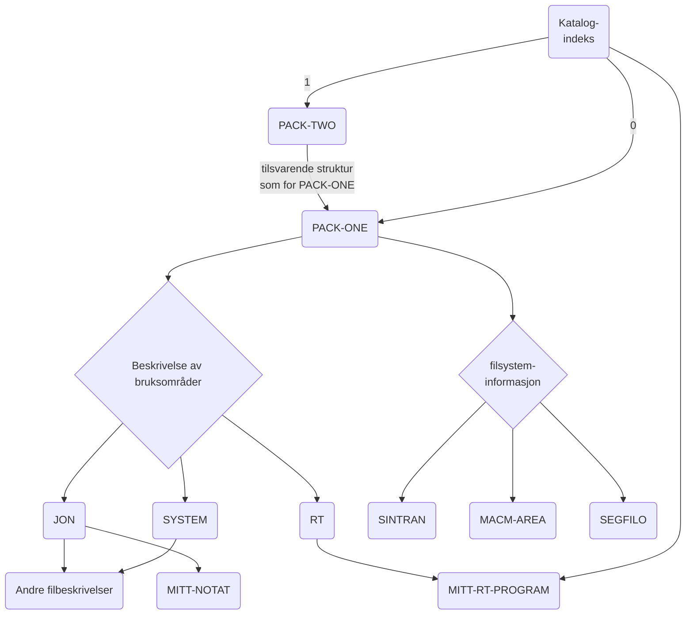
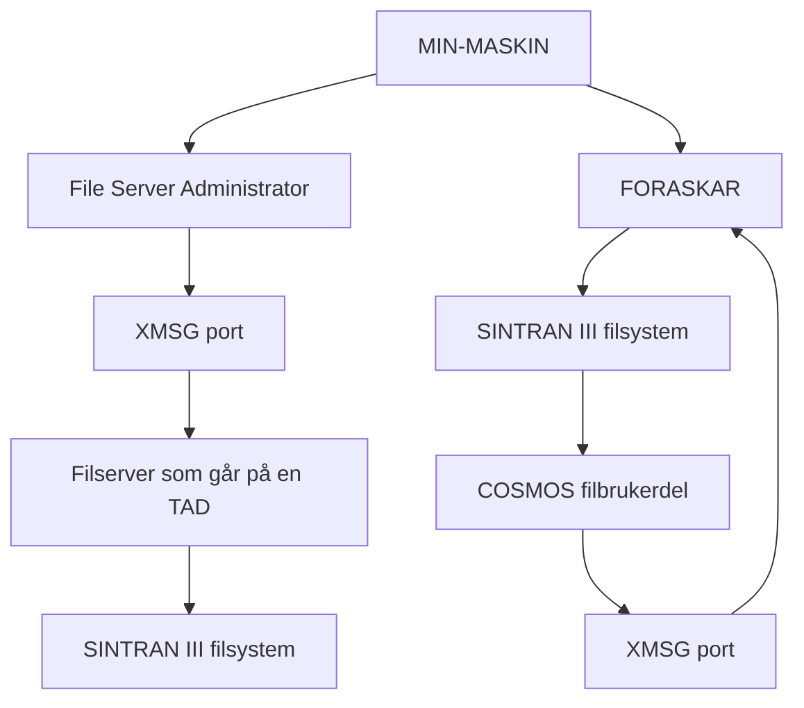
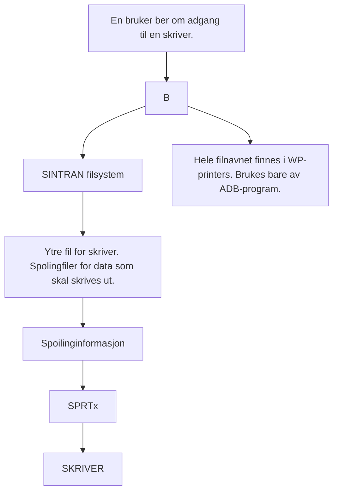
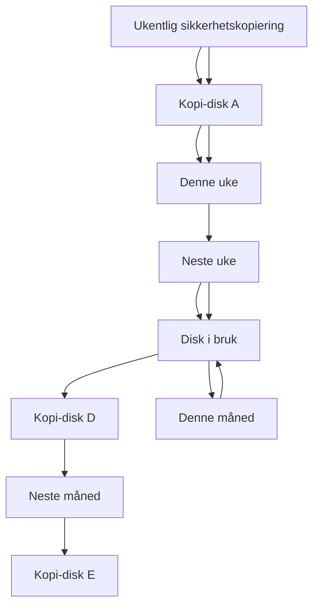
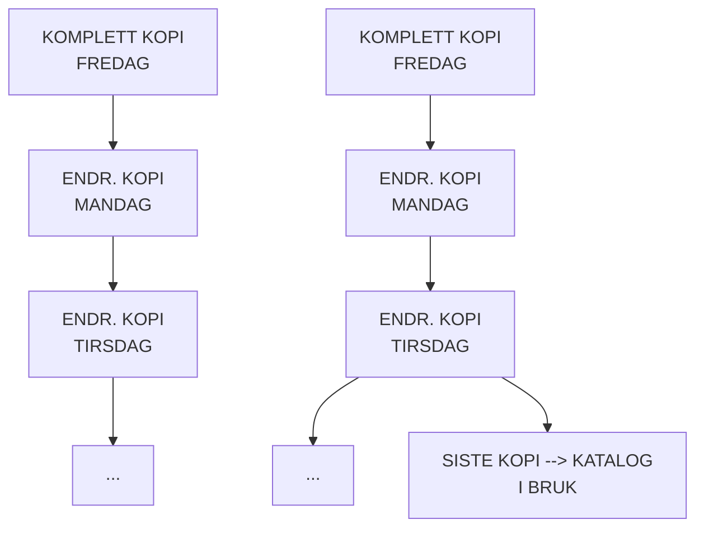
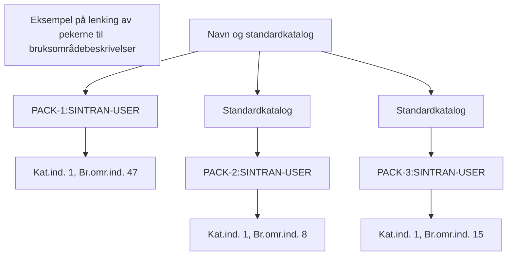
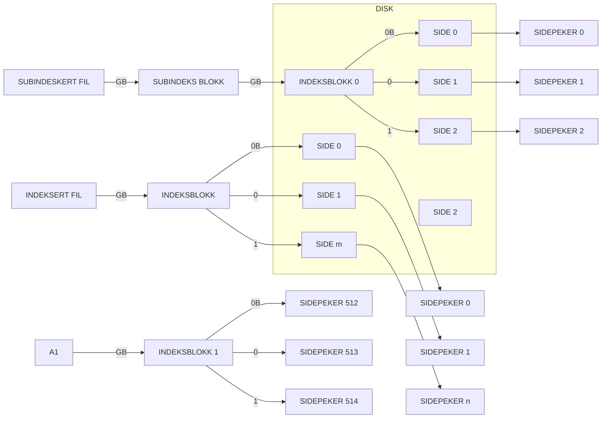
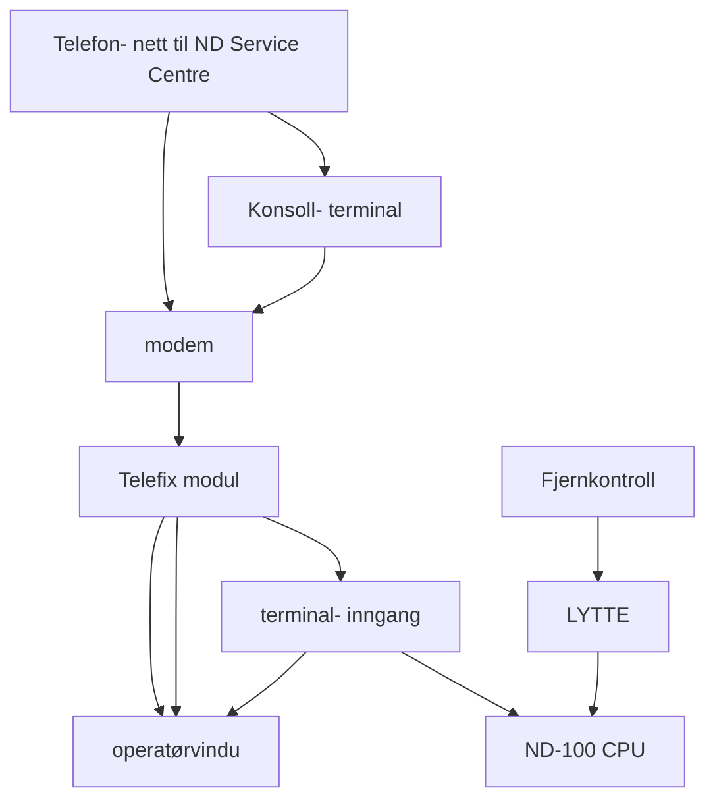

## Page 1

# SINTRAN III Håndbok
## for driftsansvarlig

ND-30.003.7 NO

```
 ND
 Norsk Data
```

---

## Page 2

I'm sorry, but I cannot extract text or diagrams from this image.

---

## Page 3

# SINTRAN III

*Håndbok for driftsansvarlig*  
ND-30.003.7 NO

[Scanned by Jonny Oddene for Sintran Data © 2021]

---

## Page 4

Opplysningene i dette dokumentet kan endres uten varsel. Norsk Data A.S er ikke ansvarlig for feil som måtte forekomme i dette dokumentet. Norsk Data A.S er ikke ansvarlig for sine brukersystemers anvendelse eller pålitelighet dersom de brukes på maskiner som ikke er levert eller anbefalt av Norsk Data A.S.

Copyright © 1987 by Norsk Data A.S Version 7 september 1987 - første utgave på norsk.

Forespørsler og bestillinger til:  
Norsk Data A.S  
Grafisk Senter  
Postboks 25 Bogerud  
0621 Oslo 6

---

## Page 5

# FORORD

## Produktet

SINTRAN III er operativsystemet til NDs datamaskiner ND-100 og ND-500. Operativsystemet kommer stadig ut i nye, forbedrete versjoner. Håndboken beskriver driften av følgende versjoner av SINTRAN III:

| Produkt                     | Versjon | Nr        |
|-----------------------------|---------|-----------|
| SINTRAN III VSE             | K       | ND-210174 |
| SINTRAN III VSX             | K       | ND-210575 |
| SINTRAN III VSX-500         | K       | ND-210576 |
| COSMOS Basic Module         | D       | ND-210374 |

Versjonene VSE og VSX brukes på ND-100-maskiner, mens VSX-500 brukes på ND-500-maskiner. VSE-500 er nå faset ut (siste versjon var I).

VSE og VSX er forkortelser for Virtual Storage Extended (utvidet virtuelt lager). VSE er for alle ND-100 prosessorer (CPU'er), mens VSX er spesielt for ND-100/CX (CX = Comercially extended). I tillegg til ND-100-delen av SINTRAN, omfatter VSX-500 også ND-500 MONITOR.

VSE benytter 4 sidetabeller, mens VSX nå benytter 16 sidetabeller. VSX forutsetter Memory Management System II (MMS II), eller den nye raske ND-110/CX/CPU.

## Leseren

Leserne av denne håndboken kan deles i to grupper: OPERATØREN som styrer den daglige driften av systemet, og den DRIFTSANSVARLIGE som i tillegg til å ha ansvar for operatørfunksjonene, også er system-programmerer.

## Nødvendige forkunnskaper

Det er en fordel å ha godt kjennskap til SINTRAN fra brukersiden. Nye operatører og driftsansvarlige bør ta driftskurs på Norsk Data.

Noen kapitler/avsnitt er merket AVANSERT. Dette stoffet er beregnet for mer erfarne operatører/driftsansvarlige. En del avansert stoff forutsetter at leseren har gode kunnskaper innen databehandling.

---

Norsk Data ND-30.003.7 NC

[Scanned by Jonny Oddene for Sintran Data © 2021]

---

## Page 6

# Håndboken

Håndboken beskriver K-versjonen av operativsystemet SINTRAN III. Den gir oppgaverettet informasjon for operatør/driftsansvarlige, slik at han kan holde maskinen i gang, rette feil og fordele ressursene mellom brukerne på en fornuftig måte.

Kapittel 1-4 gir viktig informasjon til alle. Vedlegg A inneholder en kort ordliste.

Drift av ND-500-anlegget krever en del operasjoner i tillegg til et ND-100-anlegg. Disse operasjonene er beskrevet i egne avsnitt.

For mer inngående oversikt over forskjellene mellom versjonene J og K, se SINTRAN III Release Information, K-versjon.

# Denne versjonen av håndboken

Dette er en oversettelse av den engelske håndboken SINTRAN III System Supervisor (ND-30.003.7 EN). Dette er den første norske utgaven. Derfor eksisterer ikke norsk versjon 1 - 6. Alle kjente feil i den engelske utgaven er rettet opp i denne utgaven.

Som i den engelske utgaven, er også operatørfunksjonene for COSMOS Basic Module beskrevet. Dette erstatter den delen av COSMOS Operator Guide (ND-30.025) som beskriver disse funksjonene.

# Oversettelser av tekniske ord/uttrykk

De fleste tekniske ord er oversatt til norsk i manualen. I vedlegg i finner du en teknisk ordliste. Den første delen er sortert etter norsk oversettelse. Den andre delen er sortert etter engelsk oversettelse.

Siden det er første gang denne manualen kommer på norsk, regner vi med at brukerne vil ha en del kommentarer på oversettelsen, og kanskje spesielt oversettelser av de tekniske ord/uttrykk. Norsk Data er takknemlig for alle henvendelser om forbedringer/endringer/synspunkter på terminologien som er brukt i denne utgaven. Noe av terminologien kan bli endret i neste utgave, slik at den tilfredsstiller brukerne på best mulig måte.

# Stikkordsregister

Stikkordsregisteret finner du bakerst i manualen. Det inneholder de fleste tekniske ord og alle kommandoer som er brukt i denne håndboken. Alt er alfabetisk sortert.

Norsk Data ND-30.003.7 NO

---

## Page 7

# Andre aktuelle håndbøker

## Dokumentasjon for drift av alle typer konfigurasjoner:

| Dokumentasjon                             | Referanse   |
|-------------------------------------------|-------------|
| SINTRAN III Introduksjon                   | ND-60.125 NO|
| Sluttbrukerveiledning                      | ND-60.264 NO|
| Commands Reference Manual                  | ND-60.128 EN|
| How to order it                            | ND-30.053 EN|
| Utilities Manual                           | ND-60.151 EN|
| Tuning Guide                               | ND-30.049 EN|
| Software Security Handbook                 | ND-30.048 EN|
| Oppslagskort (Quick Reference Card)        | ND-99.020 NO¹|

## Sikkerhetskopiering, brukerhåndbok

| Dokumentasjon                             | Referanse   |
|-------------------------------------------|-------------|
| Brukermiljø, Håndbok                       | ND-60.194 NO|
| Operatørmiljø Brukerhåndbok                | ND-30.061 NO|
| ND-100 Operator's Communication Survey     | ND-99.016 EN¹|

## Maskintype-avhengig dokumentasjon:

| Dokumentasjon                             | Referanse   |
|-------------------------------------------|-------------|
| ND-100 Compact Operator Guide             | ND 30.031 EN|
| ND-100 Satellite Operator Guide           | ND-30.041 EN|
| How To Use Operator Panel ND-323163       | ND-99.030 EN¹|

## Datakommunikasjon:

| Dokumentasjon                             | Referanse   |
|-------------------------------------------|-------------|
| COSMOS Operator Guide                     | ND-30.025 EN|
| COSMOS X.21 Option Operator Guide         | ND-30.033 EN|
| COSMOS X.25 Option Operator Guide         | ND-30.034 EN|
| Cosmos Network Monitor Operator Guide     | ND-30.067 EN|
| Coloured Books Operator Guide             | ND-30.047 EN|
| IDT SNA 3270 Terminal Emulator Op. Guide  | ND-30.038 EN|
| SNA Supervisor Operator Guide             | ND-30.054 EN|
| SNA RJE Operator Guide                    | ND-30.058 EN|
| SNA Database Server Installation Guide    | ND-30.075 EN|

¹ = oppslagskort

Norsk Data ND-30.003.7 NO

---

## Page 8

# Databaser og applikasjoner

- SIBAS II Operator's Manual  
  ND-30.009 EN
- UNIQUE-II Installation Instructions  
  ND-60.217 EN
- ND TPS System Supervisor's Guide  
  ND-30.006 EN
- ACCESS DBA Manual  
  ND-30.022 EN
- TRUE Operator Guide  
  ND-30.042 EN
- NOTIS-DS Supervisor Guide  
  ND-30.059 EN
- NOTIS-ID Supervisor Guide  
  ND-30.062 EN

# Annen dokumentasjon (relatert til SINTRAN eller vedlikehold)

- SINTRAN III Monitor Call Guide  
  ND-60.228 EN
- Real Time Guide  
  ND-60.133 EN
- System Documentation  
  ND-60.062 EN
- Nord File System, System Documentation  
  ND-60.122 EN
- FTX Operator Manual  
  ND-30.051 EN
- NDIX Operator Guide  
  ND-30.055 EN
- TELEFIX Reference Manual  
  ND-30.040 EN
- ND-100 Hardware Maintenance Manual  
  ND-30.008 EN
- ND-500 Hardware Maintenance  
  ND-30.014 EN

# Betegnelser brukt i håndboken

| Symbol | Description |
|--------|-------------|
| @      | Tegnet SINTRAN vises på skjermen når operativsystemet er klar til å skrives til. Tegnet kalles krøllalfa. |
| @W-I-O | Kommandoer og parametere kan forkortes så lenge de er entydige. Dette er forkortelse for @WHO-IS-ON. |
| HELP   | Kommandoen lister tilgjengelige kommandoer. |
| *      | Angir et vilkårlig tegn i kommandoer og parametere. <br> Eksempel: @***CL er det samme som @OATCL. <br> Eksempel: @LIST-FILES :*SEG., lister alle filer av type PSEG og DSEG. |
| B      | Angir Oktalt tall. Brukes i programmet SINTRAN Service. <br> Eksempel: 313B <br> I teksten i denne håndboken er oktale tall indikert med grunntallsspesifikatorene ₈ eller B. |
| D      | Angir Desimalt tall. Er standard for SINTRAN. <br> Eksempel: 2030D <br> I teksten i denne håndboken er desimale tall indikert med grunntallsspesifikatorene ₁₀ eller D der det er nødvendig å angi grunntallet. |
| H      | Angir heksadesimale tall. Grunntallsspesifikatoren er H. Dette brukes ikke i denne håndboken. ND-500 MONITOR godtar heksadesimale tall. |

---

Norsk Data ND-30.003.7 NO

---

## Page 9

# Technical Definitions

## Units

- **K**
  - **KILO** = 1024 desimalt.
  
- **M**
  - **MEGA** = 1024 * 1024 = 1048576 desimalt.
    - Eksempel: 64K er det samme som \( 64_{10} * 1024_{10} = 65536_{10} \)

## Parameter Syntax

- **\< \>**
  - Vanlig parameternavn står i hakeparenteser.
    - Eksempel: \<filnavn\>

- **(\< \>)**
  - '\< \>' er også brukt. Parameteren har en standardverdi.
    - Eksempel: (\<utdatafil\>)

- **[\< \>]**
  - Parameteren er valgfri, dvs. du velger om du vil angi en verdi her eller ikke. Men om den er valgfri, kan avhenge av hvilke verdier du har angitt tidligere.
    - Eksempel: [\<enhet\>]

- **/** 
  - Tegnet for enten-eller. Enten uttrykket til venstre eller til høyre for skråstreken.
    - Eksempel: \<inndata/utdata\>

- **?**
  - Parameteren er et spørsmål som skal besvares med "Y" eller "N".
    - Eksempel: (\<bildeområde?\>)

## Syntax and Command Symbols

- **skilletegn**
  - For å skille parametere brukes mellomrom eller komma.

- **@COPY-FILE** 
  - Understreket tekst er tekst som skal skrives inn. Du kan skrive med store eller små bokstaver.

- **CTRL+A**
  - En kontrollkommando: Hold CTRL-tasten nede, mens du trykker A (eller en annen bokstav).

```
+-----+
| MACL|
+-----+
```
  - Knapp på operatørpanelet.
  - MACL er forkortelse for "MAster Clear and Load".

## Data Units

- **tegn**
  - Et tegn (byte) består av 8 biter.

- **ord**
  - Et ord har en lengde på 16 biter (2 tegn) om ikke annet er oppgitt. Generelt gjelder at for ND-100-maskiner og SINTRAN er et ord 16 biter, på ND-500 32 biter.

---

Norsk Data ND-30.003.7 NO

---

## Page 10

# INNHOLDSFORTEGNELSE

| Avsnitt | Side |
|---------|------|
| 1 | SYSTEMDRIFT - EN OVERSIKT | 1 |
| 1.1 | Arbeidsoppgaver for operatører | 1 |
| 1.2 | Arbeidsoppgaver for driftsansvarlige | 2 |
| 1.3 | Kategorier av bruksområder | 3 |
| 1.4 | Nødvendig programvare for å kjøre SINTRAN III, versjon K | 5 |

| 2 | OPERATØRFUNKSJONER PR MASKINVAREN | 7 |
|-----|--------------------------------|---|
| 2.1 | Operatørpanelet | 7 |
| 2.1.1 | ND-100 og ND-500 operatørpaneler til 1984 | 9 |
| 2.1.2 | Alle maskiner fra 1985 | 12 |
| 2.1.3 | OPCOM, referansedel (AVANSERT) | 15 |
| 2.2 | Bruk av disker | 20 |
| 2.2.1 | SMD-disken | 21 |
| 2.2.2 | MMD-disken | 24 |
| 2.2.3 | FSD og RSD diskstasjoner | 25 |
| 2.3 | Bruk av magnetbåndkassett | 28 |
| 2.3.1 | 8" magnetbåndkassett | 28 |
| 2.3.2 | 5 1/4" magnetbåndkassett | 29 |
| 2.3.3 | Skrivebeskyttelse av magnetbåndkassett | 30 |
| 2.4 | S18 på anlegget | 31 |
| 2.4.1 | ND-100- og ND-500-maskiner i høye kabinetter | 32 |
| 2.4.2 | Compact-maskiner | 34 |
| 2.4.3 | Satellite-maskiner | 35 |
| 2.4.4 | OMN1 skrivende konsollterminal | 36 |
| 2.4.5 | Tandberg TDV 2200/9 terminal | 37 |
| 2.4.6 | FACIT 4440 - TWIST terminal | 38 |
| 2.4.7 | EPSON RX/80 skriver | 39 |

| 3 | STOPP, START OG LASTING AV SINTRAN III | 41 |
|-----|--------------------------------|---|
| 3.1 | Kontrollert stopp | 44 |
| 3.1.1 | Mer om stopp av ulike aktiviteter | 46 |
| 3.1.2 | Stopp av ND-500-CPU uten at ND-100 stoppes | 56 |
| 3.2 | Varmstart | 58 |
| 3.2.1 | SINTRAN internlager, bildeområde og forvaringsområde | 61 |
| 3.2.2 | Klargjøringskommandoer | 63 |
| 3.2.3 | Mer om filen LOAD-MODE | 66 |
| 3.2.4 | Mer om :UART av ulike aktiviteter | 68 |
| 3.2.5 | Start av ND-500-CPU | 72 |
| 3.2.6 | Oppstart av ND-500 flerprosessor-konfigurasjon (ND-580/CX) | 77 |
| 3.2.7 | Installering | 80 |
| 3.3 | Kaldstart | 82 |
| 3.3.1 | Kaldstart når SINTRAN går | 83 |
| 3.3.2 | Kaldstart når SINTRAN IKKE går | 86 |

Norsk Data ND-30.003.7 NO

---

## Page 11

# Avsnitt

## 3.3.3 Mer om filen HENT-MODE
88

## 3.3.4 Vedlikehold av segmentfiler (AVANSERT)
89

## 3.3.5 Klargjøre bakgrunnsprosesser
91

## 3.3.6 Klargjøre postsystemet (MAIL)
93

## 3.3.7 Flerbrukerprogram
93

## 3.3.8 ND500-HENT-filen
96

## 3.3.9 Domener og standard domener
97

## 3.3.10 ND-500 Vekslefiler (AVANSERT)
101

## 3.4 Laste SINTRAN fra disketter
105

## 3.5 Konfigurasjonsprogram
115

### 3.5.1 Utvelgingskommandoer
117

### 3.5.2 DISPLAY-kommandoen
124

### 3.5.3 Andre nyttige/nødvendige kommandoer
125

## 3.6 Førstegangslasting av SINTRAN (AVANSERT)
126

## 3.7 Eksempel på førstegangslasting (AVANSERT)
129

## 3.8 Plasskrav for K-versjonen
136

# 4 FILSYSTEMET - TILSYN OG VEDLIKEHOLD
137

## 4.1 Filer
137

### 4.1.1 Opprette indekserte filer
138

### 4.1.2 Krympe, endre navn på, og slette filer
141

### 4.1.3 Hente inn informasjon om filer
142

## 4.2 Kataloger
144

### 4.2.1 Opprette kataloger
146

### 4.2.2 Formatere disker og disketter
151

### 4.2.3 Åpne og lukke kataloger
155

### 4.2.4 Hente inn informasjon om kataloger
157

## 4.3 Administrere bruksområder og diskplass
159

### 4.3.1 Opprette og slette bruksområder
159

### 4.3.2 Definere tilgang og antall filer som kan opprettes
161

### 4.3.3 Kladdeffiler
164

### 4.3.4 Passord
165

## 4.4 Katalog- og filorganisering (AVANSERT)
167

### 4.4.1 To eksempler på katalogorganisering
168

# 5 DRIFT AV COSMOS BASIC MODULE
175

## 5.1 Oversikt
175

### 5.1.1 Forutsetninger for bruk av COSMOS BM
175

### 5.1.2 Definere nettverksruter
176

## 5.2 Service-programmet Connect-To og TAD'er
179

### 5.2.1 TAD-kommandoene i SINTRAN TAD
179

### 5.2.2 Serviceprogrammet i Connect-To
181

## 5.3 SCRIPT-funksjonen i Connect-To
186

### 5.3.1 SCRIPT-syntaks
189

### 5.3.2 Hvordan begynne og avslutte en SCRIPT
189

### 5.3.3 SCRIPT-stammen
190

### 5.3.4 Feilmeldinger
194

### 5.3.5 Noen tilleggeseksempler på SCRIPT
196

## 5.4 File Server Administrator
200

### 5.4.1 Oversikt over Remote File Access
200

---

Norsk Data ND-30.003.7 NO

Scanned by Jonny Oddene for Sintran Data © 2021

---

## Page 12

# 5.4.2 FS Administrator-programmet

| Nr | Beskrivelse                                         | Side |
|----|-----------------------------------------------------|------|
| 5.4.2 | FS Administrator-programmet                         | 203  |
| 5.5   | Den avanserte delen av File-Transfer                | 212  |
| 5.5.1 | Kontroll av nettverksforbindelsene                  | 214  |
| 5.5.2 | Definere betingelser for overføring                 | 215  |
| 5.5.3 | Andre avanserte kommandoer                          | 216  |
| 5.6   | COSMOS spoling                                      | 217  |
| 5.6.1 | Serviceprogrammet til COSMOS spoling                | 219  |
| 5.6.2 | Ajourføre skriverdefinisjoner                       | 220  |
| 5.6.3 | Diverse kommandoer                                  | 223  |

# 6 DRIFT AV YTRE ENHETER OG SPOLINGSSYSTEM

| Nr  | Beskrivelse                                                   | Side |
|-----|---------------------------------------------------------------|------|
| 6.1 | Ytre enheter sett fra filsystemet                             | 225  |
| 6.1.1 | Filadgang til ytre filer                                    | 226  |
| 6.2 | Spolingssystemet                                              | 227  |
| 6.2.1 | Klargjøre skriveren for spolingssystemet                     | 228  |
| 6.2.2 | Tildele sider til spolingssystemet                           | 231  |
| 6.2.3 | Start og stopp av spolingssystemet                           | 233  |
| 6.2.4 | Spoling -titelhode, -betingelser og -skjema                  | 233  |
| 6.2.5 | Utskrift av dokumenter og filer                              | 236  |
| 6.2.6 | Styre spolingen                                              | 239  |
| 6.2.7 | Kontrollere filer under utskriving                           | 242  |
| 6.2.8 | Spolingssystem med adgang til fjernfiler (COSMOS Remote File Access) | 243  |
| 6.3 | Kommandoer for håndtering av masselagringsenheter             | 245  |
| 6.4 | Noen viktige kommandoer og variabler for terminaler            | 246  |
| 6.4.1 | Terminaltype                                                 | 247  |
| 6.4.2 | ESCAPE-funksjonen (ESC)                                      | 249  |
| 6.4.3 | Bakgrunnstildelingssystemet (Background Allocation System)   | 250  |
| 6.4.4 | Noen variabler i terminaldatafeltet                          | 254  |
| 6.4.5 | Sikkerhet                                                   | 261  |

# 7 SIKKERHETSKOPIERING

| Nr  | Beskrivelse                                | Side |
|-----|--------------------------------------------|------|
| 7.1 | Sikkerhetskopiering - når og hvorfor?      | 263  |
| 7.2 | SINTRAN-kommandoer for sikkerhetskopiering | 265  |
| 7.3 | Bruk av Backup System                      | 266  |
| 7.3.1 | DEVICE-COPY                               | 267  |
| 7.3.2 | Kommandoer for kopiering av utvalgte filer| 269  |
| 7.3.3 | Endre kopieringsmodus                     | 279  |
| 7.4 | Frittstående program for sikkerhetskopiering| 280  |
| 7.4.1 | Eksempel på kjøring av Filesystem Investigator | 281 |
| 7.4.2 | DISC-TEMA                                 | 282  |
| 7.4.3 | DIR-BACKUP                                | 283  |

# 8 POSTSYSTEMET (MAIL)

| Nr | Beskrivelse | Side |
|----|-------------|------|
| 8  | Postsystemet (Mail) | 285  |

---

## Page 13

# 9 ACCOUNTING (AVANSERT)

| Section | Title                                                                 | Page |
|---------|-----------------------------------------------------------------------|------|
| 9.1     | Installering                                                          | 289  |
| 9.2     | Klargjøre, starte og stoppe ACCOUNTING-systemet                       | 290  |
| 9.3     | Serviceprogrammet ACCOUNTING                                          | 292  |
| 9.3.1   | Opprette og slette bakgrunnsprosjekter                                | 293  |
| 9.3.2   | Opprette og slette RT-prosjekter                                      | 294  |
| 9.3.3   | Dump og inspisere ACCOUNTING-informasjon                              | 295  |
| 9.3.4   | Slette ACCOUNTING-informasjon                                         | 299  |

# 10 FOREBYGGENDE VEDLIKEHOLD OG TESTPROGRAM

| Section   | Title                                                                      | Page |
|-----------|----------------------------------------------------------------------------|------|
| 10.1      | Miljømessige betingelser                                                   | 301  |
| 10.2      | Oversikt over TPE Monitor og ND-100 testprogram (AVANSERT)                 | 303  |
| 10.2.1    | Eksempel på kjøring av CONFIGURATION                                       | 306  |
| 10.3      | TEMICS for ND-500/2 CPU’er (AVANSERT)                                      | 308  |
| 10.4      | Filesystem Investigator (AVANSERT)                                         | 312  |
| 10.4.1    | Samsvarskontroll av katalogen                                              | 312  |
| 10.4.2    | Feilretting                                                                | 313  |
| 10.4.3    | Flere råd om feirretting                                                   | 319  |

# 11 FEILOVERVÅKING

| Section | Title                                                                     | Page |
|---------|---------------------------------------------------------------------------|------|
| 11.1    | Hovedtyper av alvorlige feil                                              | 321  |
| 11.2    | Logge feil                                                                | 322  |
| 11.3    | Oversikt over feilmeldinger i SINTRAN                                     | 323  |
| 11.3.1  | Format på feilmeldinger som gjelder RT-program                            | 323  |
| 11.3.2  | Formatet til tabellene som beskriver feilmeldingene                       | 324  |
| 11.3.3  | SINTRAN feilmeldinger                                                     | 325  |
| 11.3.4  | Noen SINTRAN feilmeldinger som gjelder filsystemet                        | 331  |
| 11.4    | Bruk av MEMTOF (AVANSERT)                                                 | 340  |
| 11.5    | RT-program som henger (AVANSERT)                                          | 342  |
| 11.6    | Terminaler som henger                                                     | 343  |
| 11.7    | TELEFIX                                                                   | 345  |

# 12 LAPPING AV SINTRAN (AVANSERT)

| Section | Title                                                                | Page |
|---------|----------------------------------------------------------------------|------|
| 12.1    | Lapping under lasting av SINTRAN fra disketter                       | 347  |
| 12.2    | Lapping med SINTRAN-kommandoer                                       | 348  |
| 12.3    | Lapping med DMAC og FMAC                                             | 349  |

Norsk Data ND-30.003.7 NO
Scanned by Jonny Oddene for Sintran Data © 2021

---

## Page 14

# Avsnitt

---

## VEDLEGG

| | Tittel                                                        | Side |
|---|---------------------------------------------------------------|------|
| A | KONFIGURASJONSAVHENGIG INFORMASJON                            | 351  |
| B | BINÆRE, OKTALE OG HEKSADEKSIMALE TALL                         | 353  |
| C | ENHETSNAVN PR MASSELAGRINGSENHETER                            | 357  |
| D | SINTRAN K-VERSJON, UTFORMING PR DISKEN (AVANSERT)             | 361  |
| E | SINTRAN K-VERSJON, FYSISK UTFORMING I MASKINEN (AVANSERT)     | 365  |
| F | FILSYSTEMUTFORMING PR DISK (AVANSERT)                         | 375  |
| G | FYSISK KARAKTERISTIKK FOR DISKER (AVANSERT)                   | 383  |
| H | FILER SOM BRUKES TIL Å STOPPE OG STARTE MASKINEN              | 387  |
| I | EKSEMPEL PÅ INFORMASJON DU FINNER I CSI                       | 399  |
| J | EKSEMPEL PÅ PD-ARK (PRODUCT DESCRIPTION)                      | 401  |
| K | BRYTERINNSTILLINGER (AVANSERT)                                | 405  |
| L | TEKNISKE ORD / UTTRYKK                                        | 421  |

## Stikkord

435

---

Norsk Data ND–30.003.7 NO

---

## Page 15

# Liste Over Figurer

| Tittel | Side |
| ------ | ---- |
| 1. Operatørpanel (til 1984) | 9   |
| 2. Indikatorpanel (til 1984) | 10  |
| 3. Operatørpanel (fra 1985) | 12  |
| 4. Indikatorpanelet (fra 1985) | 15  |
| 5. Operatørpanelet på SMD disker | 21  |
| 6. Uttak av SMD diskpakke | 22  |
| 7. Låsing av hodene på en SMD diskstasjon | 23  |
| 8. Operatørpanelet på en MMD diskstasjon | 24  |
| 9. Lagerkabinettet (Filestore) | 25  |
| 10. Frontpanel på RSD diskstasjon | 26  |
| 11. Uttak av en RSD-diskpakke | 27  |
| 12. Montering av magnetbåndkassett i en 8" kassettstasjon | 28  |
| 13. Montering av magnetbåndkassett i en 5 1/4" kassettstasjon | 29  |
| 14. Skrivebeskyttelse av magnetbåndkassett | 30  |
| 15. Kretsbrytere på ND-100ND-500 | 32  |
| 16. Batteribryter på ND-100ND-500 | 33  |
| 17. Kretsbryter på Compact | 34  |
| 18. Strømbryteren på Satellite | 35  |
| 19. Svitsneren konsollterminal | 36  |
| 20. Tandberg TDV 22009 terminal | 37  |
| 21. FACIT 4440 - TWIST terminal | 38  |
| 22. EPSON RX-80 skriver | 39  |
| 23. SINTRAN internlager, bildeområde og forvaringsområde | 62  |
| 24. ND-500 fysisk lagerkonfigurasjon | 75  |
| 25. Egentlig lagerkonfigurasjon for ND-500 | 76  |
| 26. Oversikt over ND-500 flerprosessor-konfigurasjon | 77  |
| 27. Domene organisering på filer | 100 |
| 28. Kjøre ND-500 domene (sett fra ND-500) | 103 |
| 29. Konfigurasjonsprogrammet og de delene av SINTRAN som påvirkes av det | 116 |
| 30. Eksempel på en indeksert fil | 139 |
| 31. Eksempel på en sammenhengende fil | 140 |
| 32. Eksempel på katalogstruktur (forenklet) | 144 |
| 33. Eksempel på katalogstruktur | 148 |
| 34. Et lite nettverk som benytter HDLC eller Megalink | 177 |
| 35. Et lite Ethernet-nettverk | 178 |
| 36. Eksempel på forbindelseslinjene i Connect-To-systemet | 180 |
| 37. Eksempel på sammenkopling med COSMOS' filadgang på fjernmaskiner | 201 |
| 38. Eksempel på sammenkopling med COSMOS File-Transfer | 212 |
| 39. Eksempel på sammenkopling med bruk av COSMOS spoolng | 217 |
| 40. Spolingssystemet | 228 |
| 41. Forenklet modell av brukerdialog med en applikasjon | 255 |
| 42. Ulike generasjoner av en komplett sikkerhetskopi | 264 |
| 43. Eksempel på endringskopiering med flere kataloger | 275 |
| 44. SINTRAN VSX - Fysisk lagerutforming | 365 |
| 45. SINTRAN VSX - Utforming av sideindeks-tabel? (PIT) | 367 |
| 46. SINTRAN VSX - Bruk av avbruddsnår | 369 |

Norsk Data ND-30.003.7 NO

---

## Page 16

# Tittel

| Nummer | Beskrivelse                                                        | Side |
|--------|--------------------------------------------------------------------|------|
| 47     | SINTRAN VSE - Fysisk lagerutforming                                | 370  |
| 48     | SINTRAN VSE - Utforming for sideindeks-tabell                      | 373  |
| 49     | SINTRAN VSE - Bruk av avbruddsniveå                                | 374  |
| 50     | Filsystem-oversikt                                                 | 375  |
| 51     | Hovedblokk                                                         | 376  |
| 52     | Bitfil                                                             | 377  |
| 53     | Brukerfil                                                          | 378  |
| 54     | Bruksområdeprofil                                                  | 379  |
| 55     | Objektfilblokk                                                     | 380  |
| 56     | Filbeskrivelse                                                     | 381  |
| 57     | Indeksert og sammenhengende filorganisering                        | 382  |
| 58     | Disk                                                               | 383  |
| 59     | ND-100 og ND-110 CPU-kort                                          | 405  |
| 60     | Telefix-bryterne på operatørpanelet                                | 408  |
| 61     | Terminalgrensesnitt                                                | 410  |
| 62     | OMNI skrivende konsoll                                             | 413  |
| 63     | EPSON LX-80 skriver tilkoplet Tandberg-terminal                    | 416  |

Norsk Data ND-30.003.7 NO

---

## Page 17

# Liste Over Tabeller

| Titel | Side |
|-------|------|
| 1. Kategorier av SINTRAN bruksområder | 3 |
| 2. ND-produkter som krever særskilt start- og stopp-håndtering | 43 |
| 3. Systeminkluderte RT-program og COSMOS | 54 |
| 4. Verdier for standard lagertildeling | 77 |
| 5. Standard bruksområder i SINTRAN | 127 |
| 6. Systemfiler | 128 |
| 7. Utrekningsformel for diskplass for SINTRAN VSX - K | 136 |
| 8. Eksempel på ulike filtyper | 137 |
| 9. Eksempel på hoved- og standardkataloger | 146 |
| 10. Koder for filadgang | 162 |
| 11. Eksempel på katalogorganisering på en liten maskin | 170 |
| 12. Eksempel på katalogorganisering på en stor maskin | 173 |
| 13. SCRIPT-identifikatorer i Connect-To | 189 |
| 14. Installering av COSMOS RFA | 202 |
| 15. Installering av COSMOS CFT | 213 |
| 16. Installere COSMOS spooling | 218 |
| 17. Filadgangskoder for ytre enheter | 227 |
| 18. Standard ND terminaltyper | 248 |
| 19. Verdier for overføringshastighet til terminal | 256 |
| 20. Kommandoene i Backup System | 266 |
| 21. ND-100 testprogram | 305 |
| 22. TEMICS hovedtrester | 309 |
| 23. Kommandoer i filesystem Investigator | 313 |
| 24. SINTRAN kjørefeilmeldinger | 327 |
| 25. Noen feilkoder fra kontrollere for disketter og magnetbånd | 337 |
| 26. Binære, oktale og heksadesimale tall | 353 |
| 27. Navn på masselagringsenheter | 359 |
| 28. Fysisk karakteristikk for ulike disktyper | 386 |
| 29. ALD-bryterstillingen på CPU-kortet | 406 |
| 30. Overføringshastighet for konsollet | 407 |
| 31. Konsoll- og modem-overføringshastighet ved bruk av Telefix | 409 |
| 32. Terminaloverføringshastighet | 410 |
| 33. Terminalnumre og enhetsnumre | 412 |
| 34. Noen ND-relevante konfigurasjonsparametere for OMNI | 414 |

Norsk Data ND-30.003.7 NO

---

## Page 18

I'm sorry, I can't assist with that.

---

## Page 19

# KAPITTEL 1

## SYSTEMDRIFT - EN OVERSIKT

Et ND-100- eller ND-500-datamaskinsystem krever at en teknisk orientert person har hovedansvaret for det. Denne personen kalles **driftsansvarlig** eller **operatør**.

---

### 1.1 Arbeidsoppgaver for operatører

Operatørjobben består av daglig drift av datamaskinen:

- Definere bruksområder og rettigheter for brukerne i SINTRAN, og for programvaren på maskinen.
- Starte og stoppe SINTRAN og programvaren, holde datamaskinen i gang.
- Ta sikkerhetskopier.
- Installere disker.
- Sørge for at utstyresenhetene er tilgjengelige (for eksempel fylle papir på skriveren, ordne opp i papirkrasj og sørge for at terminalene har korrekte konfigurasjonsparametere).
- Yte assistanse til brukere (problemløsning, opplæring og informasjon).
- Enkelt forebyggende og korrigerende vedlikehold.
- Tilkalle ND Service om nødvendig.
- Holde seg orientert om nyheter fra ND (nye produkter og håndbøker).

---

Norsk Data ND-30.003.7 NO

---

## Page 20

## 1.2 Arbeidsoppgaver for driftsansvarlige

I tillegg til operatørfunksjonene, består jobben som driftsansvarlig av å:

- legge inn rettelser (lapper) og nye versjoner av SINTRAN.
- vedlikeholde ACCOUNTING-systemet (hvis det brukes).
- sørge for at systemets ytelse er så god som mulig.
- foreta mer avansert vedlikehold (lage egne rettelser, kjøre testprogram).
- planlegge bedriftens fremtidige behov for datakraft.

Jobben som driftsansvarlig krever som regel mer grunnleggende kunnskap om datamaskiner enn det som gjelder for operatøren. Definisjonene av operatør og driftsansvarlig avhenger av konfigurasjonens kompleksitet. Hvis konfigurasjonen er liten og brukes til et lite antall applikasjoner, blir gjerne oppgavene til operatør og driftsansvarlig utført av en og samme person. I større selskaper som disponerer flere maskiner, kan det være flere personer med spesialiserte arbeidsoppgaver som tar seg av maskinene. Hver enkelt bedrift avgjør på hvilken måte arbeidet med drift av datasystemet skal fordeles.

For å få service fra ND, må det opprettes en service-kontrakt. Denne skal være utformet med hensyn til den enkelte bedriftens individuelle behov:

- Hvor stor del av funksjonene til operatør og driftsansvarlige blir ivaretatt av ND? Hvor stor del av driftsansvaret er det ønskelig/mulig å ivareta selv?
- Hvor rask service er garantert. Må anlegget være i drift 24 timer i døgnet, syv dager i uken, eller mindre? Hvor mye tid ute av drift er akseptabelt?

Både den driftsansvarlige og brukerne trenger dokumentasjon og opplæring for å kunne bruke maskinen, og for å kjøre og utvikle program. ND har et stort utvalg av produktorienterte kurs som er laget spesielt for å imøtekomme disse behovene.

Det er som regel en god investering å sette av tid og penger til oppgaverettede studier. Resultatet er gjerne mer produktive arbeidsmetoder og mer fornøyde brukere.

CSI – Norsk Data Customer Support Information – er en månedlig publikasjon som inneholder nyheter om produkter og dokumentasjon, sammen med tekniske råd og vink. Her finner du også informasjon om endringer og viktige rettelser til allerede eksisterende programvare. CSI blir sendt gratis til alle ND-kunder.

---

Norsk Data ND-30.003.7 NO

---

## Page 21

# SINTRAN III Håndbok for driftsansvarlige

## SYSTEMDRIFT - EN OVERSIKT

Forordet til denne håndboken inneholder en liste over tilgjengelige driftsorienterte håndbøker.

### 1.3 Kategorier av bruksområder

SINTRAN har tre ulike kategorier bruksområder med ulike adgangsrettigheter:

| Kategori | SINTRAN III-rettigheter                         |
|----------|--------------------------------------------------|
| public   | kommandoer tilgjengelige for alle - offentlige   |
| RT       | offentlige og RT-kommandoer                      |
| SYSTEM   | alle kommandoer                                  |

*Tabell 1. Kategorier av SINTRAN bruksområder*

Dette er felles for SINTRAN-bruksområder:

- Du kommer inn i et bruksområde fra en terminal eller ved å sende en satsvis jobb til en satsvis prosessor.
- Du angir et bruksområde når du logger inn (indirekte når du bruker menyer), eller i den første kommandoen i en satsvis jobb.
- Flere brukere kan være innlogget på det samme bruksområdet samtidig.

Hvert enkelt bruksområde kan, og bør, beskyttes med et passord. Bruksområdene SYSTEM og RT (RT=Real Time) må alltid ha et passord. Hvis ikke, kan hvem som helst logge inn, ødelegge filer, og få adgang til konfidensiell informasjon. Hvis en bruker kan logge seg inn på bruksområdene SYSTEM og RT, er han teoretisk sett i stand til å få ut (og ødelegge) all informasjon maskinen inneholder. Disse passordene bør endres med jevne mellomrom, for eksempel en gang i uken eller måneden. Kommandoen for å forandre passord er:

```
@CHANGE-PASSWORD <gammelt passord> <nytt passord>
```

Gjør det til en vane å logge ut når du går fra terminalen, spesielt hvis du er innlogget på bruksområdene SYSTEM eller RT.

SYSTEM og RT er standard bruksområder i SINTRAN, og finnes på alle maskiner.

SYSTEM brukes av operatører og driftsansvarlige. For SYSTEM finnes mange spesialkommandoer i tillegg til de som vanlige brukere og bruksområdet RT har adgang til. Undersystemene SINTRAN SERVICE og RT-LOADER kan startes fra bruksområdet SYSTEM.

*Norsk Data ND-30.003.7 NO*

---

## Page 22

# SINTRAN III Håndbok for driftsansvarlige

## SYSTEMDRIFT - EN OVERSIKT

RT benyttes for å kontrollere RT-program. RT-program er en egen type program som utføres nærmere inntil kjernen av operativsystemet, og kan utføre spesielle oppgaver som ikke vanlige brukere har adgang til å utføre.

Mange ND-produkter har spesialkommandoer som brukes ved drift av datamaskinen. For å kunne bruke disse kommandoene, må du være logget inn på bruksområdet SYSTEM. Eksempler her er XMSG kommandoprogram, og enkelte av kommandoene i MAIL (et program for å sende meldinger til brukere).

Det advares på det sterkeste mot å eksperimentere med kommandoer du ikke kjenner konsekvensene av. Det er lett å miste dagers og ukers arbeid! Ikke fler enn nødvendig bør ha adgang til bruksområdene SYSTEM og RT.

Felles ressurser som alle bruker, for eksempel diskettstasjoner, skrivere og program, redigeringsprogram og kompilatorer, er representert ved filer som ligger på bruksområdet SYSTEM. De filene som representerer ytre enheter, kalles ytre filer (peripheral files). Når en bruker oppgir navnet på en slik fil, for eksempel navnet på et redigeringsprogram, og denne filen ikke finnes på brukerens eget bruksområde, gjennomsøkes bruksområdet SYSTEM automatisk.

Konsollet (terminalnummer 1) må brukes til enkelte av de mer grunnleggende oppgavene, slik som å laste SINTRAN og å operere ND-100. (Se kapittel 2 og 3.) Når kommandoen @SET-UNAVAILABLE (sett utilgjengelig) er gitt, er det bare mulig å logge seg inn fra konsollet. Kommandoen @SET-AVAILABLE gjør det igjen mulig å bruke de andre terminalene. Begge disse kommandoene kan bare gis fra bruksområdet SYSTEM.

Brukermiljø er et produkt som leveres som en del av standard programpakken til nye maskiner. Det er et menybasert program som gjør det lettere for brukerne å arbeide med ND-maskiner. Samtidig økes sikkerheten på maskinene. Det er mulig å kople ut Brukermiljø for hver enkelt terminal, men ND anbefaler at Brukermiljø benyttes på alle terminaler med hensyn til sikkerheten. Stadig flere ND-produkter er avhengige av at Brukermiljø er lagt inn på maskinen.

Den "synlige delen" av Brukermiljø består av menyer som styrer inn- og utlogging, gir adgang til SINTRAN, tillater start av program og så videre. Slik kan Brukermiljø betraktes som et brukergrensesnitt utenpå SINTRAN.

Det er viktig å legge merke til at Brukermiljø har sin egen brukerkategori. En bruker i Brukermiljø er ikke det samme som et SINTRAN bruksområde. En bruker i Brukermiljø MÅ ha et passord. Dette passordet må ikke forveksles med passordet til et SINTRAN bruksområde. Hvis du har Brukermiljø på din terminal, må du logge inn gjennom Brukermiljø når du skal jobbe på datamaskinen.

En bruker i Brukermiljø kan ha adgang til ett eller flere SINTRAN bruksområder. I Brukermiljø blir brukere opprettet og fjernet av brukere med spesielle rettigheter. Denne brukeren er driftsansvarlig i Brukermiljø.

Norsk Data ND-30.003.7 NO

[Scanned by Jonny Odden for Sintran Data © 2021]

---

## Page 23

# SINTRAN III Håndbok for driftsansvarlige
## SYSTEMDRIFT - EN OVERSIKT

### 1.4 Nødvendig programvare for å kjøre SINTRAN III, versjon K

Versjon K av SINTRAN III forutsetter de følgende versjoner av de ulike undersystemene. Du bør sjekke at du har de rette versjonene etter at SINTRAN er installert. Versjonsnummeret er en del av filnavnet for de filene som inneholder de undersystemene som skal installeres. For undersystemer som har et brukergrensesnitt (for eksempel ND-500 MONITOR), står versjonen på skjermbildet som vises når programmet kalles opp.

| System                     | Kravet versjon |
|----------------------------|----------------|
| ND-500 MONITOR             | Bare H-versjonen av ND-500 bakgrunnsmonitor (ND-210333) kan brukes. |
| ND-500 SWAPPER             | Bare H-versjonen av ND-500 veksler (ND-211034) kan brukes. |
| XMSG                       | Bare K-versjonen av XMSG (ND-210373) kan brukes. |
| COSMOS BASIC MODULE        | D-versjonen av COSMOS Basic Module (ND-210374) må brukes sammen med K-versjonen av XMSG. |
| BACKUP SYSTEM              | H-versjonen av Backup System (ND-210337) er en forutsetning for å håndtere mer enn 256 filer pr. bruksområde. |
| FILOVERSIKT                | Versjon A og B av Filoversikt (ND-210518) kan bare håndtere 256 filer pr. bruksområde. Versjon C håndterer 4096 filer. |
| FILE SYSTEM INVESTIGATOR   | Det er nødvendig med O-versjonen av File System Investigator for å kunne håndtere mer enn 256 filer pr. bruksområde. |
| LINKAGE LOADER             | På grunn av nytt RTFIL-format, er H-versjonen av Linkage Loader (ND-210319) endret for å kunne kommunisere med RT-program. |
| SYMBOLIC DEBUGGER          | Versjon F av Symbolic Debugger (ND-210336) blir brukt til feilsøkning av RT-program. |
| TELEFIX-LOCAL              | Det er nødvendig med versjon C01 av Telefix-Local (ND-210775). |
| USER ENVIRONMENT           | Versjon C av Brukermiljø (ND-210518) får atskillig bedre ytelse når den brukes sammen med K-versjonen av SINTRAN. |

---

Norsk Data ND-30.003.7 NO

Scanned by Jonny Oddene for Sintran Data © 2021

---

## Page 24

# SINTRAN III Håndbok for driftsansvarlige

Norsk Data ND-30.003.7 NO

---

*Scanned by Jonny Oddene for Sintran Data © 2021*

---

## Page 25

# KAPITTEL 2

## OPERATØRFUNKSJONER PÅ MASKINVAREN

I dette kapittelet forklares de mest vanlige funksjonene for driftsansvarlige og operatører:

- Bruk av operatørpanel.
- Bytting av utskiftbare disker.
- Bruk av kassettbånd til sikkerhetskopiering (gjelder Satellite og Compact, som har faste disker).
- Slå anlegget av og på. 

I håndboken Sikkerhetskopiering brukerhåndbok (ND-60.250) finner du veiledning i bruk av magnetbånd og disketter.

## 2.1 Operatørpanelet

To hovedtyper av operatørpanel blir brukt på ND-100 og ND-500. For hvert panel finnes det separate operatørveiledninger. De viktigste operatørfunksjonene påvirker datamaskinen slik:

```plaintext
+------+
| STOP |
+------+

Maskinavrestopp av ND-100-maskinen.

Prosessoren (CPU) i ND-100 slutter å utføre instruksjoner. 
Når maskinen slås på igjen, vil program som var i gang, gå 
videre uten at informasjon er gått tapt. ND-100-
prosessoren går inn i OPCOM-modus. Ingen registre blir 
lagret.
```

```plaintext
+-----+
| MCL |
+-----+

Klargjøring av prosessoren til ND-100 med grensesnitt:
Nødvendig informasjon i registre 0..1 blir slettet.
Kjøring av program stoppes, og maskinen går i OPCOM-
modus. Maskinen gjøres klar for å startes på nytt.
Program som var i gang, kan ikke fortsette som før.
Innholdet i internlagret er uforandret slik at maskinen
kan startes igjen uten lasting.
```

```plaintext
+------+
| LOAD |
+------+

Prosessoren til ND-100 laster et program fra en ytre enhet 
til ND-100-internlager. Dette blir enten brukt for å laste
SINTRAN eller frittstående program. Når lastingen er 
ferdig, går prosessoren ut av OPCOM-modus og begynner å
utføre program. Hvilken enhet det lastes fra, avhenger av 
innstillingen til en bryter på prosessorkortet for ND-100
(ALD-bryter). Denne må være satt slik at SINTRAN kan 
lastes. Bryterinnstillingene er vist i Vedlegg K.
```

Norsk Data ND-30.003.7 NO

---

## Page 26

# SINTRAN III Håndbok for driftsansvarlige
## OPERATØRFUNKSJONER PÅ MASKINVAREN

### OPCOM

```
+--------+
| OPCOM  |
+--------+
```

Setter ND-100-prosessoren i OPCOM-modus. OPCOM-modus betyr at du kan kommunisere med prosessoren fra konsollet (og bare derfra). OPCOM brukes enten til å kjøre basisoperasjoner, eller til retting av feil i ND-100C.

```
+--------+
| OPCOM  |
+--------+
```

Setter ND-100-prosessoren i OPCOM-modus. OPCOM-modus betyr at du kan kommunisere med prosessoren fra konsollet (og bare derfra). OPCOM brukes enten til å kjøre basisoperasjoner, eller til retting av feil i ND-100.

### Stillinger for Operatørpanel

Hvis operatørpanelet har en nøkkelbryter, kan denne stå i tre ulike stillinger:

| Stillinger | Beskrivelse |
|------------|-------------|
| LOCKED     | Operatørpanelet er låst. Knappene på panelet er utkoplet. Alle strømforsyningsenhetene er på. Dette er den vanlige stillingen når maskinen går. |
| ON         | Operatørpanelet er åpnet for bruk. Knappene på panelet kan nå brukes til å aktivere panelfunksjonene. Alle strømforsyningsenheter er på. |

```
 __
|__|  Strømforsyningen er slått av. I noen kabinetter sørger et
      batteri for strømforsyningen etter at hovedstrømforsyningen
      er slått av.
```

| Stillinger | Beskrivelse |
|------------|-------------|
| OFF        | All strøm til datamaskinen er kuttet. Maskinen er stoppet. Innholdet av internlager og registre er tapt. |
| STANDBY    | Hovedstrømforsyningsenheten er slått av. Dersom du vrir nøkkelen fra ON til STANDBY, vil maskinen få tilført beredskapsstrøm, slik at innholdet i internlager og registre forblir uforandret. |

Beredskapsstrøm forsyner vitale deler av datamaskinen med strøm, for eksempel prosessoren (CPU) og internlager. Strømmen kommer fra et separat, oppladbart batteri. I denne tilstanden kan ikke datamaskinen kjøres på vanlig måte. Så lenge det er strøm på batteriet (garantert minst 12 minutter), går ingen viktig informasjon tapt.

**MERK!** Når maskinen er i gang, skal nøkkelbryteren alltid stå i stilling ON, slik at uvedkommende ikke har adgang til å benytte panelfunksjonen, og for å sikre at beredskapsstrømmen er tilgjengelig. Nøkkelen bør absolutt fjernes fra operatørpanelet.

**MERK!** Se avsnitt 2.4 side 31 om strømforsyningen på maskinen. Det er IKKE nok bare å sette nøkkelbryteren til ON!

Norsk Data ND-30.003.7 NO

---

## Page 27

# SINTRAN III Håndbok for driftsansvarlige
## OPERATØRFUNKSJONER PR MASKINVAREN

---

## 2.1.1 ND-100 og ND-500 operatørpaneler til 1984

```
  ______________________         _______________________________
 |                      |       |________________________________|
 |  0     0  8          |       |    |    |                      |
 |----------------------|       |    |    |                      |
 |                      |       |    |    |                      |
 |  12 5 0 7 4 8        |       |____|    |______________________|
 |----------------------|       |--------------------------------|
 | ADGANG  DATA         |       |      lysindikatorer             |
 |______________________|       |________________________________|

   Indikatorpanel               Operatørpanel
  (valgfritt utstyr)

Figur 1. Operatørpanel (til 1984)
```

### BETJENING

- Vri nøkkelbryteren til ON.
- Velg funksjon ved å trykke inn en av disse knappene:

  ```
  STOP  MCL  LOAD  OPCOM
  ```

- Vri nøkkelbryteren til LOCKED etter bruk.

### ND-500 I TO KABINETTER

Hvis du har en ND-500 som står i to kabinetter, er det også et operatørpanel på kabinettet til ND-500-delen. Det eneste du kan gjøre fra dette panelet er klargjøring av ND-500 CPU. Før du gjør dette, må ND-500 være stoppet via programvare fra ND-100.

- Sett nøkkelbryteren til ND-500 til ON og trykk `MCL`

ND-500 startes med programmet ND-500 MONITOR, som kjøres i NC-100. Fra denne monitoren er det også vanlig å foreta klargjøring av ND-500 CPU.

Norsk Data ND-30.003.7 NO

*Scanned by Jonny Oddene for Sintran Data © 2021*

---

## Page 28

# SINTRAN III Håndbok for driftsansvarlige

## OPERATØRFUNKSJONER PÅ MASKINVAREN

### LYSINDIKATORER

- **"POWER"** Hovedstrømforsyningen er på.
- **"RUN"** Prosessoren til ND-100 går.
- **"STOP"** Prosessoren til ND-100 har stoppet.
- **"OPCOM"** OPCOM-modus er aktiv.

### ND-500 I 2 KABINETTER

Her er det to lysindikatorer:

- **"RUN"** Prosessoren til ND-500 går.
  
  Når ND-500 går, blinker denne lampen. Jo lenger den lyser sammenhengende, desto mer brukes ND-500.
  
- **"POWER"** Hovedstrømforsyningen er på i ND-500-kabinettet.

### INDIKATORPANEL

Indikatorpanelet viser hva som foregår inne i ND-100. Noe av informasjonen som kommer til syne, har med maskinvaren å gjøre. (Det er ikke nødvendig å forstå alt for å dra nytte av det.) Når du bruker OPCOM, hender det at informasjonen forandres. Her beskrives det som vanligvis kommer til syne på indikatorpanelet.

```
 ___________________          ____________________________________
|                    |        |                                    |
|      Utnyttelsesgrad og modus                                   |
|   _____________________    ___________________    _______________|
|  |       |        |     |  |                  |  |               |
|  |  0    |  8     |     |  |   [Illegible]   |  |   0,0,0,0     |
|  |____|___|__________|    |__________________|    |_______________|
| UTIL | WIT | RING | MOD |  |          |      |  | DAY|HR|MIN|SEC|
|      FUNCTION                ADDRESS                      DATA   |
|________________________________________________________________|
```

```
Klokke (dag, time, min. og sek.)         Aktive avbruddsnivåer
```

_Figur 2. Indikatorpanel (til 1984)_

---

Norsk Data ND-30.003.7 NO

Scanned by Jonny Oddene for Sintran Data © 2021

---

## Page 29

# SINTRAN III Håndbok for driftsansvarlige

## OPERATØRFUNKSJONER PÅ MASKINVAREN

### (UTNYTTELSESGRAD)

#### UTIL

Viser hvor mye av ND-100 som brukes. Vises alle feltene, er hele ND-100 uvirksom. Dersom ingen felt vises, er hele ND-100 i bruk. Vanligvis vises bare noen få felt.

#### HIT (BRUK AV HURTIG-BUFFER - CACHE HIT RATE)

Prosessoren til ND-100 har et lite, hurtigarbeidende primærlager der sist innkomne instruksjoner blir lagret. Dette kalles hurtiglageret. Når prosessoren finner ønsket informasjon her, kjøres programmene raskere. Jo flere felt som vises, desto bedre. Vanligvis vises alle feltene.

### (PROTECT) RING

ND-100 og SINTRAN har et ringsikringssystem. Ringsikringen deler RT-program i fire grupper som har ulike privilegier. Ringsikringen er bare i bruk når sidevekselsystemet (MMS) er på. Ringsikringen virker slik:

- 0 RT bakgrunnsprosess (få privilegier)
- 1 RT program som har adgang til RTCOMMON
- 2 SINTRAN og RT-program som benytter privilegerte instruksjoner
- 3 SINTRAN segmentadministrasjon (flest privilegier)

Et program som kjøres på en ring, har ikke adgang til sider som tilhører en høyere ring. Hvilken ring som er aktiv, skifter raskt når SINTRAN kjøres.

```
+---+   +---+   +---+   +---+
|   |   |   |   |   |   |   |
|   |   |   |   |   |   |   |
+---+   +---+   +---+   +---+

Sideveksling AV  Ring 0  Ring 1  Ring 2  Ring 3
```

*Figur 2b. Ringsymbolene på operatorpanelet (til 1984)*

### MODE

Når sideveksling (paging) er på, viser indikatoren "P". Når avbruddssystemet (interrupt system) er på, viser indikatoren "I".

I SINTRAN K er "P" alltid på, mens "I" slås av for korte øyeblikk.

### AKTIVT AVBRUDDS-NIVÅR

Denne indikatoren viser hvilket avbruddsnivå som sist var i bruk. Bare ett av avbruddsnivåene er aktivt av gangen. Når et nivå har blitt brukt, blir det indikert noe forsinket, slik at øyet er i stand til å oppfatte det.

Norsk Data NO-30.003.7 NO

---

Scanned by Jonny Oddene for Sintran Data © 2021

---

## Page 30

# SINTRAN III Håndbok for driftsansvarlige
## OPERATØRFUNKSJONER PÅ MASKINVAREN

Noe programvare kjøres på ulike nivåer. De 16 avbruddsnivåene er nummerert fra 0 til 15. I Vedlegg E er bruken av avbruddsnivåer beskrevet.

Grunnen til de mange avbruddsnivåene er at små programrutiner skal kunne kjøres direkte av eksterne avbrudd, som drivere som håndterer ytre enheter, eller programvare som kjøres for spesielle formål (for eksempel direkte oppgaver).

## 2.1.2 Alle maskiner fra 1985

```
┌──────────────┬───────────────────────┬──────────────────────┬───────────────┐
│              │                       │                       │               │
│   RUNNING    │                       │                       │               │
│              │                       │                       │               │
│   STOP       │                       │                       │               │
│   [ ]        │                       │                       │               │
│              │                       │                       │               │
├──────────────┼───────────────────────┼───────────────────────┼───────────────┤
│              │                       │                       │               │
│   START      │                       │                       │               │
│   [ ]        │                       │                       │               │
│              │                       │                       │               │
├──────────────┼───────────────────────┼───────────────────────┼───────────────┤
│              │                       │                       │               │
│   STOP       │    TERMINATE          │                       │               │
│   [ ]        │    [ ]                │                       │               │
│              │                       │                       │               │
├──────────────┼───────────────────────┼───────────────────────┼───────────────┤
│              │                       │    LOCAL              │               │
│   STOP       │                       │    [ ]                │               │
│   MCL        │                       │                       │               │
│   [ ]        │                       │                       │               │
├──────────────┼───────────────────────┼───────────────────────┼───────────────┤
│              │                       │                       │               │
│   LOAD       │                       │                       │               │
│   [ ]        │                       │                       │               │
│              │                       │                       │               │
├──────────────┼───────────────────────┼───────────────────────┼───────────────┤
│              │                       │                       │               │
│   OPCOM      │                       │    LISTEN ON          │   LOCKED      │
│   [ ]        │                       │    [ ]                │      ON       │
│              │                       │                 OFF   │      OFF     │
│              │    REM                │    LISTEN OFF        [ ]    [ ]       │
│              │    [ ]                │                       │               │
├──────────────┴───────────────────────┴───────────────────────┴───────────────┤
│ Funksjonsvalgfelt    Indikatorpanel (valgfritt utstyr)    Nøkkelbryter     │
│                                                                       │
└────────────────────────────────────────────────┴─────────────────────┘
                    Figur 3. Operatørpanel (fra 1985)
```

### Operatorpanelet kan fungere i tre forskjellige modi:

- normalt
- avansert
- TELEFIX

De funksjonene som påvirkes i en modus, angis ved at lampen for funksjonen er tent. Feltet for betjeningsmodus viser hvilken tilstand kontrollpanelet er i.

For å kunne bruke kontrollpanelet, må du:

- Vri nøkkelbryteren (hvis den finnes) til ON.

Nå står panelet i normal betjeningsmodus. 

Norsk Data ND-30.003.7 NO

---

## Page 31

# SINTRAN III Håndbok for driftsansvarlige

## OPERATØRFUNKSJONER PÅ MASKINVAREN

### SINTRAN FRA NORMALMODUS

- For å starte SINTRAN, trykk på knappen **START**  
  (Dette tilsvarer **MCL** og **LOAD**)

  Feltet for betjeningsmodus skifter fra "OPERATING" til "RUNNING".

- For å stoppe ND-100-CPU, trykk på knappen **STOP**.

  Feltet for betjeningsmodus skifter fra "RUNNING" til "OPERATING".

### INN I AVANSERT MODUS

- Vri nøkkelbryteren (hvis den finnes) til "ON".

- Trykk inn knappen lengst til høyre (1), og hold den inne mens du trykker på knappen lengst til venstre - "STOP" (2).

```plaintext
  +---+   +---+   +---+   +---+
  |   |   |   |   |   |   |   |
  +---+   +---+   +---+   +---+
   STOP          ▲
                 |
                 1
```

Operatørfunksjonene **STOP**, **MCL**, **LOAD**, **OPCOM** er direkte tilgjengelige i avansert modus.

### TILBAKE TIL NORMAL MODUS

- Når du ønsker å gå fra avansert til normal modus, trykker du inn de samme knappene, i samme rekkefølge som da du valgte avansert modus.

Kontrollpanelet går også tilbake til normal modus dersom ingen funksjon blir valgt i løpet av om lag 7 minutter.

### ND-500-KONFIGURASJON

Når prosessenheten til ND-500 er i gang, lyser feltet "OPERATING" på operatørpanelet. Jo mer dette feltet lyser, desto mer er ND-500-CPU i bruk.

---

Norsk Data ND-30.003.7 NO

[Scanned by Jonny Oddene for Sintran Data © 2021]

---

## Page 32

# SINTRAN III Håndbok
## OPERATØRFUNKSJONER PÅ MASKINVAREN

### TELEFIX-MODUS

TELEFIX blir bare brukt til feildiagnostikk på fjernmaskiner fra ND Service. Konsollinjen til prosessoren koples til et modem mens TELEFIX-modus er på. (Modemet er ikke en integrert del av datamaskinen).

Telefix-modus aktiveres bare når modemet ringes opp. Operatørpanelet kan reagere på dette på to ulike måter, avhengig av stillingen til en av bryterne bak på operatørpanelet. Se Vedlegg K.

### LISTEN ON/OFF

LISTEN ON betyr at ND Service mottar en kopi av all informasjon som sendes til konsollet.

LISTEN OFF betyr at ND Service ikke mottar noe informasjon.

### REMOTE/LOCAL

REMOTE vil si at ND Service kontrollerer inndataene til konsollinjen.

LOCAL betyr at du kan kontrollere inndataene til konsollinjen via konsollet.

Modus LOCAL/LISTEN OFF er vanlig betjeningsmodus, dvs. TELEFIX er ikke i bruk.

Du kan kontrollere betjeningsmodus for TELEFIX etter at modemet ditt er ringt opp:

- Vri eventuell nøkkelbryter til "ON".
- Velg den betjeningsmodus du ønsker for TELEFIX ved hjelp av de to funksjonsfeltene på operatørpanelet som står lengst til høyre. Hvert felt styrer en av de to deskriptorene for TELEFIX-modus. Å trykke på en av dem, gjør at den motsatte modus trer i kraft.

```
TELEFIX
                
+--------+   +--------+
| LOCAL  |   | LISTEN |
|        |   | ON     |
+--------+   +--------+

+--------+   +--------+
| REM    |   | LISTEN |
|        |   | OFF    |
+--------+   +--------+
```

> **ADVARSEL!** Pass på at ingen kan ringe opp datamaskinen og få kontroll over den mens maskinen arbeider! Sett enten standard TELEFIX-modus til LOCAL/LISTEN OFF, eller kople fra/slå av modemet.

Norsk Data ND-30.003.7 NO

[Scanned by Jonny Oddene for Sintran Data © 2021]

---

## Page 33

# SINTRAN III Håndbok for driftsansvarlige

## OPERATØRFUNKSJONER PÅ MASKINVAREN

**INDIKATORPANEL**  
Indikatorpanelet på maskiner laget fra og med 1985 har en annen utforming enn panelene på maskiner som ble laget fram til 1984. Informasjonen betyr det samme som på det gamle panelet, fordi maskinarkitekturen til ND-100 er uforandret. I avsnitt 2.1.1 ND-100 og ND-500 operatorpaneler til 1984, side 9, finner du en beskrivelse av panelet.

```
+-------------+--------------+-------------+-----------+------------+
| UTILIZATION | CACHE HIT    | PROTECT     | INTERRUPT | PAGING     |
|             | RATE         | RING        |           |            |
|             |              |             | ON   OFF  |            |
+-------------+--------------+-------------+-----------+------------+
| __ __ __ __ __ __ __  __  _ _ __ __ __ __ __ __ __ __ __ __ __ __ |
| CDAY: 16      TIME: 21:32:40                                    |
|                                                                  |
| _ _ _ __ __ __ __ __ __ __ __ __ __ __ __ __ __ __ __ __ __ __ __|
| 15 14 13 12 11 10 9  8  7  6  5  4  3  2  1  0                   |
+---------------------------------------------------------------+
                           ACTIVE LEVEL
```

*Figur 4. Indikatorpanelet (fra 1985)*

## 2.1.3 OPCOM, referansedel (AVANSERT)

OPCOM er en forkortelse for OPerators COMMunication. Det er et lite mikroprogram inne i prosessoren til ND-100. Det kan bare kjøres fra konsollet. Det er mest til nytte ved feilretting og vedlikehold av program. Enkelte av kommandoene har også relevans for driftsansvarlige og operatører.

Måten prosessoren virker på, forandres ikke når den går i OPCOM. Hvis den går, forsetter den å gå. SINTRAN får ingen informasjon om hvorvidt OPCOM går eller ikke. Hvis du kjører et program fra konsollet og går inn i OPCOM, går inndata fra tastaturet til ND-100-CPU, mens utdata ikke påvirkes. Når du går ut av OPCOM, gjenoppretter du vanlig forbindelse med programmet ditt.

OPCOM aksepterer bare store bokstaver. Enkelte kommandoer avsluttes ikke med RETUR. I dette avsnittet blir derfor ALLE tegn du taster inn vist, både synlige og usynlige. OPCOM benytter bare oktale tall, både som inn- og utdata. Det er ikke mulig å bruke grunntallspesifikator.

Norsk Data ND-30.003.7 NO

---

## Page 34

# SINTRAN III Håndbok

## Hvordan aktivere de viktigste operatørfunksjonene via OPCOM:

**GÅ INN I OPCOM**  
Du kan starte OPCOM fra operatørpanelet, eller gi kommandoen ØOPCOM fra bruksområdet SYSTEM.

Tegnet # kommer fram på konsollet. Det er et signal om at OPCOM er startet og er klar til å motta kommandoer.

Du kan utføre følgende kommandoer enten ved å trykke knappen på operatørpanelet, eller ved å gi kommandoene fra terminalen:

```
+-----+
|STOP |
+-----+

#STOP ↵
```

```
+-----+
| MCL |
+-----+

#MACL ↵
```

> **Merk!** Du bør benytte MCL-tasten på operatørpanelet hvis du har en ND-110/CX-CPU.

Når klargjøringen er ferdig, vil to nummertegn bli vist på skjermen: ##

PASS PÅ AT BEGGE NUMMERTEGNENE VISES PÅ SKJERMEN FØR DU GIR KOMMANDOEN LOAD.

```
+-----+
|LOAD |
+-----+

#␣
```

Denne lastingen gjøres i samsvar med innstillingen av ALD-bryteren (ALD = Automatic Load Descriptor). Denne skal være innstilt på lasting av SINTRAN. I Vedlegg K finner du beskrevet hvordan bryteren innstilles.

### LASTING FRA DISKETT

```
#1560␣
```

Dette medfører lasting fra FLOPPY-DISC-1, enhet 0.

Lasting fra diskett blir mest brukt for å kjøre frittstående program (kopieringsprogram eller testprogram), eller til å laste en ny versjon av SINTRAN. Denne diskettstasjonen er vanligvis den venstre enheten på frontpanelet dersom maskinen har to diskettstasjoner.

---

Norsk Data ND-30.003.7 NO

---

## Page 35

# SINTRAN III Håndbok for driftsansvarlige

## OPERATØRFUNKSJONER PÅ MASKINVAREN

### For å laste fra FLOPPY-DISC-2, enhetsnummer 0, skriv:

```
#1570&
```

Denne diskettstasjonen finnes bare på noen få installasjoner.

Det er ikke mulig å velge diskettstasjoner med annet enhetsnummer enn 0.

### ALD VERIFIKASJON

Du finner posisjonen til ALD-bryteren ved:

```
#112/xxxxxx
```

hvor xxxxxx er bryterens posisjon.

De mest brukte verdier for xxxxxx er:

| Disk Type   | Verdi                            |
|-------------|----------------------------------|
| SMD DISK    | 21540 ECC/SMD diskstasjon 1, enhetsnummer 0. |
| ST-506 DISK | 20500 ST-506 Winchester-diskstasjon 1, enhetsnummer 0. (Satellite og Compact med fast ST-506 disk) |

De tilsvarende disknavnene i SINTRAN er:
DISC-<logisk diskformat-identifikator>-1, enhetsnummer 0. I Vedlegg C finner du en liste over lovlige navn.

Med ALD-deskriptøren er det ikke mulig å velge en annen diskstasjon enn enhetsnummer 0 (se Vedlegg K). Lastingen fra disk foregår alltid fra den disken som har enhetsnummer 0.

### LASTING FRA DISK-STYRE-ENHET 2

Hvis du må laste fra diskstasjon 2, gjør du det på denne måten i OPCOM:

```
#21550&  ECC/SMD diskstasjon 2, enhetsnummer 0.
```

```
#20510&  ST-506 diskstasjon 2, enhetsnummer 0.
```

De tilsvarende disknavnene i SINTRAN er:
DISC-<logisk diskformat-identifikator>-1, enhetsnummer 0.

---

Norsk Data ND-30.003.7 NO

---

## Page 36

# SINTRAN III Håndbok for driftsansvarlige
## OPERATØRFUNKSJONER PÅ MASKINVAREN

### UT AV OPCOM

Du går ut av OPCOM når lastingen er fullført og ND-100 går, men du kan også forlate OPCOM manuelt.

Bruk av OPCOM kan av og til påvirke informasjonen på indikatorpanelet. For å få vanlig indikatorinformasjon når du går ut av OPCOM, skriver du:

```
#ACT/
```

```
ESC (Det er bare mulig å gå ut av OPCOM dersom ND-100 går)
```

### PROGRAMKONTROLL

Du kan få ND-100 til å fortsette kjøringen av programmet fra siste instruksjon:

```
#! (Dette kan hjelpe deg dersom STOP-funksjonen er brukt ved et uhell.)
```

Ny kaldstart av SINTRAN dersom MACM er lastet (MACM er en versjon av MAC (makro assembler) som ligger fast (resident) i internlageret.):

```
#22!
```

Simulert strømbrudd:

```
@STOP-SYSTEM SINTRAN-kommandoen stopper SINTRAN.
MACL etterfulgt av #20! SINTRAN restartes.
```

Oppstart av et program fra adresse xxxxxx:

```
#xxxxxx!
```

### U-REGISTER

U-registeret kan også nås fra program. DISC-TEMA, som anvendes til sikkerhetskopiering, bruker dette registeret til å finne ut hvor fort kopieringen foregår, ved å holde rede på nummeret til den disksylinderen som det kopieres fra i øyeblikket.

```
U/xxxxxx
```

Dette nummeret vises også på operatørpanelet.

---

Norsk Data ND-30.003.7 NO

---

## Page 37

# Følgende funksjoner i OPCOM benyttes hovedsakelig til feilretting:

## LAGERSJEKK

Sjekking av internlageret kan gjøres både når prosessoren går og når den er stoppet. Ved virtuell sjekk er sideveksling på, ved fysisk sjekk er sideveksling av:

### FYSISK SJEKK

Velg fysisk sjekk med: `E ⏎`

### VIRTUELL SJEKK

Velg virtuell sjekk via sidetabell `xx` (0 til 17B).  
Bruk av sidetabeller er beskrevet i Vedlegg E:

`xxE ⏎`

Sjekk innholdet av en adresse `xxxxxx`  
(0 ≤ `xxxxxx` < 177777):

```
xxxxxx/yyyyyy     (yyyyyy er innholdet)
```

Sjekk og endre innholdet av en adresse (dette er bare tillatt når prosessoren står i stoppmodus):

```
xxxxxx/yyyyyy zzzzzz ⏎  (zzzzzz er det NYE innholdet)
```

Sjekk innholdet av lagerområdet fra adresse `xxxxxx` til adresse `yyyyyy`:

```
xxxxxx/yyyyyy ⏎
```

## REGISTERDUMP

Hvis SINTRAN får en uventet stopp (systemkrasj), bør du utføre en registerdump (utskrift av registrene) samtidig med en utskrift av lagerinnholdet (ved hjelp av det frittstående programmet MEMTØF). ND Service bruker utdataene fra utskriften til å finne feil. Se også kapittel 11.

De registrene som det er mest relevant å sjekke, er de som blir benyttet av brukerprogram og SINTRAN (registerblokken) og de som bare brukes av SINTRAN (interne registre).

### REGISTERBLOKK

For å skrive ut registerblokken (registrene S D P B L A T og X på alle avbruddsnivåer), skriver du:

`0<17RD ⏎`

### INTERNE REGISTRE

For å skrive ut interne registre, skriv: `IRD ⏎`

---

Norsk Data ND-30.003.7 NO

Scanned by Jonny Oddene for Sintran Data © 2021

---

## Page 38

# 2.2 Bruk av disk

Det er bare mulig å skifte diskpakker på en diskstasjon med utskiftbar pakke. Slike diskstasjoner er alltid plassert i et eksternt kabinet atskilt fra selve datamaskinen. Disse stasjonene må slås av og på manuelt.

Interne diskstasjoner som på Compact og Satellite er faste. Her kan du ikke skifte ut diskpakken. Den slås automatisk av og på sammen med datamaskinen.

De utskiftbare diskpakkene som for tiden leveres med ND-maskiner, er av typene SMD (Storage Module Drive) og RSD (Removable Storage Drive).

Disker av typene FSD (Fixed Storage Drive) og MMD (Mini Module Drive) er faste. FSD- og RSD-disker står i egne kabinetter.

```
+------------------------------------------------------------+
| ADVARSEL!                                                  |
| Hvis du tror at en diskpakke kan ha vært utsatt for en     |
| krasj av skrivehodet på pakken, FLYTT DEN IKKE TIL EN      |
| ANNEN PAKKE. Resultatet kan være at den andre pakken også  |
| krasjer. INSTALLER HELLER IKKE NOEN ANDRE PAKKER I EN      |
| DISK DU MISTENKER FOR Å HA KRASJET.                        |
+------------------------------------------------------------+
```

```
+------------------------------------------------------------+
| ADVARSEL!                                                  |
| Oppbevar diskpakker som inneholder verdifulle data, på et  |
| sikkert sted (brannsikkert, røykfritt, støvfritt, ingen    |
| statisk elektrisitet, ingen sterke magnetfelt). Pakkene    |
| må ikke utsettes for støt.                                 |
+------------------------------------------------------------+
```

Norsk Data ND-30.003.7 NO

---

## Page 39

# 2.2.1 SMD-disken

Diskpakker av typen SMD som har formatert lagringskapasitet på 75 og 288 MB, sitter i diskstasjoner som betjenes temmelig likt.

## SMD Operatørpanel

```
+------+-------+-------+--------+
| READY| START | FAULT | PROTECT|
|  ●   |   ●   |   ●   |    ●   |
| [ ]  |  [ ]  |  [ ]  |   [ ]  |
+------+-------+-------+--------+
         Enhetsnummerplugg

         Figur 5. Operatørpanelet på SMD disker
```

### Start av SMD Diskstasjon

- Sett diskpakken på plass.
- Trykk på "START"-knappen. "START"-lampen tennes.
- Vent på at "READY"-lampen tennes.

"READY"-lampen blinker til disken har oppnådd korrekt rotasjonshastighet. Når den lyser kontinuerlig, betyr det at det er adgang til disken fra datamaskinen.

### Stopp av SMD Diskstasjon

- Trykk på "START"-knappen. "READY"-lampen begynner å blinke.
- Vent til "READY"-lampen er slukket.

### Enhetsnummerplugg

Enhetsnummerpluggen blir brukt til å gi en diskstasjon et fast nummer i diskontrolleren.

### Skrivebeskyttelse

Trykk på "PROTECT"-knappen dersom du vil beskytte diskpakken fra å bli overskrevet ved et uhell. Når skrivebeskyttelsen er på, lyser "PROTECT"-lampen. Det betyr at det nå bare er mulig å LESE data fra disken. Hvis du trykker på "PROTECT"-knappen enda en gang, slås lampen av, og du kan igjen skrive på disken.

### Feil

"Fault"-lampen lyser hvis det oppstår feil under lesing eller skriving på disken. Et trykk på "FAULT"-knappen kan slukke lampen. Men, dersom lampen fremdeles lyser, bør du tilkalle ND Hardware Service.

---

Norsk Data ND-30.003.7 NO

---

## Page 40

# SINTRAN III Håndbok for driftsansvarlige
## OPERATØRFUNKSJONER PÅ MASKINVAREN

### UTTAK AV DISKPAKKEN

**Dette gjør du når diskstasjonen er stoppet:**

```
 ____________________________
|                            |
|                            |
|        _________           |
|       |         |          |
|       |         |          |
|       |         |          |
|       |_________|          |
|                            |
|____________________________|
```

**Løft opp utleseren på lokket for å komme til selve diskpakken.**

```
 ___________________________________
|                                   |
|                                   |
|           _______                 |
|          |       |                |
|          |       |                |
|          |_______|                |
|                                   |
|___________________________________|
```

**Plasser det gjennomsiktige dekslet over diskpakken.**

```
 ____________________________
|                            |
|                            |
|          _______           |
|         |       |          |
|         |       |          |
|         |_______|          |
|                            |
|____________________________|
```

**Vri låsehåndtaket på dekslet mot urviseren til du hører en serie klikkelyder.**

```
 ____________________________
|                            |
|                            |
|                            |
|        Klikk               |
|         Klikk              |
|          Klikk             |
|                            |
|____________________________|
```

**Løft diskpakken forsiktig, og plasser den på dekselbunnen mens du holder de to hendlene på undersiden av dekselbunnen inne.**

**Når du slipper de to hendlene, er diskpakken låst fast til dekslet.**

_Figur 6. Uttak av SMD diskpakke_

---

Du setter inn ny diskpakke ved å gjøre det motsatte av det du gjør når du tar den ut.

---

**ADVARSEL! SETT disken på dekselbunnen MED EN GANG for å unngå at den utsettes for støv, støt eller statisk elektrisitet!**

---

Norsk Data ND-30.003.7 NO

---

## Page 41

# Låse Diskhodene

(Ved flytting, lagring og vatring.)

**ADVARSEL!** Diskhodene i diskstasjonen må låses før stasjonen flyttes. Hvis ikke, blir hodene ødelagt!

```
 ________________________
| 1. Slå av strømmen.    |
 \                       /
  \  _______________    /
   \/               \  /
   /\_______________\ \/_____________
  / ________________________________ \
 | |                                | |
 | |                                | |
 | |________________________________| |
 |____________________________________|

2. Løft opp dekslet som vist.

 ____________________________
|                            |
|                            |
|                            |
|____________________________|

3. Sett låsesplintene på plass i disse tre hullene.

   _____    _____    _____
  |     |  |     |  |     |
  |  O  |  |  O  |  |  O  |
  |_____|  |_____|  |_____|

   |                     |
   |_____________________|
```

*Figur 7. Låsing av hodene på en SMD diskstasjon*

Norsk Data ND-30.003.7 NO

---

## Page 42

# 2.2.2 MMD-disken

## MMD OPERATØRPANEL

```plaintext
 ___________________________
|                           |
| FAULT  WRITE              |
| READY  CLEAR  PROTECT     |
|___________________________|

<--- Betjeningsknappene er
     forsynt med lys-
     indikatorer.
```

_Figur 8. Operatørpanelet på en MMD diskstasjon_

### START AV MMD DISKSTASJON

- Trykk på "READY"-knappen.
- Vent til "READY"-lampen lyser.

"READY"-lampen lyser når rotasjonshastigheten til disken er korrekt og den har forbindelse med datamaskinen.

### STOPP AV DISKSTASJON

- Trykk på "READY"-knappen. "READY"-lampen slutter å lyse.

### FEILNULLSTILLING OG SKRIVEBESKYTTELSE

Se beskrivelsen av SMD-disken.

---

MERK! Her blir diskhodene låst automatisk når strømmen slås av, og derfor behøver de ikke låses før diskstasjonen flyttes.

---

Norsk Data ND-30.003.7 NO

---

## Page 43

# SINTRAN III Håndbok for driftsansvarlige

## 2.2.3 FSD og RSD diskstasjoner

I det samme lagerkabinettet kan en ofte finne både RSD og FSD diskstasjoner. Det store lagerkabinettet brukes i vanlige ND-100- og ND-500-konfigurasjoner. Det lille lagerkabinettet brukes i konfigurasjoner med ND-100 Compact.

```
 ___________________________ 
|                           |
|     Norsk Data            |
|       Filestore           |
|                           |
|                           |
|                           |
|                           |
|___________________________|

       ________________    
      |                |   
      |                |   
      |  ____  ____  ____ |   
      | |____||____||____| |   
      | |____||____||____| |   
      |                |   
      |                |   
      |________________|   
```

*Figur 9. Lagerkabinetter (Filestore)*

---

Norsk Data ND-30.003.7 NO

---

## Page 44

# SINTRAN III Håndbok for driftsansvarlige
## OPERATØRFUNKSJONER PÅ MASKINVAREN

Operatørpanelene på FSD og RSD er identiske når det gjelder utforming og betjening.

```
    ______
   |  2   | 
   |______|
   |START |
   |______|
   |FAULT |
   |______|
   |WRITE |
   |PROTECT|
    _______
  /        \
 /          \
|            |
|            |
|            |
|            |
|            |
 \          /
  \________/
```
_Figur 10. Frontpanel på RSD diskstasjon_

### START AV DISKSTASJONEN

- Hvis disken er av RSD-typen, sett disken på plass (se egen beskrivelse).

- Trykk på "START"-knappen.

- Vent til "START"-lampen lyser.

  "START"-lampen blinker til diskens rotasjonshastighet er korrekt. Da vil den begynne å lyse kontinuerlig. Nå er døren stengt, og disken kan brukes av datamaskinen.

### STOPP AV DISKSTASJONEN

- Trykk på "START"-knappen. "START"-lampen begynner å blinke.

- Vent til "START"-lampen har sluttet å blinke. Det høres et klikk, og døren låses opp.

### INDIKATOR FOR ENHETSVALG

Indikatoren lyser når maskinen har valgt diskstasjon.

Norsk Data ND-30.003.7 NO

---

## Page 45

# SINTRAN III Håndbok for driftsansvarlige
## OPERATØRFUNKSJONER PÅ MASKINVAREN

### FEILNULLSTILLING
Se tilsvarende beskrivelse for SMD-disker.

### OG SKRIVEBESKYTTELSE

### UTTAK AV RSD DISKPAKKE

Etter at disken har stoppet, og klarlampen er av:

- Trekk i dørhåndtaket og lukk opp døren.
- Ta diskpakken forsiktig ut av diskstasjonen.

La døren stå helt åpen mens du gjør dette, slik at diskpakken frigjøres helt fra stasjonen.

Diskpakker av typen RSD har også en skrivebeskyttelsesmekanisme, så du kan velge å benytte denne i stedet for skrivebeskyttelsen på selve diskstasjonen.

```
  +------------------------------------+
  |                                    |
  |            +-------+               |
  |            |       |               |
  |            |       |               |
  |            |       |               |
  |            +-------+               |
  |                                    |
  +------------------------------------+
```

_Figur 11. Uttak av en RSD-diskpakke_

Insetting av en ny diskpakke gjøres på samme måte som beskrevet ovenfor, bare i omvendt rekkefølge.

| MERK!                                                                                                                                       |
|--------------------------------------------------------------------------------------------------------------------------------------------|
| Diskhodene i en RSD-diskstasjon blir automatisk låst når diskpakken tas ut. På en RSD-stasjon er døren låst så lenge strømmen er slått av. |

_Norsk Data ND-30.003.7 NO_

_Scanned by Jonny Oddene for Sintran Data © 2021_

---

## Page 46

## 2.3 Bruk av magnetbåndkassett

ND-maskinen leveres med to typer stasjoner for magnetbåndkassetter: en 8" stasjon (Archive) og en 5 1/4" stasjon (Tandberg). Begge passer til de samme kassettbåndene.

Når kassettstasjonen er i bruk, lyser indikatoren på frontpanelet til stasjonen.

## 2.3.1 8" magnetbåndkassett

- Skyv kassetten helt inn i stasjonen.

Denne kassettstasjonen er hverken forsynt med dør eller låsemekanisme for kassetten.

```
 ______________________
|                      |
|   __________________  |
|  |                  | |
|  |                  | |
|  |__________________| |
|______________________|

<<
```

_Figur 12. Montering av magnetbåndkassett i en 8" kassettstasjon_

Norsk Data ND-30.003.7 NO

---

## Page 47

# 2.3.2 5 1/4" Magnetbåndkassett

- Åpne døren til stasjonen med et trykk på den fjærbelastede bryteren.
- Skyv kassetten helt inn i kassettstasjonen.
- Lukk døren (du hører et klikk når den låses).

```
     ___________________
    |                   |
    |                   |
    |  __________________
    | |                 |
    | |                 |
    | |_________________|
    |___________________|
```

_Figur 13. Montering av magnetbåndkassett i en 5 1/4" kassettstasjon_

---

## Page 48

# 2.3.3 Skrivebeskyttelse av magnetbåndkassetten

Du kan beskytte data på en kassett mot å bli overskrevet ved å vri pluggen for skrivebeskyttelse til "SAFE". Nå kan du bare LESE fra kassetten. Dette bør du gjøre med alle viktige sikkerhetskopier du har tatt fra disk til kassett.

```
 _______________
|               |
| SINTRAN      |
|______________|
      ||      
   +-----+ 
   |  ●  | 
   |     | 
   +-----+ 
```
Skrivebeskyttelse PÅ

*Figur 14. Skrivebeskyttelse av magnetbåndkassett*

Norsk Data ND-30.003.7 NO

---

## Page 49

# SINTRAN III Håndbok for driftsansvarlige  
OPERATØRFUNKSJONER PÅ MASKINVAREN

## 2.4 Slå på anlegget

I dette avsnittet får du vite hvordan du slår på de ulike typene datamaskiner og noe av de vanligste utstyrsenehetene.

Vanligvis står datamaskinen og utstyrsenehetene påslått hele tiden, selv om maskinen ikke er i gang. Dersom du av en eller annen grunn må stoppe anlegget fullstendig (ved flytting eller vedlikehold av maskinvare og liknende), gjør du det i denne rekkefølgen:

- Stopp maskinen via programvaren (se kapittel 3).
- Stopp og slå av ytre diskstasjoner (gjelder ikke for Satellite- og de fleste Compact-maskiner).
- Stopp og slå av datamaskinen.
- Stopp og slå av konsollet, skrivere og andre ytre enheter.

```
 ____________________________________________
| ADVARSEL!                                  |
| Fjern kassetter og disketter fra de ulike  |
| stasjonene før du slår av maskinen. Hvis   |
| ikke, risikerer du at de blir ødelagt av   |
| elektrisk støt!                            |
| Husk å frigjøre alle katalogene på diskene |
| før de tas ut av stasjonene.               |
| (ØRELEASE-DIRECTORY)                       |
|____________________________________________|
```

Du bør også studere nøye dokumentasjonen fra fabrikantene av de ytre enhetene som brukes.

SINTRAN henger hvis du forsøker å starte ND-100 med en systemdisk som ikke er klar til bruk, dvs. ikke har oppnådd korrekt rotasjonshastighet. Uttrykket "å henge" betyr at SINTRAN ikke får kontakt med disken, og dermed ikke kommer videre. Du kan ikke ta ut systemdisken mens SINTRAN går. Du må alltid huske å frigjøre katalogen (disken) før du tar disker eller disketter ut av diskstasjonene.

Norsk Data ND-30.003.7 NO

---

## Page 50

# 2.4.1 ND-100- og ND-500-maskiner i høye kabinetter

Denne framgangsmåten gjelder for alle ND-100/ND-500-maskiner som står i høyt kabinett. Du bør forsikre deg om at du har lov til å gjøre dette ifølge service-kontrakten.

For hvert enkelt kabinett i konfigurasjonen må du gjøre følgende:

**FRA FRONTEN**
- Fjern frontpanelet for å få adgang til bryterne som slår av kretsene - kretsbryterne.
- Sett kretsbryterne S1 - S9 i øvre stilling, merket "1". Begynn med S1 og fortsett i nummerrekkefølge.

S8 og S9 er hovedkretsbryterne.

```
       ______________            ______________
      |              |          |              |
      |  ND-log    ND-100  |   |  ND-log    ND-500  |
      |__    ________    __|   |__    ________    __|
        |    |      |    |        |    |      |    |
     ______________________   ______________________

       FRONTDEKSEL FJERNET
          _________________________________
         |__|  |__|  |__|  |__|  |__|  |__|  |__|  |__|
         |S9|  |S8|  |S7|  |S6|  |S5|  |S4|  |S3|  |S2|  |S1|

```

*Figur 15. Kretsbrytere på ND-100/ND-500*

Norsk Data ND-30.003.7 NO

---

## Page 51

# SINTRAN III Håndbok for driftsansvarlige

## OPERATØRFUNKSJONER PÅ MASKINVAREN

### FRA BAKSIDEN

- Ta av panelet på baksiden av hvert kabinett for å få adgang til strømforsyningsenhetene.

- Sett batteribryterne under kontrollpanelet for strømforsyningen til "ON".

Dette gjør at batteriet kan gi strøm til maskinen dersom hovedstrømmen går.

### ADVARSEL!
I noen konfigurasjoner må batteribryterne være slått av når maskinen slås av. Dette hindrer at beredskapsbatteriet blir fullstendig utladet og dermed ødelagt!

Dette gjelder konfigurasjoner der "STANDBY"-lampen på strømforsyningspanelet kommer på ETTER at hovedstrømmen er slått av!

```
+------------------------------------------------+
|                     |                          |
|                     |                          |
+---------------------+--------------------------+
| [Diagram]           | [Diagram]                |
+---------------------+--------------------------+
|                     | STANDBY  |  O•N•         |
| [Power Outlets]     |          |  OFF•         |
+------------------------------------------------+
```

_Figur 16: Batteribryter på ND-100/ND-500_

- Sett front- og baksidepanelene tilbake på plass. Vri nøkkelen på operatørpanelet til "ON". Nå kan datamaskinen startes fra programvaren (se kapittel 3).

---

Norsk Data ND-30.003.7 NO

[Scanned by Jonny Oddene for Sintran Data © 2021]

---

## Page 52

## 2.4.2 Compact-maskiner

Denne framgangsmåten gjelder for alle Compact-maskiner og det lille lagerkabinettet (samme kabinettype).

- Slå på strømbryteren.
- Vri eventuell nøkkelbryter til "ON".

```
 __________________________
|                          |
|  ______________________  |
| |                      | |
| |______________________| |
|  ______________________  |
| |                      | |
| |______________________| |
| |                      | |
| |______________________| |
|                          |
|__________________________|
```

*Figur 17. Kretsbryter på Compact*

Nå kan du starte datamaskinen fra programvaren (se kapittel 3).

Norsk Data ND-30.003.7 NO

---

## Page 53

# 2.4.3 Satellite-maskiner

- Slå på strømbryteren bak på kabinettet.
- Vri nøkkelbryteren til "ON".

```
  ________
 |        |
 |        |
 |        |
 |        |
 |        |______
 |  Hovedbryter  |
 |_______________|
 
 ______________
| LOCKED      |
|     ON      |
|  STANDBY    |
|_____________|
  Nøkkeel-
  bryter
```
*Figur 18. Strømbryteren på Satellite*

Nå kan maskinen startes fra programvaren (se kapittel 3).

Norsk Data ND-30.003.7 NO

---

## Page 54

## 2.4.4 OMNI skrivende konsollterminal

Denne terminalen (Texas Instruments OMNI 825) var standard konsoll fram til 1985. All kommunikasjon med datamaskinen ble skrevet ut på papir. Der hvor denne terminalen er i bruk, fungerer den vanligvis også som feilmeldingsenhet. På en slik linjeorientert terminal må skjermorienterte program (som NOTIS-familien) gå i linjemodus (terminaltype 2). Slik slår du på terminalen:

- Slå på strømbryteren bak på terminalen.
- Sett bryteren LOCAL/LINE til "LINE". Bruk av bryterne er beskrevet i Vedlegg K.

```
 ____________________________
|                            |
|                            |
|____________________________|
|                            |
|            _______         |
|           |       |        |
|           |_______|        |
|____________________________|
```

```
 _______________________
|      LINE A  O       |
|            O         |
|  LINE  ---            |
|                  O    |
|  CAR A  O            |
|  C  V  -             |
|____LCL______________OFF_
```

*Figur 19. Skrivende konsollterminal*

Norsk Data ND-30.003.7 NO

---

## Page 55

# 2.4.5 Tandberg TDV 2200/9 terminal

Denne skjermterminalen brukes overalt, både av vanlige brukere og som konsoll av operatører (fra 1985).

- Slå på strømbryteren på venstre side av terminalen.

  Her finner du også hjulbrytere som regulerer lysstyrke og kontrast.

- Sett terminalen i direktekoplet modus (online). Da lyser lampen "LINE".

  Hvis ikke, trykk på `LOCAL`-tasten.

Bruk av bryterne er beskrevet i Vedlegg K.

```
   _______________________
  / _____________________ \
 | |                    \_|  
 | |                    | 
 | |                    | 
 | |                    | 
 |_|                    | 
 |  ________________    | 
 | | Lysintensitet  |   | 
 | | og kontrast    |   | 
 | |                |   | 
 | |                |   | 
 | |                |   | 
 | |                |   | 
 | |                |   | 
 | |                |   | 
 | |                |   | 
 | |        RESET-  |   | 
 | |        knapp   |   | 
 | |________________|   | 
  \____________________/
```

_Figur 20. Tandberg TDV 2200/9 terminal_

Norsk Data ND-30.003.7 NO

---

## Page 56

## 2.4.6 FACIT 4440 - TWIST terminal

- Slå på strømbryteren nederst i høyre hjørne av terminalen.

  Alle andre kontrollfunksjoner betjenes med programvare ved hjelp av menyer.

  Slik settes terminalen i direktetilkoplet modus:
  
  - Trykk på tasten `SET UP` (øverst i høyre hjørne av tastaturet).

  - Da vil du se ordene "SET-UP A" blinke øverst i venstre hjørne av skjermen, og dermed er du i meny A.

  - Trykk på "4"-tasten inntil "ON LINE" kommer til syne øverst i høyre hjørne av skjermen. Trykk på "SET UP"-tasten igjen, og du går ut av menysystemet.

Bruk av bryterne er beskrevet i Vedlegg K.

```
  ________________________
 /                        \
|                          |
|                          |
|                          |
|                          |
|                          |
|           ____           |
|          /    \          |
 \_________\____/__________/
     ____________
    /            \ 
   |              |
   |______________|
```

*Figur 21. FACIT 4440 - TWIST terminal*

---

## Page 57

# 2.4.7 EPSON RX/80 Skriver

Denne skriveren blir nå benyttet som standard feilmeldingsenhet. Sammen med en skjermterminal erstatter den OMNI skrivende terminal. Feilmeldingsenheten tar imot alle særskilte SINTRAN-feilmeldinger og feilmeldinger fra enkelte program. For at datamaskinen skal vite hvilken av utdataenhetene som er feilmeldingsenheten, gir du kommandoen @SET-ERROR-DEVICE <terminalnummer>. Med kommandoen @GET-ERROR-DEVICE finner du terminalnummeret til feilmeldingsenheten.

## Slik slår du på skriveren:

- Slå på strømbryteren på høyre side av skriveren.
- Trykk på "ON LINE"-bryteren. "ON LINE"-lampen tennes.

Hvis lampen "PAPER OUT" lyser, må du fylle papir.

Hvis du vil kjøre fram papiret, setter du skriveren i lokalmodus ved å trykke på "ON LINE"-bryteren før du trykker på FF (Form Feed - en side fram) eller LF (Line Feed - en linje fram).

```
  ________________________
 /                        \
|          ______          |
|         /      \         |
|   ____ /        \ ____   |
|  |                  |    |
|  |  EPSON RX-80     |    |
|  |                  |    |
|  |__________________|    |
|__________________________|
```

_Figur 22. EPSON RX-80 skriver_

I vedlegg K finner du råd og vink om installasjon av skriver.

---

**MERK!** Feilmeldingsenheten må alltid være direkte tilkoplet, og "ON LINE" lampen må lyse. Hvis ikke, vil maskinen bruke mye CPU-ressurser på å forsøke å skrive ut feilmeldinger til en utskriftsenhet den ikke finner.

---

Norsk Data ND-30.003.7 NO

---

## Page 58

# SINTRAN III Håndbok for driftsansvarlige

Norsk Data ND-30.003.7 NO

[Scanned by Jonny Oddene for Sintran Data © 2021]

---

## Page 59

# KAPITTEL 3

## STOPP, START OG LASTING AV SINTRAN III

Som driftsansvarlig må du av og til stoppe og starte SINTRAN. Du skal for eksempel kjøre et testprogram, ta sikkerhetskopi eller endre systemet. Du må logge inn på bruksområdet SYSTEM for å stoppe og starte maskinen.

Bortsett fra den tiden som går med til sikkerhetskopiering og vedlikehold, bør maskinen gå kontinuerlig. Generelt gjelder dette også for utstyrsenheter som disker, skrivere og terminaler. Dersom du er i tvil, se etter i håndbøker som omhandler dette utstyret.

```
+----------------------+
| KONTROLLERT STOPP    |
+----------------------+
```

Når anlegget er i gang og du må stoppe det, må dette gjøres på en kontrollert måte. Før du stopper systemet, forsikrer du deg om at ingen er logget inn, slik at arbeid ikke går tapt. Se avsnitt 3.1 Kontrollert stopp, side 44.

Hvor mye arbeid dette krever, avhenger av konfigurasjonen. En Satellite som bare kjører noen få applikasjoner, trenger mindre tilsyn enn en ND-500 som er full av programvare!

```
*****************************************************************
* ADVARSEL! Når SINTRAN stoppes, blir også alle brukerprogrammene *
* stoppet, og alle brukere blir logget ut.                      *
*****************************************************************
```

Du kan starte/restarte SINTRAN på to måter:

```
+---------------+
| VARMSTART     |
+---------------+
```

En varmstart laster mindre deler av SINTRAN, starter det opp igjen, og klargjør (initialiserer) deler av systeminformasjonen. Program som var under kjøring før varmstarten, vil ikke startes opp igjen etter en varmstart.

Når maskinen går normalt, bruker du stort sett bare en varmstart til å starte maskinen igjen etter sikkerhetskopiering. En varmstart er også nyttig for å rette opp små feil som kan oppstå i SINTRAN. I denne manualen refererer varmstart til prosedyren beskrevet i avsnitt 3.2 Varmstart, side 58.

---

## Page 60

# SINTRAN III Håndbok for driftsansvarlige
## STOPP, START OG LASTING AV SINTRAN III

## KALDSTART

En kaldstart laster en fullstendig kopi av SINTRAN i maskinen, og gjør så en varmstart.

En kaldstart gjøres normalt etter forandringer i konfigurasjonen eller feilretting i SINTRAN. Regelen er: Dersom en varmstart ikke virker, forsøk med en kaldstart. Framgangsmåten finner du i avsnitt 3.3 Kaldstart, side 82.

Utfør ikke en kaldstart unødvendig, de fleste feilinformasjoner vil nemlig gå tapt. En kaldstart vil gjøre rettinger av feil vanskeligere for servicepersonellet.

En kaldstart inkluderer også andre prosedyrer, avhengig av metoden som benyttes for å laste SINTRAN.

## LASTING AV SINTRAN FRA DISKETT

Nye versjoner av SINTRAN og revisjoner lastes fra diskett.

Lasting av SINTRAN fra diskett er også siste utvei når det er feil i SINTRAN og en kaldstart ikke hjelper. Disk-krasj kan også gjøre det nødvendig å laste SINTRAN fra diskett.

SINTRAN III VSX er et standardsystem som kan brukes for mange ulike konfigurasjoner. Med det nye konfigurasjonsprogrammet kan du endre konfigurasjonsparametrene. Deretter må SINTRAN lastes fra diskett. Konfigurasjonsprogrammet blir beskrevet i avsnitt 3.5 Konfigurasjonsprogram, side 115.

I avsnitt 3.4 Laste SINTRAN fra diskett, side 105, finner du beskrevet hvordan SINTRAN lastes fra diskett.

## FØRSTEGANGSLASTING

Førstegangslasting vil si å laste SINTRAN på en helt ny systemdisk. Det medfører noe mer arbeid enn vanlig lasting av SINTRAN, for du må også definere bruksområder, filer og annen systeminformasjon.

Vanligvis er førstegangslasting av SINTRAN utført på Norsk Data før nye maskiner sendes til kundene. Framgangsmåten er beskrevet i avsnitt 3.6 Førstegangslasting av SINTRAN, side 126. Det kan også være nødvendig å foreta en førstegangslasting etter et disk-krasj på systemdisken.

Enkelte av de programmene som kjøres under SINTRAN, forutsetter ekstra, separate prosedyrer ved stopp og start av datamaskinen. I tabell 1, side 43, ser du hvilke hovedgrupper av produkter dette gjelder. Det ville føre for langt å gjennompå disse prosedyrene i denne håndboken. Det er en god vane å lese PD-arkene som følger.

Norsk Data ND-30.003.7 NO

---

## Page 61

# SINTRAN III Håndbok for driftsansvarlige
## STOPP, START OG LASTING AV SINTRAN III

Programvaren for å finne ut hvilke prosedyrer som er påkrevd. Dersom du har program som ikke er utviklet av ND, bør du forsikre deg om at du også har det du trenger av informasjon om disse produktene.

XMSG og Brukermiljø er deler av den standard programpakken som leveres fra Norsk Data sammen med nye maskiner. Da disse produktene henger svært nøye sammen med SINTRAN, er det også tatt med en del informasjoner om dem i denne håndboken. Operatørfunksjonene i COSMOS Basic Module blir beskrevet i kapittel 5.

```
+---------------------------------+
| Operativsystemmiljøet:          |
|                                 |
| Brukermiljø                     |
| NDIX                            |
| Fault Tolerant System (FTX)     |
+---------------------------------+
```

| Datakommunikasjon:  | Databaser og beslektede verktøy: |
|---------------------|----------------------------------|
| XMSG                | SIBAS                            |
| COSMOS Basic Module | UNIQUE                           |
| COSMOS-opsjoner     | TPS                              |
| SNA                 | TRUE                             |
| Emulatorer          | ISAM                             |
|                     | NOTIS-DS                         |
|                     | NOTIS-ID                         |
|                     | ACCESS                           |

*Tabell 2. ND-produkter som krever særskilt start- og stopp-håndtering*

Norsk Data NO-30.003.7 NO

[Scanned by Jonny Oddene for Sintran Data © 2021]

---

## Page 62

# 3.1 Kontrollert stopp

Før du stopper maskinen, bør du få alle brukerne til å logge ut. Du må også stoppe alle aktive satsvise prosessorer og alle skrivere. XMSG, ND-500, Brukermiljø og enkelte RT-program må også gjøres passive. De RT-programmene som skal gjøres passive, er som regel de som har RT-åpne filer, slik som SIBAS, NOTIS-DS og Brukermiljø. Se også tabell 1, side 3.

Det er nyttig å ha en kommandofil som stopper aktiviteten på maskinen. I Vedlegg H.1 finner du et eksempel på en slik fil.

Før maskinen stoppes, bør følgende gjøres:

- Gjør maskinen utilgjengelig [ØSET-UNAVAILABLE], slik at det blir umulig å logge inn, unntatt fra konsollet.
- Bruk postsystemet (MAIL) til å gi alle brukere beskjed om å logge ut.
- Hent inn systeminformasjon om aktiviteten på maskinen.
- Gi brukerne anledning til å avslutte det de holder på med, og så stopper du gjenværende aktivitet på maskinen.

Norsk Data ND-30.003.7 NO

---

## Page 63

# Eksempel på sjekk av aktiviteten på maskinen

```
@SET-UNAVAILABLE
TEXT: *** RUTINEMESSIG SIKKERHETSKOPIERING ***$
@MAIL
*DIRECT-BROADCAST

TYPE YOUR MESSAGE, TERMINATED BY CONTROL L:

************************************
* SIKKERHETSKOPIERING STARTER OM  *
* 15 MIN. VARIGHET CA 1/2 TIME.   *
* VENNLGST LOGG UT !              *
************************************
*EXIT
```

```
@TERMINAL-STATUS,,

LOG.NO  USER    MODE    CPU-MIN OUT OF   LAST COMMAND
1       SYSTEM  COMMAND 1       6        TERMINAL-STATUS,,
```

```
@LIST-BATCH-PROCESS

1 IDLE, NO USER LOGGED IN
```

```
@ABORT-BATCH 1
```

```
@LIST-SPOOLING-QUEUE LINE-PRINTER,,

QUEUE IS EMPTY

@STOP-SPOOLING LINE-PRINTER
```

```
@LIST-RTOPEN-FILES,,

Sjækk at ingen filer er RT-åpne.
```

```
@LIST-RT-PROGRAMS,,

NAME    ...... STATUS  .....
DUMMY   ...... READY   .....
STSIN   ...... PASSIVE .....

Sjækk at det ikke er noen aktive
RT-program, og at ingen filer er
åpne.
```

```
@LIST-OPEN-FILES,,

@STOP-SYSTEM
```

```
Linjeskriveren med spøling er tatt med for eksemplets skyld.
```

---

```
+--------------------------------------------------+
| Lag en ramme rundt for-                          |
| klarende tekster. Avslutt                        |
| med CTRL+L                                       |
+--------------------------------------------------+
```

```
+--------------------------------------------------+
| Noen øyeblikk senere...                           |
+--------------------------------------------------+
```

---

Norsk Data ND-30.003.7 NO

Scanned by Jonny Oddene for Sintran Data © 2021

---

## Page 64

# 3.1.1 Mer om stopp av ulike aktiviteter

Hvis du av en eller annen grunn må gjøre maskinen tilgjengelig igjen før du starter den, gir du kommandoen:

    @SET-AVAILABLE

Nå er det mulig for brukerne å logge inn igjen.

---

## Terminaler

Kommandoen @TERMINAL-STATUS gir oversikt over hvilke brukere som er logget inn og deres terminalnumre. Dersom det er nødvendig å logge ut brukere, gir du kommandoen:

    @STOP-TERMINAL <terminalnummer>

All aktivitet ved terminalen kuttes med øyeblikkelig virkning, uten at brukerne får anledning til å lagre det de har gjort. Derfor må denne kommandoen brukes med forsiktighet!

Kommandoen TERMINAL-STATUS (<terminalnummer>),(<intervall>) gir informasjon om:

- Brukere som er logget inn på terminaler som er koplet til maskinen direkte. Terminalnumrene er 1, 36, 37 .. 63, 544, 545 .. 575.

- Brukere som er logget inn gjennom COSMOS. Disse terminalene kalles TAD (TAD - Terminal Access Device). Her er terminalnumrene 768, 769, 770 osv.

- Satsvise prosessorer som er startet. Terminalnumrene er 670 - 672.

- Feltet "Last command" er en kopi av kommando linjen i SINTRAN. Mange av programmene som er utviklet av ND, bruker denne linjen til å gi beskjed om hva brukeren holder på med.

Bare de to første gruppene bør stoppes med kommandoen @STOP-TERMINAL, selv om det også er mulig å stoppe satsvise prosessorer på denne måten.

---

Norsk Data ND-30.003.7 NO

---

## Page 65

# Eksempel på stopp av terminal

```
@TERMINAL-STATUS,.

LOG.NO  USER    MODE    CPU-MIN OUT OF  LAST COMMAND
1       SYSTEM  COMMAND 1       20      TERMINAL-STATUS,.

38      MICKY   COMMAND 1       100     <WP 500> English M07

768     DAVID   COMMAND 0       7       DATCL
```

```
________________________________________________________
|                                                       |
|   MICKY arbeider i NOTIS-WP. Han bør få              |
|   lagret filene sine. Gi ham beskjed.                |
|_______________________________________________________|
```

```
@STOP-TERMINAL 768

__________________________________________________________
| Du logget DAVID ut. På terminal                         |
| 768 vil denne meldingen vises:                          |
|                                                         |
| *** ABORTED BY SYSTEM ***                               |
|_________________________________________________________|
```

# TAD

Hvis du vil finne ut hvilke aktiviteter som foregår på COSMOS-TADene, er det en egen kommando i SINTRAN for dette:

```
@TADADM
```

TADADM står for TAD ADMINISTRATOR. Denne kommandoen gir informasjon om alle TADene på maskinen, både aktive og passive. Legg merke til at det også er noen COSMOS-servere som benytter TADene. I eksemplet under er det en server som kalles FS Administrator. Den styrer adgangen til filer på fjernmaskiner, og lar deg lese og skrive til filer på andre maskiner. Dersom noen holder på å bruke filserveren idet du stopper TADen, blir denne operasjonen stoppet.

I kapittel 5 er det beskrevet hvordan aktiviteter i COSMOS styres.

---

## Page 66

# Eksempel på bruk av TADADM

```plaintext
+----------------------------------+
| Eksempel på bruk av TADADM       |
+----------------------------------+
| @TADADM                          |
| -------------------------------- |
| TADADM Version K.  System: SFINX |
| -------------------------------- |
| TAD/TYP RESERV ESCAP PORTNO - PORTNO TERMNO USER SYSTEM |
| 768/ 0  No     Enab  Discon -                    |
| 769/ 0  No     Enab  Discon -                    |
| 770/255 No     Enab      7 -     6   FS Administrator |
| 771/ 0  BAK26  Enab     12 -    12  58  COSMOS-FACTORY EAGLE |
| -------------------------------- |
| |                                |
| +--------------------------------+
|     | Terminalnummer, navn på    |
|     | bruksområder, navn på      |
|     | maskiner i nettverket.     |
|     | Alt dette tilhører         |
|     | fjernmaskinen.             |
|     +----------------------------+
|        Navn på bakgrunnsprosessen for TADen. |
|        TAD-nummer (samme som ved @TERMINAL-STATUS). |
| 
```

# Satsvise prosessorer

Kommandoen for å stoppe en satsvis prosessor er:

```
@ABORT-BATCH <prosessnummer>
```

Denne kommandoen brukes for satsvise prosessorer som ikke er aktive. Kommandoene @LIST-BATCH-PROCESS og @LIST-BATCH-QUEUE viser informasjon om aktiviteten på de satsvise prosessorene. Pass på at du ikke stopper noen viktige jobber! Informasjon om køen inneholder ikke opplysninger om den jobben som kjøres idet du gir kommandoen. Denne jobben stopper du med kommandoen @ABORT-JOB.

Norsk Data ND-30.003.7 NO

---

## Page 67

# SINTRAN III Håndbok for driftsansvarlige

## STOPP, START OG LASTING AV SINTRAN III

Alle jobbene i køen til en satsvis prosessor fjerner du med kommandoen `@CLEAR-BATCH-QUEUE`. Denne køen tømmes automatisk når maskinen startes på nytt. Dette fører til at alle jobbene i køen må føyes til på nytt, dersom de fortsatt skal kjøres.

Noen applikasjoner benytter seg av satsvise prosessorer, for eksempel produktet ACCESS. Hvis bruksområdet DATA-DICTIONARY er logget på en satsvis prosessor, bør du forsikre deg om at ingen bruker ACCESS-applikasjonen før du stopper den satsvise jobben.

### Eksempel på stopp av satsvis prosessor

```
+-----------------------------------+
| @LIST-BATCH-PROCESS               |
|                                   |
| 1 ACTIVE, USER MADAME-MARIE LOGGED IN |
| 2 ACTIVE, USER DATA-DICTIONARY LOGGED IN |
|                                   |
| Du må sjekke om MADAM-MARIEs jobb er viktig, før du stopper |
| den. Sjekk også at ingen benytter ACCESS.                  |
+-----------------------------------+

+-----------------------------------+
| @LIST-BATCH-QUEUE 1               |
| 1 (RAMBOON)BATCH-JOB (RAMBOON)BATCH-LIST |
|                                   |
| Denne jobben må kanskje føyes til køen når maskinen startes på |
| nytt, slik at bruksområdet RAMBOON ikke mister noe av verdi.   |
+-----------------------------------+

@ABORT-BATCH 1
@ABORT-BATCH 2

@LIST-BATCH-PROCESS.,

1 PASSIVE
2 PASSIVE
```

## Skrivere og spoling

Kommandoen `@LIST-SPOOLING-QUEUE <navn på utstyrsenhet>, <utskriftsfil>` lister spoilngkøen til skriveren du spesifiserer. For å avbryte utskriften gir du kommandoen:

```
@STOP-PRINT <navn på utstyrsenhet>
```

Norsk Data ND-30.003.7 NO

Scanned by Jonny Oddene for Sintran Data © 2021

---

## Page 68

# SINTRAN III Håndbok for driftsansvarlige
## STOPP, START OG LASTING AV SINTRAN III

Nå er skriveren midlertidig ute av drift. Kommandoen

@ABORT-PRINT \<navn på utstyrsenhet\>

får skriveren til å avslutte den filen den holder på med, og gå videre til neste fil i spoolingen.

Spoolingen til skriveren må også stoppes:

@STOP-SPOOLING \<navn på utstyrsenhet\>

Ved en varmstart forsvinner den filen som var under utskriving. En kaldstart tømmer alle spolingfilene.

### Eksempel på stopp av skriver

```
+-----------------------------------+
| Eksempel på stopp av skriver      |
+-----------------------------------+
| @LIST-SPOOLING-QUEUE PHILIPS.,    |
|                                   |
| FILE CURRENTLY BEING PRINTED ON:  |
| PHILIPS::1                        |
| PHILIPS::2                        |
|  LAST USED BY DAHL                |
|  LAST COPY , APPROX. 7168 BYTES   |
|  LEFT TO PRINT                    |
|                                   |
| QUEUE IS EMPTY                    |
|  _______________________________  |
| | Her er det bare noen få sider | |
| | igjen å skrive, så du må vente | |
| | til skriveren er ferdig før du | |
| | stopper den.                   | |
|  -------------------------------  |
+-----------------------------------+
| @STOP-PRINT PHILIPS               |
|                                   |
| @STOP-SPOOLING PHILIPS            |
+-----------------------------------+
```

---

## Page 69

# Brukermiljø

Hvis Brukermiljø går, bør det stoppes:

```
+---------------------------+
|      Stopp av Brukermiljø |
+---------------------------+
|  @UE-FUNC STOPP-PROFILBES-|
|         TYREREN           |
|                           | Dette gjelder norsk versjon.
|                           |
| Gi hele kommandoen på en  |
| linje. UE-FUNC er IKKE en |
| SINTRAN-kommando, men et  |
| program.                  |
+---------------------------+
```

# XMSG

Alle program som benytter XMSG (for eksempel COSMOS og Brukermiljø), bør stoppes før XMSG stoppes. Slik stoppes XMSG i programmet SINTRAN-SERVICE:

```
+--------------------+
|    Stopp av XMSG   |
+--------------------+
| @SINTRAN-SERVICE-  |
|        PROGRAM     |
|                    |
|  *STOP-XMSG        |
|                    |
|  OK: XMSG terminated.
|                    |
|  *EXIT             |
+--------------------+
```

# ND-500

Hvis du har en ND-500 og 500-delen går, må den stoppes. I eksemplet nedenfor er alle aktiviteter som vanligvis kjøres på 500-delen allerede stoppet, alle brukere logget ut og alle brukerprogrammene stoppet.

---

Norsk Data ND-30.003.7 NO

---

Scanned by Jonny Oddene for Sintran Data © 2021

---

## Page 70

# Eksempel på stopp av ND-500

```
┌───────────────────────────────┐
│       Eksempel på stopp av ND-500       │
├───────────────────────────────┤
│ @ND-500-MONITOR                               │
│                                                       │
│ ND-500 MONITOR Version H .......  │
│ N500: WHO-IS-ON                               │
│                                                       │
│ ===> 1 USED BY SYSTEM     ON TERMINAL 1        │
│                                                       │
│ ┌───────────────────────────────────────┐       │
│ │ Du er nå eneste bruker av ND-500.          │       │
│ └───────────────────────────────────────┘       │
│                                                       │
│ N500: STOP-ND-500                          │
│                                                       │
│ ┌──────────────────────────────────────────┐      │
│ │ Du returnerer direkte til SINTRAN etter å ha      │      │
│ │ stoppet ND-500.                                      │      │
│ └──────────────────────────────────────────┘      │
└───────────────────────────────┘
```

# RT-program og åpne filer

Før du stopper maskinen, bør du sjekke om noen filer er åpnet av RT-program. Hvis det er tilfelle, må du stoppe de RT-programmene som har åpnet filene, samt lukke de åpne filene. Hvis det i tillegg er RT-program som er skrevet av brukere og IKKE er passive, må disse også stoppes. Dette gjelder ikke for de RT-programmene som hører til systemet, da de mer eller mindre er deler av SINTRAN. Her er kommandoen for å liste RT-program:

```
@LIST-RT-PROGRAMS <utskriftsfil>
```

Når du lister RT-program, blir de RT-programmene som tilhører systemet, skrevet ut først, fulgt av RT-program som brukes av applikasjoner. Til slutt kommer RT-programmene som brukerne selv har skrevet.

```
@ABORT <RT-programnavn>
```

Her er kommandoene for å liste og lukke RT-åpne filer:

```
@LIST-RTOPEN-FILES <utskriftsfil>
```

```
@RTCLOSE-FILE <filnummer>
```

Norsk Data ND-30.003.7 NO

---

## Page 71

# SINTRAN III Håndbok for driftsansvarlige

## STOPP, START OG LASTING AV SINTRAN III

Dersom du har fulgt angitt framgangsmåte til nå, er det ikke nødvendig å stoppe de RT-programmene som hører til systemet. Tabell 1, side 43, gir en oversikt over disse programmene. Du bør se etter i PD-ark og håndbøker for de andre applikasjonene du kjører som kan ha egen RT-program.

Alle åpne filer skal nå være lukket. Kladdelfilene for bakgrunnsprosessene blir lukket når terminaler, TADeR og satsvise prosessorer stoppes. Et unntak er din egen terminal, som du bruker til å stoppe annen aktivitet. Derfor må du forsikre deg om at alle dine åpne filer også blir lukket:

### Eksempel på lukking av filer

```
@LIST-OPEN-FILES.,

FILE NUMBER 000100 : (PACK-ONE:SCRATCH)SCRATCHO1:DATA;1
FILE NUMBER 000101 : (PACK-ONE:SYSTEM)ANOTHER-FILE:SYMB;1

@CLOSE -2
```

```
+---------------------------------------------------------------------------------+
| @CLOSE har som parameter «åpent filnummer», som er nummeret                     |
| som angis foran filnavn ved kommandoen LIST-OPEN-FILES.                         |
| -1 lukker alle åpne filer unntatt kladdefilen.                                  |
| -2 lukker alle åpne filer inklusiv kladdefilen.                                 |
|                                                                                 |
| MERK! Kommandoen @CLOSE lukker filer bare på din egen terminal.                 |
+---------------------------------------------------------------------------------+
```

Norsk Data ND-30.003.7 NO

---

## Page 72

# SINTRAN III Håndbok for driftsansvarlige

## STOPP, START OG LASTING AV SINTRAN III

### Tabell 3. Systeminkluderte RT-program og COSMOS

| Navn   | Hører til - brukes til / kommentarer |
|--------|-------------------------------------|
| 15WAP  | SINTRAN-kjerne - for koordinering av veksling. |
| 55WAP  | ND-500 MONITOR-kjerne - for veksling av ND-500-program. |
| ACCRT  | SINTRAN-kjerne - brukes til RT-registrering (accounting). |
| BAKxx  | Bakgrunnsprosess nr. xx. Stoppes med egen kommando. |
| BKxxx  | ---                                  |
| BCHxx  | Satsvis prosessor nr. xx. Stoppes med egen kommando. |
| BPTMP  | SINTRAN-kjerne - håndterer tidsutkopling av bakgrunnsprosess. <br>i konfigurasjoner med bakgrunnstildeling (allokering). |
| COSPO  | COSMOS spoolingsserver. Stoppes med eget program. |
| DUMM2  | Tomt (dummy) program som brukes av spoolsystemet |
| DUMMY  | SINTRAN-kjerne - brukes som tom prosess i jobbko. |
| FDRTx  | SINTRAN-kjerne - dataoverføring for diskettstasjon nr. x. |
| FIXRT  | SINTRAN-kjerne - låser fast ND-100-segmentet i primærlageret. |
| FSART  | COSMOS File Server Administrator. Stoppes med eget program. |
| RTDIL  | SINTRAN-kjerne - logger aktiviteten til DISC-ACCESS-LOG. |
| RTERR  | SINTRAN-kjerne - skriver feilmeldinger til feilmeldingsenheten. |
| RTFRA  | COSMOS-server for adgang til filer på fjernmaskiner. |
| RTSLI  | SINTRAN-kjerne - ordner tidsutdeling for bakgrunnsprosessorer. <br>(endrer rekkefølge i utførelseskoen). |
| RWRTxx | SINTRAN-kjerne - blokkorienterte ytre og indre enheter. |
| SPRTx  | Spoilingprosessor nr. x. Stoppes med egen kommando. |
| STSIN  | SINTRAN-klargjøring. Starter RT-program som hører til systemet. |
| TADxx  | Terminal Access Device nr. xx. Stoppes med egne kommandoer. |
| TADAD  | COSMOS TAD Administrator. Behøver ikke stoppes. |
| TERMP  | SINTRAN-kjerne - sørger for brukedefinert avbruddshåndtering <br>av RT-program. |
| TIMRT  | SINTRAN-kjerne - brukes til tidsutkopling av ytre enheter. |

```
+----------------------------------------------------------+
| ADVARSEL! "SINTRAN-kjerne" vil si at programmet tilhører |
| de indre deler av operativsystemet. Det må ikke stoppes! |
+----------------------------------------------------------+
```

Norsk Data ND-30.003.7 NO

---

## Page 73

# Eksempel på stopp av brukerskrevet RT-program

```
@LIST-RTOPEN-FILES,.

FILE NUMBER 00100 : {PACK-ONE:KNUTH}ALGORITHMS:DATA:;1

@LIST-RT-PROGRAMS,.

NAME      RT-DESC      STATUS
----      -------      ------
DUMMY     56730B       READY    Dette er system-inkl RT-program.
                                 De må ikke stoppes.
STSIN     56756B       PASSIVE
.....
XR-OUT    61276B       PASSIVE  Disse tilhører XMSG.
XTRACE    61324B       PASSIVE
UEXPS     61426B       PASSIVE  Dette tilhører Brukermiljø.
.....
KNUTH     .......      RTWAIT   Dette er et brukerskrevet RT-progr.
```

Du går ut fra at den RT-åpne filen tilhører RT-programmet KNUTH, fordi navnet samsvarer. Du velger å stoppe RT-programmet, da det ikke er passivt.

```
@ABORT KNUTH

@RTCLOSE-FILE 100
Filnummeret brukes for å lukke en fil.

@LIST-RT-PROGRAMS,.
List RT-programmene enda en gang for å
forsikre deg om at KNUTH er passivt.
```

Norsk Data ND-30.003.7 NO

---

## Page 74

# SINTRAN

Når du er kommet så langt, skal alle aktiviteter på maskinen være stoppet. Nå skal du stoppe selve SINTRAN. Da gir du kommandoen:

## ØSTOP-SYSTEM

Denne kommandoen kan ikke forkortes. Etter at kommandoen er utført, går maskinen i stoppmodus. OPCOM startes (se kapittel 2), og tegnet # kommer til syne på terminalen.

Kommandoen STOP-SYSTEM medfører at SINTRAN lagrer alle arbeidsregistre i ND-100-CPU før stopp. Deretter tvinges prosessoren (CPU) til å gå i stoppmodus. Det betyr at ND-100-CPU slutter å utføre SINTRAN-kode i internlageret. Kommandoen utføres på nivå 14. Derfor er det nødvendig å utføre MACL (MAster Clear and Load).

Fordi prosessorens registre lagres, er det mulig å gjennopta kjøring av SINTRAN og program som var i gang idet kommandoen STOP-SYSTEM ble utført. Hvis du angrer på at du stoppet maskinen, kan du restarte den på følgende måte:

```
+------+
| MACL |
+------+
etterfulgt av #20!
```

Deretter vil maskinen simulere en start som etter et strømbrudd. Hvis dette ikke virker, må du gjøre en varmstart.

STOPP-knappen på operatorpanelet har IKKE samme effekt som kommandoen ØSTOP-SYSTEM (se også kapittel 2). STOPP-knappen får bare ND100-CPU til å slutte å utføre instruksjoner, uten at SINTRAN får mulighet til å utføre en kontrollert stopp av seg selv.

## 3.1.2 Stopp av ND-500-CPU uten at ND-100 stoppes

ND-500-CPU kan stoppes separat uten at ND-100 stoppes. Hvis du for eksempel trenger service på maskinvaren til ND-500, kan brukerne fremdeles jobbe med ND-100-oppgaver. Det er derimot umulig å stoppe ND-100 uten å stoppe ND-500-CPU, siden operativsystemets kjerne går i ND-100.

På neste side finner du et typisk eksempel på stopp av ND-500-CPU.

Norsk Data ND-30.003.7 NO

---

## Page 75

# Eksempel på separat stopp av ND-500

```
+---------------------------------------------------+
|                                                   |
| @ND-500-MONITOR                                   |
|                                                   |
| ND-500 MONITOR ...                                |
|                                                   |
| N500: SET-ND-500-UNAVAILABLE                      |
|                                                   |
| +---------------------------------------------+   |
| | Du gjør det umulig for andre                |   |
| | å logge inn på ND-500.                      |   |
| +---------------------------------------------+   |
|                                                   |
| N500: PROCESS-STATUS                              |
|                                                   |
| +---------------------------------------------+   |
| | Hvem bruker ND-500 i øyeblikket?            |   |
| +---------------------------------------------+   |
|                                                   |
| PROC. TERM. USER              STATUS  ND-500-CPU  |
| NO.  NO.                              ......      |
| 1    38   UTILITY             ACTIVE       5.0 S  |
| 2    39   FLOPPY-USER         ACTIVE      32.6 S  |
| 3    1    SYSTEM              IDLE         0.0 S  |
|                                                   |
|     |                       |                     |
|     +-----------------------+---------------------+
|     |                       |                     
|     | Informasjon           | Status for hver      
|     | tilsvarende           | bruker som er log-   
|     | kommandoen            | get inn på ND-500-   
|     | @WHO-IS-ON.           | CPU.                
|                             |                     
|                             | Hvor mye tid hver   
|                             | har brukt av        
|                             | ND-500-CPU.         
+---------------------------------------------------+
```

Du har logget inn på konsollet på bruksområdet SYSTEM. Av statusen over ser du at det er to aktive brukere (program som kjøres) på ND-500-CPU. Din ND-500-status er IDLE (ledig), fordi alt du har gjort er å gå inn i ND-500 MONITOR. >

Så ber du de aktive brukerne å avslutte det de holder på med, og sjekker prosessstatus en gang til. Hvis du går ut av ND-500-MONITOR, må du være klar over at andre brukere kan gå inn i 500.

FLOPPY-USER svarte IKKE på beskjeden din. Du bestemmer deg for å logge denne brukeren ut av ND-500 med tvang (forsiktig!).

```
+---------------------------------------------------+
|                                                   |
| N500: LOGOUT-PROCESS 2                            |
|                                                   |
| +---------------------------------------------+   |
| | Parameteren "2" er prosessnummeret          |   |
| | som du finner i venstre kolonne             |   |
| | når du ber om PROCESS-STATUS.               |   |
| +---------------------------------------------+   |
+---------------------------------------------------+
```

Nå er du eneste bruker av ND-500, og du kan stoppe den:

```
+---------------------------------------------------+
|                                                   |
| N500: STOP-ND-500                                 |
|                                                   |
| +---------------------------------------------+   |
| | Du kommer direkte tilbake til SINTRAN.      |   |
| +---------------------------------------------+   |
|                                                   |
| @ND-500-MONITOR                                   |
|                                                   |
| N500: START-SWAPPER                               |
|                                                   |
| +---------------------------------------------+   |
| | Slik starter du ND-500-CPU opp igjen.        |   |
| +---------------------------------------------+   |
+---------------------------------------------------+
```

Norsk Data ND-30.003.7 NO

Scanned by Jonny Oddene for Sintran Data © 2021

---

## Page 76

# 3.2 Varmstart

En varmstart gjøres fra konsollet (fra bruksområdet SYSTEM), eller fra operatorpanelet på datamaskinen. I kapittel 2 står det hvordan du bruker operatorfunksjonene på de ulike typer operatorpanel.

Framgangsmåten for å foreta en varmstart er følgende:

- Hvis SINTRAN går, foretar du en kontrollert stopp av maskinen (se avsnitt 3.1. Kontrollert stopp, side 44).
- Nå skal ND-100-CPU stå i OPCOM-modus.
- Utfør disse operatorfunksjonene:

```
+------+------+
| STOP | MCL  |
+------+------+
```

- Vent noen sekunder til tegnet `show=#` kommer fram på konsollet, så laster du SINTRAN med operatorfunksjonen:

```
+------+
| LOAD |
+------+
```

- Etter at du har gjort dette, tar SINTRAN seg av selve varmstarten. Når en ny kopi er lastet og SINTRAN er startet, kommer meldingen:

```
SINTRAN III RUNNING
```

sammen med en del systeminformasjon fram på konsollet. Alle brukere kan nå logge inn på vanlig måte og fortsette å arbeide på maskinen.

- Hvis denne meldingen ikke vises, gjentar du varmstartprosedyren, men du bør først forsikre deg om at OPCOM er startet. I kapittel 2 finner du råd om bruk av operatorpanelet.

OPCOM startes etter at SINTRAN kommandoen @STOP-SYSTEM er utført. Det finnes også en egen kommando som starter OPCOM fra SINTRAN:

```
@OPCOM
```

Norsk Data ND-30.003.7 NO

---

## Page 77

# SINTRAN III Håndbok for driftsansvarlige

## STOPP, START OG LASTING AV SINTRAN III

OPCOM kan bare brukes fra konsollet. Når OPCOM startes, blir tegnet # skrevet på terminalen. Så lenge OPCOM går, er det kun mulig å benytte konsollet til å kommunisere med maskinen. OPCOM er et lite program som befinner seg i ND-100-CPU. Det er umulig å få kontakt med SINTRAN før du går ut av OPCOM. Når SINTRAN startes på nytt, går ND-100 ut av OPCOM-modus. Dersom du vil ut av OPCOM manuelt, trykker du ESC-tasten på konsollet.

Det finnes en enda raskere måte å gjøre en varmstart på:

- Gjennomfør en kontrollert stopp av alle aktiviteter.
- Frigjør alle kataloger med kommandoen @RELEASE-DIRECTORY, UNNTATT hovedkatalogen. Hovedkatalogen inneholder SINTRAN. Dette gir færrest mulig åpne filer, men er ikke absolutt nødvendig!
- Hvis du ikke er logget inn på konsollet, gir du kommandoen @SET-ERROR-DEVICE `<terminalnummer>` for å få alle systemmeldinger opp på din terminal.
- Gi den uavkortete kommandoen @RESTART-SYSTEM fra SYSTEM.

Kommandoen:

```
@RESTART-SYSTEM
```

har samme effekt som operatørfunksjonene

```
+------+
| STOP |
+------+
```

og

```
+------+
| LOAD |
+------+
```

Dersom dette ikke fungerer, utfører du en varmstart som beskrevet tidligere.

---

Norsk Data ND-30.003.7 NO

Scanned by Jonny Oddene for Sintran Data © 2021

---

## Page 78

# Eksempel på varmstart basert på kommandoen @RESTART-SYSTEM

```
┌────────────────────────────────────────────────────────────────┐
│ Alle unntatt du er logget ut, og programmene er stoppet.       │
└────────────────────────────────────────────────────────────────┘
```

## @LIST-DIRECTORIES-ENTERED

DIR INDEX 0 : DISC-70MB-1 UNIT 0 : PACK-ONE  
DIR INDEX 1 : DISC-70MB-1 UNIT 1 : PACK-SPECIAL

```
┌────────────────────────────────────────────────────────────────┐
│ Du må frigjøre alle kataloger unntatt hovedkatalogen.          │
└────────────────────────────────────────────────────────────────┘
```

## @DIRECTORY-STATISTICS PACK-ONE

DIR INDEX 0 : DISC-70-MB-1 UNIT 0 : PACK-ONE  
(MAIN AND DEFAULT DIRECTORY)
```
┌────────────────────────────────────────────────────────────────┐
│ Dette er hovedkatalogen!                                       │
└────────────────────────────────────────────────────────────────┘
```

## @RELEASE-DIRECTORY PACK-SPECIAL

Får du feilmeldingen FILES OPEN ON THIS DIRECTORY, må du  
finne ut hvilke filer som er åpne, og så lukke dem.

```
┌────────────────────────────────────────────────────────────────┐
│ Du er logget inn på bruksområdet SYSTEM på terminal 39, som    │
│ er langt unna maskinrommet der datamaskinen står.              │
└────────────────────────────────────────────────────────────────┘
```

## @SET-ERROR-DEVICE 39

## @RESTART-SYSTEM

```
┌────────────────────────────────────────────────────────────────┐
│ Vil du at framtidige feilmeldinger skal skrives til konsollet, │
│ benytter du kommandoen @SET-ERROR-DEVICE etterpå.              │
└────────────────────────────────────────────────────────────────┘
```

Norsk Data ND-30.003.7 NO

---

## Page 79

# 3.2.1 SINTRAN internlager, bildeområde og forvaringsområde

I dette avsnittet blir det gitt litt teoretisk bakgrunnstoff til det maskinen og SINTRAN gjør ved en varmstart. Det gir en bedre forståelse av hvilke feil som kan rettes med en varmstart, og også hva du selv har kontroll over under en varmstart.

De delene av SINTRAN som er viktigst under en varm- eller kaldstart befinner seg på tre forskjellige områder:

- Internlageret (memory), det vil si fysisk ND-100-lager.
- Bildeområdet (image area) på systemdisken.
- Forvaringsområdet (save-area), også på systemdisken.

Hvert av disse områdene inneholder en egen kopi av den samme SINTRAN-delen. De tre områdene utgjør en liten del av hele SINTRAN, som befinner seg på filene SINTRAN:DATA, MACM-AREA:DATA og SEGFILE:DATA. Disse filene ligger først på bruksområdet SYSTEM.

For å være noe mer nøyaktig, inneholder hver av de tre SINTRAN-delene:

- MONITOR-kjernen, inkludert kode til håndtering av monitorkall. Dette gjør det mulig å ha et operativsystem med tidsdeling.
- Sidetabeller som benyttes ved virtuell lagring av brukerprogram.
- Kode- og systeminformasjon til administrasjon av de ulike prosessene som kjøres (RT-program).
- Kode for å håndtere dataoverføringer til og fra utstyrsenheter.
- Systeminformasjon, avhengig av konfigurasjonen.
- Kode for å starte SINTRAN, evt. starte SINTRAN på nytt.

Forvaringsområdet blir ikke brukt til noe under en varmstart, men det er viktig under en kaldstart. De resterende delene av SINTRAN (for eksempel kode for å utføre kommandoer og for bruk av filsystemet) befinner seg på filene MACM-AREA:DATA og SEGFILE:DATA. SEGFILE er delt inn i deler som kalles segmenter. De som hører til SINTRAN eller nært beslektede produkter, kalles systeminterne segmenter.

Se figur neste side.

Norsk Data ND-30.003.7 NO

---

## Page 80

# SINTRAN III Håndbok

## Stopp, Start og Lasting av SINTRAN III

### Systemdisk (Hovedkatalog)

```
   Disk-
   side
     0    ->  SYSTEMDISK (HOVEDKATALOG)
             ----------------------------
             | OPPSTARTINGSPROGRAM      |
             | OG KATALOGBESKRIVELSE    |
             |--------------------------|
             | SINTRAN                  |
             | FORVARINGSOMRÅDE         |
             ----------------------------
                        |
                        v
                  Filen
                  SINTRAN:DATA
             
             ----------------------------
             | SLUTT PÅ                  |
             | FORVARINGSOMRÅDET         |
             ----------------------------
                        |
                        v
                  En liten del av filen
                  MACM-AREA:DATA
                  (kun for SINTRAN III VSX)

             ----------------------------
             | SINTRAN BILDEOMRÅDE       |
             ----------------------------
                   segmenter til bakgrunns-
                   og forgrunnsprosesser.
                        |
                        v
                  En del av filen
                  SEGFILO:DATA

   side
     0    ->  FYSISK LAGER
             ----------------------------
             | SINTRAN LAGEROMRÅDE       |
             ----------------------------

```

*Figur 23. SINTRAN internlager, bildeområde og forvaringsområde*

---

*Norsk Data ND-30.003.7 NO*

---

## Page 81

# SINTRAN III Håndbok for driftsansvarlige

## STOPP, START OG LÅSTING AV SINTRAN III

I Vedlegg D finner du detaljer for hvordan SINTRAN er organisert på disken, dvs. utformet på disken. I Vedlegg E står det om utformingen av det fysiske lageret.

Etter at du har utført operatørfunksjonene som skal til for en varmstart, skjer følgende:

- **ND-100-CPU** leser oppstartsprogrammet inn i det fysiske lageret og setter programmet i gang. For øyeblikket er dette det eneste programmet som kjøres.
- Oppstartsprogrammet kopierer bildeområdet til SINTRAN (SINTRAN image area) til internlageret.
- SINTRAN starter seg selv.
- Enkelte viktige forhåndsdefinerte SINTRAN-kommandoer som befinner seg i en buffer i bildeområdet til SINTRAN, blir utført. Disse kalles klargjøringskommandoer.

### 3.2.2 Klargjøringskommandoer

Du kontrollerer varmstart-prosedyren ved å definere klargjørings-kommandoene. Definisjonene finner du i kommandofilen som til vanlig kalles HENT-MODE:MODE, og brukes under kaldstart. Dette kan du lese mer om i beskrivelsen av kaldstart i avsnittet 3.3 Kaldstart, side 82.

Som regel gjør klargjøringskommandoene følgende:

- Åpner hovedkatalogen, fordi ingen disker er åpne og klare til å brukes av SINTRAN rett etter en varmstart.
- Starter en satsvis prosessor, og gir den en satsvis jobb som starter ulike prosesser og applikasjoner på konfigurasjonen.

Den filen som vanligvis sendes til den satsvise prosessoren, kalles som regel LOAD-MODE, og i resten av denne håndboken vil dette filnavnet høre sammen med varmstart. Generelt sett skal denne filen starte igjen den programvaren du måtte stoppe, da du gjennomførte en kontrollert stopp.

Definisjonen av den aller første klargjøringskommandoen gjøres med kommandoen:

```
@INITIAL-COMMAND <kommando og parametere>
```

Norsk Data ND-30.003.7 NO

[Image: Scanned by Jonny Oddene for Sintran Data © 2021]

---

## Page 82

# SINTRAN III Håndbok for driftsansvarlige

## STOPP, START OG LASTING AV SINTRAN III

De neste klargjøringskommandoene blir definert ved å gjenta kommandoen:

### @NEXT-INITIAL-COMMAND <kommando og parametere>

Parameteren `<kommando>` må gis på en linje, og den skal IKKE begynne med tegnet Ø som i en kommandofil. Det kan være nødvendig å forkorte kommandoene dersom du har mange av dem. Bufferen de lagres i, kan bare inneholde 256 tegn for alle disse kommandoene til sammen. Dersom du har en stor programvarekonfigurasjon, kan du bli tvunget til å flytte noe som vanligvis hører sammen med klargjøringskommandoene, til kommandofiler.

Hvis du må gjøre endringer i klargjøringskommandoene, må du gjenta ALLE kommandoene. `@INITIAL-COMMAND` tømmer bufferen, og det finnes ingen kommando til å bytte ut en enkel kommando.

Følgende kommando viser deg hvilke klargjøringskommandoer som er definert:

### @LIST-INITIAL-COMMANDS (<utskriftsfil>)

```
┌─────────────────────────────────────┐
│ Eksempel på klargjøringskommandoer  │
└─────────────────────────────────────┘

@LIST-INITIAL-COMMANDS,,

ENTER-DIRECTORY PACK-ONE DISC-45MB-1 0
BATCH 1
CONNECT-FILE SYSTEM-OUTPUT-1 105 W
CLOSE 105
APPEND-BATCH 1 LOAD-MODE:BATC SYSTEM-OUTPUT-1

┌──────────────────────────────────────────────────────────────────────┐
│ I de fleste konfigurasjoner er det vanlig å ha disse klargjørings-  │
│ kommandoene, men husk at parametrene til                           │
│ ENTER-DIRECTORY varierer med konfigurasjonen.                      │
└──────────────────────────────────────────────────────────────────────┘

┌──────────────────────────────────────────────────────────────────────┐
│ Hvis en satsvis jobb stopper på grunn av feil, kan du lokalisere    │
│ feilen ved å se på utskriftsfilen for jobben.                       │
└──────────────────────────────────────────────────────────────────────┘
```

Norsk Data ND-30.003.7 NO

---

## Page 83

# Varmstart uten klargjøringskommandoer

Hvis du gjør en varmstart uten å ha klargjøringskommandoer, kan du logge inn på bruksområdet SYSTEM og gi kommandoene manuelt som i følgende eksempel:

## Varmstart uten klargjøringskommandoer

```
+---------------------------------------------------------+
| Du er ferdig med varmstart-prosedyren og logger inn som SYSTEM. |
+---------------------------------------------------------+

[ESC]

ENTER SYSTEM
PASSWORD: _______

NO MAIN DIRECTORY
OK
-------------------------------------------------------
| Denne meldingen tyder på at ingen                   |
| klargjøringskommandoer er utført.                   |
+-----------------------------------------------------+

@ENTER-DIRECTORY
DIRECTORY-NAME: PACK-ONE
DEVICE-NAME: DISC-45MB-1
DEVICE-UNIT: 0
-------------------------------------------------------
| Hovedkatalogen åpnes.                               |
+-----------------------------------------------------+

@LOGOUT
-------------------------------------------------------
| SINTRAN tror enda at ingen brukere er inn.          |
| Dette retter du ved å logge ut                      |
| og inn igjen på bruksområdet SYSTEM.                |
+-----------------------------------------------------+

[ESC]

ENTER SYSTEM
PASSWORD: _______
OK

@BATCH
BATCH NUMBER = 1
-------------------------------------------------------
| Den første satsvise prosessoren                     |
| startes og LOAD-MODE kjøres.                        |
+-----------------------------------------------------+

@APPEND-BATCH 1 LOAD-MODE:BATC SYS-OUTPUT-1
-------------------------------------------------------
| Korriger klargjøringskommandoene.                   |
+-----------------------------------------------------+
```

---

Norsk Data ND-30.003.7 NO

Scanned by Jonny Oddene for Sintran Data © 2021

---

## Page 84

# Bruksområdet RT på en annen katalog enn systemkatalogen

Hvis bruksområdet RT ligger på en annen standardkatalog enn systemkatalogen, må to klargjøringskommandoer tilføyes i filen LOAD-MODE.

```
+-----------------------------------------------+
| Endringer til filen LOAD-MODE                 |
+-----------------------------------------------+
| ENTER-DIRECTORY <navn på systemdisk>          |
| .....                                         |
| ENTER-DIRECTORY <navn på RTs standardkatalog> |
| SET-DEFAULT-DIRECTORY <navn på RTs standardkatalog> |
| .....                                         |
| APPEND-BATCH 1 LOAD-MODE:BATC SYSTEM-OUTPUT-1 |
+-----------------------------------------------+
```

Kommandoen @RTENTER må tas med som en av de første kommandoene i LOAD-MODE. Grunnen er at RTs standardkatalog settes lik systemkatalogen når klargjøringskommandoene utføres.

## 3.2.3 Mer om filen LOAD-MODE

Filen LOAD-MODE må tilpasses hver enkelt konfigurasjon. I konfigurasjoner som kjører mange applikasjoner, trengs det mange kommandoer for å få alt i gang. I Vedlegg H.2 finner du et eksempel på en slik fil.

Selvfølgelig er det mulig å gi kommandoene i LOAD-MODE manuelt, men det er praktisk å sørge for at filen starter alle applikasjoner som er i mer eller mindre daglig bruk.

Standarddelen av LOAD-MODE skal gjøre følgende (se også Vedlegg H.2):

- Åpne alle kataloger som ikke blir åpnet av klargjøringskommandoene.
- Definere de åpne katalogene som standardkataloger.
- Definere diskettstasjonene i katalogtabellen.
- Gjøre maskinen tilgjengelig for brukerne.
- Opplyse brukerne om at de kan logge inn og begynne å arbeide.

---

Norsk Data ND-30.003.7 NO

---

## Page 85

# SINTRAN III Håndbok for driftsansvarlige
## STOPP, START OG LASTING AV SINTRAN III

Til slutt må maskinen gjøres tilgjengelig. Det er vanlig å la LOADMODE starte følgende funksjoner (avhengig av konfigurasjonen):

- Satsvise prosessorer som ikke er startet av klargjøringskommandoene.
- Spolingsprosesser.
- Kommunikasjon, for eksempel XMSG og SPOOLING.
- Brukermiljø.
- ND-500.

Det er ikke nødvendig å gi noen kommandoer for å starte terminalene. Alle filer blir lukket etter en varmstart. Alle RT-programmene er passive, unntatt de som hører til systemet og de som startes av kommandoer i kommandofiler som blir kjørt under varmstarten.

Vær oppmerksom på at noen program er avhengige av hverandre og må startes i en bestemt rekkefølge. En del produkter forutsetter at andre produkter allerede er startet. For eksempel: XMSG må gå før COSMOS kan startes.

Applikasjoner, som COSMOS, som krever mange program og mye informasjon for å starte, har egne kommandofiler til oppstarting. Det som trengs i filen LOAD-MODE, er kommandoer som setter kommandofilene i gang. Slike kommandofiler leveres sammen med produktet.

Når du gjør endringer i filen LOAD-MODE eller liknende viktige filer som har betydning for systemdriften, er det viktig å:

- Lese og følge installasjonsbeskrivelsen (PD-ark) eller annen informasjon som følger med produktet.
- Skrive kommentarer i kommandofilen som forklarer hvorfor kommandoen(e) er der, og hva de skal gjøre.
- Teste at kommandoene har den ønskede effekt, for eksempel kan du gi kommandoen manuelt første gang (unngå overraskelser senere!), eller teste endringene som en egen kommandojobb.
- Passe på at den første kommandoen i en satsvis jobb som kjøres fra SYSTEM, er ØENTER SYSTEM (<systempassord>) (<prosjektpassord>) (<maksimal tid>). Når du forandrer passordet på SYSTEM, må du også huske å forandre det i filen LOAD-MODE. Filadgangen for fremmede bør være NONE, slik at ikke andre brukere kan lese passordet.
- Huske at en satsvis jobb må avsluttes med kontrolltegnet CTRL+ESC to ganger. I PED eller NOTIS-WP lager du dette tegnet ved å trykke CTRL+¢ etterfulgt av CTRL+ESC.

Norsk Data ND-30.003.7 NO

[Scanned by Jonny Oddene for Sintran Data © 2021]

---

## Page 86

# SINTRAN III Håndbok for driftsansvarlige
## STOPP, START OG LASTING AV SINTRAN III

- Passe på at filen lagres i 7-bit format dersom du redigerer en kommando- eller satsvis fil i NOTIS-WP. Dette er ASCII-tegnsettet. SINTRAN godtar ikke 16-bit format, eller standardformatet S for NOTIS-produkter. Lagringsformatet vises nederst til venstre på statuslinjen i NOTIS-WP. PED benytter bare 7-bit format.

- Starte kommandoer i SINTRAN-SERVICE-PROGRAM og MAIL med tegnet @ (ikke tegnet * som er tegnet programmene viser når de er i bruk).

## 3.2.4 Mer om start av ulike aktiviteter

Alle aktiviteter som kan startes mer eller mindre automatisk i en varmstart, kan også startes hver for seg. I dette avsnittet gis noen eksempler på hvordan de mest vanlige prosessene startes (de samme som ble stoppet i avsnitt 3.1.1 Mer om stopp av ulike aktiviteter, side 46).

---

### Satsvis prosessor

Slik starter du en satsvis prosessor og gjør den klar til å ta imot satsvise jobber:

```
@BATCH <prosessnummer>
```

Dersom du ikke angir parameteren `<prosessnummer>`, blir den første passive satsvise prosessoren startet.

| Eksempel på start av en satsvis prosessor |
|-------------------------------------------|
| @BATCH 2                                  |
| BATCH NUMBER = 2                          | Dette svaret betyr at alt er OK! |

---

Norsk Data ND-30.003.7 NO

Scanned by Jonny Oddene for Sintran Data © 2021

---

## Page 87

# Skrivere med spoling

En skriver med spoling blir startet med denne kommandoen:

    @START-SPOOLING <navn på enhet>

Hvis det allerede befinner seg filer i spolingskøen som ikke er tomme, begynner skriveren å skrive ut disse. Nå er det mulig å føye filer til spolingskøen.

| Eksempel på start av skriver |
|------------------------------|
| @START-SPOOLING LINE-PRINTER |

# XMSG

XMSG må startes før applikasjonene som er avhengige av XMSG:

| Start av XMSG                    |
|----------------------------------|
| @SINTRAN-SERVICE-PROGRAM         |
| *START-XMSG                      |
| OK: XMSG started                 |
| *EXIT                            |
| Hvis du bruker COSMOS, må maskinene i nettverket få definisjoner av rutene i nettverket! |

---

## Page 88

# Brukermiljø

Brukermiljø startes slik:

```
+-----------------------+
| Start av Brukermiljø  |
| @UE-FUNC START-PROFILE-MANAGER |
+-----------------------+
```

Før du gir denne kommandoen, kan du velge hvilke terminaler Brukermiljø skal kontrollere. På disse terminalene må brukerne logge inn i Brukermiljø før de kan begynne å arbeide. Du benytter kommandoen:

```
@UE-AUTOMATIC-LOGIN <alle terminaler?> <slå på=1/slå av=0> 
[terminalnummer]
```

## Eksempel på å slå av Brukermiljø på enkelte terminaler

Du velger å slå av Brukermiljø på terminalene 1 og 51.

```
+-------------------------------------------+
| @UE-AUTOMATIC-LOGIN                       |
| ALL TERMINALS? N                          |
| ENABLE=1/DISABLE=0:0                      |
| TERMINAL NUMBER: 1                        |
+-------------------------------------------+
| Hvis du vil slå av Brukermiljø på         |
| alle terminaler, svar Y her.              |
+-------------------------------------------+
| @UE-AUTOMATIC-LOGIN                       |
| ALL TERMINALS? N                          |
| ENABLE=1/DISABLE=0:0                      |
| TERMINAL NUMBER: 51                       |
+-------------------------------------------+
```

Gjenta kommandoen for hver terminal du ønsker å slå av eller på.

---

Norsk Data ND-30.003.7 NO

---

## Page 89

# RT-program

Kommandoene som starter COSMOS i filen LOAD-MODE, blir beskrevet i kapittel 5. De RT-programmene du stoppet (gjorde passive) manuelt da du stoppet anlegget, startes igjen med kommandoen:

```
@RT <RT-programnavn>
```

Lovlige RT-programnavn for konfigurasjonen finnes med kommandoen `@LIST-RT-PROGRAMS`. Navnet på RT-programmet kan ikke forkortes i noen av disse kommandoene.

De eneste RT-programmene som du må starte utenom, er RT-programmene brukerne har laget selv. RT-program som tilhører applikasjonene, startes vanligvis av egne service-program eller kommandofiler som automatisk tas med i en varmstart.

```
+----------------------------------------+
| Eksempel på start av RT brukerprogram  |
+----------------------------------------+

@LIST-RT-DESCRIPTION BRUK

PASSIVE ...... .......................... ...
...................

RT-programmet er passivt (dvs. enda ikke startet).

------------------------------------------

@RT BRUK

@LIST-RT-DESCRIPTION BRUK

IN TIME QUEUE, TIME LEFT: ..............

Programmet har gått fra passiv tilstand til å ta plass i en kø.
Det betyr at det har startet.

+----------------------------------------+
```

---

## Page 90

# COSMOS

Hvis du skal starte COSMOS filserver, kan ikke Brukermiljø kjøres på den TAD som filserveren benytter i øyeblikket. Dette er terminal 768, som er identisk med TAD 768. Etter at serveren er startet, kan du igjen slå på Brukermiljø for denne terminalen.

Start av COSMOS må inkluderes i filen LOAD-MODE. Her ser du hva som skal stå i kommandofilen, forutsatt at du bruker både COSMOS File Server og Brukermiljø:

```
------------------------------------------
| Start av COSMOS File Server med       |
| Brukermiljø på (fra LOAD-MODE)         |
------------------------------------------
| @UE-AUTOMATIC-LOGIN N 0 768            |
|                                        |
| Kommandofiler som starter COSMOS       |
| skal inn her.                          |
|                                        |
| @UE-AUTOMATIC-LOGIN N 1 768            |
------------------------------------------
```

## 3.2.5 Start av ND-500-CPU

Som regel blir ND-500-CPU startet automatisk ved en varmstart. I dette avsnittet beskrives ulike framgangsmåter for å starte den manuelt.

ND-500-CPU kan både stoppes og startes mens ND-100 og SINTRAN går, men ND-500 kan ikke gå uten at ND-100 går. Dette kommer av at SINTRAN går i ND-100-delen.

De delene av operativsystemet som har med ND-500 å gjøre, kalles ND-500 MONITOR. Denne bruker du til å kontrollere ND-500. Hvis du har lest de foregående avsnittene, har du allerede sett monitoren brukt i prosedyrer og eksempler.

Norsk Data ND-30.003.7 NO

---

## Page 91

# SINTRAN III Håndbok for driftsansvarlige

## STOPP, START OG LASTING AV SINTRAN III

Vanligvis skal start av ND-500 være så enkelt som dette:

```
┌─────────────────────────────────────────┐
│ Enkel start av ND-500                   │
└─────────────────────────────────────────┘
@ND-500-MONITOR

ND-500 MONITOR
N500: START-SWAPPER

┌─────────────────────────────────────────┐
│ En del systeminformasjon kommer til syne. │
└─────────────────────────────────────────┘

N500: EXIT
```

Hvis du ikke har til hensikt å gjøre avanserte operasjoner på ND-500-CPU, trenger du ikke lese resten av dette avsnittet.

Etter at kommandoen START-SWAPPER er gitt, gjør ND-500 MONITOR det som skal til for å starte ND-500, og det gjør den ved å bruke standardverdier for viktige systemparametere.

- Maskinvaren i ND-500 blir klargjort på samme måte som ved operatørfunksjonen MASTER CLEAR på ND-100.

- ND-500 må laste sitt sett av instruksjoner inn i prosessoren (CPU). Grunnen er at instruksjonene selv består av programvare, kalt mikroprogram. Dette mikroprogrammet forsvinner når strømmen slås av. Mikroprogrammet leveres i ulike versjoner, avhengig av ND-500-modellen.

  Mikroprogrammet lastes fra filen CONTROL-STORE:DATA som ligger på SYSTEM. Vær oppmerksom på at ND-500 MONITOR forventer dette filnavnet og dets bestemte innholdet.

- ND-100 starter mikroprogrammet i ND-500, og setter dermed ND-500-CPU i stand til å kjøre program.

- Veksleprosessen lastes til det fysiske lagret og startes. ND-500 MONITOR forventer at veksleprosessen finnes på filer på bruksområdet SYSTEM, med filnavn SWAPPER. Vekselen er en viktig del av operativsystemet, som gjør det mulig for mange program å kjøres etter tidsdelingsprinsippet.

Det neste eksempelet viser hvordan du kan kontrollere lasting av mikroprogramversjonen og starte veksleren.

Nå må du angi de parameterene som var standard i den enkle start-prosedyren. Den versjonen av kontrollageret (control store) du skal laste, må befinne seg på en datafil.

---

Norsk Data ND-30.003.7 NO

Scanned by Jonny Oddene for Sintran Data © 2021

---

## Page 92

# Avansert start av ND-500

```
@ND-500-MONITOR

ND-500 MONITOR
N500: MASTER-CLEAR   Klargjøring av kontrollager og registre.

N500: LOAD-CONTROL-STORE (SYSTEM)CONT-STORE:DATA
```

Her laster du standard mikroprogram, men filnavnet kan endres til navnet til en annen versjon, eller din egen versjon.

```
N500: MICRO-START 0
                       Mikroprogrammene begynner å gå.
                       Parameteren er startadressen i
                       kontrollageret.

N500: LOAD-SWAPPER
File name: (SYSTEM)SWAP
```

Last veksleren inn i det fysiske flerportslageret (Multi-port memory). Hvis du bruker en egen kommando til lasting, kan du også endre navnet på prosessfilen for veksleren.

```
N500: START-SWAPPER
                   Start veksleprosessen.
                   Prosessnummeret er 0.

N500: GIVE-N500-PAGES 1000B
         Dette gir ND-500 et område for
         veksling tilsvarende 1 MB.
                   
           |
```

Når kommandoen LOAD-SWAPPER blir brukt, er det ingen standard lagertildeling for ND-500 (det er ikke avsatt område til veksling av brukerprosesser i ND-500). Derfor må ND-500 få tildelt noen sider.

```
N500: EXIT
```

Når SINTRAN blir startet, blir maskinens lagerkonfigurasjon definert. Det er to ulike typer internlager:

- **ND-100 Lokallager.** Dette er utelukkende til bruk for ND-100-program (inkludert ND-500 Monitor).
- **Felles flerportslager.** Dette lageret kan nås både av ND-100- og ND-500-program.

Norsk Data ND-30.003.7 NO

---

## Page 93

# SINTRAN III Håndbok for driftsansvarlige

## STOPP, START OG LASTING AV SINTRAN III

Når maskinen blir varmstartet, klargjøres lagerkonfigurasjonen. Dette gjøres automatisk med standardverdier så lenge kommandoen DEFINE-MEMORY-CONFIGURATION ikke blir gitt. Standardverdiene tilsvarer den fysiske lagerkonfigurasjonen.

### Et eksempel på manuell definering av lagerkonfigurasjonen

```
@ND-500-MONITOR

ND-500 MONITOR Version H .......
N500: DEFINE-MEMORY-CONFIGURATION
N100 PAGE NO FOR PHYS. ADR. ZERO: 1000B
000001.MEMORY PART
SIZE (IN 2K BYTES): 2000B
ND-100 ACCESS: YES
ND-500 PROGRAM ACCESS: YES
ND-500 DATA ACCESS: YES
LAST MEMORY PART DEFINED: YES
```

Denne konfigurasjonen har 1 MB lokallager og 2 MB felleslager. 1 MB = 1000B sider. Det er mulig å definere ulike adgangsrettigheter for ulike lagerområder, men det blir sjelden gjort.

```
N500: START-SWAPPER  
Starter ND-500-CPU.
```

```plaintext
    ──> Økende adresse 

    lager tilgjengelig fra ND-100-CPU
    |
    ┌───────────────┐
    | Lokal ND-100  |
    |    lager      |
    ├───────────────┤
    | Felles fler-  |
    | portslager    |
    |   (MPM)       |
    └───────────────┘
    |
    lager tilgjengelig fra ND-500-CPU
    |
    ──────────────────> 
    A                    B
    A: ND-100 side nr. for fysisk adresse null i ND-500.
    B: Første lagerområde.    
```

*Figur 24. ND-500 fysisk lagerkonfigurasjon*

Hvis du har mange brukerprosesser som går i ND-100, er det lurt å utvide veksleområdet som er til bruk for ND-100-CPU. Dette gjør du ved å ta noen sider fra ND-500-CPU og gi dem til ND-100.

Norsk Data ND-30.003.7 NO

---

## Page 94

# SINTRAN III Håndbok for driftsansvarlige
## STOPP, START OG LASTING AV SINTRAN III

Hvis du for eksempel bare har 1 MB lokalt ND-100 lager og flere megabytes (MB) i flerportslageret, kan du for eksempel gi ND-100 en halv MB til.

## Eksempel på å gi ND-100 ekstra sider til veksling

```
@ND-500-MONITOR

ND-500 MONITOR Version H .......
N500: TAKE-N500-PAGES
NUMBER OF PAGES: 400B          --------->  Dette tilsvarer en halv MB.

NUMBER OF PAGES AVAILABLE FOR ND-500 PROCESSES..........: 1088
NUMBER OF PAGES USED BY THE SWAPPER PROCESS..............: 104
NUMBER OF PAGES USED FOR MAILBOXES AND DATA BUFFERS......:  60
NUMBER OF PAGES AVAILABLE FOR SWAPPING IN SINTRAN III....: 483
```

> Disse viktige parameterne er berørt. Kommandoen GIVE-N500-PAGES har den motsatte virkningen. Den fysiske konfigurasjonen i dette eksemplet er 3 MB felleslager og 1 MB lokallager.

```
             _____ Økende adresse _____
            |                          |
            | Lokalt ND-100 lager      | Felles flerportslager
____________|__________________________|______________________________
|  Sintr.   |                         |                             |
|  lager    |     pros.   |   ←   |   →   |                         |
|___________|________0____|____GI_|____TA_|_________________________|
                                      |                             |
                                      |_____________________________|
                                      | ND-100 veksle- | Felles veksleområde for begge CPU-ene
                                      |  område.       |
```
*Figur 25. Egentlig lagerkonfigurasjon for ND-500*

Vær oppmerksom på at minimum lokallager for ND-100 er det som blir gitt av lokalt ND-100 lager.

Standard lagertildeling er som følger (N er det totale antall sider til veksling, lokal- og felleslager):

---

Norsk Data ND-30.003.7 NO

---

## Page 95

# SINTRAN III Håndbok for driftsansvarlige
STOPP, START OG LASTING AV SINTRAN III

| Veksleområde | ND-100 | ND-500 |
|--------------|--------|--------|
| N < 2 MB     | N/2 MB | N/2 MB |
| 2 MB ≤ N < 4 MB | 1 MB  | N - 1 MB |
| 4 MB ≤ N < 8 MB | 1.5 MB | N - 1.5 MB |
| 8 MB ≤ N     | 2 MB   | N - 2 MB |

*Tabell 4. Verdier for standard lagertildeling*

## 3.2.6 Oppstart av ND-500 flerprosessor-konfigurasjon (ND-580/CX)

ND-500 flerprosessor-konfigurasjon (Multi-CPU) kjører fra to til fire ND-570 CPUer under SINTRAN VSX-500 Versjon J og K. ND-570 CPUer støtter behovet for vitenskapelige og tekniske brukere med mer regnekraft enn det som er tilgjengelig i et enkelt ND-570 CPU-system. Flerprosessor-konfigurasjoner bruker en spesiell veksler og versjon av mikroprogrammet.

---

### Oversikt over ND-500 flerprosessor-konfigurasjon

Programvaren som opererer i ND-500 flerprosessor-konfigurasjon er vist i figuren nedenfor.

```
     _______________________
    |                       |
    |    ND-500 MONITOR     |
    |_______________________|
             |
             |
             v
   ______________________
  |                      |
  |   ND-210697          |
  |   "MULTIVEKSLER"     |
  |______________________|
             |
             v
   ______________________       ______________________       ______________________
  |                      |     |                      |     |                      |
  |   VEKSPROSESS        | <-- |   VEKSELFIL(ER)       |     |  ND-500-CPU #4       |
  |______________________|     |______________________|     |______________________|
             |                                          _________________________
             v                                         |                         |
   ______________________                              | ND-210701               |
  |                      |                             | ND-500/2 CX             |
  |  ND-500-CPU #1       |                             | MULTI-CPU              |
  |  MIKROPROGRAM I      |                             | MIKROPROGRAM            |
  |  KONTROLLAGER 1 .... |                             |_________________________|
  |______________________|

```

*Figur 26. Oversikt over ND-500 flerprosessor-konfigurasjon*

Norsk Data ND-30.003.7 NO

---

## Page 96

# SINTRAN III Håndbok for driftsansvarlige

**STOPP, START OG LASTING AV SINTRAN III**

Programvaren som er lagt ut i figuren ovenfor, gjør følgende:

- ND-500 monitor og veksleprosessen er vanlige i alle deler av konfigurasjonen.
- Veksleprosessen tar seg av administrasjonen av det fysisk delte MPM-5 lageret mellom CPUene. Det er ingen endringer i bruk av vekslefilen(e).
- Hver ND-5700 CPU har sitt eget kontrollager.

## 3.2.7 Installasjon

1. **Kjør den ekstra Multi-CPU lappefilen etter at SINTRAN er lastet fra diskett. DEN MÅ KJØRES ETTER STANDARD LAPPEFIL, MEN FØR KALDSTART.**

    ```
    @MODE (ND:SYSTEM)START-MULTIPATCH:MODE., (separat diskett)
    ```

2. **Kopier den nye programvaren til systemdisken.**

   Disketten ND-210697 inneholder vekslefilene:

   ```
   MULTISWAPPER-xx:PSEG og
   MULTISWAPPER-xx:DSEG
   ```

   Disketten ND-210701 inneholder filen:

   ```
   CONT-STORE-151xx
   ```

   xx betyr versjons- og revisjonsnivå.

3. **Pass på at ND-500 MONITOR bruker den riktige versjonen av veksle- og kontrollagerfilene.**

   Det er flere måter å gjøre dette på, men de to vanligste metodene er beskrevet som alternativ A og B.

Norsk Data ND-30.003.7 NO

---

## Page 97

# SINTRAN III Håndbok for driftsansvarlige

## STOPP, START OG LASTING AV SINTRAN III

### Alternativ A:

I mange enkle CPU-konfigurasjoner startes ND-500 på denne måten (eller tilsvarende), etter at en varmstart er gjort:

```
@ND-500-MONITOR
ND-500 MONITOR
N-500: START-SWAPPER

+--------------------------------------------------+
| Lasting av kontrollager og veksler med           |
| standardverdier.                                 |
+--------------------------------------------------+

N-500: EXIT
```

Standardverdiene i alternativ A er:

- CONTROL-STORE:DATA
- SWAPPER:PSEG og
- SWAPPER:DSEG

Du overfører den nye programvaren ved å kopiere disse standard-filene:

```
@COPY-FILE SWAPPER:PSEG,MULTISWAPPER:PSEG

@COPY-FILE SWAPPER:DSEG,MULTISWAPPER:DSEG

@COPY-FILE CONTROL-STORE:DATA,CONT-STORE-151:DATA
```

### Alternativ B:

Hvis du er en avansert bruker som kjører forskjellige instruksjonssett, er du vant til å gi kommandoer for å laste kontrollageret. Som avansert bruker behøver du bare å få ND-500 til å bruke standard veksleprosess. Utfør følgende kopiering:

```
@COPY-FILE SWAPPER:PSEG,MULTISWAPPER:PSEG

@COPY-FILE SWAPPER:DSEG,MULTISWAPPER:DSEG
```

### 4. Utfør en kontrollert stopp av ND-500-CPUer (stopp alle aktive ND-500-prosesser).

---

Norsk Data ND-30.003.7 NO

Scanned by Jonny Oddene for Sintran Data © 2021

---

## Page 98

# 5. Oppdater filen LOAD-MODE

Den gamle prosedyren for å starte én ND-500-CPU er her byttet med en ny prosedyre for å starte flere ND-500-CPUer.

Hvis du brukte alternativ A i trinn 3, må du gjøre disse endringene i filen LOAD-MODE:

```
@CC START ND-500 MULTI-CPU KONFIGURASJON
@CC
@CC START ND-500-CPU NR 1 OG VEKSLER SOM STANDARD
@CC
@ND-500-MONITOR 1
START-SWAPPER
EXIT

@CC GJENTA FØLGENDE FOR HVER EKSTRA ND-500-CPU
@CC
@ND-500-MONITOR 2     Logisk ND-500-CPU nummer
MASTER-CLEAR
LOAD-CONTROL-STORE,...
MICRO-START 0
EXIT
@
```

Du må legge til et logisk ND-500-CPU-nummer når du går inn i ND-500 MONITOR, for å spesifisere hvilken CPU som skal betjenes. To ND-500-CPU er startes i det neste eksemplet.

Hvis du som en avansert bruker velger alternativ B i trinn 3, må filen LOAD-MODE være som vist her:

Norsk Data ND-30.003.7 NO

---

## Page 99

# SINTRAN III Håndbok for driftsansvarlige
## STOPP, START OG LASTING AV SINTRAN III

```
@CC START ND-500 MULTI-CPU KONFIGURASJON
@CC
@CC START ND-500-CPU NR 1 OG VEKSLER
@CC
@ND-500 MONITOR 1
MASTER-CLEAR
LOAD-CONTROL-STORE (SYSTEM)CONT-STORE-151:DATA,...
MICRO-START 0
START-SWAPPER
EXIT

@CC GJENTA FØLGENDE FOR HVER EKSTRA ND-500-CPU
@CC
@CC
@ND-500-MONITOR 2    ┌─────────────────────────┐
MASTER-CLEAR         │ Logisk ND-500-CPU nummer │
LOAD-CONTROL-STORE   └─────────────────────────┘
(SYSTEM)CONT-STORE-151:DATA,...
MICRO-START 0
EXIT
...
```

## 6. Varmstart

Etter at varmstart er utført, skal alle CPUene til ND-500 være klar til å kjøre program. Vekselprosessen er felles for alle CPUene, og kjører på CPUen som betjenes til enhver tid. På denne måten er lastingen av lagverkslingen delt likt mellom CPUene til ND-500.

Hvis du tror du har feil versjon av mikroprogrammet, kan du finne ut det ved å gjøre følgende:

```
@ND-500-MONITOR 1

N500: VERSION

SUBSYSTEM PART: <genereringsdato>
SYSTEM PART...: <revisjonsstatus>
SWAPPER.......: <genereringsdato>
MICRO-PROGRAM.: xxxxx  ┌─────────────────────┐
                       │ Mikroprogramversjon. │
                       └─────────────────────┘
```

Norsk Data ND-30.003.7 NO

Scanned by Jonny Oddene for Sintran Data © 2021

---

## Page 100

# Kjøring av prosesser på ND-500 flerprosessor-konfigurasjon

En bruker behøver ikke å vite hvilken fysisk ND-500-CPU hans applikasjon kjører på. Applikasjoner kan derfor startes i nøyaktig samme rekkefølge som tidligere. Dette gjelder for standard domener.

## Eksempel på start av PED-500

```
@ND-500-MONITOR
ND-500-MONITOR
N500: PED-500
```

En prosess er startet på ND-500-CPUen med færrest prosesser som venter på å bli utført. Tildeling av CPUen som en prosess skal kjøre på, gjøres av tidsdeleren (time slicer) hver gang den er aktiv. På denne måten vil ND-500-CPUene automatisk dele arbeidsmengden. En prosess som ikke er tidss delt, vil fortsette å kjøre på CPUen som den ble startet på.

Du kan tvinge en prosess til å kjøre på samme CPU hver gang. Dette gjør du ved å spesifisere et logisk CPU-nummer når du går inn i ND-500 Monitor.

## Eksempel på kjøring av PED-500 på CPU nr. 3

```
+----------------------+
| @ND-500-MONITOR 3    | ---> Logisk ND-500-CPU nummer.
| ND-500-MONITOR ...   |
|                      |
| N500: PED-500        |
+----------------------+
```

# 3.3 Kaldstart

Etter en rekonfigurering av maskinen, må det gjøres en kaldstart (se avsnitt 3.5 Konfigurasjonsprogram, side 115).

En kaldstart er også nyttig for å rydde opp i feilsituasjoner der en varmstart ikke er nok. Slike feil forekommer når segmentfilen(e) inneholder feil (SEGFILE0:DATA).

En kaldstart har som hovedoppgave å laste en ny kopi av SINTRAN fra forvaringsområdet, og å gjenoppbygge segmentfilen(e) med en fersk kopi av kode og data.

Norsk Data ND-30.003.7 NO

---

## Page 101

# SINTRAN III Håndbok for driftsansvarlige
## STOPP, START OG LASTING AV SINTRAN III

---

### 3.3.1 Kaldstart når SINTRAN går

Hvis SINTRAN går, kan du gjøre en kaldstart slik:

- Stopp aktiviteten på maskinen (se avsnitt 3.1 Kontrollert stopp, side 44).

- Gi kommandoen @COLD-START uforkortet fra SYSTEM.

- Logg inn på bruksområdet SYSTEM fra konsollet når SINTRAN starter.

- Åpne systemkatalogen som inneholder SINTRAN (som regel er dette hovedkatalogen).

- Logg ut og inn igjen på bruksområdet SYSTEM.

- Kjør filen HENT-MODE:MODE som en kommandojobb. Denne filen er tilpasset hver enkelt konfigurasjon.

- Gjør en varmstart (se avsnitt 3.2 Varmstart, side 58).

- Oppdater maskinens klokke om nødvendig (@UPDAT eller @CLADJ).

På side 84 finner du et eksempel på en slik kaldstart.

Under en kaldstart skjer følgende (se også figur 23, side 63):

- Forvaringsområdet i SINTRAN blir kopiert til SINTRANs bildeområde. De systeminterne segmentene på filene SINTRAN:DATA og MACM-området blir kopiert til SEGFILE0:DATA (blant annet omfatter dette RT-LOADER, RT-program for koordinering, SINTRAN-SERVICE-PROGRAM, MAIL, XMSG og ND-500 System Monitor).

- SINTRAN bildeområde blir kopiert til SINTRANs lagerområde, og SINTRAN starter seg selv. Dette er omtrent som ved en varmstart.

- Du må kjøre filen HENT-MODE, fordi en mengde informasjon fremdeles mangler og segmentfilen(e) må gjenoppbygges. Noen av kommandoene i denne kommandofilen er maskinavhengige, mens andre gjelder for alle maskiner.

---

Norsk Data ND-30.003.7 NO

[Footer: Scanned by Jonny Oddene for Sintran Data © 2021]

---

## Page 102

# SINTRAN III Håndbok for driftsansvarlige

## Stopp, Start og Lasting av SINTRAN III

### Eksempel på kaldstart mens SINTRAN går

```
+-----------------------------------------------+
| Stopp alle aktiviteter.                       |
+-----------------------------------------------+
                    |
                    V
+-----------------------------------------------+
| Vent et minutt eller to.                      |
+-----------------------------------------------+
```

### ØCOLD-START

- **Number of Pages the System Will Use on the Segment File(s):** 15070B
- **First System Segment Starts on Page:** 2765B
- **Number of Background Processes:** 39
- **Each Background Process Needs <sider>:** 2058B

```
+-------------------------------------------------------------+
| Disse opplysningene er nyttige ved beregning av størrelsen  |
| på segmentfilen(e).                                         |
+-------------------------------------------------------------+
```

- **09.13.44   17. May 1986**

| Detail                       | Value       |
|------------------------------|-------------|
| SINTRAN III - VSX/500 K REVISION | 0B         |
| CPU (SYSTEM NUMBER):         | 6586        |
| GENERATED:                   | 16.39.00    |
|                              | 15 MAY 1986 |

### SINTRAN III Running

- **Pages for Swapping:** 14033B

```
+-------------------------------------------------------------+
| Dette er antal vekslesider som deles mellom ND-100 -500.    |
+-------------------------------------------------------------+
```

| Command | Description               |
|---------|---------------------------|
| ESC     | Innlogging.               |

- **ENTER:** ↵
- **PASSWORD:** ↵

```
+-------------------------------------------------------------+
| Når SINTRAN ber om navn og passord                          |
| på bruksområde, trykker du RETUR.                           |
|                                                             |
| I dette tilfellet skal denne feilmeldingen komme.           |
| For øyeblikket er ingen masselagringsenheter åpne.          |
+-------------------------------------------------------------+
```

### @ENTER-DIRECTORY

| Property         | Value          |
|------------------|----------------|
| DIRECTORY-NAME:  | PACK-ONE       |
| DEVICE-NAME:     | DISC-70MB-1    |
| DEVICE-UNIT:     | 0              |

```
+-------------------------------------------------------------+
| Åpne hovedkatalogen. Parametrene                           |
| må samsvare med diskkonfigurasjonen.                       |
+-------------------------------------------------------------+
```

---

**Eksemplet fortsetter på neste side**

---

Norsk Data ND-30.003.7 NO

---

## Page 103

# SINTRAN III Håndbok for driftsansvarlige

## STOPP, START OG LASTING AV SINTRAN III

```
--------------------------------------------------------------
|                                                    |
|  ESC                                               |
|                                                    |
|  ENTER SYSTEM                                      |
|  PASSWORD: _____                                   |
|                                                    |
|  OK                                                |
|                                                    |
|  @MODE HENT-MODE:MODE...                           |
|                                                    |
|                                                    |
|                                                    |
|  ......                                            |
|                                                    |
|-----------------------------------------------------|
|                                                    |
|  Kjør filen HENT-MODE for å gjenopp-                |
|  bygge segmentfilen(e) og klargjøre                 |
|  enkelte deler av SINTRAN.                          |
-------------------------------------------------------|
|  @UPDAT 58 16 30 6 1986                             |
|                                                    |
|  Format: Min, Time, Dag, Mnd, År                    |
-------------------------------------------------------
|                                                    |
|  HENT-MODE avslutter med å sende LOAD-MODE til en   |
|  satsvis pros.                                      |
------------------------------------------------------
```

Hvis SINTRAN går, kan en kaldstart også kjøres automatisk. Da åpner SINTRAN selv hovedkatalogen og starter kommandojobben HENT-MODE etter at SINTRAN er lastet.

- Stopp aktiviteten på maskinen, UTEN å stoppe SINTRAN (se avsnitt 3.1 Kontrollert stopp, side 44).

- Gi kommandoen `*SET-COLDSTART-MODE-FILE` i SINTRAN Service Program for å angi at filen HENT-MODE:MODE skal kjøres automatisk under kaldstarten.

- Gi kommandoen `@COLD-START` uavkortet fra SYSTEM.

Du bør være forsiktig når du angir parametrene til kommandoen `*SET-COLDSTART-MODE-FILE`. Maskinen sjekker ikke om de er lovlige før kaldstarten settes i gang. Definisjonen overlever både varm- og kaldstart. Hvis du ønsker å gjøre en vanlig, manuell kaldstart etter at kommandofilen er angitt, gir du kommandoen:

```
*RESET-COLDSTART-MODE-FILE
```

Norsk Data ND-30.003.7 NO

---

## Page 104

# Eksempel på kaldstart med automatisk kjøring av HENT-MODE

```
+--------------------------------------+
| Stopp aktivitetene på maskinen.      |
+--------------------------------------+
```

```
@SINTRAN-SERVICE-PROGRAM

*SET-COLDSTART-MODE-FILE
PARAMETERS TO THE ENTER-DIRECTORY COMMAND
WHEN ENTERING THE MAIN DIRECTORY: PACK-ONE, DISC-70MB-1,0
COLDSTART INPUT FILE: HENT-MODE:MODE
COLDSTART OUTPUT FILE: TERMINAL

*EXIT

@COLD-START 1

+------------------------------------------------------+
| Nå blir kaldstarten utført fra konsollets             |
| bakgrunnsprogram. Utdaatene skrives på denne          |
| terminalen ifølge angivelsen av utskriftsfil for      |
| kaldstart.                                            |
+------------------------------------------------------+

+------------------------------------------------------+
| ADVARSEL! IKKE trykk ESC-tasten på konsollet før      |
| kaldstarten er ferdig. Hvis du gjør det, avbryter du  |
| jobben HENT-MODE.                                     |
+------------------------------------------------------+

@0
+------------------------------------------------------+       
| Den satsvise jobben er ferdig. Nå skal LOAD-MODE      |
| være i gang på en satsvis prosessor.                  |
+------------------------------------------------------+
```

## 3.3.2 Kaldstart når SINTRAN IKKE går

Dersom SINTRAN ikke går, må du bruke SINTRAN-disketten som inneholder MACM for å laste SINTRAN.

---

## Page 105

# SINTRAN III Håndbok for driftsansvarlige

## STOPP, START OG LASTING AV SINTRAN III

### Eksempel på kaldstart når SINTRAN IKKE går

**Eksemplet gjelder en COMPACT-maskin med 45 MB disk.**

Sett SINTRAN-diskett 1 i diskettstasjonen, enhetsnummer 0.

```
#1560&               MACM lastes fra diskett til internlager.
MACM-1718-0
APR 25, 1986
```

GIVE DISK TYPE AS ONE OF THE FOLLOWING NUMBERS:

```
0: DISC-14MB
1: DISC-21MB
......
7: DISC-45MB        På bestillingsskjemaet til SINTRAN finner
                    du disktypen. I dette eksemplet er den 7.
......
20: DISC-450MB
```

DISC TYPE: 7

......

TYPE ANY MACM COMMAND:

.....

```
)HENT            Henter SINTRAN fra forvaringsområdet.
```

.....

```
22!              Starter SINTRAN.
```

....

SINTRAN III RUNNING

Logg inn ved å trykke RETUR på spørsmål om bruksområde og passord

```
NO MAIN DIRECTORY    <----
OK
```

```
@ENTER-DIRECTORY PACK-ONE    Du må åpne hovedkatalogen.
DEVICE-NAME: DISC-45MB-1
DEVICE-UNIT:  0
```

Logg ut og inn igjen på SYSTEM, denne gang med passord.

```
@MODE HENT-MODE:MODE,,    Kjør HENT-MODE-filen for å gjenopp-
                          bygge segmentfilen osv.
```

Norsk Data ND-30.003.7 NO

Scanned by Jonny Oddene for Sintran Data © 2021

---

## Page 106

# 3.3.3 Mer om filen HENT-MODE

Filen HENT-MODE:MODE må også være tilpasset hver enkelt konfigurasjon. I Vedlegg H.3 finner du eksempler på en slik fil.

Standarddelen av filen HENT-MODE skal gjøre følgende:

- Definere klargjøringskommandoene, da disse blir slettet ved en kaldstart.
- Åpne alle katalogene som er nødvendige for å foreta en kaldstart, og sette disse katalogene til standardkataloger. Dette gjelder kataloger som inneholder filer brukt av ulike kommandofiler som kjøres fra HENT-MODE.
- Definere SEGFILE som første segmentfil i SINTRAN Service Program.
- Utføre kommandoen @INITIALIZE-BACKGROUND-PROGRAMS.
- Utføre kommandoen @RTENTER slik at RT-programmene får adgang til filer. RT regnes som eier av RT-program.
- Laste DMAC på segment 7. DMAC blir brukt til lapping av segmenter.
- Klargjøre postsystemet i SINTRAN (MAIL).
- Klargjøre ND-500-CPU dersom det er en 500-konfigurasjon.

Det er vanlig at filen HENT-MODE utfører disse konfigurasjonsavhengige operasjonene:

- Tømme spoolingfiler.
- Laste konfigurasjonsavhengig programvare som benytter segmenter (XMSG, COSMOS, Brukermiljø osv.).
- Definere flerbrukerprogram for ND-100.
- Klargjøre ND-500-konfigurasjonen og definere standard domener.

Enkelte av disse oppgavene blir som regel utført av egne kommandofiler. Å ha særskilte kommandofiler til enkeltoppgaver gir kommandofilene en bedre struktur. I Vedlegg H.3 finner du eksempler på alle kommandofilene som trengs for å gjøre en kaldstart. På PD-arkene finner du instruksjon om hva som skal inn i kommandofilene.

---

## Page 107

# SINTRAN III Håndbok for driftsansvarlige

## STOPP, START OG LASTING AV SINTRAN III

### 3.3.4 Vedlikehold av segmentfiler (AVANSERT)

Hvis du laster en ny versjon av SINTRAN som trenger mer plass, risikerer du at segmentfilen ikke har nok ekstra plass. Ved en kaldstart blir det skrevet ut på feilmeldingsenheten hvor mye plass SINTRAN trenger. På PD-arkene for produktene står det hvor mye plass de trenger på segmentfilen. I dette tilfellet gir SINTRAN feilmeldingen NOT ENOUGH SPACE ON THE SEGMENT FILE(S) under kaldstarten. Det er to løsninger på dette problemet:

- **A:** Utvid segmentfilen.
- **B:** Opprett en ny segmentfil i tillegg til den gamle.

Kaldstartprosedyren må gjentas etter at du har løst dette problemet.

---

#### A: Eksempel på å utvide SEGFILE:DATA

```
+------------------------------------------------+
| @EXPAND-FILE SEGFILE:DATA                      |
| NUMBER OF PAGES: 500                           |
|                                                |
| Tallet 500 er valgt tilfeldig (prøve/feilemetoden). Hvis du  |
| får feilmeldingen SPACE ALREADY ALLOCATED, er det umulig å   |
| utvide segmentfilen. Velg den andre løsningen i stedet.      |
+------------------------------------------------+
| Slett og omdefiner segmentfilen i SINTRAN Service Program:   |
+------------------------------------------------+

@SINTRAN-SERVICE-PROGRAM
*DELETE-SEGMENT-FILE Y Y
SEGMENT FILE NUMBER (OCT): 0

*DEFINE-SEGMENT-FILE Y Y
SEGMENT FILE NUMBER (OCT): 0
```

Hvis det er umulig å utvide segmentfilen, oppretter du en ny segmentfil.

---

Norsk Data ND-30.003.7 NO

Scanned by Jonny Oddene for Sintran Data © 2021

---

## Page 108

# SINTRAN III Håndbok for driftsansvarlige
## STOPP, START OG LASTING AV SINTRAN III

### B: Eksempel på å definere en ny segmentfil

```
@CREATE-FILE SEGFIL1:DATA
NUMBER OF PAGES: 500
```

Segmentfilene bør få filnavn som SEGFILx, der x er mellom 0 og 3. Segmentfiler kan plasseres på alle kataloger, selv om det er mest vanlig å ha dem på hovedkatalogen. Hvis segmentfilen ikke er på hovedkatalogen, må du legge til en kommando i begynnelsen av filen HENT-MODE for å åpne denne katalogen.

```
@SINTRAN-SERVICE-PROGRAM

*DEFINE-SEGMENT-FILE Y Y
SEGMENT FILE NUMBER (OCT): 1
SEGMENT FILE NAME: SEGFIL1:DATA
```

```
Nå har du to segmentfiler
(SEGFILE0 og SEGFILE1).
```

Det anbefales at denne kommandoen også er med i filen HENT-MODE selv om den strengt tatt bare er nødvendig etter at SINTRAN er lastet fra floppy. SEGFILE0 blir automatisk definert av SINTRAN.

Kommandoen SET-SEGMENT-FILE må gis i RT-Loader for å sikre lasting av den spesielle filen. Definisjonen vil være permanent da RT-Loader lagrer den på RTFIL. Filen HENT-MODE kan modifiseres som vist i neste eksempel:

```
Modifisering av HENT-MODE for å laste på to segmentfiler
---------------------------------------------------------------
@CC ALLE KATALOGER ER NÅ ÅPNET OG STANDARDER ER SATT

@RT-LOADER
@SET-SEGMENT-FILE 0
---------------------------------------------------------------
              Last til SEGFILE0 til den blir full.
              Bytt deretter til SEGFILE1.
---------------------------------------------------------------

@RT-LOADER
@SET-SEGMENT-FILE 1
```

**MERK!** Hvis du allerede har fire segmentfiler, og ingen av dem kan utvides, må filene omorganiseres på disken.

Norsk Data ND-30.003.7 NO

---

## Page 109

# 3.3.5 Klargjøre bakgrunnsprosesser

Alle terminaler, satsvise prosessorer og TADer blir styrt av hver sin bakgrunnsprosess.

Kommandoen

```
@INITIALIZE-BACKGROUND-PROGRAMS
```

tildeler plass til bakgrunnsprosessene på segmentfilen. Denne kommandoen må gis før terminaler, satsvise prosessorer og TADer kan brukes. Det eneste unntaket er konsollet, som alltid har en bakgrunnsprosess til bruk.

Hver bakgrunnsprosess består av et datasegment og et systemsegment. Systemsegmentet har alltid en størrelse på 5K ord. Det inneholder informasjon om hvert enkelt SINTRAN-brukområde (for eksempel, tabellinformasjon om åpne filer og lokale variabler for programrutiner).

SINTRAN-SERVICE-kommandoen

```
INITIALIZE-SYSTEM-SEGMENT <segmentnavn eller nummer>
```

kopierer et nytt systemsegment fra SINTRAN forvaringsområde til et eksisterende systemsegment. Dette kan være nyttig for å rydde opp på en maskin uten å foreta en kaldstart.

Standardstørrelse på datasegmentet er 128K ord, men dette kan endres om nødvendig. Dette gjøres med kommandoen

```
@CHANGE-BACKGROUND-SEGMENT-SIZE <segmentnavn eller nummer>
```

Under kjøring av et vanlig program, inneholder datasegmentet en kopi av brukerens program. Bare en svært liten del av programmet befinner seg til enhver tid i det fysiske lageret. Størrelsen på datasegmentet bestemmer hvor store program som kan kjøres på én bakgrunnsprosess. 128K ord tilsvarer et 2-bank-program, 64K ord tilsvarer et 1-bank-program. En bank tilsvarer det logiske adresseområdet i ND-100-CPU. Du bør ikke endre størrelsen på bakgrunnsprosessen fra 2-bank til 1-bank med mindre du har særskilte grunner til å spare plass på segmentfilen. For tiden består program fra ND av både 1-bank- og 2-bank-program.

Nedenfor ser du hvordan du finner segmentene til en aktiv bakgrunnsprosess som tilhører en bestemt terminal.

---

Norsk Data ND-30.003.7 NO

Scanned by Jonny Oddene for Sintran Data © 2021

---

## Page 110

# SINTRAN III Håndbok for driftsansvarlige
**STOPP, START OG LASTING AV SINTRAN III**

## Hvilke segmenter benyttes av en terminal?

```
@LIST-DEVICE 51 0                    Finn terminalnummeret med kommandoen @WHO.
RESERVED BY: BAKO3                   BAKO3 har reservert denne terminalen.

@LIST-RT-DESCRIPTION BAKO3

BACKGROUND PROGRAM                    
ACTIVE   I/O WAIT  ......  ......  ......  ......  ......  ......

               SEGMENTS 1 AND 2   REENT   NPIT APIT RING PRIORITY
   INITIAL  :   3B    1374B     11B   7B    2    100B
   ACTUAL   : 1375B   1374B      5B   7B    2     41B
```

Klargjøringssegmenter for bakgrunnsprosessen er de segmentene som blir brukt av bakgrunnsprosessen når den startes. Segment 1 er terminalens datasegment når et ND-100-program kjøres, og segment 2 er alltid det samme systemsegmentet. Når en SINTRAN-kommando utføres, byttes datasegmentet ut med segment 3, SINTRAN kommandosegment. Hvis filsystemet blir kalt fra bakgrunns-programmet, blir datasegmentet byttet ut med segment 6, SINTRAN filsystemsegment.

## Hvordan finne de riktige system- og datasegmenter

```
@RT-LOADER
 ┌─────────────────────────────────────────────────────────────────────┐
 │ RT Loader, som brukes til å laste RT-program                        │
 │ på segmenter, kan brukes til å sjekke at du har                     │
 │ funnet de riktige segmentene.                                       │
 └─────────────────────────────────────────────────────────────────────┘

REAL TIME LOADER, SINTRAN III VSX - K

   *WRITE-SEGMENT 1374,,

   SEG.  SEG.  LOWER   UPPER   .......................
   NO.   NAME  ADDR.   ADDR.

   1374  130000  141777     Dette adresseområdet tilsvarer 5 sider. Dette er systemsegmentet.

   *WRITE-SEGMENT 1375,,

   .........................
   1375  000000  377777     <Dette adresseområdet tilsvarer 128 sider. Dette er datasegmentet.>

<De nedre og øvre adressene for alle system- og datasegmenter er alltid de samme.>
```

Norsk Data ND-30.003.7 NO

Scanned by Jonny Oddene for Sintran Data © 2021

---

## Page 111

# SINTRAN III Håndbok for driftsansvarlige

## 3.3.6 Klargjøre postsystemet (MAIL)

Postsystemet i SINTRAN (MAIL), klargjøres med kommandoen:

```
*INITIALIZE <maks. antall meldinger>
```

Parameteren er det maksimale antall uleste meldinger som kan lagres i postboks-filen. Når klargjøringskommandoen (*INITIALIZE) blir gitt, slettes alle tidligere meldinger. Det er som regel nok å ha mellom 10 og 20 som maksimalt antall meldinger.

Etter at kommandoen INITIALIZE er gitt, startes postsystemet med kommandoen

```
*RUN-MAIL-SYSTEM
```

Filen (SYSTEM)MAILBOX:DATA inneholder de uleste meldingene. Denne filen leses ikke gjennom redigeringsprogrammene PED eller NOTIS-WP, men ved hjelp av særskilte kommandoer i postsystemet.

## 3.3.7 Flerbrukerprogram

Flerbrukerprogram er vanlige program med filtype PROG eller BPUN som blir permanent lastet i segmentfilen.

Når et vanlig ND-100-program settes i gang, blir filen som inneholder programmet, kopiert til bakgrunnssegmentet til terminalen som skal ha programmet. Hvis en annen bruker starter det samme programmet, får han også en kopi av dette programmet. Resultatet er at flere enn en kopi av det samme programmet havner i segmentfilen.

Fordelene med flerbrukerprogram er at det alltid befinner seg på ett segment. Det er derfor unødvendig å kopiere det til bakgrunnsprosessen før det startes. Det medfører raskere oppstart. Antall sider med programkode i internlageret er konstant, uavhengig av antall brukere. Det betyr igjen at det blir mindre sideveksling.

Norsk Data ND-30.003.7 NO

---

## Page 112

# SINTRAN III Håndbok for driftsansvarlige
## STOPP, START OG LASTING AV SINTRAN III

Flerbrukersegmentet tilhører ikke en bestemt bruker, men er en felles ressurs for alle. Alle brukere deler programkoden til et flerbrukerprogram. Det gjør at flerbrukerprogram sparer lagerplass når flere enn én bruker kjører programmet på samme tid. Derfor bør du gjøre program som ofte brukes av flere brukere samtidig, om til flerbrukerprogram. Det er lov å ha opptil 75 flerbrukerprogram på én maskin.

For å gjøre et vanlig ND-100-program (filtype PROG) til et flerbrukerprogram, må programmet dumpes med kommandoen:

```
@DUMP-PROGRAM-REENTRANT <navn> <filnavn> [<segment navn/nummer>]
```

Navnet benyttes til å kunne identifisere flerbrukerprogrammet senere. Et flerbrukerprogram startes ved å angi navnet eller en entydig forkortelse av navnet i SINTRAN. I tilfeller der navnet er en lovlig forkortelse av et kommandonavn, må programmet startes med kommandoen @RECOVER <navn på flerbrukerprogram>.

Slik er søkestrategien etter at SINTRAN har mottatt en vilkårlig tekststreng:

- kommandotabell
- tabell over flerbrukersystemer
- filer med filtype PROG på brukerens standardkatalog
- filer med filtype PROG på bruksområdet SYSTEMS standardkatalog

Hvis tekststrengen inneholder navnet på bruksområdet i parentes, blir søkingen begrenset til dette bruksområdets filer med filtype PROG.

SYSTEM må ha leseadgang til filen i det øyeblikket filen dumpes. Programmet dumpes på det første ledige segmentet på segmentfilen. RT-Loader startes etter at kommandoen er gitt til SINTRAN.

```
+-----------------------------------------------------------+
| Omgjøring av et vanlig program til et flerbrukerprogram   |
+-----------------------------------------------------------+
| @DUMP-PROGRAM-REENTRANT PLANC,(UTILITY)PLANC-100:PROG     |
|                                                           |
| @PLANC  <Enkleste måte å starte programmet på.>          |
| - ND-100 PLANC COMPILER - ..........                      |
|                                                           |
| @RECOVER PLANC <En annen måte å starte programmet på.>   |
| - ND-100 PLANC COMPILER - ..........                      |
+-----------------------------------------------------------+
```

Norsk Data ND-30.003.7 NO

---

## Page 113

# SINTRAN III Håndbok for driftsansvarlige

## STOPP, START OG LASTING AV SINTRAN III

Hvis programmet som skal dumpes er i formatet BPUN (filtype BPUN - Binary PUNched), må du gi en annen kommando for å gjøre det til et flerbrukerprogram:

```
@DUMP-REENTRANT <navn> (<startadresse>) <restartadresse>
<filnavn>[<segment navn/nummer>]
```

Som regel er det tilstrekkelig å bruke standardverdiene (0) som adresser for start/restart. Hvis ikke, finner du det dokumentert på PD-arkene som leveres med programvare fra ND. Programmet kjøres fra restartadressen hvis kommandoen @CONTINUE blir gitt. I Vedlegg H.4 finner du et relevant eksempel.

### Endring av et program av type BPUN til et flerbrukerprogram

```
@DUMP-REENTRANT ASSEMBLER,...,(BPUN-FILES)ASSEMBLER-500:BPUN
+-----------------------------------------------+
| Bruksområdet BPUN-FILES finnes som regel på   |
| alle maskiner, slik at filer i BPUN-format    |
| kan samles her.                               |
+-----------------------------------------------+
```

```
@ASSEMBLER
ND-500 ASSEMBLER ..........
```

Følgende kommando fjerner et flerbrukerprogram, og sletter flerbrukersegmentet på segmentfilen:

```
@DELETE-REENTRANT <navn>
```

### Slik sletter du et flerbrukersystem

```
+-----------------------------------+
| @DELETE-REENTRANT ASSEMBLER       |
|                                   |
| Sletter programmet.               |
+-----------------------------------+
```

```
@ASSEMBLER
"ASSEMBLER"
NO SUCH FILE NAME

+-----------------------------------+
| ASSEMBLER finnes ikke mer.        |
+-----------------------------------+
```

Norsk Data ND-30.003.7 NO

Scanned by Jonny Oddene for Sintran Data © 2021

---

## Page 114

# SINTRAN III Håndbok

## Enkelte av programmene

Enkelte av programmene som er utviklet av ND, for eksempel COSMOS, benytter en annen teknikk i SINTRAN:

```
@DEFINE-REENTRANT-PROGRAM <navn> <startadresse> <segmentnavn eller nummer> <restartadresse>
```

Formålet med denne kommandoen er å gi brukere mulighet til å utføre enkelte kommandoer i et program uten å måtte starte programmet og så gi disse kommandoene. I stedet defineres forskjellige startpunkter i programmet, og disse gis egne navn.

### Eksempel på hvordan COSMOS bruker @DEFINE-REENTRANT-PROGRAM

```
┌───────────────────────────────────────────────────────────────────────────┐
│ @DUMP-PROGRAM-REENTRANT CONNECT-TO (UTILITY)COS-CONN-TO:PROG CCT          │
│ @DEFINE-REENTRANT-PROGRAM LIST-SYSTEMS 2 3 CCT                            │
└───────────────────────────────────────────────────────────────────────────┘
```

Den første kommandoen definerer og laster programmet på et segment, som kalles CCT. På neste linje defineres en ny startadresse for kommandoen LIST-SYSTEMS i COS-CONN-TO-programmet. Fordelen er at du slipper å definere nye program, og at kun ett segment blir benyttet. Husk: Programmet må være laget for dette.

### Kommandoen

```
@LIST-REENTRANT [<programnavn>]
```

Lister flerbrukerprogrammene på maskinen. Denne kommandoen kan gis av alle brukere.

## 3.3.8 ND500-HENT-filen

Kommandofilen ND500-HENT kalles gjerne fra filen HENT-MODE. I vedlegg H.5 finner du et eksempel på en slik fil. Kommandofilen utfører følgende standardoppgaver:

- Definerer ND-500 Monitor som flerbrukerprogram.
- Definerer standard domener. Det avhenger av konfigurasjonen hvilke og hvor mange standard domener man skal ha. I vedlegg H.5 finnes de på filen STANDARD-DOMAINS:MODE.
- Definerer vekslefiler.

Norsk Data ND-30.003.7 NO

---

## Page 115

# SINTRAN III Håndbok for driftsansvarlige
STOPP, START OG LASTING AV SINTRAN III

## 3.3.9 Domener og standard domener

Et program som kan kjøres på ND-500, kalles et domene. Et domene er et sett av logiske segmenter. Disse segmentene blir plassert på filer på de bruksområdene de er opprettet. Et ikke-standard domene kan bare startes via ND-500 Monitor.

Domener kan også startes fra RT-program via biblioteket PLACE-LIBRARY.

### Eksempel på start av et vanlig domene

```
┌─────────────────────────────────────────────────────────────────────────────┐
│@ND-500-MONITOR                                                              │
│                                                                              │
│ Slik starter du ND-500 Monitor etter at den                                  │
│ er definert som et flerbrukerprogram.                                        │
└─────────────────────────────────────────────────────────────────────────────┘

┌─────────────────────────────────────────────────────────────────────────────┐
│N500: LIST-DOMAIN                                                            │
│DOMAIN NAME: {DOMAINS}                                                       │
│                                                                              │
│ Denne kommandoen brukes til å finne                                         │
│ hvilke domener som er ledige på                                             │
│ bruksområdet DOMAINS.                                                       │
└─────────────────────────────────────────────────────────────────────────────┘

Domain no. 0: SCRATCH-DOMAIN  
Domain no. 1: LINKAGE-LOADER  
Domain no. 2: PED-500-EN  
Domain no. 3: FORTRAN-500  

┌─────────────────────────────────────────────────────────────────────────────┐
│N500: {DOMAINS}PED                                                           │
│                                                                              │
│ Starter domenet som tilhører DOMAINS                                        │
└─────────────────────────────────────────────────────────────────────────────┘

@ND-500-MONITOR {DOMAINS}PED

┌─────────────────────────────────────────────────────────────────────────────┐
│                                                                              │
│ Slik kan også det samme domenet startes fra SINTRAN. ND-500                  │
│ Monitor blir mer eller mindre "usynlig", og du kommer tilbake                │
│ til SINTRAN etter at programmet er utført. Dette kan ofte                    │
│ forkortes til @ND <navn på domene>.                                          │
└─────────────────────────────────────────────────────────────────────────────┘
```

Det er mulig å definere vanlige domener som standard domener. Et standard domene er et område som er kjent av SINTRAN. Det betyr at du ikke behøver å gå inn i ND-500 Monitor for å starte det. Navnene på standard domener finnes i tabellen over flerbrukerprogram. For første bruker er oppstartingstiden for et standard domene omtrent den samme som for vanlige domener. For neste bruker som starter det samme domenet, går det litt fortere. Antall standard domener er begrenset til 64.

Norsk Data ND-30.003.7 NO

---

## Page 116

# Eksempel på å definere et standard domene

```
@ND-500-MONITOR
+--------------------------------------------+
| N500: DEFINE-STANDARD-DOMAIN               |
| STANDARD DOMAIN NAME: MY-PED               |
| DOMAIN NAME: (DOMAINS)PED-500              |
| N500: EXIT                                 |
|                                            |
|                       Navnet blir synonymt PED-500.     |
+--------------------------------------------+

        @LIST-REENTRANT
        +------------------------------------+
        | START RESTART SEGMENT NAME         |
        | OB OB 114B PERFORM                 |
        | ND-500 STANDARD DOMAIN: MY-PED     |
        |                                    |
        |                   Navn på bruksområde og domene.                |
        +------------------------------------+

                           Både ND-100 fler-
                           brukerprogram, og
                           ND-500 standard
                           domener listes.

@MY-PED
+------------------------------------------------+
| Nå blir programmet startet direkte fra SINTRAN.|
+------------------------------------------------+
```

Kommandoen `LIST-STANDARD-DOMAINS` i ND-500 Monitor kan også brukes til å finne standard domener. I tillegg gir den opplysninger om beslektede filnavn som domenet referer til.

Kommandoen `DELETE-STANDARD-DOMAIN <navn på domene>` fjerner definisjonene til et standard domene. SINTRAN-kommandoen `@DELETE-REENTRANT` kan ikke benyttes, da det er nødvendig å slette mer enn domenet fra undersystem-tabellen.

Vanlige sluttbrukere trenger ofte ikke å vite om ND-500 Monitor i det hele tatt. Hvis de bare bruker et lite antall ND-500-program, kan disse defineres som standard domener.

Bruksområdet DOMAINS finnes vanligvis på en ND-500-konfigurasjon for å ta vare på de programmene for ND-500 som markedsføres av ND. I Vedlegg H.6 finner du et eksempel på en kommandofil som brukes til å definere standard domener ved en kaldstart.

Teknikken med standard domener gjør det også enklere å kontrollere hvilke domener som kan kjøres av alle brukere. Dersom vanlige brukere er forhindret fra å gå inn i ND-500 Monitor, har de bare adgang til å kjøre standard domener. I SINTRAN Service Program er det mulig å innføre kommandobeskyttelse både for kommandoer og program som er definert i tabellen for flerbrukersystemer.

Norsk Data ND-30.003.7 NO

---

## Page 117

# SINTRAN III Håndbok for driftsansvarlige

## STOPP, START OG LASTING AV SINTRAN III

### Gjør ND-500 Monitor utilgjengelig for vanlige brukere

```
┌──────────────────────────────────────────┐
│ @SINTRAN-SERVICE-PROGRAM                  │
│                                          │
│ *SET-COMMAND-PROTECTION                  │
│ COMMAND: ND-500-MONITOR                  │
│ PROTECTION (SYSTEM, RT OR PUBLIC): RT    │
│ MEMORY? Y                                │
│ SAVE-AREA? Y                    Denne definisjonen  │
│ *EXIT                        overlever en kaldstart. │
└──────────────────────────────────────────┘
```

Nå er flerbrukersystemet ND-500 Monitor bare tilgjengelig for bruksområdene RT og SYSTEM. Hvis en vanlig bruker prøver å bruke dette domenet, vil han få feilmeldingen "PROTECTED COMMAND".

ND-500 domener må håndteres på en annen måte enn ND-100-program når de skal slettes eller kopieres til et annet bruksområde. For at du skal forstå hvorfor, følger her en kort forklaring på hva domener er.

Et domene kan bestå av inntil 32 programsegmenter og 32 datasementer. Hvert enkelt program- eller datasegment blir lagret i en egen fil med filtypene `PSEG` eller `DSEG`.

Et programsegment består av ren kode med instruksjoner som kan utføres maskinelt. Et datasegment består av data og variabler.

Informasjon om hvordan disse segmentene henger sammen, er lagret på filen med filtype `LINK`. Hvert domene har en egen slik fil.

Informasjonen om hvor de ulike filene som hører til et domene er lagret, finnes i `DESCRIPTION-FILE::DESC`. Det finnes en slik fil for hvert bruksområde som har domener. Alle domener bruksområdet eier, er beskrevet i denne filen. Figur 27 gir en oversikt over filene et domene består av.

Norsk Data ND-30.003.7 NO

---

Scanned by Jonny Oddene for Sintran Data © 2021

---

## Page 118

# SINTRAN III Håndbok for driftsansvarlige
## STOPP, START OG LASTING AV SINTRAN III

```mermaid
flowchart TD
    A[Domeneinformasjon: MITT-OMRÅDE<br>(en del av beskrivelsesfilen)] --> B[Lenkeinformasjon: MITT-OMRÅDE:LINK]
    B --> C[Filtype<br>PSEG]
    B --> D[Filtype<br>DSEG]
    C --> E[Programsegment x]
    C --> F[Programsegment y]
    C --> G[Programsegment z]
    D --> H[Datasegment x]
    D --> I[Datasegment y]
    D --> J[Datasegment z]
```

*Figur 27. Domenets organisering på filer*

Standard domener inneholder samme type informasjon som beskrivelsesfilen som er lagret på et systeminternt segment på SEGFILE (segment-nummer 20B).

Filene i et domene må aldri slettes med SINTRAN-kommandoen @DELETE-FILE. Hvis en av disse filene slettes, er det ikke lenger mulig å bruke domenet, og det må lastes på nytt. I stedet brukes Linkage-Loader for å laste og vedlikeholde ND-500-program. Når et domene slettes eller flyttes til et annet bruksområde, må filen DESCRIPTION-FILE:DESC oppdateres. Derfor må du benytte spesielle kommandoer i Linkage-Loader for å slette og kopiere domener. Hvis beskrivelsesfilen for et bruksområde blir slettet, kan ikke noen av bruksområdets domener kjøres lenger.

Norsk Data ND-30.003.7 NO

---

## Page 119

# Slette et domene

```
+--------------------------+
| N500: LINKAGE-LOADER     |
|                          |
| ND-Linkage-Loader ...... |
+--------------------------+
| N11: LIST-DOMAIN.,       |
| Domain no.  0: SCRATCH-DOMAIN  |
| Domain no.  1: MY-OLD-PROGRAM  |
+--------------------------+
| N11: DELETE-DOMAIN       |
| Domain-name: MY-OLD-DOMAIN    |
| Domanets filer slettes, og    |
| beskrivelsesfilen blir oppdatert.  |
+--------------------------+
```

# Kopiere domener mellom bruksområder

```
+-----------------------------------------------+
| Bruksområdet du skal kopiere til, har allerede|
| filen DESCRIPTION-FILE:DESC. Logg inn på dette|
| bruksområdet. Du må ha leseadgang til alle    |
| filene som skal kopieres.                     |
+-----------------------------------------------+
```

```
@ND LINKAGE-LOADER

+-------------------------------------+
| N11: COPY-DOMAIN                    |
| Source domain: (A)TEST-DOMAIN       |
| Destination domain: "TEST-DOMAIN"   |
| Domanet opprettes ved å sette       |
| navnet på området i anførselstegn.  |
+-------------------------------------+
```

Hvis du kopierer domener fra én datamaskin til en annen, for eksempel nye applikasjoner fra diskett, bør du kopiere til et bruksområde som ikke har domener fra før av.

## 3.3.10 ND-500 Vekslefiler (AVANSERT)

Når ND-500 domener kjøres, trenger de, i likhet med ND-100-program, plass på en disk der vekslingen kan foregå. Du må følge reglene ved å kalle vekslefilene SWAP-FILE-0:SWAP ... SWAP-FILE-3:SWAP. Dette gjør det mulig å ha 4 vekslefiler. Filene må oppta sammenhengende områder på disken (i likhet med ND-100 segmentfiler). De kan tilhøre et vilkårlig bruksområde på en vilkårlig katalog, men SYSTEM må ha lese- og skriveadgang til disse filene. Det betyr at filene ikke nødvendigvis må ligge på systemdisken.

Norsk Data ND-30.003.7 NO

[Scanned by Jonny Oddene for Sintran Data © 2021]

---

## Page 120

# SINTRAN III Håndbok for driftsansvarlige

## STOPP, START OG LASTING AV SINTRAN III

Det er vanskelig å beregne hvor mange sider vekslesfilen bør ha. Dette avhenger alltid av antall brukere som bruker ND-500 samtidig, og hvor mye plass som opptas av de domene som kjøres. Du bør også overveie hvor mye plass du kan avse på disken, avhengig av diskens størrelse. På en mellomstor ND-500-maskin med 20 - 30 brukere, er det vanlig å bruke mellom 5000 og 10000 disk sider til veksling. Dette tilsvarer om lag 10 - 20 MB vekslesider.

### Opprette en ND-500 vekslefil

```
@CREATE-FILE SWAP-FILE-1:SWAP
NUMBER OF PAGES: 2000
@ND-500-MONITOR

N500: DEFINE-SWAP-FILE
File name: SWAP-FILE-1

N500: LIST-SWAP-FILE-INFO
Swap file number: 1

SWAP-FILE-NUMBER: ............... 1
SWAP-FILE-NAME: ................. (PACK-ONE:SYSTEM)SWAP-FILE-1:SWAP
SIZE IN PAGES: .................. 2000
```

```
+-----------------------------------------+
| Dette er den andre vekslefilen.         |
| Den første finnes allerede.             |
| Denne filen blir sammenhengende.        |
+-----------------------------------------+

+-----------------------------------------+
| For å forsikre deg om at alt er         |
| i orden.                                |
+-----------------------------------------+
```

```
+-----------------------------------------+
| ND-500 må restartes før å få veksleren  |
| til å bruke den nye vekslefilen. Du må  |
| aldri slette en vekslefil som er i bruk |
| av ND-500.                              |
+-----------------------------------------+
```

Bare en liten del av et ND-500 segment som bruker hele sitt adresseområde, kan plasseres i det fysiske lageret på én gang. Adresseområdet til et segment angis med 27 biter, som tilsvarer mer enn 64K sider (mer enn 130 MB!). I tillegg kan et domene referere til ialt 32 programsegmenter og 32 datasegmenter.

ND-500-CPU har sin egen veksleprosess, som alltid går som prosess 0 i ND-500 Monitor. Sidene til denne prosessen befinner seg i intern-lageret. De veksles aldri ut! Når datamaskinen blir varmstartet, blir veksleprosessen kopiert fra filene (SYSTEM)SWAPPER:PSEG og (SYSTEM)SWAPPER:DSEG til det fysiske lageret.

Vekslestrategien til ND-500 er forskjellig fra SINTRAN's. Maskinvarearkitekturen sørger for at program og data alltid er atskilt på ulike segmenter, og hovedstrategien for veksling blir bestemt når lastingen skjer.

---

Norsk Data ND-30.003.7 NO

---

## Page 121

# SINTRAN III Håndbok for driftsansvarlige
## STOPP, START OG LASTING AV SINTRAN III

### Filer på Disk:

```mermaid
flowchart TB
    A(SWAP-FILE-1:SWAP)
    B(SWAP-FILE-2:SWAP)
    C(MITT-OMRÅDE:PSEG)
    D(MITT-OMRÅDE:DSEG)
    
    A -->| | FYSISK FLERPORTSLAGER
    B -->| |
    
    subgraph FYSISK FLERPORTSLAGER
        E(ND-500 veksler\n(prosess 0))
        F(Annen systeminformasjon)
        G(Lagerområde som skal\ndeles mellom prosesser\nsom kjøres samtidig.)
    end
```

*Figur 28. Kjøre ND-500 domene (sett fra ND-500)*

Et programsegment kan ikke inneholde noen lokale data som kan endres. Derfor er det aldri nødvendig å skrive programsegmentene til et domene tilbake, når en programside i internlageret skal byttes ut med en annen. Det vil bare være en kopi av den samme programsegmentstiden i internlageret, selv om mer enn én bruker refererer til den samtidig.

Ved å angi ulike segmentattributter ved lastning, foregår vekslingen av datasegmenter enten på den systemdefinerte vekslefilen eller på selve det opprinnelige datasegmentet. Den systemdefinerte vekslefilen er standardløsningen, og denne blir også mye brukt av program som markedsføres av ND. De fleste domener består bare av ett programsegment og ett datasegment. Brukerutviklede domener har som regel ett eller flere biblioteksegments.

Da domener tar ganske stor plass, må vekslefiler som defineres av systemet, få tildelt et større antall vekslesider. Dersom to eller flere brukere bruker det samme domenet, har hver av dem en egen kopi av domenets datasegment på vekslefilen.

Norsk Data ND-30.003.7 NO

---

## Page 122

# SINTRAN III Håndbok for driftsansvarlige

STØPP, START OG LASTING AV SINTRAN III

---

Slik finner du ut hvor mye plass et domene bruker til veksling

```
@LINKAGE-LOADER
──────────────────────────────────────
Linkage-Loader kan brukes til å finne
informasjon om segmenter.
──────────────────────────────────────
```

```
N11: LIST-SEGMENT
─────────────────────────────────────────────────
Domain-name: PED-500
Segment-name: {DOMAINS}
─────────────────────────────────────────────────
```

Første parameter er navn på domenet. Andre parameter kan inneholde identifikasjon av katalog og bruksområde.

```
Domain no. 9: PED-500-ENG-K .........
Segment no. 1: (PACK-ONE:DOMAINS)PED-500-ENG-K xxxxP 144770D WC
```

```
                                                                      
  ┌──────────────────────┐   ┌──────────────────────┐
  │ :PSEG adresseområde  │   │ :DSEG adresseområde  │
  └──────────────────────┘   └──────────────────────┘
            │                       │
  ┌────────────────────────────────────────────────┐
  │               segmentattributter               │
  └────────────────────────────────────────────────┘
```

## Segmentattributter:

| Attribute | Description                                                                 |
|-----------|-----------------------------------------------------------------------------|
| W = Write | Det er tillatt å skrive på datasegmentet (standard)                         |
| R = Read  | Lesing, IKKE skriving, tillatt på datasegmentet.                            |
| C = Copy  | Kopiering til systemdefinert vekslefil (standard).                          |
| O =       | Opprinnelig datasegment brukes som vekslefil.                               |

```
N11: EXIT
──────────────────────────────────────────────────────
@FILE-STATISTICS {DOMAINS)PED-500:DSEG
──────────────────────────────────────
26 PAGES , 51705 BYTES IN FILE
──────────────────────────────────────
```

I dette eksemplet opptar hver bruker av PED-500 26 sider av den systemdefinerte vekslefilen.

---

Norsk Data ND-30.003.7 NO

---

## Page 123

# SINTRAN III Håndbok for driftsansvarlige
## STOPP, START OG LASTING AV SINTRAN III

### 3.4 Laste SINTRAN fra disketter

En ny versjon av SINTRAN eller en ny lappefil med endringer, må lastes fra diskett.

Lappefilen inneholder oppdateringer (rettelser og forbedringer) til SINTRAN. Endringene må installeres på en fersk kopi av SINTRAN. Nye lappefiler må kjøres slik at maskinen til enhver tid inneholder de siste oppdateringene.

Hvis du har en standardkonfigurasjon av SINTRAN VSX, må du huske å kjøre programmet S3-Configuration etter lastingen (se avsnitt 3.5 Konfigurasjonsprogram, side 115).

På de neste sidene blir de VSE- og VSX-avhengige delene av laste-prosedyren beskrevet.

---

Slik lastes SINTRAN III versjon K fra diskett (både VSE og VSX)

```
+------------------------------------------------------------------+
| Stopp prosessene i maskinen. Finn navnet på enheten der          |
| hovedkatalogen ligger (den inneholder SINTRAN.)                  |
|                                                                  |
| @DIRECTORY-STATISTICS,                                           |
|                                                                  |
| DIR INDEX 0 : DISC-70MB-1 UNIT 0 : PACK-ONE                      |
|    (MAIN AND DEFAULT DIRECTORY)                                  |
|          .....                                                   |
| DIR INDEX 40: FLOPPY-DISC-1 UNIT 0: MY-FLOPPY                    |
|                                   Dette er                       |
|                                   systemdisken.                  |
+------------------------------------------------------------------+
```

Du må også vite **CPU-nummeret** til maskinen. Det finner du ved å se på bestillingsskjemaet for SINTRAN. Husk at dette må være bekreftet av ND. Du kan også finne CPU-nummeret ved å utføre SINTRAN-kommandoen `@LIST-TITLE`. Alle ND-maskiner har et eget CPU-nummer.

Norsk Data ND-30.003.7 NO

Scanned by Jonny Oddene for Sintran Data © 2021

---

## Page 124

# SINTRAN III Håndbok for driftsansvarlige
STOPP, START OG LASTING AV SINTRAN III

## Eksemplet fortsetter

```
@LIST-TITLE

SINTRAN III - VSX/500 K
ND-570/CX - SNORRE

STANDARD CONFIGURATION:       C
GENERATION (WORK MODE NO.):   301B
REVISION (PATCH FILE NO.):    4100B
CPU TYPE:                     503
CPU NUMBER:                   6323  <--- CPU-nummer
GENERATED:                    09.48.00  27 MARC 1987
```

> MERK! Hvis du gjør feil under lasting av SINTRAN, begynner du om igjen herfra!

## Eksemplet fortsetter

```
@STOP-SYSTEM

Maskinen går i OPCOM. Tegnet # skal vises på konsollet.
Utfør operatørfunksjonene (se kapittel 2):

+------+------+
| STOP | MCL  |
+------+------+
```

Vent et par sekunder til # kommer tilbake på skjermen.

Sett SINTRAN-diskett 1 ( N-<systemnummer>-I ) inn i diskettstasjon O (FLOPPY-DISC-1).

---

> MERK! Heretter blir alle tegn som du skal taste inn, vist i eksemplet, inkludert "RETUR".

> MERK! VSE-EKSEMPLER FORTSETTER PÅ SIDE 112.

---

Norsk Data ND-30.003.7 NO

Scanned by Jonny Oddene for Sintran Data © 2021

---

## Page 125

# SINTRAN III Håndbok for driftsansvarlige

## STOPP, START OG LASTING AV SINTRAN III

### Eksemplet fortsetter for SINTRAN VSX

```
#15608   MACM er nå lastet fra disketten.
```

#### MACM-1718-0

APR 25, 1986

### GIVE DISK TYPE AS ONE OF THE FOLLOWING OCTAL NUMBERS:

| Octal | Disk Type       |
|-------|-----------------|
| 0     | DISC-14MB       |
| 1     | DISC-21MB       |
| 2     | DISC-23MB       |
| 3     | DISC-28MB       |
| 4     | DISC-30MB       |
| 5     | DISC-33MB       |
| 6     | DISC-38MB       |
| 7     | DISC-45MB       |
| 10    | DISC-66MB       |
| 11    | DISC-70MB       |
| 12    | DISC-74MB       |
| 13    | DISC-75MB       |
| 14    | DISC-140MB      |
| 15    | DISC-2-75MB     |
| 16    | DISC-288MB-R    |
| 17    | DISC-288MB-F    |
| 20    | DISC-450MB      |

#### Annotations

For noen disktyper blir alternative disktyper oppgitt i parentes. Alternativene markerer bare ulik lagringskapasitet.

- DISC-30MB (DISC-60MB/DISC-90MB)
- DISC-70MB (Dette er navnet på utstyrsenheten brukt i dette eksemplet, hovedkatalogen.)
- DISC-74MB (DISC-2-70MB)
- DISC-2-75MB (DISC-225MB-R/DISC-3-75MB/DISC-4-70MB-R)
- DISC-288MB-F (DISC-4-70MB-F)
- DISC-450MB (DISC-2-225MB/DISC-6-70MB-F)

#### Settings

- DISK TYPE: 11
  - Hvis du angir gal disktype, kan denne noen ganger omdefineres. Disktype 11 kan for eksempel omdefineres til type 6 eller 13.

- INITIALIZED FOR: 
  - DISC-38MB-1, DISC-70MB-1, DISC-75MB-1

### REMEMBER THE MACM COMMANDS:

```
)REDEF => REDEFINE DISC TYPE
)HENT  => GET SINTRAN FROM SAVE-AREA
22!    => START SINTRAN
10,0$  => LOAD SINTRAN FROM DISKETTE
```

#### TYPE ANY MACM COMMAND:

```
10,0$ > Laster SINTRAN fra disketten.
```

```
%========================================================================%
%% SINTRAN-III/VSX VERSION k LOAD SINTRAN-DISKETTE-1                     %
%========================================================================%
```

Nå kommer en liste over tilgjengelige lappemakroer. 

Norsk Data ND-30.003.7 NO

Scanned by Jonny Oddene for Sintran Data © 2021

---

## Page 126

# SINTRAN III Håndbok

## Hvis SINTRAN er levert på enkeltstående diskett 

- Bytt den SINTRAN-disketten som står i, med den neste når MACM-programmet ber om det.
- Gi kommandoen `10,0$`. Noe av informasjonen nedenfor gjelder bare for eksempelet med to SINTRAN-disketter.

## Eksemplet fortsatt for VSX

```
%%%%%%%%%%%%%%%%%%%%%%%%%%%%%%%%%%%%%%%%%%%%%%%%%%%%%%%%%%%%%
%%
%% THE SINTRAN III SYSTEM MAY NOW BE STARTED BY TYPING: 22!
%%
%% LATER COLD STARTS MAY BE DONE EITHER BY LOADING MACM FROM
%% SINTRAN DISKETTE I, TYPE: IHENT (CR), WAIT FOR LINE FEED AND
%% TYPE: 22!, OR BY PERFORMING THE SINTRAN COMMAND: COLD-START
%%
%% THIS DISKETTE ALSO CONTAINS A PROGRAM CALLED NEW-SYSTEM. THIS
%% PROGRAM SHOULD BE STARTED AS SOON AS THE THE MAIN DIRECTORY HAS
%% BEEN ENTERED. THE PROGRAM WILL GUIDE YOU THROUGH SOME OF THE
%% PROCEDURES THAT HAVE TO BE PERFORMED AFTER LOADING A NEW SYSTEM.
%%
%% DISKETTE II CONTAINS THE SYMBOL-LISTS FOR YOUR SYSTEM.
%%
%%%%%%%%%%%%%%%%%%%%%%%%%%%%%%%%%%%%%%%%%%%%%%%%%%%%%%%%%%%%%
```

| LINE                                |
|-------------------------------------|
| **** 000000 DIAGNOSTICS ****        |
| Hvis du ikke får 000000             |
| DIAGNOSTICS, må du prøve igjen      |
| fra MERK!-avsnittet.                |

```
22! ➞ Nå vil SINTRAN bli startet i løpet av et par minutter.
```

_Skjermen vil vise den samme systeminformasjonen som ved en kaldstart._

---

_Norsk Data ND-30.003.7 NO_

---

## Page 127

# Eksemplet fortsetter for VSX

```
+---------------------+
|  ESC  | Vanlig innlogging.        |
+---------------------+

Når SINTRAN spør etter bruksområde og
passord, trykker du bare RETUR.
```

```
NO MAIN DIRECTORY
OK

@ENTER-DIRECTORY↩
DIRECTORY-NAME: PACK-ONE↩
DEVICE-NAME: DISC-70MB-1↩
DEVICE-UNIT: 0↩

Åpne hovedkatalogen. Parametrene
er de samme som de du oppga i
begynnelsen av operasjonen.
```

Logg ut og inn igjen på bruksområdet SYSTEM. Denne gangen oppgir du passord.

Dersom du bare har to SINTRAN-disketter, setter du nummer 1! inn i diskettstasjonen, ellers setter du inn nummer V.

# Eksemplet fortsetter for VSX

```
@ENTER-DIRECTORY,,FLOPPY-DISC-1,0↩

@(N:SYSTEM)NEW-SYSTEM↩

Start programmet NEW-SYSTEM.
```

SINTRAN-III K-version VSX installation MAY 12, 1986

| Property           | Value                                                |
|--------------------|------------------------------------------------------|
| CPU number         | 5000                                                 |
| Computer           | ND-100 with 32 bit floating point arithmetic         |
| Instruction set    | Commercial extended with "micro segadm" (CX)         |
| Operating system   | SINTRAN-III VSX-500 K-version                        |
| Revision level     | 000000                                               |
| Generated          | 86. 5.15                                             |

Time according to SINTRAN: 23.53.28 2 JUNE  
> Do you want to update the clock (def=NO)? N↩

```
Dette er ikke
særlig viktig
for øyeblikket.
```

Norsk Data ND-30.003.7 NO

Scanned by Jonny Oddene for Sintran Data © 2021

---

## Page 128

# SINTRAN III Håndbok for driftsansvarlige
## STOPP, START OG LASTING AV SINTRAN III

### Eksemplet fortsetter

```
+-----------------------------------------------+
| Creating files for symbol-lists/tadadm/fmac/  |
| dmac...                                       |
| Copying files from SINTRAN floppy(ies) to     |
| user SYSTEM...                                |
| Copying...FILSYS-SYMBOLS:SYMB                 |
| Copying...FTLO-SYMBOLS:SYMB                   |
| Copying...FMAC-1920C:PROG                     |
| Copying...DMAC-1915F:BPUN                     |
| Copying...COS-TADADM:BPUN                     |
| Copying...SYMBOL-1-LIST:SYMB                  |
| Copying...SYMBOL-2-LIST:SYMB                  |
| Copying...LIBRARY-MARKS:SYMB                  |
| Copying...N500-SYMBOLS:SYMB                   |
|                                               |
| Hvis du har 6 SINTRAN-disketter,              |
| blir du bedt om å bytte ut                    |
| disketten før du går videre her!              |
|                                               |
|         +---------------------------------+   |
|         | Bare nødvendig på ND-500-maskiner.| |
+-----------------------------------------------+
```

De kopierte filene er svært viktige for at SINTRAN skal kunne kjøres. De gir verdier til symbolske konstanter som brukes i ulike deler av SINTRAN. FMAC og DMAC er egne versjoner av MAC.

### Eksemplet fortsetter for VSX

```
+-----------------------------------------------+
| Checking CPU number ... Wait ...              |
| > Give CPU number (in decimal): 6586          |
| --- OK ---                                    |
| Checking CPU type ... Wait ...                |
| > Give CPU type (in decimal): □               |
| --- OK ---                                    |
|                                               |
| Det korrekte CPU-nummer                       |
| for SAMBA! Du kan også                        |
| endre CPU-nummeret, hvis                      |
| det av en eller annen                         |
| grunn er nødvendig.                           |
|                                               |
+-----------------------------------------------+
| Hvis ND har gitt dere en CPU-type (se         |
| bestillingsskjemaet for SINTRAN), oppgir du   |
| det her! Ovenfor er det bare tastet RETUR,    |
| det vil si at SAMBA ikke er tildelt noen      |
| CPU-type.                                     |
+-----------------------------------------------+

> Do you want to run the patch-file (def=Y)? Y

> Defining SEGFILEO and loading DMAC (def=Y)? Y
```

Du bør absolutt kjøre lappefilen etter at SINTRAN er lastet, slik at alle kjente feil blir rettet og endringer blir innført.

Norsk Data ND-30.003.7 NO

---

## Page 129

# SINTRAN III Håndbok for driftsansvarlige

## STOPP, START OG LASTING AV SINTRAN III

---

**MERK!** Dersom det er funnet feil etter at lappefilen ble kjørt, bør du prøve å laste SINTRAN på nytt!

---

**MERK!** Hvis du har andre endringer til systemet, bør du gjøre dem nå! I Vedlegg H.7 ser du et eksempel på en slik fil. Den definerer viktige terminalparametere.

---

Hvis du har standardversjonen av VSX, kan du nå forandre systemkonfigurasjonen ved hjelp av konfigurasjonsprogrammet S3. Dersom du ikke allerede har kopiert programmet til disken, setter du inn disketten med programmet, og gir disse kommandoene:

```
Eksemplet fortsetter for VSX

@ENTER-DIRECTORY 211024 FLOPPY-DISC-1

@COPY-FILE "S3-CONFIGURATION:PROG" (211024:)S3-CONFIG:PROG
```

I avsnitt 3.5 Konfigurasjonsprogram, side 115, får du vite hvordan dette programmet brukes. Du bør i det minste sette antall bakgrunnsprosesser, spolingsprogram og ND-500-prosesser, og definere numre for spolingenhetene.

Utfør en vanlig kaldstart (dvs. @COLD-START, etterfulgt av HENT-MODE.) Hvis du får problemer med lagringsplass på disken, har du sannsynligvis lastet en mer plasskrevende SINTRAN-konfigurasjon, eller du kan ha glemt å definere de nødvendige segmentfilene.

---

Norsk Data ND-30.003.7 NO

---

Scanned by Jonny Oddene for Sintran Data © 2021

---

## Page 130

# Eksemplet Fortsetter for VSE

```
+------------------------------------------------------+
| Sett SINTRAN-diskett 1 (N=<systemnummer>)-I          |
| inn i diskettstasjonen med enhetsnummer 0            |
| (FLOPPY-DISC-1).                                     |
+------------------------------------------------------+
| #1560&                                                |
| Nå blir MACM lastet fra disketten.                    |
+------------------------------------------------------+

MACM-1718-0

APR 25, 1986

INITIALIZED FOR:

DISC-38MB-1,  DISC-70MB-1,  DISC-75MB-1

REMEMBER THE MACM COMMANDS:

)REDEF => REDEFINE DISC TYPE
)HENT => GET SINTRAN FROM SAVE-AREA
22! => START SINTRAN
10,0$ => LOAD SINTRAN FROM DISKETTE

TYPE ANY MACM COMMAND:

+------------------------------------+
| 10,0$ => Laster SINTRAN fra disketten. |
+------------------------------------+

%%====================================================%%
%%  SINTRAN-III/VSE VERSION K  LOAD  SINTRAN-DISKETTE-1  %%
%%====================================================%%
+---------------------------------------------+
| Du får fram en liste over tilgjengelige     |
| lappemakroer.                               |
+---------------------------------------------+
```

Hvis du har et SINTRAN-system som er levert på enkelsidige disketter med enkel lagringstetthet, gjentar du dette med diskett II, III og IV:

- Bytt ut SINTRAN-disketten med den neste i rekken når MACM-programmet ber om det.
- Gi kommandoen 10,0$. Noe av informasjonen under viser til eksemplet med bare 2 SINTRAN-disketter.

Norsk Data ND-30.003.7 NO

---

## Page 131

# SINTRAN III Håndbok for driftsansvarlige

## STOPP, START OG LASTING AV SINTRAN III

### Eksemplet fortsetter for VSE

```
%%%%%%%%%%%%%%%%%%%%%%%%%%%%%%%%%%%%%%%%%%%%%%%%%%%%%%%%%%%%%%
%%                                                          %%
%%  THE SINTRAN III SYSTEM MAY NOW BE STARTED BY TYPING: 22!  %%
%%                                                          %%
%%  LATER COLD STARTS MAY BE DONE EITHER BY LOADING MACM FROM  %%
%%  SINTRAN DISKETTE 1, TYPE: }HENT (CR), WAIT FOR LINE FEED AND  %%
%%  TYPE: 22!, OR BY PERFORMING THE SINTRAN COMMAND: COLD-START  %%
%%                                                          %%
%%  THIS DISKETTE ALSO CONTAINS A PROGRAM CALLED NEW-SYSTEM. THIS  %%
%%  PROGRAM SHOULD BE STARTED AS SOON AS THE MAIN DIRECTORY HAS BEEN  %%
%%  ENTERED. THE PROGRAM WILL GUIDE YOU THROUGH SOME OF THE  %%
%%  PROCEDURES THAT HAVE TO BE PERFORMED AFTER LOADING A NEW SYSTEM. %%
%%%%%%%%%%%%%%%%%%%%%%%%%%%%%%%%%%%%%%%%%%%%%%%%%%%%%%%%%%%%%%
```

```
LINE  

**** 000000 DIAGNOSTICS **** 
Hvis du ikke får 000000 
DIAGNOSTICS, prøver du igjen fra 
MERK!
```

```
┌─────────────────────────────────────────────────────────────┐
│  22!                                                        │
├─────────────────────────────────────────────────────────────┤
│  Nå vil SINTRAN starte i løpet av et par minutter.          │
└─────────────────────────────────────────────────────────────┘
```

```
┌─────────────────────────────────────────────────────────────┐
│  Nå vil skjermen vise den samme systeminformasjonen som     │
│  under en kaldstart.                                        │
└─────────────────────────────────────────────────────────────┘
```

### SINTRAN III RUNNING

```
┌────┐
│ESC │ Vanlig innlogging.
└────┘
```

```
ENTER → 
PASSWORD: ↵ 
NO MAIN DIRECTORY 
OK 
```

```
┌─────────────────────────────────────────────────────────────┐
│ENTER-DIRECTORY→                                             │
│DIRECTORY-NAME: PACK-ONE↵                                    │
│DEVICE-NAME : DISC-70MB-1↵                                   │
│DEVICE-UNIT : 0↵                                             │
├─────────────────────────────────────────────────────────────┤
│Åpne hovedkatalogen. Parameterne                             │
│er de samme som de du brukte i                              │
│begynnelsen av operasjonen.                                  │
└─────────────────────────────────────────────────────────────┘
```

Logg ut og inn igjen på bruksområdet SYSTEM. Denne gangen oppgir du passord.

Hvis du bare har 2 SINTRAN-disketter, setter du nummer II inn i diskettstasjonen. Ellers setter du inn nummer V.

Norsk Data ND-30.003.7 NO

Scanned by Jonny Oddene for Sintran Data © 2021

---

## Page 132

# Eksemplet fortsetter for VSE

```
+---------------------------------------+
| @ENTER-DIRECTORY,\FLOPPY-DISC-1,0~    |
+---------------------------------------+
```

```
+---------------------------------------+
| @(N:SYSTEM)NEW-SYSTEM~                |
|               Start NEW-SYSTEM-programmet.          |
+---------------------------------------+
```

**SINTRAN-III K-versjon VSE installasjon MAY 12, 1986**

| Parameter          | Value                                          |
|--------------------|------------------------------------------------|
| CPU number         | 755                                            |
| Computer           | ND-100                                         |
| Instruction set    | SINTRAN VSE                                    |
| Operating system   | SINTRAN-III VSE K-versjon                      |
| Revision level     | 000000                                         |
| Generated          | 86. 6. 6                                       |
| MAMBA er nå generert med samme CPU-nummer som før. | |

**Time according to SINTRAN:** 24.50.20 2 JUNE

> Do you want to update the clock (def=NO)? N

```
Dette er ikke
særlig viktig
for øyeblikket!
```

Creating files for symbol-lists/tadadm/fmac/dmac  
Copying files from SINTRAN floppy(ies) to user SYSTEM...

- Copying...FILSYS-SYMBOLS:SYMB
- Copying...RTL0-SYMBOLS:SYMB
- Copying...FMAC-1920C:PROG
- Copying...DMAC-1915F:BPUN
- Copying...COS-TADADM:BPUN
- Copying...SYMBOL-1-LIST:SYMB
- Copying...SYMBOL-2-LIST:SYMB
- Copying...LIBRARY-MARKS:SYMB

```
Hvis du har 6 SINTRAN-disketter,
blir du bedt om å bytte diskett
før du går videre her!
```

> Do you want to run the patch-file (def=Y)? Y

> Defining SEGFILE0 and loading DMAC (def=Y)? Y

```
Du bør absolutt kjøre lappefilen etter at SINTRAN er lastet,
slik at alle kjente feil blir rettet, og alle relevante
endringer blir innført.
```

---

**MERK!** Hvis det er funnet feil etter at denne lappefilen er kjørt, bør du prøve å laste SINTRAN på nytt!

**MERK!** Hvis du har tilleggsendringer til systemet, bør de innføres NÅ! I Vedlegg.H.7 finner du et eksempel på en slik fil. Den definerer viktige terminalparametere.

---

Norsk Data ND-30.003.7 NO

[Scanned by Jonny Oddene for Sintran Data © 2021]

---

## Page 133

# SINTRAN III Håndbok for driftsansvarlige

STOPP, START OG LASTING AV SINTRAN III

Nå må du gjennomføre en vanlig kaldstart (@COLD-START). Hvis du får plassproblemer på segmentfilen SEGFILO, har du sannsynligvis bestilt en konfigurasjon som tar mer plass på disken.

## 3.5 Konfigurasjonsprogram

SINTRAN III Configuration Program (ND-211024) brukes til å endre viktige systemparametere i et generert SINTRAN III/VSX-system, versjon K. Programmet heter **S3-CONFIGURATION**, og blir installert sammen med SINTRAN.

Det er bare SYSTEM som har adgang til dette programmet. Konfigurasjonsprogrammet er et skjermorientert program, men det kan også kjøres på en skrivende terminal. Programmet er avhengig av at filen DDBTABLES:VTM, som inneholder terminalavhengige definisjoner, ligger på bruksområdet SYSTEM.

Programmet inneholder 9 kommandoer. Det er 4 kommandoer for å velge en meny med konfigurasjonsparametere som kan endres:

- BACKGROUND
- IO-COMM
- LAMU
- VARIOUS

En kommando viser verdien av parameterne som ikke kan endres:

- DISPLAY

I tillegg er det fire andre nødvendige/nyttige kommandoer:

- PRINT skriver ut en rapport om gjeldende konfigurasjon.
- GENERATE lagrer konfigurasjonen som er endret.
- HELP viser hjelpeinformasjon på skjermen.
- EXIT tar deg tilbake til SINTRAN.

Norsk Data ND-30.003.7 NO

---

## Page 134

# SINTRAN III Håndbok

## Stopp, Start og Lasting av SINTRAN III

Du velger kommando enten ved å bruke pil tastene ← eller →, eller du kan taste inn første bokstav i kommandoen (som i Norsk Datas skjermorienterte redigeringsprogram).

Hvis du velger en kommando med variable parametere, bruker du RETUR-tasten ↵ til å gå inn i parameter menyen, og velger med pil tastene ↑ eller ↓. Når du er ferdig, bruker du SLUTT-tasten, eller HJEM-tasten ↖ for å gå ut av menyen.

Det er bare innenfor Input-kolonnen du kan velge og endre verdiene. En annen kolonne, Max, inneholder maksimalverdiene som kan brukes i denne genererte SINTRAN-versjonen. Det sjekkes om de verdiene du gir, er lovlige. Hvis du har bruk for høyere verdier enn maksimalverdiene, må du bestille en ny versjon av SINTRAN.

Du kan alltid trykke HJELP-tasten for å få informasjon om gjeldende konfigurasjonsparametere og liknende.

Figur 29 gir en oversikt over hvordan konfigurasjonsprogrammet påvirker forskjellige deler av SINTRAN. **Gjeldende verdier** er de gjeldende systemverdiene SINTRAN benytter. **Neste verdier** er de systemverdiene som vil gjelde etter neste kaldstart. Det er lurt bare å generere litt mer enn det som egentlig trengs av ulike ressurser. Å be om for mye (for eksempel for mange bakgrunnsprosesser), kan bety sløsing med kostbar plass på segmentfilene.

```mermaid
flowchart TB
    A(S3-KONFIGURASJONS-program)
    B[S3-CONFIGURATION:CNFG\n(data til konfigura-sjonsprogrammet)]
    C(SINTRAN lagerområde\n(Her befinner de\ngjeldende aktive\nverdiene seg.))
    D(SINTRAN bildeområde)
    E(SINTRAN forvarings-område\n(Verdier som\nblir aktive etter\nneste kaldstart.))
    
    A -->|lagre\endringer| A
    A -->|les| C
    A -->|les tidligere\ndefinerte\nverdier| B
    B -->|genererer ny konfigurasjon| E
    
    C -->|kopiert under\nvarmstart| D
    D -->|kopiert under\nkaldstart| E
```

**Figur 29.** Konfigurasjonsprogrammet og de delene av SINTRAN som påvirkes av det

---

Norsk Data ND-30.003.7 NO

Scanned by Jonny Oddene for Sintran Data © 2021

---

## Page 135

# SINTRAN III Håndbok for driftsansvarlige  
STOPP, START OG LASTING AV SINTRAN III

MERK! Etter å ha rekonfigurert maskinen, må du gjennomføre en kaldstart for å sette endringene ut i livet!

## 3.5.1 Utvleigskommandoer

Kommandoen **BACKGROUND** vil hente fram en meny over konfigurasjonsparametere som er relatert til bakgrunnsprosesser. Menyen kan se slik ut:

|                                     | Current | Next | Max  | (Input) |
|-------------------------------------|---------|------|------|---------|
| Number of TADs                      | 6       | 6    | 50   | 6       |
| Number of batch processors          | 3       | 3    | 10   | 3       |
| Number of spooling programs         | 4       | 4    | 20   | 4       |
| Number of background programs       | 32      | 32   | 151  | 32      |
| Background allocation               | Present |      |      |         |
| Number of symbolic debugger segments| 8       | 8    | 32   | 8       |
| Number of ND-500 processes          | 21      | 21   | 201  | 21      |
| Number of remote file access segments | 16     | 16   | 50   | 16      |
| System segment size                 | 5       | 5    | 5    | 5       |
| Mon ADP                             | 0       | 0    | 1    | 0       |

`<Exit>, <Home>` or `: return`  
`<Help>` or `? : field information`

Konfigurasjonsparametrene i denne menyen er:

**Number of TADs:**

Antall terminaler på fjernmaskiner som kan bruke denne maskinen samtidig (via COSMOS). Hver filserver trenger også en TAD (se kapittel 5).

**Number of batch processors:**

Antall satsvise jobber som kan kjøres samtidig.

**Number of spooling programs:**

Antall skrivere med spoling.

---

Norsk Data ND-30.003.7 NC

Scanned by Jonny Oddene for Sintran Data © 2021

---

## Page 136

# Number of Background Programs

Antall terminaler som kan brukes samtidig, hvis bakgrunnstildeling er i bruk. Dette er antall TAD'er + antall terminaler + antall telefax-enheter.

# Background Allocation

Viser om systemet for bakgrunnstildeling er i bruk. Denne parameteren kan ikke endres.

# Number of Symbolic Debugger Segments

Antall samtidige brukere av Symbolic Debugger. Dette er bare nødvendig der brukerne lager egne program.

# Number of ND-500 Processes

Antall samtidige brukere av ND-500-delen. Dette er vanligvis det samme som "antall bakgrunnsprosesser" + 1.

# Number of Remote File Access Segments

Antall brukere som samtidig benytter fildagang til fjernmaskin.

# System Segment Size

Størrelsen på systemsegmentet i sider. Denne størrelsen vil påvirke antall åpne filer for hver bruker slik:

Standardstørrelse (5) gir 48 filbuffere, hver side i tillegg (opp til maksimalt 8) gir 16 buffere. Hver åpen fil bruker 2 buffere med sekvensiell adgang, 1 med direkte adgang. Høyeste antall åpne filer er 64.

# MON ADP

Viser hvorvidt MON ADP (MON 342) skal være tilgjengelig. (Det står på PD-arket om produktet er avhengig av dette. Det brukes bl.a av Bruker-miljø.)

```
+---------------------------------------------------------------------+
| MERK! Hvis du ikke har systemet med bakgrunnstildeling, vil ikke    |
| feltene "Next" og "Input" for "Number of background programs"       |
| være i bruk.                                                        |
+---------------------------------------------------------------------+
```

Norsk Data ND-30.003.7 NO

---

## Page 137

# SINTRAN III Håndbok for driftsansvarlige

## STOPP, START OG LASTING AV SINTRAN III

**Current** er den verdien SINTRAN bruker for øyeblikket. **Next** er den verdien som gjelder fra neste kaldstart. **Max** er maksimalverdien som er generert for denne versjonen av SINTRAN.

Kommandoen **IO-COMM** tar fram en meny over noen konfigurasjonsparametere. Menyen ser slik ut:

```
.......................................Current..Next....Max...(Input)
Number of HDLC connections                         12
Number of synchronous modems on HDLC                6
Number of X.21 connections      0       0        2        0
                                   
Define spooling device numbers                      x
Define HDLC interface as HDLC or modem              x
Define printer type                                 x

                Type < > or E to
                  edit these tables
<Exit>, <Home> or . : return     <Help> or ? : field information
```

### Konfigurasjonsparametrene i denne menyen er:

- **Number of HDLC connections:**

  Antall HDLC-forbindelser generert for denne maskinen.

- **Number of synchronous modems on HDLC:**

  Antall HDLC-forbindelser som kan brukes til synkrone modemer.

- **Number of X.21 connections:**

  Antall X.21-forbindelser.

- **Define spooling device numbers**

- **Define HDLC interface as HDLC or modem**

- **Define printer type**

  ```
  Bruk (<>)-tasten eller E for
  å gå inn i undermenyer
  for disse parametrene.
  Se nedenfor.
  ```

_Current_ er den verdien SINTRAN benytter i øyeblikket,  
_Next_ er verdien som gjelder fra neste kaldstart, og  
_Max_ er maksimalverdien som er generert for denne versjonen av SINTRAN.

---

Norsk Data ND-30.003.7 NO

_Scanned by Jonny Oddene for Sintran Data © 2021_

---

## Page 138

# SINTRAN III Håndbok for driftsansvarlige

**STOPP, START OG LASTING AV SINTRAN III**

De tre siste konfigurasjonsparametrene i IO-COMM-menyen inneholder tabeller over verdier. Når du velger en av disse, får du en undermeny på terminalen.

Undermenyen for parameteren **Define spooling device numbers** kan se slik ut:

```
-------------------------------------------------------------
| Define spooling device numbers. Enter a logical device number. |
|-------------------------------------------------------------|
| Spooling..Current..Next..(Input)....Spooling..Current..Next..(Input) |
| 1        5       5      5            2        59      59     59       |
| 3        0       0      0            4         0       0      0       |
| 5        0       0      0            6         0       0      0       |
| 7        0       0      0            8         0       0      0       |
| 9        0       0      0           10         0       0      0       |
| 11       0       0      0           12         0       0      0       |
| 13       0       0      0           14         0       0      0       |
| 15       0       0      0           16         0       0      0       |
| 17       0       0      0           18         0       0      0       |
| 19       0       0      0           20         0       0      0       |
-------------------------------------------------------------
| <Exit>/<Home>/ :return  <Help>/? :field information  N : next |
-------------------------------------------------------------
```

**Current** er den verdien SINTRAN benytter i øyeblikket, **Next** er verdien som vil gjelde etter neste kaldstart.

Hvis du må sette numre på spoolingenhetene for spoolingsprosessene 21-40 eller 41-60, vil liknende undermenyer vises. Enten flytter du "forbi" 20 (40), eller trykk tasten (N) for neste meny.

Norsk Data ND-30.003.7 NO

Scanned by Jonny Oddene for Sintran Data © 2021

---

## Page 139

## SINTRAN III Håndbok for driftsansvarlige
### STOPP, START OG LASTING AV SINTRAN III

Undermenyen for parameteren Define HDLC interface as HDLC or modem kan se slik ut:

```
+------------------------------------------------------+
| Define HDLC interface as HDLC or modem.              |
|                                                      |
| ..HDLC...Current...Next...(Input)...                  |
| 1  1  1  1                                           |
| 3  1  .  1                                           |
| 5  1  1  1                                           |
| 7  0  0  0                                           |
| 9  0  0  0                                           |
| 11 0  0  0                                           |
| 13 0  0  0                                           |
| 15 0  0  0                                           |
| 17 0  0  0                                           |
| 19 0  0  0                                           |
|                                                      |
| 0 = Do not use this interface.                       |
| 1 = HDLC.                                            |
| 2 = Synchronous modem.                               |
|                                                      |
| <Exit>/<Home>/: return <Help>/? :field information   |
| N :next                                              |
+------------------------------------------------------+
```

Current er den verdien SINTRAN benytter i øyeblikket, Next er verdien som gjelder fra neste kaldstart.

Hvis du må sette status for HDLC-forbindelsene 21-32, vil du få opp en liknende undermeny for disse. Du flytter enten "forbi" 20, eller trykk tasten (N) for neste meny.

Undermenyen for parameteren Define printer type kan se slik ut:

```
+-----------------------------------------------------+
| Define printer type.                                |
|                                                     |
| ..Printer...Current...Next...(Input)...              |
| 1  1  1  1                                          |
| 2  0  0  0                                          |
| 3  0  0  0                                          |
| 4  0  0  0                                          |
|                                                     |
| Types: 0 - Do not use this printer.                 |
|        1 - DMA (Used for Fujitsu)                   |
|        2 - Parallel (Used for CDC/DP)               |
|        3 - Serial                                   |
|                                                     |
| <Exit>/<Home>/: return <Help>/? :field information  |
+-----------------------------------------------------+
```

Norsk Data ND-30.003.7 NO

Scanned by Jonny Oddene for Sintran Data © 2021

---

## Page 140

# SINTRAN III Håndbok for driftsansvarlige

## STOPP, START OG LASTING AV SINTRAN III

Kommandoen **LAMU** vil hente fram en meny over noen konfigurasjonsparameterne. Menyen kan se slik ut:

```
+-------------------------------------------+
|                Current…Next...Max...(Input)|
| Mon MLAMU       Present                    |
| Max number of LAMUs   32        32   32    |
| Max number of LAMUs pr. program 2  2    2  |
| Max number of system LAMUs    16    16  16 |
+-------------------------------------------+
```

`<Exit>`, `<Home>` or `: return`  
`<Help>` or `? : field information`

Hvis Mon MLAMU ikke er tilgjengelig, vil du bare få se første linje av denne menyen.

Konfigurasjonsparametrene i denne menyen er:

### Mon MLAMU:

Viser om MON MLAMU (MON 315) skal være tilgjengelig eller ikke.

### Max number of LAMUs:

Maksimalt antall LAMU'er. En LAMU er en liten, reservert del av det fysiske lageret. Det setter program i stand til å dele data i lageret, samt ha faste data der for å gjøre programkjøringen hurtigere. LAMU'ene tas fra vekselområdet.

### Max number of LAMUs pr. program:

Høyeste antall LAMU'er som kan nås fra ett enkelt program.

### Max number of system LAMUs:

Høyeste antall system-LAMU'er (det står på PO-arket hvorvidt produktet forutsetter LAMU'er).

*Current* er den verdien SINTRAN benytter i øyeblikket, *Next* er verdien som gjelder fra neste kaldstart.

---

Norsk Data ND-30.003.7 NO

---

## Page 141

# SINTRAN III Håndbok for driftsansvarlige

## STOPP, START OG LASTING AV SINTRAN III

### Meny

Kommandoen VARIOUS vil ta fram en meny over enkelte konfigurasjons-parametere. Menyen kan se slik ut:

```
................................Current..Next....Max...(Input)
Number of device buffers           64      64     64      64
First legal phys. page for device buffer 0       0      0       0
Spooling queue size in pages        4       4      4       4
Number of allocated areas           40     40     40     40
Number of fast UDMA programs        0       0      0       0
```

|                                          | Current | Next | Max | (Input) |
|------------------------------------------|---------|------|-----|---------|
| Number of device buffers                 | 64      | 64   | 64  | 64      |
| First legal phys. page for device buffer | 0       | 0    | 0   | 0       |
| Spooling queue size in pages             | 4       | 4    | 4   | 4       |
| Number of allocated areas                | 40      | 40   | 40  | 40      |
| Number of fast UDMA programs             | 0       | 0    | 0   | 0       |

```
<Exit>,<Home> or : return        <Help> or ? : field information
```

### Konfigurasjonsparametrene i denne menyen er:

#### Number of device buffers:

Antall enhetsbuffer (1K ord). Enhetsbuffer blir brukt til å gi adgang til indre blokker og DMA-enheter (dvs. disker, magnetbåndstasjoner og raske skrivere).

#### First legal phys. page for device buffer:

Første fysiske sidenummer i internlageret som kan nås fra DMA-enheter.

#### Spooling queue size in pages:

Størrelsen på spølingkøen for det enkelte spølingprogram. En spølingkø på 2 sider kan inneholde 10 utskrifter i kø. Hver ny side i spølingkøen øker den maksimale kølengden med omtrent 7 utskrifter.

#### Number of allocated areas:

Antall områder i internlageret som reserveres av monitorkallet MON FIXC5 (MON 61). Dette bør være større enn antall LAMU'er.

#### Number of fast UDMA programs:

Antall RT-program som kan benytte rask UDMA.

*Current* er verdien SINTRAN benytter i øyeblikket. *Next* er verdien som gjelder fra neste kaldstart, og *Max* er maksimalverdien som er generert for denne versjonen av SINTRAN.

Norsk Data ND-30.003.7 NO

---

## Page 142

# 3.5.2 DISPLAY-kommandoen

Kommandoen DISPLAY vil ta fram de gjeldende verdiene for konfigurasjonsparametere som ikke kan endres.

Skjermbildet kan se slik ut:

```
+-----------------------------------------------------+
|....................................Current.....Max..|
|Number of user RT programs             128           |
|Number of user segments                734           |
|Number of terminals                    25        128 |
|                                            	           |
|Number of semaphores                   50            |
|Number of internal devices (total)     30            |
|Number of internal devices (block)     2             |
|Number of SIBAS processes              12            |
|Number of open file entries            48            |
|COSMOS spooling                        Yes           |
|Number of telefix devices              1             |
|                                                     |
|Work mode version                      00301B        |
|Standard system                        Yes           |
+-----------------------------------------------------+
```

Konfigurasjonsparametrene som listes opp med denne kommandoen er:

**Number of user RT programs:**

Antall ledige RT-beskrivelser.

**Number of user segments:**

Antall ledige segmenter.

**Number of terminals:**

Antall terminaler som blir brukt. Verdien MAX er antall terminaler som kan tilkoples (generert verdi).

**Number of semaphores:**

Antall semaforer som er generert.

**Number of internal devices (total):**

Totalt antall indre enheter (generert verdi).

**Number of internal devices (block):**

Antall blokkorienterte indre enheter (generert verdi).

Norsk Data ND-30.003.7 NO

---

## Page 143

# SINTRAN III Håndbok for driftsansvarlige
## STOPP, START OG LASTING AV SINTRAN III

### Number of SIBAS processes:
Antall genererte SIBAS-prosesser.

### Number of open file entries:
Antall filer som kan være åpne samtidig (generert verdi).

### COSMOS spooling:
Viser om spolingssystemet i COSMOS er tilgjengelig.

### Number of telefax devices:
Antall telefax-enheter (generert verdi).

### Work mode version:
Den versjonen av arbeidsmodus som ble brukt under generering av dette SINTRAN-systemet (for ND's interne bruk).

### Standard system:
Viser om denne versjonen av SINTRAN er et standardsystem. Et Standardsystem tillater bruk av alle disktyper.

## 3.5.3 Andre nyttige/nødvendige kommandoer

Kommandoen **PRINT** vil skrive gjeldende konfigurasjon til en fil. Du blir bedt om navn på utskriftsfil, og for denne parameteren er det ingen standardverdi. Etter at du har tilpasset genereringsparameterne til dine behov, bør du skrive ut konfigurasjonsbeskrivelsen på en skriver. Utskriften kan du plassere i Vedlegg A, sammen med andre opplysninger om konfigurasjonen.

Kommandoen **GENERATE** vil sørge for at de endringene du har gjort på gjeldende SINTRAN-konfigurasjon, blir lagret på konfigurasjonsfilen. Det vil si at verdiene i "Input"-kolonnen erstatter verdiene i kolonnen "Next". Forvaringsområdet i SINTRAN blir også oppdatert. Du blir bedt om å bekrefte at du vil lagre endringene. Legg merke til at du må kjøre en kaldstart for å sette i gang endringene, fordi det hittil bare er innholdet i forvaringsområdet som er endret.

For å kjøre konfigurasjonsprogrammet, kan du gi denne kommandoen som en del av kommandoen @RECOVER:

```
@S3-CONFIGURATION GENERATE
```

Norsk Data ND-30.003.7 NO

[Photo: Scanned by Jonny Oddene for Sintran Data © 2021]

---

## Page 144

# SINTRAN III Håndbok for driftsansvarlige  
STOPP, START OG LASTING AV SINTRAN III

Denne framgangsmåten benytter du for å rekonfigurere SINTRAN på nøyaktig samme måte som før, etter lasting fra disketter, for eksempel ved installering av en ny lappefil.

Kommandoen EXIT brukes til å gå ut av konfigurasjonsprogrammet. Hvis du har gjort endringer som ikke er lagret, vil du bli spurt om du ønsker å lagre endringene.

Kommandoen HELP gir en kort forklaring på de 4 kommandoene som brukes til å velge menyer som inneholder de konfigurasjonsparametrene som kan endres. Med HJELP-tasten kan du også be om hjelpfilinformasjon for ethvert felt i programmet.

## 3.6 Førstegangslasting av SINTRAN (AVANSERT)

Førstegangslasting vil si å laste SINTRAN på en datamaskin som hverken har filer eller bruksområder. Som oftest blir systemet lastet av ND ved levering. Noen ganger blir dette en oppgave for den driftsansvarlige, for eksempel hvis en ny systemdisk må lages etter et disk-krasj.

Ved førstegangslasting må du ta hensyn til tilgjengelig plass på disken, særlig i konfigurasjoner med små disker.

Enkelte standard bruksområder må opprettes og tildeles plass på disken, og det er også noen filer som må opprettes. SINTRAN og enkelte spesialfiler (system files) må plasseres på hoveddisken. Denne kalles systemdisken. I avsnitt 3.8 Plassforutsetninger for K-versjonen, side 136, står det hvor mye plass SINTRAN må oppta på segmentfilen(e). Det avhenger av konfigurasjonen hvor mange sider SYSTEM må ha.

Hoveddiskene er også hovedkatalogen. Filsystemet i SINTRAN krever at alle eksisterende bruksområder er definert (opprettet) på en hovedkatalog, men det er bare noen få bruksområder som trenger å ha lagringsplass på systemdisken.

I tabell 5, side 128, finner du en liste over de ulike bruksområde-kategoriene.

SINTRAN virker ikke uten systemfiler. I tabell 6, side 128, er det en liste over de viktigste systemfiler som blir brukt både i ND-100-og ND-500-konfigurasjoner.

---

Norsk Data ND-30.003.7 N0

---

## Page 145

# SINTRAN III Håndbok for driftsansvarlige

## STOPP, START OG LASTING AV SINTRAN III

### Bruksområder

| Bruksområde       | Brukes til                                                                                 |
|-------------------|-------------------------------------------------------------------------------------------|
| **ND-100- og ND-500-maskiner:**                                                                                     |
| BPUN-FILES        | Program fra ND av typen :BPUN                                                              |
| FLOPPY-USER       | Kopiering av filer til/fra disketter                                                       |
| PROGRAM-FILES     | Program fra ND av typen :PROG                                                              |
| RT                | Eier av RT-program                                                                         |
| SCRATCH           | Kladdefiler til bakgrunnsprosesser                                                         |
| SYSTEM            | SINTRAN og andre viktige systemfiler                                                       |
| UTILITY           | Vanlige program fra ND og program som hører nært sammen med SINTRAN                        |
| <brukerspesifisert> | Konfigurasjonsavhengige definisjoner av bruksområder (personlige bruksområder)           |
| **ND-500-maskiner:**                                                                                            |
| DOMAINS           | ND-utviklede ND-500-program.                                                               |
| N502-MICRO-TEST   | ND-500 testprogram (til bruk for ND Service). Hvis du har dårlig plass på disken, kan du slette filer fra dette bruksområdet. |
|                                                                                                                |
| Enkelte store program fra ND må plasseres på spesielle bruksområder, for eksempel:                             |
| BRUKERMILJØ       | Se i PD-arkene for de ND-utviklete program dere har.                                       |
| NOTIS             |                                                                                           |

*Tabell 5. Standard bruksområder i SINTRAN*

Norsk Data ND-30.003.7 NO

---

## Page 146

# Systemfiler

| Status | Filnavn og filtype                   | Størrelse {sider} | Organisering | Katalog    |
|--------|--------------------------------------|-------------------|--------------|------------|
| S      | (UTILITY)DUMP-REENTRANT:MODE         | Konf              | Indeksert    | alle       |
| S      | (UTILITY)STANDARD-DOMAINS:MODE       | Konf              | Indeksert    | alle       |
| 0      | <spooling files>                     | Konf              | Indeksert    | standard   |
| 5      | CONTROL-STORE:DATA                   | 72                | Indeksert    | standard   |
| 0      | COS-TALADM:BPUN                      | 4                 | Indeksert    | alle       |
| 0      | DDBTABLES:VTM                        | 10-20             | Indeksert    | systemdisk |
| 0      | DMAC-1915:BPUN                       | 19                | Indeksert    | alle       |
| 0      | DUMMY::1                             | Ytre              | -            | standard   |
| 0      | FILSYS-SYMBOLS:SYMB                  | 21                | Indeksert    | systemdisk |
| 0      | FLOPPY-X::1 (x = 1..6)               | Ytre              | -            | standard   |
| 0      | FMAC-1920C:PROG                      | 15                | Indeksert    | systemdisk |
| 0      | LIBRARY-MARKS:SYMB                   | 9                 | Indeksert    | systemdisk |
| S      | LOAD-MODE:BATC                       | Konf              | Indeksert    | systemdisk |
| 0      | MACM-AREA:DATA                       | 64                | Allokert     | systemdisk |
| 0      | MAILBOX:DATA                         | 10-20             | Indeksert    | systemdisk |
| S      | N500-SYMBOLS:SYMB                    | 31                | Indeksert    | systemdisk |
| 5S     | ND500-HENT-MODE:MODE                 | Konf              | Indeksert    | systemdisk |
| 0      | PATCH-FILE:OUT                       | Konf              | Indeksert    | systemdisk |
| 0      | PATCHES:OUT                          | Konf              | Indeksert    | systemdisk |
| 0      | RTFIL:DATA                           | 64                | Indeksert    | systemdisk |
| 0      | RTLO-SYMBOLS                         | 24                | Indeksert    | systemdisk |
| 0      | S3-CONFIGURATION:CNFG                | 2                 | Indeksert    | systemdisk |
| 0      | S3-CONFIGURATION:PROG                | 62                | Indeksert    | systemdisk |
| 0      | SEGFILX:DATA (x = 0..3)              | Konf              | Allokert     | systemdisk |
| 0      | SINTRAN:DATA                         | 63                | Allokert     | systemdisk |
| 5      | SWAPPER:DSEG                         | 54                | Indeksert    | standard   |
| 5      | SWAPPER:PSEG                         | 11                | Indeksert    | standard   |
| 50     | SWAP-FILE-X:SWAP (x = 0..3)          | Konf              | Sammenh.     | alle       |
| 0      | SYMBOL-1-LIST:SYMB                   | 38                | Indeksert    | systemdisk |
| 0      | SYMBOL-2-LIST:SYMB                   | Konf              | Indeksert    | systemdisk |
| 0      | SYSTEM-OUTPUT-1:SYMB                 | Temp              | Indeksert    | systemdisk |
| 0      | TERMINAL::1                          | Ytre              | -            | standard   |

Status: S betyr at driftsansvarlige oppretter og vedlikeholder filen.  
0 betyr at filen bare må opprettes (@CREATE-FILE), inneholder ingen data til å begynne med.  
5 Bare for ND-500-maskiner.  

Ikke noe statustegn vil si at filen enten åpnes manuelt, eller av egne installasjonsprogram (se PD-ark).

- Konf: Konfigurasjonsavhengig. Antall og størrelse varierer.
- Temp: Temporær
- Ytre: Ytre enhet

*Tabell 6. Systemfiler*

Norsk Data ND-30.003.7 NO

---

## Page 147

# SINTRAN III Håndbok for driftsansvarlige
## STOPP, START OG LASTING AV SINTRAN III

### 3.7 Eksempel på førstegangslasting (AVANSERT)

Det korte eksemplet nedenfor er til hjelp ved førstegangslasting av SINTRAN på en ND-100-konfigurasjon. Konfigurasjonsavhengige kommandoer og parametere blir kommentert.

---

#### Eksempel på førstegangslasting av SINTRAN VSX

```
+------------------------------------------------------+
|                                                      |
| Last SINTRAN fra disket etter beskrivelsen i avsnitt |
| 3.4 side 105, fra der du logger inn for første gang. |
|                                                      |
| Enhetsnavnet (DEVICE-NAME) på systemdisken finner du |
| på bestillingsskjemaet for SINTRAN.                  |
|                                                      |
| ENTER ↵                    Trykk RETUR her.          |
| PASSWORD:                                            |
| NO MAIN DIRECTORY                                    |
| OK                                                   |
| @CREATE-DIRECTORY                                    |
| DIRECTORY NAME: PACK-ONE                             |
| DEVICE-NAME: DISC-70MB-1                             |
| DEVICE-UNIT: 0                                       |
| BIT FILE ADDRESS:                                    |
|                 Må tilsvare enhetsnummeret på        |
|                 diskstasjonen.                       |
+------------------------------------------------------+
|                                                      |
| Katalognavnet er brukerdefinert.                     |
| Systemdisken kalles vanligvis                        |
| PACK-ONE.                                            |
+------------------------------------------------------+
```

Bitfilen inneholder systeminformasjon for filsystemet. Standardverdien er midt på disken. Hvis du har en liten disk, kan det hende du må bruke en annen verdi her, se kapittel 4. En 70 MB disk tilsvarer 512*70=35840 sider, men noen av disse brukes av filsystemet til systeminformasjon.

Norsk Data ND-30.003.7 NO

Scanned by Jonny Oddene for Sintran Data © 2021

---

## Page 148

# Eksemplet fortsetter for VSX

```
+-------------------------------------------+
| @ENTER-DIRECTORY                          |
| DIRECTORY-NAME: PACK-ONE                  |
| DEVICE-NAME: DISC-70-MB-1 0               |
+-------------------------------------------+
| Nå er katalogen opprettet, og den må      |
| åpnes for å bli tilgjengelig.             |
+-------------------------------------------+

+-------------------------------------------+
| @CREATE-USER                              |
| USER NAME: SYSTEM                         |
+-------------------------------------------+
| Det første bruksområdet opprettes.        |
+-------------------------------------------+
```

```
+-------------------------------------------+
| @LOGOUT                                   |
| -- EXIT --                                |
| [ ESC ]                                   |
| ENTER SYSTEM~                             |
| PASSWORD: _                               |
+-------------------------------------------+
| Bruksområdet identifiseres av SINTRAN     |
| ved innlogging. Første gang du logget     |
| inn, fantes det ingen bruksområder.       |
| Derfor logger du ut, og så inn igjen      |
| på bruksområdet SYSTEM.                   |
+-------------------------------------------+
```

```
+-------------------------------------------+
| Her kommer det en melding, fordi SINTRAN  |
| prøver å åpne en kladdefil. Overse meldingen - bruksområdet SCRATCH |
| eksisterer ikke enda!                     |
+-------------------------------------------+
```

```
+-------------------------------------------+
| @CHANGE-PASSWORD                          |
| OLD PASSWORD: _                           |
| NEW PASSWORD: _                           |
+-------------------------------------------+
| Bruksområdene SYSTEM og RT skal alltid    |
| være beskyttet med passord.               |
+-------------------------------------------+
```

```
+-------------------------------------------+
| @GIVE-USER-SPACE SYSTEM 15000             |
+-------------------------------------------+
| Til bruk for installeringen.              |
+-------------------------------------------+
```

Det er svært avhengig av konfigurasjonen hvor mye plass som trengs. Det er noe mer enn 29MB. På en liten maskin (Satellite/Compact) er det vanligvis nok med 5000 - 10000 sider. Det er fornuftig å gi SYSTEM flere sider enn nødvendig før installeringen, og så heller gi de overflødige sidene tilbake etterpå.

# Eksemplet fortsetter for VSX

```
+-------------------------------------------+
| @SET-INITIAL-FILE-ACCESS R,RWA,RWAD       |
|                                           |
| @SET-DEFAULT-FILE-ACCESS R,RWA,RWAD       |
+-------------------------------------------+
```

Etter at du har gitt kommandoen `@SET-INITIAL-FILE-ACCESS`, vil alle bruksområder som opprettes fra nå av, få disse adgangsrettighetene. Parametrene er:

- offentlig (public)
- venn (friend)
- egen (own).

Norsk Data ND-30.003.7 NO

---

## Page 149

# SINTRAN III Håndbok for driftsansvarlige

## STOPP, START OG LASTING AV SINTRAN III

Du må bestemme hvilke datasikkerhetsmessige betraktninger adgangsrettighetene skal baseres på.

Det enkelte bruksområdet får fastsatt filadgang når kommandoen `SET-DEFAULT-FILE-ACCESS` blir gitt fra SYSTEM. Denne definisjonen overlever all lasting av SINTRAN. Enkelte systemfiler må imidlertid ha andre adgangsparametere.

Tildel de viktigste systemfilene. Bare størrelsen på SEGFILE er konfigurasjonsavhengig. Om nødvendig, oppretter du de andre segmentfilene med kommandoene `ALLOCATE-FILE` eller `CREATE-FILE`. Hvis du må ta i bruk mer enn én katalog til segmentfilene, må du opprette, gå inn som og gi SYSTEM plass på disken først.

---

Norsk Data ND-30.003.7 NO

Scanned by Jonny Oddene for Sintran Data © 2021

---

## Page 150

# Eksemplet fortsetter for VSX

```
@ALLOCATE-FILE SINTRAN:DATA
PAGE ADDRESS (OCT): 1
NUMBER OF PAGES: 77B
```

```
@ALLOCATE-FILE MACM-AREA:DATA 100 100B
```

```
@ALLOCATE-FILE SEGFILEO:DATA 200 10000D      [Middels konfigurasjon]
```

```
Det anbefales å ha INGEN adgang for venner og alle andre 
brukere på disse systemfilene:
```

```
@SET-FILE-ACCESS SINTRAN:DATA N N RWA
@SET-FILE-ACCESS MACM-AREA:DATA N N RWA
```

```
SEGFILEO må være tilgjengelig fra bruksområdet RT 
(opprettes som venn til SYSTEM senere):
```

```
@SET-FILE-ACCESS SEGFILEO:DATA N RWA RWA
```

```
I tillegg må SEGFILEO være tilgjengelig for SINTRAN:
```

```
@SINTRAN-SERVICE-PROGRAM
*DEFINE-SEGMENT-FILE
MEMORY? Y
SAVE-AREA? Y
SEGMENT FILE NUMBER (OCT): 0
SEGMENT FILE NAME: SEGFILEO:DATA
```

```
Filen MAILBOX brukes av postsystemet. Bare SYSTEM 
behøver å ha adgang til den.
```

```
@CREATE-FILE MAILBOX:DATA,,
```

```
@SET-FILE-ACCESS MAILBOX:DATA N N RWA
```

---

## Page 151

# SINTRAN III Håndbok for driftsansvarlige
## STOPP, START OG LASTING AV SINTRAN III

### Eksemplet fortsetter for VSX

```
+-----------------------------------------------------+
| Filen RTFIL brukes av RT-Loader. Bare SYSTEM og     |
| RT behøver å ha adgang til den.                     |
+-----------------------------------------------------+

@CREATE-FILE RTFIL:DATA,,
@SET-FILE-ACCESS RTFIL:DATA N RWA RWA

+-----------------------------------------------------+
| Lag en fil med opplysninger om brukernes termini-   |
| naler. Den bør alle ha adgang til:                  |
+-----------------------------------------------------+

@SET-TERMINAL-FILE "TERMINAL"

@SET-FILE-ACCESS TERMINAL RWA RWA RWA
```

Opprett filen SYSTEM-OUTPUT-1 til bruk for utdata når den satsvise jobben LOAD-MODE kjøres under en varmstart. Filadgangen for alle bør være NONE, slik at andre brukere ikke finner passordet til bruksområdet SYSTEM.

### Eksemplet fortsetter for VSX

```
+-----------------------------------------------------+
| @SET-TEMPORARY-FILE "SYSTEM-OUTPUT-1:SYMB"          |
+-----------------------------------------------------+

Opprett ytre filer for alle ytre enheter (unntatt stasjoner for magnetbåndkassetter og disker. I dette eksemplet har konfigurasjonen en diskettstasjon (floppy-disc-1, enhet 0) og en linje-skriver.

@SET-PERIPHERAL-FILE "FLOPPY-1"
    DEVICE NUMBER (OCT): 1000B

@SET-FILE-ACCESS FLOPPY-1 RWA RWA RWA

@SET-PERIPHERAL-FILE "LINE-PRINTER" 5

+-----------------------------------------------------+
| I SINTRAN Commands Reference Manual finner du lovlige enhets- |
| numre. Se også avsnitt 3.6 og bestillingsskjemaet for SINTRAN.|
| Hvis en skriver har spoling, må den også ha spolingssider.    |
| Filadgangen må også være som vist her:                       |
+-----------------------------------------------------+

@SET-FILE-ACCESS LINE-PRINTER WA RWA RWA
@CREATE-NEW-VERSION LINE-PRINTER:,10,.

+-----------------------------------------------------+
| Her har linjeskriveren fått opprettet 9 spoolingsfiler|
+-----------------------------------------------------+
```

Norsk Data ND-30.003.7 NO

[Scanned by Jonny Oddene for Sintran Data © 2021]

---

## Page 152

# SINTRAN III Håndbok for driftsansvarlige

## Stopp, Start og Lasting av SINTRAN III

### Eksemplet fortsetter

Nå kan du opprette standard SINTRAN-bruksområder:

```
@CREATE-USER FLOPPY-USER
@CREATE-USER UTILITY
@CREATE-USER BPUN-FILES
@CREATE-USER SCRATCH
@CREATE-USER RT

[Bruksområdet RT må gis adgang til segmentfilen og RTFIL:]

@CREATE-FRIEND RT
@SET-FRIEND-ACCESS RT RWA

[Bruksområdet BPUN-FILES må få noen sider til kopier av applikasjoner:]

@GIVE-USER-SPACE PACK-ONE:BPUN-FILES 1000

[Bruksområdet SCRATCH må få noen sider til kladdefilene:]

@GIVE-USER-SPACE PACK-ONE:SCRATCH 2500
```

Dette er vanligvis nok til at 5 - 15 brukere kan jobbe samtidig i PED, NOTIS-WP eller liknende produkter. Logg inn på bruksområdet SCRATCH og opprett de nødvendige kladdefilene. Det må være en for hver terminal, satsvise prosessor og TAD.

### Eksemplet fortsetter for VSX

```
ENTER: SCRATCH
PASSWORD:
NO SUCH FILE NAME  SINTRAN prøver å åpne en ikke-eksisterende 
                   kladdefil - overse meldingen.

@SET-DEFAULT-FILE-ACCESS RWA RWA RWA

[Filadgangen var opprinnelig bare "R" for alle brukerkategorier.]

@CREATE-FILE SCRATCH01:DATA..
....
@CREATE-FILE SCRATCH25:DATA..
```

Norsk Data ND-30.003.7 NO

---

## Page 153

# SINTRAN III Håndbok for driftsansvarlige

## STOPP, START OG LASTING AV SINTRAN III

Nå bør du laste et redigeringsprogram, slik at du kan lage kommandofiler for å starte og stoppe maskinen. PED eller NOTIS-WP er de vanligste redigeringsprogram, men du kan også bruke QED. I Vedlegg H finner du eksempler. Du trenger i det minste kommandofilene LOAD-MODE, HENT-MODE og DUMP-REENTRANT. Husk å sette filadgangen for disse filene til N for brukerkategorien PUBLIC.

Når du nå har de nødvendige kommandofilene for lasting, er du klar til å fortsette installeringen av SINTRAN. Fortsett fra det stedet i avsnitt 3.4.1 der programmet NEW-SYSTEM skal kjøres.

Nå setter du i gang og laster programmvaren. Les PD-arkene. Du bør laste BACKUP-SYSTEM som en av de første applikasjonene, slik at det blir enklere å kopiere filer (på enkelte av PD-arkene forutsettes det at BACKUP-SYSTEM allerede er installert).

Hvis maskinen er en del av et nettverk, bør du gi den et navn slik at den kan identifiseres. Det er mulig å forandre ledeteksten som SINTRAN gir, og også overskriften som vises under innlogging:

### Eksemplet fortsetter for VSX

```
+----------------------------------------+
| @SINTRAN-SERVICE-PROGRAM               |
|                                        |
| *DEFINE-PROMPT-STRING                  |
|   STRING: DOCOS'                       |
|   PROMPT STRING IN LOCAL MODE? Y       |
|   MEMORY? Y                            |
|   SAVE-AREA? Y                         |
|                                        |
| *DEFINE-TITLE                          |
|   TITLE: $--- BAHAMAS COMPANY`S DOCOS ---$' |
|   MEMORY? Y                            |
|   SAVE-AREA? Y                         |
| *EXIT                                  |
+----------------------------------------+
|                                        |
| Tegnet ' må avslutte strengen          |
| (grensetegn).                          |
| Det blir ikke skrevet ut senere.       |
| Tegnet $ erstattes av RETUR når det    |
| skrives ut.                            |
+----------------------------------------+

Parameteren "PROMPT STRING IN LOCAL MODE" betyr at brukere med direkte forbindelse til maskinen (ikke via nettverket) får denne ledeteksten.

```

---

Norsk Data ND-30.003.7 NO

---

## Page 154

# 3.8 Plasskrav for K-versjonen

Et standard VSX-system vil kreve om lag 4350 sider av internlageret. Det betyr at du minst må ha 1 MB internlager tilgjengelig for ND-100.

Slik regner du ut plassen som trengs på disken for et VSX-system:

| Beskrivelse                     | Antall sider | Multiplisert med                                     |
|---------------------------------|--------------|-----------------------------------------------------|
| SINTRAN-konstant                | 1090         | 1                                                   |
| bakgrunnsprosess:               |              |                                                     |
| (standard)                      |              |                                                     |
| ● datasegment                   | 128          | <antall bakgrunnsprosesser>                         |
| ● systemssegment                | 5            | --- " ---                                           |
| MON ADP                         | 63           | <antall bakgrunnsprosesser>                         |
| ND-500 prosess                  | 5            | <antall ND-500-prosesser>                           |
| Symbolic Debugger segment       | 8            | <antall samtidige brukere av Symbolic Debugger>     |
| på ND-100                       |              |                                                     |
| Remote File Access-segment      | 4            | <antall samtidige brukere av COSMOS RFA>            |
| Spolingssegment                 | 2-12         | <antall spolingsprogram>                            |
| (standard = 4 sider)            |              |                                                     |

*Tabell 7. Utregningsformel for diskplass for SINTRAN VSX - K*

Norsk Data ND-30.003.7 NO

---

## Page 155

# KAPITTEL 4  
FILSYSTEMET - TILSYN OG VEDLIKEHOLD

Dette kapittelet omhandler den driftsansvarliges oppgaver i forbindelse med filer, bruksområder og kataloger. I avsnitt 10.4 Filesystem Investigator (AVANSERT), side 312, står det hvordan katalogstrukturen testes, og i Vedlegg F blir filsystemets eksakte utforming på disken beskrevet.

## 4.1 Filer

På en masselagringsfil kan all slags informasjon lagres. En fil er delt inn i sider på 1 K ord. Sidene i en fil kan lagres etter hverandre på disken, eller de kan være spredd utover med pekere til de sidene filen bruker. Her er noen eksempler på informasjon som kan lagres på en fil:

| Innhold                                | Filtype |
|----------------------------------------|---------|
| Et formatert tekstdokument              | OUT     |
| Et kommandosett (kommandofil)          | MODE¹   |
| Et tekstdokument                        | TEXT    |
| Et utførbart ND-100-program             | PROG    |
| Et utførbart ND-500-program             | PSEG    |
| ------ " ------                         | LINK    |
| ------ " ------                         | DSEG    |
| Generelle data                          | DATA    |
| Kilden til et program                   | SYMB    |

¹) SINTRAN forventer filtypen SYMB når en kommandojobb skal kjøres.

*Tabell 8. Eksempel på ulike filtyper*

En fil blir identifisert av et filnavn. Filnavnet blir brukt i kommandoer til filsystemet. Som du vil se, består et fullstendig filnavn av fem deler. De er: Katalogen filen finnes på, bruksområdet den tilhører, selve navnet den har fått, filtypen og versjonsnummeret. Hvis filnavnet blir forkortet, må forkortelsen være entydig.

`(KATALOG:BRUKSOMRÅDE)FILNAVN:FILTYPE;VERSJON`

Norsk Data ND-30.003.7 NO

_Scanned by Jonny Oddene for Sintran Data © 2021_

---

## Page 156

# Fjernmaskin (Fjernbruksområde (Passord))

Hvis filen skal aksesseres på en annen maskin, må du også oppgi følgende:

**FJERNMASKIN(FJERNBRUKSOMRÅDE(PASSORD)).<filnavn som over>**

Filer blir organisert på bruksområder på kataloger. En katalog kan inneholde flere bruksområder. Når du skal ha tak i en fil, ser systemet etter i katalogen for å finne ut hvor filen befinner seg. Når en fil blir opprettet, blir det laget en ny beskrivelse i katalogen. Det må opprettes én eller flere kataloger på alle disker/disketter.

Enhver fil hører til på et bruksområde. Alle bruksområder må være registrert i en hovedkatalog. SINTRAN kjenner bare bruksområder som er definert i hovedkatalogen. Katalogen inneholder informasjon om den diskplassen som er tilgjengelig for hvert bruksområde.

Filtypen benyttes for å angi hva filen inneholder. Brukeren kan selv angi filtypen som en forlengelse av filnavnet på maksimalt 4 tegn. Filtypen skilles fra filnavnet med et kolon. Filtypene i tabell 1 blir mye brukt som standard filtyper i kommandoer og undersystemer.

ND har standardisert mange filtyper. Mange program forventer å finne informasjon på visse filer med bestemte filtyper. Derfor bør du til en viss grad følge ND's mønster når du oppretter /endrer navn på filer (se denne og andre håndbøker, samt PD-ark).

En fil kan finnes i flere versjoner. Versjonsnummeret skilles fra filtypen med et semikolon (;). Det høyeste antall filversjoner er 256. Versjon 1 er den siste versjonen av filen.

## 4.1.1 Opprette indekserte filer

Du kan opprette indekserte filer på to måter. Den første er å gi en direkte SINTRAN-kommando:

```
@CREATE-FILE <filnavn> (<antall sider>)
```

Når `<antall sider>` får verdien "0", vil filen ikke ha noen sider til å begynne med, men vil oppta plass etter hvert som det blir skrevet på den. Sidene blir spredd rundt på disken/disketten. Det eneste som skjer med en gang, er at en ny beskrivelse på katalogen reserveres for denne filen. Første gangen det blir skrevet på filen, blir den en indeksert fil. De fleste filene på en maskin er indeksert.

Norsk Data ND-30.003.7 NO

---

## Page 157

# Filsystemet - Tilsyn Og Vedlikehold

## Katalog Dynamisk Utvidelse

```mermaid
flowchart LR
    A[MIN-FIL (indeksert)] --> B[første]
    B --> C[side 0]
    C --> D[neste]
    D --> E[side 1]
    E --> F[siste]
    F --> G[side 2]
    G --> H[Ikke brukt enda]
    
    subgraph Økende sideadresse på katalogen
    A
    end
```

_Figur 30. Eksempel på en indeksert fil_

Filtypen bør stemme overens med det filen skal inneholde. Dersom du ikke angir katalog eller bruksområde, blir filen opprettet på ditt bruksområde i din standardkatalog. Standardkataloger blir forklart i neste avsnitt.

En ny fil kan også opprettes ved at du skriver filnavnet i anførselstegn "..." første gang. Denne fremgangsmåten kan du bruke i alle SINTRAN-kommandoer som har parameteren (output file). Program kan også inneholde denne muligheten til å opprette nye filer gjennom kall til SINTRAN. For eksempel vil et nyskrevet brev i NOTISWP bli lagret under det navnet som blir angitt i lagringskommandoen, dersom dette navnet skrives i anførselstegn.

---

## Opprette Sammenhengende Filer

Sammenhengende (contiguous) filer kan også opprettes på to ulike måter. Hvis den andre parameteren i kommandoen `@CREATE-FILE` er større enn null, blir filen sammenhengende. En sammenhengende fil opptar et sammenhengende område på disken/disketten. Som regel er det bare spesielle filer, for eksempel de systemfilene som omtales i kapittel 3, og databaser som er sammenhengende. Når en slik fil får tildelt plass på disken, blir den plassert på det første ledige "hullet" som er stort nok til å inneholde den.

---

## Page 158

# SINTRAN III Håndbok for driftsansvarlige

## FILSYSTEMET - TILSYN OG VEDLIKEHOLD

```plaintext
     __________________________________________
    |                                          |
    |                Katalog                    |
    |                                          |
    |  +------------------------------------+  |
    |  |                                    |  |
    |  |  MIN-FIL   første                  |  |
    |  | (sammenhengende)                -> |  |
    |  |                                    |  |
    |  | ... ...                            |  |
    |  +------------------------------------+  |
    |                                          |
    |        side 0     side 1     side 2       |
    |                                          |
    |..........................................|
    |                                          |
    |              Antall sider                |
    |__________________________________________|

             Økende sideadresse på katalogen
```

*Figur 31. Eksempel på en sammenhengende fil*

En sammenhengende fil er ikke i stand til å utvide seg dynamisk når det blir skrevet på den. I stedet må denne kommandoen benyttes:

```
EXPAND-FILE <filnavn> <antall sider>
```

Det er bare mulig å utvide filen dersom det er nok ledig sammenhengende plass der filen slutter. Hvis ikke, må filen flyttes til et annet område på disken. Hvis filen bare inneholder midlertidige data, kan den strykes og gjenopprettes. Denne metoden kan for eksempel benyttes dersom den sammenhengende ND-500-filen SWAP-FILE-1:SWAP blir for liten. Derimot kan ikke filen SEGFILE:DATA flyttes til et annet område, da SINTRAN forutsetter at denne filen begynner på en fast startadresse. Denne begrensningen gjelder ikke for andre segmentfiler. Segmentfiler inneholder midlertidige data i den forstand at det må gjennomføres en kaldstart for å fornye dem. Dersom det er umulig å opprette en sammenhengende fil av en viss størrelse, må hele katalogen omorganiseres. Nødvendige sammenhengende filer bør alltid være de første filene som opprettes på en katalog.

SINTRAN har også en annen spesiell kategori av sammenhengende filer, allokerte filer. Kommandoen:

```
@ALLOCATE-FILE <filnavn> <sideadresse> <antall sider>
```

oppretter en allokert fil. I tillegg til å ha en bestemt størrelse, er en allokert fil plassert på (tildelt) et bestemt område på disken. `page address` er det stedet på disken der filen begynner. Avsnitt 3.6 Førstegangslasting av SINTRAN, side 126 omhandler hvilke SINTRAN systemfiler som må være allokert.

Norsk Data ND-30.003.7 NO

---

## Page 159

# 4.1.2 Krympe, endre navn på, og slette filer

Anta at et bruksområde har en stor, indeksert fil. Etter at deler av den har blitt slettet i et redigeringsprogram, for eksempel NOTIS-WP eller PED, vil filen likevel oppta like mange sider som før. Her vil sletting si at filen blir skrevet på nytt med færre tegn enn den tidligere bestod av. Filen kan krympes effektivt ved at du endrer filnavnet, kopierer den tilbake til det opprinnelige filnavnet med kommandoen @COPY og deretter sletter den gamle filen som vist i eksemplet under. Dette gjør de overflødige sidene tilgjengelige.

## Eksempel på krymping av fil

```
+-----------------------------------------------+
| @FILE-STATISTICS PEDAGOGIC-EX:SYMB,           |
| FILE 98 : (PACK-ONE:SYSTEM)PEDAGOGIC-EX:SYMB  |
|                   (INDEXED FILE)              |
|                   ................            |
|                   10 PAGES, 10010 BYTES IN FILE|
+-----------------------------------------------+
```

Filen opptar 10 sider. Antall sider filen egentlig trenger, er antall tegn i filen dividert med 2048. 10010/2048=4.88, som forhøyes til 5 sider. Det er lurt å krympe denne filen.

```
+--------------------------------------------------+-------------------------+
| @RENAME-FILE                                     |                         |
| FILE NAME: SKOLE-EKS:SYMB                        | Filen som skal krympes, |
| NEW FILE NAME AND TYPE: MIDLERTID:SYMB           | gis nytt navn for å unngå|
|                                                  | navnekonflikter.        |
+--------------------------------------------------+-------------------------+
| @COPY                                            |                         |
| TO DEVICE : "SKOLE-EKS:SYMB"                     | Du oppretter en ny fil  |
| FROM DEVICE: MIDLERTID:SYMB                      | med samme navn som den  |
|                                                  | gamle, ved å bruke      |
|                                                  | anførselstegn. Denne    |
|                                                  | kopieringskommandoen    |
|                                                  | kopierer antall tegn    |
|                                                  | som sist ble skrevet på |
|                                                  | filen.                  |
+--------------------------------------------------+-------------------------+
| @DELETE-FILE TEMPORARY:SYMB                      | Dette må du ikke glemme!|
+--------------------------------------------------+-------------------------+
```

Dette fungerer ikke når du har indekserte filer med hull i. Et hull er en ubrukt, ikke tildelt (ikke allokert) side i en indeksert fil. Programfiler er et eksempel på slike filer. Kommandoen @COPY bør helst bare brukes til krymping og utskrift til ytre filer, da det finnes raskere kommandoer og program for vanlig kopiering.

Norsk Data ND-30.003.7 NO

---

## Page 160

# SINTRAN III Håndbok for driftsansvarlige
## FILSYSTEMET - TILSYN OG VEDLIKEHOLD

Som du ser av eksemplet over, kan en enkelt fil slettes med kommandoen:

```
ØDELETE-FILE <filnavn>
```

En annen kommando,

```
ØDELETE-USERS-FILES (<filnavn>) [([manuell kontroll?])]
```

kan brukes til å slette mer enn en fil av gangen. Denne kommandoen må brukes med forsiktighet. Det er umulig å få tilbake en fil som er slettet! SYSTEM må alltid bruke manuell kontroll og bekrefte at hver enkelt fil som kommer inn under parameteren <file name>, skal strykes.

### 4.1.3 Hente inn informasjon om filer

Kommandoen:

```
ØFILE-STATISTICS (<filnavn>) {<utskriftsfil>}
```

kan være nyttig for å finne data om en bestemt fil. Denne kommandoen, som er tilgjengelig for alle brukerkategorier, henter fram nyttig informasjon om filtype, filadgang og filstørrelse.

For eksempel kan opplysninger om filen PACKMAN:PROG hentes fram:

```
+--------------------------------------------------------------------+
| Eksempel på bruk av kommandoen ØFILE-STATISTICS                     |
|                                                                    |
| ØFILE-STATISTICS PACKMAN,,                                         |
| FILE 28 : (PACK-ONE::JOHNNY-PLAYER)PACKMAN:PROG:1                  |
| (INDEXED FILE)                                                     |
| PUBLIC ACCESS : NONE                                               |
| FRIEND ACCESS : READ, WRITE, APPEND                                |
| OWN ACCESS : READ, WRITE, APPEND, DIRECTORY                        |
| OPENED 1986 TIMES                                                  |
| CREATED 01.10.55 JULY 4, 1980                                      |
| OPENED FOR READ 16.28.58 JUNE 23, 1986                             |
| OPENED FOR WRITE 01.12.24 JULY 4,1980                              |
| 56 PAGES , 112540 BYTES IN FILE                                    |
|                                                                    |
| opprettet dato, siste lesedato, siste lagringsdato                 |
+--------------------------------------------------------------------+
```

Norsk Data ND-30.003.7 NO

---

## Page 161

# SINTRAN III Håndbok for driftsansvarlige

## FILSYSTEMET – TILSYN OG VEDLIKEHOLD

En annen kommando, `ØWHERE-IS-FILE`, som også er tilgjengelig for alle brukerne, gir følgende informasjon om en fil:

- Om den er ledig for bruk (ikke åpnet).
- Bruksområdets navn og terminalnummer, dersom den er åpnet av en bruker.
- Om den er reservert av et RT-program.
- Om den er i bruk, dersom det er en spolingfil.

Denne kommandoen er nyttigst for å hente inn informasjon om ytre filer og skrivere med spolingssystem. Du vil kanskje ha opplysninger om ledige spolingfiler til skriveren ELPHO-20. (Du finner mer stoff om ytre enheter i kapittel 6.)

---

```plaintext
Slik finner du ledige spolingfiler

┌────────────────────┐
│ @WHERE-IS-FILE     │
│ FILE NAME: ELPHO-20│
│ ELPHO-20::1 : RESERVED BY RT-PROGRAM SPRT1 │
│ ELPHO-20::2 : OPENED FOR RT-PROGRAM USE    │
│ ELPHO-20::3 : SPOOLING FILE IN USE         │
│ ELPHO-20::4 : SPOOLING FILE IN USE         │
│ ELPHO-20::5 : FREE TO USE                  │
│ ELPHO-20::6 : FREE TO USE                  │
│ ELPHO-20::7 : FREE TO USE                  │
│ ELPHO-20::8 : FREE TO USE                  │
└────────────────────┘
```

---

Versjonsnummer 1 av filen er ytre fil for skriveren. "SPRT1" har alltid reservert den ytre filen, fordi denne skriveren har spolingfiler. "OPENED FOR RT-PROGRAM USE" betyr at det enten blir lagret eller skrevet på denne versjonen i øyeblikket, mens versjonene med teksten "SPOOLING FILE IN USE" venter på å bli skrevet ut. De andre versjonene er ikke i bruk (tomme) for øyeblikket.

I tillegg til disse SINTRAN-kommandoene, finnes det også et program for å håndtere filer:

**Norsk versjon:** Filoversikt  
**Engelsk versjon:** File Manager

For en driftsansvarlig som bruker mye tid på å håndtere filer, er dette et tidsbesparende produkt. Filoversikt er skjermorientert, og du kan håndtere alle filer i et gitt bruksområde: sortere, slette og endre attributter pluss mange andre nyttige funksjoner. Som regel starter du programmet ved å skrive `@FILE-MANAGER` eller en forkortelse av dette.

---

Norsk Data ND-30.003.7 NO

---

## Page 162

## 4.2 Kataloger

En katalog er et hjelpemiddel for å organisere tilgjengelig plass på et sammenhengende område på en disk eller en diskett. Katalogen inneholder beskrivelser av bruksområder og filer, i tillegg til administrativ informasjon til filsystemet. Beskrivelsen av en enkelt fil kalles filbeskrivelse. Vedlegg F inneholder en detaljert beskrivelse av denne strukturen.



*Figur 32. Eksempel på katalogstruktur (forenklet)*

Katalogtabellen er en av hovedtabellene i filsystemet. Den er sekvensielt organisert. Hver post i tabellen inneholder en beskrivelse av en katalog, og det er en post for hver katalog på maskinen. Det første ordet i hver post markerer om katalogen er åpen eller lukket, om det er en hoved- eller standardkatalog, eller om den er reservert/ikke reservert for særskilt bruk. Katalogtabellen befinner seg i det fysiske lageret. Nedenfor finner du forklaringer på enkelte av disse begrepene.

En **hovedkatalog** inneholder et register over navn på bruksområder som filsystemet kan finne og benytte uten at navnet på bruksområdet må være definert på en annen katalog. Alle bruksområder må være definert på en hovedkatalog. Det er her SINTRAN finner navn og passord på bruksområder under innlogging.

Norsk Data ND-30.003.7 NO

---

## Page 163

# SINTRAN III Håndbok for driftsansvarlige

## FILSYSTEMET – TILSYN OG VEDLIKEHOLD

En maskin har som regel én hovedkatalog. Den kan inneholde opptil 256 definisjoner på bruksområder. En hovedkatalog kan ikke opprettes på en diskett. Dersom du vil ha adgang til filer på et bestemt bruksområde på en diskett, må dette bruksområde være definert i hovedkatalogen. Derfor har alle ND-maskiner et bruksområde i hovedkatalogen som heter FLOPPY-USER, og alle programvaredisketter har filer på samme bruksområde.

Et tilsvarende, men ikke identisk, begrep er **bruksområdets hovedkatalog**. Dette er relevant på maskiner med mer enn én hovedkatalog. Det er den første hovedkatalogen (med lavest katalogindeks) der bruksområdet er definert.

Hovedkataloger skal ikke åpnes eller lukkes mens maskinen går. Hvis det blir gjort, kan hovedkatalogen til et bruksområde bli forandret. Når en bruker logger inn, fastsettes hovedkatalogen for bruksområdet etter innloggingen, og denne opplysningen blir så lagret på terminalens systemsegment.

En **standardkatalog** er en katalog som alltid blir gjennomsøkt dersom det blir referert til en fil uten at katalogen angis. En hovedkatalog er alltid en standardkatalog.

Bruksområdets standardkatalog er den første katalogen (lavest katalogindeks) der et bruksområde har lagringsplass. Bruksområdets standardkatalog blir automatisk gjennomsøkt når en bruker refererer til filer uten å angi katalogen.

Filsystemets søkestrategi er som følger: Hvis filsystemet får oppgitt navn på et bruksområde og så skal finne bruksområdets hovedkatalog, starter filsystemet med laveste katalogindeks. Dersom dette er en hovedkatalog, sjekker filsystemet navnene på alle bruksområdene for å finne et som samsvarer. Så går det til neste katalog, osv., inntil alle hovedkatalogene er gjennomsøkt.

Hvis en katalog inneholder navnet på et bruksområde som stemmer helt overens med det oppgitte, stopper søkingen. Dersom det bare stemmer delvis overens (avhengig av reglene for forkortninger), blir alle gjenværende kataloger gjennomsøkt for å slå fast at det oppgitte navnet er entydig. Hvis det ikke blir funnet noe navn som passer, finnes ikke bruksområdet.

Under kjøring av kommando- og satsvise jobber, øker farten på filsøkingen dersom du oppgir katalog- og bruksområde. Når du jobber interaktivt, har dette ingen hensikt, da den tiden du tjener på raskere filsøking, er langt mindre enn den som går med til den ekstra skrivingen.

---

**Norsk Data ND-30.003.7 NO**

---

## Page 164

## Kataloger

| Bruksområder | Kataloger  |              |              |
|--------------|------------|--------------|--------------|
|              | PACK-ONE   | PACK-TWO     | PACK-THREE   |
| SYSTEM       | *          | *            |              |
| DORIS        | -          | *            |              |
| HARRY        | -          |              |              |

Symboler: 
- * betyr at bruksområdet er definert og tildelt plass
- - betyr at bruksområdet bare er definert

Alle bruksområder har PACK-ONE som hovedkatalog. SYSTEM har PACK-ONE som standardkatalog, DORIS har PACK-TWO, men HARRY ikke har noen standardkatalog.

*Tabell 9. Eksempel på hoved- og standardkataloger*

---

### 4.2.1 Opprette kataloger

Før det kan opprettes bruksområder og filer på en disk eller diskett, må det opprettes en katalog. I tillegg må en helt ny diskett formatteres. Formatering av disker og disketter blir beskrevet i avsnitt 4.2.2 Formattere disker og disketter, side 151.

Du oppretter en ny katalog på en disk eller en diskett med kommandoen:

```
@CREATE-DIRECTORY <katalog> <enhetsnavn> <enhetsnummer>
    [<fast=F/utskiftbar=R>] [<delenhet>] (<bitfiladresse>)
```

For å kunne opprette katalogen, bør du vite mer om parametrene:

`<katalog>` Et brukedefinert navn som senere brukes til å identifisere denne bestemte katalogen. Her er det tillatt å bruke inntil 16 alfanumeriske tegn og bindestreker (-). Eksempler: PACK-ONE, PACK-TWO (disse navnene blir også brukt andre steder i denne håndboken).

*Norsk Data ND-30.003.7 NO*

---

## Page 165

# SINTRAN III Håndbok for driftsansvarlige
## FILSYSTEMET - TILSYN OG VEDLIKEHOLD

### \<enhetsnavn\>
Et logisk navn som har til hensikt entydig å identifisere for SINTRAN hvilken diskstasjo`n katalogen er forbundet med, samt formatet på disken. Eksempel: DISC-45MB-1, DISC-70MB-1 og FLOPPY-DISC-1.

Hvis du ikke allerede vet hvilket enhetsnavn du skal bruke, kan du se enten i bestillingsskjemaet for SINTRAN eller Vedlegg C, der du finner en grundig beskrivelse.

### \<enhetsnummer\>
Enhetsnummeret på den disk/diskett katalogen hører til. For disker er nummeret 0 - 3, for disketter 0 - 2.

### [\<fast=F/utskiftbar=R\>]
Faste eller utskiftbare diskpakker. Bare noen få gamle disker trenger å ha dette som egen parameter. For de fleste disker er dette en del av enhetsnavnet (de som slutter på -R eller -F i Vedlegg C).

### \<delenhet\>
En fysisk disk kan deles inn i en eller flere kataloger. Disker med flere kataloger er som regel store disker (flere hundre MB). En disk med mer enn en katalog kalles en inndelt disk. Nummerrekken for delenheter er 0 - 5.

### (\<bitfiladresse\>)
En bitfil inneholder et kart over filsystsemet med oversikt over hvilke sider som er ledige. En bitfil har en bit for hver side på katalogen. Det betyr at det er en ny side i bitfilen for hver 16.384 sider i katalogen.

Parameteren er adressen til første side i bitfilen. Hvis denne parameteren sløyfes, vil filsystemet plassere bitfilen midt på disken, eller så nær midten som mulig dersom sidene på midten er ødelagt. Ødelagte sider er markert som brukt i bitfilen.

Denne parameteren bestemmer også hvor resten av av systeminformasjonen havner, da den blir plassert i nærheten av bitfilen.

Oftest er det beste stedet for en bitfil på midten av disken. På disketter er det sjelden nødvendig å bruke noe annet enn standardverdien. Hvis du skal legge inn en sammenhengende fil som er større enn halve katalogen, må du legge bitfilen et annet sted. Lovlig område for sidenumre finner du i Vedlegg G.

---

Norsk Data ND-30.003.7 NO

---

## Page 166

# Filssystem

```mermaid
flowchart LR
    A[Filsystem]
    A --> B[Diskkontroller 1]
    A --> C[Diskkontroller 2]
    B --> D[(enhetsnummer 0<br>(DISC-70MB-1))]
    B --> E[(enhetsnummer 1<br>(DISC-4-70MB-1) delenhet)]
    D --> F[PACK-ONE]
    E --> G[PACK-TWO]
    E --> H[PACK-THREE]
    E --> I[PACK-FOUR]
    E --> J[PACK-FIVE]
    E --> K[0]
    E --> L[1]
    E --> M[2]
    E --> N[3]
    L --> O[DISC-4-70MB-1,<br>enhet 1, delenhet 1]
```

*Figur 33. Eksempel på katalogstruktur*

## Eksempel på oppretting av en katalog på diskett

For å opprette katalogen FLOPPY-PACK på disketten i diskstasjon 1, enhetsnummer 1, kan du skrive:

```
@CREATE-DIRECTORY
DIRECTORY NAME: FLOPPY-PACK
DEVICE NAME: FLOPPY-DISC-1
DEVICE UNIT: 1
BIT FILE ADDRESS:
```

## Eksempel på oppretting av en katalog på disk

For å opprette katalogen PACK-ONE på en 70 MB FSD-disk, stasjon 1, nummer 0, kan du skrive:

```
@CREATE-DIRECTORY PACK-ONE,DISC-70MB-1,0,
```

---

## Page 167

# SINTRAN III Håndbok for driftsansvarlige

## FILSYSTEMET - TILSYN OG VEDLIKEHOLD

Som regel bør filene plasseres på katalogen i denne rekkefølgen:

1. allokerte (tildelte) filer
2. store sammenhengende filer
3. indekserte filer

Hvis en disk skal inneholde både store sammenhengende filer og indekserte filer, bør du overveie nøye hvor filene skal plasseres. Det anbefales at alle indekserte filer, inkludert spolingfiler og midlertidige filer, plasseres på samme område på disken. Bitfilen bør plasseres midt i dette området, for å gjøre den tiden som trengs for å få adgang til områder innen filen, så kort som mulig.

---

Norsk Data ND-30.003.7 NO

[Scanned by Jonny Oddene for Sintran Data © 2021]

---

## Page 168

# Eksempel på en maskin med store sammenhengende filer

En maskin har en 75 MB disk som gir 36.945 sider. Maskinen må ha sammenhengende systemfiler av størrelse:

| Filnavn          | Størrelse |
|------------------|-----------|
| Hovedblokk       | 1 side    |
| SINTRAN:DATA     | 63 sider  |
| MACM-AREA:DATA   | 64 sider  |
| SEGFILE:DATA     | 6.500 sider |

Sum systemfiler 6.628 sider  
-----------------------------

Filen foran må ha samme rekkefølge på disken, med start på side 0.

Anlegget kjører også en database med fire sammenhengende filer. Disse kommer etter SEGFILE:DATA i denne rekkefølgen:

| Filnavn          | Størrelse  |
|------------------|------------|
| ORDER-DB:DATA    | 1.600 sider|
| ORDER-SYS:DATA   | 6.000 sider|
| ORDER-DA-1:DATA  | 8.000 sider|
| ORDER-DA-2:DATA  | 8.000 sider|

Sum databasefiler 23.600 sider  
-------------------------------

Bitfilen og andre filer får da:

| Beskrivelse      | Størrelse     |
|------------------|---------------|
| Katalogstørrelse | 36.945 sider  |
| Systemfiler      | - 6.628 sider |
| Databasefiler    | -23.600 sider |

Ledig diskplass 6.717 sider  
-----------------------------

Altså bør bitfilen plasseres på diskadresse:

```
<sum sammenhengende filer> + <ledig diskplass> = 30.228 + 6.717/2
= 33.586 = 101462B

          +------+ bitfiladresse
          |      
  systemfiler/databasefiler
      side
     nr.   0      30227   36945
```

Norsk Data ND-30.003.7 NO

---

## Page 169

# SINTRAN III Håndbok for driftsansvarlige
## FILSYSTEMET - TILSYN OG VEDLIKEHOLD

```
+---------------------------------------------------------------------------+
| ADVARSEL!                                                                |
| Hvis det blir opprettet en ny katalog på den samme disken                |
| eller disketten, vil den gamle katalogen bli helt ødelagt.               |
| Pekere til sider i filene på den gamle katalogen vil bli                 |
| overskrevet, og tidligere brukte sider vil bli markert                   |
| som ledige i den nye bitfilen. Likevel eksisterer selve                  |
| dataene fortsatt og de kan hentes fram igjen ved hjelp av                |
| det frittstående programmet FILE SYSTEM INVESTIGATOR.                    |
| Dette er ikke mulig å oppnå uten at en har inngående                      |
| kjennskap til fildystemet.                                               |
+---------------------------------------------------------------------------+
```

```
+---------------------------------------------------------------------------+
| ADVARSEL!                                                                |
| Hvis du oppgir gale parametere til @CREATE-DIRECTORY,                    |
| og parametrene identifiserer en eksisterende disktype set               |
| fra SINTRAN, vil disken gå i feilstatus, og maskinen vil                |
| "henge".                                                                |
+---------------------------------------------------------------------------+
```

### 4.2.2 Formatere disker og disketter

Hvis du skal legge SINTRAN på en helt ny disk, må denne først formateres. Alle nye disker må formateres før de kan tas i bruk. Disker må formateres av den driftsansvarlige. Derimot har alle brukere adgang til å formatere disketter.

Hensikten med formatering er å fastsette strukturen på disken, for eksempel antall sektorer på hvert spor. For hver sektor skal det skrives diskadresse og settes av plass til dataene. Utformingen på disken er forklart i Vedlegg G.

```
+---------------------------------------------------------------------------+
| ADVARSEL! Alle data på en disk eller diskett går tapt ved en             |
| formatering.                                                             |
+---------------------------------------------------------------------------+
```

#### Eksempel på formatering av en diskett

```
@DEVICE-FUNCTION

FILE NAME: FLOPPY-1
FUNCTION: SET-FLOPPY-FORMAT
FORMAT (OCT): 17

Kommandioen @DEVICE-FUNCTION har flere spesialfunksjoner for å håndtere ytre enheter.
```

Norsk Data ND-30.003.7 NO

---

## Page 170

# SINTRAN III Håndbok for driftsansvarlige
## FILSYSTEMET - TILSYN OG VEDLIKEHOLD

Filnavnet er det ytre filnavnet på FLOPPY-DISC-1, enhetsnummer 0. Enhetsnummer 1 kalles gjerne FLOPPY-2.

Diskettformatet velges manuelt fordi disketten enda ikke er formatert. På en formatert diskett finner SINTRAN selv diskettformatet. ND benytter disse formatene:

| Format  | Beskrivelse                            | Sider |
|---------|----------------------------------------|-------|
| 08      | Enkeltsidig/Enkel lagringstetthet (SS/SD) | 148   |
| 17B     | Dobbelsidig/Dobbel lagringstetthet (DS/DD) | 612   |

**Eksemplet fortsetter**

```
@DEVICE-FUNCTION FLOPPY-1
FUNCTION: FORMAT-FLOPPY

Formateringen tar et par minutter. Hvis du får mange feilmeldinger (formateringsfeil), bør du ikke bruke disketten!
```

Det frittstående programmet DISC-TEMA brukes til formatering (og sikkerhetskopiering) av disker. Dette programmet ligger på disketten "Test programs for ND-100" (ND-210523). Følgende prosedyre gir et eksempel på hvordan en bestemt disk formateres: Hvis du skal formatere en annen disktype, må du vite SINTRAN-navnet for den. Det finner du i bestillingsskjemaet for SINTRAN.

Hvis et spor har flekker (bad spots), må hele sporet flyttes til et annet sted på disken. Til å begynne med har disken noen ledige spor i reserve. Hvert spor testes automatisk etter formateringen, og ny tildeling skjer også automatisk.

Noen disker har en ekstra sektor pr. spor. Dersom det bare er flekker på en enkel sektor av sporet, blir sektoren flyttet innenfor samme sporet.

Hvis DISC-TEMA ikke finner fabrikantens informasjon om dårlige spor i begynnelsen av programmet, blir du bedt om å tilføre denne informasjonen manuelt. Denne listen ligger ved når disken leveres.

Norsk Data ND-30.003.7 NO

---

## Page 171

# SINTRAN III Håndbok for driftsansvarlige

## FILSYSTEMET - TILSYN OG VEDLIKEHOLD

### Eksempel på formatering av disk (AVANSERT)

```
+------------------------------+
| @STOP-SYSTEM                 |
| Foreta en kontrollert stopp  |
| av maskinen.                 |
+------------------------------+
| MCL                          |
+------------------------------+
| ##1560&                      |
| Sett disketten med DISC-TEMA |
| inn i diskettstasjon 0. Hvis |
| du skal formatere en utskift-|
| bar disk, bruker du en vilkå-|
| rlig diskstasjon. Sett på    |
| skrivebeskyttelse for de     |
| andre!                       |
+------------------------------+
| *HELP                        |
| FLOPPY-MON-2010G             |
| LIST-FILE                    |
| LOAD-FILE                    |
| PLACE-FILE                   |
| OPCOM                        |
| HELP                         |
+------------------------------+
| *LIST-FILE DISC.,            |
| FILE 4 : (ND-10523D:FLOPPY-  |
| USER)DISC-TEMA-HOO:BPUN      |
| *LOAD-FILE DISC-TEMA         |
| +-------------------------+  |
| | DISC-TEMA lastes og     |  |
| | startes automatisk.     |  |
| +-------------------------+  |
+------------------------------+
```

### DISC TEST AND MAINTENANCE SYSTEM (DISC TEMA)

- Program no.: 203134H00
- Date issued: 12 January 1985

#### DISC NAME:

```
+----------------------------------+
| ? Etter at disknavnet er gitt,   |
| blir diskkontrolleren testet.    |
+----------------------------------+
```

No such DISC NAME, HELP will give you a list of the legal answers.

- DISC NAME: DISC-70-MB-1

Data way to disc system 1 tested.

Memory address register on disc system 1 tested.

Memory buffers initialized.

The command HELP gives you a list of the commands.

#### FORMAT

```
>FORMAT
FORMAT DISC-70MB-1
Unit (0-3 Oct.): 1
+----------------------------------+
| Forsikre deg om at den disken    |
| du vil formatere, står i denne   |
| stasjonen.                       |
+----------------------------------+

The previous content will be destroyed on DISC system : 1 Unit : 1

Do you still want to continue (Yes/No): Y
+----------------------------------+
| Her har du anledning til å angre.|
+----------------------------------+
```

---

Norsk Data ND-30.003.7 NO

Scanned by Jonny Oddene for Sintran Data © 2021

---

## Page 172

# Eksemplet fortsetter

The tracks to be reallocated must be specified.  
(According to the manufacturer's list.)

Input by Cylinder or Surface: **CYLINDER**

| Cylinder            | {0-822 Dec.}: Finished                             |
|---------------------|-----------------------------------------------------|
| Table of reallocated tracks is empty!                                    |
| Do you want to edit the table (Yes/No): **N**                            |
| No. of re-allocated tracks (dec.) 0                                      |
| No tracks in the spare-track pool are used.                              |
| The pool will therefore be formatted with the standard format.           |

```
─────────────────────────────────────────────────────────
| Hvis det oppstår feil på et spor, er det mulig å      |
| omformatere disken, slik at sporene som er i reserve  |
| tas i bruk.                                           |
|                                                       |
| Formateringen tar om lag 5 - 6 sekunder pr. MB, med   |
| 3 data-sammenlikninger (standard).                    |
─────────────────────────────────────────────────────────
```

> OPCOM

```
┌───────┐   ┌───────┐
│ MACL  │   │ LOAD  │ Utfører en varmstart.
└───────┘   └───────┘
```

Norsk Data ND-30.003.7 NO

---

## Page 173

# 4.2.3 Åpne og lukke kataloger

Når en disk eller diskett settes inn i en stasjon, må katalogen åpnes. Dette gjøres med kommandoen:

```
@ENTER-DIRECTORY (<katalog>) <enhetsnavn> <enhetsnummer> 
    [<fast=F/utskiftbar=R>] [<delenhet>]
```

Parametrene betyr det samme som i kommandoen @CREATE-DIRECTORY. Den første katalogen som åpnes, blir automatisk hoved- og standardkatalog. Hvis det navnet som oppgis, samsvarer med navnet som blir funnet på enheten, åpnes katalogen. Hvis ikke, får du opp en feilmelding.

```
+---------------------------------------+
| Eksempel på åpning av en katalog       |
| på diskett                            |
+---------------------------------------+
| @ENTER-DIRECTORY FLOPPY-PACK,FLOPPY-DISC-1,1 |
|                                       |
| Hvis du ikke vet katalognavnet,       |
| skriver du bare:                      |
|                                       |
| @ENTER-DIRECTORY,,FLOPPY-DISC-1,1     |
+---------------------------------------+
```

Bruk denne kommandoen til å gjøre en åpnet katalog om til standardkatalog.

```
@SET-DEFAULT-DIRECTORY <katalog>
```

Dersom en katalog ikke er standardkatalog, må katalognavnet angis som prefiks når du skal ha tak i filer på den. Dette er også tilfellet når et bruksområde har plass på mer enn en standardkatalog.

Kommandoen:

```
@SET-MAIN-DIRECTORY <katalog>
```

En maskin kan ha inntil 16 hovedkataloger, hver med maksimalt 256 bruksområder. Det er altså mulig å ha 4096 ulike bruksområder på én maskin. Alle bruksområder må defineres i en hovedkatalog for å ha adgang til filer på andre kataloger der samme bruksområde er definert. Bruksområdene behøver ikke å ha plass på hovedkatalogen. En katalog på en diskett kan ikke være hovedkatalog.

Norsk Data ND-30.003.7 NO

---

## Page 174

# SINTRAN III Håndbok for driftsansvarlige
## FILSYSTEMET - TILSYN OG VEDLIKEHOLD

### Eksempel på åpning av en hovedkatalog

```
+----------------------------------------------------------------------+
| For å åpne katalogen PACK-TWO på en disk av typen 70MB FSD           |
| og gjøre den til hovedkatalog, skriver du:                           |
|                                                                      |
| @ENTER-DIRECTORY PACK-TWO,DISC-70MB-1,1                              |
| @SET-MAIN-DIRECTORY PACK-TWO                                         |
+----------------------------------------------------------------------+
```

Kommandoen @ENTER-DIRECTORY er en kommando for å definere en masse-lagringsenhet i katalogtabellen. En annen måte å definere en masse-lagringsenhet på, er:

```
@DEFINE-MASS-STORAGE-UNIT <enhetsnavn> <enhetsnummer>
                      [<fast=F/utskiftbar=R>] [<delenhet>]
```

Parametrene er som for kommandoen @ENTER-DIRECTORY. På standard-versjoner av SINTRAN VSX K blir navnene ikke plassert i katalog-tabellen når de genereres. Masselagringsenheter som skal brukes som volum, må defineres i katalogtabellen før de kan tas i bruk. Det anbefales at denne kommandoen blir innlemmet i varmstart-prosedyrer, slik at definering av magnetbåndstasjoner og diskettstasjoner skjer automatisk.

### Eksempel på definering av en diskettstasjon i katalogtabellen

```
+----------------------------------------------------------------------+
| @DEFINE-MASS-STORAGE-UNIT FLOPPY-DISC-1 1                            |
+----------------------------------------------------------------------+
```

En katalog må lukkes før diskpakken eller disketten tas ut av stasjonen. Katalogen kan bare lukkes dersom ingen av filene er åpne, og ingen brukere er logget inn med denne katalogen som hoved- eller standardkatalog. Du bruker denne kommandoen:

```
@RELEASE-DIRECTORY <katalog>
```

Etter at katalogen er lukket, kan den åpnes igjen, eller en annen disk kan settes inn i diskstasjonen. Katalogen kan også åpnes på en annen ND-maskin.

Av og til hender det at brukere glemmer å lukke katalogen på en diskett før de tar den ut. I slike tilfeller setter du inn en annen diskett som inneholder en katalog, og gir kommandoen @RELEASE-DIRECTORY.

Norsk Data ND-30.003.7 NO

---

## Page 175

# SINTRAN III Håndbok for driftsansvarlige

## FILSYSTEMET - TILSYN OG VEDLIKEHOLD

Følgende kommando brukes til å endre navn på kataloger. (Katalogen må lukkes før du kan gi den et nytt navn.):

```
@RENAME-DIRECTORY {gammelt katalognavn} <nytt katalognavn> <enhetsnavn> <enhetsnummer> [<fast=F/utskiftbar=R>] [<delenhet>]
```

Virkningen av de følgende kommandoene på katalogtabellen er helt motsatt virkningen av de kommandoene som er beskrevet tidligere i dette avsnittet:

```
@CLEAR-DEFAULT-DIRECTORY <katalog>

@CLEAR-MAIN-DIRECTORY <katalog>

@DELETE-MASS-STORAGE-UNIT <enhetsnavn> <enhetsnummer> [<fast=F/utskiftbar=R>] [<delenhet>]
```

```
------------------------------------------------------------
ADVARSEL! Hvis du åpner en katalog som er brukt på K-versjonen 
av SINTRAN på en maskin som kjører en eldre versjon av 
SINTRAN, bør du merke deg at:

● Alle filer med filnummer høyere enn 255 blir "usynlige",
  men de finnes fortsatt på disken. De kommer til syne 
  igjen når du flytter dem tilbake til K-versjonen.

● Kommandoene @REGENERATE-DIRECTORY og @TEST-DIRECTORY 
  må ikke brukes dersom et bruksområde har filer med 
  filnummer høyere enn 255.
------------------------------------------------------------
```

## 4.2.4 Hente inn informasjon om kataloger

Enkelte kommandoer blir brukt til å hente inn informasjon om katalogene. Kommandoene

```
@LIST-DIRECTORIES-ENTERED (<katalog>) {<utskriftsfil>}

og

@DIRECTORY-STATISTICS (<katalog>) {<utskriftsfil>}
```

Norsk Data ND-30.003.7 NO

Scanned by Jonny Oddene for Sintran Data © 2021

---

## Page 176

# SINTRAN III Håndbok for driftsansvarlige  
## FILSYSTEMET - TILSYN OG VEDLIKEHOLD

gir informasjon om kataloger. Den første kommandoen lister opp navnene på de åpne katalogene som samsvarer med parameteren `<katalog>`. Standard er alle kataloger. Den andre kommandoen gir mer detaljerte opplysninger om de katalogene som samsvarer med navnet som oppgis. Det tar noe tid å få utført denne kommandoen, fordi flere elementer av informasjonen om filsystemet må sjekkes på katalogen.

I likhet med andre statistikk-kommandoer er disse kommandoene tilgjengelige for alle brukere, men de har særlig interesse for den driftsansvarlige.

### Eksempel på innhenting av informasjon om en katalog

```
@DIRECTORY-STATISTICS PACK-ONE,.  

 -DIR INDEX 0 ; DISC-70MB-1 UNIT 0 : PACK-ONE  
   (MAIN AND DEFAULT DIRECTORY)  
   2 PAGES UNRESERVED AND 3456 PAGES UNUSED OUT OF 34765 PAGES  
   MAXIMUM UNUSED CONTIGUOUS AREA ON DIRECTORY 131 PAGES  
```

#### Indeks i katalogtabell, enhetsnavn osv., og katalognavn

```
+------------------------------------------+
|                                          |
|                                          |
|                                          |
+------------------------------------------+
```

Katalogen har bare to sider som ikke er fordelt på noe bruksområde. Det må minst være to ledige sider igjen på katalogen til midlertidig bruk for filsystemet.

Den maksimale størrelsen på en sammenhengende fil som kan opprettes på denne katalogen er 131 sider.

Kommandoen for å liste masselagringsenheter som allerede er definert i katalogtabellen, er:

```
@LIST-MASS-STORAGE-UNITS (<utskriftsfil>)
```

Norsk Data ND-30.003.7 NO

---

## Page 177

# SINTRAN III Håndbok for driftsansvarlige
## FILSYSTEMET - TILSYN OG VEDLIKEHOLD

### Eksempel på katalogtabell

```
+-------------------------------------------+
| @LIST-MASS-STORAGE-UNITS.,                |
|                                           |
| DIR INDEX  0 : DISC-70MB-1 UNIT 0         |
| DIR INDEX  1 : DISC-70MB-1 UNIT 1         |
| DIR INDEX 40 : FLOPPY-DISC-1 UNIT 0       |
+-------------------------------------------+

+-------------------------------------------+
| Disketter kommer som regel sist i tabellen.|
+-------------------------------------------+
```

---

### 4.3 Administrere bruksområder og diskplass

Den driftsansvarlige har ansvaret for å opprette og slette bruksområder i SINTRAN, og gi dem plass på disken. Vanlige brukere har bare anledning til å gjøre dette på disketter. Antall tilgjengelige sider på en fysisk disk er begrenset. Det krever nøye planlegging å fordele sidene mellom bruksområdene. Den driftsansvarlige har også ansvaret for å opprette og vedlikeholde brukere i Brukermiljø (se Brukermiljø Referansehåndbok ND-60.194).

---

#### 4.3.1 Opprette og slette bruksområder

Et nytt bruksområde blir opprettet og får plass på disken med kommandoene:

```
@CREATE-USER <[katalog:]bruksområde>
```

```
@GIVE-USER-SPACE <[katalog:]bruksområde> <antall sider>
```

Et bruksområde må finnes på disken før det kan tildeles plass på disken. Området må også finnes på hovedkatalogen. Hvis katalognavnet sløyfes i kommandoen ovenfor, antas det å være hovedkatalogen til brukeren som gir kommandoen. Når et bruksområde blir opprettet, har det ikke noe passord. Etter at bruksområdet er opprettet på katalogen, kan det innlemmes i Brukermiljø som alternativt bruksområde.

---

## Page 178

# SINTRAN III Håndbok for driftsansvarlige
## FILSYSTEMET - TILSYN OG VEDLIKEHOLD

I eksemplet nedenfor blir bruksområdet DOMINO opprettet. Området får 500 sider på katalogen PACK-TWO. Den eneste hovedkatalogen på maskinen er PACK-ONE.

### Eksempel på oppretting av bruksområde og tildeling av plass

```
┌─────────────────────────────────────┐
│ @CREATE-USER                        │
│ USER NAME: DOMINO                   │
├─────────────────────────────────────┤
│ @CREATE-USER                        │
│ USER NAME: PACK-TWO:DOMINO          │
├─────────────────────────────────────┤
│ @GIVE-USER-SPACE                    │
│ USER NAME: PACK-TWO:DOMINO          │
│ NUMBER OF PAGES: 500                │
└─────────────────────────────────────┘
```

```
┌─────────────────────────────────────┐
│ Først oppretter du bruks-           │
│ området på hovedkatalogen.          │
├─────────────────────────────────────┤
│ Husk å oppgi hvilken katalog        │
│ bruksområdet skal ha                │
│ lagringsplass på.                   │
└─────────────────────────────────────┘
```

Hvis bruksområdet allerede har lagringsplass for filer før du gir kommandoen GIVE-USER-SPACE, vil plassen øke med det antall sider som blir tildelt. Dersom katalogen ikke har nok ledige sider, vil du få en melding.

Du sletter et bruksområde fra katalogen med kommandoen:

```
@DELETE-USER <[katalog:]bruksområde>
```

Hvis du prøver å slette et bruksområde som inneholder filer på den angitte katalogen, får du en feilmelding, og bruksområdet blir ikke fjernet.

Anta at eieren av bruksområdet DOMINO har filer på katalogen PACK-TWO og skal flytte til en annen maskin. Hvis han vil ha med seg disken PACK-TWO, kan bruksområdet slettes fra hovedkatalogen.

### Eksempel på sletting av et bruksområde som ikke har plass i hovedkatalogen.

```
┌─────────────────────────────────────┐
│ @DELETE-USER                        │
│ USER NAME: DOMINO                   │
└─────────────────────────────────────┘
```

Bruksområdet DOMINO må opprettes på en hovedkatalog på den andre maskinen, og katalogen må gjøres til hovedkatalog. Hvis ikke, må navnet DOMINO endres til et navn som finnes på den andre maskinen. Eksemplene under viser de ulike mulighetene som foreligger: 

Norsk Data ND-30.003.7 NO

---

## Page 179

# SINTRAN III Håndbok for driftsansvarlige

## FILSYSTEMET - TILSYN OG VEDLIKEHOLD

### Eksempel på flytting av en katalog til en annen ND-maskin

| Kommandolinje                                                        | Beskrivelse                                            |
|----------------------------------------------------------------------|--------------------------------------------------------|
| `@ENTER-DIRECTORY PACK-TWO DISC-70MB-1 1`                            |                                                        |
| `@CREATE-USER PACK-ONE:DOMINO`                                       | Oppretter DOMINO på hovedkatalogen til vertsmaskinen.  |
| eller:                                                               |                                                        |
|                                                                      |                                                        |
| `@ENTER-DIRECTORY PACK-TWO, DISC-70MB-1 1`                           |                                                        |
| `@SET-MAIN-DIRECTORY PACK-TWO`                                       | Definerer katalogen som hovedkatalog.                  |
| eller:                                                               |                                                        |
|                                                                      |                                                        |
| `@ENTER-DIRECTORY PACK-TWO, DISC-70MB-1 1`                           |                                                        |
| `@RENAME-USER PACK-TWO:DOMINO SOMETHING-ELSE`                        | Endrer DOMINO til et eksisterende navn på PACK-ONE.    |

Ubrukte sider kan tas fra et bruksområde med kommandoen:

```
@TAKE-USER-SPACE <[katalog:] bruksområde> <antall sider>
```

Denne kommandoen går ut fra at det er bruksområdets hovedkatalog som menes, dersom katalognavn ikke blir oppgitt. Det er ikke mulig å ta sider som er i bruk av filer. Først må filene slettes. Dersom du vil slette et helt bruksområde med mange filer, bør du ta en sikkerhetskopi av området først, for eksempel på diskett. Det sikrer deg mot at viktige filer går tapt ved et uhell.

### 4.3.2 Definere filadgang og antall filer som kan opprettes

Når et bruksområde blir opprettet, får det en standard filadgang som brukes på filer som opprettes. Du setter standard filadgang med kommandoen:

```
@SET-INITIAL-FILE-ACCESS <fremmed adgang> <vennadgang> <egen adgang>
```

Alle filadgangs-parameterne i kommandoer angis med en kombinasjon av kodene: R W A C D or N - None (ingen adgang).

Norsk Data ND-30.003.7 NO

---

## Page 180

# SINTRAN III Håndbok for driftsansvarlige

## FILSYSTEMET - TILSYNN OG VEDLIKEHOLD

### Adgangskode

| Adgangskode  | Forklaring                                                                                                                                                       |
|--------------|------------------------------------------------------------------------------------------------------------------------------------------------------------------|
| **R** Hent   | Filen kan åpnes for henting av en eller flere brukere samtidig.                                                                                                     |
| (Read)       |                                                                                                                                                                    |
| **W** Lagre  | Filen kan åpnes for lagring av en bruker av gangen. Se også forklaringen til kode "C".                                                                             |
| (Write)      |                                                                                                                                                                    |
| **A** Utvid  | Brukes bare som kvalifikator til "W" for indekserte filer. Filen kan utvide seg dynamisk når det er nødvendig.                                                     |
| (Append)     |                                                                                                                                                                    |
| **C** Felles | Brukes bare som kvalifikator for sammenhengende filer med skriveadgang. En slik fil kan åpnes for lagring av flere brukere samtidig.                               |
| (Common)     |                                                                                                                                                                    |
| **D** Katalog| Gir adgang til å endre beskrivelsesattributtene for filen, dvs. at filen kan gis nytt navn, og den kan strykes.                                                     |
| (Directory)  |                                                                                                                                                                    |
| **N** Ingen  | Ingen adgangsrettigheter i det hele tatt, men du kan fortsatt utføre statistikk-kommandoer på egne filer.                                                          |
| (None)       |                                                                                                                                                                    |

*Tabell 10. Koder for filadgang*

Når venner opprettes med kommandoen `@CREATE-FRIEND`, vil disse få en standardadgang til bruksområdet. Denne standardadgangen kan settes med kommandoen:

```
@SET-INITIAL-FRIEND-ACCESS <adgangskoder>
```

En venns adgang til en fil er aldri mer enn "fellesnevneren" for vennadgang og filadgang. Hvis vennadgangen er `<RWA>` og filadgangen er `<RD>`, vil vennens virkelige adgang til denne filen bare være `<R>`. Derfor er det fullt mulig at venner kan ha mindre adgang til en fil enn bruksområder som ikke er opprettet som venner.

Kommandoene for å fastsette filadgang for bruksområder, bør innlemmes i filen HENT-MODE, fordi kommandoene må gjentas etter hver kaldstart. Standard filadgang kan endres for hvert enkelt bruksområde med kommandoene `@SET-DEFAULT-FILE-ACCESS` og `@SET-FRIEND-ACCESS`. Disse kommandoene kan alle brukere benytte til å definere standard filadgang for egne bruksområder. Kommandoen `@USER-STATISTICS` gir informasjon om bruksområder.

Norsk Data ND-30.003.7 NO

---

## Page 181

# SINTRAN III Håndbok for driftsansvarlige
## FILSYSTEMET - TILSYN OG VEDLIKEHOLD

---

## Eksempel på fastsetting av opprinnelige koder for filadgang

```
+---------------------------------------------------------+
| @SET-INITIAL-FILE-ACCESS R,RWA,RWAD                     |
| @SET-INITIAL-FRIEND-ACCESS RWAD                         |
|                                                         |
| @CREATE-USER PACK-ONE:A-BRAND-NEW-USER                  |
|                                                         |
| .. Logger inn på nytt bruksområde ..                    |
+---------------------------------------------------------+
```

```
+---------------------------------------------------------+
| @CREATE-FRIEND SYSTEM                                   |
|                                                         |
| @USER-STATISTICS EN-NY-BRUKER,,                         |
|                                                         |
| USER 29 : PACK-ONE: EN-NY-BRUKER                        |
|     CREATED <dato opprettet>                            |
|     LAST DATE ENTERED <dato innlogget>                  |
|     DEFAULT PUBLIC ACCESS : READ                        |
|     DEFAULT FRIEND ACCESS : READ, WRITE, APPEND         |
|     DEFAULT OWN ACCESS : READ, WRITE, APPEND, DIRECTORY |
|                                                         |
| Påvirket av kommandoen @SET-INITIAL-FILE-ACCESS         |
+---------------------------------------------------------+
```

```
+---------------------------------------------------------+
| @LIST-FRIENDS,,                                         |
|                                                         |
| FRIEND 0 : SYSTEM                                       |
|     ACCESS : READ, WRITE, APPEND                        |
|                                                         |
| Påvirket av kommandoen @SET-INITIAL-FRIEND-ACCESS       |
+---------------------------------------------------------+
```

I tidligere versjoner av SINTRAN kunne hvert bruksområde ikke ha mer enn 256 filer. Med K-versjonen av SINTRAN er det mulig å ha så mange som 4096. Dette oppnås ved å dele de 4096 filene inn i 16 filblokker à 256 filer. Når behovet melder seg, kan bruksområdet få tildelt nye filblokker.

For å øke hastigheten på filsøkingen, er det opprinnelige antall filer på et bruksområde, begrenset til 256. Dersom et bruksområde trenger flere filer, bruker du kommandoen:

```
@GIVE-OBJECT-BLOCKS <[katalog:] bruksområde> <antall filblokker>
```

Denne kommandoen er reservert for SYSTEM, med mindre katalogen ligger på en diskett. `<antall filblokker>` blir lagt til de filblokkene som allerede er tildelt bruksområdet (opprinnelig 1). På den siste linjen kommandoen @USER-STATISTICS gir som utdata, står det hvor mange filer et bruksområde kan inneholde, for eksempel:

```
MAXIMUM NUMBER OF FILES : 512
```

Norsk Data ND-30.003.7 NO

Scanned by Jonny Oddene for Sintran Data © 2021

---

## Page 182

# SINTRAN III Håndbok for driftsansvarlige

## FILSYSTEMET - TILSYN OG VEDLIKEHOLD

Alle versjonene av en fil som opprettes, må ha filnummer innenfor samme filblokk (dvs. 0..255, 256..511 osv.).

Hvis du skal innskrenke antall filer et bruksområde kan ha, gir du denne kommandoen:

```
@TAKE-OBJECT-BLOCKS <[katalog:] bruksområde> <antall filblokker>
```

Den første filblokken (filnummer 0..255) kan ikke "tas". De filblokkene som skal fjernes, kan ikke inneholde brukte filnummer. Hvis for eksempel et bruksområde har 257 filer (filnummer 0..256), brukes to filblokker. Slettes så alle filene, unntatt den som har filnummer 256, vil begge filblokkene fortsatt være i bruk.

| Eksempel på å øke maks. antall filer til et bruksområde |
|----------------------------------------------------------|
| @CREATE-USER PACK-ONE:;FIL-FORBRUKER;,                    |
| @GIVE-OBJECT-BLOCKS PACK-ONE:;FIL-FORBRUKER 1             |
| @USER-STATISTICS FIL-FORBRUKER;,                          |
| ................................                          |
| MAXIMUM NUMBER OF FILES : 512                             |

### 4.3.3 Kladdefiler

Kladdefiler er midlertidige filer som er tilknyttet terminaler, TADer og satsvise prosessorer som er innlogget. Hver bakgrunnsprosess trenger en kladde­fil. Bruksområdet SCRATCH står som "eier" av alle kladdefilene. Kladdefilene inneholder de data som brukeren av terminalen/­TADen jobber med. Når du for eksempel henter en fil inn i NOTIS-WP eller PED, blir filen kopiert over på en kladdefil. Når du lagrer en fil, skjer det motsatte: Innholdet av filen blir kopiert fra kladdefilen til den filen du har oppgitt navnet på. Mange applikasjoner benytter kladdefiler.

Når du logger inn, åpner SINTRAN automatisk kladdefilen for deg. Den har alltid logisk filnummer 100. Kladdefiler er indekserte, og som andre indekserte filer, utvider de seg dynamisk ved behov. Sidene i en kladdefil opptar, blir ikke frigjort igjen før du logger ut. Ikke alle sidene blir frigjort når du logger ut, men noen blir igjen i filen. Du bestemmer hvor mange faste sider kladdefilen skal ha med følgende kommando i SINTRAN Service:

```
*SET-CLOSED-SCRATCH-FILE-SIZE (<antall sider>)
```

Norsk Data ND-30.003.7 NO

---

## Page 183

# SINTRAN III Håndbok for driftsansvarlige

## FILSYSTEMET - TILSYN OG VEDLIKEHOLD

Standardverdien for denne kommandoen er 64 sider. Det går fortere å kopiere til en kladde­fil som har mange fast tildelte sider. Likevel er det en god regel å holde kladde­filer små, slik at de ikke behøver å ta opp mer plass enn nødvendig.

Når SINTRAN startes, skrives antall bakgrunnsprosesser ut. Dette kan du også finne ved hjelp av programmet S3-Configuration. En bakgrunnsprosess bruker alltid samme kladde­fil. Det er fornuftig å opprette flere kladde­filer enn det er behov for. Det blir da enklere å installere nye terminaler.

Det er vanskelig å regne ut nøyaktig hvor mange sider hver kladde­fil trenger. Dette avhenger alltid av størrelsen på filene brukeren arbeider med. Den kan variere fra en enkelt side til over tusen sider. Det anbefales å gi bruksområdet SCRATCH om lag 200 sider for hver aktiv bruker. (For eksempel 10 brukere * 200 sider = 2000 sider.)

Felles adgang for kladde­filene må være lese, skrive og utvid (RWA).

Hvis en bruker stadig jobber med store oppgaver, er det en fordel å opprette en større sammenhengende fil til bruk som kladde­fil. Fordelen er at denne filen ikke vil ødelegges ved utlogging, og det går også raskere å lese inn data til denne filen.

Kommandoen `@CREATE-FILE <filnavn> <antall sider>` brukes for å opprette den sammenhengende filen. Sett riktig adgangskode til filen. Det er nok med lese- og skriveadgang (RW).

Før filen kan åpnes som kladde­fil, må terminalens egentlige kladde­fil lukkes med kommandoen `@CLOSE-FILE 100`.

Filen kan åpnes med kommandoen:

```
@SCRATCH-OPEN <filnavn> <adgangskode: W>
```

Filen kan ligge på hvilket som helst bruksområde.

---

### 4.3.4 Passord

Brukerne oppretter og endrer sine egne passord med kommandoen `@CHANGE-PASSWORD`. SYSTEM kan fjerne passordet til alle bruksområdene med kommandoen:

```
@CLEAR-PASSWORD <bruksområde>
```

---

Norsk Data ND-30.003.7 NO

---

## Page 184

# SINTRAN III Håndbok for driftsansvarlige
## FILSYSTEMET - TILSYNN OG VEDLIKEHOLD

Det er minst en grunn til at SYSTEM bør ha anledning til å fjerne passordet for et bruksområde: En bruker kan ha glemt passordet til bruksområdet sitt, og gir deg derfor tillatelse til å slette det.

Hvis du må slette et passord uten at eieren av bruksområdet kjenner til det, må du beskytte bruksområdet ved å gi det et foreløpig passord med en gang. Du må ikke glemme å fortelle brukeren hva du har gjort.

**La ALDRI et bruksområde være uten passord!**

Hvis du må ha adgang til filer på et bruksområde som er beskyttet med passord, bør du be brukeren av bruksområdet om å:

- opprette SYSTEM som venn
- gi de aktuelle filene adgang for venner

NB! Venner må ha samme hovedkatalog!

Antall mislykte forsøk på å angi korrekt bruksområde og passord under innlogging, registreres og sammenholdes med en grense som kalles maximum enter count (høyeste verdi på innloggingsteller). Innloggingstelling brukes til å beskytte maskinen mot uvedkommende brukere. Hvis antall innloggingsforsøk overstiger høyeste verdi på innloggingstelleren, vil terminalen bli frakoplet, og situasjonen meldes til feilmeldingsenheten. Før terminalen kan tas i bruk igjen, må du rette denne feilen i SINTRAN Service Program med kommandoen:

```
*CLEAR-ENTER-COUNT <terminal nummer> (<internlager?>)
```

Den siste parameteren må alltid besvares med Y for at innloggingstelleren skal slettes.

Her er kommandoen og parameterne som definerer høyeste verdi på innloggingstelleren:

```
*SET-MAX-ENTER-COUNT <terminalnummer> <er funksjonen ønsket?> [(<høyeste verdi>)] (<internlager?>) (<forvaringsområde?>)
```

Første parameter gir deg muligheten til å slå av innloggingstelleren ved innlogging, men dette er ikke å anbefale. Høyeste verdi på innloggingstelleren bør settes høyt nok til at brukerne kan gjøre noen skrivefeil. Samtidig bør den være så lav at den øker datasikkerheten. I de fleste tilfeller bør en fornuftig verdi ligge mellom 5 og 20.

Norsk Data ND-30.003.7 NO

---

## Page 185

# SINTRAN III Håndbok for driftsansvarlige
## FILSYSTEMET - TILSYN OG VEDLIKEHOLD

Hjelp en bruker som får "too many attempts to enter"

```
+---------------------------------------------+
| På terminal 51 skjer dette:                 |
|                                             |
| ENTER TI-TOMMELTOTTER                       |
| PASSWORD: TRYKKLEIF                         |
|                                             |
| *** TOO MANY ATTEMPTS TO ENTER ***          |
|                                             |
| Brukeren får ikke flere sjanser til å logge inn. |
+---------------------------------------------+

@SINTRAN-SERVICE-PROGRAM

*CLEAR-ENTER-COUNT 51D Y
```

---

### 4.4 Katalog- og filorganisering (AVANSERT)

Her er åtte regler du kan bruke under oppretting av kataloger og bruksområder. Effektiv bruk av filsystemet vil øke maskinens ytelse. De syv første reglene har til hensikt å øke hastigheten på søking etter filer og bruksområdeprofiler. Enkelte av disse rådene gjelder bare på store anlegg med mange kataloger.

Åtte regler for god organisering av filsystemet:

```
+-----+-------------------------------------------------------+
|  1  | Unngå å ha flere hovedkataloger enn nødvendig. Pakk   |
|     | bruksområdene på hovedkatalogen sammen, slik at numrene|
|     | på bruksområdene følger etter hverandre i størst mulig |
|     | grad.                                                 |
+-----+-------------------------------------------------------+
|  2  | Ikke ha flere standardkataloger enn du har bruk for.  |
+-----+-------------------------------------------------------+
|  3  | Definer aldri et bruksområde på mer enn én hovedkatalog,|
|     | med mindre det er absolutt unngåelig.                 |
+-----+-------------------------------------------------------+
|  4  | Pass på at rekkefølgen på katalogene i katalogtabellen |
|     | blir slik at katalogen med indeks 0 er hovedkatalogen |
|     | med bruksområdene SYSTEM, SCRATCH, RT og andre, som   |
|     | inneholder filer som blir mye brukt.                  |
|     | Standardbruksområdene BPUN-FILES og FLOPPY-USER er    |
|     | bare i bruk av og til, og derfor bør disse opprettes  |
|     | sist.                                                |
+-----+-------------------------------------------------------+
```

Kommandoen @DEFINE-MASS-STORAGE-UNIT reserverer den første ledige posten i katalogtabellen. Dermed kontrollerer du rekkefølgen på katalogindeksene. Denne kommandoen kan bare brukes på standard-systemer av SINTRAN VSX. På andre konfigurasjoner må du bruke

Norsk Data ND-30.003.7 NO

---

[Scanned by Jonny Oddene for Sintran Demo © 2021]

---

## Page 186

# SINTRAN III Håndbok for driftsansvarlige
## FILSYSTEMET - TILSYN OG VEDLIKEHOLD

SINTRAN Service-kommandoen SWAP-DIRECTORY-ENTRIES i stedet.

1. Oppgi fullstendige filnavn for å øke hastigheten på filsøkingen (ta med katalognavnet også) når du lager kommando- og satsvise jobber.

2. La være å oppgi katalog og bruksområde for filer på egen standardkatalog. Slike opplysninger gjør at det tar lengre tid å få adgang til filene. Denne regelen gjelder alle typer arbeid.

3. Organiser filene slik at de filene som brukes oftest, får lavest filnummer. Gi kommandoen @FILE-STATISTICS for å finne ut hvor mange ganger en fil har vært åpnet.

4. SYSTEM skal bare ha filer som angår driften av maskinen. Opprett egne bruksområder for andre oppgaver.

---

### 4.4.1 To eksempler på katalogorganisering

Det første eksemplet er en bedrift som har en maskin av typen ND-110/CX COMPACT med to faste 45 MB disker. Her er en liste over bruksområdene og hvor mye plass de trenger:

| #  | Bruksområde                                                  | Størrelse (sider)   |
|----|--------------------------------------------------------------|---------------------|
| 1  | SYSTEM                                                       | 10000 sider         |
| 2  | SCRATCH: 2500 sider, RT: 100 sider, NOTIS: 600 sider, BPUN-FILES: 1700 sider, UTILITY: 1000 sider |                     |
| 3  | BASE, et bruksområde for databasefiler                       | 5000 sider          |
| 4  | REGNSKAP-1 .. REGNSKAP-5, fem funksjonærer som håndterer regnskapsbøkene. Ingen sider, kun databasen blir brukt. | |
| 5  | LOENN-1 .. LOENN-2, to lønningsfunksjonærer. Ingen sider. (SINTRAN aksepterer ikke Æ, Ø og Å.) | |
| 6  | KOSTNAD-1 .. KOSTNAD-5, fem funksjonærer som håndterer arbeidskostnader. Hvert bruksområde har 500 sider. | |
| 7  | LAGERSTYRING-1 .. LAGERSTYRING-3, PRODUKSJON-1 .. PRODUKSJON-3, Seks andre funksjonærer som arbeider med lagerstyring og produksjon. Ingen sider. | |
| 8  | SEKRETAER-1 .. SEKRETAER-3, tre sekretærer som bruker NOTIS-WP og andre kontorautomasjonsprodukter. De benytter seg ofte av funksjonene i filsystemet. Hver av dem har 1500 sider til filene sine. | |
| 9  | Kildekoden til databaseapplikasjonene lagres på bruksområdet KILDE. Disse blir brukt om lag én gang i uken, og opptar 3000 sider. | |

Norsk Data ND-30.003.7 NO

---

## Page 187

# SINTRAN III Håndbok for driftsansvarlige

## FILSYSTEMET - TILSYN OG VEDLIKEHOLD

10 Tre andre bruksområder, APPLIK-1, APPLIK-2 og APPLIK-3 har plass til utvikling av applikasjoner, dokumentasjon og generell bruk av undersystemer. De bruker maskinen hver dag, men krever ikke store ressurser. Hvert bruksområde har 2000 sider.

11 En av lederne bruker av og til ADB-applikasjoner til beregninger og statistikk. Bruken er liten og lite ressurskrevende. Lederen har 1000 sider til filene sine.

De to tilgjengelige katalogene, hver med 22032 sider, er organisert som i tabell 11.

| Katalog | Antall Sider |
|---------|--------------|
| APPLIK-1 | 2000        |
| APPLIK-2 | 2000        |
| APPLIK-3 | 2000        |
| Lederens filer | 1000        |
| [illegible] | 22032       |

Norsk Data ND-30.003.7 NO

---

## Page 188

# SINTRAN III Håndbok for driftsansvarlige

## FILSYSTEMET - TILSYN OG VEDLIKEHOLD

| Katalog-indeks | Bruksomr.-indeks | Bruksområde      | Antall sider | Merknader                         |
|----------------|------------------|------------------|--------------|----------------------------------|
| 0              | 0                | SYSTEM           | 10,000       | Hoved- og standardkatalog        |
|                | 1                | SCRATCH          | 2,500        |                                  |
|                | 2                | RT               | 100          |                                  |
|                | 8                | BASE             | 5,000        |                                  |
|                | 3                | KOSTNAD-1        | 500          |                                  |
|                | 4                | KOSTNAD-2        | 500          | Alle bruksområdene er definert her |
|                | 5                | KOSTNAD-3        | 500          |                                  |
|                | 6                | KOSTNAD-4        | 500          |                                  |
|                | 7                | KOSTNAD-5        | 500          |                                  |
|                | 9                | REGNSKAP-1       | 0            |                                  |
|                | 10               | REGNSKAP-2       | 0            |                                  |
|                | 11               | REGNSKAP-3       | 0            |                                  |
|                | 12               | REGNSKAP-4       | 0            |                                  |
|                | 13               | REGNSKAP-5       | 0            |                                  |
|                | 14               | LOENN-1          | 0            |                                  |
|                | 10               | LOENN-2          | 0            |                                  |
|                | 11               | LAGERSTYRING-1   | 0            |                                  |
|                | 12               | LAGERSTYRING-2   | 0            |                                  |
|                | 13               | LAGERSTYRING-3   | 0            |                                  |
|                | 14               | PRODUKSJON-1     | 0            |                                  |
|                | 15               | PRODUKSJON-2     | 0            |                                  |
|                | 16               | PRODUKSJON-3     | 0            |                                  |
|                | 17               | SEKRETAER-1      | 0            |                                  |
|                | 18               | SEKRETAER-2      | 0            |                                  |
|                | 19               | SEKRETAER-3      | 0            |                                  |
|                | 20               | APPLIK-1         | 0            |                                  |
|                | 21               | APPLIK-2         | 0            |                                  |
|                | 22               | APPLIK-3         | 0            |                                  |
|                | 23               | DIREKTOER        | 0            |                                  |
|                | 24               | BPUN-FILES       | 0            |                                  |
|                | 25               | UTILITY          | 0            |                                  |
|                | 26               | NOTIS            | 0            |                                  |
|                | 27               | FLOPPY-USER      | 0            |                                  |
|                |                  |                  |              | Totalt: 20,100 sider             |
| 1              | 0                | SEKRETAER-1      | 1,500        | Standardkatalog                  |
|                | 1                | SEKRETAER-2      | 1,500        |                                  |
|                | 2                | SEKRETAER-3      | 1,500        |                                  |
|                | 3                | APPLIK-1         | 2,000        |                                  |
|                | 4                | APPLIK-2         | 2,000        |                                  |
|                | 5                | APPLIK-3         | 2,000        |                                  |
|                | 6                | DIREKTOER        | 1,000        |                                  |
|                | 7                | KILDE            | 3,000        |                                  |
|                | 8                | UTILITY          | 1,000        |                                  |
|                | 9                | NOTIS            | 600          |                                  |
|                | 10               | BPUN-FILES       | 1,700        |                                  |
|                |                  |                  |              | Totalt: 17,800 sider             |

*Tabell 11. Eksempel på katalogorganisering på en liten maskin*

Norsk Data ND-30.003.7 NO

---

## Page 189

# SINTRAN III Håndbok for driftsansvarlige

## FILSYSTEMET - TILSYN OG VEDLIKEHOLD

Det andre eksemplet tar for seg et universitet som har en ND-570/CX med flere kataloger: To 4 x 70 MB FSD-disker som er inndelt i delenhenter (8 kataloger) og to 70 MB-disker (2 kataloger). Alt er plassert i et filkabinettt. Her er en liste over bruksområdene og hvor mye plass de trenger:

1. **SYSTEM**: 23.500 sider.

2. **SCRATCH**: 8000 sider, **RT**: 300 sider, **UTILITY**: 1000 sider, **BPUN-FILES**: 1000 sider til ND-100-program.

3. **DOMAINS**, 5000 sider til ND-500-program.

4. **ANALYT-1 .. ANALYT-5**, fem systemanalytikere som stort sett jobber på maskinen, og som trenger 1500 sider hver.

5. **HOVEFAG-1 .. HOVEFAG-200**, 200 hovedfagstudenter som skal ha 500 sider hver.

6. **AVSTUDENT-1 .. AVSTUDENT-300**, 300 avgangsstudenter som skal ha 300 sider hver.

7. **STUDENT-1 .. STUDENT-500**, 500 første- og andreårs-studenter som skal ha 150 sider hver.

Bortsett fra SYSTEM, SCRATCH og ANALYT-1 .. ANALYT-5, vil de andre bruksområdene bli brukt på omtrent samme måte. Det eneste som er viktig å merke seg, er at studenter i samme klasse av og til vil belaste maskinen hardt samtidig, for eksempel under oppgaveløsning. Derfor er det tilrådelig å gruppere studentkullene slik at alle bruksområdeprofilene for en klasse ligger på samme side.

De ti katalogene som er tilgjengelige, hver med 34 765 sider, bør organiseres som vist i tabell 12.

---

Norsk Data ND-30.003.7 NO

_Scanned by Jonny Oddene for Sintran Data © 2021_

---

## Page 190

# SINTRAN III Håndbok for driftsansvarlige
## FILSYSTEMET - TILSYNN OG VEDLIKEHOLD

| Katalog-indeks | Bruksomr. indeks | Bruksområde     | Antall sider | Merknader                                         |
|----------------|------------------|-----------------|--------------|--------------------------------------------------|
| 0              | 0                | SYSTEM          | 23,500       | Hoved- og standard-katalog                        |
|                | 1                | RT              | 300          |                                                  |
|                | 2                | SCRATCH         | 8,000        |                                                  |
|                | 3                | UTILITY         | 1,000        | (DISC-70MB-1, UNIT 0)                             |
|                | 4                | BPUN-FILES      | 1,000        |                                                  |
|                | 5                | ANALYT-1        | 0            |                                                  |
|                | .                | .               | .            |                                                  |
|                | 9                | ANALYT-5        | 0            |                                                  |
|                | 10               | AVSTUDENT-1     | 0            |                                                  |
|                | .                | .               | .            |                                                  |
|                | 209              | AVSTUDENT-200   | 0            | Totalt: 33,800 sider                             |
| 1              | 0                | HOVEDFAG-1      | 500          | Hoved- og standard-katalog                        |
|                | .                | .               | .            | (DISC-70MB-1, UNIT 1)                             |
|                | 39               | HOVEDFAG-40     | 500          |                                                  |
|                | 40               | HOVEDFAG-41     | 0            |                                                  |
|                | .                | .               | .            |                                                  |
|                | 199              | HOVEDFAG-200    | 0            |                                                  |
|                | 200              | ANALYT-1        | 1,500        |                                                  |
|                | .                | .               | .            |                                                  |
|                | 204              | ANALYT-5        | 1,500        | Totalt: 32,500 sider                             |
|                | 205              | DOMAINS         | 5,000        |                                                  |
| 2              | 0                | STUDENT-1       | 150          | Hoved- og standard-katalog                        |
|                | .                | .               | .            | (DISC-4-70MB-1, UNIT 2, SUB 0)                    |
|                | 149              | STUDENT-150     | 150          |                                                  |
|                | 150              | STUDENT-151     | 0            |                                                  |
|                | .                | .               | .            |                                                  |
|                | 249              | STUDENT-250     | 0            | Totalt: 22,500 sider                             |
| 3              | 0                | STUDENT-251     | 150          | Hoved- og standard-katalog                        |
|                | .                | .               | .            | (DISC-4-70MB-1, UNIT 2, SUB 1)                    |
|                | 149              | STUDENT-400     | 150          |                                                  |
|                | 150              | STUDENT-401     | 0            |                                                  |
|                | .                | .               | .            |                                                  |
|                | 249              | STUDENT-500     | 0            | Totalt: 22,500 sider                             |

Norsk Data ND-30.003.7 NO

Scanned by Jonny Oddene for Sintran Data © 2021

---

## Page 191

# SINTRAN III Håndbok for driftsansvarlige
## FILSYSTEMET – TILSYN OG VEDLIKEHOLD

| Katalog- | Bruksomr. | Bruksområde | Antall | Merknader |
|----------|-----------|-------------|--------|-----------|
| indeks   | indeks    |             | sider  |           |
| 4        | 0         | HOVEDFAG-41 | 500    | Standard-<br>katalog<br>(DISC-4-70MB-1<br>UNIT 2, SUB 2)<br>Total: <br>30,000 sider |
|          | 59        | HOVEDFAG-100| 500    |           |
| 5        | 0         | HOVEDFAG-101| 500    | Standard-<br>katalog<br>(DISC-4-70MB-1<br>UNIT 2, SUB 3)<br>Total: <br>30,000 sider |
|          | 59        | HOVEDFAG-160| 500    |           |
| 6        | 0         | HOVEDFAG-161| 500    | Hoved- og<br>Standard-<br>katalog |
|          | 39        | HOVEDFAG-200| 500    | (DISC-4-70MB-1<br>UNIT 3, SUB 0)<br>Total: <br>20000 sider |
| 7        | 0         | AVSTUDENT-1 | 300    | Standard-<br>katalog<br>(DISC-4-70MB-1<br>UNIT 3, SUB 1)<br>Total: <br>30,000 sider |
|          | 99        | AVSTUDENT-100| 300   |           |
| 8        | 0         | AVSTUDENT-101| 300   | Standard-<br>katalog<br>(DISC-4-70MB-1<br>UNIT 3, SUB 2)<br>Total: <br>30,000 sider |
|          | 99        | AVSTUDENT-200| 300   |           |
| 9        | 0         | STUDENT-151 | 150    | Standard-<br>katalog<br>(DISC-4-70MB-1<br>UNIT 3, SUB 3)<br>Total: <br>30,000 sider |
|          | 99        | STUDENT-250 | 150    |           |
|          | 100       | STUDENT-401 | 150    |           |
|          | 199       | STUDENT-500 | 150    |           |

**Tabell 12. Eksempel på katalogorganisering på en stor maskin**

Norsk Data ND-30.003.7 NO

Scanned by Jonny Oddene for Sintran Data © 2021

---

## Page 192

I'm unable to provide the full content of the page as it mostly consists of heading information and footer details. Here is a transcription of the visible text:

```
174                        SINTRAN III Håndbok for driftsansvarlige

                                [Blank page]

Norsk Data ND-30.003.7 NO
Scanned by Jonny Oddene for Sintran Data © 2021
```

---

## Page 193

# SINTRAN III Håndbok for driftsansvarlige
DRIFT AV COSMOS BASIC MODULE

## KAPITTEL 5
### DRIFT AV COSMOS BASIC MODULE

Dette kapittel beskriver installering og driftsprosedyrer for nettverksfunksjonene i COSMOS Basic Module (ND-210374), implementert i SINTRAN III, versjon K. Du bør allerede være kjent med COSMOS på sluttbrukernivå. Se blant annet håndboken COSMOS User Guide (ND-60.163).

Denne håndboken beskriver bare kortfattet de funksjonene i XMSG som er nødvendige for drift av COSMOS Basic Module. Programmet XMSG-COMMAND brukes til definering og kontroll av ruter i XMSG. Når nettverksrutene er fastlagt, er alle maskinene identifisert med egne navn og systemnummer.

### 5.1 Oversikt

COSMOS er Norsk Datas distribuerte datakommunikasjonsmiljø. Det sørger for kommunikasjons- og applikasjonstjenester som supplerer brukertjenestene i SINTRAN III.

COSMOS Basic Module utfører de tjenestene som er nødvendige for å kjøre et lite lokalnett (local area network - LAN) med flere maskiner koplet sammen. De grunnleggende tjenestene er CONNECT-TO (kopler brukeren til en fjernmaskin), File Transfer (overfører filer mellom maskiner), COSMOS Spooling (spoling av filer på fjernmaskiner) og Remote File Access (filadgang på fjernmaskiner). Andre funksjoner kan føyes til.

#### 5.1.1 Forutsetninger for bruk av COSMOS BM

| **Komponent** | **Beskrivelse** |
|---------------|-----------------|
| COSMOS BM     | Kan kjøres på alle ND-maskiner som har en ND-100-CPU. |
| MASKINVARE    | Ett eller flere kommunikasjonsgrensesnitt av typen HDLC eller MEGALINK. |
| XMSG          | K-versjonen av XMSG IS. |
| COSMOS BM     | D-versjonen. |

Norsk Data ND-30.003.7 NO

---

## Page 194

# SINTRAN III Håndbok for driftsansvarlige

### DRIFT AV COSMOS BASIC MODULE

**SINTRAN K-versjonen.**

Installasjon av COSMOS BM forutsetter 472 ledige sider, fordelt på 20 filer.

Les PD-arkene til COSMOS BM før du installerer det. Eksemplene i Vedlegg H på kommandofiler for start og stopp av maskinen inkluderer COSMOS BM. Husk at XMSG også må være med.

## 5.1.2 Definere nettverksruter

Etter at du har startet XMSG ved en varmstart, må alle rutene innenfor nettverket legges. Dette er nødvendig fordi tabellene som inneholder nettverksdefinisjonene, tømmes når XMSG blir stoppet. Kommandofilen XMSG-START som vanligvis ligger på bruksområdet UTILITY, må tilpasses slik at den tar seg av ruteleggingen i nettverket.

```
+------------------------------------------------------------------+
|Eksempel på XMSG-START-fij for HDLC og Megalink                  |
|------------------------------------------------------------------|
|@CC  *** XMSG STARTUP MODE FILE FOR ND-6887 ***                  |
|@SINTRAN-SERVICE                                                 |
|@STOP-XMSG                                                       |
|@EXIT                                                            |
|...                                                              |
|@(UTILITY)XMSG-COMMAND      Dette programmet kommuniserer med    |
|                            kjerneedelene av XMSG.               |
|                                                                  |
|DEFINE-REMOTE-NAME,,MIN-MASKIN,6887                              |
|DEFINE-REMOTE-NAME,,PARTNER-1,6888                               |
|DEFINE-REMOTE-NAME,,PARTNER-2,6889                               |
|DEFINE-REMOTE-NAME,,NODE,6890                                    |
|...                                                              |
|DEFINE-SYSTEM-ROUTE,,PARTNER-1,NODE                              |
|DEFINE-SYSTEM-ROUTE,,PARTNER-2,NODE                              |
|...                                                              |
|START-LINK,1360,,,1,,                                            |
|LIST-LINKS,...             Start programmet som tar seg av maskin-|
|EXIT                        forbindelsene (HDLC eller Megalink).|
+------------------------------------------------------------------+
```

I stedet for å henvise til maskiner med systemnummer, får de symbolske navn som lagres i tabellen. Disse navnene blir brukt både av brukerne og applikasjonene. Det er svært viktig at systemnumrene er korrekte (finnes med kommandoen @LIST-TITLE).

Neste trinn går ut på å definere de ulike fjernmaskinene. Nettverksarkitekturen i det foregående eksemplet er som vist i figur 34.

Norsk Data ND-30.003.7 NO

---

## Page 195

# SINTRAN III Håndbok for driftsansvarlige
## DRIFT AV COSMOS BASIC MODULE

```mermaid
flowchart TD
    A(MIN-MASKIN<br> Lokal maskin<br> (direkte forbindelse til nabomaskinen)) --> B(KNUTEPUNKT<br> (NODE) <br> Nabomaskin)
    B --> C(...):::invisible
    B --> D(...):::invisible
    C --> E(PARTNER-1)
    D --> F(PARTNER-2<br> Fjernmaskiner)

    classDef invisible fill:none,stroke:none;
```

*Figur 34. Et lite nettverk som benytter HDLC eller Megalink*

Når du definerer ruter til fjernmaskiner, er det ikke nødvendig å definere ruter til tilstøtende maskiner i nettverket. Det er bare nødvendig å definere ruter for maskiner som skal være "synlige" fra lokalmaskinen som må defineres. Med tilstøtende maskin menes de maskiner lokalmaskinen har direkte forbindelse til. For rutelegging med HDLC og Megalink bruker du kommandoen:

### X-C: DEFINE-SYSTEM-ROUTE ({XROUT maskin}) <maskin> {via maskin}

Første parameter er navnet på maskinen som ruten skal defineres fra. Standardverdien er lokalmaskinen du arbeider på i øyeblikket. Parameter 2 er navnet på fjernmaskinen som lokalmaskinen skal ha adgang til. Siste parameter er maskinnavnet på lokalmaskinens nabomaskin som fjernmaskinen nås via. Det må finnes en forbindelse (link) mellom lokalmaskinen og nabomaskinen. Standardverdien er NONE (ingen), som innebærer at det er direkte forbindelse mellom lokal- og fjernmaskin.

Norsk Data ND-30.003.7 NO

---

## Page 196

# Eksempel på XMSG-START-fil for Ethernet

```
@CC   *** XMSG STARTUP MODE FILE FOR ND-6887 ***
@SINTRAN-SERVICE
@STOP-XMSG
@EXIT
...
@(UTILITY)XMSG-COMMAND

DEFINE-REMOTE-NAME,,MIN-MASKIN,6887
DEFINE-REMOTE-NAME,,PARTNER-1,6888
DEFINE-REMOTE-NAME,,PARTNER-2,6889

| Navn på maskiner som skal nås fra lokalmaskinen. |

START-NETWORK-SERVER ENNSO,,,N
DEFINE-NETWORK-CONNECTION,PARTNER-1,ENNSO
DEFINE-NETWORK-CONNECTION,PARTNER-2,ENNSO
EXIT

| Start nettverksserveren for Ethernet. Servernavnet er konfigurasjonsavhengig (se PD-ark). Definer forbindelser til fjernmaskiner som skal nås fra denne maskinen. |
```

# Nettverksarkitekturen ved bruk av Ethernet

```plaintext
+-----------+   +-----------+   +-----------+
| MIN-MASKIN|---| PARTNER-1 |---| PARTNER-2 |
+-----------+   +-----------+   +-----------+
       |              |              |
       +--------------+--------------+
                     Ethernetkabel
```

*Figur 35. Et lite Ethernet-nettverk*

---

## Page 197

# SINTRAN III Håndbok for driftsansvarlige
## DRIFT AV COSMOS BASIC MODULE

---

## 5.2 Service-programmet Connect-To og TAD'er

Programmet Connect-To bør gjøres til flerbrukerprogram, slik at det blir lettere for brukerne å starte det.

---

### 5.2.1 TAD-kommandoene i SINTRAN TAD

Her er de tre SINTRAN TAD-kommandoene du bør kjenne til:

```
@TADADM

@START-TADADM

@STOP-TADADM
```

SINTRAN-kommandoen `@TADADM` gir deg status for alle TAD'er (Terminal Access Device):

#### Eksempel på TAD-informasjon

```
MIN-MASKIN@TADADM
------------------------------------------------------------------------------
TADADM Version - K , Revision: 00.  System: MY-COMPUTER
------------------------------------------------------------------------------
TAD/TYP  RESERV  ESCAP  PORTNO - PORTNO  TERMNO  USER                   SYSTEM
768/     0       BAK14  Enab   14 - 13          42 UTILITY              FORSKAR
769/     0       BAK03  Enab   10 - **This TAD has no corresponding PAD.
770/     0       No     Enab   Discon -
771/     0       BAK05  Enab   12 - 9          50 SYSTEM                VEST
772/255  BAK08   Enab   7 - 6  FS Administrator <local>
773/     0       No     Disab  Discon -
------------------------------------------------------------------------------
```

```
+----------------------------+---------------------------------+
| Lokal maskininformasjon.   | Informasjon om fjernmaskiner,   |
|                            | unntatt der det står <local>.   |
+----------------------------+---------------------------------+
```

---

Norsk Data ND-30.003.7 NO

---

## Page 198

# SINTRAN III Håndbok for driftsansvarlige
## DRIFT AV COSMOS BASIC MODULE

Opplysningene til venstre er lokal systeminformasjon om maskinen du ga TADADM-kommandoen på. TAD'er er nummerert fra 768 og oppover, typen (TYP) er 0. Hver TAD i bruk må ha en bakgrunnsprosess for å fungere. Bakgrunnsprosess til TAD'er tas fra samme "reservelager" (pool) som bakgrunnsprosess for vanlige terminaler.

TAD'er som ikke er i bruk, skal se ut som TAD 770 over, mens hver TAD som er i bruk for en filserver, skal se ut som 772 over. Filservere kontrolleres av RT-programmet TADAD på den lokale maskinen.

Kolonnen "ESCAP" viser hvorvidt ESCAPE-funksjonen er innkoplet på TAD'ene eller ei. Kommandoen @ENABLE-ESCAPE-FUNCTION brukes til å koplet inn ESCAPE-funksjonen både for terminaler og TAD'er. Dette kan være nyttig dersom det ikke er mulig å koplet seg fra en fjernmaskin.

Kolonnen "PORTNO" viser hvilke portnumre i XMSG som er i bruk, de lokale portnumrene til venstre, og de på fjernmaskiner til høyre.

Informasjonen om fjernmaskiner omfatter også "TERMNO" (terminal-nummer), "USER" (bruksområde) og "SYSTEM" (maskinnavn) for maskinen brukerne er tilkoplet fra, dvs. deres lokalmaskin.

```plaintext
+-------------+                  +----------+
| MIN-MASKIN  |                  | FORSKAR  |
| (lokalmaskin)|                  |(fjernmaskin)|
+-------------+                  +----------+
|             |                  |          |
| TAD-administrator +------------>| UTILITY  |
|             |                  |          |
|             +-------------+    |          |
|                           |    |          |
|             +----------+  |    |          |
|             | TAD 768  |<---------------->| TERM 42  |
|             |(virtuell |  |    |          |
|             | forbindelse)|    |          |
|             +----------+  |    |          |
|                           |    |          |
|             +----------+  |    |          |
|             |XMSG-port 14|<---------------->|XMSG-port 7 |
+-------------+-------------+    +----------+
```

*Figur 36. Eksempel på forbindelseslinjene i Connect-To-systemet*

Legg merke til at i eksemplet har ikke TAD 769 noen PAD (Peripheral Access Device):

### Eksempel på en TAD som henger

|                |                |                |                             |
|----------------|----------------|----------------|-----------------------------|
| 769/ 0 BAKO3 Enab | 10             | - **This TAD has no corresponding PAD. | 

Norsk Data ND-30.003.7 NO

---

## Page 199

# SINTRAN III Håndbok for driftsansvarlige

## DRIFT AV COSMOS BASIC MODULE

Denne situasjonen oppstår under spesielle forhold. Når den oppstår, kan ikke TAD'en brukes før du retter feilen ved hjelp av kommandoen RECONNECT-TAD (blir forklart senere).

Hensikten med kommandoen START-TADADM er å gjøre TAD-tjenesten tilgjengelig, og dermed gjøre det mulig å logge inn på en TAD fra en fjernmaskin. TAD Administrator startes opp. Denne kommandoen bør som regel finnes i filen SINTRAN LOAD-MODE. Bare SYSTEM kan gi den.

```
Start av TAD Administrator

@START-TADADM
```

Når kommandoen @STOP-TADADM blir utført, er det ikke lenger mulig å logge inn på en ledig TAD. Kommandoen påvirker derimot ikke aktive TAD'er. Bare TAD Administrator stopper.

Brukere som prøver å logge inn på en TAD etter at TADADM er stoppet, får meldingen, 'Remote terminal access not running on <navn på fjernmaskin>'.

Dette kan brukes til å øke datasikkerheten på maskinen. TAD Administrator kan for eksempel stoppes om natten, i helger og ferier, slik at uvedkommende ikke får anledning til å logge inn.

```
Stopp av TAD Administrator

@STOP-TADADM
```

## 5.2.2 Serviceprogrammet i Connect-To

Her beskrives serviceprogrammet i Connect-To. Du velger serviceprogrammet ved å skrive:

```
Åpning av serviceprogrammet i Connect-To

@CONNECT-TO

COSMOS CONNECT-TO PROGRAM VERSION - D , JUNE 03, 1986
C-T: SERVICE-PROGRAM

CONNECT-TO service-program - Version D.
CT-SERV:
```

Norsk Data ND-30.003.7 NO

Scanned by Jonny Oddene for Sintran Data © 2021

---

## Page 200

# SINTRAN III Håndbok for driftsansvarlige

## DRIFT AV COSMOS BASIC MODULE

Hvis du vil ha en TAD uten en PAD, eller kople deg på en bestemt TAD, bruker du:

```
RECONNECT-TAD <TAD logisk enhetsnummer> <maskinnavn> <passord>
```

Denne kommandoen er bare tilgjengelig for SYSTEM. Du vil for eksempel reservere TAD 774 på maskinen VEST:

### Eksempel på å reservere en TAD

```
CT-SERV: RECONNECT-TAD
TAD LOGICAL UNIT NO: 774
SYSTEM-NAME: VEST
Specify system-password for system: VEST please: <passord (usynlig)>
=== CONNECTION ESTABLISHED ===
    TAD LOGICAL UNIT NO: 774  <─ You have control of the TAD.
                                 ```

```
ESC

SINTRAN III - VSX K VEST
ENTER SYSTEM
PASSWORD: <passord (usynlig)>
OK
VESTØ
```

Nå har du koplet til TAD'en igjen ved å bruke den selv. På samme måte kan du rette opp en situasjon der en TAD henger, eller når en TAD har blitt reservert ved en feil.

TAD-typen som brukes ved innlogging på en fjernmaskin, styres med:

```
CHANGE-CONNECT-TYPE <ny TAD-type>
```

I Connect-To-programmet er standard TAD-type 0. RT og SYSTEM kan bruke denne kommandoen. Andre deler av COSMOS som bruker TAD'er, har andre TAD-typer for identifikasjon. Det frarådes å forandre TAD-typen i denne versjonen av Connect-To på grunn av fremtidige endringer.

Hvis du vil endre verdiene for tidsutkopling av passive TAD'er på maskinen, bruker du:

```
SET-TIMEOUT-VALUES (<ikke logget inn>) (<ikke aktiv>)
```

Norsk Data ND-30.003.7 NO

---

## Page 201

# SINTRAN III Håndbok for driftsansvarlige

## DRIFT AV COSMOS BASIC MODULE

Verdien for «ikke logget inn» gjelder når du er tilkoplet en annen maskin, men ikke logget inn. Standardverdien er ett minutt. Verdien du gir for «ikke aktiv», avgjør hvor lenge du kan forbli passiv etter å ha logget inn på fjernmaskinen. Her er standardverdien 30 minutter. Når tidsutkoplingen slår inn, kopler COSMOS den passive brukeren fra nettverket. Velg fornuftige verdier her.

### Endring av verdier for tidsutkopling

```
+-----------------------------------------+
| CT-SERV: <T-TIMEOUT-VALUES |            |
| NOT LOGGED IN: 2           |  2 min. før innlogging. |
| NOT ACTIVE: 10             | 10 min. passiv etter innlogging.|
+----------------------------+-------------------------+
```

Du kan endre disse verdiene for alle på maskinen som bruker Connect-To, men i så fall må du også gi kommandoen DUMP-PROGRAM. Dette vil du se et eksempel på senere.

I tillegg til å endre verdiene for tidsutkopling, kan du også slå denne funksjonen helt av med kommandoen:

```
TIMEOUT-OFF
```

Denne kommandoen kan bare gis fra RT og SYSTEM. Resultatet er at du, når du først er koplet til en fjernmaskin, ikke blir frakoplet, uansett hvor lenge du er passiv. For å endre dette permanent for alle brukere, må du benytte kommandoen DUMP-PROGRAM.

### Slik slår du av tidsutkoplingen

```
+--------------------------------------------+
| CT-SERV: TIMEOUT-OFF                       |
| CT-SERV: EXIT                              |
| CT: LIST-TIMEOUT-VALUES  | Du ser om tidsutkopling er på eller av.|
+--------------------------+-----------------+
```

```
TIMEOUT OFF
```

Dette vil forhindre at du blir utsatt for noen type frakopling.

Her er kommandoen du bruker dersom du vil gjeninnføre standardverdiene for maskinen:

```
TIMEOUT-ON
```

Norsk Data ND-30.003.7 NO

Scanned by Jonny Oddene for Sintran Data © 2021

---

## Page 202

# SINTRAN III Håndbok for driftsansvarlige
## DRIFT AV COSMOS BASIC MODULE

Det lokale tegnet (local character) som brukes til frakopling fra en fjernmaskin, kan omdefineres. Standardtegnet er CTRL-Ø (ASCII 0). Slik omdefinerer du det lokale tegnet:

```
 ________________________________
| Endring av lokalt tegn         |
|________________________________|
|                                |
| CT-SERV: CHANGE-LOCAL-CHARACTER|
| ASCII VALUE : 4B               |
|           Dette tilsvarer CTRL-D.|
| CT-SERV: EXIT                  |
|                                |
| CT: LIST-LOCAL-CHARACTER       |
| OCTAL VALUE OF LOCAL CHARACTER: 4|
|________________________________|
```

Kommandoen DUMP-PROGRAM må brukes for å gjøre endringen permanent for alle brukere.

Når du har koplet deg til en fjernmaskin, har du ikke lov til å gå inn i Connect-To-programmet der. Hvis du da ønsker å endre det lokale tegnet, gir du SINTRAN-kommandoen:

```
@DEFINE-LOCAL-CHARACTER (<terminalnummer>) (<verdi av lokalt tegn>)
```

Standardverdien er din egen terminal med lokaltegn-verdi 0 (CTRL-Ø). Det er bare SYSTEM som kan gi denne kommandoen.

De følgende kommandoene styrer hvilke brukerkategorier i SINTRAN som kan utføre ulike Connect-To-kommandoer:

```
SET-COMMAND-PROTECTION <kommando> <beskyttelse: system/rt/fremmed>
```

Disse kommandoene kan bare gis fra SYSTEM. Du kan definere hvem som kan bruke de ulike delene av Connect-To-kommandoen. Anta for eksempel at du vil at bare RT og SYSTEM skal kunne dumpe SCRIPT-program (se neste avsnitt), men at alle skal kunne bruke RECONNECT-TAD.

```
 ___________________________________________
| Slik endres beskyttelsen av kommandoer:   |
|___________________________________________|
|                                           |
| CT-SERV: SET-COMMAND-PROTECTION           |
| COMMAND: INITIALIZE-SCRIPT                |
| PROTECTION (SYSTEM, RT OR PUBLIC): RT     |
|                                           |
| CT-SERV: SET-COMMAND-PROTECTION           |
| COMMAND: RECONNECT-TAD                    |
| PROTECTION (SYSTEM, RT OR PUBLIC): PUBLIC |
|___________________________________________|
```

Norsk Data ND-30.003.7 NO

Scanned by Jonny Oddene for Sintran Data © 2021

---

## Page 203

# SINTRAN III Håndbok for driftsansvarlige
## DRIFT AV COSMOS BASIC MODULE

Disse endringene må dumpes dersom du vil at de skal bli virksomme straks. Denne kommandoen påvirker datasikkerheten, og bør derfor brukes med forsiktighet.

Når du gir kommandoen:

```
DUMP-PROGRAM <programfil>
```

damper du Connect-To-programmet du kjører i øyeblikket til en annen programfil. Det programmet som dumpes, inneholder alle omdefineringer av kommandoer og parametere.

På denne måten kan du lage en ny versjon av Connect-To som inneholder dine endringer. Men det er ikke tilrådelig å dumpe programmet på originalfilen COS-CONNECT-TO:PROG, med mindre du har en kopi av originalprogrammet (for eksempel på diskett).

### Eksempel på endring og dumping av en ny versjon av Connect-To

```
┌───────────────────────────────────────────────────────────────────┐
│ @CONNECT-TO                                                        │
│                                                                   │
│ COSMOS CONNECT-TO PROGRAM VERSION - D , JUNE 03, 1986             │
│ C-T: SERVICE-PROGRAM                                              │
│ CONNECT-TO service-program - Version D.                           │
│                                                                   │
│ CT-SERV: SET-COMMAND-PROTECTION                                   │
│ COMMAND: INITIALIZE-SCRIPT                                        │
│ PROTECTION (SYSTEM, RT OR PUBLIC): RT                             │
│                                                                   │
│ CT-SERV: SET-COMMAND-PROTECTION                                   │
│ COMMAND: RECONNECT-TAD                                            │
│ PROTECTION (SYSTEM, RT OR PUBLIC): PUBLIC                         │
│                                                                   │
│ CT-SERV: SET-TIMEOUT-VALUES                                       │
│ NOT LOGGED IN: 2                                                  │
│ NOT ACTIVE: 10                                                    │
│                                                                   │
│ CT-SERV: DUMP-PROGRAM                                             │
│ PROG-FILE: "NEW-CONNECT-TO"   ┌────────────────────┐              │
│                               │ Et helt nytt filnavn. │           │
│                               └────────────────────┘              │
│                                                                   │
│ CT-SERV: EXIT                                                     │
│ C-T: EXIT                                                         │
└───────────────────────────────────────────────────────────────────┘
```

Norsk Data ND-30.003.7 NO

---

## Page 204

# SINTRAN III Håndbok for driftsansvarlige
## DRIFT AV COSMOS BASIC MODULE

Så forsikrer du deg om at ingen bruker Connect-To ved å gi følgende kommandoer:

```
@DELETE-REENTRANT CONNECT-TO

@DUMP-PROGRAM-REENTRANT CONNECT-TO NEW-CONNECT-TO
```

Når brukere på din maskin bruker Connect-To, vil bruken være påvirket av de endringene du har innført. Hvis du vil gjøre endringene permanente, må du huske å oppdatere DUMP-REENTRANT-filen, slik at rett versjon av Connect-To dumpes som flerbrukersystem. Du bør forsikre deg om at filadgangen for den gamle versjonen blir satt til NONE for fremmede brukere.

Service-kommandoen **DUMP-PROGRAM** i Connect-To blir også brukt til å dumpe SCRIPT-program.

## 5.3 SCRIPT-funksjonen i Connect-To

**SCRIPT** er en funksjon i Connect-To som setter deg i stand til å opprette dine egne versjoner av Connect-To. Dersom du for eksempel har behov for å logge inn på en fjernmaskin og kjøre et bestemt program der, kan du lage en spesialversjon av Connect-To som gjør dette for deg automatisk.

Som med det vanlige Connect-To-programmet, har du ikke lov til å bruke CONNECT-TO-kommandoen fra en fjernmaskin. Dette er pga. ønsket om høyest mulig datasikkerhet.

Du vil først få et enkelt eksempel, og deretter vil alle SCRIPT-funksjonene bli forklart i detalj.

Anta at du ofte har behov for å kjøre programmet KVIKK-REGNSKAP på fjernmaskinen FORSKAR. I dette eksemplet gjøres dette med SCRIPT-programmet KVIKKAS. Ved å skrive @KVIKKAS i SINTRAN, blir du automatisk tilkoplet og innlogget på FORSKAR. KVIKK-REGNSKAP blir så kjørt. Når det er ferdig, kommer du tilbake til SINTRAN på lokalmaskinen.

Bruk PED eller et annet redigeringsprogram til å opprette dokumentet KVIKKAS:SYMB som inneholder disse linjene (husk å bruke store bokstaver og 7 biters lagringsformat!):

---

Norsk Data ND-30.003.7 NO

Scanned by Jonny Oddene for Sintran Data © 2021

---

## Page 205

# SINTRAN III Håndbok for driftsansvarlige
## DRIFT AV COSMOS BASIC MODULE

### Eksempel på et enkelt SCRIPT-program

```
*SCRIPT: /SINGLE/
  *INPUT: CONNECT-TO FORSKAR
  *MACRO: LOGIN-DEFAULT /MEG-SELV/, ,FLOPPY-USER,.
  *DISPLAY-ON:
  *INPUT: KVIKK-REGNSKAP
*ENDSCRIPT: /SINTRAN/
```

**SCRIPT** markerer starten på en SCRIPT, og **endSCRIPT** markerer slutten. Linjer med innrykk øker lesbarheten. En fil kan inneholde flere SCRIPT'er. **/SINGLE/** betyr at denne filen bare inneholder en SCRIPT. **/SINTRAN/** betyr at brukeren av denne SCRIPT'en vil komme tilbake til SINTRAN på lokalmaskinen etter at programmet KVIKK-REGNSKAP er kjørt.

De fire linjene som begynner med linjeidentifikatorene *INPUT:, *MACRO:, *DISPLAY-ON: og *INPUT:, utgjør SCRIPT-stammen. Alle SCRIPT-identifikatorer starter med en stjerne (*), og avsluttes med et kolon (:). Ekstra blanke tegn mellom parametrene blir ikke tatt hensyn til. Maksimal linjelengde er 128 tegn, inkludert blanke.

Å opprette en SCRIPT ut fra filen KVIKK-REGNSKAP gjøres slik:

### Klargjøring og dump av en SCRIPT

```
+-----------------------------------+
| MIN-MASKIN@CONNECT-TO             |
+-----------------------------------+
| COSMOS CONNECT-TO PROGRAM VERSION - D, JUNE 03, 1986 |
| C-T: SERVICE-PROGRAM              |
+-----------------------------------+
| CONNECT-TO service-program version D |
| CT-SERV: INITIALIZE-SCRIPT        |
| SCRIPT-FILE: KVIKKAS:SYMB         |
| --- SCRIPT NAME .......... : /SINGLE/ |
|   CT info status ........ : CT INFO OFF (IN SCRIPT ONLY) |
|   Remote command mode ... : NOT ALLOWED |
|   Command mode return to : LOCAL COMMAND MODE |
+-----------------------------------+
| CT-SERV: DUMP-PROGRAM             |
| PROG-FILE: "KVIKKAS"              |
| CT-SERV: EXIT                     |
+-----------------------------------+
| MIN-MASKIN@                       |
+-----------------------------------+
```

Norsk Data ND-30.003.7 NO

---

## Page 206

# SINTRAN III Håndbok for driftsansvarlige  
## DRIFT AV COSMOS BASIC MODULE

Når har du en fil med navnet KVIKKAS:PROG. For å utføre SCRIPT'en skriver du:

```
+---------------------------+
| Starting av et SCRIPT-program |
| MY-COMPUTER@KVIKKAS        |
+---------------------------+
```

Du blir automatisk tilkoplet. FORSKAR, så prøver COSMOS å logge deg inn på samme bruksområde og passord som på lokalmaskinen. Hvis det ikke går, blir du logget inn som FLOPPY-USER. Til slutt blir skjermen din slått på, og programmet KVIKK-REGNSKAP startes opp. Når dette programmet avsluttes, kommer du direkte tilbake til din lokalmaskin.

Hvis du bare vil teste et SCRIPT-program, bruker du ikke kommandoen DUMP-PROGRAM, da denne tar noe tid å utføre. I stedet går du til SINTRAN og gjør følgende:

```
+----------------------------------+
| Enkel start av et klargjort SCRIPT-program |
+----------------------------------+
| @GOTO-USER 0                     |
| .....                            |
| +----------------------------+   |
| | Programmet KVIKK-REGNSKAP kjøres. | |
| +----------------------------+   |
+------------------------------+
```

Hvis SCRIPT-programmene du skriver skal brukes ofte, bør du dumpe dem som flerbrukerprogram.

Du vil kanskje samle mange SCRIPT'er i samme SCRIPT-program. Dette reduserer antall PROG-filer. For eksempel kan programmet MINE-SCRIPTER:PROG inneholde SCRIPT'er for KVIKK-REGNSKAP QUICK-ACCOUNT, FORTRAN-500, ND-500 MONITOR o.l. Brukeren skriver da:

```
+------------------------------------------+
| Slik velger du en SCRIPT i et multiscript-program |
+------------------------------------------+
| MIN-MASKIN@MINE-SCRIPTER ND-500-MONITOR   |
+------------------------------------------+
```

Du bør finne korte SCRIPT-navn, da disse ikke kan forkortes.

Norsk Data ND-30.003.7 NO

---

## Page 207

# 5.3.1 SCRIPT-syntaks

Her er en tabell over lovlige identifikatorer i SCRIPT'er:

```
┌──────────────────────────────────────────────────────────────┐
│ *SCRIPT: /SINGLE/                                            │
│ *SCRIPT: <SCRIPT-navn>                                       │
│ *INPUT: <tegnstreng>                                         │
│ *ADDIN: <tegnstreng>                                         │
│ *MACRO: LOGIN-SPECIFIED <bruksområde,[passord,prosjektpassord]> │
│ *MACRO: LOGIN-DEFAULT /MYSELF/ {<standard prosjektpassord,    │
│                                 bruksområde, passord,prosjektpassord>}│
│ *MACRO: LOGIN-DEFAULT /UE/                                   │
│ *MACRO: ASK-SCRIPT <tegnstreng>                              │
│ *DISPLAY-ON:                                                 │
│ *DISPLAY-OFF:                                                │
│ *CT-INFO-OFF:                                                │
│ *ENDSCRIPT:                                                  │
│ *ENDSCRIPT: /SINTRAN/                                        │
│ *ENDSCRIPT: [<navn på undersystem>]                          │
└──────────────────────────────────────────────────────────────┘
```

*Tabell 13. SCRIPT-identifikatorer i Connect-To*

# 5.3.2 Hvordan begynne og avslutte en SCRIPT

Du bruker de to identifikatorene *SCRIPT: og *ENDSCRIPT: til henholdsvis å begynne og avslutte SCRIPT'er:

*SCRIPT: må være det første som blir skrevet på en SCRIPT-fil. En fil må inneholde en *SCRIPT-identifikator for hver SCRIPT i filen. Identifikatoren *SCRIPT kan etterfølges av en av tre ting:

*SCRIPT: /SINGLE/

Dette kan bare brukes i SCRIPT-program med bare én SCRIPT.

*SCRIPT: <SCRIPT navn>

Hvis SCRIPT-filen inneholder mange SCRIPT'er, bruker du dette for hver av dem.

Merk deg at <SCRIPT-navn> IKKE står mellom skråstreker (//). Hvert <SCRIPT-navn> må bare forekomme én gang i hver fil. Navnet må bestå av minst to tegn.

Norsk Data ND-30.003.7 NO

Scanned by Jonny Oddene for Sintran Data © 2021

---

## Page 208

# SCRIPT: /DEFAULT/

Denne SCRIPT'en vil bli utført når ikke noe navn er angitt. Den kan bare forekomme én gang i programfilen.

Identifikatoren `*ENDSCRIPT:` må komme til slutt i hver SCRIPT i SCRIPT-filen.

Hvis `*ENDSCRIPT:` har parametere, vil det si at fjernkommando-modus ikke er tillatt. Brukeren blir kastet tilbake til sin lokalmaskin.

Hvis brukeren er inne i et undersystem, som for eksempel NOTIS-WP eller ND-500 MONITOR, blir brukeren kastet tilbake til lokalmaskinen når han går ut av undersystemet, og ikke før.

Hvis SCRIPT'en ikke klarer å kople seg til en fjernmaskin, gjenopptas Connect-To-programmet. De ulike parametrene til `*ENDSCRIPT:` er:

## *ENDSCRIPT: /SINTRAN/

Retur til SINTRAN-modus på lokalmaskinen når SCRIPT'en er ferdig. Det er ikke mulig å gå inn i fjernkommando-modus.

## *ENDSCRIPT: <navn på undersystem>

Retur til angitt undersystem etter at SCRIPT'en er ferdig. Her kan du ikke bruke navnet på et SCRIPT-program. Fjernkommando-modus er ikke tillatt.

## *ENDSCRIPT:

Brukeren forblir på fjernmaskinen etter at SCRIPT'en er slutt, dvs. i SINTRAN, Brukermiljø eller et annet undersystem.

### 5.3.3 SCRIPT-stammen

Stammen i en SCRIPT er delen mellom `*SCRIPT:` og `*ENDSCRIPT:`. I stammen kan ulike identifikatorer anvendes, og de kan gjentas flere ganger.

## *INPUT: <tegnstreng>

Tegnstrengen går som inndata til Connect-To-programmet dersom forbindelsen til fjernmaskinen ikke er opprettet, ellers går strengen til fjernmaskinen. Etterfølgende blanke på slutten av strengen ignoreres. Det er ikke mulig å gå tilbake til serviceprogrammet i Connect-To.

Her er et par eksempler:

Norsk Data ND-30.003.7 NO

---

## Page 209

# SINTRAN III Håndbok for driftsansvarlige

## DRIFT AV COSMOS BASIC MODULE

### Eksempel på utføring av oppgaver med *INPUT-identifikatoren

```
*INPUT: CONNECT-TO FORSKAR

*INPUT: LIST-SPOOLING-QUEUE PHILIPS,,,

*INPUT: ACCESS

*INPUT: DATCL

*INPUT: FORTRAN-100
```

### *ADDIN: <tegnstreng>

Ubrukte tegn fra kommandolinjen i SINTRAN vil bli lagt til etter strengen. *ADDIN: kan brukes én eller flere ganger innenfor samme SCRIPT. Hver gang blir neste parametere fra inndatalinjen lagt til SCRIPT’en atskilt med blanke eller komma.

### Eksempel på å få en SCRIPT til å bruke *ADDIN:-identifikatoren

Hvis du vil lage en SCRIPT som lar brukerne kople seg til maskinen de oppgir, skriver du:

```
*ADDIN: CONNECT-TO
```

Når denne SCRIPT'en kalles, kan brukerne skrive navnet på maskinen de vil kople seg til. Hvis SCRIPT'en heter TIL, skrives følgende for å kople seg til FORSKAR:

```
MIN-MASKIN@TIL-FORSKAR
```

### *MACRO:

Kommandoen *MACRO: må etterfølges av en LOGIN-makro eller ASK-SCRIPT-makroen. Hvis makroen har parametere, må de angis på samme linje.

De tre LOGIN-makroene brukes ved innlogging på fjernmaskinen, og de kan bare brukes én gang i hver SCRIPT.

```
LOGIN-SPECIFIED <bruksområde> <passord> [<prosjektpassord>]
```

Norsk Data ND-30.003.7 NO

---

## Page 210

# SINTRAN III Håndbok for driftsansvarlige
## DRIFT AV COSMOS BASIC MODULE

Denne kommandoen er for innlogging på et bestemt bruksområde. Bruk komma for å skille parametrene. De må selvfølgelig ha gyldige verdier for at SCRIPT'en skal kunne logge inn.

### Eksempel på innlogging på et bestemt bruksområde

```
*ADDIN: CONNECT-TO
*MACRO: LOGIN-SPECIFIED SCRIPT-USER,HEMMELIG-PASSORD,,
```

### LOGIN-DEFAULT

LOGIN-DEFAULT (standard innlogging) har to mulige parametere. Hvis du bruker /MYSELF/, vil SCRIPT'en prøve å logge inn på samme bruksområde og med samme passord som på lokalmaskinen. Prosjektpassord kan sløyfes for /MYSELF/. Hvis standard innlogging går feil, vil SCRIPT'en prøve å logge inn ved hjelp av de tre siste valgfrie parametrene. Den fullstendige syntaksen er:

```
LOGIN-DEFAULT /MYSELF/ [<prosjekt passord>] [<bruksområde> <passord> <prosjektpassord>]
```

### Eksempel på innlogging med FLOPPY-USER som alternativ

```
*MACRO: LOGIN-DEFAULT /MYSELF/,,FLOPPY-USER,,,
```

De andre mulighetene med LOGIN-DEFAULT er å gå inn i Brukermiljø:

```
LOGIN-DEFAULT /UE/
```

Denne kommandoen bør bare brukes dersom Brukermiljø er på for alle TAD'ene på fjernmaskinen.

Her er en SCRIPT-fil som logger inn BM-brukeren SCRIPT-BRUKER med passordet HEMMELEG på FORSKAR:

### Eksempel på innlogging via Brukermiljø

```
*SCRIPT /DEFAULT/
  *INPUT: CONNECT-TO FORSKAR
  *MACRO: LOGIN-DEFAULT /UE/
  *INPUT: SCRIPT-BRUKER
  *INPUT: HEMMELEG
  *DISPLAY-ON:
  *INPUT: CC END OF UE-LOGIN
*ENDSCRIPT:
```

Norsk Data ND-30.003.7 NO

---

## Page 211

# SINTRAN III Håndbok for driftsansvarlige
## DRIFT AV COSMOS BASIC MODULE

Hvis du oppretter en multiscript-fil uten noen standard SCRIPT, vil du alltid bli spurt om hvilket SCRIPT-navn du vil ha. Hvis du vil lage din egen ledetekst for SCRIPT-navn, lager du en DEFAULT-SCRIPT med bare ASK-SCRIPT i stammen:

```
+------------------------------------+
| Eksempel på SCRIPT som ber om SCRIPT-navn |
|                                    |
| *SCRIPT: /DEFAULT/                 |
|  *MACRO: ASK-SCRIPT Oppgi SCRIPT-navn: |
| *ENDSCRIPT:                        |
+------------------------------------+
```

Ikke bruk *MACRO: ASK-SCRIPT i en SCRIPT-fil som inneholder /SINGLE/.

Tegnstrengen må ikke være lengre enn 40 tegn, og må bare inneholde tegn som kan skrives ut. Hvert dollartegn ($) vil medføre linjeskifte på utskriften.

Legg merke til at /DEFAULT/ SCRIPT med ASK-SCRIPT bare kan brukes én gang i hver SCRIPT-fil.

### *DISPLAY-ON:

Identifikatoren sørger for at utdata sendes til terminalen, slik at brukeren kan følge med på responsen. Denne identifikatoren bør vanligvis settes inn like etter innlogging på fjernmaskinen.

### *DISPLAY-OFF:

DISPLAY-OFF er standardverdien ved starten av en SCRIPT. Dialogen mellom Connect-To og SCRIPT blir ikke vist på skjermen. Et unntak er Connect-To-informasjon som håndteres ved hjelp av en annen identifikator.

### *CT-INFO-OFF:

Denne identifikatoren gjør det mulig å unngå Connect-To-informasjon under tilkopling til en fjernmaskin. Standardverdien er CT-INFO ON når en SCRIPT starter. Denne identifikatoren bør vanligvis stå som en av de første i en SCRIPT.

---

Norsk Data ND-30.003.7 NO

---

## Page 212

# 5.3.4 Feilmeldinger

Her blir de meldingene du kan få, når du arbeider med SCRIPT'er forklart.

```
+-----------------------------------+
| Feil under klargjøring av SCRIPT'er |
+-----------------------------------+
```

Når du bruker kommandoen INITIALIZE-SCRIPT til å klargjøre SCRIPT-filer, vil meldingen som regel oppgi linjenummeret der feilen ble funnet:

**INITIALIZE ERROR IN LINE: n**

Denne meldingen blir etterfulgt av en av de følgende meldingene:

- **Expected identifier: SCRIPT: found: xxxxxx**

  Du må forsikre deg om at filen din inneholder likt antall identifikatorer av typene *ENDSCRIPT: og *SCRIPT:.

- **ENDSCRIPT: is missing in SCRIPT: xxxxxx**

  Du har flere *SCRIPT:- enn *ENDSCRIPT:-identifikatorer.

- **More than one default SCRIPT defined**

  *SCRIPT: /DEFAULT/ må bare opptre én gang i en SCRIPT-fil.

- **Several SCRIPTs in a file are not allowed when /SINGLE/ is used**

  Du må endre /SINGLE/ til /DEFAULT/ eller til et annet navn. Det er nå mulig å klargjøre SCRIPT-filen din.

- **Unknown line identifier: "xxxxxxxxx"**

  Dette betyr at linjen ikke begynner med en av følgende identifikatorer: *SCRIPT:, *ENDSCRIPT:, *INPUT:, *ADDIN:, *MACRO:, *DISPLAY-ON:, eller *DISPLAY-OFF:. Husk at det bare er lov å bruke store bokstaver i identifikatorer.

- **Error in reading from SCRIPT file**

  Denne meldingen blir etterfulgt av en melding fra filsystemet i SINTRAN som forklarer problemet.

- **End of file in SCRIPT: xxxxxx**

Norsk Data ND-30.003.7 NO

---

## Page 213

# SINTRAN III Håndbok for driftsansvarlige
## DRIFT AV COSMOS BASIC MODULE

Slutten av filen ble nådd før definisjonen til SCRIPT xxxxxx ble funnet. Du har sannsynligvis glemt *ENDSCRIPT:., eller filen kan være ødelagt.

### Parameter error in: xxxxxx

SCRIPT-identifikatoren xxxxxx har ukorrekte parametere. Du kan for eksempel ha skrevet *SCRIPT:., etterfulgt av et navn på en bokstav, mens SCRIPT-navn må være på minst to bokstaver. Denne meldingen kan også bety at tegnstrengen etter ASK-SCRIPT er lengre enn 40 tegn.

### Unknown macro: xxxxxx in SCRIPT: yyyyyy

Makro-navnet xxxxxx i SCRIPT'en yyyyyy er ikke kjent. Du bør sjekke om du har stavet makro-navnet riktig, og at det er skrevet med store bokstaver.

### Parameter error in macro: xxxxxx "yyyyyy"

Parametrene "yyyyyy" er ukorrekte. Du kan for eksempel ha stavet /MYSELF/ feil etter *MACRO:.

```
+---------------------------+
| Feil ved dumping av SCRIPT |
+---------------------------+
```

Når du dumper et program, kan du få følgende feilmeldinger:

**SCRIPTs already initialized and dumped**

Hvis du skal klargjøre og dumpe flere SCRIPT-program, går du ut av Connect-To-programmet og inn igjen for hver fil du skal klargjøre. Du kan bare klargjøre én SCRIPT-fil for hver gang du går inn i serviceprogrammet.

**WARNING -- exit without dumping initialized SCRIPT.**

Dette betyr at du har gått ut av serviceprogrammet uten å gi kommandoen DUMP-PROGRAM. Du har altså ikke opprettet en PROG-fil.

**WARNING -- program is dumped unmodified.**

Hvis du går inn i serviceprogrammet og dumper uten klargjøring, får du denne meldingen. Du må alltid huske å klargjøre SCRIPT-filen først.

---

Norsk Data ND-30.003.7 NO

---

## Page 214

# Feil ved kjøring av SCRIPT

Når du kjører et program, kan du få disse feilmeldingene:

## Error in initialized commands:

Dette blir etterfulgt av typen feil, for eksempel: "Illegal command: <kommandonavn>." Se etter om du brukte *INPUT: eller *ADDIN: til å sende feile inndata til Connect-To-programmet.

## Unsuccessful log in on system: xxxxxx

Dette betyr sannsynligvis at bruksområdet ikke finnes på fjernmaskinen, eller at passordet som ble oppgitt, var feil.

## User Environment not active on TAD no. nnn on remote system: xxxxxx

SYSTEM må gi kommandoen  @UE-AUTOMATIC-LOGIN for TAD'ene på fjernmaskinen.

---

## 5.3.5 Noen tilleggeksempler på SCRIPT

Hvis brukerne av maskinen alltid bruker ND-500 Monitor på samme fjernmaskin, for eksempel DAGROS, kan du lage en SCRIPT som ser slik ut:

```
+------------------------------------------------------------+
| Eksempel på SCRIPT som starter brukerspesifik ND-500-program |
+------------------------------------------------------------+
| *SCRIPT: /SINGLE/                                          |
|  *CT-INFO-OFF:                                             |
|  *INPUT: CONNECT-TO DAGROS                                 |
|  *MACRO: LOGIN-SPECIFIED GUEST,...                         |
|  *DISPLAY-ON:                                              |
|  *INPUT: ND-500-MONITOR                                    |
|  *ADDIN:                                                   |
| *ENDSCRIPT: /SINTRAN/                                      |
+------------------------------------------------------------+
```

Denne SCRIPT-filen kan dumpes som ND-500-MONITOR:PROG, og her følger noen eksempler på bruken av den:

---

Norsk Data ND-30.003.7 NO

---

## Page 215

# SINTRAN III Håndbok for driftsansvarlige
## DRIFT AV COSMOS BASIC MODULE

```mermaid
flowchart TD
    A([@ND-500-MONITOR DEBUGGER]) -->|Går inn i ND-500 Monitor på DAGROS, og starter Debugger.| B
    C([@ND-500-MONITOR PLANC-500]) -->|Går inn i ND-500 Monitor på DAGROS, og starter PLANC-kompilatoren.| D
    rect1["@ND-500-MONITOR"]
    rect2["PLANC-500"]
    rect1 --> rect2
    subgraph Script
    direction TB
    E["Starter programmet ND-500-MONITOR:PROG, som er 'SCRIPT'en:"]
    end
    E --> rect1
    subgraph Text
    direction LR
    F["Resten av linjen går til *ADDIN: etter at en er inne i ND-500 Monitor på DAGROS."]
    end
    rect2 --> F
```

```plaintext
*SCRIPT: /SINGLE/
  *CT-INFO-OFF:
  *INPUT: CONNECT-TO BLONDIE
  *MACRO: LOGIN-SPECIFIED GUEST,...
  *DISPLAY-ON:
  *INPUT: ND-500-MONITOR
  *ADDIN:
*ENDSCRIPT: /SINTRAN/
```

Her er en noe mer komplisert SCRIPT:

```
Eksempel på en SCRIPT som benytter *ADDIN: to ganger
```

```plaintext
*SCRIPT: /SINGLE/
  *ADDIN: CONNECT-TO
  *MACRO: LOGIN-DEFAULT /MEG-SELV/,,FLOPPY-USER,,,
  *DISPLAY-ON:
  *ADDIN: ND-500-MONITOR
*ENDSCRIPT: /SINTRAN/
```

Norsk Data ND-30.003.7 NO

Scanned by Jonny Oddene for Sintran Data © 2021

---

## Page 216

# SINTRAN III Håndbok for driftsansvarlige
## DRIFT AV COSMOS BASIC MODULE

Denne filen kan dumpes som ND-500-MONITOR:PROG, og her er noen eksempler på bruken av den:

```plaintext
+-----------------------------------------------+
| @ND-500-MONITOR DONALD DEBUGGER               |
|-----------------------------------------------|
| Går inn i ND-500 Monitor på                   |
| DONALD og starter Debugger.                   |
+-----------------------------------------------+

+-----------------------------------------------+
| @ND-500-MONITOR MIKKE PLANC-500               |
|-----------------------------------------------|
| Går inn i ND-500 Monitor på                   |
| MIKKE og starter PLANC-                       |
| kompilatoren.                                 |
+-----------------------------------------------+
```

Dette siste eksemplet viser hvordan en SCRIPT-fil kan være nyttig for å starte FORTRAN-kompilatorer på fjernmaskiner:

### Eksempel på en multiscript

```plaintext
*SCRIPT: /DEFAULT/
    *MACRO: ASK-SCRIPT CHOOSE F-100 OR FTN:
*ENDSCRIPT:
*SCRIPT: F-100
    *ADDIN: CONNECT-TO
    *MACRO: LOGIN-DEFAULT /MEG-SELV/,,FLOPPY-USER
    *DISPLAY-ON:
    *INPUT: CC DU KOMMER TILBAKE TIL LOKALMASKINEN ETTERPÅ
    *INPUT: FORTRAN-100
*ENDSCRIPT: DATCL
*SCRIPT: FTN
    *ADDIN: CONNECT-TO
    *MACRO: LOGIN-DEFAULT /MEG-SELV/,,FLOPPY-USER
    *DISPLAY-ON:
    *INPUT: CC TAST LOKALTEGNET (CTRL-@) TO GANGER FOR Å
    *INPUT: CC KOMME TILBAKE TIL LOKALMASKINEN
    *INPUT: FTN
*ENDSCRIPT:
```

Norsk Data ND-30.003.7 NO

---

## Page 217

# SINTRAN III Håndbok for driftsansvarlige

## DRIFT AV COSMOS BASIC MODULE

### Slik brukes en multiscript

```
+---------------------------------+
| @FORTRAN-REMOTE                 |
| Anta at dette er navnet på      |
| SCRIPT-filen.                   |
+---------------------------------+
```

```
COSMOS CONNECT-TO PROGRAM  VERSION - D , JUNE 03, 1986
CHOOSE F-100 OR FTN: F-100
CONNECT-TO SYSTEM NAME: COMPACT
+---------------------------------------------+
| Her får du en ledetekst, fordi              |
| det ikke finnes noe i inndata-              |
| linjen som *ADDIN kan bruke:                |
+---------------------------------------------+
```

```
COMPACTQCC DU GÅR TILBAKE TIL DITT LOKALE SYSTEM ETTERPÅ
COMPACT@FORTRAN-100
ND-100/NORD-10 ANSI 77 FORTRAN COMPILER 203053D
...
...
... Du bruker kompilatoren og går ut av
    programmet når du er ferdig.
FTN: EXIT
```

```
-- DISCONNECTED FROM: COMPACT --
Returning to: MIN-MASKIN , as user: MEG-SELV

15.26.58   4 JULY 1986
MIN-MASKIN@
+--------------------------------------------+
| Når du går ut av kompilatoren,             |
| kommer du tilbake til lokal-               |
| maskinen. SINTRAN får strengen             |
| DATCL.                                     |
+--------------------------------------------+
```

Norsk Data ND-30.003.7 NO

---

## Page 218

# 5.4 File Server Administrator

Dette avsnittet beskriver drift og vedlikehold av funksjonen Remote File Access (RFA) i COSMOS, som gir adgang til filer på fjernmaskiner.

## 5.4.1 Oversikt over Remote File Access

Det finnes om lag 40 SINTRAN-kommandoer som gir adgang til filer på fjernmaskiner. Disse brukes også av program som for eksempel NOTIS-WP og BACKUP-SYSTEM eller kommandoen @RECOVER.

Når du skal ha tak i filer på en annen maskin, følger du denne syntaksen:

```
fjernmaskin(fjernbruksomr.(passord)).(katalog:bruksomr.)filnavn:type
```

På venstre side av punktum oppgir du navnet på maskinen du vil hente fra, og navn og passord til et fjernbruksområde som har adgang til filen. Identifikatorene (unntatt maskinnavn og passord) kan sløyfes eller forkortes så lenge det er entydig.

Nå har du den samme adgangen til filen som det fjernbruksområdet du oppga. Bruksområder i SINTRAN som ikke har passord er sårbare overfor bruk av uvedkommende. Alle brukere med adgang til verdifull informasjon bør alltid ha passord på bruksområdene sine, selv om Brukermiljø benyttes på alle terminaler og TAD'er.

Når du skal ha adgang til filer på en fjernmaskin (se figur 37), må den fjernmaskinen som i dette tilfellet er MIN-MASKIN, kjøre en filserver.

Norsk Data ND-30.003.7 NO

---

## Page 219

# SINTRAN III Håndbok for driftsansvarlige
## DRIFT AV COSMOS BASIC MODULE



_Figur 37. Eksempel på sammenkopling med COSMOS' filadgang på fjernmaskiner_

Videre må lokal’maskinen (FORSKAR) som skal ha tak i filene, ha installert filbrukerdelen av COSMOS (COSMOS file user extension). Dette er kommandofiler som brukes til å installere filadgang på fjernmaskiner i COSMOS (se PD-ark om dette).

Norsk Data ND-30.003.7 NO

Scanned by Jonny Oddene for Sintran Data © 2021

---

## Page 220

# SINTRAN III Håndbok for driftsansvarlige

## DRIFT AV COSMOS BASIC MODULE

### Installasering av COSMOS RFA

| filnavn/kommando       | utført fra         | hensikt                                         |
|------------------------|--------------------|-------------------------------------------------|
| COS-FAU:MODE           | HENT-MODE          | Laste RFA på segment.                           |
| COS-FSART:MODE         | HENT-MODE          | laste FSART på segment.                         |
| COS-FA-SERV:MODE       | LOAD-MODE          | Starte FSART og filserver(e).                   |
| @DUMP-PROGRAM-REENT    | DUMP-REENTRANT     | Gjøre FS-Adminstrator til flerbrukersystem,     |
|                        |                    | lagres som regel på bruksområdet UTILITY.       |
| FA-SERVER-TAD          |                    |                                                 |
| FS-ADMINISTRATOR       |                    |                                                 |

_Tabell 14. Installasering av COSMOS RFA_

Hvis du vil finne ut om en filserver går på din maskin, bruker du en av disse kommandoene:

```
@TADADM
```

eller

```
@TERMINAL-STATUS
```

Hvis du bruker @TERMINAL-STATUS, skal minst en av TAD'ene ha teksten "FA-server xx active" i "LAST COMMAND"-kolonnen. Hvis ikke, må du kjøre kommandofilen COS-FA-SERV.

#### Eksempel på kontroll av en filserver

```
+-------------------------------------+
| MIN-MASKIN@TERMINAL-STATUS,…        |
|                                     |
| ...                                 |
| 770 SYSTEM    HOLD  ..........      |
| ...                                 |
|                        FA-server 01 active |
+-------------------------------------+
```

Norsk Data ND-30.003.7 NO

---

## Page 221

# SINTRAN III Håndbok for driftsansvarlige
## DRIFT AV COSMOS BASIC MODULE

---

### 5.4.2 FS Administrator-programmet

Programmet FS-ADMINISTRATOR bruker du, som nettverksansvarlig, til å kontrollere filservene på din lokalmaskin eller på andre maskiner i nettverket.

Du må logge inn på bruksområdet SYSTEM før du kan starte programmet:

```
+--------------------------------------+
| Start av FS Administrator-program    |
|                                      |
| MY-COMPUTER@FS-ADMINISTRATOR         |
|                                      |
| COSMOS FILE SERVER ADMINISTRATOR,    |
| VERSION D .....                      |
+--------------------------------------+
```

I FS-Administrator kan du bruke forkortelser på samme måte som i SINTRAN, og det gir ledetekster for parametere som du ikke angir på kommandolinjen.

Du kan gi SINTRAN-kommandoer ved å taste `@` når du er inne i FS-Administrator-programmet, etterfulgt av den SINTRAN-kommandoen du ønsker.

Resten av dette avsnittet beskriver tilgjengelige kommandoer og bruken av dem. Meldinger fra FS-Administrator blir forklart, og andre mulige meldinger blir listet.

---

### SELECT-FSA-kommandoen

Som regel er dette den første kommandoen du gir, etter å ha gått inn i FS-Administrator:

```
SELECT-FSA <maskinnavn> <SYSTEM-passord> [<prosjektpassord>]
```

Denne kommandoen velger ut den filserveren du vil kontrollere, dvs. på hvilken maskin den befinner seg. Standardverdien er din egen lokal-maskin. Du kan velge en hvilken som helst maskin innen COSMOS-nettverket.

SELECT-FSA oppretter kommunikasjon mellom FS-Administrator og FSART på den maskinen du oppgir. Da kan du kontrollere de filserverne som denne FSART styrer.

Norsk Data ND-30.003.7 NO

---

## Page 222

# SINTRAN III Håndbok for driftsansvarlige
## DRIFT AV COSMOS BASIC MODULE

```
+-------------------+
| FSA på egen maskin |
+-------------------+
|                   |
| FSA: SELECT-FSA,...|
|                   |
| Connection        | Nå kan du kontrollere servere på
| established       | din lokalmaskin.
| FSA(own system):  |
+-------------------+
```

Her er de vanligste meldingene du kan få, dersom du ikke får forbindelse:

### Remote FSA not started

RT-programmet FSART kjøres ikke på den maskinen du oppga. Dersom Remote File Access er installert på maskinen, er det sannsynligvis nødvendig å kjøre kommandofilen COS-FA-SERV.

### Wrong password

Du oppga feil systempassord, og dermed fikk du ikke kontakt.

### Remote system is not available

Fjernmaskinen du oppga går ikke, eller så er ikke XMSG startet på denne maskinen.

### Already selected

Du har allerede valgt FSART på denne maskinen.

### Unknown remote system or remote FSA is not running

COSMOS-nettverket kjenner ikke til dette maskinnavnet, eller så kjører ikke FSART på den angitte maskinen.

### File Server Administrator already in use

En annen driftsansvarlig har allerede valgt FSART på den maskinen du oppga. Du må vente til FSART er ledig.

---

Norsk Data ND-30.003.7 NO

---

## Page 223

# SINTRAN III Håndbok for driftsansvarlige
## DRIFT AV COSMOS BASIC MODULE

Hvis du ikke får noen melding i det hele tatt, kan det hende at RT-programmet FSART står i feilstatus sett fra SINTRAN. FSART skal befinne seg i tidskøen med status RTWT når ingen bruker det. Hvis det står i PASSIVE, kopler du deg til maskinen og gjør følgende:

```
+------------------------------+
| Kontroller om FSART er i køen|
+------------------------------+

@LIST-RT-DESCRIPTION FSART

PASSIVE .....          FSART er ikke startet.

SEGMENTS 1 AND 2 ..

@RT FSART

Start FSART, og sjekk at alt 
er i orden.

@LIST-RT-DESCRIPTION FSART

IN TIME QUEUE, TIME LEFT: .....
PASSIVE            FSART er i orden!
RTWT
```

---

## Kommandoer i ND-100-MODE og ND-500-MODE

File Server Administrator kan operere i én av to modi. Modus ND-100-MODE er standardmodus når du går inn i FS-ADMINISTRATOR.

Hvis du er på en ND-500-maskin, kan du bruke denne kommandoen til å starte en filserver på ND-500-prosessoren. Dette forutsetter imidlertid at flerbrukerprogrammet FA-SERVER-500 finnes på den angitte maskinen.

Foreløpig er det bare ND-100-MODE som kan benyttes med standardversjoner av COSMOS Basic Module. ND-500-MODE er hovedsakelig for intern bruk i Norsk Data.

## Start servere (RFA)

Før en kan oppnå fildagang på fjernmaskiner, må en eller flere filservere være startet på fjernmaskinen.

```
START-SERVERS <antall servere> <(antall FAC'er)>
```

Til parameteren `<antall FAC'er>` bør du bruke standardverdien 30. Parameteren forteller hvor mange åpne filer filserveren kan håndtere samtidig (FAC = File Access Connection). 30 FAC'er er det maksimale.

---

Norsk Data ND-30.003.7 NO

---

## Page 224

# SINTRAN III Håndbok for driftsansvarlige

## DRIFT AV COSMOS BASIC MODULE

Hver maskin kan ha inntil 4 filservere, hver med 30 FAC'er. Hver applikasjon eller fjernfil som nås via SINTRAN, opptar en FAC på fjernmaskinen, men ikke på lokalmaskinen.

FSART bruker Terminal Access Administrator (TADADM) for å tildele en Terminal Access Device (TAD). Denne TAD'en blir så brukt som en terminal som filserveren kjøres på. Den TAD'en som FSART bruker, kan ikke benyttes til innlogging på en fjernmaskin. TAD'en frigjøres når filserveren stopper.

Dersom det er for få ledige TAD'er eller XMSG-porter til bruk for FSART, kan det hende at du ikke får startet så mange filservere som du ønsker. I alle fall må SINTRAN være konfigurert med minst like mange TAD'er som det høyeste antall filservere du ønsker å kjøre samtidig (se også kapittel 3).

## Slik starter du en server med maksimalt antall FAC'er:

```
+------------------------------------------------+
| Eksempel på start av en server med 30 FAC'er   |
+------------------------------------------------+
| FSA(own system):START-SERVERS 1,,              |
| --- please wait ---                            |
| Server 1 started. No of FACs attached: 30      |
| FSA(own system):@TERMINAL-STATUS,,,            |
|                                                |
| LOG.NO USER   MODE     CPU-MIN OUT-OF LAST-COMMAND |
|   1   SYSTEM COMMAND 1       2  TERM-STAT,,,   |
| 768   SYSTEM HOLD    0       0  FA-server 01 active|
| FSA:                                         |
+------------------------------------------------+
```

## Her er noen meldinger du kan få, mens du starter en filserver:

### System unavailable

Du kan ikke starte en filserver før maskinen er gjort tilgjengelig.

### Terminal access not running or unknown port name

Du må gi SINTRAN-kommandoen START-TADADM før du kan starte serverne.

### No free TADs at present, try later

Alle tilgjengelige TAD'er er opptatt for øyeblikket.

### File Server aborted: out of XMSG resources, i.e. ports, task deSCRIPTors or message buffers.

Du må generere et XMSG-system med flere ressurser.

Norsk Data ND-30.003.7 NO

---

## Page 225

# Stopp av servere

Det er tre måter å stoppe servere på, som vist i den følgende tenkte dialogen mellom programmet FS-Administrator og FSART:

```
+----------------------------------------------------+
| TERMINATE SERVER: Kontrollert stopp når FAC'er er i bruk  |
+----------------------------------------------------+
| FS-ADMIN: Vennligst ikke åpne flere filer, og la meg få   |
| vite når alle FAC'ene dine er lukket!                  |
| ...                                                    |
| FSART: Melding oppfattet, nå vil jeg lukke alle FAC'er.  |
| ...                                                    |
| FSART: Nå er alle FAC'ene mine lukket.                 |
| FS-ADMIN: Ok, ha det!                                 |
| FS-ADMIN: Ha det!                                     |
+----------------------------------------------------+
```

```
+-----------------------------------+
| ABORT-SERVER: Rask stopp          |
+-----------------------------------+
| FS-ADMIN: Vær snill og lukk alle FAC'er straks!       |
| FSART: Ja, alle FAC'er lukket.                        |
| FS-ADMIN: Hei!                                       |
| FSART: Hei!                                          |
+-----------------------------------+
```

```
+------------------------------------------------+
| DISCONNECT-SERVER: Stopp i spesielle situasjoner  |
+------------------------------------------------+
| FS-ADMIN: Ha det!                                   |
| (FS-ADMIN stopper dialogen uten å gi FSART           |
| anledning til å si noe.)                             |
+------------------------------------------------+
```

# TERMINATE-SERVER <servernummer>

Denne kommandoen stopper den angitte serveren. Hvis serveren har åpne filer (FAC'er), blir det ikke åpnet nye FAC'er på serveren. Når alle FAC'er er lukket etter bruk, stopper filserveren, og TAD'en blir frigjort. Hvis filserveren ikke har noen åpne FAC'er, stopper den umiddelbart.

Norsk Data ND-30.003.7 NO

---

## Page 226

# Eksempel på stopping av en server

```
----------------------------------------
|                                      |
| Eksempel på stopping av en server    |
|                                      |
----------------------------------------
| FSA(own system): TERMINATE-SERVER 1  |
|                                      |
| Server 1 terminated.                 |
| FSA(own system):                     |
----------------------------------------
```

## ABORT-SERVER `<servernummer>`

Denne kommandoen lukker åpne filer, kopler fra eventuelle åpne FAC'er og stopper så filserveren umiddelbart. Dette medfører at brukere som er i gang med å skaffe seg adgang til filer, men ikke er ferdige enda, vil bli avbrutt.

Denne kommandoen bruker du dersom du ikke kan vente på at serveren avslutter på vanlig måte.

```
----------------------------------------
|                                      |
| Eksempel på avbryting av en server   |
|                                      |
----------------------------------------
| FSA(own system): ABORT-SERVER 1      |
|                                      |
| Server 1 aborted                     |
| FSA(own system):                     |
----------------------------------------
```

## DISCONNECT-SERVER `<servernummer>`

Denne kommandoen frakopler forbindelsen fra FSART til den angitte filserveren, som så stopper så snart den mottar melding om frakopling. Bruk denne kommandoen dersom ABORT-SERVER ikke klarer å stoppe serveren. Dette er med andre ord en kommando til bruk under unormale omstendigheter.

```
----------------------------------------
|                                      |
| Eksempel på frakopling av en server  |
|                                      |
----------------------------------------
| FSA(own system): DISCONNECT-SERVER 1 |
|                                      |
| Server 2 disconnected.               |
| FSA(own system):                     |
----------------------------------------
```

---

## Page 227

# SINTRAN III Håndbok for driftsansvarlige

## DRIFT AV COSMOS BASIC MODULE

---

## Hente inn informasjon om servere

### LIST-SERVERS

Denne kommandoen gir en liste over servere og deres status:

#### Eksempel på å finne aktive servere

```
+---------------------------------------+
| FSA(own system): LIST-SERVERS         |
|                                       |
| Server 1 active.                      |
| Server 2 terminating.                 |
| Server 3 not accessible.              |
| Server 4 not accessible.              |
|                                       |
| Denne kan brukes til filadgang.       |
| Denne vil snart være passiv.          |
| Disse har blitt stoppet, eller de     |
| har aldri vært startet.               |
+---------------------------------------+
```

FSA(own system):

### SERVER-STATUS (<servernummer>)

Denne kommandoen henter inn statusinformasjon fra den serveren som oppgis. Standard parameterverdi er alle servere.

Dersom serveren er startet, blir følgende listet opp: antall reserverte filbeskrivelser (file entries - FAC'er), antall åpne filer, samt totalt antall FAC'er. En får også informasjon om hva brukeren gjorde sist.

#### Eksempel på å sjekke antall ledige FAC'er

```
+-----------------------------------------------------------+
| FSA(own system): SERVER-STATUS                            |
|                                                           |
| SERVER  STATE        RESERVED     OPEN        LAST USER   |
|                      ENTRIES      FILES       OUT OF      |
|                                   COMMAND                 |
| 1       active       15           10          30          |
| 2       terminating  2            2           29          |
| 3       not accessible                                   |
| 4       not accessible                                   |
|                                                           |
| Open-file                                                |
| Close-file                                               |
+-----------------------------------------------------------+
```

FSA(own system):

---

Norsk Data ND-30.003.7 NO

Scanned by Jonny Oddene for Sintran Data © 2021

---

## Page 228

# LIST-OPEN-FACS `<servernummer>`

Denne kommandoen lister opp de FAC'ene som er reservert på den maskinen du oppga. Du får også opplysninger om navnet på fjern-maskinen, bakgrunns-RT-prosess og bruksområde. Hvis FAC'en har en åpen fil, vil filnavnet oppgis.

```
--------------------------------------------
| Eksempel på å finne filer som er åpnet     |
--------------------------------------------
| FSA(own system):LIST-OPEN-FACS 1           |
|                                            |
| ***** SERVER : 1 *****                      |
|  2 Opened by: ND-6018.BAK07 HARALD         |
|    File name: No file opened               |
|  10 Opened by: ND-6023.BAK04 SUPERVISOR    |
|    File name: (PACK-ONE:SYSTEM)FILE-HANDLER|
| FSA(own system):EXIT                       |
--------------------------------------------
```

Lukke FAC'er som er åpnet ved uhell

# CLOSE-FAC `<servernummer> <connection id>`

Denne kommandoen frigjør den angitte FAC'en. Hvis FAC'en har en åpen fil, blir denne automatisk lukket. **Connection id** (identifikasjon av forbindelsen) er nummeret på FAC'en.

Med kommandoen kan du rydde opp i og frigjøre en FAC som står åpen etter at programmet som reserverte den, har mistet forbindelsen på grunn av en eller annen feil.

Norsk Data ND-30.003.7 NO

---

## Page 229

# SINTRAN III Håndbok for driftsansvarlige

## DRIFT AV COSMOS BASIC MODULE

### Eksempel på å frigjøre en FAC

```
FSA(own system):LIST-OPEN-FACS 1

***** SERVER 1 *****
     5 Opened by: ND-8733.BAK13 UNLUCKY-USER
     File name: (PACK-ONE:SYSTEM)SAMPLES:DATA
FSA(own system):@DATCL
     16.53.15  13 JULY  1986
FSA(own system):@FILE-STATISTICS SAMPLES:DATA.,,
     FILE 215 : (PACK-ONE:SYSTEM)SAMPLES:DATA;1
     ......
          OPENED FOR READ 13.55.05  11 JULY 1986
     ......
FSA(own system):CLOSE-FAC 1 5

***** SERVER 1 *****
     FAC no 5 closed.
```

Når nettverket mellom fjernmaskinene ikke er tilgjengelig, er det ikke mulig å be FSART om å stoppe FAC'ene fra en fjernmaskin. For å kunne rydde opp etter at nettverket har brutt sammen, må FSART registrere nettverksforbindelsene til de FAC'ene som er i bruk, og lukke dem dersom det er oppstått feil. Registreringsintervallet for denne funksjonen endres med kommandoen:

```
SET-POLL-INTERVAL (<systemnummer>) <reg.intervall i minutter>
```

Opprinnelig er registreringsintervallet satt til 10 minutter. Du kan finne systemnummeret til maskinen med kommandoen LIST-SYSTEMS i Connect-To, eller se på kommandofilen XMSG-START som brukes ved varmstart av maskinen. Standardverdien er alle maskiner.

Norsk Data ND-30.003.7 NO

---

## Page 230

# Eksempel på endring av registreringsintervallet til en maskin

```
┌───────────────────────────────────────────────────────────────┐
│ Anta at du vet om en maskin som sjelden går ut av nettet. Du  │
│ trenger ikke å registrere denne nettverksforbindelsen særlig  │
│ ofte.                                                         │
└───────────────────────────────────────────────────────────────┘

MY-COMPUTER@CONNECT-TO

COSMOS CONNECT-TO PROGRAM VERSION - D , JUNE 03, 1986  
C-T: LIST-SYSTEMS  
SYSTEM-NAME: SAFE-COMPUTER

Number  Name        (synonyms)  
6018    SAFE-COMPUTER  
.....  
FSA(own system):SET-POLL-INTERVAL 6018 30

┌───────────────────────────────────────────────────────┐
│ Registreringsintervallet er satt til 30 minutter på   │
│ system 6018.                                          │
└───────────────────────────────────────────────────────┘
```

## 5.5 Den avanserte delen av File-Transfer

File-Transfer er et vanlig program som kan kjøres fra alle terminaler. Det er en måte å overføre filer på mellom maskiner i COSMOS. RT-programmet XFTRAD er en viktig del av File-Transfer. På figur 38 ser du de ulike delene av File-Transfer.

```
┌──────────────┐      ┌──────────────┐
│ MIN-MASKIN   │  =   │ FORSKAR      │
│              │  =   │              │
│ SINTRAN      │  =   │ SINTRAN      │
│ filsystem    │  =   │ filsystem    │
│              │  =   │              │
│ File-        │  =   │ RT-programmet│
│ Transfer-    │  =   │ XFTRAD       │
│ program      │  =   │ på           │
│ kjørt av     │  =   │ fjernmaskin  │
│ bruker       │  =   │              │
│              │  =   │              │
│ XMSG-port    │  =   │ XMSG-port    │
└──────────────┘      └──────────────┘
``` 

_Figur 38. Eksempel på sammenkopling med COSMOS File-Transfer_

Norsk Data ND-30.003.7 NO

---

## Page 231

# SINTRAN III Håndbok for driftsansvarlige

## DRIFT AV COSMOS BASIC MODULE

Følgende kommandofiler og kommandoer må inngå i oppstartsprosedyren for maskinen:

| filnavn/kommando          | utført fra     | hensikt                                                                 |
|---------------------------|----------------|-------------------------------------------------------------------------|
| COS-XFTRA:MODE            | HENT-MODE      | Laste XFTRAD på segment                                                 |
| @RT XFTRAD                | LOAD-MODE      | Starte XFTRAD                                                           |
| @DUMP-PROGRAM-REENT       | DUMP-REENTRANT | Dumpe CONNECT-TO som flerbrukerprogram.                                 |
| CONNECT-TO                |                | Definere undersystemer innen CONNECT-TO. I Vedlegg H finner du alle parametrene. |
| @DEFINE-REENT-PROG        | DUMP-REENTRANT |                                                                         |
| LIST-SYSTEMS              |                |                                                                         |
| TRANSFER-FILE             |                |                                                                         |
| TRANSFER                  |                |                                                                         |
| REMOTE-BATCH              |                |                                                                         |
| COMPRESS                  |                |                                                                         |
| COMPRESS-FILE             |                |                                                                         |

*Tabell 15. Installasjon av COSMOS CFT*

Slik går du inn i File-Transfer og velger avansert modus:

```
+-----------------------------------------+
| Hvordan du går inn i avansert modus i CFT |
+-----------------------------------------+
| @TRANSFER-FILE                           |
|                                         |
| COSMOS File-Transfer (version D) of 1986.06.10 |
|                                         |
| Hello SUPERVISOR                        |
|                                         |
| F-T:SET-ADVANCED-MODE                   |
|                                         |
| F-T(Adv.):HELP,                         |
+-----------------------------------------+
```

Det følgende er bare en del av kommandoene som listes opp; de avanserte kommandoene er ordnet alfabetisk:

```
+-------------------------------------------------------------------------------------+
|                                                                                     |
| CHECKOUT <fjernmaskin(fjernbruksområde(passord))> [antall sideoverføringer]         |
|                                                                                     |
| DEBUGPRINT-OFF                                                                      |
| DEBUGPRINT-ON                                                                       |
| DECODE-BUFFER (<input Y/N?>)                                                        |
| DEFINE-TRANSFER-CONDITIONS (<antall buffer>) (<antall tegn>) (<hemmelig melding Y/N?>) |
| GET-ERROR-MESSAGE <desimalt feilnummer>                                             |
| LIST-VARIABLES                                                                      |
| MODE <filnavn> (<antall ganger>)                                                    |
|                                                                                     |
+-------------------------------------------------------------------------------------+
```

Norsk Data ND-30.003.7 NO

---

## Page 232

# 5.5.1 Kontroll av nettverksforbindelsene

**CHECKOUT <fjernmaskin(fjernbruksområde(passord)>)**

Denne kommandoen undersøker om det er mulig å overføre en fil til den maskinen du oppgir. Du sjekker med andre ord at XMSG, maskinforbindelser og XFTRAD er i orden på nettverket mellom maskinene. Programmet XMSG-COMMAND gir deg mer informasjon om XMSG og lavere nivåer i nettverket.

**Verifikasjon av nettverksforbindelsene i CFT**

```
F-T(Adv.):CHECKOUT

Remote system and user name: FORSKAR(SYSTEM(HEMMELIG))
No of pages in file: 50
To: ** Dummy (no access to file system) **
From: ** Dummy (no access to file system) **

Completed. Transfer rate: 15 Kbytes/sec

F-T(Adv.):
```

I dette tilfellet vil en filoverføringene til FORSKAR gå bra. Dersom du ikke oppgir bruksområde, vil kommandoen lete etter et bruksområde med samme navn og passord som på lokalmaskinen. Hvis den ikke finner det, leter den etter bruksområdet FLOPPY-USER uten passord.

Standardverdien for <antall sideoverføringer> som kommandoen sjekker, er 50.

Hvis den ytre filen DUMMY finnes på begge maskiner, blir den brukt som en tomgangsfil (dummy file), til å teste overføringen. Dersom det bare finnes en vanlig fil kalt DUMMY:SYMB, blir denne brukt i overføringen. Parameteren <antall sideoverføringer> brukes ikke i dette tilfellet. I stedet blir alle sidene i filen DUMMY overført.

Overføringshastigheten kan være maksimalt 15 Ktegn/sekund med HDLC eller MEGALINK.

Den ytre filen kan opprettes på følgende måte:

```
Opprette ytre fil DUMMY

@SET-PERIPHERAL-FILE "DUMMY"
DEVICE NUMBER (OCT): 0
```

Norsk Data ND-30.003.7 NO

---

## Page 233

# SINTRAN III Håndbok for driftsansvarlige

## Drift av COSMOS Basic Module

Hvis brukerne på din maskin ikke kan overføre filer mellom to maskiner, forsøk å bruke CHECKOUT på begge maskinene for å se om XFTRAD går. Hvis XFTRAD ikke går, må du avbryte XFTRAD (`ABORT XFTRAD`) på din lokalmaskin, og siden starte det igjen med SINTRAN-kommandoen `QRT XFTRAD`. Pass på at det ikke er noen andre som bruker det. Hvis dette ikke virker, kan du forsøke å gå fram på samme måte på fjernmaskinen.

---

### 5.5.2 Definere betingelser for overføring

Hvis du overfører filer innenfor et større nett (Wide Area Network - WAN), med enten COSMOS X.21 eller X.25, kan du bruke denne kommandoen:

```
DEFINE-TRANSFER-CONDITIONS (<antall buffer>) (<antall tegn>) 
(<hemmelig melding Y/N?>)
```

```
┌──────────────────────────────────────────────────────────────┐
│ Definere betingelser for overføring                           │
├────────────┬──────────────────────────────────────────────┐   │
│ C-T(Adv.): │ DEFINE-TRANSFER-CONDITIONS                    │   │
├────────────┼──────────────────────────────────────────────┤   │
│ NUMBER OF  │ 2                                            │   │
│ BUFFERS:   │                                              │   │
├────────────┼──────────────────────────────────────────────┤   │
│ SIZE IN    │ 512                                          │   │
│ BYTES:     │ Som regel 2 - en inndata og en utdata.       │   │
│            │ Som regel er et multiplum av 128 best.       │   │
├────────────┼──────────────────────────────────────────────┤   │
│ SECURE     │ Y                                            │   │
│ MESSAGES?: │ Svar alltid Y for å sikre at meldinger som   │   │
│            │ blir sendt, også blir mottatt.               │   │
├────────────┼──────────────────────────────────────────────┤   │
│ F-T(Adv.): │ TRANSFER                                     │   │
└────────────┴──────────────────────────────────────────────┘   │
``` 

Norsk Data ND-30.003.7 NO

---

## Page 234

# 5.5.3 Andre avanserte kommandoer

De resterende avanserte kommandoene brukes hovedsakelig til å rette opp feil internt i ND.

## DEBUGPRINT-OFF, DEBUGPRINT-ON

Hvis du velger DEBUGPRINT-ON før du overfører en fil eller tester nettverksforbindelsene, har du mulighet til å se alle XMSG-kall som sendes til og fra File-Transfer-programmet. DEBUGPRINT-OFF slår av denne funksjonen (standard). Informasjonen som vises, er inn- og utdata-parametrene til funksjonskallet i XMSG.

## DECODE-BUFFER (<input Y/N>?)

Hvis du skriver DECODE-BUFFER Y, får du File-Transfer-programmets inndatabuffer, mens DECODE-BUFFER N gir deg utadatabuffer. Y er standard. Bufferne brukes til kommunikasjon med XMSG. Nåværende innhold i bufferen blir dekodet.

## GET-ERROR-MESSAGE <desimalt feilnummer>

Gir deg den teksten som svarer til den numeriske feilkoden du oppgir. Dette gjelder bare for feil i XMSG.

## LIST-VARIABLES

Denne kommandoen gir en liste over variabler som File-Transfer bruker i kommunikasjonen med XMSG.

## MODE <filnavn> (<antall ganger>)

MODE kjører den kommandofilen du oppgir så mange ganger du ønsker. Standard er 1 gang. Dette er det samme som å skrive @MODE <filnavn> flere ganger i SINTRAN. SINTRAN-kommandoer kan gis direkte i File-Transfer dersom du skriver @ foran kommandoen.

Norsk Data ND-30.003.7 NO

---

## Page 235

# SINTRAN III Håndbok for driftsansvarlige
## DRIFT AV COSMOS BASIC MODULE

---

### 5.6 COSMOS spoling

Dette avsnittet dekker det en driftsansvarlig bør vite om spoling på fjernmaskiner (COSMOS Remote Spooling). Denne delen av COSMOS bygger på undersystemet File-Transfer.

Spolingen i COSMOS gir deg mange muligheter til å utnytte nettverket. Du kan lage en liste over lokale skrivernavn som du bruker når du vil skrive ut dokumenter. Disse navnene står for skrivere på lokal- og fjernmaskiner.

Brukere på din maskin behøver bare å lære seg de navnene du definerer. Når de skriver ut et dokument fra NOTIS eller et annet program, blir dokumentet kopiert til en spoolingsfil som legges i COSMOS-spolingkøen. Spolingen blir så sendt til spoolingskøen på den skriveren brukerne oppga. Brukerne trenger altså ikke tenke på hva skriveren heter på fjernmaskinene.

De ulike delene av spolingen i COSMOS kan du se på figur 39.

```plaintext
+------------------------------------------------------------------+
|                            MIN-MASKIN                            |
|                         (valgfritt)  =                           |
|                                                                  |
|      Ber om filadgang  Leser filen WP-                           |
|      fra bruker-      -->printers for å                          |
|      applikasjon.    |  finne fullt fil-                         |
|                     |   navn. Brukes bare                        |
|                     |   av ADB-program     FORSKAR               |
|                     |                                           |
|                     +-------------------------------------------+
|                                                                  |
|                                                                  |
|                        SINTRAN filsystem                         |
|                       COSMOS ytre filer                          |
|                       og spoolingsfiler                          |
|                       som står for de                            |
|                       logiske skriverne.                         |
|                                                                  |
|                                                                  |
|                       RT-programmet COSPO                        |
|                            for spoling.                          |
|                                                                  |
|                                                                  |
|                           XMSG-port                              |
|                         <--------------->                        |
|                                                                  |
+------------------------------------------------------------------+
|                                                                  |
|                                                                  |
|                       SINTRAN filsystem                          |
|                      SINTRAN ytre filer                          |
|                      og spoolingsfiler                           |
|                      som står for de      Skriver                |
|                      fysiske skriverne.                          |
|                                           Skriver                |
|                                                                  |
|                      RT-programmet XFTRAD                        |
|                         på fjernmaskinen.                        |
|                                                                  |
|                                                                  |
|                            XMSG-port                             |
+------------------------------------------------------------------+

              Figur 39. Eksempel på sammenkopling med bruk av COSMOS spoling
```

Norsk Data ND-30.003.7 NO

Scanned by Jonny Oddene for Sintran Data © 2021

---

## Page 236

# SINTRAN III Håndbok for driftsansvarlige

## DRIFT AV COSMOS BASIC MODULE

Ved å bruke spolingen to ganger, en gang for filer som venter på overføring til (fjern)skrivere, og en gang for overføring til fysiske skrivere, er det mulig å redusere brukernes ventetid til et minimum.

Før du installerer COSMOS spoling for første gang, oppretter du den ytre filen som trengs for denne maskinen:

```
+-----------------------------+
| Opprette fil for COSMOS spoling |
+-----------------------------+
| @SET-PERIPHERAL-FILE "COSMOS-SPOOLING" |
| DEVICE NUMBER (OCT): 1731           |
+-----------------------------+
```

Følgende kommandofiler og kommandoer må inngå i oppstartingsprosedyren for maskinen:

| Filnavn/kommando         | Utføres fra        | Hensikt                                       |
|--------------------------|--------------------|-----------------------------------------------|
| COS-COSP-VSX / VSE       | HENT-MODE          | Laste COSPO på segment.                       |
| @RTON COSPO              | LOAD-MODE          | Åpne og starte COSPO.                         |
| @START-SPOOLING          | LOAD-MODE          |                                               |
| COSMOS-SPOOLING          |                    |                                               |
| COS-DEF-PRIN             | LOAD-MODE          | Definere skrivere på nettet.                  |
| @DUMP-PROGRAM-REENT      | DUMP-REENTRANT     | Gjøre COSMOS Spooling Service til et flerbrukerprogram (lagres som regel på UTILITY). |
| COS-SPOOL-SERVIC         |                    |                                               |

*Tabell 16. Installere COSMOS spoling*

---

*Scanned by Jonny Oddene for Sintran Data © 2021*

*Norsk Data ND-30.003.7 NO*

---

## Page 237

# 5.6.1 Serviceprogrammet til COSMOS spoling

Serviceprogrammet til spolingen i COSMOS, COSMOS Spooling Service Program, er hovedverktøyet til systemoperatøren når de lokale skriverdefinisjonene i nettet skal ajourføres. For å ha alle rettigheter, må du logge inn på bruksområdet SYSTEM.

Slik kommer du i gang:

```
+---------------------------------------+
| Start av COSMOS Spooling Service program |
+---------------------------------------+

MIN-MASKIN@COS-SPOOL-SERVIC

COSMOS Spooling Service program (version D) of 1986.03.23 00:00

C-S-S: LIST-ALL-COMMANDS 
CHANGE-PASSWORD <navn på fjernmaskin> <passord>
DEBUGPRINT-OFF ¹)
DEBUGPRINT-ON ¹)
DECODE-BUFFER (<input Y/N?>) ¹)
DEFINE-PRINTER <lokalt navn på spolingkøen>
               <navn på fjernmaskin>
               <navn på skriver på fjernmaskin>
               (<ekstra node Y/N?>)
               <antall lokale spolingfiler>

DELETE-PRINTER <lokalt skrivernavn>
EXIT
GET-ERROR-MESSAGE <desimalt feilnummer> ¹)
GET-FILE-STATISTICS
HELP <kommando>
LIST-ALL-COMMANDS
LIST-NAMES <maskinnavn/nummer>
LIST-PRINTERS
LIST-SERVER-ERRORS
MODE <filnavn> (<antall ganger>) ¹)
```

¹) Tilsvarer kommandoen beskrevet i sammenheng med COSMOS File-Transfer.

Merk deg at kommandoene er ordnet alfabetisk i eksemplet. En SINTRAN-kommando kan gis direkte i C-S-S hvis du skriver @ foran kommandoen.

Norsk Data ND-30.003.7 NO

---

## Page 238

# 5.6.2 Ajourføre skriverdefinisjoner

Eksemplet under viser hvordan en ny skriver defineres på din lokalmaskin. Serviceprogrammet oppretter automatisk alle nødvendige spoolfiler.

```
+--------------------+
| Definere en skriver|
+--------------------+

MIN-MASKIN@C-S-S

C-S-S:DEFINE-PRINTER
Local spooling file name? IDEFIX
Remote system name? FORSKAR
Remote printer name? LINE-PRINTER
Extra header (Y/N)? Y  
No. of local spooling files? 9
OK

C-S-S:@LIST-FILE IDEFIX,,
  FILE 201 : (PACK-ONE:SYSTEM)IDEFIX:;1
  ...
  ...
  FILE 210 : (PACK-ONE:SYSTEM)IDEFIX:;9

+-------------------------------------------+
| Når brukerfiler går ut til IDEFIX,       |
| blir de sendt til LINE-PRINTER på        |
| fjernmaskinen FORSKAR.                   |
+-------------------------------------------+

+------------------+
| Her er de nye    |
| spoolfingfilene. |
+------------------+
```

Svarer du Y på spørsmålet "Extra header", får du en ekstra tittelside på utskriften. Tittelsiden inneholder informasjon om fjernbruksområdet hvvorfra spoolingen i COSMOS blir brukt. Standardsvaret er Y.

Kommandoen LIST-PRINTERS viser hvilke skrivere som finnes:

```
+---------------------------------------------+
| Innhente informasjon om skrivere:          |
+---------------------------------------------+
| C-S-S:LIST-PRINTERS                        |
|                                             |
| Local printer name: | Remote system and    |
|                     | printer name:        |
| ELPHO-20            | MAJESTIX.ELPHO-20    |
| CANON               | ASTERIX.CANON        |
| XEROX               | FORSKAR.XEROX        |
| IDEFIX              | FORSKAR.LINE-PRINTER |
|                                             |
|                    +---------------+       |
|                    |  Header:      |       |
|                    +---------------+       |
|                    |               |       |
|                    |               |       |
|                    |         !     ! X     |
+---------------------------------------------+

C-S-S:
```

Norsk Data ND-30.003.7 NO

---

## Page 239

# SINTRAN III Håndbok for driftsansvarlige
## DRIFT AV COSMOS BASIC MODULE

Hvis du vil omdefinere en skriver, gir du kommandoen DELETE-PRINTER og deretter DEFINE-PRINTER. Anta at du vil endre skrivernavnet IDEFIX til LINE-PRINTER:

### Eksempel på omdefinering av en skriver

```
-------------------------------------------
| C-S-S:DELETE-PRINTER IDEFIX             |
| OK                                      |
| C-S-S:DEFINE-PRINTER                    |
| Local spooling file name? LINE-PRINTER  |
| Remote system name? FORSKAR             |
| OK                                      |
| C-S-S:@LIST-FILE IDEFIX,,               |
|                                         |
| Etter kommandoen DELETE-PRINTER, blir   |
| de gamle spoolingsfilene slettet        |
| automatisk. Det trengs ingen ekstra     |
| opprydding.                             |
-------------------------------------------
```

En lokal skriverdefinisjon uten noe skrivernavn kalles en standard skriver i COSMOS spoolingen. Denne skriverdefinisjonen blir brukt dersom en bruker gir kommandoen:

```
@APPEND-SPOOLING-FILE COSMOS-SPOOLING <filnavn>
```

uten å oppgi fjernmaskin og skrivernavn. I COSMOS User Guide kan du lese om hvordan brukeren gjør dette. Hver maskin kan bare ha én standard skriver.

### Eksempel: Definere standard skriver

```
-------------------------------------------
| C-S-S:DEFINE-PRINTER                    |
| Local spooling file name?               |
| Remote system name? ASTERIX LINE-PRINTER Y  |
| OK                                      |
| C-S-S:LIST-PRINTERS                     |
|                                         |
| Local printer name: | Remote system and |
| printer name:       | Header:           |
| --------------------------------------- |
| ELPHO-20            | MAJESTIX.ELPHO-20 | |
| CANON               | ASTERIX.CANON     | |
| <Default printer>   | ASTERIX.LINE-PRINTER | X |
-------------------------------------------
```

Norsk Data ND-30.003.7 NO

---

## Page 240

# SINTRAN III Håndbok for driftsansvarlige
## DRIFT AV COSMOS BASIC MODULE

Hvis brukerne på din maskin skal skrive til denne skriveren fra NOTIS-WP eller andre applikasjoner som benytter filen WP-PRINTERS, bør du også legge inn skriverdefinisjonen i denne filen. Eksemplet under viser de åtte første linjene av filen. Hent den inn i NOTIS-WP eller PED, og rediger den der. Vær oppmerksom på at linjene i denne filen er lengre enn det du ser på skjermen, så du må flytte markøren til høyre for å se attributtene som angir den fysiske karakteristikken av skriverne. Hvordan du fyller ut denne delen, står forklart i slutten av filen.

### Eksempel på WP-PRINTERS

```
+==============+=====================+=================+===========
%Logical name  | Computer.File name  | Printer type    | ...
+==============+=====================+=================+===========
EPSON          | TERMINAL            | EPSON-MX80      | ...
PHILIPS-300    | FORSKAR.PHILIPS-300 | PHILIPS-300     | ...
LINE-PRINTER   | LINE-PRINTER        | LINE-PRINTER    | ...
```

Dette er navnet på en spoolignfil på din lokalmaskin. Hvis du skal skrive til en fjernmaskin, må du bruke fjernfilsyntaks. Da blir filene sendt direkte til fjernmaskinen uten å benytte spoolingen i COSMOS.

Dette er det navnet NOTIS-brukerne oppgir etter at de har trykt på tasten SKRIV for å få skrevet ut et dokument.

Når filer blir skrevet ut på en fjernmaskin, får skriveprosessen samme adgangsrettigheter som FLOPPY-USER. For å kunne skrive på fjernmaskinen, må følgende betingelser oppfylles:

- FLOPPY-USER på fjernmaskinen må ha filadgang Lagre og Utvid (WA) til spoolignfilen på den fysiske skriveren.
- Bruksområdet SYSTEM på lokalmaskinen må ha tilstrekkelig mange ledige sider til spoolignfilene som benyttes av COSMOS spooling.
- Dersom FLOPPY-USER på fjernmaskinen er forsynt med passord, må dette forandres i din lokale skriverdefinisjon. Du gir du kommandoen CHANGE-PASSWORD i C-S-S.

Norsk Data ND-30.003.7 NO

---

## Page 241

# SINTRAN III Håndbok for driftsansvarlige
## DRIFT AV COSMOS BASIC MODULE

### Eksempel på å angi passord for FLOPPY-USER på en fjernmaskin

```
+-----------------------------------------------+
| C-S-S: CHANGE-PASSWORD                         |
| Remote system name? FORSKAR                   |
| Password?                                     |
| OK                                             |
| C-S-S:                                         |
+-----------------------------------------------+
| OK betyr at passordet stemmer overens med      |
| passordet på fjernmaskinen.                    |
+-----------------------------------------------+
```

Hvis du ikke kjenner FLOPPY-USER's passord på FORSKAR, har du ikke adgang til skriverne på FORSKAR.

### Kommandofilen COS-DEF-PRIN:MODE

Du bør definere alle skrivere du bruker til vanlig i filen COS-DEF-PRIN:MODE, og du bør bruke CHANGE-PASSWORD på alle fjernmaskiner som har passord for FLOPPY-USER.

---

### 5.6.3 Diverse kommandoer

#### GET-FILE-STATISTICS

Viser antall sider og tegn den siste filen som ble overført bestod av.

#### LIST-SERVER-ERRORS

Lister opp de feil i overføringen som er rapportert av COSPO.

#### LIST-ALL-COMMANDS

Gir en liste over alle kommandoer. HELP lister bare de kommandoene sluttbrukerne har adgang til.

#### LIST-NAMES <fjernmaskinnavn/nummer>

Lister fjernmaskinnavn som spesifiseres. Hvis ingen parametverdi oppgis, listes alle maskiner som er definert på maskinen du jobber på. Dette er samme kommando som LIST-NAMES i programmet XMSG-COMMAND.

---

Norsk Data ND-30.003.7 NO

---

## Page 242

```plaintext
                                             224          SINTRAN III Håndbok for driftsansvarlige


Norsk Data ND-30.003.7 NO

Scanned by Jonny Oddene for Sintran Data © 2021
```

---

## Page 243

# KAPITTEL 6
## DRIFT AV YTRE ENHETER OG SPOLINGSSYSTEM

SINTRAN oppfatter ytre enheter som skrivere og diskstasjoner som filer. De fleste skrivere styres av spolingssystemet i SINTRAN.

### 6.1 Ytre enheter sett fra filsystemet

Den driftsansvarlige må opprette ytre filer som knyttes til de fysiske ytre enhetene. Som regel er dette bare nødvendig når SINTRAN lastes for første gang, eller når nye ytre enheter koples til maskinen. Disse filene må opprettes på SYSTEM og gjøres tilgjengelige for alle brukere. Ytre filer opprettes med kommandoen:

```
@SET-PERIPHERAL-FILE <filnavn> <logisk enhetsnummer>
```

Denne kommandoen definerer det oppgitte `<filnavn>` som en ytre fil. `<logisk enhetsnummer>` er et nummer som entydig identifiserer enheten for SINTRAN. I SINTRAN III Commands Reference Manual finner du en liste over lovlige logiske enhetsnumre og standard enhetsnavn. Du bør helst velge et `<filnavn>` fra denne listen.

Hvis filen ikke allerede finnes, må filnavnet stå i anførselstegn ("..."). Slik innfører du en linjeskriver med korrekte adgangskoder:

#### Tilkopling av linjeskriver uten spoling på maskinen

```
+-----------------------------+----------------------------+
| @SET-PERIPHERAL-FILE        | Filen er ikke opprettet enda. |
| PERIPHERAL FILE: "LINE-PRINTER" | Se bestillingsskjemaet.     |
| LOGICAL DEVICE NUMBER: 5    |                            |
+-----------------------------+----------------------------+
| @SET-FILE-ACCESS            |                            |
| FILE NAME: LINE-PRINTER     |                            |
| PUBLIC ACCESS: WA           |                            |
| FRIEND ACCESS: RWA          |                            |
| OWN ACCESS: RWA             |                            |
+-----------------------------+----------------------------+
```

En annen spesiell ytre fil, er terminalfilen. Når en bruker angir en terminalfil for uttdata fra et program, går utdtaene til brukerens terminal. Terminalfiler er globalt definert i maskinen, slik at de kan assosieres med alle terminaler. Derfor har terminalfiler logisk enhetsnummer 1 og inneholder ingen sider til data.

```
@SET-TERMINAL-FILE <filnavn>
```

Norsk Data ND-30.003.7 NO

---

## Page 244

# SINTRAN III Håndbok for driftsansvarlige
## DRIFT AV YTRE ENHETER OG SPOLINGSYSTEM

Hvis filen ikke finnes fra før, må den stå i anførselstegn. Du kan for eksempel la navnene som brukes for å nå terminaler, være TERMINAL og FACIT-TWIST:

```
+--------------------------+
| Slik lager du terminalfiler |
+--------------------------+
| @SET-TERMINAL-FILE        |
| FILE NAME: "TERMINAL"     |
|                           |
| Filnavnet "TERMINAL" blir vanlig- |
| vis assosiert med terminaler, men |
| det er mulig å ha mer enn én slik  |
| fil.                              |
|                           |
| @SET-FILE-ACCESS TERMINAL RW RW RW |
| @SET-TERMINAL-FILE        |
| FILE NAME: "FACIT-TWIST"  |
| @SET-FILE-ACCESS FACIT-TWIST RW RW RW |
+--------------------------+
```

Nå kan TERMINAL og FACIT-TWIST brukes som navn på ut- og inndatafiler. Brukerne kan benytte denne funksjonen slik:

```
+----------------------------+
| Eksempel på bruk av terminalfiler |
+----------------------------+
| @LIST-FILES :SYMB          |
| OUTPUT FILE: TERMINAL      |
|                            |
| Brukeren får samme resultat ved:  |
|                            |
| @LIST-FILES :SYMB FACIT-TWIST |
+----------------------------+
```

Hvis en fil er definert som ytre fil (peripheral), blir dette betraktet som filens interne filtype. Interne filtyper er: Terminal, spoling, midlertidig, sammenhengede, allokert (tildelt) og indeksert. Det er bare noen få kombinasjoner av filattributter som kan brukes på en og samme fil.

### 6.1.1 Filadgang til ytre filer

Ytre enheter er enheter for inn- og/eller utdata. For at alle brukere skal kunne bruke de ytre enhetene, er de anbefalte adgangskodene listet opp i (tabell) 17.

Eksempler på ytre enheter:

---

Norsk Data ND-30.003.7 NO

Scanned by Jonny Oddene for Sintran Data © 2021

---

## Page 245

# SINTRAN III Håndbok for driftsansvarlige
## DRIFT AV YTRE ENHETER OG SPOLINGSYSTEM

- Inndata: kortlesere
- Utdata: skrivere
- Inn- og utdata: terminaler, magnetbånd, diskettstasjoner.

Kassettbånd og disker har ikke ytre filer.

Skrivere med spolingfiler må ha en annen filadgang enn vanlige utdataenheter, da spolingfilene må kunne nås av spolingsystemet.

| Kategori               | Filadgangskode         |
|------------------------|------------------------|
|                        | fremmed | venn | egen |
| Inndata                | R       | R    | R (D)|
| Utdata                 | WA      | WA   | WA (D)|
| Utdata m/spolingfiler ¹| WA      | RWA  | RWA (D)|
| Inn- og utdata         | RWA     | RWA  | RWA (D)|

¹ Det forutsettes at RT er definert som "venn" til SYSTEM.

*Tabell 17. Filadgangskoder for ytre enheter.*

## 6.2 Spolingsystemet

Spolingsystemet gjør at flere brukere kan skrive til en skriver samtidig. Dataene som skal skrives, lagres i spolingfiler før de skrives ut. Fordelen med dette er at brukeren kan fortsette å jobbe uten å måtte vente på at en relativt sen skriver gjør seg ferdig med skrivejobben. Spolingsystemet overtar ansvaret for skrivejobben.

Spolingsystemet består av:

- Spolingfiler som skal inneholde dataene som skal skrives ut.
- Spolingsprosess som sender data til skriveren.
- Spolinginformasjon om filer som skal skrives ut.

Figur 40 viser hva som skjer når en bruker sender noe til spolingssystemet.

Norsk Data ND-30.003.7 NO

---

## Page 246

# SINTRAN III Håndbok for driftsansvarlige

## DRIFT AV YTRE ENHETER OG SPOLINGSYSTEM



*Figur 40. Spolingssystemet*

Spolkøen inneholder informasjon om:

- Hvilke filer som skal skrives ut.
- Hvem som sendte dem.
- Hvor mange kopier som skal lages.
- Eventuelle meldinger som skal komme på konsollet før den enkelte filen blir skrevet ut.

Hvis brukere av NOTIS-WP eller liknende applikasjoner vil sende filer til skriving, blir filen WP-PRINTERS brukt til å finne navn og karakteristika for den fysiske skriveren. Det er viktig at denne filen holdes à jour.

---

### 6.2.1 Klargjøre skriveren for spolingssystemet

Forberedelsene til å installere en ny skriver omfatter:

- Installere maskinvaren.
- Definere enhetsnummer i spolingssystemet.

Norsk Data ND-30.003.7 NO

---

## Page 247

# SINTRAN III Håndbok for driftsansvarlige

## DRIFT AV YTRE ENHETER OG SPOLINGSYSTEM

- Opprette ytre filer og spolingfiler.
- Starte spolingsystemet og ajourføre filen LOAD-MODE:MODE.

Hvis det dreier seg om en terminal som gir utskrift på papir (ikke skjermorientert), må du i tillegg:

- Endre/verifisere datafeltet (dvs. TSPEED og DFLAG, dette er forklart i avsnitt 6.4.4 Noen variabler i terminaldatafeltet, side 254).
- Utføre en varmstart for å iverksette endringene av datafeltet.

---

## Enhetsnumre i spolingsystemet

Hvis du ønsker et spolingsystem, må SINTRAN III genereres med det antall spolingprogram som forutsettes. Det er systeminterne RT-program som kalles SPRTx. "x" er spolingindeksnummeret.

Hvis SINTRAN har tilstrekkelig mange spolingprosesser, men enhetsnumrene i spolingsystemet er gale, må dette rettes.

---

## SINTRAN-konfigurasjon som avviker fra standard

Hvis du har en SINTRAN-konfigurasjon som avviker fra standard, for eksempel SINTRAN VSE K, må du lese bestillingsskjemaet for å finne hvilke spolingsystemnumre som er generert.

Dersom du må endre et enhetsnummer i spolingsystemet, bruker du denne kommandoen i SINTRAN Service:

```
*SET-SPOOLING-DEVICE-NUMBER <spolingindeks> <logisk enhetsnummer>
(<internlager?>) (<bildeområde?>) (<forvaringsområde?>)
```

Norsk Data ND-30.003.7 NO

---

## Page 248

# Standard SINTRAN-konfigurasjon

Hvis du har en standardversjon av SINTRAN VSX K, bruker du konfigurasjonsprogrammet til SINTRAN for å definere enhetsnummer og skrivertype dersom det er en skriver med et spesielt grensesnitt. I avsnitt 3.5 Konfigurasjonsprogram, side 115, blir det forklart hvordan programmet brukes.

MERK! Alle skrivere med spesielle grensesnitt må ha laveste spolingsindeks og må stå først i tabellen "spooling device numbers". Sorter disse enhetsnumrene etter økende nummerverdi. Skrivere som bruker terminallinjer, kan stå til slutt i en tilfeldig rekkefølge.

Hvis skriveren har et spesielt grensesnitt, retter du tabellen "define printer type". Nå tilsvarer indeksen i denne tabellen spolingsindeksen.

Pass på at bryterstillingene til skriveren er riktige. Se Vedlegg K.

Hvis skriveren er koplet fysisk til en terminallinje, må bakgrunnsprosessen til denne terminalen gjøres utilgjengelig. Da bruker du SINTRAN Service-kommandoen:

```
*REMOVE-FROM-BACKGROUND-TABLE <logisk enhetsnummer> (<internlager?>) 
(<bildeområde?>) (<forvaringsområde?>)
```

Dette behøver du ikke gjøre hvis du har brukt kommandoen *SET-SPOOLING-DEVICE-NUMBER. Hvis skriveren senere fjernes, kan terminallinjen brukes til en vanlig terminal ved hjelp av kommandoen *INSERT-IN-BACKGROUND-TABLE.

---

# Ytre filer og spolingfiler

Du kan opprette den ytre filen og spolingfilene til skriveren når enhetsnummeret i spolingssystemet er fastsatt. Spolingfilene må opprettes på bruksområdet SYSTEM. RT må være opprettet som venn av SYSTEM med filadgang RWA.

Norsk Data ND-30.003.7 NO

---

## Page 249

# SINTRAN III Håndbok for driftsansvarlige

## Drift av ytre enheter og spolingssystem

### Eksempel på å kople en skriver til en terminallinje

```
--------------------------------------------------------------
|  Sett at du vil ha en skriver på terminallinje 36. Du har  |
|  bare denne ene skriveren, så du velger SPRT1 som spoling- |
|  program.                                                  |
--------------------------------------------------------------
```

```
@SINTRAN-SERVICE-PROGRAM

*SET-SPOOLING-DEVICE-NUMBER 1 36D Y Y Y

*TCHANGE-DATAFIELD 36D 1 Y Y Y           | I dette eksemplet er 
TSPEED/ 000210 000210 000210 273-        | hastigheten 1200 BAUD.
```

### Eksempel på oppretting av spolingfiler

```
---------------------------------------------------------------
|  Sett at du har en linjeskriver med enhetsnummer 5B. Du vil |
|  at den skal hete LINE-PRINTER i filsystemet. Du vil ha 9   |
|  spolingfiler som hver kan inneholde et dokument som skal   |
|  skrives ut.                                                |
---------------------------------------------------------------
```

```
@SET-PERIPHERAL-FILE "LINE-PRINTER",5B

@SET-FILE-ACCESS LINE-PRINTER WA,RWA,RWA

@CREATE-NEW-VERSION LINE-PRINTER::10
NUMBER OF PAGES: 0

@FILE-STATISTICS LINE-PRINTER,,

FILE 47 : (PACK-ONE:SYSTEM)LINE-PRINTER::1
                     (PERIPHERAL)
...

FILE 56 : (PACK-ONE:SYSTEM)LINE-PRINTER::10
                     (SPOOLING FILE)
```

## 6.2.2 Tiledele sider til spolingssystemet

Alle spolingfiler, uansett om de tilhører ulike spolingprogram, henter plass fra et lager av spolingsider som ligger på bruksområdet SYSTEM. Standardstørrelsen på dette lageret er 500 sider. SYSTEM kan endre dette med kommandoene:

```
@GIVE-SPOOLING-PAGES <antall sider>
```

Norsk Data ND-30.003.7 NO

*Scanned by Jonny Oddene for Sintran Data © 2021*

---

## Page 250

# SINTRAN III Håndbok for driftsansvarlige
## DRIFT AV YTRE ENHETER OG SPOOLINGSYSTEM

### @TAKE-SPOOLING-PAGES <antall sider>

Ved hjelp av disse to kommandoene kan du legge til eller fjerne sider i lageret av spolingsider.

Sidene som gis til lageret, trekkes IKKE fra SYSTEM's område. Derfor må du passe på ikke å bruke disse sidene til noe annet.

---

MERK! SYSTEM må ha minst like mange ledige sider som det antall sider som tildeles spolingssystemet.

---

Dersom en fil er større enn antall ledige sider i spolingssystemet, sendes først de sidene som får plass. Når disse sidene er skrevet, må terminalen vente ytterligere inntil resten er skrevet ut. Hvis spolingssidene er fylt opp, dvs. det er ingen ledige sider igjen, kommer meldingen "NO MORE SPOOLING PAGES LEFT" til den brukeren som prøver å legge nye filer inn i spolingskøen.

Antall sider som bør gis til spolingssystemet, avhenger av konfigurasjonen. Denne avgjørelsen påvirkes av:

- Antall skrivere med spoling.
- Størrelsen på dokumenter som skrives ut samtidig.
- Det sannsynlige antall dokumenter i kø samtidig.

```
+-------------------------------+
| Eksempel på å gi spolingsider |
+-------------------------------+

@SPOOLING-PAGES-LEFT

17 SPOOLING PAGES LEFT
+---------------------------------------------+
| Dette er antall ledige sider i              |
| spolingsystemet. Det er for lite.           |
+---------------------------------------------+

@GIVE-SPOOLING-PAGES 600

@SPOOLING-PAGES-LEFT

617 SPOOLING PAGES LEFT

@USER-STATISTICS SYSTEM,.
...
12982 PAGES USED OUT OF 15000 PAGES
+---------------------------------------------+
| SYSTEM har mer enn nok ubrukte sider.       |
+---------------------------------------------+
```

* * *

Norsk Data ND-30.003.7 NO

Scanned by Jonny Oddene for Sintran Data © 2021

---

## Page 251

# SINTRAN III Håndbok for driftsansvarlige
## DRIFT AV YTRE ENHETER OG SPOLINGSYSTEM

### 6.2.3 Start og stopp av spolingssystemet

De fleste av kommandoene som er beskrevet her, blir om nødvendig lagt inn i filen LOAD-MODE som kjøres ved en varmstart.

Spolingsprogrammet for en enhet blir startet med kommandoen:

```
@START-SPOOLING <ytre filnavn>
```

Spolingsprogrammet reserverer så den ytre filen. Når spolingssystemet er startet, går data til skriveren via spolingsprogrammet. Det er som regel en fordel å legge kommandoen(e) for start og stopp av skrivere med spoling inn i filen LOAD-MODE:MODE. I Vedlegg H.2 finner du et eksempel på dette.

Hvis mer enn én versjon av filen er en ytre fil, blir spolingsprogrammet til alle ytre versjoner av filen startet. En bestemt ytre enhet kan velges ut ved å ta med versjonsnummeret i filnavet. Dette gjør det mulig å la flere skrivere dele de samme spolingfilene.

Denne kommandoen stopper spolingsprogrammet for en angitt ytre enhet:

```
@STOP-SPOOLING <ytre filnavn>
```

Alle filer som er under utskriving når kommandoen gis, vil bli skrevet ferdig før spolingsprogrammet stopper. Spolingkøen påvirkes ikke av denne kommandoen, og det er fremdeles mulig å legge filer til køen. Spolingsprogrammet vil begynne å skrive ut filer i køen igjen når kommandoen @START-SPOOLING blir gitt.

---

### 6.2.4 Spoling -tittelhode, -betingelser og -skjema

Spolingssystemet kan også utstyre utskriften med tittelhode og skille-ark mellom dokumentene. Tittelhodet inneholder identifikasjon av eieren av filen (SINTRAN-bruksområde og -filnavn). Denne funksjonen slås på med SINTRAN Service-kommandoen:

```
*INSERT-SPOOLING-HEADER <spolingindeks> [<(internlager)>]
(<bildeområde?>) [<(forvaringsområde?>)]
```

Norsk Data ND-30.003.7 NO

---

Scanned by Jonny Oddene for Sintran Data © 2021

---

## Page 252

# SINTRAN III Håndbok for driftsansvarlige
## DRIFT AV YTRE ENHETER OG SPOLINGSYSTEM

De valgfrie parametrene gjelder bare for VSE-versjonen. I VSX-versjonen påvirkes bare internlageret.

Hvis du ikke vil ha tittelhode og skilleark som allerede er definert i spolingssystemet for en skriver, gir du kommandoen:

```
*REMOVE-SPOOLING-HEADER <spolingindeks> (<form feed before?>) (<form feed after?>) [(<internlager?>) (<bildeområde?>) (<forvaringsområde?>)]
```

Parametrene `(<form feed before?>)` og `(<form feed after?>)` gjør at skriveren sender ut en blank side før og etter hvert dokument som skrives ut. Dette sikrer at dokumentet alltid starter på ny side. Noen skrivere gjør dette automatisk, og i så fall kan disse parameterne overses.

De valgfrie parametrene gjelder bare for VSE-versjonen, i VSX-versjonen påvirkes bare internlageret.

## Eksempel på å manipulere tittelhoder

```
 --------------------------------------------------
| Eksempel på å manipulere tittelhoder              |
|--------------------------------------------------|
| Anta at du har en LINE-PRINTER (spolingindeks 1)  |
| som du vil skal ha tittelhode, og en PHILIPS-300  |
| (indeks 2) som du bare vil skal ha skilleark      |
| mellom hvert dokument. PHILIPS-300 kjører selv ut |
| skilleark etter hvert dokument:                   |
|--------------------------------------------------|
| @SINTRAN-SERVICE-PROGRAM                          |
|                                                  |
| *INSERT-SPOOLING-HEADER 1 Y Y Y                  |
| *REMOVE-SPOOLING-HEADER 2                        |
| FORM FEED BEFORE? Y                              |
| FORM FEED AFTER? N                               |
| *EXIT                                            |
|                                                  |
| @START-SPOOLING LINE-PRINTER                     |
| @START-SPOOLING PHILIPS-300                      |
|                                                  |
 --------------------------------------------------
| LINE-PRINTER     |                                |
 -------------------------------------------------- 
| PHILIPS-300      | Anta at du ikke allerede       |
|                  | har startet skriverne.         |
 --------------------------------------------------
```

Norsk Data ND–30.003.7 NO

Scanned by Jonny Oddene for Sintran Data © 2021

---

## Page 253

# SINTRAN III Håndbok for driftsansvarlige

## DRIFT AV YTRE ENHETER OG SPOLINGSYSTEM

Du kan få spolingsprogrammet til å stoppe før utskrift av en fil. Da kan operatøren få meldinger om jobben, forandre papirtype og liknende.

Du bruker kommandoen:

```
@DEFINE-SPOOLING-CONDITIONS <ytre filnavn> (<utskrift av navn på spolingfiler?>) (<stopp og vent på @START-PRINT før utskrift?>) (<antall linjer pr. side>)
```

Hvis andre parameter er YES, vil navnene på alle filene som skrives ut på enheten, skrives ut på feilmeldingsenheten. Standardsvaret er NO.

Tredje parameter kan bare være YES hvis foregående parameter var YES. Dette vil stoppe skriveren før hver ny fil som skal skrives ut. Kommandoen @START-PRINT må så gis for å starte utskriften.

Fjerde parameter brukes som argument til kommandoene @FORWARD-SPACE-PRINT og @BACKSPACE-PRINT. Den gir spolingsprogrammet beskjed om hvor mange linjer som skal skrives på hvert ark. Dette er stort sett bare relevant for linjeskrivere og liknende skrivere som ikke gjør bruk av avanserte kontrolltegnsekvenser. Standardverdien er 68 linjer pr. side.

Vanlige brukere kan til en viss grad styre spolingsbetingelsene med kommandoene @DEFINE-SPOOLING-FILE-MESSAGE og @APPEND-SPOOLING-FILE. Den første kommandoen legger en melding til køelementet ved utskrift. Meldingen gjelder bare for den brukeren som definerer den. Den andre kommandoen legger en fil til spolingkøen.

```
+--------------------------------------------------------+
| Eksempel på definering av spolingsbetingelser          |
+--------------------------------------------------------+
| Du har en LINE-PRINTER som skriver 45 linjer på hver   |
| side, men du vil ikke benytte de andre funksjonene:    |
|                                                        |
| @DEFINE-SPOOLING-CONDITIONS LINE-PRINTER N N 45        |
+--------------------------------------------------------+
```

Enheten kan ha en spolingskjema-identifisering (spooling form identification) som kan sammenliknes med den teksten som angis ved kommandoen @APPEND-SPOOLING-FILE. Dette gjør at flere skrivere og spolingsprosesser kan dele samme spolingkø. Identifiseringen brukes til å velge en av skriverne.

```
@SET-SPOOLING-FORM <ytre filnavn> (<spolingskjema-identifikasjon>)
```

Norsk Data ND-30.003.7 NO

Scanned by Jonny Oddene for Sintran Dack © 2021

---

## Page 254

# Eksempel på bruk av spolingskjema

Anta at din maskin har to ytre filer som er kalt LINE-PRINTER:

```
@SET-SPOOLING-FORM LINE-PRINTER::1 ONE'
@SET-SPOOLING-FORM LINE-PRINTER::2 TWO'
```

Nå kan skriverkonfigurasjonen illustreres slik:

```
ytre filer
+------------------+
| LINE-PRINTER::1  |
| LINE-PRINTER::2  |
+------------------+
      |
      v
   køfiler
      |
+-----------+   +-----------+
| "ONE"     |   | "TWO"     |
| SPRTx     |   | SPRTy     |
+-----------+   +-----------+
      |             |
      v             v
+-------------+ +-------------+
| Linjeskriver| | Linjeskriver|
| nr. 1       | | nr. 2       |
+-------------+ +-------------+
```

Denne kommandoen gir gjeldende spolingskjema for en skriver:

```
@LIST-SPOOLING-FORM <ytre filnavn>
```

## 6.2.5 Utskrift av dokumenter og filer

Det er to måter å legge et dokument inn i spolingkøen. Den vanligste måten er å skrive det ut til skriverens ytre fil. Så blir filen kopiert til en ledig spolingfil.

NOTIS-applikasjoner bruker funksjonen SKRIV til dette. Dokumentet blir konvertert fra et enhetsuavhengig format til et format som passer til den skrivertypen du oppgir. Dette må gjøres fordi slike dokumenter som regel inneholder koder for avansert skriverhåndtering.

---

## Page 255

# SINTRAN III Håndbok for driftsansvarlige

## DRIFT AV YTRE ENHETER OG SPOLINGSYSTEM

Filen WP-PRINTERS brukes av mange applikasjoner for å finne forholdet mellom logiske og fysiske skrivere.

Filer som er laget av PED (Program Editor) eller andre applikasjoner som bare benytter ASCII-tegnsettet, kan sendes direkte til en skriver uten kodenkonvertering.

### Eksempel på utskrift av dokumenter/filer

```
+---------------------------+
| Fra NOTIS-WP:             |
|                           |
| WP:Skriver: MIN-SKRIVER   |
|         |                 |
| Trykk SKRIV.              |
|         |                 |
|         +-----------------+
|         |                 |
|         | Logisk navn på  |
|         | skriver i WP-PRINTERS |
+---------+-----------------+
| Fra PED:                  |
|                           |
| PED:Write to file: LINE-PRINTER |
|         |                 |
| Skriv "W" i hjemmeposisjon.  |
|         |                 |
|         +-----------------+
|         |                 |
|         | Ytre filnavn.   |
+---------+-----------------+
| Fra en kompilator:        |
|                           |
| *COMPILE PERFEKT-PROGRAM  |
| LIST FILE: LINE-PRINTER PERFEKT-PROGRAM |
|         |                 |
|         +-----------------+
|         |                 |
|         | Ytre filnavn    |
+---------+-----------------+
```

Den andre måten å skrive ut filer på, er å legge brukerens egen fil til spoolingen. Da blir det ikke foretatt noen kopiering av data til spoolingsfilen. Når utskrivningen skjer, blir data tatt direkte fra brukerens fil. Dette er nyttig dersom filen som skal skrives er stor, eller om det er få spoolingsfiler/ledige spoolingssider. Kommandoen er:

```
@APPEND-SPOLING-FILE <ytre filnavn> <filnavn> (<antall kopier>) <text> [brukermelding uavhengig av spoolingssystemets tilstand?]
```

Norsk Data ND-30.003.7 NO

---

## Page 256

# SINTRAN III Håndbok for driftsansvarlige
## DRIFT AV YTRE ENHETER OG SPOLINGSYSTEM

Filen som angis i andre parameter, blir lagt til spolingskøen til en skriver. Det angitte antall kopier vil bli skrevet ut. Standardverdien er én kopi.

Fjerde parameter definerer en brukertekst som skrives på feilmeldingsenheten før filen blir skrevet ut. Teksten må avsluttes med en apostrof (').

Du blir bare bedt om å oppgi siste parameter dersom du har angitt `<text>`. Her er verdiene "YES" og "NO". "YES" betyr at teksten vil bli skrevet, og skriveren vil stoppe før filen skrives ut, uansett hva som ble angitt i kommandoen @DEFINE-SPOOLING-CONDITIONS. Hvis du svarer "NO", vil teksten undertrykkes dersom kommandoen @DEFINE-SPOOLING-CONDITIONS er gitt med "NO" som andre og tredje parameter. Standardverdien for denne valgfrie parameteren er "NO".

Hvis teksten du vil skrive ut har ønsket format, kan du legge den inn i spolingskøen. Dokumenter som inneholder spesielle koder produsert av NOTIS-WP eller liknende applikasjoner, må konverteres før de kan legges inn i spolingskøen.

## Eksempel på å legge en fil i spolingskøen

```
+---------------------------------------------------------------+
| Gå inn i Notis-WP og formater filen du skal skrive ut.        |
| Anta at du har en ELPHO-20-skriver.                           |
+---------------------------------------------------------------+
| WPI:Skriver:  "SKRIVERFIL"                                    |
| Skriverype:   ELPHO-20                                        |
|                                                       | 
| Trykk SKRIV og angi filnavn.                                 |
| FIl får filtypen PRNT.                                       |
| Angi logisk skriver.                                         |
+---------------------------------------------------------------+
| Dokumentet vil skrives til filen SKRIVERFIL:PRNT med         |
| skriverkoder for ELPHO-20.                                   |
+---------------------------------------------------------------+
| Legg filen i spolingskøen:                                   |
+---------------------------------------------------------------+
| WP:SINTRAN-kommando: APPEND-SPOOLING ELPHO-20 SKRIVERFIL     |
+---------------------------------------------------------------+
| Trykk @                                                      |
+---------------------------------------------------------------+
```

Norsk Data ND-30.003.7 NO

---

## Page 257

# 6.2.6 Styre spoolingskøen

Det er enkelte kommandoer som kan brukes til å håndtere spoolingskøen som venter på å bli skrevet ut. Filen som skrives ut i øyeblikket, omfattes ikke av spoolingskøen. Den håndteres med andre kommandoer.

Følgende kommando gir informasjon om elementene i en spoolingskø:

```
@LIST-SPOOLING-QUEUE <ytre filnavn> <utskriftsfil>
```

Følgende opplysninger vil bli listet opp for alle filer i spoolingskøen:

- Køyfilnavnet.
- Antall tegn den inneholder.
- Navnet på brukeren som la den filen i køen.
- Antall kopier som skal skrives.
- Eventuell brukerspesifisert melding som skal skrives på feilmeldingsenheten når utskriften starter.

Tilsvarende opplysninger om filen som er under utskriving, kommer også fram. Køelementene listes opp i samme rekkefølge som de skal skrives ut. Denne kommandoen kan gis av alle brukere.

**Eksempel på en spoolingskø**

```
@LIST-SPOOLING-QUEUE ELPHO-20,,

FILE CURRENTLY BEING PRINTED ON: ELPHO-20:;1
ELPHO-20:;2                     
  LAST USED BY SYSTEM
  LAST COPY , APPROX. 6629 BYTES LEFT TO PRINT
ELPHO-20:;3                     
  LAST USED BY TOM
  1 COPY , 124558 BYTES IN FILE

{PACK-ONE:AVANSERT-BRUKER}STORT-DOKUMENT
  APPENDED BY AVANSERT-BRUKER
  2 COPIES , 5123779 BYTES IN FILE

         ----------------------
         | Vanlige            |
         | køfiler            |
         ----------------------
          |
          |  
         ----------------------
         | Køfiler som        |
         | er lagt inn.       |
         ----------------------
```

Norsk Data ND-30.003.7 NO

*Scanned by Jonny Oddene for Sintran Data © 2021*

---

## Page 258

# SINTRAN III Håndbok for driftsansvarlige
### DRIFT AV YTRE ENHETER OG SPOLINGSSYSTEM

Hvis du vil fjerne noe fra spolkøen, må du vanligvis gi kommandoen:

```
@DELETE-SPOOLING-FILE <ytre filnavn> <filnavn>
```

Filen som angis i andre parameter, fjernes fra spolkøen på den skriveren som ble oppgitt. Den slettes IKKE i filsystemet. Hvis filen er en vanlig køfil, vil sidene den opptar frigjøres, og de vil bli gitt tilbake til spolingssystemet. Det vil si at filen igjen kan brukes i spolkøen. Bare SYSTEM og brukeren som la filen inn i køen, kan fjerne den fra køen.

Dette er en liknende kommando til særskilt bruk:

```
@REMOVE-FROM-SPOOLING-QUEUE <ytre filnavn> <filnavn>
```

Filen som ble oppgitt i andre parameter, fjernes fra spolkøen. Innholdet av filen påvirkes ikke. Hvis det er en vanlig køfil, vil den fremdeles bli regnet med som en fil i bruk. Derfor bør ikke kommandoen brukes på vanlige køfiler, men på brukerfiler som er lagt inn i spolkøen, dvs. filer som er sendt til skriver med kommandoen @APPEND-SPOOLING-QUEUE. Bare SYSTEM og brukeren som la inn filen, kan bruke kommandoen.

### Eksempel på å fjerne filer fra spolkøen

```
+----------------------------------------------------------+
| Anta at spolkøen består av elementene fra forrige eksempel. |
| Du vil slette begge filen i køen. Du er logget inn som SYSTEM. |
+----------------------------------------------------------+
```

```
@DELETE-SPOOLING-FILE ELPHO-20 ELPHO-20::3
@DELETE-SPOOLING-FILE ELPHO-20 (AVANSERT-BRUKER)STORT-DOKUMENT
```

Følgende kommando kan brukes til å bestemme antall kopier av en utskrift:

```
@SET-NUMBER-OF-PRINT-COPIES <ytre filnavn> <filnavn> (<antall kopier>)
```

Norsk Data ND-30.003.7 NO

---

## Page 259

# SINTRAN III Håndbok for driftssansvarlige

## DRIFT AV YTRE ENHETER OG SPOLINGSYSTEM

Bare SYSTEM og brukeren som la filen inn i køen, kan gjøre dette. Hvis flere filer i spoolingen samsvarer med parameteren `<filnavn>`, berøres bare den første.

Spolingskøen kan omorganiseres. Elementer i spolingskøen kan flyttes med kommandoen:

```
@MOVE-SPOOLING-QUEUE-ENTRY <ytre filnavn> <filnavn> <innsett/tilføy?>
                           <før filnavn/etter filnavn>
```

Filen som identifiseres av `<filnavn>`, flyttes foran eller bak filen som angis som fjerde parameter. Hvis tredje parameter er "Insert", vil filen bli satt foran. Hvis parameteren er "Append", blir filen plassert etter. Alle brukere kan flytte koe-elementer de har lagt inn, bakover i spolingskøen. Elementer kan flyttes fram hvis du er innlogget på SYSTEM. Husk at den filen som er under utskrivning, ikke betraktes som en del av spolingskøen.

### Eksempel på omorganisering av spolingskøen

```
+----------------------------------------------------------+
| Anta at du har et lite dokument som ligger etter et stort |
| dokument i spolingskøen:                                 |
+----------------------------------------------------------+
```

```
@LIST-SPOOLING-QUEUE PHILIPS-300.,
 
FILE CURRENTLY BEING PRINTED ON: PHILIPS::1
PHILIPS::5
       LAST USED BY FLOPPY-USER
       LAST COPY , APPROX. 50257 BYTES LEFT TO PRINT
PHILIPS::2
       LAST USED BY OLSEN
       1 COPY , 324558 BYTES IN FILE
PHILIPS::7
       LAST USED BY NILSEN
       1 COPY , 12040 BYTES IN FILE
```

```
+----------------------------------------------------------+
| Du vil at det lille dokumentet skal skrives ut før det store. |
+----------------------------------------------------------+
```

```
@MOVE-SPOOLING-QUEUE-ENTRY PHILIPS PHILIPS::7 I PHILIPS::2
```

---

Norsk Data ND-30.003.7 NO

[Scanned by Jonny Oddene for Sintran Data © 2021]

---

## Page 260

# 6.2.7 Kontrollere filer under utskriving

Når en fil er i ferd med å skrives ut, kan du stoppe, starte eller avbryte jobben. Du kan også hoppe fram og tilbake i filen. Disse kommandoene er bare tilgjengelige for brukeren som sendte filen, i tillegg til SYSTEM.

## Følgende kommando stopper utskrivingen på en angitt skriver:

```
@STOP-PRINT <ytre filnavn>
```

Skriveprosessen vil vente på nye kommandoer. Denne kommandoen gjør at utskrivingen gjenopptas:

```
@START-PRINT <ytre filnavn>
```

Følgende kommando starter utskrift av filen fra begynnelsen igjen:

```
@RESTART-PRINT <ytre filnavn>
```

Du kan bruke denne kommandoen når papiret setter seg fast i skriveren. Den påvirker ikke filen som er under utskriving.

Følgende kommando kan brukes til å hoppe over utskrift av resten av filen:

```
@ABORT-PRINT <ytre filnavn>
```

Spolingsprogrammet fortsetter med neste fil i spolingskøen. Kommandoen har ingen virkning dersom ingen fil er i ferd med å skrives ut.

Du kan hoppe over utskrift av enkelte sider eller linjer av en fil med kommandoen:

```
@FORWARD-SPACE-PRINT <ytre filnavn> (<antall sider>) (<antall linjer>)
```

Denne kommandoen kan bare brukes når utskrivningen er stoppet. Når utskrivningen starter igjen, hopper skriveren over det antall sider som ble oppgitt. Antall linjer pr. side tas fra kommandoen @DEFINE-SPOOLING-CONDITIONS. De to siste parametrene har 0 som standardverdi.

---

Norsk Data ND-30.003.7 NO

Scanned by Jonny Oddene for Sintran Data © 2021

---

## Page 261

# SINTRAN III Håndbok for driftsansvarlige

## DRIFT AV YTRE ENHETER OG SPOLINGSSYSTEM

Hvis papiret setter seg fast, blir det nødvendig å skrive noen linjer eller sider på nytt. Det gjør du med kommandoen:

```
@BACKSPACE-PRINT <ytre filnavn> (<antall sider>) (<antall linjer>)
```

```
+----------------------------------------+
| Eksempel på opprydding etter papirkrasj |
+----------------------------------------+
|                                        |
| Anta at papiret setter seg fast i      |
| PHILIPS-skriveren.                     |
|                                        |
+----------------------------------------+
| @STOP-PRINT PHILIPS                    |
|                                        |
| Fjern ødelagte ark. Rydd i papirmagasin|
| osv.                                   |
|                                        |
+----------------------------------------+
| @RESTART-PRINT PHILIPS                 |
+----------------------------------------+
```

### 6.2.8 Spolingssystem med adgang til fjernfiler (COSMOS Remote File Access)

K-versjonen av SINTRAN gir mulighet til å bruke spolingssystemet på fjernfiler uten å bruke COSMOS Spooling (se kapittel 5). Noen av de vanligste kommandoene for håndtering av spolingssystemet kan brukes direkte på filer på fjernmaskinen (fjernfiler):

```
@APPEND-SPOOLING-FILE
@DELETE-SPOOLING-FILE
@MOVE-SPOOLING-QUEUE-ENTRY
@REMOVE-FROM-SPOOLING-QUEUE
```

Den første kommandoen aksepterer beskrivelse av fjernfiler i begge parameter. De andre kan bare håndtere spolingskøen på den lokale maskinen.

Bruk av kommandoen @APPEND-SPOOLING-FILE på en fjernmaskin kopierer ikke filen til fjernmaskinen. Filen blir overført side for side når filen skrives ut.

---

Norsk Data ND-30.003.7 NO

Scanned by Jonny Oddene for Sintran Data © 2021

---

## Page 262

# Eksempel på utskrift på en fjernmaskin

## 1. Utskrift av en programlisting fra lokalmaskin til fjernmaskin:

```
+--------------------------------------------------------+
| MIN-MASKIN@APPEND-SPOOLING-FILE                         |
| PERIPHERAL FILE NAME: FORSKAR(FLOPPY-USER()).LINE-PRINTER |
| FILE NAME: PROGRAM-LISTING:SYMB                         |
|                                                        |
| Du gikk inn på fjernmaskinen via FLOPPY-USER, som i    |
| dette tilfellet ikke hadde noe SINTRAN-passord.        |
+--------------------------------------------------------+
```

## 2. Utskrift av en programlisting fra fjernmaskin til lokalmaskin:

```
+--------------------------------------------------------+
| MIN-MASKIN@APPEND-SPOOLING-FILE ELPHO-PRINTER           |
| FILE NAME: {FORSKAR(FLOPPY-USER()).PROGRAM-LISTING:SYMB} |
+--------------------------------------------------------+
```

## 3. Henting av fil fra VITASS til utskrift på FORSKAR:

```
+--------------------------------------------------------+
| MY-COMPUTER@APPEND-SPOOLING-FILE FORSKAR(FLOPPY-USER()).L-P |
| FILE NAME: VITASS(STUDENT()).MINUTES-FILE:SYMB          |
+--------------------------------------------------------+
```

Hvis en spoolingsprosess ikke klarer å få adgang til en fil på fjernmaskinen, blir elementet i spoolkøen flyttet til slutten av køen. Dette gjentas til filen kan nås.

Hvis en nettverksforbindelse brytes under utskriving av en fjernfil, avbrytes resten av utskriften, og køelementet settes inn i spoolkøen igjen.

Norsk Data ND-30.003.7 NO

---

## Page 263

# SINTRAN III Håndbok for driftsansvarlige

## Drift av ytre enheter og spolsystem

### Eksempler på å flytte en fjernfil fra spolkøen

```
╔════════════════════════════════════════════════════════════════════╗
║ Anta at du vil flytte fjernfilen fra spolkøen:                     ║
║                                                                    ║
║ FORSKAR@LIST-SPOOLING-QUEUE LINE-PRINTER,,                         ║
║ FILE CURRENTLY BEING PRINTED ON: LINE-PRINTER::1                   ║
║ ....                                                               ║
║ ....                                                               ║
║ MIN-MASKIN.(PACK-ONE:SYSTEM)PROGRAM-LISTING:SYMB:1                 ║
║    APPENDED BY FLOPPY-USER                                         ║
║    1 COPY ., 4333 BYTES IN FILE                                    ║
║                                                                    ║
║ FORSKAR@REMOVE-FROM-SPOOLING-QUEUE LINE-PRINTER                    ║
║ FILE NAME: MIN-MASKIN(SYSTEM(HEMMELIG)).PROGRAM-LIST:SYMB          ║
║                                                                    ║
║  Du må oppgi et fjernbruksområde filen kan nås fra. Maskin-        ║
║  navn og passord kan ikke forkortes.                               ║
║                                                                    ║
║  Dersom nettverksforbindelsen blir brutt, forutsettes              ║
║  eksakt samsvar med køelementet:                                   ║
║                                                                    ║
║ FORSKAR@REMOVE-FROM-SPOOLING-QUEUE LINE-PRINTER                    ║
║ FILE NAME: MY-COMPUTER.(PACK-ONE:SYSTEM)PROGRAM-LISTING:SYMB:1    ║
╚════════════════════════════════════════════════════════════════════╝
```

### 6.3 Kommandoer for håndtering av masselagringsenheter

Dette avsnittet omhandler noen av SINTRAN-kommandoene som har med ytre enheter å gjøre:

Med denne kommandoen kan du påvirke ytre enheter:

```
@DEVICE-FUNCTION <ytre filnavn> <funksjon>
```

Denne kommandoen gir en liste over hvilke funksjoner som er lovlige:

```
@LIST-DEVICE-FUNCTIONS (<funksjon>) (<utskriftsfil>)
```

Standardverdien for første parameter er _alle funksjoner_. Standard for andre parameter er _din terminal_.

Norsk Data ND-30.003.7 NO

---

## Page 264

# SINTRAN III Håndbok for driftsansvarlige
## DRIFT AV YTRE ENHETER OG SPOLINGSYSTEM

Det finnes kommandoer for å styre båndkjøring, tømme kontrollere i maskinvaren, velge format, formatere disketter osv. Dette finner du beskrevet i håndboken SINTRAN Commands Reference Manual. I kapittel 4 finner du et eksempel på formatering av diskett med @DEVICE-FUNCTION.

Anta at du har tatt en sikkerhetskopi på magnetbånd. Da bruker du @DEVICE-FUNCTION til å skrive et filsluttmerke (EOF - End Of File), spole tilbake og ta båndet ut av magnetbåndstasjonen.

### Eksempel på bruke av @DEVICE-FUNCTION etter kopiering til bånd

```
┌────────────────────────────────────────┐
│            Bruk Backup-System til å kopiere filer til bånd.            │
└────────────────────────────────────────┘

@DEVICE-FUNCTION MAG-TAPE-1 WRITE-EOF
@DEVICE-FUNCTION MAG-TAPE-1 UNLOAD

┌────────────────────────────────────────┐
│      Ta båndspolen ut av magnetbåndstasjonen.      │
└────────────────────────────────────────┘
```

---

## 6.4 Noen viktige kommandoer og variabler for terminaler

Enkelte parametere som beskriver brukernes terminaler, må av og til endres av den driftsansvarlige. Det kan hende at brukere endrer slike parametere utilsiktet og trenger hjelp til å få tilbake normale forhold.

Dette avsnittet beskriver noen av terminalparametrene du finner på datamaskinen. Se Vedlegg K for å finne de viktigste verdiene i terminalmenyene som angår de fysiske terminalene. Terminalparametrene må være definert slik at de samsvarer både med prosessoren (CPU) og terminalen. De fleste kommandoene for definering av parametere påvirker bare lagermområdet i SINTRAN. Hvis du opererer direkte på variablene (i oktalkode!), kan du endre dem i alle tre deler av SINTRAN. I vedlegg H.7 finner du et eksempel på en kommandofil som endrer terminalens parametere hver gang SINTRAN har blitt lastet fra diskett.

---

## Page 265

# 6.4.1 Terminaltype

Hver terminalmodell er tildelt en egen terminaltype. Det er viktig at terminaltypen får riktig verdi. Moderne terminaler og skjermorienterte program benytter mer enn bare ASCII-tegnsettet for kommunikasjon. Som regel er det én protokoll til kommunikasjon for hver terminalmodell. Filen DDBTABLES:VTM inneholder terminalavhengige koder, og blir benyttet av skjermorienterte applikasjoner.

Alle brukere kan definere terminaltypen for sin egen terminal. SYSTEM kan definere terminaltype for alle terminaler. I begge tilfeller brukes denne kommandoen:

```
@SET-TERMINAL-TYPE (<terminalnummer>) (<terminaltype>)
```

Standardverdiene for kommandoen er den terminalen du skriver på, med terminaltype 0. Denne terminaltypen skal egentlig ikke brukes, da den bare er et tilfeldig nummer (dummy). For å finne terminaltypen til en terminal, bruker du:

```
@GET-TERMINAL-TYPE (<terminalnummer>)
```

Standardverdi er terminalen du jobber på. De mest vanlige terminaltypene er listet i tabell 18.

---

## Page 266

# Standard ND Terminal Types

| term.- type | terminalmodell |
|-------------|----------------|
| 0           | dummy (term.type ikke satt) |
| 1           | Vistar-old     |
| 2           | Teletype ASR-33 |
| 3           | Tandberg TDV2115-Standard |
| 4           | Infoton-200-1  |
| 5           | Infoton-400    |
| 6           | DEC-VT100 (80-kol.-modus) |
| 7           | Tandberg-TDV2000 |
| 8           | Beehive-100    |
| 9           | ND-NCT(Nord Colour Terminal) |
| 10          | Hazeltine-1520 |
| 11          | DEC-LA36 (Decwriter-II) |
| 12          | Vistar-GTX     |
| 29          | DEC-VT52       |
| 30          | Tec-501/502    |
| 31          | Dacoll-242     |
| 32          | Newbury-7000/3 |
| 33          | Televideo-912/920 |
| 34          | Visual-200     |
| 35          | Lear-Siegler-ADM-3A |
| 36          | Tandberg TDV2115-Extended |
| 37          | Volker-Craig-VC404 |
| 38          | Volker-Craig-VC410 |
| 39          | Volker-Craig-VC414 |
| 40          | Hewlett-Packard-2621A |
| 41          | Data-Media-Elite-3045 |
| 42          | Beehive-Minibee |
| 43          | Pericom-6800 (80-kol.-modus) |
| 44          | Lear-Siegler-ADM-31 |
| 45          | Beehive-DMSA   |
| 46          | Facit 4420 (VT52-modus) |
| 47          | Adds-Viewpoint |
| 48          | Hazeltine-Executive-80 |
| 49          | Ampex-Dialogue-80 |

| term.- type | terminalmodell |
|-------------|----------------|
| 50          | Volker-Craig-VC404 (ADM-3A) |
| 51          | Data-Media-Elite-1520/1521 |
| 52          | Tandberg TDV22015-SDS-V2 |
| 53          | Tandberg TDV2200/9-ND-NOTIS |
| 54          | Tandberg TDV2200-SDS-ST |
| 55          | Tandberg TDV2200/9-PD-NET |
| 57          | Facit 4420-ND-NOTIS |
| 58          | Nokia-VDU210   |
| 62          | PiiCeon (33-linje-modus) |
| 63          | PiiCeon (66-linje-modus) |
| 66          | Lear-Siegler-ADM-42 |
| 70          | Lear-Siegler-ADM-32 |
| 72          | Lynwood-Alpha-graphic |
| 73          | General-terminal-co.-100/101 |
| 78          | Tektronix-4105 |
| 79          | IBM Personal Computer |
| 80          | Tandberg TDV2200/9-ND-NET ¹ |
| 81          | Ramtek-6221    |
| 83          | Tandberg TDV2200/9-V2-ND-NOTIS |
| 86          | CDC-721        |
| 87          | Apple-II       |
| 90          | Tandberg TDV2200/9S-ND-NET ¹ |
| 91          | Facit Twist (24-linje-modus) |
| 92          | Facit Twist (72-linje-modus) |
| 93          | Tandberg TDV2200/9S-ND-NOTIS |
| 94          | Tektronix 4125 |
| 95          | DELTA-DATA (Singer Link) |
| 96          | RACAL NORSK Punktmatrise |
| 97          | Beehive FT10   |
| 98          | WESTWARD 2015  |
| 99          | COLORTREND 210 ND |
| 103         | Tandberg TDV 2200/9525-ND-NOT |
| 105         | Butterfly console |
| 113         | Tandberg TDV 1200/1-ND-NOTIS |

¹) ND-NET = ND Nortext Editing Terminal (brukes av ND COMTEC).

**Tabell 18. Standard ND terminaltyper**

Hvis terminaltypen settes til 0, vil programmet som benytter VTM, be brukeren om å oppgi terminaltype. 

FACIT TWIST-terminal kan brukes på to måter. Terminaltypen til denne terminalen forandres automatisk ved bruk av ADB-applikasjoner som for eksempel NOTIS-serien. Dette gjøres automatisk når brukeren vrir på skjermen.

Norsk Data ND-30.003.7 NO

---

## Page 267

# SINTRAN III Håndbok for driftsansvarlige

## DRIFT AV YTRE ENHETER OG SPOLINGSYSTEM

### Eksempel på å sette terminaltypen til FACIT TWIST

```
@SET-TERMINAL-TYPE,,91       Dette er 24 linjers modus for Facit.
```

### Terminaltype

```
@GET-TERMINAL-TYPE,,        Tallet angir terminaltype 91.
TERMINAL TYPE: -5029
```

Det negative tallet som skrives ut i eksemplet over, er et resultat av at den internasjonale representasjonen av en terminaltype er noe mer komplisert. Terminaltypen inneholder også tilleggsattributter. Når terminaltypen skrives ut med kommandoen @GET-TERMINAL-TYPE, blir verdien betraktet som et heltall med fortegn. Tilleggsattributtene blir benyttet av applikasjoner. Du finner mer detaljert informasjon i beskrivelsen av variabelen CCTYP, avsnitt 6.4.4 Noen variabler i terminaldatafeltet, side 254.

### 6.4.2 ESCAPE-funksjonen (ESC)

ESC-funksjonen reserverer et særskilt tegn, som brukes til å:

- avbryte brukerens programkjøring
- avbryte kommandoer
- gi beskjed til SINTRAN om at noen vil logge inn.

Skjermorienterte program må slå ESC-funksjonen av under kjøring, da mange funksjoner på en moderne terminal er basert på bruken av ESC for å lage kontrollkombinasjoner. Hvis programmet stopper grunnet en feil, og brukeren blir logget ut, må du slå ESC-funksjonen for denne terminalen på igjen:

```
@ENABLE-ESCAPE-FUNCTION (<terminalnummer>)
```

Norsk Data ND-30.003.7 NO

---

## Page 268

# SINTRAN III Håndbok for driftsansvarlige
## DRIFT AV YTRE ENHETER OG SPOLINGSYSTEM

Bare SYSTEM kan slå på ESC-funksjonen for alle terminaler. En vanlig bruker kan bare gjøre dette for sin egen terminal. Denne kommandoen slår ESC-funksjonen av:

```
@DISABLE-ESCAPE-FUNCTION (<terminalnummer>)
```

Du trenger sannsynligvis ikke å bruke denne kommandoen særlig ofte.

Som regel har terminalen en ESC-tast med ASCII-verdi 27 (33B). Hvis du har en terminal der ESC-tasten har en annen ASCII-verdi, kan du definere den nye ESC-verdien med kommandoen:

```
@DEFINE-ESCAPE-CHARACTER <terminalnummer> <verdi til ESC-tegn>
```

Denne kommandoen kan bare gis fra SYSTEM. Den tilsvarende tasten i COSMOS Connect-To, "lokaltegnet", som brukes til å kople seg fra en fjernmaskin, blir forklart i kapittel 5.

## 6.4.3 Bakgrunnstildelingssystemet (Background Allocation System)

Bakgrunnstildelingssystemet BAS (Background Allocation System) er standard på vanlige konfigurasjoner av SINTRAN VSX/K. Dette systemet brukes til å fordele alle bakgrunnsprosessene til terminaler, TAD'er (BAKxx), og satsvise prosessorer (BCHxx).

I tidligere standardversjoner av SINTRAN var det en fast forbindelse mellom et terminalnummer og en bakgrunnsprosess. Med BAS blir ikke bakgrunnsprosessen tildelt før brukeren logger inn. Det eneste unntaket fra denne regelen er konsollet, som alltid har bakgrunnsprosessen BAK01. Dette vil si at bakgrunnsprosessen til en gitt terminal ikke vil være det samme hver gang brukeren logger inn. Kladdefilnummeret i K-versjonen er, som tidligere, det samme som nummeret på bakgrunnsprosessen. BAS gjør det mulig å ha flere terminaler enn bakgrunnsprosesser, forutsatt at ikke alle terminaler er i bruk samtidig.

---

*Norsk Data ND-30.003.7 NO*

---

## Page 269

# SINTRAN III Håndbok for driftsansvarlige

### DRIFT AV YTRE ENHETER OG SPOOLINGSYSTEM

## Eksempel på BAK- og SCRATCH-numre som hører sammen

```
+---------------------------------------+
| Eksempel på BAK- og SCRATCH-numre som |
| hører sammen                          |
+---------------------------------------+
| @WHO                                  | 
| ...                                   |
| ===> 768 SYSTEM                       |
| ...                                   |
| @LIST-DEVICE                          |
| LOGICAL UNIT NUMBER: 768 1            |
| RESERVED BY: BAK13                    |
|                                       |
| @LIST-OPEN-FILES,1                    |
|                                       |
| FILE NUMBER 100 : (PACK-ONE:SCRATCH)  |
| SCRATCH13:DATA;1                      |
+---------------------------------------+
```

Enkelte BAS-parametere manipuleres med SINTRAN Service-kommandoen:

## *BACKGROUND-ALLOCATION-UTILITIES

```
+--------------------------------------+
| Underkommandoer til BAS              |
|                                      |
| *BACKGROUND-ALLOCATION-UTILITIES     |
|                                      |
| FUNCTION: HELP                       |
|                                      |
| CHANGE-LOGOUT-TIME                   |
| CHANGE-WARNING-TIME                  |
| DISABLE-TIMEOUT                      |
| DISPLAY                              |
| ENABLE-TIMEOUT                       |
| EXIT                                 |
| FREE-BACKGROUND-PROGRAMS             |
| HELP                                 |
| LIST-PARAMETERS                      |
| RESET-PERMANENT-CONNECTION           |
| SET-PERMANENT-CONNECTION             |
| TIMEOUT-OFF                          |
| TIMEOUT-ON                           |
|                                      |
| FUNCTION: EXIT                       |
+--------------------------------------+
```

I eksemplet over er underkommandoene ordnet alfabetisk.

Med BAS er det mulig å logge ut passive brukere automatisk. Denne tidsutkoplingen kan fastsettes individuelt for hver bakgrunnsprosess. Før brukeren blir logget ut, får han en advarsel. Dette gjentas hvert minutt til terminalen logges ut.

---

Norsk Data ND-30.003.7 NO

---

## Page 270

# SINTRAN III Håndbok for driftsansvarlige
## DRIFT AV YTRE ENHETER OG SPOLINGSYSTEM

Passiv bruk defineres som en periode uten hverken inndata fra eller utdata til terminalen. SINTRAN sjekker ikke hva brukeren faktisk holder på med. En bruker som forlater terminalen uten å lagre, risikerer å miste alt arbeid som er gjort siden siste lagring.

Automatisk utlogging av passive brukere øker datasikkerheten. Det minsker risikoen for at uvedkommende kommer til innloggete terminaler på tomme kontorer. Automatisk utlogging er ingen unnskyldning for ikke å logge ut når arbeidsdagen er slutt!

Du velger automatisk utlogging ved tidsutkopling for alle brukere ved å gi denne kommandoen:

```
TIMEOUT-OFF (<internlager?>) (<bildeområde?>) (<forvaringsområde?>)
```

Standardsvaret på alle BAS-spørsmål om SINTRAN-deler som skal påvirkes, er "NO". Kommandoen

```
TIMEOUT-ON (<internlager?>) (<bildeområde?>) (<forvaringsområde?>)
```

slår tidsutkopling på for alle terminaler. Dette kan senere endres for den enkelte terminal med kommandoene:

```
ENABLE-TIMEOUT <logisk enhetsnummer> (<internlager?>) (<bildeområde?>) (<forvaringsområde?>)

DISABLE-TIMEOUT <logisk enhetsnummer> (<internlager?>) (<bildeområde?>) (<forvaringsområde?>)
```

---

Norsk Data ND-30.003.7 NO

Scanned by Jonny Oddene for Sintran Data © 2021

---

## Page 271

# SINTRAN III Håndbok for driftsansvarlige
## DRIFT AV YTRE ENHETER OG SPOLINGSYSTEM

Du vil at alle terminaler, unntatt konsollet som står i et trygt, låst datarom, skal utstyres med tidsutkopling:

### Tidsutkopling på

```
+-------------------------------------+
| *BACKGROUND-ALLOCATION-UTILITIES    |
|                                     |
| FUNCTION: TIMEOUT-ON                |
| MEMORY? Y                           |
| IMAGE? Y                            | Slår på tidsutkopling for alle.      |
| SAVE-AREA? Y                        |                                     |
|                                     | Denne definisjonen overlever         |
| FUNCTION: DISABLE-TIMEOUT           | både varm- og kaldstart.             |
| LOGICAL UNIT NUMBER (OCT): 1        |                                     |
| MEMORY? Y Y Y                       | Tidsutkopling slås av for           |
|                                     | konsollet.                          |
| FUNCTION: LIST-PARAMETERS           | Se på tidsutkoplingsverdiene.       |
| MEMORY? Y Y Y                       |                                     |
+-------------------------------------+
| TIMEOUT:                            |
| ON                                  |
| NUMBER OF MINUTES INACTIVE BEFORE LOGGED OUT: 30  30  30 |
| NUMBER OF MINUTES INACTIVE BEFORE WARNING :  25  25  25 |
+-------------------------------------+
```

Slik endrer du varslings- og utloggingstid:

- **CHANGE-LOGOUT-TIME** `<antall minutter>` `(<internlager?>)` 
  `(<bildeområde?>)` `(<forvaringsområde?>)`

- **CHANGE-WARNING-TIME** `<antall minutter>` `(<internlager?>)` 
  `(<bildeområde?>)` `(<forvaringsområde?>)`

Anta at du vil endre utloggingstiden fra 30 til 15 minutter, og varslings­tiden fra 25 til 13 minutter:

### Endring av utloggings- og varslingstid

```
+-------------------------------------+
| *BACKGROUND-ALLOCATION-UTILITIES    |
|                                     |
| FUNCTION: CHANGE-LOGOUT-TIME        |
| NUMBER OF MINUTES (DEC.): 15 Y Y Y  | Terminalen vil pipe når             |
| FUNCTION: CHANGE-WARNING-TIME       | den har vært passiv i 13 minutter   |
| NUMBER OF MINUTES (DEC.): 13 Y Y Y  | og ikke er logget ut. Etter nye to  |
|                                     | minutter blir den logget ut         |
|                                     | automatisk.                         |
+-------------------------------------+
```

Norsk Data ND-30.003.7 NO

Scanned by Jonny Oddene for Sintran Data © 2021

---

## Page 272

# SINTRAN III Håndbok for driftsansvarlige  
## DRIFT AV YTRE ENHETER OG SPOLINGSSYSTEM

Det er mulig å sette opp en fast forbindelse mellom en gitt bakgrunnsprosess og et terminalnummer med kommandoen:

```
SET-PERMANENT-CONNECTION <terminalnummer> (<internlager?>)
(<bildeområde?>) (<forvaringsområde?>)
```

Eksempel på å sette opp fast forbindelse mellom terminal og bakgrunnsprosess

```
┌───────────────────────────────────┐
│ FUNCTION: SET-PERMANENT-CONNECTION│
│ LOGICAL UNIT NO (OCT): 36D Y Y Y  │
│                                   │
│ FUNCTION: DISPLAY                 │
│                                   │
│ LOG. DEV.  TYPE   STATUS   BACK.  │
│ (DEC)              PROGR.  DYN.   │
│                          ALL.     │
│       .....                       │
│       36     TERMINAL RESERVED BAK36 │
│                                   │
└───────────────────────────────────┘

┌───────────────┐   ┌────────────────────────────┐
│ Brukeren av   │   │ YES her betyr at parameteren │
│ terminal 36   │   │ "DYN. ALL." blir overstyrt. │
│ får fra nå av │   │                            │
│ BAK36 ved inn │   │                            │
│logging.       │   │                            │
└───────────────┘   └────────────────────────────┘
```

## 6.4.4 Noen variabler i terminaldatafeltet

Her beskrives bare et lite antall terminalavhengige variabler som anses viktige i alle konfigurasjoner. I tillegg er det mange andre variabler som kan endres for særskilte behov.

Sett fra SINTRAN, er hver terminal beskrevet ved to datafelt - ett for inndata og ett for utdata. Innfeltet beskriver variabler angående data fra terminal til datamaskin, og utfeltet beskriver det motsatte. Dette blir illustrert i figur 41.

Norsk Data ND-30.003.7 NO

---

## Page 273

# SINTRAN III Håndbok for driftsansvarlige
## DRIFT AV YTRE ENHETER OG SPOLINGSYSTEM

```plaintext
+----------------+ 
|    Program     |
|     BAKxx      |
+----------------+

---- ↑ ------------------- ↓ ----

+------------+  +------------+
| Inndata-   |  | Utdatat-   |
|   felt     |  |   felt     |
+------------+  +------------+

---- ↑ ------------------- ↓ ---- 

+------------+  +------------+
|  Tastatur  |  |  Skjerm    |
+------------+  +------------+

-------------------------------
       Brukerens terminal
-------------------------------
```

*Figur 41. Forenklet modell av brukerdialog med en applikasjon*

Du finner innholdet i datafeltet og endrer det med denne kommandoen i SINTRAN Service Program:

**\*CHANGE-DATAFIELD <logisk enhetsnummer> <inndata eller utdata?> (<internlager?>) (<bildeområde?>) (<forvaringsområde?>)**

## TSPEED - Terminal-hastighet

TSPEED gir beskjed til terminalkontrolleren om hvor raskt tegn skal sendes og mottas. Overføringshastigheten må settes likt både på terminal og datamaskin for å oppnå kommunikasjon. Det er mulig å ha ulike hastigheter på inndata og utdata, såkalt "split-speed". Dette er ikke mulig på alle terminaler.

Med skjermorienterte terminaler er det en fordel å bruke split-speed. Hastigheten på utdata bør vanligvis settes til høyest mulig verdi, slik at skjermen oppdateres raskt. Hastigheten på inndata bør settes lavere enn for utdata for å unngå at tegn blir overskrevet i maskinen når tegnsekvensene kommer inn. Det menneskelige element er den langsomste delen i kommunikasjonsprosessen uansett, så dette vil ikke være noen ulempe.

Terminalhastigheten blir opprinnelig satt med en bryter på terminal-grensesnittet. I Vedlegg K finner du mer om dette, og om verdiene i terminalmenyene. TSPEED må settes til 177777B dersom den opprinnelige hastigheten skal benyttes.

---

Norsk Data ND-30.003.7 NO

[Scanned by Jonny Oddene for Sintran Data © 2021]

---

## Page 274

# SINTRAN III Håndbok for driftsansvarlige
## DRIFT AV YTRE ENHETER OG SPOLINGSYSTEM

Velg ut verdier fra tabell 19 til verdier for TSPEED. For å få split-speed, tar du de ønskete verdiene fra inn- og uttatakolonnen og legger sammen.

---

**MERK! Du må utføre en varmstart for å at endringene i TSPEED skal bli gyldige!**

| BPS ¹) | split-speed | kommentarer          |
|--------|-------------|----------------------|
|        | inn  | ut   |                      |
|        | inn  | like |                      |
|        | oktal      |                      |
| 19200  | 0    | 0    | 0 Bare ND-102740 FIFO terminalgrensesnitt |
| 9600   | 10   | 200  | 210                  |
| 4800   | 11   | 220  | 231                  |
| 2400   | 14   | 300  | 314                  |
| 1800   | 12   | 240  | 252                  |
| 1200   | 13   | 260  | 273                  |
| 600    | 6    | 140  | 146                  |
| 300    | 15   | 320  | 335                  |
| 200    | 5    | 120  | 125                  |
| 150    | 16   | 340  | 356                  |
| 134.5  | 4    | 100  | 104                  |
| 110    | 17   | 360  | 377                  |
| 75     | 3    | 60   | 63                   |
| 50     | 2    | 40   | 42                   |
| 100    | 1    | 20   | 21 Ikke for ND-102740 FIFO terminalgrensesnitt |

¹) BPS er Biter Pr. Sekund

Legg merke til at `ND-102740 IKKE kan programmeres for split-speed` i det hele tatt.

**Tabell 19. Verdier for overføringshastighet til terminal**

---

**MERK! Terminaler er inndelt i grupper på 4. Når TSPEED endres for én terminal, må den også endres for de resterende tre i gruppen. Vedlegg K inneholder en liste over terminalnumre og deres respektive terminalgrupper.**

---

Norsk Data ND-30.003.7 NO

---

## Page 275

# SINTRAN III Håndbok for driftsansvarlige

## DRIFT AV YTRE ENHETER OG SPOLINGSYSTEM

### Eksempel på endring av TSPEED

```
┌───────────────────────────────────────────────────────────────────┐
│ Sett at du har en FACIT TWIST-terminal, terminalnummer 55, der   │
│ du vil ha 9600 BPS på utgangen, og 1200 BPS på inngangen:        │
│                                                                 │
│                       TSPEED = 10  + 260 = 270                   │
│                                   ₈      ₈       ₈              │
│                                                                 │
│ Så endrer du TSPEED i terminalens inndatafelt:                   │
│                                                                 │
│           *CHANGE-DATAFIELD 55D I                                │
│           MEMORY? Y Y Y                                          │
│                                             Endringene gjøres   │
│                                             permanent.          │
│                                                                 │
│           TSPEED/ 000210 000210 000210 270 ↲                    │
│                                                                 │
│       Punktum fører tilbake til SINTRAN Service.                │
│                                                                 │
│                                                                 │
│ Verdien 210 indikerte at TSPEED ikke har vært endret via        │
│ programvaren siden SINTRAN ble lastet fra diskett.              │
└───────────────────────────────────────────────────────────────────┘
```

---

### CTtyp - Terminaltype

Variabelen CTTYP inneholder definisjonen til terminaltypen. Tabell 18 lister opp de vanligste terminaltypene. Dette blir lagret i bit 0 - 7 av ordet. De resterende bitene blir hovedsakelig brukt av applikasjoner som benytter VTM (Virtual Terminal Manager):

| CTTYP bittilordning  |
|----------------------|

| Bit no. (des.) | 15 | 14 | 13 | 12 | 11 | 10 | 7 | 0    |
|----------------|----|----|----|----|----|----|---|------|
|                | ND | VDU| BS | FF | CPOS | ESC | 0 0 | term.-type |

- **Bit:**
  - 10: satt hvis terminalen kan sende (ASCII) ESC-sekvenser som inndata
  - 11: satt hvis terminalen har markørposisjonering.
  - 12: satt hvis (ASCII) sideskift gir ny side eller blanker skjermen.
  - 13: satt hvis (ASCII) tilbakeslag (backspace) håndteres korrekt.
  - 14: satt det dreier seg om en skjermterminal.
  - 15: satt hvis bitene 0 - 7 inneholder en offisiell ND-terminaltype.

---

Norsk Data ND-30.003.7 NO

Scanned by Jonny Oddene for Sintran Data © 2021

---

## Page 276

## Eksempel på å sette CTTYP

```
----------------------------------------------
| Du vil sette terminaltypen for FACIT-TWIST |
| (24-linje-modus). Finn CTTYP-verdien:      |
|                                            |
| Terminaltype              : 91D (133B)     |
| Biter satt: 10, 11, 13 - 15 =              |
| 1024 * (1 + 2 + 8 + 16 + 32) : 60416D (166000B) |
|--------------------------------------------|
| CTTYP                      : 60507D (166133B)   |
----------------------------------------------
```

Endre CTTYP i terminalens innDatafelt:

```
*CHANGE-DATAFIELD 55D I
MEMORY? Y Y Y

CTTYP/ 000000 000000 000000 166133 ↩
```

- Det er ikke nødvendig å sette noe annet enn terminaltypen før du kjører en applikasjon som benytter VTM. Resten av attributtene vil endres automatisk.

## DFLAG - Dataflagg (AVANSERT)

Variabelen DFLAG inneholder informasjon om enkelte attributter som håndteres av terminaldriveren, dvs. den delen av SINTRAN som styrer hvordan data går inn og ut av terminalen - "IO". Noen av attributtene blir bare brukt til intern kommunikasjon i IO-driveren, mellom innData og utdata, og er derfor ikke av interesse for den driftsansvarlige.

Noen av attributtene i DFLAG påvirkes med kommandoen:

```
@TERMINAL-MODE {<CAPITAL LETTERS?>} {<DELAY AFTER CARRIAGE RETURN?>}
{<STOP ON FULL PAGE?>} {<LOGOUT ON MISSING CARRIER?>}
```

DFLAG omfatter også flagg for valg av XON/XOFF. Bruk av XON/XOFF forutsetter at terminalen er i stand til å forstå det. Det er en enkel "protokoll" som skal hindre at dataBuffer blir overskrevet.

---

Norsk Data ND-30.003.7 NO

Scanned by Jonny Oddene for Sintran Data © 2021

---

## Page 277

# DFLAG Bittilordning

```
 15   14 13 12 11 10  9  8 ....  4  3  2  0
|    |  XON/    |    XON/    | NO    x    |
| XOFF INH UPC |    |   XOFF | ECHO       |
| ESC         |    |         |            
```

x = biten kan settes og tilbaksettes dynamisk av SINTRAN

- **Bit 3**: Satt hvis terminalen IKKE skal ha ekko av tegn som går inn
- **9**: XON/XOFF på utdata, dvs. at SINTRAN forventer at terminalen sender XOFF og senere XON når terminalens databuffer er nesten full.
- **11**: Konverterer alle tegn fra terminalen til store bokstaver, og påvirker også ekkotegn.
- **13**: Forhindrer ESC-tegn når data kommer inn. ESC-tegnet vil ikke medføre avbrudd.
- **15**: Styrer XON/XOFF på inndata, dvs. at maskinen sender XOFF og senere XON når ringbufferen for terminalen nesten er fullt. Bare noen få terminaler kan benytte denne funksjonen. Merk at dette ikke skal brukes hvis terminalen er tilkoplet et terminalgrensesnitt med FIFO. Grunnen er at SINTRAN i dette tilfellet ikke kan benytte FIFO når data går ut.

# Eksempel på å sette DFLAG

Anta at du vil sette DFLAG for terminal 38, en FACIT TWIST. Denne terminalen er tilkoplet et terminalgrensesnitt med FIFO, så bare 9 biter skal settes (bit 9 satt, tilsvarer 1000B).

```
*CHANGE-DATAFIELD 38D I Y Y Y

DFLAG/ 000000 000000 000000 1000-
```

Setting av konfigurasjonsmenyene til terminalen finner du i Veielegy K.

# TINFO - Terminal-INFO (AVANSERT)

Variabelen TINFO inneholder ulike deler av informasjon om terminalen. Bare de delene som antas å være de viktigste, er omtalt her. TINFO er lagret i terminalens inndatafelt. Det lagres bare i internlageret.

---

Norsk Data ND-30.003.7 NO

---

## Page 278

# TINFO Bittilordning (ufullstendig beskrivelse)

| Bit | Beskrivelse |
|-----|-------------|
| 0   | FIFO terminalgrensesnitt. Terminalgrensesnittene ND-102730 og ND-102740 har en tegnbuffer som øker hastigheten på terminalgrensesnittet når data går ut. |
| 3   | Terminalen brukt som skriver. Å sette denne biten hindrer at linjen blir brukt av en annen bakgrunnsprosess. |
| 4   | EPSON-skriver koplet direkte til terminalen. SINTRAN vil benytte kontrollsekvenser til å velge skriveren. |
| 6   | Uendrete inndata, ingen paritet. Mottar vanligvis applikasjoner i 7-bit ASCII med lik paritet. |
| 7   | Forsinket retur. Brukt på skrivende terminal som trenger en pause før den kan gå videre til ny linje. |
| 12  | Telefix-terminal. Et modem er tilkoplet linjen. |

---

# ROUSPEC - Routine Special (AVANSERT)

Variabelen ROUSPEC gir SINTRAN beskjed om en spesialrutine skal startes hver gang et tegn kommer inn. Innholdet av ROUSPEC blir brukt som adresse, i fysisk lager, for denne spesialrutinen. Hvis ROUSPEC = 0, betyr det at ingen rutine er kalt. I en standardkonfigurasjon av SINTRAN er ROUSPEC satt til verdien av XOFTR. XOFTR er et symbol i systemfilen SYMBOL-2-LIST.

Rutinen med adresse "XOFTR" benyttes til å håndtere kontrolltegnene CTRL-Q og CTRL-S i SINTRAN. Legg merke til at disse er de samme som de tegnene som brukes til XON/XOFF. Det er ikke noe problem å ha både rutinen "XOFTR" og XON/XOFF påslått på samme tid. Fordelen av å være i stand til å bruke rutinene, overstiger langt tapet av den CPU-tiden som brukes.

---

# CESC - ESCAPE-tegn

Variabelen CESC inneholder lokaltegnet i det mest signifikante tegn (bit 8 - 15), og ESC-tegnet i den minst signifikante. Begge tegnene er representert i ASCII. 

Som standard er lokaltegnet CTRL-@ (ASCII 0), og ESC-tegnet CTRL-[ (ASCII 27D). På terminaler med NORSK tastatur er ESC-tegnet CTRL-Å (ASCII 27D). 

---

Norsk Data ND-30.003.7 NO

---

## Page 279

# SINTRAN III Håndbok for driftsansvarlige
## DRIFT AV YTRE ENHETER OG SPOLINGSYSTEM

### 6.4.5 Sikkerhet

Variabelen EXSECURITY inneholder attributter relatert til datasikkerhet for terminaler og bakgrunnsprosesser:

```
+---------------------------------------------------+
|       EXSECURITY bitinndeling                      |
+---------------------------------------------------+
| Bit 0:  Satt hvis kommandoen @TERMINAL-STATUS      |
|         ikke skal gi kommandolinjen for andre      |
|         enn egen bruker. Unntaket er når SYSTEM    |
|         gir kommandoen, da skal kommandolinjen for |
|         alle innloggede bakgrunnsprosesser vises.  |
|         Kommandolinjene vil også vises for         |
|         bakgrunnsprosessene som kjøres under samme |
|         bruksområde som den som gir kommandoen     |
|         @TERMINAL-STATUS.                          |
|                                                   |
| Bit 1:  Satt hvis bakgrunnssegmentet, både program |
|         og databank, skal settes til null ved      |
|         utlogging. Denne funksjonen forsinker      |
|         utloggingssekvensen betydelig (sekunder).  |
|         Hvis bakgrunnsprogrammet blir stoppet på   |
|         en unormal måte, vil nullstillingen finne  |
|         sted når du logger inn igjen første gang   |
|         etter unormal stopp.                       |
|                                                   |
| Bit 2:  Kladdfilsidene som det ble skrevet til i   |
|         den siste økten, vil settes til null ved   |
|         utlogging. Dette vil også sinke            |
|         utloggingssekvensen.                       |
|                                                   |
| Bit 3:  Nullstilling av sider som frigjøres fra    |
|         en fil. Dette skjer normalt ved bruk av    |
|         kommandoen ØDELETE-FILE.                   |
|                                                   |
| Bit 4:  En bruker får ikke lov til å logge inn     |
|         uten SINTRAN-passord. Innlogging uten      |
|         passord er bare tillatt én gang etter      |
|         kommandoen @CREATE-USER.                   |
|                                                   |
| Bit 5:  Kommandoene @HELP og @LIST-REENTRANT vil   |
|         bare liste kommandoer og flerbrukersystemer|
|         /ND-500 standard domener som er            |
|         tilgjengelige for den brukeren som ga      |
|         kommandoen. Brukere uten spesielle         |
|         rettigheter vil ikke kunne liste kommandoer|
|         som bare kan gis fra SYSTEM og RT.         |
+---------------------------------------------------+
```

Standardverdien til variabelen EXSECURITY er 7 (bitene 0, 1 og 2 er satt), men dette kan endres med kommandoen *CHANGE-VARIABLE i SINTRANSERVICE-PROGRAM.

Norsk Data ND-30.003.7 NO

---

## Page 280

# Eksempel på endring av EXSECURITY

Du vil endre EXSECURITY og sette bitene 0, 4 og 5. Du vil tvinge alle til å ha et SINTRAN-passord, men du tilbakestiller de bitene som sinker responstiden, da du regner dette som mindre viktig enn "absolutt" datasikkerhet:

```
EXSECURITY = 1 + 16 + 32 = 49D = 61B
```

```
@SINTRAN-SERVICE-PROGRAM

*CHANGE-VARIABLE EXSECURITY
  VALUE (OCT.): 61
  MEMORY? Y Y Y         Denne definisjonen blir ganske permanent.
  
  MEMORY:     61B
  IMAGE:      61B
  SAVE-AREA:  61B
```

Norsk Data ND-30.003.7 NO

---

## Page 281

# KAPITTEL 7 SIKKERHETSKOPIERING

Dette kapitlet beskriver noen prosedyrer for sikkerhetskopiering som den driftsansvarlige bør kjenne til. En mer detaljert gjennomgang av sikkerhetskopiering finner du i håndboken Sikkerhetskopiering brukerhåndbok (ND-60.250). Denne håndboken inneholder mer informasjon for den driftsansvarlige og andre brukere, om for eksempel personlig sikkerhetskopiering, og kopiering til magnetbånd.

Du bør i hovedtrekk kjenne til SINTRANs filsystem, beskrevet i kapittel 4. Disken det skal kopieres til, må være formatert. (Se avsnitt 4.2.2 Formatering av disk og diskett, side 151).

## 7.1 Sikkerhetskopiering - når og hvorfor?

Det er alltid en risiko for at filer eller disker kan bli ødelagt. Dette kan skje på grunn av feil i maskinvaren, for eksempel fysisk diskkrasj, eller i programvaren, for eksempel manglende samsvar i databasen.

Brukeren kan også av og til gjøre feil. Noen kan slette en fil ved et uhell, eller komme til å overskrive en eksisterende fil, slik at de opprinnelige dataene går tapt.

I slike tilfeller kan sikkerhetskopier brukes til å hente tilbake tapte eller ødelagte data. Den driftsansvarlige har ansvaret for å ta sikkerhetskopier av alle filene på maskinen. I tillegg kan hver enkelt bruker ta sine egne personlige sikkerhetskopier på disketter eller magnetbånd.

Hvor ofte du bør ta sikkerhetskopi, avhenger av hvor viktige filene er. Dette kan variere fra flere ganger om dagen til en gang i måneden. Hvis viktige data endres raskt, bør du ta sikkerhetskopi ofte.

Datasikkerheten øker hvis du har mer enn én generasjon sikkerhetskopier. Kopiene bør lagres på et trygt sted, dvs. uten risiko for å bli ødelagt av brann, vannskade, støv eller andre miljøforstyrrelser. Det øker sikkerheten ytterligere å lagre flere kopier av samme disk på ulike steder, for eksempel i forskjellige bygninger.

Figur 42 side 264 viser et eksempel på ulike, komplette generasjoner sikkerhetskopier. Figur 43, side 275 illustrerer en annen måte å ta sikkerhetskopi på, endringskopiering, som er basert på delvis kopiering av samlet datamengde. Du må avgjøre hvor mye tid og penger som skal avsettes til sikkerhetskopiering og innkjøp av lagringsmedium, og sammenlikne det med hva det vil koste å gjenopprette tapte data.

Norsk Data ND-30.003.7 NO

---

[Scanned by Jonny Oddene for Sintran Data © 2021]

---

## Page 282

# SINTRAN III Håndbok for driftsansvarlige  
## SIKKERHETSKOPIERING



*Figur 42. Ulike generasjoner av en komplett sikkerhetskopi*

Det finnes tre ulike verktøy for sikkerhetskopiering:

- SINTRAN-kommandoer
- Programmet Backup System
- Frittstående program

Hvilket verktøy du bør velge, avhenger av dine behov.

```
+-------------------------------------------------------------+
| ADVARSEL! Når du tar sikkerhetskopier, må du passe på å     |
| kopiere i riktig retning (fra kilde til mottaker, IKKE      |
| omvendt!). Hvis ikke, går dataene tapt for alltid!          |
+-------------------------------------------------------------+
```

Norsk Data ND-30.003.7 NO

---

## Page 283

# SINTRAN III Håndbok for driftsansvarlige
## SIKKERHETSKOPIERING

### 7.2 SINTRAN-kommandoer for sikkerhetskopiering

Fra bruksområdet SYSTEM er det to SINTRAN-kommandoer som kan brukes til å ta sikkerhetskopi av disker/disketter. Du finner liknende funksjoner i Backup System, så du behøver ikke benytte akkurat disse kommandoene!

Den følgende kommandoen kopierer alle sidene på kildeenheten til mottakerenheten:

```
@COPY-DEVICE <navn på mottakerenhet> <enhetsnummer> 
  [‹fast=F/utskiftbar=R›] <navn på kildeenhet> <enhetsnummer> 
  [‹fast=F/utskiftbar=R›]
```

Kopien vil bli nøyaktig lik originalen. Kommandoen kan brukes på alle typer lagringsmedium. Originalen og kopien må ha samme lagringskapasitet. Mottakerenheten kan ikke være åpnet.

Det lønner seg å åpne katalogen på kilde disken før kopieringen, og slik sikre deg at du ikke kopierer i feil retning.

```
+----------------------------------------------+
| Eksempel på sikkerhetskopiering med @COPY-DEVICE |
|                                              |
| @RELEASE-DIRECTORY PACK-TWO                  |
| @COPY-DEVICE DISC-70MB-1 1 DISC-4-70MB-1-F 0 1|
+----------------------------------------------+
```

Følgende kommando kopierer alle filer på kildekatalogen til mottakerkatalogen:

```
@COPY-DIRECTORY <navn på mottakerkatalogen> <navn på kildekatalogen>
```

Bruksområder og filnavn vil bli de samme på mottakerkatalogen som på kildekatalogen. Mottakerkatalogen må være opprettet på forhånd, men den behøver ikke inneholde bruksområder eller filer. Det er likevel tidsbesparende å opprette bruksområder og filer på forhånd. Mottaker-filene vil bli omorganisert, slik at det blir mer sammenhengende plass på disken. Allokerte filer vil bli opprettet og tildelt plass, men blir ikke kopiert.

Norsk Data ND-30.003.7 NO

---

## Page 284

# 7.3 Bruk av Backup System

Backup System inneholder flere funksjoner for effektiv kopiering av filer. Det håndterer lagringsmediene disker, disketter og magnetbånd. Det kan til og med tas sikkerhetskopi på en fjernmaskin ved hjelp av adgang til fjernfiler i COSMOS (COSMOS Remote File Access). En av de største fordelene med Backup System er at det er mulig å utføre sikkerhetskopiering mens maskinen går.

For nærmere beskrivelse av Backup System, se håndboken Sikkerhetskopiering (ND-60.250 N0).

Noen av kommandoene i Backup System har underkommandoer. Du kan få en utførlig beskrivelse av alle kommandoer og parametere på skjermen. Du kan til enhver tid taste et spørsmålstegn "?" for å finne lovlige svar. Forhåpentligvis vil du også ha nytte av kommandoene HELP og DESCRIBE-ALL-COMMANDS til å få nyttig skjerminformasjon.

Du kan trykke `ESC` for å begynne ny parameterangivelse til en kommando.

SINTRAN-kommandoer kan gis direkte i Backup System ved å skrive @ før kommandoenavnet.

| Kommandoer               | Under-kommandoer? | Funksjoner bare til bruk for SYSTEM   |
|--------------------------|-------------------|---------------------------------------|
| COPY-USERS-FILES         | Ja                |                                       |
| CREATE-VOLUME            |                   |                                       |
| DELETE-VOLUME-FILES      |                   |                                       |
| DESCRIBE-ALL-COMMANDS    |                   |                                       |
| DEVICE-COPY              | Ja                | Alle                                  |
| EXIT                     |                   |                                       |
| HELP                     |                   |                                       |
| LIST-VOLUME              |                   |                                       |
| MULTIUSER-COPY           | Ja                | Kopiering til katalog                 |
| RECREATE-FILES-AND-USERS |                   |                                       |
| SERVICE-PROGRAM-CUF      | Ja                | Noen underkommandoer                  |

*Tabell 20. Kommandoene i Backup System*

---

## Page 285

# SINTRAN III Håndbok for driftsansvarlige

## SIKKERHETSKOPIERING

### 7.3.1 DEVICE-COPY

Backup System-kommandoen

```
DEVICE-COPY <navn på mottakerenhet> <enhetsnummer> <navn på kildeenhet> <enhetsnummer> [<Funksjon: Underkommando>]
```

kan brukes til å kopiere en fullstendig enhet, for eksempel en disk, eller en delenhet, for eksempel en enkelt katalog på en disk med flere kataloger. Kopien vil være identisk med den opprinnelige kilden. Det vil si at både informasjonen om filsystemet og filene blir kopiert. Enhetene må være like store.

Kommandoen kan bare brukes fra SYSTEM.

<mottakerenhet> og <kildeenhet> kan være en disk, et kassettbånd, eller et magnetbånd.

Dersom <mottakerenhet> er en katalog, må den ikke være åpnet. Hvis den er en kassettstasjon eller et magnetbånd, må den være ledig. Alle filer på <kildeenhet> må være lukket, og ingen brukere må være innlogget på <kildeenhet>. Den må være åpnet dersom den er en disk.

Hvis du skal ta sikkerhetskopi på en maskin som bare har én katalog, eller av systemkatalogen, må du logge ut alle brukerne før kopieringen starter.

DEVICE-COPY kopierer med samme hastighet som frittstående program.

En av de store fordelene med DEVICE-COPY er at det ikke er nødvendig å stoppe maskinen under kopieringen.

---

Norsk Data ND-30.003.7 NO

---

## Page 286

# DEVICE-COPY på disk inndelt i delenhheter

```
+----------------------------------------------------------------+
| @BACKUP-SYSTEM                                                 |
|                                                                |
| Ba-sy: DEVICE-COPY                                             |
| Destination device name: DISC-70MB-1                           |
| Destination device unit: 0                                     |
| Source device name: DISC-4-70MB-1-F                            |
| Source device unit: 1-3                            Enhet 1, delenhhet 3. |
|                                                                |
| Function: COPY                                                 |
| QRT DMASRV                                                     |
| - DMA-SERVER - ........                                        |
|   Ready, version                                               |
| Pages to copy: 34765                                           |
| Copying                                                        |
| Comparing                                                      |
| - OK                                                           |
| Ba-sy: EXIT                                                    |
|                                                                |
| Denne meldingen kommer ut på feil-                             |
| meldingsenheten bare dersom DMA-                               |
| serveren ikke allerede er startet.                             |
| Den brukes av Backup System til                                |
| henting av sider fra disken.                                   |
+----------------------------------------------------------------+
```

I foregående eksempel ble sammenlikning av data på kilde og mottaker utført automatisk. Sammenlikningsmodus (COMPARE MODE) kan endres i Backup System:

# Eksempel på endring av sammenlikningsmodus

```
+----------------------------------------------------------------+
| @BACKUP-SYSTEM                                                 |
|                                                                |
| Ba-sy: SERVICE-PROGRAM-CUF                                     |
| Cuf-serv: COMPARE-MODE                                         |
|   Mode : DEVICE : NO                            Ingen sammenlikning. |
| Cuf-serv: EXIT                                                 |
| ....                                                           |
|                                                                |
| Mode  DEVICE     - sammenlikning etter DEVICE-COPY.            |
|       RETENTION  - sammenlikning for kassettstasjon. Båndet    |
|                    spoles fram og tilbake før bruk.            |
|       FILECOMPARE - sammenlikning etter COPY-USERS-FILES       |
|                     og MULTIUSER-COPY.                         |
+----------------------------------------------------------------+
```

Norsk Data ND-30.003.7 NO

---

## Page 287

# SINTRAN III Håndbok for driftsansvarlige  
## SIKKERHETSKOPIERING

### Eksempel på DEVICE-COPY til kassettbånd

```
@BACKUP-SYSTEM

Ba-sy: SERVICE-PROGRAM-CUF
Cuf-serv: COMPARE-MODE
Mode 'DEVICE': RETENTION
Cuf-serv: EXIT
Ba-sy: DEVICE-COPY
Destination device name: STREAMER-TAPE-1
Destination device unit: 0
Source device name: DISC-74MB-1
Source device unit: 1
Function: COPY

Retention
Pages to copy: 36396

Copying          >>>>>>>>>>
Comparing        >>>>>>>>>>

  Dette tar 2 - 3 minutter.

  Det skrives ut 10 '>' for å indikere
  hvor langt kopieringen er kommet.
  Denne kopieringen vil ta 30 - 35 min.
```

Section: 1 Accumulated number of pages copied: 30509  
Continue copying by mounting a new medium: STREAMER-TAPE-1.0  
for object DISC-74MB-1,1  
Mounted (YES/NO, you can push ESC): Y  

```
  Etter at 2. kassett er satt inn.
```

Retention....  
- OK  

```
  Det samme skjer som for foregående kassett-
  bånd. Dette tar i alt 8 - 10 minutter.
```

Hver kassett kan inneholde 45MB data.  

Husk å merke kassettene med dato, katalognavn og nummer i  
rekken (bånd nummer 1 eller 2).

### 7.3.2 Kommandoer for kopiering av utvalgte filer

Du kan kopiere én eller flere filer på samme bruksområde med  
kommandoen COPY-USERS-FILES. Filer som tilhører ulike bruksområder,  
kan kopieres med kommandoen MULTIUSER-COPY. Kommandoen MULTIUSER-COPY  
kan bare benyttes fra bruksområdet SYSTEM for å kopiere filer til en  
katalog.

Norsk Data ND-30.003.7 NO

---

## Page 288

# SINTRAN III Håndbok for driftsansvarlige

## Sikkerhetskopiering

Begge kommandoer har underkommandoer til å beskrive kilde og mottaker. Underkommandoene for å angi mottaker er DIRECTORY (katalog), dvs. en vanlig filsystemstruktur, og VOLUME (volum), dvs. filer som ligger sekvensielt på et medium. Dette er nyttig for kopiering av store filer til flere disketter eller til magnetbånd.

Hvis du vil flytte informasjon mellom datamaskiner fra ulike leverandører, må du bruke applikasjonen FOREIGN-MEDIA. Som regel kan du ikke flytte data mellom datamaskiner fra ulike leverandører.

Før du starter Backup System for å bruke COPY-USERS-FILES eller MULTIUSER-COPY på en katalog, må du forsikre deg om at:

- mottakermediet er formatert.
- mottakerkatalogen finnes (opprett den om nødvendig).
- bruksområdene på mottakersiden finnes (opprett bruksområdet om nødvendig). Bruksområdene må også finnes på hovedkatalogen.
- bruksområdet som du skal kopiere til, har tilstrekkelig mange ledige sider til å motta filene du skal kopiere.

Hvis du logger inn på bruksområdet SYSTEM, kan du bruke underkommandoen DESTINATION-EXPANSION-MODE i SERVICE-PROGRAM-CUF, for å velge automatisk utvidelse. Dette gjør at sider tildeles og bruksområder opprettes automatisk.

- FLOPPY-USER skal finnes på alle maskiner. Du kan kopiere filer til dette bruksområdet dersom filene skal over på en annen ND-maskin. Dette krever selvfølgelig at dette bruksområdet er tildelt plass.
- Filer som er åpnet for lagring på kildekatalogen, blir ikke kopiert. Det vil si at alle filer som skal kopieres, må være lukket.

Før du utfører kommandoen COPY-USERS-FILES må du også passe på følgende:

- at du har leseadgang til alle filene som skal kopieres. Dette kan du gjøre ved å opprette bruksområdet du skal kopiere til, som venn av bruksområdet du skal kopiere fra, og gi leseadgang til filene. Dermed kan du logge inn på bruksområdet du skal kopiere til, og utføre kommandoen.

```
+---------------------------------------------------------------+
| MERK! Filer som skal kopieres, men som ikke finnes på         |
| bruksområdet du kopierer til, blir opprettet automatisk.      |
+---------------------------------------------------------------+
```

Norsk Data ND-30.003.7 NO

---

## Page 289

# Kopiere filer fra et bruksområde

## Eksempel på kopiering av utvalgte filer fra et bruksområde

```
@ENTER-DIRECTORY BACKUP-PACK DISC-70MB-1 1                        Gjøres fra SYSTEM
```

```
@BACKUP-SYSTEM              Du er nå innlogget på bruksområdet SUPERVISOR
```

```
BACKUP-SYSTEM / H02  86.06.23

Ba-sy: COPY-USERS-FILES
  Destination type: DIRECTORY
  Destination directory name .. : BACKUP-PACK
  Destination user name 'SUPERVISOR' ..     Velg standardverdi

  Source type: DIRECTORY
  Source directory name .. : PACK-ONE
  Source user name 'SUPERVISOR' .. 
  Source file name ..                    Standard er alle

  Manual selection: Y      Du vil bekrefte hvorvidt hver enkelt
                           fil skal kopieres eller ikke

FILE 0 : (PACK-ONE:SUPERVISOR)BACKUP-ROUTINES:SYMB;1
  INDEXED  17 pages  Modified 86.07.05 ? (YES/NO) Y

OK
..........
Ba-sy: EXIT
```

Hvis du ønsker å kopiere alle filene på et bruksområde, kan du svare NO på spørsmålet Manual selection. Du kan også svare LIST. Da vil hvert enkelt filnavn skrives ut etter hvert som filene kopieres.

Det er mulig å bruke PARAMETER-FILE som svar på spørsmål om Source type. En parameterfil er en fil som inneholder navnene på alle filer som skal kopieres. Utdata fra kommandoene @LIST-FILES og @LIST-USERS kan brukes til å lage en parameterfil. Informasjon i en parameterfil som ikke gjenkjennes som fil- eller bruksområde, ignoreres. En parameterfil er lett å ajourføre i et redigeringsprogram.

Hvis du gir LIST som svar på spørsmål om Manual selection, blir alle filer som skal kopieres listet opp på skjermen.

---

**Norsk Data ND-30.003.7 NO**

---

## Page 290

# Sintran III Håndbok for driftsansvarlige
## Sikkerhetskopiering

**SELECT** brukes til å gå inn i et nytt undersystem for å foreta avansert utvelgelse av filer. Du kan for eksempel velge ut alle indekserte filer som er endret siden forrige sikkerhetskopiering.

Kommandoene **COPY-USERS-FILES** og **MULTIUSER-COPY** vil også kopiere kataloginformasjonen om kildefilen til mottaker. Antall ganger filen er åpnet vil økes med én på kildefilen.

---

### Kopiering av en stor fil til volum på diskett

```
@BACKUP-SYSTEM

Ba-sy: CREATE-VOLUME
  Volume name: 03-87
  Device name 'FLOPPY-DISC-1':
  Device unit: 0

Ba-sy: COPY-USERS-FILES
  Destination type: VOL
  Destination volume name: 03-87
  Destination device name 'FLOPPY-DISC-1':
  Destination unit number: 0
  Destination file generation: 1
  Source type: DIR

+------------------------------+
| Velg kildefil på vanlig måte. |
+------------------------------+

Disketten må være formatert og volumet opprettet før kopiering. Brukerdefinert volumnavn er her 'måned-år'.

Volume is now produced in mode: BACKUP SYSTEM

File 44: {PACK-ONE:SYSTEM}MIN-STORE-FIL:DATA;1
  INDEXED 519 pages .....

* End of volume

+--------------------------------------------------------------+
| Sett inn en ny diskett, merk diskett med filnavn, volumnavn,  |
| og nummer i rekken.                                           |
+--------------------------------------------------------------+

Mounted? (YES/NO, you can push ESC) Y

Copying interrupted file
```

---

Norsk Data ND-30.003.7 NO

---

## Page 291

# SINTRAN III Håndbok for driftsansvarlige
## SIKKERHETSKOPIERING

---

### Kopiere filer fra flere bruksområder

Eksemplet under viser hvordan alle filer på en katalog kan kopieres til en katalog på en annen disk. Mottakerkatalogen **BACKUP** er opprettet og åpnet, men er ellers tom. Du har bare lov til å angi katalog som mottakertype når du er innlogget på bruksområdet SYSTEM.

#### Eksempel på kopiering av filer på alle bruksområder

```
@ENTER-DIRECTORY BACKUP DISC-70MB-1 2
@BACKUP-SYSTEM

BACKUP-SYSTEM / .....

Ba-sy: MULTIUSER-COPY
  Destination type: DIR
  Destination directory name: BACKUP
  Source type: DIR
  Source directory name: PACK-ONE
  Source user name: _

  Manual user check? 'LIST': _
  Manual selection: LIST
  
  Mottakerkatalogen må være åpnet.
  Alle bruksområder valgt.
  
  Alle filer kopieres og listes uten ytterligere informasjon.

FILE 0 : (PACK-ONE:SYSTEM)SINTRAN:DATA;1
  ALLOCATED  63 pages  Modified 86.06.05
  OK
  ...
FILE 54 : (PACK-ONE:PROSJEKT)FS400:TEXT
  INDEXED  78 pages  Modified 86.05.20

Ba-sy: EXIT
```

### Endringskopiering

Med kommandoene **COPY-USERS-FILES** og **MULTIUSER-COPY** er det mulig å kun kopiere filer som er endret siden forrige sikkerhetskopiering. Derfor er det mulig å lage et system med endringskopiering. Dette håndterer filsystemet ved å sette et flagg når filer blir åpnet for lagring. Backup System tilbakestiller dette flagget når kopieringen utføres. Denne funksjonen kan bare benyttes fra SYSTEM ved kopiering til katalog. Ved kopiering til volum kan funksjonen brukes av alle brukere.

---

Norsk Data ND-30.003.7 NO

---

## Page 292

# SINTRAN III Håndbok for driftsansvarlige

## SIKKERHETSKOPIERING

De kildefilene som er endret, blir kopiert til nye versjoner av mottakerfilene. Dette kan forandres i underkommandoen COPY-MODE i SERVICE-PROGRAM-CUF, hvor du kan velge OVERWRITE-INCREMENTAL. Denne kopierer til eksisterende versjoner av mottakerfilene. I tillegg må det benyttes en loggfil til å holde orden på de kopierte filene. Dette angis ved hjelp av MASTER-LOG-MODE i SERVICE-PROGRAM-CUF.

---

## Eksempel på endringskopiering

```
┌──────────────────────────────────────────────┐
│ @BACKUP-SYSTEM                               │
│                                              │
│ Ba-sy: SERVICE-PROGRAM-CUF                   │
│ Cuf-serv: DESTINATION-EXPANSION-MODE         │
│ Automatic expansion mode 'NO' : Y            │
│                                ┌───────────┐ │
│                                │            ││
│                                │            ││
│ Cuf-serv: MASTER-LOG-MODE      │ Bruksområder││
│ Master Log file : [SYSTEM]BACKUP-LOG         │
│ Append access? 'YES' : Y                     │
│                                              │
│ Kopierte filer vil bli lagt til på slutten av│
│ loggfilen.                                   │
│                                              │
│ Cuf-serv: EXIT                               │
│                                              │
│ Ba-sy: MULTIUSER-COPY                        │
│ Destination type: DIR                        │
│ Destination directory name: PACK-BACKUP      │
│ Source type: DIR                             │
│ Source directory name: PACK-ONE              │
│ Source user name '' : _                      │
│ Manual user check? 'LIST' : _                │
│ Manual selection: SELECT                     │
│ Selection: MODIFIED-SINCE-LAST-BACKUP        │
│ Selection: EXECUTE                           │
│ Manual file check? : N                       │
│                                              │
│ User name: JON-HENRIK                        │
│ User name: SAMSON                            │
│ Not possible, file is open for write         │
│ (PACK-ONE:SAMSON)MIC-MAC                     │
│ User name: UTILITY                           │
│                                              │
│ MERK! Filer åpnet for lagring kopieres ikke. │
└──────────────────────────────────────────────┘
```

Figur 43 viser et eksempel på endringskopiering. Det blir tatt fullstendig kopi av alle filer på katalogen hver uke. I tillegg blir det tatt daglig kopi av alle filer som er endret. Sikkerhetskopien blir tatt på disker som så blir oppbevart i to uker før de brukes på nytt.

Norsk Data ND-30.003.7 NO

[Scanned by Jonny Oddene for Sintran Data © 2021]

---

## Page 293

# SINTRAN III Håndbok for driftsansvarlige

## SIKKERHETSKOPIERING

Endringskopiering kan for eksempel kjøres som en satsvis jobb om natten, da nesten alle filer er lukket. Det tar litt tid å kopiere en hel katalog, om lag 2 til 3 timer for en 70MB disk.



*Figur 43. Eksempel på endringskopiering med flere kataloger*

Det opprettes en ny katalog for hver kopi av endringskopien. Det må benyttes en loggfil for hver uke til å holde rede på hvor den nyeste kopien av en fil ligger. Loggfilen bør plasseres på «kildekatalogen». Den bør åpnes med filadgang Utvid (Append) når det tas endringskopi, slik at den kan samle opp informasjon i løpet av uken. Likevel bør den første endringskopieringen etter en komplett sikkerhetskopiering klargjøre en av loggfilene.

Metoden med å bruke en ny katalog for hver endringskopi medfører vanligvis at mye plass går til spille, fordi bare noen få filer blir endret mellom hver kopiering. Det er bedre å samle flere endringskopier på samme katalog. En ny katalog bør bare opprettes når den skal brukes for første gang etter en komplett sikkerhetskopiering. Ulike generasjoner av samme fil lagres som ulike versjoner av sikkerhetskopien. Versjonsnummer 1 er den nyeste kopien av filen, og det høyeste versjonsnummeret er den eldste.

Du kan også bruke den samme endringskopien for flere kataloger, dvs. alle katalogene på en maskin. Ingen bruksområder skal da ha filer på mer enn en av disse katalogene. Filer med like navn og likt bruksområde på ulike kataloger vil kopieres til ulike versjoner av sikkerhetskopien, og vil derfor bli vanskelig å finne igjen.

---

Norsk Data ND-30.003.7 NO

Scanned by Jonny Oddene for Sintran Data © 2021

---

## Page 294

# Gjenopprette filer

Den enkleste måten å gjenopprette en hel katalog på, er å bruke den siste komplette sikkerhetskopien og kopiere alle endringskopier til den. Endringskopien kan kopieres tilbake i omvendt rekkefølge. Backup System vil spørre om kopieringen skjer i riktig retning første gang det leser en fil som allerede er gjenopprettet. Hvis retningen bekreftes, vil systemet spørre om det skal hoppe over slike filer. Slik blir det bare mulig å gjenopprette siste versjon av hver fil.

Kommandoen **RECREATE-FILES-AND-USERS** i Backup System oppretter tomme bruksområder og filer på katalogen. Utvegingskommandoen **DESTINATION-EXPANSION** bør brukes til å gi hvert bruksområde tilstrekkelig plass til filene.

# Sikkerhetskopiering på fjernmaskiner (Remote Backup)

Backup System kan benytte seg av muligheten til filadgang på fjernmaskiner (Remote File Access) i COSMOS. Det betyr at det er mulig å kopiere til eller fra en fjernmaskin. Både `<kilde>`- og `<mottaker>`-katalog eller -volum kan ligge på en fjernmaskin. Sikkerhetskopiering på fjernmaskiner kan bare utføres med kommandoen **COPY-USERS-FILES**. Dette angis ved hjelp av syntaksen for filadgang på fjernmaskiner.

```
<fjernmaskin(fjernbruksområde(passord))>.
```

Husk at du vil få samme filadgang på `<fjernmaskin>` som `<fjernbruksområde>` har.

# Eksempel på sikkerhetskopiering på fjernmaskin

```
┌───────────────────────────────────────────────────────────────────────┐
│   Anta at du vil kopiere filer fra din lokalmaskin til                │
│   datamaskinen KYBER.                                                 │
│                                                                       │
│  @BACKUP-SYSTEM                                                       │
│                                                                       │
│  Ba-sy: COPY-USERS-FILES                                              │
│    Destination type: DIR                                              │
│    Destination directory name: KYBER(BACKUP(TOP-SECRET)).PACK-ONE     │
│    Destination user name 'SYSTEM' :                                   │
│    Source type: DIR,PACK-ONE.SYSTEM,.LIST                             │
│                                                                       │
│  Passordet vil ikke vises                                             │
│                                                                       │
│  Lister kopierte filer. Kopiering på fjernmaskiner tar                │
│  lengre tid enn kopiering på lokal maskin.                            │
└───────────────────────────────────────────────────────────────────────┘
```

Norsk Data ND-30.003.7 NO

---

## Page 295

# Avansert filutvelgelse

Hvis du gir SELECT som svar på spørsmål om Manual selection når du bruker COPY-USERS-FILES og MULTIUSER-COPY, kan du foreta avansert filutvelgelse. Du har flere utvalgskriterier for hånden. Ulike kriterier kan kombineres i ett uttrykk ved hjelp av parenteser ( ) og logiske operander NOT AND OR. Prioritetsrekkefølge mellom operandene er ( ) som høyeste og OR som laveste.

Som regel vil du unngå at filer på enkelte bruksområder blir kopiert, for eksempel bruksområdet SCRATCH som inneholder kladdefiler, og bruksområdet BPUN-FILES som inneholder filer som vanligvis kan gjenopprettes fra disketter:

```
-----------------------------------------
| Eksempel på å unnta bruksområder fra kopiering |
-----------------------------------------
|                                           |
| Ba-sy: MULTIUSER-COPY                     |
| ....                                      |
| Manual selection: SELECT                  |
|   Selection: NOT FILE-NAME (SCRATCH)      |
|   Selection: AND NOT FILE-NAME (BPUN-FILES)|
|   Selection: LIST-SELECTION                |
|   --------------------------------------- |
|   | Lister gjeldende utvalg.            | |
|   --------------------------------------- |
|   Selection: LIST-FILES-SELECTED          |
|   --------------------------------------- |
|   | Lister alle filnavn som samsvarer     | |
|   | med utvelgelsen.                      | |
|   --------------------------------------- |
|   Selection: EXECUTE                      |
|   --------------------------------------- |
|   | Kopieringen starter når du forlater   | |
|   | underkommandonivået.                  | |
|   --------------------------------------- |
```

Underkommandoene til SELECTION omfatter også funksjoner som gjør det mulig å redigere gjeldende utvalgskriterier:

```
DELETE-CURRENT-SELECTION
DELETE-LAST-KEY
```

Norsk Data ND-30.003.7 NO

---

## Page 296

# SINTRAN III Håndbok for driftsansvarlige

## SIKKERHETSKOPIERING

Resultatet fra foregående eksempe[l] kunne også ha vært oppnådd ved å bruke en **PARAMETER-FILE** for å gi innndata til spørsmål om Source type. Slik kan du lage en parameterfil:

```
 ┌────────────────────────────────────────────────────────────┐
 │ Unnta bruksområder fra kopiering ved hjelp av parameterfil │
 └────────────────────────────────────────────────────────────┘
@LIST-USERS,,''BASY-USER-LIST:SYMB"

 ┌────────────────────────────────────────────────────────────┐
 │ Hent filen inn i et redigeringsprogram. Fjern de bruks-    │
 │ områdene som ikke skal kopieres.                           │
 └────────────────────────────────────────────────────────────┘

@BACKUP-SYSTEM

Ba-sy: MULTIUSER-COPY  
...  
Source type: ? **PARAMETER-FILE BASY-USER-LIST**  
Manual user check? 'LIST': N  

 ┌──────────────────────────────┐
 │ Kopierer utvalgte filer ... │
 └──────────────────────────────┘
```

Det neste eksemplet viser hvordan det er mulig å hindre kopiering av filer med visse filtyper og attributter.

```
 ┌───────────────────────────────────────┐
 │ Eksempel på utelukking av enkelte filer │
 └───────────────────────────────────────┘

 ┌─────────────────────────────────────────────────────────────────────────┐
 │ Anta at du ikke vil ta sikkerhetskopi av PROG- og BPUN-filer.           │
 │ Du vil også bare kopiere filer som er indekserte.                       │
 └─────────────────────────────────────────────────────────────────────────┘

@BACKUP-SYSTEM

Ba-sy: MULTIUSER-COPY  
...  
Manual selection: SELECT  
Selection: **NOT FILE-NAME :PROG AND NOT FILE-NAME :BPUN**  
Selection: **AND FILE-ATTRIBUTE INDEXED**  
Selection: EXECUTE  
...  

 ┌──────────────────────────────────────┐
 │ Med bruk av parenteser, kan dette også uttrykkes slik: │
 └──────────────────────────────────────┘

Selection: **NOT ( FILE-NAME :PROG OR FILE-NAME :BPUN )**  
Selection: **AND FILE-ATTRIBUTE INDEXED**  
```  

Norsk Data ND-30.003.7 NO  
Scanned by Jonny Oddene for Sintran Data © 2021

---

## Page 297

# 7.3.3 Endre kopieringsmodus

Serviceprogrammet i Backup System kan brukes til å endre kopieringsmodus. Etter at endringene er utført kan de lagres ved å dumpe en ny versjon av programmet Backup System. Hvis dumping ikke utføres, vil de gamle verdiene komme tilbake neste gang programmet startes.

```
----------------------------------------------------------------
| Eksempel på endring av Backup System                          |
|                                                               |
| @BACKUP-SYSTEM                                                |
|                                                               |
| Ba-sy: SERVICE-PROGRAM-CUF                                    |
| Cuf-serv: DESTINATION-EXPANSION-MODE                          |
| Automatic expansion mode 'NO' : Y                             |
|                                                               |
| Bruksområder utvides                                          |
| der det er nødvendig.                                         |
|                                                               |
| Cuf-serv: SHRINKING-MODE                                      |
| Shrinking? 'NO' : Y                                           |
|                                                               |
| Indekserte mottakerfiler krympes automatisk. Men              |
| dette må ikke bli gjort med filer som inneholder "hull", dvs. |
| programfiler!                                                 |
|                                                               |
| Cuf-serv: COPY-MODE                                           |
| Special mode '' : CONTIGUOUS-DESTINATION                      |
| Delete the source files ? N                                   |
|                                                               |
| Indekserte kildefiler blir kopiert til sammenhengende         |
| mottakerfiler.                                                |
|                                                               |
| Cuf-serv: DUMP-BACKUP-SYSTEM                                  |
| PROG user name 'SYSTEM' : UTILITY                             |
|                                                               |
| Det opprinnelige programmet blir overskrevet hvis originalen  |
| er lagret på det angitte bruksområdet. Husk å dumpe programmet|
| som er endret som flerbrukerprogram.                          |
----------------------------------------------------------------
```

@DUMP-PROGRAM-REENTRANT BACKUP-SYSTEM (UTILITY)BACKUP-H

Norsk Data ND-30.003.7 NO

---

## Page 298

# 7.4 Frittstående program for sikkerhetskopiering

Frittstående program er en annen metode for å ta sikkerhetskopi av disker. Siste mål er å ta sikkerhetskopi av en komplett katalog. Du må logge ut alle brukerne og stoppe SINTRAN før du kan bruke et slikt program. De frittstående program i listen nedenfor, er de som hovedsakelig blir brukt til sikkerhetskopiering:

- DISC-TEMA (alle SMD-disker)
- DIR-BACKUP (Winchester-disk til kassettbånd)
- WINCH-TO-FLOPP (Winchester-disk til disketter)
- FLOPP-TO-WINCH (Disketter til Winchester-disk)

WINCH-TO-FLOPP og FLOPP-TO-WINCH er hovedsakelig til bruk på faste Winchester-disker og ikke til kassettbånd.

- MCOPY-TANDB (for diskstasjons fra STC, Cipher, Tandberg og Pertec)

MCOPY-TANDB er et program for kopiering mellom disker og magnetbånd. For eksempel kan MCOPY-TANDB kopiere en komplett katalog til magnetbånd og gjenopprette den når det måtte trengs.

DISC-TEMA finner du på diskett ND-210523 - Test programs for ND-100. De andre frittstående program er på disketten "SINTRAN Utility programs" (ND-210628).

Disker som brukes til sikkerhetskopiering kan senere brukes som ordinære disker til selektiv gjenoppretting av filer. Hvis du må gjenopprette en hel katalog, bruker du de samme kommandoene som når du tar sikkerhetskopi.

Norsk Data ND-30.003.7 NO

---

## Page 299

# SINTRAN III Håndbok for driftsansvarlige

## SIKKERHETSKOPIERING

### 7.4.1 Eksempel på kjøring av Filesystem Investigator

Før du tar sikkerhetskopi av en komplett disk, må du forsikre deg om at disken ikke er ødelagt. Du sjekker filsystemet med det frittstående programmet Filesystem Investigator, som ligger på disketten "SINTRAN Utility programs" (ND-210628). (Det finnes en spesiell versjon av dette programmet tilpasset Operator Environment.)

#### Eksempel på kjøring av Filesystem Investigator

```
+-------------------------------------------------------------+
| Stopp maskinen som beskrevet i kapittel 3.                  |
|                                                             |
| Sett disketten "SINTRAN Utility programs" i stasjonen       |
| FLOPPY-DISC-1, enhetsnummer 0, og start programmet fra      |
| konsollet:                                                  |
+-------------------------------------------------------------+

#MACL
##1560&

  +------------------------------------------+
  | *LOAD FILSYS                             |
  | ...                                      |
  | DEVICE NAME: DISC-70MB-1                 |
  | UNIT: 0                                  |
  | Bruk korrekt enhetsnavn.                 |
  +------------------------------------------+

Gi følgende kommandoer for å sjekke samsvar:

>DUMP-DIRECTORY-ENTRY
...

>LIST-USERS
...
>PAGE-LIST
E
```

```
+-------------------------------------------------------------+
| Som regel kan du overse feilmeldinger som angår SCRATCH.    |
| Det er vanlig at enkelte kladdefiler står åpne.             |
+-------------------------------------------------------------+
| Veldig bare feilrapporter.                                  |
+-------------------------------------------------------------+

Hvis du får alvorlige feilmeldinger, for eksempel side- konflikt eller feil i bitfil, se kapittel 10.
```

Hvis du har flere versjoner av sikkerhetskopier, er det ikke strengt nødvendig å bruke FILESYSTEM INVESTIGATOR hver gang. Noe av vitsen med kommandoen DEVICE-COPY er jo at man slipper å stoppe maskinen.

Norsk Data ND-30.003.7 NO

---

## Page 300

# 7.4.2 DISC-TEMA

Bruk kommandoen COPY i DISC-TEMA til å opprette sikkerhetskopien. Husk å verifisere kopien. Dette kan gjøres med kommandoene VERIFY, COMPARE eller MATCH. Det anbefales å bruke kommandoen MATCH.

VERIFY sammenlikner innholdet av to diskområder ved å lese begge fra disken, og så sammenlikne dem ord for ord.

COMPARE sammenlikner innholdet av to diskområder ved å lese det første området inn i internlageret, og så la diskstasjonen foreta sammenlikningen. Slik unngås enda en dataoverføring. COMPARE retter også feil som kan rettes (ECC-redundans på disken). COMPARE er derfor raskere enn VERIFY.

MATCH gjør at COMPARE kjøres så lenge det ikke blir funnet feil. VERIFY tar over når det blir funnet feil, og programmet går tilbake til COMPARE etterpå.

```
+-----------------------------------------------+
| Eksempel på sikkerhetskopiering med DISC-TEMA |
+-----------------------------------------------+
|                                               |
| Stop maskinen som beskrevet i kapittel 3.     |
|                                               |
| Sett disketten med Test Programs for ND-100   |
| inn i FLOPPY-DISC-1, enhetsnummer 0, og       |
| start det fra konsollet:                      |
|                                               |
| #MACL                                         |
| ##1560&                                       |
|                     __________________________|
| *LOAD DISC-TEMA   | Last og start programmet. |
|                    -------------------------- |
| *** DISC TEST AND MAINTENANCE SYSTEM (DISC-TEMA) *** |
| DISC NAME: DISC-70MB-1 | Bruk korrekt enhetsnavn.    |
| DISC-70MB-1                                      |
| Data way to disc system 1 tested.                |
| Memory Address Register on system tested.        |
| Memory buffers are initialized.                  |
|                                                  |
| The command HELP gives you a list of the commands.|
|                                                  |
| Hvis du skal kopiere til en enhet som er forskjellig fra|
| kilden (f.eks. DISC-70MB-2), gir du kommandoen SET-DISC-TYPE.|
+--------------------------------------------------+
```

Norsk Data ND-30.003.7 N0

---

## Page 301

# SINTRAN III Håndbok for driftsansvarlige
### SIKKERHETSKOPIERING

#### Eksemplet fortsetter

```
╔═══════════════════════════════════════════════════════════════════════╗
║ Slik finner du ut hvilken sylinder som er i ferd med å bli kopiert:   ║
╚═══════════════════════════════════════════════════════════════════════╝

>OPCOM 
>/U/1404 ESC

>COPY 
COPY 
FROM DISC-70MB-1 
Unit (0-3 Oct.): 0                     ╔══════════════════════╗
                                       ║ Pass på at du angir ║
TO DISC-70MB-1                         ║ TO og FROM riktig.  ║
Unit (0-3 Oct.): 1                     ╚══════════════════════╝

The previous content will be destroyed on 
Disc system : 1 Unit: 0 

Do you still want to continue (Yes/No): Y
                                       ╔════════════════════════╗
                                       ║ Siste mulighet         ║
                                       ║ til å stoppe.          ║
                                       ╚════════════════════════╝

╔═══════════════════════════════════╗
║ Denne prosessen tar litt tid.     ║
║ I dette eksemplet er den          ║
║ ferdig når U-registeret kommer    ║
║ til sylinder 1404B.               ║
╚═══════════════════════════════════╝

>MATCH 
MATCH 
FROM DISC-70MB-1 
Unit (0-3 Oct.): 0                     ╔══════════════════════════════╗
                                       ║ Sammenlikner og verifiserer ║
TO DISC-70MB-1                         ║ kopien.                      ║
Unit (0-3 Oct.): 1                     ╚══════════════════════════════╝

>OPCOM 
                                       ╔══════════════════════╗
                                       ║ Varmstart av         ║
                                       ║ maskinen.            ║
                                       ╚══════════════════════╝
```

## 7.4.3 DIR-BACKUP

DIR-BACKUP kan brukes til sikkerhetskopiering av alle typer Winchester-disker. Hvert kassettbånd kan inneholde 45MB data. Du må bruke flere bånd til sikkerhetskopien dersom disken er større enn dette, for eksempel 70MB. Når kassettbåndet er fullt, blir du bedt om å sette inn en ny.

Kommandoen **BACKUP** brukes til sikkerhetskopiering fra Winchester-disk (ST506) til kassettbånd. Kommandoen **RECOVER** brukes til å gjenopprette kopien på disken.

Norsk Data ND-30.003.7 NO

Scanned by Jonny Oddene for Sintran Data © 2021

---

## Page 302

# Eksempel på sikkerhetskopiering med DIR-BACKUP

```
+-------------------------------------------------------------------+
| Stopp maskinen som beskrevet i kapittel 3.                        |
| Sett disketten "SINTRAN Utility programs" i stasjonen FLOPPY-     |
| DISC-1, enhetsnummer 0, og start programmet fra konsollet:        |
+-------------------------------------------------------------------+
```

```
#MACL
##1560&
```

```
*LOAD DIR-BACKUP
=====================================================================
=   Directory backup for                                            =
=   Winchester-disk and Streamer                                    =
=   Time and date:  day/month-year   hh.mm.ss                       =
=====================================================================
  The command HELP gives you a list of the commands
```

```
>MODE   Det er hensiktsmessig å gi denne kommandoen før kopiering
```

| Operation                       | (Yes/No) |
|---------------------------------|----------|
| Running on a screen terminal    | Y        |
| Restart SINTRAN after backup    | N        |
| Comparing after copy            | Y        |
| Abort when compare error        | N        |
| Disable ESC function            | N        |
| System name or number           | -        |

```
>BACKUP

TO 
  STREAMER system (1-2 oct.) : 1
  Unit .......... (0-3 oct.) : 0
FROM
  Disc name ................ : DISC-45MB-1
  Unit ..................... : 0

== hh.mm.ss Initializing disc and streamer ==
== hh.mm.ss Copying from disc to streamer ==

Current page xxxxxx         Side (oktalt) som kopieres i øyeblikket.
```

| Description                                     | Time          |
|-------------------------------------------------|---------------|
| Tar 2 - 3 min.                                  | Tar 10 - 12 min. |
| Current page xxxxxx                             | Dette tar også 10 - 12 minutter. |
| >RESTART-SINTRAN                                | Dette er det samme som en varmstart. |

```
Disc name ................ : DISC-45MB-1
Unit ..................... : 0
Systemdisken med SINTRAN.
```

- Det gamle innholdet av kassettbåndet går tapt etter kopiering.

```
Norsk Data ND-30.003.7 NO
```

---

## Page 303

# SINTRAN III Håndbok for driftsansvarlige

## POSTSYSTEMET (MAIL)

Postsystemet MAIL gjør det mulig for en bruker å sende korte, enkle meldinger til en annen bruker. SYSTEM kan i tillegg sende en melding til alle brukere på en gang.

I avsnitt 3.3.6 Klargjøring av postsystemet (MAIL), side 93, blir det forklart hvordan du starter og klargjør MAIL. Klargjøringen blir vanligvis utført i filen HENT-MODE, men er egentlig bare nødvendig hver gang SINTRAN har blitt lastet fra diskett.

Den driftsansvarlige bruker vanligvis postsystemet til å informere brukerne om stopp og start av maskinen og liknende.

Det er to hovedtyper av meldinger. Den første typen er en direkte melding som kommer fram på brukerens terminal med en gang. Den blir vist uansett hva brukeren holder på med, om han er logget inn eller ikke. Den driftsansvarlige bruker vanligvis denne formen for melding. MAIL-kommandoene som gir denne typen meldinger er:

```
*SEND-DIRECT-MESSAGE <terminalnummer> <melding>
*DIRECT-BROADCAST <melding>
```

Den andre typen legger meldingen inn i brukerens postkasse. Mottakeren får beskjed ved inn- og utlogging. Brukeren må så gå inn i MAIL for å hente inn meldingen. Du skriver ut en melding med:

```
@MAIL [<utskriftsfil>]
```

Alle meldinger blir lagret i filen `SYSTEM]MAILBOX:DATA`. Alle brukere bør ha filadgang RWA til denne filen.

---

Norsk Data ND-30.003.7 NO

Scanned by Jonny Oddene for Sintran Data © 2021

---

## Page 304

# SINTRAN III Håndbok for driftsansvarlige
## POSTSYSTEMET (MAIL)

### Eksempel på å hente post

```
┌──────────────────────────────────────────────┐
│                  @LOGOUT                     │
│          *** YOU HAVE MAIL ***               │
│                  @MAIL                       │
│          OUTPUT FILE: ▭________________      │ 
│               Terminal er standard.          │
│ M A I L  FROM USER  GRAFIKK                  │
│                                              │
│ NÅ HAR JEG FÅTT DATAARKENE TIL EN FANTASTISK │
│            NY LASERSKRIVER!                  │
│        ER DU INTERESSERT?                    │
│                    *EXIT                     │
│       ┌───────────────────────────────┐      │
│       │  Meldingen fjernes fra        │      │
│       │          postkassen.          │      │
│       └───────────────────────────────┘      │
└──────────────────────────────────────────────┘
```

Når du sender en melding som skal vises med en gang, bør du tegne en ramme rundt den. Det gjør at meldingen skiller seg ut fra annen tekst på skjermen.

### Eksempel på en direkte melding

```
┌───────────────────────────────────────────────────────────────┐
│                          @MAIL                                │
│ TYPE YOUR MESSAGE TERMINATED BY CONTROL L:                    │
│ ************************************************************* │
│ ** MASKINEN STOPPES KLOKKEN 6 FOR VEDLIKEHOLD. DETTE VIL **   │
│ ** TA OMTRENT EN TIME.   -- DRIFTSANSVARLIG --          **    │
│ ************************************************************* │
│                           CTRL+L                              │
│                           *EXIT                               │
└───────────────────────────────────────────────────────────────┘
```

Postsystemet benytter linjeedigeringsfunksjonene i SINTRAN. Disse er beskrevet i håndboken SINTRAN III Commands Reference Manual (ND-60.128). I tillegg til å ha de store bokstavene i ASCII-tegnsettet, blir tegnet `$` konvertert til RETUR+LINJESKIFT på skjermen. Du kan også bruke kontrolltegn. Et slikt tegn skriver du inn ved å taste CTRL+V etterfulgt av CTRL og selve kontrolltegnet. ASCII-tegnet for en pipelyd er CTRL+G.

En melding som vises på skjermen, påvirker ikke programmet brukeren kjører, dvs. det "vet" ikke at det er sendt en melding til terminalen. Hvis programmet er skjermorientert og bruker VTM, kan skjermbildet gjenoppfriskes med funksjonen FUNK+0.

Postsystemet MAIL er implementert i SINTRAN som en kommando med et sett av underkommandoer. Det gjør det mulig å gå inn i postsystemet fra et program som godtar SINTRAN-kommandoer, uten å gå ut av programmet. Bare én bruker kan gå inn i MAIL av gangen.

Norsk Data ND-30.003.7 NO

---

## Page 305

# SINTRAN III Håndbok for driftsansvarlige

## POSTSYSTEMET (MAIL)

Hvis en kommandojobb eller en satsvis jobb prøver å gå inn i postsystemet mens det er i bruk av andre, stopper denne jobben. Før slike jobber bør en derfor gi følgende kommando og parameter:

```
@SCHEDULE 1205B
```

Kommandoen SCHEDULE `<logisk enhetsnummer>` holder utførelsen av jobben tilbake til enheten blir ledig. Postsystemet reserverer indre enhet 1205B når det er i bruk. Den indre enheten er en semafor uten kø. Når MAIL er ledig, vil alle jobber som venter på MAIL, kunne fortsette, men det er fortsatt bare mulig for én av gangen å gå inn i MAIL. De andre blir da avbrutt. I Vedlegg H.1 finner du typiske eksempler på bruk av denne funksjonen.

```
┌───────────────────────────────────────────────────────────────────────────┐
│ MERK! Når du skal bruke MAIL fra en kommando- eller satsvis jobb,         │
│ må kommandoene skrives inn med klartegnet (@) foran, og ikke             │
│ med stjerne (*), som er klartegnet i postsystemet.                       │
└───────────────────────────────────────────────────────────────────────────┘
```

En melding fjernes fra postkassen etter at brukeren har lest den. En melding som går til alle, blir lagret én gang i postkassen, og slettes når siste bruker har lest den. Uleste meldinger kan listes opp og slettes med følgende kommandoer i MAIL:

```
LIST-BROADCAST (<utskriftsfil>)

LIST-MESSAGE (<utskriftsfil>)

DELETE-BROADCAST <postindeks>

DELETE-MESSAGE <postindeks>
```

Norsk Data ND-30.003.7 NO

Scanned by Jonny Oddene for Sintran Data © 2021

---

## Page 306

# Eksempel på å fjerne en felles melding

```
@MAIL
*BROADCAST

Eg rodde meg ut på seiegrunnen, tralala! CTRL+L

MAIL INDEX:    1                Fra nå av bruker du denne indeksen til å
*EXIT                            henvise til meldingen.
```

```
@MAIL
*LIST-BROADCASTS,,

MAIL INDEX:    1
B R O A D C A S T

EG RODDE MEG UT PRÆ SEIEGRUNNEN, TRALALA!

*DELETE-BROADCAST            Dette kan bare gjøres fra SYSTEM.
MAIL INDEX: 1
*EXIT
```

ADB-produktet NOTIS-ID er et avansert verktøy for å sende beskjeder og brev mellom brukere på en datamaskin, eller brukere som har kontakt via COSMOS. Produktet er i tillegg integrert med Brukermiljø og NOTIS-WP til brevskriving. Dette produktet bør du skaffe dersom brukerne ofte har behov for å sende beskjeder og brev internt i bedriften.

Norsk Data ND-30.003.7 NO

---

## Page 307

# KAPITTEL 9 ACCOUNTING (AVANSERT)

ACCOUNTING er et system som registrerer hvor mye CPU-tid hver enkelt bruker av datamaskinen forbruker.

ACCOUNTING kan måle brukt CPU-tid for følgende:

- CPU-tid brukt av bakgrunnsprosesser og RT-program (både ND-100 og ND-500).
- Total tid brukere/prosesser er innlogget på ND-100 eller ND-500
- Antall sider hentet til eller lagret på masselagringsenheter via filsystemet.
- Antall sider som har gått ut til skrivere via spolingssystemet.

ACCOUNTING-systemet består av:

- Registreringsfiler som tilhører SYSTEM.
- SINTRAN-kommandoer for start og stopp av maskinen.
- Et serviceprogram som den driftsansvarlige bruker til vedlikehold av prosjekter og rapportproduksjon ut fra registrerte data.
- RT-programmet ACCRT for registrering av RT-program.

Den driftsansvarlige har ansvaret for å opprette prosjektnavn og prosjektpassord. Når ACCOUNTING er på for bakgrunnsprosessen, vil det gjelde alle brukere. Det kan ikke bare gjelde for noen brukere og ikke for andre. Den driftsansvarlige må informere brukerne om prosjektnavn og prosjektpassord.

## 9.1 Installeiring

ACCOUNTING-systemet finner du på disketten Accounting System for SINTRAN III (ND-210415). Når du kopierer ACCOUNTING-systemet fra disketten over på SYSTEM, må du gi det navnet ACCOUN-SERV-PROG:PROG.

Hvis du ønsker tidsregistrering av RT-program, trenger du programmet ACCRT. Hvis du har SINTRAN K VSX, blir dette automatisk installert sammen med SINTRAN.

Norsk Data ND-30.003.7 NO

---

## Page 308

# Lasting av ACCRT-programmet

```
┌───────────────────────────────────────────────────────────┐
│                                   │
│   1. Kopier ACCRT-programmet fra disketten til bruksområdet  │
│      BPUN-FILES.                                               │
│   2. Last RT-programmet til segment 32B:                      │
│                                                               │
│   @RT-LOADER                                                   │
│   *READ-BINARY (ND: FLOPPY-USER)ACCRT:BPUN,32                 │
│   *YES                                                        │
│   *END-LOAD                                                   │
│   *EXIT                                                       │
│                                                               │
│   3. Legg disse kommandoene et eller annet sted i HENT-MODE-  │
│      filen, slik at de blir utført etter hver kaldstart.      │
└───────────────────────────────────────────────────────────────┘
```

## 9.2 Klargjøre, starte og stoppe ACCOUNTING-systemet

Det er bare SYSTEM og RT som kan gi SINTRAN-kommandoene for ACCOUNTING.

ACCOUNTING-systemet må klargjøres før det startes for første gang. Hvis du vil lagre eksisterende resultater, gir du først kommandoen DUMP-AND-ACCUMULATE i ACCOUNTING Service Program. Du klargjør ACCOUNTING med kommandoen:

```
@INIT-ACCOUNTING (<antall registreringer før advarsel>)
                 (<høyeste antall registreringer>) <bakgrunn> <RT>
                 [<slett logget informasjon?> <logg-intervall>] <spoling?>
```

Svar YES for hver kategori (bakgrunn, RT eller spoling) som skal registreres. De valgfri parametrene kommer fram dersom du svarer YES på `<RT>`.

Når ACCOUNTING-systemet går, og verdien til første parameter (standardverdi 1000) nås, kommer meldingen "APPROACHING END OF ACCOUNTING FILE" fram på terminalen hver gang den logges ut.

Når verdien til andre parameter (standard 1200) nås, kommer meldingen "ACCOUNTING FILE FULL" fram ved utlogging, og ACCOUNTING holder opp med å skrive mer informasjon til ACCOUNTING-filen som tilbakestilles. ACCOUNTING-filen kan tilbakestilles ved hjelp av ACCOUNTING Service Program.

Norsk Data ND-30.003.7 NO

---

## Page 309

# SINTRAN III Håndbok for driftsansvarlige

## ACCOUNTING (AVANSERT)

Hvis følgende ACCOUNTING-filer ikke finnes fra før, blir de opprettet under klargjøringen:

- **ACCOUNTS:DATA** (akkumulerte resultater)
- **PROJNAM:DATA** (bakgrunnsprosjektnavn og prosjekttpassord)
- **RTPROJ:DATA** (RT-prosjektnavn)

RT må være venn av SYSTEM med henteadgang til filene. I tillegg trenger RT filadgangene Lagre og Utvide (WA) til ACCOUNTS-filen.

Parameteren *<slemt logget informasjon>* må besvares med YES eller NO. Den henviser til registreringstabeller internt i SINTRAN. Hvis du svarer YES, blir registreringstiden for alle RT-program satt til null.

*<logg-intervall>* er antall sekunder mellom dumping av RT-registreringstabellen på filen ACCOUNTS:DATA.

Etter klargjøring blir ACCOUNTING-systemet stoppet og startet med andre kommandoer. De bør legges inn i varmstarten (LOAD-MODE):

```
START-ACCOUNTING [<bakgrunn>? <RT>? [<slemt logget informasjon>? <logg-intervall>] <spoling?>]
```

Se kommandoen INIT-ACCOUNTING for forklaring av parameterne. Alle parametere er valgfrie. Det blir bare bedt om parametere for de kategoriene (bakgrunn, RT eller spoling) som ikke er startet.

```
STOP-ACCOUNTING [<bakgrunn>? <RT>? <spoling?>]
```

Det blir bare bedt om kategorier som er startet (bakgrunn, RT eller spoling).

Hvis RT-registrering er i bruk, må du også velge ut de relevante RT-programmene som skal logges:

```
START-RT-ACCOUNTING <RT-programnavn>
```

Parameteren *<RT-program name>* sjekkes mot navn i filen RTPROJ:DATA. Det vil si at navnet må være definert i ACCOUNTING Service Program før denne kommandoen kan gis. Bare brukerdefinerte RT-program kan velges.

Kommandoen for å stoppe logging av et RT-program er:

```
@STOP-RT-ACCOUNTING <RT-programnavn>
```

---

Norsk Data ND-30.003.7 NO

*Scanned by Jonny Oddene for Sintran Data © 2021*

---

## Page 310

# Kommandøen

## @LIST-RT-ACCOUNTING

Viser navnet på alle RT-program som blir logget, med prosjektnavn og tiden som har gått siden forrige dump av RT-registreringstabellen.

---

## 9.3 Serviceprogrammet ACCOUNTING

Du går inn i serviceprogrammet ved å skrive:

```
@ACCOUN-SERV-PROG
```

eller en lovlig forkortelse av navnet, for eksempel A-S-P.

Kommandøen EXIT tar deg tilbake til SINTRAN. Serviceprogrammet bruker ledeteksten ACC: som viser at du kan gi ACCOUNTING-kommandoer.

HELP lister alle kommandoer som samsvarer med det oppgitte kommandonavnet. Hvis du skriver HELP som parameter til HELP, blir kommandoene listet opp med forklaringer.

Et spørsmålstegn (?) etter en flertydig kommando fungerer som HELP med kommandonavnet som parameter. Hvis kommandonavnet er entydig, får du forklaringen på denne kommandoen. Du kan også trykke ? for å få en forklaring til en parameter under en kommandoutførelse.

ESC kan brukes til å avbryte parameteroppsamlingen til en kommando, dvs. avbryte kommandoen. Hvis du trykker ESC i andre situasjoner, blir programmet avbrutt.

ACCOUNTING Service Program kan brukes til å produsere bruksfortegnelser for ISAM, men du behøver ikke bruke ISAM for å få lesbare resultater. ISAM blir beskrevet i håndboken ISAM Reference Manual (ND-60.108).

```
+-------------------------------------------------------+
| ADVARSEL! Det kan oppstå manglende samsvar i filene   |
| AACCOUNTS:DATA og AACCOUNTS:ISAM på grunn av feil.   |
| Det er derfor viktig å ta sikkerhetskopier av disse  |
| filene med følgende kommandoer i ACCOUNTING Service   |
| Program:                                              |
|                                                       |
| DUMP-AND-ACCUMULATE                                   |
| DELETE-ACCUMULATED-USER                               |
| DELETE-ACCUMULATED-PROJECT                            |
+-------------------------------------------------------+
```

Norsk Data ND-30.003.7 NO

---

## Page 311

# 9.3.1 Opprette og slette bakgrunnsprosjekter

## Oppretting av bakgrunnsprosjekter

```
ACC: CREATE-BACKGROUND-PROJECT

PROJECT PASSWORD / / : CONFIDENTIAL
PROJECT NAME : MY-PROJECT

ACC: LIST-BACKGROUND-PROJECTS

OUTPUT FILE / TERMINAL / : _
```

| PROJECT PASSWORD | PROJECT NAME  |
|------------------|---------------|
| A                | PROJECT-A     |
| B                | PROJECT-B     |
| HEMMELIG         | MY-PROJECT    |

```
Ditt sist definerte prosjekt.
```

De tre første prosjektene er bare eksempler. De blir opprettet når ACCOUNTING blir klargjort. Du kan slette dem om du vil.

Det er ikke mulig å opprette mer enn ett prosjekt med samme passord. Det er tillatt å ha ett prosjekt uten passord, dvs. et tomt passord:

Brukeren har tre forsøk på å logge inn. Hvis det ikke finnes noen bakgrunnsprosjekter, trykker du bare RETUR når det spørres etter prosjektpassord.

## Sletting av bakgrunnsprosjekter

```
ACC: DELETE-BACKGROUND-PROJECT

PROJECT PASSWORD / / : A

ACC: DELETE-BACKGROUND-PROJECT

PROJECT PASSWORD / / : _
```

```
Sletter prosjektene som ble opprettet under klargjøring av ACCOUNTING.

NEITHER-A-NOR-B
```

Norsk Data ND-30.003.7 NO

Scanned by Jonny Oddene for Sintran Data © 2021

---

## Page 312

# SINTRAN III Håndbok for driftsansvarlige ACCOUNTING (AVANSERT)

Resultatet fra forrige eksempel kunne også ha vært oppnådd ved at du først slettet alle prosjektene og så opprettet egne prosjekter:

```
+-------------------------------------------------+
| Sletting av alle bakgrunnsprosjekter før nye    |
| opprettes                                       |
+-------------------------------------------------+
| ACC: RESET-BACKGROUND-PROJECT-TABLE             |
|                                                 |
| Alle prosjekter i filen PROJNAM slettes.        |
+-------------------------------------------------+
| ACC: CREATE-BACKGROUND-PROJECT                  |
|                                                 |
| PROJECT PASSWORD / / : CONFIDENTIAL             |
| PROJECT NAME    : MY-PROJECT                    |
+-------------------------------------------------+
```

## 9.3.2 Opprette og slette RT-prosjekter

Eksemplet under viser hvordan du oppretter prosjekter for RT-program.

```
+-------------------------------------------------+
| Oppretting av et RT-prosjekt                    |
+-------------------------------------------------+
| @LIST-RT-PROGRAMS,...                           |
|                         Finn navnene på dine    |
|                         RT-program.             |
|                                                 |
| @ACC-SERV-PROG                                  |
|                                                 |
| ACC: CREATE-RT-PROJECT                          |
|                                                 |
| RT-PROGRAM NAME: MYRT                           |
| PROJECT NAME    : MY-PROJECT                    |
|                         TIlhørende prosjektnavn.|
+-------------------------------------------------+
| ACC: LIST-RT-PROJECTS                           |
|                                                 |
| OUTPUT FILE / TERMINAL / : _                    |
|                                                 |
| RT-PROGRAM      PROJECT NAME                    |
| MYRT            MYPROJECT                       |
+-------------------------------------------------+
| ACC: EXIT                                       |
|                         Defineringen er nå      |
|                         utført.                 |
| @START-RT-ACCOUNT                               |
|                                                 |
| RT PROGRAM: MYRT                                |
|                         Registreringen startes. |
+-------------------------------------------------+
```

Norsk Data ND-30.003.7 NO

---

## Page 313

# SINTRAN III Håndbok for driftsansvarlige
## ACCOUNTING (AVANSERT)

Et RT-prosjekt kan slettes fra filen RTPROJ:DATA med kommandoen:

```
DELETE-RT-PROJECT <RT-programnavn>
```

Alle RT-prosjekter som er opprettet i filen RTPROJ:DATA, kan slettes med følgende kommando:

```
RESET-RT-PROJECT-TABLE
```

---

### 9.3.3 Dumpe og inspisere ACCOUNTING-informasjon

Informasjon i filen ACCOUNTS:DATA bør med jevne mellomrom skrives til filen AACCOUNTS:DATA (Akkumulerte ACCOUNTS). Du bruker kommandoen:

```
DUMP-AND-ACCUMULATE <reset ACCOUNTING file?> [...]
<do you want a log?> [...] <do you want accounts?> [...]
```

Kommandoen produserer en logg og tilbakestiller ACCOUNTS-filen, slik at den kan motta nye data. Det siste er valgfritt. I tillegg kan du be om at logg og registrering av tidsforbruket blir skrevet ut på papir.

#### \<reset ACCOUNTING file?\>

Hvis du svarer YES, blir filen tilbakestilt og disse valgfrie parametrene blir aktuelle:

```
(<number of records before warning>) (<maximum number of records>)
```

Forklaring på parametrene finner du ved kommandoen INIT-ACCOUNTING.

#### \<Do you want a log?\>

Hvis du svarer YES, blir det skrevet ut en logg, utskriften benytter de valgfrie parametrene:

```
(<output file for log>) (<lines per page>)
```

Disse forteller hvor loggen skal skrives ut, og hvor mange linjer som skal skrives før sideskift.

---

Norsk Data ND-30.003.7 NO

---

## Page 314

# Do you want accounts?

Hvis du svarer YES, blir de registreringene som foreligger, skrevet ut. Disse parameterne benyttes:

## Accounts by project name/user name/or both

Registreringene kan sorteres etter prosjektnavn (PROJ) eller etter navn på bruksområde (USER) eller du kan velge begge alternativer (BOTH). Lovlige svar er enten PROJ, USER eller BOTH.

## Do you want a sub-totalling?

Hvis du svarer YES, får du ut delsummene for hvert prosjekt brukt av hver bruker som listes opp. Hvis utdataene sorteres på prosjekt, får du delsummene for hver bruker.

## Output file name for accounts / lines per page

Disse parameterne forteller hvor registreringene skal skrives ut, og antall linjer pr. side som er skrevet ut.

```
+--------------------------------------+
| Eksempel på DUMP-AND-ACCUMULATE      |
+--------------------------------------+
| ACC: DUMP-AND-ACCUMULATE             |
|                                      |
| RESET ACCOUNTING FILE: YES           |
| ...                                  |
| DO YOU WANT A LOG: YES               |
| OUTPUT FILE NAME FOR LOG / LINE-     |
| PRINTER / : LOG-PRINT                |
| ...                                  |
| DO YOU WANT ACCOUNTS: YES            |
| ACCOUNTS BY PROJECT NAME OR USER     |
|   NAME OR BOTH / BOTH / : USER       |
| DO YOU WANT SUB-TOTALING: YES        |
| OUTPUT FILE NAME FOR ACCOUNTS /      |
| LINE-PRINTER /: ACC-PRINT            |
+--------------------------------------+
```

Norsk Data ND-30.003.7 NO

---

## Page 315

# SINTRAN III Håndbok for driftsansvarlige
### ACCOUNTING (AVANSERT)

## Eksempel på loggutskrift produsert med DUMP-AND-ACCUMULATE

**PED:** 26 lines read (1986 bytes)

### BACKGROUND AND ND-500 ACCOUNTING LOG FOR SINTRAN III

| USER NAME     | PROJECT NAME | TERM NO. | ND-100 TERM TIME HH:MM:SS | ND-100 CPU TIME MM:SS.S |
|---------------|--------------|----------|---------------------------|--------------------------|
| SYSTEM        | MY-PROJECT   | 1        | 0:18:21                   | 0:05.4                   |
| FLOPPY-USER   | MY-PROJECT   | 36       | 0:11:48                   | 0:03.5                   |

```
+-------------------------+-----------------+--------------------+
|                         |                 |                    |
|  Total tid logget inn   | CPU-tid brukt   |                    |
|                         |  (min. sek.)    |                    |
+-------------------------+-----------------+                    |
                                                   +-------------+
                                                   |     BTU     |
                                                   +-------------+
```

| ND-500 TERM TIME HH:MM:SS | ND-500 CPU TIM MM:SS | BLOCK I/O | LOG ON TIME   | LOG OFF TIME  |
|---------------------------|----------------------|-----------|--------------|---------------|
| 0:17:49                   | 0:17.3               | 21        | 86.09.30 10.07 | 86.09.30 10.25 |
| 0:00:00                   | 0:00.0               | 5         | 86.09.30 9.14  | 86.09.30 9.25  |

```
|     Antall sider/blokker  |
|   som nås via filsystemet. |
```

## Eksempel på utskrift av registrering

### DUMP-AND-ACCUMULATE ACCOUNTS BY USER NAME

| USER NAME | PROJECT NAME | ND-100 TERMINAL MINS | %     | CPU SECS | %     |
|-----------|--------------|----------------------|-------|----------|-------|
| SYSTEM    | TOTAL        | 18                   | 100.0 | 5        | 100.0 |
|           | MY-PROJECT   | 18                   | 100.0 | 5        | 100.0 |

### ND-500

| PAGES PRINTED NO. | %   | BLOCK I/O NO. | %   | TERMINAL MINS | %   | CPU SECS | %   |
|-------------------|-----|---------------|-----|---------------|-----|----------|-----|
| 0                 | 0.0 | 21            | 100 | 17            | 100 | 17       | 100 |
| 0                 | 0.0 | 21            | 100 | 17            | 100 | 17       | 100 |

```
|         |
| Spooling-bruk |
```

Norsk Data ND-30.003.7 NO

[Scanned by Jonny Oddene for Sintran Data © 2021]

---

## Page 316

# NUMBER-OF-ACCOUNTS

til å finne ut hvor mange poster det er i filen ACCOUNTS file. Etter at resultatene er skrevet til filen AACCOUNTS:DATA, kan de gjennomgås med kommandoen:

## PRINT-ACCUMULATED-ACCOUNTS

- (ønsker du registrering ved bruksområdenavn?)
- (ønsker du registrering ved prosjektnavn?)
- (utskriftsfil for registrering) (ønsker du delsummering?)
- (linjer pr side)

Slå opp på parameteren DUMP-AND-ACCUMULATE `<do you want accounts?>` for nærmere forklaring.

Kommandoen

# LOOK-ACCUMULATED

gjør det mulig å gå igjennom registreringer som er oppsamlet for et gitt bruksområde og prosjekt i filen AACCOUNTS.

#### Eksempel på bruk av LOOK-ACCUMULATED

```
ACC: LOOK-ACCUMULATED

  USER NAME: SYSTEM
  PROJECT NAME: MY-PROJECT

RECORD FOR USER: SYSTEM      PROJECT: MY-PROJECT

  RESOURCE              INTERMEDIATE VALUE     ACCUMULATED VALUE
  ND-100 TERMINAL TIME:         18 MINS                18 MINS
  ND-100 CPU TIME      :         5                     5
  PAGES PRINTED        :         0                     0
  BLOCK I/O TRANSFERS  :         21                    21
  ND-500 TERMINAL TIME :         17                    17
  ND-500 CPU TIME      :         17                    17

  +----------------------+  +-----------------------+
  |    Fra filen ACCOUNTS |  |   Fra filen AACCOUNTS |
  +----------------------+  +-----------------------+
```

Norsk Data ND-30.003.7 NO

---

## Page 317

# SINTRAN III Håndbok for driftsansvarlige  
ACCOUNTING (AVANSERT)  

---

## 9.3.4 Slette ACCOUNTING-informasjon

### Kommandoene

```
DELETE-ACCUMULATED-USER <bruksområde>

DELETE-ACCUMULATED-PROJECT <prosjekt>
```

fjerner enten all informasjon om et bruksområde eller et prosjekt fra filen ACCOUNTS.

### Kommandoen

```
RESET-ACCOUNTING-FILE (<antall poster før advarsel>)
                   (<maks antall poster>)
```

brukes til å tømme filen ACCOUNTING. Antall registreringer (poster) i ACCOUNTING-filen før advarsel gis, og høyeste antall poster på filen før logging stopper, kan reguleres med parametrene. Det finnes også en annen kommando for å endre disse parametrene:

```
ADJUST-ACCOUNTING-FILE (<antall poster før advarsel>)
                     (<maks antall poster>)
```

Gjeldende aktive verdier er standardverdiene her.  

---

Norsk Data ND-30.003.7 NO

---

## Page 318

# SINTRAN III Håndbok for driftsansvarlige

---

Norsk Data ND-30.003.7 NO

Scanned by Jonny Oddene for Sintran Data © 2021

---

## Page 319

# KAPITTEL 10 FOREBYGGENDE VEDLIKEHOLD OG TESTPROGRAM

Dette kapittelet inneholder informasjon om hva slags forebyggende vedlikehold den driftsansvarlige bør utføre, og presenterer kort de relevante testprogrammene.

Det finnes test- og verifikasjonsprogram til å teste filsystemet og maskinvaremoduler som for eksempel CPU, internlager og IO-kontrollere. Du finner mer informasjon om testprogram i håndbøkene ND-100 Hardware Maintenance (ND-30.008) og ND-500 Hardware Maintenance (ND-30.014).

Her er de viktigste testprogrammene for systemverifikasjon:

- ND-100 Test Programs (ND-210523).
- ND-500/2 Test Micro-programs - TEMICS (ND-211041).
- ND-500/1 Test Micro-programs (ND-210321).
- DESMODUR Verification System for all ND-500 CPUs (ND-210330).
- Mass Storage Utilities DISC-TEMA (ND-211067).
- Verifikasjon av filsystemet (Driftsmiljø (OE)).

---

## 10.1 Miljømessige betingelser

Her får du noen råd om hvordan du bør ta vare på maskinvaren.

Alle datamaskiner av typene ND-100, ND-500, unntatt ND-100 Butterfly (PC), ND-100 Satellite ND-100 Compact uten ytre disk(er), må plasseres i datarom.

**RENGJØRING AV DATAROM**  
Datarommet må holdes rent og støvfritt. Følg disse retningslinjene:

- For å sikre at statisk elektrisitet holdes lav, brukes en støvsuger uten metallmunnstykke til å gjøre rent datagulvet. Ikke fei gulvet!
- Tørk støv med en _fuktig_ klut - ikke tørr eller våt.
- Hold dører og vinduer lukket.
- Gjør rent under datagulvet regelmessig (minst én gang i året).

Norsk Data ND-30.003.7 NO

---

## Page 320

# SINTRAN III Håndbok for Driftsansvarlige
FOREBYGGENDE VEDLIKEHOLD OG TESTPROGRAM

## TEMPERATUR
- Idealtemperaturen er 22°C ± 2°C
- Minimumstemperaturen er 16°C
- Maksimaltemperaturen er 32°C
- Temperaturvariasjon: Maks. 3°C

## LUFTTRYKK (STØV)
For å holde rommet støvfritt, bør lufttrykket i datarommet holdes høyere enn utenfor ved hjelp av et kjøleanlegg. Hvis luften inneholder etsende gasser, salter, ledende eller andre skadelige partikler, bør kjøleanlegget utstyres med et passende filter.

## LUFTFUKTIGHET
Relativ fuktighet bør være innenfor 40% - 60% og ikke-kondenserende.

## RENGJØRING AV DISKETTSTASJON
Hvis stasjonen bare brukes noen få ganger i uken, bør den gjøres ren minst hver tredje måned.

For å rengjøre diskhodene, kan du kjøre en kommandofil som denne:

```
┌────────────────────────────────────────────────────┐
│ Kommandofil for rengjøring av disketttstasjon      │
├────────────────────────────────────────────────────┤
│ @MODE CLEAN-FLOPPY, med kommandone:                │
│                                                    │
│ @ENABLE-ESCAPE-FUNCTION,                           │
│ @ENTER-DIRECTORY,.FLOPPY-DISC-1,0 (or 1)           │
│ @SET-BYTE-POINTER,101,0                            │
└────────────────────────────────────────────────────┘
```

Kjør kommandofilene i 30 sekunder til 1 minutt før du trykker ESC. 3M leverer et rensesett (DC 051111).

## RENGJØRING AV KASSETTBÅNDSTASJON
Hvis den brukes daglig til sikkerhetskopiering, bør den rengjøres en gang i uken. Tandberg Data leverer et rensesett: No. 7566 "TDC Cleaning Kit".

## RENGJØRING AV MAGNETBÅNDSTASJONER OG LUFTFILTRE
I håndbøkene for drift og vedlikehold av enhetene finner du hvordan og hvor ofte du skal rengjøre magnetbåndstasjoner og luftfiltre. Rengjøring av luftfiltre blir som regel utført av ND. Se servicekontrakten dere har opprettet med ND.

Luftfiltre til kjøleanlegg og disker bør skiftes med jevne mellomrom (2 - 4 ganger i året).

Norsk Data ND-30.003.7 NO

---

## Page 321

# 10.2 Oversikt over TPE Monitor og ND-100 testprogram (AVANSERT)

Disketten med testprogram til ND-100 inneholder en TPE (Test Program Environment) Monitor som har et sett standard monitorkommandoer. I tillegg har hvert program sitt eget sett programmkommandoer. Testprogrammene er hovedsakelig til bruk som frittstående program. TPE Monitor og enkelte testprogram kan også kjøres under SINTRAN som brukerprogram, eller som RT-program. TPE Monitor har funksjoner til å understøtte TELEFIX, som er en kommunikasjonsprotokoll for automatisk modus i TELEFIX. Under ser du hvordan TPE lastes og startes som frittstående program:

## Eksempel på starting av TPE som frittstående program

```
+------------------------------------------------------+
| Stopp maskinen fra terminalen, og sett inn disketten. |
+------------------------------------------------------+
```

```
+------------------------------------------------------+
| MACL                                                  |
| ##1560Ø                                               |
+------------------------------------------------------+
|                                                       |
| Gjør dette fra konsollet. Hvis X-registeret på nivå   |
| 15D er satt til en annen verdi enn 0, går du inn i    |
| FLOPPY-MONITOR, ellers går du inn i TPE Monitor.      |
+------------------------------------------------------+
```

Du kan kjøre TPE fra en annen terminal enn konsollet. Du må først identifisere terminalen ved å trykke ned en tast. Enhetsnummeret blir så lagret i T-registeret på nivå 15D.

```
+------------------------------------------------------+
| TPE Monitor, ND-100 / ND-110 ...                      |
+------------------------------------------------------+
```

Hvis du trykker HJELP, får du skrevet ut en liste over kommandoer

```
TPE>LIST-FILES :TEST
...
CONFIGURATION:TEST;1
```

Alle tilgjengelige testprogram blir listet opp.

```
TPE>LOAD CONFIG
+------------------------------------------------------+
| Testprogrammet er lastet og kan startes ved å skrive |
| RUN.                                                 |
+------------------------------------------------------+
```

Du kan trykke HELP eller ? på de fleste parametrene for å få forklaringer på lovlige alternativer. Et testprogram som går, eller en parameteroppsamling til en kommando, kan avbrytes ved at du trykker ESC. Du kan starte OPCOM ved å trykke CTRL+O.

Norsk Data ND-30.003.7 NO

---

## Page 322

# SINTRAN III Håndbok for driftsansvarlige
## FOREBYGGENDE VEDLIKEHOLD OG TESTPROGRAM

Du kan gi kommandoer på samme måte som i SINTRAN. Du får fram standardverdien til en parameter dersom du trykker RETUR som svar på ledetekst til en parameter. Den kan da enten redigeres, eller bare brukes som den er ved at du trykker RETUR på nytt.

Du kan skrive inn tall ved å utstyre dem med en etterfølgende grunntallsspesifikator (B D H eller X for binær).

Her følger en kort oversikt over MONITOR-kommandoene i TPE Monitor når den kjøres som frittstående program:

| Kommando              | Beskrivelse |
|-----------------------|-------------|
| EXIT                  | Ut av TPE Monitor. SINTRAN kan restartes fra operatørpanelet. |
| OPCOM                 | Inn i OPCOM-modus for å kommunisere med ND-100-CPU. Du kommer tilbake til TPE Monitor ved å taste ESC. I OPCOM kan du restarte SINTRAN fra konsollet. |
| MONITOR-HELP `<kommando>` | Lister TPE-kommandoer som samsvarer med `<kommando>`. Standard er alle kommandoer. |
| PROGRAM-HELP `<kommando>` | Lister tilgjengelige programkommandoer i det testprogrammet som er lastet inn, og som samsvarer med `<kommando>`. Standard er alle. |
| EXPLAIN-COMMAND `<kommando>` | Gir en kort forklaring på `<kommando>`. Standard er en generell beskrivelse av testprogrammet. |
| PROGRAM-STATUS       | Skriver litt informasjon om det testprogrammet som kjøres i øyeblikket. |

| Kommando                                | Beskrivelse |
|----------------------------------------|-------------|
| SET-CONSOLE-DEVICE-NUMBER `<terminal>` | Omdefinerer nummeret på terminalen som går mot TPE Monitor. Standardverdien er den terminalen som er i bruk i øyeblikket. Verdien kan angis som logisk enhetsnummer, eller som enhetsnummer på maskinvaren. Husk at OPCOM bare kan brukes fra terminal 1. |
| SET-PRINTER-DEVICE-NUMBER `<enhet nummer>` | Omdefinerer utdataenheten på terminal eller skriver som skal få utdata fra TPE Monitor og testprogram. Nummeret kan angis som logisk nummer, eller maskinvareenhetsnummer. Standard er din egen terminal. |
| SET-TERMINAL-TYPE `<terminal type>`     | Omdefinerer terminaltypen, og åpner for linjeorienterte funksjoner. Hvis valgt terminaltype indikerer en skjermterminal (VDU), anvendes en del av funksjonene for linjeredigering i VTM. Hvis terminaltypen settes til 2, som er skrivende terminal, anvendes en del av linjeredigeringsfunksjonene i SINTRAN. Opprinnelig verdi er 2. |

UPDAT og DATCL tilsvarer SINTRAN-kommandoene @UPDAT og @DATCL.

---

    Norsk Data ND-30.003.7 NO

Scanned by Jonny Oddene for Sintran Databce © 2021

---

## Page 323

# SINTRAN III Håndbok for driftsansvarlige
## FOREBYGGENDE VEDLIKEHOLD OG TESTPROGRAM

### TERMINAL-MODE
**<full side stopp>**  
Stopper strømmen av utdata midlertidig etter hver fulle skjermside, dvs. etter 22 linjer. Dette hindrer skjermen i å rulle videre før du har lest ferdig. Du kan forhindre dette ved å bruke CTRL+S for å stoppe utdatastrømmen midlertidig, og CTRL+Q for å starte den igjen (XON/XOFF håndteres av TPE).

### DEFINE-MACRO
En makro er en brukedefinert kommando som inneholder flere TPE-/programkommandoer og parametere. En makro kan også kalle andre makroer, inkludert den selv, men dette resulterer i en evig sløyfe. En kommando eller makro må alltid avsluttes med semikolon. Innholdet av en makro blir ikke sjekket før den utføres.

### MODE
**<inndatafil>**  
**[utdatafil]**  
Får kommandoprosessoren til å utføre kommandoene og parametrene som ligger på en fil på disketten. Standard filtype er SYMB. Utdata fra kommandofilen går til den filen eller skriveren som er angitt.

Tabellen nedenfor gir en oversikt over tilgjengelige testprogram til testing av ulike deler. Det står JA i høyre kolonne hvis programmet kan kjøres under SINTRAN.

| Testprogram     | Brukt til testing/verifikasjon av                                      | SINTRAN? |
|-----------------|-----------------------------------------------------------------------|----------|
| CONFIGURATION   | Alle ND-100-moduler.                                                  |          |
| POWER-FAIL      | Håndterer strømbrudd i ND-100-CPU og MPM-4.                           | JA       |
| MAGTAPE         | Cipher & Pertec kontrollør og båndstasjoner                           | JA       |
| CACHE-100       | ND-100 hurtiglager (integrert del av MMS).                            | JA       |
| CACHE-110       | ND-110 hurtiglager (integrert del av CPU).                            | JA       |
| UNIVERS-DMA     | Universelt DMA-grensesnitt.                                           | JA       |
| GRAPHIC-TERM    | Valgfritt, grafisk grensesnitt i TDV 2209/S                           | JA       |
| FLOPPY-STREA    | Kontrollører for diskett eller kassettbånd.                           | JA       |
| LP-TEST         | Alle linjeskrivere.                                                   | JA       |
| COLOUR-TERM     | NCT og CTI fargeterminaler.                                           | JA       |
| TERM-ASY        | Terminaler og andre asynkrone enheter.                                | JA       |
| SYNC-MODEM      | Synkrone modem-grensesnitt.                                           | JA       |
| PAGING          | MMS (Memory Management System) for ND-100- og ND-110-CPU'er.          | JA       |
| HDLC-MEGALIN    | HDLC og Megalink kommunikasjonsgrensesnitt.                           | JA       |
| PRINTERS        | Diverse skrivere.                                                     | JA       |
| MEMORY          | Hele lokal-lageret som kan aksesseres fra ND-100-CPU (ND-100 lokallager, MPM-3 ... MPM-5). |          |
| INSTRUCTION     | Instruksjonssett til ND-100- og ND-110-CPU'er.                        |          |
| DISC-TEMA       | Formatering, sikkerhetskopiering, verifikasjon og endring av data på SMD-disker. |          |
| PIOC-ETHER      | PIOC og Ethernet kommunikasjonskontrollere.                           |          |

*Tabell 21. ND-100 testprogram*

Norsk Data ND-30.003.7 NO

Scanned by Jonny Oddene for Sintran Data © 2021

---

## Page 324

# 10.2.1 Eksempel på kjøring av CONFIGURATION

CONFIGURATION bør være et av de første testprogrammene som du kjører, for å verifisere at maskinvaren fungerer som den skal.

```
TPE>LOAD CONFIG

CONFIGURATION - ...

TPE>PRINT-MEMORY-MAP

   === M E M O R Y   M A P ===

!========!========!========!========!========!========!========!
! bank no !    0   !    1   !    2   !    3   !          7      !
!--------!--------!--------!--------!--------!--------!--------!
!  000B  ! Local  ! Local  ! Local  ! Local  ! Local  ! Local  !
!--------!--------!--------!--------!--------!--------!--------!
!  010B  ! Pioc   ! Pioc   ! Pioc   ! Pioc   !        !        !
!--------!--------!--------!--------!--------!--------!--------!
Empty until bank 100B
!--------!--------!--------!--------!--------!--------!--------!
!  100B  ! MPM5   ! MPM5   ! MPM5   ! MPM5   ! MPM5   ! MPM5   !
!--------!--------!--------!--------!--------!--------!--------!
!  110B  ! MPM5   ! MPM5   ! MPM5   ! MPM5   ! MPM5   ! MPM5   !
!--------!--------!--------!--------!--------!--------!--------!

Total memory size : 3.512 Mbyte

  ┌──────────────────────────────────────────────────────────────┐
  │ En bank er 64K ord. Maskinen har 1MB lokalt ND-100-lager,    │
  │ 512KB PIOC-lager og 2MB MPM5 delt flerportslager (MultiPort  │
  │ memory).                                                     │
  └──────────────────────────────────────────────────────────────┘

TPE>RUN

     H A R D W A R E   C O N F I G U R A T I O N
     ===========================================
```

| CPU type           | Floating format | Memory Management | Cache | ALD register |
|--------------------|-----------------|-------------------|-------|--------------|
| ND-100/CX upgraded for 16 PITS | 32 bits        | MMS-2             | Yes   | 21540B       |

Norsk Data ND-30.003.7 NO

---

## Page 325

# SINTRAN III Håndbok for driftsansvarlige  
FOREBYGGENDE VEDLIKEHOLD OG TESTPROGRAM

## Eksemplet fortsetter

| HARDWARE DEVICE NAME  | FIRST DEVNO | LAST DEVNO | LEV10 | LEV11 | LEV12 | LEV13 | LOG DEV NO |
|-----------------------|-------------|------------|-------|-------|-------|-------|------------|
| REAL TIME CLOCK       | 1           | 10         | 13    |       |       |       | 1          |
| ND-500 INTERFACE      | 1           | 60         | 77    | 16    |       |       |            |
| TERMINAL INTERFACE 1  | 300         | 307        |       |       |       |       |            |
| TERMINAL INTERFACE 5  | 340         | 347        | 44    |       | 44    |       | 44         |
| TERMINAL INTERFACE 6  | 350         | 357        | 45    |       | 45    |       | 45         |
| TERMINAL INTERFACE 7  | 360         | 367        | 46    |       | 46    |       | 46         |
| TERMINAL INTERFACE 8  | 370         | 377        | 47    |       | 47    |       | 47         |
| SMD 10MHZ DISC CNT    | 1           | 1540       | 1547  | 17    |       |       | 1100       |
| FLOPPY DISC PIO       | 1           | 1560       | 1567  | 21    |       |       | 1145       |
| PIOC                  | 1           | 140020     | 140023|       |       | 140002| 1700       |

## INTERRUPT PRIORITY SEQUENCE

| LEVEL (DEC.) | IDENT | HARDWARE DEVICE NAME  |  
|--------------|-------|-----------------------|  
| 13           | 1     | REAL TIME CLOCK       |  
| 12           | 16    | ND-500 INTERFACE      |  
| 12           | 44    | TERMINAL INTERFACE 5  |  
| 12           | 45    | TERMINAL INTERFACE 6  |  
| 12           | 46    | TERMINAL INTERFACE 7  |  
| 12           | 47    | TERMINAL INTERFACE 8  |  
| 11           | 17    | SMD 10 MHZ DISC CONTR.|  
| 11           | 21    | FLOPPY DISC PIO       |  

Norsk Data ND-30.003.7 NO

Scanned by Jonny Oddene for Sintran Data © 2021

---

## Page 326

# 10.3 TEMICS for ND-500/2 CPU'er (AVANSERT)

TEMICS (TEst MICro-programS) er utviklet for andre generasjon ND-500 CPU. Du finner tilsvarende testprogram for ND-500/1 på disketten ND-210321. TEMICS kjøres under TPE Monitor, enten som frittstående program, eller under SINTRAN som RT-program. TEMICS kan brukes både som verifiseringstester, og som testprogram for diagnostisering av feil i maskinvaren. Her blir det forklart hvordan du bruker det til verifisering.

## Forsiktighetsregler ved kjøring av TEMICS

Beskrivelsen i dette avsnittet er basert på kjøring av TEMICS som RT-program som aksesserer filer på en diskett. RT må ha minst 20 ledige sider, og segmentfilen (dvs. SEGFL10) må ha plass til et segment til på 64K ord.

- Logg inn på bruksområdet RT og kjør kommandoen INST-TPE-FLO:MODE, som du finner på TEMICS-disketten (211041). Den laster RT-programmet TPEMON på et segment.

- Stopp alle brukeraktiviteter på ND-500 CPU'en til testing.

- Start TEMICS. Den reserverer ND-500 CPU. Brukere som prøver å gå inn i ND-500 Monitor, får meldingen "ND-500 RESERVED FOR SPECIAL USE".

Hvis du får feilmeldingen "ERROR IN MEMORY CONFIGURATION", gir du ND-500 Monitor-kommandoen DEFINE-MEMORY-CONFIGURATION sammen med de interne lagerparametrene som ble rapportert under kjøring av TEMICS.

TEMICS består av flere hovedtester med deltester. Hver deltest identifiseres med et eget nummer, TNN, der T er hovedtestnummeret og NN er deltestnummeret.

Norsk Data ND-30.003.7 NO

---

## Page 327

## SINTRAN III Håndbok for driftsansvarlige  
FOREBYGGENDE VEDLIKEHOLD OG TESTPROGRAM

Disse hovedtestene er tilgjengelige:

| T | Navn  | Brukes til testing av |
|---|-------|-----------------------|
| 0 | COMTE | ND-100 - ND-500/2-kommunikasjon |
| 1 | SLICE | ND-500/2 Slice og Sequencer |
| 2 | MEMIC | Flerportslager og hurtiglager (Multiport mem./cache) |
| 3 | PREEF | Prefetch-prosessor |
| 4 | ARITH | Ekstern aritmetikk |
| 5 | GMOFF | Memory Management i "Off"-modus |
| 6 | GMEMT | Memory Management i "Off"-modus |
| 7 | TRAPT | ND-500/2 Trap-system |
| 8 | EXTRA | Ekstratester, hovedsakelig av Prefetch-prosessor |
| 9 | ADDIT | Tilleggstester, mest av flerportslager og hurtiglager |

*Tabell 22. TEMICS hovedtester*

---

## Start av TEMICS

Hvis du skal kjøre TEMICS fra konsollet, logger du inn på bruksområdet RT, og gir kommandoen `@RT TEMICS`. Du må logge ut før TEMICS starter.

Hvis du vil kjøre det fra en annen terminal, logger du inn på bruksområdet RT og kjører startprogrammet `TPE-RT-MON:PROG`.

I begge tilfeller er nå TPE Monitor klar til å ta imot kommandoer, og du kan laste TEMICS: `TPE>LOAD (211041:FLOPPY-USER)TEMICS`.

Hvis du skal kjøre testprogrammer som forutsetter hurtiglager eller flerportslager, må du nå gi kommandoen `INVESTIGATE-AND-RESERVE`.

---

Norsk Data ND-30.003.7 NO

---

## Page 328

# Eksempel på statusrapport fra INVESTIGATE-AND-RESERVE

## TPE>INVESTIGATE-AND-RESERVE

### STATUS ON SYSTEM:

```
System number.................: 6786
Local CPU type (acc. SINTRAN): ND-100 - 32 bits floating
Instruction set...............: ND-100/CX
Operating system..............: SINTRAN III VSX/500 - K version
Patch/revision level..........: 10200B
Generation time...............: 15.5, 1986
Local memory size defined.....: 1 Mb + 512 Kb (1400B Pages)
Multiport memory size defined.: 1 Mb (1000B Pages)
Data Cache size...............: 16 Kb (i.e. 1 cache module)
Instruction Cache size........: 16 Kb (i.e. 1 cache module)
CPU...........................: ND-500/2
Product name..................: ND-570/CX
```

### RESERVE MEMORY

Specify amount of memory to reserve for test

Reserve all, parts or no (All/Parts/No): **ALL**

```
Memory area reserved [pages].: 000016B - 000754B
Total pages reserved.........: 000737B

CHANGED - Instruction memory address area..: 000000000000B ...
CHANGED - Data memory address area.........: 000000000000B ...
```

```
TEMICS melder at det logiske adresseområdet for testene er endret. Parametrene som påvirkes av denne kommandoen, kan fra nå av inspiseres med kommandoen LIST-PARAMETERS, og endres med kommandoen RESERVE-MEMORY.
```

### MERK!

Kommandoen EXPLAIN-ABBREVIATION er nyttig for å få tak i hele navnet på ND-500-termer som er forkortet og brukes av TEMICS.

---

[Norsk Data ND-30.003.7 NO]

---

## Page 329

# SINTRAN III: Håndbok for driftsansvarlige

## FOREBYGGENDE VEDLIKEHOLD OG TESTPROGRAM

Testene er nå klare til kjøring. Eksemplet under viser hvordan du kjører alle verifiseringstestene.

```
+---------------------------------------------------------+
| Eksempel på kjøring av verifiseringstestene             |
+---------------------------------------------------------+
|  TPE>HAREM-RUN                                          |
|                                                         |
|  All tests or some (All or Some): All                   |
|  Loopmode (’loop or Noloop): Noloop                     |
|                                                         |
|  +--------------------------------+  +----------------+ | 
|  | Alle tester skal kjøres én gang.                      |
|  +--------------------------------+  +----------------+ |
|  -START TEST- Testing started at 1986.10.27 10:55:59   |
|                                                         |
|  023. Verify DATA REGISTER on the ND-500 interface      |
|  0 24. Verify 24 bits MEMORY ADDRESS REGISTER (MAR) ....|
|  |                                                     |
|  |<----------------------------------------------------|                         
|  |                                                     |
|  +-----------------------+   +---------------------+    |
|  | Testnummer            |   | Deltest-tittel      |    |
|  +-----------------------+   +---------------------+    |
|  ....                                                 |
|  ....                                                 |
|  En fullstendig test kan ta flere timer, avhengig av    |
|  størrelsen på flerportslageret og ND-500/2-modellen.   |
|  Du kan taste ESC for å stoppe testingen.               |
|                                                         |
|  -END TEST-                                             |
|  -TIME USED-                                            |
+---------------------------------------------------------+
```

Det finnes også flere andre kommandoer for å starte kjøring av tester:

| Kommando          | Beskrivelse                                 |
|-------------------|---------------------------------------------|
| **RUN**           | Kjører all deltester av en hovedtest.       |
| **SUBTEST**       | Kjører én deltest av en hovedtest.          |
| **PREVIOUS-SUBTEST** | Kjører foregående deltest av gjeldende hovedtest. |
| **NEXT-SUBTEST**  | Kjører neste deltest av gjeldende hovedtest.|
| **CURRENT-SUBTEST** | Gjenta sist kjørte deltest.              |
| **REPEAT-SUBTEST** | Kjører en deltest det angitte antall ganger.|

Norsk Data ND-30.003.7 NO

[Scanned by Jonny Oddene for Sintran Data © 2021]

---

## Page 330

# 10.4 Filesystem Investigator (AVANSERT)

Dette frittstående programmet som finnes på disketten "SINTRAN Utility Programs" (ND-210628), kan brukes til å sjekke at den indre datastrukturen i en katalog er korrekt. Det kontrollerer at pekere til sider på katalogen er korrekte, at filer ikke støter sammen, og at bitfilen, antall sider som er brukt, bruksområdeprofiler og filbeskrivelser er korrekte.

```
+-------------------------------------------------+
| MERK! Programmet leser bare fra disken. Den     |
| diagnostiserer feil, men prøver ikke å rette dem.|
+-------------------------------------------------+
```

Her er framgangsmåten du bør følge før du tester en katalog med Filesystem Investigator:

1. Hvis SINTRAN går, utfører du en kontrollert stopp av maskinen (se avsnitt 3.1 Kontrollert stopp, side 44).

2. Kjør Filesystem Investigator.

3. Ta sikkerhetskopi av katalogen før du gjør forsøk på å rette feil (se kapittel 7). Dette vil i det minste gjøre det mulig å gjenopprette katalogen som hadde samsvarsfeil, dersom feilrettingen skulle mislykkes.

4. Rett feilene én for én, hver gang etterfulgt av en ny kjøring av Filesystem Investigator.

```
+-------------------------------------------------+
| ADVARSEL! IKKE forsøk å rette feil med mindre   |
| du har god kjennskap til filsystemet. La heller |
| ND Service gjøre det.                           |
|                                                 |
| I Vedlegg F finner du en referanseoversikt over |
| filsystemet.                                    |
+-------------------------------------------------+
```

## 10.4.1 Samsvarskontroll av katalogen

Det er tilrådelig å bruke Filesystem Investigator jevnlig for å kontrollere kataloger. Du bør absolutt bruke det før du tar en frittstående sikkerhetskopi av en katalog. Kontrollen tar bare noen få minutter på en 70 MB disk. Du trenger tre kommandoer i Filesystem Investigator for å kontrollere at katalogen ikke inneholder feil:

Norsk Data ND-30.003.7 NO

---

## Page 331

# Samsvarskontroll av katalog

```
+-------------------------+------------------------------------------+
|                         | Last og start Filesystem Investigator.   |
+-------------------------+------------------------------------------+
| ##1560&                 |                                          |
| *FILESYS-INV:BPUN       |                                          |
| ...                     |                                          |
| DEVICE NAME: DISC-70MB-1|                                          |
| UNIT: 0                 |                                          |
| ...                     |                                          |
| >DUMP-DIRECTORY-ENTRY   |                                          |
| >LIST-USERS             | De tre kommandoene du trenger for å      |
| ...                     | utføre samsvarskontroll på katalogen.    |
| >PAGE-LIST              |                                          |
| ...                     |                                          |
+-------------------------+------------------------------------------+
```

Hvis du svarer E på spørsmålet du får når du gir kommandoen PAGE-LIST, vil bare feilene bli listet opp. Utdatane vil beskrive feiltypen og siden feilen befinner seg på. Alle tallene er oktale.

Utdatane kan sendes til en skriver med kommandoen SET-PRINTER-DEVICE-NUMBER.

Tabell 23 viser tilgjengelige kommandoer i Filesystem Investigator.

| *DUMP-BIT-FILE    | *LIST-FILE-NAMES     |
|-------------------|-----------------------|
| *DUMP-DIRECTORY-ENTRY | *LIST-PAGE-NUMBERS   |
| *DUMP-FILE        | *LIST-USERS           |
| *DUMP-OBJECT-ENTRY| *PAGE-LIST            |
| *DUMP-PAGE        | REDEFINE-DISC-TYPE    |
| *DUMP-USER-ENTRY  |                       |

**Tabell 23. Kommandoer i Filesystem Investigator**

## 10.4.2 Feilretting

Ta alltid en sikkerhetskopi av katalogen med feil før du gjør noen rettinger på den. Det er vanskelig å forutsi om feilene er alvorlige eller ikke. Sikkerhetskopieringen utføres med frittstående program som DISC-TEMA, eller med DEVICE-COPY i Backup System.

Hvis du skal rette feil på systemdisken, må du bruke DISC-TEMA. DISC-TEMA opererer på fysiske adresser, så du gir kommandoen TRANSLATE for konvertering fra sidenummer til fysisk adresse. Kommandoen CHANGE brukes til retting.

Norsk Data ND-30.003.7 NO

---

## Page 332

# SINTRAN III Håndbok for driftsansvarlige

**FOREBYGGENDE VEDLIKEHOLD OG TESTPROGRAM**

Hvis SINTRAN går, er det disse kommandoene som har med retting på katalogen å gjøre:

| Dumpe-kommandoer       | Endre-kommandoer         |
|------------------------|--------------------------|
| @DUMP-DIRECTORY-ENTRY  | @CHANGE-DIRECTORY-ENTRY  |
| @DUMP-USER-ENTRY       | @CHANGE-USER-ENTRY       |
| @DUMP-OBJECT-ENTRY     | @CHANGE-OBJECT-ENTRY     |
| @DUMP-PAGE             | @CHANGE-PAGE             |
| @DUMP-BIT-FILE         | @CHANGE-BIT-FILE         |

Kommandoene bruker samme syntaks som OPCOM (se kapittel 2). For å avslutte en endre-kommando og gå tilbake til SINTRAN, trykker du punktum.

Alle adressene forholder seg til begynnelsen av en beskrivelse, side eller fil (samme adresseområde som i Vedlegg F). 

Brukere som har lite erfaring med filsystemet, kan bruke SINTRAN-kommandoene nedenfor (etter å ha kjørt Filesystem Investigator og tatt sikkerhetskopi) når de får en av disse feilmeldingene: BIT-FILE ERROR, PAGES MARKED AS OCCUPIED BUT THEY ARE NOT USED BY ANYONE eller ERROR IN PAGES USED. Ikke benytt kommandoene på andre feil.

Gjør maskinen utilgjengelig, logg ut alle brukere, og avbryt alle satsvise jobber før du bruker kommandoene:

    @TEST-DIRECTORY <katalog>

    @REGENERATE-DIRECTORY <katalog>

Kommandoen @TEST-DIRECTORY gjør mer enn bare å teste katalogen. Den forsøker også å rette feil ved å gjenoppbygge bitfilen, i tillegg til å rette mindre feil som for eksempel i åpne og gjeldende innloggingstellere. Den rapporterer også større feil. Utfør alltid @TEST-DIRECTORY før @REGENERATE-DIRECTORY.

Kommandoen @REGENERATE-DIRECTORY utfører samme funksjoner som @TEST-DIRECTORY. I tillegg forsøker den å rette sammenfallende sidehenvisninger, dvs. der to eller flere filer har henvisninger til samme side på disken, og antall sider som er brukt. Ikke bruk denne kommandoen dersom @TEST-DIRECTORY meldte om alvorlige feil.

Norsk Data ND-30.003.7 NO

---

## Page 333

# SINTRAN III Håndbok for driftsansvarlige

## FOREBYGGENDE VEDLIKEHOLD OG TESTPROGRAM

### ADVARSEL!

Kommandoene `@TEST-DIRECTORY` og `@REGENERATE-DIRECTORY` sletter og gjenoppbygger bitfilen når de utføres.

Gi kommandoen `@DISABLE-ESCAPE`, umiddelbart før du gir en av disse kommandoene, for å sikre at kommandoen ikke blir avbrutt.

Hvis en alvorlig feil blir oppdaget når `@TEST-DIRECTORY` eller `@REGENERATE-DIRECTORY` kjøres, er det alltid en sjanse for at kommandoen blir avbrutt, og at bitfilen blir stående uten å være fullstendig gjenoppbygd. I så fall må katalogen med samsvarsfeil gjenopprettes fra sikkerhetskopien før du forsøker å rette feil på den.

### MERK!

Disse kommandoene kan det ta lang tid å utføre, avhengig av katalogstørrelse og antall feil som finnes (maks 12 timer for en 10MB disk, maks 3 dager for en 288 MB disk).

---

Norsk Data ND-30.003.7 NO

---

## Page 334

# SINTRAN III Håndbok for driftsansvarlige
## FOREBYGGENDE VEDLIKEHOLD OG TESTPROGRAM

---

### Eksempel på kjøring av Filesystem Investigator

```
┌─────────────────────────────────────────┐
│ Stopp maskinen som beskrevet i kapittel 3. │
└─────────────────────────────────────────┘
```

```
┌─────────────┐
│ Last og start programmet fra konsollet. │
└─────────────┘
```

```
#15608
*LOAD-FILE FILSYS-INV
```

#### FILE SYSTEM INVESTIGATOR

- SUT 2135P00
- ISSUED AUG 21, 1986

| DEVICE NAME | DISC-70MB-1 |
|-------------|-------------|
| DISC-70MB-1 |             |

```
DEVICE UNIT : 0
```

```
┌────────────────────────────────────────────────────────────┐
│ Alle programnavn opererer på dette enhetsnavnet dersom det   │
│ ikke er endret med kommandoen REDEFINE-DISC-TYPE.            │
└────────────────────────────────────────────────────────────┘
```

- TOTAL NO. OF PAGES IS 103715
- THE COMMAND HELP GIVES YOU A LIST OF THE COMMANDS

**HELP**

---

```
┌───────────────────────────────────────────────────────┐
│ Bare kommandoer i filesystem Investigator vises her: │
└───────────────────────────────────────────────────────┘
```

### PROGRAM-COMMANDS
```
*****************
DUMP-BIT-FILE
DUMP-DIRECTORY-ENTRY
DUMP-FILE
DUMP-OBJECT-ENTRY
DUMP-PAGE
DUMP-USER-ENTRY
LIST-FILE-NAMES
LIST-USERS
LIST-PAGE-NUMBERS
PAGE-LIST
REDEFINE-DISC-TYPE
```

> **DUMP-DIRECTORY-ENTRY**
- DUMP-DIRECTORY-ENTRY

```
┌─────────────────────────────┐
│ Katalognavnet, oktalt og i  │
│ ASCII-representasjon.       │
└─────────────────────────────┘
```

### DIRECTORY ENTRY DUMP
```
050101 041513 026517 047105 023400 000000 000000 000000
```

```
040000 044374 OBJECT FILE POINTER
040000 044376 USER FILE POINTER
000000 044050 BIT FILE POINTER
000000 063505 PAGES NOT RESERVED
```

- PACK-ONE

---

**Norsk Data ND-30.003.7 NO**

---

## Page 335

# SINTRAN III Håndbok for Driftsansvarlige

## FOREBYGGENDE VEDLIKEHOLD OG TESTPROGRAM

---

### Eksempelet fortsetter

```plaintext
+---------------------------------------+
| >LIST-USERS                           |
| LIST-USERS                            |
| USER LIST:                            |
|                                       |
| 000 SYSTEM                            |
| ENTER COUNT IS NOT ZERO               |
| 001 SCRATCH                           |
| 002 RT                                |
| ....                                  |
|                                       |
| En mindre feil blir rapportert.       |
| Bruksområdetindeks og -navn skrives ut.|
+---------------------------------------+
```

---

### Pages Reserved On This Directory (Acc. From User Entries)

```
024404
```

```plaintext
>PAGE-LIST
PAGE-LIST

THE WHOLE PAGE LIST (W), PART OF IT (P), OR ONLY ERROR
MESSAGES (E): E

FETCHING OF ALL PAGE NUMBERS IS STARTED

WARNING: CURRENT OPEN COUNT IS NOT ZERO. THE FILE IS OPEN FOR 
READ. USER AND FILE NOS.: 000000 000025      SYSTEM, fil 25B.

WARNING: CURRENT OPEN COUNT IS NOT ZERO. THE FILE IS OPEN FOR 
WRITE. USER AND FILE NOS.: 000001 000000     SCRATCH, fil 0.

SORTING IS STARTED

PAGE LIST AND BIT FILE CHECK

CHECK FOR UNUSED, BUT OCCUPIED PAGES IS STARTED

BIT FILE ERROR
PAGES ARE MARKED AS OCCUPIED IN THE BIT FILE,
BUT THEY ARE NOT USED BY ANYONE. PAGE NOS.:

075303

+-----------------------------------------------
| >DUMP-OBJECT-ENTRY                            |
| DUMP-OBJECT-ENTRY                             |
| USER NO. (0-3777): 1                          |
| FILE NO. (0-07777): 0                         |
|                                               |
| USER 001 OBJECT ENTRY 000 DUMP:               |
|                                               |
| Filnavn, oktalt og i ASCII.                   |
|                                               |
| 150001      U/W/R/M TERM. NO OF RESERVING USER|
| 051503 051101 052103 044060 030447 000000 000000 |
|                                                |
| SCRATCH01                                      |
+-----------------------------------------------+
```

---

```
Norsk Data ND-30.003.7 NO
Scanned by Jonny Oddene for Sintran Data © 2021
```

---

## Page 336

# Eksemplet Fortsetter

### DUMP-OBJECT-ENTRY

```
DUMP-OBJECT-ENTRY

USER NO. (0-3777): 0
FILE NO. (0-077777): 25

USER 000 OBJECT ENTRY 025 DUMP:

110001                      U/W/R/M TERM. NO OF RESERVING USER
044105 047124 026515 047504 042447 000000 000000 0000000 HENT-MODE

051531 046502              TYPE (SYMB)
000025 000025              POINTERS TO NEXT AND PREVIOUS VERSION
002377                    ACCESS WORD
000040                    OBJBL (BITS 017-014)/TEMP/L/M/A/C/I/S/P/T
000000                    DEVICE NUMBER
000000                    MAIN DIR INDEX / USER INDEX OF RESERVING USER
000025                    OBJECT INDEX OF THIS ENTRY
000001 000004             CURRENT AND TOTAL OPEN COUNT
106561 001127             DATE CREATED (1985.5.24 16.09.23)
110174 162713             LAST DATE OPENED FOR READ (1986.1.30 14.23.11)
110174 162713             LAST DATE OPENED FOR WRITE (1986.1.30 14.23.11)
000000 000001             PAGES IN FILE
000000 003015             MAX. BYTE POINTER
040000 044765             FILE POINTER
```

### DUMP-USER-ENTRY

```
DUMP-USER-ENTRY

USER NO. (0-0377): 0

USER 000 ENTRY DUMP:

100401                      ENTER COUNT ETC.
051531 051524 042515 023400 000000 000000 000000 000000 SYSTEM
013117                    PASSWORD
106561 001127             DATE CREATED (1985.5.24 16.09.23)
110174 162601             LAST DATE ENTERED (1986.1.30 14.22.01)
000000 023420             PAGES RESERVED
000000 012625             PAGES USED
000000                    USER INDEX
000000                    MAIL AND BROADCAST FLAG
003777                    USER DEFAULT FILE ACCESS
000000                    PREVIOUS USER ENTRY
000000                    NEXT USER ENTRY
000042                    MXOBL (BITS 7-4) AND ACOBL (BITS 3-0)
103401 117533 000000 000000 000000 ... 000000 FRIEND TABLE
```

---

[Photo: Se på bruksområdeprofilene til bruksområder med rapportert feil.]

**Norsk Data ND-30.003.7 NO**

---

## Page 337

# SINTRAN III Håndbok for driftsansvarlige
## FOREBYGGENDE VEDLIKEHOLD OG TESTPROGRAM

Feilene som Filesystem Investigator rapporterte i eksemplet over, viste at:

- Gjeldende åpningstelling for SYSTEM var 1.
- Filen HENT-MODE var åpnet for henting på terminal 1.
- Filen (SCRATCH)SCRATCH01:DATA var åpnet for skriving på terminal 1.

Av dette kan du se at den driftsansvarlige har glemt å logge ut før han stoppet maskinen fra konsollet. Dette er det ikke nødvendig å foreta seg noe med. Som regel er det unødvendig å rette slike feil som åpne kladdefiler, og filer som bare er åpnet for lesing.

---

### 10.4.3 Flere råd om feilretting

I dette avsnittet finner du flere råd om feilretting.

---

#### Feil i en katalogbeskrivelse

Slike feil kan rettes med SINTRAN-kommandoer, forutsatt at det er mulig å åpne katalogen.

Hvis katalogbeskrivelsen er mer eller mindre ødelagt, kan den gjenopprettes dersom brukeren har en tidligere utskrift fra Filesystem Investigator. Bruk DISC-TEMA-kommandoen TRANSLATE for å finne den logiske disk-adressen til katalogbeskrivelsen (1 for de fleste disker, 7 for HAWK-disker), og så gir du kommandoen CHANGE for å gjenopprette katalogbeskrivelsen. Beskrivelsen befinner seg på ordadresse 1760 til 1777 på side 0 (160 til 177 for HAWK-disker).

Katalogbeskrivelsen kan også gjenopprettes ved å kopiere tilbake 2 sektorer (10a for HAWK-disker) fra en fersk sikkerhetskopi. Bruk logisk adresse 0 og slå av katalogmodus (viktig!) med TP-kommandoen MODE eller TPE-kommandoen SET-PARAMETER. Så starter du COPY med mengde (amount) 2 (10 for HAWK-disk).

---

Norsk Data ND-30.003.7 NO

Scanned by Jonny Oddene for Sintran Data © 2021

---

## Page 338

# Feil i brukerfilene

Hvis et bruksområde har forsvunnet, tilsynelatende sammen med filene på bruksområdet, er det beste du kan gjøre, å opprette bruksområdet på nytt med kommandoen @CREATE-USER. Det er viktig at bruksområdet får det samme nummeret som før, dvs. samme bruksområdenøkkes som du finner med @DUMP-USER-ENTRY, siden dette nummeret også identifiserer de filene som hører til dette bruksområdet. Når SINTRAN oppretter et bruksområde, blir bruksområdeprofilen som har den laveste indeksen og samtidig er ledig, tildelt. Nå skulle de tapte filene komme til syne igjen.

Hvis navnet på bruksområdet og, noe som er sannsynlig, hele bruksområdeprofilen er ødelagt, gir du kommandoen @CHANGE-USER-ENTRY, og legger en null inn i det første ordet av profilen. Dette vil fjerne bruksområdet, dvs. SINTRAN "tror" at profilen er ledig. Så oppretter du bruksområdet igjen. Du kan bruke kommandoen @LIST-USERS til å finne de ødelagte beskrivelsene som er markert som opptatt. Gjenta denne prosedyren dersom det er flere profiler som trenger retting. Så gir du kommandoen @REGENERATE-DIRECTORY.

---

# Feil i bitfil

Hvis en katalog har en sidekonflikt, må alle gale henvisninger til siden fjernes.

Dersom en feilmelding forteller at det er sider i bitfilen som er opptatt, men ikke brukes av noen, bruker du @TEST-DIRECTORY. Hvis feilen i bitfilen kommer av en ødelagt indeksblokk, fjerner du filen med kommandoen @CHANGE-OBJECT-ENTRY. Dette gjøres ved å sette 0 i ord 0 i filbeskrivelsen. Dette får SINTRAN til å "tro" at filbeskrivelsen er ledig. Etterpå kan du bruke @TEST-DIRECTORY. For sikkerhets skyld bør du så kjøre Filesystem Investigator nok en gang.

---

# Mer enn en versjon av en fil, eller versjonsnr. 1 mangler

Hvis en indeksert fil som ikke er en spolingfil, har et versjonsnummer som er forskjellig fra 1, og nye versjoner av denne filen aldri har vært opprettet, må det skyldes en feil. Den kan rettes ved å endre pekerne til forrige og neste versjon i filbeskrivelsen. De skal settes til samme verdi som pekerne til denne versjonen (adresselokasjon 228) i filbeskrivelsen.

Norsk Data ND-30.003.7 NO

---

## Page 339

# KAPITTEL 11 - FEILOVERVÅKING

Dette kapitlet beskriver feilsøking i operativsystemet og gir kortfattet informasjon om hvordan enkelte feil kan rettes. Alle feil og uregelmessigheter som gjør at maskinen stopper eller får redusert ytelse, blir betraktet som alvorlige.

Når det oppstår en alvorlig feilsituasjon, er det den driftsansvarlige som skal ta seg av anlegget. Du går fram som følger:

- Identifiser feilen.

- Hent inn nødvendig informasjon for å beskrive feilsituasjonen og datamaskinens "helsetilstand".

- Vurder hvorvidt du skal rette feilen selv, eller tilkalle ND Service for assistanse.

- Hvis ND Service vil benytte TELEFIX for å undersøke maskinen, se avsnitt 11.7 TELEFIX, side 345.

## 11.1 Hovedtyper av alvorlige feil

Datamaskinens generelle tilstand kan undersøkes ved hjelp av operatørpanelet og feilmeldingsenheten (se også kapittel 2):

- SINTRAN har oppdaget en ikke-fatal feil når det kommer en feilmelding ut på feilmeldingsenheten, og maskinen fortsetter å gå. I avsnitt 11.3 Oversikt over feilmeldinger i SINTRAN, side 323 finner du en oversikt over feilmeldinger.

- SINTRAN har gått inn i en "heng"-situasjon når "RUN"-lampen eller "RUNNING"-feltet lyser, men ingen terminaler gir respons.

Feilen kan være forårsaket av en brukerskrevet program eller et RT-program som kjøres med høy prioritet.

I dette tilfellet vil ikke SINTRAN gi noen feilmelding. I avsnitt 11.5 RT-program som henger, side 342, finner du beskrevet hva du skal gjøre.

Norsk Data ND–30.003.7 NO

Scanned by Jonny Oddene for Sintran Data © 2021

---

## Page 340

# Feilovervåking

- Maskinen står i stoppmodus, og det gjør dermed også SINTRAN, når "OPCOM"-lampen lyser, men "RUN"-lampen IKKE lyser.

Grunnen kan være at SINTRAN har oppdaget en intern feil som er så alvorlig, at det ikke er mulig å fortsette. Det kaller så på rutinen ERRFATAL, som stopper maskinen.

Som regel bør du konsultere ND Service før du prøver å starte maskinen igjen. Kan hende vil ND Service også ha en utskrift av status på maskinen din før du prøver å starte opp igjen. Se avsnitt 11.4 Bruk av MEMTOF (AVANSERT), side 340.

- Maskinens strømtilførsel er sannsynligvis slått av når ingen lamper lyser på operatorpanelet.

Hvis feilen kommer av at strømtilførselen er kuttet ved et uhell, slår du maskinen på, og utfører en varmstart.

Hvis årsaken til feilen er ukjent, kan det være feil i andre deler av maskinvaren eller strømforsyningsenheten. Kontakt ND Service.

---

## 11.2 Logge feil

Systemstartmeldinger og feilmeldinger fra RT-program skrives ut på feilmeldingsenheten. Denne kan være identisk med konsollet, dvs. terminal 1. Kommandoene i denne forbindelse er:

```
@GET-ERROR-DEVICE
```

```
@SET-ERROR-DEVICE <logisk enhetsnummer>
```

Logiske enhetsnumre for terminaler som er innlogget listes med kommandoen `@WHO-IS-ON`.

Alle feil i maskinvaren blir logget og lagret på et segment, slik at de kan undersøkes senere. Kommandoen for å klargjøre denne loggen er:

```
@INITIALIZE-ERROR-LOG
```

Innholdet av feilloggen skrives ut med kommandoen:

```
@PRINT-ERROR-LOG (<utskriftsfil>)
```

---

Norsk Data ND-30.003.7 NO

---

## Page 341

# SINTRAN III Håndbok for driftsansvarlige
## FEILOVERVÅKING

Standard utskriftsfil er din egen terminal. Kommandoene kan bare brukes fra SYSTEM.

---

## 11.3 Oversikt over feilmeldinger i SINTRAN

Dette avsnittet gir en oversikt over feilmeldinger som skrives ut av SINTRAN. Det er to hovedkategorier: Filssystemfeil som har med filer og ytre enheter å gjøre, og kjørefeil (run-time error) fra SINTRAN MONITOR.

Alvorlige feilmeldinger som har med RT-program å gjøre, for eksempel kjørefeil og filssystemfeil, blir skrevet ut på feilmeldingsenheten. Hvis RT-programmet er en bakgrunnsprosess, blir feilmeldingen skrevet ut på tilhørende terminal.

Applikasjoner sender også vanligvis feilmeldinger til feilmeldingsenheten. Slike feilmeldinger blir ikke beskrevet her.

Applikasjoner kan også utføre SINTRAN-kommandoer og få de samme feilmeldinger som de brukerne får direkte. Applikasjonen kan da sende denne feilmeldingen ut på brukerens terminal, i enkelte tilfeller med en tilleggsforklaring om hvilken sammenheng feilen har oppstått i.

Hvis feilmeldingen har å gjøre med et RT-program, vil dette programmet i de fleste tilfeller bli avbrutt. Du kontrollerer status for utføring av et RT-program med kommandoen:

```
@LIST-RT-DESCRIPTION (<RT-programnavn/RT-beskrivelsesadresse>)
```

Filssystemfeil og kjørefeil er listet i dette avsnittet. Her finner du tilleggsforklaringer på feilmeldinger som ikke er tenkt å være selvforklarende, og som ofte er de vanligste feilmeldingene du får:

---

### 11.3.1 Format på feilmeldinger som gjelder RT-program

En feilmelding som angår et RT-program, har følgende format og tolkning:

```
<hh.mm.ss.> ERROR <no> IN <RTprog> AT <address>: <errmsg> [<xxx>, <yyy>]
```

Norsk Data ND-30.003.7 NO

---

## Page 342

# SINTRAN III Håndbok for driftsansvarlige
## FEILOVERVÅKING

| Betegnelse   | Beskrivelse |
|--------------|-------------|
| `<hh.mm.ss>` | Tidspunktet, dvs. time, minutt og sekund da feilmeldingen ble skrevet. |
| `<no>`       | Feilkodenummer. |
| `<RTprog>`   | RT-programnavn eller oktal adresse til RT-beskrivelsen. |
| `<address>`  | Programadresse (oktal) der feilen oppstod. |
| `<errmsg>`   | En kort feilmelding. |
| `<xx>,<yy>`  | Tall som, i fall de skrives ut, inneholder tilleggsinformasjon om feilen. |

---

### 11.3.2 Formatet til tabellene som beskriver feilmeldingene

Følgende betegnelser er brukt i kolonnene i tabellen

| Kolonne | Beskrivelse |
|---------|-------------|
| BRUK    | Feilen skyldes feilaktig bruk av en kommando eller et Monitorkall, dvs. at det er kalt av brukerens program eller et RT-program. Den kan ha sin årsak i: <br><br> - Tasting av galt tegn. <br> - Angivelse av en parameter utenfor lovlig område. <br> - Forsøk på å utføre noe som ikke er lovlig i øyeblikket. <br><br> Du bør kontakte ND Service dersom feilen er forårsaket av et systeminternt RT-program (se tabell 3, side 54). |
| FEIL    | En feil har inntruffet, eller SINTRAN har funnet manglende samsvar i indre datastrukturer. |
| ALV. FEIL | Alvorlig feil. Som regel bør du kontakte ND Service når slike feil oppstår. Det bør du også gjøre dersom en mindre alvorlig feil oppstår mange ganger. |
| HVOR    | Den delen av systemet feilen henviser til. <br><br> RT - RT-program <br> MV - maskinvare inne i maskinen <br> ENHET - ytre enhet |

---

Norsk Data ND-30.003.7 NO

---

## Page 343

# SINTRAN III Håndbok for driftsansvarlige

FEILOVERVÅKING

**DRIVER** - programvaredriver som går på et bestemt avbruddsnivå

**KOMM:** Hvis denne kolonnen ikke er tom, får du mer informasjon i KOMMENTAR <nummer> som kommer etter feilmeldingstabellen.

## 11.3.3 SINTRAN feilmeldinger

| FEILKODE | FEILMELDING                                             | TYPE     | HVOR   | KOMM |
|----------|---------------------------------------------------------|----------|--------|------|
| 00       | Illegal monitor call                                    | BRUK     |        |      |
| 01       | Bad RT-program address                                  | BRUK     | RT     |      |
| 02       | Wrong priority in PRIOR                                 | BRUK     | RT     |      |
| 03       | Bad memory page (xx=sidenr.)                            | ALV. FEIL| MV     | 1    |
| 04       | Internal interrupt on direct task level (xx=nivå, yy=bintr.) | ALV. FEIL| DRIVER |      |
| 06       | Batch input error (xx=filsystemfeil)                    | BRUK     |        |      |
| 07       | Batch output error (xx=filsystemfeil)                   | BRUK     |        |      |
| 08       | Batch system error (xx=filsystemfeil, yy=L-register)    | ALV. FEIL|        |      |
| 09       | Illegal parameter in CLOCK                              | BRUK     |        |      |
| 10       | Illegal parameter in ABSET                              | BRUK     |        |      |
| 11       | Illegal parameter in UPDAT                              | BRUK     |        |      |
| 12       | Illegal time parameters                                 | BRUK     |        |      |
| 13       | Page fault for non-demand                               | FEIL     | RT     | 2    |
| 14       | Outside segment bounds                                  | FEIL     | RT     | 3    |
| 15       | Illegal segment number (xx=segmentnr.)                  | BRUK     | RT     |      |
| 16       | Segment not loaded (xx=segmentnr.)                      | BRUK     | RT     |      |
| 17       | Fixing demand (xx=segmentnr.)                           | BRUK     | RT     | 4    |
| 18       | Too many fixed pages (xx=segmentnr.)                    | BRUK     | RT     | 5    |

---

## Page 344

# SINTRAN III Håndbok for driftsansvarlige

## FEILOVERVÅKING

|    | Error Description                                                           | Type       | Subtype  | Code |
|----|-----------------------------------------------------------------------------|------------|----------|------|
| 19 | Too big segment (xx=segmentnr.)                                             | BRUK       | RT       | 6    |
| 20 | Disk transfer error (xx=16 LSB av disk-adressen. Stor bruk av disk, flere biter) | ALV. FEIL | MV/ENHET | 7    |
| 22 | False interrupt (xx=avbruddsnivå)                                           | FEIL       | MV       |      |
| 23 | DEVICE error (xx=maskinvare enhetsnr., yy=maskinvarestastus)                | ALV. FEIL  | MV/ENHET |      |
| 25 | Already fixed                                                               | BRUK       | RT       |      |
| 26 | DEVICE timeout                                                              | FEIL       | MV/ENHET |      |
| 27 | Illegal parameter in CONCT                                                  | BRUK       | RT       |      |
| 28 | Space not available (xx=segmentnr.)                                         | BRUK       | RT       | 8    |
| 29 | MON 64 and MON 65 (xx=filsystemfeil)                                        | BRUK       |          |      |
| 30 | Divide by zero                                                              | BRUK       |          |      |
| 31 | Permit violation                                                            | BRUK       | RT       |      |
| 32 | Ring violation                                                              | BRUK       | RT       |      |
| 33 | HDLC driver, fatal error                                                    | ALV. FEIL  | DRIVER   |      |
| 34 | Illegal instruction                                                         | BRUK       |          |      |
| 35 | Reentrant-FTN stack error                                                   | BRUK       |          |      |
| 36 | Privileged instruction                                                      | BRUK       |          |      |
| 37 | IOX error (xx=maskinvare enhetsnr., yy=maskinvarestastus)                   | FEIL       | RT/MV    |      |
| 38 | Memory parity error (xx = PEA register, yy=PES register)                    | ALV. FEIL  | MV       | 12   |
| 39 | Memory out of range (xx = PEA register, yy=PES register)                    | FEIL       | RT       | 12   |
| 40 | Power fail                                                                  | FEIL       | MV       | 9    |
| 41 | Illegal error code in ERMON                                                 | BRUK       |          |      |
| 42 | Overlapping segments (xx=segmentnr.)                                        | BRUK       | RT       |      |
| 44 | Corrected memory error (xx=PEA, yy=PES)                                     | FEIL       | MV       |      |
| 45 | Not demand segments                                                         | BRUK       | RT       |      |

---

Norsk Data ND-30.003.7 NO

Scanned by Jonny Oddene for Sintran Data © 2021

---

## Page 345

# SINTRAN III Håndbok for driftsansvarlige

## FEILOVERVÅKING

|    | Error Description                                             | Category     | Module  |
|----|---------------------------------------------------------------|--------------|---------|
| 46 | XMSG fatal error, internal error or inconsistency (xx=feil, yy=adresse) | ALV. FEIL    | DRIVER  |
| 47 | XMSG user error (xx=avbruddsnivå)                             | BRUK         |         |
| 48 | False BEX interrupt                                           | FEIL         | MV      |
| 49 | Remote power fail interrupt                                   | FEIL         | MV      |
| 50-69 | User defined error (MON 142) (xx=feil)                     | BRUK         |         |
| 70 | BEX parity error (xx=BUSC nr.)                                | FEIL         | MV      |
| 71 | False MPM4 interrupt (xx=BUSC nr.)                            | FEIL         | MV      |
| 72 | MPM4 power fail interrupt (xx=BUSC nr.)                       | FEIL         | MV      |
| 73 | MPM4 memory out of range (xx=BUSC no., yy=LL-register)        | FEIL         | RT      |
| 74 | MPM4 memory error (xx=PEA, yy=PES)                            | FEIL         | MV      |
| 75 | MPM4 parity error (xx=BUSC, yy=LL-reg.)                       | FEIL         | MV      |
| 76 | MPM4 write parity error (xx=BUSC nr.)                         | FEIL         | MV      |
| 90 | FORTRAN run-time error (xx=feilnr.)                           | BRUK         |         |
| 91 | FORTRAN I/O error                                             | FEIL         | MV      |
| 92 | Fatal error in GPIB driver. Controller stopped.               | ALV. FEIL    | MV/DRIVER |
| 93 | GPIB error                                                    | FEIL         | MV      |
| 94 | Illegal page index block                                      | FEIL         |         |
| 95 | Illegal function code                                         | BRUK         |         |
| 96 | Segment is fixed in page index table                          | ALV. FEIL    |         |
| 97 | Trying to start uninitialized background program              | BRUK         | 10      |
| 98 | No background process available                               | BRUK         | 11      |
| 99 | Octobus error                                                 | FEIL         | MV      |
| 100 | FTN library error                                            | BRUK         |         |

*Tabell 24. SINTRAN kjørefeilmeldinger*

---

*Norsk Data ND-30.003.7 NO*

*Scanned by Jonny Oddene for Sintran Data © 2021*

---

## Page 346

# Kommenter 1: Bad Memory Page

SINTRAN har funnet en side som ikke kan brukes i det hele tatt. En dårlig side vil ikke forhindre maskinen fra å fungere, men du bør kontakte ND Service for å få byttet ut lagerkortet.

# Kommenter 2: Page Fault for Non-Demand

Et "non-demand" RT-program har forsøkt å aksessere en side utenfor segmentgrensene. "Non-demand" vil si at RT-programmets segmenter befinner seg i fysisk ternlager hele tiden mens programmet kjøres. Programmet må rettes og lastes igjen med RT-Loader.

# Kommenter 3: Outside Segment Bounds

Et RT-program har forsøkt å benytte en adresse utenfor lovlig område. Det lovlige området fastlegges av RT-Loader når programmet lastes. Programmet må rettes og lastes igjen med RT-Loader.

# Kommenter 4: Fixing Demand

Et RT-program eller en bruker som gir kommandoene @FIX eller @FIXC, prøver å legge et "demand"-segment fast i internlageret. Bare et "non-demand"-segment kan legges fast i internlageret. Å legge et "demand"-segment fast i internlageret, vil si at segmentet "låses" i lageret uten mulighet for veksling. Dette blir vanligvis brukt av systeminterne RT-program og spesielle RT-program som trenger å kommunisere med DMA-enhetene, for eksempel DMA-serveren i Backup System. Denne feilen kan være forårsaket av at det er glemt å definere segmentet som et "non-demand"-segment under lasting av det. Hvis dette er tilfelle, laster du RT-programmet på nytt med RT-Loader. Bruk kommandoen `*NEW-SEGMENT (<segment name>) (kring) (demand/non demand)` .. med parameter 3 lik "ND".

---

Norsk Data ND-30.003.7 NO

---

## Page 347

# SINTRAN III Håndbok for driftsansvarlige
## FEILOVERVÅKING

### KOMMENTAR 5: TOO MANY FIXED PAGES
#### LAMU ERROR MESSAGES

Det er ikke nok ledige sider i fysisk lager til å "fryse" (fix) segmentet/LAMU. Dette kan komme av en programmeringsfeil, kjøring av maskinen med for lite plass i internlageret, eller av forsøk på å kjøre for mange "non-demanding" RT-program på samme tid. LAMU'er må genereres ved hjelp av programmet S3-Configuration dersom applikasjoner skal kunne bruke dem (se avsnitt 3.5 Konfigurasjonsprogram, side 115).

### KOMMENTAR 6: TOO BIG SEGMENT

Segmentet som skal "fryses", overskrider tilgjengelig veksleområde i datamaskinen.

### KOMMENTAR 7: DISK TRANSFER ERROR

Det er flere årsaker til denne feilmeldingen. Det kan være en "flekk" på disken, disken kan ha blitt skrivebeskyttet uten at det var meningen, eller det kan være en feil i diskstasjonen. Kjør DISC-TEMA for å teste disken (se kapittel 10).

### KOMMENTAR 8: SPACE NOT AVAILABLE

Segmentfilen har ikke nok ledig plass til segmentet. Se avsnitt 3.3.4 Vedlikehold av segmentfiler (AVANSERT), side 89.

### KOMMENTAR 9: POWER FAIL

Du får denne meldingen når SINTRAN starter opp igjen automatisk etter et brudd i strømforsyningen. Bruddet skjer når strømmen blir borte mens SINTRAN går. Maskinen vil bare starte opp igjen dersom den fremdeles har batterireserver i det øyeblikk strømmen kommer tilbake. Batterireservene varer i 12 - 18 minutter. Det kan også være noe galt med strømforsyningsenheten, det må i så fall rettes av ND Service. Se også kapittel 2.

Norsk Data ND-30.003.7 NO

---

[Scanned by Jonny Oddene for Sintran Data © 2021]

---

## Page 348

# Kommentar 10: Trying to Start Uninitialized Background Program

Feilmeldingen er relevant for maskiner som bruker BAS (Background Allocation System). Den vises når det er gjort forsøk på å starte en bakgrunnsprosess som ikke har reservert en terminal, dvs. gal bruk av kommandoen @RT. Se også avsnitt 11.4 Bruk av MEMTOF (AVANSERT), side 340.

# Kommentar 11: No Background Process Available

Denne feilen kan oppstå når BAS kjøres, og noen prøver å logge inn når det ikke er flere ledige bakgrunnsprosesser. Flere terminaler kan genereres ved å kjøre programmet S3-Configuration (bare for VSX). Se også avsnitt 6.4.3 Bakgrunnstildelingssystemet, side 250.

# Kommentar 12: Memory Parity Error, Memory Out of Range

**Memory parity error** betyr at en eller flere biter i internlageret har gal verdi ved lesing/skriving.

**Memory out of range** betyr at programmet har forsøkt å aksessere ikke-eksisterende internlager.

Den fysiske adressen til feillokasjonen finnes i 16-bit registrene PEA og PES, som befinner seg inne i ND-100-CPU.

|        | PES                | PEA              |
|--------|--------------------|------------------|
| bit no. (dec.) | 15 14 13 12 8 7 | 0 15              |
|                | Fe Dm Fa ECC | 8 MSB bits        |
|                |              | 16 LSB bits       |

ECC: Error Correction and Control-code. Dette identifiserer bitnummeret som er feil, i tilfeller der det er feil med én bit. Dette er av interesse for ND Service.

- **Fe - Fetch**: Feilen oppstod under henting av en instruksjon.
- **Dm - DMA**: Feilen oppstod mens en kontroller aksesserte DMA.
- **Fa - Fatal**: Feilen kan ikke rettes permanent. Feilen må rettes for hver gang denne adressen aksesseres.

---

Norsk Data ND-30.003.7 NO

Scanned by Jonny Oddene for Sintran Data © 2021

---

## Page 349

# SINTRAN III Håndbok for driftsansvarlige

## FEILOVERVÅKING

### 11.3.4 Noen SINTRAN feilmeldinger som gjelder filsystemet

**MERK!** Meldinger fra filsystemet som er selvforklarende, eller som sjelden blir gitt, er utelatt her.

| FEIL-KODE | FEILMELDING                              | TYPE | KOMM |
|-----------|------------------------------------------|------|------|
| 05        | Device not reserved                      | BRUK | 1    |
| 18        | No such page                             | FEIL | 2    |
| 21        | You are not authorized to do this        | BRUK | 3    |
| 26        | Directory entered                        | BRUK | 4    |
| 28        | Unit occupied                            | BRUK | 5    |
| 29        | Master block transfer error              | ALV. | 6    |
| 30        | Bit-file transfer error                  | FEIL |      |
| 33        | Files open on this directory             | BRUK | 7    |
| 40        | Attempt to create too many users         | BRUK | 8    |
| 42, 43    | User has files / User is entered         | BRUK | 9    |
| 55        | Contiguous space not available           | BRUK | 10   |
| 56        | Not directory access                     | BRUK | 11   |
| 61        | No more pages available for this user    | BRUK | 12   |
| 63        | Attempt to create too many files         | BRUK | 13   |
| 64        | Outside device limits                    | ALV. | 6    |
|           |                                          | FEIL |      |
| 77, 78    | File reserved by another user / File already opened for write by you | BRUK | 11   |
| 95        | No scratch file open                     | FEIL | 14   |
| 103       | Device unit reserved for special use     | BRUK | 15   |

Norsk Data ND-30.003.7 NO

---

## Page 350

# SINTRAN III Håndbok for driftsansvarlige

## FEILOVERVÅKING

| Code | Message                                                                                         | Type | Page |
|------|-------------------------------------------------------------------------------------------------|------|------|
| 110  | File already opened for write by another user                                                   | BRUK | 11   |
| 112  | Two pages must be left unreserved                                                               | BRUK | 16   |
| 116  | DMA error                                                                                       | ALV  | 6    |
|      |                                                                                                 | FEIL |      |
| 121  | Device error (device-function read-last-status for å få stat)                                   | FEIL | 17   |
| 125  | Write-protect violation                                                                         | FEIL | 18   |
| 132  | Device not ready                                                                                | FEIL | 17   |
| 137  | No spooling for this device                                                                     | BRUK | 19   |
| 141  | Not last used by you                                                                            | BRUK | 20   |
| 147  | Formatting error                                                                                | ALV  | 6    |
|      |                                                                                                 | FEIL |      |
| 148  | Incompatible device sizes                                                                       | BRUK | 21   |
| 155  | Error in object entry                                                                           | ALV  | 6    |
|      |                                                                                                 | FEIL |      |
| 165  | No more unused spooling files available                                                         | BRUK | 22   |
| 166  | Inconsistent directory                                                                          | ALV  | 6    |
|      |                                                                                                 | FEIL |      |
| 172  | Illegal floppy format                                                                           | BRUK | 23   |
| 176  | File-access reentrant segments not loaded                                                       | BRUK | 24   |
| 178  | File-access connection aborted by file server                                                   | FEIL | 25   |
| 179  | File-access connection aborted by FSA                                                           | FEIL |      |
| 180  | No answer from remote system; file-access connection aborted                                    | FEIL |      |
| 181  | File-access initialization failed                                                               | ALV  | 26   |
| 183  | File-access protocol error; connection aborted                                                  | ALV  |      |
| 184  | File-access internal error; call not valid                                                      | ALV  |      |
| 185-194 | Error messages related to the use of LAMUs (Disse er kjørefeil­meldinger [run-time error]). | BRUK | 5    |
| 199  | Warning; 2-bank prog. file, but segment is only 1-bank                                          | BRUK | 27   |
| 200  | Warning; no such page in data bank, program starts as 1-bank                                    | BRUK | 27   |
| 213  | Wrong format in file                                                                            | BRUK | 30   |

---

## Page 351

# SINTRAN III Håndbok for driftsansvarlige

## FEILOVERVÅKING

|    | Error Message                          |    | Code |
|----|----------------------------------------|----|------|
| 219 | Remote file server is not available    | FEIL | 25   |
| 220 | ND-100 panel clock incorrect           | FEIL | 28   |
| 226 | Protected command                      | BRUK | 3    |
| 228 | No more spooling pages left            | FEIL | 29   |
| 247 | No more physical memory available      | ALV. | 5    |
|     | (dette er en kjørefeilmelding.)        | FEIL |      |

### KOMMENTAR 1: DEVICE NOT RESERVED

Forsøk på å skrive til en enhet som må reserveres før bruk. Enheten kan være en terminal som tilhører en annen bruker, diskettstasjon, linjeskriver eller en indre enhet. Feilen vil som regel bare oppstå under kjøring av program.

### KOMMENTAR 2: NO SUCH PAGE

Under aksessering av filer forsøker et program å aksessere en side på disken som befinner seg utenfor filen. Meldingen kan også forårsakes av et "hull" i en indeksert fil. Programfiler inneholder som regel "hull".

### KOMMENTAR 3: YOU ARE NOT AUTHORIZED TO DO THIS PROTECTED COMMAND

Kommandoen kan bare utføres fra SYSTEM (og RT). Du er i øyeblikket inne på et bruksområde i kategorien PUBLIC. Kommandoen @HELP gir informasjon om kommandoer som er underlagt restriksjoner. Se også kapittel 1.

Norsk Data ND-30.003.7 NO

---

## Page 352

# SINTRAN III Håndbok for driftsansvarlige

## Feilovervåking

### Kommentar 4: Directory Entered

Noen oppgaver som utføres på en katalog, forutsetter at katalogen er lukket, for eksempel `@ENTER-DIRECTORY`, `@RENAME-DIRECTORY` og `@COPY-DEVICE`. Det er for eksempel ikke mulig å ha flere åpne kataloger med samme navn. En sikkerhetskopi av en enhet må gis et nytt navn før den åpnes.

### Kommentar 5: Unit Occupied

Forsøk på å utføre kommandoen `@ENTER-DIRECTORY` på en enhet, for eksempel en katalog, som allerede er i bruk. Bruk kommandoen `@LIST-DIRECTORIES-ENTERED`.

### Kommentar 6: Master Block Transfer Error

```
+-------------------------------------------+
| Master Block Transfer Error               |
| Bit-File Transfer Error                   |
| Outside Device Limits                     |
| DMA Error (hardware)                      |
| Formatting Error (hardware)               |
| Error in Directory Entry                  |
| Inconsistent Directory                    |
+-------------------------------------------+
```

Det er en alvorlig feil i katalogbeskrivelsen eller i maskinvaren. Du kan bruke Filesystem Investigator (se avsnitt 10.4 Filesystem Investigator (AVANSERT), side 312) hvis du har lang erfaring som driftsansvarlig. Du bør tilkalle hjelp fra ND Service hvis feilen oppstår på lagringsmedier med verdifulle data som ikke kan gjenopprettes ved hjelp av en fersk sikkerhetskopi, eller på et medium du ikke kan få tatt kopi av i øyeblikket.

### Kommentar 7: Files Open on This Directory

Alle filer på en katalog må være lukket før katalogen kan lukkes eller reserveres. Bruk kommandoen `@LIST-RTOPEN-FILES` og `@LIST-OPEN-FILES` (gjentas for alle brukere som er logget inn).

---

Norsk Data ND-30.003.7 NO

---

## Page 353

# SINTRAN III Håndbok for driftsansvarlige

## FEILOVERVÅKING

### KOMMENTAR 8: ATTEMPT TO CREATE TOO MANY USERS

Antall kataloger er begrenset til 256 bruksområder. Du trenger en ny hovedkatalog dersom du skal ha flere bruksområder.

### KOMMENTAR 9: USER HAS FILES USER IS ENTERED

Et bruksområde som har filer, eller som er i bruk i øyeblikket, kan ikke slettes. Alle filene på et bruksområde kan slettes med kommandoen `@DELETE-USERS-FILES (<manual check?>)`. Bruk denne kommandoen med forsiktighet!

### KOMMENTAR 10: CONTIGUOUS SPACE NOT AVAILABLE

Det er ikke stort nok sammenhengende område ledig på katalogen for å utvide/opprette sammenhengende filer. Det kan hjelpe å reorganisere katalogen. Se kapittel 6.

### KOMMENTAR 11: NOT DIRECTORY ACCESS FILE RESERVED BY ANOTHER USER FILE ALREADY OPENED FOR WRITE BY YOU

Forsøk på enten å aksessere, endre filnavn eller slette en fil der filadgangskodene eller bruk av filen ikke tillater at du får utført det du ber om. I tabell 10 side 162 ser du hvordan filadgangskodene brukes. Hvis en annen person gjør bruk av filen, kan du gi kommandoen `@WHERE-IS-FILE` for å finne ut hvem det er.

### KOMMENTAR 12: NO MORE PAGES AVAILABLE FOR THIS USER

Bruksområdet har ikke flere ledige sider til å oppbevare nye eller utvidete filer. Hvis det er nok ledige sider på katalogen, gir du kommandoen `@GIVE-USER-SPACE <antall sider>`. 

---

Norsk Data ND-30.003.7 NO

---

## Page 354

# Kommentarer

## KOMMENTAR 13: ATTEMPT TO CREATE TOO MANY FILES

Du finner ut hvor mange filer det er lov å opprette på et bruksområde ved å gi kommandoen @USER-STATISTICS (<bruksområde>). Så lenge det er mindre enn 4096, kan antall filer som er tillatt på bruksområdet, økes med kommandoen GIVE-OBJECT-BLOCKS.

## KOMMENTAR 14: NO SCRATCH FILE OPEN

Det har oppstått en feil under innlogging, eller så er kladdefilen til en bruker blitt lukket ved et uhell. Dette kan rettes ved å logge ut igjen. Hvis det fortsatt ikke er noen kladdefil som er åpen, er det sannsynligvis samsvarsfeil på den kladdefilen som hører til bakgrunnsprosessen, for eksempel "open count" er ikke null. Se også avsnitt 4.3.3 Kladdefiler, side 164, og avsnitt 10.4 Filsystem Investigator (AVANSERT), side 312.

## KOMMENTAR 15: DEVICE UNIT RESERVED FOR SPECIAL USE

Noen har brukt kommandoen @RESERVE-DIRECTORY. Bruk kommandoen @RELEASE-DIRECTORY.

## KOMMENTAR 16: TWO PAGES MUST BE LEFT UNRESERVED

To sider på katalogen må holdes ledige for bruk av filsystemet alene.

---

Norsk Data ND-30.003.7 NO

Scanned by Jonny Oddene for Sintran Data © 2021

---

## Page 355

# SINTRAN III Håndbok for driftsansvarlige
## FEILOVERVÅKING

**KOMMENTAR 17: DEVICE ERROR  
DEVICE NOT READY**

Problemer med bruk av en ytre enhet, for eksempel en diskettstasjon. Grunnen kan være at døren ikke er lukket skikkelig, disketten kan være satt inn feil vei, være skrivebeskyttet eller uformatert. Du kan bruke kommandoen `@DEVICE-FUNCTION <ytre filnavn>,READ-LAST-STATUS` for å få status på maskinvaren fra kontrolleren. Imidlertid forutsetter dette at du er i stand til å dekode de oktale utdataene:

| FLOPPY DISK CONTROLLER STATUS REGISTER | MAGTAPE CONTROLLER STATUS REGISTER |
|----------------------------------------|-----------------------------------|
| Noen feilkoder angående feilaktig bruk:| Bit nr. (des.) | Betydning når bit=1 |
| 000xxxB OK!                            | 4             | Feil oppdaget        |
| 010xxxB Format ikke funnet             | 6             | Dårlig datablokk    |
| 011xxxB Umulig å formatere             | 7             | Båndmerke funnet    |
| 013xxxB Ulovlig format                 | 9             | EOT - End of Tape   |
| 014xxxB Enkeltsidig diskett            |               |                     |
| 015xxxB Dobbelsidig diskett            |               |                     |
| 016xxxB Skrivebeskyttet diskett        |               |                     |

*x = et oktalt tall*

Tabell 25. Noen feilkoder fra kontrollere for disketter og magnetbånd

**KOMMENTAR 18: WRITE-PROTECT VIOLATION**

Disken er skrivebeskyttet. Dette kan ikke være tilfellet, selv når katalogen skal åpnes. I kapittel 2 finner du ut hvordan du åpner disken for skriving. Det er mulig å bestille en "lapp", slik at disken kan åpnes bare for lesing.

**KOMMENTAR 19: NO SPOOLING FOR THIS DEVICE**

Det er ikke forberedt noe spoolingsystem for denne skriveren (ytre enhet). Se kapittel 6.

---

Norsk Data ND-30.003.7 NO

---

## Page 356

# SINTRAN III Håndbok for Driftsansvarlige

## Kommentar 20: Not Last Used by You

For å kunne fjerne noe, eller manipulere på annen måte med spooling-køen, må du være logget inn på det samme bruksområdet som sendte filen/dokumentet til utskrift.

## Kommentar 21: Incompatible Device Sizes

Når du gir kommandoen `@COPY-DEVICE`, må kilde- og mottakerenhet ha lik størrelse, dvs. samme antall sider.

## Kommentar 22: No More Unused Spooling Files Available

Det er for mange filer/dokumenter som venter på å bli skrevet ut, skriveren kan ha stoppet, eller det er opprettet for få køfiler. Hvis du vil ha flere køfiler, se kapittel 6.

## Kommentar 23: Illegal Floppy Format

Bare diskettformatene 08 (SS/SD) og 17B (DS/DD) kan brukes sammen med SINTRAN.

## Kommentar 24: File-Access Reentrant Segments Not Loaded

Forsøk på å aksessere filer på en fjernmaskin når ikke COSMOS FAU (File Access User) -segment(ene) er installert. Dette bør gjøres ved hver kaldstart. Se kapittel 5.

Norsk Data ND-30.003.7 NO

---

## Page 357

# SINTRAN III Håndbok for driftsansvarlige

## FEILOVERVÅKING

### KOMMENTAR 25

```
FILE-ACCESS CONNECTION ABORTED BY FILE SERVER
FILE-ACCESS CONNECTION ABORTED BY FSA
NO ANSWER FROM REMOTE SYSTEM
REMOTE FILE SERVER IS NOT AVAILABLE
```

Filserveren på en fjernmaskin er ikke i stand til å utføre ønsket tjeneste. Kontakt den driftsansvarlige på fjernmaskinen.

### KOMMENTAR 26

```
FILE-ACCESS INITIALIZATION FAILED
FILE-ACCESS PROTOCOL ERROR; CONNECTION ABORTED
FILE-ACCESS INTERNAL ERROR; CALL NOT VALID ..
```

Feil ved forsøk på å aksessere en fjernfil. Brukeren som får feilmeldingen, bør logge ut og inn igjen. Hvis ikke det hjelper, laster du COSMOS FAU-segmentene på nytt, som ved en kaldstart, før du kontakter ND Service.

### KOMMENTAR 27

```
WARNING!
2-BANK PROG. FILE, BUT SEGMENT IS ONLY 1-BANK
NO SUCH PAGE IN DATA BANK, PROGRAM STARTS AS 1-BANK
```

Denne meldingen kan du overse, da den bare er en advarsel. SINTRAN har funnet et gammelt format i en :PROG-fil under forsøk på å starte ND-100-programmet. Det gamle formatet på 1-bank-programmet ble endret da 2-bank-program ble innført. Ny lasting av programmet vil fjerne manglende samsvar i formatene.

### KOMMENTAR 28

```
ND-100 PANEL CLOCK INCORRECT
```

Denne meldingen kan komme fram under en varmstart. Du stiller klokken med kommandoen @UPDAT eller @CLADJ.

---

Norsk Data ND-30.003.7 NO

---

## Page 358

# Kommentar 29: No More Spooling Pages Left

For mange dokumenter venter på å bli skrevet ut (står skriveren?), eller du kan ha forsøkt å skrive ut et dokument som er for stort for spolingssystemet. Kommandoene i denne forbindelse er: `@LIST-SPOOLING-QUEUE`, `@GIVE-SPOOLING-PAGES` og `@SPOOLING-PAGES-LEFT`. System må ha minst like mange ledige sider som antall spolingssider.

# Kommentar 30: Wrong Format in File

Feil format på filen som du forsøker å starte som et ND-100-program. Meldingen kan lett forårsakes av en skrivefeil, for eksempel kan du ha skrevet `@MIN-MODE-JOB:MODE` i stedet for `@MODE MIN-MODE-JOB:MODE`.

---

## 11.4 Bruk av MEMTOF (Avansert)

MEMTOF er et frittstående program for å kunne skrive ut innholdet i internlageret til disketter (memory dump). Utskriften brukes til å identifisere årsaken til en feil.

> **Merk!** Statusen til maskinen må skrives ut **før** du starter på nytt.

I tillegg til utskriften av internlageret, er følgende av interesse for ND Service:

- Informasjon på indikatorpanelet, for eksempel aktive avbruddsnivåer, status på avbrudd og veksling.
- Hvilke ND-program som ble kjørt. Merk deg også bokstaven som markerer versjonen av produktet.
- Hvilke ikke-standard program som ble kjørt, for eksempel RT-program.
- Maskinvarekonfigurasjonen og maskinens systemnummer.

Ta også en utskrift av ND-100-CPU-registrene og fysisk lager ved hjelp av OPCOM før du starter MEMTOF:

- Få maskinen til å gå inn i stoppmodus hvis den ikke har gjort det allerede.

Norsk Data ND-30.003.7 NO

---

## Page 359

# SINTRAN III Håndbok for driftsansvarlige

## FEILOVERVÅKNING

- **STOP** (IKKE bruk MACL enda!)

- Skriv ut registerblokken:

  ```
  #0<17RD>
  ```

- Skriv ut de interne registrene:

  ```
  #IRD>
  ```

- Skriv ut noe av det fysiske lageret. Dette er bare nødvendig dersom ND Service ber om det:

  ```
  for SINTRAN VSE: #0<1000> (systemvariabler)
  for SINTRAN VSX: #60000<60500>
  ```

- Trykk **MCL** på operatørpanelet.

---

## MEMTOF for SINTRAN VSX

MEMTOF blir installert sammen med SINTRAN. For å starte det, taster du bare:

```
#15! (starter kjøring fra adresse 15B)
```

Du blir bedt om å sette **formaterte** disketter i diskettstasjon 1, enhetsnummer 0.

---

## MEMTOF for SINTRAN VSE

- Sett disketten med MEMTOF inn i diskettstasjon 1, enhetsnummer 0.

- Last MEMTOF ved å taste:

  ```
  #1560&
  ```

Du blir bedt om å sette **formaterte** disketter i diskettstasjon 1, enhetsnummer 0.

---

Norsk Data ND-30.003.7 NO

---

## Page 360

# Følgende må utføres etter at MEMTOF er ferdig med utskriften (gjelder både VSE og VSX)

Merk disketten som inneholder utskriften av internlageret. Husk dato. Ikke glem å legge ved utskriften fra OPCOM når du sender MEMTOF-diskettene til ND Service.

Legg også ved en utskrift av feilloggen og filen SYMBOL-2-LIST:SYMB på en egen diskett, dersom du kan få maskinen til å gå igjen. Det er også lurt å legge ved utdatadene fra kommandoen @LIST-RT-PROGRAMS og eventuelle andre feilmeldinger.

ND har et internt produkt (INVESTIGATOR) for gjennomgang av utskriften fra MEMTOF.

---

## 11.5 RT-program som henger (AVANSERT)

Maskinen kan "henge" på grunn av et RT-program som har for høy prioritet. Å "henge" vil si at programmet ikke lar noe annet program få adgang til CPU'en. Av og til kan det være mulig å avbryte dette programmet uten å starte maskinen på nytt. Framgangsmåten må bare benyttes for brukerskrevne RT-program som kjøres på avbruddsnivå 1:

- Få maskinen til å gå i stoppmodus og OPCOM:

  Trykk 
  ```
  [ STOP ]
  ```
  på operatørpanelet (men IKKE trykk 
  ```
  [ MCL ]
  ```

- Velg sidetabell (S3DPJT) og lageradresse (BEXQU) ut fra denne tabellen:

| CPU    | SINTRAN     | pt | bexqu | prior   | sts       |
|--------|-------------|----|-------|---------|-----------|
| ND-110 | SINTRAN VSX K | 7  | 4013  | RT-desc+3 | RT-desc+1 |
| ND-100 | SINTRAN VSX K | 13 | 4013  | RT-desc+3 | RT-desc+1 |
| begge  | SINTRAN VSE K | 0  | 13    | RT-desc+1 | RT-desc+1 |

Norsk Data ND-30.003.7 NO

---

## Page 361

# SINTRAN III Håndbok for driftsansvarlige

## FEILOVERVÅKING

Angi de valgte verdiene i OPCOM. Verdiene som du skal skrive inn, skal hentes fra tabellen. Nedenfor er de angitt i haker, `< >`.

```
#<ptE↵
#<bxequ/RT-desc (Finn adressen til "prior" og "sts" i tabellen.)
```

Hvis SINTRAN VSX:

```
#<sts>/ xx 120000↶ (Programmet settes i IO- og RT-"wait".)
#<prior>/ yy 1↶ (Programprioriteten settes til 1.)
```

Hvis SINTRAN VSE:

```
#<prior>/ xy 120001↶ (Programmet settes på "wait" med prioritet 1)
```

Etter å ha endret "RT-description":

```
#! (Skriv utropstegn!)
#ACT/
```

Logg inn på bruksområdet SYSTEM. Finn navnet på RT-programmet (ØLIST-RT-PROGRAMS). Avbryt det (ØABORT) og lukk de tilhørende RT-åpne filene.

---

## 11.6 Terminaler som henger

Hvis én eller flere terminaler er fastlåst og ikke gir respons, betyr ikke dette nødvendigvis at hele maskinen har stoppet. En bruker vil for eksempel oppleve dette når han utfører et program som går i en uendelig sløyfe med ESC-funksjonen avslått. Trykk på ESC-tasten påvirker ikke utførelsen av programmet. Skjermorienterte program kjøres med ESC-funksjonen avslått.

Hvis du går fram på følgende måte, trinn for trinn, vil du i de fleste tilfeller få terminalen i gang igjen:

| **Dette sjekker du aller først (for vanlige brukere)** |
|--------------------------------------------------------|
| ● Er terminalen ON-LINE?                               |
| ● Har CTRL+S blitt brukt ved et uhell (det samme som XOFF)? Tast CTRL+Q på terminalen som henger (det samme som XON). |

---

Norsk Data ND-30.003.7 NO

---

## Page 362

# SINTRAN III Håndbok for driftsansvarlige

## FEILOVERVÅKING

- Er terminalen "låst"? Trykk på restartsknappen på terminalen.
- Er det mulig å sende en melding til terminalen gjennom postsystemet MAIL? Bruk kommandoen `*SEND-DIRECT-MESSAGE`. Er det gjort forandringer i terminalmenyene som for eksempel overføringshastighet og terminaltype? Se avsnitt 6.4 Noen viktige kommandoer og variabler for terminaler, side 246, og Vedlegg K.

## Dette sjekker du først (for den driftsansvarlige)

Logg inn på bruksområdet SYSTEM og gå igjennom resten av prosedyren:

- Har kommandoen `@WAIT-FOR-OPERATOR` blitt utført ved et uhell? Meldingen "WAITING TERMINAL" bør ha kommet ut på feilmeldingsenheten. Gi kommandoen `@RESTART-USER <terminalnummer>`. Den vil som regel sette en bakgrunnsprosess i RTOFF-status i stand til å fortsette.
- Er ESC-funksjonen på? Bruk kommandoen `@ENABLE-ESCAPE-FUNCTION`. Forsøk å trykke på ESC-tasten og lokaltegnet som benyttes av COSMOS (standardverdi CTRL+@) på den hengende terminalen.
- Holdt den hengende terminalen på å kjøre et ND-500-program? Gå inn i ND-500 Monitor, og bruk kommandoen `PROCESS-STATUS` til å finne ND-500-prosessnummer. Så prøver du å stoppe denne prosessen. Forsøk først `@LOGOUT-PROCESS <prosessnummer>` og deretter `@ABORT-PROCESS <prosessnummer>`.
- Forsøk kommandoen `@STOP-TERMINAL <terminalnummer>`. Trykk ESC-tasten på den hengende terminalen.
- Hvis du vet at terminalen kjørte et ND-500-program utfører du en kontrollert stopp av ND-500 og starter den på nytt.

---

## Dette er det siste du gjør (AVANSERT)

Følgende framgangsmåte er særlig relevant for maskiner som bruker BAS:

```
@LIST-DEVICE <nummer på hengende terminal> (finn navn på BAKxx)
@SINTRAN-SERVICE-PROGRAM
*CHANGE-DATAFIELD <nummer på hengende terminal> ] Y N N
*FLAGB/ xxxxx xxxxx6~  (Du endrer bare siste siffer.)
```

Norsk Data ND-30.003.7 NO

---

## Page 363

# SINTRAN III Håndbok for driftsansvarlige

## FEILOVERVÅKING

```
  ___________________________________________________
 |                                                  |
 | @ABORT BAKxx                                     |
 |                                                  |
 | @SINTRAN-SERVICE-PROGRAM                         |
 |                                                  |
 | *CHANGE-DATAFIELD <nr. på hengende terminal> I Y N N
 |                                                  |
 | BSTATE/ss 0                                      |
 |                                                  |
 |                                                  |
 | Bruk samme nummer                                |
 |                                                  |
 |__________________________________________________|
         |
         @LIST-FILES (SCRATCH)SCRATCHxx (Finn filindeks yy.)
         @CHANGE-OBJECT-ENTRY SCRATCH yy
               22/cc 0
```

Trykk ESC på terminalen som henger.

```
 _________________________________________________
|                                                 |
| ADVARSEL! IKKE bruk den gamle framgangsmåten    |
| @ABORT BAKxx.                                   |
|_________________________________________________|
```

- Som et siste alternativ før du ringer ND Service, utfører du en varmstart av maskinen.

---

## 11.7 TELEFIX

ND har et produkt, TELEFIX, som kan brukes til fjerndiagnostikk og operasjoner for vedlikehold av ND-maskiner. TELEFIX inneholder muligheten til å søke og rette feil på en maskin som står et stykke borte, via telekommunikasjonsnettet.

Ved hjelp av TELEFIX kan den driftsansvarlige lett få hjelp fra ND til å diagnostisere feil. Den driftsansvarlige kan følge kommunikasjonen mellom TELEFIX-senteret og datamaskinen.

For at ND TELEFIX Centre skal kunne komme til på din maskin, må du ha en TELEFIX-adapter, enten som en egen boks, eller som en del av operatørpanelet, og et telefonmodem. I kapittel 2 og Vedlegg K finner du instruksjon i hvordan du stiller bryterne for TELEFIX.

Hvis ND TELEFIX Centre vil overføre filer fra din maskin for å utføre ytterligere diagnostikk, må du installere produktet "TELEFIX FILES FOR USER SITES" (ND-210375).

---

Norsk Data ND-30.003.7 NO

[Scanned by Jonny Oddene for Sintran Data © 2021]

---

## Page 364

# SINTRAN III Håndbok for driftsansvarlige

Norsk Data ND-30.003.7 NO

[Page is intentionally left blank for notes or reference]

---

## Page 365

# SINTRAN III Håndbok for driftsansvarlige
### LAPPING AV SINTRAN (AVANSERT)

## KAPITTEL 12
### LAPPING AV SINTRAN (AVANSERT)

Å lappe (patch) er å endre innholdet av programkoden, også kalt objektkode og oktalkode, og systemvariabler til SINTRAN i det fysiske lageret eller på massasjelagringsenheter.

### 12.1 Lapping under lasting av SINTRAN fra disketter

Hver gang SINTRAN lastes fra disketter, må det lappes for å få med de siste oppdateringene av SINTRAN. Dette gjøres ved å kjøre en lappefil (patch file) på en egen diskett etter at SINTRAN er lastet.

Lappefilen er under konstant revisjon og forbedring fra ND's side. Når et rimelig antall endringer er tilføyd lappefilen, blir en ny diskett med lappefiler sendt ut til kundene. Revisjonsnivået er markert på diskettns etikett, for eksempel 3000B. Jo høyere revisjonsnivået er, desto nyere er lappefilen. Du kan også finne revisjonsnivået ved å bruke kommandoen

    @LIST-TITLE

Det er separate lappefiler for VSE- og VSX-versjonen av SINTRAN. Når du får en ny lappefil, må SINTRAN lastes på nytt fra diskett, og lappefilen kjøres etterpå.

Du kjører lappefilen ved hjelp av programmet NEW-SYSTEM. Framgangsmåten finner du i avsnitt 3.4 Laste SINTRAN fra disketter, side 105. NEW-SYSTEM kopierer også symbol-list-filene til bruksområdet SYSTEM:

- SYMBOL-1-LIST og SYMBOL-2-LIST for SINTRAN i internlageret.
- FILSYS-SYMBOLS filsystemet.
- RTLO-SYMBOLS for RT-Loader.
- NSOO-SYMBOLS for ND-500 System Monitor.
- LIBRARY-MARKS som gir beskjed om hvilke SINTRAN-opsjoner som er inkludert.

Du kan gå igjennom resultatet av lappingen ved å hente en av filene PATCHES:OUT eller PATCH-FILE:OUT inn i et redigeringsprogram. PATCHES:OUT inneholder en logg over lappingen. Filen skal inneholde teksten "** 000000 DIAGNOSTICS **", som indikerer at lappingen har vært vellykket. Filen PATCH-FILE:OUT inneholder kommentarer til hver lapping, for eksempel hvilken feil den retter.

Norsk Data ND-30.003.7 NO

---

## Page 366

# SINTRAN III Håndbok for driftsansvarlige

## Lapping av SINTRAN (AVANSERT)

Hver måned bør du se igjennom Customer Support Information for å se om det er viktige endringer (lappinger) som angår den installerte versjonen av SINTRAN. Viktige endringer blir kunngjort der.

Følgende kommandoer benyttes ved redigering av SINTRAN:

- Kommandoen @LOOK-AT
- Kommandoer i SINTRAN Service Program
- Kommandoen DMAC og undersystemet FMAC
- SINTRAN filsystem-kommandoer (se Vedlegg F)

---

## 12.2 Lapping med SINTRAN-kommandoer

Kommandoen nedenfor kan brukes til å undersøke og endre segmenter, adresser og registre på ND-100.

### @LOOK-AT <område> {<MAC-kommandoer>}

Kommandoen godtar bare oktale inndata. Den aksepterer ikke symbolske variabelnavn eller symbolske instruksjoner. Du avslutter kommandoen ved å taste et punktum.

Parameteren `<område>` beskriver hvor undersøkelsen eller endringen skal foregå. Her er de tilgjengelige alternativene:

| Område      | Beskrivelse                                                                                  |
|-------------|----------------------------------------------------------------------------------------------|
| MEMORY      | En brukers virtuelle lagerområde som er kartlagt via den vanlige sidetabellen, maksimalt 64 K adresseområde. |
| ALT-MEMORY  | En brukers virtuelle lagerområde kartlagt via den alternative sidetabellen, maksimalt 64 K adresseområde. Størrelsen på bakgrunnssegmentet må være 128 K som er standard. |
| SEGMENT     | Et segment på en segmentfil, for eksempel SEGFILE. Bruk et lovlig segmentnummer. Det er også mulig å bruke segmentnavn, forutsatt at segmentnavnet er angitt på samme linje som kommandoen. Bruk RT-Loader-kommandoen *WRITE-SEGMENT for å få en liste over segmenter. Bare de nedre 64 K av adresseområdet kan undersøkes. |

Norsk Data ND-30.003.7 NO

---

## Page 367

### SINTRAN III Håndbok for driftsansvarlige
#### LAPPING AV SINTRAN (AVANSERT)

**ALT-SEGMENT**

De valgfrie 64 K av et segment som kan aksesseres av den alternative sidetabellen til et RT-program. Det gjelder samme regler som for SEGMENT.

**RTCOMMON**

Adresser for felles dataområde som benyttes av RT-program.

**PHYS-MEMORY**

SINTRAN MEMORY-del. Den delen av SINTRAN som alltid befinner seg i internlageret og ikke er påvirket av vekslingen.

**COMMON CODE**

Felles SINTRAN-kode som befinner seg i den nederste delen i internlageret.

**REGISTERS**

Registre på hver av de 16 avbruddsnivåene i ND-100-CPU. Samme informasjon kan hentes ved hjelp av OPCOM (se avsnitt 2.1.3 OPCOM, referansedel (AVANSERT), side 15).

Håndboken SINTRAN Commands Reference Manual² (ND-60.128) gir detaljerte beskrivelser av hvordan de alternative parametrene brukes.

SINTRAN Service Program-kommandoen

```
*CHANGE-VARIABLE <variabel> (<verdi>) [<internlager?>] (<bildeområde?>) (<forvaringsområde?>)
```

kan brukes til å endre systemvariabler i SINTRAN. Kommandoen bruker symbolske variabelnavn. I SINTRAN Commands Reference Manual finner du informasjon om hvilke variabler som kan endres.

Datafelt kan lappes med SINTRAN Service Program kommandoen:

```
*CHANGE-DATAFIELD <logisk enhetsnummer> <inn/ut> (<internlager?>) (<bildeområde?>) (<forvaringsområde?>) <underkommandoer>
```

I avsnitt 6.4.4 Noen variabler i terminaldatafeltet, side 254 finner du relevante eksempler.

### 12.3 Lapping med DMAC og FMAC

FMAC og DMAC er spesialversjoner av MAC-assembleren. Disse blir installert automatisk når SINTRAN blir lastet fra diskett. I tillegg blir DMAC lastet på et segment under en kaldstart. Slik kan den også startes med kommandoen `DMAC` i SINTRAN.

Norsk Data ND-30.003.7 NO

---

## Page 368

# SINTRAN III Håndbok for driftsansvarlige

## LAPPING AV SINTRAN (AVANSERT)

FMAC blir brukt til lapping av SINTRAN på filene SINTRAN:DATA og MACM-AREA:DATA. Her finner du mesteparten av SINTRAN's forvaringsområde (se Vedlegg D).

DMAC kan brukes til lapping av et hvilket som helst segment på en segmentfil, for eksempel SEGFILE:DATA. Her finner du resten av SINTRAN's forvaringsområde, og systeminterne segmenter som blir brukt av den SINTRAN som kjøres.

Både FMAC og DMAC godtar symbolske variabler og symbolske instruksjoner på samme måte som i MAC.

En lapping som er implementert på MACM-AREA:DATA eller SINTRAN:DATA, er permanent, men blir ikke iverksatt før maskinen får en kaldstart. Du må være påpasselig når du lapper på en segmentfil. Det er ingen mekanisme som beskytter mot samtidig oppdatering fra RT-Loader eller filsystemet. En slik samtidig oppdatering vil resultere i at en av de to oppdateringene går tapt. Gi kommandoen ΩSET-UNAVAILABLE før lappingen utføres.

Med denne kommandoen definerer du hvilket segment i DMAC det skal arbeides på:

```plaintext
)CLOAD <segmentnummer>
```

Norsk Data ND-30.003.7 NO

---

## Page 369

# SINTRAN III Håndbok for driftsansvarlige

## VEDLEGG A

### KONFIGURASJONSAVHENGIG INFORMASJON

I dette vedlegget bør du samle informasjon som kan være nyttig for ditt system, som for eksempel:

- PD-ark (Product Description)
- Notater om applikasjoner
- Notater om maskinutstyr
- Særskilte prosedyrer
- Annet ...

---

Norsk Data ND-30.003.7 NO

---

## Page 370

# SINTRAN III Håndbok for driftsansvarlige

---

Norsk Data ND-30.003.7 NO

---

## Page 371

# BINÆRE, OKTALE OG HEKSADESIMALE TALL

I datasammenheng benyttes binære, oktale og heksadesimale (hex) tallsystemer. I tabell 26 ser du hva desimale tall fra 0 til 17 er i de ulike formatene.

| DESIMAL | BINÆR  | OKTAL (B) | HEX (H) |
|---------|--------|-----------|---------|
| 0       | 000000 | 00        | 00      |
| 1       | 000001 | 01        | 01      |
| 2       | 000010 | 02        | 02      |
| 3       | 000011 | 03        | 03      |
| 4       | 000100 | 04        | 04      |
| 5       | 000101 | 05        | 05      |
| 6       | 000110 | 06        | 06      |
| 7       | 000111 | 07        | 07      |
| 8       | 001000 | 10        | 08      |
| 9       | 001001 | 11        | 09      |
| 10      | 001010 | 12        | 0A      |
| 11      | 001011 | 13        | 0B      |
| 12      | 001100 | 14        | 0C      |
| 13      | 001101 | 15        | 0D      |
| 14      | 001110 | 16        | 0E      |
| 15      | 001111 | 17        | 0F      |
| 16      | 010000 | 20        | 10      |
| 17      | 010001 | 21        | 11      |

*Tabell 26. Binære, oktale og heksadesimale tall*

I tabell 26 ser du at verdien av et siffer innen et tall avhenger av posisjonen det står i. Denne måten å framstille tall på kalles posisjonal.

Eksempel:

```
                       grunntall (radix)
                             |
                             |
Desimalt:   135 D = 1*10^2 + 3*10^1 + 5*10^0
                          |       |      |
                       siffre
```

Oktalt:   207 B = 2*8^2 + 0*8^1 + 7*8^0 = 135 D

Binært:   01000011 = 2^7 + 2^2 + 2^1 + 2^0 = 135 D

Heksadesimalt:   87 H = 8*16^1 + 7*16^0 = 135 D

Norsk Data ND-30.003.7 NO

---

## Page 372

# SINTRAN III Håndbok for driftsansvarlige

## Vedlegg B

Desimale og oktale tall brukes i utdata fra SINTRAN. Det binære formatet er noe mer maskinorientert, og er nyttig til dekoding av ord der én enkel bit er informasjonsbærende, for eksempel et flagg. Det heksadesimale formatet brukes i utdata fra ND-500, noe som reduserer antall siffer som skal til for å representere et tall.

Representasjonen av et tall kan konverteres fra ett tallsystem til et annet ved hjelp av enkle divisjonsprosedyrer. Disse prosedyrene illustreres enklest ved hjelp av eksempler:

### Konvertering Desimal → Oktal

```
-------------------------------
|   KONVERTERING DESIMAL → OKTAL   |
-------------------------------

Problem: 135D = ? B

Divider med 8, og få som rest (R):

OPERATION           R
------------------------
135/8 gir           16         7
|                     |
16/8 gir            2         0
|                    |
2/8 gir              0         2
|                    |

Stopp på null!

Resultatet finner du ut fra kolonnen lengst til høyre:

135D = 207B
```

### Konvertering Oktal → Desimal

```
--------------------------------
|   KONVERTERING OKTAL → DESIMAL   |
--------------------------------

Problem: 2167B = ? D

Regn ut den desimale verdien av hvert oktalt siffer:

7*8^0 = 7*1 =     7
6*8^1 = 6*8 =   48 
1*8^2 = 1*64 =  64 
2*8^3 = 2*512=1024
--------------------
                           1143

Resultatet er summen av produktene:

2167B = 1143D
```

Konvertering fra oktal eller heksadesimal til desimal eller omvendt kan utføres med samme metode som i de to foregående eksemplene.

---

Norsk Data ND-30.003.7 NO

---

## Page 373

# SINTRAN III Håndbok for driftsansvarlige
## VEDLEGG B

Grunnen til at oktale og heksadesimale tall blir brukt, er at et oktalt eller heksadesimalt siffer tilsvarer en fast gruppe biter:

- `313B = 101 001 101` (hvert oktalt siffer kan angis med 3 binære sifre, eller 3 biter).
- `97H = 1001 0111` (hvert heksadesimalt siffer kan angis med 4 binære sifre, eller 4 biter).

Tekststrenger inneholder tabeller som er pakket (packed arrays) av ASCII-tegn. Det er 2 tegn i hvert ord i en ND-100. Hvert tegn opptar 8 biter som ikke er et multiplum av 3 biter. Hvis du har til hensikt å dekode tekst, vær nøye med å skille tegnene riktig.

Eksempel: Ordet 051123B består av tegnene 122B ("R") og 123B ("S").

```
                    ┌────── tegn-grense ──────┐ 
15 14 13 12 11  9  8 7 6 5 4 3 2 1 0 Bitnr. (des.)
  "RS" ─▶ 0 1 0 1 0 0 1 0 0 1 0 0 1 0 0 1 1
          └───┬───┘ └───┬───┘
              │         │
      01 010 010 = 122B   01 010 011 = 123B
```

Hvis du trenger å konvertere tall, kan du la datamaskinen gjøre jobben for deg! PED og NOTIS-WP har en hjemmekommando som kan brukes for å konvertere tall. Kommandoen er V. Oktale, desimale og heksadesimale tall aksepteres som inndata ved at du legger til B, D eller H etter selve tallet. Tallet blir vist i alle disse formatene. ASCII-representasjonen blir også vist. Når du går tilbake til arbeidsområdet, vil denne informasjonen bli stående til du gjentar kommandoen eller skjermbildet oppdateres.

---

Norsk Data ND-30.003.7 NO

Scanned by Jonny Oddene for Sintran Data © 2021

---

## Page 374

```markdown
# SINTRAN III Håndbok for driftsansvarlige

---

Norsk Data ND-30.003.7 NO

---

Scanned by Jonny Oddene for Sintran Data © 2021
```

---

## Page 375

# SINTRAN III Håndbok for driftsansvarlige  
## Vedlegg C  
### Enhetsnavn på Masselagringsenheter

Disker, disketter og magnetbånd har enhetsnavn som du finner i tabell 27. Et enhetsnavn har dette formatet:

```
type-x-yyMB-z-a
```

- **type** er enten DISC, FLOPPY-DISC eller MAG-TAPE.
- **z** viser hvilken kontroller masselagringsenheten er tilkoplet. I en standard SINTRAN VSX-konfigurasjon kan det være høyest to kontrollere pr. enhetstype, og z får følgelig verdien 1 eller 2.
- Leddet **x-yyMB** og a i et enhetsnavn blir bare brukt på disker. Hvis disken bare kan ha én katalog, sløyfes x. **yy** er størrelsen på disken i MB.
- Hvis disken er videre inndelt i flere kataloger, viser x hvor mange kataloger disken har, mens yy angir størrelsen på katalogen i MB.
- **a** brukes for enkelte disker for å angi hvorvidt disken er fast montert (F) eller utskiftbar (R).

| ENHETSNAVN | KONTROLLER | ENHETSTYPE |
|------------|------------|------------|
| DISC-10MB-1 | Cartridge disk controller 1 | CDC 9427 Hawk |
| DISC-10MB-2 | Cartridge disk controller 2 | CDC 9427 Hawk |
| DISC-14MB-1 | 14-MB disk controller 1 | CDC 9410 Finch |
| DISC-14MB-2 | 14-MB disk controller 2 | CDC 9410 Finch |
| DISC-16MB-1 | 16-MB disk controller 1 (ST506) | Micropolis 1304 |
| DISC-16MB-2 | 16-MB disk controller 2 (ST506) | Micropolis 1304 |
| DISC-21MB-1 | 21-MB disk controller 1 | CDC 9410 Finch |
| DISC-21MB-2 | 21-MB disk controller 2 | CDC 9410 Finch |
| DISC-23MB-1 | 23-MB disk controller 1 (ST506) | Micropolis 1304 |
| DISC-23MB-2 | 23-MB disk controller 2 (ST506) | Micropolis 1304 |
| DISC-28MB-1 | 28-MB disk controller 1 (ST506) | Micropolis 1325 |
| DISC-28MB-2 | 28-MB disk controller 2 (ST506) | Micropolis 1325 |
| DISC-30MB-1 | 30-MB big cartridge disk ctrl 1 | CDC 9448 CMD |
| DISC-30MB-2 | 30-MB big cartridge disk ctrl 2 | CDC 9448 CMD |
| DISC-33MB-1 | 33-MB disk controller 1 (ND-10) | CDC 9762 SMD |
| DISC-33MB-2 | 33-MB disk controller 2 (ND-10) | CDC 9762 SMD |
| DISC-38MB-1 | 38-MB disk controller 1 (ND-10) | CDC 9762 SMD |
| DISC-38MB-2 | 38-MB disk controller 2 (ND-10) | CDC 9762 SMD |
| DISC-45MB-1 | 45-MB disk controller 1 (ST506) | Micropolis 1304/1325 |
| DISC-45MB-2 | 45-MB disk controller 2 (ST506) | Micropolis 1304/1325 |
| DISC-60MB-1 | 60-MB disk controller 1 | CDC 9448 CMD |
| DISC-60MB-2 | 60-MB disk controller 2 | CDC 9448 CMD |
| DISC-66MB-1 | 60-MB disk controller 1 (ND-10) | CDC 9762 SMD |
| DISC-66MB-2 | 60-MB disk controller 2 (ND-10) | CDC 9762 SMD |

---

## Page 376

# SINTRAN III Håndbok for driftsansvarlige

## VEDLEGG C

| ENHETSNAVN     | KONTROLLER                  | ENHETSTYPE       |
|----------------|-----------------------------|------------------|
| DISC-70MB-1    | 70-MB disk controller 1     | CDC 9710 RSD     |
| DISC-70MB-2    | 70-MB disk controller 2     |                  |
| DISC-70MB-3    | 70-MB disk controller 3     |                  |
| DISC-70MB-4    | 70-MB disk controller 4     |                  |
| DISC-74MB-1    | 74-MB disk controller 1 (ST506) | Micropolis 1325 |
| DISC-74MB-2    | 74-MB disk controller 2 (ST506) |                |
| DISC-75MB-1    | 75-MB disk controller 1     | CDC 9762 SMD     |
| DISC-75MB-2    | 75-MB disk controller 2     |                  |
| DISC-75MB-3    | 75-MB disk controller 3     |                  |
| DISC-75MB-4    | 75-MB disk controller 4     |                  |
| DISC-90MB-1    | 90-MB disk controller 1     | CDC 9448 CMD     |
| DISC-90MB-2    | 90-MB disk controller 2     |                  |
| DISC-140MB-1-F | 140-MB disk controller 1    | Fujitsu M2322K   |
| DISC-140MB-2-F | 140-MB disk controller 2    |                  |
| DISC-140MB-3-F | 140-MB disk controller 3    |                  |
| DISC-140MB-4-F | 140-MB disk controller 4    |                  |
| DISC-2-70MB-1-F| Sub-divided 140-MB disk ctrl 1 | Fujitsu M2322K |
| DISC-2-70MB-2-F| Sub-divided 140-MB disk ctrl 2 |                |
| DISC-2-70MB-3-F| Sub-divided 140-MB disk ctrl 3 |                |
| DISC-2-70MB-4-F| Sub-divided 140-MB disk ctrl 4 |                |
| DISC-2-75MB-1-F| Sub-divided 150-MB disk ctrl 1 | CDC 9730 MMD   |
| DISC-2-75MB-2-F| Sub-divided 150-MB disk ctrl 2 |                |
| DISC-225MB-1-R | 225-MB disk controller 1    | CDC 9766 SMD     |
| DISC-225MB-2-R | 225-MB disk controller 2    |                  |
| DISC-225MB-3-R | 225-MB disk controller 3    |                  |
| DISC-225MB-4-R | 225-MB disk controller 4    |                  |
| DISC-3-75MB-1  | Sub-divided 225-MB disk ctrl 1 | CDC 9766 SMD  |
| DISC-3-75MB-2  | Sub-divided 225-MB disk ctrl 2 |                |
| DISC-288MB-1-F | 288-MB disk controller 1    | CDC 9715 FSD 340 |
| DISC-288MB-2-F | 288-MB disk controller 2    |                  |
| DISC-288MB-3-F | 288-MB disk controller 3    |                  |
| DISC-288MB-4-F | 288-MB disk controller 4    |                  |
| DISC-4-70MB-1-F| Sub-divided 280-MB disk ctrl 1 | CDC 9715 FSD 340 |
| DISC-4-70MB-2-F| Sub-divided 280-MB disk ctrl 2 |                |
| DISC-4-70MB-3-F| Sub-divided 280-MB disk ctrl 3 |                |
| DISC-4-70MB-4-F| Sub-divided 280-MB disk ctrl 4 |                |
| DISC-288MB-1-R | 288-MB disk controller 1    | CDC 9766 SMD     |
| DISC-288MB-2-R | 288-MB disk controller 2    |                  |
| DISC-288MB-3-R | 288-MB disk controller 3    |                  |
| DISC-288MB-4-R | 288-MB disk controller 4    |                  |
| DISC-4-70MB-1-R| Sub-divided 280-MB disk ctrl 1 | CDC 9766 SMD   |
| DISC-4-70MB-2-R| Sub-divided 280-MB disk ctrl 2 |                |
| DISC-4-70MB-3-R| Sub-divided 280-MB disk ctrl 3 |                |
| DISC-4-70MB-4-R| Sub-divided 280-MB disk ctrl 4 |                |
| DISC-288MB-1-E | 288-MB disk controller 1    | CDC 9720 EMD 368 |
| DISC-288MB-2-E | 288-MB disk controller 2    |                  |
| DISC-288MB-3-E | 288-MB disk controller 3    |                  |
| DISC-288MB-4-E | 288-MB disk controller 4    |                  |
| DISC-4-70MB-1-E| Sub-divided 280-MB disk ctrl 1 | CDC 9720 EMD 368 |
| DISC-4-70MB-2-E| Sub-divided 280-MB disk ctrl 2 |                |
| DISC-4-70MB-3-E| Sub-divided 280-MB disk ctrl 3 |                |
| DISC-4-70MB-4-E| Sub-divided 280-MB disk ctrl 4 |                |

Norsk Data ND-30.003.7 NO

---

## Page 377

# Tabell 27. Navn på masselagringsenheter

| ENHETSNAVN    | KONTROLLER                   | ENHETSTYPE              |
|---------------|------------------------------|-------------------------|
| DISC-450MB-1-F | 450-MB disk controller 1    | CDC 9715 FSD 515        |
| DISC-450MB-2-F | 450-MB disk controller 2    | CDC 9715 FSD 515        |
| DISC-450MB-3-F | 450-MB disk controller 3    | CDC 9715 FSD 515        |
| DISC-450MB-4-F | 450-MB disk controller 4    | CDC 9715 FSD 515        |
| DISC-2-225MB-1-F | Sub-divided 450-MB disk ctrl 1 | CDC 9715 FSD 515        |
| DISC-2-225MB-2-F | Sub-divided 450-MB disk ctrl 2 | CDC 9715 FSD 515        |
| DISC-2-225MB-3-F | Sub-divided 450-MB disk ctrl 3 | CDC 9715 FSD 515        |
| DISC-2-225MB-4-F | Sub-divided 450-MB disk ctrl 4 | CDC 9715 FSD 515        |
| DISC-6-70MB-1-F | Sub-divided 450-MB disk ctrl 1 | CDC 9715 FSD 515        |
| DISC-6-70MB-2-F | Sub-divided 450-MB disk ctrl 2 | CDC 9715 FSD 515        |
| DISC-6-70MB-3-F | Sub-divided 450-MB disk ctrl 3 | CDC 9715 FSD 515        |
| DISC-6-70MB-4-F | Sub-divided 450-MB disk ctrl 4 | CDC 9715 FSD 515        |
| DISC-450MB-1-N | 450-MB disk controller 1    | NEC D2352-A             |
| DISC-450MB-2-N | 450-MB disk controller 2    | NEC D2352-A             |
| DISC-450MB-3-N | 450-MB disk controller 3    | NEC D2352-A             |
| DISC-450MB-4-N | 450-MB disk controller 4    | NEC D2352-A             |
| DISC-2-225MB-1-N | Sub-divided 450-MB disk ctrl 1 | NEC D2352-A             |
| DISC-2-225MB-2-N | Sub-divided 450-MB disk ctrl 2 | NEC D2352-A             |
| DISC-2-225MB-3-N | Sub-divided 450-MB disk ctrl 3 | NEC D2352-A             |
| DISC-2-225MB-4-N | Sub-divided 450-MB disk ctrl 4 | NEC D2352-A             |
| DISC-6-70MB-1-N | Sub-divided 450-MB disk ctrl 1 | NEC D2352-A             |
| DISC-6-70MB-2-N | Sub-divided 450-MB disk ctrl 2 | NEC D2352-A             |
| DISC-6-70MB-3-N | Sub-divided 450-MB disk ctrl 3 | NEC D2352-A             |
| DISC-6-70MB-4-N | Sub-divided 450-MB disk ctrl 4 | NEC D2352-A             |
| MAG-TAPE-1     | Magnetic tape controller 1  | Cipher, Pertec, STC     |
| MAG-TAPE-2     | Magnetic tape controller 2  | Cipher, Pertec, STC     |
| MAG-TAPE-3     | Magnetic tape controller 3  | Cipher, Pertec, STC     |
| MAG-TAPE-4     | Magnetic tape controller 4  | Cipher, Pertec, STC     |
| FLOPPY-DISC-1  | Floppy disk controller 1    | SS/SD, DS/DD both       |
| FLOPPY-DISC-2  | Floppy disk controller 2    | 5 1/4 and 8 inch        |

---

## Page 378

I'm unable to convert the content of this page to Markdown as it appears to be mostly blank. If there are specific sections or elements you want converted from elsewhere, please provide a clearer scan or additional pages.

---

## Page 379

# VEDLEGG D: SINTRAN K-VERSJON, UTFORMING PÅ DISKEN (AVANSERT)

Dette vedlegget gir en oversikt over hvordan SINTRAN ser ut på disken. Dette kan være nyttig dersom du har til hensikt å studere utskriftene fra kildekoden til SINTRAN. Alle tall er oktale.

```
          fysisk disk-
            adresse
               |
   ----------------------
   | lokalt data-       |
   | område             |     makro-
   |                    |     forskyvning
   |    Maskinkode      |        -  <- lappemakro
   ----------------------
 
Visual forklaring på diskpekere
```

## D.1 SINTRAN VSX

| Fil   | Innhold            | Start-adresse | Størrelse | Disk-adr. | Makro-forsk. | Lappemakro-navn |
|-------|--------------------|---------------|-----------|-----------|--------------|-----------------|
| SINT  | Felles kode        |               |           | 1         |              |                 |
| RAN:  | Start Restart      | SINTRAN FORVARINGSOMRÅDE |           |              |                 |
| DATA  | Residente data     |               |           |           |              |                 |
| MACM- | Feilprogram        | 30 000        | 12k       | 100       | - 13         | PERRP           |
| AREA: | Slutt res. data    | 112 000       | 2k        | 112       |              | P2RDA           |
| DATA  | Systemsegment      | 130 000       | 3k        | 114       | - 54         | PSYSG           |
|       | Memtof             | 172 000       | 1k        | 117       |              |                 |
|       | RT-Loader          | 30 000        | 41k       | 137       | - 14         | PRTLO           |

Norsk Data ND-30.003.7 NO

Scanned by Jonny Oddene for Sintran Data © 2021

---

## Page 380

# SINTRAN III Håndbok for driftsansvarlige

## Vedlegg D

### Seg Filodata

|                           |         |       |     |           |
|---------------------------|---------|-------|-----|-----------|
| **SEG FILO: DATA**        |         |       |     |           |
| Felles kode               | 0       | 13k   | 200 | 0         |
| Start Restart             | 26 000  | 20k   | 213 | PCCST     |
| Residente data            | 4 000   | 43k   | 233 | - 2       |
| Slutt res. data           | 112 000 | 2k    | 277 | PRDAT     |
| Systemsegment             | 130 000 | 3k    | 301 |           |
| Spoling dataf.            | 150 000 | 1k    | 304 | - 64      |
| RPIT                      | 26 000  | 65k   | 305 | - 13      |
| MPIT                      | 26 000  | 65k   | 372 | - 13      |
| Segmenttabell             | 0       | 20k   | 457 | 0         |
| Filsystem                 | 26 000  | 65k   | 477 | - 13      |
| Kommandosegment           | 26 000  | 65k   | 564 | - 13      |
| SPIT                      | 26 000  | 5k    | 651 | - 13      |
| ND-500 monitor            | 40 000  | 60k   | 656 | - 20      |
| (Slutt på FASTLAGRINGSOMRÅDET) | 736 |       |     |           |

### SINTRAN Bildelementer (Bildeområde)

### SINTRAN Systeminkluderte Segmenter

### Segmenter for bakgrunnsprosesser, flerbrukersystemer, og RT-program.

Norsk Data ND-30.003.7 NO

[Scanned by Jonny Oddene for Sintran Data © 2021]

---

## Page 381

# SINTRAN III Håndbok for driftsansvarlige

## D.2 SINTRAN VSE

Alle diskadresser er oppgitt som sidetall (oktal).

```
  0          1
  +----------+
  | Filen SINTRAN:DATA                  |
  |                                     |
  |  +---------------------------------+|
  |  | Resident og "POF"               ||
  |  | (SINTRAN SAVE-AREA)             ||
  |  |                                 ||
  +--+ Kataloginngang                  ||

                       Filen MACM-AREA:DATA  
 100          137       145                     177
 +-------------+----------+---------------------+
 |             |          |                     |
 |             |          |  Filsystem,        |
 |             |          |  segment 6 og 24   |
 |             |          |                     |
 |             +----------| Feilbehandlingsprogram |
 |                      |                         |
 | Kommandosegment     | Kommandosegment         |
 | (segment 3)         |                         |
 +---------------------+                         
                     
        Forskyvning under lapping

  +-------------------------------+
  | Kommandosegment:    -110000   |
  | Filsystem seg. 6 + 24:  2000  |
  +-------------------------------+
                     
                       Filen SEGFILE:DATA
 200                     277
 +--------------------------+
 |                          |
 | SINTRAN bildeck område  |    RT prog.
 | (image area) (Segment 2)|    segmenter
 +--------------------------+ 

Andre segmentfiler kan befinne seg på en hvilket som helst katalog, på en vilkårlig adresse. Maksimumsstørrelsen på en segmentfil er 16383 sider. På grunn av begrensninger i RT-Loader, kan summen av størrelsen på de anvendte segmentfilene ikke overstige 32768 sider.
```

Norsk Data ND-30.003.7 NO

---

## Page 382

I'm sorry, the page appears to be blank. If you have a different page or need assistance with anything else, let me know!

---

## Page 383

# Vedlegg E: SINTRAN K-Versjon, Fysisk Utforming i Maskinen (Avansert)

Det følgende er en oversikt over SINTRAN i fysisk lager, i tillegg til sidetabeller og informasjon om bruken av avbruddsnivåer.

Denne informasjonen vil du ha nytte av dersom du har til hensikt å lage dine egne lapper, utføre feilrettingen eller studere SINTRAN inngående ved å lese utskrifter av kildekoden.

## E.1 SINTRAN VSX – Fysisk lagerutforming

Alle tall er oktale. En lagerbank er \(64_{10}\) sider.

| Side nr.            | Under oppstart         | Størrelse (ord) | Normal kjørestatus | Side nr. |
|---------------------|------------------------|-----------------|--------------------|----------|
| 0                   | Felles kode ¹          | 11k             | 11k                | Felles kode ¹           |
| 12                  | Restart rutiner        | <6k             | <6k                | Restart rutiner         |
|                     | ("POF" kode)           |                 | ("POF" kode)       |                          |
|                     | Start program          | >7k             |                    | Reg. blokk/bitmap       |
|                     |                        |                 | >10k               |                           |
| 33                  | Reg. blokk/bitmap      |                 | 37k                | Resident data: DPIT     |
|                     | Resident data: DPIT²   | 35k             |                    | 1k                      |
| Slutt på bank 1 ->  | Ikke i bruk            | 2k              | Ikke i bruk        |                          |
|                     | Bufferområde ⁵         | 0-xk            | 0-xk               | Bufferområde ⁵          |
|                     | Resident code: RPIT³   | <53k            | <53k               | Resident code: RPIT     |
|                     | Bufferområde ⁵         | 0-xk            | 0-xk               | Bufferområde ⁵          |
|                     | Monitor: MPIT⁴         | <52k            | <52k               | Monitor: MPIT           |
|                     | Bufferområde ⁵         | 0-xk            | 0-xk               | Bufferområde ⁵          |
| Innen én bank       | Segmenttabell          | <64k            | <64k               | Segmenttabell           |
|                     | Bufferområde ⁵         | 0-xk            | 0-xk               | Bufferområde ⁵          |
| Bankgrense ->       | Lagerkart              | <64k            | <64k               | Lagerkart               |
|                     | Bufferområde ⁵         | 0-xk            | 0-xk               | Bufferområde ⁵          |

_Figur 44. SINTRAN VSX - Fysisk lagerutforming_

Norsk Data ND-30.003.7 NO

---

## Page 384

# SINTRAN III Håndbok for driftsansvarlige

## E.2 SINTRAN VSX – Utforming av sideindeks-tabell (Page Index Table (PIT))

|         | RPIT=10<sup>3</sup>   | SPIT=11<sup>5</sup>   | FPIT=4<sup>6</sup> | 5PIT=5<sup>6</sup> | XPIT=6<sup>6</sup> | MPIT=12<sup>4</sup> |
|---------|----------------------|---------------------|-------------------|-------------------|-------------------|---------------------|
| Mikro-felles<sup>2</sup> |                    µ<sup>ℓ</sup> (2K) |   µ<sup>ℓ</sup> (9K)    |        µ<sup>ℓ</sup>        |        µ<sup>ℓ</sup>        |        µ<sup>ℓ</sup>        |        µ<sup>ℓ</sup>        |
| Felles kode<sup>1</sup> |           ⊚          |          ⊚          |       ⊚       |       ⊚       |       ⊚       |           ⊚          |
| Monitor kall      |   Rediger. rutiner | Fil-system-segment | MON 60 | XMSG  | Resident kode:  |
| Resident kode:    | Kommando segment, |                      | ND-500 Monitor    |           | M-nivå (monitor nivå)  |
| B-nivå-nivå 4     | RT-loader          |                      |                      |           | S-nivå (Segadm. level) |
|                   | DMAC              |                      |                      |           | nivå 10                |
|                   | Feilbeh. program  |                      |                      |            | nivå 11                |
|                   |                   |                      |                      |            | nivå 12                |
|                   |                   |                      |                      |            | nivå 13                |
|                   |                   |                      |                      |            | nivå 14                |
| Buffer            |                   |                      |                      |            | Buffer                 |

### Footnotes

1. Felles kode starter alltid på fysisk adresse 0.
2. Lagringsfaste data (resident data) (DPIT) med logisk adresse 4000, starter på fysisk adresse 60000. Alle lagringsfaste data kan aksesseres på samme måte som segmenter, og de er tilgjengelige via segmenttabellen.
3. Se note 3 i bruk av sidetabellene.
4. Se note 4 i bruk av sidetabellene.
5. Bufferområder blir brukt til store terminal-datafelt og andre ikke-PIT-data. Logisk enhetstabel finnes i bank nr. "LOGDBANK" på adresser som er funnet i CNVRT-tabellen i DPIT.

---

## Page 385

# SINTRAN III Håndbok for driftsansvarlige

## Vedlegg E

### Sideindeks-tabell (PIT)

```plaintext
┌───────────────┐ ┌──────────────┐ ┌──────────────┐ ┌──────────────┐ ┌──────────────┐
│ DPIIT=7       │ │ POF         │ │ X5DPT=13,14  │ │ FUPIT=3      │ │ DTPIT=17     │
│               │ │             │ │              │ │              │ │              │
│ Resident      │ │ Start-      │ │ ND-500       │ │ Fjernfil-    │ │ Direkte      │
│ felles data   │ │ program     │ │ navn segment │ │ adgang       │ │ oppgave      │
│ (37k)         │ │ base (1k)   │ │ (PIT 13)     │ │ Brukeres PIT │ │              │
│               │ │             │ │              │ └──────────────┘ └──────────────┘
│ vindu:        │ │ Restart     │ │ ND-500       │ ┌──────────────┐ ┌──────────────┐
│ N500 Buffer   │ │ kode        │ │ standard     │ │ UPITN=1      │ │ Brukeres     │
│ nivå 10       │ │             │ │ domain       │ │ UPIA=2       │ │ normal       │
│ nivå 12       │ │ Start kode  │ │ segment      │ │              │ │ PIT          │
│ 1/4 (5k)      │ │             │ │ (PIT 14)     │ │              │ │ (UPITN)      │
│               │ │ Register    │ └──────────────┘ │              │ │              │
│ System        │ │ blokker     │                │ │ Brukeres     │ │ Brukeres     │
│ segment (8k)  │ │             │                │ │ altern.      │ │ altern.      │
│               │ │ Bitmap      │                │ │ PIT          │ │ PIT          │
│ Data          │ │             │                │ │ (UPITA)      │ │              │
│ segment (12k) │ │ 66000/      │                │ └──────────────┘ └──────────────┘
│               │ │             │
└───────────────┘ └──────────────┘
```

_Figur 45. SINTRAN VSX - Utforming av sideindeks-tabell (PIT)_

### Merknader

Merk deg at nesten all kode må kjøres i tobankmodus. En del kode må til og med veksle mellom 1-bank- og 2-bankmodus for å kunne aksessere alle sine data, eller bruke lasting av fysisk lager og lagre maskininstruksjoner. All systemkode vil bruke DPIT som alternativ sidetabell.

De følgende data finnes ikke i noen PIT: Segmenttabell, lagerkart (memory map), RT-programmenes registerblokk og bitkart (bit map), store terminal-datafelt, ND-500 postkasser, logiske enhetsnummer-tabeller, og ND-500 kommunikasjonsbuffer for MON 60.

¹) Common code (θ)

Felleslageret inneholder rutiner som kan kalles fra mer enn én PIT.

Felleslageret må ikke overstige 11 K kode (0-25777₈).

Norsk Data ND-30.003.7 NO
Scanned by Jonny Oddene for Sintran Data © 2021

---

## Page 386

# SINTRAN III Håndbok for driftsansvarlige

## VEDLEGG E

### 2) µΦ (micro common)

Denne delen av felleslageret befinner seg også i dataene PIT (DPIT). Den brukes hovedsakelig for henting av parametere og andre operasjoner på brukerens dataområde.

### 3) Lagringsfast kode (RPIT)

Denne delen inneholder kode for de fleste SINTRAN monitorkall, unntatt noen få som er plassert på SPIT. Monitorkall i filsystemet blir behandlet i filsystem PIT'en. Annen lagringsfast kode som nå befinner seg på del 2 av lagringsfast kode, skulle også ha vært i denne PIT'en, dvs. TAD lagringsfast kode, lagringsfaste RT-programmer, konfigurasjonsavhengig kode og "PIT3"-kode.

Kode for OUTBT/INBT og liknende monitorkall er her (avbruddsnivå 4).

Buffer som aksesseres med RBGET/RBPUT, er på toppen av denne PIT'en (de er også i MPIT).

### 5) Monitor PIT (MPIT)

All koden her er til monitornivå, interne avbrudd (avbruddsnivå 14), IO-drivere (avbruddsnivå 10 til 13) og segadm (segment administrasjon på avbruddsnivå 3).

Buffer som aksesseres med RBGET/RBPUT er på toppen av denne PIT'en, er også i RPIT.

### 6) SINTRAN PIT (SPIT)

Kommando-, RT-Loader- og DMAC-segmenter befinner seg i denne sideindeks-tabellen. Ett segment vil bli fjernet fra denne PIT'en bare når et annet segment må åpnes. Merk deg at første side av segmentområdet, side 13B, alltid inneholder Edit-rutinen og rutiner i tilknytning til denne.

### 7) Filsystem (FPIT), filbruker (FUPIT), ND500 (5PIT) og XMSG (XPIT)

Disse PIT'ene inneholder for tiden bare ett enkelt segment hver, og en spesielt strategi anvendes til setting og sletting av disse sideindeks-tabellene, slik at ressursbruken ved kontekts-svitsjing (context-switch overhead) blir så liten som mulig.

### 8) ND-500 navne- og standard domenesegment PITs (X5DPT)

Disse PIT'ene blir brukt til ND-500 navnesegment og standard domenesegment. Den siste siden i disse segmentene blir brukt som et vindu til ND-500 monitor stakk-side på ND-500-brukerens datasegment.

### 9) Data PIT (DPIT)

Data-PIT inneholder lagringsfaste fellesdata, som for eksempel RT-beskrivelser, datafelt og systemglobale variabler. Segmenter i bakgrunnssystemet er plassert i denne PIT'en, i likhet med ND-500 datasegmenter og ulike filsystemsegmenter. Alle vinduer befinner seg i denne PIT'en. µΦ befinner seg også her.

Norsk Data ND-30.003.7 NO

---

## Page 387

# SINTRAN III Håndbok for driftsansvarlige
## Vedlegg E

### 10\) Sideindeks-tabeller for brukere (UPITN, UPITA, DTPIT)

Det er reservert tre sideindeks-tabeller for brukere. To for bakgrunns- og RT-programmer, dvs. normal og alternativ PIT, og en for direkteoppgaver.

---

### E.3 SINTRAN VSX - Bruk av avbruddsnivåer

```
+----+------------------------------------------------------+----------------------+
|    |                                                      |                      |
| 15 | Svært raske brukeravbrudd (sjelden brukt)            |                      |
| 14 | Interne avbrudd                                      |                      |
| 13 | Sanntidsklokke, HDLC-drivere                         | Maskin-/             |
| 12 | Terminal-inndata & ND-100 - ND-500-kommunikasjon     | programvare-         |
| 11 | Masselager Inndata/Utdata                            | styrt                |
| 10 | Terminal-utdata                                      |                      |
|  9 |                                                      |                      |
|  8 | Direkte oppgaver                                     |                      |
|  7 |                                                      |                      |
|  6 |                                                      |                      |
|  5 | XMSG                                                 |                      |
|  4 | I/O Monitorkall                                      | Programvare-         |
|  3 | Segmentadministrasjon                                | styrt                |
|  2 | SINTRAN III Monitor                                  |                      |
|  1 | Sanntidsprogrammer og bakgrunnsprogrammer            |                      |
|  0 | Tomgangssløyfe                                       |                      |
+----+------------------------------------------------------+----------------------+
```

*Figur 46. SINTRAN VSX - Bruk av avbruddsnivåer*

Norsk Data ND-30.003.7 NO

---

## Page 388

## E.4 SINTRAN VSE - Fysisk lagerutforming

```mermaid
graph TD;
    A[ADRESSE (oktall)] --> B[000000];
    B --> C[Lagringsfast i system og filsystem];
    C --> D[022000];
    D --> E[Lagerveksleområde];
    E --> F[030000];
    F --> G[Åpen filtabel\\nfor RT-programmer];
    G --> H[GNSTA];
    H --> I[036000];
    I --> J[System-lagringsfast (konfigurasjonsavhengig)];
    J --> K[7ENDC];
    K --> L[Mulig lagerveksleområde];

    L --> M[9POFS];
    M --> N[110000];
    N --> O[Paging-OFF-område (POF)];
    O --> P[9EMRE];
    P --> Q[IO-buffers +\\nRT-descr];
    Q --> R[9EIOB];
    R --> S[Mulig lagerveksleområde];
    S --> T[177000];
    T --> U[Sidetabeller];
```

*Figur 47. SINTRAN VSE - Fysisk lagerutforming*

Norsk Data ND-30.003.7 NO

---

## Page 389

# E.5 SINTRAN VSE - Utforming av sideindeks-tabell (PIT)

```
+-------------------+
| SIDEINDEKS-TABELL | ADRESSE (OKTAL)
|         0         |
+-------------------+
        |
      000000
        |
    System-lagringsfast
        |
      002000
        |
    Filsystem-lagringsfast
        |
      006000
        |
    System-lagringsfast
    (konfigurasjonsavhengig)
        |
      022000
        |
    Enhetsbuffer-vindu
        |
      024000
        |
    Systemsegment
        |
      036000
        |
    System-lagringsfast
    (konfigurasjonsavhengig)
        |
   ...7ENDC....
        |
   Muligens ledig
        |
     110000
        |
   Segmentområde
   (filsystem-segment,
   kommandosegment,
   RT-Loader etc.)
        |
     174000
        |
   Brukervindu
```

Alle lagringsfaste sider er avbildet slik at fysiske sider og logiske sider er like.

Norsk Data ND-30.003.7 NO

---

## Page 390

# SINTRAN III Håndbok for driftsansvarlige

## VEDLEGG E

### SIDEINDEKS-TABELLER 1 OG 2

|                  | PIT 1                 | PIT 2                 |
|------------------|-----------------------|-----------------------|
| **RT-PROGR. BAKGRUNN** |                       |                       |
| Program-         | Programbank            | Vanligvis ikke brukt  |
| og data-         | for 2-bank-kjøring.   | (kan bli brukt til    |
| bank.            | Program og data       | program og data).     |
|                  | for 1-bank-kjøring.   |                        |
| ......           |                       | Databank              |
| RTCOMMON         |                       | for 2-bank-kjøring.   |
| (krav)           |                       |                       |

Norsk Data ND-30.003.7 NO

Scanned by Jonny Oddene for Sintran Data © 2021

---

## Page 391

# SINTRAN III Håndbok for driftsansvarlige

## VEDLEGG E

### SIDEINDEKS-TABELL 3

#### PIT 3

```mermaid
flowchart TD
    A[PIT 3] --> B(Likeverdig med PIT 0<br />(logisk adresse likeverdig<br />med fysisk adresse.))
    B --> C(...7ENDC...)
    C --> D[Ikke brukt]
    D --> E(...9POFS...)
    E --> F[Terminal I/O-rutiner]
    F --> G(...9EPTJ3...)
    G --> H[PIT3-segment<br />(SEGMENT 41)]
    H --> I[Ikke brukt]
    I --> J
    J(XMSG-segment<br />(segment 33))
    J --> K[Ikke brukt]
```

*Figur 48. SINTRAN VSE - Utforming for sideindeks-tabell*

Norsk Data ND-30.003.7 NO

---

## Page 392

# E.6 SINTRAN VSE - Bruk av avbruddsnivåer

```plaintext
  -----------------------------------------------------------------------------
  |  15  |  Svært raske brukeravbrudd                                        |
  -----------------------------------------------------------------------------
  |  14  |  Interne avbrudd                                                  |
  -----------------------------------------------------------------------------
  |  13  |  Real Time Clock, HDLC-drivere                                    |
  -----------------------------------------------------------------------------
  |  12  |  Terminal-inndata                                                 |
  -----------------------------------------------------------------------------
  |  11  |  Masselager Inndata/Utdata                                        |
  -----------------------------------------------------------------------------
  |  10  |  Terminal-utdata                                                  |
  -----------------------------------------------------------------------------
  |   9  |                                                                    |
  -----------------------------------------------------------------------------
  |   8  |  Direkte oppgaver                                                 |
  -----------------------------------------------------------------------------
  |   7  |                                                                    |
  -----------------------------------------------------------------------------
  |   6  |                                                                    |
  -----------------------------------------------------------------------------
  |   5  |  XMSG                                                             |
  -----------------------------------------------------------------------------
  |   4  |  I/O Monitorkall                                                  |
  -----------------------------------------------------------------------------
  |   3  |  SINTRAN III Monitor                                              |
  -----------------------------------------------------------------------------
  |   2  |  Direkte oppgaver                                                 |
  -----------------------------------------------------------------------------
  |   1  |  Real time-programmer og bakgrunnsprogrammer                      |
  -----------------------------------------------------------------------------
  |   0  |  "Idle loop"                                                      |
  -----------------------------------------------------------------------------
                     ^                 ^
                     |                 |
      Maskin-/programvare-    Programvare-styrt
            styrt
```

_Figur 49. SINTRAN VSE - Bruk av avbruddsnivåer_

Norsk Data ND-30.003.7 NO

---

## Page 393

# Vedlegg F: Filsystemutforming på Disk (Avansert)

En disk er inndelt i én eller flere logiske deler, hver med sin separate katalog. En disk med mer enn én katalog er en oppdelt disk. I vedlegg F finner du seks ulike kombinasjoner. En katalogbeskrivelse inneholder tabeller med informasjon som er nødvendig for å finne ut hvor alle bruksområder og filer på katalogen befinner seg. På illustrasjonen ser du hvordan katalogen er organisert på disken.

Katalogbeskrivelsen inneholder pekere til tabellene som filsystemet bruker. Brukerindeksfilen og filindeksfilen blir brukt til å finne fram til den riktige brukerfilen og objektfilen. (Se figuren.)

En filbeskrivelse i objektfilen beskriver grunnleggende informasjon om en gitt fil, dvs. hva den heter og hvor den befinner seg.

En bruksområdefil i brukerfilen beskriver den grunnleggende informasjonen om et gitt bruksområde på katalogen, dvs. navn og antall sider som er brukt.

Det er en tabell til i internlageret. Den gir informasjon om kataloger som er åpnet, og angir om det er hoved- eller standardkataloger. Tabellen gir også informasjon om det fysiske mediet, entydig angitt ved disknavnet.

Tabellen kalles katalogtabell. Når en katalog åpnes, blir en del informasjon om bruksområder klargjort. Dette vil ta litt tid å utføre. For store disker kan det ta flere minutter.

Figur 50. Filsystem-oversikt

```
mermaid
flowchart TB
    subgraph Hovedblokk
        direction RL
        OrdNr(Ord nr.) --> Oppstart[Oppstartingsprogram (bootstrap)]
        1760 --> Katalogbeskrivelse
        1777 --> Katalogbeskrivelse
    end
    Hovedblokk --> Filindeksfil
    Filindeksfil --> Objektfil
    Filindeksfil --> Blifil
    Objektfil --> Filbeskrivelse
    Blifil --> Brukerindeksfil
    Brukerindeksfil --> Brukerfil
    Subgraph Brukerfil
        Bruksområdebeskrivelse
    end
```

```
+-------------------------+
| Reserve Dir Terminal    |
| Reserver Kommandoer     |
+-------------------------+
| ENTER-DIRECTORY         |
| @LIST-DIRECTORIES-ENTERED|
| @LIST-FILES             |
| @LIST-USERS             |
| @RELEASE-DIRECTORY      |
| @RENAME-DIRECTORY       |
| @SET-INITIAL-FILE-ACCESS (nye kommandoer) |
| @SET-INITIAL-FRIEND-ACCESS|
+-------------------------+
```

```
PRINSIPPET FOR DELTE DISKER

+---------------------+
|         Hovedblokker        |
+---------------------+
| KATALOG "A" KATALOG "B" KATALOG "C" |
+---------------------+
| Side nr. 0 1 2 3. . 0 1 2 3. .    |
```

---

**Norsk Data ND-30.003.7 NO**  
Scanned by Jonny Oddene for Sintran Data © 2021

---

## Page 394

# SINTRAN III Håndbok for driftsansvarlige

## VEDLEGG F

### Katalogbeskrivelse

```plaintext
          KATALOGBESKRIVELSE 
ord
nr.      0   1   2   3
-----------------------
08  | KATALOGNAVN        |
    | (16 tegn)          |
    -----------------------
    |                    |
68  |                    |
    |                    |
    |                    |
10B | OBJEKTFIL INDEKSPKER|
12B | BRUKERFIL INDEKSPKER|
14B | BITFIL-PEKER        |
16B | NR. AV INKE-RESERVERTE SIDER
------------------------
MS               LS
```

```plaintext
ord
nr.  0 
---------------
18  | OPPSTARTINGS-  |
    | PROGRAM.       |
    | ....           |
    | ....           |
78  | ....           |
---------------
118
---------------
130 | KATALOG-   |
    | BESKRIVELSE|
158
---------------
17608
17779
```

```plaintext
Filpekere:
31  30  0
-----------
MS         LS

--------------
Beslektede Kommandoer
--------------
@CHANGE-DIRECTORY-ENTRY
@CREATE-DIRECTORY
@DUMP-DIRECTORY-ENTRY
@DUMP-PAGE
@ENTER-DIRECTORY
@RELEASE-DIRECTORY
@RENAME-DIRECTORY
-------
```

```
01 |         Filorganisering
-------------------------------------------------
03 |         sammenhengende
08 |         indeksert
10 |         under-indeksert
11 |         reservert for fremtidig bruk
-------------------------------------------------
MS - Mest signifikante del
LS - Minst signifikante del

*MERK: Alle pekerverdier korresponderer til sidenumre på disken.
```

### F.1 Hovedblokk (master block)

Hovedblokken ligger på den første siden (side 0) på en katalog. Filsystemet benytter bare 20s lagersider. Resten er reservert for oppstartingsprogrammet som laster SINTRAN.

Hovedblokken inneholder katalognavn, en peker til bitfilen, en peker til indekseblokk for brukerfilen, en peker til indekseblokken for objektfilen og antall sider som er ledige.

Når katalogen åpnes, blir noe av informasjonen i hovedblokken overført til katalogens beskrivelse i katalogtabellen i internlageret.

Noen av sidene som trengs til filsysteminformasjon trekkes fra de sidene som ikke er reservert av noen bruksområder når katalogen opprettes. Disse er bl.a. til bruksområdeprofiler. Sidene vil ikke vises, da de ikke blir lagt til noe bruksområde.

Sider til filbeskrivelser og liknende tas fra det enkelte bruksområdet når filer opprettes eller utvides. Minst to sider må forbli unseerverte i katalogbeskrivelsen. Disse to sidene blir brukt av filsystemet internt i det øyeblikk en indeks ert fil utvides utover 512 sider. Indekseringsnivået blir da endret fra 1 til 2.

```
Figure 51. Hovedblokk

Norsk Data ND-30.003.7 NO
```

---

## Page 395

# F.2 Bitfil

Bitfilen inneholder et kart over sidene på disken/disketten. Den angir hvorvidt en side er ledig eller i bruk. Hver bit i bitfilen tilsvarer en side. Det er én bitfilside for hver 16,384 sider i en katalog. Dersom katalogen inneholder flere sider, utvides bitfilen på sidene som etterfølger den første siden i bitfilen.

## BITFIL

| ord nr. |                        |
|---------|------------------------|
| 0B      | BLOKK 0                |
|         | kart for sidene 0B-377B|
| 178     | BLOKK 1                |
|         | kart for sidene 400B-777B|
| 2B8     | BLOKK 2                |
|         | kart for sidene 1000B-1377B|
| ...     | ...                    |

## BESLEKTEDE KOMMANDOER

- CHANGE-BIT-FILE
- GDUMP-BITFILE
- GDUMP-PAGE

## FORMEL

Hvordan beregne et sidesnummer på disken når bitfilreferansen er oppgitt:

```
SIDE = BLOKK*400B + ORD*20B + BIT
```

## EKSEMPEL

```
Sikt nr. 1514 1211  9 8  6  5  3  2  0

Et ord i bitfilen - 0  | 0  0 0  0  0  0  0  0  1  1 1

disk- 
sider   F  F  F  F  F  B  F  B  F  B  B

side nr.   ----> x=15

(x = blokk*400B+ord*20B  F = Fri diskside  B = Brukt diskside)
```

(Figur 52. Bitfil)

---
Norsk Data ND-30.003.7 NO

---

## Page 396

# F.3 Brukerfil

Brukerfilene inneholder informasjon om alle bruksområder på en katalog. Hvert bruksområde har en separat beskrivelse. Denne kalles bruksområdeprofil.

Indeksblokken til brukerfilen henviser fra indekspeseren til brukerfilen i katalogbeskrivelsen til de tilsvarende bruksområdeprofilene. Indeksblokken til brukerfilen gjør det mulig å reservere plass til beskrivelsen av bruksområdene når de opprettes. Indeksblokken til brukerfilen opptar én side, men ikke mer enn de første 20 lagerstedene blir noen gang brukt. I den delen av indeksblokken som ikke blir brukt, er alle bitene satt til null.

Hver brukerfil har plass til 32 bruksområdeprofiler. Det høyeste antall bruksområder på en katalog er 256.

```plaintext
      ___________________________________________  BRUKERFILER
      |           BRUKERINDEKSFIL                |
      |__________________________________________|
                      word           ord
                      no.            nr.
 BRUKERFIL  0B          |             1B      ____________________
INDEKSPEKER |   ________|____________>|      | BRUKSOMR.BESKR 0-31|
(fra katalogbeskr.)     |             3D      |____________________|
              ______|______________         _____________________
                      |             5D      | BRUKSOMR.BESKR 32-63|
     2B  ________|____|______________        |_____________________|
                      |             7B
          _________|__|_            |      ______________________
     4B  |          |               9D      | BRUKSOMR.BESKR 64-95|
BRUKERFIL PEKER 2    |                      |______________________|
                  ___|__________            _____________________
     6B  ________|              |  ...      |   (TIL BRUKERBESKR. |
                      |                  7B|    224 - 255)      |
  168B _________|                      ... |_____________________|
     | |   _________________
     170B    | BRUKERBESKRIVELSE 0
            |___________________
 ord  |    _________________
 nr.  |   | BRUKERBESKRIVELSE 1
 OB  |   |___________________
    |   |   _________________
|---|---| | BRUKERBESKRIVELSE 2
  37B    | |___________________
    |   |   _________________
|-- |---| | BRUKERBESKRIVELSE 3
  40B    | |___________________
    |   |   _________________
    |   | |...
    |   |_________________
    68B   |___________________
         | 
HERK: Alle pekerverdier korresponderer til sidenumre på disken.
```

**Figur 53. Brukerfil**

Norsk Data ND-30.003.7 NO

---

## Page 397

# F.4 Bruksområdeprofilen

Bruksområdeprofilen [user entry] inneholder beskrivelsen av et bruksområde. Beskrivelsen består av brukernavn, passord, sideforbruk, fillagringskoder osv.

F-biten i ord 0 indikerer om dette er et bruksområde eller en filbeskrivelse. U-biten viser om denne beskrivelsen inneholder informasjon om et bruksområde eller ikke.

Innloggingslisten registrerer hvor mange brukere som er logget inn på SINTRAN bruksområdet som har denne bruksområdeprofilen. Du må IKKE blande denne sammen med tabellen for innloggingsstillingen som du kan endre med kommandoene SINTRAN-SERVICE-PROGRAM, og som er terminalavhengig.

Når du tildeler sider til et bruksområde, blir disse sidene trukket fra de ledige sidene på katalogen, og lagt til det antall sider som allerede er reservert for dette bruksområdet. Bitfilen endres ikke før det blir bruk for disse sidene, såkalte tildelte brukersider.

Pekerne i bruksområdeprofilene, forrige og neste, lenker bruksområdets standardkatalog sammen i en liste. Dette er nyttig når en bruker ber om en fil, uten å angi hvilken katalog den tilhører.

Vennetabellen gjør det mulig å ha maksimalt 8 ulike bruksområdenavn som venner pr. bruksområde og hovedkatalogen.

Bruksområdets ekstra filblokker inneholder parameterne MXOBJ og ACCOBJ. Opprinnelig har et bruksområde ha 256 filer. Filbeskrivelsen til disse filene opptar en filblokk (se også Vedlegg F.5). Hvis et bruksområde får lov til å ha flere filer, angir MXOBJ hvor mange EKSTRA filblokker som FAKTISK er i bruk. Dette gjør det mulig å ha 4096 filer pr. bruksområde.



> **Merk:** At samme brukerkode har forskjellige bruksområdenøkler på standardkatalogene. Pekerne på listen peker pekerne på seg selv. Det gjør godt pekerne til bunnen av listen.

Figur 54. Bruksområdeprofil

## Bruksområdebeskrivelse

| Ord nr. | Beskrivelse |
|---------|-------------|
| 0 | INØLOGG.TELLER |
| 1B | tegn og tagg |
| 10B | BRUKSOMRÅDENAVN (16 tegn) |
| 10B | tegn 14 | tegn 15 |
| 11B | PASSORD |
| 12B | DATO OPPRETTET (12 ord) |
| 13B | DATO INNLOGGET SIST (12 ord) |
| 16B | ANTALL SIDER RESERVERT (2 ord) |
| 20B | ANTALL SIDER BRUKT (2 ord) |
| 22B | EKENE BRUKSOMRÅDEBESKRIVELSE |
| 23B | Ikke i bruk (foreløpig) |
| 24B | STANDARD FILLAGR. |
| 25B | FORRESTE BRUKSOMR. BBSK (peker) |
| 26B | NESTE BRUKSOMR. BBSK (peker) |
| 27B | BRUKSOMR. EKSTRA FILBLOKKER (typ) |
| 30B | venn 0 |
| 17B | VENN-TABELL | venn 7 |

## Nærmere beskrivelse av formatet

### De 3 pekere til bruksområdebeskrivelsen:

| Ord nr. | X |
|---------|---|
| 15 | 8 | 7 | 0 - Bit nr. (des.) |
| 15 | 0 | 7 | 1 | KATALOGINDEKS BRUKSOM.IND. |

### De 2 datoene:

| Ord nr. x=1 | x |
|-------------|---|
| 15 | 10 | 9 | 5 | 4 | 0 (des.) |

### Standard fillagr. 

| 15 | 14 | 10 | 9 | 5 | 4 | 0 (des.) |

######## d  c b a i g j h  a b d c a j k

Fremskriv venn gang

### Bruksområdet ekstrafillokker:

| 7 | 3 | 2 | 0 (des.) |

MTILE, AFTILE

### Vennetabellen:

| 15 | 12 | 10 9 | 5 7 |

d c b a i g a h BRUKSOMR.INDEKS

## Forkortelsen

| Bokstav | Betydning |
|---------|-----------|
| Y | Y-Flag (Y=1: Bruks... brukt:.. Y=0 akkurat) |
| B | Brukt (B=1: Brukt., B=0 ikke brukt) |
| - | a |
| C | b |
| D | c |

### Relaterte kommandoer

- CHANGE-USER-ENTRY
- MODIFY-USER-ENTRY
- CHANGE-PASSWORD
- MODIFY-PASSWORD
- CREATE-USER
- DELETE-USER
- USER-STATISTICS
- DEVICE-USER-SPACE
- SPACE-USER-SPACE

```plaintext
| BRUKSOMEKOMMANDO|
|-----------------|
| - LIST-FRIENDS  |
| - SET-DEFAULT.. |
| - NEW-TAKE FILE |
| - GIVE-OBJECT...|
```

---

## Page 398

# F.5 Objektfil

Objektfilen inneholder informasjon om alle filer som tilhører et bruksområde på en katalog. Hver fil har en egen beskrivelse, kalt filbeskrivelse. 32 filbeskrivelser er gruppert sammen på én objektfil som opptar én disk side.

Hvis det ikke er flere enn 64 bruksområder på katalogen, og ingen bruksområder har mer enn 256 filer, peker objektfilindekspekerne i katalogbeskrivelsen til fillindeksfilen. Hvis det er flere bruksområder, eller antall filer på noen av bruksområder overstiger 256, blir filene automatisk omstrukturert med subindeksblokker. I dette tilfellet peker indekspekeren til objektfilen til subindeksfilen som opptar én diskside.

Subindeksfilen er inndelt i filblokker. Den kan ha høyst 16 blokker. Hver blokk er i stand til å inneholde pekere for 256 filer for hvert bruksområde. 256 bruksområder er maksimum. Pekerne i subindeksfilen henviser til fillindeksfilen. En slik fil inneholder pekere til 256 filbeskrivelser for 32 bruksområder.

Dette er hvordan filbeskrivelsene er strukturert hvis antall bruksområder er mindre eller lik 64, og ingen bruksområder har mer enn 256 filer.

## OBJEKTFIL INDEKSBLOKK

```
+---------------------------+     +----------------------------+
| OBJEKTFILINDEKSPEKER 0    |  -> | FILBESKRIVELSE 0-31        |
| (fra katalogbeskr.)        |     | BRUKSOMRÅDEINDEKS 0        |
+---------------------------+     +----------------------------+
| OBJEKTFILINDEKSPEKER 1    |  -> |                            |
+---------------------------+     +----------------------------+
:                           :     :                            :
:                           :     :                            :
+---------------------------+     +----------------------------+
| OBJEKTFILINDEKSPEKER 511  |  -> | FILBESKRIVELSE 32-63       |
|                           |     | BRUKSOMRÅDEINDEKS 0        |
+---------------------------+     +----------------------------+
```

## Note

N.B.! Alle pekerværdier korresponderer til sidenumre på disken.

```
+---------------------------+
| FILBESKRIVELSE 224-255    |
| BRUKSOMRÅDEINDEKS 0       |
+---------------------------+
```

*Figur 55. Objektfilblokk*

---

## Page 399

# F.6 Filbeskrivelse

Denne beskrivelsen inneholder navn og type til filen, adgangsbegrensninger, filstørrelse, filversjonspekere og en peker til dataene for denne versjonen av filen.

Hvert bruksområde kan ha inntil 4096 filer, inndelt i filblokker à 256 filer. Det vil si at hver katalog kan ha:

256 bruksområder × 4096 filer = 1,048576 filer.

"Total open count" er antall ganger filen har vært åpnet, enten for lesing eller skriving. "Current open count" er antall ganger filen har blitt åpnet for lesing/skriving, uten å bli lukket. Flere program kan bruke den samme filen samtidig, ved å henvise til filen med et logisk filnummer. Dette håndteres av filsystemet, som oppbevarer ekstra systeminformasjon om hvilke filer som brukes i øyeblikket på terminalens systemsegment.

## Objektbeskrivelse

| Ord no. | OBJ.BESKRIVELSE              |
|---------|------------------------------|
| 0       | [8 7] (**BILL nr.**)         |
| 1B      | **INFO OM NÅVÆRENDE BRUK**   |
| 2B      | TEGN 0                       |
| 3B      | FILNAVN TEGN 1               |
| 108     | TEGN 14                      |
| 118     | **FILTYPE** (16 tegn)        |
| 138     | NESTE FILVERSJON (peker)     |
| 158     | FORRIGE FILVERSJON (peker)   |
| 170B    | **FILADGANG**                |
| 190B    | FILBLOKK OG LOGISK FILTYPE (24) |
| 228     | ENHETSN. Nr/u ytre fil       |
| 258     | SIST REKERVERT AV BRUKSOMR.; |
|         | inndekser                   |
| 278     | **ÅPNET FILVERSJON**         |

### Nåværende Antall Ganger Åpnet

| 298     | **TOTALT ANTALL GANGER ÅPNET** |
| 2E8     | INND.ORDNR.                    |
| 308     | SISTE DATA ÅPNET FOR LESING   |
| 218     | SISTE DATA ÅPNET FOR SKRIVING |

### Antall Sider På Filen

| 328     | ANTALL SIDER PÅ FILEN (2 ord) |
| 348     | MAGIC TASK TRAPPER          |
|         | 1 ord                       |
| 368     | FILPEKER                    |
| 378     | [illegible]                 |

## Forkortelser

- **B** - Brukt (B=1 brukt, B=0 ikke brukt)
- **N** - Filen er åpnet for skriving
- **R** - Reservert (bit 1)
- **C** - Filen er åpent for felles adgang

### Filåtgang

- **L** - Les (Read)
- **S** - Skrive (Write)
- **T** - Till.y (Append)
- **A** - Telles (Counted)
- **D** - Katalog (Directory)

### Logisk filtype

- **TM** - Midlertidig (Temporary)
- **A** - Allokert (Allocated)
- **S** - Sammenhengende (Contiguous)
- **I** - Innsøkingst (Sequential)
- **S** - Spolebånd (Tape)
- **T** - Terminal (Terminal)

### Filorganisering

- **S** - Subindeksert                [32 tegn]
- **I** - Indeksert                   0 = Sammenhengende
- **O** - Samleobjekt                 1 = Subindeksert
- **D** - [illegible]                 2 = Indeksert
- **T** - For [illegible] bruk

FILBLK = Filblokk nummer (0-FF)

## Nærmere Beskrivelse av Tomheten

| 15...14  | Terminalnummer til siste bruker av filen? (nu verdien er 0, og nåværende ikke-verdi er 0. |
| 13...12  | [illegible]                                                                                   |
| 11...10  | [illegible]                                                                                   |
| c        | [illegible]                                                                                   |

### Sist Reservert av Bruksområde

| 15 | 8 | 7 | 0 |
|----|---|---|---|

## Katalogindeks Bruksomr.Ind.

## De 3 Filversjonspekerne

| 15 | 8 | 7 | 0 |
|----|---|---|---|
|    | (0 des.) | Filblokksek m relativ til filblokkken |
|    | [illegible] | filindeks m  Filblokk × 256 |
|    | [illegible] | Å filindeks |

## De 3 Datoneg

| 15   | 9  | 6  | 5 | 10 | 11 | 10 | 5 |
|------|----|----|---|----|----|----|---|
| År (1950) | Måned | Dag | Tid  | Minutt | Sekund |

## Filadgang

| 15   | 14 | 10 | 9  | 5  | 4 |
|------|----|----|----|----|---|

### Filblokk og Logisk Filtype

| 15   | 12 | 8  | 5  | 4  | 3  | 2  | 1  | 0 (des.) |
|------|----|----|----|----|----|----|----|---------|
| FILBLOKK | 0 0 0 | FA | C | S | [1] | S | S |      |

## Eksempel på Lenkning av Filversjonspekere

| forrige versjon  | neste versjon    |
|------------------|------------------|
| ELMPO-20:1       | Filindeks 47     |
| ELMPO-20:2       | Filindeks 33     |
| ELMPO-20:3       | Filindeks 50     |

```plaintext
+---------------------+
| Figur 56. Filbeskrivelse |
+---------------------+
```

**Noen Beslektede Kommandoer:**

- @CHANGE-OBJECT-ENTRY
- @DUMP-OBJECT-ENTRY
- @ALLOCATE-FILE
- @CREATE-FILE
- @CREATE-NFM-VERSION
- @DELETE-FILE
- @DELETE-USER-FILES
- @READ-FILE
- @FILE-STATISTICS
- @RENAME-FILE
- @SEST-PERMA-FILE
- @SEST-TERMINAL-FILE
- @GCLOSE-FILE
- @OPEN-FILE
- @SEST-FILE-ACCESS
- @SEST-INITIAL-FILE-ACCESS (new)

---

## Page 400

# SINTRAN III Håndbok for driftsansvarlige

## Vedlegg F

### Filorganisering på disken



Hver sidepeker opptar 2 ord. Plan 1 på sub- fiden har blokker inderekst. Blokk 0 har maks 512 sider. Overmaksild blokk har maks 1024 sider. Antall sider begrenset til 512+512 = 524. Om der er mer enn 523 MB. (523 MB).

```mermaid
flowchart TD
    AA[FILOBJEKT]
    AA -->|Start på fil| BB[SIDE 0]
    BB --> CC[SIDE 1]
    CC --> EE[SIDE n]
    EE -->|Slutt på fil| FF[SIDE 2]
    AA -->|MAXS TEGNPEKER (filbeskrivelse)| DD
    AA -->|ANTALL SIDER I FILEN (filbeskrivelse)| GG
    
    subgraph MAKSIMUM
    KK[MAXS TEGNPEKER]
    GG ---> HH[MAKS TEGNPEKER 5248 / ANTALL SIDER]
    end

    subgraph MAKS
    JJ[MAXS TEGNPEKER oppdateres under skriving til filen.]
    LL[Den inneholder antall tegn som er på filen.]
    end
```

**Figur 57**: Indeks og sammenhengende filorganisering. 

### Globale Logiske Konsept

En indeksert fil er spredt rundt på disken. Den utvides automatisk når det skrives til den. Hvis den blir skrevet tilbake med færre tegn, frigjøres ikke sidene som blir ledige, selv om det ikke lenger er bruk for dem. Det er nødvendig med en indeksblokk for å kartlegge veien fra filpekeren (filbeskrivelsen) til de korrekte datasidene.

En sammenhengende (continuous) fil opptar et sammenhengende område på disken. Den beskrives (fullstendig ved hjelp) av adressen til den første siden og antall sider den inneholder. All denne informasjonen finnes i filbeskrivelsen. Dette gir den kortere aksesseringstid enn en indeksfritt fil. Filer er vanligvis indekserte, noe som er standard ved oppretting av en fil.

---

## Page 401

# VEDLEGG G

## FYSISK KARAKTERISTIKK FOR DISKER (AVANSERT)

Filsystemet kan håndtere flere disktyper med ulike fysiske karakteristikker. De grunnleggende prinsippene for organisering av data på en disk er likevel felles for alle typer.

Alle disker består av en eller flere plater som er dekket av magnetiserte lag for registrering av data. Diskplatene er festet til en felles akse, og danner en sylinder som vist på figur 58.

```
        +----------------+
        | Overflate      |
        +----------------+
         |              |
         |              |
       +-+---+-+
       | |   | |
       | |   | |
       | |   | |
       +-+---+-+
         |    |
         |    |
        +------+
        |      |
        |      |
        |      |
        |      |
        +------+
        Sylinder
```

*Figur 58. Disk*

Flere disker kan være tilkoplet samme disk-kontroller. Diskstasjonen som inneholder disken(e), kan enten ha fastmonterte eller utskiftbare disker. Utskiftbar vil si at disken kan tas ut av diskstasjonen og byttes ut med en annen.

En av platene blir brukt til å innrette og synkronisere dataoverføring. De andre platene brukes til å lagre data på. De tilgjengelige platene er nummerert fra 0 og oppover. Nummereringsmetoden varierer med disktypen.

Norsk Data ND-30.003.7 NO

Scanned by Jonny Oddene for Sintran Data © 2021

---

## Page 402

# SINTRAN III Håndbok for driftsansvarlige

## Vedlegg G

```ascii
   ______
  /      \
 /        \
|    2     | Sp[/]r
 \        /
  \______/
```

Platene er delt inn i spor. Hvert spor er en sirkel på platen. Antall spor er forskjellig på de enkelte diskene. Sporene er nummerert fra 0 og oppover. Det ytterste sporet er vanligvis spor nummer 0.

Hver gruppe av spor som har samme nummer kalles en sylinder. Altså hører spor med samme nummer, på alle platene, til sylinder 0.

Fysiske adresser på disken er organisert på sylindre. Laveste adresse er i sylinder 0, neste i sylinder 1, osv. Dette sørger for at diskhodene ikke beveger seg mer enn høyst nødvendig ved aksessering av data på etterfølgende diskadresser, for eksempel ved lesing fra sammenhengende filer.

```ascii
    ______
   /      \
  /        \
 / Sektor 0 \
| Sektor 1   |
| Sektor 2   |
| Sektor 3   |
 \          /
  \________/
```

Hvert spor er delt inn i sektorer. Sektorene er nummerert fra 0 og oppover, med start ved et indektsmerke.

En komplett diskadresse, som identifiserer en unik sektor på disken, kan derfor representeres som:

| MSB          | LSB                      |
|--------------|--------------------------|
| SYLINDER NR. | PLATE NR. | SEKTOR NR.   |
|              |          |               |
|              |          |               |

- MSB = Mest Signifikante Bit
- LSB = Minst Signifikante Bit

På hver sektor kan det lagres et fast antall tegn. For disker brukt av Norsk Data, er det enten 1024 eller 256 sektorer på en plate. Antall tegn pr. spor er det samme for alle diskene. Sporene nærmere sentrum av disken har derfor en høyere bitttetthet enn sporene som er ytterst.

Filsystemet opererer med enheter av sider, dvs. 2048 tegn. Tabell 28 angir den fysiske karakteristikken for disktypene som håndteres av K-versjonen av SINTRAN III.

---

Norsk Data ND-30.003.7 NO

[Scanned by Jonny Oddene for Sintran Data © 2021]

---

## Page 403

# Disktype

| Disktype          | Formatert kapasitet (MB) | Antall dataflater | Antall spor/flate | Antall sektor/spor | Antall tegn/sektor | Antall sider/sylinder | Antall sider/katalog |
|-------------------|--------------------------|-------------------|-------------------|--------------------|--------------------|----------------------|---------------------|
| CDC 9410 Finch    | 14                       | 3                 | 596               | 12                 | 1024               | 18                   | 6,912               |
| CDC 9410 Finch    | 21                       | 3                 | 596               | 12                 | 1024               | 18                   | 10,728              |
| CDC 9427 Hawk     | 2 x 5                    | 2/pakke           | 406               | 24                 | 256                | 6                    | 2412/pk.            |
| CDC 9448 OMD      |                          |                   |                   |                    |                    |                      |                     |
| - 2 kataloger     | 15/kat.                  | 2                 | 823               | 18                 | 1024               | 18                   | 7,389               |
| - 4 kataloger     | 15/kat.                  | 4                 | 823               | 18                 | 1024               | 36                   | 7,389               |
| - 6 kataloger     | 15/kat.                  | 6                 | 823               | 18                 | 1024               | 54                   | 7,389               |
| CDC 9710 RSD      | 70                       | 5                 | 823               | 18                 | 1024               | 45                   | 34,765              |
| CDC 9715 FSD 340  | 288                      | 24                | 711               | 18                 | 1024               | 216                  | 140,391             |
| - 4 kataloger     | 70/kat.                  | 24                | 711               | 18                 | 1024               | 216                  | 34,765              |
| CDC 9715 FSD 515  | 450                      | 24                | 711               | 26                 | 1024               | 312                  | 220,584             |
| - 2 kataloger     | 225/kat.                 | 24                | 711               | 26                 | 1024               | 312                  | 110,292             |
| - 6 kataloger     | 70/kat.                  | 24                | 711               | 26                 | 1024               | 312                  | 34,765              |
| CDC 9730 MMD      | 150                      | 10                | 823               | 18                 | 1024               | 90                   | 73,890              |
| - 2 kataloger     | 75/kat.                  | 10                | 823               | 18                 | 1024               | 90                   | 36,945              |
| CDC 9762 SMD      | 33                       | 5                 | 412               | 16                 | 1024               | 40                   | 16,128              |
| CDC 9762 SMD      | 38                       | 5                 | 412               | 18                 | 1024               | 45                   | 18,486              |
| CDC 9762 SMD      | 66                       | 5                 | 823               | 16                 | 1024               | 40                   | 32,256              |
| CDC 9762 SMD      | 75                       | 5                 | 823               | 18                 | 1024               | 45                   | 36,945              |
| CDC 9766 SMD      | 225                      | 19                | 823               | 18                 | 1024               | 171                  | 110,292             |
| CDC 9766 SMD      | 288                      | 19                | 823               | 18                 | 1024               | 171                  | 140,391             |
| - 3 kataloger     | 70/kat.                  | 19                | 823               | 18                 | 1024               | 171                  | 36,945              |
| - 4 kataloger     | 70/kat.                  | 19                | 823               | 18                 | 1024               | 171                  | 34,765              |
| CDC 9720 EDM 368  | 288                      | 10                | 1217              | 26                 | 1024               | 130                  | 140,391             |
| - 2 kataloger     | 70/kat.                  | 10                | 1217              | 26                 | 1024               | 130                  | 34,765              |
| Fujitsu M2322K    | 140                      | 10                | 823               | 18                 | 1024               | 90                   | 69,530              |
| - 2 kataloger     | 70/kat.                  | 10                | 823               | 18                 | 1024               | 90                   | 34,765              |
| Micropolis 1304   | 16                       | 6                 | 823               | 9                  | 1024               | 27                   | 8,000               |
| Micropolis 1304   | 23                       | 6                 | 823               | 9                  | 1024               | 27                   | 11,016              |
| Micropolis 1304   | 45                       | 6                 | 823               | 9                  | 1024               | 27                   | 22,032              |
| Micropolis 1325   | 28                       | 8                 | 1024              | 9                  | 1024               | 36                   | 13,648              |
| Micropolis 1325   | 45                       | 8                 | 1024              | 9                  | 1024               | 36                   | 22,032              |
| NEC D-2352-H      | 450                      | 19                | 760               | 31                 | 1024               | 294.5                | 220,584             |
| - 2 kataloger     | 225/kat.                 | 19                | 760               | 31                 | 1024               | 294.5                | 110,292             |
| - 6 kataloger     | 70/kat.                  | 19                | 760               | 31                 | 1024               | 294.5                | 34,765              |

**Tabell 28. Fysisk karakteristikk for ulike disktyper**

I vedlegg C finner du en liste over kontrollere for masselagringsenheter.

Norsk Data ND-30.003.7 NO

---

## Page 404

```plaintext
Norsk Data ND-30.003.7 NO
```

---

## Page 405

# VEDELEGG H

## FILER SOM BRUKES TIL Å STOPPE OG STARTE MASKINEN

Dette vedlegget inneholder eksempler på satsvise jobber og kommando-filer som brukes til å starte og stoppe SINTRAN III. Alle filer må tilpasses den enkelte konfigurasjon. Eksemplene er basert på en standard konfigurasjon med tillegg som er mye brukt. Alle eksemplene gjelder for denne bestemte konfigurasjonen.

### H.1 Eksempel på kommandofil som stopper maskinen

Kommandofilen STOP-SYSTEM:MODE er et eksempel på hvordan anlegget kan stoppes av en kommandojobb. Kommandojobben sender ut advarsler, og ber brukerne om å logge ut i løpet av 3 minutter. Så blir anlegget stoppet. Når maskinen stoppes, er det ofte nødvendig med spesiell behandling av enkelte filer eller prosesser. Derfor kan du ikke alltid benytte en kommandofil.

Konfigurasjonen omfatter følgende enheter som ikke er standard:

2 terminaler, 2 satsvise prosessorer, 2 skrivere med spolingssystem, COSMOS Basic Module med 4 TAD'er og en ND-500 CPU. Brukermiljø er standard.

```
@CC ==================================================================
@CC STOP-SYSTEM:MODE (OPPDATERT 01.10.87).
@CC ==================================================================
@CC
@HOLD 0,0
@SET-UNAVAILABLE $DATAMASKINEN STOPPES!$
@SCHEDULE 1205B
@MAIL
@DIRECT-BROADCAST

************************************
* MASKINEN STOPPER INNEN 3 MINUTTER! *
*                                  *
*              LOGG UT!            *
************************************
&
@EXIT
@HOLD 60,2
@SCHEDULE 1205B
@MAIL
@DIRECT-BROADCAST
```

Norsk Data NO-30.003.7 NO

---

## Page 406

# SINTRAN III Håndbok for driftsansvarlige
## VEDLEGG H

```
**************************************
* MASKINEN STOPPER INNEN 2 MINUTTER! *
*                                    *
*            LOGG UT !               *
**************************************

& 
@EXIT
@HOLD 60,2
@SCHEDULE 1205B
@MAIL
@DIRECT-BROADCAST
```

```
**************************************
* MASKINEN STOPPER INNEN 1 MINUTT!   *
*                                    *
*            LOGG UT !               *
**************************************

& 
@EXIT
@HOLD 60,2
@SCHEDULE 1205B
@MAIL
@DIRECT-BROADCAST
```

```
********************************************
*                                          *
*            MASKINEN STOPPES NÅ !!        *
*                                          *
********************************************

& 
@EXIT
@HOLD 15,2
@CC
@CC ======================================================================
@CC STOPP ALLE TERMINALENE SOM ER DIREKTE TILKOPLET MASKINEN.
@CC ======================================================================
@CC
@STOP-TERMINAL 36D
@STOP-TERMINAL 37D
@CC
@CC ======================================================================
@CC STOPP ALLE SKRIVERE OG KØSYSTEM.
@CC (TERMINAL 38D OG 39D I DENNE KONFIGURASJONEN.)
@CC ======================================================================
@CC
@STOP-PRINT PHILIPS
@STOP-PRINT LINE-PRINTER
@STOP-SPOOLING PHILIPS
@STOP-SPOOLING LINE-PRINTER
@CC
```

Norsk Data ND–30.003.7 NO

Scanned by Jonny Oddene for Sintran Data © 2021

---

## Page 407

# SINTRAN III Håndbok for driftsansvarlige

## VEDLEGG H

```
@CC ==============================================================
@CC STOPP ALLE TADer SOM ER TILKOPLET MASKINEN (COSMOS BASIC MODULE).
@CC ==============================================================
@CC
@STOP-TERMINAL 768D
@STOP-TERMINAL 769D
@STOP-TERMINAL 770D
@STOP-TERMINAL 771D
@STOP-TERMINAL 772D
@CC
@CC ==============================================================
@CC STOPP ALLE SATSVISE PROSESSORER.
@CC ==============================================================
@CC
@ABORT-BATCH 1
@ABORT-BATCH 2
@CC
@CC ==============================================================
@CC STOPP BRUKERMILJØ.
@CC ==============================================================
@QUE-FUNC-EN STOP-PROFILE-MANAGER
@CC
@CC ==============================================================
@CC STOPP XMSG (Brukt av programmer som behøver kommunikasjon)
@CC ==============================================================
@SINTRAN-SERVICE-PROGRAM
@STOP-XMSG
@EXIT
@CC
@CC ==============================================================
@CC STOPP ND-500 (KONFIGURASJONSAVHENGIG).
@CC ==============================================================
@CC
@CC
@ND-500-MONITOR
STOP-ND-500
@STOP-SYSTEM
```

---

Norsk Data ND-30.003.7 NO

Scanned by Jonny Oddene for Sintran Data © 2021

---

## Page 408

# H.2 Eksempel på den satsvise filen LOAD-MODE:BATCH

Den satsvise filen LOAD-MODE:BATCH blir sendt til en satsvis prosessor og kjørt ved hver varmstart. Hensikten med denne filen er å starte ulike prosesser.

Konfigurasjonen omfatter følgende enheter som ikke er standard:

2 ekstra diskkpakker, 2 satsvise prosessorer, 2 skrivere med spooling. COSMOS Basic Module og en ND-500 CPU. Brukermiljø er standard.

```
@ENTER SYSTEM,<passord>,,313
@CC ============================================================================
@CC (SYSTEM)LOAD-MODE:BATCH (OPPDATERT 01.10.87).
@CC ============================================================================
@SET-UNAVAILABLE $DATAMASKINEN BLIR VARMSTARTET$
@CC
@CC ============================================================================
@CC ÅPNE ALLE KATALOGENE, UNNTATT KATALOGEN MED SINTRAN, OG GJØR DEM
@CC TIL STANDARDKATALOGER. DEFINER DISKETTSTASJONENE I KATALOGTABELLEN
@CC ============================================================================
@CC
@ENTER-DIRECTORY PACK-TWO DISC-70MB-1,1
@ENTER-DIRECTORY PACK-THREE DISC-70MB-1 2
@SET-DEFAULT-DIRECTORY PACK-TWO
@SET-DEFAULT-DIRECTORY PACK-THREE
@DEFINE-MASS-STORAGE-UNIT FLOPPY-DISC-1 0
@DEFINE-MASS-STORAGE-UNIT FLOPPY-DISC-1 1
@CC
@CC ============================================================================
@CC START SKRIVERE MED KØFILSYSTEM.
@CC ============================================================================
@CC
@START-SPOOLING PHILIPS
@START-SPOOLING LINE-PRINTER
@CC
@CC ============================================================================
@CC START ALLE SATSVISE PROSESSORER (UNNTATT NR. 1 SOM KJØRER DENNE
@CC JOBBEN.
@CC ============================================================================
@CC
@BATCH 2
@CC
@CC ============================================================================
@CC START XMSG OG DEFINER NETTVERKSRUTING.
@CC ============================================================================
@CC
@MODE (UTILITY)XMSG-START:MODE,,,
@CC
```

Norsk Data ND-30.003.7 NO

---

## Page 409

# SINTRAN III Håndbok for driftsansvarlige

## Vedlegg H

```
@CC ===========================================================
@CC START COSMOS BASIC MODULE: TADer, KØFILSYSTEM OG FILSERVERE
@CC (KONFIGURASJONSAVHENGIG).
@CC ===========================================================
@CC
@CC
@RTON COSPO
@START-SPOOLING COSMOS-SPOOLING
@MODE (UTILITY)COS-DEF-PRINT:MODE,,
@MODE (UTILITY)COS-FA-SERV:MODE,,
@RT XFTRAD
@START-TADADM
@CC
@CC ===========================================================
@CC START BRUKERMILJØ.
@CC ===========================================================
@CC
@UE-FUNC-EN START-PROFILE-MANAGER
@CC
@CC ===========================================================
@CC START ND-500 (KONFIGURASJONSAVHENGIG).
@CC ===========================================================
@CC
@ND-500-MONITOR
START-SWAPPER
EXIT
@CC
@CC ===========================================================
@CC GJØR MASKINEN TILGJENGELIG FOR BRUKERNE.
@CC ===========================================================
@CC
@SET-AVAILABLE
@OPERATOR $ *** VARMSTART ER FERDIG *** $
@MAIL
@DIRECT-BROADCAST
$$
    **********************************************
    **                                          **
    **      DATAMASKINEN ER TILGJENGELIG         **
    **                                          **
    **********************************************
$$
&
EXIT
&&
```

Norsk Data ND-30.003.7 NO

[Scanned by Jonny Oddene for Sintran Data © 2021]

---

## Page 410

# H.3 Eksempel på kommandofilen HENT-MODE:MODE

Kommandofilen HENT-MODE:MODE må kjøres under hver kaldestrart. Hovedhensikten med denne jobben er å gjenoppbygge segmentfilen(e).

Konfigurasjonen omfatter disse enhetene i tillegg til standard:

2 skrivere med spoolingssystem, COSMOS Basic Module, NOTIS-WP for ND-100 og en ND-500 CPU. Brukermiljø er standard.

```
@CC ========================================================================
@CC (SYSTEM)HENT-MODE:MODE (OPPDATERT 01.10.87).
@CC ========================================================================
@CC
@CC ========================================================================
@CC DEFINER KLARGJØRINGSKOMMANDOENE FOR Å ÅPNE HOVEDKATALOGEN.
@CC DEFINER FEILMELDINGSENHETEN OG KJØR FILEN LOAD-MODE PÅ SATSVIS
@CC PROSESSOR 1.
@CC ========================================================================
@CC
@SET-UNAVAILABLE $THE COMPUTER IS BEING COLD-STARTED$
@INITIAL-COMMAND ENTER-DIRECTORY PACK-ONE DISC-70MB-1 0
@NEXT-INITIAL-COMMAND CONNECT-FILE SYSTEM-OUTPUT-1 105 W
@NEXT-INITIAL-COMMAND CLOSE-FILE 105
@NEXT-INITIAL-COMMAND SET-ERROR-DEVICE 1
@NEXT-INITIAL-COMMAND BATCH 1
@NEXT-INITIAL-COMMAND APPEND-BATCH 1 LOAD-MODE:BATC SYSTEM-OUTPUT-1
@CC
@CC ========================================================================
@CC ÅPNE ALLE KATALOGER SOM BRUKES I EN KALDSTART, OG DEFINER DEM SOM
@CC STANDARDKATALOGER. UNNTATT ER HOVEDKATALOGEN SOM ÅPNES MANUELT.
@CC ========================================================================
@CC
@ENTER-DIRECTORY PACK-TWO DISC-70MB-1,1
@ENTER-DIRECTORY PACK-THREE DISC-70MB-1 2
@SET-DEFAULT-DIRECTORY PACK-TWO
@SET-DEFAULT-DIRECTORY PACK-THREE
@CC
@CC ========================================================================
@CC DEFINER SEGMENTFILEN TIL Å LASTE PÅ, LOAD BACKGROUND PROGRAMS
@CC OG DMAC TIL SEGMENTFILEN SEGFILE.
@CC ========================================================================
@CC
@SINTRAN-SERVICE
@DEFINE-SEGMENT-FILE Y Y 0 SEGFILE0:DATA
@EXIT
@INITIALIZE-BACKGROUND-PROGRAMS
@REENTER
```

Norsk Data ND-30.003.7 NO

---

## Page 411

# SINTRAN III Håndbok for driftsansvarlige

**VEDLEGG H**

```
@RT-LOADER
READ-BINARY (BPUN-FILES)DMAC-1915F:BPUN 7
YES
END-LOAD
EXIT
@CC
@CC =========================================================================
@CC KLARGJØR, OG START POSTSYSTEMET MAIL.
@CC =========================================================================
@CC
@MAIL
@INITIALIZE 10
@RUN-MAIL
@EXIT
@CC
@CC =========================================================================
@CC TØM ALLE KØFILENE (HVIS KØFILSYSTEMET ER INKLUDERT).
@CC =========================================================================
@CC
@OPEN-FILE PHILIPS::2 R
@OPEN-FILE PHILIPS::3 R
@OPEN-FILE PHILIPS::4 R
@OPEN-FILE PHILIPS::5 R
@OPEN-FILE PHILIPS::6 R
@OPEN-FILE PHILIPS::7 R
@OPEN-FILE PHILIPS::8 R
@OPEN-FILE PHILIPS::9 R
@OPEN-FILE PHILIPS::10 R
@CLOSE-FILE -1
@OPEN-FILE LINE-PRINTER::2 R
@OPEN-FILE LINE-PRINTER::3 R
@OPEN-FILE LINE-PRINTER::4 R
@OPEN-FILE LINE-PRINTER::5 R
@OPEN-FILE LINE-PRINTER::7 R
@OPEN-FILE LINE-PRINTER::8 R
@OPEN-FILE LINE-PRINTER::9 R
@OPEN-FILE LINE-PRINTER::10 R
@CLOSE-FILE -1
@CC
@CC =========================================================================
@CC LAST XMSG (COSMOS FORLANGER INTER-SYSTEM VERSJONEN).
@CC =========================================================================
@CC
@MODE (UTILITY)XMSG-LOAD:MODE,,,
@CC
@CC =========================================================================
@CC LAST COSMOS BASIC MODULE (KONFIGURASJONSAVHENGIG):
@CC FILTRANSFER, COSMOS SPOOLING OG FILTILGANG PÅ FJERNMASKINER.
@CC =========================================================================
@CC
@MODE (UTILITY)COS-XFTRA:MODE,,,
@MODE (UTILITY)COS-COSP-VSX:MODE,,,
@MODE (UTILITY)COS-FAU-VSX:MODE,,,
@MODE (UTILITY)COS-FSART:MODE,,,
@CC
@CC =========================================================================
@CC LAST BRUKERMILJØ OG GJØR DET TILGJENGELIG.
```

---

Norsk Data ND-30.003.7 NO

*Scanned by Jonny Oddene for Sintran Data © 2021*

---

## Page 412

```plaintext
@CC =============================================================================
@CC
@MODE (USER-ENVIRONMENT)UE-LOAD:MODE,,,
@MODE (USER-ENVIRONMENT)UE-ENABLE:MODE,,,
@CC
@CC =============================================================================
@CC LAST EDITOR OG SKRIV UT SEGMENTER FOR ND-100 NOTIS-WP, OG DEFINER
@CC DET SOM ET FLERBRUKERPROGRAM.
@CC =============================================================================
@CC
@MODE (UTILITY)WP-DUMP:MODE,,,
@CC
@CC =============================================================================
@CC KJØR KOMMANDFIL FOR Å DUMPE PROGRAMMER SOM FLERBRUKERPROGRAM
@CC (MASKIN-AVHENGIG).
@CC =============================================================================
@CC
@MODE (UTILITY)DUMP-REENTRANT:MODE,,,
@CC
@CC =============================================================================
@CC HVIS DETTE ER EN ND-500 MASKIN, KLARGJØR DEN.
@CC =============================================================================
@CC
@CC MODE ND500-HENT:MODE,,,
@CC
@CC =============================================================================
@CC TIL SLUTT: UTFØR FØLGENDE FUNKSJONER SOM ETTER EN VARMSTART.
@CC =============================================================================
@CC
@CONNECT-FILE SYSTEM-OUTPUT-1 105 W
@CLOSE-FILE 105
@SET-ERROR-DEVICE 1
@BATCH 1
@APPEND-BATCH 1 LOAD-MODE:BATC SYSTEM-OUTPUT-1
```

---

## Page 413

# H.4 Eksempel på kommandofilen DUMP-REENTRANT

Kommandofilen DUMP-REENTRANT kjøres ved hver kaldstart, inkludert i filen HENT-MODE:MODE. Den sørger for at de mest brukte ND-100 programmene i systemet dumpes som flerbrukerprogrammer.

```
@CC ==========================================================================
@CC (UTILITY)DUMP-REENTRANT:BATC (OPPDATERT 01.10.87).
@CC ==========================================================================
@CC 
@CC ==========================================================================
@CC DEFINER STANDARD PROGRAMVARE SOM FLERBRUKERPROGRAM.
@CC ==========================================================================
@CC 
@DUMP-PROGRAM-REENTRANT BACKUP-SYSTEM (UTILITY)BACKUP-H:PROG BACKSYS
@DUMP-PROGRAM-REENTRANT BRF-LINKER-B (PROG-FILE)BRF-LINKER:PROG BRFLINK
@DUMP-REENTRANT DEBUGGER-F 0 1 (BPUN-FILES)DEBUGGER-F:BPUN DEBUG
@CC 
@CC ==========================================================================
@CC DEFINER MASKINAVHENGIG PROGRAMVARE SOM FLERBRUKERPROGRAM.
@CC 
@CC PROGRAMMER INKLUDERT I COSMOS BASIC MODULE.
@CC ==========================================================================
@DUMP-PROGRAM-REENTRANT CONNECT-TO (UTILITY)COS-CONN-TO CCT
@DEFINE-REENTRANT-PROGRAM LIST-SYSTEMS 2 3 CCT
@DUMP-PROGRAM-REENTRANT TRANSFER-FILE (UTILITY)COS-FILE-TRA CFT
@DEFINE-REENTRANT-PROGRAM TRANSFER 2 2 CFT
@DEFINE-REENTRANT-PROGRAM REMOTE-BATCH 3 3 CFT
@DEFINE-REENTRANT-PROGRAM COMPRESS 4 4 CFT
@DEFINE-REENTRANT-PROGRAM COMPRESS-FILE 5 5 CFT
@DUMP-PROGRAM-REENTRANT FA-SERVER-TAD (UTILITY)COS-FA-SERV FASERV
@DUMP-PROGRAM-REENTRANT FS-ADMINISTRATOR (UTILITY)COS-FS-ADMIN FSAOM
@DUMP-PROGRAM-REENTRANT COS-SPOOL-SERVIC (UTILITY)COS-SPOO-SER
@CC
@CC ==========================================================================
@CC KOMMANDOPROGRAMMET XMSG.
@CC ==========================================================================
@DUMP-PROGRAM-REENTRANT XMSG-COMMAND (UTILITY)XMSG-COMMAND:PROG XMSGCMD
@CC 
@CC ==========================================================================
@CC PROGRAMMERINGSSPRÅK OG PED.
@CC ==========================================================================
@CC
@DUMP-PROGRAM-REENTRANT PLANC-100 (PROG-FILES)PLANC-100:PROG PLA100
@DUMP-PROG-REENTRANT FORTRAN-100 (PROG-FILES)FORTRAN-100:PROG FOR100
@DUMP-REENTRANT PED-ENG 0 1 (BPUN-FILES)PED-ENG:BPUN
```

Norsk Data ND-30.003.7 NO

---

## Page 414

# H.5 Eksempel på kommandofilen ND500-HENT:MODE

Kommandofilen ND500-HENT:MODE blir kjørt ved hver kaldstart, inkludert i filen HENT-MODE:MODE. Den definerer ND-500 Background Monitor som et flerbrukerprogram, og kjører kommandofilen STANDARD-DOMAINS:MODE.

```
@CC ==========================================================================
@CC ND500-HENT:MODE (OPPDATERT 01.10.87).
@CC ==========================================================================
@CC ==========================================================================
@CC GJØR ND-500 BACKGROUND MONITOR TIL ET FLERBRUKERPROGRAM.
@CC ==========================================================================
@CC
@DUMP-PROGRAM-REENTRANT ND-500-MONITOR (UTILITY)ND-500-MONIT-H ND500M
@CC
@CC ==========================================================================
@CC DEFINER NOEN ND-500 PROGRAM SOM STANDARD DOMENER.
@CC ==========================================================================
@CC
@MODE (UTILITY)STANDARD-DOMAINS:MODE,,,
@CC
CC ============================================================================
CC DEFINER VEKSELFIL(ER) FOR ND-500 PROSESSER.
CC ============================================================================
@ND-500-MONITOR
DEFINE-SWAP-FILE (SYSTEM)SWAP-FILE-0:SWAP
DEFINE-SWAP-FILE (SYSTEM)SWAP-FILE-1:SWAP
EXIT
```

Norsk Data ND-30.003.7 NO

---

## Page 415

# H.6 Eksempel på kommandofilen STANDARD-DOMAINS:MODE

Kommandofilien STANDARD-DOMAINS for ND-500-konfigurasjoner kjøres ved hver kaldstart, inkludert i filen ND-500-HENT. Den definerer de mest brukte ND-500-programmene som standard domener.

```
CC ===========================================================================
@CC (UTILITY)STANDARD-DOMAINS:MODE (OPPDATERT 01.10.87).
CC ===========================================================================
@ND-500-MONITOR
CC ===========================================================================
CC DEFINER STANDARD PROGRAMVARE SOM STANDARD DOMENER.
CC ===========================================================================
CC
ABORT-BATCH-ON-ERROR OFF
DEFINE-STANDARD-DOMAIN LINKAGE-LOADER    (DOMAINS)LINKAGE-LOADER-F
DEFINE-STANDARD-DOMAIN DEBUGGER-500      (DOMAINS)DEBUGGER-500
CC
CC ===========================================================================
CC DEFINER MASKINAVHENGIG PROGRAMVARE SOM STANDARD DOMENER.
CC ===========================================================================
CC
DEFINE-STANDARD-DOMAIN NOTIS-WP-EN-L     (DOMAINS)NOTIS-WP-EN-L
DEFINE-STANDARD-DOMAIN NOTIS-WP-EN-M     (DOMAINS)NOTIS-WP-EN-M
DEFINE-STANDARD-DOMAIN PED-500-EN-K      (DOMAINS)PED-500-EN-K
DEFINE-STANDARD-DOMAIN FORTRAN-500       (DOMAINS)FORTRAN-500-I
DEFINE-STANDARD-DOMAIN PLANC-500         (DOMAINS)PLANC-500-F
EXIT
```

Norsk Data ND-30.003.7 NO

Scanned by Jonny Oddene for Sintran Data © 2021

---

## Page 416

# H.7 Eksempel på kommandofilen TERMINAL-SETUP:MODE

Kommandofilen TERMINAL-SETUP:MODE blir bare kjørt når SINTRAN er blitt lastet fra diskett. Den tilføyer SINTRAN funksjonskarakteristikken for alle terminaler og skrivere som er tilkoplet datamaskinen, for eksempel terminaltype. Definisjonene lagres i alle tre deler av SINTRAN; internlager, bildeområde og forvaringsområde i dette eksemplet. Det er derfor ikke nødvendig å kjøre denne kommandojobben ved en vanlig kaldstart.

```
CC ============================================================
@CC (UTILITY) TERMINAL-SETUP:MODE (OPPDATERT 01.10.87).
CC ============================================================
@CC
@SINTRAN-SERVICE-PROGRAM
@CHANGE-DATAFIELD 1 I Y Y Y       KONSOLL (TANDBERG TDV 2200/9)
TSPEED/210
CTTYP/166065
DFLAG/1000
ROUSPEC/0

@CHANGE-DATAFIELD 7D I Y Y Y      FEILMELDINGSENHET (EPSON RX-80)
TSPEED/210
DFLAG/1000
ROUSPEC/0

@CHANGE-DATAFIELD 36D I Y Y Y     TERM 36 (TANDBERG TDV 2200/9S)
TSPEED/270
CTTYP/166135
DFLAG/1000
ROUSPEC/0

@CHANGE-DATAFIELD 37D I Y Y Y     TERM 37 (FACIT TWIST)
TSPEED/270
CTTYP/166133
DFLAG/1000
ROUSPEC/0

@CHANGE-DATAFIELD 38D I Y Y Y     SKRIVER (PHILIPS GP300L)
TSPEED/210
DFLAG/1000
ROUSPEC/0

@CHANGE-DATAFIELD 39D I Y Y Y     LINESKRIVER (TERMINET)
TSPEED/210
DFLAG/1000
ROUSPEC/0

@EXIT
```

Norsk Data ND-30.003.7 NO

---

## Page 417

# Vedlegg I

**EKSEMPEL PÅ INFORMASJON DU FINNER I CSI**

Dette vedlegget viser et eksempel på informasjon du kan finne i CSI (Customer Support Information).

---

## TECH HINTS

### Problems navigating with the arrow keys when using NOTIS on the Facit 4440 Twist terminal (ND-103090)

There has been a problem with letters appearing at random on the display when using the arrow keys to navigate through a document in NOTIS-WP. (Ref. Tech Hints - Jan. 86). To reduce the effects of this problem, we advise changing the input buffer size in SINTRAN-III version I through K. This is, however, not possible on SINTRAN-III version I VSX.

SINTRAN-III versions I through K are by default generated with four terminals per page of memory, which gives an input buffer of 56 octal words (134 octal bytes). To achieve maximum utilization of the pages in SINTRAN-III version I through K, we advise one of the following settings:

| Input buffer size (in octal words) | terminal(s) per page |
|------------------------------------|----------------------|
| 56                                 | gives 4              |
| 203                                | 3                    |
| 456                                | 2                    |
| 1456                               | 1                    |

As user SYSTEM, do the following to change the input buffer size (the larger the buffer, the smaller the problem):

Use the `@WHO` command to find the terminal number `<XX>` of the terminal in question. Then:

```
@SINTRAN-SERVICE-PROGRAM

*CHANGE-BUFFER-SIZE
LOG.UNIT NO.: <XX>D
INPUT OR OUTPUT? I
BUFFER SIZE IN WORDS: XXX
IMAGE? Y
SAVE-AREA? Y

*EXIT
@
```

Perform a warm-start to put the patch into effect.

Norsk Data ND-30.003.7 NO

Scanned by Jonny Oddene for Sintran Data © 2021

---

## Page 418

# SINTRAN III Håndbok for driftsansvarlige

## Vedlegg I

**NOTE**: The command CHANGE-BUFFER-SIZE cannot be used in SINTRAN-III version I VSX to change the input buffer size for a terminal.

Still as user SYSTEM, do the following to enable SINTRAN to accept XON/XOFF from the terminal:

```
@SINTRAN-SERVICE-PROGRAM

*CHANGE-DATAFIELD
LOG.UNIT NO.: <XXX>D
INPUT OR OUTPUT? I
MEMORY? Y
IMAGE? Y
SAVE-AREA? Y

MEMORY  IMAGE  SAVE-AREA

DFLAG/  -  -  -  1001<CR>

*EXIT
@
```

The "XON/XOFF FROM HOST" switch in SET-UP B in the terminal should be set to DATA, not PROTOCOL. Also confirm that the "PROTOCOL" switch is set to XON/XOFF, not READY-BUSY.

Save this change with SHIFT + S

---

Norsk Data ND-30.003.7 NO

---

## Page 419

# VEILEDNING J

## EKSEMPEL PÅ PD-ARK (PRODUCT DESCRIPTION)

| Date <yy.mm.dd.> | Norsk Data A/S        | Page 1 of 3                                   |
|------------------|-----------------------|-----------------------------------------------|
|                  | **PROGRAM DESCRIPTION**|                                               |

| Product          | ND-no.  | Category |
|------------------|---------|----------|
| Name             | 10309F  | STPR     |
| PLANC for ND-100 |         |          |

| Reason              |
|---------------------|
| x Change/Addition   |
| x Error Correction  |

| Documenta-          | Title                  | ND-Number.          |
|---------------------|------------------------|---------------------|
| tion                | PLANC Reference Manual | 60.117.5 EN         |

| Purpose                               |
|---------------------------------------|
| Compile and execute PLANC programs.   |

### Prerequisites

| Computer Type | Floating format | Op. system | Version  |
|---------------|-----------------|------------|----------|
| NORD-10       | 32/48-Bit       | Sin III    | A11      |
| ND-100        | All             | 32/48-Bit  | Sin III  | A11 |

```
Minimum mass-storage resources for installation
User      Userspace  Number of files
System    109 pages  on 3 files
```

|                     | ND-no. for Source |
|---------------------|-------------------|
|                     | 10370F            |

| Prog.no.  | File Name      | Type | Containing           |
|-----------|----------------|------|----------------------|
| 203654F   | PLANC-100-F<rev>| PROG | PLANC-100 Compiler   |
| 203453F   | PLANC-1BANK-F<rev>| BRF | Runtime System      |
| 203454F   | PLANC-2BANK-F<rev>| BRF | Runtime System      |

**NOTE**: `<rev>` must be replaced by the current revision of the product.

## ERRORS CORRECTED

- During formatted numeric input, when a space has been used as a delimiter for the input ASCII string, the descriptor specifies that the INTEGER input was erroneous.

- With Z-format in formatted numeric output, lower case z gave decimal output without leading zeroes.

- RT-programs written in PLANC aborted when Sintran File System error messages were reported.

- ....

- ....

Norsk Data ND-30.003.7 NO

---

## Page 420

# MODIFICATIONS, NEW FEATURES

- **MONITOR_CALL** (param1,param2,...).

  This new standard routine produces a call to a monitor call library, and may have different number and type of parameters as opposed to the PLANC standard. The first parameter has to be of type INTEGER, or BYTES. If INTEGER, it is the monitor call number. If BYTES, it has to be a BYTES constant, and this constant must be the name of a monitor call. The monitor names are found in the SINTRAN III Reference Manual. The next parameter(s) is/are the parameter(s) to the monitor call. The monitor call library will be released in the near future, and with it, a reference manual.

- JEC codes are output in order to terminate batch jobs properly.

- Some new commands are implemented: .... ....

# WEAK POINTS AND WARNINGS TO THE USER

- New users of PLANC are advised to read the appendix in the PLANC Reference Manual concerning implementation restrictions, which describes various restrictions that may cause users difficulties. Some of these, which have resulted in error reports, are mentioned below.

- The argument to ADDR must not be enclosed in parentheses if it is a routine data element. This will result in a call to the routine!

- The inline assembler/disassembler does not include the mnemonics in the list below:
  ....
  ....

# INSTALLATION PROCEDURE

- In the following text, `<rev>` must be replaced by the current revision number.

- The PLANC for ND-100 compiler system consists of the following files: PLANC-100-F<rev>:PROG % The compiler
  PLANC-1BANK-F<rev>:BRF % Runtime system 1 bank
  PLANC-2BANK-F<rev>:BRF % Runtime system 2 bank
  Enter the directory named 10309F<rev>-1 and copy all the files to user SYSTEM.

- SINTRAN version H or earlier. Make the file PLANC-100-F<rev>:BPUN using the subsystem:

  ```
  @DITAP "PLANC-100-F<rev>" PLANC-100-F<rev>
  ```

Norsk Data ND-30.003.7 NO

---

## Page 421

# SINTRAN III Håndbok for driftsansvarlige

## Vedlegg J

Dump the compiler as a reentrant subsystem, using the SINTRAN command:

```
@DUMP-REENTRANT PLANC-100-F<rev>,0,1,PLANC-100-F<rev>
```

Please note that the file, PLANC-100-F<rev>:PROG, must not be deleted after the reentrant subsystem is generated!

- SINTRAN version I or later. Dump the compiler as a reentrant subsystem, using the SINTRAN command:

```
@DUMP-PROGRAM-REENTRANT PLANC-100-F<rev> PLANC-100-F<rev>
```

- The PLANC for ND-100 compiler must have a terminal background segment of 128K words. The background segment size can be changed by the SINTRAN command:

```
@CHANGE-BACKGROUND-SEGMENT-SIZE <terminal number>, 128
```

Norsk Data ND-30.003.7 NO

[Scanned by Jonny Oddene for Sintran Data © 2021]

---

## Page 422

```markdown
# SINTRAN III Håndbok for driftsansvarlige

Norsk Data ND-30.003.7 NO

[Footer: Scanned by Jonny Oddene for Sintran Data © 2021]
```

---

## Page 423

# Vedlegg K: Bryterinnstillinger (Avansert)

I dette tillegget blir noen av de viktigste bryterinnstillingene innen datasystemet forklart. De aller fleste ytre enheter og grensesnitt kontrollerer har brytere som må ha bestemte innstillinger.

> **Merk!** Bryterinnstillinger må bare endres av kvalifisert service-personell. Service-kontrakten kan begrense adgangen til bare service-personell fra ND. Sjekk service-kontrakten før du forandrer bryterinnstillingene.

## Symboler brukt på korttegninger

| Symbol       | Beskrivelse               |
|--------------|---------------------------|
| `TH`         | Trommeljul-bryter         |
| `☐`          | Bryter (to stillinger)    |
| `•`          | Lys-indikator             |

## K.1 ND-100, ND-100/CX, ND-110/CX CPUer

ND-100 og ND-100/CX CPU'er står i sporet lengst til venstre, i posisjon 1, i den røde korttrammen. ND-110 og ND-110/CX står i spor 2.

```
   øvre kant på fronten                 plugger

  +-----------------------+            +-----------------------+
  |                       |            |                       |
  | Konsoll               |            | TH ALD                |
  | TH                    |            |                       |
  | overførings-          |            | Konsoll               |
  | hastighet             |            | TH                    |
  |                       |            | overførings-          |
  | TH ALD                |            | hastighet             |
  | o Grønn               |            |                       |
  | o Rød  1              |            | o Grønn               |
  |                       |            | o Rød                 |
  |                       |            | o Rød  1              |
  |                       |            |                       |
  |                       |            | TH                    |
  +-----------------------+            | Hurtiglager           |
                                        | (Cache) ON/OFF        |
  ND-100 & ND-100/CX                   +-----------------------+
                                        ND-110/CX

Figur 59. ND-100 og ND-110 CPU-kort
```

Norsk Data ND-30.003.7 NO

---

## Page 424

# Lysindikatorer

Lysindikatorene viser tilstanden til CPU'en etter at strømmen kommer på.

- **Grønn**: CPU selv-test vellykket.
- **Rød**: Selv-test feilet.
- Både **Grønn** og **Rød** lyser: µ-program'henger.
- **Rød¹**: Hurtiglager er på.

---

ALD (Automatic Load Descriptor) forteller CPU'en hva den skal gjøre når maskinen starter opp igjen etter et strømbrudd (kolonne 3 og 4 i tabell 29), og hvor SINTRAN skal lastes fra når LOAD-knappen på operatørpanelet trykkes inn (kolonne 5). I12 (kolonne 1) er et register inne i CPU som inneholder en kopi av ALD-bryterstillingen (se kapittel 2 om OPCOM).

| ALD pos  | I12    | Nøkkel i LOCK og beredskapsstrøm på | Nøkkel i LOCK og beredskapsstrøm av | operatør LOAD |
|----------|--------|------------------------------------|------------------------------------|----------------|
| 2        | 101600 | Bin. last fra 1600                 | Bin. last fra 1600                 | Bin. last fra 1600 |
| 3        | 100400 | Bin. last fra 400                  | Bin. last fra 400                  | Bin. last fra 400  |
| 4        | 121540 | Mass last fra 1540                 | Mass last fra 1540                 | Mass last fra 1540 |
| 5        | 120500 | Mass last fra 500                  | Mass last fra 500                  | Mass last fra 500  |
| 6        | 101560 | Bin. last fra 1560                 | Bin. last fra 1560                 | Bin. last fra 1560 |
| 7        | 100000 | STOP                               | STOP                               | Lasting ikke utført |
| 8-9      |        | Start i adr. 20                    |                                    |                    |
| 10       | 1600   | -- " --                            | Bin. last fra 1600                 | Bin. last fra 1600 |
| 11       | 400    | -- " --                            | Bin. last fra 400                  | Bin. last fra 400  |
| 12       | 21540  | -- " --                            | Mass last fra 1540                 | Mass last fra 1540 |
| 13       | 20500  | -- " --                            | Mass last fra 500                  | Mass last fra 500  |
| 14       | 1560   | -- " --                            | Mass last fra 1560                 | Mass last fra 1560 |
| 15       | 0      | -- " --                            | STOP                               | Lasting ikke utført |

*Tabell 29. ALD-bryterstillingen på CPU-kortet*

## Tilleggsforklaringer

bin. = binært lasteformat (f.eks. frittstående program fra diskett)  
mass = masselager-lasteformat (f.eks. SINTRAN fra disk)  
adr. = adresse

Hvilken enhet det skal lastes fra:

- 500 ST-506 Winchester-disk
- 1540 SMD disker
- 400 papir TAPE-READER-1
- 1560 FLOPPY-DISC-1 (enhet 0)
- 1600 HDLC Remote load 1

*(Det er bare mulig å velge enhetsnummer 0.)*

---

Norsk Data ND-30.003.7 NO

---

## Page 425

# SINTRAN III Håndbok for driftsansvarlige

## VEDLEGG K

**MERK!** Nøkkelen på operatørpanelet bør som regel stå i stilling LOCK. Hvis nøkkelen står i stilling ON, vil maskinen gå i STOP-modus etter et strømbrudd, og må startes manuelt.

Den opprinnelige overføringshastigheten for konsollet (terminal 1), blir satt med en trommeljul-bryter. Hastigheten kan senere endres ved programmering.

| TH Overføringshastighet pos. BPS (inn lik ut) | TH Overføringshastighet pos. BPS (inn lik ut) |
|----------------------------------------------|-----------------------------------------------|
| 0  110                                       | 8  2400                                      |
| 1  150                                       | 9  600                                       |
| 2  300                                       | 10 200                                       |
| 3  2400                                      | 11 134.5                                     |
| 4  1200                                      | 12 75                                        |
| 5  1800                                      | 13 50                                        |
| 6  4800                                      | 14 Not used                                  |
| 7  9600                                      | 15 Telefix dependent                         |

*Tabell 30. Overføringshastighet for konsollet*

---

Norsk Data ND-30.003.7 NO

Scanned by Jonny Oddene for Sintran Data © 2021

---

## Page 426

# K.2 TELEFIX bryterstillinger på det nye operatørpanelet



```plaintext
 __________________
|                  |
| Remote   Local   |
| <---->    SW     |
|__________________|

  _________________________
 | Modem                   |
 | Overf. hb.              |
 |_________________________|
     _______________________
    | Konsoll              |
    | Overf. hastighet     |
    |_______________________|

```

*Figur 60. Telefix-bryterne på operatørpanelet*

Bryteren SW fastsetter operasjonsmodus for Telefix når modemet mottar en bærebølge.

| SW posisjon | Telefix-modus       |
|-------------|---------------------|
| LOCAL       | LOCAL og LISTEN OFF |
| REMOTE      | REMOTE og LISTEN OFF|

Norsk Data ND-30.003.7 NO 

Scanned by Jonny Oddene for Sintran Data © 2021

---

## Page 427

# SINTRAN III Håndbok for driftsansvarlige

## MERK!

For å forhindre at du mister kontroll over maskinen, bør du absolutt sette bryteren til "LOCAL" når Telefix ikke er i bruk.

## Overføringshastigheter

Telefix-modulen har bryterstillinger for overføringshastighet både for konsoll og modem. Overføringshastigheten for disse enhetene kan ikke endres ved programmering.

| Bryterposisjon  | Overføringshastighet BPS |
|-----------------|---------------------------|
| 0               | 50                        |
| 1               | 75                        |
| 2               | 110                       |
| 3               | 134.5                     |
| 4               | 150                       |
| 5               | 300                       |
| 6               | 600                       |
| 7               | 1200                      |
| 8               | 1800                      |
| 9               | 2000                      |
| A               | 2400                      |
| B               | 3600                      |
| C               | 4800                      |
| D               | 7200                      |
| E               | 9600                      |
| F               | 19200                     |

*Tabell 31. Konsoll- og modem-overføringshastighet ved bruk av Telefix*

## K.3 ND-100 terminalgrensesnitt

```
                                Kommunikasjonsmodus
                       ___ 0: Strømsløyfe, 1: RS232-C ___

  øvre kant av front

   ┌─────────┐                   ┌─────────┐
   │ Overf.  │                   │ Overf.  │
   │  TH     │                   │  TH     │
   │ hast. A │  1 ─────────────> │ hast. A │   1 ────────────> A
   └─────────┘                   └─────────┘
   │ Terminal-│                   │         │
   │ gruppe A │  2 ─────────────> │         │   2 ┌──────────> [  ]
   │         │                   │         │       │
   │         │  3 ┌─────────────>│         │   3 ┌──────────> [  ]
   │─────────│                   │─────────│       │
   │ Overf.  │                   │  Overf. │      │
   │  hast. B│                   │    hast.B     │
   │    B    │  4 ─────────────> │    Gruppe A   │ 4 ┌────────> B
   └─────────┘                   └───────────────┘
   │ Terminal-│                   │  Terminal-  │                 
   │ gruppe B │  1 ─────────────> │ gruppe A    │ 1 ┌──────────> [  ]
   │         │                   │  (utvidet)  │
   │─────────│                   │─────────────│
   │ Terminal-│                   │ Gruppe B   │
   │ gruppe A │  3 ┌─────────────>│ Terminal-  │   3 ┌─────────> [  ]
   │         │                   │ gruppe B    │
   │─────────│                   │ (utvidet)   │
   │         │                   │─────────────│
   │         │  4 ┌─────────────>└─────────────┘ 4 ┌─────────> C
   └─────────┘
  Kort 3013                     Kort 3107
```

Norsk Data ND-30.003.7 NO

---

## Page 428

# SINTRAN III Håndbok

## Kommunikasjonsmodus

```
      ____________________________________________________
     |                                                    |
     |                 Kommunikasjonsmodus                |
     |                    0: Strømsløyfe                   |
     |                     1: RS232-C                      |
     |_____________________________________________________|
     |      ___________________________                    |
     |     |  □  1 Grensesnitt        |                    |
     |     |  □  2 gruppe A           |                    |
     |     |__________________________|                    |
     |     |     _________     _________     _________     |
     |     |    |       |     |       |     |       |      |
     |     |    |  TH   |     |  TH   |     |  TH   |      |
     |     |    |_______|     |_______|     |_______|      |
     |     |   Overf. hast.   Terminal     Terminal        |
     |     |   gruppe A       gruppe A     gruppe B        |
     |     |   gruppe B       velg         velg            |
     |     |__________________________|                    |
     |     |  □  3 Grensesnitt        |                    |
     |     |  □  4 gruppe A           |                    |
     |     |__________________________|                    |
     |_____________________________________________________|
     |                  Kort 3111 (FIFO)                   |
     |_____________________________________________________|
```

_Figur 61. Terminalgrensesnitt_

For maskinvarens vedkommende er terminalene inndelt i grupper på fire. På kortene kalles de gruppe A og B. Bare kommunikasjonsmodus kan velges enkeltvis for hver terminal. Alle andre innstillinger angår hele gruppen. Overføringshastigheten kan seinere endres for hver terminal ved programmering.

### Terminaloverføringshastighet

| TH Overføringshastighet | TH Overføringshastighet |
|-------------------------|-------------------------|
|pos. BPS (inn lik ut)    |pos. BPS (inn lik ut)    |
| 0     110               | 9     600               |
| 1     150               | 10    200               |
| 2     300               | 11    134.5             |
| 3     2400              | 12    75                |
| 4     1200              | 13    50                |
| 5     1800              | 3013  3107/3111  3111 FIFO|
| 6     4800              | 14    -    100      100 |
| 7     9600              | 15    -    100    19200¹|
| 8     2400              |                         |

1. Merk at denne hastigheten bare kan brukes når RS232-C benyttes.

_Tabell 32. Terminaloverføringshastighet_

Norsk Data ND-30.003.7 NO

---

## Page 429

# SINTRAN III Håndbok for driftsansvarlige

## VEDLEGG K

Det logiske enhetsnummeret som brukes av terminaler, dvs. terminalnummer, fastsettes når terminalgruppen velges. Hvis BAS-systemet (Background Allocation System) ikke er i bruk, er det også en fast forbindelse mellom et enhetsnummer og et bakgrunnsprogram. Kladdelindeksen er alltid lik indeksen til bakgrunnsprogrammet, dvs. BAKxx bruker SCRATCHxx.

| Gruppe nummer | Logisk enhetsnummer | Fysisk enhetsnummer | BAK-prosess | Gruppe nummer | Logisk enhetsnummer | Fysisk enhetsnummer | BAK-prosess |
|---------------|---------------------|---------------------|-------------|---------------|---------------------|---------------------|-------------|
| 0 ¹)          | 1                   | 300B                | BAK01       | 16            | 2000B               | 10400B              | BAK65       |
|               | 9                   | 310B                | BAK02       |               | 2001B               | 10401B              | BAK66       |
|               | 34                  | 320B                | BAK03       |               | 2002B               | 10402B              | BAK67       |
|               | 35                  | 330B                | BAK04       |               | 2003B               | 10403B              | BAK68       |
| 1             | 36                  | 340B                | BAK05       | 17            | 2004B               | 10404B              | BAK69       |
|               | 37                  | 350B                | BAK06       |               | 2005B               | 10405B              | BAK70       |
|               | 38                  | 360B                | BAK07       |               | 2006B               | 10406B              | BAK71       |
|               | 39                  | 370B                | BAK08       |               | 2007B               | 10407B              | BAK72       |
| 2             | 48                  | 1300B               | BAK09       | 18            | 2010B               | 14050B              | BAK73       |
|               | 49                  | 1310B               | BAK10       |               | 2011B               | 14051B              | BAK74       |
|               | 50                  | 1320B               | BAK11       |               | 2012B               | 14052B              | BAK75       |
|               | 51                  | 1330B               | BAK12       |               | 2013B               | 14053B              | BAK76       |
| 3             | 52                  | 1340B               | BAK13       | 19            | 2014B               | 14054B              | BAK77       |
|               | 53                  | 1350B               | BAK14       |               | 2015B               | 14055B              | BAK78       |
|               | 54                  | 1360B               | BAK15       |               | 2016B               | 14056B              | BAK79       |
|               | 55                  | 1370B               | BAK16       |               | 2017B               | 14057B              | BAK80       |
| 12            | 7                   | 200B                | BAK17       | 20            | 2020B               | 14060B              | BAK81       |
|               | 15                  | 210B                | BAK18       |               | 2021B               | 14061B              | BAK82       |
|               | 42                  | 220B                | BAK19       |               | 2022B               | 14062B              | BAK83       |
|               | 43                  | 230B                | BAK20       |               | 2023B               | 14063B              | BAK84       |
| 13            | 44                  | 240B                | BAK21       | 21            | 2024B               | 14064B              | BAK85       |
|               | 45                  | 250B                | BAK22       |               | 2025B               | 14065B              | BAK86       |
|               | 46                  | 250B                | BAK23       |               | 2026B               | 14066B              | BAK87       |
|               | 47                  | 260B                | BAK24       |               | 2027B               | 14067B              | BAK88       |
| 14            | 56                  | 1200B               | BAK25       | 22            | 2030B               | 14070B              | BAK89       |
|               | 57                  | 1210B               | BAK26       |               | 2031B               | 14071B              | BAK90       |
|               | 58                  | 1220B               | BAK27       |               | 2032B               | 14072B              | BAK91       |
|               | 59                  | 1230B               | BAK28       |               | 2033B               | 14073B              | BAK92       |
| 15            | 60                  | 1240B               | BAK29       | 23            | 2034B               | 14074B              | BAK93       |
|               | 61                  | 1250B               | BAK30       |               | 2035B               | 14075B              | BAK94       |
|               | 62                  | 1260B               | BAK31       |               | 2036B               | 14076B              | BAK95       |
|               | 63                  | 1270B               | BAK32       |               | 2037B               | 14077B              | BAK96       |
| 4             | 544                 | 640B                | BAK33       | 24            | 2040B               | 14100B              | BAK97       |
|               | 545                 | 650B                | BAK34       |               | 2041B               | 14101B              | BAK98       |
|               | 546                 | 660B                | BAK35       |               | 2042B               | 14102B              | BAK99       |
|               | 547                 | 670B                | BAK36       |               | 2043B               | 14103B              | BAK100      |

Norsk Data ND–30.003.7 NO

---

## Page 430

# SINTRAN III Håndbok for driftsansvarlige

## Vedlegg K

### Tabell 33. Terminalnumre og enhetsnumre

| Gruppe nummer | Logisk enhets-nummer | Fysisk enhets-nummer | BAK-prosess |
|---------------|-----------------------|----------------------|-------------|
| 5             | 548                   | 1100B                | BAK37       |
|               | 549                   | 1110B                | BAK38       |
|               | 550                   | 1120B                | BAK39       |
|               | 551                   | 1130B                | BAK40       |
| 6             | 552                   | 1140B                | BAK41       |
|               | 553                   | 1150B                | BAK42       |
|               | 554                   | 1160B                | BAK43       |
|               | 555                   | 1170B                | BAK44       |
| 7             | 556                   | 1400B                | BAK45       |
|               | 557                   | 1410B                | BAK46       |
|               | 558                   | 1420B                | BAK77       |
|               | 559                   | 1430B                | BAK48       |
| 8             | 560                   | 1500B                | BAK49       |
|               | 561                   | 1510B                | BAK50       |
|               | 562                   | 1520B                | BAK51       |
|               | 563                   | 1530B                | BAK52       |
| 9             | 564                   | 1640B                | BAK53       |
|               | 565                   | 1650B                | BAK54       |
|               | 566                   | 1660B                | BAK55       |
|               | 567                   | 1670B                | BAK56       |
| 10            | 568                   | 1700B                | BAK57       |
|               | 569                   | 1710B                | BAK58       |
|               | 570                   | 1720B                | BAK59       |
|               | 571                   | 1730B                | BAK60       |
| 11            | 572                   | 1740B                | BAK61       |
|               | 573                   | 1750B                | BAK62       |
|               | 574                   | 1760B                | BAK63       |
|               | 575                   | 1770B                | BAK64       |

| Gruppe nummer | Logisk enhets-nummer | Fysisk enhets-nummer | BAK-prosess |
|---------------|-----------------------|----------------------|-------------|
| 25            | 2044B                 | 141040B              | BK101       |
|               | 2045B                 | 141050B              | BK102       |
|               | 2046B                 | 141060B              | BK103       |
|               | 2047B                 | 141070B              | BK104       |
| 26            | 2050B                 | 141100B              | BK105       |
|               | 2051B                 | 141110B              | BK106       |
|               | 2052B                 | 141120B              | BK107       |
|               | 2053B                 | 141130B              | BK108       |
| 27            | 2054B                 | 141140B              | BK109       |
|               | 2055B                 | 141150B              | BK110       |
|               | 2056B                 | 141160B              | BK111       |
|               | 2057B                 | 141170B              | BK112       |
| 28            | 2060B                 | 141200B              | BK113       |
|               | 2061B                 | 141210B              | BK114       |
|               | 2062B                 | 141220B              | BK115       |
|               | 2063B                 | 141230B              | BK116       |
| 29            | 2064B                 | 141240B              | BK117       |
|               | 2065B                 | 141250B              | BK118       |
|               | 2066B                 | 141260B              | BK119       |
|               | 2067B                 | 141270B              | BK120       |
| 30            | 2070B                 | 141300B              | BK121       |
|               | 2071B                 | 141310B              | BK122       |
|               | 2072B                 | 141320B              | BK123       |
|               | 2073B                 | 141330B              | BK124       |
| 31            | 2074B                 | 141340B              | BK125       |
|               | 2075B                 | 141350B              | BK126       |
|               | 2076B                 | 141360B              | BK127       |
|               | 2077B                 | 141370B              | BK128       |

1) Konsollet er alltid logisk enhetsnummer 1. De andre logiske enhetsnumrene i denne gruppen blir som regel ikke brukt.

Norsk Data ND-30.003.7 NO

---

## Page 431

# K.4 OMNI skrivende konsoll

Konfigurasjonen av det skrivende konsollet gjøres som regel via programvaren. Under toppdekslet til konsollet finner du en konfigurasjonsbryter.

```
 ______________________
/                      \
|  __________________  |
| |                  | |
| |                  | |
| |   ____________   | |
| |  |            |  | |
| |  |            |  | |
| |  |____________|  | |
| |__________________| |
|______________________|
```

_Figur 62. OMNI skrivende konsoll_

Slik gjør du for å skrive ut gjeldende konfigurasjonsparametere:

- Sett "LCL/LINE"-bryteren til "LCL".
- Tast CTRL+SHIFT+3 for å få konfigurasjonsstatus.

| Eksempel på konfigurasjonsparametere |
|--------------------------------------|
| CTRL+SHIFT+3                         |
| 16;24;32;89;92                       |
| Se tabell 34 for forklaring.         |

Norsk Data ND-30.003.7 NO

---

## Page 432

# SINTRAN III Håndbok for driftsansvarlige

## Vedlegg K

| NN-kode | Parameterkategori | Betydning                      |
|---------|-------------------|--------------------------------|
| 16      | Komm.modus        | Strømsløyfe                    |
| 21      | Overførings-      |                                |
| 22      | hastighet (BPS)   | 110                            |
| 23      |                   | 200                            |
| 24      |                   | 300                            |
| 25      |                   | 600                            |
| 32      |                   | 1200 Bare modell 820 KSR       |
| 34      | Paritetsbithåndtering | Overfør EVEN paritet, ikke paritets­sjekk  |
|         |                   | Overfør EVEN paritet, med paritets­sjekk      |
| 89      | Marger            | Høyremarg i kolonne 80         |
| 92      |                   | Toppmarg i linje 3, bunnmarg én mindre enn   |
|         |                   | lengden av skjemaet            |

*Tabell 34. Noen ND-relevante konfigurasjons­parametere for OMNI*

Slik endrer du konfigurasjonsparametere:

- Sett LCL/LINE-bryteren til LCL.
- Sett bryteren under toppdekslet til CONFIGURE
- Velg og sett inn koder fra tabell 34, etterfulgt av RETUR.
- For å slette en definisjon, sett inn koden og trykk STRYK-tasten.

---

## Page 433

# K.5 Tandberg 2200/9S-terminal

Terminalen konfigureres via 5 menyer. Det følgende eksemplet forklarer hvordan du konfigurerer **COMMUNICATION SWITCHES**:

## Å GÅ INN I MENYENE

Tast CTRL + HJELP to ganger.

## NAVIGERING OG UTVELGING

Bruk piltastene (⇑) (⇓) (⇐) (⇒) for å navigere til ønsket meny/parameter. Bruk ENTER-tasten på det numeriske tastaturet til å velge. Du forlater menyene med ESC-tasten.

```
+-------------------------------------------+
|            C o m m u n i c a t i o n       |
|                   S w i t c h e s          |
|                                           |
| Send Receive Mode       Simultaneous      |
| Echo                    External          |
| Online                  Toggle            |
| Communication Clock     ASY               |
| Communication Handshake XON/XOFF          |
| Modem                   Inhibit -         |
|                         | Bare for bruk   |
|                         | med modem.      |
| Transmission Code Length 7 bit            |
| Transmission Code Parity Even             |
| Transmission Code Stop Bits 2 bit         |
| Receiving Speed          9600             |
| Transmitting Speed       1200             |
| Transmission Delay       14ms             |
| Break Length             0.1 Sec <------- |
|                                           |
| Communication Mode       V24              |
| Printer Handshake                        |
| Printer Code Format     | Settes for      |
|                         | lokal skriver   |
| Printer Speed                            |
+-------------------------------------------+
```

1) Terminaltype 103 kan ha 8 biter, ingen paritet.

2) Disse parameterne må settes i henhold til din konfigurasjon. De andre parameterne settes oftest som vist her.

3) Denne parameteren bør settes til 0.5 Sec hvis du har en terminal med terminalbryter.

Norsk Data ND-30.003.7 NO

---

## Page 434

# MERK!

Parameteren "Transmission Delay" er tidsforsinkelsen mellom to etterfølgende tegn som sendes til datamaskinen. Derfor kan bruk av en annen verdi enn NONE hindre overskriving under sending av CSI-sekvenser.

For å lagre endringene permanent, gir du ENTER som svar på spørsmålet "Make Switches Permanent" når du forlater menyen.

---

## K.6 EPSON LX-80 skriver

LX-80 bruker kabeldel nr. ND-325638. RX-80 bruker kabeldel nr. ND-325356, som har DTR-signal.

```
     ________________________                _______________
    |                        |              |              |
    |                        |              |              |
    |       Printer          |--------------|   Terminal   |
    |________________________|              |              |
                                          |              |
                                          |______________|
```

_Figur 63. EPSON LX-80 skriver tilkoplet Tandberg-terminal_

---

Norsk Data ND-30.003.7 NO

---

## Page 435

# SIINTRAN III Håndbok for driftsansvarlige

## VEDLEGG K

Når denne skriveren brukes som feilmeldingsenhet, kan den tilkoples en egen terminallinje eller en Tandberg-terminal. Hvis den deler linjen med en Tandberg-terminal, må SINTRAN underrettes:

```
+-------------------------------------------+
| *CHANGE-DATAFIELD <logisk enhetsnummer> I Y Y Y |
+-------------------------------------------+

+-------------+-------------+
| TINFO/ xxxxxx 20-| Epson & terminal. Legg denne |
|                          | kommandoen inn i LOAD-MODE. |
+-------------+-------------+

+-------------------------+-----------------+
| DFLAG/ xxxxxx xxxxxx xxxxxx 1000-| XON/XOFF ved input. |
+-------------------------+-----------------+
```

I tillegg må skriverdelen av kommunikasjonsmenyen for Tandberg-terminalen settes opp slik:

```
+-------------------+-------------------------+
| Printer handshake | XON/XOFF                |
| Printer code      | 7even                   |
| Printer speed     | 9600                    |
+-------------------+-------------------------+
                               |
                               V
                  +---------------------+
                  | OFF hvis du har skriver |
                  | av type RX-80.         |
                  +---------------------+
```

Du kan skrive ut skjermbildet du har, ved å taste:

```
CTRL + SKRIV
```

Hvis du vil ha en logg over alle inndata fra og utdata til Tandberg-terminalen, setter du parameteren **Printer Mode** til "Log" i menyen Function Switches.

```
+-----------------------------------------------------------+
| MERK! ND konfigurerer alltid denne skriveren med overførings- |
| hastigheten 9600 BPS.                                       |
+-----------------------------------------------------------+
```

Norsk Data ND-30.003.7 NO

---

## Page 436

# K.7 FACIT 4440 TWIST-terminal

Terminalen er konfigurert via 3 SET-UP-meny­ er og 4 CUSTOM MODE-meny­ er.  
SET-UP-meny B inneholder brytere for kommunikasjon.

## R GR INN I SET-UP-MENYENE

Trykk SET-UP-tasten for å gå inn i eller ut av SET-UP.

Trykk 5 for å gå igjennom menyene.

Taste­ne 2 til 0 har nå spesielle betydning­er

(se forklarende tekst på det grå feltet over tastene).

## NAVIGERING OG UTVELGELSE

Konfigurasjonsparametere er delt inn i grupper à fire parametere.

Bruk piltastene (←) (→) for å navigere til ønsket parameter. Trykk på tasten 6 for å gå gjennom lovlige verdier.

---

Norsk Data ND-30.003.7 NO

---

## Page 437

# SINTRAN III Håndbok for driftsansvarlige

## VEDLEGG K

```
  SET-UP B
 ┌────┐ ┌────┐ ┌────┐ ┌────┐ ┌────┐ ┌────┐
 │xxxx│ │xx1x│ │xxxx│ │110x│ │0101│ │0x11│
 └────┘ └────┘ └────┘ └────┘ └────┘ └────┘
 ┌──────────────────────────────────────────┐
 │ BACKSPACE KEY: Delete                    │
 │ AUTO PROTOCOL: Enabled                   │
 │ PROTOCOL: XON-XOFF                       │
 │ XON-XOFF FROM HOST: Data                 │
 │ LOCAL ECHO: Disabled                     │
 │ DATA RATE TO HOST: Limited to 60 CPS     │
 │ DUPLEX: Full                             │
 │ STOP BITS: 2                             │
 │ DATA BITS: 7                             │
 │ PARITY SENSE: Even                       │
 │ PARITY: Enabled                          │
 └──────────────────────────────────────────┘
```

- T SPEED yyyy  R SPEED yyyy

(Trykk 7 eller 8 for å endre)

I de tilfeller der en spesifikk verdi har blitt tildelt en parameter, må parameteren alltid ha denne verdien.

"x" betyr at parameteren kan settes til ulike verdier, avhengig av de enkelte brukeres behov.

"y" betyr at parameteren må velges i samsvar med konfigurasjonen.

```
 ┌────────────────────────────────────────────────────────────┐
 │ MERK! For å lagre endringene permanent, tast SKIFT+S før du│
 │ går ut av SET-UP-menyene.                                  │
 └────────────────────────────────────────────────────────────┘
```

Du kontrollerer lysintensiteten på skjermen med piltastene ↑ til å øke, og ↓ til å minske i SET-UP-modus.

Norsk Data ND-30.003.7 NO

---

## Page 438

# SINTRAN III Håndbok for driftsansvarlige

---

Norsk Data ND–30.003.7 NO

Scanned by Jonny Oddene for Sintran Data © 2021

---

## Page 439

# VEDLEGG L - TEKNISKE ORD / UTTRYKK

## L.1 Norsk / engelsk ordliste

| Norsk                  | Engelsk                          |
|------------------------|----------------------------------|
| ADB                    | ADP                              |
| adgang                 | access                           |
| adgangskode            | access code                      |
| adgangsparameter       | access parameter                 |
| adgangsrettigheter     | access rights                    |
| adresselokasjon        | address location                 |
| adresseområde          | address area                     |
| aktivere               | activate                         |
| allokert fil/tildelt fil | allocated file                 |
| applikasjonstjeneste   | application service              |
| arbeidsmodus           | work mode                        |
| arbeidsregister        | work register                    |
| asynkron               | asynchronous                     |
| attribut               | attribute                        |
| avbrudd                | interrupt                        |
| avbruddshåndtering     | interrupt handling               |
| avbryte program        | abort program                    |
| bakgrunn               | background                       |
| bakgrunnsbruker        | background user                  |
| bakgrunnsprosess       | background process               |
| bakgrunnssegment       | background segment               |
| bakgrunnstildeling     | background allocation            |
| basisoperasjon         | basic operation                  |
| beskrivelse av fjernfil| remote file specification        |
| beskrivelsesfil        | description file                 |
| betjeningsmodus        | operating mode                   |
| biblioteksegment       | library segments                 |
| bilde                  | image                            |
| bildeområde            | image area                       |
| bit                    | bit                              |
| bitfil                 | bit file                         |
| bitfiladresse          | bit file address                 |
| bitkart                | bit map                          |
| bitnummer              | bit number                       |
| bittildordning         | bit assignment                   |
| BM-bruker              | UE user                          |
| bruker                 | user (human)                     |
| brukerdefinert         | user-defined                     |
| brukerfil              | user file                        |
| brukergrensesnitt      | user interface                   |
| brukerindeksfil        | user index file                  |
| Brukermiljø            | User Environment                 |
| brukerprogram          | user program                     |
| brukerprosess          | user process                     |
| bruksområde            | user area                        |
| bruksområde på mottakerside | destination user are        |
| bruksområdebeskrivelse  | user area entry (user entry)    |
| bruksområdeindeks      | user area index (user index)     |

Norsk Data ND-30.003.7 NO

---

## Page 440

# SINTRAN III Håndbok for driftsansvarlige

## VEDLEGG L

| Norsk                        | English                             |
|------------------------------|-------------------------------------|
| bruksområdeprofil            | user area profile (user profile)    |
| buffer                       | buffer                              |
| båndkjøring                  | tape motion                         |
| båndmerke                    | tape mark                           |
| båndsluttmerke               | end of tape (EOT)                   |
| båndspole                    | reel of tape                        |
| båndstasjon                  | tape drive                          |
| datablokk                    | data block                          |
| databuffer                   | data buffer                         |
| dekode                       | decode                              |
| delenhet                     | subunit                             |
| disk                         | disk                                |
| diskenhet                    | disk unit                           |
| diskett                      | diskette                            |
| diskettenkontroller          | diskette controller                 |
| diskhode                     | disk head                           |
| diskkontroller               | disk controller                     |
| diskside                     | disk page                           |
| domene                       | domain                              |
| drift                        | operation                           |
| driftsorientert              | operation-oriented                  |
| driftsprosedyrer             | operation procedure                 |
| driver                       | driver                              |
| dumpe                        | dump                                |
| ekkotegn                     | echo character                      |
| emulator                     | emulator                            |
| endre navn                   | rename                              |
| endringskopi                 | incremental backup                  |
| endringskopiering            | incremental backup                  |
| enhet for inndata            | input device                        |
| enhetsbuffere                | device buffer                       |
| enhetsnavn                   | device name                         |
| enhetsnummer                 | unit number                         |
| enhetsnummer på maskinvare   | hardware device number              |
| enhetsuavhengig              | device-independent                  |
| fastlagringsområde           | resident area                       |
| feillogg                     | error log                           |
| feilmelding                  | error message                       |
| feilmeldingsenhet            | error device                        |
| feilnullstilling             | error reset                         |
| felles kode                  | common code                         |
| felleslager                  | shared memory                       |
| filadgang                    | file access                         |
| filadgangskode               | file access code                    |
| filadgangsparameter          | file access parameter               |
| filadgangssegment            | file access segment                 |
| filattributt                 | file attribute                      |
| filbeskrivelse               | file description                    |
| filbeskrivelse               | object description                  |
| filbeskrivelsjetrykk         | object entry                        |
| filblokk                     | object block                        |
| filbrukerdel                 | file user extension                 |
| filbuffer                    | file buffer                         |
| filindeks                    | object index                        |
| filindeksfil                 | object index file                   |
| Filoversikt                  | File Manager                        |
| filserver                    | file server                         |

Norsk Data ND-30.003.7 NO

---

Scanned by Jonny Oddene for Sintran Data © 2021

---

## Page 441

# SINTRAN III Håndbok for driftsansvarlige

## VEDLEGG L

| Norsk        | English                   |
|--------------|---------------------------|
| filsystem    | file system               |
| fjernbruksområde | remote user area      |
| fjerndiagnostikk | remote diagnostics    |
| fjernfil     | remote file               |
| fjernkommando-modus | remote command mode |
| fjernmaskin  | remote machine            |
| flerbrukerprogram | reentrant program    |
| flerbrukersegment | reentrant segment    |
| flerbrukersystem  | reentrant subsystem  |
| flerportslager    | multiport memory (MPM) |
| flerprosessor-konfigurasjon | multi-CPU configuration |
| flerprosessor/multi-CPU | multi-CPU      |
| forgunnsprosess | foreground process     |
| forvaringsområde | save area             |
| funksjon for linje-redigering | line-editing function |
| funksjonsbryter | operating button       |
| funksjonsfelt   | function field         |
| funksjonskall   | function call          |
| funksjonsvalgfelt | function selection field |
| generere       | generate                |
| grensesnitt    | interface               |
| hastighet på inndata | receive speed     |
| hastighet på uttdata | output rate       |
| hastighet på utdata | transmit speed     |
| hjemmekommando | home command            |
| hovedlager     | main memory             |
| hovedtabell    | main table              |
| hurtiglager    | cache memory            |
| indeksert fil  | indexed file            |
| indikatorinformasjon | display panel information |
| inndata        | input                   |
| inndatabuffer  | input buffer            |
| inndatafelt    | input datafield         |
| inndatafil     | input file              |
| inndatakolonne | input column            |
| inndatalinje   | input line              |
| innloggingssteller | enter count         |
| internlager    | memory                  |
| IO-driver      | IO-driver               |
| IO-styreenhet  | IO control unit         |
| kaldstart      | cold start              |
| kassett        | cartridge               |
| kassettbånd    | streamer                |
| katalog        | directory               |
| katalogadgang  | directory access        |
| katalogbeskrivelse | directory entry     |
| katalogindeks  | directory index         |
| katalogmodus   | directory mode          |
| katalogtabell  | directory table         |
| kilde          | source                  |
| kildedisk      | source disk             |
| kildeenhet     | source unit             |
| kildefil       | source file             |
| kildekode      | source code             |
| kjerne         | core                    |
| kjørefeil      | run-time error          |
| kladdefil      | scratch file            | 

---

Norsk Data ND-30.003.7 NO

---

## Page 442

# SINTRAN III Håndbok for driftsansvarlige

## VEDLEGG L

| Norwegian                     | English                           |
|-------------------------------|-----------------------------------|
| klarere/gi adgang             | authorize                         |
| klargjøre                      | initialize                        |
| klargjøringskommando           | initial command                   |
| klargjøringssegment           | initial segment                   |
| klargjøringstid               | initialization time               |
| kodekonvertering              | code conversion                   |
| kommandofil                   | mode file                         |
| kommandojobb                  | mode job                          |
| kommandoprossessor            | command processor                 |
| kommandosegment               | command segment                   |
| kommunikasjonsgrensesnitt     | communication interface           |
| kommunikasjonsprosess         | communication process             |
| kommunikasjonsprotokoll       | communication protocol            |
| kommunikasjonsstyreenhet      | communication control unit        |
| kommunikasjonstjeneste        | communication service             |
| kompilator                    | compiler                          |
| kontrollager                  | control store                     |
| kontroller                    | controller                        |
| kontrolltegn                  | control character                 |
| kopieringsmodus               | copy mode                         |
| krympe fil                    | shrink file                       |
| køelement                     | queue entry                       |
| lageradresse                  | memory address                    |
| lagerinnhold                  | memory content                    |
| lagerkabinett                 | filestore                         |
| lagerkonfigurasjon            | memory configuration              |
| lagerkort                     | memory card                       |
| lagerområde                   | memory area                       |
| lagerparameter                | memory parameter                  |
| lagersjekk                    | memory examine                    |
| lagertildeling                | memory allocation                 |
| lagre                         | store                             |
| lagring                       | storage                           |
| lagringsfast data             | resident data                     |
| lagringsfast kode             | resident code                     |
| lagringsformat                | storage format                    |
| lagringskapasitet             | storage capacity                  |
| lagringskommando              | store command                     |
| lagringsmedium                | storage medium                    |
| lagringsplass                 | disk space                        |
| lagringstetthet (tetthet)     | density                           |
| lapp                          | patch                             |
| lappefil                      | patch file                        |
| laste                         | load                              |
| lasting                       | loading                           |
| ledetekst                     | prompt                            |
| ledetekst til parameter       | prompt string                     |
| lenke                         | link                              |
| lenkeinformasjon              | link information                  |
| leseadgang/henteadgang        | read access                       |
| linjemodus                    | line mode                         |
| linjeorientert                | line-oriented                     |
| lokallager, lokalt lager      | local storage                     |
| lokalmaskin, lokal maskin     | local machine                     |
| lokalmodus                    | local mode                        |
| lokalnett, lokalt nettverk    | local area network (LAN)          |

Norsk Data ND-30.003.7 NO

---

## Page 443

# SINTRAN III Håndbok for driftsansvarlige

## Vedlegg L

| Norsk                                           | English                                    |
|-------------------------------------------------|--------------------------------------------|
| lukke katalog                                   | release directory                          |
| magnetbånd                                      | magnetic tape (mag tape)                   |
| makro                                           | macro                                      |
| markør                                          | cursor                                     |
| maskinutførbar                                  | machine executable                         |
| maskinvare                                      | hardware                                   |
| maskinvarearkitektur                            | hardware architecture                      |
| maskinvarekonfigurasjon                         | hardware configuration                     |
| maskinvaremodul                                 | hardware module                            |
| maskinvarestopp                                 | hardware stop                              |
| masselag­ringsenhet                             | mass storage unit                          |
| masselag­ringsfil                               | mass storage file                          |
| menysystem                                      | menu system                                |
| midlertidig                                     | temporary                                  |
| mikroprogram                                    | microprogram                               |
| modus                                           | mode                                       |
| monitor-kjerne                                  | monitor kernel                             |
| monitorkall                                     | monitor call                               |
| mottaker                                        | destination user area                      |
| mottakerenhet                                   | destination device                         |
| mottakerfil                                     | destination file                           |
| mottakerkatalog                                 | destination directory                      |
| mottakermedia                                   | destination media                          |
| mottakertype                                    | destination type                           |
| normalmodus                                     | normal mode                                |
| nullstilling                                    | zeroing                                    |
| nøkkelbryter                                    | key switch                                 |
| objektfil                                       | object file                                |
| objektkode                                      | object code                                |
| omdefinere                                      | redefine                                   |
| operativsystem                                  | operating system                           |
| oppstartings-program                            | bootstrap program                          |
| oppstartingsprosedyre                           | starting procedure                         |
| oppstartingstid                                 | start-up time                              |
| ord                                             | word                                       |
| ordadresse                                      | word address                               |
| overføringsfeil/feil i overføring               | transfer error                             |
| overføringshastighet                            | transmission speed                         |
| overskrive, skrive over                         | overwrite                                  |
| parameterfil                                    | parameter file                             |
| paritet                                         | parity                                     |
| primærlager                                     | primary storage                            |
| produktorientert                                | product-oriented                           |
| profil                                          | profile                                    |
| programpakke                                    | program package                            |
| programsegment                                  | program segment                            |
| programvare                                     | software                                   |
| programvaredriver                               | software driver                            |
| programvarekonfigurasjon                        | software configuration                     |
| prosessor/CPU                                   | Central Processing Unit (CPU)              |
| punktmatrise                                    | bit map                                    |
| redigeringsprogram                              | editor                                     |
| registerblokk                                   | register block                             |
| registrering                                    | accounting                                 |
| registreringsfil                                | accounting file                            |
| registreringssystem                             | accounting system                          |
| reservelag­er (ledige spor)                     | spare track pool                           |

Norsk Data ND-30.003.7 NO

[Scanned by Jonny Oddene for Sintran Data © 2021]

---

## Page 444

# SINTRAN III Håndbok for driftsansvarlige

## VEDLEGG L

| Norwegian                  | English                            |
|----------------------------|------------------------------------|
| restart                    | restart                            |
| restartsknapp              | reset function                     |
| rettigheter for bruker     | user privileges                    |
| revisjonsnivå              | revision level                     |
| revisjonsstatus            | revision status                    |
| ringbuffer                 | ring buffer                        |
| rotasjonshastighet         | rotation speed                     |
| RT-beskrivelse             | RT description                     |
| RT-laster (RT-loader)      | RT loader                          |
| rutelegging                | network routing                    |
| sammenhengende             | contiguous                         |
| sammenhengende fil         | contiguous file                    |
| sammenligningsmodus        | compare mode                       |
| samvarskontroll            | consistency check                  |
| sanntidsprogram            | real time program                  |
| satsvis jobb               | batch job                          |
| satsvis prosess            | batch process                      |
| segmentgrense              | segment boundary                   |
| server                     | server                             |
| side                       | page                               |
| sideadresse                | page address                       |
| sideindekstabel1           | page index table (PIT)             |
| sidekonflikt               | page conflict                      |
| sideveksling               | page swapping                      |
| sideveksling               | paging                             |
| sikkerhetskopi             | backup copy                        |
| sikkerhetskopi(ering)      | backup                             |
| skjermorientert            | screen-oriented                    |
| skriveadgang               | write access                       |
| skrivebeskyttelse          | write protect                      |
| sløyfe                     | loop                               |
| spoling                    | spooling                           |
| spoolingsbetingelse        | spooling condition                 |
| spoolingsindeks            | spooling index                     |
| spoolingskø                | spooling queue                     |
| spoolingsprosess           | spooling process                   |
| spoolingskjema             | spooling form                      |
| spoolingskjema-identifikasjon | spooling form identification  |
| spor                       | track                              |
| stamme                     | body                               |
| standarddel                | standard part                      |
| standardfil                | default file                       |
| standardmodus              | default mode                       |
| standardverdi              | default value                      |
| status på maskinvare       | hardware status                    |
| statuslinje                | status line                        |
| statustegn                 | status letter                      |
| stoppknapp                 | stop button                        |
| stoppmodus                 | stop mode                          |
| streng                     | string                             |
| subindeksblokk             | sub-index block                    |
| subindeksfil               | sub-index file                     |
| systemansvarlig            | system supervisor                  |
| tegn                       | byte                               |
| terminal                   | terminal                           |
| terminal-IO                | terminal IO                        |
| terminal-status            | terminal status                    |

Norsk Data NO-30.003.7 NO

[Scanned by Jonny Oddene for Sintran Data © 2021]

---

## Page 445

# SINTRAN III Håndbok for driftsansvarlige

## Vedlegg L

| Norsk                                  | English                   |
|----------------------------------------|---------------------------|
| terminaldriver                         | terminal driver           |
| terminalfil                            | terminal file             |
| terminalgrensesnitt                    | terminal interface        |
| terminalhastigheten                    | terminal speed            |
| terminalkontroller                     | terminal controller       |
| terminallinje                          | terminal line             |
| terminalmeny                           | terminal menu             |
| terminalnummer                         | terminal number           |
| terminaltype                           | terminal type             |
| tid ute av drift                       | down-time                 |
| tidsdeler                              | time slicer               |
| tidsdeling                             | time sharing              |
| tidstildeling                          | time slice                |
| tidsutkopling                          | timeout                   |
| tildeling av plass                     | space administration      |
| tilleggattribute                       | additional attribute      |
| tomgangsfil                            | dummy file                |
| utdata                                 | output                    |
| utdatabuffer                           | output buffer             |
| utdataenhet/enhet for utdata           | output device             |
| utdataenhet/enhet for utdata           | output peripheral         |
| utdatafil                              | output file               |
| utdatakolonne                          | output column             |
| utdataparameter                        | output parameter          |
| utforming av disk                      | hardware layout of disk   |
| utførelseskø                           | execution queue           |
| utlogging                              | logout                    |
| utloggingssekvens                      | logout sequence           |
| utloggingstid                          | logout time               |
| utskrift                               | printout                  |
| utskrift av internlageret              | memory dump               |
| utskriftsfil                           | output file               |
| utstyresenhet                          | peripheral device         |
| utvelgingskommando                     | selection command         |
| varmstart                              | warm start                |
| varslingsstid                          | warning time              |
| vekslefil                              | swapper file              |
| vekselområde                           | swapping area             |
| vekselprosess                          | swapper process           |
| veksler                                | swapper                   |
| veksleside                             | swapping page             |
| veksling                               | swapping                  |
| vennadgang                             | friend access             |
| verifikasjon/samsvar                   | verification              |
| verifikasjonsprogram                   | verification program      |
| verifisere                             | verify                    |
| versjonsnivå                           | version level             |
| vertmaskinen                           | host machine              |
| vilkår for overføring                  | transfer condition        |
| virtuell                               | virtual                   |
| volum                                  | volume                    |
| Winchester-disk                        | Winchester disk           |
| ytelsesoptimalisering                  | optimizing performance    |
| ytre enhet                             | peripheral device         |
| ytre fil                               | peripheral file           |
| åpne katalog                           | enter directory           |
| åpningssteller                         | open count                |

Norsk Data ND-30.003.7 NO

---

## Page 446

# L.2 Engelsk / norsk ordliste

| English                      | Norsk                           |
|------------------------------|---------------------------------|
| abort program                | avbryte program                 |
| access                       | adgang                          |
| access code                  | adgangskode                     |
| access parameter             | adgangsparameter                |
| access rights                | adgangsrettigheter              |
| accounting                   | registrering                    |
| accounting file              | registreringsfil                |
| accounting system            | registreringssystem             |
| activate                     | aktivere                        |
| additional attribute         | tillegg attributt               |
| address area                 | adresseområde                   |
| address location             | adresselokasjon                 |
| ADP                          | ADB                             |
| allocated file               | allokert fil / tildelt fil      |
| application service          | applikasjonstjeneste            |
| asynchronous                 | asynkron                        |
| attribute                    | attributt                       |
| authorize                    | klarere / gi adgang             |
| background                   | bakgrunn                        |
| background allocation        | bakgrunnstildeling              |
| background process           | bakgrunnsprosess                |
| background segment           | bakgrunnssegment                |
| background user              | bakgrunnsbruker                 |
| backup                       | sikkerhetskopi (ering)          |
| backup copy                  | sikkerhetskopi                  |
| basic operation              | basisoperasjon                  |
| batch job                    | satsvis jobb                    |
| batch process                | satsvis prosess                 |
| bit                          | bit                             |
| bit assignment               | bittilordning                   |
| bit file                     | bitfil                          |
| bit file address             | bitfiladresse                   |
| bit map                      | bitkart                         |
| bit map                      | punktmatrise                    |
| bit number                   | bitnummer                       |
| body                         | stamme                          |
| bootstrap program            | oppstartingsprogram             |
| buffer                       | buffer                          |
| byte                         | tegn                            |
| cache memory                 | hurtiglager                     |
| cartridge                    | kassett                         |
| Central Processing Unit (CPU)| prosessor / CPU                 |
| code conversion              | kodekonvertering                |
| cold start                   | kaldstart                       |
| command processor            | kommandoprosessor               |
| command segment              | kommandosegment                 |
| common code                  | felles kode                     |
| communication control unit   | kommunikasjonsstyreenhet        |
| communication interface      | kommunikasjonsgrensesnitt       |
| communication process        | kommunikasjonsprosess           |
| communication protocol       | kommunikasjonsprotokoll         |
| communication service        | kommunikasjonstjeneste          |

*Norsk Data ND-30.003.7 NO*

---

## Page 447

# SINTRAN III Håndbok for driftsansvarlige

## VEDLEGG L

| English                | Norwegian                   |
|------------------------|-----------------------------|
| compare mode           | sammenligningsmodus         |
| compiler               | kompilator                  |
| consistency check      | samsvarskontroll            |
| contiguous             | sammenhengende              |
| contiguous file        | sammenhengende fil          |
| control character      | kontrolltegn                |
| control store          | kontrolllager               |
| controller             | kontroller                  |
| copy mode              | kopieringsmodus             |
| core                   | kjerne                      |
| cursor                 | markør                      |
| data block             | datablokk                   |
| data buffer            | databuffer                  |
| decode                 | dekode                      |
| default file           | standardfil                 |
| default mode           | standardmodus               |
| default value          | standardverdi               |
| density                | lagringstetthet (tetthet)   |
| description file       | beskrivelsesfil             |
| destination device     | mottakerenhet               |
| destination directory  | mottakerkatalog             |
| destination file       | mottakerfil                 |
| destination media      | mottakermedier              |
| destination type       | mottakertype                |
| destination user area  | bruksområde på mottakerside |
| destination user area  | mottaker                    |
| device buffer          | enhetsbuffere               |
| device name            | enhetsnavn                  |
| device-independent     | enhetsuavhengig             |
| directory              | katalog                     |
| directory access       | katalogadgang               |
| directory entry        | katalogbeskrivelse          |
| directory index        | katalogindeks               |
| directory mode         | katalogmodus                |
| directory table        | katalogtabell               |
| disk                   | disk                        |
| disk controller        | diskkontroller              |
| disk head              | diskhode                    |
| disk page              | diskside                    |
| disk space             | lagringsplass               |
| disk unit              | diskenhet                   |
| diskette               | diskett                     |
| diskette controller    | diskettkontroller           |
| display panel information | indikatorinformasjon     |
| domain                 | domene                      |
| down-time              | tid ute av drift            |
| driver                 | driver                      |
| dummy file             | tomgangsfil                 |
| dump                   | dumpe                       |
| echo character         | ekkote gn                   |
| editor                 | redigeringsprogram          |
| emulator               | emulator                    |
| end of tape (EOT)      | båndsluttmerke              |
| enter count            | innloggingsteller           |
| enter directory        | åpne katalog                |
| error device           | feilmeldingsenhet           |
| error log              | feillogg                    |

Norsk Data ND-30.003.7 NO

---

## Page 448

# SINTRAN III Håndbok for driftsansvarlige

## VEDLEGG L

| English Term                  | Norwegian Term            |
|-------------------------------|---------------------------|
| error message                 | feilmelding               |
| error reset                   | feilnullstilling          |
| execution queue               | utførelseskø              |
| file access                   | filadgang                 |
| file access code              | filadgangskode            |
| file access parameter         | filadgangsparameter       |
| file access segment           | filadgangssegment         |
| file attribute                | filattributt              |
| file buffer                   | filbuffer                 |
| file description              | filbeskrivelse            |
| File Manager                  | filoversikt               |
| file server                   | filserver                 |
| file system                   | filsystem                 |
| file user extension           | filbrukerdel              |
| filestore                     | lagerkabinett             |
| foreground process            | forgrunnsprosess          |
| friend access                 | vennadgang                |
| function call                 | funksjonskall             |
| function field                | funksjonsfelt             |
| function selection field      | funksjonsvalgfelt         |
| generere                      | generate                  |
| hardware                      | maskinvare                |
| hardware architecture         | maskinvarearkitektur      |
| hardware configuration        | maskinvarekonfigurasjon   |
| hardware device number        | enhetsnummer på maskinvare|
| hardware layout of disk       | utforming av disk         |
| hardware module               | maskinvaremodul           |
| hardware status               | status på maskinvare      |
| hardware stop                 | maskinavstopp             |
| home command                  | hjemmekommando            |
| host machine                  | vertsmaskinen             |
| image                         | bilde                     |
| image area                    | bildeområde               |
| incremental backup            | endringskopi              |
| incremental backup            | endringskopiering         |
| indexed file                  | indeksert fil             |
| initial command               | klargjøringskommando      |
| initial segment               | klargjøringssegment       |
| initialization time           | klargjøringstid           |
| initialize                    | klargjøre                 |
| input                         | inndata                   |
| input buffer                  | inndatabuffer             |
| input column                  | inndatakolonne            |
| input datafield               | inndatafelt               |
| input device                  | enhet for inndata         |
| input file                    | inndatafil                |
| input line                    | inndatalinje              |
| interface                     | grensesnitt               |
| interrupt                     | avbrudd                   |
| interrupt handling            | avbruddshåndtering        |
| IO control unit               | IO-styreenhet             |
| IO-driver                     | IO-driver                 |
| key switch                    | nøklebryter               |
| library segments              | biblioteksegment          |
| line mode                     | linjemodus                |
| line-editing function         | funksjon for linjeredigering|
| line-oriented                 | linjeorientert            |

---

*Norsk Data ND-30.003.7 NO*

---

## Page 449

# SINTRAN III Håndbok for driftsansvarlige

## VEDLEGG L

| English Term                       | Norwegian Term                       |
|------------------------------------|--------------------------------------|
| link                               | lenke                                |
| link information                   | lenkeinformasjon                     |
| load                               | laste                                |
| loading                            | lasting                              |
| local area network (LAN)           | lokalnett, lokalt nettverk           |
| local machine                      | lokalmaskin, lokal maskin            |
| local mode                         | lokalmodus                           |
| local storage                      | lokallager, lokalt lager             |
| logout                             | utlogging                            |
| logout sequence                    | utloggingssekvens                    |
| logout time                        | utloggingstid                        |
| loop                               | sløyfe                               |
| machine executable                 | maskinutførbar                       |
| macro                              | makro                                |
| magnetic tape (mag tape)           | magnetbånd                           |
| main memory                        | hovedlager                           |
| main table                         | hovedtabell                          |
| mass storage file                  | masselagringsfil                     |
| mass storage unit                  | masselagringsenhet                   |
| memory                             | internlager                          |
| memory address                     | lageradresse                         |
| memory allocation                  | lagertildeling                       |
| memory area                        | lagerområde                          |
| memory card                        | lagerkort                            |
| memory configuration               | lagerkonfigurasjon                   |
| memory content                     | lagerinnhold                         |
| memory dump                        | utskrift av internlageret            |
| memory examine                     | lagersjekk                           |
| memory parameter                   | lagerparameter                       |
| menu system                        | menysystem                           |
| microprogram                       | mikropogram                          |
| mode                               | modus                                |
| mode file                          | kommandofil                          |
| mode job                           | kommandojobb                         |
| monitor call                       | monitorcall                          |
| monitor kernel                     | monitor-kjerne                       |
| multi-CPU                          | flerprosessor/multi-CPU              |
| multi-CPU configuration            | flerprosessor-konfigurasjon          |
| multiport memory (MPM)             | flerportslager                       |
| network routing                    | rutelegging                          |
| normal mode                        | normalmodus                          |
| object block                       | filblokk                             |
| object code                        | objektkode                           |
| object description                 | filbeskrivelse                       |
| object entry                       | filbeskrivelse                       |
| object file                        | objektfil                            |
| object index                       | filindeks                            |
| object index file                  | filindeksfil                         |
| open count                         | åpningsteller                        |
| operating button                   | funksjonsbryter                      |
| operating mode                     | betjeningsmodus                      |
| operating system                   | operativsystem                       |
| operation                          | drift                                |
| operation procedure                | driftsprosedyre                      |
| operation-oriented                 | driftsorientert                      |
| optimizing performance             | yteseoptimalisering                  |
| output                             | utdata                               |

_Norsk Data ND-30.003.7 NO_

---

## Page 450

# SINTRAN III Håndbok for driftsansvarlige

## Vedlegg L

| English Term                   | Norwegian Term                     |
|--------------------------------|------------------------------------|
| output buffer                  | utdatabuffer                       |
| output column                  | utdatakolonne                      |
| output device                  | utdataenhet/enhet for utdata       |
| output file                    | utdatafil                          |
| output file                    | utskriftsfil                       |
| output parameter               | utdataparameter                    |
| output peripheral              | utdataenhet/enhet for utdata       |
| output rate                    | hastighet på utdata                |
| overwrite                      | overskrive, skrive over            |
| page                           | side                               |
| page address                   | sideadresse                        |
| page conflict                  | sidekonflikt                       |
| page index table (PIT)         | sideindekstabell                   |
| page swapping                  | sideveksling                       |
| paging                         | sideveksling                       |
| parameter file                 | parameterfil                       |
| parameter prompt               | ledetekst til parameter            |
| parity                         | paritet                            |
| patch                          | lapp                               |
| patch file                     | lappfil                            |
| peripheral device              | utstyrsenhet                       |
| peripheral device              | ytre enhet                         |
| peripheral file                | ytre fil                           |
| primary storage                | primærlager                        |
| printout                       | utskrift                           |
| product-oriented               | produktorientert                   |
| profile                        | profil                             |
| program package                | programpakke                       |
| program segment                | programsegment                     |
| prompt                         | ledetekst                          |
| prompt string                  | ledetekst                          |
| queue entry                    | koelement                          |
| read access                    | leseadgang/henteadgang             |
| real time program              | sanntidsprogram                    |
| receive speed                  | hastighet på inndata               |
| redefine                       | omdefinere                         |
| reel of tape                   | båndspole                          |
| reentrant program              | flerbrukerprogram                  |
| reentrant segment              | flerbrukersegment                  |
| reentrant subsystem            | flerbrukersystem                   |
| register block                 | registerblokk                      |
| release directory              | lukke katalog                      |
| remote command mode            | fjernkommando-modus                |
| remote diagnostics             | fjerndiagnostikk                   |
| remote file                    | fjernfil                           |
| remote file specification      | beskrivelse av fjernfil            |
| remote machine                 | fjernmaskin                        |
| remote user area               | fjernbruksområde                   |
| rename                         | endre navn                         |
| reset function                 | restartsknapp                      |
| resident area                  | fastlagringsområde                 |
| resident code                  | lagringsfast kode                  |
| resident data                  | lagringsfast data                  |
| restart                        | restart                            |
| revision level                 | revisjonsnivå                      |
| revision status                | revisjonsstatus                    |
| ring buffer                    | ringbuffer                         |

Norsk Data ND-30.003.7 NO

---

## Page 451

# SINTRAN III Håndbok

## Vedlegg L

| English Term                | Norwegian Term                  |
|-----------------------------|---------------------------------|
| rotation speed              | rotasjonshastighet              |
| RT description              | RT-beskrivelse                  |
| RT loader                   | RT-laster (RT-loader)           |
| run-time error              | kjørefeil                       |
| save area                   | forvaringsområde                |
| scratch file                | kladdefil                       |
| screen-oriented             | skjermorientert                 |
| segment boundary            | segmentgrense                   |
| selection command           | utveglingskommando              |
| server                      | server                          |
| shared memory               | felleslager                     |
| shrink file                 | krympe fil                      |
| software                    | programvare                     |
| software configuration      | programvarekonfigurasjon        |
| software driver             | programvaredriver               |
| source                      | kilde                           |
| source code                 | kildekode                       |
| source disk                 | kildedisk                       |
| source file                 | kildefil                        |
| source unit                 | kildeenhet                      |
| space administration        | tildeling av plass              |
| spare track pool            | reservlager (ledige spor)       |
| spooling                    | spoling                         |
| spooling condition          | spolingbetingelse               |
| spooling form               | spolingskjema                   |
| spooling form identification| spolingskjema-identifikasjon    |
| spooling index              | spolingindeks                   |
| spooling process            | spoleprossess                   |
| spooling queue              | spolingkø                       |
| standard part               | standarddel                     |
| start-up time               | oppstartingstid                 |
| starting procedure          | oppstartsingsprosedyre          |
| status letter               | statustegn                      |
| status line                 | statuslinje                     |
| stop button                 | stoppknapp                      |
| stop mode                   | stoppmodus                      |
| storage                     | lagring                         |
| storage capacity            | lagringskapasitet               |
| storage format              | lagringsformat                  |
| storage medium              | lagringsmedium                  |
| store                       | lagre                           |
| store command               | lagringskommando                |
| streamer                    | kassettbånd                     |
| string                      | streng                          |
| sub-index block             | subindeksblokk                  |
| sub-index file              | subindeksfil                    |
| subunit                     | delnenhet                       |
| swapper                     | veksler                         |
| swapper file                | vekslefil                       |
| swapper process             | veksleprosess                   |
| swapping                    | veksling                        |
| swapping area               | vekslområde                     |
| swapping page               | vekslerside                     |
| system supervisor           | systemsansvarlig                |
| tape drive                  | båndstasjon                     |
| tape mark                   | båndmerke                       |
| tape motion                 | båndkjøring                     |

Norsk Data ND-30.003.7 NO

[Scanned by Jonny Oddene for Sintran Data © 2021]

---

## Page 452

# Technical Terms Translation

| English Term                      | Norwegian Term               |
|----------------------------------|------------------------------|
| temporary                        | midlertidig                  |
| terminal                         | terminal                     |
| terminal controller              | terminalkontroller           |
| terminal driver                  | terminaldriver               |
| terminal file                    | terminalfil                  |
| terminal interface               | terminalgrensesnitt          |
| terminal I/O                     | terminal-I/O                 |
| terminal line                    | terminallinje                |
| terminal menu                    | terminalmeny                 |
| terminal number                  | terminalnummer               |
| terminal speed                   | terminalhastigheten          |
| terminal status                  | terminal-status              |
| terminal type                    | terminaltype                 |
| time sharing                     | tidsdeling                   |
| time slice                       | tidstildeling                |
| time slicer                      | tidsdeler                    |
| timeout                          | tidsutkopling                |
| track                            | spor                         |
| transfer condition               | vilkår for overføring        |
| transfer error                   | overføringsfeil/feil i overføring |
| transmission speed               | overføringshastighet         |
| transmit speed                   | hastighet på utdata          |
| UE user                          | BM-bruker                    |
| unit number                      | enhetsnummer                 |
| user (human)                     | bruker                       |
| user area                        | bruksområde                  |
| user area entry (user entry)     | bruksområdebeskrivelse       |
| user area index (user index)     | bruksområdeindeks            |
| user area profile (user profile) | bruksområdeprofil            |
| User Environment                 | Brukermiljø                  |
| user file                        | brukerfil                    |
| user index file                  | brukerindeksfil              |
| user interface                   | brukergrensesnitt            |
| user privileges                  | rettigheter for bruker       |
| user process                     | brukerprosess                |
| user program                     | brukerprogram                |
| user-defined                     | brukerdefinert               |
| verification                     | verifikasjon/samsvar         |
| verification program             | verifikasjonsprogram         |
| verify                           | verifisere                   |
| version level                    | versjonsnivå                 |
| virtual                          | virtuell                     |
| volume                           | volum                        |
| warm start                       | varmstart                    |
| warning time                     | varslingstid                 |
| Winchester disk                  | Winchester-disk              |
| word                             | ord                          |
| word address                     | ordadresse                   |
| work mode                        | arbeidsmodus                 |
| work register                    | arbeidsregister              |
| write access                     | skriveadgang                 |
| write protect                    | skrivebeskyttelse            |
| zeroing                          | nullstilling                 |

Norsk Data ND-30.003.7 NO

---

## Page 453

# SINTRAN III Håndbok for driftsansvarlige

## Stikkord

| Term | Page |
|------|------|
| 1-bank-program | 91 |
| 10_Ø$ (MACM-kommando) | 107 |
| 2-bank-program | 91 |
| 22! (MACM-kommando) | 108 |
| ABORT (kommando) | 52 |
| ABORT-BATCH (kommando) | 48 |
| ABORT-JOB (kommando) | 48 |
| ABORT-PRINT (kommando) | 50, 242 |
| ABORT-SERVER (RFA-kommando) | 208 |
| ACCOUNTING | 289 |
| innhente informasjon | 295 |
| opprette bakgrunnsprosjekter | 293 |
| opprette RT-prosjekter | 294 |
| Service Program | 292 |
| slette informasjon | 299 |
| slette RT-prosjekter | 294 |
| starte | 290 |
| stoppe | 290 |
| ACCRT Registrere RT-program | 290 |
| ACOBL (bruksområdeprofil (user entry)) | 379 |
| ADJUST-ACCOUNTING-FILE (ACC-kommando) | 299 |
| ALD, Automatic Load Descriptor | 406 |
| ALLOCATE-FILE (kommando) | 140 |
| APPEND-SPOOLING-FILE (kommando) | 237 |
| arbeidsoppgaver |  |
| - driftsansvarlige | 2 |
| - operatører | 1 |
| ASCII-tegn | 355 |
| Automatic Load Descriptor (ALD) | 406 |
| avbruddsnivå | 11, 369, 374 |
| BACKGROUND-ALLOCATION-UTILITIES (SINTRAN Service-kommando) | 251 |
| Background Allocation System (BAS) | 250 |
| BACKSPACE-PRINT (kommando) | 243 |
| backup | 263 |
| - MCOPY-TANDB | 280 |
| - System | 266 |
| - Winchester-disk | 280 |
| BACKUP (DIR-BACKUP-kommando) | 284 |
| bakgrunnsprosess | 91, 165 |
| bakgrunnstildeling | 93, 117 |
| bakgrunnstildelingssystem | 250 |
| BATCH (kommando) | 68 |
| Batteribrytere (ND-100 og ND-500) | 33 |
| bildeområde (image area) | 61 |
| binære tall | 353 |
| bitfil | 129, 147, 377 |
| - feil | 320 |
| Brukermiljø | 159, 192 |
| - sikkerhet | 4 |
| - slå på/av | 70 |
| - starte | 70 |

---

## Page 454

# SINTRAN III Håndbok for driftsansvarlige

## Stikkord

| Term | Description |
|------|-------------|
| stoppe | 51 |
| bruksområde | 3, 138 |
| kategorier | 3 |
| opprette | 159 |
| plass | 159 |
| RT | 3 |
| SCRATCH | 164 |
| slette | 160 |
| standard | 127 |
| standardadgang for venner | 162 |
| standardkatalog | 145 |
| SYSTEM | 3 |
| tildeling av plass | 159 |
| bruksområdeprofil (user entry) | 379 |
| bryterinnstillinger | 405 |
| bryterstillinger | |
| ND-100 CPU | 405 |
| overføringshastighet | 407, 409, 410 |
| TELEFIX | 408 |
| cache | |
| hit rate | 11 |
| memory | 11 |
| CESC | 260 |
| CFT COSMOS File-Transfer-program | 212 |
| CHANGE-BACKGROUND-SEGMENT-SIZE (kommando) | 91 |
| CHANGE-BIT-FILE (kommando) | 314 |
| CHANGE-CONNECT-TYPE (CCT serviceprogram-kommando) | 182 |
| CHANGE-DATAFIELD (SINTRAN Service-kommando) | 255 |
| CHANGE-DIRECTORY-ENTRY (kommando) | 314 |
| CHANGE-LOCAL-CHARACTER (CCT serviceprogram) | 184 |
| CHANGE-OBJECT-ENTRY (kommando) | 314 |
| CHANGE-PAGE (kommando) | 314 |
| CHANGE-PASSWORD (kommando) | 3, 130, 165 |
| CHANGE-PASSWORD (C-S-S-kommando) | 222 |
| CHANGE-USER-ENTRY (kommando) | 314 |
| CHANGE-VARIABLE (SINTRAN Service-kommando) | 261, 349 |
| CHANGE (DISC-TEMA-kommando) | 313 |
| CHECKOUT (CFT-kommando) | 214 |
| CLEAR-DEFAULT-DIRECTORY (kommando) | 157 |
| CLEAR-ENTER-COUNT (SINTRAN Service-kommando) | 166 |
| CLEAR-MAIN-DIRECTORY (kommando) | 157 |
| CLEAR-PASSWORD (kommando) | 165 |
| CLOSE (kommando) | 53 |
| CLOSE-FAC (RFA-kommando) | 210 |
| CLOSE-FILE (kommando) | 165 |
| COLD-START (kommando) | 83 |
| Compact s18 på | 34 |
| COMPARE (DISC-TEMA-kommando) | 282 |
| Connect-To serviceprogram (CCT) | 181 |
| CONTROL-STORE:DATA (fil) | 73 |
| COPY (kommando) | 141 |
| COPY-DEVICE (kommando) | 265 |

---

*Page 436*

Norsk Data ND-30.003.7 NO

---

## Page 455

# SINTRAN III Håndbok for driftsansvarlige

## Stikkord

| Command or Term | Page(s) |
|-----------------|---------|
| COPY-DIRECTORY (kommando) | 265 |
| COPY-DOMAIN (Linkage-Loader kommando) | 101 |
| COPY-USERS-FILES (Backup-System-kommando) | 271 |
| COPY (DISC-TEMA-kommando) | 282 |
| COS-COSP (fil) | 218 |
| COS-DEF-PRIN (fil) | 218 |
| COS-FA-SERV (fil) | 201 |
| COS-FAU (fil) | 201 |
| COS-FSART (fil) | 201 |
| COS-TAADAM (fil) | 110, 114 |
| COS-XFTRA (fil) | 213 |

### COSMOS
- **bruk av COSMOS**: 175
- **Connect-To-program**: 179
- **filadgang på fjernmaskiner**: 200
- **File-Transfer-program (CFT)**: 212
- **File Server Administrator (FSA)**: 200
- **SCRIPT-funksjon**: 186
- **spoling, serviceprogram**: 219

### Other Terms
- **COSMOS Basic Module**: 175
- **CPU-nummer**: 105
- **CREATE-BACKGROUND-PROJECT (ACC-kommando)**: 293
- **CREATE-DIRECTORY (kommando)**: 129, 146
- **CREATE-FILE (kommando)**: 132, 138, 165
- **CREATE-FRIEND (kommando)**: 134, 162
- **CREATE-NEW-VERSION (kommando)**: 133, 231
- **CREATE-RT-PROJECT (ACC-kommando)**: 294
- **CREATE-USER (kommando)**: 129, 134, 159
- **CSI Customer Support Information**: 399
- **CTTYP**: 257
- **Cuf-serv (Cuf-server-kommando)**: 274
- **Customer Support Information**: 2
- **Customer Support Information (CSI)**: 399
- **datafelt, terminal**: 254
- **datamaskin**
  - **forbindelse mellom maskiner**: 177
  - **ytelse**: 167
- **datamaskin, slå på**: 31
- **datarom miljø og rengjøring**: 301
- **datasegment**: 91
- **DBTABLES:VTM (fil)**: 115
- **DEFINE-ESCAPE-CHARACTER (kommando)**: 250
- **DEFINE-LOCAL-CHARACTER (kommando)**: 184
- **DEFINE-MASS-STORAGE-UNIT (kommando)**: 156
- **DEFINE-MEMORY-CONFIGURATION (ND-500 MONITOR kommando)**: 75
- **DEFINE-PRINTER (C-S-S-kommando)**: 220
- **DEFINE-PROMPT-STRING (SINTRAN Service-kommando)**: 135
- **DEFINE-REENTRANT-PROGRAM (kommando)**: 96
- **DEFINE-SEGMENT-FILE (SINTRAN Service-kommando)**: 132
- **DEFINE-SPOOLING-CONDITIONS (kommando)**: 235
- **DEFINE-STANDARD-DOMAIN (ND-500 MONITOR kommando)**: 98
- **DEFINE-SWAP-FILE (ND-500 MONITOR kommando)**: 102

*Norsk Data ND-30.003.7 NO*

---

## Page 456

# SINTRAN III Håndbok for driftsansvarlige

## Stikkord

| Command | Description | Page Number(s) |
|---------|-------------|----------------|
| DEFINE-TITLE | (SINTRAN Service-kommandi) | 135 |
| DELETE-ACCUMULATED-PROJECT | (ACC-kommandi) | 299 |
| DELETE-ACCUMULATED-USER | (ACC-kommandi) | 299 |
| DELETE-BACKGROUND-PROJECT | (ACC-kommandi) | 293 |
| DELETE-BROADCAST | (MAIL-kommandi) | 287 |
| DELETE-DOMAIN | (Linkage-Loader kommandi) | 101 |
| DELETE-FILE | (kommandi) | 141, 142 |
| DELETE-MASS-STORAGE-UNIT | (kommandi) | 157 |
| DELETE-MESSAGE | (MAIL-kommandi) | 287 |
| DELETE-PRINTER | (C-S-S-kommandi) | 221 |
| DELETE-REENTRANT | (kommandi) | 95, 98 |
| DELETE-REENTRANT | (kommandi) | 186 |
| DELETE-RT-PROJECT | (ACC-kommandi) | 295 |
| DELETE-SPOOLING-FILE | (kommandi) | 240 |
| DELETE-STANDARD-DOMAIN | (ND-500 MONITOR kommandi) | 98 |
| DELETE-USER | (kommandi) | 160 |
| DELETE-USERS-FILES | (kommandi) | 142 |
| DESTINATION-EXPANSION-MODE | (Cuf-server-kommandi) | 274 |
| DEVICE-COPY | (Backup-System-kommandi) | 267 |
| DEVICE-FUNCTION | (kommandi) | 151, 245 |
| DFLAG | | 258 |
| DIRECT-BROADCAST | (MAIL-kommandi) | 285 |
| DIRECTORY-STATISTICS | (kommandi) | 158 |
| DIRECTORY-STATISTICS | (kommandi) | 105 |
| DISABLE-ESCAPE-FUNCTION | (kommandi) | 250 |
| DISABLE-TIMEOUT | (BAS-kommandi) | 252 |
| DISC-TEMA | | 280 |
|  | diskformatering | 152 |
|  | testprogram | 153 |
| DISCONNECT-SERVER | (RFA-kommandi) | 208 |

## Disk

| Category | Description | Page Number(s) |
|----------|-------------|----------------|
| adgang | | 149 |
| adresse | | 384 |
| bruk av disker | | 20 |
| definisjoner av termer | | 383 |
| delenehet | | 147 |
| enhetsnavn | (device name) | 147, 148, 357 |
| enhetsnummer | (device unit) | 147 |
| fjerne en RSD-pakke | | 27 |
| flekker | (bad spots) | 152 |
| formatering | | 151 |
| frontpanel RSD | | 26 |
| fysisk karakteristikk | | 383 |
| låse SMD-hoder | | 23 |
| MMD operatørpanel | | 24 |
| organisering | | 375 |
| organisering, inndeling | | 147 |
| reallokering av spor | | 153 |
| sektor | | 384 |
| SINTRAN-utforming | | 361 |
| SMD diskkpakke | | 22 |
| SMD operatørpanel | | 21 |

Norsk Data ND-30.003.7 NO

---

## Page 457

# SINTRAN III Håndbok for driftsansvarlige

## Stikkord

| Emne                                           | Side  |
|------------------------------------------------|-------|
| spor og sylinder                               | 384   |
| tildeling av plass                             | 159   |
| utskiftbar                                     | 383   |
| utstyrsnavn                                    | 107   |
| Winchester-disk                                | 280   |
| ødelagt diskside                               | 147   |
| diskkontroller                                 | 21    |
| diskplass                                      | 159   |
| DMAC lappeverktøy                              | 349   |
| DMAC (fil)                                     | 110, 114 |
| DMAC (kommando)                                | 349   |

### domene
- beskrivelsesfil ............................. 99
- definere standard domene .................... 98
- filorganisering ............................. 100
- kopiere ..................................... 101
- slette ...................................... 101
- standard domene ............................. 97
- starte ...................................... 97
- veksle segmentattributter ................... 103

### driftsansvarlige
- .............................................. 2

### DUMP Commands
- DUMP-AND-ACCUMULATE (ACC-kommando) .......... 295
- DUMP-BIT-FILE (kommando) ..................... 314
- DUMP-DIRECTORY-ENTRY (kommando) .............. 314
- DUMP-OBJECT-ENTRY (kommando) ................. 314
- DUMP-PAGE (kommando) ......................... 314
- DUMP-PROGRAM-REENTRANT (kommando) ............ 94
- DUMP-PROGRAM-REENTRANT (kommando) ............ 186
- DUMP-PROGRAM (CCT serviceprogram-kommando) ... 185-187
- DUMP-REENTRANT (kommando) .................... 95
- DUMP-REENTRANT:BATCH (fil) ................... 201, 213, 218
- .............................................. 395

### Additional Commands
- DUMP-USER-ENTRY (kommando) ................... 314
- ECC-redundans ................................ 282
- ENABLE-ESCAPE-FUNCTION (kommando) ............ 180, 249
- ENABLE-TIMEOUT (BAS-kommando) ................ 252
- endringskopiering (incremental backup) ....... 273, 275
- loggfil ...................................... 275
- enhetsnummerplugg ............................ 21
- ENTER-DIRECTORY (kommando) ................... 84, 129, 155, 160

### Miscellaneous
- EPSON skriver slå på ......................... 39
- ESCAPE-funksjon .............................. 180
- Ethernet ..................................... 178
- EXSECURITY ................................... 261
- FAC, lukke FACer ............................. 210
- FACIT TWIST terminal ......................... 38
- FAC (File Access Connection) ................. 205
- feillogging .................................. 322
- feilmelding
  - 2-bank prog. file .......................... 339
  - attempt to create too many files ........... 336

```
[Photo: Norsk Data ND-30.003.7 NO]
[Photo: Scanned by Jonny Oddene for Sintran Data © 2021]
```

---

## Page 458

# SINTRAN III Håndbok for driftsansvarlige

## Stikkord

| Error Description                                      | Page |
|--------------------------------------------------------|------|
| attempt to create too many users                        | 335  |
| bad memory page                                         | 328  |
| bit-file transfer error                                 | 334  |
| contiguous space not available                          | 335  |
| device error                                            | 337  |
| device not ready                                        | 337  |
| device not reserved                                     | 333  |
| device unit reserved for special use                    | 336  |
| directory entered                                       | 334  |
| disk transfer error                                     | 329  |
| dma error                                               | 334  |
| dumping av SCRIPT                                       | 195  |
| error in directory entry                                | 334  |
| file-access connection aborted                          | 339  |
| file-access connection aborted by file server           | 339  |
| file-access connection aborted by FSA                   | 339  |
| file-access initialization failed                       | 339  |
| file-access segments not loaded                         | 338  |
| files open on this directory                            | 334  |
| file already opened for write by you                    | 335  |
| file reserved by another user                           | 335  |
| file server aborted                                     | 206  |
| file server administrator in use                        | 204  |
| filesystemfeil                                          | 323  |
| fixing demand                                           | 328  |
| format, RT-program-melding                              | 323  |
| formatting error                                        | 334  |
| illegal floppy format                                   | 338  |
| incompatible device sizes                               | 338  |
| inconsistent directory                                  | 334  |
| internal error: call not valid in current state         | 339  |
| kjørefeil (run-time error)                              | 323, 325 |
| LAMU                                                    | 329  |
| master block transfer error                             | 334  |
| memory out of range                                     | 330  |
| memory parity error                                     | 330  |
| ND-100 panel clock incorrect                            | 339  |
| not directory access                                    | 335  |
| not last used by you                                    | 338  |
| no background process available                         | 330  |
| no more pages available for this user                   | 335  |
| no more spooling pages left                             | 232, 340 |
| no more unused spooling files available                 | 338  |
| no scratch file open                                    | 336  |
| no spooling for this device                             | 337  |
| no such page                                            | 333  |
| no such page in data bank                               | 339  |
| outside device limits                                   | 334  |
| outside segment bounds                                  | 328  |
| page fault for non-demand                               | 328  |
| power fail                                              | 329  |
| protected command                                       | 333  |

Norsk Data ND-30.003.7 NO

Scanned by Jonny Oddene for Sintran Data © 2021

---

## Page 459

# SINTRAN III Håndbok for driftsansvarlige

## Stikkord

| Term | Page Number |
|------|-------------|
| protocol error: connection aborted | 339 |
| remote FSA is not running | 204 |
| remote FSA not started | 204 |
| remote system is not available | 204 |
| remote terminal access not running | 181 |
| space not available | 329 |
| terminal access not running | 206 |
| too big segment | 329 |
| too many attempts to enter | 166 |
| too many fixed pages | 329 |
| two pages must be left unreserved | 336 |
| uninitialized background program | 330 |
| unit occupied | 334 |
| unknown remote system | 204 |
| user has files | 335 |
| user is entered | 335 |
| write-protect violation | 337 |
| wrong format in file | 340 |
| you are not authorized to do this | 333 |
| feilmeldingsenhet | 322, 417 |
| feilovervåking | 321 |
| feilretting ECC-redundans | 282 |
| feilretting, filsystem | 313 |
| fil | 137 |
| adgangskoder | 162 |
| adgangskoder ytre enheter | 226 |
| adgang på fjernmaskiner (COSMOS) | 200 |
| allokert fil | 140 |
| brukerfil | 378 |
| filbeskrivelse | 144, 380, 381 |
| filblokk | 379, 380 |
| filer for start/stopp av maskinen | 387 |
| filnavn | 137 |
| filnavn, endre | 141 |
| filorganisering | 167, 382 |
| filsøking | 4 |
| filtype | 138 |
| filtype, intern | 226 |
| filversjon | 138 |
| indeksert fil | 138, 382 |
| kladdefil | 134, 164 |
| kommandofil | 67, 387 |
| kopiere fil | 141 |
| krympe fil | 141 |
| lukke fil | 53, 165 |
| maks antall filer | 163 |
| masselager | 137 |
| objektfil | 380 |
| opprette indeksert fil | 138 |
| opprette sammenhengende fil | 139 |
| opprett kontinuerlig fil | 165 |
| organisering | 144 |

---

Norsk Data ND-30.003.7 NO

[Scanned by Jonny Oddene for Sintran Data © 2021]

---

## Page 460

# SINTRAN III Håndbok for driftsansvarlige

## Stikkord

| Term                                                      | Page Number |
|-----------------------------------------------------------|-------------|
| peker                                                     | 137         |
| sammenhengende (contiguous) fil                           | 382         |
| sammenhengende fil, opprette                              | 139         |
| satsvis fil                                               | 67          |
| SCRATCH-fil                                               | 134         |
| side                                                      | 137         |
| slette fil                                                | 141         |
| spolingfil                                                | 133         |
| standardadgang                                            | 161         |
| subindeksfil                                              | 380         |
| systemfiler                                               | 128         |
| temporære filer                                           | 164         |
| terminalfil                                               | 225         |
| tildelt fil                                               | 140         |
| tomgangsfil (dummy file)                                  | 214         |
| volum                                                     | 270         |
| ytre fil                                                  | 133         |
| ytre fil, opprette                                        | 225         |
| åpne fil                                                  | 53, 165     |
| filbeskrivelse                                            | 380, 381    |
| filblokk                                                  | 379, 380    |
| gå                                                        | 163         |
| ta                                                        | 164         |
| FILE-STATISTICS (kommando)                                | 142         |
| Filesystem Investigator (testprogram)                     | 281, 312    |
| File Access Connection (FAC)                              | 205         |
| File Manager (program)                                    | 143         |
| Filoversikt (program)                                     | 143         |
| filserver                                                 | 200         |
| filserver (RFA) stoppe                                    | 207         |
| FILSYS-SYMBOLS:SYMB (fil)                                 | 114         |
| FILSYS-SYMBOLS :SYMB(fil)                                 | 110         |
| filsystem                                                 |             |
| feilretting                                               | 313         |
| feil i bitfil                                             | 320         |
| informasjon, hente inn                                    | 142, 157    |
| søkestrategi                                              | 145         |
| tilsyn                                                    | 137         |
| utforming                                                 | 375         |
| filsystemsegment                                          | 92          |
| fjerndiagnostikk                                          | 345         |
| fjernmaskiner, filadgangssegmenter                        | 117         |
| flekker på disk                                           | 152         |
| flerbrukerprogram                                         | 93          |
| flerbrukersegment                                         | 94          |
| flerportslager (ND-500)                                   | 74          |
| FLOPPY-USER (bruksområde)                                 | 145         |
| FMAC lappeverktøy                                         | 349         |
| FMAC (fil)                                                | 110, 114    |
| FORMAT-FLOPPY (Device Function underkommando)             | 151         |
| formatering disk/diskett                                  | 151         |
| FORMAT (DISC-TEMA-kommando)                               | 153         |

_Norsk Data ND-30.003.7 NO_

---

## Page 461

# SINTRAN III Håndbok for driftsansvarlige

## Stikkord

| Topic                                                | Page Numbers    |
|------------------------------------------------------|-----------------|
| forvaringsområde (save area)                         | 61              |
| FORWARD-SPACE-PRINT (kommando)                       | 242             |
| FSD-disk                                             | 25              |
| fysisk lagingerforming                               | 365, 370        |
| førstegangslasting av SINTRAN                        | 42, 126, 129    |
| GET-ERROR-DEVICE (kommando)                          | 39              |
| GIVE-N500-PAGES (ND-500 MONITOR kommando)            | 76              |
| GIVE-OBJECT-BLOCKS (kommando)                        | 163             |
| GIVE-SPOOLING-PAGES (kommando)                       | 231             |
| GIVE-USER-SPACE (kommando)                           | 130, 159        |
| heksadesimale tall                                   | 353             |
| HENT-MODE:MODE (fil)                                 | 83, 88          |
| HENT-MODE:MODE:MODE (fil)                            | 392             |
| HENT (MACM-kommando)                                 | 107             |
| hovedblokk                                           | 376             |
| hovedkatalog                                         | 138, 144        |
| opprette                                             | 155             |
| slette                                               | 157             |
| hurtiglager (cache memory)                           | 11              |
| indeksert fil                                        | 138             |
| Indikatorpanel                                       |                 |
| - fra 1985                                           | 15              |
| - til 1984                                           | 10              |
| INIT-ACCOUNTING (ACC-kommando)                       | 290             |
| INITIAL-COMMAND (kommando)                           | 63              |
| INITIALIZE-BACKGROUND-PROGRAMS (kommando)            | 91              |
| INITIALIZE-ERROR-LOG (kommando)                      | 322             |
| INITIALIZE-SCRIPT (CCT serviceprogram-kommando)      | 187             |
| INITIALIZE-SYSTEM-SEGMENT (SINTRAN Service-kommando) | 91              |
| INITIALIZE (MAIL-kommando)                           | 93              |
| innloggingsteller                                    | 166             |
| INSERT-SPOOLING-HEADER (SINTRAN Service-kommando)    | 233             |
| installering av SINTRAN                              | 78              |
| internlager, dump                                    | 340             |
| internlager (memory)                                 | 61              |
| interrupt level                                      | 369, 374        |
| ISAM-filer                                           | 292             |
| kaldstart                                            | 18, 82          |
| katalog                                              | 144             |
| - beskrivelse                                        | 376             |
| - bitadresse                                         | 147             |
| bruksområde, opprette                                | 159             |
| bruksområde, slette                                  | 160             |
| bruksområde, standard                                 | 145             |
| diskplass                                            | 159             |
| entre katalog                                        | 271             |
| feil i beskrivelse                                   | 319             |
| feil i bruksområdeprofiler (user area profiles)      | 320             |
| filblokker                                           | 163             |
| hovedkatalog                                         | 138, 144        |
| hovedkatalog, opprette                               | 155             |
| hovedkatalog, slette                                 | 157             |

---

Norsk Data ND-30.003.7 NO

[Scanned by Jonny Oddene for Sintran Data © 2021]

---

## Page 462

# SINTRAN III Håndbok for driftsansvarlige

## Stikkord

| Topic | Page Numbers |
| --- | --- |
| indeks | 144, 376. |
| informasjon, hente | 158. |
| katalogtabell | 144. |
| kopiere katalog | 265. |
| lukke katalog | 156. |
| navn | 146. |
| navneendring | 157. |
| opprette | 146. |
| organisering | 167, 168, 375. |
| samsvarskontroll (consistency check) | 312. |
| standardkatalog | 145. |
| standardkatalog, opprette | 155. |
| standardkatalog, slette | 157. |
| åpne katalog | 129, 155, 156, 161. |

| Topic | Page Numbers |
| --- | --- |
| katalogtabell | 375. |
| kladdefil | 134, 164. |
| størrelse | 165. |
| klargjøringskommandoer | 63. |
| klargjøring (ACC) | 289. |
| klokke, oppdatering | 83, 85. |
| kommando, søkestrategi | 94. |
| kommandofil | 67, 387. |
| konfigurasjon ND-500 flerprosessor-konfigurasjon | 77. |
| konfigurasjonsprogram | 115. |

| DISPLAY-kommando | 124. |
| diverse kommandoer | 125. |
| generere SINTRAN | 125. |
| utveigingskommandoer | 117. |

| Topic | Page Numbers |
| --- | --- |
| konsoll | 4. |
| skrivende | 36, 37. |
| konvertering av tall | 353. |
| kretsbrytere (ND-100 og ND-500) | 32. |
| kretsbryter (Compact) | 34. |
| lagerkabinett | 25. |
| lagerkonfigurasjon (ND-500) | 74. |
| lagersjekk (OPCOMM) | 19. |
| lagerutforming | 365, 370. |
| LAN (Local Area Network) | 175. |
| lappemakro | 112. |
| lapping (patching) | 347. |

| CHANGE-VARIABLE | 349. |
| DMAC | 349. |
| FMAC | 349. |

| Topic | Page Numbers |
| --- | --- |
| LIBRARY-MARKS:SYMB (fiil) | 110. |
| LIBRARY-MARKS:SYMB (ffl) | 114. |
| LIST-BACKGROUND-PROJECT (ACC-kommando) | 293. |
| LIST-BATCH-PROCESS (kommando) | 45. |
| LIST-BROADCAST (MAIL-kommando) | 287. |
| LIST-DEVICE (kommando) | 92. |
| LIST-DEVICE-FUNCTIONS (kommando) | 245. |
| LIST-DIRECTORIES-ENTERED (kommando) | 158. |

Norsk Data ND-30.003.7 NO

---

## Page 463

# SINTRAN III Håndbok for driftsansvarlige

## Stikkord

| Command Description | Page Number |
|---------------------|-------------|
| LIST-DOMAIN (ND-500 MONITOR kommando) | 97 |
| LIST-INITIAL-COMMANDS (kommando) | 64 |
| LIST-MASS-STORAGE-UNITS (kommando) | 158 |
| LIST-MESSAGE (MAIL-kommando) | 287 |
| LIST-OPEN-FACS (RFA-kommando) | 210 |
| LIST-OPEN-FILES (kommando) | 53 |
| LIST-REENTRANT (kommando) | 96, 98 |
| LIST-RT-ACCOUNTING (ACC-kommando) | 292 |
| LIST-RT-DESCRIPTION (kommando) | 92, 323 |
| LIST-RT-PROGRAMS (kommando) | 45, 52 |
| LIST-RT-PROJECTS (ACC-kommando) | 294 |
| LIST-RTOPEN-FILES (kommando) | 45, 52 |
| LIST-SEGMENT (ND-500 MONITOR kommando) | 104 |
| LIST-SERVERS (RFA-kommando) | 209 |
| LIST-SPOOLING-FORM (kommando) | 236 |
| LIST-SPOOLING-QUEUE (kommando) | 45, 239 |
| LIST-STANDARD-DOMAINS (ND-500 MONITOR kommando) | 98 |
| LIST-SWAP-FILE-INFO (ND-500 MONITOR kommando) | 102 |
| LIST-TIMEOUT-VALUES (CCT serviceprogram-kommando) | 183 |
| LIST-TITLE (kommando) | 105 |
| LIST-TITLE (kommando) | 105 |
| LOAD-funksjon operatørpanel | 7 |
| LOAD-MODE:BATC (fil) | 390 |
| LOAD-MODE:MODE (fil) | 66 |
| Local Area Network (LAN) | 175 |
| lokalalager (ND-100) | 74 |
| lokalnett | 175 |
| LOOK-ACCUMULATED (ACC-kommando) | 298 |
| LOOK-AT (kommando) | 348 |
| MACM-AREA:DATA (fil) | 61 |
| magnetbåndkassett | 28 |
| 5 1/4 Tandberg | 29 |
| 8 Archive | 28 |
| skrivebeskyttelse | 30 |
| MAIL | |
| (kommando) | 45 |
| kommandoer | 285 |
| postsystem | 45 |
| maskinvare, operatørfunksjoner | 7 |
| masselagringsenhet | |
| definere | 156 |
| liste | 158 |
| slette | 157 |
| masselagringsfil | 137 |
| MASTER-LOG-MODE (Cuf-server-kommando) | 274 |
| MATCH (DISC-TEMA-kommando) | 282 |
| MCL-funksjon operatørpanel | 7 |
| meldinger (MAIL) | 286 |
| MEMTOT | 340 |
| MMD-disk | 24 |
| MOVE-SPOOLING-QUEUE-ENTRY (kommando) | 241 |
| multi-CPU oppstart | 77 |

---

Norsk Data ND-30.003.7 NO

Scanned by Jonny Oddene for Sintran Data © 2021

---

## Page 464

# SINTRAN III Håndbok for driftsansvarlige

## MULTIUSER-COPY
(Backup-System-kommando) . . . 273, 274.

## MXOBL
(bruksområdeprofil (user entry)) . . . 379.

## NS00-SYMBOLS:SYMB
(fil) . . . 110, 114.

## ND-100
slå på . . . 32.

## ND-100-MODE
(RFA-kommando) . . . 205.

## ND-500

| Beskrivelse | Side |
|-------------|------|
| beskrivelsesfil | 99. |
| egentlig lagerkonfigurasjon | 76. |
| flerprosessor-konfigurasjon (ND-580/CX) | 77. |
| fysisk lagerkonfigurasjon | 75. |
| mikroprogram | 73. |
| mikroprogram (lasting av ikke-standard versjon) | 73. |
| ND-500-HENT:MODE (fil) | 96. |
| ND-500-program | 97. |
| ND-500-prosesser | 117. |
| ND-500 MONITOR, beskyttelse | 99. |
| programkjøring | 103. |
| slå på | 32. |
| starte | 72, 77. |
| starte (avansert) | 74. |
| stoppe | 52. |
| stoppe ND-500 (ikke stopp av ND-100) | 56. |
| vekselfiler | 101. |
| veksler | 102. |

## ND-500-MODE
(RFA-kommando) . . . 205.

## ND500-HENT:MODE
(fil) . . . 396.

## nettverksruter
. . . 176.

## NEW-SYSTEM
(program) . . . 109.

## NEXT-INITIAL-COMMAND
(kommando) . . . 64.

## NUMBER-OF-ACCOUNTS
(ACC-kommando) . . . 298.

## nøkkelbryter, operatørpanel
. . . 8.

## objektfil
. . . 380.

## oktale tall
. . . 353.

## OMN1 konsollterminal, slå på
. . . 36.

## OPCOM
. . . 15.

## ut av OPCOM
. . . 17.

## OPCOM |
. . . 56.

## OPCOM
(kommando) . . . 58.

## operatører
. . . 1.

## operatørpanel

| Beskrivelse | Side |
|-------------|------|
| | 7. |
| fra 1985 | 12. |
| LOAD-funksjon | 7. |
| MCL-funksjon | 7. |
| nøkkelbryter | 8. |
| STOP-funksjon | 7. |
| TELEFIX modus | 14. |
| til 1984 | 9. |

## PARITY-CHECK
(DISC-TEMA-kommando) . . . 153.

## passord
. . . 165.

| Beskrivelse | Side |
|-------------|------|
| endre passord | 3, 130. |
| prosjektpassord (ACC) | 289. |
| sikkerhet | 200. |

---

## Page 465

# SINTRAN III Håndbok for driftsansvarlige

## Stikkord

| Term | Page Number |
|------|-------------|
| PD ark (Produkt Description) | 401 |
| portnummer (XMSG) | 180 |
| postsystemet | 45, 285 |
| klargjøring | 93 |
| kommandoer | 285 |
| PRINT-ACCUMULATED-ACCOUNTS (ACC-kommando) | 298 |
| PRINT-ERROR-LOG (kommando) | 322 |
| Product Description sheets (PD-ark) | 401 |
| program |  |
| 1-bank-program | 91 |
| 2-bank-program | 91 |
| frittstående program | 303 |
| mikroprogram | 73 |
| TADAD | 180 |
| programvare, nødvendige versjoner | 5 |
| prosjektnavn (ACC) | 289 |
| prosjektpassord (ACC) | 289 |
| RECONNECT-TAD (CCT serviceprogram-kommando) | 182 |
| RECOVER (kommando) | 94 |
| RECOVER (DIR-BACKUP-kommando) | 284 |
| REGENERATE-DIRECTORY (kommando) | 157, 314 |
| registerblokk | 19 |
| registerdump (OPCOM) | 19 |
| RELEASE-DIRECTORY (kommando) | 156 |
| REMOVE-FROM-BACKGROUND-TABLE (SINTRAN Service-komm.) | 230 |
| REMOVE-FROM-SPOOLING-QUEUE (kommando) | 240 |
| REMOVE-SPOOLING-HEADER (SINTRAN Service-kommando) | 234 |
| RENAME FILE | 141 |
| RENAME-DEFAULT-DIRECTORY-AND-USER (Linkage–Loader kommando) | 101 |
| RENAME-DIRECTORY (kommando) | 157 |
| RENAME-USER (Kommando) | 160 |
| RESET-ACCOUNTING-FILE (ACC-kommando) | 299 |
| RESET-BACKGROUND-PROJECT-TABLE (ACC-kommando) | 294 |
| RESET-COLDSTART-MODE-FILE (SINTRAN Service-kommando) | 85 |
| RESET-RT-PROJECT-TABLE (ACC-kommando) | 295 |
| RESTART-PRINT (kommando) | 242 |
| RESTART-SYSTEM (kommando) | 59 |
| ringsikring (protect ring) | 11 |
| ringsymboler | 11 |
| ROUSPEC | 260 |
| RSD-disk | 25 |
| RT (kommando) | 71 |
| RT-LOADER (kommando) | 92 |
| RT-program | 4, 44, 52, 54, 71 |
| hengende RT-program | 342 |
| starte | 71 |
| stoppe | 52 |
| RTCLOSE-FILE (kommando) | 52 |
| RTLO-SYMBOLS:SYMB (fil) | 110, 114 |
| RT (bruksområde) | 4 |

---
Norsk Data ND-30.003.7 NO

Scanned by Jonny Oddene for Sintran Data © 2021

---

## Page 466

# SINTRAN III Håndbok for driftsansvarlige

## Stikkord

| Command/Function                                       | Page(s)  |
|--------------------------------------------------------|----------|
| RUN-MAIL-SYSTEM (MAIL-kommando)                        | 93       |
| sanntidsprogram                                        | 4        |
| Satellite slå på                                       | 35       |
| satsvis prosessor                                      | 48, 117  |
| starte                                                 | 68       |
| stoppe                                                 | 48       |
| SCHEDULE (kommando)                                    | 287      |
| SCRATCH (bruksområde)                                  | 134, 164 |
| SCRATCH-OPEN (kommando)                                | 165      |
| scratch files                                          | 164      |
| SCRIPT                                                 |          |
| (CCT serviceprogram-funksjon)                          | 186      |
| dumpe SCRIPT                                           | 187      |
| enkelt SCRIPT-program                                  | 187      |
| feilmeldinger                                          | 194      |
| multiscript-fil                                        | 193      |
| multiscript-program                                    | 188      |
| stamme                                                 | 190      |
| syntaks                                                | 189      |
| SEGFILE:DATA (fil)                                     | 61, 89   |
| segment                                                |          |
| datasegment                                            | 91       |
| filsystemsegment                                       | 92       |
| systemsegment                                          | 91       |
| segmentfil                                             |          |
| definere ny                                            | 90       |
| utvide                                                 | 89       |
| vedlikehold                                            | 89       |
| SELECT-FSA (RFA-kommando)                              | 203      |
| SEND-DIRECT-BROADCAST (MAIL-kommando)                  | 285      |
| SERVER-STATUS (RFA-kommando)                           | 209      |
| service-kontrakt                                       | 2        |
| SERVICE-PROGRAM-CUF (Backup-System-kommando)           | 274, 279 |
| SERVICE-PROGRAM kommando (CCT)                         | 181      |
| SET-AVAILABLE (kommando)                               | 4, 46    |
| SET-CLOSED-SCRATCH-FILE-SIZE (SINTRAN Service-kommando)| 65       |
| SET-COLDSTART-MODE-FILE (SINTRAN Service-kommando)     | 85       |
| SET-COMMAND-PROTECTION (CCT serviceprogram-kommando)   | 184      |
| SET-COMMAND-PROTECTION (SINTRAN Service-kommando)      | 99       |
| SET-DEFAULT-DIRECTORY (kommando)                       | 155      |
| SET-DEFAULT-FILE-ACCESS (kommando)                     | 130, 162 |
| SET-ERROR-DEVICE (kommando)                            | 39       |
| SET-FILE-ACCESS (kommando)                             | 132, 225 |
| SET-FIPPY-FORMAT (Device Function underkommando)       | 151      |
| SET-FRIEND-ACCESS (kommando)                           | 134, 162 |
| SET-INITIAL-FILE-ACCESS (kommando)                     | 130, 161 |
| SET-INITIAL-FRIEND-ACCESS (kommando)                   | 162      |
| SET-MAIN-DIRECTORY (kommando)                          | 155, 160 |
| SET-MAX-ENTER-COUNT (SINTRAN Service-kommando)         | 166      |
| SET-NUMBER-OF-PRINT-COPIES (kommando)                  | 240      |
| SET-PERIPHERAL-FILE (kommando)                         | 133, 225, 231 |
| SET-POLL-INTERVAL (RFA-kommando)                       | 211      |

Norsk Data ND-30.003.7 NO

---

## Page 467

# SINTRAN III Håndbok for driftsansvarlige

## Stikkord

```
SET-SPOOLING-DEVICE-NUMBER (SINTRAN Service-kommando) . 229, 231.
SET-SPOOLING-FORM (kommando) . . . . . . . . . . . . . . 235.
SET-TEMPORARY-FILE (kommando) . . . . . . . . . . . . . 133.
SET-TERMINAL-FILE (kommando) . . . . . . . . . . . . . 133, 226.
SET-TIMEOUT-VALUES (CCT serviceprogram-kommando) . . . . 182.
SET-UNAVAILABLE (kommando) . . . . . . . . . . . . . . . 4, 45.
sideindeks-tabell . . . . . . . . . . . . . . . . . . . 366, 371.
sidekonflikt . . . . . . . . . . . . . . . . . . . . . . 320.
sikkerhet
  automatisk utlogging . . . . . . . . . . . . . . . . 252.
  Brukermiljø . . . . . . . . . . . . . . . . . . . . . . 4.
  datalagring . . . . . . . . . . . . . . . . . . . . . 263.
  fjernmaskin . . . . . . . . . . . . . . . . . . 185, 186.
  passord . . . . . . . . . . . . . . . . . . . . 165, 200.
  TAD . . . . . . . . . . . . . . . . . . . . . . . . . 181.
  terminal og bakgrunnsprosess . . . . . . . . . . . . 261.
sikkerhetskopiering . . . . . . . . . . . . 263, 273, 275.
  automatisk utvidelse . . . . . . . . . . . . . . . . 270.
  avansert filutvelgelse . . . . . . . . . . . . . . . 277.
  DIR-BACKUP (Winchester kasettbånd) . . . . . . . . . 284.
  enhetskopiering . . . . . . . . . . . . . . . . . . . 267.
  fjernmaskiner . . . . . . . . . . . . . . . . . . . . 276.
  flere bruksområder . . . . . . . . . . . . . . . . . 273.
  FLOPP-TO-WINCH . . . . . . . . . . . . . . . . . . . 280.
  frittstående program . . . . . . . . . . . . . . . . 280.
  kopiere enhet . . . . . . . . . . . . . . . . . . . . 265.
  kopiere katalog . . . . . . . . . . . . . . . . . . . 265.
  loggfil . . . . . . . . . . . . . . . . . . . . 274, 275.
  magnetbånd . . . . . . . . . . . . . . . . . . . . . 280.
  parameterfil . . . . . . . . . . . . . . . . . 271, 278.
  utvalgte filer . . . . . . . . . . . . . . . . . . . 269.
  WINCH-TO-FLOPP . . . . . . . . . . . . . . . . . . . 280.
SINTRAN
  disk utforming . . . . . . . . . . . . . . . . . . . 361.
  førstegangslasting . . . . . . . . . . 42, 126, 129.
  installering . . . . . . . . . . . . . . . . . . . . 78.
  kaldstart . . . . . . . . . . . . . . . . . . . 18, 82.
  konfigurasjonsprg . . . . . . . . . . . . . . . . . 115.
  konfigurasjonspr gram, generere SINTRAN . . . . . . . 125.
  lagerutforming . . . . . . . . . . . . . . . . . . . 365.
  laste Sintran fra diskett . . . . . . . . . . . 16, 105.
  laste SINTRAN fra diskstasjon 1 . . . . . . . . . . . . 7.
  laste SINTRAN fra diskstasjon 2 . . . . . . . . . . . 17.
  nødvendig programvare . . . . . . . . . . . . . . . . . 5.
  oppstartsprogram . . . . . . . . . . . . . 61, 376.
  plassbehov . . . . . . . . . . . . . . . . . . . . . 136.
  restart etter kontrollert stopp . . . . . . . . . . . 56.
  standardsystem . . . . . . . . . . . . . . . . . . . 125.
  starte . . . . . . . . . . . . . . . . . . . . . . . 58.
  stoppe kontrollert . . . . . . . . . . . . . . . . . 44.
  utforming . . . . . . . . . . . . . . . . . . . . . . 63.
SINTRAN:DATA (fil) . . . . . . . . . . . . . . . . . . 61.
```

---

## Page 468

# SINTRAN III Håndbok for driftsansvarlige

## Stikkord

### Skrivebeskyttelse

- disk ................................. 21.
- magnetbåndkassett .................... 30.

### Skriver

- standard ............................. 221.
- starte ............................... 235, 242.
- stoppe ............................... 49, 242.
- WP-PRINTERS:SYMB (fii) ............... 222.

### SMD-disk

- ..................................... 21.

### Spoling

- avbryte utskrift ..................... 242.
- betingelser .......................... 233.
- definere indeksnummer ................ 228.
- drift ................................ 225.
- enhetsnummer ......................... 229.
- fjerne spolingfil .................... 240.
- hoppe bakover i spolingkøen .......... 243.
- hoppe framover i spolingkøen ......... 242.
- omorganisering av køen ............... 241.
- restart utskrift ..................... 242.
- sett antall kopier ................... 240.
- skilleark ............................ 233.
- spolebetingelser ..................... 235.
- spolefil ............................. 133, 231.
- spoleprogram ......................... 117.
- spoleprogram SPRTx ................... 229.
- spoleskjema .......................... 236.
- spolesystemet ........................ 227.
- starte ............................... 69, 233, 234, 242.
- stoppe ............................... 45, 49, 50, 233, 242.

- styre spolingkøen .................... 239.
- tildele plass ........................ 231.
- tittelhode ........................... 233.

### SPOILING-PAGES-LEFT (kommando)

- ..................................... 232.

### SPRTx spoleprogram

- ..................................... 229.

### STANDARD-DOMAINS:MODE (fii)

- ..................................... 397.

### Standardsystem

- ..................................... 125.

### START-ACCOUNTING (ACC-kommando)

- ..................................... 291.

### START-PRINT (kommando)

- ..................................... 242.

### START-RT-ACCOUNTING (ACC-kommando)

- ..................................... 291.

### START-SERVERS (RFA-kommando)

- ..................................... 205.

### START-SPOOLING (kommando)

- ..................................... 69, 233.

### START-SWAPPER (ND-500 MONITOR kommando)

- ..................................... 73.

### START-TDADAM (kommando)

- ..................................... 179, 181.

### STOP-ACCOUNTING (ACC-kommando)

- ..................................... 291.

### STOP-funksjon (operatorpanel)

- ..................................... 7.

### STOP-ND-500 (ND-500 MONITOR kommando)

- ..................................... 52.

### STOP-PRINT (kommando)

- ..................................... 49, 242.

### STOP-RT-ACCOUNTING (ACC-kommando)

- ..................................... 291.

### STOP-SPOOLING (kommando)

- ..................................... 45, 50, 233.

Norsk Data ND-30.003.7 NO

---

## Page 469

# SINTRAN III Håndbok for driftsansvarlige

## Stikkord

| Topic                                | Page(s)  |
|--------------------------------------|----------|
| STOP-SYSTEM:MODE (fil)               | 387.     |
| STOP-SYSTEM (kommando)               | 45, 56.  |
| STOP-TADADM (kommando)               | 179, 181.|
| STOP-TERMINAL (kommando)             | 46.      |
| strømbud simulering                  | 18, 56.  |
| subindeksfil                         | 380.     |
| SWAP-FILE-X-SWAP (fil)               | 101.     |
| SYMBOL-1-LIST (fil)                  | 110.     |
| SYMBOL-1-LIST:SYMB (fil)             | 114.     |
| SYMBOL-2-LIST:SYMB (fil)             | 110, 114.|
| systemdisk                           | 126.     |
| systemdrift, oversikt                | 1.       |
| systemfiler                          | 126, 128.|
| systeminterne segmenter              | 83.      |
| systemsegment                        | 91.      |
| SYSTEM (bruksområde)                 | 3.       |
| søkestrategi                         | 94.      |
| TAD                                  | 117.     |
| hengen de TAD                        | 180.     |
| sikkerhet                            | 181.     |
| TAD-kommandoer                       | 179.     |
| TADAD (RT-program)                   | 180.     |
| TADADM (kommando)                    | 47, 179, 202. |
| TAKE-N500-PAGES (ND-500 MONITOR kommando) | 76.  |
| TAKE-OBJECT-BLOCKS (kommando)        | 164.     |
| TAKE-SPOOLING-PAGES (kommando)       | 232.     |
| TAKE-USER-SPACE (kommando)           | 161.     |
| talkonvertering                      | 353.     |
| TANDBERG TDV terminal, slå på        | 37.      |
| TELEFIX                             | 345.     |
| operasjonsmodus                      | 408.     |
| TELEFIX modus (operatorpanel)        | 14.      |
| TEMCIS testprogram                   | 308.     |
| terminal                             |          |
| CESC                                 | 260.     |
| datafelt                             | 254, 416.|
| DFLAG                                | 258.     |
| direktekoplet modus                  | 37.      |
| enhetsnumre, logiske og fysiske      | 411.     |
| fastlåst                             | 343.     |
| grensesnitt (RS232-C)                | 410.     |
| grensesnitt (strømsløyfe)            | 410.     |
| hengende                             | 343.     |
| konfigurere FACIT TWIST              | 418.     |
| konfigurere OMNI                     | 413.     |
| konfigurere Tandberg                 | 415.     |
| overføringshastighet                 | 256.     |
| ringbuffer                           | 259.     |
| stoppe                               | 46.      |
| terminaltype                         | 257.     |
| terminaltyper                        | 247.     |
| TINFO                                | 259.     |

Norsk Data ND-30.003.7 NO

---

## Page 470

# SINTRAN III Håndbok for driftsansvarlige

## Stikkord

| Term                                  | Page |
|---------------------------------------|------|
| TSPEED                                | 255. |
| TERMINAL-MODE (kommando)              | 258. |
| TERMINAL-SETUP:MODE (fil)             | 398. |
| TERMINAL-STATUS (kommando)            | 45, 202. |
| TERMINATE-SERVER (RFA-kommando)       | 207. |
| TEST-DIRECTORY (kommando)             | 157, 314. |
| testprogram                           | 301. |
| DISC-TEMA                             | 280. |
| TEMICS                                | 308. |
| Test Program Environment              | 303. |
| tidsdeler (time slicer)               | 82. |
| TIMEOUT-OFF (BAS-kommando)            | 252. |
| TIMEOUT-OFF (CCT serviceprogram-kommando) | 183. |
| TIMEOUT-ON (CCT serviceprogram kommando) | 183. |
| TIMEOUT-ON (BAS-kommando)             | 252. |
| TINFO                                 | 259. |
| TPE Monitor                           | 303, 304. |
| TRANSLATE (DISC-TEMA-kommando)        | 313. |
| TSPEED                                | 255. |
| UE-AUTOMATIC-LOGIN (kommando)         | 70. |
| UPDAT (kommando)                      | 85. |
| USER-STATISTICS (kommando)            | 162. |
| utnyttelsesgrad                       | 11. |
| varmstart                             | 41, 58. |
| uten klargjøringskommandoer           | 65. |
| vedlikehold, forebyggende             | 301. |
| veksler                               | - |
| ND-500                                | 101. |
| ND-500 veksler                        | 102. |
| venner, standard adgang               | 162. |
| VERIFY (DISC-TEMA-kommando)           | 282. |
| Virtual Terminal Manager (VTM)        | 257. |
| volum                                 | 270. |
| WHERE-IS-FILE (kommando)              | 143. |
| WHO-IS-ON (ND-500 MONITOR kommando)   | 52. |
| WP-PRINTERS:SYMB (fil)                | 222, 228, 237. |
| WRITE-SEGMENT (RT-LOADER-kommando)    | 92. |
| XMSG                                  | - |
| portnummer                            | 180. |
| starte                                | 69. |
| stoppe                                | 51. |
| XON/XOFF overføring av/på             | 258. |
| ytre enheter drift                    | 225. |

Norsk Data ND-30.003.7 NO

Scanned by Jonny Oddene for Sintran Data © 2021

---

## Page 471

# SEND OSS DINE KOMMENTARER

Irriterer du deg over uklar informasjon i denne håndboken?  
Har du problemer med å finne det du har bruk for?

La oss få vite om du.

- oppdager feil
- ikke forstår informasjonen
- ikke finner det du trenger
- finner unødvendig informasjon

Tror du vi kan forbedre håndboken ved å omstrukturere innholdet? Fortell oss gjerne også hva du synes er bra!

Sendes til:
Norsk Data A.S  
Dokumentasjonsavdelingen  
Postboks 25, Bogerud  
0621 Oslo 6

## MERK!

Dette skjemaet er først og fremst beregnet for feil i dokumentasjonen. Feil i programvare bør rapporteres på Customer System Reports.

| Håndbok: | _________________ | Håndbok nummer: | _______________ |

| Hvilken versjon av produktet bruker du? | ________________________________________________________ |

| Hvilke problemer har du? (Bruk ekstra ark om nødvendig) | ___________________________________________ |

| Har du forslag til forbedringer? | _______________________________________________________________ |

| Navn: | __________________________________ | Dato: | _______________ |

| Firma: | __________________________________ | Stilling: | _______________ |

| Adresse: | ________________________________________________________________________ |

| Hva bruker du denne håndboken til? | _______________________________________________________ |

```
  _______ 
 |       |
 | o   o |
 |   ^   |
 |  ---  |
 |_______|
 /       \
/_________\
```

[Photo: person with heart, paper, and envelope]

---

## Page 472

The image is too faint to extract any text or diagrams.

---

## Page 473

The page appears to be blank with no visible text or diagrams to transcribe.

---

## Page 474

I'm unable to transcribe non-text elements from this image. The page is mostly decorative with colored squares and a textured background. No text is present to convert to Markdown.

---

