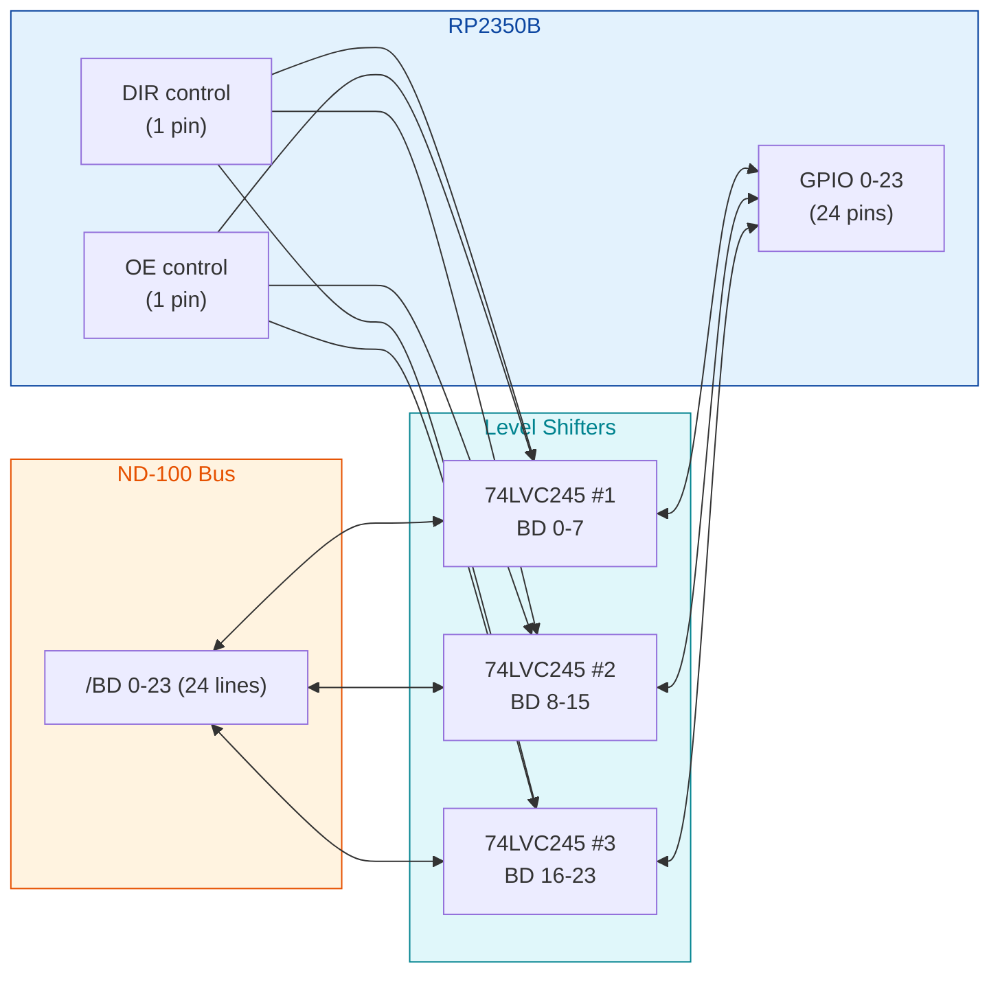
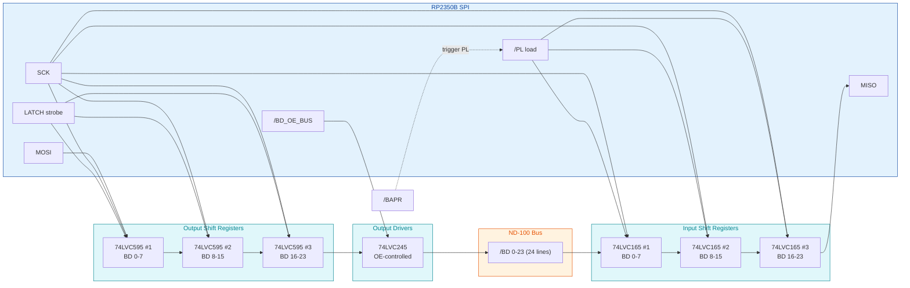

# ND-100 Multi-Device Controller Card Design (RP2350B)

## Overview

This document describes the hardware design for an **ND-100 controller card** based on the **Raspberry Pi RP2350B** microcontroller. The card is intended to emulate multiple peripheral devices for the ND-100/ND-110/ND-120 systems, plugging into a standard slot on the shared backplane via the C connector.

**Target device emulations:**

| Device | Interrupt Level | Notes |
|--------|----------------|-------|
| Floppy disk | 10 / 11 | PIO + DMA |
| SMD disk | 10 / 11 | PIO + DMA |
| Terminal | 10 / 12 | PIO only |
| HDLC | 13 | PIO + DMA, fastest path |

The card must support all four ND-100 bus cycle types from the bus signal reference:

- **IOX/IOXT** (programmed I/O) - read and write to device registers
- **IDENT PLxx** - interrupt identification via daisy-chain
- **Interrupt generation** - asserting BINT 10-13
- **DMA transfers** - memory read and write as bus master

See [ND-100-BUS-C-CONNECTOR.md](ND-100-BUS-C-CONNECTOR.md) for the complete bus signal reference and cycle protocols.

---

## Hardware Module: Pimoroni PGA2350

The selected hardware is the **Pimoroni PGA2350** (PIM722) -- a Pin Grid Array (PGA) breakout board for the RP2350B with maximum exposed pins in minimum space.

### PGA2350 Specifications

| Feature | Value |
|---------|-------|
| MCU | RP2350B (48 GPIO variant) |
| Flash | **16 MB QSPI** with XiP support |
| PSRAM | **8 MB** (CS wired to GP47, **cuttable trace**) |
| GPIO exposed | 48 (GP0-GP47) |
| Format | Pin Grid Array, very compact |
| Brand | Pimoroni |
| SKU | PIM722 |

### Pin Availability on PGA2350

The 48 GPIO pins on the PGA2350 are GP0-GP47. Several pins have specific reservations:

#### Hard reservations (NOT available as GPIO)

These pins are dedicated to external QSPI flash and **not exposed** as part of the GPIO pool:

| Signal | Function |
|--------|----------|
| QSPI_SCLK | Flash clock |
| QSPI_CS | Flash chip select |
| QSPI_IO0 | Flash data 0 |
| QSPI_IO1 | Flash data 1 |
| QSPI_IO2 | Flash data 2 |
| QSPI_IO3 | Flash data 3 |

> The QSPI pins are **separate from GPIO0-47**. They do NOT eat into the 48 GPIO budget. The PGA2350 module hides them internally.

#### Soft reservations (board-specific)

| Pin | Reason | Recoverable? |
|-----|--------|--------------|
| **GP47** | PSRAM chip select | ✓ Yes -- cut trace to disable PSRAM |

#### Buttons (no GPIO cost)

| Function | Pin | Notes |
|----------|-----|-------|
| RESET | RUN (dedicated) | No GPIO consumed -- press to ground |
| BOOTSEL | QSPI_CS (already reserved) | No GPIO consumed -- press to ground for programming mode |

#### USB (no GPIO cost on PGA2350)

The RP2350B's USB interface uses dedicated internal USB pins on the PGA2350 module. **USB does not consume any GPIO** -- GP24 and GP25 remain available as normal GPIOs.

### Effective GPIO Available

| Configuration | Usable GPIO | Notes |
|---------------|-------------|-------|
| **Default (PSRAM enabled)** | **47 (GP0-46)** | Recommended -- 8 MB PSRAM available |
| PSRAM disabled (cut trace) | **48 (GP0-47)** | Maximum pins, no PSRAM cache |

> **For all configurations**: USB, RESET button, and BOOTSEL button are free -- they use dedicated pins (USB internal, RUN, QSPI_CS) and do not consume any GPIO.

### When to Keep PSRAM

The 8 MB PSRAM is useful for device emulation buffering:

| Use Case | PSRAM Benefit |
|----------|---------------|
| **Floppy disk emulation** | Cache full floppy image (~1.4 MB), instant access |
| **SMD disk emulation** | Sector cache for hot regions, reduces SD card reads |
| **HDLC streaming** | Large FIFO buffers for high-throughput links |
| **Terminal emulation** | Negligible (small buffers fit in SRAM) |

### Design Fit Analysis on PGA2350

For development with USB enabled (45 GPIO) and PSRAM enabled, the design fit is:

| Design | Total Pins | Dev (45 GPIO) | Production no USB (47 GPIO) | No PSRAM no USB (48) |
|--------|-----------|---------------|----------------------------|----------------------|
| **Design 1 (Direct GPIO)** | 48 | ❌ Exceeds by 3 | ❌ Exceeds by 1 | ⚠ Tight (0 spare) |
| **Design 2 (8-bit Latched)** | 37 | ✓ 8 spare | ✓ 10 spare | ✓ 11 spare |
| **Design 3 (SPI Shift)** | 28 | ✓ 17 spare | ✓ 19 spare | ✓ 20 spare |

> **Important**: Design 1 only fits when both PSRAM is disabled AND USB is not used. This eliminates the development convenience and the PSRAM cache benefit.
>
> Designs 2 and 3 fit comfortably in all configurations.

### PSRAM Worth Keeping?

The 8 MB PSRAM is useful for:

| Use Case | PSRAM Benefit |
|----------|---------------|
| **Floppy disk emulation** | Cache full floppy image (~1.4 MB), instant access |
| **SMD disk emulation** | Sector cache for hot regions, reduces SD card reads |
| **HDLC streaming** | Large FIFO buffers for high-throughput links |
| **Terminal emulation** | Negligible (small buffers fit in SRAM) |

### Required System Resources

The controller card always requires:

| Resource | GPIO Used | Pin/Source | Purpose |
|----------|-----------|------------|---------|
| **USB** (mandatory) | 0 | Internal RP2350 USB pins | Firmware updates, virtual serial monitoring |
| **PSRAM** (recommended) | 1 | GP47 (CS) | 8 MB cache for floppy/SMD images |
| **RESET button** | 0 | RUN pin (dedicated) | Hardware reset, no GPIO used |
| **BOOTSEL button** | 0 | QSPI_CS (already reserved) | USB mass storage programming mode |
| **Status LEDs** | 2 | 2x GPIO | Activity, error indication |

#### Buttons -- No GPIO Cost

Both required buttons use dedicated pins, **not GPIOs**:

**RESET button**: Wired RUN -> button -> GND. RUN is a dedicated reset pin with internal pull-up. Pulling it LOW resets the MCU.

```
  RUN ----[switch]---- GND
```

**BOOTSEL button**: Wired QSPI_CS -> button -> GND. QSPI_CS is part of the flash interface (already reserved, not in GPIO pool). Holding BOOTSEL LOW during reset forces USB mass storage bootloader mode for firmware programming.

```
  QSPI_CS ----[switch]---- GND
```

**Programming sequence**:
1. Hold BOOTSEL
2. Press RESET (RUN)
3. Release RESET
4. Release BOOTSEL
5. Device appears as USB mass storage drive

Optional: add 100R series resistor or debounce capacitor (not required).

#### USB -- No Additional GPIO Cost

The RP2350B's USB interface uses **dedicated internal USB pins** that are not part of the GPIO0-47 pool. USB does **not consume any GPIO** on the PGA2350. This is different from the raw RP2350B chip where USB pins overlap with GP24/GP25 in some package variants.

> **Correction from earlier**: USB on PGA2350 does not eat GP24/GP25. Those remain available as normal GPIO.

### Effective GPIO Budget (Corrected)

| Item | Pins |
|------|------|
| Total GP0-GP47 | 48 |
| Minus PSRAM CS (GP47) | -1 |
| Minus 2x status LEDs | -2 |
| **Remaining for bus interface + SD card** | **45** |

### Design Fit (Corrected)

With PSRAM enabled and 2 LEDs (45 GPIO available for bus + SD):

| Design | Bus Interface Pins | Common Non-BD | SD SPI | Total | Fits 45? | Spare |
|--------|-------------------|--------------|--------|-------|----------|-------|
| Design 1 (Direct GPIO) | 26 | 16 | 4 | 46 | ❌ **No** -- exceeds by 1 | -1 |
| **Design 2 (8-bit Latched)** | 15 | 16 | 4 | 35 | ✓ Yes | **10 spare** |
| Design 3 (SPI Shift) | 6 | 16 | 4 | 26 | ✓ Yes | **19 spare** |

> **Design 1** still does not fit with PSRAM enabled. To use Design 1 you would need to cut the PSRAM trace to free GP47, sacrificing the 8 MB cache.
>
> **Design 2** fits comfortably with **10 spare pins** -- room for debug UART, additional LEDs, expansion headers.
>
> **Design 3** has the most headroom (19 spare) at the cost of slower BD access.

### Final Recommendation

| Setting | Choice | Why |
|---------|--------|-----|
| Module | **Pimoroni PGA2350** | RP2350B + 16 MB flash + 8 MB PSRAM |
| Architecture | **Design 2 (8-bit Latched)** | Best balance of speed, pin count, and capability |
| PSRAM | **Enabled** | 8 MB cache for floppy/SMD images |
| USB | **Enabled** (mandatory, no GPIO cost) | Firmware updates + virtual serial monitoring |
| RESET button | RUN pin (no GPIO) | Hardware reset |
| BOOTSEL button | QSPI_CS (no GPIO) | Programming mode |
| Status LEDs | 2x GPIO | Activity + error |
| **Bus interface pins** | 35 (Design 2 + common + SD) | |
| **System pins (PSRAM, LEDs)** | 3 | |
| **Total used** | **38** | |
| **Spare GPIO** | **10** | For debug UART, expansion, additional LEDs |

---

## Why RP2350B (chip-level)

The **RP2350B** is selected over the smaller RP2350A because of its **48 GPIO pins** (vs 30), enabling a full 24-bit parallel bus interface within a single GPIO bank without compromises.

### Key features used

| Feature | Why |
|---------|-----|
| **48 GPIO** in two banks (32 + 16) | Full 24-bit bus + control + SD card + debug |
| **12 PIO state machines** | Deterministic bus timing for IOX/IDENT/DMA cycles |
| **DMA controllers** | High-throughput transfers between PIO FIFOs and RAM |
| **Dual ARM Cortex-M33 cores** | One core for bus protocol, one for device emulation |
| **520 KB internal SRAM** | Multi-device buffers, FIFOs, ring buffers |
| **16 MB QSPI flash** (PGA2350) | Firmware + boot ROM images + small disk images |
| **8 MB PSRAM** (PGA2350) | Floppy image cache, SMD sector cache, HDLC FIFOs |

---

## GPIO Bank Architecture

The RP2350B has two GPIO banks with **separate control registers**:

| Bank | Pins | Purpose |
|------|------|---------|
| **LOW bank** | GPIO0-31 | Time-critical: bus signals, control |
| **HIGH bank** | GPIO32-47 | Slow peripherals: SD card, debug, UART |

**Critical rule**: The 24-bit bus **must** be in a single bank to allow single-cycle parallel read/write. Splitting across banks would require two separate writes with timing skew -- unacceptable for bus protocol timing.

### External Flash and PSRAM Pin Reservations

Both RP2040 and RP2350B require **dedicated pins for external QSPI flash** (XIP execute-in-place). These pins are **not usable as GPIO**.

| Resource | RP2040 (raw) | RP2350B (raw) | PGA2350 module |
|----------|--------------|---------------|----------------|
| Total GPIO pool | 30 (GPIO0-29) | 48 (GPIO0-47) | 48 (GP0-GP47) |
| QSPI flash pins | 6 (mandatory, eats GPIO) | ~6 (separate from GPIO) | Internal to module, **not in GPIO pool** |
| QSPI PSRAM (optional) | Not supported | 6-11 pins if used | Internal to module, **not in GPIO pool** |
| PSRAM CS | -- | -- | **GP47** (cuttable trace) |
| USB pins | GP24/GP25 | varies | Internal, **not in GPIO pool** |
| RESET pin | RUN (dedicated) | RUN (dedicated) | RUN (dedicated, no GPIO) |
| BOOTSEL | -- | QSPI_CS | QSPI_CS (already reserved, no GPIO) |
| **Practical usable GPIO** | **~24** | **~31-36** | **47 (PSRAM) or 48 (no PSRAM)** |

| PGA2350 Configuration | Available GPIO |
|-----------------------|----------------|
| **PSRAM enabled (recommended)** | **47** |
| PSRAM disabled (cut GP47 trace) | **48** |

> **PGA2350 advantage**: All special pins (QSPI flash, USB, RUN, BOOTSEL) are either internal to the module or use dedicated pins. **None of them eat into the GPIO0-47 pool**. The only GPIO loss is **GP47 for PSRAM CS** (recoverable by cutting a trace).

> **Recommendation**: Use **47 GPIO** (PSRAM enabled). This is sufficient for Design 2 or Design 3, with comfortable spare pins for LEDs and expansion. Design 1 still does not fit (needs 46 just for bus + common signals + SD).

### Single-cycle bus access

```c
#define BUS_MASK 0x00FFFFFF  // GPIO0-23

// Single-cycle 24-bit write
gpio_hw->out = (gpio_hw->out & ~BUS_MASK) | (value & BUS_MASK);

// Single-cycle 24-bit read
uint32_t value = gpio_hw->in & BUS_MASK;

// Atomic direction switching
gpio_hw->oe_set = BUS_MASK;   // BD lines as outputs
gpio_hw->oe_clr = BUS_MASK;   // BD lines as inputs
```

> **Never use SDK functions** like `gpio_put()` in the hot path -- too slow and non-deterministic for bus-level timing.

---

## Three Candidate Designs for the BD 0-23 Interface

The BD 0-23 bus is the dominant pin consumer. Three fundamentally different architectures are possible. Each is fully fleshed out below with pin allocation, components, timing analysis, and cost. A comparison matrix follows.

### Common to All Three Designs

**Hardware-latched address capture**: All three designs use external latches clocked by /BAPR so the address is captured the instant /BAPR asserts. This solves the 50 ns BAPR address hold window in hardware regardless of how the MCU accesses the latches afterward. The MCU then reads the captured value within the 8 us total cycle limit.

**Non-BD signals are handled identically** in all three designs (see "Common Non-BD Signal Layout" below). Only the BD 0-23 path differs.

**Special IDENT/GRANT pass-through chip**: All three designs include a dedicated 74LVC125 quad 3-state buffer for hardware default pass-through of INIDENT->OUTIDENT and INGRANT->OUTGRANT (see dedicated section below).

---

## Design 1: Direct GPIO BD Interface

24 RP2350 GPIOs map directly to /BD 0-23 via 3x 74LVC245 octal bus transceivers.

### Block Diagram



### Pin Allocation

| GPIO | Signal | Direction | Function |
|------|--------|-----------|----------|
| 0-7 | /BD 0-7 | Bidirectional | BD lines via 74LVC245 #1 |
| 8-15 | /BD 8-15 | Bidirectional | BD lines via 74LVC245 #2 |
| 16-23 | /BD 16-23 | Bidirectional | BD lines via 74LVC245 #3 |
| 24 | BD_DIR | Output | Direction control (all three transceivers) |
| 25 | /BD_OE | Output | Output enable (all three transceivers) |

**BD pins used: 26**

### Component List

| IC | Qty | Function | Approx Cost |
|----|-----|----------|-------------|
| 74LVC245 | 3 | Octal bus transceiver, 3.3V/5V level shift | $1.50 |
| Bypass caps (0.1uF) | 3 | One per IC | $0.10 |
| **Subtotal BD path** | | | **$1.60** |

### Timing Analysis

| Operation | Time | Notes |
|-----------|------|-------|
| 24-bit read | ~5 ns | Single SIO register read |
| 24-bit write | ~5 ns | Single SIO register write |
| Direction switch | ~5 ns | Single OE/DIR write |
| Level shifter delay | 3-6 ns | 74LVC245 propagation |
| **Total round-trip read** | **~15 ns** | GPIO + level shifter + GPIO read |
| **Total round-trip write** | **~15 ns** | GPIO write + level shifter |

### Bus Cycle Performance

| Cycle | Time | Margin (8 us) |
|-------|------|---------------|
| IOX response | ~100-200 ns | 40x |
| IDENT decision | ~25 ns | 4x within 100 ns window |
| DMA word cycle | ~250-500 ns | 16x |
| DMA throughput | **~3 MB/s** | Sufficient for SMD |

### Pros

- **Fastest possible** -- single-cycle 24-bit access
- **Simplest software** -- direct GPIO read/write, no PIO needed for BD bus
- **Minimum external chips** -- only 3 transceivers for BD path
- **Lowest BIST complexity** -- everything visible to debugger
- **Best timing margin** for IDENT and DMA throughput

### Cons

- **Highest pin count** for BD bus (26 pins)
- **Burns nearly all of LOW bank** (26/32 = 81%)
- Leaves only 6 LOW bank pins for time-critical control signals
- Other bus signals must move to HIGH bank, which has separate registers and slower combined operations
- **Total system pin count** may exceed 48 GPIO budget when combined with all other signals

---

## Design 2: 8-bit Latched BD Interface (PIO-driven)

A shared 8-bit data bus connects to 6 octal latches: 3 for capturing input from the bus, 3 for driving output to the bus. Chip selects choose which latch the MCU is currently accessing. The MCU reads or writes the 24-bit BD value as **3 sequential 8-bit operations** controlled by a PIO state machine.

### Block Diagram

```mermaid
flowchart LR
    subgraph BUS["ND-100 Bus"]
        BD["/BD 0-23 (24 lines)"]
    end

    subgraph IN["Input Latches (BAPR clocked)"]
        L1["74LVC573 #1<br/>BD 0-7"]
        L2["74LVC573 #2<br/>BD 8-15"]
        L3["74LVC573 #3<br/>BD 16-23"]
    end

    subgraph OUT["Output Drivers"]
        D1["74LVC245 #1<br/>BD 0-7"]
        D2["74LVC245 #2<br/>BD 8-15"]
        D3["74LVC245 #3<br/>BD 16-23"]
    end

    subgraph MCU["RP2350B"]
        D8["Shared 8-bit bus<br/>GPIO 0-7"]
        CS["3x /OE_IN<br/>3x LATCH_OUT"]
        OE["/BD_OE_BUS"]
    end

    BD --> L1
    BD --> L2
    BD --> L3
    BD <-- D1
    BD <-- D2
    BD <-- D3

    L1 --> D8
    L2 --> D8
    L3 --> D8
    D8 --> D1
    D8 --> D2
    D8 --> D3

    CS --> L1
    CS --> L2
    CS --> L3
    CS --> D1
    CS --> D2
    CS --> D3
    OE --> D1
    OE --> D2
    OE --> D3

    BAPR["/BAPR (clock)"] --> L1
    BAPR --> L2
    BAPR --> L3

    style BUS fill:#FFF3E0,stroke:#E65100,color:#E65100
    style IN fill:#E0F7FA,stroke:#00838F,color:#00838F
    style OUT fill:#E0F7FA,stroke:#00838F,color:#00838F
    style MCU fill:#E3F2FD,stroke:#0D47A1,color:#0D47A1
```

### Pin Allocation

| GPIO | Signal | Direction | Function |
|------|--------|-----------|----------|
| 0-7 | DBUS 0-7 | Bidirectional | Shared 8-bit MCU<->latch bus |
| 8 | /OE_IN_0 | Output | Read input latch 0 (BD 0-7) |
| 9 | /OE_IN_1 | Output | Read input latch 1 (BD 8-15) |
| 10 | /OE_IN_2 | Output | Read input latch 2 (BD 16-23) |
| 11 | LE_OUT_0 | Output | Latch output 0 (BD 0-7) |
| 12 | LE_OUT_1 | Output | Latch output 1 (BD 8-15) |
| 13 | LE_OUT_2 | Output | Latch output 2 (BD 16-23) |
| 14 | /BD_OE_BUS | Output | Enable our card to drive the bus |

**BD pins used: 15**

### Component List

| IC | Qty | Function | Approx Cost |
|----|-----|----------|-------------|
| 74LVC573 | 3 | Octal D-latch, captures BD on /BAPR | $1.50 |
| 74LVC245 | 3 | Octal bus driver, output to bus | $1.50 |
| 74LVT138 | 1 | 3-to-8 decoder (optional, for CS generation) | $0.40 |
| Bypass caps (0.1uF) | 6 | One per IC | $0.20 |
| **Subtotal BD path** | | | **$3.60** |

### PIO State Machine Operation

```
Read 24 bits from bus (after /BAPR latched data):
  PIO SM:
    Set /OE_IN_0 = 0     (1 cycle)
    Read DBUS 0-7        (1 cycle)
    Set /OE_IN_0 = 1     (1 cycle)
    Set /OE_IN_1 = 0     (1 cycle)
    Read DBUS 0-7        (1 cycle)
    Set /OE_IN_1 = 1     (1 cycle)
    Set /OE_IN_2 = 0     (1 cycle)
    Read DBUS 0-7        (1 cycle)
    Set /OE_IN_2 = 1     (1 cycle)
  Total: ~9 PIO cycles @ 150 MHz = ~60 ns

Write 24 bits to bus:
  PIO SM:
    Drive DBUS = byte0   (1 cycle)
    Pulse LE_OUT_0       (1 cycle)
    Drive DBUS = byte1   (1 cycle)
    Pulse LE_OUT_1       (1 cycle)
    Drive DBUS = byte2   (1 cycle)
    Pulse LE_OUT_2       (1 cycle)
    Set /BD_OE_BUS = 0   (1 cycle, enable bus drive)
  Total: ~7 PIO cycles @ 150 MHz = ~50 ns + level shifter delay
```

### Timing Analysis

| Operation | Time | Notes |
|-----------|------|-------|
| 24-bit read (3 chunks) | ~60 ns | PIO @ 150 MHz |
| 24-bit write (3 chunks) | ~50 ns | PIO @ 150 MHz |
| Latch propagation | 3-5 ns | 74LVC573 |
| Level shifter delay | 3-6 ns | 74LVC245 |
| **Total round-trip read** | **~70-80 ns** | Including latch + read chunks |
| **Total round-trip write** | **~60-70 ns** | Including write chunks + latch |

### Bus Cycle Performance

| Cycle | Time | Margin (8 us) |
|-------|------|---------------|
| IOX response | ~200-400 ns | 20x |
| IDENT decision | ~70-90 ns | within 100 ns window ✓ |
| DMA word cycle | ~400-700 ns | 11x |
| DMA throughput | **~1.5-2 MB/s** | Sufficient for all devices including SMD |

### Pros

- **Moderate pin count** -- 15 pins for BD interface (vs 26 for Design 1)
- **Frees ~10 LOW bank pins** for other time-critical signals
- **Good throughput** -- meets all device requirements
- **Deterministic** via PIO state machine
- **Hardware latch** decouples MCU from BAPR timing

### Cons

- **More external components** -- 6 latch/driver chips + optional decoder
- **PIO program complexity** higher than Design 1
- **Three sequential operations** per 24-bit access (vs single op in Design 1)
- IDENT decision time is tighter (~70-90 ns vs 100 ns window)

---

## Design 3: SPI Shift Register BD Interface

3x 74LVC165 chained as 24-bit parallel-in serial-out (input) and 3x 74LVC595 chained as 24-bit serial-in parallel-out (output). The MCU accesses both via the hardware SPI peripheral with DMA.

### Block Diagram



### Pin Allocation

| GPIO | Signal | Direction | Function |
|------|--------|-----------|----------|
| 0 | SPI0_SCK | Output | SPI clock to all shift registers |
| 1 | SPI0_MOSI | Output | SPI data to 74LVC595 chain |
| 2 | SPI0_MISO | Input | SPI data from 74LVC165 chain |
| 3 | /PL_LOAD | Output | Parallel load trigger for 74LVC165 (clocked by /BAPR via gate) |
| 4 | LATCH_OUT | Output | Latch enable for 74LVC595 outputs |
| 5 | /BD_OE_BUS | Output | Enable our card to drive the bus |

**BD pins used: 6**

### Component List

| IC | Qty | Function | Approx Cost |
|----|-----|----------|-------------|
| 74LVC165 | 3 | Parallel-in serial-out shift register | $1.20 |
| 74LVC595 | 3 | Serial-in parallel-out shift register | $1.20 |
| 74LVC245 | 1 | Output driver to bus, OE controlled | $0.50 |
| 74LVC14 | 1 | Schmitt trigger for /BAPR conditioning | $0.30 |
| Bypass caps (0.1uF) | 8 | One per IC | $0.25 |
| **Subtotal BD path** | | | **$3.45** |

### Timing Analysis

| Operation | Time | Notes |
|-----------|------|-------|
| 24-bit read (SPI @ 30 MHz) | ~800 ns | 24 SPI clocks + setup |
| 24-bit write (SPI @ 30 MHz) | ~800 ns | 24 SPI clocks + setup |
| SPI transaction overhead | ~100-200 ns | DMA setup, completion |
| **Total round-trip read** | **~1000 ns (~1 us)** | Worst case |
| **Total round-trip write** | **~1000 ns (~1 us)** | Worst case |

> **Note**: 74HC165/595 max clock is ~25 MHz at 5V, slower at 3.3V. Use **74LVC165/595** (CMOS) or **74LVC4-bit shift registers** for higher speeds. RP2350 SPI peripheral can run faster but is limited by the shift register max clock.

### Bus Cycle Performance

| Cycle | Time | Margin (8 us) |
|-------|------|---------------|
| IOX response | ~2.0-2.5 us | 3-4x |
| IDENT decision | ~110 ns ⚠ | **Marginal**, requires hardware default pass-through |
| DMA word cycle | ~2.3-2.8 us | 3x |
| DMA throughput | **~350-400 KB/s** | Sufficient for floppy, terminal, HDLC. **Marginal for SMD.** |

### Pros

- **Lowest pin count** -- 6 pins for entire BD interface
- **Massive pin savings** -- ~20 LOW bank pins free for other uses
- **Uses hardware SPI peripheral** with DMA -- frees PIO for other tasks
- **Standard, well-known components** (74HC165/595)
- **Compact PCB** -- shift registers are small

### Cons

- **Slowest by far** -- ~1 us per BD access vs 5-80 ns for Designs 1 and 2
- **Insufficient throughput for SMD disk emulation** at full speed
- **Marginal for IDENT 100 ns window** -- absolutely requires hardware pass-through
- **HC family max ~25 MHz** -- need LVC variants for higher speed
- More chips than Design 1 (8 vs 3)
- SPI peripheral conflict if SD card also uses SPI (need separate SPI bus)

---

## Common Non-BD Signal Layout (All Three Designs)

The non-BD signals use the same layout in all three designs:

| Signal | RP2350 GPIO | Direction | Buffer IC |
|--------|-------------|-----------|-----------|
| /BAPR | 1 pin | In | 74LVC14 (Schmitt) |
| /BIOXE | 1 pin | In | 74LVC14 |
| /BINACK | 1 pin | In | 74LVC14 |
| /BMEM | 1 pin | In | 74LVC14 |
| /BMCL | 1 pin | In | 74LVC14 |
| /BDRY | 1 pin | Bidir | 74LVC07 (open-drain) + 74LVC14 (read-back) |
| /BINPUT | 1 pin | Bidir | 74LVC07 + 74LVC14 |
| /BDAP | 1 pin | Bidir | 74LVC07 + 74LVC14 |
| /BREQ | 1 pin | Out | 74LVC07 (open-drain) |
| /INGRANT | 1 pin | In | (via daisy-chain chip) |
| /OUTGRANT | 1 pin | Out | (via daisy-chain chip) |
| /INIDENT | 1 pin | In | (via daisy-chain chip) |
| /OUTIDENT | 1 pin | Out | (via daisy-chain chip) |
| /BINT 10 | 1 pin | Out | 74LVC07 |
| /BINT 11 | 1 pin | Out | 74LVC07 |
| /BINT 12 | 1 pin | Out | 74LVC07 |

**Common non-BD pins: 16**

For the bidirectional signals (/BDRY, /BINPUT, /BDAP), one approach uses **two GPIO pins** (1 to drive open-drain output, 1 to read state). The simpler approach uses **1 GPIO** in open-drain mode (RP2350 GPIO supports this) plus a separate input buffer reading the same line.

---

## IDENT/GRANT Daisy-Chain Pass-Through Chip (All Designs)

The 100 ns IDENT decision window and the need for fast daisy-chain propagation make a **hardware default pass-through** essential. A single 74LVC125 quad 3-state buffer handles both daisy chains:

### Operation

```
Default (idle): PIO drives /OE_PASS = LOW
  Buffer enabled
  /INIDENT  --> [LVC125 ch.1] --> /OUTIDENT  (3-5 ns delay)
  /INGRANT  --> [LVC125 ch.2] --> /OUTGRANT  (3-5 ns delay)

Capture (we want this interrupt or DMA cycle): PIO drives /OE_PASS = HIGH
  Buffer high-Z
  /OUTIDENT and /OUTGRANT float HIGH (next slot sees idle)
  Our card drives BD lines + /BDRY for IDENT response
  Or starts DMA cycle for GRANT capture
```

### IC Selection

| IC | Function | Notes |
|----|----------|-------|
| **74LVC125** | Quad 3-state buffer with independent enables | Recommended -- 3-5 ns delay, simple |
| 74LVC126 | Same with active-high enables | Alternative |
| ATF22V10 PAL | Programmable | Overkill but allows custom logic |
| ATF1502 CPLD | Programmable | If complex pass-through logic needed |

The 74LVC125 is the simplest and fastest option. Two channels handle each daisy-chain pair (in + out), leaving 0 spare. If you need spare buffer channels for other use, a 74LVC126 offers 4 channels.

### Pin Cost

The pass-through chip needs:
- 1 GPIO for /OE_IDENT_PASS (controls IDENT chain)
- 1 GPIO for /OE_GRANT_PASS (controls GRANT chain)
- Or combine both onto 1 GPIO if they're always controlled together

**Pin cost: 1-2 GPIO** (already counted in non-BD signal table above for INGRANT/OUTGRANT and INIDENT/OUTIDENT)

---

## Comparison Matrix

| Aspect | Design 1: Direct GPIO | Design 2: 8-bit Latched | Design 3: SPI Shift |
|--------|----------------------|-------------------------|---------------------|
| **BD pins (RP2350)** | 26 | 15 | 6 |
| **BD external chips** | 3 | 6 (+1 optional) | 7 |
| **24-bit read time** | ~5 ns | ~60-80 ns | ~1000 ns |
| **24-bit write time** | ~5 ns | ~50-70 ns | ~1000 ns |
| **IOX response** | ~150 ns | ~300 ns | ~2200 ns |
| **IDENT decision** | ~25 ns ✓ | ~70-90 ns ✓ | ~110 ns ⚠ |
| **DMA word cycle** | ~280 ns | ~500 ns | ~2500 ns |
| **DMA throughput** | ~3 MB/s | ~1.5-2 MB/s | ~400 KB/s |
| **Sufficient for SMD?** | ✓ Yes | ✓ Yes | ⚠ Marginal |
| **Sufficient for HDLC?** | ✓ Yes | ✓ Yes | ✓ Yes |
| **Sufficient for floppy/term?** | ✓ Yes | ✓ Yes | ✓ Yes |
| **Software complexity** | Low | Medium (PIO) | Low (SPI HW) |
| **PIO state machines used** | 0 | 1-2 | 0 |
| **External components (BD)** | 3 + caps | 7 + caps | 8 + caps |
| **Approx BD chip cost** | $1.60 | $3.60 | $3.45 |
| **PCB area for BD path** | Small | Medium | Medium |
| **Total system pins (BD + 16 common)** | 42 | 31 | 22 |
| **Spare pins (RP2350B 48 total)** | 6 | 17 | 26 |
| **Risk of pin shortage** | High | Low | Very low |

---

## Recommendation

| Use case | Recommended Design |
|----------|-------------------|
| **Multi-device controller** (floppy + SMD + terminal + HDLC) | **Design 2 (8-bit latched)** |
| **Single SMD/HDLC controller** with maximum speed | Design 1 (Direct GPIO) |
| **Simple PIO devices only** (terminal, floppy) | Design 3 (SPI) |
| **Pin count is the dominant constraint** | Design 3 (SPI) |
| **Maximum simplicity, money no object** | Design 1 (Direct GPIO) |

**Primary recommendation: Design 2 (8-bit latched)** for the multi-device controller goal. It provides:

- Sufficient throughput for all four target devices
- Pin headroom for additional devices and debug
- Reasonable component count
- PIO-driven deterministic timing
- Hardware-latched address capture

**Fallback: Design 1 (Direct GPIO)** if pin budget allows after counting all non-BD signals. Worth verifying pin count fits within 48 GPIO with all bus signals + SD card + interrupts.

**Avoid Design 3** unless SMD emulation is dropped. The DMA throughput limit is the binding constraint.

---

## Pin Budget Verification (All Three Designs)

| Group | Pins | Design 1 | Design 2 | Design 3 |
|-------|------|----------|----------|----------|
| BD bus | varies | 26 | 15 | 6 |
| /BAPR, /BIOXE, /BINACK, /BMEM, /BMCL (input) | 5 | 5 | 5 | 5 |
| /BDRY, /BINPUT, /BDAP (bidir, 1 pin each open-drain) | 3 | 3 | 3 | 3 |
| /BREQ (output) | 1 | 1 | 1 | 1 |
| /INGRANT, /OUTGRANT, /INIDENT, /OUTIDENT | 4 | 4 | 4 | 4 |
| /BINT 10/11/12 | 3 | 3 | 3 | 3 |
| Daisy-chain pass-through enables | 1-2 | 2 | 2 | 2 |
| SD card (SPI) | 4 | 4 | 4 | 4 |
| **Total minimum** | | **48** | **37** | **28** |
| **Spare on RP2350B (48 total)** | | **0** | **11** | **20** |

> **Design 1 uses every single GPIO** with no margin for debug, status LEDs, or expansion. This is risky.
>
> **Design 2 leaves 11 spare** -- comfortable for debug UART, LEDs, additional features.
>
> **Design 3 leaves 20 spare** -- but pays the cost in bus throughput.

---

## Design 2 Detailed Implementation -- Chip Selection, Read/Write, Memory Emulation

This section details exactly how Design 2 (8-bit Latched BD Interface) works at the chip level, including read/write sequences, bus drive control, timing verification for IOX and DMA, and an extension for emulating RAM on the bus.

### Chip Selection

Design 2 uses three logical groups:

#### Input Latch Group (Capture from Bus)

**Function**: Capture the 24-bit BD bus state instantly when /BAPR asserts, so the MCU can read it later at its leisure.

**Recommended chip**: **74LVC574** -- octal D-type flip-flop with 3-state outputs.

| Feature | Value |
|---------|-------|
| Type | Octal positive-edge-triggered D flip-flop |
| Inputs | 5V tolerant (input pins accept 5V at 3.3V VCC) |
| Outputs | 3-state, controlled by /OE |
| Clock | Captures D on rising edge of CLK |
| Propagation delay | 3-7 ns |
| Supply | 1.65V - 3.6V |

**Why edge-triggered (574) instead of transparent latch (573)**:
- 574 captures on a clean edge (rising edge of CLK)
- 573 is transparent while LE is HIGH -- data tracks input
- We want to **freeze** the bus state at the moment /BAPR asserts, not track it

**Connection**:
```
  Bus side:    /BD 0-7    -> 74LVC574 #1 D inputs (8 lines)
               /BD 8-15   -> 74LVC574 #2 D inputs
               /BD 16-23  -> 74LVC574 #3 D inputs

  Clock:       /BAPR -> 74LVC14 inverter -> CLK pin (rising edge = falling edge of /BAPR)
                                            (all three latches share same CLK)

  MCU side:    /OE_IN_0 controlled by PIO -> 74LVC574 #1 /OE
               /OE_IN_1 controlled by PIO -> 74LVC574 #2 /OE
               /OE_IN_2 controlled by PIO -> 74LVC574 #3 /OE

               Q outputs of all three latches connect to shared 8-bit MCU data bus (only one /OE active at a time)
```

**Total**: 3x 74LVC574 + 1x 74LVC14 (the inverter is shared with other signal conditioning).

#### Output Drive Group (Drive to Bus)

**Function**: Hold a 24-bit value stable, then drive it onto the bus when commanded.

**Two-stage approach** (recommended):

1. **Output latches**: 3x 74LVC574 -- hold the 24-bit value the MCU wants to send
2. **Output transceivers**: 3x 74LVT245 -- level shift 3.3V to 5V, drive the bus with sufficient strength

| Stage | Chip | Function |
|-------|------|----------|
| Latch | 74LVC574 | Holds data, clocked by PIO when MCU writes |
| Driver | 74LVT245 | 3.3V to 5V level shift, /OE controlled by PIO |

**Connection**:
```
  MCU side:    Shared 8-bit bus -> 74LVC574 #4 D inputs
                                -> 74LVC574 #5 D inputs
                                -> 74LVC574 #6 D inputs

  Latch CLK:   PIO drives LE_OUT_0 -> 74LVC574 #4 CLK
               PIO drives LE_OUT_1 -> 74LVC574 #5 CLK
               PIO drives LE_OUT_2 -> 74LVC574 #6 CLK

  Latch -> Driver:
               74LVC574 #4 Q outputs -> 74LVT245 #1 A inputs
               74LVC574 #5 Q outputs -> 74LVT245 #2 A inputs
               74LVC574 #6 Q outputs -> 74LVT245 #3 A inputs

  Driver -> Bus:
               74LVT245 #1 B outputs -> /BD 0-7
               74LVT245 #2 B outputs -> /BD 8-15
               74LVT245 #3 B outputs -> /BD 16-23

  All three 74LVT245 DIR pins tied HIGH (always A->B = transmit)
  All three 74LVT245 /OE pins tied to /BD_OE_BUS (PIO control)
```

**Total**: 3x 74LVC574 (output latches) + 3x 74LVT245 (output drivers) = 6 chips.

#### Alternative: Registered Transceivers (74LVC646)

A more compact option uses **74LVC646** -- octal bus transceiver with built-in registers in BOTH directions and 3-state outputs.

| Feature | 74LVC646 |
|---------|----------|
| Type | Bus transceiver with internal D registers |
| Direction | Bidirectional (DIR pin) |
| Latches | One in each direction (8-bit each) |
| 3-state | Independent /OE for each direction |

Three 74LVC646 chips can replace the 3x 74LVC574 input + 3x 74LVC574 output + 3x 74LVT245 = **6 chips become 3 chips**. This saves PCB area and reduces routing complexity.

**Trade-off**: 74LVC646 is less common than 74LVC574 and 74LVT245. Stock and price may favor the discrete approach.

**Recommendation**: Start with discrete 74LVC574 + 74LVT245 for the prototype (easy to source, well documented). Migrate to 74LVC646 for the production board to reduce chip count.

#### Total Chip Count for Design 2 (Discrete)

| Chip | Quantity | Function |
|------|----------|----------|
| 74LVC574 | 3 | Input latches (BD bus -> MCU) |
| 74LVC574 | 3 | Output latches (MCU -> drive stage) |
| 74LVT245 | 3 | Output drivers (3.3V -> 5V, drive bus) |
| 74LVC14 | 1 | Schmitt-trigger inverters (/BAPR clock + signal conditioning) |
| 74LVC07 | 1 | Open-drain wired-OR drivers (BREQ, BINT, etc.) |
| 74LVC125 | 1 | Daisy-chain pass-through buffer |
| **Total** | **12** | |

(Plus pull resistors and bypass capacitors)

### Read Sequence (24-bit BD Bus -> MCU)

The read happens in two phases: hardware capture (instant on /BAPR), then MCU reads via 3 chunks.

#### Phase 1: Hardware Capture (0 ns MCU time)

```
1. /BAPR asserts on bus (CPU drives address)
2. 74LVC14 inverts /BAPR -> CLK rising edge
3. All three 74LVC574 input latches capture BD 0-23 simultaneously
4. Address is now frozen in latches
5. Bus state can change without affecting captured data
```

#### Phase 2: MCU Reads via Shared 8-bit Bus

```
PIO state machine reads (typical timing at 150 MHz PIO clock):

  Cycle 1: Set /OE_IN_0 = LOW       (~7 ns)
  Cycle 2: Read GPIO 0-7 -> byte0   (~7 ns)
  Cycle 3: Set /OE_IN_0 = HIGH      (~7 ns)
  Cycle 4: Set /OE_IN_1 = LOW       (~7 ns)
  Cycle 5: Read GPIO 0-7 -> byte1   (~7 ns)
  Cycle 6: Set /OE_IN_1 = HIGH      (~7 ns)
  Cycle 7: Set /OE_IN_2 = LOW       (~7 ns)
  Cycle 8: Read GPIO 0-7 -> byte2   (~7 ns)
  Cycle 9: Set /OE_IN_2 = HIGH      (~7 ns)

  MCU value = (byte2 << 16) | (byte1 << 8) | byte0

  Total: ~63 ns (9 cycles @ 150 MHz)
  Plus latch /OE propagation delay: ~3-5 ns per chunk
  Total realistic: ~80-100 ns
```

The shared bus prevents bus contention because only one input latch has /OE active at a time.

### Write Sequence (MCU -> 24-bit BD Bus)

#### Phase 1: MCU Loads Output Latches

```
PIO state machine writes:

  Cycle 1: Drive GPIO 0-7 = byte0    (~7 ns)
  Cycle 2: Pulse LE_OUT_0 (HIGH-LOW) (~14 ns, 2 cycles)
            -> 74LVC574 #4 captures byte0
  Cycle 3: Drive GPIO 0-7 = byte1    (~7 ns)
  Cycle 4: Pulse LE_OUT_1            (~14 ns)
  Cycle 5: Drive GPIO 0-7 = byte2    (~7 ns)
  Cycle 6: Pulse LE_OUT_2            (~14 ns)

  Total: ~63 ns to load all three output latches
  All 24 bits now sit on the 74LVT245 input pins, ready to drive
```

#### Phase 2: Enable Bus Drivers

```
  Cycle 7: Set /BD_OE_BUS = LOW      (~7 ns)
  Cycle 8: Wait for level shifter    (3-5 ns 74LVT245 propagation)

  Bus now shows the 24-bit value
  Driven by 3x 74LVT245 (each with mA-class drive strength)

  Total time from start of write to valid bus output: ~80 ns
```

#### Phase 3: Release the Bus

```
  When data is no longer needed (after /BDRY handshake):
  Cycle N: Set /BD_OE_BUS = HIGH     (~7 ns)

  74LVT245 outputs go high-Z within ~5 ns
  Bus is released, other devices may drive
```

### Bus Drive Enable (/BD_OE_BUS) Control

The /BD_OE_BUS signal is the master enable for our card to drive the BD bus. Critical safety rules:

| Situation | /BD_OE_BUS State |
|-----------|------------------|
| Power-up (before MCU boot) | HIGH (pull-up resistor) -- bus drivers OFF |
| MCU initializing | HIGH (initial GPIO state) -- bus drivers OFF |
| CPU IOX read cycle, we are not target | HIGH -- not driving |
| CPU IOX read cycle, we are the target | LOW during data phase only |
| CPU IOX write cycle | HIGH -- CPU drives, we just listen |
| DMA we initiated, address phase | LOW (we drive address) |
| DMA we initiated, data phase write | LOW (we drive data) |
| DMA we initiated, data phase read | HIGH (memory drives data) |
| Power-down or fault | HIGH (pull-up brings it back) |

The PIO state machine carefully sequences /BD_OE_BUS based on the current bus cycle phase.

### Timing Verification: IOX

#### IOX Read (CPU reads from us)

```
Time     Event
-------- ------------------------------------------------
   0 ns  CPU asserts /BAPR (address valid on bus)
   2 ns  Hardware: 74LVC14 inverts /BAPR
   5 ns  Hardware: 74LVC574 latches capture 24-bit address
   5 ns  RP2350 PIO sees /BAPR, starts reading address
  85 ns  PIO has read all 24 bits via 3 chunks
  85 ns  PIO decodes: is this our register?
 100 ns  YES -- prepare data response
 100 ns  CPU asserts /BIOXE
 105 ns  PIO sees /BIOXE
 110 ns  Interface decides: this is read (target reg is input)
 110 ns  PIO asserts /BINPUT
 130 ns  CPU sees /BINPUT, releases WDA buffer
 140 ns  CPU asserts /BINACK
 145 ns  PIO sees /BINACK, starts loading output latches
 220 ns  PIO has loaded 3 output latches (24 bits)
 220 ns  PIO asserts /BD_OE_BUS = LOW (drive bus)
 225 ns  Output transceivers driving bus
 230 ns  PIO asserts /BDRY
 245 ns  CPU strobes data into DBR
 250 ns  CPU releases /BIOXE and /BINACK
 255 ns  PIO releases /BD_OE_BUS, /BDRY, /BINPUT, BD lines
 255 ns  Bus free

TOTAL: ~255 ns from /BAPR to bus release
BUS LIMIT: 8000 ns (8 us)
MARGIN: 31x -- comfortable
```

#### IOX Write (CPU writes to us)

```
Time     Event
-------- ------------------------------------------------
   0 ns  CPU asserts /BAPR + address on BD
   5 ns  Hardware latches address
  85 ns  PIO has read address
  90 ns  PIO decodes: is this our register?
 100 ns  CPU asserts /BIOXE + data on BD
 105 ns  Hardware: but wait, our latches still hold the ADDRESS
        We need to either re-latch on /BIOXE, or use a SEPARATE data latch

 ** This requires either: **
   Option 1: Re-clock the input latches on /BIOXE OR /BAPR (combine via gate)
   Option 2: Add separate data input latches clocked by /BIOXE
   Option 3: Use 74LVC646 registered transceivers with two captures
```

> **Important design consideration**: For IOX write, the same input latches that captured the address must be **re-clocked** to capture the data, OR we need a second set of latches. See "IOX Write Latch Strategy" below.

#### IOX Write Latch Strategy

There are three ways to handle data capture during IOX write:

**Strategy A: Re-clock the same latches on /BIOXE**

Combine /BAPR and /BIOXE via a logic gate (e.g., AND of inverted signals = OR of asserted signals) to clock the same latches:

```
  CLK_LATCH = NOT(/BAPR) OR NOT(/BIOXE)
            = /BAPR LOW OR /BIOXE LOW

  74LVC02 NOR gate:
    /BAPR ----+
              |--NOR--> CLK_LATCH (inverted output)
    /BIOXE ---+

  Wait, this needs inverted output. Use 74LVC32 (OR):
    NOT(/BAPR) -+
                |--OR--> CLK_LATCH
    NOT(/BIOXE)-+

  Or use 74LVC02 NOR:
    /BAPR -+                          ____
           |--NOR--> CLK_LATCH = /BAPR + /BIOXE  (HIGH when either is LOW)
    /BIOXE-+

  When either /BAPR or /BIOXE goes LOW, CLK_LATCH goes HIGH
  Rising edge of CLK_LATCH triggers 74LVC574 capture
```

The PIO must read the latches **after the address phase but before the data phase** (to grab the address), then again after the data phase (to grab the data).

**Strategy B: Separate data input latches**

Add 2x more 74LVC574 (16-bit data is sufficient for IOX, but we can do 24 bits to match the bus):

| Latch Set | Trigger | Captures |
|-----------|---------|----------|
| Address latches (existing 3x 74LVC574) | /BAPR | 24-bit address |
| Data input latches (new 2x 74LVC574) | /BIOXE | 16-bit data (BD 0-15) |

PIO reads address from address latches, then later reads data from data latches via different chip selects.

**Cost**: +2 chips, +2 GPIO for separate /OE pins.

**Strategy C: Use 74LVC646 with two-step capture**

The 74LVC646 has independent latch enables. Trigger the AB latch on /BAPR (address) then trigger again on /BIOXE (data).

But the 74LVC646 has only ONE latch per direction, so you'd lose the address when capturing data. Unless we use the second direction (BA) for data capture. This is messy.

**Recommendation**: **Strategy B (separate data latches)**. Slightly more chips but cleaner logic and easier debugging.

### Updated Chip Count for Design 2 (with Strategy B for IOX write)

| Chip | Quantity | Function |
|------|----------|----------|
| 74LVC574 | 3 | Address input latches (BD 0-23, /BAPR clock) |
| 74LVC574 | 2 | Data input latches (BD 0-15, /BIOXE clock) |
| 74LVC574 | 3 | Output latches (MCU -> drive stage) |
| 74LVT245 | 3 | Output drivers (3.3V -> 5V, drive bus) |
| 74LVC14 | 1 | Schmitt inverters (/BAPR, /BIOXE clock conditioning) |
| 74LVC07 | 1 | Open-drain wired-OR drivers |
| 74LVC125 | 1 | Daisy-chain pass-through buffer |
| **Total** | **14** | |

### Timing Verification: DMA

For DMA, our card is the bus master. We drive everything.

#### DMA Output (Memory Read) Cycle

```
Time     Event
-------- ------------------------------------------------
   0 ns  PIO asserts /BREQ (we want the bus)
        (CPU/BCU completes current cycle)
 200 ns  BCU asserts /BMEM and /OUTGRANT
 205 ns  PIO sees /INGRANT
 215 ns  We have grant, prepare to drive bus
 215 ns  PIO loads memory address into output latches (~80 ns)
 295 ns  PIO asserts /BD_OE_BUS = LOW
 300 ns  Address valid on bus
 305 ns  PIO asserts /BAPR
 310 ns  /BINPUT remains HIGH (= read direction)
 360 ns  Address phase done, PIO releases /BD_OE_BUS (or holds for BDAP)
 360 ns  PIO asserts /BDAP ("BD free for memory data")
        (Wait for memory to respond)
 500 ns  Memory drives data on BD lines
 510 ns  Memory asserts /BDRY
 515 ns  Hardware: 74LVC574 input latches capture data on /BAPR... wait
        NO -- /BAPR is no longer being clocked

        We need ANOTHER capture trigger for the read data
        Use: /BDRY clocks the input latches for DMA read data
```

**Important**: For DMA read, we need to capture the data when memory asserts /BDRY. This is similar to the IOX write problem -- we need a second capture trigger.

**Solution**: Combine /BAPR + /BIOXE + /BDRY into the latch clock (any of them can trigger capture). Or use Strategy B with a third trigger source.

#### Updated Strategy B for DMA Read

| Latch Set | Trigger | Captures |
|-----------|---------|----------|
| Address latches (3x 74LVC574) | /BAPR | 24-bit address (CPU IOX or our DMA) |
| Data input latches (2x 74LVC574) | /BIOXE OR /BDRY (gated) | 16-bit data |

Use a 74LVC02 NOR gate to combine /BIOXE and /BDRY:
```
  CLK_DATA_LATCH = NOT(/BIOXE) OR NOT(/BDRY)
                 = HIGH when either is LOW
                 = capture when CPU writes IOX data OR memory responds with DMA data
```

This works because:
- IOX write: CPU asserts /BIOXE -> data latch captures
- IOX read: we don't need data latch (we're driving)
- DMA read: memory asserts /BDRY -> data latch captures
- DMA write: we don't need data latch (we're driving)

So one set of data latches serves both IOX write and DMA read.

#### DMA Cycle Total Time

```
Time     Event
-------- ------------------------------------------------
   0 ns  Assert /BREQ
 200 ns  Receive /INGRANT
 215 ns  Prepare and load address (~80 ns)
 305 ns  Assert /BAPR + /BMEM + drive bus
 360 ns  Address phase complete, assert /BDAP
 500 ns  Memory drives data
 515 ns  Hardware captures data
 600 ns  PIO reads data from latches (~80 ns)
 610 ns  PIO releases /BD_OE_BUS (if still asserted)
 620 ns  /BDRY trailing edge, bus free

TOTAL: ~620 ns per DMA word
THROUGHPUT: ~1.6 MB/s (one word every 620 ns)
SUFFICIENT FOR: Floppy, terminal, HDLC, SMD (marginal)
```

For DMA write, the timing is similar but we drive the data instead of capturing it.

### Memory Emulation Extension

To make the controller card emulate memory (so the CPU sees it as part of the memory system), the card must respond to memory read/write cycles addressed to its memory range.

#### What Changes

1. **Sniff /BMEM** to detect memory cycles vs IOX cycles
2. **Capture address on /BAPR** (already done)
3. **Decode**: is the address in our memory range?
4. **For memory READ**: drive data from our internal RAM/PSRAM to the bus
5. **For memory WRITE**: capture data from the bus into our internal RAM/PSRAM
6. **Assert /BDRY** when ready

#### Memory Cycle Detection

The PIO state machine watches /BMEM and /BAPR:
- /BMEM HIGH + /BAPR HIGH = idle
- /BAPR LOW with /BMEM HIGH = IOX cycle (existing)
- /BAPR LOW with /BMEM LOW = memory cycle (new)

#### Memory READ Response

```
Time     Event
-------- ------------------------------------------------
   0 ns  CPU asserts /BAPR + /BMEM, address on BD
   5 ns  Address latches capture
  85 ns  PIO has read address
  90 ns  Decode: is this our memory range? YES
  90 ns  Look up data in internal SRAM/PSRAM
        (PSRAM access ~100-200 ns, SRAM ~10 ns)
 100 ns  CPU asserts /BDAP ("BD free for our data")
 200 ns  PIO has fetched data from PSRAM
 200 ns  Load data into output latches (~80 ns for 16-bit)
 280 ns  Assert /BD_OE_BUS = LOW
 285 ns  Drive 16-bit data on BD 0-15
 290 ns  Assert /BDRY
 305 ns  CPU reads data
 310 ns  CPU releases /BMEM
 315 ns  Release everything

TOTAL: ~315 ns per memory read
WITHIN 8 us: yes, 25x margin
```

#### Memory WRITE Capture

```
Time     Event
-------- ------------------------------------------------
   0 ns  CPU asserts /BAPR + /BMEM + /BINPUT, address on BD
   5 ns  Address latches capture
  85 ns  PIO has read address
  90 ns  Decode: is this our memory range? YES
 100 ns  CPU drives data on BD + asserts /BDAP
 105 ns  Data latches capture (clocked by /BDAP via gate)
 185 ns  PIO has read data
 200 ns  PIO writes data to internal SRAM/PSRAM
 250 ns  Assert /BDRY ("data accepted")
 270 ns  CPU releases /BMEM
 275 ns  Release everything

TOTAL: ~275 ns per memory write
```

#### Hardware Additions for Memory Emulation

The existing Design 2 hardware supports memory emulation with **one critical addition**: the data input latches must be clocked by /BDAP (not /BIOXE) for memory cycles, OR we add a third trigger:

| Signal | Source | When to Capture |
|--------|--------|-----------------|
| /BIOXE | CPU IOX cycle | Capture data for IOX write |
| /BDRY | Memory response in DMA | Capture data for DMA read |
| /BDAP | CPU memory write | Capture data for memory write to us |

Combine all three with a 3-input NOR gate (74LVC10) or two 2-input NOR gates:
```
  CLK_DATA_LATCH = NOT(/BIOXE) OR NOT(/BDRY) OR NOT(/BDAP)
                 = capture on any of the three triggers
```

**Cost**: +1 chip (74LVC02 NOR or 74LVC10 3-input NOR)

#### Memory Emulation Storage

For the memory emulation, internal RAM choices:

| Storage | Size | Speed | Use Case |
|---------|------|-------|----------|
| RP2350 internal SRAM | 520 KB | ~10 ns | Fastest, register-style memory |
| PSRAM (PGA2350) | 8 MB | ~100-200 ns | Bulk memory, large emulated region |

For a small ROM emulation (boot loader, ~1 KB), use SRAM for fastest response. For emulating a large memory bank, use PSRAM with the SRAM as a sector cache.

#### Memory Emulation Timing Risk

Memory cycles on the ND-100 are fast in real hardware (~200-500 ns). Our emulated memory takes ~275-315 ns. This is **within spec but tight** if the rest of the system expects faster memory.

If memory emulation is needed for **performance-critical purposes** (e.g., emulating an extension memory bank used by SINTRAN), test carefully on real hardware. For diagnostic or boot purposes, the timing is fine.

#### Memory Emulation Limitations

- **PSRAM access latency** (~100-200 ns) eats into the bus cycle budget
- **No cache coherency** with real ND-100 memory -- our emulated memory is a separate region
- **Address space conflicts** must be avoided (CPU must not access the same physical address from both real memory and our card)

### Summary: Is Design 2 Quick Enough?

| Cycle Type | Time | Bus Limit | Margin |
|-----------|------|-----------|--------|
| IOX read | ~255 ns | 8000 ns | 31x |
| IOX write | ~200 ns | 8000 ns | 40x |
| IDENT response | ~150 ns | 100 ns window for decision | ✓ if hardware pass-through |
| DMA word read | ~620 ns | 8000 ns | 13x |
| DMA word write | ~600 ns | 8000 ns | 13x |
| Memory emulation read | ~315 ns | 8000 ns | 25x |
| Memory emulation write | ~275 ns | 8000 ns | 29x |

**All operations fit comfortably** within the 8 us bus cycle limit. The IDENT 100 ns decision window requires hardware default pass-through (74LVC125), which Design 2 already includes.

### Final Component List for Design 2 (Full Memory Emulation)

| Chip | Qty | Function | Approx Cost |
|------|-----|----------|-------------|
| 74LVC574 | 3 | Address input latches (24-bit, /BAPR clocked) | $1.50 |
| 74LVC574 | 2 | Data input latches (16-bit, /BIOXE+/BDRY+/BDAP clocked) | $1.00 |
| 74LVC574 | 3 | Output latches (24-bit, PIO clocked) | $1.50 |
| 74LVT245 | 3 | Output drivers (3.3V -> 5V, /BD_OE_BUS controlled) | $2.40 |
| 74LVC14 | 1 | Schmitt inverters for clock conditioning | $0.30 |
| 74LVC07 | 1 | Open-drain drivers (/BREQ, /BINT, /BDRY out, /BINPUT out, /BDAP out) | $0.30 |
| 74LVC02 or 74LVC10 | 1 | NOR gate for data latch clock combining | $0.30 |
| 74LVC125 | 1 | Daisy-chain pass-through buffer | $0.30 |
| **Total** | **15** | | **~$7.60** |

Plus pull resistors (~16 x 10K, ~$0.50 in arrays), bypass caps (~15 x 0.1uF, ~$0.50), connectors, PCB.

**BD interface chip count: 15** (modest)
**Total BD interface cost: ~$8** (plus passives)

---

## RP2040 Alternative Analysis

Can the same controller work with an **RP2040** instead of RP2350B? The RP2040 has **30 GPIO** in a single bank, but **6 are reserved for QSPI flash**, leaving **~24 usable GPIO** in practice.

### RP2040 Pin Reality

| Resource | Count | Notes |
|----------|-------|-------|
| Total GPIO | 30 (GPIO0-29) | |
| QSPI flash (mandatory) | 6 (typically GPIO0-5 area) | Not usable as GPIO |
| USB pins | 2 (GPIO24-25) | Lost if USB used |
| **Practical usable GPIO** | **~22-24** | Depending on board variant |

This is **far below** the ~30+ pins needed for any of the three designs as-is. The RP2040 can only host the controller with **significant external hardware** to multiplex the bus signals.

### RP2040 Design Options

#### Option R1: Direct GPIO -- NOT FEASIBLE

A 24-bit BD bus alone consumes the entire usable GPIO budget, leaving zero pins for control signals. Not possible.

#### Option R2: 8-bit Latched (Design 2 adapted) -- TIGHT

| Group | Pins | Notes |
|-------|------|-------|
| 8-bit shared bus | 8 | DBUS 0-7 |
| Input/output latch CS (3+3) | 6 | Or use 74LVT138 decoder to save pins |
| /BD_OE_BUS | 1 | Output enable |
| Bus phase signals (5 in + 3 bidir) | 8 | Same as Design 2 |
| /BREQ + daisy chain (4) | 4 | INGRANT/OUTGRANT/INIDENT/OUTIDENT |
| /BINT 10/11/12 | 3 | |
| Daisy-chain pass enable | 1 | Combined |
| SD card SPI | 4 | |
| **Total** | **35** | |

**Result**: 35 pins needed, 24 available. **11 pins short.**

To make this fit, we'd need to:
- Use a **74LVT138** 3-to-8 decoder to generate 6 chip selects from 3 GPIO pins (saves 3 pins)
- Use a **74HC595** shift register for /BINT outputs and daisy-chain enables (saves 2-3 pins)
- Multiplex /BREQ and other slow signals via the same shift register (saves 2-3 pins)

After aggressive multiplexing: **~26 pins**, still 2 short.

#### Option R3: SPI Shift Registers (Design 3 adapted) -- FEASIBLE

The SPI design uses only 6 pins for BD interface, which fits comfortably:

| Group | Pins | Notes |
|-------|------|-------|
| SPI BD interface | 6 | SCK, MOSI, MISO, /PL, LATCH, /OE |
| Bus phase signals (5 in + 3 bidir) | 8 | |
| /BREQ + daisy chain | 4 | |
| /BINT 10/11/12 | 3 | |
| Daisy-chain pass enable | 1 | |
| SD card SPI | 4 | (separate SPI bus) |
| **Total** | **26** | |

**Result**: 26 pins needed, 24 available. **2 pins short.**

To make this fit:
- Use a **74HC595** shift register for /BINT 10/11/12 + daisy-chain enables (saves 2-3 pins, costs 3 SPI shared with SD)
- Share SPI bus between SD card and BD shift registers (chip select differentiates)

After multiplexing: **~22-23 pins**. Fits.

#### Option R4: Hybrid with External CPLD/MCU helper

Use a small **ATF1502 CPLD** or **STM32G0** as a "bus front-end" companion chip:

```
  ND-100 Bus <--> [CPLD/STM32 Bus Helper] <--SPI/Parallel--> RP2040
                       |
                  Handles all bus
                  protocol timing
                  and presents
                  high-level interface
```

The companion chip handles all time-critical bus protocol, presenting a simple SPI or parallel interface to the RP2040. The RP2040 only handles device emulation logic.

**Pros**: Minimum RP2040 pin usage (~10 pins), best bus timing
**Cons**: Most complex (two firmware codebases), higher BOM cost

### RP2040 Recommendation

**Don't use RP2040 unless absolutely necessary.** The pin budget forces aggressive multiplexing or a companion chip, increasing complexity and reducing performance. The RP2350B is the right choice for this design.

If RP2040 must be used:
- **Use Option R3 (SPI shift registers)** with shift register for interrupts
- Accept the ~1 us BD access time
- Accept the SMD throughput limitation
- Consider Option R4 (CPLD helper) for high-performance variants

### RP2040 vs RP2350B Comparison

| Aspect | RP2040 | RP2350B |
|--------|--------|---------|
| GPIO total | 30 | 48 |
| GPIO usable (after QSPI) | ~24 | ~36-42 |
| Banks | 1 | 2 (LOW + HIGH) |
| PIO state machines | 8 | 12 |
| SRAM | 264 KB | 520 KB |
| External PSRAM support | No (PIO only) | Yes (QSPI/Octal) |
| 5V tolerant inputs | Yes | Yes |
| Cores | 2x Cortex-M0+ @ 133 MHz | 2x Cortex-M33 @ 150 MHz |
| Approx chip cost | ~$1.00 | ~$1.20 |
| **Suitable for this design** | **Marginal (with helper chips)** | **Yes (recommended)** |

The cost difference is negligible -- ~$0.20 -- and the RP2350B provides significantly more headroom.

---

## Physical Bus Interface IC Options

The ND-100 bus is **5V TTL**. The RP2350B is **3.3V** with non-5V-tolerant inputs. Level shifters are mandatory for all bus signals.

### IC Catalog -- Available Options

#### Bidirectional Level Shifters

| IC | Speed | Direction | Best For | Notes |
|----|-------|-----------|----------|-------|
| **TXS0108E** | 2.5-10 ns (slower on direction change) | Auto-sensing | Open-drain, low-speed buses | Auto-direction adds variable delay -- problematic on multiplexed buses |
| **TXB0108** | 1-2 ns | Auto-sensing | Push-pull, high-speed | Fastest, but less robust on long/noisy traces |
| **74LVC245** | 3-6 ns | Manual DIR pin | Push-pull bus, time-critical, **3.3V to 5V** | **Best for 3.3V MCU to 5V bus** -- 1.65-5.5V supply, **5V tolerant inputs at 3.3V**, deterministic, proven |
| **74LC245A** | 3-6 ns | Manual DIR pin | Octal bidirectional transceiver | Non-inverting, 3-state, similar to LVC245. Verify 5V tolerance for your variant before using on bus side |
| **74LVT245** | 3-5 ns | Manual DIR pin | Push-pull, mixed 3.3V/5V | Slightly faster than LVC, higher drive strength, used in ZuluSCSI |
| **SN74LVC8T245** (KS245) | 3-5 ns | Manual DIR pin | High-speed octal | Advanced version of LVC245 |
| **SN74LVCH16T245** | 3-5 ns | Manual DIR pin | 16-bit version | Saves PCB space if many signals |
| **74AS648** | 4-6 ns | Manual DIR pin | 5V TTL only | Advanced Schottky -- 5V system, not for 3.3V interfacing |
| **74LS240** | 10-14 ns | Inverting output | 5V TTL only | Original ND-100 era part -- too slow for 3.3V level shifting |

#### Latches and Buffers

| IC | Function | Notes |
|----|----------|-------|
| **74LVC573** | Octal transparent D-latch with 3-state | Good for input latch (clocked by /BAPR) |
| **74LVC574** | Octal D flip-flop with 3-state | Edge-triggered version of 573 |
| **74LVT245** | Octal bus transceiver | Used in ZuluSCSI -- proven for SCSI bus interfacing |
| **74LVC244** | Octal buffer with 3-state | For non-multiplexed signals only |
| **74LVC125** | Quad buffer with 3-state | Independent enables per channel |
| **74LVTH125** | Low-voltage quad buffer 3-state | Lower power version |
| **74LVC14** | Hex Schmitt-trigger inverter | Clean noisy input signals (good for /BAPR, /BIOXE) |

#### Open-Drain Drivers (for wired-OR signals)

| IC | Function | Notes |
|----|----------|-------|
| **74LVC07** | Hex non-inverting open-drain buffer | 5V tolerant, pulls LOW only -- ideal for /BINT, /BREQ |
| **74LVC1G07** | Single-gate version | When only 1-2 open-drain outputs needed |
| **74LS641** | Octal open-collector transceiver | Used in RaSCSI -- proven for legacy bus driving |
| **SN75138** | Quad bus transceiver | Heavier drive for backplane |

#### Multiplexers (for muxing options)

| IC | Function | Notes |
|----|----------|-------|
| **74CB3T3257** | 4-bit FET mux/demux with voltage translation | Good for multiplexing 24-bit BD onto 8-bit MCU bus |
| **74LC257A** | Quad 2-to-1 mux with 3-state | Lighter alternative |
| **74LVT138** | 3-to-8 line decoder | For chip select generation |

#### Port Expanders (for slow signals)

| IC | Interface | Notes |
|----|-----------|-------|
| **MCP23S08** | SPI, 8-bit | For non-time-critical control signals |
| **74HC595** | SPI shift register | For interrupt latch outputs |
| **74HC165** | SPI shift register | For interrupt status inputs |

### Primary Recommendation: 74LVC245

> **For interfacing the RP2350B (3.3V) with the ND-100 5V bus, use the 74LVC245** as the default choice for bidirectional level shifting.
>
> Key features:
> - Octal bus transceiver with 3-state outputs
> - **1.65V - 5.5V** supply range
> - **5V-tolerant inputs at 3.3V** -- safe to receive 5V bus signals while powered from 3.3V
> - Deterministic direction control via DIR pin (no auto-sensing surprises)
> - 3-6 ns propagation delay -- comfortable for the 50 ns BAPR window
> - Low-voltage CMOS, very fast
> - Widely available, proven in similar bus interface designs
>
> The 74LVT245 is an acceptable alternative with slightly higher drive strength (better for heavy backplane loading) and used in ZuluSCSI.
>
> The 74LC245A is similar but verify the specific variant supports 5V on the bus side before using.
>
> The TXS0108E is **not recommended** for the BD bus due to auto-direction sensing variability that can cause issues on a multiplexed address/data bus.

### Propagation Delay Comparison

The 50 ns BAPR address hold window is the tight constraint, but with hardware latches the level shifter delay only matters for:
1. **The latch capture path** (must complete within 50 ns of /BAPR leading edge)
2. **The IDENT pass-through chain** (~100 ns budget total across all daisy-chained cards)

```
  /BAPR window (50 ns):

  74LS240:    10-14 ns -> 36-40 ns left for latch setup    OK
  74LVC245:   3-6 ns   -> 44-47 ns left                    Good
  74LVT245:   3-5 ns   -> 45-47 ns left                    Good
  74AS648:    4-6 ns   -> 44-46 ns left (5V only)          5V system
  TXB0108:    1-2 ns   -> 48-49 ns left                    Best
  TXS0108E:   2.5-10 ns -> 40-47.5 ns left                 Marginal on dir change

  IDENT pass-through (100 ns budget, multiple cards in chain):

  74LVC245:   3-6 ns per card -> 16+ cards in chain         Good
  74LVT245:   3-5 ns per card -> 20+ cards                  Best
  TXS0108E:   up to 10 ns per card -> 10 cards max         Risky
  74LS240:    10-14 ns per card -> 7-10 cards max          Tight
```

### Recommendations Per Signal Type

#### BD 0-23 (input path -- bus to RP2350)

**Recommended**: **74LVC573** or **74LVC574** (octal latches), 3 chips for 24 bits.

- Clocked directly by /BAPR (inverted via 74LVC14 if needed for clean edge)
- Captures address/data instantly when /BAPR asserts
- 3-state outputs allow MCU to read via 8-bit shared bus with chip selects
- Output enable (/OE) controlled by RP2350 PIO state machine

```
  /BD 0-7  ──> [74LVC573 #1] ──> 8-bit shared bus ──> RP2350 GPIO 0-7
  /BD 8-15 ──> [74LVC573 #2] ──>     ↑
  /BD 16-23 ─> [74LVC573 #3] ──>     ↑
                    ↑
  /BAPR ────────────┘ (clock all three latches)
                                              /OE_0 ──┐
                                              /OE_1 ──┼─> RP2350 PIO
                                              /OE_2 ──┘
```

#### BD 0-23 (output path -- RP2350 to bus)

**Recommended**: **74LVT245** (3 chips for 24 bits), DIR fixed for output.

- Higher drive strength for backplane fan-out
- Proven in ZuluSCSI for similar use cases
- 3-5 ns propagation delay
- Output enable controlled by PIO

```
  RP2350 GPIO 0-7 ──> [74LVT245 #1] ──> /BD 0-7
                ──> [74LVT245 #2] ──> /BD 8-15
                ──> [74LVT245 #3] ──> /BD 16-23

  PIO STROBE_0/1/2 controls when each chip drives the bus
  /OE_BUS controls when our card is allowed to drive at all
```

#### Wired-OR signals (/BREQ, /BINT 10/11/12/13, /BINPUT, /BDAP)

**Recommended**: **74LVC07** (hex open-drain buffer)

- Bus pull-ups (on CPU card) handle the HIGH state
- Our card pulls LOW to assert
- 5V tolerant input -- safe with /BAPR sniff
- Use 74LVC1G07 single-gate version if only 1-2 outputs needed

#### Input-only signals (/BIOXE, /BINACK, /BMEM, /INGRANT, /INIDENT, /BMCL)

**Recommended**: **74LVC14** (hex Schmitt-trigger inverter) or **74LVC125** (quad buffer 3-state)

- Schmitt trigger cleans up noisy edges from the backplane
- 5V tolerant inputs
- 3-6 ns delay

#### Daisy-chain outputs (/OUTGRANT, /OUTIDENT)

**Recommended**: **74LVT245** (single channel used) or **74LVC125** (quad buffer)

- Push-pull point-to-point (NOT wired-OR)
- 3-5 ns delay critical for IDENT chain accumulation
- Hardware default pass-through preferred (see below)

### IDENT/GRANT Daisy-Chain Hardware Pass-Through

When the controller does NOT capture INGRANT or INIDENT, it must pass through with **minimal delay**. Software-driven pass-through via PIO would add ~10-20 ns per slot, which accumulates across the chain.

**Recommended hardware bypass approach**:

```
  /INIDENT ──┬──> [74LVC125] ──> /OUTIDENT  (default: pass through, ~3-5 ns)
             │
             └──> RP2350 PIO (sniff)
                  │
                  └─> If capture: assert /OE_BD to drive ident code
                                  assert /BDRY
                                  PIO blocks the pass-through buffer
```

This means INIDENT flows through to OUTIDENT automatically with single-buffer delay (~3-5 ns). The PIO state machine intercepts only when capture is needed by:
1. Disabling the pass-through buffer
2. Driving the ident code on BD via the output transceivers
3. Asserting /BDRY

Same approach for INGRANT/OUTGRANT.

### Final IC Selection (Architecture B - PIO 8-bit chunked)

| Function | IC | Quantity | Notes |
|----------|----|----------|----|
| BD 0-23 input latches | 74LVC573 | 3 | Clocked by /BAPR, captures address within hardware timing |
| BD 0-23 output drivers | **74LVC245** (or 74LVT245) | 3 | DIR fixed to output, OE controlled by PIO. Primary choice 74LVC245 for 3.3V/5V interfacing |
| Bus phase signals (input) | 74LVC14 | 1 | Schmitt-trigger inverter for /BAPR, /BIOXE, /BINACK, /BMEM, /BMCL |
| Wired-OR outputs | 74LVC07 | 1 | Open-drain for /BREQ, /BINT 10/11/12, /BINPUT, /BDAP |
| Daisy-chain bypass | 74LVC125 | 1 | Hardware default pass-through for INGRANT->OUTGRANT, INIDENT->OUTIDENT |
| Chip select decoder | 74LVT138 | 1 | Optional -- generates /OE_0/1/2 from 2-bit MCU address |

**Total external chips for bus interface**: ~10 ICs (small SOIC-14/16 packages)

> **Note**: The 74LVC245 is the **primary choice** for 3.3V to 5V level shifting in this design. Substitute 74LVT245 only if drive strength is needed for heavy backplane loading. Avoid TXS0108E on the BD bus path due to auto-direction sensing variability.

---

## PIO Architecture

The bus protocol timing is too tight for software-only handling. PIO state machines handle the time-critical signal monitoring and response.

### Suggested PIO state machine allocation

| SM | Role | Watches |
|----|------|---------|
| SM0 | Address phase capture | /BAPR falling edge -> latch BD 0-23 |
| SM1 | IOX cycle handler | /BIOXE active + address match -> respond |
| SM2 | IDENT cycle handler | /BAPR + level on BD -> check own interrupts |
| SM3 | DMA cycle generator | Drives BD/BAPR/BMEM/BDAP/BDRY for DMA cycles |
| SM4 | DMA grant capture | /INGRANT + own /BREQ active -> capture |
| SM5 | Interrupt assertion | Drives /BINT 10/11/12/13 with proper timing |
| SM6-11 | Reserved | Future / per-device emulation logic |

### Data flow

```
  Bus -> Level shifters -> RP2350 GPIO -> PIO -> FIFO -> DMA -> RAM -> CPU task
                                                                          |
                                                                          v
  CPU task -> RAM -> DMA -> PIO -> RP2350 GPIO -> Level shifters -> Bus
```

This keeps bus handling deterministic while device emulation runs in CPU tasks.

---

## SD Card Support

The card needs SD card storage for floppy/disk image files. Two options exist.

### Option A: SPI mode (recommended baseline)

| Pin | Signal | RP2350 GPIO |
|-----|--------|-------------|
| CLK | SCK | GPIO41 |
| CMD | MOSI | GPIO42 |
| DAT0 | MISO | GPIO43 |
| DAT3 | CS | GPIO44 |

**Performance**: 12-25 MHz clock, ~1-3 MB/s real throughput
**Pins used**: 4
**Complexity**: Low (uses RP2350 hardware SPI + DMA)

**Pros**:
- Stable, well-supported
- Easy DMA integration
- Standard SDK drivers work

**Cons**:
- Limited throughput (sufficient for floppy and terminal, marginal for SMD)

### Option B: SDIO 4-bit mode (high performance)

| Pin | Signal | RP2350 GPIO |
|-----|--------|-------------|
| CLK | Clock | GPIO41 |
| CMD | Command | GPIO42 |
| DAT0 | Data 0 | GPIO43 |
| DAT1 | Data 1 | GPIO44 |
| DAT2 | Data 2 | GPIO45 |
| DAT3 | Data 3 | GPIO46 |

**Performance**: 25-50 MHz clock, 10-25 MB/s with DMA
**Pins used**: 6 (+ optional card detect)
**Complexity**: High (custom PIO implementation -- RP2350 has no SDIO peripheral)

**Pros**:
- Order of magnitude faster than SPI
- Required for sustained SMD disk emulation
- Suitable for HDLC streaming

**Cons**:
- Must implement SDIO protocol in PIO (CMD framing, CRC, start/stop bits)
- Uses 2 more PIO state machines

### Recommendation

**Phase 1**: Start with **SPI mode** for bring-up. Get bus protocol working, validate IOX/IDENT/DMA cycles.

**Phase 2**: Migrate to **SDIO 4-bit** if performance demands it for SMD or HDLC emulation.

### Electrical notes

- SD cards are **3.3V only** -- direct connection to RP2350, no level shifter needed
- Pull-ups on CMD and DAT lines (10K to 3.3V)
- Keep SD signals on the **HIGH bank** to isolate from time-critical bus signals
- Use **dedicated SPI peripheral** -- do NOT share with anything else

---

## Interrupt Handling

### Interrupt assertion (controller -> CPU)

The controller must drive **/BINT 10**, **/BINT 11**, **/BINT 12**, and **/BINT 13** based on which emulated device needs attention. These are **wired-OR** lines with pull-ups on the CPU card -- the controller drives them LOW via open-drain.

### Pin budget option A: Direct GPIO

If the GPIO budget allows, drive each /BINT line directly from RP2350 GPIO via 74LVC07 open-drain buffer:

| Signal | GPIO | Buffer |
|--------|------|--------|
| /BINT 10 | GPIO38 | 74LVC07 |
| /BINT 11 | GPIO39 | 74LVC07 |
| /BINT 12 | GPIO40 | 74LVC07 |
| /BINT 13 | GPIO41 | 74LVC07 |

**Cost**: 4 GPIO pins from HIGH bank, 4 buffer gates.

### Pin budget option B: 74HC595 shift register (latched)

If GPIO budget is tight, use a **74HC595** 8-bit serial-in/parallel-out shift register clocked from 3 GPIO pins:

```
  RP2350 -> 74HC595 -> 74LVC07 (open-drain) -> /BINT 10/11/12/13
            (8 outputs available)
```

| GPIO | Signal |
|------|--------|
| GPIO38 | INT_LATCH_DATA (shift register data) |
| GPIO39 | INT_LATCH_CLK (shift clock) |
| GPIO40 | INT_LATCH_CS (latch enable) |

**Cost**: 3 GPIO pins, 1 74HC595, 4 74LVC07 channels. Frees 1 GPIO pin and gives room for 4 more spare interrupt outputs.

**Trade-off**: A serial shift takes ~1 us per update -- acceptable for interrupt assertion since interrupts don't change at sub-microsecond rates.

### IDENT PLxx response

When /INIDENT arrives via the daisy-chain, the controller must:

1. Check if any of its emulated devices has an interrupt active on the level currently presented on BD 0-5
2. If **yes**: capture INIDENT, place ident code on BD 0-23, assert /BDRY
3. If **no**: pass INIDENT through to OUTIDENT with minimal delay

The "minimal delay" requirement makes a **hardware default-pass-through** essential. Software-driven pass-through via PIO would add ~10-20 ns delay per slot, which accumulates across the chain.

**Suggested approach**: Use a 74LVC245 with default direction set so INIDENT flows through to OUTIDENT, and PIO actively breaks the chain only when capture is required.

> **TODO**: Validate this approach against actual hardware behavior. The exact timing and capture mechanism needs testing.

---

## DMA Support

For SMD disk and HDLC emulation, the controller acts as a DMA master, performing memory read/write cycles directly to ND-100 memory.

### DMA cycle generation

The controller's PIO state machine (SM3) drives the bus for DMA:

1. Assert /BREQ (open-drain via 74LVC07)
2. Wait for /INGRANT to arrive (with own BREQ active at /BMEM leading edge)
3. Capture INGRANT (do not pass to OUTGRANT)
4. Drive memory address on BD 0-23 + /BAPR
5. For read: leave /BINPUT inactive, assert /BDAP, wait for /BDRY from memory, latch data
6. For write: assert /BINPUT, drive write data on BD 0-23, assert /BDAP, wait for /BDRY
7. Release /BREQ on /BDRY trailing edge

### Throughput requirements

| Device | Word transfer rate | Notes |
|--------|-------------------|-------|
| Floppy | ~50 KB/s | Slow, no problem |
| SMD disk | ~1-3 MB/s | Needs SDIO SD card option |
| HDLC | ~64 Kbit/s typical | Real-time constraint |

The 8 us bus cycle limit and toggled CPU/DMA priority means DMA gets approximately every other cycle, yielding ~125K word transfers/second peak per card.

---

## Power and Reset

| Signal | Source | Notes |
|--------|--------|-------|
| +5V | Bus pin 2/31 | For level shifter VCCB side |
| +3.3V | LDO from +5V | RP2350 supply |
| GND | Bus pin 1/11/24/32 | Common ground |
| /BMCL | Bus pin B20 | Reset input -- use to trigger RP2350 reset |

The /BMCL signal is the bus master clear. The controller must reset all device emulation state when /BMCL is asserted.

---

## Power-Up Safe State and Default Pull Resistors

When the controller card is powered up, the RP2350 takes ~50-200 ms to boot, configure GPIOs, and start the firmware. During this window:

- All RP2350 GPIOs are **inputs (high-Z)** by default
- The card **must not** drive the bus (would corrupt CPU operation)
- The IDENT and GRANT daisy chains **must keep working** (otherwise lower-priority cards lose interrupts and DMA grants)
- All wired-OR outputs **must stay released** (not pulled LOW)

This is achieved by carefully placing **pull-up and pull-down resistors** on the buffer chip enable pins and MCU GPIO lines. The pull resistors ensure the correct default state at power-up before the MCU takes control.

### Pull Resistor Strategy by Signal Type

#### Daisy-chain pass-through (74LVC125 /OE pins)

The pass-through must be **enabled by default** so the IDENT and GRANT chains work the moment power is applied -- before the MCU boots. The 74LVC125 has active-LOW enable.

| Pin | Pull | Default State |
|-----|------|---------------|
| /OE_IDENT_PASS (74LVC125 ch.1+2 /OE) | **Pull-DOWN to GND** (10K) | Enabled at power-up: INIDENT passes to OUTIDENT |
| /OE_GRANT_PASS (74LVC125 ch.3+4 /OE) | **Pull-DOWN to GND** (10K) | Enabled at power-up: INGRANT passes to OUTGRANT |

After boot, the MCU drives these pins HIGH only when it wants to capture (block pass-through) for an active IDENT response or DMA cycle. The pull-down keeps them LOW when MCU GPIO floats during reset.

#### BD bus output drivers (74LVC245 /OE in output mode)

The card **must not** drive the bus at power-up. The 74LVC245 has active-LOW output enable.

| Pin | Pull | Default State |
|-----|------|---------------|
| /BD_OE_BUS (74LVC245 /OE for output) | **Pull-UP to 3.3V** (10K) | Disabled at power-up: BD lines high-Z (safe) |

After boot and address decode, the MCU drives this LOW only during the data phase when responding to an IOX cycle directed at us, or during DMA when we're the bus master.

#### Output latch strobes (Design 2: LE_OUT_0/1/2)

The output latches must **not latch garbage data** at power-up. 74LVC573 latch enable is active-HIGH.

| Pin | Pull | Default State |
|-----|------|---------------|
| LE_OUT_0/1/2 (latch enable) | **Pull-DOWN to GND** (10K) | LOW at power-up: latches hold no/old data |

#### Input latch read enables (Design 2: /OE_IN_0/1/2)

The input latches' /OE controls when they drive the shared 8-bit DBUS. Must default to **not driving** to avoid contention.

| Pin | Pull | Default State |
|-----|------|---------------|
| /OE_IN_0/1/2 | **Pull-UP to 3.3V** (10K) | HIGH at power-up: latches are high-Z |

#### Wired-OR open-drain outputs (74LVC07 inputs from MCU)

For signals like /BREQ, /BINT 10/11/12, /BDRY drive, /BINPUT drive, /BDAP drive, the 74LVC07 input must be HIGH to keep its open-drain output OFF (bus line released).

| MCU GPIO | Pull | Default State |
|----------|------|---------------|
| /BREQ drive | **Pull-UP to 3.3V** (10K) | HIGH = 74LVC07 OFF = bus line released |
| /BINT 10 drive | **Pull-UP to 3.3V** (10K) | Same -- no spurious interrupt |
| /BINT 11 drive | **Pull-UP to 3.3V** (10K) | Same |
| /BINT 12 drive | **Pull-UP to 3.3V** (10K) | Same |
| /BDRY drive | **Pull-UP to 3.3V** (10K) | Same -- not asserting BDRY |
| /BINPUT drive | **Pull-UP to 3.3V** (10K) | Same |
| /BDAP drive | **Pull-UP to 3.3V** (10K) | Same |

#### SPI shift register strobes (Design 3)

| Pin | Pull | Default State |
|-----|------|---------------|
| /PL_LOAD (74LVC165) | **Pull-UP to 3.3V** (10K) | HIGH = no parallel load |
| LATCH_OUT (74LVC595) | **Pull-DOWN to GND** (10K) | LOW = no output update |
| SPI_SCK | **Pull-DOWN to GND** (10K) | LOW = clock idle |
| /BD_OE_BUS | **Pull-UP to 3.3V** (10K) | Same as Design 1/2 |

#### SD card SPI

| Pin | Pull | Default State |
|-----|------|---------------|
| /SD_CS | **Pull-UP to 3.3V** (10K) | HIGH = SD card not selected |

### Master Bus Drive Enable (Optional Safety Feature)

A single **BUS_DRIVE_OK** signal can gate ALL bus output drivers. This adds belt-and-suspenders safety:

```
  Pull-down to GND (default LOW = drivers disabled)
  RP2350 GPIO drives HIGH after firmware completes initialization
  /BMCL (active LOW) AND'd in to force LOW during bus reset

  BUS_DRIVE_OK = (RP2350_READY) AND (not /BMCL_active)
```

This signal feeds the /OE pins of:
- 74LVC245 BD output drivers
- 74LVC07 wired-OR drivers (via series gate or AND logic)

When `BUS_DRIVE_OK` is LOW, all card outputs are isolated from the bus.

> **Implementation note**: The simplest version is just a pull-down on a single GPIO that enables all output stages. The MCU drives it HIGH only after firmware boot is complete and address decoding is configured. /BMCL can be wire-OR'd via diode to force the line LOW during bus reset.

### Reset Behavior

When /BMCL is asserted on the bus:

1. The RP2350 should detect /BMCL via a GPIO interrupt
2. Firmware should:
   - Disable all bus drivers (drive BUS_DRIVE_OK LOW or rely on pull-up on /BD_OE_BUS)
   - Release all wired-OR outputs (set GPIO floating, pull-up handles HIGH state)
   - Reset all device emulation state machines
   - Re-enable bus drivers when /BMCL releases

The pull resistors automatically achieve safe state during the brief window when GPIOs may be reconfigured. **The pull resistor design means even a hardware fault that crashes the MCU still leaves the card in a safe state** -- the bus pull-ups and our pull-resistor defaults bring everything back to released.

### Pull Resistor Summary Table

| Signal Group | Pull Type | Value | Quantity | Total |
|--------------|-----------|-------|----------|-------|
| Daisy-chain enables | Pull-down | 10K | 2 | 2 |
| BD output enable | Pull-up | 10K | 1 | 1 |
| Output latch strobes (D2) | Pull-down | 10K | 3 | 3 |
| Input latch /OE (D2) | Pull-up | 10K | 3 | 3 |
| Wired-OR drivers | Pull-up | 10K | 7 | 7 |
| SPI strobes (D3 only) | Mixed | 10K | 4 | 4 |
| SD card /CS | Pull-up | 10K | 1 | 1 |
| BUS_DRIVE_OK (master) | Pull-down | 10K | 1 | 1 |

**Total pull resistors per design**:
- Design 1 (Direct GPIO): ~12 resistors
- Design 2 (8-bit Latched): ~18 resistors
- Design 3 (SPI Shift): ~16 resistors

> **PCB tip**: Use 4-resistor SMD networks (e.g., 0603 4x10K array) to save board space. A single chip can hold 4 pull-up resistors.

---

## Open Design Questions

### Critical (need answers before PCB)

1. **Direct interrupt pins vs latch**: Which approach for /BINT 10-13? Direct uses 4 pins, latch uses 3 + IC.
2. **INIDENT pass-through hardware**: Pure software (PIO), or hardware default with software intercept?
3. **74LVC245 vs 74LVC07 vs TXS0108E**: Need final decision per signal type. The bus signal reference document recommends 74LVC245 for time-critical paths.
4. **SD card mode**: SPI for bring-up or jump straight to SDIO?

### Nice to have

5. **Card detect signal**: Useful for SD card hot-swap.
6. **Status LEDs**: Activity indication per emulated device.
7. **Debug UART**: For console output during development.
8. **JTAG/SWD header**: For RP2350 debugging.

### Validation required

9. **Daisy-chain pass-through delay**: Measure actual delay to validate it stays within the 100 ns IDENT window.
10. **Bus loading**: How many of these cards can a real ND-100 backplane support?
11. **Pull-up resistors**: Are CPU card pull-ups sufficient, or do we need additional bus termination?

---

## Pin Allocation Summary

```
LOW BANK (GPIO0-31) - Time-critical bus interface:
  GPIO0-23   -> /BD 0-23 (via 3x 74LVC245)
  GPIO24     -> /BAPR (input via 74LVC245)
  GPIO25     -> /BIOXE (input)
  GPIO26     -> /BINACK (input)
  GPIO27     -> /BMEM (input)
  GPIO28     -> /BDAP (bidirectional)
  GPIO29     -> /BDRY (bidirectional)
  GPIO30     -> /BINPUT (bidirectional)
  GPIO31     -> BUS_DIR_OE (controls 74LVC245 direction)

HIGH BANK (GPIO32-47) - Slower signals + peripherals:
  GPIO32     -> /BREQ (output via 74LVC07)
  GPIO33     -> /INGRANT (input)
  GPIO34     -> /OUTGRANT (output)
  GPIO35     -> /INIDENT (input)
  GPIO36     -> /OUTIDENT (output)
  GPIO37     -> /BMCL (input, reset)
  GPIO38-40  -> Interrupt latch control (3 pins for 74HC595)
                OR
  GPIO38-41  -> Direct /BINT 10/11/12/13 (4 pins)
  GPIO41-46  -> SD card (SPI: 4 pins, SDIO: 6 pins)
  GPIO47     -> Status LED / debug
```

---

## References

- [ND-100-BUS-C-CONNECTOR.md](ND-100-BUS-C-CONNECTOR.md) - Complete bus signal reference
- ND-06.016.01 NORD-100 Input/Output System reference manual
- RP2350 datasheet
- 74LVC245, 74LVC07, 74HC595 datasheets

---

## Next Steps

1. Review and finalize pin allocation
2. Decide direct interrupt vs latch approach
3. Schematic capture (KiCad)
4. Breadboard prototype with one device emulation (terminal first - simplest)
5. Validate IOX/IDENT cycles on real ND-100 hardware
6. Add DMA support
7. Add second device (floppy)
8. Optimize PIO state machine code
9. Migrate to SDIO if SPI throughput is insufficient
