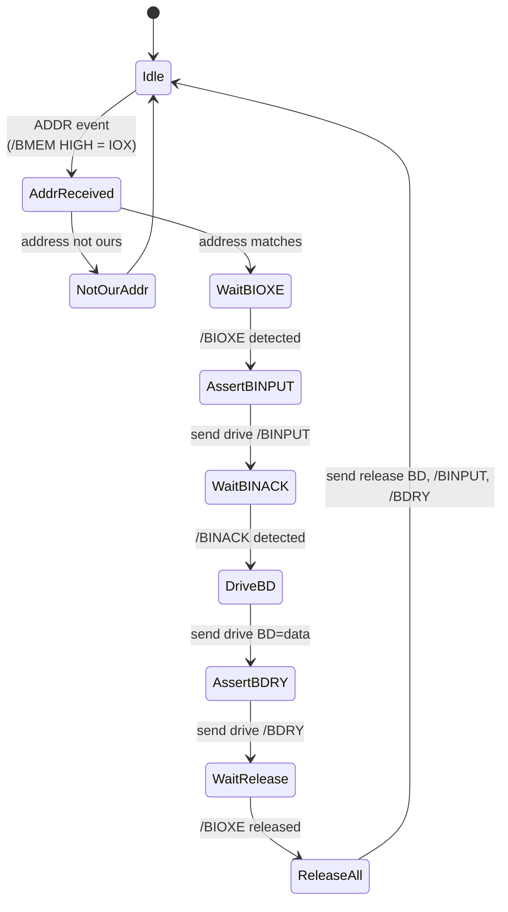
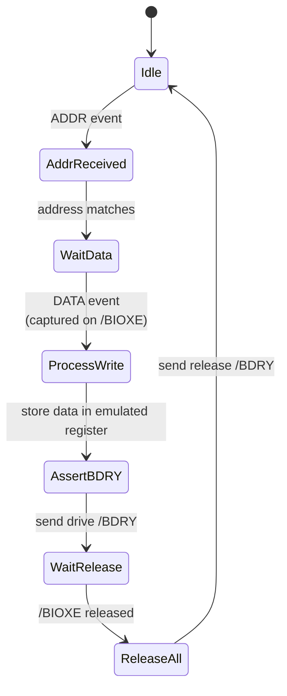
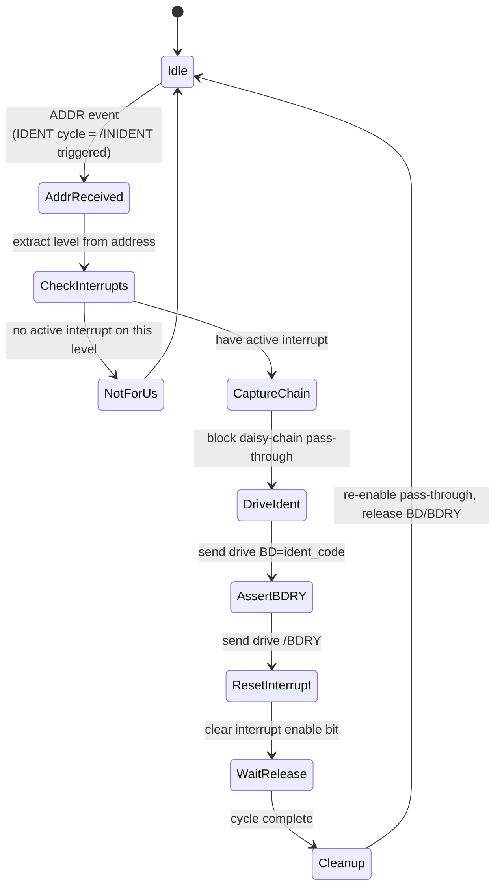
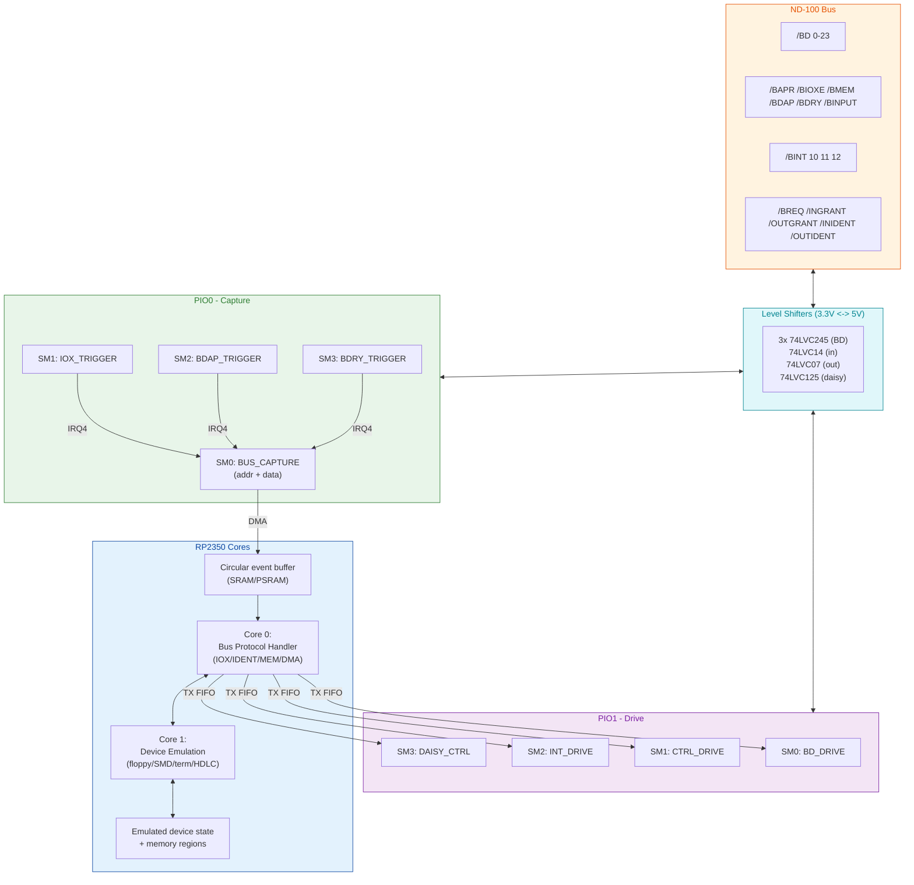
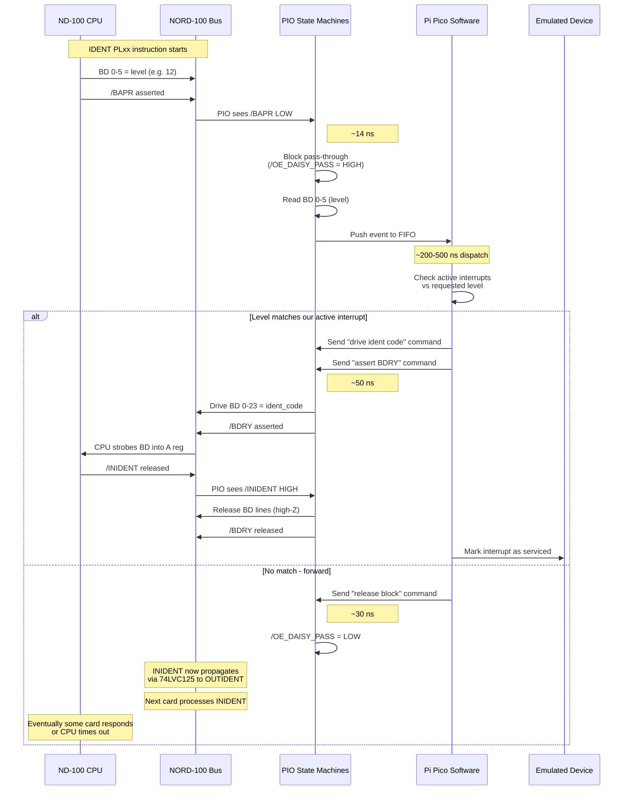
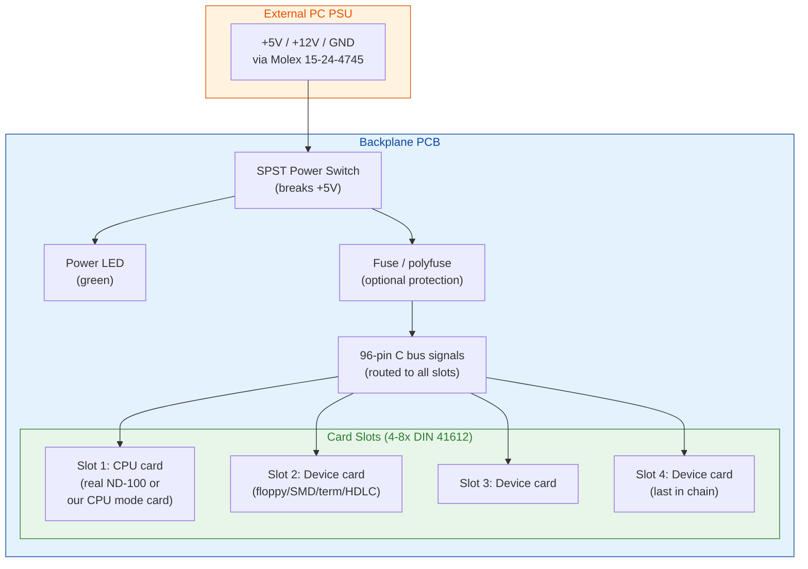

# ND-100 Multi-Device Controller Card Design (RP2350B)

## Overview

This document describes the hardware design for an **ND-100 controller card** based on the **Raspberry Pi RP2350B** microcontroller. The card is intended to emulate multiple peripheral devices for the ND-100/ND-110/ND-120 systems, plugging into a standard slot on the shared backplane via the C connector.

**Target device emulations:**

| Device | Interrupt Level | Notes |
|--------|----------------|-------|
| Floppy disk | 10 / 11 | PIO + DMA |
| SMD disk | 10 / 11 | PIO + DMA |
| Terminal | 10 / 12 | PIO only |
| HDLC | 13 | PIO + DMA, fastest path |

The card must support all four ND-100 bus cycle types from the bus signal reference:

- **IOX/IOXT** (programmed I/O) - read and write to device registers
- **IDENT PLxx** - interrupt identification via daisy-chain
- **Interrupt generation** - asserting BINT 10-13
- **DMA transfers** - memory read and write as bus master

See [ND-100-BUS-C-CONNECTOR.md](ND-100-BUS-C-CONNECTOR.md) for the complete bus signal reference and cycle protocols.

---

## Selected Hardware Module: Olimex RP2350-PICO2-BB48R

The controller card uses the **Olimex RP2350-PICO2-BB48R** as the MCU subsystem. The Olimex board plugs into our PCB via headers; everything else on the card is **surface mount**.

### Module Specifications

| Feature | Value |
|---------|-------|
| MCU | RP2350B (48 GPIO variant) |
| Flash | **16 MB QSPI** |
| PSRAM | **8 MB QSPI** (BB48R variant only) |
| **SD Card** | **Micro SD card slot ON BOARD** |
| GPIO exposed | All **48 GPIO** (GP0-GP47) |
| USB | **USB-C** data and power |
| Buttons | **BOOT and RESET on board** |
| Status LED | On board, GPIO25 (`User_Led`) |
| UEXT connector | pUEXT 1.0 mm pitch (debug/expansion) |
| Qwiic/Stemma | I2C connector |
| Dimensions | 69 x 18 mm |
| Pin spacing | 15.24 mm (0.6") -- compatible with standard 0.1" headers |
| Open source hardware | **Yes** -- KiCad files, schematic, manual provided |
| Power | On-board DCDC 3.3V @ 2A continuous (3A peak) |
| Order codes | RP2350-PICO2-BB48 (no PSRAM/SD), RP2350-PICO2-BB48R (with PSRAM + SD) |

### Why BB48R is the Right Choice

1. **SD card on board** -- no external SD slot needed on our PCB
2. **BOOT and RESET buttons on board** -- no external buttons needed
3. **USB-C connector** -- modern, robust, handles firmware updates and virtual serial
4. **Status LED on board** (GPIO25) -- free heartbeat indicator
5. **Open source hardware** with full KiCad files and schematic
6. **PSRAM included** -- 8 MB for floppy/SMD/HDLC buffer caching
7. **3.3V regulator** at 2A -- ample power for level shifters and our circuitry

### PCB Integration: Headers + Surface Mount

The Olimex BB48R is a **through-hole module** with 0.6" (15.24 mm) row spacing. It plugs into our PCB via female pin headers. Everything else on the card is **surface mount** for compactness and reliability.

| Section | Mount Type |
|---------|-----------|
| Olimex BB48R module | Through-hole female headers (the module itself is socketed) |
| Level shifters (74LVC245, 74LVC14, 74LVC07, 74LVC125) | **SMD** (SOIC-14/16/20 or TSSOP) |
| Latches (74LVC574, 74LVT245) | **SMD** (SOIC-20/TSSOP) |
| Pull resistors and bypass caps | **SMD** (0603 or 0402) |
| LEDs | **SMD** (0805) |
| C connector (DIN 41612) | Through-hole (PCB-mount male right-angle) |
| Status LEDs | **SMD** (0805) |

#### Olimex BB48R Connector Footprint

The BB48R has two pin rows (EXT1 and EXT2), each 27 pins long, spaced 15.24 mm apart. On our PCB:

| PCB Footprint | Detail |
|---------------|--------|
| 2x female pin sockets, 27-pin each | 0.1" pitch, 0.6" row spacing |
| Or one 54-pin DIP socket | Some assemblers prefer single socket |
| Module orientation | USB-C connector facing away from C connector |

The female sockets allow the Olimex board to be **removed and replaced** if needed. The Olimex board itself is industrial grade and should not need replacement under normal use.

#### Card-Edge Layout (Suggested)

```
  +---------------------------------------+
  |                                       |
  |    [ Olimex BB48R module socket ]    |   <- 0.6" header rows
  |                                       |
  |                                       |
  | SMD: latches, transceivers, decoder   |
  | SMD: 74LVC125 daisy bypass            |
  | SMD: status LEDs                      |
  |                                       |
  | <Power supply: 5V from bus, 3.3V       |
  |  from BB48R or local LDO>             |
  |                                       |
  +============== C connector ============+   <- DIN 41612 male, right-angle
            (96 pins, 5V ND-100 bus)
```

The DIN 41612 C connector is at the bottom edge for plugging into the ND-100 backplane. The Olimex module is mounted on the top portion of the card, well away from the bus connector for signal integrity.

### Pin Reservation Analysis (Verified from Manual)

Analysis of the official Olimex BB48R user manual (Sept 2025) confirms these pin reservations:

| GPIO | Function | Source |
|------|----------|--------|
| **GPIO8** | PSRAM CS (`QMI_CS1n`) | 8 MB QSPI PSRAM |
| **GPIO9** | SD card CS (`SPI1_CSn`) | Micro SD slot |
| **GPIO10** | SD card CLK (`SPI1_SCK` / `SD_CLK`) | Micro SD slot |
| **GPIO11** | SD card CMD/MOSI (`SPI1_TX` / `SD_CMD`) | Micro SD slot |
| **GPIO24** | SD card DATA0/MISO (`SPI1_RX` / `SD_DAT0`) | Micro SD slot |
| **GPIO25** | User LED (`User_Led`) | Status LED on board |
| **Total reserved** | **6 GPIO** | |

USB, RESET, BOOTSEL, and the QSPI flash all use dedicated pins or QSPI lines outside the GPIO pool, so they consume **zero** user GPIO.

### Available GPIO Blocks

| Block | Pins | Notes |
|-------|------|-------|
| GPIO0-7 | 8 pins | Available; shared with pUEXT/Qwiic connectors but those are optional |
| GPIO8-11 | 0 | **Reserved** for PSRAM and SD card |
| GPIO12-23 | 12 pins | Free, contiguous |
| GPIO24-25 | 0 | **Reserved** for SD DAT0 and User LED |
| GPIO26-31 | 6 pins | Free, contiguous (LOW bank end) |
| GPIO32-47 | 16 pins | Free, contiguous (HIGH bank, all of it) |
| **Total available** | **42 GPIO** | |

### Critical Finding: 24-bit Contiguous BD Bus is NOT Possible

The reserved pins (GPIO8-11 for PSRAM/SD, GPIO24 for SD DAT0) **fragment the LOW bank**:

```
  GPIO0-7  : free (8 pins)
  GPIO8-11 : RESERVED (4 pins) ← gap
  GPIO12-23: free (12 pins)
  GPIO24-25: RESERVED (2 pins) ← gap
  GPIO26-31: free (6 pins)
  GPIO32-47: free (16 pins) ← in HIGH bank
```

**There is NO 24-pin contiguous block in a single bank**. Possible candidates all fail:

| Block | Result |
|-------|--------|
| GPIO0-23 | ❌ blocked by GPIO8-11 |
| GPIO12-35 | ❌ spans LOW (12-31) and HIGH (32-35) banks -- not single-cycle |
| GPIO16-39 | ❌ spans both banks |
| GPIO24-47 | ❌ blocked by GPIO24-25 |

**Conclusion**: **Design 1/4 (Direct GPIO with single-cycle 24-bit BD access) is NOT VIABLE on the BB48R**. The architecture must use a multiplexed BD interface.

### Confirmed Architecture: Design 2 (8-bit Latched)

Design 2 only needs **8 contiguous GPIO** for the shared 8-bit MCU<->latch bus, which fits perfectly in **GPIO12-19**.

### Bonus Features (Free)

These board features are usable without additional GPIO cost:

| Feature | Pin | What we get |
|---------|-----|-------------|
| **Micro SD card slot** | GPIO9-11, 24 | Uses SPI1 hardware peripheral. Just call SDK functions. |
| **8 MB PSRAM** | GPIO8 | Uses QSPI. Can be used as XIP memory or via SDK PSRAM API. |
| **User LED** | GPIO25 | Heartbeat / status indicator |
| **BOOT button** | QSPI_CS | Press during reset = USB mass storage mode |
| **RESET button** | RUN | Hardware reset |
| **USB-C** | USB_DP/USB_DM (dedicated) | Firmware update + virtual COM port |
| **UART0 debug** | GPIO0/GPIO1 | Optional serial debug (if not using USB CDC) |

### Power Supply

| Rail | Source | Notes |
|------|--------|-------|
| VBUS | USB-C | 5V from USB |
| VDD_SYS | USB or external | 5V (input/output) |
| +3.3V | On-board DCDC | 2A @ 3.3V (3A peak) -- enough for level shifters |
| 3V3_EN | Input | Pull to GND to disable 3.3V regulator |

The BB48R provides 3.3V at up to 2A, ample for our level shifters, latches, and LEDs. The +5V for level shifter VCCB side comes from the ND-100 bus connector itself (bus pin 2/31).

### Complete Pin Allocation

This is the **definitive pin map** for the controller card.

> **CRITICAL DESIGN RULE**: The PIO must read both the 8-bit DBUS (from latches) AND the 4 trigger control signals in a **single PIO IN instruction**. This requires both groups to be **contiguous in the same GPIO bank**. We allocate **GPIO12-23** as one contiguous block: GPIO12-19 = DBUS, GPIO20-23 = trigger signals.
>
> A single `IN PINS, 12` reads all 12 pins in one PIO cycle (~7 ns at 150 MHz). The result is a 12-bit value: lower 8 bits = DBUS data, upper 4 bits = trigger signals (BAPR/BIOXE/BDAP/BDRY).
>
> Crossing the LOW/HIGH bank boundary (e.g., putting DBUS on GPIO28-35 which spans GPIO31->GPIO32) would force two separate operations and break the timing.

#### Trigger Signal Strategy

The 4 most critical input control signals are the **trigger signals** -- they tell the PIO when something is happening on the bus:

| Signal | When Active | What Happens |
|--------|-------------|--------------|
| /BAPR | CPU asserts address strobe | Address phase started, level/address on BD lines |
| /BIOXE | CPU asserts IOX execute | IOX cycle data phase, data on BD lines |
| /BDAP | Bus master asserts data present | Memory cycle data phase, data on BD lines |
| /BDRY | Memory or device asserts data ready | Data response, data on BD lines |

The PIO uses an **external OR gate** to combine these 4 signals into a single trigger that the PIO `wait` instruction can monitor. When ANY trigger is active, the PIO reads the full 12-bit window.

**Other input control signals** are not time-critical -- the C code reads them directly via `gpio_get()` when needed:

| Signal | Why C reads directly |
|--------|----------------------|
| /BINACK | Read during IOX response handshake |
| /BMEM | Read during cycle classification |
| /BMCL | Read during reset handling |
| /BINPUT | Read during cycle classification |
| /INGRANT | Read during DMA grant handshake |
| /INIDENT | Read during IDENT cycle |

#### EXT1 connector (GPIO0-23) - LOW bank, time-critical PIO group

| GPIO | Pin Use | Direction | Buffer | Notes |
|------|---------|-----------|--------|-------|
| GPIO0 | INT_BB48R (from Pi Pico W) | Input | -- | Pi Pico W signals "I have data" (when populated) |
| GPIO1 | INT_PICO (to Pi Pico W) | Output | -- | BB48R signals "wake/command" (when populated) |
| GPIO2 | /BINT 12 drive | Output | 74LVC07 | Open-drain to bus |
| GPIO3 | /BINT 13 drive | Output | 74LVC07 | Open-drain (HDLC) |
| GPIO4 | SPI0_RX (MISO from Pi Pico W) | Input | -- | Hardware SPI0 |
| GPIO5 | SPI0_CSn (CS to Pi Pico W) | Output | -- | Hardware SPI0 |
| GPIO6 | SPI0_SCK (clock to Pi Pico W) | Output | -- | Hardware SPI0 |
| GPIO7 | SPI0_TX (MOSI to Pi Pico W) | Output | -- | Hardware SPI0 |
| **GPIO8** | **PSRAM CS** | -- | -- | **Board reserved** |
| **GPIO9** | **SD card CS** | -- | -- | **Board reserved** |
| **GPIO10** | **SD card CLK** | -- | -- | **Board reserved** |
| **GPIO11** | **SD card CMD** | -- | -- | **Board reserved** |
| **GPIO12** | **DBUS 0** | Bidir | -- | **PIO read group: bit 0** |
| **GPIO13** | **DBUS 1** | Bidir | -- | **PIO read group: bit 1** |
| **GPIO14** | **DBUS 2** | Bidir | -- | **PIO read group: bit 2** |
| **GPIO15** | **DBUS 3** | Bidir | -- | **PIO read group: bit 3** |
| **GPIO16** | **DBUS 4** | Bidir | -- | **PIO read group: bit 4** |
| **GPIO17** | **DBUS 5** | Bidir | -- | **PIO read group: bit 5** |
| **GPIO18** | **DBUS 6** | Bidir | -- | **PIO read group: bit 6** |
| **GPIO19** | **DBUS 7** | Bidir | -- | **PIO read group: bit 7** |
| **GPIO20** | **/BAPR_IN** (sniff) | Input | 74LVC14 | **PIO read group: bit 8** -- trigger |
| **GPIO21** | **/BIOXE_IN** (sniff) | Input | 74LVC14 | **PIO read group: bit 9** -- trigger |
| **GPIO22** | **/BDAP_IN** (sniff) | Input | 74LVC14 | **PIO read group: bit 10** -- trigger |
| **GPIO23** | **/BDRY_IN** (sniff) | Input | 74LVC14 | **PIO read group: bit 11** -- trigger |

> **GPIO12-23 form one contiguous block of 12 pins** that the PIO reads in a single `IN PINS, 12` instruction.

#### EXT2 connector (GPIO24-47) - LOW bank end + HIGH bank

| GPIO | Pin Use | Direction | Buffer | Notes |
|------|---------|-----------|--------|-------|
| **GPIO24** | **SD card DAT0** | -- | -- | **Board reserved** |
| **GPIO25** | **User LED** | Output | -- | **On-board LED -- heartbeat** |
| GPIO26 | /OE_IN_0 | Output | -- | Read-enable input latch 0 (BD 0-7) |
| GPIO27 | /OE_IN_1 | Output | -- | Read-enable input latch 1 (BD 8-15) |
| GPIO28 | /OE_IN_2 | Output | -- | Read-enable input latch 2 (BD 16-23) |
| GPIO29 | LE_OUT_0 | Output | -- | Latch-enable output latch 0 (BD 0-7) |
| GPIO30 | LE_OUT_1 | Output | -- | Latch-enable output latch 1 (BD 8-15) |
| GPIO31 | LE_OUT_2 | Output | -- | Latch-enable output latch 2 (BD 16-23) |
| GPIO32 | /BD_OE_BUS | Output | -- | Master OE for output 74LVT245 transceivers |
| GPIO33 | /BMEM_IN (sniff) | Input | 74LVC14 | Read directly via gpio_get() |
| GPIO34 | /BINACK_IN (sniff) | Input | 74LVC14 | Read directly |
| GPIO35 | /BMCL_IN (sniff) | Input | 74LVC14 | Read directly |
| GPIO36 | /BINPUT_IN (sniff) | Input | 74LVC14 | Read directly |
| GPIO37 | /INGRANT_IN | Input | 74LVC14 | Read directly |
| GPIO38 | /INIDENT_IN | Input | 74LVC14 | Read directly |
| GPIO39 | /BINT 10 drive | Output | 74LVC07 | Open-drain interrupt level 10 (freed by removing TRIGGER_OR) |
| GPIO40 | /BINT 11 drive | Output | 74LVC07 | Open-drain interrupt level 11 |
| GPIO41 | /BAPR_OUT | Output | 74LVC07 | Drive BAPR during DMA cycles |
| GPIO42 | /BDRY_OUT | Output | 74LVC07 | Drive BDRY when responding |
| GPIO43 | /BINPUT_OUT | Output | 74LVC07 | Drive BINPUT during IOX read response or DMA write |
| GPIO44 | /BDAP_OUT | Output | 74LVC07 | Drive BDAP during DMA cycles |
| GPIO45 | /BREQ_OUT | Output | 74LVC07 | Drive BREQ to request DMA |
| GPIO46 | /OE_DAISY_GRANT | Output | -- | Controls 74LVC125 grant pass-through |
| GPIO47 | /OE_DAISY_IDENT | Output | -- | Controls 74LVC125 ident pass-through |

> **Pin allocation now fits**: Removing the TRIGGER_OR pin (no longer needed because PIO does the trigger detection internally) freed GPIO33, which let us shift the layout and accommodate /BINT 10 (GPIO39) and /BINT 11 (GPIO40). All pins fit without needing a 74HC595 shift register.

### Pin Count Summary

| Category | Pins | GPIOs |
|----------|------|-------|
| **PIO read group (8 DBUS + 4 trigger)** | **12** | **GPIO12-23 (contiguous!)** |
| Latch control outputs (3 OE + 3 LE) | 6 | GPIO26-31 |
| /BD_OE_BUS master enable | 1 | GPIO32 |
| Other input sniffs (BMEM, BINACK, BMCL, BINPUT, INGRANT, INIDENT) | 6 | GPIO33-38 |
| /BINT 10 + /BINT 11 drive | 2 | GPIO39-40 |
| Bus output drives (BAPR, BDRY, BINPUT, BDAP, BREQ) | 5 | GPIO41-45 |
| Daisy chain control | 2 | GPIO46-47 |
| Pi Pico W SPI + INTs (when populated) | 6 | GPIO0-1, 4-7 |
| /BINT 12 + /BINT 13 | 2 | GPIO2-3 |
| **Subtotal used** | **42** | |
| Board reserved (PSRAM, SD, LED) | 6 | GPIO8-11, 24-25 |
| **Total** | **48** | |

> **Note**: The pin layout puts the 8 DBUS bits (GPIO12-19) **adjacent** to the 4 trigger control signals (GPIO20-23), creating a single contiguous 12-bit block for atomic PIO reads. No external NOR gate or trigger combining logic needed -- PIO does the trigger detection internally via mask compare.

### PIO Capture: Three State Machines (Signal + Address + Data)

The capture logic is split into **three PIO state machines** with clear separation of responsibilities. Address and data are read by separate SMs so each can have its own **DMA channel** and target buffer:

| State Machine | Purpose | Width | Triggered By |
|---------------|---------|-------|--------------|
| **SM_SIGNAL** | Watch trigger control signals, dispatch | 4 bits | Continuous polling |
| **SM_ADDR** | Read 24-bit address from 3x latches | 24 bits | IRQ from SM_SIGNAL when /BAPR active |
| **SM_DATA** | Read 16-bit data from 2x latches | 16 bits | IRQ from SM_SIGNAL when /BIOXE/BDAP/BDRY active |

The three state machines communicate via **PIO IRQs**:
- SM_SIGNAL detects which trigger fired
- Raises IRQ4 for address phase (BAPR active)
- Raises IRQ5 for data phase (BIOXE/BDAP/BDRY active)
- SM_ADDR waits for IRQ4
- SM_DATA waits for IRQ5

This way, address and data events go to **separate FIFOs**, and the CPU can use **separate DMA channels** to move them into separate circular buffers in PSRAM.

#### Architecture

```
                                +----------------+
  /BAPR_IN  (GPIO20) --+        | SM_SIGNAL      |
  /BIOXE_IN (GPIO21) --+------> | sample-on-     |
  /BDAP_IN  (GPIO22) --+        | change, decide |
  /BDRY_IN  (GPIO23) --+        | which IRQ      |
                                +---+--------+---+
                                    |        |
                            IRQ4    |        |    IRQ5
                       (BAPR active)|        |(BIOXE/BDAP/BDRY active)
                                    v        v
                          +---------+--+  +--+---------+
  GPIO12-19 (DBUS) <----+ | SM_ADDR    |  | SM_DATA    | -+--> Data FIFO  (16-bit)
                        +-| read 3     |  | read 2     |  |    via DMA channel 2
  /OE_IN_0 (GPIO26) <---+ | latches    |  | latches    |  |    --> data buffer
  /OE_IN_1 (GPIO27) <---+ | -> 24 bits |  | -> 16 bits |  |
  /OE_IN_2 (GPIO28) <---+ +------+-----+  +-----+------+  +--> Address FIFO (24-bit)
                                 |              |              via DMA channel 1
                                 v              v              --> address buffer
                          Address FIFO    Data FIFO
```

#### How SM_SIGNAL Decides Which IRQ

SM_SIGNAL examines the trigger pattern when a change is detected:
- **/BAPR active** (bit 0 LOW) → raise IRQ4 (address phase)
- **/BIOXE, /BDAP, or /BDRY active** (bits 1-3 LOW) → raise IRQ5 (data phase)
- **All inactive** → no IRQ (just bus state release, optional push)

Note: /BAPR is always asserted first in any cycle (it's the address strobe). The data phase triggers (BIOXE/BDAP/BDRY) come later. So the typical sequence is:
1. /BAPR LOW → IRQ4 → SM_ADDR reads 24-bit address
2. /BIOXE (or /BDAP, /BDRY) LOW → IRQ5 → SM_DATA reads 16-bit data
3. Cycle releases

#### SM_SIGNAL: Trigger Detection with Dispatch

```pio
.program sm_signal
; Reads 4 trigger pins (GPIO20-23) and dispatches to ADDR or DATA SM.
; Pin base = GPIO20.
;
; Y register holds previous trigger state.
; X register holds current trigger state.

.wrap_target
    mov isr, null          ; clear ISR
    in pins, 4             ; sample 4 trigger pins (1 cycle)
    mov x, isr             ; X = current state (1 cycle)
    jmp x != y new_state   ; compare with Y (1 cycle)
    jmp .wrap_target       ; same, keep sampling
new_state:
    mov y, x               ; remember new state (1 cycle)
    push                   ; push trigger state to signal FIFO (1 cycle)
    
    ; Decide which IRQ to raise based on which trigger is active.
    ; Trigger pins are active LOW. We need to check bit 0 (BAPR).
    ; Use OUT to shift bit 0 into the lowest bit of OSR/scratch.
    
    mov osr, x             ; copy X to OSR
    out null, 1            ; discard, but check via JMP-on-OSR? No.
    
    ; Simpler: use a separate jmp test
    ; Actually, since /BAPR is always first, we can use a different approach:
    ; Just raise IRQ4 always, let CPU dispatch
    ;
    ; OR raise both IRQ4 and IRQ5, both target SMs check the trigger bits
    
    irq set 4              ; address phase signal (cleared by SM_ADDR)
    irq set 5              ; data phase signal   (cleared by SM_DATA)
.wrap
```

**Note**: PIO mov+jmp branching on bit values is awkward. The simpler approach is to **raise both IRQs** when any trigger changes, and let SM_ADDR and SM_DATA each verify their condition. This is more PIO-friendly.

Alternative cleaner design: SM_SIGNAL only watches /BAPR and the OR-of-other-3-via-PIO-comparison. But this gets complex.

**Simplest correct design**: SM_SIGNAL raises BOTH IRQs on any trigger change. SM_ADDR reads the latches whenever IRQ4 fires (which is always after BAPR captures). SM_DATA reads when IRQ5 fires (which is when /BIOXE/BDAP/BDRY captures). The CPU uses the signal FIFO to know which read is valid (e.g., ignore SM_ADDR output if BAPR was not active, or use separate DMA channels and let CPU correlate).

OR: have SM_SIGNAL only raise IRQ4 when bit 0 (BAPR) goes LOW, and only raise IRQ5 when bits 1-3 (data triggers) go LOW. This requires two separate checks in PIO, which is doable.

```pio
.program sm_signal_v2
; More precise dispatch using two separate checks.

.wrap_target
    mov isr, null
    in pins, 4
    mov x, isr
    jmp x != y new_state
    jmp .wrap_target
new_state:
    mov y, x               ; remember new state
    push                   ; push trigger state
    
    ; Check if /BAPR (bit 0) is now LOW
    mov osr, x             ; OSR = X
    out null, 0            ; (no shift, prepare)
    out x, 1               ; X = bit 0 of OSR (= /BAPR state)
    jmp !x bapr_active     ; if X == 0 (BAPR LOW = active), raise ADDR IRQ
    jmp check_data
bapr_active:
    irq set 4              ; signal ADDR SM
check_data:
    ; X has been clobbered. Reload from Y (which still has the new state).
    mov x, y
    mov osr, x
    out null, 1            ; shift past bit 0
    out x, 3               ; X = bits 1-3 (BIOXE/BDAP/BDRY)
    jmp x != 0b111 data_active
    jmp .wrap_target
data_active:
    irq set 5              ; signal DATA SM
.wrap
```

This is more complex but more precise. Each iteration:
- 4 cycles for the basic sample-compare
- +6 cycles when triggered (push + check BAPR + check data)
- Total ~10 cycles (~70 ns) per trigger event

#### SM_ADDR: 24-bit Address Reader

**Purpose**: Wait for IRQ4 from SM_SIGNAL. Read all 3 bytes from the input latches and push the 24-bit address.

```pio
.program sm_addr
; Reads 24-bit address from 3x 74LVC574 latches.
; Pin base for IN = GPIO12 (DBUS 0).
; Sideset = 3 pins on GPIO26-28 (/OE_IN_0/1/2).
;
; Sideset values (active LOW chip selects):
;   0b111 = all latches deasserted
;   0b110 = OE_IN_0 LOW = latch 0 (BD 0-7)
;   0b101 = OE_IN_1 LOW = latch 1 (BD 8-15)
;   0b011 = OE_IN_2 LOW = latch 2 (BD 16-23)

.side_set 3

.wrap_target
    irq wait 4     side 0b111   ; wait for IRQ4, deassert all (cleared on wait)
    
    ; Read latch 0 (BD 0-7)
    nop            side 0b110   ; assert /OE_IN_0 (settling time)
    in pins, 8     side 0b110   ; read 8 bits into ISR
    
    ; Read latch 1 (BD 8-15)
    nop            side 0b101   ; switch to /OE_IN_1
    in pins, 8     side 0b101   ; read next 8 bits
    
    ; Read latch 2 (BD 16-23)
    nop            side 0b011   ; switch to /OE_IN_2
    in pins, 8     side 0b011   ; read final 8 bits
    
    push           side 0b111   ; push 24-bit address, deassert all
.wrap
```

**Time per address read**: 8 cycles (~56 ns) including IRQ wait + 3 latch reads + push.

#### SM_DATA: 16-bit Data Reader

**Purpose**: Wait for IRQ5 from SM_SIGNAL. Read 2 bytes from the input latches (BD 0-15 only -- data is 16-bit on the ND-100 bus). Push the 16-bit data.

```pio
.program sm_data
; Reads 16-bit data from 2x 74LVC574 latches (bytes 0 and 1).
; Pin base for IN = GPIO12 (DBUS 0).
; Sideset = 3 pins on GPIO26-28.

.side_set 3

.wrap_target
    irq wait 5     side 0b111   ; wait for IRQ5, deassert all
    
    ; Read latch 0 (BD 0-7)
    nop            side 0b110
    in pins, 8     side 0b110
    
    ; Read latch 1 (BD 8-15)
    nop            side 0b101
    in pins, 8     side 0b101
    
    push           side 0b111   ; push 16-bit data, deassert all
.wrap
```

**Time per data read**: 6 cycles (~42 ns) -- one less latch read than SM_ADDR.

> **Note**: ND-100 data is 16-bit, but we have 3 latches. SM_DATA only reads latches 0 and 1 (BD 0-15). Latch 2 (BD 16-23) is only read by SM_ADDR for the 24-bit memory address.

#### DMA Channels

| FIFO | DMA Channel | Target Buffer | Width | Purpose |
|------|-------------|---------------|-------|---------|
| Signal FIFO | DMA0 | signal_events[] | 4 bits | Trigger states |
| Address FIFO | DMA1 | address_events[] | 24 bits | Latched addresses |
| Data FIFO | DMA2 | data_events[] | 16 bits | Latched data words |

Each DMA channel runs continuously, draining its FIFO into a circular buffer in PSRAM. The CPU iterates through the buffers and correlates events by sequence/timestamp.

#### CPU Side -- Three Buffers

```c
// Circular buffers (in PSRAM, sized for ~1ms of bus activity)
volatile uint32_t signal_events[1024];
volatile uint32_t address_events[1024];
volatile uint32_t data_events[1024];

void process_bus_events(void) {
    // Drain all 3 buffers in order
    while (signal_buffer_has_data()) {
        uint32_t signals = signal_pop();
        bool bapr_act  = !(signals & 0x1);
        bool bioxe_act = !(signals & 0x2);
        bool bdap_act  = !(signals & 0x4);
        bool bdry_act  = !(signals & 0x8);
        
        if (bapr_act) {
            // Address phase -- read corresponding entry from address buffer
            uint32_t addr = address_pop() & 0x00FFFFFF;
            handle_address_phase(addr);
        }
        if (bioxe_act || bdap_act || bdry_act) {
            // Data phase -- read corresponding entry from data buffer
            uint16_t data = data_pop() & 0xFFFF;
            
            if (bioxe_act)      handle_iox_data(data);
            else if (bdap_act)  handle_memory_data(data);
            else if (bdry_act)  handle_dma_response(data);
        }
    }
}
```

The signal FIFO is the **synchronization source** -- it tells the CPU what kind of event is in the address and data FIFOs. The CPU uses the signal events as the dispatcher.

#### Why Three SMs Instead of Two?

| Benefit | Why |
|---------|-----|
| **Address and data on separate DMA channels** | Each goes to its own buffer in PSRAM |
| **24-bit vs 16-bit assembly happens in PIO** | CPU receives clean values, no byte assembly |
| **Separate timing** | Address read (8 cycles) vs data read (6 cycles) optimized for each |
| **Parallelism** | SM_ADDR and SM_DATA can run in parallel if needed |
| **Cleaner C code** | Separate handlers for address vs data, no mode flag |
| **Easier debugging** | Each FIFO/buffer is one purpose -- easy to inspect |

#### Latch Timing

The 74LVC574 propagation delay (output enable to data valid) is **3-7 ns**. The PIO instruction time is ~7 ns at 150 MHz. The `nop side X` instruction between asserting the chip select and reading provides one cycle of settling time -- enough margin in most cases.

If the data is unstable (high-speed bus, long traces), add more `nop` instructions to extend settling time.

#### Bandwidth Analysis

| Bus state | Signal/Address/Data events | Combined bandwidth |
|-----------|----------------------------|-------------------|
| Idle | 0 | 0 |
| Single IOX cycle | ~3 sig + 1 addr + 1 data | ~16 bytes |
| DMA cycle | ~5 sig + 1 addr + 1 data | ~24 bytes |
| Burst DMA continuous | ~1M signal evts/s, ~500K addr/s, ~500K data/s | ~12 MB/s combined |

Even worst case is well within PSRAM DMA capability.

**Decoding in C code**:

```c
void process_bus_event(uint16_t event) {
    uint8_t dbus = event & 0xFF;        // bits 0-7: DBUS data
    bool bapr_active  = !(event & 0x100); // bit 8: /BAPR (inverted because active LOW)
    bool bioxe_active = !(event & 0x200); // bit 9: /BIOXE
    bool bdap_active  = !(event & 0x400); // bit 10: /BDAP
    bool bdry_active  = !(event & 0x800); // bit 11: /BDRY

    if (bapr_active) {
        // Address phase -- dbus contains the address byte
        // Continue reading other bytes of address from latches via OE_IN_1/2
        handle_address_phase(dbus);
    } else if (bioxe_active) {
        // IOX data phase
        handle_iox_data(dbus);
    } else if (bdap_active) {
        // Memory data phase
        handle_memory_data(dbus);
    } else if (bdry_active) {
        // DMA read response
        handle_dma_data(dbus);
    }
}
```

> **Note on the 8-bit DBUS**: When PIO captures, it reads only 8 bits of the 24-bit BD bus -- the byte currently selected by /OE_IN_0/1/2. The PIO program should sequence through reading all 3 bytes of the latches before processing.

### "Spare" Pin Uses (Not Truly Free)

The 6 GPIO0-1, GPIO2-3, GPIO4-7 marked as "spare" are technically available but have BB48R hardware functions assigned:

| GPIO | BB48R Function | Notes |
|------|----------------|-------|
| GPIO0 | UART0_TX (pUEXT pin 4) | Free if UART0 not used |
| GPIO1 | UART0_RX (pUEXT pin 5) | Free if UART0 not used |
| GPIO2 | I2C1_SDA (pUEXT/Qwiic) | **2.2K pull-up to 3.3V always present** |
| GPIO3 | I2C1_SCL (pUEXT/Qwiic) | **2.2K pull-up to 3.3V always present** |
| GPIO4 | SPI0_RX/MISO (pUEXT pin 8) | Hardware SPI0 peripheral |
| GPIO5 | SPI0_CSn (pUEXT pin 9) | Hardware SPI0 peripheral |
| GPIO6 | SPI0_SCK (pUEXT pin 10) | Hardware SPI0 peripheral |
| GPIO7 | SPI0_TX/MOSI (pUEXT pin 11) | Hardware SPI0 peripheral |

These pins are exposed via the **pUEXT and Qwiic connectors on the BB48R module itself**. The connectors do not consume pins -- they just expose them for breadboard use.

**Available uses for these pins on our card**:

| Use Case | Pins Used | What we lose |
|----------|-----------|--------------|
| **ESP32 wireless companion** (SPI0 + INT/RST) | GPIO0-1, 4-7 (6 pins) | UART0 debug, pUEXT, ESP32 takes SPI0 |
| **Debug UART** | GPIO0-1 (2 pins) | -- (use USB CDC instead) |
| **I2C sensors / external chips** | GPIO2-3 (2 pins) | -- (Qwiic connector becomes a feature) |
| **Status LEDs** | any | -- |
| **GPIO2/3 as outputs** | GPIO2-3 | These pins always have 2.2K pull-ups |

When **ESP32 is populated**, all 6 pins are consumed for SPI/INT/RST. When **ESP32 is NOT populated**, all 6 pins are free for any combination of debug UART, I2C sensors, status LEDs, etc.

### SD Card Software (Built-in)

The BB48R uses SPI1 hardware peripheral for the SD card:

```c
// SD card uses SPI1 with these pins (set by Olimex):
//   GPIO9  = CS (SPI1_CSn)
//   GPIO10 = CLK (SPI1_SCK)
//   GPIO11 = CMD/MOSI (SPI1_TX)
//   GPIO24 = DAT0/MISO (SPI1_RX)

// Use the pico-extras SD card library:
// https://github.com/raspberrypi/pico-extras/tree/master/src/rp2_common/pico_sd_card
```

The default mode is **SPI mode**. The schematic notes "Option for 1-bit MMC Data was added too" -- so SDIO mode could be enabled if higher throughput is needed in the future.

---

## Why RP2350B (chip-level)

The **RP2350B** is selected over the smaller RP2350A because of its **48 GPIO pins** (vs 30), enabling a full 24-bit parallel bus interface within a single GPIO bank without compromises.

### Key features used

| Feature | Why |
|---------|-----|
| **48 GPIO** in two banks (32 + 16) | Full 24-bit bus + control + SD card + debug |
| **12 PIO state machines** | Deterministic bus timing for IOX/IDENT/DMA cycles |
| **DMA controllers** | High-throughput transfers between PIO FIFOs and RAM |
| **Dual ARM Cortex-M33 cores** | One core for bus protocol, one for device emulation |
| **520 KB internal SRAM** | Multi-device buffers, FIFOs, ring buffers |
| **16 MB QSPI flash** (BB48R) | Firmware + boot ROM images + small disk images |
| **8 MB PSRAM** (BB48R) | Floppy image cache, SMD sector cache, HDLC FIFOs |

---

## GPIO Bank Architecture

The RP2350B has two GPIO banks with **separate control registers**:

| Bank | Pins | Purpose |
|------|------|---------|
| **LOW bank** | GPIO0-31 | Time-critical: bus signals, control |
| **HIGH bank** | GPIO32-47 | Slow peripherals: SD card, debug, UART |

**Critical rule**: The 24-bit bus **must** be in a single bank to allow single-cycle parallel read/write. Splitting across banks would require two separate writes with timing skew -- unacceptable for bus protocol timing.

### External Flash and PSRAM Pin Reservations

Both RP2040 and RP2350B require **dedicated pins for external QSPI flash** (XIP execute-in-place). These pins are **not usable as GPIO**.

| Resource | RP2040 (raw) | RP2350B (raw) | Olimex BB48R module |
|----------|--------------|---------------|---------------------|
| Total GPIO pool | 30 (GPIO0-29) | 48 (GPIO0-47) | 48 (GPIO0-GPIO47) |
| QSPI flash pins | 6 (mandatory, eats GPIO) | ~6 (separate from GPIO) | Internal to module, **not in GPIO pool** |
| QSPI PSRAM (optional) | Not supported | 6-11 pins if used | Internal QSPI, only GPIO8 used as CS |
| Module-reserved | -- | -- | **GPIO8 (PSRAM), 9-11 (SD), 24 (SD), 25 (LED)** |
| USB pins | GP24/GP25 | varies | Internal, **not in GPIO pool** |
| RESET pin | RUN (dedicated) | RUN (dedicated) | RUN, button on board |
| BOOTSEL | -- | QSPI_CS | QSPI_CS, button on board |
| **Practical usable GPIO** | **~24** | **~31-36** | **42 (after SD/PSRAM/LED reservations)** |

> **Olimex BB48R**: All special pins (QSPI flash, USB, RUN, BOOTSEL) are either internal to the module or use dedicated pins. The only GPIO costs are 4 pins for SD card (GPIO9-11, 24), 1 pin for PSRAM CS (GPIO8), and 1 pin for User LED (GPIO25) -- total 6 pins. The remaining **42 GPIO** are free for the controller card design.

### Single-cycle bus access

```c
#define BUS_MASK 0x00FFFFFF  // GPIO0-23

// Single-cycle 24-bit write
gpio_hw->out = (gpio_hw->out & ~BUS_MASK) | (value & BUS_MASK);

// Single-cycle 24-bit read
uint32_t value = gpio_hw->in & BUS_MASK;

// Atomic direction switching
gpio_hw->oe_set = BUS_MASK;   // BD lines as outputs
gpio_hw->oe_clr = BUS_MASK;   // BD lines as inputs
```

> **Never use SDK functions** like `gpio_put()` in the hot path -- too slow and non-deterministic for bus-level timing.

---

## BD 0-23 Bus Interface Architecture (8-bit Latched, PIO-driven)

> **This is the locked-in architecture for the controller card.** Alternative architectures (Direct GPIO, SPI Shift Register, PIO-as-Latch) were evaluated but are not viable on the Olimex BB48R due to GPIO fragmentation. See Appendix A for the rejected alternatives.

A shared 8-bit data bus connects to 6 octal latches: 3 for capturing input from the bus, 3 for driving output to the bus. Chip selects choose which latch the MCU is currently accessing. The MCU reads or writes the 24-bit BD value as **3 sequential 8-bit operations** controlled by a PIO state machine.

### Block Diagram

```mermaid
flowchart LR
    subgraph BUS["ND-100 Bus"]
        BD["/BD 0-23 (24 lines)"]
    end

    subgraph IN["Input Latches (BAPR clocked)"]
        L1["74LVC573 #1<br/>BD 0-7"]
        L2["74LVC573 #2<br/>BD 8-15"]
        L3["74LVC573 #3<br/>BD 16-23"]
    end

    subgraph OUT["Output Drivers"]
        D1["74LVC245 #1<br/>BD 0-7"]
        D2["74LVC245 #2<br/>BD 8-15"]
        D3["74LVC245 #3<br/>BD 16-23"]
    end

    subgraph MCU["RP2350B"]
        D8["Shared 8-bit bus<br/>GPIO 0-7"]
        CS["3x /OE_IN<br/>3x LATCH_OUT"]
        OE["/BD_OE_BUS"]
    end

    BD --> L1
    BD --> L2
    BD --> L3
    BD <-- D1
    BD <-- D2
    BD <-- D3

    L1 --> D8
    L2 --> D8
    L3 --> D8
    D8 --> D1
    D8 --> D2
    D8 --> D3

    CS --> L1
    CS --> L2
    CS --> L3
    CS --> D1
    CS --> D2
    CS --> D3
    OE --> D1
    OE --> D2
    OE --> D3

    BAPR["/BAPR (clock)"] --> L1
    BAPR --> L2
    BAPR --> L3

    style BUS fill:#FFF3E0,stroke:#E65100,color:#E65100
    style IN fill:#E0F7FA,stroke:#00838F,color:#00838F
    style OUT fill:#E0F7FA,stroke:#00838F,color:#00838F
    style MCU fill:#E3F2FD,stroke:#0D47A1,color:#0D47A1
```

### Pin Allocation

| GPIO | Signal | Direction | Function |
|------|--------|-----------|----------|
| 0-7 | DBUS 0-7 | Bidirectional | Shared 8-bit MCU<->latch bus |
| 8 | /OE_IN_0 | Output | Read input latch 0 (BD 0-7) |
| 9 | /OE_IN_1 | Output | Read input latch 1 (BD 8-15) |
| 10 | /OE_IN_2 | Output | Read input latch 2 (BD 16-23) |
| 11 | LE_OUT_0 | Output | Latch output 0 (BD 0-7) |
| 12 | LE_OUT_1 | Output | Latch output 1 (BD 8-15) |
| 13 | LE_OUT_2 | Output | Latch output 2 (BD 16-23) |
| 14 | /BD_OE_BUS | Output | Enable our card to drive the bus |

**BD pins used: 15**

### Component List

| IC | Qty | Function | Approx Cost |
|----|-----|----------|-------------|
| 74LVC573 | 3 | Octal D-latch, captures BD on /BAPR | $1.50 |
| 74LVC245 | 3 | Octal bus driver, output to bus | $1.50 |
| 74LVT138 | 1 | 3-to-8 decoder (optional, for CS generation) | $0.40 |
| Bypass caps (0.1uF) | 6 | One per IC | $0.20 |
| **Subtotal BD path** | | | **$3.60** |

### PIO State Machine Operation

```
Read 24 bits from bus (after /BAPR latched data):
  PIO SM:
    Set /OE_IN_0 = 0     (1 cycle)
    Read DBUS 0-7        (1 cycle)
    Set /OE_IN_0 = 1     (1 cycle)
    Set /OE_IN_1 = 0     (1 cycle)
    Read DBUS 0-7        (1 cycle)
    Set /OE_IN_1 = 1     (1 cycle)
    Set /OE_IN_2 = 0     (1 cycle)
    Read DBUS 0-7        (1 cycle)
    Set /OE_IN_2 = 1     (1 cycle)
  Total: ~9 PIO cycles @ 150 MHz = ~60 ns

Write 24 bits to bus:
  PIO SM:
    Drive DBUS = byte0   (1 cycle)
    Pulse LE_OUT_0       (1 cycle)
    Drive DBUS = byte1   (1 cycle)
    Pulse LE_OUT_1       (1 cycle)
    Drive DBUS = byte2   (1 cycle)
    Pulse LE_OUT_2       (1 cycle)
    Set /BD_OE_BUS = 0   (1 cycle, enable bus drive)
  Total: ~7 PIO cycles @ 150 MHz = ~50 ns + level shifter delay
```

### Timing Analysis

| Operation | Time | Notes |
|-----------|------|-------|
| 24-bit read (3 chunks) | ~60 ns | PIO @ 150 MHz |
| 24-bit write (3 chunks) | ~50 ns | PIO @ 150 MHz |
| Latch propagation | 3-5 ns | 74LVC573 |
| Level shifter delay | 3-6 ns | 74LVC245 |
| **Total round-trip read** | **~70-80 ns** | Including latch + read chunks |
| **Total round-trip write** | **~60-70 ns** | Including write chunks + latch |

### Bus Cycle Performance

| Cycle | Time | Margin (8 us) |
|-------|------|---------------|
| IOX response | ~200-400 ns | 20x |
| IDENT decision | ~70-90 ns | within 100 ns window ✓ |
| DMA word cycle | ~400-700 ns | 11x |
| DMA throughput | **~1.5-2 MB/s** | Sufficient for all devices including SMD |

### Pros

- **Moderate pin count** -- 15 pins for BD interface (vs 26 for Design 1)
- **Frees ~10 LOW bank pins** for other time-critical signals
- **Good throughput** -- meets all device requirements
- **Deterministic** via PIO state machine
- **Hardware latch** decouples MCU from BAPR timing

### Cons

- **More external components** -- 6 latch/driver chips + optional decoder
- **PIO program complexity** higher than Design 1
- **Three sequential operations** per 24-bit access (vs single op in Design 1)
- IDENT decision time is tighter (~70-90 ns vs 100 ns window)

---

## Common Non-BD Signal Layout

The non-BD signals use the same layout in all three designs:

| Signal | RP2350 GPIO | Direction | Buffer IC |
|--------|-------------|-----------|-----------|
| /BAPR | 1 pin | In | 74LVC14 (Schmitt) |
| /BIOXE | 1 pin | In | 74LVC14 |
| /BINACK | 1 pin | In | 74LVC14 |
| /BMEM | 1 pin | In | 74LVC14 |
| /BMCL | 1 pin | In | 74LVC14 |
| /BDRY | 1 pin | Bidir | 74LVC07 (open-drain) + 74LVC14 (read-back) |
| /BINPUT | 1 pin | Bidir | 74LVC07 + 74LVC14 |
| /BDAP | 1 pin | Bidir | 74LVC07 + 74LVC14 |
| /BREQ | 1 pin | Out | 74LVC07 (open-drain) |
| /INGRANT | 1 pin | In | (via daisy-chain chip) |
| /OUTGRANT | 1 pin | Out | (via daisy-chain chip) |
| /INIDENT | 1 pin | In | (via daisy-chain chip) |
| /OUTIDENT | 1 pin | Out | (via daisy-chain chip) |
| /BINT 10 | 1 pin | Out | 74LVC07 |
| /BINT 11 | 1 pin | Out | 74LVC07 |
| /BINT 12 | 1 pin | Out | 74LVC07 |

**Common non-BD pins: 16**

For the bidirectional signals (/BDRY, /BINPUT, /BDAP), one approach uses **two GPIO pins** (1 to drive open-drain output, 1 to read state). The simpler approach uses **1 GPIO** in open-drain mode (RP2350 GPIO supports this) plus a separate input buffer reading the same line.

---

## IDENT/GRANT Daisy-Chain Pass-Through Chip (All Designs)

The 100 ns IDENT decision window and the need for fast daisy-chain propagation make a **hardware default pass-through** essential. A single 74LVC125 quad 3-state buffer handles both daisy chains:

### Operation

```
Default (idle): PIO drives /OE_PASS = LOW
  Buffer enabled
  /INIDENT  --> [LVC125 ch.1] --> /OUTIDENT  (3-5 ns delay)
  /INGRANT  --> [LVC125 ch.2] --> /OUTGRANT  (3-5 ns delay)

Capture (we want this interrupt or DMA cycle): PIO drives /OE_PASS = HIGH
  Buffer high-Z
  /OUTIDENT and /OUTGRANT float HIGH (next slot sees idle)
  Our card drives BD lines + /BDRY for IDENT response
  Or starts DMA cycle for GRANT capture
```

### IC Selection

| IC | Function | Notes |
|----|----------|-------|
| **74LVC125** | Quad 3-state buffer with independent enables | Recommended -- 3-5 ns delay, simple |
| 74LVC126 | Same with active-high enables | Alternative |
| ATF22V10 PAL | Programmable | Overkill but allows custom logic |
| ATF1502 CPLD | Programmable | If complex pass-through logic needed |

The 74LVC125 is the simplest and fastest option. Two channels handle each daisy-chain pair (in + out), leaving 0 spare. If you need spare buffer channels for other use, a 74LVC126 offers 4 channels.

### Pin Cost

The pass-through chip needs:
- 1 GPIO for /OE_IDENT_PASS (controls IDENT chain)
- 1 GPIO for /OE_GRANT_PASS (controls GRANT chain)
- Or combine both onto 1 GPIO if they're always controlled together

**Pin cost: 1-2 GPIO** (already counted in non-BD signal table above for INGRANT/OUTGRANT and INIDENT/OUTIDENT)

---

---

## Design 2 Detailed Implementation -- Chip Selection, Read/Write, Memory Emulation

This section details exactly how Design 2 (8-bit Latched BD Interface) works at the chip level, including read/write sequences, bus drive control, timing verification for IOX and DMA, and an extension for emulating RAM on the bus.

### Chip Selection

Design 2 uses three logical groups:

#### Input Latch Group (Capture from Bus)

**Function**: Capture the 24-bit BD bus state instantly when /BAPR asserts, so the MCU can read it later at its leisure.

**Recommended chip**: **74LVC574** -- octal D-type flip-flop with 3-state outputs.

| Feature | Value |
|---------|-------|
| Type | Octal positive-edge-triggered D flip-flop |
| Inputs | 5V tolerant (input pins accept 5V at 3.3V VCC) |
| Outputs | 3-state, controlled by /OE |
| Clock | Captures D on rising edge of CLK |
| Propagation delay | 3-7 ns |
| Supply | 1.65V - 3.6V |

**Why edge-triggered (574) instead of transparent latch (573)**:
- 574 captures on a clean edge (rising edge of CLK)
- 573 is transparent while LE is HIGH -- data tracks input
- We want to **freeze** the bus state at the moment /BAPR asserts, not track it

**Connection**:
```
  Bus side:    /BD 0-7    -> 74LVC574 #1 D inputs (8 lines)
               /BD 8-15   -> 74LVC574 #2 D inputs
               /BD 16-23  -> 74LVC574 #3 D inputs

  Clock:       /BAPR -> 74LVC14 inverter -> CLK pin (rising edge = falling edge of /BAPR)
                                            (all three latches share same CLK)

  MCU side:    /OE_IN_0 controlled by PIO -> 74LVC574 #1 /OE
               /OE_IN_1 controlled by PIO -> 74LVC574 #2 /OE
               /OE_IN_2 controlled by PIO -> 74LVC574 #3 /OE

               Q outputs of all three latches connect to shared 8-bit MCU data bus (only one /OE active at a time)
```

**Total**: 3x 74LVC574 + 1x 74LVC14 (the inverter is shared with other signal conditioning).

#### Output Drive Group (Drive to Bus)

**Function**: Hold a 24-bit value stable, then drive it onto the bus when commanded.

**Two-stage approach** (recommended):

1. **Output latches**: 3x 74LVC574 -- hold the 24-bit value the MCU wants to send
2. **Output transceivers**: 3x 74LVT245 -- level shift 3.3V to 5V, drive the bus with sufficient strength

| Stage | Chip | Function |
|-------|------|----------|
| Latch | 74LVC574 | Holds data, clocked by PIO when MCU writes |
| Driver | 74LVT245 | 3.3V to 5V level shift, /OE controlled by PIO |

**Connection**:
```
  MCU side:    Shared 8-bit bus -> 74LVC574 #4 D inputs
                                -> 74LVC574 #5 D inputs
                                -> 74LVC574 #6 D inputs

  Latch CLK:   PIO drives LE_OUT_0 -> 74LVC574 #4 CLK
               PIO drives LE_OUT_1 -> 74LVC574 #5 CLK
               PIO drives LE_OUT_2 -> 74LVC574 #6 CLK

  Latch -> Driver:
               74LVC574 #4 Q outputs -> 74LVT245 #1 A inputs
               74LVC574 #5 Q outputs -> 74LVT245 #2 A inputs
               74LVC574 #6 Q outputs -> 74LVT245 #3 A inputs

  Driver -> Bus:
               74LVT245 #1 B outputs -> /BD 0-7
               74LVT245 #2 B outputs -> /BD 8-15
               74LVT245 #3 B outputs -> /BD 16-23

  All three 74LVT245 DIR pins tied HIGH (always A->B = transmit)
  All three 74LVT245 /OE pins tied to /BD_OE_BUS (PIO control)
```

**Total**: 3x 74LVC574 (output latches) + 3x 74LVT245 (output drivers) = 6 chips.

#### Alternative: Registered Transceivers (74LVC646)

A more compact option uses **74LVC646** -- octal bus transceiver with built-in registers in BOTH directions and 3-state outputs.

| Feature | 74LVC646 |
|---------|----------|
| Type | Bus transceiver with internal D registers |
| Direction | Bidirectional (DIR pin) |
| Latches | One in each direction (8-bit each) |
| 3-state | Independent /OE for each direction |

Three 74LVC646 chips can replace the 3x 74LVC574 input + 3x 74LVC574 output + 3x 74LVT245 = **6 chips become 3 chips**. This saves PCB area and reduces routing complexity.

**Trade-off**: 74LVC646 is less common than 74LVC574 and 74LVT245. Stock and price may favor the discrete approach.

**Recommendation**: Start with discrete 74LVC574 + 74LVT245 for the prototype (easy to source, well documented). Migrate to 74LVC646 for the production board to reduce chip count.

#### Total Chip Count for Design 2 (Discrete)

| Chip | Quantity | Function |
|------|----------|----------|
| 74LVC574 | 3 | Input latches (BD bus -> MCU) |
| 74LVC574 | 3 | Output latches (MCU -> drive stage) |
| 74LVT245 | 3 | Output drivers (3.3V -> 5V, drive bus) |
| 74LVC14 | 1 | Schmitt-trigger inverters (/BAPR clock + signal conditioning) |
| 74LVC07 | 1 | Open-drain wired-OR drivers (BREQ, BINT, etc.) |
| 74LVC125 | 1 | Daisy-chain pass-through buffer |
| **Total** | **12** | |

(Plus pull resistors and bypass capacitors)

### Read Sequence (24-bit BD Bus -> MCU)

The read happens in two phases: hardware capture (instant on /BAPR), then MCU reads via 3 chunks.

#### Phase 1: Hardware Capture (0 ns MCU time)

```
1. /BAPR asserts on bus (CPU drives address)
2. 74LVC14 inverts /BAPR -> CLK rising edge
3. All three 74LVC574 input latches capture BD 0-23 simultaneously
4. Address is now frozen in latches
5. Bus state can change without affecting captured data
```

#### Phase 2: MCU Reads via Shared 8-bit Bus

```
PIO state machine reads (typical timing at 150 MHz PIO clock):

  Cycle 1: Set /OE_IN_0 = LOW       (~7 ns)
  Cycle 2: Read GPIO 0-7 -> byte0   (~7 ns)
  Cycle 3: Set /OE_IN_0 = HIGH      (~7 ns)
  Cycle 4: Set /OE_IN_1 = LOW       (~7 ns)
  Cycle 5: Read GPIO 0-7 -> byte1   (~7 ns)
  Cycle 6: Set /OE_IN_1 = HIGH      (~7 ns)
  Cycle 7: Set /OE_IN_2 = LOW       (~7 ns)
  Cycle 8: Read GPIO 0-7 -> byte2   (~7 ns)
  Cycle 9: Set /OE_IN_2 = HIGH      (~7 ns)

  MCU value = (byte2 << 16) | (byte1 << 8) | byte0

  Total: ~63 ns (9 cycles @ 150 MHz)
  Plus latch /OE propagation delay: ~3-5 ns per chunk
  Total realistic: ~80-100 ns
```

The shared bus prevents bus contention because only one input latch has /OE active at a time.

### Write Sequence (MCU -> 24-bit BD Bus)

#### Phase 1: MCU Loads Output Latches

```
PIO state machine writes:

  Cycle 1: Drive GPIO 0-7 = byte0    (~7 ns)
  Cycle 2: Pulse LE_OUT_0 (HIGH-LOW) (~14 ns, 2 cycles)
            -> 74LVC574 #4 captures byte0
  Cycle 3: Drive GPIO 0-7 = byte1    (~7 ns)
  Cycle 4: Pulse LE_OUT_1            (~14 ns)
  Cycle 5: Drive GPIO 0-7 = byte2    (~7 ns)
  Cycle 6: Pulse LE_OUT_2            (~14 ns)

  Total: ~63 ns to load all three output latches
  All 24 bits now sit on the 74LVT245 input pins, ready to drive
```

#### Phase 2: Enable Bus Drivers

```
  Cycle 7: Set /BD_OE_BUS = LOW      (~7 ns)
  Cycle 8: Wait for level shifter    (3-5 ns 74LVT245 propagation)

  Bus now shows the 24-bit value
  Driven by 3x 74LVT245 (each with mA-class drive strength)

  Total time from start of write to valid bus output: ~80 ns
```

#### Phase 3: Release the Bus

```
  When data is no longer needed (after /BDRY handshake):
  Cycle N: Set /BD_OE_BUS = HIGH     (~7 ns)

  74LVT245 outputs go high-Z within ~5 ns
  Bus is released, other devices may drive
```

### Bus Drive Enable (/BD_OE_BUS) Control

The /BD_OE_BUS signal is the master enable for our card to drive the BD bus. Critical safety rules:

| Situation | /BD_OE_BUS State |
|-----------|------------------|
| Power-up (before MCU boot) | HIGH (pull-up resistor) -- bus drivers OFF |
| MCU initializing | HIGH (initial GPIO state) -- bus drivers OFF |
| CPU IOX read cycle, we are not target | HIGH -- not driving |
| CPU IOX read cycle, we are the target | LOW during data phase only |
| CPU IOX write cycle | HIGH -- CPU drives, we just listen |
| DMA we initiated, address phase | LOW (we drive address) |
| DMA we initiated, data phase write | LOW (we drive data) |
| DMA we initiated, data phase read | HIGH (memory drives data) |
| Power-down or fault | HIGH (pull-up brings it back) |

The PIO state machine carefully sequences /BD_OE_BUS based on the current bus cycle phase.

### Timing Verification: IOX

#### IOX Read (CPU reads from us)

```
Time     Event
-------- ------------------------------------------------
   0 ns  CPU asserts /BAPR (address valid on bus)
   2 ns  Hardware: 74LVC14 inverts /BAPR
   5 ns  Hardware: 74LVC574 latches capture 24-bit address
   5 ns  RP2350 PIO sees /BAPR, starts reading address
  85 ns  PIO has read all 24 bits via 3 chunks
  85 ns  PIO decodes: is this our register?
 100 ns  YES -- prepare data response
 100 ns  CPU asserts /BIOXE
 105 ns  PIO sees /BIOXE
 110 ns  Interface decides: this is read (target reg is input)
 110 ns  PIO asserts /BINPUT
 130 ns  CPU sees /BINPUT, releases WDA buffer
 140 ns  CPU asserts /BINACK
 145 ns  PIO sees /BINACK, starts loading output latches
 220 ns  PIO has loaded 3 output latches (24 bits)
 220 ns  PIO asserts /BD_OE_BUS = LOW (drive bus)
 225 ns  Output transceivers driving bus
 230 ns  PIO asserts /BDRY
 245 ns  CPU strobes data into DBR
 250 ns  CPU releases /BIOXE and /BINACK
 255 ns  PIO releases /BD_OE_BUS, /BDRY, /BINPUT, BD lines
 255 ns  Bus free

TOTAL: ~255 ns from /BAPR to bus release
BUS LIMIT: 8000 ns (8 us)
MARGIN: 31x -- comfortable
```

#### IOX Write (CPU writes to us)

```
Time     Event
-------- ------------------------------------------------
   0 ns  CPU asserts /BAPR + address on BD
   5 ns  Hardware latches address
  85 ns  PIO has read address
  90 ns  PIO decodes: is this our register?
 100 ns  CPU asserts /BIOXE + data on BD
 105 ns  Hardware: but wait, our latches still hold the ADDRESS
        We need to either re-latch on /BIOXE, or use a SEPARATE data latch

 ** This requires either: **
   Option 1: Re-clock the input latches on /BIOXE OR /BAPR (combine via gate)
   Option 2: Add separate data input latches clocked by /BIOXE
   Option 3: Use 74LVC646 registered transceivers with two captures
```

> **Important design consideration**: For IOX write, the same input latches that captured the address must be **re-clocked** to capture the data, OR we need a second set of latches. See "IOX Write Latch Strategy" below.

#### IOX Write Latch Strategy

There are three ways to handle data capture during IOX write:

**Strategy A: Re-clock the same latches on /BIOXE**

Combine /BAPR and /BIOXE via a logic gate (e.g., AND of inverted signals = OR of asserted signals) to clock the same latches:

```
  CLK_LATCH = NOT(/BAPR) OR NOT(/BIOXE)
            = /BAPR LOW OR /BIOXE LOW

  74LVC02 NOR gate:
    /BAPR ----+
              |--NOR--> CLK_LATCH (inverted output)
    /BIOXE ---+

  Wait, this needs inverted output. Use 74LVC32 (OR):
    NOT(/BAPR) -+
                |--OR--> CLK_LATCH
    NOT(/BIOXE)-+

  Or use 74LVC02 NOR:
    /BAPR -+                          ____
           |--NOR--> CLK_LATCH = /BAPR + /BIOXE  (HIGH when either is LOW)
    /BIOXE-+

  When either /BAPR or /BIOXE goes LOW, CLK_LATCH goes HIGH
  Rising edge of CLK_LATCH triggers 74LVC574 capture
```

The PIO must read the latches **after the address phase but before the data phase** (to grab the address), then again after the data phase (to grab the data).

**Strategy B: Separate data input latches**

Add 2x more 74LVC574 (16-bit data is sufficient for IOX, but we can do 24 bits to match the bus):

| Latch Set | Trigger | Captures |
|-----------|---------|----------|
| Address latches (existing 3x 74LVC574) | /BAPR | 24-bit address |
| Data input latches (new 2x 74LVC574) | /BIOXE | 16-bit data (BD 0-15) |

PIO reads address from address latches, then later reads data from data latches via different chip selects.

**Cost**: +2 chips, +2 GPIO for separate /OE pins.

**Strategy C: Use 74LVC646 with two-step capture**

The 74LVC646 has independent latch enables. Trigger the AB latch on /BAPR (address) then trigger again on /BIOXE (data).

But the 74LVC646 has only ONE latch per direction, so you'd lose the address when capturing data. Unless we use the second direction (BA) for data capture. This is messy.

**Recommendation**: **Strategy B (separate data latches)**. Slightly more chips but cleaner logic and easier debugging.

### Updated Chip Count for Design 2 (with Strategy B for IOX write)

| Chip | Quantity | Function |
|------|----------|----------|
| 74LVC574 | 3 | Address input latches (BD 0-23, /BAPR clock) |
| 74LVC574 | 2 | Data input latches (BD 0-15, /BIOXE clock) |
| 74LVC574 | 3 | Output latches (MCU -> drive stage) |
| 74LVT245 | 3 | Output drivers (3.3V -> 5V, drive bus) |
| 74LVC14 | 1 | Schmitt inverters (/BAPR, /BIOXE clock conditioning) |
| 74LVC07 | 1 | Open-drain wired-OR drivers |
| 74LVC125 | 1 | Daisy-chain pass-through buffer |
| **Total** | **14** | |

### Timing Verification: DMA

For DMA, our card is the bus master. We drive everything.

#### DMA Output (Memory Read) Cycle

```
Time     Event
-------- ------------------------------------------------
   0 ns  PIO asserts /BREQ (we want the bus)
        (CPU/BCU completes current cycle)
 200 ns  BCU asserts /BMEM and /OUTGRANT
 205 ns  PIO sees /INGRANT
 215 ns  We have grant, prepare to drive bus
 215 ns  PIO loads memory address into output latches (~80 ns)
 295 ns  PIO asserts /BD_OE_BUS = LOW
 300 ns  Address valid on bus
 305 ns  PIO asserts /BAPR
 310 ns  /BINPUT remains HIGH (= read direction)
 360 ns  Address phase done, PIO releases /BD_OE_BUS (or holds for BDAP)
 360 ns  PIO asserts /BDAP ("BD free for memory data")
        (Wait for memory to respond)
 500 ns  Memory drives data on BD lines
 510 ns  Memory asserts /BDRY
 515 ns  Hardware: 74LVC574 input latches capture data on /BAPR... wait
        NO -- /BAPR is no longer being clocked

        We need ANOTHER capture trigger for the read data
        Use: /BDRY clocks the input latches for DMA read data
```

**Important**: For DMA read, we need to capture the data when memory asserts /BDRY. This is similar to the IOX write problem -- we need a second capture trigger.

**Solution**: Combine /BAPR + /BIOXE + /BDRY into the latch clock (any of them can trigger capture). Or use Strategy B with a third trigger source.

#### Updated Strategy B for DMA Read

| Latch Set | Trigger | Captures |
|-----------|---------|----------|
| Address latches (3x 74LVC574) | /BAPR | 24-bit address (CPU IOX or our DMA) |
| Data input latches (2x 74LVC574) | /BIOXE OR /BDRY (gated) | 16-bit data |

Use a 74LVC02 NOR gate to combine /BIOXE and /BDRY:
```
  CLK_DATA_LATCH = NOT(/BIOXE) OR NOT(/BDRY)
                 = HIGH when either is LOW
                 = capture when CPU writes IOX data OR memory responds with DMA data
```

This works because:
- IOX write: CPU asserts /BIOXE -> data latch captures
- IOX read: we don't need data latch (we're driving)
- DMA read: memory asserts /BDRY -> data latch captures
- DMA write: we don't need data latch (we're driving)

So one set of data latches serves both IOX write and DMA read.

#### DMA Cycle Total Time

```
Time     Event
-------- ------------------------------------------------
   0 ns  Assert /BREQ
 200 ns  Receive /INGRANT
 215 ns  Prepare and load address (~80 ns)
 305 ns  Assert /BAPR + /BMEM + drive bus
 360 ns  Address phase complete, assert /BDAP
 500 ns  Memory drives data
 515 ns  Hardware captures data
 600 ns  PIO reads data from latches (~80 ns)
 610 ns  PIO releases /BD_OE_BUS (if still asserted)
 620 ns  /BDRY trailing edge, bus free

TOTAL: ~620 ns per DMA word
THROUGHPUT: ~1.6 MB/s (one word every 620 ns)
SUFFICIENT FOR: Floppy, terminal, HDLC, SMD (marginal)
```

For DMA write, the timing is similar but we drive the data instead of capturing it.

### Memory Emulation Extension

To make the controller card emulate memory (so the CPU sees it as part of the memory system), the card must respond to memory read/write cycles addressed to its memory range.

#### What Changes

1. **Sniff /BMEM** to detect memory cycles vs IOX cycles
2. **Capture address on /BAPR** (already done)
3. **Decode**: is the address in our memory range?
4. **For memory READ**: drive data from our internal RAM/PSRAM to the bus
5. **For memory WRITE**: capture data from the bus into our internal RAM/PSRAM
6. **Assert /BDRY** when ready

#### Memory Cycle Detection

The PIO state machine watches /BMEM and /BAPR:
- /BMEM HIGH + /BAPR HIGH = idle
- /BAPR LOW with /BMEM HIGH = IOX cycle (existing)
- /BAPR LOW with /BMEM LOW = memory cycle (new)

#### Memory READ Response

```
Time     Event
-------- ------------------------------------------------
   0 ns  CPU asserts /BAPR + /BMEM, address on BD
   5 ns  Address latches capture
  85 ns  PIO has read address
  90 ns  Decode: is this our memory range? YES
  90 ns  Look up data in internal SRAM/PSRAM
        (PSRAM access ~100-200 ns, SRAM ~10 ns)
 100 ns  CPU asserts /BDAP ("BD free for our data")
 200 ns  PIO has fetched data from PSRAM
 200 ns  Load data into output latches (~80 ns for 16-bit)
 280 ns  Assert /BD_OE_BUS = LOW
 285 ns  Drive 16-bit data on BD 0-15
 290 ns  Assert /BDRY
 305 ns  CPU reads data
 310 ns  CPU releases /BMEM
 315 ns  Release everything

TOTAL: ~315 ns per memory read
WITHIN 8 us: yes, 25x margin
```

#### Memory WRITE Capture

```
Time     Event
-------- ------------------------------------------------
   0 ns  CPU asserts /BAPR + /BMEM + /BINPUT, address on BD
   5 ns  Address latches capture
  85 ns  PIO has read address
  90 ns  Decode: is this our memory range? YES
 100 ns  CPU drives data on BD + asserts /BDAP
 105 ns  Data latches capture (clocked by /BDAP via gate)
 185 ns  PIO has read data
 200 ns  PIO writes data to internal SRAM/PSRAM
 250 ns  Assert /BDRY ("data accepted")
 270 ns  CPU releases /BMEM
 275 ns  Release everything

TOTAL: ~275 ns per memory write
```

#### Hardware Additions for Memory Emulation

The existing Design 2 hardware supports memory emulation with **one critical addition**: the data input latches must be clocked by /BDAP (not /BIOXE) for memory cycles, OR we add a third trigger:

| Signal | Source | When to Capture |
|--------|--------|-----------------|
| /BIOXE | CPU IOX cycle | Capture data for IOX write |
| /BDRY | Memory response in DMA | Capture data for DMA read |
| /BDAP | CPU memory write | Capture data for memory write to us |

Combine all three with a 3-input NOR gate (74LVC10) or two 2-input NOR gates:
```
  CLK_DATA_LATCH = NOT(/BIOXE) OR NOT(/BDRY) OR NOT(/BDAP)
                 = capture on any of the three triggers
```

**Cost**: +1 chip (74LVC02 NOR or 74LVC10 3-input NOR)

#### Memory Emulation Storage

For the memory emulation, internal RAM choices:

| Storage | Size | Speed | Use Case |
|---------|------|-------|----------|
| RP2350 internal SRAM | 520 KB | ~10 ns | Fastest, register-style memory |
| PSRAM (BB48R) | 8 MB | ~100-200 ns | Bulk memory, large emulated region |

For a small ROM emulation (boot loader, ~1 KB), use SRAM for fastest response. For emulating a large memory bank, use PSRAM with the SRAM as a sector cache.

#### Memory Emulation Timing Risk

Memory cycles on the ND-100 are fast in real hardware (~200-500 ns). Our emulated memory takes ~275-315 ns. This is **within spec but tight** if the rest of the system expects faster memory.

If memory emulation is needed for **performance-critical purposes** (e.g., emulating an extension memory bank used by SINTRAN), test carefully on real hardware. For diagnostic or boot purposes, the timing is fine.

#### Memory Emulation Limitations

- **PSRAM access latency** (~100-200 ns) eats into the bus cycle budget
- **No cache coherency** with real ND-100 memory -- our emulated memory is a separate region
- **Address space conflicts** must be avoided (CPU must not access the same physical address from both real memory and our card)

### Summary: Is Design 2 Quick Enough?

| Cycle Type | Time | Bus Limit | Margin |
|-----------|------|-----------|--------|
| IOX read | ~255 ns | 8000 ns | 31x |
| IOX write | ~200 ns | 8000 ns | 40x |
| IDENT response | ~150 ns | 100 ns window for decision | ✓ if hardware pass-through |
| DMA word read | ~620 ns | 8000 ns | 13x |
| DMA word write | ~600 ns | 8000 ns | 13x |
| Memory emulation read | ~315 ns | 8000 ns | 25x |
| Memory emulation write | ~275 ns | 8000 ns | 29x |

**All operations fit comfortably** within the 8 us bus cycle limit. The IDENT 100 ns decision window requires hardware default pass-through (74LVC125), which Design 2 already includes.

### Final Component List for Design 2 (Full Memory Emulation)

| Chip | Qty | Function | Approx Cost |
|------|-----|----------|-------------|
| 74LVC574 | 3 | Address input latches (24-bit, /BAPR clocked) | $1.50 |
| 74LVC574 | 2 | Data input latches (16-bit, /BIOXE+/BDRY+/BDAP clocked) | $1.00 |
| 74LVC574 | 3 | Output latches (24-bit, PIO clocked) | $1.50 |
| 74LVT245 | 3 | Output drivers (3.3V -> 5V, /BD_OE_BUS controlled) | $2.40 |
| 74LVC14 | 1 | Schmitt inverters for clock conditioning | $0.30 |
| 74LVC07 | 1 | Open-drain drivers (/BREQ, /BINT, /BDRY out, /BINPUT out, /BDAP out) | $0.30 |
| 74LVC02 or 74LVC10 | 1 | NOR gate for data latch clock combining | $0.30 |
| 74LVC125 | 1 | Daisy-chain pass-through buffer | $0.30 |
| **Total** | **15** | | **~$7.60** |

Plus pull resistors (~16 x 10K, ~$0.50 in arrays), bypass caps (~15 x 0.1uF, ~$0.50), connectors, PCB.

**BD interface chip count: 15** (modest)
**Total BD interface cost: ~$8** (plus passives)

---

## Firmware Architecture Reference

This section describes the firmware architecture in detail: PIO state machines, central registers, DMA, CPU-side handlers, and the bus drive API. This is the **definitive firmware design** for the controller card.

### PIO Capture Speed Analysis

The PIO can capture bus state into its FIFO within ~40 ns, well inside the 50 ns BAPR address hold window. This means external hardware latches are still useful (Design 2 architecture), but PIO-based capture is also viable as a software pattern. The actual hardware uses Design 2 (8-bit latched), but the PIO-based timing analysis below shows the firmware can react to bus events in microsecond timeframes.

### Why PIO Can Replace Hardware Latches (Theoretical)

#### PIO Latency Analysis

The RP2350 PIO runs at the system clock (up to 150 MHz on RP2350). One PIO cycle = ~6.67 ns.

A PIO program to capture BD on /BAPR LOW:

```pio
.wrap_target
    wait 0 pin BAPR_PIN     ; wait until /BAPR goes LOW (1 cycle when triggered)
    in pins, 24             ; read 24 BD GPIOs into ISR (1 cycle)
    push                    ; push to RX FIFO (1 cycle, or auto-push)
    wait 1 pin BAPR_PIN     ; wait for /BAPR HIGH (release for next cycle)
.wrap
```

**Timing breakdown**:

| Step | Time | Notes |
|------|------|-------|
| Bus /BAPR asserted | 0 ns | CPU drives /BAPR LOW on bus |
| Level shifter delay (74LVC245) | 3-6 ns | 5V to 3.3V translation |
| GPIO synchronizer | ~13 ns | 2 PIO cycles for input synchronization |
| `wait 0 pin` triggers | ~7 ns | 1 PIO cycle to detect |
| `in pins, 24` | ~7 ns | 1 PIO cycle to read 24 bits |
| `push` to FIFO | ~7 ns | 1 PIO cycle |
| **Total time to FIFO** | **~37-40 ns** | **Within 50 ns BAPR window** ✓ |

The critical path: **bus edge -> level shifter -> GPIO sync -> PIO read -> FIFO** completes well within the 50 ns address hold time. The 24 BD lines are captured BEFORE the CPU releases the address.

> **Validation**: This works because the RP2350 input synchronizers and PIO together react in ~3-4 cycles. At 150 MHz that's ~20-27 ns. Well below 50 ns.

#### Why FIFO Acts as Latch

Once the data is in the PIO RX FIFO, it stays there until the CPU reads it. The bus can change, the CPU can be busy doing other things -- the captured 24-bit value is safely held in the FIFO. This is functionally identical to a hardware latch.

The PIO RX FIFO is 4 words deep (or 8 deep when joined). Plenty for buffering multiple bus events.

### PIO Trigger Signal Mapping

In Design 4, the PIO acts as the latch -- but **trigger signals** still need to reach the PIO state machines so they know **when** to read the BD lines. There are no external data latches; instead, PIO state machines wait on the trigger signals and read BD GPIOs directly.

Each PIO state machine watches one trigger signal and reads 24 BD bits when the trigger asserts:

| PIO SM | Trigger Signal | Trigger Direction | Action | FIFO Tag |
|--------|---------------|-------------------|--------|----------|
| **PIO0.SM0** -- ADDR_CAPTURE | /BAPR | Falling edge (asserted LOW) | Read 24 BD bits, push to RX FIFO | "ADDR" event |
| **PIO0.SM1** -- IOX_DATA | /BIOXE | Falling edge | Read 24 BD bits, push to RX FIFO | "IOX_DATA" event |
| **PIO0.SM2** -- MEM_DATA | /BDAP | Falling edge | Read 16 BD bits, push to RX FIFO | "MEM_DATA" event |
| **PIO0.SM3** -- DMA_READ | /BDRY (incoming) | Falling edge during our DMA | Read 16 BD bits, push to RX FIFO | "DMA_DATA" event |

> **Important**: All 4 PIO state machines share the **same input pin set** (BD 0-23). Multiple PIO SMs can read the same GPIO pins simultaneously without conflict because they're all reading, not driving. Each SM has its own wait condition and its own FIFO.

#### Why Separate State Machines per Trigger

A PIO `wait` instruction can only watch **one pin (or a Y register condition)** at a time. We have three different events that can trigger a data read:

- **/BIOXE asserted**: CPU IOX cycle, capture data on the bus
- **/BDAP asserted**: CPU memory write or our DMA write phase, capture data
- **/BDRY asserted (incoming)**: Memory responding to our DMA read, capture data

Each event requires a different PIO state machine because each `wait` is single-pin. The RP2350B has 12 PIO state machines (4 per PIO block x 3 blocks), so dedicating 4 to bus capture is fine.

#### PIO Program Examples

**SM0 -- Address Capture**:
```pio
.program addr_capture
.wrap_target
    wait 0 pin BAPR_PIN     ; wait for /BAPR LOW
    in pins, 24             ; read 24 BD bits
    push                    ; push to FIFO (CPU drains)
    wait 1 pin BAPR_PIN     ; wait for /BAPR HIGH (release)
.wrap
```

**SM1 -- IOX Data Capture**:
```pio
.program iox_data_capture
.wrap_target
    wait 0 pin BIOXE_PIN    ; wait for /BIOXE LOW
    in pins, 24             ; read 24 BD bits (data driven by CPU on IOX write)
    push                    ; push to FIFO
    wait 1 pin BIOXE_PIN    ; wait for /BIOXE HIGH
.wrap
```

**SM2 -- Memory Data Capture**:
```pio
.program mem_data_capture
.wrap_target
    wait 0 pin BDAP_PIN     ; wait for /BDAP LOW
    in pins, 16             ; read lower 16 BD bits (data is 16-bit on memory cycles)
    push                    ; push to FIFO
    wait 1 pin BDAP_PIN     ; wait for /BDAP HIGH
.wrap
```

**SM3 -- DMA Read Data Capture**:
```pio
.program dma_read_capture
.wrap_target
    wait 0 pin BDRY_PIN     ; wait for /BDRY LOW (memory responding)
    in pins, 16             ; read lower 16 BD bits
    push                    ; push to FIFO
    wait 1 pin BDRY_PIN     ; wait for /BDRY HIGH
.wrap
```

> **Note on SM3**: This SM should only be ARMED when our card has initiated a DMA read cycle. Otherwise it would trigger on every /BDRY assertion (including ones from CPU IOX cycles). The CPU enables/disables this SM as needed.

#### Trigger Signals as GPIO Inputs

The trigger signals are normal RP2350 GPIO inputs (after level shifting through 74LVC14). They are not connected to any external latch -- the PIO directly senses them and reacts.

| Signal | RP2350 GPIO | Buffer | Used by PIO SM |
|--------|------------|--------|----------------|
| /BAPR | GP26 | 74LVC14 | PIO0.SM0 (ADDR_CAPTURE) |
| /BIOXE | GP27 | 74LVC14 | PIO0.SM1 (IOX_DATA) |
| /BDAP | GP31 | 74LVC14 | PIO0.SM2 (MEM_DATA) |
| /BDRY | GP30 | 74LVC14 | PIO0.SM3 (DMA_READ) |

These pins are also readable by software via normal GPIO read for state checks (e.g., the bus protocol handler can check /BIOXE state directly).

#### Event Tagging

Since multiple SMs push to separate FIFOs, the CPU drains each FIFO and knows which kind of event it is by which FIFO it came from. No tag bits needed.

If using a single FIFO (joined), the SM would need to push a tag along with the data:

```pio
    in pins, 24
    set y, 1                ; tag = 1 for "address"
    in y, 8                 ; shift tag into ISR
    push                    ; push 32-bit value: [tag][data]
```

But with 4 separate FIFOs, this is unnecessary.

### Unified Single-State-Machine Architecture (Recommended)

A more elegant approach uses **one state machine** that handles BOTH address and data capture, and uses **bit 24 (or bit 31)** to tag whether each FIFO entry is an address or data word. The CPU consumer (or DMA) reads from a single FIFO and dispatches based on the tag bit.

This works because address capture (/BAPR) and data capture (/BIOXE, /BDAP, /BDRY) are **sequential** within a bus cycle:

1. /BAPR asserts first (address phase)
2. /BIOXE / /BDAP / /BDRY asserts later (data phase)

A single PIO state machine can wait for /BAPR, capture address, then wait for the data trigger, capture data, push both -- all sequentially.

#### Tag Bit Convention

Use **bit 24** (or bit 31 for 32-bit alignment) to distinguish:

| Tag bit | Meaning | Lower bits |
|---------|---------|-----------|
| `0` | Address | 24-bit BD address value |
| `1` | Data | 24-bit BD data value (or 16-bit padded) |

CPU side dispatches:
```c
uint32_t fifo_word = pio_sm_get(pio, sm);
if (fifo_word & (1u << 24)) {
    handle_data(fifo_word & 0x00FFFFFF);
} else {
    handle_address(fifo_word & 0x00FFFFFF);
}
```

#### Single-SM PIO Program (Unified Capture)

```pio
.program bus_capture
.wrap_target

    ; --- Address phase ---
    wait 0 pin BAPR_PIN     ; wait for /BAPR LOW
    in pins, 24             ; read 24 BD bits (address)
    set y, 0                ; tag = 0 (address)
    in y, 8                 ; shift tag into ISR -> bit 24-31
    push                    ; push to FIFO: [00000000][address]
    wait 1 pin BAPR_PIN     ; wait for /BAPR HIGH

    ; --- Data phase ---
    ; The next strobe could be /BIOXE, /BDAP, or /BDRY
    ; We use IRQ-driven dispatch via a helper state machine
    irq wait 4              ; wait for IRQ4 (raised by helper SM)
    in pins, 24             ; read 24 BD bits (data)
    set y, 1                ; tag = 1 (data)
    in y, 8                 ; shift tag into ISR
    push                    ; push to FIFO: [00000001][data]

.wrap
```

#### Helper State Machine for Multi-Trigger Detection

Since PIO `wait` can only watch one pin, we need a helper SM that watches **all three** data trigger signals (/BIOXE, /BDAP, /BDRY) and raises an IRQ to wake the main SM:

```pio
.program data_trigger
.wrap_target
    mov osr, ~null          ; load 0xFFFFFFFF
    out pins, 1             ; configure pin direction (one-time setup)

    ; Watch /BIOXE
    jmp pin_low_check
pin_low_check:
    in pins, 3              ; read /BIOXE, /BDAP, /BDRY (3 pins, contiguous)
    mov x, isr              ; save to X
    jmp x-- not_zero        ; if all 3 pins HIGH (X = 7), no trigger
    irq set 4               ; one of the pins is LOW, signal main SM
not_zero:
.wrap
```

Or more simply, run **3 helper SMs** in parallel, each watching one signal:

```pio
.program iox_trigger
.wrap_target
    wait 0 pin BIOXE_PIN
    irq set 4               ; signal main SM
    wait 1 pin BIOXE_PIN
.wrap

.program bdap_trigger
.wrap_target
    wait 0 pin BDAP_PIN
    irq set 4               ; same IRQ
    wait 1 pin BDAP_PIN
.wrap

.program bdry_trigger
.wrap_target
    wait 0 pin BDRY_PIN
    irq set 4               ; same IRQ
    wait 1 pin BDRY_PIN
.wrap
```

All three trigger SMs raise the same IRQ4. The main capture SM waits for IRQ4 and reads data when any trigger fires.

#### Updated Architecture (Unified Capture with IRQ Dispatch)

| PIO SM | Role | Watches | Raises |
|--------|------|---------|--------|
| **PIO0.SM0** -- BUS_CAPTURE | Main capture (address + data, push with tag bit) | /BAPR direct, IRQ4 for data | Pushes to RX FIFO |
| **PIO0.SM1** -- IOX_TRIGGER | Helper -- detect /BIOXE assertion | /BIOXE | IRQ4 |
| **PIO0.SM2** -- BDAP_TRIGGER | Helper -- detect /BDAP assertion | /BDAP | IRQ4 |
| **PIO0.SM3** -- BDRY_TRIGGER | Helper -- detect /BDRY assertion (DMA only) | /BDRY | IRQ4 |

Only **one FIFO** needs to be drained by the CPU, simplifying the consumer logic. The tag bit indicates whether the entry is an address or data event.

#### Why Tag the Data on the PIO Side

Tagging on the PIO side (rather than tracking state in CPU code) has key advantages:

1. **Atomic event ordering**: The FIFO order is the bus cycle order. No race conditions between separate FIFOs.
2. **Simpler CPU code**: Single dispatch loop, no FIFO arbitration.
3. **DMA-friendly**: The CPU can configure a hardware DMA to drain the single FIFO into a circular buffer in RAM. The DMA sees a continuous stream of tagged events.
4. **Lower latency**: No CPU intervention needed to read multiple FIFOs in sequence.

#### DMA-Driven FIFO Drain

Instead of CPU polling, configure a hardware DMA channel to continuously transfer from the PIO RX FIFO to a circular buffer in SRAM/PSRAM:

```
  PIO0.SM0 RX FIFO --[DMA]--> Circular buffer in RAM
                                    ^
                                    |
                              CPU drains buffer
                              and dispatches based
                              on tag bit
```

The DMA fires automatically whenever the FIFO has data, without any CPU intervention. The CPU processes events from the buffer at its own pace, decoupled from the bus timing.

### Detailed Tag Bit Format

Using bit 24 leaves bits 25-31 for additional metadata:

| Bits | Content | Notes |
|------|---------|-------|
| 0-23 | BD bus value | 24-bit address or data |
| 24 | Tag: 0 = address, 1 = data | Set by PIO SM |
| 25 | Trigger source bit 0 | (optional) which signal triggered |
| 26 | Trigger source bit 1 | (optional) |
| 27-31 | Reserved | Future use |

If we want to know **which trigger** caused the data event (BIOXE vs BDAP vs BDRY), encode 2 bits in positions 25-26:

| Bit 26 | Bit 25 | Trigger |
|--------|--------|---------|
| 0 | 0 | /BAPR (address) |
| 0 | 1 | /BIOXE (IOX data) |
| 1 | 0 | /BDAP (memory data) |
| 1 | 1 | /BDRY (DMA data) |

Each helper SM would need to set a different value before raising the IRQ. This costs more PIO instructions but fully identifies the bus cycle type from the FIFO entry alone.

### Output Latch + Output Enable in One Chip

For driving the bus, the ideal chip combines:
1. **Latch** (D flip-flop or transparent latch) -- holds 8 bits stable
2. **3-state output** with **output enable** -- chip can be tristated until commanded

Several chip families provide this in a single package:

#### Recommended Output Latch+OE Chips

| Chip | Type | Trigger | OE | Speed | Notes |
|------|------|---------|----|----|-------|
| **74LVC574** | Octal D flip-flop | Edge (rising CLK) | /OE pin | 3-7 ns | **Most common, recommended** |
| **74LVC573** | Octal transparent latch | Level (LE high = transparent) | /OE pin | 3-7 ns | Latches on LE falling edge |
| **74LVT574** | Octal D flip-flop, low voltage | Edge | /OE pin | 2-5 ns | Faster, higher drive |
| **74LVT373** | Octal transparent latch, LV | Level | /OE pin | 2-5 ns | Faster than 573 |
| **74AHC574** | Octal D flip-flop, advanced HC | Edge | /OE pin | 4-8 ns | 5V tolerant |
| **74LVC16374** | 16-bit D flip-flop | Edge | 2x /OE pins | 3-7 ns | One chip for 16 bits |
| **74LVC16374A** | 16-bit version (faster) | Edge | 2x /OE pins | 2-5 ns | Saves PCB space |

#### How They Work (74LVC574 Example)

The 74LVC574 has:

| Pin | Function |
|-----|----------|
| D0-D7 | 8 data inputs (from MCU) |
| Q0-Q7 | 8 data outputs (to bus) |
| CLK | Clock input -- captures D on rising edge |
| /OE | Output enable -- HIGH = high-Z, LOW = drive Q outputs |

**Sequence to drive 24 bits to the bus**:

```
Start: All /OE pins HIGH (outputs high-Z, bus released)

1. PIO drives shared 8-bit bus = byte 0
2. PIO pulses CLK on chip 1 (rising edge captures byte 0)
3. PIO drives shared 8-bit bus = byte 1
4. PIO pulses CLK on chip 2 (captures byte 1)
5. PIO drives shared 8-bit bus = byte 2
6. PIO pulses CLK on chip 3 (captures byte 2)

Now all three chips hold the desired values, but outputs are still high-Z.

7. PIO drives /OE LOW on all three chips simultaneously
   (single GPIO connected to all three /OE pins)
8. All 24 bits appear on the bus instantly (~3-7 ns propagation)

Bus is now driven with the prepared 24-bit value.

When done:
9. PIO drives /OE HIGH on all three chips
   Outputs go high-Z within ~3-7 ns
   Bus is released
```

**Key feature**: The data is loaded into the latches **before** the bus is driven. The bus only sees the value when /OE is asserted, not during the loading phase. This avoids glitches and bus contention.

#### 74LVC574 Direct to Bus (No Separate Transceiver)

The 74LVC574 is a 3.3V CMOS chip. To drive a 5V bus directly, we need:

| Approach | Chips | Notes |
|----------|-------|-------|
| **74LVC574 + 74LVT245 transceiver** | 6 chips | Latch + level shifter, 2-stage |
| **74LVC574 alone** (if 3.3V output is enough) | 3 chips | Works ONLY if bus accepts 3.3V signals as logic HIGH |
| **74AHC574** alone | 3 chips | 5V supply with 3.3V tolerant inputs from MCU side |
| **74LVC16374** | 2 chips | 16-bit version, 3 chips for 24 bits but bigger pads |

**Critical detail**: The ND-100 bus uses 5V TTL. A 3.3V signal **may be interpreted as HIGH** by the receiving 5V logic if the threshold is below 2.0V. **Standard TTL VIH is 2.0V**, so a 3.3V output is well above this and should work. **However**, this is borderline -- some 5V parts have higher VIH or are sensitive to noise.

**Recommendation**: For maximum reliability, use the **2-stage approach**:
- **74LVC574** as latch (3.3V CMOS, accepts MCU outputs)
- **74LVT245** as output transceiver (3.3V to 5V, drives the bus with proper levels)

This guarantees correct 5V signaling and provides higher drive strength.

**Alternative single-chip**: **74AHC574** runs from 5V and accepts 3.3V inputs. It provides 5V CMOS output levels directly to the bus. Saves chips but verify the 5V variant supports 3.3V input thresholds.

#### Updated Output Stage for Design 2

| Option | Chips | Complexity | 5V output reliability |
|--------|-------|------------|----------------------|
| **74LVC574 + 74LVT245** (2-stage) | 6 chips | Medium | **Best** -- proper 5V levels |
| 74AHC574 (single stage, 5V supply) | 3 chips | Simple | Good -- verify VIH input compatibility |
| 74LVC574 alone (3.3V output) | 3 chips | Simple | Marginal -- works but borderline TTL HIGH |
| 74LVC16374 + level shifter | 2+2 chips | Medium | Best -- 16-bit per chip |

**Recommendation for Design 2**: **74LVC574 + 74LVT245** for guaranteed 5V signaling and higher drive strength. Total 6 chips for the output path (already counted in Design 2 chip list).

#### Why This is Important

The user's question highlights a key design pattern: **load the latches first, then enable the output**. This is called "deferred drive" and provides several benefits:

1. **No glitches**: Bus sees only the final value, not intermediate bytes during loading
2. **Atomic update**: All 24 bits appear simultaneously when /OE asserts
3. **Easy timing**: PIO can take its time loading; the bus only sees the result
4. **Clean release**: /OE deassert tristates the output cleanly

This pattern is essential for any bus interface with multi-byte loading.

### Central Bus Drive API -- Single Source of Truth

**Critical safety section.** All BD bus driving and bus control signal manipulation MUST go through this centralized API. Direct GPIO writes or PIO commands for these signals are **forbidden** in handler code.

This rule prevents bus contention which can damage the CPU and our 74LVT245 drivers. By having a single code path for bus driving, we can audit and verify the rule in one place.

#### The Single Rule

**We can drive BD 0-23 ONLY in these five states. In any other state, BD MUST be high-Z (/BD_OE_BUS HIGH).**

| # | State | Start condition | End condition | What we drive |
|---|-------|----------------|---------------|---------------|
| **1** | `BD_DRIVE_IOX_READ` | CPU asserts `/BINACK` (after we asserted `/BINPUT` in response to `/BIOXE`) | CPU releases `/BIOXE` | Read register data |
| **2** | `BD_DRIVE_IDENT` | `/INIDENT` active AND our active interrupt mask matches level on BD 0-5 | CPU releases `/INIDENT` | Ident code |
| **3** | `BD_DRIVE_MEM_READ_RESPONSE` | CPU asserts `/BDAP` during memory read cycle to our memory range | CPU releases `/BMEM` | Memory read data |
| **4** | `BD_DRIVE_DMA_ADDRESS` | We captured `/INGRANT` after asserting `/BREQ` | ~50 ns after we assert `/BAPR` | Memory address |
| **5** | `BD_DRIVE_DMA_WRITE_DATA` | DMA write cycle, address phase complete, `/BINPUT` LOW | Memory asserts `/BDRY` | Write data |

**We NEVER drive BD when**:
- `/BAPR` is asserted by the CPU (CPU is driving the address)
- `/BIOXE` is active during a write to us (CPU drives the write data)
- `/BDAP` is active during a CPU memory read (memory drives the data)
- IDENT cycle but our level doesn't match
- DMA read data phase (memory drives, not us)
- We have not been explicitly granted by one of the 5 conditions
- **Power-up, reset, or any unknown state** (default = high-Z)

#### Central Module Layout

```
controller_bus.h          // Public API for handlers
controller_bus.c          // Implementation, state machine, PIO commands

bus_handlers.c            // IOX, IDENT, memory, DMA handlers (USE the API)
device_emulators.c        // Floppy, SMD, terminal, HDLC (USE the API)

(handlers NEVER touch GPIO or PIO directly for bus signals)
```

#### Public API (controller_bus.h)

```c
#ifndef CONTROLLER_BUS_H
#define CONTROLLER_BUS_H

#include <stdint.h>
#include <stdbool.h>

// === BD Bus Drive State (single source of truth) ===

typedef enum {
    BD_DRIVE_NONE = 0,              // Default - high-Z, NOT driving
    BD_DRIVE_IOX_READ,              // State 1
    BD_DRIVE_IDENT,                 // State 2
    BD_DRIVE_MEM_READ_RESPONSE,     // State 3
    BD_DRIVE_DMA_ADDRESS,           // State 4
    BD_DRIVE_DMA_WRITE_DATA,        // State 5
} bd_drive_state_t;

// === Central Registers (DMA-updated, read-only for handlers) ===

extern volatile uint32_t bus_address_latest;   // Last captured address from /BAPR
extern volatile uint32_t bus_data_latest;      // Last captured data from /BIOXE/BDAP/BDRY
extern volatile uint32_t bus_event_seq;        // Increments on each new event

// === BD Bus Drive Control (the ONLY way to drive BD) ===

// Acquire the BD bus and drive a 24-bit value.
// Returns true if acquired successfully, false if already held.
// Asserts /BD_OE_BUS LOW after the data is valid on the GPIOs.
bool bd_drive_begin(bd_drive_state_t reason, uint32_t value);

// Update the BD value while holding the bus.
// Must be called between bd_drive_begin and bd_drive_end.
void bd_drive_update(uint32_t value);

// Release the BD bus.
// De-asserts /BD_OE_BUS HIGH (high-Z) and clears state.
void bd_drive_end(void);

// Query current state (for debugging/asserts)
bd_drive_state_t bd_drive_get_state(void);

// === Control Signal API (centralized open-drain assertions) ===

// Bus Data Ready (we drive when responding to IOX/IDENT/MEM-read or DMA-write completion)
void bus_assert_bdry(void);
void bus_release_bdry(void);

// Bus Input (we assert during IOX read response or DMA write)
void bus_assert_binput(void);
void bus_release_binput(void);

// Bus Data Present (we assert during DMA cycles)
void bus_assert_bdap(void);
void bus_release_bdap(void);

// Bus Memory cycle (we assert during DMA cycles when accessing memory)
void bus_assert_bmem(void);
void bus_release_bmem(void);

// Bus Address Present (we pulse during DMA cycles)
void bus_pulse_bapr(void);              // Asserts ~50ns then releases

// Bus Request (we assert to request DMA grant)
void bus_assert_breq(void);
void bus_release_breq(void);

// === Daisy-Chain Pass-Through Control ===

void daisy_ident_passthrough_enable(void);    // Allow INIDENT -> OUTIDENT
void daisy_ident_passthrough_block(void);     // Block forwarding (we're capturing)
void daisy_grant_passthrough_enable(void);
void daisy_grant_passthrough_block(void);

// === Interrupt Output Control ===

void int_assert(int level);                   // 10, 11, 12, or 13
void int_release(int level);
uint8_t int_get_active_mask(void);            // Returns bits set for active levels

// === Bus Phase Tracking ===

typedef enum {
    PHASE_IDLE = 0,
    PHASE_IOX_READ_RESPOND,
    PHASE_IOX_WRITE_CAPTURE,
    PHASE_IDENT_RESPOND,
    PHASE_MEM_READ_RESPOND,
    PHASE_MEM_WRITE_CAPTURE,
    PHASE_DMA_REQUEST,
    PHASE_DMA_ADDR,
    PHASE_DMA_READ_WAIT,
    PHASE_DMA_WRITE_DRIVE,
} bus_phase_t;

extern volatile bus_phase_t bus_phase;

#endif // CONTROLLER_BUS_H
```

#### Implementation Sketch (controller_bus.c)

```c
#include "controller_bus.h"
#include "hardware/gpio.h"
#include "hardware/pio.h"
#include <assert.h>

// State variables
volatile bd_drive_state_t bd_drive_state = BD_DRIVE_NONE;
volatile bus_phase_t bus_phase = PHASE_IDLE;
volatile uint32_t bus_address_latest = 0;
volatile uint32_t bus_data_latest = 0;
volatile uint32_t bus_event_seq = 0;

// Internal interrupt mask
static uint8_t int_active_mask = 0;

// === BD Drive Implementation ===

bool bd_drive_begin(bd_drive_state_t reason, uint32_t value) {
    // Enforce: only one driver at a time
    if (bd_drive_state != BD_DRIVE_NONE) {
        // Already driving -- this is a bug, log it
        log_error("bd_drive_begin called while state = %d", bd_drive_state);
        return false;
    }
    
    // Enforce: reason must be valid
    assert(reason != BD_DRIVE_NONE);
    
    // Set state
    bd_drive_state = reason;
    
    // Drive value via PIO output SM
    pio_sm_put(pio1, SM_BD_DRIVE, BD_DRIVE_CMD(value));
    
    // /BD_OE_BUS asserted LOW by PIO state machine on the same command
    return true;
}

void bd_drive_update(uint32_t value) {
    assert(bd_drive_state != BD_DRIVE_NONE);
    pio_sm_put(pio1, SM_BD_DRIVE, BD_UPDATE_CMD(value));
}

void bd_drive_end(void) {
    if (bd_drive_state == BD_DRIVE_NONE) {
        // Not driving -- nothing to do
        return;
    }
    
    // Release BD bus
    pio_sm_put(pio1, SM_BD_DRIVE, BD_RELEASE_CMD);
    
    // Clear state
    bd_drive_state = BD_DRIVE_NONE;
}

bd_drive_state_t bd_drive_get_state(void) {
    return bd_drive_state;
}

// === Control Signal Implementation ===

void bus_assert_bdry(void)    { gpio_put(BDRY_DRIVE_PIN, 0); }    // Open-drain LOW
void bus_release_bdry(void)   { gpio_put(BDRY_DRIVE_PIN, 1); }    // Released HIGH

void bus_assert_binput(void)  { gpio_put(BINPUT_DRIVE_PIN, 0); }
void bus_release_binput(void) { gpio_put(BINPUT_DRIVE_PIN, 1); }

void bus_assert_bdap(void)    { gpio_put(BDAP_DRIVE_PIN, 0); }
void bus_release_bdap(void)   { gpio_put(BDAP_DRIVE_PIN, 1); }

void bus_assert_bmem(void)    { gpio_put(BMEM_DRIVE_PIN, 0); }
void bus_release_bmem(void)   { gpio_put(BMEM_DRIVE_PIN, 1); }

void bus_assert_breq(void)    { gpio_put(BREQ_DRIVE_PIN, 0); }
void bus_release_breq(void)   { gpio_put(BREQ_DRIVE_PIN, 1); }

void bus_pulse_bapr(void) {
    // Atomic pulse via PIO output SM (50 ns hold guaranteed)
    pio_sm_put(pio1, SM_CTRL_DRIVE, CTRL_PULSE_BAPR);
}

// === Daisy-Chain Implementation ===

void daisy_ident_passthrough_enable(void)  { gpio_put(OE_DAISY_IDENT_PIN, 0); }
void daisy_ident_passthrough_block(void)   { gpio_put(OE_DAISY_IDENT_PIN, 1); }

void daisy_grant_passthrough_enable(void)  { gpio_put(OE_DAISY_GRANT_PIN, 0); }
void daisy_grant_passthrough_block(void)   { gpio_put(OE_DAISY_GRANT_PIN, 1); }

// === Interrupt Output Implementation ===

void int_assert(int level) {
    assert(level >= 10 && level <= 13);
    int_active_mask |= (1 << (level - 10));
    update_int_outputs();
}

void int_release(int level) {
    assert(level >= 10 && level <= 13);
    int_active_mask &= ~(1 << (level - 10));
    update_int_outputs();
}

uint8_t int_get_active_mask(void) {
    return int_active_mask;
}

static void update_int_outputs(void) {
    // Drive 4 GPIOs (BINT 10/11/12/13) via 74LVC07 open-drain
    // Set LOW = assert, HIGH = release
    gpio_put(BINT10_DRIVE_PIN, !(int_active_mask & 0x01));
    gpio_put(BINT11_DRIVE_PIN, !(int_active_mask & 0x02));
    gpio_put(BINT12_DRIVE_PIN, !(int_active_mask & 0x04));
    gpio_put(BINT13_DRIVE_PIN, !(int_active_mask & 0x08));
}
```

#### Handler Code MUST Use the API

Every bus cycle handler must use `controller_bus.h` and never touch GPIOs/PIO directly for bus signals.

**WRONG** (bypasses the central API):
```c
void bad_iox_read_handler(uint32_t addr, uint32_t data) {
    // DON'T DO THIS -- bypasses safety checks
    gpio_put(BD_OE_BUS_PIN, 0);
    pio_sm_put(pio1, SM_BD_DRIVE, data);
    gpio_put(BDRY_DRIVE_PIN, 0);
    // ...
}
```

**RIGHT** (uses the API):
```c
void handle_iox_read(uint32_t addr) {
    int reg = decode_register(addr);
    if (reg < 0) return;  // Not for us
    
    uint32_t data = read_register(reg);
    
    // Wait for /BIOXE
    while (gpio_get(BIOXE_PIN)) tight_loop_contents();
    
    // Assert BINPUT (we are responding to a read)
    bus_assert_binput();
    
    // Wait for BINACK
    while (gpio_get(BINACK_PIN)) tight_loop_contents();
    
    // Now we can drive BD (state 1: BD_DRIVE_IOX_READ)
    if (!bd_drive_begin(BD_DRIVE_IOX_READ, data)) {
        log_error("bd_drive busy during IOX read");
        return;
    }
    
    // Assert BDRY
    bus_assert_bdry();
    
    // Wait for CPU to release /BIOXE
    while (!gpio_get(BIOXE_PIN)) tight_loop_contents();
    
    // Release everything via API
    bd_drive_end();
    bus_release_bdry();
    bus_release_binput();
}
```

#### Why This Matters

| Risk | Without API | With API |
|------|-------------|----------|
| Bus contention damaging CPU | High -- handlers can fight | Eliminated -- single drive state machine |
| Forgetting to release BD | Easy -- state lost | Caught by `bd_drive_get_state()` audit |
| Mixed up direction | Easy -- wrong PIO command | Single function with explicit reason |
| Multi-device contention | High -- floppy and SMD can race | Mediated through shared state |
| Power-up state | Undefined | API initializes to BD_DRIVE_NONE |
| Debugging | Hard -- spread across files | Easy -- single state variable |

#### Audit Checklist

Before merging any handler code:
- [ ] Does the handler call `bd_drive_begin()` with correct `reason` for the cycle type?
- [ ] Does the handler call `bd_drive_end()` exactly once for every `bd_drive_begin()`?
- [ ] Does the handler use `bus_assert_*` / `bus_release_*` for control signals (no direct GPIO)?
- [ ] Does the handler check `bd_drive_state == BD_DRIVE_NONE` before claiming the bus?
- [ ] Are all error paths (return early) accompanied by cleanup?

Add a runtime watchdog: if `bd_drive_state != BD_DRIVE_NONE` for more than 5 us, force release and log an error.

```c
void bus_drive_watchdog(void) {
    static uint64_t drive_start_us = 0;
    
    if (bd_drive_state != BD_DRIVE_NONE) {
        if (drive_start_us == 0) {
            drive_start_us = time_us_64();
        } else if (time_us_64() - drive_start_us > 5) {
            log_error("BD drive watchdog: state %d held > 5us, forcing release", bd_drive_state);
            bd_drive_end();
            drive_start_us = 0;
        }
    } else {
        drive_start_us = 0;
    }
}
```

This runs from a 1 us timer interrupt or in the main loop.

---

### State Machine Architecture (Complete)

The full design uses **PIO state machines** for low-level bus operations and **CPU-side state machines** (running on Cortex-M33 cores) for high-level bus cycle protocol logic.

#### PIO State Machines (Hardware Layer)

**PIO0 -- Input/Capture (already designed above)**:

| SM | Role | Input |
|----|------|-------|
| PIO0.SM0 | BUS_CAPTURE -- main capture | /BAPR + IRQ4 |
| PIO0.SM1 | IOX_TRIGGER helper | /BIOXE -> IRQ4 |
| PIO0.SM2 | BDAP_TRIGGER helper | /BDAP -> IRQ4 |
| PIO0.SM3 | BDRY_TRIGGER helper | /BDRY -> IRQ4 |

Output: single tagged-event RX FIFO (drained by DMA into circular buffer in PSRAM).

**PIO1 -- Output/Drive**:

| SM | Role | Output |
|----|------|--------|
| PIO1.SM0 | BD_DRIVE -- drives 24 BD lines | BD 0-23 + /BD_OE |
| PIO1.SM1 | CTRL_DRIVE -- drives bus control signals | /BAPR, /BDRY, /BDAP, /BINPUT, /BMEM, /BREQ |
| PIO1.SM2 | INT_DRIVE -- drives interrupt lines | /BINT 10, /BINT 11, /BINT 12 |
| PIO1.SM3 | DAISY_CTRL -- controls daisy-chain bypass | /OE_DAISY_PASS |

Each output SM has its own TX FIFO. The CPU pushes commands to the appropriate FIFO.

#### BD_DRIVE State Machine (PIO1.SM0)

This SM is **always running**, waiting for commands from its TX FIFO. Each command tells it to drive specific data or release the bus.

**Command word format** (32 bits):

| Bits | Field | Meaning |
|------|-------|---------|
| 0-23 | DATA | 24-bit value to drive on BD |
| 24 | DRIVE | 1 = drive bus, 0 = release (high-Z) |
| 25-31 | Reserved | Future use |

**Behavior**:
1. Pull 32-bit command from TX FIFO (blocks if empty)
2. If DRIVE bit set:
   a. Set BD pindirs to OUTPUT (24 bits)
   b. Write DATA to BD pins
   c. Assert /BD_OE LOW (via 74LVT245 OE)
3. If DRIVE bit clear:
   a. De-assert /BD_OE HIGH (74LVT245 outputs go high-Z)
   b. Set BD pindirs to INPUT
4. Loop back to wait for next command

The CPU pushes "drive 0x123456" then later pushes "release" (drive bit = 0). The bus is held in the driven state between commands.

**Pseudocode** (PIO assembly conceptual):
```
loop:
    pull                ; wait for command
    out x, 1            ; extract DRIVE bit
    jmp !x release
    out pins, 24        ; write DATA to BD
    set sideset, 0      ; /BD_OE LOW
    jmp loop
release:
    set sideset, 1      ; /BD_OE HIGH
    set pindirs, 0      ; BD as input
    jmp loop
```

#### CTRL_DRIVE State Machine (PIO1.SM1)

Drives bus control signals individually via bitmask commands.

**Command word format** (32 bits):

| Bits | Field | Meaning |
|------|-------|---------|
| 0-7 | SET_MASK | Signals to assert (1 = drive LOW) |
| 8-15 | CLR_MASK | Signals to release (1 = let go HIGH) |
| 16-23 | Reserved | |

**Signal bit assignments** (within SET_MASK and CLR_MASK):

| Bit | Signal |
|-----|--------|
| 0 | /BAPR |
| 1 | /BMEM |
| 2 | /BDAP |
| 3 | /BDRY |
| 4 | /BINPUT |
| 5 | /BREQ |
| 6 | /BINACK (if we ever drive it -- normally CPU output) |
| 7 | Reserved |

**Behavior**:
1. Pull command word
2. For each bit in SET_MASK: drive corresponding signal LOW (assert)
3. For each bit in CLR_MASK: release corresponding signal (let pull-up bring HIGH)
4. Loop

This allows atomic multi-signal updates: e.g., assert /BAPR + /BMEM + /BINPUT in one command.

#### INT_DRIVE State Machine (PIO1.SM2)

Drives interrupt outputs based on level mask.

**Command word format**:

| Bits | Field | Meaning |
|------|-------|---------|
| 0 | /BINT 10 enable | 1 = assert (LOW), 0 = release |
| 1 | /BINT 11 enable | |
| 2 | /BINT 12 enable | |
| 3 | /BINT 13 enable | (if used in future) |
| 4-31 | Reserved | |

**Behavior**: Pull command, write 4 bits to INT pins, loop.

This allows the CPU to atomically assert/release multiple interrupt levels.

#### DAISY_CTRL State Machine (PIO1.SM3)

Controls the daisy-chain pass-through buffer (74LVC125 /OE).

**Command word format**:

| Bits | Meaning |
|------|---------|
| 0 | /OE_IDENT_PASS (1 = block pass-through, 0 = pass through) |
| 1 | /OE_GRANT_PASS (1 = block, 0 = pass through) |

When the controller wants to **capture** an INIDENT or INGRANT (because it has an interrupt or DMA request active), it pushes a command to block the pass-through. After the cycle, it pushes a command to re-enable pass-through.

---

### CPU-Side Bus Cycle Handlers

The CPU runs **state machines** that consume events from the RX FIFO (filled by PIO0) and dispatch commands to the PIO1 output state machines.

These are software state machines, typically implemented as a main loop on **Core 0** (bus protocol handler), with **Core 1** running device emulation logic (floppy, SMD, terminal, HDLC).

#### Bus Cycle Identification

When an ADDR event arrives in the FIFO, the bus protocol handler reads the current state of /BMEM and /BINPUT (via direct GPIO read) to determine the cycle type:

| /BMEM | /BINPUT (at ADDR time) | Cycle Type |
|-------|------------------------|------------|
| HIGH (inactive) | -- | IOX cycle (CPU programmed I/O) |
| LOW (active) | HIGH (read) | Memory READ cycle (CPU reading memory) |
| LOW (active) | LOW (write) | Memory WRITE cycle (CPU writing memory) |

For IDENT cycles, the handler also checks /INIDENT state (which is the trigger).

#### Handler 1: IOX Read (CPU reads from us)

**Purpose**: CPU executes IOXT instruction reading from one of our device registers.

**State diagram**:



**Pseudocode** (CPU-side):
```c
void handle_iox_read(uint32_t addr) {
    if (!is_our_register(addr)) return;
    
    // Wait for /BIOXE assertion (event from FIFO or GPIO poll)
    wait_for_signal(BIOXE_PIN, LOW);
    
    // Assert /BINPUT (signal "this is a read")
    pio_sm_put(pio1, SM_CTRL_DRIVE, CTRL_SET(BINPUT));
    
    // Wait for /BINACK from CPU
    wait_for_signal(BINACK_PIN, LOW);
    
    // Drive data on BD
    uint32_t data = read_emulated_register(addr);
    pio_sm_put(pio1, SM_BD_DRIVE, BD_DRIVE(data));
    
    // Assert /BDRY
    pio_sm_put(pio1, SM_CTRL_DRIVE, CTRL_SET(BDRY));
    
    // Wait for CPU to release /BIOXE
    wait_for_signal(BIOXE_PIN, HIGH);
    
    // Release everything
    pio_sm_put(pio1, SM_BD_DRIVE, BD_RELEASE);
    pio_sm_put(pio1, SM_CTRL_DRIVE, CTRL_CLR(BINPUT | BDRY));
}
```

#### Handler 2: IOX Write (CPU writes to us)

**Purpose**: CPU executes IOX instruction writing to one of our device registers.

**State diagram**:



**Pseudocode**:
```c
void handle_iox_write(uint32_t addr) {
    if (!is_our_register(addr)) return;
    
    // Wait for DATA event (PIO captures BD on /BIOXE)
    uint32_t data = wait_data_event();
    
    // Store the write
    write_emulated_register(addr, data);
    
    // Assert /BDRY ("data accepted")
    pio_sm_put(pio1, SM_CTRL_DRIVE, CTRL_SET(BDRY));
    
    // Wait for CPU to release /BIOXE
    wait_for_signal(BIOXE_PIN, HIGH);
    
    // Release /BDRY
    pio_sm_put(pio1, SM_CTRL_DRIVE, CTRL_CLR(BDRY));
}
```

#### Handler 3: IDENT (interrupt identification)

**Purpose**: CPU executes IDENT PLxx instruction. Card responds with ident code if it has interrupt active on the specified level.

**State diagram**:



**Pseudocode**:
```c
void handle_ident(uint32_t addr) {
    int level = extract_int_level(addr);
    int device = find_device_with_interrupt(level);
    if (device < 0) {
        // Pass-through happens automatically via 74LVC125 hardware default
        return;
    }
    
    // Block hardware pass-through
    pio_sm_put(pio1, SM_DAISY_CTRL, DAISY_BLOCK_IDENT);
    
    // Drive ident code on BD
    uint32_t ident_code = devices[device].ident_code;
    pio_sm_put(pio1, SM_BD_DRIVE, BD_DRIVE(ident_code));
    
    // Assert /BDRY
    pio_sm_put(pio1, SM_CTRL_DRIVE, CTRL_SET(BDRY));
    
    // Reset device interrupt enable bit (per ND-100 spec)
    devices[device].int_enable = 0;
    
    // Wait for cycle release
    wait_for_signal(BAPR_PIN, HIGH);
    
    // Cleanup: release everything
    pio_sm_put(pio1, SM_BD_DRIVE, BD_RELEASE);
    pio_sm_put(pio1, SM_CTRL_DRIVE, CTRL_CLR(BDRY));
    pio_sm_put(pio1, SM_DAISY_CTRL, DAISY_PASS_IDENT);
}
```

#### Handler 4: Memory Read from CPU (CPU reads our emulated memory)

**Purpose**: CPU does a memory read at an address in our emulated memory range.

**Pseudocode**:
```c
void handle_mem_read_from_cpu(uint32_t addr) {
    if (!is_our_memory_range(addr)) return;
    
    // Look up data in emulated memory (SRAM or PSRAM)
    uint16_t data = emulated_memory[addr];
    
    // Wait for CPU to assert /BDAP (signaling "BD free for memory data")
    wait_for_signal(BDAP_PIN, LOW);
    
    // Drive data on BD 0-15
    pio_sm_put(pio1, SM_BD_DRIVE, BD_DRIVE(data));
    
    // Assert /BDRY (data valid)
    pio_sm_put(pio1, SM_CTRL_DRIVE, CTRL_SET(BDRY));
    
    // Wait for cycle release
    wait_for_signal(BMEM_PIN, HIGH);
    
    // Release
    pio_sm_put(pio1, SM_BD_DRIVE, BD_RELEASE);
    pio_sm_put(pio1, SM_CTRL_DRIVE, CTRL_CLR(BDRY));
}
```

#### Handler 5: Memory Write from CPU (CPU writes to our emulated memory)

**Purpose**: CPU does a memory write at an address in our emulated memory range.

**Pseudocode**:
```c
void handle_mem_write_from_cpu(uint32_t addr) {
    if (!is_our_memory_range(addr)) return;
    
    // Wait for DATA event (captured by PIO on /BDAP)
    uint16_t data = wait_data_event();
    
    // Store in emulated memory
    emulated_memory[addr] = data;
    
    // Assert /BDRY ("data accepted")
    pio_sm_put(pio1, SM_CTRL_DRIVE, CTRL_SET(BDRY));
    
    // Wait for cycle release
    wait_for_signal(BMEM_PIN, HIGH);
    
    // Release /BDRY
    pio_sm_put(pio1, SM_CTRL_DRIVE, CTRL_CLR(BDRY));
}
```

#### Handler 6: DMA Read from Real Memory (we initiate, read from CPU memory or another card)

**Purpose**: Our card needs to read data from real memory at a specific address.

**Pseudocode**:
```c
uint16_t dma_read(uint32_t mem_addr) {
    // Step 1: Request the bus
    pio_sm_put(pio1, SM_CTRL_DRIVE, CTRL_SET(BREQ));
    
    // Step 2: Wait for /INGRANT (with our /BREQ active at /BMEM leading edge)
    wait_for_signal(INGRANT_PIN, LOW);
    pio_sm_put(pio1, SM_DAISY_CTRL, DAISY_BLOCK_GRANT);
    
    // Step 3: Drive memory address on BD
    pio_sm_put(pio1, SM_BD_DRIVE, BD_DRIVE(mem_addr));
    
    // Step 4: Assert /BAPR (address strobe)
    pio_sm_put(pio1, SM_CTRL_DRIVE, CTRL_SET(BAPR));
    delay_ns(60);
    pio_sm_put(pio1, SM_CTRL_DRIVE, CTRL_CLR(BAPR));
    
    // Step 5: /BINPUT remains HIGH (= read direction)
    
    // Step 6: Release BD lines (memory will drive)
    pio_sm_put(pio1, SM_BD_DRIVE, BD_RELEASE);
    
    // Step 7: Assert /BDAP ("BD free for memory data")
    pio_sm_put(pio1, SM_CTRL_DRIVE, CTRL_SET(BDAP));
    
    // Step 8: Wait for memory's /BDRY response (DMA_DATA event from PIO)
    uint16_t data = wait_dma_read_event();
    
    // Step 9: Release everything
    pio_sm_put(pio1, SM_CTRL_DRIVE, CTRL_CLR(BDAP | BREQ));
    pio_sm_put(pio1, SM_DAISY_CTRL, DAISY_PASS_GRANT);
    
    return data;
}
```

#### Handler 7: DMA Write to Real Memory (we initiate, write to CPU memory or another card)

**Purpose**: Our card writes data to real memory at a specific address.

**Pseudocode**:
```c
void dma_write(uint32_t mem_addr, uint16_t data) {
    // Step 1: Request the bus
    pio_sm_put(pio1, SM_CTRL_DRIVE, CTRL_SET(BREQ));
    
    // Step 2: Wait for /INGRANT
    wait_for_signal(INGRANT_PIN, LOW);
    pio_sm_put(pio1, SM_DAISY_CTRL, DAISY_BLOCK_GRANT);
    
    // Step 3: Drive memory address + assert /BAPR + /BMEM + /BINPUT (write)
    pio_sm_put(pio1, SM_BD_DRIVE, BD_DRIVE(mem_addr));
    pio_sm_put(pio1, SM_CTRL_DRIVE, CTRL_SET(BAPR | BMEM | BINPUT));
    delay_ns(60);
    pio_sm_put(pio1, SM_CTRL_DRIVE, CTRL_CLR(BAPR));
    
    // Step 4: Drive data on BD
    pio_sm_put(pio1, SM_BD_DRIVE, BD_DRIVE(data));
    
    // Step 5: Assert /BDAP (data valid)
    pio_sm_put(pio1, SM_CTRL_DRIVE, CTRL_SET(BDAP));
    
    // Step 6: Wait for memory's /BDRY response
    wait_for_signal(BDRY_PIN, LOW);
    
    // Step 7: Release everything
    pio_sm_put(pio1, SM_BD_DRIVE, BD_RELEASE);
    pio_sm_put(pio1, SM_CTRL_DRIVE, CTRL_CLR(BAPR | BMEM | BINPUT | BDAP | BREQ));
    pio_sm_put(pio1, SM_DAISY_CTRL, DAISY_PASS_GRANT);
}
```

### Top-Level Bus Protocol Handler (Main Loop)

The bus protocol handler runs on Core 0 in a tight loop, dispatching events from the RX FIFO:

```c
void bus_protocol_main_loop(void) {
    while (1) {
        // Read next event from FIFO (blocks until event arrives)
        uint32_t event = read_event_fifo();
        
        bool is_data = (event >> 24) & 1;
        uint32_t value = event & 0x00FFFFFF;
        
        if (!is_data) {
            // Address event -- dispatch based on cycle type
            uint32_t addr = value;
            
            // Read current state of cycle-type signals
            bool bmem = !gpio_get(BMEM_PIN);    // active LOW
            bool binput = !gpio_get(BINPUT_PIN);
            bool inident = !gpio_get(INIDENT_PIN);
            
            if (inident) {
                handle_ident(addr);
            } else if (bmem && !binput) {
                handle_mem_read_from_cpu(addr);
            } else if (bmem && binput) {
                handle_mem_write_from_cpu(addr);
            } else {
                // IOX cycle -- determine read or write later
                // (interface decides direction based on register type)
                handle_iox_cycle(addr);
            }
        } else {
            // Stale data event without preceding address?
            // Or DMA read response from our own DMA cycle?
            // Handled by DMA initiator code via wait_dma_read_event()
        }
    }
}
```

Core 1 runs the device emulation state machines (floppy, SMD, terminal, HDLC) which interact with the bus handler via shared memory and inter-core FIFOs.

### Architecture Summary Diagram



### Why This Architecture Works

1. **Hardware (PIO) handles deterministic timing**: All time-critical bus capture and drive happens in PIO state machines with cycle-accurate timing.

2. **Software (CPU) handles protocol logic**: The CPU has plenty of time (microseconds) to make decisions and dispatch commands. No tight loops on individual GPIO pins.

3. **FIFOs decouple hardware from software**: PIO captures bus events into a FIFO. CPU drains it at its own pace. No race conditions.

4. **DMA decouples FIFO from CPU**: Hardware DMA continuously moves FIFO data into a circular buffer in PSRAM. CPU never directly polls the FIFO.

5. **Single-FIFO design simplifies dispatch**: Tagged events in one FIFO maintain bus cycle ordering and avoid multi-FIFO arbitration complexity.

6. **Two cores divide work cleanly**: Core 0 handles bus protocol, Core 1 handles device emulation. Inter-core communication via shared memory.

7. **All state machines are independent**: Each PIO SM has its own program and FIFO. Adding new functionality (e.g., new bus cycle type) means adding a new handler, not modifying existing ones.

### LED Indicator Design

LEDs provide at-a-glance visual feedback without needing to attach to USB serial. The goal is **maximum visibility with minimum GPIO consumption**.

#### LED Categories

LEDs are divided into three classes based on how they are driven:

| Class | Driver | GPIO Cost |
|-------|--------|-----------|
| **Power indicators** | Direct from power rails | 0 |
| **Hardware-tapped indicators** | Tap from existing bus signals | 0 |
| **Software-controlled indicators** | Via 74HC595 shift register on SD SPI bus | 1 |

This scheme adds **15 LEDs while consuming only 1 GPIO pin**.

#### Class 1: Power Indicators (0 GPIO)

Wired directly to the power rails through current-limiting resistors.

| LED | Color | Indicates | Wiring |
|-----|-------|-----------|--------|
| PWR_5V | Green | +5V rail present | +5V -> 1K -> LED -> GND |
| PWR_3V3 | Green | +3.3V rail present | +3.3V -> 470R -> LED -> GND |

**Purpose**: Verify power supply integrity. If PWR_5V is dim or off, the bus connector or LDO has failed.

#### Class 2: Hardware-Tapped Indicators (0 GPIO)

Tapped from existing bus signals after the level shifters. The tap points add no electrical load and are visible only on signal assertion.

| LED | Color | Tap Point | Indicates |
|-----|-------|-----------|-----------|
| BINT10 | Amber | 74LVC07 output for /BINT 10 | We are asserting interrupt level 10 |
| BINT11 | Amber | 74LVC07 output for /BINT 11 | Interrupt level 11 active |
| BINT12 | Amber | 74LVC07 output for /BINT 12 | Interrupt level 12 active |
| BINT13 | Amber | 74LVC07 output for /BINT 13 | Interrupt level 13 active (HDLC) |
| BREQ | Yellow | 74LVC07 output for /BREQ | We are requesting the bus (DMA pending) |
| BD_DRIVE | Blue | 74LVT245 /OE_BUS | We are driving the BD bus (IOX response or DMA) |
| BAPR_RX | White | /BAPR after level shifter | Bus address strobe (ANY card driving BAPR) -- visible flicker = bus activity |
| BMCL | Red | /BMCL after level shifter | Bus master clear active (system reset) |

**Wiring example for active-LOW signal**:
```
  /BINT10 (after 74LVC07, active LOW = LED on)
       |
       +-- 1K -- LED -- +3.3V
```

When /BINT10 is HIGH (idle), no current flows, LED off.
When /BINT10 is LOW (asserted), current flows from +3.3V through LED through resistor to the open-drain output, LED on.

> **Critical**: Use **3.3V**-side signals (after level shifter), not 5V bus signals directly. Keeps current low and avoids loading the bus.

#### Class 3: Software-Controlled Indicators (1 GPIO via 74HC595)

A single **74HC595 8-bit shift register** drives 8 software LEDs. The 74HC595 shares the **SD card SPI bus** (SCK and MOSI) with a dedicated chip select pin.

```
  RP2350 SPI bus (shared with SD card):
    SCK   ──┬──> SD card
            └──> 74HC595 SCK
    MOSI  ──┬──> SD card MOSI
            └──> 74HC595 SER
    /SD_CS  ──> SD card /CS
    /LED_CS ──> 74HC595 /SS (latch enable)

  74HC595 outputs Q0-Q7 ──> 8x LEDs
```

| LED | Color | Q-pin | Indicates |
|-----|-------|-------|-----------|
| HEARTBEAT | Green | Q0 | 1 Hz blink -- firmware alive |
| FW_ERROR | Red | Q1 | Firmware fault / assertion failure |
| FLOPPY_ACT | Blue | Q2 | Floppy emulator active (read/write) |
| SMD_ACT | Blue | Q3 | SMD disk emulator active |
| TERM_ACT | Blue | Q4 | Terminal emulator active (data received/sent) |
| HDLC_ACT | Blue | Q5 | HDLC emulator active |
| SD_ACT | Yellow | Q6 | SD card read/write in progress |
| USB_CONN | Cyan | Q7 | USB host connected |

**Update**: The CPU shifts an 8-bit byte to the 74HC595 via SPI (~1 us at 25 MHz). LEDs update once per main loop iteration, more than fast enough for visual feedback.

#### Total LED Count

| Class | Count | GPIO Cost |
|-------|-------|-----------|
| Power | 2 | 0 |
| Hardware-tapped | 8 | 0 |
| Software-controlled (74HC595) | 8 | 1 |
| **Total** | **18 LEDs** | **1 GPIO + 1 shift register chip** |

#### LED Layout on PCB

Suggest grouping LEDs visually on the PCB edge or top-side for easy viewing:

```
  +-------------------------------------------+
  |                                           |
  |  PWR  HEARTBEAT  FW_ERR    FLOPPY  SMD    |   <- Top row: status
  |   *      *         *         *      *     |
  |                                           |
  |  TERM  HDLC  SD_ACT  USB_CONN             |   <- Top row continued: devices
  |   *     *      *        *                 |
  |                                           |
  |  BINT10 BINT11 BINT12 BINT13              |   <- Mid row: interrupts
  |    *      *      *      *                 |
  |                                           |
  |  BREQ  BD_DRIVE  BAPR_RX  BMCL            |   <- Mid row: bus activity
  |   *       *        *        *             |
  |                                           |
  |  PWR_5V  PWR_3V3                          |   <- Bottom row: power
  |    *       *                              |
  |                                           |
  +-------------------------------------------+
```

#### Cost and Component Addition

| Item | Quantity | Cost |
|------|----------|------|
| 0805 LEDs (assorted colors) | 18 | ~$1.50 |
| 1K current-limiting resistors (0805) | 18 | ~$0.20 |
| 74HC595 shift register (SOIC-16) | 1 | ~$0.30 |
| **Total LED system** | | **~$2.00** |

#### Software API

Simple LED update function on the CPU side:

```c
typedef enum {
    LED_HEARTBEAT  = 0,
    LED_FW_ERROR   = 1,
    LED_FLOPPY_ACT = 2,
    LED_SMD_ACT    = 3,
    LED_TERM_ACT   = 4,
    LED_HDLC_ACT   = 5,
    LED_SD_ACT     = 6,
    LED_USB_CONN   = 7,
} led_id_t;

static volatile uint8_t led_state = 0;

void led_set(led_id_t led, bool on) {
    if (on) led_state |= (1u << led);
    else    led_state &= ~(1u << led);
    led_update_hw();  // Shift to 74HC595
}

void led_update_hw(void) {
    gpio_put(LED_CS_PIN, 0);            // Latch low
    spi_write_blocking(SPI0, &led_state, 1);
    gpio_put(LED_CS_PIN, 1);            // Latch high to update outputs
}
```

The `led_update_hw()` is called whenever a state changes, or on a 10-100 Hz timer for periodic updates (heartbeat blink).

#### Heartbeat LED Pattern

The HEARTBEAT LED uses a distinctive pattern to show MCU health:

| Pattern | Meaning |
|---------|---------|
| Off | MCU not running |
| 1 Hz blink | Normal operation |
| 4 Hz blink | High bus activity |
| Solid on | Stuck (no main loop iteration) |
| 0.25 Hz blink | Initialization in progress |

#### Debugging Workflow

With LEDs available:

1. **Power up**: PWR_5V, PWR_3V3 should be solid green
2. **MCU boot**: HEARTBEAT starts at 0.25 Hz, then 1 Hz when ready
3. **USB connect**: USB_CONN turns on
4. **CPU activity on bus**: BAPR_RX flickers
5. **IOX to our card**: Brief BD_DRIVE flash
6. **Floppy access**: FLOPPY_ACT blinks while servicing
7. **Interrupt assertion**: BINT* LED stays on until IDENT serviced
8. **DMA cycle**: BREQ flashes briefly, then BD_DRIVE during data
9. **Error**: FW_ERROR turns red, USB serial has details

USB serial gives the **detail** (logs, debug prints, register dumps), while LEDs give the **at-a-glance state**.

---

### Software Architecture: Central Registers with DMA

The recommended firmware architecture is:

1. **PIO state machines**: Pure capture only -- no decision logic. Simply read bus state on triggers and push to FIFO.
2. **DMA**: Always running, continuously transfers FIFO entries to **central registers** in SRAM.
3. **Central registers**: Two volatile globals updated by DMA: `bus_address_latest` and `bus_data_latest`.
4. **C code**: Polls (or is woken by IRQ) when central registers update. Makes all decisions. Controls outputs via PIO output SMs and direct GPIOs.

This architecture is simple, robust, and gives the C code full control over the bus protocol without trying to encode complex logic in PIO.

#### Central Register Layout

```c
// Updated by DMA from PIO RX FIFO
volatile uint32_t bus_address_latest;   // Latest captured address (from /BAPR)
volatile uint32_t bus_data_latest;      // Latest captured data (from /BIOXE/BDAP/BDRY)
volatile uint32_t bus_event_seq;        // Increments on each new event (for change detection)

// Driven by software, controls output stage
volatile bool boutident_enable;         // Controls 74LVC125 daisy-chain pass-through
volatile bool boutgrant_enable;         // Controls 74LVC125 grant pass-through
volatile uint32_t bd_output_value;      // Latest value driven on BD bus (when active)
volatile bool bd_output_enable;         // Controls /BD_OE_BUS
```

#### DMA Configuration

A single DMA channel continuously drains the BUS_CAPTURE PIO RX FIFO into a circular buffer or directly into the central registers.

```c
// DMA channel setup (RP2350 SDK style)
dma_channel_config c = dma_channel_get_default_config(dma_chan);
channel_config_set_read_increment(&c, false);    // Always read from FIFO
channel_config_set_write_increment(&c, false);   // Always write to same address
channel_config_set_dreq(&c, pio_get_dreq(pio0, sm_capture, false));
channel_config_set_transfer_data_size(&c, DMA_SIZE_32);

dma_channel_configure(
    dma_chan, &c,
    &bus_address_latest,                          // dest = central register
    &pio0->rxf[sm_capture],                       // src = PIO RX FIFO
    UINT32_MAX,                                   // transfer count = infinite
    true                                          // start immediately
);
```

The DMA continuously transfers each FIFO push into `bus_address_latest`. Whenever PIO captures, the central register updates within ~30 ns.

For separating address vs data updates, use two DMA channels with two FIFOs (or use the tag bit in the captured word and let software dispatch).

#### IDENT Handling with Central Registers

Now the IDENT flow becomes very clean:

```c
void main_loop_ident_handler(void) {
    static uint32_t last_seq = 0;
    
    while (1) {
        // Check if a new bus event occurred
        if (bus_event_seq == last_seq) continue;
        last_seq = bus_event_seq;
        
        // Read latest bus address (always up to date via DMA)
        uint32_t addr = bus_address_latest;
        
        // Decode bus cycle type from current GPIO state
        bool bmem_active = !gpio_get(BMEM_PIN);
        bool inident_active = !gpio_get(INIDENT_PIN);
        
        if (!bmem_active && !inident_active) {
            // Normal IOX cycle (handle elsewhere)
            handle_iox_cycle(addr);
        } else if (bmem_active) {
            // Memory cycle (handle elsewhere)
            handle_memory_cycle(addr);
        } else if (inident_active || is_ident_cycle(addr)) {
            // IDENT cycle
            handle_ident_central(addr);
        }
    }
}

void handle_ident_central(uint32_t addr) {
    int level = extract_int_level(addr);
    int device = find_device_with_interrupt(level);
    
    if (device < 0) {
        // === Case A/B: Not for us, forward ===
        // Enable 74LVC125 buffer to forward BINIDENT -> BOUTIDENT
        gpio_put(OE_DAISY_PASS_PIN, 0);     // /OE LOW = buffer enabled = forward
        boutident_enable = true;
        
        // The 74LVC125 buffer now mirrors BINIDENT to BOUTIDENT
        // Next card will see INIDENT and process it
        // We don't need to do anything else
        return;
    }
    
    // === Match: We respond ===
    // Disable forwarding (block BINIDENT from reaching BOUTIDENT)
    gpio_put(OE_DAISY_PASS_PIN, 1);     // /OE HIGH = buffer disabled = blocked
    boutident_enable = false;
    
    // Drive ident code on BD bus
    uint32_t ident_code = devices[device].ident_code;
    pio_sm_put(pio1, SM_BD_DRIVE, BD_DRIVE_CMD(ident_code));
    bd_output_value = ident_code;
    bd_output_enable = true;
    
    // Assert BDRY
    gpio_put(BDRY_DRIVE_PIN, 0);         // 74LVC07 input LOW = BDRY pulled LOW on bus
    
    // Wait for CPU to release BINIDENT (poll the input pin)
    while (gpio_get(INIDENT_PIN) == 0) {
        // BINIDENT still LOW (active)
        tight_loop_contents();
    }
    
    // BINIDENT released -- release BD bus and BDRY
    pio_sm_put(pio1, SM_BD_DRIVE, BD_RELEASE_CMD);
    bd_output_enable = false;
    gpio_put(BDRY_DRIVE_PIN, 1);         // 74LVC07 input HIGH = BDRY released
    
    // Restore default forwarding state
    gpio_put(OE_DAISY_PASS_PIN, 0);     // Re-enable pass-through for next cycle
    boutident_enable = true;
    
    // Mark device as serviced
    devices[device].int_active = false;
    update_active_levels_mask();
}
```

#### Key Architecture Points

1. **PIO does ONE thing**: capture bus state on triggers and push to FIFO
2. **DMA does ONE thing**: continuously copy FIFO to central registers
3. **C code does decisions**: reads central registers, decides, drives outputs
4. **Direct GPIO for fast control**: Some signals (like /OE_DAISY_PASS, /BDRY drive) are controlled directly by GPIO writes from C code, not via PIO commands. This is faster than queuing PIO commands.

#### Timing Analysis (Central Register Architecture)

| Step | Time | Cumulative |
|------|------|-----------|
| /BAPR asserted on bus | 0 ns | 0 ns |
| Level shifter (74LVC14) | 5 ns | 5 ns |
| PIO sync + capture | 21 ns | 26 ns |
| DMA transfer FIFO -> central register | 30 ns | 56 ns |
| C code polls and detects update | 50-200 ns | 106-256 ns |
| C decodes cycle type and level | 50 ns | 156-306 ns |
| **Forwarding case (no match)**: | | |
| C writes /OE_DAISY_PASS = LOW | 20 ns | 176-326 ns |
| 74LVC125 buffer enables, INIDENT propagates | 5 ns | 181-331 ns |
| **Forwarding total** | **~200-330 ns** | -- |
| **Capture case (match)**: | | |
| C writes BD output value via PIO | 50 ns | 206-356 ns |
| C asserts /BDRY drive | 20 ns | 226-376 ns |
| Bus sees response | 5 ns | 231-381 ns |
| **Capture total** | **~230-380 ns** | -- |

Both forwarding and capture complete in **under 400 ns**, well within the 8 us bus cycle limit.

#### Why This Architecture is Better

| Aspect | PIO-managed (previous design) | Central register + C (this design) |
|--------|-------------------------------|------------------------------------|
| PIO complexity | High (multiple SMs, sideset, IRQs) | Low (capture only) |
| C code complexity | Medium (commands to PIO) | Low (direct decisions) |
| Decision flexibility | Limited (PIO can only do simple ops) | Unlimited (full C code logic) |
| Multi-device support | Hard (PIO can't easily look up tables) | Easy (C code does lookups) |
| Debugging | Harder (PIO state hidden) | Easier (visible C variables) |
| Modification | Requires PIO reflash | Just edit C code |
| Total response time | ~50-100 ns (PIO direct) | ~200-400 ns (C dispatch) |
| Within 8 us budget? | Yes (huge margin) | Yes (huge margin) |

The C-driven architecture is much cleaner and the timing margin is more than sufficient.

#### Direct GPIO vs PIO Output for Control Signals

For very fast control signals, **direct GPIO writes** from C code are sometimes faster than queuing PIO commands:

| Signal | Method | Latency |
|--------|--------|---------|
| /OE_DAISY_PASS (forward enable) | Direct GPIO | ~5 ns |
| /BDRY drive (open-drain) | Direct GPIO | ~5 ns |
| /BREQ drive | Direct GPIO | ~5 ns |
| /BINT 10/11/12 | Direct GPIO | ~5 ns |
| BD bus 24-bit drive | PIO output SM | ~50 ns |
| Coordinated multi-signal (BAPR + BMEM + BINPUT for DMA) | PIO output SM | ~50 ns |

Direct GPIO is fine for single-signal updates. PIO output SMs are needed when you need atomic multi-signal updates or to drive 24 bits at once.

---

### IDENT Cycle Reality Check: It's Just a Bus Cycle

Re-reading the ND-100 manual carefully, the 100 ns "be ready" window is a **design target**, not a hard deadline. The IDENT cycle is a normal bus cycle bounded by the **8 us total cycle limit**, and the bus is fully **asynchronous** -- it waits for signals to settle.

What actually matters:

| Constraint | Value | Hard? |
|------------|-------|-------|
| Total bus cycle (BAPR to BDRY release) | 8000 ns | **Hard** -- BCU timeout |
| BAPR address hold | 50 ns | **Hard** -- need hardware latch (PIO is fast enough) |
| BAPR -> "interface ready to forward or capture" | ~100 ns | **Soft** -- target, not enforced |
| INIDENT propagation through chain | varies | **Soft** -- limited only by total cycle time |

The 100 ns figure is the manufacturer's expected response time. Bus cycles can take longer if needed -- the BCU only fails on the 8 us timeout.

**Practical implication**: We can do IDENT decision and forwarding in software within **a few hundred ns**, and the system will work. With a typical 5-10 cards in the chain, even 500 ns per card sums to 2.5-5 us -- well under the 8 us budget.

### IDENT State Machine Design (Block-First Approach)

The cleanest design uses **block-first** pass-through control: by default forward, but immediately block when /BAPR asserts so we have time to decide. Software then either:
- Releases the block (no match, signal continues to OUTIDENT)
- Keeps the block and drives the response (match)

This eliminates the race condition where INIDENT might arrive before software has decided.

#### Sequence Diagram (BLOCK-FIRST IDENT)



#### PIO State Machine Architecture for IDENT

We use **two PIO state machines** dedicated to IDENT handling, plus the existing BUS_CAPTURE for general address capture:

**SM A: IDENT_BLOCKER** -- detects /BAPR and blocks pass-through immediately

```pio
.program ident_blocker
.side_set 1     ; sideset pin = /OE_DAISY_PASS

.wrap_target
    ; Idle state: pass-through ENABLED (sideset 0 = LOW = OE active)
    wait 0 pin BAPR_PIN side 1    ; on BAPR LOW: BLOCK immediately (sideset 1 = HIGH = OE disabled)
    in pins, 6          side 1    ; read BD 0-5 (level)
    push                side 1    ; push level event to FIFO
    pull                side 1    ; wait for software command (still blocking)
    out x, 1            side 1    ; bit 0: 0 = release, 1 = keep blocking
    jmp x-- keep        side 1
    nop                 side 0    ; release block (forward enabled)
    jmp wait_release    side 0
keep:
    ; Stay blocked while we're driving the response
wait_release:
    wait 1 pin BAPR_PIN side 0    ; wait for BAPR release, restore default
.wrap
```

Time from BAPR active to block engaged: **~14-21 ns**. The pass-through is blocked before INIDENT even arrives at our card.

**SM B: IDENT_RESPONDER** -- when armed, drives ident code response on INIDENT

```pio
.program ident_responder
.side_set 1     ; sideset pin = /BDRY drive

.wrap_target
    ; Wait for software to arm us with an ident code
    pull                side 1    ; pull ident code (24 bits), BDRY released
    
    ; OSR now contains the 24-bit ident code
    
    ; Set BD pin directions to OUTPUT (24 bits)
    mov x, osr          side 1    ; save ident code in X
    mov osr, ~null      side 1    ; load 0xFFFFFFFF
    out pindirs, 24     side 1    ; pin dirs = output for BD
    
    ; Restore ident code and wait for INIDENT
    mov osr, x          side 1
    wait 0 pin INIDENT_PIN side 1
    
    ; INIDENT active -- drive ident code, assert BDRY
    out pins, 24        side 0    ; drive BD with ident code, BDRY LOW
    
    ; Wait for INIDENT release
    wait 1 pin INIDENT_PIN side 0
    
    ; Release BD lines and BDRY
    mov osr, null       side 1    ; BDRY released
    out pindirs, 24     side 1    ; pin dirs back to input
.wrap
```

Time from INIDENT to BD driven: **~14-21 ns**.

#### Software Coordination

The software (Core 0 main loop) coordinates the two SMs:

```c
void handle_ident_event(uint32_t level_event) {
    // Event came from IDENT_BLOCKER SM (already blocking pass-through)
    int level = level_event & 0x3F;
    int device = find_device_with_interrupt(level);
    
    if (device < 0) {
        // No match -- release the block, INIDENT will forward to next card
        pio_sm_put(pio_ident, SM_IDENT_BLOCKER, 0);  // bit 0 = 0 = release
        return;
    }
    
    // Match -- arm the responder with our ident code
    uint32_t ident_code = devices[device].ident_code;
    pio_sm_put(pio_ident, SM_IDENT_RESPONDER, ident_code);
    
    // Tell blocker to KEEP blocking (we're capturing)
    pio_sm_put(pio_ident, SM_IDENT_BLOCKER, 1);  // bit 0 = 1 = keep blocking
    
    // Mark device as serviced
    devices[device].int_active = false;
    
    // The IDENT_RESPONDER SM handles the rest automatically:
    // - Waits for INIDENT
    // - Drives BD + BDRY
    // - Releases on INIDENT release
}
```

#### Total Timing Budget

| Step | Time | Cumulative |
|------|------|-----------|
| /BAPR asserted on bus | 0 ns | 0 ns |
| Level shifter (74LVC14) | 5 ns | 5 ns |
| PIO sync + IDENT_BLOCKER detects, blocks, captures | 21 ns | 26 ns |
| FIFO -> DMA -> circular buffer -> CPU | 100 ns | 126 ns |
| CPU dispatch handler | 100 ns | 226 ns |
| CPU decode level, check active interrupts | 50 ns | 276 ns |
| CPU push command to PIO (release or arm responder) | 20 ns | 296 ns |
| **Decision complete** | | **~300 ns** |
| (CPU asserts INIDENT some time later, e.g., 500 ns after BAPR) | -- | -- |
| IDENT_RESPONDER detects INIDENT | 21 ns | -- |
| IDENT_RESPONDER drives BD + BDRY | 14 ns | -- |
| Total response time after INIDENT: | **~35 ns** | -- |

**Total IDENT cycle time** (BAPR to BDRY assertion): typically **600-800 ns** including the CPU's BAPR-to-INIDENT delay. Well under the 8 us limit (10x margin).

#### What If Software is Slow?

If software takes longer than expected (say 1-2 us), the only consequence is that INIDENT propagation is delayed by that amount. The CPU is patient and waits. The total cycle stays under 8 us with margin.

There is **no hard deadline** for our software response, only the soft 8 us total cycle limit. We have ample headroom.

#### Forwarding Speed Analysis (Cases A and B)

**Case A: No active interrupts**

Software flow:
1. ADDR event arrives
2. Check `active_levels_mask == 0` -> true
3. Send "release block" command to PIO
4. Done

Time: ~200-300 ns

**Case B: Active interrupts but level mismatch**

Software flow:
1. ADDR event arrives
2. Check `(active_levels_mask >> level) & 1` -> false
3. Send "release block" command to PIO
4. Done

Time: ~200-300 ns

**In both cases, forwarding takes ~200-300 ns**. With a 5-card chain, total propagation is ~1.5 us. Total IDENT cycle: ~2 us. Well under 8 us.

#### Hardware Required

| Chip | Purpose | Quantity |
|------|---------|----------|
| 74LVC14 | Schmitt-trigger inverter for BAPR conditioning | 1 (shared) |
| 74LVC125 | Daisy-chain pass-through buffer (already in design) | 1 |
| 74LVC07 | Open-drain BDRY drive (already in design) | 1 (shared) |
| **No CPLD, no comparator, no extra chips** | | |

The IDENT handling fits entirely within the existing hardware design. Just two PIO state machines and some software.

#### Summary

By recognizing that IDENT is a normal 8 us bus cycle (not a hard 100 ns deadline), we can implement IDENT entirely in PIO + software:

- **No CPLD needed**
- **No extra hardware comparator needed**
- **2 PIO state machines** (IDENT_BLOCKER + IDENT_RESPONDER) handle the timing
- **Block-first** approach eliminates race conditions
- **Software has 200-500 ns** to decide, well within the cycle budget
- **Total IDENT cycle**: ~600-800 ns typical, ~2 us with chain propagation
- **8 us limit**: Comfortable 4-13x margin

This design works for V1 (last card) and V2 (middle of chain) without modification. The block-first PIO approach handles both cases identically.

### IDENT Timing Solutions Without CPLD

The 100 ns IDENT decision window is the tightest constraint. The CPLD approach (Option B in critical analysis) is reliable but adds a programmable chip. Two alternative approaches avoid the CPLD entirely.

#### Solution A: "Last Card on Bus" (V1, Simplest)

**Core idea**: If the controller card is **physically the last card** in the daisy chain, there is no card downstream that needs INIDENT to pass through. The 100 ns window becomes irrelevant because there is nothing to forward to.

**Constraints**:
- Card MUST occupy the lowest-priority slot (last in the chain)
- No I/O cards may be installed in slots after ours
- /OUTIDENT and /OUTGRANT can be left unconnected (or driven HIGH for safety)

**Behavior**:

Since we're the last card:
- /INIDENT arrives at our card from the previous slot (or directly from CPU if we're slot 1 and only)
- We have **all the time we need** to decide whether to respond
- If we have an active interrupt on the queried level, we respond with our ident code
- If we don't, we simply do nothing -- there's no next card to forward to
- The CPU sees no /BDRY response and the IDENT instruction returns "no device" (or whatever the CPU does for an unmatched IDENT)

**Software flow**:
```c
void handle_ident_last_card(uint32_t addr) {
    int level = extract_int_level(addr);

    // No timing pressure -- we have microseconds
    int device = find_device_with_interrupt(level);
    if (device < 0) {
        // Not for us -- do nothing, no forwarding needed (we're last)
        return;
    }

    // Drive ident code response
    pio_sm_put(pio1, SM_BD_DRIVE, BD_DRIVE(devices[device].ident_code));
    pio_sm_put(pio1, SM_CTRL_DRIVE, CTRL_SET(BDRY));

    // Reset device interrupt
    devices[device].int_active = false;

    // Wait for cycle release
    wait_for_signal(BAPR_PIN, HIGH);

    // Cleanup
    pio_sm_put(pio1, SM_BD_DRIVE, BD_RELEASE);
    pio_sm_put(pio1, SM_CTRL_DRIVE, CTRL_CLR(BDRY));
}
```

**Bonus**: The same simplification applies to **INGRANT/OUTGRANT**. As the last card, we don't need fast pass-through for DMA grants either. Software handles everything.

**Hardware impact**:

| Component | Action |
|-----------|--------|
| 74LVC125 daisy-chain bypass | Still install for future, but functionally optional |
| /OUTIDENT pin | Can be left unconnected or wired to nothing |
| /OUTGRANT pin | Same |
| CPLD | **Not needed** |

> **V1 design rule**: The card MUST be physically installed as the last card in the bus chain. Document this in the user manual. PCB silkscreen warning: "Install in highest-numbered slot only".

**Pros**:
- **Eliminates the 100 ns timing problem entirely**
- No CPLD, no fast comparator
- Simpler firmware (no preemption needed)
- Cheaper BOM

**Cons**:
- Card cannot be in middle of chain
- Other cards must be in lower-numbered (higher-priority) slots
- For a single-card system, this is no constraint at all

**Recommendation**: Use this for V1. It's the simplest viable design.

#### Solution B: SPI-Loaded Comparator (V2, No CPLD)

If V2 needs to support middle-of-chain operation, a discrete-logic comparator can do it without a CPLD.

**Core idea**: Pre-load an "active levels mask" into a hardware register via SPI. When /BAPR asserts, hardware compares the BD level against the mask and blocks the pass-through if there's a match.

**Components**:

| Chip | Function |
|------|----------|
| 74HC595 | 8-bit shift register -- holds the "active levels" bitmask, loaded via SPI from MCU |
| 74LVC151 (or 74HC151) | 8-input multiplexer -- selects one bit from the mask based on BD level |
| 74LVC02 (or 74HC02) | NOR gate -- combines /BAPR + /BMEM_HIGH + match output to drive block signal |
| 74LVC125 | Daisy-chain bypass buffer (already in design) |

**Wiring**:

```
  CPU SPI bus (shared with SD card and LEDs):
    SCK   --> 74HC595 SCK (clock in active levels mask)
    MOSI  --> 74HC595 SER (mask data)
    /CS_LEVELS  --> 74HC595 /SS

  74HC595 outputs Q0-Q3 = active levels (Q0=level 10, Q1=11, Q2=12, Q3=13)
    Q0-Q3 (and Q4-Q7 unused) --> 74LVC151 inputs D0-D7

  Bus side (level bits from BD lines):
    /BD 0 --> level shifter --> 74LVC151 select A (S0)
    /BD 1 --> level shifter --> 74LVC151 select B (S1)
    /BD 2 --> level shifter --> 74LVC151 select C (S2)

  74LVC151 output Y = "we have an interrupt active on this level"

  Combinational logic (74LVC02 NOR or similar):
    block_signal = Y AND (/BAPR low) AND (/BMEM high) AND (/INIDENT incoming)

  block_signal --> /OE_IDENT_PASS on 74LVC125
```

**Encoding note**: The BD level bits encode 10, 11, 12, 13. The lower 2 bits give 10, 11, 00, 01 -- not contiguous. Software must load the 74HC595 mask with the same encoding so the multiplexer selects correctly. The MCU is responsible for writing the right pattern.

Or simpler: use only BD 0-1 (lower 2 bits of level) and a 4-input mux instead of 8-input. The MCU pre-encodes the mask appropriately.

**Timing**:

| Stage | Time |
|-------|------|
| Level shifter (74LVC) | 3-5 ns |
| 74LVC151 mux propagation | 3-7 ns |
| 74LVC02 gate | 3-5 ns |
| 74LVC125 buffer disable | 3-5 ns |
| **Total** | **~12-22 ns** |

Well within the 100 ns window with massive margin.

**Pros**:
- No CPLD
- Discrete logic chips, all common 74xx parts
- Predictable, fully combinational
- Programmable via SPI (can update mask dynamically)

**Cons**:
- 3-4 extra chips
- BD 0-2 must be tapped before the level shifters (or after, if 5V tolerant)
- More PCB routing

**Cost**: ~$1.50 in chips + passives.

#### Solution C: PIO Fast Path (V2 alternative, no extra chips)

Use one PIO state machine per interrupt level (4 SMs total) to watch /BAPR, read the level, compare, and block the chain in <60 ns.

**Cost**: 4 PIO state machines (we have 12 total, plenty available).

**Pros**:
- No external hardware
- Fully software-defined
- Can be updated firmware-side

**Cons**:
- Uses 4 PIO state machines just for IDENT
- Per-SM compare against fixed Y register -- limited flexibility
- Borderline timing (60 ns of 100 ns budget)

**Recommendation**: Solution A (last card) for V1, Solution B (SPI comparator) for V2 if middle-of-chain needed.

#### Decision Matrix

| Solution | V1 viable? | V2 viable? | Cost | Complexity | Timing margin |
|----------|-----------|------------|------|------------|---------------|
| A: Last card simplification | ✓ | ✗ (only last) | $0 | Lowest | Unlimited |
| B: SPI comparator | ✓ | ✓ | ~$1.50 | Medium | 5-8x |
| C: PIO fast path | ✓ | ✓ | $0 | Medium | 1.5-2x |
| D: CPLD (original) | ✓ | ✓ | ~$3-5 | Medium | 10-20x |

**For V1**: Solution A. Simplest, cheapest, fastest to build.

**For V2**: Solution B (discrete logic) or Solution C (PIO) if middle-of-chain is needed. Avoid CPLD unless future flexibility is required.

#### V1 Final Recommendation

Use **Solution A: Last Card on Bus** for the first version. Update the design accordingly:

1. **PCB silkscreen**: "Install in last/highest slot of bus chain"
2. **/OUTIDENT and /OUTGRANT outputs**: Wire them but they have no functional effect (no card downstream)
3. **74LVC125 daisy-chain buffer**: Still install (V2 ready), default to pass-through enabled via pull-down
4. **Firmware**: Implement IDENT handler without time pressure
5. **No CPLD, no comparator** -- save the chip count and complexity for V1

This makes the design **fully buildable with V1 firmware** while leaving the hardware ready for V2 enhancements.

### Critical Design Analysis -- Priorities and Timing

This section analyzes the design against the explicit priorities for the controller card and identifies critical issues that need resolution before PCB.

#### Priority 1: IOX Read/Write + Interrupt Signaling + IDENT Response

**Sub-goal 1a: IOX Read/Write -- VIABLE** ✓

The CPU-side handlers (Handler 1 IOX Read, Handler 2 IOX Write) are correct. Total time:
- IOX Read: ~255 ns from BAPR to bus release
- IOX Write: ~200 ns
- Bus limit: 8000 ns
- Margin: 30x+

The path is: PIO captures address (~40 ns) -> CPU dispatches handler (~200-500 ns of software) -> PIO drives response. Well within budget.

**Sub-goal 1b: Interrupt assertion -- VIABLE** ✓

Driving /BINT 10/11/12 LOW via INT_DRIVE PIO state machine is straightforward. The CPU asserts the interrupt line whenever an emulated device needs attention. This is asynchronous and not time-critical.

**Sub-goal 1c: IDENT response -- ⚠ CRITICAL TIMING ISSUE**

The 100 ns IDENT decision window is the **tightest constraint** in the entire design. Let me critically analyze if our software-based response can meet it.

**The problem**:

When the CPU executes IDENT PLxx, the bus protocol is:
1. CPU drives interrupt level on BD lines
2. CPU asserts /BAPR
3. CPU asserts /INIDENT (after a brief delay)
4. **Within 100 ns**, every card in the daisy chain must either:
   - **Capture** /INIDENT (block pass-through to OUTIDENT) and prepare to respond
   - **Pass through** /INIDENT to OUTIDENT for the next card

**Path analysis (current design)**:

```
0 ns    /BAPR asserted on bus
~5 ns   Level shifter propagation
~12 ns  PIO sync delay
~20 ns  PIO0.SM0 ADDR_CAPTURE reads BD into FIFO
~25 ns  Event written to FIFO
~25 ns  DMA sees FIFO has data, copies to PSRAM circular buffer
~50 ns  Core 0 polling sees new event in buffer
~100 ns Core 0 dispatches IDENT handler
~150 ns Core 0 reads interrupt active mask, compares with level
~200 ns Core 0 decides: capture or pass
~250 ns Core 0 sends DAISY_BLOCK command to PIO1
~270 ns PIO1 receives command, asserts /OE_DAISY_PASS HIGH
~280 ns 74LVC125 buffer goes high-Z, OUTIDENT released
```

**This is ~280 ns total** -- nearly 3x the 100 ns budget.

**The hardware default pass-through (74LVC125 with pull-down on /OE) means /INIDENT is ALREADY passing to OUTIDENT before our CPU has even decided.** By the time our CPU reacts, the next card has already received INIDENT and may have responded.

**This is a critical flaw in the current design.**

**Solution Options**:

##### Option A: Pre-armed Hardware Block

When the CPU detects that one of our emulated devices has an interrupt active, it **pre-blocks** the daisy-chain pass-through immediately. The 74LVC125 /OE goes HIGH, breaking the chain. Then when IDENT arrives, we capture it (we're already blocking).

**Drawback**: While our interrupt is active, we **block all downstream cards** from getting their interrupts identified. This violates the daisy-chain priority scheme -- our card effectively becomes the highest priority for ALL levels we have active, blocking other devices.

**Mitigation**: Only block for the level we have active. Use 4 separate /OE control bits, one per level (10, 11, 12, 13). But then we need 4 daisy-chain bypass channels (4 x 74LVC125 = 1 chip with 4 channels).

Actually no -- the daisy chain is one signal /INIDENT, not per-level. The level is on the BD lines during the IDENT cycle. We can't do per-level blocking with separate buffers because there's only one INIDENT signal.

**Better mitigation**: Hardware comparator (next option).

##### Option B: Hardware Comparator (RECOMMENDED)

Add a small comparator chip that:
1. Reads the interrupt level from BD 0-3 (or 0-5)
2. Compares against a CPU-controlled "active levels" register
3. If match AND /BAPR asserted AND /INIDENT asserted -> block pass-through
4. If no match -> allow pass-through

This is **combinational logic** -- no software involved. Response time: ~5-10 ns.

**Required hardware**:

| Chip | Function |
|------|----------|
| 74LVC373 | Latch the BD lines on /BAPR (4-bit level) |
| 74LVC85 (or 74LVC688) | 4-bit magnitude comparator OR equality comparator |
| 74HC595 (or GPIO directly) | CPU-controlled "active levels" register (4 bits) |
| 74LVC02 NOR gate | Combine signals: /BAPR_LATCHED AND match AND /INIDENT |

OR a simpler approach: use a small **CPLD (ATF1502 or Lattice MachXO2)** to implement all this logic in one chip. The CPLD can be programmed with the comparator + latch + glue logic.

**CPLD approach is cleanest**: 1 chip, ~5 ns response, fully programmable.

##### Option C: PIO Fast Path (Marginal)

Dedicate a PIO state machine to do nothing but watch /BAPR + /INIDENT and immediately compare BD level against a pre-loaded mask. PIO can do this in ~50-70 ns.

Pseudocode:
```pio
.program ident_fast
.wrap_target
    wait 0 pin BAPR_PIN     ; ~14 ns sync
    in pins, 4              ; read BD 0-3 (level), 7 ns
    mov x, isr              ; ~7 ns
    jmp x!=y skip           ; compare with Y (preloaded mask), 7 ns
    set pins, 1             ; assert OE_BLOCK, 7 ns -- TOTAL ~42 ns
skip:
.wrap
```

**Total: ~42 ns** -- fits within 100 ns window with margin.

But: PIO can only compare against a single Y register value. We can't easily implement a "match any of these levels" check. If we have interrupts on multiple levels, this gets complex.

**Workaround**: Use one PIO SM per level (4 SMs for levels 10/11/12/13). Each SM watches for its specific level and blocks the chain if matched. This works but uses 4 PIO state machines just for IDENT.

##### RECOMMENDED SOLUTION

**Option B (Hardware Comparator via small CPLD)** is the cleanest and most reliable solution. The CPLD:
- Has guaranteed timing (~5 ns)
- Doesn't consume PIO state machines
- Doesn't require CPU intervention
- Automatically handles multi-level interrupt cases
- Programmable for future enhancements

**CPLD configuration**:
- Inputs: BD 0-5 (interrupt level), /BAPR, /INIDENT, /BMEM (to distinguish IDENT from MEM cycle), 4-bit "active levels" register from MCU
- Outputs: /OE_DAISY_PASS (drives 74LVC125), IDENT_HIT_FLAG (notifies MCU)
- Logic: when /BAPR asserts AND /BMEM is HIGH (= IDENT cycle, not memory) AND BD level matches one of active levels -> block pass-through and raise IDENT_HIT_FLAG

The MCU updates the "active levels" register whenever it asserts/clears an interrupt. The CPLD handles the rest.

**Cost**: 1 CPLD chip (~$3-5), some passives. Saves PIO state machines, eliminates timing risk.

#### Priority 2: Controller-Initiated DMA Read/Write -- VIABLE ✓

The DMA handlers (Handler 6 dma_read, Handler 7 dma_write) are designed correctly. Critical analysis:

**Timing**:
- BREQ assertion -> INGRANT: ~200 ns (depends on BCU and other DMA traffic)
- Drive address + BAPR: ~80 ns
- Wait for memory response (BDRY): ~200-500 ns (memory dependent)
- Capture data (read) or write completion: ~80 ns
- Release: ~30 ns
- **Total per word: ~600-900 ns**
- **Throughput: ~1.1-1.7 MB/s**

**Sufficient for**:
- Floppy (~50 KB/s) ✓ massive margin
- HDLC (~64-512 Kbit/s) ✓ ample margin
- Slow HDD (~500 KB/s) ✓ adequate margin
- Fast SMD (~3 MB/s sustained) ⚠ marginal -- may need optimization

**Optimizations for SMD**:
- Burst mode: queue multiple DMA cycles back-to-back
- Pipeline: start next BREQ while processing current word
- DMA controller in RP2350 can pipeline FIFO transfers

**Verdict**: Priority 2 is achievable. SMD might need software pipelining but the hardware path is correct.

#### Priority 3 (Low): Memory Emulation -- DEFERRED ✗

The current design includes memory emulation (Handler 4, Handler 5) but this is **low priority**. Critical analysis suggests this should be **deferred or removed**:

**Issues**:

1. **Address space conflict risk**: Our emulated memory must not overlap real memory. The user must ensure SINTRAN configuration excludes our region. Wrong configuration = system crash.

2. **PSRAM latency**: ~100-200 ns to fetch from PSRAM eats into the bus cycle budget. Internal SRAM is fast but limited to 520 KB.

3. **Coherency**: Our memory is separate from real memory. No cache coherency.

4. **Test difficulty**: Hard to validate without affecting real memory regions.

5. **Use case unclear**: What memory would we emulate? Boot ROM? Extension memory bank? The user has not specified.

**Recommendation**: **Remove memory emulation from initial design**. Keep the bus signals available (we already capture /BMEM and /BDAP) so it can be added in firmware later if needed. The hardware doesn't change. Just don't write the handler.

This simplifies the firmware and reduces risk for Priority 1 and 2 work.

#### Priority 4 (CRITICAL): Bus Phase Tracking and Multi-Device Coordination

The user explicitly requires that the controller can emulate **multiple devices simultaneously** (e.g., a floppy AND a terminal AND HDLC on one card). The bus interface is shared -- only one device can drive the bus at a time.

**The risk**: Two device emulators try to drive the bus at the same time. Result: bus contention, possibly damaging the CPU 74F241 outputs or our 74LVT245 drivers.

**Mitigation**: Explicit phase tracking with mutual exclusion.

##### Bus Phase State Machine

Core 0 maintains a single global variable `bus_phase` that tracks the current phase of the bus interface. All device emulators must check this variable and queue their requests if the bus is busy.

**Phase enumeration**:

```c
typedef enum {
    PHASE_IDLE = 0,             // No bus activity, ready for next event

    // CPU-initiated cycles (we are passive responder)
    PHASE_IOX_ADDR_RECEIVED,    // CPU asserted BAPR for IOX, decoded address
    PHASE_IOX_READ_RESPOND,     // We are driving BD + BINPUT for IOX read
    PHASE_IOX_WRITE_CAPTURE,    // Waiting for IOX write data (BIOXE)
    PHASE_IDENT_RESPOND,        // Driving ident code on BD + BDRY
    PHASE_MEM_READ_RESPOND,     // Driving memory data (memory emulation)
    PHASE_MEM_WRITE_CAPTURE,    // Capturing memory write data

    // Controller-initiated cycles (we are bus master)
    PHASE_DMA_REQUEST,          // BREQ asserted, waiting for INGRANT
    PHASE_DMA_ADDR,             // Driving address on BD
    PHASE_DMA_READ_WAIT,        // Waiting for memory response
    PHASE_DMA_WRITE_DRIVE,      // Driving data to memory
} bus_phase_t;

volatile bus_phase_t bus_phase = PHASE_IDLE;
```

##### Device Emulator Coordination

Each emulated device runs its own state machine on Core 1. When a device wants to do a bus operation (e.g., DMA transfer), it submits a request to a **bus operation queue**:

```c
typedef struct {
    uint8_t op_type;        // OP_DMA_READ, OP_DMA_WRITE, OP_INT_ASSERT, etc.
    uint8_t device_id;      // Which emulated device
    uint32_t address;       // Memory address (for DMA)
    uint16_t data;          // Data (for DMA write)
    uint16_t* result;       // Where to store result (for DMA read)
    sem_t* completion_sem;  // Signal when done
} bus_op_request_t;

queue_t bus_op_queue;       // FIFO queue between cores
```

Core 0 processes requests one at a time:

```c
void core0_main_loop(void) {
    while (1) {
        // Priority 1: Handle any pending CPU-initiated cycles
        if (event_fifo_has_data()) {
            handle_cpu_cycle();
            continue;
        }

        // Priority 2: Handle controller-initiated requests from Core 1
        if (bus_phase == PHASE_IDLE && queue_has_request(&bus_op_queue)) {
            bus_op_request_t req;
            queue_pop(&bus_op_queue, &req);
            handle_controller_op(&req);
        }
    }
}
```

##### Mutual Exclusion Rules

1. **Only Core 0 manipulates `bus_phase`** -- single writer, no locks needed
2. **Only Core 0 sends commands to PIO1 output state machines** -- no contention
3. **Core 1 NEVER touches the bus directly** -- only submits requests via queue
4. **CPU-initiated cycles (priority 1) preempt controller requests (priority 2)** -- if a CPU IOX cycle starts while we have a queued DMA, the IOX cycle runs first

##### CPU vs Controller Conflict Resolution

**Scenario**: We are about to start a DMA cycle (PHASE_DMA_REQUEST) when the CPU starts an IOX cycle to one of our registers.

**Resolution**:
- The BCU handles bus arbitration. Even if we asserted BREQ, the CPU might get the bus first if it had priority.
- We will receive an ADDR event (CPU's IOX) before INGRANT is granted.
- Our handler must process the IOX cycle, complete it, then resume waiting for INGRANT.
- The bus phase should track this:

```c
void handle_event() {
    bus_phase_t saved_phase = bus_phase;
    if (saved_phase == PHASE_DMA_REQUEST) {
        // We were waiting for INGRANT, but CPU is doing IOX to us
        // Process IOX first, then resume DMA wait
        bus_phase = PHASE_IOX_ADDR_RECEIVED;
        handle_iox_cycle();
        bus_phase = PHASE_DMA_REQUEST;
    } else {
        bus_phase = PHASE_IOX_ADDR_RECEIVED;
        handle_iox_cycle();
        bus_phase = PHASE_IDLE;
    }
}
```

**Important**: The BREQ assertion remains active across the IOX cycle. After the IOX completes, we continue waiting for INGRANT.

##### Multi-Device Example: Floppy DMA + Terminal IOX

Scenario: Emulated floppy is doing a 256-word DMA transfer, emulated terminal needs to respond to a status read IOX from the CPU.

```
Time     Event                              bus_phase
-------- ---------------------------------- ----------------
   0 ns  Floppy queues DMA request          PHASE_IDLE
  10 ns  Core 0 picks up request            PHASE_DMA_REQUEST
  20 ns  PIO asserts /BREQ                  PHASE_DMA_REQUEST
        (waiting for INGRANT)
 100 ns  CPU asserts /BAPR for IOX read     PHASE_DMA_REQUEST
 140 ns  Core 0 receives ADDR event         PHASE_DMA_REQUEST
        Decodes: terminal status register    
 145 ns  Save state, switch to IOX handling  PHASE_IOX_READ_RESPOND
 150 ns  /BIOXE asserted by CPU              PHASE_IOX_READ_RESPOND
 160 ns  Send drive /BINPUT                  PHASE_IOX_READ_RESPOND
 200 ns  /BINACK asserted by CPU             PHASE_IOX_READ_RESPOND
 210 ns  Send drive BD = terminal status     PHASE_IOX_READ_RESPOND
 220 ns  Send drive /BDRY                    PHASE_IOX_READ_RESPOND
 250 ns  CPU strobes data, releases /BIOXE   PHASE_IOX_READ_RESPOND
 260 ns  Release BD, /BINPUT, /BDRY          PHASE_DMA_REQUEST
        (resume DMA wait)                    
 300 ns  /INGRANT arrives                   PHASE_DMA_ADDR
 310 ns  Drive memory address                PHASE_DMA_ADDR
 ...     (continue DMA cycle)
```

The /BREQ remains asserted throughout the IOX interruption -- the BCU sees it and continues the grant process.

##### Critical Rule: PIO State Machine Locking

Only **one** PIO output state machine can be driving the BD bus at a time. The bus phase variable enforces this by serializing all bus drive operations through Core 0's main loop.

If a device emulator on Core 1 wants to drive the bus directly (bypassing the queue), **this must be forbidden**. Code review and runtime assertions should catch any attempt.

##### Multi-Device Interrupt Coordination

Each emulated device has its own `interrupt_active` flag and `interrupt_level`. When a device asserts an interrupt:

```c
void emulated_device_assert_interrupt(int device_id, int level) {
    devices[device_id].int_active = true;
    devices[device_id].int_level = level;

    // Update active levels mask
    int mask = 0;
    for (int i = 0; i < NUM_DEVICES; i++) {
        if (devices[i].int_active) {
            mask |= (1 << devices[i].int_level);
        }
    }
    update_active_levels_register(mask);  // Send to CPLD or PIO

    // Drive the BINT line via INT_DRIVE PIO SM
    pio_sm_put(pio1, SM_INT_DRIVE, mask);
}
```

When the CPU does IDENT and we respond, the device's interrupt is reset:

```c
void handle_ident(int level) {
    // Find which device has interrupt on this level (round-robin if multiple)
    int device = find_device_with_interrupt(level);
    if (device < 0) return;

    // Drive ident code
    pio_sm_put(pio1, SM_BD_DRIVE, BD_DRIVE(devices[device].ident_code));
    pio_sm_put(pio1, SM_CTRL_DRIVE, CTRL_SET(BDRY));

    // Reset device interrupt
    devices[device].int_active = false;
    update_active_levels_mask();
}
```

This handles the case where multiple emulated devices share the same interrupt level (e.g., two terminals on level 12). Round-robin or fixed-priority arbitration determines which one responds first.

### Critical Issues Summary

| Issue | Severity | Solution |
|-------|----------|----------|
| **IDENT 100 ns timing** | **CRITICAL** | Add CPLD comparator (Option B) for hardware-level ident decision |
| Bus phase race conditions | High | Single bus_phase variable on Core 0, mutual exclusion |
| Multi-device contention | High | Bus operation queue, single drive path through Core 0 |
| Memory emulation complexity | Medium | Defer to phase 2, remove from initial design |
| DMA SMD throughput | Medium | Software pipelining, may be acceptable as-is |
| Bus contention damage risk | Critical | All output drivers default disabled (pull resistors), single PIO drive path |

### Updated Architecture Recommendation

**For initial board (Phase 1)**:
1. **Add a CPLD** (ATF1502 or similar small, programmable logic) for IDENT fast-path comparator. This is the only way to reliably meet the 100 ns IDENT window.
2. **Implement Priority 1 (IOX + interrupts + IDENT)** with CPLD-assisted IDENT
3. **Implement Priority 2 (controller DMA)** with software pipelining for SMD throughput
4. **Defer memory emulation** -- hardware supports it, firmware doesn't implement initially
5. **Implement bus phase tracking** with operation queue for multi-device coordination

**For Phase 2 (after validation)**:
- Add memory emulation if needed
- Optimize DMA pipelining for higher throughput
- Add additional device emulations

---

## Physical Bus Interface IC Options

The ND-100 bus is **5V TTL**. The RP2350B is **3.3V** with non-5V-tolerant inputs. Level shifters are mandatory for all bus signals.

### IC Catalog -- Available Options

#### Bidirectional Level Shifters

| IC | Speed | Direction | Best For | Notes |
|----|-------|-----------|----------|-------|
| **TXS0108E** | 2.5-10 ns (slower on direction change) | Auto-sensing | Open-drain, low-speed buses | Auto-direction adds variable delay -- problematic on multiplexed buses |
| **TXB0108** | 1-2 ns | Auto-sensing | Push-pull, high-speed | Fastest, but less robust on long/noisy traces |
| **74LVC245** | 3-6 ns | Manual DIR pin | Push-pull bus, time-critical, **3.3V to 5V** | **Best for 3.3V MCU to 5V bus** -- 1.65-5.5V supply, **5V tolerant inputs at 3.3V**, deterministic, proven |
| **74LC245A** | 3-6 ns | Manual DIR pin | Octal bidirectional transceiver | Non-inverting, 3-state, similar to LVC245. Verify 5V tolerance for your variant before using on bus side |
| **74LVT245** | 3-5 ns | Manual DIR pin | Push-pull, mixed 3.3V/5V | Slightly faster than LVC, higher drive strength, used in ZuluSCSI |
| **SN74LVC8T245** (KS245) | 3-5 ns | Manual DIR pin | High-speed octal | Advanced version of LVC245 |
| **SN74LVCH16T245** | 3-5 ns | Manual DIR pin | 16-bit version | Saves PCB space if many signals |
| **74AS648** | 4-6 ns | Manual DIR pin | 5V TTL only | Advanced Schottky -- 5V system, not for 3.3V interfacing |
| **74LS240** | 10-14 ns | Inverting output | 5V TTL only | Original ND-100 era part -- too slow for 3.3V level shifting |

#### Latches and Buffers

| IC | Function | Notes |
|----|----------|-------|
| **74LVC573** | Octal transparent D-latch with 3-state | Good for input latch (clocked by /BAPR) |
| **74LVC574** | Octal D flip-flop with 3-state | Edge-triggered version of 573 |
| **74LVT245** | Octal bus transceiver | Used in ZuluSCSI -- proven for SCSI bus interfacing |
| **74LVC244** | Octal buffer with 3-state | For non-multiplexed signals only |
| **74LVC125** | Quad buffer with 3-state | Independent enables per channel |
| **74LVTH125** | Low-voltage quad buffer 3-state | Lower power version |
| **74LVC14** | Hex Schmitt-trigger inverter | Clean noisy input signals (good for /BAPR, /BIOXE) |

#### Open-Drain Drivers (for wired-OR signals)

| IC | Function | Notes |
|----|----------|-------|
| **74LVC07** | Hex non-inverting open-drain buffer | 5V tolerant, pulls LOW only -- ideal for /BINT, /BREQ |
| **74LVC1G07** | Single-gate version | When only 1-2 open-drain outputs needed |
| **74LS641** | Octal open-collector transceiver | Used in RaSCSI -- proven for legacy bus driving |
| **SN75138** | Quad bus transceiver | Heavier drive for backplane |

#### Multiplexers (for muxing options)

| IC | Function | Notes |
|----|----------|-------|
| **74CB3T3257** | 4-bit FET mux/demux with voltage translation | Good for multiplexing 24-bit BD onto 8-bit MCU bus |
| **74LC257A** | Quad 2-to-1 mux with 3-state | Lighter alternative |
| **74LVT138** | 3-to-8 line decoder | For chip select generation |

#### Port Expanders (for slow signals)

| IC | Interface | Notes |
|----|-----------|-------|
| **MCP23S08** | SPI, 8-bit | For non-time-critical control signals |
| **74HC595** | SPI shift register | For interrupt latch outputs |
| **74HC165** | SPI shift register | For interrupt status inputs |

### Primary Recommendation: 74LVC245

> **For interfacing the RP2350B (3.3V) with the ND-100 5V bus, use the 74LVC245** as the default choice for bidirectional level shifting.
>
> Key features:
> - Octal bus transceiver with 3-state outputs
> - **1.65V - 5.5V** supply range
> - **5V-tolerant inputs at 3.3V** -- safe to receive 5V bus signals while powered from 3.3V
> - Deterministic direction control via DIR pin (no auto-sensing surprises)
> - 3-6 ns propagation delay -- comfortable for the 50 ns BAPR window
> - Low-voltage CMOS, very fast
> - Widely available, proven in similar bus interface designs
>
> The 74LVT245 is an acceptable alternative with slightly higher drive strength (better for heavy backplane loading) and used in ZuluSCSI.
>
> The 74LC245A is similar but verify the specific variant supports 5V on the bus side before using.
>
> The TXS0108E is **not recommended** for the BD bus due to auto-direction sensing variability that can cause issues on a multiplexed address/data bus.

### Propagation Delay Comparison

The 50 ns BAPR address hold window is the tight constraint, but with hardware latches the level shifter delay only matters for:
1. **The latch capture path** (must complete within 50 ns of /BAPR leading edge)
2. **The IDENT pass-through chain** (~100 ns budget total across all daisy-chained cards)

```
  /BAPR window (50 ns):

  74LS240:    10-14 ns -> 36-40 ns left for latch setup    OK
  74LVC245:   3-6 ns   -> 44-47 ns left                    Good
  74LVT245:   3-5 ns   -> 45-47 ns left                    Good
  74AS648:    4-6 ns   -> 44-46 ns left (5V only)          5V system
  TXB0108:    1-2 ns   -> 48-49 ns left                    Best
  TXS0108E:   2.5-10 ns -> 40-47.5 ns left                 Marginal on dir change

  IDENT pass-through (100 ns budget, multiple cards in chain):

  74LVC245:   3-6 ns per card -> 16+ cards in chain         Good
  74LVT245:   3-5 ns per card -> 20+ cards                  Best
  TXS0108E:   up to 10 ns per card -> 10 cards max         Risky
  74LS240:    10-14 ns per card -> 7-10 cards max          Tight
```

### Recommendations Per Signal Type

#### BD 0-23 (input path -- bus to RP2350)

**Recommended**: **74LVC573** or **74LVC574** (octal latches), 3 chips for 24 bits.

- Clocked directly by /BAPR (inverted via 74LVC14 if needed for clean edge)
- Captures address/data instantly when /BAPR asserts
- 3-state outputs allow MCU to read via 8-bit shared bus with chip selects
- Output enable (/OE) controlled by RP2350 PIO state machine

```
  /BD 0-7  ──> [74LVC573 #1] ──> 8-bit shared bus ──> RP2350 GPIO 0-7
  /BD 8-15 ──> [74LVC573 #2] ──>     ↑
  /BD 16-23 ─> [74LVC573 #3] ──>     ↑
                    ↑
  /BAPR ────────────┘ (clock all three latches)
                                              /OE_0 ──┐
                                              /OE_1 ──┼─> RP2350 PIO
                                              /OE_2 ──┘
```

#### BD 0-23 (output path -- RP2350 to bus)

**Recommended**: **74LVT245** (3 chips for 24 bits), DIR fixed for output.

- Higher drive strength for backplane fan-out
- Proven in ZuluSCSI for similar use cases
- 3-5 ns propagation delay
- Output enable controlled by PIO

```
  RP2350 GPIO 0-7 ──> [74LVT245 #1] ──> /BD 0-7
                ──> [74LVT245 #2] ──> /BD 8-15
                ──> [74LVT245 #3] ──> /BD 16-23

  PIO STROBE_0/1/2 controls when each chip drives the bus
  /OE_BUS controls when our card is allowed to drive at all
```

#### Wired-OR signals (/BREQ, /BINT 10/11/12/13, /BINPUT, /BDAP)

**Recommended**: **74LVC07** (hex open-drain buffer)

- Bus pull-ups (on CPU card) handle the HIGH state
- Our card pulls LOW to assert
- 5V tolerant input -- safe with /BAPR sniff
- Use 74LVC1G07 single-gate version if only 1-2 outputs needed

#### Input-only signals (/BIOXE, /BINACK, /BMEM, /INGRANT, /INIDENT, /BMCL)

**Recommended**: **74LVC14** (hex Schmitt-trigger inverter) or **74LVC125** (quad buffer 3-state)

- Schmitt trigger cleans up noisy edges from the backplane
- 5V tolerant inputs
- 3-6 ns delay

#### Daisy-chain outputs (/OUTGRANT, /OUTIDENT)

**Recommended**: **74LVT245** (single channel used) or **74LVC125** (quad buffer)

- Push-pull point-to-point (NOT wired-OR)
- 3-5 ns delay critical for IDENT chain accumulation
- Hardware default pass-through preferred (see below)

### IDENT/GRANT Daisy-Chain Hardware Pass-Through

When the controller does NOT capture INGRANT or INIDENT, it must pass through with **minimal delay**. Software-driven pass-through via PIO would add ~10-20 ns per slot, which accumulates across the chain.

**Recommended hardware bypass approach**:

```
  /INIDENT ──┬──> [74LVC125] ──> /OUTIDENT  (default: pass through, ~3-5 ns)
             │
             └──> RP2350 PIO (sniff)
                  │
                  └─> If capture: assert /OE_BD to drive ident code
                                  assert /BDRY
                                  PIO blocks the pass-through buffer
```

This means INIDENT flows through to OUTIDENT automatically with single-buffer delay (~3-5 ns). The PIO state machine intercepts only when capture is needed by:
1. Disabling the pass-through buffer
2. Driving the ident code on BD via the output transceivers
3. Asserting /BDRY

Same approach for INGRANT/OUTGRANT.

### Final IC Selection (Architecture B - PIO 8-bit chunked)

| Function | IC | Quantity | Notes |
|----------|----|----------|----|
| BD 0-23 input latches | 74LVC573 | 3 | Clocked by /BAPR, captures address within hardware timing |
| BD 0-23 output drivers | **74LVC245** (or 74LVT245) | 3 | DIR fixed to output, OE controlled by PIO. Primary choice 74LVC245 for 3.3V/5V interfacing |
| Bus phase signals (input) | 74LVC14 | 1 | Schmitt-trigger inverter for /BAPR, /BIOXE, /BINACK, /BMEM, /BMCL |
| Wired-OR outputs | 74LVC07 | 1 | Open-drain for /BREQ, /BINT 10/11/12, /BINPUT, /BDAP |
| Daisy-chain bypass | 74LVC125 | 1 | Hardware default pass-through for INGRANT->OUTGRANT, INIDENT->OUTIDENT |
| Chip select decoder | 74LVT138 | 1 | Optional -- generates /OE_0/1/2 from 2-bit MCU address |

**Total external chips for bus interface**: ~10 ICs (small SOIC-14/16 packages)

> **Note**: The 74LVC245 is the **primary choice** for 3.3V to 5V level shifting in this design. Substitute 74LVT245 only if drive strength is needed for heavy backplane loading. Avoid TXS0108E on the BD bus path due to auto-direction sensing variability.

---

## PIO Architecture

The bus protocol timing is too tight for software-only handling. PIO state machines handle the time-critical signal monitoring and response.

### Suggested PIO state machine allocation

| SM | Role | Watches |
|----|------|---------|
| SM0 | Address phase capture | /BAPR falling edge -> latch BD 0-23 |
| SM1 | IOX cycle handler | /BIOXE active + address match -> respond |
| SM2 | IDENT cycle handler | /BAPR + level on BD -> check own interrupts |
| SM3 | DMA cycle generator | Drives BD/BAPR/BMEM/BDAP/BDRY for DMA cycles |
| SM4 | DMA grant capture | /INGRANT + own /BREQ active -> capture |
| SM5 | Interrupt assertion | Drives /BINT 10/11/12/13 with proper timing |
| SM6-11 | Reserved | Future / per-device emulation logic |

### Data flow

```
  Bus -> Level shifters -> RP2350 GPIO -> PIO -> FIFO -> DMA -> RAM -> CPU task
                                                                          |
                                                                          v
  CPU task -> RAM -> DMA -> PIO -> RP2350 GPIO -> Level shifters -> Bus
```

This keeps bus handling deterministic while device emulation runs in CPU tasks.

---

## SD Card Support

The card needs SD card storage for floppy/disk image files. Two options exist.

### Option A: SPI mode (recommended baseline)

| Pin | Signal | RP2350 GPIO |
|-----|--------|-------------|
| CLK | SCK | GPIO41 |
| CMD | MOSI | GPIO42 |
| DAT0 | MISO | GPIO43 |
| DAT3 | CS | GPIO44 |

**Performance**: 12-25 MHz clock, ~1-3 MB/s real throughput
**Pins used**: 4
**Complexity**: Low (uses RP2350 hardware SPI + DMA)

**Pros**:
- Stable, well-supported
- Easy DMA integration
- Standard SDK drivers work

**Cons**:
- Limited throughput (sufficient for floppy and terminal, marginal for SMD)

### Option B: SDIO 4-bit mode (high performance)

| Pin | Signal | RP2350 GPIO |
|-----|--------|-------------|
| CLK | Clock | GPIO41 |
| CMD | Command | GPIO42 |
| DAT0 | Data 0 | GPIO43 |
| DAT1 | Data 1 | GPIO44 |
| DAT2 | Data 2 | GPIO45 |
| DAT3 | Data 3 | GPIO46 |

**Performance**: 25-50 MHz clock, 10-25 MB/s with DMA
**Pins used**: 6 (+ optional card detect)
**Complexity**: High (custom PIO implementation -- RP2350 has no SDIO peripheral)

**Pros**:
- Order of magnitude faster than SPI
- Required for sustained SMD disk emulation
- Suitable for HDLC streaming

**Cons**:
- Must implement SDIO protocol in PIO (CMD framing, CRC, start/stop bits)
- Uses 2 more PIO state machines

### Recommendation

**Phase 1**: Start with **SPI mode** for bring-up. Get bus protocol working, validate IOX/IDENT/DMA cycles.

**Phase 2**: Migrate to **SDIO 4-bit** if performance demands it for SMD or HDLC emulation.

### Electrical notes

- SD cards are **3.3V only** -- direct connection to RP2350, no level shifter needed
- Pull-ups on CMD and DAT lines (10K to 3.3V)
- Keep SD signals on the **HIGH bank** to isolate from time-critical bus signals
- Use **dedicated SPI peripheral** -- do NOT share with anything else

---

## Interrupt Handling

### Interrupt assertion (controller -> CPU)

The controller must drive **/BINT 10**, **/BINT 11**, **/BINT 12**, and **/BINT 13** based on which emulated device needs attention. These are **wired-OR** lines with pull-ups on the CPU card -- the controller drives them LOW via open-drain.

### Pin budget option A: Direct GPIO

If the GPIO budget allows, drive each /BINT line directly from RP2350 GPIO via 74LVC07 open-drain buffer:

| Signal | GPIO | Buffer |
|--------|------|--------|
| /BINT 10 | GPIO38 | 74LVC07 |
| /BINT 11 | GPIO39 | 74LVC07 |
| /BINT 12 | GPIO40 | 74LVC07 |
| /BINT 13 | GPIO41 | 74LVC07 |

**Cost**: 4 GPIO pins from HIGH bank, 4 buffer gates.

### Pin budget option B: 74HC595 shift register (latched)

If GPIO budget is tight, use a **74HC595** 8-bit serial-in/parallel-out shift register clocked from 3 GPIO pins:

```
  RP2350 -> 74HC595 -> 74LVC07 (open-drain) -> /BINT 10/11/12/13
            (8 outputs available)
```

| GPIO | Signal |
|------|--------|
| GPIO38 | INT_LATCH_DATA (shift register data) |
| GPIO39 | INT_LATCH_CLK (shift clock) |
| GPIO40 | INT_LATCH_CS (latch enable) |

**Cost**: 3 GPIO pins, 1 74HC595, 4 74LVC07 channels. Frees 1 GPIO pin and gives room for 4 more spare interrupt outputs.

**Trade-off**: A serial shift takes ~1 us per update -- acceptable for interrupt assertion since interrupts don't change at sub-microsecond rates.

### IDENT PLxx response

When /INIDENT arrives via the daisy-chain, the controller must:

1. Check if any of its emulated devices has an interrupt active on the level currently presented on BD 0-5
2. If **yes**: capture INIDENT, place ident code on BD 0-23, assert /BDRY
3. If **no**: pass INIDENT through to OUTIDENT with minimal delay

The "minimal delay" requirement makes a **hardware default-pass-through** essential. Software-driven pass-through via PIO would add ~10-20 ns delay per slot, which accumulates across the chain.

**Suggested approach**: Use a 74LVC245 with default direction set so INIDENT flows through to OUTIDENT, and PIO actively breaks the chain only when capture is required.

> **TODO**: Validate this approach against actual hardware behavior. The exact timing and capture mechanism needs testing.

---

## DMA Support

For SMD disk and HDLC emulation, the controller acts as a DMA master, performing memory read/write cycles directly to ND-100 memory.

### DMA cycle generation

The controller's PIO state machine (SM3) drives the bus for DMA:

1. Assert /BREQ (open-drain via 74LVC07)
2. Wait for /INGRANT to arrive (with own BREQ active at /BMEM leading edge)
3. Capture INGRANT (do not pass to OUTGRANT)
4. Drive memory address on BD 0-23 + /BAPR
5. For read: leave /BINPUT inactive, assert /BDAP, wait for /BDRY from memory, latch data
6. For write: assert /BINPUT, drive write data on BD 0-23, assert /BDAP, wait for /BDRY
7. Release /BREQ on /BDRY trailing edge

### Throughput requirements

| Device | Word transfer rate | Notes |
|--------|-------------------|-------|
| Floppy | ~50 KB/s | Slow, no problem |
| SMD disk | ~1-3 MB/s | Needs SDIO SD card option |
| HDLC | ~64 Kbit/s typical | Real-time constraint |

The 8 us bus cycle limit and toggled CPU/DMA priority means DMA gets approximately every other cycle, yielding ~125K word transfers/second peak per card.

---

## Power Distribution Design

The controller card needs to power **three things**:

1. **Olimex BB48R** (RP2350B + flash + PSRAM + SD)
2. **Raspberry Pi Zero** (when populated -- ~250-500 mA)
3. **Level shifters and discrete logic** (small consumption, ~50-200 mA at 3.3V)

Power comes from the **ND-100 bus +5V rail** (bus pins A2/A31, B2/B31, C2/C31). The bus has GND on pins A1/A11/A24/A32, B1/B11/B24/B32, C1/C11/C24/C32.

### Power Architecture

```
ND-100 Bus
   +5V (pin 2/31)  ──┬── F1 (1A polyfuse) ── +5V_LOCAL ──┬── D1 (Schottky) ── BB48R VDD_SYS (EXT2 pin 2)
                    │                                    │
                    │                                    ├── F2 (1A polyfuse) ── Pi Zero +5V (header pin 2/4)
                    │                                    │
                    │                                    └── (used by anything else needing 5V)
   GND (pin 1/...) ─┴────────────────────────────── GND plane

BB48R USB-C ─────── Internal USB power ─── BB48R VDD_SYS (internally OR'd with our D1)

BB48R EXT1 pin 1 (3.3V output, 2A) ──── +3.3V_LOCAL ──── all level shifters, latches, glue logic
                                                          (74LVC245, 74LVC14, 74LVC07,
                                                           74LVC125, 74LVC574, 74LVT245)
```

### Power Source OR-ing (Critical)

The Olimex manual warns: ⚠ **"If you want to use VDD_SYS as input to feed power from external 5V to this line, make sure board is not connected to USB!"**

This means we **CANNOT** directly tie bus 5V to VDD_SYS while USB-C may be plugged in (during programming, debug, or virtual COM port use). Two power sources fighting causes unpredictable damage.

**Solution: Schottky diode OR-ing.** A Schottky diode between bus +5V and VDD_SYS prevents backflow:

```
   +5V_LOCAL  ──>|──  BB48R VDD_SYS
            (D1 = 1N5817 or SS14, anode on bus side, cathode on VDD_SYS)
```

**How it works**:

| State | USB Connected | Bus Powered | D1 State | BB48R Power Source |
|-------|---------------|-------------|----------|---------------------|
| Bus only | No | Yes (5V) | Forward (Vd ~0.3V) | Bus → D1 → VDD_SYS @ 4.7V |
| USB only | Yes (5V) | No | Reverse (blocked) | USB → BB48R internal → VDD_SYS @ 5V |
| Both connected | Yes (5V) | Yes (5V) | Reverse (USB wins) | USB → BB48R internal → VDD_SYS @ 5V (D1 blocks 4.7V from bus) |
| Card removed | No | No | -- | BB48R off |

**Why USB wins when both connected**: USB provides 5V directly. Bus 5V passes through D1 with ~0.3V drop = 4.7V on the anode side (post-diode). USB side is 5V > 4.7V, so D1 is reverse-biased and blocks. The BB48R uses USB power.

**Diode selection**:
- **1N5817** (axial through-hole) -- 1A, 20V, ~0.32V Vf at 1A, ~$0.20
- **SS14** (SMD SMA package) -- 1A, 40V, ~0.4V Vf at 1A, ~$0.10
- **MBR0520LT1G** (SMD SOD-123) -- 0.5A, 20V, ~0.385V Vf, ~$0.10
- **SS24** (SMD SMA) -- 2A version of SS14 if higher current needed

**Recommended**: **SS14** in SMA package -- standard, cheap, fits the SMD theme of the rest of the design.

### Pi Zero Power (Including WiFi TX Bursts)

The Pi Zero has **two micro USB ports**:
- **PWR IN** (left, labeled "PWR") -- power input only, no data
- **USB OTG** (middle, labeled "USB") -- USB On-The-Go for data + power

Both ports can supply 5V to the Pi Zero. **The Pi Zero accepts power from any of these sources**:
1. **Micro USB PWR IN** (for standalone use with a USB power supply)
2. **Micro USB OTG** (when connected to a host PC for development)
3. **GPIO header pins 2 or 4** (+5V) -- our backplane power path

**CONFIRMED FROM RASPBERRY PI FORUMS**: The micro USB power inputs and GPIO header pins 2/4 (5V) are **directly in parallel on the Pi Zero PCB** -- no protection diodes, no polyfuse, no isolation. This is true for all Pi Zero variants including Pi Zero 2 W.

> Source: [Raspberry Pi Forums - Sanity check: Powering a Zero 2 W through GPIO](https://forums.raspberrypi.com/viewtopic.php?t=327195)
>
> Quote (Burngate, experienced forum contributor):
> *"The USB 5v and gnd pins are in parallel with the ones on the header, so as long as the same supply is used for both Pis, no damage will occur. (Different supplies with slightly different voltages could mean large currents flowing between them, which could damage the supplies and the Pis)"*

**Implications**:

1. **Pi Zero has NO power input protection** -- no Schottky diode, no polyfuse on the +5V input
2. The micro USB PWR IN, USB OTG, and GPIO header pins 2/4 all share the **same +5V net**
3. **If two different power sources are connected** (e.g., bus 5V via our PCB + USB cable to PC), current flows between them
4. This can **damage the bus PSU, the PC's USB port, and the Pi Zero itself**

**Therefore**: We MUST add an isolation diode (D2) on our PCB to prevent back-feeding between bus power and any Pi Zero USB power input.

#### Power Scenario Matrix

| Pi Zero PWR IN | Pi Zero USB OTG | GPIO Header +5V (from our PCB) | Result |
|----------------|------------------|--------------------------------|--------|
| Connected to PSU | -- | -- | Pi Zero powered from PWR IN |
| -- | Connected to PC | -- | Pi Zero powered from OTG |
| -- | -- | **Bus 5V via our PCB** | **Pi Zero powered from header** (our normal mode) |
| -- | Connected to PC | Bus 5V | Both sources connected -- generally works (Pi Zero internal OR-ing), but may back-feed from PC USB to bus if no protection |
| Connected to PSU | Connected to PC | Bus 5V | All three sources -- must ensure no conflicts |

> **The risk**: If we feed bus 5V to the Pi Zero header pin 2 while a USB host (PC) is also connected to the Pi Zero OTG port, the Pi Zero internal +5V rail is at ~5V from both sources. **Current can flow back through the GPIO header into our +5V_LOCAL rail and from there back to the bus**. Depending on the bus PSU's tolerance for source current, this can cause issues.

#### Solution: Schottky Diode on Pi Zero +5V Feed

Add a Schottky diode **D2** between +5V_LOCAL and the Pi Zero header +5V pins:

```
   +5V_LOCAL ── F2 (2A polyfuse) ── D2 (Schottky, e.g., SS24) ── Pi Zero header pin 2 + pin 4
```

**D2 behavior**:

| State | Pi Zero Power Source | D2 |
|-------|---------------------|-----|
| Bus only | Bus → F2 → D2 → Pi Zero @ 4.7V (after Vf drop) | Forward |
| Pi Zero PWR IN connected | PWR IN → Pi Zero internal 5V (5V) | Reverse-blocked at 4.7V vs 5V |
| Pi Zero OTG connected | USB host → Pi Zero internal 5V (5V) | Reverse-blocked |
| Bus + PWR IN both | Pi Zero from PWR IN (5V wins), bus blocked by D2 | Reverse |
| All three connected | Highest of (PWR IN, OTG) wins, bus blocked | Reverse |

**D2 prevents back-feeding** from the Pi Zero's USB power into our +5V_LOCAL rail.

> **D2 selection**: SS24 (2A, 40V, SMA) -- needs to handle the same ~1A peaks as the polyfuse. SS14 (1A) might be marginal during WiFi TX bursts. **Use SS24 for the Pi Zero feed**.

#### Voltage Drop Concern

Adding D2 introduces another ~0.4V drop. With both F2 polyfuse and D2 diode in series:
- Bus +5V (~4.95V from typical PSU)
- After F1 polyfuse: ~4.90V
- After F2 polyfuse: ~4.85V
- After D2 Schottky (SS24, ~0.35V Vf at 1A): **~4.50V at Pi Zero header**

The Pi Zero specifies +5V minimum 4.75V. **4.50V is below spec.**

**Options to fix**:

1. **Use ideal diode IC** instead of Schottky -- e.g., **LTC4412** or **MAX40200** -- voltage drop ~10-50 mV
   - LTC4412: ideal diode controller + P-MOSFET, very low drop (~30 mV at 1A), ~$2-3
   - MAX40200: 1A ideal diode in single chip, ~$1

2. **Use a P-MOSFET load switch** with reverse current protection -- ~$1-2

3. **Skip the diode** -- accept that the Pi Zero may back-feed power if USB is connected. The +5V_LOCAL rail is shared with the BB48R VDD_SYS through D1. If the Pi Zero feeds 5V back into +5V_LOCAL, D1 prevents backflow to BB48R VDD_SYS (already protected), and the bus PSU can absorb the small back-fed current.

4. **Tell the user**: "Don't connect the Pi Zero's USB ports while the card is in the bus". Simple but error-prone.

**Recommendation**: **Use an ideal diode IC** (LTC4412 or MAX40200) for D2. The ~$1-2 cost is worth it to:
- Maintain proper 5V at the Pi Zero (4.85V instead of 4.50V)
- Prevent back-feeding
- Allow safe simultaneous use of bus power and Pi Zero USB (e.g., for headless monitoring while developing)

#### Updated Power Path

```
   Bus +5V ── F1 (2A polyfuse) ── +5V_LOCAL ──┬── D1 (SS14) ───────── BB48R VDD_SYS
                                               │
                                               └── F2 (2A polyfuse) ── D2 (LTC4412 ideal diode) ── Pi Zero header pin 2/4
                                                                       │
                                                                       └── 1000 uF + 470 uF + 10 uF + 0.1 uF caps
   
   Pi Zero PWR IN  ─────┐
                        ├── (internal Pi Zero +5V net)
   Pi Zero USB OTG ─────┘
```

The ideal diode D2 prevents back-feeding from Pi Zero USB inputs to our PCB. The Pi Zero's onboard ESD/bulk caps handle the local decoupling.

The Pi Zero 2 W can draw **significant current spikes** during WiFi transmission. The power design must handle these without:
- Polyfuse tripping
- Voltage droop causing brownout/reset
- IR drop on PCB traces

#### Pi Zero 2 W Power Profile

| State | Current |
|-------|---------|
| Idle (no WiFi traffic) | ~80-150 mA |
| Linux running, light load | ~250 mA |
| **Boot inrush** | ~500 mA (~1 second) |
| WiFi RX active | ~350-450 mA |
| **WiFi TX active (sustained)** | ~500-700 mA |
| **WiFi TX bursts (peak)** | **~700-1000 mA** (microsecond spikes) |
| Heavy CPU + WiFi TX worst case | **up to ~1.2 A peak** |

The BCM43436 WiFi chip alone can draw 300-500 mA during TX bursts on top of the Cortex-A53 base load.

#### Updated Power Path (WiFi-Capable)

```
   +5V_LOCAL ── F2 (2A polyfuse) ── wide trace ── Pi Zero header pin 2 + pin 4
                                       │
                                       ├── 1000 uF aluminum polymer (low ESR)
                                       ├── 470 uF tantalum (handles boot inrush)
                                       ├── 10 uF ceramic
                                       └── 0.1 uF ceramic (high freq)
```

**Changes from original**:

| Item | Original | Updated | Why |
|------|----------|---------|-----|
| **Polyfuse F2** | 1A | **2A** | 2A polyfuse trips at ~4A and holds 2A continuously, gives margin for ~1A WiFi TX peaks |
| **Bulk capacitance** | 470 uF tantalum only | **1000 uF aluminum polymer + 470 uF tantalum + 10 uF + 0.1 uF** | Multi-stage decoupling handles low ESR, mid-freq, and high-freq TX bursts |
| **Trace width** | Standard | **Min 1.5 mm, recommended 2-3 mm** | Carries ~1A peaks without IR drop |
| **Power path length** | -- | **Keep < 30 mm** from polyfuse to Pi Zero pin | Minimize trace resistance |
| **Use both 5V pins** | One pin | **Pin 2 AND pin 4** (parallel) | Two parallel pins reduce contact resistance and trace impedance |

#### Pi Zero GPIO Header Power Pins

The Raspberry Pi Zero (and Pi Zero W / Zero 2 W) 40-pin GPIO header exposes power pins:

| Pin | Function | Direction | Notes |
|-----|----------|-----------|-------|
| **Pin 1** | **3.3V** | **OUTPUT** from Pi Zero's onboard 3.3V regulator (~150 mA available) | **Do not connect to our +3.3V_LOCAL** -- we use BB48R's 3.3V |
| **Pin 2** | **5V** | **Input or output** -- same net as USB power | **Connect from our +5V via D2 ideal diode** |
| **Pin 4** | **5V** | **Same as pin 2** (parallel) | **Connect from our +5V via D2** |
| Pin 6 | GND | -- | Connect to GND plane |
| Pin 9 | GND | -- | Connect to GND plane |
| Pin 14 | GND | -- | Connect to GND plane |
| **Pin 17** | **3.3V** | **OUTPUT** (same net as pin 1) | **Do not connect** |
| Pin 20 | GND | -- | Connect to GND plane |
| Pin 25 | GND | -- | Connect to GND plane |
| Pin 30 | GND | -- | Connect to GND plane |
| Pin 34 | GND | -- | Connect to GND plane |
| Pin 39 | GND | -- | Connect to GND plane |

> **Critical**: Pins 1 and 17 are **3.3V outputs** from the Pi Zero's onboard regulator. **Do NOT connect these to our +3.3V_LOCAL rail.** Doing so would back-feed power between two regulators (BB48R DCDC and Pi Zero LDO), causing instability.
>
> Our +3.3V_LOCAL comes from the BB48R's 3.3V output (2A capacity). The Pi Zero generates its own 3.3V internally. **Two separate 3.3V rails** -- they share GND but no other connection.

> **Use BOTH 5V pins (pin 2 AND pin 4)**: They are the same +5V net on the Pi Zero, but using both header pins in parallel reduces contact resistance and provides redundancy. The 0.1" header contacts are rated ~1A each, so two parallel = 2A capacity.

> **GND pins**: All 8 GND pins (6, 9, 14, 20, 25, 30, 34, 39) should connect to the GND plane on our PCB. Multiple parallel ground connections reduce ground bounce and EMI.

#### Capacitor Selection for WiFi TX Bursts

**Multi-stage decoupling** is essential for WiFi modules:

| Cap | Value | Type | Purpose |
|-----|-------|------|---------|
| Bulk | **1000 uF** | Aluminum polymer (low ESR ~10 mOhm) | Handles ms-scale TX current bursts |
| Bulk | **470 uF** | Tantalum (ESR ~50 mOhm) | Handles boot inrush + slow load steps |
| Mid | **10 uF** | Ceramic X5R/X7R 1206 | Handles us-scale spikes |
| HF | **0.1 uF** | Ceramic X7R 0603 | Handles ns-scale switching noise |

Place all caps as close as possible to the Pi Zero +5V pin (within ~10 mm).

**Alternative all-ceramic option** (no electrolytics, smaller, longer life):
- 4x 100 uF ceramic 1210 (X5R) in parallel = 400 uF total
- Plus 10 uF + 0.1 uF
- Slightly lower bulk capacity but much better ESR and longevity

#### Trace Width Calculation

For ~1A peak current at 5V on 1 oz copper:
- **0.5 mm trace** = ~1.5 A capacity, ~150 mOhm/m, **drops ~50 mV at 1A over 30mm** -- acceptable
- **1 mm trace** = ~3 A capacity, ~75 mOhm/m, **drops ~25 mV at 1A over 30mm** -- good
- **2 mm trace** = ~5 A capacity, ~37 mOhm/m, **drops ~12 mV at 1A over 30mm** -- excellent

**Recommendation**: **2 mm trace width** for the +5V path from polyfuse to Pi Zero. Use a **wide pour** (3+ mm) if PCB area allows.

Use **multiple vias** if changing layers (each via has ~10 mOhm resistance and ~1A capacity).

#### Polyfuse Behavior

Polyfuses don't trip instantly -- they're thermal devices. A 2A polyfuse:
- Holds 2A indefinitely
- Trips at ~4A continuous
- Allows brief peaks above the trip current (microseconds to milliseconds)
- Once tripped, stays tripped until cooled (~30 sec to minutes)

**For WiFi TX bursts** (~1A peaks lasting microseconds), a 2A polyfuse won't trip even though the peak briefly exceeds the hold current.

**Sustained heavy traffic** (continuous ~700 mA) is well below the 2A hold current.

**Catastrophic short** (>4A) trips the polyfuse, protecting the bus.

> **Recommended polyfuse**: 2A, 6V, 0805 SMD (e.g., **MF-MSMF200/6** or **MF-NSMF200**)

#### Bus +5V Capacity

The ND-100 bus has +5V on pins A2, A31, B2, B31, C2, C31 (6 pins total). DIN 41612 contacts are rated 2-3 A per pin, so the bus can supply 12-18 A combined. A Pi Zero drawing 1A is trivial -- the bus handles it easily.

The backplane PSU (PC ATX PSU) typically provides 5-20 A on the +5V rail, more than enough for multiple Pi Zeros across multiple controller cards.

#### Voltage Droop Analysis

| Component | Voltage Drop at 1A peak |
|-----------|------------------------|
| Bus connector resistance | ~10 mV (multiple parallel pins) |
| Polyfuse F1 (in series) | ~50 mV (typical R when cold) |
| Polyfuse F2 (in series) | ~100 mV (smaller, ~50-100 mOhm) |
| 30 mm of 2 mm trace | ~12 mV |
| **Total drop** | **~170 mV** |

5V bus → ~4.83V at Pi Zero pin during 1A peak. The Pi Zero accepts +5V ±10% (4.5V minimum), so 4.83V is well within spec.

**Bulk caps absorb the actual transient** -- the trace and polyfuse drops are quasi-static, not instantaneous. The 1000 uF cap supplies the burst, then recharges from the +5V rail at lower current.

#### Brownout Protection

If the bus +5V briefly droops (e.g., another card on the same backplane has a power glitch), the bulk caps on our card supply the Pi Zero for several milliseconds. The Pi Zero won't reset unless +5V drops below ~4V for > 50 ms.

For extra safety, add a **TVS diode** (e.g., **SMBJ5.0A**) on the +5V_LOCAL rail to clamp any voltage spikes.

#### Updated Power Components (WiFi-Capable)

| Item | Quantity | Cost |
|------|----------|------|
| **D1: SS14 Schottky diode** | 1 | $0.10 |
| **F1: 2A polyfuse** (bus 5V protection) | 1 | $0.30 |
| **F2: 2A polyfuse** (Pi Zero protection) | 1 | $0.30 |
| **C_PiZero_bulk_low_ESR**: 1000 uF aluminum polymer | 1 | $0.80 |
| **C_PiZero_bulk_tantalum**: 470 uF tantalum | 1 | $0.40 |
| C_PiZero_mid: 10 uF ceramic 1206 | 1 | $0.05 |
| C_PiZero_hf: 0.1 uF ceramic 0603 | 1 | $0.01 |
| **TVS5.0A**: TVS diode (5V clamp) | 1 | $0.20 |
| 0.1 uF decoupling caps (other chips) | ~15 | $0.30 |
| 10 uF bulk caps (other) | ~5 | $0.30 |
| 47 uF bus input cap | 1 | $0.20 |
| **Total power components** | | **~$3.00** |

About $1.30 more than the original budget but handles WiFi TX properly.

### 3.3V for Level Shifters and Logic

We do **NOT** need a separate 3.3V LDO. The BB48R generates 3.3V at up to 2A from its internal DCDC and exposes it on EXT1 pin 1. Our level shifters and discrete logic chips (74LVC family) draw together ~50-200 mA at 3.3V -- well within the BB48R's 2A budget.

**3.3V wiring**:
```
   BB48R EXT1 pin 1 (3.3V output) ──── +3.3V_LOCAL plane on PCB
                                       ├── all 74LVC245 VCC
                                       ├── all 74LVC574 VCC
                                       ├── 74LVC14 VCC
                                       ├── 74LVC07 VCC
                                       ├── 74LVC125 VCC
                                       ├── 74LVT245 VCC
                                       └── decoupling caps (0.1uF per chip + 10uF bulk)
```

**3.3V budget estimate**:

| Consumer | Typical | Max |
|----------|---------|-----|
| 6x 74LVC chips (latches, transceivers) | ~30 mA | ~60 mA |
| 3x 74LVT245 output drivers | ~30 mA | ~75 mA |
| Pull-up resistor networks | ~5 mA | ~10 mA |
| Status LEDs (a few mA each) | ~10 mA | ~20 mA |
| BB48R itself (internal) | ~80 mA | ~150 mA |
| **Total** | **~155 mA** | **~315 mA** |

Well within the BB48R's 2A 3.3V output capability.

### Ground Plane

A continuous **GND plane** under all chips provides low-impedance return paths. Connect to bus GND on pins A1, A11, A24, A32, B1, B11, B24, B32, C1, C11, C24, C32 (multiple parallel connections reduce inductance).

Pi Zero GND header pins 6, 9, 14, 20, 25, 30, 34, 39 all tie to the same GND plane.

### Decoupling Capacitors

| Location | Cap |
|----------|-----|
| Each 74LVC/74LVT chip VCC pin | 0.1 uF (0603 SMD) |
| Bulk decoupling near chips | 10 uF (0805 SMD) |
| Pi Zero +5V near header | 470 uF tantalum (handles boot inrush) |
| BB48R 3.3V output | 10 uF + 0.1 uF |
| Bus +5V input | 47 uF + 0.1 uF |

### Power Components Summary

| Item | Quantity | Cost |
|------|----------|------|
| **D1: Schottky diode** (SS14 SMA) | 1 | $0.10 |
| **F1: 1A polyfuse** (bus 5V protection) | 1 | $0.20 |
| **F2: 1A polyfuse** (Pi Zero protection) | 1 | $0.20 |
| 0.1 uF decoupling caps (one per chip) | ~15 | $0.30 |
| 10 uF bulk caps | ~5 | $0.30 |
| 47 uF bus input cap | 1 | $0.20 |
| 470 uF tantalum (Pi Zero) | 1 | $0.40 |
| **Total power components** | | **~$1.70** |

### Power Distribution Verification

| Scenario | BB48R Power | Pi Zero Power | Logic Power | Status |
|----------|-------------|---------------|-------------|--------|
| Bus only, no Pi Zero | Bus → D1 → VDD_SYS (4.7V) | -- | BB48R 3.3V | ✓ |
| Bus only, Pi Zero populated | Bus → D1 → VDD_SYS (4.7V) | Bus → F2 → +5V (5V) | BB48R 3.3V | ✓ |
| USB only (no bus -- bench test) | USB → VBUS → VDD_SYS (5V) | None (bus 5V missing) | BB48R 3.3V | ⚠ Pi Zero off (expected) |
| Both USB and bus, no Pi Zero | USB wins (D1 reverse) → 5V | -- | BB48R 3.3V | ✓ |
| Both USB and bus, Pi Zero populated | USB wins → BB48R 5V | Bus → F2 → 5V (independent) | BB48R 3.3V | ✓ |

The Pi Zero is powered from the bus only -- it does NOT have a USB-C connection and depends entirely on bus power.

### Reset Signal

| Signal | Source | Notes |
|--------|--------|-------|
| /BMCL | Bus pin B20 | Reset input -- use to trigger BB48R reset |

The /BMCL signal is the bus master clear. The controller must reset all device emulation state when /BMCL is asserted. The BB48R reads /BMCL via GPIO35.

The Pi Zero is **not directly affected** by /BMCL -- it's a Linux system that doesn't reset on bus events. The BB48R can optionally signal the Pi Zero via INT_FROM_BB48R or via a dedicated reset line if needed.

---

## Power-Up Safe State and Default Pull Resistors

When the controller card is powered up, the RP2350 takes ~50-200 ms to boot, configure GPIOs, and start the firmware. During this window:

- All RP2350 GPIOs are **inputs (high-Z)** by default
- The card **must not** drive the bus (would corrupt CPU operation)
- The IDENT and GRANT daisy chains **must keep working** (otherwise lower-priority cards lose interrupts and DMA grants)
- All wired-OR outputs **must stay released** (not pulled LOW)

This is achieved by carefully placing **pull-up and pull-down resistors** on the buffer chip enable pins and MCU GPIO lines. The pull resistors ensure the correct default state at power-up before the MCU takes control.

### Pull Resistor Strategy by Signal Type

#### Daisy-chain pass-through (74LVC125 /OE pins)

The pass-through must be **enabled by default** so the IDENT and GRANT chains work the moment power is applied -- before the MCU boots. The 74LVC125 has active-LOW enable.

| Pin | Pull | Default State |
|-----|------|---------------|
| /OE_IDENT_PASS (74LVC125 ch.1+2 /OE) | **Pull-DOWN to GND** (10K) | Enabled at power-up: INIDENT passes to OUTIDENT |
| /OE_GRANT_PASS (74LVC125 ch.3+4 /OE) | **Pull-DOWN to GND** (10K) | Enabled at power-up: INGRANT passes to OUTGRANT |

After boot, the MCU drives these pins HIGH only when it wants to capture (block pass-through) for an active IDENT response or DMA cycle. The pull-down keeps them LOW when MCU GPIO floats during reset.

#### BD bus output drivers (74LVC245 /OE in output mode)

The card **must not** drive the bus at power-up. The 74LVC245 has active-LOW output enable.

| Pin | Pull | Default State |
|-----|------|---------------|
| /BD_OE_BUS (74LVC245 /OE for output) | **Pull-UP to 3.3V** (10K) | Disabled at power-up: BD lines high-Z (safe) |

After boot and address decode, the MCU drives this LOW only during the data phase when responding to an IOX cycle directed at us, or during DMA when we're the bus master.

#### Output latch strobes (Design 2: LE_OUT_0/1/2)

The output latches must **not latch garbage data** at power-up. 74LVC573 latch enable is active-HIGH.

| Pin | Pull | Default State |
|-----|------|---------------|
| LE_OUT_0/1/2 (latch enable) | **Pull-DOWN to GND** (10K) | LOW at power-up: latches hold no/old data |

#### Input latch read enables (Design 2: /OE_IN_0/1/2)

The input latches' /OE controls when they drive the shared 8-bit DBUS. Must default to **not driving** to avoid contention.

| Pin | Pull | Default State |
|-----|------|---------------|
| /OE_IN_0/1/2 | **Pull-UP to 3.3V** (10K) | HIGH at power-up: latches are high-Z |

#### Wired-OR open-drain outputs (74LVC07 inputs from MCU)

For signals like /BREQ, /BINT 10/11/12, /BDRY drive, /BINPUT drive, /BDAP drive, the 74LVC07 input must be HIGH to keep its open-drain output OFF (bus line released).

| MCU GPIO | Pull | Default State |
|----------|------|---------------|
| /BREQ drive | **Pull-UP to 3.3V** (10K) | HIGH = 74LVC07 OFF = bus line released |
| /BINT 10 drive | **Pull-UP to 3.3V** (10K) | Same -- no spurious interrupt |
| /BINT 11 drive | **Pull-UP to 3.3V** (10K) | Same |
| /BINT 12 drive | **Pull-UP to 3.3V** (10K) | Same |
| /BDRY drive | **Pull-UP to 3.3V** (10K) | Same -- not asserting BDRY |
| /BINPUT drive | **Pull-UP to 3.3V** (10K) | Same |
| /BDAP drive | **Pull-UP to 3.3V** (10K) | Same |

#### SPI shift register strobes (Design 3)

| Pin | Pull | Default State |
|-----|------|---------------|
| /PL_LOAD (74LVC165) | **Pull-UP to 3.3V** (10K) | HIGH = no parallel load |
| LATCH_OUT (74LVC595) | **Pull-DOWN to GND** (10K) | LOW = no output update |
| SPI_SCK | **Pull-DOWN to GND** (10K) | LOW = clock idle |
| /BD_OE_BUS | **Pull-UP to 3.3V** (10K) | Same as Design 1/2 |

#### SD card SPI

| Pin | Pull | Default State |
|-----|------|---------------|
| /SD_CS | **Pull-UP to 3.3V** (10K) | HIGH = SD card not selected |

### Master Bus Drive Enable (Optional Safety Feature)

A single **BUS_DRIVE_OK** signal can gate ALL bus output drivers. This adds belt-and-suspenders safety:

```
  Pull-down to GND (default LOW = drivers disabled)
  RP2350 GPIO drives HIGH after firmware completes initialization
  /BMCL (active LOW) AND'd in to force LOW during bus reset

  BUS_DRIVE_OK = (RP2350_READY) AND (not /BMCL_active)
```

This signal feeds the /OE pins of:
- 74LVC245 BD output drivers
- 74LVC07 wired-OR drivers (via series gate or AND logic)

When `BUS_DRIVE_OK` is LOW, all card outputs are isolated from the bus.

> **Implementation note**: The simplest version is just a pull-down on a single GPIO that enables all output stages. The MCU drives it HIGH only after firmware boot is complete and address decoding is configured. /BMCL can be wire-OR'd via diode to force the line LOW during bus reset.

### Reset Behavior

When /BMCL is asserted on the bus:

1. The RP2350 should detect /BMCL via a GPIO interrupt
2. Firmware should:
   - Disable all bus drivers (drive BUS_DRIVE_OK LOW or rely on pull-up on /BD_OE_BUS)
   - Release all wired-OR outputs (set GPIO floating, pull-up handles HIGH state)
   - Reset all device emulation state machines
   - Re-enable bus drivers when /BMCL releases

The pull resistors automatically achieve safe state during the brief window when GPIOs may be reconfigured. **The pull resistor design means even a hardware fault that crashes the MCU still leaves the card in a safe state** -- the bus pull-ups and our pull-resistor defaults bring everything back to released.

### Pull Resistor Summary Table

| Signal Group | Pull Type | Value | Quantity | Total |
|--------------|-----------|-------|----------|-------|
| Daisy-chain enables | Pull-down | 10K | 2 | 2 |
| BD output enable | Pull-up | 10K | 1 | 1 |
| Output latch strobes (D2) | Pull-down | 10K | 3 | 3 |
| Input latch /OE (D2) | Pull-up | 10K | 3 | 3 |
| Wired-OR drivers | Pull-up | 10K | 7 | 7 |
| SPI strobes (D3 only) | Mixed | 10K | 4 | 4 |
| SD card /CS | Pull-up | 10K | 1 | 1 |
| BUS_DRIVE_OK (master) | Pull-down | 10K | 1 | 1 |

**Total pull resistors per design**:
- Design 1 (Direct GPIO): ~12 resistors
- Design 2 (8-bit Latched): ~18 resistors
- Design 3 (SPI Shift): ~16 resistors

> **PCB tip**: Use 4-resistor SMD networks (e.g., 0603 4x10K array) to save board space. A single chip can hold 4 pull-up resistors.

---

## Companion Computer: Raspberry Pi Zero Connector

For network connectivity, full ND-100 emulation, or any other heavy lifting, the controller PCB includes a **Raspberry Pi Zero header** (40-pin GPIO connector). A Pi Zero (or Pi Zero 2 W) plugs in via standoffs and a 2x20 ribbon cable or direct stacking.

### Why Raspberry Pi Zero?

The Pi Zero is dramatically more capable than a Pi Pico W:

| Aspect | Pi Pico W | **Pi Zero 2 W** |
|--------|-----------|-----------------|
| CPU | RP2040 dual M0+ @ 133 MHz | **Quad Cortex-A53 @ 1 GHz** |
| RAM | 264 KB | **512 MB** |
| Storage | 2 MB flash | **microSD (any size)** |
| OS | bare metal / RTOS | **Full Linux (Raspberry Pi OS)** |
| WiFi | 802.11n via CYW43 | **802.11n via BCM43436** |
| Bluetooth | yes | **yes (4.2 BLE)** |
| USB | USB-C device | **micro USB (host + device)** |
| Network stack | lwIP | **Full Linux TCP/IP** (telnet, SSH, samba, NFS, etc.) |
| Cost | ~$6-8 | **~$15** |
| Power draw | ~80 mA | **~250 mA average, ~500 mA peak** |
| Form factor | 21x51 mm | **65x30 mm** |

The Pi Zero can:

1. **Run a full ND-100 emulator** (`nd100x`) directly, communicating with our card via SPI to drive the bus signals -- effectively making the controller card a "bus extension cable" for the emulator
2. **Telnet/SSH server** for terminal sessions -- modern terminal access without physical serial cables
3. **HDLC over IP bridge** -- connect ND-100 HDLC frames to remote systems over WiFi/Ethernet
4. **NFS/Samba file server** for disk images on its microSD card
5. **HTTP server** for web-based control and monitoring
6. **MQTT publisher** for telemetry
7. **Programming/firmware update host** for the BB48R

### Connector Choice: 40-pin Pi Zero Header

The Pi Zero exposes its GPIO via a standard **40-pin 0.1" header** (2x20). Our PCB has the matching connector to accept the Pi Zero either:

1. **Directly stacked** on top of the controller card (with standoffs)
2. **Connected via ribbon cable** (40-pin IDC) for flexible placement

The 40-pin header provides:
- **Power** (5V from VBUS or 3.3V from regulator)
- **GND** (multiple)
- **SPI0** (GPIO7-11 on Pi Zero -- CS0, MISO, MOSI, SCLK)
- **SPI1** (GPIO16-21 on Pi Zero -- second SPI)
- **I2C** (GPIO2-3)
- **UART** (GPIO14-15)
- **Plenty of GPIO** for INT/RST signals

### Power Considerations

The Pi Zero draws **~250 mA average, ~500 mA peak**. This is significant:
- **Cannot power from BB48R 3.3V regulator** (limited to 2A but we need 3.3V for level shifters too)
- **Power Pi Zero from the +5V bus rail** via the 40-pin header pin 2 or 4
- The +5V rail comes from the ND-100 backplane (which is fed by a PC PSU on our backplane design) -- has plenty of current

**5V power path**:
```
  Backplane PSU --> Bus +5V --> Controller card --> 40-pin header pin 2/4 --> Pi Zero
```

A polyfuse (1A) on the +5V to Pi Zero protects against shorts.

### SPI Connection (BB48R ↔ Pi Zero)

**Pi Zero is the SPI master, BB48R is the SPI slave.**

Reasoning: The Raspberry Pi Zero hardware SPI controllers are master-only. To use SPI between Pi Zero and BB48R, the Pi Zero must be the master. The BB48R RP2350 has plenty of PIO state machines and can easily implement SPI slave mode in PIO.

The Pi Zero uses its hardware SPI0 peripheral as master, giving it efficient DMA-driven SPI from Linux user space (`/dev/spidev0.0`).

Pin mapping (verified against official Raspberry Pi Zero pinout):

### Master/Slave is Software-Configurable

**SPI wiring is STRAIGHT (not crossover) regardless of which chip is master.** MOSI/MISO refer to function ("Master Out, Slave In"), not direction -- so the same physical wires work whether the BB48R or the Pi Zero is the master. **Only firmware configuration changes** when swapping master/slave roles.

> **Initial choice: Pi Zero is the master.** Reasoning:
> - Pi Zero hardware SPI is mature and master-mode is the standard Linux usage (`/dev/spidev0.0`)
> - Pi Zero runs Linux user-space apps directly with the SPI peripheral
> - BB48R RP2350 PIO is well-suited for SPI slave (lots of PIO examples)
>
> **Future option: BB48R can be the master instead.** If we later want the BB48R to drive transactions (e.g., the BB48R initiates all communication), we just:
> - Reconfigure BB48R's GPIO4-7 as **hardware SPI0 master**
> - Reconfigure Pi Zero to use **bit-banging or PIO-style SPI slave** in software (or use one of the SPI slave projects on GitHub)
> - **No PCB changes needed** -- the wiring is identical

#### Pin Direction Table (with both modes)

| Signal | Pi Zero Master Mode | BB48R Master Mode |
|--------|---------------------|-------------------|
| MOSI | Pi Zero GPIO10 = output, BB48R GPIO7 = input | BB48R GPIO7 = output, Pi Zero GPIO10 = input |
| MISO | Pi Zero GPIO9 = input, BB48R GPIO4 = output | BB48R GPIO4 = input, Pi Zero GPIO9 = output |
| SCLK | Pi Zero GPIO11 = output, BB48R GPIO6 = input | BB48R GPIO6 = output, Pi Zero GPIO11 = input |
| CE/CS | Pi Zero GPIO8 = output, BB48R GPIO5 = input | BB48R GPIO5 = output, Pi Zero GPIO8 = input |

> **Important**: SPI peripherals/PIO state machines automatically handle pin direction based on master/slave configuration. The PCB wiring is identical for both modes -- it's a software decision.

> **BB48R as SPI slave via PIO**: The BB48R RP2350's hardware SPI0 peripheral is master-only in standard usage. To act as an SPI slave, the BB48R uses a **PIO state machine** programmed for slave-side SPI. PIO doesn't care about the "SPI0_TX" / "SPI0_RX" pin labels -- we configure GPIO7 as the data-in pin and GPIO4 as the data-out pin. The Raspberry Pi Pico SDK includes example PIO SPI slave code.

#### Full Pin Mapping Table

| Signal | Pi Zero Pin | Pi Zero GPIO | BB48R GPIO | Direction |
|--------|-------------|--------------|------------|-----------|
| SPI_MOSI | Pi Zero pin **19** | **GPIO10** (SPI0_MOSI) | GPIO7 | Master → Slave |
| SPI_MISO | Pi Zero pin **21** | **GPIO9** (SPI0_MISO) | GPIO4 | Slave → Master |
| SPI_SCLK | Pi Zero pin **23** | **GPIO11** (SPI0_SCLK) | GPIO6 | Master → Slave |
| SPI_CE0 | Pi Zero pin **24** | **GPIO8** (SPI0_CE0) | GPIO5 | Master → Slave |
| (SPI_CE1 unused) | Pi Zero pin 26 | GPIO7 (SPI0_CE1) | -- | Reserved for future second slave |
| **INT_FROM_BB48R** | Pi Zero pin 11 | GPIO17 (input on Pi Zero) | GPIO0 (output on BB48R) | BB48R → Pi Zero "I have data" |
| **INT_FROM_ZERO** | Pi Zero pin 13 | GPIO27 (output on Pi Zero) | GPIO1 (input on BB48R) | Pi Zero → BB48R "I have data" (optional) |
| **RST_BB48R** (optional) | Pi Zero pin 15 | GPIO22 (output on Pi Zero) | RUN pin or reset circuit | Pi Zero can hardware-reset BB48R |
| 5V | Pi Zero pin **2** or **4** | -- | -- | Power to Pi Zero from +5V_LOCAL rail |
| GND | Pi Zero pins **6, 9, 14, 20, 25, 30, 34, 39** | -- | -- | Common ground |

> **Verified against official Raspberry Pi Zero W / Zero 2 W pinout**:
> - MOSI: GPIO10 (header pin 19)
> - MISO: GPIO9 (header pin 21)
> - SCLK: GPIO11 (header pin 23)
> - CE0: GPIO8 (header pin 24)
> - CE1: GPIO7 (header pin 26)

### Bidirectional INT Signals

Same logic as before:
- **INT_BB48R**: BB48R signals Pi Zero "I have data ready, please initiate a SPI read"
- **INT_PICO_ZERO**: Pi Zero signals BB48R "I have data ready" (less common -- Pi Zero is master and can poll)

In practice with Pi Zero as master:
- Pi Zero polls or interrupts on INT_BB48R for incoming data from BB48R
- Pi Zero just initiates SPI writes whenever it has data to send

### Pin Conflict Resolution (Same as Pi Pico W)

| BB48R GPIO | Function | When Pi Zero populated |
|------------|----------|------------------------|
| GPIO0 | INT_BB48R (output to Pi Zero) | Pi Zero polls or interrupts on this |
| GPIO1 | INT_PICO_ZERO (input from Pi Zero) | Optional |
| GPIO2 | /BINT 12 drive | **Unchanged** |
| GPIO3 | /BINT 13 drive | **Unchanged** |
| GPIO4 | SPI0 MISO | Slave data out |
| GPIO5 | SPI0 CSn | Slave CS in |
| GPIO6 | SPI0 SCK | Slave clock in |
| GPIO7 | SPI0 MOSI | Slave data in |

### Pi Zero Header on PCB

| Item | Specification |
|------|--------------|
| Connector | 2x20 pin 0.1" header (male, on our PCB) |
| Mating | Pi Zero plugs into the header via female header on Pi Zero side |
| Mounting | 4x M2.5 standoffs at the corners (Pi Zero standard) |
| Pi Zero variant | Pi Zero (no wireless), Pi Zero W (WiFi), Pi Zero 2 W (quad-core + WiFi) -- all same footprint |
| Orientation | Pi Zero stacked on top of controller card, USB and HDMI ports facing outward |
| Power | +5V from bus (not BB48R 3.3V) |
| Polyfuse | 1A polyfuse on the 5V to Pi Zero |

### Pi Zero Footprint Layout

```
  +-----------------------------------------+
  |  Olimex BB48R (socketed)               |
  |                                         |
  |  ND-100 bus interface (SMD latches,     |
  |  level shifters, transceivers)          |
  |                                         |
  |       +============================+    |
  |       |  Pi Zero 40-pin header     |    |
  |       |  (2x20 male)               |    |
  |       |  Pi Zero stacks on top    |    |
  |       |  via standoffs            |    |
  |       +============================+    |
  |       o M2.5 mounting holes (4x)        |
  |                                         |
  +============== C connector (DIN41612) ===+
```

The Pi Zero stacks on top via 4 M2.5 standoffs, leaving its USB, HDMI, and microSD ports accessible.

### When Pi Zero is Not Populated

- The 40-pin header is still on the PCB (cheap, ~$0.50)
- Just don't connect a Pi Zero
- The 6 BB48R GPIOs (GPIO0-1, 4-7) are free for other uses
- No power draw from the +5V rail

### Pi Zero Software

The Pi Zero runs **Raspberry Pi OS Lite** (headless Debian) with:

#### As Network Bridge
- **Telnet server** (xinetd) for terminal sessions
- **SSH server** for secure terminal access
- **WiFi or Ethernet** (Pi Zero W has WiFi, all variants have USB Ethernet via OTG)
- **Custom Python/C app** that translates network traffic to/from BB48R via SPI

#### As Full ND-100 Emulator
- **`nd100x` emulator** (already developed in this project) runs on the Pi Zero
- The emulator's bus interface uses SPI to drive the BB48R, which in turn drives the physical bus
- The Pi Zero IS the ND-100 CPU, the BB48R is just a physical bus translator
- Perfect for testing: real ND-100 software runs on the Pi Zero, real ND-100 cards see real bus signals

#### As HDLC Bridge
- **HDLC over IP** translation
- Custom daemon that takes HDLC frames from BB48R via SPI and forwards over TCP
- Replaces physical HDLC modems with WiFi connections

### Cost

| Item | Cost |
|------|------|
| 2x20 pin header (male) | ~$0.50 |
| 4x M2.5 mounting holes (PCB feature) | $0 |
| 1A polyfuse on +5V | $0.20 |
| Decoupling caps near header | $0.10 |
| **Total controller card additions** | **~$0.80** |

The Pi Zero itself is purchased separately:
- Pi Zero (no wireless) ~$5
- Pi Zero W ~$15
- **Pi Zero 2 W (recommended) ~$15** -- quad-core Cortex-A53, plenty for nd100x emulator

### Programming the Pi Zero

The Pi Zero is programmed exactly like any Raspberry Pi:
1. Flash Raspberry Pi OS Lite to a microSD card
2. Configure WiFi via wpa_supplicant.conf
3. Insert microSD into Pi Zero
4. Power on (via the 5V from our PCB)
5. SSH into the Pi Zero over WiFi
6. Install your software

No JTAG or special programming needed -- just SD card and Linux.

### Why This Is Better Than Pi Pico W

| Capability | Pi Pico W | Pi Zero 2 W |
|------------|-----------|-------------|
| Run nd100x emulator | ❌ Too small | ✓ Easy |
| Full Linux | ❌ | ✓ |
| WiFi + telnet/SSH | ✓ (limited) | ✓ (full) |
| Disk image storage | 2 MB flash | microSD (any size) |
| Code reuse with main MCU | ✓ Same family | ❌ Different arch (but easier dev) |
| Cost | ~$6-8 | ~$15 |

For our use case (full ND-100 emulator + network bridge), the **Pi Zero 2 W is the right choice**. The extra $7 buys an enormous capability boost.

---

## ND-100 CPU Emulation Mode (Same PCB, Software-Configured)

To enable safe development and testing without risking real ND-100 hardware, the **same controller PCB** can be configured to emulate the **ND-100 CPU** instead of (or in addition to) emulating I/O devices. This is critical for:

- Validating bus protocol implementations against a known CPU emulator
- Testing controller cards without a real ND-100
- Reproducing timing edge cases on demand
- Stress-testing multi-card setups

### Goal: One PCB Design, Two Modes

Producing **10+ identical PCBs** from JLCPCB (with PCB + SMD assembly) means we cannot afford two separate designs. The same physical card must be configurable as either:

| Mode | Function |
|------|----------|
| **Device mode** (default) | Emulates I/O devices (floppy, SMD, terminal, HDLC). Responds to CPU IOX/IDENT/DMA cycles. |
| **CPU mode** | Acts as the bus master. Drives BAPR/BIOXE/BMEM/BINACK and responds to BREQ/BINT from device cards. |

### Hardware Requirements for CPU Mode

In CPU mode the card must additionally:

1. **Drive /BAPR** (it already can -- we have BAPR_OUT for DMA)
2. **Drive /BIOXE** (new -- we don't drive this in device mode)
3. **Drive /BINACK** (new -- this is normally a CPU output; we sniff it in device mode)
4. **Drive /BMEM** (new -- BCU output during memory cycles)
5. **Generate /OUTGRANT** in response to /BREQ (we are the BCU)
6. **Generate /OUTIDENT** during IDENT PLxx instructions
7. **Watch /BINT 10-15** as inputs (the device cards drive these)

The key insight: **most of these signals already have GPIO pins assigned** (we sniff them in device mode). In CPU mode we need to **drive** them instead of just reading.

### Pin Strategy: Sniff + Drive Pairs Already Exist

Looking at the pin allocation, we already have separate sniff (input) and drive (output) GPIOs for the bidirectional signals BAPR, BDRY, BINPUT, BDAP. For CPU mode we need to add **drive pins for BIOXE, BINACK, BMEM** (currently only sniffed).

#### Updated Pin Allocation (CPU + Device Mode Compatible)

The 6 spare GPIOs (GPIO0-1, GPIO4-7) can be repurposed for the additional drive signals:

| GPIO | Original | CPU Mode Use |
|------|----------|--------------|
| GPIO0 | spare | /BIOXE_OUT drive (CPU mode) |
| GPIO1 | spare | /BINACK_OUT drive (CPU mode) |
| GPIO4 | spare | /BMEM_OUT drive (CPU mode) |
| GPIO5 | spare | MODE_SELECT input (read once at boot) |
| GPIO6 | spare | Future or status LED |
| GPIO7 | spare | Future or status LED |

### Mode Selection: Hardware + Software

#### Hardware: MODE_SELECT Jumper

A single GPIO pin (GPIO5) reads a **physical jumper or DIP switch** at power-up to determine the operating mode:

```
   GPIO5 ----+----[ pull-up to 3.3V (10K) ]
             |
          [JUMPER]----GND

   Jumper installed (GPIO5 = LOW) = CPU mode
   Jumper removed   (GPIO5 = HIGH) = Device mode
```

The MCU reads GPIO5 once at boot and configures itself accordingly. No further GPIO consumption -- it's a static input.

#### Software: Mode Variable

```c
typedef enum {
    MODE_DEVICE = 0,    // Default - emulates I/O devices
    MODE_CPU    = 1,    // ND-100 CPU emulation (BCU + bus master)
} controller_mode_t;

controller_mode_t controller_mode;

void mode_init(void) {
    gpio_init(MODE_SELECT_PIN);
    gpio_set_dir(MODE_SELECT_PIN, GPIO_IN);
    gpio_pull_up(MODE_SELECT_PIN);
    sleep_ms(1);  // settling
    
    controller_mode = gpio_get(MODE_SELECT_PIN) ? MODE_DEVICE : MODE_CPU;
    
    if (controller_mode == MODE_CPU) {
        // Initialize CPU emulation: BCU, bus master, refresh oscillator
        cpu_emulation_init();
    } else {
        // Initialize device emulation
        device_emulation_init();
    }
}
```

### Bus Output Driver Differences

| Signal | Device mode | CPU mode |
|--------|-------------|----------|
| /BAPR | Drive only during DMA we initiate | **Drive for every CPU cycle** |
| /BIOXE | Sniff (CPU drives) | **Drive (we are CPU)** |
| /BINACK | Sniff (CPU drives) | **Drive in response to BINPUT** |
| /BMEM | Sniff (BCU drives) | **Drive during memory cycles** |
| /BDRY | Drive when responding | Sniff (devices drive) |
| /BINPUT | Drive during IOX read response or DMA write | Sniff (devices drive) |
| /BDAP | Drive during DMA we initiate | Drive during memory cycles |
| /BREQ | Drive to request DMA | Sniff (devices drive) |
| /OUTGRANT | Pass-through | **Generate (we are BCU)** |
| /OUTIDENT | Pass-through | **Generate during IDENT instructions** |
| /BINT 10-15 | Drive (we have interrupts) | Sniff (devices drive) |

### Hardware: All Drivers Already Present

The good news: **the existing 74LVC07 open-drain drivers handle both modes**. The same physical pins drive the bus -- just under different software logic. The new pins (GPIO0/1/4 for BIOXE/BINACK/BMEM) need additional 74LVC07 channels.

We need to add **3 more 74LVC07 channels** (or use a second 74LVC07 chip).

| Mode | Active Drive Pins |
|------|-------------------|
| Device | BAPR_OUT, BDRY_OUT, BINPUT_OUT, BDAP_OUT, BREQ_OUT, BINT 10/11/12/13 = 9 outputs |
| CPU | BAPR_OUT, BIOXE_OUT, BINACK_OUT, BMEM_OUT, BDAP_OUT, OUTGRANT, OUTIDENT = 7 outputs |

The total set of drive signals across both modes is ~12, plus interrupts. One **74LVC07** handles 6 channels. We need **2x 74LVC07** to cover all signals.

### Cost of Dual-Mode Support

| Item | Cost |
|------|------|
| Additional 74LVC07 chip | $0.30 |
| MODE_SELECT jumper / pin header | $0.10 |
| Extra PCB routing for 3 new drive signals | minimal |
| Firmware: dual-mode support | software effort, no hardware cost |
| **Total** | **~$0.50** |

This is a tiny additional cost for huge testing flexibility.

### CPU Mode Limitations

The Pi Pico-based "CPU emulation" is **not a cycle-accurate ND-100 emulator**. It can:

- ✓ Drive bus signals correctly to test device cards
- ✓ Respond to IOX/IDENT/DMA cycles
- ✓ Run a simple test program (loop reading device registers, etc.)
- ✓ Simulate refresh oscillator
- ✓ Handle interrupts and IDENT cycles
- ✗ Run real SINTRAN OS (no MMU emulation)
- ✗ Execute actual ND-100 instructions
- ✗ Be cycle-accurate timing-wise

The CPU mode is a **bus protocol generator**, not a full ND-100 emulator. Sufficient for testing controller cards, validating bus protocols, and integration tests.

### Recommended: Build BOTH Versions

When ordering 10+ PCBs from JLCPCB, build them all identically. Set the MODE_SELECT jumper to:
- **Most boards = Device mode** (controllers with floppy/SMD/terminal/HDLC emulation)
- **One or two boards = CPU mode** (test bench drivers)

You can swap the jumper to repurpose any board.

---

## Backplane Design

The Backplane is a separate PCB that holds multiple controller cards plus a CPU card (real ND-100 CPU or our CPU-mode controller). It provides bus routing, power distribution, and physical card mounting.

> **No version numbering**: This is the **Backplane**, not "Backplane V1" or similar. There is one backplane design.

### Reference Design

The retrobrewcomputers ECB Backplane-4 is a good reference for layout principles:
- https://www.retrobrewcomputers.org/doku.php?id=boards:ecb:backplane-4:start

Key takeaways:
- Multiple slot positions on a single PCB
- Star-grounded power distribution
- Clear silkscreen labeling per slot
- Power LED + power switch
- Standard PC PSU connector for power

### Backplane Specifications

| Feature | Value |
|---------|-------|
| Slot count | **4-8 slots** (configurable, recommend 4 for first version) |
| Slot connector | DIN 41612 Type C, 96-pin, female receptacle |
| Slot spacing | 0.6" (15.24 mm) standard ND-100 backplane spacing |
| Card form factor | Standard ND-100 card height + custom width |
| Power input | **Molex 15-24-4745** (Farnell 1391827) -- standard PC PSU 4-pin connector |
| Power rails | +5V, +12V (and GND) from PC PSU; -12V optional from PC PSU |
| Power switch | SPST toggle, breaks +5V (and +12V) input |
| Power LED | Green LED indicating bus power is on |

### Power Connector

**Molex 15-24-4745** (Farnell order code **1391827**) is the standard PC PSU 4-pin Molex connector used for floppy/HDD power. This makes it trivial to power the backplane from any standard PC PSU.

| Pin | Wire Color | Function |
|-----|-----------|----------|
| 1 | Yellow | +12V |
| 2 | Black | GND |
| 3 | Black | GND |
| 4 | Red | +5V |

This connector mates with the standard PC floppy/HDD power cable, eliminating the need for a custom PSU.

### Backplane Block Diagram



### Slot Layout and Daisy Chain

The DIN 41612 connectors are placed in a row, all signals bussed across all slots. The **daisy-chain signals** (INGRANT/OUTGRANT, INIDENT/OUTIDENT) are routed slot-to-slot rather than as common bus signals:

```
  +-----+    +-----+    +-----+    +-----+
  |Slot1|    |Slot2|    |Slot3|    |Slot4|
  | CPU |--->|Floppy|-->| HDLC|--->| End |
  |     |    |     |    |     |    |     |
  +-----+    +-----+    +-----+    +-----+
   |||||      |||||      |||||      |||||
   ===== shared bus signals (BD, BAPR, etc.) =====
```

**Daisy chain wiring** (in PCB):
- CPU's OUTGRANT → Slot 2's INGRANT
- Slot 2's OUTGRANT → Slot 3's INGRANT
- Slot 3's OUTGRANT → Slot 4's INGRANT
- Slot 4's OUTGRANT → unconnected (last in chain)

Same pattern for OUTIDENT/INIDENT and OUTCONTR/INCONTR.

### Slot Position Coding (PA 0-3)

Per the bus spec, each slot has **Position Address (PA) 0-3** signals that are hard-wired on the backplane. The card reads these to know its physical slot number.

| Slot | PA0 | PA1 | PA2 | PA3 | Binary | Decimal |
|------|-----|-----|-----|-----|--------|---------|
| 1 | 0 | 0 | 0 | 0 | 0000 | 0 |
| 2 | 1 | 0 | 0 | 0 | 0001 | 1 |
| 3 | 0 | 1 | 0 | 0 | 0010 | 2 |
| 4 | 1 | 1 | 0 | 0 | 0011 | 3 |
| ... | ... | ... | ... | ... | ... | ... |

The PA pins are simple GND or pull-up jumpers per slot, encoded according to the slot position.

### Backplane Power Distribution

| Rail | Source | Distribution |
|------|--------|--------------|
| +5V | Molex pin 4 (red) | All bus pins 2/31 (every slot) |
| +12V | Molex pin 1 (yellow) | Bus pin 28 (memory rail) |
| GND | Molex pins 2/3 (black) | All bus GND pins 1/11/24/32 (every slot) |
| -12V | Optional Molex (depends on PSU) | Bus pin 27 (analog supply) |
| +15V | LDO from +12V (or external) | Bus pin 25 (analog +) |
| -15V | LDO from -12V (or external) | Bus pin 27 (analog -) |
| 5V Standby | Optional, external | Bus pin 30 |

For simplicity, **+15V/-15V are optional** -- only needed if analog process I/O cards are used. Most digital controller cards don't need them.

### Power Switch and LED

| Component | Notes |
|-----------|-------|
| Power switch | SPST toggle, rated 5A @ 12V minimum, panel mount |
| Power LED | Green 0805 SMD, 1K resistor to +5V (LED on when bus powered) |
| Optional: per-rail LEDs | Separate LEDs for +5V and +12V rails to verify both present |
| Optional: polyfuse | 3A polyfuse on +5V rail to protect against short circuits |

### Backplane Components List

| Item | Quantity | Part |
|------|----------|------|
| DIN 41612 Type C female receptacle (96-pin) | 4-8 | Standard part, sourced from Farnell/Mouser |
| Molex 15-24-4745 PC PSU connector | 1 | Farnell **1391827** |
| SPST toggle switch | 1 | Panel mount, 5A rating |
| Power LED (green, 0805 SMD) | 1 | Standard |
| Current limiting resistor (1K) | 1 | 0805 SMD |
| Polyfuse (3A) | 1 (optional) | 0805 SMD or through-hole |
| Decoupling caps (10uF + 0.1uF per slot) | 2 per slot | 0805/0603 SMD |
| Mounting holes | 4 | M3 standoff |

### PCB Notes

- **Power distribution**: Star-grounded, with the Molex connector as the central point
- **Signal routing**: Bus signals run as parallel traces across the slot array
- **Decoupling**: 10uF + 0.1uF caps per slot, close to the connectors
- **Trace impedance**: Not critical at the bus speeds, but keep traces short
- **Layer count**: 2-4 layers sufficient
- **Mechanical**: Mounting holes for case, optional rack mount
- **Dimensions**: depends on slot count -- 4 slots = ~150 mm x 100 mm

### Test Setup with Backplane

```
   +-----------------+         +-----------------+
   | Backplane PCB   |         | PC PSU          |
   |  4 x slots      |<--Molex-| (5V + 12V out)  |
   |  Power switch   |         +-----------------+
   |  Power LED      |
   +-----------------+
        |    |    |    |
        |    |    |    +- Slot 4: Controller (Device mode, last)
        |    |    +- Slot 3: Controller (Device mode)
        |    +- Slot 2: Controller (Device mode)
        +- Slot 1: Controller (CPU mode, MODE_SELECT jumper IN)
                  OR real ND-100 CPU card if available
```

This setup lets you:
- Run integration tests without a real ND-100
- Validate bus protocol on real hardware
- Develop and debug controller firmware safely
- Stress test with multiple devices

---

## Open Design Questions

### Critical (need answers before PCB)

1. **Direct interrupt pins vs latch**: Which approach for /BINT 10-13? Direct uses 4 pins, latch uses 3 + IC.
2. **INIDENT pass-through hardware**: Pure software (PIO), or hardware default with software intercept?
3. **74LVC245 vs 74LVC07 vs TXS0108E**: Need final decision per signal type. The bus signal reference document recommends 74LVC245 for time-critical paths.
4. **SD card mode**: SPI for bring-up or jump straight to SDIO?

### Nice to have

5. **Card detect signal**: Useful for SD card hot-swap.
6. **Status LEDs**: Activity indication per emulated device.
7. **Debug UART**: For console output during development.
8. **JTAG/SWD header**: For RP2350 debugging.

### Validation required

9. **Daisy-chain pass-through delay**: Measure actual delay to validate it stays within the 100 ns IDENT window.
10. **Bus loading**: How many of these cards can a real ND-100 backplane support?
11. **Pull-up resistors**: Are CPU card pull-ups sufficient, or do we need additional bus termination?

---

## Pin Allocation Summary

```
LOW BANK (GPIO0-31) - Time-critical bus interface:
  GPIO0-23   -> /BD 0-23 (via 3x 74LVC245)
  GPIO24     -> /BAPR (input via 74LVC245)
  GPIO25     -> /BIOXE (input)
  GPIO26     -> /BINACK (input)
  GPIO27     -> /BMEM (input)
  GPIO28     -> /BDAP (bidirectional)
  GPIO29     -> /BDRY (bidirectional)
  GPIO30     -> /BINPUT (bidirectional)
  GPIO31     -> BUS_DIR_OE (controls 74LVC245 direction)

HIGH BANK (GPIO32-47) - Slower signals + peripherals:
  GPIO32     -> /BREQ (output via 74LVC07)
  GPIO33     -> /INGRANT (input)
  GPIO34     -> /OUTGRANT (output)
  GPIO35     -> /INIDENT (input)
  GPIO36     -> /OUTIDENT (output)
  GPIO37     -> /BMCL (input, reset)
  GPIO38-40  -> Interrupt latch control (3 pins for 74HC595)
                OR
  GPIO38-41  -> Direct /BINT 10/11/12/13 (4 pins)
  GPIO41-46  -> SD card (SPI: 4 pins, SDIO: 6 pins)
  GPIO47     -> Status LED / debug
```

---

## References

- [ND-100-BUS-C-CONNECTOR.md](ND-100-BUS-C-CONNECTOR.md) - Complete bus signal reference
- ND-06.016.01 NORD-100 Input/Output System reference manual
- RP2350 datasheet
- 74LVC245, 74LVC07, 74HC595 datasheets

---

## Next Steps

1. Review and finalize pin allocation
2. Decide direct interrupt vs latch approach
3. Schematic capture (KiCad)
4. Breadboard prototype with one device emulation (terminal first - simplest)
5. Validate IOX/IDENT cycles on real ND-100 hardware
6. Add DMA support
7. Add second device (floppy)
8. Optimize PIO state machine code
9. Migrate to SDIO if SPI throughput is insufficient
