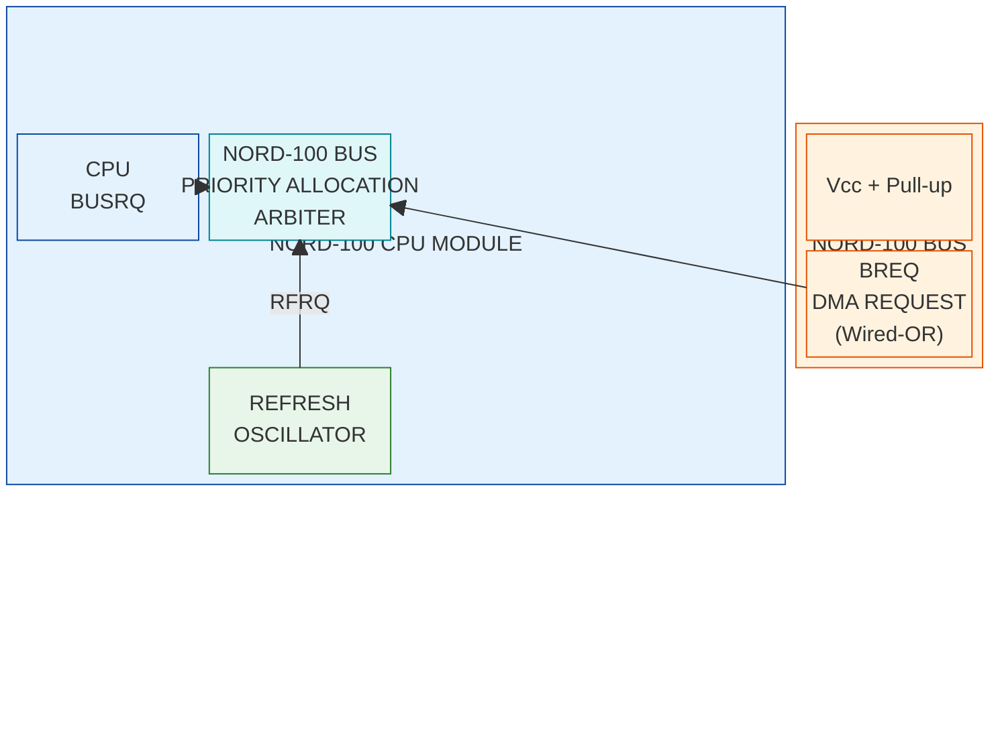

# ND-100 System Bus - C Connector Signal Reference

## Overview

The C connector carries the standard ND-100 system bus (ND-BUS) shared between the CPU, memory, and all I/O controllers on the backplane. This connector is common to the ND-100, ND-110, and ND-120 machines.

### Physical Connector

The C connector uses the **DIN 41612** standard connector (Type C, 3 rows x 32 pins = 96 pins), 2.54mm pitch.

| Location | Connector Type | Details |
|----------|---------------|---------|
| **Backplane** | Female socket (receptacle) | Straight through-hole, PCB solder mount, 3x32 pin |
| **CPU / Controller cards** | Male pin header | Right-angle, 3x32 pin, gold plated contacts |

The ND-BUS C connector layout is **similar to, but not identical to, the EuroBus** (IEEE 796 / Eurocard bus). Key similarities and differences:

| Feature | EuroBus | ND C-Connector |
|---------|---------|----------------|
| Connector | DIN 41612 | DIN 41612 |
| Rows | 3 (a, b, c) | 3 (A, B, C) |
| Pins per row | 32 | 32 |
| Pin 32 (a, b, c) | GND | GND |
| Pin 1 | +5V | **GND** |
| Pin 2 | -- | **+5V** |
| Power distribution | Scattered (pins 13a, 15a, 19a, 24a) | **Grouped at pins 24-31** |

**Important**: Despite sharing the same physical connector, the ND C-Connector and EuroBus are **not electrically compatible**. The different power pin assignments mean that inserting an ND card into a EuroBus backplane (or vice versa) could short power to signal pins and cause damage.

The ND design groups all power and ground pins at the edges of the connector (pins 1-2 and 24-32), keeping the signal pins concentrated in the middle range (pins 3-23). This provides good ground distribution with GND at pins 1, 11, 24, and 32 on all three rows.

### Signal Logic Levels

> **All signals are active LOW (active low / negative logic / accent low)**

| Logic State | Voltage Range | Physical Level |
|-------------|---------------|----------------|
| Active (asserted, logic "1") | 0.0V - 0.5V | LOW |
| Inactive (negated, logic "0") | 2.4V - 5.0V | HIGH |

This is standard TTL negative logic. An "asserted" or "active" signal is driven LOW.

### Bus Timing

One bus cycle should not last longer than **8 microseconds**.

### Source/Used Legend

The Source and Used columns use these abbreviations:

| Code | Meaning |
|------|---------|
| C | CPU (controlling unit) |
| M | Memory |
| I | I/O interface |
| P | Power supply unit |
| E | Future extensions only |
| X | Bus expander |

**Direction from CPU perspective:**

| Source Code | CPU Direction | Meaning |
|-------------|---------------|---------|
| C | Output | CPU drives this signal |
| I | Input | I/O interface drives, CPU receives |
| M | Input | Memory drives, CPU receives |
| CI | Bidirectional | CPU or I/O can drive |
| MI | Input | Memory or I/O drives, CPU receives |
| CMI | Bidirectional | CPU, Memory, or I/O can drive (tri-state) |
| P | Power | Power supply, not a logic signal |
| E | Reserved | Future extensions |

---

## Electrical Characteristics

### Pull-Up Resistors

All **BD (Bus Data)** signals have **4.7K pull-up resistor networks** in 4610X_101_472 SMD package format. These pull the bus lines HIGH (inactive) when no device is driving them.

The following signals have **pull-up resistors on the CPU card input side** (before the 74F244 input buffer). The pull-ups hold these lines HIGH (inactive/negated) when no device is driving them LOW. I/O controllers driving these signals **must** use open-drain/open-collector outputs.

| Signal | CPU Card Pull-Up | Input Buffer | Notes |
|--------|-----------------|--------------|-------|
| /LOAD | Yes | 74F244 | CPU crate only |
| /RESTART | Yes | 74F244 | CPU crate only |
| /CONTINUE | Yes | 74F244 | CPU crate only |
| /STOP | Yes | 74F244 | CPU crate only |
| /BREQ | Yes | 74F244 | Bus Request (DMA) |
| /BINT 10 | Yes | 74F244 | Interrupt level 10 (lowest priority) |
| /BINT 11 | Yes | 74F244 | Interrupt level 11 |
| /BINT 12 | Yes | 74F244 | Interrupt level 12 |
| /BINT 13 | Yes | 74F244 | Interrupt level 13 |
| /BINT 15 | Yes | 74F244 | Interrupt level 15 (highest priority) |

The "/" prefix denotes active-low signals.

### CPU Input Signals via 74F244 (Tri-State Bus Receiver)

The **74F244** is an octal buffer/line driver with **tri-state outputs**, used here as a **bus receiver** on the CPU input path. It buffers incoming bus signals before they reach the CPU internal logic, providing:

- **Input protection** for the CPU's internal ICs
- **Signal conditioning** (clean TTL levels to internal logic)
- **Electrical isolation** between the bus and CPU internals

The pull-up resistors on the **input side** (bus side) of the 74F244 ensure that when no device is asserting a signal, the input reads HIGH (inactive). When an I/O controller asserts the signal (pulls LOW via open-collector/open-drain), the 74F244 passes the LOW through to the CPU.

| Signal | Direction | Input Buffer | Pull-Up | Notes |
|--------|-----------|-------------|---------|-------|
| /LOAD | Bus to CPU | 74F244 | Yes | Wired-OR. CPU crate only |
| /BREQ | Bus to CPU | 74F244 | Yes | Bus Request for DMA. Wired-OR |
| /RESTART | Bus to CPU | 74F244 | Yes | Wired-OR. CPU crate only |
| /CONTINUE | Bus to CPU | 74F244 | Yes | Wired-OR. CPU crate only |
| /STOP | Bus to CPU | 74F244 | Yes | Wired-OR. CPU crate only |
| /BINT 15 | Bus to CPU | 74F244 | Yes | Interrupt level 15 (highest). Wired-OR |
| /BINT 13 | Bus to CPU | 74F244 | Yes | Interrupt level 13. Wired-OR |
| /BINT 12 | Bus to CPU | 74F244 | Yes | Interrupt level 12. Wired-OR |
| /BINT 11 | Bus to CPU | 74F244 | Yes | Interrupt level 11. Wired-OR |
| /BINT 10 | Bus to CPU | 74F244 | Yes | Interrupt level 10 (lowest). Wired-OR |

> **Controller design confirmation**: The pull-up resistors are on the CPU card. Your controller card does **not** need to add pull-ups for these signals. Use open-collector or open-drain outputs to assert (pull LOW). When your controller releases the signal (output off), the CPU card's pull-up will return the line to HIGH.

### CPU Input Signals via 74F244 (Without Pull-Up)

The following signals also enter the CPU through **74F244** bus receivers, but **without** pull-up resistors on the CPU card input side. These signals are either driven by other devices that provide their own pull-ups, or are actively driven (not wired-OR) and do not need pull-ups.

| Signal | Direction | Input Buffer | Pull-Up | Notes |
|--------|-----------|-------------|---------|-------|
| /PANREQ | Bus to CPU | 74F244 | **No** | Panel Request readback. CPU schematic name: SEMREQ (CPU also drives via 7438) |
| /BINPUT | Bus to CPU | 74F244 | **No** | Bus Input readback (CPU also drives via 7407) |
| /BPERR | Bus to CPU | 74F244 | **No** | Bus Parity/ECC Error from memory |
| /BDAP | Bus to CPU | 74F244 | **No** | Bus Data Present |
| /BDRY | Bus to CPU | 74F244 | **No** | Bus Data Ready readback (CPU also drives via 74F241) |
| /BAPR | Bus to CPU | 74F244 | **No** | Bus Address Present readback (CPU also drives via 7407) |

> **Note on readback signals**: Several signals appear in both the CPU output list (driven via 7407/7438/74F241) and this CPU input list (received via 74F244). This is because the CPU needs to **read back** the state of signals it also drives. For example, /BAPR is driven out via the 7407 open-collector buffer, but also read back via the 74F244 so the CPU can monitor the actual bus state. This is standard practice for bus controllers that participate in shared-bus protocols.

> **Controller design note**: Since these signals have **no pull-up on the CPU card**, if these are wired-OR signals, the pull-up must exist elsewhere (backplane termination or another card). If you are designing a controller that drives /BDAP or /BDRY, verify that a pull-up exists somewhere in the system. If your controller is the only device in the system besides the CPU, you may need to provide the pull-up on your card.

### CPU Output Signals via 7407 (Open-Collector Buffer)

The following signals are driven **out from the ND-120 3202D CPU** through a **7407** hex buffer (non-inverting, open-collector output).

**7407 output behavior:**

- **Asserted (active)**: Output transistor turns ON -- **pulls line DOWN to GND** (sinks current)
- **Negated (inactive)**: Output transistor turns OFF -- **line floats HIGH** via external pull-up resistor

This means the 7407 can only actively drive LOW. It cannot drive HIGH -- the HIGH state is passive, provided by the pull-up resistor. Multiple open-collector outputs can safely share the same bus line (wired-OR) because no device actively drives HIGH. The HIGH-state voltage is determined by the pull-up resistor and its supply voltage, not by the 7407.

| Signal | Direction | Type | Notes |
|--------|-----------|------|-------|
| /BINPUT | CPU Output | Open-collector (7407) | Bus Input request. Wired-OR compatible |
| /BREF | CPU Output | Open-collector (7407) | Bus Refresh request to memory |
| /BAPR | CPU Output | Open-collector (7407) | Bus Address Present (address strobe). Wired-OR compatible |
| /RUN | CPU Output | Open-collector (7407) | CPU running indicator. CPU crate only |
| /BMINH | CPU Output | Open-collector (7407) | Bus Memory Inhibit during power transitions |

### CPU Output Signal via 7406 (Open-Collector Inverting Buffer)

The **7406** is a hex **inverting** buffer with open-collector outputs (6 independent NOT gates). Same pull-down/float-high output behavior as the 7407, but the signal is **inverted** between the CPU internal logic and the bus.

**7406 output behavior:**

- **Input HIGH (internal CPU logic = 1)**: Output transistor turns ON -- **pulls line DOWN to GND**
- **Input LOW (internal CPU logic = 0)**: Output transistor turns OFF -- **line floats HIGH** via pull-up

This means the CPU's internal logic sense is **opposite** to what appears on the bus. The CPU asserts the signal internally as HIGH, and the 7406 inverts it to active-LOW on the bus.

| Signal | Direction | Type | Notes |
|--------|-----------|------|-------|
| /BMCL | CPU Output | Open-collector (7406, inverting) | Bus Master Clear. Wired-OR compatible. Inverted from CPU internal logic |

### Bus Interface IC Summary (ND-120 3202D CPU Card)

#### CPU Outputs (driving signals onto the bus)

| IC | Type | Inverting? | Output | Signals |
|----|------|-----------|--------|---------|
| **7407** | Hex buffer | No | Open-collector, pull-down / float-high | /BINPUT, /BREF, /BAPR, /RUN, /BMINH |
| **7406** | Hex inverter | **Yes** | Open-collector, pull-down / float-high | /BMCL |
| **7438** | Quad 2-input NAND | **Yes** (NAND) | Open-collector, pull-down / float-high | /PANREQ*, /BDAP, /BMEM |
| **74F00** | Quad 2-input NAND | **Yes** (NAND) | **Push-pull (totem-pole)** | /OUTGRANT |
| **74F241** | Octal buffer/driver | Mixed | **Tri-state push-pull** | /OUTIDENT, /BIOXE, /BINACK, /BERROR, /BDRY, /IOXERR**, /MOR** |
| **74AS648** | Octal bus transceiver | **Yes** (inverting) | **Tri-state push-pull** | /BD0 - /BD23 (output direction) |

#### CPU Inputs (receiving signals from the bus)

| IC | Type | Pull-Up on Input? | Signals |
|----|------|-------------------|---------|
| **74F244** | Octal buffer (bus receiver) | **Yes** | /LOAD, /BREQ, /RESTART, /CONTINUE, /STOP, /BINT15, /BINT13, /BINT12, /BINT11, /BINT10 |
| **74F244** | Octal buffer (bus receiver) | **No** | /PANREQ*, /BINPUT, /BPERR, /BDAP, /BDRY, /BAPR |
| **74ALS534** | Octal D flip-flop (inverting) | 4.7K network | /BD0 - /BD23 (input direction) |

**Table footnotes:**

\* **PANREQ** is the bus signal name (pin A17). On the ND-120 3202D CPU card schematic it is labelled **SEMREQ** (Semaphore Request). Same physical signal, different naming convention -- PANREQ is the bus-level name, SEMREQ is the CPU-internal name.

\*\* **IOXERR** (I/O Execute Error) and **MOR** (Memory Out of Range) share the 74F241 with the bus signals but are **not exposed on the C connector**. They are CPU-internal signals only. They are listed here because they occupy channels on the same IC.

#### Output Type Summary

**Open-collector outputs** (7407, 7406, 7438): Pull LOW to assert, float HIGH via pull-up resistor. Safe for wired-OR bus signals. Controllers can safely share these lines with open-collector/open-drain drivers.

**Tri-state push-pull outputs** (74F241): Actively drive both HIGH and LOW when enabled, high-impedance when disabled. CPU enables these only during the correct bus phase. Controllers must never drive these signals at the same time as the CPU.

**Push-pull output** (74F00): Actively drives both HIGH and LOW at all times. Only safe on point-to-point connections (daisy-chain).

### CPU Output Signal via 74F00 (Push-Pull Totem-Pole) -- OUTGRANT

The **74F00** is a quad 2-input NAND gate with **push-pull (totem-pole) outputs**. Unlike the 7406/7407 open-collector drivers, the 74F00 **actively drives both HIGH and LOW**.

**74F00 output behavior:**

- **Asserted**: Output actively drives **LOW** (transistor sinks to GND)
- **Negated**: Output actively drives **HIGH** (transistor sources from VCC)

| Signal | Direction | Type | Notes |
|--------|-----------|------|-------|
| /OUTGRANT | CPU Output | Push-pull (74F00, NAND) | DMA grant daisy-chain output. **Not wired-OR safe** |

> **WARNING -- OUTGRANT is NOT a shared bus signal**: The 74F00 push-pull output will actively fight any other driver on the same line. This is acceptable because **OUTGRANT is a point-to-point daisy-chain signal** -- it connects only to the INGRANT input of the adjacent card slot. It is never shared as a wired-OR bus signal. Each card in the chain has its own OUTGRANT driving only the next card's INGRANT.

> **Controller design rule**: Your controller card must **never drive OUTGRANT onto a shared bus line**. OUTGRANT connects only to the INGRANT of the next lower-priority slot. Your controller's OUTGRANT driver can safely be push-pull (totem-pole) because it is a dedicated point-to-point connection, not a shared bus. However, if your controller does not implement DMA, you **must** still pass INGRANT through to OUTGRANT (wire them through or use a buffer) to maintain the daisy-chain for cards in lower-priority slots.

### CPU Output Signals via 7438 (Open-Collector NAND)

The **7438** is a quad 2-input NAND gate with **open-collector outputs**. Same pull-down/float-high behavior as the 7406/7407, but with NAND logic (output is LOW only when both inputs are HIGH).

- Can pull LOW (sink current)
- Cannot drive HIGH -- requires external pull-up resistor
- Safe for wired-OR bus signals

| Signal | Direction | Type | Notes |
|--------|-----------|------|-------|
| /PANREQ | CPU Output | Open-collector (7438, NAND) | Panel Request. CPU schematic name: SEMREQ. Wired-OR compatible |
| /BDAP | CPU Output | Open-collector (7438, NAND) | Bus Data Present. Wired-OR compatible |
| /BMEM | CPU Output | Open-collector (7438, NAND) | Bus Memory cycle. Wired-OR compatible |

> **Design implication**: Since /BDAP and /BMEM are driven open-collector from the CPU, a DMA controller card that also needs to assert these signals during its bus master phase can safely do so with its own open-collector/open-drain outputs. No bus contention risk.

### CPU Output Signals via 74F241 (Tri-State Bus Driver)

The **74F241** is an octal buffer/line driver specifically designed for bus driving. It has **tri-state push-pull outputs** with two enable controls (active-high and active-low) for each half of the buffer (4 channels each).

**74F241 output behavior:**

- **Enabled + Asserted**: Output actively drives **LOW**
- **Enabled + Negated**: Output actively drives **HIGH**
- **Disabled (tri-state)**: Output is **high-impedance** -- completely disconnected from the bus

The 74F241 has mixed inverting/non-inverting buffers: one group of 4 is inverting, the other group of 4 is non-inverting. The CPU design selects the appropriate group for each signal.

| Signal | Direction | Type | Notes |
|--------|-----------|------|-------|
| /OUTIDENT | CPU Output | Tri-state (74F241) | Interrupt ident daisy-chain output |
| /BIOXE | CPU Output | Tri-state (74F241) | I/O Execute strobe |
| /BINACK | CPU Output | Tri-state (74F241) | Bus Input Acknowledge |
| /IOXERR | CPU Output | Tri-state (74F241) | I/O Execute Error |
| /MOR | CPU Output | Tri-state (74F241) | Memory Out of Range |
| /BERROR | CPU Output | Tri-state (74F241) | Bus Error |
| /BDRY | CPU Output | Tri-state (74F241) | Bus Data Ready |

> **CRITICAL -- Tri-state signals require careful timing**: Unlike the open-collector signals (7407/7406/7438), the 74F241 outputs actively drive **both HIGH and LOW** when enabled. The CPU enables these outputs only during the appropriate bus phase and disables them (high-impedance) at all other times. A controller card that also drives any of these signals (e.g., BDRY during DMA) **must not** drive at the same time as the CPU. Bus contention between two push-pull drivers will cause excessive current and potential damage to both the CPU's 74F241 and the controller's driver IC.

> **Controller design note for BDRY**: The CPU drives BDRY via tri-state (74F241), and I/O controllers also drive BDRY (as a wired-OR signal). This works because the CPU only enables its BDRY driver during cycles where the CPU is the responding device (e.g., memory cycles). During I/O cycles, the CPU's BDRY driver is tri-stated, and the I/O controller's open-collector BDRY is safe to assert. The bus protocol ensures only one side drives at a time.

> **Design implication for open-collector signals**: Since the 7407/7406/7438 CPU outputs are open-collector, controller cards that also need to drive BINPUT, BAPR, or BMCL (e.g., for DMA or reset) can safely do so with their own open-collector/open-drain drivers. There is no risk of bus contention on these signals because neither side has a totem-pole output that could fight the other.

> **Pull-up note**: The pull-up resistors for open-collector signals may be on the CPU card, on the backplane, or on a bus termination card. When designing a controller, do not add additional pull-ups without checking if one already exists, as parallel pull-ups reduce the effective resistance and increase the LOW-state current sink requirement.

### BD 0-23 Bus Connection on ND-120 3202D CPU

The BD 0-23 bus data lines use **separate ICs for input and output** on the ND-120 3202D CPU card:

**Input path (bus to CPU):** Via **74ALS534** (x3 for 24 bits) - Octal D-type edge-triggered flip-flop with **inverting** outputs and 3-state.

- Latches bus data at a precise clock edge, providing **stable data capture** decoupled from bus timing
- ALS (Advanced Low-power Schottky) -- slower but lower power, ideal for stable sampling
- The 4.7K pull-up resistor networks on the BD lines hold them HIGH (inactive) when no device is driving
- Output enable can isolate the latch outputs from internal CPU logic when needed

**Output path (CPU to bus):** Via **74AS648** (x3 for 24 bits) - Octal bus transceiver/register with **inverting** outputs and 3-state.

- High-speed Advanced Schottky transceiver (4-6 ns propagation delay) designed specifically for bus driving
- **Direction control** (DIR pin) selects transmit vs receive
- **Tri-state enable** (/OE pin) -- when disabled, outputs go high-impedance, freeing the bus for other devices
- AS (Advanced Schottky) -- very fast with strong drive capability, correct choice for bus output

**Design rationale -- separate input/output paths:**

| Function | IC | Speed | Why |
|----------|-----|-------|-----|
| Input sampling | 74ALS534 | Slower (ALS) | Stable capture at defined clock edge |
| Output driving | 74AS648 | Fast (AS) | Strong tri-state push-pull bus drive |

This combination is intentional: **fast out, stable in**. The CPU is never directly tied to the bus -- data always passes through a latch (input) or transceiver (output). This prevents contention and timing hazards, which is essential for a multi-master shared backplane bus.

Both ICs are **inverting**, which is consistent with the active-low bus convention. Data on the CPU's internal bus is in positive logic; the inverting buffers convert it to/from the negative-logic (active-low) external bus.

> **Note**: Unlike the wired-OR control signals (7406, 7407, 7438), the BD 0-23 data lines are **fully driven push-pull** via the 74AS648. These are high-speed data lines, not open-collector.

> **WARNING**: Bus contention (two devices driving BD lines simultaneously) can damage the CPU's 74AS648 output drivers. The 74AS648 must only drive when the CPU owns the bus. Controller cards **must** use tri-state buffers and only enable their BD drivers during their allocated data phase.

**Note on /PANREQ**: This signal is both an input and output on the CPU card. It enters via 74F244 (no pull-up) and is driven out via 7438 (open-collector). The CPU card schematic uses the name **SEMREQ** (Semaphore Request) for this signal; the bus-level name is **PANREQ** (Panel Request). Pin A17.

**Note on INGRANT/INIDENT**: These are **not** CPU-card signals in the traditional sense. They are daisy-chain signals that arrive at each controller card's INGRANT/INIDENT pins and are either captured or passed through to OUTGRANT/OUTIDENT. The CPU originates them via OUTGRANT (74F00) and OUTIDENT (74F241). See the daisy-chain sections for details.

**Note on IOXERR and MOR**: These signals share the 74F241 IC with bus signals but are **not on the C connector**. They are CPU-internal signals only.

**Note on /BLANK**: Output Blanking signal for process interfaces (pin B17). Source: I, Used: I -- this signal passes between I/O interfaces only. A monitoring device generates it (wired-OR) and process interfaces receive it. The CPU does **not** connect to this signal. No CPU card IC traces needed.

**Note on INCONTR/OUTCONTR**: Future extensions (E). May not be connected on the 3202D CPU card.

All C connector bus signals have been accounted for. CPU card IC traces are complete for all signals that connect to the CPU.

### Common Buffer/Driver ICs

These are the typical ICs used on original ND controller cards for interfacing with the bus:

| IC | Type | Function | Inverting? |
|----|------|----------|------------|
| 74LS240 | Octal buffer | Bus interfacing and signal buffering | **Yes** (inverting) |
| 74LS244 | Octal buffer | Data output buffering with 3-state outputs | No (non-inverting) |
| 74LS373 | 8-bit latch | Transparent latch with 3-state outputs (address latch) | No |
| 74S374 | 8-bit flip-flop | D-type edge-triggered with 3-state outputs (data latch) | No |

### Propagation Delay Comparison - Buffer and Level Shifter ICs

When selecting interface components, propagation delay directly impacts whether the controller can meet the **50 ns BAPR address hold** window. The table below compares original 5V TTL parts with modern level-shifting alternatives:

| Component | Type | Propagation Delay | Notes |
|-----------|------|-------------------|-------|
| **74LS240** | Octal buffer (inverting) | 10-14 ns | Original ND bus IC. 5V TTL only. Not ideal for fast or low-power designs |
| **74LS244** | Octal buffer (non-inverting) | 10-14 ns | Original ND bus IC. 5V TTL only |
| **74AS648** | Bidir bus transceiver | 4-6 ns | Advanced Schottky. Fast, 5V TTL. Good for 5V-only designs |
| **74LVC245** | Bidir transceiver | 3-6 ns | 3.3V with 5V-tolerant inputs. Deterministic direction control. Ideal for push-pull buses |
| **74LVT245** | Bidir transceiver | 3-5 ns | Similar to 74LVC245, lower power, slightly faster |
| **TXB0108** | Bidir level shifter | 1-2 ns | Fastest level shifter. Push-pull, higher-speed buses |
| **TXS0108E** | Bidir level shifter | 2.5-10 ns | Auto-direction sensing. Higher delay on direction change. Best for open-drain and low-speed buses |

#### Selection Guidelines

**For 5V-only designs** (traditional TTL controller card):
- Use original-style 74LS240/244 buffers, or upgrade to 74AS648 for faster response

**For 3.3V microcontroller designs** (e.g., RP2040):

| Signal Type | Recommended IC | Reason |
|-------------|---------------|--------|
| BD 0-23 (data/address) | **74LVC245** | Deterministic direction control, 5V tolerant inputs, 3-6 ns delay. Direction pin avoids the auto-sensing glitch risk of TXS0108E |
| BAPR, BIOXE, BINACK (input strobes) | **TXB0108** or **74LVC245** | Fastest path for time-critical signals |
| BINT, BREQ, BINPUT (wired-OR outputs) | **TXS0108E** | Open-drain compatible, auto-direction works well for wired-OR |
| BDRY, BDAP (handshake) | **74LVC245** | Predictable timing for handshake signals |

#### Critical Timing Windows

There are two tight timing constraints on the ND-100 bus:

| Timing Window | Duration | Phase | Constraint |
|---------------|----------|-------|------------|
| BAPR address hold | ~50 ns | Address cycle | Controller must latch address from BD lines within this window |
| IDENT response | ~100 ns | IDENT PLxx data cycle | Controller must place IDENT code on BD lines and respond |
| Bus cycle maximum | 8000 ns (8 us) | Full cycle | Total address + data phase must complete |

The IDENT phase is particularly demanding because the controller must:
1. Receive INIDENT through the level shifter
2. Determine if it raised the specified interrupt
3. Either pass INIDENT through to OUTIDENT, or place its IDENT code on BD lines
4. All within approximately 100 ns

#### Timing Budget with Level Shifter

```
  BAPR Address Latch (50 ns window):

  74LVC245:    3-6 ns   -> 44-47 ns remaining    Comfortable
  TXB0108:    1-2 ns   -> 48-49 ns remaining    Best margin
  TXS0108E:   2.5-10 ns -> 40-47.5 ns remaining  Marginal on direction change
  74LS240:    10-14 ns  -> 36-40 ns remaining    OK for 5V TTL

  IDENT Phase (100 ns window, round-trip through level shifter):

  74LVC245:    2x 3-6 ns  = 6-12 ns  -> 88-94 ns remaining    Good
  TXB0108:    2x 1-2 ns  = 2-4 ns   -> 96-98 ns remaining    Best
  TXS0108E:   2x 2.5-10 ns = 5-20 ns -> 80-95 ns remaining   Risky on direction change
  74LS240:    2x 10-14 ns = 20-28 ns -> 72-80 ns remaining    Tight for 5V designs
```

The IDENT phase requires **round-trip** delay accounting because the signal enters the controller (INIDENT) and a response must be driven back out (OUTIDENT or BD data). With the TXS0108E worst case of 10 ns per direction change, up to 20 ns is consumed by level shifting alone, leaving only 80 ns for the controller logic.

#### Conclusions

| Component | BAPR (50 ns) | IDENT (100 ns) | Noise Immunity | Recommendation |
|-----------|-------------|----------------|----------------|----------------|
| **74LVC245** | Good (44-47 ns left) | Good (88-94 ns left) | Excellent | **Best choice** for BD lines and handshake signals |
| **74LVT245** | Good (45-47 ns left) | Good (90-94 ns left) | Excellent | Alternative to 74LVC245, slightly faster, lower power |
| **TXB0108** | Best (48-49 ns left) | Best (96-98 ns left) | Fair | Speed priority only. Less robust on noisy backplane/long traces |
| **TXS0108E** | Marginal | Risky | Good | **Not recommended** for BD lines. Auto-direction sensing adds unpredictable delay on multiplexed bus. Acceptable for slow wired-OR signals only (BINT, BREQ) |
| **74LS240** | OK (36-40 ns left) | Tight (72-80 ns left) | Excellent | Only for 5V-only designs. Too slow for 3.3V level-shifting path |

> **Recommendation**: For RP2040-based controller cards, use **74LVC245** or **74LVT245** for all bus signals. These provide deterministic direction control (no auto-sensing surprises), 5V-tolerant inputs, and sufficient speed margin for both the 50 ns BAPR window and the 100 ns IDENT phase. Reserve TXS0108E only for slow, wired-OR signals (interrupts, BREQ) where its open-drain compatibility is useful and timing is not critical.

### Wired-OR Signals

Several signals are **wired-OR** (active LOW, open-collector or open-drain). Multiple devices can assert the signal simultaneously. These signals require pull-up resistors (provided on the backplane or CPU card).

Wired-OR signals: `BINT10-13`, `BINT15`, `BINPUT`, `BDRY`, `BAPR`, `BMCL`, `BREQ`, `LOAD`, `RESTART`, `CONTINUE`, `STOP`, `BLANK`, `BERROR`, `BCRQ`

### Daisy-Chain Signals

These signals propagate through card positions via daisy-chain (nearest card has highest priority):

| Signal Pair | Direction | Purpose |
|-------------|-----------|---------|
| INGRANT / OUTGRANT | From CPU outward | DMA bus grant priority chain |
| INIDENT / OUTIDENT | From CPU outward | Interrupt identification priority chain |
| INCONTR / OUTCONTR | From CPU outward | Bus control priority chain (future) |

---

## Pin Assignment Table

### Row A (Pins 1-32)

| Pin | Signal | Full Name | Source | Used By | CPU Direction | Description |
|-----|--------|-----------|--------|---------|---------------|-------------|
| 1 | GND | Ground | P | CMI | Power | Logical ground return |
| 2 | +5V | 5 Volt | P | CMI | Power | Main logic supply voltage |
| 3 | BD 1 | Bus Data 1 | CMI | CMI | Bidirectional | Multiplexed data and address bus |
| 4 | BD 3 | Bus Data 3 | CMI | CMI | Bidirectional | Multiplexed data and address bus |
| 5 | BD 5 | Bus Data 5 | CMI | CMI | Bidirectional | Multiplexed data and address bus |
| 6 | BD 7 | Bus Data 7 | CMI | CMI | Bidirectional | Multiplexed data and address bus |
| 7 | BD 9 | Bus Data 9 | CMI | CMI | Bidirectional | Multiplexed data and address bus |
| 8 | BD 11 | Bus Data 11 | CMI | CMI | Bidirectional | Multiplexed data and address bus |
| 9 | BD 13 | Bus Data 13 | CMI | CMI | Bidirectional | Multiplexed data and address bus |
| 10 | BD 15 | Bus Data 15 | CMI | CMI | Bidirectional | Multiplexed data and address bus |
| 11 | GND | Ground | P | CMI | Power | Logical ground return |
| 12 | BREF | Bus Refresh | C | M | **Output** | CPU requests memory refresh cycle |
| 13 | PA 1 | Position Address 1 | I | I | -- | Card position code. Defines device numbers of analogue and digital process interfaces |
| 14 | PA 3 | Position Address 3 | I | I | -- | Card position code. Defines device numbers of analogue and digital process interfaces |
| 15 | BINT 10 | Bus Interrupt 10 | I | C | **Input** | Interrupt level 10 (lowest priority). Wired-OR |
| 16 | BINT 12 | Bus Interrupt 12 | I | C | **Input** | Interrupt level 12. Wired-OR |
| 17 | PANREQ | Panel Request | I | C | **Input** | Signal indicating that the control panel wants to communicate with the CPU |
| 18 | BINPUT | Bus Input | CI | C | **Input**/Output | Bus Input signalled by a unit which will transmit data. I/O interfaces must wait for BINACK before enabling data and BDRY. Wired-OR |
| 19 | BDRY | Bus Data Ready | MI | C | **Input** | Signals that data are ready or have been accepted, given by answering device. Wired-OR |
| 20 | BAPR | Bus Address Present | CI | CMI | Bidirectional | Address strobe. Signals that a valid address is present on the multiplexed data and address bus. Wired-OR |
| 21 | INCONTR | Input Control | E | E | Reserved | Response to BCRQ indicating that control over the bus is available. A unit which does not want to control the bus must issue OUTCONTR in response to INCONTR. Generated as OUTCONTR by nearest unit in a less significant board position |
| 22 | INIDENT | Input Ident | CI | CI | Bidirectional | Response to BINT10-13, together with address bits 0-5 which specify BINT number. An interface which issued BINT on the specified level shall respond by enabling its IDENT CODE onto the BD bus. Otherwise, INIDENT is passed on to OUTIDENT (next lower priority card position). Originates as OUTIDENT from controlling unit |
| 23 | INGRANT | Input Grant | CI | I | Bidirectional | Response to BREQ, indicating that the bus is available for a DMA cycle. An interface which issued BREQ may use the bus for a single memory read or write cycle. Otherwise, INGRANT is passed onto OUTGRANT (next lower priority card position). Originates as OUTGRANT from controlling unit |
| 24 | GND | Ground | P | CMI | Power | Logical ground return |
| 25 | +15V | 15 Volt | P | CMI | Power | Supply voltage for analogue interface circuits. For customer use |
| 26 | An. Return | Analog Return | P | I | Power | Separate ground line for analogue circuits. Connected to logic ground return (GND) in power supply end |
| 27 | -15V | Minus 15 Volt | P | CMI | Power | Supply voltage for analogue interface circuits. For customer use |
| 28 | +12V | 12 Volt | P | CMI | Power | Supply voltage for memory. Requires battery backup |
| 29 | POW. SENSE | Power Sense | P | CI | Power | Power monitoring sense line |
| 30 | 5V St. by | 5V Standby | P | CMI | Power | Logic supply voltage for memory retention during power fail |
| 31 | +5V | 5 Volt | P | CMI | Power | Main logic supply voltage |
| 32 | GND | Ground | P | -- | Power | Logical ground return |

### Row B (Pins 1-32)

| Pin | Signal | Full Name | Source | Used By | CPU Direction | Description |
|-----|--------|-----------|--------|---------|---------------|-------------|
| 1 | GND | Ground | P | CMI | Power | Logical ground return |
| 2 | +5V | 5 Volt | P | CMI | Power | Main logic supply voltage |
| 3 | BD 16 | Bus Data 16 | CMI | CMI | Bidirectional | Multiplexed data and address bus |
| 4 | BD 17 | Bus Data 17 | CMI | CMI | Bidirectional | Multiplexed data and address bus |
| 5 | BD 18 | Bus Data 18 | CMI | CMI | Bidirectional | Multiplexed data and address bus |
| 6 | BD 19 | Bus Data 19 | CMI | CMI | Bidirectional | Multiplexed data and address bus |
| 7 | BD 20 | Bus Data 20 | CMI | CMI | Bidirectional | Multiplexed data and address bus |
| 8 | BD 21 | Bus Data 21 | CMI | CMI | Bidirectional | Multiplexed data and address bus |
| 9 | BD 22 | Bus Data 22 | CMI | CMI | Bidirectional | Multiplexed data and address bus |
| 10 | BD 23 | Bus Data 23 | CMI | CMI | Bidirectional | Multiplexed data and address bus |
| 11 | GND | Ground | P | CMI | Power | Logical ground return |
| 12 | LOAD | Load | I | C | **Input** | Activates the load microprogram if the CPU is in STOP mode. Wired-OR (CPU crate only) |
| 13 | RESTART | Restart | I | I | **Input** | Starts program execution in location 20 (octal) if the CPU is in STOP mode. Wired-OR (CPU crate only) |
| 14 | RUN | Running | I | C | **Input** | Indicates that the CPU is active executing a program, i.e., not in STOP mode. Generated by CPU (CPU crate only) |
| 15 | CONTINUE | Continue | I | C | **Input** | May be used to start a CPU that is in STOP mode. Wired-OR (CPU crate only) |
| 16 | STOP | Stop | I | C | **Input** | Forces the CPU to enter STOP mode after completion of the current instruction. Wired-OR (CPU crate only) |
| 17 | BLANK | Output Blanking | I | I | -- | Output Blanking signal for process interface. Wired-OR signal generated by monitoring device |
| 18 | BPERR | Bus Parity Error | M | CX | **Input** | Fatal or correctable error from memory, according to the ECC register |
| 19 | BINACK | Bus Input Acknowledge | C | C | **Output** | Signals that an interface requesting an input operation may enable data. Generated by controlling unit |
| 20 | BMCL | Bus Master Clear | CI | CMI | Bidirectional | Logic initialization at power up and when Master Clear button is pushed. Wired-OR |
| 21 | BERROR | Bus Error | E | E | Reserved | Signals that an error was detected during a bus cycle, e.g., fatal memory error. Wired-OR |
| 22 | BCRQ | Bus Control Request | E | E | Reserved | Request from source wanting full control over bus (for future extensions). Wired-OR |
| 23 | BMINH | Bus Memory Inhibit | P | CMI | Power | Used to inhibit memory accesses during power down and power up sequence in systems which have battery backup for memory only. Generated by controlling unit |
| 24 | GND | Ground | P | CMI | Power | Logical ground return |
| 25 | +15V | 15 Volt | P | CMI | Power | Supply voltage for analogue interface circuits. For customer use |
| 26 | An. Return | Analog Return | P | I | Power | Separate ground line for analogue circuits. Connected to logic ground return (GND) in power supply end |
| 27 | -15V | Minus 15 Volt | P | CMI | Power | Supply voltage for analogue interface circuits. For customer use |
| 28 | +12V | 12 Volt | P | CI | Power | Supply voltage for memory. Requires battery backup |
| 29 | POW. SENSE | Power Sense | P | CMI | Power | Power monitoring sense line |
| 30 | 5V St. by | 5V Standby | P | CMI | Power | Logic supply voltage for memory retention during power fail |
| 31 | +5V | 5 Volt | P | CMI | Power | Main logic supply voltage |
| 32 | GND | Ground | P | CMI | Power | Logical ground return |

### Row C (Pins 1-32)

| Pin | Signal | Full Name | Source | Used By | CPU Direction | Description |
|-----|--------|-----------|--------|---------|---------------|-------------|
| 1 | GND | Ground | P | CMI | Power | Logical ground return |
| 2 | +5V | 5 Volt | P | CMI | Power | Main logic supply voltage |
| 3 | BD 0 | Bus Data 0 | CMI | CMI | Bidirectional | Multiplexed data and address bus |
| 4 | BD 2 | Bus Data 2 | CMI | CMI | Bidirectional | Multiplexed data and address bus |
| 5 | BD 4 | Bus Data 4 | CMI | CMI | Bidirectional | Multiplexed data and address bus |
| 6 | BD 6 | Bus Data 6 | CMI | CMI | Bidirectional | Multiplexed data and address bus |
| 7 | BD 8 | Bus Data 8 | CMI | CMI | Bidirectional | Multiplexed data and address bus |
| 8 | BD 10 | Bus Data 10 | CMI | CMI | Bidirectional | Multiplexed data and address bus |
| 9 | BD 12 | Bus Data 12 | CMI | CMI | Bidirectional | Multiplexed data and address bus |
| 10 | BD 14 | Bus Data 14 | CMI | CMI | Bidirectional | Multiplexed data and address bus |
| 11 | GND | Ground | P | CMI | Power | Logical ground return |
| 12 | BREQ | Bus Request | I | C | **Input** | Request for a DMA cycle. Wired-OR |
| 13 | PA 0 | Position Address 0 | I | I | -- | Card position code. Defines device numbers of analogue and digital process interfaces |
| 14 | PA 2 | Position Address 2 | I | I | -- | Card position code. Defines device numbers of analogue and digital process interfaces |
| 15 | BINT 11 | Bus Interrupt 11 | I | C | **Input** | Interrupt level 11. Wired-OR |
| 16 | BINT 13 | Bus Interrupt 13 | I | C | **Input** | Interrupt level 13. Wired-OR |
| 17 | BINT 15 | Bus Interrupt 15 | I | C | **Input** | Interrupt level 15 (highest priority). Wired-OR |
| 18 | BDAP | Bus Data Present | CI | CI | Bidirectional | Signals that data is present during DMA or memory cycles |
| 19 | BIOXE | Bus I/O Execute | C | I | **Output** | Strobe to enable data transfer to or from an I/O interface. Generated by controlling unit |
| 20 | BMEM | Bus Memory | CMI | CMI | Bidirectional | Signals that a bus cycle accesses memory. Generated by controlling unit |
| 21 | OUTCONTR | Output Control | E | E | Reserved | See INCONTR. Daisy-chain output for bus control (future extensions) |
| 22 | OUTIDENT | Output Ident | CI | CI | Bidirectional | See INIDENT. Daisy-chain output for interrupt identification |
| 23 | OUTGRANT | Output Grant | CI | I | Bidirectional | See INGRANT. Daisy-chain output for DMA bus grant |
| 24 | GND | Ground | P | CMI | Power | Logical ground return |
| 25 | +15V | 15 Volt | P | CMI | Power | Supply voltage for analogue interface circuits. For customer use |
| 26 | An. Return | Analog Return | P | P | Power | Separate ground line for analogue circuits. Connected to logic ground return (GND) in power supply end |
| 27 | -15V | Minus 15 Volt | P | CI | Power | Supply voltage for analogue interface circuits. For customer use |
| 28 | +12V | 12 Volt | P | P | Power | Supply voltage for memory. Requires battery backup |
| 29 | POW. SENSE | Power Sense | P | P | Power | Power monitoring sense line |
| 30 | 5V St. by | 5V Standby | P | P | Power | Logic supply voltage for memory retention during power fail |
| 31 | +5V | 5 Volt | P | CMI | Power | Main logic supply voltage |
| 32 | GND | Ground | P | CMI | Power | Logical ground return |

---

## Signal Groups

### Data/Address Bus (BD 0-23) - 24-bit Multiplexed

The BD (Bus Data) lines carry both **address and data** in a time-multiplexed fashion:

1. **Address phase**: CPU asserts address on BD lines and strobes BAPR (Bus Address Present)
2. **Data phase**: Data is transferred on BD lines, direction depends on read/write

| Lines | Row | Pins | Word Bits | Purpose |
|-------|-----|------|-----------|---------|
| BD 0-15 | A + C | 3-10 | Bits 0-15 | 16-bit data word / lower address |
| BD 16-23 | B | 3-10 | Bits 16-23 | Upper 8 address bits (bank select) |

**Electrical notes:**
- All BD lines have **4.7K pull-up resistors** (4610X_101_472 network)
- Source: CMI (CPU, Memory, or I/O can drive)
- Accent low (active low)
- Directly driven, active pull-up by pull-up resistors
- Accent low means data must be inverted: a logic "1" data bit is represented as LOW on the bus

### Interrupt Lines (BINT 10-13, 15)

| Signal | Pin | Row | Priority | Standard Usage (Norsk Data equipment) |
|--------|-----|-----|----------|---------------------------------------|
| BINT 10 | 15 | A | Lowest | Output channel of all PIO interfaces |
| BINT 11 | 15 | C | -- | All DMA controllers |
| BINT 12 | 16 | A | -- | Input channel of all PIO interfaces |
| BINT 13 | 16 | C | -- | Real-time clock(s) and PIO devices needing special attention |
| *(BINT 14)* | -- | -- | -- | *Power failure (internal to CPU, not on external bus)* |
| BINT 15 | 17 | C | Highest | Not used by ND hardware/software. Available for special purposes needing immediate access |

- **Direction**: Input to CPU (Source: I, Used: C)
- **Type**: Wired-OR (active low, open-collector from I/O devices)
- **CPU input path**: Via 74F244 with pull-up resistors on CPU card (hold lines HIGH/inactive when no interrupt asserted)
- These interrupt lines go directly to the **interrupt detect controller (PID register)** in the CPU

**Interrupt level priority** (low to high): 10 < 11 < 12 < 13 < 14 < 15

**Note on BINT 14**: Power failure interrupt. Internal to CPU only -- not available on the external bus. BINT 15 has **higher priority than power failure**, making it suitable for critical real-time applications that must respond even during power-down sequences.

**Note on BINT 15**: Reserved by Norsk Data -- not used by any ND-produced hardware or software. Available for customer/third-party use where immediate access at the highest possible priority is required.

### Position Address (PA 0-3)

| Signal | Pin | Row |
|--------|-----|-----|
| PA 0 | 13 | C |
| PA 1 | 13 | A |
| PA 2 | 14 | C |
| PA 3 | 14 | A |

- **Source**: Backplane wiring (hard-wired per slot position)
- **Used by**: I/O interfaces to determine their device number
- **Direction**: Input to I/O cards (not connected to CPU)
- These are **not active signals** - they are wired HIGH or LOW per card slot on the backplane

### CPU Control Signals (CPU Crate Only)

These signals are only valid within the CPU crate:

| Signal | Pin | Row | Direction | Description |
|--------|-----|-----|-----------|-------------|
| LOAD | 12 | B | Input to CPU | Activate load microprogram (STOP mode) |
| RESTART | 13 | B | Input to CPU | Start at address 20 octal (STOP mode) |
| RUN | 14 | B | Input to CPU | CPU is running indicator |
| CONTINUE | 15 | B | Input to CPU | Resume stopped CPU |
| STOP | 16 | B | Input to CPU | Force CPU to STOP mode |

All are wired-OR. These come from the control panel or diagnostic devices.

### Bus Control Signals - Detailed Reference

| Signal | Pin | Row | Source | CPU Dir | Type | Description |
|--------|-----|-----|--------|---------|------|-------------|
| BAPR | 20 | A | CI | Bidir | Wired-OR | Address strobe - address valid on BD lines |
| BMEM | 20 | C | CMI | Bidir | Active | Memory cycle indicator |
| BIOXE | 19 | C | C | Output | Active | I/O execute strobe |
| BINPUT | 18 | A | CI | Input | Wired-OR | Device requests input transfer |
| BINACK | 19 | B | C | Output | Active | CPU acknowledges input request |
| BDAP | 18 | C | CI | Bidir | Active | Data present on bus |
| BDRY | 19 | A | MI | Input | Wired-OR | Data ready/accepted by responding device |
| BMCL | 20 | B | CI | Bidir | Wired-OR | Master clear (power-up/reset) |
| BREF | 12 | A | C | Output | Active | Memory refresh request |
| BREQ | 12 | C | I | Input | Wired-OR | DMA bus request |
| BPERR | 18 | B | M | Input | Active | Parity/ECC error from memory |

#### BAPR - Bus Address Present (Address Strobe)

**Full name**: Bus Address Present
**Active on**: BD 23:00 (all 24 address/data lines)

Indicates that a valid address is present on the BD 0-23 bus lines. This is the address strobe that initiates every bus cycle. The address is held valid for approximately 50 ns after the leading edge of BAPR. All devices must latch the address on the leading edge of BAPR.

Used during: IOX/IOXT (device register address), IDENT PLxx (interrupt level), DMA (physical memory address).

#### BDAP - Bus Data Present

**Full name**: Bus Data Present

Signals that valid data is present on the BD lines during the data phase of a bus cycle. Used primarily in DMA write (memory input) cycles where the DMA controller indicates it has placed write data on the bus.

#### BDRY - Bus Data Ready

**Full name**: Bus Data Ready

Asynchronous handshake response from the accessed device signalling that data has been **accepted** (write cycle) or is **valid and ready for reading** (read cycle). This is the "transfer completed" signal that terminates the data phase and releases the bus cycle. Wired-OR line.

#### BERROR - Bus Error

**Full name**: Bus Error

Signals that an error was detected during a bus cycle, for example a fatal memory error. Wired-OR line. Reserved for future extensions.

#### BINACK - Bus Input Acknowledge

**Full name**: Bus Input Acknowledge

Generated by the CPU (controlling unit) in response to BINPUT. Signals that an I/O interface requesting an input operation may now enable its data onto the BD lines. The interface must wait for BINACK before driving the bus.

#### BIOXE - Bus I/O Execute

**Full name**: Bus I/O Execute

CPU-generated strobe that enables data transfer to or from an I/O interface during IOX/IOXT instruction execution. All I/O interfaces check the device register address (from the address phase) against their own address when BIOXE is asserted. Only the matching interface responds.

#### BINPUT - Bus Input

**Full name**: Bus Input

Asserted by an I/O interface that wants to transmit data to the CPU. The interface must wait for **BINACK** before enabling data and asserting BDRY. Wired-OR line - multiple devices can request simultaneously; the CPU handles arbitration.

#### INGRANT - Bus Input Grant

**Full name**: Bus Input Grant (DMA Grant)

Daisy-chain signal responding to BREQ, indicating that the bus is available for a DMA cycle. An interface that issued BREQ prior to the last leading edge of BAPR may use the bus for a single memory read or write cycle. If the interface did not issue BREQ, it must pass INGRANT through to OUTGRANT, connecting to INGRANT of the next lower-priority card position. INGRANT originates as OUTGRANT from the CPU (controlling unit).

#### INIDENT - Bus Input Ident

**Full name**: Bus Input Ident (Interrupt Identification)

Daisy-chain signal responding to BINT 10-13. Combined with address bits 0-5 which specify the BINT number. An interface that issued BINT on the specified level prior to the last leading edge of BAPR responds by enabling its **IDENT CODE** onto the BD bus. If the interface did not issue the interrupt, it passes INIDENT through to OUTIDENT, connecting to INIDENT of the next lower-priority card position. INIDENT originates as OUTIDENT from the CPU.

### DMA Grant Daisy-Chain

| Signal | Pin | Row | Description |
|--------|-----|-----|-------------|
| INGRANT | 23 | A | Grant input - arrives from CPU or previous card |
| OUTGRANT | 23 | C | Grant output - connects to INGRANT of next slot |

The daisy-chain originates at the CPU's OUTGRANT (driven by 74F00 push-pull) and propagates through each card slot in order. The card nearest to the CPU has the highest priority.

**Default behavior**: INGRANT passes through to OUTGRANT. Every controller card **must** connect INGRANT to OUTGRANT by default to maintain the chain for lower-priority cards.

**Capture behavior**: If the controller card has previously asserted BREQ (Bus Request for DMA), it **captures** the grant:
- It does **not** pass INGRANT through to OUTGRANT
- It becomes bus master for a single memory cycle
- After the cycle completes, it releases BREQ and the chain resumes

> **UNVERIFIED**: The exact mechanism of how INGRANT is captured vs passed through needs validation against hardware schematics. The belief is that the default state is pass-through, and only an active BREQ from the card causes capture. This needs to be confirmed on actual controller card designs.

### Interrupt Identification Daisy-Chain

| Signal | Pin | Row | Description |
|--------|-----|-----|-------------|
| INIDENT | 22 | A | Ident input - arrives from CPU or previous card |
| OUTIDENT | 22 | C | Ident output - connects to INIDENT of next slot |

The daisy-chain originates at the CPU's OUTIDENT (driven by 74F241 tri-state) and propagates through each card slot in order. The card nearest to the CPU has the highest priority.

**Default behavior**: INIDENT passes through to OUTIDENT **with the smallest possible delay**. Every controller card **must** connect INIDENT to OUTIDENT by default to maintain the chain for lower-priority cards. The pass-through delay directly impacts the IDENT response time -- each card in the chain adds its propagation delay before INIDENT reaches the next card.

**Capture behavior**: During an IDENT PLxx cycle, the CPU places the interrupt level number (10, 11, 12, or 13) on the BD bus during the address phase. When INIDENT arrives at the controller card:
- The card checks if it has an active interrupt ("flag") on the level currently specified on the BD bus
- If **flag is NOT set**: card passes INIDENT through to OUTIDENT as fast as possible
- If **flag IS set**: card **captures** INIDENT (does not pass to OUTIDENT), places its IDENT CODE on the BD lines, and asserts BDRY

Although several I/O interfaces may simultaneously have interrupts waiting for service on the same level, only one is handled per IDENT PLxx instruction. The daisy-chain ensures the **nearest card to the CPU** with the matching interrupt flag is always selected first.

> **Note on signal naming**: The ND documentation uses **BINIDENT** for the signal entering a module and **BOUTIDENT** for the signal leaving a module. These correspond to the bus connector signals **INIDENT** (pin A22) and **OUTIDENT** (pin C22).

> **Confirmed from ND documentation**: The response is to BINT10-13, together with address bits 0-5 which specify the BINT number. An interface which issued BINT on the specified level prior to the last leading edge of BAPR shall respond by enabling its IDENT CODE onto the BD bus. Otherwise, INIDENT is passed on to OUTIDENT which is connected to INIDENT of the next lower priority card position (further removed from controlling unit). INIDENT originates in the OUTIDENT from controlling unit.

### Bus Control Daisy-Chain (Future Extensions)

| Signal | Pin | Row | Description |
|--------|-----|-----|-------------|
| INCONTR | 21 | A | Control input - arrives from CPU or previous card |
| OUTCONTR | 21 | C | Control output - connects to INCONTR of next slot |

Both signals are marked **E** (future extensions) in the bus specification. This is a third daisy-chain following the same pattern as INGRANT/OUTGRANT and INIDENT/OUTIDENT, but for **full bus control** requests via BCRQ (Bus Control Request).

**Default behavior**: INCONTR passes through to OUTCONTR. A unit which does not want to control the bus must issue OUTCONTR in response to INCONTR. INCONTR is generated as OUTCONTR by the nearest unit in a less significant board position.

**Capture behavior**: Response to BCRQ indicating that control over the bus is available. A unit wanting full bus control captures INCONTR and does not pass it to OUTCONTR.

> **Note**: Both INCONTR/OUTCONTR and BCRQ/BERROR are reserved for future extensions (Source: E, Used: E). These signals may not be connected on the ND-120 3202D CPU card. For controller card design, these pins should be left unconnected or passed through (INCONTR to OUTCONTR) to maintain compatibility with future systems.

---

## Power Pins Summary

| Signal | Pins | Rows | Description |
|--------|------|------|-------------|
| GND | 1, 11, 24, 32 | A, B, C | Logical ground return (12 pins total) |
| +5V | 2, 31 | A, B, C | Main logic supply (6 pins total) |
| +12V | 28 | A, B, C | Memory supply, battery backup |
| +15V | 25 | A, B, C | Analogue interface supply |
| -15V | 27 | A, B, C | Analogue interface supply |
| 5V St. by | 30 | A, B, C | Standby power for memory retention |
| An. Return | 26 | A, B, C | Separate analogue ground |
| POW. SENSE | 29 | A, B, C | Power monitoring |
| BMINH | 23 | B | Memory inhibit during power transitions |

---

## Design Guidelines for Controller Cards

### Signal Direction Summary (from I/O Controller Perspective)

**Signals your controller can DRIVE (active low, accent low):**

| Signal | Type | Notes |
|--------|------|-------|
| BD 0-23 | Tri-state | Only drive during your data phase. Use 74LS244 or 74LS240 buffers |
| BINT 10-13, 15 | Open-collector | Assert your interrupt level. Must be wired-OR compatible |
| BINPUT | Wired-OR | Assert when requesting input transfer |
| BDRY | Wired-OR | Assert when data ready (memory/DMA responses) |
| BREQ | Wired-OR | Assert when requesting DMA cycle |
| BDAP | Tri-state | Assert when placing data on bus |
| BMEM | Tri-state | Assert for memory cycle (DMA only) |
| BAPR | Wired-OR | Assert when driving address (DMA only) |

**Signals your controller must only READ (never drive):**

| Signal | Notes |
|--------|-------|
| BIOXE | I/O execute strobe from CPU |
| BINACK | Input acknowledge from CPU |
| BREF | Refresh request from CPU |
| INGRANT | DMA grant daisy-chain input |
| INIDENT | Interrupt ident daisy-chain input |
| PA 0-3 | Slot position (backplane wired) |

**Daisy-chain signals (pass through or capture):**

| Input | Output | Rule |
|-------|--------|------|
| INGRANT | OUTGRANT | Capture if you requested DMA; otherwise pass through |
| INIDENT | OUTIDENT | Capture if you asserted the identified interrupt; otherwise pass through |

### Device Register Address Decoding (IOX/IOXT)

When the CPU executes an IOX/IOXT instruction, the device register address on the BD lines contains two fields:

| Field | Purpose |
|-------|---------|
| Device number | Identifies which I/O device is being addressed |
| Register number | Selects which register within the device (3 bits = up to 8 registers) |

**Hardware implementation on a controller card:**

1. **Device number PROMs**: The controller's device number is stored in a PROM (Programmable Read Only Memory). The PROM location is selected by a **thumbwheel switch**, making it easy to change the device number without hardware modifications. On multi-peripheral controllers, each peripheral type has its own PROM, thumbwheel, and comparator.

2. **Address comparison**: When BIOXE goes active, the controller compares the device number field from the BD lines against its PROM. Only **one** interface should find "device equal".

3. **Register decoding**: The device that finds "equal" decodes the register number field using a **3-to-8 line decoder**. The active decoder output selects the specific register.

4. **Output register access**: The active decoder output directly **clocks** the BD line content into the selected device output register.

5. **Input register access**: The active decoder output **AND** BINACK together enable the selected device input register onto the BD lines. BINACK confirms the CPU has released the BD lines and the controller may now drive them.

> **Controller design note**: The address comparison and register decode logic is the minimum your controller must implement to participate in IOX/IOXT transfers. The thumbwheel/PROM approach is the standard ND pattern, but a modern controller could use DIP switches, jumpers, or even software-configured address registers.

### Protecting the CPU

1. **Never drive output-only signals** (BIOXE, BINACK, BREF) - this will cause bus contention and may damage the CPU
2. **Use tri-state buffers** (74LS244, 74LS240) for BD lines - only enable during your data phase
3. **Use open-collector/open-drain drivers** for wired-OR signals (interrupts, BREQ, BINPUT, BDRY)
4. **Respect bus timing** - release the bus within 8 microseconds
5. **Implement proper daisy-chain** - INGRANT/OUTGRANT and INIDENT/OUTIDENT must pass through when not captured
6. **Observe BMCL** - your controller must reset on Bus Master Clear
7. **Do not drive BD lines during address phase** unless you are the bus master (DMA)

### Open-Collector / Wired-OR Implementation

For wired-OR signals, your controller must use open-collector (or open-drain) outputs. The bus provides pull-up resistors. Recommended drivers:

- **74LS05** - Hex inverter, open-collector
- **74LS38** - Quad 2-input NAND, open-collector
- **74LS01** - Quad 2-input NAND, open-collector

Never use totem-pole outputs on wired-OR bus signals.

### 5V to 3.3V Level Shifting - Timing Considerations

When interfacing modern 3.3V microcontrollers (e.g., RP2040) with the 5V ND-100 bus, a level shifter is required. The **TXS0108E** bidirectional level shifter is a common choice, but its propagation delay must be accounted for in the bus timing budget.

#### Critical Timing Parameters

| Parameter | Value | Source |
|-----------|-------|--------|
| BAPR address hold time | ~50 ns | CPU bus handshake logic |
| Maximum bus cycle duration | 8 us (8000 ns) | Bus specification |
| TXS0108E propagation delay | ~2.5-5 ns per channel | TXS0108E datasheet |

#### Timing Budget for Address Latching

The CPU holds the address on BD 0-23 for approximately **50 ns** after the leading edge of BAPR. This is the window in which the controller must latch the address.

With a TXS0108E level shifter in the signal path:

```
  BAPR leading edge (5V side)
    |
    +-- TXS0108E delay on BAPR:  ~2.5-5 ns
    |
    +-- BAPR arrives at RP2040:  ~5 ns after bus edge
    |
    +-- BD lines through TXS0108E: ~2.5-5 ns delay (parallel with BAPR)
    |
    +-- RP2040 GPIO input latency: ~few ns
    |
    +-- Software/PIO latch time:   variable
    |
    = Total delay budget:          ~10-15 ns consumed by level shifting
    = Remaining window:            ~35-40 ns for RP2040 to latch address
```

#### Recommendations

1. **Use PIO state machines** on the RP2040 for bus signal capture, not software polling. PIO operates at system clock speed (up to 133 MHz = 7.5 ns per cycle) and can react within 1-2 clock cycles
2. **Latch address externally** using a 74LVC373 (3.3V version of 74LS373) triggered by BAPR, before the level shifter. This captures the address at bus speed and lets the RP2040 read it at leisure
3. **The 8 us bus cycle limit is generous** - the 50 ns address hold is the tight constraint. Once the address is latched, you have nearly 8 us to complete the data phase handshake
4. **Account for round-trip delay** if driving signals back to the bus: the TXS0108E delay applies in both directions, so a response signal has ~5-10 ns added to its path
5. **Consider using 74LVC245** (3.3V octal transceiver) instead of TXS0108E for the BD data lines. The 74LVC245 has 5V-tolerant inputs and faster propagation (~3.5 ns), and its direction control is explicit rather than auto-sensing

#### Voltage Concerns

The ND-100 bus operates at 5V TTL levels. If the +5V power supply runs slightly above 5.0V (typical PSU tolerance is +/- 5%, meaning up to 5.25V), the pull-up resistors will pull idle bus lines to that voltage. The TXS0108E is rated for VCCA up to 3.6V and VCCB up to 5.5V, so it can handle slight overvoltage on the bus side. The RP2040 GPIO inputs are **not** 5V tolerant - they must never see more than 3.3V + 0.3V = 3.6V.

---

## Validation Checklist

### Active Low Confirmation

The spreadsheet note states: **"All signals are inverted (active low)"** and the Signal Names sheet confirms: **"Signals are active LOW"** with voltage levels:

- Logic "0" (active/asserted) = 0.0V - 0.5V
- Logic "1" (inactive/negated) = 2.4V - 5.0V

This is consistent with standard TTL negative logic as used throughout the ND-100 bus system. **VALIDATED**: All bus signals use active-low convention.

### Signal Count Summary

| Category | Count | Signals |
|----------|-------|---------|
| Data/Address | 24 | BD 0-23 |
| Interrupts | 5 | BINT 10-13, 15 |
| Bus Control | 11 | BAPR, BMEM, BIOXE, BINPUT, BINACK, BDAP, BDRY, BMCL, BREF, BREQ, BPERR |
| CPU Control | 5 | LOAD, RESTART, RUN, CONTINUE, STOP |
| Daisy-chain | 6 | INGRANT/OUTGRANT, INIDENT/OUTIDENT, INCONTR/OUTCONTR |
| Position | 4 | PA 0-3 |
| Panel | 2 | PANREQ, BLANK |
| Power | 8 types | GND, +5V, +12V, +/-15V, 5V Standby, An.Return, POW.SENSE |
| Memory Ctrl | 1 | BMINH |
| Future | 2 | BERROR, BCRQ |
| **Total logic** | **60** | (excluding power and ground) |

---

## Bus Cycles

### Bus Requestors and the Bus Control Unit (BCU)

The NORD-100 bus is a **shared common resource** between three types of bus requestors:

| Requestor | Request Signal | Grant Signal | Purpose |
|-----------|---------------|--------------|---------|
| **CPU** | BUSRQ (internal) | (internal) | Instruction fetch, operand read/store, indirect address read, I/O access, system control register access |
| **DMA controllers** | BREQ (external bus) | INGRANT (daisy-chain) | Direct memory access by I/O controllers |
| **Memory refresh** | RFRQ (internal) | (internal) | Periodic refresh of dynamic memory |

Only **one requestor** can use the bus at a time. The **Bus Control Unit (BCU)**, physically implemented on the CPU module, arbitrates access and decides which requestor gets the next bus cycle.

Each requestor has its own **unique request line** input to the BCU's priority allocation arbiter. The three requestors operate **completely asynchronously** -- requests may arrive at the BCU simultaneously. The BCU's priority arbiter resolves conflicts: based on a priority algorithm and the currently active requests, one requestor is selected for the next bus cycle while other active requests must wait.



*Figure: BCU allocation logic. BUSRQ and RFRQ are internal to the CPU module. BREQ comes from the external bus with a pull-up resistor to Vcc (float high when no DMA controller is requesting).*

#### BCU Priority Allocation Rules

The BCU controls bus access based on these rules:

1. **Non-preemptive**: An already allocated bus cycle is **not interruptible**
2. **Timeout**: A bus cycle is **aborted** if it exceeds the **8 microsecond** time limit
3. **Single request**: If the bus is idle and only one request appears: **first come, first served**
4. **RFRQ vs BREQ**: Both are handled as DMA requests, but **RFRQ has highest priority** (refresh must not be delayed to prevent data loss)
5. **DMA vs CPU conflict**: If both DMA requests (RFRQ or BREQ) and CPU request (BUSRQ) are present simultaneously, priority is given to **the one that did NOT have the previous cycle** (toggled priority)

The toggled priority rule (rule 5) prevents either the CPU or DMA from starving the other. If the CPU had the last cycle, a competing DMA request wins the next cycle, and vice versa. This ensures fair access even under heavy contention.

#### Bus Request Signal Timing (BUSRQ Example)

The following shows how the CPU bus request signal maps to the bus cycle phases:

```
  BUSRQ
  (CPU)     ___       //////[============]___
               |      |     |            |
              (1)    (2)   (3)          (4)

  (1) BUSRQ inactive - CPU is not requesting the bus
  (2) BUSRQ goes active - CPU requests the bus
      ////// = Waiting for grant (bus is busy with another cycle)
  (3) Bus granted to CPU
      [====] = CPU performing its bus cycle (address + data transfer)
  (4) BUSRQ goes inactive - CPU has finished, releases the bus
```

The same pattern applies to BREQ from DMA controllers on the external bus: assert to request, wait for grant (INGRANT), perform one transfer, release.

#### Example 1: CPU Requests the Bus First After Previous Allocation is Released

The CPU requests the bus first after the previous allocation is released. Since the bus is idle and the CPU request arrives first: first come, first served.

```
  Time -->                                              ~15 us
                                                   |<------------>|
  RFREQ   ______|=|__________________________________________|=|____
                320ns                                        320ns
                (refresh cycle)                    (next refresh)

  BREQ    ________|//////[===]//////[===]//////[===]//////|_________
                  |<-------- ~6 us (e.g., 10 MB disk) ------->|
                         550ns      550ns      550ns
                      (one DMA transfer per grant)

  BUSRQ   ___[===]__________[===]__________[===]___________________
              |  |          |  |          |  |
           200-320ns     200-320ns     200-320ns
           (one CPU     (one CPU      (one CPU
            bus cycle)   bus cycle)    bus cycle)
              ^
              |
        previous allocation
             released

  Legend:
    [===]  = Bus granted, performing transfer
    //////  = Requesting, waiting for grant
    __|=|__ = Short pulse (refresh)
```

**Typical cycle durations:**

| Requestor | Cycle Duration | Notes |
|-----------|---------------|-------|
| CPU (BUSRQ) | 200-320 ns | Short discrete cycles. Gap between cycles depends on CPU internal activity (instruction execution) |
| DMA (BREQ) | 550 ns per transfer | Continuous request over ~6 us for high-speed devices (e.g., 10 MB disk). Each INGRANT yields one word transfer |
| Refresh (RFRQ) | 320 ns | Periodic every ~15 us. Short address-only cycle |

**How the toggled priority works in practice:**

When both BUSRQ and BREQ are active, the BCU alternates between them. This interleaving means the CPU is never blocked for more than one DMA cycle (~550 ns), and the DMA controller is never blocked for more than one CPU cycle (~320 ns). Refresh (RFRQ) preempts both when its 15 us interval arrives.

#### Example 2: All Requests Appear Simultaneously, CPU Had the Previous Cycle

All three requests (CPU, DMA, refresh) appear at the same time, but the CPU had the previous bus cycle. The toggled priority rule means the CPU does **not** get priority again -- DMA/refresh go first.

Since RFRQ has highest priority among DMA-class requests, refresh goes first (320 ns), then DMA gets its transfer (~650 ns), and the CPU must wait.

```
  Time -->
        |
    all requests
    appear here
        |
        v
  RFREQ   [=]__________________________________________________
          320ns
          (refresh wins -
           highest priority)

  BREQ    /[========]___________________________________________
           650ns
           (DMA next - CPU had
            previous cycle, so
            DMA wins toggled priority)
           |<-- ~1.4 us (37.5-288 MB disk) -->|

  BUSRQ   ////////[===]________________________________________
                  200-320ns
                  (CPU last - had
                   previous cycle,
                   must wait for
                   refresh + DMA)

  Legend:
    [===]   = Bus granted, performing transfer
    //////  = Requesting, waiting for grant
```

**Priority resolution order:**

1. **RFRQ wins** -- refresh has highest priority among DMA-class requests (rule 4)
2. **BREQ next** -- CPU had the previous cycle, so toggled priority gives DMA the next cycle (rule 5)
3. **BUSRQ last** -- CPU waits for both refresh and DMA to complete before getting the bus

> **Note on disk speed and DMA timing**: The 650 ns DMA transfer duration and ~1.4 us total DMA window shown here is typical of faster disk controllers (37.5-288 MB disks). Slower devices like the 10 MB disk in Example 1 have ~550 ns transfers over ~6 us. The DMA cycle time depends on the disk's data rate.

#### Example 3: CPU and DMA Request Simultaneously, Previous Cycle was DMA (RFRQ)

CPU bus request and DMA request appear simultaneously (DMA cycle steal), but the previous cycle was for DMA (RFRQ). Since the previous cycle was a DMA-class request (refresh), the toggled priority now favours the **CPU**.

```
  Time -->
        |
    CPU + DMA requests
    appear here
    (previous cycle
     was RFRQ)
        |
        v
  RFREQ   [=]__________________________________________________
          (previous cycle
           was this refresh)

  BREQ    ////////[===]_________________________________________
                  550ns
                  (DMA must wait -
                   previous cycle was
                   DMA-class, so CPU
                   wins toggled priority)

  BUSRQ   [=====]______________________________________________
          200-320ns
          (CPU wins - previous
           cycle was DMA-class,
           toggled priority
           favours CPU)

  Legend:
    [===]   = Bus granted, performing transfer
    //////  = Requesting, waiting for grant
```

**Priority resolution:**

1. **BUSRQ wins** -- previous cycle was DMA-class (RFRQ), so toggled priority gives CPU the next cycle (rule 5)
2. **BREQ next** -- DMA gets the bus after CPU completes its short cycle

> **This is DMA "cycle stealing"**: The DMA controller "steals" bus cycles between CPU operations. The CPU always gets the bus back quickly (200-320 ns), so the impact on CPU performance is minimal. The DMA controller inserts its transfers in the gaps.

#### Bus Cycle Termination and Timeout

The bus is allocated and released on a **one cycle basis** -- one word transfer or one memory refresh cycle. The BCU monitors cycle duration and enforces the 8 microsecond limit.

**Normal termination:**

At the time of allocation, the BCU starts a **timeout timer**. The timer is reset when the accessed device asserts **BDRY** (Bus Data Ready), which is the handshake signal indicating "transfer completed". Once BDRY is received, the bus cycle terminates normally and the bus is released for the next requestor.

**Timeout abort:**

If BDRY is not received within **8 microseconds**, the BCU aborts the bus cycle. This prevents a faulty device from causing a permanent system hang-up. The aborted cycle is reported to the CPU as an **internal interrupt on level 14** (power failure level).

```
  Normal cycle:

  BCU Timer  [============================]
  BDRY       __________________________|=|__
                                       ^ timer reset,
                                         cycle released

  Timeout abort (faulty device does not respond):

  BCU Timer  [==============================X  (8 us limit)
  BDRY       ________________________________  (never asserted)
                                            ^
                                         BCU aborts cycle,
                                         raises level 14
                                         interrupt
```

> **Controller card design rule**: Your controller **must** assert BDRY within 8 microseconds of being addressed, or the BCU will abort the cycle and generate a level 14 interrupt. If your controller needs time to prepare data, it should still respond within the timeout. If a controller card is removed or fails, the missing BDRY will trigger the timeout on every attempted access to that device.

> **Note on level 14**: The bus timeout triggers the same interrupt level as power failure. This means the CPU's power-fail handler must distinguish between actual power failure and bus timeout conditions.

#### CPU Allocation Request (BUSRQ)

The CPU may request the bus for one of six reasons:

| Reason | Access Type |
|--------|-------------|
| Instruction fetch | Memory access |
| Operand read | Memory access |
| Indirect address read | Memory access |
| Operand store | Memory access |
| Programmed I/O access (IOX/IOXT, IDENT) | I/O system access |
| System control register access (e.g., ECC register on memory modules) | System control register access |

When any of these operations is in progress, the CPU microprogram activates the internal signal **BUSRQ** (CPU bus request) to the BCU allocation arbiter. In addition to BUSRQ, the microprogram informs the CPU **bus-handshake logic** which type of transfer is to be performed. The handshake logic is then ready to start the transfer as soon as it receives the allocation acknowledge from the BCU.

> **Note**: BUSRQ is an internal CPU signal -- it does not appear on the external bus. The CPU is always physically present on the bus (it hosts the BCU), so it does not need an external request/grant mechanism like DMA controllers do.

#### DMA Allocation Request (BREQ / INGRANT)

A DMA controller requests the bus when it needs more data to output or has a word ready to be written to memory. The request is made via the external **BREQ** signal (wired-OR, active low). The controller must then wait for the BCU to acknowledge the request before any exchange can be performed.

When multiple DMA controllers are present, each controller's request signal is **wired-OR** to a single BREQ line input to the BCU. BREQ may be driven from any slot position in the bus.

To select only **one** DMA controller as the granted bus user at a time, the acknowledge signal is **daisy-chained** in the bus backplane via the INGRANT/OUTGRANT signal pair. The daisy-chain establishes a **sequential priority scheme** -- the controller nearest to the CPU has the highest DMA priority (see DMA Transfer section and DMA Grant Daisy-Chain section for details).

#### Memory Refresh Request (RFRQ / BREF)

Refresh is a periodic operation required by the dynamic MOS memory circuits used in the NORD-100 main memory. By allocating the bus during the refresh period, two problems are solved:

1. **Synchronization**: The refresh cycle is synchronized to other bus activities
2. **Memory protection**: The memory system is inaccessible during refresh since the bus is allocated (blocked)

The refresh request is initiated every **15 microseconds** by an oscillator on the CPU module, activating the internal signal **RFRQ** (Refresh Request) to the BCU. The external bus signal **BREF** (Bus Refresh) is then asserted. A refresh cycle is an address-only, dataless cycle -- the memory system uses the address to select which row to refresh.

### Bus Cycle Structure

A NORD-100 bus cycle consists of three events:

```
  |  Allocation  |    Transfer    |  Release  |
  |              |                |           |
  |  BCU grants  |  One word      |  Bus      |
  |  bus access  |  exchanged     |  freed    |
  |  to one      |  (address +    |  for next |
  |  requestor   |  data phases)  |  request  |
  |              |                |           |
  <------------- One Bus Cycle -------------->
                                   (max 8 us)
```

1. **Allocation**: The BCU grants the bus to one of the three requestors
2. **Transfer**: The granted bus user exchanges one word with the accessed device (I/O interface or memory). This consists of an Address Cycle followed by a Data Cycle. In the case of memory refresh, the transfer is an address-only, dataless refresh cycle
3. **Release**: The bus cycle terminates (BDRY received) and the bus is freed for the next requestor

> **Important**: The BCU is **not involved** in the data transfer phase. Once the bus is allocated, the data exchange is completely controlled by the granted bus user in handshake with its accessed device. This allows fully asynchronous operation independent of CPU speed and clock frequencies. The BCU only monitors the 8 us timeout.

Only CPU and DMA cycles include actual data exchange. Memory refresh cycles are address-only (dataless). Therefore, when discussing data transfers, the granted bus user is either the CPU or a DMA controller.

Due to the multiplexing of addresses and data on the same physical BD 0-23 lines, the transfer phase is divided into two subcycles: an **Address Cycle** followed by a **Data Cycle**.

### Address Cycle and Data Cycle

Every bus transfer consists of two phases: an **Address Cycle** followed by a **Data Cycle**. The granted bus user (CPU or DMA controller) drives the address phase, and then an asynchronous handshake governs the data exchange.

### Address Cycle

When combined with the address strobe **BAPR** (Bus Address Present), the multiplexed address/data lines **BD 0-23** carry addresses.

In the address cycle, the granted bus user presents an address to the device that is to be accessed:

- **Physical memory address** to the memory system, or
- **Device register address** to the I/O interfaces

In addition, the address cycle specifies which of the interrupt levels (10, 11, 12, or 13) is to be investigated by the **IDENT PLxx** instruction.

The CPU bus handshake logic holds the address for approximately **50 ns** after the leading edge of BAPR before continuing to the data cycle. This is the only time-critical constraint in the bus protocol.

### Data Cycle

In the data cycle, data is exchanged between the I/O register or memory location specified in the address cycle.

Unlike the address cycle, the data cycle uses an **asynchronous handshake** between the granted bus user and the accessed device:

1. The granted bus user issues a control signal indicating **"start of data cycle"**
2. The accessed device completes the transfer and activates a signal indicating **"transfer completed"**
3. The bus cycle is released

Depending on the transfer direction, the "start of data cycle" and "transfer completed" signals also serve as **data strobes**.

The data cycle control signal determines the type of bus operation:

| Control Signal | Operation Type | Description |
|----------------|---------------|-------------|
| **BIOXE** | IOX / IOXT | CPU I/O register access |
| **INIDENT** | IDENT PLxx | Interrupt identification |
| **BMEM** | DMA | Direct memory access by I/O controller |

> **Timing constraint**: One bus cycle (address + data) must not last longer than **8 microseconds**. This gives an I/O controller enough time to read data or assert BINPUT to respond to a read request.

---

### IOX/IOXT Execution (CPU to I/O Register)

The IOX/IOXT instructions transfer data between the CPU A register and an I/O device register. The CPU is the bus master.

#### Address Phase

1. CPU receives bus allocation acknowledge
2. CPU handshake logic enables **WDA** (Write Data Address) onto the BD lines
3. CPU asserts **BAPR** (address strobe)
4. All I/O interfaces latch the device register address from BD lines
5. CPU holds address for ~50 ns after leading edge of BAPR

#### Internal CPU Data Path

The IOX/IOXT data path through the CPU uses these internal registers:

```
  Address cycle:  DEV.ADDR --> IDB --> WDA --> BD 0-23 (to bus)
  Data cycle:     A register --> IDB --> WDA --> BD 0-23 (to bus)
  Completion:     WDA --> DBR --> A register (echo/confirmation)
```

- **IDB** = Internal Data Bus (CPU internal)
- **WDA** = Write Data Address buffer (last stage before bus)
- **DBR** = Data Bus Register (read-back path from bus)

#### Data Phase (IOX Write - CPU to Device)

6. CPU microprogram moves the **A register** via IDB to WDA
7. Bus handshake logic passes WDA to the BD lines
8. When data (A register content) is valid on BD lines, CPU asserts **BIOXE**
9. All I/O interfaces compare the address from step 4 with their own address
10. The matching interface strobes the BD line content into its device register
11. The matching interface asserts **BDRY** to signify "data accepted"
12. CPU handshake logic uses the leading edge of BDRY to strobe BD line content into **DBR** (Data Bus Register)
13. CPU handshake logic turns off **BIOXE** in response to BDRY
14. I/O interface detects BIOXE off and turns off **BDRY** -- bus is released
15. Microprogram moves **DBR** to the **A register** (echo path: since BD lines still held A register data during the write, A register is left **unchanged** after an output transfer)
16. Bus cycle complete

```
        Address Phase                 Data Phase (Write)
        |                             |
  BD 0-23  ====[ ADDRESS ]========xxxx====[ A REGISTER DATA ]========xxxx
              _____                          _______________
  BAPR  _____|     |________________________|               |____________
                                              ___________
  BIOXE _____|____________________________|__|           |_______________
                    |                                  ___
  BDRY  ___________|__________________________________|   |______________
              |     |                         |        |   |
              |  ~50ns hold                   |     data   |
              |                            data on  accepted
           address                         BD valid  (strobed
           valid                                    into DBR)

  Release sequence: BDRY on -> BIOXE off -> BDRY off -> bus free

  (All signals active LOW - accent low - active state is drawn HIGH here
   for readability. On the physical bus, asserted = LOW)
```

#### Data Phase (IOX/IOXT Input - Device to CPU)

The address cycle is **identical** for both input and output -- the CPU and its handshake logic do not know the transfer direction. The **I/O interface** determines the direction based on whether the specified register is an input or output register.

The data cycle also **starts identically**: the CPU places the A register on the BD lines and asserts BIOXE, just as for an output transfer. The direction change happens when the addressed interface responds:

6. CPU microprogram moves the **A register** via IDB to WDA (same as output)
7. Bus handshake logic passes WDA to the BD lines (same as output)
8. When data is valid on BD lines, CPU asserts **BIOXE** (same as output)
9. All I/O interfaces compare the address from the address phase with their own
10. The matching interface determines the specified register is an **input register**
11. The interface asserts **BINPUT** to signal "this is an input transfer"
12. CPU handshake logic detects BINPUT and **closes the WDA output buffer** (releases BD lines)
13. CPU handshake logic asserts **BINACK** (Bus Input Acknowledge) -- telling the interface the BD lines are free
14. Interface receives BINACK and enables its **input register data** onto the BD lines
15. When the register data is valid on the BD lines, the interface asserts **BDRY**
16. CPU handshake logic uses the leading edge of BDRY to strobe BD line content into **DBR**
17. CPU releases **BINACK** and **BIOXE**
18. Interface detects BIOXE off (and/or BINACK off), releases **BDRY**, **BINPUT**, and BD lines
19. Bus is released and free for next cycle
20. Microprogram moves **DBR** (now containing the I/O input register) to the **A register**
21. Bus cycle complete

```
        Address Phase         Data Phase (Input)
        |                     |
  BD 0-23  ==[ ADDRESS ]==xxxx=[A REG]=xx=====[ I/O REG DATA ]========xxxx
              _____                            _______________
  BAPR  _____|     |_____________________________________________
                                  ___________________________________
  BIOXE __________________________|                                  |____
                               _______________________________________
  BINPUT _____________________|                                       |___
                                  ________________________________
  BINACK ________________________|                                |_______
                                                         ___
  BDRY  ________________________________________________|   |____________
              |     |         |   |  |                   |   |
              |  ~50ns hold   |   |  BINACK:             |   |
              |               | BINPUT:  BD free,     data   |
           address            | "input   interface   valid  CPU strobes
           valid              |  xfer"   may drive  (BDRY   into DBR,
                              |          BD lines    on)    releases
                           CPU places                       BINACK +
                           A reg on BD                      BIOXE
                           (same as output
                            start)

  Controller card holds BINPUT and BD data active until CPU releases
  BIOXE (and BINACK). Then controller releases BINPUT, BDRY, and BD lines.
```

**IOX Input release sequence (controller card perspective):**

1. Controller asserts BDRY (data valid on BD lines)
2. CPU strobes BD data into DBR
3. CPU releases BINACK and BIOXE
4. Controller detects BIOXE off -- releases BINPUT, BDRY, and BD lines
5. Bus is free

> **Confirmed release ordering (from ND-06.016.01)**: The IOX output release sequence is: BDRY leading edge -> BIOXE off -> interface turns BDRY off -> bus released. For IOX input, the document confirms the signal sequence up to BDRY assertion but does not explicitly detail the release ordering of BINACK vs BIOXE. The safe approach for controller design: hold BINPUT, BDRY, and BD data stable until BIOXE goes inactive, then release everything.

> **Note**: This handshake sequence is specific to **IOX/IOXT** (PIO) transfers. DMA transfers use a different handshake with BMEM/BDAP/BDRY and use BINPUT for direction signaling (active = write, inactive = read). DMA does not use BIOXE or BINACK.

> **Key insight**: The CPU microprogram and bus handshake logic are **direction-agnostic** until the I/O interface responds. The CPU always starts by driving the A register onto the BD lines. Only when the interface asserts BINPUT does the CPU know this is an input transfer and switch from driving to receiving. This elegant design means the same microcode and handshake logic handles both directions.

---

### IDENT PLxx Execution (Interrupt Identification)

The IDENT PLxx instruction identifies which device raised an interrupt on a specific priority level. Since multiple devices share the same interrupt line (e.g., all PIO output channels share BINT 10), the CPU must identify **which** device caused the interrupt before it can read the device's status register.

**Instruction format**: `IDENT PL xx` where xx = 10, 11, 12, or 13

The instruction searches **only** for interrupts on the specified level. For example, `IDENT PL 12` searches only BINT 12; any pending interrupt on level 10 or 11 is ignored and handled later by separate IDENT instructions.

#### Ident Code

Each I/O device controller is assigned a unique interrupt vector called the **ident code**. There is a one-to-one correspondence between a device, its device number, and its ident code. On the physical interface cards, the ident code is typically selectable via a **thumbwheel switch**, allowing identical hardware modules to be configured for different device numbers.

The CPU uses the returned ident code to look up the device's **data field** via an ident code table. The data field contains a pointer to the device's driver program and the IOX device register addresses needed to service the interrupt.

#### The Three-Step Search Mechanism

The ident search performed on the bus can be divided into three steps:

**Step 1 - Present the level (Address Phase):**

1. CPU places the interrupt level number (10, 11, 12, or 13) on the BD lines
2. CPU asserts **BAPR** (address strobe)
3. All I/O interfaces latch the specified interrupt level
4. Each interface that has an interrupt active on the specified level sets an internal "flag"
5. Interfaces without an interrupt on that level do nothing

**Step 2 - Search via daisy-chain (Data Phase):**

6. CPU asserts **INIDENT** (via its OUTIDENT output into the daisy-chain)
7. INIDENT propagates through card slots in priority order (nearest to CPU = highest priority)
8. Each card checks its internal "flag" (set in step 1):
   - If **flag is NOT set**: card passes INIDENT through to OUTIDENT (next card in chain)
   - If **flag IS set**: card **captures** INIDENT -- the search stops at this card

**Step 3 - Return ident code:**

9. The capturing interface enables its **ident code** onto the BD lines
10. The interface asserts **BDRY** to signal identification complete
11. CPU reads the ident code from the BD lines into the **A register**
12. The interface **resets its interrupt enable bit** (bit 0 or 1 in the channel's control register)
13. Bus cycle complete

> **Important**: After being served by the IDENT instruction, the interface's interrupt is disabled (step 12). The device driver program must **re-enable** the interrupt on the interface after servicing it, otherwise the device will not generate further interrupts.

```
  Step 1: Present level         Step 2+3: Search and return ident code

  BD 0-23  ====[ INT LEVEL ]====xxxx====[ IDENT CODE ]========xxxx
              _____
  BAPR  _____|     |__________________________________________________
                                   _______________
  INIDENT ________________________|               |___________________
                                              ___
  BDRY  ___________________________________|   |____________________
                                   |        |   |
                                 search   code  |
                                 starts  valid  done
                                          (to A register)
```

#### Critical Design Rules for Controller Cards

> **WARNING - No empty slots**: There must **never** be empty positions in the bus between the CPU and any I/O device controller. An empty slot has no logic to pass INIDENT through to OUTIDENT, which **permanently blocks** the daisy-chain. All controllers in higher slot numbers than the empty slot will never have their interrupts identified. If a slot must be empty, a **daisy-chain pass-through card** (or jumper) connecting INIDENT to OUTIDENT (and INGRANT to OUTGRANT) must be installed.

> **Priority within a level**: Between interfaces generating interrupts on the same level, the interface **nearest to the CPU** has the highest priority within that level. For slow devices such as terminals this has no practical effect, but for high-throughput devices the slot position matters.

> **Level search order**: The CPU typically executes IDENT instructions in priority order (IDENT PL 13 first, then 12, 11, 10). A pending interrupt on a lower level is not lost -- it remains asserted on the BINT line until served by its own IDENT instruction.

---

### DMA Transfer (I/O Controller as Bus Master)

A DMA transfer is divided into two parts:
1. **Allocation**: Handshake between BCU and the requesting DMA controller (BREQ/BMEM/INGRANT)
2. **Memory reference cycle**: Handshake between the granted DMA controller and memory. The BCU is **passive** during this part but monitors the 8 us time limit.

#### Bus Request and Grant

1. DMA controller asserts **BREQ** (Bus Request) - wired-OR
2. BCU grants the request and issues **BMEM** (Bus Memory reference)
3. BMEM serves two functions:
   - Enables the memory system for further operations
   - **Freezes the DMA request status** on all DMA controllers to ensure a stabilized test condition for the INGRANT/OUTGRANT daisy-chain
4. The **leading edge of BMEM** is the last chance for a DMA request to be served by the current INGRANT search. A DMA controller that activates its request simultaneously with INGRANT reception will not be served until the next cycle.
5. INGRANT propagates through the daisy-chain. A DMA controller that receives INGRANT active **and** had its request active at the leading edge of BMEM captures the grant:
   - It does **not** pass INGRANT through to OUTGRANT
   - It becomes the bus master for one memory reference cycle

#### Address Phase (DMA Controller drives)

6. Granted DMA controller places **physical memory address** on BD 0-23
7. DMA controller asserts **BAPR** (address strobe)
8. Memory latches the address
9. DMA controller removes address from BD lines (done **without feedback** from memory)

#### DMA Output - Memory Read Transfer (Memory to Controller)

"DMA Output" from the memory's perspective: the memory **sends** (outputs) data to the I/O controller.

**Direction signal**: **BINPUT not active** tells the memory system this is a **read** operation.

10. DMA controller asserts **BDAP** (Bus Data Present) -- in a read cycle, this means "BD lines are free for data FROM memory"
11. Memory reads the addressed location and places data on BD 0-15
12. Memory asserts **BDRY** (Bus Data Ready) - data is valid on BD lines
13. DMA controller uses leading edge of BDRY to strobe BD line content into its data buffer
14. **Leading edge of BDRY**: Terminates the grant mechanism
15. **Trailing edge of BDRY**: Terminates the bus cycle, bus is released

```
  DMA Output (Memory Read) - Controller reads data FROM memory

  BREQ    __|```````````````````````````````````````````|______________
                    _________________________________________
  BMEM    _________|                                         |_________
                        (freezes DMA request status)
                      ___________________
  INGRANT ___________|                   |_________________________
                       (captured by requesting controller)

  BD 0-23  ==========[ MEM ADDRESS ]========xxxx====[ READ DATA ]====xxxx
                         _____                       (driven by memory)
  BAPR    ______________|     |________________________________________
                                                ____________
  BINPUT  __________________________________________________ (inactive = read)
                                           __________
  BDAP    ____________________________________|      |_________________
                                             "BD free      ___
  BDRY    __________________________________________|===|______________
                                              for     |   |
                                            memory"  data  |
                                                    valid  trailing
                                                   (strobe edge =
                                                   into    bus
                                                   buffer) released
```

#### DMA Input - Memory Write Transfer (Controller to Memory)

"DMA Input" from the memory's perspective: the memory **receives** (inputs) data from the I/O controller.

**Direction signal**: **BINPUT active** tells the memory system this is a **write** operation.

10. DMA controller places write data on BD 0-15
11. DMA controller asserts **BDAP** (Bus Data Present) -- data is valid on BD lines
12. Memory uses BDAP to strobe data into its data buffer
13. Memory asserts **BDRY** (Bus Data Ready) - "data accepted"
14. **Leading edge of BDRY**: Terminates the grant mechanism
15. **Trailing edge of BDRY**: Terminates the bus cycle, bus is released

```
  DMA Input (Memory Write) - Controller writes data TO memory

  BREQ    __|```````````````````````````````````````````|______________
                    _________________________________________
  BMEM    _________|                                         |_________
                        (freezes DMA request status)
                      ___________________
  INGRANT ___________|                   |_________________________
                       (captured by requesting controller)

  BD 0-23  ==========[ MEM ADDRESS ]========xxxx====[ WRITE DATA ]===xxxx
                         _____
  BAPR    ______________|     |________________________________________
                                          ___________________________
  BINPUT  _______________________________|                           |__
                                          (active = write)
                                             __________
  BDAP    ____________________________________|        |_______________
                                             data       ___
  BDRY    __________________________________________|===|______________
                                             valid  |   |
                                             from  data  trailing
                                             ctrl  accepted edge =
                                                   by      bus
                                                   memory  released
```

#### DMA Signal Summary

| Signal | DMA Read (Output) | DMA Write (Input) |
|--------|-------------------|-------------------|
| BINPUT | **Inactive** (= read) | **Active** (= write) |
| BDAP | "BD lines free for memory data" | "Controller data valid on BD lines" |
| BDRY leading edge | Terminates grant mechanism | Terminates grant mechanism |
| BDRY trailing edge | Releases bus | Releases bus |

> **Note**: A DMA controller is only granted **one bus cycle** per BREQ/INGRANT exchange. For block transfers, the controller must re-assert BREQ and wait for a new INGRANT for each word transferred. This ensures the CPU retains bus access between DMA cycles.

> **Note on naming convention**: "DMA Input" and "DMA Output" are named from the **memory's perspective**. DMA Input = data goes INTO memory (write). DMA Output = data comes OUT of memory (read). This can be confusing from the I/O controller's perspective where the directions are reversed.

> **Note on BINPUT dual role**: BINPUT serves different purposes in IOX vs DMA cycles. In IOX, the I/O interface asserts BINPUT to indicate "this is an input register, I need to send data to the CPU". In DMA, the DMA controller uses BINPUT to indicate the **memory write direction** to the memory system. The signal name "Bus Input" reflects the memory's perspective in DMA: data is being "input" to memory.

> **MOR (Memory Out of Range)**: If BDRY is not received during a DMA cycle (memory does not respond), the BCU timeout triggers a **Memory Out of Range** condition. This is reported in the PES (Parity Error Status) register with bit 14 (DMA) set and bit 15 (Fetch) not set, distinguishing it from a CPU memory access timeout.

> **WARNING - Empty slots break INGRANT/OUTGRANT chain**: Same rule as for INIDENT/OUTIDENT -- there must never be empty slot positions between the CPU and any DMA controller. Modules not using the DMA search chain **must strap INGRANT to OUTGRANT** to maintain the daisy-chain.

---

## Source Data

Data extracted from: `C:\Users\ronny\OneDrive\Documents\Excel Documents\ND-120 Commands.xlsx`
- Sheets: "C-BUS", "C-PLUG (ND-BUS)", "Signal Names"
