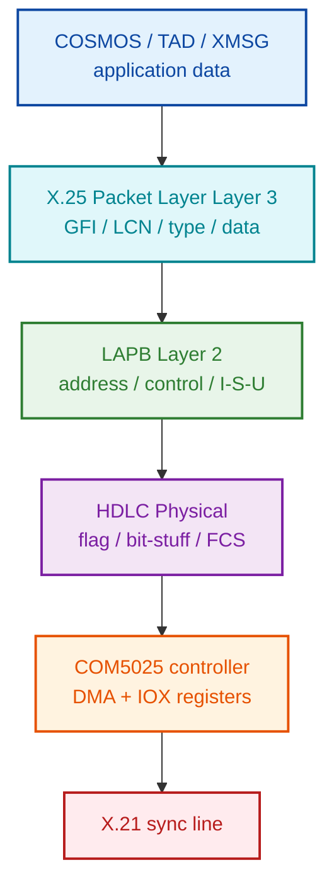
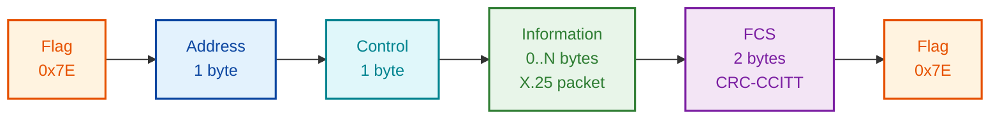
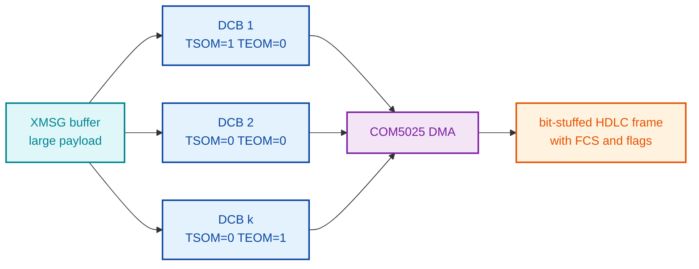
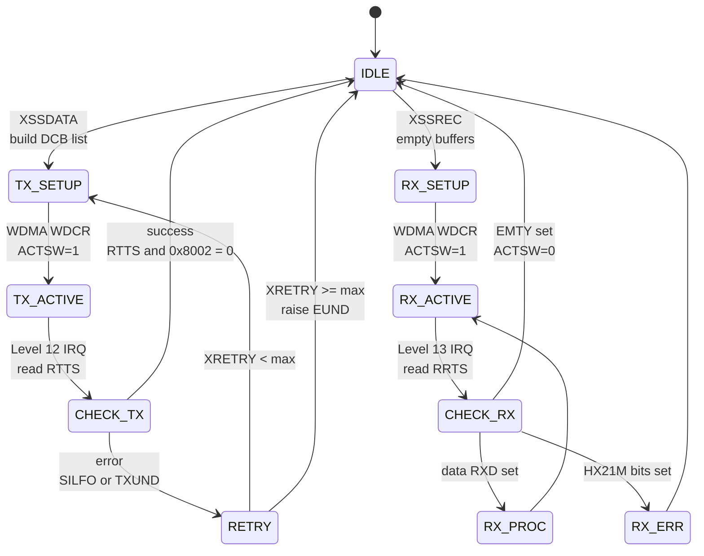

# HDLC Frame Format Reference (SINTRAN III on ND-100)

**Scope:** Wire-level decoding reference for the HDLC **hardware / framing** layer
used by SINTRAN III on Norsk Data ND-100 systems — the bit-stuffed flag layer, the
LAPB address / control / FCS framing, and the COM5025 controller / DMA / DCB
handling. The content *inside* the I-frame information field (the SINTRAN header
and the XMSG protocol above it) is documented separately in
[XMSG-PROTOCOL.md](../../XMSG/DOC/XMSG-PROTOCOL.md); this file does not duplicate it.

**Evidence policy:** every section is tagged
- **[VERIFIED]** — directly read from NPL source / symbol tables / hardware docs
- **[OBSERVED]** — taken from captured frame bytes in the HDLC archive
- **[STANDARD]** — ISO 13239 / X.25 / LAPB convention, used because the SINTRAN
  hardware implements the standard chip behaviour even when NPL doesn't show it
- **[INFERRED]** — name/usage strongly implies the value, no direct code path

**Primary sources:**
- `NPL-SOURCE/NPL/MP-P2-HDLC-DRIV.NPL` (HDLC driver, 626 lines)
- `NPL-SOURCE/SYMBOLS/L07/SYMBOL-1-LIST.SYMB.TXT`
- `Devices/HDLC/learning/03-Hardware-Overview.md`
- `Devices/HDLC/reference/Register-Reference.md`
- `Devices/HDLC/reference/Interrupt-Reference.md`
- `Devices/HDLC/reference/DMA-Reference.md`
- `Devices/HDLC/reference/Protocol-Reference.md`

---

## 1. Protocol Stack  [VERIFIED]



The implementation is **LAPB (ISO 13239) over HDLC physical layer** with **X.25
packet layer** encapsulation. Mode is **ABM (Asynchronous Balanced Mode)** —
peer-to-peer, no NRM polling — at **modulo-8** sequence numbering.

---

## 2. Frame Layout  [VERIFIED + STANDARD]



| Offset (from start) | Size  | Field        | Notes |
|---------------------|-------|--------------|-------|
| 0                   | 1 B   | Opening flag | `0x7E` = `01111110` |
| 1                   | 1 B   | Address      | LAPB address byte (single-byte addressing only) |
| 2                   | 1 B   | Control      | I/S/U frame discriminator + N(S)/N(R) |
| 3 …                 | N B   | Information  | X.25 packet (PLP header + user data) — only present in I-frames |
| ‑3                  | 2 B   | FCS          | CRC-16-CCITT over Address + Control + Information |
| ‑1                  | 1 B   | Closing flag | `0x7E` |

The Address, Control, Information, and FCS bytes are subject to **bit stuffing**:
the COM5025 inserts a 0 bit after every five consecutive 1 bits on transmit and
strips it on receive, so the only `01111110` byte that ever appears in the
serial bit stream is a real flag.

---

## 3. Physical Layer  [VERIFIED hardware; STANDARD bit handling]

### 3.1 Flag, bit-stuffing, abort

| Item            | Value / behaviour                                          |
|-----------------|------------------------------------------------------------|
| Flag byte       | `0x7E` (`01111110`) — `01-HDLC-Hardware-Reference.md:74`   |
| Bit stuffing    | Insert `0` after five consecutive `1`s in the transmitted stream; strip on receive — done in hardware by COM5025 (`01-HDLC-Hardware-Reference.md:55`) |
| Abort sequence  | Seven or more consecutive `1`s; **TABORT** bit in DMA descriptor forces this (`01-HDLC-Hardware-Reference.md:65`) |
| Idle pattern    | Continuous flags or marking (1s) [STANDARD]                |
| Line coding     | NRZI assumed for X.21 sync interface [INFERRED]            |
| Max line speed  | 2 Mbps (COM5025 limit)                                     |

### 3.2 Hardware: COM5025 MPCC  [VERIFIED]

**Chip:** Standard Microsystems Corporation / AMD **COM5025**
Multi-Protocol Communications Controller.
- Source: `Devices/HDLC/learning/03-Hardware-Overview.md`
- Protocols: HDLC, SDLC, BiSync, Async
- Automatic flag generation
- Automatic zero insertion / deletion (bit stuffing)
- Automatic CRC generation and checking
- DMA-based data transfer
- Up to 2 Mbps

### 3.3 IOX register map  [VERIFIED]

Source: `Devices/HDLC/reference/Register-Reference.md`
and the NPL driver at `NPL-SOURCE/NPL/MP-P2-HDLC-DRIV.NPL`.

| Offset (from `HDEV`) | Mnemonic | R/W | Purpose                                  |
|---------------------:|----------|-----|------------------------------------------|
| +3                   | WSAR     | W   | Write Sync / Address Register            |
| +10                  | RRTS     | R   | Read Receiver Transfer Status            |
| +11                  | WRTC     | W   | Write Receiver Transfer Control          |
| +12                  | RTTS     | R   | Read Transmitter Transfer Status         |
| +13                  | WTTC     | W   | Write Transmitter Transfer Control       |
| +15                  | WDMA     | W   | Write DMA Address                        |
| +16                  | RDCR     | R   | Read DMA Command / status                |
| +17                  | WDCR     | W   | Write DMA Command + Trigger              |

NPL access pattern (from `MP-P2-HDLC-DRIV.NPL`):
```npl
HOINT: 0=:TMR                                    %RESET TIMER
       T:=HDEV+RTTS; *EXR ST                     %READ TRANSMITTER STATUS
       A=:HASTAT                                 %SAVE STATUS
       ...
       IF A/\ "SILFO+TXUND" = 0 THEN
            XRETRY=:RTDYN; A:=0; CALL SADTS
       ELSE
            A:=HASTAT; CALL SADTS; CALL DRERR
            A:=EUND
       FI
```
(`NPL-SOURCE/NPL/MP-P2-HDLC-DRIV.NPL:104033–104240`)

### 3.4 Receiver status bit map (RRTS)  [VERIFIED]

| Bit | Mask    | Symbol | Meaning                                           |
|----:|--------:|--------|---------------------------------------------------|
|  0  | 0x0001  | RXD    | Data available                                    |
|  1  | 0x0002  | RXSA   | Status available                                  |
|  2  | 0x0004  | RXA    | Receiver active                                   |
|  3  | 0x0008  | SFR    | Sync / flag received                              |
|  4  | 0x0010  | DMAR   | DMA module request (always 0 when read)           |
|  5  | 0x0020  | SD     | Signal detector                                   |
|  6  | 0x0040  | DSR    | Data set ready                                    |
|  7  | 0x0080  | RI     | Ring indicator                                    |
|  8  | 0x0100  | BE     | Block end                                         |
|  9  | 0x0200  | FE     | Frame end                                         |
| 10  | 0x0400  | LE     | List end                                          |
| 11  | 0x0800  | EMTY   | Buffer list empty                                 |
| 13–14 | 0x6000 | HX21M  | X.21 error mask (`SYMBOL-1-LIST.SYMB.TXT`)        |
| 15  | 0x8000  | OR / SILFO | Receiver overrun (persistent) / illegal-format on TX |

### 3.5 Transmit error bits (RTTS)  [VERIFIED]

| Bit | Mask    | Symbol | Meaning                       |
|----:|--------:|--------|-------------------------------|
|  1  | 0x0002  | TXUND  | Transmitter underrun          |
| 15  | 0x8000  | SILFO  | Illegal format / DMA-key error|

The driver checks `(RTTS & 0x8002) == 0` for transmit success
(`MP-P2-HDLC-DRIV.NPL` HOINT).

---

## 4. Address Field  [STANDARD layout]

Single-byte addressing. No evidence of LAPB extended addressing in the NPL
driver or symbol tables.

```
 7 6 5 4 3 2 1 0
+-+-+-+-+-+-+-+-+
|  Address    |C|     bit 0 = C/R (Command/Response)
+-+-+-+-+-+-+-+-+
```

Specific address byte values used on the wire are **not documented** in any
file we have access to (no raw captures, and the WSAR initialisation code
is not in `MP-P2-HDLC-DRIV.NPL`). To find the actual address, look for writes
to register `WSAR` (`HDEV+3`) in the HDLC initialisation code path.

---

## 5. Control Field  [VERIFIED encoding, OBSERVED values]

The control byte distinguishes the three frame classes by its low bits.

| Class | LSB pattern | Layout                                                       |
|-------|-------------|--------------------------------------------------------------|
| I     | `xxxxxxx0`  | Information frame — carries N(S) and N(R)                    |
| S     | `xxxxxx01`  | Supervisory — RR / RNR / REJ / SREJ, carries N(R) only       |
| U     | `xxxxxx11`  | Unnumbered — SABM / UA / DISC / DM / FRMR / UI / XID / TEST |

### 5.1 I-frame control byte

```
 7 6 5 4 3 2 1 0
+-+-+-+-+-+-+-+-+
|N(R)  |P|N(S)|0|
+-+-+-+-+-+-+-+-+
   bits 7-5   N(R) — sender's expected receive sequence (mod 8)
   bit 4      P/F  — Poll/Final
   bits 3-1   N(S) — sender's send sequence (mod 8)
   bit 0      0    — I-frame discriminator
```

**Modulo:** confirmed **modulo-8** (3-bit counters). [VERIFIED against captured
I-frames: reading N(S) from bits 1-3 gives a strictly sequential send counter
(e.g. control `0x66,0xA8,0xAA,0xEC,0x0E` → N(S)=3,4,5,6,7); the reversed reading
does not.]

> **Correction (2026-07).** Earlier revisions of this file placed N(S) in bits
> 5-7 and N(R) in bits 1-3 — that was backwards. Standard LAPB and the captured
> traffic both put **N(S) in bits 1-3, N(R) in bits 5-7**. The `0x21` byte once
> read here as an "X.25 GFI" is in fact SINTRAN header Marker 1 (see Section 6 and
> [XMSG-PROTOCOL.md](../../XMSG/DOC/XMSG-PROTOCOL.md)).

### 5.2 S-frame control byte

```
 7 6 5 4 3 2 1 0
+-+-+-+-+-+-+-+-+
|0 0|S S|P|N(R)|01|
+-+-+-+-+-+-+-+-+
```

| Type  | bits 5–4 | hex base | Meaning                 |
|-------|---------:|---------:|-------------------------|
| RR    |    00    |   0x01   | Receive Ready (ACK)     |
| RNR   |    01    |   0x05   | Receive Not Ready       |
| REJ   |    10    |   0x09   | Reject (go-back-N)      |
| SREJ  |    11    |   0x0D   | Selective Reject        |

> **Status:** RR supervisory frames **are** present in the captured traffic
> (periodic keepalives that carry the 2-byte sending node number; see
> [XMSG-PROTOCOL.md](../../XMSG/DOC/XMSG-PROTOCOL.md) Section 3). RNR / REJ / SREJ have not been
> observed. Buffer-level flow control still uses the EMTY bit (`0x0800`) in RRTS.

### 5.3 U-frame control byte  [STANDARD]

```
 7 6 5 4 3 2 1 0
+-+-+-+-+-+-+-+-+
|M M M|P|M M|11|
+-+-+-+-+-+-+-+-+
```

| Frame | Hex | Binary    | Direction | Meaning                            |
|-------|----:|-----------|-----------|-------------------------------------|
| SABM  | 0x3F | `0011 1111` | Cmd     | Set Asynchronous Balanced Mode (link setup) |
| UA    | 0x73 | `0111 0011` | Resp    | Unnumbered Acknowledgment           |
| DISC  | 0x43 | `0100 0011` | Cmd     | Disconnect                          |
| DM    | 0x0F | `0000 1111` | Resp    | Disconnected Mode                   |
| FRMR  | 0x87 | `1000 0111` | Resp    | Frame Reject                        |
| UI    | 0x03 | `0000 0011` | Both    | Unnumbered Information              |
| XID   | 0xAF | `1010 1111` | Both    | Exchange Identification             |
| TEST  | 0xE3 | `1110 0011` | Both    | Test                                |

All values above are from the LAPB standard. None of these U-frame opcodes are
defined as named symbols in the L07 / M06 symbol tables, and the assembly that
writes them into transmit buffers is not visible in `MP-P2-HDLC-DRIV.NPL`.

### 5.4 I-frame decoding rule  [VERIFIED]

`N(S) = (ctl >> 1) & 7`, `N(R) = (ctl >> 5) & 7`, `P/F = (ctl >> 4) & 1`.

---

## 6. Information Field — SINTRAN Header  [VERIFIED]

Inside an I-frame, the Information field is **not** a generic X.25 PLP packet — it
is the **13-byte SINTRAN header** (Marker `0x21`, Marker 2 `0x13` normal / `0x12`
relay, packet type, packet subtype, dest / src node, Flags 1, Flags 2, protocol
id), followed by the sub-protocol payload (ROUTING / TAD / DC / DB / PAD and the
XMSG sub-header).

The full layout, the packet-subtype meanings (including the `0x03` ACK and `0x0E`
data frames), the XMSG sub-header, and every sub-protocol are documented in
[XMSG-PROTOCOL.md](../../XMSG/DOC/XMSG-PROTOCOL.md) — this hardware reference does not duplicate
them.

> **Historical note (X.25 lineage).** The first two header bytes `0x21 0x13`
> resemble an X.25 Packet-Layer GFI (`0x21`) + LCN, and earlier revisions of this
> file decoded the information field as an X.25 PLP packet (GFI / LCN / packet-
> type). FCS-valid captured traffic shows ND treats them as **fixed SINTRAN marker
> bytes**, so the X.25 reading is a lineage observation, not the actual framing.
> Decode the information field with XMSG-PROTOCOL.md.

---

## 7. FCS — Frame Check Sequence  [STANDARD; hardware-computed]

| Item          | Value                                          |
|---------------|-----------------------------------------------|
| Algorithm     | CRC-16-CCITT (ISO 13239)                       |
| Polynomial    | x¹⁶ + x¹² + x⁵ + 1 = 0x1021                    |
| Initial value | 0xFFFF                                         |
| Covers        | Address + Control + Information (NOT flags or FCS itself) |
| Length        | 2 bytes                                        |
| Wire order    | LSB first                                      |
| Computed by   | COM5025 hardware                               |

Source: `Devices/HDLC/learning/03-Hardware-Overview.md`.
The NPL driver never touches the FCS bytes; the chip inserts them on transmit
and validates them on receive, raising SILFO / a frame error if the CRC fails.

---

## 8. DMA Descriptor / DCB Format  [VERIFIED]

Each frame to be sent or buffer to be filled is described by a 4-word **DCB**
(Data Control Block) that the COM5025 walks via DMA.

| Word offset | Field name | Symbol | Purpose                                     |
|------------:|------------|--------|---------------------------------------------|
|  0          | LBYTC      | `LBYTC=000001` | Byte count for this fragment        |
|  1          | LMEM1      | `LMEM1=000002` | Memory page 1 (bank bits)           |
|  2          | LMEM2      | `LMEM2=000003` | Memory page 2 / start word offset   |
|  3          | LKEY       | (varies)       | Block status + COM5025 control bits |

(Symbol values from `NPL-SOURCE/SYMBOLS/L07/SYMBOL-1-LIST.SYMB.TXT`.)

NPL build site (from `MP-P2-HDLC-DRIV.NPL`):
```npl
LISTP =: LIINT                 % set list pointer
A-DISP1=:LIINT.LBYTC           % byte count
A:=OMSG+CHEAD=:X.LMEM2         % buffer address (word offset)
T:=MASTB=:X.LMEM1              % bank bits
FSERM=:X.LKEY                  % continuation key
```

### 8.1 LKEY field bit layout  [VERIFIED]

```
 15 14 13 12 11 10  9  8   7  6  5  4   3  2  1  0
+--+--+--+--+--+--+--+--+--+--+--+--+--+--+--+--+
| extended | LK |status| COM5025 control bits      |
+----------+----+------+----------------------------+
                bit 10 = legal-key flag (must be 1)
                bits 9-8 = block status code
                bits 7-0 = chip control bits
```

**Block status (bits 9–8):**

| Bits 9–8 | LKEY base | Meaning                          |
|---------:|----------:|----------------------------------|
| `01`     | 0x0400    | Empty receive block (available)  |
| `11`     | 0x0600    | Full receive block               |
| `10`     | 0x0800    | Block to transmit                |
| `11`     | 0x0A00    | Transmitted block (done)         |
| `11`     | 0x0C00    | New list pointer (chain link)    |

**COM5025 control bits (low byte):**

| Bit | Hex   | Symbol | Meaning                              |
|----:|------:|--------|--------------------------------------|
|  0  | 0x01  | TSOM   | Transmit Start Of Message — emit opening flag |
|  1  | 0x02  | TEOM   | Transmit End Of Message — emit closing flag + CRC |
|  2  | 0x04  | TABORT | Transmit abort sequence              |
|  3  | 0x08  | TGA    | Transmit Go-Ahead character          |

### 8.2 The `FSERM` constant  [VERIFIED]

`FSERM = 002003 octal = 0x1003` (`SYMBOL-1-LIST.SYMB.TXT`).

```
 15 14 13 12 11 10  9  8   7  6  5  4   3  2  1  0
  0  0  0  1  0  0  0  0   0  0  0  0   0  0  1  1
  └──── extended ──┘  └ status ┘ └─── chip ────┘
                         10        TSOM=1, TEOM=1
```

→ "Single-shot transmit": `block-to-transmit` status with both opening AND
closing flag generation. Used for short frames that fit in one DCB.

For longer messages the kernel chains DCBs: the first carries TSOM only, the
last TEOM only, intermediates carry neither. Same convention as Receive Start /
End Of Message (RSOM / REOM) on the receive side.



---

## 9. Driver State Machine  [VERIFIED from NPL]

The driver tracks one bit of activity in `ACTSW`
(`SYMBOL-1-LIST.SYMB.TXT`: `ACTSW = 000074 octal = 0x3C`):

- `ACTSW = 0` → device idle
- `ACTSW = 1` → transmission or reception in progress



### 9.1 Transmit handler — HOINT  [VERIFIED]

Source: `NPL-SOURCE/NPL/MP-P2-HDLC-DRIV.NPL:104033–104240`
(level-12 interrupt vector).

Key logic:
1. `0=:TMR` reset retransmit timer
2. `T:=HDEV+RTTS; *EXR ST` read transmit status
3. `A=:HASTAT` save it
4. If `ACTSW = 0` → spurious interrupt, `MIN DUIN; CALL WT12`
5. Otherwise `0=:ACTSW` clear the active flag
6. If success (`(RTTS & (SILFO|TXUND)) == 0`) → reset `XRETRY`, post completion
7. Else → save status, call `DRERR`, raise `EUND`

### 9.2 Receive handler — HIINT  [VERIFIED]

Source: `NPL-SOURCE/NPL/MP-P2-HDLC-DRIV.NPL:104436–104527`
(level-13 interrupt vector).

```npl
HIINT: T:=HDEV+RRTS; *EXR ST                     % READ RECEIVER STATUS
       A=:HASTAT
       IF T:=ACTSW = 0 THEN MIN T9; P+0; GO OUT1 FI
       IF A/\ HX21M >< 0 THEN                    % X21-ERROR?
          T:=2000; X:=LIINT+T; T:=X.LKEY
          A\/ LIINT.LKEY=:X.LKEY
          IF A BIT HX21S THEN                    % X21 CLEAR INDICATION?
             HASTAT BONE BLDON=:HASTAT
             LIINT.LKEY BONE XBLDN=:X.LKEY
          FI
       FI
       IF HASTAT/\"EMTY" >< 0 THEN               % BUFFER EMPTY?
          0=:ACTSW
          MIN STPCNT
          ...
       FI
```

### 9.3 Timer / retry  [PARTIAL]

- `TMR` reset on every transmit interrupt entry.
- `XRETRY` counter incremented on each TX error, cleared on success.
- `LTOUT` routine at `MP-P2-HDLC-DRIV.NPL:104543` handles timeouts.
- Specific T1 / T2 / T3 wall-clock values are **not surfaced as named symbols**
  in the L07 tables — they're either compile-time constants in the source above
  the part we read, or set by initialisation code outside `MP-P2-HDLC-DRIV.NPL`.

---

## 10. Captured Frame Walk-throughs

*Removed.* The byte sequences previously listed here came from secondary
analysis files in `Devices/HDLC/archive/to-delete/` (e.g.
`Deep_Frame_Analysis_Connected.md`, `Complete_Packet_Type_Analysis.md`) that
are themselves annotations of an underlying `connected.txt` capture which is
**not present in this repository**. Without the original capture, the byte
values cannot be independently verified, so they are not reproduced here.

If/when a raw capture file (`.pcap`, `.bin`, or the original `connected.txt`)
is added to the repo, this section can be rebuilt from it.

---

## 11. Symbol Table Extract  [VERIFIED]

All values octal/hex/decimal from
`NPL-SOURCE/SYMBOLS/L07/SYMBOL-1-LIST.SYMB.TXT`
unless noted.

### 11.1 Driver / DMA constants

| Symbol | Octal  | Hex    | Dec    | Meaning                                     |
|--------|-------:|-------:|-------:|---------------------------------------------|
| FSERM  | 002003 | 0x1003 |   4099 | Single-frame LKEY (status=10, TSOM+TEOM)    |
| LBYTC  | 000001 | 0x0001 |      1 | Byte-count word offset in DCB               |
| LMEM1  | 000002 | 0x0002 |      2 | Memory page 1 word offset in DCB            |
| LMEM2  | 000003 | 0x0003 |      3 | Memory page 2 word offset in DCB            |
| LISTP  | 000077 | 0x003F |     63 | DMA list pointer base                       |
| LIINT  | 000100 | 0x0040 |     64 | DMA list interrupt pointer                  |
| FBSIZ  | 177765 | 0xFFF5 |  65525 | File / frame buffer size                    |
| ACTSW  | 000074 | 0x003C |     60 | Activity switch (0=idle, 1=active)          |
| HDERC  | 000066 | 0x0036 |     54 | HDLC error counter                          |
| FLAGB  | 000042 | 0x0022 |     34 | Flag buffer                                 |
| DCBX   | 000120 | 0x0050 |     80 | DCB index                                   |
| RRTSA  | 041604 | 0x8784 |  34692 | Receiver transfer status address            |
| RRBUF  | 043165 | 0x8C75 |  35957 | Receiver buffer                             |
| LIHDL  | 062403 | 0xC903 |  51459 | HDLC initialisation list                    |
| LISCO  | 053216 | 0xAC8E |  44174 | Receiver list socket / control              |
| XHBYT  | 000003 | 0x0003 |      3 | X.25 header byte offset                     |

### 11.2 Status / error bits

| Symbol | Octal  | Hex    | Bit  | Meaning                          |
|--------|-------:|-------:|-----:|----------------------------------|
| EMTY   | 004000 | 0x0800 |  11  | List empty (no buffers)          |
| BLDON  | 000010 | 0x0008 |   3  | Block done                       |
| TXUND  | 000002 | 0x0002 |   1  | Transmitter underrun             |
| SILFO  | 100000 | 0x8000 |  15  | Illegal format / persistent error|
| EUND   | 000102 | 0x0042 | (code) | Underrun error code            |
| HX21M  | 060000 | 0x6000 | 13–14 | X.21 error mask                 |
| HX21S  | 000016 | 0x000E | 1–3   | X.21 receiver state bits        |

### 11.3 What is **not** in the symbol tables

Searched for and **not present** in the L07 / M06 symbol tables:
- `SABM`, `UA`, `DISC`, `DM`, `RR`, `RNR`, `REJ`, `SREJ`, `FRMR`, `UI`, `XID`, `TEST`
- `FLAG`, `FCS`, `CRC`, `ABRT`, `NRZI`
- T1 / T2 / T3 timer constants
- Polynomial value `0x1021`

These are either inlined in the calling code or, more often, **handled entirely
by the COM5025 hardware** and never named on the NPL side.

---

## 12. Quick Decoding Cheat-Sheet

When you see a captured byte stream, work in this order:

1. Strip everything between consecutive `0x7E` flags.
2. The bit-stuffed bytes have already been de-stuffed by the chip — what you
   see in the trace is the post-de-stuff stream.
3. The last 2 bytes before the closing flag are the **FCS** (LSB first).
4. The first byte after the opening flag is the **Address**.
5. The second byte is the **Control**:
   - low bit `0` → I-frame: `N(S) = (ctl>>5) & 7`, `N(R) = (ctl>>1) & 7`, `P/F = (ctl>>4) & 1`
   - low two bits `01` → S-frame: type from bits 5–4 (RR/RNR/REJ/SREJ), `N(R) = (ctl>>5) & 7`
   - low two bits `11` → U-frame: match against the table in Section 5.3
6. For an I-frame, the information field is the 13-byte **SINTRAN header**
   (Marker `0x21 0x13`, packet subtype, dest / src node, protocol id) followed by
   the sub-protocol payload — decode it with [XMSG-PROTOCOL.md](../../XMSG/DOC/XMSG-PROTOCOL.md).
7. The frame is valid only if the chip's RRTS reported neither
   `SILFO (0x8000)` nor a CRC error.

---

## 13. Known Gaps / Things Worth Reading Next

| #  | Gap                                                                  | Where to look |
|---:|----------------------------------------------------------------------|---------------|
|  1 | Initialisation code that sets line speed, T1/T2/T3, station address  | Search NPL for `WSAR`, `WTTC`, `WRTC` writes outside `MP-P2-HDLC-DRIV.NPL` |
|  2 | Where the LAPB control byte is **assembled** (kernel vs caller)      | Look for I-frame builders calling into the HDLC driver |
|  3 | Whether REJ / RNR are ever generated                                 | Search for any `0x05` / `0x09` writes into the control-byte slot |
|  4 | Modulo-128 support                                                   | Check WSAR / WRTC init word — bit may select extended mode |
|  5 | Multiple simultaneous links                                          | Look for multiple `HDEV` instances |
|  6 | Polled vs interrupt mode                                             | Check `HOINT` / `HIINT` install vectors |
|  7 | Exact mapping of XMSG buffer onto DCB chains                         | The XFSND code path in the XMSG layer |
|  8 | DISC frame handling                                                  | Search for `0x43` writes / handlers |
|  9 | Idle / keep-alive policy                                             | Look for FLAG-only transmit code |
| 10 | Hardware variant (single-board vs multi-link)                        | `Reference-Manuals/` HDLC controller manuals |

---

## Related Documents

- [XMSG-PROTOCOL.md](../../XMSG/DOC/XMSG-PROTOCOL.md) — the XMSG protocol and sub-protocols carried in the I-frame information field (the layer above these frames)
- [TAD/TAD-Message-Formats.md](../../TAD/TAD-Message-Formats.md) — TAD terminal protocol carried inside XMSG messages
- `Devices/HDLC/learning/03-Hardware-Overview.md` — COM5025 chip details
- `Devices/HDLC/reference/Register-Reference.md` — Full IOX register reference
- `Devices/HDLC/reference/Interrupt-Reference.md` — Annotated interrupt dispatch
- `Devices/HDLC/reference/DMA-Reference.md` — DMA descriptor reference

**Document path:** `HDLC-Frame-Format-Reference.md`
