# HDLC Raw Programming Guide

**Bypassing XMSG: Direct HDLC Communication on SINTRAN III**

This guide covers how to send and receive raw data over HDLC without using
XMSG (MON 200B). All communication uses **MON 201B (HDLCfunction)** to exchange
Driver Control Blocks (DCBs) directly with the HDLC device driver. This is the
foundation for building custom protocols over HDLC on ND-100 systems.

**Audience**: Programmers who need point-to-point data transfer over HDLC and
want full control over the frame payload.

**Primary Source**: SINTRAN III Monitor Calls (ND-860228.2 EN), pages 306-307

---

## Table of Contents

1. [Architecture Overview](#1-architecture-overview)
2. [Protocol Stack Comparison](#2-protocol-stack-comparison)
3. [Monitor Calls Reference](#3-monitor-calls-reference)
4. [Driver Control Block (DCB) Structure](#4-driver-control-block-dcb-structure)
5. [HDLC Frame Encapsulation](#5-hdlc-frame-encapsulation)
6. [Driver Behaviour: Blocking, Callbacks, and Retries](#6-driver-behaviour-blocking-callbacks-and-retries)
7. [Programming Flow](#7-programming-flow)
8. [Error Handling](#8-error-handling)
9. [Hardware Layer Reference](#9-hardware-layer-reference)
10. [DMA Descriptor Format](#10-dma-descriptor-format)
11. [Complete PLANC Source Code](#11-complete-planc-source-code)
12. [Debugging Checklist](#12-debugging-checklist)
13. [Appendix A: LDN Discovery](#appendix-a-ldn-discovery)
14. [Appendix B: Advanced -- Direct Register Access](#appendix-b-advanced----direct-register-access)

---

## 1. Architecture Overview

There are three ways to communicate over HDLC on SINTRAN III, listed from
highest to lowest level of abstraction:

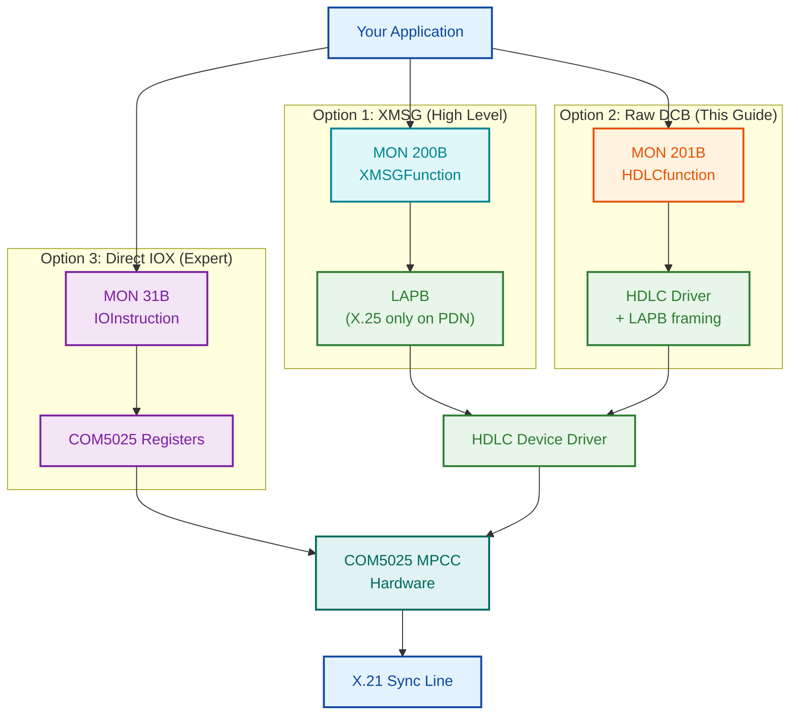

| Approach | MON Call | What You Control | What the System Handles |
|----------|----------|------------------|------------------------|
| **XMSG** | MON 200B | Application messages | XMSG routing, LAPB, HDLC framing, CRC, DMA (X.25 only on PDN links) |
| **Raw DCB** | MON 201B | Frame payload (I-field content) | LAPB framing, HDLC flags, CRC, bit stuffing, DMA |
| **Direct IOX** | MON 31B | Everything: registers, DMA, timing | Nothing -- you are the driver |

This guide focuses on **Option 2: Raw DCB via MON 201B**.

---

## 2. Protocol Stack Comparison

### With XMSG (what you are bypassing)

XMSG can operate with or without X.25. On local NORD-NET links, XMSG sits
directly on LAPB with no X.25 layer. X.25 is only inserted when connecting
over public data networks (PDN) via the X.25 Network Server (X25NS).

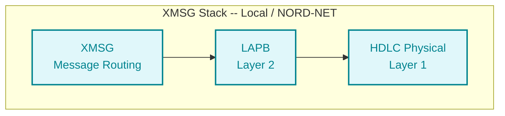

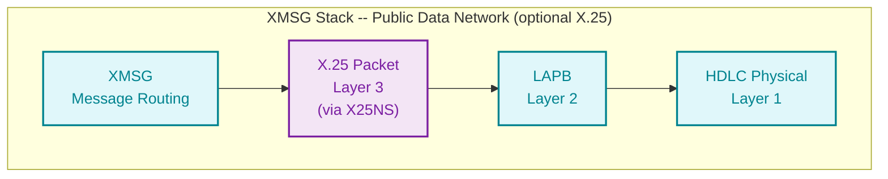

### With Raw DCB (what this guide teaches)

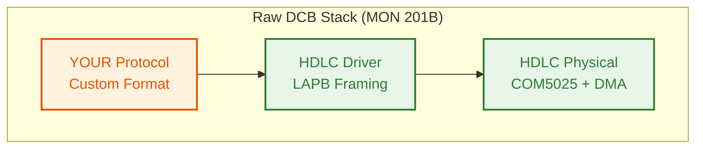

### What each layer provides

| Layer | XMSG Provides | Raw DCB Provides | You Must Provide |
|-------|--------------|-------------------|------------------|
| Framing (0x7E flags) | Automatic | Automatic | -- |
| Bit stuffing | Automatic | Automatic | -- |
| CRC/FCS | Automatic | Automatic | -- |
| LAPB address/control | Automatic | Automatic | -- |
| X.25 packet header | Only on PDN links (via X25NS) | **NOT included** | Only if connecting to public data network |
| Message routing | Automatic | **NOT included** | Your protocol |
| Flow control | XMSG handles | **NOT included** | Your protocol |
| Sequencing | LAPB + XMSG | LAPB only | Your protocol (if needed above LAPB) |
| Error recovery | LAPB retransmit | LAPB retransmit | -- |

---

## 3. Monitor Calls Reference

All monitor calls used for raw HDLC programming are documented below with
their complete parameter specifications. Every call includes the PLANC
calling convention.

### 3.1 MON 201B -- HDLCfunction (MHDLC)

**Purpose**: Send and receive raw HDLC frames via Driver Control Blocks.
This is the primary call for all raw HDLC communication.

**Source**: SINTRAN III Monitor Calls (ND-860228.2 EN), page 306

| Parameter | Name | Type | I/O | Description |
|-----------|------|------|-----|-------------|
| 1 | Func | INTEGER | I | Function code: `0` = send DCB to driver, `1` = receive DCB from driver |
| 2 | DevNo | INTEGER | I | Logical Device Number. Separate LDNs for input and output parts |
| 3 | Buffer | ARRAY | I/O | Address of the Driver Control Block buffer |
| 4 | USize | INTEGER | I/O | Size of the used part of the DCB in bytes. On receive, updated to actual size |
| 5 | MSize | INTEGER | I | **Send**: maximum DCB buffer size in bytes. **Receive**: wait flag (`1` = block until data, `0` = return immediately) |
| 6 | Status | INTEGER | O | Error code (see [Error Codes](#hdlcfunction-error-codes)) |

**PLANC calling convention**:

```planc
INTEGER : Func, DevNo, USize, MSize, Status
INTEGER ARRAY : Buffer(0:1023)

Monitor_Call('HDLCfunction', Func, DevNo, Buffer, USize, MSize, Status)
```

**Compatibility**: ND-100 and ND-500 | All users | All programs

#### HDLCfunction Error Codes

| Status Code | Meaning | Common Cause |
|-------------|---------|--------------|
| 0 | Success | -- |
| 1 | LDN not reserved | Forgot to call MON 122 (ReserveResource) first |
| 2 | Illegal LDN | Wrong device number; check with @STATUS-DEVICE |
| 3 | No DCB in queue | Receive with poll mode (MSize=0) and no data waiting |
| 4 | No buffer available | Driver out of internal buffers |
| 5 | Illegal DCB size | USize is zero, negative, or exceeds hardware limit |
| 6 | Illegal LDN for this call | Using input LDN for send or output LDN for receive |
| 7 | Max size < used size | MSize parameter smaller than USize |
| 10 (8 decimal) | Illegal function code | Func is not 0 or 1 |
| 11 (9 decimal) | Fatal error | Hardware failure or driver crash |

---

### 3.2 MON 122B -- ReserveResource (RESRV)

**Purpose**: Reserve exclusive access to an HDLC device. Must be called before
any HDLCfunction calls. HDLC devices have separate input and output parts
that must be reserved independently.

**Source**: SINTRAN III Monitor Calls (ND-860228.2 EN), page 419

| Parameter | Name | Type | I/O | Description |
|-----------|------|------|-----|-------------|
| 1 | DeviceNo | INTEGER | I | Logical device number (see Appendix B of Monitor Calls manual) |
| 2 | IOFlag | INTEGER | I | `0` = reserve input part, `1` = reserve output part |
| 3 | WaitFlag | INTEGER | I | `0` = wait if already reserved by another program, `1` = return status immediately |
| 4 | Status | INTEGER | O | Return status. Negative = already reserved by another program (only when WaitFlag=1) |

**PLANC calling convention**:

```planc
INTEGER : DeviceNo, IOFlag, WaitFlag, Status

Monitor_Call('ReserveResource', DeviceNo, IOFlag, WaitFlag, Status)
```

**Important**: You must call this twice for HDLC -- once for the input LDN
(IOFlag=0) and once for the output LDN (IOFlag=1). These are typically
different logical device numbers.

**Compatibility**: ND-100 and ND-500 | All users | All programs

---

### 3.3 MON 123B -- ReleaseResource (RELES)

**Purpose**: Release a previously reserved device so other programs can use it.
Must be called during cleanup for both input and output parts.

**Source**: SINTRAN III Monitor Calls (ND-860228.2 EN), page 411

| Parameter | Name | Type | I/O | Description |
|-----------|------|------|-----|-------------|
| 1 | DeviceNumber | INTEGER | I | Logical device number |
| 2 | IOFlag | INTEGER | I | `0` = release input part, `1` = release output part |

**PLANC calling convention**:

```planc
INTEGER : DeviceNumber, IOFlag

Monitor_Call('ReleaseResource', DeviceNumber, IOFlag)
```

**Note**: A normal termination of an RT program releases all resources
automatically. However, explicit release is good practice and required if the
program continues running after HDLC communication ends.

**Compatibility**: ND-100 and ND-500 | All users | All programs

---

### 3.4 MON 141B -- DeviceControl (IOSET)

**Purpose**: Set control mode for a character device. Used to switch the HDLC
device between ASCII and binary mode, or to reset it. The device must be
reserved first.

**Source**: SINTRAN III Monitor Calls (ND-860228.2 EN), page 141

| Parameter | Name | Type | I/O | Description |
|-----------|------|------|-----|-------------|
| 1 | DeviceNo | INTEGER | I | Logical device number (cannot use `1` for own terminal; use ExecutionInfo) |
| 2 | IOFlag | INTEGER | I | `0` = input part, `1` = output part |
| 3 | RTProgram | INTEGER | I | Address of RT description of reserving program. Use `0` for calling program |
| 4 | CtrlFlag | INTEGER | I | Control flag (see table below) |
| 5 | ReturnStatus | INTEGER | O | `0` = success, `-1` = illegal RT description address |

**CtrlFlag values**:

| Value | Mode | Description |
|-------|------|-------------|
| -2 | Empty TAD buffer | Flush the TAD output buffer |
| -1 | Reset device | Reset to ASCII mode |
| 0 | ASCII mode | Standard character-oriented I/O |
| 1 | Binary mode | Raw binary data transfer (use this for HDLC) |

**PLANC calling convention**:

```planc
INTEGER : DeviceNo, IOFlag, RTProgram, CtrlFlag, ReturnStatus

Monitor_Call('DeviceControl', DeviceNo, IOFlag, RTProgram, CtrlFlag, ReturnStatus)
```

**Compatibility**: ND-100 and ND-500 | All users | All programs

---

### 3.5 MON 31B -- IOInstruction (EXIOX)

**Purpose**: Execute a raw IOX machine instruction to read or write hardware
device registers directly. This is the lowest-level access to the COM5025
HDLC controller. Requires that the register address be pre-registered in
the IOX table via SINTRAN-SERVICE-PROGRAM command `INSERT-IN-IOX-TABLE`.

**Source**: SINTRAN III Monitor Calls (ND-860228.2 EN), page 327

| Parameter | Name | Type | I/O | Description |
|-----------|------|------|-----|-------------|
| 1 | RegContents | INTEGER | I | Value to write to the device register |
| 2 | DevRegAddr | INTEGER | I | Device register address (IOX port number) |
| 3 | ContentsAfter | INTEGER | O | Register contents after execution |

**PLANC calling convention**:

```planc
INTEGER : RegContents, DevRegAddr, ContentsAfter

Monitor_Call('IOInstruction', RegContents, DevRegAddr, ContentsAfter)
```

**Warning**: This call bypasses the HDLC driver entirely. Incorrect register
writes can crash the HDLC controller, corrupt DMA, or hang the system. Only
use for diagnostics or when building a custom driver.

**Compatibility**: ND-100 and ND-500 | User RT and user SYSTEM | All programs

---

### 3.6 MON 143B -- ExecutionInfo (RSIO)

**Purpose**: Get the logical device number of the calling program's terminal.
Required because MON 162B (OutString) cannot use device number `1` -- you
must pass the actual terminal LDN.

**Source**: SINTRAN III Monitor Calls (ND-860228.2 EN)

| Parameter | Name | Type | I/O | Description |
|-----------|------|------|-----|-------------|
| 1 | ExecutionMode | INTEGER | O | `0` = interactive, `1` = batch, `2` = mode job, `3` = RT program |
| 2 | InputDev | INTEGER | O | LDN for command input (terminal number for interactive programs) |
| 3 | OutputDev | INTEGER | O | LDN for command output (terminal number for interactive programs) |
| 4 | UserIndex | INTEGER | O | Directory index (bits 8-15) and user index (bits 0-7) |

**PLANC calling convention**:

```planc
INTEGER : ExecMode, InDev, OutDev, UserIdx

Monitor_Call('ExecutionInfo', ExecMode, InDev, OutDev, UserIdx)
```

**Compatibility**: ND-100 and ND-500 | All users | All programs

---

### 3.7 Output Monitor Calls (for diagnostics and printing)

These calls are used in the example code for printing status messages and
buffer dumps to the terminal.

#### MON 32B -- OutMessage (MSG)

Writes a string to the user's terminal. Maximum 512 characters.

| Parameter | Name | Type | I/O | Description |
|-----------|------|------|-----|-------------|
| 1 | Message | BYTES | I | String to write (max 512 characters) |

```planc
BYTES : Message(0:79)
Monitor_Call('OutMessage', Message)
```

**Compatibility**: ND-100 and ND-500 | All users | Background programs

#### MON 35B -- OutNumber (IOUT)

Writes a number to the user's terminal in the specified radix.

| Parameter | Name | Type | I/O | Description |
|-----------|------|------|-----|-------------|
| 1 | Format | INTEGER | I | Output radix: `2` = binary, `8` = octal, `10` = decimal, `16` = hex |
| 2 | Number | INTEGER | I | Value to print (-32768 to 32767) |

```planc
INTEGER : Format, Number
Monitor_Call('OutNumber', Format, Number)
```

**Compatibility**: ND-100 and ND-500 | All users | Background programs

#### MON 2B -- OutByte (OUTBT)

Writes one byte to a character device.

| Parameter | Name | Type | I/O | Description |
|-----------|------|------|-----|-------------|
| 1 | DeviceNumber | INTEGER | I | Logical device number (use `1` for own terminal) |
| 2 | OutputValue | INTEGER | I | Byte value to write |

```planc
INTEGER : DeviceNumber, OutputValue
Monitor_Call('OutByte', DeviceNumber, OutputValue)
```

**Compatibility**: ND-100 and ND-500 | All users | All programs

#### MON 162B -- OutString (OUTST)

Writes a string to a peripheral device. Cannot use device number `1` for own
terminal -- use ExecutionInfo to get the actual LDN first.

| Parameter | Name | Type | I/O | Description |
|-----------|------|------|-----|-------------|
| 1 | DeviceNo | INTEGER | I | Logical device number (NOT `1`; use ExecutionInfo) |
| 2 | TextWrite | BYTES | I | Character string to output (max 2048 bytes) |
| 3 | NoOfBytes | INTEGER | I | Number of bytes to write |
| 4 | ReturnStatus | INTEGER | O | Error status |

```planc
INTEGER : DeviceNo, NoOfBytes, ReturnStatus
BYTES : TextWrite(0:79)

Monitor_Call('OutString', DeviceNo, TextWrite, NoOfBytes, ReturnStatus)
```

**Compatibility**: ND-100 and ND-500 | All users | All programs

---

### 3.8 Complete MON Call Summary Table

| MON Octal | Name | Short | Purpose | Required for Raw HDLC? |
|-----------|------|-------|---------|----------------------|
| 122B | ReserveResource | RESRV | Reserve device for exclusive use | **Yes** -- must reserve both input and output LDNs |
| 123B | ReleaseResource | RELES | Release reserved device | **Yes** -- cleanup |
| 141B | DeviceControl | IOSET | Set device mode (ASCII/binary/reset) | Optional -- set binary mode if needed |
| 143B | ExecutionInfo | RSIO | Get terminal LDN | Optional -- for diagnostic output via OutString |
| 201B | HDLCfunction | MHDLC | Send/receive DCBs to HDLC driver | **Yes** -- core communication call |
| 31B | IOInstruction | EXIOX | Direct hardware register access | No -- expert/diagnostic use only |
| 32B | OutMessage | MSG | Print string to terminal | Optional -- diagnostics |
| 35B | OutNumber | IOUT | Print number to terminal | Optional -- diagnostics |
| 2B | OutByte | OUTBT | Print single byte | Optional -- diagnostics |
| 162B | OutString | OUTST | Print string to device | Optional -- diagnostics |

---

## 4. Driver Control Block (DCB) Structure

The DCB is a word array passed to MON 201B. It is the fundamental data
structure for all HDLC communication. The first three words are a fixed
header; the remainder carries your payload.

### 4.1 DCB Memory Layout

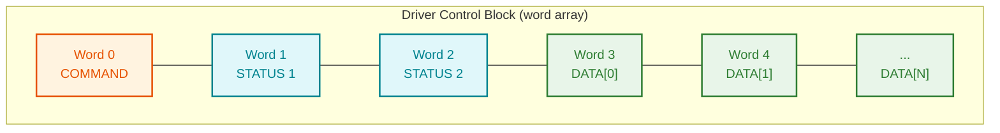

### 4.2 DCB Word Definitions

| Word Offset | Field | I/O | Size | Description |
|-------------|-------|-----|------|-------------|
| 0 | Command | I | 1 word (16 bits) | DCB command code (see command table below) |
| 1 | Status1 | O | 1 word (16 bits) | Primary status returned by driver |
| 2 | Status2 | O | 1 word (16 bits) | Secondary status / hardware status |
| 3 .. N | Data | I/O | Variable | Frame payload -- **your protocol data goes here** |

### 4.3 DCB Commands

The command word (DCB word 0) tells the HDLC driver what operation to perform.

| Command Code | Name | Description | Data Words Used? |
|-------------|------|-------------|------------------|
| 1 | **TRANS** | Transfer frame data. Sends or receives an HDLC I-frame payload | Yes -- words 3..N contain frame data |
| 2 | **RESET** | Reset the logical device. Resets the LAPB link layer | No |
| 3 | **DEVCL** | Device clear. Clears device state and buffers | No |
| 4 | **DEVINI** | Device initialization. Must be called before first TRANS | No |
| 5 | **DEVSTA** | Get device status. Returns hardware/link status in Status1/Status2 | No -- status returned in words 1-2 |

### 4.4 DCB Size Calculation

The USize parameter to MON 201B is the total DCB size **in bytes**:

```
USize = (HeaderWords + DataWords) * 2

Where:
    HeaderWords = 3  (command + status1 + status2)
    DataWords   = number of payload words

Example: sending 8 words of data
    USize = (3 + 8) * 2 = 22 bytes
```

### 4.5 Send vs. Receive DCB Usage

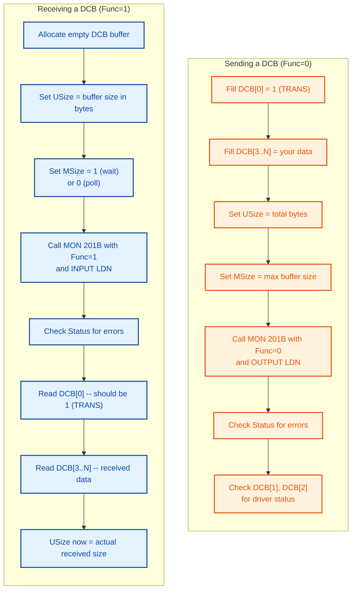

---

## 5. HDLC Frame Encapsulation

When you send a TRANS DCB, the driver and hardware wrap your data in a
complete HDLC frame before putting it on the wire.

### 5.1 What happens to your DCB data

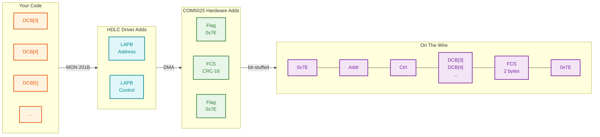

### 5.2 Wire Frame Structure

| Byte Offset | Field | Size | Who Generates | Description |
|-------------|-------|------|---------------|-------------|
| 0 | Opening Flag | 1 byte | COM5025 hardware (TSOM bit) | `0x7E` (`01111110`) |
| 1 | LAPB Address | 1 byte | HDLC driver | Single-byte LAPB addressing |
| 2 | LAPB Control | 1 byte | HDLC driver | I/S/U frame type + N(S)/N(R) sequence |
| 3 .. N+2 | Information | N bytes | **Your DCB data** | DCB words 3..N, your protocol payload |
| N+3 | FCS | 2 bytes | COM5025 hardware | CRC-16-CCITT over Address + Control + Information |
| N+5 | Closing Flag | 1 byte | COM5025 hardware (TEOM bit) | `0x7E` |

### 5.3 What you do NOT need to implement

The HDLC driver and COM5025 hardware handle all of these automatically:

| Feature | Handled By | Details |
|---------|-----------|---------|
| Flag generation (0x7E) | COM5025 TSOM/TEOM bits | Opening and closing flags |
| Bit stuffing | COM5025 hardware | Zero insertion after 5 consecutive 1-bits |
| CRC calculation | COM5025 hardware | CRC-16-CCITT (polynomial 0x1021) |
| CRC verification | COM5025 hardware | Bad CRC frames are discarded |
| LAPB framing | HDLC driver | Address and control byte management |
| LAPB sequencing | HDLC driver | N(S)/N(R) modulo-8 counters |
| LAPB retransmission | HDLC driver | Automatic retransmit on NAK or timeout |
| DMA transfer | HDLC driver | Buffer-to-hardware DMA descriptor setup |

---

## 6. Driver Behaviour: Blocking, Callbacks, and Retries

Understanding how MON 201B interacts with the HDLC driver internally is
critical for building reliable communication. The driver is **not** a simple
passthrough -- it manages interrupts, retries, timeouts, and queuing
transparently.

### Evidence Classification

Each claim in this section is tagged with its evidence level:

| Tag | Meaning |
|-----|---------|
| **[VERIFIED]** | Directly confirmed from NPL source code (`MP-P2-HDLC-DRIV.NPL`), symbol tables, or the official ND-860228.2 EN Monitor Calls manual |
| **[INFERRED]** | Derived from the generic SINTRAN device driver framework (`SINTRAN/OS/18-DEVICE-DRIVER-FRAMEWORK.md`) but not directly confirmed in HDLC-specific NPL source |
| **[ASSUMED]** | No direct evidence found. Based on reasonable engineering interpretation of the available code and documentation |

### 6.1 Send Is Synchronous (Blocking)

**[VERIFIED]** When you call MON 201B with Func=0 (send), the call **blocks
until transmission completes or fails**. The NPL source at line 103736
shows: `CALL ID12 %WAIT FOR INTERRUPT` -- this suspends the calling task
until the Level 12 transmit interrupt fires. Internally the driver:

1. Validates INTSTA = 2 (device initialized), rejects with ENINIT if not
2. Sets up a 4-word DMA descriptor from your DCB data
3. Writes the DMA list address to WDMA register (IOX+15)
4. Starts the transmitter by writing to WDCR register (IOX+17)
5. Enables transmitter interrupts via WTTC register (IOX+13)
6. Sets ACTSW = 1 (device active)
7. Arms a timeout timer (TMR = TTMR)
8. **Waits for Level 12 interrupt** (`CALL ID12` -- program is suspended)
9. On interrupt: reads RTTS, checks success/failure
10. Returns result to caller in the **same DCB buffer**

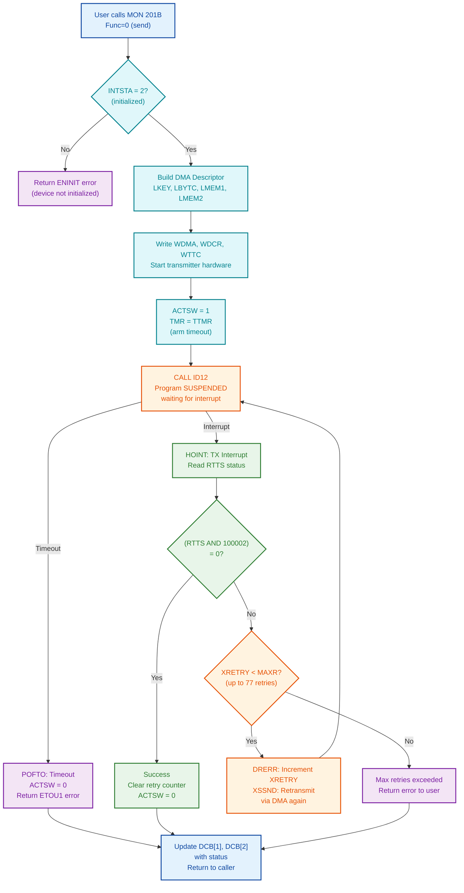

**Key implication**: Your program does not return from `Monitor_Call('HDLCfunction', ...)`
until the frame has been transmitted (or failed). You do **not** need to poll or
check status bits after the call returns. The DCB status words are already
filled with the result.

**[VERIFIED]** Source: NPL line 103736 `CALL ID12` (blocking wait), and
NPL comment: "THE RESULTS OF THE TRANSFER IS SENT BACK TO USER IN THE
SAME MESSAGE." Analysis in Deep-Dive-XSSDATA.md confirms the full flow.

### 6.2 Receive: Blocking vs. Polling

**[VERIFIED]** Receive behaviour is controlled by the MSize parameter.
Source: MON 201B specification (ND-860228.2 EN, page 306): *"wait flag
for the RECEIVE function. The program waits for a driver control block
if 1. Use 0 to make the program continue."*

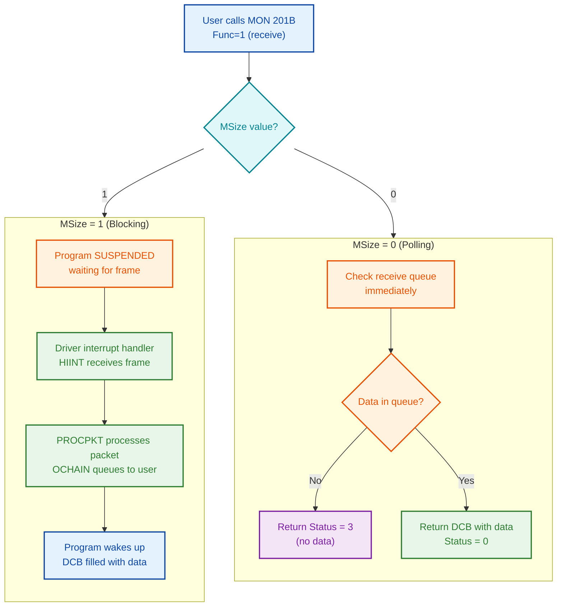

| Mode | MSize | Behaviour | When MON 201B Returns | Status on No Data |
|------|-------|-----------|----------------------|-------------------|
| Blocking | 1 | Program suspended until frame arrives or error | After frame received | N/A (waits forever) |
| Polling | 0 | Returns immediately whether data available or not | Immediately | Status = 3 |

**Warning [ASSUMED]**: Blocking receive (MSize=1) is believed to have **no
built-in timeout**. The transmit path has a confirmed timeout (POFTO), but
no equivalent receive timeout handler has been found in the NPL source
analysis. If no frame ever arrives, your program likely hangs indefinitely.
For production code, use polling (MSize=0) with your own timeout logic.

### 6.3 Automatic Retry Mechanism

**[VERIFIED]** The HDLC driver handles retransmission **automatically** inside
the driver. Your application code does **not** need to implement HDLC-level
retries. This is confirmed from the NPL source code of `MP-P2-HDLC-DRIV.NPL`.

| Component | Value | Evidence | Description |
|-----------|-------|----------|-------------|
| XRETRY | Variable at 000105 octal | **[VERIFIED]** NPL symbol table | Current retry count (starts at 0) |
| MAXR | 77 decimal (000115 octal) | **[VERIFIED]** NPL source: `IF XRETR > MAXR(000115)` | Maximum retransmission attempts |
| DRERR | Routine | **[VERIFIED]** NPL source line 103600 | Error handler -- increments retry counter, decides retry or abort |
| XSSND/SRDAT | Routine at 104131 | **[VERIFIED]** NPL source | Retransmission entry point -- re-initiates DMA without full setup |
| ETOU1 | Error code | **[VERIFIED]** NPL source at POFTO (line 104125) | Returned to user on timeout after all retries exhausted |
| EUND | Error code 102 octal | **[VERIFIED]** NPL symbol table | Returned on underrun after retries exhausted |

**Retry flow inside the driver** [VERIFIED from NPL source]:

```
Transmission fails (SILFO or TXUND set in RTTS)
    |
    v
DRERR: XRETRY = XRETRY + 1
    |
    +-- XRETRY <= MAXR (77)? --> XSSND: retransmit via DMA (go back to WAIT)
    |
    +-- XRETRY > MAXR (77)?  --> Return error to user (EUND or ETOU1)
```

Source: `HDLC-ALL.md` line 5316:
`XRETR(000105)+1=:XRETR(000105)` followed by `IF XRETR > MAXR(000115) THEN`

**What this means for your code**: When MON 201B returns with an error,
the driver has **already retried** up to 77 times. The error you see is a
final, unrecoverable failure at the HDLC level. Your application-level
retry logic should handle higher-level recovery (re-initialize link,
alert operator, etc.), not re-send the same frame.

### 6.4 How Results Are Delivered

**[VERIFIED]** The NPL source comment at XSSDATA states:

> "THE RESULTS OF THE TRANSFER IS SENT BACK TO USER IN THE SAME MESSAGE."

**Important clarification**: "MESSAGE" in the NPL source refers to a
**SINTRAN kernel message structure** (an internal OS IPC construct), not the
user's DCB buffer directly. However, from the user's perspective, the effect
is the same: the DCB buffer you passed to MON 201B has its status words
(words 1-2) updated by the driver when the call returns.

**[ASSUMED]** The exact mechanism by which the kernel maps the internal
message result back into the user's DCB buffer is not fully documented in
the available NPL source. The user-visible effect -- status words updated
in the same buffer -- is confirmed by the MON 201B specification.

```mermaid
flowchart LR
    subgraph BEFORE["DCB Before Call"]
        direction TB
        B0["Word 0: Command (1=TRANS)"]:::orange
        B1["Word 1: 0 (cleared)"]:::teal
        B2["Word 2: 0 (cleared)"]:::teal
        B3["Word 3+: Your payload"]:::green
    end

    MON["MON 201B<br/>(blocks until complete)"]:::blue

    subgraph AFTER["DCB After Call Returns"]
        direction TB
        A0["Word 0: Command (unchanged)"]:::orange
        A1["Word 1: Driver status<br/>(RTTS/RRTS bits)"]:::teal
        A2["Word 2: Hardware status<br/>(additional info)"]:::teal
        A3["Word 3+: Data (unchanged for TX,<br/>received data for RX)"]:::green
    end

    BEFORE --> MON --> AFTER

    classDef blue fill:#E3F2FD,stroke:#0D47A1,color:#0D47A1,stroke-width:2px
    classDef teal fill:#E0F7FA,stroke:#00838F,color:#00838F,stroke-width:2px
    classDef green fill:#E8F5E9,stroke:#2E7D32,color:#2E7D32,stroke-width:2px
    classDef orange fill:#FFF3E0,stroke:#E65100,color:#E65100,stroke-width:2px
```

The driver documentation states explicitly:

> "THE RESULTS OF THE TRANSFER IS SENT BACK TO USER IN THE SAME MESSAGE."
>
> -- `MP-P2-HDLC-DRIV.NPL` comment at XSSDATA entry point

### 6.5 INTSTA: Interface Status

**[VERIFIED]** Before accepting any TRANS command, the driver checks INTSTA.
If the interface is not initialized, the call is rejected immediately.

Source: NPL line 103636: `XSSDATA: IF INTSTA >< 2 THEN A:=ENINIT; GO BACKX FI`

| INTSTA Value | State | Evidence | Meaning |
|-------------|-------|----------|---------|
| 0 | Uninitialized | **[VERIFIED]** Referenced in Protocol-Reference.md | DEVINI has not been called. MON 201B with TRANS returns ENINIT (error 236 octal) |
| 2 | Initialized | **[VERIFIED]** NPL source checks `IF INTSTA >< 2` | Device ready for send/receive operations |
| 1, 3, etc. | Unknown | **[NOT FOUND]** No evidence of other values in NPL source | Other states may exist but are not documented in the available source |

This is why **DEVINI (DCB command 4) must be called before any TRANS**.
The driver will not even attempt DMA setup if INTSTA is not 2.

### 6.6 ACTSW: Activity Switch

**[VERIFIED]** ACTSW is an internal driver variable at offset 000074 (octal)
that indicates whether the HDLC hardware is currently processing a frame.

| ACTSW Value | State | Meaning |
|-------------|-------|---------|
| 0 | Inactive | No DMA in progress, device idle |
| 1 | Active | DMA running, hardware transmitting or receiving |

**The driver manages ACTSW automatically** [VERIFIED from NPL source]:
- Set to 1 when DMA starts -- NPL line 103730: `1 =: ACTSW`
- Cleared to 0 when DMA completes -- NPL line 104046: `0=: ACTSW`
- Forced to 0 on fatal receiver buffer exhaustion -- NPL line 104473:
  `IF HASTAT/\"EMTY" >< 0 THEN 0=:ACTSW FI`
- Forced to 0 on timeout -- NPL line 104117 (POFTO): `0=:DCBX`

**[VERIFIED]** Interrupt handlers check ACTSW before processing. If a
spurious interrupt arrives and ACTSW = 0, the interrupt is ignored. This
prevents stale interrupts from corrupting state.

**[ASSUMED]** Whether ACTSW is directly readable by user programs via
MON 31B (IOInstruction) or only indirectly observable via DEVSTA is not
confirmed. ACTSW is a driver-internal variable, not a hardware register.

### 6.7 Driver Queuing

**[INFERRED]** The following is based on the generic SINTRAN device driver
framework documented in `SINTRAN/OS/18-DEVICE-DRIVER-FRAMEWORK.md`. The
framework uses TOWQU/FWQU/RTENTRY and MLINK/BWLINK queues for all device
drivers. While the HDLC driver follows this framework, the specific queue
management calls (TOWQU, FWQU, RTENTRY) have **not been directly confirmed**
in the HDLC NPL source code (`MP-P2-HDLC-DRIV.NPL`).

Based on this framework: if you call MON 201B to send while a previous
transmission is still in progress, the SINTRAN monitor adds your task to the
device waiting queue (BWLINK chain). When the current transmission completes,
the driver processes the next queued request.

**[VERIFIED]** The SINTRAN device driver framework uses these mechanisms:
- **BWLINK** (offset 2 in datafield): head of waiting queue
- **TOWQU**: add task to waiting queue
- **FWQU**: remove task from waiting queue on I/O completion
- **RTENTRY**: mark task as ready for execution

Source: `SINTRAN/OS/18-DEVICE-DRIVER-FRAMEWORK.md`

### 6.8 Building Safety Into Your Protocol

Since the HDLC driver handles retries and timeouts at the link layer, your
application-level protocol should focus on these concerns:

```mermaid
flowchart TD
    subgraph DRIVER_HANDLES["HDLC Driver Handles (automatic)"]
        direction TB
        D1["CRC errors -- bad frames discarded"]:::green
        D2["Bit errors -- LAPB retransmit"]:::green
        D3["DMA underrun -- retry up to MAXR (77)"]:::green
        D4["Transmit timeout -- POFTO returns ETOU1"]:::green
        D5["Frame sequencing -- LAPB N(S)/N(R)"]:::green
    end

    subgraph YOU_HANDLE["Your Protocol Must Handle"]
        direction TB
        Y1["Application-level ACK/NAK<br/>(did the remote app process it?)"]:::orange
        Y2["Message sequencing<br/>(are messages in order?)"]:::orange
        Y3["Receive timeout<br/>(blocking receive hangs forever)"]:::orange
        Y4["Link-down detection<br/>(check DEVSTA or send fails)"]:::orange
        Y5["Reconnection logic<br/>(DEVCL + DEVINI to reset)"]:::orange
        Y6["Buffer overflow protection<br/>(don't exceed DCB max size)"]:::orange
    end

    classDef green fill:#E8F5E9,stroke:#2E7D32,color:#2E7D32,stroke-width:2px
    classDef orange fill:#FFF3E0,stroke:#E65100,color:#E65100,stroke-width:2px
```

#### Recommended Safety Patterns

**Pattern 1: Polling receive with timeout**

Never use blocking receive (MSize=1) in production. Use polling with a
retry counter as a software timeout:

```planc
INTEGER : TIMEOUT_COUNT, MAX_TIMEOUT
0 =: TIMEOUT_COUNT
1000 =: MAX_TIMEOUT                    % Adjust for your line speed

WHILE TIMEOUT_COUNT < MAX_TIMEOUT DO
    CALL RECV_DATA(RXDATA, 256, NRECV, INLDN, 0) =: STATUS
    IF STATUS = 0 THEN
        % Data received -- process it
        GO PROCESS_DATA
    FI
    IF STATUS <> 3 THEN
        % Real error, not just "no data"
        GO HANDLE_ERROR
    FI
    TIMEOUT_COUNT + 1 =: TIMEOUT_COUNT
OD

% Timeout -- no response from remote
CALL PRINTMSG('Receive timeout')
CALL NEWLINE
```

**Pattern 2: Application-level ACK**

The HDLC layer confirms frames were delivered to the remote driver. It does
**not** confirm the remote application processed them. Add your own ACK:

```planc
% Send data and wait for ACK from remote application
CALL SEND_DATA(PAYLOAD, NWORDS, OUTLDN) =: STATUS
IF STATUS <> 0 THEN
    GO SEND_FAILED
FI

% Now poll for ACK with timeout
0 =: TIMEOUT_COUNT
WHILE TIMEOUT_COUNT < MAX_TIMEOUT DO
    CALL RECV_DATA(RXDATA, 256, NRECV, INLDN, 0) =: STATUS
    IF STATUS = 0 THEN
        IF RXDATA(0) = 2 THEN         % Message type 2 = ACK
            GO ACK_RECEIVED
        FI
        IF RXDATA(0) = 3 THEN         % Message type 3 = NAK
            GO RETRANSMIT
        FI
    FI
    TIMEOUT_COUNT + 1 =: TIMEOUT_COUNT
OD
GO APPLICATION_TIMEOUT
```

**Pattern 3: Link health check via DEVSTA**

Periodically check the link state using DEVSTA (DCB command 5):

```planc
INTEGER ROUTINE CHECK_LINK(INTEGER : OUTLDN)
    INTEGER : FUNC, USIZE, MSIZE, STATUS

    5 =: TXDCB(0)                     % DEVSTA command
    0 =: TXDCB(1)
    0 =: TXDCB(2)
    0 =: FUNC
    6 =: USIZE
    2048 =: MSIZE

    Monitor_Call('HDLCfunction', FUNC, OUTLDN, TXDCB, USIZE, MSIZE, STATUS)

    IF STATUS <> 0 THEN
        CALL PRINTMSG('Link check failed, status: ')
        CALL PRINTNUM(STATUS)
        CALL NEWLINE
        RETURN (-1)
    FI

    % TXDCB(1) and TXDCB(2) now contain hardware status
    CALL PRINTMSG('Link status1: ')
    CALL PRINTOCT(TXDCB(1))
    CALL PRINTMSG(' status2: ')
    CALL PRINTOCT(TXDCB(2))
    CALL NEWLINE

    RETURN (0)
ENDROUTINE
```

**Pattern 4: Link recovery after failure**

If repeated sends fail, reset and reinitialize:

```planc
ROUTINE RECOVER_LINK(INTEGER : OUTLDN)
    INTEGER : FUNC, USIZE, MSIZE, STATUS

    CALL PRINTMSG('Attempting link recovery...')
    CALL NEWLINE

    % Step 1: Device clear
    3 =: TXDCB(0)                     % DEVCL command
    0 =: TXDCB(1)
    0 =: TXDCB(2)
    0 =: FUNC
    6 =: USIZE
    2048 =: MSIZE
    Monitor_Call('HDLCfunction', FUNC, OUTLDN, TXDCB, USIZE, MSIZE, STATUS)

    % Step 2: Re-initialize
    4 =: TXDCB(0)                     % DEVINI command
    0 =: TXDCB(1)
    0 =: TXDCB(2)
    Monitor_Call('HDLCfunction', FUNC, OUTLDN, TXDCB, USIZE, MSIZE, STATUS)

    IF STATUS = 0 THEN
        CALL PRINTMSG('Link recovered')
    ELSE
        CALL PRINTMSG('Recovery failed, status: ')
        CALL PRINTNUM(STATUS)
    FI
    CALL NEWLINE
ENDROUTINE
```

### 6.9 Summary: What Blocks, What Doesn't

| Operation | Blocks? | Timeout? | Retries? | Result Delivery |
|-----------|---------|----------|----------|-----------------|
| Send (Func=0) | **Yes** -- waits for TX interrupt [VERIFIED] | **Yes** -- POFTO returns ETOU1 [VERIFIED] | **Yes** -- automatic, up to MAXR=77 [VERIFIED] | Same DCB buffer, words 1-2 |
| Receive blocking (Func=1, MSize=1) | **Yes** -- waits for frame | **No** -- waits forever | N/A | Same DCB buffer, words 1-2 + data in 3+ |
| Receive polling (Func=1, MSize=0) | **No** -- returns immediately | N/A | N/A | Status=3 if no data, otherwise DCB filled |
| DEVINI (command 4) | **Yes** -- brief | N/A | N/A | Status word |
| DEVSTA (command 5) | **Yes** -- brief | N/A | N/A | Hardware status in DCB words 1-2 |
| DEVCL (command 3) | **Yes** -- brief | N/A | N/A | Status word |
| RESET (command 2) | **Yes** -- brief | N/A | N/A | Status word |

### 6.10 Queuing Multiple Send Buffers

MON 201B (Func=0) blocks until the frame is transmitted. So how do you
send multiple frames?

#### Single-Task Sequential Sending (Verified)

**[VERIFIED]** From one task, each MON 201B call blocks until its frame is
done, then the next call can start. The frames are serialized -- you cannot
overlap transmissions from one task. This is the simple, safe approach:

```planc
% Sequential send from one task -- each blocks until done
CALL SEND_DATA(BUFFER1, LEN1, OUTLDN) =: STATUS
% ...returns when frame 1 is transmitted...
CALL SEND_DATA(BUFFER2, LEN2, OUTLDN) =: STATUS
% ...returns when frame 2 is transmitted...
CALL SEND_DATA(BUFFER3, LEN3, OUTLDN) =: STATUS
% ...returns when frame 3 is transmitted...
```

This is the only approach confirmed by the available documentation.

#### Multi-Task Queuing via BWLINK (Inferred)

**[INFERRED]** The generic SINTRAN device driver framework (documented in
`SINTRAN/OS/18-DEVICE-DRIVER-FRAMEWORK.md`) describes a waiting queue
mechanism where multiple tasks can queue for a device via BWLINK/TOWQU/FWQU.
This mechanism has **not been directly confirmed** in the HDLC driver NPL
source code. The following diagram shows how this would work **if** the
HDLC driver follows the standard framework:

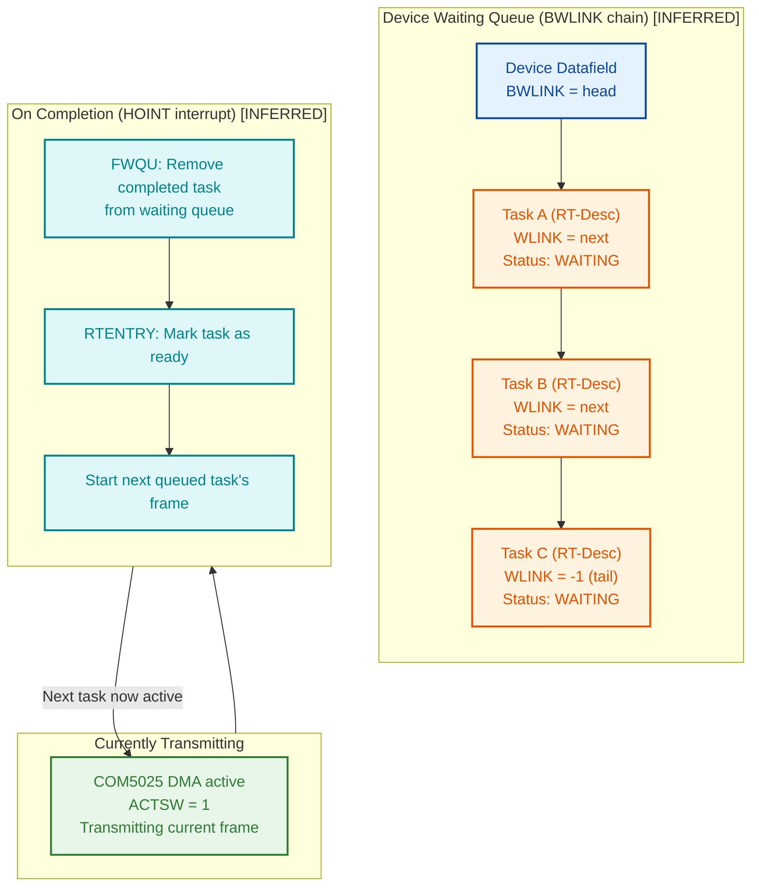

#### Device Reservation Constraint

**[VERIFIED]** MON 122B (ReserveResource) grants **exclusive** access to a
device. The specification states: *"Reserves a device or file for your
program only."* If a second program attempts to reserve an already-reserved
LDN with WaitFlag=0, it **waits** until the first program releases it. With
WaitFlag=1, it returns immediately with a negative status.

This means:
- **Only one program can hold a reservation** on a given LDN at a time
- Multiple RT programs **cannot** simultaneously reserve and use the same
  HDLC output LDN
- For true parallel HDLC communication, you need **separate physical HDLC
  channels** (different LDN pairs on different COM5025 controllers)

**[ASSUMED]** It is unclear whether a single program that holds the
reservation can have multiple outstanding MON 201B calls from different
internal RT tasks. The available documentation does not address this
scenario explicitly.

### 6.11 Receive Buffer Queuing and Notification

**[VERIFIED]** The receive side is fundamentally different from transmit.
The HDLC driver maintains a **continuous receive operation** -- hardware DMA
is always running (when ACTSW = 1), filling buffers as frames arrive from
the wire.

Source: NPL source confirms ZSTARC restarts receiver DMA after each packet:
`IF ACTSW >< 0 THEN CALL ZSTARC` (HDLC-ALL.md line 5804)

#### How Frames Arrive (Driver Internals)

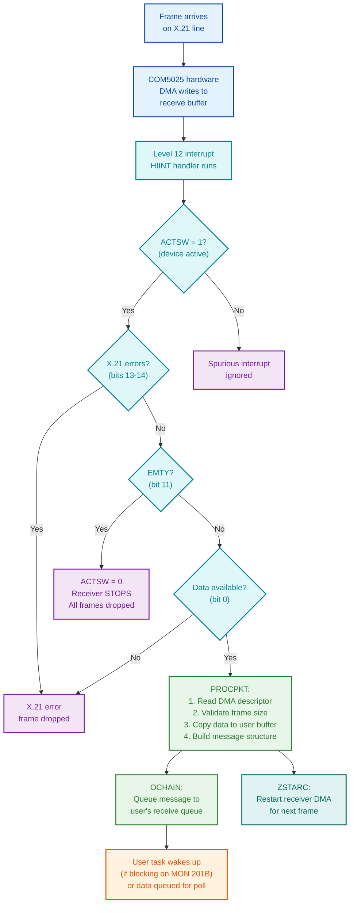

#### Key point: Frames are received by the driver continuously

**[VERIFIED]** The driver receives frames continuously while ACTSW = 1.
The HIINT interrupt handler and PROCPKT subroutine process incoming frames
and call OCHAIN. This is confirmed from NPL source:

1. **[VERIFIED]** Captured by DMA into a receive buffer (ZSTARC starts DMA)
2. **[VERIFIED]** Validated by HIINT -- checks ACTSW, X.21 errors, EMTY, data available
3. **[VERIFIED]** Processed by PROCPKT -- data extraction, message construction
4. **[VERIFIED]** OCHAIN called to deliver message (Deep-Dive-PROCPKT.md line 104)

**[ASSUMED]** Whether OCHAIN queues messages into a buffer that the user
can drain later (allowing multiple frames to accumulate), or whether it
only delivers to a task that is already blocked on MON 201B receive, is
**not fully confirmed** from the available NPL source. The MON 201B
specification's error code 3 ("No DCB in queue") for poll mode strongly
implies that a receive queue does exist -- otherwise polling would not
return "no DCB in queue".

Your program retrieves them later by calling MON 201B (Func=1). If your
program calls receive and frames are already queued, it gets the oldest
one immediately (FIFO).

#### How Your Code Finds Out a Buffer Was Sent

MON 201B send is synchronous. When the call returns, the frame **has been
sent** (or failed). Check two things:

```planc
% After MON 201B returns from send:
%
% 1. Check the MON call Status parameter
IF STATUS <> 0 THEN
    % MON 201B itself failed (bad LDN, not reserved, etc.)
    % The frame was NOT sent
    GO HANDLE_MON_ERROR
FI

% 2. Check DCB status words for hardware result
% The driver filled these during the blocking wait
IF (DCB(1) AND 100002B) <> 0 THEN
    % SILFO (bit 15) or TXUND (bit 1) set
    % Transmission failed at hardware level
    % NOTE: Driver already retried up to MAXR (77) times before returning this
    CALL PRINTMSG('TX hardware error after retries: ')
    CALL PRINTOCT(DCB(1))
    CALL NEWLINE
    GO HANDLE_HW_ERROR
FI

% If we get here: frame was successfully transmitted
CALL PRINTMSG('Frame sent OK')
CALL NEWLINE
```

#### How Your Code Finds Out a New Message Was Received

There are three approaches, from simplest to most robust:

**Approach 1: Blocking receive (simple but dangerous)**

```planc
% Program halts here until a frame arrives
% WARNING: No timeout -- hangs forever if nothing comes
1 =: MSIZE                          % Block
Monitor_Call('HDLCfunction', FUNC, INLDN, RXDCB, USIZE, MSIZE, STATUS)

% When we get here, RXDCB is filled with received data
% The kernel woke us up via FWQU + RTENTRY after OCHAIN queued the message
```

**Approach 2: Polling loop (safe, recommended)**

```planc
INTEGER : POLL_COUNT, MAX_POLLS
0 =: POLL_COUNT
5000 =: MAX_POLLS

WHILE POLL_COUNT < MAX_POLLS DO
    0 =: MSIZE                      % Poll (don't block)
    Monitor_Call('HDLCfunction', FUNC, INLDN, RXDCB, USIZE, MSIZE, STATUS)

    IF STATUS = 0 THEN
        % Frame received! Process it
        GO FRAME_RECEIVED
    FI

    IF STATUS <> 3 THEN
        % Error other than "no data"
        GO RECV_ERROR
    FI

    % Status = 3: no data yet, keep polling
    POLL_COUNT + 1 =: POLL_COUNT
OD

% Timeout: no frame arrived within MAX_POLLS iterations
GO RECV_TIMEOUT
```

**Approach 3: Dedicated receiver RT task (production)**

A separate RT program continuously receives and processes frames,
independent of the sender task:

```planc
MODULE RECEIVER_TASK
    INTEGER ARRAY : STACK(0:1000)
    INTEGER ARRAY : RXDCB(0:1023)

    PROGRAM : RECEIVER
        INTEGER : INLDN, FUNC, USIZE, MSIZE, STATUS

        INISTACK STACK
        560 =: INLDN                     % Input LDN

        % Reserve input part
        INTEGER : IOFLAG, WAITFLAG, RSTATUS
        0 =: IOFLAG
        0 =: WAITFLAG
        Monitor_Call('ReserveResource', INLDN, IOFLAG, WAITFLAG, RSTATUS)

        % Continuous receive loop
        1 =: FUNC                        % Receive

        WHILE 1 = 1 DO
            (256 + 3) * 2 =: USIZE       % Buffer size
            1 =: MSIZE                   % Block until data arrives

            Monitor_Call('HDLCfunction', FUNC, INLDN, RXDCB, USIZE, MSIZE, STATUS)

            IF STATUS = 0 THEN
                IF RXDCB(0) = 1 THEN     % TRANS command = data frame
                    CALL PROCESS_FRAME    % Handle received data
                FI
            ELSE
                % Error -- log and continue
                CALL LOG_ERROR(STATUS)
            FI
        OD
    ENDROUTINE

    ROUTINE PROCESS_FRAME
        % RXDCB(3) .. RXDCB(N) contains the received payload
        % USIZE / 2 - 3 = number of data words received
        % ... your application logic here ...
    ENDROUTINE

    ROUTINE LOG_ERROR(INTEGER : ERR)
        % ... error handling ...
    ENDROUTINE
ENDMODULE
```

#### Receive Buffer Overflow and EMTY

The driver has a **finite pool of DMA receive buffers**. If frames arrive
faster than your program retrieves them, the pool eventually exhausts:

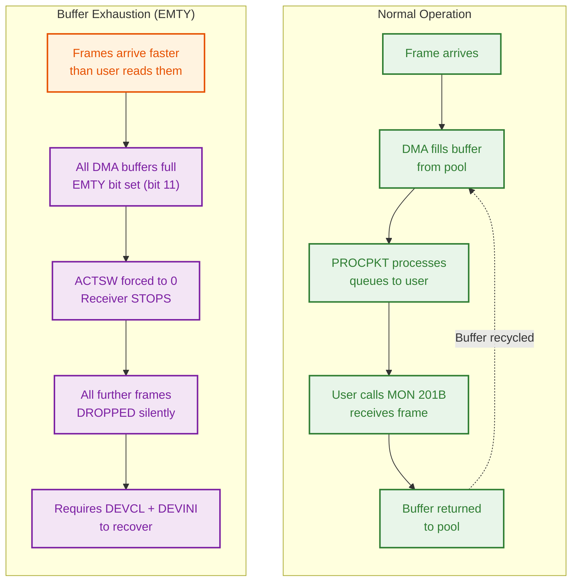

| Condition | EMTY (bit 11) | ACTSW | Result |
|-----------|--------------|-------|--------|
| Buffers available | 0 | 1 | Normal -- frames received and queued |
| All buffers full | 1 | Forced to 0 | **FATAL** -- receiver stops, frames dropped |
| After recovery (DEVCL + DEVINI) | 0 | 1 | Normal again |

**Protection**: Read received frames as fast as possible. Use a dedicated
receiver RT task (Approach 3) to drain the queue continuously. If you
see EMTY, call RECOVER_LINK (DEVCL + DEVINI) immediately.

#### Multi-Block Frames (Large Messages)

If a message is larger than one DMA buffer, the COM5025 hardware splits
it across multiple DMA descriptors using RSOM/REOM flags:

| Flag | Bit | Meaning | DMA Descriptor |
|------|-----|---------|---------------|
| RSOM | 0 | Receive Start Of Message | First buffer of multi-block frame |
| REOM | 1 | Receive End Of Message | Last buffer of multi-block frame |
| Both | 0+1 | Complete frame in one buffer | Single-block frame (most common) |
| Neither | -- | Middle of multi-block frame | Intermediate buffer |

**[VERIFIED]** PROCPKT walks the DMA descriptor chain, processing each
block using RSOM/REOM flags. Source: Deep-Dive-PROCPKT.md lines 147-160
show the multi-block processing loop checking REOM.

**[ASSUMED]** Whether PROCPKT fully reassembles multi-block data into a
single contiguous user buffer, or whether the user receives separate blocks,
is not fully confirmed from the available analysis. The NPL source shows
the loop structure but the exact copy semantics for multi-block frames
need further verification.

For transmission, the same TSOM/TEOM mechanism works in reverse via the
LKEY field of the DMA descriptor (see Section 10.3). **[VERIFIED]** from
NPL source: FSERM = 002003 sets both TSOM and TEOM for single-block frames.

---

## 7. Programming Flow

### 7.1 Complete Session Lifecycle

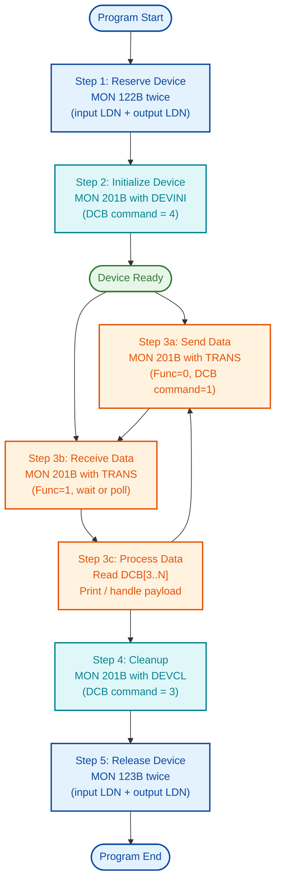

### 7.2 Step-by-Step with DCB Contents

#### Step 1: Reserve the HDLC Device

Both the input and output logical device numbers must be reserved. They are
typically different numbers (e.g., 560 for input, 561 for output).

```planc
% Reserve input part
0 =: IOFlag                                            % 0 = input
0 =: WaitFlag                                          % 0 = wait for it
Monitor_Call('ReserveResource', INLDN, IOFlag, WaitFlag, Status)

% Reserve output part
1 =: IOFlag                                            % 1 = output
Monitor_Call('ReserveResource', OUTLDN, IOFlag, WaitFlag, Status)
```

#### Step 2: Initialize the HDLC Link

Send a DEVINI command DCB to bring the device to a known state.

```planc
4 =: DCB(0)                                            % DEVINI command
0 =: DCB(1)                                            % Clear status
0 =: DCB(2)                                            % Clear status
0 =: Func                                              % Send DCB to driver
6 =: USize                                             % 3 words * 2 bytes
2048 =: MSize                                          % Max buffer

Monitor_Call('HDLCfunction', Func, OUTLDN, DCB, USize, MSize, Status)
```

#### Step 3a: Send Data

Fill the DCB with a TRANS command and your payload starting at word 3.

```planc
1 =: DCB(0)                                            % TRANS command
0 =: DCB(1)                                            % Clear status
0 =: DCB(2)                                            % Clear status
% DCB(3) .. DCB(N) = your payload
(PayloadWords + 3) * 2 =: USize                        % Total DCB size in bytes
0 =: Func                                              % Send to driver

Monitor_Call('HDLCfunction', Func, OUTLDN, DCB, USize, MSize, Status)
```

#### Step 3b: Receive Data

Provide an empty buffer. The driver fills it with the received frame payload.

```planc
1 =: Func                                              % Receive from driver
(MaxWords + 3) * 2 =: USize                            % Buffer capacity
1 =: MSize                                             % 1 = block until data

Monitor_Call('HDLCfunction', Func, INLDN, DCB, USize, MSize, Status)

% On return:
%   DCB(0)     = command (should be 1 = TRANS for data frames)
%   DCB(1)     = driver status
%   DCB(2)     = hardware status
%   DCB(3..N)  = received payload
%   USize      = actual received size in bytes
```

#### Step 4: Cleanup and Release

```planc
% Send DEVCL to clear the device
3 =: DCB(0)                                            % DEVCL command
0 =: Func
6 =: USize
Monitor_Call('HDLCfunction', Func, OUTLDN, DCB, USize, MSize, Status)

% Release both parts
0 =: IOFlag
Monitor_Call('ReleaseResource', INLDN, IOFlag)
1 =: IOFlag
Monitor_Call('ReleaseResource', OUTLDN, IOFlag)
```

### 7.3 Blocking vs. Polling Receive

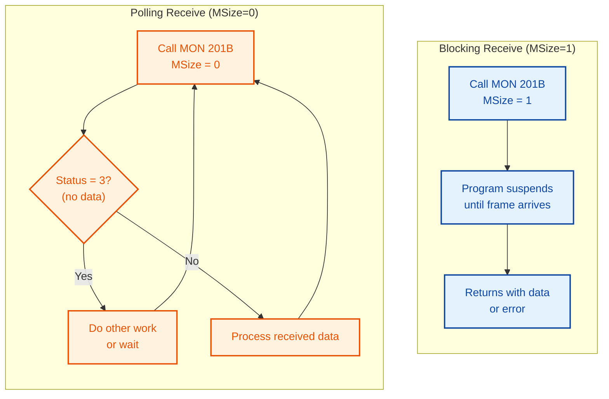

| Mode | MSize Value | Behaviour | Use When |
|------|-------------|-----------|----------|
| Blocking | 1 | Program waits until a frame arrives or an error occurs | Simple request-response protocols |
| Polling | 0 | Returns immediately with Status=3 if no data in queue | Programs that must do other work between checks |

---

## 8. Error Handling

### 8.1 Error Handling Flow

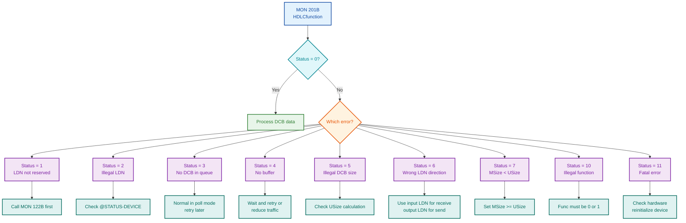

### 8.2 DCB Status Words (returned by driver)

After a successful MON 201B call (Status = 0), check the DCB status words
for hardware-level results:

| DCB Word | Field | Bit(s) | Meaning |
|----------|-------|--------|---------|
| 1 | Status1 | 15 (SILFO) | Transmitter illegal format error |
| 1 | Status1 | 1 (TXUND) | Transmitter underrun (data not fed fast enough) |
| 1 | Status1 | 0 | Data available (receiver) |
| 1 | Status1 | 11 (EMTY) | Receiver buffer list empty -- **FATAL** |
| 1 | Status1 | 13-14 | X.21 protocol errors |
| 2 | Status2 | -- | Additional hardware-specific status |

**Transmit success test**: `(Status1 AND 100002B) = 0` (both SILFO and TXUND clear)

**Receive success test**: `(Status1 AND 1B) = 1` AND `(Status1 AND 60000B) = 0` AND `(Status1 AND 4000B) = 0`

---

## 9. Hardware Layer Reference

This section documents the COM5025 registers accessible via MON 31B for
advanced diagnostics or custom driver development.

### 9.1 COM5025 Register Map

All registers are at offsets from the HDLC device base address (`HDEV`).

| IOX Offset | Register | R/W | Purpose |
|-----------|----------|-----|---------|
| +10 | **RRTS** | R | Receiver Transfer Status -- check after receive interrupt |
| +11 | **WRTC** | W | Receiver Transfer Control -- enable/configure receiver |
| +12 | **RTTS** | R | Transmitter Transfer Status -- check after transmit interrupt |
| +13 | **WTTC** | W | Transmitter Transfer Control -- enable/configure transmitter |
| +15 | **WDMA** | W | Write DMA list base address |
| +17 | **WDCR** | W | Write DMA Command Register -- start DMA operations |

### 9.2 Key Register Values

| Register | Value (Octal) | Value (Hex) | Purpose |
|----------|--------------|-------------|---------|
| WRTC | 1734 | 0x03DC | Full operational receiver mode (all interrupts enabled) |
| WRTC | 100 | 0x0040 | Minimal cleanup mode |
| WRTC | 0 | 0x0000 | Receiver off |
| WTTC | 1134+CMODI | 0x025C+ | Full operational transmitter mode |
| WTTC | 0 | 0x0000 | Transmitter off |
| WDCR | 1001 | 0x0201 | Start receiver DMA |
| WDCR | 2000 | 0x0400 | Start transmitter DMA |

### 9.3 RRTS Bit Map (Receiver Status)

| Bit | Name | Normal Value | Meaning |
|-----|------|-------------|---------|
| 0 | DataAvailable | 1 | Packet ready for processing |
| 11 | ListEmpty (EMTY) | 0 | **FATAL if 1** -- no more receive buffers |
| 13 | X21D | 0 | X.21 data error |
| 14 | X21S | 0 | X.21 signal error |

### 9.4 RTTS Bit Map (Transmitter Status)

| Bit | Name | Normal Value | Meaning |
|-----|------|-------------|---------|
| 1 | TXUND (Underrun) | 0 | DMA underrun -- retry transmission |
| 15 | SILFO (Illegal) | 0 | Illegal format -- retry or abort |

---

## 10. DMA Descriptor Format

The HDLC driver uses 4-word DMA descriptors to interface with the COM5025
hardware. Understanding this is useful for debugging and for the direct
IOX approach.

### 10.1 Descriptor Layout

| Word | Field | Description |
|------|-------|-------------|
| 0 | **LKEY** | Block control (bits 10-8) + COM5025 command bits (bits 7-0) |
| 1 | **LBYTC** | Byte count -- number of data bytes in this block |
| 2 | **LMEM1** | Memory bank (high-order address bits) |
| 3 | **LMEM2** | Buffer address (low-order 16-bit address within bank) |

### 10.2 LKEY Field Structure

```
Bits 15-11: Reserved / extended control
Bit  10:    Legal Key flag (must be 1 for valid descriptor)
Bits 9-8:   Block status
Bits 7-0:   COM5025 register bits (TSOM, TEOM, TABORT, TGA)
```

### 10.3 LKEY Values for Transmission

| LKEY Value | Octal | Purpose | COM5025 Action |
|-----------|-------|---------|----------------|
| 0x0403 (FSERM) | 002003 | **Single complete frame** | TSOM + TEOM: generate opening flag, data, CRC, closing flag |
| 0x0401 | 002001 | First block of multi-block frame | TSOM only: opening flag, start data |
| 0x0400 | 002000 | Middle block of multi-block frame | No flags: continue data |
| 0x0402 | 002002 | Last block of multi-block frame | TEOM only: finish data, CRC, closing flag |

### 10.4 LKEY Values for Reception

| LKEY Value | Octal | Status | Meaning |
|-----------|-------|--------|---------|
| 0x0400 | 002000 | Empty Receiver Block | Available for incoming data |
| 0x0600 | 003000 | Full Receiver Block | Contains received data -- process it |

### 10.5 DMA Transmit Sequence

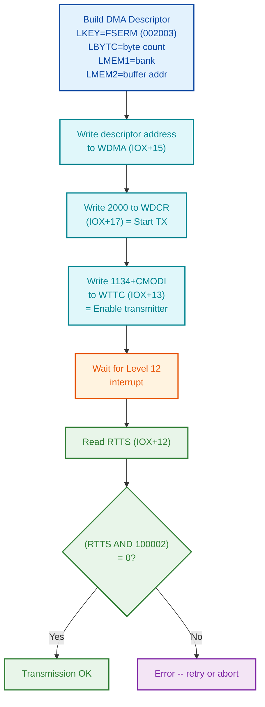

---

## 11. Complete PLANC Source Code

A working PLANC program that sends a test buffer over HDLC and receives
a response, printing both to the terminal.

```planc
%
% HDLC-RAW.PLANC -- Send and receive raw data over HDLC
% Uses MON 201B (HDLCfunction) directly, bypassing XMSG
%
% DCB layout:
%   Word 0: Command (1=TRANS, 2=RESET, 3=DEVCL, 4=DEVINI, 5=DEVSTA)
%   Word 1: Status returned by driver
%   Word 2: Additional status
%   Word 3+: Frame data payload
%

MODULE HDLCRAW

INTEGER ARRAY : STACK(0:2000)

%
% DCB buffers -- 1024 words max each
% Word 0 = command, Word 1-2 = status, Word 3+ = data
%
INTEGER ARRAY : TXDCB(0:1023)
INTEGER ARRAY : RXDCB(0:1023)

%
% Test payload to send
%
INTEGER ARRAY : TESTDATA(0:15)

%
% Receive buffer for incoming data
%
INTEGER ARRAY : RXDATA(0:255)


%--------------------------------------------------------------
% Print a string to the user terminal
%--------------------------------------------------------------
ROUTINE PRINTMSG(BYTES : MSG)
    Monitor_Call('OutMessage', MSG)
ENDROUTINE


%--------------------------------------------------------------
% Print an integer in decimal
%--------------------------------------------------------------
ROUTINE PRINTNUM(INTEGER : VAL)
    INTEGER : FMT
    10 =: FMT
    Monitor_Call('OutNumber', FMT, VAL)
ENDROUTINE


%--------------------------------------------------------------
% Print an integer in octal
%--------------------------------------------------------------
ROUTINE PRINTOCT(INTEGER : VAL)
    INTEGER : FMT
    8 =: FMT
    Monitor_Call('OutNumber', FMT, VAL)
ENDROUTINE


%--------------------------------------------------------------
% Print CR/LF to the terminal
%--------------------------------------------------------------
ROUTINE NEWLINE
    INTEGER : DEV, VAL
    1 =: DEV
    15B =: VAL
    Monitor_Call('OutByte', DEV, VAL)
    12B =: VAL
    Monitor_Call('OutByte', DEV, VAL)
ENDROUTINE


%--------------------------------------------------------------
% Reserve both input and output parts of HDLC device
% Returns 0 on success, negative on failure
%--------------------------------------------------------------
INTEGER ROUTINE RESERVE_HDLC(INTEGER : INLDN, OUTLDN)
    INTEGER : IOFLAG, WAITFLAG, STATUS

    % Reserve input part
    0 =: IOFLAG
    0 =: WAITFLAG
    Monitor_Call('ReserveResource', INLDN, IOFLAG, WAITFLAG, STATUS)

    % Reserve output part
    1 =: IOFLAG
    0 =: WAITFLAG
    Monitor_Call('ReserveResource', OUTLDN, IOFLAG, WAITFLAG, STATUS)

    RETURN (0)
ENDROUTINE


%--------------------------------------------------------------
% Release both input and output parts
%--------------------------------------------------------------
ROUTINE RELEASE_HDLC(INTEGER : INLDN, OUTLDN)
    INTEGER : IOFLAG

    0 =: IOFLAG
    Monitor_Call('ReleaseResource', INLDN, IOFLAG)

    1 =: IOFLAG
    Monitor_Call('ReleaseResource', OUTLDN, IOFLAG)
ENDROUTINE


%--------------------------------------------------------------
% Initialize the HDLC device
% Sends DEVINI command via DCB
% Returns 0 on success, error code otherwise
%--------------------------------------------------------------
INTEGER ROUTINE INIT_HDLC(INTEGER : OUTLDN)
    INTEGER : FUNC, USIZE, MSIZE, STATUS

    4 =: TXDCB(0)                   % Command = DEVINI
    0 =: TXDCB(1)                   % Clear status
    0 =: TXDCB(2)                   % Clear status

    0 =: FUNC                       % 0 = send DCB to driver
    6 =: USIZE                      % 3 words * 2 = 6 bytes
    2048 =: MSIZE                    % Max DCB size in bytes

    Monitor_Call('HDLCfunction', FUNC, OUTLDN, TXDCB, USIZE, MSIZE, STATUS)

    IF STATUS <> 0 THEN
        CALL PRINTMSG('DEVINI failed, error: ')
        CALL PRINTNUM(STATUS)
        CALL NEWLINE
        RETURN (STATUS)
    FI

    CALL PRINTMSG('HDLC device initialized')
    CALL NEWLINE

    RETURN (0)
ENDROUTINE


%--------------------------------------------------------------
% Send a data buffer over HDLC
%   DATA    = array of words to send
%   NWORDS  = number of data words
%   OUTLDN  = output logical device number
% Returns 0 on success, error code otherwise
%--------------------------------------------------------------
INTEGER ROUTINE SEND_DATA(INTEGER ARRAY : DATA, INTEGER : NWORDS, OUTLDN)
    INTEGER : FUNC, USIZE, MSIZE, STATUS, I

    % Build TRANS DCB
    1 =: TXDCB(0)                   % Command = TRANS
    0 =: TXDCB(1)                   % Clear status
    0 =: TXDCB(2)                   % Clear status

    % Copy payload into DCB starting at word 3
    FOR I := 0 TO NWORDS-1 DO
        DATA(I) =: TXDCB(I + 3)
    OD

    0 =: FUNC                       % 0 = send DCB to driver
    (NWORDS + 3) * 2 =: USIZE       % Total DCB size in bytes
    2048 =: MSIZE                    % Max DCB size

    CALL PRINTMSG('Sending ')
    CALL PRINTNUM(NWORDS)
    CALL PRINTMSG(' words...')
    CALL NEWLINE

    Monitor_Call('HDLCfunction', FUNC, OUTLDN, TXDCB, USIZE, MSIZE, STATUS)

    IF STATUS <> 0 THEN
        CALL PRINTMSG('SEND error, status: ')
        CALL PRINTNUM(STATUS)
        CALL PRINTMSG(' DCB status1: ')
        CALL PRINTOCT(TXDCB(1))
        CALL PRINTMSG(' status2: ')
        CALL PRINTOCT(TXDCB(2))
        CALL NEWLINE
        RETURN (STATUS)
    FI

    CALL PRINTMSG('Send OK, driver status: ')
    CALL PRINTOCT(TXDCB(1))
    CALL NEWLINE

    RETURN (0)
ENDROUTINE


%--------------------------------------------------------------
% Receive a data buffer from HDLC
%   DATA    = array to receive into
%   MAXW    = max words to receive
%   NWORDS  = actual words received (output)
%   INLDN   = input logical device number
%   DOWAIT  = 1 to block, 0 to poll
% Returns 0 on success, 3 if no data (poll mode)
%--------------------------------------------------------------
INTEGER ROUTINE RECV_DATA(INTEGER ARRAY : DATA,
                          INTEGER : MAXW, NWORDS, INLDN, DOWAIT)
    INTEGER : FUNC, USIZE, MSIZE, STATUS, I, DATAWORDS

    % Clear receive DCB
    FOR I := 0 TO MAXW + 2 DO
        0 =: RXDCB(I)
    OD

    1 =: FUNC                       % 1 = receive DCB from driver
    (MAXW + 3) * 2 =: USIZE         % Buffer capacity in bytes
    DOWAIT =: MSIZE                  % 1 = wait, 0 = poll

    Monitor_Call('HDLCfunction', FUNC, INLDN, RXDCB, USIZE, MSIZE, STATUS)

    IF STATUS <> 0 THEN
        IF STATUS = 3 THEN
            % No DCB in queue -- normal for poll mode
            0 =: NWORDS
            RETURN (3)
        FI
        CALL PRINTMSG('RECV error, status: ')
        CALL PRINTNUM(STATUS)
        CALL NEWLINE
        0 =: NWORDS
        RETURN (STATUS)
    FI

    % Check that it is a TRANS DCB (data frame)
    IF RXDCB(0) <> 1 THEN
        CALL PRINTMSG('Non-data DCB received, command: ')
        CALL PRINTNUM(RXDCB(0))
        CALL NEWLINE
        0 =: NWORDS
        RETURN (-1)
    FI

    % Calculate data words received
    % USize now holds actual received size in bytes
    USIZE / 2 - 3 =: DATAWORDS
    IF DATAWORDS < 0 THEN
        0 =: DATAWORDS
    FI
    IF DATAWORDS > MAXW THEN
        MAXW =: DATAWORDS
    FI

    DATAWORDS =: NWORDS

    % Copy payload out of DCB
    FOR I := 0 TO DATAWORDS-1 DO
        RXDCB(I + 3) =: DATA(I)
    OD

    RETURN (0)
ENDROUTINE


%--------------------------------------------------------------
% Print a buffer as octal and decimal values
%--------------------------------------------------------------
ROUTINE DUMP_BUFFER(INTEGER ARRAY : DATA, INTEGER : NWORDS)
    INTEGER : I

    CALL PRINTMSG('Buffer dump (')
    CALL PRINTNUM(NWORDS)
    CALL PRINTMSG(' words):')
    CALL NEWLINE

    FOR I := 0 TO NWORDS-1 DO
        CALL PRINTMSG('  [')
        CALL PRINTNUM(I)
        CALL PRINTMSG('] = ')
        CALL PRINTOCT(DATA(I))
        CALL PRINTMSG(' (')
        CALL PRINTNUM(DATA(I))
        CALL PRINTMSG(')')
        CALL NEWLINE
    OD
ENDROUTINE


%--------------------------------------------------------------
% MAIN PROGRAM
%--------------------------------------------------------------
PROGRAM : MAIN

    INTEGER : INLDN, OUTLDN, STATUS, NRECV, I

    INISTACK STACK

    CALL PRINTMSG('=== HDLC Raw Send/Receive ===')
    CALL NEWLINE

    %
    % SET THESE TO YOUR HDLC DEVICE LDNs
    % Find them with @STATUS-DEVICE or SINTRAN-SERVICE-PROGRAM
    % Input and output have separate LDNs
    %
    560 =: INLDN                     % HDLC input LDN  (CHANGE THIS)
    561 =: OUTLDN                    % HDLC output LDN (CHANGE THIS)

    CALL PRINTMSG('Input  LDN: ')
    CALL PRINTNUM(INLDN)
    CALL NEWLINE
    CALL PRINTMSG('Output LDN: ')
    CALL PRINTNUM(OUTLDN)
    CALL NEWLINE

    % ---- STEP 1: Reserve the device ----
    CALL PRINTMSG('Reserving HDLC device...')
    CALL NEWLINE
    CALL RESERVE_HDLC(INLDN, OUTLDN) =: STATUS
    IF STATUS <> 0 THEN
        CALL PRINTMSG('Reserve FAILED')
        CALL NEWLINE
        CALL EXIT
    FI
    CALL PRINTMSG('Device reserved')
    CALL NEWLINE

    % ---- STEP 2: Initialize the HDLC link ----
    CALL INIT_HDLC(OUTLDN) =: STATUS
    IF STATUS <> 0 THEN
        CALL PRINTMSG('Init FAILED, releasing device')
        CALL NEWLINE
        CALL RELEASE_HDLC(INLDN, OUTLDN)
        CALL EXIT
    FI

    % ---- STEP 3: Fill test payload ----
    %
    % Your custom protocol header + data goes here
    % This example uses a simple format:
    %   Word 0: Message type
    %   Word 1: Sequence number
    %   Word 2: Payload length (in words)
    %   Word 3+: Application data
    %
    1 =: TESTDATA(0)                 % Message type = 1 (data)
    0 =: TESTDATA(1)                 % Sequence number = 0
    8 =: TESTDATA(2)                 % Payload = 8 words
    101B =: TESTDATA(3)              % 'A'
    102B =: TESTDATA(4)              % 'B'
    103B =: TESTDATA(5)              % 'C'
    104B =: TESTDATA(6)              % 'D'
    105B =: TESTDATA(7)              % 'E'
    106B =: TESTDATA(8)              % 'F'
    107B =: TESTDATA(9)              % 'G'
    110B =: TESTDATA(10)             % 'H'

    CALL PRINTMSG('--- TX Data ---')
    CALL NEWLINE
    CALL DUMP_BUFFER(TESTDATA, 11)

    % ---- STEP 4: Send the data ----
    CALL SEND_DATA(TESTDATA, 11, OUTLDN) =: STATUS
    IF STATUS <> 0 THEN
        CALL PRINTMSG('Transmit error')
        CALL NEWLINE
    FI

    % ---- STEP 5: Wait for a response (blocking) ----
    CALL PRINTMSG('--- Waiting for RX data ---')
    CALL NEWLINE

    CALL RECV_DATA(RXDATA, 256, NRECV, INLDN, 1) =: STATUS

    IF STATUS = 0 THEN
        CALL PRINTMSG('--- RX Data ---')
        CALL NEWLINE
        CALL DUMP_BUFFER(RXDATA, NRECV)
    ELSE
        CALL PRINTMSG('No data received, status: ')
        CALL PRINTNUM(STATUS)
        CALL NEWLINE
    FI

    % ---- STEP 6: Cleanup ----
    CALL PRINTMSG('Releasing device...')
    CALL NEWLINE
    CALL RELEASE_HDLC(INLDN, OUTLDN)

    CALL PRINTMSG('Done.')
    CALL NEWLINE

ENDROUTINE

ENDMODULE
```

### Compilation and Execution

```
@PLANC HDLC-RAW,,HDLC-RAW
@NRL HDLC-RAW,,HDLC-RAW
@HDLC-RAW
```

### Expected Terminal Output (successful run)

```
=== HDLC Raw Send/Receive ===
Input  LDN: 560
Output LDN: 561
Reserving HDLC device...
Device reserved
HDLC device initialized
--- TX Data ---
Buffer dump (11 words):
  [0] = 1 (1)
  [1] = 0 (0)
  [2] = 10 (8)
  [3] = 101 (65)
  [4] = 102 (66)
  [5] = 103 (67)
  [6] = 104 (68)
  [7] = 105 (69)
  [8] = 106 (70)
  [9] = 107 (71)
  [10] = 110 (72)
Sending 11 words...
Send OK, driver status: 0
--- Waiting for RX data ---
--- RX Data ---
Buffer dump (N words):
  [0] = ...
  ...
Done.
```

---

## 12. Debugging Checklist

### Before first transmission

- [ ] Correct LDNs obtained from `@STATUS-DEVICE`
- [ ] Input LDN reserved with IOFlag=0
- [ ] Output LDN reserved with IOFlag=1
- [ ] DEVINI DCB sent successfully (Status=0)
- [ ] Remote end is connected and initialized

### Transmission problems

| Symptom | Check | Fix |
|---------|-------|-----|
| Status = 1 | LDN not reserved | Call MON 122B before MON 201B |
| Status = 2 | Wrong LDN | Verify with @STATUS-DEVICE |
| Status = 5 | USize is wrong | Recalculate: `(words + 3) * 2` |
| Status = 6 | Using input LDN for send | Swap to output LDN |
| Status = 7 | MSize too small | Set MSize >= USize |
| DCB Status1 bit 1 set (TXUND) | DMA underrun | Retry; reduce system load |
| DCB Status1 bit 15 set (SILFO) | Illegal format | Check DCB structure; reinitialize |

### Reception problems

| Symptom | Check | Fix |
|---------|-------|-----|
| Status = 3 (polling) | No data in queue | Normal -- retry later |
| Status = 6 | Using output LDN for receive | Swap to input LDN |
| Hangs on blocking receive | No remote transmitter | Use poll mode (MSize=0) with timeout logic |
| DCB command not 1 | Non-data frame received | Handle RESET/DEVCL/DEVSTA or ignore |
| DCB Status1 bit 11 set (EMTY) | Receiver buffer exhaustion | **FATAL** -- reinitialize device |
| DCB Status1 bits 13-14 set | X.21 protocol error | Check physical link, X.21 interface |

---

## Appendix A: LDN Discovery

HDLC logical device numbers are assigned during system generation and can be
found using SINTRAN commands.

### Method 1: @STATUS-DEVICE

```
@STATUS-DEVICE
```

Lists all devices with their LDNs, types, and current reservation status.
HDLC devices are listed with type indicators for input and output parts.

### Method 2: SINTRAN-SERVICE-PROGRAM

```
@SINTRAN-SERVICE-PROGRAM
* LIST-DEVICE
```

Shows the complete device table including HDLC controllers and their
assigned LDN pairs.

### Typical LDN Assignment

| Device | Input LDN | Output LDN | Notes |
|--------|-----------|------------|-------|
| HDLC channel 0 | 560 | 561 | First HDLC link |
| HDLC channel 1 | 562 | 563 | Second HDLC link |
| HDLC channel 2 | 564 | 565 | Third HDLC link |

**Important**: These are example values. Actual LDNs depend on system
configuration and may differ on your installation. Always verify with
`@STATUS-DEVICE`.

---

## Appendix B: Advanced -- Direct Register Access

For expert users who need to bypass the HDLC driver entirely and control
the COM5025 hardware directly via MON 31B (IOInstruction).

### Reading Receiver Status

```planc
INTEGER : RegContents, DevRegAddr, ContentsAfter

% Read RRTS (receiver transfer status)
% DevRegAddr = HDEV base + 10 (offset for RRTS)
0 =: RegContents
HDEV + 10B =: DevRegAddr
Monitor_Call('IOInstruction', RegContents, DevRegAddr, ContentsAfter)

% ContentsAfter now holds RRTS bit pattern
```

### Reading Transmitter Status

```planc
% Read RTTS (transmitter transfer status)
0 =: RegContents
HDEV + 12B =: DevRegAddr
Monitor_Call('IOInstruction', RegContents, DevRegAddr, ContentsAfter)

% Test for success: (ContentsAfter AND 100002B) should be 0
```

### Emergency Stop

```planc
% Disable receiver
0 =: RegContents
HDEV + 11B =: DevRegAddr                % WRTC
Monitor_Call('IOInstruction', RegContents, DevRegAddr, ContentsAfter)

% Disable transmitter
0 =: RegContents
HDEV + 13B =: DevRegAddr                % WTTC
Monitor_Call('IOInstruction', RegContents, DevRegAddr, ContentsAfter)
```

**Warning**: Direct register access requires knowing the HDEV base address
for your specific HDLC controller. This address is system-dependent and must
be found via SINTRAN-SERVICE-PROGRAM or the device driver source code.
Incorrect writes to hardware registers can crash the controller or the
entire system.

---

## Source References

| Document | ND Number | Section | Content |
|----------|-----------|---------|---------|
| SINTRAN III Monitor Calls | ND-860228.2 EN | Pages 306-307 | HDLCfunction specification |
| SINTRAN III Monitor Calls | ND-860228.2 EN | Page 419 | ReserveResource specification |
| SINTRAN III Monitor Calls | ND-860228.2 EN | Page 411 | ReleaseResource specification |
| SINTRAN III Monitor Calls | ND-860228.2 EN | Page 141 | DeviceControl specification |
| SINTRAN III Monitor Calls | ND-860228.2 EN | Page 327 | IOInstruction specification |
| PLANC Reference Manual | ND-60.117.5 EN | -- | PLANC language specification |
| HDLC Driver Source | MP-P2-HDLC-DRIV.NPL | -- | SINTRAN HDLC driver (626 lines) |
| COM5025 Datasheet | SMC/AMD | -- | Multi-Protocol Communications Controller |

## See Also

- **[Buffer-Pool and Emulator Usage](implementation/Buffer-Pool-and-Emulator-Usage.md)** — operational layer around this API: `CHANGE-BUFFER-SIZE` buffer setup, pool sizing (D-I-W/D-O-W), the receive-arm trap (undersized arm → flood), and running/testing HDLC under nd100x.
- **[MAC Cookbook](../../../Developer/Languages/System/MAC-COOKBOOK.md)** — writing the MAC program that issues these monitor calls (source encoding, the monitor-call skip-on-success ABI, file I/O).
