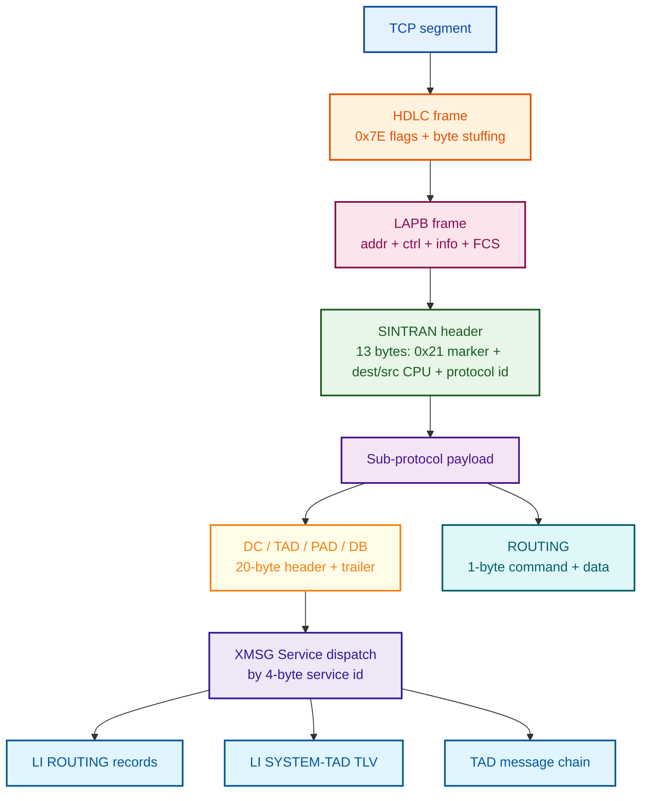
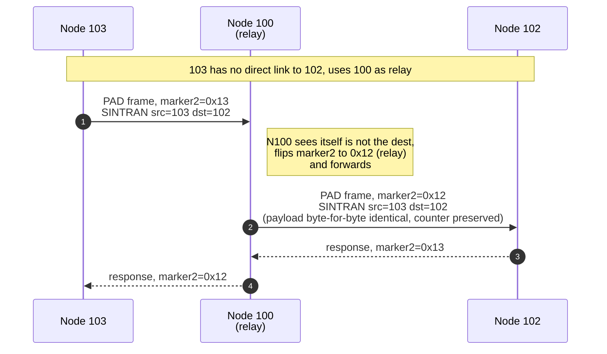
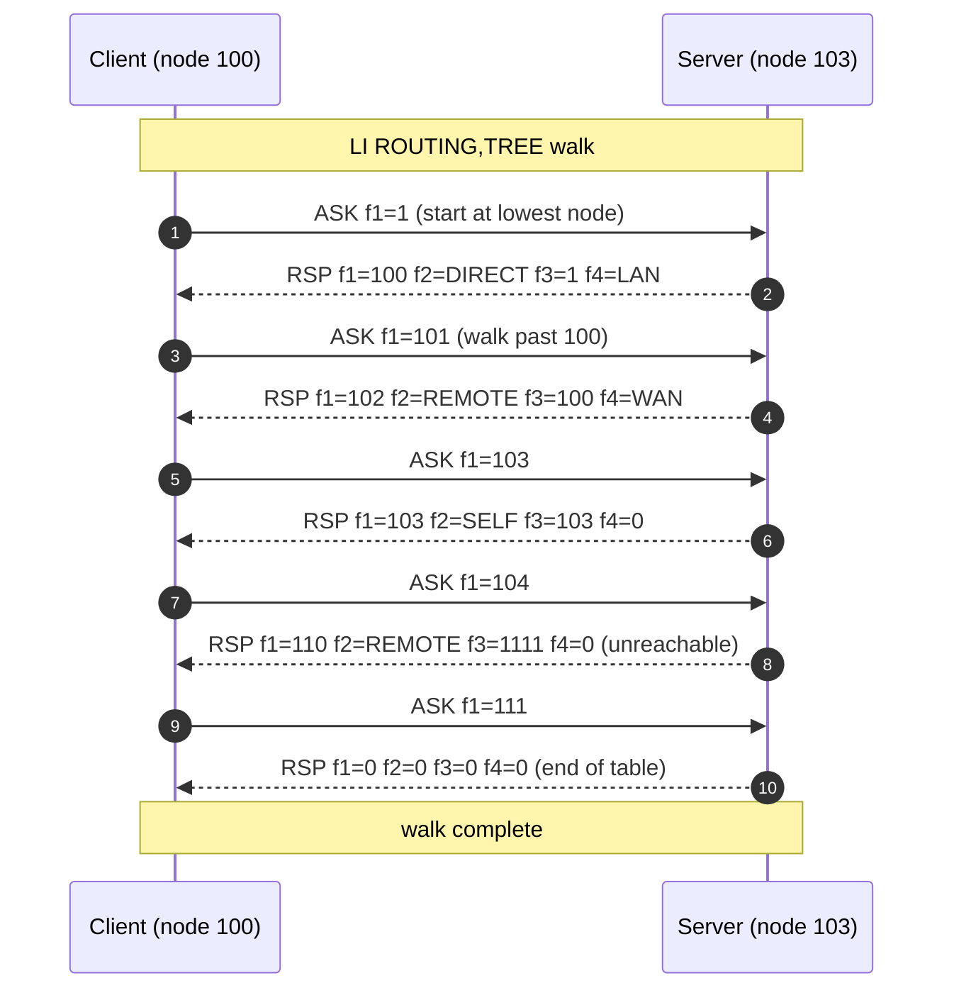

# LAPB/SINTRAN Wireshark Dissector

Lua plugin for Wireshark that decodes HDLC/LAPB frames carrying SINTRAN III
protocol over TCP. Handles byte-stuffing, CRC-16-CCITT FCS verification, and
full sub-protocol dissection for ROUTING, TAD, DC/DB, PAD and relay frames.

---

## Requirements

- Wireshark 4.x or later (uses Lua 5.4 bitwise operators — `bit32` not required)
- Tested on Windows; works on any platform Wireshark supports

---

## Installation

### Step 1 — Find your personal Lua plugins folder

Open Wireshark, go to **Help → About Wireshark → Folders tab**.  
Look for **Personal Lua Plugins** — it will show the full path, typically:

| OS      | Default path                                               |
|---------|------------------------------------------------------------|
| Windows | `%APPDATA%\Wireshark\plugins\`  (e.g. `C:\Users\<you>\AppData\Roaming\Wireshark\plugins\`) |
| Linux   | `~/.local/lib/wireshark/plugins/`                          |
| macOS   | `~/.local/lib/wireshark/plugins/`                          |

Alternatively, you can install system-wide into Wireshark's global plugins folder
(shown as **Global Lua Plugins** in the same Folders tab), but that requires admin
rights and will be overwritten on Wireshark upgrades.

### Step 2 — Copy the plugin

Copy `hdlc_tcp.lua` into the plugins folder found above.

```
copy hdlc_tcp.lua "%APPDATA%\Wireshark\plugins\"
```

### Step 3 — Enable Lua scripting

Lua is enabled by default. If it has been disabled:

1. Go to **Edit → Preferences → Advanced**
2. Search for `gui.enable_lua`
3. Set to `TRUE`
4. Restart Wireshark

### Step 4 — Load / reload the plugin

After placing the file:

- **Restart Wireshark**, or
- Use **Ctrl+Shift+L** (Analyze → Reload Lua Plugins) to hot-reload without restart

If the plugin loaded successfully you will see `LAPB/SINTRAN over TCP` listed
under **Help → About Wireshark → Plugins tab**.

---

## How the dissector activates

### Automatic — heuristic detection (recommended)

The dissector registers a TCP heuristic. It will **automatically** claim any TCP
stream whose first LAPB frame passes all three checks:

1. Valid HDLC framing (`0x7E` flags, byte-unstuffing succeeds)
2. CRC-16-CCITT FCS is correct
3. SINTRAN marker bytes `0x21 0x12` or `0x21 0x13` present at info offset

No port configuration required. Works regardless of which TCP ports the emulator
uses.

### Manual — Decode As

If the heuristic does not fire (e.g. only ACK/SYN packets visible in the first
segment, or capture starts mid-stream):

1. Right-click any TCP packet in the target stream
2. **Decode As…**
3. In the Current column, select `hdlc_lapb`
4. Click **OK**

To make the mapping permanent for a specific port: in the Decode As dialog, set
the field to **TCP port**, enter the port number, choose `hdlc_lapb`, and save.
Wireshark stores this in your profile.

### Port binding (fallback — currently commented out in the script)

The script contains commented-out static port registrations:

```lua
-- tcp_table:add(10362, lapb_proto)
-- tcp_table:add(10364, lapb_proto)
-- tcp_table:add(24182, lapb_proto)
-- tcp_table:add(17230, lapb_proto)
-- tcp_table:add(17237, lapb_proto)
```

If you want static port binding instead of (or in addition to) the heuristic,
uncomment those lines and reload the plugin.

---

## Filtering

### Show only LAPB/SINTRAN traffic

```
hdlc_lapb
```

> **Note:** Use `hdlc_lapb` — not `hdlc`. The dissector registers under the name
> `hdlc_lapb`. Wireshark's built-in `hdlc` dissector is not active on these TCP
> streams, so filtering on `hdlc` alone will return no results.

### Filter by SINTRAN sub-protocol

```
sintran.proto == 0xDD          -- TAD only
sintran.proto == 0xDE          -- ROUTING only
sintran.proto == 0xDC          -- DC (terminal data)
sintran.proto == 0xDA          -- PAD
```

### Filter by node

```
sintran.src == 100             -- frames from node 100
sintran.dest == 102            -- frames to node 102
sintran.src == 103 && sintran.dest == 100
```

### Filter by LAPB frame type

```
lapb.ctrl == 0x00              -- I-frame N(S)=0
lapb.addr == 0x09              -- specific LAPB address
```

### Filter by routing command

```
routing.cmd == 0x05            -- Propagate-Request
routing.cmd == 0x0C            -- RouteInfo-Exchange
```

### Filter by TAD message type

```
tad.type == 0x01               -- BDAT
tad.type == 0x02               -- RFI
tad.type == 0x14               -- ConnSetup-Step4
```

### Exclude LAPB supervisory frames (show data only)

```
hdlc_lapb && !(lapb.ctrl & 0x01)
```

### Combine with TCP port (if known)

```
hdlc_lapb && tcp.port == 10362
```

---

## Packet list columns (Info field)

The dissector writes a summary line per TCP segment into the **Info** column.
Multiple LAPB frames in one TCP segment are separated by ` | `.

Example Info values:

| Info string | Meaning |
|---|---|
| `I N(S)=0 N(R)=1  100→102  TAD` | I-frame, seq 0, ack 1, SINTRAN node 100→102, TAD sub-protocol |
| `S RR N(R)=2` | Supervisory RR frame, acknowledging up to seq 2 |
| `U SABM  Node 100` | Unnumbered SABM (link setup), SINTRAN node 100 |
| `U UA` | Unnumbered Acknowledgement |
| `100→102 ROUTING` | SINTRAN I-frame carrying ROUTING protocol |
| `SINTRAN Relay  [103 → 102  PAD]` | Relay frame (mark2=0x12), node 100 forwarding PAD between 103 and 102 |

---

## Decode tree structure

Each captured TCP segment expands as:

```
LAPB/SINTRAN over TCP
  └─ LAPB Frame
       ├─ Raw Frame (stuffed)          -- original bytes including 0x7E flags
       ├─ Address         0x09
       ├─ Control         0x00
       │    ├─ N(S) Send Seq  0
       │    ├─ Poll/Final     False
       │    └─ N(R) Recv Seq  1
       ├─ SINTRAN  [100 → 102  TAD]   -- or "SINTRAN Relay" for mark2=0x12
       │    ├─ Marker 1    0x21
       │    ├─ Marker 2    0x13
       │    ├─ Packet Type 0x00
       │    ├─ Packet Subtype
       │    ├─ Dest Node   102
       │    ├─ Src Node    100
       │    ├─ Flags/Broadcast
       │    ├─ Version/Type
       │    └─ Protocol ID  TAD (0xDD)
       ├─ TAD Message(s)
       │    ├─ Message Type  BDAT (0x01)
       │    ├─ Data Count    33
       │    └─ ...
       └─ FCS  0x1234  [correct]
```

---

## Frame structure overview

How a SINTRAN application message is wrapped on the wire from top to bottom:



---

## SINTRAN header

Every LAPB I-frame carries a 13-byte SINTRAN header immediately after the LAPB
address and control bytes:

```
Offset  Size  Field            Notes
──────  ────  ───────────────  ──────────────────────────────────────────────
  0      1    Marker 1         Always 0x21
  1      1    Marker 2         0x13 = normal frame, 0x12 = relay frame
  2      1    Packet Type      Frame type / sequence indicator
  3      1    Packet Length    Length of remaining info (after this byte)
  4      2    Dest Node        Big-endian destination SINTRAN node number
  6      2    Src Node         Big-endian source SINTRAN node number
  8      2    Flags 1          Broadcast / routing flags
 10      2    Flags 2          Version / type flags
 12      1    Protocol ID      Sub-protocol carried in the payload (see below)
```

The 13 bytes are followed by the sub-protocol payload.

**Relay frames (Marker 2 = 0x12):** Node 100 acting as a forwarder inserts an
extra relay header — the Src/Dest in the outer SINTRAN header are the relay
nodes, while the actual endpoint nodes appear inside the relay header payload.
The Info column shows both: `SINTRAN Relay  [103 → 102  PAD]`.



---

## Sub-protocols decoded

| Proto ID | Name    | Description |
|----------|---------|-------------|
| `0xD8`   | D8      | Variant of DC (observed; semantics inferred from pcap) |
| `0xD9`   | D9      | Variant of DC (observed; semantics inferred from pcap) |
| `0xDA`   | PAD     | X.25 PAD virtual circuit data forwarding |
| `0xDB`   | DB      | Terminal data variant (close to DC) |
| `0xDC`   | DC      | Terminal data — carries a 17-byte sub-header (speed, flags, local node/channel, remote node/channel) followed by TAD messages |
| `0xDD`   | TAD     | Terminal Access and Directory — primary session protocol; carries chained TAD messages |
| `0xDE`   | ROUTING | Network routing — propagation, bootstrap, route-info exchange |

### XMSG wire format (DC / TAD / PAD payload)

DC, TAD and PAD frames all carry the same XMSG (X-MeSsaGe) protocol — a
SINTRAN-native message-passing system documented in the L07 NPL symbol tables
and the COSMOS Programmer Guide. The wire format is a **repacked subset of the
17-word in-kernel XM5 header**: only the application-relevant fields
(XMDSY/XMDPT/XMSSY/XMSPT/XMCSM/XMLEN + user data) are serialised onto HDLC.
Kernel-only fields (XMDAB/XMDAW for memory bank/offset, XMTIM/XMTPT timestamps,
XMALL/XMSIZ allocation flags) are dropped before transmission.

**Authoritative references in the repo:**
- `E:\Dev\Ronny\NDInsight\SINTRAN\XMSG-Protocol-Analysis.md` — main structural analysis
- `E:\Dev\Ronny\NDInsight\SINTRAN\XMSG-COMMAND-REFERENCE.md` — function codes and status codes
- `E:\Dev\Ronny\NDInsight\SINTRAN\NPL-SOURCE\SYMBOLS\L07\XMSG-SYMBOL-LIST.SYMB.TXT` — symbol offsets
- `E:\Dev\Ronny\NDInsight\Operations\Cosmos\ND-60164-3-EN COSMOS Programmer Guide.md` — §1.2.3 Port, §1.2.4 Message Buffer

**SINTRAN addressing model (verified from COSMOS Programmer Guide §1.2.3):**

A SINTRAN host has a CPU id (the node number 100, 102, 103…) and runs service
tasks like XROUT, TADAD, XMFIDO, BAK01. Each task owns one or more **ports** —
task-owned message endpoints, locally identified by a small port number. A
remote reference uses a 32-bit "magic number" combining port + system + a random
component (so stale references can't be reused). Ports are listable via
`X-C:list-ports` on a SINTRAN console.

A message is sent across the network by:

1. `XFGET` — allocate buffer
2. `XFWHD` — fill XMDSY/XMDPT/XMSSY/XMSPT in the header
3. `XFWRI` — copy user data
4. `XFSND` — hand to the HDLC driver
5. (receiving side) `XFRCV` → `XFRHD` → `XFREA` → `XFREL`

```mermaid
flowchart LR
    A[Counter<br/>1B]:::ctr --> B[Marker<br/>21 00<br/>2B]:::mark
    B --> C[Flags<br/>1B]:::flags
    C --> D[Role<br/>1B]:::role
    D --> E[XMDSY<br/>XMDPT<br/>4B]:::addr
    E --> F[XMSSY<br/>XMSPT<br/>4B]:::addr
    F --> G[XMCSM<br/>4B]:::svc
    G --> H[Pad<br/>1B]:::pad
    H --> I[XMLEN<br/>1B]:::tlen
    I --> J[User Data<br/>N bytes]:::trail

    classDef ctr fill:#FFEBEE,stroke:#B71C1C,color:#B71C1C,stroke-width:2px
    classDef mark fill:#E8EAF6,stroke:#1A237E,color:#1A237E,stroke-width:2px
    classDef flags fill:#FFF9C4,stroke:#F57F17,color:#F57F17,stroke-width:2px
    classDef role fill:#F3E5F5,stroke:#4A148C,color:#4A148C,stroke-width:2px
    classDef addr fill:#E0F2F1,stroke:#004D40,color:#004D40,stroke-width:2px
    classDef svc fill:#FFF8E1,stroke:#FF6F00,color:#FF6F00,stroke-width:2px
    classDef pad fill:#ECEFF1,stroke:#37474F,color:#37474F,stroke-width:2px
    classDef tlen fill:#E1F5FE,stroke:#01579B,color:#01579B,stroke-width:2px
    classDef trail fill:#E8F5E9,stroke:#1B5E20,color:#1B5E20,stroke-width:2px
```



```
Offset  Size  XM5 sym  Field                 Status     Notes
──────  ────  ───────  ────────────────────  ─────────  ───────────────────────
  0      1    —        Counter               verified   Per-direction sequence
  1      1    —        Marker                verified   Always 0x21
  2      1    —        Marker                verified   Always 0x00
  3      1    —        Frame Flags           verified   NOT constant — 0x86 and 0x96 observed
  4      1    —        Role                  verified   Asker/responder hint
  5      2    XMDSY    Destination system    doc-cross  CPU id (BE)
  7      2    XMDPT    Destination port      doc-cross  Port on dest CPU (BE)
  9      2    XMSSY    Source system         doc-cross  CPU id (BE) — see note
 11      2    XMSPT    Source port           doc-cross  Port on src CPU (BE)
 13      4    XMCSM*   Control / function    inferred   Distinguishes commands
 17      1    —        Pad                   verified   Always 0x00
 18      1    XMLEN*   User data length      doc-cross  Low byte of length
 19      N    —        User data             verified   Format depends on XMCSM
```

**Frame Flags byte (offset 3):** Previously assumed to be a constant marker
(`0x86`), but observed values include `0x86` and `0x96` in different frames
within the same capture. Bit 4 is the difference (`0x86 = 1000_0110`,
`0x96 = 1001_0110`). The meaning of individual bits is not yet known — could
encode frame priority, data class, or session state.

`*` XMCSM in the kernel header is one word (2 bytes). The 4 bytes at wire
offset 13 may be (XMCSM word + 16-bit function/op code), or may be a 32-bit
combined service identifier. Stable values per command across all captures.
XMLEN in the kernel header is also a full word; only the low byte appears at
wire offset 18 in observed traffic (lengths up to 206 bytes seen).

**Response anomaly (verified across all LI ROUTING captures):**

For LI ROUTING **requests**, all four address fields decode correctly:
`XMDSY=102, XMDPT=0, XMSSY=100, XMSPT=722` for a request from node 100 to
node 102. But for **responses**, the responder fills XMSSY/XMSPT with the
*originator's* address rather than its own:

```
Request  100→102:  XMDSY=102 XMDPT=0    XMSSY=100 XMSPT=722
Response 102→100:  XMDSY=100 XMDPT=722  XMSSY=100 XMSPT=722  ← src = originator!
```

This appears to be a **stateless-RPC convention**: the LI ROUTING responder
doesn't allocate its own port, so it echoes the asker's `(sys, port)` into
both halves as a transaction-id. The XMSG documentation references `XFRTN`
("swap src/dst to reply") as a kernel call — LI ROUTING responders may be
skipping it for stateless replies. Whether this is universal across all XMSG
services or specific to stateless RPCs like LI ROUTING is not yet known.

**Role byte (offset 4):** verified across 11 pcaps:

| Value  | Meaning                          |
|--------|----------------------------------|
| `0x60` | Responder for LI ROUTING         |
| `0x40` | Responder for LI SYSTEM-TAD      |
| `0xC4` | Asker for LI ROUTING             |
| `0xE4` | Asker for LI SYSTEM-TAD          |
| `0x84` | Asker (legacy variant)           |
| `0x94` | Asker (connection setup)         |
| `0x54` | Asker (connection setup variant) |
| `0x00` | Generic data frame (no role)     |

The low nibble is the verified part: `4` = asker, `0` = responder. The high
nibble varies with command class (still partially inferred).

**XMSG Service ID (offset 13-16):** Identifies the destination service / port
on the receiving host. Currently observed values:

| Hex          | Service                        |
|--------------|--------------------------------|
| `0100014B`   | LI ROUTING request (XROUT)     |
| `01000100`   | LI ROUTING response (XROUT)    |
| `04000041`   | LI SYSTEM-TAD (TADAD)          |

For LI ROUTING the first three bytes (`01 00 01`) are stable, only the last
byte distinguishes request (`0x4B`) from response (`0x00`). The exact field
split (24-bit service + 8-bit function, or two 16-bit ports) is still inferred.

---

### LI ROUTING command (verified)

`LI ROUTING,TREE` walks the routing table on a remote node. The wire-level
semantics is **"return the first routing entry where target_node ≥ N"**, so
the client walks by querying `f1=1`, then `f1=result+1`, and so on until the
server returns the all-zero end-of-table marker.



The repeated re-queries we observe in pcaps are because **each step of the
11-step ROUTING handshake retransmits the same query**; only the final result
after step 0 is used by the client.

**The trailer is a sequence of XM routing-control messages.** The "field id"
byte at position 0 of each 4-byte record is **not arbitrary** — it matches a
verified symbol from `XMSG-SYMBOL-LIST.SYMB.TXT`:

| Symbol  | Value | Doc meaning              | Used as in LI ROUTING |
|---------|------:|--------------------------|------------------------|
| XMTNO   |   1   | Node info / topology     | Target node id |
| XMROU   |   2   | Routing-table entry      | Route-type bitfield (DIRECT/REMOTE/SELF) |
| XMTHI   |   3   | Hop / path-cost update   | Next-hop node id |
| XMTRE   |   4   | Spanning-tree record     | Reachability bitfield (LAN/WAN) |
| XMKIK   |   5   | Keep-alive heartbeat     | (not yet observed in captures) |
| XMTPS   |   6   | Time / clock sync        | (not yet observed in captures) |

**Request trailer** (4 bytes, 1 record): a single XMTNO record naming the node
to look up.

**Response trailer** (16 bytes, 4 records): one XMTNO + one XMROU + one XMTHI
+ one XMTRE describing the routing-table entry.

**Each record is 4 bytes:** `[xm_type][0x02][0x00][value_low]`. The middle two
bytes are a length prefix (`0x0002` = 2-byte value follows), and the value is
read as a 16-bit big-endian word from bytes 2–3 of the record.

**XMROU bitfield** (route type — verified):

| Bit  | Symbol | Meaning |
|------|--------|---------|
| 0x01 | DIRECT | Local link, immediate neighbour |
| 0x02 | REMOTE | Route uses a next-hop |
| 0x04 | SELF   | This entry describes the queried node itself |

**XMTRE bitfield** (spanning-tree reachability — verified):

| Bit  | Symbol | Meaning |
|------|--------|---------|
| 0x01 | LAN    | Directly reachable on a local network |
| 0x02 | WAN    | Reachable via a working remote route |

`0x00` = neither bit set → unreachable or self entry.

**Verified against text output of `X-C:LI-ROUT` on a known topology with 11
routing entries** — every wire-level value decoded matches the textual route
description.

### DC sub-header (legacy notes — superseded by the table above)

Earlier interpretation of the DC payload as `Speed / Flags / Local Node / etc.`
has been superseded by the verified layout. The "speed" and "flags" bytes are
in fact the 0x86 marker and the role byte respectively. The Lua dissector now
decodes the verified fields and dispatches on the XMSG Service ID.

After the trailer-length byte, the DC payload contains either LI ROUTING records
(if the service ID matches), TLV-encoded service data (LI SYSTEM-TAD style),
or a TAD message chain (same format
as proto 0xDD).

---

## LAPB frame types

| ctrl bits     | Type | Description |
|---------------|------|-------------|
| bit 0 = 0     | I    | Information frame — carries SINTRAN data |
| bits 1:0 = 01 | S    | Supervisory — RR / RNR / REJ |
| bits 1:0 = 11 | U    | Unnumbered — SABM / UA / DM / DISC / FRMR / XID |

**I-frame control byte:** bits 1–3 = N(S) send sequence, bit 4 = P/F,
bits 5–7 = N(R) receive sequence.

**S-frame subtypes** (bits 2–3):

| Value | Name | Description |
|-------|------|-------------|
| 0     | RR   | Receive Ready — acknowledges frames up to N(R) |
| 1     | RNR  | Receive Not Ready — flow control hold |
| 2     | REJ  | Reject — retransmit from N(R) |

**U-frame types:**

| ctrl (masked) | Name  | Description |
|---------------|-------|-------------|
| 0x2F          | SABM  | Set Asynchronous Balanced Mode — link setup |
| 0x63          | UA    | Unnumbered Acknowledgement — confirms SABM/DISC |
| 0x43          | DISC  | Disconnect |
| 0x0F          | DM    | Disconnected Mode |
| 0x87          | FRMR  | Frame Reject — protocol error |
| 0x03          | UI    | Unnumbered Information |
| 0xAF          | XID   | Exchange ID |

---

## TAD protocol

TAD (Terminal Access and Directory) is the primary application-layer protocol
for terminal sessions between SINTRAN nodes. It is carried in SINTRAN frames
with Protocol ID 0xDD, or embedded after the sub-header in DC frames (0xDC).

### TAD message structure

A TAD payload is a chain of back-to-back messages. Each message has a 2-byte
header:

```
Offset  Size  Field   Notes
──────  ────  ──────  ──────────────────────────────────────────────────────
  -1     0–1  Pad     0x00 inserted only if message would land on an odd
                      byte boundary — skip silently, not a message type
   0      1   Type    Opcode (see table below)
   1      1   Count   Payload byte count (0–255); does not include type/count
   2      N   Data    Payload; format depends on opcode
```

The dissector skips 0x00 pad bytes automatically before reading each type byte.

### TAD opcode table

Opcodes verified against SINTRAN III symbol tables K03 / L07 / M06 and NPL source.
Direction: C = Client (terminal / Remote Process), S = Server (Master Process).

| Hex  | Symbol | Dir | Count | Description |
|------|--------|-----|-------|-------------|
| 0x01 | BDAT   | C↔S | 0–255 | Terminal data block. Raw bytes sent to/from the terminal. In 7-bit mode bit 7 is cleared; in 8-bit mode (after 78MOD) all 8 bits are significant. Break on last byte is signalled via REMBYT=-1. |
| 0x02 | RFI    | C→S | 0     | Ready For Input. Flow-control credit — "I have a fresh input buffer; you may send." Sent when input buffer is empty, after rejecting data, or in nowait mode when no data is available. |
| 0x03 | ECKM   | C→S | 1 or 21 | Echo strategy. Byte 0 = strategy code (1–6 predefined, 7 = custom). If strategy = 7, followed by a 20-byte (8-word) echo-character bitmap table where each bit represents one character. |
| 0x04 | BMMX   | C→S | 3 or 23 | Break strategy + max-break. Byte 0 = strategy (1–6, 7=custom, 8–9, 11=user BRKTAB). Bytes 1–2 = 16-bit MaxBreak level. If strategy = 7, followed by a 20-byte break-character bitmap table. |
| 0x08 | ESCA   | S→C | 0     | Escape character received. Server signals that the configured escape character was seen. Triggers an escape response (CERS). |
| 0x09 | DCON   | S→C | 0     | Disconnect indication. Server forces disconnect and cleanup (DSTOTA). |
| 0x0C | TMOD   | C→S | 1     | Terminal mode flags (1 byte). Bit 0=CAPITAL (force uppercase), bit 1=CRDLY (CR delay), bit 2=page-stop, bit 3=LBLOG (logout on carrier loss), bit 4=IESC (inhibit escape), bit 5=8BIT, bit 6=UMOD. |
| 0x0D | TTYP   | C→S | 2     | Terminal type ID. 2-byte identifier stored in CTTYP. |
| 0x0E | CESC   | C→S | 1     | Enable/disable escape processing. 0 = disable, non-zero = enable. Always followed by a CERS (0x21) response from the server. |
| 0x0F | DESC   | C→S | 1     | Define escape character. The byte value becomes the new escape character (stored in CESCP). |
| 0x13 | SYCN   | C↔S | 2    | System control command. 2-byte command word. Auto-sent for command codes 1, 13 (CR), 17 (DC1). |
| 0x14 | USCN   | C↔S | 2    | User control command. 2-byte command word. Always sends and waits for a 7ERRS response. |
| 0x16 | RESE   | C→S | 0     | Reset connection. Resets to initial state; server must respond with RECO. |
| 0x17 | RECO   | S→C | 0     | Reset confirm. Response to RESE. |
| 0x18 | DUMM   | any | 0     | Dummy/filler. No content; used for alignment. Ignored by receiver. |
| 0x1F | OPSV   | C↔S | 3    | OS and TAD protocol version handshake. Byte 0 = SINTRAN OS version, byte 1 = OS sub-version, byte 2 = TAD protocol version. Must be exchanged before optional-feature messages (78MOD, UMOD) are legal. |
| 0x21 | CERS   | S→C | 0     | Escape-control response. Server acknowledges CESC enable/disable. |
| 0x22 | ISRQ   | C→S | 0     | Input size request. Client asks how many characters are available in the server's input buffer. |
| 0x23 | ISRS   | S→C | 2     | Input size response. 2-byte count; bit 15 (0x8000) set if a break is present in the data. |
| 0x24 | NOWT   | C↔S | 1    | Nowait status. 1-byte status flag. |
| 0x25 | TNOW   | C↔S | 1    | Terminate nowait. 1-byte flag. |
| 0x26 | NWRE   | S→C | 0     | Nowait restart. |
| 0x27 | RLOC   | S→C | 0     | Remote/local mode toggle. |
| 0x2A | TREP   | S→C | 2     | Terminal status report. 2-byte status word. |
| 0x2B | UMOD   | C→S | 2     | UMOD strategy word (protocol version ≥ 4 only). Requires both sides to have advertised protocol ≥ 4 via OPSV. |
| 0x2C | 78MOD  | C→S | 2     | 8-bit mode set. Non-zero enables 8-bit data path (sets 58BIT flag). Zero = revert to 7-bit strip. |
| 0xFA | CPCO   | S→C | 4     | Completion code. 4-byte (2-word) completion code: CPC1 high, CPC2 low. |
| 0xFB | ERRS   | S→C | 2     | Error response. 2-byte SINTRAN error code (passed to MFERSP). |
| 0xFE | REJE   | S→C | 1     | Reject. Echoes back the opcode of the message that was rejected. If the rejected message was BDAT, also sends an RFI to unblock the sender. |

> **Observed in pcap but not in symbol tables:** 0x10, 0x11, 0x12, 0xFD — shown
> as `?0x10` etc. in the decode tree. Meaning unknown.

---

## ROUTING protocol

ROUTING frames (Protocol ID 0xDE) carry network routing control between SINTRAN
nodes. They do not contain TAD messages — the payload starts with a 1-byte
command code.

### ROUTING commands

| Cmd  | Name               | Description |
|------|--------------------|-------------|
| 0x00 | TermParam-Step4    | Terminal parameter negotiation — step 4 of 5 (countdown) |
| 0x01 | TermParam-Step3    | Step 3 |
| 0x02 | TermParam-Step2    | Step 2 |
| 0x03 | TermParam-Step1    | Step 1 |
| 0x04 | TermParam-Step0    | Step 0 — final step; connection setup completes |
| 0x05 | Propagate-Request  | Push local routing table to a neighbouring node |
| 0x07 | Bootstrap-Request  | Request routing bootstrap data from neighbour |
| 0x08 | Sync-Request       | Routing synchronisation request |
| 0x0B | Propagate-Response | Acknowledgement of a Propagate-Request |
| 0x0C | RouteInfo-Exchange | Route-info query / response (echo-ACK pattern between neighbours) |
| 0x0D | Bootstrap-Response | Response to Bootstrap-Request — provides initial routing table |
| 0x0E | Sync-Response      | Response to Sync-Request |
| 0x11 | PAD-Resp           | PAD virtual-circuit setup response |
| 0x12 | PAD-Resp           | PAD virtual-circuit setup response (variant) |

---

## FCS errors

If the FCS check fails, the FCS field in the decode tree is marked:

```
FCS  0xABCD  [BAD — expected 0x1234]
```

And an expert info entry (red) is added to the frame. This is useful for
diagnosing TCP segmentation reassembly issues or genuine transmission errors.

---

## TCP segmentation

The dissector handles HDLC frames split across TCP segments using Wireshark's
`desegment_len = DESEGMENT_ONE_MORE_SEGMENT` mechanism. Wireshark will
automatically reassemble segments before calling the dissector when needed.

---

## Troubleshooting

| Symptom | Fix |
|---------|-----|
| Plugin not listed in About → Plugins | Check file is in the correct plugins folder; check Lua is enabled |
| Reload shortcut not working | Full restart of Wireshark |
| Traffic not auto-decoded | Stream may have started before capture — use **Decode As** manually |
| FCS BAD on all frames | Capture may have TCP checksum offloading active — enable **Edit → Preferences → Protocols → TCP → Allow subdissector to reassemble TCP streams** and disable checksum validation |
| Heuristic firing on wrong traffic | Very unlikely (FCS + SINTRAN marker is a very tight fingerprint) — if it happens, re-enable port binding and disable heuristic |

---

## Re-enabling port binding

Edit `hdlc_tcp.lua`, find the section near the bottom and uncomment the lines:

```lua
local tcp_table = DissectorTable.get("tcp.port")
tcp_table:add(10362, lapb_proto)
-- add further ports as needed
```

Reload with Ctrl+Shift+L.

---

## Open questions

Honest list of what is still unverified or unknown after reverse-engineering 11
captures. Items are grouped by tier — higher tiers are more important and/or
more solvable.

### Tier 1 — Likely solvable with one or two more captures

1. **The `0x54` role + `0x00060000` XMCSM outlier (pkt 1613 in
   `new-conn-to-102-from-100.pcapng`)** — a single frame from node 102 with a
   different source port (`342`) and a unique XMCSM value. Looks like a
   kernel-side notification interjecting into a TAD session. Need another
   long-running session capture to see if it recurs.

2. **The early-setup XMCSM `0x00080000`** — only seen twice, at the start of a
   TAD session. Almost certainly a connection-establishment control word. Need
   captures of multiple back-to-back session setups to confirm.

3. **XMKIK (keep-alive) and XMTPS (time-sync) on the wire** — verified to exist
   in the L07 symbol table, never observed in any pcap so far. The doc mentions
   periodic broadcasts every ~130 ms. A capture with ≥30 seconds of idle time on
   a multi-node link should reveal them.

### Tier 2 — The 11-step ROUTING handshake countdown

4. **Per-step semantics of ROUTING opcodes 0x00–0x0A** — labelled positionally
   as "step N of countdown" but the actual purpose of each step is unverified.
   The doc gives the names (PropReq/BootReq/SyncReq/TermPar0–4) but not the
   payload structure or intent of each step. Would need NPL source for the
   routing state machine — not present in the repo.

5. **Mystery opcodes `0x06`, `0x09`, `0x0A`** — assumed to be steps 6/9/10 of
   the same countdown. Probably correct but unverified.

### Tier 3 — XMSG details flagged as gaps in the doc itself

These are the open questions listed in §11 of `XMSG-Protocol-Analysis.md`. None
have been resolved by the captured pcaps.

6. **XFSND wire serialisation** — whether the in-kernel 17-word XM5 header is
   repacked or written word-for-word onto HDLC. Captured frames show a 19-byte
   header (clearly repacked), but the exact rule for which fields get dropped
   is undocumented. NPL source for `XFSND` not in repo.

7. **XMCSM full structure** — empirically split as `(high16 = control,
   low16 = op/function)`, but the symbol table only says "control / session-mgmt".
   The actual bit layout is unknown.

8. **XMSCR checksum algorithm** — symbol verified to exist, no algorithm
   documented. I have not been able to identify an XMSCR field in any captured
   frame. Either it's been dropped from the wire format, or it's hiding in one
   of the bytes I think is something else.

9. **The XMPRT/XMSEQ/XMBLN union** — three different uses for the same kernel
   word (priority / sequence / block number). Don't know which interpretation
   is on the wire or how the receiver disambiguates.

10. **Multi-buffer chaining via XMCSM bits** — doc mentions it; haven't observed
    or recognised any chained-multi-buffer frames in captures.

### Tier 4 — DC sub-protocol family

11. **What distinguishes `0xD8` / `0xD9` / `0xDB` / `0xDC` / `0xDD` / `0xDA`** —
    they all carry the same XMSG payload format on the wire. Probable
    interpretation: each protocol id selects a different reliability/queueing
    class (priority queue, control vs data, urgent vs normal). No direct
    evidence for which is which. Symbol table doesn't enumerate them.

12. **Relay frame mechanism (mark2 = `0x12`)** — observed node 100 forwarding
    frames byte-for-byte with the marker flipped. Don't know precisely how a
    node decides "relay" vs "consume" — almost certainly just `XMDSY != self`,
    but unverified.

### Tier 5 — XMSG services not yet captured

13. **XMFIDO (file-transfer subsystem)** — listed in the port table on every
    node, never observed on the wire. Trigger with a `COPY` or file transfer
    command between nodes.

14. **Mail subsystem framing** — mentioned in doc, never captured.

15. **BAK01 (backup task)** — listed in the port table, never captured.

### Tier 6 — Inferred but unverified field interpretations

16. **`XMDPT = 0` semantics** — currently inferred to mean "broadcast control
    port: route by XMCSM". Per the COSMOS Programmer Guide, port `0x00000000`
    is the broadcast control port, but whether the receiving XMSG kernel really
    routes `XMDPT=0` messages by XMCSM (rather than by literal port lookup) is
    only inferred. Also note: XROUT is at port 1 on every node we've seen — but
    LI ROUTING requests use `XMDPT=0`, not `XMDPT=1`. Either XROUT subscribes
    to the broadcast port too, or our offset interpretation is wrong.

17. **Per-node service availability is real** (NEW — verified by comparing
    `X-C:list-ports` on different nodes):

    | Service  | Node 100 | Node 103 |
    |----------|:--------:|:--------:|
    | XROUT    |    ✓     |    ✓     |
    | TADAD    |    ✓     |    ✗     |
    | XMFIDO   |    ✓     |    ✓     |
    | BAK01    |    ✓     |    ✓     |

    Node 103 doesn't run TADAD, which is why LI SYSTEM-TAD captures register
    services with node 100 (the actual TAD-server host). Differences between
    captures of "the same" command on different nodes are partly explained by
    which tasks are actually running.

18. **The LI ROUTING response anomaly** — XROUT exists on every node, so when
    100 asks 103 about routing, XROUT-on-103 should reply *from its own port 1*.
    But the wire shows the responder filling XMSSY/XMSPT with the originator's
    address, not its own. Three possibilities:
    - XROUT-style services use a stateless reply convention (no port allocation)
    - The wire layout in responses is different from requests for that 8-byte
      block (some responses use it as a transaction-id field)
    - My byte-offset interpretation in responses is still wrong
    - **Test:** capture a deliberate request to a non-existent service to see
      what XMSSY/XMSPT look like in an error response from the XMSG kernel itself

19. **The frame-flags byte at offset 3** — previously assumed to always be
    `0x86`, now observed as both `0x86` and `0x96` in the same capture
    (`new-conn-to-102-from-100.pcapng`). Bit 4 differs: `0x86 = 1000_0110`,
    `0x96 = 1001_0110`. Could encode priority, data class, or session state.
    Not decoded in any documentation source. Labelled "Frame Flags" in the
    dissector.

20. **Bytes 7-8 / 11-12 = XMDPT / XMSPT** — verified for requests via direct
    decoding (`XMSPT=722` makes sense as a session port). The response anomaly
    means I can't fully cross-check both halves in a single direction. If the
    "stateless RPC" hypothesis is wrong, my XMDPT/XMSPT identification could be
    wrong as well.

---

## What the dissector currently decodes correctly

For context — this is the verified, high-confidence working set:

- LAPB framing (flags, byte-stuffing, CRC-16-CCITT, FCS check)
- LAPB I/S/U frame types and N(S)/N(R) sequence numbers
- 13-byte SINTRAN header (markers, dest/src CPU id, protocol id)
- Relay frame detection (mark2 = `0x12`)
- TAD message chain (BDAT, TMOD, TTYP, ECKM, BMMX, OPSV, ERRS, REJE, etc. — opcodes verified against L07/M06 symbol tables)
- TAD alignment-pad (`0x00`) handling
- DC/TAD/PAD payload header up to and including XMDSY/XMDPT/XMSSY/XMSPT/XMCSM/XMLEN
- LI ROUTING records as XMTNO/XMROU/XMTHI/XMTRE messages
- XMROU and XMTRE bitfield decoding (DIRECT/REMOTE/SELF, LAN/WAN)
- LI ROUTING tree-walk semantics ("first entry where target ≥ N")
- Tracking the per-direction counter byte at offset 0
- TCP segment reassembly via `desegment_len = DESEGMENT_ONE_MORE_SEGMENT`
- Heuristic dissector + port binding fallback for stream attachment
