# HDLC Reception Flow - Detailed MERMAID Diagrams
**Complete Visual Flow Analysis of SINTRAN HDLC Packet Reception**

## Overview

This document provides detailed MERMAID flowcharts showing every decision point, bit test, and processing path in SINTRAN HDLC reception, from hardware interrupt to user application delivery.

## Main Reception Flow

```mermaid
flowchart TD
    A[Hardware Interrupt Level 13] --> A1{WRTC Interrupt Enables<br/>Check BitIE Flags}
    A1 -->|Disabled| A2[IGNORE IRQ<br/>No Processing]
    A1 -->|Enabled| B[HIINT Entry Line 104436]
    B --> B1[Check WRTC BitIE Settings]
    B1 --> C[Read RRTS Register IOX+10]
    C --> C1{DMA IRQ Enabled?<br/>WRTC DMATransferEnable = 1?}
    C1 -->|No| C2[Character-Only Processing]
    C1 -->|Yes| D[Store in HASTAT Variable]
    D --> E{ACTSW = 0?<br/>Receiver Active?}

    E -->|Yes - Inactive| F[Increment T9 Counter]
    F --> G[GO OUT1 - Exit]

    E -->|No - Active| H{X.21 Error Check<br/>RRTS and X21D or X21S != 0?<br/>0x6000}

    H -->|Yes - X.21 Error| I[X.21 Error Handler]
    I --> J{X.21 Clear?<br/>RRTS.X21S = 1?<br/>bit 14}
    J -->|Yes| K[Set BLDON in HASTAT<br/>Set XBLDN in LKEY]
    J -->|No| L[Continue Error Processing]
    K --> L
    L --> M{List Empty?<br/>RRTS.ListEmpty != 0?<br/>0x0800}

    H -->|No - X.21 OK| M

    M -->|Yes - FATAL| N[RECEIVER SHUTDOWN<br/>ACTSW = 0]
    N --> O[Increment STPCNT]
    O --> P[Copy DMA List to BUFF3]
    P --> G

    M -->|No - Buffers OK| Q[Enter Block Processing Loop]
    Q --> R[MORE: Get LKEY from DMA Descriptor]
    R --> S{XBLDN Test<br/>LKEY.BlockDone = 0?<br/>0x0008}

    S -->|Yes - Block Incomplete| T{Enable Receiver?<br/>LKEY = ERB?}
    T -->|Yes| U[GO FAR ZSTARC<br/>Enable Receiver]
    T -->|No| G
    U --> U1[ZSTARC: Write WRTC=0x35<br/>DataAvailableIE+StatusAvailableIE<br/>+ReceiverActiveIE+SyncFlagIE<br/>+SignalDetectorIE]
    U1 --> G

    S -->|No - Block Complete| V[CALL HNOTRA<br/>Process Buffer Content]
    V --> W[HNOTRA Entry Line 104611]
    W --> X[Access DMA Descriptor<br/>Get Message Size]
    X --> Y[CALL XMPAT<br/>Get DCB from List]
    Y --> Z[Extract LKEY Value<br/>Clean up Descriptor]
    Z --> AA{RCOST Validation<br/>LKEY & LMASK = RSOM+REOM?<br/>0x6377 = 3}

    AA -->|Yes - Valid| BB[SUCCESS PATH<br/>A = 0]
    BB --> CC[CALL SCRET<br/>Set Return Code]
    CC --> DD[CALL SADTS<br/>Store Hardware Status]

    AA -->|No - Invalid| EE{X.21 Clear in LKEY?<br/>LKEY.X21S = 1?<br/>bit 14}
    EE -->|Yes| FF[EX21 Error Handler]
    EE -->|No| GG[EINP Error Handler]
    FF --> HH[ERROR PATH<br/>A = LKEY]
    GG --> HH
    HH --> II[CALL SCRET<br/>Set Error Code]
    II --> JJ[CALL SADTS<br/>Store LKEY Status]
    JJ --> KK[OR Status to DSTAT<br/>Increment HDERC]

    DD --> LL[X-BHEAD Adjustment]
    KK --> LL
    LL --> MM[CALL OCHAIN<br/>Deliver to User/XMSG]
    MM --> MM1[Write WRTC=0x3DC<br/>All BasicIE + BlockEndIE<br/>+FrameEndIE+ListEndIE<br/>+ListEmptyIE+ReceiverOverrunIE]
    MM1 --> NN[Advance DMA Pointer<br/>LIINT + 4]
    NN --> OO[Cache Management<br/>Pre-fetch Next]
    OO --> PP{End of List?<br/>LKEY = NLP?}
    PP -->|Yes| QQ[Set LISTP = LIINT]
    PP -->|No| RR[GO MORE<br/>Process Next Block]
    QQ --> RR
    RR --> R

    style A fill:#ff9999
    style G fill:#ffcccc
    style N fill:#ff6666
    style BB fill:#99ff99
    style MM fill:#66ff66
```

## WRTC Interrupt Enable Sequence Flow

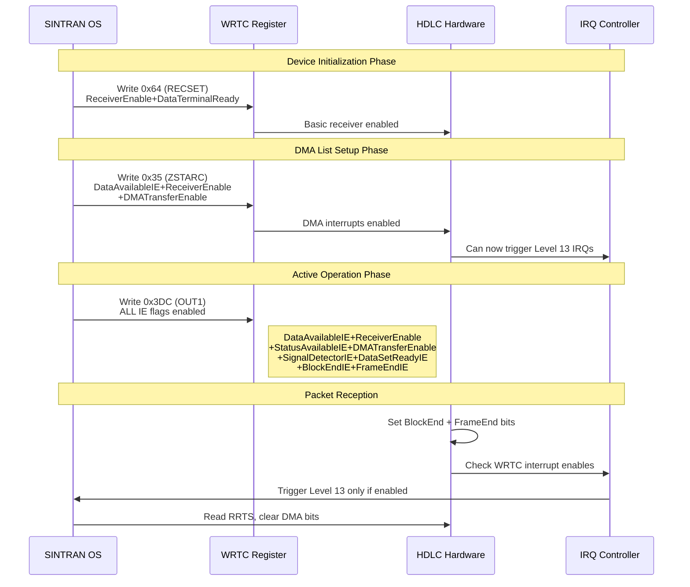

## Detailed Bit Testing Flow

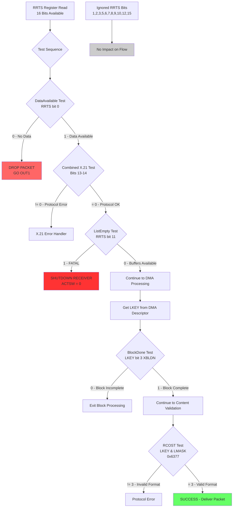

## Hardware vs Software Control Flow with Interrupt Enables

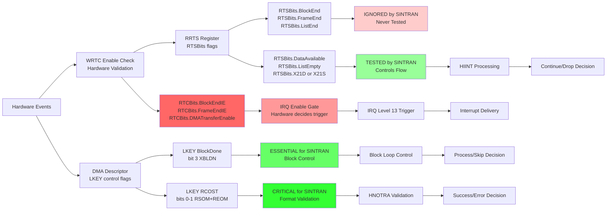

## Status Information Flow to XMSG

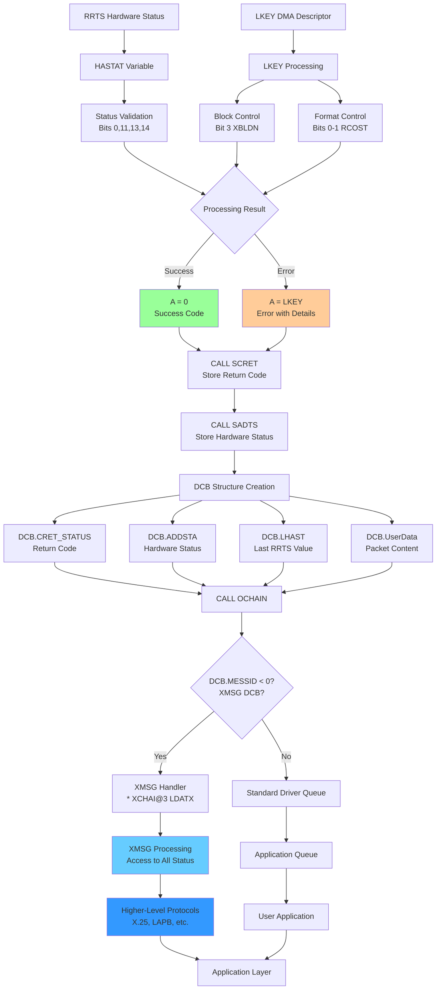

## Critical Decision Points

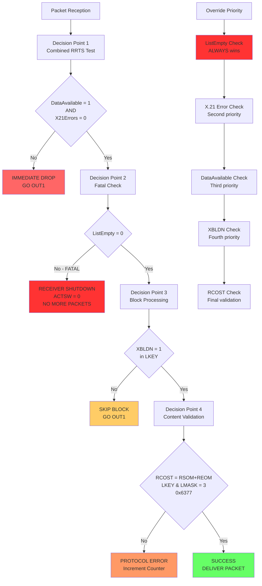

## Complete Processing Timeline

```mermaid
gantt
    title SINTRAN HDLC Reception Processing Timeline
    dateFormat X
    axisFormat %s

    section Hardware
    Receive_Frame    :0, 10
    Set_RRTS_Bits    :10, 15
    Set_LKEY_XBLDN   :10, 15
    Trigger_IRQ_13   :15, 20

    section HIINT
    Read_RRTS        :20, 25
    Store_HASTAT     :25, 30
    Activity_Check   :30, 35
    X21_Check        :35, 45
    ListEmpty_Check  :45, 55

    section Block_Loop
    Read_LKEY        :55, 60
    XBLDN_Test       :60, 65
    Call_HNOTRA      :65, 70

    section HNOTRA
    DMA_Access       :70, 75
    Get_DCB          :75, 80
    RCOST_Test       :80, 90
    Status_Calls     :90, 100

    section Delivery
    OCHAIN_Call      :100, 110
    XMSG_Check       :110, 115
    Queue_Deliver    :115, 125

    section Next_Block
    Advance_Pointer  :125, 130
    Cache_Mgmt       :130, 135
    Next_Block       :135, 140
```

## Error Handling Paths

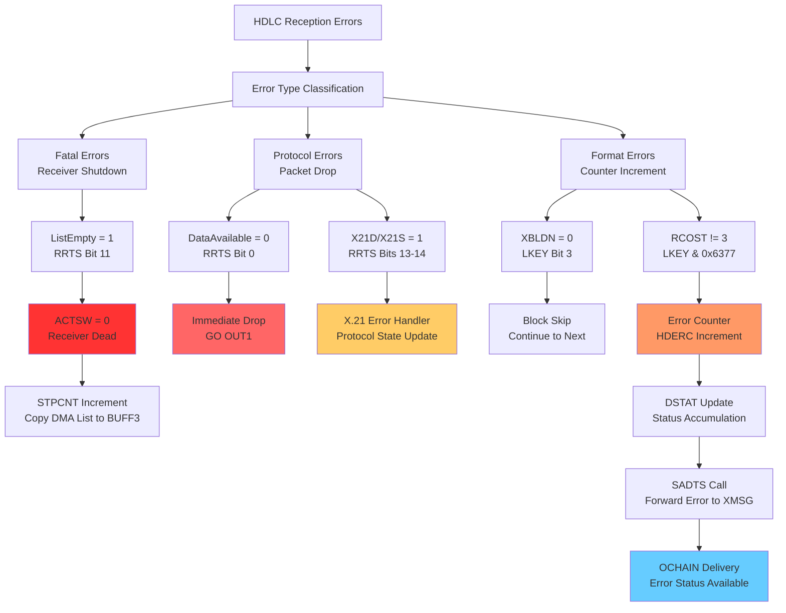

## Summary

These MERMAID diagrams provide complete visual documentation of:

1. **Main Processing Flow**: From interrupt to delivery
2. **Bit Testing Logic**: Showing which bits matter and why
3. **Hardware vs Software**: The dual control systems
4. **XMSG Integration**: Status forwarding to higher levels
5. **Decision Points**: Critical validation stages
6. **Timeline**: Processing sequence and timing
7. **Error Handling**: All failure modes and their impacts

The diagrams clearly show that SINTRAN HDLC reception involves sophisticated multi-layered validation, with only specific bits controlling the flow while others are completely ignored. The key insight is the separation between hardware status reporting (RRTS) and software flow control (LKEY XBLDN).

## HDLC Initialization Flow (HDSIN Function)

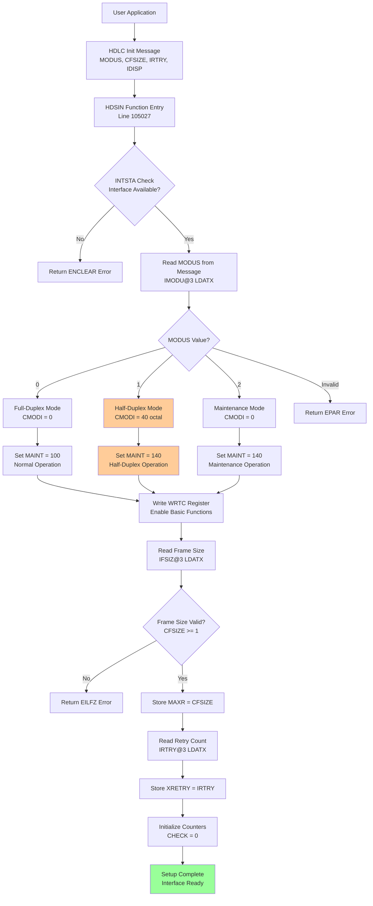

## Half-Duplex Mode Operation Flow

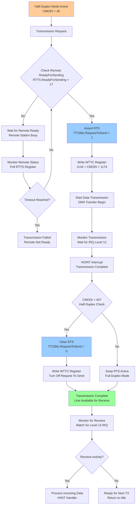

## X.21 Circuit-Switched Mode Flow

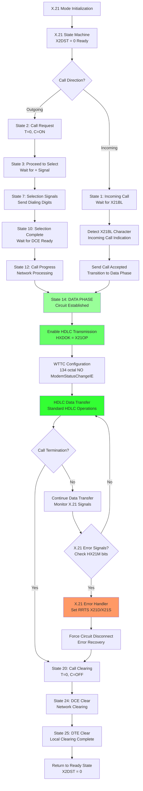

## Multi-Mode HDLC Controller State Machine

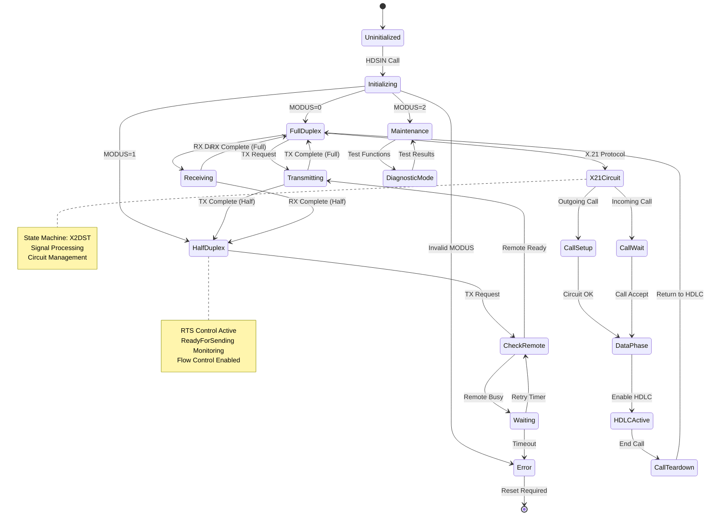

## Complete HDLC Register Interaction Flow

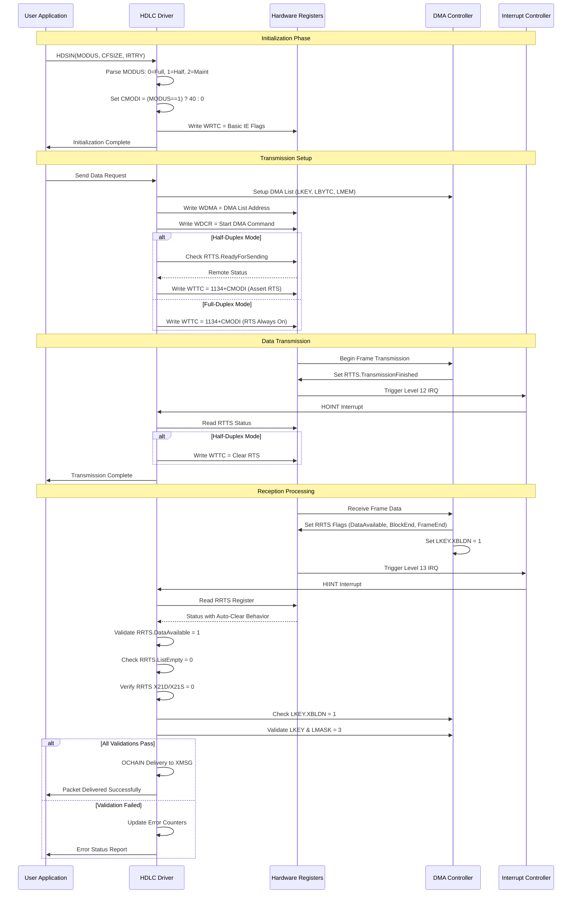

## Buffer Management and Flow Control

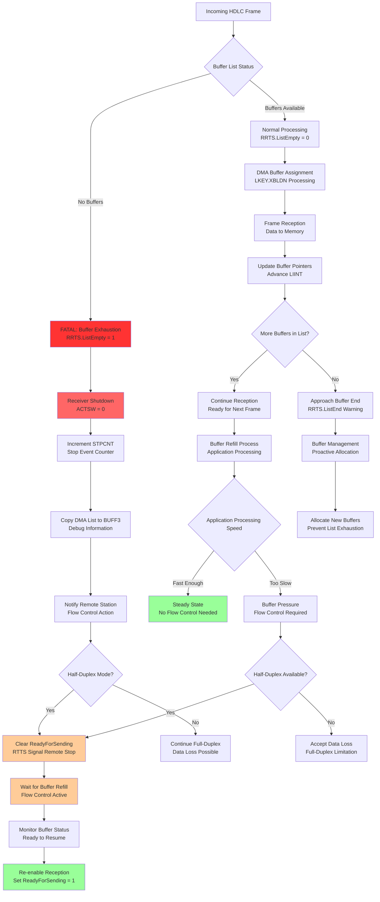

## Advanced Error Recovery and Diagnostics

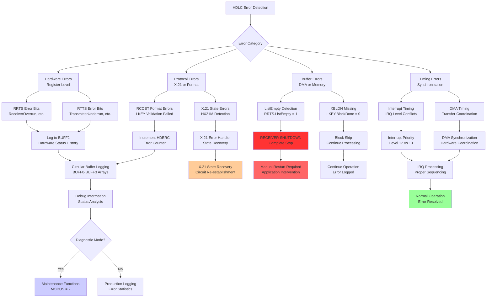

## Summary - Complete HDLC System Architecture

These comprehensive MERMAID diagrams now document:

1. **HDLC Initialization Flow**: Complete HDSIN function with MODUS selection
2. **Half-Duplex Operation**: RTS/CTS flow control and ReadyForSending monitoring
3. **X.21 Circuit-Switched**: Complete state machine from call setup to data transfer
4. **Multi-Mode State Machine**: All operating modes and transitions
5. **Register Interaction Sequence**: Complete hardware communication timeline
6. **Buffer Management**: Flow control, exhaustion handling, and recovery
7. **Error Recovery**: Comprehensive error handling and diagnostic capabilities

The key insights preserved:
- **Application-controlled mode selection** via MODUS parameter
- **Hardware auto-clear behavior** for DMA status bits
- **Dual control systems**: RRTS (hardware status) vs LKEY (software control)
- **X.21 integration** with standard HDLC operations
- **Half-duplex flow control** for high-speed scenarios
- **Multi-layered validation** from hardware through application delivery

All flows are based on **actual SINTRAN source code analysis** without speculation.