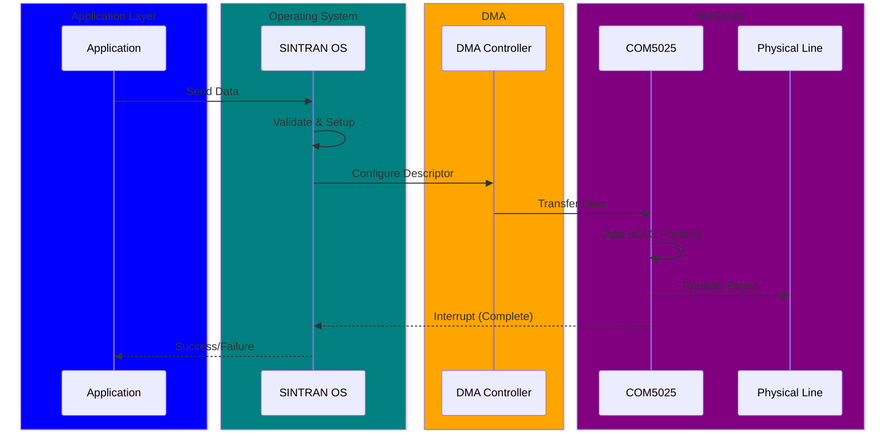
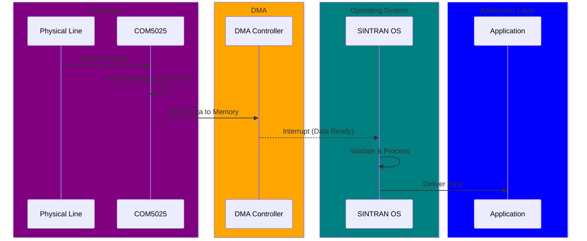

# Understanding HDLC Packets

**How HDLC packets work in SINTRAN**

---

## HDLC Frame Structure

Every HDLC frame follows this structure:

```text
┌──────┬─────────┬─────────┬──────────┬────────┬──────┐
│ FLAG │ ADDRESS │ CONTROL │   DATA   │  FCS   │ FLAG │
│ 0x7E │ 1 byte  │ 1 byte  │ N bytes  │2 bytes │ 0x7E │
└──────┴─────────┴─────────┴──────────┴────────┴──────┘
```

### Field Details

1. **Opening FLAG (0x7E)**: Marks the start of a frame
2. **ADDRESS**: Identifies the destination/source
3. **CONTROL**: Frame type and sequence numbers
4. **DATA**: User payload (variable length)
5. **FCS (Frame Check Sequence)**: CRC-16-CCITT for error detection
6. **Closing FLAG (0x7E)**: Marks the end of a frame

---

## Frame Types

### I-Frames (Information)
- **Purpose**: Carry user data
- **Control**: 0x00-0x7F (bit 0 = 0)
- **Contains**: Sequence numbers for reliable delivery

### S-Frames (Supervisory)
- **Purpose**: Flow control and acknowledgments
- **Control**: 0x01, 0x05, 0x09, 0x0D
- **Types**: RR (Receive Ready), RNR (Receive Not Ready), REJ (Reject)

### U-Frames (Unnumbered)
- **Purpose**: Control functions
- **Control**: Various (bit pattern 11xxxxxx)
- **Examples**: SABM (Set Async Balanced Mode), DISC (Disconnect), UA (Unnumbered Ack)

---

## Packet Lifecycle

### Transmission



### Reception



---

## See Also

**Previous**: [Getting Started](01-Getting-Started.md)  
**Next**: [Hardware Overview](03-Hardware-Overview.md)  
**Reference**: [Protocol Reference](../reference/Protocol-Reference.md)

