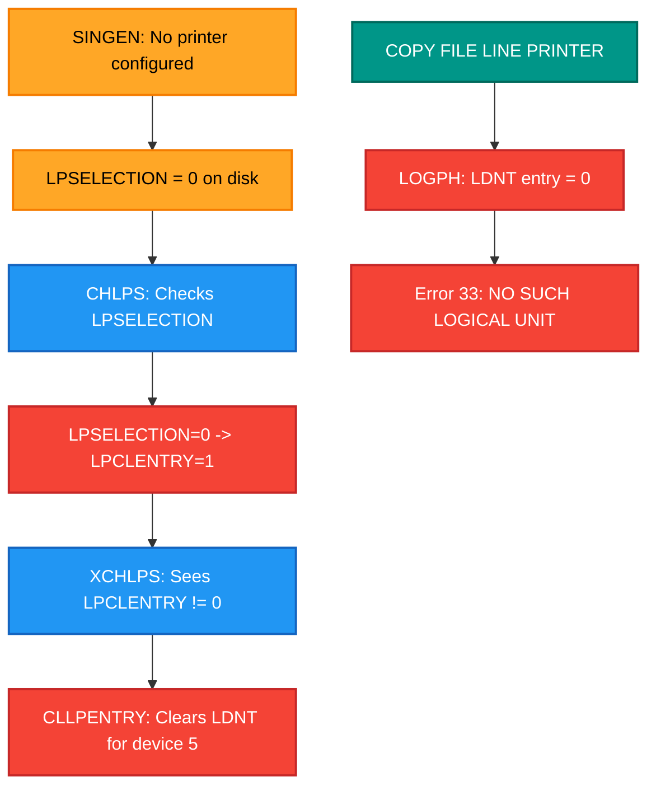
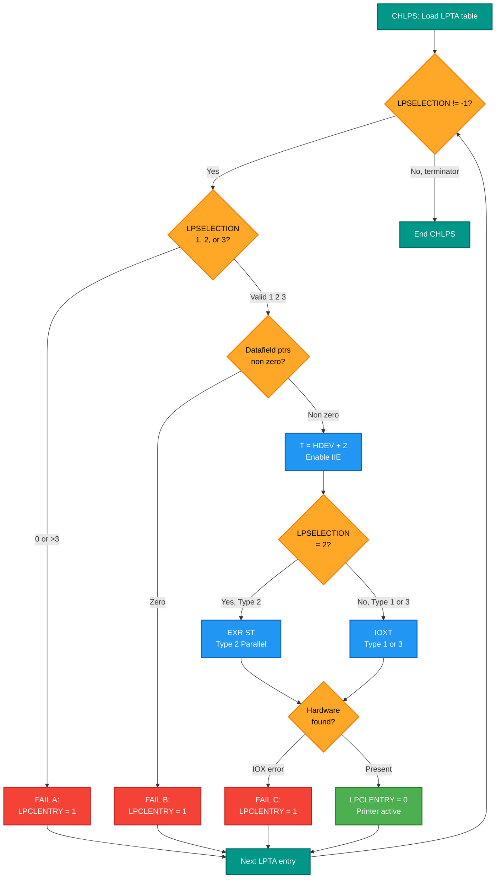
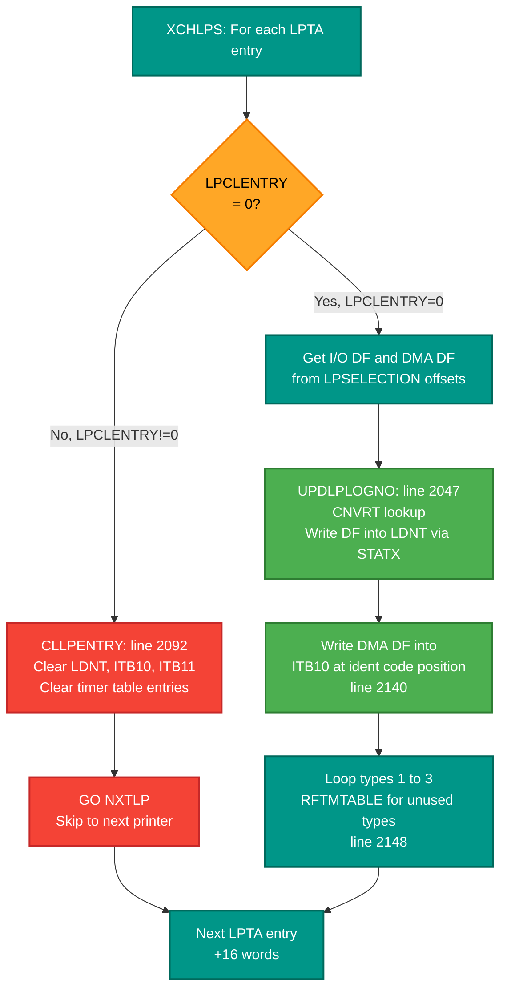
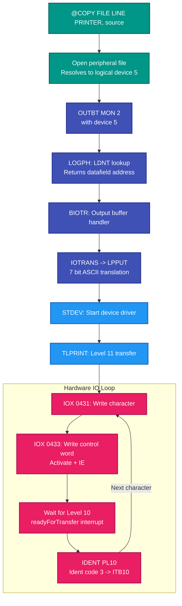
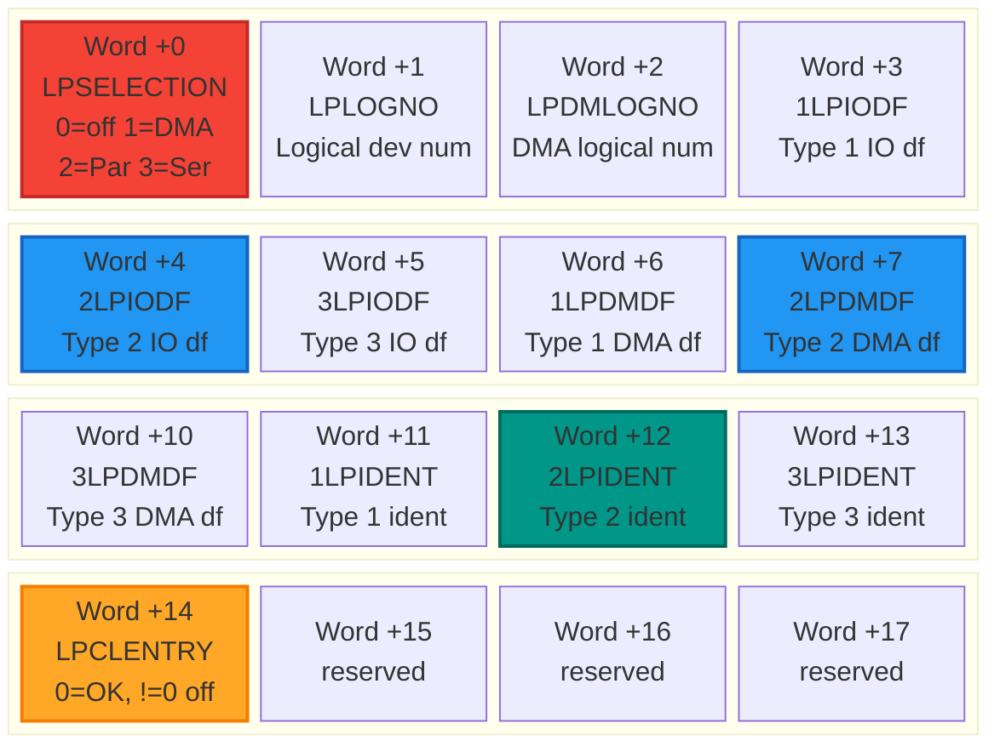
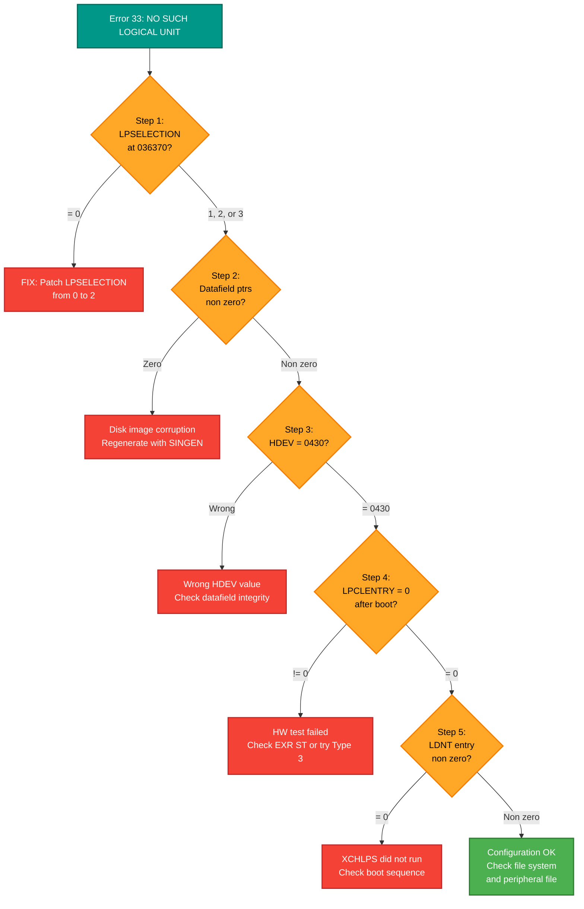
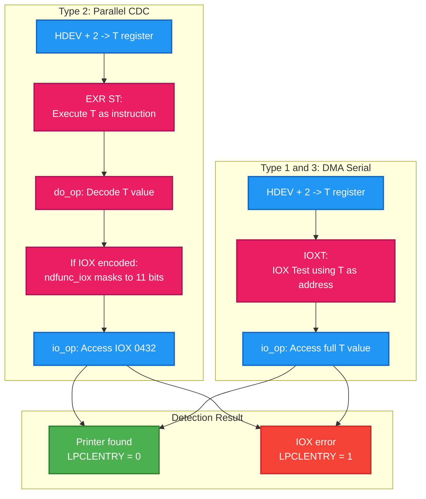
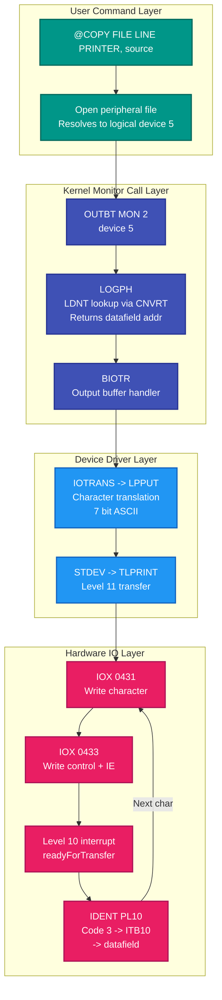

# SINTRAN III Line Printer Configuration Inspection Guide

## Overview

This document provides a complete diagnostic guide for SINTRAN III line printer configuration issues, specifically the "NO SUCH LOGICAL UNIT" (error 33) failure when using `@COPY-FILE LINE-PRINTER, source-file`. It covers the root cause analysis, boot pipeline, symbol cross-references for multiple SINTRAN versions, and step-by-step fix instructions.

**Applies to:** SINTRAN III versions K03, L07, M06
**Target audience:** ND-100 emulator developers and SINTRAN system administrators
**Created:** 2026-03-05

---

## Table of Contents

1. [Root Cause Analysis](#root-cause-analysis)
2. [Boot Pipeline: From LPSELECTION to Print Output](#boot-pipeline-from-lpselection-to-print-output)
3. [Printer Types in SINTRAN](#printer-types-in-sintran)
4. [Symbol Cross-Reference Table](#symbol-cross-reference-table)
5. [LPTA Entry Structure](#lpta-entry-structure)
6. [Memory Inspection Checklist](#memory-inspection-checklist)
7. [Fix: Patching LPSELECTION](#fix-patching-lpselection)
8. [Verification After Patching](#verification-after-patching)
9. [Fallback: Debugging Hardware Detection](#fallback-debugging-hardware-detection)
10. [EXR ST vs IOXT Analysis](#exr-st-vs-ioxt-analysis)
11. [Data Flow: Working Print Path](#data-flow-working-print-path)
12. [Key Source Files](#key-source-files)

---

## Root Cause Analysis

### Symptom

`@COPY-FILE LINE-PRINTER, source-file` returns error 33: "NO SUCH LOGICAL UNIT"

### Error Mechanism

The error originates in `RP-P2-MONCALLS.NPL`:

```npl
112256: A:=D; CALL LOGPH                % GET ADDR OF DATAFIELDS
...
107240: IF A=0 GO ERR                   % NO SUCH LOGICAL UNIT
```

**Note:** The body of `LOGPH` is not in any of the 45 available NPL source files. However, a boot-time simulation (`CLOGPH`/`XLOGPH`) in `PH-P2-OPPSTART.NPL:182` reveals the exact algorithm:

```npl
ILOGPH: AD SHZ -6;                              % Extract group from LDN (shift right 6)
        IF A=1 OR A=RDLNO OR A>LGDGMAX THEN
           CALL ERRFATAL
        FI
        A=:X:=D SHZ -12
        A+A+CCNVRT(X)+1=:D; *1BANK              % CCNVRT[group] = table base, slot = index*2+base+1
        IF A-ENTAB(X)>=0 THEN CALL ERRFATAL FI   % Bounds check
        *2BANK
        X:=D; *POF; LDD ,X; PON                  % Read double word: A=input DF, D=output DF
        IF K THEN
           IF A><0 THEN X:=A ELSE X:=D FI        % Return non-zero DF
        ...
        IF X=0 THEN CALL ERRFATAL FI              % Error if both are 0
```

For logical device 5 (LPLOGNO=5): group=0 (5 >> 6 = 0), index=5. LOGPH looks up `CNVRT[0]` to find the device group table base, then reads the double word at slot 5. If both words are 0 (LDNT not populated), LOGPH returns 0, and RP-P2-MONCALLS triggers error 33.

### Root Cause

**LPSELECTION = 0** at the LPTA table base address (036370&#x2088; for L07).

The LPTA table is **static compiled data** in `PH-P2-CONFG-TAB.NPL`. The first word of each entry (LPSELECTION) is controlled by the SINGEN macro `"8LP1`:

```npl
DATA( 0,    5, 1167, IDMP1, DILP1,  DLPR, DMPR1, DMLP1,  DLPR, 140230,  3,  3, 0,0,0,0) % LINE PRINTER 1.
```

The `0` at position 0 is LPSELECTION. Note that all datafield pointers (IDMP1, DILP1, DLPR, DMPR1, DMLP1) and ident codes (140230, 3, 3) **are already filled in** regardless of LPSELECTION. Only LPSELECTION itself is 0 because SINGEN did not configure a printer type.

When LPSELECTION=0, the boot code CHLPS (line 457: `IF A=0 OR A>>3 THEN`) immediately sets `LPCLENTRY=1` and skips the printer. Then XCHLPS (line 2124: `IF X.LPCLENTRY><0 THEN`) sees LPCLENTRY != 0 and calls CLLPENTRY which clears the LDNT entry for device 5. Result: LOGPH(5) returns 0.



### Why There Is No Auto-Discovery

The CHLPS code (L07 source, `PH-P2-OPPSTART.NPL:455-478`) shows a strict gate at line 457:

```npl
IF A=0 OR A>>3 THEN
   1=:X.LPCLENTRY; GO NXLPENTRY    % ILLEGAL SELECTION (OR DON'T USE THIS L-P)
FI
```

CHLPS only proceeds to hardware testing when LPSELECTION is 1, 2, or 3. The hardware test (EXR ST or IOXT) only **verifies** that a device responds at the expected IOX address -- it does not scan for unknown devices or determine what type of printer is attached. The printer type must be set in the LPTA table by SINGEN at system generation time. If LPSELECTION=0, no hardware test is attempted and no LDNT entry is created.

---

## Boot Pipeline: From LPSELECTION to Print Output

### Phase 1: CHLPS - Hardware Detection

**Source:** `PH-P2-OPPSTART.NPL:454-478` (exact L07 source code)

```npl
043427   INTEGER CSVXY
043430   CHLPS: "0LPTA"=:CSVXY; *1BANK
043433          DO WHILE CSVXY.LPSELECTION><-1                      % -1: END OF TABLE
043440             IF A=0 OR A>>3 THEN
043444                1=:X.LPCLENTRY; GO NXLPENTRY                  % ILLEGAL SELECTION (OR DON'T USE THIS L-P)
043447             FI; A-1+"LPIODF"; X+A
043452             IF X.LPIODF=0 OR X.XLPDMDF=0 THEN                % DATAFIELD(S) NOT GENERATED
043456                1=:CSVXY.LPCLENTRY; GO NXLPENTRY
043462             FI; *2BANK
043463             T:=A.HDEV+2; A:=200; *TRR IIE; TRA IIC; 1BANK
043472             IF CSVXY.LPSELECTION-2=0 THEN
043476                *EXR ST
043477             ELSE
043500                *IOXT
043501             FI; *TRA IIC
043502             IF A><0 THEN 1=:X.LPCLENTRY FI                   % INTERFACE NOT PRESENT
043505   NXLPENTRY:
043505             IF CSVXY.LPSELECTION><3 OR X.LPCLENTRY><0 THEN
043514                X.LPLOGNO=:D; X:="IOBUTAB"
043517                DO WHILE X<<"EIOBUTAB"
043522                   IF X.S0/\7777=D THEN 0=:X.S0 FI            % REMOVE FROM IOBUTAB
043527                   X+2
043530                OD
043531             FI; CSVXY+LPTBSIZE=:CSVXY
043534          OD; *2BANK
```

**Line-by-line analysis:**

| Line | Code | Effect |
|------|------|--------|
| 455 | `"0LPTA"=:CSVXY` | Load pointer to LPTA table (036370&#x2088; in L07) |
| 456 | `DO WHILE CSVXY.LPSELECTION><-1` | Loop until terminator word (-1 = 177777&#x2088;) |
| 457 | `IF A=0 OR A>>3 THEN` | **Gate:** LPSELECTION must be 1, 2, or 3 |
| 458 | `1=:X.LPCLENTRY; GO NXLPENTRY` | Fail A: mark disabled, skip |
| 459 | `A-1+"LPIODF"; X+A` | Compute I/O datafield pointer for this type (1->offset+3, 2->offset+4, 3->offset+5) |
| 460 | `IF X.LPIODF=0 OR X.XLPDMDF=0` | Check both I/O and DMA datafield addresses exist |
| 461 | `1=:CSVXY.LPCLENTRY; GO NXLPENTRY` | Fail B: datafield not generated |
| 463 | `T:=A.HDEV+2` | T = hardware device address + 2 (status register) |
| 463 | `A:=200; *TRR IIE; TRA IIC` | Enable IOX error trap: if IOX fails, A becomes non-zero |
| 464-468 | `IF CSVXY.LPSELECTION-2=0 THEN *EXR ST ELSE *IOXT` | Type 2: execute T as instruction; Type 1/3: IOX test via T |
| 469 | `IF A><0 THEN 1=:X.LPCLENTRY FI` | Fail C: IOX error means hardware not present |
| 471 | `IF CSVXY.LPSELECTION><3 OR X.LPCLENTRY><0` | Clean up IOBUTAB for disabled printers or non-serial types |
| 477 | `CSVXY+LPTBSIZE=:CSVXY` | Advance to next LPTA entry (16 words) |

**CHLPS Decision Flow:**



**Fail Points Summary:**

| Fail Point | Condition | Result |
|------------|-----------|--------|
| A | LPSELECTION=0 or >3 | LPCLENTRY=1, printer skipped |
| B | Datafield address is 0 | LPCLENTRY=1, printer skipped |
| C | Hardware test fails (IOX error) | LPCLENTRY=1, printer skipped |

### Phase 2: XCHLPS - LDNT Population

**Source:** `PH-P2-OPPSTART.NPL:2120-2156` (exact L07 source code)

```npl
053515   INTEGER CSXXY,CLPSELECTION
053517   XCHLPS:
053517          "0LPTA"=:CSXXY; *1BANK
053522          DO WHILE CSXXY.LPSELECTION><-1
053527             IF X.LPCLENTRY><0 THEN
053531                CALL CLLPENTRY; GO NXTLP              % CLEAR ALL TABLE-ENTRIES FOR THIS L-P
053533             FI
053533             IF CSXXY.LPSELECTION=3 THEN
053540                A:=0                                  % NO DMA-DF
053541             ELSE
053542                A-1+"LPDMDF"; X+A; X.S0               % DMA-DF
053546             FI
053546             A=:D:=CSXXY.LPSELECTION
053551             A-1+"LPIODF"; X+A; X.S0
053555             X:=CSXXY
053556             CALL FAR UPDLPLOGNO                      % UPDATE LOG.DEV.NO TABLE
053557             IF CSXXY.LPSELECTION=1 THEN              % "DMPR-TYPE" PRINTER
053564                X.2LPIDENT; *2BANK
053566                CALL FAR 10IDCLEAR                    % CLEAR ENTRY IN LEVEL 10 IDENT-CODE-TABLE
053567             ELSE
053570                T:=X.2LPIDENT; A-1+"LPDMDF"; X+A; X.S0=:D
053576                "ITB10"-"PITEX"=:X; *2BANK
053602                A:=MPIFPHPAGE SH 12; X+A+T-1          % X=ADDR IN IDENT-CODE-TABLE (ITB10)
053607                T:=MPIBANK; A:=D; *STATX; 1BANK       % UPDATE IDENT-CODE TABLE
053613                CSXXY.1LPDMDF; *2BANK
053616                CALL FAR 11EIDCLEAR                   % CLEAR "DMPR-TYPE" FROM EXTENDED-IDENT-CODE-TABLE
053617             FI; *1BANK
053620             1=:CLPSELECTION
053622             DO WHILE CLPSELECTION<<=3
053626                IF CLPSELECTION><CSXXY.LPSELECTION THEN
053633                   A-1+"LPDMDF"; X+A; X.S0; *2BANK    % A=DMA-DF
053640                   CALL FAR RFTMTABLE; *1BANK         % REMOVE FROM TIMER TABLE
053642                FI; MIN CLPSELECTION
053643             OD
053644   NXTLP:    CSXXY+LPTBSIZE=:CSXXY
053647          OD; *2BANK
```

**Line-by-line analysis:**

| Line | Code | Effect |
|------|------|--------|
| 2123-2125 | `IF X.LPCLENTRY><0 THEN CALL CLLPENTRY` | If CHLPS disabled this printer, clear ALL table entries (LDNT, ITB10, ITB11, timer) |
| 2127-2131 | `IF CSXXY.LPSELECTION=3 THEN A:=0 ELSE ... X.S0` | Get DMA datafield (Type 3 has none, so A:=0) |
| 2132-2135 | `A=:D:=... CALL FAR UPDLPLOGNO` | Get I/O datafield, call UPDLPLOGNO to write into LDNT |
| 2136-2146 | `IF CSXXY.LPSELECTION=1 THEN...ELSE...` | Type 1: clear ITB10 entry; Type 2/3: write DMA-DF into ITB10 at ident code position |
| 2147-2153 | `DO WHILE CLPSELECTION<<=3` | Loop types 1-3, remove timer table entries for unused types |



**How UPDLPLOGNO writes the LDNT** (`PH-P2-OPPSTART.NPL:2047-2062`):

```npl
UPDLPLOGNO:
       AD=:CSVAD; X=:CXXX1                    % Save A=I/O-DF, D=DMA-DF
       IF X.LPLOGNO><0 THEN                    % LPLOGNO=5 for LP1
          A=:D SHZ -6; *2BANK                  % Extract group (5>>6 = 0)
          X:=CNVRT(A); A:=D/\77 SH 1+1; X+A   % CNVRT[0] + index*2 + 1 = slot address
          T:=LOGDBANK; A:=CSVAA; *STATX 10; STZTX  % Write: LOG.NO-OUT=I/O-DF, LOG.NO-IN=0
          *1BANK
       FI
       IF CXXX1.LPDMLOGNO><0 THEN              % LPDMLOGNO=1167 for LP1
          ...                                   % Similarly write DMA-DF into LDNT
       FI; EXIT
```

This writes the I/O datafield address (e.g., DILP1=107102&#x2088; for Type 2) into the LDNT slot for logical device 5. After this, LOGPH(5) will find the datafield and return it instead of 0.

### Phase 3: COPY-FILE Data Flow (when working)



---

## Printer Types in SINTRAN

| LPSELECTION | Config Name | NPL Driver | Boot HW Test | Ident (LP1) | Ident (LP2) |
|-------------|-------------|------------|--------------|-------------|-------------|
| 0 | Not configured | -- | Skipped | -- | -- |
| 1 | DMA (Fujitsu) | DMPR | `*IOXT` | 140230&#x2088; | 140231&#x2088; |
| 2 | Parallel (CDC/DP) | DMLP | `*EXR ST` | 3&#x2088; | 23&#x2088; |
| 3 | Serial | DLPR | `*IOXT` | 3&#x2088; | 23&#x2088; |

**Other print-capable devices in SINTRAN:**
- Terminal-based matrix printers (ND device 414-417, name "PRINTER")
- Versatec printers/plotters (ND device 603-606, name "LINE-PRINTER-1")
- Any device reachable via spooling (`@APPEND-SPOOLING`)

**Emulator CDC 9380 implementation:** Parallel = Type 2 (DMLP), ident code 3&#x2088;

---

## Symbol Cross-Reference Table

### Core Addresses (version-dependent)

| Symbol | K03 | L07 | M06 | Description |
|--------|-----|-----|-----|-------------|
| **0LPTA** | 033172&#x2088; | 036370&#x2088; | 036241&#x2088; | Line printer config table |
| **0SPTA** | 033233&#x2088; | 036431&#x2088; | 036302&#x2088; | Spooling device table |
| **CNVRT** | 004327&#x2088; | 004327&#x2088; | 004327&#x2088; | LDNT group conversion table |
| **LOGDB** | 006545&#x2088; | 006620&#x2088; | 006604&#x2088; | Logical device bank |
| **ITB10** | 126156&#x2088; | 153414&#x2088; | 155732&#x2088; | Ident table level 10 |
| **ITB11** | 126325&#x2088; | 077637&#x2088; | 077425&#x2088; | Ident table level 11 |
| **ITB12** | 126347&#x2088; | 153563&#x2088; | 156101&#x2088; | Ident table level 12 |

### Printer Datafield Addresses (version-dependent)

| Symbol | K03 | L07 | M06 | Description |
|--------|-----|-----|-----|-------------|
| **DMLP1** | 052321&#x2088; | 107006&#x2088; | 106012&#x2088; | LP1 Type 2 (Parallel) datafield |
| **DILP1** | 052415&#x2088; | 107102&#x2088; | 106106&#x2088; | LP1 Type 2 input datafield |
| **DMPR1** | 052532&#x2088; | 107217&#x2088; | 106223&#x2088; | LP1 Type 1 (DMA) datafield |
| **IDMP1** | 052563&#x2088; | 107250&#x2088; | 106255&#x2088; | LP1 Type 1 main datafield |
| **DLPR** | 053203&#x2088; | 107670&#x2088; | 106676&#x2088; | LP1 Type 3 (Serial) datafield |
| **DMLP2** | 052667&#x2088; | 107354&#x2088; | 106361&#x2088; | LP2 Type 2 datafield |
| **DMPR2** | 053100&#x2088; | 107565&#x2088; | 106572&#x2088; | LP2 Type 1 datafield |
| **IDMP2** | 053131&#x2088; | 107616&#x2088; | 106624&#x2088; | LP2 Type 1 main datafield |
| **DLPR2** | 053236&#x2088; | 107723&#x2088; | 106731&#x2088; | LP2 Type 3 datafield |

### Fixed Offsets (same across all versions)

| Symbol | Value | Description |
|--------|-------|-------------|
| **LPTBS** | 000020&#x2088; (16 words) | LPTA entry size |
| **0NLPS** | 000002&#x2088; | Number of line printers |
| **HDEV** | 177775&#x2088; (-3) | HW device address offset in datafield |
| **XHDEV** | 177774&#x2088; (-4) | Extended HW device offset |
| **STDEV** | 000010&#x2088; | Start device routine offset |
| **LPSEL** | 000000&#x2088; | LPSELECTION offset in LPTA entry |

---

## LPTA Entry Structure

Each LPTA entry is 16 words (020&#x2088;). The table starts at `0LPTA` and contains `0NLPS` (2) entries, terminated by -1 (177777&#x2088;).



**Legend:** LPSELECTION (red) is the root cause field. Datafield pointers (blue) must be non-zero for the selected type. Ident code (teal) maps to ITB10 interrupt dispatch. LPCLENTRY (amber) indicates boot detection result.

| Offset | Symbol | Description |
|--------|--------|-------------|
| +0 | LPSELECTION | Printer type: 0=off, 1=DMA, 2=Parallel, 3=Serial |
| +1 | LPLOGNO | Main logical device number |
| +2 | LPDMLOGNO | DMA datafield logical number |
| +3 | 1LPIODF | Type 1 (DMPR) I/O datafield address |
| +4 | 2LPIODF | Type 2 (DMLP) I/O datafield address |
| +5 | 3LPIODF | Type 3 (DLPR) I/O datafield address |
| +6 | 1LPDMDF | Type 1 DMA datafield address |
| +7 | 2LPDMDF | Type 2 DMA datafield address |
| +10&#x2088; | 3LPDMDF | Type 3 DMA datafield address |
| +11&#x2088; | 1LPIDENT | Type 1 ident code |
| +12&#x2088; | 2LPIDENT | Type 2 ident code |
| +13&#x2088; | 3LPIDENT | Type 3 ident code |
| +14&#x2088; | LPCLENTRY | Clear flag: 0=OK, non-zero=disabled by boot |
| +15&#x2088;-17&#x2088; | (reserved) | Padding to 16-word boundary |

**Source:** `PH-P2-CONFG-TAB.NPL` -- actual DATA statement:

```npl
INTEGER ARRAY 0LPTA(0)
*"8LP1+8DLP1+8NLP1+8DVE1
"DATA( 0,    5, 1167, IDMP1, DILP1,  DLPR, DMPR1, DMLP1,  DLPR, 140230,  3,  3, 0,0,0,0) % LINE PRINTER 1.
*"8LP2+8DLP2+8NLP2+8DVE2
"DATA( 0,   15, 1175, IDMP2, DILP2, DLPR2, DMPR2, DMLP2, DLPR2, 140231, 23, 23, 0,0,0,0) % LINE PRINTER 2.
DATA( -1)                              % END OF TABLE TERMINATOR
```

The `"8LP1` SINGEN macro controls the LPSELECTION value (word 0). All other fields (datafield addresses, ident codes) are filled in at compile time regardless of LPSELECTION.

---

## Memory Inspection Checklist

Use these addresses for SINTRAN L07. For other versions, substitute from the [Symbol Cross-Reference Table](#symbol-cross-reference-table).

### Diagnostic Decision Tree



### Step 1: Check LPSELECTION

**Address:** 036370&#x2088; (word 0 of LPTA LP1 entry)

```
Dump 16 words at 036370:
  Word +0:  LPSELECTION  -- must be 1, 2, or 3 (NOT 0)
  Word +1:  LPLOGNO      -- should be 5 (logical device number)
  Word +14: LPCLENTRY    -- should be 0 after successful boot
```

**If LPSELECTION = 0:** This is the root cause. The printer was not configured in SINGEN. Proceed to [Fix: Patching LPSELECTION](#fix-patching-lpselection).

### Step 2: Check Datafield Pointers

Based on the LPSELECTION value, verify the datafield addresses are populated:

| LPSELECTION | I/O Datafield (offset) | Expected Value (L07) | DMA Datafield (offset) | Expected Value (L07) |
|-------------|----------------------|---------------------|----------------------|---------------------|
| 1 | +3 (1LPIODF) | IDMP1 = 107250&#x2088; | +6 (1LPDMDF) | DMPR1 = 107217&#x2088; |
| 2 | +4 (2LPIODF) | DILP1 = 107102&#x2088; | +7 (2LPDMDF) | DMLP1 = 107006&#x2088; |
| 3 | +5 (3LPIODF) | DLPR = 107670&#x2088; | +10 (3LPDMDF) | (may be 0) |

**If either datafield address is 0:** Boot code sets LPCLENTRY=1 at Fail Point B.

### Step 3: Check HDEV in the Datafield

Read HDEV at offset -3 from the selected I/O datafield reference:

| LPSELECTION | Datafield | HDEV address (L07) | Expected HDEV value |
|-------------|-----------|-------------------|-------------------|
| 1 | IDMP1 = 107250&#x2088; | 107250 - 3 = 107245&#x2088; | 0430&#x2088; |
| 2 | DILP1 = 107102&#x2088; | 107102 - 3 = 107077&#x2088; | 0430&#x2088; |
| 3 | DLPR = 107670&#x2088; | 107670 - 3 = 107665&#x2088; | 0430&#x2088; |

**HDEV should be 0430&#x2088;** (LP1 IOX base address). The boot code computes the test address as HDEV+2 = 0432&#x2088; (status register).

### Step 4: Check LPCLENTRY After Boot

**Address:** 036370&#x2088; + 014&#x2088; = 036404&#x2088;

```
Read word at 036404:
  If 0:     Boot hardware test passed, printer active
  If non-0: Boot disabled the printer (hardware test failed)
```

### Step 5: Check LDNT Entry for Device 5

```
1. Read CNVRT at 004327 -- get first word (CNVRT[0])
2. CNVRT[0] is a page number in LOGDBANK
3. Entry for device 5: offset = 5 * 2 + 1 = 013
4. If entry is 0 -> LDNT not populated -> confirms root cause
```

### Step 6: Check Ident Code

**Address (L07):** Word +12&#x2088; in LPTA = 036370&#x2088; + 012&#x2088; = 036402&#x2088;

For Type 2 (Parallel), ident code should be 3&#x2088;. This value is used to set up the ITB10 interrupt dispatch table entry during XCHLPS.

---

## Fix: Patching LPSELECTION

### What to Patch

| Version | Address | Current Value | New Value | Meaning |
|---------|---------|---------------|-----------|---------|
| K03 | 033172&#x2088; | 000000 | 000002 | Enable Parallel/CDC printer |
| L07 | 036370&#x2088; | 000000 | 000002 | Enable Parallel/CDC printer |
| M06 | 036241&#x2088; | 000000 | 000002 | Enable Parallel/CDC printer |

Value `2` = Parallel/CDC printer type (DMLP), which matches the emulator's CDC 9380 implementation.

### Method: Patch the Disk Image

The LPTA table resides in the SINTRAN system area on disk. Patch word 0 of the table from 000000 to 000002 in the disk image file before booting.

### Method: Patch Memory After Load

Alternatively, patch the word in memory after the SINTRAN image is loaded but before boot code runs CHLPS. This avoids modifying the disk image.

### What Happens After Patching

With LPSELECTION=2, the CHLPS boot code will:

1. See LPSELECTION=2 (valid, passes Fail Point A check)
2. Load Type 2 datafield addresses from +4 (2LPIODF) and +7 (2LPDMDF)
3. Verify datafields are non-zero (passes Fail Point B check)
4. Read HDEV from the datafield, compute T = HDEV+2 = 0432&#x2088;
5. Use `*EXR ST` (Type 2 path) to test printer presence
6. If no IOX error: LPCLENTRY stays 0 (passes Fail Point C)
7. XCHLPS sees LPCLENTRY=0, calls UPDLPLOGNO to populate LDNT entry for device 5
8. `@COPY-FILE LINE-PRINTER, file` finds device 5 in LDNT and proceeds


---

## Verification After Patching

After rebooting with LPSELECTION=2:

### Check 1: LPCLENTRY

Read word at 036404&#x2088; (L07). Must be 0 (hardware test passed).

### Check 2: LDNT Entry

Follow the LDNT lookup from [Step 5](#step-5-check-ldnt-entry-for-device-5). The entry for device 5 should now contain a non-zero datafield address.

### Check 3: Functional Test

```
@COPY-FILE LINE-PRINTER, test-file
```

Should produce output on the emulated printer without error 33.

---

## Fallback: Debugging Hardware Detection

If LPCLENTRY becomes 1 after reboot (hardware test failed), the EXR ST instruction did not successfully reach the printer.

### Add Emulator Logging

**In `devicemanager.c`** -- log printer IOX accesses:

```c
if (address >= 0430 && address <= 0433) {
    printf("LP IOX %s addr=%06o val=%06o\n",
           is_write ? "WR" : "RD", address, value);
}
```

**In `cpu_instr.c` around DoEXR** -- log EXR executions:

```c
printf("EXR: T=%06o executing=%06o\n", gT, exr_instr);
```

### Try LPSELECTION=3 (Serial) Instead

If Type 2 (Parallel/CDC) fails because `*EXR ST` does not properly trigger an IOX, try LPSELECTION=3 (Serial). Type 3 uses `*IOXT` for hardware testing, which directly issues an IOX to the T register address. The ident codes are the same (3&#x2088;), so the rest of the pipeline should work identically.

Patch the same address with value 000003 instead of 000002.

---

## EXR ST vs IOXT Analysis

The boot hardware test uses different instructions depending on printer type:

- **Type 2 (Parallel/CDC):** `*EXR ST` -- execute instruction from T register
- **Type 1/3 (DMA/Serial):** `*IOXT` -- IOX Test using T register as address

### How EXR Works

```c
void DoEXR(ushort instr) {
    sr = (instr >> 3) & 0x07;            // sr=6 for T register
    exr_instr = gReg->reg[CurrLEVEL][sr]; // Read T register value
    do_op(exr_instr, true);               // Execute as instruction
}
```

The value in T is executed as a machine instruction. If T contains an IOX-like value, it may or may not trigger an actual IOX depending on encoding.

### Instruction Path Comparison



### What HDEV Contains

**Scenario A: HDEV = plain IOX address (e.g., 0430&#x2088;)**
- T = 0430 + 2 = 0432&#x2088;
- IOXT path: `io_op(0432)` -> printer found
- EXR ST path: executes 0432&#x2088; as MRI -> no IOX error -> device "present" (but doesn't actually test HW)

**Scenario B: HDEV = IOX instruction encoding (e.g., 0164430&#x2088;)**
- T = 0164430 + 2 = 0164432&#x2088;
- EXR ST path: `do_op(0164432)` -> `ndfunc_iox()` -> masks to 11 bits -> `io_op(0432)` -> printer found
- IOXT path: `io_op(0164432)` = `io_op(59674)` -> NO device -> IOX ERROR

**Most likely: HDEV contains a plain IOX address.** Both paths should pass boot detection.

---

## Data Flow: Working Print Path

When the printer is properly configured and LDNT is populated:



**Layer Legend:**
- **Teal** = User command layer
- **Indigo** = Kernel monitor call layer (LOGPH, BIOTR)
- **Blue** = Device driver layer (LPPUT, TLPRINT)
- **Magenta** = Hardware I/O layer (IOX registers, interrupts)

---

## Key Source Files

| File | Content | Status |
|------|---------|--------|
| `PH-P2-CONFG-TAB.NPL` | LPTA table DATA statement, SINGEN macros | Verified |
| `PH-P2-OPPSTART.NPL:454-478` | CHLPS boot detection (exact source above) | Verified |
| `PH-P2-OPPSTART.NPL:182-209` | CLOGPH/XLOGPH - LOGPH simulation revealing algorithm | Verified |
| `PH-P2-OPPSTART.NPL:2039-2062` | UPDLPLOGNO - writes DF into LDNT | Verified |
| `PH-P2-OPPSTART.NPL:2082-2116` | CLLPENTRY - clears LDNT, ITB10, ITB11, timer | Verified |
| `PH-P2-OPPSTART.NPL:2118-2156` | XCHLPS - LDNT population (exact source above) | Verified |
| `PH-P2-START-BASE.NPL:207-210` | CCNVRT array (compile-time CNVRT copy) | Verified |
| `CC-P2-COMMON.NPL:50-105` | CFLOGDV/9GTLOGDV - reverse LOGPH using CNVRT | Verified |
| `RP-P2-MONCALLS.NPL:112256` | `A:=D; CALL LOGPH` - device 5 lookup | Verified |
| `RP-P2-MONCALLS.NPL:107240` | `IF A=0 GO ERR` - error 33 trigger | Verified |
| `RP-P2-MONCALLS.NPL:3433` | BIOTR output handler | Call site verified |
| `MP-P2-2.NPL:070540` | LPPUT character translation | Call site verified |
| `IP-P2-1.NPL:044060` | TLPRINT driver | Call site verified |
| LOGPH (body) | Actual LOGPH procedure | **Not in available source** |

**Note:** The body of LOGPH is not in any of the 45 available NPL source files. It is called via `CALL LOGPH` from 14+ files. The algorithm is known from the boot-time simulation `CLOGPH`/`XLOGPH` at `PH-P2-OPPSTART.NPL:182`.

**NPL source location:** [../NPL-SOURCE/NPL/](../NPL-SOURCE/NPL/)
**Symbol tables:** [../NPL-SOURCE/SYMBOLS/](../NPL-SOURCE/SYMBOLS/)

---

## Related Documentation

- [DEVICE_DRIVER_SETUP_DOCUMENTATION.md](DEVICE_DRIVER_SETUP_DOCUMENTATION.md) -- LPTA decoded, datafield structure
- [../OS/18-DEVICE-DRIVER-FRAMEWORK.md](../OS/18-DEVICE-DRIVER-FRAMEWORK.md) -- Driver framework
- [../OS/13-INT14-HANDLER-DETAILED.md](../OS/13-INT14-HANDLER-DETAILED.md) -- Interrupt system
- [../../Operations/SINTRAN/ND-30.003.007 EN SINTRAN III System Supervisor.md](../../Operations/SINTRAN/ND-30.003.007%20EN%20SINTRAN%20III%20System%20Supervisor.md) -- Printer setup guide

---

**Parent:** [README.md](README.md) -- Device Documentation Index
**Sibling:** [../OS/README.md](../OS/README.md) -- Operating System Documentation

---

*Diagnostic guide based on analysis of SINTRAN III NPL source code and ND-100 emulator testing.*
