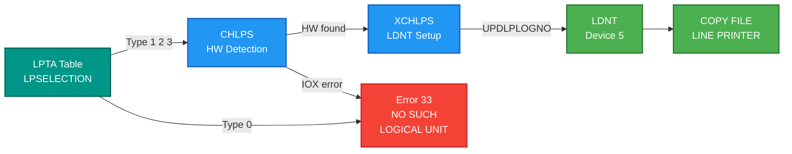

# SINTRAN Device Documentation - Hardware Drivers & Controllers

**Complete hardware device driver documentation with source code analysis and emulator implementation**

---

## 📖 Overview

This folder contains comprehensive documentation for hardware devices supported by SINTRAN III, including complete driver implementation analysis, protocol specifications, and C# emulator guides. All documentation is extracted from actual SINTRAN III NPL source code.

### What's Included

- **HDLC Communication Controller** - COM5025 chip, X.21 interface, LAPB/X.25 protocols
- **SCSI Disk Controllers** - NCR 5386 chip, 27 SCSI commands, disk/optical/tape drivers

### Source Code Available

Both device drivers have **complete NPL source code** available in [../NPL-SOURCE/](../NPL-SOURCE/):
- **MP-P2-HDLC-DRIV.NPL** - Complete HDLC driver implementation
- **IP-P2-SCSI-\*.NPL** - Complete SCSI drivers (disk, optical, tape, protocol)

---

## 🗂️ Device Categories

| Folder/File | Device Type | Files | Size | Status |
|-------------|-------------|-------|------|--------|
| **[HDLC/](HDLC/)** | Communication | 30+ | ~350KB | ✅ Consolidated |
| **[SCSI/](SCSI/)** | Storage | 10+ | ~125KB | ✅ Complete |
| **[LINE-PRINTER-CONFIG-INSPECTION.md](LINE-PRINTER-CONFIG-INSPECTION.md)** | Output (Printer) | 1 | ~15KB | ✅ Complete |
| **[Octobus/](Octobus/)** | Inter-processor bus | 2 | - | ✅ Reference |
| **Total** | - | **40+** | **~490KB** | - |

---

## 📡 HDLC Communication Controller

**Location:** [HDLC/](HDLC/)
**Hardware:** SMC COM5025 HDLC/SDLC controller chip
**Source Code:** [../NPL-SOURCE/NPL/MP-P2-HDLC-DRIV.NPL](../NPL-SOURCE/NPL/MP-P2-HDLC-DRIV.NPL)
**Status:** ✅ **Reorganized and Consolidated** (2025-10-17)

### Overview

Complete HDLC (High-Level Data Link Control) protocol implementation analysis. The hdlc-analysis directory was consolidated from 50+ scattered analysis files into 6 focused documents for better accessibility and maintainability.

### 📚 Core Documentation (Consolidated Structure)

| Document | Purpose | Content |
|----------|---------|---------|
| **[README.md](HDLC/README.md)** | Overview & Navigation | Quick start guide, document index, implementation checklist |
| **[01-HDLC-Hardware-Reference.md](HDLC/01-HDLC-Hardware-Reference.md)** | Hardware Specifications | COM5025 chip, X.21 interface, IOX bus, constants |
| **[02-HDLC-Register-Reference.md](HDLC/02-HDLC-Register-Reference.md)** | Register Map | Complete register map (HDEV+0 to +17), bit definitions |
| **[03-HDLC-DMA-Operations.md](HDLC/03-HDLC-DMA-Operations.md)** | DMA Implementation | DMA descriptors, LKEY field structure, buffer management |
| **[04-HDLC-Interrupt-Handlers.md](HDLC/04-HDLC-Interrupt-Handlers.md)** | Interrupt Processing | HIINT/HOINT handlers, state machines, timing |
| **[05-HDLC-Protocol-Implementation.md](HDLC/05-HDLC-Protocol-Implementation.md)** | Protocol Layer | LAPB, X.25, PAD connections, pseudocode |
| **[06-HDLC-Emulator-Guide.md](HDLC/06-HDLC-Emulator-Guide.md)** | **C# Implementation** | **Complete emulator implementation guide** ⭐ |

📖 **[See HDLC/README.md for complete index](HDLC/README.md)**

### 🎯 Key Features

- ✅ **COM5025 Hardware** - Complete chip specification and register map
- ✅ **DMA Operations** - Descriptor structure with LKEY field breakdown
- ✅ **X.21 Interface** - Serial communication protocol and error handling
- ✅ **Interrupt Handlers** - HIINT (receive) and HOINT (transmit) analysis
- ✅ **LAPB Protocol** - Link Access Procedure Balanced implementation
- ✅ **X.25 Support** - Packet switching protocol layer
- ✅ **C# Emulator** - Production-ready implementation guide
- ✅ **WCAG AA Compliant** - All diagrams follow accessibility standards

### 🔑 Critical Discoveries

| Finding | Impact | Document Reference |
|---------|--------|-------------------|
| **SILFO+TXUND Check** | Transmission success = `(RTTS & 0x8002) == 0` | 02-Register-Reference, 06-Emulator-Guide |
| **Auto-Clear Bits** | DMA request bit (4) clears before read | 02-Register-Reference |
| **X.21 Error Bits** | Bits 13-14 persistent, require WRTC clear | 01-Hardware-Reference, 02-Register-Reference |
| **LKEY Structure** | Bits 7-0 = COM5025 control, 8-10 = block status | 03-DMA-Operations |
| **FSERM Constant** | 0x1003 = single frame (TSOM+TEOM) | 01-Hardware-Reference, 03-DMA-Operations |

### 📊 Consolidation Summary

**Before:** 50+ scattered analysis files
**After:** 6 comprehensive, well-organized documents
**Method:** Content analysis, deduplication, logical grouping
**Preserved:** All original files in `HDLC/archive/to-delete/` subdirectory

### Hardware Interface

**COM5025 Controller Chip:**
- Full-duplex HDLC/SDLC communication
- Hardware CRC generation/checking
- Automatic flag insertion/deletion
- DMA support for data transfer

**X.21 Serial Interface:**
- Synchronous serial communication
- Control/Indication signal pairs
- Error detection (SILFO, TXUND, CTOD, INON)

**IOX Bus Interface:**
- Register-mapped I/O (HDEV+0 through HDEV+17)
- Level 12 interrupts (HIINT input, HOINT output)
- DMA channel allocation

### Protocol Stack

```
Application Layer
    ↓
SINTRAN TAD Protocol [../TAD/](../TAD/)
    ↓
X.25 Packet Layer (LAPB)
    ↓
HDLC Data Link Layer
    ↓
COM5025 Hardware Controller
    ↓
X.21 Physical Interface
```

**Related:** [../TAD/TAD-HDLC-Encapsulation.md](../TAD/TAD-HDLC-Encapsulation.md)

### Quick Start

**For Understanding HDLC:**
1. [HDLC/README.md](HDLC/README.md) - Start here for overview
2. [HDLC/01-HDLC-Hardware-Reference.md](HDLC/01-HDLC-Hardware-Reference.md) - Hardware basics
3. [HDLC/Quick-Reference-Card.md](HDLC/Quick-Reference-Card.md) - Quick lookup

**For Emulator Development:**
1. [HDLC/06-HDLC-Emulator-Guide.md](HDLC/06-HDLC-Emulator-Guide.md) - C# implementation
2. [HDLC/02-HDLC-Register-Reference.md](HDLC/02-HDLC-Register-Reference.md) - Register details
3. [HDLC/04-HDLC-Interrupt-Handlers.md](HDLC/04-HDLC-Interrupt-Handlers.md) - Interrupt handling

**For Protocol Analysis:**
1. [HDLC/05-HDLC-Protocol-Implementation.md](HDLC/05-HDLC-Protocol-Implementation.md) - Protocol layer
2. [HDLC/03-HDLC-DMA-Operations.md](HDLC/03-HDLC-DMA-Operations.md) - DMA details
3. [../TAD/](../TAD/) - Higher-level TAD protocol

---

## 💾 SCSI Disk Controllers

**Location:** [SCSI/](SCSI/)
**Hardware:** NCR 5386 SCSI protocol controller
**Source Code:** [../NPL-SOURCE/NPL/IP-P2-SCSI-\*.NPL](../NPL-SOURCE/NPL/)
**Status:** ✅ **Complete Analysis**

### Overview

Complete SCSI (Small Computer System Interface) subsystem documentation covering all device drivers, protocol implementation, and emulator guidance. Includes support for disk, optical, and magnetic tape devices.

### 📦 Coverage

- ✅ **3 SCSI device drivers** (Disk, Optical, Tape)
- ✅ **1 Protocol driver** (NCR 5386 low-level)
- ✅ **27 SCSI commands** with complete specifications
- ✅ **Custom command support** (Function 74)
- ✅ **Interrupt handling** (phase-by-phase control)
- ✅ **Error recovery** (CCRWO for optical, retry logic)
- ✅ **C# implementation guidance** with code examples

### 🔑 Key Documents

| Document | Purpose |
|----------|---------|
| **[SCSI-Master-Index.md](SCSI/SCSI-Master-Index.md)** | Central navigation hub for all SCSI documentation |
| **[SCSI-Commands-Analysis.md](SCSI/SCSI-Commands-Analysis.md)** | Complete reference for all 27 SCSI commands |
| **[SCSI-C#-Implementation-Guide.md](SCSI/SCSI-C%23-Implementation-Guide.md)** | C# emulator implementation with interrupt handling |
| **[SCSI-INQUIRY-Analysis.md](SCSI/SCSI-INQUIRY-Analysis.md)** | Device initialization and vendor handling |
| **[SCSI-Optical-Commands-Addendum.md](SCSI/SCSI-Optical-Commands-Addendum.md)** | Optical disk CCRWO recovery mechanism |
| **[IP-P2-SCSI-DISK.md](SCSI/IP-P2-SCSI-DISK.md)** | Disk driver analysis with elevator algorithm |
| **[IP-P2-SCSI-DRIV.md](SCSI/IP-P2-SCSI-DRIV.md)** | NCR 5386 protocol driver and SCINT interrupt handler |
| **[IP-P2-SCSI-OPDI.md](SCSI/IP-P2-SCSI-OPDI.md)** | Optical disk driver with CCRWO recovery |

📖 **[See SCSI/README.md for complete index](SCSI/README.md)**

### 🎯 Key Findings

| Finding | Impact |
|---------|--------|
| **No vendor restrictions** | Any SCSI device works - vendor/product fields ignored |
| **Function 74 support** | Applications can send ANY SCSI command via custom CDB |
| **Phase interrupts required** | Interrupt handling must pause between each SCSI phase |
| **CCRWO recovery** | Optical disks auto-recover from write failures |
| **Extended sense mandatory** | All errors require proper extended sense format |

### 🔧 Hardware

**NCR 5386 SCSI Protocol Controller:**
- SCSI-1 and SCSI-2 command support
- Phase-by-phase interrupt handling
- Automatic handshaking
- Target/Initiator modes

**IOX Registers:**
- **WCONT** - Control register (command execution)
- **RSTAU** - Status register (phase monitoring)
- Level 11 interrupts (SCINT handler)

**DMA Support:**
- Direct memory access for data transfers
- High-speed bulk data movement
- Scatter-gather capability

### 📋 Device Types Supported

#### Disk Drives (Type 0x00)

**Commands:**
- READ(6) / READ(10) - Block reading
- WRITE(6) / WRITE(10) - Block writing
- READ CAPACITY - Disk geometry
- SEEK, VERIFY, FORMAT - Disk management

**Features:**
- Elevator algorithm for optimization
- Bad block handling
- Error retry logic

**Source:** [../NPL-SOURCE/NPL/IP-P2-SCSI-DISK.NPL](../NPL-SOURCE/NPL/IP-P2-SCSI-DISK.NPL)

#### Optical Disks (Type 0x04/0x07)

**Types:**
- **Type 0x04** - WORM (Write-Once Read-Many)
- **Type 0x07** - Magneto-Optical (MO)

**Commands:**
- VERIFY(10) with BYTCHK - Data comparison
- BLANK CHECK - Unwritten block detection
- CCRWO - Automatic write recovery

**Features:**
- VERIFY with byte check after write
- Automatic recovery on write failure
- BLANK CHECK sense key handling

**Source:** [../NPL-SOURCE/NPL/IP-P2-SCSI-OPDI.NPL](../NPL-SOURCE/NPL/IP-P2-SCSI-OPDI.NPL)

#### Magnetic Tape (Type 0x01)

**Commands:**
- READ BLOCK LIMITS - Tape geometry
- REWIND, SPACE - Tape positioning
- WRITE FILEMARKS - EOF markers
- Function 25 - Error counter tracking

**Features:**
- EOF/EOM status flags
- Error counter tracking
- Sequential access optimization

**Source:** [../NPL-SOURCE/NPL/IP-P2-SCSI-MAGTP.NPL](../NPL-SOURCE/NPL/IP-P2-SCSI-MAGTP.NPL)

### SCSI Command Set (27 Commands)

**Mandatory Commands:**
- INQUIRY (12h) - Device identification
- TEST UNIT READY (00h) - Device ready check
- REQUEST SENSE (03h) - Extended error information

**Common Commands:**
- READ(6/10), WRITE(6/10) - Data transfer
- READ CAPACITY - Disk size
- MODE SELECT/SENSE - Device configuration
- START/STOP UNIT - Power management

**Advanced Commands:**
- VERIFY(10) - Data verification
- FORMAT UNIT - Low-level format
- REZERO UNIT - Head positioning
- Function 74 - Custom CDB passthrough

**Full List:** [SCSI/SCSI-Commands-Analysis.md](SCSI/SCSI-Commands-Analysis.md)

### Quick Start

**For Understanding SCSI:**
1. [SCSI/SCSI-Master-Index.md](SCSI/SCSI-Master-Index.md) - Start here
2. [SCSI/SCSI-Commands-Analysis.md](SCSI/SCSI-Commands-Analysis.md) - Command reference
3. [SCSI/SCSI-INQUIRY-Analysis.md](SCSI/SCSI-INQUIRY-Analysis.md) - Device init

**For Emulator Development:**
1. [SCSI/SCSI-C#-Implementation-Guide.md](SCSI/SCSI-C%23-Implementation-Guide.md) - C# implementation
2. [SCSI/IP-P2-SCSI-DRIV.md](SCSI/IP-P2-SCSI-DRIV.md) - Protocol driver details
3. [../Emulator/](../Emulator/) - General emulator guides

**For Device Driver Analysis:**
1. [SCSI/IP-P2-SCSI-DISK.md](SCSI/IP-P2-SCSI-DISK.md) - Disk driver
2. [SCSI/IP-P2-SCSI-OPDI.md](SCSI/IP-P2-SCSI-OPDI.md) - Optical driver
3. [../OS/15-DISK-IO-SUBSYSTEM.md](../OS/15-DISK-IO-SUBSYSTEM.md) - OS integration

---

## 🖨️ Line Printer Configuration

**Location:** [LINE-PRINTER-CONFIG-INSPECTION.md](LINE-PRINTER-CONFIG-INSPECTION.md)
**Hardware:** CDC 9380 Parallel Line Printer (IOX 0430-0433)
**Source Code:** [../NPL-SOURCE/NPL/IP-P2-1.NPL](../NPL-SOURCE/NPL/IP-P2-1.NPL) (TLPRINT driver), [../NPL-SOURCE/NPL/PH-P2-OPPSTART.NPL](../NPL-SOURCE/NPL/PH-P2-OPPSTART.NPL) (boot detection)
**Status:** ✅ **Complete Diagnostic Guide**

### Overview

Complete diagnostic guide for SINTRAN III line printer configuration, covering the boot detection pipeline (CHLPS/XCHLPS), LPTA table structure, LDNT population, and the root cause of "NO SUCH LOGICAL UNIT" errors.

### Key Content

| Section | Purpose |
|---------|---------|
| **Root Cause Analysis** | LPSELECTION=0 causes boot to skip printer entirely |
| **Boot Pipeline** | CHLPS hardware detection and XCHLPS LDNT population |
| **Symbol Cross-Reference** | Addresses for K03, L07, M06 versions |
| **Memory Inspection Checklist** | Step-by-step address verification guide |
| **Fix Instructions** | Patch LPSELECTION from 0 to 2 (Parallel/CDC) |
| **EXR ST vs IOXT** | Hardware test instruction analysis |

### Printer Types

| Type | LPSELECTION | Boot Test | Driver |
|------|-------------|-----------|--------|
| DMA (Fujitsu) | 1 | `*IOXT` | DMPR |
| Parallel (CDC) | 2 | `*EXR ST` | DMLP |
| Serial | 3 | `*IOXT` | DLPR |

### Boot Detection Pipeline



---

## 🏗️ Device Architecture in SINTRAN

### Interrupt Levels

SINTRAN III uses a 16-level interrupt system:

| Level | Device Type | Examples | Priority |
|-------|-------------|----------|----------|
| **14** | Internal | Monitor calls, page faults | Highest |
| **13** | Real-Time Clock | System timer | High |
| **12** | Input/Communication | Terminals, HDLC controllers | Medium |
| **11** | Mass Storage | SCSI disks, SMD disks, floppy | Medium |
| **10** | Output | Line printers, plotters | Low |
| **3** | Monitor Kernel | System services | - |
| **1** | User Programs | Applications | Lowest |

**HDLC:** Level 12 (HIINT/HOINT interrupts)
**SCSI:** Level 11 (SCINT interrupt)

### Device Control Block (DCB)

All devices have a **datafield** (Device Control Block) containing:

**Standard Fields:**
- Reservation/waiting queue links
- Device status flags
- Hardware device number
- Monitor function pointers (OPEN, CLOSE, READ, WRITE, CONTROL)

**Device-Specific Data:**
- Register addresses
- DMA descriptors
- Buffer pointers
- State machine variables

**Implementation:** See [../OS/18-DEVICE-DRIVER-FRAMEWORK.md](../OS/18-DEVICE-DRIVER-FRAMEWORK.md)

### Device Driver Architecture

```
Application
    ↓
Monitor Call Interface [../OS/14-MONITOR-KERNEL-MONCALLS.md]
    ↓
Device-Independent Layer [../OS/18-DEVICE-DRIVER-FRAMEWORK.md]
    ↓
Device Driver (NPL source in ../NPL-SOURCE/)
    ↓
Hardware Controller (COM5025, NCR 5386)
```

**Key Documents:**
- [../OS/18-DEVICE-DRIVER-FRAMEWORK.md](../OS/18-DEVICE-DRIVER-FRAMEWORK.md) - Driver framework
- [../OS/15-DISK-IO-SUBSYSTEM.md](../OS/15-DISK-IO-SUBSYSTEM.md) - Disk I/O layer
- [../OS/13-INT14-HANDLER-DETAILED.md](../OS/13-INT14-HANDLER-DETAILED.md) - Interrupt system

---

## 🚀 For Emulator Developers

### HDLC Emulation Workflow

1. **Read Hardware Specs** - [HDLC/01-HDLC-Hardware-Reference.md](HDLC/01-HDLC-Hardware-Reference.md)
2. **Understand Registers** - [HDLC/02-HDLC-Register-Reference.md](HDLC/02-HDLC-Register-Reference.md)
3. **Implement COM5025** - [HDLC/06-HDLC-Emulator-Guide.md](HDLC/06-HDLC-Emulator-Guide.md)
4. **Add Interrupts** - [HDLC/04-HDLC-Interrupt-Handlers.md](HDLC/04-HDLC-Interrupt-Handlers.md)
5. **Test with TAD** - [../TAD/](../TAD/)

**Critical:**
- Implement auto-clear bits correctly
- Handle SILFO+TXUND error conditions
- Process LKEY field structure in DMA
- Verify against NPL source: [../NPL-SOURCE/NPL/MP-P2-HDLC-DRIV.NPL](../NPL-SOURCE/NPL/MP-P2-HDLC-DRIV.NPL)

### SCSI Emulation Workflow

1. **Read Command Set** - [SCSI/SCSI-Commands-Analysis.md](SCSI/SCSI-Commands-Analysis.md)
2. **Implement NCR 5386** - [SCSI/SCSI-C#-Implementation-Guide.md](SCSI/SCSI-C%23-Implementation-Guide.md)
3. **Add Phase Interrupts** - [SCSI/IP-P2-SCSI-DRIV.md](SCSI/IP-P2-SCSI-DRIV.md)
4. **Create Virtual Disks** - Implement disk, optical, tape devices
5. **Test with OS** - [../OS/15-DISK-IO-SUBSYSTEM.md](../OS/15-DISK-IO-SUBSYSTEM.md)

**Critical:**
- Phase-by-phase interrupt handling
- Extended sense format (18 bytes)
- INQUIRY response (36+ bytes)
- CCRWO recovery for optical disks
- Verify against NPL source: [../NPL-SOURCE/NPL/IP-P2-SCSI-*.NPL](../NPL-SOURCE/NPL/)

---

## 📊 Documentation Statistics

### By Category

| Device | Files | Size | Lines | Diagrams | Code Examples |
|--------|-------|------|-------|----------|---------------|
| **HDLC** | 30+ | ~350KB | ~15,000+ | 15+ | 50+ |
| **SCSI** | 10+ | ~125KB | ~8,000+ | 10+ | 30+ |
| **Total** | **40+** | **~475KB** | **~23,000+** | **25+** | **80+** |

### By Content Type

| Type | Count | Notes |
|------|-------|-------|
| **Hardware Specs** | 4 | COM5025, NCR 5386, IOX bus, X.21 |
| **Register Maps** | 3 | Complete bit-level documentation |
| **Protocol Layers** | 3 | HDLC, LAPB, X.25 |
| **Driver Analysis** | 6 | NPL source code analysis |
| **Command References** | 2 | SCSI commands, HDLC control |
| **Emulator Guides** | 2 | C# implementation guides |
| **Integration Docs** | 3 | OS integration, TAD protocol |

---

## 🔗 Related Documentation

### NPL Source Code
- **[../NPL-SOURCE/README.md](../NPL-SOURCE/README.md)** - Source code overview
- **[../NPL-SOURCE/NPL/MP-P2-HDLC-DRIV.NPL](../NPL-SOURCE/NPL/MP-P2-HDLC-DRIV.NPL)** - HDLC driver source
- **[../NPL-SOURCE/NPL/IP-P2-SCSI-*.NPL](../NPL-SOURCE/NPL/)** - SCSI driver sources

### Operating System Layer
- **[../OS/18-DEVICE-DRIVER-FRAMEWORK.md](../OS/18-DEVICE-DRIVER-FRAMEWORK.md)** - Driver framework
- **[../OS/15-DISK-IO-SUBSYSTEM.md](../OS/15-DISK-IO-SUBSYSTEM.md)** - Disk I/O subsystem
- **[../OS/13-INT14-HANDLER-DETAILED.md](../OS/13-INT14-HANDLER-DETAILED.md)** - Interrupt handling
- **[../OS/19-MEMORY-MAP-REFERENCE.md](../OS/19-MEMORY-MAP-REFERENCE.md)** - Memory layout

### Protocols
- **[../TAD/README.md](../TAD/README.md)** - TAD protocol overview
- **[../TAD/TAD-HDLC-Encapsulation.md](../TAD/TAD-HDLC-Encapsulation.md)** - HDLC encapsulation

### Emulator Implementation
- **[../Emulator/README.md](../Emulator/README.md)** - Emulator guides
- **[../Emulator/KERNEL-ACCESS-EMULATOR.md](../Emulator/KERNEL-ACCESS-EMULATOR.md)** - Kernel access from C#

---

## 🤝 Contributing

When adding new device documentation:

1. **Follow Existing Structure** - Use consolidation pattern (6-8 focused docs)
2. **Include Source Analysis** - Reference NPL source code in ../NPL-SOURCE/
3. **Add Emulator Guide** - C# implementation guide for each device
4. **Cross-Reference** - Link to OS docs, protocols, and emulator guides
5. **Use Mermaid Diagrams** - Follow [../../MERMAID_COLOR_STANDARDS.md](../../MERMAID_COLOR_STANDARDS.md)

---

**Last Updated**: 2025-11-06
**Total Documentation**: ~475KB across 40+ files
**Source Code**: Available in [../NPL-SOURCE/](../NPL-SOURCE/)
**Status**: ✅ Complete with source code

---

---

## 🔌 Octobus Interface

**Location:** [Octobus/](Octobus/)
**Hardware:** Norsk Data Octobus high-speed serial inter-processor bus
**Purpose:** ND-100 ↔ ND-500 inter-processor communication (alternative to 5MPM)

| Document | Description |
|----------|-------------|
| [Octobus/OCTOBUS-PROTOCOL-REFERENCE.md](Octobus/OCTOBUS-PROTOCOL-REFERENCE.md) | Complete protocol reference: registers, command codes, message structure |
| [Octobus/octobus_protocol_frame_format_and_introduction.md](Octobus/octobus_protocol_frame_format_and_introduction.md) | Frame format and protocol introduction |

---

**Parent:** [../README.md](../README.md) - SINTRAN Documentation
**Sibling:** [../OS/README.md](../OS/README.md) - Operating System Documentation

---

*Complete device driver documentation extracted from authentic SINTRAN III NPL source code.*
