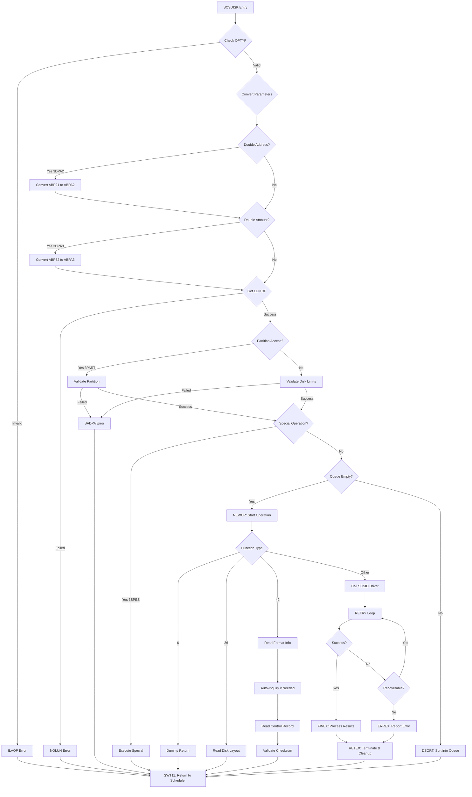
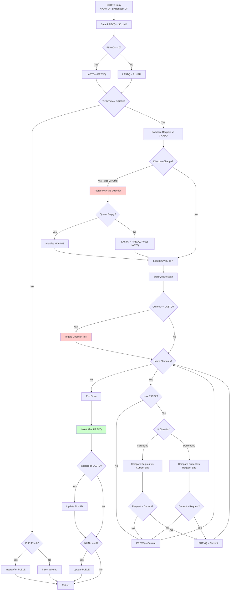
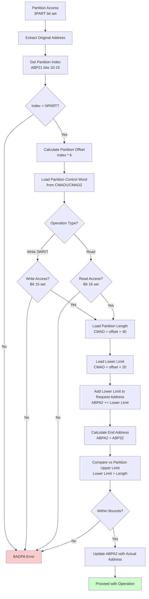
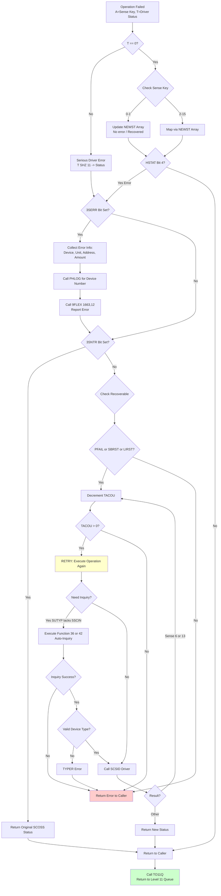
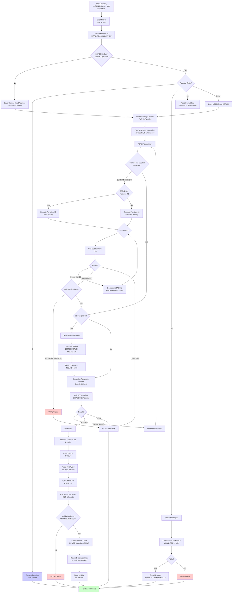

# IP-P2-SCSI-DISK - SCSI Disk Subsystem Documentation

**File:** `Z:\NorskData\Source Code\Sintran L\NPL\IP-P2-SCSI-DISK.NPL`

**Purpose:** SCSI Disk, Tape and Controller Drivers for ND-100

---

## Table of Contents

1. [Overview](#overview)
2. [Complete Function Reference](#complete-function-reference)
3. [Operation Type Control Words](#operation-type-control-words)
4. [Status Mapping](#status-mapping)
5. [Elevator Algorithm (DSORT)](#elevator-algorithm-dsort)
6. [Data Structures](#data-structures)
7. [Error Handling](#error-handling)
8. [Mermaid Diagrams](#mermaid-diagrams)

---

## 1. Overview

The IP-P2-SCSI-DISK module contains three driver subsystems for SCSI devices:

### 1.1 CTRSCSI - SCSI Controller Driver

**Lines:** 80-122

**Purpose:** Generic SCSI controller interface driver

**Entry Point:** `CTRSCSI` (line 90)

**Activation:** B=Datafield, X=Abstract parameter list

**Key Features:**
- General-purpose SCSI command dispatcher
- Translates high-level commands to SCSI driver calls
- Supports all SCSI device types
- Function code 21 (Clear SCSI Bus) special handling

### 1.2 SCSDISK - SCSI Disk Driver

**Lines:** 154-426

**Purpose:** SCSI disk operations with advanced features

**Entry Point:** `SCSDISK` (line 250)

**Key Features:**
- Disk-specific operations (read, write, seek, format)
- Partition management with access control
- **Elevator algorithm** (SCAN/CSCAN disk scheduling)
- Inquiry and capacity detection
- Error logging and retry logic

### 1.3 SCSTREAM - SCSI Tape Streamer Driver

**Lines:** 505-1045

**Purpose:** SCSI tape operations

**Entry Point:** `SCSTREAM` (line 578)

**Key Features:**
- Tape-specific operations (rewind, skip, erase)
- Variable and fixed block modes
- Density selection
- Copy operations between tape and disk
- Error counters for read/write operations

---

## 2. Complete Function Reference

### 2.1 CTRSCSI Functions (Lines 13-47)

| Code | Function | Description |
|------|----------|-------------|
| 0 | READ | Read data from device |
| 1 | WRITE | Write data to device |
| 2 | READ PARITY | Read with parity check |
| 3 | COMPARE | Compare data |
| 4 | SEEK | Position head |
| 5 | READ BACKWARDS | Read in reverse |
| 6 | RESERVE DEVICE | Reserve device for exclusive use |
| 10 | ADVANCE THROUGH EOF | Skip forward past EOF marker |
| 11 | REVERSE THROUGH EOF | Skip backward past EOF marker |
| 12 | WRITE EOF | Write end-of-file marker |
| 13 | REWIND | Rewind tape to beginning |
| 14 | WRITE SKIP | Skip and write |
| 15 | REVERSE RECORDS | Move backward N records |
| 16 | ADVANCE RECORDS | Move forward N records |
| 17 | UNLOAD | Eject/unload media |
| 21 | CLEAR SCSI BUS | Reset SCSI bus |
| 26 | READ BYTE RECORD | Read byte-oriented record |
| 27 | WRITE BYTE RECORD | Write byte-oriented record |
| 30 | LOAD | Load media |
| 35 | RELEASE DEVICE | Release device reservation |
| 37 | READ EXTENDED STATUS | Get detailed error information |
| 41 | FORMAT | Format media |
| 42 | INQUIRY AND READ CAPACITY | Query device capabilities |
| 46 | READ CURRENT ADDRESS | Get current position |
| 47 | WRITE CURRENT ADDRESS | Set current position |
| 54 | COPY | Copy data between devices |
| 70 | RETENSION | Retension tape |
| 71 | WRITE AND VERIFY | Write with verification |
| 73 | TEST UNIT READY | Check device ready status |
| 74 | EXECUTE USER SPECIFIED SCSI COMMAND BLOCK | Execute raw SCSI command |
| 75 | INQUIRY (READ DEVICE TYPE) | Query device type |
| 76 | ADVANCE TO END OF RECORDED AREA | Seek to end of data |

### 2.2 SCSDISK Functions (Lines 130-152)

| Code | Function | Description |
|------|----------|-------------|
| 0 | READ | Read sectors from disk |
| 1 | WRITE | Write sectors to disk |
| 2 | READ PARITY | Read with parity verification |
| 3 | COMPARE | Compare disk data with memory |
| 4 | SEEK | Position disk head |
| 6 | PRIORITY SELECT (DUMMY) | No operation (placeholder) |
| 34 | RESERVE DEVICE | Reserve disk for exclusive access |
| 35 | RELEASE DEVICE | Release disk reservation |
| 36 | READ DISK LAYOUT RECORD | Get disk geometry/partition info |
| 37 | READ EXTENDED STATUS | Get SCSI sense information |
| 41 | FORMAT | Format disk |
| 42 | READ FORMAT | Query disk format parameters |
| 43 | READ IN CONTROL AREA | Read from control/partition area |
| 44 | WRITE IN CONTROL AREA | Write to control/partition area |
| 60 | READ (DOUBLE DISK ADDRESS) | Read using 32-bit address |
| 61 | WRITE (DOUBLE DISK ADDRESS) | Write using 32-bit address |
| 62 | READ PARITY (DOUBLE DISK ADDRESS) | Read parity with 32-bit address |
| 63 | COMPARE (DOUBLE DISK ADDRESS) | Compare with 32-bit address |
| 73 | TEST UNIT READY | Check disk ready status |
| 74 | EXECUTE USER SPECIFIED SCSI COMMAND BLOCK | Execute raw SCSI command |
| 75 | INQUIRY (READ DEVICE TYPE) | Query device type and geometry |

### 2.3 SCSTREAM Functions (Lines 475-503)

| Code | Function | Description |
|------|----------|-------------|
| 0 | READ | Read from tape |
| 1 | WRITE | Write to tape |
| 2 | READ PARITY | Read with parity check |
| 3 | COMPARE | Compare tape data |
| 7 | ERASE | Erase tape |
| 10 | ADVANCE THROUGH EOF | Skip forward past EOF |
| 12 | WRITE EOF | Write end-of-file marker |
| 13 | REWIND | Rewind tape |
| 16 | ADVANCE RECORDS | Move forward N records |
| 17 | UNLOAD | Unload tape |
| 20 | READ STATUS (TEST UNIT READY) | Check tape status |
| 23 | SELECT DENSITY | Set tape density |
| 24 | READ LAST STATUS | Return cached status |
| 25 | READ TAPE STATUS (ERROR COUNTERS) | Get error statistics |
| 30 | LOAD | Load tape |
| 31 | RESET DEVICE (BUS DEVICE RESET) | Reset tape unit |
| 34 | RESERVE DEVICE | Reserve tape |
| 35 | RELEASE DEVICE | Release tape reservation |
| 37 | READ EXTENDED STATUS | Get extended error info |
| 42 | READ FORMAT | Query tape format |
| 46 | RETURN INTERFACE TYPE | Returns 3 for SCSI streamer |
| 54 | COPY | Copy between tape and disk |
| 70 | RETENSION | Retension tape |
| 73 | TEST UNIT READY | Check tape ready |
| 74 | EXECUTE USER SPECIFIED SCSI COMMAND BLOCK | Execute raw SCSI command |
| 75 | INQUIRY (READ DEVICE TYPE) | Query tape type |
| 76 | ADVANCE TO END OF RECORDED AREA | Seek to EOD |

---

## 3. Operation Type Control Words

### 3.1 SCSDISK OPTYP Array (Lines 237-246)

The OPTYP array contains control words for each function code. Each word uses bit flags to control operation behavior:

**Flag Bits (Lines 160-167):**

| Bit | Symbol | Meaning |
|-----|--------|---------|
| 17 | 3SERR | Error message - log errors to system |
| 16 | 3SNTR | Neutral operation - don't modify status |
| 15 | 3DPA3 | Parameter 3 is double word |
| 14 | 3DPA2 | Parameter 2 is double word |
| 13 | 3SPES | Special operation - not sorted in queue |
| 12 | 3PART | Partition access - validate boundaries |
| 11 | 3WRIT | Write operation |
| 10 | 3SF42 | Function 42 (special format inquiry) |

**OPTYP Values:**

```
Index (Octal):  Value (Octal)  Binary Flags         Operations
00-07:          100004         3PART + sortable     READ
                101004         3PART+3WRIT          WRITE
                100004         3PART                READ PARITY
                100004         3PART                COMPARE
                110004         3PART+3SPES          SEEK (special)
                000000         (illegal)
                104004         3PART+3SNTR          PRIORITY SELECT
                000000         (illegal)

34-37:          104017         3SNTR+3SPES          RESERVE DEVICE
                104404         3SNTR+3SPES          RELEASE DEVICE
                012004         3DPA2+3PART          READ DISK LAYOUT
                013004         3DPA2+3DPA3+3PART    READ EXTENDED STATUS

40-47:          (Function 41-42: Format operations)
                044000         3SPES+3SF42          READ FORMAT
                044000         3SPES+3SF42          (Function 42)

60-67:          110004         3SPES+3DPA2+3PART    READ (double addr)
                111004         ALL flags            WRITE (double addr)
                110004         3SPES+3DPA2+3PART    READ PARITY (double)
                110004         3SPES+3DPA2+3PART    COMPARE (double)
```

### 3.2 SCSTREAM OPTYP Array (Lines 568-577)

**SCSTREAM Flag Bits (Lines 532-538):**

| Bit | Symbol | Meaning |
|-----|--------|---------|
| 15 | 9SAMT | Fixed amount (bits 16-17) |
| 14 | 9SSWA | Single word amount |
| 13 | 9SRRA | Return resulting amount to user |
| 12 | 9SCRS | Clear pending rewind error status |
| 11 | 9SRUA | Remove unit attention |
| 10 | 9SIUA | Ignore unit attention |
| 7 | 9SSPC | Special command |

---

## 4. Status Mapping

### 4.1 SCSDISK NEWST Array (Lines 181-184)

Maps SCSI sense keys (0-15) to SINTRAN error bits:

```
Sense Key    Value (Octal)  Meaning
0:           040000         No sense (bit 14 set)
1:           040000         Recovered error (bit 14)
2:           100020         Not ready (bit 15 + bit 4)
3:           140020         Medium error (bits 14,15,4)
4:           140220         Hardware error (bits 14,15,7,4)
5:           140020         Illegal request (bits 14,15,4)
6:           140020         Unit attention (bits 14,15,4)
7:           040020         Data protect (bits 14,4)
8:           040020         Blank check (bits 14,4)
9:           140020         Vendor specific (bits 14,15,4)
10:          150020         Copy aborted (bits 14,16,4)
11:          140020         Aborted command (bits 14,15,4)
12:          040000         Equal (comparison) (bit 14)
13:          140020         Volume overflow (bits 14,15,4)
14:          042020         Miscompare (bits 14,10,4)
15:          140020         Reserved (bits 14,15,4)
```

### 4.2 SCSTREAM NEWST Array (Lines 308-311)

Similar mapping for tape operations with additional tape-specific flags:

```
Sense Key    Value (Octal)  Meaning
0:           000400         Good status (bit 10)
1:           000400         Recovered error (bit 10)
2:           000020         Not ready (bit 4)
3:           100420         Medium error (bits 15,10,4)
4:           000020         Hardware error (bit 4)
5:           000020         Illegal request (bit 4)
6:           000020         Unit attention (bit 4)
7:           000020         Data protect (bit 4)
8:           100420         Blank check/EOM (bits 15,10,4)
9:           000020         Vendor specific (bit 4)
10:          000020         Copy aborted (bit 4)
11:          000020         Aborted command (bit 4)
12:          000020         Equal (bit 4)
13:          100420         Volume overflow (bits 15,10,4)
14:          100420         Miscompare (bits 15,10,4)
15:          000020         Reserved (bit 4)
```

### 4.3 CTRSCSI NEWST Array (Lines 85-87)

Simplified mapping for generic controller:

```
All sense keys: 000000 or 000020 (bit 4 for errors)
```

---

## 5. Elevator Algorithm (DSORT)

**File:** `IP-P2-DISK-START.NPL` (Lines 270-319)

**Purpose:** Optimize disk I/O by sorting requests in a direction that minimizes head movement

### 5.1 Algorithm Description

The DSORT routine implements the **SCAN** (elevator) algorithm:

1. **Current Direction:** Maintain movement direction (increasing or decreasing addresses)
2. **Service Requests:** Process all requests in current direction
3. **Reverse at End:** When no more requests exist in current direction, reverse
4. **Minimize Seeks:** Reduces total seek time by avoiding random access

### 5.2 Key Data Structures

**Queue Pointers:**
- `SCLINK` - Queue head (sorted requests)
- `NLINK` - Next element in queue
- `PLHAD` - Last processed in current direction
- `PLELE` - Last element in queue
- `CHADD` - Current head address (physical position)

**Direction Control:**
- `MOVME` - Movement direction flag (0=decreasing, 1=increasing)
- `SSEEK` - Seek enable bit in TYPCO

### 5.3 DSORT Algorithm Flow

```
Entry: X = Unit datafield, B = Queue element datafield

1. Initialize pointers:
   PREVQ = pointer before first element
   LASTQ = pointer before first in opposite direction

2. Determine insertion direction:
   - Compare new request address with CHADD (current head address)
   - XOR with MOVME to determine if direction change needed

3. Scan queue in current direction:
   IF increasing (MOVME bit set):
      - Find first element > new request address
   ELSE decreasing:
      - Find first element < new request address

4. Insert request:
   - Link new element after PREVQ
   - Update PLHAD if inserted at direction boundary
   - Update PLELE if last element

5. Direction reversal (in RETEX, lines 413-425):
   - When SCLINK exhausted and PLHAD = current
   - Set PLHAD = PLELE (restart from other end)
   - Toggle MOVME direction bit
```

### 5.4 Partition Validation (Lines 278-300)

For partition access (3PART bit set):

1. Extract partition index from address (bits in ABP21)
2. Validate partition index < NPART
3. Load partition control word from CMAD buffer
4. Check read/write access bits (bits 15-16)
5. Add partition base address to request address
6. Verify request + amount within partition boundaries

### 5.5 Example Scenario

```
Initial state:
  CHADD = 1000 (current head at cylinder 1000)
  MOVME = 1 (moving toward higher addresses)
  Queue: Empty

Request sequence:
  1. Request at 1500 -> Insert, continue upward
  2. Request at 800  -> Insert before first (will process after reversal)
  3. Request at 2000 -> Insert after 1500
  4. Request at 1200 -> Insert between 1000 and 1500

Sorted queue (upward pass):
  1200 -> 1500 -> 2000

After reaching 2000:
  - Reverse direction (MOVME = 0)
  - PLHAD = PLELE
  - Process downward: 800
```

---

## 6. Data Structures

### 6.1 Abstract Parameter Block (ABSTR)

**Common Fields:**

| Offset | Field | Type | Description |
|--------|-------|------|-------------|
| +0 | ABFUN | INT | Function code (bits 0-5) + Unit (bits 6-8) |
| +1 | MEMAD | INT | Memory address (word address) |
| +2 | ABPA2 | DOUBLE | Parameter 2 (disk address/tape position) |
| +4 | ABPA3 | DOUBLE | Parameter 3 (amount/sector count) |

**Extended Fields (Function-specific):**

| Field | Type | Description |
|-------|------|-------------|
| ABP21 | INT | Lower word of ABPA2 (single-word address) |
| ABP22 | INT | Upper word of ABPA2 |
| ABP31 | INT | Lower word of ABPA3 |
| ABP32 | INT | Upper word of ABPA3 |
| ABA31 | INT | Alternate parameter 3 reference |
| ABA32 | INT | Alternate parameter 3 reference |
| MEMA1 | INT | Memory address reference |
| MEMA2 | INT | Memory address reference |

### 6.2 Unit Datafield (LUN Structure)

**SCSDISK Fields:**

| Field | Description |
|-------|-------------|
| SUTYP | Device type and flags (5SCIN, 5SCDA, etc.) |
| SCDFA | Device datafield address |
| SCOCW | Operation control word |
| CHADD | Current head address (physical) |
| NPART | Number of partitions |
| CMAD1/CMAD2 | Control area address |
| UHLIM | Upper disk limit (double word) |
| ULINK | Unit link pointer |
| SLINK | Started operations queue |
| SCLINK | Sorted queue head |
| NLINK | Next in queue |
| PLHAD | Last processed in direction |
| PLELE | Last element in queue |
| MOVME | Movement direction |
| SUNOP | Number of operations in queue |
| TYPCO | Type control (with SSEEK bit) |
| STPRW | Program owning access |
| TACNS | Retry count (total attempts) |
| TACOU | Retry counter (current) |

**SCSTREAM Additional Fields:**

| Field | Description |
|-------|-------------|
| OPSTA | Operation status flags (4SRUN, 4SSTA, 4SRES, 4SINI, 4SMSL, 4SSTP, 4SUAP) |
| CUROP | Current operation control word |
| STSTA | Status from last operation |
| P3LUN | Parameter 3 LUN reference |
| CFORM | Current format/density |
| REWST | Rewind status (pending) |
| SRERS | Read error status accumulator |
| SRERC | Read error counter |
| SWERS | Write error status accumulator |
| SWERC | Write error counter |
| CPFUN | Copy function |
| CPDEV | Copy device |
| CPSTS | Copy status |
| CPBLS | Copy block size |
| CPAMT | Copy amount transferred |

### 6.3 Partition Control Record (Function 42)

**Structure (6 words per partition):**

| Offset | Field | Description |
|--------|-------|-------------|
| +0 | Access bits | Bit 15: Write access, Bit 16: Read access |
| +1 | (reserved) | |
| +2 | Lower limit | Lower address (word 1 of double) |
| +3 | Lower limit | Lower address (word 2 of double) |
| +4 | Length | Partition length (word 1 of double) |
| +5 | Length | Partition length (word 2 of double) |

**Validation (Lines 278-300):**
1. Check partition index in bits 10-15 of ABP21
2. Verify index < NPART
3. Check access bit (read=16, write=15)
4. Add lower limit to request address
5. Verify (address + amount) <= (lower limit + length)

---

## 7. Error Handling

### 7.1 RETOP - Disk Termination (Lines 194-231)

**Purpose:** Terminate disk operation and report status

**Entry Parameters:**
- B = Disk datafield
- X = DAQ (Device Adapter Queue)
- T = Driver status (0 = success)
- A = Sense key (if T=0)

**Status Processing:**

1. **Update error bits from NEWST array** (lines 196-205)
2. **Check for error flag in HSTAT bit 4** (line 207)
3. **Log error if 3SERR bit set** (lines 211-221):
   - Call PHLOG to get device number
   - Extract unit from ABFUN
   - Collect parameters (memory address, disk address, amount)
   - Call 9FLEX(1663, 12) to report error
4. **Return original status if 3SNTR set** (lines 224-226)
5. **Return to caller via TO11Q** (line 228)

### 7.2 SCSTREAM Error Handling

**RETOP Sequence (Lines 301-385):**

1. **Check for copy operation termination** (lines 317-322)
2. **Map sense key to error bits** (lines 323-330):
   - ILI (Incorrect Length Indicator) -> 100420
   - EOM (End of Media) -> 000420
   - EOF (End of File) -> 100420
3. **Adjust amount for residual** (lines 331-351):
   - Use shift instructions (SUSI1, SUSI2)
   - Calculate physical vs logical record size
   - Return adjusted amount to user
4. **Handle special operations** (lines 359-368):
   - Reserve device (34) -> set 4SRES bit
   - Release device (35) -> clear 4SRES bit
5. **Determine SINTRAN error code** (line 371):
   - Call SCDTS to map to SINTRAN error numbers

### 7.3 Error Code Mapping (SCDTS, Lines 582-618)

**Driver Error Codes to SINTRAN:**

| Driver Code | SINTRAN Code | Meaning |
|-------------|--------------|---------|
| TYPER | 240 | Illegal device type |
| ILAOP | 201 | Illegal function code |
| BADPA | 174 | Illegal parameter |
| ILNOD | 33 | No such logical unit |
| NOLUN | 33 | No such logical unit |
| COPNP | 3206 | Illegal request (copy not possible) |
| TRANE | 141 | Transfer error |
| SBUSY | 3207 | Device busy |
| RCONF | 3210 | Reservation conflict |
| NESER | 3211 | Device does not answer |
| (other) | 232 | Device error |

**SCSI Sense Keys (from SCSTA array):**

The driver maintains a SCSTA array that maps SCSI sense keys (0-15) to SINTRAN error codes. When T=0 and CERRCODE=0, the sense key is used to index this array.

### 7.4 Retry Logic

**SCSDISK Retry (Lines 345-382):**

1. **Check retry counter** (line 343): TACNS -> TACOU
2. **Auto-inquiry if needed** (lines 346-361):
   - If SUTYP lacks 5SCIN bit, run inquiry
   - If device type invalid, error TYPER
3. **Call SCSID driver** (line 373)
4. **Check for recoverable errors** (lines 380-382):
   - PFAIL (power fail) -> retry
   - SBRST (SCSI bus reset) -> retry
   - LIRST (local interface reset) -> retry
   - Decrement TACOU and retry

**SCSTREAM Retry (Lines 214-291):**

1. **Check for unit attention** (lines 214-220):
   - If 4SUAP bit set and not ignored (9SIUA)
   - Return error 26 if not removable (9SRUA)
2. **Initialization sequence** (lines 222-231):
   - Reserve/Release device (34/36)
   - Call SCSID, check sense
   - Verify device type = 1 (sequential access)
3. **Mode Select for streamers** (lines 232-246):
   - Execute Mode Sense (MDSEN)
   - Get density (GDENS)
   - Execute Mode Select (MDSEL)
   - Verify fixed block mode (5SFBM)
4. **Error analysis** (lines 269-294):
   - Unit attention (6) -> set 4SUAP, retry
   - Copy aborted (12) -> analyze copy status
   - Aborted command (13) -> retry
   - Recovered error (1) or medium error (3) -> increment error counters

### 7.5 Function 42 Special Handling (Lines 337-407)

**Purpose:** Read and validate partition/format information

**Process:**

1. **Clear SUTYP 5SCIN bit** (line 340) to force inquiry
2. **Execute inquiry** (lines 346-361) to get device geometry
3. **Read control record** (lines 362-367):
   - Address from MEMA1/MEMA2 + 10 (offset)
   - Read 1 sector to memory address + 1000
4. **Validate control record** (lines 387-407):
   - Clear cache (SCCLR)
   - Read first word at MEMAD offset 0
   - Calculate checksum (XOR all words)
   - Extract NPART from high byte
   - Verify checksum = 0
   - Verify 2 <= NPART <= NCOPA (max partitions)
5. **Copy partition table** (lines 400-402):
   - Move NPART*6 words to CMAD1/CMAD2 buffer
6. **Return disk capacity** (lines 402-404):
   - Store UHLIM at MEMA1/MEMA2 + 10

---

## 8. Mermaid Diagrams

### 8.1 Disk Operation Dispatcher Flow



### 8.2 Queue Sorting Algorithm (Elevator/SCAN)



### 8.3 Partition Validation Flow



### 8.4 Error Recovery and Retry Logic



### 8.5 RETOP Termination Sequence

```mermaid
graph TD
    A[RETOP Entry<br/>B=Disk DF, X=DAQ<br/>T=Driver Status, A=Sense] --> B[Save TAD, X, L<br/>to SVTAD, SVXRG, SVLRG]
    B --> C[Save Original SCSI Status<br/>A -> SCOSS, L]
    C --> D{T == 0<br/>Success?}
    D -->|Yes| E{Function 2 or 62<br/>Compare?}
    D -->|No| F[T SHZ 11 -> L<br/>Serious Error 100020]
    E -->|Yes| G{Sense Key 5<br/>Not Implemented?}
    E -->|No| H[Map via NEWST Array<br/>X = 17/\L]
    G -->|Yes| I[Clear L<br/>L := 0]
    G -->|No| H
    I --> H
    H --> J[Update Error Bits<br/>NEWST X \/X -> Status]
    J --> K{HSTAT Bit 4 Set?}
    F --> K
    K -->|Yes Error| L[L BONE 4<br/>Set Error Flag]
    K -->|No| M{3SNTR Bit Set?}
    L --> N[Update SCOSS and XSTAT<br/>T=L=SCOSS=X.XSTAT]
    N --> O[Save ABFUN to DMTRG<br/>T=X.ABFUN=X.DMTRG]
    O --> P{A<0 AND 3SERR?}
    P -->|Yes| Q[Collect Error Parameters]
    P -->|No| M
    Q --> R[A=B, CALL PHLOG<br/>A=9XDV Device Number]
    R --> S[Extract ABFUN -> 9XFU<br/>Unit -> 9XUN]
    S --> T[Copy Parameters:<br/>MEMAD->9XMA<br/>ABPA2->9XDA<br/>ABP32->9XTA]
    T --> U[SCOSS->9XST<br/>RTRES->Program ID]
    U --> V[Call 9FLEX 1663,12<br/>Report Error to Log]
    V --> M
    M -->|Yes| W[Return Original SCOSS<br/>SCOSS=X.HSTAT]
    M -->|No| X[Disable Interrupts<br/>*IOF]
    W --> X
    X --> Y[Call TO11Q<br/>Return to Level 11]
    Y --> Z[Enable Interrupts<br/>*ION]
    Z --> AA[Restore Registers<br/>SVTAD, SVXRG]
    AA --> AB[Return via SVLRG<br/>GO SVLRG]

    style AB fill:#ccffcc
    style V fill:#ffccaa
```



### 8.6 NEWOP Initialization Sequence



### 8.7 Complete Read Operation

```mermaid
graph TD
    A[User Calls SCSDISK<br/>Function 0 READ] --> B[SCSDISK Entry<br/>Save Return Address]
    B --> C[Fetch ABFUN<br/>Extract Function 0-77 octal]
    C --> D[Lookup OPTYP Array<br/>OPTYP 0 = 100004]
    D --> E{OPTYP == 0?}
    E -->|Yes| F[ILAOP Error]
    E -->|No| G[Check 3DPA2 Bit 14<br/>Double Address?]
    G -->|Yes| H[Convert ABP21 to Double<br/>X.ABPA2 = 0, ABP21]
    G -->|No| I[Check 3DPA3 Bit 15<br/>Double Amount?]
    H --> I
    I -->|Yes| J[Convert ABP31 to Double<br/>X.ABPA3 = 0, ABP32]
    I -->|No| K[Extract Unit from ABFUN<br/>Bits 6-8, SHZ -6/\7]
    J --> K
    K --> L{Unit > 3 OR<br/>PUNDF A == 0?}
    L -->|Yes| M[NOLUN Error]
    L -->|No| N[X=B=SAVEX<br/>Save Unit DF]
    N --> O{3SPES Bit 13?<br/>Special Operation}
    O -->|Yes| P[Execute Special<br/>Functions 6,36,42]
    O -->|No| Q{3PART Bit 12?<br/>Partition Access}
    Q -->|Yes| R[Validate Partition<br/>See Partition Flow]
    Q -->|No| S[Validate Disk Limits<br/>ABPA2+ABP32 vs UHLIM]
    R --> T{Valid?}
    S --> T
    T -->|No| U[BADPA Error]
    T -->|Yes| V[Set SSEEK Bit<br/>X.TYPCO BONE SSEEK]
    V --> W[Increment SUNOP<br/>MIN SUNOP, 0/\0]
    W --> X{SLINK != 0?<br/>Queue Not Empty}
    X -->|Yes| Y[Call DSORT<br/>Sort into Queue]
    X -->|No| Z[GO NEWOP<br/>Start Immediately]
    Y --> AA[Return to Scheduler<br/>GO SWT11]
    Z --> AB[NEWOP: X=SLINK<br/>0=X.NLINK]
    AB --> AC[Set Access Owner<br/>X.RTRES=ULINK.STPRW]
    AC --> AD[Save Current Head<br/>X.ABPA2=CHADD]
    AD --> AE[Initialize Retry<br/>TACNS=TACOU]
    AE --> AF[Get Device DF<br/>X=SCDFA=B]
    AF --> AG[RETRY Loop]
    AG --> AH{SUTYP has 5SCIN?}
    AH -->|No| AI[Auto-Inquiry<br/>Function 36/42]
    AH -->|Yes| AJ[Build SCSI Command<br/>Via SCSID]
    AI --> AK{Inquiry OK?}
    AK -->|No| AL[TYPER Error]
    AK -->|Yes| AJ
    AJ --> AM[Call SCSID Driver<br/>READ Command]
    AM --> AN{Result?}
    AN -->|Error| AO{Recoverable?}
    AN -->|Success| AP[GO FINEX]
    AO -->|PFAIL/SBRST/LIRST| AQ[Decrement TACOU]
    AO -->|No| AR[GO ERREX]
    AQ --> AS{TACOU > 0?}
    AS -->|Yes| AG
    AS -->|No| AR
    AP --> AT[X=B=SLINK<br/>Process Results]
    AT --> AU[Update Status<br/>T=0 Success]
    AU --> AV[RETEX: B=D<br/>X=ULINK=B=X.SLINK]
    AV --> AW[Clear STPRW<br/>0=STPRW]
    AW --> AX[Call RETOP<br/>Terminate Operation]
    AX --> AY[Clear SLINK<br/>0=SLINK]
    AY --> AZ[Decrement SUNOP<br/>SUNOP-1=SUNOP]
    AZ --> BA{SCLINK != 0?<br/>More in Sorted Queue}
    BA -->|Yes| BB[Check if Last<br/>X.NLINK=SCLINK=0]
    BA -->|No| AA
    BB --> BC{Last Element?}
    BC -->|Yes| BD[Clear PLELE<br/>0=PLELE]
    BC -->|No| BE{PLHAD == X?}
    BD --> BE
    BE -->|Yes| BF[Clear PLHAD<br/>0=PLHAD]
    BE -->|No| BG{PLHAD == 0?}
    BF --> BG
    BG -->|Yes| BH[Reverse Direction<br/>PLELE=PLHAD<br/>MIN MOVME, 0/\0]
    BG -->|No| BI[GO FAR NEWOP<br/>Process Next]
    BH --> BI
    P --> AA
    F --> AA
    M --> AA
    U --> AA
    AL --> AA
    AR --> AA
    BI --> AA

    style A fill:#3F51B5,stroke:#303F9F,stroke-width:2px,color:#fff
    style AA fill:#4CAF50,stroke:#388E3C,stroke-width:2px,color:#fff
    style F fill:#F44336,stroke:#D32F2F,stroke-width:2px,color:#fff
    style M fill:#F44336,stroke:#D32F2F,stroke-width:2px,color:#fff
    style U fill:#F44336,stroke:#D32F2F,stroke-width:2px,color:#fff
    style AL fill:#F44336,stroke:#D32F2F,stroke-width:2px,color:#fff
    style AR fill:#F44336,stroke:#D32F2F,stroke-width:2px,color:#fff
    style AP fill:#4CAF50,stroke:#388E3C,stroke-width:2px,color:#fff
    style AM fill:#2196F3,stroke:#1976D2,stroke-width:2px,color:#fff
    style AJ fill:#2196F3,stroke:#1976D2,stroke-width:2px,color:#fff
    style AG fill:#FF9800,stroke:#F57C00,stroke-width:2px,color:#fff
```



### 8.8 Complete Write Operation

```mermaid
graph TD
    A[User Calls SCSDISK<br/>Function 1 WRITE] --> B[SCSDISK Entry<br/>Same as READ Start]
    B --> C[Lookup OPTYP Array<br/>OPTYP 1 = 101004]
    C --> D[Check 3WRIT Bit 11<br/>Write Operation Flag]
    D --> E{OPTYP Valid?}
    E -->|No| F[ILAOP Error]
    E -->|Yes| G[Convert Parameters<br/>Same as READ]
    G --> H{3PART Bit 12?<br/>Partition Access}
    H -->|Yes| I[Validate Partition<br/>Check Write Bit 15]
    H -->|No| J[Validate Disk Limits]
    I --> K{Write Access Allowed?}
    K -->|No| L[BADPA Error<br/>Not Write Access]
    K -->|Yes| M[Add Lower Limit<br/>Calculate Actual Address]
    J --> N{Within Bounds?}
    M --> O[Verify End Address<br/>vs Partition Limit]
    O --> N
    N -->|No| L
    N -->|Yes| P[Set SSEEK Bit<br/>Enable Sorting]
    P --> Q[Increment SUNOP<br/>Operation Count]
    Q --> R{SLINK != 0?}
    R -->|Yes| S[Call DSORT<br/>Insert in Elevator Queue]
    R -->|No| T[GO NEWOP<br/>Execute Immediately]
    S --> U[DSORT Sorts by Address]
    U --> V{Direction?}
    V -->|Increasing| W[Insert After Smaller Addresses]
    V -->|Decreasing| X[Insert After Larger Addresses]
    W --> Y[Update Queue Pointers<br/>NLINK, PLHAD, PLELE]
    X --> Y
    Y --> Z[Return to Scheduler<br/>GO SWT11]
    T --> AA[NEWOP: Set CHADD<br/>Current Head Address]
    AA --> AB[Initialize Retry<br/>TACNS=TACOU]
    AB --> AC[Get Device DF<br/>X=SCDFA=B]
    AC --> AD[RETRY Loop]
    AD --> AE{Device Initialized?}
    AE -->|No| AF[Auto-Inquiry]
    AE -->|Yes| AG[Build WRITE Command<br/>SCSI Function 12\340]
    AF --> AH{Inquiry Success?}
    AH -->|No| AI[TYPER Error]
    AH -->|Yes| AG
    AG --> AJ[Set Write Bit in Command<br/>Bit 0 of CTRG]
    AJ --> AK[Call SCSID Driver<br/>WRITE Command]
    AK --> AL{Result?}
    AL -->|Error| AM{Recoverable?}
    AL -->|Success| AN[GO FINEX]
    AM -->|PFAIL/SBRST| AO[Decrement TACOU]
    AM -->|Other| AP[GO ERREX]
    AO --> AQ{TACOU > 0?}
    AQ -->|Yes| AD
    AQ -->|No| AP
    AN --> AR[Process Results<br/>T=0 Success]
    AR --> AS[Call RETOP<br/>Terminate]
    AS --> AT{HSTAT Bit 4?<br/>Error Occurred}
    AT -->|Yes| AU[Check 3SERR Bit<br/>Log Error?]
    AT -->|No| AV[Update CHADD<br/>New Head Position]
    AU -->|Yes| AW[Call PHLOG<br/>Get Device Number]
    AU -->|No| AV
    AW --> AX[Collect Write Parameters<br/>ABFUN, MEMAD, ABPA2, ABP32]
    AX --> AY[Call 9FLEX 1663,12<br/>Report Write Error]
    AY --> AV
    AV --> AZ[Decrement SUNOP<br/>Operation Complete]
    AZ --> BA{SCLINK != 0?<br/>More Operations}
    BA -->|Yes| BB[Update Queue<br/>Remove Completed]
    BA -->|No| BC[Return to Scheduler<br/>GO SWT11]
    BB --> BD{Direction Change Needed?}
    BD -->|Yes| BE[Toggle MOVME<br/>Reverse Elevator]
    BD -->|No| BF[GO FAR NEWOP<br/>Process Next Write]
    BE --> BF
    BF --> AA
    F --> BC
    L --> BC
    AI --> BC
    AP --> BC

    style A fill:#3F51B5,stroke:#303F9F,stroke-width:2px,color:#fff
    style BC fill:#4CAF50,stroke:#388E3C,stroke-width:2px,color:#fff
    style F fill:#F44336,stroke:#D32F2F,stroke-width:2px,color:#fff
    style L fill:#F44336,stroke:#D32F2F,stroke-width:2px,color:#fff
    style AI fill:#F44336,stroke:#D32F2F,stroke-width:2px,color:#fff
    style AP fill:#F44336,stroke:#D32F2F,stroke-width:2px,color:#fff
    style AY fill:#FF9800,stroke:#F57C00,stroke-width:2px,color:#fff
    style AN fill:#4CAF50,stroke:#388E3C,stroke-width:2px,color:#fff
    style AK fill:#2196F3,stroke:#1976D2,stroke-width:2px,color:#fff
    style AG fill:#2196F3,stroke:#1976D2,stroke-width:2px,color:#fff
    style AD fill:#FF9800,stroke:#F57C00,stroke-width:2px,color:#fff
    style S fill:#9C27B0,stroke:#7B1FA2,stroke-width:2px,color:#fff
```



### 8.9 Function 42 (Format Info) Processing

```mermaid
graph TD
    A[Function 42 Request<br/>Read Format Info] --> B[SCSDISK Entry<br/>Extract Function 42]
    B --> C[Lookup OPTYP Array<br/>OPTYP 42 = 044000]
    C --> D[Check Flags:<br/>3SPES + 3SF42]
    D --> E{3SPES Set?}
    E -->|No| F[Should Not Happen<br/>Invalid OPTYP]
    E -->|Yes| G[Skip DSORT<br/>GO NEWOP Directly]
    G --> H[NEWOP: Check Function<br/>IF A=42 THEN]
    H --> I[Copy MEMAD and ABFUN<br/>X.MEMAD=MEMAD<br/>X.ABFUN=ABFUN]
    I --> J[Setup Parameters:<br/>0=ABP31<br/>100=ABP32]
    J --> K[Clear Inquiry Flag<br/>SCDFA.SUTYP BZERO 5SCIN]
    K --> L[Set B = SCDFA<br/>Device Datafield]
    L --> M[RETRY Loop Start]
    M --> N{SUTYP has 5SCIN?}
    N -->|No AND Not 3SNTR| O[Auto-Inquiry Required]
    N -->|Yes| P{SCOCW has 3SF42?}
    O --> Q{3SF42 Bit Set?}
    Q -->|Yes| R[Execute Function 42<br/>Set ABFUN=42]
    Q -->|No| S[Execute Function 36<br/>Standard Inquiry]
    R --> T[Inquiry Loop]
    S --> T
    T --> U[Call SCSID Driver<br/>T=X]
    U --> V{Result?}
    V -->|Sense 6 or 13| W[Unit Attention/Aborted<br/>Decrement TACOU]
    V -->|Success D<=1| X{Device Type Valid?}
    V -->|Other Error| Y[GO FAR ERREX]
    W --> T
    X -->|SUTYP SHZ -10><0| Z[TYPER Error<br/>Illegal Device Type]
    X -->|Valid| P
    P -->|Yes| AA[Setup READ Operation<br/>177700/\ABFUN Clear Function]
    P -->|No| AB[Regular Operation Path]
    AA --> AC[Get Control Record Address<br/>MEMA1, MEMA2, offset +10]
    AC --> AD[Setup Disk Address<br/>L.ABPA2 from Control Record]
    AD --> AE[Set Parameters:<br/>0=ABP31<br/>1=ABP32 Single Sector]
    AE --> AF[Calculate Buffer Address<br/>MEMAD + 1000]
    AF --> AG[Set T=X Parameter Pointer]
    AG --> AH[Call SCSID Driver<br/>377/\SCOCW control]
    AH --> AI{Read Success?}
    AI -->|Sense 6 or 13| AJ[Retry on Unit Attention]
    AI -->|Success| AK[GO FINEX<br/>Process Results]
    AI -->|Error| Y
    AJ --> M
    AK --> AL[Check 3SF42 Bit<br/>T=X.DQOPC BIT 3SF42]
    AL --> AM{Function 42 Result?}
    AM -->|Yes| AN[Check HSTAT<br/>A=X.HSTAT BZERO 17<=1]
    AM -->|No| AO[Regular Completion]
    AN --> AP[Clear Cache<br/>T=SCCLR, *EXR ST]
    AP --> AQ[Read First Word<br/>T=MEMA1, X=MEMA2<br/>*LDATX 00]
    AQ --> AR[Extract NPART<br/>A SHZ -10=NPART<br/>L=-1000=LOOPC]
    AR --> AS[Initialize Checksum<br/>D=0]
    AS --> AT[FOR LOOPC Loop<br/>XOR All Words]
    AT --> AU[Load Next Word<br/>*LDATX 00]
    AU --> AV[Calculate Checksum<br/>D XOR A]
    AV --> AW[Increment Address<br/>X+1]
    AW --> AX{More Words?}
    AX -->|Yes| AT
    AX -->|No| AY{Valid Checksum?<br/>D><0 OR L<=2 OR L>NCOPA}
    AY -->|Invalid| AZ[NOCRC Error<br/>No Control Record]
    AY -->|Valid| BA[Calculate Buffer Size<br/>NPART*6=L]
    BA --> BB[Get Source Address<br/>MEMAD + 2]
    BB --> BC[Copy Partition Table<br/>X=CMAD1, T=CMAD2<br/>*MOVPP L words]
    BC --> BD[Load Data Area Size<br/>T=CMAD1, X=CMAD2<br/>*LDDTX 40]
    BD --> BE[Return to User<br/>T=SLINK.MEMA1<br/>X=X.MEMA2<br/>*STDTX 10]
    BE --> BF[Store UHLIM<br/>AD=UHLIM<br/>36, *STATX 00]
    BF --> BG[Update SLINK.HSTAT<br/>Status Complete]
    BG --> BH[Set T=0<br/>Success Status]
    BH --> BI[RETEX: Cleanup<br/>B=D, X=ULINK]
    BI --> BJ[Clear STPRW<br/>0=STPRW]
    BJ --> BK[Call RETOP<br/>Terminate Operation]
    BK --> BL[Clear SLINK<br/>0=SLINK]
    BL --> BM[Decrement SUNOP<br/>SUNOP-1=SUNOP]
    BM --> BN[Return to Scheduler<br/>GO SWT11]
    AO --> BI
    AZ --> BI
    Z --> BI
    Y --> BI
    F --> BN

    style BN fill:#ccffcc
    style AZ fill:#ffcccc
    style Z fill:#ffcccc
    style Y fill:#ffcccc
    style F fill:#ffcccc
```



### 8.10 Error Code Mapping

```mermaid
graph TD
    A[RETOP Called<br/>T=Driver Status<br/>A=Sense Key] --> B{T == 0?<br/>Driver Success}
    B -->|No| C[Serious Error<br/>T SHZ 11 -> L<br/>L = 100020]
    B -->|Yes| D{Function 2 or 62?<br/>Compare Operation}
    C --> E[Set Status<br/>Bit 15 + Bit 4]
    D -->|Yes| F{Sense Key 5?<br/>Illegal Request}
    D -->|No| G[Map Sense Key<br/>via NEWST Array]
    F -->|Yes| H[Clear Sense<br/>L=0 Not Implemented]
    F -->|No| G
    H --> G
    G --> I[Bank 1 Access<br/>*1BANK]
    I --> J[Get NEWST Value<br/>X=17/\L<br/>NEWST X]
    J --> K[Update Status<br/>A\/X]
    K --> L[Bank 2 Access<br/>*2BANK]
    L --> M{HSTAT Bit 4?<br/>Error Flag Set}
    E --> M
    M -->|Yes| N[Set Error Bit<br/>L BONE 4]
    M -->|No| O{3SNTR Bit?<br/>Neutral Operation}
    N --> P[Update Status Words<br/>T=L=SCOSS=X.XSTAT]
    P --> Q[Save Function<br/>T=X.ABFUN=X.DMTRG]
    Q --> R{A<0 AND 3SERR?<br/>Log Error}
    R -->|Yes| S[Get Device Number<br/>A=B, CALL PHLOG<br/>A=9XDV]
    R -->|No| O
    S --> T[Extract Function<br/>SVXRG.ABFUN=9XFU]
    T --> U[Extract Unit<br/>A SHZ -6/\7=9XUN]
    U --> V[Copy Memory Address<br/>X.MEMAD=9XMA]
    V --> W[Copy Disk Parameters<br/>X.ABPA2=9XDA<br/>X.ABP32=9XTA]
    W --> X[Copy Status<br/>SCOSS=9XST]
    X --> Y[Get Program ID<br/>X=X.RTRES]
    Y --> Z[Bank 1 Access<br/>*1BANK]
    Z --> AA[Report Error<br/>CALL 9FLEX 9XER,12]
    AA --> AB[Bank 2 Access<br/>*2BANK]
    AB --> O
    O -->|Yes| AC[Return Original Status<br/>SCOSS=X.HSTAT]
    O -->|No| AD[Use Computed Status]
    AC --> AE[Disable Interrupts<br/>*IOF]
    AD --> AE
    AE --> AF[Return to Level 11<br/>CALL TO11Q]
    AF --> AG[Enable Interrupts<br/>*ION]
    AG --> AH[Restore Registers<br/>SVTAD, SVXRG]
    AH --> AI[Return via SVLRG<br/>GO SVLRG]

    subgraph "NEWST Mapping (Sense Key -> Status)"
        BA[Sense 0: No Sense<br/>040000]
        BB[Sense 1: Recovered Error<br/>040000]
        BC[Sense 2: Not Ready<br/>100020]
        BD[Sense 3: Medium Error<br/>140020]
        BE[Sense 4: Hardware Error<br/>140220]
        BF[Sense 5: Illegal Request<br/>140020]
        BG[Sense 6: Unit Attention<br/>140020]
        BH[Sense 7: Data Protect<br/>040020]
        BI[Sense 8: Blank Check<br/>040020]
        BJ[Sense 9: Vendor Specific<br/>140020]
        BK[Sense 10: Copy Aborted<br/>150020]
        BL[Sense 11: Aborted Command<br/>140020]
        BM[Sense 12: Equal<br/>040000]
        BN[Sense 13: Volume Overflow<br/>140020]
        BO[Sense 14: Miscompare<br/>042020]
        BP[Sense 15: Reserved<br/>140020]
    end

    subgraph "SCDTS Mapping (Driver -> SINTRAN)"
        CA[TYPER -> 240<br/>Illegal Device Type]
        CB[ILAOP -> 201<br/>Illegal Function]
        CC[BADPA -> 174<br/>Illegal Parameter]
        CD[ILNOD/NOLUN -> 33<br/>No Such LUN]
        CE[COPNP -> 3206<br/>Illegal Request]
        CF[TRANE -> 141<br/>Transfer Error]
        CG[SBUSY -> 3207<br/>Device Busy]
        CH[RCONF -> 3210<br/>Reservation Conflict]
        CI[NESER -> 3211<br/>Device No Answer]
        CJ[Other -> 232<br/>Device Error]
    end

    style AI fill:#ccffcc
    style AA fill:#ffccaa
```



---

## Cross-Reference

This document describes the high-level disk/tape subsystem. For low-level SCSI protocol and hardware interface details, see:

**`Z:\NorskData\Source Code\Sintran L\NPL\IP-P2-SCSI-DRIV-ANALYSIS.md`**

Key cross-references:
- **SCSID entry point** (lines 1102-1549): Low-level SCSI command execution
- **SCLLD entry point** (lines 93-117): NCR controller interface
- **Hardware registers** and **interrupt handling**: Detailed in SCSI-DRIV-ANALYSIS.md
- **Phase handlers** (Data, Command, Status, Message): Described in driver analysis
- **Error recovery sequences**: Documented in driver interrupt flow

---

## Summary

The IP-P2-SCSI-DISK module provides three integrated subsystems:

1. **CTRSCSI**: Generic SCSI controller interface for all device types
2. **SCSDISK**: Advanced disk driver with elevator algorithm and partition management
3. **SCSTREAM**: Tape streamer driver with variable/fixed block modes

**Key Features:**
- **64 function codes** covering disk, tape, and generic SCSI operations
- **Elevator (SCAN) algorithm** for optimal disk head scheduling
- **Partition access control** with read/write validation
- **Comprehensive error handling** with retry logic and detailed logging
- **Auto-inquiry** for dynamic device detection
- **Copy operations** between tape and disk on same SCSI bus

**Performance Optimizations:**
- Queue sorting by disk address (elevator algorithm)
- Direction reversal at queue boundaries
- Parallel seek on multi-unit configurations
- Retry with exponential backoff for transient errors

The driver integrates tightly with the SINTRAN operating system, supporting multi-programming environments with proper queue management and interrupt handling.

---

**Document Version:** 1.0
**Last Updated:** 2025-10-13
**File Path:** `Z:\NorskData\Source Code\Sintran L\NPL\IP-P2-SCSI-DISK.md`
